--- 
title: "An Introduction to Spatial Data Analysis and Statistics: A Course in `R`"
author: "Antonio Paez"
date: "2026-08-19"
site: bookdown::bookdown_site
output: 
  bookdown::gitbook:
    config:
      toc:
        collapse: subsection
        scroll_highlight: true
        before: null
        after: null
      toolbar:
        position: fixed
      edit : null
      download: null
      search:
        engine: lunr # or fuse
      # options to control/tune search engine behavior (for
      # fuse.js, refer to https://fusejs.io/api/options.html)
        options: null
      fontsettings:
        theme: white
        family: sans
        size: 2
      sharing:
        facebook: false
        github: true
        linkedin: true
        twitter: false
        whatsapp: true
      info: true            
documentclass: book
bibliography: [bibliography.bib, packages.bib]
biblio-style: apalike
link-citations: yes
github-repo: paezha/spatial-analysis-R
description: "This book was created as a resource for teaching applied spatial statistics at McMaster University by Antonio Paez, with support from Anastassios Dardas, Rajveer Ubhi, Megan Coad and Alexis Polidoro. Further testing and refinements are due to John Merrall and Anastasia Soukhov. The book is published with support of an Open Educational Resources grant from MacPherson Institute, McMaster University."
graphics: yes
cover-image: "images/cover.jpg"
---

<!--
TO RENDER:
bookdown::render_book(input = ".", config_file = "_bookdown.yml")

Check the _bookdown.yaml file: the book is rendered to docs, and then it is deployed from there to github pages.
-->

<!--
NOTE: echo=is_html does not work

Inspired by [**bookdown**](https://github.com/rstudio/bookdown) and the Free and Open Source Software for Geospatial ([FOSS4G](http://foss4g.org/)) movement, this book is open source.
This ensures its contents are reproducible and publicly accessible for people worldwide.
The online version of the book is hosted at [geocompr.robinlovelace.net](https://geocompr.robinlovelace.net) and kept up-to-date by [GitHub 
  Actions](https://github.com/Robinlovelace/geocompr/actions), which provides information on its 'build status' as follows:
[](https://github.com/Robinlovelace/geocompr/actions)
-->

# {-}

<!--
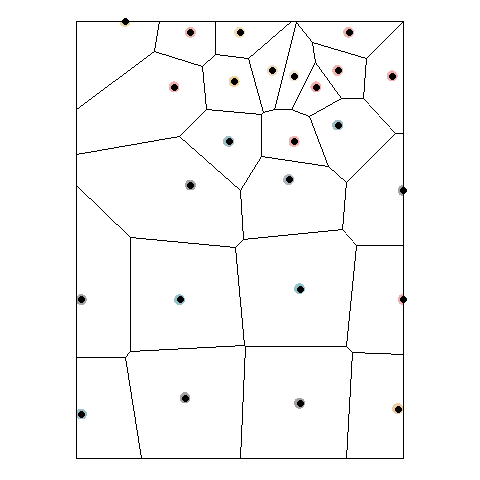
-->

<!-- 
The following code generates the cover image. To change the background images, work with the style.css file in the root directory
-->

<!-- COVER 1 -->
<!--
<div class="cover1">

</div>
-->

<!-- COVER 1 -->
<!--
<div class="cover1">

</div>
-->

<!-- COVER 2 -->
<!--
<div class="cover2">
<div class="fade-in-text">
<p>An Introduction to Spatial Data Analysis and Statistics</p>
</div>
</div>
-->

<!-- COVER 3b -->
<!--
<div class="header3b">

</div>
<div class="cover3"></div>
<div class="bottom3"><p>A Course in R</p></div>
-->

<!-- COVER 3 -->
<!--
<div class="header3">
<div class="fade-in-text">
<p>An Introduction to Spatial Data Analysis and Statistics</p>
</div>
</div>
<div class="cover3"></div>
<div class="bottom3"><p>A Course in R</p></div>
-->

<!-- COVER 4 -->
<!--
<div class="cover4">
<div class="fade-in-text">
<p>An Introduction to Spatial Data Analysis and Statistics</p>
<p class="subtitle">A Course in R</p>
</div>

</div>
-->

<!-- COVER 4b -->
<!--
<div class="cover4b">
<div class="fade-in-text">
<p>An Introduction to Spatial Data Analysis and Statistics</p>
<p class="subtitle">A Course in R</p>
</div>

</div>
-->

<!-- COVER 5b -->
<div class="cover5b">

</div>

<!-- COVER 5c -->
<!--
<div class="cover5c">

</div>
-->
                
# Front Matter {-}

Paez, Antonio (2021)  
*An Introduction to Spatial Data Analysis and Statistics: A Course in R*  
[Publisher]  
ISBN: 978-1-7778515-0-7  
<!-- DOI badge -->
[](https://zenodo.org/badge/latestdoi/391072865)  
In GitHub: https://github.com/paezha/spatial-analysis-r
  
  
Antonio Paez  
School of Earth, Environment and Society  
McMaster University  
Hamilton, Ontario  
Canada  
paezha@mcmaster.ca  
<!-- ORCID badge-->
<a href="https://orcid.org/0000-0001-6912-9919">

https://orcid.org/0000-0001-6912-9919 
</a>  
<!-- Google Scholar and Publobs icons by https://jpswalsh.github.io/academicons/-->
<a href="https://scholar.google.com/citations?user=bLY377kAAAAJ&hl=en">

</a>  
<a href="https://publons.com/researcher/2897251/antonio-paez/">

</a>
<!-- GitHub icon retrived from https://github.com/logos-->  
<a href="https://github.com/paezha">

</a>  

## What is this book and who is it for? {-}

Words go here.

## Allied resources {-}

You can find additional resources for students and instructors [here](https://github.com/paezha/spatial-analysis-r#resources-for-students-and-instructors)

## Contributing {-}

An advantage of an Open Educational Resource compared to traditional publishing (besides it being free!) is that it is a live, ongoing project, for as long as anyone cares to keep it alive. If you are using this resource, I would encourage you to contribute to help me improve it, by:

- suggesting improvements to the text, e.g. clarifying unclear sentences, fixing typos (see guidance from [Yihui Xie](https://yihui.name/en/2013/06/fix-typo-in-documentation/));
- proposing changes to the code, e.g. to do things in a more efficient way.

Doing this is as easy as editing a wiki page; use the `Edit` button in the toolbar to make a pull request (you need to have a GitHub account and be able to fork the repository):

[](https://github.com/paezha/spatial-analysis-r/edit/main/index.Rmd)

In addition, please feel free to make requests for features or to develop content (see the project's [issue tracker](https://github.com/paezha/spatial-analysis-r/issues)).

### License

This work is licensed under a Creative Commons [Attribution-NonCommercial-ShareAlike 4.0 International License (CC BY-NC-SA 4.0)](https://creativecommons.org/licenses/by-nc-sa/4.0/). This means that you are free to:

- Share it: you can copy and redistribute the material in any medium or format
- Adapt it: you can remix, transform, and build upon the material

Under the following terms:

- Attribution: You must give appropriate credit, provide a link to the license, and indicate if changes were made. You may do so in any reasonable manner, but not in any way that suggests the licensor endorses you or your use.

- NonCommercial: You may not use the material for commercial purposes.

- ShareAlike: If you remix, transform, or build upon the material, you must distribute your contributions under the same license as the original.

- No additional restrictions: You may not apply legal terms or technological measures that legally restrict others from doing anything the license permits.

These freedoms cannot be revoked by the licensor (that is me) as long as you follow the license terms.


<!--
## How to support this project {-}
-->


<!--chapter:end:index.Rmd-->

# Preface {-}

> "Patterns cannot be weighed or measured. Patterns must be mapped."
>
> --- Fritjof Capra, The Web of Life: A New Scientific Understanding of Living Systems

## Spatial Analysis and Spatial Statistics {-}

The field of spatial statistics has experienced phenomenal growth in the past 20 years. 

From being a niche subdiscipline in quantitative geography, statistics, regional science, and ecology at the beginning of the 1990s, it is now a mainstay in applications in a multitude of fields, including medical imaging, remote sensing, civil engineering, geology, statistics and probability, spatial epidemiology, end ecology, to name just a few disciplines.

The growth in research and applications in spatial statistics has been in good measure fueled by the explosive growth in geotechnologies: technologies for sensing and describing the natural, social, and built environments on Earth. An outcome of this is that spatial data are, to an unprecedented level, within the reach of multitudes. Hardware and software have become cheaper and increasingly powerful, and we have transitioned from a data poor environment (in all respects, but particularly in terms of spatial data) to a data rich environment. Twenty years ago, for instance, technical skills in spatial analysis included tasks such as digitizing. In the mid-1990s, as a Masters student, I spent many boring hours digitizing paper maps before I could do any analysis on the single-seat (and relatively expensive) Geographic Information System (GIS) available in my laboratory. In that place at that time I was more or less a geographical freak: although there was an institutional push to adopt GIS, relatively few in my academic environment saw the value of spending hours digitizing maps, something that nowadays would be considered relatively low-level technical work. Surely, the time of a Masters student, let alone a professional researcher or business analyst, is more valuable than that. Indeed, very little time is spent anymore in such low-level tasks, as data increasingly are collected and disseminated in native digital formats. Instead, there is a huge appetite for what could be called the _brainware_ of spatial analysis, the intelligence counterpart of the hardware, software, and data provided by geotechnologies.

The contribution of brainware to spatial analysis is to make sense of vast amounts of data, in effect transforming them into information. This information in turn can be useful to understand basic scientific questions (e.g., changes in land cover), to support public policy (e.g., what is the value capture of public infrastructure), and to inform business decisions (e.g., what levels of demand can be expected given the distribution of retail outlets). There are numerous forms of spatial analysis, including normative techniques [such as spatial optimization; see @Tong2011] and geometric and cartographic analysis [for instance, map algebra; @Tomlin1990map]. Among these, spatial statistics is one of the key elements in the family of toolboxes for spatial analysis.

So what is spatial statistics?

Very quickly, I will define spatial statistics as the application of statistical techniques to data that have geographical references - in other words, to the statistical analysis of maps.

Like statistics more generally, spatial statistics is interested in hypothesis testing and inference. What distinguishes it as a branch of the broader field of statistics is its explicit interest in situations where data are not independent from each other (like throws of fair dice) but rather display systemic associations. These associations, when seen through the lens of cartography, can manifest themselves as patterns of similarities (e.g., birds of a feather flock together) or dissimilarities (e.g., repulsion due spatial competition among firms) - as two common examples of spatial patterns.

Spatial statistics covers a broad array of techniques for the analysis of spatial patterns, including tools for testing whether patterns are random or not, and a wide variety of modeling approaches as well. These tools enhance the brainware of analysts by allowing them to identify and possibly model patterns for inferring processes and/or for making spatial predictions. 

## Why this Text? {-}

The objective of this book is to introduce selected topics in applied spatial statistics.

The foundations for the book are the notes that I have developed over several years of teaching applied spatial statistics at McMaster University. This course is a specialist course for senior-level undergraduate geographers and students in other disciplines who are often working towards specializations in GIS.

Over the course of the years, my colleagues at McMaster and I have used at least three different textbooks for teaching spatial statistics. I have personally used the book by McGrew and Monroe [-@Mcgrew2009] to introduce fundamental statistical concepts to geographers. McGrew and Monroe (currently on a third edition with Lembo) do a fine job of introducing statistics as a tool for decision making, and therefore offer a very valuable resource to learn matters of inference, for instance. Many of the examples in the book are geographical in nature; however, the book is relatively limited in its coverage of _spatial statistics_ (particularly models for spatial processes), which is a limitation for teaching a specialist course on this topic.

My text of choice early on (approximately between 2003 and 2010) was the excellent book _Interactive Spatial Data Analysis_ by Bailey and Gatrell [-@Bailey1995]. A notable aspect of Bailey and Gatrell was that the book was accompanied by a software application to implement the techniques it discussed. I started using this book as a graduate student around 1998, but even then the limitations of the software that accompanied the book were apparent - in particular the absence of updates or a central repository for code (the book had a sleeve to store a $3\frac{1}{2}$ floppy disk to install the software). Despite the regrettable obsolescence of the software, the book provided then, and still does, a very accessible yet rigorous treatment of many topics of interest in spatial statistics. Bailey and Gatrell's book was, I believe, the first attempt to bridge, on the one hand, the need to teach mid- and upper-level university courses in spatial statistics, and on the other, the challenges of doing so with the very specialized texts on this topic that existed at the time, including the excellent but demanding _Spatial Econometrics_ [@Anselin1988], _Advanced Spatial Statistics_ [@Griffith1988], _Spatial Data Analysis in the Social and Environmental Sciences_ [@Haining1990], not to mention _Statistics for Spatial Data_ [@Cressie1993].

More recently, as Bailey and Gatrell aged, my book of choice for teaching spatial statistics became O'Sullivan and Unwin's _Geographical Information Analysis_ [@Osullivan2010]. This book updated a number of topics that were not covered by Bailey and Gatrell. To give one example, much work happened in the mid- to late-1990s with the development of _local forms_ of spatial analysis, including pioneering research by Getis and Ord on concentration statistics [@Getis1992], Anselin's Local Indicators of Spatial Association [@Anselin1995], and Brunsdon, Fotheringham, and Charlton's research on geographically weighted regression [@Brunsdon1996]. These and related local forms of spatial analysis have become hugely influential in the intervening years, and are duly covered by O'Sullivan and Unwin in a way that merges well with a course focusing on spatial statistics - although other specialist texts also exist that delve in much more depth into some of these topics [e.g., @Fotheringham1999; and @Lloyd2010local].

These resources, and many more, have proved invaluable for my teaching for the past few years, and I am sure that their influence will be evident in the present book. Other excellent sources are also available, including _Applied Spatial Data Analysis in R_ [@Bivand2008], _Spatial Data Analysis in Ecology and Agriculture Using R_ [@Plant2012], _An Introduction to R for Spatial Analysis & Mapping_ [@Brunsdon2015R], _Spatial Point Patterns: Methodology and Applications with R_ [@Baddeley2015], and [_Geocomputation with R_](https://geocompr.robinlovelace.net/) [@Lovelace2019]. This is in addition to other resources available online, such as M. Gismond's [Intro to GIS and Spatial Analysis](https://mgimond.github.io/Spatial/) and R. Hijmans's [Spatial Data Analysis and Modeling with R](http://rspatial.org/).

So, if there are some excellent resources for teaching and learning spatial statistics, why am I moved to unleash on the world yet another text on this topic?

I am convinced that there is richness in variety.

As demand for training in spatial statistics grows, there is potential for different sources to satisfy different needs. Some books are geared towards specialized topics [e.g., point pattern analysis; @Baddeley2015] and cover their subject matter in much more depth than I could in an undergraduate course. For this reason, they are more useful as a reference or a tool for learning for researchers and graduate students. Other books focus more heavily on mapping in `R` than a course on spatial statistics can comfortably accommodate [e.g., @Brunsdon2015R; @Lovelace2019]. And yet other books are geared towards specific disciplines [e.g., ecology and agriculture; @Plant2012]. Bivand et al. [-@Bivand2008] is an excellent reference. At the time of their writing, much work was devoted to issues of spatial data representation. As a consequence, a good portion of their book is concerned with the critical issue of handling spatial data, including data classes and import/export operations which, while essential, happen for most practitioners at a baser level.

My approach can be seen as complementary to some of the texts above.

I have tried to write a text that introduces key concepts of data handling and mapping in `R` as they are needed to learn and practice spatial statistical analysis. This I have tried to do as intuitively as I could. Readers will see that the computational part of the book - everything that usually lives "under the hood", so to speak - is all bare in the open. The code is extensively documented as it is introduced (with extensive repetition for pedagogical purposes). Once that a reader has seen and used some commands, we proceed to introduce more sophisticated computational approaches, which are in turn documented extensively when they first appear. I like to think of this approach as introducing coding by stealth, with a gentle ramp for those students who may not have extensive experience in computer-speak. These computational aspects constitute the "how to" of the book. How to calculate a summary statistic. How to create a plot. How to map a variable. How to estimate a model.

The how to is an essential foundation for then exercising the brainware. By introducing the tools needed to accomplish data analysis tasks in a relatively gentle way, I have been able to concentrate in introducing (again, in what I hope is an intuitive way!) key concepts in spatial statistics. The text is not meant to be used as a reference, although some lectors may find that it works in that way in particular with respect to the implementation of techniques. Rather, the text is more suitable to be read linearly - indeed as a course on the topic of spatial statistics. Readers who have familiarized themselves with the text can possibly find it useful as a reference, but I do not recommend using it as a reference in the first place.

Lastly, the focus of the text is on _applied_ spatial statistics. There is, inevitably, a component of math, but I have tried, to the extent of my ability, to make the underlying math as intuitive and accessible as possible. As noted above, there is also an important computational component - in particular, as per the title, using the `R` statistical language. As McElreath [-@Mcelreath2016] notes, in addition to the pedagogical value of teaching statistics using a coding approach, much of statistics has in fact become so computational that coding skills are increasingly indispensable. I tend to agree with this, and there are reasons to believe that one of the strengths of this approach as well is to make statistical work as open, clear, and reproducible as possible [see @Rey2009open].

## Plan {-}

My aim with this book is to introduce key concepts and techniques in the statistical analysis of spatial data in an intuitive way. While there are other resources that offer more advanced treatments of every single one of these topics, this book should be appealing to undergraduate students or others who are approaching the topic for the first time.

The book is organized thematically following the canonical approach seen, for instance, in Bailey and Gatrell [-@Bailey1995], Bivand et al. [-@Bivand2008], and O'Sullivan and Unwin [-@Osullivan2010]. This approach is to conceptualize data by their unit of support. Accordingly, data are seen as being represented by:

1. Discrete processes in space (e.g., points and events).

2. Aggregations into zones for statistical purposes (e.g. demographic variables into census areas).

3. As discrete measurements in space of an underlying continuous process (e.g. weather stations monitoring temperature)

The book is organized in such a way that each chapter covers a topic that builds on previous material. All chapters, starting with Chapter 3, are followed by an activity.

I have used the materials presented in this texts (in a variety of incarnations) for teaching spatial data analysis in different settings. Primarily, these notes have been used in the course **GEOG 4GA3** _Applied Spatial Statistics_ at McMaster University. This course is a full (Canadian) academic term, which typically means 13 weeks of classes. The course is organized as a 2-hour-per-week class, with a GIS-lab component which uses a complementary set of notes. For this reason, each chapter is designed to cover very approximately the material that I am used to cover in a 50 minutes lecture in a traditional classroom-lecturing setting. In this case, the activities that accompany each chapter could be assigned as homework, optional materials, or as lab materials. For instructors who do not have a lab component, the activities could easily be adapted as lab exercises.

More recently, I have experimented with delivery of contents in a flipped classroom format ([see here for a discussion of flipped classrooms](https://en.wikipedia.org/wiki/Flipped_classroom)).

Briefly, a flipped classroom changes the role of the instructor and the delivery of contents. In a flipped classroom, the instructor minimizes lecturing time, opting instead for offering study materials in advance (often the materials are online and may have an interactive component). This frees the instructor from the tyranny of lecturing, so that in-class time can be dedicated instead to hands-on activities. The instructor is no longer a magical source of wisdom, but rather a partner in the learning process. Under this scenario, students are responsible for reading the chapter or chapters required in advance to a class. The class then is dedicated to the activity that follows the chapter, with students working individually or in small groups in the activity. I have broken a 50-minutes session of this type as follows: 10 minutes for a short mini-lecture and to discuss any questions about the preceding reading/study materials, followed by 30 minutes to complete the activity; during this time I engage individually or in small groups with the students as they work; and before the end of the 50-minutes session a 10 minute recap, where I summarize the key aspects of the lesson, clearly identify the [threshold concepts](https://en.wikipedia.org/wiki/Threshold_knowledge) covered, and indicate how this relates to the next lesson. Increasingly I see this format as a form of apprenticeship, where the students learn by doing, and see links (which I have yet to explore) to experiential learning.

In addition to the two formats above (traditional classroom-lecture and flipped classroom), I have also used portions of these notes to teach short courses in different places, including at Universidade de Sao Paulo in Brazil, the University of Western Australia, at the Gran Sasso Scientific Institute in Italy, and Universidad Politecnica de Madrid, in Spain, among other places. The materials can, with only relatively minor modifications, be used in this way.

As I continue to work on these notes, I hope to be able to add optional (or bonus) chapters, that could be used 1) to extend a course on spatial statistics beyond the 13 week horizon of the Canadian term, and/or 2) to offer more advanced material to interested readers [see here for an example on spatial filtering](https://github.com/paezha/Spatial-Filtering-Example).

## Audience {-}

The notes were designed for a course in geography, but in fact, could be easily adjusted for an audience of earth scientists, environmental scientists, econometricians, planners, or students in other disciplines who have an interest in and work with georeferenced datasets. The prerequisites are an introductory college/university level course on multivariate statistics, ideally covering the fundamentals of probability, hypothesis testing, and multivariate linear regression analysis.

## Requisites {-}

To fully benefit from this text, up-to-date copies of [R](https://cran.r-project.org/) and [RStudio](https://www.rstudio.com/) are highly recommended. Many examples in the text use datasets that have been packaged for convenience as an `R` package. To install the package (`geog4ga3`) use the following command(which requires [**remotes**](https://CRAN.R-project.org/package=remotes)):

```r
library(remotes)
remotes::install_github("paezha/isdas")
```

The source files for the chapters and activities can be obtained from the following GitHub repository:

https://github.com/paezha/spatial-analysis-R

<!--It is also possible to suggest edits to the text, and it only requires a GitHub account ([sign-up at github.com](https://github.com/)). After logging into GitHub, you can click on the 'edit me' icon (the fourth icon on the left top corner of the toolbar at the top).-->

## Words of Appreciation {-}

I would like to express my gratitude to the Paul R. MacPherson Institute for Leadership, Innovation and Excellence in Teaching. The Institute supported, through its Student Partners program, my work with some amazing student partners. As part of this program, I worked with Mr. Rajveer Ubhi in the Fall of 2018 and Winter of 2019 organizing all the materials for the text, documenting the code, and ensuring that it satisfied student needs. I also had the opportunity to work with Ms. Megan Coad and Ms. Alexis Polidoro in the Fall of 2019 and Winter of 2020. As former students of the course, Ms. Coad and Polidoro helped to develop a set of mini-lectures to accompany the materials, continued to document the code, and tested the activities. In the Winter 2020 they also accompanied me in the classroom to work directly with new students. Dr. Anastasios Dardas helped develop illustrative applications that helped us understand the value of interactivity in delivering many of the contents.

Working with these wonderful individuals has been a pleasure, and I am grateful for their contributions to this effort.

## Versioning {-}

These notes were developed using the following version of `R`:

```
##                _                           
## platform       x86_64-pc-linux-gnu         
## arch           x86_64                      
## os             linux-gnu                   
## system         x86_64, linux-gnu           
## status                                     
## major          4                           
## minor          6.1                         
## year           2026                        
## month          06                          
## day            24                          
## svn rev        90187                       
## language       R                           
## version.string R version 4.6.1 (2026-06-24)
## nickname       Happy Hop
```

A reproducible environment is available at https://github.com/paezha/Applied-Spatial-Statistics.

<!--chapter:end:00-Front-Matter.Rmd-->

# PART I: Getting to know the technology {-}

<!-- -->

# Preliminaries: Installing `R` and RStudio {#preliminaries}

## Introduction
 
Statistical analysis is the study of the properties of a dataset. There are different aspects of statistical analysis, and they often require that we work with data that are messy. According to Wickham and Grolemund [-@Wickham2016r], computer-assisted data analysis includes the steps outlined in Figure \@ref(fig:data-analysis-process).

First, the data are imported to a suitable software application. This can include data from primary sources (suppose that you collected coordinates using a GPS) or from secondary sources (the Census of Canada). Data will likely be text tables, or an Excel file, among other possible formats. Before data can be analyzed, they need to be tidied. This means that the data need to be arranged in such a way that they match the process that you are interested in. For instance, a travel survey can be organized so that each row is a traveler, or as an alternative so that each row is a trip.

Once that data are tidy, Exploratory Data Analysis (EDA) and/or its geographical extension Exploratory Spatial Data Analysis (ESDA) can be conducted. This involves transforming the raw data into information. Examples of transformations include calculating the mean and the standard deviation. Visualization is also part of this exploratory exercise. In EDA this could be creating a histogram or a scatterplot. Mapping is a key visualization technique in spatial statistics.

Modeling is a process that further extracts information from the data, typically by looking at relationships between multiple variables.

All of the tasks mentioned above, and many more, can be handled easily in a variety of software applications. For this course, you will use the statistical computing language `R`. 

<div class="figure">
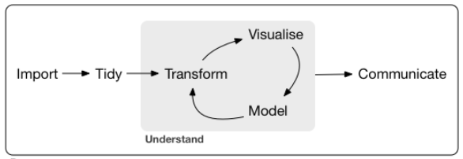
<p class="caption">(\#fig:ch01-data-analysis-process)\label{fig:data-analysis-process} The process of doing data analysis (from Wickham and Grolemund, 2016)</p>
</div>

## Learning Objectives

In this reading, you will learn:

1. How to install `R`.
2. About the RStudio Interactive Development Environment.
3. About packages in `R`.

##	`R`: The Open Statistical Computing Project

### What is `R`?

`R` is an open-source language for statistical computing. It was created by Ross Ihaka and Robert Gentleman at the University of Auckland, in New Zealand, as a way to offer their students an accessible, no-cost tool for their courses. `R` is now maintained by the `R` Development Core Team, and is developed by hundreds of contributors around the globe. `R` is an attractive alternative to other software applications for data analysis (e.g., Microsoft Excel, STATA) due to its open-source character (i.e., it is free), its flexibility, and large and dedicated user community. The presence of a very active community of developers and users, especially in an open context, means if there is something you want to do (for instance, linear regression), it is very likely that someone has already developed functionality for it in `R`.

A good way to think about `R` is as a core package, to which a library, consisting of additional packages, can be attached to increase its functionality. `R` can be downloaded for free at:

```
https://cran.rstudio.com/
```

`R` comes with a built-in console (a user graphical interface), but better alternatives to the basic interface exist, including RStudio, an Integrated Development Environment, or IDE for short. RStudio can also be downloaded for free, by visiting the website:

```
https://www.rstudio.com/products/rstudio/download/
```

`R` requires you to work using the command line, which is going to be unfamiliar to many of you accustomed to user-friendly graphical interfaces. Do not fear. People worked for a long time using the command line, or even more cumbersomely, using punched cards in early computers. Graphical user interfaces are convenient, but they have a major drawback, namely their inflexibility. A program that functions based on graphical user interfaces allows you to do only what is hard-coded in the user interface. Command line, as we will see, is somewhat more involved, but provides much more flexibility in operation, and it frees you from the constraints inherent in a point-and-click system.

Go ahead. Install `R` and RStudio in your computer. (If you are at McMaster working in the GIS lab, you will find that these have already been installed there).

Before introducing some basic functionality in `R`, lets quickly take a tour of the RStudio IDE.

###	The RStudio IDE

The RStudio IDE provides a very complete interface to interact with the language `R`, and do much more in addition. It consists of a window with several panes. Some panes include, in addition, several tabs. There are the usual drop-down menus for common operations, such as creating new files, saving, common commands for editing, etc. See Figure \@ref(fig:RStudio-IDE) below.

<div class="figure">

<p class="caption">(\#fig:ch01-RStudio-IDE)\label{fig:RStudio-IDE}The RStudio IDE</p>
</div>

The editor pane allows you to open and work with text and other files, where you can write instructions that can be passed on to the program. Writing something in the editor does not execute any instructions, it merely records them for possible future use. In fact, much of what is written in the editor will not be instructions, but rather comments, discussion, and other text that is useful to understand code.

The console pane is where instructions are passed on to the program. When an instruction is typed (or copied and pasted) there, `R` will understand that it needs to do something. The instructions must be written in a way that `R` understands, otherwise errors will occur. If you have typed instructions in the editor, you can use "ctrl-Enter" (in Windows) or "cmd-Enter" (in Mac) to send to the console and execute.

The environment is where all data that is currently in memory is reported. The History tab acts like a log: it keeps track of the instructions that have been executed in the console.

The last pane includes a number of useful tabs. The File tab allows you to navigate your computer, change the working directory, see what files are where, and so on. The Plot tab is where plots are rendered, when instructions require R to do so. The Packages tab allows you to manage packages, which as mentioned above, are pieces of code that can augment the functionality of `R`. The Help tab is where you can consult the documentation for functions/packages/see examples, and so on. The Viewer tab is for displaying local web content, for instance, to preview a Notebook (more on Notebooks soon).

This brief introduction should have allowed you to install both `R` and RStudio. The next thing that you will need is a library of _packages_.

## Packages in R

According to Wickham [-@wickham2015rpackages] packages are the basic units of reproducible code in the `R` multiverse. Packages allow a developer to create a self-contained unit of code that often is meant to achieve some task. For instance, there are packages in `R` that specialize in statistical techniques, such as [cluster analysis](https://cran.r-project.org/web/packages/cluster/index.html), [visualization](https://cran.r-project.org/web/packages/ggplot2/index.html), or [data manipulation](https://cran.r-project.org/web/packages/dplyr/). Some packages can be miscellaneous tools, or contain mostly datasets. Packages are a very convenient way of maintaining code, data, and documentation, and also of sharing all these resources.

Packages can be obtained from different sources (including making them!). One of the reasons why `R` has become so successful is the relative facility with which packages can be distributed. A package that I use frequently is called `tidyverse` [@Wickham2017tidyverse]. The `tidyverse` is a collection of functions for data manipulation, analysis, and visualization. This package can be downloaded and installed in your personal library of `R` packages by using the function `install.packages`, as follows:
```r
install.packages("tidyverse")
```

The function `install.packages` retrieves packages from the [Comprehensive R Archive Network](https://cran.r-project.org/), or CRAN for short. CRAN is a collection of sites (accessible via the internet) that carry identical materials for distribution for R.

There are other ways of distributing packages. For instance, throughout this book you will make use of a package called `isdas` that contains a collection of datasets and functions used in the readings or activities. This package is not on CRAN, but instead can be obtained from GitHub, a repository and versioning system. To retrieve packages from GitHub you need a function called `install_github`, which in turn is part of the package `devtools`.

To download and install the package `isdas`, you need first to download and install `devtools` as follows:
```r
install.packages("remotes")
```

Once that a package has been downloaded and installed, it needs to be loaded into a session to be available to use. I find it useful to think of packages that I download as "books" that I place in my personal "bookshelf". Some "books" I obtain from the central library (i.e., CRAN), while others are shared by friends, and some I have even written myself. Once that the "books" are in my "bookshelf" they are part of my own personal _library_. This means that they are available for use. Next time I want to use a "book" from my library, I need to retrieve it from the bookshelf. This is similar to taking the book and opening it on my desk: now all the magic contained in the package is available for use!

Similarly, once that the book is in my library, I do not need to retrieve it again from the bookstore - a package, once installed, does not need to be installed again (it might need updates, but that is a different matter).

This analogy suggests that I can have many packages in my library, only some of which I may need at any specific time for a task. To retrieve a package (i.e., a book) from the library, so that we can use it, the function `library` is invoked as in this example:
```r 
library(remotes) # R Package Installation from Remote Repositories, Including
'GitHub'
```

This allows you to use all the functions in the package `remotes`. In particular, at this point you want to use a function that allows you to retrieve other packages! With the functionality of `remotes::install_github` you can download and install the companion package for the book by running the following instruction:
```r
remotes::install_github("paezha/isdas")
```

This will install the package (i.e., put it in your library) so that you can also benefit from its functionality.


<!--chapter:end:01-Installation.Rmd-->

# Basic Operations and Data Structures in `R` {#basic-operations}

*NOTE*: The source files for this book are available with companion package [{isdas}](https://paezha.github.io/isdas/). The source files are in Rmarkdown format and packed as templates. These files allow you execute code within the notebook, so that you can work interactively with the notes. 

The preceding chapter showed you how to install `R` and RStudio, and explained some key concepts, such as packages as fundamental units of reproducible code, and the concept of your library (where the packages that you install are stored).

Now that you have installed `R` and RStudio we can begin with an overview of basic operations and data structures in this computing language. Please note that this document you are reading, called an _`R` Notebook_, is an example of what is called [_literate programming_](https://en.wikipedia.org/wiki/Literate_programming), a style of document that uses code to illustrate a discussion, as opposed to the traditional programming style that uses natural language to discuss/document the code. By focusing on natural language as opposed to computer-speak, literate programming flips around the usual manner of technical writing to make documents more intuitive and accessible. 

Whenever you see a chunk of code in an `R` Notebook, you can run it (by clicking the 'play' icon on the top right corner) to see the results. Try it! You can also copy and paste to your console if you are reading the web version of the book.

``` r
print("Hello, Environment and Society 4GA3")
```

```
## [1] "Hello, Environment and Society 4GA3"
```

The chunk of code above instructed `R` (and through `R` the computer) to `print` (or display on the screen) some text.

## Learning Objectives

In this practice, you will learn:

1. Basic operations in `R`.
2. Data classes, data types, and data transformations.
3. More about the use of packages in `R`.
4. Basic visualization.

## RStudio IDE

If you are reading this, you probably already read the introductory chapter that instructed you to install `R` and RStudio. We can now proceed to discuss some basic concepts of operations and data types.

## Some Basic Operations

`R` can perform many types of operations. Some simple operations are arithmetic. Other are logical. And so on.

For instance, R can be instructed to conduct sums, as follows:

``` r
# `R` understands numbers and arithmetic operators such as `+` for addition
2 + 2
```

```
## [1] 4
```

`R` can be instructed to do multiplications:

``` r
# The sign to instruct `R` to multiply is `*`
2 * 3
```

```
## [1] 6
```

And sequences of operations, possibly using brackets to indicate their order. Compare the following two expressions:

``` r
2 * 3 + 5
```

```
## [1] 11
```

``` r
2 * (3 + 5)
```

```
## [1] 16
```

Other operations produce logical results (values of true and false):

``` r
# Is the statement true?
3 > 2
```

```
## [1] TRUE
```

``` r
# Is this true?
3 < 2
```

```
## [1] FALSE
```

And of course, you can combine operations in an expression:

``` r
2 * 3 + 5 < 2 * (3 + 5)
```

```
## [1] TRUE
```

As you can see, `R` can be used as a calculator, but it is much more powerful than that.

We can also create _variables_. You can think of a variable as a box with a name, whose contents can change. Variables are used to keep track of important stuff in your calculations, and to automate operations. To create a variable, a value is assigned to a name, using this notation `<-`. You can read this `x <- 2` as "assign the value of 2 to a variable called x". For instance:

``` r
# `<-` means "put the value of 2 in the object called `x`"
x <- 2
# `<-` means "put the value of 3 in the object called `y`"
y <- 3
# `<-` means "put the value of 5 in the object called `z`"
z <- 5
```

Check your "Global Environment", the tab where the contents of your "Workspace" are displayed for you. You can also simply type the name of the variable in the Console to see its contents. Now that we have some variables with values, we can express operations as follows (same as above)

``` r
x * y + z
```

```
## [1] 11
```

``` r
x * (y + z)
```

```
## [1] 16
```

However, if we wanted, we could change the values of any of `x`, `y`, and/or `z` and repeat the operations. This allows to automate some instructions:

``` r
x <- 4
x * y + z
```

```
## [1] 17
```

The famous mathematician [Henri Poincaré](https://en.wikipedia.org/wiki/Henri_Poincar%C3%A9) once wrote that "[m]athematics is the art of giving the same name to different things". Working with a computer language is a lot like that: giving the same name to different values allows us to explore with ease "what would happen if...". It is a very powerful tool to help us understand the world.

## Data Classes in R

As you saw above `R` can work with different _data classes_. Some data are numbers. Other data are logical (i.e., take values of `TRUE` or `FALSE`). These are some data classes:

- Numerical
- Character
- Logical
- Factor

The existence of different data classes is very useful, since it allows you to store information in different forms. For instance, you may want to save some text:

``` r
name <- "Hamilton"
```

Or numerical information:

``` r
population <- 551751
```

If you wish to check what class an object is, you can use the function `class`:

``` r
class(name)
```

```
## [1] "character"
```

``` r
class(population)
```

```
## [1] "numeric"
```

## Data Types in R

`R` can work with different _data types_, including scalars (essentially matrices with only one element), vectors (matrices with one dimension of size 1) and matrices (more generally).

``` r
print('This is a scalar')
```

```
## [1] "This is a scalar"
```

``` r
1
```

```
## [1] 1
```

``` r
print('This is a vector')
```

```
## [1] "This is a vector"
```

``` r
# c() is a function to concatenate, that is, to put values in a vector
c(1,2,3,4)
```

```
## [1] 1 2 3 4
```

``` r
print('This is a matrix')
```

```
## [1] "This is a matrix"
```

``` r
# matrix() creates a two-dimensional array with `nrow` rows, and `ncol` columns
matrix(c(1,2,3,4),nrow = 2, ncol=2)
```

```
##      [,1] [,2]
## [1,]    1    3
## [2,]    2    4
```

The command `c()` is used to concatenate the arguments, that is, to join them in a single object. The objects must be of the same class: they must be all numeric, or all character, or all logical, and so on. We cannot combine different data classes in a vector. The command `matrix()` creates a matrix with the specified number of rows and columns.

An important data type in `R` is a data frame. A data frame is a table consisting of rows and columns - commonly a set of vectors that have been collected for convenience. A data frame is used to store data in digital format. (If you have used Excel or another spreadsheet software before, data frames will be familiar to you: they look a lot like a sheet in a spreadsheet.)

A data frame can accommodate large amounts of information (several billion individual items). The data can be numeric, character, logical, and so on. Each grid cell in a data frame has an address that can be identified based on the row and column it belongs to. `R` can use these addresses to perform mathematical operations. `R`` labels columns alphabetically and rows numerically (or less commonly alphabetically).

To illustrate a data frame, let us first create the following vectors, that include names (character class), populations (numeric class), average salaries (numeric class), and coordinates (numeric class) of some cities:

``` r
# c() is a function to concatenate, that is, to put values in a vector
Name <- c('Hamilton','Waterloo','Toronto')
Population <- c(551751, 219153, 2731571)
AvgSalary <- c(45692, 57625, 48920)
Latitude <- c(43.255203, 43.4668, 43.6532)
Longitude <- c(-79.843826, -80.51639, -79.3832)
```

Again, note that `<-` is an assignment. In other words, it assigns the item on the right to the name on the left.

After you execute the chunk of code above, you will notice that new values appear in your Environment. These are five vectors of size 1:3. You can also see what is the class of the vector: one that is composed of alphanumeric information (or chr, for 'character') and four columns that are numeric (num).

These vectors can be collected in a dataframe. This is done for convenience, so we know that all these data belong together in some way. Please note that to create a data frame, the vectors must have the same length. In other words, you cannot create a table with elements that have different numbers of rows (other data types allow you to do this, but not data frames).

We will now create a data frame. We will call it "Cities". There are rules for names (for example, they cannot begin with a number), but in most cases it helps if the names are intuitive and easy to remember. The function used to create a data frame is `data.frame()` and the arguments are the vectors that we wish to collect there.

``` r
Cities <- data.frame(Name, Population, AvgSalary, Latitude, Longitude)
```

After running the chunk above, now you have a new object in your environment, namely a  data frame called `Cities`. 
 
If you double click on `Cities` in the Environment tab, you will see that this data frame has five columns (labeled `Name`, `Population`, `AvgSalary`, `Latitude`, and `Longitude`), and three rows. You can enter data into a data frame and then use the many built-in functions of `R` to perform various types of analysis. 

At this point, you may notice that `Name`, which was an alphanumeric vector, was converted to a _factor_ in the data frame. A factor (data class) is a way to store nominal/categorical variables that may have two or more _levels_. Nominal variables are like labels. In the present case, the factor variable has three levels, corresponding to three cities. If we had information for multiple years, each city might appear more than once, for each year that information was available.

## Indexing and Data Transformations

Data frames store information that is related in a compact way.

To perform operations effectively, it is useful to understand the way `R` locates information in a data frame. As noted before, each grid cell has an address, or in other words an index, that can be referenced in several convenient ways. For instance, assume that you wish to reference the first value of the data frame, that is, row 1 of column `Name`. To do this, you would use the following instruction:

``` r
# To index elements in a data frame we use square brackets `[]` 
# The first number in the square bracket is the row, and the second number 
# (separated by a comma) is the column 
Cities[1,1]
```

```
## [1] "Hamilton"
```

This will recall the element in the first row and first column of `Cities`. It also tells you what are the levels of this variable.

As an alternative, you could type:

``` r
Cities$Name[1]
```

```
## [1] "Hamilton"
```

As you see, this has the same effect. The string sign `$` is used to reference columns in a data frame. Therefore, `R` will call the first element of `Name` in data frame `Cities`.

`Cities[1,2]` is identical to `Cities$Name[2]`. Try changing the code in the chunk and executing. If you type `Cities$Name`, `R` will recall the full column.

Indexing is useful to conduct operations. Suppose for instance, that you wished to calculate the total population of two cities, say Hamilton and Waterloo. You can execute the following instructions:

``` r
# The string sign `$` is used to make reference to a column in the data frame. 
# The square brackets index the row in the column.
Cities$Population[1] + Cities$Population[2]
```

```
## [1] 770904
```

(More involved indexing is also possible, for example, if we use logical operators. Do not worry too much about the details at this point, just verify that the results are identical)

``` r
# The indexing now is a logical statement. The double equal sign `==` is used 
# to make logical comparisons. `R` will find the rows for which `Cities$Name=='Hamilton'` 
# in the first element of the sum, and the rows for which `Cities$Name=='Waterloo'` 
# is true in the second element of the sum.
Cities$Population[Cities$Name=='Hamilton'] + Cities$Population[Cities$Name=='Waterloo']
```

```
## [1] 770904
```

Suppose that you wanted to calculate the total population of the cities in your data frame. To do this, you would use the function `sum()`:

``` r
# `sum()` is a function to add all elements in a numerical vector.
# This could be a column in a data frame
sum(Cities$Population)
```

```
## [1] 3502475
```

You have already seen how it allows you to store in memory the results of some instruction, by means of an assignment `<-`. You can also perform many other useful operations. For instance, calculate the maximum value for a set of values:

``` r
# `max()` finds the maximum value in a numerical vector
max(Cities$Population)
```

```
## [1] 2731571
```

And, if you wanted to find which city is the one with the largest population, you would use a logical statement as an index:

``` r
# `R` will find all rows for which the statement 
# `Cities$Population==max(Cities$Population)`, that is, 
# all the rows with a population identical to the maximum population!  
Cities$Name[Cities$Population==max(Cities$Population)]
```

```
## [1] "Toronto"
```
As you see, Toronto is the largest city (by population) in this dataset. Using indexing in imaginative ways provides a way to do fairly sophisticated data analysis.

Likewise, the function for finding the minimum value for a set of values is `min()`:

``` r
# `min() finds the minimum value in a numerical vector
min(Cities$Population)
```

```
## [1] 219153
```

Try calculating the average of the population of the cities, using the command `mean()`. Use the empty chunk below for this (the result should be 1167492), or do this in your console in RStudio:


Finding the maximum and minimum, aggregating (calculating the sum of a series of values), and finding the average are examples of transformations applied to the data. They give insights into aspects of the dataset that are not necessarily evident from the raw data, especially if the number of observations (or cases) is large. Imagine trying to visually scan a spreadsheet with ten thousand observations to find the maximum value stored there!

## Visualization

The data frame, in essence a table, informative as it is, is no usually the best way to learn from the data. Transformations (or _descriptive statistics_ as discussed above) are helpful to understand important properties of a dataset. In addition, visualization is often a valuable complement to data analysis. Say, we might be interested in finding which city has the largest population and which city has the smallest population in a dataset. We could achieve this by using similar instructions as before, for example:

``` r
# `paste()` is similar to `print()`, except that it converts everything #
# to characters before printing. We use this function because the contents 
# of `Name` in the data frame `Cities` are not characters, but levels of a factor`
paste('The city with the largest population is',
      Cities$Name[Cities$Population==max(Cities$Population)])
```

```
## [1] "The city with the largest population is Toronto"
```

``` r
paste('The city with the smallest population is', 
      Cities$Name[Cities$Population==min(Cities$Population)])
```

```
## [1] "The city with the smallest population is Waterloo"
```

Another way, perhaps more convenient of understanding these data is by visualizing them, using for instance a bar chart.

We will proceed to create a bar chart, using a package called `ggplot2`. This package implements a grammar of graphics, and is a very flexible way of creating plots in R. Since `ggplot2` is a package, we first must ensure that it is installed. You can install it using the command `install` as follows:
```r
# Once you have installed a package, it does not need to be installed again! 
# It already is in your library and you only need to load it with `library()`
install.packages("ggplot2")
```

As an alternative to the `install.packages()` function, you can use the Packages tab in RStudio. Simply navigate to the tab, click install, and select `ggplot2` from there. Note that you need to install the package only once! Essentially `install` adds it to your library of packages, where it will remain available.

Once the package is installed, it becomes available, but to use it you must load it in memory (similar to opening a "book" on your desktop as you work). For this, we use the command `library()`, which is used to load a package, that is, to activate it for use.

Assuming that you already have installed `ggplot2`, we proceed to load it:

``` r
library(ggplot2) # Create Elegant Data Visualisations Using the Grammar of Graphics
```

Now all commands from the `ggplot2` package are available to you.

The package `ggplot2` works by layering a series of objects, beginning with a blank plot, to which we can add things. The command to create a plot is `ggplot()`. This command accepts different arguments. For instance, we can pass data to it in the form of a data frame. We can also indicate different _aesthetic_ values, that is, the things that we wish to plot. None of this is plotted, though, until we indicate which kind of _geom_ or geometric object we wish to plot.

For a bar chart, we would use the following instructions:

``` r
# The function `ggplot()` creates an object for plotting, 
# using a data frame as indicated by the input argument `data =`. 
# Furthermore, we can specify how to map elements in the data frame 
# to things in the plot. In this example, we wish to map the names 
# of cities to the x-axis of the plot, and the population to the y-axis 
# of the plot. Accordingly, we define as aesthetic values `aes()` `x = Name` 
# and `y = Population`. The geometric object that we wish to plot is bars, 
# so we use `geom_bar()` with the argument `stat = "identity"` so the data 
# are not transformed before plotting:
ggplot(data = Cities, 
       aes(x = Name, y = Population)) + 
  geom_bar(stat = "identity")
```


Since this is the first time that we use `ggplot()`, it is informative to break down these instructions. We are asking `ggplot2` to create a plot that will use the data frame `Cities`. Furthermore, we tell it to use the values of `Names` in the x-axis, and the values of `Population` in the y-axis. Run the following chunk:

``` r
ggplot(data = Cities, 
       aes(x = Name, y = Population))
```


Notice how `ggplot2` creates a blank plot, and it has yet to actually render any of the population information in there. We layer elements on a plot by using the `+` sign. It is only when we tell the package to add some geometric element that it renders something on the plot. In the previous case, we told `ggplot2` to draw bars (by using the `geom_bar()` function). The argument of `geom_bar` was `stat = 'identity'`, to indicate that the data for the y-axis was to be used 'as-is' without further statistical transformations.

There are many different geoms that can be used in `ggplot2`. You can always consult the help/tutorial files by typing `??ggplot2` in the console. See:
```r
??ggplot2
```

## Creating a Simple Map

We will see how maps are used in spatial statistical analysis. The simplest one that can be created is a so-called _dot map_. A dot map simply displays the locations of events of interest, as points. A dot map is, in fact, simply a _scatterplot_ of the coordinates of events. We can use `ggplot2` to create a simple dot map of the cities in our sample dataset. For this, we create a `ggplot2` object, and for the `x` and `y` aesthetics we use the coordinates. The geometric element that we want to render is a point:

``` r
# The longitude is mapped to the x-axis of the plot and the latitude is mapped
# to the y-axis of the plot. The function `geom_points()` is used to draw points:
ggplot(data = Cities,
       aes(x = Longitude, y = Latitude)) + 
  geom_point()
```


This is a simple dot map that simply shows the locations of the cities. We can add labels by means of the geometric element text:

``` r
# `geom_text()` is used to write text on the plot, 
# still using the longitude and latitude information:
ggplot(data = Cities, 
       aes(x = Longitude, y = Latitude)) + 
  geom_point() + 
  geom_text(aes(label = Name))
```


The dot map above tells us the location of the cities in our dataframe and their name. We can include more information in the plot in different ways. For example, a _proportional symbol map_ changes the size of the symbols (the points) to add information to the plot. To create a proportional symbol map, we add to the aesthetics the instruction to use some variable for the size of the symbols:

``` r
# The `size` of the points will be proportional to the
# Population` values in the data frame
ggplot(data = Cities, 
       aes(x = Longitude, y = Latitude)) + 
  geom_point(aes(size = Population)) + 
  geom_text(aes(label = Name))
```


Furthermore, we can fix the position of the labels by adding a vertical justification to the text (`vjust`), and to avoid the text from being cut we can also expand the limits of the plot (`expand_limits()`):

``` r
ggplot(data = Cities, 
       aes(x = Longitude, y = Latitude)) + 
  geom_point(aes(size = Population)) + 
  geom_text(aes(label = Name), 
            vjust = 2) + 
  expand_limits(x = c(-80.7, -79.2), 
                y = c(43.2, 43.7))
```


The example above has guided you in the creation of a relatively simple proportional symbols map! You can see that creating a plot is simply a matter of instructing `R` (through `ggplot2`) to complete a series of instructions:

- Create a `ggplot2` object using a dataset, which will render stuff at locations given by variable1 and variable 2: `ggplot(data = dataset, aes(x = variable1, y = variable2))`

- Add stuff to the plot. For instance, to add points use `geom_point`, to add lines use `geom_line`, and so on.

Check the `ggplot2` [Cheat Sheet](https://rstudio.github.io/cheatsheets/html/data-visualization.html) for more information on how to use this package.

## Examples of digital cartography in `R`

A last note. Many other visualization alternatives (for instance, Excel) provide point-and-click functions for creating plots. In contrast, working in `R` requires plots to be created by meticulously instructing the package what to do. While this is more laborious, it also means that you have complete control over the creation of plots, which in turn allows you to create more flexible and inventive visuals. Below are some of figures that I have created using `R` in recent years, including diagrams, thematic maps, and raster data.

<div class="figure">
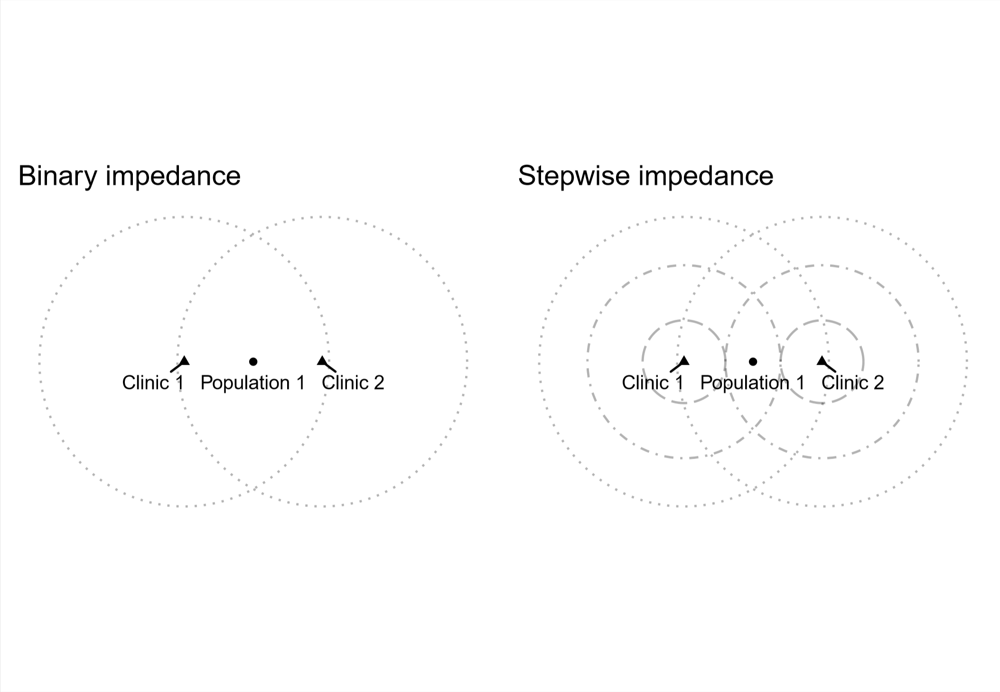
<p class="caption">(\#fig:ch02-visualization-example-1)\label{fig:visualization-example-1} Example of visualization: diagram of catchment areas for accessibility analysis (from [Paez, Higgins, and Vivona (2018)](https://doi.org/10.1371/journal.pone.0218773))</p>
</div>

<div class="figure">
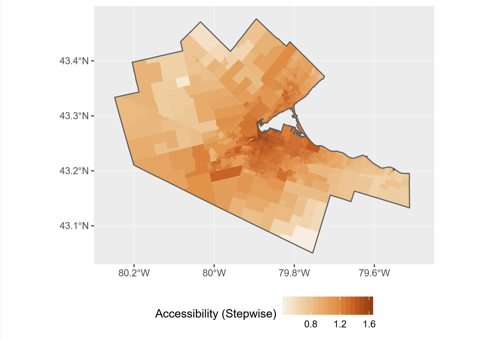
<p class="caption">(\#fig:ch02-visualization-example-2)\label{fig:visualization-example-2} Example of visualization: accessibility to family doctors in Hamilton (from [Paez, Higgins, and Vivona (2018)](https://doi.org/10.1371/journal.pone.0218773))</p>
</div>

<div class="figure">
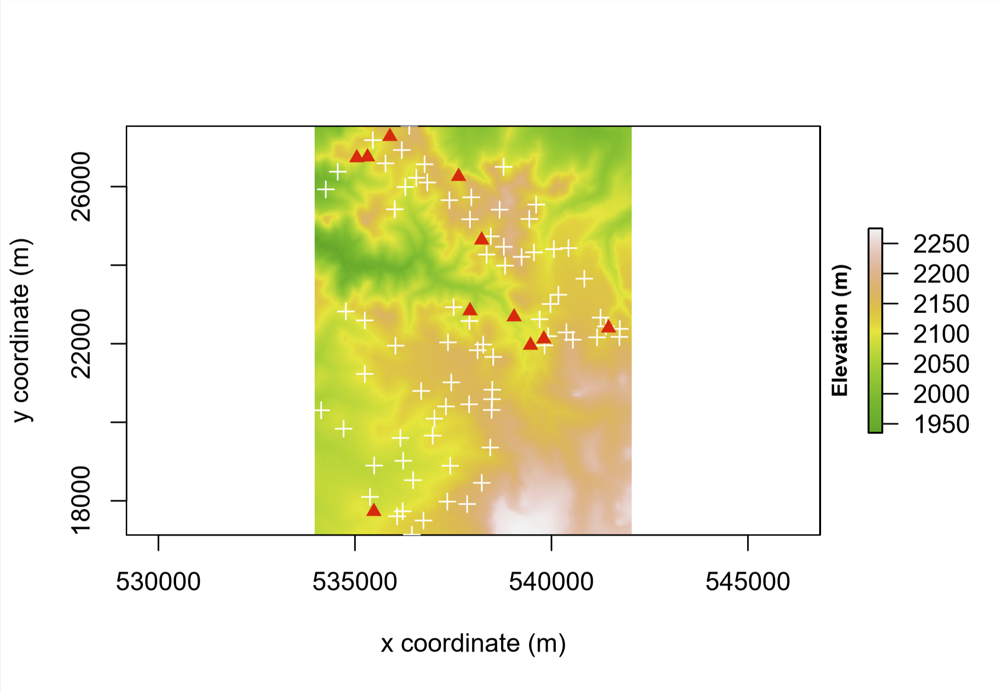
<p class="caption">(\#fig:ch02-visualization-example-3)\label{fig:visualization-example-3} Example of visualization: water sources (triangles) and households (circles) in a region in central Kenya (from [Paez et al. (2020)](https://doi.org/10.1016/j.jtrangeo.2019.102564))</p>
</div>

And, these are some figures created using `R` by talented people around the world.


<div class="figure">
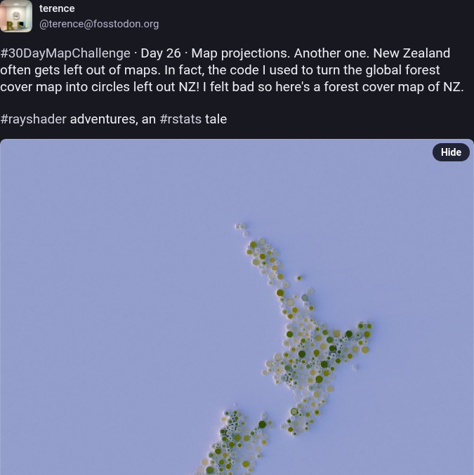
<p class="caption">(\#fig:ch02-visualization-example-4)\label{fig:visualization-example-4} Example of visualization: Forest cover in New Zealand</p>
</div>


<div class="figure">

<p class="caption">(\#fig:ch02-visualization-example-5)\label{fig:visualization-example-5} Example of visualization: Where the turtles are</p>
</div>


<div class="figure">
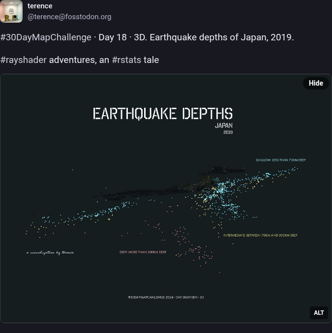
<p class="caption">(\#fig:ch02-visualization-example-6)\label{fig:visualization-example-6} Example of visualization: Earthquakes depths in Japan</p>
</div>


<div class="figure">
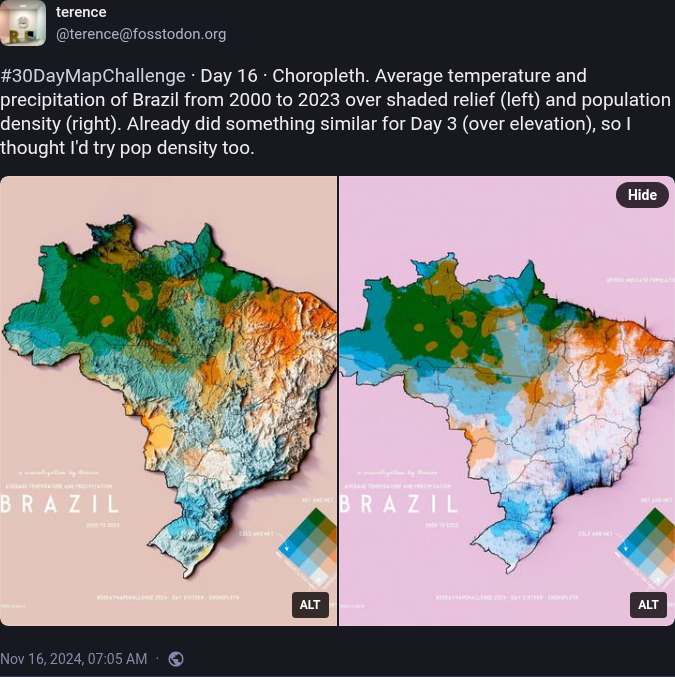
<p class="caption">(\#fig:ch02-visualization-example-7)\label{fig:visualization-example-7} Example of visualization: Temperature and precipitation in Brazil</p>
</div>

This concludes your basic overview of basic operations and data structures in `R`. You will have an opportunity to learn more about creating maps in R with your reading.

## References


<!--chapter:end:02-Basic-Operations-and-Data-Structures.Rmd-->

# Part II: Statistics and Maps {-}

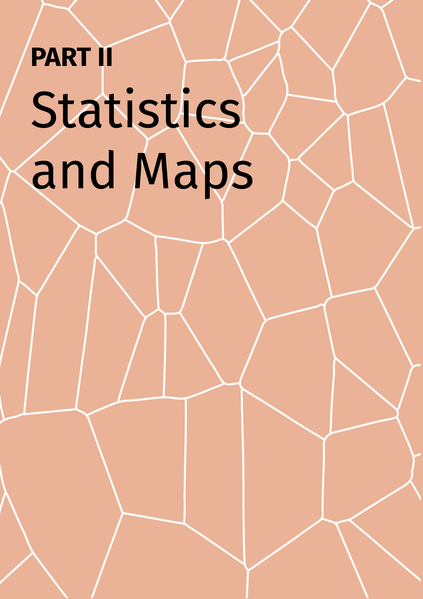<!-- -->

# Introduction to Mapping in `R` {#introduction-to-maps}

*NOTE*: The source files for this book are available with companion package [{isdas}](https://paezha.github.io/isdas/). The source files are in Rmarkdown format and packed as templates. These files allow you execute code within the notebook, so that you can work interactively with the notes. 

Spatial statistics is a sub-field of spatial analysis that has grown in relevance in recent years as a result of 1) the availability of information that is geo-coded, in other words, that has geographical references; and 2) the availability of software to analyze such information.

A key technology fueling this trend is that of Geographical Information Systems (GIS). GIS are, in simplest terms, digital mapping for the 21st century. In most cases, however, GIS go beyond cartographic functions to also enable and enhance our ability to analyze data.

There are many available packages for geographical information analysis. Some are very user friendly, and widely available in many institutional contexts, including open source alternatives such as [QGIS](https://qgis.org/en/site/), or commercial software such as ESRI's Arc software. Others are fairly specialized, such as Caliper's TransCAD, which implements many operations of interest for transportation engineering and planning. 

Others packages have the advantage of being more flexible and/or free.

Such is the case of the `R` statistical computing language. `R` has been adopted by many in the spatial analysis community, and a number of specialized libraries have been developed to support mapping and spatial data analysis functions.

The objective of this note is to provide an introduction to mapping in `R`. Maps are one of the fundamental tools of spatial statistics and spatial analysis, and `R` allows for many GIS-like functions.

In the previous reading/practice you created a simple proportional symbols map. In this reading/practice you will learn how to create more sophisticated maps in `R`.

## Learning Objectives

In this reading, you will:

1. Revisit how to install and load a package.
2. Learn how to invoke a data and view the data structure.
3. Learn how to easily create maps using `R`.
4. Think about how statistical maps help us understand patterns.

## Suggested Readings

- Bivand RS, Pebesma E, Gomez-Rubio V [-@Bivand2008] Applied Spatial Data Analysis with R, Chapters 2-3. Springer: New York
- Brunsdon C and Comber L [-@Brunsdon2015R] An Introduction to R for Spatial Analysis and Mapping, Chapter 3. Sage: Los Angeles

## Preliminaries

it is good practice to begin with a clean session to make sure that you do not have extraneous items there when you begin your work. The best practice is to restart the `R` session, which can be accomplished for example with `command/ctrl + shift + F10`. An alternative to _only_ purge user-created objects from memory is to use the `R` command `rm` (for "remove"), followed by a list of items to be removed:

``` r
# The function `ls()` lists all objects in the Environment, that is, your current workspace;
# `rm()` removes all objects listed in the argument `list = `
rm(list = ls())
```

## Packages

According to Wickham [-@wickham2015rpackages] packages are the basic units of reproducible code in the `R` multiverse.

Now that your workspace is clear, you can proceed to load a package. In this case, the package is the one used for this book/course, called `isdas`:

``` r
#The function 'library' is used to load the data we want to work with. 
# In this case, it is the isdas master package that we want to work with 
library(isdas) # Companion Package for Book An Introduction to Spatial Data Analysis and Statistics
```

The package includes a few datasets that will be used throughout the book:

``` r
#The function `data` is used to check if a dataset is present within any loaded packages. 
# In this case, we are looking for `snow_deaths` and `snow_pumps`
data("snow_deaths")
data("snow_pumps")
```

## Exploring Dataframes and a Simple Proportional Symbols Map

If you correctly loaded the library, you can now access the dataframes in the package `isdas`. For this section, you will need two dataframes, namely `snow_pumps` and `snow_deaths`:

``` r
#The function `head` will display the first few rows of the dataframe, snow_deaths 
head(snow_deaths)
```

```
##         long      lat Id Count
## 0 -0.1379301 51.51342  1     3
## 1 -0.1378831 51.51336  2     2
## 2 -0.1378529 51.51332  3     1
## 3 -0.1378120 51.51326  4     1
## 4 -0.1377668 51.51320  5     4
## 5 -0.1375369 51.51318  6     2
```

These data are from the famous London cholera example by John Snow (not the one from Game of Thrones, but the British physician). John Snow is considered the father of spatial epidemiology, and his study mapping the outbreak is credited with helping find its cause.This study investigates the cholera outbreak of Soho, London, in 1854. 

The dataframe `snow_deaths` includes the geocoded addresses of cholera deaths in `long` and `lat`, and the number of deaths (the `Count`) recorded at each address, as well as unique identifiers for the addresses (`Id`).

A second dataframe `snow_pumps` includes the geocoded locations of water pumps in Soho:

``` r
head(snow_pumps)
```

```
##            long      lat  Id Count
## 01   -0.1366679 51.51334 251     1
## 1100 -0.1395862 51.51388 252     1
## 250  -0.1396710 51.51491 253     1
## 310  -0.1316299 51.51235 254     1
## 410  -0.1335944 51.51214 255     1
## 510  -0.1359191 51.51154 256     1
```

As in your previous reading, it is possible to map the cases using `ggplot2`. Begin by loading the package `tidyverse`:

``` r
#'Tidyverse' is a collection of R packages designed for data science used in everyday data analyses  
library(tidyverse) # Easily Install and Load the 'Tidyverse'
```

Now, you can create a blank `ggplot2` object from which you can render the points for deaths and the pumps.

``` r
#The function `ggplot` is used for data visualization - it creates a graph. 
# The function `geom_point` tells R you want to create a plot of points. 
# `data = snow_deaths` tells R you want to use the `snow_deaths` dataframe. 
# `aes` stands for aesthetics of your graph where `x = long` sets the x axis 
# to `long`, where `y = lat` sets the y axis to `lat`, where `color = blue` 
# colours the points blue and `shape = 16` assigns the shape of the points -
# in this case, `16` are circles and `17` are triangles  

ggplot() +
  geom_point(data = snow_deaths, aes(x = long, y = lat), color = "blue", shape = 16) +
  geom_point(data = snow_pumps, aes(x = long, y = lat), color = "black", shape = 17)
```


This map is a decent example of how to represent visually some contents in the dataframe. Here, information is displayed using different colours and symbols to represent pumps and deaths from the London Cholera Example. Though this map provides useful insights, it is not of the greatest quality. We will illustrate other ways of creating maps below, including interactive maps. 

## Improving on the Proportional Symbols Map

A package that extends the functionality of mapping in `R` is `leaflet`. A key feature of the `leaflet` package is the ability to make maps interactive for the user. We will see next how to enhance our proportional symbol map using this package. First you  need to load the package (you need to install it first if you have not already):

``` r
# 'Leaflet' is a package used for visualizing data on a map in R. 
if (!require("leaflet")) install.packages('leaflet')
library(leaflet) # Create Interactive Web Maps with the JavaScript 'Leaflet'
```

The first step is to create a `leaflet` object, which will be saved in `m` : 

``` r
# Here, we create a `leaflet` object and assign it to the variable, 'm'. 
# The `setView` function sets the view of the map where `lng = -0.136` 
# sets the longitutde, 'lat = 51.513' sets the latitude and the map zoom 
# is set to 16. The `|>` is a pipe operator that passes the output from 
# the left hand side of the operator to the first argument of the right 
# hand side of the operator. In this case we are telling `R` that we want 
# to center the map on the set longitude and latitude, with a zoom level 
# of 16, which corresponds roughly to a neighborhood 

m <- leaflet(data = snow_deaths) |> 
  setView(lng = -0.136, lat = 51.513, zoom = 16)
```

This map looks like this at this point:

``` r
m
```

```{=html}
<div class="leaflet html-widget html-fill-item" id="htmlwidget-71724ec150bb38440d13" style="width:672px;height:480px;"></div>
<script type="application/json" data-for="htmlwidget-71724ec150bb38440d13">{"x":{"options":{"crs":{"crsClass":"L.CRS.EPSG3857","code":null,"proj4def":null,"projectedBounds":null,"options":{}}},"setView":[[51.513,-0.136],16,[]]},"evals":[],"jsHooks":[]}</script>
```

The map is empty! This is because we have not yet added any geographical information to plot. We can begin by adding a basemap as follows:

``` r
# We are adding a basemap or background map of the study area 
# by means of the `addTiles` function to the 'm' variable 
m <- m |> addTiles()
m
```

```{=html}
<div class="leaflet html-widget html-fill-item" id="htmlwidget-d0b1e8b23ea7071b97e2" style="width:672px;height:480px;"></div>
<script type="application/json" data-for="htmlwidget-d0b1e8b23ea7071b97e2">{"x":{"options":{"crs":{"crsClass":"L.CRS.EPSG3857","code":null,"proj4def":null,"projectedBounds":null,"options":{}}},"setView":[[51.513,-0.136],16,[]],"calls":[{"method":"addTiles","args":["https://{s}.tile.openstreetmap.org/{z}/{x}/{y}.png",null,null,{"minZoom":0,"maxZoom":18,"tileSize":256,"subdomains":"abc","errorTileUrl":"","tms":false,"noWrap":false,"zoomOffset":0,"zoomReverse":false,"opacity":1,"zIndex":1,"detectRetina":false,"attribution":"&copy; <a href=\"https://openstreetmap.org/copyright/\">OpenStreetMap<\/a>,  <a href=\"https://opendatacommons.org/licenses/odbl/\">ODbL<\/a>"}]}]},"evals":[],"jsHooks":[]}</script>
```

The map now shows the neighborhood in Soho where the cholera outbreak happened. Now, at long last, we can add the cases of cholera deaths to the map. For this, we indicate the coordinates (preceded by `~`), and set an option for clustering by means of the `clusterOptions` in the following fashion:

``` r
# We are adding the cholera deaths to the map using 'group = Deaths'. 
# The '~' symbol tells R to use the same longitude and latitude values 
# used in the previous block of code and the 'clusterOptions = markerClusterOptions()'
# clusters a large number of markers on the map - in this case it is clusturing 
# number of deaths into icons with numbers  

m <- m |> 
  addMarkers(~long, 
             ~lat, 
             clusterOptions = markerClusterOptions(),
             group = "Deaths")
m
```

```{=html}
<div class="leaflet html-widget html-fill-item" id="htmlwidget-c6af15675bc2e39070ae" style="width:672px;height:480px;"></div>
<script type="application/json" data-for="htmlwidget-c6af15675bc2e39070ae">{"x":{"options":{"crs":{"crsClass":"L.CRS.EPSG3857","code":null,"proj4def":null,"projectedBounds":null,"options":{}}},"setView":[[51.513,-0.136],16,[]],"calls":[{"method":"addTiles","args":["https://{s}.tile.openstreetmap.org/{z}/{x}/{y}.png",null,null,{"minZoom":0,"maxZoom":18,"tileSize":256,"subdomains":"abc","errorTileUrl":"","tms":false,"noWrap":false,"zoomOffset":0,"zoomReverse":false,"opacity":1,"zIndex":1,"detectRetina":false,"attribution":"&copy; <a href=\"https://openstreetmap.org/copyright/\">OpenStreetMap<\/a>,  <a href=\"https://opendatacommons.org/licenses/odbl/\">ODbL<\/a>"}]},{"method":"addMarkers","args":[[51.51341771241721,51.5133613998342,51.5133170489738,51.5132621296606,51.51320397671766,51.51318355204854,51.51335918676924,51.51332803550294,51.51332295785953,51.51342667289707,51.51338118923545,51.5134623424476,51.51321592851835,51.51316944859251,51.51311647491117,51.51323961162387,51.51316442104322,51.51317818411652,51.51311119796137,51.51305543754319,51.51344133271014,51.51359242080411,51.51340233830832,51.51337957285638,51.51341078151107,51.51364145269945,51.51369342694989,51.51374487554566,51.5136761001242,51.51358965021902,51.51366307627471,51.51350231272456,51.51358256821044,51.51354131614605,51.51329754374774,51.51329052556387,51.51301333342936,51.51296475968319,51.51289325098754,51.51296415860528,51.51302483971293,51.51302667578982,51.51283096213334,51.51288456099817,51.512526461566,51.51246523224839,51.51242820172415,51.51241465023237,51.5125095595528,51.5123779695186,51.51244688426475,51.51249109034944,51.5123735237671,51.51233946581913,51.51236414351145,51.51231865923391,51.51254041922127,51.51264860016905,51.51269241028542,51.51295654926946,51.51276467861943,51.51278013527604,51.51272618217833,51.51268122125017,51.51291389409194,51.51304641730572,51.51307361992732,51.51308716531178,51.51312173006386,51.51318703807339,51.51321446506859,51.51324936702789,51.51327122982325,51.51330000532925,51.513159501803,51.51301590684736,51.51292126324469,51.51289012737031,51.51285949729033,51.51283044071621,51.51278171338225,51.51272899538871,51.51286848999706,51.51272270243459,51.51265441759925,51.51271292384934,51.51261513313285,51.51249092743264,51.51244900112296,51.51246467320608,51.51241314259408,51.5123580283144,51.51227148485825,51.51235510372067,51.51199097051281,51.51208253904073,51.51203084352937,51.51196971504504,51.51188160263239,51.51204982885617,51.51225014500682,51.51216174817519,51.51221224934735,51.51257280001735,51.51257531307455,51.51267178386899,51.51272652750651,51.51279375218358,51.51284594189756,51.51287947168274,51.51293878754134,51.51276526229672,51.5128439493493,51.51253200926634,51.5121976542315,51.51221473376273,51.51315355765666,51.51305600384666,51.51316542761858,51.51309782344348,51.51323808001884,51.51329311339476,51.51337922667152,51.51343059777332,51.51347464929984,51.51342159243502,51.51352809751089,51.51348138080801,51.51359396751432,51.51322690676794,51.51317979221965,51.51313203437916,51.51304780211037,51.51300598291723,51.51288250505248,51.51326976514285,51.51345852030295,51.513431301037,51.51340205260731,51.51259298504279,51.51258461888924,51.51255453029176,51.5125207793547,51.51313719824024,51.51322810549903,51.51315238694715,51.51325759227252,51.51354411471583,51.51362611470109,51.51363711464002,51.51352405667991,51.51381950324498,51.51372377799584,51.51370372597971,51.51383086096664,51.51391541451077,51.51359665484009,51.51403207703279,51.51389120739647,51.51375756145112,51.51406477280808,51.51414613344894,51.51420092441626,51.51422997525221,51.51431864339793,51.51437706649619,51.51435723249875,51.51438202273066,51.51440169141211,51.51452155528173,51.51449742659375,51.51447242637142,51.51450423997807,51.51454580841455,51.51456121915865,51.51459385926891,51.51458113025404,51.51460554848732,51.51583449225636,51.51519477684111,51.51514891015403,51.51481827631498,51.51484348413448,51.51491369086352,51.51449552611066,51.51474325335261,51.51446703439705,51.51445305759596,51.51484467633266,51.51438881292644,51.5143992425991,51.51433505463952,51.51422419385889,51.51422004961118,51.51414516118064,51.51410812003255,51.51435899183051,51.5143258278403,51.51454393525889,51.51456940986483,51.51458605850389,51.51461200201047,51.51457489310578,51.51450689223491,51.51427387406764,51.51429252940133,51.51405844150225,51.51414790466696,51.51396128952564,51.514026681852,51.514075625164,51.51409555006514,51.51413419648561,51.51403323570379,51.51399639474997,51.51395995460222,51.51394470995778,51.51382094313222,51.51399866431759,51.51379493407906,51.51376645100854,51.51372553149749,51.5136915654178,51.51367244286811,51.51360250450062,51.51348174946292,51.51345821338261,51.51342919446538,51.51340425401947,51.51335932157343,51.51337804142081,51.51385451142299,51.51387457063227,51.51356492294096,51.51361620652251,51.51374224320418,51.51391821424377,51.51377239729959,51.51350219576194,51.51371214423642,51.51364380840597,51.51371107231709,51.5140612381261,51.51474799283223,51.51479426454593,51.51452608110655,51.5147058764589,51.51231091735583,51.5119984599128,51.51185571922692],[-0.1379301040105579,-0.1378830800500428,-0.1378529103349022,-0.1378119539465468,-0.1377668262589499,-0.1375369414141935,-0.1382004782298668,-0.138045001181023,-0.1382761500158466,-0.1382234864361633,-0.1383370367519874,-0.1385627126745848,-0.1384255955698656,-0.1383784452037863,-0.1383371512875551,-0.1386454533749076,-0.1386979065880047,-0.137924280930384,-0.137864911517368,-0.1378114835552987,-0.1387619234445415,-0.138798841466148,-0.1390446856406468,-0.1389697692508521,-0.1388634237018181,-0.1387524959868673,-0.1388081587008321,-0.1388560265779974,-0.1388868653856594,-0.1392393588573417,-0.1393212734147908,-0.1393159960255428,-0.1396159577980448,-0.1397193110114353,-0.1400738115184647,-0.139094018235715,-0.1396971930026896,-0.1393270836930655,-0.1393173880531582,-0.1391868193783746,-0.1390359410345804,-0.1392091123357627,-0.1384270097195289,-0.1386240898223809,-0.1380957387304793,-0.1380345665320323,-0.1379835584087468,-0.1380648616738076,-0.1381937725996533,-0.1378176805835397,-0.1376558766641112,-0.1375842515908955,-0.1376503082803133,-0.1374496854023551,-0.1373759603453226,-0.1373271830603842,-0.1369798950825676,-0.1371804711124162,-0.1370522567056031,-0.1376952839807242,-0.1375329684053658,-0.1374190278996587,-0.137367685597074,-0.1373249004348332,-0.1375307207894701,-0.1375617093726394,-0.1374659630959686,-0.1373860691438224,-0.1373059054029778,-0.1370889217834771,-0.1369965076528271,-0.1368589670558428,-0.1367776315736409,-0.1367052132899802,-0.1364935414988748,-0.1363296093127997,-0.1364235543764399,-0.1365233540739429,-0.1365994647154983,-0.136698903900388,-0.1368186088929884,-0.1369727209821565,-0.1363585222268305,-0.1366299079131006,-0.1365844211899081,-0.1364225628273266,-0.1363451009708312,-0.1364374236608724,-0.1363772559361702,-0.1361968856969642,-0.1361415649341121,-0.1361016918536716,-0.1360301977547599,-0.1363097716936429,-0.135940418807579,-0.1358578338713982,-0.1358000713889291,-0.1357167614788101,-0.1351191996516594,-0.1351444133689913,-0.135393879321116,-0.1354091963214256,-0.1354721076710987,-0.1357654744744572,-0.1358712972509204,-0.1359756671666444,-0.1360329024564367,-0.1361151578261927,-0.136180249325612,-0.1360830077930622,-0.1361394512478726,-0.1353287128203069,-0.1351220948868352,-0.1346447073283835,-0.1345215440539724,-0.1349668923832399,-0.1350981336186865,-0.1343935755026069,-0.1345052475625174,-0.1344368007982337,-0.1345936026301562,-0.1346404763239215,-0.1347086850629805,-0.1347561936858376,-0.1352443844419359,-0.1348972976386763,-0.1351579281944781,-0.1353441643212859,-0.1350633811035345,-0.1358009505187718,-0.1357616103428892,-0.1357401956301966,-0.1356449385174512,-0.1356017121018641,-0.13550137997266,-0.1358321212604546,-0.1360488116871627,-0.1361396291066576,-0.1362278289879145,-0.1349993217492327,-0.1347929448430836,-0.1348961342911463,-0.1349999582267098,-0.1334828691770926,-0.1332652209146329,-0.1332961590966382,-0.1329335200338415,-0.133998061085642,-0.1340419100972016,-0.1341561254308052,-0.1340912676911419,-0.1342723070545012,-0.1342202796732342,-0.1347040774502676,-0.1347823322242995,-0.1350104805993825,-0.1349232065863144,-0.134884697385023,-0.1342123753015177,-0.1341352504619201,-0.1343641838065311,-0.1344467612645027,-0.1344794072842492,-0.1346578133805104,-0.1343672849039151,-0.1341786758732007,-0.1341598029829857,-0.1340687435401743,-0.1340851661121541,-0.1338214545677677,-0.1339223155737052,-0.1338498013889772,-0.1337252978757557,-0.1337453613672678,-0.1336757586204987,-0.1335635062201951,-0.1334665545049675,-0.1333929113289548,-0.1344741599914797,-0.1352590257036306,-0.1353953396441597,-0.1360222529869433,-0.1368041171713571,-0.1365833605937701,-0.1356529739035235,-0.1355779553518045,-0.134859650909087,-0.1346895847426915,-0.1348182725833898,-0.1357035563403374,-0.1355613517890016,-0.1356486901681356,-0.1354151862942671,-0.1355763578412227,-0.1353566777406011,-0.1354754136449822,-0.1362261136088358,-0.1363281321750193,-0.1362221477394775,-0.1361174495840607,-0.13603032610347,-0.1362665128337308,-0.1364213632351724,-0.1369345653257283,-0.1369308120448074,-0.136799217089535,-0.1367796044734222,-0.1366959118369551,-0.136712199114799,-0.1361232398979241,-0.1359583179160087,-0.1358826616141749,-0.1357877158982886,-0.1358494086119361,-0.1360082222238902,-0.136098773834616,-0.1361696075386008,-0.135485063868566,-0.1353740412263178,-0.1355818306400192,-0.1356790259879774,-0.1358144777615819,-0.1359046002803107,-0.1359921506976139,-0.1362168667561813,-0.1365787471258905,-0.1366750840012097,-0.1367643481611668,-0.1368769731575848,-0.1369529490293604,-0.1372304937966076,-0.1366505469590646,-0.136502664677893,-0.1373665913529404,-0.1374218873994636,-0.1374722560169205,-0.1383001159346683,-0.1373626648176361,-0.1379951194472032,-0.1381392585550613,-0.1382393440337714,-0.1382718166040143,-0.1380827979022508,-0.1379116830385965,-0.1377071094514468,-0.1371077405477678,-0.137064556384258,-0.138473542100727,-0.138123159327677,-0.1377621482705633],null,null,"Deaths",{"interactive":true,"draggable":false,"keyboard":true,"title":"","alt":"","zIndexOffset":0,"opacity":1,"riseOnHover":false,"riseOffset":250},null,null,{"showCoverageOnHover":true,"zoomToBoundsOnClick":true,"spiderfyOnMaxZoom":true,"removeOutsideVisibleBounds":true,"spiderLegPolylineOptions":{"weight":1.5,"color":"#222","opacity":0.5},"freezeAtZoom":false},null,null,{"interactive":false,"permanent":false,"direction":"auto","opacity":1,"offset":[0,0],"textsize":"10px","textOnly":false,"className":"","sticky":true},null]}],"limits":{"lat":[51.51185571922692,51.51583449225636],"lng":[-0.1400738115184647,-0.1329335200338415]}},"evals":[],"jsHooks":[]}</script>
```

The map now displays the locations of cholera deaths on the map. If you zoom in, the clusters will rearrange accordingly. Try it! The other information that we have available is the location of the water pumps, which we can add to the map above (notice that the Broad Street Pump is already shown in the basemap!):

``` r
m |> 
  addMarkers(data = snow_pumps, 
             ~long, 
             ~lat, 
             group = "Pumps")
```

```{=html}
<div class="leaflet html-widget html-fill-item" id="htmlwidget-10c1b5dc0ddc2885455e" style="width:672px;height:480px;"></div>
<script type="application/json" data-for="htmlwidget-10c1b5dc0ddc2885455e">{"x":{"options":{"crs":{"crsClass":"L.CRS.EPSG3857","code":null,"proj4def":null,"projectedBounds":null,"options":{}}},"setView":[[51.513,-0.136],16,[]],"calls":[{"method":"addTiles","args":["https://{s}.tile.openstreetmap.org/{z}/{x}/{y}.png",null,null,{"minZoom":0,"maxZoom":18,"tileSize":256,"subdomains":"abc","errorTileUrl":"","tms":false,"noWrap":false,"zoomOffset":0,"zoomReverse":false,"opacity":1,"zIndex":1,"detectRetina":false,"attribution":"&copy; <a href=\"https://openstreetmap.org/copyright/\">OpenStreetMap<\/a>,  <a href=\"https://opendatacommons.org/licenses/odbl/\">ODbL<\/a>"}]},{"method":"addMarkers","args":[[51.51341771241721,51.5133613998342,51.5133170489738,51.5132621296606,51.51320397671766,51.51318355204854,51.51335918676924,51.51332803550294,51.51332295785953,51.51342667289707,51.51338118923545,51.5134623424476,51.51321592851835,51.51316944859251,51.51311647491117,51.51323961162387,51.51316442104322,51.51317818411652,51.51311119796137,51.51305543754319,51.51344133271014,51.51359242080411,51.51340233830832,51.51337957285638,51.51341078151107,51.51364145269945,51.51369342694989,51.51374487554566,51.5136761001242,51.51358965021902,51.51366307627471,51.51350231272456,51.51358256821044,51.51354131614605,51.51329754374774,51.51329052556387,51.51301333342936,51.51296475968319,51.51289325098754,51.51296415860528,51.51302483971293,51.51302667578982,51.51283096213334,51.51288456099817,51.512526461566,51.51246523224839,51.51242820172415,51.51241465023237,51.5125095595528,51.5123779695186,51.51244688426475,51.51249109034944,51.5123735237671,51.51233946581913,51.51236414351145,51.51231865923391,51.51254041922127,51.51264860016905,51.51269241028542,51.51295654926946,51.51276467861943,51.51278013527604,51.51272618217833,51.51268122125017,51.51291389409194,51.51304641730572,51.51307361992732,51.51308716531178,51.51312173006386,51.51318703807339,51.51321446506859,51.51324936702789,51.51327122982325,51.51330000532925,51.513159501803,51.51301590684736,51.51292126324469,51.51289012737031,51.51285949729033,51.51283044071621,51.51278171338225,51.51272899538871,51.51286848999706,51.51272270243459,51.51265441759925,51.51271292384934,51.51261513313285,51.51249092743264,51.51244900112296,51.51246467320608,51.51241314259408,51.5123580283144,51.51227148485825,51.51235510372067,51.51199097051281,51.51208253904073,51.51203084352937,51.51196971504504,51.51188160263239,51.51204982885617,51.51225014500682,51.51216174817519,51.51221224934735,51.51257280001735,51.51257531307455,51.51267178386899,51.51272652750651,51.51279375218358,51.51284594189756,51.51287947168274,51.51293878754134,51.51276526229672,51.5128439493493,51.51253200926634,51.5121976542315,51.51221473376273,51.51315355765666,51.51305600384666,51.51316542761858,51.51309782344348,51.51323808001884,51.51329311339476,51.51337922667152,51.51343059777332,51.51347464929984,51.51342159243502,51.51352809751089,51.51348138080801,51.51359396751432,51.51322690676794,51.51317979221965,51.51313203437916,51.51304780211037,51.51300598291723,51.51288250505248,51.51326976514285,51.51345852030295,51.513431301037,51.51340205260731,51.51259298504279,51.51258461888924,51.51255453029176,51.5125207793547,51.51313719824024,51.51322810549903,51.51315238694715,51.51325759227252,51.51354411471583,51.51362611470109,51.51363711464002,51.51352405667991,51.51381950324498,51.51372377799584,51.51370372597971,51.51383086096664,51.51391541451077,51.51359665484009,51.51403207703279,51.51389120739647,51.51375756145112,51.51406477280808,51.51414613344894,51.51420092441626,51.51422997525221,51.51431864339793,51.51437706649619,51.51435723249875,51.51438202273066,51.51440169141211,51.51452155528173,51.51449742659375,51.51447242637142,51.51450423997807,51.51454580841455,51.51456121915865,51.51459385926891,51.51458113025404,51.51460554848732,51.51583449225636,51.51519477684111,51.51514891015403,51.51481827631498,51.51484348413448,51.51491369086352,51.51449552611066,51.51474325335261,51.51446703439705,51.51445305759596,51.51484467633266,51.51438881292644,51.5143992425991,51.51433505463952,51.51422419385889,51.51422004961118,51.51414516118064,51.51410812003255,51.51435899183051,51.5143258278403,51.51454393525889,51.51456940986483,51.51458605850389,51.51461200201047,51.51457489310578,51.51450689223491,51.51427387406764,51.51429252940133,51.51405844150225,51.51414790466696,51.51396128952564,51.514026681852,51.514075625164,51.51409555006514,51.51413419648561,51.51403323570379,51.51399639474997,51.51395995460222,51.51394470995778,51.51382094313222,51.51399866431759,51.51379493407906,51.51376645100854,51.51372553149749,51.5136915654178,51.51367244286811,51.51360250450062,51.51348174946292,51.51345821338261,51.51342919446538,51.51340425401947,51.51335932157343,51.51337804142081,51.51385451142299,51.51387457063227,51.51356492294096,51.51361620652251,51.51374224320418,51.51391821424377,51.51377239729959,51.51350219576194,51.51371214423642,51.51364380840597,51.51371107231709,51.5140612381261,51.51474799283223,51.51479426454593,51.51452608110655,51.5147058764589,51.51231091735583,51.5119984599128,51.51185571922692],[-0.1379301040105579,-0.1378830800500428,-0.1378529103349022,-0.1378119539465468,-0.1377668262589499,-0.1375369414141935,-0.1382004782298668,-0.138045001181023,-0.1382761500158466,-0.1382234864361633,-0.1383370367519874,-0.1385627126745848,-0.1384255955698656,-0.1383784452037863,-0.1383371512875551,-0.1386454533749076,-0.1386979065880047,-0.137924280930384,-0.137864911517368,-0.1378114835552987,-0.1387619234445415,-0.138798841466148,-0.1390446856406468,-0.1389697692508521,-0.1388634237018181,-0.1387524959868673,-0.1388081587008321,-0.1388560265779974,-0.1388868653856594,-0.1392393588573417,-0.1393212734147908,-0.1393159960255428,-0.1396159577980448,-0.1397193110114353,-0.1400738115184647,-0.139094018235715,-0.1396971930026896,-0.1393270836930655,-0.1393173880531582,-0.1391868193783746,-0.1390359410345804,-0.1392091123357627,-0.1384270097195289,-0.1386240898223809,-0.1380957387304793,-0.1380345665320323,-0.1379835584087468,-0.1380648616738076,-0.1381937725996533,-0.1378176805835397,-0.1376558766641112,-0.1375842515908955,-0.1376503082803133,-0.1374496854023551,-0.1373759603453226,-0.1373271830603842,-0.1369798950825676,-0.1371804711124162,-0.1370522567056031,-0.1376952839807242,-0.1375329684053658,-0.1374190278996587,-0.137367685597074,-0.1373249004348332,-0.1375307207894701,-0.1375617093726394,-0.1374659630959686,-0.1373860691438224,-0.1373059054029778,-0.1370889217834771,-0.1369965076528271,-0.1368589670558428,-0.1367776315736409,-0.1367052132899802,-0.1364935414988748,-0.1363296093127997,-0.1364235543764399,-0.1365233540739429,-0.1365994647154983,-0.136698903900388,-0.1368186088929884,-0.1369727209821565,-0.1363585222268305,-0.1366299079131006,-0.1365844211899081,-0.1364225628273266,-0.1363451009708312,-0.1364374236608724,-0.1363772559361702,-0.1361968856969642,-0.1361415649341121,-0.1361016918536716,-0.1360301977547599,-0.1363097716936429,-0.135940418807579,-0.1358578338713982,-0.1358000713889291,-0.1357167614788101,-0.1351191996516594,-0.1351444133689913,-0.135393879321116,-0.1354091963214256,-0.1354721076710987,-0.1357654744744572,-0.1358712972509204,-0.1359756671666444,-0.1360329024564367,-0.1361151578261927,-0.136180249325612,-0.1360830077930622,-0.1361394512478726,-0.1353287128203069,-0.1351220948868352,-0.1346447073283835,-0.1345215440539724,-0.1349668923832399,-0.1350981336186865,-0.1343935755026069,-0.1345052475625174,-0.1344368007982337,-0.1345936026301562,-0.1346404763239215,-0.1347086850629805,-0.1347561936858376,-0.1352443844419359,-0.1348972976386763,-0.1351579281944781,-0.1353441643212859,-0.1350633811035345,-0.1358009505187718,-0.1357616103428892,-0.1357401956301966,-0.1356449385174512,-0.1356017121018641,-0.13550137997266,-0.1358321212604546,-0.1360488116871627,-0.1361396291066576,-0.1362278289879145,-0.1349993217492327,-0.1347929448430836,-0.1348961342911463,-0.1349999582267098,-0.1334828691770926,-0.1332652209146329,-0.1332961590966382,-0.1329335200338415,-0.133998061085642,-0.1340419100972016,-0.1341561254308052,-0.1340912676911419,-0.1342723070545012,-0.1342202796732342,-0.1347040774502676,-0.1347823322242995,-0.1350104805993825,-0.1349232065863144,-0.134884697385023,-0.1342123753015177,-0.1341352504619201,-0.1343641838065311,-0.1344467612645027,-0.1344794072842492,-0.1346578133805104,-0.1343672849039151,-0.1341786758732007,-0.1341598029829857,-0.1340687435401743,-0.1340851661121541,-0.1338214545677677,-0.1339223155737052,-0.1338498013889772,-0.1337252978757557,-0.1337453613672678,-0.1336757586204987,-0.1335635062201951,-0.1334665545049675,-0.1333929113289548,-0.1344741599914797,-0.1352590257036306,-0.1353953396441597,-0.1360222529869433,-0.1368041171713571,-0.1365833605937701,-0.1356529739035235,-0.1355779553518045,-0.134859650909087,-0.1346895847426915,-0.1348182725833898,-0.1357035563403374,-0.1355613517890016,-0.1356486901681356,-0.1354151862942671,-0.1355763578412227,-0.1353566777406011,-0.1354754136449822,-0.1362261136088358,-0.1363281321750193,-0.1362221477394775,-0.1361174495840607,-0.13603032610347,-0.1362665128337308,-0.1364213632351724,-0.1369345653257283,-0.1369308120448074,-0.136799217089535,-0.1367796044734222,-0.1366959118369551,-0.136712199114799,-0.1361232398979241,-0.1359583179160087,-0.1358826616141749,-0.1357877158982886,-0.1358494086119361,-0.1360082222238902,-0.136098773834616,-0.1361696075386008,-0.135485063868566,-0.1353740412263178,-0.1355818306400192,-0.1356790259879774,-0.1358144777615819,-0.1359046002803107,-0.1359921506976139,-0.1362168667561813,-0.1365787471258905,-0.1366750840012097,-0.1367643481611668,-0.1368769731575848,-0.1369529490293604,-0.1372304937966076,-0.1366505469590646,-0.136502664677893,-0.1373665913529404,-0.1374218873994636,-0.1374722560169205,-0.1383001159346683,-0.1373626648176361,-0.1379951194472032,-0.1381392585550613,-0.1382393440337714,-0.1382718166040143,-0.1380827979022508,-0.1379116830385965,-0.1377071094514468,-0.1371077405477678,-0.137064556384258,-0.138473542100727,-0.138123159327677,-0.1377621482705633],null,null,"Deaths",{"interactive":true,"draggable":false,"keyboard":true,"title":"","alt":"","zIndexOffset":0,"opacity":1,"riseOnHover":false,"riseOffset":250},null,null,{"showCoverageOnHover":true,"zoomToBoundsOnClick":true,"spiderfyOnMaxZoom":true,"removeOutsideVisibleBounds":true,"spiderLegPolylineOptions":{"weight":1.5,"color":"#222","opacity":0.5},"freezeAtZoom":false},null,null,{"interactive":false,"permanent":false,"direction":"auto","opacity":1,"offset":[0,0],"textsize":"10px","textOnly":false,"className":"","sticky":true},null]},{"method":"addMarkers","args":[[51.51334111712639,51.51387599090975,51.51490557261042,51.51235402348188,51.51213887905363,51.51154231854453,51.51001934799945,51.51129522613041],[-0.136667876716997,-0.139586169059145,-0.1396710227002705,-0.13162985673562,-0.1335944114883848,-0.1359191476736321,-0.1339617361098091,-0.1381987680408448],null,null,"Pumps",{"interactive":true,"draggable":false,"keyboard":true,"title":"","alt":"","zIndexOffset":0,"opacity":1,"riseOnHover":false,"riseOffset":250},null,null,null,null,null,{"interactive":false,"permanent":false,"direction":"auto","opacity":1,"offset":[0,0],"textsize":"10px","textOnly":false,"className":"","sticky":true},null]}],"limits":{"lat":[51.51001934799945,51.51583449225636],"lng":[-0.1400738115184647,-0.13162985673562]}},"evals":[],"jsHooks":[]}</script>
```

An alternative and quicker way to run the same bit of code is by means of pipe operators (`|>`). These operators make writing code a lot faster, easier to read, and more intuitive! Recall that a pipe operator will take the output of the preceding function, and pass it on as the first argument of the next:

``` r
m_test <- leaflet () |> 
  setView(lng = -0.136, lat = 51.513, zoom = 16) |> 
  addTiles() |> 
  addMarkers(data = snow_deaths, 
             ~long, 
             ~lat, 
             clusterOptions = markerClusterOptions(), 
             group = "Deaths") |> 
  addMarkers(data = snow_pumps, 
             ~long, 
             ~lat, 
             group = "Pumps")
m_test
```

```{=html}
<div class="leaflet html-widget html-fill-item" id="htmlwidget-a3c369d380db7c9bd439" style="width:672px;height:480px;"></div>
<script type="application/json" data-for="htmlwidget-a3c369d380db7c9bd439">{"x":{"options":{"crs":{"crsClass":"L.CRS.EPSG3857","code":null,"proj4def":null,"projectedBounds":null,"options":{}}},"setView":[[51.513,-0.136],16,[]],"calls":[{"method":"addTiles","args":["https://{s}.tile.openstreetmap.org/{z}/{x}/{y}.png",null,null,{"minZoom":0,"maxZoom":18,"tileSize":256,"subdomains":"abc","errorTileUrl":"","tms":false,"noWrap":false,"zoomOffset":0,"zoomReverse":false,"opacity":1,"zIndex":1,"detectRetina":false,"attribution":"&copy; <a href=\"https://openstreetmap.org/copyright/\">OpenStreetMap<\/a>,  <a href=\"https://opendatacommons.org/licenses/odbl/\">ODbL<\/a>"}]},{"method":"addMarkers","args":[[51.51341771241721,51.5133613998342,51.5133170489738,51.5132621296606,51.51320397671766,51.51318355204854,51.51335918676924,51.51332803550294,51.51332295785953,51.51342667289707,51.51338118923545,51.5134623424476,51.51321592851835,51.51316944859251,51.51311647491117,51.51323961162387,51.51316442104322,51.51317818411652,51.51311119796137,51.51305543754319,51.51344133271014,51.51359242080411,51.51340233830832,51.51337957285638,51.51341078151107,51.51364145269945,51.51369342694989,51.51374487554566,51.5136761001242,51.51358965021902,51.51366307627471,51.51350231272456,51.51358256821044,51.51354131614605,51.51329754374774,51.51329052556387,51.51301333342936,51.51296475968319,51.51289325098754,51.51296415860528,51.51302483971293,51.51302667578982,51.51283096213334,51.51288456099817,51.512526461566,51.51246523224839,51.51242820172415,51.51241465023237,51.5125095595528,51.5123779695186,51.51244688426475,51.51249109034944,51.5123735237671,51.51233946581913,51.51236414351145,51.51231865923391,51.51254041922127,51.51264860016905,51.51269241028542,51.51295654926946,51.51276467861943,51.51278013527604,51.51272618217833,51.51268122125017,51.51291389409194,51.51304641730572,51.51307361992732,51.51308716531178,51.51312173006386,51.51318703807339,51.51321446506859,51.51324936702789,51.51327122982325,51.51330000532925,51.513159501803,51.51301590684736,51.51292126324469,51.51289012737031,51.51285949729033,51.51283044071621,51.51278171338225,51.51272899538871,51.51286848999706,51.51272270243459,51.51265441759925,51.51271292384934,51.51261513313285,51.51249092743264,51.51244900112296,51.51246467320608,51.51241314259408,51.5123580283144,51.51227148485825,51.51235510372067,51.51199097051281,51.51208253904073,51.51203084352937,51.51196971504504,51.51188160263239,51.51204982885617,51.51225014500682,51.51216174817519,51.51221224934735,51.51257280001735,51.51257531307455,51.51267178386899,51.51272652750651,51.51279375218358,51.51284594189756,51.51287947168274,51.51293878754134,51.51276526229672,51.5128439493493,51.51253200926634,51.5121976542315,51.51221473376273,51.51315355765666,51.51305600384666,51.51316542761858,51.51309782344348,51.51323808001884,51.51329311339476,51.51337922667152,51.51343059777332,51.51347464929984,51.51342159243502,51.51352809751089,51.51348138080801,51.51359396751432,51.51322690676794,51.51317979221965,51.51313203437916,51.51304780211037,51.51300598291723,51.51288250505248,51.51326976514285,51.51345852030295,51.513431301037,51.51340205260731,51.51259298504279,51.51258461888924,51.51255453029176,51.5125207793547,51.51313719824024,51.51322810549903,51.51315238694715,51.51325759227252,51.51354411471583,51.51362611470109,51.51363711464002,51.51352405667991,51.51381950324498,51.51372377799584,51.51370372597971,51.51383086096664,51.51391541451077,51.51359665484009,51.51403207703279,51.51389120739647,51.51375756145112,51.51406477280808,51.51414613344894,51.51420092441626,51.51422997525221,51.51431864339793,51.51437706649619,51.51435723249875,51.51438202273066,51.51440169141211,51.51452155528173,51.51449742659375,51.51447242637142,51.51450423997807,51.51454580841455,51.51456121915865,51.51459385926891,51.51458113025404,51.51460554848732,51.51583449225636,51.51519477684111,51.51514891015403,51.51481827631498,51.51484348413448,51.51491369086352,51.51449552611066,51.51474325335261,51.51446703439705,51.51445305759596,51.51484467633266,51.51438881292644,51.5143992425991,51.51433505463952,51.51422419385889,51.51422004961118,51.51414516118064,51.51410812003255,51.51435899183051,51.5143258278403,51.51454393525889,51.51456940986483,51.51458605850389,51.51461200201047,51.51457489310578,51.51450689223491,51.51427387406764,51.51429252940133,51.51405844150225,51.51414790466696,51.51396128952564,51.514026681852,51.514075625164,51.51409555006514,51.51413419648561,51.51403323570379,51.51399639474997,51.51395995460222,51.51394470995778,51.51382094313222,51.51399866431759,51.51379493407906,51.51376645100854,51.51372553149749,51.5136915654178,51.51367244286811,51.51360250450062,51.51348174946292,51.51345821338261,51.51342919446538,51.51340425401947,51.51335932157343,51.51337804142081,51.51385451142299,51.51387457063227,51.51356492294096,51.51361620652251,51.51374224320418,51.51391821424377,51.51377239729959,51.51350219576194,51.51371214423642,51.51364380840597,51.51371107231709,51.5140612381261,51.51474799283223,51.51479426454593,51.51452608110655,51.5147058764589,51.51231091735583,51.5119984599128,51.51185571922692],[-0.1379301040105579,-0.1378830800500428,-0.1378529103349022,-0.1378119539465468,-0.1377668262589499,-0.1375369414141935,-0.1382004782298668,-0.138045001181023,-0.1382761500158466,-0.1382234864361633,-0.1383370367519874,-0.1385627126745848,-0.1384255955698656,-0.1383784452037863,-0.1383371512875551,-0.1386454533749076,-0.1386979065880047,-0.137924280930384,-0.137864911517368,-0.1378114835552987,-0.1387619234445415,-0.138798841466148,-0.1390446856406468,-0.1389697692508521,-0.1388634237018181,-0.1387524959868673,-0.1388081587008321,-0.1388560265779974,-0.1388868653856594,-0.1392393588573417,-0.1393212734147908,-0.1393159960255428,-0.1396159577980448,-0.1397193110114353,-0.1400738115184647,-0.139094018235715,-0.1396971930026896,-0.1393270836930655,-0.1393173880531582,-0.1391868193783746,-0.1390359410345804,-0.1392091123357627,-0.1384270097195289,-0.1386240898223809,-0.1380957387304793,-0.1380345665320323,-0.1379835584087468,-0.1380648616738076,-0.1381937725996533,-0.1378176805835397,-0.1376558766641112,-0.1375842515908955,-0.1376503082803133,-0.1374496854023551,-0.1373759603453226,-0.1373271830603842,-0.1369798950825676,-0.1371804711124162,-0.1370522567056031,-0.1376952839807242,-0.1375329684053658,-0.1374190278996587,-0.137367685597074,-0.1373249004348332,-0.1375307207894701,-0.1375617093726394,-0.1374659630959686,-0.1373860691438224,-0.1373059054029778,-0.1370889217834771,-0.1369965076528271,-0.1368589670558428,-0.1367776315736409,-0.1367052132899802,-0.1364935414988748,-0.1363296093127997,-0.1364235543764399,-0.1365233540739429,-0.1365994647154983,-0.136698903900388,-0.1368186088929884,-0.1369727209821565,-0.1363585222268305,-0.1366299079131006,-0.1365844211899081,-0.1364225628273266,-0.1363451009708312,-0.1364374236608724,-0.1363772559361702,-0.1361968856969642,-0.1361415649341121,-0.1361016918536716,-0.1360301977547599,-0.1363097716936429,-0.135940418807579,-0.1358578338713982,-0.1358000713889291,-0.1357167614788101,-0.1351191996516594,-0.1351444133689913,-0.135393879321116,-0.1354091963214256,-0.1354721076710987,-0.1357654744744572,-0.1358712972509204,-0.1359756671666444,-0.1360329024564367,-0.1361151578261927,-0.136180249325612,-0.1360830077930622,-0.1361394512478726,-0.1353287128203069,-0.1351220948868352,-0.1346447073283835,-0.1345215440539724,-0.1349668923832399,-0.1350981336186865,-0.1343935755026069,-0.1345052475625174,-0.1344368007982337,-0.1345936026301562,-0.1346404763239215,-0.1347086850629805,-0.1347561936858376,-0.1352443844419359,-0.1348972976386763,-0.1351579281944781,-0.1353441643212859,-0.1350633811035345,-0.1358009505187718,-0.1357616103428892,-0.1357401956301966,-0.1356449385174512,-0.1356017121018641,-0.13550137997266,-0.1358321212604546,-0.1360488116871627,-0.1361396291066576,-0.1362278289879145,-0.1349993217492327,-0.1347929448430836,-0.1348961342911463,-0.1349999582267098,-0.1334828691770926,-0.1332652209146329,-0.1332961590966382,-0.1329335200338415,-0.133998061085642,-0.1340419100972016,-0.1341561254308052,-0.1340912676911419,-0.1342723070545012,-0.1342202796732342,-0.1347040774502676,-0.1347823322242995,-0.1350104805993825,-0.1349232065863144,-0.134884697385023,-0.1342123753015177,-0.1341352504619201,-0.1343641838065311,-0.1344467612645027,-0.1344794072842492,-0.1346578133805104,-0.1343672849039151,-0.1341786758732007,-0.1341598029829857,-0.1340687435401743,-0.1340851661121541,-0.1338214545677677,-0.1339223155737052,-0.1338498013889772,-0.1337252978757557,-0.1337453613672678,-0.1336757586204987,-0.1335635062201951,-0.1334665545049675,-0.1333929113289548,-0.1344741599914797,-0.1352590257036306,-0.1353953396441597,-0.1360222529869433,-0.1368041171713571,-0.1365833605937701,-0.1356529739035235,-0.1355779553518045,-0.134859650909087,-0.1346895847426915,-0.1348182725833898,-0.1357035563403374,-0.1355613517890016,-0.1356486901681356,-0.1354151862942671,-0.1355763578412227,-0.1353566777406011,-0.1354754136449822,-0.1362261136088358,-0.1363281321750193,-0.1362221477394775,-0.1361174495840607,-0.13603032610347,-0.1362665128337308,-0.1364213632351724,-0.1369345653257283,-0.1369308120448074,-0.136799217089535,-0.1367796044734222,-0.1366959118369551,-0.136712199114799,-0.1361232398979241,-0.1359583179160087,-0.1358826616141749,-0.1357877158982886,-0.1358494086119361,-0.1360082222238902,-0.136098773834616,-0.1361696075386008,-0.135485063868566,-0.1353740412263178,-0.1355818306400192,-0.1356790259879774,-0.1358144777615819,-0.1359046002803107,-0.1359921506976139,-0.1362168667561813,-0.1365787471258905,-0.1366750840012097,-0.1367643481611668,-0.1368769731575848,-0.1369529490293604,-0.1372304937966076,-0.1366505469590646,-0.136502664677893,-0.1373665913529404,-0.1374218873994636,-0.1374722560169205,-0.1383001159346683,-0.1373626648176361,-0.1379951194472032,-0.1381392585550613,-0.1382393440337714,-0.1382718166040143,-0.1380827979022508,-0.1379116830385965,-0.1377071094514468,-0.1371077405477678,-0.137064556384258,-0.138473542100727,-0.138123159327677,-0.1377621482705633],null,null,"Deaths",{"interactive":true,"draggable":false,"keyboard":true,"title":"","alt":"","zIndexOffset":0,"opacity":1,"riseOnHover":false,"riseOffset":250},null,null,{"showCoverageOnHover":true,"zoomToBoundsOnClick":true,"spiderfyOnMaxZoom":true,"removeOutsideVisibleBounds":true,"spiderLegPolylineOptions":{"weight":1.5,"color":"#222","opacity":0.5},"freezeAtZoom":false},null,null,{"interactive":false,"permanent":false,"direction":"auto","opacity":1,"offset":[0,0],"textsize":"10px","textOnly":false,"className":"","sticky":true},null]},{"method":"addMarkers","args":[[51.51334111712639,51.51387599090975,51.51490557261042,51.51235402348188,51.51213887905363,51.51154231854453,51.51001934799945,51.51129522613041],[-0.136667876716997,-0.139586169059145,-0.1396710227002705,-0.13162985673562,-0.1335944114883848,-0.1359191476736321,-0.1339617361098091,-0.1381987680408448],null,null,"Pumps",{"interactive":true,"draggable":false,"keyboard":true,"title":"","alt":"","zIndexOffset":0,"opacity":1,"riseOnHover":false,"riseOffset":250},null,null,null,null,null,{"interactive":false,"permanent":false,"direction":"auto","opacity":1,"offset":[0,0],"textsize":"10px","textOnly":false,"className":"","sticky":true},null]}],"limits":{"lat":[51.51001934799945,51.51583449225636],"lng":[-0.1400738115184647,-0.13162985673562]}},"evals":[],"jsHooks":[]}</script>
```

The above results in a much nicer map. Is this map informative? What does it tell you about the incidence of cholera and the location of the pumps?

## Some Simple Spatial Analysis

Despite the simplicity of this map, we can begin to do some spatial analysis. For instance, we could create a _heatmap_. You have probably seen heatmaps in many different situations before, as they are a popular visualization tool. Heatmaps are created based on a spatial analytical technique called _kernel analysis_. We will cover this technique in more detail later on. For the time being, it can be illustrated by taking advantage of the `leaflet.extras` package, which contains a heatmap function. Load the package as follows:

``` r
if (!require("leaflet.extras")) install.packages('leaflet.extras')
library(leaflet.extras) # Extra Functionality for 'leaflet' Package
```

Next, create a second leaflet object for this example, and call it `m2`. Notice that we are using the same `setView` parameters:

``` r
m2 <- leaflet(data = snow_deaths) |> 
  setView(lng = -0.136, 
          lat = 51.513, 
          zoom = 16) |> 
  addTiles()
```

Then, add the heatmap. The function used to do this is `addHeatmap`. We specify the coordinates and the variable for the intensity (i.e., each case in the dataframe is representative of `Count` deaths at the address). Two parameters are important here, the `blur` and the `radius`. If you are working with the R notebook version of the book, experiment changing these parameters:

``` r
# The 'addHeatmap' function is making a heat map. We specify the coordinates, 
# same as the block of code above. The 'intensity' function sets a numeric value, 
# the 'blur' specifies the amount of blur to apply and the 'radius' function sets
# the radius of each point on the heatmap 
m2 |> 
  addHeatmap(lng = ~long, 
             lat = ~lat, 
             intensity = ~Count,
             blur = 40, 
             max = 1, 
             radius = 25)
```

```{=html}
<div class="leaflet html-widget html-fill-item" id="htmlwidget-fb2cb09f33293c55ef9c" style="width:672px;height:480px;"></div>
<script type="application/json" data-for="htmlwidget-fb2cb09f33293c55ef9c">{"x":{"options":{"crs":{"crsClass":"L.CRS.EPSG3857","code":null,"proj4def":null,"projectedBounds":null,"options":{}}},"setView":[[51.513,-0.136],16,[]],"calls":[{"method":"addTiles","args":["https://{s}.tile.openstreetmap.org/{z}/{x}/{y}.png",null,null,{"minZoom":0,"maxZoom":18,"tileSize":256,"subdomains":"abc","errorTileUrl":"","tms":false,"noWrap":false,"zoomOffset":0,"zoomReverse":false,"opacity":1,"zIndex":1,"detectRetina":false,"attribution":"&copy; <a href=\"https://openstreetmap.org/copyright/\">OpenStreetMap<\/a>,  <a href=\"https://opendatacommons.org/licenses/odbl/\">ODbL<\/a>"}]},{"method":"addHeatmap","args":[[[51.51341771241721,-0.1379301040105579,3],[51.5133613998342,-0.1378830800500428,2],[51.5133170489738,-0.1378529103349022,1],[51.5132621296606,-0.1378119539465468,1],[51.51320397671766,-0.1377668262589499,4],[51.51318355204854,-0.1375369414141935,2],[51.51335918676924,-0.1382004782298668,2],[51.51332803550294,-0.138045001181023,2],[51.51332295785953,-0.1382761500158466,3],[51.51342667289707,-0.1382234864361633,2],[51.51338118923545,-0.1383370367519874,2],[51.5134623424476,-0.1385627126745848,1],[51.51321592851835,-0.1384255955698656,3],[51.51316944859251,-0.1383784452037863,1],[51.51311647491117,-0.1383371512875551,4],[51.51323961162387,-0.1386454533749076,1],[51.51316442104322,-0.1386979065880047,1],[51.51317818411652,-0.137924280930384,1],[51.51311119796137,-0.137864911517368,4],[51.51305543754319,-0.1378114835552987,3],[51.51344133271014,-0.1387619234445415,2],[51.51359242080411,-0.138798841466148,1],[51.51340233830832,-0.1390446856406468,2],[51.51337957285638,-0.1389697692508521,2],[51.51341078151107,-0.1388634237018181,2],[51.51364145269945,-0.1387524959868673,1],[51.51369342694989,-0.1388081587008321,1],[51.51374487554566,-0.1388560265779974,3],[51.5136761001242,-0.1388868653856594,1],[51.51358965021902,-0.1392393588573417,1],[51.51366307627471,-0.1393212734147908,1],[51.51350231272456,-0.1393159960255428,1],[51.51358256821044,-0.1396159577980448,2],[51.51354131614605,-0.1397193110114353,2],[51.51329754374774,-0.1400738115184647,1],[51.51329052556387,-0.139094018235715,1],[51.51301333342936,-0.1396971930026896,1],[51.51296475968319,-0.1393270836930655,1],[51.51289325098754,-0.1393173880531582,2],[51.51296415860528,-0.1391868193783746,8],[51.51302483971293,-0.1390359410345804,2],[51.51302667578982,-0.1392091123357627,1],[51.51283096213334,-0.1384270097195289,1],[51.51288456099817,-0.1386240898223809,1],[51.512526461566,-0.1380957387304793,1],[51.51246523224839,-0.1380345665320323,1],[51.51242820172415,-0.1379835584087468,4],[51.51241465023237,-0.1380648616738076,1],[51.5125095595528,-0.1381937725996533,1],[51.5123779695186,-0.1378176805835397,1],[51.51244688426475,-0.1376558766641112,1],[51.51249109034944,-0.1375842515908955,4],[51.5123735237671,-0.1376503082803133,1],[51.51233946581913,-0.1374496854023551,1],[51.51236414351145,-0.1373759603453226,1],[51.51231865923391,-0.1373271830603842,1],[51.51254041922127,-0.1369798950825676,1],[51.51264860016905,-0.1371804711124162,2],[51.51269241028542,-0.1370522567056031,1],[51.51295654926946,-0.1376952839807242,1],[51.51276467861943,-0.1375329684053658,1],[51.51278013527604,-0.1374190278996587,2],[51.51272618217833,-0.137367685597074,1],[51.51268122125017,-0.1373249004348332,1],[51.51291389409194,-0.1375307207894701,2],[51.51304641730572,-0.1375617093726394,2],[51.51307361992732,-0.1374659630959686,1],[51.51308716531178,-0.1373860691438224,2],[51.51312173006386,-0.1373059054029778,3],[51.51318703807339,-0.1370889217834771,1],[51.51321446506859,-0.1369965076528271,4],[51.51324936702789,-0.1368589670558428,15],[51.51327122982325,-0.1367776315736409,3],[51.51330000532925,-0.1367052132899802,4],[51.513159501803,-0.1364935414988748,5],[51.51301590684736,-0.1363296093127997,2],[51.51292126324469,-0.1364235543764399,1],[51.51289012737031,-0.1365233540739429,2],[51.51285949729033,-0.1365994647154983,1],[51.51283044071621,-0.136698903900388,1],[51.51278171338225,-0.1368186088929884,1],[51.51272899538871,-0.1369727209821565,1],[51.51286848999706,-0.1363585222268305,1],[51.51272270243459,-0.1366299079131006,1],[51.51265441759925,-0.1365844211899081,1],[51.51271292384934,-0.1364225628273266,1],[51.51261513313285,-0.1363451009708312,1],[51.51249092743264,-0.1364374236608724,1],[51.51244900112296,-0.1363772559361702,1],[51.51246467320608,-0.1361968856969642,1],[51.51241314259408,-0.1361415649341121,1],[51.5123580283144,-0.1361016918536716,2],[51.51227148485825,-0.1360301977547599,1],[51.51235510372067,-0.1363097716936429,1],[51.51199097051281,-0.135940418807579,4],[51.51208253904073,-0.1358578338713982,2],[51.51203084352937,-0.1358000713889291,1],[51.51196971504504,-0.1357167614788101,4],[51.51188160263239,-0.1351191996516594,4],[51.51204982885617,-0.1351444133689913,1],[51.51225014500682,-0.135393879321116,4],[51.51216174817519,-0.1354091963214256,1],[51.51221224934735,-0.1354721076710987,1],[51.51257280001735,-0.1357654744744572,2],[51.51257531307455,-0.1358712972509204,1],[51.51267178386899,-0.1359756671666444,2],[51.51272652750651,-0.1360329024564367,3],[51.51279375218358,-0.1361151578261927,1],[51.51284594189756,-0.136180249325612,4],[51.51287947168274,-0.1360830077930622,1],[51.51293878754134,-0.1361394512478726,1],[51.51276526229672,-0.1353287128203069,7],[51.5128439493493,-0.1351220948868352,3],[51.51253200926634,-0.1346447073283835,8],[51.5121976542315,-0.1345215440539724,1],[51.51221473376273,-0.1349668923832399,1],[51.51315355765666,-0.1350981336186865,5],[51.51305600384666,-0.1343935755026069,8],[51.51316542761858,-0.1345052475625174,2],[51.51309782344348,-0.1344368007982337,1],[51.51323808001884,-0.1345936026301562,1],[51.51329311339476,-0.1346404763239215,2],[51.51337922667152,-0.1347086850629805,1],[51.51343059777332,-0.1347561936858376,2],[51.51347464929984,-0.1352443844419359,2],[51.51342159243502,-0.1348972976386763,3],[51.51352809751089,-0.1351579281944781,1],[51.51348138080801,-0.1353441643212859,2],[51.51359396751432,-0.1350633811035345,2],[51.51322690676794,-0.1358009505187718,3],[51.51317979221965,-0.1357616103428892,1],[51.51313203437916,-0.1357401956301966,2],[51.51304780211037,-0.1356449385174512,1],[51.51300598291723,-0.1356017121018641,1],[51.51288250505248,-0.13550137997266,1],[51.51326976514285,-0.1358321212604546,1],[51.51345852030295,-0.1360488116871627,3],[51.513431301037,-0.1361396291066576,3],[51.51340205260731,-0.1362278289879145,3],[51.51259298504279,-0.1349993217492327,3],[51.51258461888924,-0.1347929448430836,1],[51.51255453029176,-0.1348961342911463,2],[51.5125207793547,-0.1349999582267098,1],[51.51313719824024,-0.1334828691770926,1],[51.51322810549903,-0.1332652209146329,1],[51.51315238694715,-0.1332961590966382,2],[51.51325759227252,-0.1329335200338415,1],[51.51354411471583,-0.133998061085642,1],[51.51362611470109,-0.1340419100972016,1],[51.51363711464002,-0.1341561254308052,2],[51.51352405667991,-0.1340912676911419,2],[51.51381950324498,-0.1342723070545012,1],[51.51372377799584,-0.1342202796732342,1],[51.51370372597971,-0.1347040774502676,1],[51.51383086096664,-0.1347823322242995,1],[51.51391541451077,-0.1350104805993825,1],[51.51359665484009,-0.1349232065863144,1],[51.51403207703279,-0.134884697385023,1],[51.51389120739647,-0.1342123753015177,5],[51.51375756145112,-0.1341352504619201,1],[51.51406477280808,-0.1343641838065311,1],[51.51414613344894,-0.1344467612645027,2],[51.51420092441626,-0.1344794072842492,2],[51.51422997525221,-0.1346578133805104,1],[51.51431864339793,-0.1343672849039151,1],[51.51437706649619,-0.1341786758732007,1],[51.51435723249875,-0.1341598029829857,1],[51.51438202273066,-0.1340687435401743,2],[51.51440169141211,-0.1340851661121541,2],[51.51452155528173,-0.1338214545677677,5],[51.51449742659375,-0.1339223155737052,1],[51.51447242637142,-0.1338498013889772,1],[51.51450423997807,-0.1337252978757557,1],[51.51454580841455,-0.1337453613672678,1],[51.51456121915865,-0.1336757586204987,4],[51.51459385926891,-0.1335635062201951,1],[51.51458113025404,-0.1334665545049675,2],[51.51460554848732,-0.1333929113289548,1],[51.51583449225636,-0.1344741599914797,1],[51.51519477684111,-0.1352590257036306,1],[51.51514891015403,-0.1353953396441597,1],[51.51481827631498,-0.1360222529869433,1],[51.51484348413448,-0.1368041171713571,3],[51.51491369086352,-0.1365833605937701,1],[51.51449552611066,-0.1356529739035235,1],[51.51474325335261,-0.1355779553518045,2],[51.51446703439705,-0.134859650909087,1],[51.51445305759596,-0.1346895847426915,1],[51.51484467633266,-0.1348182725833898,1],[51.51438881292644,-0.1357035563403374,1],[51.5143992425991,-0.1355613517890016,1],[51.51433505463952,-0.1356486901681356,2],[51.51422419385889,-0.1354151862942671,1],[51.51422004961118,-0.1355763578412227,1],[51.51414516118064,-0.1353566777406011,2],[51.51410812003255,-0.1354754136449822,3],[51.51435899183051,-0.1362261136088358,2],[51.5143258278403,-0.1363281321750193,1],[51.51454393525889,-0.1362221477394775,1],[51.51456940986483,-0.1361174495840607,1],[51.51458605850389,-0.13603032610347,1],[51.51461200201047,-0.1362665128337308,1],[51.51457489310578,-0.1364213632351724,2],[51.51450689223491,-0.1369345653257283,3],[51.51427387406764,-0.1369308120448074,3],[51.51429252940133,-0.136799217089535,1],[51.51405844150225,-0.1367796044734222,1],[51.51414790466696,-0.1366959118369551,3],[51.51396128952564,-0.136712199114799,1],[51.514026681852,-0.1361232398979241,1],[51.514075625164,-0.1359583179160087,1],[51.51409555006514,-0.1358826616141749,1],[51.51413419648561,-0.1357877158982886,2],[51.51403323570379,-0.1358494086119361,2],[51.51399639474997,-0.1360082222238902,4],[51.51395995460222,-0.136098773834616,5],[51.51394470995778,-0.1361696075386008,2],[51.51382094313222,-0.135485063868566,5],[51.51399866431759,-0.1353740412263178,5],[51.51379493407906,-0.1355818306400192,3],[51.51376645100854,-0.1356790259879774,3],[51.51372553149749,-0.1358144777615819,1],[51.5136915654178,-0.1359046002803107,5],[51.51367244286811,-0.1359921506976139,4],[51.51360250450062,-0.1362168667561813,4],[51.51348174946292,-0.1365787471258905,1],[51.51345821338261,-0.1366750840012097,4],[51.51342919446538,-0.1367643481611668,1],[51.51340425401947,-0.1368769731575848,3],[51.51335932157343,-0.1369529490293604,2],[51.51337804142081,-0.1372304937966076,1],[51.51385451142299,-0.1366505469590646,2],[51.51387457063227,-0.136502664677893,1],[51.51356492294096,-0.1373665913529404,1],[51.51361620652251,-0.1374218873994636,2],[51.51374224320418,-0.1374722560169205,3],[51.51391821424377,-0.1383001159346683,1],[51.51377239729959,-0.1373626648176361,1],[51.51350219576194,-0.1379951194472032,4],[51.51371214423642,-0.1381392585550613,2],[51.51364380840597,-0.1382393440337714,2],[51.51371107231709,-0.1382718166040143,1],[51.5140612381261,-0.1380827979022508,5],[51.51474799283223,-0.1379116830385965,3],[51.51479426454593,-0.1377071094514468,2],[51.51452608110655,-0.1371077405477678,3],[51.5147058764589,-0.137064556384258,2],[51.51231091735583,-0.138473542100727,1],[51.5119984599128,-0.138123159327677,1],[51.51185571922692,-0.1377621482705633,1]],null,null,{"minOpacity":0.05,"max":1,"radius":25,"blur":40}]}],"limits":{"lat":[51.51185571922692,51.51583449225636],"lng":[-0.1400738115184647,-0.1329335200338415]}},"evals":[],"jsHooks":[]}</script>
```

Lastly, you can also add markers for the pumps as follows:

``` r
m2 |> addHeatmap(lng = ~long, 
                  lat = ~lat, 
                  intensity = ~Count,
                  blur = 40, 
                  max = 1, 
                  radius = 25) |>
  addMarkers(data = snow_pumps, 
             ~long, 
             ~lat, 
             group = "Pumps")
```

```{=html}
<div class="leaflet html-widget html-fill-item" id="htmlwidget-c7bd5514f65ce9354606" style="width:672px;height:480px;"></div>
<script type="application/json" data-for="htmlwidget-c7bd5514f65ce9354606">{"x":{"options":{"crs":{"crsClass":"L.CRS.EPSG3857","code":null,"proj4def":null,"projectedBounds":null,"options":{}}},"setView":[[51.513,-0.136],16,[]],"calls":[{"method":"addTiles","args":["https://{s}.tile.openstreetmap.org/{z}/{x}/{y}.png",null,null,{"minZoom":0,"maxZoom":18,"tileSize":256,"subdomains":"abc","errorTileUrl":"","tms":false,"noWrap":false,"zoomOffset":0,"zoomReverse":false,"opacity":1,"zIndex":1,"detectRetina":false,"attribution":"&copy; <a href=\"https://openstreetmap.org/copyright/\">OpenStreetMap<\/a>,  <a href=\"https://opendatacommons.org/licenses/odbl/\">ODbL<\/a>"}]},{"method":"addHeatmap","args":[[[51.51341771241721,-0.1379301040105579,3],[51.5133613998342,-0.1378830800500428,2],[51.5133170489738,-0.1378529103349022,1],[51.5132621296606,-0.1378119539465468,1],[51.51320397671766,-0.1377668262589499,4],[51.51318355204854,-0.1375369414141935,2],[51.51335918676924,-0.1382004782298668,2],[51.51332803550294,-0.138045001181023,2],[51.51332295785953,-0.1382761500158466,3],[51.51342667289707,-0.1382234864361633,2],[51.51338118923545,-0.1383370367519874,2],[51.5134623424476,-0.1385627126745848,1],[51.51321592851835,-0.1384255955698656,3],[51.51316944859251,-0.1383784452037863,1],[51.51311647491117,-0.1383371512875551,4],[51.51323961162387,-0.1386454533749076,1],[51.51316442104322,-0.1386979065880047,1],[51.51317818411652,-0.137924280930384,1],[51.51311119796137,-0.137864911517368,4],[51.51305543754319,-0.1378114835552987,3],[51.51344133271014,-0.1387619234445415,2],[51.51359242080411,-0.138798841466148,1],[51.51340233830832,-0.1390446856406468,2],[51.51337957285638,-0.1389697692508521,2],[51.51341078151107,-0.1388634237018181,2],[51.51364145269945,-0.1387524959868673,1],[51.51369342694989,-0.1388081587008321,1],[51.51374487554566,-0.1388560265779974,3],[51.5136761001242,-0.1388868653856594,1],[51.51358965021902,-0.1392393588573417,1],[51.51366307627471,-0.1393212734147908,1],[51.51350231272456,-0.1393159960255428,1],[51.51358256821044,-0.1396159577980448,2],[51.51354131614605,-0.1397193110114353,2],[51.51329754374774,-0.1400738115184647,1],[51.51329052556387,-0.139094018235715,1],[51.51301333342936,-0.1396971930026896,1],[51.51296475968319,-0.1393270836930655,1],[51.51289325098754,-0.1393173880531582,2],[51.51296415860528,-0.1391868193783746,8],[51.51302483971293,-0.1390359410345804,2],[51.51302667578982,-0.1392091123357627,1],[51.51283096213334,-0.1384270097195289,1],[51.51288456099817,-0.1386240898223809,1],[51.512526461566,-0.1380957387304793,1],[51.51246523224839,-0.1380345665320323,1],[51.51242820172415,-0.1379835584087468,4],[51.51241465023237,-0.1380648616738076,1],[51.5125095595528,-0.1381937725996533,1],[51.5123779695186,-0.1378176805835397,1],[51.51244688426475,-0.1376558766641112,1],[51.51249109034944,-0.1375842515908955,4],[51.5123735237671,-0.1376503082803133,1],[51.51233946581913,-0.1374496854023551,1],[51.51236414351145,-0.1373759603453226,1],[51.51231865923391,-0.1373271830603842,1],[51.51254041922127,-0.1369798950825676,1],[51.51264860016905,-0.1371804711124162,2],[51.51269241028542,-0.1370522567056031,1],[51.51295654926946,-0.1376952839807242,1],[51.51276467861943,-0.1375329684053658,1],[51.51278013527604,-0.1374190278996587,2],[51.51272618217833,-0.137367685597074,1],[51.51268122125017,-0.1373249004348332,1],[51.51291389409194,-0.1375307207894701,2],[51.51304641730572,-0.1375617093726394,2],[51.51307361992732,-0.1374659630959686,1],[51.51308716531178,-0.1373860691438224,2],[51.51312173006386,-0.1373059054029778,3],[51.51318703807339,-0.1370889217834771,1],[51.51321446506859,-0.1369965076528271,4],[51.51324936702789,-0.1368589670558428,15],[51.51327122982325,-0.1367776315736409,3],[51.51330000532925,-0.1367052132899802,4],[51.513159501803,-0.1364935414988748,5],[51.51301590684736,-0.1363296093127997,2],[51.51292126324469,-0.1364235543764399,1],[51.51289012737031,-0.1365233540739429,2],[51.51285949729033,-0.1365994647154983,1],[51.51283044071621,-0.136698903900388,1],[51.51278171338225,-0.1368186088929884,1],[51.51272899538871,-0.1369727209821565,1],[51.51286848999706,-0.1363585222268305,1],[51.51272270243459,-0.1366299079131006,1],[51.51265441759925,-0.1365844211899081,1],[51.51271292384934,-0.1364225628273266,1],[51.51261513313285,-0.1363451009708312,1],[51.51249092743264,-0.1364374236608724,1],[51.51244900112296,-0.1363772559361702,1],[51.51246467320608,-0.1361968856969642,1],[51.51241314259408,-0.1361415649341121,1],[51.5123580283144,-0.1361016918536716,2],[51.51227148485825,-0.1360301977547599,1],[51.51235510372067,-0.1363097716936429,1],[51.51199097051281,-0.135940418807579,4],[51.51208253904073,-0.1358578338713982,2],[51.51203084352937,-0.1358000713889291,1],[51.51196971504504,-0.1357167614788101,4],[51.51188160263239,-0.1351191996516594,4],[51.51204982885617,-0.1351444133689913,1],[51.51225014500682,-0.135393879321116,4],[51.51216174817519,-0.1354091963214256,1],[51.51221224934735,-0.1354721076710987,1],[51.51257280001735,-0.1357654744744572,2],[51.51257531307455,-0.1358712972509204,1],[51.51267178386899,-0.1359756671666444,2],[51.51272652750651,-0.1360329024564367,3],[51.51279375218358,-0.1361151578261927,1],[51.51284594189756,-0.136180249325612,4],[51.51287947168274,-0.1360830077930622,1],[51.51293878754134,-0.1361394512478726,1],[51.51276526229672,-0.1353287128203069,7],[51.5128439493493,-0.1351220948868352,3],[51.51253200926634,-0.1346447073283835,8],[51.5121976542315,-0.1345215440539724,1],[51.51221473376273,-0.1349668923832399,1],[51.51315355765666,-0.1350981336186865,5],[51.51305600384666,-0.1343935755026069,8],[51.51316542761858,-0.1345052475625174,2],[51.51309782344348,-0.1344368007982337,1],[51.51323808001884,-0.1345936026301562,1],[51.51329311339476,-0.1346404763239215,2],[51.51337922667152,-0.1347086850629805,1],[51.51343059777332,-0.1347561936858376,2],[51.51347464929984,-0.1352443844419359,2],[51.51342159243502,-0.1348972976386763,3],[51.51352809751089,-0.1351579281944781,1],[51.51348138080801,-0.1353441643212859,2],[51.51359396751432,-0.1350633811035345,2],[51.51322690676794,-0.1358009505187718,3],[51.51317979221965,-0.1357616103428892,1],[51.51313203437916,-0.1357401956301966,2],[51.51304780211037,-0.1356449385174512,1],[51.51300598291723,-0.1356017121018641,1],[51.51288250505248,-0.13550137997266,1],[51.51326976514285,-0.1358321212604546,1],[51.51345852030295,-0.1360488116871627,3],[51.513431301037,-0.1361396291066576,3],[51.51340205260731,-0.1362278289879145,3],[51.51259298504279,-0.1349993217492327,3],[51.51258461888924,-0.1347929448430836,1],[51.51255453029176,-0.1348961342911463,2],[51.5125207793547,-0.1349999582267098,1],[51.51313719824024,-0.1334828691770926,1],[51.51322810549903,-0.1332652209146329,1],[51.51315238694715,-0.1332961590966382,2],[51.51325759227252,-0.1329335200338415,1],[51.51354411471583,-0.133998061085642,1],[51.51362611470109,-0.1340419100972016,1],[51.51363711464002,-0.1341561254308052,2],[51.51352405667991,-0.1340912676911419,2],[51.51381950324498,-0.1342723070545012,1],[51.51372377799584,-0.1342202796732342,1],[51.51370372597971,-0.1347040774502676,1],[51.51383086096664,-0.1347823322242995,1],[51.51391541451077,-0.1350104805993825,1],[51.51359665484009,-0.1349232065863144,1],[51.51403207703279,-0.134884697385023,1],[51.51389120739647,-0.1342123753015177,5],[51.51375756145112,-0.1341352504619201,1],[51.51406477280808,-0.1343641838065311,1],[51.51414613344894,-0.1344467612645027,2],[51.51420092441626,-0.1344794072842492,2],[51.51422997525221,-0.1346578133805104,1],[51.51431864339793,-0.1343672849039151,1],[51.51437706649619,-0.1341786758732007,1],[51.51435723249875,-0.1341598029829857,1],[51.51438202273066,-0.1340687435401743,2],[51.51440169141211,-0.1340851661121541,2],[51.51452155528173,-0.1338214545677677,5],[51.51449742659375,-0.1339223155737052,1],[51.51447242637142,-0.1338498013889772,1],[51.51450423997807,-0.1337252978757557,1],[51.51454580841455,-0.1337453613672678,1],[51.51456121915865,-0.1336757586204987,4],[51.51459385926891,-0.1335635062201951,1],[51.51458113025404,-0.1334665545049675,2],[51.51460554848732,-0.1333929113289548,1],[51.51583449225636,-0.1344741599914797,1],[51.51519477684111,-0.1352590257036306,1],[51.51514891015403,-0.1353953396441597,1],[51.51481827631498,-0.1360222529869433,1],[51.51484348413448,-0.1368041171713571,3],[51.51491369086352,-0.1365833605937701,1],[51.51449552611066,-0.1356529739035235,1],[51.51474325335261,-0.1355779553518045,2],[51.51446703439705,-0.134859650909087,1],[51.51445305759596,-0.1346895847426915,1],[51.51484467633266,-0.1348182725833898,1],[51.51438881292644,-0.1357035563403374,1],[51.5143992425991,-0.1355613517890016,1],[51.51433505463952,-0.1356486901681356,2],[51.51422419385889,-0.1354151862942671,1],[51.51422004961118,-0.1355763578412227,1],[51.51414516118064,-0.1353566777406011,2],[51.51410812003255,-0.1354754136449822,3],[51.51435899183051,-0.1362261136088358,2],[51.5143258278403,-0.1363281321750193,1],[51.51454393525889,-0.1362221477394775,1],[51.51456940986483,-0.1361174495840607,1],[51.51458605850389,-0.13603032610347,1],[51.51461200201047,-0.1362665128337308,1],[51.51457489310578,-0.1364213632351724,2],[51.51450689223491,-0.1369345653257283,3],[51.51427387406764,-0.1369308120448074,3],[51.51429252940133,-0.136799217089535,1],[51.51405844150225,-0.1367796044734222,1],[51.51414790466696,-0.1366959118369551,3],[51.51396128952564,-0.136712199114799,1],[51.514026681852,-0.1361232398979241,1],[51.514075625164,-0.1359583179160087,1],[51.51409555006514,-0.1358826616141749,1],[51.51413419648561,-0.1357877158982886,2],[51.51403323570379,-0.1358494086119361,2],[51.51399639474997,-0.1360082222238902,4],[51.51395995460222,-0.136098773834616,5],[51.51394470995778,-0.1361696075386008,2],[51.51382094313222,-0.135485063868566,5],[51.51399866431759,-0.1353740412263178,5],[51.51379493407906,-0.1355818306400192,3],[51.51376645100854,-0.1356790259879774,3],[51.51372553149749,-0.1358144777615819,1],[51.5136915654178,-0.1359046002803107,5],[51.51367244286811,-0.1359921506976139,4],[51.51360250450062,-0.1362168667561813,4],[51.51348174946292,-0.1365787471258905,1],[51.51345821338261,-0.1366750840012097,4],[51.51342919446538,-0.1367643481611668,1],[51.51340425401947,-0.1368769731575848,3],[51.51335932157343,-0.1369529490293604,2],[51.51337804142081,-0.1372304937966076,1],[51.51385451142299,-0.1366505469590646,2],[51.51387457063227,-0.136502664677893,1],[51.51356492294096,-0.1373665913529404,1],[51.51361620652251,-0.1374218873994636,2],[51.51374224320418,-0.1374722560169205,3],[51.51391821424377,-0.1383001159346683,1],[51.51377239729959,-0.1373626648176361,1],[51.51350219576194,-0.1379951194472032,4],[51.51371214423642,-0.1381392585550613,2],[51.51364380840597,-0.1382393440337714,2],[51.51371107231709,-0.1382718166040143,1],[51.5140612381261,-0.1380827979022508,5],[51.51474799283223,-0.1379116830385965,3],[51.51479426454593,-0.1377071094514468,2],[51.51452608110655,-0.1371077405477678,3],[51.5147058764589,-0.137064556384258,2],[51.51231091735583,-0.138473542100727,1],[51.5119984599128,-0.138123159327677,1],[51.51185571922692,-0.1377621482705633,1]],null,null,{"minOpacity":0.05,"max":1,"radius":25,"blur":40}]},{"method":"addMarkers","args":[[51.51334111712639,51.51387599090975,51.51490557261042,51.51235402348188,51.51213887905363,51.51154231854453,51.51001934799945,51.51129522613041],[-0.136667876716997,-0.139586169059145,-0.1396710227002705,-0.13162985673562,-0.1335944114883848,-0.1359191476736321,-0.1339617361098091,-0.1381987680408448],null,null,"Pumps",{"interactive":true,"draggable":false,"keyboard":true,"title":"","alt":"","zIndexOffset":0,"opacity":1,"riseOnHover":false,"riseOffset":250},null,null,null,null,null,{"interactive":false,"permanent":false,"direction":"auto","opacity":1,"offset":[0,0],"textsize":"10px","textOnly":false,"className":"","sticky":true},null]}],"limits":{"lat":[51.51001934799945,51.51583449225636],"lng":[-0.1400738115184647,-0.13162985673562]}},"evals":[],"jsHooks":[]}</script>
```

And everything together: 

``` r
m2_test <- leaflet(data = snow_deaths) |>
  setView(lng = -0.136, 
          lat = 51.513, 
          zoom = 16) |> 
  addTiles() |> 
  addHeatmap(lng = ~long,
             lat = ~lat, 
             intensity = ~Count,
             blur = 40, 
             max = 1, 
             radius = 25) |> 
  addMarkers(data = snow_deaths, 
             ~long, 
             ~lat, 
             clusterOptions = markerClusterOptions(), 
             group = "Deaths") |> 
  addMarkers(data = snow_pumps,
             ~long, 
             ~lat, 
             group = "Pumps")
m2_test
```

```{=html}
<div class="leaflet html-widget html-fill-item" id="htmlwidget-c56ae6577c2f3a8df64d" style="width:672px;height:480px;"></div>
<script type="application/json" data-for="htmlwidget-c56ae6577c2f3a8df64d">{"x":{"options":{"crs":{"crsClass":"L.CRS.EPSG3857","code":null,"proj4def":null,"projectedBounds":null,"options":{}}},"setView":[[51.513,-0.136],16,[]],"calls":[{"method":"addTiles","args":["https://{s}.tile.openstreetmap.org/{z}/{x}/{y}.png",null,null,{"minZoom":0,"maxZoom":18,"tileSize":256,"subdomains":"abc","errorTileUrl":"","tms":false,"noWrap":false,"zoomOffset":0,"zoomReverse":false,"opacity":1,"zIndex":1,"detectRetina":false,"attribution":"&copy; <a href=\"https://openstreetmap.org/copyright/\">OpenStreetMap<\/a>,  <a href=\"https://opendatacommons.org/licenses/odbl/\">ODbL<\/a>"}]},{"method":"addHeatmap","args":[[[51.51341771241721,-0.1379301040105579,3],[51.5133613998342,-0.1378830800500428,2],[51.5133170489738,-0.1378529103349022,1],[51.5132621296606,-0.1378119539465468,1],[51.51320397671766,-0.1377668262589499,4],[51.51318355204854,-0.1375369414141935,2],[51.51335918676924,-0.1382004782298668,2],[51.51332803550294,-0.138045001181023,2],[51.51332295785953,-0.1382761500158466,3],[51.51342667289707,-0.1382234864361633,2],[51.51338118923545,-0.1383370367519874,2],[51.5134623424476,-0.1385627126745848,1],[51.51321592851835,-0.1384255955698656,3],[51.51316944859251,-0.1383784452037863,1],[51.51311647491117,-0.1383371512875551,4],[51.51323961162387,-0.1386454533749076,1],[51.51316442104322,-0.1386979065880047,1],[51.51317818411652,-0.137924280930384,1],[51.51311119796137,-0.137864911517368,4],[51.51305543754319,-0.1378114835552987,3],[51.51344133271014,-0.1387619234445415,2],[51.51359242080411,-0.138798841466148,1],[51.51340233830832,-0.1390446856406468,2],[51.51337957285638,-0.1389697692508521,2],[51.51341078151107,-0.1388634237018181,2],[51.51364145269945,-0.1387524959868673,1],[51.51369342694989,-0.1388081587008321,1],[51.51374487554566,-0.1388560265779974,3],[51.5136761001242,-0.1388868653856594,1],[51.51358965021902,-0.1392393588573417,1],[51.51366307627471,-0.1393212734147908,1],[51.51350231272456,-0.1393159960255428,1],[51.51358256821044,-0.1396159577980448,2],[51.51354131614605,-0.1397193110114353,2],[51.51329754374774,-0.1400738115184647,1],[51.51329052556387,-0.139094018235715,1],[51.51301333342936,-0.1396971930026896,1],[51.51296475968319,-0.1393270836930655,1],[51.51289325098754,-0.1393173880531582,2],[51.51296415860528,-0.1391868193783746,8],[51.51302483971293,-0.1390359410345804,2],[51.51302667578982,-0.1392091123357627,1],[51.51283096213334,-0.1384270097195289,1],[51.51288456099817,-0.1386240898223809,1],[51.512526461566,-0.1380957387304793,1],[51.51246523224839,-0.1380345665320323,1],[51.51242820172415,-0.1379835584087468,4],[51.51241465023237,-0.1380648616738076,1],[51.5125095595528,-0.1381937725996533,1],[51.5123779695186,-0.1378176805835397,1],[51.51244688426475,-0.1376558766641112,1],[51.51249109034944,-0.1375842515908955,4],[51.5123735237671,-0.1376503082803133,1],[51.51233946581913,-0.1374496854023551,1],[51.51236414351145,-0.1373759603453226,1],[51.51231865923391,-0.1373271830603842,1],[51.51254041922127,-0.1369798950825676,1],[51.51264860016905,-0.1371804711124162,2],[51.51269241028542,-0.1370522567056031,1],[51.51295654926946,-0.1376952839807242,1],[51.51276467861943,-0.1375329684053658,1],[51.51278013527604,-0.1374190278996587,2],[51.51272618217833,-0.137367685597074,1],[51.51268122125017,-0.1373249004348332,1],[51.51291389409194,-0.1375307207894701,2],[51.51304641730572,-0.1375617093726394,2],[51.51307361992732,-0.1374659630959686,1],[51.51308716531178,-0.1373860691438224,2],[51.51312173006386,-0.1373059054029778,3],[51.51318703807339,-0.1370889217834771,1],[51.51321446506859,-0.1369965076528271,4],[51.51324936702789,-0.1368589670558428,15],[51.51327122982325,-0.1367776315736409,3],[51.51330000532925,-0.1367052132899802,4],[51.513159501803,-0.1364935414988748,5],[51.51301590684736,-0.1363296093127997,2],[51.51292126324469,-0.1364235543764399,1],[51.51289012737031,-0.1365233540739429,2],[51.51285949729033,-0.1365994647154983,1],[51.51283044071621,-0.136698903900388,1],[51.51278171338225,-0.1368186088929884,1],[51.51272899538871,-0.1369727209821565,1],[51.51286848999706,-0.1363585222268305,1],[51.51272270243459,-0.1366299079131006,1],[51.51265441759925,-0.1365844211899081,1],[51.51271292384934,-0.1364225628273266,1],[51.51261513313285,-0.1363451009708312,1],[51.51249092743264,-0.1364374236608724,1],[51.51244900112296,-0.1363772559361702,1],[51.51246467320608,-0.1361968856969642,1],[51.51241314259408,-0.1361415649341121,1],[51.5123580283144,-0.1361016918536716,2],[51.51227148485825,-0.1360301977547599,1],[51.51235510372067,-0.1363097716936429,1],[51.51199097051281,-0.135940418807579,4],[51.51208253904073,-0.1358578338713982,2],[51.51203084352937,-0.1358000713889291,1],[51.51196971504504,-0.1357167614788101,4],[51.51188160263239,-0.1351191996516594,4],[51.51204982885617,-0.1351444133689913,1],[51.51225014500682,-0.135393879321116,4],[51.51216174817519,-0.1354091963214256,1],[51.51221224934735,-0.1354721076710987,1],[51.51257280001735,-0.1357654744744572,2],[51.51257531307455,-0.1358712972509204,1],[51.51267178386899,-0.1359756671666444,2],[51.51272652750651,-0.1360329024564367,3],[51.51279375218358,-0.1361151578261927,1],[51.51284594189756,-0.136180249325612,4],[51.51287947168274,-0.1360830077930622,1],[51.51293878754134,-0.1361394512478726,1],[51.51276526229672,-0.1353287128203069,7],[51.5128439493493,-0.1351220948868352,3],[51.51253200926634,-0.1346447073283835,8],[51.5121976542315,-0.1345215440539724,1],[51.51221473376273,-0.1349668923832399,1],[51.51315355765666,-0.1350981336186865,5],[51.51305600384666,-0.1343935755026069,8],[51.51316542761858,-0.1345052475625174,2],[51.51309782344348,-0.1344368007982337,1],[51.51323808001884,-0.1345936026301562,1],[51.51329311339476,-0.1346404763239215,2],[51.51337922667152,-0.1347086850629805,1],[51.51343059777332,-0.1347561936858376,2],[51.51347464929984,-0.1352443844419359,2],[51.51342159243502,-0.1348972976386763,3],[51.51352809751089,-0.1351579281944781,1],[51.51348138080801,-0.1353441643212859,2],[51.51359396751432,-0.1350633811035345,2],[51.51322690676794,-0.1358009505187718,3],[51.51317979221965,-0.1357616103428892,1],[51.51313203437916,-0.1357401956301966,2],[51.51304780211037,-0.1356449385174512,1],[51.51300598291723,-0.1356017121018641,1],[51.51288250505248,-0.13550137997266,1],[51.51326976514285,-0.1358321212604546,1],[51.51345852030295,-0.1360488116871627,3],[51.513431301037,-0.1361396291066576,3],[51.51340205260731,-0.1362278289879145,3],[51.51259298504279,-0.1349993217492327,3],[51.51258461888924,-0.1347929448430836,1],[51.51255453029176,-0.1348961342911463,2],[51.5125207793547,-0.1349999582267098,1],[51.51313719824024,-0.1334828691770926,1],[51.51322810549903,-0.1332652209146329,1],[51.51315238694715,-0.1332961590966382,2],[51.51325759227252,-0.1329335200338415,1],[51.51354411471583,-0.133998061085642,1],[51.51362611470109,-0.1340419100972016,1],[51.51363711464002,-0.1341561254308052,2],[51.51352405667991,-0.1340912676911419,2],[51.51381950324498,-0.1342723070545012,1],[51.51372377799584,-0.1342202796732342,1],[51.51370372597971,-0.1347040774502676,1],[51.51383086096664,-0.1347823322242995,1],[51.51391541451077,-0.1350104805993825,1],[51.51359665484009,-0.1349232065863144,1],[51.51403207703279,-0.134884697385023,1],[51.51389120739647,-0.1342123753015177,5],[51.51375756145112,-0.1341352504619201,1],[51.51406477280808,-0.1343641838065311,1],[51.51414613344894,-0.1344467612645027,2],[51.51420092441626,-0.1344794072842492,2],[51.51422997525221,-0.1346578133805104,1],[51.51431864339793,-0.1343672849039151,1],[51.51437706649619,-0.1341786758732007,1],[51.51435723249875,-0.1341598029829857,1],[51.51438202273066,-0.1340687435401743,2],[51.51440169141211,-0.1340851661121541,2],[51.51452155528173,-0.1338214545677677,5],[51.51449742659375,-0.1339223155737052,1],[51.51447242637142,-0.1338498013889772,1],[51.51450423997807,-0.1337252978757557,1],[51.51454580841455,-0.1337453613672678,1],[51.51456121915865,-0.1336757586204987,4],[51.51459385926891,-0.1335635062201951,1],[51.51458113025404,-0.1334665545049675,2],[51.51460554848732,-0.1333929113289548,1],[51.51583449225636,-0.1344741599914797,1],[51.51519477684111,-0.1352590257036306,1],[51.51514891015403,-0.1353953396441597,1],[51.51481827631498,-0.1360222529869433,1],[51.51484348413448,-0.1368041171713571,3],[51.51491369086352,-0.1365833605937701,1],[51.51449552611066,-0.1356529739035235,1],[51.51474325335261,-0.1355779553518045,2],[51.51446703439705,-0.134859650909087,1],[51.51445305759596,-0.1346895847426915,1],[51.51484467633266,-0.1348182725833898,1],[51.51438881292644,-0.1357035563403374,1],[51.5143992425991,-0.1355613517890016,1],[51.51433505463952,-0.1356486901681356,2],[51.51422419385889,-0.1354151862942671,1],[51.51422004961118,-0.1355763578412227,1],[51.51414516118064,-0.1353566777406011,2],[51.51410812003255,-0.1354754136449822,3],[51.51435899183051,-0.1362261136088358,2],[51.5143258278403,-0.1363281321750193,1],[51.51454393525889,-0.1362221477394775,1],[51.51456940986483,-0.1361174495840607,1],[51.51458605850389,-0.13603032610347,1],[51.51461200201047,-0.1362665128337308,1],[51.51457489310578,-0.1364213632351724,2],[51.51450689223491,-0.1369345653257283,3],[51.51427387406764,-0.1369308120448074,3],[51.51429252940133,-0.136799217089535,1],[51.51405844150225,-0.1367796044734222,1],[51.51414790466696,-0.1366959118369551,3],[51.51396128952564,-0.136712199114799,1],[51.514026681852,-0.1361232398979241,1],[51.514075625164,-0.1359583179160087,1],[51.51409555006514,-0.1358826616141749,1],[51.51413419648561,-0.1357877158982886,2],[51.51403323570379,-0.1358494086119361,2],[51.51399639474997,-0.1360082222238902,4],[51.51395995460222,-0.136098773834616,5],[51.51394470995778,-0.1361696075386008,2],[51.51382094313222,-0.135485063868566,5],[51.51399866431759,-0.1353740412263178,5],[51.51379493407906,-0.1355818306400192,3],[51.51376645100854,-0.1356790259879774,3],[51.51372553149749,-0.1358144777615819,1],[51.5136915654178,-0.1359046002803107,5],[51.51367244286811,-0.1359921506976139,4],[51.51360250450062,-0.1362168667561813,4],[51.51348174946292,-0.1365787471258905,1],[51.51345821338261,-0.1366750840012097,4],[51.51342919446538,-0.1367643481611668,1],[51.51340425401947,-0.1368769731575848,3],[51.51335932157343,-0.1369529490293604,2],[51.51337804142081,-0.1372304937966076,1],[51.51385451142299,-0.1366505469590646,2],[51.51387457063227,-0.136502664677893,1],[51.51356492294096,-0.1373665913529404,1],[51.51361620652251,-0.1374218873994636,2],[51.51374224320418,-0.1374722560169205,3],[51.51391821424377,-0.1383001159346683,1],[51.51377239729959,-0.1373626648176361,1],[51.51350219576194,-0.1379951194472032,4],[51.51371214423642,-0.1381392585550613,2],[51.51364380840597,-0.1382393440337714,2],[51.51371107231709,-0.1382718166040143,1],[51.5140612381261,-0.1380827979022508,5],[51.51474799283223,-0.1379116830385965,3],[51.51479426454593,-0.1377071094514468,2],[51.51452608110655,-0.1371077405477678,3],[51.5147058764589,-0.137064556384258,2],[51.51231091735583,-0.138473542100727,1],[51.5119984599128,-0.138123159327677,1],[51.51185571922692,-0.1377621482705633,1]],null,null,{"minOpacity":0.05,"max":1,"radius":25,"blur":40}]},{"method":"addMarkers","args":[[51.51341771241721,51.5133613998342,51.5133170489738,51.5132621296606,51.51320397671766,51.51318355204854,51.51335918676924,51.51332803550294,51.51332295785953,51.51342667289707,51.51338118923545,51.5134623424476,51.51321592851835,51.51316944859251,51.51311647491117,51.51323961162387,51.51316442104322,51.51317818411652,51.51311119796137,51.51305543754319,51.51344133271014,51.51359242080411,51.51340233830832,51.51337957285638,51.51341078151107,51.51364145269945,51.51369342694989,51.51374487554566,51.5136761001242,51.51358965021902,51.51366307627471,51.51350231272456,51.51358256821044,51.51354131614605,51.51329754374774,51.51329052556387,51.51301333342936,51.51296475968319,51.51289325098754,51.51296415860528,51.51302483971293,51.51302667578982,51.51283096213334,51.51288456099817,51.512526461566,51.51246523224839,51.51242820172415,51.51241465023237,51.5125095595528,51.5123779695186,51.51244688426475,51.51249109034944,51.5123735237671,51.51233946581913,51.51236414351145,51.51231865923391,51.51254041922127,51.51264860016905,51.51269241028542,51.51295654926946,51.51276467861943,51.51278013527604,51.51272618217833,51.51268122125017,51.51291389409194,51.51304641730572,51.51307361992732,51.51308716531178,51.51312173006386,51.51318703807339,51.51321446506859,51.51324936702789,51.51327122982325,51.51330000532925,51.513159501803,51.51301590684736,51.51292126324469,51.51289012737031,51.51285949729033,51.51283044071621,51.51278171338225,51.51272899538871,51.51286848999706,51.51272270243459,51.51265441759925,51.51271292384934,51.51261513313285,51.51249092743264,51.51244900112296,51.51246467320608,51.51241314259408,51.5123580283144,51.51227148485825,51.51235510372067,51.51199097051281,51.51208253904073,51.51203084352937,51.51196971504504,51.51188160263239,51.51204982885617,51.51225014500682,51.51216174817519,51.51221224934735,51.51257280001735,51.51257531307455,51.51267178386899,51.51272652750651,51.51279375218358,51.51284594189756,51.51287947168274,51.51293878754134,51.51276526229672,51.5128439493493,51.51253200926634,51.5121976542315,51.51221473376273,51.51315355765666,51.51305600384666,51.51316542761858,51.51309782344348,51.51323808001884,51.51329311339476,51.51337922667152,51.51343059777332,51.51347464929984,51.51342159243502,51.51352809751089,51.51348138080801,51.51359396751432,51.51322690676794,51.51317979221965,51.51313203437916,51.51304780211037,51.51300598291723,51.51288250505248,51.51326976514285,51.51345852030295,51.513431301037,51.51340205260731,51.51259298504279,51.51258461888924,51.51255453029176,51.5125207793547,51.51313719824024,51.51322810549903,51.51315238694715,51.51325759227252,51.51354411471583,51.51362611470109,51.51363711464002,51.51352405667991,51.51381950324498,51.51372377799584,51.51370372597971,51.51383086096664,51.51391541451077,51.51359665484009,51.51403207703279,51.51389120739647,51.51375756145112,51.51406477280808,51.51414613344894,51.51420092441626,51.51422997525221,51.51431864339793,51.51437706649619,51.51435723249875,51.51438202273066,51.51440169141211,51.51452155528173,51.51449742659375,51.51447242637142,51.51450423997807,51.51454580841455,51.51456121915865,51.51459385926891,51.51458113025404,51.51460554848732,51.51583449225636,51.51519477684111,51.51514891015403,51.51481827631498,51.51484348413448,51.51491369086352,51.51449552611066,51.51474325335261,51.51446703439705,51.51445305759596,51.51484467633266,51.51438881292644,51.5143992425991,51.51433505463952,51.51422419385889,51.51422004961118,51.51414516118064,51.51410812003255,51.51435899183051,51.5143258278403,51.51454393525889,51.51456940986483,51.51458605850389,51.51461200201047,51.51457489310578,51.51450689223491,51.51427387406764,51.51429252940133,51.51405844150225,51.51414790466696,51.51396128952564,51.514026681852,51.514075625164,51.51409555006514,51.51413419648561,51.51403323570379,51.51399639474997,51.51395995460222,51.51394470995778,51.51382094313222,51.51399866431759,51.51379493407906,51.51376645100854,51.51372553149749,51.5136915654178,51.51367244286811,51.51360250450062,51.51348174946292,51.51345821338261,51.51342919446538,51.51340425401947,51.51335932157343,51.51337804142081,51.51385451142299,51.51387457063227,51.51356492294096,51.51361620652251,51.51374224320418,51.51391821424377,51.51377239729959,51.51350219576194,51.51371214423642,51.51364380840597,51.51371107231709,51.5140612381261,51.51474799283223,51.51479426454593,51.51452608110655,51.5147058764589,51.51231091735583,51.5119984599128,51.51185571922692],[-0.1379301040105579,-0.1378830800500428,-0.1378529103349022,-0.1378119539465468,-0.1377668262589499,-0.1375369414141935,-0.1382004782298668,-0.138045001181023,-0.1382761500158466,-0.1382234864361633,-0.1383370367519874,-0.1385627126745848,-0.1384255955698656,-0.1383784452037863,-0.1383371512875551,-0.1386454533749076,-0.1386979065880047,-0.137924280930384,-0.137864911517368,-0.1378114835552987,-0.1387619234445415,-0.138798841466148,-0.1390446856406468,-0.1389697692508521,-0.1388634237018181,-0.1387524959868673,-0.1388081587008321,-0.1388560265779974,-0.1388868653856594,-0.1392393588573417,-0.1393212734147908,-0.1393159960255428,-0.1396159577980448,-0.1397193110114353,-0.1400738115184647,-0.139094018235715,-0.1396971930026896,-0.1393270836930655,-0.1393173880531582,-0.1391868193783746,-0.1390359410345804,-0.1392091123357627,-0.1384270097195289,-0.1386240898223809,-0.1380957387304793,-0.1380345665320323,-0.1379835584087468,-0.1380648616738076,-0.1381937725996533,-0.1378176805835397,-0.1376558766641112,-0.1375842515908955,-0.1376503082803133,-0.1374496854023551,-0.1373759603453226,-0.1373271830603842,-0.1369798950825676,-0.1371804711124162,-0.1370522567056031,-0.1376952839807242,-0.1375329684053658,-0.1374190278996587,-0.137367685597074,-0.1373249004348332,-0.1375307207894701,-0.1375617093726394,-0.1374659630959686,-0.1373860691438224,-0.1373059054029778,-0.1370889217834771,-0.1369965076528271,-0.1368589670558428,-0.1367776315736409,-0.1367052132899802,-0.1364935414988748,-0.1363296093127997,-0.1364235543764399,-0.1365233540739429,-0.1365994647154983,-0.136698903900388,-0.1368186088929884,-0.1369727209821565,-0.1363585222268305,-0.1366299079131006,-0.1365844211899081,-0.1364225628273266,-0.1363451009708312,-0.1364374236608724,-0.1363772559361702,-0.1361968856969642,-0.1361415649341121,-0.1361016918536716,-0.1360301977547599,-0.1363097716936429,-0.135940418807579,-0.1358578338713982,-0.1358000713889291,-0.1357167614788101,-0.1351191996516594,-0.1351444133689913,-0.135393879321116,-0.1354091963214256,-0.1354721076710987,-0.1357654744744572,-0.1358712972509204,-0.1359756671666444,-0.1360329024564367,-0.1361151578261927,-0.136180249325612,-0.1360830077930622,-0.1361394512478726,-0.1353287128203069,-0.1351220948868352,-0.1346447073283835,-0.1345215440539724,-0.1349668923832399,-0.1350981336186865,-0.1343935755026069,-0.1345052475625174,-0.1344368007982337,-0.1345936026301562,-0.1346404763239215,-0.1347086850629805,-0.1347561936858376,-0.1352443844419359,-0.1348972976386763,-0.1351579281944781,-0.1353441643212859,-0.1350633811035345,-0.1358009505187718,-0.1357616103428892,-0.1357401956301966,-0.1356449385174512,-0.1356017121018641,-0.13550137997266,-0.1358321212604546,-0.1360488116871627,-0.1361396291066576,-0.1362278289879145,-0.1349993217492327,-0.1347929448430836,-0.1348961342911463,-0.1349999582267098,-0.1334828691770926,-0.1332652209146329,-0.1332961590966382,-0.1329335200338415,-0.133998061085642,-0.1340419100972016,-0.1341561254308052,-0.1340912676911419,-0.1342723070545012,-0.1342202796732342,-0.1347040774502676,-0.1347823322242995,-0.1350104805993825,-0.1349232065863144,-0.134884697385023,-0.1342123753015177,-0.1341352504619201,-0.1343641838065311,-0.1344467612645027,-0.1344794072842492,-0.1346578133805104,-0.1343672849039151,-0.1341786758732007,-0.1341598029829857,-0.1340687435401743,-0.1340851661121541,-0.1338214545677677,-0.1339223155737052,-0.1338498013889772,-0.1337252978757557,-0.1337453613672678,-0.1336757586204987,-0.1335635062201951,-0.1334665545049675,-0.1333929113289548,-0.1344741599914797,-0.1352590257036306,-0.1353953396441597,-0.1360222529869433,-0.1368041171713571,-0.1365833605937701,-0.1356529739035235,-0.1355779553518045,-0.134859650909087,-0.1346895847426915,-0.1348182725833898,-0.1357035563403374,-0.1355613517890016,-0.1356486901681356,-0.1354151862942671,-0.1355763578412227,-0.1353566777406011,-0.1354754136449822,-0.1362261136088358,-0.1363281321750193,-0.1362221477394775,-0.1361174495840607,-0.13603032610347,-0.1362665128337308,-0.1364213632351724,-0.1369345653257283,-0.1369308120448074,-0.136799217089535,-0.1367796044734222,-0.1366959118369551,-0.136712199114799,-0.1361232398979241,-0.1359583179160087,-0.1358826616141749,-0.1357877158982886,-0.1358494086119361,-0.1360082222238902,-0.136098773834616,-0.1361696075386008,-0.135485063868566,-0.1353740412263178,-0.1355818306400192,-0.1356790259879774,-0.1358144777615819,-0.1359046002803107,-0.1359921506976139,-0.1362168667561813,-0.1365787471258905,-0.1366750840012097,-0.1367643481611668,-0.1368769731575848,-0.1369529490293604,-0.1372304937966076,-0.1366505469590646,-0.136502664677893,-0.1373665913529404,-0.1374218873994636,-0.1374722560169205,-0.1383001159346683,-0.1373626648176361,-0.1379951194472032,-0.1381392585550613,-0.1382393440337714,-0.1382718166040143,-0.1380827979022508,-0.1379116830385965,-0.1377071094514468,-0.1371077405477678,-0.137064556384258,-0.138473542100727,-0.138123159327677,-0.1377621482705633],null,null,"Deaths",{"interactive":true,"draggable":false,"keyboard":true,"title":"","alt":"","zIndexOffset":0,"opacity":1,"riseOnHover":false,"riseOffset":250},null,null,{"showCoverageOnHover":true,"zoomToBoundsOnClick":true,"spiderfyOnMaxZoom":true,"removeOutsideVisibleBounds":true,"spiderLegPolylineOptions":{"weight":1.5,"color":"#222","opacity":0.5},"freezeAtZoom":false},null,null,{"interactive":false,"permanent":false,"direction":"auto","opacity":1,"offset":[0,0],"textsize":"10px","textOnly":false,"className":"","sticky":true},null]},{"method":"addMarkers","args":[[51.51334111712639,51.51387599090975,51.51490557261042,51.51235402348188,51.51213887905363,51.51154231854453,51.51001934799945,51.51129522613041],[-0.136667876716997,-0.139586169059145,-0.1396710227002705,-0.13162985673562,-0.1335944114883848,-0.1359191476736321,-0.1339617361098091,-0.1381987680408448],null,null,"Pumps",{"interactive":true,"draggable":false,"keyboard":true,"title":"","alt":"","zIndexOffset":0,"opacity":1,"riseOnHover":false,"riseOffset":250},null,null,null,null,null,{"interactive":false,"permanent":false,"direction":"auto","opacity":1,"offset":[0,0],"textsize":"10px","textOnly":false,"className":"","sticky":true},null]}],"limits":{"lat":[51.51001934799945,51.51583449225636],"lng":[-0.1400738115184647,-0.13162985673562]}},"evals":[],"jsHooks":[]}</script>
```

A heatmap (essentially a kernel density of spatial points; more on this in a later chapter) makes it very clear that most cases of cholera happend in the neighborhood of one (possibly contaminated) water pump! At the time, Snow noted with respect to this geographical pattern that:

> "It will be observed that the deaths either very much diminished, or ceased altogether, at every point where it becomes decidedly nearer to send to another pump than to the one in Broad street. It may also be noticed that the deaths are most numerous near to the pump where the water could be more readily obtained."

Snow's analysis helped to convince officials to close the pump, after which the cholera outbreak subsided. This illustrates how even some relatively simple spatial analysis can help to inform public policy and even save lives. You can read more about this case [here](https://en.wikipedia.org/wiki/1854_Broad_Street_cholera_outbreak).

In this practice you have learned how to implement some simple mapping and spatial statistical analysis using `R`. In future readings we will further explore the potential of `R` for both.

## Other Resources

For more information on the functionality of `leaflet`, please check [Leaflet for R](https://rstudio.github.io/leaflet/)


<!--chapter:end:03-Introduction-to-Mapping.Rmd-->

# Activity: Statistical Maps I

*NOTE*: The source files for this book are available with companion package [{isdas}](https://paezha.github.io/isdas/). The source files are in Rmarkdown format and packed as templates. These files allow you execute code within the notebook, so that you can work interactively with the notes. 

## Housekeeping Questions

Answer the following questions:

1. What are the office hours of your instructor this term?

2. How are assignments graded?

3. What is the policy for late assignments in this course?

## Learning Objectives

In this activity you will:

1. Discuss statistical maps and what makes them interesting.

## Preliminaries

In the practice that preceded this activity, you used `ggmap` to create a proportional symbol map, a mapping technique used in spatial statistics for visualization of geocoded event information. As well, you implemented a simple technique called kernel analysis to the map to explore the distribution of events in the case of the cholera outbreak of Soho in London in 1854. Geocoded events are often called _point patterns_, so with the cholera data you were working with a point pattern.

In this activity, we will map another type of spatial data, called _areal data_. Areas are often administrative or political jurisdictions.

it is good practice to begin with a clean session to make sure that you do not have extraneous items there when you begin your work. The best practice is to restart the `R` session, which can be accomplished for example with `command/ctrl + shift + F10`. An alternative to _only_ purge user-created objects from memory is to use the `R` command `rm` (for "remove"), followed by a list of items to be removed:

``` r
rm(list = ls())
```

Note that `ls()` lists all objects currently on the workspace.

Load the libraries you will use in this activity:

``` r
library(isdas) # Companion Package for Book An Introduction to Spatial Data Analysis and Statistics
library(sf) # Simple Features for R
```

```
## Linking to GEOS 3.12.2, GDAL 3.11.4, PROJ 9.4.1; sf_use_s2() is TRUE
```

``` r
library(tidyverse) # Easily Install and Load the 'Tidyverse'
```

```
## ── Attaching core tidyverse packages ──────────────────────── tidyverse 2.0.0 ──
## ✔ dplyr     1.2.1     ✔ readr     2.2.0
## ✔ forcats   1.0.1     ✔ stringr   1.6.0
## ✔ ggplot2   4.0.3     ✔ tibble    3.3.1
## ✔ lubridate 1.9.5     ✔ tidyr     1.3.2
## ✔ purrr     1.2.2
```

```
## ── Conflicts ────────────────────────────────────────── tidyverse_conflicts() ──
## ✖ dplyr::filter() masks stats::filter()
## ✖ dplyr::lag()    masks stats::lag()
## ℹ Use the conflicted package (<http://conflicted.r-lib.org/>) to force all conflicts to become errors
```

## Creating a simple thematic map

If you successfully loaded package `isdas` a dataset called `HamiltonDAs` should be available for analysis:

``` r
data(HamiltonDAs)
```

Check the class of this object:

``` r
class(HamiltonDAs)
```

```
## [1] "sf"         "data.frame"
```

As you can see, this is an object of class `sf`, which stands for _simple features_. Objects of this class are used in the R package `sf` (see [here](https://cran.r-project.org/web/packages/sf/vignettes/sf1.html)) to implement standards for [spatial objects](https://en.wikipedia.org/wiki/Simple_Features).

You can examine the contents of the dataset by means of `head` (which will show the top rows):

``` r
head(HamiltonDAs)
```

```
## Simple feature collection with 6 features and 7 fields
## Geometry type: MULTIPOLYGON
## Dimension:     XY
## Bounding box:  xmin: 563306.2 ymin: 4777681 xmax: 610844.5 ymax: 4793682
## Projected CRS: NAD83 / UTM zone 17N
##     ID GTA06       VAR1      VAR2      VAR3      VAR4      VAR5
## 1 2671  5030 0.74650172 0.2596975 0.6361925 0.2290084 0.7223464
## 2 2716  5077 0.78107142 0.4413119 0.5690740 0.8997258 0.4163702
## 3 2710  5071 0.78824936 0.4632757 0.4197216 0.1619401 0.3052948
## 4 2745  5108 0.82064933 0.6365193 0.9504535 0.4992477 0.6046399
## 5 2810  5177 0.09131849 0.4455965 0.3539603 0.4919869 0.6366968
## 6 2740  5103 0.22257665 0.6288826 0.1341962 0.6635202 0.4429712
##                         geometry
## 1 MULTIPOLYGON (((605123.4 47...
## 2 MULTIPOLYGON (((606814 4784...
## 3 MULTIPOLYGON (((605293 4785...
## 4 MULTIPOLYGON (((607542.7 47...
## 5 MULTIPOLYGON (((564681.8 47...
## 6 MULTIPOLYGON (((574373.4 47...
```

Or obtain the summary statistics by means of `summary`:

``` r
summary(HamiltonDAs)
```

```
##        ID          GTA06          VAR1             VAR2             VAR3       
##  2299   :  1   4050   :  1   Min.   :0.0000   Min.   :0.0000   Min.   :0.0000  
##  2300   :  1   4051   :  1   1st Qu.:0.3680   1st Qu.:0.3800   1st Qu.:0.3521  
##  2301   :  1   4052   :  1   Median :0.5345   Median :0.4937   Median :0.5699  
##  2302   :  1   4053   :  1   Mean   :0.5241   Mean   :0.4966   Mean   :0.5548  
##  2303   :  1   4054   :  1   3rd Qu.:0.6938   3rd Qu.:0.6091   3rd Qu.:0.7378  
##  2304   :  1   4055   :  1   Max.   :1.0000   Max.   :1.0000   Max.   :1.0000  
##  (Other):291   (Other):291                                                     
##       VAR4             VAR5                 geometry  
##  Min.   :0.0000   Min.   :0.0000   MULTIPOLYGON :297  
##  1st Qu.:0.2989   1st Qu.:0.2998   epsg:26917   :  0  
##  Median :0.5476   Median :0.4810   +proj=utm ...:  0  
##  Mean   :0.5325   Mean   :0.5001                      
##  3rd Qu.:0.7894   3rd Qu.:0.6915                      
##  Max.   :1.0000   Max.   :1.0000                      
## 
```

The above will include a column for the geometry of the spatial features.

The dataframe includes all _Dissemination Areas_ (or DAs for short) for the Hamilton Census Metropolitan Area in Canada. DAs are a type of geography used by the Census of Canada, in fact the smallest geography that is publicly available.

To create a simple map we can use `ggplot2`, which previously we used to map points. Now, the geom for objects of class `sf` can be used to plot areas. To create such a map, we layer a geom object of type `sf` on a `ggplot2` object. For instance, to plot the DAs:

``` r
ggplot(HamiltonDAs) + 
  geom_sf(fill = "gray", color = "black", alpha = .3, size = .3)
```


We selected color "black" for the polygons, with a transparency alpha = 0.3 (alpha = 0 is completely transparent, alpha = 1 is completely opaque, try it!), and line size 0.3.

This map only shows the DAs, which is nice. However, as you saw in the summary of the dataframe above, in addition to the geometric information, a set of (generic) variables is also included, called VAR1, VAR2,..., VAR5.

Thematic maps can be created using these variables. The next chunk of code plots the DAs and adds info. The `fill` argument is used to select a variable to color the polygons. The function `cut_number` is used to classify the values of the variable in $k$ groups of equal size, in this case 5 (notice that the lines of the polygons are still black). The `scale_fill_brewer` function can be used to select different _palettes_ or coloring schemes):

``` r
ggplot(HamiltonDAs) +
  geom_sf(aes(fill = cut_number(HamiltonDAs$VAR1, 5)), color = "black", alpha = 1, size = .3) +
  scale_fill_brewer(palette = "Reds") +
  coord_sf() +
  labs(fill = "Variable")
```

```
## Warning: Use of `HamiltonDAs$VAR1` is discouraged.
## ℹ Use `VAR1` instead.
```


Now you have seen how to create a thematic map with polygons (areal data), you are ready for the following activity.

## Activity

**NOTE**: Activities include technical "how to" tasks/questions. Usually, these ask you to practice using the software to organize data, create plots, and so on in support of analysis and interpretation. The second type of questions ask you to activate your brainware and to think geographically and statistically.

::: {.infobox .software data-latex="{software}"}
**Activity Part I**
:::

1. Create thematic maps for variables VAR1 through VAR5 in the dataframe `HamiltonDAs`. Remember that you can introduce new chunks of code.

::: {.infobox .brainware data-latex="{brainware}"}
**Activity Part II**
:::

2. Imagine that the maps you produced in the first question were found, and for some reason the variables were not labeled. They may represent income, or population density, or something else. Which of the five maps you just created is more interesting? Rank the five maps from most to least interesting. Explain the reasons for your ranking.


<!--chapter:end:04-Activity-Statistical-Maps.Rmd-->

# Mapping in R: Continued {#mapping-continued}

*NOTE*: The source files for this book are available with companion package [{isdas}](https://paezha.github.io/isdas/). The source files are in Rmarkdown format and packed as templates. These files allow you execute code within the notebook, so that you can work interactively with the notes. 

In the preceding chapters, you were introduced to the following concepts:

1. Basic operations in `R`. These include arithmetic and logical operations, among others.
2. Data classes in `R`. Data can be numeric, characters, logical values, etc.
3. Data types in `R`. Ways to store data, for instance as vector, matrix, dataframes, etc.
4. Indexing. Ways to retrieve information from a data frame by referring to its location therein. 
5. Creating simple maps in `R`. 

Please review the previous practices if you need a refresher on these concepts.

## Learning Objectives

In this reading, you will learn:

1. How to quickly summarize the descriptive statistics of a dataframe.
2. More about _factors_.

Factors are a class of data that is used for categorical data. For instance, a parcel may be categorizes as developed or undeveloped; a plot of land may be zoned for commercial, residential, or industrial use; a sample may be mineral x or y. These are not quantities but rather reflect a quality of the entity that is being described.

3. How to subset a dataset.

Sometimes you want to work with only a subset of a dataset. This can be done using indexing with logical values, or using specialized functions.

4. More on the use of _pipe operators_.

A pipe operator allows you to pass the results of a function to another function. It makes writing instructions more intuitive and simple. You have already seen pipe operators earlier: they look like this `|>`.

5. You will add layers to a `ggplot` object to improve a map.

## Suggested Readings

- Bivand RS, Pebesma E, Gomez-Rubio V [-@Bivand2008] Applied Spatial Data Analysis with R, Chapters 2-3. Springer: New York.
- Brunsdon C and Comber L [-@Brunsdon2015R] An Introduction to R for Spatial Analysis and Mapping, Chapter 3. Sage: Los Angeles.
- O'Sullivan D and Unwin D [-@Osullivan2010] Geographic Information Analysis, 2nd Edition, Chapters 1-3. John Wiley & Sons: New Jersey.

## Preliminaries

As usual, it is good practice to begin with a clean session to make sure that you do not have extraneous items there when you begin your work. The best practice is to restart the `R` session, which can be accomplished for example with `command/ctrl + shift + F10`. An alternative to _only_ purge user-created objects from memory is to use the `R` command `rm` (for "remove"), followed by a list of items to be removed:

``` r
rm(list = ls())
```

Note that `ls()` lists all objects currently on the workspace.

Load the libraries you will use in this activity:

``` r
library(tidyverse) # Easily Install and Load the 'Tidyverse'
library(isdas) # Companion Package for Book An Introduction to Spatial Data Analysis and Statistics
```

Now that your workspace is clear, you can proceed to invoke the sample dataset. You can do this by means of the function `data`.

``` r
data("missing_df")
```

The dataframe `missing_df` includes $n = 65$ observations (Note: text between $ characters is mathematical notation in LaTeX). These observations are geocoded using a false origin and coordinates normalized to the unit-square (the extent of their values is between zero and one). The coordinates are `x` and `y`. 

In addition, there are three variables associated with the locations (VAR1, VAR2, VAR3). The variables are generic. Feel free to think of them as housing prices, concentrations in ppb of some contaminant or any other variable that will help clarify your understanding. Finally, a factor variable states whether the variables were measured for a location: if the status is "FALSE", the values of the variables are missing.

## Summarizing a Dataframe

Obtaining a set of descriptive statistics for a dataframe is very simple thanks to the function `summary`. For instance, the summary of `missing_df` is:

``` r
# `summary()` reports basic descriptive statistics of columns in a data frame
summary(missing_df)
```

```
##        x                 y                VAR1             VAR2       
##  Min.   :0.01699   Min.   :0.01004   Min.   :  50.0   Min.   :  50.0  
##  1st Qu.:0.22899   1st Qu.:0.19650   1st Qu.: 453.3   1st Qu.: 570.1  
##  Median :0.41808   Median :0.50822   Median : 459.1   Median : 574.4  
##  Mean   :0.49295   Mean   :0.46645   Mean   : 458.8   Mean   : 562.1  
##  3rd Qu.:0.78580   3rd Qu.:0.74981   3rd Qu.: 465.4   3rd Qu.: 594.2  
##  Max.   :0.95719   Max.   :0.98715   Max.   :1050.0   Max.   :1050.0  
##                                      NAs    :5        NAs    :5       
##       VAR3         Observed 
##  Min.   :  50.0   FALSE: 5  
##  1st Qu.: 630.3   TRUE :60  
##  Median : 640.0             
##  Mean   : 638.1             
##  3rd Qu.: 646.0             
##  Max.   :1050.0             
##  NAs    :5
```

This function reports the minimum, maximum, mean, median, and quantile values of a numeric variable. When variables are characters or factors, their frequency is reported. For instance, in `missing_df`, there are five instances of `FALSE` and sixty instances of `TRUE`.

## Factors

A factor describes a category. You can examine the class of a variable by means of the function `class`. From the summary, it is clear that several variables are numeric. However, for `Observed`, it is not evident if the variable is  a `character` or `factor`. Use of `class` reveals that it is indeed a factor:

``` r
class(missing_df$Observed)
```

```
## [1] "factor"
```

Factors are an important data type because they allow us to store information that is not measured as a quantity. For example, the quality of the cut of a diamond is categorized as Fair < Good < Very Good < Premium < Ideal. Sure, we could store this information as numbers from 1 to 5. However, the quality of the cut is not a quantity, and should not be treated like one.

In the dataframe `missing_df`, the variable `Observed` could have been coded as 1's (for missing) and 2's (for observed), but this does not mean that "observed" is twice the amount of "missing"! In this case, the numbers would not be quantities but labels. Factors in `R` allow us to work directly with the labels.

Now, you may be wondering what does it mean when the status of a datum's `Observed` variable is coded as `FALSE`. If you check the summary again, there are five cases of `NA` in the variables VAR1 through VAR3. `NA` essentially means that the value is missing. Likely, the five `NA` values correspond to the five missing observations. We can check this by subsetting the data.

## Subsetting Data

We subset data when we wish to work only with parts of a dataset. We can do this by indexing. For example, we could retrieve the part of the dataframe that corresponds to the `FALSE` values in the `Observed` variable:

``` r
missing_df[missing_df$Observed == FALSE,]
```

```
##       x    y VAR1 VAR2 VAR3 Observed
## 61 0.34 0.83   NA   NA   NA    FALSE
## 62 0.29 0.52   NA   NA   NA    FALSE
## 63 0.13 0.32   NA   NA   NA    FALSE
## 64 0.62 0.10   NA   NA   NA    FALSE
## 65 0.88 0.85   NA   NA   NA    FALSE
```

Data are indexed by means of the square brackets `[` and `]`. The indices correspond to the rows and columns. The logical statement `missing_df$Observed == False` selects the rows that meet the condition, whereas leaving a blank for the columns simply means "all columns".

As you can see, the five `NA` values correspond, as anticipated, to the locations where `Observed` is `FALSE`.

Using indices is only one of many ways of subsetting data. Base R also has a subset command, that is implemented as follows:

``` r
subset(missing_df, Observed == FALSE)
```

```
##       x    y VAR1 VAR2 VAR3 Observed
## 61 0.34 0.83   NA   NA   NA    FALSE
## 62 0.29 0.52   NA   NA   NA    FALSE
## 63 0.13 0.32   NA   NA   NA    FALSE
## 64 0.62 0.10   NA   NA   NA    FALSE
## 65 0.88 0.85   NA   NA   NA    FALSE
```

And the package `dplyr` (part of the `tidyverse`) has a function called `filter`:

``` r
filter(missing_df, Observed == FALSE)
```

```
##      x    y VAR1 VAR2 VAR3 Observed
## 1 0.34 0.83   NA   NA   NA    FALSE
## 2 0.29 0.52   NA   NA   NA    FALSE
## 3 0.13 0.32   NA   NA   NA    FALSE
## 4 0.62 0.10   NA   NA   NA    FALSE
## 5 0.88 0.85   NA   NA   NA    FALSE
```

The three approaches give the same result, but `subset` and `filter` are somewhat easier to write. You could nest any of the above approaches as part of another function. For instance, if you wanted to do a summary of the selected subset of the data, you would:

``` r
summary(filter(missing_df, Observed == FALSE))
```

```
##        x               y              VAR1          VAR2          VAR3    
##  Min.   :0.130   Min.   :0.100   Min.   : NA   Min.   : NA   Min.   : NA  
##  1st Qu.:0.290   1st Qu.:0.320   1st Qu.: NA   1st Qu.: NA   1st Qu.: NA  
##  Median :0.340   Median :0.520   Median : NA   Median : NA   Median : NA  
##  Mean   :0.452   Mean   :0.524   Mean   :NaN   Mean   :NaN   Mean   :NaN  
##  3rd Qu.:0.620   3rd Qu.:0.830   3rd Qu.: NA   3rd Qu.: NA   3rd Qu.: NA  
##  Max.   :0.880   Max.   :0.850   Max.   : NA   Max.   : NA   Max.   : NA  
##                                  NAs    :5     NAs    :5     NAs    :5    
##   Observed
##  FALSE:5  
##  TRUE :0  
##           
##           
##           
##           
## 
```

Or:

``` r
summary(missing_df[missing_df$Observed == FALSE,])
```

```
##        x               y              VAR1          VAR2          VAR3    
##  Min.   :0.130   Min.   :0.100   Min.   : NA   Min.   : NA   Min.   : NA  
##  1st Qu.:0.290   1st Qu.:0.320   1st Qu.: NA   1st Qu.: NA   1st Qu.: NA  
##  Median :0.340   Median :0.520   Median : NA   Median : NA   Median : NA  
##  Mean   :0.452   Mean   :0.524   Mean   :NaN   Mean   :NaN   Mean   :NaN  
##  3rd Qu.:0.620   3rd Qu.:0.830   3rd Qu.: NA   3rd Qu.: NA   3rd Qu.: NA  
##  Max.   :0.880   Max.   :0.850   Max.   : NA   Max.   : NA   Max.   : NA  
##                                  NAs    :5     NAs    :5     NAs    :5    
##   Observed
##  FALSE:5  
##  TRUE :0  
##           
##           
##           
##           
## 
```

Nesting functions makes it difficult to read the code, since functions are evaluated from the innermost to the outermost function, whereas we are used to reading from left to right. Fortunately, R implements (as part of package `magrittr` which is required by `tidyverse`) a so-called _pipe operator_ that simplifies things and allows for code that is more intuitive to read.

## Pipe Operator

A pipe operator is written this way: `|>`. Its objective is to pass forward the output of a function to a second function, so that they can be chained to create more complex instructions that are still relatively easy to read.

For instance, instead of nesting the subsetting instructions in the `summary` function, you could do the subsetting first, and pass the results of that to the summary for further processing. This would look like this:

``` r
# Remember, the pipe operator `|>` passes the value of the left-hand side 
# to the function on the right-hand side
subset(missing_df, Observed == FALSE) |> summary()
```

```
##        x               y              VAR1          VAR2          VAR3    
##  Min.   :0.130   Min.   :0.100   Min.   : NA   Min.   : NA   Min.   : NA  
##  1st Qu.:0.290   1st Qu.:0.320   1st Qu.: NA   1st Qu.: NA   1st Qu.: NA  
##  Median :0.340   Median :0.520   Median : NA   Median : NA   Median : NA  
##  Mean   :0.452   Mean   :0.524   Mean   :NaN   Mean   :NaN   Mean   :NaN  
##  3rd Qu.:0.620   3rd Qu.:0.830   3rd Qu.: NA   3rd Qu.: NA   3rd Qu.: NA  
##  Max.   :0.880   Max.   :0.850   Max.   : NA   Max.   : NA   Max.   : NA  
##                                  NAs    :5     NAs    :5     NAs    :5    
##   Observed
##  FALSE:5  
##  TRUE :0  
##           
##           
##           
##           
## 
```

The code above is read as "subset `missing_df` and pass the results to `summary`". Pipe operators make writing and reading code somewhat more natural.

## More on Visualization

Observations in the sample dataset are geo-referenced, and so they can be plotted. Since they are based on false origins and are normalized, we cannot map them to the surface of the Earth. However, we can still visualize their spatial distribution. This can be done by using `ggplot2`. For instance, for `missing_df`:

``` r
# `coord_fixed()` forces the plot to use a ratio of 1:1 for the units 
# in the x- and y-axis; in this case, since the values we are mapping 
# to those axes are coordinates, we wish to represent them using the 
# same scale, i.e., one unit in x looks identical to one unit in y 
# (as an experiment, repeat the plot without fixing the coordinates) 
ggplot() + 
  geom_point(data = missing_df, 
             aes(x = x, 
                 y = y), 
             shape = 17, 
             size = 3) + 
  coord_fixed()
```


The above simply plots the coordinates, so that we can see the spatial distribution of the observations. (Notice the use of `coord_fixed` to maintain the aspect ratio of the plot to 1, i.e. the relationship between width and height). You have control of the `shape` of the markers, as well as their `size`. You can consult the shapes available [here](http://sape.inf.usi.ch/quick-reference/ggplot2/shape). Experiment with different shapes and sizes if you wish.

The dataframe `missing_df` includes more attributes that could be used in the plot. For instance, if you wished to create a thematic map showing `VAR1` you would do the following:

``` r
ggplot() + 
  geom_point(data = missing_df,
             aes(x = x, 
                 y = y,
                 color = VAR1), 
             shape = 17, 
             size = 3) + 
  coord_fixed()
```


The `shape` and `size` assignments happen outside of `aes`, and so are applied equally to all observations. In some cases, you might want to let other aesthetic attributes vary with the values of a variable in the dataframe. For instance, if we let the sizes change with the value of the variable:

``` r
ggplot() + 
  geom_point(data = missing_df, 
             aes(x = x, 
                 y = y, 
                 color = VAR1, 
                 size = VAR1), 
             shape = 17) + 
  coord_fixed()
```

```
## Warning: Removed 5 rows containing missing values or values outside the scale range
## (`geom_point()`).
```


Note how there is a warning, saying that five observations were removed because data were missing! These are likely the five locations where `Observed == FALSE`!

To make it more clear which observations are these, you could set the `shape` to vary according to the value of `Observed`, as follows:

``` r
ggplot() + 
  geom_point(data = missing_df,
             aes(x = x, 
                 y = y, 
                 color = VAR1, 
                 shape = Observed), 
             size = 3) +
  coord_fixed()
```


Now it is easy to see the locations of the five observations that were `Observed == FALSE`!, which are labeled with gray circles. 

You can change the coloring scheme by means of `scale_color_distiller` (you can can check the different color palettes available [here](http://ggplot2.tidyverse.org/reference/scale_brewer.html)):

``` r
ggplot() + 
  geom_point(data = missing_df, 
             aes(x = x,
                 y = y, 
                 color = VAR1,
                 shape = Observed),
             size = 3) +
  scale_color_distiller(palette = "RdBu") +
  coord_fixed()
```


You will notice maybe that with this coloring scheme some observations become very light and difficult to distinguish from the background. This can be solved in many different ways (for instance, by changing the color of the background!). A simple fix is to add a layer with hollow symbols, as follows:

``` r
ggplot() + 
  geom_point(data = missing_df, 
             aes(x = x, 
                 y = y, 
                 color = VAR1), 
             shape = 17, 
             size = 3) +
  geom_point(data = missing_df, 
             aes(x = x, 
                 y = y), 
             shape = 2, 
             size = 3) +
  scale_color_distiller(palette = "RdBu") +
  coord_fixed()
```


Finally, you could try subsetting the data to have greater control of the appearance of your plot, for instance:

``` r
ggplot() +
  geom_point(data = subset(missing_df, 
                           Observed == TRUE),
             aes(x = x, 
                 y= y, 
                 color = VAR1), 
             shape = 17, 
             size = 3) +
  geom_point(data = subset(missing_df, 
                           Observed == TRUE),
             aes(x = x, 
                 y= y), 
             shape = 2, 
             size = 3) +
  geom_point(data = subset(missing_df, 
                           Observed == FALSE),
             aes(x = x, 
                 y= y), 
             shape = 18, 
             size = 4) +
  scale_color_distiller(palette = "RdBu") +
  coord_fixed()
```


These are examples of creating and improving the aspect of simple symbol maps, which are often used to represent observations in space.


<!--chapter:end:05-Mapping-in-R-Continued.Rmd-->

# Activity 2: Statistical Maps II

*NOTE*: The source files for this book are available with companion package [{isdas}](https://paezha.github.io/isdas/). The source files are in Rmarkdown format and packed as templates. These files allow you execute code within the notebook, so that you can work interactively with the notes. 

## Housekeeping Questions

Answer the following questions:

1. How many examinations are there in this course?
2. What is the date of the first examination?
3. Where is the office of your instructor?

## Learning objectives

In this activity you will:

1. Learn about patterns and processes, including random patterns.
2. Understand the general approach to retrieve a process from a pattern.
3. Discuss the importance of discriminating random patterns.

## Suggested reading

O'Sullivan D and Unwin D (2010) Geographic Information Analysis, 2nd Edition, Chapters 1-3. John Wiley & Sons: New Jersey.

## Preliminaries

it is good practice to begin with a clean session to make sure that you do not have extraneous items there when you begin your work. The best practice is to restart the `R` session, which can be accomplished for example with `command/ctrl + shift + F10`. An alternative to _only_ purge user-created objects from memory is to use the `R` command `rm` (for "remove"), followed by a list of items to be removed:

``` r
rm(list = ls())
```

Note that `ls()` lists all objects currently on the workspace.

Load the libraries you will use in this activity:

``` r
library(tidyverse) # Easily Install and Load the 'Tidyverse'
library(isdas) # Companion Package for Book An Introduction to Spatial Data Analysis and Statistics
```

Now that your workspace is clear, you can proceed to invoke the datasets required for this activity:

``` r
data("missing_df")
data("PointPattern1")
data("PointPattern2")
data("PointPattern3")
```

The datasets include the following dataframe which will be used in the first part of the activity:

* `missing_df`

This dataframe includes $n = 65$ observations (Note: text between $ characters is mathematical notation in LaTeX). These observations are geocoded using a false origin and coordinates normalized to the unit-square (the extent of their values is between zero and one). The coordinates are `x` and `y`. In addition, there are three variables associated with the locations (VAR1, VAR2, VAR3). The variables are generic. Feel free to think of them as if they were housing prices or concentrations in ppb of some contaminant. Finally, a factor variable states whether the variables were measured for a location: if the status is "FALSE", the values of the variables are missing.

The following dataframes will be used in the second part of the activity:

* `PointPattern1`
* `PointPattern2`
* `PointPattern3`

The dataframes `PointPattern*` are locations of some generic events. The coordinates `x` and `y` are also based on a false origin and are normalized to the unit-square. Feel free to think of these events as cases of flu, the location of trees of a certain species, or the location of fires.

## Activity

**NOTE**: Activities include technical "how to" tasks/questions. Usually, these ask you to practice using the software to organize data, create plots, and so on in support of analysis and interpretation. The second type of questions ask you to activate your brainware and to think geographically and statistically.

::: {.infobox .software data-latex="{software}"}
**Activity Part I**
:::

1. Create thematic maps for variables VAR1 through VAR3 in the dataframe `missing_df`. 

2. Plot all three point patterns.

::: {.infobox .brainware data-latex="{brainware}"}
**Activity Part II**
:::

3. Suppose that you were tasked with estimating the value of a variable for the locations where those were not measured. For instance, you could be a realtor, and you need to assess the value of a property, and the only information available is the published values of other properties in the region. As an alternative, you could be an environmental scientist, and you need to estimate what the concentration of a contaminant at a site, based on previous measurements at other sites in the region. Propose one or more ways to guess those missing values, and explain your reasoning. The approach does not need to be the same for all variables!

4. Imagine that you are a public health official and you need to plan services to the public. If you were asked to guess where the next event would emerge, where would be your guess in each map? Explain your answer.


<!--chapter:end:06-Activity-Mapping-in-R-Continued.Rmd-->

# Maps as Processes: Null Landscapes, Spatial Processes, and Statistical Maps {#maps-as-processes}

*NOTE*: The source files for this book are available with companion package [{isdas}](https://paezha.github.io/isdas/). The source files are in Rmarkdown format and packed as templates. These files allow you execute code within the notebook, so that you can work interactively with the notes. 

In last practice your learning objectives were:

1. How to obtain a descriptive summary of a dataframe.
2. Factors and how to use them.
3. How to subset a dataframe.
4. Pipe operators and how to use them.
5. How to improve your maps.

Please review the previous practices if you need a refresher on these concepts.

## Learning Objectives

In this chapter, you will learn:

1. How to generate random numbers with different properties.
2. About Null Landscapes.
3. About stochastic processes.
4. How to create new columns in a dataframe using a formula.
5. How to simulate a spatial process.

## Suggested Readings

- Bivand RS, Pebesma E, Gomez-Rubio V [-@Bivand2008] Applied Spatial Data Analysis with R, Analysing Spatial Data (pp. 169-171). Springer: New York.
- O'Sullivan D and Unwin D [-@Osullivan2010] Geographic Information Analysis, 2nd Edition, Chapter 4. John Wiley & Sons: New Jersey.

## Preliminaries

As usual, it is good practice to begin with a clean session to make sure that you do not have extraneous items there when you begin your work. The best practice is to restart the `R` session, which can be accomplished for example with `command/ctrl + shift + F10`. An alternative to _only_ purge user-created objects from memory is to use the `R` command `rm` (for "remove"), followed by a list of items to be removed. To clear the workspace from _all_ objects, do the following:

``` r
rm(list = ls())
```

Note that `ls()` lists all objects currently on the workspace.

Load the libraries you will use in this activity:

``` r
library(tidyverse) # Easily Install and Load the 'Tidyverse'
```

## Random Numbers

Colloquially, we understand _random_ as something that happens in an unpredictable manner. The same word in statistics has a precise meaning, as the outcome of a process that cannot be predicted with any form of certainty.

The question whether random processes exist is philosophically interesting. In the early stages of the invention of science, there was much optimism that humans could one day understand every aspect of the universe. This notion is well illustrated by Laplace's Demon, a hypothetical entity that could predict the state of the universe in the future based on an all-encompassing knowledge of the state of the universe at any past point in time (see [here](https://en.wikipedia.org/wiki/Laplace%27s_demon)).

There are two important limitations to this perspective. First, there is the assumption that the mechanisms of operation of phenomena are well understood (in the case of Laplace's Demon, it was somewhat naively assumed that classical Newtonian mechanics were sufficient). And secondly, the assumption that all relevant information is available to the observer.

There are many processes in reality that are not fully understood, which make Laplace's Demon an interesting, but unreliable source on predicting the state of the universe. Furthermore, there are often constraints in terms of how much and how accurately information can be collected with respect to any given phenomenon.

##Types of Processes

A process can be deterministic. However, When limited knowledge/limited information prevent us from being able to make certain predictions, we assume that the process is random.

It is important to note that "random" does not mean that just _any_ outcome is possible. For instance, if you flip a coin, there are only two possible outcomes. If you roll a dice, there are only six possible outcomes. The concentration of a pollutant cannot be negative. The height of a human adult cannot be zero or 10 meters. And so on. It is the result of the possible outcomes that is random, as there is no process controlling the respective outcome.

Over time, many formulas have been devised to describe different types of random processes.  A _random probability distribution function_ describes the probability of observing different outcomes.

For instance, a formula for processes similar to coin flips was discovered by Bernoulli in 1713 (see [here](https://link.springer.com/referenceworkentry/10.1007%2F978-0-387-32833-1_34)).

The following function reports a random binomial variable. The number of observations `n` is how many random numbers we require. The `size` is the number of trials. For instance, if the experiment was flipping a coin, it would be how many times we get heads in `size` flips. The probability of success `prob` is the probability of getting heads in any given toss. Execute the chunk repeatedly to see what happens. 

``` r
#This function simulates the outcome of flipping a coin. 
# Here, we are simulating the result for flipping heads, 
# which has a probability of 0.5. The value of `n` is the 
# number of experiments and `size` is the number of trials 
# in each experiment 
rbinom(n = 1, 
       size = 1, 
       prob = 0.5)
```

```
## [1] 1
```

It can be noted that although there are only two outcomes, we do not have control over the result of the process, making the result random. If you tried this "experiment" repeatedly, you would find that "heads" (1s) and "tails" (0s) appear each about 50% of the time. A way to implement this is to increase `n`- think of this as recruiting more people to do coin flips at the same time:

``` r
n <- 1000 # Number of people tossing the coin one time.
coin_flips <- rbinom(n = n, 
                     size = 1, 
                     prob = 0.5)
sum(coin_flips)/n
```

```
## [1] 0.499
```

What happens if you change the `size` to 0, and why?

The binomial function is an example of a _discrete_ probability distribution function, because it can take only one of a discrete (limited) number of values (i.e., 0 and 1). 

Other random probability distribution functions are for _continuous_ variables, variables that can take any value within a predefined range. The most famous of this distributions is the _normal distribution_, which you may know also as the _bell curve_. This probability distribution is attributed to Gauss (see [here](https://link.springer.com/referenceworkentry/10.1007/978-0-387-32833-1_285)).

The normal distribution is defined by a centering parameter (the mean of the distribution) and a spread parameter (the standard deviation). In the normal distribution, 68% of values are within one standard deviation from the mean, 95% of values are within two standard deviations from the mean, and 99.7% of values are within three standard deviations from the mean.

The following function reports a value taken at random from a normal distribution with `mean` zero and standard deviation `sd` of one. Execute this chunk repeatedly to see what happens:

``` r
# This function generates random numbers based on 
# the normal distribution conditional on the given 
# arguments, i.e., the mean and the standard deviation `sd`. 
rnorm(1, 
      mean = 0, 
      sd = 1)
```

```
## [1] 1.561249
```

Let's say that the average height of men in Canada is 170.7 cm and the standard deviation is 7 cm. The height of a random person in this population would be:

``` r
rnorm(1, 
      mean = 170.7, 
      sd = 7)
```

```
## [1] 174.8525
```

And the distribution of heights of `n` men in this population would be:

``` r
#Creating a data frame using the random numbers generated 
# from n=1000 people. The results in the data frame are then 
# plotted using ggplot. The end result is a distribution of 
# heights of 1000 men. You are able to see which heights are 
# most common out of the sample.
n <- 1000
height <- rnorm(n, 
                mean = 170.7, 
                sd = 7)
height <- data.frame(height)

# `geom_histogram()` is a geometric object in `ggplot2` that 
# represents the frequency of values in a vector as a bar chart
ggplot(data = height, 
       aes(x = height)) + 
  geom_histogram()
```

```
## `stat_bin()` using `bins = 30`. Pick better value `binwidth`.
```


Men shorter than 150 cm would be extremely rare, as well as men taller than 190 cm.

## Null Landscapes

So what do random variables have to do with maps?

Random variables can be used to generate purely random maps. These are called _null landscapes_ or _neutral landscapes_ in spatial ecology [@With1997use] ([Paper is available to download](http://www.jstor.org/stable/pdf/3546007.pdf)). 

The concept of null landscapes is quite useful. They provide a benchmark to compare the results of statistical maps. Let us see how to generate a null landscape of events.

Suppose that there is a landscape with coordinates in the unit square, that is divided in very small discrete units of land. Each of these units of land can be the location of an event. For example, a tree might be present; or a case of a disease.

Let's first create a landscape. For this, we will use the `expand.grid` function to find all combinations of two sets of coordinates in the unit interval, using small partitions:

``` r
# expand.grid created a set of coordinates by obtaining 
# all the combinations of the input variables. Here, our 
# landscape ranges in the x-axis from 0 to 1, increasing 
# by 0.05, and the y-axis also from 0 to 1, increasing by 0.05
coords <- expand.grid(x = seq(from = 0, 
                              to = 1, 
                              by = 0.05),
                      y = seq(from = 0, 
                              to = 1, 
                              by = 0.05))
```

Now, let's generate a binomial random variable to go with these coordinates. 

``` r
# `nrow()` returns the number of rows that are present 
# in a data frame. Here, it returns the number of rows 
# in the data frame `coords` 
events <- rbinom(n = nrow(coords), 
                 size = 1, 
                 prob = 0.5)
```

We will collect the coordinates and the random variable in a dataframe for plotting:

``` r
# `data.frame()` collects the inputs in a data frame;
# they must have the same number of rows
null_pattern <- data.frame(coords, 
                           events)
```

We can plot the null landscape we just generated as follows:

``` r
ggplot() + 
  geom_point(data = filter(null_pattern, 
                           events == 1), 
             aes(x = x, 
                 y = y), 
             shape = 15) +
  coord_fixed()
```


By changing the probability `prob` in the function `rbinom` you can make the event more or less likely, i.e., frequent. If you are working with the notebook version of this document you can try changing the parameters to see what happens.

A continuous random variable can also be used to generate a null landscape. For instance, imagine that a group of individuals are asked to stand in formation, and that they arrange themselves purely at random. What would a map of their heights look like? First, we will generate a random variable using the same parameters we mentioned above for the height of men in Canada:

``` r
#heights will be random numbers generated based on 
# the average height of men, 7 standard deviations, 
# and the null landscape "coords" created previously.
heights <- rnorm(n = nrow(coords), 
                 mean = 170.7, 
                 sd = 7)
```

The random values that were generated can be collected in a dataframe with the coordinates for the purpose of plotting:

``` r
null_trend <- data.frame(coords, 
                         heights)
```

One possible map of heights when the individuals stand in formation at random would look like this:

``` r
# Our plot is created based on the dataframe of coords and heights. 
# The value of `x` is plotted to the x-axis, the value of `y` is plotted 
# to the y-axis, and the color of the points depends on the values of 
# `heights`. We can change the _scale_ of colors by means of 
# `scale_color_distiller()`. There, palette `spectral` associates higher 
# values of `heights` as red (taller men), while lower values of `heights` 
# (i.e., shorter men) are appear in blue. More generally, we can control 
# the scale of aesthetic aspects of the plot by means of scale_*something* 
# (scale_shape, scale_size, etc.) 
ggplot() + 
  geom_point(data = null_trend, 
             aes(x = x, 
                 y = y, 
                 color = heights), 
             shape = 15) +
  scale_color_distiller(palette = "Spectral") +
  coord_fixed()
```


These two examples illustrate only two of many possible techniques to generate null landscapes. We will discuss other strategies to work with null landscapes later in the course.

## Stochastic Processes

Some processes are _random_, such as the ones used above to create _null landscapes_. These processes take values with some probability, but cannot be predicted with any certainty.

We will illustrate this, using again a unit square:

``` r
# Remember that `expand.grid()` will find all combinations of values in the inputs
coords <- expand.grid(x = seq(from = 0, 
                              to = 1, 
                              by = 0.05), 
                      y = seq(from = 0, 
                              to = 1, 
                              by = 0.05))
```

Here is an example of a random pattern of events:

``` r
# Create a random variable and join to the coordinates to generate a null landscape
events <- rbinom(n = nrow(coords), 
                 size = 1, 
                 prob = 0.5)
null_pattern <- data.frame(coords, 
                           events)

# Plot the null landscape you just created
ggplot() + 
  geom_point(data = subset(null_pattern, 
                           events == 1), 
             aes(x = x, 
                 y = y), 
             shape = 15) +
  coord_fixed()
```


A _systematic_ or _deterministic_ process is one that contains no elements of randomness, and can therefore be predicted with complete certainty. For instance (note the use of `xlim` to set the extent of x axis in the plot):

``` r
# Copy the coordinates to a new object
deterministic_point_pattern <- coords

# `mutate()` adds new variables to a data frame while preserving 
# existing variables. Here, we create a new column in our data frame, 
# called `events` that will take the value of `x` (the position of an 
# observation along the x-axis) and will `round()` it, i.e., if it is 
# less than 0.5 it will round it to zero, and if it is equal to or 
# greater than 0.5 it will round to 1
deterministic_point_pattern <- mutate(deterministic_point_pattern, 
                                      events = round(x))

# Plot the new landscape: `filter()` keeps the rows in a dataframe 
# that meet a condition (for example, that the value of `events` is 1),
# and discards the rest
ggplot() + 
  geom_point(data = filter(deterministic_point_pattern, 
                           events == 1), 
             aes(x = x, 
                 y = y), 
             shape = 15) +
  xlim(0, 1) +
  coord_fixed()
```


In the process above, we used the function `round()` and the coordinate `x`. The function gives a value of one for all points with x > 0.5, and a value of zero to all points with x <= 0.5. The pattern is fully deterministic: if I know the value of the x coordinate I can predict whether an event will be present.

A _stochastic process_, on the other hand, is a process that is neither fully random or deterministic, but rather a combination of the two. Let's illustrate:

``` r
# Copy the coordinates to a new object 
stochastic_point_pattern <- coords

# Here, we combine the function `round()`, which is deterministic operation, 
# and `rbinom()` to generate a random number
stochastic_point_pattern <- 
  mutate(stochastic_point_pattern, 
         events = round(x) - round(x) * rbinom(n = nrow(coords), 
                                               size = 1, 
                                               prob = 0.5))

# Plot the new landscape
ggplot() + 
  geom_point(data = subset(stochastic_point_pattern,
                           events == 1), 
             aes(x = x, 
                 y = y), 
             shape = 15) +
  xlim(0, 1) +
  coord_fixed()
```


The process above has a deterministic component (the probability of an event is zero if x <= 0.5), and a random component (the probability of a coordinate being an event is 0.5 when x > 0.5). The landscape is not fully random, but also it is not fully deterministic. Instead, it is the result of a stochastic process, a process that combines deterministic and random elements.

## Simulating Spatial Processes

Null landscapes are interesting as a benchmark. More interesting are landscapes that emerge as the outcome of a non-random process - either a systematic/deterministic or stochastic process. Here we will see more ways to introduce a systematic element into a null landscape to simulate spatial processes.

Let's begin with the point pattern, using the same landscape that we used above. We will first copy the coordinates of the landscape to a new dataframe, that we will call `pattern1`:

``` r
# Copy the coordinates to a new object, called `pattern1`
pattern1 <- coords
```

Next, we will use the function `mutate` from the `dplyr` package that is part of the `tidyverse`. This function adds a column to a data frame that could be calculated using a formula. For instance, we will now make the probability `prob` of the random binomial number generator a function of the coordinates:

``` r
# Remember, mutate adds a new column to a data frame. In this 
# example, mutate creates a new column, `events` using random
# binomial values; however, notice that the `prob` is not 0.5! 
# Instead, it depends on `x` the position of the event on the x-axis 
pattern1 <- mutate(pattern1, 
                   events = rbinom(n = nrow(pattern1), 
                                   size = 1, 
                                   prob = (x)))
```

Plot this pattern:

``` r
ggplot() + 
  geom_point(data = subset(pattern1, 
                           events == 1), 
             aes(x = x, 
                 y = y), 
             shape = 15) +
  coord_fixed()
```


Since the probability of a "success" in the binomial experiment is proportional to the value of x (the coordinate of the event), now the events are clustered to the right of the plot. The underlying process in this case can be described in simple terms as "the probability of an event increases in the east direction". In a real process, this could be possibly as a result of wind conditions, soil fertility, or other environmental factors that follow a trend.

Let us see what happens when we make this probability a function of the y coordinate:

``` r
# Overwrite the `events`, now the probability of success 
# in the random binomial number generator is a function of 
# `y`, the position of the event on the y-axis 
pattern1 <- mutate(pattern1, 
                   events = rbinom(n = nrow(pattern1), 
                                   size = 1, 
                                   prob = (y)))

# Plot the new events
ggplot() + 
  geom_point(data = subset(pattern1, 
                           events == 1), 
             aes(x = x, 
                 y = y), 
             shape = 15) +
  coord_fixed()
```


Since the probability of a "success" in the binomial experiment is proportional to the value of y (the coordinate of the event), now the events are clustered to the top. The probability could be the interaction of the two coordinates:

``` r
# Now the probability is the product of `x` and `y`
pattern1 <- mutate(pattern1, 
                   events = rbinom(n = nrow(pattern1), 
                                   size = 1, 
                                   prob = (x * y)))

# Plot
ggplot() + 
  geom_point(data = subset(pattern1, 
                           events == 1), 
             aes(x = x, 
                 y = y), 
             shape = 15) +
  coord_fixed()
```


Which of course means that the events cluster on the top-right corner.

A somewhat more sophisticated example could make the probability a function of distance from the center of the region:

``` r
# Copy the coordinates to the object `pattern1`
pattern1 <- coords

# In this case, `mutate()` creates a new variable, `distance`, 
# which is the straight line distance from the center of the 
# region (at coordinates x = 0.5 and y = 0.5). Now the probability 
# of success in the random binomial number generator depends on this `distance` 
pattern1 <- mutate(pattern1, 
                   distance = sqrt((0.5 - x)^2 + (0.5 - y)^2), 
                   events = rbinom(n = nrow(pattern1), 
                                   size = 1, 
                                   prob = 1 - exp(-0.5 * distance)))
```

Do not worry too much about the formula that I selected to generate this process; we will see different tools to describe a spatial process. In this particular example, I selected a function that makes the probability increase with distance from the center of the region.

Plot this pattern:

``` r
ggplot() + 
  geom_point(data = subset(pattern1, 
                           events == 1), 
             aes(x = x, 
                 y = y), 
             shape = 15) +
  coord_fixed()
```


As you would expect, there are few events near the center, and the number of events tends to increase away from the center.

To conclude this practice, let's revisit the example of the people standing in formation. Now, taller people are asked to stand towards the back of the formation (assuming that the back is in the positive direction of the y-axis). As a result of this instruction, now the sorting is not random, since taller people tend to stand towards the back. However, people are not able to assess the height of each other exactly, so there will be some random variation in the distribution of heights. We can simulate this by making the height a function of position.

First, we copy the coordinates to a new dataframe for our trend experiment:

``` r
trend1 <- coords
```

Again we use `mutate` to add a column to a data frame that could be calculated using a formula. For instance, we will now make the probability `prob` of the random binomial number generator a function of the coordinates:

``` r
trend1 <- mutate(trend1,
                 heights = 160 + 20 * y  + rnorm(n = nrow(pattern1), 
                                                 mean = 0, 
                                                 sd = 7))
```

If people have a preference for standing next to people about their same height, and shorter people have a preference for standing near the front, this is a possible map of heights in the formation:

``` r
ggplot() + 
  geom_point(data = trend1, aes(x = x, 
                                y = y, 
                                color = heights), 
             shape = 15) +
  scale_color_distiller(palette = "Spectral") +
  coord_fixed()
```


As expected, shorter people are towards the "front" (bottom of the plot) and taller people towards the back. It is not a uniform process, since there is still some randomness, but a trend can be clearly appreciated.

## Processes and Patterns

O'Sullivan and Unwin [-@Osullivan2010] make an important distinction between processes and patterns. A process is like a recipe, a sequence of events or steps, that leads to an outcome, that is, a pattern.

You can think of the simulation procedures above as having two components: the process is the formula, function, or algorithm used to simulate a pattern. For instance, a random process could be based on the binomial distribution, whereas a stochastic process would have in addition to a random component some deterministic elements. The pattern is the outcome of the process. In the case of spatial processes, the outcome is typically a statistical map. 

The procedures in the preceding sections illustrate just a few different ways to simulate spatial processes with the aim of generating statistical maps that display spatial patterns. There are in fact many more ways to simulate spatial processes, and articles [e.g., @Geyer1994simulation] - and even books [e.g., @Moller2003statistical] - have been written on this topic! Simulation is a very valuable tool in spatial statistics, as we shall see in later chapters. 

It is important to note, however, that in the vast majority of cases we do not actually know the process; that is precisely what we wish to infer. Understanding process generation in a statistical sense, as well as null landscapes, is a useful tool that can help us to infer processes in applications with empirical (as opposed to simulated) data. In this sense, spatial statistics is often a tool used to make decisions about spatial patterns: are they random? And, if they are not random, can we infer the underlying process?


<!--chapter:end:07-Maps-as-Processes.Rmd-->

# Activity 3: Maps as Processes

*NOTE*: The source files for this book are available with companion package [{isdas}](https://paezha.github.io/isdas/). The source files are in Rmarkdown format and packed as templates. These files allow you execute code within the notebook, so that you can work interactively with the notes. 

## Practice Questions

Answer the following questions:

1. What is a Geographic Information System?
2. What distinguishes a statistical map from other types of mapping techniques?
3. What is a null landscape?

## Learning Objectives

In this activity, you will:

1. Simulate landscapes using various types of processes.
2. Discuss the difference between random and non-random landscapes.
3. Think about ways to decide whether a landscape is random.

## Suggested Reading

O'Sullivan D and Unwin D (2010) Geographic Information Analysis, 2nd Edition, Chapter 4. John Wiley & Sons: New Jersey.

## Preliminaries

It is good practice to begin with a clean session to make sure that you do not have extraneous items there when you begin your work. The best practice is to restart the `R` session, which can be accomplished for example with `command/ctrl + shift + F10`. An alternative to _only_ purge user-created objects from memory is to use the `R` command `rm` (for "remove"), followed by a list of items to be removed. To clear the workspace from _all_ objects, do the following:

``` r
rm(list = ls())
```

Note that `ls()` lists all objects currently on the worspace.

Load the libraries you will use in this activity:

``` r
library(tidyverse) # Easily Install and Load the 'Tidyverse'
```

In the practice that preceded this activity, you learned how to simulate null landscapes and spatial processes. 

## Activity

**NOTE**: Activities include technical "how to" tasks/questions. Usually, these ask you to practice using the software to organize data, create plots, and so on in support of analysis and interpretation. The second type of questions ask you to activate your brainware and to think geographically and statistically.

::: {.infobox .software data-latex="{software}"}
**Activity Part I**
:::

1. (*)Simulate and plot a landscape using a random, stochastic, or deterministic process. It is your choice whether to simulate a point pattern or a continuous variable. Identify the key parameters that make a landscape more or less random. Repeat several times changing those parameters.

::: {.infobox .brainware data-latex="{brainware}"}
**Activity Part II**
:::

2. Recreate any one of the maps you created and share the map with a fellow student. Ask them to guess whether the map is random or non-random.

3. Repeat step 2 several times (between two and four times).

4. Propose one or more ways to decide whether a landscape is random, and explain your reasoning. The approach does not need to be the same for point patterns and continuous variables!


<!--chapter:end:08-Activity-Maps-as-Processes.Rmd-->

# Part III: Analysis of Point Patterns {-}

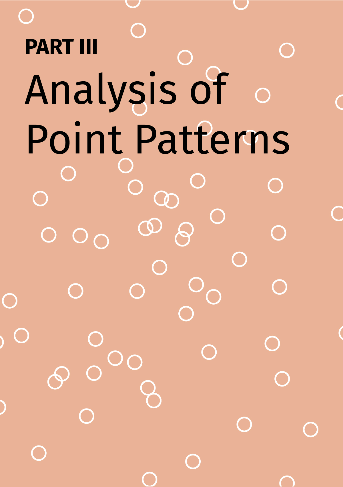<!-- -->

# Point Pattern Analysis I {#point-pattern-analysis-i}

*NOTE*: The source files for this book are available with companion package [{isdas}](https://paezha.github.io/isdas/). The source files are in Rmarkdown format and packed as templates. These files allow you execute code within the notebook, so that you can work interactively with the notes. 

In last practice your learning objectives were:

1. How to generate random numbers with different properties.
2. About Null Landscapes.
3. How to create new columns in a dataframe using a formula.
4. How to simulate a spatial process.

Please review the previous practices if you need a refresher on these concepts.

## Learning Objectives

In this practice, you will learn:

1. A formal definition of point pattern.
2. Processes and point patterns.
3. The concepts of intensity and density.
4. The concept of quadrats and how to create density maps.
5. More ways to control the look of your plots, in particular faceting and adding lines.

## Suggested Readings

- Bailey TC and Gatrell AC [-@Bailey1995] Interactive Spatial Data Analysis, Chapter 3. Longman: Essex.
- Baddeley A, Rubak E, Turner R [-@Baddeley2015] Spatial Point Pattern: Methodology and Applications with R, Chapter 1, 1.1 - 1.2. CRC: Boca Raton.
- Bivand RS, Pebesma E, Gomez-Rubio V [-@Bivand2008] Applied Spatial Data Analysis with R, Chapter 7. Springer: New York.
- Brunsdon C and Comber L [-@Brunsdon2015R] An Introduction to R for Spatial Analysis and Mapping, Chapter 6, 6.1 - 6.6. Sage: Los Angeles.
- O'Sullivan D and Unwin D [-@Osullivan2010] Geographic Information Analysis, 2nd Edition, Chapter 5. John Wiley & Sons: New Jersey.

## Preliminaries

It is good practice to begin with a clean session to make sure that you do not have extraneous items there when you begin your work. The best practice is to restart the `R` session, which can be accomplished for example with `command/ctrl + shift + F10`. An alternative to _only_ purge user-created objects from memory is to use the `R` command `rm` (for "remove"), followed by a list of items to be removed. To clear the workspace from _all_ objects, do the following:

``` r
rm(list = ls())
```

Note that `ls()` lists all objects currently on the workspace.

Load the libraries you will use in this activity:

``` r
library(isdas) # Companion Package for Book An Introduction to Spatial Data Analysis and Statistics
library(tidyverse) # Easily Install and Load the 'Tidyverse'
library(spatstat) # Spatial Point Pattern Analysis, Model-Fitting, Simulation, Tests
```

Load the data that you will use for this practice:

``` r
data("PointPatterns")
```

Quickly check the contents of this dataframe:

``` r
summary(PointPatterns)
```

```
##        x                y                 Pattern  
##  Min.   :0.0169   Min.   :0.005306   Pattern 1:60  
##  1st Qu.:0.2731   1st Qu.:0.289020   Pattern 2:60  
##  Median :0.4854   Median :0.550000   Pattern 3:60  
##  Mean   :0.5074   Mean   :0.538733   Pattern 4:60  
##  3rd Qu.:0.7616   3rd Qu.:0.797850                 
##  Max.   :0.9990   Max.   :0.999808
```

The dataframe contains the `x` and `y` coordinates of four different patterns of points, each with $n=60$ events. 

## Point Patterns

Previously you created different types of maps and learned about different kinds of processes (i.e., random, stochastic, deterministic). A map that you have seen in several occasions is one where the coordinates of an event of interest are available. The simplest kind of data of this type is called a _point pattern_. This occurs when only the coordinates are available. 

A point pattern is given by a set of events of interest that are observed in a region $R$.

A region has an infinite number of _points_, essentially coordinates $(x_i, y_i)$ on the plane. The number of points is infinite, because there is a point defined by, say, coordinates (1,1), and also a point for coordinates (1.1,1), and for coordinates for (1.01,1), and so on. Any _location_ that can be described by a set of coordinates contained in the region is a point.

Not all points are events, however. An event is defined as a point where something of interest happened. This could be the location where a tree exists, or a crime happened, the epicenter of an earthquake, a case of a disease was reported, and so on. There might be one such occurrence, or more. Each event is be denoted by:
$$
\textbf{s}_i
$$
with coordinates:
$$
(x_i,y_i).
$$
Sometimes other attributes of the events have been measured as well. For example, the event could be an address where cholera was reported (as in John Snow's famous map). In addition to the address (which can be converted into the coordinates of the event), the _number of cases_ could be recorded. Other examples could be the height and diameter of trees, the magnitude of an earthquake, etc. 

It is important, for reasons that will be discussed later, that the point pattern is a complete _enumeration_. What this means is that every event that happened has been recorded! Interpretation of most analyses becomes dubious if the events are only sampled, that is, if only a few of them have been observed and recorded.

## Processes and Point Patterns

Point patterns are interesting in many applications. In these applications, a key question of interest is whether the pattern is _random_.

Imagine a point pattern that records crimes in a region. The pattern might be random, in which case there is no way to anticipate where the next occurrence of criminal activity will be. Non-random patterns, on the other hand, are likely the outcome of some meaningful process. For instance, crimes might _cluster_ as a consequence of some common environmental variable (e.g., concentration of wealth). On the contrary, they might repeal each other (e.g., the location of a crime draws attention of law enforcement, and therefore the next occurrence of a crime tends to happen away from it). Deciding whether the pattern is random or not is the initial step towards developing hypotheses about the underlying process.

Consider for example the following patterns. To create the following figure, you can use _faceting_ by means of `ggplot2::facet_wrap()`:

``` r
# This uses function "ggplot" to plot data "PointPatterns" loaded 
# into the data frame earlier, by means of X and Y coordinates

# the function `facet_wrap()` is used to create multiple plots 
# according to one (or more) variables in the dataset. Here, it 
# is used to create individual plots for each of the four patterns 
# in the dataframe, but put them all in a single figure
ggplot() + 
  geom_point(data = PointPatterns, 
             aes(x = x, 
                 y = y)) + 
  facet_wrap(~ Pattern) +
  coord_fixed()
```


As you can see, faceting is a convenient way to simultaneously plot different parts of a dataframe (in the present case, the different `Pattern`'s).

In the preceding activity, you were asked to generate ideas regarding possible ways of deciding whether a map of events (i.e., a point pattern) is random. In this chapter we will formalize a specific way to do so, by considering the _intensity_ of the process.

## Intensity and Density

The _intensity_ of a spatial point process is the expected number of events per unit area. This is conventionally denoted by the Greek letter $\lambda$.

In most cases the process is not know, so its intensity cannot be directly measured. In its place, the _density_ of the point pattern is taken as the empirical estimate of the _intensity_ of the underlying process. The density of the point pattern is calculated very simply as the number of events divided by the area of the region, that is:
$$
\hat{\lambda} = \frac{(S \in R)}{a} = \frac{n}{a}.
$$
Notice the use of the "hat" symbol on top of the Greek lambda. This symbol is called "caret". The hat notation is used to indicate an estimated value of an unobserved parameter of a process as opposed to the true (but usually unknown) value. In the present case this is the intensity of the spatial point process.

Consider one of the point patterns in your sample dataset, say "Pattern 1". If we filter for "Pattern 1" we can then summarize it:

``` r
filter(PointPatterns, Pattern == "Pattern 1") |> summary()
```

```
##        x                y                 Pattern  
##  Min.   :0.0285   Min.   :0.005306   Pattern 1:60  
##  1st Qu.:0.3344   1st Qu.:0.236509   Pattern 2: 0  
##  Median :0.5247   Median :0.500262   Pattern 3: 0  
##  Mean   :0.5531   Mean   :0.500248   Pattern 4: 0  
##  3rd Qu.:0.8417   3rd Qu.:0.761218                 
##  Max.   :0.9888   Max.   :0.999808
```

We see that there are $n = 60$ points in this dataset. Since the region is the unit square (check how the values of the coordinates range from approximately zero to approximately 1), the area of the region is 1. This means that for "Pattern 1":
$$
\hat{\lambda} = \frac{60}{1} = 60
$$

This is the _overall density_ of the point pattern.

## Quadrats and Density Maps

The overall density of a point process (calculated above) can be mapped by means of the `geom_bin2d` function of the `ggplot2` package. This function divides two dimensional space into bins and reports the number of events or the density of the events in the bins. We will give this a try next:

``` r
# `geom_bin2d()` creates a tessellation and counts the number of events
# in each of the "tiles" in the tessellation. It then assigns colors based 
# on the count of events. The `binwidth` determines the size of the squares 
# in the tessellation, in this case squares of size 1 by 1...which corresponds 
# to the size of the region!
ggplot() +
  geom_bin2d(data = subset(PointPatterns, 
                           Pattern == "Pattern 1"),
             aes(x = x, 
                 y = y),
             binwidth = c(1, 1)) +
  coord_fixed()
```


Let us see step-by-step how this plot is made. 

1. `ggplot()` creates a plot object.
2. `geom_bin2d` is called to plot a map of counts of events in the space defined by the bins.
3. The dataframe used for plotting the bins is `PointPatterns`, subset so that only the points in "Pattern 1" are used.
4. The coordinates x and y are used to plot (in `aes()`, we indicate that x in the dataframe corresponds to the x axis in the plot, and y in the dataframe corresponds to y axis in the plot)
5. The size of the bin is defined as 1-by-1 (`binwidth = c(1, 1)`)
6. `coord_fixed` is applied to ensure that the aspect ratio of the plot is one (one unit of x is the same length as one unit of y in the plot).

The map of the overall density of the process above is not terribly interesting. It only reports what we already knew, that globally the density of the point pattern is 60. It would be more interesting to see how the density varies across the region. 

We do this by means of the concept of _quadrats_.

Imagine that instead of calculating the overall (or global) intensity of the point pattern, we subdivided the region into a set of smaller subregions. For instance, we could draw horizontal and vertical lines to create smaller squares:

``` r
# `geom_vline()` draws vertical lines that cross the x-axis at 
# the points indicated; `geom_hline()` draws horizontal lines 
# that cross the y-axis at the points indicated
ggplot() + 
  geom_vline(xintercept = seq(from = 0, 
                              to = 1, 
                              by = 0.25)) +
  geom_hline(yintercept = seq(from = 0, 
                              to = 1, 
                              by = 0.25)) +
  geom_point(data = filter(PointPatterns, 
                           Pattern == "Pattern 1"), 
             aes(x = x, 
                 y = y)) +
  coord_fixed()
```


Notice how we used to create the vertical lines (`geom_vline`) and horizontal lines (`geom_hline`), from 0 to 1 every 0.25 units of distance respectively. This creates a tessellation that divides the original region into 16 smaller squares, or subregions. Each of the smaller squares used to subdivide the region is called a _quadrat_.

To make things more interesting, instead of calculating the overall density, we can calculate the density for each quadrat. Now the size of the quadrats will be $0.25\times 0.25$. Here we visualize the density of the quadrats:

``` r
ggplot() +
  geom_bin2d(data = filter(PointPatterns, 
                           Pattern == "Pattern 1"),
             aes(x = x, 
                 y = y),
             binwidth = c(0.25, 
                          0.25)) +
    geom_point(data = filter(PointPatterns, 
                             Pattern == "Pattern 1"), 
             aes(x = x, 
                 y = y)) +
  scale_fill_distiller(palette = "RdBu") +
  coord_fixed()
```


You can, of course, change the size of the quadrats. We can take a look at the four point patterns (by means of faceting), after creating a variable to easily control the size of the quadrat. Let us call this variable `q_size`:

``` r
# `q_size` controls the size of the quadrats; experiment changing this parameter
q_size <- 0.5
ggplot() +
  geom_bin2d(data = PointPatterns,
             aes(x = x, 
                 y = y),
             binwidth = c(q_size, 
                          q_size)) +
  geom_point(data = PointPatterns, 
             aes(x = x, 
                 y = y)) +
  facet_wrap(~ Pattern) +
  scale_fill_distiller(palette = "RdBu") +
  coord_fixed()
```


Notice the differences in the density maps? Try changing the size of the quadrat to 1. What happens, and why? Next, try a smaller quadrat size, say 0.25. What happens, and why? Try even smaller quadrat sizes, but greater than zero. What happens now?

The package `spatstat` [@Baddeley2015] includes numerous functions for the analysis of point patterns. A relevant function for us at this stage, is `quadratcount()`, which returns the number of events per quadrat.

To use this function, we need to convert the point patterns to a type of object used by `spatstat` denominated `ppp` (for *p*lannar *p*oint *p*attern). This is simple, thanks to a utility function in `spatstat` called `as.ppp`. This function takes as arguments (inputs) a set of coordinates, and data to define a window. To benefit from the functionality of `spatstat` we will convert our data frame with spatial patterns into `ppp` objects.

First, define the window by means of the `owin` function, and using the 0 to 1 interval for our region:

``` r
# `owin()` creates a window for `ppp` objects, which becomes 
# the _region_ under study. Here, we define a window that is 
# the unit square and we will discuss the importance of an 
#appropriate definition of the region later. The windows in 
# `spatstat` need not be squares or rectangles, and can actually 
# be irregular shapes
Wnd <- owin(c(0,1), c(0,1)) 
```

Now, a `ppp` object can be created:

``` r
# `as.ppp()` will take an object and convert it to a `ppp` object.
# Here, it does a fairly good job of guessing the contents of the 
# data frame! The second argument to create the `ppp` object is a 
# window, that is, an `owin` object
ppp1 <- as.ppp(PointPatterns, 
               Wnd)
```

If you examine these new `ppp` objects, you will see that they pack the same basic information (i.e., the coordinates), but also the range of the region and so on:

``` r
summary(ppp1)
```

```
## Marked planar point pattern:  240 points
## Average intensity 240 points per square unit
## 
## Coordinates are given to 16 decimal places
## 
## Multitype:
##           frequency proportion intensity
## Pattern 1        60       0.25        60
## Pattern 2        60       0.25        60
## Pattern 3        60       0.25        60
## Pattern 4        60       0.25        60
## 
## Window: rectangle = [0, 1] x [0, 1] units
## Window area = 1 square unit
```

As you can see, the `ppp` object includes the four patterns, calculates the frequency of each (the number of events), and their respective overall intensities.

Objects of the class `ppp` can be plotted using base `R` plotting functions:

``` r
plot(ppp1)
```


To plot each pattern separately we can split the different patterns using the function `split.ppp()`. Notice how `$` works for indexing the patterns here, just as it does for indexing columns in a data frame:

``` r
plot(split.ppp(ppp1)$`Pattern 1`)
```


Once the patterns are in `ppp` form, `quadratcount` can be used to compute the counts of events. To calculate the count separately for each pattern, you need to use again `split.ppp()` (if you don't index a pattern, it will apply the function to all of them). The other two arguments are the number of quadrats in the horizontal (nx) and the vertical (ny) directions:  

``` r
quadratcount(split(ppp1),
             nx = 4,
             ny = 4)
```

```
## List of spatial objects
## 
## Pattern 1:
##             x
## y            [0,0.25] (0.25,0.5] (0.5,0.75] (0.75,1]
##   (0.75,1]          3          5          1        6
##   (0.5,0.75]        2          3          4        6
##   (0.25,0.5]        5          4          2        3
##   [0,0.25]          2          4          4        6
## 
## Pattern 2:
##             x
## y            [0,0.25] (0.25,0.5] (0.5,0.75] (0.75,1]
##   (0.75,1]         14          2          2        6
##   (0.5,0.75]        0          0          4        6
##   (0.25,0.5]        6          3          1        2
##   [0,0.25]          4          6          2        2
## 
## Pattern 3:
##             x
## y            [0,0.25] (0.25,0.5] (0.5,0.75] (0.75,1]
##   (0.75,1]          2         11          5        7
##   (0.5,0.75]        1          1          6        4
##   (0.25,0.5]        1         10          3        2
##   [0,0.25]          2          1          2        2
## 
## Pattern 4:
##             x
## y            [0,0.25] (0.25,0.5] (0.5,0.75] (0.75,1]
##   (0.75,1]          4          5          6        3
##   (0.5,0.75]        3          3          4        2
##   (0.25,0.5]        3          3          4        2
##   [0,0.25]          5          4          6        3
```

Compare the counts of the quadrats for each pattern. They should replicate what you observed in the density plots before.

## Defining the Region for Analysis

It is important when conducting the type of analysis described above (and more generally any analysis with point patterns), to define a region for analysis that is consistent with the pattern of interest. 

Consider for instance what would happen if the region was defined, instead of in the unit square, as a bigger region. Create a second window:

``` r
# This new window measure 3 units in the x-axis, 
# and also 3 units in the y-axis (from -1 to 2)
Wnd2 <- owin(c(-1,2), 
             c(-1,2)) 
```

Create a second `ppp` object using this new window:

``` r
# Here, we use the same events as before, but place them in the larger window we just created
ppp2 <- as.ppp(PointPatterns,
               Wnd2)
```

Repeat the plot but using the new `ppp` object: 

``` r
plot(split.ppp(ppp2)$`Pattern 1`)
```


Repeat but now using an even bigger region. Create a third window:

``` r
Wnd3 <- owin(c(-2, 3), 
             c(-2, 3)) 
```

And also a third `ppp` object using the third window:

``` r
ppp3 <- as.ppp(PointPatterns, 
               Wnd3)
```

Now the plot looks like this: 

``` r
plot(split.ppp(ppp3)$`Pattern 1`)
```


Which of the three regions that you saw above is more appropriate? What do you think is the effect of selecting an inappropriate region for the analysis?

This concludes this chapter. The next activity will illustrate how quadrats are a useful tool to explore the question whether a map is random.


<!--chapter:end:09-Point-Pattern-Analysis-I.Rmd-->

# Activity 4: Point Pattern Analysis I

*NOTE*: The source files for this book are available with companion package [{isdas}](https://paezha.github.io/isdas/). The source files are in Rmarkdown format and packed as templates. These files allow you execute code within the notebook, so that you can work interactively with the notes. 

## Practice questions

Answer the following questions:

1. What is a random process?
2. What is a deterministic process?
3. What is a stochastic process?
4. What is a pattern?
5. What is the usefulness of a null landscape?

## Learning objectives

In this activity, you will:

1. Use the concept of quadrats to analyze a real dataset.
2. Learn about a quadrat-based test for randomness in point patterns.
3. Learn how to use the p-value of a statistical test to make a decision.
4. Think about the distribution of events in a null landscape.
5. Think about ways to decide whether a landscape is random.

## Suggested reading

O'Sullivan D and Unwin D (2010) Geographic Information Analysis, 2nd Edition, Chapter 5. John Wiley & Sons: New Jersey.

## Preliminaries

It is good practice to begin with a clean session to make sure that you do not have extraneous items there when you begin your work. The best practice is to restart the `R` session, which can be accomplished for example with `command/ctrl + shift + F10`. An alternative to _only_ purge user-created objects from memory is to use the `R` command `rm` (for "remove"), followed by a list of items to be removed. To clear the workspace from _all_ objects, do the following:

``` r
rm(list = ls())
```

Note that `ls()` lists all objects currently on the workspace.

Load the libraries you will use in this activity. In addition to `tidyverse`, you will need `spatstat`, a package designed for the analysis of point patterns (you can learn about `spatstat` [here](https://cran.r-project.org/web/packages/spatstat/vignettes/getstart.pdf) and [here](http://spatstat.org/resources/spatstatJSSpaper.pdf)):

``` r
library(isdas) # Companion Package for Book An Introduction to Spatial Data Analysis and Statistics
library(sf) # Simple Features for R
library(spatstat) # Spatial Point Pattern Analysis, Model-Fitting, Simulation, Tests
library(tidyverse) # Easily Install and Load the 'Tidyverse'
```

In the practice that preceded this activity, you learned about the concepts of intensity and density, about quadrats, and also how to create density maps. 
Begin by loading the data that you will use in this activity:

``` r
data("Fast_Food")
data("Gas_Stands")
data("Paez_Mart")
```

Next the geospatial files need to be read. For this example, the city boundary of Toronto is provided in two different formats, as a dataframe (which can be used to plot using `ggplot2`) and as a `SpatialPolygons` object, a format widely used in R for spatial analysis. The :

``` r
data("Toronto")
```

If you inspect your workspace, you will see that the following dataframes are there:

* `Fast_Food`
* `Gas_Stands`
* `Paez_Mart`

These are locations of a selection of fast food restaurants, and also of gas stands in Toronto (data are from 2008). Paez Mart on the other hand is a project to cover Toronto with convenience stores. The points are the planned locations of the stores.

Also, there should be an object of class `sf`. This dataframe contains the city boundary of Toronto:

``` r
class(Toronto)
```

```
## [1] "sf"         "data.frame"
```

Try plotting the following:

``` r
ggplot() +
  geom_sf(data = Toronto, color = "black", fill = NA, alpha = 1, size = .3) +
  geom_sf(data = Paez_Mart) +
  coord_sf()
```


As discussed in the preceding chapter, the package `spatstat` offers a very rich collection of tools to do point pattern analysis. To convert the three sets of events (i.e., the fast food establishments, gas stands, and Paez Mart) into `ppp` objects we first must define a region or _window_. To do this we take the `sf` and convert to an `owin` (a window object) for use with the package `spatstat` (this is done via `SpatialPolygons`, hence `as(x, "Spatial")`:

``` r
# `as.owin()` will take a "foreign" object (foreign to `spatstat`) and convert it into an `owin` object.`

Toronto.owin <- Toronto |> as.owin() # Requires `maptools` package
```

And, then convert the dataframes to `ppp` objects (this necessitates that we extract the coordinates of the events by means of `st_coordinates`): 

``` r
Fast_Food.ppp <- as.ppp(st_coordinates(Fast_Food), W = Toronto.owin)
Gas_Stands.ppp <- as.ppp(st_coordinates(Gas_Stands), W = Toronto.owin)
Paez_Mart.ppp <- as.ppp(st_coordinates(Paez_Mart), W = Toronto.owin)
```

These objects can now be used with the functions of the `spatstat` package. For instance, you can calculate the counts of events by quadrat by means of `quadrat.count`. The input must be a `ppp` object, and the number of quadrats on the horizontal (nx) and vertical (ny) direction (notice how I use the function `table` to present the frequency of quadrats with number of events):

``` r
q_count <- quadratcount(Fast_Food.ppp, nx = 3, ny = 3)
table(q_count)
```

```
## q_count
##   0   6  44  48  60  64  85 144 163 
##   1   1   1   1   1   1   1   1   1
```

As you see from the table, there is one quadrat with zero events, one quadrat with six events, one quadrat with forty-four events, and so on.

You can also plot the results of the `quadratcount()` function!

``` r
plot(q_count)
```


A useful function in the `spatstat` package is `quadrat.test`. This function implements a statistical test that compares the empirical distribution of events by quadrats to the distribution of events as expected under the hypothesis that the underlying process is _random_.

This is implemented as follows:

``` r
q_test <- quadrat.test(Fast_Food.ppp, nx = 3, ny = 3)
```

```
## Warning: Some expected counts are small; chi^2 approximation may be inaccurate
```

``` r
q_test
```

```
## 
## 	Chi-squared test of CSR using quadrat counts
## 
## data:  Fast_Food.ppp
## X2 = 213.74, df = 8, p-value < 2.2e-16
## alternative hypothesis: two.sided
## 
## Quadrats: 9 tiles (irregular windows)
```

The quadrat test reports a $p$-value which can be used to make a decision. The $p$-value is the probability that you will be mistaken if you reject the null hypothesis. To make a decision, you need to know what is the null hypothesis, and your own tolerance for making a mistake. In the case above, the $p$-value is very, very small (2.2e-16 = 0.00000000000000022). Since the null hypothesis is spatial randomness, you can reject this hypothesis and the probability that this decision is mistaken is vanishingly small.

Try plotting the results of `quadrat.test`:

``` r
plot(q_test)
```


Now that you have seen how to do some analysis using quadrats, you are ready for the next activity.

## Activity

**NOTE**: Activities include technical "how to" tasks/questions. Usually, these ask you to practice using the software to organize data, create plots, and so on in support of analysis and interpretation. The second type of questions ask you to activate your brainware and to think geographically and statistically.

::: {.infobox .software data-latex="{software}"}
**Activity Part I**
:::

1. Use `Fast_Food`, `Gas_Stands`, `Paez_Mart`, and `Toronto` to create density maps for the three point patterns. Select a quadrat size that you think is appropriate. 

2. Use `Fast_Food.ppp`, `Gas_Stands`, and `Paez_Mart`, and the function `quadratcount` to calculate the number of events per quadrat. Remember that you need to select the number of quadrats in the horizontal and vertical directions!

3. Use the function `table()` to examine the frequency of events per quadrat for each of the point patterns. 

::: {.infobox .brainware data-latex="{brainware}"}
**Activity Part II**
:::

4. Show your density maps to a fellow student. Did they select the same quadrat size? If not, what was their rationale for their size?

5. Again, use the function `table()` to examine the frequency of events per quadrat for each of the point patterns. What are the differences among these point patterns? What would you expect the frequency of events per quadrat to be in a null landscape?

6. Use `Fast_Food.ppp`, `Gas_Stands`, and `Paez_Mart`, and the function `quadrat.test` to calculate the test of spatial independence for these point patterns. What is your decision in each case? Explain.


<!--chapter:end:10-Activity-Point-Pattern-Analysis-I.Rmd-->

# Point Pattern Analysis II {#point-patern-analysis-ii}

*NOTE*: The source files for this book are available with companion package [{isdas}](https://paezha.github.io/isdas/). The source files are in Rmarkdown format and packed as templates. These files allow you execute code within the notebook, so that you can work interactively with the notes. 

In the last practice/session your learning objectives included:

1. A formal definition of point pattern.
2. Processes and point patterns.
3. The concepts of intensity and density.
4. The concept of quadrats and how to create density maps.
5. More ways to control the look of your plots, in particular faceting and adding lines.

Please review the previous practices if you need a refresher on these concepts.

## Learning Objectives

In this practice, you will learn:

1. The intuition behind the quadrat-based test of independence.
2. About the limitations of quadrat-based analysis.
3. The concept of kernel density.
4. More ways to manipulate objects to do point pattern analysis using `spatstat`.

## Suggested Readings

- Bailey TC and Gatrell AC [-@Bailey1995] Interactive Spatial Data Analysis, Chapter 3. Longman: Essex.
- Baddeley A, Rubak E, Turner R [-@Baddeley2015] Spatial Point Pattern: Methodology and Applications with R, Chapter 6. CRC: Boca Raton.
- Bivand RS, Pebesma E, Gomez-Rubio V [-@Bivand2008] Applied Spatial Data Analysis with R, Chapter 7. Springer: New York.
- Brunsdon C and Comber L [-@Brunsdon2015R] An Introduction to R for Spatial Analysis and Mapping, Chapter 6, 6.1 - 6.6. Sage: Los Angeles.
- O'Sullivan D and Unwin D [-@Osullivan2010] Geographic Information Analysis, 2nd Edition, Chapter 5. John Wiley & Sons: New Jersey.

## Preliminaries

As usual, It is good practice to begin with a clean session to make sure that you do not have extraneous items there when you begin your work. The best practice is to restart the `R` session, which can be accomplished for example with `command/ctrl + shift + F10`. An alternative to _only_ purge user-created objects from memory is to use the `R` command `rm` (for "remove"), followed by a list of items to be removed. To clear the workspace from _all_ objects, do the following:

``` r
rm(list = ls())
```

Note that `ls()` lists all objects currently on the workspace.

Load the libraries you will use in this activity:

``` r
library(isdas) # Companion Package for Book An Introduction to Spatial Data Analysis and Statistics
library(spatstat) # Spatial Point Pattern Analysis, Model-Fitting, Simulation, Tests
library(tidyverse) # Easily Install and Load the 'Tidyverse'
```

Load the datasets that you will use for this practice:

``` r
data("PointPatterns")
data("pp0_df")
```

`PointPatterns` is a data frame with four sets of spatial events, labeled as "Pattern 1", "Pattern 2", "Pattern 3", and "Pattern 4". Each set has $n=60$ events. You can check the class of this object by means of the function class `class()`.

``` r
class(PointPatterns)
```

```
## [1] "data.frame"
```

The second data frame (i.e., `pp0_df`) includes the coordinates `x` and `y` of two sets of spatial events, labeled as "Pattern 1" and "Pattern 2".

The summary for `PointPatterns` shows that these point patterns are located in a square-unit window (check the max and min values of x and y):

``` r
summary(PointPatterns)
```

```
##        x                y                 Pattern  
##  Min.   :0.0169   Min.   :0.005306   Pattern 1:60  
##  1st Qu.:0.2731   1st Qu.:0.289020   Pattern 2:60  
##  Median :0.4854   Median :0.550000   Pattern 3:60  
##  Mean   :0.5074   Mean   :0.538733   Pattern 4:60  
##  3rd Qu.:0.7616   3rd Qu.:0.797850                 
##  Max.   :0.9990   Max.   :0.999808
```

The same is true for `pp0_df`:

``` r
summary(pp0_df)
```

```
##        x                y                 marks   
##  Min.   :0.0456   Min.   :0.03409   Pattern 1:36  
##  1st Qu.:0.2251   1st Qu.:0.22963   Pattern 2:36  
##  Median :0.4282   Median :0.43363                 
##  Mean   :0.4916   Mean   :0.47952                 
##  3rd Qu.:0.7812   3rd Qu.:0.77562                 
##  Max.   :0.9564   Max.   :0.94492
```

As seen in the previous practice and activity, the package `spatstat` employs a type of object called `ppp` (for *p*lanar *p*oint *p*attern). Fortunately, it is relatively simple to convert a data frame into a `ppp` object by means of `as.ppp()`. This function requires that you define a window for the point pattern, something we can do by means of the `owin` function:

``` r
# "W" will appear in your environment as a defined window with boundaries of (1,1)
W <- owin(xrange = c(0, 1),
          yrange = c(0, 1))
```

Then the data frames are converted using the `as.ppp` function: 

``` r
# Converts the data frame to planar point pattern using the defined window "W"
pp0.ppp <- as.ppp(pp0_df, 
                  W = W)
PointPatterns.ppp <- as.ppp(PointPatterns, W = W)
```

You can verify that the new objects are indeed of `ppp`-class:

``` r
#"class" is an excellent tool to use when verifying the type of data object 
class(pp0.ppp)
```

```
## [1] "ppp"
```

``` r
class(PointPatterns.ppp)
```

```
## [1] "ppp"
```

## A Quadrat-based Test for Spatial Independence

In the preceding activity, you used a quadrat-based spatial independence test to help you decide whether a pattern was random (the function was `quadrat.test`). We will now review the intuition of the test.

Let's begin by plotting the patterns. You can use `split` to do plots for each pattern separately, instead of putting all of them in a single plot (this approach is not as refined as `ggplot2`, where we have greater control of the aspect of the plots; on the other hand, it is quick):

``` r
#The split functions separates without defining a window. 
# This is a quicker option to get relative results
plot(split(PointPatterns.ppp))
```


Recall that you can also plot individual patterns by using `$` followed by the factor that identifies the desired pattern (this is a way of indexing different patterns in `ppp`-class objects):

``` r
# Using "$" acts as a call sign to retrieve information from a data frame. 
# In this case, you are calling "Pattern 4" from "PointPatterns.ppp"
plot(split(PointPatterns.ppp)$"Pattern 4")
```


Now calculate the quadrat-based test of independence:

``` r
# `quadrat.test()` generates a quadrat-based test of independence, in this case, 
# for "Pattern 2" called from "PointPatterns.ppp", using 3 quadrats in the direction 
# of the x-axis and 3 quadrats in the direction of the y-axis 
q_test <- quadrat.test(split(PointPatterns.ppp)$"Pattern 2", 
                       nx = 3, 
                       ny = 3)
q_test
```

```
## 
## 	Chi-squared test of CSR using quadrat counts
## 
## data:  split(PointPatterns.ppp)$"Pattern 2"
## X2 = 48, df = 8, p-value = 1.976e-07
## alternative hypothesis: two.sided
## 
## Quadrats: 3 by 3 grid of tiles
```

Plot the results of the quadrat test:

``` r
plot(q_test)
```


As seen in the preceding chapter, the expected distribution of events on quadrats under the null landscape tends to be quite even. This is because each quadrat has equal probability of having the same number of events (depending on size, when the quadrats are not all the same size the number will be proportional to the size of the quadrat).

If you check the plot of the quadrat test above, you will notice that the first number (top left corner) is the number of events in the quadrat. The second number (top right corner) is the _expected number of events_ for a null landscape. The third number is a _residual_, based on the difference between the observed and expected number of events. More specifically, the residual is a _Pearson residual_, defined as follows:
$$
r_i=\frac{O_i - E_i}{\sqrt{E_i}},
$$
where $O_i$ is the number of observed events in quadrat $i$ and $E_i$ is the number of expected events in quadrat $i$. When the number of observed events is similar to the number of expected events, $r_i$ will tend to be a small value. As their difference grows, the residual will also grow.

The independence test is calculated from the residuals as:
$$
X^2=\sum_{i=1}^{Q}r_i^2,
$$
where $Q$ is the number of quadrats. In other words, the test is based on the squared sum of the Pearson residuals. The smaller this number is, the more likely that the observed pattern of events is not different from a null landscape (i.e., a random process), and the larger it is, the more likely that it is different from a null landscape. This is reflected by the $p$-value of the test (technically, the $p$-value is obtained by comparing the test to the $\chi^2$ distribution, pronounced "kay-square").

Consider for instance the first pattern in the examples:

``` r
plot(quadrat.test(split(PointPatterns.ppp)$"Pattern 1", 
                  nx = 3, 
                  ny = 3))
```


You can see that the Pearson residual of the top left quadrat is indeed -0.6567673, the next to its right is -0.2704336, and so on. The value of the test statistic should be then:

``` r
# The "Paste" function joins together several arguments as characters. 
# Here, this is a string of values for "X2", where X2" is the squared 
# sum of the residuals

paste("X2 = ", 
      (-0.65)^2 + (-0.26)^2 + (0.52)^2 + 
        (-0.26)^2 + (0.9)^2 + (0.52)^2 + 
        (-1)^2 + (0.13)^2 + (0.13)^2)
```

```
## [1] "X2 =  2.9423"
```

Which you can confirm by examining the results of the test (the small difference is due to rounding errors):

``` r
quadrat.test(split(PointPatterns.ppp)$"Pattern 1", 
             nx = 3, 
             ny = 3)
```

```
## 
## 	Chi-squared test of CSR using quadrat counts
## 
## data:  split(PointPatterns.ppp)$"Pattern 1"
## X2 = 3, df = 8, p-value = 0.1313
## alternative hypothesis: two.sided
## 
## Quadrats: 3 by 3 grid of tiles
```

Explore the remaining patterns. You will notice that the residuals and test statistic tend to grow as more events are concentrated in space. In this way, the test is a test of density of the quadrats: is their density similar to what would be expected from a null landscape?

## Limitations of Quadrat Analysis: Size and Number of Quadrats

As hinted by the previous activity, one issue with quadrat analysis is the selection of the size for the quadrats. Changing the size of the quadrats has an impact on the counts, and in turn on the aspect of density plots and even the results of the test of independence.

For example, the results of the test for "Pattern 2" in the dataset change when the number of quadrats is modified. For instance, with a small number of quadrats:

``` r
quadrat.test(split(PointPatterns.ppp)$"Pattern 2", 
             nx = 2, 
             ny = 1)
```

```
## 
## 	Chi-squared test of CSR using quadrat counts
## 
## data:  split(PointPatterns.ppp)$"Pattern 2"
## X2 = 1.6667, df = 1, p-value = 0.3934
## alternative hypothesis: two.sided
## 
## Quadrats: 2 by 1 grid of tiles
```

Compare to four quadrats:

``` r
quadrat.test(split(PointPatterns.ppp)$"Pattern 2", 
             nx = 2, 
             ny = 2)
```

```
## 
## 	Chi-squared test of CSR using quadrat counts
## 
## data:  split(PointPatterns.ppp)$"Pattern 2"
## X2 = 6, df = 3, p-value = 0.2232
## alternative hypothesis: two.sided
## 
## Quadrats: 2 by 2 grid of tiles
```

And:

``` r
quadrat.test(split(PointPatterns.ppp)$"Pattern 2", 
             nx = 3, 
             ny = 2)
```

```
## 
## 	Chi-squared test of CSR using quadrat counts
## 
## data:  split(PointPatterns.ppp)$"Pattern 2"
## X2 = 23.2, df = 5, p-value = 0.0006182
## alternative hypothesis: two.sided
## 
## Quadrats: 3 by 2 grid of tiles
```

Why is the statistic generally smaller when there are fewer quadrats?

A different issue emerges when the number of quadrats is large:

``` r
quadrat.test(split(PointPatterns.ppp)$"Pattern 2", 
             nx = 4, 
             ny = 4)
```

```
## Warning: Some expected counts are small; chi^2 approximation may be inaccurate
```

```
## 
## 	Chi-squared test of CSR using quadrat counts
## 
## data:  split(PointPatterns.ppp)$"Pattern 2"
## X2 = 47.2, df = 15, p-value = 6.84e-05
## alternative hypothesis: two.sided
## 
## Quadrats: 4 by 4 grid of tiles
```

A warning now tells you that some expected counts are small: space has been divided so minutely, that the expected number of events per quadrat has become too thin; as a consequence, the approximation to the probability distribution may be inaccurate.

While there are no hard rules to select the size/number of quadrats, the following rules of thumb are sometimes suggested:

1. Each quadrat should have a minimum of two events.
2. The number of quadrats is selected based on the area (A) of the region, and the number of events (n):
$$
Q=\frac{2A}{N}
$$
Caution should be exercised when interpreting the results of the analysis based on quadrats, due to the issue of size/number of quadrats.

## Limitations of Quadrat Analysis: Relative Position of Events

Another issue with quadrat analysis is that it is not sensitive to the relative position of the events within the quadrats.

Consider for instance the following two patterns in `pp0`:

``` r
plot(split(pp0.ppp))
```


These two patterns look quite different. And yet, when we count the events by quadrats:

``` r
plot(quadratcount(split(pp0.ppp), 
                  nx = 3, 
                  ny = 3))
```


This example highlights how quadrats are relatively coarse measures of density, and fail to distinguish between fairly different event distributions, in particular because quadrat analysis does not take into account the relative position of the events with respect to each other.

## Kernel Density

In order to better take into account the relative position of the events with respect to each other, a different technique can be devised. 

Imagine that a quadrat is a kind of "window". We use it to observe the landscape. When we count the number of events in a quadrat, we simply peek through that particular window: all events inside the "window" are simply counted, and all events outside the "window" are ignored. Then we visit another quadrat and do the same, until we have visited all quadrats.

Imagine now that we define a window that, unlike the quadrats which are fixed, can move and visit different points in space. This window also has the property that, instead of counting the events that are in the window, it gives greater weight to events that are close to the center of the window, and less weight to events that are more distant from the center of the window.

We can define such a window by selecting a function that declines with increasing distance. We will call this function a _kernel_. An example of a function that can work as a moving window is the following. 

``` r
# Here we create a data.frame to use for plotting; it includes a single column 
# with a variable called `dist` for distance, that varies between -3 and 3; 
# the function `stat_function()` is used in `ggplot2` to transform an input 
# by means of a function, which in this case is `dnorm` the normal distribution!
# `ylim()` sets the limits of the plot in the y-axis 
ggplot(data = data.frame(dist = c(-3, 3)), 
       aes(dist)) +
  stat_function(fun = dnorm, 
                n = 101, 
                args = list(mean = 0, 
                            sd = 1)) +
  ylim(c(0, 0.45))
```


As you can see, the value of the function declines with increasing distance from the center of the window (when dist == 0; note that the value never becomes zero!). Since we used the normal distribution, this is a _Gaussian kernel_. The shape of the Gaussian kernel depends on the standard deviation, which controls how "big" the window is, or alternatively, how quickly the function decays. We will call the standard deviation the _kernel bandwidth_ of the function. 

Since the bandwidth controls how rapidly the weight assigned to distant events decays, if the argument changes, so will the shape of the kernel function. As an experiment, change the value of the argument `sd` in the chunk above. You will see that as it becomes smaller, the slope of the kernel becomes steeper (and distant observations are downweighted more rapidly). On the contrary, as it becomes larger, the slope becomes less steep (and distant events are weighted almost as highly as close events).

Kernel density estimates are usually obtained by creating a fine grid that is superimposed on the region. The kernel function then visits each point on the grid and obtains an estimate of the density by summing the weights of all events as per the kernel function.

Kernel density is implemented in `spatstat` and can be used as follows.

The input is a `ppp` object, and optionally a `sigma` argument that corresponds to the bandwidth of the kernel:

``` r
# The "density" function computes estimates of kernel density. Here we are creating 
# a Kernel Density estimate using "pp0.ppp" from our data frame by means of a 
# bandwidth defined by "sigma"

kernel_density <- density(split(pp0.ppp), 
                          sigma = 0.1)
plot(kernel_density)
```


Compare to the distribution of events:

``` r
plot(split(pp0.ppp))
```


It is important to note that the gradation of colors is different in the two kernel density plots. Whereas the smallest value in the plot on the left is less than 20 and the largest is greater than 100, on the other plot the range is only between 45 to approximately 50. Thus, the intensity of the process is much higher at places in Pattern 1 that in Pattern 2.

The plots above illustrate how the map of the kernel density is better able to capture the variations in density across the region. In fact, kernel density is a smooth estimate of the underlying intensity of the process, and the degree of smoothing is controlled by the bandwidth.


<!--chapter:end:11-Point-Pattern-Analysis-II.Rmd-->

# Activity 5: Point Pattern Analysis II

*NOTE*: The source files for this book are available with companion package [{isdas}](https://paezha.github.io/isdas/). The source files are in Rmarkdown format and packed as templates. These files allow you execute code within the notebook, so that you can work interactively with the notes. 

## Practice questions

Answer the following questions:

1. How does the quadrat-based test of independence respond to a small number of quadrats?
2. How does the quadrat-based test of independence respond to a large number of quadrats?
3. What are the limitations of quadrat analysis?
4. What is a kernel function?
5. How does the bandwidth affect a kernel function?

## Learning objectives

In this activity, you will:

1. Explore a dataset using quadrats and kernel density.
2. Experiment with different parameters (number/size of kernels and bandwidths).
3. Discuss the impacts of selecting different parameters.
4. Hypothesize about the underlying spatial process based on your analysis.

## Suggested reading

O'Sullivan D and Unwin D (2010) Geographic Information Analysis, 2nd Edition, Chapter 5. John Wiley & Sons: New Jersey.

## Preliminaries

It is good practice to begin with a clean session to make sure that you do not have extraneous items there when you begin your work. The best practice is to restart the `R` session, which can be accomplished for example with `command/ctrl + shift + F10`. An alternative to _only_ purge user-created objects from memory is to use the `R` command `rm` (for "remove"), followed by a list of items to be removed. To clear the workspace from _all_ objects, do the following:

``` r
rm(list = ls())
```

Note that `ls()` lists all objects currently on the worspace.

Load the libraries you will use in this activity. In addition to `tidyverse`, you will need `spatstat`, a package designed for the analysis of point patterns (you can learn about `spatstat` [here](https://cran.r-project.org/web/packages/spatstat/vignettes/getstart.pdf) and [here](http://spatstat.org/resources/spatstatJSSpaper.pdf)):

``` r
library(isdas) # Companion Package for Book An Introduction to Spatial Data Analysis and Statistics
library(spatstat) # Spatial Point Pattern Analysis, Model-Fitting, Simulation, Tests
library(tidyverse) # Easily Install and Load the 'Tidyverse'
```

In the practice that preceded this activity, you learned about the concepts of intensity and density, about quadrats, and also how to create density maps. 
Begin by loading the data that you will use in this activity:

``` r
data("bear_df")
```

This dataset was sourced from the Scandinavia Bear Project, a Swedish-Noruegian collaboration that aims to study the ecology of brown bears, to provide decision makers with evidence to support bear management, and to provide information regarding bears to the public. You can learn more about this project [here](http://bearproject.info/about-the-project/).

The project involves tagging bears with GPS units, so that their movements can be tracked.

The dataset includes coordinates of one bear's movement over a period of several weeksin 2004. The dataset was originally taken from the `adehabitatLT` package but was somewhat simplified for this activity. Instead of full date and time information, the point pattern is marked more simply as "Day Time" and "Night Time", to distinguish between diurnal and nocturnal activity of the bear.

Summarize the contents of this dataframe:

``` r
summary(bear_df)
```

```
##        x                y                  marks    
##  Min.   :515743   Min.   :6812138   Day Time  :502  
##  1st Qu.:518995   1st Qu.:6813396   Night Time:498  
##  Median :519526   Median :6816724                   
##  Mean   :519321   Mean   :6816474                   
##  3rd Qu.:519983   3rd Qu.:6818112                   
##  Max.   :522999   Max.   :6821440
```

The Min. and Max. of `x` and `y` give us an idea of the region covered by this dataset. We can use these values to approximate a window for the region (as an experiment, you could try changing these values to create regions of different sizes):

``` r
W <- owin(xrange = c(515000, 523500), yrange = c(6812000, 6822000))
```

Next, we can convert the dataframe into a `ppp`-class object suitable for analysis using the package `spatstat`:

``` r
bear.ppp <- as.ppp(bear_df, W = W)
```

You can check the contents of the `ppp` object by means of `summary`:

``` r
summary(bear.ppp)
```

```
## Marked planar point pattern:  1000 points
## Average intensity 1.176471e-05 points per square unit
## 
## Coordinates are given to 10 decimal places
## 
## Multitype:
##            frequency proportion    intensity
## Day Time         502      0.502 5.905882e-06
## Night Time       498      0.498 5.858824e-06
## 
## Window: rectangle = [515000, 523500] x [6812000, 6822000] units
##                     (8500 x 10000 units)
## Window area = 8.5e+07 square units
```

Now that you have loaded the dataframe and converted to a `ppp` object, you are ready for the next activity.

## Activity

**NOTE**: Activities include technical "how to" tasks/questions. Usually, these ask you to practice using the software to organize data, create plots, and so on in support of analysis and interpretation. The second type of questions ask you to activate your brainware and to think geographically and statistically.

::: {.infobox .software data-latex="{software}"}
**Activity Part I**
:::

1. Analyze the point pattern for the movements of the bear using quadrat and kernel density methods. Experiment with different quadrat sizes and kernel bandwidths. 

::: {.infobox .brainware data-latex="{brainware}"}
**Activity Part II**
:::

2. Explain your choice of parameters (quadrat sizes and kernel bandwidths) to a fellow student.

3. Decide whether these patterns are random, and support your decision.

4. Do you see differences in the activity patterns of the bear by time of day? What could explain those differences, if any? 

5. Discuss the limitations of your conclusions, and of quadrat/kernel (density-based) approaches more generally.


<!--chapter:end:12-Activity-Point-Pattern-Analysis-II.Rmd-->

# Point Pattern Analysis III

*NOTE*: The source files for this book are available with companion package [{isdas}](https://paezha.github.io/isdas/). The source files are in Rmarkdown format and packed as templates. These files allow you execute code within the notebook, so that you can work interactively with the notes. 

In the last practice/session your learning objectives included:

1. The intuition behind the quadrat-based test of independence.
2. The concept of kernel density.
3. The limitations of density-based analysis
4. More ways to work with `ppp` objects.

If you wish to work interactively with this chapter you will need the following:

* An R markdown notebook version of this document (the source file).

* A package called `isdas`.

## Learning Objectives

In this practice, you will learn:

1. About clustered and dispersed (or regular) patterns.
2. The concept of nearest neighbors.
3. About distance-based methods for point pattern analysis.
4. About the G-function for the analysis of event-to-event nearest neighbor distances.

## Suggested Readings

- Bailey TC and Gatrell AC [-@Bailey1995] Interactive Spatial Data Analysis, Chapter 3. Longman: Essex.
- Baddeley A, Rubak E, Turner R [-@Baddeley2015] Spatial Point Pattern: Methodology and Applications with R, Chapter 8. CRC: Boca Raton.
- Bivand RS, Pebesma E, Gomez-Rubio V [-@Bivand2008] Applied Spatial Data Analysis with R, Chapter 7. Springer: New York.
- Brunsdon C and Comber L [-@Brunsdon2015R] An Introduction to R for Spatial Analysis and Mapping, Chapter 6, 6.1 - 6.6. Sage: Los Angeles.
- O'Sullivan D and Unwin D [-@Osullivan2010] Geographic Information Analysis, 2nd Edition, Chapter 5. John Wiley & Sons: New Jersey.

## Preliminaries

As usual, it is good practice to begin with a clean session to make sure that you do not have extraneous items there when you begin your work. The best practice is to restart the `R` session, which can be accomplished for example with `command/ctrl + shift + F10`. An alternative to _only_ purge user-created objects from memory is to use the `R` command `rm` (for "remove"), followed by a list of items to be removed. To clear the workspace from _all_ objects, do the following:

``` r
rm(list = ls())
```

Note that `ls()` lists all objects currently on the workspace.

Load the libraries you will use in this activity:

``` r
library(isdas) # Companion Package for Book An Introduction to Spatial Data Analysis and Statistics
library(spatstat) # Spatial Point Pattern Analysis, Model-Fitting, Simulation, Tests
library(tidyverse) # Easily Install and Load the 'Tidyverse'
```

Load the dataset that you will use for this practice:

``` r
data("pp0_df")
```

Examine the contents of the data frame you just loaded:

``` r
summary(pp0_df)
```

```
##        x                y                 marks   
##  Min.   :0.0456   Min.   :0.03409   Pattern 1:36  
##  1st Qu.:0.2251   1st Qu.:0.22963   Pattern 2:36  
##  Median :0.4282   Median :0.43363                 
##  Mean   :0.4916   Mean   :0.47952                 
##  3rd Qu.:0.7812   3rd Qu.:0.77562                 
##  Max.   :0.9564   Max.   :0.94492
```

As you can see, this data frame includes a set of coordinates for two point patterns, labeled "Pattern 1" and "Pattern 2", each of which consists of $n=36$ events. The range of the coordinates (between 0 and 1) suggests a window as follows:

``` r
# Remember, `owin()` is used to create a window to frame 
# a point pattern in the package `spatstat`
W <- owin(c(0,1), 
          c(0,1))
```

This creates an `owin` object that defines a region in the unit square. 

Given window object `W`, it is possible to transform the dataframe into a `ppp` object: 

``` r
# Remember, `as.ppp()` will take a foreign object (foreign 
# to `spatstat`) and convert it into a `ppp` object
pp0.ppp <- as.ppp(pp0_df, 
                  W = W)
```

If you need a refresher on how to create `ppp` objects see Chapter \@ref(point-pattern-analysis-i) 

## Motivation

Quadrats and kernel density are examples of density-based analysis. These techniques are useful to help you understand variations in the distribution of events at a relatively large scale, but as previously discussed, may sometimes be less informative by not taking into account _small scale_ variations in the locations of the events.

For this reason, the following two patterns, despite being very different, give identical number of counts per quadrat:

``` r
# The `split()` function is used to divide data in the vector 
# into groups using a categorical variable; in this case, the 
# `ppp` object includes only the coordinates and a variable that 
# identifies the coordinates as belonging to "Pattern 1" or 
# "Pattern 2". For this reason, the split is accomplished according 
# to this variable
plot(split(pp0.ppp))
```


``` r
# Arguments `nx` and `ny` indicate the number of quadrats on the 
# x and y directions respectively
plot(quadratcount(split(pp0.ppp), 
                  nx = 3, 
                  ny = 3))
```


The two patterns above have similar _density_, However, "Pattern 1" displays _clustering_, a situation characterized by events generally being in close proximity to others. "Pattern 2", on the other hand, displays _dispersion_ or _regularity_, a situation where points tend to be located at similar distances from each other.

With some fiddling of the parameters, quadrats can be coaxed to tease out the variations in density, for instance:

``` r
plot(quadratcount(split(pp0.ppp), 
                  nx = 9, 
                  ny = 9))
```


As a visualization technique, this gives a better sense of the variations in density. However, as noted previously, the quality of the test of independence deteriorates when there are many quadrats with small counts.

As an alternative, kernel density can be used to visualize the smoothed estimate of the density:

``` r
plot(density(split(pp0.ppp), 
             sigma = 0.075))
```


However, even when we can visualize the variations in density, we cannot, from the kernel estimate alone, tell if high/low values exceed those of a null landscape - in other words, we lack at the moment a way to test the hypothesis that the density is higher than what would be expected from a null landscape.

In this practice you will learn about a family of techniques that instead of measuring the density, explore patterns by means of distance distributions.

## Nearest Neighbors

Let us begin by introducing the concept of a nearest neighbor.

The nearest neighbor of a location is the event that is closest to said location given some metric. This metric is usually Euclidean distance on the plane, that is, distance as measured using a straight line between the location and the event. In principle, the metric can be selected according to the characteristics of a dataset: this could be Euclidean distance, great circle distance, or network distance, for events on networks.(see Figure \@ref(fig:distance-metrics)).

<div class="figure">
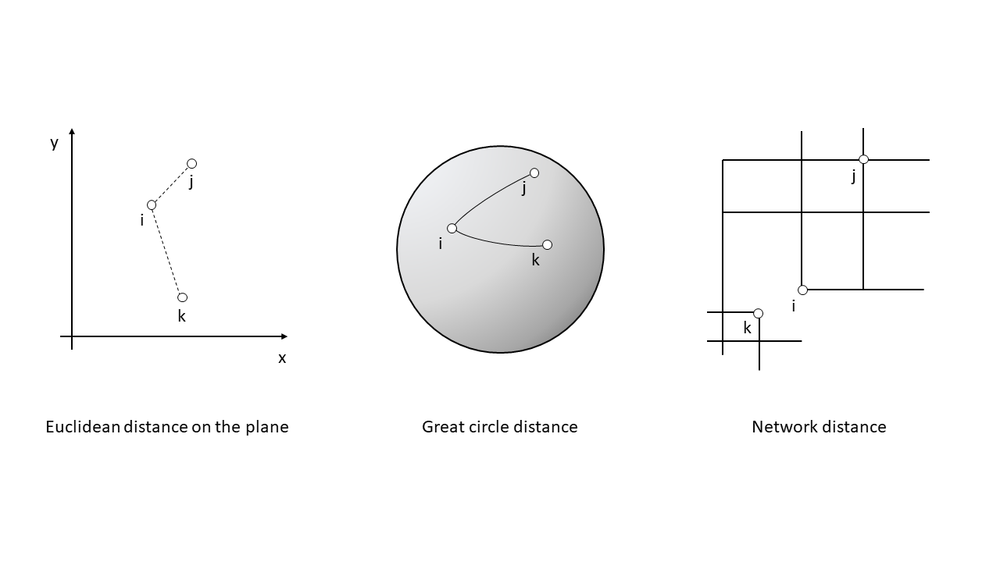
<p class="caption">(\#fig:distance-metrics)\label{fig:distance-metrics}Examples of distance metrics</p>
</div>

In this way, the nearest neighbor of $i$ is the event $j$ with the shortest distance $d$ from location $i$:
$$
\text{Event }j\text{ is the nearest neighbor of location }i\text{ if: }d_{ij}\le d_{ik} \forall k 
$$

Ties are relatively rare in most realistic point patterns (even in regular patterns), and may not have a big impact on the analysis.

The package `spatstat` includes functions to calculate Euclidean distances. Three functions are relevant:

* `pairdist()`: returns the pairwise distance between all pairs of events i and j.

* `nndist()`: returns a vector of distances from events to to their corresponding nearest neighbors; these distances are obtained by sorting the pairwise distances, and selecting the minimum value for each event.

* `distmap()`: returns a pixel image with the distance from each pixel to the nearest event; in effect this is a map of the distances between empty spaces and their corresponding nearest events.

With these functions we can calculate, for instance, the following distances:

``` r
# Function `nndist()` will calculate the distance of each 
# event to its nearest neighbor
pp0_nn1 <- nndist(split(pp0.ppp)$"Pattern 1")
```

The value of `nndist()` is a vector with $n$ distances, where $n$ is the number of events in the pattern. The first distance in the vector is the distance from the first event in the series to its nearest neighbor, the second is the distance from the second event in the series to its nearest neighbor, and so on.

Let us explore the distribution of these distances by means of a histogram:

``` r
# Remember, `geom_histogram()` adds a histogram to a `ggplot2` object; 
# the `binwidth` argument defines the size of each bin for the histogram
ggplot(data = data.frame(dist = pp0_nn1), 
       aes(dist)) + 
  geom_histogram(binwidth = 0.03)
```


Notice how most events (20 out of 36) have a nearest neighbor at a relatively short distance (<0.05). What does this mean?

Compare to the distribution of distances in "Pattern 2" of `pp0.ppp`:

``` r
# Calculate the distances to nearest neighbors in the second point
# pattern, i.e., "Pattern 2"
pp0_nn2 <- nndist(split(pp0.ppp)$"Pattern 2")

# Create a histogram to explore the distribution of values of 
# distances to nearest neighbors
ggplot(data = data.frame(dist = pp0_nn2), 
       aes(dist)) + 
  geom_histogram(binwidth = 0.03)
```


In this case, most events (more than 30 out of 36) have a nearest neighbor at a distance of approximately 0.15. What does this mean?

The two histograms above are interesting in that they reveal, for "Point Pattern 1" that most events are only a short distance away from another event (indicative of clustering), whereas for "Point Pattern 2" the suggestion is that almost all events have a nearest neighbor at a distance that is constant (indicative of regularity). However, the histograms do not convey more spatial information. Another useful tool to explore the distribution of distances to nearest neighbors is a _Stienen diagram_. A Stienen diagram is essentially a proportional symbol plot of the events. The sizes of symbols are proportional to the distance to their nearest neighbor. For example, for "Pattern 1" in `pp0.ppp` (Notice the use of %mark% to add an attribute to the `ppp` object; the attribute is the distance to the nearest neighbor):

``` r
# The function %mark% is used to add a variable (a "mark") to a `ppp` object. In this example, the variable we are adding to "Pattern 1" is the distance from the event to its nearest neighbor, as calculated above
split(pp0.ppp)$"Pattern 1" %mark% (pp0_nn1) %>%
  plot(markscale = 1, main = "Stienen diagram")
```


In this diagram, the largest circle is not very large: even events that are relatively isolated are not a long distance away from their nearest neighbor. This fits the definition of clustering as a situation where events tend to be relatively close to each other.

Compare to the Stienen diagram of "Pattern 2":

``` r
split(pp0.ppp)$"Pattern 2" %mark% (pp0_nn2) %>%
plot(markscale = 1, main = "Stienen diagram")
```


Notice how all circles are very similar in size: this fits the definition of dispersion, where events are more or less equally distant from their nearest neighbors.

What would these diagrams look for a null landscape? We can use the function `runifpoint` from the `spatstat` package to generate a null landscape:

``` r
# `runifpoint()` is a function to generate random coordinates based on the uniform random distribution function. The argument tells the function to create n = 36 random coordinates for our null landscape; this null landscape is contained in the window `W`, same as our previous point patterns  
rand_ppp <- runifpoint(n = 36, win = W)
```

If we plot the Stienen diagram for this point pattern:

``` r
# Calculate the distances to nearest neighbors for the null landscape
rand_nn <- nndist(rand_ppp)

# Add the distances as calculated above to the point pattern using %mark% and plot the Stienen diagram
rand_ppp %mark% (rand_nn) %>%
  plot(markscale = 1, main = "Stienen diagram")
```


In a null landscape, the distribution of the size of the symbols would tend to be random!

The concept of nearest neighbors is useful to define a family of techniques that are based on the distribution of distances to nearest neighbors. Three such techniques are introduced here.

## $G$-function

As you have seen above, the distribution of distances to nearest neighbors presents distinctive characteristics for different types of patterns.

What is needed is a convenient way to summarize the distribution of distances to nearest neighbors. A way to do so is by means of a plot of the _cumulative distribution function_. A cumulative distribution is simply the proportion of events that have a nearest neighbor at a distance less than some value $x$. When the value of $x$ is very small, no events have a nearest neighbor at $d_{ij}<x$. When $x$ is very large all events have a nearest neighbor at $d_{ij}<x$. The cumulative distribution thus depends on the value of $x$.

Imagine for instance the following hypothetical distribution of distances of ten events to their nearest neighbors (the first event's nearest neighbor is at a distance of 1, the second event's nearest neighbor is at 2, the third's at 0.5, and so on):

``` r
nnd <- c(1, 2, 0.5, 2.5, 1.7, 4, 3.5, 1.2, 2.3, 2.8)
```

When $x = 0$, zero events have a nearest neighbor at that distance or less. Two events have nearest neighbors at distances $d_{ij} <= 1$. Five events have a nearest neighbor at distances $d_{ij} <= 2$. Eight events have a nearest neighbor at dist $d_{ij} <= 3$. And all events have a nearest neighbor at distances $d_{ij} <= 4$.

We can plot these numbers of events as a proportion:

``` r
# Create a data frame for plotting the proportion of events with a nearest neighbor at a distance $d_ij <= x$
df <- data.frame(x = c(0, 1, 2, 3, 4), proportion = c(0, 3/10, 5/10, 8/10, 10/10))

# `geom_line()` creates lines that connect the coordinates of the data inputs
ggplot() + 
  geom_line(data = df, aes(x = x, y = proportion))
```


The cumulative distribution function of distances from event to nearest neighbor is called a _$G$-function_.

This function is defined as follows, with $d_{ik}$ as the distance from the event at i to its nearest neighbor:
$$
\hat{G}(x)=\frac{(d_{ik}\le x, \forall i)}{n}
$$

This function (with a hat, because it is estimated from the data), can be used to explore spatial point patterns. When doing so, it is useful to know that the theoretical value of $G$ (assuming a null landscape generated by a _Poisson_ distribution) is as follows:
$$
G_{pois}(x) = 1 - exp(-\lambda \pi x^2).
$$

When the empirical $\hat{G}(x)$ is greater than the theoretical function, this suggests that the events tend to be _closer_ than expected, compared to the null landscape. This would be indicative of a pattern of events that form clusters. On the contrary, when the empirical function is less than the theoretical function, this would suggest that the events tend to be _further_ away from each other than expected, compared to the null landscape. This would be indicative of a _dispersed_ or _regular_ pattern.

The $G$-function is implemented in `spatstat` as `Gest` (for $G$ estimated):

``` r
# Use split to calculate the G-function only for "Pattern 1"
g_pattern1 <- Gest(split(pp0.ppp)$"Pattern 1", correction = "none")
```

(For the moment ignore the argument "correction"; we will discuss corrections later on.)

The `plot()` function can be used to visualize the estimated G (with r = x): 

``` r
plot(g_pattern1)
```


In the plot above, the empirical function is the solid black line, and the theoretical is the dashed red line.

If you examine the empirical function, you will see that about 50% of events have a nearest neighbor at a distance of less than approximately 0.04. In the null landscape (theoretical function), in contrast, only about 16% of events have a nearest neighbor at less than 0.04:

``` r
plot(g_pattern1)
lines(x = c(0.04, 0.04), y = c(-0.1, 0.5), lty = "dotted")
lines(x = c(-0.1, 0.04), y = c(0.5, 0.5), lty = "dotted")
lines(x = c(-0.1, 0.04), y = c(0.16, 0.16), lty = "dotted", col = "red")
```


Notice that the empirical function is above the theoretical function. This suggests is that in the actual landscape events tend to be much closer to other events in comparison the null landscape, and would therefore be suggestive of clustering.

Compare to "Pattern 2":

``` r
g_pattern2 <- Gest(split(pp0.ppp)$"Pattern 2", correction = "none")
plot(g_pattern2)
```


Now the empirical function is below the one for the null landscape. Notice too that all events have a nearest neighbor in a limited range of distances, between 0.14 and 0.18. This is indicative of a dispersed, or regular pattern.

And the random pattern that you created before:

``` r
g_pattern_rnd <- Gest(rand_ppp, correction = "none")
plot(g_pattern_rnd)
```


In this case, the empirical function more closely resembles the theoretical function for the null landscape. This suggests a random pattern. 

By considering the distribution of distances to nearest neighbors, you can generate additional information on a point pattern to complement the density-based analysis of the preceding chapters.


<!--chapter:end:13-Point-Pattern-Analysis-III.Rmd-->

# Activity 6: Point Pattern Analysis III

*NOTE*: The source files for this book are available with companion package [{isdas}](https://paezha.github.io/isdas/). The source files are in Rmarkdown format and packed as templates. These files allow you execute code within the notebook, so that you can work interactively with the notes. 

## Practice questions

Answer the following questions:

1. List and explain two limitations of quadrat analysis.
2. What is clustering? What could explain a clustering in a set of events?
3. What is regularity? What could explain it?
4. Describe the concept of nearest neighbors.
5. What is a cumulative distribution function?

## Learning objectives

In this activity, you will:

1. Explore a dataset using distance-based approaches.
2. Compare the characteristics of different types of patterns.
3. Discuss ways to evaluate how confident you are that a pattern is random.

## Suggested reading

O'Sullivan D and Unwin D (2010) Geographic Information Analysis, 2nd Edition, Chapter 5. John Wiley & Sons: New Jersey.

## Preliminaries

It is good practice to begin with a clean session to make sure that you do not have extraneous items there when you begin your work. The best practice is to restart the `R` session, which can be accomplished for example with `command/ctrl + shift + F10`. An alternative to _only_ purge user-created objects from memory is to use the `R` command `rm` (for "remove"), followed by a list of items to be removed. To clear the workspace from _all_ objects, do the following:

``` r
rm(list = ls())
```

Note that `ls()` lists all objects currently on the workspace.

Load the libraries you will use in this activity. In addition to `tidyverse`, you will need `spatstat`, a package designed for the analysis of point patterns (you can learn about `spatstat` [here](https://cran.r-project.org/web/packages/spatstat/vignettes/getstart.pdf) and [here](http://spatstat.org/resources/spatstatJSSpaper.pdf)):

``` r
library(isdas) # Companion Package for Book An Introduction to Spatial Data Analysis and Statistics
library(tidyverse) # Easily Install and Load the 'Tidyverse'
library(sf) # Simple Features for R
library(spatstat) # Spatial Point Pattern Analysis, Model-Fitting, Simulation, Tests
```

In the practice that preceded this activity, you learned about the concepts of intensity and density, about quadrats, and also how to create density maps. For this practice, you will use the data that you first encountered in Activity 4, that is, the business locations in Toronto.

Begin by reading the geospatial files, namely the city boundary of Toronto. You need the `sf` object, which will be converted into a `spatstat` window object:

``` r
data("Toronto")
```

Convert the `sf` object to an `owin` object:

``` r
Toronto.owin <- as.owin(Toronto)
```

Next the data that you will use in this activity needs to be loaded. Each dataframe is converted into a `ppp` object using the `as.ppp` function, again after extracting the coordinates of the events from the `sf` object:

``` r
data("Fast_Food")
Fast_Food.ppp <- as.ppp(st_coordinates(Fast_Food), W = Toronto.owin)
# Add the classes of fast food to the ppp object:
marks(Fast_Food.ppp) <- Fast_Food$Class

data("Gas_Stands")
Gas_Stands.ppp <- as.ppp(st_coordinates(Gas_Stands), W = Toronto.owin)

data("Paez_Mart")
Paez_Mart.ppp <- as.ppp(st_coordinates(Paez_Mart), W = Toronto.owin)
```

If you inspect your workspace, you will see that the following `ppp` objects are there:

* `Fast_Food.ppp`
* `Gas_Stands.ppp`
* `Paez_Mart.ppp`

These are locations of fast food restaurants and gas stands in Toronto (data are from 2008). Paez Mart on the other hand is a project to cover Toronto with convenience stores. The points are the planned locations of the stores. 

You can check the contents of `ppp` objects by means of `summary`:

``` r
summary(Fast_Food.ppp)
```

```
## Marked planar point pattern:  614 points
## Average intensity 9.681378e-07 points per square unit
## 
## Coordinates are given to 10 decimal places
## 
## Multitype:
##           frequency proportion    intensity
## Chicken          82  0.1335505 1.292953e-07
## Hamburger       209  0.3403909 3.295453e-07
## Pizza           164  0.2671010 2.585906e-07
## Sub             159  0.2589577 2.507067e-07
## 
## Window: polygonal boundary
## 10 separate polygons (no holes)
##             vertices        area relative.area
## polygon 1       4185 630935000.0      9.95e-01
## polygon 2        600   2536260.0      4.00e-03
## polygon 3         52    142793.0      2.25e-04
## polygon 4         67    158439.0      2.50e-04
## polygon 5        193    237206.0      3.74e-04
## polygon 6         36     33866.6      5.34e-05
## polygon 7          8     11069.2      1.75e-05
## polygon 8         28     26539.7      4.18e-05
## polygon 9         41     83470.2      1.32e-04
## polygon 10        30     42934.1      6.77e-05
## enclosing rectangle: [609550.5, 651611.8] x [4826375, 4857439] units
##                      (42060 x 31060 units)
## Window area = 634207000 square units
## Fraction of frame area: 0.485
```

Now that you have the data that you need in the right format, you are ready for the next activity.

## Activity

**NOTE**: Activities include technical "how to" tasks/questions. Usually, these ask you to practice using the software to organize data, create plots, and so on in support of analysis and interpretation. The second type of questions ask you to activate your brainware and to think geographically and statistically.

::: {.infobox .software data-latex="{software}"}
**Activity Part I**
:::

1. Calculate the event-to-event distances to nearest neighbors using the function `nndist()`. Do this for all fast food establishments (pooled) and then for each type of establishment (i.e, "Chicken", "Hamburger", "Pizza", "Sub").

2. Create Stienen diagrams using the distance vectors obtained in Question 1.

3. Plot the empirical G-function for all fast food establishments (pooled) and then for each type of establishment (i.e, "Chicken", "Hamburger", "Pizza", "Sub").

::: {.infobox .brainware data-latex="{brainware}"}
**Activity Part II**
:::

4. Discuss the diagrams that you created in Question 2 with a fellow student.

5. Is there evidence of clustering/regularity? 

6. How confident are you to make a decision whether the patterns are not random? What could you do to assess your confidence in making a decision whether the patterns are random? Explain.


<!--chapter:end:14-Activity-Point-Pattern-Analysis-III.Rmd-->

# Point Pattern Analysis IV

*NOTE*: The source files for this book are available with companion package [{isdas}](https://paezha.github.io/isdas/). The source files are in Rmarkdown format and packed as templates. These files allow you execute code within the notebook, so that you can work interactively with the notes. 

In the last practice/session your learning objectives included:

1. Learning about clustered and dispersed (or regular) patterns.
2. Learning the concept of nearest neighbors.
3. Learning about distance-based methods for point pattern analysis.
4. Learning about the $G$-function for the analysis of event-to-event nearest neighbor distances.

## Learning Objectives

In this chapter, you will:

1. Learn about the $F$- or empty space function.
2. Consider the issue of patterns at multiple scales.
3. Learn about the $K$-function.
4. Apply both of these techniques using a simple example.

## Suggested Readings

- Bailey TC and Gatrell AC [-@Bailey1995] Interactive Spatial Data Analysis, Chapter 3. Longman: Essex.
- Baddeley A, Rubak E, Turner R [-@Baddeley2015] Spatial Point Pattern: Methodology and Applications with R, Chapters 7 - 8. CRC: Boca Raton.
- Bivand RS, Pebesma E, Gomez-Rubio V [-@Bivand2008] Applied Spatial Data Analysis with R, Chapter 7. Springer: New York.
- Brunsdon C and Comber L [-@Brunsdon2015R] An Introduction to R for Spatial Analysis and Mapping, Chapter 6, 6.1 - 6.6. Sage: Los Angeles.
- O'Sullivan D and Unwin D [-@Osullivan2010] Geographic Information Analysis, 2nd Edition, Chapter 5. John Wiley & Sons: New Jersey.

## Preliminaries

As usual, it is good practice to begin with a clean session to make sure that you do not have extraneous items there when you begin your work. The best practice is to restart the `R` session, which can be accomplished for example with `command/ctrl + shift + F10`. An alternative to _only_ purge user-created objects from memory is to use the `R` command `rm` (for "remove"), followed by a list of items to be removed. To clear the workspace from _all_ objects, do the following:

``` r
rm(list = ls())
```

Note that `ls()` lists all objects currently on the workspace.

Load the libraries you will use in this activity:

``` r
library(isdas) # Companion Package for Book An Introduction to Spatial Data Analysis and Statistics
library(spatstat) # Spatial Point Pattern Analysis, Model-Fitting, Simulation, Tests
library(tidyverse) # Easily Install and Load the 'Tidyverse'
```

Load the datasets that you will use for this practice:

``` r
data("pp1_df")
data("pp2_df")
data("pp3_df")
data("pp4_df")
data("pp5_df")
```

These five dataframes include the coordinates of events set in the space of a unit square. To convert these dataframes into `ppp` objects we first define a window:

``` r
# We use "owin" to define a window of coordinates which is in the five dataframes. 
W <- owin(c(0, 1), c(0, 1))
```

And then use the function `as.ppp` to convert into `ppp`: 

``` r
# `as.ppp()` is a function that we use to convert dataframes into ppp objects
pp1.ppp <- as.ppp(pp1_df, W = W)
pp2.ppp <- as.ppp(pp2_df, W = W)
pp3.ppp <- as.ppp(pp3_df, W = W)
pp4.ppp <- as.ppp(pp4_df, W = W)
pp5.ppp <- as.ppp(pp5_df, W = W)
```

## Motivation

Distance-based approaches like the $\hat{G}$-function provide a useful complement to density-based approached. They can be implemented in more ways than we have seen so far.

In this practice, you will learn about two more tools for conducting distance-based analysis, the $\hat{F}$-function and the $\hat{K}$-function.

## F-function

The $\hat{G}$-function was defined as the cumulative distribution of the distances from _events_ to their nearest neighboring _event_. The $\hat{F}$-function is based on the same premise, but instead of using event-to-event distances, it uses point-to-event distances.

Recall that a point is an arbitrary location on a map that is not necessarily the location of an event. It may well be (and typically is) _empty space_. For this reason, the $\hat{F}$-function is sometimes called the _empty space function_: when there is more empty space in a region, the distance from a point to the nearest neighboring event is typically longer.

More formally, this function is defined as follows, with $d_{ik}$ as the distance from the _point_ at $i$ (not necessarily an event!) to its nearest neighboring event at location $k$:
$$
\hat{F}(x)=\frac{(d_{ik}\le x, \forall i)}{n}
$$

Again, we use the hat notation to indicate that the function is estimated from the data.

The theoretical distribution of this function is known (based on a null landscape generated by a spatially random Poisson process: remember that a Poisson process is a type of random process that consists of points randomly located on a landscape). It is as follows:
$$
F_{pois}(x) = 1 - exp(-\lambda \pi x^2).
$$

Notice that the distribution is in fact identical to that for $G$. This makes sense: if the distribution of events is spatially random, the distribution of empty space in the region must be random as well!

The interpretation of $\hat{F}(x)$ is the opposite of $\hat{G}(x)$: when the empirical $\hat{F}(x)$ is greater than the theoretical function, this suggests that _empty spaces are closer to events_ than expected, compared to the null landscape, as in a dispersed pattern. On the contrary, when the empirical function is less than the theoretical function, this would suggest a clustered pattern, since the events tend to be far away from the points used to calculate the function.

The $\hat{F}$-function can be implemented in at least two ways: (1) by using a fine grid to measure the distance to events; or (2) by measuring the distance to events from randomly drawn coordinates. The implementation in `spatstat` is the first one, which results in a pixel-based image of empty space.

We can illustrate this function with the point pattern `pp1.ppp`. First, we verify that `pp1.ppp` is already a `ppp` object:

``` r
class(pp1.ppp)
```

```
## [1] "ppp"
```

Begin by plotting the pattern:

``` r
plot(pp1.ppp)
```


An empty space map is obtained by means of the `distmap()` function:

``` r
# The "distmap()" function computes the distance map of point pattern X and returns the distance map as a pixel image

empty_space_map1 <- distmap(pp1.ppp) 
```

The plot of this is:

``` r
plot(empty_space_map1)
```


Similar to the Stienen diagrams that you used previously, this map shows the distance from any location on the map to the nearest event: the smaller the value, the closer the point is to an event. It is evident in this pixel image that the values are mostly smaller, illustrating that points are closer to events. 

Compare the map above to `pp2.ppp`:

``` r
empty_space_map2 <- distmap(pp2.ppp)
plot(empty_space_map2)
```


In the second point pattern, there is more open space in the region. This is also apparent from the symbols map:

``` r
plot(pp2.ppp)
```


The $\hat{F}$-function is implemented in `spatstat` as `Fest()` (for F-estimated), and it requires a `ppp` object as an input. Another possible input is whether a correction is to be used. This refers to boundary corrections. Since we have not yet discussed them, select "none":

``` r
# The "Fest()" function computes an estimate of the empty space function, and it also called the "point to nearest event" distribution. This function estimates the nearest neighbors of a point (in this example, for pp1)
f_pattern1 <- Fest(pp1.ppp, correction = "none")
```

This function can be plotted as follows:

``` r
plot(f_pattern1)
```


The black line is the empirical function, and we see that it is in general very similar to the theoretical function that corresponds to a null landscape. Compare to the second pattern:

``` r
f_pattern2 <- Fest(pp2.ppp, correction = "none")
plot(f_pattern2)
lines(x = c(0, 0.097), y = c(0.4, 0.4), col = "blue", lty = "dotted")
lines(x = c(0.045, 0.045), y = c(0.0, 0.4), col = "blue", lty = "dotted")
lines(x = c(0.097, 0.097), y = c(0.0, 0.4), col = "blue", lty = "dotted")
```


In the empirical (black) pattern, points on a grid tend to be more distant from events than what you would expect from the null landscape. For example, whereas under the theoretical function 40% of points have a nearest event that is at a distance of approximately 0.045 or less, under the empirical function, the events are generally more distant from the points, and for the same value of F (0.4 or 40%) the distance is closer to 0.1. See:

``` r
# Repeat the plot of the F-function of `pp2.ppp` and use the function `lines()` to add lines to compare the distances for a given value of F, say 0.4 (or 40%)
plot(f_pattern2)
lines(x = c(0, 0.097), y = c(0.4, 0.4), col = "blue", lty = "dotted")
lines(x = c(0.045, 0.045), y = c(0.0, 0.4), col = "blue", lty = "dotted")
lines(x = c(0.097, 0.097), y = c(0.0, 0.4), col = "blue", lty = "dotted")
```


This suggests that the points are clustered. Try plotting the $\hat{G}$-functions for the patterns in this example, and compare.

## $\hat{K}$-function

A limitation of the two techniques that we have seen so far is that they deal with a single scale: the distance to the first nearest neighbor (or, more generally, to the $k$-th nearest neighbor; these functions can be used for the 2nd, 3rd, and so on nearest neighbor!). Their single scale nature means that these functions can easily miss patterns when they are only evident at different scales.

Consider for instance the following point pattern:

``` r
plot(pp3.ppp)
```


The events above initially appear to be clustered. However, at a different scale, a second pattern becomes evident. In fact, what we observe is a _regular_ distribution of _clusters_. At a smaller scale, a single cluster may actually be a random distribution of events. In contrast, the following pattern appears to be a random distribution of regularly spaced events:

``` r
plot(pp4.ppp)
```


Whereas the last point pattern is of clusters of dispersed events that are themselves regularly spaced:

``` r
plot(pp5.ppp)
```


Both $\hat{G}(x)$ or $\hat{F}(x)$ when applied to any of these patterns will strongly hint at clustering at the scale of the first nearest neighbor. Regrettably, they fail to detect patterns that might exist at other scales. For instance:

``` r
f_pattern3 <- Fest(pp3.ppp, correction = "none")
plot(f_pattern3)
```


``` r
g_pattern3 <- Gest(pp3.ppp, correction = "none")
plot(g_pattern3)
```


A different technique, called the $\hat{K}$-function, is designed to detect patterns at multiple scales [see @Ripley1976; and @Haase1995spatial]. The intuition behind the function is as follows. 

Imagine that you visit every on of the events in the point patter in sequence. Each time you visit an event you do the following: first, you create a circle with radius "x" centered on the event, and then you count the number of events that are within the circle. Then you increase "x" by some distance, and repeat the process. Once that you have created the last circle (which will be suitably large to capture patterns at that scale), you move and visit the next event in the pattern and repeat the exact same process. These counts of events at distances "x" are aggregated and normalized by the estimated intensity of the point pattern.

More formally, this is (with $A$ as the area of the region):
$$
\hat{K}(x)=\frac{1}{\hat{\lambda}A}\sum_{i}\sum_{j\neq i}(d_{ij}\le x).
$$

As before, the theoretical values for this function are known for the case of a null landscape generated by a Poisson process:
$$
K_{pois}(x)=\pi x^2.
$$
When the empirical function is greater than the theoretical function, this would suggest that events are typically surrounded by _more_ events at that distance than what the null landscape would have. This is interpreted as evidence of clustering. 

In contrast, when the empirical function is less than the theoretical one, this would suggest that events are typically surrounded by _fewer_ events at that distance than what would be expected from a null landscape. This is interpreted as dispersion.

The $\hat{K}$-function is implemented in the package `spatstat` as `Kest()`.

To see how this function works, plot `pp3.ppp` once more:

``` r
plot(pp3.ppp)
```


Next, use `Kest()` to calculate and plot the $\hat{K}$-function:

``` r
# `Kest()` function estimates nearest neighbors of a point on multiple scales, identifying more than just the distance to the first nearest neighbor. Here, we are applying the K-function to `pp3.ppp`. As before, ignore the correction; we will discuss this later 
k_pattern3 <- Kest(pp3.ppp, correction = "none")
plot(k_pattern3)
```


As seen from the plot, the function is suggestive of clustering at smaller scales, but regularity at a larger scale.

Try this now with the last pattern:

``` r
plot(pp5.ppp)
```


If you calculate and plot the $\hat{K}$-function:

``` r
k_pattern5 <- Kest(pp5.ppp, correction = "none")
plot(k_pattern5)
```


You will see that the plot correctly suggests dispersion at the very small scale, followed by clustering at an intermediate scale. There are indeed clusters of nine events surrounded by empty space, before other clusters of regular events are detected at the largest scale, following a regular pattern.

Of the distance-based techniques that you have seen so far, $\hat{G}(x)$ and $\hat{F}(x)$ are often used as complements. The $\hat{K}(x)$ is useful when exploring multi-scale patterns.

This concludes the chapter, and our coverage of distance-based techniques.


<!--chapter:end:15-Point-Pattern-Analysis-IV.Rmd-->

# Activity 7: Point Pattern Analysis IV

*NOTE*: The source files for this book are available with companion package [{isdas}](https://paezha.github.io/isdas/). The source files are in Rmarkdown format and packed as templates. These files allow you execute code within the notebook, so that you can work interactively with the notes. 

## Practice questions

Answer the following questions:

1. What does the $\hat{G}$-function measure?
2. What does the $\hat{F}$-function measure?
3. How do these two functions relate to one another?
4. Describe the intuition behind the $\hat{K}$-function. 
5. How does the $\hat{K}$-function capture patterns at multiple scales?

## Learning objectives

In this activity, you will:

1. Explore a dataset using single scale distance-based techniques.
2. Explore the characteristics of a point pattern at multiple scales.
3. Discuss ways to evaluate how confident you are that a pattern is random.

## Suggested reading

O'Sullivan D and Unwin D (2010) Geographic Information Analysis, 2nd Edition, Chapter 5. John Wiley & Sons: New Jersey.

## Preliminaries

It is good practice to begin with a clean session to make sure that you do not have extraneous items there when you begin your work. The best practice is to restart the `R` session, which can be accomplished for example with `command/ctrl + shift + F10`. An alternative to _only_ purge user-created objects from memory is to use the `R` command `rm` (for "remove"), followed by a list of items to be removed. To clear the workspace from _all_ objects, do the following:

``` r
rm(list = ls())
```

Note that `ls()` lists all objects currently on the workspace.

Load the libraries you will use in this activity. In addition to `tidyverse`, you will need `spatstat`, a package designed for the analysis of point patterns (you can learn about `spatstat` [here](https://cran.r-project.org/web/packages/spatstat/vignettes/getstart.pdf) and [here](http://spatstat.org/resources/spatstatJSSpaper.pdf)):

``` r
library(isdas) # Companion Package for Book An Introduction to Spatial Data Analysis and Statistics
library(sf) # Simple Features for R
library(spatstat) # Spatial Point Pattern Analysis, Model-Fitting, Simulation, Tests
library(tidyverse) # Easily Install and Load the 'Tidyverse'
```

For this activity, you will use the same datasets that you used in Activity 6, including the geospatial files for Toronto's city boundary:

``` r
data("Toronto")
```

Convert the `sf` object to an `owin` object (via `SpatialPolygons`, hence `as(x, "Spatial")`:

``` r
Toronto.owin <- as.owin(Toronto)
```

Next, load the data that you will use in this activity. Each dataframe is converted into a `ppp` object using the `as.ppp` function, again after extracting the coordinates of the events from the `sf` object:

``` r
data("Fast_Food")
Fast_Food.ppp <- as.ppp(st_coordinates(Fast_Food), W = Toronto.owin)
# Add the classes of fast food to the ppp object:
marks(Fast_Food.ppp) <- Fast_Food$Class

data("Gas_Stands")
Gas_Stands.ppp <- as.ppp(st_coordinates(Gas_Stands), W = Toronto.owin)

data("Paez_Mart")
Paez_Mart.ppp <- as.ppp(st_coordinates(Paez_Mart), W = Toronto.owin)
```

Now that you have the data sets in the appropriate format, you are ready for the next activity.

## Activity

**NOTE**: Activities include technical "how to" tasks/questions. Usually, these ask you to practice using the software to organize data, create plots, and so on in support of analysis and interpretation. The second type of questions ask you to activate your brainware and to think geographically and statistically.

::: {.infobox .software data-latex="{software}"}
**Activity Part I**
:::

1. Plot the empirical $\hat{F}$-function for all fast food establishments (pooled) and then for each type of establishment separately (i.e, "Chicken", "Hamburger", "Pizza", "Sub").

2. Plot the empirical $\hat{K}$-function for all fast food establishments (pooled) and then for each type of establishment (i.e, "Chicken", "Hamburger", "Pizza", "Sub").

::: {.infobox .brainware data-latex="{brainware}"}
**Activity Part II**
:::

3. Discuss your results with a fellow student. Is there evidence of clustering/regularity?

4. What can you say about patterns at multiple-scales based on the graphs above?

5. How confident are you to make a decision whether the patterns are not random? What could you do to assess your confidence in making a decision whether the patterns are random? Explain.


<!--chapter:end:16-Activity-Point-Pattern-Analysis-IV.Rmd-->

# Point Pattern Analysis V

*NOTE*: The source files for this book are available with companion package [{isdas}](https://paezha.github.io/isdas/). The source files are in Rmarkdown format and packed as templates. These files allow you execute code within the notebook, so that you can work interactively with the notes. 

In the last practice/session your learning objectives included:

1. Learning about the $\hat{F}$- or empty space function.
2. Considering the issue of patterns at multiple scales.
3. Learning about the $\hat{K}$-function.
4. Applying these techniques using a simple example.

Please review the previous practices if you need a refresher on these concepts.

If you wish to work interactively with this chapter you will need the following:

* An R markdown notebook version of this document (the source file).

* A package called `isdas`.

## Learning Objectives

In this chapter, you will:

1. Revisit the concept of hypothesis testing
2. Revisit the concept of null landscapes.
3. Learn about the use of simulation for hypothesis testing.
4. Learn to implement simulation envelopes
5. Consider some caveats when working with point patterns

## Suggested Readings

- Bailey TC and Gatrell AC [-@Bailey1995] Interactive Spatial Data Analysis, Chapter 3. Longman: Essex.
- Baddeley A, Rubak E, Turner R [-@Baddeley2015] Spatial Point Pattern: Methodology and Applications with R, Chapter 10. CRC: Boca Raton.
- Bivand RS, Pebesma E, Gomez-Rubio V [-@Bivand2008] Applied Spatial Data Analysis with R, Chapter 7. Springer: New York.
- Brunsdon C and Comber L [-@Brunsdon2015R] An Introduction to R for Spatial Analysis and Mapping, Chapter 6, 6.1 - 6.6. Sage: Los Angeles.
- O'Sullivan D and Unwin D [-@Osullivan2010] Geographic Information Analysis, 2nd Edition, Chapter 5. John Wiley & Sons: New Jersey.

## Preliminaries

As usual, ti is good practice to begin with a clean session to make sure that you do not have extraneous items there when you begin your work. The best practice is to restart the `R` session, which can be accomplished for example with `command/ctrl + shift + F10`. An alternative to _only_ purge user-created objects from memory is to use the `R` command `rm` (for "remove"), followed by a list of items to be removed. To clear the workspace from _all_ objects, do the following:

``` r
rm(list = ls())
```

Note that `ls()` lists all objects currently on the workspace.

Load the libraries you will use in this activity:

``` r
library(isdas) # Companion Package for Book An Introduction to Spatial Data Analysis and Statistics
library(spatstat) # Spatial Point Pattern Analysis, Model-Fitting, Simulation, Tests
library(tidyverse) # Easily Install and Load the 'Tidyverse'
```

Load the datasets that you will use for this practice:

``` r
data("pp1_df")
data("pp2_df")
data("pp3_df")
data("pp4_df")
data("pp5_df")
```

These five dataframes include the coordinates of events set in the space of a unit square. To convert these dataframes into `ppp` objects we first define a window:

``` r
W <- owin(c(0, 1), c(0, 1))
```

And then use the function `as.ppp` to convert into `ppp`: 

``` r
pp1.ppp <- as.ppp(pp1_df, W = W)
pp2.ppp <- as.ppp(pp2_df, W = W)
pp3.ppp <- as.ppp(pp3_df, W = W)
pp4.ppp <- as.ppp(pp4_df, W = W)
pp5.ppp <- as.ppp(pp5_df, W = W)
```

## Motivation: Hypothesis Testing

In the previous sessions you learned about density- and distance-based techniques for the analysis of spatial point patterns.

With the exception of the test of independence for quadrats, other techniques (including kernel density, the $\hat{G}$- and $\hat{F}$-functions, and the $\hat{K}$-function), did not have a formal hypothesis testing framework.

The question of "how confident are you when deciding whether a pattern is random" forms the basis of hypothesis testing. In other words, when making a decision whether the reject a null hypothesis, we would like to know what is the probability that we are making a mistake with the decision. Quantifying our uncertainty is a key feature of statistical analysis. 

In statistics, tests of hypothesis are developed following these general steps:

1. Identify a null hypothesis of interest, and if possible alternative hypotheses as well (although the latter is not always possible).

For instance, in point pattern analysis, a null hypothesis of interest is whether a pattern is random. If it is not, we would like to know in which way it is not random (i.e., is it clustered? Or on the contrary, is it regular?)

2. Derive the expected value of the summary statistic of interest.

It the case of the $\hat{G}$-function, for instance, the expected value of the function under the null hypothesis of a spatially random Poisson process is:
$$
G_{pois}(x) = 1 - exp(-\lambda \pi x^2).
$$

Similar expressions were presented for the $\hat{F}$-function and $\hat{K}$-function, but not for kernel density estimates. When the expected value of the function is known, the closer the empirical function is to its expected value, the more likely it is that the null hypothesis is true.

For instance, the $\hat{G}$-function of the pattern in `pp1.ppp` is shown below. It is quite close to the theoretical function, so the pattern is probably random. The question is, how probable is this?

``` r
g_pp1 <- Gest(pp1.ppp, correction = "none") 
plot(g_pp1)
```


3. To make a decision whether to reject the null hypothesis (or contrariwise, fail to reject it), we need to know _how close is close_ to the expected value. This step depends on how much _variability_ there is of the random process around its expected value. In other words, we need to know the _variance_ of the expected value under the null hypothesis.

Unfortunately, the variance of the theoretical random processes is not known in the case of many spatial point pattern techniques (the quadrat-based test of independence is an exception.) For a long time, this meant that the techniques remained purely descriptive, and it was not possible to quantify uncertainty when trying to decide whether a pattern was random: the decision would remain purely subjective.

Fortunately, with the growth in use of computers in statistical analysis, the lack of theoretical expressions for the variance can be circumvented by means of simulation. Simulation has many applications in statistics, and is certainly relevant in the analysis of point patterns, allowing us to generate null landscapes with ease.

## Null Landscapes Revisited

A null landscape is a landscape produced by a random process. In previous practices you saw various different ways of generating null landscapes. A useful way of generating null landscapes for point patterns is by means of a Poisson process. The package `spatstat` implements this by means of the function `rpoisp`. This function generates a null landscape given an intensity parameter and a window.

Before creating a null landscape, we can check the characteristics of the patterns in the dataset:

``` r
summary(pp1.ppp)
```

```
## Planar point pattern:  81 points
## Average intensity 81 points per square unit
## 
## Coordinates are given to 16 decimal places
## 
## Window: rectangle = [0, 1] x [0, 1] units
## Window area = 1 square unit
```

You can verify that the intensity in every case is 81 points per square unit, and the window is a square unit.

Lets copy the window from one of the patterns in the sample dataset:

``` r
# We can use `$` to index an item in the object `pp1.ppp`
W <- pp1.ppp$window
```

It is possible to generate a null landscape as follows, by means of the function `rpoisppp()`. The arguments of this function are a desired intensity ($\lambda$) and a window:

``` r
# The function `rpoisppp()` is used to generate null landscapes based on the Poisson distribution
sim1 <- rpoispp(lambda = 81, win = W)
```

The value (i.e., output) of this function is a `ppp` object that can be analyzed in all the ways that you already know. For instance, you can plot it:

``` r
plot(sim1)
```


Importantly, you can apply any of the techniques that you have seen so far, for instance, the $\hat{G}$-function:

``` r
g_sim1 <- Gest(sim1, 
               correction = "none")
```

We can try plotting the empirical functions (notice that the result of `Gest` is a dataframe with the values of `r`, the distance variable, the raw or empirical function, and the theoretical function). To plot using `ggplot2` you can stack the two dataframes as follows (after adding a factor to indicate if it is the empirical function or a simulation):

``` r
# Use `data.frame()` to create a table with the relevant elements of the `g_pp1` object; in this example we take `raw` and put it in a column called `G`, we take `r` and put it in a column called `r` and create a new variable called `Type` to indicate that these values are for the "Empirical" function. Then we use `rbind()` to bind the rows of this data frame, and a second data frame that keeps the same columns, but based on the simulated null landscape
g_all <- data.frame(G = g_pp1$raw, 
                    x = g_pp1$r, 
                    Type = "Pattern 1")
g_all <- rbind(g_all, 
               data.frame(G = g_sim1$raw, 
                          x = g_sim1$r, 
                          Type = "Simulation"))
```

We can use `ggplot2` to create a plot of the two functions:

``` r
# By assigning `Type` to the aesthetic of `color` in `ggplot()`, we plot lines of different types in different colors
ggplot(data = g_all,
       aes(x= x, 
           y = G, 
           color = Type)) + 
  geom_line()
```


After seeing the plot above, we notice that the empirical function is very, very similar to the simulated null landscape. But is this purely a coincidence? After all, when we simulate a null landscape, there is the possibility, however improbable, that it will replicate some meaningful process purely by chance. To be sure, we can simulate and analyze a second null landscape:

``` r
sim2 <- rpoispp(lambda = 81, win = W)
g_sim2 <- Gest(sim2, 
               correction = "none")
g_all <- rbind(g_all,
               data.frame(G = g_sim2$raw, 
                          x = g_sim2$r, 
                          Type = "Simulation"))
```

Plot again:

``` r
ggplot(data = g_all, 
       aes(x= x, 
           y = G, 
           color = Type)) + 
  geom_line()
```


The empirical function continues to look very similar to the simulated null landscapes. We could simulate more null landscapes and increase our confidence that the empirical function indeed is similar to a null landscape (notice the use of a `for` loop to repeat the same instructions multiple times):

``` r
# Flow control functions include `for()`; this function will repeat the statements that follow a set number of times. In this example, we had already simulated 2 null landscapes above, so we want to simulate null landscapes 3 through 99
for(i in 3:99){
  g_sim <- Gest(rpoispp(lambda = 81, 
                        win = W), 
                correction = "none")
  g_all <- rbind(g_all, 
                 data.frame(G = g_sim$raw, 
                            x = g_sim$r, 
                            Type = "Simulation"))
}
```

With this we have generated 99 distinct null landscapes. Try plotting the empirical function with the functions of all of these simulated landscapes:

``` r
ggplot(data = g_all, 
       aes(x= x,
           y = G,
           color = Type)) + 
  geom_line()
```


You can see in the plot above that the empirical function is actually not visible! It is obscured by the null landscapes, since it falls somewhere within the limits of the functions for all the simulated patterns. The interpretation of this is as follows: out of 100 patterns (the empirical pattern and 99 null landscapes), the empirical pattern is not noticeably different from the random ones. How confident would you be rejecting the null hypothesis, i.e., deciding that the empirical pattern is _not_ random?

We can follow the same process but now for the second pattern `pp2.ppp` to the simulated null landscapes:

``` r
# Compute the G-function for the point pattern in `pp2.ppp` and then extract the value of G, the distance, and label it as an "Empirical" function in a new data frame (by means of `transmute()`)
g_pp2 <- Gest(pp2.ppp, 
              correction = "none")
g_pp2 <- data.frame(G = g_pp2$raw, 
                    x = g_pp2$r, 
                    Type = "Pattern 2")

# Bind the results of the G-function for `pp2.ppp` to the data frame with the simulations, and use `mutate()` to convert `Type` into a factor
g_all <- rbind(g_all, 
               g_pp2)
g_all <- mutate(g_all, 
                Type = factor(Type,
                              levels = c("Pattern 1", 
                                         "Pattern 2", 
                                         "Simulation")))

# Use filter to remove all observations associated with "Pattern 1"; in this case, Type not equal (i.e., `!=`) to "Pattern 1". This way we can plot only the G-function of "Pattern 2" and the simulations
ggplot(data = filter(g_all, 
                     Type != "Pattern 1"), 
       aes(x= x, 
           y = G,
           color = Type)) + 
  geom_line()
```


We can see that the empirical $\hat{G}$-function of `pp2.ppp` is quite distinct from the 99 null landscapes that we generated! How confident would you be rejecting the null hypothesis now?

## Simulation Envelopes

Simulation, as seen above, can be quite powerful for hypothesis testing in situations where the theoretical parameters, for example the variance of a function, are not know. Essentially, the area covered by the $\hat{G}$-functions of the simulated landscapes above are an estimate of the variance of the function. The set of functions estimated on the null landscapes are used to obtain what we call _simulation envelopes_.

Since we lack a theoretical expression for the variance, we cannot obtain $p$-values to inform our decision to reject the null hypothesis. The simulation, however, provides a _pseudo-$p$-value_. If you generate 99 null landscapes, and the empirical pattern is still different, the probability that you are mistaken by rejecting the null hypothesis is at most 1% (since the next simulated landscape could expand the envelopes in such a way that it completely contains the empirical function).

As you saw above, using simulation for hypothesis testing is, in general terms, a relatively straightforward process (assuming that the null process is properly defined, etc.) The package `spatstat` includes a function, called `envelope()`, that can be used to generate simulation envelopes for several statistics used in point pattern analysis. For instance, for the $\hat{G}$-function, with 99 simulated landscapes:

``` r
# The function `envelope()` automates what we did above, simulating null landscapes; it takes as arguments a `ppp` object for the empirical pattern, a function that we desire to test, for example the function `Gest`, as well as the number of simulations that we wish to conduct. An additional argument `funargs = ` is used to pass other arguments to the function that is evaluated, i.e., in this example `Gest`
env_pp1 <- envelope(pp1.ppp,
                    Gest, 
                    nsim = 99, 
                    funargs = list(correction = "none"))
```

```
## Generating 99 simulated realisations of CSR  ...
## 1, 2, 3, 4, 5, 6, 7, 8, 9, 10, 11, 12, 13, 14, 15, 16, 17, 18, 19, 20,
## 21, 22, 23, 24, 25, 26, 27, 28, 29, 30, 31, 32, 33, 34, 35, 36, 37, 38, 39, 40,
## 41, 42, 43, 44, 45, 46, 47, 48, 49, 50, 51, 52, 53, 54, 55, 56, 57, 58, 59, 60,
## 61, 62, 63, 64, 65, 66, 67, 68, 69, 70, 71, 72, 73, 74, 75, 76, 77, 78, 79, 80,
## 81, 82, 83, 84, 85, 86, 87, 88, 89, 90, 91, 92, 93, 94, 95, 96, 97, 98, 
## 99.
## 
## Done.
```

The envelopes can be plotted:

``` r
plot(env_pp1)
```


It is easy to see that in this case the empirical function falls within the simulation envelopes, and thus it is very unlikely to be different from the null landscapes.

Also, the $\hat{F}$-function:

``` r
env_pp2 <- envelope(pp2.ppp, 
                    Fest, 
                    nsim = 99, 
                    funargs = list(correction = "none"))
```

```
## Generating 99 simulated realisations of CSR  ...
## 1, 2, 3, 4, 5, 6, 7, 8, 9, 10, 11, 12, 13, 14, 15, 16, 17, 18, 19, 20,
## 21, 22, 23, 24, 25, 26, 27, 28, 29, 30, 31, 32, 33, 34, 35, 36, 37, 38, 39, 40,
## 41, 42, 43, 44, 45, 46, 47, 48, 49, 50, 51, 52, 53, 54, 55, 56, 57, 58, 59, 60,
## 61, 62, 63, 64, 65, 66, 67, 68, 69, 70, 71, 72, 73, 74, 75, 76, 77, 78, 79, 80,
## 81, 82, 83, 84, 85, 86, 87, 88, 89, 90, 91, 92, 93, 94, 95, 96, 97, 98, 
## 99.
## 
## Done.
```

``` r
plot(env_pp2)
```


Now the empirical function lies well outside the simulation envelopes, which makes it very unlikely that it is similar to the null landscapes.

And finally, the $\hat{K}$-function:

``` r
env_pp3 <- envelope(pp3.ppp, 
                    Kest, 
                    nsim = 99, 
                    funargs = list(correction = "none"))
```

```
## Generating 99 simulated realisations of CSR  ...
## 1, 2, 3, 4, 5, 6, 7, 8, 9, 10, 11, 12, 13, 14, 15, 16, 17, 18, 19, 20,
## 21, 22, 23, 24, 25, 26, 27, 28, 29, 30, 31, 32, 33, 34, 35, 36, 37, 38, 39, 40,
## 41, 42, 43, 44, 45, 46, 47, 48, 49, 50, 51, 52, 53, 54, 55, 56, 57, 58, 59, 60,
## 61, 62, 63, 64, 65, 66, 67, 68, 69, 70, 71, 72, 73, 74, 75, 76, 77, 78, 79, 80,
## 81, 82, 83, 84, 85, 86, 87, 88, 89, 90, 91, 92, 93, 94, 95, 96, 97, 98, 
## 99.
## 
## Done.
```

``` r
plot(env_pp3)
```


Again, the empirical function lies mostly outside of the simulation envelopes, meaning that it is very improbable that it represents a random process. Simulation envelopes are a powerful way to test the hypothesis of null landscapes in the case of spatial point patterns.

## Things to Keep in Mind!

Before concluding the topic of point pattern analysis, here are a few important caveats to keep in mind.

### Definition of a Region

When defining the region (or window) for the analysis, care must be taken that it is reasonable from the perspective of the process under analysis. Defining the region in an inappropriate way can easily lead to misleading results.

Consider for instance the first pattern in the dataset. This pattern was defined for a unit-square window. We can apply the $\hat{K}$-function to it:

``` r
k_env_pp1 <- envelope(pp1.ppp, 
                      Kest, 
                      nsim = 99,
                      funargs = list(correction = "none"))
```

```
## Generating 99 simulated realisations of CSR  ...
## 1, 2, 3, 4, 5, 6, 7, 8, 9, 10, 11, 12, 13, 14, 15, 16, 17, 18, 19, 20,
## 21, 22, 23, 24, 25, 26, 27, 28, 29, 30, 31, 32, 33, 34, 35, 36, 37, 38, 39, 40,
## 41, 42, 43, 44, 45, 46, 47, 48, 49, 50, 51, 52, 53, 54, 55, 56, 57, 58, 59, 60,
## 61, 62, 63, 64, 65, 66, 67, 68, 69, 70, 71, 72, 73, 74, 75, 76, 77, 78, 79, 80,
## 81, 82, 83, 84, 85, 86, 87, 88, 89, 90, 91, 92, 93, 94, 95, 96, 97, 98, 
## 99.
## 
## Done.
```

``` r
plot(k_env_pp1)
```


Based on this we would most likely conclude that the pattern is random.

But if we replace the unit-square window by a much larger window, as follows:

``` r
W2 <- owin(x = c(-2,4), 
           y = c(-2, 4))
pp1_reg2 <- as.ppp(as.data.frame(pp1.ppp), 
                   W = W2)
plot(pp1_reg2)
```


In the context of the larger window, the point pattern now looks clustered! See how the definition of the window would change your conclusions regarding the pattern:

``` r
k_env_pp1_reg2 <- envelope(pp1_reg2, 
                           Kest, 
                           nsim = 99, 
                           funargs = list(correction = "none"))
```

```
## Generating 99 simulated realisations of CSR  ...
## 1, 2, 3, 4, 5, 6, 7, 8, 9, 10, 11, 12, 13, 14, 15, 16, 17, 18, 19, 20,
## 21, 22, 23, 24, 25, 26, 27, 28, 29, 30, 31, 32, 33, 34, 35, 36, 37, 38, 39, 40,
## 41, 42, 43, 44, 45, 46, 47, 48, 49, 50, 51, 52, 53, 54, 55, 56, 57, 58, 59, 60,
## 61, 62, 63, 64, 65, 66, 67, 68, 69, 70, 71, 72, 73, 74, 75, 76, 77, 78, 79, 80,
## 81, 82, 83, 84, 85, 86, 87, 88, 89, 90, 91, 92, 93, 94, 95, 96, 97, 98, 
## 99.
## 
## Done.
```

``` r
plot(k_env_pp1_reg2)
```


Care must be taken when defining the window/region for analysis to avoid spurious results.

### Edge Effects

As discussed above, definition of the window (region) is critical. If at all possible, the region should be selected in such a way that it is consistent with the underlying process. This is not always possible, either because the underlying process is not known, or because of limitations in data collection capabilities. 

When this is the case, it is necessary to define a boundary that does not correspond necessarily with the extent of the process of interest. For example, analysis of business locations in Toronto may be limited to the city limits. This does not mean that establishments do not exist beyond those boundaries. When the extent of the process exceeds the window used in the analysis, the point pattern is observed only partially, and it is possible that the omitted information regarding the location of events beyond the boundary may introduce some bias.

Consider the situation illustrated in Figure \@ref(fig:edge-effects).

<div class="figure">
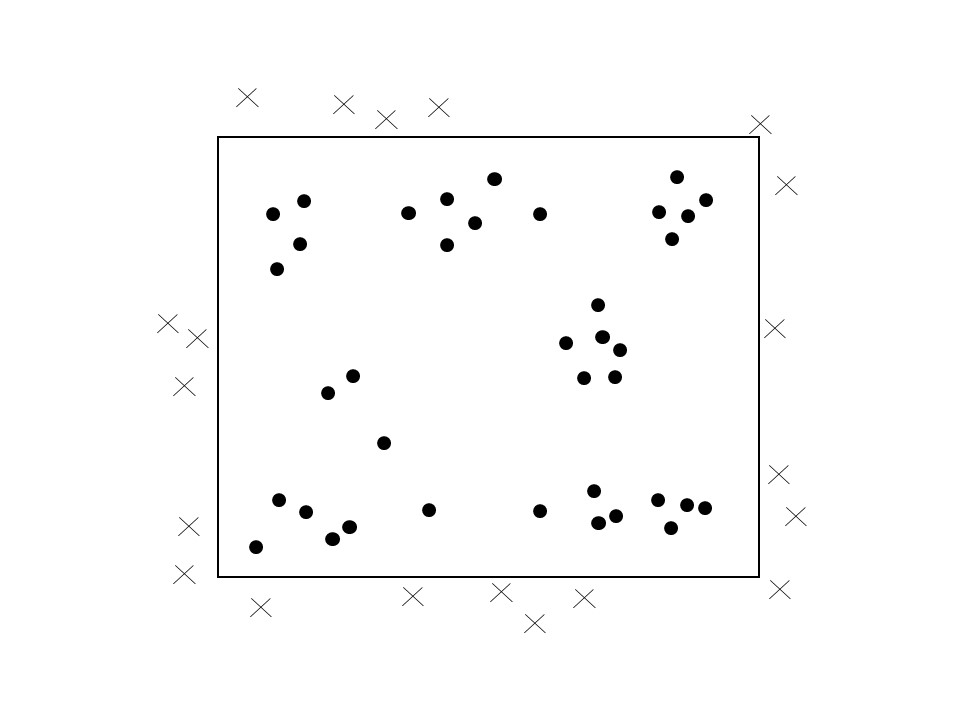
<p class="caption">(\#fig:edge-effects)\label{fig:edge-effects}Edge effects</p>
</div>

In the figure, the region is the rectangular window. Events are observed only inside the window, but events still exist beyond the edges of the window. It is straightforward to see how the empty space ($\hat{F}$-) function would be biased, since locations near the edge would appear the be more distant from an event than they actually are.

Several corrections are available in `spatstat` to deal with the possibility of edge effects. So far, we have used the argument `correction = "none"` when applying the functions. The following alternative corrections are implemented: "none", "rs", "km", "cs" and "best". Alternatively `correction = "all"` selects all options.

These corrections are variations of weighting schemes. In other words, the statistic is weighted to give an unbiased estimator. See:

``` r
plot(Gest(pp2.ppp, 
          correction = "all"))
```


The different corrections are plotted. It can be seen in this case that the corrections are relatively small, relative to the uncorrected empirical line; however, this is not always the case.

### Sampled Point Patterns

Whereas edge effects can introduce bias by censoring the observations outside of the window/region, another issue emerges when not all events are observed _inside_ the window.

We have assumed so far that any point pattern under analysis consists of a _census_ of events, or in other words, that all relevant events have been recorded. A _sampled_ point pattern, on the other hand, is a pattern where not all events have been recorded (see Figure \@ref(fig:sampled-pattern)).

<div class="figure">
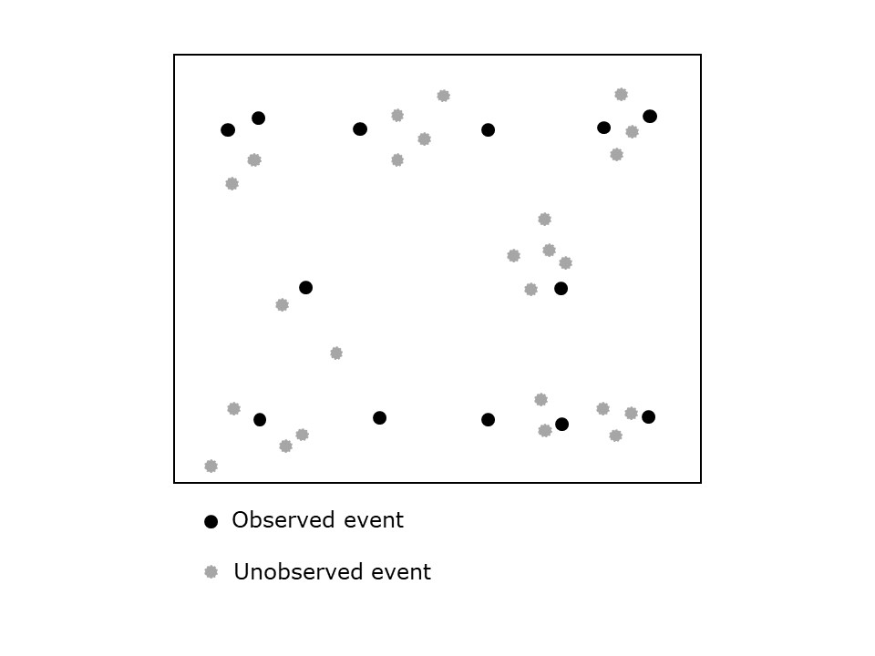
<p class="caption">(\#fig:sampled-pattern)\label{fig:sampled-pattern}Sampled point pattern</p>
</div>

The bias introduced by sampled point patterns can be extremely serious, because the findings depend heavily of the observations that were recorded as well as those that were not recorded! Clustered events could easily give the impression of a dispersed pattern, depending on what was observed. Imagine for instance that the events are nests of birds. If the birds tend to nest in the thickest parts of the forest that observers cannot easily access, the "observed" pattern will depend crucially on the trails and other routes of access that the researcher can use.

There are no good solutions to bias introduced by sampled point patterns, and it is not recommended to use the techniques discussed here with sampled point patterns.

This concludes the topic of spatial point patterns.


<!--chapter:end:17-Point-Pattern-Analysis-V.Rmd-->

# Activity 8: Point Pattern Analysis V

*NOTE*: The source files for this book are available with companion package [{isdas}](https://paezha.github.io/isdas/). The source files are in Rmarkdown format and packed as templates. These files allow you execute code within the notebook, so that you can work interactively with the notes. 

## Practice questions

Answer the following questions:

1. Describe the process to use simulation for hypothesis testing
2. Why is the selection of an appropriate region critical for the analysis of point patterns?
3. Discuss the issues associated with the edges of a region.
4. What is a sampled point pattern?

## Learning objectives

In this activity, you will:

1. Explore a dataset using single scale distance-based techniques.
2. Explore the characteristics of a point pattern at multiple scales.
3. Discuss ways to evaluate how confident you are that a pattern is random.

## Suggested reading

O'Sullivan D and Unwin D (2010) Geographic Information Analysis, 2nd Edition, Chapter 5. John Wiley & Sons: New Jersey.

## Preliminaries

It is good practice to begin with a clean session to make sure that you do not have extraneous items there when you begin your work. The best practice is to restart the `R` session, which can be accomplished for example with `command/ctrl + shift + F10`. An alternative to _only_ purge user-created objects from memory is to use the `R` command `rm` (for "remove"), followed by a list of items to be removed. To clear the workspace from _all_ objects, do the following:

``` r
rm(list = ls())
```

Note that `ls()` lists all objects currently on the workspace.

Load the libraries you will use in this activity. In addition to `tidyverse`, you will need `spatstat`, a package designed for the analysis of point patterns (you can learn about `spatstat` [here](https://cran.r-project.org/web/packages/spatstat/vignettes/getstart.pdf) and [here](http://spatstat.org/resources/spatstatJSSpaper.pdf)):

``` r
library(isdas) # Companion Package for Book An Introduction to Spatial Data Analysis and Statistics
library(spatstat) # Spatial Point Pattern Analysis, Model-Fitting, Simulation, Tests
library(tidyverse) # Easily Install and Load the 'Tidyverse'
```

Load a dataset of your choice. It could be one of the datasets that we have used before (Toronto Business Points, Bear GPS Locations), or one of the datasets included with the package `spatstat`. To see what datasets are available through the package, do the following:

``` r
vcdExtra::datasets("spatstat.data")
```

```
## Registered S3 methods overwritten by 'vcdExtra':
##   method      from
##   pairs.table vcd 
##   print.Kappa vcd
```

```
##                               Item class   dim
## 1                           Kovesi  list 41x13
## 2                         amacrine   ppp     6
## 3                         anemones   ppp     6
## 4                             ants   ppp     6
## 5                ants.extra (ants)  list     7
## 6                         austates  list     4
## 7                          bdspots  list     3
## 8                              bei   ppp     5
## 9                  bei.extra (bei)  list     2
## 10                       betacells   ppp     6
## 11                    bramblecanes   ppp     6
## 12                    bronzefilter   ppp     6
## 13                             btb   ppp     6
## 14                 btb.extra (btb)  list     2
## 15                           cells   ppp     5
## 16                       cetaceans  list   9x4
## 17     cetaceans.extra (cetaceans)  list     1
## 18                         chicago   ppx     3
## 19                         chorley   ppp     6
## 20         chorley.extra (chorley)  list     2
## 21                        clmfires   ppp     6
## 22       clmfires.extra (clmfires)  list     2
## 23                        concrete   ppp     5
## 24                          copper  list     7
## 25                       demohyper  list   3x3
## 26                         demopat   ppp     6
## 27                        dendrite   ppx     3
## 28                        finpines   ppp     6
## 29                             flu  list  41x4
## 30                         ganglia   ppp     6
## 31                          gordon   ppp     5
## 32                        gorillas   ppp     6
## 33       gorillas.extra (gorillas)  list     7
## 34                         hamster   ppp     6
## 35                         heather  list     3
## 36                      humberside   ppp     6
## 37  humberside.convex (humberside)   ppp     6
## 38                        hyytiala   ppp     6
## 39                   japanesepines   ppp     5
## 40                         lansing   ppp     6
## 41                         letterR  owin     5
## 42                        longleaf   ppp     6
## 43                      meningitis  list     2
## 44                          mucosa   ppp     6
## 45          mucosa.subwin (mucosa)  owin     4
## 46                       murchison  list     3
## 47                         nbfires   ppp     6
## 48         nbfires.extra (nbfires)  list     2
## 49              nbw.rect (nbfires)  owin     4
## 50               nbw.seg (nbfires)  list     5
## 51                         nztrees   ppp     5
## 52                           osteo  list  40x5
## 53                         paracou   ppp     6
## 54                       ponderosa   ppp     5
## 55     ponderosa.extra (ponderosa)  list     2
## 56                       pyramidal  list  31x2
## 57                         redwood   ppp     5
## 58                        redwood3   ppp     5
## 59                     redwoodfull   ppp     5
## 60 redwoodfull.extra (redwoodfull)  list     5
## 61                  residualspaper  list     7
## 62                         shapley   ppp     6
## 63         shapley.extra (shapley)  list     3
## 64                        shelling   ppp     5
## 65            shelling2 (shelling)   ppp     5
## 66                           simba  list  10x2
## 67                          simdat   ppp     5
## 68                       simplenet  list    10
## 69                         spiders   ppx     3
## 70                     sporophores   ppp     6
## 71                         spruces   ppp     6
## 72                      stonetools   ppp     6
## 73                    swedishpines   ppp     5
## 74                         urkiola   ppp     6
## 75                        vesicles   ppp     5
## 76       vesicles.extra (vesicles)  list     4
## 77                            waka   ppp     6
## 78                   waterstriders  list     3
##                                                                                        Title
## 1                                          Colour Sequences with Uniform Perceptual Contrast
## 2                                                                 Hughes' Amacrine Cell Data
## 3                                                                      Beadlet Anemones Data
## 4                                                            Harkness-Isham ants' nests data
## 5                                                            Harkness-Isham ants' nests data
## 6                                                 Australian States and Mainland Territories
## 7                                               Breakdown Spots in Microelectronic Materials
## 8                                                                 Tropical rain forest trees
## 9                                                                 Tropical rain forest trees
## 10                                                         Beta Ganglion Cells in Cat Retina
## 11                                                             Hutchings' Bramble Canes data
## 12                                                               Bronze gradient filter data
## 13                                                                  Bovine Tuberculosis Data
## 14                                                                  Bovine Tuberculosis Data
## 15                                                            Biological Cells Point Pattern
## 16                                            Point patterns of whale and dolphin sightings.
## 17                                            Point patterns of whale and dolphin sightings.
## 18                                                                        Chicago Crime Data
## 19                                                                Chorley-Ribble Cancer Data
## 20                                                                Chorley-Ribble Cancer Data
## 21                                                           Castilla-La Mancha Forest Fires
## 22                                                           Castilla-La Mancha Forest Fires
## 23                                                                   Air Bubbles in Concrete
## 24                                                   Berman-Huntington points and lines data
## 25                                       Demonstration Example of Hyperframe of Spatial Data
## 26                                                             Artificial Data Point Pattern
## 27                                                                     Dendritic Spines Data
## 28                                                                 Pine saplings in Finland.
## 29                                                                  Influenza Virus Proteins
## 30                                            Beta Ganglion Cells in Cat Retina, Old Version
## 31                                                                   People in Gordon Square
## 32                                                                     Gorilla Nesting Sites
## 33                                                                     Gorilla Nesting Sites
## 34                                                              Aherne's hamster tumour data
## 35                                                                     Diggle's Heather Data
## 36                                       Humberside Data on Childhood Leukaemia and Lymphoma
## 37                                       Humberside Data on Childhood Leukaemia and Lymphoma
## 38                                                   Scots pines and other trees at Hyytiala
## 39                                                              Japanese Pines Point Pattern
## 40                                                               Lansing Woods Point Pattern
## 41                                                               Window in Shape of Letter R
## 42                                                              Longleaf Pines Point Pattern
## 43                                           Invasive Meningococcal Disease Cases in Germany
## 44                                                                   Cells in Gastric Mucosa
## 45                                                                   Cells in Gastric Mucosa
## 46                                                                   Murchison gold deposits
## 47                                              Point Patterns of New Brunswick Forest Fires
## 48                                              Point Patterns of New Brunswick Forest Fires
## 49                                              Point Patterns of New Brunswick Forest Fires
## 50                                              Point Patterns of New Brunswick Forest Fires
## 51                                                           New Zealand Trees Point Pattern
## 52                       Osteocyte Lacunae Data: Replicated Three-Dimensional Point Patterns
## 53                                                   Kimboto trees at Paracou, French Guiana
## 54                                                         Ponderosa Pine Tree Point Pattern
## 55                                                         Ponderosa Pine Tree Point Pattern
## 56                                                     Pyramidal Neurons in Cingulate Cortex
## 57                                       California Redwoods Point Pattern (Ripley's Subset)
## 58                                       California Redwoods Point Pattern (Ripley's Subset)
## 59                                        California Redwoods Point Pattern (Entire Dataset)
## 60                                        California Redwoods Point Pattern (Entire Dataset)
## 61                                     Data and Code From JRSS Discussion Paper on Residuals
## 62                                                      Galaxies in the Shapley Supercluster
## 63                                                      Galaxies in the Shapley Supercluster
## 64                                                              Artillery Impacts in Ukraine
## 65                                                              Artillery Impacts in Ukraine
## 66            Simulated data from a two-group experiment with replication within each group.
## 67                                                                   Simulated Point Pattern
## 68                                                          Simple Example of Linear Network
## 69                                               Spider Webs on Mortar Lines of a Brick Wall
## 70                                                                          Sporophores Data
## 71                                                                     Spruces Point Pattern
## 72                                                                  Palaeolithic Stone Tools
## 73                                                               Swedish Pines Point Pattern
## 74                                                               Urkiola Woods Point Pattern
## 75                                                                             Vesicles Data
## 76                                                                             Vesicles Data
## 77                                                               Trees in Waka national park
## 78 Waterstriders data.  Three independent replications of a point pattern formed by insects.
```

Load a dataset of your choice.

You can do this by using the `load()` function if the dataset is in your drive (e.g., the GPS coordinates of the bear).

On the other hand, if the dataset is included with the `spatstat` package you can do the following, for example to load the `gorillas` dataset:

``` r
gorillas.ppp <- gorillas
```

As usual, you can check the object by means of the `summary` function:

``` r
summary(gorillas.ppp)
```

```
## Marked planar point pattern:  647 points
## Average intensity 3.255566e-05 points per square metre
## 
## *Pattern contains duplicated points*
## 
## Coordinates are given to 2 decimal places
## i.e. rounded to the nearest multiple of 0.01 metres
## 
## Mark variables: group, season, date
## Summary:
##    group       season         date           
##  major:350   dry  :275   Min.   :2006-01-06  
##  minor:297   rainy:372   1st Qu.:2007-03-15  
##                          Median :2008-02-05  
##                          Mean   :2007-12-14  
##                          3rd Qu.:2008-09-23  
##                          Max.   :2009-05-31  
## 
## Window: polygonal boundary
## single connected closed polygon with 21 vertices
## enclosing rectangle: [580457.9, 585934] x [674172.8, 678739.2] metres
##                      (5476 x 4566 metres)
## Window area = 19873700 square metres
## Unit of length: 1 metre
## Fraction of frame area: 0.795
```

## Activity

::: {.infobox .caution data-latex="{caution}"}
**Capstone Activity**

This is a capstone activity where you can work free-style
on a data set of your choice, and put in practice what you
have learned with respect to the analysis of point patterns.
:::

1. Partner with a fellow student to analyze the chosen dataset.

2. Discuss whether the pattern is random, and how confident you are in your decision.

3. The analysis of the pattern is meant to provide insights about the underlying process. Create a hypothesis using the data generated and can you answer that hypothesis using the plots generated?

4. Discuss the limitations of the analysis, for instance, choice of modeling parameters (size of region, kernel bandwidths, edge effects, etc.)


<!--chapter:end:18-Activity-Point-Pattern-Analysis-V.Rmd-->

# Part IV: Data in Areal Units {-}

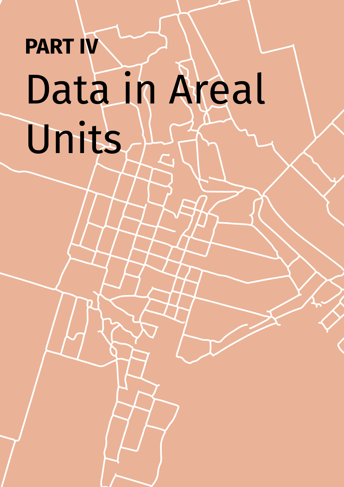<!-- -->

# Area Data I

*NOTE*: The source files for this book are available with companion package [{isdas}](https://paezha.github.io/isdas/). The source files are in Rmarkdown format and packed as templates. These files allow you execute code within the notebook, so that you can work interactively with the notes. 

## Learning Objectives

In last few practices/sessions, you learned about spatial point patterns. The next few sessions will concentrate on _area data_.

In this practice, you will learn:

1. A formal definition of area data.
2. Processes and area data.
3. Visualizing area data: Choropleth maps.
4. Visualizing area data: Cartograms.

## Suggested Readings

- Bailey TC and Gatrell AC [-@Bailey1995] Interactive Spatial Data Analysis, Chapter 7. Longman: Essex.
- Bivand RS, Pebesma E, and Gomez-Rubio V [-@Bivand2008] Applied Spatial Data Analysis with R, Chapter 9. Springer: New York.
- Brunsdon C and Comber L [-@Brunsdon2015R] An Introduction to R for Spatial Analysis and Mapping, Chapter 7. Sage: Los Angeles.
- O'Sullivan D and Unwin D [-@Osullivan2010] Geographic Information Analysis, 2nd Edition, Chapter 7. John Wiley & Sons: New Jersey.

## Preliminaries

As usual, it is good practice to begin with a clean session to make sure that you do not have extraneous items there when you begin your work. The best practice is to restart the `R` session, which can be accomplished for example with `command/ctrl + shift + F10`. An alternative to _only_ purge user-created objects from memory is to use the `R` command `rm` (for "remove"), followed by a list of items to be removed. To clear the workspace from _all_ objects, do the following:

``` r
rm(list = ls())
```

Note that `ls()` lists all objects currently on the workspace.

Load the libraries you will use in this activity:

``` r
library(cartogram) # Create Cartograms with R
library(isdas) # Companion Package for Book An Introduction to Spatial Data Analysis and Statistics
library(gridExtra) # Miscellaneous Functions for "Grid" Graphics
library(plotly) # Create Interactive Web Graphics via 'plotly.js'
library(sf) # Simple Features for R
library(tidyverse) # Easily Install and Load the 'Tidyverse'
```

Read the data used in this chapter.

``` r
data("Hamilton_CT")
```

The data are an object of class `sf` that includes the spatial information for the census tracts in the Hamilton Census Metropolitan Area in Canada and a series of demographic variables from the 2011 Census of Canada.

You can quickly verify the contents of the dataframe by means of `summary`:

``` r
summary(Hamilton_CT)
```

```
##        ID               AREA                TRACT       POPULATION   
##  Min.   : 919807   Min.   :  0.3154   Length   :188   Min.   :    5  
##  1st Qu.: 927964   1st Qu.:  0.8552   N.unique :188   1st Qu.: 2639  
##  Median : 948130   Median :  1.4157   N.blank  :  0   Median : 3595  
##  Mean   : 948710   Mean   :  7.4578   Min.nchar: 10   Mean   : 3835  
##  3rd Qu.: 959722   3rd Qu.:  2.7775   Max.nchar: 10   3rd Qu.: 4692  
##  Max.   :1115750   Max.   :138.4466                   Max.   :11675  
##   POP_DENSITY         AGE_LESS_20      AGE_20_TO_24    AGE_25_TO_29  
##  Min.   :    2.591   Min.   :   0.0   Min.   :  0.0   Min.   :  0.0  
##  1st Qu.: 1438.007   1st Qu.: 528.8   1st Qu.:168.8   1st Qu.:135.0  
##  Median : 2689.737   Median : 750.0   Median :225.0   Median :215.0  
##  Mean   : 2853.078   Mean   : 899.3   Mean   :253.9   Mean   :232.8  
##  3rd Qu.: 3783.889   3rd Qu.:1110.0   3rd Qu.:311.2   3rd Qu.:296.2  
##  Max.   :14234.286   Max.   :3285.0   Max.   :835.0   Max.   :915.0  
##   AGE_30_TO_34     AGE_35_TO_39     AGE_40_TO_44     AGE_45_TO_49  
##  Min.   :   0.0   Min.   :   0.0   Min.   :   0.0   Min.   :  0.0  
##  1st Qu.: 135.0   1st Qu.: 145.0   1st Qu.: 170.0   1st Qu.:203.8  
##  Median : 195.0   Median : 200.0   Median : 230.0   Median :282.5  
##  Mean   : 228.2   Mean   : 239.6   Mean   : 268.7   Mean   :310.6  
##  3rd Qu.: 281.2   3rd Qu.: 280.0   3rd Qu.: 325.0   3rd Qu.:385.0  
##  Max.   :1320.0   Max.   :1200.0   Max.   :1105.0   Max.   :880.0  
##   AGE_50_TO_54    AGE_55_TO_59    AGE_60_TO_64  AGE_65_TO_69    AGE_70_TO_74  
##  Min.   :  0.0   Min.   :  0.0   Min.   :  0   Min.   :  0.0   Min.   :  0.0  
##  1st Qu.:203.8   1st Qu.:175.0   1st Qu.:140   1st Qu.:115.0   1st Qu.: 90.0  
##  Median :280.0   Median :240.0   Median :220   Median :157.5   Median :130.0  
##  Mean   :300.3   Mean   :257.7   Mean   :229   Mean   :174.2   Mean   :139.7  
##  3rd Qu.:375.0   3rd Qu.:325.0   3rd Qu.:295   3rd Qu.:221.2   3rd Qu.:180.0  
##  Max.   :740.0   Max.   :625.0   Max.   :540   Max.   :625.0   Max.   :540.0  
##   AGE_75_TO_79     AGE_80_TO_84     AGE_MORE_85              geometry  
##  Min.   :  0.00   Min.   :  0.00   Min.   :  0.00   POLYGON      :188  
##  1st Qu.: 68.75   1st Qu.: 50.00   1st Qu.: 35.00   epsg:26917   :  0  
##  Median :100.00   Median : 77.50   Median : 70.00   +proj=utm ...:  0  
##  Mean   :118.32   Mean   : 95.05   Mean   : 87.71                      
##  3rd Qu.:160.00   3rd Qu.:120.00   3rd Qu.:105.00                      
##  Max.   :575.00   Max.   :420.00   Max.   :400.00
```

## Area Data

Every phenomena can be measured at a location (ask yourself, what exists outside of space?).

In point pattern analysis, the _unit of support_ is the point, and the source of randomness is the location itself. Many other forms of data are also collected at points. For instance, when the census collects information on population, at its most basic, the information can be georeferenced to an address, that is, a point.

In numerous applications, however, data are not reported at their fundamental unit of support, but rather are aggregated to some other geometry, for instance an area. This is done for several reasons, including the privacy and confidentiality of the data. Instead of reporting individual-level information, the information is reported for zoning systems that often are devised without consideration to any underlying social, natural, or economic processes.

Census data, for example, are reported at different levels of geography. In Canada, the smallest publicly available geography is called a _Dissemination Area_ or [DA](http://www12.statcan.gc.ca/census-recensement/2011/ref/dict/geo021-eng.cfm). A DA in Canada contains a population between 400 and 700 persons. Thus, instead of reporting that one person (or more) are located at a point (i.e., an address), the census reports the population for the DA. Other data are aggregated in similar ways (income, residential status, etc.)

At the highest level of aggregation, national level statistics are reported, such as Gross Domestic Product, or GDP. Economic production is not evenly distributed across space; however, the national GDP does not distinguish regional variations in this process.

Ideally, a data analyst would work with data in its most fundamental support. This is not always possible, and therefore many techniques have been developed to work with data that have been aggregated to zones.

When working with areas, it is less practical to identify the area with the coordinates (as we did with points). After all, areas will be composed of lines and reporting all the relevant coordinates is impractical. Sometimes the geometric centroids of the areas are used instead.

More commonly, areas are assigned an index or unique identifier, so that a region will typically consist of a set of $n$ areas as follows:
$$
R = A_1 \cup A_2 \cup A_3 \cup ...\cup A_n.
$$

The above is read as "the Region R is the union of Areas 1 to n".

Regions can have a set of $k$ attributes or variables associated with them, for instance:
$$
\textbf{X}_i=[x_{i1}, x_{i2}, x_{i3},...,x_{ik}]
$$

These attributes will typically be counts (e.g., number of people in a DA), or some summary measure of the underlying data (e.g., mean commute time).

## Processes and Area Data

Imagine that data on income by household were collected as follows:

``` r
# Here, we are creating a dataframe with three columns, coordinates x and y in space to indicate the locations of households, and their income.
df <- data.frame(x = c(0.3, 0.4, 0.5, 0.6, 0.7), y = c(0.1, 0.4, 0.2, 0.5, 0.3), Income = c(30000, 30000, 100000, 100000, 100000))
```

Households are geocoded as points with coordinates `x` and `y`, whereas income is in dollars.

Plot the income as points (hover over the points to see the attributes):

``` r
# The `ggplot()` function is used to create a plot. The function `geom_point()` adds points to the plot, using the values of coordinates x and y, and coloring by Income. Higher income households appear to be on the East regions of the area.

p <- ggplot(data = df, aes(x = x, y = y, color = Income)) + 
  geom_point(shape = 17, size = 5) +
  coord_fixed()
ggplotly(p)
```

```{=html}
<div class="plotly html-widget html-fill-item" id="htmlwidget-f80b28186ab236e9e4d1" style="width:672px;height:480px;"></div>
<script type="application/json" data-for="htmlwidget-f80b28186ab236e9e4d1">{"x":{"data":[{"x":[0.29999999999999999,0.40000000000000002,0.5,0.59999999999999998,0.69999999999999996],"y":[0.10000000000000001,0.40000000000000002,0.20000000000000001,0.5,0.29999999999999999],"text":["x: 0.3<br />y: 0.1<br />Income: 3e+04","x: 0.4<br />y: 0.4<br />Income: 3e+04","x: 0.5<br />y: 0.2<br />Income: 1e+05","x: 0.6<br />y: 0.5<br />Income: 1e+05","x: 0.7<br />y: 0.3<br />Income: 1e+05"],"type":"scatter","mode":"markers","marker":{"autocolorscale":false,"color":["rgba(19,43,67,1)","rgba(19,43,67,1)","rgba(86,177,247,1)","rgba(86,177,247,1)","rgba(86,177,247,1)"],"opacity":1,"size":18.897637795275593,"symbol":"triangle-up","line":{"width":1.8897637795275593,"color":["rgba(19,43,67,1)","rgba(19,43,67,1)","rgba(86,177,247,1)","rgba(86,177,247,1)","rgba(86,177,247,1)"]}},"hoveron":"points","showlegend":false,"xaxis":"x","yaxis":"y","hoverinfo":"text","frame":null},{"x":[0.30000000000000004],"y":[0.10000000000000001],"name":"0baf4b4690afaf5e247caa2cb0a0127d","type":"scatter","mode":"markers","opacity":0,"hoverinfo":"skip","showlegend":false,"marker":{"color":[0,1],"colorscale":[[0,"#132B43"],[0.0033444816053511853,"#132B44"],[0.0066889632107023185,"#132C44"],[0.010033444816053503,"#142C45"],[0.013377926421404689,"#142D45"],[0.016722408026755876,"#142D46"],[0.020066889632107007,"#142D46"],[0.023411371237458192,"#142E47"],[0.026755852842809378,"#152E47"],[0.030100334448160512,"#152F48"],[0.033444816053511697,"#152F48"],[0.03678929765886288,"#152F49"],[0.040133779264214013,"#153049"],[0.043478260869565251,"#16304A"],[0.046822742474916385,"#16304A"],[0.050167224080267518,"#16314B"],[0.053511705685618756,"#16314B"],[0.05685618729096989,"#16324C"],[0.060200668896321023,"#17324D"],[0.063545150501672268,"#17324D"],[0.066889632107023395,"#17334E"],[0.070234113712374535,"#17334E"],[0.073578595317725759,"#17344F"],[0.0769230769230769,"#18344F"],[0.080267558528428137,"#183450"],[0.083612040133779264,"#183550"],[0.086956521739130405,"#183551"],[0.090301003344481642,"#183651"],[0.093645484949832769,"#193652"],[0.09698996655518391,"#193652"],[0.10033444816053515,"#193753"],[0.10367892976588627,"#193754"],[0.10702341137123751,"#193854"],[0.11036789297658865,"#1A3855"],[0.11371237458193978,"#1A3955"],[0.11705685618729102,"#1A3956"],[0.12040133779264216,"#1A3956"],[0.12374581939799328,"#1A3A57"],[0.12709030100334454,"#1B3A57"],[0.13043478260869565,"#1B3B58"],[0.13377926421404679,"#1B3B59"],[0.13712374581939804,"#1B3B59"],[0.14046822742474915,"#1C3C5A"],[0.14381270903010029,"#1C3C5A"],[0.14715719063545152,"#1C3D5B"],[0.15050167224080266,"#1C3D5B"],[0.1538461538461538,"#1C3D5C"],[0.15719063545150502,"#1D3E5C"],[0.16053511705685616,"#1D3E5D"],[0.1638795986622073,"#1D3F5D"],[0.16722408026755853,"#1D3F5E"],[0.17056856187290967,"#1D3F5F"],[0.17391304347826092,"#1E405F"],[0.17725752508361203,"#1E4060"],[0.18060200668896328,"#1E4160"],[0.18394648829431443,"#1E4161"],[0.18729096989966554,"#1E4261"],[0.19063545150501679,"#1F4262"],[0.19397993311036793,"#1F4263"],[0.19732441471571904,"#1F4363"],[0.20066889632107029,"#1F4364"],[0.20401337792642144,"#1F4464"],[0.20735785953177255,"#204465"],[0.2107023411371238,"#204465"],[0.21404682274247494,"#204566"],[0.21739130434782605,"#204566"],[0.2207357859531773,"#214667"],[0.22408026755852842,"#214668"],[0.22742474916387956,"#214768"],[0.23076923076923081,"#214769"],[0.23411371237458192,"#214769"],[0.23745819397993306,"#22486A"],[0.24080267558528431,"#22486A"],[0.24414715719063543,"#22496B"],[0.24749163879598657,"#22496C"],[0.25083612040133779,"#224A6C"],[0.25418060200668907,"#234A6D"],[0.25752508361204007,"#234A6D"],[0.2608695652173913,"#234B6E"],[0.26421404682274258,"#234B6E"],[0.26755852842809369,"#244C6F"],[0.2709030100334448,"#244C70"],[0.27424749163879608,"#244C70"],[0.27759197324414719,"#244D71"],[0.28093645484949831,"#244D71"],[0.28428093645484959,"#254E72"],[0.2876254180602007,"#254E72"],[0.29096989966555181,"#254F73"],[0.29431438127090304,"#254F74"],[0.2976588628762542,"#254F74"],[0.30100334448160532,"#265075"],[0.30434782608695654,"#265075"],[0.30769230769230771,"#265176"],[0.31103678929765882,"#265176"],[0.31438127090301005,"#275277"],[0.31772575250836121,"#275278"],[0.32107023411371233,"#275278"],[0.32441471571906355,"#275379"],[0.32775919732441472,"#275379"],[0.33110367892976583,"#28547A"],[0.33444816053511706,"#28547B"],[0.33779264214046834,"#28557B"],[0.34113712374581934,"#28557C"],[0.34448160535117056,"#28567C"],[0.34782608695652184,"#29567D"],[0.35117056856187284,"#29567D"],[0.35451505016722407,"#29577E"],[0.35785953177257535,"#29577F"],[0.36120401337792646,"#2A587F"],[0.36454849498327757,"#2A5880"],[0.36789297658862885,"#2A5980"],[0.37123745819397996,"#2A5981"],[0.37458193979933108,"#2A5982"],[0.37792642140468236,"#2B5A82"],[0.38127090301003347,"#2B5A83"],[0.38461538461538458,"#2B5B83"],[0.38795986622073586,"#2B5B84"],[0.39130434782608697,"#2C5C85"],[0.39464882943143809,"#2C5C85"],[0.39799331103678937,"#2C5D86"],[0.40133779264214048,"#2C5D86"],[0.40468227424749159,"#2C5D87"],[0.40802675585284287,"#2D5E87"],[0.41137123745819398,"#2D5E88"],[0.4147157190635451,"#2D5F89"],[0.41806020066889638,"#2D5F89"],[0.4214046822742476,"#2E608A"],[0.4247491638795986,"#2E608A"],[0.42809364548494988,"#2E618B"],[0.4314381270903011,"#2E618C"],[0.43478260869565211,"#2E618C"],[0.43812709030100333,"#2F628D"],[0.44147157190635461,"#2F628D"],[0.44481605351170572,"#2F638E"],[0.44816053511705684,"#2F638F"],[0.45150501672240811,"#30648F"],[0.45484949832775923,"#306490"],[0.45819397993311034,"#306590"],[0.46153846153846162,"#306591"],[0.46488294314381273,"#306592"],[0.46822742474916385,"#316692"],[0.47157190635451512,"#316693"],[0.47491638795986624,"#316793"],[0.47826086956521735,"#316794"],[0.48160535117056863,"#326895"],[0.48494983277591974,"#326895"],[0.48829431438127086,"#326996"],[0.49163879598662213,"#326996"],[0.49498327759197325,"#326997"],[0.49832775919732447,"#336A98"],[0.50167224080267558,"#336A98"],[0.50501672240802675,"#336B99"],[0.50836120401337814,"#336B99"],[0.51170568561872909,"#346C9A"],[0.51505016722408015,"#346C9B"],[0.51839464882943143,"#346D9B"],[0.52173913043478259,"#346D9C"],[0.52508361204013387,"#346E9D"],[0.52842809364548515,"#356E9D"],[0.5317725752508361,"#356E9E"],[0.53511705685618738,"#356F9E"],[0.53846153846153844,"#356F9F"],[0.5418060200668896,"#3670A0"],[0.54515050167224088,"#3670A0"],[0.54849498327759216,"#3671A1"],[0.55183946488294311,"#3671A1"],[0.55518394648829439,"#3772A2"],[0.55852842809364545,"#3772A3"],[0.56187290969899661,"#3773A3"],[0.56521739130434789,"#3773A4"],[0.56856187290969917,"#3773A4"],[0.57190635451505012,"#3874A5"],[0.5752508361204014,"#3874A6"],[0.57859531772575246,"#3875A6"],[0.58193979933110362,"#3875A7"],[0.5852842809364549,"#3976A8"],[0.58862876254180607,"#3976A8"],[0.59197324414715735,"#3977A9"],[0.59531772575250841,"#3977A9"],[0.59866220735785947,"#3978AA"],[0.60200668896321063,"#3A78AB"],[0.60535117056856191,"#3A79AB"],[0.60869565217391308,"#3A79AC"],[0.61204013377926436,"#3A79AC"],[0.61538461538461542,"#3B7AAD"],[0.61872909698996648,"#3B7AAE"],[0.62207357859531764,"#3B7BAE"],[0.62541806020066892,"#3B7BAF"],[0.62876254180602009,"#3C7CB0"],[0.63210702341137137,"#3C7CB0"],[0.63545150501672243,"#3C7DB1"],[0.6387959866220736,"#3C7DB1"],[0.64214046822742465,"#3C7EB2"],[0.64548494983277593,"#3D7EB3"],[0.6488294314381271,"#3D7FB3"],[0.65217391304347838,"#3D7FB4"],[0.65551839464882944,"#3D7FB5"],[0.65886287625418061,"#3E80B5"],[0.66220735785953166,"#3E80B6"],[0.66555183946488294,"#3E81B6"],[0.66889632107023411,"#3E81B7"],[0.67224080267558539,"#3F82B8"],[0.67558528428093667,"#3F82B8"],[0.67892976588628762,"#3F83B9"],[0.68227424749163867,"#3F83BA"],[0.68561872909698995,"#4084BA"],[0.68896321070234112,"#4084BB"],[0.6923076923076924,"#4085BB"],[0.69565217391304368,"#4085BC"],[0.69899665551839463,"#4086BD"],[0.70234113712374568,"#4186BD"],[0.70568561872909696,"#4186BE"],[0.70903010033444813,"#4187BF"],[0.71237458193979941,"#4187BF"],[0.71571906354515069,"#4288C0"],[0.71906354515050164,"#4288C1"],[0.72240802675585292,"#4289C1"],[0.72575250836120397,"#4289C2"],[0.72909698996655514,"#438AC2"],[0.73244147157190642,"#438AC3"],[0.7357859531772577,"#438BC4"],[0.73913043478260865,"#438BC4"],[0.74247491638795993,"#438CC5"],[0.74581939799331098,"#448CC6"],[0.74916387959866215,"#448DC6"],[0.75250836120401343,"#448DC7"],[0.75585284280936471,"#448EC8"],[0.75919732441471588,"#458EC8"],[0.76254180602006694,"#458FC9"],[0.76588628762541799,"#458FC9"],[0.76923076923076916,"#458FCA"],[0.77257525083612044,"#4690CB"],[0.77591973244147172,"#4690CB"],[0.77926421404682289,"#4691CC"],[0.78260869565217395,"#4691CD"],[0.785953177257525,"#4792CD"],[0.78929765886287617,"#4792CE"],[0.79264214046822745,"#4793CF"],[0.79598662207357873,"#4793CF"],[0.7993311036789299,"#4894D0"],[0.80267558528428096,"#4894D0"],[0.80602006688963224,"#4895D1"],[0.80936454849498318,"#4895D2"],[0.81270903010033446,"#4896D2"],[0.81605351170568574,"#4996D3"],[0.81939799331103691,"#4997D4"],[0.82274247491638797,"#4997D4"],[0.82608695652173925,"#4998D5"],[0.82943143812709019,"#4A98D6"],[0.83277591973244147,"#4A99D6"],[0.83612040133779275,"#4A99D7"],[0.83946488294314392,"#4A9AD8"],[0.8428093645484952,"#4B9AD8"],[0.84615384615384626,"#4B9BD9"],[0.8494983277591972,"#4B9BDA"],[0.85284280936454848,"#4B9BDA"],[0.85618729096989976,"#4C9CDB"],[0.85953177257525093,"#4C9CDB"],[0.86287625418060221,"#4C9DDC"],[0.86622073578595316,"#4C9DDD"],[0.86956521739130421,"#4D9EDD"],[0.87290969899665549,"#4D9EDE"],[0.87625418060200666,"#4D9FDF"],[0.87959866220735794,"#4D9FDF"],[0.88294314381270922,"#4DA0E0"],[0.88628762541806017,"#4EA0E1"],[0.88963210702341144,"#4EA1E1"],[0.8929765886287625,"#4EA1E2"],[0.89632107023411367,"#4EA2E3"],[0.89966555183946495,"#4FA2E3"],[0.90301003344481623,"#4FA3E4"],[0.90635451505016718,"#4FA3E5"],[0.90969899665551845,"#4FA4E5"],[0.91304347826086951,"#50A4E6"],[0.91638795986622068,"#50A5E7"],[0.91973244147157196,"#50A5E7"],[0.92307692307692324,"#50A6E8"],[0.92642140468227441,"#51A6E8"],[0.92976588628762546,"#51A7E9"],[0.93311036789297652,"#51A7EA"],[0.93645484949832769,"#51A8EA"],[0.93979933110367897,"#52A8EB"],[0.94314381270903025,"#52A9EC"],[0.9464882943143812,"#52A9EC"],[0.94983277591973247,"#52AAED"],[0.95317725752508375,"#53AAEE"],[0.9565217391304347,"#53ABEE"],[0.95986622073578598,"#53ABEF"],[0.96321070234113726,"#53ACF0"],[0.96655518394648821,"#54ACF0"],[0.96989966555183948,"#54ADF1"],[0.97324414715719076,"#54ADF2"],[0.97658862876254171,"#54AEF2"],[0.97993311036789299,"#55AEF3"],[0.98327759197324427,"#55AFF4"],[0.98662207357859544,"#55AFF4"],[0.98996655518394649,"#55B0F5"],[0.99331103678929777,"#56B0F6"],[0.99665551839464894,"#56B1F6"],[1,"#56B1F7"]],"colorbar":{"bgcolor":"rgba(255,255,255,1)","bordercolor":"transparent","borderwidth":1.8897637795275593,"thickness":23.039999999999996,"title":"Income","titlefont":{"color":"rgba(0,0,0,1)","family":"","size":14.611872146118724},"tickmode":"array","ticktext":["4e+04","6e+04","8e+04","1e+05"],"tickvals":[0.14404761904761904,0.42880952380952375,0.71357142857142852,0.99833333333333329],"tickfont":{"color":"rgba(0,0,0,1)","family":"","size":11.68949771689498},"ticklen":2,"len":0.5}},"xaxis":"x","yaxis":"y","frame":null}],"layout":{"margin":{"t":23.305936073059364,"r":7.3059360730593621,"b":37.260273972602747,"l":43.105022831050235},"plot_bgcolor":"rgba(235,235,235,1)","paper_bgcolor":"rgba(255,255,255,1)","font":{"color":"rgba(0,0,0,1)","family":"","size":14.611872146118724},"xaxis":{"domain":[0,1],"automargin":true,"type":"linear","autorange":false,"range":[0.27999999999999997,0.71999999999999997],"tickmode":"array","ticktext":["0.3","0.4","0.5","0.6","0.7"],"tickvals":[0.30000000000000004,0.40000000000000002,0.5,0.60000000000000009,0.70000000000000007],"categoryorder":"array","categoryarray":["0.3","0.4","0.5","0.6","0.7"],"nticks":null,"ticks":"outside","tickcolor":"rgba(51,51,51,1)","ticklen":3.6529680365296811,"tickwidth":0.66417600664176002,"showticklabels":true,"tickfont":{"color":"rgba(77,77,77,1)","family":"","size":11.68949771689498},"tickangle":-0,"showline":false,"linecolor":null,"linewidth":0,"showgrid":true,"gridcolor":"rgba(255,255,255,1)","gridwidth":0.66417600664176002,"zeroline":false,"anchor":"y","title":{"text":"x","font":{"color":"rgba(0,0,0,1)","family":"","size":14.611872146118724}},"scaleanchor":"y","scaleratio":1,"hoverformat":".2f"},"yaxis":{"domain":[0,1],"automargin":true,"type":"linear","autorange":false,"range":[0.080000000000000002,0.52000000000000002],"tickmode":"array","ticktext":["0.1","0.2","0.3","0.4","0.5"],"tickvals":[0.10000000000000001,0.20000000000000001,0.30000000000000004,0.40000000000000002,0.5],"categoryorder":"array","categoryarray":["0.1","0.2","0.3","0.4","0.5"],"nticks":null,"ticks":"outside","tickcolor":"rgba(51,51,51,1)","ticklen":3.6529680365296811,"tickwidth":0.66417600664176002,"showticklabels":true,"tickfont":{"color":"rgba(77,77,77,1)","family":"","size":11.68949771689498},"tickangle":-0,"showline":false,"linecolor":null,"linewidth":0,"showgrid":true,"gridcolor":"rgba(255,255,255,1)","gridwidth":0.66417600664176002,"zeroline":false,"anchor":"x","title":{"text":"y","font":{"color":"rgba(0,0,0,1)","family":"","size":14.611872146118724}},"scaleanchor":"x","scaleratio":1,"hoverformat":".2f"},"shapes":[],"showlegend":false,"legend":{"bgcolor":"rgba(255,255,255,1)","bordercolor":"transparent","borderwidth":1.8897637795275593,"font":{"color":"rgba(0,0,0,1)","family":"","size":11.68949771689498},"title":{"text":"Income","font":{"color":"rgba(0,0,0,1)","family":"","size":14.611872146118724}}},"hovermode":"closest","barmode":"relative"},"config":{"doubleClick":"reset","modeBarButtonsToAdd":["hoverclosest","hovercompare"],"showSendToCloud":false},"source":"A","attrs":{"12ed055ce7b73":{"x":{},"y":{},"colour":{},"type":"scatter"}},"cur_data":"12ed055ce7b73","visdat":{"12ed055ce7b73":["function (y) ","x"]},"highlight":{"on":"plotly_click","persistent":false,"dynamic":false,"selectize":false,"opacityDim":0.20000000000000001,"selected":{"opacity":1},"debounce":0},"shinyEvents":["plotly_hover","plotly_click","plotly_selected","plotly_relayout","plotly_brushed","plotly_brushing","plotly_clickannotation","plotly_doubleclick","plotly_deselect","plotly_afterplot","plotly_sunburstclick"],"base_url":"https://plot.ly"},"evals":[],"jsHooks":[]}</script>
```

The underlying process is one of income sorting, with lower incomes to the west, and higher incomes to the east. This could be due to a geographical feature of the landscape (for instance, an escarpment), or the distribution of the housing stock (with a neighborhood that has more expensive houses). These are examples of a variable that responds to a common environmental factor. As an alternative, people may display a preference towards being near others that are similar to them (this is called homophily). When this happens, the variable responds to itself in space.

The quality of similarity or dissimilarity between neighboring observations of the same variable in space is called _spatial autocorrelation_. You will learn more about this later on.

Another reason why variables reported for areas could display similarities in space is as an consequence of the zoning system.

Suppose for a moment that the data above can only be reported at the zonal level, perhaps because of privacy and confidentiality concerns. Thanks to the great talent of the designers of the zoning system (or a felicitous coincidence!), the zoning system is such that it is consistent with the underlying process of sorting. The zones, therefore, are as follows:

``` r
# Here, we create a new dataframe with the coordinates necessary to define two zones. The zones are rectangles, so we need to define four corners for each. "Zone_ID" only has 2 values because there are only two zones in the analysis. 

zones1 <- data.frame(x1=c(0.2, 0.45), x2=c(0.45, 0.80), y1=c(0.0, 0.0), y2=c(0.6, 0.6), Zone_ID = c('1','2'))
```

If you add these zones to the plot:

``` r
# Similar to the plot above, but adding the zones with `geom_rect()` for plotting rectangles.
p <- ggplot() + 
  geom_rect(data = zones1, mapping = aes(xmin = x1, xmax = x2, ymin = y1, ymax = y2, fill = Zone_ID), alpha = 0.3) + 
  geom_point(data = df, aes(x = x, y = y, color = Income), shape = 17, size = 5) +
  coord_fixed()
ggplotly(p)
```

```{=html}
<div class="plotly html-widget html-fill-item" id="htmlwidget-af44bbe4a72a2164717a" style="width:672px;height:480px;"></div>
<script type="application/json" data-for="htmlwidget-af44bbe4a72a2164717a">{"x":{"data":[{"x":[0.20000000000000001,0.20000000000000001,0.45000000000000001,0.45000000000000001,0.20000000000000001],"y":[0,0.59999999999999998,0.59999999999999998,0,0],"text":"Zone_ID: 1","type":"scatter","mode":"lines","line":{"width":1.8897637795275593,"color":"transparent","dash":"solid"},"fill":"toself","fillcolor":"rgba(248,118,109,0.3)","hoveron":"fills","name":"1","legendgroup":"1","showlegend":true,"xaxis":"x","yaxis":"y","hoverinfo":"text","frame":null},{"x":[0.45000000000000001,0.45000000000000001,0.80000000000000004,0.80000000000000004,0.45000000000000001],"y":[0,0.59999999999999998,0.59999999999999998,0,0],"text":"Zone_ID: 2","type":"scatter","mode":"lines","line":{"width":1.8897637795275593,"color":"transparent","dash":"solid"},"fill":"toself","fillcolor":"rgba(0,191,196,0.3)","hoveron":"fills","name":"2","legendgroup":"2","showlegend":true,"xaxis":"x","yaxis":"y","hoverinfo":"text","frame":null},{"x":[0.29999999999999999,0.40000000000000002,0.5,0.59999999999999998,0.69999999999999996],"y":[0.10000000000000001,0.40000000000000002,0.20000000000000001,0.5,0.29999999999999999],"text":["x: 0.3<br />y: 0.1<br />Income: 3e+04","x: 0.4<br />y: 0.4<br />Income: 3e+04","x: 0.5<br />y: 0.2<br />Income: 1e+05","x: 0.6<br />y: 0.5<br />Income: 1e+05","x: 0.7<br />y: 0.3<br />Income: 1e+05"],"type":"scatter","mode":"markers","marker":{"autocolorscale":false,"color":["rgba(19,43,67,1)","rgba(19,43,67,1)","rgba(86,177,247,1)","rgba(86,177,247,1)","rgba(86,177,247,1)"],"opacity":1,"size":18.897637795275593,"symbol":"triangle-up","line":{"width":1.8897637795275593,"color":["rgba(19,43,67,1)","rgba(19,43,67,1)","rgba(86,177,247,1)","rgba(86,177,247,1)","rgba(86,177,247,1)"]}},"hoveron":"points","showlegend":false,"xaxis":"x","yaxis":"y","hoverinfo":"text","frame":null},{"x":[0.20000000000000001],"y":[0],"name":"0baf4b4690afaf5e247caa2cb0a0127d","type":"scatter","mode":"markers","opacity":0,"hoverinfo":"skip","showlegend":false,"marker":{"color":[0,1],"colorscale":[[0,"#132B43"],[0.0033444816053511853,"#132B44"],[0.0066889632107023185,"#132C44"],[0.010033444816053503,"#142C45"],[0.013377926421404689,"#142D45"],[0.016722408026755876,"#142D46"],[0.020066889632107007,"#142D46"],[0.023411371237458192,"#142E47"],[0.026755852842809378,"#152E47"],[0.030100334448160512,"#152F48"],[0.033444816053511697,"#152F48"],[0.03678929765886288,"#152F49"],[0.040133779264214013,"#153049"],[0.043478260869565251,"#16304A"],[0.046822742474916385,"#16304A"],[0.050167224080267518,"#16314B"],[0.053511705685618756,"#16314B"],[0.05685618729096989,"#16324C"],[0.060200668896321023,"#17324D"],[0.063545150501672268,"#17324D"],[0.066889632107023395,"#17334E"],[0.070234113712374535,"#17334E"],[0.073578595317725759,"#17344F"],[0.0769230769230769,"#18344F"],[0.080267558528428137,"#183450"],[0.083612040133779264,"#183550"],[0.086956521739130405,"#183551"],[0.090301003344481642,"#183651"],[0.093645484949832769,"#193652"],[0.09698996655518391,"#193652"],[0.10033444816053515,"#193753"],[0.10367892976588627,"#193754"],[0.10702341137123751,"#193854"],[0.11036789297658865,"#1A3855"],[0.11371237458193978,"#1A3955"],[0.11705685618729102,"#1A3956"],[0.12040133779264216,"#1A3956"],[0.12374581939799328,"#1A3A57"],[0.12709030100334454,"#1B3A57"],[0.13043478260869565,"#1B3B58"],[0.13377926421404679,"#1B3B59"],[0.13712374581939804,"#1B3B59"],[0.14046822742474915,"#1C3C5A"],[0.14381270903010029,"#1C3C5A"],[0.14715719063545152,"#1C3D5B"],[0.15050167224080266,"#1C3D5B"],[0.1538461538461538,"#1C3D5C"],[0.15719063545150502,"#1D3E5C"],[0.16053511705685616,"#1D3E5D"],[0.1638795986622073,"#1D3F5D"],[0.16722408026755853,"#1D3F5E"],[0.17056856187290967,"#1D3F5F"],[0.17391304347826092,"#1E405F"],[0.17725752508361203,"#1E4060"],[0.18060200668896328,"#1E4160"],[0.18394648829431443,"#1E4161"],[0.18729096989966554,"#1E4261"],[0.19063545150501679,"#1F4262"],[0.19397993311036793,"#1F4263"],[0.19732441471571904,"#1F4363"],[0.20066889632107029,"#1F4364"],[0.20401337792642144,"#1F4464"],[0.20735785953177255,"#204465"],[0.2107023411371238,"#204465"],[0.21404682274247494,"#204566"],[0.21739130434782605,"#204566"],[0.2207357859531773,"#214667"],[0.22408026755852842,"#214668"],[0.22742474916387956,"#214768"],[0.23076923076923081,"#214769"],[0.23411371237458192,"#214769"],[0.23745819397993306,"#22486A"],[0.24080267558528431,"#22486A"],[0.24414715719063543,"#22496B"],[0.24749163879598657,"#22496C"],[0.25083612040133779,"#224A6C"],[0.25418060200668907,"#234A6D"],[0.25752508361204007,"#234A6D"],[0.2608695652173913,"#234B6E"],[0.26421404682274258,"#234B6E"],[0.26755852842809369,"#244C6F"],[0.2709030100334448,"#244C70"],[0.27424749163879608,"#244C70"],[0.27759197324414719,"#244D71"],[0.28093645484949831,"#244D71"],[0.28428093645484959,"#254E72"],[0.2876254180602007,"#254E72"],[0.29096989966555181,"#254F73"],[0.29431438127090304,"#254F74"],[0.2976588628762542,"#254F74"],[0.30100334448160532,"#265075"],[0.30434782608695654,"#265075"],[0.30769230769230771,"#265176"],[0.31103678929765882,"#265176"],[0.31438127090301005,"#275277"],[0.31772575250836121,"#275278"],[0.32107023411371233,"#275278"],[0.32441471571906355,"#275379"],[0.32775919732441472,"#275379"],[0.33110367892976583,"#28547A"],[0.33444816053511706,"#28547B"],[0.33779264214046834,"#28557B"],[0.34113712374581934,"#28557C"],[0.34448160535117056,"#28567C"],[0.34782608695652184,"#29567D"],[0.35117056856187284,"#29567D"],[0.35451505016722407,"#29577E"],[0.35785953177257535,"#29577F"],[0.36120401337792646,"#2A587F"],[0.36454849498327757,"#2A5880"],[0.36789297658862885,"#2A5980"],[0.37123745819397996,"#2A5981"],[0.37458193979933108,"#2A5982"],[0.37792642140468236,"#2B5A82"],[0.38127090301003347,"#2B5A83"],[0.38461538461538458,"#2B5B83"],[0.38795986622073586,"#2B5B84"],[0.39130434782608697,"#2C5C85"],[0.39464882943143809,"#2C5C85"],[0.39799331103678937,"#2C5D86"],[0.40133779264214048,"#2C5D86"],[0.40468227424749159,"#2C5D87"],[0.40802675585284287,"#2D5E87"],[0.41137123745819398,"#2D5E88"],[0.4147157190635451,"#2D5F89"],[0.41806020066889638,"#2D5F89"],[0.4214046822742476,"#2E608A"],[0.4247491638795986,"#2E608A"],[0.42809364548494988,"#2E618B"],[0.4314381270903011,"#2E618C"],[0.43478260869565211,"#2E618C"],[0.43812709030100333,"#2F628D"],[0.44147157190635461,"#2F628D"],[0.44481605351170572,"#2F638E"],[0.44816053511705684,"#2F638F"],[0.45150501672240811,"#30648F"],[0.45484949832775923,"#306490"],[0.45819397993311034,"#306590"],[0.46153846153846162,"#306591"],[0.46488294314381273,"#306592"],[0.46822742474916385,"#316692"],[0.47157190635451512,"#316693"],[0.47491638795986624,"#316793"],[0.47826086956521735,"#316794"],[0.48160535117056863,"#326895"],[0.48494983277591974,"#326895"],[0.48829431438127086,"#326996"],[0.49163879598662213,"#326996"],[0.49498327759197325,"#326997"],[0.49832775919732447,"#336A98"],[0.50167224080267558,"#336A98"],[0.50501672240802675,"#336B99"],[0.50836120401337814,"#336B99"],[0.51170568561872909,"#346C9A"],[0.51505016722408015,"#346C9B"],[0.51839464882943143,"#346D9B"],[0.52173913043478259,"#346D9C"],[0.52508361204013387,"#346E9D"],[0.52842809364548515,"#356E9D"],[0.5317725752508361,"#356E9E"],[0.53511705685618738,"#356F9E"],[0.53846153846153844,"#356F9F"],[0.5418060200668896,"#3670A0"],[0.54515050167224088,"#3670A0"],[0.54849498327759216,"#3671A1"],[0.55183946488294311,"#3671A1"],[0.55518394648829439,"#3772A2"],[0.55852842809364545,"#3772A3"],[0.56187290969899661,"#3773A3"],[0.56521739130434789,"#3773A4"],[0.56856187290969917,"#3773A4"],[0.57190635451505012,"#3874A5"],[0.5752508361204014,"#3874A6"],[0.57859531772575246,"#3875A6"],[0.58193979933110362,"#3875A7"],[0.5852842809364549,"#3976A8"],[0.58862876254180607,"#3976A8"],[0.59197324414715735,"#3977A9"],[0.59531772575250841,"#3977A9"],[0.59866220735785947,"#3978AA"],[0.60200668896321063,"#3A78AB"],[0.60535117056856191,"#3A79AB"],[0.60869565217391308,"#3A79AC"],[0.61204013377926436,"#3A79AC"],[0.61538461538461542,"#3B7AAD"],[0.61872909698996648,"#3B7AAE"],[0.62207357859531764,"#3B7BAE"],[0.62541806020066892,"#3B7BAF"],[0.62876254180602009,"#3C7CB0"],[0.63210702341137137,"#3C7CB0"],[0.63545150501672243,"#3C7DB1"],[0.6387959866220736,"#3C7DB1"],[0.64214046822742465,"#3C7EB2"],[0.64548494983277593,"#3D7EB3"],[0.6488294314381271,"#3D7FB3"],[0.65217391304347838,"#3D7FB4"],[0.65551839464882944,"#3D7FB5"],[0.65886287625418061,"#3E80B5"],[0.66220735785953166,"#3E80B6"],[0.66555183946488294,"#3E81B6"],[0.66889632107023411,"#3E81B7"],[0.67224080267558539,"#3F82B8"],[0.67558528428093667,"#3F82B8"],[0.67892976588628762,"#3F83B9"],[0.68227424749163867,"#3F83BA"],[0.68561872909698995,"#4084BA"],[0.68896321070234112,"#4084BB"],[0.6923076923076924,"#4085BB"],[0.69565217391304368,"#4085BC"],[0.69899665551839463,"#4086BD"],[0.70234113712374568,"#4186BD"],[0.70568561872909696,"#4186BE"],[0.70903010033444813,"#4187BF"],[0.71237458193979941,"#4187BF"],[0.71571906354515069,"#4288C0"],[0.71906354515050164,"#4288C1"],[0.72240802675585292,"#4289C1"],[0.72575250836120397,"#4289C2"],[0.72909698996655514,"#438AC2"],[0.73244147157190642,"#438AC3"],[0.7357859531772577,"#438BC4"],[0.73913043478260865,"#438BC4"],[0.74247491638795993,"#438CC5"],[0.74581939799331098,"#448CC6"],[0.74916387959866215,"#448DC6"],[0.75250836120401343,"#448DC7"],[0.75585284280936471,"#448EC8"],[0.75919732441471588,"#458EC8"],[0.76254180602006694,"#458FC9"],[0.76588628762541799,"#458FC9"],[0.76923076923076916,"#458FCA"],[0.77257525083612044,"#4690CB"],[0.77591973244147172,"#4690CB"],[0.77926421404682289,"#4691CC"],[0.78260869565217395,"#4691CD"],[0.785953177257525,"#4792CD"],[0.78929765886287617,"#4792CE"],[0.79264214046822745,"#4793CF"],[0.79598662207357873,"#4793CF"],[0.7993311036789299,"#4894D0"],[0.80267558528428096,"#4894D0"],[0.80602006688963224,"#4895D1"],[0.80936454849498318,"#4895D2"],[0.81270903010033446,"#4896D2"],[0.81605351170568574,"#4996D3"],[0.81939799331103691,"#4997D4"],[0.82274247491638797,"#4997D4"],[0.82608695652173925,"#4998D5"],[0.82943143812709019,"#4A98D6"],[0.83277591973244147,"#4A99D6"],[0.83612040133779275,"#4A99D7"],[0.83946488294314392,"#4A9AD8"],[0.8428093645484952,"#4B9AD8"],[0.84615384615384626,"#4B9BD9"],[0.8494983277591972,"#4B9BDA"],[0.85284280936454848,"#4B9BDA"],[0.85618729096989976,"#4C9CDB"],[0.85953177257525093,"#4C9CDB"],[0.86287625418060221,"#4C9DDC"],[0.86622073578595316,"#4C9DDD"],[0.86956521739130421,"#4D9EDD"],[0.87290969899665549,"#4D9EDE"],[0.87625418060200666,"#4D9FDF"],[0.87959866220735794,"#4D9FDF"],[0.88294314381270922,"#4DA0E0"],[0.88628762541806017,"#4EA0E1"],[0.88963210702341144,"#4EA1E1"],[0.8929765886287625,"#4EA1E2"],[0.89632107023411367,"#4EA2E3"],[0.89966555183946495,"#4FA2E3"],[0.90301003344481623,"#4FA3E4"],[0.90635451505016718,"#4FA3E5"],[0.90969899665551845,"#4FA4E5"],[0.91304347826086951,"#50A4E6"],[0.91638795986622068,"#50A5E7"],[0.91973244147157196,"#50A5E7"],[0.92307692307692324,"#50A6E8"],[0.92642140468227441,"#51A6E8"],[0.92976588628762546,"#51A7E9"],[0.93311036789297652,"#51A7EA"],[0.93645484949832769,"#51A8EA"],[0.93979933110367897,"#52A8EB"],[0.94314381270903025,"#52A9EC"],[0.9464882943143812,"#52A9EC"],[0.94983277591973247,"#52AAED"],[0.95317725752508375,"#53AAEE"],[0.9565217391304347,"#53ABEE"],[0.95986622073578598,"#53ABEF"],[0.96321070234113726,"#53ACF0"],[0.96655518394648821,"#54ACF0"],[0.96989966555183948,"#54ADF1"],[0.97324414715719076,"#54ADF2"],[0.97658862876254171,"#54AEF2"],[0.97993311036789299,"#55AEF3"],[0.98327759197324427,"#55AFF4"],[0.98662207357859544,"#55AFF4"],[0.98996655518394649,"#55B0F5"],[0.99331103678929777,"#56B0F6"],[0.99665551839464894,"#56B1F6"],[1,"#56B1F7"]],"colorbar":{"bgcolor":"rgba(255,255,255,1)","bordercolor":"transparent","borderwidth":1.8897637795275593,"thickness":23.039999999999996,"title":"Income","titlefont":{"color":"rgba(0,0,0,1)","family":"","size":14.611872146118724},"tickmode":"array","ticktext":["4e+04","6e+04","8e+04","1e+05"],"tickvals":[0.14404761904761904,0.42880952380952375,0.71357142857142852,0.99833333333333329],"tickfont":{"color":"rgba(0,0,0,1)","family":"","size":11.68949771689498},"ticklen":2,"len":0.5,"yanchor":"top","y":1}},"xaxis":"x","yaxis":"y","frame":null}],"layout":{"margin":{"t":23.305936073059364,"r":7.3059360730593621,"b":37.260273972602747,"l":43.105022831050235},"plot_bgcolor":"rgba(235,235,235,1)","paper_bgcolor":"rgba(255,255,255,1)","font":{"color":"rgba(0,0,0,1)","family":"","size":14.611872146118724},"xaxis":{"domain":[0,1],"automargin":true,"type":"linear","autorange":false,"range":[0.17000000000000001,0.83000000000000007],"tickmode":"array","ticktext":["0.2","0.4","0.6","0.8"],"tickvals":[0.20000000000000001,0.40000000000000002,0.60000000000000009,0.80000000000000004],"categoryorder":"array","categoryarray":["0.2","0.4","0.6","0.8"],"nticks":null,"ticks":"outside","tickcolor":"rgba(51,51,51,1)","ticklen":3.6529680365296811,"tickwidth":0.66417600664176002,"showticklabels":true,"tickfont":{"color":"rgba(77,77,77,1)","family":"","size":11.68949771689498},"tickangle":-0,"showline":false,"linecolor":null,"linewidth":0,"showgrid":true,"gridcolor":"rgba(255,255,255,1)","gridwidth":0.66417600664176002,"zeroline":false,"anchor":"y","title":{"text":"x","font":{"color":"rgba(0,0,0,1)","family":"","size":14.611872146118724}},"scaleanchor":"y","scaleratio":1,"hoverformat":".2f"},"yaxis":{"domain":[0,1],"automargin":true,"type":"linear","autorange":false,"range":[-0.029999999999999999,0.63],"tickmode":"array","ticktext":["0.0","0.2","0.4","0.6"],"tickvals":[0,0.20000000000000004,0.40000000000000013,0.60000000000000009],"categoryorder":"array","categoryarray":["0.0","0.2","0.4","0.6"],"nticks":null,"ticks":"outside","tickcolor":"rgba(51,51,51,1)","ticklen":3.6529680365296811,"tickwidth":0.66417600664176002,"showticklabels":true,"tickfont":{"color":"rgba(77,77,77,1)","family":"","size":11.68949771689498},"tickangle":-0,"showline":false,"linecolor":null,"linewidth":0,"showgrid":true,"gridcolor":"rgba(255,255,255,1)","gridwidth":0.66417600664176002,"zeroline":false,"anchor":"x","title":{"text":"y","font":{"color":"rgba(0,0,0,1)","family":"","size":14.611872146118724}},"scaleanchor":"x","scaleratio":1,"hoverformat":".2f"},"shapes":[],"showlegend":true,"legend":{"bgcolor":"rgba(255,255,255,1)","bordercolor":"transparent","borderwidth":1.8897637795275593,"font":{"color":"rgba(0,0,0,1)","family":"","size":11.68949771689498},"y":0.5,"yanchor":"top","title":{"text":"Zone_ID<br />Income","font":{"color":"rgba(0,0,0,1)","family":"","size":14.611872146118724}}},"hovermode":"closest","barmode":"relative"},"config":{"doubleClick":"reset","modeBarButtonsToAdd":["hoverclosest","hovercompare"],"showSendToCloud":false},"source":"A","attrs":{"12ed046ab910c":{"xmin":{},"xmax":{},"ymin":{},"ymax":{},"fill":{},"type":"scatter"},"12ed067d55b8":{"x":{},"y":{},"colour":{}}},"cur_data":"12ed046ab910c","visdat":{"12ed046ab910c":["function (y) ","x"],"12ed067d55b8":["function (y) ","x"]},"highlight":{"on":"plotly_click","persistent":false,"dynamic":false,"selectize":false,"opacityDim":0.20000000000000001,"selected":{"opacity":1},"debounce":0},"shinyEvents":["plotly_hover","plotly_click","plotly_selected","plotly_relayout","plotly_brushed","plotly_brushing","plotly_clickannotation","plotly_doubleclick","plotly_deselect","plotly_afterplot","plotly_sunburstclick"],"base_url":"https://plot.ly"},"evals":[],"jsHooks":[]}</script>
```

What is the mean income in zone 1? What is the mean income in zone 2? Not only are the summary measures of income highly representative of the observations they describe, the two zones are also highly distinct.

Imagine now that for whatever reason (lack of prior knowledge of the process, convenience for data collection, etc.) the zones instead are as follows:

``` r
# Note how the values have changed for x1 and x2. This reveals that the zones have shifted and are no longer the same as the plot above. 

zones2 <- data.frame(x1=c(0.2, 0.55), x2=c(0.55, 0.80), y1=c(0.0, 0.0), y2=c(0.6, 0.6), Zone_ID = c('1','2'))
```

If you plot these zones:

``` r
p <- ggplot() + 
  geom_rect(data = zones2, mapping = aes(xmin = x1, xmax = x2, ymin = y1, ymax = y2, fill = Zone_ID), alpha = 0.3) + 
  geom_point(data = df, aes(x = x, y = y, color = Income), shape = 17, size = 5) +
  coord_fixed()
ggplotly(p)
```

```{=html}
<div class="plotly html-widget html-fill-item" id="htmlwidget-b0329354a2feb0fcb191" style="width:672px;height:480px;"></div>
<script type="application/json" data-for="htmlwidget-b0329354a2feb0fcb191">{"x":{"data":[{"x":[0.20000000000000001,0.20000000000000001,0.55000000000000004,0.55000000000000004,0.20000000000000001],"y":[0,0.59999999999999998,0.59999999999999998,0,0],"text":"Zone_ID: 1","type":"scatter","mode":"lines","line":{"width":1.8897637795275593,"color":"transparent","dash":"solid"},"fill":"toself","fillcolor":"rgba(248,118,109,0.3)","hoveron":"fills","name":"1","legendgroup":"1","showlegend":true,"xaxis":"x","yaxis":"y","hoverinfo":"text","frame":null},{"x":[0.55000000000000004,0.55000000000000004,0.80000000000000004,0.80000000000000004,0.55000000000000004],"y":[0,0.59999999999999998,0.59999999999999998,0,0],"text":"Zone_ID: 2","type":"scatter","mode":"lines","line":{"width":1.8897637795275593,"color":"transparent","dash":"solid"},"fill":"toself","fillcolor":"rgba(0,191,196,0.3)","hoveron":"fills","name":"2","legendgroup":"2","showlegend":true,"xaxis":"x","yaxis":"y","hoverinfo":"text","frame":null},{"x":[0.29999999999999999,0.40000000000000002,0.5,0.59999999999999998,0.69999999999999996],"y":[0.10000000000000001,0.40000000000000002,0.20000000000000001,0.5,0.29999999999999999],"text":["x: 0.3<br />y: 0.1<br />Income: 3e+04","x: 0.4<br />y: 0.4<br />Income: 3e+04","x: 0.5<br />y: 0.2<br />Income: 1e+05","x: 0.6<br />y: 0.5<br />Income: 1e+05","x: 0.7<br />y: 0.3<br />Income: 1e+05"],"type":"scatter","mode":"markers","marker":{"autocolorscale":false,"color":["rgba(19,43,67,1)","rgba(19,43,67,1)","rgba(86,177,247,1)","rgba(86,177,247,1)","rgba(86,177,247,1)"],"opacity":1,"size":18.897637795275593,"symbol":"triangle-up","line":{"width":1.8897637795275593,"color":["rgba(19,43,67,1)","rgba(19,43,67,1)","rgba(86,177,247,1)","rgba(86,177,247,1)","rgba(86,177,247,1)"]}},"hoveron":"points","showlegend":false,"xaxis":"x","yaxis":"y","hoverinfo":"text","frame":null},{"x":[0.20000000000000001],"y":[0],"name":"0baf4b4690afaf5e247caa2cb0a0127d","type":"scatter","mode":"markers","opacity":0,"hoverinfo":"skip","showlegend":false,"marker":{"color":[0,1],"colorscale":[[0,"#132B43"],[0.0033444816053511853,"#132B44"],[0.0066889632107023185,"#132C44"],[0.010033444816053503,"#142C45"],[0.013377926421404689,"#142D45"],[0.016722408026755876,"#142D46"],[0.020066889632107007,"#142D46"],[0.023411371237458192,"#142E47"],[0.026755852842809378,"#152E47"],[0.030100334448160512,"#152F48"],[0.033444816053511697,"#152F48"],[0.03678929765886288,"#152F49"],[0.040133779264214013,"#153049"],[0.043478260869565251,"#16304A"],[0.046822742474916385,"#16304A"],[0.050167224080267518,"#16314B"],[0.053511705685618756,"#16314B"],[0.05685618729096989,"#16324C"],[0.060200668896321023,"#17324D"],[0.063545150501672268,"#17324D"],[0.066889632107023395,"#17334E"],[0.070234113712374535,"#17334E"],[0.073578595317725759,"#17344F"],[0.0769230769230769,"#18344F"],[0.080267558528428137,"#183450"],[0.083612040133779264,"#183550"],[0.086956521739130405,"#183551"],[0.090301003344481642,"#183651"],[0.093645484949832769,"#193652"],[0.09698996655518391,"#193652"],[0.10033444816053515,"#193753"],[0.10367892976588627,"#193754"],[0.10702341137123751,"#193854"],[0.11036789297658865,"#1A3855"],[0.11371237458193978,"#1A3955"],[0.11705685618729102,"#1A3956"],[0.12040133779264216,"#1A3956"],[0.12374581939799328,"#1A3A57"],[0.12709030100334454,"#1B3A57"],[0.13043478260869565,"#1B3B58"],[0.13377926421404679,"#1B3B59"],[0.13712374581939804,"#1B3B59"],[0.14046822742474915,"#1C3C5A"],[0.14381270903010029,"#1C3C5A"],[0.14715719063545152,"#1C3D5B"],[0.15050167224080266,"#1C3D5B"],[0.1538461538461538,"#1C3D5C"],[0.15719063545150502,"#1D3E5C"],[0.16053511705685616,"#1D3E5D"],[0.1638795986622073,"#1D3F5D"],[0.16722408026755853,"#1D3F5E"],[0.17056856187290967,"#1D3F5F"],[0.17391304347826092,"#1E405F"],[0.17725752508361203,"#1E4060"],[0.18060200668896328,"#1E4160"],[0.18394648829431443,"#1E4161"],[0.18729096989966554,"#1E4261"],[0.19063545150501679,"#1F4262"],[0.19397993311036793,"#1F4263"],[0.19732441471571904,"#1F4363"],[0.20066889632107029,"#1F4364"],[0.20401337792642144,"#1F4464"],[0.20735785953177255,"#204465"],[0.2107023411371238,"#204465"],[0.21404682274247494,"#204566"],[0.21739130434782605,"#204566"],[0.2207357859531773,"#214667"],[0.22408026755852842,"#214668"],[0.22742474916387956,"#214768"],[0.23076923076923081,"#214769"],[0.23411371237458192,"#214769"],[0.23745819397993306,"#22486A"],[0.24080267558528431,"#22486A"],[0.24414715719063543,"#22496B"],[0.24749163879598657,"#22496C"],[0.25083612040133779,"#224A6C"],[0.25418060200668907,"#234A6D"],[0.25752508361204007,"#234A6D"],[0.2608695652173913,"#234B6E"],[0.26421404682274258,"#234B6E"],[0.26755852842809369,"#244C6F"],[0.2709030100334448,"#244C70"],[0.27424749163879608,"#244C70"],[0.27759197324414719,"#244D71"],[0.28093645484949831,"#244D71"],[0.28428093645484959,"#254E72"],[0.2876254180602007,"#254E72"],[0.29096989966555181,"#254F73"],[0.29431438127090304,"#254F74"],[0.2976588628762542,"#254F74"],[0.30100334448160532,"#265075"],[0.30434782608695654,"#265075"],[0.30769230769230771,"#265176"],[0.31103678929765882,"#265176"],[0.31438127090301005,"#275277"],[0.31772575250836121,"#275278"],[0.32107023411371233,"#275278"],[0.32441471571906355,"#275379"],[0.32775919732441472,"#275379"],[0.33110367892976583,"#28547A"],[0.33444816053511706,"#28547B"],[0.33779264214046834,"#28557B"],[0.34113712374581934,"#28557C"],[0.34448160535117056,"#28567C"],[0.34782608695652184,"#29567D"],[0.35117056856187284,"#29567D"],[0.35451505016722407,"#29577E"],[0.35785953177257535,"#29577F"],[0.36120401337792646,"#2A587F"],[0.36454849498327757,"#2A5880"],[0.36789297658862885,"#2A5980"],[0.37123745819397996,"#2A5981"],[0.37458193979933108,"#2A5982"],[0.37792642140468236,"#2B5A82"],[0.38127090301003347,"#2B5A83"],[0.38461538461538458,"#2B5B83"],[0.38795986622073586,"#2B5B84"],[0.39130434782608697,"#2C5C85"],[0.39464882943143809,"#2C5C85"],[0.39799331103678937,"#2C5D86"],[0.40133779264214048,"#2C5D86"],[0.40468227424749159,"#2C5D87"],[0.40802675585284287,"#2D5E87"],[0.41137123745819398,"#2D5E88"],[0.4147157190635451,"#2D5F89"],[0.41806020066889638,"#2D5F89"],[0.4214046822742476,"#2E608A"],[0.4247491638795986,"#2E608A"],[0.42809364548494988,"#2E618B"],[0.4314381270903011,"#2E618C"],[0.43478260869565211,"#2E618C"],[0.43812709030100333,"#2F628D"],[0.44147157190635461,"#2F628D"],[0.44481605351170572,"#2F638E"],[0.44816053511705684,"#2F638F"],[0.45150501672240811,"#30648F"],[0.45484949832775923,"#306490"],[0.45819397993311034,"#306590"],[0.46153846153846162,"#306591"],[0.46488294314381273,"#306592"],[0.46822742474916385,"#316692"],[0.47157190635451512,"#316693"],[0.47491638795986624,"#316793"],[0.47826086956521735,"#316794"],[0.48160535117056863,"#326895"],[0.48494983277591974,"#326895"],[0.48829431438127086,"#326996"],[0.49163879598662213,"#326996"],[0.49498327759197325,"#326997"],[0.49832775919732447,"#336A98"],[0.50167224080267558,"#336A98"],[0.50501672240802675,"#336B99"],[0.50836120401337814,"#336B99"],[0.51170568561872909,"#346C9A"],[0.51505016722408015,"#346C9B"],[0.51839464882943143,"#346D9B"],[0.52173913043478259,"#346D9C"],[0.52508361204013387,"#346E9D"],[0.52842809364548515,"#356E9D"],[0.5317725752508361,"#356E9E"],[0.53511705685618738,"#356F9E"],[0.53846153846153844,"#356F9F"],[0.5418060200668896,"#3670A0"],[0.54515050167224088,"#3670A0"],[0.54849498327759216,"#3671A1"],[0.55183946488294311,"#3671A1"],[0.55518394648829439,"#3772A2"],[0.55852842809364545,"#3772A3"],[0.56187290969899661,"#3773A3"],[0.56521739130434789,"#3773A4"],[0.56856187290969917,"#3773A4"],[0.57190635451505012,"#3874A5"],[0.5752508361204014,"#3874A6"],[0.57859531772575246,"#3875A6"],[0.58193979933110362,"#3875A7"],[0.5852842809364549,"#3976A8"],[0.58862876254180607,"#3976A8"],[0.59197324414715735,"#3977A9"],[0.59531772575250841,"#3977A9"],[0.59866220735785947,"#3978AA"],[0.60200668896321063,"#3A78AB"],[0.60535117056856191,"#3A79AB"],[0.60869565217391308,"#3A79AC"],[0.61204013377926436,"#3A79AC"],[0.61538461538461542,"#3B7AAD"],[0.61872909698996648,"#3B7AAE"],[0.62207357859531764,"#3B7BAE"],[0.62541806020066892,"#3B7BAF"],[0.62876254180602009,"#3C7CB0"],[0.63210702341137137,"#3C7CB0"],[0.63545150501672243,"#3C7DB1"],[0.6387959866220736,"#3C7DB1"],[0.64214046822742465,"#3C7EB2"],[0.64548494983277593,"#3D7EB3"],[0.6488294314381271,"#3D7FB3"],[0.65217391304347838,"#3D7FB4"],[0.65551839464882944,"#3D7FB5"],[0.65886287625418061,"#3E80B5"],[0.66220735785953166,"#3E80B6"],[0.66555183946488294,"#3E81B6"],[0.66889632107023411,"#3E81B7"],[0.67224080267558539,"#3F82B8"],[0.67558528428093667,"#3F82B8"],[0.67892976588628762,"#3F83B9"],[0.68227424749163867,"#3F83BA"],[0.68561872909698995,"#4084BA"],[0.68896321070234112,"#4084BB"],[0.6923076923076924,"#4085BB"],[0.69565217391304368,"#4085BC"],[0.69899665551839463,"#4086BD"],[0.70234113712374568,"#4186BD"],[0.70568561872909696,"#4186BE"],[0.70903010033444813,"#4187BF"],[0.71237458193979941,"#4187BF"],[0.71571906354515069,"#4288C0"],[0.71906354515050164,"#4288C1"],[0.72240802675585292,"#4289C1"],[0.72575250836120397,"#4289C2"],[0.72909698996655514,"#438AC2"],[0.73244147157190642,"#438AC3"],[0.7357859531772577,"#438BC4"],[0.73913043478260865,"#438BC4"],[0.74247491638795993,"#438CC5"],[0.74581939799331098,"#448CC6"],[0.74916387959866215,"#448DC6"],[0.75250836120401343,"#448DC7"],[0.75585284280936471,"#448EC8"],[0.75919732441471588,"#458EC8"],[0.76254180602006694,"#458FC9"],[0.76588628762541799,"#458FC9"],[0.76923076923076916,"#458FCA"],[0.77257525083612044,"#4690CB"],[0.77591973244147172,"#4690CB"],[0.77926421404682289,"#4691CC"],[0.78260869565217395,"#4691CD"],[0.785953177257525,"#4792CD"],[0.78929765886287617,"#4792CE"],[0.79264214046822745,"#4793CF"],[0.79598662207357873,"#4793CF"],[0.7993311036789299,"#4894D0"],[0.80267558528428096,"#4894D0"],[0.80602006688963224,"#4895D1"],[0.80936454849498318,"#4895D2"],[0.81270903010033446,"#4896D2"],[0.81605351170568574,"#4996D3"],[0.81939799331103691,"#4997D4"],[0.82274247491638797,"#4997D4"],[0.82608695652173925,"#4998D5"],[0.82943143812709019,"#4A98D6"],[0.83277591973244147,"#4A99D6"],[0.83612040133779275,"#4A99D7"],[0.83946488294314392,"#4A9AD8"],[0.8428093645484952,"#4B9AD8"],[0.84615384615384626,"#4B9BD9"],[0.8494983277591972,"#4B9BDA"],[0.85284280936454848,"#4B9BDA"],[0.85618729096989976,"#4C9CDB"],[0.85953177257525093,"#4C9CDB"],[0.86287625418060221,"#4C9DDC"],[0.86622073578595316,"#4C9DDD"],[0.86956521739130421,"#4D9EDD"],[0.87290969899665549,"#4D9EDE"],[0.87625418060200666,"#4D9FDF"],[0.87959866220735794,"#4D9FDF"],[0.88294314381270922,"#4DA0E0"],[0.88628762541806017,"#4EA0E1"],[0.88963210702341144,"#4EA1E1"],[0.8929765886287625,"#4EA1E2"],[0.89632107023411367,"#4EA2E3"],[0.89966555183946495,"#4FA2E3"],[0.90301003344481623,"#4FA3E4"],[0.90635451505016718,"#4FA3E5"],[0.90969899665551845,"#4FA4E5"],[0.91304347826086951,"#50A4E6"],[0.91638795986622068,"#50A5E7"],[0.91973244147157196,"#50A5E7"],[0.92307692307692324,"#50A6E8"],[0.92642140468227441,"#51A6E8"],[0.92976588628762546,"#51A7E9"],[0.93311036789297652,"#51A7EA"],[0.93645484949832769,"#51A8EA"],[0.93979933110367897,"#52A8EB"],[0.94314381270903025,"#52A9EC"],[0.9464882943143812,"#52A9EC"],[0.94983277591973247,"#52AAED"],[0.95317725752508375,"#53AAEE"],[0.9565217391304347,"#53ABEE"],[0.95986622073578598,"#53ABEF"],[0.96321070234113726,"#53ACF0"],[0.96655518394648821,"#54ACF0"],[0.96989966555183948,"#54ADF1"],[0.97324414715719076,"#54ADF2"],[0.97658862876254171,"#54AEF2"],[0.97993311036789299,"#55AEF3"],[0.98327759197324427,"#55AFF4"],[0.98662207357859544,"#55AFF4"],[0.98996655518394649,"#55B0F5"],[0.99331103678929777,"#56B0F6"],[0.99665551839464894,"#56B1F6"],[1,"#56B1F7"]],"colorbar":{"bgcolor":"rgba(255,255,255,1)","bordercolor":"transparent","borderwidth":1.8897637795275593,"thickness":23.039999999999996,"title":"Income","titlefont":{"color":"rgba(0,0,0,1)","family":"","size":14.611872146118724},"tickmode":"array","ticktext":["4e+04","6e+04","8e+04","1e+05"],"tickvals":[0.14404761904761904,0.42880952380952375,0.71357142857142852,0.99833333333333329],"tickfont":{"color":"rgba(0,0,0,1)","family":"","size":11.68949771689498},"ticklen":2,"len":0.5,"yanchor":"top","y":1}},"xaxis":"x","yaxis":"y","frame":null}],"layout":{"margin":{"t":23.305936073059364,"r":7.3059360730593621,"b":37.260273972602747,"l":43.105022831050235},"plot_bgcolor":"rgba(235,235,235,1)","paper_bgcolor":"rgba(255,255,255,1)","font":{"color":"rgba(0,0,0,1)","family":"","size":14.611872146118724},"xaxis":{"domain":[0,1],"automargin":true,"type":"linear","autorange":false,"range":[0.17000000000000001,0.83000000000000007],"tickmode":"array","ticktext":["0.2","0.4","0.6","0.8"],"tickvals":[0.20000000000000001,0.40000000000000002,0.60000000000000009,0.80000000000000004],"categoryorder":"array","categoryarray":["0.2","0.4","0.6","0.8"],"nticks":null,"ticks":"outside","tickcolor":"rgba(51,51,51,1)","ticklen":3.6529680365296811,"tickwidth":0.66417600664176002,"showticklabels":true,"tickfont":{"color":"rgba(77,77,77,1)","family":"","size":11.68949771689498},"tickangle":-0,"showline":false,"linecolor":null,"linewidth":0,"showgrid":true,"gridcolor":"rgba(255,255,255,1)","gridwidth":0.66417600664176002,"zeroline":false,"anchor":"y","title":{"text":"x","font":{"color":"rgba(0,0,0,1)","family":"","size":14.611872146118724}},"scaleanchor":"y","scaleratio":1,"hoverformat":".2f"},"yaxis":{"domain":[0,1],"automargin":true,"type":"linear","autorange":false,"range":[-0.029999999999999999,0.63],"tickmode":"array","ticktext":["0.0","0.2","0.4","0.6"],"tickvals":[0,0.20000000000000004,0.40000000000000013,0.60000000000000009],"categoryorder":"array","categoryarray":["0.0","0.2","0.4","0.6"],"nticks":null,"ticks":"outside","tickcolor":"rgba(51,51,51,1)","ticklen":3.6529680365296811,"tickwidth":0.66417600664176002,"showticklabels":true,"tickfont":{"color":"rgba(77,77,77,1)","family":"","size":11.68949771689498},"tickangle":-0,"showline":false,"linecolor":null,"linewidth":0,"showgrid":true,"gridcolor":"rgba(255,255,255,1)","gridwidth":0.66417600664176002,"zeroline":false,"anchor":"x","title":{"text":"y","font":{"color":"rgba(0,0,0,1)","family":"","size":14.611872146118724}},"scaleanchor":"x","scaleratio":1,"hoverformat":".2f"},"shapes":[],"showlegend":true,"legend":{"bgcolor":"rgba(255,255,255,1)","bordercolor":"transparent","borderwidth":1.8897637795275593,"font":{"color":"rgba(0,0,0,1)","family":"","size":11.68949771689498},"y":0.5,"yanchor":"top","title":{"text":"Zone_ID<br />Income","font":{"color":"rgba(0,0,0,1)","family":"","size":14.611872146118724}}},"hovermode":"closest","barmode":"relative"},"config":{"doubleClick":"reset","modeBarButtonsToAdd":["hoverclosest","hovercompare"],"showSendToCloud":false},"source":"A","attrs":{"12ed058bc0a2f":{"xmin":{},"xmax":{},"ymin":{},"ymax":{},"fill":{},"type":"scatter"},"12ed06a977f35":{"x":{},"y":{},"colour":{}}},"cur_data":"12ed058bc0a2f","visdat":{"12ed058bc0a2f":["function (y) ","x"],"12ed06a977f35":["function (y) ","x"]},"highlight":{"on":"plotly_click","persistent":false,"dynamic":false,"selectize":false,"opacityDim":0.20000000000000001,"selected":{"opacity":1},"debounce":0},"shinyEvents":["plotly_hover","plotly_click","plotly_selected","plotly_relayout","plotly_brushed","plotly_brushing","plotly_clickannotation","plotly_doubleclick","plotly_deselect","plotly_afterplot","plotly_sunburstclick"],"base_url":"https://plot.ly"},"evals":[],"jsHooks":[]}</script>
```

What is now the mean income of zone 1? What is the mean income of zone 2? The observations have not changed, and the generating spatial process remains the same. However, as you can see, the summary measures for the two zones are more similar in this case than they were when the zones more closely captured the underlying process.

## Visualizing Area Data: Choropleth Maps

The very first step when working with spatial area data, perhaps, is to visualize the data.

Commonly, area data are visualized by means of choropleth maps. A choropleth map is a map of the polygons that form the areas in the region, each colored in a way to represent the value of an underlying variable. 

Lets use `ggplot2` to create a choropleth map of population in Hamilton. Notice that the fill color for the polygons is given by cutting the values of `POPULATION` in five equal segments. In other words, the colors represent zones in the bottom 20% of population, zones in the next 20%, and so on, so that the darkest zones are those with populations so large as to be in the top 20% of the population distribution:

``` r
# Geographical information can also be plotted using `ggplot2` when it is in the form of simple features or `sf`. Here, we create a plot with function `ggplot()`. We also have available the census tracts for Hamilton in an `sf` dataframe. To plot the distribution of the population in five equal segments (or quintiles), we apply the function `cut_number()` to the variable `POPULATION` from the `Hamilton_CT` census tract dataframe. The aesthetic value for `fill` will color the zones according to the population quintiles.  

ggplot(Hamilton_CT) + 
  geom_sf(aes(fill = cut_number(POPULATION, 5)), color = NA, size = 0.1) +
  scale_fill_brewer(palette = "YlOrRd") +
  coord_sf() +
  labs(fill = "Population")
```


Inspect the map above. Would you say that the distribution of population is random, or not random? If not random, what do you think might be an underlying process for the distribution of population?

Often, creating a choropleth map using the absolute value of a variable can be somewhat misleading. As illustrated by the map of population by census tract in Hamilton, the zones with the largest population are also often large zones. Many process are confounded by the size of the zones: quite simply, in larger areas often there is more of, well, almost anything, compared with smaller areas. For this reason, it is often more informative when creating a choropleth map to use a variable that is a rate. Rates are quantities that are measured with respect to something. For instance population measured by area, or population density, is a rate:

``` r
# Note how the `cut_number()` is applied to population density rather than population like the figure above. This gives a more different, and perhaps more informative, of the distribution of population, by measuring population against area.

pop_den.map <- ggplot(Hamilton_CT) + 
  geom_sf(aes(fill = cut_number(POP_DENSITY, 5)), color = "white", size = 0.1) +
  scale_fill_brewer(palette = "YlOrRd") +
  labs(fill = "Pop Density")
pop_den.map
```


It can be seen now that the population density is higher in the more central parts of Hamilton, Burlington, Dundas, etc. Does the map look random? If not, what might be an underlying process that explains the variations in population density in a city like Hamilton?

Other times, it is appropriate to standardize instead of by area, by what might be called the _population at risk_. For instance, imagine that we wanted to explore the distribution of the population of older adults (say, 65 and older). In this case, if instead of normalizing by area, we used the total population instead, would remove the "size" effect, giving a rate:

``` r
#The "HAMILTON_CT" dataframe portions ages by category. For this choropleth map, we sum all age categories over 65, and then divide by total population. This measures the population of older adults against total population, to give a proportion (the rate out of a total). 

ggplot(Hamilton_CT) + 
  geom_sf(aes(fill = cut_number((AGE_65_TO_69 +
                                 AGE_70_TO_74 +
                                 AGE_75_TO_79 +
                                 AGE_80_TO_84 +
                                 AGE_MORE_85) / POPULATION, 5)),
          color = NA, 
          size = 0.1) +
  scale_fill_brewer(palette = "YlOrRd") +
  labs(fill = "Prop Age 65+")
```


Do you notice a pattern in the distribution of seniors in the Hamilton, CMA?

There are a few things to keep in mind when creating choropleth maps.

First, what classification scheme to use, with how many classes, and what colors? 

The examples above were all created using a classification scheme based on the _quintiles_ of the distribution. As noted above, these are obtained by dividing the sample into 5 equal parts to give bottom 20%, etc., of observations. The quintiles are a particular form of a statistical summary measure known as _quantiles_. Another example of a quantile is the _median_, which is the value obtained when the sample is divided in two equal sized parts. Other classification schemes may include the mean, standard deviations, and so on. Essentially, a classification scheme defines a way to divide the sample for representation in a choropleth map.

In terms of how many classes to use, often there is little point in using more than six or seven classes, because the human eye cannot distinguish color differences at a much higher resolution.

The colors are a matter of style and preference, but there are coloring schemes that are colorblind safe (see [here](http://colorbrewer2.org/#type=sequential&scheme=BuGn&n=3)). Also, for communication purposes, there are conventions that assign values or meanings to colors. Maps showing results of elections often use the colors of political parties: this is such a widespread convention that it would be thoroughly confusing if the colors were reversed, more so than if just the colors were exchanged for others. Red is often associated with heat, concentration, or sometimes bad, whereas green is associated with good. [Here is an interesting discussion of use of colors in visualization](https://blog.datawrapper.de/colors/).

Secondly, when the zoning system is irregular (as opposed to, say, a raster, which is composed of pixels, regular tiles of consistent size), large zones can easily become dominant. In effect, much detail in the maps above is lost for small zones, whereas large zones, especially if similarly colored, may mislead the eye as to their relative frequency.

Another mapping technique, the cartogram, is meant to reduce the issues with small-large zones.

## Visualizing Area Data: Cartograms

A cartogram is a map where the size of the zones is adjusted so that instead of being the surface area, it is proportional to some other variable of interest.

We will illustrate the idea behind the cartogram here.

In the maps that we created above, the zones are faithful to their geographical properties (subject to distortions due to geographical projection). Unfortunately, this feature of the maps obscured the relevance of some of the smaller zones. A cartogram can be weighted by another variable, say for instance, the population. In this way, the size of the zones will depend on the total population.

Cartograms are implemented in `R` in the package `cartogram`.

``` r
# The function `cartogram_cont()` constructs a continuous area cartogram. Here, a cartogram is created for census tracts of the city of Hamilton, but the size of the zones will be weighted by the variable `POPULATION`.
CT_pop_cartogram <- cartogram_cont(Hamilton_CT, weight = "POPULATION")
```

Plotting the cartogram:

``` r
#We are using "ggplot" to create a cartogram for populations by census tact in Hamilton. Census tracts with a larger value are distorted to visually represent their population size. The number "5" after calling the population variable states that there will be 5 categories dividing population quantities.
ggplot(CT_pop_cartogram) + 
  geom_sf(aes(fill = cut_number(POPULATION, 5)), color = "white", size = 0.1) +
  scale_fill_brewer(palette = "YlOrRd") +
  labs(fill = "Population")
```


Notice how the size of the zones has been adjusted.

The cartogram can be combined with coloring schemes, as in choropleth maps:

``` r
CT_popden_cartogram <- cartogram_cont(Hamilton_CT, weight = "POP_DENSITY")
```

Plot the cartogram:

``` r
pop_den.cartogram <- ggplot(CT_popden_cartogram) + 
  geom_sf(aes(fill = cut_number(POP_DENSITY, 5)),color = "white", size = 0.1) +
  scale_fill_brewer(palette = "YlOrRd") +
  labs(fill = "Pop Density")
pop_den.cartogram
```


By combining a cartogram with choropleth mapping, it becomes easier to appreciate the way high population density is concentrated in the central parts of Hamilton, Burlington, etc.

``` r
grid.arrange(pop_den.map, pop_den.cartogram, nrow = 2)
```


This concludes this chapter.


<!--chapter:end:19-Area-Data-I.Rmd-->

# Activity 9: Area Data I

*NOTE*: The source files for this book are available with companion package [{isdas}](https://paezha.github.io/isdas/). The source files are in Rmarkdown format and packed as templates. These files allow you execute code within the notebook, so that you can work interactively with the notes. 

## Practice questions

Answer the following questions:

1. What is a key difference between area data and point data?
2. What is a choropleth map?
3. What is a cartogram?
4. What are the advantages and disadvantages of these mapping techniques?

## Learning objectives

In this activity, you will:

1. Create choroplet maps using census data.
2. Think about possible underlying process that could explain the pattern.
3. Think about ways to decide whether a landscape is random when working with area data.

## Suggested reading

O'Sullivan D and Unwin D (2010) Geographic Information Analysis, 2nd Edition, Chapter 7. John Wiley & Sons: New Jersey.

## Preliminaries

To start with a clean session restart the application or enter `command/ctrl + shift + F10`. A weaker alternative to this is to _only_ purge user-created objects from memory with the `R` command `rm` (for "remove"), followed by a list of items to be removed. This way at least the working space is clear of extraneous items when you begin your work:

``` r
rm(list = ls())
```

Note that `ls()` lists all objects currently on the workspace.

Load the libraries you will use in this activity. 

In addition to `tidyverse`, you will need `sf`, a package that implements simple features in R (you can learn more about this package [here](https://cran.r-project.org/web/packages/sf/vignettes/sf1.html)):

``` r
library(tidyverse)
library(sf)
library(cartogram)
library(isdas)
```

In the practice that preceded this activity, you learned about the area data and visualization techniques for area data.

Begin by loading the data that you will use in this activity:

``` r
data("Hamilton_CT")
```

This is an `sf` object with census tracts and selected demographic variables for the Hamilton CMA in Canada.

You can obtain new (calculated) variables as follows. For instance, to obtain the proportion of residents who are between 20 and 34 years old, and between 35 and 49:

``` r
Hamilton_CT <- Hamilton_CT |>
  mutate(Prop20to34 = (AGE_20_TO_24 + 
                         AGE_25_TO_29 + 
                         AGE_30_TO_34)/POPULATION, 
         Prop35to49 = (AGE_35_TO_39 + 
                         AGE_40_TO_44 + 
                         AGE_45_TO_49)/POPULATION)
```

You are ready for the next activity.

## Activity

**NOTE**: Activities include technical "how to" tasks/questions. Usually, these ask you to practice using the software to organize data, create plots, and so on in support of analysis and interpretation. The second type of questions ask you to activate your brainware and to think geographically and statistically.

::: {.infobox .software data-latex="{software}"}
**Activity Part I**
:::

1. Create choropleth maps for the proportion of the population who are 20 to 34 years old, 35 to 49 years old, 50 to 65 years old, and 65 and older.

2. Create cartograms for the proportion of the population who are 20 to 34 years old, 35 to 49 years old, 50 to 65 years old, and 65 and older.

3. Choose one of the maps you made in Question 1 or Question 2 and prepare to change the scheme and colors of this map to obtain 3 new maps. One map should have 2 classes/colors, another should have 5 classes/colors, and another should have 10 classes/colors. You can check different color palettes [in the documentation of {ggplot2}](https://ggplot2.tidyverse.org/reference/scale_brewer.html). Which scheme is more informative? What colors looked better to you?

::: {.infobox .brainware data-latex="{brainware}"}
**Activity Part II**
:::

4. Show your maps to a fellow student. What patterns do you notice in the distribution of population by age in Hamilton? Do you think the distribution of the population by age is random, or not random?

5. Devise a rule or a type of benchmark you could use to decide whether the pattern observed in a choropleth map is random. Discuss how this rule/benchmark would work. 

<!--chapter:end:20-Activity-Area-Data-I.Rmd-->

# Area Data II

*NOTE*: The source files for this book are available with companion package [{isdas}](https://paezha.github.io/isdas/). The source files are in Rmarkdown format and packed as templates. These files allow you execute code within the notebook, so that you can work interactively with the notes. 

## Learning Objectives

In last chapter and activity, you learned about _area data_ and practiced some visualization techniques for spatial data of this type, specifically choropleth maps and cartograms. You also thought about rules to decide whether a mapped variable displayed a spatially random distribution of values. 

In this practice, you will learn about:

1. The concept of proximity for area data.
2. How to formalize the concept of proximity: spatial weights matrices.
3. How to create spatial weights matrices in `R`.
4. The use of spatial moving averages.
5. Other criteria for coding proximity.

## Suggested Readings

- Bailey TC and Gatrell AC [-@Bailey1995] Interactive Spatial Data Analysis, Chapter 7. Longman: Essex.
- Bivand RS, Pebesma E, and Gomez-Rubio V [-@Bivand2008] Applied Spatial Data Analysis with R, Chapter 9. Springer: New York.
- Brunsdon C and Comber L [-@Brunsdon2015R] An Introduction to R for Spatial Analysis and Mapping, Chapter 7. Sage: Los Angeles.
- O'Sullivan D and Unwin D [-@Osullivan2010] Geographic Information Analysis, 2nd Edition, Chapter 7. John Wiley & Sons: New Jersey.

## Preliminaries

As usual, it is good practice to begin from a new `R` session, or at least to clear the working space to make sure that you do not have extraneous items there when you begin your work. The command in `R` to clear the workspace is `rm` (for "remove"), followed by a list of items to be removed. To clear the workspace from _all_ objects, do the following:

``` r
rm(list = ls())
```

Note that `ls()` lists all objects currently on the workspace.

Load the libraries you will use in this activity:

``` r
library(isdas)
library(plotly)
library(sf)
library(spdep)
library(tidyverse)
```

Read the data to be used in this chapter. The data is an object of class `sf` (simple feature) with the census tracts of Hamilton CMA in Canada, and a selection of demographic variables:

``` r
data(Hamilton_CT)
```

You can quickly verify the contents of the dataframe by means of `summary`:

``` r
summary(Hamilton_CT)
```

```
##        ID               AREA                TRACT       POPULATION   
##  Min.   : 919807   Min.   :  0.3154   Length   :188   Min.   :    5  
##  1st Qu.: 927964   1st Qu.:  0.8552   N.unique :188   1st Qu.: 2639  
##  Median : 948130   Median :  1.4157   N.blank  :  0   Median : 3595  
##  Mean   : 948710   Mean   :  7.4578   Min.nchar: 10   Mean   : 3835  
##  3rd Qu.: 959722   3rd Qu.:  2.7775   Max.nchar: 10   3rd Qu.: 4692  
##  Max.   :1115750   Max.   :138.4466                   Max.   :11675  
##   POP_DENSITY         AGE_LESS_20      AGE_20_TO_24    AGE_25_TO_29  
##  Min.   :    2.591   Min.   :   0.0   Min.   :  0.0   Min.   :  0.0  
##  1st Qu.: 1438.007   1st Qu.: 528.8   1st Qu.:168.8   1st Qu.:135.0  
##  Median : 2689.737   Median : 750.0   Median :225.0   Median :215.0  
##  Mean   : 2853.078   Mean   : 899.3   Mean   :253.9   Mean   :232.8  
##  3rd Qu.: 3783.889   3rd Qu.:1110.0   3rd Qu.:311.2   3rd Qu.:296.2  
##  Max.   :14234.286   Max.   :3285.0   Max.   :835.0   Max.   :915.0  
##   AGE_30_TO_34     AGE_35_TO_39     AGE_40_TO_44     AGE_45_TO_49  
##  Min.   :   0.0   Min.   :   0.0   Min.   :   0.0   Min.   :  0.0  
##  1st Qu.: 135.0   1st Qu.: 145.0   1st Qu.: 170.0   1st Qu.:203.8  
##  Median : 195.0   Median : 200.0   Median : 230.0   Median :282.5  
##  Mean   : 228.2   Mean   : 239.6   Mean   : 268.7   Mean   :310.6  
##  3rd Qu.: 281.2   3rd Qu.: 280.0   3rd Qu.: 325.0   3rd Qu.:385.0  
##  Max.   :1320.0   Max.   :1200.0   Max.   :1105.0   Max.   :880.0  
##   AGE_50_TO_54    AGE_55_TO_59    AGE_60_TO_64  AGE_65_TO_69    AGE_70_TO_74  
##  Min.   :  0.0   Min.   :  0.0   Min.   :  0   Min.   :  0.0   Min.   :  0.0  
##  1st Qu.:203.8   1st Qu.:175.0   1st Qu.:140   1st Qu.:115.0   1st Qu.: 90.0  
##  Median :280.0   Median :240.0   Median :220   Median :157.5   Median :130.0  
##  Mean   :300.3   Mean   :257.7   Mean   :229   Mean   :174.2   Mean   :139.7  
##  3rd Qu.:375.0   3rd Qu.:325.0   3rd Qu.:295   3rd Qu.:221.2   3rd Qu.:180.0  
##  Max.   :740.0   Max.   :625.0   Max.   :540   Max.   :625.0   Max.   :540.0  
##   AGE_75_TO_79     AGE_80_TO_84     AGE_MORE_85              geometry  
##  Min.   :  0.00   Min.   :  0.00   Min.   :  0.00   POLYGON      :188  
##  1st Qu.: 68.75   1st Qu.: 50.00   1st Qu.: 35.00   epsg:26917   :  0  
##  Median :100.00   Median : 77.50   Median : 70.00   +proj=utm ...:  0  
##  Mean   :118.32   Mean   : 95.05   Mean   : 87.71                      
##  3rd Qu.:160.00   3rd Qu.:120.00   3rd Qu.:105.00                      
##  Max.   :575.00   Max.   :420.00   Max.   :400.00
```

## Proximity in Area Data

In the earlier part of the text, when working with point data, the spatial relationships among events (their proximity) were more or less unambiguously given by their relative location, or more precisely by their distance. Hence, we had quadrat-based techniques (relative location with respect to a grid), kernel density (relative location with respect to the center of a kernel function), and distance-based techniques (event-to-event and point-to-event distances).

In the case of area data, spatial proximity can be represented in more ways, given the characteristics of areas. In particular, an area contains an infinite number of points, and measuring distance between two areas leads to an infinite number of results, depending on which pairs of points within two zones are used to measure the distance. 

Consider the simple zonal system shown in Figure \@ref{fig:simple-zoning-system}. Which of zones $A_2$, $A_3$, and $A_4$ is closer (or more _proximate_) to $A_1$?

<div class="figure">
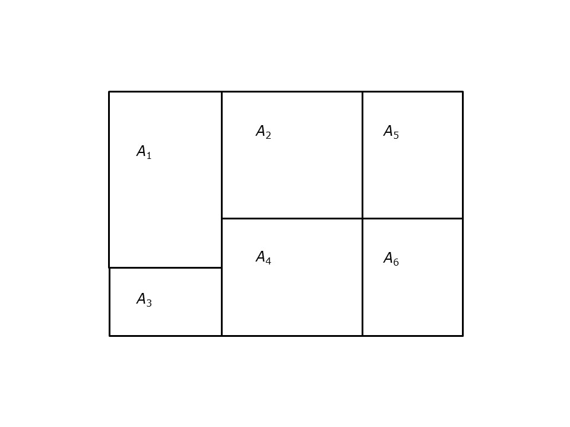
<p class="caption">(\#fig:simple-zoning-system)\label{fig:simple-zoning-system}Simple zoning system</p>
</div>

We can devise a way of establishing proximity between areas as follows: if points are selected in such a way that they are on the overlapping edges of two contiguous areas, the distance between these two areas clearly is zero, and they must be proximate.

This criterion to define proximity is called _adjacency_. Adjacency means that two zones share a common edge. This is conventionally called the _rook_ criterion, after chess, in which the piece called the rook can move only orthogonally (in the vertical and horizontal directions). The rook criterion, however, would dictate that zones $A_2$ and $A_6$ are not proximate, despite being closer than $A_2$ and $A_3$.

When this criterion is expanded to allow contact at a single point between zones (say, the corner between $A_2$ and $A_6$), the adjacency criterion is called _queen_, again, for the chess piece that moves both orthogonally and diagonally.

If we accept adjacency as a reasonable way of expressing relationships of proximity between areas, what we need is a way of coding relationships of adjacency in a way that is convenient and amenable to manipulation for data analysis.

One of the most widely used tools to code proximity in area data is the _spatial weights matrix_.

## Spatial Weights Matrices

A spatial weights matrix is an arrangement of values (or _weights_) for all pairs of zones in a system. For instance, in a zoning system such as shown in Figure 1, with 6 zones, there will be $6 \times 6$ such weights. The weights are organized by rows, in such a way that each zone has a corresponding row of weights. For example, zone $A_1$ in Figure 1 has the following weights, one for each zone in the system:
$$
w_{1\cdot} = [w_{11}, w_{12}, w_{13}, w_{14}, w_{15}, w_{16}]
$$

The values of the weights depend on the adjacency criterion adopted. The simplest coding scheme is when we assign a value of 1 to pairs of zones that are adjacent, and a value of 0 to pairs of zones that are not. 

Lets formalize the two criteria mentioned above:

* Rook criterion

$$
w_{ij}=\bigg\{\begin{array}{l l}
1\text{ if } A_i \text{ and } A_j \text{ share an edge}\\
0\text{ otherwise}\\
\end{array}
$$
If rook adjacency is used, the weights for zone $A_6$ are as follows:
$$
w_{6\cdot} = [0, 0, 0, 1, 1, 0].
$$

As you can see, the adjacent areas from the perspective of $A_6$ are $A_4$ and $A_5$ by virtue of sharing an edge. These two areas receive weights of 1. On the other hand, $A_1$, $a_2$, and $A_3$ are not adjacent, and therefore receive a weight of zero. **Notice how the weight $w_{66}$ is set to zero**. By convention, an area is not its own neighbor!

* Queen criterion

$$
w_{ij}=\bigg\{\begin{array}{l l}
1\text{ if } A_i \text{ and } A_j \text{ share an edge or a vertex}\\
0\text{ otherwise}\\
\end{array}
$$

If queen adjacency is used, the weights for zone $A_6$ are as follows:
$$
w_{6\cdot} = [0, 1, 0, 1, 1, 0].
$$

As you can see, the adjacent areas from the perspective of $A_6$ are $A_4$ and $A_5$ (by virtue of sharing an edge), and $A_2$ (by virtue of sharing a vertex). These three areas receive weights of 1. On the other hand, $A_1$ and $A_3$ are not adjacent, and therefore receive a weight of zero. Again, weight $w_{66}$ is set to zero.

The set of weights above define the _neighborhood_ of $A_6$.

The spatial weights matrix for the whole system in Figure 1 is as follows:
$$
\textbf{W}=\left (\begin{array}{c c c c c c}
0 & 1 & 1 & 1 & 0 & 0\\
1 & 0 & 0 & 1 & 1 & 1\\
1 & 0 & 0 & 1 & 0 & 0\\
1 & 1 & 1 & 0 & 1 & 1\\
0 & 1 & 0 & 1 & 0 & 1\\
0 & 1 & 0 & 1 & 1 & 0\\
\end{array} \right).
$$

Compare the matrix to the zoning system. The spatial weights matrix has the following properties:

1. The main diagonal elements of the matrix are all zeros (no area is its own neighbor).

2. Each zone has a row of weights in the matrix: row number one corresponds to $A_1$, row number two corresponds to $A_2$, and so on.

3. Likewise, each zone has a _column_ of weights.

4. The sum of all values in a row gives the _total_ number of neighbors for a zone. That is:
$$
\text{The total number of neighbors of } A_i \text{ is given by: }\sum_{j=1}^{n}{w_{ij}}
$$

The spatial weights matrix is often processed to obtain a _row-standardized_ spatial weights matrix. This procedure consists of dividing every weight by the sum of its corresponding row (i.e., by the total number of neighbors of the zone), as follows:
$$
w_{ij}^{st}=\frac{w_{ij}}{\sum_{j=1}^n{w_{ij}}}
$$

The row-standardized weights matrix for the system in Figure 1 is:
$$
\textbf{W}^{st}=\left (\begin{array}{c c c c c c}
0 & 1/3 & 1/3 & 1/3 & 0 & 0\\
1/4 & 0 & 0 & 1/4 & 1/4 & 1/4\\
1/2 & 0 & 0 & 1/2 & 0 & 0\\
1/5 & 1/5 & 1/5 & 0 & 1/5 & 1/5\\
0 & 1/3 & 0 & 1/3 & 0 & 1/3\\
0 & 1/3 & 0 & 1/3 & 1/3 & 0\\
\end{array} \right).
$$

The row-standardized spatial weights matrix has the following properties:

1. Each weight now represents the proportion of a neighbor out of the total of neighbors. For instance, since the total of neighbors of $A_1$ is 3, each neighbor contributes 1/3 to that total.

2. The sum of all weights over a row equals 1, or 100% of all neighbors for that zone.

## Creating Spatial Weights Matrices in `R`

Coding spatial weights matrices by hand is a tedious and error-prone process. Fortunately, functions to generate them exist in `R`. The package `spdep` in particular has a number of useful utilities for working with spatial weights matrices.

The first step to create a spatial weights matrix is to find the neighbors (i.e., areas adjacent to) for each area. The function `poly2nb` is used for this (note that the default adjacency criterion is queen):

``` r
# The function `poly2nb()` takes an object of class "Spatial" with polygons, and finds the neighbors

Hamilton_CT.nb <- poly2nb(pl = Hamilton_CT, queen = TRUE)
```

The value (output) of the function is an object of class `nb`:

``` r
class(Hamilton_CT.nb)
```

```
## [1] "nb"
```

The function `summary()` applied to an object of this class gives some useful information about the neighbors in the region, including the number of zones in this system ($188$), the total number of neighbors ($1,180$), and the percentage of neighbors out of all pairs of areas (3.34%; conversely, 96.66% of all possible zone pairs are _not_ neighbors!) Other information includes the distribution of neighbors (3 zones have two neighbors, 8 zones have three neighbors, 22 zones have four neighbors, and so on): 

``` r
summary(Hamilton_CT.nb)
```

```
## Neighbour list object:
## Number of regions: 188 
## Number of nonzero links: 1180 
## Percentage nonzero weights: 3.338615 
## Average number of links: 6.276596 
## Link number distribution:
## 
##  2  3  4  5  6  7  8  9 10 11 12 14 
##  3  8 22 32 35 45 30  6  1  1  4  1 
## 3 least connected regions:
## 174 175 188 with 2 links
## 1 most connected region:
## 33 with 14 links
```

The `nb` object is a list that contains the neighbors for each zone. For instance, the neighbors of census tract 5370001.01 (the first tract in the dataframe) are the following tracts:

``` r
# Here, the indexing works by making reference to the first set of zone in `Hamilton_CT.nb` and then using those values to retrieve the census tract identifiers from our `Hamilton_CT` dataframe

Hamilton_CT$TRACT[Hamilton_CT.nb[[1]]]
```

```
## [1] "5370120.02" "5370122.01" "5370122.02" "5370124.00" "5370142.01"
## [6] "5370133.01" "5370130.03"
```

The list of neighbors can be converted into a list of entries in a spatial weights matrix $W$ by means of the function `nb2listw` (for "neighbors to matrix W in list form"):

``` r
Hamilton_CT.w <- nb2listw(Hamilton_CT.nb)
```

We can use base `R` functions to visualize the neighbors (adjacent) areas in our system:

``` r
# Plot the geometry of the zoning system
plot(Hamilton_CT |>
       st_geometry(), border = "gray")
# Plot the neighbhorhood relationships; this uses two arguments: the `nb` class object and the coordinates of the centroids of the zoning system
plot(Hamilton_CT.nb,
     Hamilton_CT |> 
       st_centroid() |> 
       st_coordinates(),
     # Add to the previous plot
     add = TRUE,
     col = "red")
```

```
## Warning: st_centroid assumes attributes are constant over geometries
```


## Spatial Moving Averages

The spatial weights matrix $W$, and in particular its row-standardized version $W^{st}$, is useful to calculate a spatial statistic, the _spatial moving average_.

The spatial moving average is a variation of the mean statistic: in fact, it is a weighted average, calculated using the spatial weights. Recall that the mean is calculated as the sum of all relevant values divided by the number of values summed. In the case of spatial data, the mean is what we would call a _global_ statistic, since it is calculated using all data for a region:
$$
\bar{x}=\frac{1}{n}\sum_{j=1}^{n}{x_j}
$$
where $\bar{x}$ (read x-bar) is the mean of all values of x.

A spatial moving average is calculated in the same way, but for each area, and based only on the values of proximate areas:
$$
\bar{x_i}=\frac{1}{n_i}\sum_{j\in N(i)}{x_j}
$$
where $n_i$ is the number of neighbors of $A_i$, and the sum is only for $x_j$ that are in the neighborhood of i ($j\in N(i)$ is read "j in the neighborhood of i").

We can illustrate the way spatial moving averages work by making reference again to Figure 1.

Consider zone $A_1$. The spatial weights matrix indicates that the neighborhood of $A_1$ consists of three areas: $A_2$, $A_3$, and $A_4$. Therefore $n_1=3$, and $j\in N(1)$ are 2, 3, and 4.

The spatial moving average of $A_1$ for a variable $x$ would then be calculated as:
$$
\bar{x}_1=\frac{x_2 + x_3 + x_4}{3}
$$

Notice that another way of writing the spatial moving average expression is as follows, since membership in the neighborhood of $i$ is implicit in the definition of $w_{ij}$! Since $w_{ij}$ takes values of zero and one, the effect is to turn on and off the values of $x$ depending on whether they are for areas adjacent to $i$:
$$
\bar{x}_i=\frac{1}{n_i}\sum_{j=1}^n{w_{ij}x_j}
$$

This means that the spatial moving average of $A_1$ for a variable $x$ on this system can also be calculated using the spatial weights matrix as:
$$
\bar{x}_1=\frac{w_{11}x_1 + w_{12}x_2 + w_{13}x_3 + w_{14}x_4 + w_{15}x_5 + w_{12}x_6}{3}
$$

Substituting the spatial weights:
$$
\bar{x}_1=\frac{0x_1 + 1x_2 + 1x_3 + 1x_4 + 0x_5 + 0x_6}{3} = \frac{x_2 + x_3 + x_4}{3}
$$

In other words, the spatial weights can be used directly in the calculation of spatial moving averages.

Further, notice that:
$$
n_i=\sum_{j=1}^{n}w_{ij}
$$
which is simply the total number of neighbors of $A_i$, and the value we used to row-standardize the spatial weights.

Since the row-standardized weights have already been divided by the number of neighbors, we can use them to express the spatial moving average as follows:
$$
\bar{x}_i=\sum_{j=1}^{n}{w_{ij}^{st}x_j}
$$

Continuing with this example, if we use the row-standardized weights, the spatial moving average at $A_1$ is:
$$
\bar{x}_i=0x_1 + \frac{1}{3}x_2 + \frac{1}{3}x_3 + \frac{1}{3}x_4 + 0x_5 + 0x_6
$$
which is the same as:
$$
\bar{x}_i=\frac{x_2 + x_3 + x_4}{3}
$$

Consider the following map of Hamilton's population density:

``` r
# You have seen previously how to create a choropleth map using quintiles. The first part of this is a choropleth map of population density

map <- ggplot(data = Hamilton_CT) +
  geom_sf(aes(fill = cut_number(Hamilton_CT$POP_DENSITY, 5), 
                   POP_DENSITY = round(POP_DENSITY),
                   TRACT = TRACT), 
               color = "black") +
  # For the example, two census tracts will be identified more explicitly
  # Next, we the function `filter()` to select census tract 5370142.02. We will color red the boundaries of this census tract 
  geom_sf(data = filter(Hamilton_CT, TRACT == "5370142.02"), 
               aes(POP_DENSITY = round(POP_DENSITY),
                   TRACT = TRACT), 
               color = "red",
               weight = 3, fill = NA) +
    # We the function `filter()` again, now to select census tract 5370144.01. We will color green the boundaries of this census tract 
  geom_sf(data = subset(Hamilton_CT, TRACT == "5370144.01"), 
               aes(POP_DENSITY = round(POP_DENSITY),
                   TRACT = TRACT), 
               color = "green",
               weight = 3, fill = NA) +
  # This selects a palette for the fill colors and changes the label for the legend
  scale_fill_brewer(palette = "YlOrRd") +
  labs(fill = "Pop Density") +
  coord_sf()

# The function `ggplotly()` takes a `ggplot2` object and creates an interactive map
ggplotly(map, tooltip = c("TRACT", "POP_DENSIT"))
```

```{=html}
<div class="plotly html-widget html-fill-item" id="htmlwidget-ee546d23d7e9e3db55ac" style="width:672px;height:480px;"></div>
<script type="application/json" data-for="htmlwidget-ee546d23d7e9e3db55ac">{"x":{"data":[{"x":[565171.63220289082,565168.36396018229,565161.94990040187,565155.53510741098,565149.11958127969,565142.70332207845,565136.28632987721,565129.8686047463,565123.45014675567,565117.03095597564,565110.61103247653,565104.19037632842,565097.76898760151,565091.3468663661,565084.92401269241,565078.50042665063,565072.07610831119,565065.65105774417,565059.22527501988,565052.79876020853,565046.37151338067,565039.94353460625,565033.51482395583,565027.08538149961,565020.65520730801,565014.22430145135,565007.79266399983,565001.36029502389,564994.92719459394,564988.49336278019,564982.05879965331,564975.62350528338,564969.18747974094,564962.75072309631,564956.31323541992,564949.87501678232,564943.43606725382,564936.99638690474,564930.55597580574,564924.11483402725,564917.67296163959,564911.23035871331,564904.78702531883,564898.34296152683,564891.89816740761,564885.4526430316,564879.0063884696,564872.55940379191,564866.11168906919,564859.66324437177,564853.21406977042,564846.76416533568,564840.313531138,564833.86216724792,564827.41007373622,564820.95725067332,564814.50369812991,564808.04941617651,564801.5944048838,564795.13866432232,564788.68219456286,564782.22499567596,564775.76706773217,564769.30841080239,564762.84902495716,564756.38891026704,564749.92806680291,564743.46649463533,564737.00419383519,564730.54116447293,564724.07740661944,564717.61292034539,564711.14770572144,564704.6817628186,564698.21509170742,564691.74769245856,564685.27956514305,564678.81070983142,564675.24102098215,null,573319.01503929694,573314.45397024381,573307.23801458324,573300.02123408485,573292.80362882768,573285.58519889077,573278.36594435293,573271.14586529334,573263.92496179068,573256.70323392411,573249.48068177258,573242.25730541511,573235.03310493066,573227.80808039836,573220.58223189705,573213.35555950587,573206.128063304,573198.89974337025,573191.67059978377,573184.44063262385,573177.20984196931,573169.97822789929,573162.74579049298,573155.5125298294,573148.27844598773,573141.04353904724,573133.80780908675,573126.57125618577,573119.33388042322,573112.09568187839,573104.85666063032,573097.61681675841,573090.3761503417,573083.13466145948,573075.89235019102,573068.64921661536,573061.40526081191,573054.16048285994,573046.91488283861,573039.6684608272,573032.42121690512,573025.17315115139,573017.92426364555,573010.67455446685,573003.42402369459,572996.17267140804,572988.9204976866,572981.66750260978,572974.41368625662,572967.15904870664,572959.90359003923,572952.64731033379,572945.3902096696,572938.13228812627,572930.87354578299,572923.61398271937,572916.35359901469,572909.09239474859,572901.83037000033,572894.56752484944,572887.30385937542,572880.03937365767,572872.77406777581,572865.50794180925,572858.24099583749,572850.97322994017,572843.70464419667,572836.43523868662,572829.16501348955,572821.89396868506,572814.62210435257,572807.34942057182,572800.07591742231,572792.80159498379,572785.52645333565,572778.25049255765,572770.97371272941,572763.69611393043,572760.57295276446,null,581466.72574166872,581460.55967911356,581452.54177872161,581444.5229618731,581436.5032286559,581428.48257915769,581420.46101346624,581412.43853166921,581404.41513385449,581396.39082010963,581388.36559052276,581380.33944518131,581372.31238417339,581364.28440758656,581356.2555155087,581348.22570802772,581340.1949852315,581332.16334720771,581324.13079404447,581316.09732582944,581308.06294265052,581300.02764459583,581291.99143175303,581283.95430421014,581275.91626205505,581267.87730537576,581259.83743426029,581251.79664879641,581243.75494907214,581235.7123351756,581227.6688071948,581219.62436521752,581211.57900933188,581203.53273962601,581195.48555618781,581187.43745910539,581179.38844846678,581171.33852436021,581163.28768687358,581155.23593609489,581147.18327211251,581139.12969501433,581131.07520488871,581123.01980182354,581114.96348590706,581106.90625722753,581098.84811587294,581090.78906193154,581082.72909549158,581074.66821664106,581066.60642546846,581058.54372206191,581050.48010650952,581042.41557889967,581034.3501393206,581026.28378786042,581018.2165246075,581010.1483496502,581002.07926307677,580994.00926497555,580985.93835543469,580977.86653454276,580969.7938023879,580961.72015905858,580953.64560464304,580945.57013922976,580937.49376290711,580929.41647576343,580921.33827788709,580913.25916936668,580905.17915029044,580897.09822074685,580889.01638082438,580880.93363061151,580872.84997019672,580864.76539966837,580856.67991911503,580848.59352862532,580846.23204220668,null,589614.80076751346,589606.68282422842,589597.8629248254,589589.04201735649,589580.22010191833,589571.39717860741,589562.57324752025,589553.74830875336,589544.92236240348,589536.09540856688,589527.2674473403,589518.43847882026,589509.60850310349,589500.7775202865,589491.94553046592,589483.11253373837,589474.27853020048,589465.44351994898,589456.60750308051,589447.7704796918,589438.93244987936,589430.09341374005,589421.25337137061,589412.41232286766,589403.57026832807,589394.72720784845,589385.88314152567,589377.03806945635,589368.19199173746,589359.34490846575,589350.49681973807,589341.64772565104,589332.79762630176,589323.94652178697,589315.09441220341,589306.24129764817,589297.38717821788,589288.53205400973,589279.67592512036,589270.81879164674,589261.96065368596,589253.10151133488,589244.24136469036,589235.38021384936,589226.5180589091,589217.6548999662,589208.79073711799,589199.92557046132,589191.05940009316,589182.19222611072,589173.32404861099,589164.45486769092,589155.58468344761,589146.71349597827,589137.84130537987,589128.96811174951,589120.09391518438,589111.21871578158,589102.34251363832,589093.46530885168,589084.58710151876,589075.70789173688,589066.82767960313,589057.9464652146,589049.06424866884,589040.18103006273,589031.2968094938,589022.41158705903,589013.52536285575,589004.6381369814,588995.74990953307,588986.8606806082,588977.97045030398,588969.07921871776,588960.18698594684,588951.29375208868,588942.39951724047,588933.50428149966,588932.25466811901,null,597763.27648905455,597762.44599920057,597752.82514084771,597743.20318272489,597733.58012493723,597723.95596759033,597714.33071078919,597704.70435463928,597695.07689924585,597685.44834471436,597675.81869115017,597666.18793865852,597656.55608734488,597646.92313731473,597637.28908867342,597627.65394152619,597618.01769597875,597608.38035213645,597598.74191010476,597589.10236998915,597579.46173189511,597569.81999592821,597560.17716219369,597550.5332307975,597540.88820184488,597531.24207544152,597521.59485169291,597511.94653070462,597502.29711258237,597492.64659743162,597482.99498535809,597473.34227646724,597463.68847086502,597454.03356865689,597444.37756994844,597434.72047484561,597425.06228345376,597415.40299587895,597405.74261222663,597396.08113260276,597386.41855711292,597376.75488586281,597367.09011895838,597357.42425650544,597347.75729860959,597338.08924537688,597328.42009691289,597318.74985332356,597309.07851471484,597299.40608119254,597289.73255286238,597280.05792983051,597270.38221220253,597260.70540008461,597251.02749358269,597241.34849280247,597231.66839785012,597221.98720883147,597212.30492585257,597202.62154901947,597192.93707843812,597183.25151421444,597173.56485645461,597163.87710526458,597154.18826075038,597144.4983230182,597134.80729217408,597125.11516832409,597115.42195157427,597105.72764203092,597096.03223980009,597086.33574498771,597076.6381577003,597066.93947804382,597057.23970612441,597047.5388420485,597037.83688592212,597028.13383785146,597018.67719054746,null,605912.18934986449,605909.41125245835,605898.98836184444,605888.56427986408,605878.13900663133,605867.71254226041,605857.28488686529,605846.85604056017,605836.42600345914,605825.9947756764,605815.56235732615,605805.12874852249,605794.69394937961,605784.25796001172,605773.82078053313,605763.38241105794,605752.94285170035,605742.50210257492,605732.06016379572,605721.61703547696,605711.17271773319,605700.72721067851,605690.28051442734,605679.83262909402,605669.38355479296,605658.93329163839,605648.48183974484,605638.02919922664,605627.57537019823,605617.12035277416,605606.66414706863,605596.20675319619,605585.74817127141,605575.2884014087,605564.82744372252,605554.36529832752,605543.90196533804,605533.43744486885,605522.97173703427,605512.50484194898,605502.03675972763,605491.56749048468,605481.0970343349,605470.62539139274,605460.15256177296,605449.67854559026,605439.20334295905,605428.72695399425,605418.24937881052,605407.77061752253,605397.29067024507,605386.80953709281,605376.32721818041,605365.84371362277,605355.35902353469,605344.87314803095,605334.38608722622,605323.89784123539,605313.40841017338,605302.91779415496,605292.42599329504,605281.9330077084,605271.43883751007,605260.94348281482,605250.44694373768,605239.94922039355,605229.45031289721,605218.9502213638,605208.44894590834,605197.94648664573,605187.44284369098,605176.938017159,605166.43200716493,605155.92481382389,605145.41643725079,605134.90687756089,605124.39613486896,605113.88420929038,605105.53584829008,null,614061.5759120771,614056.39921093406,614045.17421747965,614033.94794107461,614022.72038184176,614011.49153990427,614000.26141538483,613989.03000840638,613977.79731909197,613966.56334756454,613955.32809394703,613944.09155836236,613932.85374093358,613921.61464178388,613910.37426103617,613899.13259881327,613887.8896552386,613876.64543043508,613865.39992452587,613854.15313763393,613842.90506988252,613831.65572139481,613820.40509229386,613809.15318270284,613797.8999927449,613786.64552254335,613775.38977222145,613764.13274190226,613752.87443170906,613741.61484176514,613730.3539721939,613719.09182311851,613707.82839466212,613696.56368694827,613685.29770010035,613674.03043424152,613662.76188949519,613651.49206598487,613640.22096383374,613628.94858316542,613617.67492410319,613606.39998677059,613595.12377129088,613583.84627778782,613572.56750638469,613561.28745720512,613550.00613037241,613538.72352601029,613527.4396442424,613516.15448519192,613504.86804898281,613493.58033573849,613482.29134558258,613471.0010786386,613459.70953503042,613448.41671488143,613437.12261831551,613425.82724545617,613414.53059642715,613403.23267135234,613391.93347035511,613380.63299355959,613369.33124108939,613358.02821306814,613346.72390961973,613335.41833086789,613324.11147693661,613312.80334794964,613301.4939440306,613290.18326530373,613278.87131189264,613267.55808392132,613256.24358151364,613244.92780479358,613233.610753885,613222.2924289119,613210.97282999812,613199.65195726778,613192.8671846888,null,622211.47266989446,622203.41160749795,622191.3844351928,622179.355888366,622167.32596714958,622155.29467167484,622143.26200207381,622131.22795847803,622119.19254101953,622107.15574982984,622095.11758504075,622083.07804678427,622071.03713519196,622058.99485039583,622046.95119252778,622034.90616171947,622022.85975810303,622010.81198181026,621998.76283297292,621986.71231172315,621974.66041819274,621962.60715251393,621950.5525148185,621938.49650523835,621926.43912390573,621914.38037095254,621902.32024651079,621890.25875071262,621878.19588369015,621866.13164557528,621854.06603650039,621841.99905659747,621829.93070599867,621817.86098483612,621805.78989324206,621793.71743134852,621781.64359928796,621769.5683971924,621757.49182519433,621745.41388342564,621733.33457201894,621721.25389110623,621709.17184082,621697.0884212926,621685.0036326563,621672.91747504345,621660.82994858641,621648.74105341756,621636.65078966925,621624.55915747397,621612.46615696419,621600.3717882724,621588.27605153085,621576.17894687224,621564.08047442895,621551.98063433345,621539.87942671834,621527.77685171622,621515.67290945956,621503.56760008098,621491.46092371317,621479.3528804885,621467.2434705398,621455.13269399968,621443.02055100072,621430.90704167553,621418.79216615704,621406.67592457775,621394.55831707048,621382.43934376794,621370.31900480285,621358.19730030803,621346.07423041633,621333.94979526033,621321.82399497309,621309.69682968734,621297.56829953589,621285.43840465159,621280.70761528006,null,557917.46868006536,558442.89991073136,559182.68614441622,559922.47247958195,560662.25891749701,561402.04545942403,562141.83210662811,562881.6188603777,563621.40572193381,564361.19269256457,565100.97977353295,565840.7669661066,566580.55427154736,567320.3416911196,568060.12922609085,568799.91687772144,569539.70464727841,570279.49253602605,571019.28054522513,571759.0686761426,572498.85693003994,573238.64530818386,573978.43381183362,574718.22244225559,575458.01120071206,576197.80008846568,576937.58910677966,577677.3782569156,578417.16754013905,579156.95695770951,579896.74651088926,580636.53620094247,581376.32602913014,582116.11599671422,582855.90610495629,583595.69635511807,584335.48674846091,585075.27728624491,585815.0679697335,586554.85880018643,587294.64977886446,588034.44090702839,588774.23218593758,589514.0236168555,590253.81520103803,590993.60693974851,591733.39883424656,592473.19088578876,593212.98309563787,593952.77546505095,594692.5679952905,595432.36068761104,596172.15354327485,596911.94656354026,597651.73974966281,598391.53310290386,599131.32662451942,599871.12031577062,600610.91417791182,601350.7082122009,602090.50241989829,602830.29680225684,603570.09136053687,604309.8860959931,605049.68100988527,605789.47610346659,606529.27137799351,607269.06683472497,608008.86247491301,608748.65829981607,609488.45431068866,610228.2505087863,610968.04689536372,611707.84347167495,612447.64023897669,613187.43719852343,613927.23435156629,614667.03169936233,615406.82924316451,616146.6269842264,616886.4249238004,617626.22306314181,618366.0214035036,619105.81994613539,619845.61869229295,620585.41764322761,621325.21680019132,622065.01616443624,622804.81573721278,623544.61551977566,624024.99761571991,null,557917.46868006536,558347.69494558615,559086.27591093874,559824.85697240639,560563.43813119049,561302.01938848651,562040.60074549261,562779.18220341019,563517.76376343309,564256.34542676236,564994.92719459394,565733.50906812842,566472.09104856034,567210.67313708737,567949.25533490966,568687.83764322056,569426.4200632202,570165.00259610545,570903.58524307015,571642.16800531419,572380.75088403199,573119.33388042322,573857.91699567996,574596.50023100164,575335.08358758315,576073.66706662043,576812.2506693094,577550.83439684461,578289.41825042455,579028.00223124167,579766.58634049108,580505.17057936999,581243.75494907214,581982.33945079264,582720.9240857258,583459.50885506615,584198.09376000823,584936.67880174494,585675.26398147258,586413.84930038382,587152.4347596725,587891.02036053198,588629.60610415495,589368.19199173746,590106.77802446857,590845.36420354433,591583.95053015731,592322.53700549714,593061.12363075931,593799.71040713391,594538.29733581631,595276.88441799395,596015.47165486193,596754.05904761178,597492.64659743162,598231.23430551577,598969.8221730534,599708.410201238,600446.99839125772,601185.58674430253,601924.17526156618,602662.76394423435,603401.35279350029,604139.94181055145,604878.53099658072,605617.12035277416,606355.70988032082,607094.29958041315,607832.88945423544,608571.47950297943,609310.06972783268,610048.66012998309,610787.25071061868,611525.8414709263,612264.4324120956,613003.0235353139,613741.61484176514,614480.20633263956,615218.79800912272,615957.38987240137,616695.9819236605,617434.57416408858,618173.16659487132,618911.75921719137,619650.35203223722,620388.94504119316,621127.53824524442,621866.13164557528,622604.72524336982,623343.31903981522,624024.99761571991,null,557917.46868006536,558252.31122187991,558989.68465654738,559727.05818197969,560464.43179931142,561201.8055096711,561939.17931419017,562676.55321400298,563413.92721023655,564151.30130402499,564888.67549649731,565626.04978878738,566363.42418202281,567100.79867733421,567838.17327585514,568575.54797871178,569312.92278703756,570050.29770196241,570787.67272461345,571525.0478561233,572262.42309761979,572999.79845023563,573737.17391509609,574474.54949333356,575211.92518607609,575949.30099445302,576686.67691959289,577424.05296262365,578161.42912467697,578898.80540687812,579636.18181035563,580373.55833623966,581110.93498565722,581848.31175973616,582585.68865960429,583323.06568638922,584060.44284121832,584797.8201252179,585535.19753951719,586272.57508524205,587009.95276351937,587747.33057547582,588484.70852223679,589222.08660493186,589959.46482468303,590696.84318261931,591434.22167986666,592171.60031754768,592908.97909679089,593646.35801871959,594383.73708446219,595121.11629513942,595858.49565187935,596595.87515580643,597333.2548080422,598070.63460971392,598808.01456194383,599545.39466585894,600282.77492257976,601020.15533323004,601757.5358989361,602494.91662081727,603232.2974999994,603969.67853760335,604707.05973475496,605444.44109257357,606181.82261218119,606919.20429470332,607656.58614125755,608393.96815296868,609131.3503309571,609868.73267634411,610606.1151902508,611343.49787379696,612080.88072810543,612818.26375429658,613555.64695348765,614293.03032680182,615030.41387535771,615767.79760027502,616505.18150267238,617242.56558367086,617979.94984438934,618717.33428594377,619454.71890945558,620192.10371604224,620929.48870682181,621666.8738829121,622404.25924543,623141.6447954959,623879.03053422284,624024.99761571991,null,557917.46868006536,558156.74902365415,558892.91266888229,559629.07639954076,560365.24021669757,561101.40412141453,561837.56811475637,562573.73219779076,563309.89637157798,564046.0606371857,564782.22499567596,565518.38944811595,566254.55399556679,566990.7186390924,567726.88337975938,568463.04821862758,569199.21315676346,569935.37819523038,570671.54333508865,571407.7085774045,572143.87392323883,572880.03937365767,573616.20492971968,574352.37059249042,575088.5363630316,575824.70224240539,576560.86823167396,577297.03433189844,578033.20054414391,578769.36686946894,579505.53330893524,580241.69986360648,580977.86653454276,581714.03332280542,582450.20022945548,583186.36725555384,583922.53440216125,584658.70167033735,585394.86906114453,586131.03657564218,586867.20421489025,587603.37197994895,588339.53987187683,589075.70789173688,589811.87604058417,590548.04431948124,591284.21272948745,592020.38127165835,592756.5499470561,593492.71875673719,594228.88770176319,594965.05678318837,595701.22600207396,596437.39535947773,597173.56485645461,597909.73449406517,598645.90427336469,599382.07419541373,600118.2442612662,600854.41447197879,601590.58482861158,602326.75533221674,603062.92598385375,603799.09678457666,604535.26773544447,605271.43883751007,606007.61009182874,606743.78149945906,607479.95306145214,608216.12477886584,608952.29665275419,609688.46868417156,610424.64087417233,611160.8132238097,611896.98573413969,612633.15840621607,613369.33124108939,614105.50423981587,614841.6774034478,615577.85073303804,616314.02422963828,617050.19789430313,617786.37172808487,618522.54573203239,619258.71990720078,619994.89425464056,620731.0687754032,621467.2434705398,622203.41834110045,622939.5933881388,623675.76861270145,624024.99761571991,null,557917.46868006536,558061.00863552222,558795.96023616241,559530.91191691451,560265.8636787798,561000.81552275375,561735.76744983438,562470.71946102311,563205.67155731376,563940.62373970728,564675.57600919926,565410.52836679074,566145.48081347602,566880.43335025245,567615.3859781205,568203.57699203352],"y":[4764820.4565320779,4765163.4330918165,4765836.4623458618,4766509.4923014473,4767182.5229585841,4767855.5543172844,4768528.5863775564,4769201.6191394124,4769874.6526028654,4770547.6867679264,4771220.7216346031,4771893.7572029121,4772566.79347286,4773239.8304444589,4773912.8681177227,4774585.9064926598,4775258.9455692805,4775931.9853475988,4776605.025827623,4777278.0670093652,4777951.1088928347,4778624.1514780447,4779297.1947650062,4779970.2387537276,4780643.2834442221,4781316.328836496,4781989.3749305662,4782662.4217264401,4783335.4692241289,4784008.51742364,4784681.5663249893,4785354.6159281842,4786027.6662332378,4786700.7172401566,4787373.7689489527,4788046.8213596391,4788719.8744722232,4789392.9282867154,4790065.9828031277,4790739.0380214695,4791412.09394175,4792085.1505639832,4792758.2078881748,4793431.2659143358,4794104.3246424794,4794777.384072613,4795450.4442047467,4796123.505038891,4796796.5665750578,4797469.6288132537,4798142.6917534908,4798815.7553957775,4799488.8197401268,4800161.8847865453,4800834.9505350431,4801508.0169856325,4802181.0841383217,4802854.1519931182,4803527.2205500361,4804200.2898090826,4804873.3597702663,4805546.4304335974,4806219.501799088,4806892.5738667455,4807565.6466365783,4808238.7201085994,4808911.7942828145,4809584.8691592356,4810257.9447378693,4810931.0210187295,4811604.09800182,4812277.1756871548,4812950.2540747402,4813623.3331645876,4814296.4129567025,4814969.4934510989,4815642.5746477842,4816315.656546765,4816687.0398907224,null,4764820.4565320779,4765245.9145602565,4765918.945037663,4766591.9762129206,4767265.0080860369,4767938.0406570267,4768611.0739258975,4769284.1078926641,4769957.1425573351,4770630.1779199215,4771303.2139804363,4771976.2507388899,4772649.2881952934,4773322.326349657,4773995.3652019938,4774668.4047523132,4775341.4450006243,4776014.4859469421,4776687.5275912751,4777360.5699336361,4778033.6129740309,4778706.6567124752,4779379.7011489803,4780052.7462835535,4780725.792116208,4781398.8386469521,4782071.8858757988,4782744.9338027565,4783417.9824278392,4784091.0317510534,4784764.0817724122,4785437.1324919257,4786110.1839096043,4786783.2360254582,4787456.2888394967,4788129.3423517328,4788802.396562174,4789475.4514708323,4790148.5070777182,4790821.5633828407,4791494.6203862093,4792167.678087838,4792840.7364877341,4793513.795585908,4794186.855382368,4794859.915877128,4795532.9770701947,4796206.0389615791,4796879.1015512925,4797552.164839345,4798225.2288257433,4798898.2935104994,4799571.3588936245,4800244.4249751261,4800917.4917550143,4801590.5592332995,4802263.6274099918,4802936.6962850988,4803609.7658586334,4804282.8361306032,4804955.9071010184,4805628.9787698854,4806302.0511372201,4806975.1242030263,4807648.197967316,4808321.2724300986,4808994.3475913825,4809667.4234511796,4810340.5000094939,4811013.577266342,4811686.6552217267,4812359.7338756602,4813032.8132281518,4813705.8932792097,4814378.9740288425,4815052.0554770622,4815725.1376238763,4816398.2204692941,4816687.0398907224,null,4764820.4565320779,4765338.1016033571,4766011.1334475372,4766684.1659854446,4767357.1992170867,4768030.2331424756,4768703.2677616226,4769376.3030745378,4770049.3390812352,4770722.3757817242,4771395.4131760132,4772068.4512641178,4772741.4900460467,4773414.5295218099,4774087.5696914215,4774760.6105548907,4775433.6521122269,4776106.6943634422,4776779.7373085488,4777452.7809475558,4778125.8252804726,4778798.8703073142,4779471.9160280889,4780144.962442806,4780818.0095514785,4781491.057354114,4782164.1058507292,4782837.1550413268,4783510.2049259236,4784183.2555045262,4784856.3067771448,4785529.3587437943,4786202.4114044812,4786875.4647592176,4787548.5188080119,4788221.5735508762,4788894.6289878208,4789567.685118854,4790240.7419439889,4790913.7994632348,4791586.8576765982,4792259.916584095,4792932.9761857325,4793606.0364815202,4794279.0974714672,4794952.1591555877,4795625.2215338871,4796298.2846063776,4796971.3483730685,4797644.4128339719,4798317.4779890934,4798990.5438384451,4799663.6103820391,4800336.6776198801,4801009.745551981,4801682.8141783522,4802355.8834990012,4803028.953513938,4803702.024223174,4804375.0956267184,4805048.1677245777,4805721.2405167641,4806394.314003286,4807067.3881841553,4807740.4630593779,4808413.5386289656,4809086.6148929251,4809759.6918512713,4810432.7695040051,4811105.8478511423,4811778.9268926913,4812452.0066286577,4813125.0870590545,4813798.1681838902,4814471.2500031712,4815144.3325169086,4815817.4157251138,4816490.4996277923,4816687.0398907224,null,4764820.4565320779,4765439.9948452981,4766113.0281994948,4766786.0622428609,4767459.096975401,4768132.1323971311,4768805.1685080603,4769478.2053081971,4770151.2427975573,4770824.2809761483,4771497.3198439814,4772170.3594010714,4772843.399647424,4773516.440583053,4774189.4822079698,4774862.5245221853,4775535.5675257063,4776208.6112185484,4776881.655600721,4777554.7006722344,4778227.7464330979,4778900.7928833254,4779573.8400229253,4780246.8878519088,4780919.9363702852,4781592.9855780676,4782266.0354752643,4782939.0860618865,4783612.1373379454,4784285.1893034503,4784958.2419584105,4785631.2953028399,4786304.349336748,4786977.404060143,4787650.4594730344,4788323.515575435,4788996.5723673543,4789669.6298488034,4790342.6880197898,4791015.7468803274,4791688.8064304218,4792361.866670087,4793034.9275993314,4793707.9892181633,4794381.0515265958,4795054.1145246383,4795727.1782122981,4796400.2425895873,4797073.3076565145,4797746.3734130915,4798419.4398593269,4799092.5069952281,4799765.5748208091,4800438.6433360772,4801111.7125410419,4801784.7824357133,4802457.8530201018,4803130.9242942156,4803803.9962580651,4804477.0689116605,4805150.1422550082,4805823.2162881196,4806496.2910110056,4807169.3664236749,4807842.4425261356,4808515.5193183962,4809188.5968004679,4809861.674972361,4810534.7538340809,4811207.8333856408,4811880.9136270471,4812553.9945583111,4813227.0761794383,4813900.1584904427,4814573.241491328,4815246.3251821082,4815919.4095627898,4816592.4946333822,4816687.0398907224,null,4764820.4565320779,4764878.5606528642,4765551.5949759744,4766224.6299832445,4766897.6656746864,4767570.7020503143,4768243.7391101345,4768916.7768541602,4769589.8152824016,4770262.8543948727,4770935.8941915808,4771608.9346725373,4772281.9758377559,4772955.0176872453,4773628.0602210164,4774301.1034390796,4774974.1473414488,4775647.1919281287,4776320.2371991351,4776993.2831544783,4777666.3297941685,4778339.3771182131,4779012.4251266262,4779685.4738194179,4780358.5231965985,4781031.5732581783,4781704.6240041666,4782377.6754345763,4783050.727549416,4783723.7803486967,4784396.8338324288,4785069.8880006215,4785742.9428532869,4786415.9983904362,4787089.0546120759,4787762.1115182173,4788435.1691088732,4789108.2273840513,4789781.2863437617,4790454.3459880166,4791127.4063168243,4791800.4673301941,4792473.5290281381,4793146.5914106648,4793819.6544777844,4794492.7182295062,4795165.7826658422,4795838.8477868009,4796511.9135923898,4797184.9800826227,4797858.0472575082,4798531.1151170535,4799204.18366127,4799877.2528901696,4800550.3228037581,4801223.3934020465,4801896.4646850452,4802569.5366527634,4803242.6093052085,4803915.6826423937,4804588.7566643273,4805261.8313710168,4805934.9067624714,4806607.9828387024,4807281.0595997199,4807954.1370455306,4808627.2151761446,4809300.2939915722,4809973.3734918227,4810646.4536769018,4811319.5345468232,4811992.6161015937,4812665.6983412225,4813338.781265717,4814011.8648750903,4814684.9491693471,4815358.0341485003,4816031.1198125565,4816687.0398907224,null,4764820.4565320779,4764999.8666265439,4765672.9027510006,4766345.9395541884,4767018.9770361232,4767692.0151968133,4768365.0540362718,4769038.0935545051,4769711.1337515274,4770384.1746273497,4771057.2161819832,4771730.2584154354,4772403.3013277212,4773076.3449188489,4773749.3891888298,4774422.4341376768,4775095.4797653984,4775768.5260720029,4776441.5730575053,4777114.6207219167,4777787.6690652445,4778460.7180874981,4779133.7677886914,4779806.8181688339,4780479.8692279356,4781152.9209660087,4781825.9733830588,4782499.0264791017,4783172.080254145,4783845.1347082015,4784518.189841277,4785191.2456533844,4785864.302144534,4786537.359314736,4787210.4171640007,4787883.4756923374,4788556.5348997563,4789229.5947862687,4789902.6553518828,4790575.7165966099,4791248.7785204602,4791921.8411234422,4792594.9044055669,4793267.9683668455,4793941.0330072846,4794614.0983268945,4795287.164325689,4795960.2310036737,4796633.2983608581,4797306.3663972551,4797979.4351128731,4798652.5045077195,4799325.5745818075,4799998.6453351444,4800671.7167677395,4801344.788879605,4802017.8616707465,4802690.9351411769,4803364.009290901,4804037.0841199355,4804710.1596282842,4805383.2358159591,4806056.3126829648,4806729.3902293164,4807402.4684550203,4808075.5473600859,4808748.6269445233,4809421.7072083401,4810094.7881515482,4810767.8697741516,4811440.9520761659,4812114.035057595,4812787.11871845,4813460.2030587392,4814133.2880784729,4814806.3737776568,4815479.4601563048,4816152.5472144214,4816687.0398907224,null,4764820.4565320779,4765130.8809228465,4765803.9189917063,4766476.9577334374,4767149.9971480519,4767823.0372355608,4768496.0779959736,4769169.1194293024,4769842.1615355555,4770515.2043147469,4771188.2477668868,4771861.2918919818,4772534.3366900496,4773207.3821610948,4773880.4283051305,4774553.4751221687,4775226.5226122197,4775899.570775291,4776572.6196113955,4777245.6691205446,4777918.7193027474,4778591.7701580133,4779264.8216863545,4779937.873887782,4780610.9267623052,4781283.9803099325,4781957.034530676,4782630.0894245487,4783303.1449915553,4783976.2012317106,4784649.2581450213,4785322.3157315003,4785995.3739911569,4786668.4329240024,4787341.4925300451,4788014.5528092934,4788687.6137617612,4789360.6753874552,4790033.7376863891,4790706.8006585687,4791379.8643040061,4792052.9286227096,4792725.9936146913,4793399.0592799606,4794072.1256185258,4794745.1926303972,4795418.2603155859,4796091.3286740994,4796764.397705948,4797437.4674111418,4798110.5377896912,4798783.6088416027,4799456.6805668892,4800129.7529655593,4800802.826037623,4801475.899783086,4802148.9742019614,4802822.0492942585,4803495.1250599856,4804168.201499152,4804841.278611769,4805514.356397843,4806187.4348573815,4806860.5139904004,4807533.5937969023,4808206.6742769014,4808879.7554304022,4809552.8372574179,4810225.9197579548,4810899.0029320223,4811572.0867796307,4812245.1713007875,4812918.2564955028,4813591.3423637832,4814264.4289056407,4814937.516121082,4815610.6040101182,4816283.6925727548,4816687.0398907224,null,4764820.4565320779,4765271.6044290662,4765944.6445851475,4766617.6854078015,4767290.7268970432,4767963.7690528817,4768636.8118753284,4769309.8553643934,4769982.8995200861,4770655.9443424204,4771328.9898314048,4772002.0359870493,4772675.0828093672,4773348.1302983658,4774021.1784540582,4774694.2272764556,4775367.2767655663,4776040.3269214006,4776713.3777439715,4777386.4292332865,4778059.4813893586,4778732.5342121962,4779405.5877018096,4780078.6418582117,4780751.6966814101,4781424.7521714158,4782097.8083282383,4782770.8651518906,4783443.9226423791,4784116.9807997169,4784790.0396239115,4785463.099114974,4786136.1592729157,4786809.2200977458,4787482.2815894764,4788155.3437481113,4788828.4065736672,4789501.4700661488,4790174.5342255691,4790847.5990519384,4791520.6645452641,4792193.7307055565,4792866.7975328267,4793539.8650270849,4794212.9331883378,4794886.0020165974,4795559.071511873,4796232.141674174,4796905.2125035087,4797578.2839998882,4798251.356163322,4798924.4289938184,4799597.5024913875,4800270.5766560389,4800943.6514877826,4801616.7269866271,4802289.8031525817,4802962.8799856557,4803635.9574858574,4804309.0356531991,4804982.1144876881,4805655.1939893328,4806328.2741581416,4807001.3549941275,4807674.4364972962,4808347.5186676569,4809020.6015052199,4809693.6850099936,4810366.7691819882,4811039.8540212102,4811712.9395276709,4812386.0257013775,4813059.1125423387,4813732.2000505645,4814405.2882260643,4815078.3770688437,4815751.4665789166,4816424.556756286,4816687.0398907224,null,4772165.527934961,4772169.9997884119,4772176.3761946252,4772182.8328168122,4772189.3696553316,4772195.9867105484,4772202.6839828333,4772209.4614725588,4772216.3191801021,4772223.2571058469,4772230.2752501788,4772237.3736134926,4772244.5521961814,4772251.8109986465,4772259.1500212923,4772266.5692645293,4772274.0687287711,4772281.6484144349,4772289.3083219444,4772297.0484517282,4772304.8688042173,4772312.7693798468,4772320.7501790589,4772328.811202297,4772336.9524500128,4772345.1739226608,4772353.4756206973,4772361.857544587,4772370.3196947984,4772378.8620718,4772387.4846760733,4772396.1875080951,4772404.9705683524,4772413.833857337,4772422.7773755416,4772431.8011234654,4772440.9051016103,4772450.0893104868,4772459.3537506051,4772468.6984224841,4772478.1233266443,4772487.6284636101,4772497.2138339132,4772506.8794380892,4772516.6252766745,4772526.4513502158,4772536.3576592589,4772546.3442043578,4772556.4109860687,4772566.5580049558,4772576.7852615807,4772587.0927565182,4772597.4804903409,4772607.948463629,4772618.4966769665,4772629.1251309412,4772639.833826147,4772650.6227631811,4772661.4919426451,4772672.4413651451,4772683.4710312933,4772694.5809417032,4772705.7710969942,4772717.041497794,4772728.3921447275,4772739.823038429,4772751.3341795374,4772762.9255686942,4772774.5972065451,4772786.3490937427,4772798.1812309418,4772810.0936188037,4772822.0862579904,4772834.1591491727,4772846.3122930238,4772858.5456902217,4772870.8593414482,4772883.2532473914,4772895.7274087416,4772908.2818261953,4772920.9165004529,4772933.6314322194,4772946.4266222036,4772959.3020711197,4772972.2577796848,4772985.2937486237,4772998.4099786617,4773011.6064705299,4773024.8832249679,4773038.2402427131,4773046.9656139622,null,4783271.5114166513,4783275.1798208933,4783281.5577021334,4783288.0158178573,4783294.5541684227,4783301.1727541918,4783307.8715755343,4783314.6506328192,4783321.5099264262,4783328.4494567346,4783335.4692241289,4783342.5692289993,4783349.7494717408,4783357.0099527519,4783364.350672435,4783371.7716311971,4783379.2728294525,4783386.8542676158,4783394.5159461079,4783402.2578653563,4783410.0800257893,4783417.9824278392,4783425.9650719482,4783434.0279585579,4783442.1710881172,4783450.3944610758,4783458.698077892,4783467.0819390267,4783475.5460449457,4783484.0903961184,4783492.7149930187,4783501.4198361263,4783510.2049259236,4783519.0702628987,4783528.0158475451,4783537.0416803584,4783546.1477618394,4783555.3340924941,4783564.6006728336,4783573.9475033702,4783583.3745846236,4783592.8819171181,4783602.4695013817,4783612.1373379454,4783621.8854273465,4783631.713770126,4783641.6223668307,4783651.6112180101,4783661.6803242182,4783671.829686014,4783682.0593039626,4783692.3691786304,4783702.7593105892,4783713.2297004182,4783723.7803486967,4783734.4112560125,4783745.1224229541,4783755.9138501165,4783766.7855380978,4783777.7374875043,4783788.7696989421,4783799.8821730241,4783811.0749103669,4783822.3479115935,4783833.701177327,4783845.1347082015,4783856.6485048477,4783868.242567909,4783879.9168980252,4783891.6714958465,4783903.5063620256,4783915.4214972192,4783927.4169020867,4783939.4925772985,4783951.6485235225,4783963.884741433,4783976.2012317106,4783988.5979950381,4784001.0750321057,4784013.6323436042,4784026.2699302305,4784038.9877926875,4784051.7859316804,4784064.6643479206,4784077.6230421234,4784090.6620150059,4784103.7812672947,4784116.9807997169,4784130.2606130056,4784143.6207078975,4784156.0253811833,null,4794377.6912601972,4794380.5516594741,4794386.930938052,4794393.3904686468,4794399.9302516142,4794406.5502873166,4794413.250576118,4794420.0311183902,4794426.8919145074,4794433.8329648478,4794440.8542697951,4794447.9558297386,4794455.1376450723,4794462.3997161882,4794469.7420434915,4794477.1646273853,4794484.6674682824,4794492.2505665952,4794499.9139227439,4794507.6575371511,4794515.4814102454,4794523.3855424589,4794531.3699342282,4794539.434585995,4794547.5794982035,4794555.8046713062,4794564.1101057557,4794572.4958020113,4794580.9617605368,4794589.5079817986,4794598.13446627,4794606.8412144287,4794615.6282267552,4794624.4955037329,4794633.4430458546,4794642.4708536128,4794651.5789275086,4794660.7672680411,4794670.0358757228,4794679.3847510628,4794688.8138945792,4794698.3233067924,4794707.9129882269,4794717.5829394143,4794727.3331608875,4794737.1636531865,4794747.0744168526,4794757.065452436,4794767.1367604882,4794777.2883415632,4794787.5201962236,4794797.8323250357,4794808.2247285685,4794818.6974073965,4794829.2503620964,4794839.8835932529,4794850.5971014546,4794861.390887293,4794872.2649513632,4794883.2192942658,4794894.2539166091,4794905.3688189983,4794916.564002051,4794927.8394663855,4794939.195212624,4794950.6312413923,4794962.1475533247,4794973.7441490581,4794985.4210292306,4794997.1781944893,4795009.0156454826,4795020.933382866,4795032.931407298,4795045.0097194398,4795057.1683199601,4795069.4072095295,4795081.726388826,4795094.1258585285,4795106.6056193234,4795119.1656718999,4795131.8060169527,4795144.5266551785,4795157.3275872804,4795170.2088139672,4795183.1703359503,4795196.2121539442,4795209.3342686715,4795222.5366808567,4795235.8193912283,4795249.1824005218,4795262.6257094722,4795265.3027361315,null,4805484.0675108274,4805486.1153507438,4805492.4959489545,4805498.9568157345,4805505.4979514433,4805512.1193564367,4805518.8210310815,4805525.6029757438,4805532.465190799,4805539.4076766241,4805546.4304335974,4805553.5334621109,4805560.7167625492,4805567.980335312,4805575.3241807977,4805582.7482994068,4805590.252691552,4805597.837357644,4805605.5022980981,4805613.2475133399,4805621.0730037913,4805628.9787698854,4805636.9648120562,4805645.0311307414,4805653.177726387,4805661.4045994403,4805669.7117503518,4805678.0991795808,4805686.5668875854,4805695.1148748351,4805703.7431417974,4805712.4516889481,4805721.2405167641,4805730.1096257307,4805739.0590163348,4805748.0886890683,4805757.1986444285,4805766.3888829164,4805775.659405035,4805785.0102112973,4805794.4413022166,4805803.9526783107,4805813.544340102,4805823.2162881196,4805832.9685228951,4805842.8010449642,4805852.713854868,4805862.7069531502,4805872.7803403623,4805882.9340170575,4805893.1679837927,4805903.4822411332,4805913.8767896444,4805924.3516298989,4805934.9067624714,4805945.5421879441,4805956.2579068998,4805967.0539199281,4805977.9302276252,4805988.886830586,4805999.9237294151,4806011.0409247177,4806022.2384171057,4806033.5162071958,4806044.8742956072,4806056.3126829648,4806067.8313698974,4806079.430357039,4806091.1096450258,4806102.8692345014,4806114.7091261121,4806126.6293205088,4806138.6298183482,4806150.7106202887,4806162.8717269944,4806175.1131391339,4806187.4348573815,4806199.8368824143,4806212.3192149149,4806224.8818555698,4806237.5248050662,4806250.2480641045,4806263.0516333794,4806275.9355135988,4806288.8997054696,4806301.9442097051,4806315.0690270225,4806328.2741581416,4806341.5596037917,4806354.9253647001,4806368.3714416055,4806374.7881310862,null,4816590.6402113633,4816591.8709389511,4816598.2527790684,4816604.7149033342,4816611.2573121032,4816617.8800057322,4816624.5829845835,4816631.3662490249,4816638.2297994271,4816645.1736361654,4816652.1977596208,4816659.3021701751,4816666.4868682204,4816673.7518541478,4816681.0971283559,4816687.0398907224],"type":"scatter","mode":"lines","line":{"width":1.8897637795275593,"color":"rgba(255,255,255,1)","dash":"solid"},"hoveron":"points","hoverinfo":"none","showlegend":false,"_isGraticule":true,"xaxis":"x","yaxis":"y","frame":null},{"x":[564680.97526418022,564774.97943003837,565099.03007497464,565299.98982618074,565311.97271811543,565780.97268661472,565814.99972750305,566087.98275405797,566403.98143405176,566595.04389222478,566635.96340247605,566791.03819551936,566812.02557362756,566859.01580618194,566903.98538793775,566985.00930609566,567085.96398159966,567087.01974833268,567206.44732185558,567214.96584358288,567352.03826583328,567476.97167662554,567603.02216441906,567720.023449125,567831.98874384165,568007.95593579346,568168.0417265849,568311.994091311,568423.96474870038,568485.05080120417,568513.9650746641,568741.03918789327,568873.98078281432,568874.38682143588,569114.02415307052,569196.00093306508,569323.0294817104,569474.02577381325,569530.96583146404,569581.99810872972,569923.0144586392,570259.9829039824,570604.00904787949,570913.99174715986,571153.02634348394,571451.00972454471,571451.17095693666,571577.04499398405,571757.97999120073,571849.02498878352,571904.01700085506,572267.99916453147,572668.03335202008,573098.00569450657,573420.02337076003,573738.95936232398,574231.02987610456,574335.9830929162,574942.02150629659,575019.01161162718,575019.25518249802,575421.00499790465,575754.95838884474,576094.01940506953,576097.01212382584,576481.96815608628,576583.00755456323,576606.01038395939,576689.0110608266,576782.03300887311,576793.04151519132,576803.98013465479,576814.9999330187,576826.03103603679,576836.9809512326,576848.01330564474,576860.02993529849,576870.99116101244,576882.03357206611,576893.00611919048,576904.97553446295,576915.97199841286,576928.011294647,576932.00068931945,576936.95802835852,576937.97945039009,576939.00087147125,576940.01096399571,576942.01792803465,576944.01356265589,576946.00919546653,576948.99163016793,576951.97280436975,576953.97976125404,576958.99180625344,576964.00258942868,576969.98884345987,576974.99962049851,576980.02298744139,576985.03375937429,576989.97593837325,576994.99804102723,577000.99561544252,577006.01897479396,577074.01547857595,577080.98724390811,577089.01440351747,577095.97481434932,577103.02649603458,577109.98690000118,577117.99134116317,577125.03292024904,577131.0064833886,577137.95551265473,577144.98572007357,577173.01141853898,577288.96338009101,577293.98664938787,577299.99423707533,577304.86651875929,577305.02888599667,577512.4836439502,577807.79738920776,578023.6462161591,578038.01102961996,578054.9697908113,578072.00841711683,578082.03021049127,578091.97081094526,578102.97825726867,578113.0000170134,578123.99721842748,578134.03045923763,578145.03786577145,578154.97840026009,578165.98578684172,578176.0305018964,578312.99172390427,578419.00577050773,578431.97282350156,578445.98494685348,578459.03316380503,578472.97435703129,578486.02384332998,578499.96502156754,578513.02605443692,578526.9672197469,578541.00112231821,578553.9693968466,578604.01772255683,578604.17108083086,578604.06160846364,578604.11321034108,578604.32588627737,578604.70349413401,578605.07981565746,578605.70096284873,578606.40328951599,578607.26797549392,578608.21512679872,578609.00506208441,578610.0411086987,578611.15962076024,578612.60413772822,578614.21487223182,578615.98925200338,578617.84866977064,578619.71065972652,578621.73886792071,578623.76964873762,578660.42440328444,578705.21894539963,578783.44883863837,578898.1442560323,578987.02672606055,579017.97533320356,579025.01764345844,579033.0109251223,579042.98726877593,579043.15739029762,579054.97156060999,579086.99155781511,579117.99127871683,579151.99774166697,579185.0312861671,579212.04293123551,579235.02991079853,579266.97471753368,579283.01220205834,579294.96312088345,579304.18677487015,579342.75968616514,579386.04044848424,579391.95718563208,579397.95511470363,579403.955639494,579409.87756713945,579415.88068746508,579421.88510595053,579427.89212192234,579433.90043683851,579439.9912444395,579446.00215813192,579469.8087351321,579506.79467335099,579511.50909861072,579516.14233096805,579520.85675746249,579525.49129167362,579530.20571948262,579534.76036238112,579539.39619973232,579544.11323155905,579548.66787717014,579553.30631942058,579558.59821513493,579565.27040415676,579587.46489634318,579717.94308049779,579786.13791278983,579842.73249010346,579885.67589768174,579942.36466883752,580030.44678391726,580039.39382872975,580039.63741068449,580045.00668658025,580050.29346067912,580055.57892670995,580060.94558780408,580066.31094049662,580071.676294073,580077.03902926471,580082.32057094574,580087.76450124662,580093.04342419596,580118.2266823285,580146.59749010997,580147.82195551356,580149.12761522585,580150.51446926803,580151.73893528641,580153.04459563666,580154.43145033473,580155.65591697209,580157.04146117088,580158.34581139556,580159.65147276968,580160.96106736152,580162.1907791316,580163.26203598094,580164.16959375679,580164.91738552286,580165.50278909609,580165.92842653475,580166.109170218,580166.04633105255,580165.90360859816,580165.3601585984,580164.73551385873,580164.19075206213,580163.48622314283,580162.77907169261,580161.99203633703,580161.28488397331,580160.41665310541,580159.46591615805,580158.59506225458,580157.40598411323,580156.13439954678,580154.94400873315,580153.67242238857,580152.31832958711,580150.8843519534,580149.61145204294,580148.09365612792,580146.57716998958,580145.0606828325,580142.97189851641,580140.80191813223,580138.54812039179,580136.21312660456,580133.95932660415,580131.45931959664,580129.03919604886,580126.45668154745,580123.95405067049,580121.28771851002,580120.23873471073,580119.2722560676,580118.30708750593,580117.58681415487,580116.94904593308,580116.31258775748,580116.0009097585,580115.77042676252,580115.5412539097,580115.63686152874,580116.21964010387,580116.80110863794,580117.54627797299,580118.37002222973,580119.19507700496,580120.10001696774,580121.00364688167,580121.98716194183,580123.05318281811,580124.19908886892,580129.93517528393,580128.00498503563,580128.25381344301,580130.00085495482,580138.03147826879,580164.03405061318,580178.02750488627,580190.01745124091,580180.99998973601,580179.96468052815,580176.03600792028,580156.03935933206,580144.96930943511,580113.97643165477,580106.0333917205,580117.96719755838,580122.96108658123,580140.9810664329,580145.99592617154,580143.97316404141,580143.02776086563,580145.01470314944,580173.03254952352,580204.01102246612,580220.98336466379,580224.0143869156,580224.0346607368,580230.03486844653,580239.96822145698,580303.00722460262,580322.96724784386,580366.0173410041,580369.88393432123,580391.15521898237,580387.32235905249,580417.96488434309,580475.31006236747,580493.89004494064,580513.57483074209,580513.5479659593,580513.60231332143,580505.94141669676,580494.42699569778,580452.39005965809,580429.37696128676,580414.12511253892,580398.81091126497,580394.98568508006,580398.78516687849,580387.32436758257,580368.17381364922,580349.10438892595,580345.22484341718,580352.91449771577,580368.17742731236,580376.06745698233,580391.19258262403,580391.13971188152,580391.13151295134,580398.78741929214,580421.76931371598,580463.82784408506,580481.83546143014,580486.83043585008,580510.71847968735,580273.79787973559,580154.0011740874,579814.03250363399,579785.02056357521,579811.00700818072,579828.26645520143,579832.02436932398,579837.98944117804,579850.02310952824,579876.9767096485,579880.03017553699,579908.28015532822,579911.35330608778,579950.01228159433,579956.03845798515,579957.32357621298,579962.9723715958,579963.90905091411,579968.85967944947,579970.90989034285,579972.01949776616,579994.99271049874,580082.9254290245,580083.01059289963,580086.02011395432,580105.02119198325,580133.08689399704,580133.17075360985,580133.25592212658,580133.34109064995,580133.67652920412,580133.9267992652,580134.26092904608,580134.59636781935,580135.01173962548,580135.34586963919,580135.84510139027,580136.26047348557,580136.75839653926,580137.17507779307,580137.67300108785,580138.0870646137,580138.49981923949,580138.91388291644,580139.24539571372,580139.82325248362,580140.31855838874,580140.89641539811,580141.55682356702,580142.1333718145,580142.62867815397,580143.20391756145,580143.86301722401,580144.27446368546,580144.93356358376,580145.5900454442,580146.24783651403,580146.90562770958,580147.56210990902,580148.30114343483,580148.95762586291,580150.0242463866,580150.51562652714,580151.08955800603,580151.74473167944,580152.48245676362,580152.81004368234,580153.22018196678,580153.62901107117,580154.52922073426,580154.93804992631,580155.26563699741,580155.6744662408,580156.82233051502,580157.72384999925,580158.38033383107,580159.28447224793,580160.02481718268,580160.93026536703,580161.5919871548,580162.17246690067,580162.75294681301,580163.25218463654,580163.75273198215,580164.09079492139,580164.42885796539,580164.68306001509,580164.77215870027,580164.77346809697,580164.94773731858,580165.03945484816,580165.04993004934,580165.06040524901,580165.07349924627,580164.92279907526,580164.77340824821,580164.54146556463,580164.38814645587,580164.15358488017,580163.83778081171,580163.52328604029,580163.20748181525,580162.73050194175,580162.33345506596,580162.17489815922,580161.93509875075,580161.61798484763,580161.30087088095,580160.98506617662,580160.66795207444,580160.35214722564,580160.03634230036,580159.40473222337,580159.16886033921,580158.93298840651,580158.69711642503,580158.461244395,580158.14805755857,580157.83487062261,580157.52168359002,580157.28973909561,580156.97524262208,580156.74460722413,580156.51266249665,580156.36065113032,580156.20733047521,580155.97538556228,580155.90330752695,580155.74867751694,580155.67529020051,580155.52327859483,580155.45120046323,580155.37781308405,580155.30311646243,580155.22841982602,580155.15765084745,580155.08688184503,580155.01611281966,580154.94403455267,580154.88243000582,580154.89159452613,580154.90075904515,580154.90730512945,580154.91385121318,580154.92301572929,580154.93218024424,580154.93872632564,580155.03044295078,580155.04091668862,580155.13132412522,580155.22435001808,580155.23220533412,580155.31737593282,580155.40516498173,580155.40778342518,580155.40909264679,580168.06680494046,580182.54345774162,580208.12584346102,580238.06623513333,580270.00340394618,580191.01136290166,579891.98470345826,579862.01233938267,579844.59711514635,579619.00307731703,579422.96972361335,579398.10085273103,579341.96355309396,579187.99622331047,579084.98992959794,579075.02949778992,579058.01044932473,579040.99267264886,579023.97358608525,578948.02716868231,578932.95804011438,578916.98480776232,578901.99689971819,578886.03394381562,578871.03569863131,578854.99145719514,578839.0284506497,578823.96049393923,578807.99745213357,578793.01071351406,578709.96944757272,578694.97103278083,578377.01355893107,578247.01055950252,577999.97915775469,577850.95552180451,577620.98392546608,577211.99035219452,576801.00876602321,576380.01986886654,576073.41457041842,576073.00826808519,575969.01774335071,575730.99287840328,575520.95874158153,575495.9941135915,575451.01064337883,575325.90524630621,575273.99508701137,575268.01973857847,575265.81497691793,575260.97585389588,575257.82817116647,575255.02148518898,575207.20948144351,575166.96867043118,574942.96184698888,574852.03317202383,574032.97043234657,573643.0141567383,573119.9831699332,572815.95543032396,572781.99643482198,572776.00461737975,572533.16981945396,572529.03584040224,572498.96527274919,572326.01751213369,572125.01691523602,571717.30861770385,571713.41815921396,571713.01309826167,571624.98067268287,571374.99648241536,571003.01991527958,570884.01597283571,570647.00113873254,570401.00522214465,570373.03260734677,570100.97809062956,570007.01429746067,569706.02616611391,569497.96246919199,569285.02959271579,568948.69470684754,568856.10924185859,568856.02798832953,568811.85374421917,568804.99736601044,568784.02244941285,568546.01811782981,568532.0211285979,568520.36102302012,568152.04460841825,568151.39127408341,568097.87478992762,567734.9937332524,566861.59633327869,566836.35835182574,566590.11079181207,566583.08717334957,565843.29447849724,565834.97189967439,565679.04410774342,565444.96895128454,565435.57905531302,565402.02458385797,565358.02447664109,565182.00776481,565123.96927763487,565105.02583522443,565096.86552681576,565090.01130030269,565035.00782193278,564979.02045435936,564972.9903185853,564965.96525828622,564959.99725754198,564954.02820250695,564949.02542390733,564944.02159147116,564939.00927838008,564934.97066908469,564931.98911253817,564928.03280678275,564877.03253241477,564802.95583465556,564729.98878821416,564696.01561525534,564695.76561082667,564693.00499265268,564680.97526418022,564680.97526418022,null,578987.02672606055,578986.94296273112,578980.9079077288,578980.1449965497,578970.89235617372,578966.40279734065,578965.43748815265,578965.68467910471,578967.29121744307,578969.71598747559,578973.0349959482,578976.60528185521,578981.31721148198,578984.43918753369,579003.04480937298,579005.61791351496,579008.2553875068,579008.52709313226,579007.59536534047,579005.60963223362,579002.24777330423,578997.2701371935,578992.23071472358,578969.38386381918,578965.87646776333,578961.79179244768,578958.19547167013,578953.93423775537,578952.04779811006,578951.02071471908,578950.00246846222,578952.3292465579,578954.73719398223,578971.87455477612,578984.36713766516,578985.88959254115,578984.36079660861,578978.07012338121,578975.01014981093,578974.5952350084,578965.53796891717,578958.13910035242,578962.01474750065,579104.01382192993,579290.79714687937,579472.159725009,579473.85519594036,579658.19206544512,579842.9718182584,580103.02814422501,580376.38761527173,580392.8465556486,580411.0006998505,580681.03968700545,580855.80025185482,581071.21789574448,581087.91858942481,581090.41996373481,581105.90984235262,581107.11928229197,581125.1118116898,581159.07702595857,581159.64248943632,581286.34659209102,581302.96026188647,581320.62230023765,581330.13915852562,581532.41690023884,581549.84419530793,581914.70252127282,581931.72305564431,582535.63253310206,582705.57667443738,582745.77072593558,583088.08575410489,583126.38524436683,583150.23605620326,583197.55105568329,583227.57981122832,583209.67197711638,583223.97307646717,583229.01882926538,583233.9697965082,583238.02932883054,583242.98029616417,583248.01378951257,583251.97853206308,583256.99976009526,583262.01962397469,583265.98572567513,583271.00558683346,583312.98890350491,583375.6072495461,583378.76851273049,583381.9311404234,583385.0964976477,583388.26594963402,583391.43676690513,583392.3322900451,583394.53051663761,583397.5458341866,583400.48135469016,583403.41960648086,583406.199628887,583409.14197885792,583412.00726304587,583414.79275109654,583417.33611670602,583419.72125381965,583421.94543166994,583423.92748689512,583425.74994812277,583427.32892086299,583428.66713592783,583448.67673221754,583469.02366691583,583346.95619851071,583175.96051478584,583146.99561361619,583067.22277179454,583066.98063221667,582963.00772270036,582905.97245693975,582676.01741544926,582573.96646924247,582539.0059639914,582525.97303673846,582338.9476204738,582289.9914833298,582139.95505233936,582047.23196550144,582021.01763523184,581968.99868490407,581777.6533563073,581766.00230036327,581669.3936566601,581668.9891399655,581613.0033672452,581474.97393738234,581364.98307796696,581364.65839162946,581294.97189068736,581170.97459147742,581160.02702135849,581052.98366896831,581020.0262442762,580970.98308593675,580923.04398559802,580892.99877760513,580804.0010276055,580780.04332815367,580755.99247204617,580721.99286070419,580718.0259258179,580714.39425018162,580706.00106628262,580692.99021811457,580681.02272718865,580582.00765173312,580571.97635123506,580418.02583685133,580238.00188371167,580088.01286463079,579991.97406041843,579886.00848947966,579865.01760098059,579844.03710295539,579822.97666771151,579802.97146578843,579782.00382304715,579762.0102340139,579741.04244616046,579720.96753784805,579700.97243286239,579681.96442961413,579681.00202904979,579580.98472170392,579549.08971524297,579549.0910167679,579549.00983809412,579491.98252346751,579423.9942991623,579354.99508024775,579276.99561818142,579186.96823425335,579017.97533320356,578987.02672606055,578987.02672606055,null,609714.01484644786,609595.81188786007,609456.99783741788,609406.03947480163,609404.0389042726,609400.0217032521,609348.48074105103,609156.48044162244,609077.48144620319,608804.14240468573,608797.18957804213,608703.04872009449,608412.41973874322,608297.02167173545,607489.70875212108,606849.3974687414,606685.0641523418,606076.03011598089,605878.08393872483,605677.17114451132,605107.09756461205,605085.28824689286,604900.9586776474,604957.23656218441,604343.04707008158,604161.46589225205,603992.46512026258,603869.69766183302,603769.58793670917,603629.40848465578,603629.00031455827,603620.06130547659,603604.01577371475,603586.99641753291,603571.04914540809,603560.35211793927,603560.02524628758,603515.02368406614,603478.02130867622,603283.02934476582,603081.03451633593,602975.9817174105,602928.02407499927,602843.99254174985,602843.58439960296,602776.03997946274,602712.02002966381,602627.40430867393,602587.30580016994,602218.58008754777,601853.82312831329,601853.00857451418,601582.00656940392,601319.04034783109,601122.0401648914,601042.99714924616,600858.98893141863,600726.04979467671,600492.99347494938,600492.66669892904,600459.01046501927,600288.01315786806,600027.01415320474,599929.02861162846,599860.99812062166,599801.00855825434,599789.9883381651,599721.58648090856,599596.04781879601,599463.00023366639,599438.18717369693,599445.54528175481,599512.79301655246,599570.04555175384,599609.98696025345,599613.02492510143,599662.02759813052,599705.19134644279,599709.91604301508,599715.95881122584,599755.00020125741,599827.99010002229,600011.23121317534,600014.9355993761,600017.41498027276,600042.03285332269,600242.97581407998,600243.05378809292,600307.02989149769,600365.03951258771,600389.06406799739,600394.0438559124,600398.03231155209,600402.02238674858,600406.01080143463,600409.02429363469,600412.03941016668,600414.57198310154,600416.03528356832,600417.99258300988,600419.05622184731,600420.00908548012,600420.003460899,600419.97978945647,600418.99763999507,600418.0007295555,600416.04371056519,600415.01720244042,600413.0141832243,600410.00107309932,600406.98633577803,600402.99838634476,600399.05309950688,600395.02822935011,600391.00173437118,600386.00039729662,600381.01547874138,600370.0528063121,600209.58068146731,600141.04953449417,600069.02417783614,600066.35121352272,600063.01205720752,600056.99995540304,600052.04386768455,600046.03343656659,600040.99615109735,600036.04011126759,600031.00449147215,600029.16022629186,600025.87785063754,600021.32146805269,600016.84469519008,600007.02987561037,599997.89880027785,599999.92788576114,600139.09124884161,600444.84081627359,600475.75764734345,600667.82456347102,600843.16103524808,600843.24226332654,600847.2987234029,600866.6908058218,600884.29586317984,600886.08123149967,600903.60670165624,600903.68792968045,600923.07998803828,601041.78117188229,601200.79418081813,601254.09798037983,601376.85141353356,601475.9210686594,601541.80516181374,601595.4935643588,601614.44623351516,601634.29574172944,601645.60137555748,601650.56458657468,601650.97072640574,601655.61400992505,601657.24189187726,601665.12266723579,601670.40913169668,601732.22219867504,601751.2528412001,601771.09743648896,601854.21906958416,601873.24976954667,601893.09442552668,602050.31035566155,602069.50360490801,602089.18590180448,602480.96562407969,602501.09614358353,602510.06147270161,602519.85249854054,602538.70016285079,602552.89601512428,602621.23353498313,602688.81795099983,602732.89787002699,602923.93900364288,603309.7602587376,603344.2550600844,603348.33189478132,603363.41737579368,603367.4959051162,603372.87753901293,603385.93391489412,603444.03370040818,603551.08357149421,603686.93180707004,603811.89619634673,603919.10751168197,604126.05274747638,604129.15160763217,604143.91650000901,604145.221374474,604148.23900351324,604163.32886087312,604166.50896546792,604171.89264640189,604209.85745031014,604224.44122734212,604243.66738210875,604262.81232110225,604347.05233662378,604424.46889515966,604443.70038325293,604462.76942058594,604522.25811685168,604645.85892305721,604738.47940951912,604842.1069338551,604842.18817129056,604859.88008100225,605023.02686751739,605081.57704958005,605166.59477717837,605366.57010172214,605546.16383462015,605963.84445210418,605964.90401531768,606118.04853801196,606349.12689719955,606419.59721383057,606605.91988209519,606608.11858711566,606891.69048523682,607008.86392896587,607378.32395005052,607396.07198874501,607603.27163665299,607756.4509797463,608300.80884049309,608415.72585047956,608550.96879034524,608848.22301056609,608962.92287130817,609186.84143600764,609366.94625877985,609543.29821512639,609763.91195005737,609790.11987442733,609791.91629859514,609929.80686647748,610022.35286277393,610156.95297382993,610215.7175850377,610246.23127188347,610510.10162987502,610696.46040000441,610838.94485513691,610843.81091216882,610681.02882473695,610666.53478361689,610666.14836656477,610639.83378625289,610394.18705697823,610392.71862814995,610351.33514317381,610155.97201308748,610127.11538048857,610119.651742758,610028.55957916449,609774.50171478139,609769.00775434508,609764.99677816615,609762.62958356796,609759.55687743437,609754.11695005011,609748.73070621304,609741.04090602999,609730.0082217626,609724.99683859071,609714.01484644786,609714.01484644786,null,599891.60371588892,599893.38438572339,599873.94885545166,599872.22597892256,599862.09308167093,599854.5989939149,599840.10124502075,599838.68025831704,599827.90683158836,599818.17977691349,599813.89916204684,599813.82475332054,599819.89490567474,599828.11381699494,599832.05214257643,599840.08623043343,599848.83132320503,599861.12177372735,599863.07016444916,599869.93486016418,599892.95711703785,599909.00815326523,599910.01385972835,599902.8824952913,600033.65235326544,600035.00590974616,600038.96311713895,600045.46106679691,600048.96712861548,600070.97275916301,600085.97241234093,600110.99555414845,600141.43469271332,600185.22367696068,600207.28933319054,600210.12895488727,600219.76604769286,600244.04567417433,600227.08158467617,600180.3578024361,600120.16240897693,600125.53869112779,600116.39382377104,600102.68648494408,600046.86605055176,600033.59730083123,599988.89451815083,599903.66477825865,599857.77756388835,599833.19359687192,599811.20236992813,599808.79195723298,599806.73889188422,599805.39560720825,599804.32849597814,599797.43836094218,599795.16143640212,599768.48164759751,599764.61207029084,599735.54350409622,599720.63864023401,599720.3918861053,599672.6584864133,599655.30728962366,599621.10367201793,599615.90733355551,599602.95465932135,599595.6122919491,599589.497138971,599580.32850932667,599573.46990104869,599560.74621902697,599570.55130708602,599573.81857507571,599582.95185992273,599624.81754904613,599642.58513694326,599665.95278480183,599684.65066445712,599686.15680928994,599698.19939902076,599699.27954602742,599699.50625604484,599695.80125138885,599707.27226433961,599715.06796390819,599738.8542520823,599777.00600560626,599778.94564523408,599813.96640157269,599823.97403736447,599831.96630594379,599838.001504404,599881.02303562651,599888.97077567095,599896.97025114938,599910.98398281983,599919.03444085654,599939.97018402396,599946.96639740421,599993.03875019005,600001.03845384181,600006.99998442503,600017.01518548105,600059.95903517038,600064.98352188861,600107.0132164855,600121.03560581431,600128.03944814007,600154.02581690496,600179.97393844777,600189.96626905794,600190.98616912775,600203.00033848803,600232.99416608294,600247.00239653687,600256.96701525245,600267.03353928321,600305.99513671699,600312.992127117,600328.97829994839,600337.0302872773,600342.97192620602,600469.03046679148,600496.97562047758,600525.98339884297,600540.99605625204,600598.9990052043,600644.0399287428,600686.99363650416,600702.02166277659,600715.99612905923,600757.99082887766,600775.97102642804,600782.96148854494,600789.00061559025,600813.98198175745,600889.01109150017,600898.97665350558,600922.9820563274,600930.96863763919,600929.98767774878,600980.01641526632,600995.98723099206,600998.98559165606,600986.97753579612,600994.97227516631,601001.03920859878,601009.01909040671,601077.99921877973,601085.96437485423,601098.96926986112,601103.03121216141,601120.99251700949,601165.97592313867,601175.83650635101,601176.00051849545,601198.96719806583,601206.02473093395,601215.03721558931,601224.98078042839,601227.99265291251,601246.00602115015,601391.00252192398,601413.00281204598,601452.99792271736,601476.01754824189,601493.01971061854,601526.02180939703,601553.96569228044,601577.02639204671,601584.03323958721,601596.98136697395,601622.99851212557,601662.00893769448,601677.97764395527,601700.02180368465,601715.03138238983,601756.98795005912,601769.97435288597,601786.97498485108,601800.0338546735,601817.03195447708,601819.04198870505,601832.00557068887,601846.03244177473,601904.97189526423,601966.97476169665,601977.96023741283,601992.96157682885,602010.00030100369,602020.97402384016,602032.00491877424,602076.0166246912,602096.99127389607,602111.96264354791,602122.01783693593,602126.03195442748,602128.00308915204,602130.97683969676,602134.96392468084,602151.96060899924,602205.99018987291,602229.98071067384,602251.96255981619,602281.97412570217,602325.00854154793,602377.9756673337,602395.9675997271,602414.99818817654,602419.96717564599,602466.96560614055,602481.99908873136,602504.00509149977,602519.97158288793,602534.01043659577,602547.97777880635,602557.02845404705,602571.9696828298,602605.02595738054,602656.03660866083,602735.02280043042,602750.98110671644,602752.00624013878,602755.02685954946,602767.98627778701,602780.1567087312,602768.88144545304,602690.69853515329,602649.02971843898,602647.94175364589,602640.01296100987,602635.93484950659,602628.69745862694,602581.7872758247,602484.12109207513,602481.00064356474,602479.07559275255,602476.56950010022,602472.10481158842,602411.55406595895,602353.88666498091,602295.91971934005,602284.58921730355,602231.12042083777,602228.51027585787,602225.90013147355,602223.29333096126,602220.68485928094,602217.99685836327,602215.39005917998,602212.78326042194,602210.09693223529,602207.41060440103,602204.72427691799,602174.5117213981,602091.21690795943,602056.00625068997,601906.02342058532,601801.57287820161,601791.78892201465,601779.88378743106,601700.05638962076,601652.02363217599,601610.03305612435,601556.05650735064,601496.0415886204,601459.92275212449,601450.05620851007,601435.05258172133,601397.05640401563,601380.02287681703,601357.04529845866,601291.16187447973,601278.19833564945,601267.58955989801,601205.00098717981,601157.99766861089,601139.05060626089,601103.05556336953,601019.99165407429,600981.05908065324,600953.99102504004,600936.03524135612,600919.06705661095,600890.99673219188,600871.99375275918,600807.37273009995,600770.57514691108,600654.55102837714,600643.12270944531,600616.25461266632,600358.01963240828,600249.3584500025,600234.02344248572,600221.13411475602,600183.03785969992,600060.9913327489,599844.72209946555,599831.33790184872,599779.92698790622,599772.66168764513,599765.47595369723,599758.44934702828,599751.41948334873,599744.54874800902,599737.75594913447,599733.33567693131,599725.06022506824,599718.01734703244,599709.82637157617,599699.06627086876,599692.7525230631,599683.64238776208,599674.50944511907,599671.05863364355,599669.41523579392,599663.33043080766,599648.98956065217,599640.64905742276,599636.18486633874,599620.10459744674,599615.12070604216,599571.75407810602,599573.9973740495,599582.6020851942,599586.05855299451,599587.44178753765,599592.28146072733,599605.03070862172,599614.0203373374,599613.80092761572,599612.5284683936,599611.01379354869,599614.98625941167,599626.96236821217,599648.03307420714,599683.98511810042,599728.34983383561,599734.45224309026,599735.56804873061,599741.82433632528,599751.25432830385,599753.73933377163,599759.97696951998,599776.97433970752,599796.98861108697,599804.02795431635,599810.00880836078,599817.01496131055,599825.32453858177,599834.9914097588,599837.24341715302,599838.85082666401,599846.97395337757,599856.10071452067,599869.02528221428,599873.97064522118,599877.96575811063,599879.00771014486,599889.97070809116,599891.60371588892,599891.60371588892,null,604299.31990474614,604316.00978280581,604300.05454725376,604269.99976236746,604275.13341459201,604265.83974203665,604250.03450813098,604228.10979625327,604218.99715225212,604216.03432992997,604193.03455719224,604192.04030511703,604189.99045705923,604187.06104116281,604184.99585299869,604180.99549951986,604178.03710898862,604174.02141470648,604169.9920885301,604164.98665828339,604161.0231963261,604130.01784786896,604142.54065448174,604144.08796649345,604145.31218261691,604146.12869417854,604146.45970438852,604146.30350777437,604145.82250457851,604144.77138584608,604143.31425507821,604141.44770431845,604139.17684075236,604123.57826541574,604123.49876557675,604068.02206904779,604037.03499204002,603992.21322988381,603982.59942223236,603719.04658830096,603493.02882509097,603487.80453547114,603478.00730782922,603419.02791741886,603306.05426832987,603253.03609766706,603172.41233449907,603164.89761445683,603155.74868150509,603076.9968824411,603049.05136623501,602976.02860273607,602949.98140925309,602940.01224427903,602926.04727117461,602863.06064384396,602822.04593643325,602787.00463948026,602779.9892317123,602773.03990647488,602767.98850729666,602759.00911465369,602752.05980641267,602745.04442236037,602737.0394869555,602730.02411291818,602723.00874322618,602715.99337787821,602710.03365437011,602705.050048306,602699.02424311347,602694.03896327328,602687.99805015791,602682.05345525825,602676.98866079247,602671.04407041182,602665.01827924571,602660.0346956189,602608.01763389446,602481.05907478975,602365.04477979103,602354.05074218579,602353.88666498091,602411.55406595895,602472.10481158842,602476.56950010022,602479.07559275255,602481.00064356474,602484.12109207513,602581.7872758247,602628.69745862694,602635.93484950659,602640.01296100987,602647.94175364589,602649.02971843898,602690.69853515329,602768.88144545304,602780.1567087312,602780.9735957979,602802.97957454086,602819.98204929591,602824.96624176356,602826.00101260596,602831.96908463479,602860.00922026602,602884.98875341529,602892.0286081013,602895.03954063437,602900.0177835119,602921.03327625361,602931.01690409798,602945.97334798519,602951.03170393733,602960.02600031497,602971.01791338436,602988.03970197402,603001.96576411719,603011.97982713138,603020.9725020508,603029.01147518714,603035.02083045768,603044.9824192368,603096.96634743735,603108.02081715502,603110.98903405713,603131.99539513711,603158.97037294041,603162.24649066536,603201.96766200277,603210.02195751783,603213.9969662315,603244.02694785187,603260.02884203393,603279.0263200854,603280.95958321041,603297.01748465805,603308.97045785422,603320.97763076064,603322.83477200498,603325.98244037793,603335.03632843995,603348.99354487378,603349.96778187633,603365.97670636815,603417.00929913681,603430.01106969349,603435.0361641777,603462.01739099401,603474.9904491388,603490.03390944609,603502.97154524177,603521.00877134583,603556.00937716814,603592.0198377372,603612.97678271274,603647.96315539628,603652.03782766219,603687.00441559288,603736.00037008885,603776.99277220969,603814.01037069061,603836.01896592858,603877.9914121402,603917.0137725994,603959.97653162852,604002.97495649126,604054.02877388126,604101.9869819351,604158.02677514043,604208.00660233572,604282.03179579123,604299.31990474614,604299.31990474614,null,607756.4509797463,607603.27163665299,607396.07198874501,607378.32395005052,607008.86392896587,606891.69048523682,606608.11858711566,606605.91988209519,606419.59721383057,606349.12689719955,606118.04853801196,605964.90401531768,605994.05872732028,606135.00243098824,606144.00867592415,606147.06739723845,606150.04661599291,606153.02409376996,606156.00329971337,606160.0367572516,606164.00632388052,606168.03976488626,606172.00931651716,606176.06009093497,606181.06826538383,606183.03654698795,606186.04693135212,606187.99959039141,606190.03347598203,606191.01137434505,606191.99100636411,606193.05013093329,606194.02802439895,606194.99029825744,606194.99343751767,606192.71910305705,606068.43239098473,606068.02624579065,605998.00179934665,605982.01179058221,605965.04702887405,605949.05528151558,605937.356557008,605930.77526733908,605917.04408488201,605901.03848825605,605885.01732029498,605868.01967918966,605851.98295571457,605836.04303707811,605820.0046030744,605802.99316128099,605787.02214898937,605771.05115184514,605754.99721282278,605738.05150035792,605722.06500080356,605705.9955649731,605689.99356140918,605675.04755408096,605625.98406580102,605625.65742610674,605527.01444870897,605294.03342872835,605293.04321727797,605345.05931929999,605370.02113668423,605434.02759951307,605505.03177861229,605520.05347247887,605520.98150176078,605542.0205575797,605555.48258425575,605558.96298235527,605547.45817701076,605399.00792220468,605339.99542765145,605323.021952649,605271.02869306004,605196.01819778059,605113.99295626872,604928.04899470077,604827.82123614033,604811.17170019983,604750.03384999128,604741.13552010187,604683.01831565658,604623.98074388923,604417.0310231701,604366.00143572665,604289.0177177625,604128.99659562251,604107.03894584824,604020.00390045904,603982.59942223236,603992.21322988381,604037.03499204002,604068.02206904779,604123.49876557675,604123.57826541574,604139.17684075236,604141.44770431845,604143.31425507821,604144.77138584608,604145.82250457851,604146.30350777437,604146.45970438852,604146.12869417854,604145.31218261691,604144.08796649345,604142.54065448174,604130.01784786896,604161.0231963261,604164.98665828339,604169.9920885301,604174.02141470648,604178.03710898862,604180.99549951986,604184.99585299869,604187.06104116281,604189.99045705923,604192.04030511703,604193.03455719224,604216.03432992997,604218.99715225212,604228.10979625327,604250.03450813098,604265.83974203665,604275.13341459201,604269.99976236746,604300.05454725376,604316.00978280581,604299.31990474614,604316.03626992053,604340.008900902,604368.97778423899,604374.02450364048,604391.97842806857,604402.03018803662,604410.97427372739,604427.01906273351,604427.03443482681,604432.01973762945,604484.00783423928,604486.9786979577,604507.00219671603,604544.99466031848,604573.0011310383,604614.98377488786,604661.01113537047,604666.97096393036,604682.98125076422,604705.00592600578,604716.03247387253,604743.98930238676,604777.01538523706,604799.99271425838,604819.98188634939,604836.00959955191,604878.01976357622,604988.97716635303,605025.0141624714,605025.98853340303,605040.97870693961,605084.03150208865,605109.0125028888,605127.96980490629,605146.01231239631,605178.96961186361,605184.96445243619,605208.00663210428,605223.96122529695,605234.03892255784,605242.01721162174,605265.00119547278,605283.02843680617,605300.01761815872,605309.96183107467,605327.01670746272,605413.00619805686,605440.98795140255,605444.00777802896,605460.03631732671,605477.99995417637,605496.98141847586,605516.03520550102,605551.99696751463,605578.99428530922,605593.9691539635,605625.96613364771,605664.00289422378,605702.02931518853,605705.03362820426,605724.03906538221,605754.00791795598,605771.03174897097,605781.96574979788,605787.00000210677,605805.01549091388,605805.98986223887,605826.97850505507,605847.00834074756,605865.00649681862,605865.98086728493,605873.01561731589,605923.98122584959,605954.97436229687,605971.96687984548,605989.47575613868,605998.02892105933,606001.01761421864,606014.98699572193,606060.02606723469,606075.99417417706,606083.98447048501,606092.04035302729,606112.0138900287,606129.0188659993,606134.96363804094,606144.97002190852,606146.02558914199,606166.97668532096,606182.01733329135,606216.0387155331,606237.97693417454,606264.96388933645,606326.02697488153,606378.00783227128,606394.99453115335,606416.0186157336,606418.99049915478,606425.61458834831,606473.96001162741,606488.98248308233,606519.02923692646,606554.98795181536,606583.95911118621,606636.03316880064,606653.04050904117,606701.99503274681,606717.03351517604,606739.00982913841,606764.02461847558,606777.96305253869,606800.98883651511,606804.70306161069,606814.9612665436,606826.96483393898,606855.99153959414,606877.02239659429,606925.97231252363,606937.99341029546,606945.97099692258,606954.97194840759,606985.03620630677,606999.00611046469,607014.01586534432,607065.03026459273,607076.0273161598,607083.02804949402,607089.00470474351,607106.99838761589,607120.00735116238,607128.98845735658,607156.03054935904,607192.96231142036,607199.01850860985,607257.97480330872,607258.96500419301,607299.97095330444,607304.98917351197,607317.96293234103,607412.98340992653,607425.97716427594,607436.03007715777,607453.9610388265,607491.03097528289,607508.03516318998,607524.02948196826,607535.9994873387,607555.99254901614,607572.97732909257,607635.96369468339,607653.99432643235,607665.03987110837,607672.96993557643,607681.59715841617,607676.7634332556,607672.96555749036,607647.51639916794,607645.04807455675,607644.4318724575,607635.02813911636,607608.01011280122,607604.2350584768,607600.99853125564,607559.00912789733,607557.86309303716,607553.03706725128,607545.00098800706,607540.99962689728,607533.06048004236,607529.05730803695,607527.74529552413,607466.0128675967,607445.05592319637,607410.99964623898,607406.37781960494,607329.03827922256,607324.02573634533,607298.35845960549,607249.02133809507,607218.03499481245,607193.05134665628,607188.03806393512,607020.98734190152,607213.03435190907,607239.01102335344,607326.0444747057,607587.03579172562,607597.0290561833,607608.06080735463,607618.0382763719,607628.98881863954,607640.00653954525,607662.00859067251,607674.05072912038,607685.03505653027,607696.00531074347,607704.04934310389,607712.01214066846,607720.04033363564,607727.01246875117,607735.04065768549,607743.05300117505,607750.98586570518,607758.02338063647,607766.03571117308,607772.9919830549,607803.04405076138,607794.02919245069,607793.03653763304,607761.05812228331,607759.02519764379,607712.04183644592,607702.01572283276,607695.99815179675,607696.98648522526,607699.06084287842,607704.04575298633,607713.04515039478,607727.00195337797,607743.99634995195,607749.04879387002,607760.0611711815,607813.02793552633,607832.03201903077,607837.06681039173,607836.99945391517,607835.37088939419,607835.06353840604,607829.93100718898,607828.00762739405,607810.06376750546,607781.00386777474,607762.03554112511,607756.4509797463,607756.4509797463,null,589088.89860998548,589077.32395853405,588994.99813664542,588913.81260239973,588896.97801609186,588836.01820617402,588835.77616053936,588823.9621904837,588762.63967660302,588734.53002640395,588713.95578415249,588671.50857166224,588657.41456157574,588652.6358729424,588556.96620975074,588529.0229835182,588436.98505432846,588409.02865347033,588351.02131838456,588342.98739010736,588336.65923036332,588309.97252396855,588254.65828543808,588169.00902664696,588142.00190919195,588082.35968735791,587967.78001724358,587928.99202928855,587906.03169736988,587784.01179529866,587704.99334914866,587573.97648399288,587478.9907247544,587440.95598393411,587430.00445704907,587423.99803829391,587351.01133293926,587276.95791083004,587266.97282759182,587181.95878237416,587097.01298038906,587054.02528357203,587022.22165772005,587010.94357176207,586933.95351038361,586892.98211663275,586838.95400918648,586811.77831590897,586712.96945159871,586675.96243236016,586620.96016905864,586616.65967102954,586543.80177036987,586469.97121439478,586468.43467774591,586455.21556722559,586442.15171627013,586428.91704043315,586415.84045963548,586414.53893854783,586402.67422870256,586389.58351576619,586343.99929087074,586338.29208770709,586337.96741531033,586194.00656889891,586143.00950886414,586137.55296002002,586151.12724120193,586154.0013210834,586193.00356551155,586236.98467531672,586291.49169507425,586273.66083009774,586406.33340969845,586450.8190061996,586479.03311955696,586488.0358119352,586508.0273212574,586545.96020992135,586572.97594287083,586646.02820927603,586649.00574932573,586660.96616020217,586663.97472589766,586744.00489771494,586753.99354829045,586904.98667700007,586930.99645939749,586941.96741346747,586942.01025338331,586931.03818748309,586921.03735461261,586923.01957352576,586918.02215827676,586893.00445155636,586852.0045345698,586843.02057669952,586842.9613456527,586858.96817727247,586864.50409554632,586872.01628401445,586872.55877886992,586877.51383943681,586883.01704847277,586886.98545125872,586825.08673937246,586810.1301183668,586811.06560902263,586852.03340940678,586836.75607337465,586832.72145597811,586829.11679496139,587083.07430702099,587099.34196798003,587336.78723318561,587343.01598759787,587424.4621366557,587539.04177221737,587567.36336963379,587706.20638800727,588032.2276994806,588137.55999556708,588181.32673680398,588343.1779275072,588353.69270292111,588410.88041217206,588446.95590261929,588510.46998217236,588523.81616319087,588854.70155133842,588863.43648254196,588977.45655692066,589026.36357249529,589036.64749574126,589065.53272574814,589122.11441474501,589189.76985129085,589192.1172869833,589190.7814173525,589190.62934555497,588964.62061991519,588962.1194866338,589006.2800516095,589040.98831088131,589044.0043542413,589045.96677419881,589048.98281922168,589050.95690255135,589053.98606976867,589056.02965331776,589058.01686087076,589059.99094912864,589060.99111482617,589062.97978443385,589072.01386236039,589075.9513541488,589079.00920209021,589082.96127042151,589087.00616350444,589090.97135345114,589095.01624422567,589098.99455875123,589102.98454213678,589106.97598535276,589110.97909963503,589137.95408070413,589216.00812888576,589204.00584603578,589194.99850095494,589183.99851540662,589173.97382174048,589164.0170483198,589153.992142512,589143.95399739291,589132.95491124655,589126.99267528264,589123.01084534265,589112.97238113149,589103.02810389386,589092.98797254649,589088.89860998548,589088.89860998548,null,586137.55296002002,586133.07465204876,586130.95724979287,586117.01137193944,586103.97244826995,586089.94544288423,586075.98694726382,586063.01656820101,586049.95095799514,586036.9552734436,585976.95610918023,585922.35397399182,585912.03846352175,585854.69532447786,585810.21376031567,585752.9586338934,585757.75692337262,585758.31103842158,585758.94631778775,585759.41926795267,585759.80964978097,585760.20143516234,585760.42948779895,585760.57637590729,585760.64209953218,585760.70782312565,585760.69238229422,585735.00709838187,585758.53853731765,585759.74896425579,585760.79566116724,585763.43192691065,585763.50747466017,585764.09220274782,585763.67234997055,585753.01184493594,585740.98550020321,585723.98533592361,585714.98777327174,585691.11555759469,585689.32724082633,585687.46056995587,585685.67646135087,585671.79224239895,585667.46750307013,585666.29324567434,585652.99811563268,585649.95429068361,585624.00952157844,585619.00545445306,585602.94359149481,585586.52390381298,585583.52657447115,585569.1290627683,585552.14455582108,585535.06945365143,585521.97548857715,585513.95375639654,585522.43663340807,585566.00356095273,585598.99980433972,585603.95675030968,585590.98316133057,585567.97889959195,585495.39400835556,585492.46989707521,585490.02987138066,585486.93506638845,585483.99835780752,585481.95707221946,585479.00916768145,585476.95528651495,585474.98255395866,585473.98359129508,585471.99686458672,585462.01001233608,585434.95454373769,585412.06606309861,585388.99275455903,585563.79391932441,585645.22763630701,585786.81413148157,585804.85314725561,585805.33576972899,585838.99631026445,585859.89851893741,585891.09078103444,585918.103015773,586004.96407829656,586007.93518981303,586116.0269104878,586130.22022287955,586116.73631002568,586090.68958955386,586069.46500104386,586043.03752950241,586232.83937145525,586331.69816731918,586431.29380049638,586430.92679832946,586414.9823101568,586353.23963565903,586338.22291936958,586381.71398576372,586449.12963645277,586638.83620801428,586641.8293316341,586763.0867349233,586898.02166901517,586939.41643807536,587068.0874411905,587084.25280614046,587005.79847697087,586952.47971511097,586936.54499626718,586871.24839818082,586859.67308493797,587004.01418106363,587005.06437191903,587150.38782779779,587303.7886237991,587543.22013254277,587684.72241070389,587793.16687690164,587905.53017796844,587938.87207145733,588044.20491021941,588147.26315770182,588258.99659617455,588263.07922089309,588269.00256630476,588280.25671989354,588377.84249170311,588552.09212883154,588566.61895656143,588693.9363965845,588736.31811320863,588742.47384751611,588891.89198242954,588907.24432968372,588944.18929952243,589080.12564139115,589164.47544828407,589316.65255082399,589407.95774813066,589544.9990542673,589784.984945531,589835.00410104624,589851.36894143873,589909.02218153491,590013.78871325694,590021.23864189279,590025.62954219815,590067.66104309028,590084.14958847431,590128.42810202856,590020.0219553631,590012.6131932392,590007.67794859805,589850.82457036828,589813.47328911361,589804.02447192755,589753.54999400896,589752.70592060406,589750.5145993738,589748.24728044809,589745.74687649438,589726.82921100943,589721.20281844598,589712.68499014108,589711.43401392538,589709.24333235121,589682.59180577716,589680.40106841503,589677.66594675055,589676.80587391905,589670.43994530686,589641.97046167264,589640.5909178725,589639.90481646021,589616.70509241498,589612.87468262785,589605.52041359944,589585.42973461538,589576.7084498225,589569.00071709044,589549.07911014184,589559.35955062066,589372.3359553169,589193.92963834165,589192.1172869833,589189.76985129085,589122.11441474501,589065.53272574814,589036.64749574126,589026.36357249529,588977.45655692066,588863.43648254196,588854.70155133842,588523.81616319087,588510.46998217236,588446.95590261929,588410.88041217206,588353.69270292111,588343.1779275072,588181.32673680398,588137.55999556708,588032.2276994806,587706.20638800727,587567.36336963379,587539.04177221737,587424.4621366557,587343.01598759787,587336.78723318561,587099.34196798003,587083.07430702099,586829.11679496139,586832.72145597811,586836.75607337465,586852.03340940678,586811.06560902263,586810.1301183668,586825.08673937246,586886.98545125872,586883.01704847277,586877.51383943681,586872.55877886992,586872.01628401445,586864.50409554632,586858.96817727247,586842.9613456527,586843.02057669952,586852.0045345698,586893.00445155636,586918.02215827676,586923.01957352576,586921.03735461261,586931.03818748309,586942.01025338331,586941.96741346747,586930.99645939749,586904.98667700007,586753.99354829045,586744.00489771494,586663.97472589766,586660.96616020217,586649.00574932573,586646.02820927603,586572.97594287083,586545.96020992135,586508.0273212574,586488.0358119352,586479.03311955696,586450.8190061996,586406.33340969845,586273.66083009774,586291.49169507425,586236.98467531672,586193.00356551155,586154.0013210834,586151.12724120193,586137.55296002002,586137.55296002002,null,585626.99655247445,585616.97815391677,585574.02810283925,585270.9609457897,584935.00180829316,584870.9851566361,584781.20641685987,584505.9853790435,584385.96490092622,584383.96349687979,584363.02852223208,584283.00375710928,584273.99292495451,584182.95839381625,583831.02418655937,583661.9609432111,583398.94873192685,583305.99112116208,583089.94593555515,583070.9883872635,582739.98128395015,582371.03075152868,582015.00092292565,581826.02423439466,581859.397338134,581964.95817060687,582019.55423654278,582047.97343558981,582126.50207416981,582173.01503043878,582475.00454414426,582656.97820954246,582937.0057730698,582937.08405843563,583019.02184007643,583437.96009146934,583810.42130498472,583829.94569941738,584092.00145065819,584261.01799258101,584305.95790315291,584649.36060876481,584695.96938818414,584878.28961282352,584960.96611234685,585217.96619302477,585481.00071861944,585496.99707500043,585730.96554347943,585861.9907837339,585907.96242093586,585918.96836366877,585932.97843202099,585936.00136167486,585939.99457872659,585942.36405777209,585943.01751236769,585993.99078535335,585996.19975822093,586258.98274418758,586472.09410720784,586677.9801724127,586913.96247096441,587236.0027498923,587276.17413291743,587283.06197107967,587594.99515902752,587716.99194147647,587800.49734697375,587859.77962281415,587953.15390202368,588081.37631050579,588188.26919897518,588248.00190823071,588450.11276368692,588536.12341334403,588541.36881991127,588676.45702582179,588711.98611637356,588714.19662114279,589763.6882974481,589966.97322447435,590197.67332901445,590274.75060993771,590473.68211456877,590474.81571955234,590476.52394492435,590478.69603900844,590484.28761431214,590649.30631651869,590722.55265790515,590805.87468010909,590888.25910531811,591061.21052152419,590998.41751685366,590998.44292427297,590998.30626123014,590998.01051667717,590997.71477191278,590997.09339119669,590996.30844492221,590995.52499268739,590994.57797473657,590993.54842637503,590992.35680662608,590991.00162093877,590989.56390471582,590917.27693428134,590902.80344278424,590776.69799994142,590635.99717646616,590271.01560420461,590251.7477262055,590139.58453621238,589688.01931843651,589308.02108658908,588802.9990777591,588347.99506028986,588160.79129707348,588069.98400227912,587922.03857665532,587896.12608584238,587853.02158668556,587575.95714941621,587540.93627591222,586997.98577778169,586854.96493308502,586685.96141769737,586493.98875196325,586338.24222798459,586338.00187822629,586132.01002388424,586099.99849677854,585803.95689345989,585671.0153363205,585651.99625562236,585626.99655247445,585626.99655247445,null,587400.85549754917,587259.00394943717,587158.9606717428,587065.99655957159,586934.97166973457,586925.9569291136,586912.97579240648,586892.94442412269,586892.0053040497,586671.96532332175,586663.01078713569,586653.98798531783,586644.95241324208,586636.98371939606,586627.94819228211,586618.99377065082,586613.00945548876,586611.02513766661,586601.98967924702,586592.96702870436,586584.98567264341,586371.96398895292,585991.99016068759,585626.99655247445,585651.99625562236,585671.0153363205,585803.95689345989,586099.99849677854,586132.01002388424,586338.00187822629,586338.24222798459,586493.98875196325,586685.96141769737,586854.96493308502,586997.98577778169,587540.93627591222,587545.95340589504,587550.97629406222,587556.97174879955,587561.98027888942,587567.9757530198,587572.99723973044,587578.9927341172,587638.97319233068,587821.94353046501,588100.99476455967,588465.96784192789,588569.00725085801,588588.96905963647,588599.96469541162,588609.99929362233,588621.00663123711,588630.96023643052,588641.00948180771,588650.96315263351,588661.01101187721,588670.00513096037,588678.99928136123,588686.25626978674,588752.00645944895,588756.97646200762,588762.01296916476,588766.96988205856,588772.00786643452,588778.01714145916,588782.97408581362,588788.98484136397,588794.98103589623,588800.99181515607,588806.98948901228,588822.20751281455,588823.11231546418,589052.11443718453,589061.22808756365,589098.99458694586,589164.19445710059,589193.1796170593,589228.97847582796,589242.94728279673,589109.92713741853,589181.77969448664,589183.91823114164,589185.8164877292,589187.55260670232,589189.12805138051,589190.54428516934,589191.71877484256,589192.65005657426,589193.41919971898,589193.94659792061,589194.23078728642,589195.15048399451,589196.06139195419,589196.09505360515,589195.88550124702,589195.59487732826,589195.22171822528,589194.6878794973,589193.99043391342,589193.21191630757,589192.27125508396,589191.24659468245,589190.06125389435,589183.89922700066,589129.03052257071,589060.96095249802,589019.03746756515,588937.0423657964,588924.68028367253,588912.87544654286,588908.96556863468,588855.02877309499,588718.89952862437,588704.82230152213,588692.10584438825,588585.96541223337,588550.96550269506,588484.86280787166,588464.54304204276,588453.53978248604,588379.72604675801,588359.16402810009,588348.3197767185,588323.01884014544,588244.00809084519,588142.31101855438,588138.03687274852,588137.9557919926,588135.03387567273,588130.35708796966,588128.84980065585,588117.04193069565,588120.97679774801,588112.44476820924,588103.97923317039,588058.02693962981,587984.02191569156,587971.96345331497,587939.01151534705,587922.01652799675,587902.96212326561,587886.03864306153,587882.98339948524,587888.00413116685,587887.98612166429,587883.00934952206,587877.00766867306,587870.02972150408,587860.97276965494,587858.00829013146,587859.03635730781,587847.97489682818,587789.03535040887,587758.00136135495,587735.99315312377,587726.02099849342,587709.98225506605,587702.01464346517,587691.0114052773,587682.03188437503,587654.02958455845,587627.01562227146,587627.03801468736,587632.03257854097,587650.00741576275,587658.97672832466,587659.9865806381,587611.96631263162,587532.00717702578,587489.02542512724,587400.85549754917,587400.85549754917,null,594567.8518973625,594561.90049977333,594547.79541356617,594464.8774914206,594445.79827548109,594435.19889786874,594427.61654621805,594278.16363800876,594277.59240072872,594271.56000157807,594269.60279785388,594259.4109632289,594259.00205576373,594257.28989032668,594156.84385367483,594094.31079191284,594087.78843393503,594076.12659158499,594075.8815607992,594069.369992967,593998.1487328799,593890.21037693205,593835.91004626709,593777.26060021017,593774.97270061285,593769.00946756126,593764.60827793891,593762.89619305707,593756.61906245153,593756.53790006228,593745.94075336773,593638.17969554279,593620.0851192479,593601.7440226425,593596.69054094132,593578.26832220179,593329.64189398242,593323.77387538936,593311.13744218613,593305.35059417668,593172.63989657536,593158.04817608092,593135.38656326383,592961.18668845599,592942.43787475035,592945.08013108175,592987.99586421566,592992.95701340889,593019.99970741954,593042.95563755301,593049.99951938633,593079.98578198231,593083.9878420165,593114.01303181681,593115.9732345168,593135.98183586984,593137.99570021045,593138.9683173073,593140.99589981814,593143.02347851254,593144.97142734972,593147.95908518892,593149.98665136495,593152.98955060763,593154.00332994526,593157.00347751356,593164.98523908574,593167.67694574269,593162.66265665856,593161.94633316947,593159.7122459074,593158.15147370531,593155.20963973482,593151.91881732177,593214.04131976701,593276.3857796177,594045.83101750235,594087.95140724664,594091.1898618096,594092.04000656609,594095.99881850765,594109.03322466288,594142.0246442355,594151.99333101651,594163.99338964652,594143.72698812606,594112.96246650757,594139.02695084072,594138.97139283479,594185.03327685501,594191.99373845803,594185.00119623437,594188.02914807724,594218.48450666456,594252.99045564653,594249.02633895644,594234.97664075298,594234.01419366687,594258.97598040546,594271.6330542427,594274.0160122395,594282.96848841233,594294.95968282933,594316.96686269471,594336.00849082787,594339.97934722505,594338.99972049252,594343.04015630949,594353.003625768,594354.00893861393,594351.99040570657,594352.9890711715,594360.01881910185,594365.0094782844,594376.02555043553,594383.00452233315,594393.96663109795,594403.99231836468,594419.81443679065,594428.69409138698,594438.78255748947,594454.96832999005,594463.00960723439,594468.98088168912,594471.42230265215,594472.83880093729,594474.96354580787,594474.96776701289,594474.98128070647,594483.02090956585,594483.9890569821,594487.96720328217,594489.70909678435,594499.91717677587,594508.96506479045,594529.97036256164,594547.01660976862,594545.98236654943,594563.95993220713,594570.03028723982,594572.97947026882,594583.00387734675,594589.96638460259,594597.00734983338,594611.97450665385,594618.96223345515,594647.03603789059,594644.00305806019,594644.32436624682,594660.06223341613,594681.98130366858,594690.00076697324,594737.03297744493,594738.02828257461,594734.99988100934,594747.0185193175,594752.69100370805,594803.98819889117,594848.98403804004,594851.01314537111,594870.49009051244,594873.35911944986,595319.61463037133,595341.70142461255,595197.6895298392,595193.7432387257,595191.96591783967,595161.34988979623,595156.17065144307,595121.201209213,595026.39265179238,594945.18418538629,594886.17586870189,594882.88641781604,594882.99561634567,594885.12231279118,594885.07689215883,594884.70530595665,594858.19696959225,594841.96405685553,594795.00880877697,594787.47338133678,594781.02599177684,594765.00269621727,594762.38761696126,594760.00669450196,594756.0248898539,594736.77705635363,594721.95335296099,594697.95869949134,594693.97298621282,594687.94782610191,594678.10692022147,594605.022182127,594590.99724571931,594583.99741361768,594568.08455893456,594567.8518973625,594567.8518973625,null,594657.86353714997,594623.89544259827,594571.34985682624,594547.66390847065,594502.8454517409,594460.79615085712,594435.85232901946,594418.57793716039,594352.40013051522,594308.90477339388,594265.96871776506,594230.14228625025,594173.05642887088,594164.58150288346,594108.13548971468,594052.80370111018,593931.06123778387,593901.42285542004,593867.05977252068,593773.77515420725,593705.60425127053,593693.14403964067,593607.12193497142,593570.8369347587,593373.57470648037,593333.45085835969,593266.06758466666,593254.00802672131,593205.2490766769,593188.30323498091,593155.93081932061,593084.06455458398,593049.29764085216,593037.78053343261,592999.31589192688,592952.30678269896,592914.56648048561,592828.93633023696,592728.36494498106,592552.45917544817,592543.6570301801,592508.71277439874,592435.70828363905,592422.7532161104,592389.09479830659,592381.57938754,592324.53316045983,592235.46256549971,592228.1886085053,592206.44472447131,592185.58991514973,592169.30558152369,592157.82154023019,592069.71606793057,591998.47415303311,591935.20950497244,591919.0889178369,591904.40275232762,591899.0552085255,591883.89126200671,591874.57208361616,591874.17402036255,591864.63403140381,591852.62749168661,591839.05419512279,591830.23208374833,591804.91462634364,591789.2919701864,591773.96512265399,591759.99016728729,591746.56043365027,591732.72503791493,591717.27768756659,591699.57090142136,591680.01026154857,591658.67386323155,591636.28427189053,591606.88500195183,591603.02567941777,591589.84026387252,591553.66093997599,591497.23038959014,591475.11800863978,591454.51839633635,591446.71689426538,591435.7590697828,591420.85315447429,591410.61640980234,591400.77927624481,591392.38887286524,591383.10760067275,591374.71268779726,591364.30015931453,591354.93174654653,591344.67395927478,591333.12117705611,591322.85887938354,591312.99321371794,591302.97277412598,591292.13510488276,591282.83429244056,591272.07324579149,591259.45083048299,591248.27816941473,591236.37688301201,591225.03897329315,591216.1243134815,591205.26716162194,591194.48515340162,591184.67065402307,591171.77792726737,591160.01495896513,591148.89948852418,591137.86215570103,591127.06072987104,591116.26378587901,591104.56850969908,591094.16226314334,591082.62625768769,591071.40878270601,591057.26488804561,591043.67842599738,591017.23266715044,590973.16139687295,590893.66382508748,590653.95401978772,590649.95172377431,590485.99841070711,590322.02168616781,590316.97621154541,590306.95693895617,590236.02143508149,590222.98747767415,590194.00962962839,590184.9905094339,590175.95809266483,590171.96990613989,590164.99342879385,590129.00861139456,590110.00888430909,590100.98839287483,590081.97392664349,590051.01416314347,590029.01878658566,590019.73414884857,590017.0571526133,590013.98340282869,590013.78871325694,589909.02218153491,589934.80845104577,589994.78293237474,590024.25430062821,590033.16853001586,590041.01196276315,590043.02813342528,590122.95866243728,590172.74181750976,590532.98439873825,590547.09358241968,590547.98140273115,590566.99407895526,590666.01998812787,590785.00634864031,591763.95427675068,591766.91450618696,591771.07624731027,591867.98430286371,591873.90306635981,591911.97603310796,592087.65028925694,592322.03113092948,592445.01698452118,593009.6490905683,593391.36120302638,593835.98169291951,594125.97293842258,594153.95745782729,594270.94517078425,594455.95430349163,594521.95102243917,594637.96850325144,594648.99323810299,594676.96171944297,594711.01389303524,594739.59772051685,594802.55173979886,594827.5360776973,594857.39944799338,594881.98689713341,594908.0209593419,594905.72434948583,594896.99448088196,594906.0291176344,594912.01956903643,594944.95513913897,595057.95354670822,595088.9719667444,595104.47274147265,595168.06909195485,595178.32230121957,595201.99252307392,595213.01762164314,595103.00733630196,595045.97820233263,595017.0008866709,595017.00708620646,594960.64774084568,594959.05888208968,594931.17648521904,594899.34119843657,594866.52481518697,594803.16144767753,594729.80456144107,594706.14303016546,594671.54076354683,594657.86353714997,594657.86353714997,null,588269.00256630476,588196.96437175409,588193.51333128836,588228.23368247692,588230.25104933081,588238.76515427721,588475.80680698529,588482.89659406571,589096.0809081737,589102.16331357555,589108.40350158,589182.27893520403,589421.15760191379,589467.65181014431,589541.67113578808,589666.2610539787,589765.32016150688,589771.96006693947,589877.53775029373,589967.74562037201,590045.41726792196,590132.24229409825,590376.4742896579,590376.36556121125,590436.28248944273,590443.9339588352,590448.76716435561,590450.48601834371,590474.39976807288,590508.14489992533,590537.82917334558,590600.06786658301,590736.08428723621,590786.8357449118,590866.51967591664,591085.04573818378,591134.29105327302,591174.71652897983,591203.99879919074,591234.00189284259,591313.42923041398,591359.00689962239,591426.69934296911,591509.81580497569,591593.63097986882,591625.74742477911,591687.34911967267,591739.08095367358,591800.17858775589,591864.28576563299,591914.47336992156,591952.98327845382,592010.09229397308,592041.88554137992,592046.17515746714,592079.63035726838,592136.84976255684,592165.04530351993,592217.17133155814,592254.69185364619,592271.09033867344,592286.80831506918,592311.74412885064,592346.6349176073,592388.26538969215,592395.96918515465,592397.11213418108,592399.56316127989,592399.35814436746,592373.68909440131,592383.76102408883,592403.19553873793,592415.20320385636,592427.02049799054,592434.11841347825,592446.43067965272,592459.51637405739,592594.87861332705,592787.6077526405,592790.93376659183,592867.34652620624,592882.93214920152,592903.77980424988,592921.67140595301,592926.72080131783,592934.71692449902,592953.87907616026,592963.541993591,592974.97564270953,593005.27806349203,593004.07759880321,593042.10583588202,593098.2895146173,593111.06784458901,593120.98651868897,593134.54636630649,593165.17884281871,593183.05431661988,593189.46495841839,593326.39640482387,593338.98838104343,593363.72283913463,593386.36228905921,593406.01670456701,593445.5688410931,593466.52790242154,593487.50697339245,593508.2033524639,593531.8272225759,593568.6658016094,593654.55051739968,593749.78863946116,593815.78024447931,593824.34164912347,593835.03047160641,593873.32952245011,593904.66280951165,593912.27942991699,593921.37507576169,593980.08299981931,593987.48436459457,594170.96962793032,594252.98377537681,594324.02096902067,594357.87092690368,594503.70979708806,594531.4903847184,594601.68416743423,594648.99323810299,594637.96850325144,594521.95102243917,594455.95430349163,594270.94517078425,594153.95745782729,594125.97293842258,593835.98169291951,593391.36120302638,593009.6490905683,592445.01698452118,592322.03113092948,592087.65028925694,591911.97603310796,591873.90306635981,591867.98430286371,591771.07624731027,591766.91450618696,591763.95427675068,590785.00634864031,590666.01998812787,590566.99407895526,590547.98140273115,590547.09358241968,590532.98439873825,590172.74181750976,590122.95866243728,590043.02813342528,590041.01196276315,590033.16853001586,590024.25430062821,589994.78293237474,589934.80845104577,589909.02218153491,589851.36894143873,589835.00410104624,589784.984945531,589544.9990542673,589407.95774813066,589316.65255082399,589164.47544828407,589080.12564139115,588944.18929952243,588907.24432968372,588891.89198242954,588742.47384751611,588736.31811320863,588693.9363965845,588566.61895656143,588552.09212883154,588377.84249170311,588280.25671989354,588269.00256630476,588269.00256630476,null,587540.93627591222,587575.95714941621,587853.02158668556,587896.12608584238,587922.03857665532,588069.98400227912,588160.79129707348,588347.99506028986,588802.9990777591,589308.02108658908,589688.01931843651,590139.58453621238,590251.7477262055,590271.01560420461,590635.99717646616,590776.69799994142,590902.80344278424,590917.27693428134,590989.56390471582,590991.00162093877,590992.35680662608,590993.54842637503,590994.57797473657,590995.52499268739,590996.30844492221,590997.09339119669,590997.71477191278,590998.01051667717,590998.30626123014,590998.44292427297,590998.41751685366,591061.21052152419,591732.24510229751,591813.2253846376,591945.12923686858,592206.32338274282,592338.40551527659,592348.15035618015,592357.95807035291,592366.34247855982,592371.75150916935,592373.68909440131,592399.35814436746,592399.56316127989,592397.11213418108,592395.96918515465,592388.26538969215,592346.6349176073,592311.74412885064,592286.80831506918,592271.09033867344,592254.69185364619,592217.17133155814,592165.04530351993,592136.84976255684,592079.63035726838,592046.17515746714,592041.88554137992,592010.09229397308,591952.98327845382,591914.47336992156,591864.28576563299,591800.17858775589,591739.08095367358,591687.34911967267,591625.74742477911,591593.63097986882,591509.81580497569,591426.69934296911,591359.00689962239,591313.42923041398,591234.00189284259,591203.99879919074,591174.71652897983,591134.29105327302,591085.04573818378,590866.51967591664,590786.8357449118,590736.08428723621,590600.06786658301,590537.82917334558,590508.14489992533,590474.39976807288,590450.48601834371,590448.76716435561,590443.9339588352,590436.28248944273,590376.36556121125,590376.4742896579,590132.24229409825,590102.09978791908,590094.97961529088,590064.9818360887,590035.46879423759,589820.88164090796,589807.53697158606,589757.98692794889,589746.00155867008,589717.00749522273,589677.01905271539,589621.01182228012,589609.01367187372,589577.00640932878,589573.96710481239,589541.6904845786,589533.96996444801,589458.00815640972,589299.02525796776,589251.56037166726,589242.94728279673,589228.97847582796,589193.1796170593,589164.19445710059,589098.99458694586,589061.22808756365,589052.11443718453,588823.11231546418,588822.20751281455,588806.98948901228,588800.99181515607,588794.98103589623,588788.98484136397,588782.97408581362,588778.01714145916,588772.00786643452,588766.96988205856,588762.01296916476,588756.97646200762,588752.00645944895,588686.25626978674,588678.99928136123,588670.00513096037,588661.01101187721,588650.96315263351,588641.00948180771,588630.96023643052,588621.00663123711,588609.99929362233,588599.96469541162,588588.96905963647,588569.00725085801,588465.96784192789,588100.99476455967,587821.94353046501,587638.97319233068,587578.9927341172,587572.99723973044,587567.9757530198,587561.98027888942,587556.97174879955,587550.97629406222,587545.95340589504,587540.93627591222,587540.93627591222,null,578958.13910035242,578957.72548143519,578956.72685309569,578949.91173679451,578931.26585799316,578906.26924241381,578891.456927247,578876.64465665014,578861.03864616924,578850.19464367966,578829.95415113564,578814.55133363337,578806.31410985615,578796.97019613977,578795.94072233269,578783.03308627766,578759.03776684706,578734.97483597894,578724.9656628099,578674.96148497367,578632.01050200476,578619.99808537983,578608.03224519535,578600.01987802982,578597.02750712004,578582.01166932564,578539.98116202594,578530.03358656727,578513.98722481204,578493.97678853665,578476.95748065331,578434.96661715524,578392.0042231878,578385.01380988467,578384.93137878063,578343.03881708009,578328.97733608016,578309.04044984002,578235.03188763896,578089.97748614335,578026.95979463845,578009.99500833265,578009.98350646591,578145.97686989559,578270.73966323282,578283.98585971969,578302.01095588412,578319.9664400249,578338.9650248111,578357.01313706231,578376.02321950719,578383.62750179996,578384.03314597916,578839.97871657123,578844.99441816751,578872.01349818695,579112.9786744602,579113.22205502493,579200.9312949623,579212.98541814426,579572.02917348233,579883.98555387056,579914.00425715197,580115.0240021277,580194.01185855782,580304.97608411766,580494.03435112536,580617.00428239745,580627.1182324813,580687.01832975505,580701.03142061713,580716.00475178391,580730.00592021982,580744.97922653449,580758.96846187732,580774.02418726869,580788.01206909644,580802.01185075182,580816.0010267091,580831.04345442494,580982.01756139263,581015.97326000023,581077.96382188972,581088.99768062867,581121.00616752543,581169.99417638686,581167.99805486191,581165.01784181804,581215.00299325259,581218.02842592401,581287.99165376171,581425.98349446163,581423.01832233579,581377.9555919118,581331.98028651718,581262.97753349459,581246.02778573788,581117.02358427504,581104.02420716954,581028.99396695616,580958.95780220069,581095.97324199928,581359.96588012704,581397.97823660087,581465.99823058874,581600.98039165325,582137.98020680796,582517.00389161007,582533.01291411615,582906.96519406955,583270.95729370753,583595.94850920432,584050.94622979802,584389.02198219276,584861.99407879589,584891.00807110616,585116.96338872798,585240.97849510249,585427.00543558411,585656.98253181693,586419.99337216129,586586.02620993415,586613.00945548876,586618.99377065082,586627.94819228211,586636.98371939606,586644.95241324208,586653.98798531783,586663.01078713569,586671.96532332175,586892.0053040497,586892.94442412269,586912.97579240648,586925.9569291136,586934.97166973457,587065.99655957159,587158.9606717428,587259.00394943717,587400.85549754917,587464.02056925464,587617.96497567033,587629.99556305003,587712.86610227311,587768.96466406598,587779.97680219216,587798.95889653952,587814.07775551733,587932.81688903016,587974.38868337311,587981.37287191593,588193.51333128836,588196.96437175409,588269.00256630476,588263.07922089309,588258.99659617455,588147.26315770182,588044.20491021941,587938.87207145733,587905.53017796844,587793.16687690164,587684.72241070389,587543.22013254277,587303.7886237991,587150.38782779779,587005.06437191903,587004.01418106363,586859.67308493797,586871.24839818082,586936.54499626718,586952.47971511097,587005.79847697087,587084.25280614046,587068.0874411905,586939.41643807536,586898.02166901517,586763.0867349233,586641.8293316341,586638.83620801428,586449.12963645277,586381.71398576372,586338.22291936958,586353.23963565903,586414.9823101568,586430.92679832946,586431.29380049638,586331.69816731918,586232.83937145525,586043.03752950241,586069.46500104386,586090.68958955386,586116.73631002568,586130.22022287955,586116.0269104878,586007.93518981303,586004.96407829656,585918.103015773,585891.09078103444,585859.89851893741,585838.99631026445,585805.33576972899,585804.85314725561,585786.81413148157,585645.22763630701,585563.79391932441,585388.99275455903,585354.40354835219,585176.53155228263,585141.94123911008,585108.9624761244,585054.14842756675,585021.77664078888,584938.13151154737,584848.83250804921,584841.14317817334,584828.75993142324,584822.20384600502,584803.0210565984,584745.63623484247,584535.1143995556,584522.97436067869,584522.16567034693,584516.01380924822,584504.19833962771,584041.03751648287,583995.11794054124,583980.93095056969,583961.63443700201,583942.17699621303,583901.23478449346,583786.18200675084,583674.03457459644,583593.86724924971,583574.45398667757,583524.00981637707,583478.09849649144,583428.26970730396,583408.98679518607,583389.62135675317,583383.86948130757,583338.88005285501,583223.08750234335,583087.02815636771,583075.41487592598,583073.72163924109,583069.76984508766,583058.15653439297,582755.42027265637,582744.12965581508,582740.33861078322,582736.95196190325,582705.57667443738,582535.63253310206,581931.72305564431,581914.70252127282,581549.84419530793,581532.41690023884,581330.13915852562,581320.62230023765,581302.96026188647,581286.34659209102,581159.64248943632,581159.07702595857,581125.1118116898,581107.11928229197,581105.90984235262,581090.41996373481,581087.91858942481,581071.21789574448,580855.80025185482,580681.03968700545,580411.0006998505,580392.8465556486,580376.38761527173,580103.02814422501,579842.9718182584,579658.19206544512,579473.85519594036,579472.159725009,579290.79714687937,579104.01382192993,578962.01474750065,578958.13910035242,578958.13910035242,null,596231.52574396005,596782.96319947555,596786.08349616232,596797.00774445501,596803.00395516388,596817.95326171932,596838.97984800301,596842.0986011253,597781.59958638204,597683.65107038012,597649.35861861741,597466.26615542325,597302.10272891715,597262.21272403386,597132.36622823379,597095.01634178823,596987.4142663579,596967.36753101647,596938.65039098111,596904.17371394043,596807.50316617975,596782.37980353832,596774.16458128032,596769.70854040352,596756.42133917287,596746.40909965197,596721.5362780795,596700.04312180018,596513.46675730112,596401.10204836261,596338.05792983493,596142.03922860371,596021.48023277998,596002.15008805122,595760.31656847987,595655.36775266484,595648.68315216131,595627.51907067513,595516.11823631101,595328.56108456803,595255.38462273078,594986.04471835436,594864.29948660138,594863.98018689675,594825.79495079373,594716.96481795027,594623.96875367197,594623.00278081757,594600.01098670624,594538.99137268262,594531.98770630849,594526.02303683211,594502.94936355669,594477.97184328223,594454.97718170891,594441.95536049642,594431.99628372292,594390.94582012435,594365.00911644241,594354.98961000657,594170.95392417046,594071.68267030292,593987.08989169099,593871.08043916849,593606.87716917414,593494.96519530308,593374.51523528271,593333.48614163394,593326.9546330485,593221.89189464762,593046.69450702227,592875.23126092914,592825.51223375229,592810.04186555767,592714.62166797835,592467.62011056044,592457.18432441156,592372.66588456882,592201.51239410159,592092.17080565763,591895.95905176655,591732.24510229751,591061.21052152419,590888.25910531811,590805.87468010909,590722.55265790515,590649.30631651869,590484.28761431214,590478.69603900844,590476.52394492435,590474.81571955234,590473.68211456877,590274.75060993771,590197.67332901445,589966.97322447435,589763.6882974481,588714.19662114279,588711.98611637356,588676.45702582179,588541.36881991127,588536.12341334403,588450.11276368692,588248.00190823071,588188.26919897518,588081.37631050579,587953.15390202368,587859.77962281415,587800.49734697375,587716.99194147647,587594.99515902752,587283.06197107967,587276.17413291743,587236.0027498923,586913.96247096441,586677.9801724127,586472.09410720784,586258.98274418758,585996.19975822093,585944.98674913321,585466.70208105515,585464.07872769143,585248.10296280344,585155.49378831789,585053.71399376274,584929.14834365773,584822.78104862804,584695.29489023122,584611.00075423555,584249.36373364553,584396.88550211315,584542.4350028293,584610.68173972366,584640.43304455199,584662.21732663747,584677.6593358597,584682.13254651963,584703.42935810983,584721.24107542832,584800.1754981461,584865.27994422894,584930.89765809546,584978.1582488846,584996.09095849434,585036.26398909371,585057.08367173572,585070.17775016779,585084.5346456269,585109.85142061557,585144.7839385689,585158.34783324425,585167.86215235165,585176.35365018027,585187.99063890742,585197.07113140507,585245.72787848744,585271.06437272858,585283.08901764522,585294.43661018647,585304.35901114228,585326.64657369209,585363.1121264596,585374.15402634931,585393.88035921857,585411.95804950688,585481.00259677367,585493.73151406564,585502.66056375881,585511.47765251296,585521.94075798022,585530.02572094509,585547.5821042544,585569.84662846301,585611.92612594052,585778.69558858871,585942.35921095544,586028.58022111165,586124.73843493254,586242.41769535723,586342.31328079174,586417.74070679047,586532.62296229496,586581.51947210589,586743.34011501982,586883.5288729053,586939.39810844697,586995.71443648008,587168.95275791769,587276.19527990022,587291.07934864494,587308.09319910454,587322.86163644504,587341.41138408496,587379.18670557556,587409.127271723,587429.18175030232,587450.30222260789,587518.79262980935,587714.06924233399,587865.99699822569,587870.21660935506,587905.0725195338,588029.72032538871,588078.24876449676,588158.14878401253,588274.38022128295,588348.53846307681,588405.53973342222,588548.13436921965,588680.96514139639,588754.71801834472,588828.9453195422,588874.76257059991,588906.20008975954,588919.421473447,588936.65761932242,588959.40857873252,589013.2175657897,589030.51941438089,589050.90800069447,589149.63262604736,589390.1864085102,589583.51618318085,589949.87210131495,590289.31106401561,590534.69411016465,590808.83881726093,591246.3036486659,591584.23885317938,591592.33264294895,591600.23897851165,591633.2580803443,591642.90049173019,591650.52489383938,591657.25182618049,591664.89889599755,591685.22025102179,591651.50239916658,591674.96989421325,591686.36649196094,591698.3907039942,591712.34604481375,591720.90285277099,591743.13760361541,591759.05590698309,591776.88495624636,591888.7267733214,592181.46048843139,592338.40202682687,592603.63223356823,592961.89429295924,593498.40422612033,593665.61749470222,593671.66609511769,593676.37978807173,593684.32892990892,593690.21174446773,593703.30369257089,593738.77129105432,593780.81668467401,593799.17313972826,593806.03932358918,593811.49214087659,593816.32229468785,593820.37875718565,593844.33780148602,593878.6205017732,593891.06137805572,593896.65865606559,593908.29394180281,593920.72305064218,593934.36298733216,593974.42731403233,594028.67999254982,594038.3346556623,594095.97468341072,594134.93456676381,594394.64043105301,594619.23811005114,594761.28459034464,595558.84416972217,595864.79585698305,595865.11329454766,595866.33999212552,596231.52574396005,596231.52574396005,null,596205.78563992388,596198.85612198198,596190.2937276006,595960.60263125645,595942.09204900381,595923.33955691371,595866.0192134541,595564.25419677794,595526.99250393978,595405.66929555067,595390.50321069814,595368.40815576783,595193.0292057019,595115.16354174132,594986.50576231652,594972.97139055957,594949.2460864014,594579.59237123688,594567.8518973625,594568.08455893456,594583.99741361768,594590.99724571931,594605.022182127,594678.10692022147,594687.94782610191,594693.97298621282,594697.95869949134,594721.95335296099,594736.77705635363,594756.0248898539,594760.00669450196,594762.38761696126,594765.00269621727,594781.02599177684,594787.47338133678,594795.00880877697,594841.96405685553,594858.19696959225,594884.70530595665,594885.07689215883,594885.12231279118,594882.99561634567,594882.88641781604,594886.17586870189,594945.18418538629,595026.39265179238,595121.201209213,595156.17065144307,595161.34988979623,595191.96591783967,595193.7432387257,595197.6895298392,595341.70142461255,595319.61463037133,594873.35911944986,594870.49009051244,594879.09157997253,594889.96704086044,594913.01404597412,594922.03194454079,594936.07301625668,594936.98070720583,594943.01185794477,594991.01680678921,595024.00252800563,595027.01126210822,595026.01985935611,595019.98764671315,595020.51484766358,595023.97907594813,595036.0195337882,595040.21339363803,595053.03670396144,595066.97509114724,595075.03366473224,595080.03848064423,595085.03079781041,595087.98622144829,595087.01132312277,595114.0226973294,595126.03970995999,595138.98624209582,595158.97130420164,595174.02792075451,595256.03642254358,595265.00545294571,595269.99731728772,595276.02027580386,595281.03593395918,595287.00319669,595294.021494088,595305.9910736559,595353.99790572829,595377.0032107369,595489.98238131404,595500.02605008276,595512.01417109533,595566.96044789767,595674.03939591686,595678.01109273126,595738.00551762059,595766.01108275435,595785.01541832206,595825.03511684516,595833.07405571744,595834.36531351367,595838.76338153449,595846.74478391511,595847.75817388156,595849.47313942481,595850.51953338122,595857.99390394799,595867.21530117386,595877.97280611191,595899.01626928058,595911.02656262158,595941.01264552469,595957.97763800295,595968.96182894334,595992.01181976136,596005.96579882095,596059.96811471658,596068.57283126621,597083.75333580468,597374.42531463399,597377.39624516072,597437.55407345749,597496.2003498798,597459.2702825045,597453.19276631158,597449.1919471398,597100.19868024637,597065.4813713592,596972.63636507245,596942.16992160818,596936.86347168242,596930.93962329498,596923.63141474931,596919.32251852693,596914.01274473011,596896.16578027536,596895.93346572109,596894.70185971202,596891.24252034794,596887.00983444764,596875.46848678216,596872.31300895254,596868.38893024554,596722.42713247333,596714.27033838048,596713.88517854188,596666.55981253192,596634.28709117463,596610.8130142123,596597.82862919546,596591.98822063662,596478.76724576054,596470.99740854895,596443.02610395569,596408.98860255559,596382.02094223013,596371.00911142328,596317.9965388506,596274.00262944959,596245.0055184646,596244.00700998784,596238.94199723681,596214.9931820567,596205.78563992388,596205.78563992388,null,597019.87261917291,597002.0923425986,596857.1661419376,596837.26610605838,596820.05753179395,596412.85671586788,596227.63417870936,596205.78563992388,596214.9931820567,596238.94199723681,596244.00700998784,596245.0055184646,596274.00262944959,596317.9965388506,596371.00911142328,596382.02094223013,596408.98860255559,596443.02610395569,596470.99740854895,596478.76724576054,596591.98822063662,596597.82862919546,596610.8130142123,596634.28709117463,596666.55981253192,596713.88517854188,596714.27033838048,596722.42713247333,596868.38893024554,596872.31300895254,596875.46848678216,596887.00983444764,596891.24252034794,596894.70185971202,596895.93346572109,596896.16578027536,596914.01274473011,596919.32251852693,596923.63141474931,596930.93962329498,596936.86347168242,596942.16992160818,596972.63636507245,597065.4813713592,597100.19868024637,597449.1919471398,597450.02387115045,597789.22892191785,597800.01558121853,597818.98369523627,597830.02010339685,597855.00976057292,597917.01143934415,597928.00325527531,597941.00728255324,597954.98099438765,598064.02302227274,598124.00580318039,598133.98510050902,598138.98892008292,598140.02607112029,598125.9710418327,598081.0399368736,598054.9812074441,598038.99726451875,598001.99109044869,597992.01411881438,597960.03801811009,597939.98264050274,597926.02455052547,597904.00033507904,597890.98696087743,597876.98203988874,597845.00556807918,597843.99052948051,597851.99735141918,597851.96492585458,597865.97375697247,597865.99906266807,597871.03832886461,597878.99656453775,597886.99458784226,597897.99821487593,597898.99719898752,597908.9660090222,597911.9626571344,597917.99210652092,597925.99399265007,597936.96205139917,597942.0140761158,597958.03640816931,597974.00460103329,597975.97740292631,597986.99419872195,598004.96563953848,598022.01405691681,598043.96321508579,598069.99517845013,598095.02160260757,598114.96295456751,598150.00250911899,598164.62425444182,598175.00816261198,598185.39211998519,598213.9709549481,598232.0123950867,598254.99199273973,598258.00878416304,598276.97209941142,598284.99530301592,598327.99408585147,598327.99121723417,598462.96320231969,598463.20664498652,598484.08694279916,598484.00902043981,598580.01159179467,598903.99649854237,598914.24593097845,598917.03429859166,598937.98744858324,598955.96749281033,598975.02542859665,598984.64373525186,598807.72397268331,598802.4541425301,598805.15766770777,598791.08046347299,598787.49285477074,598772.57746906078,598776.48169455025,598817.40636541555,598829.72569595533,598831.66528781131,598837.36381148291,598834.63816440466,598831.57814792171,598828.68693118892,598825.88011319772,598823.48235541035,598821.25177921273,598819.18676698871,598817.68991147273,598816.35862050205,598815.35360797599,598814.67487433087,598815.47594040446,598812.8159815796,598774.84526669839,598756.97343804664,598754.2275433602,598747.20769392524,598746.97873191326,598745.99625907838,598743.98605811235,598739.97732366342,598736.63409338018,598722.0237427844,598718.01939562324,598712.01646489103,598688.98571946425,598683.9841332573,598640.96578786755,598606.00313267997,598599.02977516153,598594.95821144187,598570.95630113757,598561.00548730593,598557.97022565885,598539.96703201905,598524.99885209231,598519.00766375125,598511.05086521537,598470.05876099155,598469.16094205901,598450.40405321226,598399.43927518895,598386.52908828412,598368.79549767589,598239.25304828014,598219.92028316495,598202.13639035774,597984.98828432348,597890.89821321063,597887.14639793593,597850.44810489402,597807.87632185302,597807.14252023958,597804.04335821781,597788.54916182347,597751.68725198857,597733.25634483376,597718.41326963389,597714.49916057987,597316.52960147522,597297.93550236453,597279.26185197465,597147.07014967746,597095.33936513588,597075.9799441928,597057.71252110077,597057.54858259449,597039.28119150037,597021.09500696091,597019.87261917291,597019.87261917291,null,582020.23030907591,582145.95880716911,582183.05771683948,582258.06602266326,582471.49949806789,582758.13822711643,582976.77184391976,583384.51902776142,583409.99516248377,583434.91034999234,583448.43267604278,583503.81078629696,583581.62941675121,583911.29363992589,583988.41733348323,584047.71579452255,584249.36373364553,584611.00075423555,584695.29489023122,584822.78104862804,584929.14834365773,585053.71399376274,585155.49378831789,585248.10296280344,585464.07872769143,585466.70208105515,585944.98674913321,585996.19975822093,585993.99078535335,585943.01751236769,585942.36405777209,585939.99457872659,585936.00136167486,585932.97843202099,585918.96836366877,585907.96242093586,585861.9907837339,585730.96554347943,585496.99707500043,585481.00071861944,585217.96619302477,584960.96611234685,584878.28961282352,584695.96938818414,584649.36060876481,584305.95790315291,584261.01799258101,584092.00145065819,583829.94569941738,583810.42130498472,583437.96009146934,583019.02184007643,582937.08405843563,582937.0057730698,582656.97820954246,582475.00454414426,582173.01503043878,582126.50207416981,582047.97343558981,582019.55423654278,581964.95817060687,581859.397338134,581826.02423439466,581791.58000556321,581656.01827240316,581632.98267264687,581379.98138034006,581013.94329567754,580993.03027151967,580956.5330595274,580770.97047699091,580592.04199060134,580590.02380296472,580570.99914655939,580441.03380024247,580429.01951390493,580230.98285086267,580024.99267787323,579985.96854708495,579645.02458482725,579421.02526951348,579326.99524666253,579282.97855488164,579056.99259160471,578833.99321018858,578689.01654848503,578643.00621167279,578612.98909506469,578540.96618947806,578532.99314728146,578526.00356441154,578518.030566275,578509.97660723364,578502.97675625479,578495.01544461516,578488.0143438048,578480.04145825922,578466.04065206845,578381.98618777026,578341.97435320448,578332.00039237854,578320.98531423649,578309.97028107278,578297.98223628756,578286.96729528892,578274.99222099583,578263.00560753408,578251.02933915332,578238.97342364152,578226.02677661343,578170.99894534599,578108.03482204804,577945.01830666128,577772.02661391685,577499.03647260566,577185.02786673908,577081.03078380041,577056.97171725379,577039.97984354629,577022.99944090936,577006.0203660063,576988.01032813429,576969.98894665507,576951.01882609667,576933.02034408727,576913.00916315068,576904.5469956476,576428.89397444855,576402.8433190994,576286.66032771522,576052.26088792703,576049.94783671631,575992.80634477653,575986.36688665987,575773.86113194528,575274.65278328594,575166.62505972257,575015.50627476664,574965.00757795142,574464.25230663293,574315.60456453159,574219.01475413819,574152.03969004552,574152.65661305061,574154.23250046361,574156.13577492884,574157.8084657992,574158.44614627934,574161.08268289443,574164.21091107081,574491.7109139855,574636.19421889586,574780.67003043229,574848.4030878169,574911.65250819502,574913.97334577737,575092.96641368454,575415.00939625467,575423.9838101269,575435.00347781368,575435.9695015389,575459.72812298022,575463.56733117858,575539.75920631469,576167.96629273391,576172.92607887799,576329.54517187388,576332.02809109516,576334.10270655854,576335.76901840628,576337.02828488161,576337.40891102189,576663.18101313896,576691.65082323621,576699.35413700354,576733.2540374035,576763.79625160364,577322.29718757491,577351.72674786963,577382.19872005878,577398.80313852255,577417.89473788685,577444.52755899332,577462.89860124956,577464.10176361166,577486.15584138257,577789.62446835474,577813.03462528298,577840.03960568667,577857.13763009978,577871.7588886969,577873.75665979239,578098.40388415393,578098.56307607598,578107.91055854387,578138.35356887965,578341.89678279776,578394.81183887529,578424.25307033246,578450.67971263186,578476.79335327027,578505.45485328126,578521.09350444691,578532.5564167361,578565.38259614818,578589.92654963315,578644.67674913874,578672.26477635652,578853.49178267259,578887.29565067589,578937.85731400771,578937.85861527943,578952.99437651911,579020.01858393382,579308.96760738362,579624.99727072963,579776.9410209317,579782.27073270304,579875.65291771595,579951.19331441389,580089.18467294227,580223.17061744374,580361.17255757563,580462.91706312366,580680.82443404116,580736.52684184152,580784.50835816236,580848.45954425179,580895.80726595398,580907.21858711482,580916.09487553791,580920.19003346213,580930.09961594513,580957.20984340063,580999.09311451786,581027.38827408373,581056.37504963216,581116.75951671985,581187.64175763517,581221.46566429536,581235.22082568461,581252.12463258719,581265.18242291838,581305.88082652143,581448.83684970369,581644.21696134389,581748.39512859902,581932.05985812435,582020.23030907591,582020.23030907591,null,598470.05876099155,598511.05086521537,598519.00766375125,598524.99885209231,598539.96703201905,598557.97022565885,598561.00548730593,598570.95630113757,598594.95821144187,598599.02977516153,598606.00313267997,598640.96578786755,598683.9841332573,598688.98571946425,598712.01646489103,598718.01939562324,598722.0237427844,598736.63409338018,598739.97732366342,598743.98605811235,598745.99625907838,598746.97873191326,598747.20769392524,598754.2275433602,598756.97343804664,598774.84526669839,598812.8159815796,598815.47594040446,598814.67487433087,598815.35360797599,598816.35862050205,598817.68991147273,598819.18676698871,598821.25177921273,598823.48235541035,598825.88011319772,598828.68693118892,598831.57814792171,598834.63816440466,598837.36381148291,598831.66528781131,598829.72569595533,598817.40636541555,598776.48169455025,598784.55684344261,598785.02764714044,598797.03057209984,598825.03181424469,598845.86026244075,598862.18726062519,598869.98713134392,598876.69789737905,598887.0026470942,598898.00262590509,598901.57393361686,598941.09492170799,599003.7670295306,599502.70170793531,599560.74621902697,599573.46990104869,599580.32850932667,599589.497138971,599595.6122919491,599602.95465932135,599615.90733355551,599621.10367201793,599655.30728962366,599672.6584864133,599720.3918861053,599720.63864023401,599735.54350409622,599764.61207029084,599768.48164759751,599795.16143640212,599797.43836094218,599804.32849597814,599805.39560720825,599806.73889188422,599808.79195723298,599811.20236992813,599833.19359687192,599857.77756388835,599903.66477825865,599988.89451815083,600033.59730083123,600046.86605055176,600102.68648494408,600116.39382377104,600125.53869112779,600120.16240897693,600180.3578024361,600227.08158467617,600244.04567417433,600219.76604769286,600210.12895488727,600207.28933319054,600185.22367696068,600141.43469271332,600110.99555414845,600085.97241234093,600070.97275916301,600048.96712861548,600045.46106679691,600038.96311713895,600035.00590974616,600033.65235326544,599902.8824952913,599910.01385972835,599909.00815326523,599892.95711703785,599869.93486016418,599863.07016444916,599861.12177372735,599848.83132320503,599840.08623043343,599832.05214257643,599828.11381699494,599819.89490567474,599813.82475332054,599813.89916204684,599818.17977691349,599827.90683158836,599838.68025831704,599840.10124502075,599854.5989939149,599862.09308167093,599872.22597892256,599873.94885545166,599893.38438572339,599891.60371588892,599884.25938002649,599869.4944401175,599851.6264843496,599844.36663053115,599823.97052485065,599261.07284123916,599249.35803682217,599248.78812819324,599225.78397711902,598954.96133408998,598487.67593299458,598470.05876099155,598470.05876099155,null,598776.48169455025,598772.57746906078,598787.49285477074,598791.08046347299,598805.15766770777,598802.4541425301,598807.72397268331,598984.64373525186,598975.02542859665,598955.96749281033,598937.98744858324,598917.03429859166,598914.24593097845,598903.99649854237,598580.01159179467,598484.00902043981,598484.08694279916,598463.20664498652,598462.96320231969,598327.99121723417,598327.99408585147,598284.99530301592,598276.97209941142,598258.00878416304,598254.99199273973,598232.0123950867,598213.9709549481,598185.39211998519,598175.00816261198,598164.62425444182,598150.00250911899,598114.96295456751,598095.02160260757,598069.99517845013,598043.96321508579,598022.01405691681,598004.96563953848,597986.99419872195,597975.97740292631,597974.00460103329,597958.03640816931,597942.0140761158,597936.96205139917,597925.99399265007,597917.99210652092,597911.9626571344,597908.9660090222,597898.99719898752,597897.99821487593,597886.99458784226,597878.99656453775,597871.03832886461,597865.99906266807,597865.97375697247,597851.96492585458,597851.99735141918,597843.99052948051,597845.00556807918,597876.98203988874,597890.98696087743,597904.00033507904,597926.02455052547,597939.98264050274,597960.03801811009,597992.01411881438,598001.99109044869,598038.99726451875,598054.9812074441,598081.0399368736,598125.9710418327,598140.02607112029,598138.98892008292,598133.98510050902,598124.00580318039,598064.02302227274,597954.98099438765,597941.00728255324,597928.00325527531,597917.01143934415,597855.00976057292,597830.02010339685,597818.98369523627,597800.01558121853,597789.22892191785,597450.02387115045,597449.1919471398,597453.19276631158,597459.2702825045,597496.2003498798,597543.83890135412,597563.58976230386,597680.95491395856,597736.21970548551,597772.67585043644,597821.72346328711,597842.13894851354,597849.99936858891,597896.97424870089,597903.20196860924,597926.70042822836,597946.03432099742,597946.11703802971,597953.56717152754,597805.01413568598,597807.99737321166,597796.02532656037,597800.96809433354,597812.98547484423,597809.02018466475,597814.9883642674,597838.98182659864,597873.03947887511,597877.02677412354,597908.01152931293,597955.01345464727,597992.03408335452,598004.00749593449,598036.03682224371,598039.99811545399,598052.97987363697,598068.02748437761,598083.99023069802,598112.96178289433,598114.40034641814,598121.01729236136,598154.98718817625,598167.96687878552,598195.03065986873,598224.00714014051,598236.9903740735,598245.96796464559,598275.02353395359,598279.97524403152,598307.00019143987,598313.01414342388,598327.40408103238,598339.01703254809,598391.98106924002,598404.03992439853,598424.0179287279,598444.99610758957,598452.97240777686,598473.18252054602,598486.99078327394,598498.97783539793,598534.03475569724,598556.00480961415,598557.18103976909,598588.01320665714,598602.96949020831,598629.99669728917,598648.03805904207,598656.0028845506,598677.97003885463,598690.96355110651,598732.02371601155,598741.96965083154,598752.0005638873,598770.1302938998,598813.96161730553,598869.98471383215,598876.94141080836,598894.00138482032,598927.0228368087,598999.02780060039,599010.01104706223,599089.04138909862,599115.99625764834,599192.01516279962,599202.99796211941,599283.96362189949,599293.83837099001,599313.00698173442,599362.02541616268,599461.02618848439,599498.99394750257,599561.56648226141,599561.98203506751,599576.96680646657,599622.98636688804,599640.99069917493,599658.03515561437,599694.97974884417,599715.99524173222,599765.97998155421,599778.94564523408,599777.00600560626,599738.8542520823,599715.06796390819,599707.27226433961,599695.80125138885,599699.50625604484,599699.27954602742,599698.19939902076,599686.15680928994,599684.65066445712,599665.95278480183,599642.58513694326,599624.81754904613,599582.95185992273,599573.81857507571,599570.55130708602,599560.74621902697,599502.70170793531,599003.7670295306,598941.09492170799,598901.57393361686,598898.00262590509,598887.0026470942,598876.69789737905,598869.98713134392,598862.18726062519,598845.86026244075,598825.03181424469,598797.03057209984,598785.02764714044,598784.55684344261,598776.48169455025,598776.48169455025,null,586758.02882082202,586694.02816192235,586363.00064336159,585956.01292310888,585570.01529304602,585052.96183373034,584855.9932151126,584854.0270526777,584525.97035692935,584247.00245691522,584233.9795620197,584229.96900995169,584225.95708815916,584222.02788470767,584218.9934660024,584214.98155114183,584212.02848010347,584208.0042238601,584204.96981327923,584202.00440312689,584199.03762391082,584195.02709564648,584281.9665112244,584355.03582295729,584499.95733550435,584577.02280560229,584675.0163784445,584677.99492818641,584736.02164351207,584750.02165129571,584752.03655647952,584883.95823052083,584952.96001768007,584958.97920148866,585044.99753489951,585049.97813792946,585077.98018974473,585091.02964544378,585105.96846867981,585109.98392690776,585113.02368118847,585116.95921005332,585120.98714613216,585125.00397445913,585129.03190281056,585132.96741428541,585136.99533494806,585141.02464030241,585146.02824919065,585151.99644080084,585157.9632369515,585165.00091430941,585172.03858566121,585178.01925027359,585184.98671445716,585192.0368713683,585195.03414294939,585192.96255456947,585189.99797332787,585187.03339464753,585183.98612197815,585181.02154850191,585177.97567011532,585173.96521584515,585171.00065018039,585166.99020102643,585163.95683137246,585145.02826925972,585123.99685218546,585149.00714300363,585230.0367765741,585321.01829218306,585336.19615003152,585355.13412010355,585394.02270461584,585469.01152178273,585513.02157098276,585522.97043206973,585536.99706933403,585593.00295793137,585646.02549810451,585705.23192086886,585706.01540815621,585748.96502376324,585775.02896559588,585795.97134602466,585846.97654937801,585903.00288517517,585937.97646135464,585946.8030333952,585973.55525804986,586037.54215037788,586085.96471399756,586122.9798056127,586249.02718773158,586322.01461340941,586328.98050526518,586396.01351353584,586463.97889644641,586469.97016565234,586556.02069316967,586639.9590672137,586692.03606113954,586695.99646501325,586727.97478682769,586744.00676698086,586753.85256839788,586775.9660721462,586776.97121753858,586802.03392780444,586852.03187916626,586872.97716112039,586887.02700370911,586890.0005632902,586908.04145411111,586920.37029874395,586979.999555132,587013.97401769494,587016.00935849501,587017.00143805332,587018.96833279892,587021.00508554117,587021.99715863843,587024.0452791896,587025.02455229952,587026.99143257481,587027.97070111055,587028.96276434837,587030.96110486239,587032.95801776205,587033.98011738458,587035.00221382268,587035.29017802037,587046.5649542585,587048.37928493612,587056.35488367593,587080.74930092657,587096.16451113543,587099.27859243436,587122.33955513185,587161.12828902178,587167.90020450228,587186.47941946937,587213.4277696918,587216.74276191986,587276.4782520181,587423.22537486115,587440.0376648535,587445.67027614464,587455.87226185948,587469.90962911618,587603.68257257668,587687.50505663431,587702.52337355551,587711.33882638591,587738.84422105737,588125.81249773048,588162.35853362456,588293.39533820655,588428.78336524114,588462.14750004688,588666.13828222477,588673.80850731779,588787.48722126673,588876.65450129879,589197.23422230571,589374.73767896532,589715.95263852412,589707.96423457621,589693.14231724048,589668.01995275938,589662.039014176,589606.03925110563,589560.02815453301,589555.97406245105,589552.01290640945,589546.99689092964,589544.01221229683,589540.03784496628,589536.97188325902,589533.01064257545,589530.02590646688,589528.02937584859,589525.0446142971,589522.04290164914,589519.02947646682,589519.04263187537,589523.98290295817,589518.02265128563,589509.98911636428,589500.00387729157,589496.02839954523,589490.98194007017,589486.03132070485,589393.04188908951,589319.39750434796,589305.02956906066,589265.65887361544,589189.96771885559,589164.01849257201,589094.98137974681,589052.98080356594,589048.96521331486,588982.85962292983,588974.96730790159,588959.10267378332,588959.02430058212,588818.97662776662,588766.03717654408,588762.033631403,588757.96327061288,588755.01639268734,588752.00270114013,588748.00055166008,588744.98538794403,588743.01533177891,588740.00159545545,588737.96326849633,588735.02934834873,588719.9725123028,588717.98621763254,588715.00999865227,588711.96695196268,588711.03058819391,588709.00517641869,588706.04193818313,588702.01037154847,588697.99180957093,588693.97178015497,588690.0214428578,588686.00137365563,588631.96002313984,588615.99993664131,588611.99578356417,588608.96855225554,588604.96581907338,588602.01841087174,588599.96664115624,588597.0206593473,588595.02415034396,588594.96887347591,588592.99692663515,588591.02641795436,588588.98761658778,588586.96181309177,588585.99279925867,588585.02378071006,588583.97346494754,588583.00443681073,588582.86641669413,588582.03395896428,588581.96567107504,588581.97359382594,588583.03688126872,588583.0433590631,588584.02535713464,588600.00401384174,588606.03758752951,588606.99037911568,588608.02591572294,588608.97871355596,588609.03724580538,588609.01447925891,588608.01614024339,588607.99336755485,588606.0064353632,588605.00807639549,588603.03268536949,588600.97742936201,588599.00346011156,588596.04088689794,588593.00855852093,588588.9890623528,588584.98254880821,588580.96156643413,588577.03631008719,588572.03968514106,588567.04447983054,588497.00747875974,588483.96778517473,588485.03094865195,588472.00265927019,588456.00641172228,588445.99977519573,588441.9571359884,588394.01612913865,588372.02210271079,588364.01631160302,588355.02184500848,588346.02733778744,588337.03278994118,588326.98121940333,588316.99794879928,588307.02759615134,588297.04424035072,588286.00385188079,588275.04328498733,588168.03188366606,588102.037216692,588091.98463389825,588082.00039064733,588073.47107747593,588072.02902955515,588063.03335122473,588054.03763227118,588046.01760460041,588037.02180653543,588029.01462138514,588020.99448126508,588012.98721967754,588006.97397526947,588001.0305409088,587995.01725001843,587989.98111794388,587983.96778132697,587979.01148527954,587973.97529101477,587969.03186327196,587963.99562801607,587960.01501097507,587921.97460577404,587864.02836912498,587869.97089504788,587858.01779045223,587848.95730829495,587835.99114726216,587738.02418468031,587731.01269719668,587726.06816175289,587704.26420975779,587650.03049028898,587635.00458046503,587601.02290530351,587513.98477159836,587445.02475259814,587444.00590281561,587342.00567453925,587263.9684337686,587187.97620709927,587081.98869995994,587040.02275831974,586983.01968580915,586823.96432658692,586758.02882082202,586758.02882082202,null,600702.76174239162,600715.01234249468,600720.76245905878,600724.37549745687,600738.99462679494,600824.57870925916,600843.97340826376,600845.01352092659,600989.20314957399,601018.77758530993,601063.22234002745,601260.36227312754,601239.33065850264,601106.52384135651,600814.97007027478,600810.5269452004,600806.08049713401,600682.54700326361,600755.82410615974,600747.15853571543,600744.21950956667,600746.96290880523,600745.92395975406,600739.07417069026,600725.77202623722,600680.66344391915,600664.6377578642,600638.88635345281,600616.58144712704,600535.09115772578,600514.12078885187,600482.61368267669,600421.96763337066,600392.7047320758,600368.96374315221,600334.20926986088,600286.41722012381,600274.4167626932,600210.52368551411,600173.33745172026,600101.59048873396,599886.34461169189,599845.45449157793,599756.10566209326,599697.10300968518,599684.15064625593,599673.0132484365,599614.99171848409,599607.98671669536,599604.14336228545,599603.97152814071,599581.01255498338,599571.31647126563,599561.53940889856,599490.96026260965,599483.98497601482,599470.01972411014,599628.68983369728,599903.0025728459,600384.98011496372,600542.53378322651,600596.79265587474,600695.69320189627,600702.76174239162,600702.76174239162,null,599221.60532137507,599462.29144895286,599463.27782093477,599468.12544170953,599472.39809303137,599692.66666048998,599979.66172723379,600261.006780806,600292.33516035182,600301.95501710975,600309.26950303977,600433.84287928173,600462.02776401665,600569.00807624497,600579.00211413484,600601.02334042755,600670.95370808966,600683.94630446704,600689.94926115288,600695.12085186585,600698.97847523144,600702.76174239162,600695.69320189627,600596.79265587474,600542.53378322651,600384.98011496372,599903.0025728459,599628.68983369728,599470.01972411014,599461.02651690319,599321.02332878439,599138.95589382271,598582.97622679023,598381.77858336724,598307.38933698158,598196.00000949344,598187.9564867625,598176.00327691343,598164.99781560362,598099.02257811278,598056.3522976914,598014.99988320447,597879.97762755095,597867.98513899185,597565.14442842244,597430.20323932369,597369.88082815649,597331.96077995305,597299.02027233969,597256.95819269551,597179.38671693008,597077.98080889229,596961.04717203043,596905.73647900205,596844.44784263452,596817.75115388795,596789.76650575211,596748.21885125618,596720.68424138392,596747.96533806284,596818.97165618755,596858.96562638623,596884.97146656364,596945.95242487406,596962.01695038169,596995.00801985699,597027.99865169218,597082.69676658942,597105.99737069267,597106.98770154011,597337.27731070865,597479.34346086555,597518.57945973275,597540.08135058964,597569.11049422424,597602.6409112718,597616.61609274754,597629.57284811325,597646.65203522798,597653.26671646384,597681.63855079259,597684.90616161341,597713.04918003478,597728.14260880649,597769.32457763772,597805.35719214322,597845.3820331915,597940.09693249164,597963.78811275412,597980.0778387374,597998.7503126869,598085.11617194861,598123.97550187015,598175.07321809675,598206.54186795524,598270.74944757752,598335.9871043578,598340.75538805185,598357.02637190116,598503.86928363668,598644.31463967904,598677.4388924127,598744.808337647,598757.84447287174,598767.97223718639,598793.0425137881,598808.34275290812,598827.0646564645,598838.64974763722,598845.51102986012,598883.71422098821,598921.28043277841,598955.74841095565,599076.17547737889,599206.97173124424,599221.60532137507,599221.60532137507,null,610843.81091216882,610838.94485513691,610696.46040000441,610510.10162987502,610246.23127188347,610215.7175850377,610156.95297382993,610022.35286277393,609929.80686647748,609791.91629859514,609790.11987442733,609763.91195005737,609543.29821512639,609366.94625877985,609186.84143600764,608962.92287130817,608848.22301056609,608550.96879034524,608415.72585047956,608300.80884049309,607756.4509797463,607762.03554112511,607781.00386777474,607810.06376750546,607828.00762739405,607829.93100718898,607835.06353840604,607835.37088939419,607836.99945391517,607837.06681039173,607832.03201903077,607813.02793552633,607760.0611711815,607749.04879387002,607743.99634995195,607727.00195337797,607713.04515039478,607704.04575298633,607699.06084287842,607696.98648522526,607695.99815179675,607702.01572283276,607712.04183644592,607759.02519764379,607761.05812228331,607793.03653763304,607794.02919245069,607803.04405076138,607772.9919830549,607766.03571117308,607758.02338063647,607750.98586570518,607743.05300117505,607735.04065768549,607727.01246875117,607720.04033363564,607712.01214066846,607704.04934310389,607696.00531074347,607685.03505653027,607674.05072912038,607662.00859067251,607640.00653954525,607628.98881863954,607618.0382763719,607608.06080735463,607597.0290561833,607587.03579172562,607326.0444747057,607239.01102335344,607213.03435190907,607020.98734190152,607188.03806393512,607193.05134665628,607218.03499481245,607249.02133809507,607298.35845960549,607324.02573634533,607329.03827922256,607406.37781960494,607410.99964623898,607445.05592319637,607466.0128675967,607527.74529552413,607529.05730803695,607533.06048004236,607540.99962689728,607545.00098800706,607553.03706725128,607557.86309303716,607559.00912789733,607600.99853125564,607604.2350584768,607608.01011280122,607635.02813911636,607644.4318724575,607645.04807455675,607647.51639916794,607672.96555749036,607676.7634332556,607681.59715841617,607691.99677415926,607696.02704199031,607714.00448414939,607747.99463561876,607781.04043405759,607835.9800111365,607880.99374185957,607892.03591295006,607934.97804165073,607988.03791577613,608002.97835144133,608098.00656283367,608139.9760987293,608177.9826707762,608202.99556618917,608209.97973452765,608309.02843511116,608360.03187168669,608378.97075692541,608389.37813022395,608395.96328590252,608407.0114869863,608446.01174667361,608521.98723044188,608532.98488938669,608566.96808409749,608591.9844146485,608607.02682791161,608623.01184743375,608649.00294415443,608663.96425380302,608679.99859976303,608681.96546199929,608701.01942795375,608748.99155381625,608762.01993279962,608774.00976802257,608787.99792072957,608789.96303335251,608796.03858653747,608814.03998395312,608832.03847154556,608877.02465148177,608900.9696262097,608922.00701399473,608970.98974178405,609004.95912338328,609030.98567424458,609080.01523360598,609111.97236999799,609130.96480375074,609144.96838007693,609161.00325090764,609191.98511900229,609208.02004008484,609233.00733449112,609302.0244890966,609344.00700747943,609348.03555434884,609348.99403928558,609358.01394806488,609363.00096404529,609377.03851778409,609386.99926129961,609434.99401304626,609450.99678652908,609531.03100512642,609545.97799236351,609561.99688465567,609617.98449212441,609627.03567215102,609667.99608590372,609685.03951099108,609706.97262378223,609718.99635593069,609738.98080905678,609767.00764395599,609797.01671224844,609818.02405137767,609836.96872511646,609853.03679134417,609877.97758592991,609903.03146611922,609921.99072809564,610014.01644259901,610029.97057488048,610049.02872510091,610066.99665360106,610132.00153658865,610165.990020514,610193.00845182349,610215.9805412651,610254.97324214969,610263.97329548257,610288.03360158845,610313.99606346106,610327.96802401089,610340.99795339035,610343.02823651314,610361.97222736978,610370.01392928394,610384.03454415326,610388.01567984372,610407.9664715114,610421.97081143572,610451.00264167739,610480.01825137064,610493.01547911763,610510.96823989763,610535.97178874107,610568.00800553884,610615.0245498399,610641.01859243028,610647.98816799652,610667.02905796806,610690.97486634832,610707.02519492782,610715.03574172361,610720.96559956088,610764.00121913408,610792.02514242707,610800.01746237953,610807.00264210207,610815.97007950745,610826.02733994741,610836.01754782558,610863.97634546948,610875.00735255214,610894.01530011406,610911.98201426689,610928.03334262397,610929.96602768835,610938.98200519581,610955.99228886026,610974.96745374752,610978.0370487913,610999.02650917391,611023.97920947522,611053.7017608746,611057.00587253331,611067.02795034565,611068.96059845353,611075.02032460331,611114.02740865294,611134.98396296357,611176.0025126118,611192.00225333497,611209.01157864323,611216.02934675082,611255.03554157924,611281.01031386189,611299.9848410734,611313.02938856289,611332.97833118855,611370.00329354871,611419.03387245012,611441.03166420863,611445.01264355204,611466.03682003939,611479.96056940767,611493.02305090206,611494.98844050174,611496.02856127266,611506.02242227132,611516.01364608272,611527.03043854726,611542.9681194271,611542.98453353602,611544.96904260817,611553.97029178636,611567.99188758014,611575.01046485838,611576.00138384069,611579.02522458439,611605.96450580179,611617.02804718271,611641.96922624111,611658.99760294042,611661.9868520929,611667.02458999038,611724.02206790878,611746.96637241042,611749.59249026899,611765.93231198913,611792.04035998438,611813.97468013584,611818.96323916852,611829.03513767105,611832.00700531318,611834.97962897492,611841.9819866725,611842.00059518812,611839.5079207872,611872.75185788539,611875.99186406867,611886.03846702469,611891.02592326957,611899.0368452213,611898.97433649749,611892.0082311338,611887.04236539884,611887.95763387042,611880.07473711588,611879.81648779067,611833.17830290017,611780.04685270623,611771.03544803022,611669.05051583261,611658.06952298468,611599.61996047827,611578.44909959822,611565.63569240435,611515.06699442514,611508.08426218329,611508.84939709224,611395.15200205147,611382.77580658672,611368.00140328403,611358.90989082726,611222.97793640429,610844.65761487791,610843.81091216882,610843.81091216882,null,609774.50171478139,610028.55957916449,610119.651742758,610127.11538048857,610155.97201308748,610351.33514317381,610392.71862814995,610394.18705697823,610639.83378625289,610666.14836656477,610666.53478361689,610681.02882473695,610843.81091216882,610918.70461508702,611213.54976534378,611350.29336818645,611387.42006326735,611426.51895111741,611571.41552815679,611646.73224177654,611709.95214237936,611835.32041159447,612032.2917863566,612123.87341235764,612321.71088722325,612405.86918389145,612597.3492435402,612710.69066608173,612857.37071354757,612954.62136690191,613018.84990988497,613095.64888629306,613182.28060478217,613227.11205154029,613306.37897340511,613447.93932624592,613645.20444429584,613821.6731910276,613819.36398974725,613847.94856241683,613852.7923656815,613882.99086198315,613972.35200381733,614141.85550615983,614472.76351803716,614582.24996248784,614684.25834258785,614836.6323523171,614961.17123524181,615092.21429800394,615233.48683248367,615440.75533237192,615462.07677566505,615510.16959499265,615572.24628462235,615675.44500452327,615754.05101802642,615807.53346842015,615817.23523496033,615875.90542991005,615985.10273166758,616175.71746897348,616318.25126734131,616398.92251638125,616414.47559077304,616400.68973384867,616356.52692024561,616314.8067400282,616238.11511075636,616187.8645815464,616115.70655078301,616122.35164789984,616201.2361878315,616202.38145693752,616298.7805259279,616336.83434292767,616394.40379926283,616531.706468869,616613.50578764349,616678.69416631234,616758.6942859384,616817.80503799231,616835.4283932877,616898.46188233863,616926.90982492606,616966.4762699937,616991.95435994002,617042.40499593865,617134.42541915819,617191.84835993208,617204.72382120334,617223.18752357806,617302.39371839282,617379.52019634563,617469.7596543103,617510.79529534769,617529.69262981298,617568.88783605327,617570.5151111664,617579.22612061456,617623.27072965459,617699.80233427789,617849.91139609844,618022.09594547132,618145.76339498814,618299.72797318967,618346.784081719,618446.74190224358,618510.76273733296,618612.50083330832,618665.62692572782,618721.35896860529,618811.38736105396,618978.47809057264,619052.9486749121,619099.63031264558,619122.69027753617,619159.60208826,619220.7567896056,619274.01938034757,619273.4732764276,619263.01352190215,619282.15015586512,619329.46266839444,619362.49887215171,619447.96906233951,619538.09391287912,619625.75419453206,619701.02709653939,619769.54707254888,619837.88991877076,619930.56214591698,620061.50234118383,620094.88038938458,620337.29474823852,620381.61428242153,620432.59904780844,620471.88328270661,620515.28428410133,620533.13013610977,620549.42648966098,620561.57744195743,620592.6748001026,620608.67406523123,620614.27058928192,620609.75844846608,620583.60054484534,620582.27789190516,620586.28495429421,620611.83564722107,620633.01590130106,620676.94461854105,620688.27180956618,620709.02283464873,620740.40054625575,620788.38200115308,620818.19366186881,620865.79944388231,620878.72615255218,620893.18824564642,620912.43914277293,620933.56244900241,620915.60952920222,620911.62016178842,620951.7561465695,620963.39237508189,620974.01871649281,620985.00532787456,621020.10993682651,621014.21588203649,621015.34084815404,620873.97504118714,620844.36468575615,620085.56643272459,619692.97269203723,619173.43841060007,618133.98434061219,617333.01291668555,617316.98217656813,615746.00950006105,615034.23879767512,614943.0233085705,614149.00152352196,613566.00882070861,613358.0237690052,612588.00830834848,612072.27857967245,612061.00222457573,611764.01076875941,610972.03400719503,610190.8716798122,610188.99289870902,610129.27674399246,609944.4777892835,609883.62480321468,609876.74589676515,609864.49799566518,609839.17136992747,609786.0615644058,609774.66251174454,609774.50171478139,609774.50171478139,null,615462.07677566505,615440.75533237192,615233.48683248367,615092.21429800394,614961.17123524181,614836.6323523171,614684.25834258785,614582.24996248784,614472.76351803716,614141.85550615983,613972.35200381733,613882.99086198315,613852.7923656815,613847.94856241683,613819.36398974725,613821.6731910276,613645.20444429584,613447.93932624592,613306.37897340511,613227.11205154029,613182.28060478217,613095.64888629306,613018.84990988497,612954.62136690191,612857.37071354757,612710.69066608173,612597.3492435402,612405.86918389145,612321.71088722325,612123.87341235764,612032.2917863566,611835.32041159447,611709.95214237936,611646.73224177654,611571.41552815679,611426.51895111741,611387.42006326735,611350.29336818645,611213.54976534378,610918.70461508702,610843.81091216882,610844.65761487791,611222.97793640429,611358.90989082726,611368.00140328403,611382.77580658672,611395.15200205147,611508.84939709224,611508.08426218329,611515.06699442514,611565.63569240435,611578.44909959822,611599.61996047827,611658.06952298468,611669.05051583261,611771.03544803022,611780.04685270623,611833.17830290017,611879.81648779067,611880.07473711588,611887.95763387042,611895.02152647905,611913.025119561,611922.00954891508,611940.02853068907,611970.9607455486,611991.04063482361,612035.97348135454,612055.968348147,612068.01733192138,612065.00759398693,612056.99648597313,612045.96477105643,612034.02447768918,612017.97301335202,612017.01136045007,612028.00825705065,612047.0168149916,612067.98965400935,612072.99225268397,612077.96310809534,612099.99287646182,612147.0338327284,612159.98550137435,612181.96988668747,612202.99951845803,612217.01956672594,612225.96970183332,612233.01896002726,612242.97662812588,612242.97799871454,612231.01610530191,612215.99248894944,612201.98835839995,612168.96113771072,612153.00526342168,612126.99646647403,612128.00967982446,612131.97896171152,612142.98695255222,612155.98974468932,612171.02554445108,612200.97980642121,612254.02653643361,612275.02377119171,612313.96272006922,612356.99444865854,612394.0302670378,612407.03132556099,612420.97541273234,612429.01907437667,612436.99807475554,612455.02144019853,612488.96995320462,612500.03865244985,612575.00907437003,612588.98688818468,612616.01454755175,612637.97211012011,612675.02821842907,612743.01526796003,612788.99888856232,612849.01013298542,612863.99692176981,612908.01264563517,612930.96306712087,612945.03832521185,612953.97822209576,612958.00976326643,612976.96212627669,613018.03667975392,613050.02569228387,613052.00828876614,613075.00744713121,613089.99327590503,613100.02064024762,613107.04092019191,613109.00690470205,613122.01020164485,613142.96457544446,613232.02528392756,613256.99158321414,613261.02340704715,613280.99976586038,613303.00893032958,613322.01289145509,613367.96640512219,613390.96929383511,613450.0402725063,613479.98125512991,613500.00642130885,613543.01866948605,613577.02346424852,613585.99373940262,613623.97147916642,613632.01718562446,613635.97044193314,613644.993250828,613673.9624977666,613695.95931365585,613733.02498787409,613756.02553007577,613794.99345876707,613836.9647654905,613852.96329341014,613897.0154264099,613915.02630978497,613943.00321588293,613958.00360019866,613991.00920809095,613993.03996777756,613993.98120229784,614020.0159094038,614068.97566920065,614080.99007450824,614090.96921047405,614130.00476802594,614165.9766657165,614176.0276476565,614179.03865984606,614188.97214627021,614216.00985796493,614269.01021320606,614316.00644397247,614350.03185029211,614390.98770149262,614432.00255295308,614462.01559667452,614484.98551281216,614498.02034920454,614514.02607415861,614530.02199745574,614540.96460772411,614543.01230322407,614558.01665162004,614591.03602086415,614604.97249313351,614634.00979117153,614671.00134724996,614689.9746820475,614703.97087747417,614706.01863045536,614739.9800489546,614751.02124411648,614765.03444415983,614804.037893411,614840.99382320931,614854.01550347556,614854.99034164415,614866.02858703712,614881.97805677517,614901.03010944347,614906.02122365427,614920.99983714276,614944.00200945605,614968.0316893491,615106.99669839127,615118.99659547349,615172.02637033397,615181.96156998829,615227.99990853725,615255.03644029796,615278.02106412477,615306.96651980327,615339.9624063893,615377.98986685299,615427.97648177051,615459.9883914215,615467.98749914463,615490.03543964867,615501.9642882871,615512.97695250285,615513.99359363492,615556.97252000729,615611.00347879715,615633.02654401062,615710.0173693609,615753.99155362579,615782.01103519939,615792.96690002084,615796.0125428359,615800.04038551974,615825.9759665723,615834.03541022935,615865.96945353772,615898.98951993487,615939.00900058739,615948.00721288426,615987.99239894643,615993.5146468014,615993.43909477605,615975.01077149226,615948.98098546499,615934.97988790844,615913.00491550018,615866.01924290252,615850.68055040622,615844.01767268905,615788.71561119333,615779.91894118499,615715.00659507478,615678.0119128006,615588.0158270814,615539.92399043997,615538.00592154823,615509.98928423948,615497.03545476065,615484.00757297711,615477.97318527638,615472.96733652474,615462.07677566505,615462.07677566505,null,576761.11230330262,576211.2860455286,575840.16123366775,575810.48433732637,575728.89293854963,575689.16059940821,575434.50569281366,575057.23867576011,574834.97714336705,574830.08762136113,574815.50157394318,574793.3247457057,574719.49914054293,574454.63405478443,574437.95326995908,573739.81392824452,573734.82805197395,572984.65041112574,572811.41642598622,572178.74237499991,572178.33365542931,571693.45143674489,571142.99630124145,571116.67867974029,571094.59741149261,570865.95252556645,570338.19655071304,570118.93997747765,569927.21993403416,569779.34007807262,569641.98705277569,569355.83734272257,568948.69470684754,569285.02959271579,569497.96246919199,569706.02616611391,570007.01429746067,570100.97809062956,570373.03260734677,570401.00522214465,570647.00113873254,570884.01597283571,571003.01991527958,571374.99648241536,571624.98067268287,571713.01309826167,571713.41815921396,571717.30861770385,572125.01691523602,572326.01751213369,572498.96527274919,572529.03584040224,572533.16981945396,572776.00461737975,572781.99643482198,572815.95543032396,573119.9831699332,573643.0141567383,574032.97043234657,574852.03317202383,574942.96184698888,575166.96867043118,575207.20948144351,575255.02148518898,575257.82817116647,575260.97585389588,575265.81497691793,575268.01973857847,575273.99508701137,575325.90524630621,575451.01064337883,575495.9941135915,575520.95874158153,575730.99287840328,575969.01774335071,576073.00826808519,576073.41457041842,576380.01986886654,576801.00876602321,577211.99035219452,577620.98392546608,577850.95552180451,577999.97915775469,578247.01055950252,578377.01355893107,578694.97103278083,578709.96944757272,578793.01071351406,578807.99745213357,578823.96049393923,578839.0284506497,578854.99145719514,578871.03569863131,578886.03394381562,578901.99689971819,578916.98480776232,578932.95804011438,578948.02716868231,579023.97358608525,579040.99267264886,579058.01044932473,579075.02949778992,579084.98992959794,579187.99622331047,579341.96355309396,579398.10085273103,579422.96972361335,579619.00307731703,579844.59711514635,579862.01233938267,579891.98470345826,580191.01136290166,580270.00340394618,580476.04402014392,580708.01230459055,581079.0359394087,581107.96138252912,581244.98514089081,581493.98279813491,581614.46913233749,581712.26742691093,581894.97908664332,582155.96725105378,582263.00361814233,582374.00803098409,582491.96346555487,582662.66619144706,582668.17444782529,582676.76314686704,582995.03181470884,582999.00178735168,583135.03501218918,583264.99710992479,583290.02967357938,583398.02072444325,583530.22938494361,583587.01734264765,583857.02870951686,583873.96105089341,583917.95036154066,583924.43163633766,583946.62795894616,583991.02324808785,584160.97909559612,584547.00665800099,584673.80233414669,584687.49536725867,584702.40140339173,584748.01441024395,585029.01683554461,585087.9910451544,585230.00438888127,585324.461203343,585378.98030282662,585464.0395140188,585698.80356379051,585828.98621368594,586106.01329133473,586237.9697386378,586372.03708442533,586512.98536583525,586653.0232365228,586789.03792531323,586906.9966215468,586973.00198938581,586988.00693186687,587003.01044497755,587028.95733660064,587044.06623474916,587087.03439522593,587094.99642039393,587098.9767215153,587110.02693453897,587117.01419284474,587124.97621908435,587126.92575447052,587122.33955513185,587099.27859243436,587096.16451113543,587080.74930092657,587056.35488367593,587048.37928493612,587046.5649542585,587035.29017802037,587035.00221382268,587033.98011738458,587032.95801776205,587030.96110486239,587028.96276434837,587027.97070111055,587026.99143257481,587025.02455229952,587024.0452791896,587021.99715863843,587021.00508554117,587018.96833279892,587017.00143805332,587016.00935849501,587013.97401769494,586979.999555132,586920.37029874395,586908.04145411111,586890.0005632902,586887.02700370911,586872.97716112039,586852.03187916626,586802.03392780444,586776.97121753858,586775.9660721462,586753.85256839788,586744.00676698086,586727.97478682769,586695.99646501325,586692.03606113954,586639.9590672137,586556.02069316967,586469.97016565234,586463.97889644641,586396.01351353584,586328.98050526518,586322.01461340941,586249.02718773158,586122.9798056127,586085.96471399756,586037.54215037788,585973.55525804986,585946.8030333952,585937.97646135464,585903.00288517517,585846.97654937801,585795.97134602466,585775.02896559588,585748.96502376324,585706.01540815621,585705.23192086886,585646.02549810451,585593.00295793137,585536.99706933403,585522.97043206973,585513.02157098276,585469.01152178273,585394.02270461584,585355.13412010355,585336.19615003152,585321.01829218306,585230.0367765741,585149.00714300363,585123.99685218546,585145.02826925972,585163.95683137246,585166.99020102643,585171.00065018039,585173.96521584515,585177.97567011532,585181.02154850191,585183.98612197815,585187.03339464753,585189.99797332787,585192.96255456947,585195.03414294939,585192.0368713683,585184.98671445716,585178.01925027359,585172.03858566121,585165.00091430941,585157.9632369515,585151.99644080084,585146.02824919065,585141.02464030241,585136.99533494806,585132.96741428541,585129.03190281056,585125.00397445913,585120.98714613216,585116.95921005332,585113.02368118847,585109.98392690776,585105.96846867981,585091.02964544378,585077.98018974473,585049.97813792946,585044.99753489951,584958.97920148866,584952.96001768007,584883.95823052083,584752.03655647952,584750.02165129571,584736.02164351207,584677.99492818641,584675.0163784445,584577.02280560229,584499.95733550435,584355.03582295729,584281.9665112244,584195.02709564648,584191.0151982191,584186.99233179528,584182.98181117629,584178.96992158832,584176.01687144581,584172.00498639047,584167.99447492545,584163.9825947322,584159.97208799934,583977.00060876203,583848.03600412712,583488.98577102507,583443.00785624608,583363.9709723714,582969.96943564527,582619.40135208587,582609.01128982508,582556.98390684067,582150.04209749424,582144.97409024474,582143.98606138083,581968.00616747886,581860.99720030709,581586.02716754738,581326.0250168473,580920.00156875281,580506.03243249853,580472.98547093349,580362.96691314946,580046.98168330709,579206.03278446826,579194.99593194202,579184.04041027755,579172.99197400128,579162.02358108549,579152.02065518731,579142.01774991804,579132.00325461139,579121.98878281447,579113.0314140222,579103.99275250803,579097.96400539589,579090.96982525184,579087.00746535463,579071.9862891779,579068.98799942667,579065.99099790188,579062.99399549537,579059.0199398644,579056.01133596373,579052.02696864062,579049.0170760107,579045.99687399867,579042.97667286906,579038.9678239252,578684.01007380825,578132.02220638748,578103.96919568442,578085.32527855947,577988.0181843827,577975.99479737168,577534.96407390223,577037.0349196638,577021.5721983955,577019.77226089698,576830.73802943574,576807.86873140675,576777.47239879973,576761.27490343503,576761.11230330262,576761.11230330262,null,586758.02882082202,586823.96432658692,586983.01968580915,587040.02275831974,587081.98869995994,587187.97620709927,587263.9684337686,587342.00567453925,587444.00590281561,587445.02475259814,587513.98477159836,587601.02290530351,587635.00458046503,587650.03049028898,587704.26420975779,587726.06816175289,587731.01269719668,587738.02418468031,587835.99114726216,587848.95730829495,587858.01779045223,587869.97089504788,587864.02836912498,587921.97460577404,587960.01501097507,587963.99562801607,587969.03186327196,587973.97529101477,587979.01148527954,587983.96778132697,587989.98111794388,587995.01725001843,588001.0305409088,588006.97397526947,588012.98721967754,588020.99448126508,588029.01462138514,588037.02180653543,588046.01760460041,588054.03763227118,588063.03335122473,588072.02902955515,588073.47107747593,588082.00039064733,588091.98463389825,588102.037216692,588168.03188366606,588275.04328498733,588286.00385188079,588297.04424035072,588307.02759615134,588316.99794879928,588326.98121940333,588337.03278994118,588346.02733778744,588355.02184500848,588364.01631160302,588372.02210271079,588394.01612913865,588441.9571359884,588445.99977519573,588456.00641172228,588472.00265927019,588485.03094865195,588483.96778517473,588497.00747875974,588567.04447983054,588572.03968514106,588577.03631008719,588580.96156643413,588584.98254880821,588588.9890623528,588593.00855852093,588596.04088689794,588599.00346011156,588600.97742936201,588603.03268536949,588605.00807639549,588606.0064353632,588607.99336755485,588608.01614024339,588609.01447925891,588609.03724580538,588608.97871355596,588608.02591572294,588606.99037911568,588606.03758752951,588600.00401384174,588584.02535713464,588583.0433590631,588583.03688126872,588581.97359382594,588581.96567107504,588582.03395896428,588582.86641669413,588583.00443681073,588583.97346494754,588585.02378071006,588585.99279925867,588586.96181309177,588588.98761658778,588591.02641795436,588592.99692663515,588594.96887347591,588595.02415034396,588597.0206593473,588599.96664115624,588602.01841087174,588604.96581907338,588608.96855225554,588611.99578356417,588615.99993664131,588631.96002313984,588686.00137365563,588690.0214428578,588693.97178015497,588697.99180957093,588702.01037154847,588706.04193818313,588709.00517641869,588711.03058819391,588711.96695196268,588715.00999865227,588717.98621763254,588719.9725123028,588735.02934834873,588737.96326849633,588740.00159545545,588743.01533177891,588744.98538794403,588748.00055166008,588752.00270114013,588755.01639268734,588757.96327061288,588762.033631403,588766.03717654408,588818.97662776662,588959.02430058212,588959.10267378332,588974.96730790159,588982.85962292983,589048.96521331486,589052.98080356594,589094.98137974681,589164.01849257201,589189.96771885559,589265.65887361544,589305.02956906066,589319.39750434796,589393.04188908951,589486.03132070485,589490.98194007017,589496.02839954523,589500.00387729157,589509.98911636428,589518.02265128563,589523.98290295817,589519.04263187537,589519.02947646682,589522.04290164914,589525.0446142971,589528.02937584859,589530.02590646688,589533.01064257545,589536.97188325902,589540.03784496628,589544.01221229683,589546.99689092964,589552.01290640945,589555.97406245105,589560.02815453301,589606.03925110563,589662.039014176,589668.01995275938,589693.14231724048,589707.96423457621,589715.95263852412,589965.88013755681,590101.82784257235,590222.34446086979,590252.91780101846,590552.27455965162,591371.98126763292,592183.07113747706,592476.97973748716,592968.14841559972,593589.14324144472,593647.41596479958,593802.50089909206,593825.27696462348,593858.96659031196,594190.20038396504,594549.63169892633,594701.02975540177,594828.97607913741,595250.24317205942,595286.85242817691,595396.59984622314,595513.75808196468,595505.58082366048,595588.17339434731,595739.80236332933,595778.86459324881,595764.89206444402,595732.98422755382,595688.02393198945,595657.97999933828,595642.60828152555,595635.00048570137,595593.08865920722,595593.01205961732,595534.96520991856,595534.03191944351,595469.95944423019,595444.98379904975,595296.0291975803,595289.03323933948,595273.01151305612,595194.99135200749,595185.00579026621,594872.96730015357,594821.53325891471,594811.12158501963,594713.99106859299,594586.01051404525,594535.97540992592,594435.03369625122,594354.96532660536,594174.01513141464,594131.03001617896,594098.96290366526,594051.97906262765,594034.97575361992,593798.96259117441,593685.9841711279,593654.9981912002,593648.04416070529,593623.98335056752,593588.02217563055,593378.34413429152,593392.60242740251,593380.19476140919,593378.05103036645,593169.17651115847,593122.16644349333,593148.93613854342,593148.85628169496,593148.77490856114,593148.69505170872,593148.53533799574,593148.45396485785,593148.37410799612,593148.29425113264,593148.13453739556,593147.8120773565,593147.73222047591,593147.6508473279,593147.57099044335,593147.41127666726,593147.33141977584,593147.25004662247,593147.17018972489,593147.0903328266,593147.0104759247,593146.93061902118,593146.84924586257,593146.76938895404,593146.68953204271,593146.60967512988,593146.5298182132,593146.449961295,593146.2872149644,593146.2073580398,593146.04764418362,593145.96627101535,593145.88641408039,593145.80655714474,593145.72670020547,593145.64684326458,593145.48561314505,593145.40575619531,593145.3258992451,593145.24604229105,593145.16618533537,593145.08632837597,593145.00495519454,593144.92509823013,593144.76538429642,593144.68552732607,593144.60415413836,593144.52429716289,593144.44444018486,593144.36458320508,593144.2847262217,593144.12349604222,593144.04363905103,593143.96378205938,593143.88392506493,593143.80406806688,593143.64435406355,593143.56298086012,593143.48312385369,593143.40326684352,593143.32340983173,593143.24355281622,593143.16369579802,593143.08383877715,593143.0024655679,593142.92260854307,593142.84275151649,593142.76289448631,593142.68303745345,593142.52180720202,593142.44195016241,593142.36209312128,593142.28223607526,593142.28375224979,593142.20389520191,593142.12403815018,593142.04418109695,593141.96280787082,593141.80309375154,593141.72323668888,593141.6433796226,593141.56352255458,593141.48366548284,593141.40380840958,593141.32243517309,593141.16272101481,593141.08286393213,593141.00300684571,593140.92314975662,593140.9246659081,593140.84329266485,593140.76343557145,593140.60372137558,593140.5238642731,593140.44400716689,593140.36415006011,593140.20443583757,593140.12457872275,593140.04320546752,593140.04472160421,593139.88500735909,593139.80515023263,593139.72529310442,593139.64543597249,593139.56557883788,593139.48572170059,593139.32449129457,593139.32600741915,593139.24615027488,593139.16629312688,593139.08643597621,593139.00657882297,593138.92672166799,593138.8468645094,593138.68563407124,593138.687150185,593138.60729301826,593138.52743584896,593138.44757867791,593138.36772150313,593138.28786432685,593138.20800714567,593138.12814996392,593138.12966606813,593137.96843559144,593137.88857840071,593137.80872120825,593137.72886401112,593137.6490068133,593137.65052290936,593137.49080850207,593137.41095129377,593137.33109408291,593137.17289574211,593137.09152243519,593137.01166521467,593136.93180799042,593136.85195076244,593136.77360961505,593136.69375238148,593136.61389514618,593136.37432342116,593136.37583949545,593136.29598224815,593136.21612499701,593136.13475167402,593136.13778381457,593136.05641048797,593135.9765532288,593135.89669596707,593135.8168387037,593135.81835476856,593135.73849750008,593135.65864022996,593135.49892567971,593135.4190684004,593135.42058445851,593135.34072717628,593135.26086989045,593135.10115531168,593135.10267136432,593135.02281406906,593134.86309947155,593134.78324216825,593134.70338486333,593134.62352755363,593134.625043598,593134.54518628644,593134.38547165401,593134.38698769442,593134.30713037238,593134.22727304872,593134.14741572016,593134.1489317565,593134.06907442608,593133.98921709193,593133.90935975616,593133.91087578842,593133.75116110302,593133.67130375793,593133.59144641005,593133.59296243684,593133.51310508396,593133.43324772944,593133.3549063938,593133.19367564667,593133.11533429893,593133.03699294687,593132.95713557256,593132.79742081591,593132.79893682897,593132.7190794464,593132.63922205998,593132.64073807036,593132.56088068092,593132.48102328787,593132.40116589214,593132.40268189844,593132.32282449864,593132.24296709709,593132.24448310072,593132.16462569428,593132.08628428692,593132.00642687362,593131.92656945775,593131.84822803596,593131.76837061439,593131.76988660975,593131.69002918317,593131.61017175484,593131.53031432279,593131.53183031408,593131.37211543939,593131.373631428,593131.29377398628,593131.29528997338,593131.21543252666,593131.13557507831,593131.13709106273,593131.05723360821,593130.97737615311,593130.97889213485,593130.89903467463,593130.81917721289,593130.66097825638,593130.66249423265,593130.58263675799,593130.58415273286,593130.50429525622,593130.42443777598,593130.34609626478,593130.2662387779,593130.10955572908,593130.03121419658,593129.95287265978,593129.87301515497,593129.79467360768,593129.7961895687,593129.71633205388,593129.63647453836,593129.55813297618,593129.48130736523,593129.40144983656,593129.32159230637,593129.32310825924,593129.24325072288,593129.24476667435,593129.16490913602,593129.08505159395,593129.08656754275,593129.00670999778,593129.00822594506,593128.92836839496,593128.92988434096,593128.85002678691,593128.77168517327,593128.69182761351,593128.69334355532,593128.61348599056,593128.61500193097,593128.53514436318,593128.5366603022,593128.45983460476,593128.37846109015,593128.38149296271,593128.30163538037,593128.2217777964,593128.22329373006,593128.14495207323,593128.06661041197,593127.98675281485,593127.98826874432,593127.90841114311,593127.90992707119,593127.83006946603,593127.83158539271,593127.75172778452,593127.67490202049,593127.59504440427,593127.59656032687,593127.51670270448,593127.51973454677,593127.43987692113,593127.44139284082,593127.36153521016,593127.28470941179,593127.20485177299,593127.2063676886,593127.12651004689,593127.12802596099,593127.04816831322,593127.04968422605,593127.05120013875,593126.97134248761,593126.97285839904,593126.89603256283,593126.81617490225,593126.81769081089,593126.73783314519,593126.73934905243,593126.65949138172,593126.66100728756,593126.581149615,593119.18109865813,593022.01090137137,592961.50385415647,592958.69974514574,592903.96005095053,592816.99688082794,592802.97127813473,592801.98120915156,592801.96777716954,592800.97770568915,592801.04565930844,592799.98778919503,592799.97284499579,592800.04230759386,592800.02887315769,592800.01543854375,592800.00200375402,592799.98856878642,592799.97513364116,592800.00231440703,592798.98505170271,592799.03941255924,592797.96643101831,592796.97634515644,592795.98625768849,592794.98257908132,592793.01583795797,592792.01215606078,592716.04002950038,592666.03213558206,592520.96470722638,592487.03228513093,592376.0223466726,591888.01923474995,591699.04090220935,591300.96706211148,591247.96814591286,591246.00007165235,590890.04343122523,590530.9853831029,590510.01503324683,590482.0063017417,590119.01925500459,590004.04528068914,589767.96014997014,589461.96937041404,589450.02029353939,588891.00032780564,588620.03577297891,588389.04088587896,588157.98651468533,587779.00476968253,587343.97925283003,586829.98829392856,586758.43843866326,586758.02882082202,586758.02882082202,null,590718.8169718869,590706.41631410527,590579.96744861733,590387.03557364701,590345.00180038949,590334.97390569933,590225.04263094056,590146.02374643285,590054.77833350736,590010.99226798711,589968.01092324324,590072.29591281456,590205.77118769847,590269.17939433258,590451.42410262488,590523.00832869741,590573.02091416914,590611.35934572481,590605.59480129788,590679.0728470186,590775.54778510018,590918.34133600607,591039.15963406744,590997.55508957722,590970.08774920611,590952.63814680197,590949.24326353404,590945.84986695554,590942.4564691491,590939.06455780857,590935.75531764468,590932.52874854684,590929.2209930399,590926.07709335745,590922.93467954197,590919.87344904582,590917.78048760432,590915.85138266161,590913.92525143758,590912.24416165962,590911.36451113271,590910.56455820252,590909.0473239884,590907.77513144969,590906.58709758578,590905.56143326778,590904.69962577627,590903.67544718937,590902.65126786614,590901.70827309508,590879.58941952733,590870.00097320357,590865.9918228098,590856.42495796666,590812.99469097785,590805.00503999228,590739.02773376647,590722.62626412872,590718.8169718869,590718.8169718869,null,586891.61432240892,586836.0895231748,586753.99944259913,586750.02851867385,586746.005109402,586740.02141266991,586649.97278739465,586532.96826658421,586508.51751020446,586473.050911934,586467.47876714799,586462.23851255816,586457.32873374317,586452.83346377243,586448.74846183031,586445.15634816547,586444.52082753542,586441.58401505335,586438.98333114618,586437.35288619006,586436.29230058473,586435.88278287649,586436.12292161712,586437.01130537631,586438.46390211035,586441.89026512485,586444.02721169509,586444.62263068103,586443.59247740323,586441.0977444977,586436.97600613954,586431.46522589715,586429.96182855312,586427.17604790395,586423.97998141346,586420.29242012685,586416.27436849382,586414.42352043302,586412.89326855098,586411.36160350346,586409.34551062877,586407.24679563753,586404.50123463711,586401.83264383266,586399.00022213219,586396.00538207521,586392.76267753914,586381.89904938079,586374.59740717907,586371.54330552067,586365.0650912975,586355.99957458663,586344.5918121303,586314.97066223586,586310.99653769168,586307.99548781302,586258.02618419845,586141.0428145437,585893.98602737393,585833.82821095362,585708.00226402504,585653.99171466206,585646.96998374083,585546.00210116769,585508.99726544356,585500.01255435764,585403.98493668938,585353.78590755688,585284.96567374654,585183.00689622515,585122.989037839,585047.98461716273,585040.85619375843,584986.98617528484,584878.02264834917,584859.02910073777,584850.98156685161,584815.3592373858,584796.61483450269,584747.83495681337,584736.80000488856,584736.1503195978,584725.84764621127,584714.89805448463,584712.70952057233,584704.0324393335,584695.76279369555,584693.08837829484,584682.14431226032,584673.14929937012,584667.03586593864,584602.00219461124,584527.97432209144,584451.00074230239,584376.01725701021,584372.04191553034,584344.98235209414,584344.98373069288,584361.3862008875,584361.55277319439,584371.21261488588,584377.21064020775,584392.7089674396,584397.55483026651,584401.99737246858,584405.95537343516,584409.42607190146,584412.41222469904,584414.99366937228,584417.17040393932,584418.77860721527,584419.98209570069,584420.69826756173,584420.73846486839,584420.61484153313,584420.24893597688,584419.72058787732,584419.11101712205,584418.25640227285,584417.23934281943,584415.97861713613,584414.63666628185,584413.05104757985,584408.77079123049,584408.15429285681,584407.70023607789,584407.40862155135,584407.01492664963,584408.00768989732,584407.96939684928,584407.99991037627,584409.00509267184,584410.01027716405,584411.99013559113,584412.99532576697,584443.04337162466,584446.03526230413,584464.03394936048,584485.00550435891,584526.97106023761,584530.98770259717,584581.34729770327,584597.13010001066,584638.19195841404,584642.3096919182,584687.49536725867,584673.80233414669,584547.00665800099,584160.97909559612,583991.02324808785,583946.62795894616,583924.43163633766,583917.95036154066,583873.96105089341,583857.02870951686,583587.01734264765,583530.22938494361,583398.02072444325,583290.02967357938,583264.99710992479,583135.03501218918,582999.00178735168,582995.03181470884,582676.76314686704,582668.17444782529,582666.93173661572,582663.03033429768,582651.03166762192,582644.00026481063,582638.02050762775,582635.96140516014,582613.9939077493,582610.03695251746,582589.01366279321,582587.99024177517,582586.03543357993,582583.0342789772,582577.00637039752,582574.00524820259,582572.99398481962,582571.02841692581,582536.99048494373,582514.98204148386,582484.02596721041,582476.04554471525,582430.97363109991,582419.96036331018,582411.00578699622,582391.97675603908,582388.97492712655,582362.03613320796,582351.01025778509,582325.01809434732,582324.96966243279,582297.98798047425,582281.03180076357,582272.98414549732,582271.01924065,582253.24062550534,582247.9602987112,582242.99412866542,582202.98122325295,582280.00186081394,582246.959450825,582240.00453289796,582226.03784904431,582202.96547339007,582197.02176349587,582186.02049942827,582172.96013296756,582170.38137552619,582150.9859678729,582137.00865886512,582094.95997083385,582082.02177392284,582069.84081419709,582070.49986634403,582071.23878435104,582072.2186414008,582073.3622553905,582074.42197839846,582075.48035966,582076.61994850368,582077.75819553481,582078.89510070079,582080.03066394373,582081.16622715082,582082.21924085461,582156.59043295903,582163.48633978248,582165.75880158716,582170.46613962273,582177.44996935676,582184.4378300102,582191.34717152722,582198.26323349308,582205.18064169853,582211.93832581269,582218.70273376757,582225.3060751406,582376.91484274284,582416.01998430246,582482.99959730078,582493.18975000537,582503.29330868134,582513.64050092106,582523.98500330606,582534.32546551351,582544.74444403523,582555.24193792639,582565.73673766525,582576.22884222493,582586.79945917113,582653.97775056085,582686.83743061824,582750.02861687774,582859.03539244481,582863.51137129799,582907.04223630589,582928.03350355732,582946.99456101155,582953.01760246558,583003.02117674041,583097.02505593956,583120.04390801792,583161.01771229308,583192.02613812045,583193.99646184267,583226.71395488223,583231.97102207958,583253.8854924076,583253.96397473174,583267.99860867439,583302.01320995309,583314.53809987579,583368.97446778929,583376.02069362241,583383.96017171396,583390.99414771644,583399.01485152065,583407.03420350794,583422.96991430246,583430.9906633338,583447.00763809122,583512.06194388261,583530.59098023921,583581.0419333732,583689.04114217649,583690.02108098194,583705.98935820069,583723.025647328,583739.96843469678,583756.01798062003,583766.03230080986,583824.27700344787,583859.47750709311,583868.98818928096,583878.41629641084,583887.92423973233,583897.43355633144,583906.8602970771,583916.36687326059,583925.79361698357,583935.2176176284,583944.72282512067,583954.22940619814,583962.18621239159,583970.05906665558,583977.92780110892,583985.71395499783,583993.57719316846,584001.35647611064,584009.05180310505,584016.7443792664,584024.43420383427,584031.9574906067,584038.59300514124,584045.14456200821,584051.77594624925,584058.32749480964,584064.79508474795,584071.34250127664,584077.80870749056,584084.27215948829,584090.65440086543,584097.03526222135,584105.09668073663,584113.07413193642,584117.10139278183,584120.96761520044,584128.7785054394,584136.42422163615,584143.90613918984,584151.30408728204,584158.61944139004,584165.68841545167,584172.67479529686,584213.25084182748,584218.14234022272,584223.19486259471,584228.25150874909,584233.38797449181,584238.68959546834,584243.99120904272,584249.29419274395,584254.84078082,584260.3089129593,584265.93944554543,584274.07212853432,584282.45254319289,584290.91690484469,584299.54641767009,584308.42504267371,584311.65525996662,584316.98159991123,584327.00394379464,584335.96787529113,584345.02679060423,584354.98031327769,584413.96216892905,584434.02873531892,584546.98304496449,584572.9661058737,584605.9763754888,584713.02484501421,584780.02169157204,584809.79994963086,584897.03276512655,584897.76080148574,584923.76813418348,584949.61441765027,584954.23177917791,584975.39891825418,584984.64335686702,584999.24151587882,585010.6825512948,585021.07491972775,585031.46867826662,585041.86660859734,585052.26732149336,585058.03817364154,585062.67081797402,585072.99450668728,585073.40190414083,585083.32376318704,585093.16720736946,585146.96563220723,585163.00868454855,585164.71948250534,585174.98427494138,585178.97706939036,585188.99130397162,585224.97568779916,585248.98309490574,585262.8236040005,585509.98635288933,585610.97662828746,585834.72528856155,585810.47634103789,585781.16059377592,585744.59543924441,585669.22810900898,585996.57051928353,585997.94954399625,585999.16475880751,586000.46117534977,586001.67357746547,586132.22913487069,586225.0145855227,586231.9866243666,586335.96893356252,586340.01769851311,586419.35821098823,586427.21916565404,586493.71406861383,586512.90350101772,586515.58029835217,586516.95929735783,586518.25851026701,586519.5591379517,586520.94238128688,586522.24300907901,586523.54788143537,586524.93253992242,586526.15479689336,586527.30009785772,586528.52518496488,586529.67048636486,586530.8172029428,586531.96250480518,586533.02802100813,586534.09495246294,586535.16046916647,586536.14478520525,586537.13193158328,586547.96508638549,586579.97021035594,586607.99816015188,586618.99989956,586634.0295505781,586642.04432070523,586663.98872926866,586765.02014087385,586780.00671494659,586794.03022858663,586809.02955633251,586814.13665102085,586824.02887626644,586840.97699210199,586852.97047070705,586861.97232220136,586878.11267784704,586915.42066673143,586901.32080407627,586890.5098351948,586890.38578266127,586891.4007667288,586891.61432240892,586891.61432240892,null,596185.91030568152,595921.02470729302,595904.03807806224,595887.02625276207,595880.00636161503,595854.00188104063,595822.0172084053,595795.03434505512,595779.0208846021,595778.86459324881,595739.80236332933,595588.17339434731,595505.58082366048,595513.75808196468,595396.59984622314,595286.85242817691,595250.24317205942,594828.97607913741,594701.02975540177,594549.63169892633,594190.20038396504,593858.96659031196,593825.27696462348,593827.0464059083,593828.99215255247,593850.9731803973,593857.95561139612,593870.98964752071,593881.01841118676,593891.966987113,593892.02065137634,593892.01911835221,593926.00473939371,593925.97713400167,593952.10443104431,593955.9800739733,593959.03700421599,593966.03395936138,593988.02242728614,594009.99806519726,594025.03043406573,594036.96601595252,594063.97293506993,594092.99471621681,594108.01338789507,594127.21786303108,594135.96541745903,594143.98780338117,594168.03041427047,594171.03293728002,594200.16011782596,594201.78626830725,594206.44250759622,594220.02179058641,594235.7725876167,594241.99196397478,594283.984426799,594285.03865238349,594300.98934243596,594322.76475442504,594331.85386601253,594332.01018297498,594342.02014785842,594349.01424708799,594407.00286587002,594423.00504068402,594448.02915087319,594448.01526352239,594452.96590946452,594459.02450059727,594459.10110619874,594464.00286552683,594463.98897558625,594494.39022270753,594509.80983573198,594546.03529367852,594603.98665845138,594694.02446121909,594718.99835886271,594729.03358058655,594761.02318758878,594816.03428518551,594862.96617487899,594882.97116588429,594927.04151051829,594967.03628594521,594979.03692192386,595049.00548541336,595116.99535967596,595140.02062150906,595225.98589680134,595232.02699103649,595329.00372649508,595366.96917878883,595425.98764400196,595437.00775396056,595506.96558309766,595521.58054783219,595533.01163697988,595613.99513696192,595641.99277028826,595688.03179113474,595728.02962073428,595766.97149962187,595785.58791991777,595789.17966066638,595791.87307585648,595797.60208003828,595803.56854714372,595809.77404143719,595815.97171354014,595822.32560613297,595828.83728352049,595835.26146093698,595841.75748465257,595848.16913698055,595854.57295910176,595868.25387174264,595882.95819913864,595893.04350334161,595898.00739599403,595906.02284343808,595908.98241192428,595911.9999620053,595915.00185786909,595912.99504029995,595911.02714841079,595908.00154347252,595904.00259283511,595898.02000921045,595889.98145830573,595879.98555938981,595873.01373476803,595865.07908378262,595858.16610456037,595853.6183788419,595849.25347709481,595848.23957871343,595844.05436351558,595840.8237084893,595840.53630265931,595867.61880287202,595872.9730909057,595877.02120672364,595885.82357325486,595888.73779901781,595898.93217364815,595920.81520540512,595982.78261369432,596050.38712194504,596332.0291822654,596475.78212262935,596564.13854258298,596576.6568073649,596598.22042150795,596601.93226833921,596676.82503692538,596712.20626974921,596747.19221444509,596734.10561920202,596715.0106493471,596714.63445246895,596714.79535792861,596731.93821103557,596739.69957186806,596764.76620935113,596795.81611388514,596880.42440807517,596885.18912161514,597052.77739917429,597029.03345274669,596953.56491653551,596923.74261076062,596909.69477997732,596867.02793547465,596851.44088843348,596746.33020331955,596671.97665945115,596580.31902520417,596516.65553855966,596507.02440887352,596495.92456211196,596475.10519571789,596440.70522223436,596421.2686289493,596418.4143719048,596415.56797314039,596405.15182368038,596387.60729120451,596385.13704999734,596379.81075145898,596377.6402819996,596370.58840308699,596363.76758601342,596360.02299263596,596348.09012382803,596343.76194864418,596341.055058192,596243.60621267185,596185.91030568152,596185.91030568152,null,585575.58386512101,585637.74913938879,585738.64714532811,585825.64591434749,585814.62572448305,585805.03303707461,585784.01540803153,585772.04602748924,585770.38751039817,585767.52809726447,585764.5049122239,585762.19692936516,585731.61855757283,585803.26443116297,585812.23859418801,585905.33863659843,586272.95585872733,586335.88664283801,586340.44369013293,586425.45299772697,586434.47065307107,586446.3708778118,586727.97478989209,586786.21793007466,586795.35353747662,586804.86909575912,586909.83204167883,586967.97804706683,586836.64620611363,586836.29563180881,586837.7537886186,586883.4189129622,586895.84404298651,586915.42066673143,586878.11267784704,586861.97232220136,586852.97047070705,586840.97699210199,586824.02887626644,586814.13665102085,586809.02955633251,586794.03022858663,586780.00671494659,586765.02014087385,586663.98872926866,586642.04432070523,586634.0295505781,586618.99989956,586607.99816015188,586579.97021035594,586547.96508638549,586537.13193158328,586536.14478520525,586535.16046916647,586534.09495246294,586533.02802100813,586531.96250480518,586530.8172029428,586529.67048636486,586528.52518496488,586527.30009785772,586526.15479689336,586524.93253992242,586523.54788143537,586522.24300907901,586520.94238128688,586519.5591379517,586518.25851026701,586516.95929735783,586515.58029835217,586512.90350101772,586493.71406861383,586427.21916565404,586419.35821098823,586340.01769851311,586335.96893356252,586231.9866243666,586225.0145855227,586132.22913487069,586001.67357746547,586000.46117534977,585999.16475880751,585997.94954399625,585996.57051928353,585669.22810900898,585744.59543924441,585781.16059377592,585810.47634103789,585834.72528856155,585610.97662828746,585509.98635288933,585262.8236040005,585248.98309490574,585224.97568779916,585188.99130397162,585178.97706939036,585174.98427494138,585164.71948250534,585163.00868454855,585146.96563220723,585093.16720736946,585083.32376318704,585073.40190414083,585072.99450668728,585062.67081797402,585058.03817364154,585052.26732149336,585041.86660859734,585031.46867826662,585021.07491972775,585010.6825512948,584999.24151587882,584984.64335686702,584975.39891825418,584954.23177917791,584949.61441765027,584923.76813418348,584897.76080148574,584897.03276512655,584809.79994963086,584780.02169157204,584713.02484501421,584605.9763754888,584572.9661058737,584546.98304496449,584434.02873531892,584413.96216892905,584354.98031327769,584345.02679060423,584335.96787529113,584327.00394379464,584316.98159991123,584311.65525996662,584308.42504267371,584299.54641767009,584290.91690484469,584282.45254319289,584274.07212853432,584265.93944554543,584260.3089129593,584254.84078082,584249.29419274395,584243.99120904272,584238.68959546834,584233.38797449181,584228.25150874909,584223.19486259471,584218.14234022272,584213.25084182748,584172.67479529686,584165.68841545167,584158.61944139004,584151.30408728204,584143.90613918984,584136.42422163615,584128.7785054394,584120.96761520044,584117.10139278183,584113.07413193642,584105.09668073663,584097.03526222135,584090.65440086543,584084.27215948829,584077.80870749056,584071.34250127664,584064.79508474795,584058.32749480964,584051.77594624925,584045.14456200821,584038.59300514124,584031.9574906067,584024.43420383427,584016.7443792664,584009.05180310505,584001.35647611064,583993.57719316846,583985.71395499783,583977.92780110892,583970.05906665558,583962.18621239159,583954.22940619814,583944.72282512067,583935.2176176284,583925.79361698357,583916.36687326059,583906.8602970771,583897.43355633144,583887.92423973233,583878.41629641084,583868.98818928096,583859.47750709311,583824.27700344787,583766.03230080986,583756.01798062003,583739.96843469678,583723.025647328,583705.98935820069,583690.02108098194,583689.04114217649,583581.0419333732,583530.59098023921,583512.06194388261,583447.00763809122,583430.9906633338,583422.96991430246,583407.03420350794,583399.01485152065,583390.99414771644,583383.96017171396,583376.02069362241,583368.97446778929,583314.53809987579,583302.01320995309,583267.99860867439,583253.96397473174,583253.8854924076,583231.97102207958,583226.71395488223,583193.99646184267,583192.02613812045,583161.01771229308,583120.04390801792,583097.02505593956,583003.02117674041,582953.01760246558,582946.99456101155,582928.03350355732,582907.04223630589,582863.51137129799,582859.03539244481,582750.02861687774,582686.83743061824,582653.97775056085,582586.79945917113,582576.22884222493,582565.73673766525,582555.24193792639,582544.74444403523,582534.32546551351,582523.98500330606,582513.64050092106,582503.29330868134,582493.18975000537,582482.99959730078,582416.01998430246,582376.91484274284,582225.3060751406,582218.70273376757,582211.93832581269,582205.18064169853,582198.26323349308,582191.34717152722,582184.4378300102,582177.44996935676,582170.46613962273,582165.75880158716,582163.48633978248,582156.59043295903,582082.21924085461,582081.16622715082,582080.03066394373,582078.89510070079,582077.75819553481,582076.61994850368,582075.48035966,582074.42197839846,582073.3622553905,582072.2186414008,582071.23878435104,582070.49986634403,582069.84081419709,582069.100554734,582067.9421826303,582067.02609166235,582066.43348906352,582066.17779157811,582048.17244693683,582043.73777151725,582035.0973482494,582014.98010032275,582012.95877411403,582011.98104430502,582010.02886088344,582008.00620347937,582005.98489032628,582002.97706083115,581999.97996307514,581996.98421118525,581993.01401437318,581990.02899809775,581983.96839126665,581964.02914287185,581936.95874753466,581934.98576414329,581932.0249515255,581929.95871151937,581927.01129965519,581923.98268679518,581921.03393889114,581917.03089765902,581914.01434481714,581910.99645352841,581907.00547102932,581845.97680055711,581728.04126158799,581700.97276029468,581695.03295436082,581688.03618208633,581685.03168991627,581682.01384183858,581675.99283905549,581669.97050265293,581664.01735297614,581657.98433978157,581652.03119739937,581645.9968563501,581641.00746987457,581637.01520776958,581633.01226859668,581629.00799702911,581624.99305058923,581620.99011907657,581618.02947255224,581614.02654605068,581610.98603720625,581606.96977189276,581603.99846184289,581572.04541331471,581568.01851736289,581563.99029237439,581561.01902532647,581556.99080920429,581554.00754782872,581551.02429070754,581547.97050409485,581544.98725516768,581542.00401049689,581539.02077008062,581520.96423403709,581517.99302288634,581515.99622203619,581513.02368424018,581511.0268885222,581507.97448948817,581505.01528927137,581502.04276439291,581499.00236947136,581496.0311838123,581492.0150593099,581469.98695770476,581467.02645864943,581465.02970377158,581461.97735344688,581459.98060371901,581457.97053601779,581455.97379112779,581453.96506084152,581453.02391503146,581451.98958332709,581450.96590835473,581443.01748339343,581434.99991634977,581416.98833786824,581390.00403838931,581378.01758709596,581376.99531892361,581374.99736325152,581373.00074065442,581371.00412032194,581370.17219585122,581369.00750225317,581366.03520028561,581362.99501150276,581360.03602157917,581356.9945075392,581352.99194680469,581350.04493816441,581346.04105147533,581343.01285054034,581339.02227048192,581336.00471418072,581332.00216555712,581328.99658216618,581325.00600664248,581321.01410237898,581317.03549790767,581314.03124555398,581311.02566345281,581308.02141115244,581305.01715885638,581302.01290656033,581299.01929069939,581296.01503801451,581293.00945587619,581290.01716790313,581287.01291483152,581222.01838886063,581211.01023186615,581195.0091100086,581189.99263521086,581188.97048798401,581186.98594510218,581184.98945456499,581182.99296629056,581181.00710143894,581178.03627305944,581175.9705446735,581172.99839465076,581169.95832760539,581167.97380090598,581157.95914871746,581130.9888104304,581112.96572393447,581110.97991261887,581108.00915786787,581106.0246772361,581104.02826050518,581102.04378356051,581101.02037588798,581099.02396512649,581098.00188665057,581096.97980929038,581095.95773304463,581090.95832701772,581089.99358055473,581089.01689974987,581087.95902722632,581086.0067032919,581085.04196415585,581083.00977942813,581080.97759862023,581080.01286610519,581077.98069177184,581075.95912947191,581074.02008942422,581071.03748009796,581069.0278617281,581068.00581702706,581067.92197257723,581067.1766539145,581065.00200440618,581062.74616563297,581060.49165602319,581058.15595733281,581055.81893638009,581053.40205233754,581051.57207627792,581049.9843530599,581048.64020794409,581047.5369893685,581046.59615608864,581045.8988998126,581045.44522011187,581045.15259910724,581045.18607130635,581045.4617932298,581045.34878816071,581045.31564932456,581045.52741113841,581045.73917274666,581046.1945090692,581046.649844995,581047.26756367716,581047.88660743751,581048.74922524055,581049.69303384353,581057.33129588782,581062.07978100237,581066.98827875301,581067.68186880439,581068.13056016166,581068.41819572577,581068.54212379013,581068.34128942201,581067.97807413444,581067.53499460733,581066.76715362584,581065.83693246823,581064.66446689365,581063.49730590591,581062.5710649403,581061.80853112694,581061.28824276,581060.93033520854,581060.65229223249,581060.78152604471,581060.91075970838,581061.36475355306,581061.8999370333,581068.73998366809,581069.48853317066,581069.82950508699,581069.48781038378,581058.96899251535,581044.99116111372,581024.99437313317,580993.03393471788,580965.96781612409,580928.02330646687,580908.98883160192,580879.96888071531,580849.98221752688,580753.02888931334,580652.03279166436,580630.02468446561,580602.01051264419,580569.0100669777,580533.97208254412,580505.97142622992,580468.0050385975,580381.46524545562,580356.0259997003,580347.03940656199,580344.97512349905,580346.99627688038,580346.01589340123,580344.01451812708,580335.99171631644,580312.02290768956,580303.96755793365,580285.03080201766,580234.99685338698,580209.00168987061,580170.02430614969,580142.97341049078,580139.77278826875,580130.00719740603,580129.93517528393,580124.19908886892,580123.05318281811,580121.98716194183,580121.00364688167,580120.10001696774,580119.19507700496,580118.37002222973,580117.54627797299,580116.80110863794,580116.21964010387,580115.63686152874,580115.5412539097,580115.77042676252,580116.0009097585,580116.31258775748,580116.94904593308,580117.58681415487,580118.30708750593,580119.2722560676,580120.23873471073,580121.28771851002,580123.95405067049,580126.45668154745,580129.03919604886,580131.45931959664,580133.95932660415,580136.21312660456,580138.54812039179,580140.80191813223,580142.97189851641,580145.0606828325,580146.57716998958,580148.09365612792,580149.61145204294,580150.8843519534,580152.31832958711,580153.67242238857,580154.94400873315,580156.13439954678,580157.40598411323,580158.59506225458,580159.46591615805,580160.41665310541,580161.28488397331,580161.99203633703,580162.77907169261,580163.48622314283,580164.19075206213,580164.73551385873,580165.3601585984,580165.90360859816,580166.04633105255,580166.109170218,580165.92842653475,580165.50278909609,580164.91738552286,580164.16959375679,580163.26203598094,580162.1907791316,580160.96106736152,580159.65147276968,580158.34581139556,580157.04146117088,580155.65591697209,580154.43145033473,580153.04459563666,580151.73893528641,580150.51446926803,580149.12761522585,580147.82195551356,580146.59749010997,580118.2266823285,580093.04342419596,580087.76450124662,580082.32057094574,580077.03902926471,580071.676294073,580066.31094049662,580060.94558780408,580055.57892670995,580050.29346067912,580045.00668658025,580039.63741068449,580039.39382872975,580030.44678391726,579942.36466883752,579885.67589768174,579842.73249010346,579786.13791278983,579717.94308049779,579587.46489634318,579565.27040415676,579558.59821513493,579553.30631942058,579548.66787717014,579544.11323155905,579539.39619973232,579534.76036238112,579530.20571948262,579525.49129167362,579520.85675746249,579516.14233096805,579511.50909861072,579506.79467335099,579469.8087351321,579446.00215813192,579439.9912444395,579433.90043683851,579427.89212192234,579421.88510595053,579415.88068746508,579409.87756713945,579403.955639494,579397.95511470363,579391.95718563208,579386.04044848424,579342.75968616514,579304.18677487015,579294.96312088345,579283.01220205834,579266.97471753368,579235.02991079853,579212.04293123551,579185.0312861671,579151.99774166697,579117.99127871683,579086.99155781511,579054.97156060999,579043.15739029762,579392.75137255632,579596.0573620348,579637.76464957953,579717.75952940912,579740.44132704008,579919.52497944701,579934.52201895649,580061.36029048893,580147.55071714788,580246.16328344087,580276.89584179502,580352.27029659273,580475.91279828292,580668.69431213744,580721.64534315467,580742.23525458016,580832.58213731251,580855.40754878428,580983.68401491037,581111.85382451129,581169.50773805124,581183.88063487876,581247.54270476312,581418.63871335099,581462.66061306978,581682.4432160256,581795.32711161533,581798.64989414485,581798.83365488308,581799.17975906702,581799.60569651634,581800.11414449348,581800.78359758947,581801.53422276455,581805.89852147689,581867.89807592612,581871.76533278241,581903.9196083094,581904.9486875392,581932.34851536085,581933.91430637066,581978.81889522902,582356.2616048489,582359.16791297472,582391.62430497562,582655.86236269365,582733.9340338055,582734.98393169104,582834.96156740224,582881.23594048317,582894.76245465095,582901.12388317753,582910.94741637644,582927.70951443166,582928.14932492026,582955.53551012452,582960.00718531373,582969.01162320818,582983.02479562489,583017.01577920187,583040.99881294719,583069.9976617503,583087.99005358305,583105.03278317256,583124.02062130009,583146.99412520998,583165.9975799165,583184.10080818529,583223.06467527279,583247.04013123282,583264.98837164557,583279.02011324326,583321.02369455085,583330.03328677674,583334.97021699999,583345.0305031843,583363.03567096707,583402.98372342007,583405.01325763972,583406.04405353684,583415.01011080376,583444.96039560996,583454.77646743727,583473.02853000211,583526.97782346688,583558.01394805661,583588.99707583559,583614.96435692383,583639.98445120663,583672.03032331308,583738.96095541958,583789.98763308325,583793.71920254081,583813.03334770084,583875.98628632142,583902.97581045283,583970.03439091973,583989.98955345177,584021.98671346705,584053.97690393613,584076.03569709661,584080.01348769676,584103.99166918034,584127.98901388398,584161.98364429071,584186.9852827749,584195.03015559702,584224.97797625139,584245.00950079015,584252.82024204149,584252.97846304637,584254.61794517795,584255.03057041345,584255.09244834341,584255.98201154615,584265.98944334779,584291.02158540732,584330.0258239531,584383.96773505607,584466.01428148162,584528.03107002319,584558.97010200645,584579.00517814583,584589.03532962792,584588.97344851575,584594.01449442597,584608.04094873997,584627.03950580128,584643.98327821831,584684.01438133221,584712.00476541801,584738.03425008652,584752.88053374307,584772.02619266522,584790.38856666652,584803.00847675861,584832.99644449831,584911.9887582215,584933.00863734749,585034.02658589871,585059.02513586136,585096.96175952489,585113.03585688816,585232.97283012664,585250.98876532039,585294.9694265197,585329.98459384416,585356.02044311468,585359.96831674466,585363.9719285866,585360.97299844807,585367.96419335704,585376.96533338155,585388.98846209736,585399.00035872508,585409.01799784997,585425.97894819616,585434.02086215606,585445.03525750281,585463.01354307926,585497.99163477542,585514.02307963138,585528.96152769355,585555.96109506558,585575.58386512101,585575.58386512101,null,571849.02498878352,571757.97999120073,571577.04499398405,571451.17095693666,571451.00972454471,571153.02634348394,570913.99174715986,570604.00904787949,570259.9829039824,569923.0144586392,569581.99810872972,569530.96583146404,569474.02577381325,569323.0294817104,569196.00093306508,569114.02415307052,568874.38682143588,568873.98078281432,568741.03918789327,568513.9650746641,568485.05080120417,568423.96474870038,568311.994091311,568168.0417265849,568007.95593579346,567831.98874384165,567720.023449125,567603.02216441906,567476.97167662554,567352.03826583328,567214.96584358288,567206.44732185558,567087.01974833268,567085.96398159966,566985.00930609566,566903.98538793775,566859.01580618194,566812.02557362756,566791.03819551936,566635.96340247605,566595.04389222478,566403.98143405176,566087.98275405797,565814.99972750305,565780.97268661472,565311.97271811543,565299.98982618074,565099.03007497464,564774.97943003837,564680.97526418022,564559.75719758263,564522.7190696263,564506.42060956859,564468.39713949547,564440.54800866626,564298.12029056973,564227.68679151789,564205.1242846644,564159.92307691823,564155.03769586107,564104.90834496485,564094.46731014352,563984.13922868704,563974.36657083407,563974.11671525065,563885.43621871364,563709.23126167885,563622.14903080638,563620.05400199839,563606.72209719243,563595.97968354973,563457.14820073603,563447.50722621765,563412.28334015608,563384.1902013002,563359.20158315904,563326.48510233057,563291.80099728331,563269.38761255296,563238.5620156856,563153.92933213874,563152.16711043823,563141.46509819699,563136.32373373432,562998.54394949297,562991.69657463068,562902.57539210143,562903.32915551565,562901.16264618863,562898.08085035486,562897.99867204821,562868.22592335916,562867.39386046724,562864.89767493622,562834.93311893358,562764.34482250467,562763.75626464922,562763.67306596797,562724.36584298208,562721.09758368379,562720.67852414935,562716.48793813761,562715.64982296946,562714.14203902159,562688.83254902973,562675.85753535188,562674.01498434704,562386.95828909311,562385.86683322466,562283.1029835497,562224.78017092519,562214.89387366024,562198.22288564709,562193.42700977018,561816.87959545036,561764.55319572892,561725.41200309445,561709.01473266154,561314.09117654455,561260.53356786456,561207.03307277453,561204.66170916252,561041.68997858861,561041.52182620019,560922.35635895876,561345.05323404679,561804.41958576336,561825.02924009401,561883.03536402062,562176.98359617381,562379.02242561395,562646.02817911899,562839.98994491261,562970.99278196949,563141.00065171439,563217.20500644192,563248.02803775063,563318.9884279212,563396.00892007467,563533.01915155631,563622.04029721057,563735.99683355563,563898.0334200724,563984.02723044681,564069.02293961309,564114.01785575924,564117.02706320316,564211.95755768137,564309.97502500261,564384.97445573844,564457.98688495788,564527.96582895832,564568.03480817727,564881.98403746611,564987.10957781342,564987.76248547167,565040.98327934695,565080.18597278022,565090.28700145218,565176.59005746653,565241.69394803594,566045.75722539483,566051.94138414518,566379.45887864695,566380.59844937385,566796.95830043254,566944.0036200881,567048.00182715466,567054.0233574796,567070.70944436931,567072.41892964765,567078.52596556128,567084.71409592358,567090.74005114113,567096.76711120619,567102.87416552671,567108.90233548556,567494.67891176022,568205.24816783099,568680.10247143987,568685.88974045264,568691.67701436847,568697.46541950922,568703.2527033228,568708.96001992933,568714.74731360609,568720.5368655799,568726.24307052093,568732.03263282462,568737.66000280227,568804.55245717545,568814.42526359996,568824.46028585033,568834.41084030131,568844.6035808489,568854.63413845282,568864.9068820203,568875.25848296972,568885.69006984716,568896.11941294069,568906.54877065378,569074.99153872777,569496.52683689981,569546.96782425605,569666.10372321494,569922.87924907706,569983.99729493959,570085.97854112193,570100.00234961358,570112.97295378102,570126.0338879074,570139.01374644565,570151.02035577619,570164.00142484438,570176.01844528678,570188.03549766936,570199.97147490038,570211.99894911726,570254.01575872232,570504.01786347234,570514.01851992088,570524.9821316388,570534.97244210995,570546.01837794331,570555.9971787706,570567.04317055643,570577.99651300348,570589.03099274461,570600.95772478089,570611.98184193589,570627.98504678346,570643.98945676989,570659.98233360739,570675.976411446,570691.96937383083,570709.01799684996,570725.00177300547,570742.02845508326,570758.98565720278,570776.01357301476,570790.01831127587,570800.60473205731,570801.01145603368,570804.02307056868,570818.02785089542,570832.0233651459,570846.02818571648,570860.02257522219,570874.98104500794,570888.97546714963,570902.96060987026,570917.99907415616,571283.97579137993,571447.00301469944,571497.97300257988,571516.99831882119,571534.96916977805,571553.0211576873,571561.96487265534,571570.99088047852,571588.97235744598,571607.02441500733,571625.00594467577,571642.98632786318,571660.96791251353,571679.03063980129,571693.99927297141,571710.03417265613,571725.00284514448,571739.98211703845,571756.00650245859,571770.9869944175,571785.96633292246,571801.02680939261,571816.98075616907,571827.00151862111,571831.97075798642,571978.96476772067,571981.00329057092,572099.99900109647,572298.03016627626,572536.58319910825,572544.00549587316,572717.99896632857,572799.00730893621,573303.02041596791,573575.00989965152,573588.96063754195,573602.99132413871,573617.9967486941,573632.02749497595,573645.98800464277,573658.96538685227,573673.00708534964,573686.97976426873,573699.96689627157,573712.9649283425,573824.0012009741,573836.97898731066,573849.96648035012,573876.00211026042,573890.03345097031,573903.01016609743,573917.04277512408,573930.98217413528,573944.02919534559,573957.96985516604,574173.01434891252,574329.00873027102,574423.01593533996,574449.00972541154,574482.98727106163,574515.99138832709,574523.73171182559,574523.97632311995,574549.97041923436,574582.98579346447,574616.00252878864,574649.01818105311,574669.9703215519,574682.03397206496,574714.9810101887,574747.03452826315,574779.98063697806,575050.9748188979,575485.99742729962,575623.98716167931,575691.02455592481,575717.04355064279,575726.97995775694,575766.03927001602,575786.03201221977,575795.0030190649,575799.99539676215,575838.98518257751,575841.43172754033,575940.30390514201,575948.46000061918,575956.53372295189,575964.68734791141,575972.75984317495,575980.99462332122,575989.22941204999,575997.46296463243,576000.72343474813,576005.69652553147,576013.92884975113,576022.08004357887,576063.73613210092,576250.00713355886,576274.70610478707,576351.08288240153,576372.03969715256,576380.02646098274,576387.02828962274,576395.0150664188,576403.00059919828,576410.01370619389,576417.98924034182,576425.97604455194,576432.97790447227,576440.96346972534,576449.02016609872,576787.03286334977,576827.98809715034,576920.98222645279,577220.01305413945,577231.97653719923,577242.96631038911,577254.99957192095,577266.96308567887,577279.97135139885,577292.00463766803,577304.03793143434,577315.99135528551,577328.01326707646,577339.9654381352,577351.01363614434,577361.00697053398,577371.97403199901,577383.03364596888,577393.0269920323,577403.9940658001,577413.98868635704,577424.9671787587,577434.96053993492,577446.00877338985,577458.0421521205,577469.99439452949,577482.02905709459,577493.99273614364,577505.96784942027,577518.02412113664,577529.0268046218,577541.01338931266,577552.02626208949,577562.96943872189,577761.03251610312,577770.99084904604,577779.97544949385,577789.04120903707,577798.02583638101,577807.98422673438,577816.96888164978,577824.99126862001,577833.97595094156,577842.97084428661,577851.96702821599,577860.96322817157,577871.02582225774,577880.02205652592,577890.00354328612,577899.01129221695,577908.00757805142,577917.98912335793,577926.99692790839,577936.00475109066,577945.01259290799,577998.96739274403,578005.01956485061,578010.0155486149,578015.02431286022,578020.0203090487,578025.02908732113,578030.02509593696,578035.0338882365,578038.97498682723,578043.98379235901,578048.9798252011,578080.76509663905,578081.01237736165,578159.962222339,578291.77989345719,578292.02591031813,578311.01669731992,578390.03142780485,578398.00845122745,578406.04354140954,578414.98288084473,578423.00516650663,578432.98925657792,578441.97384831263,578452.01600895147,578463.03073512926,578472.97892619902,578483.97055356961,578493.97678853665,578513.98722481204,578530.03358656727,578539.98116202594,578582.01166932564,578597.02750712004,578600.01987802982,578608.03224519535,578619.99808537983,578632.01050200476,578674.96148497367,578724.9656628099,578734.97483597894,578759.03776684706,578783.03308627766,578795.94072233269,578796.97019613977,578806.31410985615,578814.55133363337,578829.95415113564,578850.19464367966,578861.03864616924,578876.64465665014,578891.456927247,578906.26924241381,578931.26585799316,578949.91173679451,578956.72685309569,578957.72548143519,578958.13910035242,578965.53796891717,578974.5952350084,578975.01014981093,578978.07012338121,578984.36079660861,578985.88959254115,578984.36713766516,578971.87455477612,578954.73719398223,578952.3292465579,578950.00246846222,578951.02071471908,578952.04779811006,578953.93423775537,578958.19547167013,578961.79179244768,578965.87646776333,578969.38386381918,578992.23071472358,578997.2701371935,579002.24777330423,579005.60963223362,579007.59536534047,579008.52709313226,579008.2553875068,579005.61791351496,579003.04480937298,578984.43918753369,578981.31721148198,578976.60528185521,578973.0349959482,578969.71598747559,578967.29121744307,578965.68467910471,578965.43748815265,578966.40279734065,578970.89235617372,578980.1449965497,578980.9079077288,578986.94296273112,578987.02672606055,578898.1442560323,578783.44883863837,578705.21894539963,578660.42440328444,578623.76964873762,578621.73886792071,578619.71065972652,578617.84866977064,578615.98925200338,578614.21487223182,578612.60413772822,578611.15962076024,578610.0411086987,578609.00506208441,578608.21512679872,578607.26797549392,578606.40328951599,578605.70096284873,578605.07981565746,578604.70349413401,578604.32588627737,578604.11321034108,578604.06160846364,578604.17108083086,578604.01772255683,578553.9693968466,578541.00112231821,578526.9672197469,578513.02605443692,578499.96502156754,578486.02384332998,578472.97435703129,578459.03316380503,578445.98494685348,578431.97282350156,578419.00577050773,578312.99172390427,578176.0305018964,578165.98578684172,578154.97840026009,578145.03786577145,578134.03045923763,578123.99721842748,578113.0000170134,578102.97825726867,578091.97081094526,578082.03021049127,578072.00841711683,578054.9697908113,578038.01102961996,578023.6462161591,577807.79738920776,577512.4836439502,577305.02888599667,577304.86651875929,577299.99423707533,577293.98664938787,577288.96338009101,577173.01141853898,577144.98572007357,577137.95551265473,577131.0064833886,577125.03292024904,577117.99134116317,577109.98690000118,577103.02649603458,577095.97481434932,577089.01440351747,577080.98724390811,577074.01547857595,577006.01897479396,577000.99561544252,576994.99804102723,576989.97593837325,576985.03375937429,576980.02298744139,576974.99962049851,576969.98884345987,576964.00258942868,576958.99180625344,576953.97976125404,576951.97280436975,576948.99163016793,576946.00919546653,576944.01356265589,576942.01792803465,576940.01096399571,576939.00087147125,576937.97945039009,576936.95802835852,576932.00068931945,576928.011294647,576915.97199841286,576904.97553446295,576893.00611919048,576882.03357206611,576870.99116101244,576860.02993529849,576848.01330564474,576836.9809512326,576826.03103603679,576814.9999330187,576803.98013465479,576793.04151519132,576782.03300887311,576689.0110608266,576606.01038395939,576583.00755456323,576481.96815608628,576097.01212382584,576094.01940506953,575754.95838884474,575421.00499790465,575019.25518249802,575019.01161162718,574942.02150629659,574335.9830929162,574231.02987610456,573738.95936232398,573420.02337076003,573098.00569450657,572668.03335202008,572267.99916453147,571904.01700085506,571849.02498878352,571849.02498878352,null,599438.18717369693,599463.00023366639,599596.04781879601,599721.58648090856,599789.9883381651,599801.00855825434,599860.99812062166,599929.02861162846,600027.01415320474,600288.01315786806,600459.01046501927,600492.66669892904,600492.99347494938,600726.04979467671,600858.98893141863,601042.99714924616,601122.0401648914,601319.04034783109,601582.00656940392,601853.00857451418,601853.82312831329,602218.58008754777,602587.30580016994,602627.40430867393,602712.02002966381,602776.03997946274,602843.58439960296,602843.99254174985,602928.02407499927,602975.9817174105,603081.03451633593,603283.02934476582,603478.02130867622,603515.02368406614,603560.02524628758,603560.35211793927,603571.04914540809,603586.99641753291,603604.01577371475,603620.06130547659,603629.00031455827,603629.40848465578,603769.58793670917,603869.69766183302,603992.46512026258,604161.46589225205,604343.04707008158,604957.23656218441,604900.9586776474,604826.42879287037,604757.20841692318,604686.59433814301,604683.11793575226,604683.03833052516,604672.34182085493,604672.26392163441,604633.0321807008,604608.03201741469,604558.03250342607,604547.90489491937,604546.04019277496,604521.05296807876,604468.06113434094,604464.89045113581,604393.03735370829,604372.75800970232,604233.04420619353,604201.20040586719,604123.02563390264,604029.50907612487,603942.84658811381,603874.05306094431,603806.03590195067,603713.06679735007,603664.519052597,603635.06773311435,603604.90519393538,603542.03396440658,603499.06377199525,603499.01274879056,603460.00010319147,603426.12342636683,603392.01487553108,603229.05016371887,603211.02481783589,603174.05536699865,603154.00220311782,603107.01630949683,603005.45856322034,602931.16936361557,602846.76252586953,602755.55794995616,602741.49270135653,602717.0136399084,602707.02370967669,602699.00834700221,602696.03571315098,602572.03624633793,602431.05936709931,602400.35594487377,602370.04185684025,602358.45185535052,602341.99768603151,602327.99350196496,602300.01609496353,602271.02270829072,602204.00971745187,602124.06261607644,602110.59174719115,602098.12765135441,602059.03437970683,602053.06883570133,602012.04397141444,602010.98549181875,602005.05765957152,601937.03922553197,601933.04896249017,601912.00147585641,601889.69154220971,601840.84276003274,601818.37040843302,601760.94086046889,601677.20835633017,601519.04044876224,601517.99490776868,601515.99619975651,601485.03032613022,601479.05568953359,601477.6925983649,601469.68846582144,601468.00619370083,601431.04471638845,601411.03593080654,601362.04009556887,601353.98298856698,601224.05318185023,601182.03611841367,600937.18468061241,600929.47521023557,600546.47161268047,600544.66854706407,600499.43569701537,600480.40832160204,600394.69779153529,600383.86167233216,600365.88349501346,600288.00537755061,600279.0604262508,600268.99650934257,600211.68335230625,600113.04725195235,600091.9817224883,600080.00109248562,600055.98285362939,599926.47284664307,599861.50297637656,598979.21938611986,598497.25149863632,598494.38236621243,598137.79810856853,598094.33239153924,598094.00510163174,597834.8688484194,597833.99706100719,597411.01597183826,596909.9855543382,596839.97364030976,596829.96839602967,596786.03643927281,596714.98149118572,596068.03270863357,595726.00624777586,595713.9673360684,595076.97480097564,594782.97009833553,593561.03186606115,593503.0235736199,592940.00209048821,592666.03213558206,592716.04002950038,592792.01215606078,592793.01583795797,592794.98257908132,592795.98625768849,592796.97634515644,592797.96643101831,592799.03941255924,592798.98505170271,592800.00231440703,592799.97513364116,592799.98856878642,592800.00200375402,592800.01543854375,592800.02887315769,592800.04230759386,592799.97284499579,592799.98778919503,592801.04565930844,592800.97770568915,592801.96777716954,592801.98120915156,592802.97127813473,592816.99688082794,592903.96005095053,592958.69974514574,592961.50385415647,593022.01090137137,593119.18109865813,593126.581149615,593126.66100728756,593126.65949138172,593126.73934905243,593126.73783314519,593126.81769081089,593126.81617490225,593126.89603256283,593126.97285839904,593126.97134248761,593127.05120013875,593127.04968422605,593127.04816831322,593127.12802596099,593127.12651004689,593127.2063676886,593127.20485177299,593127.28470941179,593127.36153521016,593127.44139284082,593127.43987692113,593127.51973454677,593127.51670270448,593127.59656032687,593127.59504440427,593127.67490202049,593127.75172778452,593127.83158539271,593127.83006946603,593127.90992707119,593127.90841114311,593127.98826874432,593127.98675281485,593128.06661041197,593128.14495207323,593128.22329373006,593128.2217777964,593128.30163538037,593128.38149296271,593128.37846109015,593128.45983460476,593128.5366603022,593128.53514436318,593128.61500193097,593128.61348599056,593128.69334355532,593128.69182761351,593128.77168517327,593128.85002678691,593128.92988434096,593128.92836839496,593129.00822594506,593129.00670999778,593129.08656754275,593129.08505159395,593129.16490913602,593129.24476667435,593129.24325072288,593129.32310825924,593129.32159230637,593129.40144983656,593129.48130736523,593129.55813297618,593129.63647453836,593129.71633205388,593129.7961895687,593129.79467360768,593129.87301515497,593129.95287265978,593130.03121419658,593130.10955572908,593130.2662387779,593130.34609626478,593130.42443777598,593130.50429525622,593130.58415273286,593130.58263675799,593130.66249423265,593130.66097825638,593130.81917721289,593130.89903467463,593130.97889213485,593130.97737615311,593131.05723360821,593131.13709106273,593131.13557507831,593131.21543252666,593131.29528997338,593131.29377398628,593131.373631428,593131.37211543939,593131.53183031408,593131.53031432279,593131.61017175484,593131.69002918317,593131.76988660975,593131.76837061439,593131.84822803596,593131.92656945775,593132.00642687362,593132.08628428692,593132.16462569428,593132.24448310072,593132.24296709709,593132.32282449864,593132.40268189844,593132.40116589214,593132.48102328787,593132.56088068092,593132.64073807036,593132.63922205998,593132.7190794464,593132.79893682897,593132.79742081591,593132.95713557256,593133.03699294687,593133.11533429893,593133.19367564667,593133.3549063938,593133.43324772944,593133.51310508396,593133.59296243684,593133.59144641005,593133.67130375793,593133.75116110302,593133.91087578842,593133.90935975616,593133.98921709193,593134.06907442608,593134.1489317565,593134.14741572016,593134.22727304872,593134.30713037238,593134.38698769442,593134.38547165401,593134.54518628644,593134.625043598,593134.62352755363,593134.70338486333,593134.78324216825,593134.86309947155,593135.02281406906,593135.10267136432,593135.10115531168,593135.26086989045,593135.34072717628,593135.42058445851,593135.4190684004,593135.49892567971,593135.65864022996,593135.73849750008,593135.81835476856,593135.8168387037,593135.89669596707,593135.9765532288,593136.05641048797,593136.13778381457,593136.13475167402,593136.21612499701,593136.29598224815,593136.37583949545,593136.37432342116,593136.61389514618,593136.69375238148,593136.77360961505,593136.85195076244,593136.93180799042,593137.01166521467,593137.09152243519,593137.17289574211,593137.33109408291,593137.41095129377,593137.49080850207,593137.65052290936,593137.6490068133,593137.72886401112,593137.80872120825,593137.88857840071,593137.96843559144,593138.12966606813,593138.12814996392,593138.20800714567,593138.28786432685,593138.36772150313,593138.44757867791,593138.52743584896,593138.60729301826,593138.687150185,593138.68563407124,593138.8468645094,593138.92672166799,593139.00657882297,593139.08643597621,593139.16629312688,593139.24615027488,593139.32600741915,593139.32449129457,593139.48572170059,593139.56557883788,593139.64543597249,593139.72529310442,593139.80515023263,593139.88500735909,593140.04472160421,593140.04320546752,593140.12457872275,593140.20443583757,593140.36415006011,593140.44400716689,593140.5238642731,593140.60372137558,593140.76343557145,593140.84329266485,593140.9246659081,593140.92314975662,593141.00300684571,593141.08286393213,593141.16272101481,593141.32243517309,593141.40380840958,593141.48366548284,593141.56352255458,593141.6433796226,593141.72323668888,593141.80309375154,593141.96280787082,593142.04418109695,593142.12403815018,593142.20389520191,593142.28375224979,593142.28223607526,593142.36209312128,593142.44195016241,593142.52180720202,593142.68303745345,593142.76289448631,593142.84275151649,593142.92260854307,593143.0024655679,593143.08383877715,593143.16369579802,593143.24355281622,593143.32340983173,593143.40326684352,593143.48312385369,593143.56298086012,593143.64435406355,593143.80406806688,593143.88392506493,593143.96378205938,593144.04363905103,593144.12349604222,593144.2847262217,593144.36458320508,593144.44444018486,593144.52429716289,593144.60415413836,593144.68552732607,593144.76538429642,593144.92509823013,593145.00495519454,593145.08632837597,593145.16618533537,593145.24604229105,593145.3258992451,593145.40575619531,593145.48561314505,593145.64684326458,593145.72670020547,593145.80655714474,593145.88641408039,593145.96627101535,593146.04764418362,593146.2073580398,593146.2872149644,593146.449961295,593146.5298182132,593146.60967512988,593146.68953204271,593146.76938895404,593146.84924586257,593146.93061902118,593147.0104759247,593147.0903328266,593147.17018972489,593147.25004662247,593147.33141977584,593147.41127666726,593147.57099044335,593147.6508473279,593147.73222047591,593147.8120773565,593148.13453739556,593148.29425113264,593148.37410799612,593148.45396485785,593148.53533799574,593148.69505170872,593148.77490856114,593148.85628169496,593148.93613854342,593122.16644349333,593169.17651115847,593378.05103036645,593380.19476140919,593392.60242740251,593378.34413429152,593588.02217563055,593623.98335056752,593648.04416070529,593654.9981912002,593685.9841711279,593798.96259117441,594034.97575361992,594051.97906262765,594098.96290366526,594131.03001617896,594174.01513141464,594354.96532660536,594435.03369625122,594535.97540992592,594586.01051404525,594713.99106859299,594811.12158501963,594821.53325891471,594872.96730015357,595185.00579026621,595194.99135200749,595273.01151305612,595289.03323933948,595296.0291975803,595444.98379904975,595469.95944423019,595534.03191944351,595534.96520991856,595593.01205961732,595593.08865920722,595635.00048570137,595642.60828152555,595657.97999933828,595688.02393198945,595732.98422755382,595764.89206444402,595778.86459324881,595779.0208846021,595795.03434505512,595822.0172084053,595854.00188104063,595880.00636161503,595887.02625276207,595904.03807806224,595921.02470729302,595925.0365333911,595931.02538862557,595937.97692530008,595945.02383116202,595951.00017729751,595957.96583127335,595964.99866188539,595972.03149887931,595978.98307507706,595983.982677583,595988.96974909259,595994.03652393748,595999.02360153815,596004.02478666371,596009.98707934341,596014.97259984957,596020.02685130714,596025.98915348342,596030.97468247276,596055.97423065512,596150.99971416232,596237.04097663471,596323.00165622577,596325.03337047191,596390.99417875893,596577.99923049298,596702.97374456772,596842.97931468789,596974.00097574247,597053.02931915573,597190.01489832276,597291.97439151467,597339.32198255823,597430.01950875181,597516.96649087209,597619.00869350776,597795.01789152506,597864.9860320281,597948.99460239254,598076.03260945843,598294.02060040622,598334.01272099977,598422.02349052846,598548.00878232031,598624.0123579948,598697.98451159208,598774.90734341845,598892.98853531037,599004.05845913594,599048.05191882071,599094.58459490049,599208.79899851698,599216.14490617742,599414.02278406417,599438.18717369693,599438.18717369693,null,578493.97678853665,578483.97055356961,578472.97892619902,578463.03073512926,578452.01600895147,578441.97384831263,578432.98925657792,578423.00516650663,578414.98288084473,578406.04354140954,578398.00845122745,578390.03142780485,578311.01669731992,578292.02591031813,578291.77989345719,578159.962222339,578081.01237736165,578080.76509663905,578048.9798252011,578043.98379235901,578038.97498682723,578035.0338882365,578030.02509593696,578025.02908732113,578020.0203090487,578015.02431286022,578010.0155486149,578005.01956485061,577998.96739274403,577945.01259290799,577936.00475109066,577926.99692790839,577917.98912335793,577908.00757805142,577899.01129221695,577890.00354328612,577880.02205652592,577871.02582225774,577860.96322817157,577851.96702821599,577842.97084428661,577833.97595094156,577824.99126862001,577816.96888164978,577807.98422673438,577798.02583638101,577789.04120903707,577779.97544949385,577770.99084904604,577761.03251610312,577562.96943872189,577552.02626208949,577541.01338931266,577529.0268046218,577518.02412113664,577505.96784942027,577493.99273614364,577482.02905709459,577469.99439452949,577458.0421521205,577446.00877338985,577434.96053993492,577424.9671787587,577413.98868635704,577403.9940658001,577393.0269920323,577383.03364596888,577371.97403199901,577361.00697053398,577351.01363614434,577339.9654381352,577328.01326707646,577315.99135528551,577304.03793143434,577292.00463766803,577279.97135139885,577266.96308567887,577254.99957192095,577242.96631038911,577231.97653719923,577220.01305413945,576920.98222645279,576827.98809715034,576787.03286334977,576449.02016609872,576440.96346972534,576432.97790447227,576425.97604455194,576417.98924034182,576410.01370619389,576403.00059919828,576395.0150664188,576387.02828962274,576380.02646098274,576372.03969715256,576351.08288240153,576274.70610478707,576250.00713355886,576063.73613210092,576022.08004357887,576013.92884975113,576005.69652553147,576000.72343474813,575997.46296463243,575989.22941204999,575980.99462332122,575972.75984317495,575964.68734791141,575956.53372295189,575948.46000061918,575940.30390514201,575841.43172754033,575838.98518257751,575799.99539676215,575795.0030190649,575786.03201221977,575766.03927001602,575726.97995775694,575717.04355064279,575691.02455592481,575623.98716167931,575485.99742729962,575050.9748188979,574779.98063697806,574747.03452826315,574714.9810101887,574682.03397206496,574669.9703215519,574649.01818105311,574616.00252878864,574582.98579346447,574549.97041923436,574523.97632311995,574523.73171182559,574515.99138832709,574482.98727106163,574449.00972541154,574423.01593533996,574329.00873027102,574173.01434891252,573957.96985516604,573944.02919534559,573930.98217413528,573917.04277512408,573903.01016609743,573890.03345097031,573876.00211026042,573849.96648035012,573836.97898731066,573824.0012009741,573712.9649283425,573699.96689627157,573686.97976426873,573673.00708534964,573658.96538685227,573645.98800464277,573632.02749497595,573617.9967486941,573602.99132413871,573588.96063754195,573575.00989965152,573303.02041596791,572799.00730893621,572717.99896632857,572544.00549587316,572536.58319910825,572298.03016627626,572099.99900109647,571981.00329057092,571978.96476772067,571831.97075798642,571827.00151862111,571816.98075616907,571801.02680939261,571785.96633292246,571770.9869944175,571756.00650245859,571739.98211703845,571725.00284514448,571710.03417265613,571693.99927297141,571679.03063980129,571660.96791251353,571642.98632786318,571625.00594467577,571607.02441500733,571588.97235744598,571570.99088047852,571561.96487265534,571553.0211576873,571534.96916977805,571516.99831882119,571497.97300257988,571447.00301469944,571283.97579137993,570917.99907415616,570902.96060987026,570888.97546714963,570874.98104500794,570860.02257522219,570846.02818571648,570832.0233651459,570818.02785089542,570804.02307056868,570801.01145603368,570800.60473205731,570790.01831127587,570776.01357301476,570758.98565720278,570742.02845508326,570725.00177300547,570709.01799684996,570691.96937383083,570675.976411446,570659.98233360739,570643.98945676989,570627.98504678346,570611.98184193589,570600.95772478089,570589.03099274461,570577.99651300348,570567.04317055643,570555.9971787706,570546.01837794331,570534.97244210995,570524.9821316388,570514.01851992088,570504.01786347234,570254.01575872232,570211.99894911726,570199.97147490038,570188.03549766936,570176.01844528678,570164.00142484438,570151.02035577619,570139.01374644565,570126.0338879074,570112.97295378102,570100.00234961358,570085.97854112193,569983.99729493959,569922.87924907706,569666.10372321494,569546.96782425605,569496.52683689981,569074.99153872777,568906.54877065378,568896.11941294069,568885.69006984716,568875.25848296972,568864.9068820203,568854.63413845282,568844.6035808489,568834.41084030131,568824.46028585033,568814.42526359996,568804.55245717545,568737.66000280227,568732.03263282462,568726.24307052093,568720.5368655799,568714.74731360609,568708.96001992933,568703.2527033228,568697.46541950922,568691.67701436847,568685.88974045264,568680.10247143987,568205.24816783099,567494.67891176022,567108.90233548556,567102.87416552671,567096.76711120619,567090.74005114113,567084.71409592358,567078.52596556128,567072.41892964765,567070.70944436931,567054.0233574796,567048.00182715466,566944.0036200881,566796.95830043254,566380.59844937385,566379.45887864695,566051.94138414518,566045.75722539483,565241.69394803594,565176.59005746653,565090.28700145218,565080.18597278022,565040.98327934695,564987.76248547167,564987.10957781342,564881.98403746611,564568.03480817727,564527.96582895832,564457.98688495788,564384.97445573844,564309.97502500261,564211.95755768137,564117.02706320316,564114.01785575924,564069.02293961309,563984.02723044681,563898.0334200724,563735.99683355563,563622.04029721057,563533.01915155631,563396.00892007467,563318.9884279212,563248.02803775063,563217.20500644192,563141.00065171439,562970.99278196949,562839.98994491261,562646.02817911899,562379.02242561395,562176.98359617381,561883.03536402062,561825.02924009401,561804.41958576336,561936.44480238843,562138.04060927476,562316.25672343827,563335.84154318704,563762.6183768264,564623.60129292251,564787.0883477875,565449.69127199135,565847.49830182421,565604.56359140261,565521.66423066054,565513.18573489692,565508.03161742131,565255.84640621906,565215.42795141856,565211.74931449664,565205.0448596474,565109.89241727546,564684.04025197914,564679.82245342201,564641.11109240202,564560.2430896603,564406.03750809445,564682.9852086812,564926.00716225884,565204.53095942305,565243.96838032221,565622.04118730826,565966.02646336856,566249.02813044807,566380.9800965623,567117.01654574391,567228.01749896433,567329.01563357911,567694.98008807364,567930.0200280206,568608.96415589075,569244.02923511609,569279.98156376951,569764.95766702737,570016.00886265386,570518.02560876228,570751.77841077372,570752.02013976476,571160.96624978783,571251.01754012308,571822.04335914948,572184.01348362351,572312.98962575756,572651.65435200965,572672.97616221476,573474.98178442311,573500.98705877678,574415.00981713075,574483.97706814529,574594.04050306941,574633.64720505418,574762.79759764974,574774.76333768107,574783.58960298914,574791.14488413627,574800.64857055899,574819.23418893781,574827.29650418437,574834.68161159358,575210.02687281196,575210.97336651385,575266.99812990997,575310.98455164908,575585.51880624343,575600.4126502783,575793.58033961232,575878.97129442007,575845.03018448316,575731.99145434215,575791.01908261189,575793.99292233353,575796.9767302078,575800.03034897987,575803.00420217717,575805.98802466225,575807.98845331301,575810.00009588932,575812.01298755885,575812.96021896903,575814.97187051829,575870.98923811014,575938.96956520248,575975.98413450038,576003.98203883786,576061.99935168948,576099.00575062342,576172.97136143746,576222.00012845104,575868.99866535887,575610.99946120137,575186.98910624965,574957.96431232418,574730.02152715868,574724.12273286341,574723.96555946267,574731.99310267915,574741.01189706288,574771.03780564037,574795.03255546559,574812.02478798968,574830.03376691462,574844.99129632907,574880.04035484931,574892.99788695632,574910.01685600146,574933.04172950296,574970.01020181528,575059.9703584864,575083.01307278103,575136.02153533837,575152.97726362199,575163.97995639883,575174.00148203631,575174.01832016627,575181.03418876173,575207.96516818716,575229.01358081761,575252.96654679347,575274.98250027758,575292.00371159206,575299.03438115877,575301.96460355259,575336.01918953925,575352.03496403724,575353.01247094397,575357.01550335879,575357.03465457039,575346.99592038826,575266.01485643862,575246.02383243712,575241.02816162247,575232.98956406594,575203.03157669445,575184.96408328018,575172.00169827149,575164.98649581929,575160.98799875763,575145.98247937183,575144.01597642933,575144.03817777976,575150.02525302942,575165.03759404656,575177.010792683,575206.98574158701,575239.97579708323,575259.03469185764,575269.98983985081,575319.00417904183,575333.97888511093,575348.9913553925,575374.00731438561,575403.02665111469,575414.00105428416,575442.03361785074,575532.97503662063,575540.00014285301,575549.99390325265,575568.97525087208,575602.01737086056,575616.00660246215,575620.99585901294,575621.96569849702,575601.03889678675,575599.95991155168,575602.00583085441,575611.01290050487,575619.98934800981,575629.98889792326,575662.02597961528,575720.02023909648,575767.00451577466,575797.00332147407,575821.00389634713,575840.01126449811,575848.02691956214,575844.97031268419,575858.01521048299,575884.83092906023,575893.52183126146,575897.08474640897,575897.57735011703,575905.70719131001,575908.98956584884,575928.98826692207,575997.00009379303,576025.03063082113,576054.98964021564,576071.99501848884,576078.99913625629,576090.99319275958,576131.99351892853,576137.98763754091,576159.01172490488,576175.00078569748,576180.973791247,576181.9803370086,576211.02141189843,576222.78603636322,576276.98216237896,576294.97013719834,576313.96563609841,576325.99977399758,576345.96987156803,576354.96740111103,576361.02550742822,576369.02562299103,576372.0334167165,576384.02425235289,576406.0350465849,576465.99553529802,576476.02070217114,576491.99056939257,576497.96834895376,576505.96750033961,576516.98282057617,576544.97406587191,576565.0044733492,576579.99597240915,576582.52356992941,576582.99741541664,576607.56493526138,576613.00592143589,576617.01905768062,576638.96256512031,576711.00054542685,576719.99422265752,576735.01904828695,576766.00302214571,576796.98909843003,576800.26999174396,576804.53002562956,576896.01074297994,576909.0418591674,576913.97120400367,576918.98291070829,576923.0205059268,576927.96255083673,576932.00019277295,576937.02336496115,576940.97997978108,576945.01895256538,576948.98697216483,576951.97201642639,577002.98182144063,577063.02888933022,577110.03291259368,577177.0426818768,577317.98809232318,577546.99439918017,577567.99045299238,577717.01126640313,577849.01430623059,577950.99310562294,577961.02717516525,578009.98350646591,578009.99500833265,578026.95979463845,578089.97748614335,578235.03188763896,578309.04044984002,578328.97733608016,578343.03881708009,578384.93137878063,578385.01380988467,578392.0042231878,578434.96661715524,578476.95748065331,578493.97678853665,578493.97678853665,null,578009.98350646591,577961.02717516525,577950.99310562294,577849.01430623059,577717.01126640313,577567.99045299238,577546.99439918017,577317.98809232318,577177.0426818768,577110.03291259368,577063.02888933022,577002.98182144063,576951.97201642639,576948.98697216483,576945.01895256538,576940.97997978108,576937.02336496115,576932.00019277295,576927.96255083673,576923.0205059268,576918.98291070829,576913.97120400367,576909.0418591674,576896.01074297994,576804.53002562956,576800.26999174396,576796.98909843003,576766.00302214571,576735.01904828695,576719.99422265752,576711.00054542685,576638.96256512031,576617.01905768062,576613.00592143589,576607.56493526138,576582.99741541664,576582.52356992941,576579.99597240915,576565.0044733492,576544.97406587191,576516.98282057617,576505.96750033961,576497.96834895376,576491.99056939257,576476.02070217114,576465.99553529802,576406.0350465849,576384.02425235289,576372.0334167165,576369.02562299103,576361.02550742822,576354.96740111103,576345.96987156803,576325.99977399758,576313.96563609841,576294.97013719834,576276.98216237896,576222.78603636322,576211.02141189843,576181.9803370086,576180.973791247,576175.00078569748,576159.01172490488,576137.98763754091,576131.99351892853,576090.99319275958,576078.99913625629,576071.99501848884,576054.98964021564,576025.03063082113,575997.00009379303,575928.98826692207,575908.98956584884,575905.70719131001,575897.57735011703,575897.08474640897,575893.52183126146,575884.83092906023,575858.01521048299,575844.97031268419,575848.02691956214,575840.01126449811,575821.00389634713,575797.00332147407,575767.00451577466,575720.02023909648,575662.02597961528,575629.98889792326,575619.98934800981,575611.01290050487,575602.00583085441,575599.95991155168,575601.03889678675,575621.96569849702,575620.99585901294,575616.00660246215,575602.01737086056,575568.97525087208,575549.99390325265,575540.00014285301,575532.97503662063,575442.03361785074,575414.00105428416,575403.02665111469,575374.00731438561,575348.9913553925,575333.97888511093,575319.00417904183,575269.98983985081,575259.03469185764,575239.97579708323,575206.98574158701,575177.010792683,575165.03759404656,575150.02525302942,575144.03817777976,575144.01597642933,575145.98247937183,575160.98799875763,575164.98649581929,575172.00169827149,575184.96408328018,575203.03157669445,575232.98956406594,575241.02816162247,575246.02383243712,575266.01485643862,575346.99592038826,575357.03465457039,575357.01550335879,575353.01247094397,575352.03496403724,575336.01918953925,575301.96460355259,575299.03438115877,575292.00371159206,575274.98250027758,575252.96654679347,575229.01358081761,575207.96516818716,575181.03418876173,575174.01832016627,575174.00148203631,575163.97995639883,575152.97726362199,575136.02153533837,575083.01307278103,575059.9703584864,574970.01020181528,574933.04172950296,574910.01685600146,574892.99788695632,574880.04035484931,574844.99129632907,574830.03376691462,574812.02478798968,574795.03255546559,574771.03780564037,574741.01189706288,574731.99310267915,574723.96555946267,574724.12273286341,574730.02152715868,574957.96431232418,575186.98910624965,575610.99946120137,575868.99866535887,576222.00012845104,576172.97136143746,576099.00575062342,576061.99935168948,576003.98203883786,575975.98413450038,575938.96956520248,575870.98923811014,575814.97187051829,575812.96021896903,575812.01298755885,575810.00009588932,575807.98845331301,575805.98802466225,575803.00420217717,575800.03034897987,575796.9767302078,575793.99292233353,575791.01908261189,575731.99145434215,575845.03018448316,575878.97129442007,575793.58033961232,575600.4126502783,575585.51880624343,575310.98455164908,575266.99812990997,575210.97336651385,575210.02687281196,574834.68161159358,574827.29650418437,574819.23418893781,574800.64857055899,574791.14488413627,574783.58960298914,574774.76333768107,574762.79759764974,574633.64720505418,574594.04050306941,574570.0443003953,574501.02279522992,574428.96415124286,574385.022599224,574380.01807906595,574366.98883039213,574261.9624658149,574248.57677917974,574211.18666006136,574152.4729818881,574151.53877318639,574151.09015493107,574151.12590513774,574151.64724404272,574152.03969004552,574219.01475413819,574315.60456453159,574464.25230663293,574965.00757795142,575015.50627476664,575166.62505972257,575274.65278328594,575773.86113194528,575986.36688665987,575992.80634477653,576049.94783671631,576052.26088792703,576286.66032771522,576402.8433190994,576428.89397444855,576904.5469956476,576913.00916315068,576933.02034408727,576951.01882609667,576969.98894665507,576988.01032813429,577006.0203660063,577022.99944090936,577039.97984354629,577056.97171725379,577081.03078380041,577185.02786673908,577499.03647260566,577772.02661391685,577945.01830666128,578108.03482204804,578170.99894534599,578226.02677661343,578238.97342364152,578251.02933915332,578263.00560753408,578274.99222099583,578286.96729528892,578297.98223628756,578309.97028107278,578320.98531423649,578332.00039237854,578341.97435320448,578381.98618777026,578466.04065206845,578480.04145825922,578488.0143438048,578495.01544461516,578502.97675625479,578509.97660723364,578518.030566275,578526.00356441154,578532.99314728146,578540.96618947806,578612.98909506469,578643.00621167279,578689.01654848503,578833.99321018858,579056.99259160471,579282.97855488164,579326.99524666253,579421.02526951348,579645.02458482725,579985.96854708495,580024.99267787323,580230.98285086267,580429.01951390493,580441.03380024247,580570.99914655939,580590.02380296472,580592.04199060134,580770.97047699091,580956.5330595274,580993.03027151967,581013.94329567754,581379.98138034006,581632.98267264687,581656.01827240316,581791.58000556321,581826.02423439466,582015.00092292565,582371.03075152868,582739.98128395015,583070.9883872635,583089.94593555515,583305.99112116208,583398.94873192685,583661.9609432111,583831.02418655937,584182.95839381625,584273.99292495451,584283.00375710928,584363.02852223208,584383.96349687979,584385.96490092622,584505.9853790435,584781.20641685987,584870.9851566361,584935.00180829316,585270.9609457897,585574.02810283925,585616.97815391677,585626.99655247445,585991.99016068759,586371.96398895292,586584.98567264341,586592.96702870436,586601.98967924702,586611.02513766661,586613.00945548876,586586.02620993415,586419.99337216129,585656.98253181693,585427.00543558411,585240.97849510249,585116.96338872798,584891.00807110616,584861.99407879589,584389.02198219276,584050.94622979802,583595.94850920432,583270.95729370753,582906.96519406955,582533.01291411615,582517.00389161007,582137.98020680796,581600.98039165325,581465.99823058874,581397.97823660087,581359.96588012704,581095.97324199928,580958.95780220069,581028.99396695616,581104.02420716954,581117.02358427504,581246.02778573788,581262.97753349459,581331.98028651718,581377.9555919118,581423.01832233579,581425.98349446163,581287.99165376171,581218.02842592401,581215.00299325259,581165.01784181804,581167.99805486191,581169.99417638686,581121.00616752543,581088.99768062867,581077.96382188972,581015.97326000023,580982.01756139263,580831.04345442494,580816.0010267091,580802.01185075182,580788.01206909644,580774.02418726869,580758.96846187732,580744.97922653449,580730.00592021982,580716.00475178391,580701.03142061713,580687.01832975505,580627.1182324813,580617.00428239745,580494.03435112536,580304.97608411766,580194.01185855782,580115.0240021277,579914.00425715197,579883.98555387056,579572.02917348233,579212.98541814426,579200.9312949623,579113.22205502493,579112.9786744602,578872.01349818695,578844.99441816751,578839.97871657123,578384.03314597916,578383.62750179996,578376.02321950719,578357.01313706231,578338.9650248111,578319.9664400249,578302.01095588412,578283.98585971969,578270.73966323282,578145.97686989559,578009.98350646591,578009.98350646591,null,599997.89880027785,600007.02987561037,600016.84469519008,600021.32146805269,600025.87785063754,600029.16022629186,600031.00449147215,600036.04011126759,600040.99615109735,600046.03343656659,600052.04386768455,600056.99995540304,600063.01205720752,600066.35121352272,600069.02417783614,600141.04953449417,600209.58068146731,600370.0528063121,600381.01547874138,600386.00039729662,600391.00173437118,600395.02822935011,600399.05309950688,600402.99838634476,600406.98633577803,600410.00107309932,600413.0141832243,600415.01720244042,600416.04371056519,600418.0007295555,600418.99763999507,600419.97978945647,600420.003460899,600420.00908548012,600419.05622184731,600417.99258300988,600416.03528356832,600414.57198310154,600412.03941016668,600409.02429363469,600406.01080143463,600402.02238674858,600398.03231155209,600394.0438559124,600389.06406799739,600365.03951258771,600307.02989149769,600243.05378809292,600242.97581407998,600042.03285332269,600017.41498027276,600014.9355993761,599477.9886501123,599468.06571748666,599445.04453672818,599433.00266544591,599177.06757489964,598940.00583366584,598732.99528736761,598438.01221627323,598432.05834670272,598355.05812119227,598241.04581342102,598097.98751836561,597930.99424036569,597857.01140310266,597838.21263706917,597835.65443217917,597824.80029968673,597693.08281847031,597680.14970947977,597670.30419616832,597630.46337780426,597592.52159767633,597563.04407358938,597481.02535932465,597478.83322179248,597376.02416181273,597287.10386216617,597191.68511607288,597111.04573684116,596993.78339263552,596960.56978939823,596951.03777153604,596940.02900209511,596926.00765729137,596871.03017847124,596817.92140922789,596761.88762271206,596717.87401466072,596686.68993852427,596659.46340767411,596635.79608396674,596616.50836182979,596616.18336338643,596615.85678705154,596615.53178861458,596615.20679017669,596614.88021386298,596614.55521543149,596614.22863913397,596613.90364070563,596613.57864228054,596613.17081639846,596612.84581797663,596612.19424330117,596611.86766705918,596611.21767023706,596610.89109401626,596610.56609561061,596610.23951940378,596609.91452100559,596609.5879448147,596609.26294641977,596608.93637024588,596608.61137185735,596608.28637346777,596607.95979731518,596607.63479893212,596607.30822279549,596606.65664829605,596606.33164992358,596606.00507381896,596605.35349936318,596604.70192492777,596604.29567698087,596604.05035051459,596603.64410257444,596603.3175265349,596602.99252818828,596602.66595216584,596602.34095382458,596602.01437781693,596601.68937948218,596601.36280349048,596601.03780516004,596600.71122918441,596600.38623086037,596600.05965490057,596599.73465657991,596599.40808063815,596599.08308232273,596598.75650639494,596598.43150808592,596598.10493217513,596597.77993387158,596597.4533579757,596597.12835967843,596596.8017837985,596596.47520792915,596596.15020964167,596595.82363378932,596595.49863550719,596595.17205966974,596594.84706139402,596594.52048557263,596594.19548730121,596593.86891149671,596593.54391323065,596593.21733744117,596592.89076166123,596592.56576340797,596591.9141893941,596591.58761364804,596591.26261540351,596590.93603967247,596590.60946395202,596590.28446571925,596589.95789001475,596589.63289178628,596589.30631609878,596588.97974042094,596588.65474220319,596588.32816654118,596588.00316832983,596587.67659268389,596587.35159447684,596587.0250188479,596586.6984432285,596586.37344503216,596586.04686942871,596585.72029383702,596585.39529565023,596585.06872007344,596584.74372189422,596584.41714633338,596584.09057078313,596583.76557261357,596583.43899708032,596583.11242155661,596582.78742339776,596582.46084789105,596582.134272394,596581.80927424587,596581.48269876582,596581.15770062304,596580.83112515777,596580.50454970321,596580.17955157231,596579.85297613358,596579.52640070568,596579.20140258537,596578.87482717331,596578.5482517709,596578.22325366025,596577.89667827589,596577.57010290108,596577.24510480114,596576.91852944321,596576.59195409506,596575.94038067351,596575.61380535294,596575.28723004193,596574.96223196876,596574.63565667463,596574.31065860693,596573.65750805917,596573.3309328024,596573.00593475066,596572.76060901955,596572.10903574689,596571.45588532521,596571.12931012968,596570.80431210471,596570.47773692629,596570.15116175741,596569.82616374316,596569.49958859023,596569.17301344895,596568.52144031913,596568.19486520439,596567.86829009932,596567.54171500378,596567.21671702166,596566.89014194417,596566.56356687634,596566.23699181899,596565.91199385398,596565.58541881258,596565.25884378189,596564.68852030055,596564.36194529408,596564.03537029924,596563.70879531605,596563.38222034252,596563.05722241383,596562.7306474573,596562.40407251019,596562.0774975738,596561.75249966222,596561.09934983193,596560.77277493279,596560.44620004529,596559.79462728137,596559.46805242042,596558.89615219506,596558.5711543262,596557.59142987966,596557.26485508645,596556.61328245956,596556.28670769301,596555.30856036232,596554.98198563291,596554.4100856568,596554.08351095684,596553.75693626748,596553.43036158883,596553.10536379472,596552.77878913202,596552.45221447991,596552.12563983933,596551.79906520841,596551.4724905882,596551.14591597847,596550.90216765646,596550.57559306151,596549.92244390433,596549.59586934105,596548.94272024767,596548.61772251665,596548.29114799073,596547.06609942031,596546.73952494608,596546.41295048245,596545.43480390543,596545.10822947894,596544.7816550642,596544.536330075,596544.20975567913,596543.88318129478,596543.5566069202,596543.23003255611,596542.90345820272,596542.57688386098,596542.25188622624,596541.92531189939,596541.59873758431,596541.02683838631,596540.70026410162,596540.37368982658,596540.04711556213,596539.72054130933,596539.39396706619,596539.1486422281,596538.82206800592,596538.49549379316,596538.16891959112,596537.84392202587,596537.51734784083,596537.19077366532,596536.86419950041,596536.53762534726,596536.29230058857,596535.96572645311,596535.63915233046,596535.31257821736,596534.98600411485,596534.6594300241,596534.33285594278,596534.08753124776,596533.76095718751,596533.4343831368,596533.10780909669,596532.78123506613,596532.45466104941,596532.12808704004,596531.8827624087,596531.55618842144,596530.90304047661,596530.24989257532,596529.67799407232,596529.35142015701,596529.02484625229,596528.04512460297,596527.79980008956,596527.47322623665,596527.14665239432,596526.8200785626,596526.49350474251,596526.16693093209,596525.92160647409,596525.59503268357,596525.2684589026,596524.94188513327,596524.61531137559,596524.36998696171,596524.04341322288,596523.7152630979,596523.38868938561,596523.06211568404,596522.73554199398,596522.49021763739,596522.1636439662,596521.83707030676,596521.51049665688,596520.85734938993,596520.6120250877,596519.95887788187,596519.63230429438,596519.30573071749,596519.06040646241,596518.73225658806,596518.40568304597,596518.07910951541,596517.50721178961,596516.85406480136,596516.5274913226,596516.20091785456,596515.9555936926,596515.62744397717,596515.38369610067,596515.30087054486,596514.97429712419,596514.64772371319,596514.4023995992,596514.07582620915,596513.74925282865,596513.66642730928,596513.42267945874,596512.52263247606,596512.19605915365,596511.62416181178,596511.29758851975,596510.9710152375,596510.64286577899,596510.39754179062,596510.07096854411,596509.7443953082,596509.41782208392,596509.0912488692,596508.84592492599,596508.5177755797,596508.19120240083,596507.86462923163,596507.61930532916,596507.29273218079,596506.96615904314,596506.63800979475,596506.31143668364,596506.06611282809,596505.73953973781,596501.43175374379,596390.873404891,596380.00436326524,596377.6402819996,596379.81075145898,596385.13704999734,596387.60729120451,596405.15182368038,596415.56797314039,596418.4143719048,596421.2686289493,596440.70522223436,596475.10519571789,596495.92456211196,596507.02440887352,596516.65553855966,596580.31902520417,596671.97665945115,596746.33020331955,596851.44088843348,596867.02793547465,596909.69477997732,596923.74261076062,596953.56491653551,597029.03345274669,597052.77739917429,597070.23165069916,597146.38628044247,597191.23209318554,597471.20747624291,597482.6622455843,597675.99420708581,597714.90372196806,598012.38226722833,598098.54241148161,598340.28744121885,598262.23202421935,598264.63518230326,598295.87734756095,598296.10180253175,598317.97531826841,598484.69682298903,598504.04759288346,598585.57320814731,598661.69625895016,598697.4414797409,598734.87131595321,598752.5520936125,598767.75157227088,598877.68253358162,599026.10390997201,599076.98993764177,599077.86246447102,599080.41499736079,599083.29893790418,599086.59390096599,599090.13741940889,599093.93435072922,599097.89860494342,599101.87257302378,599116.43307595584,599133.43704349606,599161.47438074939,599196.8536119262,599200.7317339062,599201.78290251247,599206.63419921719,599211.64958094701,599216.66820271919,599221.69006502838,599226.79315894924,599231.90111539012,599237.09354675759,599242.20636589185,599247.40366078564,599291.09894058155,599297.43187469931,599303.84604147216,599310.17897478119,599316.59151801548,599322.92120475543,599329.33050078561,599335.65531666635,599341.90052122821,599348.22533434397,599354.5485226718,599478.14275322924,599480.56998190226,599483.00046101946,599485.59503070021,599488.11161853292,599490.71269014641,599493.15292209247,599495.6776382305,599498.12437341176,599500.57273482112,599502.86188290676,599504.75137122395,599506.64248617471,599508.45236919564,599510.10141332669,599511.672477277,599513.08107638138,599514.5709091149,599515.73743707291,599516.98682461435,599517.99251407036,599519.43363776256,599521.44014223036,599524.00877603493,599526.98032565101,599530.34991272935,599533.95832313516,599538.04275085428,599542.20353442815,599546.43416739278,599550.8207611721,599553.65091106039,599556.64677988482,599559.64264812227,599562.64014251286,599565.64251678821,599568.64326402848,599571.80973110988,599574.81535868079,599577.90221943229,599580.91272812965,599582.12634467473,599582.6933498485,599584.30987789528,599585.92152430629,599587.28947084409,599588.65253551281,599589.76864594698,599590.80189558701,599591.42897933896,599591.97157527355,599592.18923875364,599595.83795280871,599603.74614345399,599639.3593625814,599667.6911321528,599710.64595773711,599716.69436100218,599722.58029515925,599728.46459456056,599734.34888851969,599740.15031558403,599745.86724578019,599751.66703167383,599753.11616228719,599799.03140890168,599954.70611722046,599958.05109130766,599957.64689232921,599978.58432114008,599980.53217849659,599987.91746334778,599997.89880027785,599997.89880027785],"y":[4785367.0407750877,4785390.0378182307,4785470.990043059,4785521.0088072577,4785525.0111992769,4785642.0429235417,4785651.0354062272,4785718.9906316195,4785798.0393567886,4785845.0013830671,4785854.9540966805,4785894.0164751252,4785898.9985858621,4785911.0115125887,4785922.0052920338,4785942.0177570889,4785967.0037343968,4785967.0141595164,4785996.5158874337,4785997.4886738351,4786033.0539868716,4786064.0589437447,4786096.9654339738,4786125.0083075035,4786153.002932203,4786196.9667394292,4786236.9995766431,4786273.9862921815,4786300.9912528722,4786316.0452275043,4786324.0002548965,4786381.0492241234,4786414.0493002329,4786414.0534170531,4786473.0194217088,4786493.9567609038,4786525.0173853384,4786562.9894143846,4786578.0104959086,4786590.9723663814,4786677.9953425406,4786762.9945858661,4786847.9730340019,4786925.9496281818,4786984.9820862897,4787059.9700625064,4787060.0828247014,4787090.9518016102,4787136.9543365352,4787159.0194804501,4787173.0404868191,4787263.9798739543,4787361.9886668166,4787469.0066888109,4787548.0060222885,4787625.9877356179,4787746.9699242143,4787772.9971369309,4787925.0461087124,4787945.9995250469,4787946.0022162208,4788050.969172487,4788139.9871121738,4788228.9678697428,4788230.0010244669,4788330.9559772573,4788356.9742625877,4788362.0097173648,4788381.9394631777,4788405.9820255758,4788408.9943155106,4788411.0062187882,4788413.0190583831,4788414.0324297724,4788415.044900259,4788415.9472534284,4788415.9722220507,4788415.9852612857,4788415.9992376249,4788415.0128261903,4788412.0384961609,4788408.9420952834,4788406.9682116481,4788406.0138044385,4788419.9535193341,4788422.9639388919,4788425.9743586294,4788429.9842647742,4788432.0062400987,4788435.0277022691,4788438.0491650654,4788439.9711306784,4788442.0041516563,4788444.0261306437,4788445.9711078312,4788448.0271427911,4788449.9831729624,4788452.039216131,4788452.9847227428,4788455.0407733945,4788455.9853667738,4788457.0419385675,4788457.9985100273,4788458.9440359827,4788470.0450349357,4788471.0127379727,4788471.9924326949,4788473.9596375162,4788475.0393392956,4788477.0065585831,4788479.9852604233,4788481.9534175117,4788485.0201311307,4788487.9868657254,4788490.9545300845,4788504.0459328182,4788532.021493406,4788532.9672337463,4788533.0356384264,4788532.9800515333,4788532.9819004992,4788575.3321492383,4788645.1296091164,4788698.3655303176,4788705.9722626805,4788713.9420591341,4788722.02388635,4788726.0265644304,4788730.0283235563,4788733.0427531507,4788737.0454774639,4788740.9483743021,4788743.951643046,4788746.9661414344,4788750.9679938285,4788753.9825264839,4788755.9863708476,4788791.9964472931,4788814.9898693012,4788817.027857949,4788819.966500666,4788822.0054794196,4788824.0548067754,4788825.9827834982,4788828.0321665071,4788828.9607081534,4788831.0101468107,4788832.0610663444,4788833.9882348394,4788838.010749355,4788838.7900084238,4788841.2322593015,4788843.7874444574,4788846.455563901,4788848.9034552453,4788851.4624007605,4788853.9131124364,4788856.3647642843,4788858.8182964362,4788861.1617147001,4788863.0590362949,4788864.7370701442,4788866.3049901798,4788867.7656169608,4788868.8949620286,4788869.915133778,4788870.6030838173,4788871.0689260922,4788871.2034870293,4788871.1159402942,4788881.8700347487,4788897.8278845036,4788915.0625804756,4788945.27276887,4788967.9649905227,4788862.0319765154,4788822.0179804573,4788784.0143097313,4788750.0322303958,4788749.3677962311,4788710.9643668523,4788582.94136733,4788445.0214693006,4788300.028341122,4788155.0240340624,4788046.0470950967,4787948.0191364754,4787826.9934473494,4787753.9861429716,4787718.0282335086,4787720.9126782641,4787727.8052916629,4787734.8642338021,4787735.8219629852,4787736.7806467367,4787737.5172278779,4787738.0307568777,4787738.5452406583,4787738.9486757927,4787739.1300083129,4787739.2002921868,4787739.160477303,4787739.0086639524,4787737.8433431424,4787734.6110252244,4787734.2219509501,4787733.8319291417,4787733.4428613437,4787732.9417919321,4787732.5527306097,4787731.9396625729,4787731.3275486566,4787730.7163890293,4787730.1033302881,4787729.269117902,4787728.1093571978,4787726.965774036,4787724.7823515953,4787726.3129102718,4787727.7802752182,4787728.2233608253,4787722.5085579148,4787714.9565864131,4787703.3322363412,4787702.1048585651,4787702.1077297274,4787701.282465714,4787700.5673027206,4787699.9631978003,4787699.3600542927,4787698.8679689877,4787698.3758879118,4787698.1059190119,4787697.8349967757,4787697.5659939004,4787697.5171879428,4787696.7035797946,4787694.1505756127,4787693.6096808463,4787693.0697446605,4787692.5307671046,4787691.9898730377,4787691.4499375978,4787690.9109608354,4787690.3700674679,4787689.942145206,4787689.5132647501,4787688.9733305713,4787688.1002347162,4787687.115126621,4787685.7949397573,4787684.5838899482,4787683.1488152063,4787681.7118234327,4787680.0508066369,4787678.4979681438,4787676.9422539668,4787675.2745272582,4787673.1577918911,4787671.0400980301,4787669.0344167482,4787666.8047105167,4787664.7971123122,4787662.677501712,4787660.6699036872,4787658.5493347915,4787656.5388615103,4787654.6404008111,4787652.1828365671,4787649.8353680782,4787647.4888582742,4787645.1413902864,4787642.9040181292,4787640.5546339201,4787638.3182207206,4787636.1899867114,4787633.9506990984,4787631.711411844,4787629.7985788602,4787627.8847882878,4787626.1921481267,4787624.498550538,4787622.8059119415,4787621.3325076085,4787619.9711162886,4787618.6078096833,4787617.3565160884,4787616.214361351,4787615.6466373932,4787614.9688176345,4787614.1799440552,4787613.2828905731,4787612.2757411757,4787611.1575378813,4787610.0431664586,4787608.9297530064,4787607.7052856041,4787606.4846500009,4787605.2697621183,4787604.1659282437,4787602.9529564017,4787601.9630505349,4787600.8620908093,4787599.8731431402,4787598.9952495489,4787598.2293680562,4787597.3533907831,4787596.5894256802,4787592.2143332465,4787569.9776734095,4787569.5363318743,4787566.0027255705,4787552.9913009237,4787530.9732578984,4787515.0333973523,4787489.9622122934,4787448.9821881093,4787405.986101931,4787387.9464743864,4787362.0533900391,4787316.0510832239,4787286.0298766866,4787264.0555172227,4787229.9869311349,4787205.9437971422,4787186.0528623462,4787174.0054814806,4787077.0180754941,4787047.0182003118,4787030.0480396282,4786981.9524872499,4786917.009466215,4786869.0058163153,4786853.0476328991,4786816.9503425006,4786804.0261039017,4786795.0357591808,4786780.0089095356,4786761.0299208937,4786739.9916889304,4786735.8168027299,4786688.4197650095,4786634.8389724335,4786516.2464006292,4786282.7913430212,4786215.9255953794,4786144.9634250654,4786133.5229671197,4786122.0834718477,4786110.552546734,4786095.1996162226,4786064.6019071443,4786053.1114301728,4786037.8254688261,4786007.211249915,4785980.3982967166,4785961.3393487306,4785934.5471198633,4785919.2151459334,4785903.8841879591,4785888.5107589448,4785877.0505002905,4785850.2412089836,4785842.4486291502,4785827.3000234822,4785804.3080719663,4785777.5402970426,4785727.7608145708,4785632.1800780203,4785482.845667637,4785395.8696242748,4785371.9378450708,4785302.9136652462,4785244.5763016976,4785214.9507176727,4785131.9793762211,4785125.9741952093,4785022.9853149271,4784950.6600824045,4784935.0435200566,4784911.3448637705,4784862.0606129747,4784752.9745575115,4784742.0146320602,4784626.3908747919,4784613.7651624884,4784455.9467505012,4784434.0260146055,4784428.3766236221,4784404.0079414379,4784400.3536907323,4784380.0863449881,4784371.5581693938,4784367.0174040534,4784271.9907128606,4783904.3888274217,4783904.056624406,4783889.9863464609,4783822.0140008535,4783701.9462386658,4783701.7250896106,4783701.3928872645,4783701.0606849184,4783700.1760887196,4783699.6236948762,4783698.850151998,4783697.9655558458,4783697.1929705562,4783696.4194277339,4783695.4256934682,4783694.653108255,4783693.7704273462,4783692.8867888954,4783692.0041080555,4783691.342576243,4783690.7920977464,4783690.1305659842,4783689.5791299334,4783688.8084601434,4783688.1478860769,4783687.3772163764,4783686.4964510631,4783685.8368347585,4783685.176260855,4783684.6276979297,4783683.857986128,4783683.4185612686,4783682.6488495693,4783682.1012445139,4783681.4425862292,4783680.783928006,4783680.2363231387,4783679.5786227537,4783679.0310180178,4783678.1550421165,4783677.8276286488,4783677.39011967,4783676.9535684902,4783676.4069218412,4783676.1886463091,4783675.8602752713,4783675.6429575467,4783675.0982266655,4783674.880909021,4783674.6626336053,4783674.4453160036,4783673.5702989521,4783672.9145151991,4783672.366911361,4783671.4890212342,4783670.7202688139,4783669.7313256143,4783668.739508925,4783667.7467344264,4783666.7539599743,4783665.7602276849,4783664.6554421438,4783663.5487408433,4783662.4420395615,4783661.556486967,4783660.8911251472,4783660.7800718583,4783659.7825080855,4783658.8950396953,4783658.0066134008,4783657.1181871071,4783656.0076542413,4783655.0062588518,4783653.8938101819,4783652.891456902,4783652.1121681044,4783651.3319214117,4783650.5507168397,4783649.6584589984,4783648.8772544591,4783647.9830808928,4783647.2009185217,4783646.8658429235,4783646.52980946,4783645.8596582878,4783645.1895071315,4783644.4083027076,4783643.7381515829,4783642.9569471916,4783642.1757428162,4783640.6133341175,4783639.9441409092,4783639.2749477113,4783638.6057545207,4783637.9365613414,4783636.933250499,4783635.9299396761,4783634.92662887,4783633.9242758919,4783633.032018397,4783631.9186121579,4783630.9162592124,4783630.0259173587,4783629.2466287902,4783628.2442758707,4783627.4659451069,4783626.7977098338,4783626.130432358,4783625.2400905294,4783624.4617597768,4783623.7944823056,4783623.2382581169,4783622.682033929,4783621.7926499015,4783620.9032658758,4783620.0138818529,4783619.2355511133,4783617.5687941369,4783616.7914211797,4783616.0140482225,4783615.4587818263,4783614.9035154292,4783614.1261424758,4783613.3487695223,4783612.7935031289,4783611.9060346773,4783611.0176084479,4783610.2411932787,4783609.2426715568,4783608.5763518875,4783608.2441498348,4783607.6898412276,4783607.4677346721,4783607.3566813953,4783553.7486595716,4783490.6102024885,4783374.6230040714,4783254.3556462098,4783143.9970992198,4783123.9613088556,4783047.0253052767,4783039.0095205205,4783034.2512126593,4782972.9620796293,4782919.9115541764,4782913.1791986125,4782897.974074237,4782853.9735850077,4782830.0059809992,4782827.0023882892,4782823.0282061566,4782818.9430137817,4782814.968917395,4782797.9819848696,4782794.0307554975,4782790.9576131552,4782787.0073957173,4782783.0459016692,4782779.9841777897,4782776.0218147868,4782772.0604318213,4782767.9983925791,4782764.0370829739,4782759.9760543723,4782738.0226249648,4782734.9612918776,4782661.9832579847,4782631.9419081733,4782574.0147527494,4782536.9878257075,4782479.0477614459,4782376.9864424001,4782270.0406200187,4782163.0075720251,4782088.04464202,4782088.0400981614,4782062.9985693209,4782003.0340633905,4781947.053873946,4781941.0013070134,4781929.9509041132,4782438.8041333612,4782650.033409968,4782675.9568628184,4782684.2624581177,4782702.9791622935,4782715.7169899214,4782727.0147263352,4782920.7413323512,4783084.0086307907,4783973.9566131197,4783952.962836843,4783751.9602775695,4783657.9836728172,4783538.9402126214,4783469.037930212,4783461.0107977623,4783459.0585437426,4783402.930056992,4783401.9974335041,4783395.0127998833,4783352.9652029779,4783304.960094058,4783210.0183576206,4783209.0888036834,4783208.973466442,4783188.9423895553,4783131.0033623222,4783044.032490667,4783017.0238913381,4782961.0241523338,4782900.9414479006,4782894.98761875,4782831.9807196539,4782811.0211522812,4782739.9579084422,4782687.960574205,4782635.0315560019,4782554.3127853088,4782581.1408730531,4782581.1400504345,4782594.0206746263,4782605.0577288605,4782622.0605168324,4782733.9425843721,4782744.0194239579,4782764.115608735,4782914.9047327824,4782915.2313774424,4782936.352753792,4783114.4291980658,4783542.9320173422,4783556.3447126588,4783687.0938045736,4783690.8011799846,4784063.3222230272,4784067.017775679,4784145.0308864051,4784264.9430184104,4784269.8504727678,4784286.9644943262,4784308.9760854989,4784399.0242302995,4784428.0107542342,4784438.0471052779,4784441.8561635334,4784445.0113587435,4784471.0289845336,4784498.0372111155,4784499.9787049005,4784504.0208960278,4784507.9621333675,4784512.0144289918,4784516.9644688275,4784522.0255654007,4784527.9750904134,4784534.0449844338,4784540.0139155425,4784545.9735365445,4784722.9655966489,4784969.041435767,4785210.0197292054,4785322.9807609534,4785323.6447605286,4785332.0592888007,4785367.0407750877,4785367.0407750877,null,4788967.9649905227,4788968.1861541839,4788991.4404602246,4788994.2083130935,4789021.8679568376,4789030.923398409,4789037.1320435442,4789043.799071827,4789052.2590224836,4789060.1731474902,4789067.9866089784,4789075.1365808649,4789081.8555626282,4789085.6682457337,4789105.4329689061,4789107.573235197,4789111.1581519004,4789115.7151534772,4789119.0363848181,4789122.2342781266,4789125.0829464151,4789127.2463946808,4789127.7430889225,4789130.58716828,4789131.9902609102,4789134.1641239142,4789136.2326012347,4789139.6261763293,4789141.2702705981,4789145.8121612836,4789156.5740313428,4789165.9309119666,4789175.2887379248,4789209.5863727694,4789231.3902456863,4789247.0687278789,4789301.6970109669,4789346.9400644051,4789379.6698908424,4789380.4425475486,4789398.3303798381,4789413.2386472682,4789415.0608470924,4789491.0198583053,4789583.0547532663,4789680.0295709148,4789680.8269134695,4789772.9546173736,4789868.4247676954,4790002.6631303169,4790143.7335166875,4790152.258757608,4790161.5816194294,4790300.9592286414,4790397.005036464,4790507.091781023,4790515.6216456434,4790516.8733168161,4790524.8334030155,4790525.5142839579,4790534.6150386026,4790552.0150390621,4790552.2439443842,4790620.4031404387,4790629.3767888304,4790638.9183981195,4790644.0306539964,4790745.3114521885,4790754.0733603779,4790942.1802198542,4790950.9382251278,4791262.4828857398,4791350.0777640147,4791282.0370817995,4790701.6536900848,4790636.4797833385,4790591.2328680921,4790492.6263334369,4790393.8080349499,4790305.1757021993,4790304.0182528812,4790302.9694349105,4790303.0301699247,4790302.9689009255,4790303.0296425158,4790302.9803290805,4790304.0286175255,4790304.97880123,4790306.0400431659,4790306.9772853591,4790308.0385339856,4790319.9942693086,4790337.2020210577,4790337.5740833506,4790337.8350926181,4790337.8739943551,4790337.5797340572,4790337.174420733,4790336.963285109,4790336.4349477589,4790335.4723695321,4790334.397740447,4790333.1010036161,4790331.4691090286,4790329.8392111352,4790327.8751531756,4790325.7990440512,4790323.6088878987,4790321.0835733553,4790318.4452092592,4790315.6927974923,4790312.7162813246,4790309.7367716385,4790306.5321592614,4790237.247604508,4790166.9676141907,4790132.034625493,4790081.9535924075,4790074.0457579214,4790052.0762564745,4790051.9622210842,4790024.0331212673,4790008.0082097938,4789946.0016752481,4789919.9902446177,4789911.0124476328,4789907.9660891322,4789860.0440185843,4789847.0102363164,4789807.9837608999,4789782.3154169759,4789775.001067685,4789760.0444146171,4789706.1991101783,4789702.9487423636,4789676.1281162519,4789676.0121775847,4789660.0109223155,4789621.0326994974,4789592.9451144263,4789592.9412215892,4789581.9986788044,4789570.9623856386,4789569.9428901924,4789560.0001018709,4789552.9423476504,4789540.0282359533,4789523.0180548858,4789509.9978676373,4789463.9542584587,4789451.007067563,4789439.0584853953,4789423.9927611873,4789423.0570189413,4789421.2367063658,4789417.0273014242,4789411.9855122846,4789407.9557818202,4789378.0122919818,4789375.0053758277,4789328.9736342849,4789276.9725817163,4789231.9949049205,4789203.983463089,4789163.9721067231,4789153.9509509206,4789143.0414272873,4789132.0199606745,4789121.0109682847,4789108.9910975723,4789096.9827402607,4789084.9629984628,4789072.9538106751,4789061.0566908391,4789048.0605249386,4789047.0496013444,4788991.0078829015,4788976.0839095376,4788975.9728553593,4788975.9719039667,4788950.9795994097,4788925.9705908829,4788904.0603986066,4788888.0435392754,4788872.9979496878,4788862.0319765154,4788967.9649905227,4788967.9649905227,null,4779642.9927091822,4779257.0775832869,4778837.064941911,4778678.065287685,4778676.0336721484,4778672.9699226627,4778489.3012880571,4777853.6107079051,4777677.0584281124,4777776.1039534528,4777778.5477751149,4777806.0370842572,4777893.3807057403,4777927.979666857,4778188.7840124732,4778358.4370504096,4778408.0686546704,4778587.9470735071,4778645.1831373852,4778705.155806954,4778872.5054107392,4778878.7225088216,4778929.5318088038,4779145.671295411,4779330.0648389505,4779383.1573077207,4779432.6699841768,4779468.6738601746,4779517.3549964195,4779532.881367621,4779532.9862336172,4779537.9598071743,4779545.0468213856,4779552.0079761613,4779557.9857714605,4779560.9332551211,4779561.0393618466,4779574.0176760005,4779585.0073626926,4779644.028333568,4779703.9484507404,4779736.0154034914,4779751.0633052494,4779775.0081437044,4779775.1130563645,4779794.9757483359,4779813.0039396314,4779838.0533741051,4779849.6676058853,4779956.865364641,4780065.9193661083,4780066.0182558596,4780148.0540527226,4780225.999087845,4780286.0506023597,4780308.9806057187,4780365.0115184467,4780404.0304883923,4780473.0079593752,4780473.1142119458,4780483.9472566042,4780534.9647348849,4780613.9874531934,4780642.9831823176,4780663.9779038439,4780679.9816537956,4780683.0412939852,4780701.6993177207,4780735.9610092742,4780772.3367687389,4780779.0830915496,4780804.0718696676,4781030.9857266992,4781223.9867343716,4781360.9741541622,4781370.0158861438,4781532.0176818203,4781676.2730750702,4781692.2263784558,4781712.531021758,4781843.9525215598,4782087.9495840296,4782693.9037428964,4782707.2875388833,4782715.5437488994,4782798.9919490311,4783452.7560756886,4783452.9793810993,4783660.972227416,4783848.9948115656,4783927.9928023564,4783942.95080279,4783959.0049494263,4783974.9480452174,4783991.0021979548,4784007.0419549393,4784022.9706599889,4784038.5590054542,4784055.0201838044,4784071.0443474175,4784087.0553117497,4784105.0640472574,4784121.9478435889,4784140.0532335555,4784157.0336841336,4784175.0136206122,4784191.9796719728,4784200.9618406836,4784210.0406637024,4784226.9911176078,4784244.0526269861,4784260.988685403,4784275.0373435961,4784288.973750378,4784303.0212135222,4784317.0542828301,4784329.9768162025,4784357.0290932618,4784659.6820799354,4784788.966701325,4784923.9765731515,4784928.9357333416,4784934.9958674554,4784946.015166942,4784957.0500171632,4784967.958272052,4784978.9919343935,4784990.0267960168,4785000.9494115403,4785004.8100012029,4785012.5371595621,4785024.0222255299,4785035.6195439771,4785062.1338585857,4785091.8795120511,4785092.0204463778,4785103.8444397105,4785130.0167561807,4785132.5842632633,4785148.9781575212,4785164.9070709059,4785164.9082762236,4785165.3017056352,4785167.0335192718,4785168.7388603762,4785168.8764425162,4785170.4695738545,4785170.4707798958,4785172.202754911,4785183.0750096142,4785192.9944266463,4785198.0093983449,4785204.0604410553,4785201.9844969818,4785196.9703309201,4785192.5520227039,4785191.0581181888,4785189.3555206023,4785188.5248968666,4785188.0437376639,4785188.0498125367,4785187.2306346847,4785187.0328272479,4785187.0396377034,4785186.6744076842,4785182.2676482946,4785180.9974485198,4785179.6284118332,4785173.7646261128,4785172.4947671406,4785171.1260858187,4785160.0444867779,4785158.7776155304,4785157.4070654502,4785129.9798322609,4785125.840242588,4785123.9760375395,4785121.2356644366,4785115.966038282,4785112.0702990489,4785089.9973214092,4785064.025855069,4785045.0309570096,4784978.9409986772,4784826.0617547175,4784817.8108562566,4784816.8731273524,4784813.3258136204,4784812.2770419912,4784811.0259321164,4784807.336727079,4784791.0033566542,4784766.9739886206,4784730.0559438774,4784692.974327419,4784647.9589938698,4784595.4748994689,4784594.7448100476,4784590.9721279321,4784590.6588801369,4784589.92755468,4784586.1598932091,4784585.431065565,4784584.0695289364,4784577.5423338637,4784574.988929783,4784571.7291893102,4784568.4682568368,4784553.9875259269,4784539.4029979715,4784535.8106576037,4784532.2158744009,4784521.0226033479,4784493.9323199922,4784473.5870564068,4784450.85794276,4784450.8591957269,4784447.0221104845,4784490.1963041648,4784481.99256106,4784469.9776879046,4784422.6438276256,4784358.8925381992,4784378.9424464218,4784378.7368008988,4784354.4663026873,4784309.0906674787,4784297.5302300518,4784266.791946521,4784266.4931827132,4784231.9565351261,4784211.5836365158,4784151.9821482776,4784155.0395498285,4784161.3152014297,4784135.6377208596,4784060.3096675007,4784044.3681151401,4784022.7545442795,4783987.8507686695,4783965.3610198125,4783917.7443143232,4783865.9863705635,4783749.7445058823,4783655.8826165516,4783648.4188521132,4783647.8924441058,4783609.1307370327,4783590.2993808473,4783524.0513815451,4783513.6731553096,4783511.390740525,4783482.4601895371,4783417.3972613355,4783356.7338777995,4783357.3686142564,4782817.5173041262,4782764.183561312,4782762.9553559683,4782671.7720848676,4781891.3090585489,4781886.6197395511,4781771.7549350373,4781089.9834984429,4780989.2086521937,4780963.0944968639,4780713.795512151,4779815.2567812214,4779813.057625425,4779809.6604795922,4779805.1790161403,4779794.0212360974,4779778.3819977827,4779759.4111597091,4779726.9622288644,4779690.0161349159,4779678.0495520718,4779642.9927091822,4779642.9927091822,null,4788655.9325939855,4788661.8459684048,4788674.7783666896,4788675.9748852272,4788685.8229004797,4788692.9327776935,4788706.9376112223,4788709.693679695,4788729.9737202851,4788761.9324259004,4788787.972976774,4788804.0782942744,4788833.0480168303,4788853.9406014942,4788862.2183465194,4788879.1093964633,4788897.3438610509,4788922.9616929311,4788922.990357074,4788942.0858198823,4789021.9569871826,4789089.9512906745,4789131.9538833704,4789153.0649680262,4789100.6734307325,4789119.0213930635,4789142.5173589243,4789180.935349538,4789201.9809403066,4789245.9593622833,4789263.9531610534,4789284.9828878054,4789318.6445439728,4789366.4993489347,4789400.8152807644,4789433.9587548608,4789479.643458711,4789556.4244272122,4789589.0532736238,4789641.1259349287,4789698.3319288995,4789763.1703242343,4789810.6883101733,4789875.8005714985,4790032.9317461075,4790051.8417189196,4790115.8308422025,4790169.8927789768,4790198.653238398,4790214.1757740648,4790263.171303397,4790278.0204274012,4790290.6532294052,4790299.1865507411,4790305.5023553027,4790348.9439650271,4790360.240530245,4790496.2531462219,4790510.9697498968,4790555.5293545313,4790575.4155552406,4790575.6340862866,4790636.3593114046,4790662.5412070937,4790714.1348939557,4790719.72361698,4790733.8626198601,4790741.863586992,4790749.2161033368,4790759.9672504058,4790768.1974989735,4790783.3396493988,4790795.5911595309,4790799.7490362497,4790807.9918631837,4790809.4951823857,4790810.20044675,4790810.9880288588,4790809.1522539826,4790811.6181239476,4790831.7893168032,4790863.2405531332,4790869.9086262984,4790901.0673812171,4790921.4523569373,4790926.7876584744,4790943.2438048227,4790954.3573651295,4790954.9412900992,4790914.0239940565,4790906.9511109423,4790909.9567804839,4790908.0461760852,4790842.0320054032,4790837.0393883651,4790834.046966237,4790814.0369423497,4790791.0510541741,4790753.037144728,4790752.0294227973,4790682.9506456144,4790679.9583431296,4790672.0485221986,4790647.9809113704,4790592.9634881094,4790577.0421954915,4790518.0127172982,4790503.0017880499,4790495.9960814705,4790456.9465327282,4790426.0052924212,4790420.0434860168,4790416.9483295586,4790395.0209946567,4790354.0314890528,4790340.0203083698,4790335.9465327254,4790313.9905241244,4790265.0250681257,4790253.0208750591,4790237.039670662,4790236.0479444573,4790235.0250182385,4790061.0519158924,4790027.0311638638,4789998.0248299334,4789993.0265247049,4789914.0201562624,4789866.0352860577,4789811.0217311159,4789805.0242806589,4789777.0175157562,4789731.9872911312,4789724.0344018051,4789718.028848906,4789705.0111734476,4789673.9467758024,4789596.972956446,4789582.0143140582,4789562.0437245741,4789560.0519884713,4789555.0388259795,4789505.0197338909,4789523.0300942184,4789517.9650607128,4789501.0133735696,4789493.023541932,4789500.0007533357,4789493.010431556,4789429.9445788553,4789423.9538391065,4789423.0367558412,4789411.9893169431,4789389.0412941845,4789339.9480490778,4789332.0973112378,4789331.9886766905,4789311.0038174912,4789305.9993945565,4789306.0227102553,4789308.9479917381,4789302.9946180824,4789282.0471155569,4789153.0266148904,4789137.0265910616,4789095.9694304457,4789076.9856881564,4789064.0214200094,4789039.9663690105,4789022.9448891515,4789022.9567091921,4789015.9524708437,4789008.0374467969,4788994.9862718182,4788971.0218141442,4788962.0413824655,4788954.0406478709,4788944.0462132301,4788924.0142212957,4788918.9881630493,4788917.0214749742,4788917.9948661262,4788927.0251109172,4788922.9453099919,4788914.0312347747,4788910.0206465535,4788873.0270111216,4788842.966833611,4788836.0227504438,4788832.0270977104,4788832.9496073369,4788843.0006320002,4788860.0505659673,4788833.0533598019,4788826.0375234066,4788824.041117928,4788824.9699412035,4788828.0294885598,4788831.9469406102,4788833.9911197098,4788828.0527935186,4788820.9772731718,4788819.01355414,4788822.0407276182,4788829.0366079118,4788842.0407848991,4788853.0197942089,4788873.0352819255,4788869.9742593328,4788868.0397550985,4788867.0039257491,4788852.050918052,4788845.9463006509,4788845.9453258161,4788847.9637280013,4788853.9519352475,4788870.0473837815,4788872.9611223545,4788872.9647167921,4788851.0261059236,4788850.020060082,4788856.9911908442,4788881.003902087,4788883.0188639378,4788881.9537858628,4788868.0427816873,4788863.3395153396,4788798.1868635928,4788534.0769260144,4788389.7090910124,4788386.471318705,4788363.0246256478,4788348.0782421511,4788321.8650170071,4788164.0889021186,4787893.0229770169,4787884.5338071948,4787872.1748833591,4787866.0276664197,4787849.7426217021,4787588.9022746235,4787395.0872734059,4787409.653954979,4787412.3713656468,4787424.8958266806,4787425.634093103,4787426.3723605191,4787426.8885198627,4787427.5157347349,4787428.030673855,4787428.5468362123,4787429.0629995661,4787429.4668872599,4787429.8707760116,4787430.2746658204,4787435.5961861769,4787454.7821558276,4787463.02821129,4787498.9872943405,4787526.3013761267,4787528.8206216348,4787531.9745661533,4787552.9945009062,4787566.0491818339,4787576.973014147,4787591.0502231391,4787607.0370291378,4787616.3833467439,4787619.0129219051,4787623.0098063443,4787632.9948866172,4787636.9615810141,4787641.9503875235,4787659.4064942589,4787662.7676748727,4787666.1639956068,4787686.0027238,4787700.9645285495,4787708.0135293175,4787720.0294566164,4787746.0076239062,4787758.9801967693,4787766.0200191066,4787771.9735209756,4787777.0531143639,4787785.9666320179,4787791.3493454894,4787811.4947122727,4787822.9450577069,4787859.2132101413,4787863.1537337685,4787873.1969738584,4787954.01744607,4787986.957775048,4787991.5077672433,4787995.4274193533,4788006.9727979321,4788039.0521312701,4788100.0718592843,4788104.5403538151,4788121.4461247353,4788124.0052438965,4788126.6766183488,4788129.5724953543,4788132.6904887008,4788136.0329839364,4788139.5987878796,4788141.9775844207,4788146.965642957,4788150.9721070314,4788155.7392671425,4788164.0232236963,4788168.151498301,4788174.6824490139,4788182.7681758795,4788185.4944794867,4788186.8032965316,4788191.9346649023,4788206.275454171,4788215.7057971517,4788221.0831296723,4788243.2850245088,4788250.876314518,4788234.3559462084,4788253.0500304084,4788286.499780016,4788299.9909765692,4788305.3430339871,4788324.1862923997,4788374.0254206574,4788431.0295219002,4788434.9140511574,4788455.2227523234,4788480.970748635,4788498.0240536211,4788511.9735341966,4788525.9454466561,4788544.0236748429,4788558.7822425328,4788530.3246877668,4788526.2311716191,4788503.8852073355,4788470.033704455,4788461.1839290289,4788451.1674316609,4788454.9717362663,4788480.0364504755,4788537.0121981986,4788549.9852512451,4788553.9760144753,4788563.2066486077,4788574.0123554887,4788575.4894968355,4788576.6239230204,4788581.9640899384,4788585.3196133561,4788589.952884078,4788596.0238875048,4788605.9686686387,4788628.9772896934,4788651.0211013835,4788655.9325939855,4788655.9325939855,null,4788101.3911454873,4788066.990296917,4788005.9839311596,4787889.9982206002,4787851.8652387513,4787838.2817434594,4787815.0453370595,4787740.7289445493,4787710.0418588603,4787701.9985698005,4787613.0031680297,4787608.9890053235,4787604.9586469308,4787600.0261484412,4787596.9952833038,4787593.046084295,4787590.0015185308,4787587.051815385,4787584.9905516449,4787583.025398571,4787581.9648773428,4787570.0480593201,4787526.6964469347,4787515.8342646547,4787504.856047106,4787493.9826580742,4787482.9907429526,4787471.9913563142,4787460.9869887764,4787450.0849592555,4787439.1767039401,4787428.4843323063,4787417.6746809408,4787359.6735441536,4787359.5612445865,4787152.9895710591,4787038.9904723186,4786873.571616238,4786838.3229901623,4786932.0442190571,4787015.0170909157,4787016.7147730188,4787020.0089921905,4787041.9932179842,4787084.0395497298,4787104.0053334376,4787133.9936500685,4787136.7675835546,4787140.1831848128,4787169.9788797442,4787180.996060201,4787207.9917442482,4787217.0386648569,4787220.9975168174,4787226.0066260239,4787250.045360093,4787265.9752017921,4787278.9965294693,4787281.000876233,4787284.005949731,4787285.0403100019,4787288.0146790016,4787291.019773718,4787293.024156224,4787296.0132958749,4787298.0176937468,4787300.0220987974,4787302.0265110321,4787304.046895287,4787305.9709662599,4787306.9906413248,4787309.0257748207,4787311.0449503362,4787312.0658681542,4787313.9887317661,4787315.0096591515,4787316.0293641742,4787317.9534678441,4787331.0523518324,4787364.0144350175,4787393.0338567114,4787394.9786665384,4787395.0872734059,4787588.9022746235,4787849.7426217021,4787866.0276664197,4787872.1748833591,4787884.5338071948,4787893.0229770169,4788164.0889021186,4788321.8650170071,4788348.0782421511,4788363.0246256478,4788386.471318705,4788389.7090910124,4788534.0769260144,4788798.1868635928,4788863.3395153396,4788863.0186433131,4788863.0186384842,4788877.050109202,4788875.01508216,4788871.0318668736,4788863.0134136416,4788855.9958681883,4788858.0406326074,4788865.0343160424,4788869.9674893087,4788879.0404578568,4788864.0299784224,4788858.9605818968,4788857.9655057043,4788851.0441593872,4788846.9595229058,4788845.0157266706,4788847.0512416409,4788839.0425920887,4788831.9743268453,4788828.0008249637,4788828.0117531074,4788827.9918836961,4788819.034502618,4788786.0553756477,4788780.0027718255,4788777.0486860424,4788768.0370404916,4788751.0072864573,4788749.168705414,4788727.0009706933,4788726.012618077,4788736.9589394601,4788721.9754122291,4788710.9996738518,4788705.9568113135,4788706.9859485505,4788703.0092176851,4788701.9692262691,4788708.0392331304,4788708.733982401,4788710.0037775962,4788702.0327143567,4788692.0257802494,4788692.0406122962,4788685.9527664315,4788656.9604269499,4788651.0490784608,4788657.0129118981,4788644.9830464516,4788640.9597143633,4788628.9701669523,4788621.9471709961,4788616.0016868357,4788599.9844958121,4788586.9820669405,4788575.9716663817,4788544.9588312134,4788544.0213167239,4788509.0094671184,4788469.9910781719,4788433.9609395368,4788402.9799680663,4788386.9876774484,4788355.9717420191,4788332.020068353,4788300.0200500228,4788271.0200195443,4788241.032893653,4788216.9970380953,4788184.9765828103,4788150.9751875792,4788106.013159371,4788101.3911454873,4788101.3911454873,null,4784135.6377208596,4784161.3152014297,4784155.0395498285,4784151.9821482776,4784211.5836365158,4784231.9565351261,4784266.4931827132,4784266.791946521,4784297.5302300518,4784309.0906674787,4784354.4663026873,4784378.7368008988,4784484.0519443741,4785011.9988915613,4785044.0198886637,4785051.065785219,4785057.9993603472,4785065.0439912239,4785071.9775693258,4785079.0386981927,4785084.9880181151,4785092.0491521535,4785097.9984771255,4785103.9490736444,4785111.0254447265,4785115.0551265655,4785119.9897423815,4785125.0189142711,4785130.049356034,4785135.0632983558,4785139.9661866091,4785144.981398602,4785149.9953415506,4785156.0087732086,4785161.0074850433,4785186.9649934946,4785175.0267314687,4785175.0203925883,4785169.0402774392,4785168.0133300908,4785166.971221881,4785166.0554065024,4785165.9841164853,4785165.9926109444,4785166.0007571848,4785165.9734890629,4785166.9457470616,4785168.0139123667,4785169.985736453,4785170.9593747929,4785173.0423283158,4785174.9990899097,4785177.9718196504,4785180.944586684,4785184.0271812491,4785186.9848570097,4785190.9572268231,4785195.03942475,4785200.0113577703,4785204.9997480828,4785220.0105171241,4785220.1165214051,4785252.0194709552,4785323.0520809544,4785324.0364668863,4785522.0113561694,4785615.0399525966,4785861.9663266083,4786133.9954920467,4786191.9910158906,4786195.0046228245,4786283.9742617588,4786327.2829422783,4786338.5562282167,4786341.8209932754,4786385.9481528122,4786404.0277160276,4786408.9853559872,4786424.9527118132,4786448.0064237658,4786472.95186128,4786530.9495954923,4786561.7267359607,4786566.8017098522,4786585.9643132137,4786588.8262874242,4786607.0363300266,4786627.0099774189,4786694.02870664,4786711.0173906814,4786736.0500524389,4786789.0243099611,4786796.0190545898,4786825.1217169343,4786838.3229901623,4786873.571616238,4787038.9904723186,4787152.9895710591,4787359.5612445865,4787359.6735441536,4787417.6746809408,4787428.4843323063,4787439.1767039401,4787450.0849592555,4787460.9869887764,4787471.9913563142,4787482.9907429526,4787493.9826580742,4787504.856047106,4787515.8342646547,4787526.6964469347,4787570.0480593201,4787581.9648773428,4787583.025398571,4787584.9905516449,4787587.051815385,4787590.0015185308,4787593.046084295,4787596.9952833038,4787600.0261484412,4787604.9586469308,4787608.9890053235,4787613.0031680297,4787701.9985698005,4787710.0418588603,4787740.7289445493,4787815.0453370595,4787838.2817434594,4787851.8652387513,4787889.9982206002,4788005.9839311596,4788066.990296917,4788101.3911454873,4788096.9825525545,4788096.017933215,4788087.0212870622,4788080.9894122016,4788070.0462505072,4788065.9797251485,4788060.0078044217,4788057.0332046822,4788056.0337123228,4788053.9998490261,4788011.0337427529,4788007.9691912914,4788005.0560030416,4787984.9797965242,4787969.9708033837,4787943.9580530198,4787919.0076251067,4787916.9889501734,4787911.0152196903,4787910.0218341425,4787905.9707919136,4787888.9622568451,4787875.0312426398,4787864.9442072501,4787859.0322029712,4787851.9482821794,4787840.0448394436,4787796.9937751899,4787787.9980655154,4787788.0131358402,4787785.0236459142,4787774.0262314519,4787770.9693452306,4787774.0398430303,4787788.9819294428,4787811.0421141488,4787812.0236241594,4787803.049760662,4787805.9629271301,4787816.0053402577,4787820.0168368993,4787820.0398548571,4787814.9874328794,4787814.02897212,4787816.9602221092,4787817.0025804657,4787813.00502019,4787804.9972717315,4787804.0444309348,4787796.9619698655,4787796.0190859064,4787807.9775167368,4787810.0508719273,4787805.9443545602,4787809.0300206468,4787807.0412400849,4787801.9848063542,4787795.0230340995,4787793.9486367619,4787793.9954036521,4787793.9580393229,4787793.9803820588,4787796.0228392296,4787797.9704683619,4787798.0488945767,4787798.9960698839,4787799.0112521695,4787802.0042835986,4787803.9826995162,4787806.0405815328,4787806.0557724461,4787808.0538408309,4787820.9565772405,4787822.9952599267,4787827.0372081669,4787834.4197126189,4787837.9967585783,4787839.0431492655,4787839.0390705811,4787830.9669365427,4787832.9936744273,4787831.0079457695,4787830.0229875501,4787820.0044715963,4787818.0485902391,4787817.0306872521,4787815.9651961913,4787815.981696574,4787810.977303504,4787809.9905786309,4787794.9711951185,4787783.9840352256,4787766.9664452896,4787747.038897682,4787746.9643576546,4787741.0098959338,4787721.0113327382,4787717.9476104956,4787715.0522097312,4787693.0382630872,4787688.0529699251,4787677.9714275198,4787668.9825176001,4787654.9965068251,4787649.03802884,4787646.9723951342,4787637.9662076179,4787631.9819217743,4787628.9948509717,4787629.0548388353,4787631.0513066966,4787643.9656891385,4787645.3570915898,4787648.9619881427,4787650.0394666055,4787648.0523473574,4787638.0526651945,4787619.0506044822,4787619.0177313294,4787623.0312419096,4787623.9505767599,4787617.9813833069,4787617.9793205634,4787618.9934137706,4787603.0240941495,4787600.9758372018,4787599.9754030714,4787596.9593447251,4787589.0230286019,4787583.0076098079,4787580.0389787871,4787570.023890391,4787550.9451680174,4787548.041541514,4787522.9791708896,4787521.9950686097,4787496.9828092456,4787492.9520498645,4787484.0482993023,4787423.0111113917,4787417.995761984,4787414.0447375961,4787404.9974954771,4787367.0384992035,4787354.977497315,4787340.0124018649,4787332.9815616235,4787321.9677442908,4787306.0187017154,4787278.0241084285,4787272.9779276326,4787273.0419388525,4787280.0547779696,4787284.0794504061,4787276.4491954865,4787259.8376768194,4787174.345008906,4787166.0857777782,4787163.9654428381,4787132.0467986055,4787042.9748263983,4787030.0294470042,4787018.9810044467,4786875.0195478518,4786870.447019577,4786852.0419967379,4786826.0325474767,4786811.9728085306,4786784.9651710708,4786771.0164955109,4786766.663511741,4786555.9630571175,4786483.9834501985,4786367.0306425393,4786351.0728032049,4786089.0294672912,4786072.0657922141,4785984.3498085923,4785816.0590185532,4785710.042029608,4785620.0046522794,4785603.0411019633,4785026.0036800895,4784924.9467746643,4784911.027028353,4784863.9690950997,4784725.021672179,4784719.9590013986,4784716.0236066002,4784711.9604545357,4784708.0238070954,4784704.9768975582,4784700.9931623116,4784699.9620115757,4784699.0252052685,4784698.9768506661,4784698.9932271903,4784699.0083259102,4784700.0242096428,4784701.0233652852,4784702.0392668154,4784704.0546661532,4784705.9577329792,4784707.9576967228,4784709.9731234107,4784711.9718148429,4784723.0011927858,4784691.9773716936,4784687.9626707565,4784578.0396860689,4784573.0087609766,4784409.9731377298,4784376.0453251582,4784366.0636823205,4784354.9711335022,4784342.007395803,4784329.9784290735,4784321.0122904629,4784312.0136400051,4784301.063683562,4784295.0342499241,4784276.9913457157,4784195.9636578299,4784171.0494353836,4784161.0208265623,4784155.0213242229,4784150.107878509,4784148.9921821607,4784144.6896507395,4784142.9929118687,4784142.0418323586,4784140.0258981911,4784137.059226634,4784135.6377208596,4784135.6377208596,null,4790176.4508185536,4790173.8552306993,4790156.002802887,4790137.8331072535,4790133.9470961532,4790121.0416764338,4790120.9274338167,4790117.9959293446,4790107.974342458,4790103.3858843176,4790099.8957227431,4790092.8986164043,4790090.4929775503,4790089.6530258013,4790073.964187908,4790069.0455402695,4790054.9608220765,4790051.0421622852,4790041.9561107308,4790047.9605454011,4790047.6560118338,4790045.975759984,4790042.0349616623,4790036.0342791686,4790034.0173067553,4790032.0210184371,4790028.3131549815,4790027.0328993564,4790025.9578955267,4790020.0463649621,4790016.0255851075,4790009.0018989593,4790003.0005325666,4789999.9556150008,4789993.039045739,4789992.9616570063,4789987.0234138286,4789981.9608218111,4789981.9434720883,4789976.9631130407,4789972.9843534771,4789969.9891135143,4789968.4704422634,4789967.9925963897,4789964.0068306327,4789962.0381009001,4789959.0139308041,4789957.4444032013,4789951.9602466337,4789951.0431458643,4789948.008272415,4789947.8423036542,4789944.4690852119,4789940.9731833972,4789940.5093131326,4789939.4522961546,4789938.9526455542,4789939.1172795147,4789939.6171701858,4789939.822740322,4789940.7823795686,4789942.3928658552,4789952.0313433912,4789953.9580288241,4789953.9538977789,4789988.0001046406,4790002.0140579902,4790003.388729712,4790021.2215750422,4790025.0345286317,4790066.9598694853,4790093.9539431166,4790110.308135164,4790203.8265848886,4790259.0518247103,4790246.2897833204,4790229.988441512,4790236.9896939509,4790248.0185983554,4790278.0476688705,4790292.0542627266,4790298.9847058952,4790301.0220396454,4790317.94677338,4790431.9458046118,4790585.0271804761,4790591.0417613909,4790621.9642944112,4790631.96086857,4790649.9841916552,4790671.9771724418,4790692.0518329879,4790725.0234092958,4790754.0388324298,4790782.9648276856,4790815.9662012607,4790841.9875765331,4790858.977783842,4790888.9667037893,4790913.0523125399,4790924.4526343709,4790939.9879675144,4790941.9942272631,4790960.7179350108,4790981.0036893087,4791007.0455825198,4791017.1381579647,4791025.1661274144,4791028.1770676905,4791029.923288824,4791094.7053527245,4791111.8700060574,4791127.1519258153,4791178.9464590056,4791182.5985946031,4791236.8564808834,4791238.4917100752,4791260.8670378607,4791288.1138319857,4791294.8105895901,4791334.9248216618,4791417.7884615231,4791444.2590479357,4791455.2688537836,4791498.1391231986,4791500.9418597473,4791515.9045225848,4791525.3718539178,4791540.6400205726,4791544.1464186516,4791632.2230481328,4791634.5589727378,4791666.488181062,4791675.2384057641,4791677.0395203512,4791683.8610946005,4791701.4876612695,4791716.3724063421,4791716.847574749,4791701.1685591415,4791700.3890405688,4790732.9658383448,4790682.2833835306,4790669.755910988,4790659.9925739355,4790659.0324954148,4790657.9475148097,4790656.9874384813,4790655.0140216835,4790653.0544552319,4790651.9705428733,4790648.9976357799,4790647.0242215618,4790645.0380223589,4790641.9540619859,4790633.9642775683,4790637.0149693554,4790639.0544487508,4790640.9945977069,4790642.0473771626,4790642.9880385352,4790644.0408228058,4790643.98199658,4790643.0347350771,4790641.9764212035,4790640.0296720527,4790631.9424317684,4790609.9761416959,4790572.0531918965,4790540.9451502422,4790507.0340833552,4790473.0247842986,4790440.0160620017,4790406.0067989444,4790372.9970458886,4790338.9750237335,4790317.0151585862,4790304.9668825455,4790271.9571849294,4790237.9490794903,4790205.0504723974,4790176.4508185536,4790176.4508185536,null,4790003.388729712,4790004.442605976,4790004.9710906455,4790010.0144872405,4790013.958696682,4790019.0011184467,4790025.0440892475,4790029.9888970032,4790036.0432451814,4790042.9870835748,4790081.9904790483,4790117.9527044185,4790124.8196427794,4790165.7459452152,4790197.505290132,4790237.9892478166,4790243.7145800292,4790244.832306602,4790245.9510591086,4790247.0677598994,4790248.2944893809,4790249.4101643413,4790250.6348420726,4790251.858493913,4790253.0811198521,4790254.303745796,4790255.5253458377,4790360.9415568179,4790368.1254353896,4790368.6960968226,4790369.3757611876,4790372.7412543427,4790373.1864985786,4790378.3032164937,4790379.4086323734,4790420.0374232167,4790465.9804401891,4790532.9643708635,4790570.5042061713,4790654.6176058641,4790654.817162225,4790654.7935847268,4790654.6599782016,4790764.2240966801,4790798.1576199122,4790807.5839409111,4790831.9630500609,4790848.0301092546,4790954.9984725434,4790972.0404538084,4791042.0354738925,4791108.249555625,4791120.6518427255,4791187.4468417065,4791266.3161301576,4791345.9618249331,4791405.9979461413,4791449.9925443046,4791459.5406579468,4791505.9630683577,4791541.0340375109,4791546.9834416993,4791591.026540393,4791671.041648644,4791660.3518555397,4791660.5371387666,4791660.9506702377,4791661.8002387155,4791662.9850186091,4791663.958941061,4791666.032161341,4791668.0055783158,4791669.9800186278,4791671.96673204,4791675.0517210318,4791714.0233572582,4791812.9812143743,4791877.5592011269,4792092.1938102189,4792182.8109656619,4792224.9358834866,4792304.032267265,4792315.0345682474,4792315.3738936838,4792336.0151700331,4792351.6078516059,4792374.8838874614,4792394.9970676033,4792469.5174059076,4792471.9986957591,4792574.3359423671,4792587.7339052819,4792652.6513301777,4792741.9563515177,4792834.9880911829,4792954.3892089389,4793011.5598585121,4793022.3703884967,4793051.7409690935,4793055.0684826998,4793198.260584618,4793414.2884691795,4793472.0773463361,4793478.4072712706,4793479.2667696485,4793523.4525321592,4793524.1572316932,4793559.3635474425,4793597.1910269214,4793608.7181404913,4793641.359334372,4793759.8602964059,4794132.3929066109,4794373.8488828568,4794408.0772300549,4794489.4342198484,4794531.7159233801,4794568.3338152897,4794568.6805211818,4794623.419201728,4794661.8262206372,4794885.5083159767,4795046.6183071965,4795147.8783485712,4795228.1980673447,4795259.2872697264,4795343.5168099422,4795440.2698671883,4795562.0182747738,4795566.1812231671,4795572.2564251618,4795561.4067267356,4795467.8217032766,4795299.3759021694,4795286.4590251036,4795165.4985180441,4795125.5113290632,4795120.0382366972,4794984.48684543,4794970.5818288131,4794937.077939583,4794809.4619878,4794730.8199410057,4794584.2063645273,4794495.3289603898,4794352.9635711564,4794132.3233513366,4794068.0074703312,4794039.2338964548,4793980.5734942062,4793887.328416991,4793882.3179253116,4793881.5987262661,4793869.1614194717,4793855.6072794711,4793820.6520035248,4793760.1194225475,4793755.9112531897,4793754.8460362656,4793719.2202125797,4793702.9525357299,4793699.6061645793,4793681.7209841609,4793671.9352323599,4793647.4697798844,4793640.9974240726,4793633.7444600184,4793579.5116990618,4793563.2203161214,4793538.5600678017,4793534.9891209397,4793528.8510197904,4793451.9679027768,4793445.8298125239,4793437.9073266899,4793435.452305899,4793413.7085350808,4793290.1502402648,4793284.0228945874,4793280.6815839829,4793188.071866083,4793170.9157470604,4793156.3788393205,4793092.4675951833,4793064.6947919279,4793040.0454809209,4793018.5670649046,4793002.0416985806,4792126.4181943769,4791720.9811517615,4791716.847574749,4791716.3724063421,4791701.4876612695,4791683.8610946005,4791677.0395203512,4791675.2384057641,4791666.488181062,4791634.5589727378,4791632.2230481328,4791544.1464186516,4791540.6400205726,4791525.3718539178,4791515.9045225848,4791500.9418597473,4791498.1391231986,4791455.2688537836,4791444.2590479357,4791417.7884615231,4791334.9248216618,4791294.8105895901,4791288.1138319857,4791260.8670378607,4791238.4917100752,4791236.8564808834,4791182.5985946031,4791178.9464590056,4791127.1519258153,4791111.8700060574,4791094.7053527245,4791029.923288824,4791028.1770676905,4791025.1661274144,4791017.1381579647,4791007.0455825198,4790981.0036893087,4790960.7179350108,4790941.9942272631,4790939.9879675144,4790924.4526343709,4790913.0523125399,4790888.9667037893,4790858.977783842,4790841.9875765331,4790815.9662012607,4790782.9648276856,4790754.0388324298,4790725.0234092958,4790692.0518329879,4790671.9771724418,4790649.9841916552,4790631.96086857,4790621.9642944112,4790591.0417613909,4790585.0271804761,4790431.9458046118,4790317.94677338,4790301.0220396454,4790298.9847058952,4790292.0542627266,4790278.0476688705,4790248.0185983554,4790236.9896939509,4790229.988441512,4790246.2897833204,4790259.0518247103,4790203.8265848886,4790110.308135164,4790093.9539431166,4790066.9598694853,4790025.0345286317,4790021.2215750422,4790003.388729712,4790003.388729712,null,4798127.0203822963,4798137.0013454836,4798179.9990323279,4798480.9596919436,4798807.9559018742,4798870.0202529617,4798956.5317225438,4799220.9977808744,4799341.0139974309,4799351.9852949204,4799373.05029386,4799452.0256733056,4799453.0241550673,4799543.9705234701,4799893.0351568386,4800060.9950524019,4800321.9898904162,4800413.034929581,4800626.9696092205,4800646.0634216201,4800970.0038515814,4801331.0400917893,4801679.0347300945,4801866.0126862125,4801900.6271168143,4802009.9800045518,4802065.1789639955,4802093.8474197509,4802173.3295630999,4802219.990098265,4802527.0086065996,4802713.9463237561,4802997.9482173566,4802998.1713248873,4803082.038197102,4803510.9438950857,4803894.4266431406,4803913.9957437897,4804189.0507687377,4804361.9889399204,4804408.9786929647,4804769.9332889616,4804819.0571414651,4805007.2847496644,4805092.9631903274,4805357.0048249131,4805629.0195978675,4805644.9947696635,4805888.9942943519,4806024.0605774289,4806070.9637506194,4806077.9904703638,4806078.0577060496,4806075.9857542608,4806074.0372301256,4806072.4012640398,4806071.9652814344,4806024.9630710855,4806023.2140035545,4805777.9796984997,4805580.2145593138,4805391.0270064445,4805174.019569695,4804874.0468546096,4804836.9112147121,4804830.4467637558,4804537.801906894,4804425.5324588902,4804351.8633760912,4804297.0962934811,4804212.3387336256,4804095.7136219079,4803993.5854684804,4803935.8284810623,4803739.4234525338,4803655.1325917309,4803650.5361387059,4803518.5722578429,4803484.4939992949,4803482.7458057273,4802480.0354595846,4802287.2438382646,4802075.2743612239,4802007.7690767525,4801833.5947474856,4801827.6117864186,4801821.0811332669,4801816.2228365839,4801810.1884658765,4801651.6713484526,4801580.454058161,4801501.3753256202,4801419.8412844241,4801251.4435106693,4801123.5264555151,4801121.6384946015,4801119.748352618,4801117.633916527,4801115.5194804622,4801113.511738847,4801111.612872798,4801109.6029503299,4801107.7019035062,4801105.9108228721,4801104.1175614782,4801102.4331759363,4801100.8587567713,4801027.7977295239,4801013.1631914238,4800885.6194555936,4800739.9993014522,4800357.0141616082,4800336.9854695704,4800219.7484264234,4800646.0529922526,4801003.0202263705,4801477.9931860808,4801001.9610307785,4800801.3594507836,4800703.9850911843,4800549.887104365,4800523.0033321772,4800478.0132337641,4800184.9586307136,4800147.628421817,4799575.0313914642,4799425.0203673532,4799246.022444441,4799042.9654951924,4798878.2527634753,4798878.0275485208,4798660.0298600802,4798627.0778180165,4798315.9764733464,4798179.0045400588,4798156.9933803761,4798127.0203822963,4798127.0203822963,null,4796412.6038360633,4796551.0610824935,4796648.9617881207,4796738.9575998187,4796869.0078610154,4796870.0028617848,4796883.0540255336,4796902.0127263367,4796911.9973339802,4797128.9923391733,4797137.9857740132,4797145.9786810195,4797154.9711015299,4797162.9775206819,4797171.9699634733,4797180.963455474,4797185.996294356,4797188.9699046239,4797197.9623814281,4797205.9553683223,4797214.9613493169,4797410.9514095094,4797772.9906485472,4798127.0203822963,4798156.9933803761,4798179.0045400588,4798315.9764733464,4798627.0778180165,4798660.0298600802,4798878.0275485208,4798878.2527634753,4799042.9654951924,4799246.022444441,4799425.0203673532,4799575.0313914642,4800147.628421817,4800142.0285385186,4800135.984433786,4800129.9529220816,4800125.0193880666,4800118.9878859343,4800113.0548535073,4800107.0233609565,4800051.0409664968,4799875.0276924558,4799604.9673826406,4799256.9555337653,4799158.0027275868,4799138.0483820774,4799127.973442805,4799116.9973332966,4799106.0339785842,4799095.0568378726,4799082.9702122435,4799071.9931003777,4799060.01755998,4799048.0282246647,4799036.038901059,4799026.6926240167,4798934.0294071231,4798925.9861075254,4798919.0544357961,4798912.0106482422,4798904.9679277074,4798898.0490292702,4798891.0052531995,4798883.9753082162,4798878.0559293507,4798871.0259948224,4798864.9955703067,4798848.3118787408,4798847.324078639,4798628.4055023324,4798619.7504915986,4798584.0370857026,4798521.5829020878,4798493.9738784479,4798460.0124388495,4798445.9789872309,4798307.9368185727,4798239.239060373,4798236.9346595062,4798234.4049424138,4798231.873089198,4798229.228043749,4798226.358749968,4798223.3751953747,4798220.3884358387,4798217.3995396532,4798214.2963823816,4798211.1900199633,4798147.5560115911,4798084.58834517,4798082.0340579934,4798079.4765656414,4798076.918004917,4798074.4694317942,4798071.9076659856,4798069.4548194548,4798067.0009046514,4798064.5448532589,4798062.3098455993,4798059.961645511,4798053.7713099085,4798101.0330459783,4798067.0365967946,4798024.0543655027,4797920.454125938,4797904.7411915045,4797889.8131271079,4797884.9855400035,4797848.9554133117,4797705.327047769,4797690.4806656949,4797676.9850434884,4797564.9645953188,4797543.9578196863,4797495.3312802911,4797480.2927612364,4797472.1515943753,4797417.7605641233,4797402.6081386423,4797394.6913756086,4797376.0339048561,4797322.0209186021,4797278.8209539065,4797276.9881139137,4797276.9870583331,4797270.9509893125,4797262.670584769,4797260.0962473443,4797238.9494479718,4797217.0078916596,4797168.4683187995,4797121.0403750129,4797068.9039503336,4796984.9691711208,4796983.0352908317,4796985.0508598145,4797001.0470184442,4797007.0197776966,4797005.0228887871,4797002.9838904385,4796991.0530202035,4796979.9453406176,4796975.9931343272,4796976.0263096532,4796970.0487999888,4796968.0429989127,4796959.0075006904,4796936.0284325108,4796925.999280531,4796912.0169653269,4796909.9485384449,4796881.0061317077,4796861.9942789488,4796848.0132745057,4796837.0247812392,4796834.9940047218,4796826.9914383544,4796809.9677262958,4796772.9635500703,4796764.9664901625,4796755.0344411517,4796751.0462721996,4796741.0546205807,4796731.9596007159,4796695.0168064572,4796569.0241884841,4796506.0450221598,4796412.6038360633,4796412.6038360633,null,4790290.9227633681,4790292.7281143628,4790297.0856771003,4790322.7001207191,4790328.6547843767,4790331.9506144067,4790334.2887624195,4790380.9728826554,4790381.1870974964,4790382.9915731167,4790383.6308362531,4790386.8215223039,4790387.0379939005,4790387.5695885569,4790418.7202063072,4790438.0685311714,4790440.0885245688,4790443.9255524147,4790444.0332309604,4790445.2758582998,4790458.950791616,4790492.0008613244,4790509.0217909459,4790535.3134171143,4790536.3925534543,4790539.0870323461,4790540.3591162302,4790540.8908345522,4790542.8034537984,4790542.8023321815,4790545.9881746918,4790578.156022111,4790583.4601009591,4790588.9829779714,4790590.4683213606,4790595.9901415901,4790671.3180695614,4790673.0145588964,4790676.9505472826,4790678.6481687315,4790719.1440991536,4790723.6088927276,4790730.5176659552,4790783.6662099836,4790789.4074031776,4790797.9964309689,4790941.983294026,4790959.0458889119,4791046.9443531455,4791125.0122306617,4791149.9898301931,4791248.0368857654,4791263.9756493866,4791365.0224850643,4791370.0478093149,4791437.9677382717,4791444.9931734074,4791451.0046275398,4791457.0305692861,4791463.0565117495,4791468.9702855088,4791476.0090979636,4791482.0350428671,4791487.9633083129,4791490.9762815451,4791503.0136861121,4791501.0128794974,4791500.0501710661,4791534.1926737661,4791539.0701745385,4791565.8087833058,4791584.892403244,4791604.0681302873,4791625.0162801947,4791853.0201878715,4792076.3627294945,4794832.9171531312,4794983.6780144498,4795165.2228162913,4795185.783873369,4795186.9496291401,4795194.6839239178,4795214.0254085101,4795238.0455150912,4795255.984636154,4795260.8125079228,4795268.0493579982,4795277.9641377758,4795281.962140088,4795283.0467015794,4795290.0302579319,4795332.0312535884,4795335.9610517472,4795339.2725741686,4795342.9738225676,4795348.0282168463,4795349.1656837631,4795360.0378535967,4795350.0549646253,4795338.2347614598,4795336.0463809436,4795333.9494321151,4795335.004952508,4795344.9750347985,4795364.0122205382,4795375.9527775897,4795388.0465475982,4795394.989603119,4795396.0169898141,4795417.0245818598,4795427.9931087457,4795432.0057978313,4795433.9920290764,4795430.9513878096,4795403.0023227772,4795396.9903108506,4795402.0304517113,4795416.0548153371,4795421.6070401175,4795424.7299003489,4795428.4250109997,4795436.9814751614,4795447.8680990711,4795455.9489336098,4795461.203613081,4795464.3335314356,4795469.0284095872,4795480.3583493643,4795491.0219553513,4795502.0196610987,4795514.0295106862,4795507.9757503597,4795505.223116247,4795488.7039264226,4795473.9458004599,4795451.0237435587,4795456.0379673205,4795472.0186626744,4795480.0450172648,4795481.0183808822,4795478.9490859639,4795463.9825329054,4795464.9683709983,4795471.9534873376,4795498.0435368596,4795503.0285423826,4795519.9712685402,4795528.0375378644,4795528.2641819231,4795539.8139826711,4795556.0043909419,4795551.0069305198,4795586.9871709058,4795591.2220330387,4795598.9550966425,4795598.0124235246,4795598.4250024948,4795602.0307770781,4795597.9954350004,4795597.9127706783,4795597.2969131721,4795577.7874607518,4793142.1253370577,4793019.9177351305,4792544.038877001,4792530.3209892428,4792523.9646426644,4792415.5679803314,4792397.1675824495,4792280.823599535,4792056.1185676251,4791810.278770484,4791578.4132117284,4791384.2050611023,4791358.992174658,4791352.0240924945,4791349.4686927395,4791347.0198069047,4791263.341511148,4791211.0195566313,4791056.9663540097,4791032.7574289478,4791012.0070918025,4790962.0209154552,4790951.6542617604,4790941.9573398791,4790919.0199452946,4790855.7707057334,4790807.0232587121,4790729.0457845125,4790717.993575396,4790696.027406849,4790662.4560382208,4790413.9582012258,4790365.9998046355,4790344.0201718379,4790291.7035407247,4790290.9227633681,4790290.9227633681,null,4797217.3870000234,4797181.7005439792,4797128.9820271591,4797106.102462017,4797057.4912205562,4797013.806343494,4796988.0216319952,4796970.5637011183,4796900.6620582715,4796855.8472678773,4796811.5959505448,4796775.1082010446,4796715.9984018886,4796707.2165076407,4796648.6715801228,4796591.5866374997,4796463.1577200815,4796430.5342961391,4796393.5135120442,4796294.6954426859,4796221.3295997009,4796207.3836539527,4796116.7771519879,4796077.7320347838,4795865.8518650625,4795822.6453522258,4795750.2948100176,4795736.5774045689,4795684.1445366014,4795665.9169543553,4795631.0378938951,4795554.0735027883,4795516.2740938012,4795504.3417799734,4795464.0481750304,4795413.8628186053,4795373.9128990145,4795282.7670046967,4795174.7562868623,4794987.1866685329,4794978.2914043767,4794941.1590120867,4794863.2978574485,4794849.5698280446,4794813.2331719771,4794805.1332127145,4794740.7090177275,4794644.8591044424,4794636.8736910447,4794613.1407145923,4794589.6420611665,4794570.0933059491,4794555.4972232683,4794442.0017087245,4794353.0619877828,4794274.0059768977,4794254.2379452903,4794236.3776978375,4794229.8627788145,4794211.3296454577,4794198.5406526281,4794197.9798769075,4794183.521768705,4794165.4758180045,4794143.298854596,4794129.7391352728,4794094.0740258135,4794073.4244714268,4794054.8894009432,4794038.3720352873,4794023.5282174665,4794008.6789372917,4793993.0303420667,4793976.4626066843,4793958.9812362529,4793940.8094550269,4793922.5124285333,4793900.5663079675,4793897.959404218,4793889.0062270239,4793864.4139850484,4793825.3308446137,4793810.4814610071,4793797.7630005199,4793792.6593338791,4793786.957715977,4793779.2035008185,4793774.1781044677,4793769.6024150988,4793766.0459282389,4793762.3663646877,4793759.1430658819,4793755.1150507694,4793751.8786538756,4793748.4081326583,4793744.698025153,4793741.5607031668,4793739.0951933842,4793736.0722359726,4793733.4825874744,4793731.2468815334,4793728.9915237986,4793726.3778937925,4793724.5613336032,4793722.6239082143,4793721.0273129921,4793720.2408773536,4793719.0950872619,4793718.3946272656,4793718.1515025785,4793717.5337573411,4793717.3755334709,4793717.3371132324,4793717.5219126344,4793718.2652785759,4793718.6754958695,4793719.5179562615,4793721.0442137709,4793722.1110031521,4793723.6263934774,4793725.5467863567,4793728.2522236984,4793733.8950949367,4793746.9656582829,4793775.8893695911,4793862.9829335408,4793871.0378859984,4793930.0492767813,4793984.9544688249,4793979.9999254141,4793982.9765076935,4794003.0248067025,4794006.9610460717,4794014.0173453856,4794015.008066684,4794016.9982976541,4794017.9449057663,4794023.9612056063,4794021.0388873955,4794016.0100084795,4794011.0027767215,4794000.9754105592,4793974.0170537308,4793937.9587104404,4793916.1757769631,4793910.0311016655,4793890.996473386,4793887.328416991,4793980.5734942062,4794006.1296323314,4794066.0176334586,4794095.0663941205,4794101.9603878111,4794110.0619904706,4794110.9773783935,4794177.0187405217,4794228.2201166796,4794390.9722214481,4794397.6031033657,4794397.9481926132,4794407.9768992113,4794452.9537396552,4794533.9657285726,4795386.9973713802,4795390.0365231205,4795394.2027131114,4795492.0413168501,4795498.2307719812,4795537.9571092799,4795718.842457464,4795959.9584826706,4796113.0331658721,4796873.3088835608,4797387.2959459815,4797986.0419012029,4798392.9468294391,4798432.9908183236,4798568.0237509273,4798766.9891298367,4798831.0029108571,4798930.0398755372,4798935.9701327216,4798913.035029442,4798907.2911984771,4798863.5933699254,4798837.8163433662,4798825.3924456146,4798788.8220140859,4798798.9415936731,4798809.9701788658,4798782.9459950542,4798676.9661706304,4798599.3382370062,4798547.9931183932,4798437.043841321,4798168.0439136336,4798089.947454107,4798060.1741712401,4797937.4381939713,4797917.5883129854,4797872.0459547993,4797854.9839304136,4797772.0172117259,4797710.0122554712,4797659.9536114531,4797647.957282627,4797555.4160957607,4797553.0611724062,4797511.5713012302,4797474.3581793336,4797437.6868602922,4797370.1525608348,4797292.2599068219,4797267.713924773,4797231.0186415119,4797217.3870000234,4797217.3870000234,null,4795572.2564251618,4795641.4059741283,4795644.8043443002,4795694.3513790704,4795695.155177692,4795701.5973278554,4795941.6114286287,4795957.6987819355,4796587.423523711,4796593.6126774466,4796600.1371381637,4796674.7524114382,4796917.9361433107,4796965.2019183654,4797040.6008051941,4797167.4315309981,4797268.3788024681,4797275.2424429609,4797385.8303929931,4797481.109555088,4797543.2338009859,4797630.3617870808,4797892.6467361161,4797906.8629819043,4797968.0884981127,4797971.9673128119,4797974.3644895898,4797973.1656251019,4797955.4909521928,4797930.2835837202,4797905.5774374325,4797847.7621707832,4797881.7961227112,4797888.5858208677,4797908.6490584845,4797951.3514383873,4797967.5649687005,4798000.4325507777,4798035.8160524676,4798083.8720939606,4798182.8013736401,4798236.2887552176,4798303.2932613809,4798404.8296297481,4798496.4907601578,4798543.7997796573,4798629.0522483382,4798700.6201838925,4798780.9795794161,4798866.4899604814,4798920.1550614275,4798967.9969457248,4799025.3113256274,4799066.1756690471,4799072.6764743356,4799122.4497626387,4799236.9713616623,4799285.8959657364,4799351.5862160288,4799412.1903424496,4799464.0647448823,4799530.1477656532,4799592.0246102111,4799702.5781037258,4799812.2241803585,4799847.6519043986,4799852.9992148783,4799863.4739381382,4799973.4374450101,4800018.8506161878,4800023.3201746251,4800048.5779815838,4800065.6257462678,4800090.668485947,4800099.2073401129,4800105.8180782869,4800109.2181747044,4800098.2959568175,4800083.3868088247,4800083.2102802433,4800079.4826299334,4800077.9193925057,4800076.8727711719,4800072.6754386183,4800070.9675686061,4800067.1897179717,4800053.1240402684,4800046.0368071217,4800033.9754442591,4800005.6229811162,4800004.4957015952,4799968.4742080802,4799915.041458183,4799905.442524245,4799897.4704077486,4799889.9927460486,4799878.9735912271,4799875.9985608244,4799875.531484725,4799862.9791868515,4799861.0424492825,4799854.4969793009,4799847.0340558412,4799838.5302907387,4799821.5262887469,4799812.4853297351,4799802.0007021613,4799788.5131354928,4799768.5125279492,4799748.4726129128,4799728.4452577354,4799694.5528055262,4799671.0305564804,4799667.4837257322,4799662.5224036342,4799642.5043647643,4799622.0566094881,4799616.4973733574,4799609.5146681871,4799556.0129458355,4799548.4514008062,4799372.0565909985,4799287.0022288468,4799216.0137411393,4799183.9399070386,4799045.6838860437,4799024.522828415,4798991.0696857944,4798935.9701327216,4798930.0398755372,4798831.0029108571,4798766.9891298367,4798568.0237509273,4798432.9908183236,4798392.9468294391,4797986.0419012029,4797387.2959459815,4796873.3088835608,4796113.0331658721,4795959.9584826706,4795718.842457464,4795537.9571092799,4795498.2307719812,4795492.0413168501,4795394.2027131114,4795390.0365231205,4795386.9973713802,4794533.9657285726,4794452.9537396552,4794407.9768992113,4794397.9481926132,4794397.6031033657,4794390.9722214481,4794228.2201166796,4794177.0187405217,4794110.9773783935,4794110.0619904706,4794101.9603878111,4794095.0663941205,4794066.0176334586,4794006.1296323314,4793980.5734942062,4794039.2338964548,4794068.0074703312,4794132.3233513366,4794352.9635711564,4794495.3289603898,4794584.2063645273,4794730.8199410057,4794809.4619878,4794937.077939583,4794970.5818288131,4794984.48684543,4795120.0382366972,4795125.5113290632,4795165.4985180441,4795286.4590251036,4795299.3759021694,4795467.8217032766,4795561.4067267356,4795572.2564251618,4795572.2564251618,null,4800147.628421817,4800184.9586307136,4800478.0132337641,4800523.0033321772,4800549.887104365,4800703.9850911843,4800801.3594507836,4801001.9610307785,4801477.9931860808,4801003.0202263705,4800646.0529922526,4800219.7484264234,4800336.9854695704,4800357.0141616082,4800739.9993014522,4800885.6194555936,4801013.1631914238,4801027.7977295239,4801100.8587567713,4801102.4331759363,4801104.1175614782,4801105.9108228721,4801107.7019035062,4801109.6029503299,4801111.612872798,4801113.511738847,4801115.5194804622,4801117.633916527,4801119.748352618,4801121.6384946015,4801123.5264555151,4801251.4435106693,4800615.601164382,4800537.6132938405,4800410.6670505954,4800159.3010722697,4800032.2535016192,4800025.0554491598,4800019.1911936011,4800016.6398286754,4800018.2687709676,4800018.8506161878,4799973.4374450101,4799863.4739381382,4799852.9992148783,4799847.6519043986,4799812.2241803585,4799702.5781037258,4799592.0246102111,4799530.1477656532,4799464.0647448823,4799412.1903424496,4799351.5862160288,4799285.8959657364,4799236.9713616623,4799122.4497626387,4799072.6764743356,4799066.1756690471,4799025.3113256274,4798967.9969457248,4798920.1550614275,4798866.4899604814,4798780.9795794161,4798700.6201838925,4798629.0522483382,4798543.7997796573,4798496.4907601578,4798404.8296297481,4798303.2932613809,4798236.2887552176,4798182.8013736401,4798083.8720939606,4798035.8160524676,4798000.4325507777,4797967.5649687005,4797951.3514383873,4797908.6490584845,4797888.5858208677,4797881.7961227112,4797847.7621707832,4797905.5774374325,4797930.2835837202,4797955.4909521928,4797973.1656251019,4797974.3644895898,4797971.9673128119,4797968.0884981127,4797906.8629819043,4797892.6467361161,4797630.3617870808,4797659.0623141844,4797663.9659459181,4797694.0014643623,4797742.4821023997,4797897.0252362238,4797906.6228093635,4797955.9495234806,4797967.0092201419,4797994.9490882251,4798032.6291145207,4798085.9810283938,4798098.0404668776,4798127.0517700361,4798130.0105823772,4798161.0178383235,4798168.4688298898,4798240.996286178,4798392.9582411582,4798438.4283742057,4798445.9789872309,4798460.0124388495,4798493.9738784479,4798521.5829020878,4798584.0370857026,4798619.7504915986,4798628.4055023324,4798847.324078639,4798848.3118787408,4798864.9955703067,4798871.0259948224,4798878.0559293507,4798883.9753082162,4798891.0052531995,4798898.0490292702,4798904.9679277074,4798912.0106482422,4798919.0544357961,4798925.9861075254,4798934.0294071231,4799026.6926240167,4799036.038901059,4799048.0282246647,4799060.01755998,4799071.9931003777,4799082.9702122435,4799095.0568378726,4799106.0339785842,4799116.9973332966,4799127.973442805,4799138.0483820774,4799158.0027275868,4799256.9555337653,4799604.9673826406,4799875.0276924558,4800051.0409664968,4800107.0233609565,4800113.0548535073,4800118.9878859343,4800125.0193880666,4800129.9529220816,4800135.984433786,4800142.0285385186,4800147.628421817,4800147.628421817,null,4789413.2386472682,4789413.9002507562,4789415.9989487324,4789429.5811848184,4789448.246075822,4789468.5032130843,4789478.6604497172,4789488.8177182572,4789504.4081878429,4789529.383835746,4789643.4389553983,4789725.4513046658,4789763.6745386599,4789806.327702906,4789811.0917277103,4789874.0292089283,4789976.0454722289,4790076.9503418934,4790121.0397866042,4790331.0471977834,4790514.0357987117,4790562.9892301122,4790614.9420944536,4790647.9479247238,4790661.0194390388,4790724.0439484939,4790905.044540111,4790951.0231629042,4791019.0340133123,4791106.9915178064,4791181.9885678496,4791352.9940175228,4791530.9858667729,4791560.0052606845,4791560.1153774038,4791730.0118283508,4791781.0524159307,4791863.0135596888,4792158.0483588576,4792724.9409258114,4792976.0099532781,4793040.012903587,4793041.0123971244,4793069.0132968742,4793092.7776936432,4793098.0398562867,4793104.0236627581,4793109.0070865769,4793115.0022403235,4793118.9872068791,4793123.9829715844,4793125.9590815315,4793125.9637720557,4793235.7680673003,4793237.0481750108,4793244.0266989991,4793301.0369292134,4793301.0397697967,4793321.9455681331,4793324.9742460456,4793414.0372671122,4793491.0131001389,4793498.0311842291,4793549.0531076165,4793565.9813658604,4793588.9539417196,4793621.9631598787,4793644.9724167809,4793647.3141389545,4793659.0229783142,4793660.9669488585,4793664.0330917342,4793666.9766175328,4793670.0428247945,4793673.9859058838,4793676.9420893285,4793680.9962858306,4793684.05101634,4793687.9942160491,4793692.0610771235,4793740.9573647864,4793751.0263443096,4793770.9829173926,4793771.0038531497,4793781.0500696199,4793795.964756513,4793800.0504758237,4793805.0129779493,4793817.9406614695,4793815.9776391275,4793834.0324344719,4793869.0102660684,4793892.9659965634,4794085.0220188908,4794278.9555916833,4794560.0262508625,4794634.0185148893,4795164.0593574764,4795219.9946686234,4795524.9868736267,4795813.0456815753,4795845.0072908569,4795907.0411886564,4795916.0504253218,4795931.9739712914,4795964.0325353108,4796092.0363603747,4796183.9464029949,4796188.0290031033,4796276.0118229203,4796362.0048355618,4796439.9831572585,4796550.0236216309,4796630.9797333088,4796747.9638075354,4796755.9915438723,4796813.0318961488,4796844.0264216643,4796890.0227506207,4796949.0203617048,4797135.9901354108,4797177.9870438538,4797185.996294356,4797180.963455474,4797171.9699634733,4797162.9775206819,4797154.9711015299,4797145.9786810195,4797137.9857740132,4797128.9923391733,4796911.9973339802,4796902.0127263367,4796883.0540255336,4796870.0028617848,4796869.0078610154,4796738.9575998187,4796648.9617881207,4796551.0610824935,4796412.6038360633,4796350.9956942499,4796200.0365416054,4796197.9707164057,4796118.1814851165,4796064.0375953438,4796052.9618170401,4796033.9920261558,4796018.9708676683,4795900.662308651,4795859.8825228922,4795852.9755630288,4795644.8043443002,4795641.4059741283,4795572.2564251618,4795566.1812231671,4795562.0182747738,4795440.2698671883,4795343.5168099422,4795259.2872697264,4795228.1980673447,4795147.8783485712,4795046.6183071965,4794885.5083159767,4794661.8262206372,4794623.419201728,4794568.6805211818,4794568.3338152897,4794531.7159233801,4794489.4342198484,4794408.0772300549,4794373.8488828568,4794132.3929066109,4793759.8602964059,4793641.359334372,4793608.7181404913,4793597.1910269214,4793559.3635474425,4793524.1572316932,4793523.4525321592,4793479.2667696485,4793478.4072712706,4793472.0773463361,4793414.2884691795,4793198.260584618,4793055.0684826998,4793051.7409690935,4793022.3703884967,4793011.5598585121,4792954.3892089389,4792834.9880911829,4792741.9563515177,4792652.6513301777,4792587.7339052819,4792574.3359423671,4792471.9986957591,4792469.5174059076,4792394.9970676033,4792374.8838874614,4792351.6078516059,4792336.0151700331,4792315.3738936838,4792315.0345682474,4792304.032267265,4792224.9358834866,4792182.8109656619,4792092.1938102189,4792074.2088932898,4791982.1147858659,4791964.1309714885,4791947.0561429039,4791923.8207480693,4791910.0861364147,4791881.9363300866,4791858.0486476729,4791856.3974344134,4791853.6878635418,4791852.2729919637,4791848.145558591,4791835.6545593999,4791789.93109826,4791787.2251238972,4791786.9929008195,4791785.6944386885,4791782.9925432606,4791683.936752297,4791676.0371354762,4791674.7507240856,4791673.1789399339,4791671.4941472868,4791667.9885773873,4791672.0087126698,4791683.952727221,4791689.0730452603,4791690.3887861501,4791693.9880593652,4791691.978850048,4791685.1456833445,4791682.4649255062,4791679.8942796653,4791679.0460568191,4791668.0523366258,4791619.9804131184,4791550.0032778988,4791543.9742333647,4791543.0649220776,4791541.017233883,4791534.9882194027,4791375.8988920497,4791369.9854397001,4791368.0509814005,4791366.2325294828,4791350.0777640147,4791262.4828857398,4790950.9382251278,4790942.1802198542,4790754.0733603779,4790745.3114521885,4790644.0306539964,4790638.9183981195,4790629.3767888304,4790620.4031404387,4790552.2439443842,4790552.0150390621,4790534.6150386026,4790525.5142839579,4790524.8334030155,4790516.8733168161,4790515.6216456434,4790507.091781023,4790397.005036464,4790300.9592286414,4790161.5816194294,4790152.258757608,4790143.7335166875,4790002.6631303169,4789868.4247676954,4789772.9546173736,4789680.8269134695,4789680.0295709148,4789583.0547532663,4789491.0198583053,4789415.0608470924,4789413.2386472682,4789413.2386472682,null,4809783.2348301364,4809252.0505930865,4809248.9851030931,4809238.0337831583,4809232.0103903227,4809217.006879149,4809195.9812008766,4809193.0267942799,4808282.4961532578,4808152.3341993205,4808110.5156137384,4807887.7056486905,4807687.8345163865,4807635.1625199597,4807463.7829940738,4807414.4810676882,4807272.416759586,4807247.3577167094,4807211.3993763421,4807170.4709246904,4807067.4449205352,4807040.5363725033,4807031.7542961473,4807026.2474613776,4807009.7281363793,4806996.3660357716,4806963.2408178495,4806931.6081654737,4806659.1235823156,4806497.2291563395,4806414.574132056,4806160.405464231,4806003.9553194763,4805979.2428466761,4805669.7837158367,4805536.5556409899,4805528.1299759662,4805501.1711060368,4805359.8562946552,4805121.6064737178,4805031.8215032993,4804703.3434294891,4804558.3403496547,4804558.002627966,4804508.1473353375,4804365.9943706272,4804244.0593097294,4804232.0492542041,4804201.958091775,4804122.0157055706,4804113.0313883089,4804105.0613266397,4804074.9693805221,4804041.9628457502,4804011.9832629692,4803993.028894647,4803981.0042491546,4803927.0016884524,4803892.98250164,4803891.0653011613,4803650.0117378281,4803523.4433241123,4803418.9631168414,4803271.9488390144,4802948.7116749361,4802814.757337478,4802665.025043251,4802614.1399820037,4802605.9410945037,4802473.9745803792,4802256.180573008,4802042.9969982179,4801981.110295237,4801962.7922255658,4801847.1840260327,4801538.0048657507,4801524.7550143339,4801417.076574007,4801201.8053664798,4801065.3565453673,4800819.8727899864,4800615.601164382,4801251.4435106693,4801419.8412844241,4801501.3753256202,4801580.454058161,4801651.6713484526,4801810.1884658765,4801816.2228365839,4801821.0811332669,4801827.6117864186,4801833.5947474856,4802007.7690767525,4802075.2743612239,4802287.2438382646,4802480.0354595846,4803482.7458057273,4803484.4939992949,4803518.5722578429,4803650.5361387059,4803655.1325917309,4803739.4234525338,4803935.8284810623,4803993.5854684804,4804095.7136219079,4804212.3387336256,4804297.0962934811,4804351.8633760912,4804425.5324588902,4804537.801906894,4804830.4467637558,4804836.9112147121,4804874.0468546096,4805174.019569695,4805391.0270064445,4805580.2145593138,4805777.9796984997,4806023.2140035545,4806076.3222840792,4806547.3180185463,4806549.8395318603,4806741.9341701129,4806829.2919809055,4806924.8660657499,4807042.4809281249,4807142.77685175,4807261.4698994914,4807339.0535678118,4807677.528057823,4807865.4219276765,4808048.5183583004,4808132.9022617675,4808168.5972910104,4808193.9735769359,4808208.6071276478,4808213.4394998299,4808232.478530244,4808251.8070919737,4808348.6566167893,4808431.3376761107,4808518.1356624132,4808577.4896338899,4808599.930608782,4808649.8654014301,4808674.4533756897,4808688.9472078513,4808706.0117279347,4808739.8758551572,4808787.968025024,4808803.6898013083,4808813.1402540561,4808820.245222277,4808828.2785284854,4808833.6137559097,4808858.9983032187,4808871.9811451249,4808881.3524273979,4808893.0477554817,4808908.6127214842,4808964.2102095932,4809050.8661973132,4809073.8875091411,4809107.9041892439,4809131.4589541461,4809221.4162711892,4809239.016479807,4809256.2353147129,4809275.8964074058,4809312.572957838,4809338.8893351406,4809371.5460944911,4809403.1518836115,4809455.2250375506,4809663.8340261253,4809867.631635352,4809974.1421656748,4810094.5542382505,4810240.6794673158,4810365.6968301795,4810460.8558409931,4810609.5054670256,4810671.5584738627,4810882.6845420813,4811069.7655981164,4811136.5765207708,4811206.2817066014,4811427.341009303,4811563.4650225155,4811582.651920734,4811606.0873648906,4811627.9386863131,4811657.7255047867,4811721.3068434652,4811771.2354117418,4811803.4857094884,4811834.6391371237,4811925.6116962284,4812178.9627212286,4812373.7721503256,4812379.0478076031,4812423.8222844256,4812581.6243845038,4812644.906253879,4812753.0299084485,4812910.0603521122,4813011.335515799,4813088.1714711376,4813282.0976526951,4813448.9066752205,4813543.1834886866,4813638.1339055598,4813697.2763968762,4813736.4575149603,4813752.1829717318,4813770.1830303203,4813793.2544863774,4813847.3939720839,4813866.5059361197,4813890.7683522841,4814016.7041116497,4814329.4679198749,4814146.9805494864,4813802.4111280926,4813483.0479671899,4813253.6319596777,4812998.5086450828,4812592.428226403,4812273.6624704739,4812267.5520633794,4812263.3274594601,4812257.0005886573,4812256.0209327796,4812254.6806054041,4812253.8834735174,4812250.877285962,4812238.1575199645,4812194.7112605833,4812170.8152776696,4812159.8624387085,4812150.3621854419,4812141.6657884317,4812137.2280156268,4812126.6449587978,4812116.4202752095,4812102.5560443504,4812000.7767045731,4811731.1867712587,4811587.1550447522,4811342.8651619572,4811014.7808210179,4810529.7852631481,4810378.7053531315,4810374.457280999,4810373.0787363099,4810371.8562305234,4810373.7152489061,4810381.0062817521,4810403.159828878,4810423.738866806,4810430.7700825687,4810431.7542483248,4810429.6085243691,4810425.676865668,4810419.1796115134,4810378.4135742132,4810328.6828182833,4810312.9716576356,4810306.273743812,4810296.1053788234,4810287.0588877201,4810278.2514469242,4810255.149752521,4810224.5816363143,4810217.1628600582,4810164.3154811095,4810127.6475633783,4809876.2388878744,4809659.1150806965,4809522.2596013425,4808903.2436981332,4809307.1412202753,4809307.5900541088,4809306.7188464338,4809783.2348301364,4809783.2348301364,null,4789791.9984263126,4789794.0106543414,4789796.6662059184,4789866.2807663726,4789872.0171852196,4789877.6391571099,4789895.0457472401,4789986.8707209937,4789998.2312689908,4790035.1790759079,4790039.8532303395,4790046.5404870771,4790100.0604664786,4790123.960758782,4790163.2568023289,4790167.3993332079,4790174.6204950362,4790287.3098140713,4790290.9227633681,4790291.7035407247,4790344.0201718379,4790365.9998046355,4790413.9582012258,4790662.4560382208,4790696.027406849,4790717.993575396,4790729.0457845125,4790807.0232587121,4790855.7707057334,4790919.0199452946,4790941.9573398791,4790951.6542617604,4790962.0209154552,4791012.0070918025,4791032.7574289478,4791056.9663540097,4791211.0195566313,4791263.341511148,4791347.0198069047,4791349.4686927395,4791352.0240924945,4791358.992174658,4791384.2050611023,4791578.4132117284,4791810.278770484,4792056.1185676251,4792280.823599535,4792397.1675824495,4792415.5679803314,4792523.9646426644,4792530.3209892428,4792544.038877001,4793019.9177351305,4793142.1253370577,4795577.7874607518,4795597.2969131721,4795597.0841569537,4795596.6811116068,4795596.0043113446,4795595.0199017823,4795577.1110457024,4795576.012992342,4795573.9870520858,4795580.9914984368,4795612.0004817601,4795623.0393687813,4795659.0145904729,4795690.0316852434,4795692.927097762,4795711.9699609401,4795721.0250932416,4795722.7501014275,4795728.039611836,4795729.0127712833,4795727.015406847,4795722.9757878054,4795714.0485822614,4795699.983215387,4795676.9764662422,4795677.0224760557,4795681.9675683957,4795690.0359119335,4795710.9770890828,4795718.9640698554,4795793.9835471082,4795807.9944031965,4795827.947526101,4795838.0292411633,4795838.9884186927,4795829.9639922185,4795826.9525551079,4795841.0056864237,4795865.0076983711,4795872.9959808188,4795920.0187067976,4795921.0489394274,4795927.9937334061,4795988.9730199287,4796040.0255518723,4796045.9687902946,4796048.0384546965,4796057.9871032322,4796062.0325042401,4796077.0387595678,4796082.1510176193,4796082.6136012496,4796081.3428999074,4796084.7881898135,4796087.6905606352,4796092.6022655088,4796093.1724649323,4796098.0546075888,4796099.8513024887,4796102.0029904125,4796110.9650201937,4796122.020747521,4796140.9955113474,4796163.0071726339,4796172.0490644146,4796171.04279612,4796188.0133920275,4796194.9995238921,4796200.2311750585,4794344.4791015703,4794561.2540089302,4794563.4071959732,4794605.8153825887,4794646.091885481,4794506.1569936955,4794483.0763236601,4794467.9121030122,4793145.5140821254,4793014.1668844242,4792657.3885252634,4792540.5431451425,4792520.0289364746,4792497.2843487486,4792469.1882389076,4792452.6871143654,4792432.3950390117,4792363.7159918342,4792362.935126815,4792358.2522559268,4792344.7623993764,4792328.5956261344,4792284.332812761,4792272.2913231356,4792257.2397535313,4791696.5462709861,4791665.2171215126,4791663.7676193686,4791481.9253056413,4791365.722575916,4791269.9725604318,4791218.4698128784,4791195.393594237,4790760.6913757063,4790724.8139655208,4790631.0002115825,4790506.9984556613,4790410.9777557291,4790368.9452051874,4790186.0257902918,4790031.004168096,4789928.9572447697,4789924.9443064164,4789909.9881370412,4789824.0080900034,4789791.9984263126,4789791.9984263126,null,4789541.3347208044,4789546.9676636523,4789592.4388548983,4789598.7084326372,4789604.1278465856,4789731.9564796407,4789785.643583429,4789791.9984263126,4789824.0080900034,4789909.9881370412,4789924.9443064164,4789928.9572447697,4790031.004168096,4790186.0257902918,4790368.9452051874,4790410.9777557291,4790506.9984556613,4790631.0002115825,4790724.8139655208,4790760.6913757063,4791195.393594237,4791218.4698128784,4791269.9725604318,4791365.722575916,4791481.9253056413,4791663.7676193686,4791665.2171215126,4791696.5462709861,4792257.2397535313,4792272.2913231356,4792284.332812761,4792328.5956261344,4792344.7623993764,4792358.2522559268,4792362.935126815,4792363.7159918342,4792432.3950390117,4792452.6871143654,4792469.1882389076,4792497.2843487486,4792520.0289364746,4792540.5431451425,4792657.3885252634,4793014.1668844242,4793145.5140821254,4794467.9121030122,4794466.4800461754,4793854.4359344123,4793821.0458424231,4793782.9974626796,4793766.0506523289,4793709.9834722281,4793597.0233276309,4793571.9672816908,4793548.0511139147,4793530.036149811,4793318.0086057279,4793188.0259706276,4793176.9514852995,4793162.0283069676,4793152.0462435614,4793141.956780483,4793128.9768180298,4793124.0456153844,4793107.0415654127,4793095.9540125141,4793090.0337007884,4793079.0190944374,4793062.9561640639,4793062.9766777931,4793053.9944428736,4793056.0280860467,4793048.0503729722,4793037.03631608,4793023.02577761,4793008.0346718393,4792999.0368471425,4792973.0245449236,4792960.0287283622,4792936.9971538642,4792931.0027323449,4792911.0130058965,4792873.9606038872,4792860.9788479172,4792845.0164295733,4792822.9550904445,4792810.0459896065,4792772.9502760479,4792744.0061469655,4792736.9701053929,4792683.9949955102,4792646.0147317769,4792633.0470586848,4792611.990279532,4792587.0352161909,4792552.9584175833,4792527.9498799173,4792490.0042779865,4792443.0468633929,4792411.0115479305,4792361.9776509479,4792338.6406735992,4792322.1292340541,4792305.6178100109,4792260.0451848023,4792235.9803251773,4792195.991753581,4792195.0357603999,4792168.9849573206,4792152.9948539259,4792086.9710863102,4792075.9742684653,4791857.9971004855,4791858.0006350344,4791834.1997764073,4791833.9764876571,4791728.9579981137,4791385.9986097245,4791378.9279567283,4791376.9692041138,4791353.9482795484,4791339.9924958097,4791330.0513208425,4791327.3036314361,4790784.4377420144,4790767.2548929155,4790659.6591637284,4790650.790033767,4790646.2946517719,4790628.0827623904,4790605.2574328696,4790465.2280020621,4790405.3139741784,4790400.3436950818,4790382.5430682013,4790380.1707146848,4790378.459962653,4790376.3073568558,4790373.9338247059,4790371.3440949097,4790368.423565574,4790365.2832914656,4790362.1512929285,4790358.79954914,4790355.3414791301,4790351.7770827478,4790335.7934488952,4790317.7599973176,4790187.9118128112,4790105.0093325311,4790092.86182277,4790061.9909455534,4790060.9879080318,4790055.9750830103,4790049.0589698963,4790040.0032862844,4790029.8465054268,4789984.9804223785,4789970.0376655469,4789952.9553495636,4789872.9771950357,4789854.0211428218,4789707.9942128379,4789582.967395924,4789559.983964229,4789544.0406259913,4789458.0506800907,4789422.0279091718,4789412.9864984415,4789349.9659216637,4789295.9867954003,4789278.0162477652,4789250.0201461948,4789103.6908507328,4789104.011059924,4789109.62611055,4789124.5490814047,4789130.1379903918,4789137.9896560386,4789179.5449556839,4789185.7076859837,4789191.4485680321,4789260.9551698016,4789288.0333887218,4789289.2011332856,4789300.33512183,4789313.3840605561,4789313.5956414239,4789314.5506807938,4789319.2148439633,4789330.4580771821,4789336.0797681892,4789340.6423869999,4789341.8078885712,4789463.2736839671,4789469.0052732024,4789474.624694637,4789515.0517020589,4789521.5314366529,4789524.031428149,4789529.6572598461,4789529.7659927523,4789535.3918736083,4789541.0189636704,4789541.3347208044,4789541.3347208044,null,4809802.7905343631,4809681.0285300128,4809645.6035587937,4809574.7640903154,4809364.3302266039,4809086.8231400987,4808877.3570223218,4808492.0690698484,4808467.9476058846,4808443.3749983953,4808430.1022267258,4808377.5827250471,4808304.3485335428,4807998.8754732935,4807923.6377993897,4807869.0609639063,4807677.528057823,4807339.0535678118,4807261.4698994914,4807142.77685175,4807042.4809281249,4806924.8660657499,4806829.2919809055,4806741.9341701129,4806549.8395318603,4806547.3180185463,4806076.3222840792,4806023.2140035545,4806024.9630710855,4806071.9652814344,4806072.4012640398,4806074.0372301256,4806075.9857542608,4806078.0577060496,4806077.9904703638,4806070.9637506194,4806024.0605774289,4805888.9942943519,4805644.9947696635,4805629.0195978675,4805357.0048249131,4805092.9631903274,4805007.2847496644,4804819.0571414651,4804769.9332889616,4804408.9786929647,4804361.9889399204,4804189.0507687377,4803913.9957437897,4803894.4266431406,4803510.9438950857,4803082.038197102,4802998.1713248873,4802997.9482173566,4802713.9463237561,4802527.0086065996,4802219.990098265,4802173.3295630999,4802093.8474197509,4802065.1789639955,4802009.9800045518,4801900.6271168143,4801866.0126862125,4801899.8062461773,4802033.0096211107,4802054.9459303534,4802305.0297448877,4802665.0614222968,4802686.0256177047,4802722.7976183221,4802906.9569051433,4803085.9797977898,4803098.9512004387,4803118.0509389881,4803248.0122677069,4803249.9796304097,4803449.9991126312,4803659.03788542,4803698.006435005,4804037.9691602932,4804266.0288104564,4804361.0013049338,4804405.024443957,4804624.9641124122,4804847.0562818591,4804991.9805859905,4805040.9827440809,4805072.9552022126,4805157.9758022362,4805167.9906250583,4805177.0172451036,4805187.0320853079,4805197.0459932713,4805206.9610921703,4805215.9764467757,4805226.0026178667,4805236.0175022082,4805255.9588251626,4805373.0521130934,4805429.01232279,4805444.002394055,4805457.9807564272,4805471.9591364842,4805486.0373230334,4805500.0157400183,4805512.9833970172,4805526.9505877029,4805540.0293435063,4805552.9961249279,4805565.9526077509,4805617.9633964645,4805676.9914045474,4805830.0527681541,4805991.9998233132,4806244.9919924103,4806538.9553862913,4806632.9554138742,4806655.0061122831,4806668.0296783717,4806680.0537723387,4806691.9668513266,4806701.9799955664,4806712.9927016981,4806721.9953500489,4806731.0091250632,4806739.0003681555,4806742.5693102404,4807228.8798809471,4807255.5752766673,4807369.4420307465,4807599.0466156295,4807603.1301884977,4807702.0063967882,4807713.0410175584,4807941.5686131325,4808391.7058970192,4808489.1326191183,4808625.4008872584,4808682.2633022154,4809245.7338099312,4809373.6030774359,4809456.7312522745,4809540.963827298,4809543.7473858623,4809547.6521991529,4809551.2273998447,4809553.6893554404,4809554.5849357536,4809557.7239173055,4809560.312952199,4809881.5860912036,4810026.9099727944,4810172.348117019,4810238.7428722465,4810300.6456703264,4810303.0039572092,4810480.043867968,4810810.9668496531,4810818.9533469928,4810824.9634523448,4810825.4185493886,4810850.1202430995,4810854.1618032102,4810929.9886248829,4811554.3963837707,4811559.4506857144,4811712.8362538619,4811715.0858209394,4811717.6639809217,4811720.5707334364,4811723.6950201821,4811725.8097043019,4812059.7259605303,4812089.1508986084,4812101.9008356035,4812137.6078280881,4812169.7224297356,4812757.2408417724,4812787.1240481697,4812817.796874173,4812830.2056324994,4812844.4201808358,4812864.1640442535,4812877.7040048316,4812878.6064226571,4812902.5185807711,4813231.459993165,4813256.8329017814,4813286.1349968705,4813304.659668847,4813320.48999786,4813322.6234836299,4813567.253016253,4813567.4770086883,4813577.5819977317,4813547.3899508696,4813358.5971188536,4813309.2297551427,4813281.9152003927,4813256.4539068695,4813230.1004796233,4813200.3335683038,4813184.2991317008,4813172.5479085958,4813139.4975951388,4813116.0141904037,4813062.2271903232,4813034.4477501558,4812860.9594956851,4812827.5889140796,4812779.5309811663,4812779.4199229395,4812765.0466600228,4812699.9658786124,4812422.011738508,4812113.9552902645,4811964.4700924885,4811958.5352121489,4811869.2274437509,4811797.1477996577,4811665.3867245205,4811537.4682708951,4811405.7126775207,4811308.6262041423,4811100.5238679452,4811044.3209813721,4810997.6894327747,4810935.3661566712,4810887.7281022463,4810874.2029581098,4810862.8688818514,4810858.808302898,4810849.0416832455,4810822.1540880371,4810784.8920593439,4810760.4626003783,4810732.3761303276,4810677.6765202098,4810611.5521474006,4810578.4152090177,4810565.2520568874,4810546.0178071065,4810530.2916061981,4810490.906722432,4810354.5671683103,4810167.1045798194,4810065.9564778572,4809884.8021748746,4809802.7905343631,4809802.7905343631,null,4789103.6908507328,4789250.0201461948,4789278.0162477652,4789295.9867954003,4789349.9659216637,4789412.9864984415,4789422.0279091718,4789458.0506800907,4789544.0406259913,4789559.983964229,4789582.967395924,4789707.9942128379,4789854.0211428218,4789872.9771950357,4789952.9553495636,4789970.0376655469,4789984.9804223785,4790029.8465054268,4790040.0032862844,4790049.0589698963,4790055.9750830103,4790060.9879080318,4790061.9909455534,4790092.86182277,4790105.0093325311,4790187.9118128112,4790317.7599973176,4790335.7934488952,4790351.7770827478,4790355.3414791301,4790358.79954914,4790362.1512929285,4790365.2832914656,4790368.423565574,4790371.3440949097,4790373.9338247059,4790376.3073568558,4790378.459962653,4790380.1707146848,4790382.5430682013,4790400.3436950818,4790405.3139741784,4790465.2280020621,4790605.2574328696,4790624.9248255584,4790626.0424659643,4790637.9915724238,4790643.9533298556,4790657.475113377,4790667.9322440354,4790673.044446798,4790680.4734355258,4790691.9536456876,4790716.9955950845,4790722.6015876736,4790784.71541085,4790784.5189599246,4790783.4877528427,4790783.3396493988,4790768.1974989735,4790759.9672504058,4790749.2161033368,4790741.863586992,4790733.8626198601,4790719.72361698,4790714.1348939557,4790662.5412070937,4790636.3593114046,4790575.6340862866,4790575.4155552406,4790555.5293545313,4790510.9697498968,4790496.2531462219,4790360.240530245,4790348.9439650271,4790305.5023553027,4790299.1865507411,4790290.6532294052,4790278.0204274012,4790263.171303397,4790214.1757740648,4790198.653238398,4790169.8927789768,4790115.8308422025,4790051.8417189196,4790032.9317461075,4789875.8005714985,4789810.6883101733,4789763.1703242343,4789698.3319288995,4789641.1259349287,4789589.0532736238,4789556.4244272122,4789479.643458711,4789433.9587548608,4789400.8152807644,4789366.4993489347,4789318.6445439728,4789284.9828878054,4789263.9531610534,4789245.9593622833,4789201.9809403066,4789180.935349538,4789142.5173589243,4789119.0213930635,4789100.6734307325,4789153.0649680262,4789131.9538833704,4789089.9512906745,4789021.9569871826,4788942.0858198823,4788922.990357074,4788922.9616929311,4788897.3438610509,4788879.1093964633,4788862.2183465194,4788853.9406014942,4788833.0480168303,4788804.0782942744,4788787.972976774,4788761.9324259004,4788729.9737202851,4788709.693679695,4788706.9376112223,4788692.9327776935,4788685.8229004797,4788675.9748852272,4788674.7783666896,4788661.8459684048,4788655.9325939855,4788658.3793377988,4788662.9384906366,4788668.673897746,4788670.8997691218,4788677.3756150957,4788854.8446839051,4788861.8934876788,4788861.9962334,4788869.2132589417,4788954.0114009054,4789098.2814721577,4789103.6908507328,4789103.6908507328,null,4790605.2574328696,4790628.0827623904,4790646.2946517719,4790650.790033767,4790659.6591637284,4790767.2548929155,4790784.4377420144,4791327.3036314361,4791330.0513208425,4791339.9924958097,4791353.9482795484,4791376.9692041138,4791378.9279567283,4791385.9986097245,4791728.9579981137,4791833.9764876571,4791834.1997764073,4791858.0006350344,4791857.9971004855,4792075.9742684653,4792086.9710863102,4792152.9948539259,4792168.9849573206,4792195.0357603999,4792195.991753581,4792235.9803251773,4792260.0451848023,4792305.6178100109,4792322.1292340541,4792338.6406735992,4792361.9776509479,4792411.0115479305,4792443.0468633929,4792490.0042779865,4792527.9498799173,4792552.9584175833,4792587.0352161909,4792611.990279532,4792633.0470586848,4792646.0147317769,4792683.9949955102,4792736.9701053929,4792744.0061469655,4792772.9502760479,4792810.0459896065,4792822.9550904445,4792845.0164295733,4792860.9788479172,4792873.9606038872,4792911.0130058965,4792931.0027323449,4792936.9971538642,4792960.0287283622,4792973.0245449236,4792999.0368471425,4793008.0346718393,4793023.02577761,4793037.03631608,4793048.0503729722,4793056.0280860467,4793053.9944428736,4793062.9766777931,4793062.9561640639,4793079.0190944374,4793090.0337007884,4793095.9540125141,4793107.0415654127,4793124.0456153844,4793128.9768180298,4793141.956780483,4793152.0462435614,4793162.0283069676,4793176.9514852995,4793188.0259706276,4793318.0086057279,4793530.036149811,4793548.0511139147,4793571.9672816908,4793597.0233276309,4793709.9834722281,4793766.0506523289,4793782.9974626796,4793821.0458424231,4793854.4359344123,4794466.4800461754,4794467.9121030122,4794483.0763236601,4794506.1569936955,4794646.091885481,4794678.8792507192,4794693.2706052568,4794791.044673996,4794834.9402067363,4794861.0143156843,4794897.1564307259,4794916.0013883589,4794911.0052820239,4794944.563219063,4794934.6561126942,4794897.3399816537,4794856.2981179003,4794856.1882348275,4794840.3005845798,4794733.9626204707,4794724.0085949413,4794715.949191601,4794677.0318903662,4794636.9948510742,4794625.0521835852,4794605.0330833923,4794555.9494461017,4794501.0129941106,4794488.9630027702,4794438.9808721002,4794353.0187102873,4794256.0267876452,4794235.9836013122,4794170.0217740079,4794142.9758585906,4794114.9496674351,4794089.9525207598,4794040.9756322633,4793978.9687199043,4793974.8796310984,4793954.9812476141,4793884.0494869258,4793845.0266678017,4793785.9915717496,4793734.9819674687,4793706.956121441,4793680.9827312287,4793618.9776730407,4793602.0544143682,4793557.0150954397,4793533.9979309076,4793498.5503675472,4793469.9494289579,4793370.9692574879,4793334.0439823754,4793305.0092243254,4793262.9928241037,4793239.0045617698,4793205.1969195148,4793181.959888095,4793150.0322710965,4793083.005810895,4793051.0012395941,4793048.2413689196,4792976.0441199094,4792952.0464500431,4792896.0115470625,4792871.9477740889,4792854.4021361964,4792805.9582180986,4792783.0429484379,4792721.992004076,4792691.0347663639,4792670.9645088809,4792640.904065581,4792568.0085119996,4792454.969351463,4792445.4069321752,4792421.9959293017,4792367.0492571425,4792238.0267501548,4792213.971907679,4792082.053737157,4792037.0163769023,4791905.9439349882,4791882.0004525771,4791756.9995936733,4791736.705631542,4791696.9978724243,4791630.9573792079,4791461.0135795465,4791407.0306570148,4791302.645933874,4791301.9855593573,4791270.9923204174,4791205.020638206,4791172.9610883147,4791150.9956737822,4791084.0024903575,4791056.9859385369,4790969.9684255039,4790954.9412900992,4790954.3573651295,4790943.2438048227,4790926.7876584744,4790921.4523569373,4790901.0673812171,4790869.9086262984,4790863.2405531332,4790831.7893168032,4790811.6181239476,4790809.1522539826,4790810.9880288588,4790810.20044675,4790809.4951823857,4790807.9918631837,4790799.7490362497,4790795.5911595309,4790783.3396493988,4790783.4877528427,4790784.5189599246,4790784.71541085,4790722.6015876736,4790716.9955950845,4790691.9536456876,4790680.4734355258,4790673.044446798,4790667.9322440354,4790657.475113377,4790643.9533298556,4790637.9915724238,4790626.0424659643,4790624.9248255584,4790605.2574328696,4790605.2574328696,null,4774026.0318009071,4774054.9845996313,4774209.9472505609,4774401.9534280896,4774583.0287117194,4774823.0219147559,4774913.9767276999,4774915.0629476756,4775067.0397664821,4775197.9800501866,4775205.0386029305,4775206.9882890405,4775209.0490294369,4775210.999725177,4775212.9614773113,4775215.0222240882,4775216.9849841604,4775220.0452025672,4775222.0069608558,4775224.9691927889,4775228.0424779439,4775229.9921843493,4775521.9560966492,4775763.9908360578,4776253.0463838745,4776506.018546652,4776822.0060790926,4776831.0397155872,4777018.0245429752,4777062.9596676799,4777070.9817333613,4777502.0189854568,4777734.0150849121,4777746.9742391165,4778029.0540968096,4778046.9985209703,4778135.9819371747,4778185.0156743433,4778199.9746176749,4778204.0233093994,4778208.0598102286,4778211.9964376483,4778215.0456637358,4778218.9833121719,4778222.0325431591,4778225.9691801583,4778229.0184159977,4778231.9566017911,4778235.0180405239,4778238.9801018024,4778243.0532209259,4778246.0290379291,4778249.0048623038,4778251.9674743954,4778254.053875478,4778256.0302483179,4778256.9563001161,4778260.0403429531,4778263.0021464648,4778265.9639512412,4778269.0357928202,4778271.9976001689,4778274.9583918909,4778277.0185627313,4778279.9803743679,4778282.0405492615,4778284.0018746546,4778288.9854873652,4778293.0543094296,4778374.0036806632,4778631.0334649961,4778923.9537301585,4778971.570846214,4779030.5642884718,4779152.007248451,4779389.9719236949,4779537.0261975639,4779567.0290693557,4779608.9677127805,4779791.0494562862,4779957.9886852605,4780143.6661369009,4780146.008481483,4780286.0539355967,4780366.0199029455,4780433.0372505002,4780597.9537842171,4780777.0401620017,4780884.9981308561,4780913.4326281864,4781015.7334704492,4781239.683370294,4781370.0265452014,4781496.0050400868,4781908.0089475131,4782144.9606889933,4782166.041524142,4782385.036281839,4782607.0426706262,4782628.000229164,4782909.9940912137,4783184.9649547739,4783358.0115425074,4783366.0591813428,4783470.9852443989,4783520.0612144023,4783550.8425690494,4783619.9891072987,4783624.0005112635,4783703.9587391727,4783860.9860608941,4783926.0084292125,4783971.0609223554,4783979.9846590059,4784036.9728860473,4784076.7830983689,4784268.0337878754,4784374.9864188768,4784381.0103495112,4784386.021279634,4784391.0446891487,4784396.9575679759,4784401.9684990365,4784406.9929502439,4784413.0033641895,4784418.0267764367,4784424.03719097,4784429.0481233895,4784437.9594528954,4784446.9818367846,4784455.9917398449,4784465.0016432237,4784467.8931973903,4784482.0326215001,4784486.2765851961,4784504.2612914992,4784578.7697588885,4784631.1710419673,4784641.7627737103,4784718.8089989778,4784449.9569909209,4784403.3936485173,4784304.1115453979,4784160.5081270635,4784142.7791640665,4784122.5532368189,4784071.457522884,4784065.6758632557,4784063.6379473228,4784060.1038106252,4784055.2861731807,4784008.6923830882,4783979.5614579702,4783974.312656777,4783971.205297716,4783961.6748114238,4783827.0622152053,4783815.9845207501,4783774.366825006,4783735.6960839145,4783725.6893137153,4783660.5923778107,4783658.1377439806,4783620.8570160046,4783587.7006069859,4783487.4904007073,4783435.6177996229,4783330.8157106508,4783308.051464281,4783261.2053665444,4783182.0123745166,4783161.0518322429,4782989.0395615688,4782842.0396854226,4782828.9907984007,4782815.0545571195,4782800.9933569469,4782786.9589065127,4782774.0221542586,4782759.9866381157,4782746.0504105715,4782732.0159682613,4782716.9948828565,4782702.9604437063,4782684.038588752,4782666.0051628174,4782665.0056825671,4782653.9634492556,4782619.0082026916,4782581.0267194323,4782574.0088156145,4782554.9630933972,4782537.0140087409,4782517.9554644562,4782216.0594309364,4781987.7267874535,4781942.9981274651,4781827.7436599219,4781606.0502794841,4781526.9599298937,4781318.0173275508,4781191.9559772825,4781182.018005251,4780978.3356030015,4780954.0186981726,4780905.2728056712,4780905.0496370718,4780474.0383685837,4780306.9620730076,4780296.0248213978,4780283.9759831531,4780273.0525164139,4780261.0174620282,4780249.9691672521,4780238.0451696664,4780227.0233745798,4780214.9883269817,4780202.9659979055,4780191.0430659056,4780104.9883028138,4780088.9680782882,4780074.0456704972,4780058.0116761671,4780055.000535178,4780041.9787431741,4780026.0568649657,4780011.0096410848,4779994.9629442282,4779979.0273033064,4779963.9811475994,4779948.0455126958,4779790.0641289558,4779741.9844592316,4779731.0473139053,4779720.0118157668,4779708.9636224704,4779698.0402390053,4779687.0174422525,4779675.9830087516,4779666.9602229344,4779664.9602140998,4779654.0495310882,4779643.0277961027,4779631.0055287154,4779617.9837868949,4779604.9757976169,4779591.9678087942,4779578.9587626364,4779565.9507747376,4779564.0607614154,4779553.0538401026,4779552.0533070695,4779538.9469603458,4779525.9654176114,4779512.9701241916,4779499.9875242813,4779328.0344856335,4779258.0268430756,4779241.0452932119,4779223.9537491193,4779206.9722002912,4779189.9790136907,4779172.9847695176,4779155.9778297003,4779138.9835864678,4779122.9634266943,4779105.9564888589,4779089.0479091834,4779072.0272200396,4779055.0075899931,4779038.9747414757,4779022.0524153048,4779006.0058198264,4778988.9597529825,4778973.0242163418,4778955.9792132732,4778940.0309922202,4778923.9717228701,4778757.0093069253,4778727.9612864973,4778714.9797457103,4778685.0433307793,4778651.9583933037,4778646.0527067911,4778638.0030624317,4778534.9728154913,4778494.0352632301,4778478.0481815813,4778463.0479254723,4778448.0476821698,4778433.0474516777,4778418.033525208,4778404.0201424193,4778389.0073017394,4778374.993950055,4778360.9669116139,4778347.0519985184,4778202.0507337032,4778111.0069568017,4778095.9933991963,4778081.9803818595,4778068.6526208539,4778066.9679071838,4778051.9680636264,4778036.9682328785,4778021.9810279654,4778006.9812215148,4777990.9945656452,4777976.0073928637,4777960.0207576845,4777947.0588158965,4777934.9863506928,4777922.024420619,4777908.9640486958,4777896.0021295436,4777883.0538696861,4777869.9935112568,4777856.0457872124,4777842.9854372824,4777830.0497944411,4777715.0444790153,4777529.0304707643,4777516.0007518791,4777477.9713995699,4777448.9761182237,4777439.034686245,4777132.9939147942,4777109.0234054532,4777095.0758895343,4777026.0423723487,4776853.9623422222,4776808.0079416065,4776699.0549326343,4776427.0353503246,4776210.0068781413,4776206.9949017772,4775889.0251272516,4775643.0043845354,4775402.0091037806,4775063.0010446552,4774927.9592431467,4774746.9650663482,4774235.0158160161,4774026.0318009071,4774026.0318009071,null,4805477.1999366954,4805465.0525138825,4805459.6952487379,4805456.4166733921,4805442.9716346906,4805358.6045075422,4805340.010121474,4805330.0282503059,4805189.1089862827,4805161.5585616492,4805120.1233166791,4804922.3503871746,4804893.2647573976,4804716.7650480568,4804309.0679534152,4804302.7810503906,4804296.7162651243,4804127.0290863393,4803923.6196621964,4803917.9363362566,4803908.5616259743,4803876.7220169883,4803843.1597787691,4803808.0668329168,4803770.9893087493,4803677.1192681091,4803648.7767740972,4803593.4076497015,4803545.976771717,4803386.5833585663,4803352.8357868036,4803308.3788347784,4803229.0536347218,4803191.6286414545,4803158.840146333,4803114.6689725611,4803058.9741853429,4803048.5766068818,4803111.3896446098,4803143.7184384847,4803217.1909410087,4803427.6153756557,4803469.5552163888,4803566.7647015471,4803633.7645558454,4803649.4580833511,4803662.9567814199,4803723.9733930826,4803731.9790537935,4803745.3632340841,4803746.0271888468,4803770.0155710168,4803779.203498885,4803788.3902466698,4803854.9990552524,4803861.0058117472,4803874.0188607937,4804080.7465701038,4804438.036962986,4805069.0184997926,4805265.3115105974,4805336.9899423858,4805467.7636222821,4805477.1999366954,4805477.1999366954,null,4806895.3356440756,4806664.6065191422,4806663.6213170318,4806658.9162308043,4806654.7580839675,4806442.1754915072,4806165.7156996736,4805894.9598569786,4805863.4335019691,4805853.801179125,4805846.689507192,4805727.0175161846,4805699.9995182492,4805598.0634662556,4805595.9906783076,4805574.9909452703,4805508.0508409655,4805495.0257690698,4805489.0057556676,4805484.4174188208,4805481.0313955704,4805477.1999366954,4805467.7636222821,4805336.9899423858,4805265.3115105974,4805069.0184997926,4804438.036962986,4804080.7465701038,4803874.0188607937,4803863.0004946105,4803680.9893474476,4803444.0454504928,4802725.9943171246,4802469.132537283,4802374.1872121738,4802232.0514338128,4802239.0437322157,4802252.9773149733,4802263.0368698146,4802325.0615968369,4802372.7623824105,4802419.038489107,4802543.0468514776,4802542.9842718216,4802812.9738249108,4802938.1027263068,4802996.7722459668,4803035.9926492525,4803067.0650253231,4803107.003752837,4803182.0886654826,4803280.7141655562,4803394.4473108044,4803448.860570089,4803507.7428523507,4803533.130800331,4803557.9449993204,4803590.6739182249,4803612.3845988708,4803647.9874988301,4803741.9785088636,4803794.9814784741,4803829.0115843313,4803909.9750266364,4803930.9775303686,4803974.9944806471,4804019.0116018765,4804091.5551630026,4804121.9927642895,4804132.0042119687,4804432.9024945721,4804620.3443276361,4804669.0085157789,4804700.310436991,4804754.4926640708,4804822.2919030469,4804853.0410154862,4804875.77764202,4804899.1292996546,4804906.6673336178,4804938.9577398505,4804942.6706595905,4804973.9581739437,4804988.9502824023,4805020.4267370766,4805055.0502202883,4805104.8387205293,4805226.4009946594,4805257.2918349002,4805279.0778314816,4805304.119791938,4805420.1201876123,4805471.7819432775,4805539.6175202858,4805581.3972286247,4805666.6418316783,4805753.3461620621,4805759.6361469347,4805776.9796291664,4805977.2890728395,4806165.8450278006,4806210.317294227,4806300.0563297039,4806316.9092244012,4806327.7212011674,4806346.8607899481,4806358.415016396,4806374.1293815952,4806384.962805938,4806392.0613959711,4806443.4961853949,4806494.1443086276,4806540.6372282887,4806700.9170858366,4806877.1253080014,4806895.3356440756,4806895.3356440756,null,4783357.3686142564,4783356.7338777995,4783417.3972613355,4783482.4601895371,4783511.390740525,4783513.6731553096,4783524.0513815451,4783590.2993808473,4783609.1307370327,4783647.8924441058,4783648.4188521132,4783655.8826165516,4783749.7445058823,4783865.9863705635,4783917.7443143232,4783965.3610198125,4783987.8507686695,4784022.7545442795,4784044.3681151401,4784060.3096675007,4784135.6377208596,4784137.059226634,4784140.0258981911,4784142.0418323586,4784142.9929118687,4784144.6896507395,4784148.9921821607,4784150.107878509,4784155.0213242229,4784161.0208265623,4784171.0494353836,4784195.9636578299,4784276.9913457157,4784295.0342499241,4784301.063683562,4784312.0136400051,4784321.0122904629,4784329.9784290735,4784342.007395803,4784354.9711335022,4784366.0636823205,4784376.0453251582,4784409.9731377298,4784573.0087609766,4784578.0396860689,4784687.9626707565,4784691.9773716936,4784723.0011927858,4784711.9718148429,4784709.9731234107,4784707.9576967228,4784705.9577329792,4784704.0546661532,4784702.0392668154,4784701.0233652852,4784700.0242096428,4784699.0083259102,4784698.9932271903,4784698.9768506661,4784699.0252052685,4784699.9620115757,4784700.9931623116,4784704.9768975582,4784708.0238070954,4784711.9604545357,4784716.0236066002,4784719.9590013986,4784725.021672179,4784863.9690950997,4784911.027028353,4784924.9467746643,4785026.0036800895,4785603.0411019633,4785620.0046522794,4785710.042029608,4785816.0590185532,4785984.3498085923,4786072.0657922141,4786089.0294672912,4786351.0728032049,4786367.0306425393,4786483.9834501985,4786555.9630571175,4786766.663511741,4786771.0164955109,4786784.9651710708,4786811.9728085306,4786826.0325474767,4786852.0419967379,4786870.447019577,4786875.0195478518,4787018.9810044467,4787030.0294470042,4787042.9748263983,4787132.0467986055,4787163.9654428381,4787166.0857777782,4787174.345008906,4787259.8376768194,4787276.4491954865,4787284.0794504061,4787289.0208993349,4787290.9732122095,4787279.0392244682,4787251.0301580345,4787216.0080603883,4787168.0037775189,4787115.9543549698,4787106.0212314408,4787077.0444374196,4787035.0099163698,4787020.0291392263,4786944.0050986372,4786915.0140647488,4786884.9604172846,4786870.0293997983,4786865.0308515504,4786796.9605616881,4786767.0040557599,4786750.977021575,4786750.3655018518,4786750.0262515265,4786749.9803994223,4786729.0528454417,4786697.0524171721,4786690.0077328393,4786672.9996786779,4786657.9590142705,4786651.9788536942,4786648.0132924542,4786632.9884183323,4786627.0070832083,4786625.0419366052,4786623.9625743153,4786616.0473049395,4786598.0420864085,4786591.0302702971,4786588.0008391859,4786587.002926426,4786586.0346495574,4786582.02187768,4786578.977715713,4786571.0458976272,4786561.9914575331,4786553.0442972351,4786543.0508495606,4786527.9515289729,4786522.05370156,4786515.0288055046,4786497.0428437041,4786490.0023997193,4786485.9752329271,4786478.9797974844,4786477.0157776773,4786464.96128459,4786462.9973749369,4786454.9567815205,4786451.9568089209,4786452.9656719761,4786455.0300165908,4786456.0451951819,4786465.9657279719,4786469.0452618068,4786470.0488462793,4786471.9865634795,4786477.9804768804,4786478.0161228497,4786481.9720842168,4786481.9909312306,4786481.0273472918,4786485.0408871565,4786487.9640340684,4786501.9551892085,4786513.0054615811,4786513.0263850847,4786517.9971678322,4786522.9854840962,4786532.9914870989,4786551.0276691578,4786553.0334977182,4786557.0055462662,4786563.0417191731,4786577.9970531445,4786585.9560387917,4786594.0386629542,4786639.9619194148,4786647.9961865116,4786654.9699407145,4786659.0379053848,4786682.974781503,4786695.9673143178,4786702.9595032921,4786703.9986997293,4786718.9613115974,4786719.9960710807,4786724.0524446582,4786731.0279781912,4786731.0327291312,4786734.0214738734,4786734.0544540565,4786763.0218827249,4786768.0402388796,4786770.0454104459,4786774.9978036843,4786776.9883159017,4786779.9930585464,4786793.0175638525,4786797.0441236487,4786802.0321483212,4786811.9885201287,4786822.9483489105,4786836.0222604051,4786852.0062838672,4786861.9828833397,4786862.9850863256,4786865.961306341,4786872.0167834694,4786879.0544988299,4786885.9612016287,4786890.9455656428,4786891.9804659681,4786901.9907582002,4786910.0081107616,4786920.0085604209,4786918.0442554634,4786918.9859354701,4786924.0366552314,4786933.0464313598,4786944.0016672574,4786948.9775150595,4786953.0477397311,4786964.9737204034,4786966.0050436705,4786966.041212975,4786968.9850913547,4786975.9601535983,4786977.0100664515,4786980.0190710872,4786998.9779936187,4787014.3492138032,4787015.9584200261,4787024.0092921434,4787025.0406557415,4787027.0281865168,4787025.999934813,4787031.0083492715,4787051.0083387727,4787066.0444911141,4787073.987804045,4787076.9909110572,4787080.9622684317,4787087.0531061944,4787094.0290897284,4787101.0190235935,4787108.0110716382,4787108.9513364881,4787100.9797978345,4787092.0095848339,4787091.963820192,4787077.9789000284,4787070.9869169416,4787066.980110256,4787066.0126106534,4787062.0306357965,4787051.9749066411,4787047.0290444288,4787038.9896644522,4787033.0306376014,4787032.0311447,4787024.9543134961,4787015.9931970006,4787008.0032318477,4787006.0079126731,4787005.0244280025,4786998.9644414783,4786980.9669740144,4786975.0391117185,4786960.0082349544,4786951.9567877539,4786948.0068772342,4786942.9797975495,4786910.0362241287,4786892.9733460248,4786891.3502785992,4786880.732810799,4786863.9443063699,4786853.974451635,4786851.9459601464,4786852.000687643,4786854.0491432576,4786860.9853461981,4786859.9897917788,4786848.9926974624,4786842.5087333275,4786826.504533953,4786832.0010560015,4786873.0457712337,4786876.0161340637,4786868.0389044881,4786857.040470629,4786841.0405767532,4786821.9632627387,4786820.645320585,4786796.1878908314,4786772.4114762787,4786625.0115094064,4786491.9461408965,4786457.0283432454,4786117.9870601352,4786089.1467526378,4785903.4527938524,4785812.3490430983,4785736.7122673811,4785615.0222813059,4785575.1394644557,4785518.610048512,4785168.6070084935,4785130.5244217422,4785085.0710045807,4785049.8194083804,4784622.4745428283,4783360.2705908278,4783357.3686142564,4783357.3686142564,null,4779815.2567812214,4780713.795512151,4780963.0944968639,4780989.2086521937,4781089.9834984429,4781771.7549350373,4781886.6197395511,4781891.3090585489,4782671.7720848676,4782762.9553559683,4782764.183561312,4782817.5173041262,4783357.3686142564,4783369.8092968017,4783271.3171558268,4783239.1189051168,4783215.2884750795,4783190.1575472336,4783161.5408505537,4783177.995478848,4783154.0397824021,4783156.5446961364,4783169.0068215206,4783174.9595678542,4783144.7879593931,4783152.3992431704,4783128.351239318,4783130.7842358099,4783137.2159413602,4783119.9461507322,4783128.567045697,4783094.8520841198,4783061.3016028106,4783043.8299464025,4783052.3706835983,4783029.6254881574,4783024.6987910485,4783043.4241288481,4783016.2806701129,4782993.5423044451,4782995.5118437586,4783007.4592571659,4783044.1703219237,4783051.6787361018,4783050.4645134723,4783030.9798765192,4783040.4753461415,4783008.2767547397,4783031.2650034036,4783020.484393267,4783010.4350447385,4782991.066446255,4782989.5399365323,4782986.2464213492,4782982.7465250352,4782984.3899692697,4783003.0569195515,4782993.5253136614,4782991.8020577328,4782968.8067804556,4782961.8923731884,4782975.5880246684,4782972.8032844309,4782960.9641955039,4782935.5693581291,4782900.452142763,4782835.4882879369,4782770.2332705259,4782706.0470830314,4782607.0989956232,4782558.0995301688,4782549.7703971872,4782533.3437502012,4782532.9189696219,4782504.7953223614,4782527.8855856843,4782555.3091257131,4782663.8590842485,4782714.4725451963,4782700.3716390384,4782628.4271252202,4782537.5731747327,4782439.1195597704,4782299.8996997755,4782304.8321211627,4782287.1830022959,4782275.7348369313,4782249.1642125808,4782230.3081166893,4782242.6280388804,4782245.5159605201,4782249.6110761249,4782285.6356747448,4782281.9671896854,4782253.3091931101,4782188.3653505938,4782167.3630539272,4782147.8224546583,4782147.739491499,4782147.0013516424,4782143.2081960486,4782164.6387454951,4782148.0194804287,4782114.7900546072,4782019.9571841294,4781954.8692949684,4781908.9197763363,4781808.2363999821,4781759.2506897738,4781738.5838889116,4781699.0742932782,4781631.3942266479,4781587.7529531419,4781568.0108420337,4781577.3118509687,4781543.9136869237,4781462.0010532225,4781387.6628720919,4781293.9758914225,4781256.3617018992,4781241.1330455365,4781220.9538358785,4781209.9582689805,4781191.7917108294,4781176.3744179355,4781142.8813848812,4781126.8009407856,4781107.5678726034,4781090.0065083122,4781068.1057427069,4781033.2051757602,4780988.0694963867,4780916.9488007994,4780909.9837230155,4780903.4903744012,4780893.9429530716,4780870.7387483073,4780860.880618291,4780843.541567456,4780822.972903694,4780793.4897241276,4780763.9331426797,4780711.3836009251,4780680.3400398595,4780662.7760827234,4780619.1492668884,4780535.1469274731,4780504.2407884421,4780461.653656791,4780419.3371685734,4780385.0527949631,4780342.7290089978,4780327.5995765887,4780312.9705452295,4780327.3021014873,4780349.9268420208,4780370.0076064281,4780409.178510881,4780427.6266732821,4780455.7668818692,4780493.5458580786,4780357.2815923439,4780182.3306870665,4779857.5467348928,4778898.2295809388,4778765.1297242278,4778230.9816743024,4777736.0547292484,4776904.6250978252,4776860.8626533393,4776614.2663141359,4776657.9700851785,4776666.8874286134,4776895.42278961,4777014.0442405399,4777163.1259843046,4777454.9560694341,4777677.9501676466,4777683.006218629,4778126.02420286,4778331.6927713044,4778358.0351000959,4778577.9585686633,4778743.9471564768,4778804.0220090728,4779019.9690808337,4779165.7563096564,4779169.0143052004,4779252.9996329406,4779475.9858315093,4779697.4600812728,4779697.9850844983,4779714.9030879354,4779768.2349007847,4779785.1366572184,4779788.1359340586,4779791.2707324633,4779798.6378131006,4779814.443457664,4779815.3704565372,4779815.2567812214,4779815.2567812214,null,4782989.5399365323,4782991.066446255,4783010.4350447385,4783020.484393267,4783031.2650034036,4783008.2767547397,4783040.4753461415,4783030.9798765192,4783050.4645134723,4783051.6787361018,4783044.1703219237,4783007.4592571659,4782995.5118437586,4782993.5423044451,4783016.2806701129,4783043.4241288481,4783024.6987910485,4783029.6254881574,4783052.3706835983,4783043.8299464025,4783061.3016028106,4783094.8520841198,4783128.567045697,4783119.9461507322,4783137.2159413602,4783130.7842358099,4783128.351239318,4783152.3992431704,4783144.7879593931,4783174.9595678542,4783169.0068215206,4783156.5446961364,4783154.0397824021,4783177.995478848,4783161.5408505537,4783190.1575472336,4783215.2884750795,4783239.1189051168,4783271.3171558268,4783369.8092968017,4783357.3686142564,4783360.2705908278,4784622.4745428283,4785049.8194083804,4785085.0710045807,4785130.5244217422,4785168.6070084935,4785518.610048512,4785575.1394644557,4785615.0222813059,4785736.7122673811,4785812.3490430983,4785903.4527938524,4786089.1467526378,4786117.9870601352,4786457.0283432454,4786491.9461408965,4786625.0115094064,4786772.4114762787,4786796.1878908314,4786820.645320585,4786810.9862122061,4786802.9514446752,4786799.9890985806,4786795.953710556,4786797.0189578934,4786801.0157915158,4786824.9735130938,4786843.9656121777,4786862.049077169,4786881.9947182527,4786889.9717556043,4786889.0121755311,4786884.0385683738,4786886.9952992192,4786900.9761454556,4786904.0457192864,4786904.0260022664,4786908.0378066925,4786915.0076166857,4786918.9776119329,4786918.0081318263,4786888.0140950233,4786876.0085925143,4786863.041437719,4786843.9489016905,4786845.957869011,4786849.9937148942,4786855.9976957859,4786858.0506810294,4786853.0518748211,4786814.974210009,4786799.9516844917,4786792.0554780196,4786789.954817865,4786792.0241375891,4786783.041211064,4786765.9508456355,4786742.0220077075,4786709.9890812011,4786689.9862865563,4786660.019434697,4786621.9676314164,4786562.9691816457,4786540.9880917007,4786504.973700799,4786472.026508335,4786447.9782654485,4786437.9735465888,4786424.985159155,4786420.0083594108,4786414.030732573,4786399.9990768516,4786376.011308847,4786364.9749968452,4786302.0096747512,4786287.0226393538,4786264.0316339675,4786247.9550365144,4786213.0222404962,4786150.0539439125,4786101.0509750498,4786043.9498796174,4786026.9805993624,4785984.0553878872,4785966.9964191662,4785956.0107633471,4785946.0506140292,4785943.007248194,4785926.9928135974,4785890.0179787101,4785862.0012061819,4785860.034656588,4785844.9764976799,4785833.0065120002,4785830.9517058302,4785828.9579419428,4785827.9909001729,4785817.987517043,4785794.008703663,4785719.9541712878,4785699.0418522116,4785695.9986619996,4785682.001638419,4785663.0397198964,4785644.02775033,4785607.025201383,4785586.9692764301,4785542.9655981576,4785521.0262568109,4785509.0302015683,4785477.9782730751,4785455.9961565817,4785454.035461301,4785452.0043054624,4785447.0288991584,4785438.9857541993,4785429.0278483555,4785406.9619887853,4785384.0019900473,4785353.9625797756,4785339.0177312819,4785307.010942624,4785280.0535315191,4785265.9914814141,4785240.9577435898,4785228.0404164325,4785211.9576462442,4785208.9876736086,4785207.9860009477,4785208.0200635083,4785210.0353956185,4785208.0282536782,4785185.9661668576,4785176.9477087678,4785173.0050519761,4785170.9944198113,4785153.0472631203,4785139.9968923749,4785130.0497481953,4785123.995832135,4785101.0110431956,4785061.0223353291,4785035.0409443052,4785016.9508962119,4784982.9812726127,4784960.0103904791,4784938.9650904099,4784926.0216427054,4784924.0194976777,4784928.9547667671,4784920.0041524135,4784911.9681860274,4784911.0029205848,4784903.0354333576,4784882.0413534036,4784869.9457766181,4784848.9958387129,4784818.9600643581,4784806.9496323792,4784800.9649931416,4784799.9997758884,4784781.0218370529,4784771.9880823325,4784765.004076194,4784741.0016161939,4784717.9645523075,4784711.9637464033,4784711.9802187849,4784707.9454718819,4784696.9953162074,4784689.9856604189,4784687.9593950706,4784695.9886619449,4784686.0465828152,4784673.0115430523,4784610.0446567405,4784602.0274862088,4784580.0420067115,4784573.9895147467,4784556.9959661504,4784544.0128785586,4784539.9591780389,4784539.0060000438,4784534.0114726173,4784538.9892021781,4784547.9471557634,4784553.0453742128,4784550.9595191805,4784558.9990537781,4784559.9793438977,4784567.0538468063,4784578.9573860159,4784589.0191732971,4784599.0470300922,4784598.9772924623,4784615.9506785478,4784620.0319895856,4784620.9535483783,4784617.0299644684,4784609.9722964764,4784612.040475348,4784616.037142274,4784619.9514294565,4784620.0513499109,4784627.9460139796,4784639.9593501864,4784646.0004382143,4784660.0130484765,4784660.2183692325,4784659.88381935,4784635.0191739621,4784546.0389029291,4784495.0334209045,4784416.0092249904,4784250.022234763,4784215.4350301977,4784181.9954806557,4783979.2089222781,4783946.9550808212,4783726.0096797971,4783597.9639635924,4783283.9474350195,4783095.9496897319,4783094.0286352895,4783082.9995083418,4783080.0023393864,4783067.0061735921,4783049.0188154662,4783047.0453496668,4782989.5399365323,4782989.5399365323,null,4778781.2042925311,4779057.803177787,4779222.0356112579,4779236.6990369838,4779277.1076334845,4779296.7687814021,4779422.5569999311,4779609.1985474853,4779719.0392533531,4779720.0961624952,4779723.1567517947,4779736.35202902,4779759.1983243115,4779900.1263971459,4779908.9402922336,4780251.4201797992,4780253.920672196,4780619.6809262587,4780704.3451657845,4781013.4745859653,4781013.6923808167,4781248.5777883418,4781508.4670636673,4781514.7447419055,4781520.0672048386,4781630.9678275576,4781886.8259508023,4781996.0712430812,4782091.5012923609,4782160.0643752227,4782216.7434260389,4782337.3232615329,4782554.3127853088,4782635.0315560019,4782687.960574205,4782739.9579084422,4782811.0211522812,4782831.9807196539,4782894.98761875,4782900.9414479006,4782961.0241523338,4783017.0238913381,4783044.032490667,4783131.0033623222,4783188.9423895553,4783208.973466442,4783209.0888036834,4783210.0183576206,4783304.960094058,4783352.9652029779,4783395.0127998833,4783401.9974335041,4783402.930056992,4783459.0585437426,4783461.0107977623,4783469.037930212,4783538.9402126214,4783657.9836728172,4783751.9602775695,4783952.962836843,4783973.9566131197,4783084.0086307907,4782920.7413323512,4782727.0147263352,4782715.7169899214,4782702.9791622935,4782684.2624581177,4782675.9568628184,4782650.033409968,4782438.8041333612,4781929.9509041132,4781941.0013070134,4781947.053873946,4782003.0340633905,4782062.9985693209,4782088.0400981614,4782088.04464202,4782163.0075720251,4782270.0406200187,4782376.9864424001,4782479.0477614459,4782536.9878257075,4782574.0147527494,4782631.9419081733,4782661.9832579847,4782734.9612918776,4782738.0226249648,4782759.9760543723,4782764.0370829739,4782767.9983925791,4782772.0604318213,4782776.0218147868,4782779.9841777897,4782783.0459016692,4782787.0073957173,4782790.9576131552,4782794.0307554975,4782797.9819848696,4782814.968917395,4782818.9430137817,4782823.0282061566,4782827.0023882892,4782830.0059809992,4782853.9735850077,4782897.974074237,4782913.1791986125,4782919.9115541764,4782972.9620796293,4783034.2512126593,4783039.0095205205,4783047.0253052767,4783123.9613088556,4783143.9970992198,4783194.9694295451,4783252.0313512748,4783340.9687191723,4783347.9778300887,4783380.0466020377,4783439.0052056555,4783467.5512505965,4783490.7175722644,4783534.0114755277,4783595.027231697,4783619.9792480515,4783645.9806706235,4783674.9560729712,4783716.1259134924,4783717.5257239221,4783719.5183463572,4783793.0368995462,4783793.9739233786,4783825.9580904907,4783855.9824640742,4783862.0647372464,4783888.0461695865,4783920.2135682683,4783934.0178234167,4783998.9870230975,4784002.9722965369,4784013.5114906216,4784015.0354135456,4784020.4187005451,4784030.9633866381,4784072.0510269729,4784163.0318399584,4784191.9333950151,4784194.9918068079,4784198.5096435202,4784208.9634380359,4784277.0046561174,4784290.9600291736,4784324.0611417647,4784346.2385444148,4784359.0298437392,4784378.9808304394,4784433.8067979617,4784463.9946556585,4784530.0314931013,4784561.0272541344,4784592.05243323,4784624.9450138677,4784659.0507362615,4784689.9980004951,4784716.0521081099,4784726.0042948676,4784727.9734675046,4784730.0537270363,4784734.0512851356,4784734.2447637739,4784735.0173246004,4784735.008275168,4784735.0592807718,4784734.9787522675,4784734.957235653,4784734.9482213333,4784734.9732119795,4784718.8089989778,4784641.7627737103,4784631.1710419673,4784578.7697588885,4784504.2612914992,4784486.2765851961,4784482.0326215001,4784467.8931973903,4784465.0016432237,4784455.9917398449,4784446.9818367846,4784437.9594528954,4784429.0481233895,4784424.03719097,4784418.0267764367,4784413.0033641895,4784406.9929502439,4784401.9684990365,4784396.9575679759,4784391.0446891487,4784386.021279634,4784381.0103495112,4784374.9864188768,4784268.0337878754,4784076.7830983689,4784036.9728860473,4783979.9846590059,4783971.0609223554,4783926.0084292125,4783860.9860608941,4783703.9587391727,4783624.0005112635,4783619.9891072987,4783550.8425690494,4783520.0612144023,4783470.9852443989,4783366.0591813428,4783358.0115425074,4783184.9649547739,4782909.9940912137,4782628.000229164,4782607.0426706262,4782385.036281839,4782166.041524142,4782144.9606889933,4781908.0089475131,4781496.0050400868,4781370.0265452014,4781239.683370294,4781015.7334704492,4780913.4326281864,4780884.9981308561,4780777.0401620017,4780597.9537842171,4780433.0372505002,4780366.0199029455,4780286.0539355967,4780146.008481483,4780143.6661369009,4779957.9886852605,4779791.0494562862,4779608.9677127805,4779567.0290693557,4779537.0261975639,4779389.9719236949,4779152.007248451,4779030.5642884718,4778971.570846214,4778923.9537301585,4778631.0334649961,4778374.0036806632,4778293.0543094296,4778288.9854873652,4778284.0018746546,4778282.0405492615,4778279.9803743679,4778277.0185627313,4778274.9583918909,4778271.9976001689,4778269.0357928202,4778265.9639512412,4778263.0021464648,4778260.0403429531,4778256.9563001161,4778256.0302483179,4778254.053875478,4778251.9674743954,4778249.0048623038,4778246.0290379291,4778243.0532209259,4778238.9801018024,4778235.0180405239,4778231.9566017911,4778229.0184159977,4778225.9691801583,4778222.0325431591,4778218.9833121719,4778215.0456637358,4778211.9964376483,4778208.0598102286,4778204.0233093994,4778199.9746176749,4778185.0156743433,4778135.9819371747,4778046.9985209703,4778029.0540968096,4777746.9742391165,4777734.0150849121,4777502.0189854568,4777070.9817333613,4777062.9596676799,4777018.0245429752,4776831.0397155872,4776822.0060790926,4776506.018546652,4776253.0463838745,4775763.9908360578,4775521.9560966492,4775229.9921843493,4775232.0529450439,4775235.0021237135,4775236.9518371196,4775239.012604815,4775240.9753802679,4775243.0361520136,4775244.9858741341,4775247.0466505457,4775248.9963773331,4775335.0396535331,4775395.9838691233,4775564.9550176524,4775586.0504026208,4775622.9577103984,4775804.9675137252,4775969.0886230068,4775973.9607549803,4775997.9875085559,4776190.9937564442,4776193.0429627122,4776194.0306672808,4776277.9895785088,4776329.0163961723,4776460.999711236,4776586.9526937073,4776784.0401603887,4776981.0573889958,4776996.993929089,4777050.0074213836,4777203.0038486114,4777601.0138152819,4777605.9945859015,4777610.9763194555,4777616.9565954404,4777623.0488863429,4777630.0409506643,4777637.0330294818,4777645.0245929081,4777653.0161708472,4777661.0200402429,4777669.022976961,4777676.9498083303,4777683.9768974278,4777689.0399835519,4777679.9802221414,4777679.0568806017,4777678.0224881517,4777676.9880970363,4777676.0534344902,4777676.0185166178,4777675.9722760739,4777676.0484135281,4777677.0129702212,4777677.9775282415,4777680.041287845,4777846.9751338577,4778113.9566441616,4778127.9625148168,4778136.9672900261,4778183.9443121105,4778190.0263887616,4778401.0159986438,4778655.8162792502,4778664.1934939586,4778665.1727347886,4778764.6631522365,4778773.7347423825,4778779.722739459,4778781.2061254969,4778781.2042925311,4778781.2042925311,null,4774026.0318009071,4774235.0158160161,4774746.9650663482,4774927.9592431467,4775063.0010446552,4775402.0091037806,4775643.0043845354,4775889.0251272516,4776206.9949017772,4776210.0068781413,4776427.0353503246,4776699.0549326343,4776808.0079416065,4776853.9623422222,4777026.0423723487,4777095.0758895343,4777109.0234054532,4777132.9939147942,4777439.034686245,4777448.9761182237,4777477.9713995699,4777516.0007518791,4777529.0304707643,4777715.0444790153,4777830.0497944411,4777842.9854372824,4777856.0457872124,4777869.9935112568,4777883.0538696861,4777896.0021295436,4777908.9640486958,4777922.024420619,4777934.9863506928,4777947.0588158965,4777960.0207576845,4777976.0073928637,4777990.9945656452,4778006.9812215148,4778021.9810279654,4778036.9682328785,4778051.9680636264,4778066.9679071838,4778068.6526208539,4778081.9803818595,4778095.9933991963,4778111.0069568017,4778202.0507337032,4778347.0519985184,4778360.9669116139,4778374.993950055,4778389.0073017394,4778404.0201424193,4778418.033525208,4778433.0474516777,4778448.0476821698,4778463.0479254723,4778478.0481815813,4778494.0352632301,4778534.9728154913,4778638.0030624317,4778646.0527067911,4778651.9583933037,4778685.0433307793,4778714.9797457103,4778727.9612864973,4778757.0093069253,4778923.9717228701,4778940.0309922202,4778955.9792132732,4778973.0242163418,4778988.9597529825,4779006.0058198264,4779022.0524153048,4779038.9747414757,4779055.0075899931,4779072.0272200396,4779089.0479091834,4779105.9564888589,4779122.9634266943,4779138.9835864678,4779155.9778297003,4779172.9847695176,4779189.9790136907,4779206.9722002912,4779223.9537491193,4779241.0452932119,4779258.0268430756,4779328.0344856335,4779499.9875242813,4779512.9701241916,4779525.9654176114,4779538.9469603458,4779552.0533070695,4779553.0538401026,4779564.0607614154,4779565.9507747376,4779578.9587626364,4779591.9678087942,4779604.9757976169,4779617.9837868949,4779631.0055287154,4779643.0277961027,4779654.0495310882,4779664.9602140998,4779666.9602229344,4779675.9830087516,4779687.0174422525,4779698.0402390053,4779708.9636224704,4779720.0118157668,4779731.0473139053,4779741.9844592316,4779790.0641289558,4779948.0455126958,4779963.9811475994,4779979.0273033064,4779994.9629442282,4780011.0096410848,4780026.0568649657,4780041.9787431741,4780055.000535178,4780058.0116761671,4780074.0456704972,4780088.9680782882,4780104.9883028138,4780191.0430659056,4780202.9659979055,4780214.9883269817,4780227.0233745798,4780238.0451696664,4780249.9691672521,4780261.0174620282,4780273.0525164139,4780283.9759831531,4780296.0248213978,4780306.9620730076,4780474.0383685837,4780905.0496370718,4780905.2728056712,4780954.0186981726,4780978.3356030015,4781182.018005251,4781191.9559772825,4781318.0173275508,4781526.9599298937,4781606.0502794841,4781827.7436599219,4781942.9981274651,4781987.7267874535,4782216.0594309364,4782517.9554644562,4782537.0140087409,4782554.9630933972,4782574.0088156145,4782581.0267194323,4782619.0082026916,4782653.9634492556,4782665.0056825671,4782666.0051628174,4782684.038588752,4782702.9604437063,4782716.9948828565,4782732.0159682613,4782746.0504105715,4782759.9866381157,4782774.0221542586,4782786.9589065127,4782800.9933569469,4782815.0545571195,4782828.9907984007,4782842.0396854226,4782989.0395615688,4783161.0518322429,4783182.0123745166,4783261.2053665444,4783308.051464281,4783330.8157106508,4783253.58997129,4783211.0718560079,4783174.1274558818,4783166.6469795024,4783101.0949034924,4782812.0499599325,4782582.5206828611,4782466.8838932859,4782304.080522472,4782123.5478175068,4782306.8451200929,4782270.7723979568,4782263.5334549341,4782248.781024267,4782117.5152449124,4781894.1317552701,4781832.0363486586,4781784.834567639,4781629.7717970926,4781615.9557420043,4781574.5076066693,4781526.3896478023,4781477.7349860454,4781448.4602288306,4781394.4991351701,4781385.6074947491,4781338.7591860089,4781232.0111193964,4781087.9805618888,4780993.0331429839,4780941.5003383104,4780915.9572006511,4780780.3009447064,4780779.9666433344,4780588.990972857,4780585.9788451139,4780378.0359129291,4780298.0448673656,4779811.0049069077,4779788.0255651483,4779736.0404636664,4779466.0371020865,4779430.0203612475,4778377.0111560998,4778204.4629039839,4778169.5517097004,4777843.9747126997,4777414.0058388235,4777245.0342343086,4776898.9720168319,4776624.9544373304,4775997.9953148533,4775853.0059022233,4775742.0449794792,4775580.0067839734,4775521.0143553158,4774746.0257881228,4774370.0451289909,4774279.9835592499,4774259.0063312007,4774186.0342170484,4774067.0257613342,4773369.8355971072,4773362.7000021301,4773317.8789042402,4773313.9620132111,4772983.5528598297,4772903.7162933983,4772892.3080651956,4772892.1959023252,4772892.1947912686,4772892.0826284001,4772891.8583026677,4772891.8571916157,4772891.745028751,4772891.6328658871,4772891.4085401651,4772891.1819923557,4772891.0698294993,4772891.0687184557,4772890.9565556021,4772890.7322298968,4772890.620067046,4772890.618956008,4772890.5067931581,4772890.3946303101,4772890.2824674631,4772890.170304616,4772890.1691935835,4772890.0570307393,4772889.944867895,4772889.8327050526,4772889.720542212,4772889.6083793715,4772889.6061573187,4772889.49399448,4772889.2696688101,4772889.2685577879,4772889.156394952,4772889.0442321207,4772888.9320692886,4772888.8199064583,4772888.7066326123,4772888.5944697838,4772888.4823069591,4772888.3701441325,4772888.2579813078,4772888.1458184859,4772888.1447074749,4772888.0325446529,4772887.8082190128,4772887.6960561937,4772887.6949451882,4772887.582782371,4772887.4706195565,4772887.358456742,4772887.2462939275,4772887.1330201151,4772887.0208573043,4772886.9086944954,4772886.7965316856,4772886.6843688786,4772886.4600432655,4772886.458932274,4772886.3467694689,4772886.2346066674,4772886.1224438651,4772886.0102810636,4772885.898118265,4772885.7859554663,4772885.7848444786,4772885.6726816827,4772885.5605188869,4772885.448356092,4772885.336193298,4772885.2229195256,4772885.1107567335,4772884.9985939451,4772884.8864311557,4772884.7753793439,4772884.6632165564,4772884.5510537699,4772884.4388909834,4772884.4377800087,4772884.213454443,4772884.1012916612,4772883.9891288802,4772883.8769661002,4772883.764803322,4772883.6526405439,4772883.6515295776,4772883.4272040259,4772883.3150412533,4772883.2028784789,4772883.0907157082,4772882.9796638973,4772882.9785529375,4772882.8663901659,4772882.6420646301,4772882.5299018631,4772882.4177390952,4772882.3055763328,4772882.0812508045,4772881.9690880431,4772881.9679770926,4772881.8569252817,4772881.6325997626,4772881.520437005,4772881.4082742482,4772881.2961114906,4772881.1839487357,4772881.0717859827,4772880.9585122885,4772880.8474604767,4772880.7352977265,4772880.6231349763,4772880.510972227,4772880.3988094786,4772880.2866467331,4772880.1744839866,4772880.0612103073,4772879.9501584964,4772879.8379957536,4772879.725833009,4772879.61367027,4772879.50150753,4772879.3893447891,4772879.2771820528,4772879.1650193157,4772879.0539675048,4772878.9406938441,4772878.8285311097,4772878.7163683763,4772878.6042056447,4772878.4920429131,4772878.3809911031,4772878.1566656437,4772878.0445029158,4772877.932340188,4772877.5969629269,4772877.5958520127,4772877.4836892895,4772877.3715265673,4772877.2593638469,4772877.0361493165,4772876.923986597,4772876.8118238784,4772876.4753357312,4772876.3642839212,4772876.2521212045,4772876.1399584934,4772876.1388475904,4772875.9167439714,4772875.9156330703,4772875.8034703592,4772875.6913076509,4772875.5791449416,4772875.4680931326,4772875.3559304243,4772875.2437677188,4772875.0194423087,4772874.9072796069,4772874.7962277969,4772874.6840650942,4772874.5719023924,4772874.3475769926,4772874.2365251845,4772874.1243624873,4772873.9000370922,4772873.7878743978,4772873.6757117026,4772873.5635490101,4772873.4524972001,4772873.3403345076,4772873.1160091264,4772873.0049573164,4772872.8927946286,4772872.7806319399,4772872.6684692521,4772872.557417444,4772872.4452547571,4772872.333092073,4772872.2209293889,4772872.1098775798,4772871.8855522135,4772871.7733895322,4772871.6612268519,4772871.5501750438,4772871.4380123643,4772871.3258496867,4772871.1026352001,4772870.9893616568,4772870.7661471739,4772870.542932692,4772870.43077002,4772870.2064446788,4772870.0953928698,4772869.9832302006,4772869.8710675323,4772869.7600157233,4772869.647853056,4772869.5356903905,4772869.423527726,4772869.312475916,4772869.2003132524,4772869.0881505897,4772868.9770987816,4772868.8649361189,4772868.6417216482,4772868.5295589892,4772868.4173963293,4772868.1941818641,4772868.0820192071,4772867.970967398,4772867.8588047419,4772867.7466420867,4772867.6344794324,4772867.5234276243,4772867.2991023194,4772867.1880505113,4772867.0758878598,4772866.9648360526,4772866.8526734021,4772866.7405107524,4772866.6294589452,4772866.5172962975,4772866.4051336497,4772866.2940818416,4772866.1819191957,4772866.0697565507,4772865.7343794564,4772865.6233276483,4772865.5111650061,4772865.4001131989,4772865.2879505577,4772865.1757879164,4772864.9525734698,4772864.8404108314,4772864.3939819448,4772864.1707675019,4772863.9475530591,4772863.8353904262,4772863.6121759871,4772863.5011241809,4772863.3889615489,4772863.2767989188,4772863.0535844825,4772862.7193182399,4772862.6071556127,4772862.4949929882,4772862.3839411801,4772862.2717785565,4772862.1607267493,4772862.0485641239,4772861.9364015022,4772861.825349695,4772861.7131870734,4772861.6021352652,4772861.4899726436,4772861.3789208364,4772861.2667582175,4772861.0435437923,4772860.9313811734,4772860.8203293672,4772860.7081667511,4772860.5971149439,4772860.4849523269,4772860.3739005206,4772860.039634292,4772860.038523485,4772859.8164198706,4772859.7042572591,4772859.5920946458,4772859.4810428405,4772859.2578284228,4772859.0346140079,4772858.9224513974,4772858.8113995921,4772858.6992369844,4772858.5881851772,4772858.4760225713,4772858.3649707641,4772858.2528081583,4772857.9185419409,4772857.8063793378,4772857.6953275306,4772857.5831649303,4772857.361061316,4772857.2488987138,4772857.1378469095,4772857.0256843073,4772856.6914180955,4772856.5792554971,4772856.4682036918,4772856.3560410934,4772856.2449892871,4772856.1328266906,4772856.0217748852,4772855.910723079,4772855.7985604843,4772855.6875086781,4772855.3532424718,4772855.2410798781,4772855.1300280718,4772855.0178654799,4772854.9068136727,4772854.7946510818,4772854.6835992774,4772854.5714366864,4772830.256623419,4772513.263211404,4772312.5083368337,4772303.2511319593,4772121.0135083431,4771824.0448430581,4771771.983404709,4771766.9716948196,4771761.9732655734,4771756.9615559429,4771751.9642334823,4771745.9519529343,4771741.064575484,4771735.9562015394,4771730.9577725595,4771725.9593436187,4771720.9609147161,4771715.9624858545,4771710.9640570302,4771708.9651281824,4771705.952348222,4771701.9544905629,4771697.052726943,4771692.0410185885,4771687.0293104388,4771683.0170668755,4771677.9920800207,4771673.9798369966,4771418.0369249731,4771257.969468141,4771323.9775785124,4771340.95599546,4771392.9893297665,4771620.9854127932,4771708.9670484383,4771893.0068161478,4771917.9554626346,4771919.0398619389,4772084.006634729,4772250.9496535137,4772261.0010801144,4772273.9581553442,4772437.9823790221,4772491.0006290963,4772599.9609650662,4772740.0006430792,4772745.0642929915,4773010.9913378954,4773138.9733863678,4773248.0464215977,4773356.0156187089,4773538.9476980977,4773747.0616810517,4773991.960635961,4774025.8148723813,4774026.0318009071,4774026.0318009071,null,4787948.4592899168,4787952.7365827393,4787996.0335215833,4788061.9950856175,4788077.9856645791,4788080.9623086341,4788116.0438978355,4788140.9855799694,4788169.4314200273,4788182.9571613288,4788197.0492128488,4788452.6800399935,4788429.6827688674,4788497.614281768,4788519.7001305148,4788443.1245487267,4788474.1148427632,4788515.8349590329,4788521.8670990178,4788540.7311207037,4788546.1302118925,4788682.3299636366,4788658.5131561672,4788642.6270632101,4788632.1511589009,4788625.4750326304,4788624.3188050995,4788623.0515248757,4788621.7842463702,4788620.4059151737,4788618.9176188065,4788617.3193571484,4788615.7200096119,4788614.0117841074,4788612.1925056819,4788610.3743160674,4788609.0133930324,4788607.5435908083,4788605.8516803375,4788604.0519777266,4788603.0405285675,4788602.1412211461,4788600.232639391,4788598.2162651243,4788595.9788694736,4788593.743648353,4788591.3995472845,4788589.0532720834,4788586.7069970556,4788584.3618093058,4788501.8706860747,4788465.9764158921,4788450.0391324712,4788418.5881479429,4788271.9444470247,4788243.9579554182,4788016.0402738275,4787961.1726353886,4787948.4592899168,4787948.4592899168,null,4786820.669439394,4786818.4043452665,4786823.0200383868,4786815.9717784803,4786813.0325187147,4786810.9568044515,4786790.0366246486,4786761.998798863,4786755.9116053646,4786747.4628124507,4786744.9482937288,4786741.882644549,4786738.3769181333,4786734.2100394154,4786729.7151694996,4786724.7822871646,4786723.6634796541,4786718.2946513137,4786712.0415262561,4786706.1339647928,4786700.1225834442,4786694.0084152911,4786687.902514155,4786681.9159340393,4786676.2697496936,4786662.3182875989,4786647.5729142204,4786632.6968518272,4786617.9111746131,4786603.3290042421,4786588.9482757151,4786575.2163077677,4786572.0871649971,4786567.6088433219,4786563.4585186653,4786559.6351584457,4786556.2518836157,4786554.8954751054,4786553.8763611913,4786552.9683015672,4786551.8319362486,4786550.8055924764,4786549.5488777207,4786548.6263588341,4786547.8128291406,4786546.9972349051,4786546.511705325,4786544.9296141295,4786595.3744786391,4786611.9964293372,4786636.0166624887,4786659.1154329255,4786681.1847934397,4786724.0152921267,4786729.9626748115,4786736.033495822,4786711.9625833053,4786682.0436369469,4786623.0459817145,4786608.068377181,4786577.0456151869,4786564.0354078487,4786554.0615011305,4786529.0199014153,4786520.0014779801,4786523.9980303152,4786500.0203939965,4786487.3937413124,4786469.9797261991,4786446.0418651067,4786432.6273945579,4786416.0268920632,4786414.4937234661,4786403.0456459234,4786387.0219146702,4786386.0071267989,4786380.0198304038,4786377.242486475,4786375.7866999973,4786372.9565556981,4786372.0414018454,4786372.0332978871,4786371.0162249617,4786369.7689580591,4786369.4084529402,4786368.3006137414,4786367.0867943307,4786366.6091666743,4786364.9177373163,4786363.2506190604,4786351.9562399751,4786238.9642316736,4786110.977496882,4785977.9568599546,4785847.9608310182,4785841.0250689909,4785796.0386074726,4785795.927553718,4785763.6984954681,4785763.3673510347,4785744.2720345529,4785732.2397923032,4785700.888144129,4785690.0633880375,4785679.0114834895,4785667.7314207982,4785656.4453066224,4785644.9310327889,4785633.3006614577,4785621.5541922003,4785609.8006602507,4785597.9310296793,4785586.055344942,4785576.2816084241,4785566.616907604,4785556.838125987,4785547.0573264118,4785537.275517989,4785527.6017363584,4785517.9259369429,4785508.2471108092,4785498.5672761053,4785488.8844149243,4785447.6239636624,4785438.3974265615,4785429.172907481,4785419.9504063781,4785418.9458786529,4785410.9611107195,4785400.9642607477,4785391.9679030292,4785382.9836523207,4785373.9994018516,4785365.0272588944,4785356.0430090232,4785226.0191921387,4785214.0607227134,4785131.9809367573,4785046.0506766513,4784865.9713859446,4784850.0271495963,4784635.3985091718,4784568.3971182881,4784396.0822025845,4784378.5842982912,4784194.9918068079,4784191.9333950151,4784163.0318399584,4784072.0510269729,4784030.9633866381,4784020.4187005451,4784015.0354135456,4784013.5114906216,4784002.9722965369,4783998.9870230975,4783934.0178234167,4783920.2135682683,4783888.0461695865,4783862.0647372464,4783855.9824640742,4783825.9580904907,4783793.9739233786,4783793.0368995462,4783719.5183463572,4783717.5257239221,4783726.1740564844,4783753.0055073472,4783810.9491286092,4783847.9609611304,4783871.9904182414,4783880.9620428849,4783976.99257458,4783995.0488680517,4784086.9813702777,4784090.9674501568,4784098.0521699311,4784111.0108791543,4784139.0383170303,4784151.9970305823,4784154.9836319862,4784162.9567837752,4784303.0467437571,4784395.967137251,4784529.9859273341,4784564.987160272,4784751.0377480239,4784794.9989223313,4784829.9884168319,4784911.9494102942,4784925.0192651991,4785042.9821689893,4785088.0539982812,4785195.0325976498,4785199.0305273402,4785313.9942737212,4785385.9843843691,4785419.9854081599,4785427.9586525951,4785500.8274330711,4785520.9782438241,4785542.0214203438,4785707.0314318966,4785725.9570183503,4785851.9545975924,4785882.9700060049,4785943.0008960823,4786044.0175345251,4786072.0463315798,4786122.0058108866,4786181.048142612,4786192.7903729035,4786271.9708675742,4786333.0014395323,4786498.9871282233,4786548.0348045724,4786601.6455254713,4786600.8759978712,4786600.218505336,4786599.7860640883,4786599.244531529,4786598.9241256248,4786598.7147737183,4786598.5064032096,4786598.4090867247,4786598.4228242664,4786598.5476158326,4786598.6724075889,4786598.9072720725,4786614.4676209092,4786615.106379875,4786615.2449377645,4786615.5240205359,4786615.6085068574,4786615.3598388415,4786614.888087715,4786613.861074402,4786612.7230142606,4786611.3608877454,4786609.4434987167,4786607.4130965099,4786562.8226726772,4786552.9674898647,4786535.120675982,4786532.023382457,4786529.3693331182,4786526.71825804,4786524.2893062886,4786522.1935316985,4786520.3208672469,4786518.6713133119,4786517.2438831963,4786516.0385769038,4786515.0563817518,4786507.6542542167,4786503.8334883507,4786497.0501949117,4786483.0512549626,4786482.3283608155,4786475.9731443273,4786473.008329696,4786470.0187889505,4786468.9816329358,4786458.0411142157,4786428.9792214939,4786486.0178476125,4786589.0374021856,4786670.0542989485,4786674.9655342707,4786768.8877396425,4786783.946683269,4786844.7487235079,4786844.9718266698,4786886.0178487441,4786979.9564045304,4786971.8908048933,4786937.0161658544,4786931.993408558,4786926.981624499,4786922.9583678348,4786917.9475981453,4786913.047891723,4786905.0243722638,4786900.0136398496,4786891.9911736064,4786865.5784113957,4786858.0313079245,4786836.9931513332,4786792.4507549861,4786792.0185459368,4786787.9946247274,4786782.9842678858,4786778.9724374739,4786774.9496342633,4786772.9627822647,4786765.4620873453,4786762.7866021199,4786762.1265327474,4786761.5765277725,4786761.1385926828,4786760.5896169757,4786760.1507053263,4786759.8238639059,4786759.3849784993,4786759.1682139747,4786758.9524661079,4786758.6256776238,4786758.835099549,4786759.2656347239,4786760.0293407664,4786760.903105774,4786762.1110456446,4786763.5400982099,4786765.1902631912,4786767.0625447687,4786769.1569429478,4786771.582502366,4786773.5528025767,4786775.744212362,4786778.0476873191,4786780.239109952,4786782.6516417665,4786785.1762388414,4786787.6998371119,4786790.4455494527,4786793.1902626809,4786796.0460359082,4786800.9219014533,4786806.0188789899,4786808.7344550621,4786811.3369682347,4786816.7651149891,4786822.4133669985,4786828.1706697876,4786834.1490828237,4786840.2375519173,4786846.5451182304,4786852.9627397396,4786894.8951876322,4786899.9540331941,4786905.1259502554,4786909.9647093974,4786914.9155334542,4786919.6462679207,4786924.377006663,4786928.9966957346,4786933.6194110699,4786938.0190157788,4786942.4206399489,4786948.0750963669,4786953.3994238973,4786958.5026618596,4786963.3858184209,4786967.8277942697,4786969.3118155571,4786972.0436416753,4786975.9444856346,4786980.0543443775,4786983.0546839722,4786985.9550756672,4787004.0149754239,4787010.0401043296,4787043.9891071254,4787050.9768761806,4787061.0512041003,4787093.0412354069,4787112.9814830227,4787121.6836180603,4787146.9870440876,4787147.2182875359,4787152.2084381077,4787157.0856034774,4787158.0319306217,4787160.407095721,4787161.5224103723,4787163.1490254188,4787163.9586532693,4787164.1998154065,4787164.3299394501,4787164.1269173855,4787163.7018032204,4787163.3297898853,4787163.0545969475,4787162.2953354251,4787162.1893671937,4787161.091873534,4787159.7712689219,4787157.0023217676,4787159.9802621249,4787159.5574291022,4787157.0204399489,4787155.9598012147,4787153.9750478929,4787146.9847179838,4787143.0653032176,4787140.3511861339,4787093.0320954714,4787076.977173957,4787044.8136518691,4787048.5058195917,4787054.688726509,4787062.5573797682,4787081.8213461284,4787129.6094866404,4787129.7380200354,4787129.9755512914,4787130.2141110012,4787130.6737507591,4787152.8765191119,4787169.0485898564,4787170.0256855758,4787187.0078928135,4787187.9479392748,4787201.1749779154,4787202.496802995,4787216.7830522535,4787221.3592809867,4787221.6155241476,4787221.74416334,4787221.7607143139,4787221.6662114831,4787221.4616893241,4787221.3671870055,4787220.9395227749,4787220.6239473708,4787220.3063031677,4787219.6544624725,4787219.1147105843,4787218.462870284,4787217.6999761192,4787217.0481361989,4787216.2842077976,4787215.4092255058,4787214.6452974342,4787213.8803348681,4787212.8932643393,4787204.0344707286,4787228.9893423831,4787241.0092853969,4787238.0395757919,4787244.0070348009,4787245.9975059452,4787251.0536027523,4787270.0040848972,4787272.9723727163,4787275.0398081699,4787277.0086737303,4787277.740389673,4787278.9775725426,4787280.9714238346,4787283.0130239865,4787284.0167312259,4787285.667127708,4787289.5877352702,4787039.6058397992,4786849.8672912782,4786846.8667556224,4786824.6653055577,4786820.669439394,4786820.669439394,null,4782693.8226585332,4781842.0197772793,4781790.0191221684,4781734.0194504736,4781713.0383308111,4781626.0330687426,4781524.948213906,4781438.0405441802,4781386.0539961597,4781385.6074947491,4781394.4991351701,4781448.4602288306,4781477.7349860454,4781526.3896478023,4781574.5076066693,4781615.9557420043,4781629.7717970926,4781784.834567639,4781832.0363486586,4781894.1317552701,4782117.5152449124,4782248.781024267,4782263.5334549341,4782270.7777075469,4782277.0247218702,4782350.9704046389,4782375.0588587485,4782420.0017860401,4782453.0182824181,4782490.046181771,4782492.0462656859,4782492.1573191406,4782603.0347507028,4782605.0337132523,4782696.3647369351,4782709.9693883415,4782724.0070307208,4782746.985086605,4782826.0408974942,4782905.9852253506,4782959.0646288078,4783000.9937759917,4783099.0020293817,4783204.0360230664,4783258.0040835924,4783326.5809392948,4783358.0251525715,4783389.0150412582,4783471.987702827,4783484.0253786612,4783587.0621032892,4783592.8605311504,4783608.6976894196,4783654.9819681207,4783708.7384053674,4783729.040261778,4783871.0209894879,4783877.0336627271,4783928.0161961783,4783998.4066560613,4784028.5230455985,4784028.9695150498,4784062.9863290126,4784085.9648682782,4784281.0403898442,4784334.0233669523,4784416.0113025494,4784417.0107867112,4784434.9626889639,4784455.0404220708,4784455.3747123498,4784470.9933657832,4784471.9928500345,4784570.3838019269,4784565.8219454475,4784554.9960486209,4784536.0309630353,4784505.9614486722,4784497.9787546284,4784495.0084893676,4784485.0132904667,4784467.2308191331,4784452.0018395782,4784444.9500730196,4784431.0144903623,4784418.0219271658,4784413.9687283328,4784389.9547393797,4784368.0242044479,4784360.015762045,4784331.0069174385,4784328.9811108364,4784297.0177005166,4784283.9989876291,4784264.6114454558,4784260.9895779863,4784237.979741822,4784232.9645313257,4784229.0153642818,4784202.0517621003,4784193.0041676154,4784177.9903662819,4784165.0022385092,4784151.9994660066,4784145.5971973464,4784144.4259719253,4784143.5753175402,4784140.6569994958,4784138.1863360004,4784136.052273904,4784134.4734863564,4784133.3412097702,4784132.5443908134,4784132.1906479662,4784132.5043792427,4784133.0390789006,4784134.1290535657,4784137.7653224859,4784137.9727015439,4784120.0095862458,4784107.9723359514,4784086.9809915489,4784073.0271828454,4784054.9643857637,4784038.0121280169,4784018.9898398342,4784002.9671508651,4783987.040617411,4783970.9892795114,4783940.0257994039,4783905.0345989512,4783859.0193009581,4783829.0415864279,4783809.7135842973,4783792.8436657889,4783781.1165886819,4783767.9481073301,4783764.9347671727,4783750.5469895452,4783737.6166563863,4783734.9467860823,4783733.3292392874,4783733.960117477,4783735.0168837812,4783738.9175952924,4783728.1843414968,4783691.0066513056,4783689.3159757294,4783732.0660867486,4783761.1230123565,4783945.0508930907,4783944.5345748318,4783982.5552041316,4783987.9536043182,4783997.2571377493,4783999.0870994693,4784035.2517943475,4784049.9727935642,4784063.91082233,4783989.969947082,4783881.3989251163,4783879.2831248529,4783879.3964900617,4783885.3052669233,4783888.081530856,4783896.7689766409,4783936.087681856,4784043.1485952791,4784045.2158715809,4784116.6958465818,4784032.4942029249,4783814.5964256795,4783729.086746512,4783688.45472397,4783568.9950990276,4783516.5672174944,4783547.7272346932,4783570.439987137,4783598.5726028467,4783618.2176706688,4783621.1910920348,4783624.5879866593,4783625.7365347343,4783627.5811125571,4783628.6383623239,4783612.1586303767,4783595.1236316916,4783533.1065846439,4783429.3350108061,4783414.4158107247,4783383.1279588742,4783369.9902284043,4783328.5700169997,4783288.0417004591,4783265.5512918998,4783218.7303080745,4783203.0072774598,4783193.3053204305,4782901.1288074562,4782693.8226585332,4782693.8226585332,null,4789587.9770213375,4789338.8489919389,4789108.9818509622,4788880.8285818957,4788859.8077039141,4788841.4706202419,4788801.9965429893,4788778.9644519081,4788775.2781187249,4788770.2437483296,4788765.3183821421,4788761.6238456164,4788566.1951670526,4788473.9109450513,4788425.5969890999,4788447.6559685245,4788534.8443831643,4788438.9005200109,4788431.7387809195,4788464.1428370979,4788559.4465816934,4788562.2638447918,4788644.1617180239,4788648.5714683253,4788619.9205028266,4788580.6114520179,4788157.657632729,4787910.0442552743,4787892.7021867866,4787888.3658821248,4787875.9444285575,4787619.9515018705,4787550.1349337008,4787289.5877352702,4787285.667127708,4787284.0167312259,4787283.0130239865,4787280.9714238346,4787278.9775725426,4787277.740389673,4787277.0086737303,4787275.0398081699,4787272.9723727163,4787270.0040848972,4787251.0536027523,4787245.9975059452,4787244.0070348009,4787238.0395757919,4787241.0092853969,4787228.9893423831,4787204.0344707286,4787212.8932643393,4787213.8803348681,4787214.6452974342,4787215.4092255058,4787216.2842077976,4787217.0481361989,4787217.6999761192,4787218.462870284,4787219.1147105843,4787219.6544624725,4787220.3063031677,4787220.6239473708,4787220.9395227749,4787221.3671870055,4787221.4616893241,4787221.6662114831,4787221.7607143139,4787221.74416334,4787221.6155241476,4787221.3592809867,4787216.7830522535,4787202.496802995,4787201.1749779154,4787187.9479392748,4787187.0078928135,4787170.0256855758,4787169.0485898564,4787152.8765191119,4787130.6737507591,4787130.2141110012,4787129.9755512914,4787129.7380200354,4787129.6094866404,4787081.8213461284,4787062.5573797682,4787054.688726509,4787048.5058195917,4787044.8136518691,4787076.977173957,4787093.0320954714,4787140.3511861339,4787143.0653032176,4787146.9847179838,4787153.9750478929,4787155.9598012147,4787157.0204399489,4787159.5574291022,4787159.9802621249,4787157.0023217676,4787159.7712689219,4787161.091873534,4787162.1893671937,4787162.2953354251,4787163.0545969475,4787163.3297898853,4787163.7018032204,4787164.1269173855,4787164.3299394501,4787164.1998154065,4787163.9586532693,4787163.1490254188,4787161.5224103723,4787160.407095721,4787158.0319306217,4787157.0856034774,4787152.2084381077,4787147.2182875359,4787146.9870440876,4787121.6836180603,4787112.9814830227,4787093.0412354069,4787061.0512041003,4787050.9768761806,4787043.9891071254,4787010.0401043296,4787004.0149754239,4786985.9550756672,4786983.0546839722,4786980.0543443775,4786975.9444856346,4786972.0436416753,4786969.3118155571,4786967.8277942697,4786963.3858184209,4786958.5026618596,4786953.3994238973,4786948.0750963669,4786942.4206399489,4786938.0190157788,4786933.6194110699,4786928.9966957346,4786924.377006663,4786919.6462679207,4786914.9155334542,4786909.9647093974,4786905.1259502554,4786899.9540331941,4786894.8951876322,4786852.9627397396,4786846.5451182304,4786840.2375519173,4786834.1490828237,4786828.1706697876,4786822.4133669985,4786816.7651149891,4786811.3369682347,4786808.7344550621,4786806.0188789899,4786800.9219014533,4786796.0460359082,4786793.1902626809,4786790.4455494527,4786787.6998371119,4786785.1762388414,4786782.6516417665,4786780.239109952,4786778.0476873191,4786775.744212362,4786773.5528025767,4786771.582502366,4786769.1569429478,4786767.0625447687,4786765.1902631912,4786763.5400982099,4786762.1110456446,4786760.903105774,4786760.0293407664,4786759.2656347239,4786758.835099549,4786758.6256776238,4786758.9524661079,4786759.1682139747,4786759.3849784993,4786759.8238639059,4786760.1507053263,4786760.5896169757,4786761.1385926828,4786761.5765277725,4786762.1265327474,4786762.7866021199,4786765.4620873453,4786772.9627822647,4786774.9496342633,4786778.9724374739,4786782.9842678858,4786787.9946247274,4786792.0185459368,4786792.4507549861,4786836.9931513332,4786858.0313079245,4786865.5784113957,4786891.9911736064,4786900.0136398496,4786905.0243722638,4786913.047891723,4786917.9475981453,4786922.9583678348,4786926.981624499,4786931.993408558,4786937.0161658544,4786971.8908048933,4786979.9564045304,4786886.0178487441,4786844.9718266698,4786844.7487235079,4786783.946683269,4786768.8877396425,4786674.9655342707,4786670.0542989485,4786589.0374021856,4786486.0178476125,4786428.9792214939,4786458.0411142157,4786468.9816329358,4786470.0187889505,4786473.008329696,4786475.9731443273,4786482.3283608155,4786483.0512549626,4786497.0501949117,4786503.8334883507,4786507.6542542167,4786515.0563817518,4786516.0385769038,4786517.2438831963,4786518.6713133119,4786520.3208672469,4786522.1935316985,4786524.2893062886,4786526.71825804,4786529.3693331182,4786532.023382457,4786535.120675982,4786552.9674898647,4786562.8226726772,4786607.4130965099,4786609.4434987167,4786611.3608877454,4786612.7230142606,4786613.861074402,4786614.888087715,4786615.3598388415,4786615.6085068574,4786615.5240205359,4786615.2449377645,4786615.106379875,4786614.4676209092,4786598.9072720725,4786598.6724075889,4786598.5476158326,4786598.4228242664,4786598.4090867247,4786598.5064032096,4786598.7147737183,4786598.9241256248,4786599.244531529,4786599.7860640883,4786600.218505336,4786600.8759978712,4786601.6455254713,4786602.4140719902,4786604.1771974508,4786606.0543202935,4786608.0464215362,4786609.0429627309,4786680.909913878,4786698.4054163415,4786734.6209651567,4786820.0130428635,4786825.9864194486,4786832.9720278988,4786839.9458707543,4786846.030302735,4786852.0036814502,4786858.9647808643,4786865.0374505753,4786870.9990677116,4786876.9489227403,4786882.0221118545,4786892.9448909648,4786930.0237829443,4786986.0096771484,4786987.9851365555,4786991.0593806235,4786994.0333469873,4786995.9970542165,4786997.9597832356,4787000.0345469238,4787001.9855258148,4787002.9487741282,4787004.0230776668,4787004.9745773142,4787008.015251033,4787009.0386173902,4787011.0454180613,4787011.9735986721,4787013.000141765,4787012.9640062172,4787014.038410957,4787014.9656315707,4787016.0039113965,4787018.0426579723,4787019.9693795312,4787022.0081365285,4787024.0459225476,4787026.9848342072,4787028.0475457218,4787029.9986907486,4787032.0608920055,4787035.011526783,4787036.9626788124,4787040.0370577658,4787041.9882138465,4787044.9505661484,4787048.0122653292,4787051.9750814997,4787082.024394067,4787085.9745471589,4787090.035756506,4787093.9985911511,4787098.0598045792,4787103.0221274039,4787107.9844515193,4787112.0573706524,4787117.0196973756,4787121.9820253886,4787126.9443546915,4787163.0474561835,4787167.0103093302,4787170.984859162,4787175.0587683627,4787179.0333196335,4787182.9952025227,4787185.9585759658,4787190.0324898902,4787192.9948914479,4787196.9577540355,4787200.0195199978,4787221.9692163439,4787225.0436599897,4787229.0182245309,4787232.9801277351,4787236.9546937374,4787242.0397996157,4787246.0143667851,4787250.9884199128,4787254.9756486574,4787259.9613890592,4787264.0586981717,4787297.0622061566,4787329.0652649198,4787375.0543881217,4787465.0307677677,4787502.984099484,4787506.9703662312,4787511.056011131,4787515.0306026386,4787519.0051947273,4787520.6612749351,4787522.9797873963,4787527.0537598953,4787530.0162210567,4787532.9796563732,4787536.0531741548,4787538.0044806246,4787539.9684344316,4787542.0307989307,4787543.9937830986,4787544.9456119128,4787546.0201673489,4787547.971486059,4787548.0465587787,4787548.9983957754,4787550.0612890823,4787550.0136449328,4787549.977670284,4787550.0527509423,4787550.0167789534,4787549.9808082916,4787549.9448389607,4787549.0204391349,4787548.984472462,4787549.059561098,4787548.0241112849,4787547.9881486017,4787529.994622671,4787526.9751497507,4787567.9907246931,4787580.0373592367,4787584.0236531189,4787586.9988121781,4787590.9734576484,4787594.948103698,4787598.0343184602,4787601.9973177686,4787604.9715093421,4787609.0455648033,4787612.0081111295,4787614.983275651,4787623.9713046346,4787651.9718277436,4787671.9712263104,4787675.0574611882,4787679.0204906054,4787681.9956729133,4787685.9703417597,4787688.9455252131,4787693.0428860933,4787697.0175563963,4787701.0038637435,4787704.9901712527,4787708.976478925,4787740.0163290622,4787746.0025794748,4787752.9883161243,4787759.9730833629,4787767.0582394004,4787773.0444906587,4787780.0176240318,4787786.9907580325,4787792.9770100927,4787799.9501450369,4787806.0348484777,4787812.0094679566,4787816.9719994552,4787822.057218804,4787826.0435309531,4787826.2646696186,4787827.47753953,4787832.782929386,4787838.0873506246,4787843.2807185883,4787848.4731180361,4787853.7765723076,4787858.9680041466,4787862.6114647351,4787866.3688873211,4787870.1292177187,4787874.1145638414,4787878.1018483983,4787882.0920404419,4787886.085139907,4787890.1912316671,4787894.190145866,4787898.3030214626,4787900.9673491046,4787903.7436999036,4787906.4119040286,4787909.0801081741,4787911.7512197113,4787914.4223312959,4787917.095381204,4787919.6573771499,4787922.2222806383,4787924.7881534249,4787944.7608402204,4787961.9222894739,4787986.083055893,4787989.2012937283,4787992.4276774973,4787995.5410684589,4787998.7635746831,4788001.9822032992,4788005.1988931289,4788008.3035595417,4788011.4043484367,4788014.5031986665,4788017.4880868774,4788020.0287590837,4788022.7944476074,4788025.4510208648,4788028.221556236,4788030.9940302949,4788033.8785277549,4788036.6568177659,4788039.4351077983,4788042.2172751483,4788045.0004118821,4788077.4034179077,4788089.5189745249,4788094.9654708859,4788103.1805634666,4788100.0560852941,4788100.9999191677,4788095.9852459272,4788100.0467049731,4788109.0537511026,4788111.0448978143,4788107.0416664192,4788096.0332006086,4788098.0085170949,4788097.9653793853,4788116.9795939252,4788124.0487969946,4788124.0493737441,4788119.9923840342,4788096.029914299,4788088.0340344859,4788085.0293569379,4788021.5831392854,4788002.9555347441,4787986.9662342798,4787934.9612454334,4787921.9900225131,4787847.0064670183,4787823.9913878581,4787802.0157620804,4787761.9693311173,4787728.997482609,4787696.0080531426,4787641.9922483265,4787629.0232255384,4787622.0098418333,4787609.028613138,4787604.9923403142,4787592.9926690627,4787592.2143332465,4787596.5894256802,4787597.3533907831,4787598.2293680562,4787598.9952495489,4787599.8731431402,4787600.8620908093,4787601.9630505349,4787602.9529564017,4787604.1659282437,4787605.2697621183,4787606.4846500009,4787607.7052856041,4787608.9297530064,4787610.0431664586,4787611.1575378813,4787612.2757411757,4787613.2828905731,4787614.1799440552,4787614.9688176345,4787615.6466373932,4787616.214361351,4787617.3565160884,4787618.6078096833,4787619.9711162886,4787621.3325076085,4787622.8059119415,4787624.498550538,4787626.1921481267,4787627.8847882878,4787629.7985788602,4787631.711411844,4787633.9506990984,4787636.1899867114,4787638.3182207206,4787640.5546339201,4787642.9040181292,4787645.1413902864,4787647.4888582742,4787649.8353680782,4787652.1828365671,4787654.6404008111,4787656.5388615103,4787658.5493347915,4787660.6699036872,4787662.677501712,4787664.7971123122,4787666.8047105167,4787669.0344167482,4787671.0400980301,4787673.1577918911,4787675.2745272582,4787676.9422539668,4787678.4979681438,4787680.0508066369,4787681.7118234327,4787683.1488152063,4787684.5838899482,4787685.7949397573,4787687.115126621,4787688.1002347162,4787688.9733305713,4787689.5132647501,4787689.942145206,4787690.3700674679,4787690.9109608354,4787691.4499375978,4787691.9898730377,4787692.5307671046,4787693.0697446605,4787693.6096808463,4787694.1505756127,4787696.7035797946,4787697.5171879428,4787697.5659939004,4787697.8349967757,4787698.1059190119,4787698.3758879118,4787698.8679689877,4787699.3600542927,4787699.9631978003,4787700.5673027206,4787701.282465714,4787702.1077297274,4787702.1048585651,4787703.3322363412,4787714.9565864131,4787722.5085579148,4787728.2233608253,4787727.7802752182,4787726.3129102718,4787724.7823515953,4787726.965774036,4787728.1093571978,4787729.269117902,4787730.1033302881,4787730.7163890293,4787731.3275486566,4787731.9396625729,4787732.5527306097,4787732.9417919321,4787733.4428613437,4787733.8319291417,4787734.2219509501,4787734.6110252244,4787737.8433431424,4787739.0086639524,4787739.160477303,4787739.2002921868,4787739.1300083129,4787738.9486757927,4787738.5452406583,4787738.0307568777,4787737.5172278779,4787736.7806467367,4787735.8219629852,4787734.8642338021,4787727.8052916629,4787720.9126782641,4787718.0282335086,4787753.9861429716,4787826.9934473494,4787948.0191364754,4788046.0470950967,4788155.0240340624,4788300.028341122,4788445.0214693006,4788582.94136733,4788710.9643668523,4788749.3677962311,4788820.5334799588,4788861.8997869045,4788891.711319264,4788924.4162030704,4788956.4485030016,4789061.738362072,4789070.5783923138,4789144.490756074,4789195.267221095,4789218.4242365183,4789228.450737319,4789253.1116152573,4789267.2385193733,4789304.5141685596,4789316.6950224284,4789326.1587533019,4789374.9943054738,4789387.5949759418,4789475.7591180122,4789491.0624713255,4789489.9746656679,4789489.7023052219,4789488.5759665379,4789512.2851690883,4789524.1426220844,4789583.4302963102,4789613.8904029457,4789594.1599088525,4789592.3849962382,4789590.6120404387,4789588.9511174057,4789587.1801184798,4789585.5221307734,4789583.8651215658,4789551.8183632838,4789237.5701695047,4789219.8455485944,4789071.5101814205,4789066.9687120402,4788942.6783899106,4788934.0337981656,4788731.872484046,4788908.1563507635,4788909.5244606333,4788924.5796648385,4789047.9707256118,4789084.0202692784,4789084.4773499854,4789135.0122051472,4789161.9009043258,4789171.1739045307,4789175.4722945029,4789182.1454702076,4789092.7160632461,4789089.9446653519,4788928.4490871225,4788927.9483843017,4788921.9495460792,4788918.011226451,4788926.9793203101,4788931.0490946826,4788929.9600055916,4788925.9595301989,4788919.9481985867,4788900.9654324707,4788888.0293673929,4788881.0425649723,4788881.2643929916,4788881.9641426951,4788880.0367189739,4788873.0372492485,4788860.9915808523,4788838.9596326575,4788825.9638540363,4788814.0287960768,4788808.0434075119,4788803.0441669617,4788802.979527371,4788803.0044641159,4788805.0164078446,4788822.0093762195,4788836.039226965,4788836.7152591143,4788838.0503948135,4788868.0367989382,4788872.9726931835,4788869.0223898068,4788857.0133186979,4788855.9887142731,4788858.0497228401,4788868.9825575128,4788865.9468921553,4788866.2150981631,4788867.0089066643,4788891.0003916062,4788907.9946353249,4788961.0273662284,4788969.0492495783,4788974.9988196604,4788974.9506045068,4788977.0009431839,4788977.0502156485,4788988.0101289712,4789003.9685776951,4789019.0514255082,4789026.0257605501,4789032.0123305777,4789046.0456623593,4789060.9556860738,4789072.7151352568,4789073.050313523,4789097.9506638646,4789103.9536430594,4789105.5094111785,4789131.955454519,4789162.9575518891,4789187.0376715567,4789203.9607594097,4789220.9587077657,4789262.9646814,4789289.9496663185,4789308.9950921535,4789330.0151301455,4789346.0233750138,4789364.0162058929,4789382.9612137554,4789404.0175279733,4789443.0184076047,4789470.9976258334,4789516.0367653016,4789537.0454314006,4789546.0339877633,4789546.8858102597,4789548.0135124922,4789553.3522085762,4789556.9531188104,4789573.9886780493,4789625.9585349588,4789632.9969552932,4789631.0409053704,4789638.018503027,4789662.0413481304,4789675.0162001746,4789730.9467840185,4789737.9484785898,4789746.0540320165,4789744.050650686,4789733.0487383306,4789728.9887315948,4789714.044370125,4789662.0249438854,4789629.0134280128,4789604.0243898667,4789596.9559794152,4789581.9761673314,4789572.9943302181,4789579.983203724,4789598.9666836606,4789613.9890068164,4789623.9897314627,4789624.9856776446,4789621.9665808463,4789609.0483316099,4789598.9478885178,4789587.9770213375,4789587.9770213375,null,4787159.0194804501,4787136.9543365352,4787090.9518016102,4787060.0828247014,4787059.9700625064,4786984.9820862897,4786925.9496281818,4786847.9730340019,4786762.9945858661,4786677.9953425406,4786590.9723663814,4786578.0104959086,4786562.9894143846,4786525.0173853384,4786493.9567609038,4786473.0194217088,4786414.0534170531,4786414.0493002329,4786381.0492241234,4786324.0002548965,4786316.0452275043,4786300.9912528722,4786273.9862921815,4786236.9995766431,4786196.9667394292,4786153.002932203,4786125.0083075035,4786096.9654339738,4786064.0589437447,4786033.0539868716,4785997.4886738351,4785996.5158874337,4785967.0141595164,4785967.0037343968,4785942.0177570889,4785922.0052920338,4785911.0115125887,4785898.9985858621,4785894.0164751252,4785854.9540966805,4785845.0013830671,4785798.0393567886,4785718.9906316195,4785651.0354062272,4785642.0429235417,4785525.0111992769,4785521.0088072577,4785470.990043059,4785390.0378182307,4785367.0407750877,4785763.1614377797,4785882.9801267879,4785931.471104729,4786061.1653674794,4786154.4164966382,4786597.6535880286,4786823.3344252761,4786899.1995425988,4787059.147973503,4787086.3123640893,4787235.2193260035,4787265.9964144742,4787590.4829817945,4787619.3784695324,4787620.0424963944,4787923.1883059181,4788529.8274075575,4788829.4375925073,4788836.414961122,4788881.6039553657,4788919.0427865312,4789405.9789227005,4789438.6525507448,4789559.4937442383,4789655.7455907743,4789741.2533647623,4789854.6771476381,4789970.304006936,4790049.7276287675,4790152.1741604591,4790454.4786703959,4790460.6818342311,4790485.5715570832,4790497.2964614937,4790947.6006726567,4790968.3060030779,4791240.4736602912,4791290.4593488676,4791296.5477641765,4791305.0710952794,4791305.1813969743,4791382.7610706994,4791384.9746337077,4791391.6153233619,4791498.7363294717,4791751.4192217356,4791753.63505089,4791753.856408515,4791888.7684593173,4791899.9556764346,4791901.3956302544,4791915.7951699393,4791918.6750782048,4791923.7700698897,4792010.6100916378,4792044.8088787179,4792051.0114233913,4793016.7298940066,4793020.7181503996,4793379.0649744235,4793563.5618444718,4793597.6787890755,4793655.0569150811,4793691.4418883584,4794913.921024478,4795137.3489612713,4795249.2780112401,4795321.9866757402,4796729.9143959284,4796922.3482091753,4797108.7854925133,4797110.9853396108,4797694.3784580585,4797695.0433276454,4798134.2287580315,4798225.6767972084,4798339.8102463614,4798329.0030908249,4798297.9908782877,4798140.9739640709,4798034.989159951,4797891.9602858722,4797793.0223965244,4797734.0426761536,4797665.9886542903,4797641.0438988134,4797631.0027838331,4797612.0076762708,4797595.2913592467,4797571.0309356507,4797562.981829932,4797558.9448410617,4797555.030252696,4797549.9560794532,4797538.9870894961,4797530.9721410926,4797530.0010553822,4797506.0222504996,4797472.9667319134,4797439.027256906,4797400.9602603121,4797357.9782436974,4797331.0382091245,4797078.033937443,4797006.627516441,4797006.1895216228,4796978.0456891311,4796957.3199607544,4796952.5301802848,4796916.2645425797,4796892.123956467,4796603.2629091749,4796601.1019159304,4796487.1301957406,4796486.6971033383,4796344.9618071662,4796293.9906921797,4796258.0345730819,4796255.9839386186,4796249.8184139533,4796249.1689487565,4796246.6749184402,4796244.1816968815,4796241.6868742118,4796239.0810017092,4796236.5869931905,4796233.8700762484,4796063.6632843632,4795752.6880518934,4795545.7937430814,4795542.9646967882,4795540.1356553975,4795537.1955638416,4795534.366532255,4795531.4256278621,4795528.5966060124,4795525.5454789298,4795522.7156440364,4795519.6645266926,4795516.6117682857,4795478.7508327765,4795472.9645987842,4795467.1800270695,4795461.7278111158,4795456.3891374571,4795451.0488302484,4795445.8220662959,4795440.8182525095,4795435.9263342042,4795431.2565419357,4795426.5867655938,4795356.886526946,4795181.9364168849,4795159.2411245853,4795105.7093322324,4794990.4017975498,4794963.04403573,4794914.0071155271,4794907.0439257203,4794899.9587979028,4794891.9860943127,4794884.0125759719,4794876.0290043959,4794867.9444784448,4794858.961455849,4794849.9784543253,4794840.9946334762,4794831.0121791596,4794792.0189871583,4794558.0432946365,4794548.0402702503,4794539.0468856934,4794530.0433862414,4794520.9398247404,4794513.0469052112,4794503.9433775712,4794495.9495721133,4794487.9566291617,4794479.9730005162,4794472.9795888448,4794463.0392836705,4794452.9879609765,4794444.0472248755,4794434.9954712363,4794426.0548098916,4794417.0141345197,4794408.9619897213,4794402.0314400364,4794393.9895366468,4794386.9480167562,4794381.9852283616,4794378.0974210799,4794377.990603786,4794377.0224687075,4794372.059737795,4794367.9854749013,4794363.0228014672,4794359.0596509529,4794355.9951492706,4794352.032058225,4794348.9574351748,4794346.0049316604,4794280.9834277546,4794253.0454288982,4794243.0316402214,4794239.0118493997,4794234.9809798794,4794230.9510142906,4794229.046247731,4794227.0312947398,4794222.0010736082,4794217.9712511655,4794212.9411251154,4794208.0221013986,4794202.9920702158,4794197.9629444806,4794194.0118036857,4794188.9613056649,4794185.0102329534,4794180.0596990557,4794176.0088032084,4794170.947282508,4794165.99684959,4794161.0473090252,4794155.9962029727,4794151.9929169631,4794150.0463769995,4794096.9609540133,4794095.9830000019,4794044.046697163,4793944.9739992376,4793827.6812053053,4793823.9843526119,4793750.9894413399,4793716.983861519,4793504.0570458146,4793389.0499608144,4793381.9819936622,4793375.025990664,4793367.9695347603,4793361.0135912988,4793353.0573020149,4793345.9789004205,4793338.0235477919,4793328.9567941101,4793320.9900318496,4793312.0238010958,4793241.0380352726,4793233.9599708263,4793225.9934927514,4793211.9494257728,4793204.994010861,4793198.0271263132,4793190.9607119905,4793185.0039893333,4793179.0375603233,4793172.9698379068,4793096.0168868601,4793039.9701421298,4793006.0150945075,4792995.9711793186,4792983.0162368724,4792970.0507618384,4792967.1370079527,4792967.0286288504,4792956.9850976858,4792943.0204534205,4792928.9449138166,4792914.9805883607,4792905.9926736699,4792901.0164223099,4792885.9409741247,4792870.966899341,4792856.0028188834,4792733.0459732134,4792534.9535934376,4792472.9601378608,4792442.9422068978,4792431.015182496,4792435.0135517856,4792418.0121484688,4792408.0172802135,4792404.0080223745,4792392.9569769334,4792374.9555903822,4792373.8722700458,4792327.3304932257,4792323.6455131182,4792320.0706884647,4792316.6078370325,4792313.1440861952,4792309.6821633261,4792306.2202503672,4792302.8694019886,4792301.5731234979,4792299.518563523,4792296.2787896357,4792293.0381159484,4792276.1785774976,4792200.9668920292,4792191.1374278003,4792161.0088236583,4792152.0261222813,4792149.0061567947,4792146.9747237284,4792143.9547757581,4792141.0458917674,4792138.0149904285,4792135.9945611311,4792132.9746493418,4792130.9432633845,4792128.0344237573,4792126.0149454204,4792023.9855488669,4792012.0097210305,4791983.9638947342,4791899.9511558982,4791896.9774628822,4791893.9926996566,4791892.0194629142,4791889.0458312752,4791886.972678652,4791884.9995072922,4791883.0263571991,4791880.9412486162,4791879.9676325275,4791877.9936206723,4791877.0089403,4791876.012244096,4791875.0266721221,4791873.042552162,4791872.0459030094,4791871.0603826791,4791869.9527097158,4791867.9677315848,4791866.9711440559,4791865.9866180439,4791864.0137402527,4791862.0399567559,4791859.9560667295,4791856.9828337245,4791853.0101300906,4791849.0383749912,4791844.9435266815,4791839.9713928513,4791834.9881445579,4791829.004494315,4791725.9790959563,4791720.9841041099,4791715.9779587667,4791710.9727559593,4791705.9666342624,4791700.9716961598,4791695.9655992854,4791689.9488483695,4791684.9427737603,4791679.048274111,4791673.0427316437,4791667.0372009603,4791660.0443031983,4791654.0387974763,4791647.0449956674,4791640.0400234368,4791634.0345543604,4791627.0407932037,4791620.0358576439,4791613.030933884,4791606.0260219267,4791564.9953559749,4791560.9553998774,4791557.0143695921,4791551.9627971044,4791548.0217740843,4791542.9702088712,4791539.0291931154,4791533.9776351806,4791530.0244881352,4791524.9729367085,4791521.0319347102,4791488.299142262,4791487.9687812105,4791405.0208204221,4791270.2590609044,4791270.0397619642,4791249.0447520297,4791167.988291732,4791158.9727988066,4791151.9572346052,4791143.9525088565,4791138.0475096852,4791130.943440997,4791126.0492152991,4791120.9450941347,4791115.9633069811,4791111.9688229999,4791108.9860508954,4791106.9915178064,4791019.0340133123,4790951.0231629042,4790905.044540111,4790724.0439484939,4790661.0194390388,4790647.9479247238,4790614.9420944536,4790562.9892301122,4790514.0357987117,4790331.0471977834,4790121.0397866042,4790076.9503418934,4789976.0454722289,4789874.0292089283,4789811.0917277103,4789806.327702906,4789763.6745386599,4789725.4513046658,4789643.4389553983,4789529.383835746,4789504.4081878429,4789488.8177182572,4789478.6604497172,4789468.5032130843,4789448.246075822,4789429.5811848184,4789415.9989487324,4789413.9002507562,4789413.2386472682,4789398.3303798381,4789380.4425475486,4789379.6698908424,4789346.9400644051,4789301.6970109669,4789247.0687278789,4789231.3902456863,4789209.5863727694,4789175.2887379248,4789165.9309119666,4789156.5740313428,4789145.8121612836,4789141.2702705981,4789139.6261763293,4789136.2326012347,4789134.1641239142,4789131.9902609102,4789130.58716828,4789127.7430889225,4789127.2463946808,4789125.0829464151,4789122.2342781266,4789119.0363848181,4789115.7151534772,4789111.1581519004,4789107.573235197,4789105.4329689061,4789085.6682457337,4789081.8555626282,4789075.1365808649,4789067.9866089784,4789060.1731474902,4789052.2590224836,4789043.799071827,4789037.1320435442,4789030.923398409,4789021.8679568376,4788994.2083130935,4788991.4404602246,4788968.1861541839,4788967.9649905227,4788945.27276887,4788915.0625804756,4788897.8278845036,4788881.8700347487,4788871.1159402942,4788871.2034870293,4788871.0689260922,4788870.6030838173,4788869.915133778,4788868.8949620286,4788867.7656169608,4788866.3049901798,4788864.7370701442,4788863.0590362949,4788861.1617147001,4788858.8182964362,4788856.3647642843,4788853.9131124364,4788851.4624007605,4788848.9034552453,4788846.455563901,4788843.7874444574,4788841.2322593015,4788838.7900084238,4788838.010749355,4788833.9882348394,4788832.0610663444,4788831.0101468107,4788828.9607081534,4788828.0321665071,4788825.9827834982,4788824.0548067754,4788822.0054794196,4788819.966500666,4788817.027857949,4788814.9898693012,4788791.9964472931,4788755.9863708476,4788753.9825264839,4788750.9679938285,4788746.9661414344,4788743.951643046,4788740.9483743021,4788737.0454774639,4788733.0427531507,4788730.0283235563,4788726.0265644304,4788722.02388635,4788713.9420591341,4788705.9722626805,4788698.3655303176,4788645.1296091164,4788575.3321492383,4788532.9819004992,4788532.9800515333,4788533.0356384264,4788532.9672337463,4788532.021493406,4788504.0459328182,4788490.9545300845,4788487.9868657254,4788485.0201311307,4788481.9534175117,4788479.9852604233,4788477.0065585831,4788475.0393392956,4788473.9596375162,4788471.9924326949,4788471.0127379727,4788470.0450349357,4788458.9440359827,4788457.9985100273,4788457.0419385675,4788455.9853667738,4788455.0407733945,4788452.9847227428,4788452.039216131,4788449.9831729624,4788448.0271427911,4788445.9711078312,4788444.0261306437,4788442.0041516563,4788439.9711306784,4788438.0491650654,4788435.0277022691,4788432.0062400987,4788429.9842647742,4788425.9743586294,4788422.9639388919,4788419.9535193341,4788406.0138044385,4788406.9682116481,4788408.9420952834,4788412.0384961609,4788415.0128261903,4788415.9992376249,4788415.9852612857,4788415.9722220507,4788415.9472534284,4788415.044900259,4788414.0324297724,4788413.0190583831,4788411.0062187882,4788408.9943155106,4788405.9820255758,4788381.9394631777,4788362.0097173648,4788356.9742625877,4788330.9559772573,4788230.0010244669,4788228.9678697428,4788139.9871121738,4788050.969172487,4787946.0022162208,4787945.9995250469,4787925.0461087124,4787772.9971369309,4787746.9699242143,4787625.9877356179,4787548.0060222885,4787469.0066888109,4787361.9886668166,4787263.9798739543,4787173.0404868191,4787159.0194804501,4787159.0194804501,null,4780779.0830915496,4780772.3367687389,4780735.9610092742,4780701.6993177207,4780683.0412939852,4780679.9816537956,4780663.9779038439,4780642.9831823176,4780613.9874531934,4780534.9647348849,4780483.9472566042,4780473.1142119458,4780473.0079593752,4780404.0304883923,4780365.0115184467,4780308.9806057187,4780286.0506023597,4780225.999087845,4780148.0540527226,4780066.0182558596,4780065.9193661083,4779956.865364641,4779849.6676058853,4779838.0533741051,4779813.0039396314,4779794.9757483359,4779775.1130563645,4779775.0081437044,4779751.0633052494,4779736.0154034914,4779703.9484507404,4779644.028333568,4779585.0073626926,4779574.0176760005,4779561.0393618466,4779560.9332551211,4779557.9857714605,4779552.0079761613,4779545.0468213856,4779537.9598071743,4779532.9862336172,4779532.881367621,4779517.3549964195,4779468.6738601746,4779432.6699841768,4779383.1573077207,4779330.0648389505,4779145.671295411,4778929.5318088038,4778689.0077510932,4778451.8988271309,4778209.8819456408,4778197.9430272244,4778197.8307244005,4778158.2331799762,4778158.0098242359,4778017.0028418722,4777928.9773388235,4777758.0363632049,4777723.6685411148,4777717.9748861939,4777628.950304918,4777445.9677709145,4777435.2555617532,4777193.0016569206,4777125.5992744761,4776650.0424728012,4776535.3664973015,4776274.2474660994,4775951.8022520375,4775659.454472105,4775422.0309835821,4775192.0625041155,4774868.9650410423,4774701.0541352639,4774598.9699759111,4774495.4311685842,4774278.9848854998,4774129.0438245218,4774127.0436474895,4773995.0465308763,4773878.4563403456,4773760.9742404465,4773204.0060680434,4773141.9741752399,4773014.008973835,4772946.0595072135,4772785.9530262863,4772433.9698028443,4772178.4817186045,4771891.7406342346,4771569.3539467584,4771530.2652322361,4771442.0348546412,4771408.0060313577,4771378.0057095168,4771369.9634389756,4770948.006070287,4770468.0371197984,4770359.9432596136,4770252.9661912769,4770211.3608571049,4770152.021464265,4770103.0489622056,4770002.994084903,4769900.0361596178,4769654.9978956636,4769375.9999207594,4769329.2575285798,4769285.9735875288,4769149.9873386873,4769135.013985239,4768981.0048910892,4768980.9890833767,4768958.0188610433,4768718.9672925416,4768708.0222908501,4768633.9537335159,4768546.204079899,4768381.0831887908,4768304.1058089426,4768113.310337238,4767828.8203629367,4767306.9676459879,4767306.0635099933,4767298.0363747748,4767200.0520892404,4767190.9662508741,4767189.5020289505,4767179.9417638844,4767178.0285029253,4767193.0304393088,4767201.9527894417,4767220.9974041199,4767225.987388243,4767281.0434963787,4767301.9699441278,4767422.3093704013,4767425.8609938649,4767602.3785421113,4767603.1295392625,4767621.4580207905,4767630.2863804428,4767670.4576539183,4767676.1854439043,4767685.6959772073,4767713.9874837808,4767712.9676108295,4767716.0411083186,4767741.7473033974,4767785.9533256264,4767794.9750278275,4767801.0197467422,4767811.4422866264,4767872.7487666234,4767904.23282318,4768303.8150829496,4768522.1083132308,4768523.3998389626,4768700.9851086019,4768722.0202765977,4768722.1266509481,4768846.7009546617,4768845.0223577935,4769044.0197647186,4769276.0344103239,4769309.0299103009,4769313.9974425724,4769334.0344376052,4769366.0167417768,4769665.0034386935,4769818.0355731752,4769822.9761890816,4770120.9720985768,4770260.9460505173,4770841.9947588891,4770868.8569834465,4771129.9628935223,4771257.969468141,4771418.0369249731,4771673.9798369966,4771677.9920800207,4771683.0170668755,4771687.0293104388,4771692.0410185885,4771697.052726943,4771701.9544905629,4771705.952348222,4771708.9651281824,4771710.9640570302,4771715.9624858545,4771720.9609147161,4771725.9593436187,4771730.9577725595,4771735.9562015394,4771741.064575484,4771745.9519529343,4771751.9642334823,4771756.9615559429,4771761.9732655734,4771766.9716948196,4771771.983404709,4771824.0448430581,4772121.0135083431,4772303.2511319593,4772312.5083368337,4772513.263211404,4772830.256623419,4772854.5714366864,4772854.6835992774,4772854.7946510818,4772854.9068136727,4772855.0178654799,4772855.1300280718,4772855.2410798781,4772855.3532424718,4772855.6875086781,4772855.7985604843,4772855.910723079,4772856.0217748852,4772856.1328266906,4772856.2449892871,4772856.3560410934,4772856.4682036918,4772856.5792554971,4772856.6914180955,4772857.0256843073,4772857.1378469095,4772857.2488987138,4772857.361061316,4772857.5831649303,4772857.6953275306,4772857.8063793378,4772857.9185419409,4772858.2528081583,4772858.3649707641,4772858.4760225713,4772858.5881851772,4772858.6992369844,4772858.8113995921,4772858.9224513974,4772859.0346140079,4772859.2578284228,4772859.4810428405,4772859.5920946458,4772859.7042572591,4772859.8164198706,4772860.038523485,4772860.039634292,4772860.3739005206,4772860.4849523269,4772860.5971149439,4772860.7081667511,4772860.8203293672,4772860.9313811734,4772861.0435437923,4772861.2667582175,4772861.3789208364,4772861.4899726436,4772861.6021352652,4772861.7131870734,4772861.825349695,4772861.9364015022,4772862.0485641239,4772862.1607267493,4772862.2717785565,4772862.3839411801,4772862.4949929882,4772862.6071556127,4772862.7193182399,4772863.0535844825,4772863.2767989188,4772863.3889615489,4772863.5011241809,4772863.6121759871,4772863.8353904262,4772863.9475530591,4772864.1707675019,4772864.3939819448,4772864.8404108314,4772864.9525734698,4772865.1757879164,4772865.2879505577,4772865.4001131989,4772865.5111650061,4772865.6233276483,4772865.7343794564,4772866.0697565507,4772866.1819191957,4772866.2940818416,4772866.4051336497,4772866.5172962975,4772866.6294589452,4772866.7405107524,4772866.8526734021,4772866.9648360526,4772867.0758878598,4772867.1880505113,4772867.2991023194,4772867.5234276243,4772867.6344794324,4772867.7466420867,4772867.8588047419,4772867.970967398,4772868.0820192071,4772868.1941818641,4772868.4173963293,4772868.5295589892,4772868.6417216482,4772868.8649361189,4772868.9770987816,4772869.0881505897,4772869.2003132524,4772869.312475916,4772869.423527726,4772869.5356903905,4772869.647853056,4772869.7600157233,4772869.8710675323,4772869.9832302006,4772870.0953928698,4772870.2064446788,4772870.43077002,4772870.542932692,4772870.7661471739,4772870.9893616568,4772871.1026352001,4772871.3258496867,4772871.4380123643,4772871.5501750438,4772871.6612268519,4772871.7733895322,4772871.8855522135,4772872.1098775798,4772872.2209293889,4772872.333092073,4772872.4452547571,4772872.557417444,4772872.6684692521,4772872.7806319399,4772872.8927946286,4772873.0049573164,4772873.1160091264,4772873.3403345076,4772873.4524972001,4772873.5635490101,4772873.6757117026,4772873.7878743978,4772873.9000370922,4772874.1243624873,4772874.2365251845,4772874.3475769926,4772874.5719023924,4772874.6840650942,4772874.7962277969,4772874.9072796069,4772875.0194423087,4772875.2437677188,4772875.3559304243,4772875.4680931326,4772875.5791449416,4772875.6913076509,4772875.8034703592,4772875.9156330703,4772875.9167439714,4772876.1388475904,4772876.1399584934,4772876.2521212045,4772876.3642839212,4772876.4753357312,4772876.8118238784,4772876.923986597,4772877.0361493165,4772877.2593638469,4772877.3715265673,4772877.4836892895,4772877.5958520127,4772877.5969629269,4772877.932340188,4772878.0445029158,4772878.1566656437,4772878.3809911031,4772878.4920429131,4772878.6042056447,4772878.7163683763,4772878.8285311097,4772878.9406938441,4772879.0539675048,4772879.1650193157,4772879.2771820528,4772879.3893447891,4772879.50150753,4772879.61367027,4772879.725833009,4772879.8379957536,4772879.9501584964,4772880.0612103073,4772880.1744839866,4772880.2866467331,4772880.3988094786,4772880.510972227,4772880.6231349763,4772880.7352977265,4772880.8474604767,4772880.9585122885,4772881.0717859827,4772881.1839487357,4772881.2961114906,4772881.4082742482,4772881.520437005,4772881.6325997626,4772881.8569252817,4772881.9679770926,4772881.9690880431,4772882.0812508045,4772882.3055763328,4772882.4177390952,4772882.5299018631,4772882.6420646301,4772882.8663901659,4772882.9785529375,4772882.9796638973,4772883.0907157082,4772883.2028784789,4772883.3150412533,4772883.4272040259,4772883.6515295776,4772883.6526405439,4772883.764803322,4772883.8769661002,4772883.9891288802,4772884.1012916612,4772884.213454443,4772884.4377800087,4772884.4388909834,4772884.5510537699,4772884.6632165564,4772884.7753793439,4772884.8864311557,4772884.9985939451,4772885.1107567335,4772885.2229195256,4772885.336193298,4772885.448356092,4772885.5605188869,4772885.6726816827,4772885.7848444786,4772885.7859554663,4772885.898118265,4772886.0102810636,4772886.1224438651,4772886.2346066674,4772886.3467694689,4772886.458932274,4772886.4600432655,4772886.6843688786,4772886.7965316856,4772886.9086944954,4772887.0208573043,4772887.1330201151,4772887.2462939275,4772887.358456742,4772887.4706195565,4772887.582782371,4772887.6949451882,4772887.6960561937,4772887.8082190128,4772888.0325446529,4772888.1447074749,4772888.1458184859,4772888.2579813078,4772888.3701441325,4772888.4823069591,4772888.5944697838,4772888.7066326123,4772888.8199064583,4772888.9320692886,4772889.0442321207,4772889.156394952,4772889.2685577879,4772889.2696688101,4772889.49399448,4772889.6061573187,4772889.6083793715,4772889.720542212,4772889.8327050526,4772889.944867895,4772890.0570307393,4772890.1691935835,4772890.170304616,4772890.2824674631,4772890.3946303101,4772890.5067931581,4772890.618956008,4772890.620067046,4772890.7322298968,4772890.9565556021,4772891.0687184557,4772891.0698294993,4772891.1819923557,4772891.4085401651,4772891.6328658871,4772891.745028751,4772891.8571916157,4772891.8583026677,4772892.0826284001,4772892.1947912686,4772892.1959023252,4772892.3080651956,4772903.7162933983,4772983.5528598297,4773313.9620132111,4773317.8789042402,4773362.7000021301,4773369.8355971072,4774067.0257613342,4774186.0342170484,4774259.0063312007,4774279.9835592499,4774370.0451289909,4774746.0257881228,4775521.0143553158,4775580.0067839734,4775742.0449794792,4775853.0059022233,4775997.9953148533,4776624.9544373304,4776898.9720168319,4777245.0342343086,4777414.0058388235,4777843.9747126997,4778169.5517097004,4778204.4629039839,4778377.0111560998,4779430.0203612475,4779466.0371020865,4779736.0404636664,4779788.0255651483,4779811.0049069077,4780298.0448673656,4780378.0359129291,4780585.9788451139,4780588.990972857,4780779.9666433344,4780780.3009447064,4780915.9572006511,4780941.5003383104,4780993.0331429839,4781087.9805618888,4781232.0111193964,4781338.7591860089,4781385.6074947491,4781386.0539961597,4781438.0405441802,4781524.948213906,4781626.0330687426,4781713.0383308111,4781734.0194504736,4781790.0191221684,4781842.0197772793,4781839.9659100659,4781836.0516401073,4781833.0395550197,4781829.0291424459,4781826.0033170329,4781821.9917714745,4781818.9808599232,4781815.9699555542,4781812.9579118406,4781810.0294101294,4781807.9893392455,4781806.0614720834,4781804.0214084862,4781800.9818678983,4781798.9555742331,4781797.0265755896,4781795.9871547772,4781793.9608750036,4781792.0318879709,4781783.0544748465,4781753.9621260278,4781727.9651796352,4781701.968161189,4781701.9969269512,4781682.0489252033,4781627.0526814684,4781590.0624252614,4781547.9567171689,4781508.9469873859,4781484.9706688831,4781444.0507326741,4781413.9623276629,4781399.9774856819,4781373.0622888692,4781346.9831349421,4781317.011805756,4781265.0008104108,4781244.01367814,4781219.0084479749,4781180.9619065439,4781116.0174527317,4781105.0433048159,4781078.9908822179,4781041.048844778,4781019.0460200161,4780997.0145651298,4780973.3605779139,4780936.9762370614,4780902.0469753239,4780890.0243971283,4780876.7061509602,4780843.7142671729,4780841.710900778,4780785.9500562763,4780779.0830915496,4780779.0830915496,null,4791106.9915178064,4791108.9860508954,4791111.9688229999,4791115.9633069811,4791120.9450941347,4791126.0492152991,4791130.943440997,4791138.0475096852,4791143.9525088565,4791151.9572346052,4791158.9727988066,4791167.988291732,4791249.0447520297,4791270.0397619642,4791270.2590609044,4791405.0208204221,4791487.9687812105,4791488.299142262,4791521.0319347102,4791524.9729367085,4791530.0244881352,4791533.9776351806,4791539.0291931154,4791542.9702088712,4791548.0217740843,4791551.9627971044,4791557.0143695921,4791560.9553998774,4791564.9953559749,4791606.0260219267,4791613.030933884,4791620.0358576439,4791627.0407932037,4791634.0345543604,4791640.0400234368,4791647.0449956674,4791654.0387974763,4791660.0443031983,4791667.0372009603,4791673.0427316437,4791679.048274111,4791684.9427737603,4791689.9488483695,4791695.9655992854,4791700.9716961598,4791705.9666342624,4791710.9727559593,4791715.9779587667,4791720.9841041099,4791725.9790959563,4791829.004494315,4791834.9881445579,4791839.9713928513,4791844.9435266815,4791849.0383749912,4791853.0101300906,4791856.9828337245,4791859.9560667295,4791862.0399567559,4791864.0137402527,4791865.9866180439,4791866.9711440559,4791867.9677315848,4791869.9527097158,4791871.0603826791,4791872.0459030094,4791873.042552162,4791875.0266721221,4791876.012244096,4791877.0089403,4791877.9936206723,4791879.9676325275,4791880.9412486162,4791883.0263571991,4791884.9995072922,4791886.972678652,4791889.0458312752,4791892.0194629142,4791893.9926996566,4791896.9774628822,4791899.9511558982,4791983.9638947342,4792012.0097210305,4792023.9855488669,4792126.0149454204,4792128.0344237573,4792130.9432633845,4792132.9746493418,4792135.9945611311,4792138.0149904285,4792141.0458917674,4792143.9547757581,4792146.9747237284,4792149.0061567947,4792152.0261222813,4792161.0088236583,4792191.1374278003,4792200.9668920292,4792276.1785774976,4792293.0381159484,4792296.2787896357,4792299.518563523,4792301.5731234979,4792302.8694019886,4792306.2202503672,4792309.6821633261,4792313.1440861952,4792316.6078370325,4792320.0706884647,4792323.6455131182,4792327.3304932257,4792373.8722700458,4792374.9555903822,4792392.9569769334,4792404.0080223745,4792408.0172802135,4792418.0121484688,4792435.0135517856,4792431.015182496,4792442.9422068978,4792472.9601378608,4792534.9535934376,4792733.0459732134,4792856.0028188834,4792870.966899341,4792885.9409741247,4792901.0164223099,4792905.9926736699,4792914.9805883607,4792928.9449138166,4792943.0204534205,4792956.9850976858,4792967.0286288504,4792967.1370079527,4792970.0507618384,4792983.0162368724,4792995.9711793186,4793006.0150945075,4793039.9701421298,4793096.0168868601,4793172.9698379068,4793179.0375603233,4793185.0039893333,4793190.9607119905,4793198.0271263132,4793204.994010861,4793211.9494257728,4793225.9934927514,4793233.9599708263,4793241.0380352726,4793312.0238010958,4793320.9900318496,4793328.9567941101,4793338.0235477919,4793345.9789004205,4793353.0573020149,4793361.0135912988,4793367.9695347603,4793375.025990664,4793381.9819936622,4793389.0499608144,4793504.0570458146,4793716.983861519,4793750.9894413399,4793823.9843526119,4793827.6812053053,4793944.9739992376,4794044.046697163,4794095.9830000019,4794096.9609540133,4794150.0463769995,4794151.9929169631,4794155.9962029727,4794161.0473090252,4794165.99684959,4794170.947282508,4794176.0088032084,4794180.0596990557,4794185.0102329534,4794188.9613056649,4794194.0118036857,4794197.9629444806,4794202.9920702158,4794208.0221013986,4794212.9411251154,4794217.9712511655,4794222.0010736082,4794227.0312947398,4794229.046247731,4794230.9510142906,4794234.9809798794,4794239.0118493997,4794243.0316402214,4794253.0454288982,4794280.9834277546,4794346.0049316604,4794348.9574351748,4794352.032058225,4794355.9951492706,4794359.0596509529,4794363.0228014672,4794367.9854749013,4794372.059737795,4794377.0224687075,4794377.990603786,4794378.0974210799,4794381.9852283616,4794386.9480167562,4794393.9895366468,4794402.0314400364,4794408.9619897213,4794417.0141345197,4794426.0548098916,4794434.9954712363,4794444.0472248755,4794452.9879609765,4794463.0392836705,4794472.9795888448,4794479.9730005162,4794487.9566291617,4794495.9495721133,4794503.9433775712,4794513.0469052112,4794520.9398247404,4794530.0433862414,4794539.0468856934,4794548.0402702503,4794558.0432946365,4794792.0189871583,4794831.0121791596,4794840.9946334762,4794849.9784543253,4794858.961455849,4794867.9444784448,4794876.0290043959,4794884.0125759719,4794891.9860943127,4794899.9587979028,4794907.0439257203,4794914.0071155271,4794963.04403573,4794990.4017975498,4795105.7093322324,4795159.2411245853,4795181.9364168849,4795356.886526946,4795426.5867655938,4795431.2565419357,4795435.9263342042,4795440.8182525095,4795445.8220662959,4795451.0488302484,4795456.3891374571,4795461.7278111158,4795467.1800270695,4795472.9645987842,4795478.7508327765,4795516.6117682857,4795519.6645266926,4795522.7156440364,4795525.5454789298,4795528.5966060124,4795531.4256278621,4795534.366532255,4795537.1955638416,4795540.1356553975,4795542.9646967882,4795545.7937430814,4795752.6880518934,4796063.6632843632,4796233.8700762484,4796236.5869931905,4796239.0810017092,4796241.6868742118,4796244.1816968815,4796246.6749184402,4796249.1689487565,4796249.8184139533,4796255.9839386186,4796258.0345730819,4796293.9906921797,4796344.9618071662,4796486.6971033383,4796487.1301957406,4796601.1019159304,4796603.2629091749,4796892.123956467,4796916.2645425797,4796952.5301802848,4796957.3199607544,4796978.0456891311,4797006.1895216228,4797006.627516441,4797078.033937443,4797331.0382091245,4797357.9782436974,4797400.9602603121,4797439.027256906,4797472.9667319134,4797506.0222504996,4797530.0010553822,4797530.9721410926,4797538.9870894961,4797549.9560794532,4797555.030252696,4797558.9448410617,4797562.981829932,4797571.0309356507,4797595.2913592467,4797612.0076762708,4797631.0027838331,4797641.0438988134,4797665.9886542903,4797734.0426761536,4797793.0223965244,4797891.9602858722,4798034.989159951,4798140.9739640709,4798297.9908782877,4798329.0030908249,4798339.8102463614,4798370.6715357918,4798417.7229344603,4798459.1228848025,4798696.1611423315,4798795.2411253713,4798984.2240531724,4799020.1068119174,4799155.5425436879,4799252.0316358535,4800304.4671472153,4800595.8789078761,4800626.1178690391,4800647.8369366778,4801526.9320181478,4801667.9295155574,4801679.6670678165,4801719.4752348848,4802285.3300613696,4804061.1927717635,4804078.7009163825,4804247.1516831182,4804580.6889687823,4805267.2749990039,4805330.0092770122,4805382.9880478382,4805449.3132169023,4805458.0241873153,4805546.987442052,4805625.9761046041,4805687.9458391508,4805718.008303524,4805891.9974804008,4805918.980660405,4805941.9785476923,4806030.0497615812,4806083.0576662291,4806241.9759541824,4806396.958796097,4806404.9914149735,4806522.0546014607,4806581.9655122617,4806701.0372686135,4806756.9077194491,4806757.0213225381,4806853.9522510627,4806876.005466965,4807012.0091867773,4807099.9506831253,4807130.9870381141,4807209.0411434015,4807214.0467210226,4807398.9992913464,4807405.0581410443,4807619.0011684969,4807634.9787790971,4807653.9659035653,4807462.2513099164,4806927.875284344,4806878.3592049666,4806841.8036405165,4806810.3432588801,4806771.1295247376,4806694.2524118386,4806660.909487918,4806630.2247634595,4805079.9613554738,4805074.9737189682,4804830.0207757642,4804648.0221420573,4803675.7779757716,4803618.965447464,4802879.2897254927,4802684.9860964064,4802677.0523240138,4802649.0167538514,4802573.039874386,4802567.9639857905,4802561.9996471498,4802557.0357261691,4802551.9598414917,4802545.9955067905,4802541.0197766572,4802535.0445394032,4802528.9582463475,4802523.9707040964,4802517.9954683604,4802270.0485454248,4801989.0264369044,4801831.9446128719,4801712.9698031219,4801454.0509868357,4801290.9719479261,4800991.0265259603,4800789.9865013985,4800707.0460691741,4800643.956599284,4800546.0416763807,4800492.9626629027,4800437.0156375216,4800435.3954868233,4800434.949471917,4800375.9491508259,4800351.9467120636,4800311.9603314009,4800253.0255502285,4800197.0122713102,4800180.9953305023,4800177.051254157,4800173.9960278617,4800153.036266054,4800102.0216454109,4800064.9572978755,4800035.0449414384,4799984.950590644,4799960.9931472437,4799880.9451846154,4799865.0284444708,4799845.0470871869,4799803.9516097382,4799765.9659786634,4799740.0536526628,4799731.0231613265,4799748.0287232222,4799758.9578328179,4799739.9877310377,4799710.9658336332,4799691.0515474714,4799638.9924885845,4799609.0496248556,4799583.0155553063,4799568.0320371892,4799557.9692862257,4799548.9728560457,4799525.9806893496,4799424.0058835456,4799392.0176011492,4799330.9848333327,4799303.0169737665,4799256.0346918218,4799225.9561802568,4799196.0455104057,4799199.9660744425,4799195.0345946979,4799151.9950801339,4799131.9807263305,4799129.9817216406,4799131.0478435988,4799136.9902188759,4799110.0222793063,4799068.0379059901,4799031.9738721577,4799023.9666885985,4799022.9778542183,4799003.9750460899,4799006.0299379667,4799011.9727187632,4799015.0280842064,4799008.0208224291,4798998.0357973678,4798985.0199435819,4798972.0397528904,4798960.0115881199,4798958.0128438789,4798957.0030423468,4798960.0378222661,4798955.9734951006,4798952.0307455463,4798945.0441955933,4798946.032112469,4798941.0219223732,4798932.0481393561,4798924.0406979173,4798926.0291953376,4798938.0254102862,4798914.9478734238,4798905.0449922336,4798901.0170760611,4798879.0280383965,4798856.9719153037,4798831.9720956041,4798803.9612978613,4798743.949386836,4798694.0031697061,4798645.0999464029,4798629.2033723341,4798622.357009694,4798621.8071860308,4798612.568517074,4798609.0511050997,4798596.9467289485,4798576.0515847327,4798549.0432745842,4798501.9531235769,4798446.0540345926,4798436.0254233927,4798422.054411253,4798416.9620400267,4798403.0346834892,4798371.9495714968,4798356.0244058687,4798343.9850339126,4798340.9974803813,4798317.9997974457,4798317.2437309269,4798313.9669018555,4798314.9471522793,4798320.0483950628,4798316.963080422,4798285.9777095243,4798278.9707458457,4798245.0517285001,4798233.0353863146,4798217.9638303034,4798189.9984838208,4798165.0340836858,4798110.9538238039,4798091.9630812127,4798085.0350788264,4798086.9908280177,4798110.9612635337,4798111.9743469711,4798095.963587733,4798109.9628179884,4798125.0157924378,4798130.9310966684,4798132.047157309,4798160.6480173534,4798167.0405913005,4798184.9682772178,4798208.9856895478,4798234.0150718829,4798255.9978014147,4798268.052627041,4798266.960092159,4798279.9736133087,4798283.7872241363,4798265.6200867835,4797878.0249179397,4797822.9711957648,4797803.0346123353,4797782.9878984084,4797763.0411880016,4797741.9940593662,4797722.0473549459,4797701.0011549713,4797681.0535350451,4797660.9957837323,4797640.0486687291,4797619.9789412366,4797376.9826190565,4797123.9821893657,4796920.0376894083,4796626.0217090724,4795993.9760883469,4794997.9657563623,4794907.0178852249,4794276.9612031486,4793718.0189575581,4793281.0215083938,4793241.0407934971,4793041.0123971244,4793040.012903587,4792976.0099532781,4792724.9409258114,4792158.0483588576,4791863.0135596888,4791781.0524159307,4791730.0118283508,4791560.1153774038,4791560.0052606845,4791530.9858667729,4791352.9940175228,4791181.9885678496,4791106.9915178064,4791106.9915178064,null,4793041.0123971244,4793241.0407934971,4793281.0215083938,4793718.0189575581,4794276.9612031486,4794907.0178852249,4794997.9657563623,4795993.9760883469,4796626.0217090724,4796920.0376894083,4797123.9821893657,4797376.9826190565,4797619.9789412366,4797640.0486687291,4797660.9957837323,4797681.0535350451,4797701.0011549713,4797722.0473549459,4797741.9940593662,4797763.0411880016,4797782.9878984084,4797803.0346123353,4797822.9711957648,4797878.0249179397,4798265.6200867835,4798283.7872241363,4798279.9736133087,4798266.960092159,4798268.052627041,4798255.9978014147,4798234.0150718829,4798208.9856895478,4798184.9682772178,4798167.0405913005,4798160.6480173534,4798132.047157309,4798130.9310966684,4798125.0157924378,4798109.9628179884,4798095.963587733,4798111.9743469711,4798110.9612635337,4798086.9908280177,4798085.0350788264,4798091.9630812127,4798110.9538238039,4798165.0340836858,4798189.9984838208,4798217.9638303034,4798233.0353863146,4798245.0517285001,4798278.9707458457,4798285.9777095243,4798316.963080422,4798320.0483950628,4798314.9471522793,4798313.9669018555,4798317.2437309269,4798317.9997974457,4798340.9974803813,4798343.9850339126,4798356.0244058687,4798371.9495714968,4798403.0346834892,4798416.9620400267,4798422.054411253,4798436.0254233927,4798446.0540345926,4798501.9531235769,4798549.0432745842,4798576.0515847327,4798596.9467289485,4798609.0511050997,4798612.568517074,4798621.8071860308,4798622.357009694,4798629.2033723341,4798645.0999464029,4798694.0031697061,4798743.949386836,4798803.9612978613,4798831.9720956041,4798856.9719153037,4798879.0280383965,4798901.0170760611,4798905.0449922336,4798914.9478734238,4798938.0254102862,4798926.0291953376,4798924.0406979173,4798932.0481393561,4798941.0219223732,4798946.032112469,4798945.0441955933,4798952.0307455463,4798955.9734951006,4798960.0378222661,4798957.0030423468,4798958.0128438789,4798960.0115881199,4798972.0397528904,4798985.0199435819,4798998.0357973678,4799008.0208224291,4799015.0280842064,4799011.9727187632,4799006.0299379667,4799003.9750460899,4799022.9778542183,4799023.9666885985,4799031.9738721577,4799068.0379059901,4799110.0222793063,4799136.9902188759,4799131.0478435988,4799129.9817216406,4799131.9807263305,4799151.9950801339,4799195.0345946979,4799199.9660744425,4799196.0455104057,4799225.9561802568,4799256.0346918218,4799303.0169737665,4799330.9848333327,4799392.0176011492,4799424.0058835456,4799525.9806893496,4799548.9728560457,4799557.9692862257,4799568.0320371892,4799583.0155553063,4799609.0496248556,4799638.9924885845,4799691.0515474714,4799710.9658336332,4799739.9877310377,4799758.9578328179,4799748.0287232222,4799731.0231613265,4799740.0536526628,4799765.9659786634,4799803.9516097382,4799845.0470871869,4799865.0284444708,4799880.9451846154,4799960.9931472437,4799984.950590644,4800035.0449414384,4800064.9572978755,4800102.0216454109,4800153.036266054,4800173.9960278617,4800177.051254157,4800180.9953305023,4800197.0122713102,4800253.0255502285,4800311.9603314009,4800351.9467120636,4800375.9491508259,4800434.949471917,4800435.3954868233,4800437.0156375216,4800492.9626629027,4800546.0416763807,4800643.956599284,4800707.0460691741,4800789.9865013985,4800991.0265259603,4801290.9719479261,4801454.0509868357,4801712.9698031219,4801831.9446128719,4801989.0264369044,4802270.0485454248,4802517.9954683604,4802523.9707040964,4802528.9582463475,4802535.0445394032,4802541.0197766572,4802545.9955067905,4802551.9598414917,4802557.0357261691,4802561.9996471498,4802567.9639857905,4802573.039874386,4802649.0167538514,4802677.0523240138,4802684.9860964064,4802879.2897254927,4803618.965447464,4803675.7779757716,4804648.0221420573,4804830.0207757642,4805074.9737189682,4805079.9613554738,4806630.2247634595,4806660.909487918,4806694.2524118386,4806771.1295247376,4806810.3432588801,4806841.8036405165,4806878.3592049666,4806927.875284344,4807462.2513099164,4807653.9659035653,4807751.998369392,4808027.024847459,4808343.0036747754,4808547.0005585328,4808575.0463193459,4808582.0112103494,4809048.0184872141,4809109.5155050419,4809270.712259735,4809523.6415149355,4809527.6297989814,4809531.6234223731,4809535.7334426017,4809539.8488021092,4809540.963827298,4809456.7312522745,4809373.6030774359,4809245.7338099312,4808682.2633022154,4808625.4008872584,4808489.1326191183,4808391.7058970192,4807941.5686131325,4807713.0410175584,4807702.0063967882,4807603.1301884977,4807599.0466156295,4807369.4420307465,4807255.5752766673,4807228.8798809471,4806742.5693102404,4806739.0003681555,4806731.0091250632,4806721.9953500489,4806712.9927016981,4806701.9799955664,4806691.9668513266,4806680.0537723387,4806668.0296783717,4806655.0061122831,4806632.9554138742,4806538.9553862913,4806244.9919924103,4805991.9998233132,4805830.0527681541,4805676.9914045474,4805617.9633964645,4805565.9526077509,4805552.9961249279,4805540.0293435063,4805526.9505877029,4805512.9833970172,4805500.0157400183,4805486.0373230334,4805471.9591364842,4805457.9807564272,4805444.002394055,4805429.01232279,4805373.0521130934,4805255.9588251626,4805236.0175022082,4805226.0026178667,4805215.9764467757,4805206.9610921703,4805197.0459932713,4805187.0320853079,4805177.0172451036,4805167.9906250583,4805157.9758022362,4805072.9552022126,4805040.9827440809,4804991.9805859905,4804847.0562818591,4804624.9641124122,4804405.024443957,4804361.0013049338,4804266.0288104564,4804037.9691602932,4803698.006435005,4803659.03788542,4803449.9991126312,4803249.9796304097,4803248.0122677069,4803118.0509389881,4803098.9512004387,4803085.9797977898,4802906.9569051433,4802722.7976183221,4802686.0256177047,4802665.0614222968,4802305.0297448877,4802054.9459303534,4802033.0096211107,4801899.8062461773,4801866.0126862125,4801679.0347300945,4801331.0400917893,4800970.0038515814,4800646.0634216201,4800626.9696092205,4800413.034929581,4800321.9898904162,4800060.9950524019,4799893.0351568386,4799543.9705234701,4799453.0241550673,4799452.0256733056,4799373.05029386,4799351.9852949204,4799341.0139974309,4799220.9977808744,4798956.5317225438,4798870.0202529617,4798807.9559018742,4798480.9596919436,4798179.9990323279,4798137.0013454836,4798127.0203822963,4797772.9906485472,4797410.9514095094,4797214.9613493169,4797205.9553683223,4797197.9623814281,4797188.9699046239,4797185.996294356,4797177.9870438538,4797135.9901354108,4796949.0203617048,4796890.0227506207,4796844.0264216643,4796813.0318961488,4796755.9915438723,4796747.9638075354,4796630.9797333088,4796550.0236216309,4796439.9831572585,4796362.0048355618,4796276.0118229203,4796188.0290031033,4796183.9464029949,4796092.0363603747,4795964.0325353108,4795931.9739712914,4795916.0504253218,4795907.0411886564,4795845.0072908569,4795813.0456815753,4795524.9868736267,4795219.9946686234,4795164.0593574764,4794634.0185148893,4794560.0262508625,4794278.9555916833,4794085.0220188908,4793892.9659965634,4793869.0102660684,4793834.0324344719,4793815.9776391275,4793817.9406614695,4793805.0129779493,4793800.0504758237,4793795.964756513,4793781.0500696199,4793771.0038531497,4793770.9829173926,4793751.0263443096,4793740.9573647864,4793692.0610771235,4793687.9942160491,4793684.05101634,4793680.9962858306,4793676.9420893285,4793673.9859058838,4793670.0428247945,4793666.9766175328,4793664.0330917342,4793660.9669488585,4793659.0229783142,4793647.3141389545,4793644.9724167809,4793621.9631598787,4793588.9539417196,4793565.9813658604,4793549.0531076165,4793498.0311842291,4793491.0131001389,4793414.0372671122,4793324.9742460456,4793321.9455681331,4793301.0397697967,4793301.0369292134,4793244.0266989991,4793237.0481750108,4793235.7680673003,4793125.9637720557,4793125.9590815315,4793123.9829715844,4793118.9872068791,4793115.0022403235,4793109.0070865769,4793104.0236627581,4793098.0398562867,4793092.7776936432,4793069.0132968742,4793041.0123971244,4793041.0123971244,null,4785091.8795120511,4785062.1338585857,4785035.6195439771,4785024.0222255299,4785012.5371595621,4785004.8100012029,4785000.9494115403,4784990.0267960168,4784978.9919343935,4784967.958272052,4784957.0500171632,4784946.015166942,4784934.9958674554,4784928.9357333416,4784923.9765731515,4784788.966701325,4784659.6820799354,4784357.0290932618,4784329.9768162025,4784317.0542828301,4784303.0212135222,4784288.973750378,4784275.0373435961,4784260.988685403,4784244.0526269861,4784226.9911176078,4784210.0406637024,4784200.9618406836,4784191.9796719728,4784175.0136206122,4784157.0336841336,4784140.0532335555,4784121.9478435889,4784105.0640472574,4784087.0553117497,4784071.0443474175,4784055.0201838044,4784038.5590054542,4784022.9706599889,4784007.0419549393,4783991.0021979548,4783974.9480452174,4783959.0049494263,4783942.95080279,4783927.9928023564,4783848.9948115656,4783660.972227416,4783452.9793810993,4783452.7560756886,4782798.9919490311,4782715.5437488994,4782707.2875388833,4782866.0288396366,4782860.9962944146,4782867.9907413498,4782880.0331874248,4782953.0504712351,4783014.0222099535,4783070.99523478,4783159.023835198,4783160.4927290585,4783180.0389107596,4783202.0502158972,4783248.9698446821,4783298.9910555556,4783318.0308586778,4783314.2058976609,4783305.6161844404,4783269.2490257761,4783336.0007660938,4783342.4795665657,4783343.33783169,4783344.765068206,4783344.1093375608,4783342.5755683631,4783338.4002037058,4783338.2577015255,4783333.119140096,4783328.5140616195,4783323.7061860384,4783319.6660868991,4783313.6604648838,4783311.9649473373,4783307.9413666409,4783304.8964330796,4783302.2528806748,4783299.4700814495,4783296.7143344376,4783293.9173801262,4783291.6250737999,4783290.0708417222,4783290.2391490526,4783291.5689062607,4783293.5163519559,4783293.5117342342,4783293.6181702008,4783293.6135525107,4783293.6089348365,4783293.7153708469,4783293.7107532043,4783293.8171892455,4783293.8125716327,4783293.8079540366,4783293.9132357314,4783293.9086181698,4783294.0104367631,4783294.1168729169,4783294.1076379335,4783294.2140741339,4783294.2094566813,4783294.3158929134,4783294.3112754915,4783294.4177117543,4783294.4130943641,4783294.5195306577,4783294.5149132982,4783294.5102959536,4783294.6167322947,4783294.6121149808,4783294.7185513536,4783294.8203704739,4783294.8157532234,4783294.9221896576,4783295.0240089018,4783295.1258282084,4783295.1200567652,4783295.2276475783,4783295.2218761723,4783295.328312736,4783295.3236956419,4783295.4301322354,4783295.4255151739,4783295.5319517981,4783295.5273347693,4783295.6337714242,4783295.629154426,4783295.7355911117,4783295.7309741443,4783295.8374108616,4783295.832793924,4783295.9392306739,4783295.9346137689,4783296.0410505477,4783296.0364336735,4783296.1428704839,4783296.1382536413,4783296.2446904825,4783296.2400736706,4783296.3465105426,4783296.4529474312,4783296.448330665,4783296.5547675844,4783296.5501508499,4783296.6565878,4783296.6519710971,4783296.758408078,4783296.7537914068,4783296.8602284193,4783296.8556117769,4783296.9620488212,4783297.0684858803,4783297.0638692854,4783297.165689812,4783297.2721269326,4783297.2675103992,4783297.3739475533,4783297.4803847205,4783297.4757682346,4783297.5822054325,4783297.5775889773,4783297.6840262087,4783297.7904634541,4783297.7858470455,4783297.8922843216,4783297.8876679447,4783297.9941052534,4783297.9894889072,4783298.0959262447,4783298.2023636,4783298.1977473004,4783298.3041846845,4783298.4106220873,4783298.4060058333,4783298.5124432668,4783298.5078270426,4783298.6142645059,4783298.7207019841,4783298.7160858084,4783298.8225233201,4783298.9289608439,4783298.9243447147,4783299.0307822702,4783299.1372198435,4783299.1326037608,4783299.2390413629,4783299.2344253119,4783299.3408629457,4783299.4473005952,4783299.4426845908,4783299.5491222721,4783299.6555599682,4783299.6509440094,4783299.7573817363,4783299.863819479,4783299.8592035687,4783299.9656413412,4783300.0720791304,4783300.0674632657,4783300.1739010867,4783300.2803389225,4783300.3821609709,4783300.4885988533,4783300.5950367516,4783300.5904209949,4783300.696858923,4783300.6922431989,4783300.9051191341,4783301.0115571246,4783301.0069414619,4783301.1145333964,4783301.2163558099,4783301.4292319547,4783301.5356700514,4783301.531054493,4783301.6374926204,4783301.7439307626,4783301.7393152509,4783301.8457534248,4783301.9521916145,4783302.0540143689,4783302.1604526052,4783302.2668908564,4783302.3733291244,4783302.3687137356,4783302.4751520324,4783302.5815903479,4783302.6880286783,4783302.6834133519,4783302.7898517121,4783302.8962900881,4783302.9992670305,4783303.1057054484,4783303.2121438831,4783303.3185823308,4783303.4250207972,4783303.4204056077,4783303.5268441038,4783303.6332826149,4783303.7397211427,4783303.7351060156,4783303.9479831466,4783304.0544217359,4783304.160860341,4783304.2626839271,4783304.3691225788,4783304.5831536734,4783304.5785386981,4783304.897854873,4783305.0042936299,4783305.1061175186,4783305.2125563221,4783305.420819154,4783305.5272580171,4783305.7412894871,4783305.8477283958,4783305.9541673176,4783306.0606062561,4783306.0559915397,4783306.1624305118,4783306.2688694969,4783306.3753084969,4783306.4817475146,4783306.5881865453,4783306.6946255937,4783306.691164637,4783306.7976037115,4783307.0104819071,4783307.11692103,4783307.3297993187,4783307.3251848156,4783307.431624,4783307.8585344935,4783307.9649737524,4783308.0714130243,4783308.2796772653,4783308.3861166006,4783308.4925559517,4783308.6001488911,4783308.7065882683,4783308.8130276613,4783308.9194670711,4783309.0259064957,4783309.1323459363,4783309.2387853907,4783309.2341711922,4783309.3406106783,4783309.4470501803,4783309.6610827623,4783309.767522308,4783309.8739618678,4783309.9804014433,4783310.0868410338,4783310.1932806429,4783310.300873775,4783310.4073134083,4783310.5137530584,4783310.6201927224,4783310.6155787334,4783310.72201843,4783310.8284581406,4783310.9348978689,4783311.0413376112,4783311.1489308458,4783311.255370616,4783311.361810402,4783311.4682502029,4783311.5746900206,4783311.6811298514,4783311.7875696979,4783311.8951630136,4783312.0016028881,4783312.1080427784,4783312.2144826846,4783312.3209226048,4783312.4273625435,4783312.5338024953,4783312.6413958864,4783312.747835868,4783312.9607158732,4783313.1735959407,4783313.3876294699,4783313.4940695539,4783313.6005096538,4783313.9198300475,4783314.0274235848,4783314.1338637592,4783314.2403039485,4783314.3467441536,4783314.4531843746,4783314.5596246105,4783314.6672182148,4783314.7736584777,4783314.8800987573,4783314.9865390509,4783315.0929793622,4783315.2005730206,4783315.3070133571,4783315.524507382,4783315.6309477491,4783315.7373881349,4783315.8438285328,4783315.9514222601,4783316.0578626869,4783316.1643031286,4783316.2707435852,4783316.4836245477,4783316.5912183421,4783316.8040993875,4783316.9105399353,4783317.0169804981,4783317.1245743483,4783317.3420686079,4783317.4485092126,4783317.554949834,4783317.7689843746,4783317.981865718,4783318.0883064112,4783318.1947471211,4783318.3023410821,4783318.5198354898,4783318.5163757987,4783318.6262762416,4783318.7327170102,4783318.8391577946,4783318.9467518106,4783319.0531926202,4783319.1596334474,4783319.2695339099,4783319.2660742886,4783319.6976037733,4783319.8040446732,4783320.0180797046,4783320.1245206473,4783320.230961605,4783320.4484562511,4783320.5560504105,4783320.662491411,4783320.7689324282,4783320.8753734604,4783320.9818145083,4783321.0894087227,4783321.3069034694,4783321.4133445593,4783321.519785665,4783321.6273799231,4783321.7338210568,4783321.8402622053,4783322.0577570414,4783322.1641982207,4783322.2717925338,4783322.378233742,4783322.4281737264,4783365.1793837408,4783369.4683566196,4783369.9902284043,4783383.1279588742,4783414.4158107247,4783429.3350108061,4783533.1065846439,4783595.1236316916,4783612.1586303767,4783628.6383623239,4783627.5811125571,4783625.7365347343,4783624.5879866593,4783621.1910920348,4783618.2176706688,4783598.5726028467,4783570.439987137,4783547.7272346932,4783516.5672174944,4783568.9950990276,4783688.45472397,4783729.086746512,4783814.5964256795,4784032.4942029249,4784116.6958465818,4784123.4985626815,4784145.0244710539,4784145.5543982135,4784153.5616774037,4784153.7259257045,4784242.5855030129,4784260.3615926784,4784265.7549305651,4784269.3303609127,4784279.8210953129,4784148.3989506969,4784038.3563245265,4784030.0328885689,4784031.369058636,4784148.3162946599,4784228.0392747801,4784260.865265769,4784399.1164343525,4784422.3252612017,4784389.1877419613,4784396.7291782238,4784432.53076954,4784499.2869498413,4784555.424192477,4784640.893005766,4784661.6285137655,4784663.085240637,4784666.3436980834,4784669.1626773663,4784671.6544170929,4784673.8165493272,4784675.3159125205,4784676.4844846493,4784676.9867352527,4784681.419995103,4784685.4446136579,4784696.1838125158,4784710.4736829503,4784711.9742921516,4784712.3228669111,4784713.948760855,4784715.465975767,4784716.7610864453,4784717.834092888,4784718.9082889743,4784719.6493269568,4784720.1694468483,4784720.5773306405,4784720.7642964637,4784721.9578575427,4784722.2725292053,4784722.5883936062,4784722.9030771647,4784723.3300076034,4784723.8668110389,4784724.5158615094,4784725.3858388169,4784726.1435807608,4784727.0135698169,4784727.99461878,4784754.9059800571,4784755.6079720482,4784756.087856913,4784756.4590666629,4784756.6069803657,4784756.5339760659,4784756.347540563,4784755.9401870547,4784755.3095373185,4784754.5678344546,4784753.6016460331,4784752.1852961751,4784750.6578928307,4784749.129300721,4784747.4872764852,4784745.6219553221,4784743.7542558415,4784741.8877459969,4784739.9054250037,4784737.8132395865,4784735.7174862158,4784731.6287080357,4784727.770364143,4784724.3645630144,4784721.1868182933,4784718.570292484,4784716.2904990334,4784714.7952231783,4784713.6343014147,4784713.2519498775,4784713.3161965059,4784714.2462713234,4784714.9566190382,4784715.6669680802,4784716.2662644591,4784716.5324001741,4784716.9095912185,4784717.0670556575,4784717.1110874396,4784717.1563106542,4784716.8671831377,4784717.2181973262,4784717.3375824215,4784717.9166558152,4784718.8288915921,4784719.7375571067,4784720.9793849029,4784722.4397502402,4784724.0099795088,4784725.5742576057,4784727.3594534937,4784729.139888321,4784740.7454485307,4784766.6313955784,4784792.5902161049,4784805.3352608122,4784823.7377562979,4784826.8255958976,4784829.911057272,4784833.1075778687,4784836.3041036641,4784839.6104966188,4784843.137810546,4784846.555267578,4784847.4651596397,4785057.0769040771,4785051.1449225834,4785072.2989566717,4785088.7325696703,4785090.373487642,4785090.5132211978,4785091.0661856094,4785091.8795120511,4785091.8795120511],"text":["TRACT: 5370121.00","TRACT: 5370121.00","TRACT: 5370121.00","TRACT: 5370121.00","TRACT: 5370121.00","TRACT: 5370121.00","TRACT: 5370121.00","TRACT: 5370121.00","TRACT: 5370121.00","TRACT: 5370121.00","TRACT: 5370121.00","TRACT: 5370121.00","TRACT: 5370121.00","TRACT: 5370121.00","TRACT: 5370121.00","TRACT: 5370121.00","TRACT: 5370121.00","TRACT: 5370121.00","TRACT: 5370121.00","TRACT: 5370121.00","TRACT: 5370121.00","TRACT: 5370121.00","TRACT: 5370121.00","TRACT: 5370121.00","TRACT: 5370121.00","TRACT: 5370121.00","TRACT: 5370121.00","TRACT: 5370121.00","TRACT: 5370121.00","TRACT: 5370121.00","TRACT: 5370121.00","TRACT: 5370121.00","TRACT: 5370121.00","TRACT: 5370121.00","TRACT: 5370121.00","TRACT: 5370121.00","TRACT: 5370121.00","TRACT: 5370121.00","TRACT: 5370121.00","TRACT: 5370121.00","TRACT: 5370121.00","TRACT: 5370121.00","TRACT: 5370121.00","TRACT: 5370121.00","TRACT: 5370121.00","TRACT: 5370121.00","TRACT: 5370121.00","TRACT: 5370121.00","TRACT: 5370121.00","TRACT: 5370121.00","TRACT: 5370121.00","TRACT: 5370121.00","TRACT: 5370121.00","TRACT: 5370121.00","TRACT: 5370121.00","TRACT: 5370121.00","TRACT: 5370121.00","TRACT: 5370121.00","TRACT: 5370121.00","TRACT: 5370121.00","TRACT: 5370121.00","TRACT: 5370121.00","TRACT: 5370121.00","TRACT: 5370121.00","TRACT: 5370121.00","TRACT: 5370121.00","TRACT: 5370121.00","TRACT: 5370121.00","TRACT: 5370121.00","TRACT: 5370121.00","TRACT: 5370121.00","TRACT: 5370121.00","TRACT: 5370121.00","TRACT: 5370121.00","TRACT: 5370121.00","TRACT: 5370121.00","TRACT: 5370121.00","TRACT: 5370121.00","TRACT: 5370121.00","TRACT: 5370121.00","TRACT: 5370121.00","TRACT: 5370121.00","TRACT: 5370121.00","TRACT: 5370121.00","TRACT: 5370121.00","TRACT: 5370121.00","TRACT: 5370121.00","TRACT: 5370121.00","TRACT: 5370121.00","TRACT: 5370121.00","TRACT: 5370121.00","TRACT: 5370121.00","TRACT: 5370121.00","TRACT: 5370121.00","TRACT: 5370121.00","TRACT: 5370121.00","TRACT: 5370121.00","TRACT: 5370121.00","TRACT: 5370121.00","TRACT: 5370121.00","TRACT: 5370121.00","TRACT: 5370121.00","TRACT: 5370121.00","TRACT: 5370121.00","TRACT: 5370121.00","TRACT: 5370121.00","TRACT: 5370121.00","TRACT: 5370121.00","TRACT: 5370121.00","TRACT: 5370121.00","TRACT: 5370121.00","TRACT: 5370121.00","TRACT: 5370121.00","TRACT: 5370121.00","TRACT: 5370121.00","TRACT: 5370121.00","TRACT: 5370121.00","TRACT: 5370121.00","TRACT: 5370121.00","TRACT: 5370121.00","TRACT: 5370121.00","TRACT: 5370121.00","TRACT: 5370121.00","TRACT: 5370121.00","TRACT: 5370121.00","TRACT: 5370121.00","TRACT: 5370121.00","TRACT: 5370121.00","TRACT: 5370121.00","TRACT: 5370121.00","TRACT: 5370121.00","TRACT: 5370121.00","TRACT: 5370121.00","TRACT: 5370121.00","TRACT: 5370121.00","TRACT: 5370121.00","TRACT: 5370121.00","TRACT: 5370121.00","TRACT: 5370121.00","TRACT: 5370121.00","TRACT: 5370121.00","TRACT: 5370121.00","TRACT: 5370121.00","TRACT: 5370121.00","TRACT: 5370121.00","TRACT: 5370121.00","TRACT: 5370121.00","TRACT: 5370121.00","TRACT: 5370121.00","TRACT: 5370121.00","TRACT: 5370121.00","TRACT: 5370121.00","TRACT: 5370121.00","TRACT: 5370121.00","TRACT: 5370121.00","TRACT: 5370121.00","TRACT: 5370121.00","TRACT: 5370121.00","TRACT: 5370121.00","TRACT: 5370121.00","TRACT: 5370121.00","TRACT: 5370121.00","TRACT: 5370121.00","TRACT: 5370121.00","TRACT: 5370121.00","TRACT: 5370121.00","TRACT: 5370121.00","TRACT: 5370121.00","TRACT: 5370121.00","TRACT: 5370121.00","TRACT: 5370121.00","TRACT: 5370121.00","TRACT: 5370121.00","TRACT: 5370121.00","TRACT: 5370121.00","TRACT: 5370121.00","TRACT: 5370121.00","TRACT: 5370121.00","TRACT: 5370121.00","TRACT: 5370121.00","TRACT: 5370121.00","TRACT: 5370121.00","TRACT: 5370121.00","TRACT: 5370121.00","TRACT: 5370121.00","TRACT: 5370121.00","TRACT: 5370121.00","TRACT: 5370121.00","TRACT: 5370121.00","TRACT: 5370121.00","TRACT: 5370121.00","TRACT: 5370121.00","TRACT: 5370121.00","TRACT: 5370121.00","TRACT: 5370121.00","TRACT: 5370121.00","TRACT: 5370121.00","TRACT: 5370121.00","TRACT: 5370121.00","TRACT: 5370121.00","TRACT: 5370121.00","TRACT: 5370121.00","TRACT: 5370121.00","TRACT: 5370121.00","TRACT: 5370121.00","TRACT: 5370121.00","TRACT: 5370121.00","TRACT: 5370121.00","TRACT: 5370121.00","TRACT: 5370121.00","TRACT: 5370121.00","TRACT: 5370121.00","TRACT: 5370121.00","TRACT: 5370121.00","TRACT: 5370121.00","TRACT: 5370121.00","TRACT: 5370121.00","TRACT: 5370121.00","TRACT: 5370121.00","TRACT: 5370121.00","TRACT: 5370121.00","TRACT: 5370121.00","TRACT: 5370121.00","TRACT: 5370121.00","TRACT: 5370121.00","TRACT: 5370121.00","TRACT: 5370121.00","TRACT: 5370121.00","TRACT: 5370121.00","TRACT: 5370121.00","TRACT: 5370121.00","TRACT: 5370121.00","TRACT: 5370121.00","TRACT: 5370121.00","TRACT: 5370121.00","TRACT: 5370121.00","TRACT: 5370121.00","TRACT: 5370121.00","TRACT: 5370121.00","TRACT: 5370121.00","TRACT: 5370121.00","TRACT: 5370121.00","TRACT: 5370121.00","TRACT: 5370121.00","TRACT: 5370121.00","TRACT: 5370121.00","TRACT: 5370121.00","TRACT: 5370121.00","TRACT: 5370121.00","TRACT: 5370121.00","TRACT: 5370121.00","TRACT: 5370121.00","TRACT: 5370121.00","TRACT: 5370121.00","TRACT: 5370121.00","TRACT: 5370121.00","TRACT: 5370121.00","TRACT: 5370121.00","TRACT: 5370121.00","TRACT: 5370121.00","TRACT: 5370121.00","TRACT: 5370121.00","TRACT: 5370121.00","TRACT: 5370121.00","TRACT: 5370121.00","TRACT: 5370121.00","TRACT: 5370121.00","TRACT: 5370121.00","TRACT: 5370121.00","TRACT: 5370121.00","TRACT: 5370121.00","TRACT: 5370121.00","TRACT: 5370121.00","TRACT: 5370121.00","TRACT: 5370121.00","TRACT: 5370121.00","TRACT: 5370121.00","TRACT: 5370121.00","TRACT: 5370121.00","TRACT: 5370121.00","TRACT: 5370121.00","TRACT: 5370121.00","TRACT: 5370121.00","TRACT: 5370121.00","TRACT: 5370121.00","TRACT: 5370121.00","TRACT: 5370121.00","TRACT: 5370121.00","TRACT: 5370121.00","TRACT: 5370121.00","TRACT: 5370121.00","TRACT: 5370121.00","TRACT: 5370121.00","TRACT: 5370121.00","TRACT: 5370121.00","TRACT: 5370121.00","TRACT: 5370121.00","TRACT: 5370121.00","TRACT: 5370121.00","TRACT: 5370121.00","TRACT: 5370121.00","TRACT: 5370121.00","TRACT: 5370121.00","TRACT: 5370121.00","TRACT: 5370121.00","TRACT: 5370121.00","TRACT: 5370121.00","TRACT: 5370121.00","TRACT: 5370121.00","TRACT: 5370121.00","TRACT: 5370121.00","TRACT: 5370121.00","TRACT: 5370121.00","TRACT: 5370121.00","TRACT: 5370121.00","TRACT: 5370121.00","TRACT: 5370121.00","TRACT: 5370121.00","TRACT: 5370121.00","TRACT: 5370121.00","TRACT: 5370121.00","TRACT: 5370121.00","TRACT: 5370121.00","TRACT: 5370121.00","TRACT: 5370121.00","TRACT: 5370121.00","TRACT: 5370121.00","TRACT: 5370121.00","TRACT: 5370121.00","TRACT: 5370121.00","TRACT: 5370121.00","TRACT: 5370121.00","TRACT: 5370121.00","TRACT: 5370121.00","TRACT: 5370121.00","TRACT: 5370121.00","TRACT: 5370121.00","TRACT: 5370121.00","TRACT: 5370121.00","TRACT: 5370121.00","TRACT: 5370121.00","TRACT: 5370121.00","TRACT: 5370121.00","TRACT: 5370121.00","TRACT: 5370121.00","TRACT: 5370121.00","TRACT: 5370121.00","TRACT: 5370121.00","TRACT: 5370121.00","TRACT: 5370121.00","TRACT: 5370121.00","TRACT: 5370121.00","TRACT: 5370121.00","TRACT: 5370121.00","TRACT: 5370121.00","TRACT: 5370121.00","TRACT: 5370121.00","TRACT: 5370121.00","TRACT: 5370121.00","TRACT: 5370121.00","TRACT: 5370121.00","TRACT: 5370121.00","TRACT: 5370121.00","TRACT: 5370121.00","TRACT: 5370121.00","TRACT: 5370121.00","TRACT: 5370121.00","TRACT: 5370121.00","TRACT: 5370121.00","TRACT: 5370121.00","TRACT: 5370121.00","TRACT: 5370121.00","TRACT: 5370121.00","TRACT: 5370121.00","TRACT: 5370121.00","TRACT: 5370121.00","TRACT: 5370121.00","TRACT: 5370121.00","TRACT: 5370121.00","TRACT: 5370121.00","TRACT: 5370121.00","TRACT: 5370121.00","TRACT: 5370121.00","TRACT: 5370121.00","TRACT: 5370121.00","TRACT: 5370121.00","TRACT: 5370121.00","TRACT: 5370121.00","TRACT: 5370121.00","TRACT: 5370121.00","TRACT: 5370121.00","TRACT: 5370121.00","TRACT: 5370121.00","TRACT: 5370121.00","TRACT: 5370121.00","TRACT: 5370121.00","TRACT: 5370121.00","TRACT: 5370121.00","TRACT: 5370121.00","TRACT: 5370121.00","TRACT: 5370121.00","TRACT: 5370121.00","TRACT: 5370121.00","TRACT: 5370121.00","TRACT: 5370121.00","TRACT: 5370121.00","TRACT: 5370121.00","TRACT: 5370121.00","TRACT: 5370121.00","TRACT: 5370121.00","TRACT: 5370121.00","TRACT: 5370121.00","TRACT: 5370121.00","TRACT: 5370121.00","TRACT: 5370121.00","TRACT: 5370121.00","TRACT: 5370121.00","TRACT: 5370121.00","TRACT: 5370121.00","TRACT: 5370121.00","TRACT: 5370121.00","TRACT: 5370121.00","TRACT: 5370121.00","TRACT: 5370121.00","TRACT: 5370121.00","TRACT: 5370121.00","TRACT: 5370121.00","TRACT: 5370121.00","TRACT: 5370121.00","TRACT: 5370121.00","TRACT: 5370121.00","TRACT: 5370121.00","TRACT: 5370121.00","TRACT: 5370121.00","TRACT: 5370121.00","TRACT: 5370121.00","TRACT: 5370121.00","TRACT: 5370121.00","TRACT: 5370121.00","TRACT: 5370121.00","TRACT: 5370121.00","TRACT: 5370121.00","TRACT: 5370121.00","TRACT: 5370121.00","TRACT: 5370121.00","TRACT: 5370121.00","TRACT: 5370121.00","TRACT: 5370121.00","TRACT: 5370121.00","TRACT: 5370121.00","TRACT: 5370121.00","TRACT: 5370121.00","TRACT: 5370121.00","TRACT: 5370121.00","TRACT: 5370121.00","TRACT: 5370121.00","TRACT: 5370121.00","TRACT: 5370121.00","TRACT: 5370121.00","TRACT: 5370121.00","TRACT: 5370121.00","TRACT: 5370121.00","TRACT: 5370121.00","TRACT: 5370121.00","TRACT: 5370121.00","TRACT: 5370121.00","TRACT: 5370121.00","TRACT: 5370121.00","TRACT: 5370121.00","TRACT: 5370121.00","TRACT: 5370121.00","TRACT: 5370121.00","TRACT: 5370121.00","TRACT: 5370121.00","TRACT: 5370121.00","TRACT: 5370121.00","TRACT: 5370121.00","TRACT: 5370121.00","TRACT: 5370121.00","TRACT: 5370121.00","TRACT: 5370121.00","TRACT: 5370121.00","TRACT: 5370121.00","TRACT: 5370121.00","TRACT: 5370121.00","TRACT: 5370121.00","TRACT: 5370121.00","TRACT: 5370121.00","TRACT: 5370121.00","TRACT: 5370121.00","TRACT: 5370121.00","TRACT: 5370121.00","TRACT: 5370121.00","TRACT: 5370121.00","TRACT: 5370121.00","TRACT: 5370121.00","TRACT: 5370121.00","TRACT: 5370121.00","TRACT: 5370121.00","TRACT: 5370121.00","TRACT: 5370121.00","TRACT: 5370121.00","TRACT: 5370121.00","TRACT: 5370121.00","TRACT: 5370121.00","TRACT: 5370121.00","TRACT: 5370121.00","TRACT: 5370121.00","TRACT: 5370121.00","TRACT: 5370121.00","TRACT: 5370121.00","TRACT: 5370121.00","TRACT: 5370121.00","TRACT: 5370121.00","TRACT: 5370121.00","TRACT: 5370121.00","TRACT: 5370121.00","TRACT: 5370121.00","TRACT: 5370121.00","TRACT: 5370121.00","TRACT: 5370121.00","TRACT: 5370121.00","TRACT: 5370121.00","TRACT: 5370121.00","TRACT: 5370121.00","TRACT: 5370121.00","TRACT: 5370121.00","TRACT: 5370121.00","TRACT: 5370121.00","TRACT: 5370121.00","TRACT: 5370121.00","TRACT: 5370121.00","TRACT: 5370121.00","TRACT: 5370121.00","TRACT: 5370121.00","TRACT: 5370121.00","TRACT: 5370121.00","TRACT: 5370121.00","TRACT: 5370121.00","TRACT: 5370121.00","TRACT: 5370121.00","TRACT: 5370121.00","TRACT: 5370121.00","TRACT: 5370121.00","TRACT: 5370121.00","TRACT: 5370121.00","TRACT: 5370121.00","TRACT: 5370121.00","TRACT: 5370121.00","TRACT: 5370121.00","TRACT: 5370121.00","TRACT: 5370121.00","TRACT: 5370121.00","TRACT: 5370121.00","TRACT: 5370121.00","TRACT: 5370121.00","TRACT: 5370121.00","TRACT: 5370121.00","TRACT: 5370121.00","TRACT: 5370121.00","TRACT: 5370121.00","TRACT: 5370121.00","TRACT: 5370121.00","TRACT: 5370121.00","TRACT: 5370121.00","TRACT: 5370121.00","TRACT: 5370121.00","TRACT: 5370121.00","TRACT: 5370121.00","TRACT: 5370121.00","TRACT: 5370121.00","TRACT: 5370121.00","TRACT: 5370121.00","TRACT: 5370121.00","TRACT: 5370121.00","TRACT: 5370121.00","TRACT: 5370121.00","TRACT: 5370121.00","TRACT: 5370121.00","TRACT: 5370121.00","TRACT: 5370121.00","TRACT: 5370121.00","TRACT: 5370121.00","TRACT: 5370121.00","TRACT: 5370121.00","TRACT: 5370121.00","TRACT: 5370121.00","TRACT: 5370121.00","TRACT: 5370121.00","TRACT: 5370121.00","TRACT: 5370121.00","TRACT: 5370121.00","TRACT: 5370121.00","TRACT: 5370121.00","TRACT: 5370121.00","TRACT: 5370121.00","TRACT: 5370121.00","TRACT: 5370121.00","TRACT: 5370121.00","TRACT: 5370121.00","TRACT: 5370121.00","TRACT: 5370121.00","TRACT: 5370121.00","TRACT: 5370121.00","TRACT: 5370121.00","TRACT: 5370121.00","TRACT: 5370121.00","TRACT: 5370121.00","TRACT: 5370121.00","TRACT: 5370121.00","TRACT: 5370121.00","TRACT: 5370121.00","TRACT: 5370121.00","TRACT: 5370121.00","TRACT: 5370121.00","TRACT: 5370121.00","TRACT: 5370121.00","TRACT: 5370121.00","TRACT: 5370121.00","TRACT: 5370121.00","TRACT: 5370121.00","TRACT: 5370121.00","TRACT: 5370121.00","TRACT: 5370121.00","TRACT: 5370121.00","TRACT: 5370121.00","TRACT: 5370121.00","TRACT: 5370121.00","TRACT: 5370121.00","TRACT: 5370121.00","TRACT: 5370121.00","TRACT: 5370121.00","TRACT: 5370121.00","TRACT: 5370121.00","TRACT: 5370121.00","TRACT: 5370121.00","TRACT: 5370121.00","TRACT: 5370121.00","TRACT: 5370121.00","TRACT: 5370121.00","TRACT: 5370121.00","TRACT: 5370121.00","TRACT: 5370121.00","TRACT: 5370121.00","TRACT: 5370121.00","TRACT: 5370121.00","TRACT: 5370121.00","TRACT: 5370121.00","TRACT: 5370121.00","TRACT: 5370121.00","TRACT: 5370121.00","TRACT: 5370121.00","TRACT: 5370121.00","TRACT: 5370121.00","TRACT: 5370121.00","TRACT: 5370121.00","TRACT: 5370121.00","TRACT: 5370121.00","TRACT: 5370121.00","TRACT: 5370121.00","TRACT: 5370121.00","TRACT: 5370121.00",null,"TRACT: 5370133.01","TRACT: 5370133.01","TRACT: 5370133.01","TRACT: 5370133.01","TRACT: 5370133.01","TRACT: 5370133.01","TRACT: 5370133.01","TRACT: 5370133.01","TRACT: 5370133.01","TRACT: 5370133.01","TRACT: 5370133.01","TRACT: 5370133.01","TRACT: 5370133.01","TRACT: 5370133.01","TRACT: 5370133.01","TRACT: 5370133.01","TRACT: 5370133.01","TRACT: 5370133.01","TRACT: 5370133.01","TRACT: 5370133.01","TRACT: 5370133.01","TRACT: 5370133.01","TRACT: 5370133.01","TRACT: 5370133.01","TRACT: 5370133.01","TRACT: 5370133.01","TRACT: 5370133.01","TRACT: 5370133.01","TRACT: 5370133.01","TRACT: 5370133.01","TRACT: 5370133.01","TRACT: 5370133.01","TRACT: 5370133.01","TRACT: 5370133.01","TRACT: 5370133.01","TRACT: 5370133.01","TRACT: 5370133.01","TRACT: 5370133.01","TRACT: 5370133.01","TRACT: 5370133.01","TRACT: 5370133.01","TRACT: 5370133.01","TRACT: 5370133.01","TRACT: 5370133.01","TRACT: 5370133.01","TRACT: 5370133.01","TRACT: 5370133.01","TRACT: 5370133.01","TRACT: 5370133.01","TRACT: 5370133.01","TRACT: 5370133.01","TRACT: 5370133.01","TRACT: 5370133.01","TRACT: 5370133.01","TRACT: 5370133.01","TRACT: 5370133.01","TRACT: 5370133.01","TRACT: 5370133.01","TRACT: 5370133.01","TRACT: 5370133.01","TRACT: 5370133.01","TRACT: 5370133.01","TRACT: 5370133.01","TRACT: 5370133.01","TRACT: 5370133.01","TRACT: 5370133.01","TRACT: 5370133.01","TRACT: 5370133.01","TRACT: 5370133.01","TRACT: 5370133.01","TRACT: 5370133.01","TRACT: 5370133.01","TRACT: 5370133.01","TRACT: 5370133.01","TRACT: 5370133.01","TRACT: 5370133.01","TRACT: 5370133.01","TRACT: 5370133.01","TRACT: 5370133.01","TRACT: 5370133.01","TRACT: 5370133.01","TRACT: 5370133.01","TRACT: 5370133.01","TRACT: 5370133.01","TRACT: 5370133.01","TRACT: 5370133.01","TRACT: 5370133.01","TRACT: 5370133.01","TRACT: 5370133.01","TRACT: 5370133.01","TRACT: 5370133.01","TRACT: 5370133.01","TRACT: 5370133.01","TRACT: 5370133.01","TRACT: 5370133.01","TRACT: 5370133.01","TRACT: 5370133.01","TRACT: 5370133.01","TRACT: 5370133.01","TRACT: 5370133.01","TRACT: 5370133.01","TRACT: 5370133.01","TRACT: 5370133.01","TRACT: 5370133.01","TRACT: 5370133.01","TRACT: 5370133.01","TRACT: 5370133.01","TRACT: 5370133.01","TRACT: 5370133.01","TRACT: 5370133.01","TRACT: 5370133.01","TRACT: 5370133.01","TRACT: 5370133.01","TRACT: 5370133.01","TRACT: 5370133.01","TRACT: 5370133.01","TRACT: 5370133.01","TRACT: 5370133.01","TRACT: 5370133.01","TRACT: 5370133.01","TRACT: 5370133.01","TRACT: 5370133.01","TRACT: 5370133.01","TRACT: 5370133.01","TRACT: 5370133.01","TRACT: 5370133.01","TRACT: 5370133.01","TRACT: 5370133.01","TRACT: 5370133.01","TRACT: 5370133.01","TRACT: 5370133.01","TRACT: 5370133.01","TRACT: 5370133.01","TRACT: 5370133.01","TRACT: 5370133.01","TRACT: 5370133.01","TRACT: 5370133.01","TRACT: 5370133.01","TRACT: 5370133.01","TRACT: 5370133.01","TRACT: 5370133.01","TRACT: 5370133.01","TRACT: 5370133.01","TRACT: 5370133.01","TRACT: 5370133.01","TRACT: 5370133.01","TRACT: 5370133.01","TRACT: 5370133.01","TRACT: 5370133.01","TRACT: 5370133.01","TRACT: 5370133.01","TRACT: 5370133.01","TRACT: 5370133.01","TRACT: 5370133.01","TRACT: 5370133.01","TRACT: 5370133.01","TRACT: 5370133.01","TRACT: 5370133.01","TRACT: 5370133.01","TRACT: 5370133.01","TRACT: 5370133.01","TRACT: 5370133.01","TRACT: 5370133.01","TRACT: 5370133.01","TRACT: 5370133.01","TRACT: 5370133.01","TRACT: 5370133.01","TRACT: 5370133.01","TRACT: 5370133.01","TRACT: 5370133.01","TRACT: 5370133.01","TRACT: 5370133.01","TRACT: 5370133.01","TRACT: 5370133.01","TRACT: 5370133.01","TRACT: 5370133.01","TRACT: 5370133.01","TRACT: 5370133.01","TRACT: 5370133.01","TRACT: 5370133.01","TRACT: 5370133.01","TRACT: 5370133.01","TRACT: 5370133.01","TRACT: 5370133.01","TRACT: 5370133.01","TRACT: 5370133.01","TRACT: 5370133.01","TRACT: 5370133.01",null,"TRACT: 5370080.01","TRACT: 5370080.01","TRACT: 5370080.01","TRACT: 5370080.01","TRACT: 5370080.01","TRACT: 5370080.01","TRACT: 5370080.01","TRACT: 5370080.01","TRACT: 5370080.01","TRACT: 5370080.01","TRACT: 5370080.01","TRACT: 5370080.01","TRACT: 5370080.01","TRACT: 5370080.01","TRACT: 5370080.01","TRACT: 5370080.01","TRACT: 5370080.01","TRACT: 5370080.01","TRACT: 5370080.01","TRACT: 5370080.01","TRACT: 5370080.01","TRACT: 5370080.01","TRACT: 5370080.01","TRACT: 5370080.01","TRACT: 5370080.01","TRACT: 5370080.01","TRACT: 5370080.01","TRACT: 5370080.01","TRACT: 5370080.01","TRACT: 5370080.01","TRACT: 5370080.01","TRACT: 5370080.01","TRACT: 5370080.01","TRACT: 5370080.01","TRACT: 5370080.01","TRACT: 5370080.01","TRACT: 5370080.01","TRACT: 5370080.01","TRACT: 5370080.01","TRACT: 5370080.01","TRACT: 5370080.01","TRACT: 5370080.01","TRACT: 5370080.01","TRACT: 5370080.01","TRACT: 5370080.01","TRACT: 5370080.01","TRACT: 5370080.01","TRACT: 5370080.01","TRACT: 5370080.01","TRACT: 5370080.01","TRACT: 5370080.01","TRACT: 5370080.01","TRACT: 5370080.01","TRACT: 5370080.01","TRACT: 5370080.01","TRACT: 5370080.01","TRACT: 5370080.01","TRACT: 5370080.01","TRACT: 5370080.01","TRACT: 5370080.01","TRACT: 5370080.01","TRACT: 5370080.01","TRACT: 5370080.01","TRACT: 5370080.01","TRACT: 5370080.01","TRACT: 5370080.01","TRACT: 5370080.01","TRACT: 5370080.01","TRACT: 5370080.01","TRACT: 5370080.01","TRACT: 5370080.01","TRACT: 5370080.01","TRACT: 5370080.01","TRACT: 5370080.01","TRACT: 5370080.01","TRACT: 5370080.01","TRACT: 5370080.01","TRACT: 5370080.01","TRACT: 5370080.01","TRACT: 5370080.01","TRACT: 5370080.01","TRACT: 5370080.01","TRACT: 5370080.01","TRACT: 5370080.01","TRACT: 5370080.01","TRACT: 5370080.01","TRACT: 5370080.01","TRACT: 5370080.01","TRACT: 5370080.01","TRACT: 5370080.01","TRACT: 5370080.01","TRACT: 5370080.01","TRACT: 5370080.01","TRACT: 5370080.01","TRACT: 5370080.01","TRACT: 5370080.01","TRACT: 5370080.01","TRACT: 5370080.01","TRACT: 5370080.01","TRACT: 5370080.01","TRACT: 5370080.01","TRACT: 5370080.01","TRACT: 5370080.01","TRACT: 5370080.01","TRACT: 5370080.01","TRACT: 5370080.01","TRACT: 5370080.01","TRACT: 5370080.01","TRACT: 5370080.01","TRACT: 5370080.01","TRACT: 5370080.01","TRACT: 5370080.01","TRACT: 5370080.01","TRACT: 5370080.01","TRACT: 5370080.01","TRACT: 5370080.01","TRACT: 5370080.01","TRACT: 5370080.01","TRACT: 5370080.01","TRACT: 5370080.01","TRACT: 5370080.01","TRACT: 5370080.01","TRACT: 5370080.01","TRACT: 5370080.01","TRACT: 5370080.01","TRACT: 5370080.01","TRACT: 5370080.01","TRACT: 5370080.01","TRACT: 5370080.01","TRACT: 5370080.01","TRACT: 5370080.01","TRACT: 5370080.01","TRACT: 5370080.01","TRACT: 5370080.01","TRACT: 5370080.01","TRACT: 5370080.01","TRACT: 5370080.01","TRACT: 5370080.01","TRACT: 5370080.01","TRACT: 5370080.01","TRACT: 5370080.01","TRACT: 5370080.01","TRACT: 5370080.01","TRACT: 5370080.01","TRACT: 5370080.01","TRACT: 5370080.01","TRACT: 5370080.01","TRACT: 5370080.01","TRACT: 5370080.01","TRACT: 5370080.01","TRACT: 5370080.01","TRACT: 5370080.01","TRACT: 5370080.01","TRACT: 5370080.01","TRACT: 5370080.01","TRACT: 5370080.01","TRACT: 5370080.01","TRACT: 5370080.01","TRACT: 5370080.01","TRACT: 5370080.01","TRACT: 5370080.01","TRACT: 5370080.01","TRACT: 5370080.01","TRACT: 5370080.01","TRACT: 5370080.01","TRACT: 5370080.01","TRACT: 5370080.01","TRACT: 5370080.01","TRACT: 5370080.01","TRACT: 5370080.01","TRACT: 5370080.01","TRACT: 5370080.01","TRACT: 5370080.01","TRACT: 5370080.01","TRACT: 5370080.01","TRACT: 5370080.01","TRACT: 5370080.01","TRACT: 5370080.01","TRACT: 5370080.01","TRACT: 5370080.01","TRACT: 5370080.01","TRACT: 5370080.01","TRACT: 5370080.01","TRACT: 5370080.01","TRACT: 5370080.01","TRACT: 5370080.01","TRACT: 5370080.01","TRACT: 5370080.01","TRACT: 5370080.01","TRACT: 5370080.01","TRACT: 5370080.01","TRACT: 5370080.01","TRACT: 5370080.01","TRACT: 5370080.01","TRACT: 5370080.01","TRACT: 5370080.01","TRACT: 5370080.01","TRACT: 5370080.01","TRACT: 5370080.01","TRACT: 5370080.01","TRACT: 5370080.01","TRACT: 5370080.01","TRACT: 5370080.01","TRACT: 5370080.01","TRACT: 5370080.01","TRACT: 5370080.01","TRACT: 5370080.01","TRACT: 5370080.01","TRACT: 5370080.01","TRACT: 5370080.01","TRACT: 5370080.01","TRACT: 5370080.01","TRACT: 5370080.01","TRACT: 5370080.01","TRACT: 5370080.01","TRACT: 5370080.01","TRACT: 5370080.01","TRACT: 5370080.01","TRACT: 5370080.01","TRACT: 5370080.01","TRACT: 5370080.01","TRACT: 5370080.01","TRACT: 5370080.01","TRACT: 5370080.01","TRACT: 5370080.01","TRACT: 5370080.01","TRACT: 5370080.01","TRACT: 5370080.01","TRACT: 5370080.01","TRACT: 5370080.01","TRACT: 5370080.01","TRACT: 5370080.01","TRACT: 5370080.01","TRACT: 5370080.01","TRACT: 5370080.01","TRACT: 5370080.01","TRACT: 5370080.01","TRACT: 5370080.01","TRACT: 5370080.01","TRACT: 5370080.01","TRACT: 5370080.01","TRACT: 5370080.01","TRACT: 5370080.01","TRACT: 5370080.01","TRACT: 5370080.01","TRACT: 5370080.01","TRACT: 5370080.01","TRACT: 5370080.01","TRACT: 5370080.01","TRACT: 5370080.01","TRACT: 5370080.01","TRACT: 5370080.01","TRACT: 5370080.01","TRACT: 5370080.01","TRACT: 5370080.01","TRACT: 5370080.01","TRACT: 5370080.01","TRACT: 5370080.01","TRACT: 5370080.01","TRACT: 5370080.01","TRACT: 5370080.01","TRACT: 5370080.01","TRACT: 5370080.01","TRACT: 5370080.01","TRACT: 5370080.01","TRACT: 5370080.01","TRACT: 5370080.01","TRACT: 5370080.01","TRACT: 5370080.01","TRACT: 5370080.01","TRACT: 5370080.01","TRACT: 5370080.01","TRACT: 5370080.01","TRACT: 5370080.01","TRACT: 5370080.01","TRACT: 5370080.01","TRACT: 5370080.01","TRACT: 5370080.01","TRACT: 5370080.01",null,"TRACT: 5370072.01","TRACT: 5370072.01","TRACT: 5370072.01","TRACT: 5370072.01","TRACT: 5370072.01","TRACT: 5370072.01","TRACT: 5370072.01","TRACT: 5370072.01","TRACT: 5370072.01","TRACT: 5370072.01","TRACT: 5370072.01","TRACT: 5370072.01","TRACT: 5370072.01","TRACT: 5370072.01","TRACT: 5370072.01","TRACT: 5370072.01","TRACT: 5370072.01","TRACT: 5370072.01","TRACT: 5370072.01","TRACT: 5370072.01","TRACT: 5370072.01","TRACT: 5370072.01","TRACT: 5370072.01","TRACT: 5370072.01","TRACT: 5370072.01","TRACT: 5370072.01","TRACT: 5370072.01","TRACT: 5370072.01","TRACT: 5370072.01","TRACT: 5370072.01","TRACT: 5370072.01","TRACT: 5370072.01","TRACT: 5370072.01","TRACT: 5370072.01","TRACT: 5370072.01","TRACT: 5370072.01","TRACT: 5370072.01","TRACT: 5370072.01","TRACT: 5370072.01","TRACT: 5370072.01","TRACT: 5370072.01","TRACT: 5370072.01","TRACT: 5370072.01","TRACT: 5370072.01","TRACT: 5370072.01","TRACT: 5370072.01","TRACT: 5370072.01","TRACT: 5370072.01","TRACT: 5370072.01","TRACT: 5370072.01","TRACT: 5370072.01","TRACT: 5370072.01","TRACT: 5370072.01","TRACT: 5370072.01","TRACT: 5370072.01","TRACT: 5370072.01","TRACT: 5370072.01","TRACT: 5370072.01","TRACT: 5370072.01","TRACT: 5370072.01","TRACT: 5370072.01","TRACT: 5370072.01","TRACT: 5370072.01","TRACT: 5370072.01","TRACT: 5370072.01","TRACT: 5370072.01","TRACT: 5370072.01","TRACT: 5370072.01","TRACT: 5370072.01","TRACT: 5370072.01","TRACT: 5370072.01","TRACT: 5370072.01","TRACT: 5370072.01","TRACT: 5370072.01","TRACT: 5370072.01","TRACT: 5370072.01","TRACT: 5370072.01","TRACT: 5370072.01","TRACT: 5370072.01","TRACT: 5370072.01","TRACT: 5370072.01","TRACT: 5370072.01","TRACT: 5370072.01","TRACT: 5370072.01","TRACT: 5370072.01","TRACT: 5370072.01","TRACT: 5370072.01","TRACT: 5370072.01","TRACT: 5370072.01","TRACT: 5370072.01","TRACT: 5370072.01","TRACT: 5370072.01","TRACT: 5370072.01","TRACT: 5370072.01","TRACT: 5370072.01","TRACT: 5370072.01","TRACT: 5370072.01","TRACT: 5370072.01","TRACT: 5370072.01","TRACT: 5370072.01","TRACT: 5370072.01","TRACT: 5370072.01","TRACT: 5370072.01","TRACT: 5370072.01","TRACT: 5370072.01","TRACT: 5370072.01","TRACT: 5370072.01","TRACT: 5370072.01","TRACT: 5370072.01","TRACT: 5370072.01","TRACT: 5370072.01","TRACT: 5370072.01","TRACT: 5370072.01","TRACT: 5370072.01","TRACT: 5370072.01","TRACT: 5370072.01","TRACT: 5370072.01","TRACT: 5370072.01","TRACT: 5370072.01","TRACT: 5370072.01","TRACT: 5370072.01","TRACT: 5370072.01","TRACT: 5370072.01","TRACT: 5370072.01","TRACT: 5370072.01","TRACT: 5370072.01","TRACT: 5370072.01","TRACT: 5370072.01","TRACT: 5370072.01","TRACT: 5370072.01","TRACT: 5370072.01","TRACT: 5370072.01","TRACT: 5370072.01","TRACT: 5370072.01","TRACT: 5370072.01","TRACT: 5370072.01","TRACT: 5370072.01","TRACT: 5370072.01","TRACT: 5370072.01","TRACT: 5370072.01","TRACT: 5370072.01","TRACT: 5370072.01","TRACT: 5370072.01","TRACT: 5370072.01","TRACT: 5370072.01","TRACT: 5370072.01","TRACT: 5370072.01","TRACT: 5370072.01","TRACT: 5370072.01","TRACT: 5370072.01","TRACT: 5370072.01","TRACT: 5370072.01","TRACT: 5370072.01","TRACT: 5370072.01","TRACT: 5370072.01","TRACT: 5370072.01","TRACT: 5370072.01","TRACT: 5370072.01","TRACT: 5370072.01","TRACT: 5370072.01","TRACT: 5370072.01","TRACT: 5370072.01","TRACT: 5370072.01","TRACT: 5370072.01","TRACT: 5370072.01","TRACT: 5370072.01","TRACT: 5370072.01","TRACT: 5370072.01","TRACT: 5370072.01","TRACT: 5370072.01","TRACT: 5370072.01","TRACT: 5370072.01","TRACT: 5370072.01","TRACT: 5370072.01","TRACT: 5370072.01","TRACT: 5370072.01","TRACT: 5370072.01","TRACT: 5370072.01","TRACT: 5370072.01","TRACT: 5370072.01","TRACT: 5370072.01","TRACT: 5370072.01","TRACT: 5370072.01","TRACT: 5370072.01","TRACT: 5370072.01","TRACT: 5370072.01","TRACT: 5370072.01","TRACT: 5370072.01","TRACT: 5370072.01","TRACT: 5370072.01","TRACT: 5370072.01","TRACT: 5370072.01","TRACT: 5370072.01","TRACT: 5370072.01","TRACT: 5370072.01","TRACT: 5370072.01","TRACT: 5370072.01","TRACT: 5370072.01","TRACT: 5370072.01","TRACT: 5370072.01","TRACT: 5370072.01","TRACT: 5370072.01","TRACT: 5370072.01","TRACT: 5370072.01","TRACT: 5370072.01","TRACT: 5370072.01","TRACT: 5370072.01","TRACT: 5370072.01","TRACT: 5370072.01","TRACT: 5370072.01","TRACT: 5370072.01","TRACT: 5370072.01","TRACT: 5370072.01","TRACT: 5370072.01","TRACT: 5370072.01","TRACT: 5370072.01","TRACT: 5370072.01","TRACT: 5370072.01","TRACT: 5370072.01","TRACT: 5370072.01","TRACT: 5370072.01","TRACT: 5370072.01","TRACT: 5370072.01","TRACT: 5370072.01","TRACT: 5370072.01","TRACT: 5370072.01","TRACT: 5370072.01","TRACT: 5370072.01","TRACT: 5370072.01","TRACT: 5370072.01","TRACT: 5370072.01","TRACT: 5370072.01","TRACT: 5370072.01","TRACT: 5370072.01","TRACT: 5370072.01","TRACT: 5370072.01","TRACT: 5370072.01","TRACT: 5370072.01","TRACT: 5370072.01","TRACT: 5370072.01","TRACT: 5370072.01","TRACT: 5370072.01","TRACT: 5370072.01","TRACT: 5370072.01","TRACT: 5370072.01","TRACT: 5370072.01","TRACT: 5370072.01","TRACT: 5370072.01","TRACT: 5370072.01","TRACT: 5370072.01","TRACT: 5370072.01","TRACT: 5370072.01","TRACT: 5370072.01","TRACT: 5370072.01","TRACT: 5370072.01","TRACT: 5370072.01","TRACT: 5370072.01","TRACT: 5370072.01","TRACT: 5370072.01","TRACT: 5370072.01","TRACT: 5370072.01","TRACT: 5370072.01","TRACT: 5370072.01","TRACT: 5370072.01","TRACT: 5370072.01","TRACT: 5370072.01","TRACT: 5370072.01","TRACT: 5370072.01","TRACT: 5370072.01","TRACT: 5370072.01","TRACT: 5370072.01","TRACT: 5370072.01","TRACT: 5370072.01","TRACT: 5370072.01","TRACT: 5370072.01","TRACT: 5370072.01","TRACT: 5370072.01","TRACT: 5370072.01","TRACT: 5370072.01","TRACT: 5370072.01","TRACT: 5370072.01","TRACT: 5370072.01","TRACT: 5370072.01","TRACT: 5370072.01","TRACT: 5370072.01","TRACT: 5370072.01","TRACT: 5370072.01","TRACT: 5370072.01","TRACT: 5370072.01","TRACT: 5370072.01","TRACT: 5370072.01","TRACT: 5370072.01","TRACT: 5370072.01","TRACT: 5370072.01","TRACT: 5370072.01","TRACT: 5370072.01","TRACT: 5370072.01","TRACT: 5370072.01","TRACT: 5370072.01","TRACT: 5370072.01","TRACT: 5370072.01","TRACT: 5370072.01","TRACT: 5370072.01","TRACT: 5370072.01","TRACT: 5370072.01","TRACT: 5370072.01","TRACT: 5370072.01","TRACT: 5370072.01","TRACT: 5370072.01","TRACT: 5370072.01","TRACT: 5370072.01","TRACT: 5370072.01","TRACT: 5370072.01","TRACT: 5370072.01","TRACT: 5370072.01","TRACT: 5370072.01","TRACT: 5370072.01","TRACT: 5370072.01","TRACT: 5370072.01","TRACT: 5370072.01","TRACT: 5370072.01","TRACT: 5370072.01","TRACT: 5370072.01","TRACT: 5370072.01","TRACT: 5370072.01","TRACT: 5370072.01","TRACT: 5370072.01","TRACT: 5370072.01","TRACT: 5370072.01","TRACT: 5370072.01","TRACT: 5370072.01","TRACT: 5370072.01","TRACT: 5370072.01","TRACT: 5370072.01","TRACT: 5370072.01","TRACT: 5370072.01","TRACT: 5370072.01","TRACT: 5370072.01","TRACT: 5370072.01","TRACT: 5370072.01","TRACT: 5370072.01","TRACT: 5370072.01","TRACT: 5370072.01","TRACT: 5370072.01","TRACT: 5370072.01","TRACT: 5370072.01","TRACT: 5370072.01","TRACT: 5370072.01","TRACT: 5370072.01","TRACT: 5370072.01","TRACT: 5370072.01","TRACT: 5370072.01","TRACT: 5370072.01","TRACT: 5370072.01","TRACT: 5370072.01","TRACT: 5370072.01","TRACT: 5370072.01","TRACT: 5370072.01","TRACT: 5370072.01","TRACT: 5370072.01","TRACT: 5370072.01","TRACT: 5370072.01","TRACT: 5370072.01",null,"TRACT: 5370084.04","TRACT: 5370084.04","TRACT: 5370084.04","TRACT: 5370084.04","TRACT: 5370084.04","TRACT: 5370084.04","TRACT: 5370084.04","TRACT: 5370084.04","TRACT: 5370084.04","TRACT: 5370084.04","TRACT: 5370084.04","TRACT: 5370084.04","TRACT: 5370084.04","TRACT: 5370084.04","TRACT: 5370084.04","TRACT: 5370084.04","TRACT: 5370084.04","TRACT: 5370084.04","TRACT: 5370084.04","TRACT: 5370084.04","TRACT: 5370084.04","TRACT: 5370084.04","TRACT: 5370084.04","TRACT: 5370084.04","TRACT: 5370084.04","TRACT: 5370084.04","TRACT: 5370084.04","TRACT: 5370084.04","TRACT: 5370084.04","TRACT: 5370084.04","TRACT: 5370084.04","TRACT: 5370084.04","TRACT: 5370084.04","TRACT: 5370084.04","TRACT: 5370084.04","TRACT: 5370084.04","TRACT: 5370084.04","TRACT: 5370084.04","TRACT: 5370084.04","TRACT: 5370084.04","TRACT: 5370084.04","TRACT: 5370084.04","TRACT: 5370084.04","TRACT: 5370084.04","TRACT: 5370084.04","TRACT: 5370084.04","TRACT: 5370084.04","TRACT: 5370084.04","TRACT: 5370084.04","TRACT: 5370084.04","TRACT: 5370084.04","TRACT: 5370084.04","TRACT: 5370084.04","TRACT: 5370084.04","TRACT: 5370084.04","TRACT: 5370084.04","TRACT: 5370084.04","TRACT: 5370084.04","TRACT: 5370084.04","TRACT: 5370084.04","TRACT: 5370084.04","TRACT: 5370084.04","TRACT: 5370084.04","TRACT: 5370084.04","TRACT: 5370084.04","TRACT: 5370084.04","TRACT: 5370084.04","TRACT: 5370084.04","TRACT: 5370084.04","TRACT: 5370084.04","TRACT: 5370084.04","TRACT: 5370084.04","TRACT: 5370084.04","TRACT: 5370084.04","TRACT: 5370084.04","TRACT: 5370084.04","TRACT: 5370084.04","TRACT: 5370084.04","TRACT: 5370084.04","TRACT: 5370084.04","TRACT: 5370084.04","TRACT: 5370084.04","TRACT: 5370084.04","TRACT: 5370084.04","TRACT: 5370084.04","TRACT: 5370084.04","TRACT: 5370084.04","TRACT: 5370084.04","TRACT: 5370084.04","TRACT: 5370084.04","TRACT: 5370084.04","TRACT: 5370084.04","TRACT: 5370084.04","TRACT: 5370084.04","TRACT: 5370084.04","TRACT: 5370084.04","TRACT: 5370084.04","TRACT: 5370084.04","TRACT: 5370084.04","TRACT: 5370084.04","TRACT: 5370084.04","TRACT: 5370084.04","TRACT: 5370084.04","TRACT: 5370084.04","TRACT: 5370084.04","TRACT: 5370084.04","TRACT: 5370084.04","TRACT: 5370084.04","TRACT: 5370084.04","TRACT: 5370084.04","TRACT: 5370084.04","TRACT: 5370084.04","TRACT: 5370084.04","TRACT: 5370084.04","TRACT: 5370084.04","TRACT: 5370084.04","TRACT: 5370084.04","TRACT: 5370084.04","TRACT: 5370084.04","TRACT: 5370084.04","TRACT: 5370084.04","TRACT: 5370084.04","TRACT: 5370084.04","TRACT: 5370084.04","TRACT: 5370084.04","TRACT: 5370084.04","TRACT: 5370084.04","TRACT: 5370084.04","TRACT: 5370084.04","TRACT: 5370084.04","TRACT: 5370084.04","TRACT: 5370084.04","TRACT: 5370084.04","TRACT: 5370084.04","TRACT: 5370084.04","TRACT: 5370084.04","TRACT: 5370084.04","TRACT: 5370084.04","TRACT: 5370084.04","TRACT: 5370084.04","TRACT: 5370084.04","TRACT: 5370084.04","TRACT: 5370084.04","TRACT: 5370084.04","TRACT: 5370084.04","TRACT: 5370084.04","TRACT: 5370084.04","TRACT: 5370084.04","TRACT: 5370084.04","TRACT: 5370084.04","TRACT: 5370084.04","TRACT: 5370084.04","TRACT: 5370084.04","TRACT: 5370084.04","TRACT: 5370084.04","TRACT: 5370084.04","TRACT: 5370084.04","TRACT: 5370084.04","TRACT: 5370084.04","TRACT: 5370084.04","TRACT: 5370084.04","TRACT: 5370084.04","TRACT: 5370084.04","TRACT: 5370084.04","TRACT: 5370084.04","TRACT: 5370084.04","TRACT: 5370084.04","TRACT: 5370084.04","TRACT: 5370084.04","TRACT: 5370084.04","TRACT: 5370084.04","TRACT: 5370084.04","TRACT: 5370084.04",null,"TRACT: 5370085.03","TRACT: 5370085.03","TRACT: 5370085.03","TRACT: 5370085.03","TRACT: 5370085.03","TRACT: 5370085.03","TRACT: 5370085.03","TRACT: 5370085.03","TRACT: 5370085.03","TRACT: 5370085.03","TRACT: 5370085.03","TRACT: 5370085.03","TRACT: 5370085.03","TRACT: 5370085.03","TRACT: 5370085.03","TRACT: 5370085.03","TRACT: 5370085.03","TRACT: 5370085.03","TRACT: 5370085.03","TRACT: 5370085.03","TRACT: 5370085.03","TRACT: 5370085.03","TRACT: 5370085.03","TRACT: 5370085.03","TRACT: 5370085.03","TRACT: 5370085.03","TRACT: 5370085.03","TRACT: 5370085.03","TRACT: 5370085.03","TRACT: 5370085.03","TRACT: 5370085.03","TRACT: 5370085.03","TRACT: 5370085.03","TRACT: 5370085.03","TRACT: 5370085.03","TRACT: 5370085.03","TRACT: 5370085.03","TRACT: 5370085.03","TRACT: 5370085.03","TRACT: 5370085.03","TRACT: 5370085.03","TRACT: 5370085.03","TRACT: 5370085.03","TRACT: 5370085.03","TRACT: 5370085.03","TRACT: 5370085.03","TRACT: 5370085.03","TRACT: 5370085.03","TRACT: 5370085.03","TRACT: 5370085.03","TRACT: 5370085.03","TRACT: 5370085.03","TRACT: 5370085.03","TRACT: 5370085.03","TRACT: 5370085.03","TRACT: 5370085.03","TRACT: 5370085.03","TRACT: 5370085.03","TRACT: 5370085.03","TRACT: 5370085.03","TRACT: 5370085.03","TRACT: 5370085.03","TRACT: 5370085.03","TRACT: 5370085.03","TRACT: 5370085.03","TRACT: 5370085.03","TRACT: 5370085.03","TRACT: 5370085.03","TRACT: 5370085.03","TRACT: 5370085.03","TRACT: 5370085.03","TRACT: 5370085.03","TRACT: 5370085.03","TRACT: 5370085.03","TRACT: 5370085.03","TRACT: 5370085.03","TRACT: 5370085.03","TRACT: 5370085.03","TRACT: 5370085.03","TRACT: 5370085.03","TRACT: 5370085.03","TRACT: 5370085.03","TRACT: 5370085.03","TRACT: 5370085.03","TRACT: 5370085.03","TRACT: 5370085.03","TRACT: 5370085.03","TRACT: 5370085.03","TRACT: 5370085.03","TRACT: 5370085.03","TRACT: 5370085.03","TRACT: 5370085.03","TRACT: 5370085.03","TRACT: 5370085.03","TRACT: 5370085.03","TRACT: 5370085.03","TRACT: 5370085.03","TRACT: 5370085.03","TRACT: 5370085.03","TRACT: 5370085.03","TRACT: 5370085.03","TRACT: 5370085.03","TRACT: 5370085.03","TRACT: 5370085.03","TRACT: 5370085.03","TRACT: 5370085.03","TRACT: 5370085.03","TRACT: 5370085.03","TRACT: 5370085.03","TRACT: 5370085.03","TRACT: 5370085.03","TRACT: 5370085.03","TRACT: 5370085.03","TRACT: 5370085.03","TRACT: 5370085.03","TRACT: 5370085.03","TRACT: 5370085.03","TRACT: 5370085.03","TRACT: 5370085.03","TRACT: 5370085.03","TRACT: 5370085.03","TRACT: 5370085.03","TRACT: 5370085.03","TRACT: 5370085.03","TRACT: 5370085.03","TRACT: 5370085.03","TRACT: 5370085.03","TRACT: 5370085.03","TRACT: 5370085.03","TRACT: 5370085.03","TRACT: 5370085.03","TRACT: 5370085.03","TRACT: 5370085.03","TRACT: 5370085.03","TRACT: 5370085.03","TRACT: 5370085.03","TRACT: 5370085.03","TRACT: 5370085.03","TRACT: 5370085.03","TRACT: 5370085.03","TRACT: 5370085.03","TRACT: 5370085.03","TRACT: 5370085.03","TRACT: 5370085.03","TRACT: 5370085.03","TRACT: 5370085.03","TRACT: 5370085.03","TRACT: 5370085.03","TRACT: 5370085.03","TRACT: 5370085.03","TRACT: 5370085.03","TRACT: 5370085.03","TRACT: 5370085.03","TRACT: 5370085.03","TRACT: 5370085.03","TRACT: 5370085.03","TRACT: 5370085.03","TRACT: 5370085.03","TRACT: 5370085.03","TRACT: 5370085.03","TRACT: 5370085.03","TRACT: 5370085.03","TRACT: 5370085.03","TRACT: 5370085.03","TRACT: 5370085.03","TRACT: 5370085.03","TRACT: 5370085.03","TRACT: 5370085.03","TRACT: 5370085.03","TRACT: 5370085.03","TRACT: 5370085.03","TRACT: 5370085.03","TRACT: 5370085.03","TRACT: 5370085.03","TRACT: 5370085.03","TRACT: 5370085.03","TRACT: 5370085.03","TRACT: 5370085.03","TRACT: 5370085.03","TRACT: 5370085.03","TRACT: 5370085.03","TRACT: 5370085.03","TRACT: 5370085.03","TRACT: 5370085.03","TRACT: 5370085.03","TRACT: 5370085.03","TRACT: 5370085.03","TRACT: 5370085.03","TRACT: 5370085.03","TRACT: 5370085.03","TRACT: 5370085.03","TRACT: 5370085.03","TRACT: 5370085.03","TRACT: 5370085.03","TRACT: 5370085.03","TRACT: 5370085.03","TRACT: 5370085.03","TRACT: 5370085.03","TRACT: 5370085.03","TRACT: 5370085.03","TRACT: 5370085.03","TRACT: 5370085.03","TRACT: 5370085.03","TRACT: 5370085.03","TRACT: 5370085.03","TRACT: 5370085.03","TRACT: 5370085.03","TRACT: 5370085.03","TRACT: 5370085.03","TRACT: 5370085.03","TRACT: 5370085.03","TRACT: 5370085.03","TRACT: 5370085.03","TRACT: 5370085.03","TRACT: 5370085.03","TRACT: 5370085.03","TRACT: 5370085.03","TRACT: 5370085.03","TRACT: 5370085.03","TRACT: 5370085.03","TRACT: 5370085.03","TRACT: 5370085.03","TRACT: 5370085.03","TRACT: 5370085.03","TRACT: 5370085.03","TRACT: 5370085.03","TRACT: 5370085.03","TRACT: 5370085.03","TRACT: 5370085.03","TRACT: 5370085.03","TRACT: 5370085.03","TRACT: 5370085.03","TRACT: 5370085.03","TRACT: 5370085.03","TRACT: 5370085.03","TRACT: 5370085.03","TRACT: 5370085.03","TRACT: 5370085.03","TRACT: 5370085.03","TRACT: 5370085.03","TRACT: 5370085.03","TRACT: 5370085.03","TRACT: 5370085.03","TRACT: 5370085.03","TRACT: 5370085.03","TRACT: 5370085.03","TRACT: 5370085.03","TRACT: 5370085.03","TRACT: 5370085.03","TRACT: 5370085.03","TRACT: 5370085.03","TRACT: 5370085.03","TRACT: 5370085.03","TRACT: 5370085.03","TRACT: 5370085.03","TRACT: 5370085.03","TRACT: 5370085.03","TRACT: 5370085.03","TRACT: 5370085.03","TRACT: 5370085.03","TRACT: 5370085.03","TRACT: 5370085.03","TRACT: 5370085.03","TRACT: 5370085.03","TRACT: 5370085.03","TRACT: 5370085.03","TRACT: 5370085.03","TRACT: 5370085.03","TRACT: 5370085.03","TRACT: 5370085.03","TRACT: 5370085.03","TRACT: 5370085.03","TRACT: 5370085.03","TRACT: 5370085.03","TRACT: 5370085.03","TRACT: 5370085.03","TRACT: 5370085.03","TRACT: 5370085.03","TRACT: 5370085.03","TRACT: 5370085.03","TRACT: 5370085.03","TRACT: 5370085.03","TRACT: 5370085.03","TRACT: 5370085.03","TRACT: 5370085.03","TRACT: 5370085.03","TRACT: 5370085.03","TRACT: 5370085.03","TRACT: 5370085.03","TRACT: 5370085.03","TRACT: 5370085.03","TRACT: 5370085.03","TRACT: 5370085.03","TRACT: 5370085.03","TRACT: 5370085.03","TRACT: 5370085.03","TRACT: 5370085.03","TRACT: 5370085.03","TRACT: 5370085.03","TRACT: 5370085.03","TRACT: 5370085.03","TRACT: 5370085.03","TRACT: 5370085.03","TRACT: 5370085.03","TRACT: 5370085.03","TRACT: 5370085.03","TRACT: 5370085.03","TRACT: 5370085.03","TRACT: 5370085.03","TRACT: 5370085.03","TRACT: 5370085.03","TRACT: 5370085.03","TRACT: 5370085.03","TRACT: 5370085.03","TRACT: 5370085.03","TRACT: 5370085.03","TRACT: 5370085.03","TRACT: 5370085.03","TRACT: 5370085.03","TRACT: 5370085.03","TRACT: 5370085.03","TRACT: 5370085.03","TRACT: 5370085.03","TRACT: 5370085.03","TRACT: 5370085.03","TRACT: 5370085.03","TRACT: 5370085.03","TRACT: 5370085.03","TRACT: 5370085.03","TRACT: 5370085.03","TRACT: 5370085.03","TRACT: 5370085.03","TRACT: 5370085.03","TRACT: 5370085.03","TRACT: 5370085.03","TRACT: 5370085.03","TRACT: 5370085.03","TRACT: 5370085.03","TRACT: 5370085.03","TRACT: 5370085.03","TRACT: 5370085.03","TRACT: 5370085.03","TRACT: 5370085.03","TRACT: 5370085.03","TRACT: 5370085.03","TRACT: 5370085.03","TRACT: 5370085.03","TRACT: 5370085.03","TRACT: 5370085.03","TRACT: 5370085.03","TRACT: 5370085.03","TRACT: 5370085.03","TRACT: 5370085.03","TRACT: 5370085.03","TRACT: 5370085.03","TRACT: 5370085.03","TRACT: 5370085.03","TRACT: 5370085.03","TRACT: 5370085.03","TRACT: 5370085.03","TRACT: 5370085.03","TRACT: 5370085.03","TRACT: 5370085.03","TRACT: 5370085.03","TRACT: 5370085.03","TRACT: 5370085.03","TRACT: 5370085.03","TRACT: 5370085.03",null,"TRACT: 5370045.00","TRACT: 5370045.00","TRACT: 5370045.00","TRACT: 5370045.00","TRACT: 5370045.00","TRACT: 5370045.00","TRACT: 5370045.00","TRACT: 5370045.00","TRACT: 5370045.00","TRACT: 5370045.00","TRACT: 5370045.00","TRACT: 5370045.00","TRACT: 5370045.00","TRACT: 5370045.00","TRACT: 5370045.00","TRACT: 5370045.00","TRACT: 5370045.00","TRACT: 5370045.00","TRACT: 5370045.00","TRACT: 5370045.00","TRACT: 5370045.00","TRACT: 5370045.00","TRACT: 5370045.00","TRACT: 5370045.00","TRACT: 5370045.00","TRACT: 5370045.00","TRACT: 5370045.00","TRACT: 5370045.00","TRACT: 5370045.00","TRACT: 5370045.00","TRACT: 5370045.00","TRACT: 5370045.00","TRACT: 5370045.00","TRACT: 5370045.00","TRACT: 5370045.00","TRACT: 5370045.00","TRACT: 5370045.00","TRACT: 5370045.00","TRACT: 5370045.00","TRACT: 5370045.00","TRACT: 5370045.00","TRACT: 5370045.00","TRACT: 5370045.00","TRACT: 5370045.00","TRACT: 5370045.00","TRACT: 5370045.00","TRACT: 5370045.00","TRACT: 5370045.00","TRACT: 5370045.00","TRACT: 5370045.00","TRACT: 5370045.00","TRACT: 5370045.00","TRACT: 5370045.00","TRACT: 5370045.00","TRACT: 5370045.00","TRACT: 5370045.00","TRACT: 5370045.00","TRACT: 5370045.00","TRACT: 5370045.00","TRACT: 5370045.00","TRACT: 5370045.00","TRACT: 5370045.00","TRACT: 5370045.00","TRACT: 5370045.00","TRACT: 5370045.00","TRACT: 5370045.00","TRACT: 5370045.00","TRACT: 5370045.00","TRACT: 5370045.00","TRACT: 5370045.00","TRACT: 5370045.00","TRACT: 5370045.00","TRACT: 5370045.00","TRACT: 5370045.00","TRACT: 5370045.00","TRACT: 5370045.00","TRACT: 5370045.00","TRACT: 5370045.00","TRACT: 5370045.00","TRACT: 5370045.00","TRACT: 5370045.00","TRACT: 5370045.00","TRACT: 5370045.00","TRACT: 5370045.00","TRACT: 5370045.00","TRACT: 5370045.00","TRACT: 5370045.00","TRACT: 5370045.00","TRACT: 5370045.00","TRACT: 5370045.00","TRACT: 5370045.00","TRACT: 5370045.00","TRACT: 5370045.00","TRACT: 5370045.00","TRACT: 5370045.00","TRACT: 5370045.00","TRACT: 5370045.00","TRACT: 5370045.00","TRACT: 5370045.00","TRACT: 5370045.00","TRACT: 5370045.00","TRACT: 5370045.00","TRACT: 5370045.00","TRACT: 5370045.00","TRACT: 5370045.00","TRACT: 5370045.00","TRACT: 5370045.00","TRACT: 5370045.00","TRACT: 5370045.00","TRACT: 5370045.00","TRACT: 5370045.00","TRACT: 5370045.00","TRACT: 5370045.00","TRACT: 5370045.00","TRACT: 5370045.00","TRACT: 5370045.00","TRACT: 5370045.00","TRACT: 5370045.00","TRACT: 5370045.00","TRACT: 5370045.00","TRACT: 5370045.00","TRACT: 5370045.00","TRACT: 5370045.00","TRACT: 5370045.00","TRACT: 5370045.00","TRACT: 5370045.00","TRACT: 5370045.00","TRACT: 5370045.00","TRACT: 5370045.00","TRACT: 5370045.00","TRACT: 5370045.00","TRACT: 5370045.00","TRACT: 5370045.00","TRACT: 5370045.00","TRACT: 5370045.00","TRACT: 5370045.00","TRACT: 5370045.00","TRACT: 5370045.00","TRACT: 5370045.00","TRACT: 5370045.00","TRACT: 5370045.00","TRACT: 5370045.00","TRACT: 5370045.00","TRACT: 5370045.00","TRACT: 5370045.00","TRACT: 5370045.00","TRACT: 5370045.00","TRACT: 5370045.00","TRACT: 5370045.00","TRACT: 5370045.00","TRACT: 5370045.00","TRACT: 5370045.00","TRACT: 5370045.00","TRACT: 5370045.00","TRACT: 5370045.00","TRACT: 5370045.00","TRACT: 5370045.00","TRACT: 5370045.00","TRACT: 5370045.00","TRACT: 5370045.00","TRACT: 5370045.00","TRACT: 5370045.00","TRACT: 5370045.00","TRACT: 5370045.00","TRACT: 5370045.00","TRACT: 5370045.00","TRACT: 5370045.00","TRACT: 5370045.00","TRACT: 5370045.00","TRACT: 5370045.00","TRACT: 5370045.00","TRACT: 5370045.00","TRACT: 5370045.00","TRACT: 5370045.00","TRACT: 5370045.00","TRACT: 5370045.00","TRACT: 5370045.00","TRACT: 5370045.00","TRACT: 5370045.00","TRACT: 5370045.00","TRACT: 5370045.00","TRACT: 5370045.00","TRACT: 5370045.00",null,"TRACT: 5370131.00","TRACT: 5370131.00","TRACT: 5370131.00","TRACT: 5370131.00","TRACT: 5370131.00","TRACT: 5370131.00","TRACT: 5370131.00","TRACT: 5370131.00","TRACT: 5370131.00","TRACT: 5370131.00","TRACT: 5370131.00","TRACT: 5370131.00","TRACT: 5370131.00","TRACT: 5370131.00","TRACT: 5370131.00","TRACT: 5370131.00","TRACT: 5370131.00","TRACT: 5370131.00","TRACT: 5370131.00","TRACT: 5370131.00","TRACT: 5370131.00","TRACT: 5370131.00","TRACT: 5370131.00","TRACT: 5370131.00","TRACT: 5370131.00","TRACT: 5370131.00","TRACT: 5370131.00","TRACT: 5370131.00","TRACT: 5370131.00","TRACT: 5370131.00","TRACT: 5370131.00","TRACT: 5370131.00","TRACT: 5370131.00","TRACT: 5370131.00","TRACT: 5370131.00","TRACT: 5370131.00","TRACT: 5370131.00","TRACT: 5370131.00","TRACT: 5370131.00","TRACT: 5370131.00","TRACT: 5370131.00","TRACT: 5370131.00","TRACT: 5370131.00","TRACT: 5370131.00","TRACT: 5370131.00","TRACT: 5370131.00","TRACT: 5370131.00","TRACT: 5370131.00","TRACT: 5370131.00","TRACT: 5370131.00","TRACT: 5370131.00","TRACT: 5370131.00","TRACT: 5370131.00","TRACT: 5370131.00","TRACT: 5370131.00","TRACT: 5370131.00","TRACT: 5370131.00","TRACT: 5370131.00","TRACT: 5370131.00","TRACT: 5370131.00","TRACT: 5370131.00","TRACT: 5370131.00","TRACT: 5370131.00","TRACT: 5370131.00","TRACT: 5370131.00","TRACT: 5370131.00","TRACT: 5370131.00","TRACT: 5370131.00","TRACT: 5370131.00","TRACT: 5370131.00","TRACT: 5370131.00","TRACT: 5370131.00","TRACT: 5370131.00","TRACT: 5370131.00","TRACT: 5370131.00","TRACT: 5370131.00","TRACT: 5370131.00","TRACT: 5370131.00","TRACT: 5370131.00","TRACT: 5370131.00","TRACT: 5370131.00","TRACT: 5370131.00","TRACT: 5370131.00","TRACT: 5370131.00","TRACT: 5370131.00","TRACT: 5370131.00","TRACT: 5370131.00","TRACT: 5370131.00","TRACT: 5370131.00","TRACT: 5370131.00","TRACT: 5370131.00","TRACT: 5370131.00","TRACT: 5370131.00","TRACT: 5370131.00","TRACT: 5370131.00","TRACT: 5370131.00","TRACT: 5370131.00","TRACT: 5370131.00","TRACT: 5370131.00","TRACT: 5370131.00","TRACT: 5370131.00","TRACT: 5370131.00","TRACT: 5370131.00","TRACT: 5370131.00","TRACT: 5370131.00","TRACT: 5370131.00","TRACT: 5370131.00","TRACT: 5370131.00","TRACT: 5370131.00","TRACT: 5370131.00","TRACT: 5370131.00","TRACT: 5370131.00","TRACT: 5370131.00","TRACT: 5370131.00","TRACT: 5370131.00","TRACT: 5370131.00","TRACT: 5370131.00","TRACT: 5370131.00","TRACT: 5370131.00","TRACT: 5370131.00","TRACT: 5370131.00","TRACT: 5370131.00","TRACT: 5370131.00","TRACT: 5370131.00","TRACT: 5370131.00","TRACT: 5370131.00","TRACT: 5370131.00","TRACT: 5370131.00","TRACT: 5370131.00","TRACT: 5370131.00","TRACT: 5370131.00","TRACT: 5370131.00","TRACT: 5370131.00","TRACT: 5370131.00","TRACT: 5370131.00","TRACT: 5370131.00","TRACT: 5370131.00","TRACT: 5370131.00","TRACT: 5370131.00","TRACT: 5370131.00","TRACT: 5370131.00","TRACT: 5370131.00","TRACT: 5370131.00","TRACT: 5370131.00","TRACT: 5370131.00","TRACT: 5370131.00","TRACT: 5370131.00","TRACT: 5370131.00","TRACT: 5370131.00","TRACT: 5370131.00","TRACT: 5370131.00","TRACT: 5370131.00","TRACT: 5370131.00","TRACT: 5370131.00","TRACT: 5370131.00","TRACT: 5370131.00","TRACT: 5370131.00","TRACT: 5370131.00","TRACT: 5370131.00","TRACT: 5370131.00","TRACT: 5370131.00","TRACT: 5370131.00","TRACT: 5370131.00","TRACT: 5370131.00","TRACT: 5370131.00","TRACT: 5370131.00","TRACT: 5370131.00","TRACT: 5370131.00","TRACT: 5370131.00","TRACT: 5370131.00","TRACT: 5370131.00","TRACT: 5370131.00","TRACT: 5370131.00","TRACT: 5370131.00","TRACT: 5370131.00","TRACT: 5370131.00","TRACT: 5370131.00","TRACT: 5370131.00","TRACT: 5370131.00","TRACT: 5370131.00","TRACT: 5370131.00","TRACT: 5370131.00","TRACT: 5370131.00","TRACT: 5370131.00","TRACT: 5370131.00","TRACT: 5370131.00","TRACT: 5370131.00","TRACT: 5370131.00","TRACT: 5370131.00","TRACT: 5370131.00","TRACT: 5370131.00","TRACT: 5370131.00","TRACT: 5370131.00","TRACT: 5370131.00","TRACT: 5370131.00","TRACT: 5370131.00","TRACT: 5370131.00","TRACT: 5370131.00","TRACT: 5370131.00","TRACT: 5370131.00","TRACT: 5370131.00","TRACT: 5370131.00","TRACT: 5370131.00","TRACT: 5370131.00","TRACT: 5370131.00","TRACT: 5370131.00","TRACT: 5370131.00","TRACT: 5370131.00","TRACT: 5370131.00","TRACT: 5370131.00","TRACT: 5370131.00","TRACT: 5370131.00","TRACT: 5370131.00","TRACT: 5370131.00","TRACT: 5370131.00","TRACT: 5370131.00","TRACT: 5370131.00","TRACT: 5370131.00","TRACT: 5370131.00","TRACT: 5370131.00","TRACT: 5370131.00","TRACT: 5370131.00","TRACT: 5370131.00","TRACT: 5370131.00","TRACT: 5370131.00","TRACT: 5370131.00","TRACT: 5370131.00","TRACT: 5370131.00","TRACT: 5370131.00","TRACT: 5370131.00","TRACT: 5370131.00","TRACT: 5370131.00","TRACT: 5370131.00","TRACT: 5370131.00","TRACT: 5370131.00","TRACT: 5370131.00","TRACT: 5370131.00","TRACT: 5370131.00","TRACT: 5370131.00","TRACT: 5370131.00","TRACT: 5370131.00","TRACT: 5370131.00","TRACT: 5370131.00","TRACT: 5370131.00","TRACT: 5370131.00","TRACT: 5370131.00","TRACT: 5370131.00","TRACT: 5370131.00","TRACT: 5370131.00","TRACT: 5370131.00","TRACT: 5370131.00","TRACT: 5370131.00","TRACT: 5370131.00","TRACT: 5370131.00","TRACT: 5370131.00","TRACT: 5370131.00","TRACT: 5370131.00","TRACT: 5370131.00","TRACT: 5370131.00","TRACT: 5370131.00","TRACT: 5370131.00","TRACT: 5370131.00","TRACT: 5370131.00",null,"TRACT: 5370144.02","TRACT: 5370144.02","TRACT: 5370144.02","TRACT: 5370144.02","TRACT: 5370144.02","TRACT: 5370144.02","TRACT: 5370144.02","TRACT: 5370144.02","TRACT: 5370144.02","TRACT: 5370144.02","TRACT: 5370144.02","TRACT: 5370144.02","TRACT: 5370144.02","TRACT: 5370144.02","TRACT: 5370144.02","TRACT: 5370144.02","TRACT: 5370144.02","TRACT: 5370144.02","TRACT: 5370144.02","TRACT: 5370144.02","TRACT: 5370144.02","TRACT: 5370144.02","TRACT: 5370144.02","TRACT: 5370144.02","TRACT: 5370144.02","TRACT: 5370144.02","TRACT: 5370144.02","TRACT: 5370144.02","TRACT: 5370144.02","TRACT: 5370144.02","TRACT: 5370144.02","TRACT: 5370144.02","TRACT: 5370144.02","TRACT: 5370144.02","TRACT: 5370144.02","TRACT: 5370144.02","TRACT: 5370144.02","TRACT: 5370144.02","TRACT: 5370144.02","TRACT: 5370144.02","TRACT: 5370144.02","TRACT: 5370144.02","TRACT: 5370144.02","TRACT: 5370144.02","TRACT: 5370144.02","TRACT: 5370144.02","TRACT: 5370144.02","TRACT: 5370144.02","TRACT: 5370144.02","TRACT: 5370144.02","TRACT: 5370144.02","TRACT: 5370144.02","TRACT: 5370144.02","TRACT: 5370144.02","TRACT: 5370144.02","TRACT: 5370144.02","TRACT: 5370144.02","TRACT: 5370144.02","TRACT: 5370144.02","TRACT: 5370144.02","TRACT: 5370144.02","TRACT: 5370144.02","TRACT: 5370144.02","TRACT: 5370144.02","TRACT: 5370144.02","TRACT: 5370144.02","TRACT: 5370144.02","TRACT: 5370144.02","TRACT: 5370144.02","TRACT: 5370144.02","TRACT: 5370144.02","TRACT: 5370144.02","TRACT: 5370144.02","TRACT: 5370144.02","TRACT: 5370144.02","TRACT: 5370144.02","TRACT: 5370144.02","TRACT: 5370144.02","TRACT: 5370144.02","TRACT: 5370144.02","TRACT: 5370144.02","TRACT: 5370144.02","TRACT: 5370144.02","TRACT: 5370144.02","TRACT: 5370144.02","TRACT: 5370144.02","TRACT: 5370144.02","TRACT: 5370144.02","TRACT: 5370144.02","TRACT: 5370144.02","TRACT: 5370144.02","TRACT: 5370144.02","TRACT: 5370144.02","TRACT: 5370144.02","TRACT: 5370144.02","TRACT: 5370144.02","TRACT: 5370144.02","TRACT: 5370144.02","TRACT: 5370144.02","TRACT: 5370144.02","TRACT: 5370144.02","TRACT: 5370144.02","TRACT: 5370144.02","TRACT: 5370144.02","TRACT: 5370144.02","TRACT: 5370144.02","TRACT: 5370144.02","TRACT: 5370144.02","TRACT: 5370144.02","TRACT: 5370144.02","TRACT: 5370144.02","TRACT: 5370144.02","TRACT: 5370144.02","TRACT: 5370144.02","TRACT: 5370144.02","TRACT: 5370144.02","TRACT: 5370144.02","TRACT: 5370144.02","TRACT: 5370144.02","TRACT: 5370144.02","TRACT: 5370144.02","TRACT: 5370144.02","TRACT: 5370144.02","TRACT: 5370144.02","TRACT: 5370144.02","TRACT: 5370144.02","TRACT: 5370144.02","TRACT: 5370144.02","TRACT: 5370144.02","TRACT: 5370144.02","TRACT: 5370144.02","TRACT: 5370144.02","TRACT: 5370144.02","TRACT: 5370144.02","TRACT: 5370144.02","TRACT: 5370144.02","TRACT: 5370144.02","TRACT: 5370144.02",null,"TRACT: 5370140.03","TRACT: 5370140.03","TRACT: 5370140.03","TRACT: 5370140.03","TRACT: 5370140.03","TRACT: 5370140.03","TRACT: 5370140.03","TRACT: 5370140.03","TRACT: 5370140.03","TRACT: 5370140.03","TRACT: 5370140.03","TRACT: 5370140.03","TRACT: 5370140.03","TRACT: 5370140.03","TRACT: 5370140.03","TRACT: 5370140.03","TRACT: 5370140.03","TRACT: 5370140.03","TRACT: 5370140.03","TRACT: 5370140.03","TRACT: 5370140.03","TRACT: 5370140.03","TRACT: 5370140.03","TRACT: 5370140.03","TRACT: 5370140.03","TRACT: 5370140.03","TRACT: 5370140.03","TRACT: 5370140.03","TRACT: 5370140.03","TRACT: 5370140.03","TRACT: 5370140.03","TRACT: 5370140.03","TRACT: 5370140.03","TRACT: 5370140.03","TRACT: 5370140.03","TRACT: 5370140.03","TRACT: 5370140.03","TRACT: 5370140.03","TRACT: 5370140.03","TRACT: 5370140.03","TRACT: 5370140.03","TRACT: 5370140.03","TRACT: 5370140.03","TRACT: 5370140.03","TRACT: 5370140.03","TRACT: 5370140.03","TRACT: 5370140.03","TRACT: 5370140.03","TRACT: 5370140.03","TRACT: 5370140.03","TRACT: 5370140.03","TRACT: 5370140.03","TRACT: 5370140.03","TRACT: 5370140.03","TRACT: 5370140.03","TRACT: 5370140.03","TRACT: 5370140.03","TRACT: 5370140.03","TRACT: 5370140.03","TRACT: 5370140.03","TRACT: 5370140.03","TRACT: 5370140.03","TRACT: 5370140.03","TRACT: 5370140.03","TRACT: 5370140.03","TRACT: 5370140.03","TRACT: 5370140.03","TRACT: 5370140.03","TRACT: 5370140.03","TRACT: 5370140.03","TRACT: 5370140.03","TRACT: 5370140.03","TRACT: 5370140.03","TRACT: 5370140.03","TRACT: 5370140.03","TRACT: 5370140.03","TRACT: 5370140.03","TRACT: 5370140.03","TRACT: 5370140.03","TRACT: 5370140.03","TRACT: 5370140.03","TRACT: 5370140.03","TRACT: 5370140.03","TRACT: 5370140.03","TRACT: 5370140.03","TRACT: 5370140.03","TRACT: 5370140.03","TRACT: 5370140.03","TRACT: 5370140.03","TRACT: 5370140.03","TRACT: 5370140.03","TRACT: 5370140.03","TRACT: 5370140.03","TRACT: 5370140.03","TRACT: 5370140.03","TRACT: 5370140.03","TRACT: 5370140.03","TRACT: 5370140.03","TRACT: 5370140.03","TRACT: 5370140.03","TRACT: 5370140.03","TRACT: 5370140.03","TRACT: 5370140.03","TRACT: 5370140.03","TRACT: 5370140.03","TRACT: 5370140.03","TRACT: 5370140.03","TRACT: 5370140.03","TRACT: 5370140.03","TRACT: 5370140.03","TRACT: 5370140.03","TRACT: 5370140.03","TRACT: 5370140.03","TRACT: 5370140.03","TRACT: 5370140.03","TRACT: 5370140.03","TRACT: 5370140.03","TRACT: 5370140.03","TRACT: 5370140.03","TRACT: 5370140.03","TRACT: 5370140.03","TRACT: 5370140.03","TRACT: 5370140.03","TRACT: 5370140.03","TRACT: 5370140.03","TRACT: 5370140.03","TRACT: 5370140.03","TRACT: 5370140.03","TRACT: 5370140.03","TRACT: 5370140.03","TRACT: 5370140.03","TRACT: 5370140.03","TRACT: 5370140.03","TRACT: 5370140.03","TRACT: 5370140.03","TRACT: 5370140.03","TRACT: 5370140.03","TRACT: 5370140.03","TRACT: 5370140.03","TRACT: 5370140.03","TRACT: 5370140.03","TRACT: 5370140.03","TRACT: 5370140.03","TRACT: 5370140.03","TRACT: 5370140.03","TRACT: 5370140.03","TRACT: 5370140.03","TRACT: 5370140.03","TRACT: 5370140.03","TRACT: 5370140.03","TRACT: 5370140.03","TRACT: 5370140.03","TRACT: 5370140.03","TRACT: 5370140.03","TRACT: 5370140.03","TRACT: 5370140.03","TRACT: 5370140.03","TRACT: 5370140.03","TRACT: 5370140.03","TRACT: 5370140.03","TRACT: 5370140.03","TRACT: 5370140.03","TRACT: 5370140.03","TRACT: 5370140.03","TRACT: 5370140.03","TRACT: 5370140.03","TRACT: 5370140.03","TRACT: 5370140.03","TRACT: 5370140.03","TRACT: 5370140.03","TRACT: 5370140.03","TRACT: 5370140.03",null,"TRACT: 5370067.00","TRACT: 5370067.00","TRACT: 5370067.00","TRACT: 5370067.00","TRACT: 5370067.00","TRACT: 5370067.00","TRACT: 5370067.00","TRACT: 5370067.00","TRACT: 5370067.00","TRACT: 5370067.00","TRACT: 5370067.00","TRACT: 5370067.00","TRACT: 5370067.00","TRACT: 5370067.00","TRACT: 5370067.00","TRACT: 5370067.00","TRACT: 5370067.00","TRACT: 5370067.00","TRACT: 5370067.00","TRACT: 5370067.00","TRACT: 5370067.00","TRACT: 5370067.00","TRACT: 5370067.00","TRACT: 5370067.00","TRACT: 5370067.00","TRACT: 5370067.00","TRACT: 5370067.00","TRACT: 5370067.00","TRACT: 5370067.00","TRACT: 5370067.00","TRACT: 5370067.00","TRACT: 5370067.00","TRACT: 5370067.00","TRACT: 5370067.00","TRACT: 5370067.00","TRACT: 5370067.00","TRACT: 5370067.00","TRACT: 5370067.00","TRACT: 5370067.00","TRACT: 5370067.00","TRACT: 5370067.00","TRACT: 5370067.00","TRACT: 5370067.00","TRACT: 5370067.00","TRACT: 5370067.00","TRACT: 5370067.00","TRACT: 5370067.00","TRACT: 5370067.00","TRACT: 5370067.00","TRACT: 5370067.00","TRACT: 5370067.00","TRACT: 5370067.00","TRACT: 5370067.00","TRACT: 5370067.00","TRACT: 5370067.00","TRACT: 5370067.00","TRACT: 5370067.00","TRACT: 5370067.00","TRACT: 5370067.00","TRACT: 5370067.00","TRACT: 5370067.00","TRACT: 5370067.00","TRACT: 5370067.00","TRACT: 5370067.00","TRACT: 5370067.00","TRACT: 5370067.00","TRACT: 5370067.00","TRACT: 5370067.00","TRACT: 5370067.00","TRACT: 5370067.00","TRACT: 5370067.00","TRACT: 5370067.00","TRACT: 5370067.00","TRACT: 5370067.00","TRACT: 5370067.00","TRACT: 5370067.00","TRACT: 5370067.00","TRACT: 5370067.00","TRACT: 5370067.00","TRACT: 5370067.00","TRACT: 5370067.00","TRACT: 5370067.00","TRACT: 5370067.00","TRACT: 5370067.00","TRACT: 5370067.00","TRACT: 5370067.00","TRACT: 5370067.00","TRACT: 5370067.00","TRACT: 5370067.00","TRACT: 5370067.00","TRACT: 5370067.00","TRACT: 5370067.00","TRACT: 5370067.00","TRACT: 5370067.00","TRACT: 5370067.00","TRACT: 5370067.00","TRACT: 5370067.00","TRACT: 5370067.00","TRACT: 5370067.00","TRACT: 5370067.00","TRACT: 5370067.00","TRACT: 5370067.00","TRACT: 5370067.00","TRACT: 5370067.00","TRACT: 5370067.00","TRACT: 5370067.00","TRACT: 5370067.00","TRACT: 5370067.00","TRACT: 5370067.00","TRACT: 5370067.00","TRACT: 5370067.00","TRACT: 5370067.00","TRACT: 5370067.00","TRACT: 5370067.00","TRACT: 5370067.00","TRACT: 5370067.00","TRACT: 5370067.00","TRACT: 5370067.00","TRACT: 5370067.00","TRACT: 5370067.00","TRACT: 5370067.00","TRACT: 5370067.00","TRACT: 5370067.00","TRACT: 5370067.00","TRACT: 5370067.00","TRACT: 5370067.00","TRACT: 5370067.00","TRACT: 5370067.00","TRACT: 5370067.00","TRACT: 5370067.00","TRACT: 5370067.00","TRACT: 5370067.00","TRACT: 5370067.00","TRACT: 5370067.00","TRACT: 5370067.00","TRACT: 5370067.00","TRACT: 5370067.00","TRACT: 5370067.00","TRACT: 5370067.00","TRACT: 5370067.00","TRACT: 5370067.00","TRACT: 5370067.00","TRACT: 5370067.00","TRACT: 5370067.00","TRACT: 5370067.00","TRACT: 5370067.00","TRACT: 5370067.00","TRACT: 5370067.00","TRACT: 5370067.00","TRACT: 5370067.00","TRACT: 5370067.00","TRACT: 5370067.00","TRACT: 5370067.00","TRACT: 5370067.00","TRACT: 5370067.00","TRACT: 5370067.00","TRACT: 5370067.00","TRACT: 5370067.00","TRACT: 5370067.00","TRACT: 5370067.00","TRACT: 5370067.00","TRACT: 5370067.00","TRACT: 5370067.00","TRACT: 5370067.00","TRACT: 5370067.00","TRACT: 5370067.00","TRACT: 5370067.00","TRACT: 5370067.00","TRACT: 5370067.00","TRACT: 5370067.00","TRACT: 5370067.00","TRACT: 5370067.00","TRACT: 5370067.00","TRACT: 5370067.00","TRACT: 5370067.00","TRACT: 5370067.00","TRACT: 5370067.00","TRACT: 5370067.00","TRACT: 5370067.00","TRACT: 5370067.00","TRACT: 5370067.00","TRACT: 5370067.00","TRACT: 5370067.00","TRACT: 5370067.00","TRACT: 5370067.00","TRACT: 5370067.00","TRACT: 5370067.00","TRACT: 5370067.00","TRACT: 5370067.00","TRACT: 5370067.00","TRACT: 5370067.00","TRACT: 5370067.00","TRACT: 5370067.00","TRACT: 5370067.00","TRACT: 5370067.00","TRACT: 5370067.00","TRACT: 5370067.00","TRACT: 5370067.00","TRACT: 5370067.00",null,"TRACT: 5370201.00","TRACT: 5370201.00","TRACT: 5370201.00","TRACT: 5370201.00","TRACT: 5370201.00","TRACT: 5370201.00","TRACT: 5370201.00","TRACT: 5370201.00","TRACT: 5370201.00","TRACT: 5370201.00","TRACT: 5370201.00","TRACT: 5370201.00","TRACT: 5370201.00","TRACT: 5370201.00","TRACT: 5370201.00","TRACT: 5370201.00","TRACT: 5370201.00","TRACT: 5370201.00","TRACT: 5370201.00","TRACT: 5370201.00","TRACT: 5370201.00","TRACT: 5370201.00","TRACT: 5370201.00","TRACT: 5370201.00","TRACT: 5370201.00","TRACT: 5370201.00","TRACT: 5370201.00","TRACT: 5370201.00","TRACT: 5370201.00","TRACT: 5370201.00","TRACT: 5370201.00","TRACT: 5370201.00","TRACT: 5370201.00","TRACT: 5370201.00","TRACT: 5370201.00","TRACT: 5370201.00","TRACT: 5370201.00","TRACT: 5370201.00","TRACT: 5370201.00","TRACT: 5370201.00","TRACT: 5370201.00","TRACT: 5370201.00","TRACT: 5370201.00","TRACT: 5370201.00","TRACT: 5370201.00","TRACT: 5370201.00","TRACT: 5370201.00","TRACT: 5370201.00","TRACT: 5370201.00","TRACT: 5370201.00","TRACT: 5370201.00","TRACT: 5370201.00","TRACT: 5370201.00","TRACT: 5370201.00","TRACT: 5370201.00","TRACT: 5370201.00","TRACT: 5370201.00","TRACT: 5370201.00","TRACT: 5370201.00","TRACT: 5370201.00","TRACT: 5370201.00","TRACT: 5370201.00","TRACT: 5370201.00","TRACT: 5370201.00","TRACT: 5370201.00","TRACT: 5370201.00","TRACT: 5370201.00","TRACT: 5370201.00","TRACT: 5370201.00","TRACT: 5370201.00","TRACT: 5370201.00","TRACT: 5370201.00","TRACT: 5370201.00","TRACT: 5370201.00","TRACT: 5370201.00","TRACT: 5370201.00","TRACT: 5370201.00","TRACT: 5370201.00","TRACT: 5370201.00","TRACT: 5370201.00","TRACT: 5370201.00","TRACT: 5370201.00","TRACT: 5370201.00","TRACT: 5370201.00","TRACT: 5370201.00","TRACT: 5370201.00","TRACT: 5370201.00","TRACT: 5370201.00","TRACT: 5370201.00","TRACT: 5370201.00","TRACT: 5370201.00","TRACT: 5370201.00","TRACT: 5370201.00","TRACT: 5370201.00","TRACT: 5370201.00","TRACT: 5370201.00","TRACT: 5370201.00","TRACT: 5370201.00","TRACT: 5370201.00","TRACT: 5370201.00","TRACT: 5370201.00","TRACT: 5370201.00","TRACT: 5370201.00","TRACT: 5370201.00","TRACT: 5370201.00","TRACT: 5370201.00","TRACT: 5370201.00","TRACT: 5370201.00","TRACT: 5370201.00","TRACT: 5370201.00","TRACT: 5370201.00","TRACT: 5370201.00","TRACT: 5370201.00","TRACT: 5370201.00","TRACT: 5370201.00","TRACT: 5370201.00","TRACT: 5370201.00","TRACT: 5370201.00","TRACT: 5370201.00","TRACT: 5370201.00","TRACT: 5370201.00","TRACT: 5370201.00","TRACT: 5370201.00","TRACT: 5370201.00","TRACT: 5370201.00","TRACT: 5370201.00","TRACT: 5370201.00","TRACT: 5370201.00","TRACT: 5370201.00","TRACT: 5370201.00","TRACT: 5370201.00","TRACT: 5370201.00","TRACT: 5370201.00","TRACT: 5370201.00","TRACT: 5370201.00","TRACT: 5370201.00","TRACT: 5370201.00","TRACT: 5370201.00","TRACT: 5370201.00","TRACT: 5370201.00","TRACT: 5370201.00","TRACT: 5370201.00","TRACT: 5370201.00","TRACT: 5370201.00","TRACT: 5370201.00","TRACT: 5370201.00","TRACT: 5370201.00","TRACT: 5370201.00","TRACT: 5370201.00","TRACT: 5370201.00","TRACT: 5370201.00","TRACT: 5370201.00","TRACT: 5370201.00","TRACT: 5370201.00","TRACT: 5370201.00","TRACT: 5370201.00","TRACT: 5370201.00","TRACT: 5370201.00","TRACT: 5370201.00","TRACT: 5370201.00","TRACT: 5370201.00","TRACT: 5370201.00","TRACT: 5370201.00","TRACT: 5370201.00","TRACT: 5370201.00","TRACT: 5370201.00","TRACT: 5370201.00","TRACT: 5370201.00","TRACT: 5370201.00","TRACT: 5370201.00","TRACT: 5370201.00","TRACT: 5370201.00","TRACT: 5370201.00","TRACT: 5370201.00","TRACT: 5370201.00","TRACT: 5370201.00","TRACT: 5370201.00","TRACT: 5370201.00","TRACT: 5370201.00","TRACT: 5370201.00","TRACT: 5370201.00","TRACT: 5370201.00","TRACT: 5370201.00","TRACT: 5370201.00","TRACT: 5370201.00","TRACT: 5370201.00","TRACT: 5370201.00","TRACT: 5370201.00","TRACT: 5370201.00","TRACT: 5370201.00","TRACT: 5370201.00","TRACT: 5370201.00","TRACT: 5370201.00","TRACT: 5370201.00","TRACT: 5370201.00","TRACT: 5370201.00","TRACT: 5370201.00","TRACT: 5370201.00","TRACT: 5370201.00","TRACT: 5370201.00","TRACT: 5370201.00","TRACT: 5370201.00","TRACT: 5370201.00","TRACT: 5370201.00","TRACT: 5370201.00","TRACT: 5370201.00","TRACT: 5370201.00","TRACT: 5370201.00","TRACT: 5370201.00","TRACT: 5370201.00","TRACT: 5370201.00","TRACT: 5370201.00","TRACT: 5370201.00","TRACT: 5370201.00","TRACT: 5370201.00","TRACT: 5370201.00","TRACT: 5370201.00",null,"TRACT: 5370200.00","TRACT: 5370200.00","TRACT: 5370200.00","TRACT: 5370200.00","TRACT: 5370200.00","TRACT: 5370200.00","TRACT: 5370200.00","TRACT: 5370200.00","TRACT: 5370200.00","TRACT: 5370200.00","TRACT: 5370200.00","TRACT: 5370200.00","TRACT: 5370200.00","TRACT: 5370200.00","TRACT: 5370200.00","TRACT: 5370200.00","TRACT: 5370200.00","TRACT: 5370200.00","TRACT: 5370200.00","TRACT: 5370200.00","TRACT: 5370200.00","TRACT: 5370200.00","TRACT: 5370200.00","TRACT: 5370200.00","TRACT: 5370200.00","TRACT: 5370200.00","TRACT: 5370200.00","TRACT: 5370200.00","TRACT: 5370200.00","TRACT: 5370200.00","TRACT: 5370200.00","TRACT: 5370200.00","TRACT: 5370200.00","TRACT: 5370200.00","TRACT: 5370200.00","TRACT: 5370200.00","TRACT: 5370200.00","TRACT: 5370200.00","TRACT: 5370200.00","TRACT: 5370200.00","TRACT: 5370200.00","TRACT: 5370200.00","TRACT: 5370200.00","TRACT: 5370200.00","TRACT: 5370200.00","TRACT: 5370200.00","TRACT: 5370200.00","TRACT: 5370200.00","TRACT: 5370200.00","TRACT: 5370200.00","TRACT: 5370200.00","TRACT: 5370200.00","TRACT: 5370200.00","TRACT: 5370200.00","TRACT: 5370200.00","TRACT: 5370200.00","TRACT: 5370200.00","TRACT: 5370200.00","TRACT: 5370200.00","TRACT: 5370200.00","TRACT: 5370200.00","TRACT: 5370200.00","TRACT: 5370200.00","TRACT: 5370200.00","TRACT: 5370200.00","TRACT: 5370200.00","TRACT: 5370200.00","TRACT: 5370200.00","TRACT: 5370200.00","TRACT: 5370200.00","TRACT: 5370200.00","TRACT: 5370200.00","TRACT: 5370200.00","TRACT: 5370200.00","TRACT: 5370200.00","TRACT: 5370200.00","TRACT: 5370200.00","TRACT: 5370200.00","TRACT: 5370200.00","TRACT: 5370200.00","TRACT: 5370200.00","TRACT: 5370200.00","TRACT: 5370200.00","TRACT: 5370200.00","TRACT: 5370200.00","TRACT: 5370200.00","TRACT: 5370200.00","TRACT: 5370200.00","TRACT: 5370200.00","TRACT: 5370200.00","TRACT: 5370200.00","TRACT: 5370200.00","TRACT: 5370200.00","TRACT: 5370200.00","TRACT: 5370200.00","TRACT: 5370200.00","TRACT: 5370200.00","TRACT: 5370200.00","TRACT: 5370200.00","TRACT: 5370200.00","TRACT: 5370200.00","TRACT: 5370200.00","TRACT: 5370200.00","TRACT: 5370200.00","TRACT: 5370200.00","TRACT: 5370200.00","TRACT: 5370200.00","TRACT: 5370200.00","TRACT: 5370200.00","TRACT: 5370200.00","TRACT: 5370200.00","TRACT: 5370200.00","TRACT: 5370200.00","TRACT: 5370200.00","TRACT: 5370200.00","TRACT: 5370200.00","TRACT: 5370200.00","TRACT: 5370200.00","TRACT: 5370200.00","TRACT: 5370200.00","TRACT: 5370200.00","TRACT: 5370200.00","TRACT: 5370200.00","TRACT: 5370200.00","TRACT: 5370200.00","TRACT: 5370200.00","TRACT: 5370200.00","TRACT: 5370200.00","TRACT: 5370200.00","TRACT: 5370200.00","TRACT: 5370200.00","TRACT: 5370200.00","TRACT: 5370200.00","TRACT: 5370200.00","TRACT: 5370200.00","TRACT: 5370200.00","TRACT: 5370200.00","TRACT: 5370200.00","TRACT: 5370200.00","TRACT: 5370200.00","TRACT: 5370200.00","TRACT: 5370200.00","TRACT: 5370200.00","TRACT: 5370200.00","TRACT: 5370200.00","TRACT: 5370200.00","TRACT: 5370200.00","TRACT: 5370200.00","TRACT: 5370200.00","TRACT: 5370200.00","TRACT: 5370200.00","TRACT: 5370200.00","TRACT: 5370200.00","TRACT: 5370200.00","TRACT: 5370200.00","TRACT: 5370200.00","TRACT: 5370200.00","TRACT: 5370200.00","TRACT: 5370200.00","TRACT: 5370200.00","TRACT: 5370200.00","TRACT: 5370200.00","TRACT: 5370200.00","TRACT: 5370200.00","TRACT: 5370200.00","TRACT: 5370200.00","TRACT: 5370200.00","TRACT: 5370200.00","TRACT: 5370200.00","TRACT: 5370200.00","TRACT: 5370200.00","TRACT: 5370200.00","TRACT: 5370200.00","TRACT: 5370200.00","TRACT: 5370200.00","TRACT: 5370200.00","TRACT: 5370200.00","TRACT: 5370200.00","TRACT: 5370200.00","TRACT: 5370200.00","TRACT: 5370200.00","TRACT: 5370200.00",null,"TRACT: 5370140.02","TRACT: 5370140.02","TRACT: 5370140.02","TRACT: 5370140.02","TRACT: 5370140.02","TRACT: 5370140.02","TRACT: 5370140.02","TRACT: 5370140.02","TRACT: 5370140.02","TRACT: 5370140.02","TRACT: 5370140.02","TRACT: 5370140.02","TRACT: 5370140.02","TRACT: 5370140.02","TRACT: 5370140.02","TRACT: 5370140.02","TRACT: 5370140.02","TRACT: 5370140.02","TRACT: 5370140.02","TRACT: 5370140.02","TRACT: 5370140.02","TRACT: 5370140.02","TRACT: 5370140.02","TRACT: 5370140.02","TRACT: 5370140.02","TRACT: 5370140.02","TRACT: 5370140.02","TRACT: 5370140.02","TRACT: 5370140.02","TRACT: 5370140.02","TRACT: 5370140.02","TRACT: 5370140.02","TRACT: 5370140.02","TRACT: 5370140.02","TRACT: 5370140.02","TRACT: 5370140.02","TRACT: 5370140.02","TRACT: 5370140.02","TRACT: 5370140.02","TRACT: 5370140.02","TRACT: 5370140.02","TRACT: 5370140.02","TRACT: 5370140.02","TRACT: 5370140.02","TRACT: 5370140.02","TRACT: 5370140.02","TRACT: 5370140.02","TRACT: 5370140.02","TRACT: 5370140.02","TRACT: 5370140.02","TRACT: 5370140.02","TRACT: 5370140.02","TRACT: 5370140.02","TRACT: 5370140.02","TRACT: 5370140.02","TRACT: 5370140.02","TRACT: 5370140.02","TRACT: 5370140.02","TRACT: 5370140.02","TRACT: 5370140.02","TRACT: 5370140.02","TRACT: 5370140.02","TRACT: 5370140.02","TRACT: 5370140.02","TRACT: 5370140.02","TRACT: 5370140.02","TRACT: 5370140.02","TRACT: 5370140.02","TRACT: 5370140.02","TRACT: 5370140.02","TRACT: 5370140.02","TRACT: 5370140.02","TRACT: 5370140.02","TRACT: 5370140.02","TRACT: 5370140.02","TRACT: 5370140.02","TRACT: 5370140.02","TRACT: 5370140.02","TRACT: 5370140.02","TRACT: 5370140.02","TRACT: 5370140.02","TRACT: 5370140.02","TRACT: 5370140.02","TRACT: 5370140.02","TRACT: 5370140.02","TRACT: 5370140.02","TRACT: 5370140.02","TRACT: 5370140.02","TRACT: 5370140.02","TRACT: 5370140.02","TRACT: 5370140.02","TRACT: 5370140.02","TRACT: 5370140.02","TRACT: 5370140.02","TRACT: 5370140.02","TRACT: 5370140.02","TRACT: 5370140.02","TRACT: 5370140.02","TRACT: 5370140.02","TRACT: 5370140.02","TRACT: 5370140.02","TRACT: 5370140.02","TRACT: 5370140.02","TRACT: 5370140.02","TRACT: 5370140.02","TRACT: 5370140.02","TRACT: 5370140.02","TRACT: 5370140.02","TRACT: 5370140.02","TRACT: 5370140.02","TRACT: 5370140.02","TRACT: 5370140.02","TRACT: 5370140.02","TRACT: 5370140.02","TRACT: 5370140.02","TRACT: 5370140.02","TRACT: 5370140.02","TRACT: 5370140.02","TRACT: 5370140.02","TRACT: 5370140.02","TRACT: 5370140.02","TRACT: 5370140.02","TRACT: 5370140.02","TRACT: 5370140.02","TRACT: 5370140.02","TRACT: 5370140.02","TRACT: 5370140.02","TRACT: 5370140.02","TRACT: 5370140.02","TRACT: 5370140.02","TRACT: 5370140.02","TRACT: 5370140.02","TRACT: 5370140.02","TRACT: 5370140.02","TRACT: 5370140.02","TRACT: 5370140.02","TRACT: 5370140.02","TRACT: 5370140.02","TRACT: 5370140.02","TRACT: 5370140.02","TRACT: 5370140.02","TRACT: 5370140.02","TRACT: 5370140.02","TRACT: 5370140.02","TRACT: 5370140.02","TRACT: 5370140.02","TRACT: 5370140.02","TRACT: 5370140.02","TRACT: 5370140.02","TRACT: 5370140.02","TRACT: 5370140.02","TRACT: 5370140.02","TRACT: 5370140.02","TRACT: 5370140.02",null,"TRACT: 5370141.00","TRACT: 5370141.00","TRACT: 5370141.00","TRACT: 5370141.00","TRACT: 5370141.00","TRACT: 5370141.00","TRACT: 5370141.00","TRACT: 5370141.00","TRACT: 5370141.00","TRACT: 5370141.00","TRACT: 5370141.00","TRACT: 5370141.00","TRACT: 5370141.00","TRACT: 5370141.00","TRACT: 5370141.00","TRACT: 5370141.00","TRACT: 5370141.00","TRACT: 5370141.00","TRACT: 5370141.00","TRACT: 5370141.00","TRACT: 5370141.00","TRACT: 5370141.00","TRACT: 5370141.00","TRACT: 5370141.00","TRACT: 5370141.00","TRACT: 5370141.00","TRACT: 5370141.00","TRACT: 5370141.00","TRACT: 5370141.00","TRACT: 5370141.00","TRACT: 5370141.00","TRACT: 5370141.00","TRACT: 5370141.00","TRACT: 5370141.00","TRACT: 5370141.00","TRACT: 5370141.00","TRACT: 5370141.00","TRACT: 5370141.00","TRACT: 5370141.00","TRACT: 5370141.00","TRACT: 5370141.00","TRACT: 5370141.00","TRACT: 5370141.00","TRACT: 5370141.00","TRACT: 5370141.00","TRACT: 5370141.00","TRACT: 5370141.00","TRACT: 5370141.00","TRACT: 5370141.00","TRACT: 5370141.00","TRACT: 5370141.00","TRACT: 5370141.00","TRACT: 5370141.00","TRACT: 5370141.00","TRACT: 5370141.00","TRACT: 5370141.00","TRACT: 5370141.00","TRACT: 5370141.00","TRACT: 5370141.00","TRACT: 5370141.00","TRACT: 5370141.00","TRACT: 5370141.00","TRACT: 5370141.00","TRACT: 5370141.00","TRACT: 5370141.00","TRACT: 5370141.00","TRACT: 5370141.00","TRACT: 5370141.00","TRACT: 5370141.00","TRACT: 5370141.00","TRACT: 5370141.00","TRACT: 5370141.00","TRACT: 5370141.00","TRACT: 5370141.00","TRACT: 5370141.00","TRACT: 5370141.00","TRACT: 5370141.00","TRACT: 5370141.00","TRACT: 5370141.00","TRACT: 5370141.00","TRACT: 5370141.00","TRACT: 5370141.00","TRACT: 5370141.00","TRACT: 5370141.00","TRACT: 5370141.00","TRACT: 5370141.00","TRACT: 5370141.00","TRACT: 5370141.00","TRACT: 5370141.00","TRACT: 5370141.00","TRACT: 5370141.00","TRACT: 5370141.00","TRACT: 5370141.00","TRACT: 5370141.00","TRACT: 5370141.00","TRACT: 5370141.00","TRACT: 5370141.00","TRACT: 5370141.00","TRACT: 5370141.00","TRACT: 5370141.00","TRACT: 5370141.00","TRACT: 5370141.00","TRACT: 5370141.00","TRACT: 5370141.00","TRACT: 5370141.00","TRACT: 5370141.00","TRACT: 5370141.00","TRACT: 5370141.00","TRACT: 5370141.00","TRACT: 5370141.00","TRACT: 5370141.00","TRACT: 5370141.00","TRACT: 5370141.00","TRACT: 5370141.00","TRACT: 5370141.00","TRACT: 5370141.00","TRACT: 5370141.00","TRACT: 5370141.00","TRACT: 5370141.00","TRACT: 5370141.00","TRACT: 5370141.00","TRACT: 5370141.00","TRACT: 5370141.00","TRACT: 5370141.00","TRACT: 5370141.00","TRACT: 5370141.00","TRACT: 5370141.00","TRACT: 5370141.00","TRACT: 5370141.00","TRACT: 5370141.00","TRACT: 5370141.00","TRACT: 5370141.00","TRACT: 5370141.00","TRACT: 5370141.00","TRACT: 5370141.00","TRACT: 5370141.00","TRACT: 5370141.00","TRACT: 5370141.00","TRACT: 5370141.00","TRACT: 5370141.00","TRACT: 5370141.00","TRACT: 5370141.00","TRACT: 5370141.00","TRACT: 5370141.00","TRACT: 5370141.00","TRACT: 5370141.00","TRACT: 5370141.00","TRACT: 5370141.00","TRACT: 5370141.00","TRACT: 5370141.00","TRACT: 5370141.00","TRACT: 5370141.00","TRACT: 5370141.00","TRACT: 5370141.00","TRACT: 5370141.00","TRACT: 5370141.00","TRACT: 5370141.00","TRACT: 5370141.00","TRACT: 5370141.00","TRACT: 5370141.00","TRACT: 5370141.00","TRACT: 5370141.00","TRACT: 5370141.00","TRACT: 5370141.00","TRACT: 5370141.00","TRACT: 5370141.00","TRACT: 5370141.00","TRACT: 5370141.00","TRACT: 5370141.00","TRACT: 5370141.00","TRACT: 5370141.00","TRACT: 5370141.00","TRACT: 5370141.00","TRACT: 5370141.00","TRACT: 5370141.00","TRACT: 5370141.00","TRACT: 5370141.00","TRACT: 5370141.00","TRACT: 5370141.00","TRACT: 5370141.00","TRACT: 5370141.00","TRACT: 5370141.00","TRACT: 5370141.00","TRACT: 5370141.00","TRACT: 5370141.00","TRACT: 5370141.00","TRACT: 5370141.00","TRACT: 5370141.00","TRACT: 5370141.00","TRACT: 5370141.00","TRACT: 5370141.00","TRACT: 5370141.00","TRACT: 5370141.00","TRACT: 5370141.00","TRACT: 5370141.00","TRACT: 5370141.00","TRACT: 5370141.00","TRACT: 5370141.00","TRACT: 5370141.00","TRACT: 5370141.00","TRACT: 5370141.00","TRACT: 5370141.00","TRACT: 5370141.00","TRACT: 5370141.00","TRACT: 5370141.00","TRACT: 5370141.00","TRACT: 5370141.00","TRACT: 5370141.00","TRACT: 5370141.00","TRACT: 5370141.00","TRACT: 5370141.00","TRACT: 5370141.00","TRACT: 5370141.00","TRACT: 5370141.00","TRACT: 5370141.00","TRACT: 5370141.00","TRACT: 5370141.00","TRACT: 5370141.00","TRACT: 5370141.00","TRACT: 5370141.00","TRACT: 5370141.00","TRACT: 5370141.00","TRACT: 5370141.00","TRACT: 5370141.00","TRACT: 5370141.00","TRACT: 5370141.00","TRACT: 5370141.00","TRACT: 5370141.00","TRACT: 5370141.00","TRACT: 5370141.00","TRACT: 5370141.00","TRACT: 5370141.00","TRACT: 5370141.00","TRACT: 5370141.00","TRACT: 5370141.00","TRACT: 5370141.00","TRACT: 5370141.00","TRACT: 5370141.00","TRACT: 5370141.00","TRACT: 5370141.00","TRACT: 5370141.00","TRACT: 5370141.00","TRACT: 5370141.00","TRACT: 5370141.00","TRACT: 5370141.00","TRACT: 5370141.00","TRACT: 5370141.00","TRACT: 5370141.00","TRACT: 5370141.00","TRACT: 5370141.00","TRACT: 5370141.00","TRACT: 5370141.00","TRACT: 5370141.00","TRACT: 5370141.00","TRACT: 5370141.00","TRACT: 5370141.00","TRACT: 5370141.00","TRACT: 5370141.00","TRACT: 5370141.00","TRACT: 5370141.00","TRACT: 5370141.00","TRACT: 5370141.00","TRACT: 5370141.00","TRACT: 5370141.00","TRACT: 5370141.00","TRACT: 5370141.00","TRACT: 5370141.00","TRACT: 5370141.00","TRACT: 5370141.00","TRACT: 5370141.00","TRACT: 5370141.00","TRACT: 5370141.00","TRACT: 5370141.00","TRACT: 5370141.00","TRACT: 5370141.00","TRACT: 5370141.00","TRACT: 5370141.00","TRACT: 5370141.00","TRACT: 5370141.00","TRACT: 5370141.00","TRACT: 5370141.00","TRACT: 5370141.00","TRACT: 5370141.00",null,"TRACT: 5370224.00","TRACT: 5370224.00","TRACT: 5370224.00","TRACT: 5370224.00","TRACT: 5370224.00","TRACT: 5370224.00","TRACT: 5370224.00","TRACT: 5370224.00","TRACT: 5370224.00","TRACT: 5370224.00","TRACT: 5370224.00","TRACT: 5370224.00","TRACT: 5370224.00","TRACT: 5370224.00","TRACT: 5370224.00","TRACT: 5370224.00","TRACT: 5370224.00","TRACT: 5370224.00","TRACT: 5370224.00","TRACT: 5370224.00","TRACT: 5370224.00","TRACT: 5370224.00","TRACT: 5370224.00","TRACT: 5370224.00","TRACT: 5370224.00","TRACT: 5370224.00","TRACT: 5370224.00","TRACT: 5370224.00","TRACT: 5370224.00","TRACT: 5370224.00","TRACT: 5370224.00","TRACT: 5370224.00","TRACT: 5370224.00","TRACT: 5370224.00","TRACT: 5370224.00","TRACT: 5370224.00","TRACT: 5370224.00","TRACT: 5370224.00","TRACT: 5370224.00","TRACT: 5370224.00","TRACT: 5370224.00","TRACT: 5370224.00","TRACT: 5370224.00","TRACT: 5370224.00","TRACT: 5370224.00","TRACT: 5370224.00","TRACT: 5370224.00","TRACT: 5370224.00","TRACT: 5370224.00","TRACT: 5370224.00","TRACT: 5370224.00","TRACT: 5370224.00","TRACT: 5370224.00","TRACT: 5370224.00","TRACT: 5370224.00","TRACT: 5370224.00","TRACT: 5370224.00","TRACT: 5370224.00","TRACT: 5370224.00","TRACT: 5370224.00","TRACT: 5370224.00","TRACT: 5370224.00","TRACT: 5370224.00","TRACT: 5370224.00","TRACT: 5370224.00","TRACT: 5370224.00","TRACT: 5370224.00","TRACT: 5370224.00","TRACT: 5370224.00","TRACT: 5370224.00","TRACT: 5370224.00","TRACT: 5370224.00","TRACT: 5370224.00","TRACT: 5370224.00","TRACT: 5370224.00","TRACT: 5370224.00","TRACT: 5370224.00","TRACT: 5370224.00","TRACT: 5370224.00","TRACT: 5370224.00","TRACT: 5370224.00","TRACT: 5370224.00","TRACT: 5370224.00","TRACT: 5370224.00","TRACT: 5370224.00","TRACT: 5370224.00","TRACT: 5370224.00","TRACT: 5370224.00","TRACT: 5370224.00","TRACT: 5370224.00","TRACT: 5370224.00","TRACT: 5370224.00","TRACT: 5370224.00","TRACT: 5370224.00","TRACT: 5370224.00","TRACT: 5370224.00","TRACT: 5370224.00","TRACT: 5370224.00","TRACT: 5370224.00","TRACT: 5370224.00","TRACT: 5370224.00","TRACT: 5370224.00","TRACT: 5370224.00","TRACT: 5370224.00","TRACT: 5370224.00","TRACT: 5370224.00","TRACT: 5370224.00","TRACT: 5370224.00","TRACT: 5370224.00","TRACT: 5370224.00","TRACT: 5370224.00","TRACT: 5370224.00","TRACT: 5370224.00","TRACT: 5370224.00","TRACT: 5370224.00","TRACT: 5370224.00","TRACT: 5370224.00","TRACT: 5370224.00","TRACT: 5370224.00","TRACT: 5370224.00","TRACT: 5370224.00","TRACT: 5370224.00","TRACT: 5370224.00","TRACT: 5370224.00","TRACT: 5370224.00","TRACT: 5370224.00","TRACT: 5370224.00","TRACT: 5370224.00","TRACT: 5370224.00","TRACT: 5370224.00","TRACT: 5370224.00","TRACT: 5370224.00","TRACT: 5370224.00","TRACT: 5370224.00","TRACT: 5370224.00","TRACT: 5370224.00","TRACT: 5370224.00","TRACT: 5370224.00","TRACT: 5370224.00","TRACT: 5370224.00","TRACT: 5370224.00","TRACT: 5370224.00","TRACT: 5370224.00","TRACT: 5370224.00","TRACT: 5370224.00","TRACT: 5370224.00","TRACT: 5370224.00","TRACT: 5370224.00","TRACT: 5370224.00","TRACT: 5370224.00","TRACT: 5370224.00","TRACT: 5370224.00","TRACT: 5370224.00","TRACT: 5370224.00","TRACT: 5370224.00","TRACT: 5370224.00","TRACT: 5370224.00","TRACT: 5370224.00","TRACT: 5370224.00","TRACT: 5370224.00","TRACT: 5370224.00","TRACT: 5370224.00","TRACT: 5370224.00","TRACT: 5370224.00","TRACT: 5370224.00","TRACT: 5370224.00","TRACT: 5370224.00","TRACT: 5370224.00","TRACT: 5370224.00","TRACT: 5370224.00","TRACT: 5370224.00","TRACT: 5370224.00","TRACT: 5370224.00","TRACT: 5370224.00","TRACT: 5370224.00","TRACT: 5370224.00","TRACT: 5370224.00","TRACT: 5370224.00","TRACT: 5370224.00","TRACT: 5370224.00","TRACT: 5370224.00","TRACT: 5370224.00","TRACT: 5370224.00","TRACT: 5370224.00","TRACT: 5370224.00","TRACT: 5370224.00","TRACT: 5370224.00","TRACT: 5370224.00","TRACT: 5370224.00","TRACT: 5370224.00","TRACT: 5370224.00","TRACT: 5370224.00","TRACT: 5370224.00","TRACT: 5370224.00","TRACT: 5370224.00","TRACT: 5370224.00","TRACT: 5370224.00","TRACT: 5370224.00","TRACT: 5370224.00","TRACT: 5370224.00","TRACT: 5370224.00","TRACT: 5370224.00","TRACT: 5370224.00","TRACT: 5370224.00","TRACT: 5370224.00","TRACT: 5370224.00","TRACT: 5370224.00","TRACT: 5370224.00","TRACT: 5370224.00","TRACT: 5370224.00","TRACT: 5370224.00","TRACT: 5370224.00","TRACT: 5370224.00","TRACT: 5370224.00","TRACT: 5370224.00","TRACT: 5370224.00","TRACT: 5370224.00","TRACT: 5370224.00","TRACT: 5370224.00","TRACT: 5370224.00","TRACT: 5370224.00","TRACT: 5370224.00","TRACT: 5370224.00","TRACT: 5370224.00","TRACT: 5370224.00","TRACT: 5370224.00","TRACT: 5370224.00","TRACT: 5370224.00","TRACT: 5370224.00","TRACT: 5370224.00","TRACT: 5370224.00","TRACT: 5370224.00","TRACT: 5370224.00","TRACT: 5370224.00","TRACT: 5370224.00","TRACT: 5370224.00","TRACT: 5370224.00","TRACT: 5370224.00","TRACT: 5370224.00","TRACT: 5370224.00","TRACT: 5370224.00","TRACT: 5370224.00","TRACT: 5370224.00","TRACT: 5370224.00","TRACT: 5370224.00","TRACT: 5370224.00","TRACT: 5370224.00","TRACT: 5370224.00","TRACT: 5370224.00","TRACT: 5370224.00","TRACT: 5370224.00","TRACT: 5370224.00","TRACT: 5370224.00","TRACT: 5370224.00","TRACT: 5370224.00","TRACT: 5370224.00","TRACT: 5370224.00","TRACT: 5370224.00","TRACT: 5370224.00","TRACT: 5370224.00","TRACT: 5370224.00","TRACT: 5370224.00","TRACT: 5370224.00","TRACT: 5370224.00","TRACT: 5370224.00","TRACT: 5370224.00","TRACT: 5370224.00","TRACT: 5370224.00","TRACT: 5370224.00","TRACT: 5370224.00","TRACT: 5370224.00","TRACT: 5370224.00","TRACT: 5370224.00","TRACT: 5370224.00","TRACT: 5370224.00","TRACT: 5370224.00","TRACT: 5370224.00","TRACT: 5370224.00","TRACT: 5370224.00","TRACT: 5370224.00","TRACT: 5370224.00","TRACT: 5370224.00","TRACT: 5370224.00","TRACT: 5370224.00","TRACT: 5370224.00",null,"TRACT: 5370068.00","TRACT: 5370068.00","TRACT: 5370068.00","TRACT: 5370068.00","TRACT: 5370068.00","TRACT: 5370068.00","TRACT: 5370068.00","TRACT: 5370068.00","TRACT: 5370068.00","TRACT: 5370068.00","TRACT: 5370068.00","TRACT: 5370068.00","TRACT: 5370068.00","TRACT: 5370068.00","TRACT: 5370068.00","TRACT: 5370068.00","TRACT: 5370068.00","TRACT: 5370068.00","TRACT: 5370068.00","TRACT: 5370068.00","TRACT: 5370068.00","TRACT: 5370068.00","TRACT: 5370068.00","TRACT: 5370068.00","TRACT: 5370068.00","TRACT: 5370068.00","TRACT: 5370068.00","TRACT: 5370068.00","TRACT: 5370068.00","TRACT: 5370068.00","TRACT: 5370068.00","TRACT: 5370068.00","TRACT: 5370068.00","TRACT: 5370068.00","TRACT: 5370068.00","TRACT: 5370068.00","TRACT: 5370068.00","TRACT: 5370068.00","TRACT: 5370068.00","TRACT: 5370068.00","TRACT: 5370068.00","TRACT: 5370068.00","TRACT: 5370068.00","TRACT: 5370068.00","TRACT: 5370068.00","TRACT: 5370068.00","TRACT: 5370068.00","TRACT: 5370068.00","TRACT: 5370068.00","TRACT: 5370068.00","TRACT: 5370068.00","TRACT: 5370068.00","TRACT: 5370068.00","TRACT: 5370068.00","TRACT: 5370068.00","TRACT: 5370068.00","TRACT: 5370068.00","TRACT: 5370068.00","TRACT: 5370068.00","TRACT: 5370068.00","TRACT: 5370068.00","TRACT: 5370068.00","TRACT: 5370068.00","TRACT: 5370068.00","TRACT: 5370068.00","TRACT: 5370068.00","TRACT: 5370068.00","TRACT: 5370068.00","TRACT: 5370068.00","TRACT: 5370068.00","TRACT: 5370068.00","TRACT: 5370068.00","TRACT: 5370068.00","TRACT: 5370068.00","TRACT: 5370068.00","TRACT: 5370068.00","TRACT: 5370068.00","TRACT: 5370068.00","TRACT: 5370068.00","TRACT: 5370068.00","TRACT: 5370068.00","TRACT: 5370068.00","TRACT: 5370068.00","TRACT: 5370068.00","TRACT: 5370068.00","TRACT: 5370068.00","TRACT: 5370068.00","TRACT: 5370068.00","TRACT: 5370068.00","TRACT: 5370068.00","TRACT: 5370068.00","TRACT: 5370068.00","TRACT: 5370068.00","TRACT: 5370068.00","TRACT: 5370068.00","TRACT: 5370068.00","TRACT: 5370068.00","TRACT: 5370068.00","TRACT: 5370068.00","TRACT: 5370068.00","TRACT: 5370068.00","TRACT: 5370068.00","TRACT: 5370068.00","TRACT: 5370068.00","TRACT: 5370068.00","TRACT: 5370068.00","TRACT: 5370068.00","TRACT: 5370068.00","TRACT: 5370068.00","TRACT: 5370068.00","TRACT: 5370068.00","TRACT: 5370068.00","TRACT: 5370068.00","TRACT: 5370068.00","TRACT: 5370068.00","TRACT: 5370068.00","TRACT: 5370068.00","TRACT: 5370068.00","TRACT: 5370068.00","TRACT: 5370068.00","TRACT: 5370068.00","TRACT: 5370068.00","TRACT: 5370068.00","TRACT: 5370068.00","TRACT: 5370068.00","TRACT: 5370068.00","TRACT: 5370068.00","TRACT: 5370068.00","TRACT: 5370068.00","TRACT: 5370068.00","TRACT: 5370068.00","TRACT: 5370068.00","TRACT: 5370068.00","TRACT: 5370068.00","TRACT: 5370068.00","TRACT: 5370068.00","TRACT: 5370068.00","TRACT: 5370068.00","TRACT: 5370068.00","TRACT: 5370068.00","TRACT: 5370068.00","TRACT: 5370068.00","TRACT: 5370068.00","TRACT: 5370068.00","TRACT: 5370068.00","TRACT: 5370068.00","TRACT: 5370068.00","TRACT: 5370068.00","TRACT: 5370068.00","TRACT: 5370068.00","TRACT: 5370068.00","TRACT: 5370068.00","TRACT: 5370068.00","TRACT: 5370068.00","TRACT: 5370068.00","TRACT: 5370068.00","TRACT: 5370068.00","TRACT: 5370068.00","TRACT: 5370068.00","TRACT: 5370068.00","TRACT: 5370068.00","TRACT: 5370068.00","TRACT: 5370068.00","TRACT: 5370068.00","TRACT: 5370068.00","TRACT: 5370068.00","TRACT: 5370068.00","TRACT: 5370068.00","TRACT: 5370068.00","TRACT: 5370068.00",null,"TRACT: 5370069.00","TRACT: 5370069.00","TRACT: 5370069.00","TRACT: 5370069.00","TRACT: 5370069.00","TRACT: 5370069.00","TRACT: 5370069.00","TRACT: 5370069.00","TRACT: 5370069.00","TRACT: 5370069.00","TRACT: 5370069.00","TRACT: 5370069.00","TRACT: 5370069.00","TRACT: 5370069.00","TRACT: 5370069.00","TRACT: 5370069.00","TRACT: 5370069.00","TRACT: 5370069.00","TRACT: 5370069.00","TRACT: 5370069.00","TRACT: 5370069.00","TRACT: 5370069.00","TRACT: 5370069.00","TRACT: 5370069.00","TRACT: 5370069.00","TRACT: 5370069.00","TRACT: 5370069.00","TRACT: 5370069.00","TRACT: 5370069.00","TRACT: 5370069.00","TRACT: 5370069.00","TRACT: 5370069.00","TRACT: 5370069.00","TRACT: 5370069.00","TRACT: 5370069.00","TRACT: 5370069.00","TRACT: 5370069.00","TRACT: 5370069.00","TRACT: 5370069.00","TRACT: 5370069.00","TRACT: 5370069.00","TRACT: 5370069.00","TRACT: 5370069.00","TRACT: 5370069.00","TRACT: 5370069.00","TRACT: 5370069.00","TRACT: 5370069.00","TRACT: 5370069.00","TRACT: 5370069.00","TRACT: 5370069.00","TRACT: 5370069.00","TRACT: 5370069.00","TRACT: 5370069.00","TRACT: 5370069.00","TRACT: 5370069.00","TRACT: 5370069.00","TRACT: 5370069.00","TRACT: 5370069.00","TRACT: 5370069.00","TRACT: 5370069.00","TRACT: 5370069.00","TRACT: 5370069.00","TRACT: 5370069.00","TRACT: 5370069.00","TRACT: 5370069.00","TRACT: 5370069.00","TRACT: 5370069.00","TRACT: 5370069.00","TRACT: 5370069.00","TRACT: 5370069.00","TRACT: 5370069.00","TRACT: 5370069.00","TRACT: 5370069.00","TRACT: 5370069.00","TRACT: 5370069.00","TRACT: 5370069.00","TRACT: 5370069.00","TRACT: 5370069.00","TRACT: 5370069.00","TRACT: 5370069.00","TRACT: 5370069.00","TRACT: 5370069.00","TRACT: 5370069.00","TRACT: 5370069.00","TRACT: 5370069.00","TRACT: 5370069.00","TRACT: 5370069.00","TRACT: 5370069.00","TRACT: 5370069.00","TRACT: 5370069.00","TRACT: 5370069.00","TRACT: 5370069.00","TRACT: 5370069.00","TRACT: 5370069.00","TRACT: 5370069.00","TRACT: 5370069.00","TRACT: 5370069.00","TRACT: 5370069.00","TRACT: 5370069.00","TRACT: 5370069.00","TRACT: 5370069.00","TRACT: 5370069.00","TRACT: 5370069.00","TRACT: 5370069.00","TRACT: 5370069.00","TRACT: 5370069.00","TRACT: 5370069.00","TRACT: 5370069.00","TRACT: 5370069.00","TRACT: 5370069.00","TRACT: 5370069.00","TRACT: 5370069.00","TRACT: 5370069.00","TRACT: 5370069.00","TRACT: 5370069.00","TRACT: 5370069.00","TRACT: 5370069.00","TRACT: 5370069.00","TRACT: 5370069.00","TRACT: 5370069.00","TRACT: 5370069.00","TRACT: 5370069.00","TRACT: 5370069.00","TRACT: 5370069.00","TRACT: 5370069.00","TRACT: 5370069.00","TRACT: 5370069.00","TRACT: 5370069.00","TRACT: 5370069.00","TRACT: 5370069.00","TRACT: 5370069.00","TRACT: 5370069.00","TRACT: 5370069.00","TRACT: 5370069.00","TRACT: 5370069.00","TRACT: 5370069.00","TRACT: 5370069.00","TRACT: 5370069.00","TRACT: 5370069.00","TRACT: 5370069.00","TRACT: 5370069.00","TRACT: 5370069.00","TRACT: 5370069.00","TRACT: 5370069.00","TRACT: 5370069.00","TRACT: 5370069.00","TRACT: 5370069.00","TRACT: 5370069.00","TRACT: 5370069.00","TRACT: 5370069.00","TRACT: 5370069.00","TRACT: 5370069.00","TRACT: 5370069.00","TRACT: 5370069.00","TRACT: 5370069.00","TRACT: 5370069.00","TRACT: 5370069.00","TRACT: 5370069.00","TRACT: 5370069.00","TRACT: 5370069.00","TRACT: 5370069.00","TRACT: 5370069.00","TRACT: 5370069.00","TRACT: 5370069.00","TRACT: 5370069.00","TRACT: 5370069.00","TRACT: 5370069.00","TRACT: 5370069.00","TRACT: 5370069.00","TRACT: 5370069.00","TRACT: 5370069.00","TRACT: 5370069.00","TRACT: 5370069.00","TRACT: 5370069.00","TRACT: 5370069.00","TRACT: 5370069.00","TRACT: 5370069.00","TRACT: 5370069.00","TRACT: 5370069.00","TRACT: 5370069.00","TRACT: 5370069.00","TRACT: 5370069.00","TRACT: 5370069.00","TRACT: 5370069.00","TRACT: 5370069.00","TRACT: 5370069.00","TRACT: 5370069.00","TRACT: 5370069.00","TRACT: 5370069.00","TRACT: 5370069.00","TRACT: 5370069.00","TRACT: 5370069.00","TRACT: 5370069.00","TRACT: 5370069.00","TRACT: 5370069.00","TRACT: 5370069.00","TRACT: 5370069.00","TRACT: 5370069.00","TRACT: 5370069.00","TRACT: 5370069.00","TRACT: 5370069.00","TRACT: 5370069.00","TRACT: 5370069.00","TRACT: 5370069.00","TRACT: 5370069.00","TRACT: 5370069.00",null,"TRACT: 5370144.01","TRACT: 5370144.01","TRACT: 5370144.01","TRACT: 5370144.01","TRACT: 5370144.01","TRACT: 5370144.01","TRACT: 5370144.01","TRACT: 5370144.01","TRACT: 5370144.01","TRACT: 5370144.01","TRACT: 5370144.01","TRACT: 5370144.01","TRACT: 5370144.01","TRACT: 5370144.01","TRACT: 5370144.01","TRACT: 5370144.01","TRACT: 5370144.01","TRACT: 5370144.01","TRACT: 5370144.01","TRACT: 5370144.01","TRACT: 5370144.01","TRACT: 5370144.01","TRACT: 5370144.01","TRACT: 5370144.01","TRACT: 5370144.01","TRACT: 5370144.01","TRACT: 5370144.01","TRACT: 5370144.01","TRACT: 5370144.01","TRACT: 5370144.01","TRACT: 5370144.01","TRACT: 5370144.01","TRACT: 5370144.01","TRACT: 5370144.01","TRACT: 5370144.01","TRACT: 5370144.01","TRACT: 5370144.01","TRACT: 5370144.01","TRACT: 5370144.01","TRACT: 5370144.01","TRACT: 5370144.01","TRACT: 5370144.01","TRACT: 5370144.01","TRACT: 5370144.01","TRACT: 5370144.01","TRACT: 5370144.01","TRACT: 5370144.01","TRACT: 5370144.01","TRACT: 5370144.01","TRACT: 5370144.01","TRACT: 5370144.01","TRACT: 5370144.01","TRACT: 5370144.01","TRACT: 5370144.01","TRACT: 5370144.01","TRACT: 5370144.01","TRACT: 5370144.01","TRACT: 5370144.01","TRACT: 5370144.01","TRACT: 5370144.01","TRACT: 5370144.01","TRACT: 5370144.01","TRACT: 5370144.01","TRACT: 5370144.01","TRACT: 5370144.01","TRACT: 5370144.01","TRACT: 5370144.01","TRACT: 5370144.01","TRACT: 5370144.01","TRACT: 5370144.01","TRACT: 5370144.01","TRACT: 5370144.01","TRACT: 5370144.01","TRACT: 5370144.01","TRACT: 5370144.01","TRACT: 5370144.01","TRACT: 5370144.01","TRACT: 5370144.01","TRACT: 5370144.01","TRACT: 5370144.01","TRACT: 5370144.01","TRACT: 5370144.01","TRACT: 5370144.01","TRACT: 5370144.01","TRACT: 5370144.01","TRACT: 5370144.01","TRACT: 5370144.01","TRACT: 5370144.01","TRACT: 5370144.01","TRACT: 5370144.01","TRACT: 5370144.01","TRACT: 5370144.01","TRACT: 5370144.01","TRACT: 5370144.01","TRACT: 5370144.01","TRACT: 5370144.01","TRACT: 5370144.01","TRACT: 5370144.01","TRACT: 5370144.01","TRACT: 5370144.01","TRACT: 5370144.01","TRACT: 5370144.01","TRACT: 5370144.01","TRACT: 5370144.01","TRACT: 5370144.01","TRACT: 5370144.01","TRACT: 5370144.01","TRACT: 5370144.01","TRACT: 5370144.01","TRACT: 5370144.01","TRACT: 5370144.01","TRACT: 5370144.01","TRACT: 5370144.01","TRACT: 5370144.01","TRACT: 5370144.01","TRACT: 5370144.01","TRACT: 5370144.01","TRACT: 5370144.01","TRACT: 5370144.01","TRACT: 5370144.01","TRACT: 5370144.01","TRACT: 5370144.01","TRACT: 5370144.01","TRACT: 5370144.01","TRACT: 5370144.01","TRACT: 5370144.01","TRACT: 5370144.01","TRACT: 5370144.01","TRACT: 5370144.01","TRACT: 5370144.01","TRACT: 5370144.01","TRACT: 5370144.01","TRACT: 5370144.01","TRACT: 5370144.01","TRACT: 5370144.01","TRACT: 5370144.01","TRACT: 5370144.01","TRACT: 5370144.01","TRACT: 5370144.01","TRACT: 5370144.01","TRACT: 5370144.01","TRACT: 5370144.01","TRACT: 5370144.01","TRACT: 5370144.01","TRACT: 5370144.01","TRACT: 5370144.01","TRACT: 5370144.01","TRACT: 5370144.01","TRACT: 5370144.01","TRACT: 5370144.01","TRACT: 5370144.01","TRACT: 5370144.01","TRACT: 5370144.01","TRACT: 5370144.01","TRACT: 5370144.01","TRACT: 5370144.01","TRACT: 5370144.01","TRACT: 5370144.01","TRACT: 5370144.01","TRACT: 5370144.01","TRACT: 5370144.01","TRACT: 5370144.01","TRACT: 5370144.01","TRACT: 5370144.01","TRACT: 5370144.01","TRACT: 5370144.01","TRACT: 5370144.01","TRACT: 5370144.01","TRACT: 5370144.01","TRACT: 5370144.01","TRACT: 5370144.01","TRACT: 5370144.01","TRACT: 5370144.01","TRACT: 5370144.01","TRACT: 5370144.01","TRACT: 5370144.01","TRACT: 5370144.01","TRACT: 5370144.01","TRACT: 5370144.01","TRACT: 5370144.01","TRACT: 5370144.01","TRACT: 5370144.01","TRACT: 5370144.01","TRACT: 5370144.01","TRACT: 5370144.01","TRACT: 5370144.01","TRACT: 5370144.01","TRACT: 5370144.01","TRACT: 5370144.01","TRACT: 5370144.01","TRACT: 5370144.01","TRACT: 5370144.01","TRACT: 5370144.01","TRACT: 5370144.01","TRACT: 5370144.01","TRACT: 5370144.01","TRACT: 5370144.01","TRACT: 5370144.01","TRACT: 5370144.01","TRACT: 5370144.01","TRACT: 5370144.01","TRACT: 5370144.01","TRACT: 5370144.01","TRACT: 5370144.01","TRACT: 5370144.01","TRACT: 5370144.01","TRACT: 5370144.01","TRACT: 5370144.01","TRACT: 5370144.01","TRACT: 5370144.01","TRACT: 5370144.01","TRACT: 5370144.01","TRACT: 5370144.01","TRACT: 5370144.01","TRACT: 5370144.01","TRACT: 5370144.01","TRACT: 5370144.01","TRACT: 5370144.01","TRACT: 5370144.01","TRACT: 5370144.01","TRACT: 5370144.01","TRACT: 5370144.01","TRACT: 5370144.01","TRACT: 5370144.01","TRACT: 5370144.01","TRACT: 5370144.01","TRACT: 5370144.01","TRACT: 5370144.01","TRACT: 5370144.01","TRACT: 5370144.01","TRACT: 5370144.01","TRACT: 5370144.01","TRACT: 5370144.01","TRACT: 5370144.01","TRACT: 5370144.01","TRACT: 5370144.01","TRACT: 5370144.01","TRACT: 5370144.01","TRACT: 5370144.01","TRACT: 5370144.01","TRACT: 5370144.01","TRACT: 5370144.01","TRACT: 5370144.01","TRACT: 5370144.01","TRACT: 5370144.01","TRACT: 5370144.01","TRACT: 5370144.01","TRACT: 5370144.01","TRACT: 5370144.01","TRACT: 5370144.01",null,"TRACT: 5370070.00","TRACT: 5370070.00","TRACT: 5370070.00","TRACT: 5370070.00","TRACT: 5370070.00","TRACT: 5370070.00","TRACT: 5370070.00","TRACT: 5370070.00","TRACT: 5370070.00","TRACT: 5370070.00","TRACT: 5370070.00","TRACT: 5370070.00","TRACT: 5370070.00","TRACT: 5370070.00","TRACT: 5370070.00","TRACT: 5370070.00","TRACT: 5370070.00","TRACT: 5370070.00","TRACT: 5370070.00","TRACT: 5370070.00","TRACT: 5370070.00","TRACT: 5370070.00","TRACT: 5370070.00","TRACT: 5370070.00","TRACT: 5370070.00","TRACT: 5370070.00","TRACT: 5370070.00","TRACT: 5370070.00","TRACT: 5370070.00","TRACT: 5370070.00","TRACT: 5370070.00","TRACT: 5370070.00","TRACT: 5370070.00","TRACT: 5370070.00","TRACT: 5370070.00","TRACT: 5370070.00","TRACT: 5370070.00","TRACT: 5370070.00","TRACT: 5370070.00","TRACT: 5370070.00","TRACT: 5370070.00","TRACT: 5370070.00","TRACT: 5370070.00","TRACT: 5370070.00","TRACT: 5370070.00","TRACT: 5370070.00","TRACT: 5370070.00","TRACT: 5370070.00","TRACT: 5370070.00","TRACT: 5370070.00","TRACT: 5370070.00","TRACT: 5370070.00","TRACT: 5370070.00","TRACT: 5370070.00","TRACT: 5370070.00","TRACT: 5370070.00","TRACT: 5370070.00","TRACT: 5370070.00","TRACT: 5370070.00","TRACT: 5370070.00","TRACT: 5370070.00","TRACT: 5370070.00","TRACT: 5370070.00","TRACT: 5370070.00","TRACT: 5370070.00","TRACT: 5370070.00","TRACT: 5370070.00","TRACT: 5370070.00","TRACT: 5370070.00","TRACT: 5370070.00","TRACT: 5370070.00","TRACT: 5370070.00","TRACT: 5370070.00","TRACT: 5370070.00","TRACT: 5370070.00","TRACT: 5370070.00","TRACT: 5370070.00","TRACT: 5370070.00","TRACT: 5370070.00","TRACT: 5370070.00","TRACT: 5370070.00","TRACT: 5370070.00","TRACT: 5370070.00","TRACT: 5370070.00","TRACT: 5370070.00","TRACT: 5370070.00","TRACT: 5370070.00","TRACT: 5370070.00","TRACT: 5370070.00","TRACT: 5370070.00","TRACT: 5370070.00","TRACT: 5370070.00","TRACT: 5370070.00","TRACT: 5370070.00","TRACT: 5370070.00","TRACT: 5370070.00","TRACT: 5370070.00","TRACT: 5370070.00","TRACT: 5370070.00","TRACT: 5370070.00","TRACT: 5370070.00","TRACT: 5370070.00","TRACT: 5370070.00","TRACT: 5370070.00","TRACT: 5370070.00","TRACT: 5370070.00","TRACT: 5370070.00","TRACT: 5370070.00","TRACT: 5370070.00","TRACT: 5370070.00","TRACT: 5370070.00","TRACT: 5370070.00","TRACT: 5370070.00","TRACT: 5370070.00","TRACT: 5370070.00","TRACT: 5370070.00","TRACT: 5370070.00","TRACT: 5370070.00","TRACT: 5370070.00","TRACT: 5370070.00","TRACT: 5370070.00","TRACT: 5370070.00","TRACT: 5370070.00","TRACT: 5370070.00","TRACT: 5370070.00","TRACT: 5370070.00","TRACT: 5370070.00","TRACT: 5370070.00","TRACT: 5370070.00","TRACT: 5370070.00","TRACT: 5370070.00","TRACT: 5370070.00","TRACT: 5370070.00","TRACT: 5370070.00","TRACT: 5370070.00","TRACT: 5370070.00","TRACT: 5370070.00","TRACT: 5370070.00","TRACT: 5370070.00","TRACT: 5370070.00","TRACT: 5370070.00","TRACT: 5370070.00","TRACT: 5370070.00",null,"TRACT: 5370073.00","TRACT: 5370073.00","TRACT: 5370073.00","TRACT: 5370073.00","TRACT: 5370073.00","TRACT: 5370073.00","TRACT: 5370073.00","TRACT: 5370073.00","TRACT: 5370073.00","TRACT: 5370073.00","TRACT: 5370073.00","TRACT: 5370073.00","TRACT: 5370073.00","TRACT: 5370073.00","TRACT: 5370073.00","TRACT: 5370073.00","TRACT: 5370073.00","TRACT: 5370073.00","TRACT: 5370073.00","TRACT: 5370073.00","TRACT: 5370073.00","TRACT: 5370073.00","TRACT: 5370073.00","TRACT: 5370073.00","TRACT: 5370073.00","TRACT: 5370073.00","TRACT: 5370073.00","TRACT: 5370073.00","TRACT: 5370073.00","TRACT: 5370073.00","TRACT: 5370073.00","TRACT: 5370073.00","TRACT: 5370073.00","TRACT: 5370073.00","TRACT: 5370073.00","TRACT: 5370073.00","TRACT: 5370073.00","TRACT: 5370073.00","TRACT: 5370073.00","TRACT: 5370073.00","TRACT: 5370073.00","TRACT: 5370073.00","TRACT: 5370073.00","TRACT: 5370073.00","TRACT: 5370073.00","TRACT: 5370073.00","TRACT: 5370073.00","TRACT: 5370073.00","TRACT: 5370073.00","TRACT: 5370073.00","TRACT: 5370073.00","TRACT: 5370073.00","TRACT: 5370073.00","TRACT: 5370073.00","TRACT: 5370073.00","TRACT: 5370073.00","TRACT: 5370073.00","TRACT: 5370073.00","TRACT: 5370073.00","TRACT: 5370073.00","TRACT: 5370073.00","TRACT: 5370073.00","TRACT: 5370073.00","TRACT: 5370073.00","TRACT: 5370073.00","TRACT: 5370073.00","TRACT: 5370073.00","TRACT: 5370073.00","TRACT: 5370073.00","TRACT: 5370073.00","TRACT: 5370073.00","TRACT: 5370073.00","TRACT: 5370073.00","TRACT: 5370073.00","TRACT: 5370073.00","TRACT: 5370073.00","TRACT: 5370073.00","TRACT: 5370073.00","TRACT: 5370073.00","TRACT: 5370073.00","TRACT: 5370073.00","TRACT: 5370073.00","TRACT: 5370073.00","TRACT: 5370073.00","TRACT: 5370073.00","TRACT: 5370073.00","TRACT: 5370073.00","TRACT: 5370073.00","TRACT: 5370073.00","TRACT: 5370073.00","TRACT: 5370073.00","TRACT: 5370073.00","TRACT: 5370073.00","TRACT: 5370073.00","TRACT: 5370073.00","TRACT: 5370073.00","TRACT: 5370073.00","TRACT: 5370073.00","TRACT: 5370073.00","TRACT: 5370073.00","TRACT: 5370073.00","TRACT: 5370073.00","TRACT: 5370073.00","TRACT: 5370073.00","TRACT: 5370073.00","TRACT: 5370073.00","TRACT: 5370073.00","TRACT: 5370073.00","TRACT: 5370073.00","TRACT: 5370073.00","TRACT: 5370073.00","TRACT: 5370073.00","TRACT: 5370073.00","TRACT: 5370073.00","TRACT: 5370073.00","TRACT: 5370073.00","TRACT: 5370073.00","TRACT: 5370073.00","TRACT: 5370073.00","TRACT: 5370073.00","TRACT: 5370073.00","TRACT: 5370073.00","TRACT: 5370073.00","TRACT: 5370073.00","TRACT: 5370073.00","TRACT: 5370073.00","TRACT: 5370073.00","TRACT: 5370073.00","TRACT: 5370073.00","TRACT: 5370073.00","TRACT: 5370073.00","TRACT: 5370073.00","TRACT: 5370073.00","TRACT: 5370073.00","TRACT: 5370073.00","TRACT: 5370073.00","TRACT: 5370073.00","TRACT: 5370073.00","TRACT: 5370073.00","TRACT: 5370073.00","TRACT: 5370073.00","TRACT: 5370073.00","TRACT: 5370073.00","TRACT: 5370073.00","TRACT: 5370073.00","TRACT: 5370073.00","TRACT: 5370073.00","TRACT: 5370073.00","TRACT: 5370073.00","TRACT: 5370073.00","TRACT: 5370073.00","TRACT: 5370073.00","TRACT: 5370073.00","TRACT: 5370073.00","TRACT: 5370073.00","TRACT: 5370073.00","TRACT: 5370073.00","TRACT: 5370073.00","TRACT: 5370073.00","TRACT: 5370073.00","TRACT: 5370073.00","TRACT: 5370073.00","TRACT: 5370073.00","TRACT: 5370073.00","TRACT: 5370073.00","TRACT: 5370073.00","TRACT: 5370073.00","TRACT: 5370073.00","TRACT: 5370073.00","TRACT: 5370073.00","TRACT: 5370073.00","TRACT: 5370073.00","TRACT: 5370073.00","TRACT: 5370073.00","TRACT: 5370073.00","TRACT: 5370073.00","TRACT: 5370073.00","TRACT: 5370073.00","TRACT: 5370073.00","TRACT: 5370073.00","TRACT: 5370073.00","TRACT: 5370073.00","TRACT: 5370073.00","TRACT: 5370073.00","TRACT: 5370073.00","TRACT: 5370073.00","TRACT: 5370073.00","TRACT: 5370073.00","TRACT: 5370073.00","TRACT: 5370073.00","TRACT: 5370073.00","TRACT: 5370073.00","TRACT: 5370073.00","TRACT: 5370073.00","TRACT: 5370073.00","TRACT: 5370073.00","TRACT: 5370073.00","TRACT: 5370073.00","TRACT: 5370073.00","TRACT: 5370073.00","TRACT: 5370073.00","TRACT: 5370073.00","TRACT: 5370073.00","TRACT: 5370073.00","TRACT: 5370073.00","TRACT: 5370073.00","TRACT: 5370073.00","TRACT: 5370073.00","TRACT: 5370073.00","TRACT: 5370073.00","TRACT: 5370073.00","TRACT: 5370073.00","TRACT: 5370073.00","TRACT: 5370073.00","TRACT: 5370073.00","TRACT: 5370073.00","TRACT: 5370073.00","TRACT: 5370073.00","TRACT: 5370073.00",null,"TRACT: 5370101.01","TRACT: 5370101.01","TRACT: 5370101.01","TRACT: 5370101.01","TRACT: 5370101.01","TRACT: 5370101.01","TRACT: 5370101.01","TRACT: 5370101.01","TRACT: 5370101.01","TRACT: 5370101.01","TRACT: 5370101.01","TRACT: 5370101.01","TRACT: 5370101.01","TRACT: 5370101.01","TRACT: 5370101.01","TRACT: 5370101.01","TRACT: 5370101.01","TRACT: 5370101.01","TRACT: 5370101.01","TRACT: 5370101.01","TRACT: 5370101.01","TRACT: 5370101.01","TRACT: 5370101.01","TRACT: 5370101.01","TRACT: 5370101.01","TRACT: 5370101.01","TRACT: 5370101.01","TRACT: 5370101.01","TRACT: 5370101.01","TRACT: 5370101.01","TRACT: 5370101.01","TRACT: 5370101.01","TRACT: 5370101.01","TRACT: 5370101.01","TRACT: 5370101.01","TRACT: 5370101.01","TRACT: 5370101.01","TRACT: 5370101.01","TRACT: 5370101.01","TRACT: 5370101.01","TRACT: 5370101.01","TRACT: 5370101.01","TRACT: 5370101.01","TRACT: 5370101.01","TRACT: 5370101.01","TRACT: 5370101.01","TRACT: 5370101.01","TRACT: 5370101.01","TRACT: 5370101.01","TRACT: 5370101.01","TRACT: 5370101.01","TRACT: 5370101.01","TRACT: 5370101.01","TRACT: 5370101.01","TRACT: 5370101.01","TRACT: 5370101.01","TRACT: 5370101.01","TRACT: 5370101.01","TRACT: 5370101.01","TRACT: 5370101.01","TRACT: 5370101.01","TRACT: 5370101.01","TRACT: 5370101.01","TRACT: 5370101.01","TRACT: 5370101.01","TRACT: 5370101.01","TRACT: 5370101.01","TRACT: 5370101.01","TRACT: 5370101.01","TRACT: 5370101.01","TRACT: 5370101.01","TRACT: 5370101.01","TRACT: 5370101.01","TRACT: 5370101.01","TRACT: 5370101.01","TRACT: 5370101.01","TRACT: 5370101.01","TRACT: 5370101.01","TRACT: 5370101.01","TRACT: 5370101.01","TRACT: 5370101.01","TRACT: 5370101.01","TRACT: 5370101.01","TRACT: 5370101.01","TRACT: 5370101.01","TRACT: 5370101.01","TRACT: 5370101.01","TRACT: 5370101.01","TRACT: 5370101.01","TRACT: 5370101.01","TRACT: 5370101.01","TRACT: 5370101.01","TRACT: 5370101.01","TRACT: 5370101.01","TRACT: 5370101.01","TRACT: 5370101.01","TRACT: 5370101.01","TRACT: 5370101.01","TRACT: 5370101.01","TRACT: 5370101.01","TRACT: 5370101.01","TRACT: 5370101.01","TRACT: 5370101.01","TRACT: 5370101.01","TRACT: 5370101.01","TRACT: 5370101.01","TRACT: 5370101.01","TRACT: 5370101.01","TRACT: 5370101.01","TRACT: 5370101.01","TRACT: 5370101.01","TRACT: 5370101.01","TRACT: 5370101.01","TRACT: 5370101.01","TRACT: 5370101.01","TRACT: 5370101.01","TRACT: 5370101.01","TRACT: 5370101.01","TRACT: 5370101.01","TRACT: 5370101.01","TRACT: 5370101.01","TRACT: 5370101.01","TRACT: 5370101.01","TRACT: 5370101.01","TRACT: 5370101.01","TRACT: 5370101.01","TRACT: 5370101.01","TRACT: 5370101.01","TRACT: 5370101.01","TRACT: 5370101.01","TRACT: 5370101.01","TRACT: 5370101.01","TRACT: 5370101.01","TRACT: 5370101.01","TRACT: 5370101.01","TRACT: 5370101.01","TRACT: 5370101.01","TRACT: 5370101.01","TRACT: 5370101.01","TRACT: 5370101.01","TRACT: 5370101.01","TRACT: 5370101.01","TRACT: 5370101.01","TRACT: 5370101.01","TRACT: 5370101.01","TRACT: 5370101.01","TRACT: 5370101.01","TRACT: 5370101.01","TRACT: 5370101.01","TRACT: 5370101.01","TRACT: 5370101.01","TRACT: 5370101.01","TRACT: 5370101.01","TRACT: 5370101.01","TRACT: 5370101.01","TRACT: 5370101.01","TRACT: 5370101.01","TRACT: 5370101.01","TRACT: 5370101.01","TRACT: 5370101.01","TRACT: 5370101.01","TRACT: 5370101.01","TRACT: 5370101.01","TRACT: 5370101.01","TRACT: 5370101.01","TRACT: 5370101.01","TRACT: 5370101.01","TRACT: 5370101.01","TRACT: 5370101.01","TRACT: 5370101.01","TRACT: 5370101.01","TRACT: 5370101.01","TRACT: 5370101.01","TRACT: 5370101.01","TRACT: 5370101.01","TRACT: 5370101.01","TRACT: 5370101.01","TRACT: 5370101.01","TRACT: 5370101.01","TRACT: 5370101.01","TRACT: 5370101.01","TRACT: 5370101.01","TRACT: 5370101.01","TRACT: 5370101.01","TRACT: 5370101.01","TRACT: 5370101.01","TRACT: 5370101.01","TRACT: 5370101.01","TRACT: 5370101.01","TRACT: 5370101.01","TRACT: 5370101.01","TRACT: 5370101.01","TRACT: 5370101.01","TRACT: 5370101.01","TRACT: 5370101.01","TRACT: 5370101.01","TRACT: 5370101.01","TRACT: 5370101.01","TRACT: 5370101.01","TRACT: 5370101.01","TRACT: 5370101.01","TRACT: 5370101.01","TRACT: 5370101.01","TRACT: 5370101.01","TRACT: 5370101.01","TRACT: 5370101.01","TRACT: 5370101.01","TRACT: 5370101.01","TRACT: 5370101.01","TRACT: 5370101.01","TRACT: 5370101.01","TRACT: 5370101.01","TRACT: 5370101.01","TRACT: 5370101.01","TRACT: 5370101.01","TRACT: 5370101.01","TRACT: 5370101.01","TRACT: 5370101.01","TRACT: 5370101.01","TRACT: 5370101.01","TRACT: 5370101.01","TRACT: 5370101.01","TRACT: 5370101.01","TRACT: 5370101.01","TRACT: 5370101.01","TRACT: 5370101.01","TRACT: 5370101.01","TRACT: 5370101.01","TRACT: 5370101.01","TRACT: 5370101.01","TRACT: 5370101.01","TRACT: 5370101.01","TRACT: 5370101.01","TRACT: 5370101.01","TRACT: 5370101.01","TRACT: 5370101.01","TRACT: 5370101.01","TRACT: 5370101.01","TRACT: 5370101.01","TRACT: 5370101.01","TRACT: 5370101.01","TRACT: 5370101.01","TRACT: 5370101.01","TRACT: 5370101.01","TRACT: 5370101.01","TRACT: 5370101.01","TRACT: 5370101.01","TRACT: 5370101.01","TRACT: 5370101.01","TRACT: 5370101.01","TRACT: 5370101.01","TRACT: 5370101.01","TRACT: 5370101.01","TRACT: 5370101.01","TRACT: 5370101.01","TRACT: 5370101.01","TRACT: 5370101.01","TRACT: 5370101.01","TRACT: 5370101.01","TRACT: 5370101.01","TRACT: 5370101.01","TRACT: 5370101.01","TRACT: 5370101.01","TRACT: 5370101.01","TRACT: 5370101.01","TRACT: 5370101.01","TRACT: 5370101.01","TRACT: 5370101.01","TRACT: 5370101.01","TRACT: 5370101.01","TRACT: 5370101.01","TRACT: 5370101.01","TRACT: 5370101.01","TRACT: 5370101.01","TRACT: 5370101.01","TRACT: 5370101.01","TRACT: 5370101.01","TRACT: 5370101.01","TRACT: 5370101.01","TRACT: 5370101.01","TRACT: 5370101.01","TRACT: 5370101.01","TRACT: 5370101.01","TRACT: 5370101.01","TRACT: 5370101.01","TRACT: 5370101.01","TRACT: 5370101.01","TRACT: 5370101.01","TRACT: 5370101.01","TRACT: 5370101.01","TRACT: 5370101.01","TRACT: 5370101.01","TRACT: 5370101.01","TRACT: 5370101.01","TRACT: 5370101.01","TRACT: 5370101.01","TRACT: 5370101.01","TRACT: 5370101.01","TRACT: 5370101.01","TRACT: 5370101.01","TRACT: 5370101.01","TRACT: 5370101.01","TRACT: 5370101.01","TRACT: 5370101.01","TRACT: 5370101.01","TRACT: 5370101.01","TRACT: 5370101.01","TRACT: 5370101.01","TRACT: 5370101.01","TRACT: 5370101.01","TRACT: 5370101.01","TRACT: 5370101.01","TRACT: 5370101.01","TRACT: 5370101.01","TRACT: 5370101.01","TRACT: 5370101.01","TRACT: 5370101.01","TRACT: 5370101.01","TRACT: 5370101.01","TRACT: 5370101.01","TRACT: 5370101.01","TRACT: 5370101.01","TRACT: 5370101.01","TRACT: 5370101.01","TRACT: 5370101.01","TRACT: 5370101.01","TRACT: 5370101.01","TRACT: 5370101.01","TRACT: 5370101.01","TRACT: 5370101.01","TRACT: 5370101.01","TRACT: 5370101.01","TRACT: 5370101.01","TRACT: 5370101.01","TRACT: 5370101.01","TRACT: 5370101.01","TRACT: 5370101.01","TRACT: 5370101.01","TRACT: 5370101.01","TRACT: 5370101.01","TRACT: 5370101.01","TRACT: 5370101.01","TRACT: 5370101.01","TRACT: 5370101.01","TRACT: 5370101.01",null,"TRACT: 5370222.01","TRACT: 5370222.01","TRACT: 5370222.01","TRACT: 5370222.01","TRACT: 5370222.01","TRACT: 5370222.01","TRACT: 5370222.01","TRACT: 5370222.01","TRACT: 5370222.01","TRACT: 5370222.01","TRACT: 5370222.01","TRACT: 5370222.01","TRACT: 5370222.01","TRACT: 5370222.01","TRACT: 5370222.01","TRACT: 5370222.01","TRACT: 5370222.01","TRACT: 5370222.01","TRACT: 5370222.01","TRACT: 5370222.01","TRACT: 5370222.01","TRACT: 5370222.01","TRACT: 5370222.01","TRACT: 5370222.01","TRACT: 5370222.01","TRACT: 5370222.01","TRACT: 5370222.01","TRACT: 5370222.01","TRACT: 5370222.01","TRACT: 5370222.01","TRACT: 5370222.01","TRACT: 5370222.01","TRACT: 5370222.01","TRACT: 5370222.01","TRACT: 5370222.01","TRACT: 5370222.01","TRACT: 5370222.01","TRACT: 5370222.01","TRACT: 5370222.01","TRACT: 5370222.01","TRACT: 5370222.01","TRACT: 5370222.01","TRACT: 5370222.01","TRACT: 5370222.01","TRACT: 5370222.01","TRACT: 5370222.01","TRACT: 5370222.01","TRACT: 5370222.01","TRACT: 5370222.01","TRACT: 5370222.01","TRACT: 5370222.01","TRACT: 5370222.01","TRACT: 5370222.01","TRACT: 5370222.01","TRACT: 5370222.01","TRACT: 5370222.01","TRACT: 5370222.01","TRACT: 5370222.01","TRACT: 5370222.01","TRACT: 5370222.01","TRACT: 5370222.01","TRACT: 5370222.01","TRACT: 5370222.01","TRACT: 5370222.01","TRACT: 5370222.01",null,"TRACT: 5370223.12","TRACT: 5370223.12","TRACT: 5370223.12","TRACT: 5370223.12","TRACT: 5370223.12","TRACT: 5370223.12","TRACT: 5370223.12","TRACT: 5370223.12","TRACT: 5370223.12","TRACT: 5370223.12","TRACT: 5370223.12","TRACT: 5370223.12","TRACT: 5370223.12","TRACT: 5370223.12","TRACT: 5370223.12","TRACT: 5370223.12","TRACT: 5370223.12","TRACT: 5370223.12","TRACT: 5370223.12","TRACT: 5370223.12","TRACT: 5370223.12","TRACT: 5370223.12","TRACT: 5370223.12","TRACT: 5370223.12","TRACT: 5370223.12","TRACT: 5370223.12","TRACT: 5370223.12","TRACT: 5370223.12","TRACT: 5370223.12","TRACT: 5370223.12","TRACT: 5370223.12","TRACT: 5370223.12","TRACT: 5370223.12","TRACT: 5370223.12","TRACT: 5370223.12","TRACT: 5370223.12","TRACT: 5370223.12","TRACT: 5370223.12","TRACT: 5370223.12","TRACT: 5370223.12","TRACT: 5370223.12","TRACT: 5370223.12","TRACT: 5370223.12","TRACT: 5370223.12","TRACT: 5370223.12","TRACT: 5370223.12","TRACT: 5370223.12","TRACT: 5370223.12","TRACT: 5370223.12","TRACT: 5370223.12","TRACT: 5370223.12","TRACT: 5370223.12","TRACT: 5370223.12","TRACT: 5370223.12","TRACT: 5370223.12","TRACT: 5370223.12","TRACT: 5370223.12","TRACT: 5370223.12","TRACT: 5370223.12","TRACT: 5370223.12","TRACT: 5370223.12","TRACT: 5370223.12","TRACT: 5370223.12","TRACT: 5370223.12","TRACT: 5370223.12","TRACT: 5370223.12","TRACT: 5370223.12","TRACT: 5370223.12","TRACT: 5370223.12","TRACT: 5370223.12","TRACT: 5370223.12","TRACT: 5370223.12","TRACT: 5370223.12","TRACT: 5370223.12","TRACT: 5370223.12","TRACT: 5370223.12","TRACT: 5370223.12","TRACT: 5370223.12","TRACT: 5370223.12","TRACT: 5370223.12","TRACT: 5370223.12","TRACT: 5370223.12","TRACT: 5370223.12","TRACT: 5370223.12","TRACT: 5370223.12","TRACT: 5370223.12","TRACT: 5370223.12","TRACT: 5370223.12","TRACT: 5370223.12","TRACT: 5370223.12","TRACT: 5370223.12","TRACT: 5370223.12","TRACT: 5370223.12","TRACT: 5370223.12","TRACT: 5370223.12","TRACT: 5370223.12","TRACT: 5370223.12","TRACT: 5370223.12","TRACT: 5370223.12","TRACT: 5370223.12","TRACT: 5370223.12","TRACT: 5370223.12","TRACT: 5370223.12","TRACT: 5370223.12","TRACT: 5370223.12","TRACT: 5370223.12","TRACT: 5370223.12","TRACT: 5370223.12","TRACT: 5370223.12","TRACT: 5370223.12","TRACT: 5370223.12","TRACT: 5370223.12","TRACT: 5370223.12","TRACT: 5370223.12","TRACT: 5370223.12","TRACT: 5370223.12","TRACT: 5370223.12",null,"TRACT: 5370086.00","TRACT: 5370086.00","TRACT: 5370086.00","TRACT: 5370086.00","TRACT: 5370086.00","TRACT: 5370086.00","TRACT: 5370086.00","TRACT: 5370086.00","TRACT: 5370086.00","TRACT: 5370086.00","TRACT: 5370086.00","TRACT: 5370086.00","TRACT: 5370086.00","TRACT: 5370086.00","TRACT: 5370086.00","TRACT: 5370086.00","TRACT: 5370086.00","TRACT: 5370086.00","TRACT: 5370086.00","TRACT: 5370086.00","TRACT: 5370086.00","TRACT: 5370086.00","TRACT: 5370086.00","TRACT: 5370086.00","TRACT: 5370086.00","TRACT: 5370086.00","TRACT: 5370086.00","TRACT: 5370086.00","TRACT: 5370086.00","TRACT: 5370086.00","TRACT: 5370086.00","TRACT: 5370086.00","TRACT: 5370086.00","TRACT: 5370086.00","TRACT: 5370086.00","TRACT: 5370086.00","TRACT: 5370086.00","TRACT: 5370086.00","TRACT: 5370086.00","TRACT: 5370086.00","TRACT: 5370086.00","TRACT: 5370086.00","TRACT: 5370086.00","TRACT: 5370086.00","TRACT: 5370086.00","TRACT: 5370086.00","TRACT: 5370086.00","TRACT: 5370086.00","TRACT: 5370086.00","TRACT: 5370086.00","TRACT: 5370086.00","TRACT: 5370086.00","TRACT: 5370086.00","TRACT: 5370086.00","TRACT: 5370086.00","TRACT: 5370086.00","TRACT: 5370086.00","TRACT: 5370086.00","TRACT: 5370086.00","TRACT: 5370086.00","TRACT: 5370086.00","TRACT: 5370086.00","TRACT: 5370086.00","TRACT: 5370086.00","TRACT: 5370086.00","TRACT: 5370086.00","TRACT: 5370086.00","TRACT: 5370086.00","TRACT: 5370086.00","TRACT: 5370086.00","TRACT: 5370086.00","TRACT: 5370086.00","TRACT: 5370086.00","TRACT: 5370086.00","TRACT: 5370086.00","TRACT: 5370086.00","TRACT: 5370086.00","TRACT: 5370086.00","TRACT: 5370086.00","TRACT: 5370086.00","TRACT: 5370086.00","TRACT: 5370086.00","TRACT: 5370086.00","TRACT: 5370086.00","TRACT: 5370086.00","TRACT: 5370086.00","TRACT: 5370086.00","TRACT: 5370086.00","TRACT: 5370086.00","TRACT: 5370086.00","TRACT: 5370086.00","TRACT: 5370086.00","TRACT: 5370086.00","TRACT: 5370086.00","TRACT: 5370086.00","TRACT: 5370086.00","TRACT: 5370086.00","TRACT: 5370086.00","TRACT: 5370086.00","TRACT: 5370086.00","TRACT: 5370086.00","TRACT: 5370086.00","TRACT: 5370086.00","TRACT: 5370086.00","TRACT: 5370086.00","TRACT: 5370086.00","TRACT: 5370086.00","TRACT: 5370086.00","TRACT: 5370086.00","TRACT: 5370086.00","TRACT: 5370086.00","TRACT: 5370086.00","TRACT: 5370086.00","TRACT: 5370086.00","TRACT: 5370086.00","TRACT: 5370086.00","TRACT: 5370086.00","TRACT: 5370086.00","TRACT: 5370086.00","TRACT: 5370086.00","TRACT: 5370086.00","TRACT: 5370086.00","TRACT: 5370086.00","TRACT: 5370086.00","TRACT: 5370086.00","TRACT: 5370086.00","TRACT: 5370086.00","TRACT: 5370086.00","TRACT: 5370086.00","TRACT: 5370086.00","TRACT: 5370086.00","TRACT: 5370086.00","TRACT: 5370086.00","TRACT: 5370086.00","TRACT: 5370086.00","TRACT: 5370086.00","TRACT: 5370086.00","TRACT: 5370086.00","TRACT: 5370086.00","TRACT: 5370086.00","TRACT: 5370086.00","TRACT: 5370086.00","TRACT: 5370086.00","TRACT: 5370086.00","TRACT: 5370086.00","TRACT: 5370086.00","TRACT: 5370086.00","TRACT: 5370086.00","TRACT: 5370086.00","TRACT: 5370086.00","TRACT: 5370086.00","TRACT: 5370086.00","TRACT: 5370086.00","TRACT: 5370086.00","TRACT: 5370086.00","TRACT: 5370086.00","TRACT: 5370086.00","TRACT: 5370086.00","TRACT: 5370086.00","TRACT: 5370086.00","TRACT: 5370086.00","TRACT: 5370086.00","TRACT: 5370086.00","TRACT: 5370086.00","TRACT: 5370086.00","TRACT: 5370086.00","TRACT: 5370086.00","TRACT: 5370086.00","TRACT: 5370086.00","TRACT: 5370086.00","TRACT: 5370086.00","TRACT: 5370086.00","TRACT: 5370086.00","TRACT: 5370086.00","TRACT: 5370086.00","TRACT: 5370086.00","TRACT: 5370086.00","TRACT: 5370086.00","TRACT: 5370086.00","TRACT: 5370086.00","TRACT: 5370086.00","TRACT: 5370086.00","TRACT: 5370086.00","TRACT: 5370086.00","TRACT: 5370086.00","TRACT: 5370086.00","TRACT: 5370086.00","TRACT: 5370086.00","TRACT: 5370086.00","TRACT: 5370086.00","TRACT: 5370086.00","TRACT: 5370086.00","TRACT: 5370086.00","TRACT: 5370086.00","TRACT: 5370086.00","TRACT: 5370086.00","TRACT: 5370086.00","TRACT: 5370086.00","TRACT: 5370086.00","TRACT: 5370086.00","TRACT: 5370086.00","TRACT: 5370086.00","TRACT: 5370086.00","TRACT: 5370086.00","TRACT: 5370086.00","TRACT: 5370086.00","TRACT: 5370086.00","TRACT: 5370086.00","TRACT: 5370086.00","TRACT: 5370086.00","TRACT: 5370086.00","TRACT: 5370086.00","TRACT: 5370086.00","TRACT: 5370086.00","TRACT: 5370086.00","TRACT: 5370086.00","TRACT: 5370086.00","TRACT: 5370086.00","TRACT: 5370086.00","TRACT: 5370086.00","TRACT: 5370086.00","TRACT: 5370086.00","TRACT: 5370086.00","TRACT: 5370086.00","TRACT: 5370086.00","TRACT: 5370086.00","TRACT: 5370086.00","TRACT: 5370086.00","TRACT: 5370086.00","TRACT: 5370086.00","TRACT: 5370086.00","TRACT: 5370086.00","TRACT: 5370086.00","TRACT: 5370086.00","TRACT: 5370086.00","TRACT: 5370086.00","TRACT: 5370086.00","TRACT: 5370086.00","TRACT: 5370086.00","TRACT: 5370086.00","TRACT: 5370086.00","TRACT: 5370086.00","TRACT: 5370086.00","TRACT: 5370086.00","TRACT: 5370086.00","TRACT: 5370086.00","TRACT: 5370086.00","TRACT: 5370086.00","TRACT: 5370086.00","TRACT: 5370086.00","TRACT: 5370086.00","TRACT: 5370086.00","TRACT: 5370086.00","TRACT: 5370086.00","TRACT: 5370086.00","TRACT: 5370086.00","TRACT: 5370086.00","TRACT: 5370086.00","TRACT: 5370086.00","TRACT: 5370086.00","TRACT: 5370086.00","TRACT: 5370086.00","TRACT: 5370086.00","TRACT: 5370086.00","TRACT: 5370086.00","TRACT: 5370086.00","TRACT: 5370086.00","TRACT: 5370086.00","TRACT: 5370086.00","TRACT: 5370086.00","TRACT: 5370086.00","TRACT: 5370086.00","TRACT: 5370086.00","TRACT: 5370086.00","TRACT: 5370086.00","TRACT: 5370086.00","TRACT: 5370086.00","TRACT: 5370086.00","TRACT: 5370086.00","TRACT: 5370086.00","TRACT: 5370086.00","TRACT: 5370086.00","TRACT: 5370086.00","TRACT: 5370086.00","TRACT: 5370086.00","TRACT: 5370086.00","TRACT: 5370086.00","TRACT: 5370086.00","TRACT: 5370086.00","TRACT: 5370086.00","TRACT: 5370086.00","TRACT: 5370086.00","TRACT: 5370086.00","TRACT: 5370086.00","TRACT: 5370086.00","TRACT: 5370086.00","TRACT: 5370086.00","TRACT: 5370086.00","TRACT: 5370086.00","TRACT: 5370086.00","TRACT: 5370086.00","TRACT: 5370086.00","TRACT: 5370086.00","TRACT: 5370086.00","TRACT: 5370086.00","TRACT: 5370086.00","TRACT: 5370086.00","TRACT: 5370086.00","TRACT: 5370086.00","TRACT: 5370086.00","TRACT: 5370086.00","TRACT: 5370086.00","TRACT: 5370086.00","TRACT: 5370086.00","TRACT: 5370086.00","TRACT: 5370086.00","TRACT: 5370086.00","TRACT: 5370086.00","TRACT: 5370086.00","TRACT: 5370086.00","TRACT: 5370086.00","TRACT: 5370086.00","TRACT: 5370086.00","TRACT: 5370086.00",null,"TRACT: 5370300.00","TRACT: 5370300.00","TRACT: 5370300.00","TRACT: 5370300.00","TRACT: 5370300.00","TRACT: 5370300.00","TRACT: 5370300.00","TRACT: 5370300.00","TRACT: 5370300.00","TRACT: 5370300.00","TRACT: 5370300.00","TRACT: 5370300.00","TRACT: 5370300.00","TRACT: 5370300.00","TRACT: 5370300.00","TRACT: 5370300.00","TRACT: 5370300.00","TRACT: 5370300.00","TRACT: 5370300.00","TRACT: 5370300.00","TRACT: 5370300.00","TRACT: 5370300.00","TRACT: 5370300.00","TRACT: 5370300.00","TRACT: 5370300.00","TRACT: 5370300.00","TRACT: 5370300.00","TRACT: 5370300.00","TRACT: 5370300.00","TRACT: 5370300.00","TRACT: 5370300.00","TRACT: 5370300.00","TRACT: 5370300.00","TRACT: 5370300.00","TRACT: 5370300.00","TRACT: 5370300.00","TRACT: 5370300.00","TRACT: 5370300.00","TRACT: 5370300.00","TRACT: 5370300.00","TRACT: 5370300.00","TRACT: 5370300.00","TRACT: 5370300.00","TRACT: 5370300.00","TRACT: 5370300.00","TRACT: 5370300.00","TRACT: 5370300.00","TRACT: 5370300.00","TRACT: 5370300.00","TRACT: 5370300.00","TRACT: 5370300.00","TRACT: 5370300.00","TRACT: 5370300.00","TRACT: 5370300.00","TRACT: 5370300.00","TRACT: 5370300.00","TRACT: 5370300.00","TRACT: 5370300.00","TRACT: 5370300.00","TRACT: 5370300.00","TRACT: 5370300.00","TRACT: 5370300.00","TRACT: 5370300.00","TRACT: 5370300.00","TRACT: 5370300.00","TRACT: 5370300.00","TRACT: 5370300.00","TRACT: 5370300.00","TRACT: 5370300.00","TRACT: 5370300.00","TRACT: 5370300.00","TRACT: 5370300.00","TRACT: 5370300.00","TRACT: 5370300.00","TRACT: 5370300.00","TRACT: 5370300.00","TRACT: 5370300.00","TRACT: 5370300.00","TRACT: 5370300.00","TRACT: 5370300.00","TRACT: 5370300.00","TRACT: 5370300.00","TRACT: 5370300.00","TRACT: 5370300.00","TRACT: 5370300.00","TRACT: 5370300.00","TRACT: 5370300.00","TRACT: 5370300.00","TRACT: 5370300.00","TRACT: 5370300.00","TRACT: 5370300.00","TRACT: 5370300.00","TRACT: 5370300.00","TRACT: 5370300.00","TRACT: 5370300.00","TRACT: 5370300.00","TRACT: 5370300.00","TRACT: 5370300.00","TRACT: 5370300.00","TRACT: 5370300.00","TRACT: 5370300.00","TRACT: 5370300.00","TRACT: 5370300.00","TRACT: 5370300.00","TRACT: 5370300.00","TRACT: 5370300.00","TRACT: 5370300.00","TRACT: 5370300.00","TRACT: 5370300.00","TRACT: 5370300.00","TRACT: 5370300.00","TRACT: 5370300.00","TRACT: 5370300.00","TRACT: 5370300.00","TRACT: 5370300.00","TRACT: 5370300.00","TRACT: 5370300.00","TRACT: 5370300.00","TRACT: 5370300.00","TRACT: 5370300.00","TRACT: 5370300.00","TRACT: 5370300.00","TRACT: 5370300.00","TRACT: 5370300.00","TRACT: 5370300.00","TRACT: 5370300.00","TRACT: 5370300.00","TRACT: 5370300.00","TRACT: 5370300.00","TRACT: 5370300.00","TRACT: 5370300.00","TRACT: 5370300.00","TRACT: 5370300.00","TRACT: 5370300.00","TRACT: 5370300.00","TRACT: 5370300.00","TRACT: 5370300.00","TRACT: 5370300.00","TRACT: 5370300.00","TRACT: 5370300.00","TRACT: 5370300.00","TRACT: 5370300.00","TRACT: 5370300.00","TRACT: 5370300.00","TRACT: 5370300.00","TRACT: 5370300.00","TRACT: 5370300.00","TRACT: 5370300.00","TRACT: 5370300.00","TRACT: 5370300.00","TRACT: 5370300.00","TRACT: 5370300.00","TRACT: 5370300.00","TRACT: 5370300.00","TRACT: 5370300.00","TRACT: 5370300.00","TRACT: 5370300.00","TRACT: 5370300.00","TRACT: 5370300.00","TRACT: 5370300.00","TRACT: 5370300.00","TRACT: 5370300.00","TRACT: 5370300.00","TRACT: 5370300.00","TRACT: 5370300.00","TRACT: 5370300.00","TRACT: 5370300.00","TRACT: 5370300.00","TRACT: 5370300.00","TRACT: 5370300.00","TRACT: 5370300.00","TRACT: 5370300.00","TRACT: 5370300.00","TRACT: 5370300.00","TRACT: 5370300.00","TRACT: 5370300.00","TRACT: 5370300.00","TRACT: 5370300.00","TRACT: 5370300.00","TRACT: 5370300.00","TRACT: 5370300.00","TRACT: 5370300.00","TRACT: 5370300.00","TRACT: 5370300.00","TRACT: 5370300.00","TRACT: 5370300.00","TRACT: 5370300.00","TRACT: 5370300.00","TRACT: 5370300.00","TRACT: 5370300.00","TRACT: 5370300.00","TRACT: 5370300.00","TRACT: 5370300.00","TRACT: 5370300.00","TRACT: 5370300.00","TRACT: 5370300.00","TRACT: 5370300.00","TRACT: 5370300.00","TRACT: 5370300.00","TRACT: 5370300.00","TRACT: 5370300.00","TRACT: 5370300.00",null,"TRACT: 5370301.00","TRACT: 5370301.00","TRACT: 5370301.00","TRACT: 5370301.00","TRACT: 5370301.00","TRACT: 5370301.00","TRACT: 5370301.00","TRACT: 5370301.00","TRACT: 5370301.00","TRACT: 5370301.00","TRACT: 5370301.00","TRACT: 5370301.00","TRACT: 5370301.00","TRACT: 5370301.00","TRACT: 5370301.00","TRACT: 5370301.00","TRACT: 5370301.00","TRACT: 5370301.00","TRACT: 5370301.00","TRACT: 5370301.00","TRACT: 5370301.00","TRACT: 5370301.00","TRACT: 5370301.00","TRACT: 5370301.00","TRACT: 5370301.00","TRACT: 5370301.00","TRACT: 5370301.00","TRACT: 5370301.00","TRACT: 5370301.00","TRACT: 5370301.00","TRACT: 5370301.00","TRACT: 5370301.00","TRACT: 5370301.00","TRACT: 5370301.00","TRACT: 5370301.00","TRACT: 5370301.00","TRACT: 5370301.00","TRACT: 5370301.00","TRACT: 5370301.00","TRACT: 5370301.00","TRACT: 5370301.00","TRACT: 5370301.00","TRACT: 5370301.00","TRACT: 5370301.00","TRACT: 5370301.00","TRACT: 5370301.00","TRACT: 5370301.00","TRACT: 5370301.00","TRACT: 5370301.00","TRACT: 5370301.00","TRACT: 5370301.00","TRACT: 5370301.00","TRACT: 5370301.00","TRACT: 5370301.00","TRACT: 5370301.00","TRACT: 5370301.00","TRACT: 5370301.00","TRACT: 5370301.00","TRACT: 5370301.00","TRACT: 5370301.00","TRACT: 5370301.00","TRACT: 5370301.00","TRACT: 5370301.00","TRACT: 5370301.00","TRACT: 5370301.00","TRACT: 5370301.00","TRACT: 5370301.00","TRACT: 5370301.00","TRACT: 5370301.00","TRACT: 5370301.00","TRACT: 5370301.00","TRACT: 5370301.00","TRACT: 5370301.00","TRACT: 5370301.00","TRACT: 5370301.00","TRACT: 5370301.00","TRACT: 5370301.00","TRACT: 5370301.00","TRACT: 5370301.00","TRACT: 5370301.00","TRACT: 5370301.00","TRACT: 5370301.00","TRACT: 5370301.00","TRACT: 5370301.00","TRACT: 5370301.00","TRACT: 5370301.00","TRACT: 5370301.00","TRACT: 5370301.00","TRACT: 5370301.00","TRACT: 5370301.00","TRACT: 5370301.00","TRACT: 5370301.00","TRACT: 5370301.00","TRACT: 5370301.00","TRACT: 5370301.00","TRACT: 5370301.00","TRACT: 5370301.00","TRACT: 5370301.00","TRACT: 5370301.00","TRACT: 5370301.00","TRACT: 5370301.00","TRACT: 5370301.00","TRACT: 5370301.00","TRACT: 5370301.00","TRACT: 5370301.00","TRACT: 5370301.00","TRACT: 5370301.00","TRACT: 5370301.00","TRACT: 5370301.00","TRACT: 5370301.00","TRACT: 5370301.00","TRACT: 5370301.00","TRACT: 5370301.00","TRACT: 5370301.00","TRACT: 5370301.00","TRACT: 5370301.00","TRACT: 5370301.00","TRACT: 5370301.00","TRACT: 5370301.00","TRACT: 5370301.00","TRACT: 5370301.00","TRACT: 5370301.00","TRACT: 5370301.00","TRACT: 5370301.00","TRACT: 5370301.00","TRACT: 5370301.00","TRACT: 5370301.00","TRACT: 5370301.00","TRACT: 5370301.00","TRACT: 5370301.00","TRACT: 5370301.00","TRACT: 5370301.00","TRACT: 5370301.00","TRACT: 5370301.00","TRACT: 5370301.00","TRACT: 5370301.00","TRACT: 5370301.00","TRACT: 5370301.00","TRACT: 5370301.00","TRACT: 5370301.00","TRACT: 5370301.00","TRACT: 5370301.00","TRACT: 5370301.00","TRACT: 5370301.00","TRACT: 5370301.00","TRACT: 5370301.00","TRACT: 5370301.00","TRACT: 5370301.00","TRACT: 5370301.00","TRACT: 5370301.00","TRACT: 5370301.00","TRACT: 5370301.00","TRACT: 5370301.00","TRACT: 5370301.00","TRACT: 5370301.00","TRACT: 5370301.00","TRACT: 5370301.00","TRACT: 5370301.00","TRACT: 5370301.00","TRACT: 5370301.00","TRACT: 5370301.00","TRACT: 5370301.00","TRACT: 5370301.00","TRACT: 5370301.00","TRACT: 5370301.00","TRACT: 5370301.00","TRACT: 5370301.00","TRACT: 5370301.00","TRACT: 5370301.00","TRACT: 5370301.00","TRACT: 5370301.00","TRACT: 5370301.00","TRACT: 5370301.00","TRACT: 5370301.00","TRACT: 5370301.00","TRACT: 5370301.00","TRACT: 5370301.00","TRACT: 5370301.00","TRACT: 5370301.00","TRACT: 5370301.00","TRACT: 5370301.00","TRACT: 5370301.00","TRACT: 5370301.00","TRACT: 5370301.00","TRACT: 5370301.00","TRACT: 5370301.00","TRACT: 5370301.00","TRACT: 5370301.00","TRACT: 5370301.00","TRACT: 5370301.00","TRACT: 5370301.00","TRACT: 5370301.00","TRACT: 5370301.00","TRACT: 5370301.00","TRACT: 5370301.00","TRACT: 5370301.00","TRACT: 5370301.00","TRACT: 5370301.00","TRACT: 5370301.00","TRACT: 5370301.00","TRACT: 5370301.00","TRACT: 5370301.00","TRACT: 5370301.00","TRACT: 5370301.00","TRACT: 5370301.00","TRACT: 5370301.00","TRACT: 5370301.00","TRACT: 5370301.00","TRACT: 5370301.00","TRACT: 5370301.00","TRACT: 5370301.00","TRACT: 5370301.00","TRACT: 5370301.00","TRACT: 5370301.00","TRACT: 5370301.00","TRACT: 5370301.00","TRACT: 5370301.00","TRACT: 5370301.00","TRACT: 5370301.00","TRACT: 5370301.00","TRACT: 5370301.00","TRACT: 5370301.00","TRACT: 5370301.00","TRACT: 5370301.00","TRACT: 5370301.00","TRACT: 5370301.00","TRACT: 5370301.00","TRACT: 5370301.00","TRACT: 5370301.00","TRACT: 5370301.00","TRACT: 5370301.00","TRACT: 5370301.00","TRACT: 5370301.00","TRACT: 5370301.00","TRACT: 5370301.00","TRACT: 5370301.00","TRACT: 5370301.00","TRACT: 5370301.00","TRACT: 5370301.00","TRACT: 5370301.00","TRACT: 5370301.00","TRACT: 5370301.00","TRACT: 5370301.00","TRACT: 5370301.00","TRACT: 5370301.00","TRACT: 5370301.00","TRACT: 5370301.00","TRACT: 5370301.00","TRACT: 5370301.00","TRACT: 5370301.00","TRACT: 5370301.00","TRACT: 5370301.00","TRACT: 5370301.00","TRACT: 5370301.00","TRACT: 5370301.00","TRACT: 5370301.00","TRACT: 5370301.00","TRACT: 5370301.00","TRACT: 5370301.00","TRACT: 5370301.00","TRACT: 5370301.00","TRACT: 5370301.00","TRACT: 5370301.00","TRACT: 5370301.00","TRACT: 5370301.00","TRACT: 5370301.00","TRACT: 5370301.00","TRACT: 5370301.00","TRACT: 5370301.00","TRACT: 5370301.00","TRACT: 5370301.00","TRACT: 5370301.00",null,"TRACT: 5370120.02","TRACT: 5370120.02","TRACT: 5370120.02","TRACT: 5370120.02","TRACT: 5370120.02","TRACT: 5370120.02","TRACT: 5370120.02","TRACT: 5370120.02","TRACT: 5370120.02","TRACT: 5370120.02","TRACT: 5370120.02","TRACT: 5370120.02","TRACT: 5370120.02","TRACT: 5370120.02","TRACT: 5370120.02","TRACT: 5370120.02","TRACT: 5370120.02","TRACT: 5370120.02","TRACT: 5370120.02","TRACT: 5370120.02","TRACT: 5370120.02","TRACT: 5370120.02","TRACT: 5370120.02","TRACT: 5370120.02","TRACT: 5370120.02","TRACT: 5370120.02","TRACT: 5370120.02","TRACT: 5370120.02","TRACT: 5370120.02","TRACT: 5370120.02","TRACT: 5370120.02","TRACT: 5370120.02","TRACT: 5370120.02","TRACT: 5370120.02","TRACT: 5370120.02","TRACT: 5370120.02","TRACT: 5370120.02","TRACT: 5370120.02","TRACT: 5370120.02","TRACT: 5370120.02","TRACT: 5370120.02","TRACT: 5370120.02","TRACT: 5370120.02","TRACT: 5370120.02","TRACT: 5370120.02","TRACT: 5370120.02","TRACT: 5370120.02","TRACT: 5370120.02","TRACT: 5370120.02","TRACT: 5370120.02","TRACT: 5370120.02","TRACT: 5370120.02","TRACT: 5370120.02","TRACT: 5370120.02","TRACT: 5370120.02","TRACT: 5370120.02","TRACT: 5370120.02","TRACT: 5370120.02","TRACT: 5370120.02","TRACT: 5370120.02","TRACT: 5370120.02","TRACT: 5370120.02","TRACT: 5370120.02","TRACT: 5370120.02","TRACT: 5370120.02","TRACT: 5370120.02","TRACT: 5370120.02","TRACT: 5370120.02","TRACT: 5370120.02","TRACT: 5370120.02","TRACT: 5370120.02","TRACT: 5370120.02","TRACT: 5370120.02","TRACT: 5370120.02","TRACT: 5370120.02","TRACT: 5370120.02","TRACT: 5370120.02","TRACT: 5370120.02","TRACT: 5370120.02","TRACT: 5370120.02","TRACT: 5370120.02","TRACT: 5370120.02","TRACT: 5370120.02","TRACT: 5370120.02","TRACT: 5370120.02","TRACT: 5370120.02","TRACT: 5370120.02","TRACT: 5370120.02","TRACT: 5370120.02","TRACT: 5370120.02","TRACT: 5370120.02","TRACT: 5370120.02","TRACT: 5370120.02","TRACT: 5370120.02","TRACT: 5370120.02","TRACT: 5370120.02","TRACT: 5370120.02","TRACT: 5370120.02","TRACT: 5370120.02","TRACT: 5370120.02","TRACT: 5370120.02","TRACT: 5370120.02","TRACT: 5370120.02","TRACT: 5370120.02","TRACT: 5370120.02","TRACT: 5370120.02","TRACT: 5370120.02","TRACT: 5370120.02","TRACT: 5370120.02","TRACT: 5370120.02","TRACT: 5370120.02","TRACT: 5370120.02","TRACT: 5370120.02","TRACT: 5370120.02","TRACT: 5370120.02","TRACT: 5370120.02","TRACT: 5370120.02","TRACT: 5370120.02","TRACT: 5370120.02","TRACT: 5370120.02","TRACT: 5370120.02","TRACT: 5370120.02","TRACT: 5370120.02","TRACT: 5370120.02","TRACT: 5370120.02","TRACT: 5370120.02","TRACT: 5370120.02","TRACT: 5370120.02","TRACT: 5370120.02","TRACT: 5370120.02","TRACT: 5370120.02","TRACT: 5370120.02","TRACT: 5370120.02","TRACT: 5370120.02","TRACT: 5370120.02","TRACT: 5370120.02","TRACT: 5370120.02","TRACT: 5370120.02","TRACT: 5370120.02","TRACT: 5370120.02","TRACT: 5370120.02","TRACT: 5370120.02","TRACT: 5370120.02","TRACT: 5370120.02","TRACT: 5370120.02","TRACT: 5370120.02","TRACT: 5370120.02","TRACT: 5370120.02","TRACT: 5370120.02","TRACT: 5370120.02","TRACT: 5370120.02","TRACT: 5370120.02","TRACT: 5370120.02","TRACT: 5370120.02","TRACT: 5370120.02","TRACT: 5370120.02","TRACT: 5370120.02","TRACT: 5370120.02","TRACT: 5370120.02","TRACT: 5370120.02","TRACT: 5370120.02","TRACT: 5370120.02","TRACT: 5370120.02","TRACT: 5370120.02","TRACT: 5370120.02","TRACT: 5370120.02","TRACT: 5370120.02","TRACT: 5370120.02","TRACT: 5370120.02","TRACT: 5370120.02","TRACT: 5370120.02","TRACT: 5370120.02","TRACT: 5370120.02","TRACT: 5370120.02","TRACT: 5370120.02","TRACT: 5370120.02","TRACT: 5370120.02","TRACT: 5370120.02","TRACT: 5370120.02","TRACT: 5370120.02","TRACT: 5370120.02","TRACT: 5370120.02","TRACT: 5370120.02","TRACT: 5370120.02","TRACT: 5370120.02","TRACT: 5370120.02","TRACT: 5370120.02","TRACT: 5370120.02","TRACT: 5370120.02","TRACT: 5370120.02","TRACT: 5370120.02","TRACT: 5370120.02","TRACT: 5370120.02","TRACT: 5370120.02","TRACT: 5370120.02","TRACT: 5370120.02","TRACT: 5370120.02","TRACT: 5370120.02","TRACT: 5370120.02","TRACT: 5370120.02","TRACT: 5370120.02","TRACT: 5370120.02","TRACT: 5370120.02","TRACT: 5370120.02","TRACT: 5370120.02","TRACT: 5370120.02","TRACT: 5370120.02","TRACT: 5370120.02","TRACT: 5370120.02","TRACT: 5370120.02","TRACT: 5370120.02","TRACT: 5370120.02","TRACT: 5370120.02","TRACT: 5370120.02","TRACT: 5370120.02","TRACT: 5370120.02","TRACT: 5370120.02","TRACT: 5370120.02","TRACT: 5370120.02","TRACT: 5370120.02","TRACT: 5370120.02","TRACT: 5370120.02","TRACT: 5370120.02","TRACT: 5370120.02","TRACT: 5370120.02","TRACT: 5370120.02","TRACT: 5370120.02","TRACT: 5370120.02","TRACT: 5370120.02","TRACT: 5370120.02","TRACT: 5370120.02","TRACT: 5370120.02","TRACT: 5370120.02","TRACT: 5370120.02","TRACT: 5370120.02","TRACT: 5370120.02","TRACT: 5370120.02","TRACT: 5370120.02","TRACT: 5370120.02","TRACT: 5370120.02","TRACT: 5370120.02","TRACT: 5370120.02","TRACT: 5370120.02","TRACT: 5370120.02","TRACT: 5370120.02","TRACT: 5370120.02","TRACT: 5370120.02","TRACT: 5370120.02","TRACT: 5370120.02","TRACT: 5370120.02","TRACT: 5370120.02","TRACT: 5370120.02","TRACT: 5370120.02","TRACT: 5370120.02","TRACT: 5370120.02","TRACT: 5370120.02","TRACT: 5370120.02","TRACT: 5370120.02","TRACT: 5370120.02","TRACT: 5370120.02","TRACT: 5370120.02","TRACT: 5370120.02","TRACT: 5370120.02","TRACT: 5370120.02","TRACT: 5370120.02","TRACT: 5370120.02","TRACT: 5370120.02","TRACT: 5370120.02","TRACT: 5370120.02","TRACT: 5370120.02","TRACT: 5370120.02","TRACT: 5370120.02","TRACT: 5370120.02","TRACT: 5370120.02","TRACT: 5370120.02","TRACT: 5370120.02","TRACT: 5370120.02","TRACT: 5370120.02","TRACT: 5370120.02","TRACT: 5370120.02","TRACT: 5370120.02","TRACT: 5370120.02","TRACT: 5370120.02","TRACT: 5370120.02","TRACT: 5370120.02","TRACT: 5370120.02","TRACT: 5370120.02","TRACT: 5370120.02","TRACT: 5370120.02","TRACT: 5370120.02","TRACT: 5370120.02","TRACT: 5370120.02","TRACT: 5370120.02","TRACT: 5370120.02","TRACT: 5370120.02","TRACT: 5370120.02","TRACT: 5370120.02","TRACT: 5370120.02","TRACT: 5370120.02","TRACT: 5370120.02","TRACT: 5370120.02","TRACT: 5370120.02","TRACT: 5370120.02","TRACT: 5370120.02","TRACT: 5370120.02","TRACT: 5370120.02","TRACT: 5370120.02","TRACT: 5370120.02","TRACT: 5370120.02","TRACT: 5370120.02","TRACT: 5370120.02","TRACT: 5370120.02","TRACT: 5370120.02","TRACT: 5370120.02","TRACT: 5370120.02","TRACT: 5370120.02","TRACT: 5370120.02","TRACT: 5370120.02","TRACT: 5370120.02","TRACT: 5370120.02","TRACT: 5370120.02","TRACT: 5370120.02","TRACT: 5370120.02","TRACT: 5370120.02","TRACT: 5370120.02","TRACT: 5370120.02","TRACT: 5370120.02","TRACT: 5370120.02","TRACT: 5370120.02","TRACT: 5370120.02","TRACT: 5370120.02","TRACT: 5370120.02","TRACT: 5370120.02","TRACT: 5370120.02","TRACT: 5370120.02","TRACT: 5370120.02","TRACT: 5370120.02","TRACT: 5370120.02","TRACT: 5370120.02","TRACT: 5370120.02","TRACT: 5370120.02","TRACT: 5370120.02","TRACT: 5370120.02","TRACT: 5370120.02","TRACT: 5370120.02","TRACT: 5370120.02","TRACT: 5370120.02","TRACT: 5370120.02","TRACT: 5370120.02","TRACT: 5370120.02","TRACT: 5370120.02","TRACT: 5370120.02","TRACT: 5370120.02","TRACT: 5370120.02","TRACT: 5370120.02","TRACT: 5370120.02","TRACT: 5370120.02","TRACT: 5370120.02","TRACT: 5370120.02","TRACT: 5370120.02","TRACT: 5370120.02","TRACT: 5370120.02","TRACT: 5370120.02","TRACT: 5370120.02","TRACT: 5370120.02","TRACT: 5370120.02",null,"TRACT: 5370101.02","TRACT: 5370101.02","TRACT: 5370101.02","TRACT: 5370101.02","TRACT: 5370101.02","TRACT: 5370101.02","TRACT: 5370101.02","TRACT: 5370101.02","TRACT: 5370101.02","TRACT: 5370101.02","TRACT: 5370101.02","TRACT: 5370101.02","TRACT: 5370101.02","TRACT: 5370101.02","TRACT: 5370101.02","TRACT: 5370101.02","TRACT: 5370101.02","TRACT: 5370101.02","TRACT: 5370101.02","TRACT: 5370101.02","TRACT: 5370101.02","TRACT: 5370101.02","TRACT: 5370101.02","TRACT: 5370101.02","TRACT: 5370101.02","TRACT: 5370101.02","TRACT: 5370101.02","TRACT: 5370101.02","TRACT: 5370101.02","TRACT: 5370101.02","TRACT: 5370101.02","TRACT: 5370101.02","TRACT: 5370101.02","TRACT: 5370101.02","TRACT: 5370101.02","TRACT: 5370101.02","TRACT: 5370101.02","TRACT: 5370101.02","TRACT: 5370101.02","TRACT: 5370101.02","TRACT: 5370101.02","TRACT: 5370101.02","TRACT: 5370101.02","TRACT: 5370101.02","TRACT: 5370101.02","TRACT: 5370101.02","TRACT: 5370101.02","TRACT: 5370101.02","TRACT: 5370101.02","TRACT: 5370101.02","TRACT: 5370101.02","TRACT: 5370101.02","TRACT: 5370101.02","TRACT: 5370101.02","TRACT: 5370101.02","TRACT: 5370101.02","TRACT: 5370101.02","TRACT: 5370101.02","TRACT: 5370101.02","TRACT: 5370101.02","TRACT: 5370101.02","TRACT: 5370101.02","TRACT: 5370101.02","TRACT: 5370101.02","TRACT: 5370101.02","TRACT: 5370101.02","TRACT: 5370101.02","TRACT: 5370101.02","TRACT: 5370101.02","TRACT: 5370101.02","TRACT: 5370101.02","TRACT: 5370101.02","TRACT: 5370101.02","TRACT: 5370101.02","TRACT: 5370101.02","TRACT: 5370101.02","TRACT: 5370101.02","TRACT: 5370101.02","TRACT: 5370101.02","TRACT: 5370101.02","TRACT: 5370101.02","TRACT: 5370101.02","TRACT: 5370101.02","TRACT: 5370101.02","TRACT: 5370101.02","TRACT: 5370101.02","TRACT: 5370101.02","TRACT: 5370101.02","TRACT: 5370101.02","TRACT: 5370101.02","TRACT: 5370101.02","TRACT: 5370101.02","TRACT: 5370101.02","TRACT: 5370101.02","TRACT: 5370101.02","TRACT: 5370101.02","TRACT: 5370101.02","TRACT: 5370101.02","TRACT: 5370101.02","TRACT: 5370101.02","TRACT: 5370101.02","TRACT: 5370101.02","TRACT: 5370101.02","TRACT: 5370101.02","TRACT: 5370101.02","TRACT: 5370101.02","TRACT: 5370101.02","TRACT: 5370101.02","TRACT: 5370101.02","TRACT: 5370101.02","TRACT: 5370101.02","TRACT: 5370101.02","TRACT: 5370101.02","TRACT: 5370101.02","TRACT: 5370101.02","TRACT: 5370101.02","TRACT: 5370101.02","TRACT: 5370101.02","TRACT: 5370101.02","TRACT: 5370101.02","TRACT: 5370101.02","TRACT: 5370101.02","TRACT: 5370101.02","TRACT: 5370101.02","TRACT: 5370101.02","TRACT: 5370101.02","TRACT: 5370101.02","TRACT: 5370101.02","TRACT: 5370101.02","TRACT: 5370101.02","TRACT: 5370101.02","TRACT: 5370101.02","TRACT: 5370101.02","TRACT: 5370101.02","TRACT: 5370101.02","TRACT: 5370101.02","TRACT: 5370101.02","TRACT: 5370101.02","TRACT: 5370101.02","TRACT: 5370101.02","TRACT: 5370101.02","TRACT: 5370101.02","TRACT: 5370101.02","TRACT: 5370101.02","TRACT: 5370101.02","TRACT: 5370101.02","TRACT: 5370101.02","TRACT: 5370101.02","TRACT: 5370101.02","TRACT: 5370101.02","TRACT: 5370101.02","TRACT: 5370101.02","TRACT: 5370101.02","TRACT: 5370101.02","TRACT: 5370101.02","TRACT: 5370101.02","TRACT: 5370101.02","TRACT: 5370101.02","TRACT: 5370101.02","TRACT: 5370101.02","TRACT: 5370101.02","TRACT: 5370101.02","TRACT: 5370101.02","TRACT: 5370101.02","TRACT: 5370101.02","TRACT: 5370101.02","TRACT: 5370101.02","TRACT: 5370101.02","TRACT: 5370101.02","TRACT: 5370101.02","TRACT: 5370101.02","TRACT: 5370101.02","TRACT: 5370101.02","TRACT: 5370101.02","TRACT: 5370101.02","TRACT: 5370101.02","TRACT: 5370101.02","TRACT: 5370101.02","TRACT: 5370101.02","TRACT: 5370101.02","TRACT: 5370101.02","TRACT: 5370101.02","TRACT: 5370101.02","TRACT: 5370101.02","TRACT: 5370101.02","TRACT: 5370101.02","TRACT: 5370101.02","TRACT: 5370101.02","TRACT: 5370101.02","TRACT: 5370101.02","TRACT: 5370101.02","TRACT: 5370101.02","TRACT: 5370101.02","TRACT: 5370101.02","TRACT: 5370101.02","TRACT: 5370101.02","TRACT: 5370101.02","TRACT: 5370101.02","TRACT: 5370101.02","TRACT: 5370101.02","TRACT: 5370101.02","TRACT: 5370101.02","TRACT: 5370101.02","TRACT: 5370101.02","TRACT: 5370101.02","TRACT: 5370101.02","TRACT: 5370101.02","TRACT: 5370101.02","TRACT: 5370101.02","TRACT: 5370101.02","TRACT: 5370101.02","TRACT: 5370101.02","TRACT: 5370101.02","TRACT: 5370101.02","TRACT: 5370101.02","TRACT: 5370101.02","TRACT: 5370101.02","TRACT: 5370101.02","TRACT: 5370101.02","TRACT: 5370101.02","TRACT: 5370101.02","TRACT: 5370101.02","TRACT: 5370101.02","TRACT: 5370101.02","TRACT: 5370101.02","TRACT: 5370101.02","TRACT: 5370101.02","TRACT: 5370101.02","TRACT: 5370101.02","TRACT: 5370101.02","TRACT: 5370101.02","TRACT: 5370101.02","TRACT: 5370101.02","TRACT: 5370101.02","TRACT: 5370101.02","TRACT: 5370101.02","TRACT: 5370101.02","TRACT: 5370101.02","TRACT: 5370101.02","TRACT: 5370101.02","TRACT: 5370101.02","TRACT: 5370101.02","TRACT: 5370101.02","TRACT: 5370101.02","TRACT: 5370101.02","TRACT: 5370101.02","TRACT: 5370101.02","TRACT: 5370101.02","TRACT: 5370101.02","TRACT: 5370101.02","TRACT: 5370101.02","TRACT: 5370101.02","TRACT: 5370101.02","TRACT: 5370101.02","TRACT: 5370101.02","TRACT: 5370101.02","TRACT: 5370101.02","TRACT: 5370101.02","TRACT: 5370101.02","TRACT: 5370101.02","TRACT: 5370101.02","TRACT: 5370101.02","TRACT: 5370101.02","TRACT: 5370101.02","TRACT: 5370101.02","TRACT: 5370101.02","TRACT: 5370101.02","TRACT: 5370101.02","TRACT: 5370101.02","TRACT: 5370101.02","TRACT: 5370101.02","TRACT: 5370101.02","TRACT: 5370101.02","TRACT: 5370101.02","TRACT: 5370101.02","TRACT: 5370101.02","TRACT: 5370101.02","TRACT: 5370101.02","TRACT: 5370101.02","TRACT: 5370101.02","TRACT: 5370101.02","TRACT: 5370101.02","TRACT: 5370101.02","TRACT: 5370101.02","TRACT: 5370101.02","TRACT: 5370101.02","TRACT: 5370101.02","TRACT: 5370101.02","TRACT: 5370101.02","TRACT: 5370101.02","TRACT: 5370101.02","TRACT: 5370101.02","TRACT: 5370101.02","TRACT: 5370101.02","TRACT: 5370101.02","TRACT: 5370101.02","TRACT: 5370101.02","TRACT: 5370101.02","TRACT: 5370101.02","TRACT: 5370101.02","TRACT: 5370101.02","TRACT: 5370101.02","TRACT: 5370101.02","TRACT: 5370101.02","TRACT: 5370101.02","TRACT: 5370101.02","TRACT: 5370101.02","TRACT: 5370101.02","TRACT: 5370101.02","TRACT: 5370101.02","TRACT: 5370101.02","TRACT: 5370101.02","TRACT: 5370101.02","TRACT: 5370101.02","TRACT: 5370101.02","TRACT: 5370101.02","TRACT: 5370101.02","TRACT: 5370101.02","TRACT: 5370101.02","TRACT: 5370101.02","TRACT: 5370101.02","TRACT: 5370101.02","TRACT: 5370101.02","TRACT: 5370101.02","TRACT: 5370101.02","TRACT: 5370101.02","TRACT: 5370101.02","TRACT: 5370101.02","TRACT: 5370101.02","TRACT: 5370101.02","TRACT: 5370101.02","TRACT: 5370101.02","TRACT: 5370101.02","TRACT: 5370101.02","TRACT: 5370101.02","TRACT: 5370101.02","TRACT: 5370101.02","TRACT: 5370101.02","TRACT: 5370101.02","TRACT: 5370101.02","TRACT: 5370101.02","TRACT: 5370101.02","TRACT: 5370101.02","TRACT: 5370101.02","TRACT: 5370101.02","TRACT: 5370101.02","TRACT: 5370101.02","TRACT: 5370101.02","TRACT: 5370101.02","TRACT: 5370101.02","TRACT: 5370101.02","TRACT: 5370101.02","TRACT: 5370101.02","TRACT: 5370101.02","TRACT: 5370101.02","TRACT: 5370101.02","TRACT: 5370101.02","TRACT: 5370101.02","TRACT: 5370101.02","TRACT: 5370101.02","TRACT: 5370101.02","TRACT: 5370101.02","TRACT: 5370101.02","TRACT: 5370101.02","TRACT: 5370101.02","TRACT: 5370101.02","TRACT: 5370101.02","TRACT: 5370101.02","TRACT: 5370101.02","TRACT: 5370101.02","TRACT: 5370101.02","TRACT: 5370101.02","TRACT: 5370101.02","TRACT: 5370101.02","TRACT: 5370101.02","TRACT: 5370101.02","TRACT: 5370101.02","TRACT: 5370101.02","TRACT: 5370101.02","TRACT: 5370101.02","TRACT: 5370101.02","TRACT: 5370101.02","TRACT: 5370101.02","TRACT: 5370101.02","TRACT: 5370101.02","TRACT: 5370101.02","TRACT: 5370101.02","TRACT: 5370101.02","TRACT: 5370101.02","TRACT: 5370101.02","TRACT: 5370101.02","TRACT: 5370101.02","TRACT: 5370101.02","TRACT: 5370101.02","TRACT: 5370101.02","TRACT: 5370101.02","TRACT: 5370101.02","TRACT: 5370101.02","TRACT: 5370101.02","TRACT: 5370101.02","TRACT: 5370101.02","TRACT: 5370101.02","TRACT: 5370101.02","TRACT: 5370101.02","TRACT: 5370101.02","TRACT: 5370101.02","TRACT: 5370101.02","TRACT: 5370101.02","TRACT: 5370101.02","TRACT: 5370101.02","TRACT: 5370101.02","TRACT: 5370101.02","TRACT: 5370101.02","TRACT: 5370101.02","TRACT: 5370101.02","TRACT: 5370101.02","TRACT: 5370101.02","TRACT: 5370101.02","TRACT: 5370101.02","TRACT: 5370101.02","TRACT: 5370101.02","TRACT: 5370101.02","TRACT: 5370101.02","TRACT: 5370101.02","TRACT: 5370101.02","TRACT: 5370101.02","TRACT: 5370101.02","TRACT: 5370101.02","TRACT: 5370101.02","TRACT: 5370101.02","TRACT: 5370101.02","TRACT: 5370101.02","TRACT: 5370101.02","TRACT: 5370101.02","TRACT: 5370101.02","TRACT: 5370101.02","TRACT: 5370101.02","TRACT: 5370101.02","TRACT: 5370101.02","TRACT: 5370101.02","TRACT: 5370101.02","TRACT: 5370101.02","TRACT: 5370101.02","TRACT: 5370101.02","TRACT: 5370101.02","TRACT: 5370101.02","TRACT: 5370101.02","TRACT: 5370101.02","TRACT: 5370101.02","TRACT: 5370101.02","TRACT: 5370101.02","TRACT: 5370101.02","TRACT: 5370101.02","TRACT: 5370101.02","TRACT: 5370101.02","TRACT: 5370101.02","TRACT: 5370101.02","TRACT: 5370101.02","TRACT: 5370101.02","TRACT: 5370101.02","TRACT: 5370101.02","TRACT: 5370101.02","TRACT: 5370101.02","TRACT: 5370101.02","TRACT: 5370101.02","TRACT: 5370101.02","TRACT: 5370101.02","TRACT: 5370101.02","TRACT: 5370101.02","TRACT: 5370101.02","TRACT: 5370101.02","TRACT: 5370101.02","TRACT: 5370101.02","TRACT: 5370101.02","TRACT: 5370101.02","TRACT: 5370101.02","TRACT: 5370101.02","TRACT: 5370101.02","TRACT: 5370101.02","TRACT: 5370101.02","TRACT: 5370101.02","TRACT: 5370101.02","TRACT: 5370101.02","TRACT: 5370101.02","TRACT: 5370101.02","TRACT: 5370101.02","TRACT: 5370101.02","TRACT: 5370101.02","TRACT: 5370101.02","TRACT: 5370101.02","TRACT: 5370101.02","TRACT: 5370101.02","TRACT: 5370101.02","TRACT: 5370101.02","TRACT: 5370101.02","TRACT: 5370101.02","TRACT: 5370101.02","TRACT: 5370101.02","TRACT: 5370101.02","TRACT: 5370101.02","TRACT: 5370101.02","TRACT: 5370101.02","TRACT: 5370101.02","TRACT: 5370101.02","TRACT: 5370101.02","TRACT: 5370101.02","TRACT: 5370101.02","TRACT: 5370101.02","TRACT: 5370101.02","TRACT: 5370101.02","TRACT: 5370101.02","TRACT: 5370101.02","TRACT: 5370101.02","TRACT: 5370101.02","TRACT: 5370101.02","TRACT: 5370101.02","TRACT: 5370101.02","TRACT: 5370101.02","TRACT: 5370101.02","TRACT: 5370101.02","TRACT: 5370101.02","TRACT: 5370101.02","TRACT: 5370101.02","TRACT: 5370101.02","TRACT: 5370101.02","TRACT: 5370101.02","TRACT: 5370101.02","TRACT: 5370101.02","TRACT: 5370101.02","TRACT: 5370101.02","TRACT: 5370101.02","TRACT: 5370101.02","TRACT: 5370101.02","TRACT: 5370101.02","TRACT: 5370101.02","TRACT: 5370101.02","TRACT: 5370101.02","TRACT: 5370101.02","TRACT: 5370101.02","TRACT: 5370101.02","TRACT: 5370101.02","TRACT: 5370101.02","TRACT: 5370101.02","TRACT: 5370101.02","TRACT: 5370101.02","TRACT: 5370101.02","TRACT: 5370101.02","TRACT: 5370101.02","TRACT: 5370101.02","TRACT: 5370101.02","TRACT: 5370101.02","TRACT: 5370101.02","TRACT: 5370101.02","TRACT: 5370101.02","TRACT: 5370101.02","TRACT: 5370101.02","TRACT: 5370101.02","TRACT: 5370101.02","TRACT: 5370101.02","TRACT: 5370101.02","TRACT: 5370101.02","TRACT: 5370101.02","TRACT: 5370101.02","TRACT: 5370101.02","TRACT: 5370101.02","TRACT: 5370101.02","TRACT: 5370101.02","TRACT: 5370101.02","TRACT: 5370101.02","TRACT: 5370101.02","TRACT: 5370101.02","TRACT: 5370101.02","TRACT: 5370101.02","TRACT: 5370101.02","TRACT: 5370101.02","TRACT: 5370101.02","TRACT: 5370101.02","TRACT: 5370101.02","TRACT: 5370101.02","TRACT: 5370101.02","TRACT: 5370101.02","TRACT: 5370101.02","TRACT: 5370101.02","TRACT: 5370101.02","TRACT: 5370101.02","TRACT: 5370101.02","TRACT: 5370101.02","TRACT: 5370101.02","TRACT: 5370101.02","TRACT: 5370101.02","TRACT: 5370101.02","TRACT: 5370101.02","TRACT: 5370101.02","TRACT: 5370101.02","TRACT: 5370101.02","TRACT: 5370101.02","TRACT: 5370101.02","TRACT: 5370101.02","TRACT: 5370101.02","TRACT: 5370101.02","TRACT: 5370101.02","TRACT: 5370101.02","TRACT: 5370101.02",null,"TRACT: 5370018.00","TRACT: 5370018.00","TRACT: 5370018.00","TRACT: 5370018.00","TRACT: 5370018.00","TRACT: 5370018.00","TRACT: 5370018.00","TRACT: 5370018.00","TRACT: 5370018.00","TRACT: 5370018.00","TRACT: 5370018.00","TRACT: 5370018.00","TRACT: 5370018.00","TRACT: 5370018.00","TRACT: 5370018.00","TRACT: 5370018.00","TRACT: 5370018.00","TRACT: 5370018.00","TRACT: 5370018.00","TRACT: 5370018.00","TRACT: 5370018.00","TRACT: 5370018.00","TRACT: 5370018.00","TRACT: 5370018.00","TRACT: 5370018.00","TRACT: 5370018.00","TRACT: 5370018.00","TRACT: 5370018.00","TRACT: 5370018.00","TRACT: 5370018.00","TRACT: 5370018.00","TRACT: 5370018.00","TRACT: 5370018.00","TRACT: 5370018.00","TRACT: 5370018.00","TRACT: 5370018.00","TRACT: 5370018.00","TRACT: 5370018.00","TRACT: 5370018.00","TRACT: 5370018.00","TRACT: 5370018.00","TRACT: 5370018.00","TRACT: 5370018.00","TRACT: 5370018.00","TRACT: 5370018.00","TRACT: 5370018.00","TRACT: 5370018.00","TRACT: 5370018.00","TRACT: 5370018.00","TRACT: 5370018.00","TRACT: 5370018.00","TRACT: 5370018.00","TRACT: 5370018.00","TRACT: 5370018.00","TRACT: 5370018.00","TRACT: 5370018.00","TRACT: 5370018.00","TRACT: 5370018.00","TRACT: 5370018.00","TRACT: 5370018.00",null,"TRACT: 5370123.00","TRACT: 5370123.00","TRACT: 5370123.00","TRACT: 5370123.00","TRACT: 5370123.00","TRACT: 5370123.00","TRACT: 5370123.00","TRACT: 5370123.00","TRACT: 5370123.00","TRACT: 5370123.00","TRACT: 5370123.00","TRACT: 5370123.00","TRACT: 5370123.00","TRACT: 5370123.00","TRACT: 5370123.00","TRACT: 5370123.00","TRACT: 5370123.00","TRACT: 5370123.00","TRACT: 5370123.00","TRACT: 5370123.00","TRACT: 5370123.00","TRACT: 5370123.00","TRACT: 5370123.00","TRACT: 5370123.00","TRACT: 5370123.00","TRACT: 5370123.00","TRACT: 5370123.00","TRACT: 5370123.00","TRACT: 5370123.00","TRACT: 5370123.00","TRACT: 5370123.00","TRACT: 5370123.00","TRACT: 5370123.00","TRACT: 5370123.00","TRACT: 5370123.00","TRACT: 5370123.00","TRACT: 5370123.00","TRACT: 5370123.00","TRACT: 5370123.00","TRACT: 5370123.00","TRACT: 5370123.00","TRACT: 5370123.00","TRACT: 5370123.00","TRACT: 5370123.00","TRACT: 5370123.00","TRACT: 5370123.00","TRACT: 5370123.00","TRACT: 5370123.00","TRACT: 5370123.00","TRACT: 5370123.00","TRACT: 5370123.00","TRACT: 5370123.00","TRACT: 5370123.00","TRACT: 5370123.00","TRACT: 5370123.00","TRACT: 5370123.00","TRACT: 5370123.00","TRACT: 5370123.00","TRACT: 5370123.00","TRACT: 5370123.00","TRACT: 5370123.00","TRACT: 5370123.00","TRACT: 5370123.00","TRACT: 5370123.00","TRACT: 5370123.00","TRACT: 5370123.00","TRACT: 5370123.00","TRACT: 5370123.00","TRACT: 5370123.00","TRACT: 5370123.00","TRACT: 5370123.00","TRACT: 5370123.00","TRACT: 5370123.00","TRACT: 5370123.00","TRACT: 5370123.00","TRACT: 5370123.00","TRACT: 5370123.00","TRACT: 5370123.00","TRACT: 5370123.00","TRACT: 5370123.00","TRACT: 5370123.00","TRACT: 5370123.00","TRACT: 5370123.00","TRACT: 5370123.00","TRACT: 5370123.00","TRACT: 5370123.00","TRACT: 5370123.00","TRACT: 5370123.00","TRACT: 5370123.00","TRACT: 5370123.00","TRACT: 5370123.00","TRACT: 5370123.00","TRACT: 5370123.00","TRACT: 5370123.00","TRACT: 5370123.00","TRACT: 5370123.00","TRACT: 5370123.00","TRACT: 5370123.00","TRACT: 5370123.00","TRACT: 5370123.00","TRACT: 5370123.00","TRACT: 5370123.00","TRACT: 5370123.00","TRACT: 5370123.00","TRACT: 5370123.00","TRACT: 5370123.00","TRACT: 5370123.00","TRACT: 5370123.00","TRACT: 5370123.00","TRACT: 5370123.00","TRACT: 5370123.00","TRACT: 5370123.00","TRACT: 5370123.00","TRACT: 5370123.00","TRACT: 5370123.00","TRACT: 5370123.00","TRACT: 5370123.00","TRACT: 5370123.00","TRACT: 5370123.00","TRACT: 5370123.00","TRACT: 5370123.00","TRACT: 5370123.00","TRACT: 5370123.00","TRACT: 5370123.00","TRACT: 5370123.00","TRACT: 5370123.00","TRACT: 5370123.00","TRACT: 5370123.00","TRACT: 5370123.00","TRACT: 5370123.00","TRACT: 5370123.00","TRACT: 5370123.00","TRACT: 5370123.00","TRACT: 5370123.00","TRACT: 5370123.00","TRACT: 5370123.00","TRACT: 5370123.00","TRACT: 5370123.00","TRACT: 5370123.00","TRACT: 5370123.00","TRACT: 5370123.00","TRACT: 5370123.00","TRACT: 5370123.00","TRACT: 5370123.00","TRACT: 5370123.00","TRACT: 5370123.00","TRACT: 5370123.00","TRACT: 5370123.00","TRACT: 5370123.00","TRACT: 5370123.00","TRACT: 5370123.00","TRACT: 5370123.00","TRACT: 5370123.00","TRACT: 5370123.00","TRACT: 5370123.00","TRACT: 5370123.00","TRACT: 5370123.00","TRACT: 5370123.00","TRACT: 5370123.00","TRACT: 5370123.00","TRACT: 5370123.00","TRACT: 5370123.00","TRACT: 5370123.00","TRACT: 5370123.00","TRACT: 5370123.00","TRACT: 5370123.00","TRACT: 5370123.00","TRACT: 5370123.00","TRACT: 5370123.00","TRACT: 5370123.00","TRACT: 5370123.00","TRACT: 5370123.00","TRACT: 5370123.00","TRACT: 5370123.00","TRACT: 5370123.00","TRACT: 5370123.00","TRACT: 5370123.00","TRACT: 5370123.00","TRACT: 5370123.00","TRACT: 5370123.00","TRACT: 5370123.00","TRACT: 5370123.00","TRACT: 5370123.00","TRACT: 5370123.00","TRACT: 5370123.00","TRACT: 5370123.00","TRACT: 5370123.00","TRACT: 5370123.00","TRACT: 5370123.00","TRACT: 5370123.00","TRACT: 5370123.00","TRACT: 5370123.00","TRACT: 5370123.00","TRACT: 5370123.00","TRACT: 5370123.00","TRACT: 5370123.00","TRACT: 5370123.00","TRACT: 5370123.00","TRACT: 5370123.00","TRACT: 5370123.00","TRACT: 5370123.00","TRACT: 5370123.00","TRACT: 5370123.00","TRACT: 5370123.00","TRACT: 5370123.00","TRACT: 5370123.00","TRACT: 5370123.00","TRACT: 5370123.00","TRACT: 5370123.00","TRACT: 5370123.00","TRACT: 5370123.00","TRACT: 5370123.00","TRACT: 5370123.00","TRACT: 5370123.00","TRACT: 5370123.00","TRACT: 5370123.00","TRACT: 5370123.00","TRACT: 5370123.00","TRACT: 5370123.00","TRACT: 5370123.00","TRACT: 5370123.00","TRACT: 5370123.00","TRACT: 5370123.00","TRACT: 5370123.00","TRACT: 5370123.00","TRACT: 5370123.00","TRACT: 5370123.00","TRACT: 5370123.00","TRACT: 5370123.00","TRACT: 5370123.00","TRACT: 5370123.00","TRACT: 5370123.00","TRACT: 5370123.00","TRACT: 5370123.00","TRACT: 5370123.00","TRACT: 5370123.00","TRACT: 5370123.00","TRACT: 5370123.00","TRACT: 5370123.00","TRACT: 5370123.00","TRACT: 5370123.00","TRACT: 5370123.00","TRACT: 5370123.00","TRACT: 5370123.00","TRACT: 5370123.00","TRACT: 5370123.00","TRACT: 5370123.00","TRACT: 5370123.00","TRACT: 5370123.00","TRACT: 5370123.00","TRACT: 5370123.00","TRACT: 5370123.00","TRACT: 5370123.00","TRACT: 5370123.00","TRACT: 5370123.00","TRACT: 5370123.00","TRACT: 5370123.00","TRACT: 5370123.00","TRACT: 5370123.00","TRACT: 5370123.00","TRACT: 5370123.00","TRACT: 5370123.00","TRACT: 5370123.00","TRACT: 5370123.00","TRACT: 5370123.00","TRACT: 5370123.00","TRACT: 5370123.00","TRACT: 5370123.00","TRACT: 5370123.00","TRACT: 5370123.00","TRACT: 5370123.00","TRACT: 5370123.00","TRACT: 5370123.00","TRACT: 5370123.00","TRACT: 5370123.00","TRACT: 5370123.00","TRACT: 5370123.00","TRACT: 5370123.00","TRACT: 5370123.00","TRACT: 5370123.00","TRACT: 5370123.00","TRACT: 5370123.00","TRACT: 5370123.00","TRACT: 5370123.00","TRACT: 5370123.00","TRACT: 5370123.00","TRACT: 5370123.00","TRACT: 5370123.00","TRACT: 5370123.00","TRACT: 5370123.00","TRACT: 5370123.00","TRACT: 5370123.00","TRACT: 5370123.00","TRACT: 5370123.00","TRACT: 5370123.00","TRACT: 5370123.00","TRACT: 5370123.00","TRACT: 5370123.00","TRACT: 5370123.00","TRACT: 5370123.00","TRACT: 5370123.00","TRACT: 5370123.00","TRACT: 5370123.00","TRACT: 5370123.00","TRACT: 5370123.00","TRACT: 5370123.00","TRACT: 5370123.00","TRACT: 5370123.00","TRACT: 5370123.00","TRACT: 5370123.00","TRACT: 5370123.00","TRACT: 5370123.00","TRACT: 5370123.00","TRACT: 5370123.00","TRACT: 5370123.00","TRACT: 5370123.00","TRACT: 5370123.00","TRACT: 5370123.00","TRACT: 5370123.00","TRACT: 5370123.00","TRACT: 5370123.00","TRACT: 5370123.00","TRACT: 5370123.00","TRACT: 5370123.00","TRACT: 5370123.00","TRACT: 5370123.00","TRACT: 5370123.00","TRACT: 5370123.00","TRACT: 5370123.00","TRACT: 5370123.00","TRACT: 5370123.00","TRACT: 5370123.00","TRACT: 5370123.00","TRACT: 5370123.00","TRACT: 5370123.00","TRACT: 5370123.00","TRACT: 5370123.00","TRACT: 5370123.00","TRACT: 5370123.00","TRACT: 5370123.00","TRACT: 5370123.00","TRACT: 5370123.00","TRACT: 5370123.00","TRACT: 5370123.00","TRACT: 5370123.00","TRACT: 5370123.00","TRACT: 5370123.00","TRACT: 5370123.00","TRACT: 5370123.00","TRACT: 5370123.00","TRACT: 5370123.00","TRACT: 5370123.00","TRACT: 5370123.00","TRACT: 5370123.00","TRACT: 5370123.00","TRACT: 5370123.00","TRACT: 5370123.00","TRACT: 5370123.00","TRACT: 5370123.00","TRACT: 5370123.00","TRACT: 5370123.00","TRACT: 5370123.00","TRACT: 5370123.00","TRACT: 5370123.00","TRACT: 5370123.00","TRACT: 5370123.00","TRACT: 5370123.00","TRACT: 5370123.00","TRACT: 5370123.00","TRACT: 5370123.00","TRACT: 5370123.00","TRACT: 5370123.00","TRACT: 5370123.00","TRACT: 5370123.00","TRACT: 5370123.00","TRACT: 5370123.00","TRACT: 5370123.00","TRACT: 5370123.00","TRACT: 5370123.00","TRACT: 5370123.00","TRACT: 5370123.00","TRACT: 5370123.00","TRACT: 5370123.00","TRACT: 5370123.00","TRACT: 5370123.00","TRACT: 5370123.00","TRACT: 5370123.00","TRACT: 5370123.00","TRACT: 5370123.00","TRACT: 5370123.00","TRACT: 5370123.00","TRACT: 5370123.00","TRACT: 5370123.00","TRACT: 5370123.00","TRACT: 5370123.00","TRACT: 5370123.00","TRACT: 5370123.00","TRACT: 5370123.00","TRACT: 5370123.00","TRACT: 5370123.00","TRACT: 5370123.00","TRACT: 5370123.00","TRACT: 5370123.00","TRACT: 5370123.00","TRACT: 5370123.00","TRACT: 5370123.00","TRACT: 5370123.00","TRACT: 5370123.00","TRACT: 5370123.00","TRACT: 5370123.00","TRACT: 5370123.00","TRACT: 5370123.00","TRACT: 5370123.00","TRACT: 5370123.00","TRACT: 5370123.00","TRACT: 5370123.00","TRACT: 5370123.00","TRACT: 5370123.00","TRACT: 5370123.00","TRACT: 5370123.00","TRACT: 5370123.00","TRACT: 5370123.00","TRACT: 5370123.00","TRACT: 5370123.00","TRACT: 5370123.00","TRACT: 5370123.00","TRACT: 5370123.00","TRACT: 5370123.00","TRACT: 5370123.00","TRACT: 5370123.00","TRACT: 5370123.00","TRACT: 5370123.00","TRACT: 5370123.00","TRACT: 5370123.00","TRACT: 5370123.00","TRACT: 5370123.00","TRACT: 5370123.00","TRACT: 5370123.00","TRACT: 5370123.00","TRACT: 5370123.00","TRACT: 5370123.00","TRACT: 5370123.00","TRACT: 5370123.00","TRACT: 5370123.00","TRACT: 5370123.00","TRACT: 5370123.00","TRACT: 5370123.00","TRACT: 5370123.00","TRACT: 5370123.00","TRACT: 5370123.00","TRACT: 5370123.00","TRACT: 5370123.00","TRACT: 5370123.00","TRACT: 5370123.00","TRACT: 5370123.00","TRACT: 5370123.00","TRACT: 5370123.00","TRACT: 5370123.00","TRACT: 5370123.00",null,"TRACT: 5370001.01","TRACT: 5370001.01","TRACT: 5370001.01","TRACT: 5370001.01","TRACT: 5370001.01","TRACT: 5370001.01","TRACT: 5370001.01","TRACT: 5370001.01","TRACT: 5370001.01","TRACT: 5370001.01","TRACT: 5370001.01","TRACT: 5370001.01","TRACT: 5370001.01","TRACT: 5370001.01","TRACT: 5370001.01","TRACT: 5370001.01","TRACT: 5370001.01","TRACT: 5370001.01","TRACT: 5370001.01","TRACT: 5370001.01","TRACT: 5370001.01","TRACT: 5370001.01","TRACT: 5370001.01","TRACT: 5370001.01","TRACT: 5370001.01","TRACT: 5370001.01","TRACT: 5370001.01","TRACT: 5370001.01","TRACT: 5370001.01","TRACT: 5370001.01","TRACT: 5370001.01","TRACT: 5370001.01","TRACT: 5370001.01","TRACT: 5370001.01","TRACT: 5370001.01","TRACT: 5370001.01","TRACT: 5370001.01","TRACT: 5370001.01","TRACT: 5370001.01","TRACT: 5370001.01","TRACT: 5370001.01","TRACT: 5370001.01","TRACT: 5370001.01","TRACT: 5370001.01","TRACT: 5370001.01","TRACT: 5370001.01","TRACT: 5370001.01","TRACT: 5370001.01","TRACT: 5370001.01","TRACT: 5370001.01","TRACT: 5370001.01","TRACT: 5370001.01","TRACT: 5370001.01","TRACT: 5370001.01","TRACT: 5370001.01","TRACT: 5370001.01","TRACT: 5370001.01","TRACT: 5370001.01","TRACT: 5370001.01","TRACT: 5370001.01","TRACT: 5370001.01","TRACT: 5370001.01","TRACT: 5370001.01","TRACT: 5370001.01","TRACT: 5370001.01","TRACT: 5370001.01","TRACT: 5370001.01","TRACT: 5370001.01","TRACT: 5370001.01","TRACT: 5370001.01","TRACT: 5370001.01","TRACT: 5370001.01","TRACT: 5370001.01","TRACT: 5370001.01","TRACT: 5370001.01","TRACT: 5370001.01","TRACT: 5370001.01","TRACT: 5370001.01","TRACT: 5370001.01","TRACT: 5370001.01","TRACT: 5370001.01","TRACT: 5370001.01","TRACT: 5370001.01","TRACT: 5370001.01","TRACT: 5370001.01","TRACT: 5370001.01","TRACT: 5370001.01","TRACT: 5370001.01","TRACT: 5370001.01","TRACT: 5370001.01","TRACT: 5370001.01","TRACT: 5370001.01","TRACT: 5370001.01","TRACT: 5370001.01","TRACT: 5370001.01","TRACT: 5370001.01","TRACT: 5370001.01","TRACT: 5370001.01","TRACT: 5370001.01","TRACT: 5370001.01","TRACT: 5370001.01","TRACT: 5370001.01","TRACT: 5370001.01","TRACT: 5370001.01","TRACT: 5370001.01","TRACT: 5370001.01","TRACT: 5370001.01","TRACT: 5370001.01","TRACT: 5370001.01","TRACT: 5370001.01","TRACT: 5370001.01","TRACT: 5370001.01","TRACT: 5370001.01","TRACT: 5370001.01","TRACT: 5370001.01","TRACT: 5370001.01","TRACT: 5370001.01","TRACT: 5370001.01","TRACT: 5370001.01","TRACT: 5370001.01","TRACT: 5370001.01","TRACT: 5370001.01","TRACT: 5370001.01","TRACT: 5370001.01","TRACT: 5370001.01","TRACT: 5370001.01","TRACT: 5370001.01","TRACT: 5370001.01","TRACT: 5370001.01","TRACT: 5370001.01","TRACT: 5370001.01","TRACT: 5370001.01","TRACT: 5370001.01","TRACT: 5370001.01","TRACT: 5370001.01","TRACT: 5370001.01","TRACT: 5370001.01","TRACT: 5370001.01","TRACT: 5370001.01","TRACT: 5370001.01","TRACT: 5370001.01","TRACT: 5370001.01","TRACT: 5370001.01","TRACT: 5370001.01","TRACT: 5370001.01","TRACT: 5370001.01","TRACT: 5370001.01","TRACT: 5370001.01","TRACT: 5370001.01","TRACT: 5370001.01","TRACT: 5370001.01","TRACT: 5370001.01","TRACT: 5370001.01","TRACT: 5370001.01","TRACT: 5370001.01","TRACT: 5370001.01","TRACT: 5370001.01","TRACT: 5370001.01","TRACT: 5370001.01","TRACT: 5370001.01","TRACT: 5370001.01","TRACT: 5370001.01","TRACT: 5370001.01","TRACT: 5370001.01","TRACT: 5370001.01","TRACT: 5370001.01","TRACT: 5370001.01","TRACT: 5370001.01","TRACT: 5370001.01","TRACT: 5370001.01","TRACT: 5370001.01","TRACT: 5370001.01","TRACT: 5370001.01","TRACT: 5370001.01","TRACT: 5370001.01","TRACT: 5370001.01","TRACT: 5370001.01","TRACT: 5370001.01","TRACT: 5370001.01","TRACT: 5370001.01","TRACT: 5370001.01","TRACT: 5370001.01","TRACT: 5370001.01","TRACT: 5370001.01","TRACT: 5370001.01","TRACT: 5370001.01","TRACT: 5370001.01","TRACT: 5370001.01","TRACT: 5370001.01","TRACT: 5370001.01","TRACT: 5370001.01","TRACT: 5370001.01","TRACT: 5370001.01","TRACT: 5370001.01","TRACT: 5370001.01","TRACT: 5370001.01","TRACT: 5370001.01","TRACT: 5370001.01","TRACT: 5370001.01","TRACT: 5370001.01","TRACT: 5370001.01",null,"TRACT: 5370124.00","TRACT: 5370124.00","TRACT: 5370124.00","TRACT: 5370124.00","TRACT: 5370124.00","TRACT: 5370124.00","TRACT: 5370124.00","TRACT: 5370124.00","TRACT: 5370124.00","TRACT: 5370124.00","TRACT: 5370124.00","TRACT: 5370124.00","TRACT: 5370124.00","TRACT: 5370124.00","TRACT: 5370124.00","TRACT: 5370124.00","TRACT: 5370124.00","TRACT: 5370124.00","TRACT: 5370124.00","TRACT: 5370124.00","TRACT: 5370124.00","TRACT: 5370124.00","TRACT: 5370124.00","TRACT: 5370124.00","TRACT: 5370124.00","TRACT: 5370124.00","TRACT: 5370124.00","TRACT: 5370124.00","TRACT: 5370124.00","TRACT: 5370124.00","TRACT: 5370124.00","TRACT: 5370124.00","TRACT: 5370124.00","TRACT: 5370124.00","TRACT: 5370124.00","TRACT: 5370124.00","TRACT: 5370124.00","TRACT: 5370124.00","TRACT: 5370124.00","TRACT: 5370124.00","TRACT: 5370124.00","TRACT: 5370124.00","TRACT: 5370124.00","TRACT: 5370124.00","TRACT: 5370124.00","TRACT: 5370124.00","TRACT: 5370124.00","TRACT: 5370124.00","TRACT: 5370124.00","TRACT: 5370124.00","TRACT: 5370124.00","TRACT: 5370124.00","TRACT: 5370124.00","TRACT: 5370124.00","TRACT: 5370124.00","TRACT: 5370124.00","TRACT: 5370124.00","TRACT: 5370124.00","TRACT: 5370124.00","TRACT: 5370124.00","TRACT: 5370124.00","TRACT: 5370124.00","TRACT: 5370124.00","TRACT: 5370124.00","TRACT: 5370124.00","TRACT: 5370124.00","TRACT: 5370124.00","TRACT: 5370124.00","TRACT: 5370124.00","TRACT: 5370124.00","TRACT: 5370124.00","TRACT: 5370124.00","TRACT: 5370124.00","TRACT: 5370124.00","TRACT: 5370124.00","TRACT: 5370124.00","TRACT: 5370124.00","TRACT: 5370124.00","TRACT: 5370124.00","TRACT: 5370124.00","TRACT: 5370124.00","TRACT: 5370124.00","TRACT: 5370124.00","TRACT: 5370124.00","TRACT: 5370124.00","TRACT: 5370124.00","TRACT: 5370124.00","TRACT: 5370124.00","TRACT: 5370124.00","TRACT: 5370124.00","TRACT: 5370124.00","TRACT: 5370124.00","TRACT: 5370124.00","TRACT: 5370124.00","TRACT: 5370124.00","TRACT: 5370124.00","TRACT: 5370124.00","TRACT: 5370124.00","TRACT: 5370124.00","TRACT: 5370124.00","TRACT: 5370124.00","TRACT: 5370124.00","TRACT: 5370124.00","TRACT: 5370124.00","TRACT: 5370124.00","TRACT: 5370124.00","TRACT: 5370124.00","TRACT: 5370124.00","TRACT: 5370124.00","TRACT: 5370124.00","TRACT: 5370124.00","TRACT: 5370124.00","TRACT: 5370124.00","TRACT: 5370124.00","TRACT: 5370124.00","TRACT: 5370124.00","TRACT: 5370124.00","TRACT: 5370124.00","TRACT: 5370124.00","TRACT: 5370124.00","TRACT: 5370124.00","TRACT: 5370124.00","TRACT: 5370124.00","TRACT: 5370124.00","TRACT: 5370124.00","TRACT: 5370124.00","TRACT: 5370124.00","TRACT: 5370124.00","TRACT: 5370124.00","TRACT: 5370124.00","TRACT: 5370124.00","TRACT: 5370124.00","TRACT: 5370124.00","TRACT: 5370124.00","TRACT: 5370124.00","TRACT: 5370124.00","TRACT: 5370124.00","TRACT: 5370124.00","TRACT: 5370124.00","TRACT: 5370124.00","TRACT: 5370124.00","TRACT: 5370124.00","TRACT: 5370124.00","TRACT: 5370124.00","TRACT: 5370124.00","TRACT: 5370124.00","TRACT: 5370124.00","TRACT: 5370124.00","TRACT: 5370124.00","TRACT: 5370124.00","TRACT: 5370124.00","TRACT: 5370124.00","TRACT: 5370124.00","TRACT: 5370124.00","TRACT: 5370124.00","TRACT: 5370124.00","TRACT: 5370124.00","TRACT: 5370124.00","TRACT: 5370124.00","TRACT: 5370124.00","TRACT: 5370124.00","TRACT: 5370124.00","TRACT: 5370124.00","TRACT: 5370124.00","TRACT: 5370124.00","TRACT: 5370124.00","TRACT: 5370124.00","TRACT: 5370124.00","TRACT: 5370124.00","TRACT: 5370124.00","TRACT: 5370124.00","TRACT: 5370124.00","TRACT: 5370124.00","TRACT: 5370124.00","TRACT: 5370124.00","TRACT: 5370124.00","TRACT: 5370124.00","TRACT: 5370124.00","TRACT: 5370124.00","TRACT: 5370124.00","TRACT: 5370124.00","TRACT: 5370124.00","TRACT: 5370124.00","TRACT: 5370124.00","TRACT: 5370124.00","TRACT: 5370124.00","TRACT: 5370124.00","TRACT: 5370124.00","TRACT: 5370124.00","TRACT: 5370124.00","TRACT: 5370124.00","TRACT: 5370124.00","TRACT: 5370124.00","TRACT: 5370124.00","TRACT: 5370124.00","TRACT: 5370124.00","TRACT: 5370124.00","TRACT: 5370124.00","TRACT: 5370124.00","TRACT: 5370124.00","TRACT: 5370124.00","TRACT: 5370124.00","TRACT: 5370124.00","TRACT: 5370124.00","TRACT: 5370124.00","TRACT: 5370124.00","TRACT: 5370124.00","TRACT: 5370124.00","TRACT: 5370124.00","TRACT: 5370124.00","TRACT: 5370124.00","TRACT: 5370124.00","TRACT: 5370124.00","TRACT: 5370124.00","TRACT: 5370124.00","TRACT: 5370124.00","TRACT: 5370124.00","TRACT: 5370124.00","TRACT: 5370124.00","TRACT: 5370124.00","TRACT: 5370124.00","TRACT: 5370124.00","TRACT: 5370124.00","TRACT: 5370124.00","TRACT: 5370124.00","TRACT: 5370124.00","TRACT: 5370124.00","TRACT: 5370124.00","TRACT: 5370124.00","TRACT: 5370124.00","TRACT: 5370124.00","TRACT: 5370124.00","TRACT: 5370124.00","TRACT: 5370124.00","TRACT: 5370124.00","TRACT: 5370124.00","TRACT: 5370124.00","TRACT: 5370124.00","TRACT: 5370124.00","TRACT: 5370124.00","TRACT: 5370124.00","TRACT: 5370124.00","TRACT: 5370124.00","TRACT: 5370124.00","TRACT: 5370124.00","TRACT: 5370124.00","TRACT: 5370124.00","TRACT: 5370124.00","TRACT: 5370124.00","TRACT: 5370124.00","TRACT: 5370124.00","TRACT: 5370124.00","TRACT: 5370124.00","TRACT: 5370124.00","TRACT: 5370124.00","TRACT: 5370124.00","TRACT: 5370124.00","TRACT: 5370124.00","TRACT: 5370124.00","TRACT: 5370124.00","TRACT: 5370124.00","TRACT: 5370124.00","TRACT: 5370124.00","TRACT: 5370124.00","TRACT: 5370124.00","TRACT: 5370124.00","TRACT: 5370124.00","TRACT: 5370124.00","TRACT: 5370124.00","TRACT: 5370124.00","TRACT: 5370124.00","TRACT: 5370124.00","TRACT: 5370124.00","TRACT: 5370124.00","TRACT: 5370124.00","TRACT: 5370124.00","TRACT: 5370124.00","TRACT: 5370124.00","TRACT: 5370124.00","TRACT: 5370124.00","TRACT: 5370124.00","TRACT: 5370124.00","TRACT: 5370124.00","TRACT: 5370124.00","TRACT: 5370124.00","TRACT: 5370124.00","TRACT: 5370124.00","TRACT: 5370124.00","TRACT: 5370124.00","TRACT: 5370124.00","TRACT: 5370124.00","TRACT: 5370124.00","TRACT: 5370124.00","TRACT: 5370124.00","TRACT: 5370124.00","TRACT: 5370124.00","TRACT: 5370124.00","TRACT: 5370124.00","TRACT: 5370124.00","TRACT: 5370124.00","TRACT: 5370124.00","TRACT: 5370124.00","TRACT: 5370124.00","TRACT: 5370124.00","TRACT: 5370124.00","TRACT: 5370124.00","TRACT: 5370124.00","TRACT: 5370124.00","TRACT: 5370124.00","TRACT: 5370124.00","TRACT: 5370124.00","TRACT: 5370124.00","TRACT: 5370124.00","TRACT: 5370124.00","TRACT: 5370124.00","TRACT: 5370124.00","TRACT: 5370124.00","TRACT: 5370124.00","TRACT: 5370124.00","TRACT: 5370124.00","TRACT: 5370124.00","TRACT: 5370124.00","TRACT: 5370124.00","TRACT: 5370124.00","TRACT: 5370124.00","TRACT: 5370124.00","TRACT: 5370124.00","TRACT: 5370124.00","TRACT: 5370124.00","TRACT: 5370124.00","TRACT: 5370124.00","TRACT: 5370124.00","TRACT: 5370124.00","TRACT: 5370124.00","TRACT: 5370124.00","TRACT: 5370124.00","TRACT: 5370124.00","TRACT: 5370124.00","TRACT: 5370124.00","TRACT: 5370124.00","TRACT: 5370124.00","TRACT: 5370124.00","TRACT: 5370124.00","TRACT: 5370124.00","TRACT: 5370124.00","TRACT: 5370124.00","TRACT: 5370124.00","TRACT: 5370124.00","TRACT: 5370124.00","TRACT: 5370124.00","TRACT: 5370124.00","TRACT: 5370124.00","TRACT: 5370124.00","TRACT: 5370124.00","TRACT: 5370124.00","TRACT: 5370124.00","TRACT: 5370124.00","TRACT: 5370124.00","TRACT: 5370124.00","TRACT: 5370124.00","TRACT: 5370124.00","TRACT: 5370124.00","TRACT: 5370124.00","TRACT: 5370124.00","TRACT: 5370124.00","TRACT: 5370124.00","TRACT: 5370124.00","TRACT: 5370124.00","TRACT: 5370124.00","TRACT: 5370124.00","TRACT: 5370124.00","TRACT: 5370124.00","TRACT: 5370124.00","TRACT: 5370124.00","TRACT: 5370124.00","TRACT: 5370124.00","TRACT: 5370124.00","TRACT: 5370124.00","TRACT: 5370124.00","TRACT: 5370124.00","TRACT: 5370124.00","TRACT: 5370124.00","TRACT: 5370124.00","TRACT: 5370124.00","TRACT: 5370124.00","TRACT: 5370124.00","TRACT: 5370124.00","TRACT: 5370124.00","TRACT: 5370124.00","TRACT: 5370124.00","TRACT: 5370124.00","TRACT: 5370124.00","TRACT: 5370124.00","TRACT: 5370124.00","TRACT: 5370124.00","TRACT: 5370124.00","TRACT: 5370124.00","TRACT: 5370124.00","TRACT: 5370124.00","TRACT: 5370124.00","TRACT: 5370124.00","TRACT: 5370124.00","TRACT: 5370124.00","TRACT: 5370124.00","TRACT: 5370124.00","TRACT: 5370124.00","TRACT: 5370124.00","TRACT: 5370124.00","TRACT: 5370124.00","TRACT: 5370124.00","TRACT: 5370124.00","TRACT: 5370124.00","TRACT: 5370124.00","TRACT: 5370124.00","TRACT: 5370124.00","TRACT: 5370124.00","TRACT: 5370124.00","TRACT: 5370124.00","TRACT: 5370124.00","TRACT: 5370124.00","TRACT: 5370124.00","TRACT: 5370124.00","TRACT: 5370124.00","TRACT: 5370124.00","TRACT: 5370124.00","TRACT: 5370124.00","TRACT: 5370124.00","TRACT: 5370124.00","TRACT: 5370124.00","TRACT: 5370124.00","TRACT: 5370124.00","TRACT: 5370124.00","TRACT: 5370124.00","TRACT: 5370124.00","TRACT: 5370124.00","TRACT: 5370124.00","TRACT: 5370124.00","TRACT: 5370124.00","TRACT: 5370124.00","TRACT: 5370124.00","TRACT: 5370124.00","TRACT: 5370124.00","TRACT: 5370124.00","TRACT: 5370124.00","TRACT: 5370124.00","TRACT: 5370124.00","TRACT: 5370124.00","TRACT: 5370124.00","TRACT: 5370124.00","TRACT: 5370124.00","TRACT: 5370124.00","TRACT: 5370124.00","TRACT: 5370124.00","TRACT: 5370124.00","TRACT: 5370124.00","TRACT: 5370124.00","TRACT: 5370124.00","TRACT: 5370124.00","TRACT: 5370124.00","TRACT: 5370124.00","TRACT: 5370124.00","TRACT: 5370124.00","TRACT: 5370124.00","TRACT: 5370124.00","TRACT: 5370124.00","TRACT: 5370124.00","TRACT: 5370124.00","TRACT: 5370124.00","TRACT: 5370124.00","TRACT: 5370124.00","TRACT: 5370124.00","TRACT: 5370124.00","TRACT: 5370124.00","TRACT: 5370124.00","TRACT: 5370124.00","TRACT: 5370124.00","TRACT: 5370124.00","TRACT: 5370124.00","TRACT: 5370124.00","TRACT: 5370124.00","TRACT: 5370124.00","TRACT: 5370124.00","TRACT: 5370124.00","TRACT: 5370124.00","TRACT: 5370124.00","TRACT: 5370124.00","TRACT: 5370124.00","TRACT: 5370124.00","TRACT: 5370124.00","TRACT: 5370124.00","TRACT: 5370124.00","TRACT: 5370124.00","TRACT: 5370124.00","TRACT: 5370124.00","TRACT: 5370124.00","TRACT: 5370124.00","TRACT: 5370124.00","TRACT: 5370124.00","TRACT: 5370124.00","TRACT: 5370124.00","TRACT: 5370124.00","TRACT: 5370124.00","TRACT: 5370124.00","TRACT: 5370124.00","TRACT: 5370124.00","TRACT: 5370124.00","TRACT: 5370124.00","TRACT: 5370124.00","TRACT: 5370124.00","TRACT: 5370124.00","TRACT: 5370124.00","TRACT: 5370124.00","TRACT: 5370124.00","TRACT: 5370124.00","TRACT: 5370124.00","TRACT: 5370124.00","TRACT: 5370124.00","TRACT: 5370124.00","TRACT: 5370124.00","TRACT: 5370124.00","TRACT: 5370124.00","TRACT: 5370124.00","TRACT: 5370124.00","TRACT: 5370124.00","TRACT: 5370124.00","TRACT: 5370124.00","TRACT: 5370124.00","TRACT: 5370124.00","TRACT: 5370124.00","TRACT: 5370124.00","TRACT: 5370124.00","TRACT: 5370124.00","TRACT: 5370124.00","TRACT: 5370124.00","TRACT: 5370124.00","TRACT: 5370124.00","TRACT: 5370124.00","TRACT: 5370124.00","TRACT: 5370124.00","TRACT: 5370124.00","TRACT: 5370124.00","TRACT: 5370124.00","TRACT: 5370124.00","TRACT: 5370124.00","TRACT: 5370124.00","TRACT: 5370124.00","TRACT: 5370124.00","TRACT: 5370124.00","TRACT: 5370124.00","TRACT: 5370124.00","TRACT: 5370124.00","TRACT: 5370124.00","TRACT: 5370124.00","TRACT: 5370124.00","TRACT: 5370124.00","TRACT: 5370124.00","TRACT: 5370124.00","TRACT: 5370124.00","TRACT: 5370124.00","TRACT: 5370124.00","TRACT: 5370124.00","TRACT: 5370124.00","TRACT: 5370124.00","TRACT: 5370124.00","TRACT: 5370124.00","TRACT: 5370124.00","TRACT: 5370124.00","TRACT: 5370124.00","TRACT: 5370124.00","TRACT: 5370124.00","TRACT: 5370124.00","TRACT: 5370124.00","TRACT: 5370124.00","TRACT: 5370124.00","TRACT: 5370124.00","TRACT: 5370124.00","TRACT: 5370124.00","TRACT: 5370124.00","TRACT: 5370124.00","TRACT: 5370124.00","TRACT: 5370124.00","TRACT: 5370124.00","TRACT: 5370124.00","TRACT: 5370124.00","TRACT: 5370124.00","TRACT: 5370124.00","TRACT: 5370124.00","TRACT: 5370124.00","TRACT: 5370124.00","TRACT: 5370124.00","TRACT: 5370124.00","TRACT: 5370124.00","TRACT: 5370124.00","TRACT: 5370124.00","TRACT: 5370124.00","TRACT: 5370124.00","TRACT: 5370124.00","TRACT: 5370124.00","TRACT: 5370124.00","TRACT: 5370124.00","TRACT: 5370124.00","TRACT: 5370124.00","TRACT: 5370124.00","TRACT: 5370124.00","TRACT: 5370124.00","TRACT: 5370124.00","TRACT: 5370124.00","TRACT: 5370124.00","TRACT: 5370124.00","TRACT: 5370124.00","TRACT: 5370124.00","TRACT: 5370124.00","TRACT: 5370124.00","TRACT: 5370124.00","TRACT: 5370124.00","TRACT: 5370124.00","TRACT: 5370124.00","TRACT: 5370124.00","TRACT: 5370124.00","TRACT: 5370124.00","TRACT: 5370124.00","TRACT: 5370124.00","TRACT: 5370124.00","TRACT: 5370124.00","TRACT: 5370124.00","TRACT: 5370124.00","TRACT: 5370124.00","TRACT: 5370124.00","TRACT: 5370124.00","TRACT: 5370124.00","TRACT: 5370124.00","TRACT: 5370124.00","TRACT: 5370124.00","TRACT: 5370124.00","TRACT: 5370124.00","TRACT: 5370124.00","TRACT: 5370124.00","TRACT: 5370124.00","TRACT: 5370124.00","TRACT: 5370124.00","TRACT: 5370124.00","TRACT: 5370124.00","TRACT: 5370124.00","TRACT: 5370124.00","TRACT: 5370124.00","TRACT: 5370124.00","TRACT: 5370124.00","TRACT: 5370124.00","TRACT: 5370124.00","TRACT: 5370124.00","TRACT: 5370124.00","TRACT: 5370124.00","TRACT: 5370124.00","TRACT: 5370124.00","TRACT: 5370124.00","TRACT: 5370124.00","TRACT: 5370124.00","TRACT: 5370124.00","TRACT: 5370124.00","TRACT: 5370124.00","TRACT: 5370124.00","TRACT: 5370124.00","TRACT: 5370124.00","TRACT: 5370124.00","TRACT: 5370124.00","TRACT: 5370124.00","TRACT: 5370124.00","TRACT: 5370124.00","TRACT: 5370124.00","TRACT: 5370124.00","TRACT: 5370124.00","TRACT: 5370124.00","TRACT: 5370124.00","TRACT: 5370124.00","TRACT: 5370124.00","TRACT: 5370124.00","TRACT: 5370124.00","TRACT: 5370124.00","TRACT: 5370124.00","TRACT: 5370124.00","TRACT: 5370124.00","TRACT: 5370124.00","TRACT: 5370124.00","TRACT: 5370124.00","TRACT: 5370124.00","TRACT: 5370124.00","TRACT: 5370124.00","TRACT: 5370124.00","TRACT: 5370124.00","TRACT: 5370124.00","TRACT: 5370124.00","TRACT: 5370124.00","TRACT: 5370124.00","TRACT: 5370124.00","TRACT: 5370124.00","TRACT: 5370124.00","TRACT: 5370124.00","TRACT: 5370124.00","TRACT: 5370124.00","TRACT: 5370124.00","TRACT: 5370124.00","TRACT: 5370124.00","TRACT: 5370124.00","TRACT: 5370124.00","TRACT: 5370124.00","TRACT: 5370124.00","TRACT: 5370124.00","TRACT: 5370124.00","TRACT: 5370124.00","TRACT: 5370124.00","TRACT: 5370124.00","TRACT: 5370124.00","TRACT: 5370124.00","TRACT: 5370124.00","TRACT: 5370124.00","TRACT: 5370124.00","TRACT: 5370124.00","TRACT: 5370124.00","TRACT: 5370124.00","TRACT: 5370124.00","TRACT: 5370124.00","TRACT: 5370124.00","TRACT: 5370124.00","TRACT: 5370124.00","TRACT: 5370124.00","TRACT: 5370124.00","TRACT: 5370124.00","TRACT: 5370124.00","TRACT: 5370124.00","TRACT: 5370124.00","TRACT: 5370124.00","TRACT: 5370124.00","TRACT: 5370124.00","TRACT: 5370124.00","TRACT: 5370124.00","TRACT: 5370124.00","TRACT: 5370124.00","TRACT: 5370124.00","TRACT: 5370124.00","TRACT: 5370124.00","TRACT: 5370124.00","TRACT: 5370124.00","TRACT: 5370124.00","TRACT: 5370124.00","TRACT: 5370124.00","TRACT: 5370124.00","TRACT: 5370124.00","TRACT: 5370124.00","TRACT: 5370124.00","TRACT: 5370124.00","TRACT: 5370124.00","TRACT: 5370124.00","TRACT: 5370124.00","TRACT: 5370124.00","TRACT: 5370124.00","TRACT: 5370124.00","TRACT: 5370124.00","TRACT: 5370124.00","TRACT: 5370124.00","TRACT: 5370124.00","TRACT: 5370124.00","TRACT: 5370124.00","TRACT: 5370124.00","TRACT: 5370124.00","TRACT: 5370124.00","TRACT: 5370124.00","TRACT: 5370124.00","TRACT: 5370124.00","TRACT: 5370124.00","TRACT: 5370124.00","TRACT: 5370124.00","TRACT: 5370124.00","TRACT: 5370124.00","TRACT: 5370124.00","TRACT: 5370124.00","TRACT: 5370124.00","TRACT: 5370124.00","TRACT: 5370124.00","TRACT: 5370124.00","TRACT: 5370124.00","TRACT: 5370124.00","TRACT: 5370124.00","TRACT: 5370124.00","TRACT: 5370124.00","TRACT: 5370124.00","TRACT: 5370124.00","TRACT: 5370124.00","TRACT: 5370124.00","TRACT: 5370124.00","TRACT: 5370124.00","TRACT: 5370124.00","TRACT: 5370124.00","TRACT: 5370124.00","TRACT: 5370124.00","TRACT: 5370124.00","TRACT: 5370124.00","TRACT: 5370124.00","TRACT: 5370124.00","TRACT: 5370124.00","TRACT: 5370124.00","TRACT: 5370124.00","TRACT: 5370124.00","TRACT: 5370124.00","TRACT: 5370124.00","TRACT: 5370124.00","TRACT: 5370124.00","TRACT: 5370124.00","TRACT: 5370124.00","TRACT: 5370124.00","TRACT: 5370124.00","TRACT: 5370124.00","TRACT: 5370124.00","TRACT: 5370124.00","TRACT: 5370124.00","TRACT: 5370124.00","TRACT: 5370124.00","TRACT: 5370124.00","TRACT: 5370124.00","TRACT: 5370124.00","TRACT: 5370124.00","TRACT: 5370124.00","TRACT: 5370124.00","TRACT: 5370124.00",null,"TRACT: 5370142.01","TRACT: 5370142.01","TRACT: 5370142.01","TRACT: 5370142.01","TRACT: 5370142.01","TRACT: 5370142.01","TRACT: 5370142.01","TRACT: 5370142.01","TRACT: 5370142.01","TRACT: 5370142.01","TRACT: 5370142.01","TRACT: 5370142.01","TRACT: 5370142.01","TRACT: 5370142.01","TRACT: 5370142.01","TRACT: 5370142.01","TRACT: 5370142.01","TRACT: 5370142.01","TRACT: 5370142.01","TRACT: 5370142.01","TRACT: 5370142.01","TRACT: 5370142.01","TRACT: 5370142.01","TRACT: 5370142.01","TRACT: 5370142.01","TRACT: 5370142.01","TRACT: 5370142.01","TRACT: 5370142.01","TRACT: 5370142.01","TRACT: 5370142.01","TRACT: 5370142.01","TRACT: 5370142.01","TRACT: 5370142.01","TRACT: 5370142.01","TRACT: 5370142.01","TRACT: 5370142.01","TRACT: 5370142.01","TRACT: 5370142.01","TRACT: 5370142.01","TRACT: 5370142.01","TRACT: 5370142.01","TRACT: 5370142.01","TRACT: 5370142.01","TRACT: 5370142.01","TRACT: 5370142.01","TRACT: 5370142.01","TRACT: 5370142.01","TRACT: 5370142.01","TRACT: 5370142.01","TRACT: 5370142.01","TRACT: 5370142.01","TRACT: 5370142.01","TRACT: 5370142.01","TRACT: 5370142.01","TRACT: 5370142.01","TRACT: 5370142.01","TRACT: 5370142.01","TRACT: 5370142.01","TRACT: 5370142.01","TRACT: 5370142.01","TRACT: 5370142.01","TRACT: 5370142.01","TRACT: 5370142.01","TRACT: 5370142.01","TRACT: 5370142.01","TRACT: 5370142.01","TRACT: 5370142.01","TRACT: 5370142.01","TRACT: 5370142.01","TRACT: 5370142.01","TRACT: 5370142.01","TRACT: 5370142.01","TRACT: 5370142.01","TRACT: 5370142.01","TRACT: 5370142.01","TRACT: 5370142.01","TRACT: 5370142.01","TRACT: 5370142.01","TRACT: 5370142.01","TRACT: 5370142.01","TRACT: 5370142.01","TRACT: 5370142.01","TRACT: 5370142.01","TRACT: 5370142.01","TRACT: 5370142.01","TRACT: 5370142.01","TRACT: 5370142.01","TRACT: 5370142.01","TRACT: 5370142.01","TRACT: 5370142.01","TRACT: 5370142.01","TRACT: 5370142.01","TRACT: 5370142.01","TRACT: 5370142.01","TRACT: 5370142.01","TRACT: 5370142.01","TRACT: 5370142.01","TRACT: 5370142.01","TRACT: 5370142.01","TRACT: 5370142.01","TRACT: 5370142.01","TRACT: 5370142.01","TRACT: 5370142.01","TRACT: 5370142.01","TRACT: 5370142.01","TRACT: 5370142.01","TRACT: 5370142.01","TRACT: 5370142.01","TRACT: 5370142.01","TRACT: 5370142.01","TRACT: 5370142.01","TRACT: 5370142.01","TRACT: 5370142.01","TRACT: 5370142.01","TRACT: 5370142.01","TRACT: 5370142.01","TRACT: 5370142.01","TRACT: 5370142.01","TRACT: 5370142.01","TRACT: 5370142.01","TRACT: 5370142.01","TRACT: 5370142.01","TRACT: 5370142.01","TRACT: 5370142.01","TRACT: 5370142.01","TRACT: 5370142.01","TRACT: 5370142.01","TRACT: 5370142.01","TRACT: 5370142.01","TRACT: 5370142.01","TRACT: 5370142.01","TRACT: 5370142.01","TRACT: 5370142.01","TRACT: 5370142.01","TRACT: 5370142.01","TRACT: 5370142.01","TRACT: 5370142.01","TRACT: 5370142.01","TRACT: 5370142.01","TRACT: 5370142.01","TRACT: 5370142.01","TRACT: 5370142.01","TRACT: 5370142.01","TRACT: 5370142.01","TRACT: 5370142.01","TRACT: 5370142.01","TRACT: 5370142.01","TRACT: 5370142.01","TRACT: 5370142.01","TRACT: 5370142.01","TRACT: 5370142.01","TRACT: 5370142.01","TRACT: 5370142.01","TRACT: 5370142.01","TRACT: 5370142.01","TRACT: 5370142.01","TRACT: 5370142.01","TRACT: 5370142.01","TRACT: 5370142.01","TRACT: 5370142.01","TRACT: 5370142.01","TRACT: 5370142.01","TRACT: 5370142.01","TRACT: 5370142.01","TRACT: 5370142.01","TRACT: 5370142.01","TRACT: 5370142.01","TRACT: 5370142.01","TRACT: 5370142.01","TRACT: 5370142.01","TRACT: 5370142.01","TRACT: 5370142.01","TRACT: 5370142.01","TRACT: 5370142.01","TRACT: 5370142.01","TRACT: 5370142.01","TRACT: 5370142.01","TRACT: 5370142.01","TRACT: 5370142.01","TRACT: 5370142.01","TRACT: 5370142.01","TRACT: 5370142.01","TRACT: 5370142.01","TRACT: 5370142.01","TRACT: 5370142.01","TRACT: 5370142.01","TRACT: 5370142.01","TRACT: 5370142.01","TRACT: 5370142.01","TRACT: 5370142.01","TRACT: 5370142.01","TRACT: 5370142.01","TRACT: 5370142.01","TRACT: 5370142.01","TRACT: 5370142.01","TRACT: 5370142.01","TRACT: 5370142.01","TRACT: 5370142.01","TRACT: 5370142.01","TRACT: 5370142.01","TRACT: 5370142.01","TRACT: 5370142.01","TRACT: 5370142.01","TRACT: 5370142.01","TRACT: 5370142.01","TRACT: 5370142.01","TRACT: 5370142.01","TRACT: 5370142.01","TRACT: 5370142.01","TRACT: 5370142.01","TRACT: 5370142.01","TRACT: 5370142.01","TRACT: 5370142.01","TRACT: 5370142.01","TRACT: 5370142.01","TRACT: 5370142.01","TRACT: 5370142.01","TRACT: 5370142.01","TRACT: 5370142.01","TRACT: 5370142.01","TRACT: 5370142.01","TRACT: 5370142.01","TRACT: 5370142.01","TRACT: 5370142.01","TRACT: 5370142.01","TRACT: 5370142.01","TRACT: 5370142.01","TRACT: 5370142.01","TRACT: 5370142.01","TRACT: 5370142.01","TRACT: 5370142.01","TRACT: 5370142.01","TRACT: 5370142.01","TRACT: 5370142.01","TRACT: 5370142.01","TRACT: 5370142.01","TRACT: 5370142.01","TRACT: 5370142.01","TRACT: 5370142.01","TRACT: 5370142.01","TRACT: 5370142.01","TRACT: 5370142.01","TRACT: 5370142.01","TRACT: 5370142.01","TRACT: 5370142.01","TRACT: 5370142.01","TRACT: 5370142.01","TRACT: 5370142.01","TRACT: 5370142.01","TRACT: 5370142.01","TRACT: 5370142.01","TRACT: 5370142.01","TRACT: 5370142.01","TRACT: 5370142.01","TRACT: 5370142.01","TRACT: 5370142.01","TRACT: 5370142.01","TRACT: 5370142.01","TRACT: 5370142.01","TRACT: 5370142.01","TRACT: 5370142.01","TRACT: 5370142.01","TRACT: 5370142.01","TRACT: 5370142.01","TRACT: 5370142.01","TRACT: 5370142.01","TRACT: 5370142.01","TRACT: 5370142.01","TRACT: 5370142.01","TRACT: 5370142.01","TRACT: 5370142.01","TRACT: 5370142.01","TRACT: 5370142.01","TRACT: 5370142.01","TRACT: 5370142.01","TRACT: 5370142.01","TRACT: 5370142.01","TRACT: 5370142.01","TRACT: 5370142.01","TRACT: 5370142.01","TRACT: 5370142.01","TRACT: 5370142.01","TRACT: 5370142.01","TRACT: 5370142.01","TRACT: 5370142.01","TRACT: 5370142.01","TRACT: 5370142.01","TRACT: 5370142.01","TRACT: 5370142.01","TRACT: 5370142.01","TRACT: 5370142.01","TRACT: 5370142.01","TRACT: 5370142.01","TRACT: 5370142.01","TRACT: 5370142.01","TRACT: 5370142.01","TRACT: 5370142.01","TRACT: 5370142.01","TRACT: 5370142.01","TRACT: 5370142.01","TRACT: 5370142.01","TRACT: 5370142.01","TRACT: 5370142.01","TRACT: 5370142.01","TRACT: 5370142.01","TRACT: 5370142.01","TRACT: 5370142.01","TRACT: 5370142.01","TRACT: 5370142.01","TRACT: 5370142.01","TRACT: 5370142.01","TRACT: 5370142.01","TRACT: 5370142.01","TRACT: 5370142.01","TRACT: 5370142.01","TRACT: 5370142.01","TRACT: 5370142.01","TRACT: 5370142.01","TRACT: 5370142.01","TRACT: 5370142.01","TRACT: 5370142.01","TRACT: 5370142.01","TRACT: 5370142.01","TRACT: 5370142.01","TRACT: 5370142.01","TRACT: 5370142.01","TRACT: 5370142.01","TRACT: 5370142.01","TRACT: 5370142.01","TRACT: 5370142.01","TRACT: 5370142.01","TRACT: 5370142.01","TRACT: 5370142.01","TRACT: 5370142.01","TRACT: 5370142.01","TRACT: 5370142.01","TRACT: 5370142.01","TRACT: 5370142.01","TRACT: 5370142.01","TRACT: 5370142.01","TRACT: 5370142.01","TRACT: 5370142.01","TRACT: 5370142.01","TRACT: 5370142.01","TRACT: 5370142.01","TRACT: 5370142.01","TRACT: 5370142.01","TRACT: 5370142.01","TRACT: 5370142.01","TRACT: 5370142.01","TRACT: 5370142.01","TRACT: 5370142.01","TRACT: 5370142.01","TRACT: 5370142.01","TRACT: 5370142.01","TRACT: 5370142.01","TRACT: 5370142.01","TRACT: 5370142.01","TRACT: 5370142.01","TRACT: 5370142.01","TRACT: 5370142.01","TRACT: 5370142.01","TRACT: 5370142.01","TRACT: 5370142.01","TRACT: 5370142.01","TRACT: 5370142.01","TRACT: 5370142.01","TRACT: 5370142.01","TRACT: 5370142.01","TRACT: 5370142.01","TRACT: 5370142.01","TRACT: 5370142.01","TRACT: 5370142.01","TRACT: 5370142.01","TRACT: 5370142.01","TRACT: 5370142.01","TRACT: 5370142.01","TRACT: 5370142.01","TRACT: 5370142.01","TRACT: 5370142.01","TRACT: 5370142.01","TRACT: 5370142.01","TRACT: 5370142.01","TRACT: 5370142.01","TRACT: 5370142.01","TRACT: 5370142.01","TRACT: 5370142.01","TRACT: 5370142.01","TRACT: 5370142.01","TRACT: 5370142.01","TRACT: 5370142.01","TRACT: 5370142.01","TRACT: 5370142.01","TRACT: 5370142.01","TRACT: 5370142.01","TRACT: 5370142.01","TRACT: 5370142.01","TRACT: 5370142.01","TRACT: 5370142.01","TRACT: 5370142.01","TRACT: 5370142.01","TRACT: 5370142.01","TRACT: 5370142.01","TRACT: 5370142.01","TRACT: 5370142.01","TRACT: 5370142.01","TRACT: 5370142.01","TRACT: 5370142.01","TRACT: 5370142.01","TRACT: 5370142.01","TRACT: 5370142.01","TRACT: 5370142.01","TRACT: 5370142.01","TRACT: 5370142.01","TRACT: 5370142.01","TRACT: 5370142.01","TRACT: 5370142.01","TRACT: 5370142.01","TRACT: 5370142.01","TRACT: 5370142.01","TRACT: 5370142.01","TRACT: 5370142.01","TRACT: 5370142.01","TRACT: 5370142.01","TRACT: 5370142.01","TRACT: 5370142.01","TRACT: 5370142.01","TRACT: 5370142.01","TRACT: 5370142.01","TRACT: 5370142.01","TRACT: 5370142.01","TRACT: 5370142.01","TRACT: 5370142.01","TRACT: 5370142.01","TRACT: 5370142.01","TRACT: 5370142.01","TRACT: 5370142.01","TRACT: 5370142.01","TRACT: 5370142.01","TRACT: 5370142.01","TRACT: 5370142.01","TRACT: 5370142.01","TRACT: 5370142.01","TRACT: 5370142.01","TRACT: 5370142.01","TRACT: 5370142.01","TRACT: 5370142.01","TRACT: 5370142.01","TRACT: 5370142.01","TRACT: 5370142.01","TRACT: 5370142.01","TRACT: 5370142.01","TRACT: 5370142.01","TRACT: 5370142.01","TRACT: 5370142.01","TRACT: 5370142.01","TRACT: 5370142.01","TRACT: 5370142.01","TRACT: 5370142.01","TRACT: 5370142.01","TRACT: 5370142.01","TRACT: 5370142.01","TRACT: 5370142.01","TRACT: 5370142.01","TRACT: 5370142.01","TRACT: 5370142.01","TRACT: 5370142.01","TRACT: 5370142.01","TRACT: 5370142.01","TRACT: 5370142.01","TRACT: 5370142.01","TRACT: 5370142.01","TRACT: 5370142.01","TRACT: 5370142.01","TRACT: 5370142.01","TRACT: 5370142.01","TRACT: 5370142.01","TRACT: 5370142.01","TRACT: 5370142.01","TRACT: 5370142.01","TRACT: 5370142.01","TRACT: 5370142.01","TRACT: 5370142.01","TRACT: 5370142.01","TRACT: 5370142.01","TRACT: 5370142.01","TRACT: 5370142.01","TRACT: 5370142.01","TRACT: 5370142.01","TRACT: 5370142.01","TRACT: 5370142.01","TRACT: 5370142.01","TRACT: 5370142.01","TRACT: 5370142.01","TRACT: 5370142.01","TRACT: 5370142.01","TRACT: 5370142.01","TRACT: 5370142.01","TRACT: 5370142.01","TRACT: 5370142.01","TRACT: 5370142.01","TRACT: 5370142.01","TRACT: 5370142.01","TRACT: 5370142.01","TRACT: 5370142.01","TRACT: 5370142.01","TRACT: 5370142.01","TRACT: 5370142.01","TRACT: 5370142.01","TRACT: 5370142.01","TRACT: 5370142.01","TRACT: 5370142.01","TRACT: 5370142.01","TRACT: 5370142.01","TRACT: 5370142.01","TRACT: 5370142.01","TRACT: 5370142.01","TRACT: 5370142.01","TRACT: 5370142.01","TRACT: 5370142.01","TRACT: 5370142.01","TRACT: 5370142.01","TRACT: 5370142.01","TRACT: 5370142.01","TRACT: 5370142.01","TRACT: 5370142.01","TRACT: 5370142.01","TRACT: 5370142.01","TRACT: 5370142.01","TRACT: 5370142.01","TRACT: 5370142.01","TRACT: 5370142.01","TRACT: 5370142.01","TRACT: 5370142.01","TRACT: 5370142.01","TRACT: 5370142.01","TRACT: 5370142.01","TRACT: 5370142.01","TRACT: 5370142.01","TRACT: 5370142.01","TRACT: 5370142.01","TRACT: 5370142.01","TRACT: 5370142.01","TRACT: 5370142.01","TRACT: 5370142.01","TRACT: 5370142.01","TRACT: 5370142.01","TRACT: 5370142.01","TRACT: 5370142.01","TRACT: 5370142.01","TRACT: 5370142.01","TRACT: 5370142.01","TRACT: 5370142.01","TRACT: 5370142.01","TRACT: 5370142.01","TRACT: 5370142.01","TRACT: 5370142.01","TRACT: 5370142.01","TRACT: 5370142.01","TRACT: 5370142.01","TRACT: 5370142.01","TRACT: 5370142.01","TRACT: 5370142.01","TRACT: 5370142.01","TRACT: 5370142.01","TRACT: 5370142.01","TRACT: 5370142.01","TRACT: 5370142.01","TRACT: 5370142.01","TRACT: 5370142.01","TRACT: 5370142.01","TRACT: 5370142.01","TRACT: 5370142.01","TRACT: 5370142.01","TRACT: 5370142.01","TRACT: 5370142.01","TRACT: 5370142.01","TRACT: 5370142.01","TRACT: 5370142.01","TRACT: 5370142.01","TRACT: 5370142.01","TRACT: 5370142.01","TRACT: 5370142.01","TRACT: 5370142.01","TRACT: 5370142.01","TRACT: 5370142.01","TRACT: 5370142.01","TRACT: 5370142.01","TRACT: 5370142.01","TRACT: 5370142.01","TRACT: 5370142.01","TRACT: 5370142.01","TRACT: 5370142.01","TRACT: 5370142.01","TRACT: 5370142.01","TRACT: 5370142.01","TRACT: 5370142.01","TRACT: 5370142.01","TRACT: 5370142.01","TRACT: 5370142.01","TRACT: 5370142.01","TRACT: 5370142.01","TRACT: 5370142.01","TRACT: 5370142.01","TRACT: 5370142.01","TRACT: 5370142.01","TRACT: 5370142.01","TRACT: 5370142.01","TRACT: 5370142.01","TRACT: 5370142.01","TRACT: 5370142.01","TRACT: 5370142.01","TRACT: 5370142.01","TRACT: 5370142.01","TRACT: 5370142.01","TRACT: 5370142.01","TRACT: 5370142.01","TRACT: 5370142.01","TRACT: 5370142.01","TRACT: 5370142.01","TRACT: 5370142.01","TRACT: 5370142.01","TRACT: 5370142.01","TRACT: 5370142.01","TRACT: 5370142.01","TRACT: 5370142.01","TRACT: 5370142.01","TRACT: 5370142.01","TRACT: 5370142.01","TRACT: 5370142.01","TRACT: 5370142.01","TRACT: 5370142.01","TRACT: 5370142.01","TRACT: 5370142.01","TRACT: 5370142.01","TRACT: 5370142.01","TRACT: 5370142.01","TRACT: 5370142.01","TRACT: 5370142.01","TRACT: 5370142.01","TRACT: 5370142.01","TRACT: 5370142.01","TRACT: 5370142.01",null,"TRACT: 5370100.00","TRACT: 5370100.00","TRACT: 5370100.00","TRACT: 5370100.00","TRACT: 5370100.00","TRACT: 5370100.00","TRACT: 5370100.00","TRACT: 5370100.00","TRACT: 5370100.00","TRACT: 5370100.00","TRACT: 5370100.00","TRACT: 5370100.00","TRACT: 5370100.00","TRACT: 5370100.00","TRACT: 5370100.00","TRACT: 5370100.00","TRACT: 5370100.00","TRACT: 5370100.00","TRACT: 5370100.00","TRACT: 5370100.00","TRACT: 5370100.00","TRACT: 5370100.00","TRACT: 5370100.00","TRACT: 5370100.00","TRACT: 5370100.00","TRACT: 5370100.00","TRACT: 5370100.00","TRACT: 5370100.00","TRACT: 5370100.00","TRACT: 5370100.00","TRACT: 5370100.00","TRACT: 5370100.00","TRACT: 5370100.00","TRACT: 5370100.00","TRACT: 5370100.00","TRACT: 5370100.00","TRACT: 5370100.00","TRACT: 5370100.00","TRACT: 5370100.00","TRACT: 5370100.00","TRACT: 5370100.00","TRACT: 5370100.00","TRACT: 5370100.00","TRACT: 5370100.00","TRACT: 5370100.00","TRACT: 5370100.00","TRACT: 5370100.00","TRACT: 5370100.00","TRACT: 5370100.00","TRACT: 5370100.00","TRACT: 5370100.00","TRACT: 5370100.00","TRACT: 5370100.00","TRACT: 5370100.00","TRACT: 5370100.00","TRACT: 5370100.00","TRACT: 5370100.00","TRACT: 5370100.00","TRACT: 5370100.00","TRACT: 5370100.00","TRACT: 5370100.00","TRACT: 5370100.00","TRACT: 5370100.00","TRACT: 5370100.00","TRACT: 5370100.00","TRACT: 5370100.00","TRACT: 5370100.00","TRACT: 5370100.00","TRACT: 5370100.00","TRACT: 5370100.00","TRACT: 5370100.00","TRACT: 5370100.00","TRACT: 5370100.00","TRACT: 5370100.00","TRACT: 5370100.00","TRACT: 5370100.00","TRACT: 5370100.00","TRACT: 5370100.00","TRACT: 5370100.00","TRACT: 5370100.00","TRACT: 5370100.00","TRACT: 5370100.00","TRACT: 5370100.00","TRACT: 5370100.00","TRACT: 5370100.00","TRACT: 5370100.00","TRACT: 5370100.00","TRACT: 5370100.00","TRACT: 5370100.00","TRACT: 5370100.00","TRACT: 5370100.00","TRACT: 5370100.00","TRACT: 5370100.00","TRACT: 5370100.00","TRACT: 5370100.00","TRACT: 5370100.00","TRACT: 5370100.00","TRACT: 5370100.00","TRACT: 5370100.00","TRACT: 5370100.00","TRACT: 5370100.00","TRACT: 5370100.00","TRACT: 5370100.00","TRACT: 5370100.00","TRACT: 5370100.00","TRACT: 5370100.00","TRACT: 5370100.00","TRACT: 5370100.00","TRACT: 5370100.00","TRACT: 5370100.00","TRACT: 5370100.00","TRACT: 5370100.00","TRACT: 5370100.00","TRACT: 5370100.00","TRACT: 5370100.00","TRACT: 5370100.00","TRACT: 5370100.00","TRACT: 5370100.00","TRACT: 5370100.00","TRACT: 5370100.00","TRACT: 5370100.00","TRACT: 5370100.00","TRACT: 5370100.00","TRACT: 5370100.00","TRACT: 5370100.00","TRACT: 5370100.00","TRACT: 5370100.00","TRACT: 5370100.00","TRACT: 5370100.00","TRACT: 5370100.00","TRACT: 5370100.00","TRACT: 5370100.00","TRACT: 5370100.00","TRACT: 5370100.00","TRACT: 5370100.00","TRACT: 5370100.00","TRACT: 5370100.00","TRACT: 5370100.00","TRACT: 5370100.00","TRACT: 5370100.00","TRACT: 5370100.00","TRACT: 5370100.00","TRACT: 5370100.00","TRACT: 5370100.00","TRACT: 5370100.00","TRACT: 5370100.00","TRACT: 5370100.00","TRACT: 5370100.00","TRACT: 5370100.00","TRACT: 5370100.00","TRACT: 5370100.00","TRACT: 5370100.00","TRACT: 5370100.00","TRACT: 5370100.00","TRACT: 5370100.00","TRACT: 5370100.00","TRACT: 5370100.00","TRACT: 5370100.00","TRACT: 5370100.00","TRACT: 5370100.00","TRACT: 5370100.00","TRACT: 5370100.00","TRACT: 5370100.00","TRACT: 5370100.00","TRACT: 5370100.00","TRACT: 5370100.00","TRACT: 5370100.00","TRACT: 5370100.00","TRACT: 5370100.00","TRACT: 5370100.00","TRACT: 5370100.00","TRACT: 5370100.00","TRACT: 5370100.00","TRACT: 5370100.00","TRACT: 5370100.00","TRACT: 5370100.00","TRACT: 5370100.00","TRACT: 5370100.00","TRACT: 5370100.00","TRACT: 5370100.00","TRACT: 5370100.00","TRACT: 5370100.00","TRACT: 5370100.00","TRACT: 5370100.00","TRACT: 5370100.00","TRACT: 5370100.00","TRACT: 5370100.00","TRACT: 5370100.00","TRACT: 5370100.00","TRACT: 5370100.00","TRACT: 5370100.00","TRACT: 5370100.00","TRACT: 5370100.00","TRACT: 5370100.00","TRACT: 5370100.00","TRACT: 5370100.00","TRACT: 5370100.00","TRACT: 5370100.00","TRACT: 5370100.00","TRACT: 5370100.00","TRACT: 5370100.00","TRACT: 5370100.00","TRACT: 5370100.00","TRACT: 5370100.00","TRACT: 5370100.00","TRACT: 5370100.00","TRACT: 5370100.00","TRACT: 5370100.00","TRACT: 5370100.00","TRACT: 5370100.00","TRACT: 5370100.00","TRACT: 5370100.00","TRACT: 5370100.00","TRACT: 5370100.00","TRACT: 5370100.00","TRACT: 5370100.00","TRACT: 5370100.00","TRACT: 5370100.00","TRACT: 5370100.00","TRACT: 5370100.00","TRACT: 5370100.00","TRACT: 5370100.00","TRACT: 5370100.00","TRACT: 5370100.00","TRACT: 5370100.00","TRACT: 5370100.00","TRACT: 5370100.00","TRACT: 5370100.00","TRACT: 5370100.00","TRACT: 5370100.00","TRACT: 5370100.00","TRACT: 5370100.00","TRACT: 5370100.00","TRACT: 5370100.00","TRACT: 5370100.00","TRACT: 5370100.00","TRACT: 5370100.00","TRACT: 5370100.00","TRACT: 5370100.00","TRACT: 5370100.00","TRACT: 5370100.00","TRACT: 5370100.00","TRACT: 5370100.00","TRACT: 5370100.00","TRACT: 5370100.00","TRACT: 5370100.00","TRACT: 5370100.00","TRACT: 5370100.00","TRACT: 5370100.00","TRACT: 5370100.00","TRACT: 5370100.00","TRACT: 5370100.00","TRACT: 5370100.00","TRACT: 5370100.00","TRACT: 5370100.00","TRACT: 5370100.00","TRACT: 5370100.00","TRACT: 5370100.00","TRACT: 5370100.00","TRACT: 5370100.00","TRACT: 5370100.00","TRACT: 5370100.00","TRACT: 5370100.00","TRACT: 5370100.00","TRACT: 5370100.00","TRACT: 5370100.00","TRACT: 5370100.00","TRACT: 5370100.00","TRACT: 5370100.00","TRACT: 5370100.00","TRACT: 5370100.00","TRACT: 5370100.00","TRACT: 5370100.00","TRACT: 5370100.00","TRACT: 5370100.00","TRACT: 5370100.00","TRACT: 5370100.00","TRACT: 5370100.00","TRACT: 5370100.00","TRACT: 5370100.00","TRACT: 5370100.00","TRACT: 5370100.00","TRACT: 5370100.00","TRACT: 5370100.00","TRACT: 5370100.00","TRACT: 5370100.00","TRACT: 5370100.00","TRACT: 5370100.00","TRACT: 5370100.00","TRACT: 5370100.00","TRACT: 5370100.00","TRACT: 5370100.00","TRACT: 5370100.00","TRACT: 5370100.00","TRACT: 5370100.00","TRACT: 5370100.00","TRACT: 5370100.00","TRACT: 5370100.00","TRACT: 5370100.00","TRACT: 5370100.00","TRACT: 5370100.00","TRACT: 5370100.00","TRACT: 5370100.00","TRACT: 5370100.00","TRACT: 5370100.00","TRACT: 5370100.00","TRACT: 5370100.00","TRACT: 5370100.00","TRACT: 5370100.00","TRACT: 5370100.00","TRACT: 5370100.00","TRACT: 5370100.00","TRACT: 5370100.00","TRACT: 5370100.00","TRACT: 5370100.00","TRACT: 5370100.00","TRACT: 5370100.00","TRACT: 5370100.00","TRACT: 5370100.00","TRACT: 5370100.00","TRACT: 5370100.00","TRACT: 5370100.00","TRACT: 5370100.00","TRACT: 5370100.00","TRACT: 5370100.00","TRACT: 5370100.00","TRACT: 5370100.00","TRACT: 5370100.00","TRACT: 5370100.00","TRACT: 5370100.00","TRACT: 5370100.00","TRACT: 5370100.00","TRACT: 5370100.00","TRACT: 5370100.00","TRACT: 5370100.00","TRACT: 5370100.00","TRACT: 5370100.00","TRACT: 5370100.00","TRACT: 5370100.00","TRACT: 5370100.00","TRACT: 5370100.00","TRACT: 5370100.00","TRACT: 5370100.00","TRACT: 5370100.00","TRACT: 5370100.00","TRACT: 5370100.00","TRACT: 5370100.00","TRACT: 5370100.00","TRACT: 5370100.00","TRACT: 5370100.00","TRACT: 5370100.00","TRACT: 5370100.00","TRACT: 5370100.00","TRACT: 5370100.00","TRACT: 5370100.00","TRACT: 5370100.00","TRACT: 5370100.00","TRACT: 5370100.00","TRACT: 5370100.00","TRACT: 5370100.00","TRACT: 5370100.00","TRACT: 5370100.00","TRACT: 5370100.00","TRACT: 5370100.00","TRACT: 5370100.00","TRACT: 5370100.00","TRACT: 5370100.00","TRACT: 5370100.00","TRACT: 5370100.00","TRACT: 5370100.00","TRACT: 5370100.00","TRACT: 5370100.00","TRACT: 5370100.00","TRACT: 5370100.00","TRACT: 5370100.00","TRACT: 5370100.00","TRACT: 5370100.00","TRACT: 5370100.00","TRACT: 5370100.00","TRACT: 5370100.00","TRACT: 5370100.00","TRACT: 5370100.00","TRACT: 5370100.00","TRACT: 5370100.00","TRACT: 5370100.00","TRACT: 5370100.00","TRACT: 5370100.00","TRACT: 5370100.00","TRACT: 5370100.00","TRACT: 5370100.00","TRACT: 5370100.00","TRACT: 5370100.00","TRACT: 5370100.00","TRACT: 5370100.00","TRACT: 5370100.00","TRACT: 5370100.00","TRACT: 5370100.00","TRACT: 5370100.00","TRACT: 5370100.00","TRACT: 5370100.00","TRACT: 5370100.00","TRACT: 5370100.00","TRACT: 5370100.00","TRACT: 5370100.00","TRACT: 5370100.00","TRACT: 5370100.00","TRACT: 5370100.00","TRACT: 5370100.00","TRACT: 5370100.00","TRACT: 5370100.00","TRACT: 5370100.00","TRACT: 5370100.00","TRACT: 5370100.00","TRACT: 5370100.00","TRACT: 5370100.00","TRACT: 5370100.00","TRACT: 5370100.00","TRACT: 5370100.00","TRACT: 5370100.00","TRACT: 5370100.00","TRACT: 5370100.00","TRACT: 5370100.00","TRACT: 5370100.00","TRACT: 5370100.00","TRACT: 5370100.00","TRACT: 5370100.00","TRACT: 5370100.00","TRACT: 5370100.00","TRACT: 5370100.00","TRACT: 5370100.00","TRACT: 5370100.00","TRACT: 5370100.00","TRACT: 5370100.00","TRACT: 5370100.00","TRACT: 5370100.00","TRACT: 5370100.00","TRACT: 5370100.00","TRACT: 5370100.00","TRACT: 5370100.00","TRACT: 5370100.00","TRACT: 5370100.00","TRACT: 5370100.00","TRACT: 5370100.00","TRACT: 5370100.00","TRACT: 5370100.00","TRACT: 5370100.00","TRACT: 5370100.00","TRACT: 5370100.00","TRACT: 5370100.00","TRACT: 5370100.00","TRACT: 5370100.00","TRACT: 5370100.00","TRACT: 5370100.00","TRACT: 5370100.00","TRACT: 5370100.00","TRACT: 5370100.00","TRACT: 5370100.00","TRACT: 5370100.00","TRACT: 5370100.00","TRACT: 5370100.00","TRACT: 5370100.00","TRACT: 5370100.00","TRACT: 5370100.00","TRACT: 5370100.00","TRACT: 5370100.00","TRACT: 5370100.00","TRACT: 5370100.00","TRACT: 5370100.00","TRACT: 5370100.00","TRACT: 5370100.00","TRACT: 5370100.00","TRACT: 5370100.00","TRACT: 5370100.00","TRACT: 5370100.00","TRACT: 5370100.00","TRACT: 5370100.00","TRACT: 5370100.00","TRACT: 5370100.00","TRACT: 5370100.00","TRACT: 5370100.00","TRACT: 5370100.00","TRACT: 5370100.00","TRACT: 5370100.00","TRACT: 5370100.00","TRACT: 5370100.00","TRACT: 5370100.00","TRACT: 5370100.00","TRACT: 5370100.00","TRACT: 5370100.00","TRACT: 5370100.00","TRACT: 5370100.00","TRACT: 5370100.00","TRACT: 5370100.00","TRACT: 5370100.00","TRACT: 5370100.00","TRACT: 5370100.00","TRACT: 5370100.00","TRACT: 5370100.00","TRACT: 5370100.00","TRACT: 5370100.00","TRACT: 5370100.00","TRACT: 5370100.00","TRACT: 5370100.00","TRACT: 5370100.00","TRACT: 5370100.00","TRACT: 5370100.00","TRACT: 5370100.00","TRACT: 5370100.00","TRACT: 5370100.00","TRACT: 5370100.00","TRACT: 5370100.00","TRACT: 5370100.00","TRACT: 5370100.00","TRACT: 5370100.00","TRACT: 5370100.00","TRACT: 5370100.00","TRACT: 5370100.00","TRACT: 5370100.00","TRACT: 5370100.00","TRACT: 5370100.00","TRACT: 5370100.00","TRACT: 5370100.00","TRACT: 5370100.00","TRACT: 5370100.00","TRACT: 5370100.00","TRACT: 5370100.00","TRACT: 5370100.00","TRACT: 5370100.00","TRACT: 5370100.00","TRACT: 5370100.00","TRACT: 5370100.00","TRACT: 5370100.00","TRACT: 5370100.00","TRACT: 5370100.00","TRACT: 5370100.00","TRACT: 5370100.00","TRACT: 5370100.00","TRACT: 5370100.00","TRACT: 5370100.00","TRACT: 5370100.00","TRACT: 5370100.00","TRACT: 5370100.00","TRACT: 5370100.00","TRACT: 5370100.00","TRACT: 5370100.00","TRACT: 5370100.00","TRACT: 5370100.00","TRACT: 5370100.00","TRACT: 5370100.00","TRACT: 5370100.00","TRACT: 5370100.00","TRACT: 5370100.00","TRACT: 5370100.00","TRACT: 5370100.00","TRACT: 5370100.00","TRACT: 5370100.00","TRACT: 5370100.00","TRACT: 5370100.00","TRACT: 5370100.00","TRACT: 5370100.00","TRACT: 5370100.00","TRACT: 5370100.00","TRACT: 5370100.00","TRACT: 5370100.00","TRACT: 5370100.00","TRACT: 5370100.00","TRACT: 5370100.00","TRACT: 5370100.00","TRACT: 5370100.00","TRACT: 5370100.00","TRACT: 5370100.00","TRACT: 5370100.00","TRACT: 5370100.00","TRACT: 5370100.00","TRACT: 5370100.00","TRACT: 5370100.00","TRACT: 5370100.00","TRACT: 5370100.00","TRACT: 5370100.00","TRACT: 5370100.00","TRACT: 5370100.00","TRACT: 5370100.00","TRACT: 5370100.00","TRACT: 5370100.00","TRACT: 5370100.00","TRACT: 5370100.00","TRACT: 5370100.00","TRACT: 5370100.00","TRACT: 5370100.00","TRACT: 5370100.00","TRACT: 5370100.00","TRACT: 5370100.00","TRACT: 5370100.00","TRACT: 5370100.00","TRACT: 5370100.00","TRACT: 5370100.00","TRACT: 5370100.00","TRACT: 5370100.00","TRACT: 5370100.00","TRACT: 5370100.00","TRACT: 5370100.00","TRACT: 5370100.00","TRACT: 5370100.00","TRACT: 5370100.00","TRACT: 5370100.00","TRACT: 5370100.00","TRACT: 5370100.00","TRACT: 5370100.00","TRACT: 5370100.00","TRACT: 5370100.00","TRACT: 5370100.00","TRACT: 5370100.00","TRACT: 5370100.00","TRACT: 5370100.00","TRACT: 5370100.00","TRACT: 5370100.00",null,"TRACT: 5370142.02","TRACT: 5370142.02","TRACT: 5370142.02","TRACT: 5370142.02","TRACT: 5370142.02","TRACT: 5370142.02","TRACT: 5370142.02","TRACT: 5370142.02","TRACT: 5370142.02","TRACT: 5370142.02","TRACT: 5370142.02","TRACT: 5370142.02","TRACT: 5370142.02","TRACT: 5370142.02","TRACT: 5370142.02","TRACT: 5370142.02","TRACT: 5370142.02","TRACT: 5370142.02","TRACT: 5370142.02","TRACT: 5370142.02","TRACT: 5370142.02","TRACT: 5370142.02","TRACT: 5370142.02","TRACT: 5370142.02","TRACT: 5370142.02","TRACT: 5370142.02","TRACT: 5370142.02","TRACT: 5370142.02","TRACT: 5370142.02","TRACT: 5370142.02","TRACT: 5370142.02","TRACT: 5370142.02","TRACT: 5370142.02","TRACT: 5370142.02","TRACT: 5370142.02","TRACT: 5370142.02","TRACT: 5370142.02","TRACT: 5370142.02","TRACT: 5370142.02","TRACT: 5370142.02","TRACT: 5370142.02","TRACT: 5370142.02","TRACT: 5370142.02","TRACT: 5370142.02","TRACT: 5370142.02","TRACT: 5370142.02","TRACT: 5370142.02","TRACT: 5370142.02","TRACT: 5370142.02","TRACT: 5370142.02","TRACT: 5370142.02","TRACT: 5370142.02","TRACT: 5370142.02","TRACT: 5370142.02","TRACT: 5370142.02","TRACT: 5370142.02","TRACT: 5370142.02","TRACT: 5370142.02","TRACT: 5370142.02","TRACT: 5370142.02","TRACT: 5370142.02","TRACT: 5370142.02","TRACT: 5370142.02","TRACT: 5370142.02","TRACT: 5370142.02","TRACT: 5370142.02","TRACT: 5370142.02","TRACT: 5370142.02","TRACT: 5370142.02","TRACT: 5370142.02","TRACT: 5370142.02","TRACT: 5370142.02","TRACT: 5370142.02","TRACT: 5370142.02","TRACT: 5370142.02","TRACT: 5370142.02","TRACT: 5370142.02","TRACT: 5370142.02","TRACT: 5370142.02","TRACT: 5370142.02","TRACT: 5370142.02","TRACT: 5370142.02","TRACT: 5370142.02","TRACT: 5370142.02","TRACT: 5370142.02","TRACT: 5370142.02","TRACT: 5370142.02","TRACT: 5370142.02","TRACT: 5370142.02","TRACT: 5370142.02","TRACT: 5370142.02","TRACT: 5370142.02","TRACT: 5370142.02","TRACT: 5370142.02","TRACT: 5370142.02","TRACT: 5370142.02","TRACT: 5370142.02","TRACT: 5370142.02","TRACT: 5370142.02","TRACT: 5370142.02","TRACT: 5370142.02","TRACT: 5370142.02","TRACT: 5370142.02","TRACT: 5370142.02","TRACT: 5370142.02","TRACT: 5370142.02","TRACT: 5370142.02","TRACT: 5370142.02","TRACT: 5370142.02","TRACT: 5370142.02","TRACT: 5370142.02","TRACT: 5370142.02","TRACT: 5370142.02","TRACT: 5370142.02","TRACT: 5370142.02","TRACT: 5370142.02","TRACT: 5370142.02","TRACT: 5370142.02","TRACT: 5370142.02","TRACT: 5370142.02","TRACT: 5370142.02","TRACT: 5370142.02","TRACT: 5370142.02","TRACT: 5370142.02","TRACT: 5370142.02","TRACT: 5370142.02","TRACT: 5370142.02","TRACT: 5370142.02","TRACT: 5370142.02","TRACT: 5370142.02","TRACT: 5370142.02","TRACT: 5370142.02","TRACT: 5370142.02","TRACT: 5370142.02","TRACT: 5370142.02","TRACT: 5370142.02","TRACT: 5370142.02","TRACT: 5370142.02","TRACT: 5370142.02","TRACT: 5370142.02","TRACT: 5370142.02","TRACT: 5370142.02","TRACT: 5370142.02","TRACT: 5370142.02","TRACT: 5370142.02","TRACT: 5370142.02","TRACT: 5370142.02","TRACT: 5370142.02","TRACT: 5370142.02","TRACT: 5370142.02","TRACT: 5370142.02","TRACT: 5370142.02","TRACT: 5370142.02","TRACT: 5370142.02","TRACT: 5370142.02","TRACT: 5370142.02","TRACT: 5370142.02","TRACT: 5370142.02","TRACT: 5370142.02","TRACT: 5370142.02","TRACT: 5370142.02","TRACT: 5370142.02","TRACT: 5370142.02","TRACT: 5370142.02","TRACT: 5370142.02","TRACT: 5370142.02","TRACT: 5370142.02","TRACT: 5370142.02","TRACT: 5370142.02","TRACT: 5370142.02","TRACT: 5370142.02","TRACT: 5370142.02","TRACT: 5370142.02","TRACT: 5370142.02","TRACT: 5370142.02","TRACT: 5370142.02","TRACT: 5370142.02","TRACT: 5370142.02","TRACT: 5370142.02","TRACT: 5370142.02","TRACT: 5370142.02","TRACT: 5370142.02","TRACT: 5370142.02","TRACT: 5370142.02","TRACT: 5370142.02","TRACT: 5370142.02","TRACT: 5370142.02","TRACT: 5370142.02","TRACT: 5370142.02","TRACT: 5370142.02","TRACT: 5370142.02","TRACT: 5370142.02","TRACT: 5370142.02","TRACT: 5370142.02","TRACT: 5370142.02","TRACT: 5370142.02","TRACT: 5370142.02","TRACT: 5370142.02","TRACT: 5370142.02","TRACT: 5370142.02","TRACT: 5370142.02","TRACT: 5370142.02","TRACT: 5370142.02","TRACT: 5370142.02","TRACT: 5370142.02","TRACT: 5370142.02","TRACT: 5370142.02","TRACT: 5370142.02","TRACT: 5370142.02","TRACT: 5370142.02","TRACT: 5370142.02","TRACT: 5370142.02","TRACT: 5370142.02","TRACT: 5370142.02","TRACT: 5370142.02","TRACT: 5370142.02","TRACT: 5370142.02","TRACT: 5370142.02","TRACT: 5370142.02","TRACT: 5370142.02","TRACT: 5370142.02","TRACT: 5370142.02","TRACT: 5370142.02","TRACT: 5370142.02","TRACT: 5370142.02","TRACT: 5370142.02","TRACT: 5370142.02","TRACT: 5370142.02","TRACT: 5370142.02","TRACT: 5370142.02","TRACT: 5370142.02","TRACT: 5370142.02","TRACT: 5370142.02","TRACT: 5370142.02","TRACT: 5370142.02","TRACT: 5370142.02","TRACT: 5370142.02","TRACT: 5370142.02","TRACT: 5370142.02","TRACT: 5370142.02","TRACT: 5370142.02","TRACT: 5370142.02","TRACT: 5370142.02","TRACT: 5370142.02","TRACT: 5370142.02","TRACT: 5370142.02","TRACT: 5370142.02","TRACT: 5370142.02","TRACT: 5370142.02","TRACT: 5370142.02","TRACT: 5370142.02","TRACT: 5370142.02","TRACT: 5370142.02","TRACT: 5370142.02","TRACT: 5370142.02","TRACT: 5370142.02","TRACT: 5370142.02","TRACT: 5370142.02","TRACT: 5370142.02","TRACT: 5370142.02","TRACT: 5370142.02","TRACT: 5370142.02","TRACT: 5370142.02","TRACT: 5370142.02","TRACT: 5370142.02","TRACT: 5370142.02","TRACT: 5370142.02","TRACT: 5370142.02","TRACT: 5370142.02","TRACT: 5370142.02","TRACT: 5370142.02","TRACT: 5370142.02","TRACT: 5370142.02","TRACT: 5370142.02","TRACT: 5370142.02","TRACT: 5370142.02","TRACT: 5370142.02","TRACT: 5370142.02","TRACT: 5370142.02","TRACT: 5370142.02","TRACT: 5370142.02","TRACT: 5370142.02","TRACT: 5370142.02","TRACT: 5370142.02","TRACT: 5370142.02","TRACT: 5370142.02","TRACT: 5370142.02","TRACT: 5370142.02","TRACT: 5370142.02","TRACT: 5370142.02","TRACT: 5370142.02","TRACT: 5370142.02","TRACT: 5370142.02","TRACT: 5370142.02","TRACT: 5370142.02","TRACT: 5370142.02","TRACT: 5370142.02","TRACT: 5370142.02","TRACT: 5370142.02","TRACT: 5370142.02","TRACT: 5370142.02","TRACT: 5370142.02","TRACT: 5370142.02","TRACT: 5370142.02","TRACT: 5370142.02","TRACT: 5370142.02","TRACT: 5370142.02","TRACT: 5370142.02","TRACT: 5370142.02","TRACT: 5370142.02","TRACT: 5370142.02","TRACT: 5370142.02","TRACT: 5370142.02","TRACT: 5370142.02","TRACT: 5370142.02","TRACT: 5370142.02","TRACT: 5370142.02","TRACT: 5370142.02","TRACT: 5370142.02","TRACT: 5370142.02","TRACT: 5370142.02","TRACT: 5370142.02","TRACT: 5370142.02","TRACT: 5370142.02","TRACT: 5370142.02","TRACT: 5370142.02","TRACT: 5370142.02","TRACT: 5370142.02","TRACT: 5370142.02","TRACT: 5370142.02","TRACT: 5370142.02","TRACT: 5370142.02","TRACT: 5370142.02","TRACT: 5370142.02","TRACT: 5370142.02","TRACT: 5370142.02","TRACT: 5370142.02","TRACT: 5370142.02","TRACT: 5370142.02","TRACT: 5370142.02","TRACT: 5370142.02","TRACT: 5370142.02","TRACT: 5370142.02","TRACT: 5370142.02","TRACT: 5370142.02","TRACT: 5370142.02","TRACT: 5370142.02","TRACT: 5370142.02","TRACT: 5370142.02","TRACT: 5370142.02","TRACT: 5370142.02","TRACT: 5370142.02","TRACT: 5370142.02","TRACT: 5370142.02","TRACT: 5370142.02","TRACT: 5370142.02","TRACT: 5370142.02","TRACT: 5370142.02","TRACT: 5370142.02","TRACT: 5370142.02","TRACT: 5370142.02","TRACT: 5370142.02","TRACT: 5370142.02","TRACT: 5370142.02","TRACT: 5370142.02","TRACT: 5370142.02","TRACT: 5370142.02","TRACT: 5370142.02","TRACT: 5370142.02","TRACT: 5370142.02","TRACT: 5370142.02","TRACT: 5370142.02","TRACT: 5370142.02","TRACT: 5370142.02","TRACT: 5370142.02","TRACT: 5370142.02","TRACT: 5370142.02","TRACT: 5370142.02","TRACT: 5370142.02","TRACT: 5370142.02","TRACT: 5370142.02","TRACT: 5370142.02","TRACT: 5370142.02","TRACT: 5370142.02","TRACT: 5370142.02","TRACT: 5370142.02","TRACT: 5370142.02","TRACT: 5370142.02","TRACT: 5370142.02","TRACT: 5370142.02","TRACT: 5370142.02","TRACT: 5370142.02","TRACT: 5370142.02","TRACT: 5370142.02","TRACT: 5370142.02","TRACT: 5370142.02","TRACT: 5370142.02","TRACT: 5370142.02","TRACT: 5370142.02","TRACT: 5370142.02","TRACT: 5370142.02","TRACT: 5370142.02","TRACT: 5370142.02","TRACT: 5370142.02","TRACT: 5370142.02","TRACT: 5370142.02","TRACT: 5370142.02","TRACT: 5370142.02","TRACT: 5370142.02","TRACT: 5370142.02","TRACT: 5370142.02","TRACT: 5370142.02","TRACT: 5370142.02","TRACT: 5370142.02","TRACT: 5370142.02","TRACT: 5370142.02","TRACT: 5370142.02","TRACT: 5370142.02","TRACT: 5370142.02","TRACT: 5370142.02","TRACT: 5370142.02","TRACT: 5370142.02","TRACT: 5370142.02","TRACT: 5370142.02","TRACT: 5370142.02","TRACT: 5370142.02","TRACT: 5370142.02","TRACT: 5370142.02","TRACT: 5370142.02","TRACT: 5370142.02","TRACT: 5370142.02","TRACT: 5370142.02","TRACT: 5370142.02","TRACT: 5370142.02","TRACT: 5370142.02","TRACT: 5370142.02","TRACT: 5370142.02","TRACT: 5370142.02","TRACT: 5370142.02","TRACT: 5370142.02","TRACT: 5370142.02","TRACT: 5370142.02","TRACT: 5370142.02","TRACT: 5370142.02","TRACT: 5370142.02","TRACT: 5370142.02","TRACT: 5370142.02","TRACT: 5370142.02","TRACT: 5370142.02","TRACT: 5370142.02","TRACT: 5370142.02","TRACT: 5370142.02","TRACT: 5370142.02","TRACT: 5370142.02","TRACT: 5370142.02","TRACT: 5370142.02","TRACT: 5370142.02","TRACT: 5370142.02","TRACT: 5370142.02","TRACT: 5370142.02","TRACT: 5370142.02","TRACT: 5370142.02","TRACT: 5370142.02","TRACT: 5370142.02","TRACT: 5370142.02","TRACT: 5370142.02","TRACT: 5370142.02","TRACT: 5370142.02","TRACT: 5370142.02","TRACT: 5370142.02","TRACT: 5370142.02","TRACT: 5370142.02","TRACT: 5370142.02","TRACT: 5370142.02","TRACT: 5370142.02","TRACT: 5370142.02","TRACT: 5370142.02","TRACT: 5370142.02","TRACT: 5370142.02","TRACT: 5370142.02","TRACT: 5370142.02","TRACT: 5370142.02","TRACT: 5370142.02","TRACT: 5370142.02","TRACT: 5370142.02","TRACT: 5370142.02","TRACT: 5370142.02","TRACT: 5370142.02","TRACT: 5370142.02","TRACT: 5370142.02","TRACT: 5370142.02","TRACT: 5370142.02","TRACT: 5370142.02","TRACT: 5370142.02","TRACT: 5370142.02","TRACT: 5370142.02","TRACT: 5370142.02","TRACT: 5370142.02","TRACT: 5370142.02","TRACT: 5370142.02","TRACT: 5370142.02","TRACT: 5370142.02","TRACT: 5370142.02","TRACT: 5370142.02","TRACT: 5370142.02","TRACT: 5370142.02","TRACT: 5370142.02","TRACT: 5370142.02","TRACT: 5370142.02","TRACT: 5370142.02","TRACT: 5370142.02","TRACT: 5370142.02","TRACT: 5370142.02","TRACT: 5370142.02","TRACT: 5370142.02","TRACT: 5370142.02","TRACT: 5370142.02","TRACT: 5370142.02","TRACT: 5370142.02","TRACT: 5370142.02","TRACT: 5370142.02","TRACT: 5370142.02","TRACT: 5370142.02","TRACT: 5370142.02","TRACT: 5370142.02","TRACT: 5370142.02","TRACT: 5370142.02","TRACT: 5370142.02","TRACT: 5370142.02","TRACT: 5370142.02","TRACT: 5370142.02","TRACT: 5370142.02","TRACT: 5370142.02","TRACT: 5370142.02","TRACT: 5370142.02","TRACT: 5370142.02","TRACT: 5370142.02","TRACT: 5370142.02","TRACT: 5370142.02","TRACT: 5370142.02","TRACT: 5370142.02","TRACT: 5370142.02","TRACT: 5370142.02","TRACT: 5370142.02","TRACT: 5370142.02","TRACT: 5370142.02","TRACT: 5370142.02","TRACT: 5370142.02","TRACT: 5370142.02","TRACT: 5370142.02","TRACT: 5370142.02","TRACT: 5370142.02","TRACT: 5370142.02","TRACT: 5370142.02","TRACT: 5370142.02","TRACT: 5370142.02","TRACT: 5370142.02","TRACT: 5370142.02","TRACT: 5370142.02","TRACT: 5370142.02","TRACT: 5370142.02","TRACT: 5370142.02","TRACT: 5370142.02","TRACT: 5370142.02","TRACT: 5370142.02","TRACT: 5370142.02","TRACT: 5370142.02","TRACT: 5370142.02","TRACT: 5370142.02","TRACT: 5370142.02","TRACT: 5370142.02","TRACT: 5370142.02","TRACT: 5370142.02","TRACT: 5370142.02","TRACT: 5370142.02","TRACT: 5370142.02","TRACT: 5370142.02","TRACT: 5370142.02","TRACT: 5370142.02","TRACT: 5370142.02","TRACT: 5370142.02","TRACT: 5370142.02","TRACT: 5370142.02","TRACT: 5370142.02","TRACT: 5370142.02","TRACT: 5370142.02","TRACT: 5370142.02","TRACT: 5370142.02","TRACT: 5370142.02","TRACT: 5370142.02","TRACT: 5370142.02","TRACT: 5370142.02","TRACT: 5370142.02","TRACT: 5370142.02","TRACT: 5370142.02","TRACT: 5370142.02",null,"TRACT: 5370143.00","TRACT: 5370143.00","TRACT: 5370143.00","TRACT: 5370143.00","TRACT: 5370143.00","TRACT: 5370143.00","TRACT: 5370143.00","TRACT: 5370143.00","TRACT: 5370143.00","TRACT: 5370143.00","TRACT: 5370143.00","TRACT: 5370143.00","TRACT: 5370143.00","TRACT: 5370143.00","TRACT: 5370143.00","TRACT: 5370143.00","TRACT: 5370143.00","TRACT: 5370143.00","TRACT: 5370143.00","TRACT: 5370143.00","TRACT: 5370143.00","TRACT: 5370143.00","TRACT: 5370143.00","TRACT: 5370143.00","TRACT: 5370143.00","TRACT: 5370143.00","TRACT: 5370143.00","TRACT: 5370143.00","TRACT: 5370143.00","TRACT: 5370143.00","TRACT: 5370143.00","TRACT: 5370143.00","TRACT: 5370143.00","TRACT: 5370143.00","TRACT: 5370143.00","TRACT: 5370143.00","TRACT: 5370143.00","TRACT: 5370143.00","TRACT: 5370143.00","TRACT: 5370143.00","TRACT: 5370143.00","TRACT: 5370143.00","TRACT: 5370143.00","TRACT: 5370143.00","TRACT: 5370143.00","TRACT: 5370143.00","TRACT: 5370143.00","TRACT: 5370143.00","TRACT: 5370143.00","TRACT: 5370143.00","TRACT: 5370143.00","TRACT: 5370143.00","TRACT: 5370143.00","TRACT: 5370143.00","TRACT: 5370143.00","TRACT: 5370143.00","TRACT: 5370143.00","TRACT: 5370143.00","TRACT: 5370143.00","TRACT: 5370143.00","TRACT: 5370143.00","TRACT: 5370143.00","TRACT: 5370143.00","TRACT: 5370143.00","TRACT: 5370143.00","TRACT: 5370143.00","TRACT: 5370143.00","TRACT: 5370143.00","TRACT: 5370143.00","TRACT: 5370143.00","TRACT: 5370143.00","TRACT: 5370143.00","TRACT: 5370143.00","TRACT: 5370143.00","TRACT: 5370143.00","TRACT: 5370143.00","TRACT: 5370143.00","TRACT: 5370143.00","TRACT: 5370143.00","TRACT: 5370143.00","TRACT: 5370143.00","TRACT: 5370143.00","TRACT: 5370143.00","TRACT: 5370143.00","TRACT: 5370143.00","TRACT: 5370143.00","TRACT: 5370143.00","TRACT: 5370143.00","TRACT: 5370143.00","TRACT: 5370143.00","TRACT: 5370143.00","TRACT: 5370143.00","TRACT: 5370143.00","TRACT: 5370143.00","TRACT: 5370143.00","TRACT: 5370143.00","TRACT: 5370143.00","TRACT: 5370143.00","TRACT: 5370143.00","TRACT: 5370143.00","TRACT: 5370143.00","TRACT: 5370143.00","TRACT: 5370143.00","TRACT: 5370143.00","TRACT: 5370143.00","TRACT: 5370143.00","TRACT: 5370143.00","TRACT: 5370143.00","TRACT: 5370143.00","TRACT: 5370143.00","TRACT: 5370143.00","TRACT: 5370143.00","TRACT: 5370143.00","TRACT: 5370143.00","TRACT: 5370143.00","TRACT: 5370143.00","TRACT: 5370143.00","TRACT: 5370143.00","TRACT: 5370143.00","TRACT: 5370143.00","TRACT: 5370143.00","TRACT: 5370143.00","TRACT: 5370143.00","TRACT: 5370143.00","TRACT: 5370143.00","TRACT: 5370143.00","TRACT: 5370143.00","TRACT: 5370143.00","TRACT: 5370143.00","TRACT: 5370143.00","TRACT: 5370143.00","TRACT: 5370143.00","TRACT: 5370143.00","TRACT: 5370143.00","TRACT: 5370143.00","TRACT: 5370143.00","TRACT: 5370143.00","TRACT: 5370143.00","TRACT: 5370143.00","TRACT: 5370143.00","TRACT: 5370143.00","TRACT: 5370143.00","TRACT: 5370143.00","TRACT: 5370143.00","TRACT: 5370143.00","TRACT: 5370143.00","TRACT: 5370143.00","TRACT: 5370143.00","TRACT: 5370143.00","TRACT: 5370143.00","TRACT: 5370143.00","TRACT: 5370143.00","TRACT: 5370143.00","TRACT: 5370143.00","TRACT: 5370143.00","TRACT: 5370143.00","TRACT: 5370143.00","TRACT: 5370143.00","TRACT: 5370143.00","TRACT: 5370143.00","TRACT: 5370143.00","TRACT: 5370143.00","TRACT: 5370143.00","TRACT: 5370143.00","TRACT: 5370143.00","TRACT: 5370143.00","TRACT: 5370143.00","TRACT: 5370143.00","TRACT: 5370143.00","TRACT: 5370143.00","TRACT: 5370143.00","TRACT: 5370143.00","TRACT: 5370143.00","TRACT: 5370143.00","TRACT: 5370143.00","TRACT: 5370143.00","TRACT: 5370143.00","TRACT: 5370143.00","TRACT: 5370143.00","TRACT: 5370143.00","TRACT: 5370143.00","TRACT: 5370143.00","TRACT: 5370143.00","TRACT: 5370143.00","TRACT: 5370143.00","TRACT: 5370143.00","TRACT: 5370143.00","TRACT: 5370143.00","TRACT: 5370143.00","TRACT: 5370143.00","TRACT: 5370143.00","TRACT: 5370143.00","TRACT: 5370143.00","TRACT: 5370143.00","TRACT: 5370143.00","TRACT: 5370143.00","TRACT: 5370143.00","TRACT: 5370143.00","TRACT: 5370143.00","TRACT: 5370143.00","TRACT: 5370143.00","TRACT: 5370143.00","TRACT: 5370143.00","TRACT: 5370143.00","TRACT: 5370143.00","TRACT: 5370143.00","TRACT: 5370143.00","TRACT: 5370143.00","TRACT: 5370143.00","TRACT: 5370143.00","TRACT: 5370143.00","TRACT: 5370143.00","TRACT: 5370143.00","TRACT: 5370143.00","TRACT: 5370143.00","TRACT: 5370143.00","TRACT: 5370143.00","TRACT: 5370143.00","TRACT: 5370143.00","TRACT: 5370143.00","TRACT: 5370143.00","TRACT: 5370143.00","TRACT: 5370143.00","TRACT: 5370143.00","TRACT: 5370143.00","TRACT: 5370143.00","TRACT: 5370143.00","TRACT: 5370143.00","TRACT: 5370143.00","TRACT: 5370143.00","TRACT: 5370143.00","TRACT: 5370143.00","TRACT: 5370143.00","TRACT: 5370143.00","TRACT: 5370143.00","TRACT: 5370143.00","TRACT: 5370143.00","TRACT: 5370143.00","TRACT: 5370143.00","TRACT: 5370143.00","TRACT: 5370143.00","TRACT: 5370143.00","TRACT: 5370143.00","TRACT: 5370143.00","TRACT: 5370143.00","TRACT: 5370143.00","TRACT: 5370143.00","TRACT: 5370143.00","TRACT: 5370143.00","TRACT: 5370143.00","TRACT: 5370143.00","TRACT: 5370143.00","TRACT: 5370143.00","TRACT: 5370143.00","TRACT: 5370143.00","TRACT: 5370143.00","TRACT: 5370143.00","TRACT: 5370143.00","TRACT: 5370143.00","TRACT: 5370143.00","TRACT: 5370143.00","TRACT: 5370143.00","TRACT: 5370143.00","TRACT: 5370143.00","TRACT: 5370143.00","TRACT: 5370143.00","TRACT: 5370143.00","TRACT: 5370143.00","TRACT: 5370143.00","TRACT: 5370143.00","TRACT: 5370143.00","TRACT: 5370143.00","TRACT: 5370143.00","TRACT: 5370143.00","TRACT: 5370143.00","TRACT: 5370143.00","TRACT: 5370143.00","TRACT: 5370143.00","TRACT: 5370143.00","TRACT: 5370143.00","TRACT: 5370143.00","TRACT: 5370143.00","TRACT: 5370143.00","TRACT: 5370143.00","TRACT: 5370143.00","TRACT: 5370143.00","TRACT: 5370143.00","TRACT: 5370143.00","TRACT: 5370143.00","TRACT: 5370143.00","TRACT: 5370143.00","TRACT: 5370143.00","TRACT: 5370143.00","TRACT: 5370143.00","TRACT: 5370143.00","TRACT: 5370143.00","TRACT: 5370143.00","TRACT: 5370143.00","TRACT: 5370143.00","TRACT: 5370143.00","TRACT: 5370143.00","TRACT: 5370143.00","TRACT: 5370143.00","TRACT: 5370143.00","TRACT: 5370143.00","TRACT: 5370143.00","TRACT: 5370143.00","TRACT: 5370143.00","TRACT: 5370143.00","TRACT: 5370143.00","TRACT: 5370143.00","TRACT: 5370143.00","TRACT: 5370143.00","TRACT: 5370143.00","TRACT: 5370143.00","TRACT: 5370143.00","TRACT: 5370143.00","TRACT: 5370143.00","TRACT: 5370143.00","TRACT: 5370143.00","TRACT: 5370143.00","TRACT: 5370143.00","TRACT: 5370143.00","TRACT: 5370143.00","TRACT: 5370143.00","TRACT: 5370143.00","TRACT: 5370143.00","TRACT: 5370143.00","TRACT: 5370143.00","TRACT: 5370143.00","TRACT: 5370143.00","TRACT: 5370143.00","TRACT: 5370143.00","TRACT: 5370143.00","TRACT: 5370143.00","TRACT: 5370143.00","TRACT: 5370143.00","TRACT: 5370143.00","TRACT: 5370143.00","TRACT: 5370143.00","TRACT: 5370143.00","TRACT: 5370143.00","TRACT: 5370143.00","TRACT: 5370143.00","TRACT: 5370143.00","TRACT: 5370143.00","TRACT: 5370143.00","TRACT: 5370143.00","TRACT: 5370143.00","TRACT: 5370143.00","TRACT: 5370143.00","TRACT: 5370143.00","TRACT: 5370143.00","TRACT: 5370143.00","TRACT: 5370143.00","TRACT: 5370143.00","TRACT: 5370143.00","TRACT: 5370143.00","TRACT: 5370143.00","TRACT: 5370143.00","TRACT: 5370143.00","TRACT: 5370143.00","TRACT: 5370143.00","TRACT: 5370143.00","TRACT: 5370143.00","TRACT: 5370143.00","TRACT: 5370143.00","TRACT: 5370143.00","TRACT: 5370143.00","TRACT: 5370143.00","TRACT: 5370143.00","TRACT: 5370143.00","TRACT: 5370143.00","TRACT: 5370143.00","TRACT: 5370143.00","TRACT: 5370143.00","TRACT: 5370143.00","TRACT: 5370143.00","TRACT: 5370143.00","TRACT: 5370143.00","TRACT: 5370143.00","TRACT: 5370143.00","TRACT: 5370143.00","TRACT: 5370143.00","TRACT: 5370143.00","TRACT: 5370143.00","TRACT: 5370143.00","TRACT: 5370143.00","TRACT: 5370143.00","TRACT: 5370143.00","TRACT: 5370143.00","TRACT: 5370143.00","TRACT: 5370143.00","TRACT: 5370143.00","TRACT: 5370143.00","TRACT: 5370143.00","TRACT: 5370143.00","TRACT: 5370143.00","TRACT: 5370143.00","TRACT: 5370143.00","TRACT: 5370143.00","TRACT: 5370143.00","TRACT: 5370143.00","TRACT: 5370143.00","TRACT: 5370143.00","TRACT: 5370143.00","TRACT: 5370143.00","TRACT: 5370143.00","TRACT: 5370143.00","TRACT: 5370143.00","TRACT: 5370143.00","TRACT: 5370143.00",null,"TRACT: 5370080.03","TRACT: 5370080.03","TRACT: 5370080.03","TRACT: 5370080.03","TRACT: 5370080.03","TRACT: 5370080.03","TRACT: 5370080.03","TRACT: 5370080.03","TRACT: 5370080.03","TRACT: 5370080.03","TRACT: 5370080.03","TRACT: 5370080.03","TRACT: 5370080.03","TRACT: 5370080.03","TRACT: 5370080.03","TRACT: 5370080.03","TRACT: 5370080.03","TRACT: 5370080.03","TRACT: 5370080.03","TRACT: 5370080.03","TRACT: 5370080.03","TRACT: 5370080.03","TRACT: 5370080.03","TRACT: 5370080.03","TRACT: 5370080.03","TRACT: 5370080.03","TRACT: 5370080.03","TRACT: 5370080.03","TRACT: 5370080.03","TRACT: 5370080.03","TRACT: 5370080.03","TRACT: 5370080.03","TRACT: 5370080.03","TRACT: 5370080.03","TRACT: 5370080.03","TRACT: 5370080.03","TRACT: 5370080.03","TRACT: 5370080.03","TRACT: 5370080.03","TRACT: 5370080.03","TRACT: 5370080.03","TRACT: 5370080.03","TRACT: 5370080.03","TRACT: 5370080.03","TRACT: 5370080.03","TRACT: 5370080.03","TRACT: 5370080.03","TRACT: 5370080.03","TRACT: 5370080.03","TRACT: 5370080.03","TRACT: 5370080.03","TRACT: 5370080.03","TRACT: 5370080.03","TRACT: 5370080.03","TRACT: 5370080.03","TRACT: 5370080.03","TRACT: 5370080.03","TRACT: 5370080.03","TRACT: 5370080.03","TRACT: 5370080.03","TRACT: 5370080.03","TRACT: 5370080.03","TRACT: 5370080.03","TRACT: 5370080.03","TRACT: 5370080.03","TRACT: 5370080.03","TRACT: 5370080.03","TRACT: 5370080.03","TRACT: 5370080.03","TRACT: 5370080.03","TRACT: 5370080.03","TRACT: 5370080.03","TRACT: 5370080.03","TRACT: 5370080.03","TRACT: 5370080.03","TRACT: 5370080.03","TRACT: 5370080.03","TRACT: 5370080.03","TRACT: 5370080.03","TRACT: 5370080.03","TRACT: 5370080.03","TRACT: 5370080.03","TRACT: 5370080.03","TRACT: 5370080.03","TRACT: 5370080.03","TRACT: 5370080.03","TRACT: 5370080.03","TRACT: 5370080.03","TRACT: 5370080.03","TRACT: 5370080.03","TRACT: 5370080.03","TRACT: 5370080.03","TRACT: 5370080.03","TRACT: 5370080.03","TRACT: 5370080.03","TRACT: 5370080.03","TRACT: 5370080.03","TRACT: 5370080.03","TRACT: 5370080.03","TRACT: 5370080.03","TRACT: 5370080.03","TRACT: 5370080.03","TRACT: 5370080.03","TRACT: 5370080.03","TRACT: 5370080.03","TRACT: 5370080.03","TRACT: 5370080.03","TRACT: 5370080.03","TRACT: 5370080.03","TRACT: 5370080.03","TRACT: 5370080.03","TRACT: 5370080.03","TRACT: 5370080.03","TRACT: 5370080.03","TRACT: 5370080.03","TRACT: 5370080.03","TRACT: 5370080.03","TRACT: 5370080.03","TRACT: 5370080.03","TRACT: 5370080.03","TRACT: 5370080.03","TRACT: 5370080.03","TRACT: 5370080.03","TRACT: 5370080.03","TRACT: 5370080.03","TRACT: 5370080.03","TRACT: 5370080.03","TRACT: 5370080.03","TRACT: 5370080.03","TRACT: 5370080.03","TRACT: 5370080.03","TRACT: 5370080.03","TRACT: 5370080.03","TRACT: 5370080.03","TRACT: 5370080.03","TRACT: 5370080.03","TRACT: 5370080.03","TRACT: 5370080.03","TRACT: 5370080.03","TRACT: 5370080.03","TRACT: 5370080.03","TRACT: 5370080.03","TRACT: 5370080.03","TRACT: 5370080.03","TRACT: 5370080.03","TRACT: 5370080.03","TRACT: 5370080.03","TRACT: 5370080.03","TRACT: 5370080.03","TRACT: 5370080.03","TRACT: 5370080.03","TRACT: 5370080.03","TRACT: 5370080.03","TRACT: 5370080.03","TRACT: 5370080.03","TRACT: 5370080.03","TRACT: 5370080.03","TRACT: 5370080.03","TRACT: 5370080.03","TRACT: 5370080.03","TRACT: 5370080.03","TRACT: 5370080.03","TRACT: 5370080.03","TRACT: 5370080.03","TRACT: 5370080.03","TRACT: 5370080.03","TRACT: 5370080.03","TRACT: 5370080.03","TRACT: 5370080.03","TRACT: 5370080.03","TRACT: 5370080.03","TRACT: 5370080.03","TRACT: 5370080.03","TRACT: 5370080.03","TRACT: 5370080.03","TRACT: 5370080.03","TRACT: 5370080.03","TRACT: 5370080.03","TRACT: 5370080.03","TRACT: 5370080.03","TRACT: 5370080.03","TRACT: 5370080.03","TRACT: 5370080.03","TRACT: 5370080.03","TRACT: 5370080.03","TRACT: 5370080.03","TRACT: 5370080.03","TRACT: 5370080.03","TRACT: 5370080.03","TRACT: 5370080.03","TRACT: 5370080.03","TRACT: 5370080.03","TRACT: 5370080.03","TRACT: 5370080.03","TRACT: 5370080.03","TRACT: 5370080.03","TRACT: 5370080.03","TRACT: 5370080.03","TRACT: 5370080.03","TRACT: 5370080.03","TRACT: 5370080.03","TRACT: 5370080.03","TRACT: 5370080.03","TRACT: 5370080.03","TRACT: 5370080.03","TRACT: 5370080.03","TRACT: 5370080.03","TRACT: 5370080.03","TRACT: 5370080.03","TRACT: 5370080.03","TRACT: 5370080.03","TRACT: 5370080.03","TRACT: 5370080.03","TRACT: 5370080.03","TRACT: 5370080.03","TRACT: 5370080.03","TRACT: 5370080.03","TRACT: 5370080.03","TRACT: 5370080.03","TRACT: 5370080.03","TRACT: 5370080.03","TRACT: 5370080.03","TRACT: 5370080.03","TRACT: 5370080.03","TRACT: 5370080.03","TRACT: 5370080.03","TRACT: 5370080.03","TRACT: 5370080.03","TRACT: 5370080.03","TRACT: 5370080.03","TRACT: 5370080.03","TRACT: 5370080.03","TRACT: 5370080.03","TRACT: 5370080.03","TRACT: 5370080.03","TRACT: 5370080.03","TRACT: 5370080.03","TRACT: 5370080.03","TRACT: 5370080.03","TRACT: 5370080.03","TRACT: 5370080.03","TRACT: 5370080.03","TRACT: 5370080.03","TRACT: 5370080.03","TRACT: 5370080.03","TRACT: 5370080.03","TRACT: 5370080.03","TRACT: 5370080.03","TRACT: 5370080.03","TRACT: 5370080.03","TRACT: 5370080.03","TRACT: 5370080.03","TRACT: 5370080.03","TRACT: 5370080.03","TRACT: 5370080.03","TRACT: 5370080.03","TRACT: 5370080.03","TRACT: 5370080.03","TRACT: 5370080.03","TRACT: 5370080.03","TRACT: 5370080.03","TRACT: 5370080.03","TRACT: 5370080.03","TRACT: 5370080.03","TRACT: 5370080.03","TRACT: 5370080.03","TRACT: 5370080.03","TRACT: 5370080.03","TRACT: 5370080.03","TRACT: 5370080.03","TRACT: 5370080.03","TRACT: 5370080.03","TRACT: 5370080.03","TRACT: 5370080.03","TRACT: 5370080.03","TRACT: 5370080.03","TRACT: 5370080.03","TRACT: 5370080.03","TRACT: 5370080.03","TRACT: 5370080.03","TRACT: 5370080.03","TRACT: 5370080.03","TRACT: 5370080.03","TRACT: 5370080.03","TRACT: 5370080.03","TRACT: 5370080.03","TRACT: 5370080.03","TRACT: 5370080.03","TRACT: 5370080.03","TRACT: 5370080.03","TRACT: 5370080.03","TRACT: 5370080.03","TRACT: 5370080.03","TRACT: 5370080.03","TRACT: 5370080.03","TRACT: 5370080.03","TRACT: 5370080.03","TRACT: 5370080.03","TRACT: 5370080.03","TRACT: 5370080.03","TRACT: 5370080.03","TRACT: 5370080.03","TRACT: 5370080.03","TRACT: 5370080.03","TRACT: 5370080.03","TRACT: 5370080.03","TRACT: 5370080.03","TRACT: 5370080.03","TRACT: 5370080.03","TRACT: 5370080.03","TRACT: 5370080.03","TRACT: 5370080.03","TRACT: 5370080.03","TRACT: 5370080.03","TRACT: 5370080.03","TRACT: 5370080.03","TRACT: 5370080.03","TRACT: 5370080.03","TRACT: 5370080.03","TRACT: 5370080.03","TRACT: 5370080.03","TRACT: 5370080.03","TRACT: 5370080.03","TRACT: 5370080.03","TRACT: 5370080.03","TRACT: 5370080.03","TRACT: 5370080.03","TRACT: 5370080.03","TRACT: 5370080.03","TRACT: 5370080.03","TRACT: 5370080.03","TRACT: 5370080.03","TRACT: 5370080.03","TRACT: 5370080.03","TRACT: 5370080.03","TRACT: 5370080.03","TRACT: 5370080.03","TRACT: 5370080.03","TRACT: 5370080.03","TRACT: 5370080.03","TRACT: 5370080.03","TRACT: 5370080.03","TRACT: 5370080.03","TRACT: 5370080.03","TRACT: 5370080.03","TRACT: 5370080.03","TRACT: 5370080.03","TRACT: 5370080.03","TRACT: 5370080.03","TRACT: 5370080.03","TRACT: 5370080.03","TRACT: 5370080.03","TRACT: 5370080.03","TRACT: 5370080.03","TRACT: 5370080.03","TRACT: 5370080.03","TRACT: 5370080.03","TRACT: 5370080.03","TRACT: 5370080.03","TRACT: 5370080.03","TRACT: 5370080.03","TRACT: 5370080.03","TRACT: 5370080.03","TRACT: 5370080.03","TRACT: 5370080.03","TRACT: 5370080.03","TRACT: 5370080.03","TRACT: 5370080.03","TRACT: 5370080.03","TRACT: 5370080.03","TRACT: 5370080.03","TRACT: 5370080.03","TRACT: 5370080.03","TRACT: 5370080.03","TRACT: 5370080.03","TRACT: 5370080.03","TRACT: 5370080.03","TRACT: 5370080.03","TRACT: 5370080.03","TRACT: 5370080.03","TRACT: 5370080.03","TRACT: 5370080.03","TRACT: 5370080.03","TRACT: 5370080.03","TRACT: 5370080.03","TRACT: 5370080.03","TRACT: 5370080.03","TRACT: 5370080.03","TRACT: 5370080.03","TRACT: 5370080.03","TRACT: 5370080.03","TRACT: 5370080.03","TRACT: 5370080.03","TRACT: 5370080.03","TRACT: 5370080.03","TRACT: 5370080.03","TRACT: 5370080.03","TRACT: 5370080.03","TRACT: 5370080.03","TRACT: 5370080.03","TRACT: 5370080.03","TRACT: 5370080.03","TRACT: 5370080.03","TRACT: 5370080.03","TRACT: 5370080.03","TRACT: 5370080.03","TRACT: 5370080.03","TRACT: 5370080.03","TRACT: 5370080.03","TRACT: 5370080.03","TRACT: 5370080.03","TRACT: 5370080.03","TRACT: 5370080.03","TRACT: 5370080.03","TRACT: 5370080.03","TRACT: 5370080.03","TRACT: 5370080.03","TRACT: 5370080.03","TRACT: 5370080.03","TRACT: 5370080.03","TRACT: 5370080.03","TRACT: 5370080.03","TRACT: 5370080.03","TRACT: 5370080.03","TRACT: 5370080.03","TRACT: 5370080.03","TRACT: 5370080.03","TRACT: 5370080.03","TRACT: 5370080.03","TRACT: 5370080.03","TRACT: 5370080.03","TRACT: 5370080.03","TRACT: 5370080.03","TRACT: 5370080.03","TRACT: 5370080.03","TRACT: 5370080.03","TRACT: 5370080.03","TRACT: 5370080.03","TRACT: 5370080.03","TRACT: 5370080.03","TRACT: 5370080.03","TRACT: 5370080.03","TRACT: 5370080.03","TRACT: 5370080.03","TRACT: 5370080.03","TRACT: 5370080.03","TRACT: 5370080.03","TRACT: 5370080.03","TRACT: 5370080.03","TRACT: 5370080.03","TRACT: 5370080.03","TRACT: 5370080.03","TRACT: 5370080.03","TRACT: 5370080.03","TRACT: 5370080.03","TRACT: 5370080.03","TRACT: 5370080.03","TRACT: 5370080.03","TRACT: 5370080.03","TRACT: 5370080.03","TRACT: 5370080.03","TRACT: 5370080.03","TRACT: 5370080.03","TRACT: 5370080.03","TRACT: 5370080.03","TRACT: 5370080.03","TRACT: 5370080.03","TRACT: 5370080.03","TRACT: 5370080.03","TRACT: 5370080.03","TRACT: 5370080.03","TRACT: 5370080.03","TRACT: 5370080.03","TRACT: 5370080.03","TRACT: 5370080.03","TRACT: 5370080.03","TRACT: 5370080.03","TRACT: 5370080.03","TRACT: 5370080.03","TRACT: 5370080.03","TRACT: 5370080.03","TRACT: 5370080.03","TRACT: 5370080.03","TRACT: 5370080.03","TRACT: 5370080.03","TRACT: 5370080.03","TRACT: 5370080.03","TRACT: 5370080.03","TRACT: 5370080.03","TRACT: 5370080.03","TRACT: 5370080.03","TRACT: 5370080.03","TRACT: 5370080.03","TRACT: 5370080.03","TRACT: 5370080.03","TRACT: 5370080.03","TRACT: 5370080.03","TRACT: 5370080.03","TRACT: 5370080.03","TRACT: 5370080.03","TRACT: 5370080.03","TRACT: 5370080.03","TRACT: 5370080.03","TRACT: 5370080.03","TRACT: 5370080.03","TRACT: 5370080.03","TRACT: 5370080.03","TRACT: 5370080.03","TRACT: 5370080.03","TRACT: 5370080.03","TRACT: 5370080.03","TRACT: 5370080.03","TRACT: 5370080.03","TRACT: 5370080.03","TRACT: 5370080.03","TRACT: 5370080.03","TRACT: 5370080.03","TRACT: 5370080.03","TRACT: 5370080.03","TRACT: 5370080.03","TRACT: 5370080.03","TRACT: 5370080.03","TRACT: 5370080.03","TRACT: 5370080.03","TRACT: 5370080.03","TRACT: 5370080.03","TRACT: 5370080.03","TRACT: 5370080.03","TRACT: 5370080.03","TRACT: 5370080.03","TRACT: 5370080.03","TRACT: 5370080.03","TRACT: 5370080.03","TRACT: 5370080.03","TRACT: 5370080.03","TRACT: 5370080.03","TRACT: 5370080.03","TRACT: 5370080.03","TRACT: 5370080.03","TRACT: 5370080.03","TRACT: 5370080.03","TRACT: 5370080.03","TRACT: 5370080.03","TRACT: 5370080.03","TRACT: 5370080.03","TRACT: 5370080.03","TRACT: 5370080.03","TRACT: 5370080.03","TRACT: 5370080.03","TRACT: 5370080.03","TRACT: 5370080.03","TRACT: 5370080.03","TRACT: 5370080.03","TRACT: 5370080.03","TRACT: 5370080.03","TRACT: 5370080.03","TRACT: 5370080.03","TRACT: 5370080.03","TRACT: 5370080.03","TRACT: 5370080.03","TRACT: 5370080.03"],"type":"scatter","mode":"lines","line":{"width":0.75590551181102372,"color":"rgba(0,0,0,1)","dash":"solid"},"fill":"toself","fillcolor":"rgba(255,255,178,1)","hoveron":"points","name":"[2.59,995]","legendgroup":"[2.59,995]","showlegend":true,"xaxis":"x","yaxis":"y","hoverinfo":"text","frame":null},{"x":[603367.4959051162,603363.41737579368,603348.33189478132,603344.2550600844,603309.7602587376,602923.93900364288,602732.89787002699,602688.81795099983,602621.23353498313,602552.89601512428,602538.70016285079,602519.85249854054,602534.8008288336,602569.21431850782,602569.78793596558,602570.6831091143,602571.57660609286,602572.5496538555,602573.51934912743,602574.32323783531,602575.12712641084,602575.84811161004,602576.32373949722,602576.79769098421,602577.10751216835,602577.17532876297,602577.16024212295,602576.98270166921,602576.64438376157,602576.22483905253,602575.64451697085,602573.26379411912,602626.04029830161,602646.01260652719,602658.04703238839,602667.03273876198,602690.03768725961,602707.01299392618,602709.03411815164,602718.98059651954,602732.02303438215,602743.06104561221,602759.05518635816,602780.03545961971,602842.01767490793,602847.04125558364,602852.01230182976,603068.00206487277,603166.00315499306,603212.39327997761,603223.33730241121,603310.96271869889,603313.00501318579,603346.98298311362,603474.04320032045,603536.9986262914,603542.05118475959,603673.44235575479,603687.16027059732,603679.89326725458,603638.05826103769,603570.0117585978,603512.85533669207,603510.53015701391,603508.20497194107,603505.87809002621,603503.47166650195,603500.98400961293,603501.00430590182,603498.98202293972,603496.00191352959,603493.99653418805,603491.02994225395,603488.04981398419,603485.03410988778,603469.00113026064,603467.04649349651,603465.02584119071,603462.98996893317,603461.03363193839,603459.01296893496,603457.05831614963,603455.03764590481,603454.05773873767,603452.03537162626,603451.05546029843,603429.04597036343,603405.02523518295,603383.5803999214,603380.46426866355,603367.4959051162,603367.4959051162,null,581933.91430637066,581932.34851536085,581904.9486875392,581903.9196083094,581871.76533278241,581867.89807592612,581805.89852147689,581801.53422276455,581800.78359758947,581800.11414449348,581799.60569651634,581799.17975906702,581798.83365488308,581798.64989414485,581795.32711161533,581682.4432160256,581462.66061306978,581418.63871335099,581247.54270476312,581183.88063487876,581169.50773805124,581111.85382451129,580983.68401491037,580855.40754878428,580832.58213731251,580742.23525458016,580721.64534315467,580668.69431213744,580475.91279828292,580352.27029659273,580276.89584179502,580246.16328344087,580147.55071714788,580061.36029048893,579934.52201895649,579919.52497944701,579740.44132704008,579717.75952940912,579637.76464957953,579596.0573620348,579392.75137255632,579043.15739029762,579042.98726877593,579033.0109251223,579025.01764345844,579017.97533320356,579186.96823425335,579276.99561818142,579354.99508024775,579423.9942991623,579491.98252346751,579549.00983809412,579549.0910167679,579549.08971524297,579580.98472170392,579681.00202904979,579681.96442961413,579700.97243286239,579720.96753784805,579741.04244616046,579762.0102340139,579782.00382304715,579802.97146578843,579822.97666771151,579844.03710295539,579865.01760098059,579886.00848947966,579991.97406041843,580088.01286463079,580238.00188371167,580418.02583685133,580571.97635123506,580582.00765173312,580681.02272718865,580692.99021811457,580706.00106628262,580714.39425018162,580718.0259258179,580721.99286070419,580755.99247204617,580780.04332815367,580804.0010276055,580892.99877760513,580923.04398559802,580970.98308593675,581020.0262442762,581052.98366896831,581160.02702135849,581170.97459147742,581294.97189068736,581364.65839162946,581364.98307796696,581474.97393738234,581613.0033672452,581668.9891399655,581669.3936566601,581766.00230036327,581777.6533563073,581968.99868490407,582021.01763523184,582047.23196550144,582139.95505233936,582289.9914833298,582338.9476204738,582525.97303673846,582539.0059639914,582573.96646924247,582676.01741544926,582905.97245693975,582963.00772270036,583066.98063221667,583067.22277179454,583146.99561361619,583175.96051478584,583346.95619851071,583469.02366691583,583589.00290669431,583721.11045511405,583746.99803532881,583976.94778524514,583997.01721346169,584157.95539531892,584189.67068099417,584360.95256260526,584509.9915918801,584552.94601256482,584570.02269653161,584571.95950329362,584695.0252293282,584749.96870502038,584816.255075188,584837.13212741003,584842.5532464243,584872.00830686511,584884.71304640407,585048.95900988113,585297.97320741462,585379.0182302529,585436.02985702537,585450.99670821195,585531.98477420432,585559.99425203551,585602.97585769207,585624.98493442312,585642.99054611637,585653.01595995121,585657.01444329869,585652.99811563268,585666.29324567434,585667.46750307013,585671.79224239895,585685.67646135087,585687.46056995587,585689.32724082633,585691.11555759469,585714.98777327174,585723.98533592361,585740.98550020321,585604.38641881431,585602.76597623178,585601.06577246485,585599.44953309232,585597.83469458041,585596.38498250674,585595.01783341775,585593.73324728187,585592.61238639499,585591.5754894705,585590.78348016564,585580.99102453748,585576.01349534816,585570.9562074244,585565.00473477889,585559.95865710906,585554.00859108765,585548.00117130473,585542.95649903535,585537.03024284332,585534.02583358169,585529.96771312784,585526.96470399387,585523.97289413866,585520.96988461574,585517.96687509608,585514.97506367147,585511.97205376194,585508.98164082412,585505.58261551813,585391.98975447554,585380.80885514384,585374.80839711556,585369.45584349753,585369.37468067952,585358.17700620403,585346.89118322672,585335.59698052425,585324.29440141807,585313.2269374904,585302.23505882896,585291.39574188576,585280.79434048699,585134.98262798018,585131.06734095397,585127.31019943638,585123.55027325649,585120.03244193969,585116.59298830957,585113.23191261257,585110.19270064146,585107.15349121368,585106.49444496958,585103.95196075225,585101.95253598085,585095.34853557788,585070.00763208431,584967.96433432272,584917.60378936096,584908.37517790776,584907.02459848148,584927.02547213179,584926.33957689989,584925.94102093601,584919.98971230432,584908.98169273569,584899.9588132283,584886.01646290882,584877.97996250854,584867.00898270577,584828.96837766131,584810.99684965017,584785.25213117409,584727.59137675131,584695.96735987044,584668.96619180753,584624.01154758944,584591.45829214528,584573.01704222022,584549.97500012373,584523.99103621114,584504.01985811139,584444.01097328367,584417.01562957687,584402.0153187894,584366.96242767689,584339.00857533223,584305.98551201692,584262.00829750556,584226.96173531131,584209.0331005964,584188.03921805695,584170.99899295159,584162.99352330493,584143.02334906126,584122.0158257538,584110.022043537,584103.00433977484,584077.95916227507,584055.03000512219,584024.00207949255,584001.01374591689,583997.99220890237,583969.99437276192,583963.01232780085,583962.02299786056,583965.96369334403,583961.99022052332,583940.02461370081,583912.99296384724,583897.98043773603,583876.97793136619,583851.00639617699,583792.02303949278,583739.01808470138,583727.98480518325,583693.96411122859,583663.033021732,583646.9860851015,583632.96427371528,583606.01688332425,583588.36885868118,583585.03543058434,583547.99671230116,583527.96344347904,583498.02018552553,583469.03614400269,583456.0240556075,583451.0307298007,583449.96554178884,583452.02911591204,583465.00409606972,583470.41270218254,583476.98914035782,583477.96068448096,583476.01005863049,583467.00842059054,583460.02998543112,583457.98192559474,583459.03597723693,583466.96744489169,583465.02768264769,583451.03485963133,583414.98323595256,583393.96138108918,583359.03902921185,583342.98374808906,583325.98649729555,583263.05672045471,583258.99669199658,583257.21632858703,583242.97068857646,583224.92977369973,583216.96661555837,583156.00077404105,583134.97748018627,583105.97029714717,583081.99255612527,583069.97433417046,583037.01927681628,583023.97005786025,583020.96323441749,583021.03420240874,583015.97217706346,583003.01176217746,582963.01777332637,582955.01673657447,582936.00684117968,582921.98095870053,582882.0362480469,582855.97888287855,582849.02890249889,582829.02825915208,582820.97848532943,582806.97346046404,582795.03951929265,582787.97986993159,582775.03529433673,582761.02607292822,582744.95879205549,582733.98682044982,582721.0180868376,582706.01450584235,582694.98161272868,582694.96938092471,582681.02512082865,582667.96294214798,582667.9913409017,582648.04003969755,582633.01597333816,582608.98966598441,582586.97519448795,582562.98000934359,582544.0150508855,582537.01407790883,582538.03720289003,582530.96981018409,582510.98618383345,582495.98674615903,582473.9857915215,582457.03136216069,582447.97885057982,582432.00020821008,582417.02435438882,582378.03030348709,582363.03132610151,582356.99414170021,582363.98209399928,582372.01047534612,582372.03008197015,582364.02406324481,582353.98488717445,582348.03344298177,582339.97614691756,582331.99667665642,582315.99760651076,582308.03991717857,582296.98170096183,582280.01681634528,582275.96527311148,582280.01926038717,582286.46413511375,582286.64629128063,582290.42850866378,582292.08358602878,582291.46513722243,582286.02777131472,582249.02969943371,582246.03464278474,582230.04000688088,582218.9778970055,582185.98878900416,582168.61657977058,582167.97522311704,582159.97707398876,582138.96835414623,582119.00623612141,582110.9993276702,582108.01817518368,582098.00069241226,582086.00376729737,582060.96362614632,582024.9715905115,582002.02800210787,581967.99639817839,581935.03875532385,581933.91430637066,581933.91430637066,null,605964.90401531768,605963.84445210418,605546.16383462015,605366.57010172214,605166.59477717837,605081.57704958005,605023.02686751739,604859.88008100225,604842.18817129056,604842.1069338551,604738.47940951912,604645.85892305721,604522.25811685168,604462.76942058594,604443.70038325293,604424.46889515966,604347.05233662378,604262.81232110225,604243.66738210875,604224.44122734212,604209.85745031014,604171.89264640189,604166.50896546792,604163.32886087312,604148.23900351324,604145.221374474,604143.91650000901,604129.15160763217,604126.05274747638,603919.10751168197,603811.89619634673,603686.93180707004,603551.08357149421,603444.03370040818,603385.93391489412,603372.87753901293,603367.4959051162,603380.46426866355,603383.5803999214,603405.02523518295,603429.04597036343,603451.05546029843,603452.03537162626,603454.05773873767,603455.03764590481,603457.05831614963,603459.01296893496,603461.03363193839,603462.98996893317,603465.02584119071,603467.04649349651,603469.00113026064,603485.03410988778,603488.04981398419,603491.02994225395,603493.99653418805,603496.00191352959,603498.98202293972,603501.00430590182,603500.98400961293,603503.47166650195,603505.87809002621,603508.20497194107,603510.53015701391,603512.85533669207,603570.0117585978,603638.05826103769,603679.89326725458,603687.16027059732,603718.02098727215,603832.98724849964,603943.04927253746,604069.04776188731,604153.05770785781,604197.06141066097,604337.01709970704,604384.04222239181,604523.98516569484,604613.71365278377,604829.99738441221,604957.04591482168,605091.6758430833,605106.04552591767,605293.04321727797,605294.03342872835,605527.01444870897,605625.65742610674,605625.98406580102,605675.04755408096,605689.99356140918,605705.9955649731,605722.06500080356,605738.05150035792,605754.99721282278,605771.05115184514,605787.02214898937,605802.99316128099,605820.0046030744,605836.04303707811,605851.98295571457,605868.01967918966,605885.01732029498,605901.03848825605,605917.04408488201,605930.77526733908,605937.356557008,605949.05528151558,605965.04702887405,605982.01179058221,605998.00179934665,606068.02624579065,606068.43239098473,606192.71910305705,606194.99343751767,606194.99029825744,606194.02802439895,606193.05013093329,606191.99100636411,606191.01137434505,606190.03347598203,606187.99959039141,606186.04693135212,606183.03654698795,606181.06826538383,606176.06009093497,606172.00931651716,606168.03976488626,606164.00632388052,606160.0367572516,606156.00329971337,606153.02409376996,606150.04661599291,606147.06739723845,606144.00867592415,606135.00243098824,605994.05872732028,605964.90401531768,605964.90401531768,null,590506.90541442577,590501.96537968481,590498.36787136144,590495.00645380735,590486.96322466654,590473.96612987458,590459.97878549981,590451.97792378603,590445.00409691373,590440.9815251031,590430.0143640954,590411.96519549005,590404.96443356283,590391.01748785935,590381.12407042924,590354.95726716309,590332.95298160554,590328.9977803356,590326.01951528527,590299.99136758782,590297.98714659817,590274.97793336154,590270.02181688906,590240.99687020539,590212.9609004868,590199.01009870088,590087.98880486609,590010.94320053514,589963.01816402213,589944.99562148401,589878.95109059976,589738.96572465613,589692.00132729998,589666.97026557859,589653.99435406842,589587.95463368215,589570.98804474249,589506.96359439695,589464.97977177252,589455.99635840429,589414.98684363917,589315.01491790195,589296.58767550241,589289.41219070822,589277.26462818135,589276.94139209914,589265.00502083357,589191.98650803789,589183.20412597805,589174.97828158038,589117.06218072632,589104.78624067944,588873.82415815862,588618.16370123054,588545.77397602866,588158.95394012576,588151.78321215243,588145.67207841983,588140.21466703108,588123.59315668826,588128.72339579999,588130.96742231667,588134.25516985939,588145.00553565577,588160.01912037877,588174.96301738848,588190.96355732763,588206.97703184397,588223.00344814686,588240.00389305071,588257.01728683547,588273.96246438369,588291.96284726134,588309.97619485692,588319.02994515467,588328.00251521694,588345.94763233955,588495.9780445405,588592.95658542449,588613.97415842651,588633.99007490161,588654.00593924825,588672.4707941981,588672.9534672054,588693.02572161658,588704.94901714742,588710.98601947713,588723.95142905042,588727.97221149947,588729.98840977077,588748.01668701752,588765.95065637771,588782.9786080909,588880.95924400014,588906.97437450755,588933.01553491736,588961.01914824231,588987.96596101078,588999.96974298102,589016.95493987889,589032.51111424877,589045.96999868611,589074.98638011806,589105.00143064244,589133.00176028116,589135.99182808981,589166.9952352026,589279.98643147782,589424.99245556374,589433.63919751532,589531.6660526644,589547.0201606513,589551.94636161183,589555.9782698924,589560.98563130875,589565.99152396072,589570.99887968809,589574.95107803273,589579.9569622553,589584.96430978645,589588.99620015197,589594.00354226399,589601.98761153955,589609.95847137086,589618.02368649398,589625.99452423654,589628.97123920859,589633.9638832754,589641.68826726801,589649.16767637664,589656.56297369837,589663.87415868719,589670.93890070997,589674.79372544773,589678.64707875636,589682.49896044622,589686.26967339276,589689.95774968888,589693.48349255009,589697.08892838575,589700.61172743561,589703.97219323635,589707.41381996521,589713.57686005172,589719.49492600863,589725.32887842646,589730.9990213688,589736.50682385953,589741.76818444836,589742.72452715249,589746.9469004781,589751.79801096744,589756.56794643623,589761.17260489776,589766.40893006825,589771.3973417487,589776.14224865625,589780.55954933481,589784.8130407827,589788.82156037854,589792.5054157764,589795.94283157669,589799.05558555771,589802.00453445467,589804.32916372165,589806.10623026011,589806.57115440874,589808.48554968694,589810.32171760872,589811.91145393392,589813.33886173042,589813.56029530789,589824.95561350894,589835.95687412226,589836.8496551041,589837.01197891857,589950.99234513112,589951.47784167051,589972.0059676019,589980.01590843627,590020.97316958418,590044.02747186529,590048.96650988457,590053.98523361259,590059.00543007581,590063.95773278235,590068.97645299404,590074.00991634023,590077.90712426452,590078.55493863916,590083.58987685386,590088.54512898717,590093.58449229691,590100.41825071583,590098.12942675629,590064.20214688196,590051.96457577613,590053.84818989306,590055.45351242076,590058.4696932981,590062.08647105366,590070.39750267146,590085.99116451421,590105.97976765968,590122.69695940462,590136.36681140645,590149.37705839099,590150.86019429343,590164.8223687167,590179.19485671632,590180.91855515435,590213.00777109724,590319.08421137324,590321.93100251432,590374.34977820248,590489.45830709359,590506.90541442577,590506.90541442577,null,588193.51333128836,587981.37287191593,587974.38868337311,587932.81688903016,587814.07775551733,587798.95889653952,587779.97680219216,587768.96466406598,587712.86610227311,587629.99556305003,587617.96497567033,587464.02056925464,587400.85549754917,587489.02542512724,587532.00717702578,587611.96631263162,587659.9865806381,587658.97672832466,587650.00741576275,587632.03257854097,587627.03801468736,587627.01562227146,587654.02958455845,587682.03188437503,587691.0114052773,587702.01464346517,587709.98225506605,587726.02099849342,587735.99315312377,587758.00136135495,587789.03535040887,587847.97489682818,587859.03635730781,587858.00829013146,587860.97276965494,587870.02972150408,587877.00766867306,587883.00934952206,587887.98612166429,587888.00413116685,587882.98339948524,587886.03864306153,587902.96212326561,587922.01652799675,587939.01151534705,587971.96345331497,587984.02191569156,588058.02693962981,588103.97923317039,588112.44476820924,588120.97679774801,588117.04193069565,588128.84980065585,588130.35708796966,588135.03387567273,588137.9557919926,588138.03687274852,588142.31101855438,588244.00809084519,588323.01884014544,588348.3197767185,588359.16402810009,588379.72604675801,588453.53978248604,588464.54304204276,588484.86280787166,588550.96550269506,588585.96541223337,588692.10584438825,588704.82230152213,588718.89952862437,588855.02877309499,588908.96556863468,588912.87544654286,588924.68028367253,588937.0423657964,589019.03746756515,589060.96095249802,589129.03052257071,589183.89922700066,589190.06125389435,589191.24659468245,589192.27125508396,589193.21191630757,589193.99043391342,589194.6878794973,589195.22171822528,589195.59487732826,589195.88550124702,589196.09505360515,589196.06139195419,589195.15048399451,589194.23078728642,589193.94659792061,589193.41919971898,589192.65005657426,589191.71877484256,589190.54428516934,589189.12805138051,589187.55260670232,589185.8164877292,589183.91823114164,589181.77969448664,589109.92713741853,589242.94728279673,589251.56037166726,589299.02525796776,589458.00815640972,589533.96996444801,589541.6904845786,589573.96710481239,589577.00640932878,589609.01367187372,589621.01182228012,589677.01905271539,589717.00749522273,589746.00155867008,589757.98692794889,589807.53697158606,589820.88164090796,590035.46879423759,590064.9818360887,590094.97961529088,590102.09978791908,590132.24229409825,590045.41726792196,589967.74562037201,589877.53775029373,589771.96006693947,589765.32016150688,589666.2610539787,589541.67113578808,589467.65181014431,589421.15760191379,589182.27893520403,589108.40350158,589102.16331357555,589096.0809081737,588482.89659406571,588475.80680698529,588238.76515427721,588230.25104933081,588228.23368247692,588193.51333128836,588193.51333128836,null,591121.99041918991,591104.97109585837,591061.38271043054,591030.02473493607,591007.94831257593,590989.97021220357,590966.98635574873,590900.99894527963,590892.95014197379,590836.96038302325,590789.83601244783,590773.99126255489,590709.1357247202,590694.02912670525,590639.182763424,590612.00852445944,590545.01294578612,590490.01520870079,590462.9654724705,590444.99189901061,590435.97260104027,590415.0187028565,590411.02984230372,590415.99738396879,590357.1071670854,590203.96747432288,590203.80222976557,590095.99409590394,590092.06973240897,590068.52226993488,590061.00562320603,590036.02618826635,589999.02587215486,589983.97451647522,589896.93169391167,589885.50290464272,589876.59824763599,589877.89845676522,589863.00299542374,589860.0599303653,589855.970625318,589846.00570665451,589840.97700795205,589839.98691498383,589840.99207706202,589833.00611464505,589801.03427822224,589784.96337266825,589729.02033810352,589718.9748847743,589675.02967559278,589657.98073211533,589652.03185067908,589629.98693084146,589614.01945328212,589601.01207901165,589581.96963227331,589565.01363713027,589560.04001194204,589559.98910316685,589568.01523140655,589569.97190613125,589559.35955062066,589549.07911014184,589569.00071709044,589576.7084498225,589585.42973461538,589605.52041359944,589612.87468262785,589616.70509241498,589639.90481646021,589640.5909178725,589641.97046167264,589670.43994530686,589676.80587391905,589677.66594675055,589680.40106841503,589682.59180577716,589709.24333235121,589711.43401392538,589712.68499014108,589721.20281844598,589726.82921100943,589745.74687649438,589748.24728044809,589750.5145993738,589752.70592060406,589753.54999400896,589804.02447192755,589813.47328911361,589850.82457036828,590007.67794859805,590012.6131932392,590020.0219553631,590128.42810202856,590160.22609339445,590181.33463067608,590200.20562474022,590216.01579601236,590239.8584439602,590258.80429845559,590282.04078745097,590295.00298557756,590292.00932472886,590293.06713742716,590294.03495117102,590292.00070888619,590287.00702263357,590269.96551716526,590264.0288851175,590260.02191442903,590260.02638737625,590262.97246296424,590263.03523117793,590256.51498898026,590256.1256279283,590273.63715985394,590279.01364454406,590297.30540024058,590321.55339231191,590377.7446128861,590376.3512980364,590375.24398300971,590372.44400286663,590359.51976539369,590357.90640195832,590355.5998990899,590355.61351666006,590355.57680083602,590355.46487893607,590355.279231161,590355.08618117042,590356.73538040044,590359.53813300293,590361.02211846632,590369.84017191187,590378.9531322642,590382.76021382562,590390.45550320693,590391.10600613931,590399.46956968075,590407.82720968453,590415.6184370335,590422.83436319046,590429.63724194816,590436.36047289369,590443.23854869558,590450.10921216209,590456.90022615425,590457.95043978118,590463.76495347428,590470.21810890734,590473.11795077065,590476.50159203424,590482.46352370421,590488.33542698901,590504.01590308477,590512.94392656861,590521.23033235117,590523.40593631216,590528.81179564819,590536.48327876965,590545.22276013705,590551.06094748154,590559.66487597674,590573.47726674296,590593.8921362838,590620.81354228314,590725.7605605101,590739.26192555716,590748.93394841393,590756.65891261806,590771.60869955912,590783.61856259871,590958.22906196897,591008.45453366847,591028.90317796124,591042.77153346059,591055.3433370007,591067.67026474432,591082.09009505622,591252.89104206499,591266.58036754734,591325.9812565574,591442.96536299889,591501.98403180565,591530.96499487699,591592.01248393208,591625.97059451521,591666.98842597695,591731.99824915733,591789.97625495878,591799.03731366759,591809.03274358239,591818.06653552898,591829.98034552392,591837.02634462365,591843.00309258862,591848.9655889608,591873.98366743571,591901.01662121259,591906.12917044119,591916.02825275611,591925.16857036564,591806.55381927534,591738.72507391963,591723.55862603546,591727.84870752669,591730.00202740263,591700.99961370567,591683.54327882431,591679.64608719107,591678.25435630337,591677.0925775324,591676.9407755977,591676.62966676417,591676.09010418924,591675.85714759689,591673.30512767122,591669.55550912884,591654.47889514663,591651.30036556628,591632.88144333602,591614.17259090417,591603.81950345088,591453.57992971828,591435.56413362524,591434.99306453578,591416.40773003816,591359.91556379315,591320.99720974767,591286.20437889569,591283.00856295647,591280.97924553754,591275.99157332419,591272.73296409519,591271.95279577374,591271.41609176935,591269.55055798183,591252.94680729765,591240.9850904725,591238.00870252762,591219.0229323121,591189.95404241572,591181.98284900701,591177.32080915989,591171.96861429419,591156.90573540702,591147.9752493347,591129.97557055915,591125.9819532074,591121.99041918991,591121.99041918991,null,586137.55296002002,586131.96427536046,586129.53406845545,586125.69217211497,586116.99121095811,586116.96334544872,586120.43160967936,586131.99252398487,586141.70211766777,586146.01735087286,586142.01850819692,586128.96414332755,586128.89566011657,586126.96285930276,586128.57132706908,586131.96752392559,586132.22007743421,586132.98337775224,586133.74245137442,586134.00346413371,586137.1223575552,586142.00786814187,586137.97342740104,586125.98664169374,586109.03425750602,586092.97859529452,586073.01616269257,586058.98468978505,586029.00087275472,585981.02558111167,585918.97674401978,585900.96098138241,585883.6110892992,585854.99221738393,585826.73903021589,585783.88300404348,585705.99416951067,585673.3727525071,585605.23215489939,585566.05759141198,585545.80844759441,585561.90320010076,585575.58386512101,585555.96109506558,585528.96152769355,585514.02307963138,585497.99163477542,585463.01354307926,585445.03525750281,585434.02086215606,585425.97894819616,585409.01799784997,585399.00035872508,585388.98846209736,585376.96533338155,585367.96419335704,585360.97299844807,585363.9719285866,585359.96831674466,585356.02044311468,585329.98459384416,585294.9694265197,585250.98876532039,585232.97283012664,585113.03585688816,585096.96175952489,585059.02513586136,585034.02658589871,584933.00863734749,584911.9887582215,584832.99644449831,584803.00847675861,584790.38856666652,584772.02619266522,584752.88053374307,584738.03425008652,584712.00476541801,584684.01438133221,584643.98327821831,584627.03950580128,584608.04094873997,584594.01449442597,584588.97344851575,584589.03532962792,584579.00517814583,584558.97010200645,584528.03107002319,584466.01428148162,584383.96773505607,584330.0258239531,584291.02158540732,584265.98944334779,584255.98201154615,584255.09244834341,584255.03057041345,584254.61794517795,584252.97846304637,584252.82024204149,584245.00950079015,584224.97797625139,584195.03015559702,584186.9852827749,584161.98364429071,584127.98901388398,584103.99166918034,584080.01348769676,584076.03569709661,584053.97690393613,584021.98671346705,583989.98955345177,583970.03439091973,583902.97581045283,583875.98628632142,583813.03334770084,583793.71920254081,583789.98763308325,583738.96095541958,583672.03032331308,583639.98445120663,583614.96435692383,583588.99707583559,583558.01394805661,583526.97782346688,583473.02853000211,583454.77646743727,583444.96039560996,583415.01011080376,583406.04405353684,583405.01325763972,583402.98372342007,583363.03567096707,583345.0305031843,583334.97021699999,583330.03328677674,583321.02369455085,583279.02011324326,583264.98837164557,583247.04013123282,583223.06467527279,583184.10080818529,583165.9975799165,583146.99412520998,583124.02062130009,583105.03278317256,583087.99005358305,583069.9976617503,583040.99881294719,583017.01577920187,582983.02479562489,582969.01162320818,582960.00718531373,582955.53551012452,582928.14932492026,582927.70951443166,582910.94741637644,582901.12388317753,582894.76245465095,582881.23594048317,582834.96156740224,582734.98393169104,582733.9340338055,582655.86236269365,582391.62430497562,582359.16791297472,582356.2616048489,581978.81889522902,581933.91430637066,581935.03875532385,581967.99639817839,582002.02800210787,582024.9715905115,582060.96362614632,582086.00376729737,582098.00069241226,582108.01817518368,582110.9993276702,582119.00623612141,582138.96835414623,582159.97707398876,582167.97522311704,582168.61657977058,582185.98878900416,582218.9778970055,582230.04000688088,582246.03464278474,582249.02969943371,582286.02777131472,582291.46513722243,582292.08358602878,582290.42850866378,582286.64629128063,582286.46413511375,582280.01926038717,582275.96527311148,582280.01681634528,582296.98170096183,582308.03991717857,582315.99760651076,582331.99667665642,582339.97614691756,582348.03344298177,582353.98488717445,582364.02406324481,582372.03008197015,582372.01047534612,582363.98209399928,582356.99414170021,582363.03132610151,582378.03030348709,582417.02435438882,582432.00020821008,582447.97885057982,582457.03136216069,582473.9857915215,582495.98674615903,582510.98618383345,582530.96981018409,582538.03720289003,582537.01407790883,582544.0150508855,582562.98000934359,582586.97519448795,582608.98966598441,582633.01597333816,582648.04003969755,582667.9913409017,582667.96294214798,582681.02512082865,582694.96938092471,582694.98161272868,582706.01450584235,582721.0180868376,582733.98682044982,582744.95879205549,582761.02607292822,582775.03529433673,582787.97986993159,582795.03951929265,582806.97346046404,582820.97848532943,582829.02825915208,582849.02890249889,582855.97888287855,582882.0362480469,582921.98095870053,582936.00684117968,582955.01673657447,582963.01777332637,583003.01176217746,583015.97217706346,583021.03420240874,583020.96323441749,583023.97005786025,583037.01927681628,583069.97433417046,583081.99255612527,583105.97029714717,583134.97748018627,583156.00077404105,583216.96661555837,583224.92977369973,583242.97068857646,583257.21632858703,583258.99669199658,583263.05672045471,583325.98649729555,583342.98374808906,583359.03902921185,583393.96138108918,583414.98323595256,583451.03485963133,583465.02768264769,583466.96744489169,583459.03597723693,583457.98192559474,583460.02998543112,583467.00842059054,583476.01005863049,583477.96068448096,583476.98914035782,583470.41270218254,583465.00409606972,583452.02911591204,583449.96554178884,583451.0307298007,583456.0240556075,583469.03614400269,583498.02018552553,583527.96344347904,583547.99671230116,583585.03543058434,583588.36885868118,583606.01688332425,583632.96427371528,583646.9860851015,583663.033021732,583693.96411122859,583727.98480518325,583739.01808470138,583792.02303949278,583851.00639617699,583876.97793136619,583897.98043773603,583912.99296384724,583940.02461370081,583961.99022052332,583965.96369334403,583962.02299786056,583963.01232780085,583969.99437276192,583997.99220890237,584001.01374591689,584024.00207949255,584055.03000512219,584077.95916227507,584103.00433977484,584110.022043537,584122.0158257538,584143.02334906126,584162.99352330493,584170.99899295159,584188.03921805695,584209.0331005964,584226.96173531131,584262.00829750556,584305.98551201692,584339.00857533223,584366.96242767689,584402.0153187894,584417.01562957687,584444.01097328367,584504.01985811139,584523.99103621114,584549.97500012373,584573.01704222022,584591.45829214528,584624.01154758944,584668.96619180753,584695.96735987044,584727.59137675131,584785.25213117409,584810.99684965017,584828.96837766131,584867.00898270577,584877.97996250854,584886.01646290882,584899.9588132283,584908.98169273569,584919.98971230432,584925.94102093601,584926.33957689989,584927.02547213179,584907.02459848148,584908.37517790776,584917.60378936096,584967.96433432272,585070.00763208431,585095.34853557788,585101.95253598085,585103.95196075225,585106.49444496958,585107.15349121368,585110.19270064146,585113.23191261257,585116.59298830957,585120.03244193969,585123.55027325649,585127.31019943638,585131.06734095397,585134.98262798018,585280.79434048699,585291.39574188576,585302.23505882896,585313.2269374904,585324.29440141807,585335.59698052425,585346.89118322672,585358.17700620403,585369.37468067952,585369.45584349753,585374.80839711556,585380.80885514384,585391.98975447554,585505.58261551813,585508.98164082412,585511.97205376194,585514.97506367147,585517.96687509608,585520.96988461574,585523.97289413866,585526.96470399387,585529.96771312784,585534.02583358169,585537.03024284332,585542.95649903535,585548.00117130473,585554.00859108765,585559.95865710906,585565.00473477889,585570.9562074244,585576.01349534816,585580.99102453748,585590.78348016564,585591.5754894705,585592.61238639499,585593.73324728187,585595.01783341775,585596.38498250674,585597.83469458041,585599.44953309232,585601.06577246485,585602.76597623178,585604.38641881431,585740.98550020321,585753.01184493594,585763.67234997055,585764.09220274782,585763.50747466017,585763.43192691065,585760.79566116724,585759.74896425579,585758.53853731765,585735.00709838187,585760.69238229422,585760.70782312565,585760.64209953218,585760.57637590729,585760.42948779895,585760.20143516234,585759.80964978097,585759.41926795267,585758.94631778775,585758.31103842158,585757.75692337262,585752.9586338934,585810.21376031567,585854.69532447786,585912.03846352175,585922.35397399182,585976.95610918023,586036.9552734436,586049.95095799514,586063.01656820101,586075.98694726382,586089.94544288423,586103.97244826995,586117.01137193944,586130.95724979287,586133.07465204876,586137.55296002002,586137.55296002002,null,593693.14403964067,593704.88039516867,593748.59311535675,593919.58682441758,593927.80280802702,593950.10982463672,593961.47075654811,593966.63131756627,593993.7939773798,593998.4563156598,594012.98467988637,594153.13682800811,594174.15116471471,594217.9681598224,594243.34444050677,594291.69297735323,594375.99606058514,594411.49352139013,594419.81443679065,594403.99231836468,594393.96663109795,594383.00452233315,594376.02555043553,594365.0094782844,594360.01881910185,594352.9890711715,594351.99040570657,594354.00893861393,594353.003625768,594343.04015630949,594338.99972049252,594339.97934722505,594336.00849082787,594316.96686269471,594294.95968282933,594282.96848841233,594274.0160122395,594271.6330542427,594258.97598040546,594234.01419366687,594234.97664075298,594249.02633895644,594252.99045564653,594218.48450666456,594188.02914807724,594185.00119623437,594191.99373845803,594185.03327685501,594138.97139283479,594139.02695084072,594112.96246650757,594143.72698812606,594163.99338964652,594151.99333101651,594142.0246442355,594109.03322466288,594095.99881850765,594092.04000656609,594075.96296716703,594073.87731925375,594057.98620871117,594025.98648225411,594002.03170759452,593955.01413492113,593909.96029504039,593892.97843591031,593825.0193320231,593801.03821898683,593797.4283197365,593782.42861833726,593778.9778455249,593768.41600035108,593683.0385856753,593662.03195533529,593655.01709670771,593655.03449090139,593659.0260336661,593659.9614904332,593659.97709977254,593718.21101713192,593731.02259158751,593707.0624655846,593707.06400154496,593695.96150394855,593682.07857569389,593668.03194025985,593666.9882394172,593651.95856400463,593651.40306379658,593647.02635354747,593638.96891320741,593629.96398604952,593618.02194384974,593604.00897513516,593593.00044955185,593590.02195695951,593575.99685625592,593562.97633970948,593492.02954090817,593453.02681140555,593472.99203268765,593461.99602548243,593440.97788451682,593405.01801332261,593402.00470124756,593397.00341756432,593410.98667752848,593413.00381417654,593405.01518744079,593410.00584103551,593415.96983435715,593422.97133864521,593434.96353653527,593459.96898754372,593455.98235222709,593462.96108158736,593465.97437823098,593474.02135669615,593474.00919136894,593470.00876646931,593390.99243978295,593219.00120017375,593227.98443381663,593224.00985266175,593206.84346761438,593184.03933010227,593197.98956823652,593193.99991238036,593178.00522633106,593172.98708634393,593159.03395276959,593188.19040048006,593197.99093124887,593129.98839310196,593123.01103583444,592981.02648573217,592923.02504523296,592914.00930272928,592906.0184041193,592897.51754101017,592882.59890651866,592872.97606302891,592868.33675846423,592808.01454430714,592804.97315660806,592799.99610965,592793.01951288292,592795.00738824077,592772.9981292556,592766.9812052676,592753.97543803602,592748.01320616272,592734.03149022139,592720.98553968256,592708.97980728652,592699.96415661974,592694.02822424681,592680.00685881951,592670.02712325566,592645.99083761731,592636.97401550214,592620.12515223352,592611.9777495726,592591.96636006644,592508.61946399719,592493.61961474642,592477.73495354981,592382.99505459354,592356.00648850272,592286.96199160733,592280.02624107909,592260.98551992408,592229.98029536987,592132.04019305867,592074.97624614323,592050.01440335519,592039.03525596333,592029.96174950071,591951.97489480744,591943.34094652883,591933.01385297952,591925.16857036564,591916.02825275611,591906.12917044119,591901.01662121259,591873.98366743571,591848.9655889608,591843.00309258862,591837.02634462365,591829.98034552392,591818.06653552898,591809.03274358239,591799.03731366759,591789.97625495878,591731.99824915733,591666.98842597695,591625.97059451521,591592.01248393208,591530.96499487699,591501.98403180565,591442.96536299889,591325.9812565574,591266.58036754734,591252.89104206499,591082.09009505622,591067.67026474432,591055.3433370007,591042.77153346059,591028.90317796124,591008.45453366847,590958.22906196897,590783.61856259871,590771.60869955912,590756.65891261806,590748.93394841393,590739.26192555716,590725.7605605101,590620.81354228314,590593.8921362838,590573.47726674296,590559.66487597674,590551.06094748154,590545.22276013705,590536.48327876965,590528.81179564819,590523.40593631216,590521.23033235117,590512.94392656861,590504.01590308477,590488.33542698901,590482.46352370421,590476.50159203424,590473.11795077065,590470.21810890734,590463.76495347428,590457.95043978118,590456.90022615425,590450.10921216209,590443.23854869558,590436.36047289369,590429.63724194816,590422.83436319046,590415.6184370335,590407.82720968453,590399.46956968075,590391.10600613931,590390.45550320693,590382.76021382562,590378.9531322642,590369.84017191187,590361.02211846632,590359.53813300293,590356.73538040044,590355.08618117042,590355.279231161,590355.46487893607,590355.57680083602,590355.61351666006,590355.5998990899,590357.90640195832,590359.51976539369,590372.44400286663,590375.24398300971,590376.3512980364,590377.7446128861,590321.55339231191,590297.30540024058,590279.01364454406,590273.63715985394,590256.1256279283,590256.51498898026,590263.03523117793,590262.97246296424,590260.02638737625,590260.02191442903,590264.0288851175,590269.96551716526,590287.00702263357,590292.00070888619,590294.03495117102,590293.06713742716,590292.00932472886,590295.00298557756,590282.04078745097,590258.80429845559,590239.8584439602,590216.01579601236,590200.20562474022,590181.33463067608,590160.22609339445,590128.42810202856,590084.14958847431,590067.66104309028,590025.62954219815,590021.23864189279,590013.78871325694,590013.98340282869,590017.0571526133,590019.73414884857,590029.01878658566,590051.01416314347,590081.97392664349,590100.98839287483,590110.00888430909,590129.00861139456,590164.99342879385,590171.96990613989,590175.95809266483,590184.9905094339,590194.00962962839,590222.98747767415,590236.02143508149,590306.95693895617,590316.97621154541,590322.02168616781,590485.99841070711,590649.95172377431,590653.95401978772,590893.66382508748,590973.16139687295,591017.23266715044,591043.67842599738,591057.26488804561,591071.40878270601,591082.62625768769,591094.16226314334,591104.56850969908,591116.26378587901,591127.06072987104,591137.86215570103,591148.89948852418,591160.01495896513,591171.77792726737,591184.67065402307,591194.48515340162,591205.26716162194,591216.1243134815,591225.03897329315,591236.37688301201,591248.27816941473,591259.45083048299,591272.07324579149,591282.83429244056,591292.13510488276,591302.97277412598,591312.99321371794,591322.85887938354,591333.12117705611,591344.67395927478,591354.93174654653,591364.30015931453,591374.71268779726,591383.10760067275,591392.38887286524,591400.77927624481,591410.61640980234,591420.85315447429,591435.7590697828,591446.71689426538,591454.51839633635,591475.11800863978,591497.23038959014,591553.66093997599,591589.84026387252,591603.02567941777,591606.88500195183,591636.28427189053,591658.67386323155,591680.01026154857,591699.57090142136,591717.27768756659,591732.72503791493,591746.56043365027,591759.99016728729,591773.96512265399,591789.2919701864,591804.91462634364,591830.23208374833,591839.05419512279,591852.62749168661,591864.63403140381,591874.17402036255,591874.57208361616,591883.89126200671,591899.0552085255,591904.40275232762,591919.0889178369,591935.20950497244,591998.47415303311,592069.71606793057,592157.82154023019,592169.30558152369,592185.58991514973,592206.44472447131,592228.1886085053,592235.46256549971,592324.53316045983,592381.57938754,592389.09479830659,592422.7532161104,592435.70828363905,592508.71277439874,592543.6570301801,592552.45917544817,592728.36494498106,592828.93633023696,592914.56648048561,592952.30678269896,592999.31589192688,593037.78053343261,593049.29764085216,593084.06455458398,593155.93081932061,593188.30323498091,593205.2490766769,593254.00802672131,593266.06758466666,593333.45085835969,593373.57470648037,593570.8369347587,593607.12193497142,593693.14403964067,593693.14403964067,null,595849.47313942481,595847.75817388156,595846.74478391511,595838.76338153449,595834.36531351367,595833.07405571744,595825.03511684516,595785.01541832206,595766.01108275435,595738.00551762059,595678.01109273126,595674.03939591686,595566.96044789767,595512.01417109533,595500.02605008276,595489.98238131404,595377.0032107369,595353.99790572829,595305.9910736559,595294.021494088,595287.00319669,595281.03593395918,595276.02027580386,595269.99731728772,595265.00545294571,595256.03642254358,595174.02792075451,595158.97130420164,595138.98624209582,595126.03970995999,595114.0226973294,595087.01132312277,595087.98622144829,595085.03079781041,595080.03848064423,595075.03366473224,595066.97509114724,595053.03670396144,595040.21339363803,595036.0195337882,595023.97907594813,595020.51484766358,595019.98764671315,595026.01985935611,595027.01126210822,595024.00252800563,594991.01680678921,594943.01185794477,594936.98070720583,594936.07301625668,594922.03194454079,594913.01404597412,594889.96704086044,594879.09157997253,594870.49009051244,594851.01314537111,594848.98403804004,594803.98819889117,594752.69100370805,594747.0185193175,594734.99988100934,594738.02828257461,594737.03297744493,594690.00076697324,594681.98130366858,594660.06223341613,594644.32436624682,594644.00305806019,594647.03603789059,594618.96223345515,594611.97450665385,594597.00734983338,594589.96638460259,594583.00387734675,594572.97947026882,594570.03028723982,594563.95993220713,594545.98236654943,594547.01660976862,594529.97036256164,594508.96506479045,594499.91717677587,594489.70909678435,594487.96720328217,594483.9890569821,594483.02090956585,594474.98128070647,594474.96776701289,594474.96354580787,594472.83880093729,594471.42230265215,594468.98088168912,594463.00960723439,594454.96832999005,594438.78255748947,594428.69409138698,594419.81443679065,594411.49352139013,594375.99606058514,594291.69297735323,594243.34444050677,594217.9681598224,594174.15116471471,594153.13682800811,594012.98467988637,593998.4563156598,593993.7939773798,593966.63131756627,593961.47075654811,593950.10982463672,593927.80280802702,593919.58682441758,593748.59311535675,593704.88039516867,593693.14403964067,593705.60425127053,593773.77515420725,593867.05977252068,593901.42285542004,593931.06123778387,594052.80370111018,594108.13548971468,594164.58150288346,594173.05642887088,594230.14228625025,594265.96871776506,594308.90477339388,594352.40013051522,594418.57793716039,594435.85232901946,594460.79615085712,594502.8454517409,594547.66390847065,594571.34985682624,594623.89544259827,594657.86353714997,594672.64166643505,594740.55161736044,594755.26919678051,594796.36309931241,594825.12988788344,594881.10330417263,594945.97824851505,595048.91652327275,595174.8419662806,595384.11093334283,595444.46289564623,595624.05384571885,595657.23817167059,595698.95134816016,595722.99519055337,595735.28975323215,595740.12460833648,595750.99192149506,595771.98989203933,595784.48486069334,595804.80052249762,595831.01821798983,595802.36197443889,595783.20420021017,595780.3847044477,595849.47313942481,595849.47313942481,null,591732.24510229751,591895.95905176655,592092.17080565763,592201.51239410159,592372.66588456882,592457.18432441156,592467.62011056044,592714.62166797835,592736.37313461851,592770.29395020043,592812.35286511958,592841.20614536165,592862.4857695353,592898.17431988858,592914.33993090712,592942.90872023208,592961.90719284676,592977.11575021502,593001.83966716996,593070.78359340387,593182.01765409531,593344.34967253299,593388.54912890925,593393.14983091643,593431.27060525981,593560.69630904228,593667.54031264747,593895.2409688076,594091.692526225,594147.04968449776,594221.62983322586,594269.34986059717,594343.02557126852,594524.03831024969,594664.40533773578,594708.01972821064,594727.89761354029,594766.74817777739,594839.85263473506,594894.83155913302,594934.34945864789,595006.2368644313,595045.97105627053,595140.95634541614,595156.99707827438,595173.0304109985,595184.29556511762,595197.86149332754,595232.00028715795,595279.95510779927,595323.9993422163,595360.98886158084,595402.98109146091,595448.02772030118,595455.99042584561,595476.96061648021,595480.00201472465,595486.00533019751,595493.98222600343,595573.03106894821,595592.97120325651,595601.98120182753,595635.98805793654,595654.84396999085,595687.8651014074,595752.51491743361,595762.50252669316,595771.53382732975,595824.49746298254,595846.50403858174,595880.77995612856,595873.2522839139,595848.84716418013,595680.47991916211,595570.42039707408,595493.08253921813,595415.70567798417,595293.61359755299,595219.54670998012,595201.95610408136,595130.00148748665,595100.95368965529,595069.02046156349,595039.01637816988,595019.95096031227,595035.99347830005,595050.99472706998,595086.94251773017,595118.00938135071,595176.94417290401,595183.99812261551,595192.67033401527,595204.00881862966,595221.02917753812,595233.01158022264,595213.01762164314,595201.99252307392,595178.32230121957,595168.06909195485,595104.47274147265,595088.9719667444,595057.95354670822,594944.95513913897,594912.01956903643,594906.0291176344,594896.99448088196,594905.72434948583,594908.0209593419,594881.98689713341,594857.39944799338,594827.5360776973,594802.55173979886,594739.59772051685,594711.01389303524,594676.96171944297,594648.99323810299,594601.68416743423,594531.4903847184,594503.70979708806,594357.87092690368,594324.02096902067,594252.98377537681,594170.96962793032,593987.48436459457,593980.08299981931,593921.37507576169,593912.27942991699,593904.66280951165,593873.32952245011,593835.03047160641,593824.34164912347,593815.78024447931,593749.78863946116,593654.55051739968,593568.6658016094,593531.8272225759,593508.2033524639,593487.50697339245,593466.52790242154,593445.5688410931,593406.01670456701,593386.36228905921,593363.72283913463,593338.98838104343,593326.39640482387,593189.46495841839,593183.05431661988,593165.17884281871,593134.54636630649,593120.98651868897,593111.06784458901,593098.2895146173,593042.10583588202,593004.07759880321,593005.27806349203,592974.97564270953,592963.541993591,592953.87907616026,592934.71692449902,592926.72080131783,592921.67140595301,592903.77980424988,592882.93214920152,592867.34652620624,592790.93376659183,592787.6077526405,592594.87861332705,592459.51637405739,592446.43067965272,592434.11841347825,592427.02049799054,592415.20320385636,592403.19553873793,592383.76102408883,592373.68909440131,592371.75150916935,592366.34247855982,592357.95807035291,592348.15035618015,592338.40551527659,592206.32338274282,591945.12923686858,591813.2253846376,591732.24510229751,591732.24510229751,null,595880.77995612856,595846.50403858174,595824.49746298254,595771.53382732975,595762.50252669316,595752.51491743361,595687.8651014074,595654.84396999085,595635.98805793654,595601.98120182753,595592.97120325651,595573.03106894821,595493.98222600343,595486.00533019751,595480.00201472465,595476.96061648021,595455.99042584561,595448.02772030118,595402.98109146091,595360.98886158084,595323.9993422163,595279.95510779927,595232.00028715795,595197.86149332754,595184.29556511762,595173.0304109985,595156.99707827438,595140.95634541614,595045.97105627053,595006.2368644313,594934.34945864789,594894.83155913302,594839.85263473506,594766.74817777739,594727.89761354029,594726.94283644611,594711.16028475191,594711.01703180454,594696.71037676942,594676.99526220385,594670.97077720263,594670.97822146863,594670.68380804476,594710.40399438725,594782.14470506471,594823.95621117111,594851.81289128319,594897.62925972347,594927.94796225254,594943.96276972978,595000.88367641356,595111.05296711368,595146.48698943481,595168.20657221333,595201.91301079199,595216.61176411365,595276.22349263448,595306.67180509842,595336.79018427595,595345.22930530203,595365.0174852052,595410.97660158237,595428.9807547091,595485.98328595783,595505.96255887451,595565.0065149127,595583.02718541259,595643.782195081,595624.20692575548,595594.63335189002,595570.6450623842,595563.69079688226,595550.4990047568,595521.30794172955,595512.38074586133,595503.47652159038,595492.49651922612,595387.75648978562,595453.28416920954,595587.89677962137,595594.79884095606,595654.85412279179,595664.99034284102,595671.19704647036,595767.75607007614,595793.70958928915,595826.26786107454,595820.39282876567,595846.4078720276,595844.4161720057,595814.9249371913,595813.47930143471,595897.02376167988,595900.95283278753,595995.15446237673,596103.08630032442,596114.8108708153,596142.91667849571,596337.15627729113,596369.83001385559,596474.10991025856,596588.38404501521,596660.15474072436,596602.05038589181,596541.21466902806,596554.37108552968,596521.04103269347,596447.89100432524,596389.28677230934,596345.62778937211,596325.52547574323,596300.74531179515,596275.13612389157,596266.67845254566,596182.98486187577,596128.8482745958,596107.01873132447,596064.60259341414,596049.01283992769,596012.88571540243,595981.95322211599,595899.83707748074,595880.77995612856,595880.77995612856,null,596138.21753909625,596010.97270831338,595645.63710398541,595533.9598438862,595430.00155127479,595415.97553795623,595290.97789128579,595223.01535428944,595216.95469199237,595213.01762164314,595233.01158022264,595221.02917753812,595204.00881862966,595192.67033401527,595183.99812261551,595176.94417290401,595118.00938135071,595086.94251773017,595050.99472706998,595035.99347830005,595019.95096031227,595039.01637816988,595069.02046156349,595100.95368965529,595130.00148748665,595201.95610408136,595219.54670998012,595293.61359755299,595415.70567798417,595493.08253921813,595570.42039707408,595596.92510299222,595699.47609840753,595784.10767562443,595800.48522742477,595826.28984827746,595850.0819798361,595874.65244992753,595924.48129585246,595958.44920879533,595982.74935374514,596010.1501208992,596026.61513504933,596050.65653811768,596192.89538436255,596193.30704566627,596271.50633874163,596402.6964001219,596536.51952090138,596550.21081914648,596528.97425973031,596515.64211158734,596542.99765650521,596574.44664989982,596599.78248616809,596607.9882014012,596614.87428121932,596611.96428609709,596605.94345583499,596604.5904950978,596507.89378178969,596499.79946397641,596497.39173770836,596507.48878421099,596586.05980849569,596618.01473933295,596636.53263027605,596645.26048741862,596646.81051707291,596655.24102138239,596679.07298050704,596679.9823085831,596739.38031141856,596773.9871311225,596779.63675431663,596706.63110481703,596709.77545856021,596707.72905817255,596703.14058552217,596674.15540914726,596637.9804008496,596633.01332715352,596623.1681415023,596616.38500739087,596625.37539807905,596690.38176192576,596741.38212440908,596733.11766864115,596721.01370180736,596700.1812256038,596537.77989368234,596543.45483541512,596557.45904988865,596568.23005407245,596588.14915778022,596641.45732727973,596653.89012540691,596584.91103531932,596515.74671866372,596438.95841175783,596413.15714008559,596406.77125751914,596401.40629190998,596327.70385998127,596268.56676793064,596254.34149482963,596166.7415474942,596138.21753909625,596138.21753909625,null,595880.77995612856,595899.83707748074,595981.95322211599,596012.88571540243,596049.01283992769,596064.60259341414,596107.01873132447,596128.8482745958,596182.98486187577,596266.67845254566,596275.13612389157,596300.74531179515,596325.52547574323,596345.62778937211,596389.28677230934,596447.89100432524,596521.04103269347,596554.37108552968,596541.21466902806,596602.05038589181,596660.15474072436,596758.98699031782,596800.06229366106,596868.03663956746,596889.20913375402,596907.67533572402,596924.47453084937,596932.35447600007,596933.74970504805,596947.16656498087,596947.82445707056,596949.22287618753,596957.93598157598,596985.55490405881,597015.47511693777,597046.13317245839,597081.27766580915,597112.96444802731,597135.90924499743,597150.9605997426,597291.2123441695,597293.02093195345,597404.99794747587,597430.96474389383,597469.85643603408,597497.98971077544,597620.99577595189,597695.98371250229,597712.50124494149,597701.102584932,597698.78737102903,597678.34280032967,597565.01335220563,597530.44397969358,597468.80003012891,597441.16781878134,597409.7881307794,597346.6576901282,597272.70300037367,597212.66080268624,597144.85362682864,596940.02320624748,596914.06004351808,596799.45086797338,596758.34185876115,596691.83818319323,596558.65957909555,596544.07855260069,596516.3375911708,596477.10825782514,596462.90390387899,596350.85248098604,596283.66104237852,596270.96553060063,596243.59514978738,596253.58757087553,596163.39088974509,596137.50892365596,596054.53794971306,595918.7148572416,595880.77995612856,595880.77995612856,null,596660.15474072436,596588.38404501521,596474.10991025856,596369.83001385559,596337.15627729113,596142.91667849571,596114.8108708153,596103.08630032442,595995.15446237673,595900.95283278753,595897.02376167988,595813.47930143471,595814.9249371913,595844.4161720057,595846.4078720276,595820.39282876567,595826.26786107454,595815.16660534032,595810.13994028827,595800.85302758228,595794.80787542555,595789.58173053653,595766.23986382771,595816.10747853783,595872.95940760314,596028.11466967035,596116.03447166493,596203.94652378047,596270.03554566042,596333.41526158492,596347.94312001672,596379.24030890316,596407.01678985998,596506.61480333284,596689.98482457653,596701.0760309929,596721.94602259586,596731.56113198469,596748.08373505401,596757.86417409626,596766.08262403589,596791.15441818745,596818.57658230199,596877.79625223833,596904.49284970737,596915.26213381486,596928.00511557912,596928.25142579118,596932.35447600007,596924.47453084937,596907.67533572402,596889.20913375402,596868.03663956746,596800.06229366106,596758.98699031782,596660.15474072436,596660.15474072436,null,595766.23986382771,595735.26736689429,595684.41597199417,595662.49550792039,595583.2159496299,595509.75239031971,595480.58231453667,595441.41596222657,595462.07071955025,595484.02335147222,595522.02019649302,595542.31581133569,595591.98310080974,595659.95940716355,595702.53612827393,595891.60836258368,595975.32979635021,595983.71033806622,596168.0715044078,596204.54713888047,596429.98252976395,596433.5966677455,596478.22475839779,596531.83573894179,596539.8093090927,596726.25376861938,596848.78133370378,597174.6832261848,597200.314839951,597203.33818261442,597413.11630122853,597422.91578129015,597276.79413799988,597223.86566928565,597153.02789230982,596962.92539898725,596932.35447600007,596928.25142579118,596928.00511557912,596915.26213381486,596904.49284970737,596877.79625223833,596818.57658230199,596791.15441818745,596766.08262403589,596757.86417409626,596748.08373505401,596731.56113198469,596721.94602259586,596701.0760309929,596689.98482457653,596506.61480333284,596407.01678985998,596379.24030890316,596347.94312001672,596333.41526158492,596270.03554566042,596203.94652378047,596116.03447166493,596028.11466967035,595872.95940760314,595816.10747853783,595766.23986382771,595766.23986382771,null,595975.32979635021,596053.63566794083,596144.4326810739,596336.41157519177,596516.97530477413,596614.96882054128,596663.96416205517,596702.95042087126,596713.76703492529,596720.68424138392,596748.21885125618,596789.76650575211,596817.75115388795,596844.44784263452,596905.73647900205,596961.04717203043,597077.98080889229,597179.38671693008,597256.95819269551,597299.02027233969,597331.96077995305,597369.88082815649,597430.20323932369,597565.14442842244,597867.98513899185,597879.97762755095,598014.99988320447,598056.3522976914,598099.02257811278,598164.99781560362,598176.00327691343,598187.9564867625,598196.00000949344,598187.98927130736,598186.96500407695,598110.00639441749,598106.74402351596,598066.31979562645,597973.61381362705,597774.02573809144,597741.47707588633,597568.95138539386,597563.93766791117,597422.91578129015,597413.11630122853,597203.33818261442,597200.314839951,597174.6832261848,596848.78133370378,596726.25376861938,596539.8093090927,596531.83573894179,596478.22475839779,596433.5966677455,596429.98252976395,596204.54713888047,596168.0715044078,595983.71033806622,595975.32979635021,595975.32979635021,null,599719.82663883851,599731.21181637933,599766.00361405103,599800.19404678326,599829.07274934917,599905.49354568543,600078.61484213942,600150.4679849504,600241.78277609055,600304.72308797576,600353.73489309696,600405.56076158641,600476.96751011384,600485.61992480792,600502.20152788004,600491.97692922421,600477.03975636791,600453.0230974257,600438.0275506879,600424.97603544197,600384.00002711534,600373.03299076005,600367.00486003736,600363.02741672751,600348.96057022887,600341.03254266968,600342.01405483996,600305.01504560886,600329.99478926288,600329.98881017778,600327.02572212461,600310.96781973355,600296.03673671931,600279.00518309139,600272.0259306737,600269.027789452,600236.9861971878,600233.02309546201,600221.00336450315,600201.97610770701,600193.97394827893,600185.98581433168,600177.9694073128,600153.99034984899,600147.02735964395,600118.98415128328,600104.03161490825,600084.98661021411,600070.99019194534,600020.02496032324,600009.98546745116,599987.97699007113,599958.99757418945,599941.02683659445,599907.99951412738,599872.96617436386,599864.01093302178,599837.00386461592,599808.02361698286,599787.00202454301,599748.9838752544,599748.01115074079,599745.03974877077,599753.99480129499,599759.98017929331,599760.02436904865,599699.96786061232,599700.01921842899,599696.98869332415,599689.98609740392,599656.98692170659,599648.01634733088,599622.03336228733,599610.97463551513,599602.99149610754,599600.02844525233,599579.96300283144,599555.0040958809,599500.96495806985,599492.00914274307,599411.96880525805,599404.99484920688,599375.99620314315,599356.97000358952,599329.03874536825,599323.03980148304,599314.03734426107,599299.99566282006,599288.00914419815,599280.99175708194,599271.0188835673,599184.0016296946,599181.03824289283,599178.02888512239,599169.03550394892,599145.98475335992,599135.00692025095,599124.02391514333,599119.37725088419,599080.62354016327,599078.40706270852,599066.81249256001,599060.45017768862,599054.24979587842,599045.68221096694,598945.5695355871,598898.99772004632,598844.86794766178,598830.799792376,598737.76527911925,598655.73007667251,598568.66453274549,598539.83654541813,598460.91004751425,598582.39710605552,598609.28680101864,598676.9134581245,598719.10421856318,598725.07490619062,598856.99716071098,598913.98990234511,598952.01874982438,598985.96223265433,599001.00652308145,599027.01971852977,599090.5621514736,599211.43918883835,599350.32342166884,599388.10770215502,599557.04822526604,599636.51413249259,599719.82663883851,599719.82663883851,null,598196.00000949344,598208.99369294848,598210.95277682017,598227.97638275288,598312.06040502677,598313.95142962702,598389.97737556021,598458.23303785746,598587.01520834758,598590.55285580165,598613.00396244903,598617.00345179997,598680.8022382108,598838.07425116457,598913.93009162229,598995.08284077584,599071.27922767668,599161.42454747006,599172.94209235685,599235.674773306,599323.5129490121,599376.21159107145,599465.65775960067,599516.23841988342,599636.726224632,599687.14402193017,599719.82663883851,599636.51413249259,599557.04822526604,599388.10770215502,599350.32342166884,599211.43918883835,599090.5621514736,599008.93073104951,598970.62510625704,598961.41754903097,598682.89854621282,598597.64084339596,598505.9634454801,598367.65905591997,598337.94408801291,598261.80538034218,598190.58246392093,598159.24348339404,598156.52886863449,598131.52371087822,598037.85596432933,597962.2098291805,597932.39433715004,597829.54576591996,597600.50472444971,597581.06194331194,597568.95138539386,597741.47707588633,597774.02573809144,597973.61381362705,598066.31979562645,598106.74402351596,598110.00639441749,598186.96500407695,598187.98927130736,598196.00000949344,598196.00000949344,null,599470.01972411014,599483.98497601482,599490.96026260965,599561.53940889856,599571.31647126563,599581.01255498338,599603.97152814071,599604.14336228545,599607.98671669536,599614.99171848409,599673.0132484365,599684.15064625593,599697.10300968518,599756.10566209326,599845.45449157793,599886.34461169189,600101.59048873396,600173.33745172026,600210.52368551411,600274.4167626932,600338.96078482887,600481.04284993454,600558.67069900478,600655.27680725208,600775.48259143019,600869.9648975071,600977.29214347142,600896.09361508011,600827.06546455401,600816.24983555765,600704.34404007136,600644.01054191764,600559.93221421598,600489.1537468168,600431.18505053257,600304.42925989721,600215.66924495297,600206.52480169944,600147.82534641097,600065.15676970838,599892.94028198591,599823.61538929143,599753.0729626891,599719.82663883851,599687.14402193017,599636.726224632,599516.23841988342,599465.65775960067,599376.21159107145,599323.5129490121,599235.674773306,599172.94209235685,599161.42454747006,599071.27922767668,598995.08284077584,598913.93009162229,598838.07425116457,598680.8022382108,598617.00345179997,598613.00396244903,598590.55285580165,598587.01520834758,598458.23303785746,598389.97737556021,598313.95142962702,598312.06040502677,598227.97638275288,598210.95277682017,598208.99369294848,598196.00000949344,598307.38933698158,598381.77858336724,598582.97622679023,599138.95589382271,599321.02332878439,599461.02651690319,599470.01972411014,599470.01972411014,null,585087.9910451544,585029.01683554461,584748.01441024395,584702.40140339173,584687.49536725867,584642.3096919182,584638.19195841404,584597.13010001066,584581.34729770327,584530.98770259717,584526.97106023761,584485.00550435891,584464.03394936048,584446.03526230413,584443.04337162466,584412.99532576697,584411.99013559113,584410.01027716405,584409.00509267184,584407.99991037627,584407.96939684928,584408.00768989732,584407.01492664963,584407.40862155135,584407.70023607789,584408.15429285681,584408.77079123049,584413.05104757985,584414.63666628185,584415.97861713613,584417.23934281943,584418.25640227285,584419.11101712205,584419.72058787732,584420.24893597688,584420.61484153313,584420.73846486839,584420.69826756173,584419.98209570069,584418.77860721527,584417.17040393932,584414.99366937228,584412.41222469904,584409.42607190146,584405.95537343516,584401.99737246858,584397.55483026651,584392.7089674396,584377.21064020775,584371.21261488588,584361.55277319439,584361.3862008875,584344.98373069288,584344.98235209414,584372.04191553034,584376.01725701021,584451.00074230239,584527.97432209144,584602.00219461124,584667.03586593864,584673.14929937012,584682.14431226032,584693.08837829484,584695.76279369555,584704.0324393335,584712.70952057233,584714.89805448463,584725.84764621127,584736.1503195978,584736.80000488856,584747.83495681337,584796.61483450269,584815.3592373858,584850.98156685161,584859.02910073777,584878.02264834917,584986.98617528484,585040.85619375843,585047.98461716273,585122.989037839,585183.00689622515,585284.96567374654,585353.78590755688,585403.98493668938,585500.01255435764,585508.99726544356,585546.00210116769,585646.96998374083,585653.99171466206,585708.00226402504,585833.82821095362,585893.98602737393,586141.0428145437,586258.02618419845,586307.99548781302,586310.99653769168,586314.97066223586,586344.5918121303,586355.99957458663,586365.0650912975,586371.54330552067,586374.59740717907,586381.89904938079,586392.76267753914,586396.00538207521,586399.00022213219,586401.83264383266,586404.50123463711,586407.24679563753,586409.34551062877,586411.36160350346,586412.89326855098,586414.42352043302,586416.27436849382,586420.29242012685,586423.97998141346,586427.17604790395,586429.96182855312,586431.46522589715,586436.97600613954,586441.0977444977,586443.59247740323,586444.62263068103,586444.02721169509,586441.89026512485,586438.46390211035,586437.01130537631,586436.12292161712,586435.88278287649,586436.29230058473,586437.35288619006,586438.98333114618,586441.58401505335,586444.52082753542,586445.15634816547,586448.74846183031,586452.83346377243,586457.32873374317,586462.23851255816,586467.47876714799,586473.050911934,586508.51751020446,586532.96826658421,586649.97278739465,586740.02141266991,586746.005109402,586750.02851867385,586753.99944259913,586836.0895231748,586891.61432240892,586917.82418201247,586952.68184722611,587084.96396983392,587099.47703331057,587113.94613032683,587122.21442639432,587129.32578082406,587129.48963787523,587129.57370265014,587129.65634326451,587129.73898388038,587129.82162449998,587129.90568929084,587129.98832991696,587130.07097054576,587130.1550353507,587130.31889244681,587130.40153308515,587130.48417372804,587130.56823855266,587130.65087920008,587130.73351985123,587130.90022534446,587130.98286600586,587131.14957152237,587131.23221219191,587131.39891773183,587131.4815584094,587131.56562328641,587131.64826397062,587131.73090465844,587131.89761024283,587132.0628916386,587132.1469565446,587132.22959725081,587132.31223795866,587132.39630287979,587132.47894359427,587132.56158431235,587132.64564924431,587132.72828996903,587132.81235491124,587132.89499564248,587133.06170133059,587133.14434206998,587133.14576629002,587133.22983125574,587133.31247200409,587133.39653697889,587133.47917773272,587133.56181849015,587133.72852424113,587133.72994847014,587133.81401346857,587133.89665424044,587133.97929501394,587134.06336002529,587134.14600080543,587134.14884927636,587134.23149006371,587134.3141308527,587134.39819588256,587134.48083667818,587134.48368515936,587134.56632595905,587134.73303181294,587134.73445605743,587134.81852111442,587134.90116192854,587134.98522699461,587135.06786781538,587135.06929206499,587135.15335714258,587135.23884647526,587135.32148731011,587135.48819324269,587135.48961749859,587135.57368260017,587135.65632345038,587135.65917196742,587135.82445367798,587135.82730220002,587135.90994306142,587135.99400819,587136.07949758763,587136.08092185238,587136.16498699505,587136.24762787332,587136.24905214075,587136.33311729273,587136.33454156131,587136.41860671877,587136.50124761125,587136.50409615354,587136.58673705126,587136.589585596,587136.67222649895,587136.67365077266,587136.7577159534,587136.84035686427,587136.84320541658,587136.9286948865,587137.01133580785,587137.09682529175,587137.09967385163,587137.18231478333,587137.26780428155,587137.27065284643,587137.35329378874,587137.35614235606,587137.35756663966,587137.44020758744,587137.52712139732,587137.52854568348,587137.61118664267,587137.61403521756,587137.61545950489,587137.69952475931,587137.78501430771,587137.78643859748,587137.78928717715,587137.871928156,587137.87477673811,587137.87620102905,587137.96026630572,587137.96169059793,587137.96453918237,587138.0500287636,587138.13266976201,587138.13551835145,587138.13694264612,587138.13979123544,587138.22243224189,587138.22528083366,587138.22670512961,587138.31219473784,587138.31504333194,587138.40053294948,587138.40195724776,587138.40480584418,587138.40623014234,587138.49456837238,587138.4959926717,587138.50026556966,587138.58433091559,587138.58575521607,587138.58860381704,587138.59002811753,587138.59287671826,587138.59430101863,587138.67836637876,587138.6797906803,587138.68263928348,587138.68691218796,587138.68833648937,587138.6911850922,587138.77382616536,587138.78379628342,587138.78664488834,587296.63218080462,587318.76429179497,587446.95474658103,587435.47737444413,587384.95796615619,587325.34345562407,587134.5959184519,587126.92575447052,587124.97621908435,587117.01419284474,587110.02693453897,587098.9767215153,587094.99642039393,587087.03439522593,587044.06623474916,587028.95733660064,587003.01044497755,586988.00693186687,586973.00198938581,586906.9966215468,586789.03792531323,586653.0232365228,586512.98536583525,586372.03708442533,586237.9697386378,586106.01329133473,585828.98621368594,585698.80356379051,585464.0395140188,585378.98030282662,585324.461203343,585230.00438888127,585087.9910451544,585087.9910451544,null,599719.82663883851,599753.0729626891,599823.61538929143,599892.94028198591,600065.15676970838,600147.82534641097,600206.52480169944,600215.66924495297,600304.42925989721,600431.18505053257,600489.1537468168,600559.93221421598,600644.01054191764,600704.34404007136,600816.24983555765,600827.06546455401,600896.09361508011,600977.29214347142,600999.15605791297,601049.63973982376,601141.85764632479,601168.17936345306,601225.5133517033,601296.01548730233,601337.816096375,601437.76334942866,601666.9725867114,601673.96708631003,601738.68588315882,601857.11131711467,601891.99577341869,601884.01582236099,601873.03492165066,601865.96249608893,601847.03439691686,601803.01811848721,601761.00303832314,601733.02009307989,601724.01601970592,601699.99529972405,601664.98027250799,601648.02596881951,601629.01832699589,601597.97515153245,601551.99204644468,601541.01741349476,601519.98477366392,601516.01693020749,601516.00091589009,601515.98990319029,601499.02396018815,601469.99801201373,601441.98383717705,601433.01919951034,601396.01056702016,601381.95999926876,601369.97930003889,601350.98697380919,601317.0103180845,601304.07304395735,601282.98929401929,601264.98498258612,601227.00440164935,601209.97812256473,601201.03193338669,601183.98231469048,601180.02454811917,601175.03852505703,601165.99705615046,601143.98713546107,601127.89791144338,601114.96268587885,601080.01467453036,601063.9884314558,601056.98943372304,601048.97947180166,601043.98940101743,601020.04055467539,601009.97891275189,601003.98858985805,600998.96866760612,600984.03850372788,600959.0251542906,600945.00537773466,600936.02680079441,600926.03370966553,600918.00223365775,600869.96597767097,600836.03221422643,600778.98525042366,600766.97554348479,600752.01345054107,600735.65519768093,600726.99801401002,600715.01946821052,600659.98722214461,600650.00157710351,600614.03144730045,600571.00468555186,600544.97316847509,600507.03838135023,600502.20152788004,600485.61992480792,600476.96751011384,600405.56076158641,600353.73489309696,600304.72308797576,600241.78277609055,600150.4679849504,600078.61484213942,599905.49354568543,599829.07274934917,599800.19404678326,599766.00361405103,599731.21181637933,599719.82663883851,599719.82663883851,null,617204.72382120334,617191.84835993208,617134.42541915819,617042.40499593865,616991.95435994002,616966.4762699937,616926.90982492606,616898.46188233863,616835.4283932877,616817.80503799231,616758.6942859384,616678.69416631234,616613.50578764349,616531.706468869,616394.40379926283,616336.83434292767,616298.7805259279,616202.38145693752,616201.2361878315,616122.35164789984,616115.70655078301,616187.8645815464,616238.11511075636,616314.8067400282,616356.52692024561,616400.68973384867,616414.47559077304,616398.92251638125,616318.25126734131,616175.71746897348,615985.10273166758,615875.90542991005,615817.23523496033,615807.53346842015,615754.05101802642,615675.44500452327,615572.24628462235,615510.16959499265,615462.07677566505,615472.96733652474,615477.97318527638,615484.00757297711,615497.03545476065,615509.98928423948,615538.00592154823,615539.92399043997,615588.0158270814,615678.0119128006,615715.00659507478,615779.91894118499,615788.71561119333,615844.01767268905,615850.68055040622,615866.01924290252,615913.00491550018,615934.97988790844,615948.98098546499,615975.01077149226,615993.43909477605,615993.5146468014,616019.9923511846,616032.99005315383,616098.00360069878,616114.98786342575,616121.99323393439,616129.02032787481,616217.97854445106,616222.9871574128,616240.01840141288,616276.02439382672,616301.97216013412,616360.01348384644,616399.98889144452,616416.01529046509,616421.04109279183,616426.96889308607,616456.97383150889,616487.98524268216,616536.01734432019,616554.04030886898,616566.9949221313,616590.99696804432,616614.9672993368,616635.96810968244,616649.99597660732,616678.01743549109,616711.98366465268,616725.02757968917,616743.96129892033,616753.98687753011,616768.98963150964,616778.01527352096,616810.00213840487,616829.99981324596,616860.00073795638,616864.99241749337,616874.01153360948,616891.00808840024,616901.9959660481,616909.0280023712,616927.96650577825,616969.99432849628,617017.02542481979,617043.99118871067,617084.03722888045,617085.99927880848,617091.02064914233,617109.98897851957,617123.97039752733,617128.96708183864,617136.99910647119,617149.02599741169,617166.02257692628,617193.0181099989,617211.3366262248,617219.96689142869,617233.96567030926,617246.0369906819,617270.01958022336,617286.01682066126,617322.96273987321,617326.96255140193,617333.9854096598,617378.99319387786,617389.01164342568,617407.97331660707,617467.99949972145,617483.00306122098,617512.98971084878,617529.02193060133,617531.96380571998,617535.0214850225,617534.99209311453,617535.0285779133,617536.00861680019,617540.98664758995,617568.01774242136,617569.02718646813,617562.03698338324,617561.00334753795,617564.95989092486,617574.02109231823,617582.96289936965,617591.01798353961,617592.96279563138,617599.03878467763,617598.98526498629,617596.96276095498,617587.02533582458,617583.96916985093,617583.96228530328,617585.01345353003,617588.98050154571,617594.01250171789,617584.97382387624,617577.98173438141,617570.99821042817,617554.00939568214,617542.00416379224,617533.01891707815,617523.02228033706,617515.01193343615,617512.98602151521,617513.97820704954,617515.99713464815,617560.97218951269,617568.00763018476,617574.97392080782,617586.02841186337,617593.03612473269,617605.03936239076,617601.97085521277,617602.96468786791,617609.00259351183,617616.01699181285,617619.99447961035,617627.01245366351,617631.96481550462,617633.00364697678,617639.0016390736,617647.01856028265,617652.96831933712,617654.99932583293,617682.97289169778,617684.96782115253,617683.98851001274,617679.98699294357,617675.02452114399,617670.0014364582,617635.03358605388,617633.00620293384,617654.02942531614,617623.98725592927,617603.97895018721,617639.00984287262,617684.02705427282,617720.03959827917,617718.98873986979,617721.9731560623,617721.01941715798,617716.96783028368,617710.03616940719,617668.03707459057,617660.02138448064,617653.99906396109,617702.0381866867,617703.0131142576,617711.96581624122,617736.96871803096,617755.98689239542,617762.01417582866,617762.03092146642,617695.02943098173,617677.03451989812,617677.00142014679,617690.03099469468,617695.02090347966,617698.96711417881,617717.02574373502,617720.00427670393,617718.97604724683,617715.97310304071,617744.9968169583,617748.0334471789,617740.95951612224,617745.98915879731,617754.98759894818,617757.99012523156,617776.03083595913,617771.99661800952,617741.99724410486,617741.0196396067,617708.97320542741,617704.98519276362,617702.03264199849,617703.0012442033,617705.01493677974,617710.0191224406,617713.98979488539,617715.97417128482,617746.99349720578,617766.60997726349,617764.94582346152,617800.01251232717,617809.95458627364,617794.04227499419,617787.9263002607,617781.9845290425,617779.92813218059,617777.97654425981,617768.778402208,617757.96730506327,617728.00415734586,617667.21137098398,617665.70997578348,617579.9887120768,617528.83017557079,617501.95833190554,617485.61096689792,617465.68954962946,617459.02041734976,617451.98020235938,617433.85763999505,617414.96622576891,617406.9999672164,617323.98863184557,617435.98695287399,617402.01621977834,617348.97231832542,617299.00298756093,617275.01502824528,617204.72382120334,617204.72382120334,null,620912.43914277293,620893.18824564642,620878.72615255218,620865.79944388231,620818.19366186881,620788.38200115308,620740.40054625575,620709.02283464873,620688.27180956618,620676.94461854105,620633.01590130106,620611.83564722107,620586.28495429421,620582.27789190516,620583.60054484534,620609.75844846608,620614.27058928192,620608.67406523123,620592.6748001026,620561.57744195743,620549.42648966098,620533.13013610977,620515.28428410133,620471.88328270661,620432.59904780844,620381.61428242153,620337.29474823852,620094.88038938458,620061.50234118383,619930.56214591698,619837.88991877076,619769.54707254888,619701.02709653939,619625.75419453206,619538.09391287912,619447.96906233951,619362.49887215171,619329.46266839444,619282.15015586512,619263.01352190215,619273.4732764276,619274.01938034757,619220.7567896056,619159.60208826,619122.69027753617,619099.63031264558,619052.9486749121,618978.47809057264,618811.38736105396,618721.35896860529,618665.62692572782,618612.50083330832,618510.76273733296,618446.74190224358,618346.784081719,618299.72797318967,618145.76339498814,618022.09594547132,617849.91139609844,617699.80233427789,617623.27072965459,617579.22612061456,617570.5151111664,617568.88783605327,617529.69262981298,617510.79529534769,617469.7596543103,617379.52019634563,617302.39371839282,617223.18752357806,617204.72382120334,617275.01502824528,617299.00298756093,617348.97231832542,617402.01621977834,617435.98695287399,617323.98863184557,617406.9999672164,617414.96622576891,617433.85763999505,617451.98020235938,617459.02041734976,617465.68954962946,617485.61096689792,617501.95833190554,617528.83017557079,618246.06359116896,618543.77293574484,618652.95528893522,618992.27216642036,619220.61715286504,619368.81548673334,619859.15458609955,619945.95025012514,620105.43425213627,620214.25449104013,620298.10783248837,620379.43526704097,620443.16365058324,620553.30764331261,620762.57650795032,620829.13003432413,620879.82808624406,620879.15758280421,620875.810384279,620875.08416946814,620867.04068548337,620869.42700682802,620880.15250634402,620899.8766586259,620899.94570737111,620902.55712746992,620912.43914277293,620912.43914277293,null,617528.83017557079,617579.9887120768,617665.70997578348,617667.21137098398,617728.00415734586,617757.96730506327,617768.778402208,617777.97654425981,617779.92813218059,617781.9845290425,617787.9263002607,617794.04227499419,617809.95458627364,617800.01251232717,617764.94582346152,617766.60997726349,617779.99067957536,617783.9787314547,617795.01739044313,617827.03457709588,617868.02039146272,617932.01350726525,617955.96920403815,618005.00449636986,618049.96628660709,618069.98812165088,618082.02508411603,618138.01142070303,618149.01170320611,618162.00836318522,618189.54719330324,618201.99650105624,618225.03060799604,618262.98822859128,618286.96280208183,618325.96550913877,618412.01361365942,618482.01125549013,618524.03926692531,618539.00625791936,618580.99982177501,618606.97810143966,618627.99445950566,618632.98737830832,618636.66483583755,618641.97887447383,618664.03218831774,618674.9641386607,618703.02834760654,618724.02565990598,618745.96914139367,618779.00326229329,618835.97764576157,618887.01323622838,618932.03477399179,618959.98726641689,618980.96984716016,619009.99623084767,619023.98133120872,619048.02784413076,619073.0381524933,619115.38594559382,619145.00432290661,619165.98541195143,619185.02772265405,619202.96124426182,619226.99690370506,619241.02849571581,619297.04062232503,619318.57793944981,619318.98419363622,619369.02359281224,619409.02383284515,619435.01708525443,619443.98008143972,619455.96957950515,619475.01236597239,619484.03322426358,619555.98834932118,619567.80301546387,619610.98939731345,619741.97961891792,619750.97810473235,619756.03738298081,619756.98803299724,619760.00712882681,619792.98334453767,619845.01758024143,619873.9636818571,619885.01484401373,619886.9648756875,619891.98289835325,619911.58015746833,619927.02968103986,619942.91774237517,619950.25573634764,619958.17330364219,619965.31362038583,619978.00449676928,620053.97494019591,620099.91064051329,620163.03370312229,620178.98062659323,620270.95881508465,620298.02351373364,620313.96526850504,620314.61528236966,620338.00595461042,620418.00092287315,620486.99801223329,620529.97426450404,620547.96489280229,620564.0158314833,620566.96461457317,620559.98104405752,620561.95915817912,620576.02151459421,620579.01745328202,620577.00091056968,620579.96140679903,620643.98109009338,620718.9997883389,620782.99988639879,620813.00929685903,620825.60130159417,620881.55525869969,620879.82808624406,620829.13003432413,620762.57650795032,620553.30764331261,620443.16365058324,620379.43526704097,620298.10783248837,620214.25449104013,620105.43425213627,619945.95025012514,619859.15458609955,619368.81548673334,619220.61715286504,618992.27216642036,618652.95528893522,618543.77293574484,618246.06359116896,617528.83017557079,617528.83017557079,null,589133.00176028116,589105.00143064244,589074.98638011806,589045.96999868611,589032.51111424877,589016.95493987889,588999.96974298102,588987.96596101078,588961.01914824231,588933.01553491736,588906.97437450755,588880.95924400014,588782.9786080909,588765.95065637771,588748.01668701752,588729.98840977077,588727.97221149947,588723.95142905042,588710.98601947713,588704.94901714742,588693.02572161658,588672.9534672054,588672.4707941981,588654.00593924825,588633.99007490161,588613.97415842651,588592.95658542449,588495.9780445405,588345.94763233955,588328.00251521694,588319.02994515467,588309.97619485692,588291.96284726134,588273.96246438369,588257.01728683547,588240.00389305071,588223.00344814686,588206.97703184397,588190.96355732763,588174.96301738848,588160.01912037877,588145.00553565577,588134.25516985939,588130.96742231667,588128.72339579999,588123.59315668826,588117.02196415514,588102.99527407612,588089.95703325199,588077.97400341975,588066.0024482212,588055.00637621223,588044.99731928157,587996.95330870594,587943.97668319778,587911.00731285545,587904.0046048509,587895.01124786027,587885.99196935247,587876.98559884797,587866.99210988404,587856.99858510029,587846.03087683546,587834.96757908026,587823.98686169554,587812.03195608675,587799.98146668915,587786.97115003061,587772.97227336769,587758.97479170538,587744.96291263425,587729.97683631594,587714.97923995124,587699.98017355625,587683.99399715289,587668.98195340706,587652.98424104147,587641.9795449028,587630.98917696741,587621.04124208784,587610.03651732509,587599.03321673872,587588.02990676893,587577.02658741665,587566.00893217174,587555.00559586752,587543.9893595851,587446.0081051439,587414.99443234887,587228.96671728196,587052.00384350331,586887.92166427767,586715.81936740107,586679.41576469457,586676.00582532503,586675.90195634321,586655.99245995586,586635.25150201726,586626.96086026053,586616.65967102954,586620.96016905864,586675.96243236016,586712.96945159871,586811.77831590897,586838.95400918648,586892.98211663275,586933.95351038361,587010.94357176207,587022.22165772005,587054.02528357203,587097.01298038906,587181.95878237416,587266.97282759182,587276.95791083004,587351.01133293926,587423.99803829391,587430.00445704907,587440.95598393411,587478.9907247544,587573.97648399288,587704.99334914866,587784.01179529866,587906.03169736988,587928.99202928855,587967.78001724358,588082.35968735791,588142.00190919195,588169.00902664696,588254.65828543808,588309.97252396855,588336.65923036332,588342.98739010736,588351.02131838456,588409.02865347033,588436.98505432846,588529.0229835182,588556.96620975074,588652.6358729424,588657.41456157574,588671.50857166224,588713.95578415249,588734.53002640395,588762.63967660302,588823.9621904837,588835.77616053936,588836.01820617402,588896.97801609186,588913.81260239973,588994.99813664542,589077.32395853405,589088.89860998548,589090.9525638537,589107.00708758086,589107.17671312578,589133.00176028116,589133.00176028116,null,589715.95263852412,589374.73767896532,589197.23422230571,588876.65450129879,588787.48722126673,588673.80850731779,588666.13828222477,588462.14750004688,588428.78336524114,588293.39533820655,588162.35853362456,588125.81249773048,588124.28393210354,588118.81674311869,588115.2195697187,588113.48951616336,588113.54532485199,588115.4710984875,588119.18701947667,588125.00651528221,588128.23144125298,588132.11778593285,588156.07906096953,588158.03369965928,588162.9817831231,588164.79553687037,588172.78455249849,588181.92238320759,588192.207584118,588203.64159230399,588216.30131940718,588219.02880495228,588243.5703104015,588274.2092050832,588274.68941519945,588284.87523770914,588288.56452634011,588292.00288920279,588310.03729782195,588315.02201013523,588319.02033876465,588323.00423224841,588327.00254842406,588330.98642810236,588334.0084570871,588337.01893616421,588340.02796660422,588341.98092672159,588344.00212927372,588361.96164654929,588367.035473519,588391.96917784854,588421.02555816108,588425.85827649757,588458.97868462605,588462.25308356795,588476.99425017647,588487.75729801063,588489.15582183341,588490.55289760465,588492.03264703962,588493.34993442567,588494.58598994242,588495.82059754408,588497.05520317948,588498.2100232339,588499.36339542642,588500.43553623697,588501.33075541665,588502.38698542234,588503.60711802496,588504.82724820834,588504.96946039051,588505.96036207373,588507.99422451388,588508.9721059018,588511.00596166169,588513.03981361352,588514.99387930159,588530.00849292381,588548.00678238843,588550.04056094319,588552.98539493687,588574.98252100719,588586.98472770501,588590.98537917016,588595.01367531961,588619.9675315487,588628.01926969807,588640.01484538987,588643.08118606347,588645.66307259316,588662.96589423239,588664.44683253369,588682.23613589793,588752.98175881058,588869.0250868774,588957.96801485459,589068.01743878017,589091.01753778011,589242.98311910429,589446.96767639089,589539.01548195875,589702.03383642843,589713.04793222737,589862.02441635705,589905.02411996422,589985.97319327143,590118.00790984847,590229.01781597233,590225.98106652731,590198.9720456386,590166.04062581179,590153.01545596588,590132.98397941375,590105.9990325931,590070.84889863816,590039.88841686677,589999.71288990916,589993.55528331199,589968.61715579149,589965.73180738464,589962.68397144263,589959.39093802834,589956.01518607093,589952.39570490213,589948.61226430279,589944.58215439529,589940.30978226662,589936.03446054843,589931.43416586076,589907.95194592269,589904.16251772526,589887.0412094132,589883.00359738781,589880.02065089822,589876.95792330033,589875.03257615038,589871.96836669184,589856.9760638827,589854.61950811162,589811.99493071844,589810.01663232083,589771.97200509021,589769.96518082556,589733.96907227149,589716.03095593129,589715.95263852412,589715.95263852412,null,587773.7802030273,588018.93926595559,588051.83442633017,588066.14391767338,588093.38334167807,588108.21574190282,588233.44160723907,588315.39067105344,588296.55263374851,588286.63365165156,588266.97736963385,588245.28401019902,588243.555624192,588173.51886528125,588142.86331898603,588031.72231595882,588031.33361786406,588030.47502617608,588029.69762881112,588028.7592803305,588015.20423598064,587867.9571136937,587853.03232897876,587795.79366558383,587688.90132916975,587679.0352288679,587612.99846055324,587604.02699786692,587597.00419868494,587588.01985885378,587579.98550577357,587572.03092821222,587563.98228190409,587557.96349233913,587547.95721793489,587544.0366039233,587541.02344225999,587537.99596929119,587536.01255942916,587535.01635482139,587534.00726715359,587533.95960952085,587534.03179934865,587534.99710692058,587537.0050288405,587538.46178017184,587539.00005972525,587542.9747767332,587551.32725803973,587560.03980067885,587561.98938720557,587574.99545332417,587578.02008653956,587581.00746369048,587582.00231130479,587581.98035859736,587562.01843168179,587656.24758686288,587552.03191525466,587543.97728865955,587571.98252418148,587729.98423628462,587778.95644067053,587808.01665775967,587918.03285474435,587921.01089956309,587923.02907720581,587926.00711925537,587928.0238570451,587931.00333465228,587933.00712514529,587935.01091443608,587937.01470252255,587939.01992791693,587940.53802922717,587922.64427175059,587920.99033092288,587896.69712269329,587876.58980541513,587875.21464878507,587873.67568618851,587871.97723058809,587870.19759250153,587868.25558703183,587866.07002955268,587863.88447559508,587861.53943001991,587859.03201842448,587856.3622412117,587852.96324305714,587849.24094876123,587845.43891264766,587845.02724147157,587845.02293025516,587840.9917171261,587837.03019768815,587832.98606265709,587827.98208953685,587824.01915076235,587819.01518943172,587814.00979732815,587809.0058476897,587804.013395207,587799.00802020123,587794.01701374573,587789.0245754749,587782.99111122289,587777.99868168053,587774.00631012127,587773.7802030273,587773.7802030273,null,582668.17444782529,582662.66619144706,582491.96346555487,582374.00803098409,582263.00361814233,582155.96725105378,581894.97908664332,581712.26742691093,581614.46913233749,581493.98279813491,581244.98514089081,581107.96138252912,581079.0359394087,580708.01230459055,580476.04402014392,580270.00340394618,580238.06623513333,580208.12584346102,580182.54345774162,580168.06680494046,580155.40909264679,580155.40778342518,580155.40516498173,580155.31737593282,580155.23220533412,580155.22435001808,580155.13132412522,580155.04091668862,580155.03044295078,580154.93872632564,580154.93218024424,580154.92301572929,580154.91385121318,580154.90730512945,580154.90075904515,580154.89159452613,580154.88243000582,580154.94403455267,580155.01611281966,580155.08688184503,580155.15765084745,580155.22841982602,580155.30311646243,580155.37781308405,580155.45120046323,580155.52327859483,580155.67529020051,580155.74867751694,580155.90330752695,580155.97538556228,580156.20733047521,580156.36065113032,580156.51266249665,580156.74460722413,580156.97524262208,580157.28973909561,580157.52168359002,580157.83487062261,580158.14805755857,580158.461244395,580158.69711642503,580158.93298840651,580159.16886033921,580159.40473222337,580160.03634230036,580160.35214722564,580160.66795207444,580160.98506617662,580161.30087088095,580161.61798484763,580161.93509875075,580162.17489815922,580162.33345506596,580162.73050194175,580163.20748181525,580163.52328604029,580163.83778081171,580164.15358488017,580164.38814645587,580164.54146556463,580164.77340824821,580164.92279907526,580165.07349924627,580165.06040524901,580165.04993004934,580165.03945484816,580164.94773731858,580164.77346809697,580164.77215870027,580164.68306001509,580164.42885796539,580164.09079492139,580163.75273198215,580163.25218463654,580162.75294681301,580162.17246690067,580161.5919871548,580160.93026536703,580160.02481718268,580159.28447224793,580158.38033383107,580157.72384999925,580156.82233051502,580155.6744662408,580156.6532998461,580157.22461348097,580157.87716931046,580158.61096734437,580159.34476542601,580160.159805723,580160.89229456568,580161.62609278061,580162.2773395105,580163.09107060777,580163.74231738306,580164.47480635531,580165.28853752965,580166.10095930751,580166.99593270151,580167.88959667145,580168.62077628355,580169.27071371744,580170.0005838431,580170.65052126662,580171.38170086627,580172.2740552997,580173.16640970402,580173.97752190498,580174.6261497346,580175.43595230847,580176.08458008256,580176.81314040371,580177.46176812344,580178.19032836263,580178.91888855607,580179.72738121147,580180.37469914055,580181.10194950958,580181.74926734052,580182.47651758196,580183.04128347349,580183.6872914437,580184.17212481075,580184.65695814486,580185.2217238365,580185.7065570961,580186.19008057052,580186.67360399698,580187.23836948641,580187.64065070613,580211.98973189748,580237.32534238661,580263.56886504975,580275.02514924959,580282.03543887357,580380.44577776943,580381.00920861051,580445.96596982307,580531.96222303261,580550.98335029406,580569.99256003706,580576.027560357,580579.97272162279,580588.98984371859,580598.00694730412,580607.01218159194,580616.02924680803,580625.03444001987,580699.99795910309,580723.03092110623,580730.99163811759,580751.97158903116,580755.98594164674,580773.98374730896,580788.03651022841,580802.98149483383,580827.97662261559,580870.96758081263,580951.02124896424,580967.97394110751,581012.73452069552,581019.43326681177,581025.25034571672,581030.26302352804,581034.79623820842,581039.1709551845,581039.90603250265,581041.21107145341,581042.59602048562,581043.97964559938,581044.63084121677,581045.3619467261,581046.74292380014,581048.12257675268,581049.50090551516,581050.79667608475,581052.08979815082,581053.38292000536,581054.59348350158,581055.80272250867,581056.84816917451,581057.89361556305,581058.77394532587,581059.65427479532,581060.37081195193,581061.00611501327,581061.55885967507,581061.94913651468,581062.25817940861,581062.4034302762,581064.85280803184,581068.02136396116,581072.39649554272,581076.77823982562,581081.00678057468,581144.78353993956,581190.2743862269,581231.02377035283,581267.02653777308,581276.03016275843,581290.02228292299,581389.97531781823,581495.9698394438,581504.00882455753,581508.02364943724,581673.00725371239,581715.98964755365,581747.98516841908,581889.38288695004,581893.31873027899,581899.42487925326,581945.38446039683,581985.95776743873,582118.99716238712,582194.99775252689,582229.78087672207,582253.24062550534,582271.01924065,582272.98414549732,582281.03180076357,582297.98798047425,582324.96966243279,582325.01809434732,582351.01025778509,582362.03613320796,582388.97492712655,582391.97675603908,582411.00578699622,582419.96036331018,582430.97363109991,582476.04554471525,582484.02596721041,582514.98204148386,582536.99048494373,582571.02841692581,582572.99398481962,582574.00524820259,582577.00637039752,582583.0342789772,582586.03543357993,582587.99024177517,582589.01366279321,582610.03695251746,582613.9939077493,582635.96140516014,582638.02050762775,582644.00026481063,582651.03166762192,582663.03033429768,582666.93173661572,582668.17444782529,582668.17444782529,null,590429.17521377979,590412.20481944876,590213.00936755876,590167.00403921911,590159.01807890367,590150.96418663277,590144.03388074564,590135.97999475524,590128.00731489377,590120.03463765047,590111.99402046821,590104.0346070365,590096.96843202808,590090.14586766169,590089.00901913177,590083.01321926597,590077.99038664007,590073.03550103982,590068.01413925551,590062.99130336277,590056.99549644883,590051.97265772324,590047.03102122573,590042.00965217128,590036.98680943495,589930.04367018561,589845.04453272372,589807.02008651104,589769.0073319627,589640.97724513256,589626.00636994746,589611.03696980095,589597.53364750836,589581.01406399813,589566.03004754544,589552.03367134649,589536.96994070965,589521.98596402025,589507.40363033488,589500.96510964062,589492.97932966286,589422.02855301276,589375.02061871777,589340.97968829097,589262.04402080493,589253.00274117757,589189.53549302137,589183.91353224439,589187.95816635166,589197.98993230204,589263.97797335405,589270.97210218373,589315.97806813254,589352.02441466751,589368.96298906428,589432.96280596801,589434.99485049897,589470.98433721694,589511.99742355419,589534.02764688572,589577.02483056881,589579.91596770484,589583.41557106085,589607.99948505638,589641.01852840581,589652.13677383284,589652.37152998592,589652.83810888813,589653.70034728816,589654.64670359227,589655.75542965403,589656.94534016261,589658.21936848364,589659.65576630714,589661.17334840447,589662.77504830563,589664.45793245884,589666.22786822997,589668.08045526838,589670.01569362602,589670.33896675915,589671.95093140949,589673.88910258538,589675.98964328133,589678.09311760089,589680.19659157563,589682.22181448422,589684.40940711892,589686.35931341955,589688.22656759853,589690.17647399544,589692.04519548861,589694.0762869824,589696.02619357244,589696.59448836162,589911.44884515484,590072.29591281456,589968.01092324324,590010.99226798711,590054.77833350736,590146.02374643285,590225.04263094056,590334.97390569933,590345.00180038949,590387.03557364701,590579.96744861733,590706.41631410527,590718.8169718869,590716.71675641241,590669.98847078346,590669.01301409025,590654.18976563844,590637.50650960382,590631.06514981319,590622.37871132989,590619.27607397141,590596.9992996786,590574.97446731874,590526.01012638817,590508.98344983428,590488.0015952203,590431.50637135457,590429.17521377979,590429.17521377979,null,591068.98338734603,591100.98748835514,591148.97265898914,591217.02581982443,591341.02453223721,591373.00052397733,591351.56091375428,591340.39904355817,591306.56260377332,591302.31515778543,591297.90235258767,591293.32418834185,591288.58066525043,591283.6747703125,591278.68320689572,591273.52479208598,591268.28369629581,591262.95842665154,591257.38810926583,591181.28007674532,591176.18935257324,591171.09713419818,591166.0049133139,591160.82703180995,591155.65063953714,591150.39156979625,591145.2106998855,591140.02982827753,591134.68509582104,591129.42154591507,591063.31459820224,591039.15963406744,590918.34133600607,590775.54778510018,590679.0728470186,590605.59480129788,590611.35934572481,590573.02091416914,590523.00832869741,590451.42410262488,590269.17939433258,590205.77118769847,590072.29591281456,589911.44884515484,589696.59448836162,589660.52298519085,589632.52703475102,589511.77146041882,589332.72592647641,589303.67219171894,589360.17657520634,589335.20422878105,589295.08077840984,589282.07837831287,589255.98519630858,589224.32188845403,589260.21854251774,589190.8740698609,589145.80797155609,589069.26411872567,589023.81800801388,589004.87504826207,588818.53046631487,588782.12579326215,588776.88057337864,588771.44844091602,588762.78435433761,588698.09885968629,588687.25985859206,588664.32080424228,588565.66686603962,588546.51902277663,588315.39067105344,588233.44160723907,588108.21574190282,588093.38334167807,588066.14391767338,588051.83442633017,588018.93926595559,587773.7802030273,587765.65753310535,587762.00139866816,587654.53325747163,587589.30333852407,587549.05247725628,587491.4466917055,587485.17410036793,587423.81348742638,586921.33077265264,586786.21793007466,586727.97478989209,586446.3708778118,586434.47065307107,586425.45299772697,586340.44369013293,586335.88664283801,586272.95585872733,585905.33863659843,585812.23859418801,586097.01736023708,586250.81217633141,586270.99525252893,586359.99860260217,586455.03078299866,586695.97642650118,586715.81936740107,586887.92166427767,587052.00384350331,587228.96671728196,587414.99443234887,587446.0081051439,587543.9893595851,587555.00559586752,587566.00893217174,587577.02658741665,587588.02990676893,587599.03321673872,587610.03651732509,587621.04124208784,587630.98917696741,587641.9795449028,587652.98424104147,587668.98195340706,587683.99399715289,587699.98017355625,587714.97923995124,587729.97683631594,587744.96291263425,587758.97479170538,587772.97227336769,587786.97115003061,587799.98146668915,587812.03195608675,587823.98686169554,587834.96757908026,587846.03087683546,587856.99858510029,587866.99210988404,587876.98559884797,587885.99196935247,587895.01124786027,587904.0046048509,587911.00731285545,587943.97668319778,587996.95330870594,588044.99731928157,588055.00637621223,588066.0024482212,588077.97400341975,588089.95703325199,588102.99527407612,588117.02196415514,588123.59315668826,588140.21466703108,588145.67207841983,588151.78321215243,588158.95394012576,588545.77397602866,588618.16370123054,588873.82415815862,589104.78624067944,589117.06218072632,589174.97828158038,589183.20412597805,589191.98650803789,589265.00502083357,589276.94139209914,589277.26462818135,589289.41219070822,589296.58767550241,589315.01491790195,589414.98684363917,589455.99635840429,589464.97977177252,589506.96359439695,589570.98804474249,589587.95463368215,589653.99435406842,589666.97026557859,589692.00132729998,589738.96572465613,589878.95109059976,589944.99562148401,589963.01816402213,590010.94320053514,590087.98880486609,590199.01009870088,590212.9609004868,590240.99687020539,590270.02181688906,590304.01201953168,590376.98455699778,590470.97429677029,590477.98381554778,590537.00775608269,590589.99658095348,590595.0445279876,590604.01577388216,590624.96193354495,590672.98586776969,590720.02250488498,590768.03350556106,590791.01096209278,590817.01887614466,590875.96348456328,590896.01716666459,590938.96894154546,590971.02626720339,590979.99784006726,591037.00840716192,591068.98338734603,591068.98338734603,null,582069.84081419709,582082.02177392284,582094.95997083385,582137.00865886512,582150.9859678729,582170.38137552619,582172.96013296756,582186.02049942827,582197.02176349587,582202.96547339007,582226.03784904431,582240.00453289796,582246.959450825,582280.00186081394,582202.98122325295,582242.99412866542,582247.9602987112,582253.24062550534,582229.78087672207,582194.99775252689,582118.99716238712,581985.95776743873,581945.38446039683,581899.42487925326,581893.31873027899,581889.38288695004,581747.98516841908,581715.98964755365,581673.00725371239,581508.02364943724,581504.00882455753,581495.9698394438,581389.97531781823,581290.02228292299,581276.03016275843,581267.02653777308,581231.02377035283,581190.2743862269,581144.78353993956,581081.00678057468,581076.77823982562,581072.39649554272,581068.02136396116,581064.85280803184,581062.4034302762,581062.25817940861,581061.94913651468,581061.55885967507,581061.00611501327,581060.37081195193,581059.65427479532,581058.77394532587,581057.89361556305,581056.84816917451,581055.80272250867,581054.59348350158,581053.38292000536,581052.08979815082,581050.79667608475,581049.50090551516,581048.12257675268,581046.74292380014,581045.3619467261,581044.63084121677,581043.97964559938,581042.59602048562,581041.21107145341,581039.90603250265,581039.1709551845,581034.79623820842,581030.26302352804,581025.25034571672,581019.43326681177,581012.73452069552,580967.97394110751,580951.02124896424,580870.96758081263,580827.97662261559,580802.98149483383,580788.03651022841,580773.98374730896,580755.98594164674,580751.97158903116,580730.99163811759,580723.03092110623,580699.99795910309,580625.03444001987,580616.02924680803,580607.01218159194,580598.00694730412,580588.98984371859,580579.97272162279,580576.027560357,580569.99256003706,580550.98335029406,580531.96222303261,580445.96596982307,580381.00920861051,580380.44577776943,580282.03543887357,580275.02514924959,580263.56886504975,580237.32534238661,580211.98973189748,580187.64065070613,580187.23836948641,580186.67360399698,580186.19008057052,580185.7065570961,580185.2217238365,580184.65695814486,580184.17212481075,580183.6872914437,580183.04128347349,580182.47651758196,580181.74926734052,580181.10194950958,580180.37469914055,580179.72738121147,580178.91888855607,580178.19032836263,580177.46176812344,580176.81314040371,580176.08458008256,580175.43595230847,580174.6261497346,580173.97752190498,580173.16640970402,580172.2740552997,580171.38170086627,580170.65052126662,580170.0005838431,580169.27071371744,580168.62077628355,580167.88959667145,580166.99593270151,580166.10095930751,580165.28853752965,580164.47480635531,580163.74231738306,580163.09107060777,580162.2773395105,580161.62609278061,580160.89229456568,580160.159805723,580159.34476542601,580158.61096734437,580157.87716931046,580157.22461348097,580156.6532998461,580155.6744662408,580155.26563699741,580154.93804992631,580154.52922073426,580153.62901107117,580153.22018196678,580152.81004368234,580152.48245676362,580151.74473167944,580151.08955800603,580150.51562652714,580150.0242463866,580148.95762586291,580148.30114343483,580147.56210990902,580146.90562770958,580146.24783651403,580145.5900454442,580144.93356358376,580144.27446368546,580143.86301722401,580143.20391756145,580142.62867815397,580142.1333718145,580141.55682356702,580140.89641539811,580140.31855838874,580139.82325248362,580139.24539571372,580138.91388291644,580138.49981923949,580138.0870646137,580137.67300108785,580137.17507779307,580136.75839653926,580136.26047348557,580135.84510139027,580135.34586963919,580135.01173962548,580134.59636781935,580134.26092904608,580133.9267992652,580133.67652920412,580133.34109064995,580133.25592212658,580133.17075360985,580133.08689399704,580105.02119198325,580086.02011395432,580083.01059289963,580082.9254290245,579994.99271049874,579972.01949776616,579970.90989034285,579968.85967944947,579963.90905091411,579962.9723715958,579957.32357621298,579956.03845798515,579950.01228159433,579911.35330608778,579908.28015532822,579880.03017553699,579876.9767096485,579850.02310952824,579837.98944117804,579832.02436932398,579828.26645520143,579811.00700818072,579785.02056357521,579814.03250363399,580154.0011740874,580273.79787973559,580510.71847968735,580486.83043585008,580481.83546143014,580463.82784408506,580421.76931371598,580398.78741929214,580391.13151295134,580391.13971188152,580391.19258262403,580376.06745698233,580368.17742731236,580352.91449771577,580345.22484341718,580349.10438892595,580368.17381364922,580387.32436758257,580398.78516687849,580394.98568508006,580398.81091126497,580414.12511253892,580429.37696128676,580452.39005965809,580494.42699569778,580505.94141669676,580513.60231332143,580513.5479659593,580513.57483074209,580493.89004494064,580475.31006236747,580417.96488434309,580387.32235905249,580391.15521898237,580369.88393432123,580366.0173410041,580322.96724784386,580303.00722460262,580239.96822145698,580230.03486844653,580224.0346607368,580224.0143869156,580220.98336466379,580204.01102246612,580173.03254952352,580145.01470314944,580143.02776086563,580143.97316404141,580145.99592617154,580140.9810664329,580122.96108658123,580117.96719755838,580106.0333917205,580113.97643165477,580144.96930943511,580156.03935933206,580176.03600792028,580179.96468052815,580180.99998973601,580190.01745124091,580178.02750488627,580164.03405061318,580138.03147826879,580130.00085495482,580128.25381344301,580128.00498503563,580129.93517528393,580130.00719740603,580139.77278826875,580142.97341049078,580170.02430614969,580209.00168987061,580234.99685338698,580285.03080201766,580303.96755793365,580312.02290768956,580335.99171631644,580344.01451812708,580346.01589340123,580346.99627688038,580344.97512349905,580347.03940656199,580356.0259997003,580381.46524545562,580468.0050385975,580505.97142622992,580533.97208254412,580569.0100669777,580602.01051264419,580630.02468446561,580652.03279166436,580753.02888931334,580849.98221752688,580879.96888071531,580908.98883160192,580928.02330646687,580965.96781612409,580993.03393471788,581024.99437313317,581044.99116111372,581058.96899251535,581069.48781038378,581069.82950508699,581069.48853317066,581068.73998366809,581061.8999370333,581061.36475355306,581060.91075970838,581060.78152604471,581060.65229223249,581060.93033520854,581061.28824276,581061.80853112694,581062.5710649403,581063.49730590591,581064.66446689365,581065.83693246823,581066.76715362584,581067.53499460733,581067.97807413444,581068.34128942201,581068.54212379013,581068.41819572577,581068.13056016166,581067.68186880439,581066.98827875301,581062.07978100237,581057.33129588782,581049.69303384353,581048.74922524055,581047.88660743751,581047.26756367716,581046.649844995,581046.1945090692,581045.73917274666,581045.52741113841,581045.31564932456,581045.34878816071,581045.4617932298,581045.18607130635,581045.15259910724,581045.44522011187,581045.8988998126,581046.59615608864,581047.5369893685,581048.64020794409,581049.9843530599,581051.57207627792,581053.40205233754,581055.81893638009,581058.15595733281,581060.49165602319,581062.74616563297,581065.00200440618,581067.1766539145,581067.92197257723,581068.00581702706,581069.0278617281,581071.03748009796,581074.02008942422,581075.95912947191,581077.98069177184,581080.01286610519,581080.97759862023,581083.00977942813,581085.04196415585,581086.0067032919,581087.95902722632,581089.01689974987,581089.99358055473,581090.95832701772,581095.95773304463,581096.97980929038,581098.00188665057,581099.02396512649,581101.02037588798,581102.04378356051,581104.02826050518,581106.0246772361,581108.00915786787,581110.97991261887,581112.96572393447,581130.9888104304,581157.95914871746,581167.97380090598,581169.95832760539,581172.99839465076,581175.9705446735,581178.03627305944,581181.00710143894,581182.99296629056,581184.98945456499,581186.98594510218,581188.97048798401,581189.99263521086,581195.0091100086,581211.01023186615,581222.01838886063,581287.01291483152,581290.01716790313,581293.00945587619,581296.01503801451,581299.01929069939,581302.01290656033,581305.01715885638,581308.02141115244,581311.02566345281,581314.03124555398,581317.03549790767,581321.01410237898,581325.00600664248,581328.99658216618,581332.00216555712,581336.00471418072,581339.02227048192,581343.01285054034,581346.04105147533,581350.04493816441,581352.99194680469,581356.9945075392,581360.03602157917,581362.99501150276,581366.03520028561,581369.00750225317,581370.17219585122,581371.00412032194,581373.00074065442,581374.99736325152,581376.99531892361,581378.01758709596,581390.00403838931,581416.98833786824,581434.99991634977,581443.01748339343,581450.96590835473,581451.98958332709,581453.02391503146,581453.96506084152,581455.97379112779,581457.97053601779,581459.98060371901,581461.97735344688,581465.02970377158,581467.02645864943,581469.98695770476,581492.0150593099,581496.0311838123,581499.00236947136,581502.04276439291,581505.01528927137,581507.97448948817,581511.0268885222,581513.02368424018,581515.99622203619,581517.99302288634,581520.96423403709,581539.02077008062,581542.00401049689,581544.98725516768,581547.97050409485,581551.02429070754,581554.00754782872,581556.99080920429,581561.01902532647,581563.99029237439,581568.01851736289,581572.04541331471,581603.99846184289,581606.96977189276,581610.98603720625,581614.02654605068,581618.02947255224,581620.99011907657,581624.99305058923,581629.00799702911,581633.01226859668,581637.01520776958,581641.00746987457,581645.9968563501,581652.03119739937,581657.98433978157,581664.01735297614,581669.97050265293,581675.99283905549,581682.01384183858,581685.03168991627,581688.03618208633,581695.03295436082,581700.97276029468,581728.04126158799,581845.97680055711,581907.00547102932,581910.99645352841,581914.01434481714,581917.03089765902,581921.03393889114,581923.98268679518,581927.01129965519,581929.95871151937,581932.0249515255,581934.98576414329,581936.95874753466,581964.02914287185,581983.96839126665,581990.02899809775,581993.01401437318,581996.98421118525,581999.97996307514,582002.97706083115,582005.98489032628,582008.00620347937,582010.02886088344,582011.98104430502,582012.95877411403,582014.98010032275,582035.0973482494,582043.73777151725,582048.17244693683,582066.17779157811,582066.43348906352,582067.02609166235,582067.9421826303,582069.100554734,582069.84081419709,582069.84081419709,null,599709.91604301508,599705.19134644279,599662.02759813052,599613.02492510143,599609.98696025345,599570.04555175384,599512.79301655246,599445.54528175481,599438.18717369693,599414.02278406417,599216.14490617742,599208.79899851698,599094.58459490049,599048.05191882071,599004.05845913594,598892.98853531037,598774.90734341845,598697.98451159208,598624.0123579948,598548.00878232031,598422.02349052846,598334.01272099977,598294.02060040622,598076.03260945843,597948.99460239254,597864.9860320281,597795.01789152506,597619.00869350776,597516.96649087209,597430.01950875181,597339.32198255823,597291.97439151467,597190.01489832276,597053.02931915573,596974.00097574247,596842.97931468789,596702.97374456772,596577.99923049298,596390.99417875893,596325.03337047191,596323.00165622577,596237.04097663471,596150.99971416232,596055.97423065512,596030.97468247276,596025.98915348342,596020.02685130714,596014.97259984957,596009.98707934341,596004.02478666371,595999.02360153815,595994.03652393748,595988.96974909259,595983.982677583,595978.98307507706,595972.03149887931,595964.99866188539,595957.96583127335,595951.00017729751,595945.02383116202,595937.97692530008,595931.02538862557,595925.0365333911,595921.02470729302,596185.91030568152,596582.03978543321,596582.52575729019,596639.16663883103,596732.85555905604,596806.14672932238,596946.1437538981,596955.28597658826,596964.42504067393,596973.5641119004,596982.78444990085,596992.00162787526,597001.13596900366,597010.43441973499,597019.64686519455,597029.02342012175,597038.23746157321,597051.36307266215,597064.48869531858,597077.61432954133,597090.73997533042,597104.02498177753,597116.989715965,597130.03730789991,597143.00365208264,597156.03540589893,597169.9768944073,597232.02859944326,597278.01190091833,597346.01199536002,597350.00807228417,597354.00573986676,597358.00181920012,597361.02436084452,597365.0204424446,597369.01811494539,597373.01419895585,597377.0118739974,597380.03283118515,597384.030508606,597393.01371800515,597422.98595576012,597506.96954995161,597547.9857000499,597575.0186689106,597642.01028606214,597716.02284799214,597736.02305054129,597759.04436313477,597850.01458431489,597872.0322140553,597873.09342378238,597965.06522544485,598039.060565277,598129.04488180182,598131.16734877543,598195.0452650697,598237.7242814512,598391.03454840195,598493.01235001313,598496.03522893146,598579.01793727058,598579.75576078543,598746.40847769671,598859.57592766476,598886.9975683596,599011.02118360007,599227.04576555814,599333.02067727083,599709.91604301508,599709.91604301508,null,600014.9355993761,600011.23121317534,599827.99010002229,599755.00020125741,599715.95881122584,599709.91604301508,599333.02067727083,599227.04576555814,599011.02118360007,598886.9975683596,598859.57592766476,598746.40847769671,598579.75576078543,598579.01793727058,598604.0109763277,598612.36087508954,598613.21613822423,598614.15266432962,598615.17206326791,598616.18985142221,598617.20924872602,598618.22703520686,598619.40895794192,598620.59087974473,598621.77280061622,598623.03598400054,598624.69582270703,598626.51979666017,598628.42664239858,598630.49601298885,598632.73112873582,598635.04911613755,598637.61089127127,598640.25714829611,598642.98466652108,598645.79827730451,598690.01607124659,598718.71419453167,598720.56227877457,598722.40713869699,598724.25199769787,598725.93433099659,598727.61343975505,598729.21289708989,598730.64821701706,598732.08192420006,598733.51563051378,598734.78519948106,598736.37336854124,598737.79901198589,598739.22143021983,598740.56580925907,598741.82408887229,598742.92306747078,598743.93755887018,598744.87078736315,598745.63987893297,598746.32932001748,598752.44751510723,598760.03385322751,598782.9975657498,598810.982805387,598723.00333974569,598590.04019059439,598572.00482606748,598521.00601543533,598508.99994243844,598504.98773490125,598501.05839623371,598497.04619353777,598493.03560150752,598489.02340367623,598485.01281638467,598481.0674092737,598477.05682727415,598474.00526331598,598469.9802158426,598466.03482189844,598461.0202190096,598457.06036449305,598453.02086456178,598448.97976177896,598445.99661951081,598442.02231656481,598439.03918214503,598434.98363205441,598432.00050552981,598429.06810310681,598426.05605564942,598423.0440132668,598420.03036890784,598417.99342051137,598416.03612538613,598413.99918365397,598413.00412069063,598411.04844168876,598410.06784522336,598410.00999653514,598408.99153166905,598409.02779513027,598409.06727229105,598409.02227914298,598409.06014925253,598408.04168676469,598408.06509516295,598408.02170917578,598408.05957939313,598407.99889067223,598407.01964048622,598406.28275819879,598406.20241137641,598405.05323903263,598405.20449756191,598404.85368113581,598405.1924535922,598405.53122543916,598406.03410955553,598406.69789162872,598407.36327966815,598408.0399159356,598408.19117223495,598409.09870922414,598410.17035723163,598411.24361076253,598412.47936788294,598417.06915479922,598429.89873414312,598434.01861546119,598438.01221627323,598732.99528736761,598940.00583366584,599177.06757489964,599433.00266544591,599445.04453672818,599468.06571748666,599477.9886501123,600014.9355993761,600014.9355993761,null,595885.82357325486,595905.16719127866,596024.09351768333,596127.46977725194,596144.73008733196,596095.13545019599,595959.94321408763,596096.9410267534,596271.74902579712,596345.47982665233,596338.4668985639,596272.41608247068,596221.64643807942,596206.22943719767,596159.90100259962,596145.47182555776,596145.63126806973,596143.01846449473,596141.28462957637,596135.35217486951,596129.01662894571,596118.38867636363,596116.26029568643,596119.12874543201,596129.6780032448,596132.85811277025,596133.70854500507,596144.91165798588,596177.37186235166,596184.75027900445,596204.84352936945,596184.8973567161,596180.16166660027,596176.44593885331,596182.94641313085,596191.5147211788,596255.97567952459,596297.89267009893,596316.24223536381,596317.01194000873,596319.97167676117,596325.84667603765,596329.9367770768,596330.9112189943,596414.02330025157,596480.1046210659,596709.53026284266,596726.99006595649,597021.01833492797,597038.39318946004,597052.98161392193,597090.0914090299,597106.63375323941,597135.8683913236,597206.93991541537,597236.4489927704,597254.51404485211,597263.26076178066,597272.08869904,597308.79226248513,597311.81295338995,597330.42756435007,597348.55176684516,597405.12842331605,597454.06517470721,597544.1254854236,597563.05103144702,597581.40653506899,597756.88013485831,597755.83905199857,597755.01923030289,597752.51951835724,597751.03561147046,597744.01675792341,597723.9913612688,597720.0313732333,597719.03816795349,597730.0050933935,597731.02012600936,597727.97128898953,597727.67066124792,597727.04064671043,597733.17401861132,597735.98668964161,597738.45693579304,597745.01561590889,597751.0068710479,597754.99813667161,597767.98727272579,597770.98802196514,597769.98046410258,597766.9949678171,597759.97586062271,597710.01360185666,597704.98325270694,597698.98172901885,597693.02831615508,597679.99966410769,597669.97372095101,597661.01454623812,597655.42176864622,597640.0193244972,597634.01567085041,597630.52813922358,597608.87199155556,597603.19479590328,597601.97813990084,597593.6305021923,597577.01479715214,597573.02080974402,597567.00425479317,597565.25245081505,597562.00206644065,597561.91925489658,597549.01822622365,597510.99095031084,597502.0363758069,597468.9875267758,597445.00975816185,597436.02188485896,597423.99876391061,597390.00129279273,597370.97461497167,597347.03833557025,597340.99013725016,597332.02128280536,597331.98772399547,597341.01797385048,597346.0018168661,597339.9899552589,597321.99456551694,597297.96811526653,597297.01714061014,597301.00614134292,597312.96705560421,597319.98644838692,597320.97511032096,597323.00557847181,597323.9656153731,597321.98277141294,597308.96027354582,597304.96122852887,597301.99405835546,597296.01550011046,597293.98500877153,597245.00304141967,597219.02630929591,597202.98845239263,597177.00940299244,597166.96428477508,597150.97405005584,597146.96853928769,597141.01821317547,597133.97070870106,597116.99342238787,597110.01726228383,597075.96541771654,597057.99130894989,597029.03883118276,597010.97437123652,596989.98855210934,596955.00934210001,596936.43770159525,596936.35806088767,596930.0331712733,596917.00959092961,596914.01172242849,596912.96438805398,596916.00412323722,596913.02160308044,596907.01785855123,596908.02695382247,596920.99920968141,596919.96181622276,596877.959517729,596865.55445959629,596846.98818663706,596839.03472305904,596801.00292054354,596790.96165105782,596783.97269363608,596784.99014056451,596780.01088344678,596764.99699462554,596754.9982858618,596743.98052777781,596733.96340443636,596721.03876578831,596704.99289121153,596701.03504273458,596702.96841074433,596700.97019301634,596695.96077698946,596676.00340229785,596656.98671736824,596640.98120432009,596633.98365055164,596627.99084963731,596609.00044106715,596588.97373876767,596588.00686084351,596578.02261784568,596573.56205809908,596573.00448753894,596547.96340409236,596506.97716126102,596493.96784150356,596462.97553072846,596446.03440214426,596438.00218191429,596414.96783540188,596399.01535398141,596381.01492654381,596375.01485366444,596366.02003171598,596346.97354290821,596335.9738043322,596308.97383600462,596282.02055534744,596260.02618836309,596255.03555278468,596249.03702364,596250.98360829731,596245.9756140844,596236.99942656572,596219.98655082216,596216.0013588462,596212.00316765439,596195.97484849021,596181.00944985787,596173.99306998611,596111.97707163868,596076.03859860892,596041.03044041072,596012.02717841649,595995.96605580417,595971.01959537971,595960.96864865045,595955.0080966719,595936.97626877809,595930.00188085658,595916.00341638864,595910.98221172718,595912.96114511602,595909.97436169756,595900.03952273284,595891.03396035847,595885.98449535726,595885.82357325486,595885.82357325486,null,597052.77739917429,596885.18912161514,596880.42440807517,596795.81611388514,596764.76620935113,596739.69957186806,596731.93821103557,596714.79535792861,596714.63445246895,596715.0106493471,596734.10561920202,596747.19221444509,596712.20626974921,596676.82503692538,596601.93226833921,596598.22042150795,596576.6568073649,596564.13854258298,596475.78212262935,596332.0291822654,596050.38712194504,595982.78261369432,595920.81520540512,595898.93217364815,595888.73779901781,595885.82357325486,595885.98449535726,595891.03396035847,595900.03952273284,595909.97436169756,595912.96114511602,595910.98221172718,595916.00341638864,595930.00188085658,595936.97626877809,595955.0080966719,595960.96864865045,595971.01959537971,595995.96605580417,596012.02717841649,596041.03044041072,596076.03859860892,596111.97707163868,596173.99306998611,596181.00944985787,596195.97484849021,596212.00316765439,596216.0013588462,596219.98655082216,596236.99942656572,596245.9756140844,596250.98360829731,596249.03702364,596255.03555278468,596260.02618836309,596282.02055534744,596308.97383600462,596335.9738043322,596346.97354290821,596366.02003171598,596375.01485366444,596381.01492654381,596399.01535398141,596414.96783540188,596438.00218191429,596446.03440214426,596462.97553072846,596493.96784150356,596506.97716126102,596547.96340409236,596573.00448753894,596573.56205809908,596578.02261784568,596588.00686084351,596588.97373876767,596609.00044106715,596627.99084963731,596633.98365055164,596640.98120432009,596656.98671736824,596676.00340229785,596695.96077698946,596700.97019301634,596702.96841074433,596701.03504273458,596704.99289121153,596721.03876578831,596733.96340443636,596743.98052777781,596754.9982858618,596764.99699462554,596780.01088344678,596784.99014056451,596783.97269363608,596790.96165105782,596801.00292054354,596839.03472305904,596846.98818663706,596865.55445959629,596877.959517729,596919.96181622276,596920.99920968141,596908.02695382247,596907.01785855123,596913.02160308044,596916.00412323722,596912.96438805398,596914.01172242849,596917.00959092961,596930.0331712733,596936.35806088767,596936.43770159525,596955.00934210001,596989.98855210934,597010.97437123652,597029.03883118276,597057.99130894989,597075.96541771654,597110.01726228383,597116.99342238787,597133.97070870106,597141.01821317547,597146.96853928769,597150.97405005584,597166.96428477508,597177.00940299244,597202.98845239263,597219.02630929591,597245.00304141967,597293.98500877153,597296.01550011046,597301.99405835546,597304.96122852887,597308.96027354582,597321.98277141294,597323.9656153731,597323.00557847181,597320.97511032096,597319.98644838692,597312.96705560421,597301.00614134292,597297.01714061014,597297.96811526653,597321.99456551694,597339.9899552589,597346.0018168661,597341.01797385048,597331.98772399547,597332.02128280536,597340.99013725016,597347.03833557025,597370.97461497167,597390.00129279273,597423.99876391061,597436.02188485896,597445.00975816185,597468.9875267758,597502.0363758069,597510.99095031084,597549.01822622365,597561.91925489658,597562.00206644065,597565.25245081505,597567.00425479317,597573.02080974402,597577.01479715214,597593.6305021923,597601.97813990084,597603.19479590328,597608.87199155556,597630.52813922358,597634.01567085041,597640.0193244972,597655.42176864622,597661.01454623812,597669.97372095101,597679.99966410769,597693.02831615508,597698.98172901885,597704.98325270694,597710.01360185666,597759.97586062271,597766.9949678171,597769.98046410258,597770.98802196514,597767.98727272579,597754.99813667161,597751.0068710479,597745.01561590889,597738.45693579304,597735.98668964161,597733.17401861132,597727.04064671043,597727.67066124792,597727.97128898953,597731.02012600936,597730.0050933935,597719.03816795349,597720.0313732333,597723.9913612688,597744.01675792341,597751.03561147046,597752.51951835724,597755.01923030289,597755.83905199857,597756.88013485831,597758.58819712058,597759.85213301005,597764.61336339044,597764.83462194609,597767.9578027887,597769.96509410755,597770.99206674553,597772.16547663161,597773.96459634707,597800.96846666792,597815.97610935895,597824.01240965421,597846.00570098439,597881.00861399062,597908.02927003347,597928.03904529545,597945.00241449208,597964.96368796332,597969.256623636,597988.36939335347,598013.96293693385,598025.28108465672,598042.0178593325,598084.99301413598,598124.98893021885,598128.97724199854,598132.98159131699,598136.06152766151,598136.05992324813,598138.98545096722,598138.99445958354,598140.74577304279,598151.73927853978,598152.37772126449,598160.97822764411,598166.05621565878,598171.36978339602,598199.03006970545,598229.99927793804,598231.72234469955,598249.7683557258,598252.8020295985,598275.68770155997,598279.86957763601,598289.87682379934,598291.02662012435,598354.03994781594,598434.04478883767,598565.0149724622,598606.98932691861,598611.03420256649,598621.03075432102,598634.06281420076,598648.06945385702,598755.99320607015,598804.01538694475,598929.05179733469,598967.99461157387,598923.47868349694,598922.00709921366,598843.00707193906,598824.12242565269,598813.03725790151,598807.88034065359,598790.93805897143,598759.01730707695,598712.03439807624,598659.01893472532,598628.00611764262,598620.99412780278,598619.02501474135,598614.99914335634,598603.96238851815,598600.03220756131,598594.99247689836,598596.01800458331,598600.02370440378,598606.99249124096,598621.02001298207,598627.00559569569,598629.01583913155,598626.96526488313,598615.00883069832,598607.59427926166,598604.96247235825,598592.99006315973,598584.00074544561,598574.63434014295,598566.96220822888,598548.01214625489,598532.99822568672,598514.98640580056,598489.9666707695,598478.96298111964,598451.0291724659,598435.97744334373,598412.02476749686,598398.99458233744,598388.99997714662,598372.01898833748,598359.97217824589,598345.99448923115,598344.98603142903,598353.98904024658,598357.9598817064,598357.96547676134,598352.00427857379,598336.88053373469,598334.00004195515,598325.54991753015,598321.00559204468,598320.63793465483,598320.04094618373,598317.95875430829,598301.04055250948,598296.00364997832,598290.85675075022,598287.03596634592,598286.03792439029,598284.57504411612,598280.18638770492,598259.01322402095,598242.03307442844,598228.00374797499,598213.02313204005,598203.97335373715,598203.02401225362,598200.01519759244,598184.99655339913,598158.03479777894,598130.00591229554,598115.02496053767,598102.9968927654,598088.02495003294,598068.01177360443,598056.97272146947,598052.98892974132,598052.03927257971,598045.03942309995,598033.97300736478,598001.97821701062,597989.01993885578,597974.00972767756,597944.96790756902,597939.01325661968,597912.69381482038,597900.01821470703,597893.27489769936,597874.83350862365,597868.00896690518,597852.99856973207,597824.99409268575,597817.96474933834,597819.96333689487,597822.99491095659,597818.98020803882,597781.97148798662,597771.03800184478,597764.99252204772,597739.99542015896,597736.02527167986,597735.03181241045,597737.9948142973,597744.01736629743,597761.96349373099,597768.02925077442,597774.96559957601,597829.96945204283,597840.02848982415,597841.02875009936,597829.98560860485,597788.99858461972,597772.98830941168,597756.02692361258,597738.03322229174,597725.02343668428,597691.98906264,597672.99177639536,597643.03431537212,597589.71503000264,597550.7017227934,597545.34512352699,597543.34298479697,597542.66133972642,597542.59445006854,597525.07523366914,597513.31553914316,597503.63126394711,597498.76363189588,597494.02023305465,597492.18690333003,597495.7039063049,597498.72552066296,597533.89431624312,597590.24624495977,597487.34427506337,597471.20747624291,597191.23209318554,597146.38628044247,597070.23165069916,597052.77739917429,597052.77739917429,null,597756.88013485831,597581.40653506899,597563.05103144702,597580.90083084838,597601.98898595304,597609.0034070618,597618.06245907338,597627.02594423958,597635.99103117245,597645.02137108264,597654.03734548343,597663.03895039647,597672.04055297223,597681.0277807425,597690.0022268045,597699.05627876474,597707.0402105673,597714.0352308345,597721.02864328527,597728.00926351757,597734.00096864393,597739.99266131641,597744.99543917587,597749.03647066874,597753.0503249591,597756.02122757281,597762.0551038892,597788.05127961759,597792.00584249606,597801.01025621663,597801.08826608479,597820.31903128745,597821.24553474889,597829.98685599153,597846.99161032611,597853.01048410439,597907.0453142717,597947.01742954471,597963.00760258932,598002.99165654462,598017.00430685282,598096.98026281805,598176.00174111361,598190.04353465931,598261.04875493632,598334.0193810995,598406.00006639527,598485.74528434675,598523.04742042394,598532.02465008851,598543.98600830883,598584.06851293822,598600.13770726987,598611.9651054542,598633.66304184636,598681.21968752344,598686.6031977802,598686.52360995684,598682.931956516,598681.99303712766,598681.68920803734,598678.44280313642,598676.17939731886,598672.02791452827,598671.36001923797,598668.48999642988,598657.96694538195,598640.98988907516,598637.02694890066,598630.0355159546,598626.98302058491,598620.00364513544,598617.9735170668,598610.97096793889,598599.96031573706,598575.97672608797,598553.96523438161,598530.98507246422,598528.41710768966,598513.96925536392,598513.80845492426,598500.52642190654,598487.96230495104,598477.03836267372,598469.97453909623,598462.01167955808,598459.52003814024,598422.85519882874,598418.03106904181,598413.00761450606,598411.99944136338,598412.00105040963,598414.00150965608,598416.0003618038,598416.98621788819,598414.02755873383,598406.03552298609,598392.8300853289,598378.01493741467,598377.93372961308,598367.01249165006,598360.98703004397,598282.01359903964,598274.52480201144,598218.19890369126,598198.99052979029,598198.66891006811,598183.15153576597,598182.02586295758,598177.98575262143,598186.08928750735,598190.01524236263,598190.01015018136,598190.01723588188,598173.19264786842,598171.36978339602,598166.05621565878,598160.97822764411,598152.37772126449,598151.73927853978,598140.74577304279,598138.99445958354,598138.98545096722,598136.05992324813,598136.06152766151,598132.98159131699,598128.97724199854,598124.98893021885,598084.99301413598,598042.0178593325,598025.28108465672,598013.96293693385,597988.36939335347,597969.256623636,597964.96368796332,597945.00241449208,597928.03904529545,597908.02927003347,597881.00861399062,597846.00570098439,597824.01240965421,597815.97610935895,597800.96846666792,597773.96459634707,597772.16547663161,597770.99206674553,597769.96509410755,597767.9578027887,597764.83462194609,597764.61336339044,597759.85213301005,597758.58819712058,597756.88013485831,597756.88013485831,null,598881.03404978151,598917.02625477768,598933.00307986978,598947.05943270086,598961.02000193205,598975.04724517092,598988.99324925139,599003.02047791099,599015.99006782146,599030.00271905959,599044.01535885304,599057.05158808851,599071.04963621078,599098.04176080949,599230.04919919919,599288.01280392392,599295.99786643148,599310.01842783613,599317.01246800181,599323.99351408484,599330.01438978221,599336.02064825525,599342.01228677388,599347.04213668755,599352.05899005115,599359.03677254857,599374.02389265597,599378.04968996765,599383.03724017343,599386.9817865364,599387.84282939869,599390.03442453081,599394.04556443286,599398.05831739714,599401.02807628224,599402.02557903458,599404.06606202282,599406.04644025431,599409.00155723153,599411.56189410051,599413.19296809763,599428.44607244618,599489.05091393343,599536.12803373591,599586.0206252872,599626.18519375799,599662.97543021524,599798.42273713194,599804.18346751074,599837.29550258396,599939.54919820302,599957.64689232921,599958.05109130766,599954.70611722046,599799.03140890168,599753.11616228719,599751.66703167383,599745.86724578019,599740.15031558403,599734.34888851969,599728.46459456056,599722.58029515925,599716.69436100218,599710.64595773711,599667.6911321528,599639.3593625814,599603.74614345399,599595.83795280871,599592.18923875364,599591.97157527355,599591.42897933896,599590.80189558701,599589.76864594698,599588.65253551281,599587.28947084409,599585.92152430629,599584.30987789528,599582.6933498485,599582.12634467473,599580.91272812965,599577.90221943229,599574.81535868079,599571.80973110988,599568.64326402848,599565.64251678821,599562.64014251286,599559.64264812227,599556.64677988482,599553.65091106039,599550.8207611721,599546.43416739278,599542.20353442815,599538.04275085428,599533.95832313516,599530.34991272935,599526.98032565101,599524.00877603493,599521.44014223036,599519.43363776256,599517.99251407036,599516.98682461435,599515.73743707291,599514.5709091149,599513.08107638138,599511.672477277,599510.10141332669,599508.45236919564,599506.64248617471,599504.75137122395,599502.86188290676,599500.57273482112,599498.12437341176,599495.6776382305,599493.15292209247,599490.71269014641,599488.11161853292,599485.59503070021,599483.00046101946,599480.56998190226,599478.14275322924,599354.5485226718,599348.22533434397,599341.90052122821,599335.65531666635,599329.33050078561,599322.92120475543,599316.59151801548,599310.17897478119,599303.84604147216,599297.43187469931,599291.09894058155,599247.40366078564,599242.20636589185,599237.09354675759,599231.90111539012,599226.79315894924,599221.69006502838,599216.66820271919,599211.64958094701,599206.63419921719,599201.78290251247,599200.7317339062,599196.8536119262,599161.47438074939,599133.43704349606,599116.43307595584,599101.87257302378,599097.89860494342,599093.93435072922,599090.13741940889,599086.59390096599,599083.29893790418,599080.41499736079,599077.86246447102,599076.98993764177,599026.10390997201,598877.68253358162,598767.75157227088,598752.5520936125,598734.87131595321,598697.4414797409,598661.69625895016,598585.57320814731,598504.04759288346,598484.69682298903,598317.97531826841,598296.10180253175,598295.87734756095,598264.63518230326,598262.23202421935,598340.28744121885,598098.54241148161,598012.38226722833,597714.90372196806,597675.99420708581,597482.6622455843,597471.20747624291,597487.34427506337,597590.24624495977,597533.89431624312,597498.72552066296,597495.7039063049,597492.18690333003,597494.02023305465,597498.76363189588,597503.63126394711,597513.31553914316,597525.07523366914,597542.59445006854,597542.66133972642,597543.34298479697,597545.34512352699,597550.7017227934,597589.71503000264,597643.03431537212,597672.99177639536,597691.98906264,597725.02343668428,597738.03322229174,597756.02692361258,597772.98830941168,597788.99858461972,597829.98560860485,597841.02875009936,597840.02848982415,597829.96945204283,597774.96559957601,597768.02925077442,597761.96349373099,597744.01736629743,597737.9948142973,597735.03181241045,597736.02527167986,597739.99542015896,597764.99252204772,597771.03800184478,597781.97148798662,597818.98020803882,597822.99491095659,597819.96333689487,597817.96474933834,597824.99409268575,597852.99856973207,597868.00896690518,597874.83350862365,597893.27489769936,597900.01415246271,597928.00370927982,597932.99411143619,597983.03122908808,597993.01230255677,598006.01691449713,598043.06527323916,598094.00015943777,598100.06136238819,598106.0413512612,598112.99611430126,598119.04293591972,598125.99773298332,598130.05016317638,598133.99410916248,598141.0301731691,598148.05021811358,598156.04825282213,598164.03026652918,598176.05034988793,598190.0216165079,598202.98927364487,598205.0344894483,598217.02741289313,598232.01147677866,598246.01919587154,598261.00493559567,598277.03066285956,598292.06558484572,598307.99729400547,598319.00854335737,598330.02140941599,598341.03267904394,598352.02949558583,598363.02792615688,598374.99953821301,598385.99798331235,598397.06158999261,598409.00588723214,598419.98826804443,598422.99545511999,598490.99939994526,598502.050154011,598586.0471394175,598665.98092582938,598703.03073009616,598764.04879314255,598810.03573937842,598881.03404978151,598881.03404978151],"y":[4784812.2770419912,4784813.3258136204,4784816.8731273524,4784817.8108562566,4784826.0617547175,4784978.9409986772,4785045.0309570096,4785064.025855069,4785089.9973214092,4785112.0702990489,4785115.966038282,4785121.2356644366,4785169.7807348734,4785285.1562129846,4785284.8316322649,4785284.7340639187,4785284.7475498747,4785284.8733161455,4785285.2211909285,4785285.78872215,4785286.3562534694,4785287.0336130187,4785287.8183486527,4785288.7141385097,4785289.71853045,4785290.6081900075,4785291.607677686,4785292.6047132276,4785293.4882424586,4785294.3705456443,4785295.1393425642,4785296.7696002675,4785454.9660988748,4785515.0285604699,4785551.9776975354,4785580.9941476537,4785649.9889652617,4785704.0080688065,4785710.0369195435,4785739.9566197619,4785780.0313962288,4785812.9667964587,4785861.9726484176,4785925.0500171315,4786113.0462380154,4786130.0064100847,4786128.9708660832,4786055.0435993159,4786020.9854260609,4786004.6947616851,4786000.8621452246,4785970.758347868,4785970.0118424464,4785957.9765503481,4785915.0340768341,4785893.999275296,4785892.965469392,4785848.5375261325,4785843.9704049872,4785819.7551151859,4785681.0442729183,4785454.958538983,4785271.0278135352,4785263.6611185037,4785256.2944244361,4785249.0387855452,4785241.6708562756,4785234.3016909305,4785232.9690404637,4785227.0510033118,4785220.0075803138,4785212.9790028902,4785205.0471488209,4785198.0037298566,4785187.9606121425,4785147.0612331219,4785142.0328773819,4785136.0037979474,4785130.974206917,4785126.0569073716,4785120.0278300466,4785114.99947765,4785108.9704017257,4785103.9568887483,4785098.0388681032,4785093.025355706,4785023.0432690084,4784941.0340507366,4784887.2784070987,4784867.7920367895,4784812.2770419912,4784812.2770419912,null,4788934.0337981656,4788942.6783899106,4789066.9687120402,4789071.5101814205,4789219.8455485944,4789237.5701695047,4789551.8183632838,4789583.8651215658,4789585.5221307734,4789587.1801184798,4789588.9511174057,4789590.6120404387,4789592.3849962382,4789594.1599088525,4789613.8904029457,4789583.4302963102,4789524.1426220844,4789512.2851690883,4789488.5759665379,4789489.7023052219,4789489.9746656679,4789491.0624713255,4789475.7591180122,4789387.5949759418,4789374.9943054738,4789326.1587533019,4789316.6950224284,4789304.5141685596,4789267.2385193733,4789253.1116152573,4789228.450737319,4789218.4242365183,4789195.267221095,4789144.490756074,4789070.5783923138,4789061.738362072,4788956.4485030016,4788924.4162030704,4788891.711319264,4788861.8997869045,4788820.5334799588,4788749.3677962311,4788750.0322303958,4788784.0143097313,4788822.0179804573,4788862.0319765154,4788872.9979496878,4788888.0435392754,4788904.0603986066,4788925.9705908829,4788950.9795994097,4788975.9719039667,4788975.9728553593,4788976.0839095376,4788991.0078829015,4789047.0496013444,4789048.0605249386,4789061.0566908391,4789072.9538106751,4789084.9629984628,4789096.9827402607,4789108.9910975723,4789121.0109682847,4789132.0199606745,4789143.0414272873,4789153.9509509206,4789163.9721067231,4789203.983463089,4789231.9949049205,4789276.9725817163,4789328.9736342849,4789375.0053758277,4789378.0122919818,4789407.9557818202,4789411.9855122846,4789417.0273014242,4789421.2367063658,4789423.0570189413,4789423.9927611873,4789439.0584853953,4789451.007067563,4789463.9542584587,4789509.9978676373,4789523.0180548858,4789540.0282359533,4789552.9423476504,4789560.0001018709,4789569.9428901924,4789570.9623856386,4789581.9986788044,4789592.9412215892,4789592.9451144263,4789621.0326994974,4789660.0109223155,4789676.0121775847,4789676.1281162519,4789702.9487423636,4789706.1991101783,4789760.0444146171,4789775.001067685,4789782.3154169759,4789807.9837608999,4789847.0102363164,4789860.0440185843,4789907.9660891322,4789911.0124476328,4789919.9902446177,4789946.0016752481,4790008.0082097938,4790024.0331212673,4790051.9622210842,4790052.0762564745,4790074.0457579214,4790081.9535924075,4790132.034625493,4790166.9676141907,4790199.9888935359,4790236.8273247844,4790244.033234016,4790304.9658167781,4790309.9903251743,4790351.9704516688,4790360.4721518392,4790406.0287426719,4790444.9815281723,4790456.9571116231,4790461.0574671831,4790461.9701845972,4790494.0501368186,4790507.9538146453,4790523.554746612,4790528.8140149377,4790530.2146704802,4790537.5806213189,4790540.7385123093,4790590.0011414634,4790662.9918095581,4790686.0035899701,4790703.0489557032,4790707.0139173837,4790728.0275355149,4790734.0454239743,4790750.0267024478,4790761.9670549938,4790775.9673124263,4790791.9772309884,4790816.0193441296,4790831.9630500609,4790807.5839409111,4790798.1576199122,4790764.2240966801,4790654.6599782016,4790654.7935847268,4790654.817162225,4790654.6176058641,4790570.5042061713,4790532.9643708635,4790465.9804401891,4790432.3777690046,4790432.1351787392,4790431.7805102579,4790431.2047570646,4790430.5179496827,4790429.6110814782,4790428.5941829691,4790427.467254106,4790426.2313187625,4790424.7742983773,4790423.2092952849,4790407.9799409974,4790410.027528978,4790411.9630423412,4790413.9983544471,4790415.0454393672,4790416.9697064739,4790417.005027649,4790417.9410705799,4790417.9774247855,4790418.0506195035,4790417.9994596513,4790417.9616029235,4790417.0353109585,4790416.9974568924,4790416.9596041534,4790416.0333161801,4790415.995466101,4790414.9581262227,4790414.1377824014,4790384.1615925245,4790382.465868664,4790381.9460707931,4790381.5455027418,4790381.5444814954,4790381.1814497709,4790381.372688367,4790382.2302730838,4790383.7542039212,4790385.9475425975,4790388.5861379141,4790392.00417348,4790395.8695050273,4790442.7988951383,4790444.3047744958,4790446.1458565081,4790448.2090497073,4790450.3863543496,4790452.7867881572,4790455.410351011,4790458.2600972597,4790461.1098448467,4790461.8790818779,4790463.9575576019,4790468.0421428988,4790483.2872497812,4790477.9712126087,4790485.0228648204,4790403.3098109746,4790388.3106696513,4790385.9612568067,4790351.001780712,4790315.0058861105,4790301.4501210582,4790271.0529941302,4790249.034058176,4790237.0364543619,4790202.9850785257,4790190.0002008313,4790177.9782761149,4790155.9546344373,4790151.9535323735,4790152.8535759067,4790154.7990337024,4790151.9606321277,4790142.9600428548,4790108.9666209435,4790076.4609661931,4790058.0153218843,4790043.9552698173,4790037.9668865437,4790038.0513552539,4790045.9678731002,4790042.9662500685,4790035.0046315594,4790001.0250718743,4789951.0285512283,4789916.9634882668,4789888.9825723125,4789873.9970962824,4789872.9970829748,4789876.9573064465,4789895.9612917872,4789899.9716419922,4789899.9461242128,4789905.0170948375,4789922.973075185,4789938.9914616449,4789962.0061060321,4789978.0495463749,4789985.9956234973,4789974.0484959604,4789923.0292867748,4789896.0256170547,4789882.9438619213,4789871.0469762404,4789815.0046607004,4789794.9626382943,4789779.0298241172,4789746.0405133609,4789738.9684653189,4789737.0427661771,4789743.0528698256,4789772.9799946649,4789778.9899841119,4789784.9627645509,4789791.984864654,4789792.0477325004,4789789.8506268542,4789788.0117315678,4789781.0153963482,4789783.5747688748,4789783.9779939651,4789811.9561146172,4789817.0409134217,4789816.0059771473,4789802.9872802803,4789785.0558455344,4789762.0026981877,4789742.9964238228,4789727.027548098,4789681.9811437521,4789671.2737621181,4789658.0261124512,4789645.0427337866,4789632.0234099487,4789618.0287910355,4789597.9501522183,4789573.045022116,4789559.9515866637,4789528.9492046367,4789515.0414521378,4789490.9890749818,4789464.999500148,4789457.9658123329,4789458.9807014056,4789464.0038577421,4789473.0140453586,4789473.9077498941,4789473.9690106772,4789473.5028848592,4789469.9960039761,4789471.4408078333,4789472.0095855678,4789518.0232017366,4789530.9830845976,4789532.9602968274,4789522.0038953694,4789508.9725402938,4789462.0304968795,4789446.9873376265,4789433.955252097,4789394.9702145681,4789384.0233406695,4789374.9791457737,4789325.9521425655,4789322.966499039,4789323.9559516152,4789329.0049021207,4789368.9467796003,4789381.9571169531,4789385.9818946598,4789414.9494073177,4789415.9618766736,4789406.0167460814,4789405.9822178409,4789419.0024581635,4789421.9545493266,4789419.006926964,4789445.0237310454,4789446.0006746082,4789430.9590973854,4789423.0012816032,4789428.9757334329,4789449.9679698562,4789455.0184023343,4789440.9754276946,4789431.9790379582,4789396.970882196,4789384.0147974472,4789376.9469882948,4789378.011912616,4789375.0542647783,4789379.0442665294,4789393.9536718605,4789409.9603025708,4789416.9828826999,4789417.9616758274,4789422.9996577222,4789463.0509346621,4789461.9563520346,4789451.9610762522,4789423.9992993874,4789407.0457415227,4789389.0231479425,4789373.9576363191,4789362.9994477509,4789308.9928356297,4789282.9886649577,4789267.9943642868,4789252.0140994182,4789243.0066253906,4789245.0447557122,4789260.0526076443,4789261.9550773446,4789248.9878927637,4789229.0097421547,4789216.9910910316,4789210.0100985123,4789195.9660872295,4789183.0199714899,4789173.76817392,4789165.4400872262,4789154.8231651094,4789138.8490655208,4789136.2869434683,4789116.0061732884,4789114.0027420539,4789119.9642597036,4789119.9926036187,4789114.9714880493,4789097.0228061182,4789076.7087074742,4789076.0345200347,4789066.0524227535,4789051.0257723033,4789030.0140445391,4789014.0340959635,4788992.0060745599,4788961.0073075471,4788945.9787694355,4788942.010671569,4788944.0191866569,4788947.9626442706,4788948.9955104627,4788935.047005049,4788934.0337981656,4788934.0337981656,null,4784378.7368008988,4784378.9424464218,4784358.8925381992,4784422.6438276256,4784469.9776879046,4784481.99256106,4784490.1963041648,4784447.0221104845,4784450.8591957269,4784450.85794276,4784473.5870564068,4784493.9323199922,4784521.0226033479,4784532.2158744009,4784535.8106576037,4784539.4029979715,4784553.9875259269,4784568.4682568368,4784571.7291893102,4784574.988929783,4784577.5423338637,4784584.0695289364,4784585.431065565,4784586.1598932091,4784589.92755468,4784590.6588801369,4784590.9721279321,4784594.7448100476,4784595.4748994689,4784647.9589938698,4784692.974327419,4784730.0559438774,4784766.9739886206,4784791.0033566542,4784807.336727079,4784811.0259321164,4784812.2770419912,4784867.7920367895,4784887.2784070987,4784941.0340507366,4785023.0432690084,4785093.025355706,4785098.0388681032,4785103.9568887483,4785108.9704017257,4785114.99947765,4785120.0278300466,4785126.0569073716,4785130.974206917,4785136.0037979474,4785142.0328773819,4785147.0612331219,4785187.9606121425,4785198.0037298566,4785205.0471488209,4785212.9790028902,4785220.0075803138,4785227.0510033118,4785232.9690404637,4785234.3016909305,4785241.6708562756,4785249.0387855452,4785256.2944244361,4785263.6611185037,4785271.0278135352,4785454.958538983,4785681.0442729183,4785819.7551151859,4785843.9704049872,4785833.9998819726,4785795.9890663233,4785760.0156561434,4785717.9564749831,4785691.0292632841,4785677.0412862683,4785630.9799560467,4785616.0398350786,4785570.9818047974,4785542.2597676981,4785472.9461526629,4785432.0300991768,4785389.5673999265,4785385.0131628765,4785324.0364668863,4785323.0520809544,4785252.0194709552,4785220.1165214051,4785220.0105171241,4785204.9997480828,4785200.0113577703,4785195.03942475,4785190.9572268231,4785186.9848570097,4785184.0271812491,4785180.944586684,4785177.9718196504,4785174.9990899097,4785173.0423283158,4785170.9593747929,4785169.985736453,4785168.0139123667,4785166.9457470616,4785165.9734890629,4785166.0007571848,4785165.9926109444,4785165.9841164853,4785166.0554065024,4785166.971221881,4785168.0133300908,4785169.0402774392,4785175.0203925883,4785175.0267314687,4785186.9649934946,4785161.0074850433,4785156.0087732086,4785149.9953415506,4785144.981398602,4785139.9661866091,4785135.0632983558,4785130.049356034,4785125.0189142711,4785119.9897423815,4785115.0551265655,4785111.0254447265,4785103.9490736444,4785097.9984771255,4785092.0491521535,4785084.9880181151,4785079.0386981927,4785071.9775693258,4785065.0439912239,4785057.9993603472,4785051.065785219,4785044.0198886637,4785011.9988915613,4784484.0519443741,4784378.7368008988,4784378.7368008988,null,4789967.181684115,4789948.0110025397,4789937.7441803049,4789928.0358808348,4789898.0496165073,4789856.001285051,4789809.0525147505,4789781.9548032163,4789756.9812043868,4789742.0436348012,4789706.0204804922,4789647.0216913195,4789624.0471252538,4789573.989000842,4789542.6453703707,4789452.9932604553,4789379.946740184,4789366.0098238429,4789357.972844271,4789269.9889716087,4789261.9649671121,4789185.0177282076,4789166.9578018868,4789176.0131372651,4789183.9709985163,4789189.0060686413,4789221.96452084,4789246.0450427569,4789259.9603253221,4789265.9416045705,4789287.0593263544,4789330.9694355652,4789346.0100411652,4789354.0098328255,4789359.0588829331,4789379.9573032018,4789385.9534969842,4789407.9900270421,4789420.9874610798,4789424.9787757732,4789437.9893560465,4789470.9947502716,4789476.9723948417,4789479.3216079101,4789483.1604517717,4789483.0451259231,4789477.0012083184,4789436.0546596069,4789430.9409308238,4789426.7231158158,4789397.9718126915,4789393.0344632138,4789379.0097931297,4789360.0053842412,4789370.0568226976,4789478.9822594943,4789480.9995059446,4789482.6973023079,4789484.0703745503,4789488.6306732316,4789493.6955852797,4789495.9461900918,4789499.0989356255,4789509.0129972948,4789521.9814337846,4789534.0604140088,4789546.0420866674,4789557.0243076459,4789567.0070768874,4789577.0025500963,4789585.9985762732,4789593.994099508,4789602.0033945842,4789609.0132475719,4789612.0189751489,4789615.0236584265,4789621.0330609577,4789670.9715592125,4789705.0035731932,4789711.9423974035,4789720.9786012406,4789730.0148650184,4789739.6973634688,4789740.0368909836,4789750.962259586,4789758.0046643103,4789761.9711539708,4789770.0268782321,4789772.9673610432,4789773.9933851892,4789786.0029320372,4789799.0109571023,4789813.0068399291,4789888.0423473716,4789910.042506054,4789930.0437853234,4789948.9601606,4789967.9738707719,4789975.0178707372,4789986.014819447,4789994.5494405264,4790002.0569120813,4790017.9880765937,4790032.044229826,4790044.9633163558,4790046.0022582477,4790058.9609389342,4790096.9899901832,4790144.9951751707,4790147.9970612796,4790181.7234273897,4790187.0354490783,4790188.9887222601,4790191.0412693741,4790192.9956205105,4790195.0610300275,4790197.0153886508,4790198.9558210997,4790201.0212410679,4790202.9756101398,4790205.028177185,4790206.982553022,4790210.9755739793,4790215.9680962721,4790219.9622083958,4790224.9547499279,4790226.9934034161,4790230.0583556816,4790235.2698086603,4790240.5891080312,4790246.1294526495,4790251.8908422543,4790257.8711312162,4790261.0321514402,4790264.304228575,4790267.6873626234,4790271.0694260607,4790274.5614734069,4790278.0513769146,4790281.6534099849,4790285.3654266577,4790289.0752990656,4790292.7862463407,4790299.4211048847,4790306.1638041055,4790313.1275447132,4790320.2001984213,4790327.2707101544,4790334.5601152983,4790335.9056539098,4790341.9595058281,4790349.5767152198,4790357.1928546028,4790365.0289593637,4790374.2063143309,4790383.7136159725,4790393.2176997224,4790402.9396003895,4790412.7704107976,4790422.7090565078,4790432.6434082249,4790442.796648982,4790452.9455947764,4790463.2034484064,4790471.5647792853,4790478.3638250502,4790480.036091499,4790488.7252165414,4790497.1911585275,4790505.8759873332,4790514.5586678162,4790516.2277116021,4790520.0440219818,4790522.9665405666,4790522.9783623954,4790522.9805118321,4790559.034844826,4790559.1523560882,4790565.9779434698,4790567.9724361654,4790582.9554278897,4790589.0372378379,4790589.9913870478,4790591.0576719167,4790592.0129058072,4790591.9675735226,4790593.0338695422,4790592.9896221114,4790592.930291729,4790593.0499673877,4790592.8946723435,4790592.6272485731,4790592.1387967775,4790591.0077335835,4790579.9809804717,4790432.9124555327,4790357.9970461857,4790301.7074085074,4790284.7343582008,4790271.5565588176,4790255.9430998443,4790235.282542265,4790198.0575477369,4790160.0023551257,4790142.1192759285,4790127.5279811835,4790113.7054688139,4790112.0590602644,4790099.9153373986,4790087.4438724937,4790086.0228158655,4790066.0117095495,4790025.4367546365,4790025.0303505994,4790008.6228554072,4789972.7248633429,4789967.181684115,4789967.181684115,null,4795644.8043443002,4795852.9755630288,4795859.8825228922,4795900.662308651,4796018.9708676683,4796033.9920261558,4796052.9618170401,4796064.0375953438,4796118.1814851165,4796197.9707164057,4796200.0365416054,4796350.9956942499,4796412.6038360633,4796506.0450221598,4796569.0241884841,4796695.0168064572,4796731.9596007159,4796741.0546205807,4796751.0462721996,4796755.0344411517,4796764.9664901625,4796772.9635500703,4796809.9677262958,4796826.9914383544,4796834.9940047218,4796837.0247812392,4796848.0132745057,4796861.9942789488,4796881.0061317077,4796909.9485384449,4796912.0169653269,4796925.999280531,4796936.0284325108,4796959.0075006904,4796968.0429989127,4796970.0487999888,4796976.0263096532,4796975.9931343272,4796979.9453406176,4796991.0530202035,4797002.9838904385,4797005.0228887871,4797007.0197776966,4797001.0470184442,4796985.0508598145,4796983.0352908317,4796984.9691711208,4797068.9039503336,4797121.0403750129,4797168.4683187995,4797217.0078916596,4797238.9494479718,4797260.0962473443,4797262.670584769,4797270.9509893125,4797276.9870583331,4797276.9881139137,4797278.8209539065,4797322.0209186021,4797376.0339048561,4797394.6913756086,4797402.6081386423,4797417.7605641233,4797472.1515943753,4797480.2927612364,4797495.3312802911,4797543.9578196863,4797564.9645953188,4797676.9850434884,4797690.4806656949,4797705.327047769,4797848.9554133117,4797884.9855400035,4797889.8131271079,4797904.7411915045,4797920.454125938,4798024.0543655027,4798067.0365967946,4798101.0330459783,4798053.7713099085,4798059.961645511,4798062.3098455993,4798064.5448532589,4798067.0009046514,4798069.4548194548,4798071.9076659856,4798074.4694317942,4798076.918004917,4798079.4765656414,4798082.0340579934,4798084.58834517,4798147.5560115911,4798211.1900199633,4798214.2963823816,4798217.3995396532,4798220.3884358387,4798223.3751953747,4798226.358749968,4798229.228043749,4798231.873089198,4798234.4049424138,4798236.9346595062,4798239.239060373,4798307.9368185727,4798445.9789872309,4798438.4283742057,4798392.9582411582,4798240.996286178,4798168.4688298898,4798161.0178383235,4798130.0105823772,4798127.0517700361,4798098.0404668776,4798085.9810283938,4798032.6291145207,4797994.9490882251,4797967.0092201419,4797955.9495234806,4797906.6228093635,4797897.0252362238,4797742.4821023997,4797694.0014643623,4797663.9659459181,4797659.0623141844,4797630.3617870808,4797543.2338009859,4797481.109555088,4797385.8303929931,4797275.2424429609,4797268.3788024681,4797167.4315309981,4797040.6008051941,4796965.2019183654,4796917.9361433107,4796674.7524114382,4796600.1371381637,4796593.6126774466,4796587.423523711,4795957.6987819355,4795941.6114286287,4795701.5973278554,4795695.155177692,4795694.3513790704,4795644.8043443002,4795644.8043443002,null,4790616.9812345188,4790620.9735033894,4790657.0429683467,4790683.0579238199,4790700.9779929528,4790715.9540802147,4790734.972853953,4790788.9592496241,4790795.9601851599,4790842.9723572936,4790882.6616146835,4790896.0006833794,4790950.5593900662,4790963.3531353148,4791010.0489369463,4791033.0115614776,4791089.9868290583,4791136.0153196268,4791167.9772188459,4791201.0599079905,4791220.0444764234,4791287.9649208123,4791301.0185504388,4791311.9700763058,4791516.3400469553,4791936.0516819833,4791936.2716331556,4792139.9931918234,4792148.2716454174,4792198.0534689119,4792214.059445465,4792280.0392440176,4792407.950254933,4792465.8424984487,4792457.1348049957,4792456.0946889939,4792454.42160339,4792472.6550637353,4792476.0120138638,4792477.6391262729,4792480.0285709137,4792491.0039703697,4792503.0444601178,4792541.0188327143,4792557.026885842,4792584.0232592151,4792639.0259119244,4792676.0230387887,4792758.0329370014,4792769.0074449321,4792802.9702059161,4792821.9606059277,4792829.9903744925,4792877.0166258588,4792894.0220870525,4792901.9585977513,4792906.0388499442,4792918.0330080297,4792925.9646633305,4792935.9606942413,4792954.9493941981,4792984.9653598256,4793002.0416985806,4793018.5670649046,4793040.0454809209,4793064.6947919279,4793092.4675951833,4793156.3788393205,4793170.9157470604,4793188.071866083,4793280.6815839829,4793284.0228945874,4793290.1502402648,4793413.7085350808,4793435.452305899,4793437.9073266899,4793445.8298125239,4793451.9679027768,4793528.8510197904,4793534.9891209397,4793538.5600678017,4793563.2203161214,4793579.5116990618,4793633.7444600184,4793640.9974240726,4793647.4697798844,4793671.9352323599,4793681.7209841609,4793699.6061645793,4793702.9525357299,4793719.2202125797,4793754.8460362656,4793755.9112531897,4793760.1194225475,4793820.6520035248,4793778.5332471495,4793765.3740194617,4793755.7394739678,4793756.6163550457,4793763.5982644409,4793766.6274212198,4793770.3802347481,4793765.7766907346,4793752.9631860079,4793746.6460052757,4793740.9940755153,4793710.976734207,4793696.0261654276,4793684.0252279276,4793678.9477898264,4793663.0107105616,4793620.024770502,4793605.9574877536,4793582.9658137131,4793560.7750759907,4793559.5480670948,4793554.5607542545,4793552.9662402831,4793550.3219535025,4793545.2023605807,4793535.954635378,4793524.828560275,4793516.5942482566,4793495.3415974965,4793436.1884928914,4793429.3914140854,4793419.8082226114,4793412.6996081201,4793409.3668705868,4793405.5888308221,4793401.2544336375,4793397.4753124928,4793395.4979477953,4793392.2030618284,4793390.4456455763,4793386.3423562665,4793384.4645091379,4793384.9595718076,4793385.950785445,4793385.8483851328,4793385.4045463661,4793385.4049387015,4793385.2867110102,4793385.7161925361,4793386.6955461157,4793387.5627689455,4793388.9874394527,4793390.967392995,4793392.835215711,4793393.1824558983,4793395.2594040427,4793398.122406139,4793399.7161609279,4793401.5385247143,4793404.7282069596,4793408.5831427528,4793419.2335420987,4793425.1286566313,4793430.459839684,4793431.5996447671,4793433.8933427697,4793436.661606811,4793438.4444709886,4793438.7446117057,4793438.5263331588,4793437.1558358427,4793433.5410322864,4793428.7914492255,4793408.3135427311,4793405.9395414134,4793404.7361239968,4793403.5066502066,4793402.0407072762,4793401.9793979805,4793402.543053492,4793402.6618415974,4793402.6031996179,4793403.122684326,4793403.5137049956,4793404.0125343185,4793405.7613368072,4793207.1233169548,4793220.9698771983,4793280.973063888,4793330.9790601227,4793352.9909063438,4793358.0473537119,4793355.9840109851,4793347.0015306296,4793326.0074518789,4793283.0120633291,4793232.0356896818,4793228.0485953111,4793232.9602141902,4793242.9682996897,4793256.0144542679,4793268.9946799707,4793330.9447715767,4793352.0188540379,4793392.0119038988,4793415.0377989337,4793414.9960420346,4793415.019194548,4793417.1425090488,4793020.5501653831,4791706.1654254431,4791411.2776796818,4791358.1306729829,4791330.9463700308,4791260.7989880973,4791207.1358573614,4791189.2000818113,4791184.071814375,4791179.9463315988,4791179.1667538667,4791178.1628727242,4791176.0451524686,4791175.264477931,4791165.8996746428,4791167.0708260434,4791171.5322458977,4791172.4889736809,4791178.0160322543,4791186.982552777,4791190.2860563044,4791238.1314489907,4791243.8866194095,4791244.1010713344,4791249.9596892996,4791267.9702278674,4791276.88751279,4791166.2327945214,4791156.4151896611,4791150.3898328403,4791134.9943714458,4791129.841075642,4791127.4980039615,4791125.1582083544,4791119.0239846818,4791062.0413058689,4791022.0045043575,4791013.9670768501,4790946.9557278054,4790851.0405101096,4790822.0539006284,4790806.5518353302,4790788.0414781552,4790737.0778604792,4790706.9676661296,4790644.9682639875,4790628.0312517732,4790616.9812345188,4790616.9812345188,null,4790003.388729712,4789995.9870081646,4789989.1807439094,4789978.4690285586,4789954.0337421494,4789937.0393124316,4789932.4182888484,4789917.0148894573,4789900.3662103871,4789892.9791412372,4789869.047812108,4789854.9980582409,4789853.9975375831,4789839.9778860025,4789834.7778993528,4789823.0473339343,4789815.9419074599,4789794.1814105976,4789772.7540779188,4789764.9823251609,4789755.9139795024,4789741.9808762474,4789708.0525939111,4789693.0167579474,4789679.0286586862,4789651.9454451716,4789632.0324227223,4789630.9658922013,4789601.0404940806,4789574.9969423739,4789563.9924461739,4789556.9889771389,4789555.1033057077,4789551.964384201,4789539.1669280548,4789634.7025115462,4789643.7148760268,4789713.2784210443,4789747.6283650436,4789751.1328903325,4789734.5499964105,4789642.7852070956,4789587.9770213375,4789598.9478885178,4789609.0483316099,4789621.9665808463,4789624.9856776446,4789623.9897314627,4789613.9890068164,4789598.9666836606,4789579.983203724,4789572.9943302181,4789581.9761673314,4789596.9559794152,4789604.0243898667,4789629.0134280128,4789662.0249438854,4789714.044370125,4789728.9887315948,4789733.0487383306,4789744.050650686,4789746.0540320165,4789737.9484785898,4789730.9467840185,4789675.0162001746,4789662.0413481304,4789638.018503027,4789631.0409053704,4789632.9969552932,4789625.9585349588,4789573.9886780493,4789556.9531188104,4789553.3522085762,4789548.0135124922,4789546.8858102597,4789546.0339877633,4789537.0454314006,4789516.0367653016,4789470.9976258334,4789443.0184076047,4789404.0175279733,4789382.9612137554,4789364.0162058929,4789346.0233750138,4789330.0151301455,4789308.9950921535,4789289.9496663185,4789262.9646814,4789220.9587077657,4789203.9607594097,4789187.0376715567,4789162.9575518891,4789131.955454519,4789105.5094111785,4789103.9536430594,4789097.9506638646,4789073.050313523,4789072.7151352568,4789060.9556860738,4789046.0456623593,4789032.0123305777,4789026.0257605501,4789019.0514255082,4789003.9685776951,4788988.0101289712,4788977.0502156485,4788977.0009431839,4788974.9506045068,4788974.9988196604,4788969.0492495783,4788961.0273662284,4788907.9946353249,4788891.0003916062,4788867.0089066643,4788866.2150981631,4788865.9468921553,4788868.9825575128,4788858.0497228401,4788855.9887142731,4788857.0133186979,4788869.0223898068,4788872.9726931835,4788868.0367989382,4788838.0503948135,4788836.7152591143,4788836.039226965,4788822.0093762195,4788805.0164078446,4788803.0044641159,4788802.979527371,4788803.0441669617,4788808.0434075119,4788814.0287960768,4788825.9638540363,4788838.9596326575,4788860.9915808523,4788873.0372492485,4788880.0367189739,4788881.9641426951,4788881.2643929916,4788881.0425649723,4788888.0293673929,4788900.9654324707,4788919.9481985867,4788925.9595301989,4788929.9600055916,4788931.0490946826,4788926.9793203101,4788918.011226451,4788921.9495460792,4788927.9483843017,4788928.4490871225,4789089.9446653519,4789092.7160632461,4789182.1454702076,4789175.4722945029,4789171.1739045307,4789161.9009043258,4789135.0122051472,4789084.4773499854,4789084.0202692784,4789047.9707256118,4788924.5796648385,4788909.5244606333,4788908.1563507635,4788731.872484046,4788934.0337981656,4788935.047005049,4788948.9955104627,4788947.9626442706,4788944.0191866569,4788942.010671569,4788945.9787694355,4788961.0073075471,4788992.0060745599,4789014.0340959635,4789030.0140445391,4789051.0257723033,4789066.0524227535,4789076.0345200347,4789076.7087074742,4789097.0228061182,4789114.9714880493,4789119.9926036187,4789119.9642597036,4789114.0027420539,4789116.0061732884,4789136.2869434683,4789138.8490655208,4789154.8231651094,4789165.4400872262,4789173.76817392,4789183.0199714899,4789195.9660872295,4789210.0100985123,4789216.9910910316,4789229.0097421547,4789248.9878927637,4789261.9550773446,4789260.0526076443,4789245.0447557122,4789243.0066253906,4789252.0140994182,4789267.9943642868,4789282.9886649577,4789308.9928356297,4789362.9994477509,4789373.9576363191,4789389.0231479425,4789407.0457415227,4789423.9992993874,4789451.9610762522,4789461.9563520346,4789463.0509346621,4789422.9996577222,4789417.9616758274,4789416.9828826999,4789409.9603025708,4789393.9536718605,4789379.0442665294,4789375.0542647783,4789378.011912616,4789376.9469882948,4789384.0147974472,4789396.970882196,4789431.9790379582,4789440.9754276946,4789455.0184023343,4789449.9679698562,4789428.9757334329,4789423.0012816032,4789430.9590973854,4789446.0006746082,4789445.0237310454,4789419.006926964,4789421.9545493266,4789419.0024581635,4789405.9822178409,4789406.0167460814,4789415.9618766736,4789414.9494073177,4789385.9818946598,4789381.9571169531,4789368.9467796003,4789329.0049021207,4789323.9559516152,4789322.966499039,4789325.9521425655,4789374.9791457737,4789384.0233406695,4789394.9702145681,4789433.955252097,4789446.9873376265,4789462.0304968795,4789508.9725402938,4789522.0038953694,4789532.9602968274,4789530.9830845976,4789518.0232017366,4789472.0095855678,4789471.4408078333,4789469.9960039761,4789473.5028848592,4789473.9690106772,4789473.9077498941,4789473.0140453586,4789464.0038577421,4789458.9807014056,4789457.9658123329,4789464.999500148,4789490.9890749818,4789515.0414521378,4789528.9492046367,4789559.9515866637,4789573.045022116,4789597.9501522183,4789618.0287910355,4789632.0234099487,4789645.0427337866,4789658.0261124512,4789671.2737621181,4789681.9811437521,4789727.027548098,4789742.9964238228,4789762.0026981877,4789785.0558455344,4789802.9872802803,4789816.0059771473,4789817.0409134217,4789811.9561146172,4789783.9779939651,4789783.5747688748,4789781.0153963482,4789788.0117315678,4789789.8506268542,4789792.0477325004,4789791.984864654,4789784.9627645509,4789778.9899841119,4789772.9799946649,4789743.0528698256,4789737.0427661771,4789738.9684653189,4789746.0405133609,4789779.0298241172,4789794.9626382943,4789815.0046607004,4789871.0469762404,4789882.9438619213,4789896.0256170547,4789923.0292867748,4789974.0484959604,4789985.9956234973,4789978.0495463749,4789962.0061060321,4789938.9914616449,4789922.973075185,4789905.0170948375,4789899.9461242128,4789899.9716419922,4789895.9612917872,4789876.9573064465,4789872.9970829748,4789873.9970962824,4789888.9825723125,4789916.9634882668,4789951.0285512283,4790001.0250718743,4790035.0046315594,4790042.9662500685,4790045.9678731002,4790038.0513552539,4790037.9668865437,4790043.9552698173,4790058.0153218843,4790076.4609661931,4790108.9666209435,4790142.9600428548,4790151.9606321277,4790154.7990337024,4790152.8535759067,4790151.9535323735,4790155.9546344373,4790177.9782761149,4790190.0002008313,4790202.9850785257,4790237.0364543619,4790249.034058176,4790271.0529941302,4790301.4501210582,4790315.0058861105,4790351.001780712,4790385.9612568067,4790388.3106696513,4790403.3098109746,4790485.0228648204,4790477.9712126087,4790483.2872497812,4790468.0421428988,4790463.9575576019,4790461.8790818779,4790461.1098448467,4790458.2600972597,4790455.410351011,4790452.7867881572,4790450.3863543496,4790448.2090497073,4790446.1458565081,4790444.3047744958,4790442.7988951383,4790395.8695050273,4790392.00417348,4790388.5861379141,4790385.9475425975,4790383.7542039212,4790382.2302730838,4790381.372688367,4790381.1814497709,4790381.5444814954,4790381.5455027418,4790381.9460707931,4790382.465868664,4790384.1615925245,4790414.1377824014,4790414.9581262227,4790415.995466101,4790416.0333161801,4790416.9596041534,4790416.9974568924,4790417.0353109585,4790417.9616029235,4790417.9994596513,4790418.0506195035,4790417.9774247855,4790417.9410705799,4790417.005027649,4790416.9697064739,4790415.0454393672,4790413.9983544471,4790411.9630423412,4790410.027528978,4790407.9799409974,4790423.2092952849,4790424.7742983773,4790426.2313187625,4790427.467254106,4790428.5941829691,4790429.6110814782,4790430.5179496827,4790431.2047570646,4790431.7805102579,4790432.1351787392,4790432.3777690046,4790465.9804401891,4790420.0374232167,4790379.4086323734,4790378.3032164937,4790373.1864985786,4790372.7412543427,4790369.3757611876,4790368.6960968226,4790368.1254353896,4790360.9415568179,4790255.5253458377,4790254.303745796,4790253.0811198521,4790251.858493913,4790250.6348420726,4790249.4101643413,4790248.2944893809,4790247.0677598994,4790245.9510591086,4790244.832306602,4790243.7145800292,4790237.9892478166,4790197.505290132,4790165.7459452152,4790124.8196427794,4790117.9527044185,4790081.9904790483,4790042.9870835748,4790036.0432451814,4790029.9888970032,4790025.0440892475,4790019.0011184467,4790013.958696682,4790010.0144872405,4790004.9710906455,4790004.442605976,4790003.388729712,4790003.388729712,null,4796207.3836539527,4796197.4380234517,4796156.8334070891,4795998.029689623,4795990.4793076953,4795967.0182064949,4795954.9573283773,4795945.4762927359,4795858.5465915343,4795844.0601945166,4795820.047028021,4795681.0369038964,4795668.9994774982,4795650.5035476116,4795633.9728403417,4795592.9917548643,4795515.7452831687,4795436.5975666335,4795421.6070401175,4795416.0548153371,4795402.0304517113,4795396.9903108506,4795403.0023227772,4795430.9513878096,4795433.9920290764,4795432.0057978313,4795427.9931087457,4795417.0245818598,4795396.0169898141,4795394.989603119,4795388.0465475982,4795375.9527775897,4795364.0122205382,4795344.9750347985,4795335.004952508,4795333.9494321151,4795336.0463809436,4795338.2347614598,4795350.0549646253,4795360.0378535967,4795349.1656837631,4795348.0282168463,4795342.9738225676,4795339.2725741686,4795335.9610517472,4795332.0312535884,4795290.0302579319,4795283.0467015794,4795281.962140088,4795277.9641377758,4795268.0493579982,4795260.8125079228,4795255.984636154,4795238.0455150912,4795214.0254085101,4795194.6839239178,4795186.9496291401,4795185.783873369,4795181.0064391214,4795179.3113214206,4795166.9832761046,4795157.9861395517,4795147.9900111388,4795128.0103854388,4795100.9493923327,4795097.0484753549,4795072.0032657254,4795058.0087348362,4795055.0707562231,4795042.7557243761,4795040.042112588,4795029.4546978083,4794943.9662708417,4794926.0146234212,4794917.0315087028,4794904.0357675841,4794896.9820323614,4794887.9977461882,4794881.0001258934,4794829.2660825746,4794818.0024002222,4794790.6793176224,4794790.5682620984,4794777.9741200488,4794790.4448992033,4794803.0245190663,4794802.232552872,4794792.0278819036,4794791.1315896222,4794784.9618739486,4794780.9628256829,4794780.9494560594,4794788.0044249119,4794804.0280175991,4794813.9839204904,4794824.0507580545,4794840.96285161,4794838.0061143404,4794794.0400744313,4794822.0486931615,4794844.9837465733,4794854.0514146993,4794830.9907956002,4794856.0425772285,4794851.0025870372,4794843.047201409,4794835.0203045206,4794824.0515283728,4794815.055261068,4794812.0139188757,4794808.9860002762,4794818.9683590913,4794820.0223404076,4794801.039887364,4794795.9864470838,4794789.973496154,4794795.0135132559,4794788.0156200817,4794783.0170027297,4794778.9630539864,4794720.0025292747,4794608.001535181,4794586.0209059296,4794585.966220919,4794613.0548783876,4794648.9521590285,4794661.0292132637,4794667.9721567091,4794662.9758904185,4794668.0164016783,4794662.0485663442,4794612.5761599541,4794596.0494822804,4794550.017436414,4794550.0326171257,4794456.0004545245,4794419.993612064,4794402.9863821426,4794399.9888326041,4794392.763401621,4794380.2294234196,4794371.9889592463,4794367.1490955492,4794305.0085569602,4794301.9678447004,4794304.0101328827,4794298.0275538536,4794295.0557166701,4794272.9834202025,4794268.0136943404,4794257.949879976,4794248.9821768291,4794245.0142367147,4794231.9508815249,4794214.0144318882,4794191.0094034756,4794186.0408545975,4794184.9604689907,4794179.0480291089,4794144.9522292623,4794127.9453914193,4794096.2805481385,4794080.9517728928,4794061.0178580098,4793991.2346093468,4793978.5893570948,4793965.3766858913,4793885.9981512232,4793859.9717698917,4793812.0461255433,4793808.9526367625,4793801.029172373,4793777.9476914816,4793664.9844028065,4793589.0106516937,4793545.018829044,4793516.9897212619,4793503.981732945,4793426.9475358222,4793423.3870692952,4793419.0261201197,4793417.1425090488,4793415.019194548,4793414.9960420346,4793415.0377989337,4793392.0119038988,4793352.0188540379,4793330.9447715767,4793268.9946799707,4793256.0144542679,4793242.9682996897,4793232.9602141902,4793228.0485953111,4793232.0356896818,4793283.0120633291,4793326.0074518789,4793347.0015306296,4793355.9840109851,4793358.0473537119,4793352.9909063438,4793330.9790601227,4793280.973063888,4793220.9698771983,4793207.1233169548,4793405.7613368072,4793404.0125343185,4793403.5137049956,4793403.122684326,4793402.6031996179,4793402.6618415974,4793402.543053492,4793401.9793979805,4793402.0407072762,4793403.5066502066,4793404.7361239968,4793405.9395414134,4793408.3135427311,4793428.7914492255,4793433.5410322864,4793437.1558358427,4793438.5263331588,4793438.7446117057,4793438.4444709886,4793436.661606811,4793433.8933427697,4793431.5996447671,4793430.459839684,4793425.1286566313,4793419.2335420987,4793408.5831427528,4793404.7282069596,4793401.5385247143,4793399.7161609279,4793398.122406139,4793395.2594040427,4793393.1824558983,4793392.835215711,4793390.967392995,4793388.9874394527,4793387.5627689455,4793386.6955461157,4793385.7161925361,4793385.2867110102,4793385.4049387015,4793385.4045463661,4793385.8483851328,4793385.950785445,4793384.9595718076,4793384.4645091379,4793386.3423562665,4793390.4456455763,4793392.2030618284,4793395.4979477953,4793397.4753124928,4793401.2544336375,4793405.5888308221,4793409.3668705868,4793412.6996081201,4793419.8082226114,4793429.3914140854,4793436.1884928914,4793495.3415974965,4793516.5942482566,4793524.828560275,4793535.954635378,4793545.2023605807,4793550.3219535025,4793552.9662402831,4793554.5607542545,4793559.5480670948,4793560.7750759907,4793582.9658137131,4793605.9574877536,4793620.024770502,4793663.0107105616,4793678.9477898264,4793684.0252279276,4793696.0261654276,4793710.976734207,4793740.9940755153,4793746.6460052757,4793752.9631860079,4793765.7766907346,4793770.3802347481,4793766.6274212198,4793763.5982644409,4793756.6163550457,4793755.7394739678,4793765.3740194617,4793778.5332471495,4793820.6520035248,4793855.6072794711,4793869.1614194717,4793881.5987262661,4793882.3179253116,4793887.328416991,4793890.996473386,4793910.0311016655,4793916.1757769631,4793937.9587104404,4793974.0170537308,4794000.9754105592,4794011.0027767215,4794016.0100084795,4794021.0388873955,4794023.9612056063,4794017.9449057663,4794016.9982976541,4794015.008066684,4794014.0173453856,4794006.9610460717,4794003.0248067025,4793982.9765076935,4793979.9999254141,4793984.9544688249,4793930.0492767813,4793871.0378859984,4793862.9829335408,4793775.8893695911,4793746.9656582829,4793733.8950949367,4793728.2522236984,4793725.5467863567,4793723.6263934774,4793722.1110031521,4793721.0442137709,4793719.5179562615,4793718.6754958695,4793718.2652785759,4793717.5219126344,4793717.3371132324,4793717.3755334709,4793717.5337573411,4793718.1515025785,4793718.3946272656,4793719.0950872619,4793720.2408773536,4793721.0273129921,4793722.6239082143,4793724.5613336032,4793726.3778937925,4793728.9915237986,4793731.2468815334,4793733.4825874744,4793736.0722359726,4793739.0951933842,4793741.5607031668,4793744.698025153,4793748.4081326583,4793751.8786538756,4793755.1150507694,4793759.1430658819,4793762.3663646877,4793766.0459282389,4793769.6024150988,4793774.1781044677,4793779.2035008185,4793786.957715977,4793792.6593338791,4793797.7630005199,4793810.4814610071,4793825.3308446137,4793864.4139850484,4793889.0062270239,4793897.959404218,4793900.5663079675,4793922.5124285333,4793940.8094550269,4793958.9812362529,4793976.4626066843,4793993.0303420667,4794008.6789372917,4794023.5282174665,4794038.3720352873,4794054.8894009432,4794073.4244714268,4794094.0740258135,4794129.7391352728,4794143.298854596,4794165.4758180045,4794183.521768705,4794197.9798769075,4794198.5406526281,4794211.3296454577,4794229.8627788145,4794236.3776978375,4794254.2379452903,4794274.0059768977,4794353.0619877828,4794442.0017087245,4794555.4972232683,4794570.0933059491,4794589.6420611665,4794613.1407145923,4794636.8736910447,4794644.8591044424,4794740.7090177275,4794805.1332127145,4794813.2331719771,4794849.5698280446,4794863.2978574485,4794941.1590120867,4794978.2914043767,4794987.1866685329,4795174.7562868623,4795282.7670046967,4795373.9128990145,4795413.8628186053,4795464.0481750304,4795504.3417799734,4795516.2740938012,4795554.0735027883,4795631.0378938951,4795665.9169543553,4795684.1445366014,4795736.5774045689,4795750.2948100176,4795822.6453522258,4795865.8518650625,4796077.7320347838,4796116.7771519879,4796207.3836539527,4796207.3836539527,null,4796092.6022655088,4796087.6905606352,4796084.7881898135,4796081.3428999074,4796082.6136012496,4796082.1510176193,4796077.0387595678,4796062.0325042401,4796057.9871032322,4796048.0384546965,4796045.9687902946,4796040.0255518723,4795988.9730199287,4795927.9937334061,4795921.0489394274,4795920.0187067976,4795872.9959808188,4795865.0076983711,4795841.0056864237,4795826.9525551079,4795829.9639922185,4795838.9884186927,4795838.0292411633,4795827.947526101,4795807.9944031965,4795793.9835471082,4795718.9640698554,4795710.9770890828,4795690.0359119335,4795681.9675683957,4795677.0224760557,4795676.9764662422,4795699.983215387,4795714.0485822614,4795722.9757878054,4795727.015406847,4795729.0127712833,4795728.039611836,4795722.7501014275,4795721.0250932416,4795711.9699609401,4795692.927097762,4795690.0316852434,4795659.0145904729,4795623.0393687813,4795612.0004817601,4795580.9914984368,4795573.9870520858,4795576.012992342,4795577.1110457024,4795595.0199017823,4795596.0043113446,4795596.6811116068,4795597.0841569537,4795597.2969131721,4795597.9127706783,4795597.9954350004,4795602.0307770781,4795598.4250024948,4795598.0124235246,4795598.9550966425,4795591.2220330387,4795586.9871709058,4795551.0069305198,4795556.0043909419,4795539.8139826711,4795528.2641819231,4795528.0375378644,4795519.9712685402,4795503.0285423826,4795498.0435368596,4795471.9534873376,4795464.9683709983,4795463.9825329054,4795478.9490859639,4795481.0183808822,4795480.0450172648,4795472.0186626744,4795456.0379673205,4795451.0237435587,4795473.9458004599,4795488.7039264226,4795505.223116247,4795507.9757503597,4795514.0295106862,4795502.0196610987,4795491.0219553513,4795480.3583493643,4795469.0284095872,4795464.3335314356,4795461.203613081,4795455.9489336098,4795447.8680990711,4795436.9814751614,4795428.4250109997,4795424.7299003489,4795421.6070401175,4795436.5975666335,4795515.7452831687,4795592.9917548643,4795633.9728403417,4795650.5035476116,4795668.9994774982,4795681.0369038964,4795820.047028021,4795844.0601945166,4795858.5465915343,4795945.4762927359,4795954.9573283773,4795967.0182064949,4795990.4793076953,4795998.029689623,4796156.8334070891,4796197.4380234517,4796207.3836539527,4796221.3295997009,4796294.6954426859,4796393.5135120442,4796430.5342961391,4796463.1577200815,4796591.5866374997,4796648.6715801228,4796707.2165076407,4796715.9984018886,4796775.1082010446,4796811.5959505448,4796855.8472678773,4796900.6620582715,4796970.5637011183,4796988.0216319952,4797013.806343494,4797057.4912205562,4797106.102462017,4797128.9820271591,4797181.7005439792,4797217.3870000234,4797204.4864713075,4797138.5676651131,4797124.2224511607,4797085.3651165422,4797058.1095997263,4797005.021062647,4796947.6146756941,4796847.9781510839,4796728.7832487449,4796531.6765815848,4796473.5445761885,4796305.6845482616,4796270.4971639104,4796222.9897131696,4796197.5594187509,4796188.5137302503,4796185.0275815409,4796179.4051622879,4796174.3703265274,4796174.10272275,4796177.1670343447,4796187.3128371211,4796171.8007924967,4796161.4217148982,4796160.0489029484,4796092.6022655088,4796092.6022655088,null,4800615.601164382,4800819.8727899864,4801065.3565453673,4801201.8053664798,4801417.076574007,4801524.7550143339,4801538.0048657507,4801847.1840260327,4801838.9293969907,4801829.7310452526,4801823.9769114023,4801823.8177070254,4801826.3315288881,4801824.1559867645,4801821.3790493812,4801812.4412315227,4801804.0383913973,4801794.2505469266,4801776.1517232805,4801713.1197405811,4801604.2406678805,4801445.8614391433,4801402.7071335837,4801398.2164904224,4801360.9766917806,4801238.5813086722,4801137.6467133248,4800919.6484445194,4800734.8792843428,4800682.7765552867,4800612.3920075679,4800567.5149903195,4800498.2298935978,4800329.4747725176,4800198.4772797246,4800157.7667271644,4800139.1617835332,4800102.9390853643,4800034.6508512944,4799981.4378734948,4799944.0035938891,4799876.0332285166,4799840.6020183228,4799755.9626066517,4799750.9675404578,4799734.9756477671,4799723.6930701202,4799710.221319383,4799675.0456502968,4799625.9577588905,4799584.0351854293,4799548.011676169,4799507.9490018077,4799464.0419208463,4799457.0452429028,4799436.014083405,4799433.057886498,4799427.0332963401,4799419.0371549977,4799349.9517543558,4799333.0162915355,4799315.0378020741,4799283.7499550991,4799263.2448273543,4799227.1669154838,4799167.5437211748,4799166.4632076779,4799158.4823012436,4799105.4701524321,4799091.5637903679,4799070.0558456378,4799057.7305336511,4799017.7297215005,4798740.3165233089,4798558.9253593599,4798431.4264987055,4798306.4828846399,4798103.2669155877,4797984.5928057097,4798013.0035100784,4798141.953148135,4798200.9716955936,4798274.945364791,4798355.9441811079,4798425.9888873342,4798346.0157842357,4798294.019764401,4798193.9990731692,4798124.0121157719,4797980.9945047842,4797957.9894608539,4797941.0053975992,4797918.9492551107,4797884.9766275138,4797869.038882223,4797854.9839304136,4797872.0459547993,4797917.5883129854,4797937.4381939713,4798060.1741712401,4798089.947454107,4798168.0439136336,4798437.043841321,4798547.9931183932,4798599.3382370062,4798676.9661706304,4798782.9459950542,4798809.9701788658,4798798.9415936731,4798788.8220140859,4798825.3924456146,4798837.8163433662,4798863.5933699254,4798907.2911984771,4798913.035029442,4798935.9701327216,4798991.0696857944,4799024.522828415,4799045.6838860437,4799183.9399070386,4799216.0137411393,4799287.0022288468,4799372.0565909985,4799548.4514008062,4799556.0129458355,4799609.5146681871,4799616.4973733574,4799622.0566094881,4799642.5043647643,4799662.5224036342,4799667.4837257322,4799671.0305564804,4799694.5528055262,4799728.4452577354,4799748.4726129128,4799768.5125279492,4799788.5131354928,4799802.0007021613,4799812.4853297351,4799821.5262887469,4799838.5302907387,4799847.0340558412,4799854.4969793009,4799861.0424492825,4799862.9791868515,4799875.531484725,4799875.9985608244,4799878.9735912271,4799889.9927460486,4799897.4704077486,4799905.442524245,4799915.041458183,4799968.4742080802,4800004.4957015952,4800005.6229811162,4800033.9754442591,4800046.0368071217,4800053.1240402684,4800067.1897179717,4800070.9675686061,4800072.6754386183,4800076.8727711719,4800077.9193925057,4800079.4826299334,4800083.2102802433,4800083.3868088247,4800098.2959568175,4800109.2181747044,4800105.8180782869,4800099.2073401129,4800090.668485947,4800065.6257462678,4800048.5779815838,4800023.3201746251,4800018.8506161878,4800018.2687709676,4800016.6398286754,4800019.1911936011,4800025.0554491598,4800032.2535016192,4800159.3010722697,4800410.6670505954,4800537.6132938405,4800615.601164382,4800615.601164382,null,4799070.0558456378,4799091.5637903679,4799105.4701524321,4799158.4823012436,4799166.4632076779,4799167.5437211748,4799227.1669154838,4799263.2448273543,4799283.7499550991,4799315.0378020741,4799333.0162915355,4799349.9517543558,4799419.0371549977,4799427.0332963401,4799433.057886498,4799436.014083405,4799457.0452429028,4799464.0419208463,4799507.9490018077,4799548.011676169,4799584.0351854293,4799625.9577588905,4799675.0456502968,4799710.221319383,4799723.6930701202,4799734.9756477671,4799750.9675404578,4799755.9626066517,4799840.6020183228,4799876.0332285166,4799944.0035938891,4799981.4378734948,4800034.6508512944,4800102.9390853643,4800139.1617835332,4800161.0308251698,4800616.5639731102,4800621.0050995909,4800890.1697193943,4801262.006251825,4801316.0170887504,4801356.0054268632,4801359.66689282,4801359.2234514849,4801358.3404072644,4801359.0377339395,4801360.7614042815,4801370.6238106582,4801381.7129511312,4801389.8243930303,4801301.5388977975,4801190.4539718106,4801154.8519257242,4801143.4943223028,4801138.5259457128,4801136.5113355955,4801128.0204047896,4801118.4524122467,4801103.548124467,4801097.1134689189,4801079.0645268615,4801032.9486995665,4801014.9858427392,4800956.0301434267,4800935.9848748194,4800876.0589313619,4800856.9859099388,4800796.5294109834,4800776.4805603167,4800746.9598141592,4800717.9624496661,4800705.3122776905,4800680.9107147725,4800618.5164205711,4800602.0617676871,4800589.7173645208,4800575.1220908053,4800466.7863645796,4800401.3969155364,4800271.5587297156,4800264.9915552121,4800208.5239962619,4800202.558022052,4800199.3134483621,4800169.8000174956,4800197.4929088559,4800239.6086409055,4799996.2629079586,4799848.008116208,4799834.0950554572,4799695.4953724304,4799688.8101762244,4799742.9785042144,4799746.0333289886,4799808.9070739215,4799880.9746255027,4799888.8056470398,4799907.6441455679,4800038.3706403533,4800060.8297111345,4800132.6292622769,4800225.3450099481,4800291.3516229792,4800210.6555719431,4800094.0425312566,4800081.0119041912,4800042.1028481023,4799964.52596993,4799907.1514144382,4799864.7637482183,4799841.8173585907,4799811.4732284471,4799771.0092160739,4799755.7821199801,4799603.9686953295,4799522.7781643635,4799490.0330133718,4799416.8961611139,4799390.015918673,4799313.5252839131,4799247.9942769231,4799104.0938193388,4799070.0558456378,4799070.0558456378,null,4796956.4406797793,4797059.0487229237,4797361.5643585529,4797453.9595973399,4797557.0178306401,4797574.0372254476,4797726.0085597932,4797836.0191430049,4797846.0419890424,4797854.9839304136,4797869.038882223,4797884.9766275138,4797918.9492551107,4797941.0053975992,4797957.9894608539,4797980.9945047842,4798124.0121157719,4798193.9990731692,4798294.019764401,4798346.0157842357,4798425.9888873342,4798355.9441811079,4798274.945364791,4798200.9716955936,4798141.953148135,4798013.0035100784,4797984.5928057097,4798103.2669155877,4798306.4828846399,4798431.4264987055,4798558.9253593599,4798588.2911737198,4798675.604249469,4798722.6770422272,4798728.4628042597,4798732.7159177242,4798735.9409178179,4798735.7335948683,4798721.110911265,4798698.5992359184,4798671.7296072049,4798626.3539262135,4798580.2677709898,4798537.3993813619,4798342.1440156708,4798341.7055522231,4798242.5134485252,4798066.6549093788,4797894.2797492538,4797878.146456725,4797854.7392015746,4797839.9977794141,4797803.9540736442,4797759.5268899463,4797728.6752840718,4797716.240494418,4797699.6769665172,4797681.9739178671,4797672.0019848282,4797670.2054171609,4797564.4122115625,4797551.9670927562,4797538.8254923271,4797490.4280677419,4797491.2153899632,4797491.0049111424,4797489.047654544,4797485.5066531617,4797484.8623097707,4797479.4287379365,4797457.4422249496,4797456.2333454583,4797504.8457416343,4797512.005095372,4797485.5380367562,4797418.7361336518,4797408.6728886003,4797398.6465712693,4797390.5833592573,4797358.8451962899,4797319.4511834923,4797309.4942827206,4797289.0263703493,4797269.9351163274,4797265.0648852699,4797233.4469376253,4797205.8504387494,4797193.9580107648,4797184.0101575376,4797171.9382366575,4797106.4169044457,4797089.5028022639,4797068.5975793572,4797058.3098111749,4797043.4872579221,4797013.3680996755,4797005.9922258435,4796929.3633694276,4796968.0321409833,4797012.4801604552,4797030.329578287,4797040.2357112616,4797052.4890342597,4797022.670718967,4797000.835796101,4796997.4122758703,4796963.8436889332,4796956.4406797793,4796956.4406797793,null,4799070.0558456378,4799104.0938193388,4799247.9942769231,4799313.5252839131,4799390.015918673,4799416.8961611139,4799490.0330133718,4799522.7781643635,4799603.9686953295,4799755.7821199801,4799771.0092160739,4799811.4732284471,4799841.8173585907,4799864.7637482183,4799907.1514144382,4799964.52596993,4800042.1028481023,4800081.0119041912,4800094.0425312566,4800210.6555719431,4800291.3516229792,4800403.5107969027,4800450.4186230171,4800537.8115812838,4800564.9960744418,4800588.6984001035,4800609.933143097,4800620.0432262924,4800618.841350412,4800604.5933430828,4800603.9362974353,4800602.5123114903,4800594.0841058064,4800567.3767382475,4800538.4809001572,4800503.3753263606,4800466.3348508859,4800433.0216015205,4800410.1354858503,4800395.022700713,4800258.7447193041,4800256.9934622301,4800164.9650381217,4800135.0143015757,4800091.3649453586,4800063.0007851329,4799943.0316099171,4799870.0240803342,4799854.6004186887,4799846.7712828871,4799844.2940925537,4799822.8937204285,4799704.5136305504,4799667.4699866651,4799602.0443672137,4799572.9878092343,4799539.5453151111,4799470.2117109839,4799392.3921561828,4799327.9917937601,4799256.5935964454,4799038.2732776972,4799011.2423731042,4798889.7475359952,4798850.1708527971,4798789.0154415527,4798650.0424327049,4798643.3918228121,4798632.7768601226,4798609.0019985223,4798604.3563575214,4798706.5076319212,4798767.4221390057,4798765.0199370794,4798791.0673407959,4798801.0954757826,4798883.4553582417,4798907.5249050288,4798966.5512329517,4799047.8223867184,4799070.0558456378,4799070.0558456378,null,4800291.3516229792,4800225.3450099481,4800132.6292622769,4800060.8297111345,4800038.3706403533,4799907.6441455679,4799888.8056470398,4799880.9746255027,4799808.9070739215,4799746.0333289886,4799742.9785042144,4799688.8101762244,4799695.4953724304,4799834.0950554572,4799848.008116208,4799996.2629079586,4800239.6086409055,4800668.4377993569,4800800.1061300151,4800975.0349063491,4801184.3330508089,4801330.1056882916,4801724.8830410047,4801677.3813040908,4801623.2031327542,4801472.5602255408,4801388.2785642836,4801298.9993183846,4801234.0699982503,4801171.6575151812,4801175.9744357532,4801146.7623017672,4801120.0549315317,4801024.6145347599,4800847.0633109994,4800836.6693647848,4800816.9735466614,4800807.7804090288,4800791.6881026672,4800782.2752071721,4800774.3950856281,4800749.9831828177,4800725.6050168704,4800671.3577088686,4800646.7473227615,4800636.2380189849,4800623.7575892052,4800623.5389605444,4800620.0432262924,4800609.933143097,4800588.6984001035,4800564.9960744418,4800537.8115812838,4800450.4186230171,4800403.5107969027,4800291.3516229792,4800291.3516229792,null,4801724.8830410047,4801754.4357136972,4801802.8127265964,4801822.7188881394,4801881.3580022762,4801929.971993723,4801952.5532735046,4801982.8801391618,4801989.3922027592,4802013.028820469,4802053.9983711662,4802080.1665951852,4802143.9616451906,4802231.0095416466,4802286.0409726538,4802530.9843502184,4802638.5866233855,4802630.4857658846,4802453.3800437162,4802418.5758733517,4802203.4060657946,4802200.0141615942,4802156.3302701553,4802102.2223800337,4802094.3385260329,4801909.6125582298,4801797.1769823898,4801491.274723527,4801467.3167087706,4801471.2479631286,4801267.1033273088,4801245.1396389101,4801058.19929606,4800990.5681556528,4800900.0199138401,4800658.8038638989,4800620.0432262924,4800623.5389605444,4800623.7575892052,4800636.2380189849,4800646.7473227615,4800671.3577088686,4800725.6050168704,4800749.9831828177,4800774.3950856281,4800782.2752071721,4800791.6881026672,4800807.7804090288,4800816.9735466614,4800836.6693647848,4800847.0633109994,4801024.6145347599,4801120.0549315317,4801146.7623017672,4801175.9744357532,4801171.6575151812,4801234.0699982503,4801298.9993183846,4801388.2785642836,4801472.5602255408,4801623.2031327542,4801677.3813040908,4801724.8830410047,4801724.8830410047,null,4802638.5866233855,4802739.337220992,4802856.1508599138,4803110.9242195562,4803346.9902021848,4803475.0215401454,4803539.0377736529,4803589.0261571761,4803603.1770357145,4803612.3845988708,4803590.6739182249,4803557.9449993204,4803533.130800331,4803507.7428523507,4803448.860570089,4803394.4473108044,4803280.7141655562,4803182.0886654826,4803107.003752837,4803067.0650253231,4803035.9926492525,4802996.7722459668,4802938.1027263068,4802812.9738249108,4802542.9842718216,4802543.0468514776,4802419.038489107,4802372.7623824105,4802325.0615968369,4802263.0368698146,4802252.9773149733,4802239.0437322157,4802232.0514338128,4802220.0494715227,4802218.0351474565,4802121.0554367686,4802116.8981183935,4802065.5478814924,4801947.6805190295,4801693.9721348062,4801652.5129696233,4801431.8600398777,4801425.4561382541,4801245.1396389101,4801267.1033273088,4801471.2479631286,4801467.3167087706,4801491.274723527,4801797.1769823898,4801909.6125582298,4802094.3385260329,4802102.2223800337,4802156.3302701553,4802200.0141615942,4802203.4060657946,4802418.5758733517,4802453.3800437162,4802630.4857658846,4802638.5866233855,4802638.5866233855,null,4800730.6620219154,4800717.1669666581,4800683.0229037767,4800651.2028345764,4800622.3037047395,4800546.7863607947,4800378.7255461207,4800305.4759427784,4800215.5200654212,4800153.1369512752,4800106.2101608943,4800055.4376407079,4799979.9630762152,4799975.9816026101,4799956.6776702739,4799940.9744140347,4799925.9787425352,4799910.9593515452,4799888.9647985036,4799877.9961657627,4799874.9441920808,4799871.0047002696,4799862.0287770238,4799845.9740998354,4799815.9957071161,4799792.9954231828,4799776.0145913931,4799789.0177672748,4799771.9484872613,4799755.9527383931,4799748.0220445124,4799732.0104196118,4799722.0139127346,4799716.9849463338,4799711.9939331086,4799700.9524822934,4799631.0520777181,4799613.9979813956,4799588.049141272,4799558.997349388,4799529.9978080606,4799510.9957641233,4799471.9987611035,4799404.9952457491,4799366.0138899274,4799327.0538137658,4799312.9474678021,4799285.0066028694,4799272.0252869986,4799236.9477345832,4799225.0247746697,4799211.0365712941,4799185.9484659908,4799184.0167880934,4799174.9758156063,4799159.0183975305,4799166.9951031925,4799173.0392235052,4799169.945734025,4799154.973036347,4799159.9664797438,4799159.9521395154,4799158.0199654251,4799128.0491522057,4799118.0290659927,4799104.0335668009,4799019.949063072,4798999.9553276384,4798991.0242346358,4798982.0346222315,4798970.9958844371,4798946.981469986,4798899.9450898562,4798847.0190777257,4798833.0165122189,4798813.9781458043,4798789.0229849126,4798765.9953422165,4798729.9880638476,4798726.9682963407,4798667.0304997284,4798656.0421844721,4798631.9561788449,4798630.0106046908,4798616.0487840595,4798615.9607351851,4798605.053829086,4798594.961633238,4798594.008198685,4798597.0154917184,4798596.9802707219,4798537.0540302237,4798529.0128278285,4798501.9762469418,4798495.9572070763,4798491.9538243497,4798483.0176754408,4798479.9687159956,4798476.1239342345,4798508.9915604135,4798510.847471877,4798516.3428185405,4798518.9156082077,4798527.0447785826,4798536.2501093419,4798634.2022846173,4798680.6194426101,4798733.8134643752,4798747.7151501589,4798838.8866617549,4798921.0001096781,4799003.4855407737,4799028.8361992138,4799098.2229742026,4799257.3922416959,4799292.6632121438,4799380.9581016526,4799434.3366258591,4799441.8661159305,4799612.8564937068,4799685.003056827,4799739.9885268901,4799786.028030823,4799805.0207541874,4799838.9477590788,4799917.5234169774,4800072.030785352,4800253.020008171,4800302.1173251662,4800522.2089902572,4800625.0181235066,4800730.6620219154,4800730.6620219154,null,4802232.0514338128,4802219.0216439534,4802218.0503842942,4802200.9692086633,4802119.8810371533,4802118.0201733122,4802045.0356798805,4801977.0485236319,4801848.9612482674,4801845.3471833821,4801823.0142199723,4801809.9650647268,4801747.802292469,4801595.2534309197,4801523.6050133733,4801439.0385279581,4801366.50812844,4801276.9655962884,4801265.3599651335,4801204.7416575402,4801118.0554145072,4801067.5103913089,4800981.9603402112,4800932.273846603,4800814.191838026,4800764.726319625,4800730.6620219154,4800625.0181235066,4800522.2089902572,4800302.1173251662,4800253.020008171,4800072.030785352,4799917.5234169774,4799994.7508387621,4800030.8467789665,4800039.5984917153,4800310.0086663309,4800391.964348902,4800480.7145194206,4800626.5491983416,4800657.6638133759,4800737.4234346077,4800813.7006793311,4800845.1256984249,4800847.8632974727,4800872.9377316274,4800965.663923841,4801039.8798828712,4801066.995851025,4801172.8103453964,4801396.4366418757,4801418.2609076435,4801431.8600398777,4801652.5129696233,4801693.9721348062,4801947.6805190295,4802065.5478814924,4802116.8981183935,4802121.0554367686,4802218.0351474565,4802220.0494715227,4802232.0514338128,4802232.0514338128,null,4803874.0188607937,4803861.0058117472,4803854.9990552524,4803788.3902466698,4803779.203498885,4803770.0155710168,4803746.0271888468,4803745.3632340841,4803731.9790537935,4803723.9733930826,4803662.9567814199,4803649.4580833511,4803633.7645558454,4803566.7647015471,4803469.5552163888,4803427.6153756557,4803217.1909410087,4803143.7184384847,4803111.3896446098,4803048.5766068818,4802985.662725389,4802847.2555118296,4802771.2083668979,4802677.8937767623,4802561.8273327034,4802470.0391327702,4802354.0060715638,4802245.1553456374,4802156.9262414947,4802143.1018824456,4802000.6934617478,4801921.4824662367,4801814.8149442608,4801723.7865576977,4801648.7228135625,4801484.5513012046,4801370.3765821261,4801358.4664449431,4801283.0612974102,4801178.6430329354,4800957.6003764672,4800865.7124677692,4800773.8073826907,4800730.6620219154,4800764.726319625,4800814.191838026,4800932.273846603,4800981.9603402112,4801067.5103913089,4801118.0554145072,4801204.7416575402,4801265.3599651335,4801276.9655962884,4801366.50812844,4801439.0385279581,4801523.6050133733,4801595.2534309197,4801747.802292469,4801809.9650647268,4801823.0142199723,4801845.3471833821,4801848.9612482674,4801977.0485236319,4802045.0356798805,4802118.0201733122,4802119.8810371533,4802200.9692086633,4802218.0503842942,4802219.0216439534,4802232.0514338128,4802374.1872121738,4802469.132537283,4802725.9943171246,4803444.0454504928,4803680.9893474476,4803863.0004946105,4803874.0188607937,4803874.0188607937,null,4784290.9600291736,4784277.0046561174,4784208.9634380359,4784198.5096435202,4784194.9918068079,4784378.5842982912,4784396.0822025845,4784568.3971182881,4784635.3985091718,4784850.0271495963,4784865.9713859446,4785046.0506766513,4785131.9809367573,4785214.0607227134,4785226.0191921387,4785356.0430090232,4785365.0272588944,4785373.9994018516,4785382.9836523207,4785391.9679030292,4785400.9642607477,4785410.9611107195,4785418.9458786529,4785419.9504063781,4785429.172907481,4785438.3974265615,4785447.6239636624,4785488.8844149243,4785498.5672761053,4785508.2471108092,4785517.9259369429,4785527.6017363584,4785537.275517989,4785547.0573264118,4785556.838125987,4785566.616907604,4785576.2816084241,4785586.055344942,4785597.9310296793,4785609.8006602507,4785621.5541922003,4785633.3006614577,4785644.9310327889,4785656.4453066224,4785667.7314207982,4785679.0114834895,4785690.0633880375,4785700.888144129,4785732.2397923032,4785744.2720345529,4785763.3673510347,4785763.6984954681,4785795.927553718,4785796.0386074726,4785841.0250689909,4785847.9608310182,4785977.9568599546,4786110.977496882,4786238.9642316736,4786351.9562399751,4786363.2506190604,4786364.9177373163,4786366.6091666743,4786367.0867943307,4786368.3006137414,4786369.4084529402,4786369.7689580591,4786371.0162249617,4786372.0332978871,4786372.0414018454,4786372.9565556981,4786375.7866999973,4786377.242486475,4786380.0198304038,4786386.0071267989,4786387.0219146702,4786403.0456459234,4786414.4937234661,4786416.0268920632,4786432.6273945579,4786446.0418651067,4786469.9797261991,4786487.3937413124,4786500.0203939965,4786523.9980303152,4786520.0014779801,4786529.0199014153,4786554.0615011305,4786564.0354078487,4786577.0456151869,4786608.068377181,4786623.0459817145,4786682.0436369469,4786711.9625833053,4786736.033495822,4786729.9626748115,4786724.0152921267,4786681.1847934397,4786659.1154329255,4786636.0166624887,4786611.9964293372,4786595.3744786391,4786544.9296141295,4786546.511705325,4786546.9972349051,4786547.8128291406,4786548.6263588341,4786549.5488777207,4786550.8055924764,4786551.8319362486,4786552.9683015672,4786553.8763611913,4786554.8954751054,4786556.2518836157,4786559.6351584457,4786563.4585186653,4786567.6088433219,4786572.0871649971,4786575.2163077677,4786588.9482757151,4786603.3290042421,4786617.9111746131,4786632.6968518272,4786647.5729142204,4786662.3182875989,4786676.2697496936,4786681.9159340393,4786687.902514155,4786694.0084152911,4786700.1225834442,4786706.1339647928,4786712.0415262561,4786718.2946513137,4786723.6634796541,4786724.7822871646,4786729.7151694996,4786734.2100394154,4786738.3769181333,4786741.882644549,4786744.9482937288,4786747.4628124507,4786755.9116053646,4786761.998798863,4786790.0366246486,4786810.9568044515,4786813.0325187147,4786815.9717784803,4786823.0200383868,4786818.4043452665,4786820.669439394,4786200.4448219296,4785932.9850729415,4785993.2143176096,4785963.6330334758,4785943.8255601479,4785932.4911526851,4785922.6969275372,4785922.5879567387,4785922.3668905683,4785922.2568782456,4785922.1468659248,4785922.0368536059,4785921.8157874374,4785921.7057751203,4785921.5957628042,4785921.3746966384,4785921.2657258604,4785921.155713547,4785921.0457012355,4785920.8246350754,4785920.7146227658,4785920.604610458,4785920.2735319939,4785920.1635196898,4785919.8324412322,4785919.7224289291,4785919.3913504779,4785919.2813381776,4785919.0602720305,4785918.950259733,4785918.8402474364,4785918.5091689955,4785918.2891444089,4785918.0680782693,4785917.9580659792,4785917.8480536891,4785917.6269875513,4785917.5169752631,4785917.4069629768,4785917.1858968418,4785917.0758845573,4785916.8548184251,4785916.7448061416,4785916.4137277324,4785916.3037154516,4785916.192661603,4785915.9715954755,4785915.8615831994,4785915.6405170737,4785915.5305047976,4785915.4204925224,4785915.0894141281,4785914.9783602795,4785914.7572941594,4785914.6472818889,4785914.5372696184,4785914.316203502,4785914.2061912334,4785913.9840835379,4785913.8740712712,4785913.7640590053,4785913.5429928936,4785913.4329806287,4785913.2108729323,4785913.1008606702,4785912.7697822982,4785912.6587284515,4785912.4376623435,4785912.3276500851,4785912.1065839799,4785911.9965717234,4785911.8855178757,4785911.6644517714,4785911.3323318223,4785911.2223195676,4785910.8912412152,4785910.7801873684,4785910.5591212697,4785910.4491090197,4785910.2270013262,4785910.006976828,4785909.7848691344,4785909.6748568872,4785909.4537907941,4785909.1216708552,4785909.0106170084,4785908.7895509182,4785908.6795386747,4785908.5684848279,4785908.3474187376,4785908.2363648918,4785908.0152988043,4785907.9052865636,4785907.6831788709,4785907.5731666321,4785907.3510589376,4785907.2410466997,4785907.1299928539,4785906.9089267692,4785906.798914534,4785906.5768068414,4785906.2446869127,4785906.1346746795,4785905.8025547536,4785905.580447061,4785905.4704348287,4785905.1383149056,4785904.916207213,4785904.8061949834,4785904.5840872917,4785904.473033445,4785904.3630212154,4785903.9198474493,4785903.8087936016,4785903.6987813767,4785903.4766736832,4785903.3656198373,4785903.1445537657,4785902.8124338491,4785902.7013800023,4785902.4792723116,4785902.3692600876,4785902.1471523959,4785902.0360985501,4785901.8150324821,4785901.7039786372,4785901.4818709446,4785901.1497510327,4785901.0397388125,4785900.8176311208,4785900.7065772759,4785900.4844695833,4785900.3744573649,4785900.1523496741,4785900.0412958274,4785899.7091759183,4785899.4870682284,4785899.1549483202,4785899.0438944744,4785898.8217867827,4785898.7107329387,4785898.1565053407,4785898.0454514958,4785897.7122899601,4785897.4912239006,4785897.3801700547,4785897.158062364,4785897.0470085209,4785896.8249008311,4785896.7138469862,4785896.4927809266,4785896.3817270827,4785896.1596193928,4785895.8264578572,4785895.7154040132,4785895.4932963243,4785895.3832841106,4785894.605907199,4785894.3837995091,4785817.3266661009,4785770.1832428668,4785712.8525188211,4785670.4973765332,4785505.6828148887,4785327.7564218827,4784757.7302074414,4784734.9732119795,4784734.9482213333,4784734.957235653,4784734.9787522675,4784735.0592807718,4784735.008275168,4784735.0173246004,4784734.2447637739,4784734.0512851356,4784730.0537270363,4784727.9734675046,4784726.0042948676,4784716.0521081099,4784689.9980004951,4784659.0507362615,4784624.9450138677,4784592.05243323,4784561.0272541344,4784530.0314931013,4784463.9946556585,4784433.8067979617,4784378.9808304394,4784359.0298437392,4784346.2385444148,4784324.0611417647,4784290.9600291736,4784290.9600291736,null,4800730.6620219154,4800773.8073826907,4800865.7124677692,4800957.6003764672,4801178.6430329354,4801283.0612974102,4801358.4664449431,4801370.3765821261,4801484.5513012046,4801648.7228135625,4801723.7865576977,4801814.8149442608,4801921.4824662367,4802000.6934617478,4802143.1018824456,4802156.9262414947,4802245.1553456374,4802354.0060715638,4802333.4493528772,4802279.5516193099,4802187.9553321293,4802162.0228228951,4802105.4518125476,4802035.5265790895,4801993.4976189258,4801895.0228680046,4801667.9707780583,4801660.9667134807,4801598.9567880388,4801485.2145099901,4801445.4173308546,4801420.9701015884,4801402.0317727132,4801398.0373444743,4801373.980643048,4801341.992640499,4801317.0332227703,4801312.9464340312,4801308.0344417123,4801283.0129106324,4801256.0488472637,4801230.0229458762,4801221.9615003783,4801194.9464210402,4801148.0456145564,4801133.9955723407,4801115.0180187756,4801103.9613477569,4801099.628915837,4801094.9633135414,4801075.0471487828,4801026.9574382044,4800933.0062765377,4800892.9934542906,4800842.0073429989,4800833.0212319512,4800831.952979153,4800838.9997064704,4800829.04863948,4800816.0804337459,4800794.9923621351,4800773.9504719796,4800711.953722476,4800723.0292162215,4800725.0058870316,4800715.9753266843,4800715.0274599446,4800706.9549909225,4800699.0440224539,4800691.0501831733,4800688.2547002714,4800685.9507382819,4800664.9893047987,4800657.9738204246,4800648.9827117249,4800647.9743741034,4800651.0100989789,4800647.9863713989,4800626.9527667928,4800620.9759818008,4800626.0107604945,4800627.0097061414,4800602.9759084452,4800580.9946731664,4800557.9778911639,4800554.0519894417,4800549.0445589423,4800487.0110210897,4800435.9629888469,4800342.0265693748,4800331.9613976153,4800296.9700596323,4800274.0658269664,4800262.0512014572,4800238.9900867064,4800161.9691497236,4800152.045407082,4800095.9696674673,4800051.0084174611,4800007.9662748827,4799963.9698067605,4799956.6776702739,4799975.9816026101,4799979.9630762152,4800055.4376407079,4800106.2101608943,4800153.1369512752,4800215.5200654212,4800305.4759427784,4800378.7255461207,4800546.7863607947,4800622.3037047395,4800651.2028345764,4800683.0229037767,4800717.1669666581,4800730.6620219154,4800730.6620219154,null,4782245.5159605201,4782242.6280388804,4782230.3081166893,4782249.1642125808,4782275.7348369313,4782287.1830022959,4782304.8321211627,4782299.8996997755,4782439.1195597704,4782537.5731747327,4782628.4271252202,4782700.3716390384,4782714.4725451963,4782663.8590842485,4782555.3091257131,4782527.8855856843,4782504.7953223614,4782532.9189696219,4782533.3437502012,4782549.7703971872,4782558.0995301688,4782607.0989956232,4782706.0470830314,4782770.2332705259,4782835.4882879369,4782900.452142763,4782935.5693581291,4782960.9641955039,4782972.8032844309,4782975.5880246684,4782961.8923731884,4782968.8067804556,4782991.8020577328,4782993.5253136614,4783003.0569195515,4782984.3899692697,4782982.7465250352,4782986.2464213492,4782989.5399365323,4783047.0453496668,4783049.0188154662,4783067.0061735921,4783080.0023393864,4783082.9995083418,4783094.0286352895,4783095.9496897319,4783283.9474350195,4783597.9639635924,4783726.0096797971,4783946.9550808212,4783979.2089222781,4784181.9954806557,4784215.4350301977,4784250.022234763,4784416.0092249904,4784495.0334209045,4784546.0389029291,4784635.0191739621,4784659.88381935,4784660.2183692325,4784661.0035185833,4784666.0021213861,4784679.9983401317,4784679.9551966563,4784678.9640020542,4784690.970359128,4784716.0412304886,4784713.0164338741,4784714.9739752682,4784724.0324378274,4784732.0302885938,4784745.0210634172,4784750.0379249994,4784748.9793517273,4784744.9552086163,4784749.9445776781,4784763.0114492355,4784778.9839734016,4784788.0277799182,4784789.0033362675,4784787.0037490986,4784789.9704296226,4784790.0483826995,4784787.9648044109,4784784.9840059355,4784781.0214774301,4784781.0491950428,4784788.0495133502,4784788.0414283741,4784790.9908175441,4784788.027008825,4784782.9609656502,4784779.9558069874,4784788.9643238317,4784788.0359260421,4784786.0110888118,4784786.05507915,4784790.0132412566,4784788.9802526925,4784776.9926708695,4784771.98624417,4784771.0430610273,4784757.9666468371,4784753.9874394843,4784736.0144381318,4784740.0473871185,4784741.0225870656,4784739.0165363904,4784734.0363279833,4784727.0128264977,4784723.041000844,4784723.0260999184,4784726.9849492386,4784726.0062033078,4784723.9892288465,4784723.027180979,4784717.0477054352,4784705.0362786101,4784695.0077657364,4784690.9513629917,4784669.0381728895,4784667.9963357961,4784666.0068952097,4784629.0141540971,4784622.9662535535,4784611.9627999403,4784590.0047119427,4784587.0424651494,4784587.0053667594,4784580.9505463848,4784580.0016227979,4784577.0551229427,4784574.0552448966,4784571.9452081099,4784566.9632044109,4784561.0505425576,4784543.966144599,4784541.9840236399,4784527.9771528188,4784521.9605363775,4784514.0306443684,4784506.9666594267,4784488.0142276902,4784478.0445778994,4784468.9690225236,4784455.9657748695,4784444.9671581117,4784435.0453567989,4784426.986220153,4784411.0478041414,4784402.049575734,4784392.9585612249,4784375.030963731,4784366.0088117607,4784352.9662807686,4784324.9623145573,4784319.9536699858,4784291.999024407,4784286.0148749109,4784283.9710299009,4784284.0203787386,4784281.9934116937,4784276.9594443263,4784275.9768062113,4784272.0125490865,4784270.0129722403,4784272.0231329603,4784278.0312637715,4784291.9973447779,4784305.0047406927,4784343.9820157262,4784371.0343470108,4784384.0488099391,4784392.0405010823,4784414.0461548492,4784419.0028378824,4784422.0125543913,4784426.9861140624,4784428.003880864,4784442.9934432041,4784454.0187919289,4784453.0108882189,4784453.0460407129,4784451.9750369415,4784440.0120873554,4784398.003932748,4784385.048471909,4784375.9644531589,4784360.9917353541,4784367.0518072993,4784348.0207123654,4784340.0529512297,4784253.9954832289,4784161.0021416536,4784156.0538426712,4784269.0316456435,4784258.9907351164,4784253.9735859055,4784213.0338602187,4784193.0215382399,4784182.9534779144,4784174.9462208059,4784173.9969754852,4784176.9686985277,4784153.9803911252,4784144.0364241842,4784144.0533034718,4784147.985296634,4784158.9716048772,4784172.9648010274,4784190.9543460552,4784265.0502276253,4784285.9963800302,4784288.0177010028,4784304.0137719251,4784340.0096100057,4784370.9784159819,4784373.0463208528,4784372.0259596277,4784368.967079144,4784357.9515767796,4784292.0244902354,4784281.9737862693,4784299.0228230311,4784318.0074092187,4784341.9784126841,4784362.019006555,4784366.9588839281,4784381.0463195164,4784430.9659730485,4784427.0025715474,4784398.991496806,4784409.9896503119,4784415.0306367567,4784425.977209813,4784477.9830946103,4784479.0177532276,4784480.9928989746,4784476.9514066763,4784474.986188652,4784466.9696592111,4784455.7563372869,4784448.6178821083,4784404.0126988534,4784378.9680397175,4784349.9205277944,4784332.3737560576,4784295.3896325538,4784188.9318372281,4784170.2352684652,4784147.6361778555,4784129.0083255088,4784075.9448573459,4783949.3632425293,4783946.8933277288,4783785.9994985545,4783689.4685517866,4783636.0153388362,4783603.7396392655,4783552.5173601182,4783533.9616212761,4783518.0655817147,4783442.6574176801,4783327.0223859465,4783280.0059326664,4783045.9562519956,4783004.0098091718,4782886.0039182035,4782705.0159024568,4782552.9641648121,4782478.0109920166,4782245.5159605201,4782245.5159605201,null,4780493.5458580786,4780455.7668818692,4780427.6266732821,4780409.178510881,4780370.0076064281,4780349.9268420208,4780327.3021014873,4780312.9705452295,4780327.5995765887,4780342.7290089978,4780385.0527949631,4780419.3371685734,4780461.653656791,4780504.2407884421,4780535.1469274731,4780619.1492668884,4780662.7760827234,4780680.3400398595,4780711.3836009251,4780763.9331426797,4780793.4897241276,4780822.972903694,4780843.541567456,4780860.880618291,4780870.7387483073,4780893.9429530716,4780903.4903744012,4780909.9837230155,4780916.9488007994,4780988.0694963867,4781033.2051757602,4781068.1057427069,4781090.0065083122,4781107.5678726034,4781126.8009407856,4781142.8813848812,4781176.3744179355,4781191.7917108294,4781209.9582689805,4781220.9538358785,4781241.1330455365,4781256.3617018992,4781293.9758914225,4781387.6628720919,4781462.0010532225,4781543.9136869237,4781577.3118509687,4781568.0108420337,4781587.7529531419,4781631.3942266479,4781699.0742932782,4781738.5838889116,4781759.2506897738,4781808.2363999821,4781908.9197763363,4781954.8692949684,4782019.9571841294,4782114.7900546072,4782148.0194804287,4782164.6387454951,4782143.2081960486,4782147.0013516424,4782147.739491499,4782147.8224546583,4782167.3630539272,4782188.3653505938,4782253.3091931101,4782281.9671896854,4782285.6356747448,4782249.6110761249,4782245.5159605201,4782478.0109920166,4782552.9641648121,4782705.0159024568,4782886.0039182035,4783004.0098091718,4783045.9562519956,4783280.0059326664,4783327.0223859465,4783442.6574176801,4783518.0655817147,4783533.9616212761,4783552.5173601182,4783603.7396392655,4783636.0153388362,4783689.4685517866,4783465.6198262898,4783372.8236304466,4783338.7352851825,4783233.1316359304,4783161.9241214246,4783114.3117797533,4782991.7402686933,4782974.163224685,4782941.6515718503,4782924.3558027027,4782912.3967228774,4782905.3929693224,4782900.7446299214,4782900.5854194639,4782902.8539108485,4782903.9249018794,4782905.270162913,4782869.8206969872,4782687.6855624337,4782650.7909585517,4782215.9551879568,4781825.407516446,4781230.8262776425,4780733.8305615131,4780729.9436694542,4780509.7004034054,4780493.5458580786,4780493.5458580786,null,4783689.4685517866,4783785.9994985545,4783946.8933277288,4783949.3632425293,4784075.9448573459,4784129.0083255088,4784147.6361778555,4784170.2352684652,4784188.9318372281,4784295.3896325538,4784332.3737560576,4784349.9205277944,4784378.9680397175,4784404.0126988534,4784448.6178821083,4784455.7563372869,4784447.9898359124,4784442.9488924975,4784439.02991571,4784425.0322860917,4784399.9704232942,4784350.9796322873,4784337.9536182024,4784308.0332629969,4784274.0433394192,4784262.9489839366,4784253.0490415338,4784216.0296221711,4784205.0008965041,4784196.0064720996,4784173.267775232,4784163.0419386448,4784147.0014300067,4784114.0019252421,4784099.9775625523,4784062.9974007942,4783993.9545736508,4783945.9619895639,4783922.0329471696,4783911.9626750918,4783890.032958989,4783873.0452388665,4783860.9700100794,4783858.9464502567,4783857.7886465732,4783855.9928730708,4783845.0467296746,4783838.0167942736,4783817.9553622259,4783806.9909694307,4783793.0437781615,4783776.9575396413,4783748.9590279404,4783725.9672010606,4783702.9816343887,4783694.0281103142,4783683.9529330637,4783674.0186048178,4783669.042241686,4783665.0196800362,4783657.0148933837,4783647.5364830215,4783640.9457460279,4783630.9821862523,4783624.9838941842,4783621.9656080538,4783613.9442884782,4783610.9687718013,4783600.9534927653,4783600.9981302982,4783601.0052592736,4783583.9982591663,4783574.0360782994,4783570.2712284131,4783568.9845156139,4783561.9743687492,4783555.9768803632,4783556.0243011862,4783549.957224682,4783548.2764584264,4783542.0374050224,4783539.0106095979,4783544.9457023982,4783553.0332075134,4783559.0487526786,4783562.9900390767,4783555.0170710301,4783554.0454725148,4783557.9994734516,4783571.9693455612,4783572.0037271632,4783563.982706015,4783563.439563713,4783563.0454997234,4783565.4364324706,4783573.3421094781,4783576.0368342856,4783576.7182523813,4783576.0534567423,4783558.9535761178,4783553.5437771399,4783545.9940353967,4783545.0538854152,4783542.0144036682,4783542.0488139037,4783545.9968155241,4783546.0083169565,4783546.9776824387,4783545.9499089587,4783550.9491938083,4783552.0441179667,4783555.0291874381,4783561.9791316278,4783579.0280995881,4783597.0118509494,4783600.046338914,4783599.9624226829,4783596.0163301853,4783585.9825209528,4783584.0354101155,4783580.9495986197,4783580.9479804048,4783578.9740210753,4783577.9518973352,4783578.2867287975,4783000.1713010231,4782905.270162913,4782903.9249018794,4782902.8539108485,4782900.5854194639,4782900.7446299214,4782905.3929693224,4782912.3967228774,4782924.3558027027,4782941.6515718503,4782974.163224685,4782991.7402686933,4783114.3117797533,4783161.9241214246,4783233.1316359304,4783338.7352851825,4783372.8236304466,4783465.6198262898,4783689.4685517866,4783689.4685517866,null,4790044.9633163558,4790032.044229826,4790017.9880765937,4790002.0569120813,4789994.5494405264,4789986.014819447,4789975.0178707372,4789967.9738707719,4789948.9601606,4789930.0437853234,4789910.042506054,4789888.0423473716,4789813.0068399291,4789799.0109571023,4789786.0029320372,4789773.9933851892,4789772.9673610432,4789770.0268782321,4789761.9711539708,4789758.0046643103,4789750.962259586,4789740.0368909836,4789739.6973634688,4789730.0148650184,4789720.9786012406,4789711.9423974035,4789705.0035731932,4789670.9715592125,4789621.0330609577,4789615.0236584265,4789612.0189751489,4789609.0132475719,4789602.0033945842,4789593.994099508,4789585.9985762732,4789577.0025500963,4789567.0070768874,4789557.0243076459,4789546.0420866674,4789534.0604140088,4789521.9814337846,4789509.0129972948,4789499.0989356255,4789495.9461900918,4789493.6955852797,4789488.6306732316,4789481.9920311049,4789468.0368481195,4789452.9837940177,4789437.9444613578,4789422.0167152397,4789405.9905753545,4789388.9776011808,4789306.0493158652,4789208.9512180164,4789152.9875767827,4789142.0117213503,4789128.0111231906,4789116.0095171761,4789103.0084341587,4789090.9942426514,4789078.9800665947,4789066.9532981953,4789056.0360417841,4789045.0088000838,4789033.9689740073,4789024.0386635792,4789012.9852320952,4789003.0297730602,4788992.9632892571,4788984.0073789218,4788975.0389072224,4788966.958904353,4788958.9899896141,4788952.0080137243,4788945.0386580247,4788938.9451912176,4788936.0262703523,4788931.9968237514,4788928.9805074912,4788926.0616388861,4788923.0317339022,4788920.0018469067,4788916.9719779054,4788915.0526705738,4788912.0228375457,4788909.9925118089,4788889.513943485,4788883.0054727159,4788845.9576643752,4788811.0305605056,4788778.2722855508,4788743.9716200018,4789089.4973761421,4789133.9938982166,4789135.7697316762,4789397.8687762208,4789718.8257997064,4789821.3510314841,4789947.8423036542,4789948.008272415,4789951.0431458643,4789951.9602466337,4789957.4444032013,4789959.0139308041,4789962.0381009001,4789964.0068306327,4789967.9925963897,4789968.4704422634,4789969.9891135143,4789972.9843534771,4789976.9631130407,4789981.9434720883,4789981.9608218111,4789987.0234138286,4789992.9616570063,4789993.039045739,4789999.9556150008,4790003.0005325666,4790009.0018989593,4790016.0255851075,4790020.0463649621,4790025.9578955267,4790027.0328993564,4790028.3131549815,4790032.0210184371,4790034.0173067553,4790036.0342791686,4790042.0349616623,4790045.975759984,4790047.6560118338,4790047.9605454011,4790041.9561107308,4790051.0421622852,4790054.9608220765,4790069.0455402695,4790073.964187908,4790089.6530258013,4790090.4929775503,4790092.8986164043,4790099.8957227431,4790103.3858843176,4790107.974342458,4790117.9959293446,4790120.9274338167,4790121.0416764338,4790133.9470961532,4790137.8331072535,4790156.002802887,4790173.8552306993,4790176.4508185536,4790156.0402142219,4790108.0450172247,4790107.491875995,4790044.9633163558,4790044.9633163558,null,4783330.8157106508,4783435.6177996229,4783487.4904007073,4783587.7006069859,4783620.8570160046,4783658.1377439806,4783660.5923778107,4783725.6893137153,4783735.6960839145,4783774.366825006,4783815.9845207501,4783827.0622152053,4783832.151722094,4783852.7402840806,4783873.2420146782,4783893.8790182248,4783914.6502406169,4783935.3346280372,4783955.8200757597,4783976.9992276281,4783991.4804191152,4784005.081609617,4784080.9213990225,4784086.8335750941,4784100.0042682393,4784104.2485359469,4784121.0129881725,4784136.9037752068,4784152.031955258,4784166.2864799639,4784180.0015700571,4784182.7026997786,4784207.457132807,4784238.1776690371,4784238.7392665045,4784248.9791262308,4784252.6924279043,4784256.9578342559,4784275.963321276,4784280.026684395,4784284.9658145485,4784291.0154832145,4784295.9546183264,4784302.0042919731,4784307.0418178979,4784312.967774136,4784319.0047854483,4784325.0280735418,4784332.0519005712,4784388.0436676741,4784403.9929770902,4784485.9553830717,4784581.966665512,4784597.6907502776,4784705.9730860339,4784716.5675889868,4784763.7431342071,4784798.2046594862,4784803.110058384,4784808.1265113354,4784813.0329685621,4784817.9373109099,4784822.8405959243,4784827.8549349289,4784832.8692742242,4784837.7715024091,4784842.7847845545,4784847.7970092352,4784853.9176557148,4784860.1514715962,4784866.2763495566,4784872.4012278244,4784873.9580952981,4784878.9692634409,4784884.9936667774,4784891.0043189013,4784897.0287233442,4784903.0531285042,4784908.9654227579,4784960.032220629,4785019.0240896624,4785025.0485080527,4785035.9719921183,4785106.0122463638,4785145.044105215,4785155.9813740775,4785171.0286937142,4785250.9931471813,4785268.9808512134,4785296.0168946832,4785303.8319797171,4785311.418601485,4785361.2938285191,4785366.0892772954,4785359.9902654327,4785336.0335905161,4785296.0089542177,4785265.9612253243,4785230.9708152954,4785224.0525687179,4785177.063352555,4785115.9892339781,4785084.9901864901,4785032.0476754997,4785028.5276462333,4784980.9572154246,4784966.9753175378,4784940.0561857317,4784896.0434626741,4784856.9745519273,4784847.0487117339,4784764.0516768349,4784661.9826835338,4784621.0460252278,4784557.0243301969,4784472.0287700938,4784365.4880290972,4784267.666716042,4784141.6220866377,4784121.8806325691,4784041.577939651,4784032.4317648998,4784023.283441511,4784014.2429482983,4784005.3124355655,4783996.3786999825,4783987.5538704274,4783978.9479259439,4783970.2277061846,4783961.7295965767,4783953.2271912498,4783904.0444799494,4783895.6638923381,4783857.0062478026,4783848.9556117291,4783841.0299942214,4783832.9922506586,4783824.9695441797,4783817.0428568255,4783770.9715586817,4783764.8314011153,4783632.9800075954,4783628.9552511442,4783507.0501669142,4783499.0264247889,4783388.0338018546,4783331.0388895907,4783330.8157106508,4783330.8157106508,null,4788676.8190263864,4788668.6639352422,4788649.0973950448,4788641.3968326868,4788575.8839568384,4788540.4220070718,4788651.5665117819,4788643.7463038098,4788512.6571196429,4788457.4358607261,4788420.4150754055,4788358.9318036661,4788354.4664157741,4788126.3010822637,4788060.7032088377,4787732.8181152456,4787731.4802019503,4787728.8033228237,4787726.1274964325,4787723.3385107825,4787678.955812999,4787724.0326342862,4787728.9488698756,4787746.7577103749,4787779.920090857,4787783.0137959328,4787803.0430787019,4787806.0373617494,4787809.0567949498,4787813.0505865701,4787818.9448779011,4787824.9512799224,4787831.9561317163,4787838.9871671712,4787852.9643709371,4787861.0221250262,4787867.9808540316,4787876.0501262704,4787885.0214407947,4787893.0058287522,4787901.9897046806,4787911.9856290603,4787918.9841369418,4787925.9941588091,4787934.0172763886,4787940.7004169021,4787943.0398825537,4787955.9755569808,4787982.0742573077,4788011.7319399416,4788017.9771522712,4788061.018954224,4788072.0541650131,4788085.9767873986,4788096.985818387,4788104.9827703014,4788192.0284499237,4788214.5703409873,4788235.9955303883,4788274.9892632691,4788282.0148018487,4788321.0419138903,4788333.0043482827,4788340.0445143813,4788366.0154413637,4788368.0533202821,4788368.9680403126,4788371.0059214737,4788372.0316973021,4788373.9585264176,4788375.9837923348,4788378.0090588676,4788380.034326015,4788381.9485394889,4788383.8564436352,4788404.9506810494,4788407.26179248,4788452.2649700548,4788525.2017139206,4788531.07077788,4788537.048794684,4788542.8026015013,4788548.5553579088,4788554.3060131483,4788560.053516563,4788565.8010206753,4788571.3243153682,4788576.8455094332,4788582.3646030463,4788587.7631875481,4788593.0465169949,4788598.2177435653,4788598.6567080906,4788598.9898710558,4788603.0474052057,4788607.9944267422,4788613.0514544593,4788616.9853370339,4788622.0434203371,4788625.977309403,4788630.0222564247,4788633.9561527474,4788637.0016180798,4788641.0465759803,4788643.9809942273,4788647.0264704255,4788648.9477592567,4788651.9932434605,4788653.0523498049,4788676.8190263864,4788676.8190263864,null,4783717.5257239221,4783716.1259134924,4783674.9560729712,4783645.9806706235,4783619.9792480515,4783595.027231697,4783534.0114755277,4783490.7175722644,4783467.5512505965,4783439.0052056555,4783380.0466020377,4783347.9778300887,4783340.9687191723,4783252.0313512748,4783194.9694295451,4783143.9970992198,4783254.3556462098,4783374.6230040714,4783490.6102024885,4783553.7486595716,4783607.3566813953,4783607.4677346721,4783607.6898412276,4783608.2441498348,4783608.5763518875,4783609.2426715568,4783610.2411932787,4783611.0176084479,4783611.9060346773,4783612.7935031289,4783613.3487695223,4783614.1261424758,4783614.9035154292,4783615.4587818263,4783616.0140482225,4783616.7914211797,4783617.5687941369,4783619.2355511133,4783620.0138818529,4783620.9032658758,4783621.7926499015,4783622.682033929,4783623.2382581169,4783623.7944823056,4783624.4617597768,4783625.2400905294,4783626.130432358,4783626.7977098338,4783627.4659451069,4783628.2442758707,4783629.2466287902,4783630.0259173587,4783630.9162592124,4783631.9186121579,4783633.032018397,4783633.9242758919,4783634.92662887,4783635.9299396761,4783636.933250499,4783637.9365613414,4783638.6057545207,4783639.2749477113,4783639.9441409092,4783640.6133341175,4783642.1757428162,4783642.9569471916,4783643.7381515829,4783644.4083027076,4783645.1895071315,4783645.8596582878,4783646.52980946,4783646.8658429235,4783647.2009185217,4783647.9830808928,4783648.8772544591,4783649.6584589984,4783650.5507168397,4783651.3319214117,4783652.1121681044,4783652.891456902,4783653.8938101819,4783655.0062588518,4783656.0076542413,4783657.1181871071,4783658.0066134008,4783658.8950396953,4783659.7825080855,4783660.7800718583,4783660.8911251472,4783661.556486967,4783662.4420395615,4783663.5487408433,4783664.6554421438,4783665.7602276849,4783666.7539599743,4783667.7467344264,4783668.739508925,4783669.7313256143,4783670.7202688139,4783671.4890212342,4783672.366911361,4783672.9145151991,4783673.5702989521,4783674.4453160036,4783674.1236497769,4783673.9082478881,4783673.6938038701,4783673.4803177463,4783673.2668317007,4783673.0543035846,4783672.9518709937,4783672.7383851949,4783672.634994884,4783672.533520407,4783672.4301302377,4783672.3276980314,4783672.2262238171,4783672.2358029885,4783672.1352868984,4783672.1458242163,4783672.1544457451,4783672.1621093927,4783672.2817843612,4783672.2894481393,4783672.298069967,4783672.4196611494,4783672.541252451,4783672.6618858539,4783672.7806033036,4783673.0122901704,4783673.1310077608,4783673.3617367521,4783673.4804544738,4783673.7111836141,4783673.9419128327,4783674.2846535053,4783674.5144247981,4783674.8562075421,4783675.0859789671,4783675.4277618611,4783675.7676285841,4783676.1084534852,4783676.3363088798,4783676.5641643107,4783676.9040312171,4783677.1318867235,4783677.4707955541,4783677.8097044211,4783678.1495714979,4783678.4875222594,4783701.4327673428,4783723.3901282307,4783744.1365501266,4783751.0470034592,4783756.0168061499,4783823.5987428315,4783824.049679691,4783869.0233934764,4783928.019493008,4783941.0177656384,4783955.0155728413,4783959.9741324298,4783963.0197544908,4783970.0129146967,4783977.006087184,4783984.9987521367,4783991.9919492034,4783999.9846387608,4784070.9586415514,4784095.0008764891,4784101.9816904459,4784121.0015420802,4784125.0477147717,4784142.0329698278,4784155.9725253824,4784170.0337861339,4784192.9890307868,4784233.0409444971,4784305.9666060722,4784321.9403353939,4784363.3471046537,4784367.0922276732,4784369.827225171,4784371.8862234764,4784373.2730944278,4784374.3248711983,4784374.0004271651,4784373.5717092091,4784373.2550134389,4784373.0493713832,4784372.9460661905,4784372.9547830345,4784372.9712483985,4784373.0987674734,4784373.337340259,4784373.6859981474,4784374.2567631472,4784374.8275283966,4784375.5083786733,4784376.3002825994,4784377.2013028134,4784378.102323194,4784379.2235131944,4784380.3447033148,4784381.5750095388,4784382.8043471118,4784384.143769443,4784385.4812543392,4784386.8177705146,4784388.2634026418,4784394.0682128835,4784400.8812243585,4784408.7082513617,4784415.9800142208,4784422.4724680781,4784483.7662699334,4784525.0719217528,4784561.9895244241,4784594.9632037235,4784602.956784023,4784615.0085333101,4784707.9480192047,4784804.9599988051,4784812.0537749911,4784815.9893540749,4784966.0256796377,4785005.9720645715,4785034.0131884394,4785165.2227652911,4785168.9354940271,4785174.5625655474,4785216.6566880373,4785254.0212230543,4785377.0269199163,4785447.0312516131,4785479.3291435083,4785500.8274330711,4785427.9586525951,4785419.9854081599,4785385.9843843691,4785313.9942737212,4785199.0305273402,4785195.0325976498,4785088.0539982812,4785042.9821689893,4784925.0192651991,4784911.9494102942,4784829.9884168319,4784794.9989223313,4784751.0377480239,4784564.987160272,4784529.9859273341,4784395.967137251,4784303.0467437571,4784162.9567837752,4784154.9836319862,4784151.9970305823,4784139.0383170303,4784111.0108791543,4784098.0521699311,4784090.9674501568,4784086.9813702777,4783995.0488680517,4783976.99257458,4783880.9620428849,4783871.9904182414,4783847.9609611304,4783810.9491286092,4783753.0055073472,4783726.1740564844,4783717.5257239221,4783717.5257239221,null,4786958.5927154729,4786964.3647773881,4787029.0267669484,4787043.9661746286,4787045.9705596315,4787046.974389025,4787048.9928036528,4787049.9966507312,4787051.0015848996,4787052.0065283906,4787052.0109167406,4787052.0163918957,4787052.0337255662,4787052.054297952,4787052.0392183289,4787050.9600278381,4787050.0048204446,4787050.0501807714,4787048.9839266697,4787048.0287304223,4787046.949563019,4787045.9943749672,4787045.0402672598,4787043.9740325045,4787043.0188556015,4787023.0527041284,4787008.043586961,4787002.9866831228,4786997.0415602028,4786987.0200871415,4786989.0439852625,4786990.9568621581,4786992.555891471,4786995.0037517212,4786998.0272683613,4787000.0641790861,4787002.9756347248,4787005.9992480073,4787009.3614071719,4787011.0537341088,4787013.0588996848,4787029.0075419955,4787040.051495838,4787047.0455429992,4787065.0011985749,4787066.9927706318,4787082.153572347,4787083.5236991467,4787097.1277480898,4787131.0257627079,4787338.0448054997,4787362.0175078288,4787503.006011921,4787614.9979092078,4787666.9810315017,4787869.9773735162,4787876.0021075411,4787991.9927131785,4788121.045403542,4788186.9803813621,4788313.1718233246,4788321.7626415193,4788333.4715525173,4788414.990845236,4788527.9444180746,4788565.3009373015,4788565.9704799606,4788567.531674034,4788569.8756095693,4788571.9985086862,4788574.1235523531,4788576.2496684343,4788578.1547482396,4788580.0619727988,4788581.9702699445,4788583.6575310007,4788585.3458647579,4788586.5910538053,4788587.7262613084,4788588.7514873333,4788588.8668312095,4788589.7767139226,4788590.579832335,4788591.3850961979,4788591.9682519827,4788592.551408425,4788592.9113842631,4788593.2735058041,4788593.1881928565,4788593.2128622429,4788593.1275503896,4788593.0411664573,4788592.956928364,4788592.8716181889,4788592.8791270191,4788482.4260647204,4788452.6800399935,4788197.0492128488,4788182.9571613288,4788169.4314200273,4788140.9855799694,4788116.0438978355,4788080.9623086341,4788077.9856645791,4788061.9950856175,4787996.0335215833,4787952.7365827393,4787948.4592899168,4787941.5446347781,4787785.9721497102,4787779.9611253543,4787728.4470002623,4787670.2436496587,4787647.8317976901,4787617.1705157142,4787606.243858533,4787528.9723449228,4787451.0378450314,4787285.9955592537,4787229.0098634176,4787157.9762186343,4786966.5099927653,4786958.5927154729,4786958.5927154729,null,4788923.0481786514,4788916.0356472731,4788898.0193200652,4788873.0531279556,4788829.9575147284,4788819.0582573107,4788801.2199152326,4788791.9615989085,4788760.0722893458,4788755.9054015083,4788751.9584415657,4788748.231409831,4788744.7243066346,4788741.2150234394,4788738.037815555,4788735.1915915757,4788732.4553345125,4788729.9400989907,4788727.5326479888,4788699.1856045621,4788697.3400360774,4788695.6055258848,4788693.8710195534,4788692.4685901422,4788690.9551102864,4788689.5515987454,4788688.3712901967,4788687.190985634,4788686.119559654,4788685.0492277564,4788667.723092963,4788658.5131561672,4788682.3299636366,4788546.1302118925,4788540.7311207037,4788521.8670990178,4788515.8349590329,4788474.1148427632,4788443.1245487267,4788519.7001305148,4788497.614281768,4788429.6827688674,4788452.6800399935,4788482.4260647204,4788592.8791270191,4788606.6200508224,4788617.5798671702,4788587.7738173306,4788550.8714509793,4788531.1623887261,4788365.4066363862,4788350.1941291029,4788283.0221600756,4788259.0814269427,4788254.961839336,4788266.874802867,4788365.3134872913,4788470.2551587755,4788569.1850811075,4788579.509853092,4788552.8114698716,4788461.7050215257,4788560.2301708609,4788574.7488686005,4788578.456766041,4788577.8303632112,4788600.8203245234,4788610.9710981483,4788551.8495650999,4788530.1127827158,4788654.3377780542,4788653.1994042173,4788643.7463038098,4788651.5665117819,4788540.4220070718,4788575.8839568384,4788641.3968326868,4788649.0973950448,4788668.6639352422,4788676.8190263864,4788677.0472231107,4788677.2221001228,4788686.9408496404,4788663.9953870755,4788674.8055804912,4788690.2795095099,4788691.8647593642,4788721.5081764879,4788661.1852714475,4788648.5714683253,4788644.1617180239,4788562.2638447918,4788559.4465816934,4788464.1428370979,4788431.7387809195,4788438.9005200109,4788534.8443831643,4788447.6559685245,4788425.5969890999,4788559.0459236093,4788628.8633090211,4788638.0055543939,4788669.0156838382,4788691.9955042955,4788740.0527746398,4788743.9716200018,4788778.2722855508,4788811.0305605056,4788845.9576643752,4788883.0054727159,4788889.513943485,4788909.9925118089,4788912.0228375457,4788915.0526705738,4788916.9719779054,4788920.0018469067,4788923.0317339022,4788926.0616388861,4788928.9805074912,4788931.9968237514,4788936.0262703523,4788938.9451912176,4788945.0386580247,4788952.0080137243,4788958.9899896141,4788966.958904353,4788975.0389072224,4788984.0073789218,4788992.9632892571,4789003.0297730602,4789012.9852320952,4789024.0386635792,4789033.9689740073,4789045.0088000838,4789056.0360417841,4789066.9532981953,4789078.9800665947,4789090.9942426514,4789103.0084341587,4789116.0095171761,4789128.0111231906,4789142.0117213503,4789152.9875767827,4789208.9512180164,4789306.0493158652,4789388.9776011808,4789405.9905753545,4789422.0167152397,4789437.9444613578,4789452.9837940177,4789468.0368481195,4789481.9920311049,4789488.6306732316,4789484.0703745503,4789482.6973023079,4789480.9995059446,4789478.9822594943,4789370.0568226976,4789360.0053842412,4789379.0097931297,4789393.0344632138,4789397.9718126915,4789426.7231158158,4789430.9409308238,4789436.0546596069,4789477.0012083184,4789483.0451259231,4789483.1604517717,4789479.3216079101,4789476.9723948417,4789470.9947502716,4789437.9893560465,4789424.9787757732,4789420.9874610798,4789407.9900270421,4789385.9534969842,4789379.9573032018,4789359.0588829331,4789354.0098328255,4789346.0100411652,4789330.9694355652,4789287.0593263544,4789265.9416045705,4789259.9603253221,4789246.0450427569,4789221.96452084,4789189.0060686413,4789183.9709985163,4789176.0131372651,4789166.9578018868,4789156.9689810844,4789134.0593099231,4789105.9878832083,4789103.9709078157,4789085.9864185182,4789070.0322942147,4789068.9889261443,4789065.9985944647,4789060.0580692962,4789045.0379628846,4789031.004663391,4789016.9847141411,4789010.9607827691,4789002.9781357124,4788984.9954835773,4788979.0438326886,4788966.956664375,4788955.9455639636,4788952.9557249574,4788933.9488549847,4788923.0481786514,4788923.0481786514,null,4786601.6455254713,4786548.0348045724,4786498.9871282233,4786333.0014395323,4786271.9708675742,4786192.7903729035,4786181.048142612,4786122.0058108866,4786072.0463315798,4786044.0175345251,4785943.0008960823,4785882.9700060049,4785851.9545975924,4785725.9570183503,4785707.0314318966,4785542.0214203438,4785520.9782438241,4785500.8274330711,4785479.3291435083,4785447.0312516131,4785377.0269199163,4785254.0212230543,4785216.6566880373,4785174.5625655474,4785168.9354940271,4785165.2227652911,4785034.0131884394,4785005.9720645715,4784966.0256796377,4784815.9893540749,4784812.0537749911,4784804.9599988051,4784707.9480192047,4784615.0085333101,4784602.956784023,4784594.9632037235,4784561.9895244241,4784525.0719217528,4784483.7662699334,4784422.4724680781,4784415.9800142208,4784408.7082513617,4784400.8812243585,4784394.0682128835,4784388.2634026418,4784386.8177705146,4784385.4812543392,4784384.143769443,4784382.8043471118,4784381.5750095388,4784380.3447033148,4784379.2235131944,4784378.102323194,4784377.2013028134,4784376.3002825994,4784375.5083786733,4784374.8275283966,4784374.2567631472,4784373.6859981474,4784373.337340259,4784373.0987674734,4784372.9712483985,4784372.9547830345,4784372.9460661905,4784373.0493713832,4784373.2550134389,4784373.5717092091,4784374.0004271651,4784374.3248711983,4784373.2730944278,4784371.8862234764,4784369.827225171,4784367.0922276732,4784363.3471046537,4784321.9403353939,4784305.9666060722,4784233.0409444971,4784192.9890307868,4784170.0337861339,4784155.9725253824,4784142.0329698278,4784125.0477147717,4784121.0015420802,4784101.9816904459,4784095.0008764891,4784070.9586415514,4783999.9846387608,4783991.9919492034,4783984.9987521367,4783977.006087184,4783970.0129146967,4783963.0197544908,4783959.9741324298,4783955.0155728413,4783941.0177656384,4783928.019493008,4783869.0233934764,4783824.049679691,4783823.5987428315,4783756.0168061499,4783751.0470034592,4783744.1365501266,4783723.3901282307,4783701.4327673428,4783678.4875222594,4783678.1495714979,4783677.8097044211,4783677.4707955541,4783677.1318867235,4783676.9040312171,4783676.5641643107,4783676.3363088798,4783676.1084534852,4783675.7676285841,4783675.4277618611,4783675.0859789671,4783674.8562075421,4783674.5144247981,4783674.2846535053,4783673.9419128327,4783673.7111836141,4783673.4804544738,4783673.3617367521,4783673.1310077608,4783673.0122901704,4783672.7806033036,4783672.6618858539,4783672.541252451,4783672.4196611494,4783672.298069967,4783672.2894481393,4783672.2817843612,4783672.1621093927,4783672.1544457451,4783672.1458242163,4783672.1352868984,4783672.2358029885,4783672.2262238171,4783672.3276980314,4783672.4301302377,4783672.533520407,4783672.634994884,4783672.7383851949,4783672.9518709937,4783673.0543035846,4783673.2668317007,4783673.4803177463,4783673.6938038701,4783673.9082478881,4783674.1236497769,4783674.4453160036,4783674.6626336053,4783674.880909021,4783675.0982266655,4783675.6429575467,4783675.8602752713,4783676.1886463091,4783676.4069218412,4783676.9535684902,4783677.39011967,4783677.8276286488,4783678.1550421165,4783679.0310180178,4783679.5786227537,4783680.2363231387,4783680.783928006,4783681.4425862292,4783682.1012445139,4783682.6488495693,4783683.4185612686,4783683.857986128,4783684.6276979297,4783685.176260855,4783685.8368347585,4783686.4964510631,4783687.3772163764,4783688.1478860769,4783688.8084601434,4783689.5791299334,4783690.1305659842,4783690.7920977464,4783691.342576243,4783692.0041080555,4783692.8867888954,4783693.7704273462,4783694.653108255,4783695.4256934682,4783696.4194277339,4783697.1929705562,4783697.9655558458,4783698.850151998,4783699.6236948762,4783700.1760887196,4783701.0606849184,4783701.3928872645,4783701.7250896106,4783701.9462386658,4783822.0140008535,4783889.9863464609,4783904.056624406,4783904.3888274217,4784271.9907128606,4784367.0174040534,4784371.5581693938,4784380.0863449881,4784400.3536907323,4784404.0079414379,4784428.3766236221,4784434.0260146055,4784455.9467505012,4784613.7651624884,4784626.3908747919,4784742.0146320602,4784752.9745575115,4784862.0606129747,4784911.3448637705,4784935.0435200566,4784950.6600824045,4785022.9853149271,4785125.9741952093,4785131.9793762211,4785214.9507176727,4785244.5763016976,4785302.9136652462,4785371.9378450708,4785395.8696242748,4785482.845667637,4785632.1800780203,4785727.7608145708,4785777.5402970426,4785804.3080719663,4785827.3000234822,4785842.4486291502,4785850.2412089836,4785877.0505002905,4785888.5107589448,4785903.8841879591,4785919.2151459334,4785934.5471198633,4785961.3393487306,4785980.3982967166,4786007.211249915,4786037.8254688261,4786053.1114301728,4786064.6019071443,4786095.1996162226,4786110.552546734,4786122.0834718477,4786133.5229671197,4786144.9634250654,4786215.9255953794,4786282.7913430212,4786516.2464006292,4786634.8389724335,4786688.4197650095,4786735.8168027299,4786739.9916889304,4786761.0299208937,4786780.0089095356,4786795.0357591808,4786804.0261039017,4786816.9503425006,4786853.0476328991,4786869.0058163153,4786917.009466215,4786981.9524872499,4787030.0480396282,4787047.0182003118,4787077.0180754941,4787174.0054814806,4787186.0528623462,4787205.9437971422,4787229.9869311349,4787264.0555172227,4787286.0298766866,4787316.0510832239,4787362.0533900391,4787387.9464743864,4787405.986101931,4787448.9821881093,4787489.9622122934,4787515.0333973523,4787530.9732578984,4787552.9913009237,4787566.0027255705,4787569.5363318743,4787569.9776734095,4787592.2143332465,4787592.9926690627,4787604.9923403142,4787609.028613138,4787622.0098418333,4787629.0232255384,4787641.9922483265,4787696.0080531426,4787728.997482609,4787761.9693311173,4787802.0157620804,4787823.9913878581,4787847.0064670183,4787921.9900225131,4787934.9612454334,4787986.9662342798,4788002.9555347441,4788021.5831392854,4788085.0293569379,4788088.0340344859,4788096.029914299,4788119.9923840342,4788124.0493737441,4788124.0487969946,4788116.9795939252,4788097.9653793853,4788098.0085170949,4788096.0332006086,4788107.0416664192,4788111.0448978143,4788109.0537511026,4788100.0467049731,4788095.9852459272,4788100.9999191677,4788100.0560852941,4788103.1805634666,4788094.9654708859,4788089.5189745249,4788077.4034179077,4788045.0004118821,4788042.2172751483,4788039.4351077983,4788036.6568177659,4788033.8785277549,4788030.9940302949,4788028.221556236,4788025.4510208648,4788022.7944476074,4788020.0287590837,4788017.4880868774,4788014.5031986665,4788011.4043484367,4788008.3035595417,4788005.1988931289,4788001.9822032992,4787998.7635746831,4787995.5410684589,4787992.4276774973,4787989.2012937283,4787986.083055893,4787961.9222894739,4787944.7608402204,4787924.7881534249,4787922.2222806383,4787919.6573771499,4787917.095381204,4787914.4223312959,4787911.7512197113,4787909.0801081741,4787906.4119040286,4787903.7436999036,4787900.9673491046,4787898.3030214626,4787894.190145866,4787890.1912316671,4787886.085139907,4787882.0920404419,4787878.1018483983,4787874.1145638414,4787870.1292177187,4787866.3688873211,4787862.6114647351,4787858.9680041466,4787853.7765723076,4787848.4731180361,4787843.2807185883,4787838.0873506246,4787832.782929386,4787827.47753953,4787826.2646696186,4787826.0435309531,4787822.057218804,4787816.9719994552,4787812.0094679566,4787806.0348484777,4787799.9501450369,4787792.9770100927,4787786.9907580325,4787780.0176240318,4787773.0444906587,4787767.0582394004,4787759.9730833629,4787752.9883161243,4787746.0025794748,4787740.0163290622,4787708.976478925,4787704.9901712527,4787701.0038637435,4787697.0175563963,4787693.0428860933,4787688.9455252131,4787685.9703417597,4787681.9956729133,4787679.0204906054,4787675.0574611882,4787671.9712263104,4787651.9718277436,4787623.9713046346,4787614.983275651,4787612.0081111295,4787609.0455648033,4787604.9715093421,4787601.9973177686,4787598.0343184602,4787594.948103698,4787590.9734576484,4787586.9988121781,4787584.0236531189,4787580.0373592367,4787567.9907246931,4787526.9751497507,4787529.994622671,4787547.9881486017,4787548.0241112849,4787549.059561098,4787548.984472462,4787549.0204391349,4787549.9448389607,4787549.9808082916,4787550.0167789534,4787550.0527509423,4787549.977670284,4787550.0136449328,4787550.0612890823,4787548.9983957754,4787548.0465587787,4787547.971486059,4787546.0201673489,4787544.9456119128,4787543.9937830986,4787542.0307989307,4787539.9684344316,4787538.0044806246,4787536.0531741548,4787532.9796563732,4787530.0162210567,4787527.0537598953,4787522.9797873963,4787520.6612749351,4787519.0051947273,4787515.0306026386,4787511.056011131,4787506.9703662312,4787502.984099484,4787465.0307677677,4787375.0543881217,4787329.0652649198,4787297.0622061566,4787264.0586981717,4787259.9613890592,4787254.9756486574,4787250.9884199128,4787246.0143667851,4787242.0397996157,4787236.9546937374,4787232.9801277351,4787229.0182245309,4787225.0436599897,4787221.9692163439,4787200.0195199978,4787196.9577540355,4787192.9948914479,4787190.0324898902,4787185.9585759658,4787182.9952025227,4787179.0333196335,4787175.0587683627,4787170.984859162,4787167.0103093302,4787163.0474561835,4787126.9443546915,4787121.9820253886,4787117.0196973756,4787112.0573706524,4787107.9844515193,4787103.0221274039,4787098.0598045792,4787093.9985911511,4787090.035756506,4787085.9745471589,4787082.024394067,4787051.9750814997,4787048.0122653292,4787044.9505661484,4787041.9882138465,4787040.0370577658,4787036.9626788124,4787035.011526783,4787032.0608920055,4787029.9986907486,4787028.0475457218,4787026.9848342072,4787024.0459225476,4787022.0081365285,4787019.9693795312,4787018.0426579723,4787016.0039113965,4787014.9656315707,4787014.038410957,4787012.9640062172,4787013.000141765,4787011.9735986721,4787011.0454180613,4787009.0386173902,4787008.015251033,4787004.9745773142,4787004.0230776668,4787002.9487741282,4787001.9855258148,4787000.0345469238,4786997.9597832356,4786995.9970542165,4786994.0333469873,4786991.0593806235,4786987.9851365555,4786986.0096771484,4786930.0237829443,4786892.9448909648,4786882.0221118545,4786876.9489227403,4786870.9990677116,4786865.0374505753,4786858.9647808643,4786852.0036814502,4786846.030302735,4786839.9458707543,4786832.9720278988,4786825.9864194486,4786820.0130428635,4786734.6209651567,4786698.4054163415,4786680.909913878,4786609.0429627309,4786608.0464215362,4786606.0543202935,4786604.1771974508,4786602.4140719902,4786601.6455254713,4786601.6455254713,null,4781692.2263784558,4781676.2730750702,4781532.0176818203,4781370.0158861438,4781360.9741541622,4781223.9867343716,4781030.9857266992,4780804.0718696676,4780779.0830915496,4780785.9500562763,4780841.710900778,4780843.7142671729,4780876.7061509602,4780890.0243971283,4780902.0469753239,4780936.9762370614,4780973.3605779139,4780997.0145651298,4781019.0460200161,4781041.048844778,4781078.9908822179,4781105.0433048159,4781116.0174527317,4781180.9619065439,4781219.0084479749,4781244.01367814,4781265.0008104108,4781317.011805756,4781346.9831349421,4781373.0622888692,4781399.9774856819,4781413.9623276629,4781444.0507326741,4781484.9706688831,4781508.9469873859,4781547.9567171689,4781590.0624252614,4781627.0526814684,4781682.0489252033,4781701.9969269512,4781701.968161189,4781727.9651796352,4781753.9621260278,4781783.0544748465,4781792.0318879709,4781793.9608750036,4781795.9871547772,4781797.0265755896,4781798.9555742331,4781800.9818678983,4781804.0214084862,4781806.0614720834,4781807.9893392455,4781810.0294101294,4781812.9579118406,4781815.9699555542,4781818.9808599232,4781821.9917714745,4781826.0033170329,4781829.0291424459,4781833.0395550197,4781836.0516401073,4781839.9659100659,4781842.0197772793,4782693.8226585332,4782579.0301192673,4782579.1480961284,4782562.5137211913,4782535.410089625,4782513.9044082323,4782471.1347364765,4782468.3770702137,4782465.8415232105,4782463.3059883853,4782460.7716243854,4782458.4593798621,4782456.2570424099,4782453.9459815463,4782451.9669348327,4782449.8791653682,4782447.7890901249,4782444.9773056423,4782442.1655463241,4782439.3538121693,4782436.5421031751,4782433.9548466047,4782431.0298142182,4782427.9949132325,4782424.9588765446,4782423.0345605016,4782420.0125034954,4782406.0150370905,4782396.0092025269,4782380.9870739374,4782380.0445788791,4782378.9910326134,4782378.0485422174,4782376.9810427381,4782376.0385564342,4782374.9850189202,4782374.0425372776,4782372.9890044266,4782372.0325668557,4782370.979038097,4782367.9975215727,4782357.9855702808,4782327.9765154608,4782313.0139151113,4782303.9601560524,4782280.0403595362,4782254.0005354388,4782247.9565186035,4782240.9562891684,4782217.0499273771,4782212.035013116,4782211.7170525277,4782186.0493914923,4782167.0105922064,4782143.9823061042,4782143.3464646023,4782127.0513819298,4782115.3380873902,4782075.0114476541,4782049.0512336968,4782047.9842337826,4782025.9712002175,4782025.5375848971,4781979.0808074884,4781949.6228962289,4781942.023904209,4781903.95120301,4781839.0084118135,4781807.0096407225,4781692.2263784558,4781692.2263784558,null,4782707.2875388833,4782693.9037428964,4782087.9495840296,4781843.9525215598,4781712.531021758,4781692.2263784558,4781807.0096407225,4781839.0084118135,4781903.95120301,4781942.023904209,4781949.6228962289,4781979.0808074884,4782025.5375848971,4782025.9712002175,4782112.9733749703,4782142.5297855847,4782145.2080291212,4782147.8874508636,4782150.4569973089,4782153.1375974696,4782155.7071442669,4782158.3877447797,4782160.9596482115,4782163.5315518742,4782166.1034557689,4782168.67653808,4782171.9218329256,4782175.0584311374,4782178.0851545911,4782181.1142351767,4782183.9235659596,4782186.6230223095,4782189.3260145811,4782191.8080791729,4782194.2913232623,4782196.4425863139,4782229.9627398476,4782251.9280945323,4782253.3989160247,4782255.0918451529,4782256.7847748017,4782258.4753460959,4782260.3880249457,4782262.1884711953,4782264.0976124136,4782266.117807515,4782268.1380029386,4782270.2668931596,4782272.8447161252,4782275.4201803301,4782278.2177519863,4782280.7920372318,4782283.6983038289,4782286.3801042754,4782289.2828323971,4782292.1843810277,4782295.1946240244,4782298.0926338779,4782318.95284939,4782345.0550068272,4782426.0303685246,4782524.9621878844,4782550.0098740906,4782588.9575543404,4782594.0278407242,4782607.9510684293,4782611.9980890667,4782614.0504401531,4782615.9929167768,4782618.0452724826,4782619.9865769064,4782622.038937279,4782623.9802463707,4782627.0332705108,4782628.9745842237,4782632.0405543186,4782634.9813546594,4782638.0343873566,4782641.9605586557,4782646.0130789941,4782649.9533717195,4782654.0047204085,4782657.960307938,4782663.0123193907,4782666.9679098949,4782672.0187492725,4782675.9743427876,4782682.0411323505,4782687.9956935905,4782693.9502561325,4782700.0158736026,4782705.9845488025,4782712.0654540574,4782718.0341304494,4782725.0175752575,4782730.9874283355,4782736.9713909645,4782740.9693216542,4782743.9536606967,4782747.0643381197,4782749.9529082924,4782753.0624099998,4782756.062033833,4782759.0463730441,4782763.0454796022,4782766.0439277347,4782769.0435516164,4782835.0223474456,4782868.9977096235,4782914.3064254662,4782919.8591084722,4782988.0437080869,4782988.8234352814,4783029.916822494,4783034.5869557951,4783039.2570891529,4783043.8185204212,4783048.4933569999,4783053.0571400113,4783056.8435473479,4783057.6232747221,4783062.3016390763,4783066.8713015625,4783071.3299105857,4783075.7908715298,4783089.9640668128,4783130.0263807494,4783142.9709427347,4783159.023835198,4783070.99523478,4783014.0222099535,4782953.0504712351,4782880.0331874248,4782867.9907413498,4782860.9962944146,4782866.0288396366,4782707.2875388833,4782707.2875388833,null,4783738.9175952924,4783830.8279850315,4783850.7230775924,4783970.3687554859,4784059.9179257127,4784159.6294017816,4784273.571915918,4784348.0398360724,4784397.3874234315,4784767.5382328052,4784843.8592719799,4785038.6396568604,4785124.1158095719,4785168.661263491,4785307.8505339473,4785391.7310804036,4785483.8155465173,4785553.6455475045,4785572.8372105062,4785630.4018624295,4785727.948283596,4785830.3213545177,4785900.3803987987,4785984.7279107561,4786163.4879445378,4786197.0780088445,4786205.865076934,4786309.6578943534,4786461.070244438,4786519.3787770336,4786786.8022954315,4786916.2571998276,4786923.7433432518,4786945.239576038,4786967.9912409326,4786988.1063621296,4787036.0049887281,4787092.8039406566,4787127.6089699259,4787142.0598490145,4787150.9879550999,4787149.071897489,4787147.0194518715,4787147.0332729397,4787111.0019228552,4787078.950531682,4786932.2597710108,4786921.0674823737,4786738.9850670286,4786728.1255687606,4786719.0035311831,4786696.9852378834,4786687.5580092724,4786670.9812285146,4786637.0086701652,4786623.9907007925,4786616.0296198772,4786612.1560816327,4786608.2837174237,4786592.036770937,4786590.9692729628,4786584.3491861476,4786577.9442753745,4786557.9838914489,4786544.0236011194,4786517.2137112981,4786511.5984084625,4786506.0860459814,4786453.8478853703,4786447.1682699025,4786442.0469199149,4786435.1241611168,4786430.9929509209,4786422.0057792375,4786408.0551786497,4786401.000349896,4786390.9891146207,4786357.046176156,4786342.9539739927,4786329.0254640961,4786321.6900445204,4786309.0181814767,4786289.2235976458,4786280.0446549691,4786272.0826360183,4786250.9612546014,4786241.0505107548,4786229.0005267411,4786206.9720025584,4786196.0185446553,4786187.0067920974,4786179.9659651276,4786170.9787843106,4786143.046127622,4786136.9756162604,4786125.0040542996,4786104.0359421475,4786077.9676388446,4786069.0484065674,4786065.0319172395,4786064.1739860093,4786061.9532248909,4786061.4226378566,4786061.0392896151,4786058.728736381,4786058.0917898323,4786057.9632343454,4786050.956539724,4786037.0554029141,4786037.9977357127,4786044.020570104,4786047.2166481288,4786052.945979327,4786053.0558672221,4786068.9767949404,4786097.9773951797,4786104.9578099726,4786138.0288573718,4786139.0178236067,4786137.0006062221,4786137.0503379246,4786157.0010657748,4786163.94834729,4786162.0502491901,4786158.9645102331,4786149.9498540526,4786140.952139128,4786088.9864209276,4786035.9630439403,4786018.9932122165,4786004.9618740398,4785980.9583680052,4785967.9487502072,4785956.0095692007,4785931.9661048921,4785906.9632621482,4785888.9829634074,4785889.0120475926,4785873.0307238642,4785864.0050920555,4785843.0471930141,4785832.9930002764,4785818.9548193915,4785810.9827464009,4785810.953670661,4785805.0318420464,4785781.0007403931,4785755.0014608242,4785679.9862443097,4785660.9595350996,4785642.958607343,4785639.0136519754,4785629.0427496592,4785621.9441650221,4785582.047092896,4785569.9511018163,4785531.0319954231,4785504.0057517961,4785472.0464953519,4785457.0153802065,4785436.0555553185,4785388.015583952,4785368.6454559946,4785368.5332433097,4785362.0005788645,4785335.2675145585,4785329.0044701267,4785316.9932603203,4785269.0515187485,4785256.0130229453,4785244.0422118846,4785235.9480105909,4785215.0284551876,4785208.0158349704,4785150.9900481002,4785137.8172660628,4785118.0031891866,4785106.0046639433,4785061.0322408155,4785053.002794032,4785036.0196341956,4785033.0350583754,4785028.9653969323,4785004.9812454768,4784993.9533976587,4784986.0212006252,4784981.9909404926,4784971.0325771878,4784951.0326359868,4784937.9803787479,4784922.0128814206,4784913.9869473586,4784912.0273753656,4784909.9662407897,4784916.0271207904,4784916.0216673175,4784911.0348091749,4784903.9517920455,4784891.0191181554,4784870.9628850697,4784870.3937625717,4784864.0316046281,4784857.7479464961,4784856.9624894494,4784800.9574813219,4784671.9711892717,4784644.017419247,4784595.0371846855,4784575.0252115559,4784557.0279725986,4784514.047936515,4784493.0504309312,4784456.0289572198,4784437.9495434146,4784419.0501470249,4784387.012376843,4784371.9722746871,4784322.0497302134,4784286.0124832848,4784244.0474630892,4784234.9796333248,4784211.0133429999,4784194.0462645199,4784168.9832440363,4784142.9754442452,4784081.9760279255,4784042.0433283802,4784025.9917958919,4783992.9975542622,4783971.014918101,4783950.0333711645,4783864.9607837051,4783832.0186530389,4783807.9759380771,4783796.0144040333,4783794.0103968177,4783793.9914400643,4783797.9593773717,4783799.9856921528,4783810.9498855472,4783809.9628678644,4783799.9906928036,4783793.0331552373,4783767.9579341281,4783755.0310038989,4783745.0051161097,4783743.9894910315,4783739.0309405895,4783738.9175952924,4783738.9175952924,null,4784116.6958465818,4784045.2158715809,4784043.1485952791,4783936.087681856,4783896.7689766409,4783888.081530856,4783885.3052669233,4783879.3964900617,4783879.2831248529,4783881.3989251163,4783989.969947082,4784063.91082233,4784049.9727935642,4784035.2517943475,4783999.0870994693,4783997.2571377493,4783987.9536043182,4783982.5552041316,4783944.5345748318,4783945.0508930907,4783761.1230123565,4783732.0660867486,4783689.3159757294,4783691.0066513056,4783728.1843414968,4783738.9175952924,4783739.0309405895,4783743.9894910315,4783745.0051161097,4783755.0310038989,4783767.9579341281,4783793.0331552373,4783799.9906928036,4783809.9628678644,4783810.9498855472,4783799.9856921528,4783797.9593773717,4783793.9914400643,4783794.0103968177,4783796.0144040333,4783807.9759380771,4783832.0186530389,4783864.9607837051,4783950.0333711645,4783971.014918101,4783992.9975542622,4784025.9917958919,4784042.0433283802,4784081.9760279255,4784142.9754442452,4784168.9832440363,4784194.0462645199,4784211.0133429999,4784234.9796333248,4784244.0474630892,4784286.0124832848,4784322.0497302134,4784371.9722746871,4784387.012376843,4784419.0501470249,4784437.9495434146,4784456.0289572198,4784493.0504309312,4784514.047936515,4784557.0279725986,4784575.0252115559,4784595.0371846855,4784644.017419247,4784671.9711892717,4784800.9574813219,4784856.9624894494,4784857.7479464961,4784864.0316046281,4784870.3937625717,4784870.9628850697,4784891.0191181554,4784903.9517920455,4784911.0348091749,4784916.0216673175,4784916.0271207904,4784909.9662407897,4784912.0273753656,4784913.9869473586,4784922.0128814206,4784937.9803787479,4784951.0326359868,4784971.0325771878,4784981.9909404926,4784986.0212006252,4784993.9533976587,4785004.9812454768,4785028.9653969323,4785033.0350583754,4785036.0196341956,4785053.002794032,4785061.0322408155,4785106.0046639433,4785118.0031891866,4785137.8172660628,4785150.9900481002,4785208.0158349704,4785215.0284551876,4785235.9480105909,4785244.0422118846,4785256.0130229453,4785269.0515187485,4785316.9932603203,4785329.0044701267,4785335.2675145585,4785362.0005788645,4785368.5332433097,4785368.6454559946,4785388.015583952,4785436.0555553185,4785457.0153802065,4785472.0464953519,4785504.0057517961,4785531.0319954231,4785569.9511018163,4785582.047092896,4785621.9441650221,4785629.0427496592,4785639.0136519754,4785642.958607343,4785660.9595350996,4785679.9862443097,4785755.0014608242,4785781.0007403931,4785805.0318420464,4785810.953670661,4785810.9827464009,4785818.9548193915,4785832.9930002764,4785843.0471930141,4785864.0050920555,4785873.0307238642,4785889.0120475926,4785888.9829634074,4785906.9632621482,4785931.9661048921,4785956.0095692007,4785967.9487502072,4785980.9583680052,4786004.9618740398,4786018.9932122165,4786035.9630439403,4786088.9864209276,4786140.952139128,4786149.9498540526,4786158.9645102331,4786162.0502491901,4786163.94834729,4786157.0010657748,4786137.0503379246,4786137.0006062221,4786139.0178236067,4786138.0288573718,4786104.9578099726,4786097.9773951797,4786068.9767949404,4786053.0558672221,4786052.945979327,4786047.2166481288,4786044.020570104,4786037.9977357127,4786037.0554029141,4786050.956539724,4786057.9632343454,4786058.0917898323,4786058.728736381,4786061.0392896151,4786061.4226378566,4786061.9532248909,4786064.1739860093,4786065.0319172395,4786069.0484065674,4786077.9676388446,4786104.0359421475,4786125.0040542996,4786136.9756162604,4786143.046127622,4786170.9787843106,4786179.9659651276,4786187.0067920974,4786196.0185446553,4786206.9720025584,4786229.0005267411,4786241.0505107548,4786250.9612546014,4786272.0826360183,4786280.0446549691,4786289.2235976458,4786309.0181814767,4786321.6900445204,4786329.0254640961,4786342.9539739927,4786357.046176156,4786390.9891146207,4786401.000349896,4786408.0551786497,4786422.0057792375,4786430.9929509209,4786435.1241611168,4786442.0469199149,4786447.1682699025,4786453.8478853703,4786464.9801888298,4786473.1070162356,4786503.499623958,4786505.0578897158,4786525.0967436936,4786538.0105951382,4786540.0247667683,4786543.1518188287,4786547.9540360607,4786568.0034440821,4786574.9952466246,4786580.9980678651,4786587.9794645458,4786594.0376082966,4786595.9820945188,4786594.0489844969,4786594.9600181626,4786602.0235835332,4786602.863038023,4786606.8042697394,4786611.9498377033,4786615.6676332615,4786621.0187374642,4786614.9744950915,4786623.9940182548,4786629.0501174219,4786632.9956762986,4786644.7033045748,4786644.8143588528,4786655.9643709371,4786660.9629868697,4786663.4319935935,4786678.3641389627,4786679.1509065218,4786691.0493990676,4786705.0074682375,4786719.5243343534,4786694.0430973573,4786670.05382491,4786668.8568898737,4786656.6772005958,4786654.7216846989,4786639.2797403466,4786636.5633052783,4786629.8212928521,4786628.9493098743,4786590.984249128,4786552.0440949565,4786493.9612558968,4786473.0213479903,4786462.9719956983,4786457.0078431852,4786448.9773025746,4786440.960938435,4786375.9934570016,4786347.0339742647,4786272.9875281779,4786254.0050360244,4786170.3815856744,4786171.0266249338,4786212.974954159,4786226.80709536,4786234.976683517,4786237.6786217606,4786246.4295268906,4786262.9603086142,4786293.0459953295,4786319.0455884384,4786329.0365713565,4786314.0503702294,4786265.036547523,4786256.9805180328,4786245.046091428,4786235.9917622963,4786197.0414562086,4786187.9479756402,4786175.0100304876,4786165.0031115394,4786149.9890918676,4786134.9694272541,4786114.004941918,4786092.9815060282,4786066.0382463066,4786056.3779557915,4786053.0074311253,4786043.9474746827,4786042.0397898536,4786038.1272497149,4786035.016845664,4786030.9653124586,4786029.9700101186,4786034.0408373103,4786034.0113272928,4786030.9638066422,4786019.0069092326,4786015.0121822385,4786003.0020534145,4785994.0382059216,4785983.007871354,4785971.9874722427,4785968.0364266345,4785945.9518309832,4785937.0510390634,4785909.9673886523,4785905.0263865348,4785899.0282861181,4785889.9447204098,4785874.0638979701,4785871.023118522,4785859.9041638123,4785853.9512998862,4785840.0613040309,4785813.94947608,4785795.0361889713,4785774.0199326528,4785745.955564606,4785731.107818407,4785720.0558898123,4785716.042667985,4785710.4676395273,4785693.7425565673,4785613.0163479755,4785585.0014974913,4785572.024786965,4785563.0331405206,4785554.0161619075,4785541.0063989107,4785529.9662649026,4785517.9750487814,4785506.0334914345,4785477.9704334065,4785468.979009768,4785458.0308601884,4785454.0381035469,4785455.9707942568,4785444.0373077691,4785432.9831803627,4785419.9734458737,4785403.9884096263,4785393.9428825453,4785376.0422737738,4785361.9707628898,4785354.9786318457,4785352.0052121961,4785348.0316904001,4785336.544708766,4785331.0303858826,4785331.0443193018,4785331.0008424977,4785331.0136311175,4785324.0217707921,4785248.9747988833,4785234.9889848158,4785209.0257253479,4785195.9622723339,4785187.0183213186,4785173.0454059774,4785165.0016327677,4785156.0285009686,4785109.0166117949,4785096.9632014213,4785086.951986732,4785072.9988998668,4785060.9781252407,4785039.0208586492,4785024.0016468372,4784988.001416252,4784892.044888868,4784847.9810471935,4784818.00466209,4784794.963844941,4784758.0518540284,4784747.0470630061,4784740.027401099,4784736.991706742,4784732.0283330055,4784724.0002182098,4784722.9496574327,4784726.9623012422,4784750.9666666826,4784695.3125204341,4784694.9024134092,4784692.8742977995,4784683.7562176138,4784682.7555664619,4784669.286034191,4784662.1194757288,4784651.8725603297,4784645.6935131485,4784636.5171789331,4784628.3822786482,4784553.1226799032,4784552.0552532868,4784462.3654663926,4784363.0940967398,4784291.8613931211,4784153.5616774037,4784145.5543982135,4784145.0244710539,4784123.4985626815,4784116.6958465818,4784116.6958465818,null,4786453.8478853703,4786506.0860459814,4786511.5984084625,4786541.2902406808,4786583.0249896841,4786581.0153115857,4786578.0353281246,4786576.0536777508,4786573.9609848708,4786572.980013621,4786572.998542604,4786574.0165718272,4786575.0346130216,4786577.052154474,4786579.9581419416,4786582.9763636682,4786586.97890044,4786591.9669167185,4786597.0659946632,4786603.0535140904,4786610.0265080212,4786616.9995075101,4786624.9579780456,4786632.0139949452,4786640.9579369947,4786648.9982543224,4786669.9676190205,4786759.9811883857,4786773.0341660352,4786802.0439111572,4786802.2671890203,4786871.3009809516,4786874.6466444563,4786904.9855799433,4786964.9901476437,4786986.9591014432,4787177.0137248253,4787316.9923017854,4787373.9835382393,4787512.9630349344,4787560.5953910192,4787533.9808135498,4787506.0204288336,4787501.0027950378,4787477.0373502579,4787451.9903145907,4787428.0404796544,4787400.7605787292,4787387.9723030636,4787384.992367615,4787389.053645689,4787374.973111161,4787370.2078946996,4787366.7140554218,4787360.2534057833,4787346.0598335089,4787344.4718930982,4787344.3596587181,4787334.4215386258,4787331.9641825976,4787330.5157556301,4787313.5847504428,4787301.6665334981,4787279.9460354336,4787275.604295807,4787255.1242760615,4787179.9938705415,4787140.9811223419,4787123.0400413247,4787061.9568023989,4787054.0259531839,4787048.0374854933,4787048.008007966,4787038.0204138821,4787029.9740401385,4787025.9603433963,4787025.9741462674,4787019.9757707026,4787017.8280411009,4787005.9553077221,4787005.8418976981,4786991.9867055146,4786979.0305728894,4786964.9874686748,4786948.0012479108,4786937.0001976378,4786935.1868354389,4786909.4408121407,4786906.0385802323,4786893.9694077037,4786885.0685890485,4786884.9575347211,4786881.4320347952,4786878.0175897712,4786866.0354891047,4786845.9986458477,4786836.9966440583,4786829.0299066789,4786820.0401830375,4786820.0390068647,4786816.9928200413,4786818.0163386753,4786813.9851665404,4786815.0986656882,4786823.2812412307,4786826.0026081856,4786825.77580343,4786814.7769653676,4786813.9831514852,4786790.0430901954,4786774.4982944112,4786767.0017749341,4786756.1161057111,4786750.0069453809,4786722.660849547,4786719.5243343534,4786705.0074682375,4786691.0493990676,4786679.1509065218,4786678.3641389627,4786663.4319935935,4786660.9629868697,4786655.9643709371,4786644.8143588528,4786644.7033045748,4786632.9956762986,4786629.0501174219,4786623.9940182548,4786614.9744950915,4786621.0187374642,4786615.6676332615,4786611.9498377033,4786606.8042697394,4786602.863038023,4786602.0235835332,4786594.9600181626,4786594.0489844969,4786595.9820945188,4786594.0376082966,4786587.9794645458,4786580.9980678651,4786574.9952466246,4786568.0034440821,4786547.9540360607,4786543.1518188287,4786540.0247667683,4786538.0105951382,4786525.0967436936,4786505.0578897158,4786503.499623958,4786473.1070162356,4786464.9801888298,4786453.8478853703,4786453.8478853703,null,4784810.9511381602,4784811.0305514736,4784813.040332065,4784813.0227962118,4784814.0035926299,4784815.9850866729,4784817.9654267151,4784819.946978759,4784822.024229507,4784825.005323533,4784827.98644666,4784831.0644460171,4784835.0451113516,4784844.9912886787,4784891.0151402736,4784910.9670289187,4784914.9714054475,4784922.9517002916,4784928.0523990514,4784934.0415374339,4784939.0169507144,4784944.9918557694,4784951.9662526334,4784958.0379740344,4784964.9981316244,4784976.7633048054,4785001.9749253988,4785010.0313914344,4785018.9905463913,4785027.045830437,4785029.2799780937,4785034.9769957932,4785044.0329587823,4785052.9778703935,4785061.0189074399,4785065.0322980927,4785069.9495665096,4785078.9758355925,4785088.0163632911,4785096.2735731704,4785101.4070120053,4785097.2981161447,4785080.9679806875,4785072.9932340104,4785066.9483894696,4785064.9822578784,4785065.9659832511,4785076.3955398509,4785076.9244481055,4785079.4101969497,4785087.355631398,4785088.7325696703,4785072.2989566717,4785051.1449225834,4785057.0769040771,4784847.4651596397,4784846.555267578,4784843.137810546,4784839.6104966188,4784836.3041036641,4784833.1075778687,4784829.911057272,4784826.8255958976,4784823.7377562979,4784805.3352608122,4784792.5902161049,4784766.6313955784,4784740.7454485307,4784729.139888321,4784727.3594534937,4784725.5742576057,4784724.0099795088,4784722.4397502402,4784720.9793849029,4784719.7375571067,4784718.8288915921,4784717.9166558152,4784717.3375824215,4784717.2181973262,4784716.8671831377,4784717.1563106542,4784717.1110874396,4784717.0670556575,4784716.9095912185,4784716.5324001741,4784716.2662644591,4784715.6669680802,4784714.9566190382,4784714.2462713234,4784713.3161965059,4784713.2519498775,4784713.6343014147,4784714.7952231783,4784716.2904990334,4784718.570292484,4784721.1868182933,4784724.3645630144,4784727.770364143,4784731.6287080357,4784735.7174862158,4784737.8132395865,4784739.9054250037,4784741.8877459969,4784743.7542558415,4784745.6219553221,4784747.4872764852,4784749.129300721,4784750.6578928307,4784752.1852961751,4784753.6016460331,4784754.5678344546,4784755.3095373185,4784755.9401870547,4784756.347540563,4784756.5339760659,4784756.6069803657,4784756.4590666629,4784756.087856913,4784755.6079720482,4784754.9059800571,4784727.99461878,4784727.0135698169,4784726.1435807608,4784725.3858388169,4784724.5158615094,4784723.8668110389,4784723.3300076034,4784722.9030771647,4784722.5883936062,4784722.2725292053,4784721.9578575427,4784720.7642964637,4784720.5773306405,4784720.1694468483,4784719.6493269568,4784718.9082889743,4784717.834092888,4784716.7610864453,4784715.465975767,4784713.948760855,4784712.3228669111,4784711.9742921516,4784710.4736829503,4784696.1838125158,4784685.4446136579,4784681.419995103,4784676.9867352527,4784676.4844846493,4784675.3159125205,4784673.8165493272,4784671.6544170929,4784669.1626773663,4784666.3436980834,4784663.085240637,4784661.6285137655,4784640.893005766,4784555.424192477,4784499.2869498413,4784432.53076954,4784396.7291782238,4784389.1877419613,4784422.3252612017,4784399.1164343525,4784260.865265769,4784228.0392747801,4784148.3162946599,4784031.369058636,4784030.0328885689,4784038.3563245265,4784148.3989506969,4784279.8210953129,4784269.3303609127,4784265.7549305651,4784260.3615926784,4784242.5855030129,4784153.7259257045,4784153.5616774037,4784291.8613931211,4784363.0940967398,4784462.3654663926,4784552.0552532868,4784553.1226799032,4784628.3822786482,4784636.5171789331,4784645.6935131485,4784651.8725603297,4784662.1194757288,4784669.286034191,4784682.7555664619,4784683.7562176138,4784692.8742977995,4784694.9024134092,4784695.3125204341,4784750.9666666826,4784726.9623012422,4784722.9496574327,4784724.0002182098,4784732.0283330055,4784736.991706742,4784740.027401099,4784747.0470630061,4784758.0518540284,4784794.963844941,4784818.00466209,4784847.9810471935,4784892.044888868,4784988.001416252,4785024.0016468372,4785039.0208586492,4785060.9781252407,4785072.9988998668,4785086.951986732,4785096.9632014213,4785109.0166117949,4785156.0285009686,4785165.0016327677,4785173.0454059774,4785187.0183213186,4785195.9622723339,4785209.0257253479,4785234.9889848158,4785248.9747988833,4785324.0217707921,4785331.0136311175,4785331.0008424977,4785331.0443193018,4785320.0336946109,4785272.0073613171,4785263.9706475409,4785180.0511485022,4785163.9778033122,4785141.0612927256,4785079.0592490099,4784995.0423827171,4784986.0215440989,4784976.9995381897,4784967.9916090555,4784959.9702729071,4784950.9623567499,4784946.0223951759,4784942.9691809416,4784933.9624526845,4784926.0662714317,4784917.9620669857,4784910.9684116226,4784900.0343165388,4784889.0173531557,4784879.985305164,4784879.0151621476,4784869.9690558221,4784861.9658950903,4784854.059730296,4784845.9455785602,4784838.9572686087,4784833.0654386124,4784826.9644578919,4784824.0135730803,4784820.9516519867,4784818.0008025644,4784816.0494566355,4784813.9870744199,4784812.0498727346,4784809.9875274785,4784809.036915699,4784808.9876912916,4784808.0359406006,4784807.9684096845,4784808.064895317,4784808.0028859898,4784808.9985859627,4784810.047415941,4784810.0299720615,4784810.0277420701,4784810.0296766013,4784810.9511381602,4784810.9511381602],"text":["TRACT: 5370084.03","TRACT: 5370084.03","TRACT: 5370084.03","TRACT: 5370084.03","TRACT: 5370084.03","TRACT: 5370084.03","TRACT: 5370084.03","TRACT: 5370084.03","TRACT: 5370084.03","TRACT: 5370084.03","TRACT: 5370084.03","TRACT: 5370084.03","TRACT: 5370084.03","TRACT: 5370084.03","TRACT: 5370084.03","TRACT: 5370084.03","TRACT: 5370084.03","TRACT: 5370084.03","TRACT: 5370084.03","TRACT: 5370084.03","TRACT: 5370084.03","TRACT: 5370084.03","TRACT: 5370084.03","TRACT: 5370084.03","TRACT: 5370084.03","TRACT: 5370084.03","TRACT: 5370084.03","TRACT: 5370084.03","TRACT: 5370084.03","TRACT: 5370084.03","TRACT: 5370084.03","TRACT: 5370084.03","TRACT: 5370084.03","TRACT: 5370084.03","TRACT: 5370084.03","TRACT: 5370084.03","TRACT: 5370084.03","TRACT: 5370084.03","TRACT: 5370084.03","TRACT: 5370084.03","TRACT: 5370084.03","TRACT: 5370084.03","TRACT: 5370084.03","TRACT: 5370084.03","TRACT: 5370084.03","TRACT: 5370084.03","TRACT: 5370084.03","TRACT: 5370084.03","TRACT: 5370084.03","TRACT: 5370084.03","TRACT: 5370084.03","TRACT: 5370084.03","TRACT: 5370084.03","TRACT: 5370084.03","TRACT: 5370084.03","TRACT: 5370084.03","TRACT: 5370084.03","TRACT: 5370084.03","TRACT: 5370084.03","TRACT: 5370084.03","TRACT: 5370084.03","TRACT: 5370084.03","TRACT: 5370084.03","TRACT: 5370084.03","TRACT: 5370084.03","TRACT: 5370084.03","TRACT: 5370084.03","TRACT: 5370084.03","TRACT: 5370084.03","TRACT: 5370084.03","TRACT: 5370084.03","TRACT: 5370084.03","TRACT: 5370084.03","TRACT: 5370084.03","TRACT: 5370084.03","TRACT: 5370084.03","TRACT: 5370084.03","TRACT: 5370084.03","TRACT: 5370084.03","TRACT: 5370084.03","TRACT: 5370084.03","TRACT: 5370084.03","TRACT: 5370084.03","TRACT: 5370084.03","TRACT: 5370084.03","TRACT: 5370084.03","TRACT: 5370084.03","TRACT: 5370084.03","TRACT: 5370084.03","TRACT: 5370084.03","TRACT: 5370084.03","TRACT: 5370084.03",null,"TRACT: 5370130.03","TRACT: 5370130.03","TRACT: 5370130.03","TRACT: 5370130.03","TRACT: 5370130.03","TRACT: 5370130.03","TRACT: 5370130.03","TRACT: 5370130.03","TRACT: 5370130.03","TRACT: 5370130.03","TRACT: 5370130.03","TRACT: 5370130.03","TRACT: 5370130.03","TRACT: 5370130.03","TRACT: 5370130.03","TRACT: 5370130.03","TRACT: 5370130.03","TRACT: 5370130.03","TRACT: 5370130.03","TRACT: 5370130.03","TRACT: 5370130.03","TRACT: 5370130.03","TRACT: 5370130.03","TRACT: 5370130.03","TRACT: 5370130.03","TRACT: 5370130.03","TRACT: 5370130.03","TRACT: 5370130.03","TRACT: 5370130.03","TRACT: 5370130.03","TRACT: 5370130.03","TRACT: 5370130.03","TRACT: 5370130.03","TRACT: 5370130.03","TRACT: 5370130.03","TRACT: 5370130.03","TRACT: 5370130.03","TRACT: 5370130.03","TRACT: 5370130.03","TRACT: 5370130.03","TRACT: 5370130.03","TRACT: 5370130.03","TRACT: 5370130.03","TRACT: 5370130.03","TRACT: 5370130.03","TRACT: 5370130.03","TRACT: 5370130.03","TRACT: 5370130.03","TRACT: 5370130.03","TRACT: 5370130.03","TRACT: 5370130.03","TRACT: 5370130.03","TRACT: 5370130.03","TRACT: 5370130.03","TRACT: 5370130.03","TRACT: 5370130.03","TRACT: 5370130.03","TRACT: 5370130.03","TRACT: 5370130.03","TRACT: 5370130.03","TRACT: 5370130.03","TRACT: 5370130.03","TRACT: 5370130.03","TRACT: 5370130.03","TRACT: 5370130.03","TRACT: 5370130.03","TRACT: 5370130.03","TRACT: 5370130.03","TRACT: 5370130.03","TRACT: 5370130.03","TRACT: 5370130.03","TRACT: 5370130.03","TRACT: 5370130.03","TRACT: 5370130.03","TRACT: 5370130.03","TRACT: 5370130.03","TRACT: 5370130.03","TRACT: 5370130.03","TRACT: 5370130.03","TRACT: 5370130.03","TRACT: 5370130.03","TRACT: 5370130.03","TRACT: 5370130.03","TRACT: 5370130.03","TRACT: 5370130.03","TRACT: 5370130.03","TRACT: 5370130.03","TRACT: 5370130.03","TRACT: 5370130.03","TRACT: 5370130.03","TRACT: 5370130.03","TRACT: 5370130.03","TRACT: 5370130.03","TRACT: 5370130.03","TRACT: 5370130.03","TRACT: 5370130.03","TRACT: 5370130.03","TRACT: 5370130.03","TRACT: 5370130.03","TRACT: 5370130.03","TRACT: 5370130.03","TRACT: 5370130.03","TRACT: 5370130.03","TRACT: 5370130.03","TRACT: 5370130.03","TRACT: 5370130.03","TRACT: 5370130.03","TRACT: 5370130.03","TRACT: 5370130.03","TRACT: 5370130.03","TRACT: 5370130.03","TRACT: 5370130.03","TRACT: 5370130.03","TRACT: 5370130.03","TRACT: 5370130.03","TRACT: 5370130.03","TRACT: 5370130.03","TRACT: 5370130.03","TRACT: 5370130.03","TRACT: 5370130.03","TRACT: 5370130.03","TRACT: 5370130.03","TRACT: 5370130.03","TRACT: 5370130.03","TRACT: 5370130.03","TRACT: 5370130.03","TRACT: 5370130.03","TRACT: 5370130.03","TRACT: 5370130.03","TRACT: 5370130.03","TRACT: 5370130.03","TRACT: 5370130.03","TRACT: 5370130.03","TRACT: 5370130.03","TRACT: 5370130.03","TRACT: 5370130.03","TRACT: 5370130.03","TRACT: 5370130.03","TRACT: 5370130.03","TRACT: 5370130.03","TRACT: 5370130.03","TRACT: 5370130.03","TRACT: 5370130.03","TRACT: 5370130.03","TRACT: 5370130.03","TRACT: 5370130.03","TRACT: 5370130.03","TRACT: 5370130.03","TRACT: 5370130.03","TRACT: 5370130.03","TRACT: 5370130.03","TRACT: 5370130.03","TRACT: 5370130.03","TRACT: 5370130.03","TRACT: 5370130.03","TRACT: 5370130.03","TRACT: 5370130.03","TRACT: 5370130.03","TRACT: 5370130.03","TRACT: 5370130.03","TRACT: 5370130.03","TRACT: 5370130.03","TRACT: 5370130.03","TRACT: 5370130.03","TRACT: 5370130.03","TRACT: 5370130.03","TRACT: 5370130.03","TRACT: 5370130.03","TRACT: 5370130.03","TRACT: 5370130.03","TRACT: 5370130.03","TRACT: 5370130.03","TRACT: 5370130.03","TRACT: 5370130.03","TRACT: 5370130.03","TRACT: 5370130.03","TRACT: 5370130.03","TRACT: 5370130.03","TRACT: 5370130.03","TRACT: 5370130.03","TRACT: 5370130.03","TRACT: 5370130.03","TRACT: 5370130.03","TRACT: 5370130.03","TRACT: 5370130.03","TRACT: 5370130.03","TRACT: 5370130.03","TRACT: 5370130.03","TRACT: 5370130.03","TRACT: 5370130.03","TRACT: 5370130.03","TRACT: 5370130.03","TRACT: 5370130.03","TRACT: 5370130.03","TRACT: 5370130.03","TRACT: 5370130.03","TRACT: 5370130.03","TRACT: 5370130.03","TRACT: 5370130.03","TRACT: 5370130.03","TRACT: 5370130.03","TRACT: 5370130.03","TRACT: 5370130.03","TRACT: 5370130.03","TRACT: 5370130.03","TRACT: 5370130.03","TRACT: 5370130.03","TRACT: 5370130.03","TRACT: 5370130.03","TRACT: 5370130.03","TRACT: 5370130.03","TRACT: 5370130.03","TRACT: 5370130.03","TRACT: 5370130.03","TRACT: 5370130.03","TRACT: 5370130.03","TRACT: 5370130.03","TRACT: 5370130.03","TRACT: 5370130.03","TRACT: 5370130.03","TRACT: 5370130.03","TRACT: 5370130.03","TRACT: 5370130.03","TRACT: 5370130.03","TRACT: 5370130.03","TRACT: 5370130.03","TRACT: 5370130.03","TRACT: 5370130.03","TRACT: 5370130.03","TRACT: 5370130.03","TRACT: 5370130.03","TRACT: 5370130.03","TRACT: 5370130.03","TRACT: 5370130.03","TRACT: 5370130.03","TRACT: 5370130.03","TRACT: 5370130.03","TRACT: 5370130.03","TRACT: 5370130.03","TRACT: 5370130.03","TRACT: 5370130.03","TRACT: 5370130.03","TRACT: 5370130.03","TRACT: 5370130.03","TRACT: 5370130.03","TRACT: 5370130.03","TRACT: 5370130.03","TRACT: 5370130.03","TRACT: 5370130.03","TRACT: 5370130.03","TRACT: 5370130.03","TRACT: 5370130.03","TRACT: 5370130.03","TRACT: 5370130.03","TRACT: 5370130.03","TRACT: 5370130.03","TRACT: 5370130.03","TRACT: 5370130.03","TRACT: 5370130.03","TRACT: 5370130.03","TRACT: 5370130.03","TRACT: 5370130.03","TRACT: 5370130.03","TRACT: 5370130.03","TRACT: 5370130.03","TRACT: 5370130.03","TRACT: 5370130.03","TRACT: 5370130.03","TRACT: 5370130.03","TRACT: 5370130.03","TRACT: 5370130.03","TRACT: 5370130.03","TRACT: 5370130.03","TRACT: 5370130.03","TRACT: 5370130.03","TRACT: 5370130.03","TRACT: 5370130.03","TRACT: 5370130.03","TRACT: 5370130.03","TRACT: 5370130.03","TRACT: 5370130.03","TRACT: 5370130.03","TRACT: 5370130.03","TRACT: 5370130.03","TRACT: 5370130.03","TRACT: 5370130.03","TRACT: 5370130.03","TRACT: 5370130.03","TRACT: 5370130.03","TRACT: 5370130.03","TRACT: 5370130.03","TRACT: 5370130.03","TRACT: 5370130.03","TRACT: 5370130.03","TRACT: 5370130.03","TRACT: 5370130.03","TRACT: 5370130.03","TRACT: 5370130.03","TRACT: 5370130.03","TRACT: 5370130.03","TRACT: 5370130.03","TRACT: 5370130.03","TRACT: 5370130.03","TRACT: 5370130.03","TRACT: 5370130.03","TRACT: 5370130.03","TRACT: 5370130.03","TRACT: 5370130.03","TRACT: 5370130.03","TRACT: 5370130.03","TRACT: 5370130.03","TRACT: 5370130.03","TRACT: 5370130.03","TRACT: 5370130.03","TRACT: 5370130.03","TRACT: 5370130.03","TRACT: 5370130.03","TRACT: 5370130.03","TRACT: 5370130.03","TRACT: 5370130.03","TRACT: 5370130.03","TRACT: 5370130.03","TRACT: 5370130.03","TRACT: 5370130.03","TRACT: 5370130.03","TRACT: 5370130.03","TRACT: 5370130.03","TRACT: 5370130.03","TRACT: 5370130.03","TRACT: 5370130.03","TRACT: 5370130.03","TRACT: 5370130.03","TRACT: 5370130.03","TRACT: 5370130.03","TRACT: 5370130.03","TRACT: 5370130.03","TRACT: 5370130.03","TRACT: 5370130.03","TRACT: 5370130.03","TRACT: 5370130.03","TRACT: 5370130.03","TRACT: 5370130.03","TRACT: 5370130.03","TRACT: 5370130.03","TRACT: 5370130.03","TRACT: 5370130.03","TRACT: 5370130.03","TRACT: 5370130.03","TRACT: 5370130.03","TRACT: 5370130.03","TRACT: 5370130.03","TRACT: 5370130.03","TRACT: 5370130.03","TRACT: 5370130.03","TRACT: 5370130.03","TRACT: 5370130.03","TRACT: 5370130.03","TRACT: 5370130.03","TRACT: 5370130.03","TRACT: 5370130.03","TRACT: 5370130.03","TRACT: 5370130.03","TRACT: 5370130.03","TRACT: 5370130.03","TRACT: 5370130.03","TRACT: 5370130.03","TRACT: 5370130.03","TRACT: 5370130.03","TRACT: 5370130.03","TRACT: 5370130.03","TRACT: 5370130.03","TRACT: 5370130.03","TRACT: 5370130.03","TRACT: 5370130.03","TRACT: 5370130.03","TRACT: 5370130.03","TRACT: 5370130.03","TRACT: 5370130.03","TRACT: 5370130.03","TRACT: 5370130.03","TRACT: 5370130.03","TRACT: 5370130.03","TRACT: 5370130.03","TRACT: 5370130.03","TRACT: 5370130.03","TRACT: 5370130.03","TRACT: 5370130.03","TRACT: 5370130.03","TRACT: 5370130.03","TRACT: 5370130.03","TRACT: 5370130.03","TRACT: 5370130.03","TRACT: 5370130.03","TRACT: 5370130.03","TRACT: 5370130.03","TRACT: 5370130.03","TRACT: 5370130.03","TRACT: 5370130.03","TRACT: 5370130.03","TRACT: 5370130.03","TRACT: 5370130.03","TRACT: 5370130.03","TRACT: 5370130.03","TRACT: 5370130.03","TRACT: 5370130.03","TRACT: 5370130.03",null,"TRACT: 5370085.01","TRACT: 5370085.01","TRACT: 5370085.01","TRACT: 5370085.01","TRACT: 5370085.01","TRACT: 5370085.01","TRACT: 5370085.01","TRACT: 5370085.01","TRACT: 5370085.01","TRACT: 5370085.01","TRACT: 5370085.01","TRACT: 5370085.01","TRACT: 5370085.01","TRACT: 5370085.01","TRACT: 5370085.01","TRACT: 5370085.01","TRACT: 5370085.01","TRACT: 5370085.01","TRACT: 5370085.01","TRACT: 5370085.01","TRACT: 5370085.01","TRACT: 5370085.01","TRACT: 5370085.01","TRACT: 5370085.01","TRACT: 5370085.01","TRACT: 5370085.01","TRACT: 5370085.01","TRACT: 5370085.01","TRACT: 5370085.01","TRACT: 5370085.01","TRACT: 5370085.01","TRACT: 5370085.01","TRACT: 5370085.01","TRACT: 5370085.01","TRACT: 5370085.01","TRACT: 5370085.01","TRACT: 5370085.01","TRACT: 5370085.01","TRACT: 5370085.01","TRACT: 5370085.01","TRACT: 5370085.01","TRACT: 5370085.01","TRACT: 5370085.01","TRACT: 5370085.01","TRACT: 5370085.01","TRACT: 5370085.01","TRACT: 5370085.01","TRACT: 5370085.01","TRACT: 5370085.01","TRACT: 5370085.01","TRACT: 5370085.01","TRACT: 5370085.01","TRACT: 5370085.01","TRACT: 5370085.01","TRACT: 5370085.01","TRACT: 5370085.01","TRACT: 5370085.01","TRACT: 5370085.01","TRACT: 5370085.01","TRACT: 5370085.01","TRACT: 5370085.01","TRACT: 5370085.01","TRACT: 5370085.01","TRACT: 5370085.01","TRACT: 5370085.01","TRACT: 5370085.01","TRACT: 5370085.01","TRACT: 5370085.01","TRACT: 5370085.01","TRACT: 5370085.01","TRACT: 5370085.01","TRACT: 5370085.01","TRACT: 5370085.01","TRACT: 5370085.01","TRACT: 5370085.01","TRACT: 5370085.01","TRACT: 5370085.01","TRACT: 5370085.01","TRACT: 5370085.01","TRACT: 5370085.01","TRACT: 5370085.01","TRACT: 5370085.01","TRACT: 5370085.01","TRACT: 5370085.01","TRACT: 5370085.01","TRACT: 5370085.01","TRACT: 5370085.01","TRACT: 5370085.01","TRACT: 5370085.01","TRACT: 5370085.01","TRACT: 5370085.01","TRACT: 5370085.01","TRACT: 5370085.01","TRACT: 5370085.01","TRACT: 5370085.01","TRACT: 5370085.01","TRACT: 5370085.01","TRACT: 5370085.01","TRACT: 5370085.01","TRACT: 5370085.01","TRACT: 5370085.01","TRACT: 5370085.01","TRACT: 5370085.01","TRACT: 5370085.01","TRACT: 5370085.01","TRACT: 5370085.01","TRACT: 5370085.01","TRACT: 5370085.01","TRACT: 5370085.01","TRACT: 5370085.01","TRACT: 5370085.01","TRACT: 5370085.01","TRACT: 5370085.01","TRACT: 5370085.01","TRACT: 5370085.01","TRACT: 5370085.01","TRACT: 5370085.01","TRACT: 5370085.01","TRACT: 5370085.01","TRACT: 5370085.01","TRACT: 5370085.01","TRACT: 5370085.01","TRACT: 5370085.01","TRACT: 5370085.01","TRACT: 5370085.01","TRACT: 5370085.01","TRACT: 5370085.01","TRACT: 5370085.01","TRACT: 5370085.01","TRACT: 5370085.01","TRACT: 5370085.01","TRACT: 5370085.01","TRACT: 5370085.01","TRACT: 5370085.01","TRACT: 5370085.01","TRACT: 5370085.01","TRACT: 5370085.01","TRACT: 5370085.01",null,"TRACT: 5370042.00","TRACT: 5370042.00","TRACT: 5370042.00","TRACT: 5370042.00","TRACT: 5370042.00","TRACT: 5370042.00","TRACT: 5370042.00","TRACT: 5370042.00","TRACT: 5370042.00","TRACT: 5370042.00","TRACT: 5370042.00","TRACT: 5370042.00","TRACT: 5370042.00","TRACT: 5370042.00","TRACT: 5370042.00","TRACT: 5370042.00","TRACT: 5370042.00","TRACT: 5370042.00","TRACT: 5370042.00","TRACT: 5370042.00","TRACT: 5370042.00","TRACT: 5370042.00","TRACT: 5370042.00","TRACT: 5370042.00","TRACT: 5370042.00","TRACT: 5370042.00","TRACT: 5370042.00","TRACT: 5370042.00","TRACT: 5370042.00","TRACT: 5370042.00","TRACT: 5370042.00","TRACT: 5370042.00","TRACT: 5370042.00","TRACT: 5370042.00","TRACT: 5370042.00","TRACT: 5370042.00","TRACT: 5370042.00","TRACT: 5370042.00","TRACT: 5370042.00","TRACT: 5370042.00","TRACT: 5370042.00","TRACT: 5370042.00","TRACT: 5370042.00","TRACT: 5370042.00","TRACT: 5370042.00","TRACT: 5370042.00","TRACT: 5370042.00","TRACT: 5370042.00","TRACT: 5370042.00","TRACT: 5370042.00","TRACT: 5370042.00","TRACT: 5370042.00","TRACT: 5370042.00","TRACT: 5370042.00","TRACT: 5370042.00","TRACT: 5370042.00","TRACT: 5370042.00","TRACT: 5370042.00","TRACT: 5370042.00","TRACT: 5370042.00","TRACT: 5370042.00","TRACT: 5370042.00","TRACT: 5370042.00","TRACT: 5370042.00","TRACT: 5370042.00","TRACT: 5370042.00","TRACT: 5370042.00","TRACT: 5370042.00","TRACT: 5370042.00","TRACT: 5370042.00","TRACT: 5370042.00","TRACT: 5370042.00","TRACT: 5370042.00","TRACT: 5370042.00","TRACT: 5370042.00","TRACT: 5370042.00","TRACT: 5370042.00","TRACT: 5370042.00","TRACT: 5370042.00","TRACT: 5370042.00","TRACT: 5370042.00","TRACT: 5370042.00","TRACT: 5370042.00","TRACT: 5370042.00","TRACT: 5370042.00","TRACT: 5370042.00","TRACT: 5370042.00","TRACT: 5370042.00","TRACT: 5370042.00","TRACT: 5370042.00","TRACT: 5370042.00","TRACT: 5370042.00","TRACT: 5370042.00","TRACT: 5370042.00","TRACT: 5370042.00","TRACT: 5370042.00","TRACT: 5370042.00","TRACT: 5370042.00","TRACT: 5370042.00","TRACT: 5370042.00","TRACT: 5370042.00","TRACT: 5370042.00","TRACT: 5370042.00","TRACT: 5370042.00","TRACT: 5370042.00","TRACT: 5370042.00","TRACT: 5370042.00","TRACT: 5370042.00","TRACT: 5370042.00","TRACT: 5370042.00","TRACT: 5370042.00","TRACT: 5370042.00","TRACT: 5370042.00","TRACT: 5370042.00","TRACT: 5370042.00","TRACT: 5370042.00","TRACT: 5370042.00","TRACT: 5370042.00","TRACT: 5370042.00","TRACT: 5370042.00","TRACT: 5370042.00","TRACT: 5370042.00","TRACT: 5370042.00","TRACT: 5370042.00","TRACT: 5370042.00","TRACT: 5370042.00","TRACT: 5370042.00","TRACT: 5370042.00","TRACT: 5370042.00","TRACT: 5370042.00","TRACT: 5370042.00","TRACT: 5370042.00","TRACT: 5370042.00","TRACT: 5370042.00","TRACT: 5370042.00","TRACT: 5370042.00","TRACT: 5370042.00","TRACT: 5370042.00","TRACT: 5370042.00","TRACT: 5370042.00","TRACT: 5370042.00","TRACT: 5370042.00","TRACT: 5370042.00","TRACT: 5370042.00","TRACT: 5370042.00","TRACT: 5370042.00","TRACT: 5370042.00","TRACT: 5370042.00","TRACT: 5370042.00","TRACT: 5370042.00","TRACT: 5370042.00","TRACT: 5370042.00","TRACT: 5370042.00","TRACT: 5370042.00","TRACT: 5370042.00","TRACT: 5370042.00","TRACT: 5370042.00","TRACT: 5370042.00","TRACT: 5370042.00","TRACT: 5370042.00","TRACT: 5370042.00","TRACT: 5370042.00","TRACT: 5370042.00","TRACT: 5370042.00","TRACT: 5370042.00","TRACT: 5370042.00","TRACT: 5370042.00","TRACT: 5370042.00","TRACT: 5370042.00","TRACT: 5370042.00","TRACT: 5370042.00","TRACT: 5370042.00","TRACT: 5370042.00","TRACT: 5370042.00","TRACT: 5370042.00","TRACT: 5370042.00","TRACT: 5370042.00","TRACT: 5370042.00","TRACT: 5370042.00","TRACT: 5370042.00","TRACT: 5370042.00","TRACT: 5370042.00","TRACT: 5370042.00","TRACT: 5370042.00","TRACT: 5370042.00","TRACT: 5370042.00","TRACT: 5370042.00","TRACT: 5370042.00","TRACT: 5370042.00","TRACT: 5370042.00","TRACT: 5370042.00","TRACT: 5370042.00","TRACT: 5370042.00","TRACT: 5370042.00","TRACT: 5370042.00","TRACT: 5370042.00","TRACT: 5370042.00","TRACT: 5370042.00","TRACT: 5370042.00","TRACT: 5370042.00","TRACT: 5370042.00","TRACT: 5370042.00","TRACT: 5370042.00","TRACT: 5370042.00","TRACT: 5370042.00","TRACT: 5370042.00","TRACT: 5370042.00","TRACT: 5370042.00","TRACT: 5370042.00","TRACT: 5370042.00","TRACT: 5370042.00","TRACT: 5370042.00","TRACT: 5370042.00","TRACT: 5370042.00","TRACT: 5370042.00","TRACT: 5370042.00","TRACT: 5370042.00","TRACT: 5370042.00",null,"TRACT: 5370140.04","TRACT: 5370140.04","TRACT: 5370140.04","TRACT: 5370140.04","TRACT: 5370140.04","TRACT: 5370140.04","TRACT: 5370140.04","TRACT: 5370140.04","TRACT: 5370140.04","TRACT: 5370140.04","TRACT: 5370140.04","TRACT: 5370140.04","TRACT: 5370140.04","TRACT: 5370140.04","TRACT: 5370140.04","TRACT: 5370140.04","TRACT: 5370140.04","TRACT: 5370140.04","TRACT: 5370140.04","TRACT: 5370140.04","TRACT: 5370140.04","TRACT: 5370140.04","TRACT: 5370140.04","TRACT: 5370140.04","TRACT: 5370140.04","TRACT: 5370140.04","TRACT: 5370140.04","TRACT: 5370140.04","TRACT: 5370140.04","TRACT: 5370140.04","TRACT: 5370140.04","TRACT: 5370140.04","TRACT: 5370140.04","TRACT: 5370140.04","TRACT: 5370140.04","TRACT: 5370140.04","TRACT: 5370140.04","TRACT: 5370140.04","TRACT: 5370140.04","TRACT: 5370140.04","TRACT: 5370140.04","TRACT: 5370140.04","TRACT: 5370140.04","TRACT: 5370140.04","TRACT: 5370140.04","TRACT: 5370140.04","TRACT: 5370140.04","TRACT: 5370140.04","TRACT: 5370140.04","TRACT: 5370140.04","TRACT: 5370140.04","TRACT: 5370140.04","TRACT: 5370140.04","TRACT: 5370140.04","TRACT: 5370140.04","TRACT: 5370140.04","TRACT: 5370140.04","TRACT: 5370140.04","TRACT: 5370140.04","TRACT: 5370140.04","TRACT: 5370140.04","TRACT: 5370140.04","TRACT: 5370140.04","TRACT: 5370140.04","TRACT: 5370140.04","TRACT: 5370140.04","TRACT: 5370140.04","TRACT: 5370140.04","TRACT: 5370140.04","TRACT: 5370140.04","TRACT: 5370140.04","TRACT: 5370140.04","TRACT: 5370140.04","TRACT: 5370140.04","TRACT: 5370140.04","TRACT: 5370140.04","TRACT: 5370140.04","TRACT: 5370140.04","TRACT: 5370140.04","TRACT: 5370140.04","TRACT: 5370140.04","TRACT: 5370140.04","TRACT: 5370140.04","TRACT: 5370140.04","TRACT: 5370140.04","TRACT: 5370140.04","TRACT: 5370140.04","TRACT: 5370140.04","TRACT: 5370140.04","TRACT: 5370140.04","TRACT: 5370140.04","TRACT: 5370140.04","TRACT: 5370140.04","TRACT: 5370140.04","TRACT: 5370140.04","TRACT: 5370140.04","TRACT: 5370140.04","TRACT: 5370140.04","TRACT: 5370140.04","TRACT: 5370140.04","TRACT: 5370140.04","TRACT: 5370140.04","TRACT: 5370140.04","TRACT: 5370140.04","TRACT: 5370140.04","TRACT: 5370140.04","TRACT: 5370140.04","TRACT: 5370140.04","TRACT: 5370140.04","TRACT: 5370140.04","TRACT: 5370140.04","TRACT: 5370140.04","TRACT: 5370140.04","TRACT: 5370140.04","TRACT: 5370140.04","TRACT: 5370140.04","TRACT: 5370140.04","TRACT: 5370140.04","TRACT: 5370140.04","TRACT: 5370140.04","TRACT: 5370140.04","TRACT: 5370140.04","TRACT: 5370140.04","TRACT: 5370140.04","TRACT: 5370140.04","TRACT: 5370140.04","TRACT: 5370140.04","TRACT: 5370140.04","TRACT: 5370140.04","TRACT: 5370140.04","TRACT: 5370140.04","TRACT: 5370140.04","TRACT: 5370140.04","TRACT: 5370140.04","TRACT: 5370140.04","TRACT: 5370140.04","TRACT: 5370140.04","TRACT: 5370140.04","TRACT: 5370140.04","TRACT: 5370140.04","TRACT: 5370140.04","TRACT: 5370140.04","TRACT: 5370140.04","TRACT: 5370140.04","TRACT: 5370140.04",null,"TRACT: 5370065.00","TRACT: 5370065.00","TRACT: 5370065.00","TRACT: 5370065.00","TRACT: 5370065.00","TRACT: 5370065.00","TRACT: 5370065.00","TRACT: 5370065.00","TRACT: 5370065.00","TRACT: 5370065.00","TRACT: 5370065.00","TRACT: 5370065.00","TRACT: 5370065.00","TRACT: 5370065.00","TRACT: 5370065.00","TRACT: 5370065.00","TRACT: 5370065.00","TRACT: 5370065.00","TRACT: 5370065.00","TRACT: 5370065.00","TRACT: 5370065.00","TRACT: 5370065.00","TRACT: 5370065.00","TRACT: 5370065.00","TRACT: 5370065.00","TRACT: 5370065.00","TRACT: 5370065.00","TRACT: 5370065.00","TRACT: 5370065.00","TRACT: 5370065.00","TRACT: 5370065.00","TRACT: 5370065.00","TRACT: 5370065.00","TRACT: 5370065.00","TRACT: 5370065.00","TRACT: 5370065.00","TRACT: 5370065.00","TRACT: 5370065.00","TRACT: 5370065.00","TRACT: 5370065.00","TRACT: 5370065.00","TRACT: 5370065.00","TRACT: 5370065.00","TRACT: 5370065.00","TRACT: 5370065.00","TRACT: 5370065.00","TRACT: 5370065.00","TRACT: 5370065.00","TRACT: 5370065.00","TRACT: 5370065.00","TRACT: 5370065.00","TRACT: 5370065.00","TRACT: 5370065.00","TRACT: 5370065.00","TRACT: 5370065.00","TRACT: 5370065.00","TRACT: 5370065.00","TRACT: 5370065.00","TRACT: 5370065.00","TRACT: 5370065.00","TRACT: 5370065.00","TRACT: 5370065.00","TRACT: 5370065.00","TRACT: 5370065.00","TRACT: 5370065.00","TRACT: 5370065.00","TRACT: 5370065.00","TRACT: 5370065.00","TRACT: 5370065.00","TRACT: 5370065.00","TRACT: 5370065.00","TRACT: 5370065.00","TRACT: 5370065.00","TRACT: 5370065.00","TRACT: 5370065.00","TRACT: 5370065.00","TRACT: 5370065.00","TRACT: 5370065.00","TRACT: 5370065.00","TRACT: 5370065.00","TRACT: 5370065.00","TRACT: 5370065.00","TRACT: 5370065.00","TRACT: 5370065.00","TRACT: 5370065.00","TRACT: 5370065.00","TRACT: 5370065.00","TRACT: 5370065.00","TRACT: 5370065.00","TRACT: 5370065.00","TRACT: 5370065.00","TRACT: 5370065.00","TRACT: 5370065.00","TRACT: 5370065.00","TRACT: 5370065.00","TRACT: 5370065.00","TRACT: 5370065.00","TRACT: 5370065.00","TRACT: 5370065.00","TRACT: 5370065.00","TRACT: 5370065.00","TRACT: 5370065.00","TRACT: 5370065.00","TRACT: 5370065.00","TRACT: 5370065.00","TRACT: 5370065.00","TRACT: 5370065.00","TRACT: 5370065.00","TRACT: 5370065.00","TRACT: 5370065.00","TRACT: 5370065.00","TRACT: 5370065.00","TRACT: 5370065.00","TRACT: 5370065.00","TRACT: 5370065.00","TRACT: 5370065.00","TRACT: 5370065.00","TRACT: 5370065.00","TRACT: 5370065.00","TRACT: 5370065.00","TRACT: 5370065.00","TRACT: 5370065.00","TRACT: 5370065.00","TRACT: 5370065.00","TRACT: 5370065.00","TRACT: 5370065.00","TRACT: 5370065.00","TRACT: 5370065.00","TRACT: 5370065.00","TRACT: 5370065.00","TRACT: 5370065.00","TRACT: 5370065.00","TRACT: 5370065.00","TRACT: 5370065.00","TRACT: 5370065.00","TRACT: 5370065.00","TRACT: 5370065.00","TRACT: 5370065.00","TRACT: 5370065.00","TRACT: 5370065.00","TRACT: 5370065.00","TRACT: 5370065.00","TRACT: 5370065.00","TRACT: 5370065.00","TRACT: 5370065.00","TRACT: 5370065.00","TRACT: 5370065.00","TRACT: 5370065.00","TRACT: 5370065.00","TRACT: 5370065.00","TRACT: 5370065.00","TRACT: 5370065.00","TRACT: 5370065.00","TRACT: 5370065.00","TRACT: 5370065.00","TRACT: 5370065.00","TRACT: 5370065.00","TRACT: 5370065.00","TRACT: 5370065.00","TRACT: 5370065.00","TRACT: 5370065.00","TRACT: 5370065.00","TRACT: 5370065.00","TRACT: 5370065.00","TRACT: 5370065.00","TRACT: 5370065.00","TRACT: 5370065.00","TRACT: 5370065.00","TRACT: 5370065.00","TRACT: 5370065.00","TRACT: 5370065.00","TRACT: 5370065.00","TRACT: 5370065.00","TRACT: 5370065.00","TRACT: 5370065.00","TRACT: 5370065.00","TRACT: 5370065.00","TRACT: 5370065.00","TRACT: 5370065.00","TRACT: 5370065.00","TRACT: 5370065.00","TRACT: 5370065.00","TRACT: 5370065.00","TRACT: 5370065.00","TRACT: 5370065.00","TRACT: 5370065.00","TRACT: 5370065.00","TRACT: 5370065.00","TRACT: 5370065.00","TRACT: 5370065.00","TRACT: 5370065.00","TRACT: 5370065.00","TRACT: 5370065.00","TRACT: 5370065.00","TRACT: 5370065.00","TRACT: 5370065.00","TRACT: 5370065.00","TRACT: 5370065.00","TRACT: 5370065.00","TRACT: 5370065.00","TRACT: 5370065.00","TRACT: 5370065.00","TRACT: 5370065.00","TRACT: 5370065.00","TRACT: 5370065.00","TRACT: 5370065.00","TRACT: 5370065.00","TRACT: 5370065.00","TRACT: 5370065.00","TRACT: 5370065.00","TRACT: 5370065.00","TRACT: 5370065.00","TRACT: 5370065.00","TRACT: 5370065.00","TRACT: 5370065.00","TRACT: 5370065.00","TRACT: 5370065.00","TRACT: 5370065.00","TRACT: 5370065.00","TRACT: 5370065.00","TRACT: 5370065.00","TRACT: 5370065.00","TRACT: 5370065.00","TRACT: 5370065.00","TRACT: 5370065.00","TRACT: 5370065.00","TRACT: 5370065.00","TRACT: 5370065.00","TRACT: 5370065.00","TRACT: 5370065.00","TRACT: 5370065.00","TRACT: 5370065.00","TRACT: 5370065.00","TRACT: 5370065.00","TRACT: 5370065.00","TRACT: 5370065.00","TRACT: 5370065.00","TRACT: 5370065.00","TRACT: 5370065.00","TRACT: 5370065.00","TRACT: 5370065.00","TRACT: 5370065.00","TRACT: 5370065.00","TRACT: 5370065.00","TRACT: 5370065.00","TRACT: 5370065.00","TRACT: 5370065.00","TRACT: 5370065.00","TRACT: 5370065.00","TRACT: 5370065.00","TRACT: 5370065.00","TRACT: 5370065.00","TRACT: 5370065.00",null,"TRACT: 5370130.02","TRACT: 5370130.02","TRACT: 5370130.02","TRACT: 5370130.02","TRACT: 5370130.02","TRACT: 5370130.02","TRACT: 5370130.02","TRACT: 5370130.02","TRACT: 5370130.02","TRACT: 5370130.02","TRACT: 5370130.02","TRACT: 5370130.02","TRACT: 5370130.02","TRACT: 5370130.02","TRACT: 5370130.02","TRACT: 5370130.02","TRACT: 5370130.02","TRACT: 5370130.02","TRACT: 5370130.02","TRACT: 5370130.02","TRACT: 5370130.02","TRACT: 5370130.02","TRACT: 5370130.02","TRACT: 5370130.02","TRACT: 5370130.02","TRACT: 5370130.02","TRACT: 5370130.02","TRACT: 5370130.02","TRACT: 5370130.02","TRACT: 5370130.02","TRACT: 5370130.02","TRACT: 5370130.02","TRACT: 5370130.02","TRACT: 5370130.02","TRACT: 5370130.02","TRACT: 5370130.02","TRACT: 5370130.02","TRACT: 5370130.02","TRACT: 5370130.02","TRACT: 5370130.02","TRACT: 5370130.02","TRACT: 5370130.02","TRACT: 5370130.02","TRACT: 5370130.02","TRACT: 5370130.02","TRACT: 5370130.02","TRACT: 5370130.02","TRACT: 5370130.02","TRACT: 5370130.02","TRACT: 5370130.02","TRACT: 5370130.02","TRACT: 5370130.02","TRACT: 5370130.02","TRACT: 5370130.02","TRACT: 5370130.02","TRACT: 5370130.02","TRACT: 5370130.02","TRACT: 5370130.02","TRACT: 5370130.02","TRACT: 5370130.02","TRACT: 5370130.02","TRACT: 5370130.02","TRACT: 5370130.02","TRACT: 5370130.02","TRACT: 5370130.02","TRACT: 5370130.02","TRACT: 5370130.02","TRACT: 5370130.02","TRACT: 5370130.02","TRACT: 5370130.02","TRACT: 5370130.02","TRACT: 5370130.02","TRACT: 5370130.02","TRACT: 5370130.02","TRACT: 5370130.02","TRACT: 5370130.02","TRACT: 5370130.02","TRACT: 5370130.02","TRACT: 5370130.02","TRACT: 5370130.02","TRACT: 5370130.02","TRACT: 5370130.02","TRACT: 5370130.02","TRACT: 5370130.02","TRACT: 5370130.02","TRACT: 5370130.02","TRACT: 5370130.02","TRACT: 5370130.02","TRACT: 5370130.02","TRACT: 5370130.02","TRACT: 5370130.02","TRACT: 5370130.02","TRACT: 5370130.02","TRACT: 5370130.02","TRACT: 5370130.02","TRACT: 5370130.02","TRACT: 5370130.02","TRACT: 5370130.02","TRACT: 5370130.02","TRACT: 5370130.02","TRACT: 5370130.02","TRACT: 5370130.02","TRACT: 5370130.02","TRACT: 5370130.02","TRACT: 5370130.02","TRACT: 5370130.02","TRACT: 5370130.02","TRACT: 5370130.02","TRACT: 5370130.02","TRACT: 5370130.02","TRACT: 5370130.02","TRACT: 5370130.02","TRACT: 5370130.02","TRACT: 5370130.02","TRACT: 5370130.02","TRACT: 5370130.02","TRACT: 5370130.02","TRACT: 5370130.02","TRACT: 5370130.02","TRACT: 5370130.02","TRACT: 5370130.02","TRACT: 5370130.02","TRACT: 5370130.02","TRACT: 5370130.02","TRACT: 5370130.02","TRACT: 5370130.02","TRACT: 5370130.02","TRACT: 5370130.02","TRACT: 5370130.02","TRACT: 5370130.02","TRACT: 5370130.02","TRACT: 5370130.02","TRACT: 5370130.02","TRACT: 5370130.02","TRACT: 5370130.02","TRACT: 5370130.02","TRACT: 5370130.02","TRACT: 5370130.02","TRACT: 5370130.02","TRACT: 5370130.02","TRACT: 5370130.02","TRACT: 5370130.02","TRACT: 5370130.02","TRACT: 5370130.02","TRACT: 5370130.02","TRACT: 5370130.02","TRACT: 5370130.02","TRACT: 5370130.02","TRACT: 5370130.02","TRACT: 5370130.02","TRACT: 5370130.02","TRACT: 5370130.02","TRACT: 5370130.02","TRACT: 5370130.02","TRACT: 5370130.02","TRACT: 5370130.02","TRACT: 5370130.02","TRACT: 5370130.02","TRACT: 5370130.02","TRACT: 5370130.02","TRACT: 5370130.02","TRACT: 5370130.02","TRACT: 5370130.02","TRACT: 5370130.02","TRACT: 5370130.02","TRACT: 5370130.02","TRACT: 5370130.02","TRACT: 5370130.02","TRACT: 5370130.02","TRACT: 5370130.02","TRACT: 5370130.02","TRACT: 5370130.02","TRACT: 5370130.02","TRACT: 5370130.02","TRACT: 5370130.02","TRACT: 5370130.02","TRACT: 5370130.02","TRACT: 5370130.02","TRACT: 5370130.02","TRACT: 5370130.02","TRACT: 5370130.02","TRACT: 5370130.02","TRACT: 5370130.02","TRACT: 5370130.02","TRACT: 5370130.02","TRACT: 5370130.02","TRACT: 5370130.02","TRACT: 5370130.02","TRACT: 5370130.02","TRACT: 5370130.02","TRACT: 5370130.02","TRACT: 5370130.02","TRACT: 5370130.02","TRACT: 5370130.02","TRACT: 5370130.02","TRACT: 5370130.02","TRACT: 5370130.02","TRACT: 5370130.02","TRACT: 5370130.02","TRACT: 5370130.02","TRACT: 5370130.02","TRACT: 5370130.02","TRACT: 5370130.02","TRACT: 5370130.02","TRACT: 5370130.02","TRACT: 5370130.02","TRACT: 5370130.02","TRACT: 5370130.02","TRACT: 5370130.02","TRACT: 5370130.02","TRACT: 5370130.02","TRACT: 5370130.02","TRACT: 5370130.02","TRACT: 5370130.02","TRACT: 5370130.02","TRACT: 5370130.02","TRACT: 5370130.02","TRACT: 5370130.02","TRACT: 5370130.02","TRACT: 5370130.02","TRACT: 5370130.02","TRACT: 5370130.02","TRACT: 5370130.02","TRACT: 5370130.02","TRACT: 5370130.02","TRACT: 5370130.02","TRACT: 5370130.02","TRACT: 5370130.02","TRACT: 5370130.02","TRACT: 5370130.02","TRACT: 5370130.02","TRACT: 5370130.02","TRACT: 5370130.02","TRACT: 5370130.02","TRACT: 5370130.02","TRACT: 5370130.02","TRACT: 5370130.02","TRACT: 5370130.02","TRACT: 5370130.02","TRACT: 5370130.02","TRACT: 5370130.02","TRACT: 5370130.02","TRACT: 5370130.02","TRACT: 5370130.02","TRACT: 5370130.02","TRACT: 5370130.02","TRACT: 5370130.02","TRACT: 5370130.02","TRACT: 5370130.02","TRACT: 5370130.02","TRACT: 5370130.02","TRACT: 5370130.02","TRACT: 5370130.02","TRACT: 5370130.02","TRACT: 5370130.02","TRACT: 5370130.02","TRACT: 5370130.02","TRACT: 5370130.02","TRACT: 5370130.02","TRACT: 5370130.02","TRACT: 5370130.02","TRACT: 5370130.02","TRACT: 5370130.02","TRACT: 5370130.02","TRACT: 5370130.02","TRACT: 5370130.02","TRACT: 5370130.02","TRACT: 5370130.02","TRACT: 5370130.02","TRACT: 5370130.02","TRACT: 5370130.02","TRACT: 5370130.02","TRACT: 5370130.02","TRACT: 5370130.02","TRACT: 5370130.02","TRACT: 5370130.02","TRACT: 5370130.02","TRACT: 5370130.02","TRACT: 5370130.02","TRACT: 5370130.02","TRACT: 5370130.02","TRACT: 5370130.02","TRACT: 5370130.02","TRACT: 5370130.02","TRACT: 5370130.02","TRACT: 5370130.02","TRACT: 5370130.02","TRACT: 5370130.02","TRACT: 5370130.02","TRACT: 5370130.02","TRACT: 5370130.02","TRACT: 5370130.02","TRACT: 5370130.02","TRACT: 5370130.02","TRACT: 5370130.02","TRACT: 5370130.02","TRACT: 5370130.02","TRACT: 5370130.02","TRACT: 5370130.02","TRACT: 5370130.02","TRACT: 5370130.02","TRACT: 5370130.02","TRACT: 5370130.02","TRACT: 5370130.02","TRACT: 5370130.02","TRACT: 5370130.02","TRACT: 5370130.02","TRACT: 5370130.02","TRACT: 5370130.02","TRACT: 5370130.02","TRACT: 5370130.02","TRACT: 5370130.02","TRACT: 5370130.02","TRACT: 5370130.02","TRACT: 5370130.02","TRACT: 5370130.02","TRACT: 5370130.02","TRACT: 5370130.02","TRACT: 5370130.02","TRACT: 5370130.02","TRACT: 5370130.02","TRACT: 5370130.02","TRACT: 5370130.02","TRACT: 5370130.02","TRACT: 5370130.02","TRACT: 5370130.02","TRACT: 5370130.02","TRACT: 5370130.02","TRACT: 5370130.02","TRACT: 5370130.02","TRACT: 5370130.02","TRACT: 5370130.02","TRACT: 5370130.02","TRACT: 5370130.02","TRACT: 5370130.02","TRACT: 5370130.02","TRACT: 5370130.02","TRACT: 5370130.02","TRACT: 5370130.02","TRACT: 5370130.02","TRACT: 5370130.02","TRACT: 5370130.02","TRACT: 5370130.02","TRACT: 5370130.02","TRACT: 5370130.02","TRACT: 5370130.02","TRACT: 5370130.02","TRACT: 5370130.02","TRACT: 5370130.02","TRACT: 5370130.02","TRACT: 5370130.02","TRACT: 5370130.02","TRACT: 5370130.02","TRACT: 5370130.02","TRACT: 5370130.02","TRACT: 5370130.02","TRACT: 5370130.02","TRACT: 5370130.02","TRACT: 5370130.02","TRACT: 5370130.02","TRACT: 5370130.02","TRACT: 5370130.02","TRACT: 5370130.02","TRACT: 5370130.02","TRACT: 5370130.02","TRACT: 5370130.02","TRACT: 5370130.02","TRACT: 5370130.02","TRACT: 5370130.02","TRACT: 5370130.02","TRACT: 5370130.02","TRACT: 5370130.02","TRACT: 5370130.02","TRACT: 5370130.02","TRACT: 5370130.02","TRACT: 5370130.02","TRACT: 5370130.02","TRACT: 5370130.02","TRACT: 5370130.02","TRACT: 5370130.02","TRACT: 5370130.02","TRACT: 5370130.02","TRACT: 5370130.02","TRACT: 5370130.02","TRACT: 5370130.02","TRACT: 5370130.02","TRACT: 5370130.02","TRACT: 5370130.02","TRACT: 5370130.02","TRACT: 5370130.02","TRACT: 5370130.02","TRACT: 5370130.02","TRACT: 5370130.02","TRACT: 5370130.02","TRACT: 5370130.02","TRACT: 5370130.02","TRACT: 5370130.02","TRACT: 5370130.02","TRACT: 5370130.02","TRACT: 5370130.02","TRACT: 5370130.02","TRACT: 5370130.02","TRACT: 5370130.02","TRACT: 5370130.02","TRACT: 5370130.02","TRACT: 5370130.02","TRACT: 5370130.02","TRACT: 5370130.02","TRACT: 5370130.02","TRACT: 5370130.02","TRACT: 5370130.02","TRACT: 5370130.02","TRACT: 5370130.02","TRACT: 5370130.02","TRACT: 5370130.02","TRACT: 5370130.02","TRACT: 5370130.02","TRACT: 5370130.02","TRACT: 5370130.02","TRACT: 5370130.02","TRACT: 5370130.02","TRACT: 5370130.02","TRACT: 5370130.02","TRACT: 5370130.02","TRACT: 5370130.02","TRACT: 5370130.02","TRACT: 5370130.02","TRACT: 5370130.02","TRACT: 5370130.02","TRACT: 5370130.02","TRACT: 5370130.02","TRACT: 5370130.02","TRACT: 5370130.02","TRACT: 5370130.02","TRACT: 5370130.02","TRACT: 5370130.02","TRACT: 5370130.02","TRACT: 5370130.02","TRACT: 5370130.02","TRACT: 5370130.02","TRACT: 5370130.02","TRACT: 5370130.02","TRACT: 5370130.02","TRACT: 5370130.02","TRACT: 5370130.02","TRACT: 5370130.02","TRACT: 5370130.02","TRACT: 5370130.02","TRACT: 5370130.02","TRACT: 5370130.02","TRACT: 5370130.02",null,"TRACT: 5370202.00","TRACT: 5370202.00","TRACT: 5370202.00","TRACT: 5370202.00","TRACT: 5370202.00","TRACT: 5370202.00","TRACT: 5370202.00","TRACT: 5370202.00","TRACT: 5370202.00","TRACT: 5370202.00","TRACT: 5370202.00","TRACT: 5370202.00","TRACT: 5370202.00","TRACT: 5370202.00","TRACT: 5370202.00","TRACT: 5370202.00","TRACT: 5370202.00","TRACT: 5370202.00","TRACT: 5370202.00","TRACT: 5370202.00","TRACT: 5370202.00","TRACT: 5370202.00","TRACT: 5370202.00","TRACT: 5370202.00","TRACT: 5370202.00","TRACT: 5370202.00","TRACT: 5370202.00","TRACT: 5370202.00","TRACT: 5370202.00","TRACT: 5370202.00","TRACT: 5370202.00","TRACT: 5370202.00","TRACT: 5370202.00","TRACT: 5370202.00","TRACT: 5370202.00","TRACT: 5370202.00","TRACT: 5370202.00","TRACT: 5370202.00","TRACT: 5370202.00","TRACT: 5370202.00","TRACT: 5370202.00","TRACT: 5370202.00","TRACT: 5370202.00","TRACT: 5370202.00","TRACT: 5370202.00","TRACT: 5370202.00","TRACT: 5370202.00","TRACT: 5370202.00","TRACT: 5370202.00","TRACT: 5370202.00","TRACT: 5370202.00","TRACT: 5370202.00","TRACT: 5370202.00","TRACT: 5370202.00","TRACT: 5370202.00","TRACT: 5370202.00","TRACT: 5370202.00","TRACT: 5370202.00","TRACT: 5370202.00","TRACT: 5370202.00","TRACT: 5370202.00","TRACT: 5370202.00","TRACT: 5370202.00","TRACT: 5370202.00","TRACT: 5370202.00","TRACT: 5370202.00","TRACT: 5370202.00","TRACT: 5370202.00","TRACT: 5370202.00","TRACT: 5370202.00","TRACT: 5370202.00","TRACT: 5370202.00","TRACT: 5370202.00","TRACT: 5370202.00","TRACT: 5370202.00","TRACT: 5370202.00","TRACT: 5370202.00","TRACT: 5370202.00","TRACT: 5370202.00","TRACT: 5370202.00","TRACT: 5370202.00","TRACT: 5370202.00","TRACT: 5370202.00","TRACT: 5370202.00","TRACT: 5370202.00","TRACT: 5370202.00","TRACT: 5370202.00","TRACT: 5370202.00","TRACT: 5370202.00","TRACT: 5370202.00","TRACT: 5370202.00","TRACT: 5370202.00","TRACT: 5370202.00","TRACT: 5370202.00","TRACT: 5370202.00","TRACT: 5370202.00","TRACT: 5370202.00","TRACT: 5370202.00","TRACT: 5370202.00","TRACT: 5370202.00","TRACT: 5370202.00","TRACT: 5370202.00","TRACT: 5370202.00","TRACT: 5370202.00","TRACT: 5370202.00","TRACT: 5370202.00","TRACT: 5370202.00","TRACT: 5370202.00","TRACT: 5370202.00","TRACT: 5370202.00","TRACT: 5370202.00","TRACT: 5370202.00","TRACT: 5370202.00","TRACT: 5370202.00","TRACT: 5370202.00","TRACT: 5370202.00","TRACT: 5370202.00","TRACT: 5370202.00","TRACT: 5370202.00","TRACT: 5370202.00","TRACT: 5370202.00","TRACT: 5370202.00","TRACT: 5370202.00","TRACT: 5370202.00","TRACT: 5370202.00","TRACT: 5370202.00","TRACT: 5370202.00","TRACT: 5370202.00","TRACT: 5370202.00","TRACT: 5370202.00","TRACT: 5370202.00","TRACT: 5370202.00","TRACT: 5370202.00","TRACT: 5370202.00","TRACT: 5370202.00","TRACT: 5370202.00","TRACT: 5370202.00","TRACT: 5370202.00","TRACT: 5370202.00","TRACT: 5370202.00","TRACT: 5370202.00","TRACT: 5370202.00","TRACT: 5370202.00","TRACT: 5370202.00","TRACT: 5370202.00","TRACT: 5370202.00","TRACT: 5370202.00","TRACT: 5370202.00","TRACT: 5370202.00","TRACT: 5370202.00","TRACT: 5370202.00","TRACT: 5370202.00","TRACT: 5370202.00","TRACT: 5370202.00","TRACT: 5370202.00","TRACT: 5370202.00","TRACT: 5370202.00","TRACT: 5370202.00","TRACT: 5370202.00","TRACT: 5370202.00","TRACT: 5370202.00","TRACT: 5370202.00","TRACT: 5370202.00","TRACT: 5370202.00","TRACT: 5370202.00","TRACT: 5370202.00","TRACT: 5370202.00","TRACT: 5370202.00","TRACT: 5370202.00","TRACT: 5370202.00","TRACT: 5370202.00","TRACT: 5370202.00","TRACT: 5370202.00","TRACT: 5370202.00","TRACT: 5370202.00","TRACT: 5370202.00","TRACT: 5370202.00","TRACT: 5370202.00","TRACT: 5370202.00","TRACT: 5370202.00","TRACT: 5370202.00","TRACT: 5370202.00","TRACT: 5370202.00","TRACT: 5370202.00","TRACT: 5370202.00","TRACT: 5370202.00","TRACT: 5370202.00","TRACT: 5370202.00","TRACT: 5370202.00","TRACT: 5370202.00","TRACT: 5370202.00","TRACT: 5370202.00","TRACT: 5370202.00","TRACT: 5370202.00","TRACT: 5370202.00","TRACT: 5370202.00","TRACT: 5370202.00","TRACT: 5370202.00","TRACT: 5370202.00","TRACT: 5370202.00","TRACT: 5370202.00","TRACT: 5370202.00","TRACT: 5370202.00","TRACT: 5370202.00","TRACT: 5370202.00","TRACT: 5370202.00","TRACT: 5370202.00","TRACT: 5370202.00","TRACT: 5370202.00","TRACT: 5370202.00","TRACT: 5370202.00","TRACT: 5370202.00","TRACT: 5370202.00","TRACT: 5370202.00","TRACT: 5370202.00","TRACT: 5370202.00","TRACT: 5370202.00","TRACT: 5370202.00","TRACT: 5370202.00","TRACT: 5370202.00","TRACT: 5370202.00","TRACT: 5370202.00","TRACT: 5370202.00","TRACT: 5370202.00","TRACT: 5370202.00","TRACT: 5370202.00","TRACT: 5370202.00","TRACT: 5370202.00","TRACT: 5370202.00","TRACT: 5370202.00","TRACT: 5370202.00","TRACT: 5370202.00","TRACT: 5370202.00","TRACT: 5370202.00","TRACT: 5370202.00","TRACT: 5370202.00","TRACT: 5370202.00","TRACT: 5370202.00","TRACT: 5370202.00","TRACT: 5370202.00","TRACT: 5370202.00","TRACT: 5370202.00","TRACT: 5370202.00","TRACT: 5370202.00","TRACT: 5370202.00","TRACT: 5370202.00","TRACT: 5370202.00","TRACT: 5370202.00","TRACT: 5370202.00","TRACT: 5370202.00","TRACT: 5370202.00","TRACT: 5370202.00","TRACT: 5370202.00","TRACT: 5370202.00","TRACT: 5370202.00","TRACT: 5370202.00","TRACT: 5370202.00","TRACT: 5370202.00","TRACT: 5370202.00","TRACT: 5370202.00","TRACT: 5370202.00","TRACT: 5370202.00","TRACT: 5370202.00","TRACT: 5370202.00","TRACT: 5370202.00","TRACT: 5370202.00","TRACT: 5370202.00","TRACT: 5370202.00","TRACT: 5370202.00","TRACT: 5370202.00","TRACT: 5370202.00","TRACT: 5370202.00","TRACT: 5370202.00","TRACT: 5370202.00","TRACT: 5370202.00","TRACT: 5370202.00","TRACT: 5370202.00","TRACT: 5370202.00","TRACT: 5370202.00","TRACT: 5370202.00","TRACT: 5370202.00","TRACT: 5370202.00","TRACT: 5370202.00","TRACT: 5370202.00","TRACT: 5370202.00","TRACT: 5370202.00","TRACT: 5370202.00","TRACT: 5370202.00","TRACT: 5370202.00","TRACT: 5370202.00","TRACT: 5370202.00","TRACT: 5370202.00","TRACT: 5370202.00","TRACT: 5370202.00","TRACT: 5370202.00","TRACT: 5370202.00","TRACT: 5370202.00","TRACT: 5370202.00","TRACT: 5370202.00","TRACT: 5370202.00","TRACT: 5370202.00","TRACT: 5370202.00","TRACT: 5370202.00","TRACT: 5370202.00","TRACT: 5370202.00","TRACT: 5370202.00","TRACT: 5370202.00","TRACT: 5370202.00","TRACT: 5370202.00","TRACT: 5370202.00","TRACT: 5370202.00","TRACT: 5370202.00","TRACT: 5370202.00","TRACT: 5370202.00","TRACT: 5370202.00","TRACT: 5370202.00","TRACT: 5370202.00","TRACT: 5370202.00","TRACT: 5370202.00","TRACT: 5370202.00","TRACT: 5370202.00","TRACT: 5370202.00","TRACT: 5370202.00","TRACT: 5370202.00","TRACT: 5370202.00","TRACT: 5370202.00","TRACT: 5370202.00","TRACT: 5370202.00","TRACT: 5370202.00","TRACT: 5370202.00","TRACT: 5370202.00","TRACT: 5370202.00","TRACT: 5370202.00","TRACT: 5370202.00","TRACT: 5370202.00","TRACT: 5370202.00","TRACT: 5370202.00","TRACT: 5370202.00","TRACT: 5370202.00","TRACT: 5370202.00","TRACT: 5370202.00","TRACT: 5370202.00","TRACT: 5370202.00","TRACT: 5370202.00","TRACT: 5370202.00","TRACT: 5370202.00","TRACT: 5370202.00","TRACT: 5370202.00","TRACT: 5370202.00","TRACT: 5370202.00","TRACT: 5370202.00","TRACT: 5370202.00","TRACT: 5370202.00","TRACT: 5370202.00","TRACT: 5370202.00","TRACT: 5370202.00","TRACT: 5370202.00","TRACT: 5370202.00","TRACT: 5370202.00","TRACT: 5370202.00","TRACT: 5370202.00","TRACT: 5370202.00","TRACT: 5370202.00","TRACT: 5370202.00","TRACT: 5370202.00","TRACT: 5370202.00","TRACT: 5370202.00","TRACT: 5370202.00","TRACT: 5370202.00","TRACT: 5370202.00","TRACT: 5370202.00","TRACT: 5370202.00","TRACT: 5370202.00","TRACT: 5370202.00","TRACT: 5370202.00","TRACT: 5370202.00","TRACT: 5370202.00","TRACT: 5370202.00","TRACT: 5370202.00","TRACT: 5370202.00","TRACT: 5370202.00","TRACT: 5370202.00","TRACT: 5370202.00","TRACT: 5370202.00","TRACT: 5370202.00","TRACT: 5370202.00","TRACT: 5370202.00","TRACT: 5370202.00","TRACT: 5370202.00","TRACT: 5370202.00","TRACT: 5370202.00","TRACT: 5370202.00","TRACT: 5370202.00","TRACT: 5370202.00","TRACT: 5370202.00","TRACT: 5370202.00","TRACT: 5370202.00","TRACT: 5370202.00","TRACT: 5370202.00","TRACT: 5370202.00","TRACT: 5370202.00","TRACT: 5370202.00","TRACT: 5370202.00","TRACT: 5370202.00","TRACT: 5370202.00","TRACT: 5370202.00","TRACT: 5370202.00","TRACT: 5370202.00","TRACT: 5370202.00","TRACT: 5370202.00","TRACT: 5370202.00","TRACT: 5370202.00","TRACT: 5370202.00","TRACT: 5370202.00","TRACT: 5370202.00","TRACT: 5370202.00","TRACT: 5370202.00","TRACT: 5370202.00","TRACT: 5370202.00","TRACT: 5370202.00","TRACT: 5370202.00","TRACT: 5370202.00","TRACT: 5370202.00",null,"TRACT: 5370203.00","TRACT: 5370203.00","TRACT: 5370203.00","TRACT: 5370203.00","TRACT: 5370203.00","TRACT: 5370203.00","TRACT: 5370203.00","TRACT: 5370203.00","TRACT: 5370203.00","TRACT: 5370203.00","TRACT: 5370203.00","TRACT: 5370203.00","TRACT: 5370203.00","TRACT: 5370203.00","TRACT: 5370203.00","TRACT: 5370203.00","TRACT: 5370203.00","TRACT: 5370203.00","TRACT: 5370203.00","TRACT: 5370203.00","TRACT: 5370203.00","TRACT: 5370203.00","TRACT: 5370203.00","TRACT: 5370203.00","TRACT: 5370203.00","TRACT: 5370203.00","TRACT: 5370203.00","TRACT: 5370203.00","TRACT: 5370203.00","TRACT: 5370203.00","TRACT: 5370203.00","TRACT: 5370203.00","TRACT: 5370203.00","TRACT: 5370203.00","TRACT: 5370203.00","TRACT: 5370203.00","TRACT: 5370203.00","TRACT: 5370203.00","TRACT: 5370203.00","TRACT: 5370203.00","TRACT: 5370203.00","TRACT: 5370203.00","TRACT: 5370203.00","TRACT: 5370203.00","TRACT: 5370203.00","TRACT: 5370203.00","TRACT: 5370203.00","TRACT: 5370203.00","TRACT: 5370203.00","TRACT: 5370203.00","TRACT: 5370203.00","TRACT: 5370203.00","TRACT: 5370203.00","TRACT: 5370203.00","TRACT: 5370203.00","TRACT: 5370203.00","TRACT: 5370203.00","TRACT: 5370203.00","TRACT: 5370203.00","TRACT: 5370203.00","TRACT: 5370203.00","TRACT: 5370203.00","TRACT: 5370203.00","TRACT: 5370203.00","TRACT: 5370203.00","TRACT: 5370203.00","TRACT: 5370203.00","TRACT: 5370203.00","TRACT: 5370203.00","TRACT: 5370203.00","TRACT: 5370203.00","TRACT: 5370203.00","TRACT: 5370203.00","TRACT: 5370203.00","TRACT: 5370203.00","TRACT: 5370203.00","TRACT: 5370203.00","TRACT: 5370203.00","TRACT: 5370203.00","TRACT: 5370203.00","TRACT: 5370203.00","TRACT: 5370203.00","TRACT: 5370203.00","TRACT: 5370203.00","TRACT: 5370203.00","TRACT: 5370203.00","TRACT: 5370203.00","TRACT: 5370203.00","TRACT: 5370203.00","TRACT: 5370203.00","TRACT: 5370203.00","TRACT: 5370203.00","TRACT: 5370203.00","TRACT: 5370203.00","TRACT: 5370203.00","TRACT: 5370203.00","TRACT: 5370203.00","TRACT: 5370203.00","TRACT: 5370203.00","TRACT: 5370203.00","TRACT: 5370203.00","TRACT: 5370203.00","TRACT: 5370203.00","TRACT: 5370203.00","TRACT: 5370203.00","TRACT: 5370203.00","TRACT: 5370203.00","TRACT: 5370203.00","TRACT: 5370203.00","TRACT: 5370203.00","TRACT: 5370203.00","TRACT: 5370203.00","TRACT: 5370203.00","TRACT: 5370203.00","TRACT: 5370203.00","TRACT: 5370203.00","TRACT: 5370203.00","TRACT: 5370203.00","TRACT: 5370203.00","TRACT: 5370203.00","TRACT: 5370203.00","TRACT: 5370203.00","TRACT: 5370203.00","TRACT: 5370203.00","TRACT: 5370203.00","TRACT: 5370203.00","TRACT: 5370203.00","TRACT: 5370203.00","TRACT: 5370203.00","TRACT: 5370203.00","TRACT: 5370203.00","TRACT: 5370203.00","TRACT: 5370203.00","TRACT: 5370203.00","TRACT: 5370203.00","TRACT: 5370203.00","TRACT: 5370203.00","TRACT: 5370203.00","TRACT: 5370203.00","TRACT: 5370203.00","TRACT: 5370203.00","TRACT: 5370203.00","TRACT: 5370203.00","TRACT: 5370203.00","TRACT: 5370203.00","TRACT: 5370203.00","TRACT: 5370203.00","TRACT: 5370203.00","TRACT: 5370203.00","TRACT: 5370203.00","TRACT: 5370203.00","TRACT: 5370203.00","TRACT: 5370203.00","TRACT: 5370203.00","TRACT: 5370203.00","TRACT: 5370203.00","TRACT: 5370203.00","TRACT: 5370203.00","TRACT: 5370203.00","TRACT: 5370203.00","TRACT: 5370203.00","TRACT: 5370203.00","TRACT: 5370203.00",null,"TRACT: 5370207.01","TRACT: 5370207.01","TRACT: 5370207.01","TRACT: 5370207.01","TRACT: 5370207.01","TRACT: 5370207.01","TRACT: 5370207.01","TRACT: 5370207.01","TRACT: 5370207.01","TRACT: 5370207.01","TRACT: 5370207.01","TRACT: 5370207.01","TRACT: 5370207.01","TRACT: 5370207.01","TRACT: 5370207.01","TRACT: 5370207.01","TRACT: 5370207.01","TRACT: 5370207.01","TRACT: 5370207.01","TRACT: 5370207.01","TRACT: 5370207.01","TRACT: 5370207.01","TRACT: 5370207.01","TRACT: 5370207.01","TRACT: 5370207.01","TRACT: 5370207.01","TRACT: 5370207.01","TRACT: 5370207.01","TRACT: 5370207.01","TRACT: 5370207.01","TRACT: 5370207.01","TRACT: 5370207.01","TRACT: 5370207.01","TRACT: 5370207.01","TRACT: 5370207.01","TRACT: 5370207.01","TRACT: 5370207.01","TRACT: 5370207.01","TRACT: 5370207.01","TRACT: 5370207.01","TRACT: 5370207.01","TRACT: 5370207.01","TRACT: 5370207.01","TRACT: 5370207.01","TRACT: 5370207.01","TRACT: 5370207.01","TRACT: 5370207.01","TRACT: 5370207.01","TRACT: 5370207.01","TRACT: 5370207.01","TRACT: 5370207.01","TRACT: 5370207.01","TRACT: 5370207.01","TRACT: 5370207.01","TRACT: 5370207.01","TRACT: 5370207.01","TRACT: 5370207.01","TRACT: 5370207.01","TRACT: 5370207.01","TRACT: 5370207.01","TRACT: 5370207.01","TRACT: 5370207.01","TRACT: 5370207.01","TRACT: 5370207.01","TRACT: 5370207.01","TRACT: 5370207.01","TRACT: 5370207.01","TRACT: 5370207.01","TRACT: 5370207.01","TRACT: 5370207.01","TRACT: 5370207.01","TRACT: 5370207.01","TRACT: 5370207.01","TRACT: 5370207.01","TRACT: 5370207.01","TRACT: 5370207.01","TRACT: 5370207.01","TRACT: 5370207.01","TRACT: 5370207.01","TRACT: 5370207.01","TRACT: 5370207.01","TRACT: 5370207.01","TRACT: 5370207.01","TRACT: 5370207.01","TRACT: 5370207.01","TRACT: 5370207.01","TRACT: 5370207.01","TRACT: 5370207.01","TRACT: 5370207.01","TRACT: 5370207.01","TRACT: 5370207.01","TRACT: 5370207.01","TRACT: 5370207.01","TRACT: 5370207.01","TRACT: 5370207.01","TRACT: 5370207.01","TRACT: 5370207.01","TRACT: 5370207.01","TRACT: 5370207.01","TRACT: 5370207.01","TRACT: 5370207.01","TRACT: 5370207.01","TRACT: 5370207.01","TRACT: 5370207.01","TRACT: 5370207.01","TRACT: 5370207.01","TRACT: 5370207.01","TRACT: 5370207.01","TRACT: 5370207.01","TRACT: 5370207.01","TRACT: 5370207.01","TRACT: 5370207.01","TRACT: 5370207.01","TRACT: 5370207.01","TRACT: 5370207.01","TRACT: 5370207.01","TRACT: 5370207.01","TRACT: 5370207.01","TRACT: 5370207.01","TRACT: 5370207.01","TRACT: 5370207.01","TRACT: 5370207.01","TRACT: 5370207.01","TRACT: 5370207.01","TRACT: 5370207.01","TRACT: 5370207.01","TRACT: 5370207.01","TRACT: 5370207.01","TRACT: 5370207.01","TRACT: 5370207.01","TRACT: 5370207.01","TRACT: 5370207.01","TRACT: 5370207.01","TRACT: 5370207.01","TRACT: 5370207.01","TRACT: 5370207.01","TRACT: 5370207.01","TRACT: 5370207.01","TRACT: 5370207.01","TRACT: 5370207.01","TRACT: 5370207.01","TRACT: 5370207.01","TRACT: 5370207.01","TRACT: 5370207.01","TRACT: 5370207.01","TRACT: 5370207.01","TRACT: 5370207.01","TRACT: 5370207.01","TRACT: 5370207.01","TRACT: 5370207.01","TRACT: 5370207.01","TRACT: 5370207.01","TRACT: 5370207.01","TRACT: 5370207.01","TRACT: 5370207.01","TRACT: 5370207.01","TRACT: 5370207.01","TRACT: 5370207.01","TRACT: 5370207.01","TRACT: 5370207.01","TRACT: 5370207.01","TRACT: 5370207.01","TRACT: 5370207.01","TRACT: 5370207.01","TRACT: 5370207.01","TRACT: 5370207.01","TRACT: 5370207.01","TRACT: 5370207.01","TRACT: 5370207.01","TRACT: 5370207.01","TRACT: 5370207.01","TRACT: 5370207.01","TRACT: 5370207.01","TRACT: 5370207.01","TRACT: 5370207.01","TRACT: 5370207.01","TRACT: 5370207.01","TRACT: 5370207.01","TRACT: 5370207.01","TRACT: 5370207.01","TRACT: 5370207.01","TRACT: 5370207.01","TRACT: 5370207.01","TRACT: 5370207.01","TRACT: 5370207.01",null,"TRACT: 5370208.00","TRACT: 5370208.00","TRACT: 5370208.00","TRACT: 5370208.00","TRACT: 5370208.00","TRACT: 5370208.00","TRACT: 5370208.00","TRACT: 5370208.00","TRACT: 5370208.00","TRACT: 5370208.00","TRACT: 5370208.00","TRACT: 5370208.00","TRACT: 5370208.00","TRACT: 5370208.00","TRACT: 5370208.00","TRACT: 5370208.00","TRACT: 5370208.00","TRACT: 5370208.00","TRACT: 5370208.00","TRACT: 5370208.00","TRACT: 5370208.00","TRACT: 5370208.00","TRACT: 5370208.00","TRACT: 5370208.00","TRACT: 5370208.00","TRACT: 5370208.00","TRACT: 5370208.00","TRACT: 5370208.00","TRACT: 5370208.00","TRACT: 5370208.00","TRACT: 5370208.00","TRACT: 5370208.00","TRACT: 5370208.00","TRACT: 5370208.00","TRACT: 5370208.00","TRACT: 5370208.00","TRACT: 5370208.00","TRACT: 5370208.00","TRACT: 5370208.00","TRACT: 5370208.00","TRACT: 5370208.00","TRACT: 5370208.00","TRACT: 5370208.00","TRACT: 5370208.00","TRACT: 5370208.00","TRACT: 5370208.00","TRACT: 5370208.00","TRACT: 5370208.00","TRACT: 5370208.00","TRACT: 5370208.00","TRACT: 5370208.00","TRACT: 5370208.00","TRACT: 5370208.00","TRACT: 5370208.00","TRACT: 5370208.00","TRACT: 5370208.00","TRACT: 5370208.00","TRACT: 5370208.00","TRACT: 5370208.00","TRACT: 5370208.00","TRACT: 5370208.00","TRACT: 5370208.00","TRACT: 5370208.00","TRACT: 5370208.00","TRACT: 5370208.00","TRACT: 5370208.00","TRACT: 5370208.00","TRACT: 5370208.00","TRACT: 5370208.00","TRACT: 5370208.00","TRACT: 5370208.00","TRACT: 5370208.00","TRACT: 5370208.00","TRACT: 5370208.00","TRACT: 5370208.00","TRACT: 5370208.00","TRACT: 5370208.00","TRACT: 5370208.00","TRACT: 5370208.00","TRACT: 5370208.00","TRACT: 5370208.00","TRACT: 5370208.00","TRACT: 5370208.00","TRACT: 5370208.00","TRACT: 5370208.00","TRACT: 5370208.00","TRACT: 5370208.00","TRACT: 5370208.00","TRACT: 5370208.00","TRACT: 5370208.00","TRACT: 5370208.00","TRACT: 5370208.00","TRACT: 5370208.00","TRACT: 5370208.00","TRACT: 5370208.00","TRACT: 5370208.00","TRACT: 5370208.00","TRACT: 5370208.00","TRACT: 5370208.00","TRACT: 5370208.00","TRACT: 5370208.00","TRACT: 5370208.00","TRACT: 5370208.00","TRACT: 5370208.00","TRACT: 5370208.00","TRACT: 5370208.00","TRACT: 5370208.00","TRACT: 5370208.00","TRACT: 5370208.00","TRACT: 5370208.00","TRACT: 5370208.00","TRACT: 5370208.00","TRACT: 5370208.00","TRACT: 5370208.00","TRACT: 5370208.00","TRACT: 5370208.00","TRACT: 5370208.00","TRACT: 5370208.00","TRACT: 5370208.00","TRACT: 5370208.00","TRACT: 5370208.00","TRACT: 5370208.00","TRACT: 5370208.00","TRACT: 5370208.00",null,"TRACT: 5370205.01","TRACT: 5370205.01","TRACT: 5370205.01","TRACT: 5370205.01","TRACT: 5370205.01","TRACT: 5370205.01","TRACT: 5370205.01","TRACT: 5370205.01","TRACT: 5370205.01","TRACT: 5370205.01","TRACT: 5370205.01","TRACT: 5370205.01","TRACT: 5370205.01","TRACT: 5370205.01","TRACT: 5370205.01","TRACT: 5370205.01","TRACT: 5370205.01","TRACT: 5370205.01","TRACT: 5370205.01","TRACT: 5370205.01","TRACT: 5370205.01","TRACT: 5370205.01","TRACT: 5370205.01","TRACT: 5370205.01","TRACT: 5370205.01","TRACT: 5370205.01","TRACT: 5370205.01","TRACT: 5370205.01","TRACT: 5370205.01","TRACT: 5370205.01","TRACT: 5370205.01","TRACT: 5370205.01","TRACT: 5370205.01","TRACT: 5370205.01","TRACT: 5370205.01","TRACT: 5370205.01","TRACT: 5370205.01","TRACT: 5370205.01","TRACT: 5370205.01","TRACT: 5370205.01","TRACT: 5370205.01","TRACT: 5370205.01","TRACT: 5370205.01","TRACT: 5370205.01","TRACT: 5370205.01","TRACT: 5370205.01","TRACT: 5370205.01","TRACT: 5370205.01","TRACT: 5370205.01","TRACT: 5370205.01","TRACT: 5370205.01","TRACT: 5370205.01","TRACT: 5370205.01","TRACT: 5370205.01","TRACT: 5370205.01","TRACT: 5370205.01","TRACT: 5370205.01","TRACT: 5370205.01","TRACT: 5370205.01","TRACT: 5370205.01","TRACT: 5370205.01","TRACT: 5370205.01","TRACT: 5370205.01","TRACT: 5370205.01","TRACT: 5370205.01","TRACT: 5370205.01","TRACT: 5370205.01","TRACT: 5370205.01","TRACT: 5370205.01","TRACT: 5370205.01","TRACT: 5370205.01","TRACT: 5370205.01","TRACT: 5370205.01","TRACT: 5370205.01","TRACT: 5370205.01","TRACT: 5370205.01","TRACT: 5370205.01","TRACT: 5370205.01","TRACT: 5370205.01","TRACT: 5370205.01","TRACT: 5370205.01","TRACT: 5370205.01","TRACT: 5370205.01","TRACT: 5370205.01","TRACT: 5370205.01","TRACT: 5370205.01","TRACT: 5370205.01","TRACT: 5370205.01","TRACT: 5370205.01","TRACT: 5370205.01","TRACT: 5370205.01","TRACT: 5370205.01","TRACT: 5370205.01","TRACT: 5370205.01","TRACT: 5370205.01","TRACT: 5370205.01","TRACT: 5370205.01","TRACT: 5370205.01","TRACT: 5370205.01","TRACT: 5370205.01","TRACT: 5370205.01","TRACT: 5370205.01","TRACT: 5370205.01","TRACT: 5370205.01","TRACT: 5370205.01","TRACT: 5370205.01","TRACT: 5370205.01","TRACT: 5370205.01","TRACT: 5370205.01",null,"TRACT: 5370211.00","TRACT: 5370211.00","TRACT: 5370211.00","TRACT: 5370211.00","TRACT: 5370211.00","TRACT: 5370211.00","TRACT: 5370211.00","TRACT: 5370211.00","TRACT: 5370211.00","TRACT: 5370211.00","TRACT: 5370211.00","TRACT: 5370211.00","TRACT: 5370211.00","TRACT: 5370211.00","TRACT: 5370211.00","TRACT: 5370211.00","TRACT: 5370211.00","TRACT: 5370211.00","TRACT: 5370211.00","TRACT: 5370211.00","TRACT: 5370211.00","TRACT: 5370211.00","TRACT: 5370211.00","TRACT: 5370211.00","TRACT: 5370211.00","TRACT: 5370211.00","TRACT: 5370211.00","TRACT: 5370211.00","TRACT: 5370211.00","TRACT: 5370211.00","TRACT: 5370211.00","TRACT: 5370211.00","TRACT: 5370211.00","TRACT: 5370211.00","TRACT: 5370211.00","TRACT: 5370211.00","TRACT: 5370211.00","TRACT: 5370211.00","TRACT: 5370211.00","TRACT: 5370211.00","TRACT: 5370211.00","TRACT: 5370211.00","TRACT: 5370211.00","TRACT: 5370211.00","TRACT: 5370211.00","TRACT: 5370211.00","TRACT: 5370211.00","TRACT: 5370211.00","TRACT: 5370211.00","TRACT: 5370211.00","TRACT: 5370211.00","TRACT: 5370211.00","TRACT: 5370211.00","TRACT: 5370211.00","TRACT: 5370211.00","TRACT: 5370211.00","TRACT: 5370211.00","TRACT: 5370211.00","TRACT: 5370211.00","TRACT: 5370211.00","TRACT: 5370211.00","TRACT: 5370211.00","TRACT: 5370211.00","TRACT: 5370211.00","TRACT: 5370211.00","TRACT: 5370211.00","TRACT: 5370211.00","TRACT: 5370211.00","TRACT: 5370211.00","TRACT: 5370211.00","TRACT: 5370211.00","TRACT: 5370211.00","TRACT: 5370211.00","TRACT: 5370211.00","TRACT: 5370211.00","TRACT: 5370211.00","TRACT: 5370211.00","TRACT: 5370211.00","TRACT: 5370211.00","TRACT: 5370211.00","TRACT: 5370211.00","TRACT: 5370211.00",null,"TRACT: 5370210.00","TRACT: 5370210.00","TRACT: 5370210.00","TRACT: 5370210.00","TRACT: 5370210.00","TRACT: 5370210.00","TRACT: 5370210.00","TRACT: 5370210.00","TRACT: 5370210.00","TRACT: 5370210.00","TRACT: 5370210.00","TRACT: 5370210.00","TRACT: 5370210.00","TRACT: 5370210.00","TRACT: 5370210.00","TRACT: 5370210.00","TRACT: 5370210.00","TRACT: 5370210.00","TRACT: 5370210.00","TRACT: 5370210.00","TRACT: 5370210.00","TRACT: 5370210.00","TRACT: 5370210.00","TRACT: 5370210.00","TRACT: 5370210.00","TRACT: 5370210.00","TRACT: 5370210.00","TRACT: 5370210.00","TRACT: 5370210.00","TRACT: 5370210.00","TRACT: 5370210.00","TRACT: 5370210.00","TRACT: 5370210.00","TRACT: 5370210.00","TRACT: 5370210.00","TRACT: 5370210.00","TRACT: 5370210.00","TRACT: 5370210.00","TRACT: 5370210.00","TRACT: 5370210.00","TRACT: 5370210.00","TRACT: 5370210.00","TRACT: 5370210.00","TRACT: 5370210.00","TRACT: 5370210.00","TRACT: 5370210.00","TRACT: 5370210.00","TRACT: 5370210.00","TRACT: 5370210.00","TRACT: 5370210.00","TRACT: 5370210.00","TRACT: 5370210.00","TRACT: 5370210.00","TRACT: 5370210.00","TRACT: 5370210.00","TRACT: 5370210.00","TRACT: 5370210.00",null,"TRACT: 5370223.01","TRACT: 5370223.01","TRACT: 5370223.01","TRACT: 5370223.01","TRACT: 5370223.01","TRACT: 5370223.01","TRACT: 5370223.01","TRACT: 5370223.01","TRACT: 5370223.01","TRACT: 5370223.01","TRACT: 5370223.01","TRACT: 5370223.01","TRACT: 5370223.01","TRACT: 5370223.01","TRACT: 5370223.01","TRACT: 5370223.01","TRACT: 5370223.01","TRACT: 5370223.01","TRACT: 5370223.01","TRACT: 5370223.01","TRACT: 5370223.01","TRACT: 5370223.01","TRACT: 5370223.01","TRACT: 5370223.01","TRACT: 5370223.01","TRACT: 5370223.01","TRACT: 5370223.01","TRACT: 5370223.01","TRACT: 5370223.01","TRACT: 5370223.01","TRACT: 5370223.01","TRACT: 5370223.01","TRACT: 5370223.01","TRACT: 5370223.01","TRACT: 5370223.01","TRACT: 5370223.01","TRACT: 5370223.01","TRACT: 5370223.01","TRACT: 5370223.01","TRACT: 5370223.01","TRACT: 5370223.01","TRACT: 5370223.01","TRACT: 5370223.01","TRACT: 5370223.01","TRACT: 5370223.01","TRACT: 5370223.01","TRACT: 5370223.01","TRACT: 5370223.01","TRACT: 5370223.01","TRACT: 5370223.01","TRACT: 5370223.01","TRACT: 5370223.01","TRACT: 5370223.01","TRACT: 5370223.01","TRACT: 5370223.01","TRACT: 5370223.01","TRACT: 5370223.01","TRACT: 5370223.01","TRACT: 5370223.01","TRACT: 5370223.01","TRACT: 5370223.01","TRACT: 5370223.01","TRACT: 5370223.01","TRACT: 5370223.01",null,"TRACT: 5370223.02","TRACT: 5370223.02","TRACT: 5370223.02","TRACT: 5370223.02","TRACT: 5370223.02","TRACT: 5370223.02","TRACT: 5370223.02","TRACT: 5370223.02","TRACT: 5370223.02","TRACT: 5370223.02","TRACT: 5370223.02","TRACT: 5370223.02","TRACT: 5370223.02","TRACT: 5370223.02","TRACT: 5370223.02","TRACT: 5370223.02","TRACT: 5370223.02","TRACT: 5370223.02","TRACT: 5370223.02","TRACT: 5370223.02","TRACT: 5370223.02","TRACT: 5370223.02","TRACT: 5370223.02","TRACT: 5370223.02","TRACT: 5370223.02","TRACT: 5370223.02","TRACT: 5370223.02","TRACT: 5370223.02","TRACT: 5370223.02","TRACT: 5370223.02","TRACT: 5370223.02","TRACT: 5370223.02","TRACT: 5370223.02","TRACT: 5370223.02","TRACT: 5370223.02","TRACT: 5370223.02","TRACT: 5370223.02","TRACT: 5370223.02","TRACT: 5370223.02","TRACT: 5370223.02","TRACT: 5370223.02","TRACT: 5370223.02","TRACT: 5370223.02","TRACT: 5370223.02","TRACT: 5370223.02","TRACT: 5370223.02","TRACT: 5370223.02","TRACT: 5370223.02","TRACT: 5370223.02","TRACT: 5370223.02","TRACT: 5370223.02","TRACT: 5370223.02","TRACT: 5370223.02","TRACT: 5370223.02","TRACT: 5370223.02","TRACT: 5370223.02","TRACT: 5370223.02","TRACT: 5370223.02","TRACT: 5370223.02","TRACT: 5370223.02",null,"TRACT: 5370216.00","TRACT: 5370216.00","TRACT: 5370216.00","TRACT: 5370216.00","TRACT: 5370216.00","TRACT: 5370216.00","TRACT: 5370216.00","TRACT: 5370216.00","TRACT: 5370216.00","TRACT: 5370216.00","TRACT: 5370216.00","TRACT: 5370216.00","TRACT: 5370216.00","TRACT: 5370216.00","TRACT: 5370216.00","TRACT: 5370216.00","TRACT: 5370216.00","TRACT: 5370216.00","TRACT: 5370216.00","TRACT: 5370216.00","TRACT: 5370216.00","TRACT: 5370216.00","TRACT: 5370216.00","TRACT: 5370216.00","TRACT: 5370216.00","TRACT: 5370216.00","TRACT: 5370216.00","TRACT: 5370216.00","TRACT: 5370216.00","TRACT: 5370216.00","TRACT: 5370216.00","TRACT: 5370216.00","TRACT: 5370216.00","TRACT: 5370216.00","TRACT: 5370216.00","TRACT: 5370216.00","TRACT: 5370216.00","TRACT: 5370216.00","TRACT: 5370216.00","TRACT: 5370216.00","TRACT: 5370216.00","TRACT: 5370216.00","TRACT: 5370216.00","TRACT: 5370216.00","TRACT: 5370216.00","TRACT: 5370216.00","TRACT: 5370216.00","TRACT: 5370216.00","TRACT: 5370216.00","TRACT: 5370216.00","TRACT: 5370216.00","TRACT: 5370216.00","TRACT: 5370216.00","TRACT: 5370216.00","TRACT: 5370216.00","TRACT: 5370216.00","TRACT: 5370216.00","TRACT: 5370216.00","TRACT: 5370216.00","TRACT: 5370216.00","TRACT: 5370216.00","TRACT: 5370216.00","TRACT: 5370216.00","TRACT: 5370216.00","TRACT: 5370216.00","TRACT: 5370216.00","TRACT: 5370216.00","TRACT: 5370216.00","TRACT: 5370216.00","TRACT: 5370216.00","TRACT: 5370216.00","TRACT: 5370216.00","TRACT: 5370216.00","TRACT: 5370216.00","TRACT: 5370216.00","TRACT: 5370216.00","TRACT: 5370216.00","TRACT: 5370216.00","TRACT: 5370216.00","TRACT: 5370216.00","TRACT: 5370216.00","TRACT: 5370216.00","TRACT: 5370216.00","TRACT: 5370216.00","TRACT: 5370216.00","TRACT: 5370216.00","TRACT: 5370216.00","TRACT: 5370216.00","TRACT: 5370216.00","TRACT: 5370216.00","TRACT: 5370216.00","TRACT: 5370216.00","TRACT: 5370216.00","TRACT: 5370216.00","TRACT: 5370216.00","TRACT: 5370216.00","TRACT: 5370216.00","TRACT: 5370216.00","TRACT: 5370216.00","TRACT: 5370216.00","TRACT: 5370216.00","TRACT: 5370216.00","TRACT: 5370216.00","TRACT: 5370216.00","TRACT: 5370216.00","TRACT: 5370216.00","TRACT: 5370216.00","TRACT: 5370216.00","TRACT: 5370216.00","TRACT: 5370216.00","TRACT: 5370216.00","TRACT: 5370216.00","TRACT: 5370216.00","TRACT: 5370216.00","TRACT: 5370216.00","TRACT: 5370216.00","TRACT: 5370216.00","TRACT: 5370216.00","TRACT: 5370216.00","TRACT: 5370216.00","TRACT: 5370216.00","TRACT: 5370216.00","TRACT: 5370216.00","TRACT: 5370216.00","TRACT: 5370216.00","TRACT: 5370216.00","TRACT: 5370216.00","TRACT: 5370216.00","TRACT: 5370216.00","TRACT: 5370216.00","TRACT: 5370216.00","TRACT: 5370216.00","TRACT: 5370216.00",null,"TRACT: 5370217.02","TRACT: 5370217.02","TRACT: 5370217.02","TRACT: 5370217.02","TRACT: 5370217.02","TRACT: 5370217.02","TRACT: 5370217.02","TRACT: 5370217.02","TRACT: 5370217.02","TRACT: 5370217.02","TRACT: 5370217.02","TRACT: 5370217.02","TRACT: 5370217.02","TRACT: 5370217.02","TRACT: 5370217.02","TRACT: 5370217.02","TRACT: 5370217.02","TRACT: 5370217.02","TRACT: 5370217.02","TRACT: 5370217.02","TRACT: 5370217.02","TRACT: 5370217.02","TRACT: 5370217.02","TRACT: 5370217.02","TRACT: 5370217.02","TRACT: 5370217.02","TRACT: 5370217.02","TRACT: 5370217.02","TRACT: 5370217.02","TRACT: 5370217.02","TRACT: 5370217.02","TRACT: 5370217.02","TRACT: 5370217.02","TRACT: 5370217.02","TRACT: 5370217.02","TRACT: 5370217.02","TRACT: 5370217.02","TRACT: 5370217.02","TRACT: 5370217.02","TRACT: 5370217.02","TRACT: 5370217.02","TRACT: 5370217.02","TRACT: 5370217.02","TRACT: 5370217.02","TRACT: 5370217.02","TRACT: 5370217.02","TRACT: 5370217.02","TRACT: 5370217.02","TRACT: 5370217.02","TRACT: 5370217.02","TRACT: 5370217.02","TRACT: 5370217.02","TRACT: 5370217.02","TRACT: 5370217.02","TRACT: 5370217.02","TRACT: 5370217.02","TRACT: 5370217.02","TRACT: 5370217.02","TRACT: 5370217.02","TRACT: 5370217.02","TRACT: 5370217.02","TRACT: 5370217.02","TRACT: 5370217.02",null,"TRACT: 5370218.00","TRACT: 5370218.00","TRACT: 5370218.00","TRACT: 5370218.00","TRACT: 5370218.00","TRACT: 5370218.00","TRACT: 5370218.00","TRACT: 5370218.00","TRACT: 5370218.00","TRACT: 5370218.00","TRACT: 5370218.00","TRACT: 5370218.00","TRACT: 5370218.00","TRACT: 5370218.00","TRACT: 5370218.00","TRACT: 5370218.00","TRACT: 5370218.00","TRACT: 5370218.00","TRACT: 5370218.00","TRACT: 5370218.00","TRACT: 5370218.00","TRACT: 5370218.00","TRACT: 5370218.00","TRACT: 5370218.00","TRACT: 5370218.00","TRACT: 5370218.00","TRACT: 5370218.00","TRACT: 5370218.00","TRACT: 5370218.00","TRACT: 5370218.00","TRACT: 5370218.00","TRACT: 5370218.00","TRACT: 5370218.00","TRACT: 5370218.00","TRACT: 5370218.00","TRACT: 5370218.00","TRACT: 5370218.00","TRACT: 5370218.00","TRACT: 5370218.00","TRACT: 5370218.00","TRACT: 5370218.00","TRACT: 5370218.00","TRACT: 5370218.00","TRACT: 5370218.00","TRACT: 5370218.00","TRACT: 5370218.00","TRACT: 5370218.00","TRACT: 5370218.00","TRACT: 5370218.00","TRACT: 5370218.00","TRACT: 5370218.00","TRACT: 5370218.00","TRACT: 5370218.00","TRACT: 5370218.00","TRACT: 5370218.00","TRACT: 5370218.00","TRACT: 5370218.00","TRACT: 5370218.00","TRACT: 5370218.00","TRACT: 5370218.00","TRACT: 5370218.00","TRACT: 5370218.00","TRACT: 5370218.00","TRACT: 5370218.00","TRACT: 5370218.00","TRACT: 5370218.00","TRACT: 5370218.00","TRACT: 5370218.00","TRACT: 5370218.00","TRACT: 5370218.00","TRACT: 5370218.00","TRACT: 5370218.00","TRACT: 5370218.00","TRACT: 5370218.00","TRACT: 5370218.00","TRACT: 5370218.00","TRACT: 5370218.00","TRACT: 5370218.00",null,"TRACT: 5370120.01","TRACT: 5370120.01","TRACT: 5370120.01","TRACT: 5370120.01","TRACT: 5370120.01","TRACT: 5370120.01","TRACT: 5370120.01","TRACT: 5370120.01","TRACT: 5370120.01","TRACT: 5370120.01","TRACT: 5370120.01","TRACT: 5370120.01","TRACT: 5370120.01","TRACT: 5370120.01","TRACT: 5370120.01","TRACT: 5370120.01","TRACT: 5370120.01","TRACT: 5370120.01","TRACT: 5370120.01","TRACT: 5370120.01","TRACT: 5370120.01","TRACT: 5370120.01","TRACT: 5370120.01","TRACT: 5370120.01","TRACT: 5370120.01","TRACT: 5370120.01","TRACT: 5370120.01","TRACT: 5370120.01","TRACT: 5370120.01","TRACT: 5370120.01","TRACT: 5370120.01","TRACT: 5370120.01","TRACT: 5370120.01","TRACT: 5370120.01","TRACT: 5370120.01","TRACT: 5370120.01","TRACT: 5370120.01","TRACT: 5370120.01","TRACT: 5370120.01","TRACT: 5370120.01","TRACT: 5370120.01","TRACT: 5370120.01","TRACT: 5370120.01","TRACT: 5370120.01","TRACT: 5370120.01","TRACT: 5370120.01","TRACT: 5370120.01","TRACT: 5370120.01","TRACT: 5370120.01","TRACT: 5370120.01","TRACT: 5370120.01","TRACT: 5370120.01","TRACT: 5370120.01","TRACT: 5370120.01","TRACT: 5370120.01","TRACT: 5370120.01","TRACT: 5370120.01","TRACT: 5370120.01","TRACT: 5370120.01","TRACT: 5370120.01","TRACT: 5370120.01","TRACT: 5370120.01","TRACT: 5370120.01","TRACT: 5370120.01","TRACT: 5370120.01","TRACT: 5370120.01","TRACT: 5370120.01","TRACT: 5370120.01","TRACT: 5370120.01","TRACT: 5370120.01","TRACT: 5370120.01","TRACT: 5370120.01","TRACT: 5370120.01","TRACT: 5370120.01","TRACT: 5370120.01","TRACT: 5370120.01","TRACT: 5370120.01","TRACT: 5370120.01","TRACT: 5370120.01","TRACT: 5370120.01","TRACT: 5370120.01","TRACT: 5370120.01","TRACT: 5370120.01","TRACT: 5370120.01","TRACT: 5370120.01","TRACT: 5370120.01","TRACT: 5370120.01","TRACT: 5370120.01","TRACT: 5370120.01","TRACT: 5370120.01","TRACT: 5370120.01","TRACT: 5370120.01","TRACT: 5370120.01","TRACT: 5370120.01","TRACT: 5370120.01","TRACT: 5370120.01","TRACT: 5370120.01","TRACT: 5370120.01","TRACT: 5370120.01","TRACT: 5370120.01","TRACT: 5370120.01","TRACT: 5370120.01","TRACT: 5370120.01","TRACT: 5370120.01","TRACT: 5370120.01","TRACT: 5370120.01","TRACT: 5370120.01","TRACT: 5370120.01","TRACT: 5370120.01","TRACT: 5370120.01","TRACT: 5370120.01","TRACT: 5370120.01","TRACT: 5370120.01","TRACT: 5370120.01","TRACT: 5370120.01","TRACT: 5370120.01","TRACT: 5370120.01","TRACT: 5370120.01","TRACT: 5370120.01","TRACT: 5370120.01","TRACT: 5370120.01","TRACT: 5370120.01","TRACT: 5370120.01","TRACT: 5370120.01","TRACT: 5370120.01","TRACT: 5370120.01","TRACT: 5370120.01","TRACT: 5370120.01","TRACT: 5370120.01","TRACT: 5370120.01","TRACT: 5370120.01","TRACT: 5370120.01","TRACT: 5370120.01","TRACT: 5370120.01","TRACT: 5370120.01","TRACT: 5370120.01","TRACT: 5370120.01","TRACT: 5370120.01","TRACT: 5370120.01","TRACT: 5370120.01","TRACT: 5370120.01","TRACT: 5370120.01","TRACT: 5370120.01","TRACT: 5370120.01","TRACT: 5370120.01","TRACT: 5370120.01","TRACT: 5370120.01","TRACT: 5370120.01","TRACT: 5370120.01","TRACT: 5370120.01","TRACT: 5370120.01","TRACT: 5370120.01","TRACT: 5370120.01","TRACT: 5370120.01","TRACT: 5370120.01","TRACT: 5370120.01","TRACT: 5370120.01","TRACT: 5370120.01","TRACT: 5370120.01","TRACT: 5370120.01","TRACT: 5370120.01","TRACT: 5370120.01","TRACT: 5370120.01","TRACT: 5370120.01","TRACT: 5370120.01","TRACT: 5370120.01","TRACT: 5370120.01","TRACT: 5370120.01","TRACT: 5370120.01","TRACT: 5370120.01","TRACT: 5370120.01","TRACT: 5370120.01","TRACT: 5370120.01","TRACT: 5370120.01","TRACT: 5370120.01","TRACT: 5370120.01","TRACT: 5370120.01","TRACT: 5370120.01","TRACT: 5370120.01","TRACT: 5370120.01","TRACT: 5370120.01","TRACT: 5370120.01","TRACT: 5370120.01","TRACT: 5370120.01","TRACT: 5370120.01","TRACT: 5370120.01","TRACT: 5370120.01","TRACT: 5370120.01","TRACT: 5370120.01","TRACT: 5370120.01","TRACT: 5370120.01","TRACT: 5370120.01","TRACT: 5370120.01","TRACT: 5370120.01","TRACT: 5370120.01","TRACT: 5370120.01","TRACT: 5370120.01","TRACT: 5370120.01","TRACT: 5370120.01","TRACT: 5370120.01","TRACT: 5370120.01","TRACT: 5370120.01","TRACT: 5370120.01","TRACT: 5370120.01","TRACT: 5370120.01","TRACT: 5370120.01","TRACT: 5370120.01","TRACT: 5370120.01","TRACT: 5370120.01","TRACT: 5370120.01","TRACT: 5370120.01","TRACT: 5370120.01","TRACT: 5370120.01","TRACT: 5370120.01","TRACT: 5370120.01","TRACT: 5370120.01","TRACT: 5370120.01","TRACT: 5370120.01","TRACT: 5370120.01","TRACT: 5370120.01","TRACT: 5370120.01","TRACT: 5370120.01","TRACT: 5370120.01","TRACT: 5370120.01","TRACT: 5370120.01","TRACT: 5370120.01","TRACT: 5370120.01","TRACT: 5370120.01","TRACT: 5370120.01","TRACT: 5370120.01","TRACT: 5370120.01","TRACT: 5370120.01","TRACT: 5370120.01","TRACT: 5370120.01","TRACT: 5370120.01","TRACT: 5370120.01","TRACT: 5370120.01","TRACT: 5370120.01","TRACT: 5370120.01","TRACT: 5370120.01","TRACT: 5370120.01","TRACT: 5370120.01","TRACT: 5370120.01","TRACT: 5370120.01","TRACT: 5370120.01","TRACT: 5370120.01","TRACT: 5370120.01","TRACT: 5370120.01","TRACT: 5370120.01","TRACT: 5370120.01","TRACT: 5370120.01","TRACT: 5370120.01","TRACT: 5370120.01","TRACT: 5370120.01","TRACT: 5370120.01","TRACT: 5370120.01","TRACT: 5370120.01","TRACT: 5370120.01","TRACT: 5370120.01","TRACT: 5370120.01","TRACT: 5370120.01","TRACT: 5370120.01","TRACT: 5370120.01","TRACT: 5370120.01","TRACT: 5370120.01","TRACT: 5370120.01","TRACT: 5370120.01","TRACT: 5370120.01","TRACT: 5370120.01","TRACT: 5370120.01","TRACT: 5370120.01","TRACT: 5370120.01","TRACT: 5370120.01","TRACT: 5370120.01","TRACT: 5370120.01","TRACT: 5370120.01","TRACT: 5370120.01","TRACT: 5370120.01","TRACT: 5370120.01","TRACT: 5370120.01","TRACT: 5370120.01","TRACT: 5370120.01","TRACT: 5370120.01","TRACT: 5370120.01","TRACT: 5370120.01","TRACT: 5370120.01","TRACT: 5370120.01","TRACT: 5370120.01","TRACT: 5370120.01","TRACT: 5370120.01","TRACT: 5370120.01","TRACT: 5370120.01","TRACT: 5370120.01","TRACT: 5370120.01","TRACT: 5370120.01","TRACT: 5370120.01","TRACT: 5370120.01","TRACT: 5370120.01","TRACT: 5370120.01","TRACT: 5370120.01","TRACT: 5370120.01","TRACT: 5370120.01","TRACT: 5370120.01","TRACT: 5370120.01","TRACT: 5370120.01","TRACT: 5370120.01","TRACT: 5370120.01","TRACT: 5370120.01","TRACT: 5370120.01","TRACT: 5370120.01","TRACT: 5370120.01","TRACT: 5370120.01","TRACT: 5370120.01","TRACT: 5370120.01","TRACT: 5370120.01","TRACT: 5370120.01","TRACT: 5370120.01","TRACT: 5370120.01","TRACT: 5370120.01","TRACT: 5370120.01","TRACT: 5370120.01","TRACT: 5370120.01","TRACT: 5370120.01","TRACT: 5370120.01","TRACT: 5370120.01","TRACT: 5370120.01","TRACT: 5370120.01","TRACT: 5370120.01","TRACT: 5370120.01","TRACT: 5370120.01","TRACT: 5370120.01","TRACT: 5370120.01","TRACT: 5370120.01","TRACT: 5370120.01","TRACT: 5370120.01","TRACT: 5370120.01","TRACT: 5370120.01","TRACT: 5370120.01","TRACT: 5370120.01","TRACT: 5370120.01","TRACT: 5370120.01","TRACT: 5370120.01","TRACT: 5370120.01",null,"TRACT: 5370219.00","TRACT: 5370219.00","TRACT: 5370219.00","TRACT: 5370219.00","TRACT: 5370219.00","TRACT: 5370219.00","TRACT: 5370219.00","TRACT: 5370219.00","TRACT: 5370219.00","TRACT: 5370219.00","TRACT: 5370219.00","TRACT: 5370219.00","TRACT: 5370219.00","TRACT: 5370219.00","TRACT: 5370219.00","TRACT: 5370219.00","TRACT: 5370219.00","TRACT: 5370219.00","TRACT: 5370219.00","TRACT: 5370219.00","TRACT: 5370219.00","TRACT: 5370219.00","TRACT: 5370219.00","TRACT: 5370219.00","TRACT: 5370219.00","TRACT: 5370219.00","TRACT: 5370219.00","TRACT: 5370219.00","TRACT: 5370219.00","TRACT: 5370219.00","TRACT: 5370219.00","TRACT: 5370219.00","TRACT: 5370219.00","TRACT: 5370219.00","TRACT: 5370219.00","TRACT: 5370219.00","TRACT: 5370219.00","TRACT: 5370219.00","TRACT: 5370219.00","TRACT: 5370219.00","TRACT: 5370219.00","TRACT: 5370219.00","TRACT: 5370219.00","TRACT: 5370219.00","TRACT: 5370219.00","TRACT: 5370219.00","TRACT: 5370219.00","TRACT: 5370219.00","TRACT: 5370219.00","TRACT: 5370219.00","TRACT: 5370219.00","TRACT: 5370219.00","TRACT: 5370219.00","TRACT: 5370219.00","TRACT: 5370219.00","TRACT: 5370219.00","TRACT: 5370219.00","TRACT: 5370219.00","TRACT: 5370219.00","TRACT: 5370219.00","TRACT: 5370219.00","TRACT: 5370219.00","TRACT: 5370219.00","TRACT: 5370219.00","TRACT: 5370219.00","TRACT: 5370219.00","TRACT: 5370219.00","TRACT: 5370219.00","TRACT: 5370219.00","TRACT: 5370219.00","TRACT: 5370219.00","TRACT: 5370219.00","TRACT: 5370219.00","TRACT: 5370219.00","TRACT: 5370219.00","TRACT: 5370219.00","TRACT: 5370219.00","TRACT: 5370219.00","TRACT: 5370219.00","TRACT: 5370219.00","TRACT: 5370219.00","TRACT: 5370219.00","TRACT: 5370219.00","TRACT: 5370219.00","TRACT: 5370219.00","TRACT: 5370219.00","TRACT: 5370219.00","TRACT: 5370219.00","TRACT: 5370219.00","TRACT: 5370219.00","TRACT: 5370219.00","TRACT: 5370219.00","TRACT: 5370219.00","TRACT: 5370219.00","TRACT: 5370219.00","TRACT: 5370219.00","TRACT: 5370219.00","TRACT: 5370219.00","TRACT: 5370219.00","TRACT: 5370219.00","TRACT: 5370219.00","TRACT: 5370219.00","TRACT: 5370219.00","TRACT: 5370219.00","TRACT: 5370219.00","TRACT: 5370219.00","TRACT: 5370219.00","TRACT: 5370219.00","TRACT: 5370219.00","TRACT: 5370219.00","TRACT: 5370219.00","TRACT: 5370219.00","TRACT: 5370219.00","TRACT: 5370219.00","TRACT: 5370219.00","TRACT: 5370219.00","TRACT: 5370219.00",null,"TRACT: 5370302.00","TRACT: 5370302.00","TRACT: 5370302.00","TRACT: 5370302.00","TRACT: 5370302.00","TRACT: 5370302.00","TRACT: 5370302.00","TRACT: 5370302.00","TRACT: 5370302.00","TRACT: 5370302.00","TRACT: 5370302.00","TRACT: 5370302.00","TRACT: 5370302.00","TRACT: 5370302.00","TRACT: 5370302.00","TRACT: 5370302.00","TRACT: 5370302.00","TRACT: 5370302.00","TRACT: 5370302.00","TRACT: 5370302.00","TRACT: 5370302.00","TRACT: 5370302.00","TRACT: 5370302.00","TRACT: 5370302.00","TRACT: 5370302.00","TRACT: 5370302.00","TRACT: 5370302.00","TRACT: 5370302.00","TRACT: 5370302.00","TRACT: 5370302.00","TRACT: 5370302.00","TRACT: 5370302.00","TRACT: 5370302.00","TRACT: 5370302.00","TRACT: 5370302.00","TRACT: 5370302.00","TRACT: 5370302.00","TRACT: 5370302.00","TRACT: 5370302.00","TRACT: 5370302.00","TRACT: 5370302.00","TRACT: 5370302.00","TRACT: 5370302.00","TRACT: 5370302.00","TRACT: 5370302.00","TRACT: 5370302.00","TRACT: 5370302.00","TRACT: 5370302.00","TRACT: 5370302.00","TRACT: 5370302.00","TRACT: 5370302.00","TRACT: 5370302.00","TRACT: 5370302.00","TRACT: 5370302.00","TRACT: 5370302.00","TRACT: 5370302.00","TRACT: 5370302.00","TRACT: 5370302.00","TRACT: 5370302.00","TRACT: 5370302.00","TRACT: 5370302.00","TRACT: 5370302.00","TRACT: 5370302.00","TRACT: 5370302.00","TRACT: 5370302.00","TRACT: 5370302.00","TRACT: 5370302.00","TRACT: 5370302.00","TRACT: 5370302.00","TRACT: 5370302.00","TRACT: 5370302.00","TRACT: 5370302.00","TRACT: 5370302.00","TRACT: 5370302.00","TRACT: 5370302.00","TRACT: 5370302.00","TRACT: 5370302.00","TRACT: 5370302.00","TRACT: 5370302.00","TRACT: 5370302.00","TRACT: 5370302.00","TRACT: 5370302.00","TRACT: 5370302.00","TRACT: 5370302.00","TRACT: 5370302.00","TRACT: 5370302.00","TRACT: 5370302.00","TRACT: 5370302.00","TRACT: 5370302.00","TRACT: 5370302.00","TRACT: 5370302.00","TRACT: 5370302.00","TRACT: 5370302.00","TRACT: 5370302.00","TRACT: 5370302.00","TRACT: 5370302.00","TRACT: 5370302.00","TRACT: 5370302.00","TRACT: 5370302.00","TRACT: 5370302.00","TRACT: 5370302.00","TRACT: 5370302.00","TRACT: 5370302.00","TRACT: 5370302.00","TRACT: 5370302.00","TRACT: 5370302.00","TRACT: 5370302.00","TRACT: 5370302.00","TRACT: 5370302.00","TRACT: 5370302.00","TRACT: 5370302.00","TRACT: 5370302.00","TRACT: 5370302.00","TRACT: 5370302.00","TRACT: 5370302.00","TRACT: 5370302.00","TRACT: 5370302.00","TRACT: 5370302.00","TRACT: 5370302.00","TRACT: 5370302.00","TRACT: 5370302.00","TRACT: 5370302.00","TRACT: 5370302.00","TRACT: 5370302.00","TRACT: 5370302.00","TRACT: 5370302.00","TRACT: 5370302.00","TRACT: 5370302.00","TRACT: 5370302.00","TRACT: 5370302.00","TRACT: 5370302.00","TRACT: 5370302.00","TRACT: 5370302.00","TRACT: 5370302.00","TRACT: 5370302.00","TRACT: 5370302.00","TRACT: 5370302.00","TRACT: 5370302.00","TRACT: 5370302.00","TRACT: 5370302.00","TRACT: 5370302.00","TRACT: 5370302.00","TRACT: 5370302.00","TRACT: 5370302.00","TRACT: 5370302.00","TRACT: 5370302.00","TRACT: 5370302.00","TRACT: 5370302.00","TRACT: 5370302.00","TRACT: 5370302.00","TRACT: 5370302.00","TRACT: 5370302.00","TRACT: 5370302.00","TRACT: 5370302.00","TRACT: 5370302.00","TRACT: 5370302.00","TRACT: 5370302.00","TRACT: 5370302.00","TRACT: 5370302.00","TRACT: 5370302.00","TRACT: 5370302.00","TRACT: 5370302.00","TRACT: 5370302.00","TRACT: 5370302.00","TRACT: 5370302.00","TRACT: 5370302.00","TRACT: 5370302.00","TRACT: 5370302.00","TRACT: 5370302.00","TRACT: 5370302.00","TRACT: 5370302.00","TRACT: 5370302.00","TRACT: 5370302.00","TRACT: 5370302.00","TRACT: 5370302.00","TRACT: 5370302.00","TRACT: 5370302.00","TRACT: 5370302.00","TRACT: 5370302.00","TRACT: 5370302.00","TRACT: 5370302.00","TRACT: 5370302.00","TRACT: 5370302.00","TRACT: 5370302.00","TRACT: 5370302.00","TRACT: 5370302.00","TRACT: 5370302.00","TRACT: 5370302.00","TRACT: 5370302.00","TRACT: 5370302.00","TRACT: 5370302.00","TRACT: 5370302.00","TRACT: 5370302.00","TRACT: 5370302.00","TRACT: 5370302.00","TRACT: 5370302.00","TRACT: 5370302.00","TRACT: 5370302.00","TRACT: 5370302.00","TRACT: 5370302.00","TRACT: 5370302.00","TRACT: 5370302.00","TRACT: 5370302.00","TRACT: 5370302.00","TRACT: 5370302.00","TRACT: 5370302.00","TRACT: 5370302.00","TRACT: 5370302.00","TRACT: 5370302.00","TRACT: 5370302.00","TRACT: 5370302.00","TRACT: 5370302.00","TRACT: 5370302.00","TRACT: 5370302.00","TRACT: 5370302.00","TRACT: 5370302.00","TRACT: 5370302.00","TRACT: 5370302.00","TRACT: 5370302.00","TRACT: 5370302.00","TRACT: 5370302.00","TRACT: 5370302.00","TRACT: 5370302.00","TRACT: 5370302.00","TRACT: 5370302.00","TRACT: 5370302.00","TRACT: 5370302.00","TRACT: 5370302.00","TRACT: 5370302.00","TRACT: 5370302.00","TRACT: 5370302.00","TRACT: 5370302.00","TRACT: 5370302.00","TRACT: 5370302.00","TRACT: 5370302.00","TRACT: 5370302.00","TRACT: 5370302.00","TRACT: 5370302.00","TRACT: 5370302.00","TRACT: 5370302.00","TRACT: 5370302.00","TRACT: 5370302.00","TRACT: 5370302.00","TRACT: 5370302.00","TRACT: 5370302.00","TRACT: 5370302.00","TRACT: 5370302.00","TRACT: 5370302.00","TRACT: 5370302.00","TRACT: 5370302.00","TRACT: 5370302.00","TRACT: 5370302.00","TRACT: 5370302.00","TRACT: 5370302.00","TRACT: 5370302.00","TRACT: 5370302.00","TRACT: 5370302.00","TRACT: 5370302.00","TRACT: 5370302.00","TRACT: 5370302.00","TRACT: 5370302.00","TRACT: 5370302.00","TRACT: 5370302.00","TRACT: 5370302.00","TRACT: 5370302.00","TRACT: 5370302.00","TRACT: 5370302.00","TRACT: 5370302.00","TRACT: 5370302.00","TRACT: 5370302.00","TRACT: 5370302.00","TRACT: 5370302.00","TRACT: 5370302.00",null,"TRACT: 5370303.02","TRACT: 5370303.02","TRACT: 5370303.02","TRACT: 5370303.02","TRACT: 5370303.02","TRACT: 5370303.02","TRACT: 5370303.02","TRACT: 5370303.02","TRACT: 5370303.02","TRACT: 5370303.02","TRACT: 5370303.02","TRACT: 5370303.02","TRACT: 5370303.02","TRACT: 5370303.02","TRACT: 5370303.02","TRACT: 5370303.02","TRACT: 5370303.02","TRACT: 5370303.02","TRACT: 5370303.02","TRACT: 5370303.02","TRACT: 5370303.02","TRACT: 5370303.02","TRACT: 5370303.02","TRACT: 5370303.02","TRACT: 5370303.02","TRACT: 5370303.02","TRACT: 5370303.02","TRACT: 5370303.02","TRACT: 5370303.02","TRACT: 5370303.02","TRACT: 5370303.02","TRACT: 5370303.02","TRACT: 5370303.02","TRACT: 5370303.02","TRACT: 5370303.02","TRACT: 5370303.02","TRACT: 5370303.02","TRACT: 5370303.02","TRACT: 5370303.02","TRACT: 5370303.02","TRACT: 5370303.02","TRACT: 5370303.02","TRACT: 5370303.02","TRACT: 5370303.02","TRACT: 5370303.02","TRACT: 5370303.02","TRACT: 5370303.02","TRACT: 5370303.02","TRACT: 5370303.02","TRACT: 5370303.02","TRACT: 5370303.02","TRACT: 5370303.02","TRACT: 5370303.02","TRACT: 5370303.02","TRACT: 5370303.02","TRACT: 5370303.02","TRACT: 5370303.02","TRACT: 5370303.02","TRACT: 5370303.02","TRACT: 5370303.02","TRACT: 5370303.02","TRACT: 5370303.02","TRACT: 5370303.02","TRACT: 5370303.02","TRACT: 5370303.02","TRACT: 5370303.02","TRACT: 5370303.02","TRACT: 5370303.02","TRACT: 5370303.02","TRACT: 5370303.02","TRACT: 5370303.02","TRACT: 5370303.02","TRACT: 5370303.02","TRACT: 5370303.02","TRACT: 5370303.02","TRACT: 5370303.02","TRACT: 5370303.02","TRACT: 5370303.02","TRACT: 5370303.02","TRACT: 5370303.02","TRACT: 5370303.02","TRACT: 5370303.02","TRACT: 5370303.02","TRACT: 5370303.02","TRACT: 5370303.02","TRACT: 5370303.02","TRACT: 5370303.02","TRACT: 5370303.02","TRACT: 5370303.02","TRACT: 5370303.02","TRACT: 5370303.02","TRACT: 5370303.02","TRACT: 5370303.02","TRACT: 5370303.02","TRACT: 5370303.02","TRACT: 5370303.02","TRACT: 5370303.02","TRACT: 5370303.02","TRACT: 5370303.02","TRACT: 5370303.02","TRACT: 5370303.02","TRACT: 5370303.02","TRACT: 5370303.02","TRACT: 5370303.02","TRACT: 5370303.02","TRACT: 5370303.02","TRACT: 5370303.02","TRACT: 5370303.02","TRACT: 5370303.02","TRACT: 5370303.02","TRACT: 5370303.02","TRACT: 5370303.02","TRACT: 5370303.02","TRACT: 5370303.02",null,"TRACT: 5370303.01","TRACT: 5370303.01","TRACT: 5370303.01","TRACT: 5370303.01","TRACT: 5370303.01","TRACT: 5370303.01","TRACT: 5370303.01","TRACT: 5370303.01","TRACT: 5370303.01","TRACT: 5370303.01","TRACT: 5370303.01","TRACT: 5370303.01","TRACT: 5370303.01","TRACT: 5370303.01","TRACT: 5370303.01","TRACT: 5370303.01","TRACT: 5370303.01","TRACT: 5370303.01","TRACT: 5370303.01","TRACT: 5370303.01","TRACT: 5370303.01","TRACT: 5370303.01","TRACT: 5370303.01","TRACT: 5370303.01","TRACT: 5370303.01","TRACT: 5370303.01","TRACT: 5370303.01","TRACT: 5370303.01","TRACT: 5370303.01","TRACT: 5370303.01","TRACT: 5370303.01","TRACT: 5370303.01","TRACT: 5370303.01","TRACT: 5370303.01","TRACT: 5370303.01","TRACT: 5370303.01","TRACT: 5370303.01","TRACT: 5370303.01","TRACT: 5370303.01","TRACT: 5370303.01","TRACT: 5370303.01","TRACT: 5370303.01","TRACT: 5370303.01","TRACT: 5370303.01","TRACT: 5370303.01","TRACT: 5370303.01","TRACT: 5370303.01","TRACT: 5370303.01","TRACT: 5370303.01","TRACT: 5370303.01","TRACT: 5370303.01","TRACT: 5370303.01","TRACT: 5370303.01","TRACT: 5370303.01","TRACT: 5370303.01","TRACT: 5370303.01","TRACT: 5370303.01","TRACT: 5370303.01","TRACT: 5370303.01","TRACT: 5370303.01","TRACT: 5370303.01","TRACT: 5370303.01","TRACT: 5370303.01","TRACT: 5370303.01","TRACT: 5370303.01","TRACT: 5370303.01","TRACT: 5370303.01","TRACT: 5370303.01","TRACT: 5370303.01","TRACT: 5370303.01","TRACT: 5370303.01","TRACT: 5370303.01","TRACT: 5370303.01","TRACT: 5370303.01","TRACT: 5370303.01","TRACT: 5370303.01","TRACT: 5370303.01","TRACT: 5370303.01","TRACT: 5370303.01","TRACT: 5370303.01","TRACT: 5370303.01","TRACT: 5370303.01","TRACT: 5370303.01","TRACT: 5370303.01","TRACT: 5370303.01","TRACT: 5370303.01","TRACT: 5370303.01","TRACT: 5370303.01","TRACT: 5370303.01","TRACT: 5370303.01","TRACT: 5370303.01","TRACT: 5370303.01","TRACT: 5370303.01","TRACT: 5370303.01","TRACT: 5370303.01","TRACT: 5370303.01","TRACT: 5370303.01","TRACT: 5370303.01","TRACT: 5370303.01","TRACT: 5370303.01","TRACT: 5370303.01","TRACT: 5370303.01","TRACT: 5370303.01","TRACT: 5370303.01","TRACT: 5370303.01","TRACT: 5370303.01","TRACT: 5370303.01","TRACT: 5370303.01","TRACT: 5370303.01","TRACT: 5370303.01","TRACT: 5370303.01","TRACT: 5370303.01","TRACT: 5370303.01","TRACT: 5370303.01","TRACT: 5370303.01","TRACT: 5370303.01","TRACT: 5370303.01","TRACT: 5370303.01","TRACT: 5370303.01","TRACT: 5370303.01","TRACT: 5370303.01","TRACT: 5370303.01","TRACT: 5370303.01","TRACT: 5370303.01","TRACT: 5370303.01","TRACT: 5370303.01","TRACT: 5370303.01","TRACT: 5370303.01","TRACT: 5370303.01","TRACT: 5370303.01","TRACT: 5370303.01","TRACT: 5370303.01","TRACT: 5370303.01","TRACT: 5370303.01","TRACT: 5370303.01","TRACT: 5370303.01","TRACT: 5370303.01","TRACT: 5370303.01","TRACT: 5370303.01","TRACT: 5370303.01","TRACT: 5370303.01","TRACT: 5370303.01","TRACT: 5370303.01","TRACT: 5370303.01","TRACT: 5370303.01",null,"TRACT: 5370043.00","TRACT: 5370043.00","TRACT: 5370043.00","TRACT: 5370043.00","TRACT: 5370043.00","TRACT: 5370043.00","TRACT: 5370043.00","TRACT: 5370043.00","TRACT: 5370043.00","TRACT: 5370043.00","TRACT: 5370043.00","TRACT: 5370043.00","TRACT: 5370043.00","TRACT: 5370043.00","TRACT: 5370043.00","TRACT: 5370043.00","TRACT: 5370043.00","TRACT: 5370043.00","TRACT: 5370043.00","TRACT: 5370043.00","TRACT: 5370043.00","TRACT: 5370043.00","TRACT: 5370043.00","TRACT: 5370043.00","TRACT: 5370043.00","TRACT: 5370043.00","TRACT: 5370043.00","TRACT: 5370043.00","TRACT: 5370043.00","TRACT: 5370043.00","TRACT: 5370043.00","TRACT: 5370043.00","TRACT: 5370043.00","TRACT: 5370043.00","TRACT: 5370043.00","TRACT: 5370043.00","TRACT: 5370043.00","TRACT: 5370043.00","TRACT: 5370043.00","TRACT: 5370043.00","TRACT: 5370043.00","TRACT: 5370043.00","TRACT: 5370043.00","TRACT: 5370043.00","TRACT: 5370043.00","TRACT: 5370043.00","TRACT: 5370043.00","TRACT: 5370043.00","TRACT: 5370043.00","TRACT: 5370043.00","TRACT: 5370043.00","TRACT: 5370043.00","TRACT: 5370043.00","TRACT: 5370043.00","TRACT: 5370043.00","TRACT: 5370043.00","TRACT: 5370043.00","TRACT: 5370043.00","TRACT: 5370043.00","TRACT: 5370043.00","TRACT: 5370043.00","TRACT: 5370043.00","TRACT: 5370043.00","TRACT: 5370043.00","TRACT: 5370043.00","TRACT: 5370043.00","TRACT: 5370043.00","TRACT: 5370043.00","TRACT: 5370043.00","TRACT: 5370043.00","TRACT: 5370043.00","TRACT: 5370043.00","TRACT: 5370043.00","TRACT: 5370043.00","TRACT: 5370043.00","TRACT: 5370043.00","TRACT: 5370043.00","TRACT: 5370043.00","TRACT: 5370043.00","TRACT: 5370043.00","TRACT: 5370043.00","TRACT: 5370043.00","TRACT: 5370043.00","TRACT: 5370043.00","TRACT: 5370043.00","TRACT: 5370043.00","TRACT: 5370043.00","TRACT: 5370043.00","TRACT: 5370043.00","TRACT: 5370043.00","TRACT: 5370043.00","TRACT: 5370043.00","TRACT: 5370043.00","TRACT: 5370043.00","TRACT: 5370043.00","TRACT: 5370043.00","TRACT: 5370043.00","TRACT: 5370043.00","TRACT: 5370043.00","TRACT: 5370043.00","TRACT: 5370043.00","TRACT: 5370043.00","TRACT: 5370043.00","TRACT: 5370043.00","TRACT: 5370043.00","TRACT: 5370043.00","TRACT: 5370043.00","TRACT: 5370043.00","TRACT: 5370043.00","TRACT: 5370043.00","TRACT: 5370043.00","TRACT: 5370043.00","TRACT: 5370043.00","TRACT: 5370043.00","TRACT: 5370043.00","TRACT: 5370043.00","TRACT: 5370043.00","TRACT: 5370043.00","TRACT: 5370043.00","TRACT: 5370043.00","TRACT: 5370043.00","TRACT: 5370043.00","TRACT: 5370043.00","TRACT: 5370043.00","TRACT: 5370043.00","TRACT: 5370043.00","TRACT: 5370043.00","TRACT: 5370043.00","TRACT: 5370043.00","TRACT: 5370043.00","TRACT: 5370043.00","TRACT: 5370043.00","TRACT: 5370043.00","TRACT: 5370043.00","TRACT: 5370043.00","TRACT: 5370043.00","TRACT: 5370043.00","TRACT: 5370043.00","TRACT: 5370043.00","TRACT: 5370043.00","TRACT: 5370043.00","TRACT: 5370043.00","TRACT: 5370043.00","TRACT: 5370043.00","TRACT: 5370043.00","TRACT: 5370043.00","TRACT: 5370043.00","TRACT: 5370043.00","TRACT: 5370043.00","TRACT: 5370043.00","TRACT: 5370043.00","TRACT: 5370043.00","TRACT: 5370043.00","TRACT: 5370043.00","TRACT: 5370043.00","TRACT: 5370043.00",null,"TRACT: 5370002.06","TRACT: 5370002.06","TRACT: 5370002.06","TRACT: 5370002.06","TRACT: 5370002.06","TRACT: 5370002.06","TRACT: 5370002.06","TRACT: 5370002.06","TRACT: 5370002.06","TRACT: 5370002.06","TRACT: 5370002.06","TRACT: 5370002.06","TRACT: 5370002.06","TRACT: 5370002.06","TRACT: 5370002.06","TRACT: 5370002.06","TRACT: 5370002.06","TRACT: 5370002.06","TRACT: 5370002.06","TRACT: 5370002.06","TRACT: 5370002.06","TRACT: 5370002.06","TRACT: 5370002.06","TRACT: 5370002.06","TRACT: 5370002.06","TRACT: 5370002.06","TRACT: 5370002.06","TRACT: 5370002.06","TRACT: 5370002.06","TRACT: 5370002.06","TRACT: 5370002.06","TRACT: 5370002.06","TRACT: 5370002.06","TRACT: 5370002.06","TRACT: 5370002.06","TRACT: 5370002.06","TRACT: 5370002.06","TRACT: 5370002.06","TRACT: 5370002.06","TRACT: 5370002.06","TRACT: 5370002.06","TRACT: 5370002.06","TRACT: 5370002.06","TRACT: 5370002.06","TRACT: 5370002.06","TRACT: 5370002.06","TRACT: 5370002.06","TRACT: 5370002.06","TRACT: 5370002.06","TRACT: 5370002.06","TRACT: 5370002.06","TRACT: 5370002.06","TRACT: 5370002.06","TRACT: 5370002.06","TRACT: 5370002.06","TRACT: 5370002.06","TRACT: 5370002.06","TRACT: 5370002.06","TRACT: 5370002.06","TRACT: 5370002.06","TRACT: 5370002.06","TRACT: 5370002.06","TRACT: 5370002.06","TRACT: 5370002.06","TRACT: 5370002.06","TRACT: 5370002.06","TRACT: 5370002.06","TRACT: 5370002.06","TRACT: 5370002.06","TRACT: 5370002.06","TRACT: 5370002.06","TRACT: 5370002.06","TRACT: 5370002.06","TRACT: 5370002.06","TRACT: 5370002.06","TRACT: 5370002.06","TRACT: 5370002.06","TRACT: 5370002.06","TRACT: 5370002.06","TRACT: 5370002.06","TRACT: 5370002.06","TRACT: 5370002.06","TRACT: 5370002.06","TRACT: 5370002.06","TRACT: 5370002.06","TRACT: 5370002.06","TRACT: 5370002.06","TRACT: 5370002.06","TRACT: 5370002.06","TRACT: 5370002.06","TRACT: 5370002.06","TRACT: 5370002.06","TRACT: 5370002.06","TRACT: 5370002.06","TRACT: 5370002.06","TRACT: 5370002.06","TRACT: 5370002.06","TRACT: 5370002.06","TRACT: 5370002.06","TRACT: 5370002.06","TRACT: 5370002.06","TRACT: 5370002.06","TRACT: 5370002.06","TRACT: 5370002.06","TRACT: 5370002.06","TRACT: 5370002.06","TRACT: 5370002.06","TRACT: 5370002.06","TRACT: 5370002.06","TRACT: 5370002.06","TRACT: 5370002.06","TRACT: 5370002.06","TRACT: 5370002.06","TRACT: 5370002.06","TRACT: 5370002.06","TRACT: 5370002.06","TRACT: 5370002.06","TRACT: 5370002.06","TRACT: 5370002.06","TRACT: 5370002.06","TRACT: 5370002.06","TRACT: 5370002.06","TRACT: 5370002.06","TRACT: 5370002.06","TRACT: 5370002.06","TRACT: 5370002.06","TRACT: 5370002.06","TRACT: 5370002.06","TRACT: 5370002.06","TRACT: 5370002.06","TRACT: 5370002.06","TRACT: 5370002.06","TRACT: 5370002.06","TRACT: 5370002.06","TRACT: 5370002.06","TRACT: 5370002.06","TRACT: 5370002.06","TRACT: 5370002.06","TRACT: 5370002.06","TRACT: 5370002.06","TRACT: 5370002.06","TRACT: 5370002.06","TRACT: 5370002.06","TRACT: 5370002.06","TRACT: 5370002.06","TRACT: 5370002.06","TRACT: 5370002.06","TRACT: 5370002.06","TRACT: 5370002.06",null,"TRACT: 5370016.00","TRACT: 5370016.00","TRACT: 5370016.00","TRACT: 5370016.00","TRACT: 5370016.00","TRACT: 5370016.00","TRACT: 5370016.00","TRACT: 5370016.00","TRACT: 5370016.00","TRACT: 5370016.00","TRACT: 5370016.00","TRACT: 5370016.00","TRACT: 5370016.00","TRACT: 5370016.00","TRACT: 5370016.00","TRACT: 5370016.00","TRACT: 5370016.00","TRACT: 5370016.00","TRACT: 5370016.00","TRACT: 5370016.00","TRACT: 5370016.00","TRACT: 5370016.00","TRACT: 5370016.00","TRACT: 5370016.00","TRACT: 5370016.00","TRACT: 5370016.00","TRACT: 5370016.00","TRACT: 5370016.00","TRACT: 5370016.00","TRACT: 5370016.00","TRACT: 5370016.00","TRACT: 5370016.00","TRACT: 5370016.00","TRACT: 5370016.00","TRACT: 5370016.00","TRACT: 5370016.00","TRACT: 5370016.00","TRACT: 5370016.00","TRACT: 5370016.00","TRACT: 5370016.00","TRACT: 5370016.00","TRACT: 5370016.00","TRACT: 5370016.00","TRACT: 5370016.00","TRACT: 5370016.00","TRACT: 5370016.00","TRACT: 5370016.00","TRACT: 5370016.00","TRACT: 5370016.00","TRACT: 5370016.00","TRACT: 5370016.00","TRACT: 5370016.00","TRACT: 5370016.00","TRACT: 5370016.00","TRACT: 5370016.00","TRACT: 5370016.00","TRACT: 5370016.00","TRACT: 5370016.00","TRACT: 5370016.00","TRACT: 5370016.00","TRACT: 5370016.00","TRACT: 5370016.00","TRACT: 5370016.00","TRACT: 5370016.00","TRACT: 5370016.00","TRACT: 5370016.00","TRACT: 5370016.00","TRACT: 5370016.00","TRACT: 5370016.00","TRACT: 5370016.00","TRACT: 5370016.00","TRACT: 5370016.00","TRACT: 5370016.00","TRACT: 5370016.00","TRACT: 5370016.00","TRACT: 5370016.00","TRACT: 5370016.00","TRACT: 5370016.00","TRACT: 5370016.00","TRACT: 5370016.00","TRACT: 5370016.00","TRACT: 5370016.00","TRACT: 5370016.00","TRACT: 5370016.00","TRACT: 5370016.00","TRACT: 5370016.00","TRACT: 5370016.00","TRACT: 5370016.00","TRACT: 5370016.00","TRACT: 5370016.00","TRACT: 5370016.00","TRACT: 5370016.00","TRACT: 5370016.00","TRACT: 5370016.00","TRACT: 5370016.00","TRACT: 5370016.00","TRACT: 5370016.00","TRACT: 5370016.00","TRACT: 5370016.00","TRACT: 5370016.00","TRACT: 5370016.00","TRACT: 5370016.00","TRACT: 5370016.00","TRACT: 5370016.00","TRACT: 5370016.00","TRACT: 5370016.00","TRACT: 5370016.00","TRACT: 5370016.00","TRACT: 5370016.00","TRACT: 5370016.00","TRACT: 5370016.00",null,"TRACT: 5370122.01","TRACT: 5370122.01","TRACT: 5370122.01","TRACT: 5370122.01","TRACT: 5370122.01","TRACT: 5370122.01","TRACT: 5370122.01","TRACT: 5370122.01","TRACT: 5370122.01","TRACT: 5370122.01","TRACT: 5370122.01","TRACT: 5370122.01","TRACT: 5370122.01","TRACT: 5370122.01","TRACT: 5370122.01","TRACT: 5370122.01","TRACT: 5370122.01","TRACT: 5370122.01","TRACT: 5370122.01","TRACT: 5370122.01","TRACT: 5370122.01","TRACT: 5370122.01","TRACT: 5370122.01","TRACT: 5370122.01","TRACT: 5370122.01","TRACT: 5370122.01","TRACT: 5370122.01","TRACT: 5370122.01","TRACT: 5370122.01","TRACT: 5370122.01","TRACT: 5370122.01","TRACT: 5370122.01","TRACT: 5370122.01","TRACT: 5370122.01","TRACT: 5370122.01","TRACT: 5370122.01","TRACT: 5370122.01","TRACT: 5370122.01","TRACT: 5370122.01","TRACT: 5370122.01","TRACT: 5370122.01","TRACT: 5370122.01","TRACT: 5370122.01","TRACT: 5370122.01","TRACT: 5370122.01","TRACT: 5370122.01","TRACT: 5370122.01","TRACT: 5370122.01","TRACT: 5370122.01","TRACT: 5370122.01","TRACT: 5370122.01","TRACT: 5370122.01","TRACT: 5370122.01","TRACT: 5370122.01","TRACT: 5370122.01","TRACT: 5370122.01","TRACT: 5370122.01","TRACT: 5370122.01","TRACT: 5370122.01","TRACT: 5370122.01","TRACT: 5370122.01","TRACT: 5370122.01","TRACT: 5370122.01","TRACT: 5370122.01","TRACT: 5370122.01","TRACT: 5370122.01","TRACT: 5370122.01","TRACT: 5370122.01","TRACT: 5370122.01","TRACT: 5370122.01","TRACT: 5370122.01","TRACT: 5370122.01","TRACT: 5370122.01","TRACT: 5370122.01","TRACT: 5370122.01","TRACT: 5370122.01","TRACT: 5370122.01","TRACT: 5370122.01","TRACT: 5370122.01","TRACT: 5370122.01","TRACT: 5370122.01","TRACT: 5370122.01","TRACT: 5370122.01","TRACT: 5370122.01","TRACT: 5370122.01","TRACT: 5370122.01","TRACT: 5370122.01","TRACT: 5370122.01","TRACT: 5370122.01","TRACT: 5370122.01","TRACT: 5370122.01","TRACT: 5370122.01","TRACT: 5370122.01","TRACT: 5370122.01","TRACT: 5370122.01","TRACT: 5370122.01","TRACT: 5370122.01","TRACT: 5370122.01","TRACT: 5370122.01","TRACT: 5370122.01","TRACT: 5370122.01","TRACT: 5370122.01","TRACT: 5370122.01","TRACT: 5370122.01","TRACT: 5370122.01","TRACT: 5370122.01","TRACT: 5370122.01","TRACT: 5370122.01","TRACT: 5370122.01","TRACT: 5370122.01","TRACT: 5370122.01","TRACT: 5370122.01","TRACT: 5370122.01","TRACT: 5370122.01","TRACT: 5370122.01","TRACT: 5370122.01","TRACT: 5370122.01","TRACT: 5370122.01","TRACT: 5370122.01","TRACT: 5370122.01","TRACT: 5370122.01","TRACT: 5370122.01","TRACT: 5370122.01","TRACT: 5370122.01","TRACT: 5370122.01","TRACT: 5370122.01","TRACT: 5370122.01","TRACT: 5370122.01","TRACT: 5370122.01","TRACT: 5370122.01","TRACT: 5370122.01","TRACT: 5370122.01","TRACT: 5370122.01","TRACT: 5370122.01","TRACT: 5370122.01","TRACT: 5370122.01","TRACT: 5370122.01","TRACT: 5370122.01","TRACT: 5370122.01","TRACT: 5370122.01","TRACT: 5370122.01","TRACT: 5370122.01","TRACT: 5370122.01","TRACT: 5370122.01","TRACT: 5370122.01","TRACT: 5370122.01","TRACT: 5370122.01","TRACT: 5370122.01","TRACT: 5370122.01","TRACT: 5370122.01","TRACT: 5370122.01","TRACT: 5370122.01","TRACT: 5370122.01","TRACT: 5370122.01","TRACT: 5370122.01","TRACT: 5370122.01","TRACT: 5370122.01","TRACT: 5370122.01","TRACT: 5370122.01","TRACT: 5370122.01","TRACT: 5370122.01","TRACT: 5370122.01","TRACT: 5370122.01","TRACT: 5370122.01","TRACT: 5370122.01","TRACT: 5370122.01","TRACT: 5370122.01","TRACT: 5370122.01","TRACT: 5370122.01","TRACT: 5370122.01","TRACT: 5370122.01","TRACT: 5370122.01","TRACT: 5370122.01","TRACT: 5370122.01","TRACT: 5370122.01","TRACT: 5370122.01","TRACT: 5370122.01","TRACT: 5370122.01","TRACT: 5370122.01","TRACT: 5370122.01","TRACT: 5370122.01","TRACT: 5370122.01","TRACT: 5370122.01","TRACT: 5370122.01","TRACT: 5370122.01","TRACT: 5370122.01","TRACT: 5370122.01","TRACT: 5370122.01","TRACT: 5370122.01","TRACT: 5370122.01","TRACT: 5370122.01","TRACT: 5370122.01","TRACT: 5370122.01","TRACT: 5370122.01","TRACT: 5370122.01","TRACT: 5370122.01","TRACT: 5370122.01","TRACT: 5370122.01","TRACT: 5370122.01","TRACT: 5370122.01","TRACT: 5370122.01","TRACT: 5370122.01","TRACT: 5370122.01","TRACT: 5370122.01","TRACT: 5370122.01","TRACT: 5370122.01","TRACT: 5370122.01","TRACT: 5370122.01","TRACT: 5370122.01","TRACT: 5370122.01","TRACT: 5370122.01","TRACT: 5370122.01","TRACT: 5370122.01","TRACT: 5370122.01","TRACT: 5370122.01","TRACT: 5370122.01","TRACT: 5370122.01","TRACT: 5370122.01","TRACT: 5370122.01","TRACT: 5370122.01","TRACT: 5370122.01","TRACT: 5370122.01","TRACT: 5370122.01","TRACT: 5370122.01","TRACT: 5370122.01","TRACT: 5370122.01","TRACT: 5370122.01","TRACT: 5370122.01","TRACT: 5370122.01","TRACT: 5370122.01","TRACT: 5370122.01","TRACT: 5370122.01","TRACT: 5370122.01","TRACT: 5370122.01","TRACT: 5370122.01","TRACT: 5370122.01","TRACT: 5370122.01","TRACT: 5370122.01","TRACT: 5370122.01","TRACT: 5370122.01","TRACT: 5370122.01","TRACT: 5370122.01","TRACT: 5370122.01","TRACT: 5370122.01","TRACT: 5370122.01","TRACT: 5370122.01","TRACT: 5370122.01","TRACT: 5370122.01","TRACT: 5370122.01","TRACT: 5370122.01","TRACT: 5370122.01","TRACT: 5370122.01","TRACT: 5370122.01","TRACT: 5370122.01","TRACT: 5370122.01","TRACT: 5370122.01","TRACT: 5370122.01","TRACT: 5370122.01","TRACT: 5370122.01","TRACT: 5370122.01","TRACT: 5370122.01","TRACT: 5370122.01","TRACT: 5370122.01","TRACT: 5370122.01","TRACT: 5370122.01","TRACT: 5370122.01","TRACT: 5370122.01","TRACT: 5370122.01","TRACT: 5370122.01","TRACT: 5370122.01","TRACT: 5370122.01","TRACT: 5370122.01",null,"TRACT: 5370013.00","TRACT: 5370013.00","TRACT: 5370013.00","TRACT: 5370013.00","TRACT: 5370013.00","TRACT: 5370013.00","TRACT: 5370013.00","TRACT: 5370013.00","TRACT: 5370013.00","TRACT: 5370013.00","TRACT: 5370013.00","TRACT: 5370013.00","TRACT: 5370013.00","TRACT: 5370013.00","TRACT: 5370013.00","TRACT: 5370013.00","TRACT: 5370013.00","TRACT: 5370013.00","TRACT: 5370013.00","TRACT: 5370013.00","TRACT: 5370013.00","TRACT: 5370013.00","TRACT: 5370013.00","TRACT: 5370013.00","TRACT: 5370013.00","TRACT: 5370013.00","TRACT: 5370013.00","TRACT: 5370013.00","TRACT: 5370013.00","TRACT: 5370013.00","TRACT: 5370013.00","TRACT: 5370013.00","TRACT: 5370013.00","TRACT: 5370013.00","TRACT: 5370013.00","TRACT: 5370013.00","TRACT: 5370013.00","TRACT: 5370013.00","TRACT: 5370013.00","TRACT: 5370013.00","TRACT: 5370013.00","TRACT: 5370013.00","TRACT: 5370013.00","TRACT: 5370013.00","TRACT: 5370013.00","TRACT: 5370013.00","TRACT: 5370013.00","TRACT: 5370013.00","TRACT: 5370013.00","TRACT: 5370013.00","TRACT: 5370013.00","TRACT: 5370013.00","TRACT: 5370013.00","TRACT: 5370013.00","TRACT: 5370013.00","TRACT: 5370013.00","TRACT: 5370013.00","TRACT: 5370013.00","TRACT: 5370013.00","TRACT: 5370013.00","TRACT: 5370013.00","TRACT: 5370013.00","TRACT: 5370013.00","TRACT: 5370013.00","TRACT: 5370013.00","TRACT: 5370013.00","TRACT: 5370013.00","TRACT: 5370013.00","TRACT: 5370013.00","TRACT: 5370013.00","TRACT: 5370013.00","TRACT: 5370013.00","TRACT: 5370013.00","TRACT: 5370013.00","TRACT: 5370013.00","TRACT: 5370013.00","TRACT: 5370013.00","TRACT: 5370013.00","TRACT: 5370013.00","TRACT: 5370013.00","TRACT: 5370013.00","TRACT: 5370013.00","TRACT: 5370013.00","TRACT: 5370013.00","TRACT: 5370013.00","TRACT: 5370013.00","TRACT: 5370013.00","TRACT: 5370013.00","TRACT: 5370013.00","TRACT: 5370013.00","TRACT: 5370013.00","TRACT: 5370013.00","TRACT: 5370013.00","TRACT: 5370013.00","TRACT: 5370013.00","TRACT: 5370013.00","TRACT: 5370013.00","TRACT: 5370013.00","TRACT: 5370013.00","TRACT: 5370013.00","TRACT: 5370013.00","TRACT: 5370013.00","TRACT: 5370013.00","TRACT: 5370013.00","TRACT: 5370013.00","TRACT: 5370013.00","TRACT: 5370013.00","TRACT: 5370013.00","TRACT: 5370013.00","TRACT: 5370013.00","TRACT: 5370013.00","TRACT: 5370013.00","TRACT: 5370013.00","TRACT: 5370013.00","TRACT: 5370013.00","TRACT: 5370013.00","TRACT: 5370013.00","TRACT: 5370013.00","TRACT: 5370013.00","TRACT: 5370013.00","TRACT: 5370013.00","TRACT: 5370013.00","TRACT: 5370013.00","TRACT: 5370013.00",null,"TRACT: 5370017.00","TRACT: 5370017.00","TRACT: 5370017.00","TRACT: 5370017.00","TRACT: 5370017.00","TRACT: 5370017.00","TRACT: 5370017.00","TRACT: 5370017.00","TRACT: 5370017.00","TRACT: 5370017.00","TRACT: 5370017.00","TRACT: 5370017.00","TRACT: 5370017.00","TRACT: 5370017.00","TRACT: 5370017.00","TRACT: 5370017.00","TRACT: 5370017.00","TRACT: 5370017.00","TRACT: 5370017.00","TRACT: 5370017.00","TRACT: 5370017.00","TRACT: 5370017.00","TRACT: 5370017.00","TRACT: 5370017.00","TRACT: 5370017.00","TRACT: 5370017.00","TRACT: 5370017.00","TRACT: 5370017.00","TRACT: 5370017.00","TRACT: 5370017.00","TRACT: 5370017.00","TRACT: 5370017.00","TRACT: 5370017.00","TRACT: 5370017.00","TRACT: 5370017.00","TRACT: 5370017.00","TRACT: 5370017.00","TRACT: 5370017.00","TRACT: 5370017.00","TRACT: 5370017.00","TRACT: 5370017.00","TRACT: 5370017.00","TRACT: 5370017.00","TRACT: 5370017.00","TRACT: 5370017.00","TRACT: 5370017.00","TRACT: 5370017.00","TRACT: 5370017.00","TRACT: 5370017.00","TRACT: 5370017.00","TRACT: 5370017.00","TRACT: 5370017.00","TRACT: 5370017.00","TRACT: 5370017.00","TRACT: 5370017.00","TRACT: 5370017.00","TRACT: 5370017.00","TRACT: 5370017.00","TRACT: 5370017.00","TRACT: 5370017.00","TRACT: 5370017.00","TRACT: 5370017.00","TRACT: 5370017.00","TRACT: 5370017.00","TRACT: 5370017.00","TRACT: 5370017.00","TRACT: 5370017.00","TRACT: 5370017.00","TRACT: 5370017.00","TRACT: 5370017.00","TRACT: 5370017.00","TRACT: 5370017.00","TRACT: 5370017.00","TRACT: 5370017.00","TRACT: 5370017.00","TRACT: 5370017.00","TRACT: 5370017.00","TRACT: 5370017.00","TRACT: 5370017.00","TRACT: 5370017.00","TRACT: 5370017.00","TRACT: 5370017.00","TRACT: 5370017.00","TRACT: 5370017.00","TRACT: 5370017.00","TRACT: 5370017.00","TRACT: 5370017.00","TRACT: 5370017.00","TRACT: 5370017.00","TRACT: 5370017.00","TRACT: 5370017.00","TRACT: 5370017.00","TRACT: 5370017.00","TRACT: 5370017.00","TRACT: 5370017.00","TRACT: 5370017.00","TRACT: 5370017.00","TRACT: 5370017.00","TRACT: 5370017.00","TRACT: 5370017.00","TRACT: 5370017.00","TRACT: 5370017.00","TRACT: 5370017.00","TRACT: 5370017.00","TRACT: 5370017.00","TRACT: 5370017.00","TRACT: 5370017.00","TRACT: 5370017.00","TRACT: 5370017.00","TRACT: 5370017.00","TRACT: 5370017.00","TRACT: 5370017.00","TRACT: 5370017.00","TRACT: 5370017.00","TRACT: 5370017.00","TRACT: 5370017.00","TRACT: 5370017.00","TRACT: 5370017.00","TRACT: 5370017.00","TRACT: 5370017.00","TRACT: 5370017.00","TRACT: 5370017.00","TRACT: 5370017.00","TRACT: 5370017.00","TRACT: 5370017.00","TRACT: 5370017.00","TRACT: 5370017.00","TRACT: 5370017.00","TRACT: 5370017.00","TRACT: 5370017.00","TRACT: 5370017.00","TRACT: 5370017.00","TRACT: 5370017.00","TRACT: 5370017.00","TRACT: 5370017.00","TRACT: 5370017.00","TRACT: 5370017.00","TRACT: 5370017.00","TRACT: 5370017.00","TRACT: 5370017.00","TRACT: 5370017.00","TRACT: 5370017.00","TRACT: 5370017.00","TRACT: 5370017.00","TRACT: 5370017.00","TRACT: 5370017.00","TRACT: 5370017.00","TRACT: 5370017.00","TRACT: 5370017.00","TRACT: 5370017.00","TRACT: 5370017.00","TRACT: 5370017.00","TRACT: 5370017.00","TRACT: 5370017.00","TRACT: 5370017.00","TRACT: 5370017.00","TRACT: 5370017.00","TRACT: 5370017.00","TRACT: 5370017.00","TRACT: 5370017.00","TRACT: 5370017.00","TRACT: 5370017.00","TRACT: 5370017.00","TRACT: 5370017.00","TRACT: 5370017.00","TRACT: 5370017.00","TRACT: 5370017.00","TRACT: 5370017.00","TRACT: 5370017.00","TRACT: 5370017.00","TRACT: 5370017.00","TRACT: 5370017.00","TRACT: 5370017.00","TRACT: 5370017.00","TRACT: 5370017.00","TRACT: 5370017.00","TRACT: 5370017.00","TRACT: 5370017.00","TRACT: 5370017.00","TRACT: 5370017.00","TRACT: 5370017.00","TRACT: 5370017.00","TRACT: 5370017.00","TRACT: 5370017.00","TRACT: 5370017.00","TRACT: 5370017.00","TRACT: 5370017.00","TRACT: 5370017.00","TRACT: 5370017.00","TRACT: 5370017.00","TRACT: 5370017.00","TRACT: 5370017.00","TRACT: 5370017.00","TRACT: 5370017.00","TRACT: 5370017.00","TRACT: 5370017.00","TRACT: 5370017.00","TRACT: 5370017.00","TRACT: 5370017.00","TRACT: 5370017.00","TRACT: 5370017.00","TRACT: 5370017.00","TRACT: 5370017.00","TRACT: 5370017.00","TRACT: 5370017.00","TRACT: 5370017.00","TRACT: 5370017.00","TRACT: 5370017.00","TRACT: 5370017.00","TRACT: 5370017.00","TRACT: 5370017.00","TRACT: 5370017.00",null,"TRACT: 5370122.02","TRACT: 5370122.02","TRACT: 5370122.02","TRACT: 5370122.02","TRACT: 5370122.02","TRACT: 5370122.02","TRACT: 5370122.02","TRACT: 5370122.02","TRACT: 5370122.02","TRACT: 5370122.02","TRACT: 5370122.02","TRACT: 5370122.02","TRACT: 5370122.02","TRACT: 5370122.02","TRACT: 5370122.02","TRACT: 5370122.02","TRACT: 5370122.02","TRACT: 5370122.02","TRACT: 5370122.02","TRACT: 5370122.02","TRACT: 5370122.02","TRACT: 5370122.02","TRACT: 5370122.02","TRACT: 5370122.02","TRACT: 5370122.02","TRACT: 5370122.02","TRACT: 5370122.02","TRACT: 5370122.02","TRACT: 5370122.02","TRACT: 5370122.02","TRACT: 5370122.02","TRACT: 5370122.02","TRACT: 5370122.02","TRACT: 5370122.02","TRACT: 5370122.02","TRACT: 5370122.02","TRACT: 5370122.02","TRACT: 5370122.02","TRACT: 5370122.02","TRACT: 5370122.02","TRACT: 5370122.02","TRACT: 5370122.02","TRACT: 5370122.02","TRACT: 5370122.02","TRACT: 5370122.02","TRACT: 5370122.02","TRACT: 5370122.02","TRACT: 5370122.02","TRACT: 5370122.02","TRACT: 5370122.02","TRACT: 5370122.02","TRACT: 5370122.02","TRACT: 5370122.02","TRACT: 5370122.02","TRACT: 5370122.02","TRACT: 5370122.02","TRACT: 5370122.02","TRACT: 5370122.02","TRACT: 5370122.02","TRACT: 5370122.02","TRACT: 5370122.02","TRACT: 5370122.02","TRACT: 5370122.02","TRACT: 5370122.02","TRACT: 5370122.02","TRACT: 5370122.02","TRACT: 5370122.02","TRACT: 5370122.02","TRACT: 5370122.02","TRACT: 5370122.02","TRACT: 5370122.02","TRACT: 5370122.02","TRACT: 5370122.02","TRACT: 5370122.02","TRACT: 5370122.02","TRACT: 5370122.02","TRACT: 5370122.02","TRACT: 5370122.02","TRACT: 5370122.02","TRACT: 5370122.02","TRACT: 5370122.02","TRACT: 5370122.02","TRACT: 5370122.02","TRACT: 5370122.02","TRACT: 5370122.02","TRACT: 5370122.02","TRACT: 5370122.02","TRACT: 5370122.02","TRACT: 5370122.02","TRACT: 5370122.02","TRACT: 5370122.02","TRACT: 5370122.02","TRACT: 5370122.02","TRACT: 5370122.02","TRACT: 5370122.02","TRACT: 5370122.02","TRACT: 5370122.02","TRACT: 5370122.02","TRACT: 5370122.02","TRACT: 5370122.02","TRACT: 5370122.02","TRACT: 5370122.02","TRACT: 5370122.02","TRACT: 5370122.02","TRACT: 5370122.02","TRACT: 5370122.02","TRACT: 5370122.02","TRACT: 5370122.02","TRACT: 5370122.02","TRACT: 5370122.02","TRACT: 5370122.02","TRACT: 5370122.02","TRACT: 5370122.02","TRACT: 5370122.02","TRACT: 5370122.02","TRACT: 5370122.02","TRACT: 5370122.02","TRACT: 5370122.02","TRACT: 5370122.02","TRACT: 5370122.02","TRACT: 5370122.02","TRACT: 5370122.02","TRACT: 5370122.02","TRACT: 5370122.02","TRACT: 5370122.02","TRACT: 5370122.02","TRACT: 5370122.02","TRACT: 5370122.02","TRACT: 5370122.02","TRACT: 5370122.02","TRACT: 5370122.02","TRACT: 5370122.02","TRACT: 5370122.02","TRACT: 5370122.02","TRACT: 5370122.02","TRACT: 5370122.02","TRACT: 5370122.02","TRACT: 5370122.02","TRACT: 5370122.02","TRACT: 5370122.02","TRACT: 5370122.02","TRACT: 5370122.02","TRACT: 5370122.02","TRACT: 5370122.02","TRACT: 5370122.02","TRACT: 5370122.02","TRACT: 5370122.02","TRACT: 5370122.02","TRACT: 5370122.02","TRACT: 5370122.02","TRACT: 5370122.02","TRACT: 5370122.02","TRACT: 5370122.02","TRACT: 5370122.02","TRACT: 5370122.02","TRACT: 5370122.02","TRACT: 5370122.02","TRACT: 5370122.02","TRACT: 5370122.02","TRACT: 5370122.02","TRACT: 5370122.02","TRACT: 5370122.02","TRACT: 5370122.02","TRACT: 5370122.02","TRACT: 5370122.02","TRACT: 5370122.02","TRACT: 5370122.02","TRACT: 5370122.02","TRACT: 5370122.02","TRACT: 5370122.02","TRACT: 5370122.02","TRACT: 5370122.02","TRACT: 5370122.02","TRACT: 5370122.02","TRACT: 5370122.02","TRACT: 5370122.02","TRACT: 5370122.02","TRACT: 5370122.02","TRACT: 5370122.02","TRACT: 5370122.02","TRACT: 5370122.02","TRACT: 5370122.02","TRACT: 5370122.02","TRACT: 5370122.02","TRACT: 5370122.02","TRACT: 5370122.02","TRACT: 5370122.02","TRACT: 5370122.02","TRACT: 5370122.02","TRACT: 5370122.02","TRACT: 5370122.02","TRACT: 5370122.02","TRACT: 5370122.02","TRACT: 5370122.02","TRACT: 5370122.02","TRACT: 5370122.02","TRACT: 5370122.02","TRACT: 5370122.02","TRACT: 5370122.02","TRACT: 5370122.02","TRACT: 5370122.02","TRACT: 5370122.02","TRACT: 5370122.02","TRACT: 5370122.02","TRACT: 5370122.02","TRACT: 5370122.02","TRACT: 5370122.02","TRACT: 5370122.02","TRACT: 5370122.02","TRACT: 5370122.02","TRACT: 5370122.02","TRACT: 5370122.02","TRACT: 5370122.02","TRACT: 5370122.02","TRACT: 5370122.02","TRACT: 5370122.02","TRACT: 5370122.02","TRACT: 5370122.02","TRACT: 5370122.02","TRACT: 5370122.02","TRACT: 5370122.02","TRACT: 5370122.02","TRACT: 5370122.02","TRACT: 5370122.02","TRACT: 5370122.02","TRACT: 5370122.02","TRACT: 5370122.02","TRACT: 5370122.02","TRACT: 5370122.02","TRACT: 5370122.02","TRACT: 5370122.02","TRACT: 5370122.02","TRACT: 5370122.02","TRACT: 5370122.02","TRACT: 5370122.02","TRACT: 5370122.02","TRACT: 5370122.02","TRACT: 5370122.02","TRACT: 5370122.02","TRACT: 5370122.02","TRACT: 5370122.02","TRACT: 5370122.02","TRACT: 5370122.02","TRACT: 5370122.02","TRACT: 5370122.02","TRACT: 5370122.02","TRACT: 5370122.02","TRACT: 5370122.02","TRACT: 5370122.02","TRACT: 5370122.02","TRACT: 5370122.02","TRACT: 5370122.02","TRACT: 5370122.02","TRACT: 5370122.02","TRACT: 5370122.02","TRACT: 5370122.02","TRACT: 5370122.02","TRACT: 5370122.02","TRACT: 5370122.02","TRACT: 5370122.02","TRACT: 5370122.02","TRACT: 5370122.02","TRACT: 5370122.02","TRACT: 5370122.02","TRACT: 5370122.02","TRACT: 5370122.02","TRACT: 5370122.02","TRACT: 5370122.02","TRACT: 5370122.02","TRACT: 5370122.02","TRACT: 5370122.02","TRACT: 5370122.02","TRACT: 5370122.02","TRACT: 5370122.02","TRACT: 5370122.02","TRACT: 5370122.02","TRACT: 5370122.02","TRACT: 5370122.02","TRACT: 5370122.02","TRACT: 5370122.02","TRACT: 5370122.02","TRACT: 5370122.02","TRACT: 5370122.02","TRACT: 5370122.02","TRACT: 5370122.02","TRACT: 5370122.02","TRACT: 5370122.02","TRACT: 5370122.02","TRACT: 5370122.02","TRACT: 5370122.02","TRACT: 5370122.02","TRACT: 5370122.02","TRACT: 5370122.02","TRACT: 5370122.02","TRACT: 5370122.02","TRACT: 5370122.02","TRACT: 5370122.02","TRACT: 5370122.02","TRACT: 5370122.02","TRACT: 5370122.02","TRACT: 5370122.02","TRACT: 5370122.02","TRACT: 5370122.02","TRACT: 5370122.02","TRACT: 5370122.02","TRACT: 5370122.02","TRACT: 5370122.02","TRACT: 5370122.02","TRACT: 5370122.02","TRACT: 5370122.02","TRACT: 5370122.02","TRACT: 5370122.02","TRACT: 5370122.02","TRACT: 5370122.02","TRACT: 5370122.02","TRACT: 5370122.02","TRACT: 5370122.02","TRACT: 5370122.02","TRACT: 5370122.02","TRACT: 5370122.02","TRACT: 5370122.02","TRACT: 5370122.02","TRACT: 5370122.02","TRACT: 5370122.02","TRACT: 5370122.02","TRACT: 5370122.02","TRACT: 5370122.02","TRACT: 5370122.02","TRACT: 5370122.02","TRACT: 5370122.02","TRACT: 5370122.02","TRACT: 5370122.02","TRACT: 5370122.02","TRACT: 5370122.02","TRACT: 5370122.02","TRACT: 5370122.02","TRACT: 5370122.02","TRACT: 5370122.02","TRACT: 5370122.02","TRACT: 5370122.02","TRACT: 5370122.02","TRACT: 5370122.02","TRACT: 5370122.02","TRACT: 5370122.02","TRACT: 5370122.02","TRACT: 5370122.02","TRACT: 5370122.02","TRACT: 5370122.02","TRACT: 5370122.02","TRACT: 5370122.02","TRACT: 5370122.02","TRACT: 5370122.02","TRACT: 5370122.02","TRACT: 5370122.02","TRACT: 5370122.02","TRACT: 5370122.02","TRACT: 5370122.02","TRACT: 5370122.02","TRACT: 5370122.02","TRACT: 5370122.02","TRACT: 5370122.02","TRACT: 5370122.02","TRACT: 5370122.02","TRACT: 5370122.02","TRACT: 5370122.02","TRACT: 5370122.02","TRACT: 5370122.02","TRACT: 5370122.02","TRACT: 5370122.02","TRACT: 5370122.02","TRACT: 5370122.02","TRACT: 5370122.02","TRACT: 5370122.02","TRACT: 5370122.02","TRACT: 5370122.02","TRACT: 5370122.02","TRACT: 5370122.02","TRACT: 5370122.02","TRACT: 5370122.02","TRACT: 5370122.02","TRACT: 5370122.02","TRACT: 5370122.02","TRACT: 5370122.02","TRACT: 5370122.02","TRACT: 5370122.02","TRACT: 5370122.02","TRACT: 5370122.02","TRACT: 5370122.02","TRACT: 5370122.02","TRACT: 5370122.02","TRACT: 5370122.02","TRACT: 5370122.02","TRACT: 5370122.02","TRACT: 5370122.02","TRACT: 5370122.02","TRACT: 5370122.02","TRACT: 5370122.02","TRACT: 5370122.02","TRACT: 5370122.02","TRACT: 5370122.02","TRACT: 5370122.02","TRACT: 5370122.02","TRACT: 5370122.02","TRACT: 5370122.02","TRACT: 5370122.02","TRACT: 5370122.02","TRACT: 5370122.02","TRACT: 5370122.02","TRACT: 5370122.02","TRACT: 5370122.02","TRACT: 5370122.02","TRACT: 5370122.02","TRACT: 5370122.02","TRACT: 5370122.02","TRACT: 5370122.02","TRACT: 5370122.02","TRACT: 5370122.02","TRACT: 5370122.02","TRACT: 5370122.02","TRACT: 5370122.02","TRACT: 5370122.02","TRACT: 5370122.02","TRACT: 5370122.02","TRACT: 5370122.02","TRACT: 5370122.02","TRACT: 5370122.02","TRACT: 5370122.02","TRACT: 5370122.02","TRACT: 5370122.02","TRACT: 5370122.02","TRACT: 5370122.02","TRACT: 5370122.02","TRACT: 5370122.02","TRACT: 5370122.02","TRACT: 5370122.02","TRACT: 5370122.02","TRACT: 5370122.02","TRACT: 5370122.02","TRACT: 5370122.02","TRACT: 5370122.02","TRACT: 5370122.02","TRACT: 5370122.02","TRACT: 5370122.02","TRACT: 5370122.02","TRACT: 5370122.02","TRACT: 5370122.02","TRACT: 5370122.02","TRACT: 5370122.02","TRACT: 5370122.02","TRACT: 5370122.02","TRACT: 5370122.02","TRACT: 5370122.02","TRACT: 5370122.02","TRACT: 5370122.02","TRACT: 5370122.02","TRACT: 5370122.02","TRACT: 5370122.02","TRACT: 5370122.02","TRACT: 5370122.02","TRACT: 5370122.02","TRACT: 5370122.02","TRACT: 5370122.02","TRACT: 5370122.02","TRACT: 5370122.02","TRACT: 5370122.02","TRACT: 5370122.02","TRACT: 5370122.02","TRACT: 5370122.02","TRACT: 5370122.02","TRACT: 5370122.02","TRACT: 5370122.02","TRACT: 5370122.02","TRACT: 5370122.02","TRACT: 5370122.02","TRACT: 5370122.02","TRACT: 5370122.02","TRACT: 5370122.02","TRACT: 5370122.02","TRACT: 5370122.02","TRACT: 5370122.02","TRACT: 5370122.02","TRACT: 5370122.02","TRACT: 5370122.02","TRACT: 5370122.02","TRACT: 5370122.02","TRACT: 5370122.02","TRACT: 5370122.02","TRACT: 5370122.02","TRACT: 5370122.02","TRACT: 5370122.02","TRACT: 5370122.02","TRACT: 5370122.02","TRACT: 5370122.02","TRACT: 5370122.02","TRACT: 5370122.02","TRACT: 5370122.02","TRACT: 5370122.02","TRACT: 5370122.02","TRACT: 5370122.02","TRACT: 5370122.02","TRACT: 5370122.02","TRACT: 5370122.02","TRACT: 5370122.02","TRACT: 5370122.02","TRACT: 5370122.02","TRACT: 5370122.02","TRACT: 5370122.02","TRACT: 5370122.02","TRACT: 5370122.02","TRACT: 5370122.02","TRACT: 5370122.02","TRACT: 5370122.02","TRACT: 5370122.02","TRACT: 5370122.02","TRACT: 5370122.02","TRACT: 5370122.02","TRACT: 5370122.02","TRACT: 5370122.02","TRACT: 5370122.02","TRACT: 5370122.02","TRACT: 5370122.02","TRACT: 5370122.02","TRACT: 5370122.02","TRACT: 5370122.02","TRACT: 5370122.02","TRACT: 5370122.02","TRACT: 5370122.02","TRACT: 5370122.02","TRACT: 5370122.02","TRACT: 5370122.02","TRACT: 5370122.02","TRACT: 5370122.02","TRACT: 5370122.02","TRACT: 5370122.02","TRACT: 5370122.02","TRACT: 5370122.02","TRACT: 5370122.02","TRACT: 5370122.02","TRACT: 5370122.02","TRACT: 5370122.02","TRACT: 5370122.02","TRACT: 5370122.02","TRACT: 5370122.02","TRACT: 5370122.02","TRACT: 5370122.02","TRACT: 5370122.02",null,"TRACT: 5370080.05","TRACT: 5370080.05","TRACT: 5370080.05","TRACT: 5370080.05","TRACT: 5370080.05","TRACT: 5370080.05","TRACT: 5370080.05","TRACT: 5370080.05","TRACT: 5370080.05","TRACT: 5370080.05","TRACT: 5370080.05","TRACT: 5370080.05","TRACT: 5370080.05","TRACT: 5370080.05","TRACT: 5370080.05","TRACT: 5370080.05","TRACT: 5370080.05","TRACT: 5370080.05","TRACT: 5370080.05","TRACT: 5370080.05","TRACT: 5370080.05","TRACT: 5370080.05","TRACT: 5370080.05","TRACT: 5370080.05","TRACT: 5370080.05","TRACT: 5370080.05","TRACT: 5370080.05","TRACT: 5370080.05","TRACT: 5370080.05","TRACT: 5370080.05","TRACT: 5370080.05","TRACT: 5370080.05","TRACT: 5370080.05","TRACT: 5370080.05","TRACT: 5370080.05","TRACT: 5370080.05","TRACT: 5370080.05","TRACT: 5370080.05","TRACT: 5370080.05","TRACT: 5370080.05","TRACT: 5370080.05","TRACT: 5370080.05","TRACT: 5370080.05","TRACT: 5370080.05","TRACT: 5370080.05","TRACT: 5370080.05","TRACT: 5370080.05","TRACT: 5370080.05","TRACT: 5370080.05","TRACT: 5370080.05","TRACT: 5370080.05","TRACT: 5370080.05","TRACT: 5370080.05","TRACT: 5370080.05","TRACT: 5370080.05","TRACT: 5370080.05","TRACT: 5370080.05","TRACT: 5370080.05","TRACT: 5370080.05","TRACT: 5370080.05","TRACT: 5370080.05","TRACT: 5370080.05","TRACT: 5370080.05","TRACT: 5370080.05","TRACT: 5370080.05","TRACT: 5370080.05","TRACT: 5370080.05","TRACT: 5370080.05","TRACT: 5370080.05","TRACT: 5370080.05","TRACT: 5370080.05","TRACT: 5370080.05","TRACT: 5370080.05","TRACT: 5370080.05","TRACT: 5370080.05","TRACT: 5370080.05","TRACT: 5370080.05","TRACT: 5370080.05","TRACT: 5370080.05","TRACT: 5370080.05","TRACT: 5370080.05","TRACT: 5370080.05","TRACT: 5370080.05","TRACT: 5370080.05","TRACT: 5370080.05","TRACT: 5370080.05","TRACT: 5370080.05","TRACT: 5370080.05","TRACT: 5370080.05","TRACT: 5370080.05","TRACT: 5370080.05","TRACT: 5370080.05","TRACT: 5370080.05","TRACT: 5370080.05","TRACT: 5370080.05","TRACT: 5370080.05","TRACT: 5370080.05","TRACT: 5370080.05","TRACT: 5370080.05","TRACT: 5370080.05","TRACT: 5370080.05","TRACT: 5370080.05","TRACT: 5370080.05","TRACT: 5370080.05","TRACT: 5370080.05","TRACT: 5370080.05","TRACT: 5370080.05","TRACT: 5370080.05","TRACT: 5370080.05","TRACT: 5370080.05","TRACT: 5370080.05","TRACT: 5370080.05","TRACT: 5370080.05","TRACT: 5370080.05","TRACT: 5370080.05","TRACT: 5370080.05","TRACT: 5370080.05","TRACT: 5370080.05","TRACT: 5370080.05","TRACT: 5370080.05","TRACT: 5370080.05","TRACT: 5370080.05","TRACT: 5370080.05","TRACT: 5370080.05","TRACT: 5370080.05","TRACT: 5370080.05","TRACT: 5370080.05","TRACT: 5370080.05","TRACT: 5370080.05","TRACT: 5370080.05","TRACT: 5370080.05","TRACT: 5370080.05","TRACT: 5370080.05","TRACT: 5370080.05","TRACT: 5370080.05",null,"TRACT: 5370080.07","TRACT: 5370080.07","TRACT: 5370080.07","TRACT: 5370080.07","TRACT: 5370080.07","TRACT: 5370080.07","TRACT: 5370080.07","TRACT: 5370080.07","TRACT: 5370080.07","TRACT: 5370080.07","TRACT: 5370080.07","TRACT: 5370080.07","TRACT: 5370080.07","TRACT: 5370080.07","TRACT: 5370080.07","TRACT: 5370080.07","TRACT: 5370080.07","TRACT: 5370080.07","TRACT: 5370080.07","TRACT: 5370080.07","TRACT: 5370080.07","TRACT: 5370080.07","TRACT: 5370080.07","TRACT: 5370080.07","TRACT: 5370080.07","TRACT: 5370080.07","TRACT: 5370080.07","TRACT: 5370080.07","TRACT: 5370080.07","TRACT: 5370080.07","TRACT: 5370080.07","TRACT: 5370080.07","TRACT: 5370080.07","TRACT: 5370080.07","TRACT: 5370080.07","TRACT: 5370080.07","TRACT: 5370080.07","TRACT: 5370080.07","TRACT: 5370080.07","TRACT: 5370080.07","TRACT: 5370080.07","TRACT: 5370080.07","TRACT: 5370080.07","TRACT: 5370080.07","TRACT: 5370080.07","TRACT: 5370080.07","TRACT: 5370080.07","TRACT: 5370080.07","TRACT: 5370080.07","TRACT: 5370080.07","TRACT: 5370080.07","TRACT: 5370080.07","TRACT: 5370080.07","TRACT: 5370080.07","TRACT: 5370080.07","TRACT: 5370080.07","TRACT: 5370080.07","TRACT: 5370080.07","TRACT: 5370080.07","TRACT: 5370080.07","TRACT: 5370080.07","TRACT: 5370080.07","TRACT: 5370080.07","TRACT: 5370080.07","TRACT: 5370080.07","TRACT: 5370080.07","TRACT: 5370080.07","TRACT: 5370080.07","TRACT: 5370080.07","TRACT: 5370080.07","TRACT: 5370080.07","TRACT: 5370080.07","TRACT: 5370080.07","TRACT: 5370080.07","TRACT: 5370080.07","TRACT: 5370080.07","TRACT: 5370080.07","TRACT: 5370080.07","TRACT: 5370080.07","TRACT: 5370080.07","TRACT: 5370080.07","TRACT: 5370080.07","TRACT: 5370080.07","TRACT: 5370080.07","TRACT: 5370080.07","TRACT: 5370080.07","TRACT: 5370080.07","TRACT: 5370080.07","TRACT: 5370080.07","TRACT: 5370080.07","TRACT: 5370080.07","TRACT: 5370080.07","TRACT: 5370080.07","TRACT: 5370080.07","TRACT: 5370080.07","TRACT: 5370080.07","TRACT: 5370080.07","TRACT: 5370080.07","TRACT: 5370080.07","TRACT: 5370080.07","TRACT: 5370080.07","TRACT: 5370080.07","TRACT: 5370080.07","TRACT: 5370080.07","TRACT: 5370080.07","TRACT: 5370080.07","TRACT: 5370080.07","TRACT: 5370080.07","TRACT: 5370080.07","TRACT: 5370080.07","TRACT: 5370080.07","TRACT: 5370080.07","TRACT: 5370080.07","TRACT: 5370080.07","TRACT: 5370080.07","TRACT: 5370080.07","TRACT: 5370080.07","TRACT: 5370080.07","TRACT: 5370080.07","TRACT: 5370080.07","TRACT: 5370080.07","TRACT: 5370080.07","TRACT: 5370080.07","TRACT: 5370080.07","TRACT: 5370080.07","TRACT: 5370080.07","TRACT: 5370080.07","TRACT: 5370080.07","TRACT: 5370080.07","TRACT: 5370080.07","TRACT: 5370080.07","TRACT: 5370080.07","TRACT: 5370080.07","TRACT: 5370080.07","TRACT: 5370080.07","TRACT: 5370080.07","TRACT: 5370080.07","TRACT: 5370080.07",null,"TRACT: 5370025.00","TRACT: 5370025.00","TRACT: 5370025.00","TRACT: 5370025.00","TRACT: 5370025.00","TRACT: 5370025.00","TRACT: 5370025.00","TRACT: 5370025.00","TRACT: 5370025.00","TRACT: 5370025.00","TRACT: 5370025.00","TRACT: 5370025.00","TRACT: 5370025.00","TRACT: 5370025.00","TRACT: 5370025.00","TRACT: 5370025.00","TRACT: 5370025.00","TRACT: 5370025.00","TRACT: 5370025.00","TRACT: 5370025.00","TRACT: 5370025.00","TRACT: 5370025.00","TRACT: 5370025.00","TRACT: 5370025.00","TRACT: 5370025.00","TRACT: 5370025.00","TRACT: 5370025.00","TRACT: 5370025.00","TRACT: 5370025.00","TRACT: 5370025.00","TRACT: 5370025.00","TRACT: 5370025.00","TRACT: 5370025.00","TRACT: 5370025.00","TRACT: 5370025.00","TRACT: 5370025.00","TRACT: 5370025.00","TRACT: 5370025.00","TRACT: 5370025.00","TRACT: 5370025.00","TRACT: 5370025.00","TRACT: 5370025.00","TRACT: 5370025.00","TRACT: 5370025.00","TRACT: 5370025.00","TRACT: 5370025.00","TRACT: 5370025.00","TRACT: 5370025.00","TRACT: 5370025.00","TRACT: 5370025.00","TRACT: 5370025.00","TRACT: 5370025.00","TRACT: 5370025.00","TRACT: 5370025.00","TRACT: 5370025.00","TRACT: 5370025.00","TRACT: 5370025.00","TRACT: 5370025.00","TRACT: 5370025.00","TRACT: 5370025.00","TRACT: 5370025.00","TRACT: 5370025.00","TRACT: 5370025.00","TRACT: 5370025.00","TRACT: 5370025.00","TRACT: 5370025.00","TRACT: 5370025.00","TRACT: 5370025.00","TRACT: 5370025.00","TRACT: 5370025.00","TRACT: 5370025.00","TRACT: 5370025.00","TRACT: 5370025.00","TRACT: 5370025.00","TRACT: 5370025.00","TRACT: 5370025.00","TRACT: 5370025.00","TRACT: 5370025.00","TRACT: 5370025.00","TRACT: 5370025.00","TRACT: 5370025.00","TRACT: 5370025.00","TRACT: 5370025.00","TRACT: 5370025.00","TRACT: 5370025.00","TRACT: 5370025.00","TRACT: 5370025.00","TRACT: 5370025.00","TRACT: 5370025.00","TRACT: 5370025.00","TRACT: 5370025.00","TRACT: 5370025.00","TRACT: 5370025.00","TRACT: 5370025.00","TRACT: 5370025.00","TRACT: 5370025.00","TRACT: 5370025.00","TRACT: 5370025.00","TRACT: 5370025.00","TRACT: 5370025.00","TRACT: 5370025.00","TRACT: 5370025.00","TRACT: 5370025.00","TRACT: 5370025.00","TRACT: 5370025.00","TRACT: 5370025.00","TRACT: 5370025.00","TRACT: 5370025.00","TRACT: 5370025.00","TRACT: 5370025.00","TRACT: 5370025.00","TRACT: 5370025.00","TRACT: 5370025.00","TRACT: 5370025.00","TRACT: 5370025.00","TRACT: 5370025.00","TRACT: 5370025.00","TRACT: 5370025.00","TRACT: 5370025.00","TRACT: 5370025.00","TRACT: 5370025.00","TRACT: 5370025.00","TRACT: 5370025.00","TRACT: 5370025.00","TRACT: 5370025.00","TRACT: 5370025.00","TRACT: 5370025.00","TRACT: 5370025.00","TRACT: 5370025.00","TRACT: 5370025.00","TRACT: 5370025.00","TRACT: 5370025.00","TRACT: 5370025.00","TRACT: 5370025.00","TRACT: 5370025.00","TRACT: 5370025.00","TRACT: 5370025.00","TRACT: 5370025.00","TRACT: 5370025.00","TRACT: 5370025.00","TRACT: 5370025.00","TRACT: 5370025.00","TRACT: 5370025.00","TRACT: 5370025.00","TRACT: 5370025.00","TRACT: 5370025.00","TRACT: 5370025.00","TRACT: 5370025.00","TRACT: 5370025.00","TRACT: 5370025.00","TRACT: 5370025.00","TRACT: 5370025.00","TRACT: 5370025.00","TRACT: 5370025.00","TRACT: 5370025.00","TRACT: 5370025.00","TRACT: 5370025.00","TRACT: 5370025.00","TRACT: 5370025.00","TRACT: 5370025.00","TRACT: 5370025.00","TRACT: 5370025.00","TRACT: 5370025.00","TRACT: 5370025.00","TRACT: 5370025.00","TRACT: 5370025.00","TRACT: 5370025.00","TRACT: 5370025.00","TRACT: 5370025.00","TRACT: 5370025.00","TRACT: 5370025.00","TRACT: 5370025.00","TRACT: 5370025.00","TRACT: 5370025.00","TRACT: 5370025.00","TRACT: 5370025.00","TRACT: 5370025.00","TRACT: 5370025.00","TRACT: 5370025.00","TRACT: 5370025.00","TRACT: 5370025.00","TRACT: 5370025.00","TRACT: 5370025.00","TRACT: 5370025.00","TRACT: 5370025.00","TRACT: 5370025.00","TRACT: 5370025.00","TRACT: 5370025.00","TRACT: 5370025.00","TRACT: 5370025.00","TRACT: 5370025.00","TRACT: 5370025.00","TRACT: 5370025.00","TRACT: 5370025.00","TRACT: 5370025.00","TRACT: 5370025.00","TRACT: 5370025.00","TRACT: 5370025.00","TRACT: 5370025.00","TRACT: 5370025.00","TRACT: 5370025.00","TRACT: 5370025.00","TRACT: 5370025.00","TRACT: 5370025.00","TRACT: 5370025.00","TRACT: 5370025.00","TRACT: 5370025.00","TRACT: 5370025.00","TRACT: 5370025.00","TRACT: 5370025.00","TRACT: 5370025.00","TRACT: 5370025.00","TRACT: 5370025.00","TRACT: 5370025.00","TRACT: 5370025.00","TRACT: 5370025.00","TRACT: 5370025.00","TRACT: 5370025.00","TRACT: 5370025.00","TRACT: 5370025.00","TRACT: 5370025.00","TRACT: 5370025.00","TRACT: 5370025.00","TRACT: 5370025.00","TRACT: 5370025.00","TRACT: 5370025.00","TRACT: 5370025.00","TRACT: 5370025.00","TRACT: 5370025.00","TRACT: 5370025.00","TRACT: 5370025.00","TRACT: 5370025.00","TRACT: 5370025.00","TRACT: 5370025.00","TRACT: 5370025.00","TRACT: 5370025.00","TRACT: 5370025.00","TRACT: 5370025.00","TRACT: 5370025.00","TRACT: 5370025.00","TRACT: 5370025.00","TRACT: 5370025.00","TRACT: 5370025.00","TRACT: 5370025.00","TRACT: 5370025.00","TRACT: 5370025.00","TRACT: 5370025.00","TRACT: 5370025.00","TRACT: 5370025.00","TRACT: 5370025.00",null,"TRACT: 5370026.05","TRACT: 5370026.05","TRACT: 5370026.05","TRACT: 5370026.05","TRACT: 5370026.05","TRACT: 5370026.05","TRACT: 5370026.05","TRACT: 5370026.05","TRACT: 5370026.05","TRACT: 5370026.05","TRACT: 5370026.05","TRACT: 5370026.05","TRACT: 5370026.05","TRACT: 5370026.05","TRACT: 5370026.05","TRACT: 5370026.05","TRACT: 5370026.05","TRACT: 5370026.05","TRACT: 5370026.05","TRACT: 5370026.05","TRACT: 5370026.05","TRACT: 5370026.05","TRACT: 5370026.05","TRACT: 5370026.05","TRACT: 5370026.05","TRACT: 5370026.05","TRACT: 5370026.05","TRACT: 5370026.05","TRACT: 5370026.05","TRACT: 5370026.05","TRACT: 5370026.05","TRACT: 5370026.05","TRACT: 5370026.05","TRACT: 5370026.05","TRACT: 5370026.05","TRACT: 5370026.05","TRACT: 5370026.05","TRACT: 5370026.05","TRACT: 5370026.05","TRACT: 5370026.05","TRACT: 5370026.05","TRACT: 5370026.05","TRACT: 5370026.05","TRACT: 5370026.05","TRACT: 5370026.05","TRACT: 5370026.05","TRACT: 5370026.05","TRACT: 5370026.05","TRACT: 5370026.05","TRACT: 5370026.05","TRACT: 5370026.05","TRACT: 5370026.05","TRACT: 5370026.05","TRACT: 5370026.05","TRACT: 5370026.05","TRACT: 5370026.05","TRACT: 5370026.05","TRACT: 5370026.05","TRACT: 5370026.05","TRACT: 5370026.05","TRACT: 5370026.05","TRACT: 5370026.05","TRACT: 5370026.05","TRACT: 5370026.05","TRACT: 5370026.05","TRACT: 5370026.05","TRACT: 5370026.05","TRACT: 5370026.05","TRACT: 5370026.05","TRACT: 5370026.05","TRACT: 5370026.05","TRACT: 5370026.05","TRACT: 5370026.05","TRACT: 5370026.05","TRACT: 5370026.05","TRACT: 5370026.05","TRACT: 5370026.05","TRACT: 5370026.05","TRACT: 5370026.05","TRACT: 5370026.05","TRACT: 5370026.05","TRACT: 5370026.05","TRACT: 5370026.05","TRACT: 5370026.05","TRACT: 5370026.05","TRACT: 5370026.05","TRACT: 5370026.05","TRACT: 5370026.05","TRACT: 5370026.05","TRACT: 5370026.05","TRACT: 5370026.05","TRACT: 5370026.05","TRACT: 5370026.05","TRACT: 5370026.05","TRACT: 5370026.05","TRACT: 5370026.05","TRACT: 5370026.05","TRACT: 5370026.05","TRACT: 5370026.05","TRACT: 5370026.05","TRACT: 5370026.05","TRACT: 5370026.05","TRACT: 5370026.05","TRACT: 5370026.05","TRACT: 5370026.05","TRACT: 5370026.05","TRACT: 5370026.05","TRACT: 5370026.05","TRACT: 5370026.05","TRACT: 5370026.05","TRACT: 5370026.05","TRACT: 5370026.05","TRACT: 5370026.05","TRACT: 5370026.05","TRACT: 5370026.05","TRACT: 5370026.05","TRACT: 5370026.05","TRACT: 5370026.05","TRACT: 5370026.05","TRACT: 5370026.05","TRACT: 5370026.05","TRACT: 5370026.05","TRACT: 5370026.05","TRACT: 5370026.05","TRACT: 5370026.05","TRACT: 5370026.05","TRACT: 5370026.05","TRACT: 5370026.05","TRACT: 5370026.05","TRACT: 5370026.05","TRACT: 5370026.05","TRACT: 5370026.05","TRACT: 5370026.05","TRACT: 5370026.05","TRACT: 5370026.05","TRACT: 5370026.05","TRACT: 5370026.05","TRACT: 5370026.05","TRACT: 5370026.05","TRACT: 5370026.05","TRACT: 5370026.05","TRACT: 5370026.05","TRACT: 5370026.05","TRACT: 5370026.05","TRACT: 5370026.05","TRACT: 5370026.05","TRACT: 5370026.05","TRACT: 5370026.05","TRACT: 5370026.05","TRACT: 5370026.05","TRACT: 5370026.05","TRACT: 5370026.05","TRACT: 5370026.05","TRACT: 5370026.05","TRACT: 5370026.05","TRACT: 5370026.05","TRACT: 5370026.05","TRACT: 5370026.05","TRACT: 5370026.05","TRACT: 5370026.05","TRACT: 5370026.05","TRACT: 5370026.05","TRACT: 5370026.05","TRACT: 5370026.05","TRACT: 5370026.05","TRACT: 5370026.05","TRACT: 5370026.05","TRACT: 5370026.05","TRACT: 5370026.05","TRACT: 5370026.05","TRACT: 5370026.05","TRACT: 5370026.05","TRACT: 5370026.05","TRACT: 5370026.05","TRACT: 5370026.05","TRACT: 5370026.05","TRACT: 5370026.05","TRACT: 5370026.05","TRACT: 5370026.05","TRACT: 5370026.05","TRACT: 5370026.05","TRACT: 5370026.05","TRACT: 5370026.05","TRACT: 5370026.05","TRACT: 5370026.05","TRACT: 5370026.05","TRACT: 5370026.05","TRACT: 5370026.05","TRACT: 5370026.05","TRACT: 5370026.05","TRACT: 5370026.05","TRACT: 5370026.05","TRACT: 5370026.05","TRACT: 5370026.05","TRACT: 5370026.05","TRACT: 5370026.05","TRACT: 5370026.05","TRACT: 5370026.05","TRACT: 5370026.05","TRACT: 5370026.05","TRACT: 5370026.05","TRACT: 5370026.05","TRACT: 5370026.05","TRACT: 5370026.05","TRACT: 5370026.05","TRACT: 5370026.05","TRACT: 5370026.05","TRACT: 5370026.05","TRACT: 5370026.05","TRACT: 5370026.05","TRACT: 5370026.05","TRACT: 5370026.05","TRACT: 5370026.05","TRACT: 5370026.05","TRACT: 5370026.05","TRACT: 5370026.05","TRACT: 5370026.05","TRACT: 5370026.05","TRACT: 5370026.05","TRACT: 5370026.05","TRACT: 5370026.05","TRACT: 5370026.05","TRACT: 5370026.05","TRACT: 5370026.05","TRACT: 5370026.05","TRACT: 5370026.05","TRACT: 5370026.05","TRACT: 5370026.05","TRACT: 5370026.05","TRACT: 5370026.05","TRACT: 5370026.05","TRACT: 5370026.05","TRACT: 5370026.05","TRACT: 5370026.05","TRACT: 5370026.05","TRACT: 5370026.05","TRACT: 5370026.05","TRACT: 5370026.05","TRACT: 5370026.05","TRACT: 5370026.05","TRACT: 5370026.05","TRACT: 5370026.05","TRACT: 5370026.05","TRACT: 5370026.05","TRACT: 5370026.05","TRACT: 5370026.05","TRACT: 5370026.05","TRACT: 5370026.05","TRACT: 5370026.05","TRACT: 5370026.05","TRACT: 5370026.05","TRACT: 5370026.05","TRACT: 5370026.05","TRACT: 5370026.05","TRACT: 5370026.05","TRACT: 5370026.05","TRACT: 5370026.05","TRACT: 5370026.05","TRACT: 5370026.05","TRACT: 5370026.05","TRACT: 5370026.05","TRACT: 5370026.05","TRACT: 5370026.05","TRACT: 5370026.05","TRACT: 5370026.05","TRACT: 5370026.05","TRACT: 5370026.05","TRACT: 5370026.05","TRACT: 5370026.05","TRACT: 5370026.05","TRACT: 5370026.05","TRACT: 5370026.05","TRACT: 5370026.05","TRACT: 5370026.05","TRACT: 5370026.05","TRACT: 5370026.05","TRACT: 5370026.05","TRACT: 5370026.05","TRACT: 5370026.05","TRACT: 5370026.05","TRACT: 5370026.05","TRACT: 5370026.05","TRACT: 5370026.05","TRACT: 5370026.05","TRACT: 5370026.05","TRACT: 5370026.05","TRACT: 5370026.05","TRACT: 5370026.05","TRACT: 5370026.05","TRACT: 5370026.05","TRACT: 5370026.05","TRACT: 5370026.05","TRACT: 5370026.05","TRACT: 5370026.05","TRACT: 5370026.05","TRACT: 5370026.05","TRACT: 5370026.05","TRACT: 5370026.05","TRACT: 5370026.05","TRACT: 5370026.05","TRACT: 5370026.05","TRACT: 5370026.05","TRACT: 5370026.05","TRACT: 5370026.05","TRACT: 5370026.05","TRACT: 5370026.05","TRACT: 5370026.05","TRACT: 5370026.05","TRACT: 5370026.05","TRACT: 5370026.05","TRACT: 5370026.05","TRACT: 5370026.05","TRACT: 5370026.05","TRACT: 5370026.05","TRACT: 5370026.05","TRACT: 5370026.05","TRACT: 5370026.05","TRACT: 5370026.05","TRACT: 5370026.05","TRACT: 5370026.05","TRACT: 5370026.05","TRACT: 5370026.05","TRACT: 5370026.05","TRACT: 5370026.05","TRACT: 5370026.05","TRACT: 5370026.05","TRACT: 5370026.05","TRACT: 5370026.05","TRACT: 5370026.05","TRACT: 5370026.05","TRACT: 5370026.05","TRACT: 5370026.05","TRACT: 5370026.05","TRACT: 5370026.05","TRACT: 5370026.05","TRACT: 5370026.05","TRACT: 5370026.05","TRACT: 5370026.05","TRACT: 5370026.05","TRACT: 5370026.05","TRACT: 5370026.05","TRACT: 5370026.05","TRACT: 5370026.05","TRACT: 5370026.05","TRACT: 5370026.05","TRACT: 5370026.05","TRACT: 5370026.05","TRACT: 5370026.05","TRACT: 5370026.05","TRACT: 5370026.05","TRACT: 5370026.05","TRACT: 5370026.05","TRACT: 5370026.05","TRACT: 5370026.05","TRACT: 5370026.05","TRACT: 5370026.05","TRACT: 5370026.05","TRACT: 5370026.05","TRACT: 5370026.05","TRACT: 5370026.05","TRACT: 5370026.05","TRACT: 5370026.05","TRACT: 5370026.05","TRACT: 5370026.05","TRACT: 5370026.05","TRACT: 5370026.05","TRACT: 5370026.05","TRACT: 5370026.05","TRACT: 5370026.05","TRACT: 5370026.05","TRACT: 5370026.05","TRACT: 5370026.05","TRACT: 5370026.05","TRACT: 5370026.05","TRACT: 5370026.05","TRACT: 5370026.05","TRACT: 5370026.05","TRACT: 5370026.05","TRACT: 5370026.05","TRACT: 5370026.05","TRACT: 5370026.05","TRACT: 5370026.05","TRACT: 5370026.05","TRACT: 5370026.05","TRACT: 5370026.05","TRACT: 5370026.05","TRACT: 5370026.05","TRACT: 5370026.05","TRACT: 5370026.05","TRACT: 5370026.05","TRACT: 5370026.05","TRACT: 5370026.05","TRACT: 5370026.05","TRACT: 5370026.05","TRACT: 5370026.05","TRACT: 5370026.05","TRACT: 5370026.05","TRACT: 5370026.05","TRACT: 5370026.05","TRACT: 5370026.05","TRACT: 5370026.05","TRACT: 5370026.05","TRACT: 5370026.05","TRACT: 5370026.05","TRACT: 5370026.05","TRACT: 5370026.05","TRACT: 5370026.05","TRACT: 5370026.05",null,"TRACT: 5370027.00","TRACT: 5370027.00","TRACT: 5370027.00","TRACT: 5370027.00","TRACT: 5370027.00","TRACT: 5370027.00","TRACT: 5370027.00","TRACT: 5370027.00","TRACT: 5370027.00","TRACT: 5370027.00","TRACT: 5370027.00","TRACT: 5370027.00","TRACT: 5370027.00","TRACT: 5370027.00","TRACT: 5370027.00","TRACT: 5370027.00","TRACT: 5370027.00","TRACT: 5370027.00","TRACT: 5370027.00","TRACT: 5370027.00","TRACT: 5370027.00","TRACT: 5370027.00","TRACT: 5370027.00","TRACT: 5370027.00","TRACT: 5370027.00","TRACT: 5370027.00","TRACT: 5370027.00","TRACT: 5370027.00","TRACT: 5370027.00","TRACT: 5370027.00","TRACT: 5370027.00","TRACT: 5370027.00","TRACT: 5370027.00","TRACT: 5370027.00","TRACT: 5370027.00","TRACT: 5370027.00","TRACT: 5370027.00","TRACT: 5370027.00","TRACT: 5370027.00","TRACT: 5370027.00","TRACT: 5370027.00","TRACT: 5370027.00","TRACT: 5370027.00","TRACT: 5370027.00","TRACT: 5370027.00","TRACT: 5370027.00","TRACT: 5370027.00","TRACT: 5370027.00","TRACT: 5370027.00","TRACT: 5370027.00","TRACT: 5370027.00","TRACT: 5370027.00","TRACT: 5370027.00","TRACT: 5370027.00","TRACT: 5370027.00","TRACT: 5370027.00","TRACT: 5370027.00","TRACT: 5370027.00","TRACT: 5370027.00","TRACT: 5370027.00","TRACT: 5370027.00","TRACT: 5370027.00","TRACT: 5370027.00","TRACT: 5370027.00","TRACT: 5370027.00","TRACT: 5370027.00","TRACT: 5370027.00","TRACT: 5370027.00","TRACT: 5370027.00","TRACT: 5370027.00","TRACT: 5370027.00","TRACT: 5370027.00","TRACT: 5370027.00","TRACT: 5370027.00","TRACT: 5370027.00","TRACT: 5370027.00","TRACT: 5370027.00","TRACT: 5370027.00","TRACT: 5370027.00","TRACT: 5370027.00","TRACT: 5370027.00","TRACT: 5370027.00","TRACT: 5370027.00","TRACT: 5370027.00","TRACT: 5370027.00","TRACT: 5370027.00","TRACT: 5370027.00","TRACT: 5370027.00","TRACT: 5370027.00","TRACT: 5370027.00","TRACT: 5370027.00","TRACT: 5370027.00","TRACT: 5370027.00","TRACT: 5370027.00","TRACT: 5370027.00","TRACT: 5370027.00","TRACT: 5370027.00","TRACT: 5370027.00","TRACT: 5370027.00","TRACT: 5370027.00","TRACT: 5370027.00","TRACT: 5370027.00","TRACT: 5370027.00","TRACT: 5370027.00","TRACT: 5370027.00","TRACT: 5370027.00","TRACT: 5370027.00","TRACT: 5370027.00","TRACT: 5370027.00","TRACT: 5370027.00","TRACT: 5370027.00","TRACT: 5370027.00","TRACT: 5370027.00","TRACT: 5370027.00","TRACT: 5370027.00","TRACT: 5370027.00","TRACT: 5370027.00","TRACT: 5370027.00","TRACT: 5370027.00","TRACT: 5370027.00","TRACT: 5370027.00","TRACT: 5370027.00","TRACT: 5370027.00","TRACT: 5370027.00","TRACT: 5370027.00","TRACT: 5370027.00","TRACT: 5370027.00","TRACT: 5370027.00","TRACT: 5370027.00","TRACT: 5370027.00","TRACT: 5370027.00","TRACT: 5370027.00","TRACT: 5370027.00","TRACT: 5370027.00","TRACT: 5370027.00","TRACT: 5370027.00","TRACT: 5370027.00","TRACT: 5370027.00","TRACT: 5370027.00","TRACT: 5370027.00","TRACT: 5370027.00","TRACT: 5370027.00","TRACT: 5370027.00","TRACT: 5370027.00","TRACT: 5370027.00","TRACT: 5370027.00","TRACT: 5370027.00","TRACT: 5370027.00","TRACT: 5370027.00","TRACT: 5370027.00","TRACT: 5370027.00","TRACT: 5370027.00","TRACT: 5370027.00","TRACT: 5370027.00",null,"TRACT: 5370026.04","TRACT: 5370026.04","TRACT: 5370026.04","TRACT: 5370026.04","TRACT: 5370026.04","TRACT: 5370026.04","TRACT: 5370026.04","TRACT: 5370026.04","TRACT: 5370026.04","TRACT: 5370026.04","TRACT: 5370026.04","TRACT: 5370026.04","TRACT: 5370026.04","TRACT: 5370026.04","TRACT: 5370026.04","TRACT: 5370026.04","TRACT: 5370026.04","TRACT: 5370026.04","TRACT: 5370026.04","TRACT: 5370026.04","TRACT: 5370026.04","TRACT: 5370026.04","TRACT: 5370026.04","TRACT: 5370026.04","TRACT: 5370026.04","TRACT: 5370026.04","TRACT: 5370026.04","TRACT: 5370026.04","TRACT: 5370026.04","TRACT: 5370026.04","TRACT: 5370026.04","TRACT: 5370026.04","TRACT: 5370026.04","TRACT: 5370026.04","TRACT: 5370026.04","TRACT: 5370026.04","TRACT: 5370026.04","TRACT: 5370026.04","TRACT: 5370026.04","TRACT: 5370026.04","TRACT: 5370026.04","TRACT: 5370026.04","TRACT: 5370026.04","TRACT: 5370026.04","TRACT: 5370026.04","TRACT: 5370026.04","TRACT: 5370026.04","TRACT: 5370026.04","TRACT: 5370026.04","TRACT: 5370026.04","TRACT: 5370026.04","TRACT: 5370026.04","TRACT: 5370026.04","TRACT: 5370026.04","TRACT: 5370026.04","TRACT: 5370026.04","TRACT: 5370026.04","TRACT: 5370026.04","TRACT: 5370026.04","TRACT: 5370026.04","TRACT: 5370026.04","TRACT: 5370026.04","TRACT: 5370026.04","TRACT: 5370026.04","TRACT: 5370026.04","TRACT: 5370026.04","TRACT: 5370026.04","TRACT: 5370026.04","TRACT: 5370026.04","TRACT: 5370026.04","TRACT: 5370026.04","TRACT: 5370026.04","TRACT: 5370026.04","TRACT: 5370026.04","TRACT: 5370026.04","TRACT: 5370026.04","TRACT: 5370026.04","TRACT: 5370026.04","TRACT: 5370026.04","TRACT: 5370026.04","TRACT: 5370026.04","TRACT: 5370026.04","TRACT: 5370026.04","TRACT: 5370026.04","TRACT: 5370026.04","TRACT: 5370026.04","TRACT: 5370026.04","TRACT: 5370026.04","TRACT: 5370026.04","TRACT: 5370026.04","TRACT: 5370026.04","TRACT: 5370026.04","TRACT: 5370026.04","TRACT: 5370026.04","TRACT: 5370026.04","TRACT: 5370026.04","TRACT: 5370026.04","TRACT: 5370026.04","TRACT: 5370026.04","TRACT: 5370026.04","TRACT: 5370026.04","TRACT: 5370026.04","TRACT: 5370026.04","TRACT: 5370026.04","TRACT: 5370026.04","TRACT: 5370026.04","TRACT: 5370026.04","TRACT: 5370026.04","TRACT: 5370026.04","TRACT: 5370026.04","TRACT: 5370026.04","TRACT: 5370026.04","TRACT: 5370026.04","TRACT: 5370026.04","TRACT: 5370026.04","TRACT: 5370026.04","TRACT: 5370026.04","TRACT: 5370026.04","TRACT: 5370026.04","TRACT: 5370026.04","TRACT: 5370026.04","TRACT: 5370026.04","TRACT: 5370026.04","TRACT: 5370026.04","TRACT: 5370026.04","TRACT: 5370026.04","TRACT: 5370026.04","TRACT: 5370026.04","TRACT: 5370026.04","TRACT: 5370026.04","TRACT: 5370026.04","TRACT: 5370026.04","TRACT: 5370026.04","TRACT: 5370026.04","TRACT: 5370026.04","TRACT: 5370026.04","TRACT: 5370026.04","TRACT: 5370026.04","TRACT: 5370026.04","TRACT: 5370026.04","TRACT: 5370026.04","TRACT: 5370026.04","TRACT: 5370026.04","TRACT: 5370026.04","TRACT: 5370026.04","TRACT: 5370026.04","TRACT: 5370026.04","TRACT: 5370026.04","TRACT: 5370026.04","TRACT: 5370026.04","TRACT: 5370026.04","TRACT: 5370026.04","TRACT: 5370026.04","TRACT: 5370026.04","TRACT: 5370026.04","TRACT: 5370026.04","TRACT: 5370026.04","TRACT: 5370026.04","TRACT: 5370026.04","TRACT: 5370026.04","TRACT: 5370026.04","TRACT: 5370026.04","TRACT: 5370026.04","TRACT: 5370026.04","TRACT: 5370026.04","TRACT: 5370026.04","TRACT: 5370026.04","TRACT: 5370026.04","TRACT: 5370026.04","TRACT: 5370026.04","TRACT: 5370026.04","TRACT: 5370026.04","TRACT: 5370026.04","TRACT: 5370026.04","TRACT: 5370026.04","TRACT: 5370026.04","TRACT: 5370026.04","TRACT: 5370026.04","TRACT: 5370026.04","TRACT: 5370026.04","TRACT: 5370026.04","TRACT: 5370026.04","TRACT: 5370026.04","TRACT: 5370026.04","TRACT: 5370026.04","TRACT: 5370026.04","TRACT: 5370026.04","TRACT: 5370026.04","TRACT: 5370026.04","TRACT: 5370026.04","TRACT: 5370026.04","TRACT: 5370026.04","TRACT: 5370026.04","TRACT: 5370026.04","TRACT: 5370026.04","TRACT: 5370026.04","TRACT: 5370026.04","TRACT: 5370026.04","TRACT: 5370026.04","TRACT: 5370026.04","TRACT: 5370026.04","TRACT: 5370026.04","TRACT: 5370026.04","TRACT: 5370026.04","TRACT: 5370026.04","TRACT: 5370026.04","TRACT: 5370026.04","TRACT: 5370026.04","TRACT: 5370026.04","TRACT: 5370026.04","TRACT: 5370026.04","TRACT: 5370026.04","TRACT: 5370026.04","TRACT: 5370026.04","TRACT: 5370026.04","TRACT: 5370026.04","TRACT: 5370026.04","TRACT: 5370026.04","TRACT: 5370026.04","TRACT: 5370026.04","TRACT: 5370026.04","TRACT: 5370026.04","TRACT: 5370026.04","TRACT: 5370026.04","TRACT: 5370026.04","TRACT: 5370026.04","TRACT: 5370026.04","TRACT: 5370026.04","TRACT: 5370026.04","TRACT: 5370026.04","TRACT: 5370026.04","TRACT: 5370026.04","TRACT: 5370026.04","TRACT: 5370026.04","TRACT: 5370026.04","TRACT: 5370026.04","TRACT: 5370026.04","TRACT: 5370026.04","TRACT: 5370026.04","TRACT: 5370026.04","TRACT: 5370026.04","TRACT: 5370026.04","TRACT: 5370026.04","TRACT: 5370026.04","TRACT: 5370026.04","TRACT: 5370026.04","TRACT: 5370026.04","TRACT: 5370026.04","TRACT: 5370026.04","TRACT: 5370026.04","TRACT: 5370026.04","TRACT: 5370026.04","TRACT: 5370026.04","TRACT: 5370026.04","TRACT: 5370026.04","TRACT: 5370026.04","TRACT: 5370026.04","TRACT: 5370026.04","TRACT: 5370026.04","TRACT: 5370026.04","TRACT: 5370026.04","TRACT: 5370026.04","TRACT: 5370026.04","TRACT: 5370026.04","TRACT: 5370026.04","TRACT: 5370026.04","TRACT: 5370026.04","TRACT: 5370026.04","TRACT: 5370026.04","TRACT: 5370026.04","TRACT: 5370026.04","TRACT: 5370026.04","TRACT: 5370026.04","TRACT: 5370026.04","TRACT: 5370026.04","TRACT: 5370026.04"],"type":"scatter","mode":"lines","line":{"width":0.75590551181102372,"color":"rgba(0,0,0,1)","dash":"solid"},"fill":"toself","fillcolor":"rgba(254,204,92,1)","hoveron":"points","name":"(995,2.16e+03]","legendgroup":"(995,2.16e+03]","showlegend":true,"xaxis":"x","yaxis":"y","hoverinfo":"text","frame":null},{"x":[602519.85249854054,602510.06147270161,602501.09614358353,602480.96562407969,602089.18590180448,602069.50360490801,602050.31035566155,601893.09442552668,601873.24976954667,601854.21906958416,601771.09743648896,601751.2528412001,601732.22219867504,601670.40913169668,601665.12266723579,601657.24189187726,601655.61400992505,601672.26057965553,601682.99119433213,601687.0022881797,601691.01668749203,601718.04631918843,601747.02926342806,601778.01136702904,601786.04099960683,601806.03437945223,601815.55506422196,601817.62655830639,601823.99512877816,601830.03244118684,601870.0001138607,601879.05478691054,601904.0254167394,601905.99588955881,601948.03468968335,601970.61906792538,601985.02933276934,601997.00559785625,602087.00984504609,602147.06723459624,602235.04236307391,602268.98645260872,602376.04724106716,602390.01201934763,602467.04430254735,602511.04063707404,602528.98852816655,602595.00900814834,602692.04985015828,602717.01286873454,602775.0433507117,602783.03450556542,602789.98497016239,602806.04852308193,602814.05650476483,602822.04768654215,602829.06259005703,602836.98937428242,602844.99570179591,602847.04125558364,602842.01767490793,602780.03545961971,602759.05518635816,602743.06104561221,602732.02303438215,602718.98059651954,602709.03411815164,602707.01299392618,602690.03768725961,602667.03273876198,602658.04703238839,602646.01260652719,602626.04029830161,602573.26379411912,602575.64451697085,602576.22483905253,602576.64438376157,602576.98270166921,602577.16024212295,602577.17532876297,602577.10751216835,602576.79769098421,602576.32373949722,602575.84811161004,602575.12712641084,602574.32323783531,602573.51934912743,602572.5496538555,602571.57660609286,602570.6831091143,602569.78793596558,602569.21431850782,602534.8008288336,602519.85249854054,602519.85249854054,null,601815.55506422196,601813.28419573128,601807.36502386536,601801.44751470408,601795.53166795522,601789.69870467612,601753.01685899857,601667.9985559046,601667.02389615215,601579.01488168212,601498.04350462731,601458.04582827736,601398.04084126849,601350.98982170224,601324.02555633266,601278.04512305825,601266.05231301114,601215.1766724505,601200.0574752182,601153.98858962278,601147.03151083563,601140.05955146742,601139.97832839715,601133.00636720273,601128.6285847649,601126.03440419491,601119.04756576789,601112.04585500446,601105.04414653545,601098.04244036286,601092.99008933885,601084.99884254381,600997.00631982682,600990.05452835327,600969.0066816411,600874.01190964715,600953.98066723661,600959.00907430623,600981.01588420512,600987.02569240425,601040.03230320569,601049.9904195508,601077.02277606598,601079.03023865889,601085.03937974677,601087.01873133902,601089.01129765646,601090.98898550647,601093.04788072291,601095.04208355758,601097.01975428313,601099.0122938914,601100.01540028665,601101.9930552505,601103.01268213429,601104.01577780629,601105.03374602739,601106.03683545941,601105.99903989583,601107.00212448591,601107.28256305156,601108.04861852748,601108.01081891195,601108.03935410199,601108.00155365316,601107.99911470152,601109.01898676297,601110.00033847243,601109.99228563439,601109.98423256457,601110.13012302562,601110.97570970817,601113.29837150744,601114.2697932577,601115.54952141969,601122.24319833925,601130.31104417529,601414.89122650225,601539.23381627479,601563.07030681858,601744.72003511596,601970.35790660896,601918.0042194922,601920.04455061117,601997.00559785625,601985.02933276934,601970.61906792538,601948.03468968335,601905.99588955881,601904.0254167394,601879.05478691054,601870.0001138607,601830.03244118684,601823.99512877816,601817.62655830639,601815.55506422196,601815.55506422196,null,601997.00559785625,601920.04455061117,601918.0042194922,601970.35790660896,601997.38442570926,602053.97686481406,602064.40450841025,602110.13595004543,602183.95700665948,602190.34508046368,602212.04466101085,602215.19515615259,602253.02487207227,602304.3652702407,602353.88666498091,602354.05074218579,602365.04477979103,602481.05907478975,602608.01763389446,602660.0346956189,602665.01827924571,602671.04407041182,602676.98866079247,602682.05345525825,602687.99805015791,602694.03896327328,602699.02424311347,602705.050048306,602710.03365437011,602715.99337787821,602723.00874322618,602730.02411291818,602737.0394869555,602745.04442236037,602752.05980641267,602759.00911465369,602767.98850729666,602773.03990647488,602779.9892317123,602787.00463948026,602822.04593643325,602863.06064384396,602926.04727117461,602940.01224427903,602949.98140925309,602976.02860273607,603049.05136623501,603076.9968824411,603155.74868150509,603164.89761445683,603159.02459547506,603108.0529448567,603089.01313352888,603081.99093923916,603047.05758782069,603031.03219570825,602994.05963105615,602965.04327608494,602956.00931647047,602902.99137502757,602898.0207010142,602881.01662208361,602847.04125558364,602844.99570179591,602836.98937428242,602829.06259005703,602822.04768654215,602814.05650476483,602806.04852308193,602789.98497016239,602783.03450556542,602775.0433507117,602717.01286873454,602692.04985015828,602595.00900814834,602528.98852816655,602511.04063707404,602467.04430254735,602390.01201934763,602376.04724106716,602268.98645260872,602235.04236307391,602147.06723459624,602087.00984504609,601997.00559785625,601997.00559785625,null,585652.99811563268,585657.01444329869,585653.01595995121,585642.99054611637,585624.98493442312,585602.97585769207,585559.99425203551,585531.98477420432,585450.99670821195,585436.02985702537,585379.0182302529,585297.97320741462,585048.95900988113,585017.59027801594,584935.73604638979,584934.92028270301,584932.71368914226,584930.58686527924,584928.62236065115,584926.57530734979,584924.68918303144,584920.67345955875,584897.96862488089,584895.02049882803,584892.07098489127,584888.95776554127,584885.7633894945,584882.97619906557,584879.37603339378,584876.18305323727,584872.91030583181,584869.63617110543,584865.95485598175,584856.88929195656,584831.00092813489,584819.96816986869,584811.96327930107,584805.01345580805,584797.00858383439,584789.00372147688,584781.01135985414,584765.026658474,584756.95316069864,584748.96221564827,584739.99599504319,584721.00713915355,584682.37195373944,584619.35860518832,584626.44906247605,584626.97836967465,584627.75253254652,584628.52669468313,584629.38201294024,584630.48080085078,584631.58097324125,584632.84345815075,584634.18709865469,584635.69582248176,584637.20315948245,584639.03789294278,584640.70892614312,584642.37995798863,584643.88728971488,584645.31069219089,584646.6543226667,584647.8342533292,584648.85187013133,584649.78832963505,584650.56108980556,584657.61845779838,584657.6885262077,584673.94235927041,584686.97908569034,584691.00085134292,584699.9480863224,584703.98085633549,584712.78210938303,584715.43305821728,584715.55097219313,584715.67720862257,584715.66749886377,584715.70287480159,584715.49618626898,584715.20834743476,584714.75682092295,584714.22553155466,584713.61309235403,584712.75720290036,584711.82155109558,584669.13662015484,584667.30143450736,584665.38510211988,584663.47015821922,584661.55521642754,584659.55912807095,584657.48189328704,584655.485809381,584653.32881676988,584651.25158883899,584649.09460085607,584635.49799278798,584629.69289980654,584608.55264467176,584603.76157427253,584599.69529899769,584596.35520254285,584593.66152089892,584591.85630838072,584590.8611853373,584590.67891924281,584591.22558989562,584592.66625862441,584594.92116089677,584597.04424121731,584599.57443608844,584602.51313008973,584605.77917616919,584609.21028119943,584613.21217683272,584617.21822407271,584621.71391519706,584626.45858287415,584631.28716359579,584753.17535127245,584765.37976767146,584776.77687887591,584789.18582700856,584790.31214471685,584801.58502835617,584811.21414855693,584818.44083374424,584828.75993142324,584841.14317817334,584848.83250804921,584938.13151154737,585021.77664078888,585054.14842756675,585108.9624761244,585141.94123911008,585176.53155228263,585354.40354835219,585388.99275455903,585412.06606309861,585434.95454373769,585462.01001233608,585471.99686458672,585473.98359129508,585474.98255395866,585476.95528651495,585479.00916768145,585481.95707221946,585483.99835780752,585486.93506638845,585490.02987138066,585492.46989707521,585495.39400835556,585567.97889959195,585590.98316133057,585603.95675030968,585598.99980433972,585566.00356095273,585522.43663340807,585513.95375639654,585521.97548857715,585535.06945365143,585552.14455582108,585569.1290627683,585583.52657447115,585586.52390381298,585602.94359149481,585619.00545445306,585624.00952157844,585649.95429068361,585652.99811563268,585652.99811563268,null,589813.56029530789,589813.33886173042,589811.91145393392,589810.32171760872,589808.48554968694,589806.57115440874,589806.10623026011,589804.32916372165,589802.00453445467,589799.05558555771,589795.94283157669,589792.5054157764,589788.82156037854,589784.8130407827,589780.55954933481,589776.14224865625,589771.3973417487,589766.40893006825,589761.17260489776,589756.56794643623,589751.79801096744,589746.9469004781,589742.72452715249,589741.76818444836,589736.50682385953,589730.9990213688,589725.32887842646,589719.49492600863,589713.57686005172,589707.41381996521,589703.97219323635,589700.61172743561,589697.08892838575,589693.48349255009,589689.95774968888,589686.26967339276,589682.49896044622,589678.64707875636,589674.79372544773,589670.93890070997,589663.87415868719,589656.56297369837,589649.16767637664,589641.68826726801,589633.9638832754,589628.97123920859,589625.99452423654,589618.02368649398,589609.95847137086,589601.98761153955,589594.00354226399,589588.99620015197,589584.96430978645,589579.9569622553,589574.95107803273,589570.99887968809,589565.99152396072,589560.98563130875,589555.9782698924,589551.94636161183,589547.0201606513,589531.6660526644,589433.63919751532,589424.99245556374,589279.98643147782,589166.9952352026,589135.99182808981,589133.00176028116,589107.17671312578,589107.00708758086,589090.9525638537,589088.89860998548,589092.98797254649,589103.02810389386,589112.97238113149,589123.01084534265,589126.99267528264,589132.95491124655,589143.95399739291,589153.992142512,589164.0170483198,589173.97382174048,589183.99851540662,589194.99850095494,589204.00584603578,589216.00812888576,589137.95408070413,589110.97909963503,589106.97598535276,589102.98454213678,589098.99455875123,589095.01624422567,589090.97135345114,589087.00616350444,589082.96127042151,589079.00920209021,589075.9513541488,589072.01386236039,589062.97978443385,589060.99111482617,589059.99094912864,589058.01686087076,589056.02965331776,589053.98606976867,589050.95690255135,589048.98281922168,589045.96677419881,589044.0043542413,589040.98831088131,589006.2800516095,588962.1194866338,588964.62061991519,589190.62934555497,589190.7814173525,589192.1172869833,589193.92963834165,589372.3359553169,589559.35955062066,589569.97190613125,589568.01523140655,589559.98910316685,589560.04001194204,589565.01363713027,589581.96963227331,589601.01207901165,589614.01945328212,589629.98693084146,589652.03185067908,589657.98073211533,589675.02967559278,589718.9748847743,589729.02033810352,589784.96337266825,589801.03427822224,589833.00611464505,589840.99207706202,589839.98691498383,589840.97700795205,589846.00570665451,589855.970625318,589860.0599303653,589863.00299542374,589877.89845676522,589876.59824763599,589873.98455398192,589873.95640798344,589871.94964705652,589870.98591584677,589870.0221799037,589868.00362042931,589866.95873293909,589865.02129799931,589863.0027142216,589860.98264989839,589858.96404861147,589858.01518320176,589856.97192904132,589856.00981337659,589854.00610676652,589852.96284414281,589852.01249306393,589849.99552979763,589848.96550260391,589846.94853109063,589845.9996388685,589844.94311595848,589843.98097570497,589841.96251810936,589840.98712968745,589839.94383970357,589838.98168932402,589836.96468883054,589835.98929111334,589833.98383013357,589831.97858507046,589829.00923644938,589827.9923996937,589827.94927588897,589827.00033711805,589826.9572109516,589826.9521002142,589832.97410423111,589839.95502252271,589850.96809268324,589859.00260029535,589863.03136395663,589865.01840580581,589864.95359914645,589864.00428694696,589861.97687971289,589857.99327329313,589853.96811682289,589853.96469597088,589852.98743266123,589848.95255771524,589847.02517916239,589843.83209075418,589843.03006179619,589831.27153680508,589824.26946476276,589820.68491849559,589818.49474084226,589817.21143853082,589817.01794189028,589816.40363509068,589815.54584083578,589814.60541180277,589813.56029530789,589813.56029530789,null,585048.95900988113,584884.71304640407,584872.00830686511,584842.5532464243,584837.13212741003,584816.255075188,584749.96870502038,584695.0252293282,584571.95950329362,584570.02269653161,584552.94601256482,584509.9915918801,584360.95256260526,584189.67068099417,584157.95539531892,583997.01721346169,583976.94778524514,583746.99803532881,583721.11045511405,583589.00290669431,583469.02366691583,583448.67673221754,583428.66713592783,583427.32892086299,583425.74994812277,583423.92748689512,583421.94543166994,583419.72125381965,583417.33611670602,583414.79275109654,583412.00726304587,583409.14197885792,583406.199628887,583403.41960648086,583400.48135469016,583397.5458341866,583394.53051663761,583392.3322900451,583391.43676690513,583388.26594963402,583385.0964976477,583381.9311404234,583378.76851273049,583375.6072495461,583312.98890350491,583271.00558683346,583265.98572567513,583262.01962397469,583256.99976009526,583251.97853206308,583248.01378951257,583242.98029616417,583238.02932883054,583233.9697965082,583229.01882926538,583223.97307646717,583209.67197711638,583227.57981122832,583197.55105568329,583150.23605620326,583126.38524436683,583088.08575410489,582745.77072593558,582705.57667443738,582736.95196190325,582740.33861078322,582744.12965581508,582755.42027265637,583058.15653439297,583069.76984508766,583073.72163924109,583075.41487592598,583087.02815636771,583223.08750234335,583338.88005285501,583383.86948130757,583389.62135675317,583408.98679518607,583428.26970730396,583478.09849649144,583524.00981637707,583574.45398667757,583593.86724924971,583674.03457459644,583786.18200675084,583901.23478449346,583942.17699621303,583961.63443700201,583980.93095056969,583995.11794054124,584041.03751648287,584504.19833962771,584516.01380924822,584522.16567034693,584522.97436067869,584535.1143995556,584745.63623484247,584803.0210565984,584822.20384600502,584828.75993142324,584818.44083374424,584811.21414855693,584801.58502835617,584790.31214471685,584789.18582700856,584776.77687887591,584765.37976767146,584753.17535127245,584631.28716359579,584626.45858287415,584621.71391519706,584617.21822407271,584613.21217683272,584609.21028119943,584605.77917616919,584602.51313008973,584599.57443608844,584597.04424121731,584594.92116089677,584592.66625862441,584591.22558989562,584590.67891924281,584590.8611853373,584591.85630838072,584593.66152089892,584596.35520254285,584599.69529899769,584603.76157427253,584608.55264467176,584629.69289980654,584635.49799278798,584649.09460085607,584651.25158883899,584653.32881676988,584655.485809381,584657.48189328704,584659.55912807095,584661.55521642754,584663.47015821922,584665.38510211988,584667.30143450736,584669.13662015484,584711.82155109558,584712.75720290036,584713.61309235403,584714.22553155466,584714.75682092295,584715.20834743476,584715.49618626898,584715.70287480159,584715.66749886377,584715.67720862257,584715.55097219313,584715.43305821728,584712.78210938303,584703.98085633549,584699.9480863224,584691.00085134292,584686.97908569034,584673.94235927041,584657.6885262077,584657.61845779838,584650.56108980556,584649.78832963505,584648.85187013133,584647.8342533292,584646.6543226667,584645.31069219089,584643.88728971488,584642.37995798863,584640.70892614312,584639.03789294278,584637.20315948245,584635.69582248176,584634.18709865469,584632.84345815075,584631.58097324125,584630.48080085078,584629.38201294024,584628.52669468313,584627.75253254652,584626.97836967465,584626.44906247605,584619.35860518832,584682.37195373944,584721.00713915355,584739.99599504319,584748.96221564827,584756.95316069864,584765.026658474,584781.01135985414,584789.00372147688,584797.00858383439,584805.01345580805,584811.96327930107,584819.96816986869,584831.00092813489,584856.88929195656,584865.95485598175,584869.63617110543,584872.91030583181,584876.18305323727,584879.37603339378,584882.97619906557,584885.7633894945,584888.95776554127,584892.07098489127,584895.02049882803,584897.96862488089,584920.67345955875,584924.68918303144,584926.57530734979,584928.62236065115,584930.58686527924,584932.71368914226,584934.92028270301,584935.73604638979,585017.59027801594,585048.95900988113,585048.95900988113,null,590100.41825071583,590093.58449229691,590088.54512898717,590083.58987685386,590078.55493863916,590077.90712426452,590074.00991634023,590068.97645299404,590063.95773278235,590059.00543007581,590053.98523361259,590048.96650988457,590044.02747186529,590020.97316958418,589980.01590843627,589972.0059676019,589951.47784167051,589950.99234513112,589837.01197891857,589836.8496551041,589835.95687412226,589824.95561350894,589813.56029530789,589814.60541180277,589815.54584083578,589816.40363509068,589817.01794189028,589817.21143853082,589818.49474084226,589820.68491849559,589824.26946476276,589831.27153680508,589843.03006179619,589843.83209075418,589847.02517916239,589848.95255771524,589852.98743266123,589853.96469597088,589853.96811682289,589857.99327329313,589861.97687971289,589864.00428694696,589864.95359914645,589865.01840580581,589863.03136395663,589859.00260029535,589850.96809268324,589839.95502252271,589832.97410423111,589826.9521002142,589826.9572109516,589827.00033711805,589827.94927588897,589827.9923996937,589829.00923644938,589831.97858507046,589833.98383013357,589835.98929111334,589836.96468883054,589838.98168932402,589839.94383970357,589840.98712968745,589841.96251810936,589843.98097570497,589844.94311595848,589845.9996388685,589846.94853109063,589848.96550260391,589849.99552979763,589852.01249306393,589852.96284414281,589854.00610676652,589856.00981337659,589856.97192904132,589858.01518320176,589858.96404861147,589860.98264989839,589863.0027142216,589865.02129799931,589866.95873293909,589868.00362042931,589870.0221799037,589870.98591584677,589871.94964705652,589873.95640798344,589873.98455398192,589876.59824763599,589885.50290464272,589896.93169391167,589983.97451647522,589999.02587215486,590036.02618826635,590061.00562320603,590068.52226993488,590092.06973240897,590095.99409590394,590203.80222976557,590203.96747432288,590357.1071670854,590415.99738396879,590411.02984230372,590415.0187028565,590435.97260104027,590444.99189901061,590462.9654724705,590490.01520870079,590545.01294578612,590612.00852445944,590639.182763424,590694.02912670525,590709.1357247202,590773.99126255489,590789.83601244783,590836.96038302325,590892.95014197379,590900.99894527963,590966.98635574873,590989.97021220357,591007.94831257593,591030.02473493607,591061.38271043054,591104.97109585837,591121.99041918991,591093.97515886533,591088.95309413434,591073.02291226445,591064.94268464961,591062.01945701684,591036.99345684913,591034.02990078088,591031.95914787077,591010.95187382819,591007.94729401672,590954.00651260931,590910.02178523189,590876.9565251267,590859.97754050978,590847.97789835953,590790.99344711029,590750.97475590557,590630.14988556993,590628.68003848928,590625.57801785367,590546.01363477972,590516.95504617447,590471.0114142613,590455.02056916559,590369.01934031979,590343.96494560887,590275.33506884915,590268.40527236124,590264.97430784884,590252.98736698006,590249.39704011078,590245.96756116697,590242.04668138281,590238.4519280137,590235.02245417656,590174.99953410763,590170.020642502,590166.01716647483,590161.85874952446,590158.02202806156,590152.96198564582,590148.80505032069,590144.96685929864,590140.15916178352,590135.99780532788,590131.43507098116,590129.2348656964,590127.0361361691,590124.91709291341,590122.71836413397,590120.60079690348,590118.40206883487,590116.20334112574,590114.00608889165,590111.7276757767,590107.08968928759,590100.41825071583,590100.41825071583,null,591121.99041918991,591125.9819532074,591129.97557055915,591147.9752493347,591156.90573540702,591171.96861429419,591177.32080915989,591181.98284900701,591189.95404241572,591219.0229323121,591238.00870252762,591240.9850904725,591252.94680729765,591269.55055798183,591271.41609176935,591271.95279577374,591272.73296409519,591275.99157332419,591280.97924553754,591283.00856295647,591286.20437889569,591320.99720974767,591359.91556379315,591416.40773003816,591434.99306453578,591435.56413362524,591453.57992971828,591603.81950345088,591614.17259090417,591632.88144333602,591651.30036556628,591654.47889514663,591669.55550912884,591673.30512767122,591687.24109972629,591833.53305825335,591852.19728995499,591870.86004981596,591985.20584925439,592003.05426540109,592022.53336065728,592128.16083114559,592125.98649227014,592123.88727201556,592113.02151181269,592109.99211098859,592101.03600978712,592100.95636027458,592082.99315993302,592080.02974704187,592051.96108573116,592048.9857428926,592046.98409149179,592025.98866337561,592014.96397367772,591988.9765893711,591966.9803010684,591938.97621547803,591934.99788326398,591850.96464914677,591806.95150595345,591737.01752248732,591679.9632423399,591555.9794668447,591536.98321831913,591451.00516880129,591406.98017224646,591384.98270404187,591311.85923482536,591309.65741206368,591307.45558980317,591305.33642410999,591303.13759195805,591300.93726562662,591298.65876729798,591296.37877480243,591294.18293295894,591291.90592991246,591289.71008850669,591249.75826158887,591231.01421917393,591191.98450093169,591121.99041918991,591121.99041918991,null,593667.54031264747,593560.69630904228,593431.27060525981,593393.14983091643,593409.91499576799,593436.52236668766,593558.3374896145,593586.30857664102,593629.58626270096,593643.80019838375,593679.83169520786,593837.614948267,593892.07435554848,593924.96314458945,593986.07738573314,594023.11288722453,594140.26655535796,594142.91401305189,594305.268833315,594341.03909758013,594463.12950444652,594498.28909057879,594587.19102003553,594604.44031225087,594605.53414880636,594671.14469280012,594751.66492090048,594774.1985087978,594896.89026818401,595003.62801965233,595121.70946559077,595346.96560024179,595352.22636494099,595424.15287254343,595441.41596222657,595422.70676723262,595409.83400919987,595327.45423894085,595294.17348270584,595082.8233289764,595016.42495678621,594988.03315715725,594966.39931544918,594943.96276972978,594927.94796225254,594897.62925972347,594851.81289128319,594823.95621117111,594782.14470506471,594710.40399438725,594670.68380804476,594652.68825635058,594634.36857502209,594467.94882556726,594400.00133618759,594364.61363116093,594320.53114163433,594272.27174943918,594235.1351928534,594211.92491894518,594173.40022595716,594153.04787405394,594132.15617060743,594108.28022981086,594086.14925587759,594068.8894686494,594050.6102536174,594021.34465969494,594003.33320855815,593972.37744815624,593965.21343374555,593947.58620694769,593923.87452492956,593888.2986148583,593881.83056377445,593773.6815160024,593756.72092524928,593667.54031264747,593667.54031264747,null,595441.41596222657,595424.15287254343,595352.22636494099,595346.96560024179,595121.70946559077,595003.62801965233,594896.89026818401,594774.1985087978,594751.66492090048,594671.14469280012,594615.1198835813,594650.5237288709,594660.24516965414,594666.89751373674,594720.87331424991,594668.28623645834,594657.59165269486,594648.09202039859,594640.036587168,594633.58736491343,594628.67111320572,594624.90002396388,594624.41722063196,594609.72671405133,594602.65339087811,594726.82790290611,594765.66199104255,594848.34150137566,594890.77558559598,594911.59851995553,595001.79482785077,595043.65459695226,595091.28149771364,595173.97956531879,595220.98192856484,595238.09133025981,595262.71192239714,595281.40967364446,595313.39871683507,595330.51553868887,595344.67582497164,595410.29709581344,595443.36764797335,595531.19750095357,595575.89810120862,595605.18253424915,595671.16261776234,595665.46625345189,595662.9629193549,595655.42373860744,595638.09608418366,595631.78130987415,595640.68399524235,595680.08581133164,595691.56783989677,595702.44776268245,595702.67112954229,595702.5637774542,595702.53612827393,595659.95940716355,595591.98310080974,595542.31581133569,595522.02019649302,595484.02335147222,595462.07071955025,595441.41596222657,595441.41596222657,null,597496.2003498798,597437.55407345749,597377.39624516072,597374.42531463399,597083.75333580468,596068.57283126621,596059.96811471658,596005.96579882095,595992.01181976136,595968.96182894334,595957.97763800295,595941.01264552469,595911.02656262158,595899.01626928058,595877.97280611191,595867.21530117386,595857.99390394799,595850.51953338122,595849.47313942481,595780.3847044477,595783.20420021017,595802.36197443889,595831.01821798983,595804.80052249762,595784.48486069334,595771.98989203933,595750.99192149506,595740.12460833648,595735.28975323215,595722.99519055337,595698.95134816016,595657.23817167059,595624.05384571885,595444.46289564623,595384.11093334283,595174.8419662806,595048.91652327275,594945.97824851505,594881.10330417263,594825.12988788344,594796.36309931241,594755.26919678051,594740.55161736044,594672.64166643505,594657.86353714997,594671.54076354683,594706.14303016546,594729.80456144107,594803.16144767753,594866.52481518697,594899.34119843657,594931.17648521904,594959.05888208968,594960.64774084568,595017.00708620646,595017.0008866709,595045.97820233263,595103.00733630196,595213.01762164314,595216.95469199237,595223.01535428944,595290.97789128579,595415.97553795623,595430.00155127479,595533.9598438862,595645.63710398541,596010.97270831338,596138.21753909625,596207.37945046136,596270.38988952129,596622.45911299658,596665.8634718376,596688.0181650467,596702.97981263069,596712.98877812421,596721.0230111219,596825.99004901038,596884.83559736342,596909.02208203287,596913.31049123406,596948.96663450333,597012.95752288576,597045.01787105505,597118.96670730726,597243.08043837326,597376.54783078283,597431.64551671967,597543.83890135412,597496.2003498798,597496.2003498798,null,596462.90390387899,596477.10825782514,596516.3375911708,596544.07855260069,596558.65957909555,596691.83818319323,596758.34185876115,596799.45086797338,596914.06004351808,596940.02320624748,597144.85362682864,597147.20140536525,597150.05467606056,597208.35828862363,597268.74047381128,597331.18220907566,597218.48844051443,597159.12969097623,597152.78469588968,597221.43942201522,597353.92485991656,597411.60021356912,597415.72866096022,597419.45225221082,597421.63239340147,597422.73676254367,597424.41387112567,597409.83780841168,597383.57415270724,597357.63353782776,597337.24694192887,597235.60079854296,597216.52691197023,597212.12641429133,597104.06058222963,597076.74702659668,597062.7714498936,597027.54928087175,597014.4906297531,596996.4134446705,596965.31710486999,596922.25012870482,596804.13008705259,596706.67161499907,596572.89055609622,596462.90390387899,596462.90390387899,null,597144.85362682864,597212.66080268624,597272.70300037367,597346.6576901282,597409.7881307794,597441.16781878134,597468.80003012891,597530.44397969358,597565.01335220563,597678.34280032967,597698.78737102903,597701.102584932,597712.50124494149,597725.99265970651,597814.98179987143,597826.00348473946,597833.96841857245,597832.4133122731,597995.22339037783,598050.84403238189,598234.0907544517,598314.73317164276,598460.91004751425,598299.49039939535,598236.82170261815,598177.82936493633,598114.66856592975,597989.80333929486,597915.31196490757,597881.87007415725,597855.28899239202,597734.06535386259,597725.34379550978,597560.96170918981,597486.59342302661,597410.77066741663,597353.92485991656,597221.43942201522,597152.78469588968,597159.12969097623,597218.48844051443,597331.18220907566,597268.74047381128,597208.35828862363,597150.05467606056,597147.20140536525,597144.85362682864,597144.85362682864,null,597712.50124494149,597695.98371250229,597620.99577595189,597497.98971077544,597469.85643603408,597430.96474389383,597404.99794747587,597293.02093195345,597291.2123441695,597150.9605997426,597135.90924499743,597112.96444802731,597081.27766580915,597046.13317245839,597015.47511693777,596985.55490405881,596957.93598157598,596949.22287618753,596947.82445707056,596947.16656498087,596933.74970504805,596932.35447600007,596962.92539898725,597153.02789230982,597223.86566928565,597276.79413799988,597422.91578129015,597563.93766791117,597568.95138539386,597581.06194331194,597600.50472444971,597829.54576591996,597932.39433715004,597962.2098291805,598037.85596432933,598131.52371087822,598156.52886863449,598159.24348339404,598190.58246392093,598261.80538034218,598337.94408801291,598367.65905591997,598505.9634454801,598597.64084339596,598682.89854621282,598961.41754903097,598970.62510625704,599008.93073104951,599090.5621514736,599027.01971852977,599001.00652308145,598985.96223265433,598952.01874982438,598913.98990234511,598856.99716071098,598725.07490619062,598719.10421856318,598676.9134581245,598609.28680101864,598582.39710605552,598460.91004751425,598314.73317164276,598234.0907544517,598050.84403238189,597995.22339037783,597832.4133122731,597833.96841857245,597826.00348473946,597814.98179987143,597725.99265970651,597712.50124494149,597712.50124494149,null,594943.96276972978,594966.39931544918,594988.03315715725,595016.42495678621,595082.8233289764,595294.17348270584,595327.45423894085,595409.83400919987,595422.70676723262,595441.41596222657,595480.58231453667,595509.75239031971,595583.2159496299,595662.49550792039,595684.41597199417,595735.26736689429,595766.23986382771,595789.58173053653,595794.80787542555,595800.85302758228,595810.13994028827,595815.16660534032,595826.26786107454,595793.70958928915,595767.75607007614,595671.19704647036,595664.99034284102,595654.85412279179,595594.79884095606,595587.89677962137,595453.28416920954,595387.75648978562,595492.49651922612,595503.47652159038,595512.38074586133,595521.30794172955,595550.4990047568,595563.69079688226,595570.6450623842,595594.63335189002,595624.20692575548,595643.782195081,595583.02718541259,595565.0065149127,595505.96255887451,595485.98328595783,595428.9807547091,595410.97660158237,595365.0174852052,595345.22930530203,595336.79018427595,595306.67180509842,595276.22349263448,595216.61176411365,595201.91301079199,595168.20657221333,595146.48698943481,595111.05296711368,595000.88367641356,594943.96276972978,594943.96276972978,null,601260.36227312754,601341.09748050163,601336.2359034142,601273.12850486441,601271.78989174613,601248.41306897812,601227.40647225315,601203.87761187658,601161.29985615914,601135.60969537997,601175.13691604068,601191.13737387583,601219.28150498797,601189.90645942034,601168.34370370896,601161.67278722348,601158.58364746999,601157.42519411014,601158.3710717574,601162.34055493958,601380.92581597401,601435.59282815398,601447.1157442081,601449.8505571913,601453.42495008721,601452.73927715828,601449.45956950821,601441.5742892205,601394.91193836299,601388.85224938951,601358.80520664563,601300.24389231193,601293.95932857704,601295.33823856246,601287.25084267813,601260.22883536119,601239.23342106945,601132.75485588366,601096.42981682147,601166.62674689083,601251.63198183442,601341.61222191702,601454.60699538549,601461.10711106844,601468.66708775912,601513.40084807097,601322.25729781028,601237.41565099917,601229.5445313853,601166.80447178474,601159.6456925621,601135.62811645947,600977.29214347142,600869.9648975071,600775.48259143019,600655.27680725208,600558.67069900478,600481.04284993454,600338.96078482887,600274.4167626932,600286.41722012381,600334.20926986088,600368.96374315221,600392.7047320758,600421.96763337066,600482.61368267669,600514.12078885187,600535.09115772578,600616.58144712704,600638.88635345281,600664.6377578642,600680.66344391915,600725.77202623722,600739.07417069026,600745.92395975406,600746.96290880523,600744.21950956667,600747.15853571543,600755.82410615974,600682.54700326361,600806.08049713401,600810.5269452004,600814.97007027478,601106.52384135651,601239.33065850264,601260.36227312754,601260.36227312754,null,602240.64640939713,602362.9864494123,602372.2779695153,602428.49661137187,602437.71572255809,602606.74247535004,602594.15910884808,602543.54814902286,602534.07414559543,602530.31546249671,602527.99122372561,602518.51103998045,602517.55745872471,602499.91866839502,602471.63322502363,602317.08643711195,602210.85019554745,602155.45756530296,602099.7413483311,602012.07366154867,601940.72494739958,601761.23063904839,601751.33948657743,601676.40143258381,601622.01649983833,601583.42426225799,601576.61974712042,601573.44276662427,601569.98078809679,601563.63818672032,601559.96587770456,601546.32955335581,601528.92919645214,601524.57783266017,601509.23228261771,601445.15896016802,601437.76334942866,601337.816096375,601296.01548730233,601225.5133517033,601168.17936345306,601141.85764632479,601049.63973982376,600999.15605791297,600977.29214347142,601135.62811645947,601159.6456925621,601166.80447178474,601229.5445313853,601237.41565099917,601322.25729781028,601513.40084807097,601529.77109883341,601557.11919414764,601614.62324573402,601689.5692947926,601707.62294159492,601791.42456026888,601937.7693935649,601946.4048733447,601978.21625443886,601992.37401586142,602011.46022585069,602018.3786916472,602045.89707161835,602098.1229671645,602148.76466212072,602199.56738646037,602217.74761982902,602240.64640939713,602240.64640939713,null,596021.48023277998,596142.03922860371,596338.05792983493,596401.10204836261,596513.46675730112,596680.02287236694,596881.85698706214,597001.29293067695,597071.039257981,597124.86860049423,597160.75428773742,597194.74051013531,597221.16025329672,597237.60000916768,597263.1074342106,597301.97207036894,597359.47801180521,597394.27392516122,597438.48716888134,597570.60432696377,597832.92511644191,597920.9283765289,597963.78811275412,597940.09693249164,597845.3820331915,597805.35719214322,597769.32457763772,597728.14260880649,597713.04918003478,597684.90616161341,597681.63855079259,597653.26671646384,597646.65203522798,597629.57284811325,597616.61609274754,597602.6409112718,597569.11049422424,597540.08135058964,597518.57945973275,597479.34346086555,597337.27731070865,597106.98770154011,597105.99737069267,597082.69676658942,597027.99865169218,596995.00801985699,596962.01695038169,596945.95242487406,596884.97146656364,596858.96562638623,596818.97165618755,596747.96533806284,596720.68424138392,596708.96044023358,596681.07504483336,596647.86887060269,596568.17266196862,596519.94062299887,596406.9607988717,596535.1538757151,596535.63035924849,596544.51835229341,596551.60366374464,596556.81006174441,596561.23028582952,596563.85570598277,596572.96117449156,596582.07767718914,596667.46143290924,596689.34016310563,596749.34827979759,596780.2832855361,596877.14989229001,596925.90157757455,597037.6152280228,597122.25159756152,597129.02251010621,597135.5568203273,597147.0657919161,597156.85312082688,597163.91386178392,597169.33877233614,597173.06444776326,597175.41805869294,597178.11958692002,597185.21293585876,597192.35825227282,597196.59523081779,597197.78606823157,597197.52818815759,597196.12903353712,597193.25614334131,597188.74116558884,597182.86383540859,597175.86712007504,597172.16631221026,597165.59426701861,597157.85329665814,597140.09957059892,597108.1866095562,597069.80805821228,597015.56714161148,596963.00894157402,596944.958333118,596903.98986558919,596873.41998858459,596862.9839594576,596810.63004627184,596772.83636432292,596723.21839342616,596656.9092545748,596650.65787735465,596643.45063538686,596631.46238007885,596614.53433090355,596585.97054713732,596545.04852094979,596519.84779216361,596477.56034716894,596431.66411729611,596400.77458939748,596257.07704541448,596216.5260214539,596162.36148300488,596145.81840606057,596129.3835609355,596021.48023277998,596021.48023277998,null,595516.11823631101,595627.51907067513,595648.68315216131,595655.36775266484,595760.31656847987,596002.15008805122,596021.48023277998,596129.3835609355,596145.81840606057,596162.36148300488,596216.5260214539,596257.07704541448,596400.77458939748,596431.66411729611,596477.56034716894,596519.84779216361,596545.04852094979,596585.97054713732,596614.53433090355,596631.46238007885,596643.45063538686,596650.65787735465,596656.9092545748,596723.21839342616,596772.83636432292,596810.63004627184,596862.9839594576,596873.41998858459,596903.98986558919,596944.958333118,596963.00894157402,597015.56714161148,597069.80805821228,597108.1866095562,597140.09957059892,597157.85329665814,597165.59426701861,597172.16631221026,597175.86712007504,597182.86383540859,597188.74116558884,597193.25614334131,597196.12903353712,597197.52818815759,597197.78606823157,597196.59523081779,597192.35825227282,597185.21293585876,597178.11958692002,597175.41805869294,597173.06444776326,597169.33877233614,597163.91386178392,597156.85312082688,597147.0657919161,597135.5568203273,597129.02251010621,597122.25159756152,597037.6152280228,596925.90157757455,596877.14989229001,596780.2832855361,596749.34827979759,596689.34016310563,596667.46143290924,596619.99948967656,596534.99700473878,596510.95399304654,596479.99823323381,596471.30649273354,596430.62693436875,596377.1415261575,596283.56349901704,596128.55682359822,596105.15337927907,596091.34140367003,596080.27528495947,596062.24643527309,596054.41533157707,596019.41624762688,596008.31257471594,596003.00136012456,595974.91151334764,595951.89317906834,595906.45794075122,595824.8889975549,595776.38740377303,595662.5371591181,595659.77411014144,595649.23951682495,595603.30925761303,595589.57939200685,595587.04681638093,595566.94434117537,595516.11823631101,595516.11823631101,null,596967.36753101647,596987.4142663579,597095.01634178823,597132.36622823379,597262.21272403386,597302.10272891715,597466.26615542325,597649.35861861741,597683.65107038012,597781.59958638204,597798.67879101075,598160.46653434751,598258.65834650211,598259.80952406384,598292.10744055477,598886.80713219708,598909.1482243496,598917.3650563159,599100.92144568893,599104.00957503612,599115.75408853334,599221.60532137507,599206.97173124424,599076.17547737889,598955.74841095565,598921.28043277841,598883.71422098821,598845.51102986012,598838.64974763722,598827.0646564645,598808.34275290812,598793.0425137881,598767.97223718639,598757.84447287174,598744.808337647,598677.4388924127,598644.31463967904,598503.86928363668,598357.02637190116,598340.75538805185,598335.9871043578,598077.50340379158,598055.62138633453,598045.33759072074,597676.93155697873,597619.65743554232,597489.4674107529,597443.42218423402,597335.4315829433,597289.2615474459,597120.57675741473,597017.76209303085,596977.00175674143,596970.14798850589,596940.9486110463,596930.1242075623,596952.19640247931,596983.22765234497,596967.36753101647,596967.36753101647,null,588125.81249773048,587738.84422105737,587711.33882638591,587702.52337355551,587687.50505663431,587603.68257257668,587469.90962911618,587455.87226185948,587445.67027614464,587440.0376648535,587423.22537486115,587276.4782520181,587216.74276191986,587213.4277696918,587186.47941946937,587167.90020450228,587161.12828902178,587122.33955513185,587126.92575447052,587134.5959184519,587325.34345562407,587384.95796615619,587435.47737444413,587446.95474658103,587450.8366853823,587504.01842982008,587562.00666664704,587612.9960708915,587646.76254173648,587647.98655833805,587671.972443935,587686.99560150004,587710.98158542591,587748.03014943691,587753.01035755826,587830.90520582127,587841.59095023817,587849.83005651156,587925.04392602737,587984.09040727979,588076.99063284695,588168.01206304925,588226.97866764734,588234.00408620271,588293.01002219168,588337.00363723503,588416.00358866912,588454.04253486625,588458.0354450926,588520.96898785699,588551.98123893293,588621.03468878835,588637.67954324803,588654.73778667115,588664.44683253369,588662.96589423239,588645.66307259316,588643.08118606347,588640.01484538987,588628.01926969807,588619.9675315487,588595.01367531961,588590.98537917016,588586.98472770501,588574.98252100719,588552.98539493687,588550.04056094319,588548.00678238843,588530.00849292381,588514.99387930159,588513.03981361352,588511.00596166169,588508.9721059018,588507.99422451388,588505.96036207373,588504.96946039051,588504.82724820834,588503.60711802496,588502.38698542234,588501.33075541665,588500.43553623697,588499.36339542642,588498.2100232339,588497.05520317948,588495.82059754408,588494.58598994242,588493.34993442567,588492.03264703962,588490.55289760465,588489.15582183341,588487.75729801063,588476.99425017647,588462.25308356795,588458.97868462605,588425.85827649757,588421.02555816108,588391.96917784854,588367.035473519,588361.96164654929,588344.00212927372,588341.98092672159,588340.02796660422,588337.01893616421,588334.0084570871,588330.98642810236,588327.00254842406,588323.00423224841,588319.02033876465,588315.02201013523,588310.03729782195,588292.00288920279,588288.56452634011,588284.87523770914,588274.68941519945,588274.2092050832,588243.5703104015,588219.02880495228,588216.30131940718,588203.64159230399,588192.207584118,588181.92238320759,588172.78455249849,588164.79553687037,588162.9817831231,588158.03369965928,588156.07906096953,588132.11778593285,588128.23144125298,588125.00651528221,588119.18701947667,588115.4710984875,588113.54532485199,588113.48951616336,588115.2195697187,588118.81674311869,588124.28393210354,588125.81249773048,588125.81249773048,null,588315.39067105344,588546.51902277663,588565.66686603962,588664.32080424228,588687.25985859206,588698.09885968629,588762.78435433761,588771.44844091602,588776.88057337864,588775.16566536413,588773.68414400471,588743.88217890926,588743.41538561508,588699.02255162864,588686.9708290383,588635.98017123225,588622.98091303301,588574.04441287578,588543.02868434228,588524.03537034278,588477.98248704686,588472.03147977486,588441.0156579091,588433.12416402344,588418.95941614709,588417.02054344339,588393.97471266589,588394.01374077075,588369.16626029869,588351.34147217323,588244.22742100107,588163.9516181699,588123.0200704796,588086.01645009185,588047.03672465519,588006.0285188338,587968.2130732385,587959.43630921445,587950.58122336259,587941.72613839922,587932.95512991841,587924.10579759942,587923.29380033049,587922.48180306051,587930.01849053812,587934.01870691206,587970.02338640252,587980.00370173866,588015.20423598064,588028.7592803305,588029.69762881112,588030.47502617608,588031.33361786406,588031.72231595882,588142.86331898603,588173.51886528125,588243.555624192,588245.28401019902,588266.97736963385,588286.63365165156,588296.55263374851,588315.39067105344,588315.39067105344,null,589696.59448836162,589696.02619357244,589694.0762869824,589692.04519548861,589690.17647399544,589688.22656759853,589686.35931341955,589684.40940711892,589682.22181448422,589680.19659157563,589678.09311760089,589675.98964328133,589673.88910258538,589671.95093140949,589670.33896675915,589670.01569362602,589668.08045526838,589666.22786822997,589664.45793245884,589662.77504830563,589661.17334840447,589659.65576630714,589658.21936848364,589656.94534016261,589655.75542965403,589654.64670359227,589653.70034728816,589652.83810888813,589652.37152998592,589652.13677383284,589641.01852840581,589607.99948505638,589583.41557106085,589579.91596770484,589577.02483056881,589534.02764688572,589511.99742355419,589470.98433721694,589434.99485049897,589432.96280596801,589368.96298906428,589352.02441466751,589315.97806813254,589270.97210218373,589263.97797335405,589197.98993230204,589187.95816635166,589183.91353224439,589172.66670166724,589064.03004256426,588952.96554811974,588892.99434352887,588885.00893395336,588877.99795254483,588870.97534991521,588862.98850255925,588855.9789884605,588849.03615190019,588840.95649683278,588834.01367342018,588826.98965462402,588819.96564221557,588793.51982166257,588789.60182164994,588746.00657314307,588739.97010633722,588734.01484451734,588729.03545199358,588722.99899593787,588716.97559995262,588711.02035164833,588704.98535640095,588700.01758262061,588693.98114302498,588688.02735847177,588665.65211653989,588628.29388604197,588613.31958304951,588493.8474739315,588432.56598980108,588369.16626029869,588394.01374077075,588393.97471266589,588417.02054344339,588418.95941614709,588433.12416402344,588441.0156579091,588472.03147977486,588477.98248704686,588524.03537034278,588543.02868434228,588574.04441287578,588622.98091303301,588635.98017123225,588686.9708290383,588699.02255162864,588743.41538561508,588743.88217890926,588773.68414400471,588775.16566536413,588776.88057337864,588782.12579326215,588818.53046631487,589004.87504826207,589023.81800801388,589069.26411872567,589145.80797155609,589190.8740698609,589260.21854251774,589224.32188845403,589255.98519630858,589282.07837831287,589295.08077840984,589335.20422878105,589360.17657520634,589303.67219171894,589332.72592647641,589511.77146041882,589632.52703475102,589660.52298519085,589696.59448836162,589696.59448836162,null,592968.14841559972,592476.97973748716,592183.07113747706,591371.98126763292,590552.27455965162,590252.91780101846,590222.34446086979,590101.82784257235,589965.88013755681,589715.95263852412,589716.03095593129,589733.96907227149,589769.96518082556,589771.97200509021,589810.01663232083,589811.99493071844,589854.61950811162,589856.9760638827,589871.96836669184,589875.03257615038,589876.95792330033,589880.02065089822,589883.00359738781,589887.0412094132,589904.16251772526,589907.95194592269,589917.49974536628,590106.99527229951,590386.02061429503,590561.98377859627,590625.97048154031,590729.52555781219,590732.38245007209,590803.95565273403,590804.36484259088,590837.00071120658,590900.01272919681,590905.48139234609,590955.99793644948,590956.24315803475,591081.99859106238,591148.58697645494,591148.99469562911,591230.03563422826,591341.00815002108,591360.03565370257,591452.982180672,591506.68501150783,591534.02551372221,591541.04121528845,591551.98521896161,591578.01989586593,591685.02241781843,591901.96482838888,591976.00926358812,591999.0342860627,592053.96928298217,592085.96054876177,592105.96454080474,592232.96939065668,592330.98999363219,592365.01339220162,592588.02682237781,592597.99550429033,592650.97010380053,592721.99866115686,592908.0272030523,592929.00943519617,592944.0313774863,592998.97154413722,593025.9940857715,593062.97373738838,593133.00283261493,593116.02450812701,593086.03565406066,593077.01800340845,593069.99066233914,593060.96001163812,593048.99192619603,593041.0037569073,593020.00514410913,592993.9937164021,592992.00395371311,592975.98849249783,592985.01062100765,592986.02745548193,592981.99095615419,592973.0105011079,592968.14841559972,592968.14841559972,null,591846.61326552578,591812.66294198704,591777.99060485535,591737.02723946725,591670.03750238114,591635.01972688967,591605.64922452788,591578.97153668408,591384.0448968017,591334.99910358631,591085.98106025776,591078.9682055196,591026.99799568113,590960.98761247506,590829.99742354394,590780.6234465614,590778.99138803722,590720.95816891803,590555.01185328641,590539.02102063817,590428.99699601438,590242.97592963441,590229.01781597233,590248.99430634163,590276.04496836883,590307.95824585389,590333.02821555512,590340.02111369511,590378.9647739738,590412.0279993841,590422.97644714336,590437.02737273742,590444.98848437914,590453.98589344381,590484.02412329754,590487.99330648128,590490.0251572791,590496.01432279649,590558.51265869872,590907.24172381475,591047.01351239625,591244.96572923218,591290.98564279126,591302.98060246313,591329.97730642359,591552.36955872842,591578.96675468783,591896.98777327593,592111.00174912845,592118.99050133093,592125.02983270318,592120.0195994,592118.22666112171,592114.02106835693,592086.03449513647,592075.96088186628,592053.01091210276,592043.01672853052,592022.43385123671,591992.26654544414,591979.64366466913,591954.70883928542,591913.02005206991,591905.96426782408,591891.01287680038,591881.59328822501,591861.19365906483,591846.61326552578,591846.61326552578,null,591608.5211247101,591564.86742095894,591408.9729073433,591213.00145808794,591209.98334560916,591049.9963662345,591014.01584022259,590833.02583090961,590814.51181145292,590823.75956413348,590852.02218759002,590875.9812496925,590911.96574253915,590915.97327005165,590961.88264833682,590968.04163632961,590973.57627641805,591016.99485951557,591020.02912809362,591033.72158575291,591070.36472483887,591095.18181216542,591119.08128386387,591126.34187473985,591215.02402730333,591432.02535452438,591462.04603109765,591507.96887940611,591533.99619908328,591626.02164457494,591697.97451346985,591719.00732672797,591811.01949108217,591857.01312024985,591888.58685696148,591902.21150203643,591898.25226313272,591860.97776467865,591809.9989284944,591798.96668432013,591758.00223637954,591735.0024617532,591726.97436059103,591701.96894954087,591700.01976899873,591673.99842070532,591645.97282827483,591608.5211247101,591608.5211247101,null,593978.298866853,593969.89028648124,593868.99865906872,593827.03601157852,593762.9775678718,593709.03498387896,593666.03099549911,593656.97295089962,593483.02659882186,593475.03829107399,593422.99272772402,593341.02493718429,593245.5823777162,593237.42570219014,593240.68742059334,593259.00073527393,593272.00414465717,593308.96893991774,593315.04273908911,593332.99586946529,593388.9622669575,593395.02335762419,593396.97115525452,593417.99243186275,593436.01261990925,593462.97251958505,593487.0355594079,593501.96980189066,593525.9934701873,593530.33448691084,593532.50422287825,593546.6061503113,593611.00270520279,593681.99405517895,593692.02517281356,593716.97660215548,593756.99398760032,593831.00457609468,593834.99745701125,593844.04042957514,593864.00946873974,593903.97374207759,593910.01214638399,593958.96609113505,593983.03712244064,594054.99310935067,594065.99904138525,594101.01047381258,594127.03080909827,594171.00447083218,594268.58721989684,594280.01019205619,594276.19904319709,594253.95839708357,594253.96147905255,594229.98347093409,594219.97728657746,594198.97621025797,594176.01407824201,594152.99751175288,594127.99196560867,594124.01472334622,594076.00389581523,594062.01860688697,594042.97540609143,593996.98927900533,593981.0140430918,593978.298866853,593978.298866853,null,595305.0832133264,595300.98355617037,595299.02365554241,595288.98188514635,595263.97994362528,595253.97832167812,595243.03174317174,595231.00424544746,595220.04183634673,595203.01153264719,595177.99493063032,595136.00068302627,595124.97001114336,595086.05394202226,595085.97428714647,595082.01292590215,595080.99917175435,595072.9403965961,595056.65865934081,595056.49623812956,594982.41383737058,594936.31737900153,594935.99098642718,594931.007681043,594896.98327172454,594861.98445859831,594787.99087021663,594670.82142620208,594667.96517961111,594594.01397807547,594518.01769815129,594471.98448639596,594458.35322454839,594390.76875586738,594376.96748224925,594290.53835433326,594280.01019205619,594302.00355294917,594314.96979691461,594324.4404711636,594354.00520031387,594363.99608232873,594412.96639352688,594428.1840589327,594452.02400936664,594497.02792859194,594509.99306647677,594522.97039586399,594536.00246824627,594577.01690943586,594619.70178898796,594623.09100952651,594738.28687508916,594747.71110710292,594908.63314557611,594961.19710111408,595046.30733722483,595245.8988104423,595305.0832133264,595305.0832133264,null,595486.72466557845,595418.71500459884,595387.00139363203,595305.0832133264,595245.8988104423,595046.30733722483,594961.19710111408,594908.63314557611,594747.71110710292,594747.72257070674,594745.63100972585,594746.91151375463,594756.40373843012,594759.58856070193,594788.88398289355,594789.27134257765,594790.67234776414,594792.45915901172,594793.936701069,594795.64541480783,594796.18895486847,594800.36445072899,594803.81696326972,594823.81365535944,594823.30944109824,594822.63353681564,594821.60494722985,594820.74029397022,594820.19730824465,594819.818258101,594819.76242548833,594819.95171967731,594820.22065456433,594820.897099372,594821.81711881608,594841.400982455,594859.97914192954,594871.99256065418,594908.00549165579,594940.96521799034,594943.01748539868,594978.98721850407,594981.00014743232,594993.01198280137,595002.96004564012,595073.03377195087,595154.03197916015,595158.02407662722,595234.04102408665,595277.03010406252,595293.99160736974,595309.97734523308,595327.03256229684,595343.99258671911,595359.99244177411,595377.03370623733,595383.3990084785,595394.00785521371,595445.48630331131,595464.33255358518,595469.22562063718,595479.90325392666,595488.21710707736,595504.19221105147,595567.48085929558,595567.64323347714,595575.63709185191,595647.98647086963,595655.97882699606,595738.02926029591,595808.98703659989,595823.0109436604,595791.99952045816,595776.03773409745,595772.99664599763,595731.01976954704,595718.99704909686,595693.02167724096,595688.01014576468,595678.0415840327,595651.99788463337,595637.97408934205,595621.9812804336,595595.98897943425,595576.96620966983,595551.88923179079,595553.8442753905,595489.43402887275,595486.72466557845,595486.72466557845,null,595885.82357325486,595877.02120672364,595872.9730909057,595867.61880287202,595840.53630265931,595840.8237084893,595844.05436351558,595848.23957871343,595849.25347709481,595853.6183788419,595858.16610456037,595865.07908378262,595873.01373476803,595879.98555938981,595889.98145830573,595898.02000921045,595904.00259283511,595908.00154347252,595911.02714841079,595912.99504029995,595915.00185786909,595911.9999620053,595908.98241192428,595906.02284343808,595898.00739599403,595893.04350334161,595882.95819913864,595868.25387174264,595854.57295910176,595848.16913698055,595841.75748465257,595835.26146093698,595828.83728352049,595822.32560613297,595815.97171354014,595809.77404143719,595803.56854714372,595797.60208003828,595791.87307585648,595789.17966066638,595785.58791991777,595766.97149962187,595728.02962073428,595688.03179113474,595641.99277028826,595613.99513696192,595533.01163697988,595521.58054783219,595506.96558309766,595437.00775396056,595425.98764400196,595366.96917878883,595389.03101449693,595395.982100041,595436.00235238264,595444.96698667959,595453.97067182278,595473.98054476513,595474.98198178306,595481.98409532732,595528.01539012906,595530.04311420245,595532.98941338726,595562.98767881666,595595.01262794004,595614.27927140903,595619.02011401684,595622.9799094568,595650.99948271026,595669.02019599534,595657.99686159799,595517.17512734898,595475.97379640723,595458.01690455817,595361.98798474425,595345.02001221292,595188.94035037223,595147.98394828383,595079.02811510267,595005.02292571159,594897.9755896976,594789.46423441148,594773.39060513373,594779.27849257039,594822.03955806606,594843.03649077506,594845.96936239128,594868.0190682027,594888.98546299979,594901.98936186056,594931.96015149169,594963.01106807054,595024.04108168359,595052.47529962379,595056.65865934081,595179.98903641221,595213.67396852374,595214.00036986405,595229.66297626763,595383.99454049405,595388.4830230677,595525.04226264637,595534.99390230235,595543.39626681502,595599.43614335917,595599.76255681121,595753.99470084428,595757.0136783655,595896.34353100008,595986.04307332472,595997.97252404632,596092.01665978238,596114.98408407893,596133.70854500507,596132.85811277025,596129.6780032448,596119.12874543201,596116.26029568643,596118.38867636363,596129.01662894571,596135.35217486951,596141.28462957637,596143.01846449473,596145.63126806973,596145.47182555776,596159.90100259962,596206.22943719767,596221.64643807942,596272.41608247068,596338.4668985639,596345.47982665233,596271.74902579712,596096.9410267534,595959.94321408763,596095.13545019599,596144.73008733196,596127.46977725194,596024.09351768333,595905.16719127866,595885.82357325486,595885.82357325486,null,596185.91030568152,596243.60621267185,596341.055058192,596343.76194864418,596348.09012382803,596360.02299263596,596363.76758601342,596370.58840308699,596377.6402819996,596380.00436326524,596390.873404891,596501.43175374379,596505.73953973781,596506.06611282809,596506.31143668364,596506.63800979475,596506.96615904314,596507.29273218079,596507.61930532916,596507.86462923163,596508.19120240083,596508.5177755797,596508.84592492599,596509.0912488692,596509.41782208392,596509.7443953082,596510.07096854411,596510.39754179062,596510.64286577899,596510.9710152375,596511.29758851975,596511.62416181178,596512.19605915365,596512.52263247606,596513.42267945874,596513.66642730928,596513.74925282865,596514.07582620915,596514.4023995992,596514.64772371319,596514.97429712419,596515.30087054486,596515.38369610067,596515.62744397717,596515.9555936926,596516.20091785456,596516.5274913226,596516.85406480136,596517.50721178961,596518.07910951541,596518.40568304597,596518.73225658806,596519.06040646241,596519.30573071749,596519.63230429438,596519.95887788187,596520.6120250877,596520.85734938993,596521.51049665688,596521.83707030676,596522.1636439662,596522.49021763739,596522.73554199398,596523.06211568404,596523.38868938561,596523.7152630979,596524.04341322288,596524.36998696171,596524.61531137559,596524.94188513327,596525.2684589026,596525.59503268357,596525.92160647409,596526.16693093209,596526.49350474251,596526.8200785626,596527.14665239432,596527.47322623665,596527.79980008956,596528.04512460297,596529.02484625229,596529.35142015701,596529.67799407232,596530.24989257532,596530.90304047661,596531.55618842144,596531.8827624087,596532.12808704004,596532.45466104941,596532.78123506613,596533.10780909669,596533.4343831368,596533.76095718751,596534.08753124776,596534.33285594278,596534.6594300241,596534.98600411485,596535.31257821736,596535.63915233046,596535.96572645311,596536.29230058857,596536.53762534726,596536.86419950041,596537.19077366532,596537.51734784083,596537.84392202587,596538.16891959112,596538.49549379316,596538.82206800592,596539.1486422281,596539.39396706619,596539.72054130933,596540.04711556213,596540.37368982658,596540.70026410162,596541.02683838631,596541.59873758431,596541.92531189939,596542.25188622624,596542.57688386098,596542.90345820272,596543.23003255611,596543.5566069202,596543.88318129478,596544.20975567913,596544.536330075,596544.7816550642,596545.10822947894,596545.43480390543,596546.41295048245,596546.73952494608,596547.06609942031,596548.29114799073,596548.61772251665,596548.94272024767,596549.59586934105,596549.92244390433,596550.57559306151,596550.90216765646,596551.14591597847,596551.4724905882,596551.79906520841,596552.12563983933,596552.45221447991,596552.77878913202,596553.10536379472,596553.43036158883,596553.75693626748,596554.08351095684,596554.4100856568,596554.98198563291,596555.30856036232,596556.28670769301,596556.61328245956,596557.26485508645,596557.59142987966,596558.5711543262,596558.89615219506,596559.46805242042,596559.79462728137,596560.44620004529,596560.77277493279,596561.09934983193,596561.75249966222,596562.0774975738,596562.40407251019,596562.7306474573,596563.05722241383,596563.38222034252,596563.70879531605,596564.03537029924,596564.36194529408,596564.68852030055,596565.25884378189,596565.58541881258,596565.91199385398,596566.23699181899,596566.56356687634,596566.89014194417,596567.21671702166,596567.54171500378,596567.86829009932,596568.19486520439,596568.52144031913,596569.17301344895,596569.49958859023,596569.82616374316,596570.15116175741,596570.47773692629,596570.80431210471,596571.12931012968,596571.45588532521,596572.10903574689,596572.76060901955,596573.00593475066,596573.3309328024,596573.65750805917,596574.31065860693,596574.63565667463,596574.96223196876,596575.28723004193,596575.61380535294,596575.94038067351,596576.59195409506,596576.91852944321,596577.24510480114,596577.57010290108,596577.89667827589,596578.22325366025,596578.5482517709,596578.87482717331,596579.20140258537,596579.52640070568,596579.85297613358,596580.17955157231,596580.50454970321,596580.83112515777,596581.15770062304,596581.48269876582,596581.80927424587,596582.134272394,596582.46084789105,596582.78742339776,596583.11242155661,596583.43899708032,596583.76557261357,596584.09057078313,596584.41714633338,596584.74372189422,596585.06872007344,596585.39529565023,596585.72029383702,596586.04686942871,596586.37344503216,596586.6984432285,596587.0250188479,596587.35159447684,596587.67659268389,596588.00316832983,596588.32816654118,596588.65474220319,596588.97974042094,596589.30631609878,596589.63289178628,596589.95789001475,596590.28446571925,596590.60946395202,596590.93603967247,596591.26261540351,596591.58761364804,596591.9141893941,596592.56576340797,596592.89076166123,596593.21733744117,596593.54391323065,596593.86891149671,596594.19548730121,596594.52048557263,596594.84706139402,596595.17205966974,596595.49863550719,596595.82363378932,596596.15020964167,596596.47520792915,596596.8017837985,596597.12835967843,596597.4533579757,596597.77993387158,596598.10493217513,596598.43150808592,596598.75650639494,596599.08308232273,596599.40808063815,596599.73465657991,596600.05965490057,596600.38623086037,596600.71122918441,596601.03780516004,596601.36280349048,596601.68937948218,596602.01437781693,596602.34095382458,596602.66595216584,596602.99252818828,596603.3175265349,596603.64410257444,596604.05035051459,596604.29567698087,596604.70192492777,596605.35349936318,596606.00507381896,596606.33164992358,596606.65664829605,596607.30822279549,596607.63479893212,596607.95979731518,596608.28637346777,596608.61137185735,596608.93637024588,596609.26294641977,596609.5879448147,596609.91452100559,596610.23951940378,596610.56609561061,596610.89109401626,596611.21767023706,596611.86766705918,596612.19424330117,596612.84581797663,596613.17081639846,596613.57864228054,596613.90364070563,596614.22863913397,596614.55521543149,596614.88021386298,596615.20679017669,596615.53178861458,596615.85678705154,596616.18336338643,596616.50836182979,596635.79608396674,596659.46340767411,596686.68993852427,596717.87401466072,596761.88762271206,596817.92140922789,596871.03017847124,596926.00765729137,596940.02900209511,596951.03777153604,596960.56978939823,596993.78339263552,597111.04573684116,597191.68511607288,597287.10386216617,597376.02416181273,597478.83322179248,597481.02535932465,597563.04407358938,597592.52159767633,597630.46337780426,597670.30419616832,597680.14970947977,597693.08281847031,597824.80029968673,597835.65443217917,597838.21263706917,597857.01140310266,597930.99424036569,598097.98751836561,598241.04581342102,598355.05812119227,598432.05834670272,598438.01221627323,598434.01861546119,598429.89873414312,598417.06915479922,598412.47936788294,598411.24361076253,598410.17035723163,598409.09870922414,598408.19117223495,598408.0399159356,598407.36327966815,598406.69789162872,598406.03410955553,598405.53122543916,598405.1924535922,598404.85368113581,598405.20449756191,598405.05323903263,598406.20241137641,598406.28275819879,598407.01964048622,598407.99889067223,598408.05957939313,598408.02170917578,598408.06509516295,598408.04168676469,598409.06014925253,598409.02227914298,598409.06727229105,598409.02779513027,598408.99153166905,598410.00999653514,598410.06784522336,598411.04844168876,598413.00412069063,598413.99918365397,598416.03612538613,598417.99342051137,598420.03036890784,598423.0440132668,598426.05605564942,598429.06810310681,598432.00050552981,598434.98363205441,598439.03918214503,598442.02231656481,598445.99661951081,598448.97976177896,598453.02086456178,598457.06036449305,598461.0202190096,598466.03482189844,598469.9802158426,598474.00526331598,598477.05682727415,598481.0674092737,598485.01281638467,598489.02340367623,598493.03560150752,598497.04619353777,598501.05839623371,598504.98773490125,598508.99994243844,598521.00601543533,598572.00482606748,598590.04019059439,598723.00333974569,598810.982805387,598782.9975657498,598760.03385322751,598752.44751510723,598746.32932001748,598745.63987893297,598744.87078736315,598743.93755887018,598742.92306747078,598741.82408887229,598740.56580925907,598739.22143021983,598737.79901198589,598736.37336854124,598734.78519948106,598733.51563051378,598732.08192420006,598730.64821701706,598729.21289708989,598727.61343975505,598725.93433099659,598724.25199769787,598722.40713869699,598720.56227877457,598718.71419453167,598690.01607124659,598645.79827730451,598642.98466652108,598640.25714829611,598637.61089127127,598635.04911613755,598632.73112873582,598630.49601298885,598628.42664239858,598626.51979666017,598624.69582270703,598623.03598400054,598621.77280061622,598620.59087974473,598619.40895794192,598618.22703520686,598617.20924872602,598616.18985142221,598615.17206326791,598614.15266432962,598613.21613822423,598612.36087508954,598604.0109763277,598579.01793727058,598496.03522893146,598493.01235001313,598391.03454840195,598237.7242814512,598195.0452650697,598131.16734877543,598129.04488180182,598039.060565277,597965.06522544485,597873.09342378238,597872.0322140553,597850.01458431489,597759.04436313477,597736.02305054129,597716.02284799214,597642.01028606214,597575.0186689106,597547.9857000499,597506.96954995161,597422.98595576012,597393.01371800515,597384.030508606,597380.03283118515,597377.0118739974,597373.01419895585,597369.01811494539,597365.0204424446,597361.02436084452,597358.00181920012,597354.00573986676,597350.00807228417,597346.01199536002,597278.01190091833,597232.02859944326,597169.9768944073,597156.03540589893,597143.00365208264,597130.03730789991,597116.989715965,597104.02498177753,597090.73997533042,597077.61432954133,597064.48869531858,597051.36307266215,597038.23746157321,597029.02342012175,597019.64686519455,597010.43441973499,597001.13596900366,596992.00162787526,596982.78444990085,596973.5641119004,596964.42504067393,596955.28597658826,596946.1437538981,596806.14672932238,596732.85555905604,596639.16663883103,596582.52575729019,596582.03978543321,596185.91030568152,596185.91030568152,null,596133.70854500507,596114.98408407893,596092.01665978238,595997.97252404632,595986.04307332472,595896.34353100008,595757.0136783655,595753.99470084428,595599.76255681121,595599.43614335917,595543.39626681502,595534.99390230235,595525.04226264637,595388.4830230677,595383.99454049405,595229.66297626763,595214.00036986405,595213.67396852374,595179.98903641221,595056.65865934081,595072.9403965961,595080.99917175435,595082.01292590215,595085.97428714647,595086.05394202226,595124.97001114336,595136.00068302627,595177.99493063032,595203.01153264719,595220.04183634673,595231.00424544746,595243.03174317174,595253.97832167812,595263.97994362528,595288.98188514635,595299.02365554241,595300.98355617037,595305.0832133264,595387.00139363203,595418.71500459884,595486.72466557845,595496.9577332394,595555.29110845516,595583.51563219749,595624.95011408476,595641.8390098199,595646.46448898653,595657.33951893391,595723.47527034837,595832.33814588632,595874.25573886826,595959.69979176659,596076.25265116431,596132.92739770678,596180.16166660027,596184.8973567161,596204.84352936945,596184.75027900445,596177.37186235166,596144.91165798588,596133.70854500507,596133.70854500507,null,597788.54916182347,597804.04335821781,597807.14252023958,597807.87632185302,597850.44810489402,597887.14639793593,597890.89821321063,597984.98828432348,598202.13639035774,598219.92028316495,598239.25304828014,598368.79549767589,598386.52908828412,598399.43927518895,598450.40405321226,598469.16094205901,598470.05876099155,598468.3565666806,598467.04738393344,598448.04499818175,598421.03952215845,598417.03540290007,598394.02612639754,598393.04317620664,598383.99213763361,598376.98582009342,598363.06223901582,598356.60151499801,598314.29197387828,598311.3451732652,598273.04077776673,598267.03518765955,598262.99982034042,598234.01862350712,598191.02992507629,598185.00048400834,598147.98858197161,598132.02507290593,598091.05780290894,598078.97351154755,598021.01986112643,598017.00430685282,598014.47592148965,598010.31554545858,598006.07557497255,598001.8340033245,597997.67363213748,597993.43206378946,597903.14153484872,597831.28411717177,597794.0182160408,597776.06509976392,597728.0285245392,597709.01835505757,597698.98629749694,597620.04050021688,597552.02034446318,597545.00707990187,597480.96603214229,597472.56130832317,597470.19225363538,597466.75648305786,597463.3191203,597459.9629561844,597456.68480293266,597453.48625458882,597450.44850789639,597447.3295666168,597444.94299064309,597442.55641620106,597440.33064282138,597438.18447390874,597436.11950300471,597433.97174358298,597432.06757505925,597430.24301090196,597428.41685472417,597426.75309267594,597403.97959741345,597391.5342091308,597386.97288097523,597348.26641622395,597352.03163270641,597355.95924135542,597359.96645502746,597365.00213441672,597368.98068708426,597372.96083231468,597377.96784454165,597381.99892234989,597384.97605703329,597388.01845680119,597390.96532326599,597392.78660984722,597393.10342441406,597394.58718662732,597394.8386906893,597394.27824834827,597393.06984339212,597391.05427402386,597388.47353205876,597385.32921116054,597381.5433030494,597377.44058499928,597375.23559821164,597377.59501025814,597379.95442253805,597380.68517111172,597383.95038894447,597387.98930855247,597417.98213636968,597448.97372130677,597463.02693889162,597504.96400795376,597508.98488341481,597558.96286502783,597580.99041820085,597632.2571833455,597677.00235876255,597683.50366571604,597715.02255393867,597730.05532254407,597737.00335690007,597780.01645940763,597782.99522009317,597783.20995520276,597786.36461033882,597788.54916182347,597788.54916182347,null,600078.91851009871,600033.69471112825,599990.0958383627,599983.08690139535,599976.97300109244,599971.75578123017,599971.04973846406,599950.9873795798,599948.2306596447,599945.56169713824,599944.75435589277,599941.40639464208,599957.64689232921,599939.54919820302,599837.29550258396,599804.18346751074,599798.42273713194,599662.97543021524,599626.18519375799,599586.0206252872,599536.12803373591,599489.05091393343,599428.44607244618,599413.19296809763,599411.56189410051,599409.00155723153,599406.04644025431,599404.06606202282,599402.02557903458,599401.02807628224,599398.05831739714,599394.04556443286,599390.03442453081,599387.84282939869,599386.9817865364,599383.03724017343,599378.04968996765,599374.02389265597,599359.03677254857,599352.05899005115,599347.04213668755,599342.01228677388,599336.02064825525,599330.01438978221,599323.99351408484,599317.01246800181,599310.01842783613,599295.99786643148,599288.01280392392,599230.04919919919,599098.04176080949,599071.04963621078,599057.05158808851,599044.01535885304,599030.00271905959,599015.99006782146,599003.02047791099,598988.99324925139,598975.04724517092,598961.02000193205,598947.05943270086,598933.00307986978,598917.02625477768,598881.03404978151,598879.05083006423,598879.00621052354,598877.9893306283,598914.96125034511,599040.5609245589,599019.10528933431,599014.73074839183,599050.20432171563,599056.00131570036,599067.98071921535,599102.09093235037,599199.22822644259,599240.52742514526,599276.43609175179,599341.03564558784,599349.04200308095,599357.0321273756,599365.99686133966,599374.06821292988,599383.03295773978,599420.6625202148,599433.04329130927,599476.01387581206,599610.03345537151,599674.01913114241,599844.60439600341,599850.63741571573,599889.3778607276,600037.40619191469,600078.91851009871,600078.91851009871,null,601655.61400992505,601650.97072640574,601650.56458657468,601645.60137555748,601634.29574172944,601614.44623351516,601595.4935643588,601541.80516181374,601475.9210686594,601376.85141353356,601254.09798037983,601200.79418081813,601041.78117188229,600923.07998803828,600903.68792968045,600903.60670165624,600886.08123149967,600884.29586317984,600866.6908058218,600847.2987234029,600843.24226332654,600843.16103524808,600667.82456347102,600475.75764734345,600444.84081627359,600139.09124884161,599999.92788576114,599997.89880027785,599987.91746334778,599980.53217849659,599978.58432114008,599957.64689232921,599941.40639464208,599944.75435589277,599945.56169713824,599948.2306596447,599950.9873795798,599971.04973846406,599971.75578123017,599976.97300109244,599983.08690139535,599990.0958383627,600033.69471112825,600078.91851009871,600142.0474244837,600199.55449441297,600213.9942684141,600236.01699572685,600358.06485572772,600432.05833344662,600541.05049781164,600546.02141008142,600582.01083001262,600625.00184601697,600708.05873450998,600712.0534058609,600786.04918347602,600874.01190964715,600969.0066816411,600990.05452835327,600997.00631982682,601084.99884254381,601092.99008933885,601098.04244036286,601105.04414653545,601112.04585500446,601119.04756576789,601126.03440419491,601128.6285847649,601133.00636720273,601139.97832839715,601140.05955146742,601147.03151083563,601153.98858962278,601200.0574752182,601215.1766724505,601266.05231301114,601278.04512305825,601324.02555633266,601350.98982170224,601398.04084126849,601458.04582827736,601498.04350462731,601579.01488168212,601667.02389615215,601667.9985559046,601753.01685899857,601789.69870467612,601795.53166795522,601801.44751470408,601807.36502386536,601813.28419573128,601815.55506422196,601806.03437945223,601786.04099960683,601778.01136702904,601747.02926342806,601718.04631918843,601691.01668749203,601687.0022881797,601682.99119433213,601672.26057965553,601655.61400992505,601655.61400992505,null,600151.45604371815,600082.20229447447,600047.14132133918,600014.29209006671,600015.49935279309,600008.90258034703,599938.71982633416,599890.28313945467,599844.60439600341,599674.01913114241,599610.03345537151,599476.01387581206,599433.04329130927,599420.6625202148,599383.03295773978,599374.06821292988,599365.99686133966,599357.0321273756,599349.04200308095,599341.03564558784,599276.43609175179,599310.04125407641,599313.05767004983,599334.02449062234,599341.06584409438,599361.04285652388,599390.01272805268,599394.04563843063,599423.02101216954,599429.04984667967,599466.01621467387,599481.01281397522,599491.98970081296,599499.02985479636,599526.99823262799,599565.99871705507,599584.02314633748,599637.02301626583,599760.04268692131,599876.05044179212,599963.03868765465,600009.99983410805,600049.05468569021,600151.04837249662,600151.45604371815,600151.45604371815,null,599571.75407810602,599615.12070604216,599620.10459744674,599636.18486633874,599640.64905742276,599648.98956065217,599663.33043080766,599669.41523579392,599671.05863364355,599674.50944511907,599683.64238776208,599692.7525230631,599699.06627086876,599709.82637157617,599718.01734703244,599725.06022506824,599733.33567693131,599737.75594913447,599744.54874800902,599751.41948334873,599758.44934702828,599765.47595369723,599772.66168764513,599779.92698790622,599831.33790184872,599844.72209946555,600060.9913327489,600183.03785969992,600221.13411475602,600234.02344248572,600249.3584500025,600358.01963240828,600616.25461266632,600643.12270944531,600608.29584100493,600603.72897194477,600583.98102222069,600574.059717261,600554.99755529105,600540.01994544128,600490.42760368902,600486.79351615102,600458.66188674467,600433.1622448127,600412.07222052722,600393.76230605948,600375.8441376246,600374.76632782712,600184.64531134511,600169.90114197833,600151.45604371815,600151.04837249662,600049.05468569021,600009.99983410805,599963.03868765465,599876.05044179212,599760.04268692131,599637.02301626583,599584.02314633748,599565.99871705507,599516.24571703025,599355.24748707796,599261.00238259649,599215.31094717712,599184.06081041193,599141.05265779677,599131.01928073261,599077.3235437019,599069.00034723047,599057.00197232375,599044.04375499417,599032.04702799453,599019.98206615774,599007.98374757008,598996.00163169194,598992.00651635241,598985.03820413351,598967.03095985344,598949.00917567045,598917.94652479584,598899.03159046406,598848.92413147329,598768.99841798795,598763.13250535296,598719.2258928275,598714.99049012957,598686.6031977802,598686.68278559984,598689.02684603527,598689.63772638433,598693.76438275177,598699.04124336457,598710.9949148891,598712.03761263331,598736.98982415954,598754.97601944674,598784.73220925394,598790.03126418777,598791.1696914694,598803.93922805355,598821.01888058567,598823.20968838071,598839.03416250169,598851.0283966657,598851.88927436969,598858.94514203898,598862.00525959232,598872.70305016066,598876.96624346171,598891.97697564121,598899.18957930442,598905.04117562796,598918.90664159483,598918.9846061545,598951.9849796677,598980.03095596377,598982.02559318137,598983.95949875261,598986.01239474455,599004.01474985853,599016.00625337905,599026.96344624809,599046.00202076312,599071.99236634199,599081.99595822545,599098.97953162272,599106.97795396869,599112.0224209294,599120.03285538999,599127.01935216167,599176.00106035592,599197.00676875934,599234.70182986802,599235.02499442699,599257.7878688107,599268.97030705295,599270.87843222322,599280.88835023623,599292.01060777763,599308.98863703071,599316.0200765949,599322.96221389854,599325.96778390033,599329.00278305158,599341.92891338281,599359.62274552614,599360.02709237719,599379.09151948779,599388.01639852917,599432.02386649954,599438.47400731919,599464.51982729812,599475.54129444575,599478.97099347739,599489.39010921982,599501.94146879809,599520.97562486585,599533.03969472297,599546.97919231257,599599.98497887095,599609.02963737457,599618.00095240539,599621.99005558505,599623.01732653589,599615.02202929393,599604.00847675616,599598.00640462898,599595.2667436538,599590.03426946537,599586.09601437254,599577.46599150752,599572.01743241877,599573.50424572965,599575.99256524199,599577.02217055322,599575.52162327792,599574.52125905594,599572.01709336624,599567.40098782175,599568.03514543665,599571.75407810602,599571.75407810602,null,600374.76632782712,600593.98370668688,600595.86134918476,600644.68676489743,600690.38866634748,600800.55220680521,600917.28107612277,600998.14340393897,601066.97497606755,601122.24319833925,601115.54952141969,601114.2697932577,601113.29837150744,601110.97570970817,601110.13012302562,601109.98423256457,601109.99228563439,601110.00033847243,601109.01898676297,601107.99911470152,601108.00155365316,601108.03935410199,601108.01081891195,601108.04861852748,601107.28256305156,601107.00212448591,601105.99903989583,601106.03683545941,601105.03374602739,601104.01577780629,601103.01268213429,601101.9930552505,601100.01540028665,601099.0122938914,601097.01975428313,601095.04208355758,601093.04788072291,601090.98898550647,601089.01129765646,601087.01873133902,601085.03937974677,601079.03023865889,601077.02277606598,601049.9904195508,601040.03230320569,600987.02569240425,600981.01588420512,600959.00907430623,600953.98066723661,600874.01190964715,600786.04918347602,600712.0534058609,600708.05873450998,600625.00184601697,600582.01083001262,600546.02141008142,600541.05049781164,600432.05833344662,600358.06485572772,600236.01699572685,600213.9942684141,600199.55449441297,600142.0474244837,600078.91851009871,600037.40619191469,599889.3778607276,599850.63741571573,599844.60439600341,599890.28313945467,599938.71982633416,600008.90258034703,600015.49935279309,600014.29209006671,600047.14132133918,600082.20229447447,600151.45604371815,600169.90114197833,600184.64531134511,600374.76632782712,600374.76632782712],"y":[4785121.2356644366,4785123.9760375395,4785125.840242588,4785129.9798322609,4785157.4070654502,4785158.7776155304,4785160.0444867779,4785171.1260858187,4785172.4947671406,4785173.7646261128,4785179.6284118332,4785180.9974485198,4785182.2676482946,4785186.6744076842,4785187.0396377034,4785187.0328272479,4785187.2306346847,4785242.1305286912,4785279.7247065445,4785294.0028397655,4785308.0588676315,4785401.9919567024,4785501.0640769061,4785613.0514863515,4785641.0526248887,4785710.9987788675,4785747.9086387036,4785756.0484591536,4785781.025630964,4785800.9992830679,4785942.002531671,4785972.0186152374,4786062.034063573,4786066.0624729972,4786214.9840414003,4786296.0776703916,4786348.0569675947,4786389.002902328,4786362.0295852879,4786344.0488442983,4786317.0469417498,4786307.0052935723,4786274.9607044905,4786270.0615000306,4786247.0075723818,4786233.0087876096,4786227.9478065362,4786207.9504333194,4786177.9810150918,4786171.0271274047,4786153.0211877842,4786151.031564014,4786148.0264861928,4786144.0485117817,4786140.9483808065,4786138.9588025175,4786137.0655367645,4786133.9642032776,4786130.9751627073,4786130.0064100847,4786113.0462380154,4785925.0500171315,4785861.9726484176,4785812.9667964587,4785780.0313962288,4785739.9566197619,4785710.0369195435,4785704.0080688065,4785649.9889652617,4785580.9941476537,4785551.9776975354,4785515.0285604699,4785454.9660988748,4785296.7696002675,4785295.1393425642,4785294.3705456443,4785293.4882424586,4785292.6047132276,4785291.607677686,4785290.6081900075,4785289.71853045,4785288.7141385097,4785287.8183486527,4785287.0336130187,4785286.3562534694,4785285.78872215,4785285.2211909285,4785284.8733161455,4785284.7475498747,4785284.7340639187,4785284.8316322649,4785285.1562129846,4785169.7807348734,4785121.2356644366,4785121.2356644366,null,4785747.9086387036,4785747.6524529718,4785746.897286851,4785746.0310716694,4785745.053807429,4785743.9667108785,4785735.9749896638,4785717.0407785689,4785717.0261951815,4785697.0486536352,4785679.0657318104,4785670.0263850559,4785657.0230809515,4785646.9904910112,4785641.0344102709,4785630.0185867054,4785627.951505797,4785612.8643237101,4785607.9738217499,4785591.958987671,4785589.9670858374,4785588.9746789234,4785588.9734699726,4785587.9810703313,4785587.3605220011,4785586.988677877,4785586.9957803292,4785588.0023776805,4785589.0089822114,4785590.0155939218,4785591.0512138633,4785593.0428260546,4785620.9481019471,4785624.0660610246,4785629.973679618,4785658.9983380008,4785924.9976931186,4785941.9563819058,4786019.0388644496,4786041.0107134972,4786223.9681092706,4786258.9949840559,4786353.0366304042,4786360.0644699568,4786382.0364276329,4786390.9521936672,4786398.979525879,4786408.0063478034,4786417.0343790716,4786424.9506592928,4786433.9774835967,4786442.0048196828,4786451.017141724,4786460.0439680759,4786467.9457475357,4786476.9580706796,4786484.9709050739,4786493.9832288399,4786501.9803502802,4786510.9926744923,4786519.4388485216,4786528.0033295648,4786536.0004514512,4786544.9982713545,4786552.9953934476,4786574.9889906682,4786631.9876797693,4786637.0008406099,4786642.9989852402,4786648.9971299255,4786650.1100912262,4786658.7868378172,4786677.3716006586,4786683.0510888789,4786689.8459565863,4786725.8241151851,4786724.0558832604,4786639.7686622152,4786602.9706396582,4786595.1071245298,4786561.1692879936,4786519.1211380381,4786413.5876281988,4786412.9517628448,4786389.002902328,4786348.0569675947,4786296.0776703916,4786214.9840414003,4786066.0624729972,4786062.034063573,4785972.0186152374,4785942.002531671,4785800.9992830679,4785781.025630964,4785756.0484591536,4785747.9086387036,4785747.9086387036,null,4786389.002902328,4786412.9517628448,4786413.5876281988,4786519.1211380381,4786580.1762453215,4786733.2050934099,4786769.0182842733,4786974.314097262,4787158.7056502318,4787176.796664211,4787256.8783883452,4787268.8113276018,4787264.7154414793,4787253.380929729,4787395.0872734059,4787394.9786665384,4787393.0338567114,4787364.0144350175,4787331.0523518324,4787317.9534678441,4787316.0293641742,4787315.0096591515,4787313.9887317661,4787312.0658681542,4787311.0449503362,4787309.0257748207,4787306.9906413248,4787305.9709662599,4787304.046895287,4787302.0265110321,4787300.0220987974,4787298.0176937468,4787296.0132958749,4787293.024156224,4787291.019773718,4787288.0146790016,4787285.0403100019,4787284.005949731,4787281.000876233,4787278.9965294693,4787265.9752017921,4787250.045360093,4787226.0066260239,4787220.9975168174,4787217.0386648569,4787207.9917442482,4787180.996060201,4787169.9788797442,4787140.1831848128,4787136.7675835546,4787117.0171936452,4786954.0662635276,4786892.016746073,4786873.0265637757,4786760.972162528,4786708.9657915579,4786591.9933004631,4786502.0230011381,4786471.0058633164,4786303.0273537403,4786287.9562854944,4786236.0466381144,4786130.0064100847,4786130.9751627073,4786133.9642032776,4786137.0655367645,4786138.9588025175,4786140.9483808065,4786144.0485117817,4786148.0264861928,4786151.031564014,4786153.0211877842,4786171.0271274047,4786177.9810150918,4786207.9504333194,4786227.9478065362,4786233.0087876096,4786247.0075723818,4786270.0615000306,4786274.9607044905,4786307.0052935723,4786317.0469417498,4786344.0488442983,4786362.0295852879,4786389.002902328,4786389.002902328,null,4790831.9630500609,4790816.0193441296,4790791.9772309884,4790775.9673124263,4790761.9670549938,4790750.0267024478,4790734.0454239743,4790728.0275355149,4790707.0139173837,4790703.0489557032,4790686.0035899701,4790662.9918095581,4790590.0011414634,4790605.8244831981,4790673.2195558529,4790673.5425586309,4790674.7367249532,4790676.0429626293,4790677.3512330065,4790678.7695425469,4790680.300939247,4790683.3606864037,4790700.9591023466,4790703.0325766867,4790705.2171068918,4790707.5106618563,4790709.8032027092,4790711.9897678429,4790714.2772342609,4790716.458724956,4790718.5281471638,4790720.7086255336,4790722.9950836524,4790727.4356323536,4790739.9962057788,4790745.9672112837,4790749.9767925246,4790753.9995722575,4790758.0091709364,4790762.0187789528,4790765.028904804,4790771.0491844937,4790774.0583243482,4790776.9574330011,4790779.9554401254,4790786.0493679224,4790798.8956045732,4790820.434748292,4790857.1769253146,4790860.293541857,4790863.3021411961,4790866.3107406469,4790869.3203526847,4790872.3330023177,4790875.2345975274,4790878.1382179782,4790881.0428512245,4790883.7274006149,4790886.5230049966,4790889.1005508527,4790891.7871266343,4790894.4737028563,4790897.2693088436,4790900.2860117825,4790903.1906477371,4790906.2043132102,4790909.2159534851,4790912.2265812149,4790915.3462382583,4790935.2051135441,4790936.0945634656,4791058.0322896605,4791158.0487455763,4791186.9776768368,4791256.9536871845,4791297.9896212397,4791366.6309810672,4791388.3231389197,4791391.8789170124,4791394.7683668314,4791395.5457498487,4791399.211569109,4791402.7632928826,4791406.3140030857,4791409.9737408599,4791413.521410374,4791417.068066366,4791420.6116817221,4791424.043228915,4791534.0269113127,4791538.0025947839,4791541.9772657249,4791545.8408824606,4791549.704499728,4791553.567104578,4791557.4286970776,4791561.2913031094,4791565.0408292133,4791568.9024235914,4791572.6519510197,4791595.5852473546,4791605.5092902286,4791641.1217931816,4791647.8374182954,4791655.0063759945,4791662.5176102538,4791670.2590530962,4791678.3447950296,4791686.5517137209,4791694.6576993307,4791702.8838491999,4791711.0100783678,4791718.9243204696,4791724.3933340842,4791729.7563549951,4791734.9023288926,4791739.8302439731,4791744.5380759435,4791749.0308871903,4791753.1905365773,4791757.1341540581,4791760.6365932757,4791763.9179389924,4791803.8710730625,4791807.911132955,4791811.6079066414,4791818.7605872117,4791819.5521745086,4791826.6906744763,4791835.4747190233,4791841.6740699308,4791853.6878635418,4791856.3974344134,4791858.0486476729,4791881.9363300866,4791910.0861364147,4791923.8207480693,4791947.0561429039,4791964.1309714885,4791982.1147858659,4792074.2088932898,4792092.1938102189,4791877.5592011269,4791812.9812143743,4791714.0233572582,4791675.0517210318,4791671.96673204,4791669.9800186278,4791668.0055783158,4791666.032161341,4791663.958941061,4791662.9850186091,4791661.8002387155,4791660.9506702377,4791660.5371387666,4791660.3518555397,4791671.041648644,4791591.026540393,4791546.9834416993,4791541.0340375109,4791505.9630683577,4791459.5406579468,4791449.9925443046,4791405.9979461413,4791345.9618249331,4791266.3161301576,4791187.4468417065,4791120.6518427255,4791108.249555625,4791042.0354738925,4790972.0404538084,4790954.9984725434,4790848.0301092546,4790831.9630500609,4790831.9630500609,null,4790516.2277116021,4790514.5586678162,4790505.8759873332,4790497.1911585275,4790488.7252165414,4790480.036091499,4790478.3638250502,4790471.5647792853,4790463.2034484064,4790452.9455947764,4790442.796648982,4790432.6434082249,4790422.7090565078,4790412.7704107976,4790402.9396003895,4790393.2176997224,4790383.7136159725,4790374.2063143309,4790365.0289593637,4790357.1928546028,4790349.5767152198,4790341.9595058281,4790335.9056539098,4790334.5601152983,4790327.2707101544,4790320.2001984213,4790313.1275447132,4790306.1638041055,4790299.4211048847,4790292.7862463407,4790289.0752990656,4790285.3654266577,4790281.6534099849,4790278.0513769146,4790274.5614734069,4790271.0694260607,4790267.6873626234,4790264.304228575,4790261.0321514402,4790257.8711312162,4790251.8908422543,4790246.1294526495,4790240.5891080312,4790235.2698086603,4790230.0583556816,4790226.9934034161,4790224.9547499279,4790219.9622083958,4790215.9680962721,4790210.9755739793,4790206.982553022,4790205.028177185,4790202.9756101398,4790201.0212410679,4790198.9558210997,4790197.0153886508,4790195.0610300275,4790192.9956205105,4790191.0412693741,4790188.9887222601,4790187.0354490783,4790181.7234273897,4790147.9970612796,4790144.9951751707,4790096.9899901832,4790058.9609389342,4790046.0022582477,4790044.9633163558,4790107.491875995,4790108.0450172247,4790156.0402142219,4790176.4508185536,4790205.0504723974,4790237.9490794903,4790271.9571849294,4790304.9668825455,4790317.0151585862,4790338.9750237335,4790372.9970458886,4790406.0067989444,4790440.0160620017,4790473.0247842986,4790507.0340833552,4790540.9451502422,4790572.0531918965,4790609.9761416959,4790631.9424317684,4790640.0296720527,4790641.9764212035,4790643.0347350771,4790643.98199658,4790644.0408228058,4790642.9880385352,4790642.0473771626,4790640.9945977069,4790639.0544487508,4790637.0149693554,4790633.9642775683,4790641.9540619859,4790645.0380223589,4790647.0242215618,4790648.9976357799,4790651.9705428733,4790653.0544552319,4790655.0140216835,4790656.9874384813,4790657.9475148097,4790659.0324954148,4790659.9925739355,4790669.755910988,4790682.2833835306,4790732.9658383448,4791700.3890405688,4791701.1685591415,4791716.847574749,4791720.9811517615,4792126.4181943769,4793002.0416985806,4792984.9653598256,4792954.9493941981,4792935.9606942413,4792925.9646633305,4792918.0330080297,4792906.0388499442,4792901.9585977513,4792894.0220870525,4792877.0166258588,4792829.9903744925,4792821.9606059277,4792802.9702059161,4792769.0074449321,4792758.0329370014,4792676.0230387887,4792639.0259119244,4792584.0232592151,4792557.026885842,4792541.0188327143,4792503.0444601178,4792491.0039703697,4792480.0285709137,4792477.6391262729,4792476.0120138638,4792472.6550637353,4792454.42160339,4792418.9541805116,4792414.955124218,4792401.0442084996,4792388.0357148349,4792375.0272216238,4792362.0047483286,4792348.9951808034,4792335.9737845277,4792322.9513138263,4792310.039899108,4792297.0174303642,4792289.007491501,4792281.9959726175,4792274.9855292644,4792266.9616130451,4792259.950095132,4792252.0512127457,4792245.0267930953,4792237.0157812303,4792229.9913627626,4792221.9814267652,4792215.9694056837,4792208.9589650799,4792202.0456035873,4792196.034658486,4792189.0231437087,4792182.012704242,4792174.9882897399,4792168.977345733,4792154.9553938294,4792147.0425415048,4792120.0121109625,4792111.0016097696,4792102.0040075528,4792093.9940764057,4792084.9964744523,4792067.002345806,4791979.9997559106,4791888.0115338201,4791748.9812000711,4791651.0089603122,4791591.9707685625,4791540.0142894788,4791502.0259972773,4791445.0322734676,4791402.0196390236,4791328.9910229072,4791252.9628633717,4791240.9667923395,4791228.9578210227,4791172.0343300598,4791127.5790834948,4791056.1160280667,4791037.0006307587,4790809.3648533784,4790676.09416134,4790609.6243374422,4790572.7187139867,4790553.1526701767,4790549.3735867618,4790540.5905948579,4790531.8043797594,4790523.1281451704,4790516.2277116021,4790516.2277116021,null,4790590.0011414634,4790540.7385123093,4790537.5806213189,4790530.2146704802,4790528.8140149377,4790523.554746612,4790507.9538146453,4790494.0501368186,4790461.9701845972,4790461.0574671831,4790456.9571116231,4790444.9815281723,4790406.0287426719,4790360.4721518392,4790351.9704516688,4790309.9903251743,4790304.9658167781,4790244.033234016,4790236.8273247844,4790199.9888935359,4790166.9676141907,4790237.247604508,4790306.5321592614,4790309.7367716385,4790312.7162813246,4790315.6927974923,4790318.4452092592,4790321.0835733553,4790323.6088878987,4790325.7990440512,4790327.8751531756,4790329.8392111352,4790331.4691090286,4790333.1010036161,4790334.397740447,4790335.4723695321,4790336.4349477589,4790336.963285109,4790337.174420733,4790337.5797340572,4790337.8739943551,4790337.8350926181,4790337.5740833506,4790337.2020210577,4790319.9942693086,4790308.0385339856,4790306.9772853591,4790306.0400431659,4790304.97880123,4790304.0286175255,4790302.9803290805,4790303.0296425158,4790302.9689009255,4790303.0301699247,4790302.9694349105,4790304.0182528812,4790305.1757021993,4790393.8080349499,4790492.6263334369,4790591.2328680921,4790636.4797833385,4790701.6536900848,4791282.0370817995,4791350.0777640147,4791366.2325294828,4791368.0509814005,4791369.9854397001,4791375.8988920497,4791534.9882194027,4791541.017233883,4791543.0649220776,4791543.9742333647,4791550.0032778988,4791619.9804131184,4791668.0523366258,4791679.0460568191,4791679.8942796653,4791682.4649255062,4791685.1456833445,4791691.978850048,4791693.9880593652,4791690.3887861501,4791689.0730452603,4791683.952727221,4791672.0087126698,4791667.9885773873,4791671.4941472868,4791673.1789399339,4791674.7507240856,4791676.0371354762,4791683.936752297,4791782.9925432606,4791785.6944386885,4791786.9929008195,4791787.2251238972,4791789.93109826,4791835.6545593999,4791848.145558591,4791852.2729919637,4791853.6878635418,4791841.6740699308,4791835.4747190233,4791826.6906744763,4791819.5521745086,4791818.7605872117,4791811.6079066414,4791807.911132955,4791803.8710730625,4791763.9179389924,4791760.6365932757,4791757.1341540581,4791753.1905365773,4791749.0308871903,4791744.5380759435,4791739.8302439731,4791734.9023288926,4791729.7563549951,4791724.3933340842,4791718.9243204696,4791711.0100783678,4791702.8838491999,4791694.6576993307,4791686.5517137209,4791678.3447950296,4791670.2590530962,4791662.5176102538,4791655.0063759945,4791647.8374182954,4791641.1217931816,4791605.5092902286,4791595.5852473546,4791572.6519510197,4791568.9024235914,4791565.0408292133,4791561.2913031094,4791557.4286970776,4791553.567104578,4791549.704499728,4791545.8408824606,4791541.9772657249,4791538.0025947839,4791534.0269113127,4791424.043228915,4791420.6116817221,4791417.068066366,4791413.521410374,4791409.9737408599,4791406.3140030857,4791402.7632928826,4791399.211569109,4791395.5457498487,4791394.7683668314,4791391.8789170124,4791388.3231389197,4791366.6309810672,4791297.9896212397,4791256.9536871845,4791186.9776768368,4791158.0487455763,4791058.0322896605,4790936.0945634656,4790935.2051135441,4790915.3462382583,4790912.2265812149,4790909.2159534851,4790906.2043132102,4790903.1906477371,4790900.2860117825,4790897.2693088436,4790894.4737028563,4790891.7871266343,4790889.1005508527,4790886.5230049966,4790883.7274006149,4790881.0428512245,4790878.1382179782,4790875.2345975274,4790872.3330023177,4790869.3203526847,4790866.3107406469,4790863.3021411961,4790860.293541857,4790857.1769253146,4790820.434748292,4790798.8956045732,4790786.0493679224,4790779.9554401254,4790776.9574330011,4790774.0583243482,4790771.0491844937,4790765.028904804,4790762.0187789528,4790758.0091709364,4790753.9995722575,4790749.9767925246,4790745.9672112837,4790739.9962057788,4790727.4356323536,4790722.9950836524,4790720.7086255336,4790718.5281471638,4790716.458724956,4790714.2772342609,4790711.9897678429,4790709.8032027092,4790707.5106618563,4790705.2171068918,4790703.0325766867,4790700.9591023466,4790683.3606864037,4790680.300939247,4790678.7695425469,4790677.3512330065,4790676.0429626293,4790674.7367249532,4790673.5425586309,4790673.2195558529,4790605.8244831981,4790590.0011414634,4790590.0011414634,null,4790591.0077335835,4790592.1387967775,4790592.6272485731,4790592.8946723435,4790593.0499673877,4790592.930291729,4790592.9896221114,4790593.0338695422,4790591.9675735226,4790592.0129058072,4790591.0576719167,4790589.9913870478,4790589.0372378379,4790582.9554278897,4790567.9724361654,4790565.9779434698,4790559.1523560882,4790559.034844826,4790522.9805118321,4790522.9783623954,4790522.9665405666,4790520.0440219818,4790516.2277116021,4790523.1281451704,4790531.8043797594,4790540.5905948579,4790549.3735867618,4790553.1526701767,4790572.7187139867,4790609.6243374422,4790676.09416134,4790809.3648533784,4791037.0006307587,4791056.1160280667,4791127.5790834948,4791172.0343300598,4791228.9578210227,4791240.9667923395,4791252.9628633717,4791328.9910229072,4791402.0196390236,4791445.0322734676,4791502.0259972773,4791540.0142894788,4791591.9707685625,4791651.0089603122,4791748.9812000711,4791888.0115338201,4791979.9997559106,4792067.002345806,4792084.9964744523,4792093.9940764057,4792102.0040075528,4792111.0016097696,4792120.0121109625,4792147.0425415048,4792154.9553938294,4792168.977345733,4792174.9882897399,4792182.012704242,4792189.0231437087,4792196.034658486,4792202.0456035873,4792208.9589650799,4792215.9694056837,4792221.9814267652,4792229.9913627626,4792237.0157812303,4792245.0267930953,4792252.0512127457,4792259.950095132,4792266.9616130451,4792274.9855292644,4792281.9959726175,4792289.007491501,4792297.0174303642,4792310.039899108,4792322.9513138263,4792335.9737845277,4792348.9951808034,4792362.0047483286,4792375.0272216238,4792388.0357148349,4792401.0442084996,4792414.955124218,4792418.9541805116,4792454.42160339,4792456.0946889939,4792457.1348049957,4792465.8424984487,4792407.950254933,4792280.0392440176,4792214.059445465,4792198.0534689119,4792148.2716454174,4792139.9931918234,4791936.2716331556,4791936.0516819833,4791516.3400469553,4791311.9700763058,4791301.0185504388,4791287.9649208123,4791220.0444764234,4791201.0599079905,4791167.9772188459,4791136.0153196268,4791089.9868290583,4791033.0115614776,4791010.0489369463,4790963.3531353148,4790950.5593900662,4790896.0006833794,4790882.6616146835,4790842.9723572936,4790795.9601851599,4790788.9592496241,4790734.972853953,4790715.9540802147,4790700.9779929528,4790683.0579238199,4790657.0429683467,4790620.9735033894,4790616.9812345188,4790520.9696357427,4790502.0194991902,4790449.0451379642,4790422.0565941045,4790410.0212887116,4790327.0458655553,4790318.0090521742,4790308.9842190128,4790241.0579247838,4790229.021559977,4790249.9578213692,4790267.0292074857,4790281.0259548323,4790288.0184102207,4790292.9671598645,4790316.9740250129,4790334.9880885538,4790385.9113056734,4790386.5581187252,4790387.8495775089,4790418.9988762327,4790430.9403966861,4790448.988103454,4790454.9950566003,4790488.0599115249,4790498.0561543992,4790525.1333491281,4790527.3737047063,4790528.9941712534,4790533.0555243269,4790534.4517298499,4790535.961151191,4790537.7972609662,4790539.5266363584,4790541.0360631701,4790568.0065834224,4790570.0508198356,4790571.9969490469,4790573.3856497724,4790575.0007767268,4790577.0439469581,4790578.3216008926,4790580.0477898698,4790581.4278764939,4790583.0387023585,4790584.3109753197,4790584.9481911678,4790585.4743530052,4790586.1126484452,4790586.6388116712,4790587.1660537291,4790587.6922183465,4790588.2183836717,4790588.6334949834,4790589.0475289868,4790589.8745213123,4790591.0077335835,4790591.0077335835,null,4790616.9812345188,4790628.0312517732,4790644.9682639875,4790706.9676661296,4790737.0778604792,4790788.0414781552,4790806.5518353302,4790822.0539006284,4790851.0405101096,4790946.9557278054,4791013.9670768501,4791022.0045043575,4791062.0413058689,4791119.0239846818,4791125.1582083544,4791127.4980039615,4791129.841075642,4791134.9943714458,4791150.3898328403,4791156.4151896611,4791166.2327945214,4791276.88751279,4791267.9702278674,4791249.9596892996,4791244.1010713344,4791243.8866194095,4791238.1314489907,4791190.2860563044,4791186.982552777,4791178.0160322543,4791172.4889736809,4791171.5322458977,4791167.0708260434,4791165.8996746428,4791161.7561031636,4791117.9721305696,4791112.3378542913,4791106.814683794,4791072.5980964312,4791067.2863911856,4791061.441477377,4791029.7747984901,4791022.5253715729,4791015.7212670567,4790979.0299299462,4790968.9920160221,4790941.1015845202,4790940.9894278059,4790876.9883474102,4790868.0620996626,4790783.0418143487,4790769.0059605921,4790760.9813833507,4790687.0536653316,4790650.0271538738,4790567.0347904069,4790494.9820212694,4790404.9648347693,4790393.025887223,4790417.9903772632,4790431.0569025176,4790451.9927274771,4790468.9935175488,4790506.973014554,4790513.0479607154,4790537.9910826292,4790552.0596738188,4790557.9835281335,4790580.8800487807,4790581.6279382752,4790582.3758284748,4790583.0137569318,4790583.5395390224,4790584.17637657,4790584.5900131091,4790585.1147051603,4790585.4183806349,4790585.7209646804,4790586.0246415967,4790593.0402554534,4790520.034160316,4790555.0533732297,4790616.9812345188,4790616.9812345188,null,4801137.6467133248,4801238.5813086722,4801360.9766917806,4801398.2164904224,4801416.6648510322,4801450.1336953007,4801602.3288088907,4801636.7057907274,4801689.4005747968,4801704.704047869,4801742.1922070524,4801906.3323068898,4801964.7380334288,4802000.7399296416,4802058.3503091699,4802093.2995893331,4802206.0084245764,4802207.9336276241,4802379.7024207301,4802417.9682618566,4802547.7469984693,4802560.0128143337,4802594.2467231452,4802600.8196259746,4802603.7229811233,4802744.4897298096,4802665.4192884276,4802641.8533084411,4802520.1663728086,4802415.3634292893,4802299.3916752273,4802077.408389328,4802072.1508066459,4802000.1869027847,4801982.8801391618,4801964.8433957063,4801952.4430228723,4801857.6413797447,4801815.4065332301,4801537.9552314905,4801452.9352531116,4801420.1013662517,4801402.3581325943,4801389.8243930303,4801381.7129511312,4801370.6238106582,4801360.7614042815,4801359.0377339395,4801358.3404072644,4801359.2234514849,4801359.66689282,4801359.8592631062,4801360.0471446142,4801361.940912758,4801363.9910280053,4801367.6069468176,4801378.6550745051,4801398.6425839355,4801411.4542820137,4801419.4616958993,4801433.0319316788,4801439.5242558522,4801444.0097237416,4801447.4540139241,4801447.8124811156,4801447.5723229758,4801444.8743090192,4801439.5798406526,4801435.1084292326,4801423.1259901654,4801419.583002625,4801410.7850366738,4801396.5708461171,4801367.0853687311,4801360.1087174639,4801245.4194648452,4801229.4111968074,4801137.6467133248,4801137.6467133248,null,4801982.8801391618,4802000.1869027847,4802072.1508066459,4802077.408389328,4802299.3916752273,4802415.3634292893,4802520.1663728086,4802641.8533084411,4802665.4192884276,4802744.4897298096,4803175.0237548826,4803192.7367585851,4803198.6490267944,4803203.8518406367,4803272.3662814703,4803324.5028483048,4803336.0162986573,4803348.990526895,4803362.984703904,4803378.001093735,4803393.4832724985,4803413.9800364552,4803419.5272145476,4803606.489275516,4803695.0311302971,4803702.9913634481,4803706.9793856088,4803710.0278994916,4803711.5123662772,4803711.4716106178,4803698.5211445279,4803689.0016694898,4803678.4528244305,4803662.9553664681,4803656.5085541392,4803655.5278315097,4803661.9842740633,4803669.0237550437,4803693.0237301663,4803714.4813430188,4803733.0092213359,4803819.4665867146,4803858.589270697,4803772.3001254983,4803796.8143757023,4803822.8880331768,4803757.8408831973,4803730.9900994841,4803718.9580848701,4803679.196018409,4803460.9020416969,4803380.3912681555,4803186.4618099304,4802675.4998163069,4802511.2652237574,4802355.2420079736,4802350.913084968,4802301.2592017222,4802286.0409726538,4802231.0095416466,4802143.9616451906,4802080.1665951852,4802053.9983711662,4802013.028820469,4801989.3922027592,4801982.8801391618,4801982.8801391618,null,4794646.091885481,4794605.8153825887,4794563.4071959732,4794561.2540089302,4794344.4791015703,4796200.2311750585,4796194.9995238921,4796188.0133920275,4796171.04279612,4796172.0490644146,4796163.0071726339,4796140.9955113474,4796122.020747521,4796110.9650201937,4796102.0029904125,4796099.8513024887,4796098.0546075888,4796093.1724649323,4796092.6022655088,4796160.0489029484,4796161.4217148982,4796171.8007924967,4796187.3128371211,4796177.1670343447,4796174.10272275,4796174.3703265274,4796179.4051622879,4796185.0275815409,4796188.5137302503,4796197.5594187509,4796222.9897131696,4796270.4971639104,4796305.6845482616,4796473.5445761885,4796531.6765815848,4796728.7832487449,4796847.9781510839,4796947.6146756941,4797005.021062647,4797058.1095997263,4797085.3651165422,4797124.2224511607,4797138.5676651131,4797204.4864713075,4797217.3870000234,4797231.0186415119,4797267.713924773,4797292.2599068219,4797370.1525608348,4797437.6868602922,4797474.3581793336,4797511.5713012302,4797553.0611724062,4797555.4160957607,4797647.957282627,4797659.9536114531,4797710.0122554712,4797772.0172117259,4797854.9839304136,4797846.0419890424,4797836.0191430049,4797726.0085597932,4797574.0372254476,4797557.0178306401,4797453.9595973399,4797361.5643585529,4797059.0487229237,4796956.4406797793,4796900.6620125622,4796849.7950853677,4796565.7836093334,4796530.8579437761,4796512.9573578555,4796498.9529460538,4796490.987150955,4796484.9925786536,4796364.9726525247,4796265.7324577998,4796224.9794347351,4796214.3772559734,4796126.0247094119,4795900.0074438052,4795808.0493422225,4795646.0458674487,4795363.354165745,4795074.0231946819,4794954.628274845,4794678.8792507192,4794646.091885481,4794646.091885481,null,4798604.3563575214,4798609.0019985223,4798632.7768601226,4798643.3918228121,4798650.0424327049,4798789.0154415527,4798850.1708527971,4798889.7475359952,4799011.2423731042,4799038.2732776972,4799256.5935964454,4799251.1844222322,4799244.4495557798,4799187.3035836238,4799126.6334320102,4799063.7718312601,4798944.9630895937,4798883.4612642871,4798879.2602325147,4798812.932277495,4798688.9842153331,4798636.4961394547,4798631.3348416891,4798620.5026744036,4798609.8704478899,4798595.1128015053,4798574.3651195867,4798573.0445019305,4798566.8903899994,4798555.187066569,4798540.6756679034,4798431.1343999049,4798409.8664196078,4798388.8092507469,4798268.6253977371,4798239.464096847,4798224.49014231,4798186.9957921477,4798175.922855176,4798164.2226266023,4798144.3382305671,4798184.5984251015,4798290.5434056818,4798380.7902030181,4798499.400416567,4798604.3563575214,4798604.3563575214,null,4799256.5935964454,4799327.9917937601,4799392.3921561828,4799470.2117109839,4799539.5453151111,4799572.9878092343,4799602.0443672137,4799667.4699866651,4799704.5136305504,4799822.8937204285,4799844.2940925537,4799846.7712828871,4799854.6004186887,4799841.0214320924,4799752.9995249873,4799742.0509302272,4799735.0570141831,4799719.2612074837,4799561.1074260743,4799504.8183217766,4799324.6391867036,4799242.8338846369,4799098.2229742026,4798891.2669700328,4798807.0470687337,4798731.9896779181,4798653.5400230782,4798496.5526536806,4798399.501779763,4798357.0299843801,4798322.3220471237,4798445.756874552,4798454.5172812706,4798613.5438575232,4798682.1188655803,4798750.451556325,4798688.9842153331,4798812.932277495,4798879.2602325147,4798883.4612642871,4798944.9630895937,4799063.7718312601,4799126.6334320102,4799187.3035836238,4799244.4495557798,4799251.1844222322,4799256.5935964454,4799256.5935964454,null,4799854.6004186887,4799870.0240803342,4799943.0316099171,4800063.0007851329,4800091.3649453586,4800135.0143015757,4800164.9650381217,4800256.9934622301,4800258.7447193041,4800395.022700713,4800410.1354858503,4800433.0216015205,4800466.3348508859,4800503.3753263606,4800538.4809001572,4800567.3767382475,4800594.0841058064,4800602.5123114903,4800603.9362974353,4800604.5933430828,4800618.841350412,4800620.0432262924,4800658.8038638989,4800900.0199138401,4800990.5681556528,4801058.19929606,4801245.1396389101,4801425.4561382541,4801431.8600398777,4801418.2609076435,4801396.4366418757,4801172.8103453964,4801066.995851025,4801039.8798828712,4800965.663923841,4800872.9377316274,4800847.8632974727,4800845.1256984249,4800813.7006793311,4800737.4234346077,4800657.6638133759,4800626.5491983416,4800480.7145194206,4800391.964348902,4800310.0086663309,4800039.5984917153,4800030.8467789665,4799994.7508387621,4799917.5234169774,4799838.9477590788,4799805.0207541874,4799786.028030823,4799739.9885268901,4799685.003056827,4799612.8564937068,4799441.8661159305,4799434.3366258591,4799380.9581016526,4799292.6632121438,4799257.3922416959,4799098.2229742026,4799242.8338846369,4799324.6391867036,4799504.8183217766,4799561.1074260743,4799719.2612074837,4799735.0570141831,4799742.0509302272,4799752.9995249873,4799841.0214320924,4799854.6004186887,4799854.6004186887,null,4801389.8243930303,4801402.3581325943,4801420.1013662517,4801452.9352531116,4801537.9552314905,4801815.4065332301,4801857.6413797447,4801952.4430228723,4801964.8433957063,4801982.8801391618,4801952.5532735046,4801929.971993723,4801881.3580022762,4801822.7188881394,4801802.8127265964,4801754.4357136972,4801724.8830410047,4801330.1056882916,4801184.3330508089,4800975.0349063491,4800800.1061300151,4800668.4377993569,4800239.6086409055,4800197.4929088559,4800169.8000174956,4800199.3134483621,4800202.558022052,4800208.5239962619,4800264.9915552121,4800271.5587297156,4800401.3969155364,4800466.7863645796,4800575.1220908053,4800589.7173645208,4800602.0617676871,4800618.5164205711,4800680.9107147725,4800705.3122776905,4800717.9624496661,4800746.9598141592,4800776.4805603167,4800796.5294109834,4800856.9859099388,4800876.0589313619,4800935.9848748194,4800956.0301434267,4801014.9858427392,4801032.9486995665,4801079.0645268615,4801097.1134689189,4801103.548124467,4801118.4524122467,4801128.0204047896,4801136.5113355955,4801138.5259457128,4801143.4943223028,4801154.8519257242,4801190.4539718106,4801301.5388977975,4801389.8243930303,4801389.8243930303,null,4804922.3503871746,4804843.4708863311,4804832.7340300083,4804659.8319652043,4804657.2570005711,4804617.0279841684,4804575.390510601,4804529.049866057,4804440.1016686587,4804391.9516188642,4804354.6644832082,4804346.5729808407,4804317.446751982,4804288.1252768291,4804256.4771230537,4804247.4906438245,4804242.7789310124,4804238.9847881747,4804235.3332388802,4804229.9496522862,4804019.5041471794,4803967.0052123507,4803949.6272239741,4803945.5582444118,4803917.9524219576,4803915.0539852111,4803901.4526937446,4803887.004675067,4803837.9834196595,4803831.4497089861,4803782.0115963789,4803683.492052828,4803659.5151610877,4803626.9887536736,4803625.9788553109,4803612.4661343284,4803591.4902359452,4803446.0443668002,4803398.9574114345,4803348.4659435777,4803293.9759261347,4803205.0150041599,4803094.5175106609,4803087.9501698492,4803080.954420018,4803037.5266164141,4802793.498908625,4802685.1444585528,4802675.0291845035,4802594.9994363561,4802586.0057333903,4802555.5431096405,4802354.0060715638,4802470.0391327702,4802561.8273327034,4802677.8937767623,4802771.2083668979,4802847.2555118296,4802985.662725389,4803048.5766068818,4803058.9741853429,4803114.6689725611,4803158.840146333,4803191.6286414545,4803229.0536347218,4803308.3788347784,4803352.8357868036,4803386.5833585663,4803545.976771717,4803593.4076497015,4803648.7767740972,4803677.1192681091,4803770.9893087493,4803808.0668329168,4803843.1597787691,4803876.7220169883,4803908.5616259743,4803917.9363362566,4803923.6196621964,4804127.0290863393,4804296.7162651243,4804302.7810503906,4804309.0679534152,4804716.7650480568,4804893.2647573976,4804922.3503871746,4804922.3503871746,null,4803965.4773349883,4803848.0269501517,4803839.0589438584,4803781.0371320583,4803771.5126991868,4803605.4537314242,4803591.0440477552,4803524.9590624897,4803476.4942690125,4803467.8838582132,4803455.5184003292,4803439.4897202747,4803438.2533418983,4803415.2137819035,4803378.2385475775,4803176.5032809842,4803037.4864613526,4802965.5560857225,4802893.5102389697,4802779.9931337619,4802696.4934663139,4802459.516104551,4802449.03655193,4802372.0397482058,4802297.0190346269,4802228.0123870438,4802217.0240895441,4802196.5372499647,4802168.0482227132,4802115.5221966179,4802101.0263576703,4802070.0517785251,4802041.4645035863,4802034.4009851515,4802009.2881701058,4801904.4647252718,4801895.0228680046,4801993.4976189258,4802035.5265790895,4802105.4518125476,4802162.0228228951,4802187.9553321293,4802279.5516193099,4802333.4493528772,4802354.0060715638,4802555.5431096405,4802586.0057333903,4802594.9994363561,4802675.0291845035,4802685.1444585528,4802793.498908625,4803037.5266164141,4803058.9892405365,4803094.0578240724,4803166.0148935346,4803263.4506380484,4803286.0498923101,4803392.5067598885,4803579.9985148804,4803593.0143736722,4803632.7065577758,4803650.2491335412,4803674.0867738184,4803682.7445910946,4803716.929259195,4803783.5902474821,4803847.7839085599,4803911.9804224242,4803936.6936592348,4803965.4773349883,4803965.4773349883,null,4806003.9553194763,4806160.405464231,4806414.574132056,4806497.2291563395,4806659.1235823156,4806497.4413376711,4806299.1683242405,4806182.5826914469,4806114.1598651456,4806054.3951673033,4806020.254385923,4805994.3064000495,4805976.3584982818,4805965.2650304968,4805943.1941673299,4805904.7648754716,4805843.0554890223,4805806.0120806284,4805761.8844971266,4805632.2728611911,4805377.583545588,4805296.9925457165,4805257.2918349002,4805226.4009946594,4805104.8387205293,4805055.0502202883,4805020.4267370766,4804988.9502824023,4804973.9581739437,4804942.6706595905,4804938.9577398505,4804906.6673336178,4804899.1292996546,4804875.77764202,4804853.0410154862,4804822.2919030469,4804754.4926640708,4804700.310436991,4804669.0085157789,4804620.3443276361,4804432.9024945721,4804132.0042119687,4804121.9927642895,4804091.5551630026,4804019.0116018765,4803974.9944806471,4803930.9775303686,4803909.9750266364,4803829.0115843313,4803794.9814784741,4803741.9785088636,4803647.9874988301,4803612.3845988708,4803621.9918101421,4803645.5859818822,4803672.9919448867,4803744.6096709268,4803791.6847701669,4803902.1511379816,4804070.8235442759,4804071.4968320737,4804084.5091062067,4804098.9396671439,4804114.4541799417,4804133.9563357178,4804142.991332503,4804163.4491104577,4804177.464427419,4804285.544594516,4804313.5166264605,4804400.01849645,4804440.4504505377,4804566.4708615644,4804618.489273645,4804736.9496434806,4804834.0284051597,4804842.0124731325,4804849.5488245506,4804866.0431580758,4804883.9567908468,4804899.9428484999,4804917.0161828585,4804933.9539940245,4804950.5388255473,4804965.4624598874,4805057.9833690794,4805152.5045002112,4805201.4408432897,4805220.0084061213,4805243.5537359798,4805261.9729425944,4805281.4817429846,4805302.5220373841,4805322.5430053016,4805341.5481462274,4805351.0478060022,4805363.0610027695,4805377.5011559455,4805401.0169480983,4805440.3247271627,4805478.651059201,4805532.9674133491,4805582.9762114706,4805599.0458423449,4805643.000983187,4805673.5537416246,4805683.9566542953,4805725.5274095172,4805751.5338221518,4805771.8170323521,4805792.5281203911,4805793.549435135,4805793.4462718451,4805793.4968513632,4805793.4767667213,4805791.5129848067,4805792.8160908874,4805793.566601024,4805805.4032089161,4805831.7400300223,4805845.1839452563,4805880.0123892426,4805889.4315977339,4805904.9887012476,4805912.0843847282,4805922.9583680229,4806003.9553194763,4806003.9553194763,null,4805359.8562946552,4805501.1711060368,4805528.1299759662,4805536.5556409899,4805669.7837158367,4805979.2428466761,4806003.9553194763,4805922.9583680229,4805912.0843847282,4805904.9887012476,4805889.4315977339,4805880.0123892426,4805845.1839452563,4805831.7400300223,4805805.4032089161,4805793.566601024,4805792.8160908874,4805791.5129848067,4805793.4767667213,4805793.4968513632,4805793.4462718451,4805793.549435135,4805792.5281203911,4805771.8170323521,4805751.5338221518,4805725.5274095172,4805683.9566542953,4805673.5537416246,4805643.000983187,4805599.0458423449,4805582.9762114706,4805532.9674133491,4805478.651059201,4805440.3247271627,4805401.0169480983,4805377.5011559455,4805363.0610027695,4805351.0478060022,4805341.5481462274,4805322.5430053016,4805302.5220373841,4805281.4817429846,4805261.9729425944,4805243.5537359798,4805220.0084061213,4805201.4408432897,4805152.5045002112,4805057.9833690794,4804965.4624598874,4804950.5388255473,4804933.9539940245,4804917.0161828585,4804899.9428484999,4804883.9567908468,4804866.0431580758,4804849.5488245506,4804842.0124731325,4804834.0284051597,4804736.9496434806,4804618.489273645,4804566.4708615644,4804440.4504505377,4804400.01849645,4804313.5166264605,4804285.544594516,4804324.2989514172,4804404.9495598804,4804432.0427376181,4804478.0319179818,4804491.0152043356,4804531.5338950492,4804583.866712112,4804675.5059567327,4804825.9217124283,4804848.1378512736,4804862.3816993292,4804877.220034495,4804903.1784063997,4804918.3960336931,4804975.6598300375,4804993.1636555614,4805002.0856147492,4805029.2341529187,4805047.2352366075,4805075.1373514254,4805126.2980155088,4805159.1560532572,4805236.297828218,4805248.3663676083,4805260.1026704907,4805283.1122391662,4805291.6931675235,4805293.2124337191,4805311.3671320416,4805359.8562946552,4805359.8562946552,null,4807247.3577167094,4807272.416759586,4807414.4810676882,4807463.7829940738,4807635.1625199597,4807687.8345163865,4807887.7056486905,4808110.5156137384,4808152.3341993205,4808282.4961532578,4808266.0815204754,4807919.4297161987,4807815.6648065057,4807814.4596744496,4807781.8278124845,4807221.8897644803,4807200.4451494114,4807192.3455352429,4807006.7548610242,4807006.022632434,4806994.8647594154,4806895.3356440756,4806877.1253080014,4806700.9170858366,4806540.6372282887,4806494.1443086276,4806443.4961853949,4806392.0613959711,4806384.962805938,4806374.1293815952,4806358.415016396,4806346.8607899481,4806327.7212011674,4806316.9092244012,4806300.0563297039,4806210.317294227,4806165.8450278006,4805977.2890728395,4805776.9796291664,4805759.6361469347,4805753.3461620621,4806027.8443888063,4806051.0757142222,4806056.4804123798,4806395.3798555229,4806446.7593768723,4806567.2889779862,4806609.6123978319,4806707.4716060953,4806747.3504528236,4806893.1028323118,4806980.8219492799,4807016.448454055,4807020.0156408083,4807057.0303477263,4807111.5265347734,4807170.3830470005,4807214.3724987954,4807247.3577167094,4807247.3577167094,null,4783827.0622152053,4783961.6748114238,4783971.205297716,4783974.312656777,4783979.5614579702,4784008.6923830882,4784055.2861731807,4784060.1038106252,4784063.6379473228,4784065.6758632557,4784071.457522884,4784122.5532368189,4784142.7791640665,4784160.5081270635,4784304.1115453979,4784403.3936485173,4784449.9569909209,4784718.8089989778,4784734.9732119795,4784757.7302074414,4785327.7564218827,4785505.6828148887,4785670.4973765332,4785712.8525188211,4785770.9932530904,4785754.0174626019,4785735.9932981115,4785718.9900939278,4785708.4294182044,4785708.0009180913,4785699.9799430044,4785694.0648259092,4785686.0439872984,4785672.9715107651,4785671.0365252281,4785646.4963224502,4785643.0801405208,4785640.4098489285,4785615.9471177841,4785597.9401884153,4785569.0431035021,4785541.0114694713,4785523.0055798218,4785519.9867702173,4785498.9829957085,4785483.004958746,4785455.04246563,4785440.9870023187,4785440.0393257486,4785416.9782427894,4785406.0528922742,4785380.9620908862,4785375.4034028593,4785369.2947845627,4785366.0892772954,4785361.2938285191,4785311.418601485,4785303.8319797171,4785296.0168946832,4785268.9808512134,4785250.9931471813,4785171.0286937142,4785155.9813740775,4785145.044105215,4785106.0122463638,4785035.9719921183,4785025.0485080527,4785019.0240896624,4784960.032220629,4784908.9654227579,4784903.0531285042,4784897.0287233442,4784891.0043189013,4784884.9936667774,4784878.9692634409,4784873.9580952981,4784872.4012278244,4784866.2763495566,4784860.1514715962,4784853.9176557148,4784847.7970092352,4784842.7847845545,4784837.7715024091,4784832.8692742242,4784827.8549349289,4784822.8405959243,4784817.9373109099,4784813.0329685621,4784808.1265113354,4784803.110058384,4784798.2046594862,4784763.7431342071,4784716.5675889868,4784705.9730860339,4784597.6907502776,4784581.966665512,4784485.9553830717,4784403.9929770902,4784388.0436676741,4784332.0519005712,4784325.0280735418,4784319.0047854483,4784312.967774136,4784307.0418178979,4784302.0042919731,4784295.9546183264,4784291.0154832145,4784284.9658145485,4784280.026684395,4784275.963321276,4784256.9578342559,4784252.6924279043,4784248.9791262308,4784238.7392665045,4784238.1776690371,4784207.457132807,4784182.7026997786,4784180.0015700571,4784166.2864799639,4784152.031955258,4784136.9037752068,4784121.0129881725,4784104.2485359469,4784100.0042682393,4784086.8335750941,4784080.9213990225,4784005.081609617,4783991.4804191152,4783976.9992276281,4783955.8200757597,4783935.3346280372,4783914.6502406169,4783893.8790182248,4783873.2420146782,4783852.7402840806,4783832.151722094,4783827.0622152053,4783827.0622152053,null,4788643.7463038098,4788653.1994042173,4788654.3377780542,4788530.1127827158,4788551.8495650999,4788610.9710981483,4788600.8203245234,4788577.8303632112,4788578.456766041,4788572.9917462962,4788568.3072924083,4788475.2824993879,4788473.7213711943,4788328.9681084463,4788288.0467830151,4788125.9915184556,4788082.9475806281,4787925.0294372132,4787824.9923395924,4787761.9884060742,4787612.9945991151,4787596.0339642549,4787501.9954094002,4787478.123020526,4787437.0637249127,4787430.0408842219,4787359.9870621394,4787356.9886007374,4787281.8020808557,4787284.7912810994,4787296.7273730263,4787305.7923917668,4787312.0365848206,4787315.9994399538,4787322.0472581135,4787327.9579383135,4787331.9109106064,4787332.3525923863,4787332.5711256787,4787332.7896705093,4787332.7871700348,4787332.561521397,4787332.5510087153,4787332.5404961305,4787409.0561148105,4787419.993039377,4787536.9746808382,4787568.9818671094,4787678.955812999,4787723.3385107825,4787726.1274964325,4787728.8033228237,4787731.4802019503,4787732.8181152456,4788060.7032088377,4788126.3010822637,4788354.4664157741,4788358.9318036661,4788420.4150754055,4788457.4358607261,4788512.6571196429,4788643.7463038098,4788643.7463038098,null,4788592.8791270191,4788592.8716181889,4788592.956928364,4788593.0411664573,4788593.1275503896,4788593.2128622429,4788593.1881928565,4788593.2735058041,4788592.9113842631,4788592.551408425,4788591.9682519827,4788591.3850961979,4788590.579832335,4788589.7767139226,4788588.8668312095,4788588.7514873333,4788587.7262613084,4788586.5910538053,4788585.3458647579,4788583.6575310007,4788581.9702699445,4788580.0619727988,4788578.1547482396,4788576.2496684343,4788574.1235523531,4788571.9985086862,4788569.8756095693,4788567.531674034,4788565.9704799606,4788565.3009373015,4788527.9444180746,4788414.990845236,4788333.4715525173,4788321.7626415193,4788313.1718233246,4788186.9803813621,4788121.045403542,4787991.9927131785,4787876.0021075411,4787869.9773735162,4787666.9810315017,4787614.9979092078,4787503.006011921,4787362.0175078288,4787338.0448054997,4787131.0257627079,4787097.1277480898,4787083.5236991467,4787086.4860748192,4787115.0503550749,4787143.0291833729,4787158.0163623923,4787160.0222379714,4787162.0408745892,4787164.9479512367,4787167.064906613,4787168.9725116733,4787171.9917272832,4787174.996078901,4787178.0153097054,4787181.0334854862,4787184.051668454,4787194.1467309138,4787195.6505306261,4787212.963487437,4787214.9949983098,4787217.0275754342,4787218.9618340889,4787220.9933599094,4787222.0254040435,4787224.0580011616,4787225.9784887498,4787227.0243355986,4787229.0558869997,4787230.9774499955,4787234.1285570646,4787240.3053098135,4787242.6645902721,4787261.7663577162,4787271.5200445484,4787281.8020808557,4787356.9886007374,4787359.9870621394,4787430.0408842219,4787437.0637249127,4787478.123020526,4787501.9954094002,4787596.0339642549,4787612.9945991151,4787761.9884060742,4787824.9923395924,4787925.0294372132,4788082.9475806281,4788125.9915184556,4788288.0467830151,4788328.9681084463,4788473.7213711943,4788475.2824993879,4788568.3072924083,4788572.9917462962,4788578.456766041,4788574.7488686005,4788560.2301708609,4788461.7050215257,4788552.8114698716,4788579.509853092,4788569.1850811075,4788470.2551587755,4788365.3134872913,4788266.874802867,4788254.961839336,4788259.0814269427,4788283.0221600756,4788350.1941291029,4788365.4066363862,4788531.1623887261,4788550.8714509793,4788587.7738173306,4788617.5798671702,4788606.6200508224,4788592.8791270191,4788592.8791270191,null,4782304.080522472,4782466.8838932859,4782582.5206828611,4782812.0499599325,4783101.0949034924,4783166.6469795024,4783174.1274558818,4783211.0718560079,4783253.58997129,4783330.8157106508,4783331.0388895907,4783388.0338018546,4783499.0264247889,4783507.0501669142,4783628.9552511442,4783632.9800075954,4783764.8314011153,4783770.9715586817,4783817.0428568255,4783824.9695441797,4783832.9922506586,4783841.0299942214,4783848.9556117291,4783857.0062478026,4783895.6638923381,4783904.0444799494,4783900.9496350139,4783839.0361461192,4783747.9945139484,4783690.023300075,4783668.9944566591,4783636.1649627266,4783635.2034264756,4783612.0560053652,4783611.8393234313,4783601.9454355557,4783581.0171770211,4783579.2020425349,4783562.9944712007,4783562.8866781751,4783523.0286291344,4783502.1505418345,4783502.044933957,4783476.0298594562,4783441.9761588797,4783435.012005792,4783406.0494569438,4783388.7780240951,4783380.0379740605,4783378.0220199283,4783373.948563219,4783365.6353999292,4783330.9783811849,4783261.042559782,4783236.0524011934,4783228.0333349332,4783210.0053001288,4783199.9975030804,4783193.0486211758,4783152.0065919803,4783121.0142503763,4783111.0353347398,4783037.9823226174,4783034.0083120707,4783016.957985945,4782993.0454531386,4782933.0496161599,4782926.0054002032,4782920.9901973484,4782902.9697279176,4782894.0090718633,4782881.9636144685,4782860.0409554141,4782812.0465157712,4782722.9987063287,4782698.9943210287,4782678.0161912134,4782649.0133132087,4782608.9739136221,4782580.9850007929,4782505.9448355539,4782417.0630223462,4782408.0388104552,4782342.9525615489,4782336.9668130847,4782327.9837070238,4782320.0422624554,4782317.0315789618,4782304.080522472,4782304.080522472,null,4784326.4929148564,4784337.5859727105,4784348.0030050436,4784361.0010822006,4784381.9789108243,4784393.9470360251,4784402.8813719936,4784410.9635201171,4784471.9854494119,4784487.9873169707,4784566.0628383383,4784567.9681913611,4784584.0441305256,4784605.0419413261,4784649.0525485082,4784665.4982537972,4784666.0318237524,4784686.0277350321,4784744.0166147687,4784749.0240356652,4784786.9903618572,4784852.0504977778,4784856.9745519273,4784924.994521982,4785016.9893091675,4785122.0444420306,4785204.0166000687,4785227.9903467381,4785354.0211858982,4785463.9794844473,4785502.0012379093,4785544.9515417004,4785551.0554744862,4785583.0533509683,4785675.977577839,4785689.0260459892,4785695.0510793962,4785715.0130185569,4785694.5195619287,4785579.8830476692,4785533.9926874442,4785469.003912569,4785453.9605916003,4785450.0120133059,4785442.0442562932,4785372.3944729837,4785363.9780098991,4785263.9726093858,4785196.0046821097,4785194.0025559375,4785191.9740121439,4785172.0238011992,4785166.4457845185,4785153.0598679613,4785060.0446738331,4785024.0312129054,4784948.9673858909,4784943.0561693832,4784879.1319473488,4784784.9769828469,4784745.1526836725,4784666.5080496026,4784534.9878578819,4784516.0098645939,4784468.0458892668,4784437.5953484299,4784371.8970479909,4784326.4929148564,4784326.4929148564,null,4786564.0884413393,4786578.8281173445,4786635.042462606,4786700.052258756,4786701.0113983117,4786753.9577250006,4786766.0268837204,4786822.8065754911,4786828.5570082162,4786859.7813677583,4786951.0178652359,4787029.9787896443,4787150.9757011877,4787161.0260121375,4787304.9263178958,4787324.1135609979,4787341.4041875675,4787477.0521220937,4787486.978391205,4787531.8137481119,4787651.709841066,4787732.9047640488,4787815.864680062,4787813.4074067976,4787783.0530167017,4787709.9966071472,4787699.9599016197,4787685.0281802323,4787676.0487183649,4787644.9671421731,4787620.9466263251,4787615.0105046127,4787585.0419554673,4787571.0021054279,4787560.3218118092,4787555.7299786108,4787542.2363722883,4787415.9956450034,4787246.028706179,4787209.0028463546,4787073.0495090848,4786995.9863936426,4786970.9973002784,4786886.0209632171,4786879.9966311185,4786792.0077060265,4786695.9945199834,4786564.0884413393,4786564.0884413393,null,4785797.8289689841,4785800.8227786897,4785835.9719206644,4785851.0539175142,4785872.0514190225,4785889.9678465845,4785904.0367798591,4785907.0220157849,4785962.0522587383,4785964.0527761858,4785979.9981818954,4786003.9745261678,4786033.2095663641,4786035.6523477994,4786046.5824558837,4786109.0357937049,4786149.9788218625,4786267.8927040361,4786286.9699604344,4786345.9752868908,4786535.016718192,4786554.9824941847,4786561.0073310155,4786633.0509281838,4786692.9461365929,4786781.9550348325,4786863.0378606534,4786911.0057775779,4786988.9781361483,4787004.0330741704,4787011.6160715688,4787007.9226504285,4786991.0378502291,4786973.0227810228,4786970.0510374224,4786962.9532246031,4786952.9533438133,4786933.9818084082,4786933.037291402,4786931.0517959045,4786925.9961096365,4786913.9969905075,4786911.9700430185,4786895.9857497374,4786887.9881159868,4786864.9918360924,4786862.0341342166,4786849.9675637987,4786841.997436963,4786827.9449888496,4786796.198079898,4786792.4689777028,4786780.3088406706,4786709.0229000412,4786708.8007916883,4786628.0494244285,4786594.0325898658,4786526.9849484283,4786449.0248076366,4786374.9516562121,4786291.9650137005,4786280.0248377966,4786121.9660032811,4786076.0093135824,4786013.9878004482,4785861.9557934823,4785807.0857711444,4785797.8289689841,4785797.8289689841,null,4787351.3808331136,4787330.9963603113,4787325.9704295704,4787294.950350089,4787212.9586270507,4787179.0511985626,4787143.0200917609,4787102.9751121514,4787068.05459313,4787014.0550310407,4786932.9521267591,4786793.9630777286,4786758.0421191556,4786631.0927922428,4786630.9806012781,4786618.0403412683,4786615.0271008965,4786587.2563964324,4786531.8238042342,4786531.8215314206,4786555.3330464577,4786569.9060514029,4786570.0125656771,4786572.0533634378,4786583.0187687781,4786593.9707337944,4786617.0412673466,4786655.0613170667,4786656.0211916352,4786681.9823592193,4786709.0266154706,4786725.0475766771,4786729.8564097192,4786753.6867722264,4786759.0487809358,4786788.8385484098,4786792.4689777028,4786863.9737474397,4786907.0289693177,4786938.594887997,4787037.9739400679,4787072.9905043188,4787236.9523675758,4787287.3701723311,4787366.0101046134,4787517.0328156361,4787559.977437851,4787602.0336555587,4787645.9789575441,4787779.9522218592,4787875.5168090528,4787882.8950511832,4787810.1914898306,4787804.1027282132,4787702.2717790194,4787642.8034191681,4787544.2478075763,4787396.0917513343,4787351.3808331136,4787351.3808331136,null,4787221.4183510477,4787264.0043755081,4787289.8839398278,4787351.3808331136,4787396.0917513343,4787544.2478075763,4787642.8034191681,4787702.2717790194,4787804.1027282132,4787809.1013080943,4787830.9540958265,4787861.4067885736,4787908.6354769394,4787919.0099926908,4788013.6113824453,4788014.9497028412,4788019.3012279598,4788025.1021284582,4788029.7879511639,4788035.3656102978,4788037.1504159877,4788040.540995921,4788043.3661033316,4788059.4181452403,4788060.632940406,4788062.5117943352,4788066.3850923618,4788070.1496038837,4788074.1407598546,4788078.0231291968,4788082.0210884716,4788085.9113949593,4788089.9138897797,4788093.8109996282,4788097.7115112692,4788160.743038957,4788225.9821113888,4788267.025990638,4788392.045711414,4788503.0273844879,4788513.0529456073,4788640.9605494207,4788647.9865176389,4788689.030661081,4788686.0597403301,4788663.0482941857,4788636.9694629367,4788636.0257340129,4788611.9884673413,4788598.0406726887,4788592.9470792608,4788587.9509043591,4788581.9700963749,4788576.9876812873,4788570.9921323573,4788566.0109394966,4788563.7677663341,4788560.0291575287,4788542.9804899571,4788536.6919719465,4788535.205710304,4788532.3568123197,4788530.1411411809,4788525.9228010969,4788506.3753621764,4788506.3776479624,4788503.8243478741,4788480.9618405169,4788478.5196886826,4788453.0179057876,4788431.0260713007,4788427.0030860752,4788317.0439066971,4788256.9484322341,4788248.0194063038,4788092.0313091977,4788051.985334604,4787958.9813977471,4787940.027768393,4787904.0095930025,4787810.0052185981,4787762.0448209234,4787703.9487814074,4787611.944797257,4787544.0315272352,4787450.3745099138,4787449.9577129465,4787230.8979259543,4787221.4183510477,4787221.4183510477,null,4783738.9175952924,4783735.0168837812,4783733.960117477,4783733.3292392874,4783734.9467860823,4783737.6166563863,4783750.5469895452,4783764.9347671727,4783767.9481073301,4783781.1165886819,4783792.8436657889,4783809.7135842973,4783829.0415864279,4783859.0193009581,4783905.0345989512,4783940.0257994039,4783970.9892795114,4783987.040617411,4784002.9671508651,4784018.9898398342,4784038.0121280169,4784054.9643857637,4784073.0271828454,4784086.9809915489,4784107.9723359514,4784120.0095862458,4784137.9727015439,4784137.7653224859,4784134.1290535657,4784133.0390789006,4784132.5043792427,4784132.1906479662,4784132.5443908134,4784133.3412097702,4784134.4734863564,4784136.052273904,4784138.1863360004,4784140.6569994958,4784143.5753175402,4784144.4259719253,4784145.5971973464,4784151.9994660066,4784165.0022385092,4784177.9903662819,4784193.0041676154,4784202.0517621003,4784229.0153642818,4784232.9645313257,4784237.979741822,4784260.9895779863,4784264.6114454558,4784283.9989876291,4784362.0615037866,4784382.0415978357,4784512.0065665701,4784539.0127672181,4784569.0185766891,4784631.0577344382,4784634.959453146,4784657.0508165266,4784809.9825509675,4784816.0091461577,4784826.0473835766,4784922.9940257696,4785025.9674469046,4785088.6631438453,4785103.9472467778,4785116.9988456173,4785210.0304987365,4785263.0452534975,4785266.9998886455,4785309.5605463274,4785321.9774367204,4785327.9454210708,4785357.0319537716,4785362.01442625,4785409.5882688472,4785422.0105437534,4785444.0380562581,4785466.9953396432,4785500.0440737111,4785533.296192592,4785538.2925433461,4785558.812576795,4785708.0283576194,4785780.9648938049,4785792.0023253486,4785870.9517482128,4785945.9984878134,4785992.0543938475,4786096.9953946369,4786205.9504003627,4786418.9586530384,4786517.3253976824,4786531.8238042342,4786495.007366268,4786485.1493541664,4786485.0428531142,4786480.263983353,4786434.0000838861,4786432.5080437446,4786390.9961833656,4786388.0259958301,4786385.4783374146,4786368.7167005157,4786368.6102178302,4786324.0193210114,4786323.0621883916,4786281.2634863211,4786250.9845865155,4786246.0436360231,4786213.0505923899,4786203.0453870567,4786205.865076934,4786197.0780088445,4786163.4879445378,4785984.7279107561,4785900.3803987987,4785830.3213545177,4785727.948283596,4785630.4018624295,4785572.8372105062,4785553.6455475045,4785483.8155465173,4785391.7310804036,4785307.8505339473,4785168.661263491,4785124.1158095719,4785038.6396568604,4784843.8592719799,4784767.5382328052,4784397.3874234315,4784348.0398360724,4784273.571915918,4784159.6294017816,4784059.9179257127,4783970.3687554859,4783850.7230775924,4783830.8279850315,4783738.9175952924,4783738.9175952924,null,4782693.8226585332,4782901.1288074562,4783193.3053204305,4783203.0072774598,4783218.7303080745,4783265.5512918998,4783288.0417004591,4783328.5700169997,4783369.9902284043,4783369.4683566196,4783365.1793837408,4783322.4281737264,4783322.378233742,4783322.2717925338,4783322.1641982207,4783322.0577570414,4783321.8402622053,4783321.7338210568,4783321.6273799231,4783321.519785665,4783321.4133445593,4783321.3069034694,4783321.0894087227,4783320.9818145083,4783320.8753734604,4783320.7689324282,4783320.662491411,4783320.5560504105,4783320.4484562511,4783320.230961605,4783320.1245206473,4783320.0180797046,4783319.8040446732,4783319.6976037733,4783319.2660742886,4783319.2695339099,4783319.1596334474,4783319.0531926202,4783318.9467518106,4783318.8391577946,4783318.7327170102,4783318.6262762416,4783318.5163757987,4783318.5198354898,4783318.3023410821,4783318.1947471211,4783318.0883064112,4783317.981865718,4783317.7689843746,4783317.554949834,4783317.4485092126,4783317.3420686079,4783317.1245743483,4783317.0169804981,4783316.9105399353,4783316.8040993875,4783316.5912183421,4783316.4836245477,4783316.2707435852,4783316.1643031286,4783316.0578626869,4783315.9514222601,4783315.8438285328,4783315.7373881349,4783315.6309477491,4783315.524507382,4783315.3070133571,4783315.2005730206,4783315.0929793622,4783314.9865390509,4783314.8800987573,4783314.7736584777,4783314.6672182148,4783314.5596246105,4783314.4531843746,4783314.3467441536,4783314.2403039485,4783314.1338637592,4783314.0274235848,4783313.9198300475,4783313.6005096538,4783313.4940695539,4783313.3876294699,4783313.1735959407,4783312.9607158732,4783312.747835868,4783312.6413958864,4783312.5338024953,4783312.4273625435,4783312.3209226048,4783312.2144826846,4783312.1080427784,4783312.0016028881,4783311.8951630136,4783311.7875696979,4783311.6811298514,4783311.5746900206,4783311.4682502029,4783311.361810402,4783311.255370616,4783311.1489308458,4783311.0413376112,4783310.9348978689,4783310.8284581406,4783310.72201843,4783310.6155787334,4783310.6201927224,4783310.5137530584,4783310.4073134083,4783310.300873775,4783310.1932806429,4783310.0868410338,4783309.9804014433,4783309.8739618678,4783309.767522308,4783309.6610827623,4783309.4470501803,4783309.3406106783,4783309.2341711922,4783309.2387853907,4783309.1323459363,4783309.0259064957,4783308.9194670711,4783308.8130276613,4783308.7065882683,4783308.6001488911,4783308.4925559517,4783308.3861166006,4783308.2796772653,4783308.0714130243,4783307.9649737524,4783307.8585344935,4783307.431624,4783307.3251848156,4783307.3297993187,4783307.11692103,4783307.0104819071,4783306.7976037115,4783306.691164637,4783306.6946255937,4783306.5881865453,4783306.4817475146,4783306.3753084969,4783306.2688694969,4783306.1624305118,4783306.0559915397,4783306.0606062561,4783305.9541673176,4783305.8477283958,4783305.7412894871,4783305.5272580171,4783305.420819154,4783305.2125563221,4783305.1061175186,4783305.0042936299,4783304.897854873,4783304.5785386981,4783304.5831536734,4783304.3691225788,4783304.2626839271,4783304.160860341,4783304.0544217359,4783303.9479831466,4783303.7351060156,4783303.7397211427,4783303.6332826149,4783303.5268441038,4783303.4204056077,4783303.4250207972,4783303.3185823308,4783303.2121438831,4783303.1057054484,4783302.9992670305,4783302.8962900881,4783302.7898517121,4783302.6834133519,4783302.6880286783,4783302.5815903479,4783302.4751520324,4783302.3687137356,4783302.3733291244,4783302.2668908564,4783302.1604526052,4783302.0540143689,4783301.9521916145,4783301.8457534248,4783301.7393152509,4783301.7439307626,4783301.6374926204,4783301.531054493,4783301.5356700514,4783301.4292319547,4783301.2163558099,4783301.1145333964,4783301.0069414619,4783301.0115571246,4783300.9051191341,4783300.6922431989,4783300.696858923,4783300.5904209949,4783300.5950367516,4783300.4885988533,4783300.3821609709,4783300.2803389225,4783300.1739010867,4783300.0674632657,4783300.0720791304,4783299.9656413412,4783299.8592035687,4783299.863819479,4783299.7573817363,4783299.6509440094,4783299.6555599682,4783299.5491222721,4783299.4426845908,4783299.4473005952,4783299.3408629457,4783299.2344253119,4783299.2390413629,4783299.1326037608,4783299.1372198435,4783299.0307822702,4783298.9243447147,4783298.9289608439,4783298.8225233201,4783298.7160858084,4783298.7207019841,4783298.6142645059,4783298.5078270426,4783298.5124432668,4783298.4060058333,4783298.4106220873,4783298.3041846845,4783298.1977473004,4783298.2023636,4783298.0959262447,4783297.9894889072,4783297.9941052534,4783297.8876679447,4783297.8922843216,4783297.7858470455,4783297.7904634541,4783297.6840262087,4783297.5775889773,4783297.5822054325,4783297.4757682346,4783297.4803847205,4783297.3739475533,4783297.2675103992,4783297.2721269326,4783297.165689812,4783297.0638692854,4783297.0684858803,4783296.9620488212,4783296.8556117769,4783296.8602284193,4783296.7537914068,4783296.758408078,4783296.6519710971,4783296.6565878,4783296.5501508499,4783296.5547675844,4783296.448330665,4783296.4529474312,4783296.3465105426,4783296.2400736706,4783296.2446904825,4783296.1382536413,4783296.1428704839,4783296.0364336735,4783296.0410505477,4783295.9346137689,4783295.9392306739,4783295.832793924,4783295.8374108616,4783295.7309741443,4783295.7355911117,4783295.629154426,4783295.6337714242,4783295.5273347693,4783295.5319517981,4783295.4255151739,4783295.4301322354,4783295.3236956419,4783295.328312736,4783295.2218761723,4783295.2276475783,4783295.1200567652,4783295.1258282084,4783295.0240089018,4783294.9221896576,4783294.8157532234,4783294.8203704739,4783294.7185513536,4783294.6121149808,4783294.6167322947,4783294.5102959536,4783294.5149132982,4783294.5195306577,4783294.4130943641,4783294.4177117543,4783294.3112754915,4783294.3158929134,4783294.2094566813,4783294.2140741339,4783294.1076379335,4783294.1168729169,4783294.0104367631,4783293.9086181698,4783293.9132357314,4783293.8079540366,4783293.8125716327,4783293.8171892455,4783293.7107532043,4783293.7153708469,4783293.6089348365,4783293.6135525107,4783293.6181702008,4783293.5117342342,4783293.5163519559,4783291.5689062607,4783290.2391490526,4783290.0708417222,4783291.6250737999,4783293.9173801262,4783296.7143344376,4783299.4700814495,4783302.2528806748,4783304.8964330796,4783307.9413666409,4783311.9649473373,4783313.6604648838,4783319.6660868991,4783323.7061860384,4783328.5140616195,4783333.119140096,4783338.2577015255,4783338.4002037058,4783342.5755683631,4783344.1093375608,4783344.765068206,4783343.33783169,4783342.4795665657,4783336.0007660938,4783269.2490257761,4783305.6161844404,4783314.2058976609,4783318.0308586778,4783298.9910555556,4783248.9698446821,4783202.0502158972,4783180.0389107596,4783160.4927290585,4783159.023835198,4783142.9709427347,4783130.0263807494,4783089.9640668128,4783075.7908715298,4783071.3299105857,4783066.8713015625,4783062.3016390763,4783057.6232747221,4783056.8435473479,4783053.0571400113,4783048.4933569999,4783043.8185204212,4783039.2570891529,4783034.5869557951,4783029.916822494,4782988.8234352814,4782988.0437080869,4782919.8591084722,4782914.3064254662,4782868.9977096235,4782835.0223474456,4782769.0435516164,4782766.0439277347,4782763.0454796022,4782759.0463730441,4782756.062033833,4782753.0624099998,4782749.9529082924,4782747.0643381197,4782743.9536606967,4782740.9693216542,4782736.9713909645,4782730.9874283355,4782725.0175752575,4782718.0341304494,4782712.0654540574,4782705.9845488025,4782700.0158736026,4782693.9502561325,4782687.9956935905,4782682.0411323505,4782675.9743427876,4782672.0187492725,4782666.9679098949,4782663.0123193907,4782657.960307938,4782654.0047204085,4782649.9533717195,4782646.0130789941,4782641.9605586557,4782638.0343873566,4782634.9813546594,4782632.0405543186,4782628.9745842237,4782627.0332705108,4782623.9802463707,4782622.038937279,4782619.9865769064,4782618.0452724826,4782615.9929167768,4782614.0504401531,4782611.9980890667,4782607.9510684293,4782594.0278407242,4782588.9575543404,4782550.0098740906,4782524.9621878844,4782426.0303685246,4782345.0550068272,4782318.95284939,4782298.0926338779,4782295.1946240244,4782292.1843810277,4782289.2828323971,4782286.3801042754,4782283.6983038289,4782280.7920372318,4782278.2177519863,4782275.4201803301,4782272.8447161252,4782270.2668931596,4782268.1380029386,4782266.117807515,4782264.0976124136,4782262.1884711953,4782260.3880249457,4782258.4753460959,4782256.7847748017,4782255.0918451529,4782253.3989160247,4782251.9280945323,4782229.9627398476,4782196.4425863139,4782194.2913232623,4782191.8080791729,4782189.3260145811,4782186.6230223095,4782183.9235659596,4782181.1142351767,4782178.0851545911,4782175.0584311374,4782171.9218329256,4782168.67653808,4782166.1034557689,4782163.5315518742,4782160.9596482115,4782158.3877447797,4782155.7071442669,4782153.1375974696,4782150.4569973089,4782147.8874508636,4782145.2080291212,4782142.5297855847,4782112.9733749703,4782025.9712002175,4782047.9842337826,4782049.0512336968,4782075.0114476541,4782115.3380873902,4782127.0513819298,4782143.3464646023,4782143.9823061042,4782167.0105922064,4782186.0493914923,4782211.7170525277,4782212.035013116,4782217.0499273771,4782240.9562891684,4782247.9565186035,4782254.0005354388,4782280.0403595362,4782303.9601560524,4782313.0139151113,4782327.9765154608,4782357.9855702808,4782367.9975215727,4782370.979038097,4782372.0325668557,4782372.9890044266,4782374.0425372776,4782374.9850189202,4782376.0385564342,4782376.9810427381,4782378.0485422174,4782378.9910326134,4782380.0445788791,4782380.9870739374,4782396.0092025269,4782406.0150370905,4782420.0125034954,4782423.0345605016,4782424.9588765446,4782427.9949132325,4782431.0298142182,4782433.9548466047,4782436.5421031751,4782439.3538121693,4782442.1655463241,4782444.9773056423,4782447.7890901249,4782449.8791653682,4782451.9669348327,4782453.9459815463,4782456.2570424099,4782458.4593798621,4782460.7716243854,4782463.3059883853,4782465.8415232105,4782468.3770702137,4782471.1347364765,4782513.9044082323,4782535.410089625,4782562.5137211913,4782579.1480961284,4782579.0301192673,4782693.8226585332,4782693.8226585332,null,4786205.865076934,4786203.0453870567,4786213.0505923899,4786246.0436360231,4786250.9845865155,4786281.2634863211,4786323.0621883916,4786324.0193210114,4786368.6102178302,4786368.7167005157,4786385.4783374146,4786388.0259958301,4786390.9961833656,4786432.5080437446,4786434.0000838861,4786480.263983353,4786485.0428531142,4786485.1493541664,4786495.007366268,4786531.8238042342,4786587.2563964324,4786615.0271008965,4786618.0403412683,4786630.9806012781,4786631.0927922428,4786758.0421191556,4786793.9630777286,4786932.9521267591,4787014.0550310407,4787068.05459313,4787102.9751121514,4787143.0200917609,4787179.0511985626,4787212.9586270507,4787294.950350089,4787325.9704295704,4787330.9963603113,4787351.3808331136,4787289.8839398278,4787264.0043755081,4787221.4183510477,4787215.6751910215,4787179.7294286452,4787159.4664054411,4787129.7258359035,4787124.2987546613,4787124.5860453257,4787125.1835099971,4787123.5605575861,4787092.7725239638,4787080.7013993748,4787057.6934085451,4787028.906174453,4786995.7186928177,4786923.7433432518,4786916.2571998276,4786786.8022954315,4786519.3787770336,4786461.070244438,4786309.6578943534,4786205.865076934,4786205.865076934,null,4789319.2148439633,4789314.5506807938,4789313.5956414239,4789313.3840605561,4789300.33512183,4789289.2011332856,4789288.0333887218,4789260.9551698016,4789191.4485680321,4789185.7076859837,4789179.5449556839,4789137.9896560386,4789130.1379903918,4789124.5490814047,4789109.62611055,4789104.011059924,4789103.6908507328,4789097.8900965545,4789092.9836689215,4789025.9501164444,4788934.0301908925,4788918.976602219,4788837.0007068608,4788831.9879495772,4788800.9770834614,4788774.5500625148,4788721.1419514176,4788696.2779568117,4788550.7083982313,4788541.1130244201,4788416.0401428314,4788398.9583021821,4788386.0148644336,4788289.9574607722,4788146.0452659829,4788124.9643750722,4788000.0221957499,4787947.0295547936,4787809.0345356436,4787768.5387968039,4787574.9823580505,4787560.5953910192,4787561.3364403797,4787562.6093241451,4787563.7699841354,4787565.0417011771,4787566.3145926194,4787567.5863148645,4787594.2755286684,4787615.5665048333,4787626.0263994811,4787631.9882142944,4787645.9589467198,4787652.0168003151,4787654.9826262202,4787677.9510575999,4787697.967172808,4787699.9768943116,4787720.0508689927,4787722.8182302536,4787723.7839204129,4787725.5118414657,4787727.3508186722,4787729.1909629712,4787731.2543831225,4787733.4300245699,4787735.7190524638,4787738.0069164643,4787740.1942141717,4787742.3815126978,4787744.6821967745,4787747.0951011255,4787749.5091712326,4787752.0331313284,4787754.5605872236,4787757.2002631081,4787759.950993917,4787762.7040551715,4787799.0328537542,4787817.4042503368,4787824.0034674974,4787884.0966407936,4787882.0401542103,4787879.9859980037,4787878.0440627104,4787878.0051910356,4787878.0622413633,4787878.0082395589,4787879.9683578676,4787882.0255606454,4787883.9565727022,4787886.9992952961,4787891.0403449275,4787894.2877100967,4787894.8476408562,4787898.9787838794,4787904.0919479346,4787909.1934657479,4787914.1746122427,4787918.8109496208,4787923.2170267105,4787927.281789667,4787930.781965836,4787933.7222139845,4787934.5792105626,4787934.2798152072,4787933.9804206723,4787933.9909008369,4787944.1457664687,4787956.97758698,4788057.0442186147,4788161.0130696241,4788205.9789805282,4788344.9836106794,4788359.0371186975,4788526.0381275816,4788597.9997208836,4788765.4642791413,4788911.952902548,4788934.1509099593,4789046.0154752666,4789095.994712241,4789120.9761632606,4789268.9958382528,4789282.0348507753,4789284.0373442192,4789307.4091255134,4789319.2148439633,4789319.2148439633,null,4785885.0599041777,4785723.3304429017,4785566.957057042,4785540.8616266316,4785514.6682965495,4785488.2660100823,4785481.0355414664,4785480.7404172597,4785480.3666351028,4785479.549832169,4785479.2047233079,4785375.4084909381,4785088.7325696703,4785087.355631398,4785079.4101969497,4785076.9244481055,4785076.3955398509,4785065.9659832511,4785064.9822578784,4785066.9483894696,4785072.9932340104,4785080.9679806875,4785097.2981161447,4785101.4070120053,4785096.2735731704,4785088.0163632911,4785078.9758355925,4785069.9495665096,4785065.0322980927,4785061.0189074399,4785052.9778703935,4785044.0329587823,4785034.9769957932,4785029.2799780937,4785027.045830437,4785018.9905463913,4785010.0313914344,4785001.9749253988,4784976.7633048054,4784964.9981316244,4784958.0379740344,4784951.9662526334,4784944.9918557694,4784939.0169507144,4784934.0415374339,4784928.0523990514,4784922.9517002916,4784914.9714054475,4784910.9670289187,4784891.0151402736,4784844.9912886787,4784835.0451113516,4784831.0644460171,4784827.98644666,4784825.005323533,4784822.024229507,4784819.946978759,4784817.9654267151,4784815.9850866729,4784814.0035926299,4784813.0227962118,4784813.040332065,4784811.0305514736,4784810.9511381602,4784897.0073519722,4784927.9973296169,4784969.9698386444,4785047.8178065307,4785315.9001201736,4785333.1377268303,4785337.8503259057,4785668.7123943428,4785722.4474530425,4785742.1717887428,4785798.5413321164,4785967.019909,4786037.1577870175,4786098.1087886179,4786069.0620035129,4786065.9578148164,4786063.9641776206,4786061.9848037288,4786059.9923742563,4786058.0130226836,4786051.232422553,4786048.9698912818,4786038.0467988625,4786006.0204796707,4785991.2968682656,4785947.7041236591,4785946.237689035,4785935.8103954308,4785896.1117924489,4785885.0599041777,4785885.0599041777,null,4785187.2306346847,4785188.0498125367,4785188.0437376639,4785188.5248968666,4785189.3555206023,4785191.0581181888,4785192.5520227039,4785196.9703309201,4785201.9844969818,4785204.0604410553,4785198.0093983449,4785192.9944266463,4785183.0750096142,4785172.202754911,4785170.4707798958,4785170.4695738545,4785168.8764425162,4785168.7388603762,4785167.0335192718,4785165.3017056352,4785164.9082762236,4785164.9070709059,4785148.9781575212,4785132.5842632633,4785130.0167561807,4785103.8444397105,4785092.0204463778,4785091.8795120511,4785091.0661856094,4785090.5132211978,4785090.373487642,4785088.7325696703,4785375.4084909381,4785479.2047233079,4785479.549832169,4785480.3666351028,4785480.7404172597,4785481.0355414664,4785488.2660100823,4785514.6682965495,4785540.8616266316,4785566.957057042,4785723.3304429017,4785885.0599041777,4785867.9953687182,4785852.0703633893,4785847.9512681467,4785841.9446554957,4785806.9792985572,4785785.9679906433,4785755.0338795306,4785753.9966505654,4785742.9771383842,4785730.950712177,4785706.9663851094,4785706.0258852011,4785685.0183983389,4785658.9983380008,4785629.973679618,4785624.0660610246,4785620.9481019471,4785593.0428260546,4785591.0512138633,4785590.0155939218,4785589.0089822114,4785588.0023776805,4785586.9957803292,4785586.988677877,4785587.3605220011,4785587.9810703313,4785588.9734699726,4785588.9746789234,4785589.9670858374,4785591.958987671,4785607.9738217499,4785612.8643237101,4785627.951505797,4785630.0185867054,4785641.0344102709,4785646.9904910112,4785657.0230809515,4785670.0263850559,4785679.0657318104,4785697.0486536352,4785717.0261951815,4785717.0407785689,4785735.9749896638,4785743.9667108785,4785745.053807429,4785746.0310716694,4785746.897286851,4785747.6524529718,4785747.9086387036,4785710.9987788675,4785641.0526248887,4785613.0514863515,4785501.0640769061,4785401.9919567024,4785308.0588676315,4785294.0028397655,4785279.7247065445,4785242.1305286912,4785187.2306346847,4785187.2306346847,null,4786937.9304586463,4786764.9601670178,4786669.2494422272,4786467.3805702133,4786446.0712964116,4786436.1992799593,4786171.1332864473,4786100.7748785429,4785947.7041236591,4785991.2968682656,4786006.0204796707,4786038.0467988625,4786048.9698912818,4786051.232422553,4786058.0130226836,4786059.9923742563,4786061.9848037288,4786063.9641776206,4786065.9578148164,4786069.0620035129,4786098.1087886179,4786211.0108220438,4786221.3851679852,4786293.0037726685,4786316.9885046398,4786384.0385488886,4786485.9876706451,4786499.0428108061,4786594.9939863337,4786615.9649124295,4786743.024097831,4786795.00613706,4786833.0445682034,4786857.0295023248,4786954.9659276726,4787087.054171958,4787081.9866702473,4787067.9905612888,4787037.0282586338,4787007.9644475933,4786986.0287627196,4786974.0571352625,4786963.9687745413,4786938.0355260316,4786937.9304586463,4786937.9304586463,null,4788234.3559462084,4788250.876314518,4788243.2850245088,4788221.0831296723,4788215.7057971517,4788206.275454171,4788191.9346649023,4788186.8032965316,4788185.4944794867,4788182.7681758795,4788174.6824490139,4788168.151498301,4788164.0232236963,4788155.7392671425,4788150.9721070314,4788146.965642957,4788141.9775844207,4788139.5987878796,4788136.0329839364,4788132.6904887008,4788129.5724953543,4788126.6766183488,4788124.0052438965,4788121.4461247353,4788104.5403538151,4788100.0718592843,4788039.0521312701,4788006.9727979321,4787995.4274193533,4787991.5077672433,4787986.957775048,4787954.01744607,4787873.1969738584,4787863.1537337685,4787747.1155423783,4787731.9411484879,4787667.0006868131,4787634.9740990866,4787573.0430356823,4787525.9459991083,4787359.1491575893,4787346.7656403221,4787249.9330912512,4787161.803759533,4787088.5132141355,4787024.9276944939,4786956.7938061757,4786952.7790466994,4786989.6271333406,4786992.5198687343,4786937.9304586463,4786938.0355260316,4786963.9687745413,4786974.0571352625,4786986.0287627196,4787007.9644475933,4787037.0282586338,4787067.9905612888,4787081.9866702473,4787087.054171958,4787101.2094778372,4787152.2809775705,4787182.0048035188,4787196.2216352606,4787205.9843737008,4787220.0187263461,4787222.9824555917,4787240.3046339862,4787242.9601680087,4787247.0061214399,4787250.0383954328,4787253.9733381337,4787257.0186826186,4787261.0647218367,4787264.0002379548,4787265.0527842613,4787275.0593161425,4787279.0178488512,4787283.9759186711,4787292.0764199551,4787297.0216114037,4787307.8442169456,4787325.0092162695,4787326.2568433629,4787335.171169701,4787335.9982277798,4787344.4718930982,4787344.5841274802,4787350.9496285403,4787353.6243744949,4787371.4568027789,4787393.9712218801,4787404.1419695457,4787405.0457485449,4787414.9611832788,4787417.9996576374,4787410.323741206,4787408.9568107538,4787408.8622934679,4787407.604051183,4787405.9642378958,4787406.1071955413,4787407.0039552525,4787419.9524959959,4787422.1865861025,4787439.6174578508,4787446.9931511199,4787454.1468065772,4787456.9858262632,4787457.9819432693,4787464.6405792441,4787469.9464654718,4787493.8080324689,4787494.0313241333,4787508.9522390058,4787535.0199875934,4787543.0466799885,4787571.9551619282,4787575.9838956045,4787589.0203081844,4787590.9723944124,4787597.0193080017,4787616.9577891733,4787628.0004196251,4787627.0355920605,4787631.9486992527,4787645.9501940897,4787662.0190694015,4787703.0127468361,4787714.0003898339,4787730.0443843016,4787732.0173814781,4787747.8969389293,4787748.0127398428,4787774.2266603857,4787787.0530469343,4787789.8578982996,4787805.1108862907,4787822.0463299314,4787843.9548773794,4787874.0488521475,4787888.0351798711,4787937.9532970851,4787946.9950364428,4787951.6272733072,4787957.8843970252,4787958.0013922602,4787959.3911779281,4787959.9661227353,4787955.0565043641,4787952.7072388045,4787943.2027508076,4787939.2543093553,4787937.9716156283,4787930.7930983575,4787922.2018231647,4787909.0402919147,4787905.9958496289,4787907.9774511242,4787942.9669122417,4787951.9858657802,4787966.0022863774,4787981.9450317034,4787994.9562831987,4788014.0555518912,4788023.0024127439,4788028.0239764759,4788032.0936924508,4788040.0145912413,4788048.2877113316,4788066.3780051311,4788077.9613364153,4788092.8676528549,4788117.0081697162,4788152.0129843699,4788154.6568603534,4788156.4194445228,4788161.0480147237,4788187.8613066114,4788205.5320825446,4788234.3559462084,4788234.3559462084,null,4786952.7790466994,4786876.4898030488,4786875.851138643,4786858.801826844,4786844.2613670919,4786815.4597224537,4786782.2031392939,4786752.0807418516,4786738.9975103047,4786725.8241151851,4786689.8459565863,4786683.0510888789,4786677.3716006586,4786658.7868378172,4786650.1100912262,4786648.9971299255,4786642.9989852402,4786637.0008406099,4786631.9876797693,4786574.9889906682,4786552.9953934476,4786544.9982713545,4786536.0004514512,4786528.0033295648,4786519.4388485216,4786510.9926744923,4786501.9803502802,4786493.9832288399,4786484.9709050739,4786476.9580706796,4786467.9457475357,4786460.0439680759,4786451.017141724,4786442.0048196828,4786433.9774835967,4786424.9506592928,4786417.0343790716,4786408.0063478034,4786398.979525879,4786390.9521936672,4786382.0364276329,4786360.0644699568,4786353.0366304042,4786258.9949840559,4786223.9681092706,4786041.0107134972,4786019.0388644496,4785941.9563819058,4785924.9976931186,4785658.9983380008,4785685.0183983389,4785706.0258852011,4785706.9663851094,4785730.950712177,4785742.9771383842,4785753.9966505654,4785755.0338795306,4785785.9679906433,4785806.9792985572,4785841.9446554957,4785847.9512681467,4785852.0703633893,4785867.9953687182,4785885.0599041777,4785896.1117924489,4785935.8103954308,4785946.237689035,4785947.7041236591,4786100.7748785429,4786171.1332864473,4786436.1992799593,4786446.0712964116,4786467.3805702133,4786669.2494422272,4786764.9601670178,4786937.9304586463,4786992.5198687343,4786989.6271333406,4786952.7790466994,4786952.7790466994],"text":["TRACT: 5370084.02","TRACT: 5370084.02","TRACT: 5370084.02","TRACT: 5370084.02","TRACT: 5370084.02","TRACT: 5370084.02","TRACT: 5370084.02","TRACT: 5370084.02","TRACT: 5370084.02","TRACT: 5370084.02","TRACT: 5370084.02","TRACT: 5370084.02","TRACT: 5370084.02","TRACT: 5370084.02","TRACT: 5370084.02","TRACT: 5370084.02","TRACT: 5370084.02","TRACT: 5370084.02","TRACT: 5370084.02","TRACT: 5370084.02","TRACT: 5370084.02","TRACT: 5370084.02","TRACT: 5370084.02","TRACT: 5370084.02","TRACT: 5370084.02","TRACT: 5370084.02","TRACT: 5370084.02","TRACT: 5370084.02","TRACT: 5370084.02","TRACT: 5370084.02","TRACT: 5370084.02","TRACT: 5370084.02","TRACT: 5370084.02","TRACT: 5370084.02","TRACT: 5370084.02","TRACT: 5370084.02","TRACT: 5370084.02","TRACT: 5370084.02","TRACT: 5370084.02","TRACT: 5370084.02","TRACT: 5370084.02","TRACT: 5370084.02","TRACT: 5370084.02","TRACT: 5370084.02","TRACT: 5370084.02","TRACT: 5370084.02","TRACT: 5370084.02","TRACT: 5370084.02","TRACT: 5370084.02","TRACT: 5370084.02","TRACT: 5370084.02","TRACT: 5370084.02","TRACT: 5370084.02","TRACT: 5370084.02","TRACT: 5370084.02","TRACT: 5370084.02","TRACT: 5370084.02","TRACT: 5370084.02","TRACT: 5370084.02","TRACT: 5370084.02","TRACT: 5370084.02","TRACT: 5370084.02","TRACT: 5370084.02","TRACT: 5370084.02","TRACT: 5370084.02","TRACT: 5370084.02","TRACT: 5370084.02","TRACT: 5370084.02","TRACT: 5370084.02","TRACT: 5370084.02","TRACT: 5370084.02","TRACT: 5370084.02","TRACT: 5370084.02","TRACT: 5370084.02","TRACT: 5370084.02","TRACT: 5370084.02","TRACT: 5370084.02","TRACT: 5370084.02","TRACT: 5370084.02","TRACT: 5370084.02","TRACT: 5370084.02","TRACT: 5370084.02","TRACT: 5370084.02","TRACT: 5370084.02","TRACT: 5370084.02","TRACT: 5370084.02","TRACT: 5370084.02","TRACT: 5370084.02","TRACT: 5370084.02","TRACT: 5370084.02","TRACT: 5370084.02","TRACT: 5370084.02","TRACT: 5370084.02","TRACT: 5370084.02","TRACT: 5370084.02",null,"TRACT: 5370083.00","TRACT: 5370083.00","TRACT: 5370083.00","TRACT: 5370083.00","TRACT: 5370083.00","TRACT: 5370083.00","TRACT: 5370083.00","TRACT: 5370083.00","TRACT: 5370083.00","TRACT: 5370083.00","TRACT: 5370083.00","TRACT: 5370083.00","TRACT: 5370083.00","TRACT: 5370083.00","TRACT: 5370083.00","TRACT: 5370083.00","TRACT: 5370083.00","TRACT: 5370083.00","TRACT: 5370083.00","TRACT: 5370083.00","TRACT: 5370083.00","TRACT: 5370083.00","TRACT: 5370083.00","TRACT: 5370083.00","TRACT: 5370083.00","TRACT: 5370083.00","TRACT: 5370083.00","TRACT: 5370083.00","TRACT: 5370083.00","TRACT: 5370083.00","TRACT: 5370083.00","TRACT: 5370083.00","TRACT: 5370083.00","TRACT: 5370083.00","TRACT: 5370083.00","TRACT: 5370083.00","TRACT: 5370083.00","TRACT: 5370083.00","TRACT: 5370083.00","TRACT: 5370083.00","TRACT: 5370083.00","TRACT: 5370083.00","TRACT: 5370083.00","TRACT: 5370083.00","TRACT: 5370083.00","TRACT: 5370083.00","TRACT: 5370083.00","TRACT: 5370083.00","TRACT: 5370083.00","TRACT: 5370083.00","TRACT: 5370083.00","TRACT: 5370083.00","TRACT: 5370083.00","TRACT: 5370083.00","TRACT: 5370083.00","TRACT: 5370083.00","TRACT: 5370083.00","TRACT: 5370083.00","TRACT: 5370083.00","TRACT: 5370083.00","TRACT: 5370083.00","TRACT: 5370083.00","TRACT: 5370083.00","TRACT: 5370083.00","TRACT: 5370083.00","TRACT: 5370083.00","TRACT: 5370083.00","TRACT: 5370083.00","TRACT: 5370083.00","TRACT: 5370083.00","TRACT: 5370083.00","TRACT: 5370083.00","TRACT: 5370083.00","TRACT: 5370083.00","TRACT: 5370083.00","TRACT: 5370083.00","TRACT: 5370083.00","TRACT: 5370083.00","TRACT: 5370083.00","TRACT: 5370083.00","TRACT: 5370083.00","TRACT: 5370083.00","TRACT: 5370083.00","TRACT: 5370083.00","TRACT: 5370083.00","TRACT: 5370083.00","TRACT: 5370083.00","TRACT: 5370083.00","TRACT: 5370083.00","TRACT: 5370083.00","TRACT: 5370083.00","TRACT: 5370083.00","TRACT: 5370083.00","TRACT: 5370083.00","TRACT: 5370083.00","TRACT: 5370083.00","TRACT: 5370083.00",null,"TRACT: 5370084.01","TRACT: 5370084.01","TRACT: 5370084.01","TRACT: 5370084.01","TRACT: 5370084.01","TRACT: 5370084.01","TRACT: 5370084.01","TRACT: 5370084.01","TRACT: 5370084.01","TRACT: 5370084.01","TRACT: 5370084.01","TRACT: 5370084.01","TRACT: 5370084.01","TRACT: 5370084.01","TRACT: 5370084.01","TRACT: 5370084.01","TRACT: 5370084.01","TRACT: 5370084.01","TRACT: 5370084.01","TRACT: 5370084.01","TRACT: 5370084.01","TRACT: 5370084.01","TRACT: 5370084.01","TRACT: 5370084.01","TRACT: 5370084.01","TRACT: 5370084.01","TRACT: 5370084.01","TRACT: 5370084.01","TRACT: 5370084.01","TRACT: 5370084.01","TRACT: 5370084.01","TRACT: 5370084.01","TRACT: 5370084.01","TRACT: 5370084.01","TRACT: 5370084.01","TRACT: 5370084.01","TRACT: 5370084.01","TRACT: 5370084.01","TRACT: 5370084.01","TRACT: 5370084.01","TRACT: 5370084.01","TRACT: 5370084.01","TRACT: 5370084.01","TRACT: 5370084.01","TRACT: 5370084.01","TRACT: 5370084.01","TRACT: 5370084.01","TRACT: 5370084.01","TRACT: 5370084.01","TRACT: 5370084.01","TRACT: 5370084.01","TRACT: 5370084.01","TRACT: 5370084.01","TRACT: 5370084.01","TRACT: 5370084.01","TRACT: 5370084.01","TRACT: 5370084.01","TRACT: 5370084.01","TRACT: 5370084.01","TRACT: 5370084.01","TRACT: 5370084.01","TRACT: 5370084.01","TRACT: 5370084.01","TRACT: 5370084.01","TRACT: 5370084.01","TRACT: 5370084.01","TRACT: 5370084.01","TRACT: 5370084.01","TRACT: 5370084.01","TRACT: 5370084.01","TRACT: 5370084.01","TRACT: 5370084.01","TRACT: 5370084.01","TRACT: 5370084.01","TRACT: 5370084.01","TRACT: 5370084.01","TRACT: 5370084.01","TRACT: 5370084.01","TRACT: 5370084.01","TRACT: 5370084.01","TRACT: 5370084.01","TRACT: 5370084.01","TRACT: 5370084.01","TRACT: 5370084.01","TRACT: 5370084.01","TRACT: 5370084.01",null,"TRACT: 5370132.00","TRACT: 5370132.00","TRACT: 5370132.00","TRACT: 5370132.00","TRACT: 5370132.00","TRACT: 5370132.00","TRACT: 5370132.00","TRACT: 5370132.00","TRACT: 5370132.00","TRACT: 5370132.00","TRACT: 5370132.00","TRACT: 5370132.00","TRACT: 5370132.00","TRACT: 5370132.00","TRACT: 5370132.00","TRACT: 5370132.00","TRACT: 5370132.00","TRACT: 5370132.00","TRACT: 5370132.00","TRACT: 5370132.00","TRACT: 5370132.00","TRACT: 5370132.00","TRACT: 5370132.00","TRACT: 5370132.00","TRACT: 5370132.00","TRACT: 5370132.00","TRACT: 5370132.00","TRACT: 5370132.00","TRACT: 5370132.00","TRACT: 5370132.00","TRACT: 5370132.00","TRACT: 5370132.00","TRACT: 5370132.00","TRACT: 5370132.00","TRACT: 5370132.00","TRACT: 5370132.00","TRACT: 5370132.00","TRACT: 5370132.00","TRACT: 5370132.00","TRACT: 5370132.00","TRACT: 5370132.00","TRACT: 5370132.00","TRACT: 5370132.00","TRACT: 5370132.00","TRACT: 5370132.00","TRACT: 5370132.00","TRACT: 5370132.00","TRACT: 5370132.00","TRACT: 5370132.00","TRACT: 5370132.00","TRACT: 5370132.00","TRACT: 5370132.00","TRACT: 5370132.00","TRACT: 5370132.00","TRACT: 5370132.00","TRACT: 5370132.00","TRACT: 5370132.00","TRACT: 5370132.00","TRACT: 5370132.00","TRACT: 5370132.00","TRACT: 5370132.00","TRACT: 5370132.00","TRACT: 5370132.00","TRACT: 5370132.00","TRACT: 5370132.00","TRACT: 5370132.00","TRACT: 5370132.00","TRACT: 5370132.00","TRACT: 5370132.00","TRACT: 5370132.00","TRACT: 5370132.00","TRACT: 5370132.00","TRACT: 5370132.00","TRACT: 5370132.00","TRACT: 5370132.00","TRACT: 5370132.00","TRACT: 5370132.00","TRACT: 5370132.00","TRACT: 5370132.00","TRACT: 5370132.00","TRACT: 5370132.00","TRACT: 5370132.00","TRACT: 5370132.00","TRACT: 5370132.00","TRACT: 5370132.00","TRACT: 5370132.00","TRACT: 5370132.00","TRACT: 5370132.00","TRACT: 5370132.00","TRACT: 5370132.00","TRACT: 5370132.00","TRACT: 5370132.00","TRACT: 5370132.00","TRACT: 5370132.00","TRACT: 5370132.00","TRACT: 5370132.00","TRACT: 5370132.00","TRACT: 5370132.00","TRACT: 5370132.00","TRACT: 5370132.00","TRACT: 5370132.00","TRACT: 5370132.00","TRACT: 5370132.00","TRACT: 5370132.00","TRACT: 5370132.00","TRACT: 5370132.00","TRACT: 5370132.00","TRACT: 5370132.00","TRACT: 5370132.00","TRACT: 5370132.00","TRACT: 5370132.00","TRACT: 5370132.00","TRACT: 5370132.00","TRACT: 5370132.00","TRACT: 5370132.00","TRACT: 5370132.00","TRACT: 5370132.00","TRACT: 5370132.00","TRACT: 5370132.00","TRACT: 5370132.00","TRACT: 5370132.00","TRACT: 5370132.00","TRACT: 5370132.00","TRACT: 5370132.00","TRACT: 5370132.00","TRACT: 5370132.00","TRACT: 5370132.00","TRACT: 5370132.00","TRACT: 5370132.00","TRACT: 5370132.00","TRACT: 5370132.00","TRACT: 5370132.00","TRACT: 5370132.00","TRACT: 5370132.00","TRACT: 5370132.00","TRACT: 5370132.00","TRACT: 5370132.00","TRACT: 5370132.00","TRACT: 5370132.00","TRACT: 5370132.00","TRACT: 5370132.00","TRACT: 5370132.00","TRACT: 5370132.00","TRACT: 5370132.00","TRACT: 5370132.00","TRACT: 5370132.00","TRACT: 5370132.00","TRACT: 5370132.00","TRACT: 5370132.00","TRACT: 5370132.00","TRACT: 5370132.00","TRACT: 5370132.00","TRACT: 5370132.00","TRACT: 5370132.00","TRACT: 5370132.00","TRACT: 5370132.00","TRACT: 5370132.00","TRACT: 5370132.00","TRACT: 5370132.00","TRACT: 5370132.00","TRACT: 5370132.00","TRACT: 5370132.00","TRACT: 5370132.00","TRACT: 5370132.00","TRACT: 5370132.00","TRACT: 5370132.00","TRACT: 5370132.00","TRACT: 5370132.00","TRACT: 5370132.00","TRACT: 5370132.00","TRACT: 5370132.00","TRACT: 5370132.00","TRACT: 5370132.00","TRACT: 5370132.00","TRACT: 5370132.00",null,"TRACT: 5370046.00","TRACT: 5370046.00","TRACT: 5370046.00","TRACT: 5370046.00","TRACT: 5370046.00","TRACT: 5370046.00","TRACT: 5370046.00","TRACT: 5370046.00","TRACT: 5370046.00","TRACT: 5370046.00","TRACT: 5370046.00","TRACT: 5370046.00","TRACT: 5370046.00","TRACT: 5370046.00","TRACT: 5370046.00","TRACT: 5370046.00","TRACT: 5370046.00","TRACT: 5370046.00","TRACT: 5370046.00","TRACT: 5370046.00","TRACT: 5370046.00","TRACT: 5370046.00","TRACT: 5370046.00","TRACT: 5370046.00","TRACT: 5370046.00","TRACT: 5370046.00","TRACT: 5370046.00","TRACT: 5370046.00","TRACT: 5370046.00","TRACT: 5370046.00","TRACT: 5370046.00","TRACT: 5370046.00","TRACT: 5370046.00","TRACT: 5370046.00","TRACT: 5370046.00","TRACT: 5370046.00","TRACT: 5370046.00","TRACT: 5370046.00","TRACT: 5370046.00","TRACT: 5370046.00","TRACT: 5370046.00","TRACT: 5370046.00","TRACT: 5370046.00","TRACT: 5370046.00","TRACT: 5370046.00","TRACT: 5370046.00","TRACT: 5370046.00","TRACT: 5370046.00","TRACT: 5370046.00","TRACT: 5370046.00","TRACT: 5370046.00","TRACT: 5370046.00","TRACT: 5370046.00","TRACT: 5370046.00","TRACT: 5370046.00","TRACT: 5370046.00","TRACT: 5370046.00","TRACT: 5370046.00","TRACT: 5370046.00","TRACT: 5370046.00","TRACT: 5370046.00","TRACT: 5370046.00","TRACT: 5370046.00","TRACT: 5370046.00","TRACT: 5370046.00","TRACT: 5370046.00","TRACT: 5370046.00","TRACT: 5370046.00","TRACT: 5370046.00","TRACT: 5370046.00","TRACT: 5370046.00","TRACT: 5370046.00","TRACT: 5370046.00","TRACT: 5370046.00","TRACT: 5370046.00","TRACT: 5370046.00","TRACT: 5370046.00","TRACT: 5370046.00","TRACT: 5370046.00","TRACT: 5370046.00","TRACT: 5370046.00","TRACT: 5370046.00","TRACT: 5370046.00","TRACT: 5370046.00","TRACT: 5370046.00","TRACT: 5370046.00","TRACT: 5370046.00","TRACT: 5370046.00","TRACT: 5370046.00","TRACT: 5370046.00","TRACT: 5370046.00","TRACT: 5370046.00","TRACT: 5370046.00","TRACT: 5370046.00","TRACT: 5370046.00","TRACT: 5370046.00","TRACT: 5370046.00","TRACT: 5370046.00","TRACT: 5370046.00","TRACT: 5370046.00","TRACT: 5370046.00","TRACT: 5370046.00","TRACT: 5370046.00","TRACT: 5370046.00","TRACT: 5370046.00","TRACT: 5370046.00","TRACT: 5370046.00","TRACT: 5370046.00","TRACT: 5370046.00","TRACT: 5370046.00","TRACT: 5370046.00","TRACT: 5370046.00","TRACT: 5370046.00","TRACT: 5370046.00","TRACT: 5370046.00","TRACT: 5370046.00","TRACT: 5370046.00","TRACT: 5370046.00","TRACT: 5370046.00","TRACT: 5370046.00","TRACT: 5370046.00","TRACT: 5370046.00","TRACT: 5370046.00","TRACT: 5370046.00","TRACT: 5370046.00","TRACT: 5370046.00","TRACT: 5370046.00","TRACT: 5370046.00","TRACT: 5370046.00","TRACT: 5370046.00","TRACT: 5370046.00","TRACT: 5370046.00","TRACT: 5370046.00","TRACT: 5370046.00","TRACT: 5370046.00","TRACT: 5370046.00","TRACT: 5370046.00","TRACT: 5370046.00","TRACT: 5370046.00","TRACT: 5370046.00","TRACT: 5370046.00","TRACT: 5370046.00","TRACT: 5370046.00","TRACT: 5370046.00","TRACT: 5370046.00","TRACT: 5370046.00","TRACT: 5370046.00","TRACT: 5370046.00","TRACT: 5370046.00","TRACT: 5370046.00","TRACT: 5370046.00","TRACT: 5370046.00","TRACT: 5370046.00","TRACT: 5370046.00","TRACT: 5370046.00","TRACT: 5370046.00","TRACT: 5370046.00","TRACT: 5370046.00","TRACT: 5370046.00","TRACT: 5370046.00","TRACT: 5370046.00","TRACT: 5370046.00","TRACT: 5370046.00","TRACT: 5370046.00","TRACT: 5370046.00","TRACT: 5370046.00","TRACT: 5370046.00","TRACT: 5370046.00","TRACT: 5370046.00","TRACT: 5370046.00","TRACT: 5370046.00","TRACT: 5370046.00","TRACT: 5370046.00","TRACT: 5370046.00","TRACT: 5370046.00","TRACT: 5370046.00","TRACT: 5370046.00","TRACT: 5370046.00","TRACT: 5370046.00","TRACT: 5370046.00","TRACT: 5370046.00","TRACT: 5370046.00","TRACT: 5370046.00","TRACT: 5370046.00","TRACT: 5370046.00","TRACT: 5370046.00","TRACT: 5370046.00","TRACT: 5370046.00","TRACT: 5370046.00","TRACT: 5370046.00","TRACT: 5370046.00","TRACT: 5370046.00","TRACT: 5370046.00","TRACT: 5370046.00","TRACT: 5370046.00","TRACT: 5370046.00","TRACT: 5370046.00","TRACT: 5370046.00","TRACT: 5370046.00","TRACT: 5370046.00","TRACT: 5370046.00","TRACT: 5370046.00","TRACT: 5370046.00","TRACT: 5370046.00","TRACT: 5370046.00","TRACT: 5370046.00","TRACT: 5370046.00","TRACT: 5370046.00","TRACT: 5370046.00",null,"TRACT: 5370133.02","TRACT: 5370133.02","TRACT: 5370133.02","TRACT: 5370133.02","TRACT: 5370133.02","TRACT: 5370133.02","TRACT: 5370133.02","TRACT: 5370133.02","TRACT: 5370133.02","TRACT: 5370133.02","TRACT: 5370133.02","TRACT: 5370133.02","TRACT: 5370133.02","TRACT: 5370133.02","TRACT: 5370133.02","TRACT: 5370133.02","TRACT: 5370133.02","TRACT: 5370133.02","TRACT: 5370133.02","TRACT: 5370133.02","TRACT: 5370133.02","TRACT: 5370133.02","TRACT: 5370133.02","TRACT: 5370133.02","TRACT: 5370133.02","TRACT: 5370133.02","TRACT: 5370133.02","TRACT: 5370133.02","TRACT: 5370133.02","TRACT: 5370133.02","TRACT: 5370133.02","TRACT: 5370133.02","TRACT: 5370133.02","TRACT: 5370133.02","TRACT: 5370133.02","TRACT: 5370133.02","TRACT: 5370133.02","TRACT: 5370133.02","TRACT: 5370133.02","TRACT: 5370133.02","TRACT: 5370133.02","TRACT: 5370133.02","TRACT: 5370133.02","TRACT: 5370133.02","TRACT: 5370133.02","TRACT: 5370133.02","TRACT: 5370133.02","TRACT: 5370133.02","TRACT: 5370133.02","TRACT: 5370133.02","TRACT: 5370133.02","TRACT: 5370133.02","TRACT: 5370133.02","TRACT: 5370133.02","TRACT: 5370133.02","TRACT: 5370133.02","TRACT: 5370133.02","TRACT: 5370133.02","TRACT: 5370133.02","TRACT: 5370133.02","TRACT: 5370133.02","TRACT: 5370133.02","TRACT: 5370133.02","TRACT: 5370133.02","TRACT: 5370133.02","TRACT: 5370133.02","TRACT: 5370133.02","TRACT: 5370133.02","TRACT: 5370133.02","TRACT: 5370133.02","TRACT: 5370133.02","TRACT: 5370133.02","TRACT: 5370133.02","TRACT: 5370133.02","TRACT: 5370133.02","TRACT: 5370133.02","TRACT: 5370133.02","TRACT: 5370133.02","TRACT: 5370133.02","TRACT: 5370133.02","TRACT: 5370133.02","TRACT: 5370133.02","TRACT: 5370133.02","TRACT: 5370133.02","TRACT: 5370133.02","TRACT: 5370133.02","TRACT: 5370133.02","TRACT: 5370133.02","TRACT: 5370133.02","TRACT: 5370133.02","TRACT: 5370133.02","TRACT: 5370133.02","TRACT: 5370133.02","TRACT: 5370133.02","TRACT: 5370133.02","TRACT: 5370133.02","TRACT: 5370133.02","TRACT: 5370133.02","TRACT: 5370133.02","TRACT: 5370133.02","TRACT: 5370133.02","TRACT: 5370133.02","TRACT: 5370133.02","TRACT: 5370133.02","TRACT: 5370133.02","TRACT: 5370133.02","TRACT: 5370133.02","TRACT: 5370133.02","TRACT: 5370133.02","TRACT: 5370133.02","TRACT: 5370133.02","TRACT: 5370133.02","TRACT: 5370133.02","TRACT: 5370133.02","TRACT: 5370133.02","TRACT: 5370133.02","TRACT: 5370133.02","TRACT: 5370133.02","TRACT: 5370133.02","TRACT: 5370133.02","TRACT: 5370133.02","TRACT: 5370133.02","TRACT: 5370133.02","TRACT: 5370133.02","TRACT: 5370133.02","TRACT: 5370133.02","TRACT: 5370133.02","TRACT: 5370133.02","TRACT: 5370133.02","TRACT: 5370133.02","TRACT: 5370133.02","TRACT: 5370133.02","TRACT: 5370133.02","TRACT: 5370133.02","TRACT: 5370133.02","TRACT: 5370133.02","TRACT: 5370133.02","TRACT: 5370133.02","TRACT: 5370133.02","TRACT: 5370133.02","TRACT: 5370133.02","TRACT: 5370133.02","TRACT: 5370133.02","TRACT: 5370133.02","TRACT: 5370133.02","TRACT: 5370133.02","TRACT: 5370133.02","TRACT: 5370133.02","TRACT: 5370133.02","TRACT: 5370133.02","TRACT: 5370133.02","TRACT: 5370133.02","TRACT: 5370133.02","TRACT: 5370133.02","TRACT: 5370133.02","TRACT: 5370133.02","TRACT: 5370133.02","TRACT: 5370133.02","TRACT: 5370133.02","TRACT: 5370133.02","TRACT: 5370133.02","TRACT: 5370133.02","TRACT: 5370133.02","TRACT: 5370133.02","TRACT: 5370133.02","TRACT: 5370133.02","TRACT: 5370133.02","TRACT: 5370133.02","TRACT: 5370133.02","TRACT: 5370133.02","TRACT: 5370133.02","TRACT: 5370133.02","TRACT: 5370133.02","TRACT: 5370133.02","TRACT: 5370133.02","TRACT: 5370133.02","TRACT: 5370133.02","TRACT: 5370133.02","TRACT: 5370133.02","TRACT: 5370133.02","TRACT: 5370133.02","TRACT: 5370133.02","TRACT: 5370133.02","TRACT: 5370133.02","TRACT: 5370133.02","TRACT: 5370133.02","TRACT: 5370133.02","TRACT: 5370133.02","TRACT: 5370133.02","TRACT: 5370133.02","TRACT: 5370133.02","TRACT: 5370133.02","TRACT: 5370133.02","TRACT: 5370133.02","TRACT: 5370133.02","TRACT: 5370133.02","TRACT: 5370133.02","TRACT: 5370133.02","TRACT: 5370133.02","TRACT: 5370133.02","TRACT: 5370133.02","TRACT: 5370133.02","TRACT: 5370133.02","TRACT: 5370133.02","TRACT: 5370133.02","TRACT: 5370133.02","TRACT: 5370133.02","TRACT: 5370133.02","TRACT: 5370133.02","TRACT: 5370133.02","TRACT: 5370133.02","TRACT: 5370133.02","TRACT: 5370133.02","TRACT: 5370133.02","TRACT: 5370133.02","TRACT: 5370133.02","TRACT: 5370133.02","TRACT: 5370133.02","TRACT: 5370133.02","TRACT: 5370133.02",null,"TRACT: 5370047.00","TRACT: 5370047.00","TRACT: 5370047.00","TRACT: 5370047.00","TRACT: 5370047.00","TRACT: 5370047.00","TRACT: 5370047.00","TRACT: 5370047.00","TRACT: 5370047.00","TRACT: 5370047.00","TRACT: 5370047.00","TRACT: 5370047.00","TRACT: 5370047.00","TRACT: 5370047.00","TRACT: 5370047.00","TRACT: 5370047.00","TRACT: 5370047.00","TRACT: 5370047.00","TRACT: 5370047.00","TRACT: 5370047.00","TRACT: 5370047.00","TRACT: 5370047.00","TRACT: 5370047.00","TRACT: 5370047.00","TRACT: 5370047.00","TRACT: 5370047.00","TRACT: 5370047.00","TRACT: 5370047.00","TRACT: 5370047.00","TRACT: 5370047.00","TRACT: 5370047.00","TRACT: 5370047.00","TRACT: 5370047.00","TRACT: 5370047.00","TRACT: 5370047.00","TRACT: 5370047.00","TRACT: 5370047.00","TRACT: 5370047.00","TRACT: 5370047.00","TRACT: 5370047.00","TRACT: 5370047.00","TRACT: 5370047.00","TRACT: 5370047.00","TRACT: 5370047.00","TRACT: 5370047.00","TRACT: 5370047.00","TRACT: 5370047.00","TRACT: 5370047.00","TRACT: 5370047.00","TRACT: 5370047.00","TRACT: 5370047.00","TRACT: 5370047.00","TRACT: 5370047.00","TRACT: 5370047.00","TRACT: 5370047.00","TRACT: 5370047.00","TRACT: 5370047.00","TRACT: 5370047.00","TRACT: 5370047.00","TRACT: 5370047.00","TRACT: 5370047.00","TRACT: 5370047.00","TRACT: 5370047.00","TRACT: 5370047.00","TRACT: 5370047.00","TRACT: 5370047.00","TRACT: 5370047.00","TRACT: 5370047.00","TRACT: 5370047.00","TRACT: 5370047.00","TRACT: 5370047.00","TRACT: 5370047.00","TRACT: 5370047.00","TRACT: 5370047.00","TRACT: 5370047.00","TRACT: 5370047.00","TRACT: 5370047.00","TRACT: 5370047.00","TRACT: 5370047.00","TRACT: 5370047.00","TRACT: 5370047.00","TRACT: 5370047.00","TRACT: 5370047.00","TRACT: 5370047.00","TRACT: 5370047.00","TRACT: 5370047.00","TRACT: 5370047.00","TRACT: 5370047.00","TRACT: 5370047.00","TRACT: 5370047.00","TRACT: 5370047.00","TRACT: 5370047.00","TRACT: 5370047.00","TRACT: 5370047.00","TRACT: 5370047.00","TRACT: 5370047.00","TRACT: 5370047.00","TRACT: 5370047.00","TRACT: 5370047.00","TRACT: 5370047.00","TRACT: 5370047.00","TRACT: 5370047.00","TRACT: 5370047.00","TRACT: 5370047.00","TRACT: 5370047.00","TRACT: 5370047.00","TRACT: 5370047.00","TRACT: 5370047.00","TRACT: 5370047.00","TRACT: 5370047.00","TRACT: 5370047.00","TRACT: 5370047.00","TRACT: 5370047.00","TRACT: 5370047.00","TRACT: 5370047.00","TRACT: 5370047.00","TRACT: 5370047.00","TRACT: 5370047.00","TRACT: 5370047.00","TRACT: 5370047.00","TRACT: 5370047.00","TRACT: 5370047.00","TRACT: 5370047.00","TRACT: 5370047.00","TRACT: 5370047.00","TRACT: 5370047.00","TRACT: 5370047.00","TRACT: 5370047.00","TRACT: 5370047.00","TRACT: 5370047.00","TRACT: 5370047.00","TRACT: 5370047.00","TRACT: 5370047.00","TRACT: 5370047.00","TRACT: 5370047.00","TRACT: 5370047.00","TRACT: 5370047.00","TRACT: 5370047.00","TRACT: 5370047.00","TRACT: 5370047.00","TRACT: 5370047.00","TRACT: 5370047.00","TRACT: 5370047.00","TRACT: 5370047.00","TRACT: 5370047.00","TRACT: 5370047.00","TRACT: 5370047.00","TRACT: 5370047.00","TRACT: 5370047.00","TRACT: 5370047.00","TRACT: 5370047.00","TRACT: 5370047.00","TRACT: 5370047.00","TRACT: 5370047.00","TRACT: 5370047.00","TRACT: 5370047.00","TRACT: 5370047.00","TRACT: 5370047.00","TRACT: 5370047.00","TRACT: 5370047.00","TRACT: 5370047.00","TRACT: 5370047.00","TRACT: 5370047.00","TRACT: 5370047.00","TRACT: 5370047.00","TRACT: 5370047.00","TRACT: 5370047.00","TRACT: 5370047.00","TRACT: 5370047.00","TRACT: 5370047.00","TRACT: 5370047.00","TRACT: 5370047.00","TRACT: 5370047.00","TRACT: 5370047.00","TRACT: 5370047.00","TRACT: 5370047.00","TRACT: 5370047.00","TRACT: 5370047.00","TRACT: 5370047.00","TRACT: 5370047.00","TRACT: 5370047.00",null,"TRACT: 5370064.00","TRACT: 5370064.00","TRACT: 5370064.00","TRACT: 5370064.00","TRACT: 5370064.00","TRACT: 5370064.00","TRACT: 5370064.00","TRACT: 5370064.00","TRACT: 5370064.00","TRACT: 5370064.00","TRACT: 5370064.00","TRACT: 5370064.00","TRACT: 5370064.00","TRACT: 5370064.00","TRACT: 5370064.00","TRACT: 5370064.00","TRACT: 5370064.00","TRACT: 5370064.00","TRACT: 5370064.00","TRACT: 5370064.00","TRACT: 5370064.00","TRACT: 5370064.00","TRACT: 5370064.00","TRACT: 5370064.00","TRACT: 5370064.00","TRACT: 5370064.00","TRACT: 5370064.00","TRACT: 5370064.00","TRACT: 5370064.00","TRACT: 5370064.00","TRACT: 5370064.00","TRACT: 5370064.00","TRACT: 5370064.00","TRACT: 5370064.00","TRACT: 5370064.00","TRACT: 5370064.00","TRACT: 5370064.00","TRACT: 5370064.00","TRACT: 5370064.00","TRACT: 5370064.00","TRACT: 5370064.00","TRACT: 5370064.00","TRACT: 5370064.00","TRACT: 5370064.00","TRACT: 5370064.00","TRACT: 5370064.00","TRACT: 5370064.00","TRACT: 5370064.00","TRACT: 5370064.00","TRACT: 5370064.00","TRACT: 5370064.00","TRACT: 5370064.00","TRACT: 5370064.00","TRACT: 5370064.00","TRACT: 5370064.00","TRACT: 5370064.00","TRACT: 5370064.00","TRACT: 5370064.00","TRACT: 5370064.00","TRACT: 5370064.00","TRACT: 5370064.00","TRACT: 5370064.00","TRACT: 5370064.00","TRACT: 5370064.00","TRACT: 5370064.00","TRACT: 5370064.00","TRACT: 5370064.00","TRACT: 5370064.00","TRACT: 5370064.00","TRACT: 5370064.00","TRACT: 5370064.00","TRACT: 5370064.00","TRACT: 5370064.00","TRACT: 5370064.00","TRACT: 5370064.00","TRACT: 5370064.00","TRACT: 5370064.00","TRACT: 5370064.00","TRACT: 5370064.00","TRACT: 5370064.00","TRACT: 5370064.00","TRACT: 5370064.00","TRACT: 5370064.00","TRACT: 5370064.00",null,"TRACT: 5370207.03","TRACT: 5370207.03","TRACT: 5370207.03","TRACT: 5370207.03","TRACT: 5370207.03","TRACT: 5370207.03","TRACT: 5370207.03","TRACT: 5370207.03","TRACT: 5370207.03","TRACT: 5370207.03","TRACT: 5370207.03","TRACT: 5370207.03","TRACT: 5370207.03","TRACT: 5370207.03","TRACT: 5370207.03","TRACT: 5370207.03","TRACT: 5370207.03","TRACT: 5370207.03","TRACT: 5370207.03","TRACT: 5370207.03","TRACT: 5370207.03","TRACT: 5370207.03","TRACT: 5370207.03","TRACT: 5370207.03","TRACT: 5370207.03","TRACT: 5370207.03","TRACT: 5370207.03","TRACT: 5370207.03","TRACT: 5370207.03","TRACT: 5370207.03","TRACT: 5370207.03","TRACT: 5370207.03","TRACT: 5370207.03","TRACT: 5370207.03","TRACT: 5370207.03","TRACT: 5370207.03","TRACT: 5370207.03","TRACT: 5370207.03","TRACT: 5370207.03","TRACT: 5370207.03","TRACT: 5370207.03","TRACT: 5370207.03","TRACT: 5370207.03","TRACT: 5370207.03","TRACT: 5370207.03","TRACT: 5370207.03","TRACT: 5370207.03","TRACT: 5370207.03","TRACT: 5370207.03","TRACT: 5370207.03","TRACT: 5370207.03","TRACT: 5370207.03","TRACT: 5370207.03","TRACT: 5370207.03","TRACT: 5370207.03","TRACT: 5370207.03","TRACT: 5370207.03","TRACT: 5370207.03","TRACT: 5370207.03","TRACT: 5370207.03","TRACT: 5370207.03","TRACT: 5370207.03","TRACT: 5370207.03","TRACT: 5370207.03","TRACT: 5370207.03","TRACT: 5370207.03","TRACT: 5370207.03","TRACT: 5370207.03","TRACT: 5370207.03","TRACT: 5370207.03","TRACT: 5370207.03","TRACT: 5370207.03","TRACT: 5370207.03","TRACT: 5370207.03","TRACT: 5370207.03","TRACT: 5370207.03","TRACT: 5370207.03","TRACT: 5370207.03","TRACT: 5370207.03",null,"TRACT: 5370223.06","TRACT: 5370223.06","TRACT: 5370223.06","TRACT: 5370223.06","TRACT: 5370223.06","TRACT: 5370223.06","TRACT: 5370223.06","TRACT: 5370223.06","TRACT: 5370223.06","TRACT: 5370223.06","TRACT: 5370223.06","TRACT: 5370223.06","TRACT: 5370223.06","TRACT: 5370223.06","TRACT: 5370223.06","TRACT: 5370223.06","TRACT: 5370223.06","TRACT: 5370223.06","TRACT: 5370223.06","TRACT: 5370223.06","TRACT: 5370223.06","TRACT: 5370223.06","TRACT: 5370223.06","TRACT: 5370223.06","TRACT: 5370223.06","TRACT: 5370223.06","TRACT: 5370223.06","TRACT: 5370223.06","TRACT: 5370223.06","TRACT: 5370223.06","TRACT: 5370223.06","TRACT: 5370223.06","TRACT: 5370223.06","TRACT: 5370223.06","TRACT: 5370223.06","TRACT: 5370223.06","TRACT: 5370223.06","TRACT: 5370223.06","TRACT: 5370223.06","TRACT: 5370223.06","TRACT: 5370223.06","TRACT: 5370223.06","TRACT: 5370223.06","TRACT: 5370223.06","TRACT: 5370223.06","TRACT: 5370223.06","TRACT: 5370223.06","TRACT: 5370223.06","TRACT: 5370223.06","TRACT: 5370223.06","TRACT: 5370223.06","TRACT: 5370223.06","TRACT: 5370223.06","TRACT: 5370223.06","TRACT: 5370223.06","TRACT: 5370223.06","TRACT: 5370223.06","TRACT: 5370223.06","TRACT: 5370223.06","TRACT: 5370223.06","TRACT: 5370223.06","TRACT: 5370223.06","TRACT: 5370223.06","TRACT: 5370223.06","TRACT: 5370223.06","TRACT: 5370223.06","TRACT: 5370223.06",null,"TRACT: 5370204.00","TRACT: 5370204.00","TRACT: 5370204.00","TRACT: 5370204.00","TRACT: 5370204.00","TRACT: 5370204.00","TRACT: 5370204.00","TRACT: 5370204.00","TRACT: 5370204.00","TRACT: 5370204.00","TRACT: 5370204.00","TRACT: 5370204.00","TRACT: 5370204.00","TRACT: 5370204.00","TRACT: 5370204.00","TRACT: 5370204.00","TRACT: 5370204.00","TRACT: 5370204.00","TRACT: 5370204.00","TRACT: 5370204.00","TRACT: 5370204.00","TRACT: 5370204.00","TRACT: 5370204.00","TRACT: 5370204.00","TRACT: 5370204.00","TRACT: 5370204.00","TRACT: 5370204.00","TRACT: 5370204.00","TRACT: 5370204.00","TRACT: 5370204.00","TRACT: 5370204.00","TRACT: 5370204.00","TRACT: 5370204.00","TRACT: 5370204.00","TRACT: 5370204.00","TRACT: 5370204.00","TRACT: 5370204.00","TRACT: 5370204.00","TRACT: 5370204.00","TRACT: 5370204.00","TRACT: 5370204.00","TRACT: 5370204.00","TRACT: 5370204.00","TRACT: 5370204.00","TRACT: 5370204.00","TRACT: 5370204.00","TRACT: 5370204.00","TRACT: 5370204.00","TRACT: 5370204.00","TRACT: 5370204.00","TRACT: 5370204.00","TRACT: 5370204.00","TRACT: 5370204.00","TRACT: 5370204.00","TRACT: 5370204.00","TRACT: 5370204.00","TRACT: 5370204.00","TRACT: 5370204.00","TRACT: 5370204.00","TRACT: 5370204.00","TRACT: 5370204.00","TRACT: 5370204.00","TRACT: 5370204.00","TRACT: 5370204.00","TRACT: 5370204.00","TRACT: 5370204.00","TRACT: 5370204.00","TRACT: 5370204.00","TRACT: 5370204.00","TRACT: 5370204.00","TRACT: 5370204.00","TRACT: 5370204.00","TRACT: 5370204.00","TRACT: 5370204.00","TRACT: 5370204.00","TRACT: 5370204.00","TRACT: 5370204.00","TRACT: 5370204.00","TRACT: 5370204.00","TRACT: 5370204.00","TRACT: 5370204.00","TRACT: 5370204.00","TRACT: 5370204.00","TRACT: 5370204.00","TRACT: 5370204.00","TRACT: 5370204.00","TRACT: 5370204.00","TRACT: 5370204.00","TRACT: 5370204.00","TRACT: 5370204.00",null,"TRACT: 5370212.00","TRACT: 5370212.00","TRACT: 5370212.00","TRACT: 5370212.00","TRACT: 5370212.00","TRACT: 5370212.00","TRACT: 5370212.00","TRACT: 5370212.00","TRACT: 5370212.00","TRACT: 5370212.00","TRACT: 5370212.00","TRACT: 5370212.00","TRACT: 5370212.00","TRACT: 5370212.00","TRACT: 5370212.00","TRACT: 5370212.00","TRACT: 5370212.00","TRACT: 5370212.00","TRACT: 5370212.00","TRACT: 5370212.00","TRACT: 5370212.00","TRACT: 5370212.00","TRACT: 5370212.00","TRACT: 5370212.00","TRACT: 5370212.00","TRACT: 5370212.00","TRACT: 5370212.00","TRACT: 5370212.00","TRACT: 5370212.00","TRACT: 5370212.00","TRACT: 5370212.00","TRACT: 5370212.00","TRACT: 5370212.00","TRACT: 5370212.00","TRACT: 5370212.00","TRACT: 5370212.00","TRACT: 5370212.00","TRACT: 5370212.00","TRACT: 5370212.00","TRACT: 5370212.00","TRACT: 5370212.00","TRACT: 5370212.00","TRACT: 5370212.00","TRACT: 5370212.00","TRACT: 5370212.00","TRACT: 5370212.00","TRACT: 5370212.00",null,"TRACT: 5370214.00","TRACT: 5370214.00","TRACT: 5370214.00","TRACT: 5370214.00","TRACT: 5370214.00","TRACT: 5370214.00","TRACT: 5370214.00","TRACT: 5370214.00","TRACT: 5370214.00","TRACT: 5370214.00","TRACT: 5370214.00","TRACT: 5370214.00","TRACT: 5370214.00","TRACT: 5370214.00","TRACT: 5370214.00","TRACT: 5370214.00","TRACT: 5370214.00","TRACT: 5370214.00","TRACT: 5370214.00","TRACT: 5370214.00","TRACT: 5370214.00","TRACT: 5370214.00","TRACT: 5370214.00","TRACT: 5370214.00","TRACT: 5370214.00","TRACT: 5370214.00","TRACT: 5370214.00","TRACT: 5370214.00","TRACT: 5370214.00","TRACT: 5370214.00","TRACT: 5370214.00","TRACT: 5370214.00","TRACT: 5370214.00","TRACT: 5370214.00","TRACT: 5370214.00","TRACT: 5370214.00","TRACT: 5370214.00","TRACT: 5370214.00","TRACT: 5370214.00","TRACT: 5370214.00","TRACT: 5370214.00","TRACT: 5370214.00","TRACT: 5370214.00","TRACT: 5370214.00","TRACT: 5370214.00","TRACT: 5370214.00","TRACT: 5370214.00","TRACT: 5370214.00",null,"TRACT: 5370217.01","TRACT: 5370217.01","TRACT: 5370217.01","TRACT: 5370217.01","TRACT: 5370217.01","TRACT: 5370217.01","TRACT: 5370217.01","TRACT: 5370217.01","TRACT: 5370217.01","TRACT: 5370217.01","TRACT: 5370217.01","TRACT: 5370217.01","TRACT: 5370217.01","TRACT: 5370217.01","TRACT: 5370217.01","TRACT: 5370217.01","TRACT: 5370217.01","TRACT: 5370217.01","TRACT: 5370217.01","TRACT: 5370217.01","TRACT: 5370217.01","TRACT: 5370217.01","TRACT: 5370217.01","TRACT: 5370217.01","TRACT: 5370217.01","TRACT: 5370217.01","TRACT: 5370217.01","TRACT: 5370217.01","TRACT: 5370217.01","TRACT: 5370217.01","TRACT: 5370217.01","TRACT: 5370217.01","TRACT: 5370217.01","TRACT: 5370217.01","TRACT: 5370217.01","TRACT: 5370217.01","TRACT: 5370217.01","TRACT: 5370217.01","TRACT: 5370217.01","TRACT: 5370217.01","TRACT: 5370217.01","TRACT: 5370217.01","TRACT: 5370217.01","TRACT: 5370217.01","TRACT: 5370217.01","TRACT: 5370217.01","TRACT: 5370217.01","TRACT: 5370217.01","TRACT: 5370217.01","TRACT: 5370217.01","TRACT: 5370217.01","TRACT: 5370217.01","TRACT: 5370217.01","TRACT: 5370217.01","TRACT: 5370217.01","TRACT: 5370217.01","TRACT: 5370217.01","TRACT: 5370217.01","TRACT: 5370217.01","TRACT: 5370217.01","TRACT: 5370217.01","TRACT: 5370217.01","TRACT: 5370217.01","TRACT: 5370217.01","TRACT: 5370217.01","TRACT: 5370217.01","TRACT: 5370217.01","TRACT: 5370217.01","TRACT: 5370217.01","TRACT: 5370217.01","TRACT: 5370217.01","TRACT: 5370217.01",null,"TRACT: 5370209.00","TRACT: 5370209.00","TRACT: 5370209.00","TRACT: 5370209.00","TRACT: 5370209.00","TRACT: 5370209.00","TRACT: 5370209.00","TRACT: 5370209.00","TRACT: 5370209.00","TRACT: 5370209.00","TRACT: 5370209.00","TRACT: 5370209.00","TRACT: 5370209.00","TRACT: 5370209.00","TRACT: 5370209.00","TRACT: 5370209.00","TRACT: 5370209.00","TRACT: 5370209.00","TRACT: 5370209.00","TRACT: 5370209.00","TRACT: 5370209.00","TRACT: 5370209.00","TRACT: 5370209.00","TRACT: 5370209.00","TRACT: 5370209.00","TRACT: 5370209.00","TRACT: 5370209.00","TRACT: 5370209.00","TRACT: 5370209.00","TRACT: 5370209.00","TRACT: 5370209.00","TRACT: 5370209.00","TRACT: 5370209.00","TRACT: 5370209.00","TRACT: 5370209.00","TRACT: 5370209.00","TRACT: 5370209.00","TRACT: 5370209.00","TRACT: 5370209.00","TRACT: 5370209.00","TRACT: 5370209.00","TRACT: 5370209.00","TRACT: 5370209.00","TRACT: 5370209.00","TRACT: 5370209.00","TRACT: 5370209.00","TRACT: 5370209.00","TRACT: 5370209.00","TRACT: 5370209.00","TRACT: 5370209.00","TRACT: 5370209.00","TRACT: 5370209.00","TRACT: 5370209.00","TRACT: 5370209.00","TRACT: 5370209.00","TRACT: 5370209.00","TRACT: 5370209.00","TRACT: 5370209.00","TRACT: 5370209.00","TRACT: 5370209.00","TRACT: 5370209.00",null,"TRACT: 5370222.02","TRACT: 5370222.02","TRACT: 5370222.02","TRACT: 5370222.02","TRACT: 5370222.02","TRACT: 5370222.02","TRACT: 5370222.02","TRACT: 5370222.02","TRACT: 5370222.02","TRACT: 5370222.02","TRACT: 5370222.02","TRACT: 5370222.02","TRACT: 5370222.02","TRACT: 5370222.02","TRACT: 5370222.02","TRACT: 5370222.02","TRACT: 5370222.02","TRACT: 5370222.02","TRACT: 5370222.02","TRACT: 5370222.02","TRACT: 5370222.02","TRACT: 5370222.02","TRACT: 5370222.02","TRACT: 5370222.02","TRACT: 5370222.02","TRACT: 5370222.02","TRACT: 5370222.02","TRACT: 5370222.02","TRACT: 5370222.02","TRACT: 5370222.02","TRACT: 5370222.02","TRACT: 5370222.02","TRACT: 5370222.02","TRACT: 5370222.02","TRACT: 5370222.02","TRACT: 5370222.02","TRACT: 5370222.02","TRACT: 5370222.02","TRACT: 5370222.02","TRACT: 5370222.02","TRACT: 5370222.02","TRACT: 5370222.02","TRACT: 5370222.02","TRACT: 5370222.02","TRACT: 5370222.02","TRACT: 5370222.02","TRACT: 5370222.02","TRACT: 5370222.02","TRACT: 5370222.02","TRACT: 5370222.02","TRACT: 5370222.02","TRACT: 5370222.02","TRACT: 5370222.02","TRACT: 5370222.02","TRACT: 5370222.02","TRACT: 5370222.02","TRACT: 5370222.02","TRACT: 5370222.02","TRACT: 5370222.02","TRACT: 5370222.02","TRACT: 5370222.02","TRACT: 5370222.02","TRACT: 5370222.02","TRACT: 5370222.02","TRACT: 5370222.02","TRACT: 5370222.02","TRACT: 5370222.02","TRACT: 5370222.02","TRACT: 5370222.02","TRACT: 5370222.02","TRACT: 5370222.02","TRACT: 5370222.02","TRACT: 5370222.02","TRACT: 5370222.02","TRACT: 5370222.02","TRACT: 5370222.02","TRACT: 5370222.02","TRACT: 5370222.02","TRACT: 5370222.02","TRACT: 5370222.02","TRACT: 5370222.02","TRACT: 5370222.02","TRACT: 5370222.02","TRACT: 5370222.02","TRACT: 5370222.02","TRACT: 5370222.02","TRACT: 5370222.02",null,"TRACT: 5370221.00","TRACT: 5370221.00","TRACT: 5370221.00","TRACT: 5370221.00","TRACT: 5370221.00","TRACT: 5370221.00","TRACT: 5370221.00","TRACT: 5370221.00","TRACT: 5370221.00","TRACT: 5370221.00","TRACT: 5370221.00","TRACT: 5370221.00","TRACT: 5370221.00","TRACT: 5370221.00","TRACT: 5370221.00","TRACT: 5370221.00","TRACT: 5370221.00","TRACT: 5370221.00","TRACT: 5370221.00","TRACT: 5370221.00","TRACT: 5370221.00","TRACT: 5370221.00","TRACT: 5370221.00","TRACT: 5370221.00","TRACT: 5370221.00","TRACT: 5370221.00","TRACT: 5370221.00","TRACT: 5370221.00","TRACT: 5370221.00","TRACT: 5370221.00","TRACT: 5370221.00","TRACT: 5370221.00","TRACT: 5370221.00","TRACT: 5370221.00","TRACT: 5370221.00","TRACT: 5370221.00","TRACT: 5370221.00","TRACT: 5370221.00","TRACT: 5370221.00","TRACT: 5370221.00","TRACT: 5370221.00","TRACT: 5370221.00","TRACT: 5370221.00","TRACT: 5370221.00","TRACT: 5370221.00","TRACT: 5370221.00","TRACT: 5370221.00","TRACT: 5370221.00","TRACT: 5370221.00","TRACT: 5370221.00","TRACT: 5370221.00","TRACT: 5370221.00","TRACT: 5370221.00","TRACT: 5370221.00","TRACT: 5370221.00","TRACT: 5370221.00","TRACT: 5370221.00","TRACT: 5370221.00","TRACT: 5370221.00","TRACT: 5370221.00","TRACT: 5370221.00","TRACT: 5370221.00","TRACT: 5370221.00","TRACT: 5370221.00","TRACT: 5370221.00","TRACT: 5370221.00","TRACT: 5370221.00","TRACT: 5370221.00","TRACT: 5370221.00","TRACT: 5370221.00","TRACT: 5370221.00",null,"TRACT: 5370223.13","TRACT: 5370223.13","TRACT: 5370223.13","TRACT: 5370223.13","TRACT: 5370223.13","TRACT: 5370223.13","TRACT: 5370223.13","TRACT: 5370223.13","TRACT: 5370223.13","TRACT: 5370223.13","TRACT: 5370223.13","TRACT: 5370223.13","TRACT: 5370223.13","TRACT: 5370223.13","TRACT: 5370223.13","TRACT: 5370223.13","TRACT: 5370223.13","TRACT: 5370223.13","TRACT: 5370223.13","TRACT: 5370223.13","TRACT: 5370223.13","TRACT: 5370223.13","TRACT: 5370223.13","TRACT: 5370223.13","TRACT: 5370223.13","TRACT: 5370223.13","TRACT: 5370223.13","TRACT: 5370223.13","TRACT: 5370223.13","TRACT: 5370223.13","TRACT: 5370223.13","TRACT: 5370223.13","TRACT: 5370223.13","TRACT: 5370223.13","TRACT: 5370223.13","TRACT: 5370223.13","TRACT: 5370223.13","TRACT: 5370223.13","TRACT: 5370223.13","TRACT: 5370223.13","TRACT: 5370223.13","TRACT: 5370223.13","TRACT: 5370223.13","TRACT: 5370223.13","TRACT: 5370223.13","TRACT: 5370223.13","TRACT: 5370223.13","TRACT: 5370223.13","TRACT: 5370223.13","TRACT: 5370223.13","TRACT: 5370223.13","TRACT: 5370223.13","TRACT: 5370223.13","TRACT: 5370223.13","TRACT: 5370223.13","TRACT: 5370223.13","TRACT: 5370223.13","TRACT: 5370223.13","TRACT: 5370223.13","TRACT: 5370223.13","TRACT: 5370223.13","TRACT: 5370223.13","TRACT: 5370223.13","TRACT: 5370223.13","TRACT: 5370223.13","TRACT: 5370223.13","TRACT: 5370223.13","TRACT: 5370223.13","TRACT: 5370223.13","TRACT: 5370223.13","TRACT: 5370223.13","TRACT: 5370223.13","TRACT: 5370223.13","TRACT: 5370223.13","TRACT: 5370223.13","TRACT: 5370223.13","TRACT: 5370223.13","TRACT: 5370223.13","TRACT: 5370223.13","TRACT: 5370223.13","TRACT: 5370223.13","TRACT: 5370223.13","TRACT: 5370223.13","TRACT: 5370223.13","TRACT: 5370223.13","TRACT: 5370223.13","TRACT: 5370223.13","TRACT: 5370223.13","TRACT: 5370223.13","TRACT: 5370223.13","TRACT: 5370223.13","TRACT: 5370223.13","TRACT: 5370223.13","TRACT: 5370223.13","TRACT: 5370223.13","TRACT: 5370223.13","TRACT: 5370223.13","TRACT: 5370223.13","TRACT: 5370223.13","TRACT: 5370223.13","TRACT: 5370223.13","TRACT: 5370223.13","TRACT: 5370223.13","TRACT: 5370223.13","TRACT: 5370223.13","TRACT: 5370223.13","TRACT: 5370223.13","TRACT: 5370223.13","TRACT: 5370223.13","TRACT: 5370223.13","TRACT: 5370223.13","TRACT: 5370223.13","TRACT: 5370223.13","TRACT: 5370223.13","TRACT: 5370223.13","TRACT: 5370223.13","TRACT: 5370223.13","TRACT: 5370223.13","TRACT: 5370223.13","TRACT: 5370223.13","TRACT: 5370223.13","TRACT: 5370223.13","TRACT: 5370223.13","TRACT: 5370223.13","TRACT: 5370223.13","TRACT: 5370223.13","TRACT: 5370223.13","TRACT: 5370223.13",null,"TRACT: 5370223.14","TRACT: 5370223.14","TRACT: 5370223.14","TRACT: 5370223.14","TRACT: 5370223.14","TRACT: 5370223.14","TRACT: 5370223.14","TRACT: 5370223.14","TRACT: 5370223.14","TRACT: 5370223.14","TRACT: 5370223.14","TRACT: 5370223.14","TRACT: 5370223.14","TRACT: 5370223.14","TRACT: 5370223.14","TRACT: 5370223.14","TRACT: 5370223.14","TRACT: 5370223.14","TRACT: 5370223.14","TRACT: 5370223.14","TRACT: 5370223.14","TRACT: 5370223.14","TRACT: 5370223.14","TRACT: 5370223.14","TRACT: 5370223.14","TRACT: 5370223.14","TRACT: 5370223.14","TRACT: 5370223.14","TRACT: 5370223.14","TRACT: 5370223.14","TRACT: 5370223.14","TRACT: 5370223.14","TRACT: 5370223.14","TRACT: 5370223.14","TRACT: 5370223.14","TRACT: 5370223.14","TRACT: 5370223.14","TRACT: 5370223.14","TRACT: 5370223.14","TRACT: 5370223.14","TRACT: 5370223.14","TRACT: 5370223.14","TRACT: 5370223.14","TRACT: 5370223.14","TRACT: 5370223.14","TRACT: 5370223.14","TRACT: 5370223.14","TRACT: 5370223.14","TRACT: 5370223.14","TRACT: 5370223.14","TRACT: 5370223.14","TRACT: 5370223.14","TRACT: 5370223.14","TRACT: 5370223.14","TRACT: 5370223.14","TRACT: 5370223.14","TRACT: 5370223.14","TRACT: 5370223.14","TRACT: 5370223.14","TRACT: 5370223.14","TRACT: 5370223.14","TRACT: 5370223.14","TRACT: 5370223.14","TRACT: 5370223.14","TRACT: 5370223.14","TRACT: 5370223.14","TRACT: 5370223.14","TRACT: 5370223.14","TRACT: 5370223.14","TRACT: 5370223.14","TRACT: 5370223.14","TRACT: 5370223.14","TRACT: 5370223.14","TRACT: 5370223.14","TRACT: 5370223.14","TRACT: 5370223.14","TRACT: 5370223.14","TRACT: 5370223.14","TRACT: 5370223.14","TRACT: 5370223.14","TRACT: 5370223.14","TRACT: 5370223.14","TRACT: 5370223.14","TRACT: 5370223.14","TRACT: 5370223.14","TRACT: 5370223.14","TRACT: 5370223.14","TRACT: 5370223.14","TRACT: 5370223.14","TRACT: 5370223.14","TRACT: 5370223.14","TRACT: 5370223.14","TRACT: 5370223.14","TRACT: 5370223.14","TRACT: 5370223.14","TRACT: 5370223.14",null,"TRACT: 5370223.09","TRACT: 5370223.09","TRACT: 5370223.09","TRACT: 5370223.09","TRACT: 5370223.09","TRACT: 5370223.09","TRACT: 5370223.09","TRACT: 5370223.09","TRACT: 5370223.09","TRACT: 5370223.09","TRACT: 5370223.09","TRACT: 5370223.09","TRACT: 5370223.09","TRACT: 5370223.09","TRACT: 5370223.09","TRACT: 5370223.09","TRACT: 5370223.09","TRACT: 5370223.09","TRACT: 5370223.09","TRACT: 5370223.09","TRACT: 5370223.09","TRACT: 5370223.09","TRACT: 5370223.09","TRACT: 5370223.09","TRACT: 5370223.09","TRACT: 5370223.09","TRACT: 5370223.09","TRACT: 5370223.09","TRACT: 5370223.09","TRACT: 5370223.09","TRACT: 5370223.09","TRACT: 5370223.09","TRACT: 5370223.09","TRACT: 5370223.09","TRACT: 5370223.09","TRACT: 5370223.09","TRACT: 5370223.09","TRACT: 5370223.09","TRACT: 5370223.09","TRACT: 5370223.09","TRACT: 5370223.09","TRACT: 5370223.09","TRACT: 5370223.09","TRACT: 5370223.09","TRACT: 5370223.09","TRACT: 5370223.09","TRACT: 5370223.09","TRACT: 5370223.09","TRACT: 5370223.09","TRACT: 5370223.09","TRACT: 5370223.09","TRACT: 5370223.09","TRACT: 5370223.09","TRACT: 5370223.09","TRACT: 5370223.09","TRACT: 5370223.09","TRACT: 5370223.09","TRACT: 5370223.09","TRACT: 5370223.09","TRACT: 5370223.09",null,"TRACT: 5370002.05","TRACT: 5370002.05","TRACT: 5370002.05","TRACT: 5370002.05","TRACT: 5370002.05","TRACT: 5370002.05","TRACT: 5370002.05","TRACT: 5370002.05","TRACT: 5370002.05","TRACT: 5370002.05","TRACT: 5370002.05","TRACT: 5370002.05","TRACT: 5370002.05","TRACT: 5370002.05","TRACT: 5370002.05","TRACT: 5370002.05","TRACT: 5370002.05","TRACT: 5370002.05","TRACT: 5370002.05","TRACT: 5370002.05","TRACT: 5370002.05","TRACT: 5370002.05","TRACT: 5370002.05","TRACT: 5370002.05","TRACT: 5370002.05","TRACT: 5370002.05","TRACT: 5370002.05","TRACT: 5370002.05","TRACT: 5370002.05","TRACT: 5370002.05","TRACT: 5370002.05","TRACT: 5370002.05","TRACT: 5370002.05","TRACT: 5370002.05","TRACT: 5370002.05","TRACT: 5370002.05","TRACT: 5370002.05","TRACT: 5370002.05","TRACT: 5370002.05","TRACT: 5370002.05","TRACT: 5370002.05","TRACT: 5370002.05","TRACT: 5370002.05","TRACT: 5370002.05","TRACT: 5370002.05","TRACT: 5370002.05","TRACT: 5370002.05","TRACT: 5370002.05","TRACT: 5370002.05","TRACT: 5370002.05","TRACT: 5370002.05","TRACT: 5370002.05","TRACT: 5370002.05","TRACT: 5370002.05","TRACT: 5370002.05","TRACT: 5370002.05","TRACT: 5370002.05","TRACT: 5370002.05","TRACT: 5370002.05","TRACT: 5370002.05","TRACT: 5370002.05","TRACT: 5370002.05","TRACT: 5370002.05","TRACT: 5370002.05","TRACT: 5370002.05","TRACT: 5370002.05","TRACT: 5370002.05","TRACT: 5370002.05","TRACT: 5370002.05","TRACT: 5370002.05","TRACT: 5370002.05","TRACT: 5370002.05","TRACT: 5370002.05","TRACT: 5370002.05","TRACT: 5370002.05","TRACT: 5370002.05","TRACT: 5370002.05","TRACT: 5370002.05","TRACT: 5370002.05","TRACT: 5370002.05","TRACT: 5370002.05","TRACT: 5370002.05","TRACT: 5370002.05","TRACT: 5370002.05","TRACT: 5370002.05","TRACT: 5370002.05","TRACT: 5370002.05","TRACT: 5370002.05","TRACT: 5370002.05","TRACT: 5370002.05","TRACT: 5370002.05","TRACT: 5370002.05","TRACT: 5370002.05","TRACT: 5370002.05","TRACT: 5370002.05","TRACT: 5370002.05","TRACT: 5370002.05","TRACT: 5370002.05","TRACT: 5370002.05","TRACT: 5370002.05","TRACT: 5370002.05","TRACT: 5370002.05","TRACT: 5370002.05","TRACT: 5370002.05","TRACT: 5370002.05","TRACT: 5370002.05","TRACT: 5370002.05","TRACT: 5370002.05","TRACT: 5370002.05","TRACT: 5370002.05","TRACT: 5370002.05","TRACT: 5370002.05","TRACT: 5370002.05","TRACT: 5370002.05","TRACT: 5370002.05","TRACT: 5370002.05","TRACT: 5370002.05","TRACT: 5370002.05","TRACT: 5370002.05","TRACT: 5370002.05","TRACT: 5370002.05","TRACT: 5370002.05","TRACT: 5370002.05","TRACT: 5370002.05","TRACT: 5370002.05","TRACT: 5370002.05","TRACT: 5370002.05","TRACT: 5370002.05","TRACT: 5370002.05","TRACT: 5370002.05","TRACT: 5370002.05","TRACT: 5370002.05","TRACT: 5370002.05","TRACT: 5370002.05","TRACT: 5370002.05","TRACT: 5370002.05","TRACT: 5370002.05","TRACT: 5370002.05",null,"TRACT: 5370015.00","TRACT: 5370015.00","TRACT: 5370015.00","TRACT: 5370015.00","TRACT: 5370015.00","TRACT: 5370015.00","TRACT: 5370015.00","TRACT: 5370015.00","TRACT: 5370015.00","TRACT: 5370015.00","TRACT: 5370015.00","TRACT: 5370015.00","TRACT: 5370015.00","TRACT: 5370015.00","TRACT: 5370015.00","TRACT: 5370015.00","TRACT: 5370015.00","TRACT: 5370015.00","TRACT: 5370015.00","TRACT: 5370015.00","TRACT: 5370015.00","TRACT: 5370015.00","TRACT: 5370015.00","TRACT: 5370015.00","TRACT: 5370015.00","TRACT: 5370015.00","TRACT: 5370015.00","TRACT: 5370015.00","TRACT: 5370015.00","TRACT: 5370015.00","TRACT: 5370015.00","TRACT: 5370015.00","TRACT: 5370015.00","TRACT: 5370015.00","TRACT: 5370015.00","TRACT: 5370015.00","TRACT: 5370015.00","TRACT: 5370015.00","TRACT: 5370015.00","TRACT: 5370015.00","TRACT: 5370015.00","TRACT: 5370015.00","TRACT: 5370015.00","TRACT: 5370015.00","TRACT: 5370015.00","TRACT: 5370015.00","TRACT: 5370015.00","TRACT: 5370015.00","TRACT: 5370015.00","TRACT: 5370015.00","TRACT: 5370015.00","TRACT: 5370015.00","TRACT: 5370015.00","TRACT: 5370015.00","TRACT: 5370015.00","TRACT: 5370015.00","TRACT: 5370015.00","TRACT: 5370015.00","TRACT: 5370015.00","TRACT: 5370015.00","TRACT: 5370015.00","TRACT: 5370015.00","TRACT: 5370015.00",null,"TRACT: 5370014.00","TRACT: 5370014.00","TRACT: 5370014.00","TRACT: 5370014.00","TRACT: 5370014.00","TRACT: 5370014.00","TRACT: 5370014.00","TRACT: 5370014.00","TRACT: 5370014.00","TRACT: 5370014.00","TRACT: 5370014.00","TRACT: 5370014.00","TRACT: 5370014.00","TRACT: 5370014.00","TRACT: 5370014.00","TRACT: 5370014.00","TRACT: 5370014.00","TRACT: 5370014.00","TRACT: 5370014.00","TRACT: 5370014.00","TRACT: 5370014.00","TRACT: 5370014.00","TRACT: 5370014.00","TRACT: 5370014.00","TRACT: 5370014.00","TRACT: 5370014.00","TRACT: 5370014.00","TRACT: 5370014.00","TRACT: 5370014.00","TRACT: 5370014.00","TRACT: 5370014.00","TRACT: 5370014.00","TRACT: 5370014.00","TRACT: 5370014.00","TRACT: 5370014.00","TRACT: 5370014.00","TRACT: 5370014.00","TRACT: 5370014.00","TRACT: 5370014.00","TRACT: 5370014.00","TRACT: 5370014.00","TRACT: 5370014.00","TRACT: 5370014.00","TRACT: 5370014.00","TRACT: 5370014.00","TRACT: 5370014.00","TRACT: 5370014.00","TRACT: 5370014.00","TRACT: 5370014.00","TRACT: 5370014.00","TRACT: 5370014.00","TRACT: 5370014.00","TRACT: 5370014.00","TRACT: 5370014.00","TRACT: 5370014.00","TRACT: 5370014.00","TRACT: 5370014.00","TRACT: 5370014.00","TRACT: 5370014.00","TRACT: 5370014.00","TRACT: 5370014.00","TRACT: 5370014.00","TRACT: 5370014.00","TRACT: 5370014.00","TRACT: 5370014.00","TRACT: 5370014.00","TRACT: 5370014.00","TRACT: 5370014.00","TRACT: 5370014.00","TRACT: 5370014.00","TRACT: 5370014.00","TRACT: 5370014.00","TRACT: 5370014.00","TRACT: 5370014.00","TRACT: 5370014.00","TRACT: 5370014.00","TRACT: 5370014.00","TRACT: 5370014.00","TRACT: 5370014.00","TRACT: 5370014.00","TRACT: 5370014.00","TRACT: 5370014.00","TRACT: 5370014.00","TRACT: 5370014.00","TRACT: 5370014.00","TRACT: 5370014.00","TRACT: 5370014.00","TRACT: 5370014.00","TRACT: 5370014.00","TRACT: 5370014.00","TRACT: 5370014.00","TRACT: 5370014.00","TRACT: 5370014.00","TRACT: 5370014.00","TRACT: 5370014.00","TRACT: 5370014.00","TRACT: 5370014.00","TRACT: 5370014.00","TRACT: 5370014.00","TRACT: 5370014.00","TRACT: 5370014.00","TRACT: 5370014.00","TRACT: 5370014.00","TRACT: 5370014.00","TRACT: 5370014.00","TRACT: 5370014.00","TRACT: 5370014.00","TRACT: 5370014.00","TRACT: 5370014.00","TRACT: 5370014.00","TRACT: 5370014.00","TRACT: 5370014.00","TRACT: 5370014.00","TRACT: 5370014.00","TRACT: 5370014.00","TRACT: 5370014.00","TRACT: 5370014.00","TRACT: 5370014.00","TRACT: 5370014.00","TRACT: 5370014.00","TRACT: 5370014.00","TRACT: 5370014.00",null,"TRACT: 5370001.09","TRACT: 5370001.09","TRACT: 5370001.09","TRACT: 5370001.09","TRACT: 5370001.09","TRACT: 5370001.09","TRACT: 5370001.09","TRACT: 5370001.09","TRACT: 5370001.09","TRACT: 5370001.09","TRACT: 5370001.09","TRACT: 5370001.09","TRACT: 5370001.09","TRACT: 5370001.09","TRACT: 5370001.09","TRACT: 5370001.09","TRACT: 5370001.09","TRACT: 5370001.09","TRACT: 5370001.09","TRACT: 5370001.09","TRACT: 5370001.09","TRACT: 5370001.09","TRACT: 5370001.09","TRACT: 5370001.09","TRACT: 5370001.09","TRACT: 5370001.09","TRACT: 5370001.09","TRACT: 5370001.09","TRACT: 5370001.09","TRACT: 5370001.09","TRACT: 5370001.09","TRACT: 5370001.09","TRACT: 5370001.09","TRACT: 5370001.09","TRACT: 5370001.09","TRACT: 5370001.09","TRACT: 5370001.09","TRACT: 5370001.09","TRACT: 5370001.09","TRACT: 5370001.09","TRACT: 5370001.09","TRACT: 5370001.09","TRACT: 5370001.09","TRACT: 5370001.09","TRACT: 5370001.09","TRACT: 5370001.09","TRACT: 5370001.09","TRACT: 5370001.09","TRACT: 5370001.09","TRACT: 5370001.09","TRACT: 5370001.09","TRACT: 5370001.09","TRACT: 5370001.09","TRACT: 5370001.09","TRACT: 5370001.09","TRACT: 5370001.09","TRACT: 5370001.09","TRACT: 5370001.09","TRACT: 5370001.09","TRACT: 5370001.09","TRACT: 5370001.09","TRACT: 5370001.09","TRACT: 5370001.09","TRACT: 5370001.09","TRACT: 5370001.09","TRACT: 5370001.09","TRACT: 5370001.09","TRACT: 5370001.09","TRACT: 5370001.09","TRACT: 5370001.09","TRACT: 5370001.09","TRACT: 5370001.09","TRACT: 5370001.09","TRACT: 5370001.09","TRACT: 5370001.09","TRACT: 5370001.09","TRACT: 5370001.09","TRACT: 5370001.09","TRACT: 5370001.09","TRACT: 5370001.09","TRACT: 5370001.09","TRACT: 5370001.09","TRACT: 5370001.09","TRACT: 5370001.09","TRACT: 5370001.09","TRACT: 5370001.09","TRACT: 5370001.09","TRACT: 5370001.09","TRACT: 5370001.09","TRACT: 5370001.09",null,"TRACT: 5370001.05","TRACT: 5370001.05","TRACT: 5370001.05","TRACT: 5370001.05","TRACT: 5370001.05","TRACT: 5370001.05","TRACT: 5370001.05","TRACT: 5370001.05","TRACT: 5370001.05","TRACT: 5370001.05","TRACT: 5370001.05","TRACT: 5370001.05","TRACT: 5370001.05","TRACT: 5370001.05","TRACT: 5370001.05","TRACT: 5370001.05","TRACT: 5370001.05","TRACT: 5370001.05","TRACT: 5370001.05","TRACT: 5370001.05","TRACT: 5370001.05","TRACT: 5370001.05","TRACT: 5370001.05","TRACT: 5370001.05","TRACT: 5370001.05","TRACT: 5370001.05","TRACT: 5370001.05","TRACT: 5370001.05","TRACT: 5370001.05","TRACT: 5370001.05","TRACT: 5370001.05","TRACT: 5370001.05","TRACT: 5370001.05","TRACT: 5370001.05","TRACT: 5370001.05","TRACT: 5370001.05","TRACT: 5370001.05","TRACT: 5370001.05","TRACT: 5370001.05","TRACT: 5370001.05","TRACT: 5370001.05","TRACT: 5370001.05","TRACT: 5370001.05","TRACT: 5370001.05","TRACT: 5370001.05","TRACT: 5370001.05","TRACT: 5370001.05","TRACT: 5370001.05","TRACT: 5370001.05","TRACT: 5370001.05","TRACT: 5370001.05","TRACT: 5370001.05","TRACT: 5370001.05","TRACT: 5370001.05","TRACT: 5370001.05","TRACT: 5370001.05","TRACT: 5370001.05","TRACT: 5370001.05","TRACT: 5370001.05","TRACT: 5370001.05","TRACT: 5370001.05","TRACT: 5370001.05","TRACT: 5370001.05","TRACT: 5370001.05","TRACT: 5370001.05","TRACT: 5370001.05","TRACT: 5370001.05","TRACT: 5370001.05","TRACT: 5370001.05",null,"TRACT: 5370011.00","TRACT: 5370011.00","TRACT: 5370011.00","TRACT: 5370011.00","TRACT: 5370011.00","TRACT: 5370011.00","TRACT: 5370011.00","TRACT: 5370011.00","TRACT: 5370011.00","TRACT: 5370011.00","TRACT: 5370011.00","TRACT: 5370011.00","TRACT: 5370011.00","TRACT: 5370011.00","TRACT: 5370011.00","TRACT: 5370011.00","TRACT: 5370011.00","TRACT: 5370011.00","TRACT: 5370011.00","TRACT: 5370011.00","TRACT: 5370011.00","TRACT: 5370011.00","TRACT: 5370011.00","TRACT: 5370011.00","TRACT: 5370011.00","TRACT: 5370011.00","TRACT: 5370011.00","TRACT: 5370011.00","TRACT: 5370011.00","TRACT: 5370011.00","TRACT: 5370011.00","TRACT: 5370011.00","TRACT: 5370011.00","TRACT: 5370011.00","TRACT: 5370011.00","TRACT: 5370011.00","TRACT: 5370011.00","TRACT: 5370011.00","TRACT: 5370011.00","TRACT: 5370011.00","TRACT: 5370011.00","TRACT: 5370011.00","TRACT: 5370011.00","TRACT: 5370011.00","TRACT: 5370011.00","TRACT: 5370011.00","TRACT: 5370011.00","TRACT: 5370011.00","TRACT: 5370011.00",null,"TRACT: 5370008.00","TRACT: 5370008.00","TRACT: 5370008.00","TRACT: 5370008.00","TRACT: 5370008.00","TRACT: 5370008.00","TRACT: 5370008.00","TRACT: 5370008.00","TRACT: 5370008.00","TRACT: 5370008.00","TRACT: 5370008.00","TRACT: 5370008.00","TRACT: 5370008.00","TRACT: 5370008.00","TRACT: 5370008.00","TRACT: 5370008.00","TRACT: 5370008.00","TRACT: 5370008.00","TRACT: 5370008.00","TRACT: 5370008.00","TRACT: 5370008.00","TRACT: 5370008.00","TRACT: 5370008.00","TRACT: 5370008.00","TRACT: 5370008.00","TRACT: 5370008.00","TRACT: 5370008.00","TRACT: 5370008.00","TRACT: 5370008.00","TRACT: 5370008.00","TRACT: 5370008.00","TRACT: 5370008.00","TRACT: 5370008.00","TRACT: 5370008.00","TRACT: 5370008.00","TRACT: 5370008.00","TRACT: 5370008.00","TRACT: 5370008.00","TRACT: 5370008.00","TRACT: 5370008.00","TRACT: 5370008.00","TRACT: 5370008.00","TRACT: 5370008.00","TRACT: 5370008.00","TRACT: 5370008.00","TRACT: 5370008.00","TRACT: 5370008.00","TRACT: 5370008.00","TRACT: 5370008.00","TRACT: 5370008.00","TRACT: 5370008.00","TRACT: 5370008.00","TRACT: 5370008.00","TRACT: 5370008.00","TRACT: 5370008.00","TRACT: 5370008.00","TRACT: 5370008.00","TRACT: 5370008.00","TRACT: 5370008.00","TRACT: 5370008.00","TRACT: 5370008.00","TRACT: 5370008.00","TRACT: 5370008.00","TRACT: 5370008.00","TRACT: 5370008.00","TRACT: 5370008.00","TRACT: 5370008.00","TRACT: 5370008.00","TRACT: 5370008.00",null,"TRACT: 5370023.00","TRACT: 5370023.00","TRACT: 5370023.00","TRACT: 5370023.00","TRACT: 5370023.00","TRACT: 5370023.00","TRACT: 5370023.00","TRACT: 5370023.00","TRACT: 5370023.00","TRACT: 5370023.00","TRACT: 5370023.00","TRACT: 5370023.00","TRACT: 5370023.00","TRACT: 5370023.00","TRACT: 5370023.00","TRACT: 5370023.00","TRACT: 5370023.00","TRACT: 5370023.00","TRACT: 5370023.00","TRACT: 5370023.00","TRACT: 5370023.00","TRACT: 5370023.00","TRACT: 5370023.00","TRACT: 5370023.00","TRACT: 5370023.00","TRACT: 5370023.00","TRACT: 5370023.00","TRACT: 5370023.00","TRACT: 5370023.00","TRACT: 5370023.00","TRACT: 5370023.00","TRACT: 5370023.00","TRACT: 5370023.00","TRACT: 5370023.00","TRACT: 5370023.00","TRACT: 5370023.00","TRACT: 5370023.00","TRACT: 5370023.00","TRACT: 5370023.00","TRACT: 5370023.00","TRACT: 5370023.00","TRACT: 5370023.00","TRACT: 5370023.00","TRACT: 5370023.00","TRACT: 5370023.00","TRACT: 5370023.00","TRACT: 5370023.00","TRACT: 5370023.00","TRACT: 5370023.00","TRACT: 5370023.00","TRACT: 5370023.00","TRACT: 5370023.00","TRACT: 5370023.00","TRACT: 5370023.00","TRACT: 5370023.00","TRACT: 5370023.00","TRACT: 5370023.00","TRACT: 5370023.00","TRACT: 5370023.00","TRACT: 5370023.00",null,"TRACT: 5370031.00","TRACT: 5370031.00","TRACT: 5370031.00","TRACT: 5370031.00","TRACT: 5370031.00","TRACT: 5370031.00","TRACT: 5370031.00","TRACT: 5370031.00","TRACT: 5370031.00","TRACT: 5370031.00","TRACT: 5370031.00","TRACT: 5370031.00","TRACT: 5370031.00","TRACT: 5370031.00","TRACT: 5370031.00","TRACT: 5370031.00","TRACT: 5370031.00","TRACT: 5370031.00","TRACT: 5370031.00","TRACT: 5370031.00","TRACT: 5370031.00","TRACT: 5370031.00","TRACT: 5370031.00","TRACT: 5370031.00","TRACT: 5370031.00","TRACT: 5370031.00","TRACT: 5370031.00","TRACT: 5370031.00","TRACT: 5370031.00","TRACT: 5370031.00","TRACT: 5370031.00","TRACT: 5370031.00","TRACT: 5370031.00","TRACT: 5370031.00","TRACT: 5370031.00","TRACT: 5370031.00","TRACT: 5370031.00","TRACT: 5370031.00","TRACT: 5370031.00","TRACT: 5370031.00","TRACT: 5370031.00","TRACT: 5370031.00","TRACT: 5370031.00","TRACT: 5370031.00","TRACT: 5370031.00","TRACT: 5370031.00","TRACT: 5370031.00","TRACT: 5370031.00","TRACT: 5370031.00","TRACT: 5370031.00","TRACT: 5370031.00","TRACT: 5370031.00","TRACT: 5370031.00","TRACT: 5370031.00","TRACT: 5370031.00","TRACT: 5370031.00","TRACT: 5370031.00","TRACT: 5370031.00","TRACT: 5370031.00","TRACT: 5370031.00","TRACT: 5370031.00","TRACT: 5370031.00","TRACT: 5370031.00","TRACT: 5370031.00","TRACT: 5370031.00","TRACT: 5370031.00","TRACT: 5370031.00","TRACT: 5370031.00","TRACT: 5370031.00","TRACT: 5370031.00","TRACT: 5370031.00","TRACT: 5370031.00","TRACT: 5370031.00","TRACT: 5370031.00","TRACT: 5370031.00","TRACT: 5370031.00","TRACT: 5370031.00","TRACT: 5370031.00","TRACT: 5370031.00","TRACT: 5370031.00","TRACT: 5370031.00","TRACT: 5370031.00","TRACT: 5370031.00","TRACT: 5370031.00","TRACT: 5370031.00","TRACT: 5370031.00","TRACT: 5370031.00","TRACT: 5370031.00","TRACT: 5370031.00","TRACT: 5370031.00",null,"TRACT: 5370006.00","TRACT: 5370006.00","TRACT: 5370006.00","TRACT: 5370006.00","TRACT: 5370006.00","TRACT: 5370006.00","TRACT: 5370006.00","TRACT: 5370006.00","TRACT: 5370006.00","TRACT: 5370006.00","TRACT: 5370006.00","TRACT: 5370006.00","TRACT: 5370006.00","TRACT: 5370006.00","TRACT: 5370006.00","TRACT: 5370006.00","TRACT: 5370006.00","TRACT: 5370006.00","TRACT: 5370006.00","TRACT: 5370006.00","TRACT: 5370006.00","TRACT: 5370006.00","TRACT: 5370006.00","TRACT: 5370006.00","TRACT: 5370006.00","TRACT: 5370006.00","TRACT: 5370006.00","TRACT: 5370006.00","TRACT: 5370006.00","TRACT: 5370006.00","TRACT: 5370006.00","TRACT: 5370006.00","TRACT: 5370006.00","TRACT: 5370006.00","TRACT: 5370006.00","TRACT: 5370006.00","TRACT: 5370006.00","TRACT: 5370006.00","TRACT: 5370006.00","TRACT: 5370006.00","TRACT: 5370006.00","TRACT: 5370006.00","TRACT: 5370006.00","TRACT: 5370006.00","TRACT: 5370006.00","TRACT: 5370006.00","TRACT: 5370006.00","TRACT: 5370006.00","TRACT: 5370006.00","TRACT: 5370006.00","TRACT: 5370006.00","TRACT: 5370006.00","TRACT: 5370006.00","TRACT: 5370006.00","TRACT: 5370006.00","TRACT: 5370006.00","TRACT: 5370006.00","TRACT: 5370006.00","TRACT: 5370006.00","TRACT: 5370006.00","TRACT: 5370006.00","TRACT: 5370006.00","TRACT: 5370006.00","TRACT: 5370006.00","TRACT: 5370006.00","TRACT: 5370006.00","TRACT: 5370006.00","TRACT: 5370006.00","TRACT: 5370006.00","TRACT: 5370006.00","TRACT: 5370006.00","TRACT: 5370006.00","TRACT: 5370006.00","TRACT: 5370006.00","TRACT: 5370006.00","TRACT: 5370006.00","TRACT: 5370006.00","TRACT: 5370006.00","TRACT: 5370006.00","TRACT: 5370006.00","TRACT: 5370006.00","TRACT: 5370006.00","TRACT: 5370006.00","TRACT: 5370006.00","TRACT: 5370006.00","TRACT: 5370006.00","TRACT: 5370006.00","TRACT: 5370006.00","TRACT: 5370006.00","TRACT: 5370006.00","TRACT: 5370006.00","TRACT: 5370006.00","TRACT: 5370006.00","TRACT: 5370006.00","TRACT: 5370006.00","TRACT: 5370006.00","TRACT: 5370006.00","TRACT: 5370006.00","TRACT: 5370006.00","TRACT: 5370006.00","TRACT: 5370006.00","TRACT: 5370006.00","TRACT: 5370006.00","TRACT: 5370006.00","TRACT: 5370006.00","TRACT: 5370006.00","TRACT: 5370006.00","TRACT: 5370006.00","TRACT: 5370006.00","TRACT: 5370006.00","TRACT: 5370006.00","TRACT: 5370006.00","TRACT: 5370006.00","TRACT: 5370006.00","TRACT: 5370006.00","TRACT: 5370006.00","TRACT: 5370006.00","TRACT: 5370006.00","TRACT: 5370006.00","TRACT: 5370006.00","TRACT: 5370006.00","TRACT: 5370006.00","TRACT: 5370006.00","TRACT: 5370006.00","TRACT: 5370006.00","TRACT: 5370006.00","TRACT: 5370006.00","TRACT: 5370006.00","TRACT: 5370006.00","TRACT: 5370006.00","TRACT: 5370006.00","TRACT: 5370006.00","TRACT: 5370006.00","TRACT: 5370006.00","TRACT: 5370006.00","TRACT: 5370006.00","TRACT: 5370006.00","TRACT: 5370006.00","TRACT: 5370006.00","TRACT: 5370006.00","TRACT: 5370006.00",null,"TRACT: 5370080.06","TRACT: 5370080.06","TRACT: 5370080.06","TRACT: 5370080.06","TRACT: 5370080.06","TRACT: 5370080.06","TRACT: 5370080.06","TRACT: 5370080.06","TRACT: 5370080.06","TRACT: 5370080.06","TRACT: 5370080.06","TRACT: 5370080.06","TRACT: 5370080.06","TRACT: 5370080.06","TRACT: 5370080.06","TRACT: 5370080.06","TRACT: 5370080.06","TRACT: 5370080.06","TRACT: 5370080.06","TRACT: 5370080.06","TRACT: 5370080.06","TRACT: 5370080.06","TRACT: 5370080.06","TRACT: 5370080.06","TRACT: 5370080.06","TRACT: 5370080.06","TRACT: 5370080.06","TRACT: 5370080.06","TRACT: 5370080.06","TRACT: 5370080.06","TRACT: 5370080.06","TRACT: 5370080.06","TRACT: 5370080.06","TRACT: 5370080.06","TRACT: 5370080.06","TRACT: 5370080.06","TRACT: 5370080.06","TRACT: 5370080.06","TRACT: 5370080.06","TRACT: 5370080.06","TRACT: 5370080.06","TRACT: 5370080.06","TRACT: 5370080.06","TRACT: 5370080.06","TRACT: 5370080.06","TRACT: 5370080.06","TRACT: 5370080.06","TRACT: 5370080.06","TRACT: 5370080.06","TRACT: 5370080.06","TRACT: 5370080.06","TRACT: 5370080.06","TRACT: 5370080.06","TRACT: 5370080.06","TRACT: 5370080.06","TRACT: 5370080.06","TRACT: 5370080.06","TRACT: 5370080.06","TRACT: 5370080.06","TRACT: 5370080.06","TRACT: 5370080.06","TRACT: 5370080.06","TRACT: 5370080.06","TRACT: 5370080.06","TRACT: 5370080.06","TRACT: 5370080.06","TRACT: 5370080.06","TRACT: 5370080.06","TRACT: 5370080.06","TRACT: 5370080.06","TRACT: 5370080.06","TRACT: 5370080.06","TRACT: 5370080.06","TRACT: 5370080.06","TRACT: 5370080.06","TRACT: 5370080.06","TRACT: 5370080.06","TRACT: 5370080.06","TRACT: 5370080.06","TRACT: 5370080.06","TRACT: 5370080.06","TRACT: 5370080.06","TRACT: 5370080.06","TRACT: 5370080.06","TRACT: 5370080.06","TRACT: 5370080.06","TRACT: 5370080.06","TRACT: 5370080.06","TRACT: 5370080.06","TRACT: 5370080.06","TRACT: 5370080.06","TRACT: 5370080.06","TRACT: 5370080.06","TRACT: 5370080.06","TRACT: 5370080.06","TRACT: 5370080.06","TRACT: 5370080.06","TRACT: 5370080.06","TRACT: 5370080.06","TRACT: 5370080.06","TRACT: 5370080.06","TRACT: 5370080.06","TRACT: 5370080.06","TRACT: 5370080.06","TRACT: 5370080.06","TRACT: 5370080.06","TRACT: 5370080.06","TRACT: 5370080.06","TRACT: 5370080.06","TRACT: 5370080.06","TRACT: 5370080.06","TRACT: 5370080.06","TRACT: 5370080.06","TRACT: 5370080.06","TRACT: 5370080.06","TRACT: 5370080.06","TRACT: 5370080.06","TRACT: 5370080.06","TRACT: 5370080.06","TRACT: 5370080.06","TRACT: 5370080.06","TRACT: 5370080.06","TRACT: 5370080.06","TRACT: 5370080.06","TRACT: 5370080.06","TRACT: 5370080.06","TRACT: 5370080.06","TRACT: 5370080.06","TRACT: 5370080.06","TRACT: 5370080.06","TRACT: 5370080.06","TRACT: 5370080.06","TRACT: 5370080.06","TRACT: 5370080.06","TRACT: 5370080.06","TRACT: 5370080.06","TRACT: 5370080.06","TRACT: 5370080.06","TRACT: 5370080.06","TRACT: 5370080.06","TRACT: 5370080.06","TRACT: 5370080.06","TRACT: 5370080.06","TRACT: 5370080.06","TRACT: 5370080.06","TRACT: 5370080.06","TRACT: 5370080.06","TRACT: 5370080.06","TRACT: 5370080.06","TRACT: 5370080.06","TRACT: 5370080.06","TRACT: 5370080.06","TRACT: 5370080.06","TRACT: 5370080.06","TRACT: 5370080.06","TRACT: 5370080.06","TRACT: 5370080.06","TRACT: 5370080.06","TRACT: 5370080.06","TRACT: 5370080.06","TRACT: 5370080.06","TRACT: 5370080.06","TRACT: 5370080.06","TRACT: 5370080.06","TRACT: 5370080.06","TRACT: 5370080.06","TRACT: 5370080.06","TRACT: 5370080.06","TRACT: 5370080.06","TRACT: 5370080.06","TRACT: 5370080.06","TRACT: 5370080.06","TRACT: 5370080.06","TRACT: 5370080.06","TRACT: 5370080.06","TRACT: 5370080.06","TRACT: 5370080.06","TRACT: 5370080.06","TRACT: 5370080.06","TRACT: 5370080.06","TRACT: 5370080.06","TRACT: 5370080.06","TRACT: 5370080.06","TRACT: 5370080.06","TRACT: 5370080.06","TRACT: 5370080.06","TRACT: 5370080.06","TRACT: 5370080.06","TRACT: 5370080.06","TRACT: 5370080.06","TRACT: 5370080.06","TRACT: 5370080.06","TRACT: 5370080.06","TRACT: 5370080.06","TRACT: 5370080.06","TRACT: 5370080.06","TRACT: 5370080.06","TRACT: 5370080.06","TRACT: 5370080.06","TRACT: 5370080.06","TRACT: 5370080.06","TRACT: 5370080.06","TRACT: 5370080.06","TRACT: 5370080.06","TRACT: 5370080.06","TRACT: 5370080.06","TRACT: 5370080.06","TRACT: 5370080.06","TRACT: 5370080.06","TRACT: 5370080.06","TRACT: 5370080.06","TRACT: 5370080.06","TRACT: 5370080.06","TRACT: 5370080.06","TRACT: 5370080.06","TRACT: 5370080.06","TRACT: 5370080.06","TRACT: 5370080.06","TRACT: 5370080.06","TRACT: 5370080.06","TRACT: 5370080.06","TRACT: 5370080.06","TRACT: 5370080.06","TRACT: 5370080.06","TRACT: 5370080.06","TRACT: 5370080.06","TRACT: 5370080.06","TRACT: 5370080.06","TRACT: 5370080.06","TRACT: 5370080.06","TRACT: 5370080.06","TRACT: 5370080.06","TRACT: 5370080.06","TRACT: 5370080.06","TRACT: 5370080.06","TRACT: 5370080.06","TRACT: 5370080.06","TRACT: 5370080.06","TRACT: 5370080.06","TRACT: 5370080.06","TRACT: 5370080.06","TRACT: 5370080.06","TRACT: 5370080.06","TRACT: 5370080.06","TRACT: 5370080.06","TRACT: 5370080.06","TRACT: 5370080.06","TRACT: 5370080.06","TRACT: 5370080.06","TRACT: 5370080.06","TRACT: 5370080.06","TRACT: 5370080.06","TRACT: 5370080.06","TRACT: 5370080.06","TRACT: 5370080.06","TRACT: 5370080.06","TRACT: 5370080.06","TRACT: 5370080.06","TRACT: 5370080.06","TRACT: 5370080.06","TRACT: 5370080.06","TRACT: 5370080.06","TRACT: 5370080.06","TRACT: 5370080.06","TRACT: 5370080.06","TRACT: 5370080.06","TRACT: 5370080.06","TRACT: 5370080.06","TRACT: 5370080.06","TRACT: 5370080.06","TRACT: 5370080.06","TRACT: 5370080.06","TRACT: 5370080.06","TRACT: 5370080.06","TRACT: 5370080.06","TRACT: 5370080.06","TRACT: 5370080.06","TRACT: 5370080.06","TRACT: 5370080.06","TRACT: 5370080.06","TRACT: 5370080.06","TRACT: 5370080.06","TRACT: 5370080.06","TRACT: 5370080.06","TRACT: 5370080.06","TRACT: 5370080.06","TRACT: 5370080.06","TRACT: 5370080.06","TRACT: 5370080.06","TRACT: 5370080.06","TRACT: 5370080.06","TRACT: 5370080.06","TRACT: 5370080.06","TRACT: 5370080.06","TRACT: 5370080.06","TRACT: 5370080.06","TRACT: 5370080.06","TRACT: 5370080.06","TRACT: 5370080.06","TRACT: 5370080.06","TRACT: 5370080.06","TRACT: 5370080.06","TRACT: 5370080.06","TRACT: 5370080.06","TRACT: 5370080.06","TRACT: 5370080.06","TRACT: 5370080.06","TRACT: 5370080.06","TRACT: 5370080.06","TRACT: 5370080.06","TRACT: 5370080.06","TRACT: 5370080.06","TRACT: 5370080.06","TRACT: 5370080.06","TRACT: 5370080.06","TRACT: 5370080.06","TRACT: 5370080.06","TRACT: 5370080.06","TRACT: 5370080.06","TRACT: 5370080.06","TRACT: 5370080.06","TRACT: 5370080.06","TRACT: 5370080.06","TRACT: 5370080.06","TRACT: 5370080.06","TRACT: 5370080.06","TRACT: 5370080.06","TRACT: 5370080.06","TRACT: 5370080.06","TRACT: 5370080.06","TRACT: 5370080.06","TRACT: 5370080.06","TRACT: 5370080.06","TRACT: 5370080.06","TRACT: 5370080.06","TRACT: 5370080.06","TRACT: 5370080.06","TRACT: 5370080.06","TRACT: 5370080.06","TRACT: 5370080.06","TRACT: 5370080.06","TRACT: 5370080.06","TRACT: 5370080.06","TRACT: 5370080.06","TRACT: 5370080.06","TRACT: 5370080.06","TRACT: 5370080.06","TRACT: 5370080.06","TRACT: 5370080.06","TRACT: 5370080.06","TRACT: 5370080.06","TRACT: 5370080.06","TRACT: 5370080.06","TRACT: 5370080.06","TRACT: 5370080.06","TRACT: 5370080.06","TRACT: 5370080.06","TRACT: 5370080.06","TRACT: 5370080.06","TRACT: 5370080.06","TRACT: 5370080.06","TRACT: 5370080.06","TRACT: 5370080.06","TRACT: 5370080.06","TRACT: 5370080.06","TRACT: 5370080.06","TRACT: 5370080.06","TRACT: 5370080.06","TRACT: 5370080.06","TRACT: 5370080.06","TRACT: 5370080.06","TRACT: 5370080.06","TRACT: 5370080.06","TRACT: 5370080.06","TRACT: 5370080.06","TRACT: 5370080.06","TRACT: 5370080.06","TRACT: 5370080.06","TRACT: 5370080.06","TRACT: 5370080.06","TRACT: 5370080.06","TRACT: 5370080.06","TRACT: 5370080.06","TRACT: 5370080.06","TRACT: 5370080.06","TRACT: 5370080.06","TRACT: 5370080.06","TRACT: 5370080.06","TRACT: 5370080.06","TRACT: 5370080.06","TRACT: 5370080.06","TRACT: 5370080.06","TRACT: 5370080.06","TRACT: 5370080.06","TRACT: 5370080.06","TRACT: 5370080.06","TRACT: 5370080.06","TRACT: 5370080.06","TRACT: 5370080.06","TRACT: 5370080.06","TRACT: 5370080.06","TRACT: 5370080.06","TRACT: 5370080.06","TRACT: 5370080.06","TRACT: 5370080.06","TRACT: 5370080.06","TRACT: 5370080.06","TRACT: 5370080.06","TRACT: 5370080.06","TRACT: 5370080.06","TRACT: 5370080.06","TRACT: 5370080.06","TRACT: 5370080.06","TRACT: 5370080.06","TRACT: 5370080.06","TRACT: 5370080.06","TRACT: 5370080.06","TRACT: 5370080.06","TRACT: 5370080.06","TRACT: 5370080.06","TRACT: 5370080.06","TRACT: 5370080.06","TRACT: 5370080.06","TRACT: 5370080.06","TRACT: 5370080.06","TRACT: 5370080.06","TRACT: 5370080.06","TRACT: 5370080.06","TRACT: 5370080.06","TRACT: 5370080.06","TRACT: 5370080.06","TRACT: 5370080.06","TRACT: 5370080.06","TRACT: 5370080.06","TRACT: 5370080.06","TRACT: 5370080.06","TRACT: 5370080.06","TRACT: 5370080.06","TRACT: 5370080.06","TRACT: 5370080.06","TRACT: 5370080.06","TRACT: 5370080.06","TRACT: 5370080.06","TRACT: 5370080.06","TRACT: 5370080.06","TRACT: 5370080.06","TRACT: 5370080.06","TRACT: 5370080.06","TRACT: 5370080.06","TRACT: 5370080.06","TRACT: 5370080.06","TRACT: 5370080.06","TRACT: 5370080.06","TRACT: 5370080.06","TRACT: 5370080.06","TRACT: 5370080.06","TRACT: 5370080.06","TRACT: 5370080.06","TRACT: 5370080.06","TRACT: 5370080.06","TRACT: 5370080.06","TRACT: 5370080.06","TRACT: 5370080.06","TRACT: 5370080.06","TRACT: 5370080.06","TRACT: 5370080.06","TRACT: 5370080.06","TRACT: 5370080.06","TRACT: 5370080.06","TRACT: 5370080.06","TRACT: 5370080.06","TRACT: 5370080.06","TRACT: 5370080.06","TRACT: 5370080.06","TRACT: 5370080.06","TRACT: 5370080.06","TRACT: 5370080.06","TRACT: 5370080.06","TRACT: 5370080.06","TRACT: 5370080.06","TRACT: 5370080.06","TRACT: 5370080.06","TRACT: 5370080.06","TRACT: 5370080.06","TRACT: 5370080.06","TRACT: 5370080.06","TRACT: 5370080.06","TRACT: 5370080.06","TRACT: 5370080.06","TRACT: 5370080.06","TRACT: 5370080.06","TRACT: 5370080.06","TRACT: 5370080.06","TRACT: 5370080.06","TRACT: 5370080.06","TRACT: 5370080.06","TRACT: 5370080.06","TRACT: 5370080.06","TRACT: 5370080.06","TRACT: 5370080.06","TRACT: 5370080.06","TRACT: 5370080.06","TRACT: 5370080.06","TRACT: 5370080.06","TRACT: 5370080.06","TRACT: 5370080.06","TRACT: 5370080.06","TRACT: 5370080.06","TRACT: 5370080.06","TRACT: 5370080.06","TRACT: 5370080.06","TRACT: 5370080.06","TRACT: 5370080.06","TRACT: 5370080.06","TRACT: 5370080.06","TRACT: 5370080.06","TRACT: 5370080.06","TRACT: 5370080.06","TRACT: 5370080.06","TRACT: 5370080.06","TRACT: 5370080.06","TRACT: 5370080.06","TRACT: 5370080.06","TRACT: 5370080.06","TRACT: 5370080.06","TRACT: 5370080.06","TRACT: 5370080.06","TRACT: 5370080.06","TRACT: 5370080.06","TRACT: 5370080.06","TRACT: 5370080.06",null,"TRACT: 5370024.00","TRACT: 5370024.00","TRACT: 5370024.00","TRACT: 5370024.00","TRACT: 5370024.00","TRACT: 5370024.00","TRACT: 5370024.00","TRACT: 5370024.00","TRACT: 5370024.00","TRACT: 5370024.00","TRACT: 5370024.00","TRACT: 5370024.00","TRACT: 5370024.00","TRACT: 5370024.00","TRACT: 5370024.00","TRACT: 5370024.00","TRACT: 5370024.00","TRACT: 5370024.00","TRACT: 5370024.00","TRACT: 5370024.00","TRACT: 5370024.00","TRACT: 5370024.00","TRACT: 5370024.00","TRACT: 5370024.00","TRACT: 5370024.00","TRACT: 5370024.00","TRACT: 5370024.00","TRACT: 5370024.00","TRACT: 5370024.00","TRACT: 5370024.00","TRACT: 5370024.00","TRACT: 5370024.00","TRACT: 5370024.00","TRACT: 5370024.00","TRACT: 5370024.00","TRACT: 5370024.00","TRACT: 5370024.00","TRACT: 5370024.00","TRACT: 5370024.00","TRACT: 5370024.00","TRACT: 5370024.00","TRACT: 5370024.00","TRACT: 5370024.00","TRACT: 5370024.00","TRACT: 5370024.00","TRACT: 5370024.00","TRACT: 5370024.00","TRACT: 5370024.00","TRACT: 5370024.00","TRACT: 5370024.00","TRACT: 5370024.00","TRACT: 5370024.00","TRACT: 5370024.00","TRACT: 5370024.00","TRACT: 5370024.00","TRACT: 5370024.00","TRACT: 5370024.00","TRACT: 5370024.00","TRACT: 5370024.00","TRACT: 5370024.00","TRACT: 5370024.00","TRACT: 5370024.00",null,"TRACT: 5370056.00","TRACT: 5370056.00","TRACT: 5370056.00","TRACT: 5370056.00","TRACT: 5370056.00","TRACT: 5370056.00","TRACT: 5370056.00","TRACT: 5370056.00","TRACT: 5370056.00","TRACT: 5370056.00","TRACT: 5370056.00","TRACT: 5370056.00","TRACT: 5370056.00","TRACT: 5370056.00","TRACT: 5370056.00","TRACT: 5370056.00","TRACT: 5370056.00","TRACT: 5370056.00","TRACT: 5370056.00","TRACT: 5370056.00","TRACT: 5370056.00","TRACT: 5370056.00","TRACT: 5370056.00","TRACT: 5370056.00","TRACT: 5370056.00","TRACT: 5370056.00","TRACT: 5370056.00","TRACT: 5370056.00","TRACT: 5370056.00","TRACT: 5370056.00","TRACT: 5370056.00","TRACT: 5370056.00","TRACT: 5370056.00","TRACT: 5370056.00","TRACT: 5370056.00","TRACT: 5370056.00","TRACT: 5370056.00","TRACT: 5370056.00","TRACT: 5370056.00","TRACT: 5370056.00","TRACT: 5370056.00","TRACT: 5370056.00","TRACT: 5370056.00","TRACT: 5370056.00","TRACT: 5370056.00","TRACT: 5370056.00","TRACT: 5370056.00","TRACT: 5370056.00","TRACT: 5370056.00","TRACT: 5370056.00","TRACT: 5370056.00","TRACT: 5370056.00","TRACT: 5370056.00","TRACT: 5370056.00","TRACT: 5370056.00","TRACT: 5370056.00","TRACT: 5370056.00","TRACT: 5370056.00","TRACT: 5370056.00","TRACT: 5370056.00","TRACT: 5370056.00","TRACT: 5370056.00","TRACT: 5370056.00","TRACT: 5370056.00","TRACT: 5370056.00","TRACT: 5370056.00","TRACT: 5370056.00","TRACT: 5370056.00","TRACT: 5370056.00","TRACT: 5370056.00","TRACT: 5370056.00","TRACT: 5370056.00","TRACT: 5370056.00","TRACT: 5370056.00","TRACT: 5370056.00","TRACT: 5370056.00","TRACT: 5370056.00","TRACT: 5370056.00","TRACT: 5370056.00","TRACT: 5370056.00","TRACT: 5370056.00","TRACT: 5370056.00","TRACT: 5370056.00","TRACT: 5370056.00","TRACT: 5370056.00","TRACT: 5370056.00","TRACT: 5370056.00","TRACT: 5370056.00","TRACT: 5370056.00","TRACT: 5370056.00","TRACT: 5370056.00","TRACT: 5370056.00","TRACT: 5370056.00","TRACT: 5370056.00","TRACT: 5370056.00","TRACT: 5370056.00","TRACT: 5370056.00","TRACT: 5370056.00","TRACT: 5370056.00","TRACT: 5370056.00","TRACT: 5370056.00","TRACT: 5370056.00","TRACT: 5370056.00","TRACT: 5370056.00","TRACT: 5370056.00","TRACT: 5370056.00","TRACT: 5370056.00","TRACT: 5370056.00","TRACT: 5370056.00","TRACT: 5370056.00","TRACT: 5370056.00","TRACT: 5370056.00","TRACT: 5370056.00","TRACT: 5370056.00","TRACT: 5370056.00","TRACT: 5370056.00","TRACT: 5370056.00","TRACT: 5370056.00","TRACT: 5370056.00","TRACT: 5370056.00","TRACT: 5370056.00","TRACT: 5370056.00","TRACT: 5370056.00","TRACT: 5370056.00","TRACT: 5370056.00","TRACT: 5370056.00","TRACT: 5370056.00","TRACT: 5370056.00","TRACT: 5370056.00",null,"TRACT: 5370026.03","TRACT: 5370026.03","TRACT: 5370026.03","TRACT: 5370026.03","TRACT: 5370026.03","TRACT: 5370026.03","TRACT: 5370026.03","TRACT: 5370026.03","TRACT: 5370026.03","TRACT: 5370026.03","TRACT: 5370026.03","TRACT: 5370026.03","TRACT: 5370026.03","TRACT: 5370026.03","TRACT: 5370026.03","TRACT: 5370026.03","TRACT: 5370026.03","TRACT: 5370026.03","TRACT: 5370026.03","TRACT: 5370026.03","TRACT: 5370026.03","TRACT: 5370026.03","TRACT: 5370026.03","TRACT: 5370026.03","TRACT: 5370026.03","TRACT: 5370026.03","TRACT: 5370026.03","TRACT: 5370026.03","TRACT: 5370026.03","TRACT: 5370026.03","TRACT: 5370026.03","TRACT: 5370026.03","TRACT: 5370026.03","TRACT: 5370026.03","TRACT: 5370026.03","TRACT: 5370026.03","TRACT: 5370026.03","TRACT: 5370026.03","TRACT: 5370026.03","TRACT: 5370026.03","TRACT: 5370026.03","TRACT: 5370026.03","TRACT: 5370026.03","TRACT: 5370026.03","TRACT: 5370026.03","TRACT: 5370026.03","TRACT: 5370026.03","TRACT: 5370026.03","TRACT: 5370026.03","TRACT: 5370026.03","TRACT: 5370026.03","TRACT: 5370026.03","TRACT: 5370026.03","TRACT: 5370026.03","TRACT: 5370026.03","TRACT: 5370026.03","TRACT: 5370026.03","TRACT: 5370026.03","TRACT: 5370026.03","TRACT: 5370026.03","TRACT: 5370026.03","TRACT: 5370026.03","TRACT: 5370026.03","TRACT: 5370026.03","TRACT: 5370026.03","TRACT: 5370026.03","TRACT: 5370026.03","TRACT: 5370026.03","TRACT: 5370026.03","TRACT: 5370026.03","TRACT: 5370026.03","TRACT: 5370026.03","TRACT: 5370026.03","TRACT: 5370026.03","TRACT: 5370026.03","TRACT: 5370026.03","TRACT: 5370026.03","TRACT: 5370026.03","TRACT: 5370026.03","TRACT: 5370026.03","TRACT: 5370026.03","TRACT: 5370026.03","TRACT: 5370026.03","TRACT: 5370026.03","TRACT: 5370026.03","TRACT: 5370026.03","TRACT: 5370026.03","TRACT: 5370026.03","TRACT: 5370026.03","TRACT: 5370026.03","TRACT: 5370026.03","TRACT: 5370026.03","TRACT: 5370026.03","TRACT: 5370026.03","TRACT: 5370026.03",null,"TRACT: 5370081.00","TRACT: 5370081.00","TRACT: 5370081.00","TRACT: 5370081.00","TRACT: 5370081.00","TRACT: 5370081.00","TRACT: 5370081.00","TRACT: 5370081.00","TRACT: 5370081.00","TRACT: 5370081.00","TRACT: 5370081.00","TRACT: 5370081.00","TRACT: 5370081.00","TRACT: 5370081.00","TRACT: 5370081.00","TRACT: 5370081.00","TRACT: 5370081.00","TRACT: 5370081.00","TRACT: 5370081.00","TRACT: 5370081.00","TRACT: 5370081.00","TRACT: 5370081.00","TRACT: 5370081.00","TRACT: 5370081.00","TRACT: 5370081.00","TRACT: 5370081.00","TRACT: 5370081.00","TRACT: 5370081.00","TRACT: 5370081.00","TRACT: 5370081.00","TRACT: 5370081.00","TRACT: 5370081.00","TRACT: 5370081.00","TRACT: 5370081.00","TRACT: 5370081.00","TRACT: 5370081.00","TRACT: 5370081.00","TRACT: 5370081.00","TRACT: 5370081.00","TRACT: 5370081.00","TRACT: 5370081.00","TRACT: 5370081.00","TRACT: 5370081.00","TRACT: 5370081.00","TRACT: 5370081.00","TRACT: 5370081.00","TRACT: 5370081.00","TRACT: 5370081.00","TRACT: 5370081.00","TRACT: 5370081.00","TRACT: 5370081.00","TRACT: 5370081.00","TRACT: 5370081.00","TRACT: 5370081.00","TRACT: 5370081.00","TRACT: 5370081.00","TRACT: 5370081.00","TRACT: 5370081.00","TRACT: 5370081.00","TRACT: 5370081.00","TRACT: 5370081.00","TRACT: 5370081.00","TRACT: 5370081.00","TRACT: 5370081.00","TRACT: 5370081.00","TRACT: 5370081.00","TRACT: 5370081.00","TRACT: 5370081.00","TRACT: 5370081.00","TRACT: 5370081.00","TRACT: 5370081.00","TRACT: 5370081.00","TRACT: 5370081.00","TRACT: 5370081.00","TRACT: 5370081.00","TRACT: 5370081.00","TRACT: 5370081.00","TRACT: 5370081.00","TRACT: 5370081.00","TRACT: 5370081.00","TRACT: 5370081.00","TRACT: 5370081.00","TRACT: 5370081.00","TRACT: 5370081.00","TRACT: 5370081.00","TRACT: 5370081.00","TRACT: 5370081.00","TRACT: 5370081.00","TRACT: 5370081.00","TRACT: 5370081.00","TRACT: 5370081.00","TRACT: 5370081.00","TRACT: 5370081.00","TRACT: 5370081.00","TRACT: 5370081.00","TRACT: 5370081.00","TRACT: 5370081.00","TRACT: 5370081.00","TRACT: 5370081.00","TRACT: 5370081.00","TRACT: 5370081.00","TRACT: 5370081.00","TRACT: 5370081.00","TRACT: 5370081.00",null,"TRACT: 5370026.02","TRACT: 5370026.02","TRACT: 5370026.02","TRACT: 5370026.02","TRACT: 5370026.02","TRACT: 5370026.02","TRACT: 5370026.02","TRACT: 5370026.02","TRACT: 5370026.02","TRACT: 5370026.02","TRACT: 5370026.02","TRACT: 5370026.02","TRACT: 5370026.02","TRACT: 5370026.02","TRACT: 5370026.02","TRACT: 5370026.02","TRACT: 5370026.02","TRACT: 5370026.02","TRACT: 5370026.02","TRACT: 5370026.02","TRACT: 5370026.02","TRACT: 5370026.02","TRACT: 5370026.02","TRACT: 5370026.02","TRACT: 5370026.02","TRACT: 5370026.02","TRACT: 5370026.02","TRACT: 5370026.02","TRACT: 5370026.02","TRACT: 5370026.02","TRACT: 5370026.02","TRACT: 5370026.02","TRACT: 5370026.02","TRACT: 5370026.02","TRACT: 5370026.02","TRACT: 5370026.02","TRACT: 5370026.02","TRACT: 5370026.02","TRACT: 5370026.02","TRACT: 5370026.02","TRACT: 5370026.02","TRACT: 5370026.02","TRACT: 5370026.02","TRACT: 5370026.02","TRACT: 5370026.02","TRACT: 5370026.02",null,"TRACT: 5370072.02","TRACT: 5370072.02","TRACT: 5370072.02","TRACT: 5370072.02","TRACT: 5370072.02","TRACT: 5370072.02","TRACT: 5370072.02","TRACT: 5370072.02","TRACT: 5370072.02","TRACT: 5370072.02","TRACT: 5370072.02","TRACT: 5370072.02","TRACT: 5370072.02","TRACT: 5370072.02","TRACT: 5370072.02","TRACT: 5370072.02","TRACT: 5370072.02","TRACT: 5370072.02","TRACT: 5370072.02","TRACT: 5370072.02","TRACT: 5370072.02","TRACT: 5370072.02","TRACT: 5370072.02","TRACT: 5370072.02","TRACT: 5370072.02","TRACT: 5370072.02","TRACT: 5370072.02","TRACT: 5370072.02","TRACT: 5370072.02","TRACT: 5370072.02","TRACT: 5370072.02","TRACT: 5370072.02","TRACT: 5370072.02","TRACT: 5370072.02","TRACT: 5370072.02","TRACT: 5370072.02","TRACT: 5370072.02","TRACT: 5370072.02","TRACT: 5370072.02","TRACT: 5370072.02","TRACT: 5370072.02","TRACT: 5370072.02","TRACT: 5370072.02","TRACT: 5370072.02","TRACT: 5370072.02","TRACT: 5370072.02","TRACT: 5370072.02","TRACT: 5370072.02","TRACT: 5370072.02","TRACT: 5370072.02","TRACT: 5370072.02","TRACT: 5370072.02","TRACT: 5370072.02","TRACT: 5370072.02","TRACT: 5370072.02","TRACT: 5370072.02","TRACT: 5370072.02","TRACT: 5370072.02","TRACT: 5370072.02","TRACT: 5370072.02","TRACT: 5370072.02","TRACT: 5370072.02","TRACT: 5370072.02","TRACT: 5370072.02","TRACT: 5370072.02","TRACT: 5370072.02","TRACT: 5370072.02","TRACT: 5370072.02","TRACT: 5370072.02","TRACT: 5370072.02","TRACT: 5370072.02","TRACT: 5370072.02","TRACT: 5370072.02","TRACT: 5370072.02","TRACT: 5370072.02","TRACT: 5370072.02","TRACT: 5370072.02","TRACT: 5370072.02","TRACT: 5370072.02","TRACT: 5370072.02","TRACT: 5370072.02","TRACT: 5370072.02","TRACT: 5370072.02","TRACT: 5370072.02","TRACT: 5370072.02","TRACT: 5370072.02","TRACT: 5370072.02","TRACT: 5370072.02","TRACT: 5370072.02","TRACT: 5370072.02","TRACT: 5370072.02","TRACT: 5370072.02","TRACT: 5370072.02","TRACT: 5370072.02","TRACT: 5370072.02","TRACT: 5370072.02","TRACT: 5370072.02","TRACT: 5370072.02","TRACT: 5370072.02","TRACT: 5370072.02","TRACT: 5370072.02","TRACT: 5370072.02","TRACT: 5370072.02","TRACT: 5370072.02","TRACT: 5370072.02","TRACT: 5370072.02","TRACT: 5370072.02","TRACT: 5370072.02","TRACT: 5370072.02","TRACT: 5370072.02","TRACT: 5370072.02","TRACT: 5370072.02","TRACT: 5370072.02","TRACT: 5370072.02","TRACT: 5370072.02","TRACT: 5370072.02","TRACT: 5370072.02","TRACT: 5370072.02","TRACT: 5370072.02","TRACT: 5370072.02","TRACT: 5370072.02","TRACT: 5370072.02","TRACT: 5370072.02","TRACT: 5370072.02","TRACT: 5370072.02","TRACT: 5370072.02","TRACT: 5370072.02","TRACT: 5370072.02","TRACT: 5370072.02","TRACT: 5370072.02","TRACT: 5370072.02","TRACT: 5370072.02","TRACT: 5370072.02","TRACT: 5370072.02","TRACT: 5370072.02","TRACT: 5370072.02","TRACT: 5370072.02","TRACT: 5370072.02","TRACT: 5370072.02","TRACT: 5370072.02","TRACT: 5370072.02","TRACT: 5370072.02","TRACT: 5370072.02","TRACT: 5370072.02","TRACT: 5370072.02","TRACT: 5370072.02","TRACT: 5370072.02","TRACT: 5370072.02","TRACT: 5370072.02","TRACT: 5370072.02","TRACT: 5370072.02","TRACT: 5370072.02","TRACT: 5370072.02","TRACT: 5370072.02","TRACT: 5370072.02","TRACT: 5370072.02","TRACT: 5370072.02","TRACT: 5370072.02","TRACT: 5370072.02","TRACT: 5370072.02","TRACT: 5370072.02","TRACT: 5370072.02","TRACT: 5370072.02","TRACT: 5370072.02","TRACT: 5370072.02","TRACT: 5370072.02","TRACT: 5370072.02","TRACT: 5370072.02","TRACT: 5370072.02","TRACT: 5370072.02","TRACT: 5370072.02","TRACT: 5370072.02","TRACT: 5370072.02","TRACT: 5370072.02","TRACT: 5370072.02","TRACT: 5370072.02","TRACT: 5370072.02","TRACT: 5370072.02","TRACT: 5370072.02","TRACT: 5370072.02","TRACT: 5370072.02","TRACT: 5370072.02",null,"TRACT: 5370082.00","TRACT: 5370082.00","TRACT: 5370082.00","TRACT: 5370082.00","TRACT: 5370082.00","TRACT: 5370082.00","TRACT: 5370082.00","TRACT: 5370082.00","TRACT: 5370082.00","TRACT: 5370082.00","TRACT: 5370082.00","TRACT: 5370082.00","TRACT: 5370082.00","TRACT: 5370082.00","TRACT: 5370082.00","TRACT: 5370082.00","TRACT: 5370082.00","TRACT: 5370082.00","TRACT: 5370082.00","TRACT: 5370082.00","TRACT: 5370082.00","TRACT: 5370082.00","TRACT: 5370082.00","TRACT: 5370082.00","TRACT: 5370082.00","TRACT: 5370082.00","TRACT: 5370082.00","TRACT: 5370082.00","TRACT: 5370082.00","TRACT: 5370082.00","TRACT: 5370082.00","TRACT: 5370082.00","TRACT: 5370082.00","TRACT: 5370082.00","TRACT: 5370082.00","TRACT: 5370082.00","TRACT: 5370082.00","TRACT: 5370082.00","TRACT: 5370082.00","TRACT: 5370082.00","TRACT: 5370082.00","TRACT: 5370082.00","TRACT: 5370082.00","TRACT: 5370082.00","TRACT: 5370082.00","TRACT: 5370082.00","TRACT: 5370082.00","TRACT: 5370082.00","TRACT: 5370082.00","TRACT: 5370082.00","TRACT: 5370082.00","TRACT: 5370082.00","TRACT: 5370082.00","TRACT: 5370082.00","TRACT: 5370082.00","TRACT: 5370082.00","TRACT: 5370082.00","TRACT: 5370082.00","TRACT: 5370082.00","TRACT: 5370082.00","TRACT: 5370082.00","TRACT: 5370082.00","TRACT: 5370082.00","TRACT: 5370082.00","TRACT: 5370082.00","TRACT: 5370082.00","TRACT: 5370082.00","TRACT: 5370082.00","TRACT: 5370082.00","TRACT: 5370082.00","TRACT: 5370082.00","TRACT: 5370082.00","TRACT: 5370082.00","TRACT: 5370082.00","TRACT: 5370082.00","TRACT: 5370082.00","TRACT: 5370082.00","TRACT: 5370082.00","TRACT: 5370082.00","TRACT: 5370082.00"],"type":"scatter","mode":"lines","line":{"width":0.75590551181102372,"color":"rgba(0,0,0,1)","dash":"solid"},"fill":"toself","fillcolor":"rgba(253,141,60,1)","hoveron":"points","name":"(2.16e+03,3.2e+03]","legendgroup":"(2.16e+03,3.2e+03]","showlegend":true,"xaxis":"x","yaxis":"y","hoverinfo":"text","frame":null},{"x":[601459.92275212449,601496.0415886204,601556.05650735064,601610.03305612435,601652.02363217599,601700.05638962076,601779.88378743106,601791.78892201465,601801.57287820161,601906.02342058532,602056.00625068997,602091.21690795943,602174.5117213981,602204.72427691799,602207.41060440103,602210.09693223529,602212.78326042194,602215.39005917998,602217.99685836327,602220.68485928094,602223.29333096126,602225.90013147355,602228.51027585787,602231.12042083777,602284.58921730355,602295.91971934005,602353.88666498091,602304.3652702407,602253.02487207227,602215.19515615259,602212.04466101085,602190.34508046368,602183.95700665948,602110.13595004543,602064.40450841025,602053.97686481406,601997.38442570926,601970.35790660896,601744.72003511596,601563.07030681858,601539.23381627479,601414.89122650225,601130.31104417529,601122.24319833925,601066.97497606755,600998.14340393897,600917.28107612277,600934.99023021292,600954.96359352523,600974.9856731625,600985.81788958446,600989.01200980227,600992.0066187355,601004.98498137435,601034.96152955829,601065.02825409104,601082.00249553658,601103.01570523437,601120.16545246716,601136.18818905926,601153.65935373853,601162.67665510986,601174.03070842195,601179.30259684206,601190.96667543601,601191.04457167548,601212.01666675252,601257.2788140513,601263.96916553716,601282.00831599184,601308.03818897158,601314.0173894926,601322.02838054136,601324.00051252334,601335.98016621929,601352.02144113521,601363.66955844196,601379.01307859586,601379.81845133298,601395.93583257729,601440.0173159492,601448.37345122639,601452.99967231683,601456.49932847277,601459.92275212449,601459.92275212449,null,602847.04125558364,602881.01662208361,602898.0207010142,602902.99137502757,602956.00931647047,602965.04327608494,602994.05963105615,603031.03219570825,603047.05758782069,603081.99093923916,603089.01313352888,603108.0529448567,603159.02459547506,603164.89761445683,603172.41233449907,603253.03609766706,603306.05426832987,603419.02791741886,603478.00730782922,603487.80453547114,603493.02882509097,603719.04658830096,603982.59942223236,603971.06237041182,603923.99651328358,603895.99938657763,603867.05094799853,603863.02481191815,603806.02489304775,603752.05652946245,603752.00583776389,603691.72178896307,603687.16027059732,603673.44235575479,603542.05118475959,603536.9986262914,603474.04320032045,603346.98298311362,603313.00501318579,603310.96271869889,603223.33730241121,603212.39327997761,603166.00315499306,603068.00206487277,602852.01230182976,602847.04125558364,602847.04125558364,null,603982.59942223236,604020.00390045904,604107.03894584824,604128.99659562251,604289.0177177625,604366.00143572665,604417.0310231701,604623.98074388923,604683.01831565658,604741.13552010187,604750.03384999128,604811.17170019983,604827.82123614033,604928.04899470077,605113.99295626872,605196.01819778059,605271.02869306004,605323.021952649,605339.99542765145,605399.00792220468,605547.45817701076,605558.96298235527,605555.48258425575,605542.0205575797,605520.98150176078,605520.05347247887,605505.03177861229,605434.02759951307,605370.02113668423,605345.05931929999,605293.04321727797,605106.04552591767,605091.6758430833,604957.04591482168,604829.99738441221,604613.71365278377,604523.98516569484,604384.04222239181,604337.01709970704,604197.06141066097,604153.05770785781,604069.04776188731,603943.04927253746,603832.98724849964,603718.02098727215,603687.16027059732,603691.72178896307,603752.00583776389,603752.05652946245,603806.02489304775,603863.02481191815,603867.05094799853,603895.99938657763,603923.99651328358,603971.06237041182,603982.59942223236,603982.59942223236,null,591673.30512767122,591675.85714759689,591676.09010418924,591676.62966676417,591676.9407755977,591677.0925775324,591678.25435630337,591679.64608719107,591683.54327882431,591700.99961370567,591730.00202740263,591727.84870752669,591723.55862603546,591738.72507391963,591806.55381927534,591925.16857036564,591933.01385297952,591943.34094652883,591951.97489480744,592029.96174950071,592039.03525596333,592050.01440335519,592074.97624614323,592132.04019305867,592229.98029536987,592260.98551992408,592280.02624107909,592286.96199160733,592356.00648850272,592382.99505459354,592477.73495354981,592493.61961474642,592508.61946399719,592591.96636006644,592611.9777495726,592620.12515223352,592636.97401550214,592645.99083761731,592670.02712325566,592680.00685881951,592694.02822424681,592699.96415661974,592708.97980728652,592720.98553968256,592734.03149022139,592748.01320616272,592753.97543803602,592766.9812052676,592772.9981292556,592795.00738824077,592793.01951288292,592799.99610965,592804.97315660806,592808.01454430714,592868.33675846423,592872.97606302891,592882.59890651866,592897.51754101017,592906.0184041193,592914.00930272928,592923.02504523296,592981.02648573217,593123.01103583444,593129.98839310196,593197.99093124887,593188.19040048006,593159.03395276959,593172.98708634393,593178.00522633106,593193.99991238036,593197.98956823652,593184.03933010227,593206.84346761438,593224.00985266175,593227.98443381663,593219.00120017375,593390.99243978295,593470.00876646931,593474.00919136894,593474.02135669615,593465.97437823098,593462.96108158736,593455.98235222709,593459.96898754372,593434.96353653527,593422.97133864521,593415.96983435715,593410.00584103551,593405.01518744079,593413.00381417654,593410.98667752848,593397.00341756432,593402.00470124756,593405.01801332261,593440.97788451682,593461.99602548243,593472.99203268765,593453.02681140555,593492.02954090817,593562.97633970948,593575.99685625592,593590.02195695951,593593.00044955185,593604.00897513516,593618.02194384974,593629.96398604952,593638.96891320741,593647.02635354747,593651.40306379658,593651.95856400463,593666.9882394172,593668.03194025985,593682.07857569389,593695.96150394855,593707.06400154496,593707.0624655846,593731.02259158751,593718.21101713192,593659.97709977254,593659.9614904332,593659.0260336661,593655.03449090139,593655.01709670771,593662.03195533529,593683.0385856753,593768.41600035108,593778.9778455249,593782.42861833726,593797.4283197365,593801.03821898683,593825.0193320231,593892.97843591031,593909.96029504039,593955.01413492113,594002.03170759452,594025.98648225411,594057.98620871117,594073.87731925375,594075.96296716703,594092.04000656609,594091.1898618096,594087.95140724664,594045.83101750235,593276.3857796177,593214.04131976701,593151.91881732177,593155.20963973482,593158.15147370531,593159.7122459074,593161.94633316947,593162.66265665856,593167.67694574269,593164.98523908574,593157.00347751356,593154.00332994526,593152.98955060763,593149.98665136495,593147.95908518892,593144.97142734972,593143.02347851254,593140.99589981814,593138.9683173073,593137.99570021045,593135.98183586984,593115.9732345168,593114.01303181681,593083.9878420165,593079.98578198231,593049.99951938633,593042.95563755301,593019.99970741954,592992.95701340889,592987.99586421566,592945.08013108175,592942.43787475035,592923.93409291503,592756.50419607246,592583.20778301125,592572.85374767403,592570.98257025995,592566.09642899514,592564.30489481729,592547.20265892521,592534.33579615969,592485.06577857141,592473.57411183231,592436.24505386106,592363.94995131961,592344.47024403815,592148.04744110687,592142.99462889333,592128.16083114559,592022.53336065728,592003.05426540109,591985.20584925439,591870.86004981596,591852.19728995499,591833.53305825335,591687.24109972629,591673.30512767122,591673.30512767122,null,594355.00368404784,594358.97679700598,594375.99249001208,594389.98117780965,594398.99555905885,594421.00858399714,594451.98317303252,594468.95550015336,594494.99433489307,594520.95127135864,594525.97652366571,594538.98904021608,594542.97534756304,594545.14587931545,594546.85107251827,594551.19056542416,594566.99932039168,594567.15391230304,594567.8518973625,594579.59237123688,594949.2460864014,594972.97139055957,594986.50576231652,595115.16354174132,595193.0292057019,595368.40815576783,595390.50321069814,595390.04117757198,595389.96157003287,595341.99779648113,595332.94859633583,595322.00734896015,595286.95359931735,595282.99465766118,595241.02197541762,595237.01128117298,595234.98333001113,595194.01225535467,595178.97572276578,595172.98981530906,595157.0348635097,595152.01050578745,595141.98198348447,595093.9610315871,595084.9878770035,595016.9930821684,594995.96060599771,594993.98436201934,594990.96524353279,594988.02885796875,594984.99730779266,594981.97819258424,594980.00195473956,594976.97040915221,594974.99261986127,594971.96107753541,594969.99883053557,594946.99879341444,594831.97260710865,594829.00837021961,594825.97537313052,594824.0131827849,594821.95585258969,594818.02992381994,594814.9984847689,594810.97742174147,594806.9718759103,594802.97874275316,594798.97320108395,594794.96611058968,594781.01214445778,594758.01978294377,594605.42946005927,594600.94780148577,594593.20211497357,594530.36400925333,594371.00027716416,594355.00368404784,594355.00368404784,null,592714.62166797835,592810.04186555767,592825.51223375229,592875.23126092914,593046.69450702227,593221.89189464762,593326.9546330485,593333.48614163394,593374.51523528271,593494.96519530308,593606.87716917414,593871.08043916849,593987.08989169099,594100.50049839471,594194.71271877107,594275.30908074859,594543.05498597457,594573.37220141047,594596.45926659938,594632.28121205547,594671.14469280012,594605.53414880636,594604.44031225087,594587.19102003553,594498.28909057879,594463.12950444652,594341.03909758013,594305.268833315,594142.91401305189,594140.26655535796,594023.11288722453,593986.07738573314,593924.96314458945,593892.07435554848,593837.614948267,593679.83169520786,593643.80019838375,593629.58626270096,593586.30857664102,593558.3374896145,593436.52236668766,593409.91499576799,593393.14983091643,593388.54912890925,593344.34967253299,593182.01765409531,593070.78359340387,593001.83966716996,592977.11575021502,592961.90719284676,592942.90872023208,592914.33993090712,592898.17431988858,592862.4857695353,592841.20614536165,592812.35286511958,592770.29395020043,592736.37313461851,592714.62166797835,592714.62166797835,null,594727.89761354029,594708.01972821064,594664.40533773578,594524.03831024969,594343.02557126852,594269.34986059717,594221.62983322586,594147.04968449776,594091.692526225,593895.2409688076,593667.54031264747,593756.72092524928,593773.6815160024,593881.83056377445,593888.2986148583,593923.87452492956,593947.58620694769,593965.21343374555,593972.37744815624,594003.33320855815,594021.34465969494,594050.6102536174,594068.8894686494,594086.14925587759,594108.28022981086,594132.15617060743,594153.04787405394,594173.40022595716,594211.92491894518,594235.1351928534,594272.27174943918,594320.53114163433,594364.61363116093,594400.00133618759,594467.94882556726,594634.36857502209,594652.68825635058,594670.68380804476,594670.97822146863,594670.97077720263,594676.99526220385,594696.71037676942,594711.01703180454,594711.16028475191,594726.94283644611,594727.89761354029,594727.89761354029,null,593987.08989169099,594071.68267030292,594170.95392417046,594354.98961000657,594365.00911644241,594390.94582012435,594431.99628372292,594441.95536049642,594454.97718170891,594477.97184328223,594502.94936355669,594526.02303683211,594531.98770630849,594538.99137268262,594600.01098670624,594623.00278081757,594623.96875367197,594716.96481795027,594825.79495079373,594863.98018689675,594864.29948660138,594873.66547461494,594894.45048785,594914.00353109592,594977.95794476441,595036.80116338516,595078.78142650845,595168.49629357026,595295.59622416308,595353.17664083804,595403.77565397345,595497.46556231263,595605.18253424915,595575.89810120862,595531.19750095357,595443.36764797335,595410.29709581344,595344.67582497164,595330.51553868887,595313.39871683507,595281.40967364446,595262.71192239714,595238.09133025981,595220.98192856484,595173.97956531879,595091.28149771364,595043.65459695226,595001.79482785077,594911.59851995553,594890.77558559598,594848.34150137566,594765.66199104255,594726.82790290611,594602.65339087811,594609.72671405133,594624.41722063196,594624.90002396388,594628.67111320572,594633.58736491343,594640.036587168,594648.09202039859,594657.59165269486,594668.28623645834,594720.87331424991,594666.89751373674,594660.24516965414,594650.5237288709,594615.1198835813,594671.14469280012,594632.28121205547,594596.45926659938,594573.37220141047,594543.05498597457,594275.30908074859,594194.71271877107,594100.50049839471,593987.08989169099,593987.08989169099,null,596528.97425973031,596550.21081914648,596536.51952090138,596402.6964001219,596271.50633874163,596193.30704566627,596192.89538436255,596050.65653811768,596026.61513504933,596010.1501208992,595982.74935374514,595958.44920879533,595924.48129585246,595874.65244992753,595850.0819798361,595826.28984827746,595800.48522742477,595784.10767562443,595699.47609840753,595596.92510299222,595570.42039707408,595680.47991916211,595848.84716418013,595873.2522839139,595880.77995612856,595918.7148572416,596054.53794971306,596137.50892365596,596163.39088974509,596253.58757087553,596243.59514978738,596270.96553060063,596283.66104237852,596350.85248098604,596462.90390387899,596572.89055609622,596706.67161499907,596804.13008705259,596922.25012870482,596965.31710486999,596980.19004685897,597055.95141223946,597160.08015936089,597236.32528568339,597318.08707293868,597381.78687988746,597428.87359622016,597440.77686280268,597484.01687838207,597562.88715293969,597610.90485785075,597644.2363078926,597656.16043686378,597743.41168064706,597732.97287780151,597723.00381287909,597705.98256099131,597662.99442255439,597648.9877431941,597636.01330640947,597322.99072408199,597298.02604759438,597309.96984261647,597301.00580524257,597289.99610766699,597275.98043534148,597273.0191476841,597272.98490514467,597229.55098510208,597198.08551043004,597190.26035607932,597103.19090114802,597062.61488806631,597070.43844676367,596988.43034107017,596929.63790603261,596696.73804587161,596630.44654612639,596576.13633764035,596528.97425973031,596528.97425973031,null,595702.53612827393,595702.5637774542,595702.67112954229,595702.44776268245,595691.56783989677,595680.08581133164,595640.68399524235,595631.78130987415,595638.09608418366,595655.42373860744,595662.9629193549,595665.46625345189,595671.16261776234,595719.09237545927,595768.82680565084,595809.61128500488,595862.51959322742,595880.42744028335,595972.52946785814,596024.38728454476,596047.02230275783,596070.95298161963,596130.94817704603,596177.300742944,596216.99797913607,596253.96726122801,596299.97849185648,596406.9607988717,596519.94062299887,596568.17266196862,596647.86887060269,596681.07504483336,596708.96044023358,596720.68424138392,596713.76703492529,596702.95042087126,596663.96416205517,596614.96882054128,596516.97530477413,596336.41157519177,596144.4326810739,596053.63566794083,595975.32979635021,595891.60836258368,595702.53612827393,595702.53612827393,null,598335.51251717564,598314.31332631723,598304.16330110258,598225.71884661121,598194.30381083733,598163.6252997003,597881.87007415725,597915.31196490757,597989.80333929486,598114.66856592975,598177.82936493633,598236.82170261815,598299.49039939535,598460.91004751425,598539.83654541813,598568.66453274549,598655.73007667251,598737.76527911925,598830.799792376,598844.86794766178,598898.99772004632,598945.5695355871,599045.68221096694,599054.24979587842,599060.45017768862,599066.81249256001,599078.40706270852,599080.62354016327,599119.37725088419,599118.01535265462,599107.00754864188,599097.97524249007,599079.0153222261,599063.96128674736,599036.9800584414,599013.02792754013,598994.00923356484,598951.03121045802,598943.60700198961,598938.01978417835,598896.96963571524,598882.00414586754,598860.02612645505,598834.98995650606,598814.59740137134,598800.97585402394,598780.03673480311,598773.96767056012,598748.97478224488,598727.01055748225,598718.01635473443,598693.03313035681,598679.01079445716,598639.030334307,598634.02503920917,598628.974125957,598625.50403926661,598618.00928154867,598601.03706627176,598594.98411001102,598586.97912343976,598563.97464491334,598543.9734044784,598534.02727067913,598521.98106432939,598518.96307303035,598509.96230728517,598504.01944284211,598498.03240236733,598493.02280129422,598481.02064414625,598466.98488689179,598454.98050050717,598439.95954791643,598424.04055150726,598424.00080299191,598421.01557633036,598407.0323376233,598394.04033282783,598367.01229749667,598362.00464353513,598343.9737480575,598335.51251717564,598335.51251717564,null,602606.74247535004,602709.97709267691,602751.68529443757,602764.7583395869,602782.18914099911,602851.25666195783,602863.51151203341,603050.09582469985,603196.93918800645,603312.6115530259,603339.09151095618,603339.58440250601,603339.03766488214,603326.0119551731,603285.96268642729,603278.99952103384,603273.96214316087,603243.98267129355,603228.97342165827,603226.98438315897,603222.96517632529,603199.01904848602,603192.0003294996,603181.02106832224,603158.0343122523,603141.99671074795,603137.98693559947,603137.03758964955,603121.97655478423,603104.99563448457,603096.02617938875,603090.00399618794,603077.02741783822,603042.97188105888,603042.2426771574,603030.02010572969,603021.97708242573,602999.96428952692,602984.01523994526,602940.96717439452,602893.01019450207,602837.96838411549,602826.97625808569,602819.009078559,602794.03375204734,602764.14629804529,602750.0025897969,602714.0143451523,602711.27808326087,602695.02085243724,602675.86694988236,602662.02519860992,602659.69235380599,602639.02924575424,602634.48334697587,602598.03995145124,602588.96787836659,602576.0000205735,602557.9933321476,602550.02031464351,602545.98200691235,602539.01678552083,602533.0150909943,602524.0020684239,602514.98133574484,602519.02443414973,602502.97838158184,602486.00260769262,602500.96500199952,602509.00874385145,602516.97781389114,602498.00661477819,602467.95992119703,602438.96981744003,602421.97120482824,602411.96590593667,602394.00394385471,602376.1366669808,602373.01191185194,602363.88407940511,602346.99069529586,602345.8731196695,602324.96994742844,602294.03257256537,602287.98569518351,602255.00181090611,602235.41137177765,602223.54461040627,602210.00472889678,602195.98867938726,602176.0149699871,602149.97419207718,602098.96513306082,602078.99086302612,602051.00614006701,602035.99134993716,602025.0074017169,602011.0308963405,602007.96679015202,602006.98315654695,601999.03294363653,601972.99057905609,601949.00751589891,601919.96846930694,601913.00165825582,601891.99577341869,601857.11131711467,601738.68588315882,601673.96708631003,601666.9725867114,601437.76334942866,601445.15896016802,601509.23228261771,601524.57783266017,601528.92919645214,601546.32955335581,601559.96587770456,601563.63818672032,601569.98078809679,601573.44276662427,601576.61974712042,601583.42426225799,601622.01649983833,601676.40143258381,601751.33948657743,601761.23063904839,601940.72494739958,602012.07366154867,602099.7413483311,602155.45756530296,602210.85019554745,602317.08643711195,602471.63322502363,602499.91866839502,602517.55745872471,602518.51103998045,602527.99122372561,602530.31546249671,602534.07414559543,602543.54814902286,602594.15910884808,602606.74247535004,602606.74247535004,null,594864.29948660138,594986.04471835436,595255.38462273078,595390.52636818658,595630.10573471896,595782.66358720721,595809.61128500488,595768.82680565084,595719.09237545927,595671.16261776234,595605.18253424915,595497.46556231263,595403.77565397345,595353.17664083804,595295.59622416308,595168.49629357026,595078.78142650845,595036.80116338516,594977.95794476441,594914.00353109592,594894.45048785,594873.66547461494,594864.29948660138,594864.29948660138,null,595255.38462273078,595328.56108456803,595516.11823631101,595566.94434117537,595587.04681638093,595589.57939200685,595603.30925761303,595649.23951682495,595659.77411014144,595662.5371591181,595776.38740377303,595824.8889975549,595906.45794075122,595951.89317906834,595974.91151334764,596003.00136012456,596008.31257471594,596019.41624762688,596054.41533157707,596062.24643527309,596080.27528495947,596091.34140367003,596105.15337927907,596128.55682359822,596283.56349901704,596377.1415261575,596430.62693436875,596471.30649273354,596479.99823323381,596510.95399304654,596534.99700473878,596619.99948967656,596667.46143290924,596582.07767718914,596572.96117449156,596563.85570598277,596561.23028582952,596556.81006174441,596551.60366374464,596544.51835229341,596535.63035924849,596535.1538757151,596406.9607988717,596299.97849185648,596253.96726122801,596216.99797913607,596177.300742944,596130.94817704603,596070.95298161963,596047.02230275783,596024.38728454476,595972.52946785814,595880.42744028335,595862.51959322742,595809.61128500488,595782.66358720721,595630.10573471896,595390.52636818658,595255.38462273078,595255.38462273078,null,586616.65967102954,586626.96086026053,586635.25150201726,586655.99245995586,586675.90195634321,586676.00582532503,586679.41576469457,586715.81936740107,586695.97642650118,586455.03078299866,586359.99860260217,586270.99525252893,586250.81217633141,586097.01736023708,585812.23859418801,585803.26443116297,585731.61855757283,585762.19692936516,585764.5049122239,585767.52809726447,585770.38751039817,585772.04602748924,585784.01540803153,585805.03303707461,585814.62572448305,585825.64591434749,585738.64714532811,585637.74913938879,585575.58386512101,585561.90320010076,585545.80844759441,585566.05759141198,585605.23215489939,585673.3727525071,585705.99416951067,585783.88300404348,585826.73903021589,585854.99221738393,585883.6110892992,585900.96098138241,585918.97674401978,585981.02558111167,586029.00087275472,586058.98468978505,586073.01616269257,586092.97859529452,586109.03425750602,586125.98664169374,586137.97342740104,586142.00786814187,586137.1223575552,586134.00346413371,586133.74245137442,586132.98337775224,586132.22007743421,586131.96752392559,586128.57132706908,586126.96285930276,586128.89566011657,586128.96414332755,586142.01850819692,586146.01735087286,586141.70211766777,586131.99252398487,586120.43160967936,586116.96334544872,586116.99121095811,586125.69217211497,586129.53406845545,586131.96427536046,586137.55296002002,586143.00950886414,586194.00656889891,586337.96741531033,586338.29208770709,586343.99929087074,586389.58351576619,586402.67422870256,586414.53893854783,586415.84045963548,586428.91704043315,586442.15171627013,586455.21556722559,586468.43467774591,586469.97121439478,586543.80177036987,586616.65967102954,586616.65967102954,null,596513.46675730112,596700.04312180018,596721.5362780795,596746.40909965197,596756.42133917287,596769.70854040352,596774.16458128032,596782.37980353832,596807.50316617975,596904.17371394043,596938.65039098111,596967.36753101647,596983.22765234497,596952.19640247931,596930.1242075623,596940.9486110463,596970.14798850589,596977.00175674143,597017.76209303085,597120.57675741473,597289.2615474459,597335.4315829433,597443.42218423402,597489.4674107529,597619.65743554232,597676.93155697873,598045.33759072074,598055.62138633453,598077.50340379158,598335.9871043578,598270.74944757752,598206.54186795524,598175.07321809675,598123.97550187015,598085.11617194861,597998.7503126869,597980.0778387374,597963.78811275412,597920.9283765289,597832.92511644191,597570.60432696377,597438.48716888134,597394.27392516122,597359.47801180521,597301.97207036894,597263.1074342106,597237.60000916768,597221.16025329672,597194.74051013531,597160.75428773742,597124.86860049423,597071.039257981,597001.29293067695,596881.85698706214,596680.02287236694,596513.46675730112,596513.46675730112,null,590496.01432279649,590490.0251572791,590487.99330648128,590484.02412329754,590453.98589344381,590444.98848437914,590437.02737273742,590422.97644714336,590412.0279993841,590378.9647739738,590340.02111369511,590333.02821555512,590307.95824585389,590276.04496836883,590248.99430634163,590229.01781597233,590118.00790984847,589985.97319327143,589905.02411996422,589862.02441635705,589713.04793222737,589702.03383642843,589539.01548195875,589446.96767639089,589242.98311910429,589091.01753778011,589068.01743878017,588957.96801485459,588869.0250868774,588752.98175881058,588682.23613589793,588664.44683253369,588680.7370073878,588703.4929472392,588709.93859482557,588723.94654453825,588743.47726737056,588743.78764390852,588747.0552938222,588775.6065016248,588801.52607287327,588805.34027480497,588831.85795401374,588858.38504834333,588867.10060451645,588881.18308816012,588906.59942141594,588912.26785057574,588913.27856739017,588913.90356514836,588919.89680110919,588919.97801417089,588926.98995741876,589035.65190954646,589252.40939860512,589339.78288611828,589492.58571399632,589662.76757233648,589978.01027571061,590106.99379490071,590239.08443940396,590286.9766079851,590395.408207061,590478.71149164427,590484.99496737542,590496.01432279649,590496.01432279649,null,586890.38578266127,586890.5098351948,586901.32080407627,586915.42066673143,586924.75156702194,587129.9640404298,587278.93721718225,587332.00477599935,587377.03780028434,587426.53534709779,587474.44033109001,587541.50701809442,587571.3870876783,587697.10148313839,587800.78064351366,587807.76238530513,587906.4085696562,587915.25646501209,587922.48180306051,587923.29380033049,587924.10579759942,587932.95512991841,587941.72613839922,587950.58122336259,587959.43630921445,587968.2130732385,588006.0285188338,588047.03672465519,588086.01645009185,588123.0200704796,588163.9516181699,588244.22742100107,588351.34147217323,588369.16626029869,588364.09486222733,588275.95651408273,588262.98180814006,588219.03844480519,588211.97511420632,588174.99911054003,588159.01030646649,588131.03580272268,588120.03770827956,588114.01795673347,588113.00112659356,588112.92135753809,588108.97124779318,587942.07570059341,587857.48702730262,587729.99415244511,587697.37180643028,587672.98739753803,587629.02863371093,587577.97779129376,587524.97822130809,587467.99832873046,587438.98135646095,587394.96664630505,587372.95792408916,587344.99972872017,587289.99536281847,587241.9906755283,587220.483734846,587190.99295271037,587145.04302130116,587012.98965233052,586890.38578266127,586890.38578266127,null,588919.89680110919,588913.90356514836,588913.27856739017,588912.26785057574,588906.59942141594,588881.18308816012,588867.10060451645,588858.38504834333,588831.85795401374,588805.34027480497,588801.52607287327,588775.6065016248,588747.0552938222,588743.78764390852,588743.47726737056,588723.94654453825,588709.93859482557,588703.4929472392,588680.7370073878,588664.44683253369,588654.73778667115,588637.67954324803,588621.03468878835,588551.98123893293,588520.96898785699,588458.0354450926,588454.04253486625,588416.00358866912,588337.00363723503,588293.01002219168,588234.00408620271,588226.97866764734,588168.01206304925,588076.99063284695,587984.09040727979,587925.04392602737,587849.83005651156,587841.59095023817,587845.65214641369,587866.03479882865,587909.97438187199,587917.9920000924,587933.98462460993,587952.71747265058,587954.59188868734,587955.99626078154,587980.88149471732,587982.13203014992,587984.1587537853,588005.99249057018,588020.51261207939,588057.97765038954,588058.9686229229,588078.85685143061,588097.95994859643,588098.03971849894,588098.98975585238,588102.97591682617,588107.00582233013,588108.97124779318,588404.99367530656,588476.12493559357,588716.03605498269,588912.96607526671,588919.89680110919,588919.89680110919,null,589183.91353224439,589181.42294766288,589168.03485174687,589152.0411786224,589138.83508206718,589135.00471113797,589098.99005170201,589061.03564465092,589047.00644120108,589026.99760483229,588989.97568614059,588984.03791157436,588968.02557865216,588953.90657299082,588933.04755875957,588921.91676375479,588919.89680110919,588912.96607526671,588716.03605498269,588476.12493559357,588404.99367530656,588108.97124779318,588112.92135753809,588113.00112659356,588114.01795673347,588120.03770827956,588131.03580272268,588159.01030646649,588174.99911054003,588211.97511420632,588219.03844480519,588262.98180814006,588275.95651408273,588364.09486222733,588369.16626029869,588432.56598980108,588493.8474739315,588613.31958304951,588628.29388604197,588665.65211653989,588688.02735847177,588693.98114302498,588700.01758262061,588704.98535640095,588711.02035164833,588716.97559995262,588722.99899593787,588729.03545199358,588734.01484451734,588739.97010633722,588746.00657314307,588789.60182164994,588793.51982166257,588819.96564221557,588826.98965462402,588834.01367342018,588840.95649683278,588849.03615190019,588855.9789884605,588862.98850255925,588870.97534991521,588877.99795254483,588885.00893395336,588892.99434352887,588952.96554811974,589064.03004256426,589172.66670166724,589183.91353224439,589183.91353224439,null,590496.01432279649,590484.99496737542,590478.71149164427,590395.408207061,590286.9766079851,590239.08443940396,590106.99379490071,589978.01027571061,589662.76757233648,589492.58571399632,589339.78288611828,589252.40939860512,589035.65190954646,588926.98995741876,588919.97801417089,588919.89680110919,588921.91676375479,588933.04755875957,588953.90657299082,588968.02557865216,588984.03791157436,588989.97568614059,589026.99760483229,589047.00644120108,589061.03564465092,589098.99005170201,589135.00471113797,589138.83508206718,589152.0411786224,589168.03485174687,589181.42294766288,589183.91353224439,589189.53549302137,589253.00274117757,589262.04402080493,589340.97968829097,589375.02061871777,589422.02855301276,589492.97932966286,589500.96510964062,589507.40363033488,589521.98596402025,589536.96994070965,589552.03367134649,589566.03004754544,589581.01406399813,589597.53364750836,589611.03696980095,589626.00636994746,589640.97724513256,589769.0073319627,589807.02008651104,589845.04453272372,589930.04367018561,590036.98680943495,590042.00965217128,590047.03102122573,590051.97265772324,590056.99549644883,590062.99130336277,590068.01413925551,590073.03550103982,590077.99038664007,590083.01321926597,590089.00901913177,590090.14586766169,590096.96843202808,590104.0346070365,590111.99402046821,590120.03463765047,590128.00731489377,590135.97999475524,590144.03388074564,590150.96418663277,590159.01807890367,590167.00403921911,590213.00936755876,590412.20481944876,590429.17521377979,590487.02005872503,590525.04211311124,590576.03074297216,590582.96133070497,590654.18704930658,590692.0325206751,590731.69136220869,590775.50227121159,590814.51181145292,590807.36152755748,590749.01632659195,590737.97716429178,590693.30857778294,590689.03914439108,590663.02495636162,590655.018710715,590620.96173760865,590620.01383141568,590581.0225559331,590573.02893125231,590552.02879828576,590537.00504157587,590541.02335826308,590536.97317635897,590529.96838600922,590529.58153125155,590515.03595959442,590502.96476938319,590499.00747900223,590496.01432279649,590496.01432279649,null,590561.98377859627,590386.02061429503,590106.99527229951,589917.49974536628,589907.95194592269,589931.43416586076,589936.03446054843,589940.30978226662,589944.58215439529,589948.61226430279,589952.39570490213,589956.01518607093,589959.39093802834,589962.68397144263,589965.73180738464,589968.61715579149,589993.55528331199,589999.71288990916,590039.88841686677,590070.84889863816,590105.9990325931,590132.98397941375,590153.01545596588,590166.04062581179,590198.9720456386,590225.98106652731,590229.01781597233,590242.97592963441,590428.99699601438,590539.02102063817,590555.01185328641,590720.95816891803,590778.99138803722,590780.6234465614,590829.99742354394,590960.98761247506,591026.99799568113,591078.9682055196,591085.98106025776,591334.99910358631,591384.0448968017,591578.97153668408,591605.64922452788,591635.01972688967,591670.03750238114,591737.02723946725,591777.99060485535,591812.66294198704,591846.61326552578,591802.00722116965,591780.98755464121,591759.96744050935,591755.91984802647,591739.96104379185,591735.91486749984,591707.96890829317,591707.98239052761,591698.4723352486,591691.07635569491,591636.02838468063,591631.97728893289,591628.24516927567,591616.96897382603,591603.02904078586,591583.0344110548,591565.29235072609,591551.98521896161,591541.04121528845,591534.02551372221,591506.68501150783,591452.982180672,591360.03565370257,591341.00815002108,591230.03563422826,591148.99469562911,591148.58697645494,591081.99859106238,590956.24315803475,590955.99793644948,590905.48139234609,590900.01272919681,590837.00071120658,590804.36484259088,590803.95565273403,590732.38245007209,590729.52555781219,590625.97048154031,590561.98377859627,590561.98377859627,null,593396.25448326173,593393.15122913942,593348.03154737293,593346.01371703472,593302.98629098525,593300.02235560433,593274.02142136509,593254.04337810597,593251.32608352031,593218.9708161311,593206.96461922256,593202.0233376635,593190.00414024829,593167.980385812,593160.03431366489,593156.01543040259,593148.99128603062,593146.9882120844,593133.00283261493,593062.97373738838,593025.9940857715,592998.97154413722,592944.0313774863,592929.00943519617,592908.0272030523,592721.99866115686,592650.97010380053,592597.99550429033,592588.02682237781,592365.01339220162,592330.98999363219,592232.96939065668,592105.96454080474,592085.96054876177,592053.96928298217,591999.0342860627,591976.00926358812,591901.96482838888,591685.02241781843,591578.01989586593,591551.98521896161,591565.29235072609,591583.0344110548,591603.02904078586,591616.96897382603,591628.24516927567,591631.97728893289,591636.02838468063,591691.07635569491,591698.4723352486,591707.98239052761,591707.96890829317,591735.91486749984,591739.96104379185,591755.91984802647,591759.96744050935,591780.98755464121,591802.00722116965,591846.61326552578,591853.55137026636,592112.02788348403,592168.01124663441,592263.01052352926,592314.02410371148,592351.98396667151,592460.03909826011,592462.00242570159,592564.03341663559,592633.89054801001,592665.55380768038,592697.13592434931,592831.21200329915,592853.81569831131,592883.10847868398,593004.03116169292,593014.97519911535,593123.99855871906,593159.99802790943,593259.97608966345,593384.58492818917,593396.25448326173,593396.25448326173,null,591846.61326552578,591861.19365906483,591881.59328822501,591891.01287680038,591905.96426782408,591913.02005206991,591954.70883928542,591979.64366466913,591992.26654544414,592022.43385123671,592043.01672853052,592053.01091210276,592075.96088186628,592086.03449513647,592114.02106835693,592118.22666112171,592120.0195994,592125.02983270318,592195.0321639491,592223.0209009297,592224.65296555124,592495.80643021711,592691.97568109841,592904.96389860031,593116.97727503371,593151.98784149881,593318.13648817595,593454.01045464154,593581.98379178415,593583.53484437824,593611.03237866191,593613.39881567762,593648.00341124833,593655.01692668127,593661.38364868448,593655.48084476986,593653.84994132933,593649.03385667154,593620.81440790254,593605.02589112322,593596.96132790972,593586.988332949,593543.0371711863,593542.03610560135,593526.96063812124,593493.96687361796,593490.976015753,593456.99364864198,593447.98040986934,593445.01690934785,593438.96708620409,593429.00625275658,593426.97486256936,593399.67506864457,593396.25448326173,593384.58492818917,593259.97608966345,593159.99802790943,593123.99855871906,593014.97519911535,593004.03116169292,592883.10847868398,592853.81569831131,592831.21200329915,592697.13592434931,592665.55380768038,592633.89054801001,592564.03341663559,592462.00242570159,592460.03909826011,592351.98396667151,592314.02410371148,592263.01052352926,592168.01124663441,592112.02788348403,591853.55137026636,591846.61326552578,591846.61326552578,null,590814.51181145292,590775.50227121159,590731.69136220869,590692.0325206751,590654.18704930658,590582.96133070497,590576.03074297216,590525.04211311124,590487.02005872503,590429.17521377979,590431.50637135457,590488.0015952203,590508.98344983428,590526.01012638817,590574.97446731874,590596.9992996786,590619.27607397141,590622.37871132989,590631.06514981319,590637.50650960382,590654.18976563844,590669.01301409025,590669.98847078346,590716.71675641241,590718.8169718869,590724.11973348749,590801.04104992049,590860.02163097053,590880.01212868572,590957.9812660513,590972.99086622789,591037.99574141297,591107.90548204875,591119.08128386387,591095.18181216542,591070.36472483887,591033.72158575291,591020.02912809362,591016.99485951557,590973.57627641805,590968.04163632961,590961.88264833682,590915.97327005165,590911.96574253915,590875.9812496925,590852.02218759002,590823.75956413348,590814.51181145292,590814.51181145292,null,591302.98060246313,591290.98564279126,591244.96572923218,591047.01351239625,590907.24172381475,590558.51265869872,590496.01432279649,590499.00747900223,590502.96476938319,590515.03595959442,590529.58153125155,590529.96838600922,590536.97317635897,590541.02335826308,590537.00504157587,590552.02879828576,590573.02893125231,590581.0225559331,590620.01383141568,590620.96173760865,590655.018710715,590663.02495636162,590689.03914439108,590693.30857778294,590737.97716429178,590749.01632659195,590807.36152755748,590814.51181145292,590833.02583090961,591014.01584022259,591049.9963662345,591209.98334560916,591213.00145808794,591408.9729073433,591564.86742095894,591608.5211247101,591569.01138688379,591523.98810328532,591500.00709824369,591495.97091253847,591436.0069508591,591409.97754314565,591403.02944606473,591392.98042077688,591383.02593628305,591370.95903416199,591367.03035958158,591363.79979663319,591345.04350356513,591342.04605975607,591321.44089759421,591307.00274025975,591302.98060246313,591302.98060246313,null,590718.8169718869,590722.62626412872,590739.02773376647,590805.00503999228,590812.99469097785,590856.42495796666,590865.9918228098,590870.00097320357,590879.58941952733,590901.70827309508,590902.65126786614,590903.67544718937,590904.69962577627,590905.56143326778,590906.58709758578,590907.77513144969,590909.0473239884,590910.56455820252,590911.36451113271,590912.24416165962,590913.92525143758,590915.85138266161,590917.78048760432,590919.87344904582,590922.93467954197,590926.07709335745,590929.2209930399,590932.52874854684,590935.75531764468,590939.06455780857,590942.4564691491,590945.84986695554,590949.24326353404,590952.63814680197,590970.08774920611,591061.70581938268,591136.92425032076,591384.42850346025,591459.00622490537,591462.09721996833,591468.84450998658,591503.08605047851,591517.56235117198,591524.80125319725,591632.27914339723,591767.84537024109,591838.08815543237,591878.51652045117,591971.4514264192,592216.21841160697,592221.17820918153,592244.75944128272,592245.58939566137,592278.98693807074,592272.97924757586,592266.98363243218,592260.98801572353,592255.98171026888,592250.96031031455,592245.96607231733,592242.015164688,592237.02091921261,592233.00240056566,592228.99594861304,592224.991000699,592222.04145729111,592219.00921631069,592217.0203136215,592215.03140911832,592214.01522010658,592212.0263124425,592211.0116296428,592209.99694589234,592208.00803364918,592206.99334756064,592205.97866052133,592204.96246415412,592197.02087218151,592195.9657112034,592187.03346799815,592140.01070687897,592140.02427175571,592134.96405636298,592099.00831579568,592085.01469053642,592060.99293429649,592056.96070034243,592037.95994515147,592032.99243615312,591996.03146294493,591966.01265038329,591930.99780828215,591907.41126759315,591902.21150203643,591888.58685696148,591857.01312024985,591811.01949108217,591719.00732672797,591697.97451346985,591626.02164457494,591533.99619908328,591507.96887940611,591462.04603109765,591432.02535452438,591215.02402730333,591126.34187473985,591119.08128386387,591107.90548204875,591037.99574141297,590972.99086622789,590957.9812660513,590880.01212868572,590860.02163097053,590801.04104992049,590724.11973348749,590718.8169718869,590718.8169718869,null,592439.87156298966,592191.04324520309,592090.03765781177,592002.6600195471,591988.13675642491,591963.08617090213,591938.0356497867,591913.00472687988,591608.5211247101,591645.97282827483,591673.99842070532,591700.01976899873,591701.96894954087,591726.97436059103,591735.0024617532,591758.00223637954,591798.96668432013,591809.9989284944,591860.97776467865,591898.25226313272,591902.21150203643,591912.3266222073,591982.97336162743,592042.03022391698,592062.021678244,592102.96704750764,592140.00147794036,592218.80743773363,592298.99290404783,592301.03798298049,592379.75495638547,592453.00643522257,592467.0439074859,592523.002863592,592530.01483949006,592552.03881940036,592624.97279661684,592636.97898603405,592685.01995253749,592733.8116635083,592690.00575077115,592685.97415822535,592637.96274033794,592630.00603922945,592613.68127354549,592611.50895810244,592596.98804872797,592583.02174331155,592550.00060763548,592542.02949939144,592528.0366526763,592439.87156298966,592439.87156298966,null,592917.00733970827,592867.99302745331,592863.97587588744,592797.70685069612,592794.28889638523,592793.98838123179,592739.02921707381,592733.8116635083,592685.01995253749,592636.97898603405,592624.97279661684,592552.03881940036,592530.01483949006,592523.002863592,592467.0439074859,592453.00643522257,592379.75495638547,592301.03798298049,592298.99290404783,592218.80743773363,592140.00147794036,592102.96704750764,592062.021678244,592042.03022391698,591982.97336162743,591912.3266222073,591902.21150203643,591907.41126759315,591930.99780828215,591966.01265038329,591996.03146294493,592032.99243615312,592037.95994515147,592056.96070034243,592060.99293429649,592085.01469053642,592099.00831579568,592134.96405636298,592140.02427175571,592140.01070687897,592187.03346799815,592195.9657112034,592197.02087218151,592204.96246415412,592205.97866052133,592206.99334756064,592208.00803364918,592209.99694589234,592211.0116296428,592212.0263124425,592214.01522010658,592215.03140911832,592217.0203136215,592219.00921631069,592222.04145729111,592224.991000699,592228.99594861304,592233.00240056566,592237.02091921261,592242.015164688,592245.96607231733,592250.96031031455,592255.98171026888,592260.98801572353,592266.98363243218,592272.97924757586,592278.98693807074,592245.58939566137,592244.75944128272,592278.99700605695,592443.86324550654,592515.3399367251,592516.88092933828,592586.26341619168,592601.84698510065,592640.02945778321,592846.97862237296,592985.95870331198,593127.14010886825,593138.98380571161,593143.8419656324,593121.00302154757,593097.03687951481,593090.97674183687,593071.02617436997,593029.01417293912,593012.98443910631,592945.95639490918,592942.03446813719,592917.00733970827,592917.00733970827,null,593661.38364868448,593655.01692668127,593648.00341124833,593613.39881567762,593611.03237866191,593583.53484437824,593581.98379178415,593454.01045464154,593318.13648817595,593151.98784149881,593116.97727503371,592904.96389860031,592691.97568109841,592495.80643021711,592224.65296555124,592223.0209009297,592195.0321639491,592125.02983270318,592126.96563840448,592132.03002932563,592132.02852373989,592143.03707033966,592150.95912722207,592159.04055445781,592159.73693678202,592166.97302011354,592185.38556512468,592226.78614577698,592228.03143435169,592278.94966944563,592280.65807698248,592282.59807423118,592309.09151650569,592315.38354052452,592343.17978378816,592354.98286784941,592351.01472571923,592354.96656582423,592363.82516051712,592365.92136931361,592367.70327833295,592384.97027701791,592388.14455140848,592391.4030497655,592396.90651074634,592414.34594012343,592431.78503110108,592439.87156298966,592445.4182235162,592450.96639824414,592579.21286548406,592610.29600532632,592744.01612886798,592884.02190616098,592934.03441122919,592983.00504306075,593225.75692761946,593237.42570219014,593245.5823777162,593341.02493718429,593422.99272772402,593475.03829107399,593483.02659882186,593656.97295089962,593666.03099549911,593709.03498387896,593762.9775678718,593827.03601157852,593868.99865906872,593969.89028648124,593978.298866853,593976.35440354864,593953.9767614645,593906.02665869752,593890.95700673258,593833.96950780379,593819.38911005808,593816.83284371032,593813.65282455739,593791.03222943353,593772.02497705026,593746.02382534556,593745.00921002193,593721.99605267809,593708.96804110496,593708.03461818583,593695.69309009996,593695.15049967798,593691.73554997542,593681.02466679586,593672.09934743098,593663.16935184097,593661.38364868448,593661.38364868448,null,594494.39022270753,594463.98897558625,594464.00286552683,594459.10110619874,594449.63923268963,594239.04410035419,594124.48803115555,593746.23742098664,593687.00385844742,593667.01622326707,593661.38364868448,593663.16935184097,593672.09934743098,593681.02466679586,593691.73554997542,593695.15049967798,593695.69309009996,593708.03461818583,593708.96804110496,593721.99605267809,593745.00921002193,593746.02382534556,593772.02497705026,593791.03222943353,593813.65282455739,593816.83284371032,593819.38911005808,593833.96950780379,593890.95700673258,593906.02665869752,593953.9767614645,593976.35440354864,593978.298866853,594055.58852668875,594111.57736621983,594120.14697373379,594177.03114432935,594210.00416722987,594215.96095613658,594296.04173806123,594374.97222802392,594383.37654161931,594495.97567059961,594511.98155500647,594752.42197858787,594773.39060513373,594768.8934419346,594741.98503525381,594702.00195521209,594674.02559846186,594629.9826799701,594619.98971655103,594590.00861837761,594569.0213257554,594554.96897348959,594527.01592444465,594524.97337612137,594499.50154138135,594494.39022270753,594494.39022270753,null,595056.65865934081,595052.47529962379,595024.04108168359,594963.01106807054,594931.96015149169,594901.98936186056,594888.98546299979,594868.0190682027,594845.96936239128,594843.03649077506,594822.03955806606,594779.27849257039,594773.39060513373,594752.42197858787,594511.98155500647,594495.97567059961,594383.37654161931,594374.97222802392,594296.04173806123,594215.96095613658,594210.00416722987,594177.03114432935,594120.14697373379,594111.57736621983,594055.58852668875,593978.298866853,593981.0140430918,593996.98927900533,594042.97540609143,594062.01860688697,594076.00389581523,594124.01472334622,594127.99196560867,594152.99751175288,594176.01407824201,594198.97621025797,594219.97728657746,594229.98347093409,594253.96147905255,594253.95839708357,594276.19904319709,594280.01019205619,594290.53835433326,594376.96748224925,594390.76875586738,594458.35322454839,594471.98448639596,594518.01769815129,594594.01397807547,594667.96517961111,594670.82142620208,594787.99087021663,594861.98445859831,594896.98327172454,594931.007681043,594935.99098642718,594936.31737900153,594982.41383737058,595056.49623812956,595056.65865934081,595056.65865934081,null,596180.16166660027,596132.92739770678,596076.25265116431,595959.69979176659,595874.25573886826,595832.33814588632,595723.47527034837,595657.33951893391,595646.46448898653,595641.8390098199,595624.95011408476,595583.51563219749,595555.29110845516,595496.9577332394,595486.72466557845,595489.43402887275,595553.8442753905,595551.88923179079,595576.96620966983,595595.98897943425,595621.9812804336,595637.97408934205,595651.99788463337,595678.0415840327,595688.01014576468,595693.02167724096,595718.99704909686,595731.01976954704,595772.99664599763,595776.03773409745,595791.99952045816,595823.0109436604,595903.42322242167,595981.95620329189,595991.98794905399,596060.9847430872,596139.99814130645,596144.97899644682,596200.01939471718,596219.02626368124,596231.97948347754,596300.04218454543,596379.02887859615,596382.03448962257,596461.00750724226,596499.96646146616,596542.01078046684,596584.96412669099,596617.0064307485,596621.97487915272,596573.00253419043,596566.98063681577,596528.9682617397,596517.04517573444,596488.9868120997,596467.97177514865,596454.01172015676,596423.97658637469,596418.00649295351,596390.22569438186,596384.65350765048,596378.38672678266,596376.99287711643,596372.96741417737,596332.97747165989,596330.97960884543,596330.44426632812,596328.98174090742,596325.97075362597,596319.97167676117,596317.01194000873,596316.24223536381,596297.89267009893,596255.97567952459,596191.5147211788,596182.94641313085,596176.44593885331,596180.16166660027,596180.16166660027,null,596426.01779529289,596397.97096186096,596351.00149933656,596297.99479171587,596251.03993349709,596229.01677243668,596218.01308061345,596202.02737661533,596139.00611958141,596100.9976377656,596059.99971763091,595995.65836010163,595994.18609978119,595992.63579941832,595991.08706981759,595989.46029994939,595987.83510064473,595986.213042257,595984.59412462462,595982.97677721106,595981.52336285287,595980.07465924299,595978.6149631124,595984.97503480082,596000.9769181743,596018.97607471223,596020.97363142413,596038.9865160475,596040.9714528193,596056.98489014234,596068.03061532357,596076.98188641097,596093.96663580916,596099.96405538695,596130.01736880955,596140.99358689762,596148.97380628542,596167.99685791193,596174.00417428929,596187.02108018799,596204.23619986465,596204.54829224339,596205.78563992388,596227.63417870936,596412.85671586788,596820.05753179395,596837.26610605838,596857.1661419376,597002.0923425986,597019.87261917291,597001.97992792388,596988.9677132339,596979.00402813812,596961.99902192003,596956.43030834012,596935.07532584271,596918.28740940336,596913.02570282249,596889.98520135402,596871.03433178924,596869.02347404137,596845.97746766196,596817.00771612348,596806.98963512352,596784.98330010951,596745.00984566123,596594.97342963412,596590.00700244284,596426.01779529289,596426.01779529289,null,597563.05103144702,597544.1254854236,597454.06517470721,597405.12842331605,597348.55176684516,597330.42756435007,597311.81295338995,597308.79226248513,597272.08869904,597263.26076178066,597254.51404485211,597236.4489927704,597206.93991541537,597135.8683913236,597106.63375323941,597090.0914090299,597100.001971383,597106.98369238258,597148.97660047514,597164.97455896693,597201.99505452451,597232.02061182831,597233.96483603306,597241.99654387916,597257.9975274289,597265.03065744275,597290.9684266831,597315.02359822416,597344.02173580427,597347.96387462108,597378.74731043633,597379.04980397562,597379.43349466578,597379.73758045048,597379.95728366903,597380.26136917225,597380.48107212619,597380.78356475756,597380.92525544204,597381.06535345386,597381.28505594144,597387.21691045316,597403.97959741345,597426.75309267594,597428.41685472417,597430.24301090196,597432.06757505925,597433.97174358298,597436.11950300471,597438.18447390874,597440.33064282138,597442.55641620106,597444.94299064309,597447.3295666168,597450.44850789639,597453.48625458882,597456.68480293266,597459.9629561844,597463.3191203,597466.75648305786,597470.19225363538,597472.56130832317,597480.96603214229,597545.00707990187,597552.02034446318,597620.04050021688,597698.98629749694,597709.01835505757,597728.0285245392,597776.06509976392,597794.0182160408,597831.28411717177,597903.14153484872,597993.43206378946,597997.67363213748,598001.8340033245,598006.07557497255,598010.31554545858,598014.47592148965,598017.00430685282,598002.99165654462,597963.00760258932,597947.01742954471,597907.0453142717,597853.01048410439,597846.99161032611,597829.98685599153,597821.24553474889,597820.31903128745,597801.08826608479,597801.01025621663,597792.00584249606,597788.05127961759,597762.0551038892,597756.02122757281,597753.0503249591,597749.03647066874,597744.99543917587,597739.99266131641,597734.00096864393,597728.00926351757,597721.02864328527,597714.0352308345,597707.0402105673,597699.05627876474,597690.0022268045,597681.0277807425,597672.04055297223,597663.03895039647,597654.03734548343,597645.02137108264,597635.99103117245,597627.02594423958,597618.06245907338,597609.0034070618,597601.98898595304,597580.90083084838,597563.05103144702,597563.05103144702,null,598171.36978339602,598173.19264786842,598190.01723588188,598190.01015018136,598190.01524236263,598186.08928750735,598177.98575262143,598182.02586295758,598183.15153576597,598198.66891006811,598198.99052979029,598218.19890369126,598274.52480201144,598282.01359903964,598360.98703004397,598367.01249165006,598377.93372961308,598378.01493741467,598392.8300853289,598406.03552298609,598414.02755873383,598416.98621788819,598416.0003618038,598414.00150965608,598412.00105040963,598411.99944136338,598413.00761450606,598418.03106904181,598422.85519882874,598459.52003814024,598462.01167955808,598469.97453909623,598477.03836267372,598487.96230495104,598500.52642190654,598513.80845492426,598513.96925536392,598528.41710768966,598530.98507246422,598553.96523438161,598575.97672608797,598599.96031573706,598610.97096793889,598617.9735170668,598620.00364513544,598626.98302058491,598630.0355159546,598637.02694890066,598640.98988907516,598657.96694538195,598668.48999642988,598671.36001923797,598672.02791452827,598676.17939731886,598678.44280313642,598681.68920803734,598681.99303712766,598682.931956516,598686.52360995684,598686.6031977802,598714.99049012957,598719.2258928275,598763.13250535296,598768.99841798795,598848.92413147329,598899.03159046406,598917.94652479584,598949.00917567045,598967.03095985344,598985.03820413351,598992.00651635241,598996.00163169194,599007.98374757008,599019.98206615774,599032.04702799453,599044.04375499417,599057.00197232375,599069.00034723047,599077.3235437019,599131.01928073261,599141.05265779677,599184.06081041193,599215.31094717712,599261.00238259649,599355.24748707796,599516.24571703025,599565.99871705507,599526.99823262799,599499.02985479636,599491.98970081296,599481.01281397522,599466.01621467387,599429.04984667967,599423.02101216954,599394.04563843063,599390.01272805268,599361.04285652388,599341.06584409438,599334.02449062234,599313.05767004983,599310.04125407641,599276.43609175179,599221.60738183057,599219.47954022593,599008.02257400367,598967.99461157387,598929.05179733469,598804.01538694475,598755.99320607015,598648.06945385702,598634.06281420076,598621.03075432102,598611.03420256649,598606.98932691861,598565.0149724622,598434.04478883767,598354.03994781594,598291.02662012435,598289.87682379934,598279.86957763601,598275.68770155997,598252.8020295985,598249.7683557258,598231.72234469955,598229.99927793804,598199.03006970545,598171.36978339602,598171.36978339602,null,598470.05876099155,598487.67593299458,598954.96133408998,599225.78397711902,599248.78812819324,599249.35803682217,599261.07284123916,599823.97052485065,599844.36663053115,599851.6264843496,599869.4944401175,599884.25938002649,599891.60371588892,599889.97070809116,599879.00771014486,599877.96575811063,599873.97064522118,599869.02528221428,599856.10071452067,599846.97395337757,599838.85082666401,599837.24341715302,599834.9914097588,599825.32453858177,599817.01496131055,599810.00880836078,599804.02795431635,599796.98861108697,599776.97433970752,599759.97696951998,599753.73933377163,599751.25432830385,599741.82433632528,599735.56804873061,599734.45224309026,599728.34983383561,599683.98511810042,599648.03307420714,599626.96236821217,599614.98625941167,599611.01379354869,599612.5284683936,599613.80092761572,599614.0203373374,599605.03070862172,599592.28146072733,599587.44178753765,599586.05855299451,599582.6020851942,599573.9973740495,599571.75407810602,599568.03514543665,599567.40098782175,599572.01709336624,599574.52125905594,599575.52162327792,599577.02217055322,599575.99256524199,599573.50424572965,599572.01743241877,599577.46599150752,599586.09601437254,599590.03426946537,599595.2667436538,599598.00640462898,599604.00847675616,599615.02202929393,599623.01732653589,599621.99005558505,599618.00095240539,599609.02963737457,599599.98497887095,599546.97919231257,599533.03969472297,599520.97562486585,599501.94146879809,599489.39010921982,599478.97099347739,599475.54129444575,599464.51982729812,599438.47400731919,599432.02386649954,599388.01639852917,599379.09151948779,599360.02709237719,599359.62274552614,599341.92891338281,599329.00278305158,599325.96778390033,599322.96221389854,599316.0200765949,599308.98863703071,599292.01060777763,599280.88835023623,599270.87843222322,599268.97030705295,599257.7878688107,599235.02499442699,599234.70182986802,599197.00676875934,599176.00106035592,599127.01935216167,599120.03285538999,599112.0224209294,599106.97795396869,599098.97953162272,599081.99595822545,599071.99236634199,599046.00202076312,599026.96344624809,599016.00625337905,599004.01474985853,598986.01239474455,598983.95949875261,598982.02559318137,598980.03095596377,598951.9849796677,598918.9846061545,598918.90664159483,598905.04117562796,598899.18957930442,598891.97697564121,598876.96624346171,598872.70305016066,598862.00525959232,598858.94514203898,598851.88927436969,598851.0283966657,598839.03416250169,598823.20968838071,598821.01888058567,598803.93922805355,598791.1696914694,598790.03126418777,598784.73220925394,598754.97601944674,598736.98982415954,598712.03761263331,598710.9949148891,598699.04124336457,598693.76438275177,598689.63772638433,598689.02684603527,598686.68278559984,598686.6031977802,598681.21968752344,598633.66304184636,598611.9651054542,598600.13770726987,598584.06851293822,598543.98600830883,598532.02465008851,598523.04742042394,598485.74528434675,598406.00006639527,598334.0193810995,598261.04875493632,598190.04353465931,598176.00174111361,598096.98026281805,598017.00430685282,598021.01986112643,598078.97351154755,598091.05780290894,598132.02507290593,598147.98858197161,598185.00048400834,598191.02992507629,598234.01862350712,598262.99982034042,598267.03518765955,598273.04077776673,598311.3451732652,598314.29197387828,598356.60151499801,598363.06223901582,598376.98582009342,598383.99213763361,598393.04317620664,598394.02612639754,598417.03540290007,598421.03952215845,598448.04499818175,598467.04738393344,598468.3565666806,598470.05876099155,598470.05876099155],"y":[4787616.3833467439,4787607.0370291378,4787591.0502231391,4787576.973014147,4787566.0491818339,4787552.9945009062,4787531.9745661533,4787528.8206216348,4787526.3013761267,4787498.9872943405,4787463.02821129,4787454.7821558276,4787435.5961861769,4787430.2746658204,4787429.8707760116,4787429.4668872599,4787429.0629995661,4787428.5468362123,4787428.030673855,4787427.5157347349,4787426.8885198627,4787426.3723605191,4787425.634093103,4787424.8958266806,4787412.3713656468,4787409.653954979,4787395.0872734059,4787253.380929729,4787264.7154414793,4787268.8113276018,4787256.8783883452,4787176.796664211,4787158.7056502318,4786974.314097262,4786769.0182842733,4786733.2050934099,4786580.1762453215,4786519.1211380381,4786561.1692879936,4786595.1071245298,4786602.9706396582,4786639.7686622152,4786724.0558832604,4786725.8241151851,4786738.9975103047,4786752.0807418516,4786782.2031392939,4786793.0187657978,4786809.9774332028,4786840.0442017978,4786870.8630304374,4786880.0189942969,4786908.0554165561,4786942.0164073827,4786969.0101270871,4786979.0102406302,4786990.0375000341,4787008.0118247708,4787018.1531643895,4787027.6112928893,4787037.9796647085,4787043.3346828185,4787049.946391508,4787055.9121159306,4787068.9710600208,4787069.1943787625,4787128.0455598729,4787224.6925957333,4787239.0104796197,4787282.0449549677,4787322.9770988962,4787335.9514819905,4787386.9452756774,4787428.9626457859,4787448.0248630978,4787467.0366407642,4787475.652514521,4787486.9894770784,4787487.4458171166,4787495.9063112801,4787519.0026509035,4787568.5577703388,4787595.9523963146,4787606.3350588605,4787616.3833467439,4787616.3833467439,null,4786130.0064100847,4786236.0466381144,4786287.9562854944,4786303.0273537403,4786471.0058633164,4786502.0230011381,4786591.9933004631,4786708.9657915579,4786760.972162528,4786873.0265637757,4786892.016746073,4786954.0662635276,4787117.0171936452,4787136.7675835546,4787133.9936500685,4787104.0053334376,4787084.0395497298,4787041.9932179842,4787020.0089921905,4787016.7147730188,4787015.0170909157,4786932.0442190571,4786838.3229901623,4786796.0468725255,4786639.0364035321,4786546.966783219,4786447.9957877873,4786435.0489066131,4786242.0087011578,4786063.0115455454,4786061.0113269361,4785859.1469212156,4785843.9704049872,4785848.5375261325,4785892.965469392,4785893.999275296,4785915.0340768341,4785957.9765503481,4785970.0118424464,4785970.758347868,4786000.8621452246,4786004.6947616851,4786020.9854260609,4786055.0435993159,4786128.9708660832,4786130.0064100847,4786130.0064100847,null,4786838.3229901623,4786825.1217169343,4786796.0190545898,4786789.0243099611,4786736.0500524389,4786711.0173906814,4786694.02870664,4786627.0099774189,4786607.0363300266,4786588.8262874242,4786585.9643132137,4786566.8017098522,4786561.7267359607,4786530.9495954923,4786472.95186128,4786448.0064237658,4786424.9527118132,4786408.9853559872,4786404.0277160276,4786385.9481528122,4786341.8209932754,4786338.5562282167,4786327.2829422783,4786283.9742617588,4786195.0046228245,4786191.9910158906,4786133.9954920467,4785861.9663266083,4785615.0399525966,4785522.0113561694,4785324.0364668863,4785385.0131628765,4785389.5673999265,4785432.0300991768,4785472.9461526629,4785542.2597676981,4785570.9818047974,4785616.0398350786,4785630.9799560467,4785677.0412862683,4785691.0292632841,4785717.9564749831,4785760.0156561434,4785795.9890663233,4785833.9998819726,4785843.9704049872,4785859.1469212156,4786061.0113269361,4786063.0115455454,4786242.0087011578,4786435.0489066131,4786447.9957877873,4786546.966783219,4786639.0364035321,4786796.0468725255,4786838.3229901623,4786838.3229901623,null,4791165.8996746428,4791175.264477931,4791176.0451524686,4791178.1628727242,4791179.1667538667,4791179.9463315988,4791184.071814375,4791189.2000818113,4791207.1358573614,4791260.7989880973,4791330.9463700308,4791358.1306729829,4791411.2776796818,4791706.1654254431,4793020.5501653831,4793417.1425090488,4793419.0261201197,4793423.3870692952,4793426.9475358222,4793503.981732945,4793516.9897212619,4793545.018829044,4793589.0106516937,4793664.9844028065,4793777.9476914816,4793801.029172373,4793808.9526367625,4793812.0461255433,4793859.9717698917,4793885.9981512232,4793965.3766858913,4793978.5893570948,4793991.2346093468,4794061.0178580098,4794080.9517728928,4794096.2805481385,4794127.9453914193,4794144.9522292623,4794179.0480291089,4794184.9604689907,4794186.0408545975,4794191.0094034756,4794214.0144318882,4794231.9508815249,4794245.0142367147,4794248.9821768291,4794257.949879976,4794268.0136943404,4794272.9834202025,4794295.0557166701,4794298.0275538536,4794304.0101328827,4794301.9678447004,4794305.0085569602,4794367.1490955492,4794371.9889592463,4794380.2294234196,4794392.763401621,4794399.9888326041,4794402.9863821426,4794419.993612064,4794456.0004545245,4794550.0326171257,4794550.017436414,4794596.0494822804,4794612.5761599541,4794662.0485663442,4794668.0164016783,4794662.9758904185,4794667.9721567091,4794661.0292132637,4794648.9521590285,4794613.0548783876,4794585.966220919,4794586.0209059296,4794608.001535181,4794720.0025292747,4794778.9630539864,4794783.0170027297,4794788.0156200817,4794795.0135132559,4794789.973496154,4794795.9864470838,4794801.039887364,4794820.0223404076,4794818.9683590913,4794808.9860002762,4794812.0139188757,4794815.055261068,4794824.0515283728,4794835.0203045206,4794843.047201409,4794851.0025870372,4794856.0425772285,4794830.9907956002,4794854.0514146993,4794844.9837465733,4794822.0486931615,4794794.0400744313,4794838.0061143404,4794840.96285161,4794824.0507580545,4794813.9839204904,4794804.0280175991,4794788.0044249119,4794780.9494560594,4794780.9628256829,4794784.9618739486,4794791.1315896222,4794792.0278819036,4794802.232552872,4794803.0245190663,4794790.4448992033,4794777.9741200488,4794790.5682620984,4794790.6793176224,4794818.0024002222,4794829.2660825746,4794881.0001258934,4794887.9977461882,4794896.9820323614,4794904.0357675841,4794917.0315087028,4794926.0146234212,4794943.9662708417,4795029.4546978083,4795040.042112588,4795042.7557243761,4795055.0707562231,4795058.0087348362,4795072.0032657254,4795097.0484753549,4795100.9493923327,4795128.0103854388,4795147.9900111388,4795157.9861395517,4795166.9832761046,4795179.3113214206,4795181.0064391214,4795185.783873369,4795165.2228162913,4794983.6780144498,4794832.9171531312,4792076.3627294945,4791853.0201878715,4791625.0162801947,4791604.0681302873,4791584.892403244,4791565.8087833058,4791539.0701745385,4791534.1926737661,4791500.0501710661,4791501.0128794974,4791503.0136861121,4791490.9762815451,4791487.9633083129,4791482.0350428671,4791476.0090979636,4791468.9702855088,4791463.0565117495,4791457.0305692861,4791451.0046275398,4791444.9931734074,4791437.9677382717,4791370.0478093149,4791365.0224850643,4791263.9756493866,4791248.0368857654,4791149.9898301931,4791125.0122306617,4791046.9443531455,4790959.0458889119,4790941.983294026,4790797.9964309689,4790789.4074031776,4790795.0409280118,4790846.0658610333,4790898.903070543,4790902.2051076144,4790902.5127994195,4790903.6679545101,4790904.0878104242,4790908.1864126706,4790911.2320752144,4790923.0006228713,4790926.398374578,4790937.5525322696,4790959.2271752181,4790965.0711167725,4791023.8246983895,4791025.3111155936,4791029.7747984901,4791061.441477377,4791067.2863911856,4791072.5980964312,4791106.814683794,4791112.3378542913,4791117.9721305696,4791161.7561031636,4791165.8996746428,4791165.8996746428,null,4789577.9604103062,4789590.0118736532,4789645.009022681,4789689.9672687193,4789718.9724615486,4789794.0329885595,4789895.9877123991,4789953.9836221579,4790042.9850477334,4790131.9854654912,4790150.0498336488,4790194.9948848179,4790206.046985168,4790213.4082676433,4790219.2079980113,4790234.0416216357,4790288.0228948751,4790288.5804313524,4790290.9227633681,4790287.3098140713,4790174.6204950362,4790167.3993332079,4790163.2568023289,4790123.960758782,4790100.0604664786,4790046.5404870771,4790039.8532303395,4790038.0695076184,4790037.9573117858,4789875.0001833858,4789842.9940466154,4789806.9625893785,4789689.9509162586,4789677.0104435235,4789538.0198526345,4789522.968234471,4789517.0527193481,4789375.966115525,4789324.993272664,4789306.0263293693,4789251.0419192202,4789232.977093135,4789235.9466484729,4789250.0468344279,4789253.031259154,4789272.9613891505,4789278.9983302141,4789280.9700449677,4789282.0385532649,4789282.9971443703,4789284.954092348,4789286.0226046005,4789287.9943233496,4789289.9512748551,4789292.0340496674,4789293.9910033718,4789294.9632332781,4789313.968726729,4789410.9963246714,4789413.9539672043,4789416.022039609,4789416.9943110188,4789418.9649406876,4789421.0205410039,4789422.9775635842,4789426.0315257059,4789427.9749436555,4789429.0299267266,4789430.9733493412,4789433.0278289421,4789438.053527032,4789444.9524250878,4789493.8076392543,4789494.9670054205,4789497.3027178692,4789514.532584874,4789571.9625721155,4789577.9604103062,4789577.9604103062,null,4801847.1840260327,4801962.7922255658,4801981.110295237,4802042.9969982179,4802256.180573008,4802473.9745803792,4802605.9410945037,4802614.1399820037,4802665.025043251,4802814.757337478,4802948.7116749361,4803271.9488390144,4803418.9631168414,4803304.2423496721,4803212.6933254916,4803133.1742272684,4802870.3260373771,4802840.5368307484,4802817.8666618885,4802782.7119047465,4802744.4897298096,4802603.7229811233,4802600.8196259746,4802594.2467231452,4802560.0128143337,4802547.7469984693,4802417.9682618566,4802379.7024207301,4802207.9336276241,4802206.0084245764,4802093.2995893331,4802058.3503091699,4802000.7399296416,4801964.7380334288,4801906.3323068898,4801742.1922070524,4801704.704047869,4801689.4005747968,4801636.7057907274,4801602.3288088907,4801450.1336953007,4801416.6648510322,4801398.2164904224,4801402.7071335837,4801445.8614391433,4801604.2406678805,4801713.1197405811,4801776.1517232805,4801794.2505469266,4801804.0383913973,4801812.4412315227,4801821.3790493812,4801824.1559867645,4801826.3315288881,4801823.8177070254,4801823.9769114023,4801829.7310452526,4801838.9293969907,4801847.1840260327,4801847.1840260327,null,4800139.1617835332,4800157.7667271644,4800198.4772797246,4800329.4747725176,4800498.2298935978,4800567.5149903195,4800612.3920075679,4800682.7765552867,4800734.8792843428,4800919.6484445194,4801137.6467133248,4801229.4111968074,4801245.4194648452,4801360.1087174639,4801367.0853687311,4801396.5708461171,4801410.7850366738,4801419.583002625,4801423.1259901654,4801435.1084292326,4801439.5798406526,4801444.8743090192,4801447.5723229758,4801447.8124811156,4801447.4540139241,4801444.0097237416,4801439.5242558522,4801433.0319316788,4801419.4616958993,4801411.4542820137,4801398.6425839355,4801378.6550745051,4801367.6069468176,4801363.9910280053,4801361.940912758,4801360.0471446142,4801359.8592631062,4801359.66689282,4801356.0054268632,4801316.0170887504,4801262.006251825,4800890.1697193943,4800621.0050995909,4800616.5639731102,4800161.0308251698,4800139.1617835332,4800139.1617835332,null,4803418.9631168414,4803523.4433241123,4803650.0117378281,4803891.0653011613,4803892.98250164,4803927.0016884524,4803981.0042491546,4803993.028894647,4804011.9832629692,4804041.9628457502,4804074.9693805221,4804105.0613266397,4804113.0313883089,4804122.0157055706,4804201.958091775,4804232.0492542041,4804244.0593097294,4804365.9943706272,4804508.1473353375,4804558.002627966,4804558.3403496547,4804549.0301711364,4804528.4392692847,4804509.0529874926,4804443.082299524,4804383.4828661531,4804342.0856939023,4804253.4859616887,4804127.9809261793,4804072.1429946776,4804023.0938515859,4803929.0004483406,4803822.8880331768,4803796.8143757023,4803772.3001254983,4803858.589270697,4803819.4665867146,4803733.0092213359,4803714.4813430188,4803693.0237301663,4803669.0237550437,4803661.9842740633,4803655.5278315097,4803656.5085541392,4803662.9553664681,4803678.4528244305,4803689.0016694898,4803698.5211445279,4803711.4716106178,4803711.5123662772,4803710.0278994916,4803706.9793856088,4803702.9913634481,4803695.0311302971,4803606.489275516,4803419.5272145476,4803413.9800364552,4803393.4832724985,4803378.001093735,4803362.984703904,4803348.990526895,4803336.0162986573,4803324.5028483048,4803272.3662814703,4803203.8518406367,4803198.6490267944,4803192.7367585851,4803175.0237548826,4802744.4897298096,4802782.7119047465,4802817.8666618885,4802840.5368307484,4802870.3260373771,4803133.1742272684,4803212.6933254916,4803304.2423496721,4803418.9631168414,4803418.9631168414,null,4797854.7392015746,4797878.146456725,4797894.2797492538,4798066.6549093788,4798242.5134485252,4798341.7055522231,4798342.1440156708,4798537.3993813619,4798580.2677709898,4798626.3539262135,4798671.7296072049,4798698.5992359184,4798721.110911265,4798735.7335948683,4798735.9409178179,4798732.7159177242,4798728.4628042597,4798722.6770422272,4798675.604249469,4798588.2911737198,4798558.9253593599,4798740.3165233089,4799017.7297215005,4799057.7305336511,4799070.0558456378,4799047.8223867184,4798966.5512329517,4798907.5249050288,4798883.4553582417,4798801.0954757826,4798791.0673407959,4798765.0199370794,4798767.4221390057,4798706.5076319212,4798604.3563575214,4798499.400416567,4798380.7902030181,4798290.5434056818,4798184.5984251015,4798144.3382305671,4798130.6664513769,4798061.1061808039,4797964.4062584592,4797895.2991722692,4797820.4961038651,4797761.2073428957,4797718.1197314663,4797708.0717858989,4797667.4839887768,4797596.7520267442,4797551.1242186334,4797522.9464782961,4797517.1202048985,4797427.8498466704,4797415.0361058125,4797409.0049954336,4797413.9800366387,4797465.0115680769,4797469.0305249505,4797468.954467901,4797045.0128749106,4797043.9875962697,4797065.0420889463,4797068.0234695105,4797060.9783616299,4797043.0043485928,4797028.9658587482,4797014.4140280234,4797028.785811183,4797017.3372154096,4797048.3269708632,4797164.7101741228,4797200.4511197638,4797209.1163593149,4797323.4630182907,4797396.8216482839,4797634.4207857018,4797716.5610521249,4797788.8757771347,4797854.7392015746,4797854.7392015746,null,4802286.0409726538,4802301.2592017222,4802350.913084968,4802355.2420079736,4802511.2652237574,4802675.4998163069,4803186.4618099304,4803380.3912681555,4803460.9020416969,4803679.196018409,4803718.9580848701,4803730.9900994841,4803757.8408831973,4804131.9687482743,4804366.9402771275,4804490.1504414389,4804438.2493793415,4804420.8418905195,4804330.2869867254,4804278.3722058237,4804259.032901681,4804234.0470344964,4804174.0288687209,4804127.7019280167,4804087.9452790851,4804052.0377733754,4804007.0397260105,4803902.1511379816,4803791.6847701669,4803744.6096709268,4803672.9919448867,4803645.5859818822,4803621.9918101421,4803612.3845988708,4803603.1770357145,4803589.0261571761,4803539.0377736529,4803475.0215401454,4803346.9902021848,4803110.9242195562,4802856.1508599138,4802739.337220992,4802638.5866233855,4802530.9843502184,4802286.0409726538,4802286.0409726538,null,4797924.2860979391,4797948.9710642276,4797955.488420588,4797991.0058542024,4798037.9810072398,4798084.5226599369,4798357.0299843801,4798399.501779763,4798496.5526536806,4798653.5400230782,4798731.9896779181,4798807.0470687337,4798891.2669700328,4799098.2229742026,4799028.8361992138,4799003.4855407737,4798921.0001096781,4798838.8866617549,4798747.7151501589,4798733.8134643752,4798680.6194426101,4798634.2022846173,4798536.2501093419,4798527.0447785826,4798518.9156082077,4798516.3428185405,4798510.847471877,4798508.9915604135,4798476.1239342345,4798474.993186539,4798445.9511467479,4798437.0435534427,4798424.9914627718,4798411.996879016,4798405.0482649496,4798385.0366299162,4798376.9828089047,4798366.0238542799,4798358.0286296224,4798351.9486282375,4798320.0240924507,4798312.0298258718,4798290.0481629325,4798272.0207946021,4798263.6141928872,4798257.9724131459,4798237.0059104562,4798225.0317861931,4798204.006227171,4798181.025506489,4798175.0070823878,4798169.9773811353,4798163.9967728108,4798141.9755823575,4798146.0125914421,4798142.0511930697,4798135.3358386913,4798121.0084171314,4798105.9875325141,4798104.0109997643,4798108.0043474035,4798084.0093157887,4798070.9439082909,4798069.0218303688,4798060.9598123822,4798051.0297864238,4798051.0098608816,4798047.0355791487,4798034.9518402172,4798016.9951057192,4798017.0426254263,4798011.9509154838,4798001.0015593367,4797980.0111818528,4797965.0060849162,4797951.0094683999,4797949.9663436171,4797957.9829278113,4797948.0190449916,4797932.9636897193,4797926.0039800992,4797927.9635750484,4797924.2860979391,4797924.2860979391,null,4803605.4537314242,4803503.7151245745,4803462.4709863896,4803450.0063434849,4803433.3868580535,4803367.454777264,4803355.5332766036,4803171.3123369142,4803027.1457047593,4802913.3866184456,4802882.7992789717,4802882.3624832146,4802881.0211257124,4802869.0471552415,4802848.9954287028,4802838.0028739329,4802807.0448016236,4802759.0432122396,4802723.0452083703,4802710.0181141589,4802691.9612785093,4802668.0460012481,4802650.0544727156,4802641.9999587368,4802602.99220064,4802559.9805036439,4802520.0405362984,4802476.0372050963,4802438.0392113738,4802409.0096886307,4802401.9857355068,4802393.007252791,4802383.034057416,4802362.9642239874,4802362.9531076802,4802361.9892130923,4802357.9787215469,4802355.9770097053,4802338.9604875147,4802323.9750767909,4802312.025538791,4802312.9652366368,4802311.0206882069,4802302.0128747346,4802286.9700998673,4802259.189313204,4802245.9776296932,4802224.9914713148,4802223.7279845513,4802216.2606065599,4802207.4162776563,4802200.9854155639,4802199.8391598342,4802188.9725311603,4802184.1269555381,4802145.0280650575,4802118.0083929524,4802102.037877446,4802086.9906840418,4802072.9844072163,4802056.0385989295,4802045.0468541915,4802023.9612209545,4802009.0505459979,4802016.0230247201,4802021.9717124235,4802037.9464351907,4802019.0271896766,4802005.0354810841,4802009.0453382488,4802001.9458205039,4801980.9968023729,4802000.9804783352,4801977.9913733555,4801981.954943141,4801979.0263004228,4801960.9810201954,4801947.3805227093,4801945.000471333,4801937.6418929743,4801923.9451412,4801922.8173976149,4801900.9509841315,4801878.0441421811,4801875.9531642823,4801849.0165803879,4801826.0594953028,4801812.2169235013,4801796.4606794268,4801780.0307730148,4801760.9559621876,4801725.0161173008,4801684.0338207074,4801664.9593086941,4801644.9863669248,4801640.9829500029,4801633.0414340254,4801630.0534818685,4801629.007510487,4801618.9952728543,4801597.9918772858,4801562.0527494363,4801540.0300514353,4801520.0417868262,4801509.0507225776,4801445.4173308546,4801485.2145099901,4801598.9567880388,4801660.9667134807,4801667.9707780583,4801895.0228680046,4801904.4647252718,4802009.2881701058,4802034.4009851515,4802041.4645035863,4802070.0517785251,4802101.0263576703,4802115.5221966179,4802168.0482227132,4802196.5372499647,4802217.0240895441,4802228.0123870438,4802297.0190346269,4802372.0397482058,4802449.03655193,4802459.516104551,4802696.4934663139,4802779.9931337619,4802893.5102389697,4802965.5560857225,4803037.4864613526,4803176.5032809842,4803378.2385475775,4803415.2137819035,4803438.2533418983,4803439.4897202747,4803455.5184003292,4803467.8838582132,4803476.4942690125,4803524.9590624897,4803591.0440477552,4803605.4537314242,4803605.4537314242,null,4804558.3403496547,4804703.3434294891,4805031.8215032993,4804903.8770790929,4804666.3336132905,4804516.6495195515,4804490.1504414389,4804366.9402771275,4804131.9687482743,4803757.8408831973,4803822.8880331768,4803929.0004483406,4804023.0938515859,4804072.1429946776,4804127.9809261793,4804253.4859616887,4804342.0856939023,4804383.4828661531,4804443.082299524,4804509.0529874926,4804528.4392692847,4804549.0301711364,4804558.3403496547,4804558.3403496547,null,4805031.8215032993,4805121.6064737178,4805359.8562946552,4805311.3671320416,4805293.2124337191,4805291.6931675235,4805283.1122391662,4805260.1026704907,4805248.3663676083,4805236.297828218,4805159.1560532572,4805126.2980155088,4805075.1373514254,4805047.2352366075,4805029.2341529187,4805002.0856147492,4804993.1636555614,4804975.6598300375,4804918.3960336931,4804903.1784063997,4804877.220034495,4804862.3816993292,4804848.1378512736,4804825.9217124283,4804675.5059567327,4804583.866712112,4804531.5338950492,4804491.0152043356,4804478.0319179818,4804432.0427376181,4804404.9495598804,4804324.2989514172,4804285.544594516,4804177.464427419,4804163.4491104577,4804142.991332503,4804133.9563357178,4804114.4541799417,4804098.9396671439,4804084.5091062067,4804071.4968320737,4804070.8235442759,4803902.1511379816,4804007.0397260105,4804052.0377733754,4804087.9452790851,4804127.7019280167,4804174.0288687209,4804234.0470344964,4804259.032901681,4804278.3722058237,4804330.2869867254,4804420.8418905195,4804438.2493793415,4804490.1504414389,4804516.6495195515,4804666.3336132905,4804903.8770790929,4805031.8215032993,4805031.8215032993,null,4789947.8423036542,4789821.3510314841,4789718.8257997064,4789397.8687762208,4789135.7697316762,4789133.9938982166,4789089.4973761421,4788743.9716200018,4788740.0527746398,4788691.9955042955,4788669.0156838382,4788638.0055543939,4788628.8633090211,4788559.0459236093,4788425.5969890999,4788473.9109450513,4788566.1951670526,4788761.6238456164,4788765.3183821421,4788770.2437483296,4788775.2781187249,4788778.9644519081,4788801.9965429893,4788841.4706202419,4788859.8077039141,4788880.8285818957,4789108.9818509622,4789338.8489919389,4789587.9770213375,4789642.7852070956,4789734.5499964105,4789751.1328903325,4789747.6283650436,4789713.2784210443,4789643.7148760268,4789634.7025115462,4789539.1669280548,4789551.964384201,4789555.1033057077,4789556.9889771389,4789563.9924461739,4789574.9969423739,4789601.0404940806,4789630.9658922013,4789632.0324227223,4789651.9454451716,4789679.0286586862,4789693.0167579474,4789708.0525939111,4789741.9808762474,4789755.9139795024,4789764.9823251609,4789772.7540779188,4789794.1814105976,4789815.9419074599,4789823.0473339343,4789834.7778993528,4789839.9778860025,4789853.9975375831,4789854.9980582409,4789869.047812108,4789892.9791412372,4789900.3662103871,4789917.0148894573,4789932.4182888484,4789937.0393124316,4789954.0337421494,4789978.4690285586,4789989.1807439094,4789995.9870081646,4790003.388729712,4790002.0140579902,4789988.0001046406,4789953.9538977789,4789953.9580288241,4789952.0313433912,4789942.3928658552,4789940.7823795686,4789939.822740322,4789939.6171701858,4789939.1172795147,4789938.9526455542,4789939.4522961546,4789940.5093131326,4789940.9731833972,4789944.4690852119,4789947.8423036542,4789947.8423036542,null,4806659.1235823156,4806931.6081654737,4806963.2408178495,4806996.3660357716,4807009.7281363793,4807026.2474613776,4807031.7542961473,4807040.5363725033,4807067.4449205352,4807170.4709246904,4807211.3993763421,4807247.3577167094,4807214.3724987954,4807170.3830470005,4807111.5265347734,4807057.0303477263,4807020.0156408083,4807016.448454055,4806980.8219492799,4806893.1028323118,4806747.3504528236,4806707.4716060953,4806609.6123978319,4806567.2889779862,4806446.7593768723,4806395.3798555229,4806056.4804123798,4806051.0757142222,4806027.8443888063,4805753.3461620621,4805666.6418316783,4805581.3972286247,4805539.6175202858,4805471.7819432775,4805420.1201876123,4805304.119791938,4805279.0778314816,4805257.2918349002,4805296.9925457165,4805377.583545588,4805632.2728611911,4805761.8844971266,4805806.0120806284,4805843.0554890223,4805904.7648754716,4805943.1941673299,4805965.2650304968,4805976.3584982818,4805994.3064000495,4806020.254385923,4806054.3951673033,4806114.1598651456,4806182.5826914469,4806299.1683242405,4806497.4413376711,4806659.1235823156,4806659.1235823156,null,4785715.0130185569,4785695.0510793962,4785689.0260459892,4785675.977577839,4785583.0533509683,4785551.0554744862,4785544.9515417004,4785502.0012379093,4785463.9794844473,4785354.0211858982,4785227.9903467381,4785204.0166000687,4785122.0444420306,4785016.9893091675,4784924.994521982,4784856.9745519273,4784896.0434626741,4784940.0561857317,4784966.9753175378,4784980.9572154246,4785028.5276462333,4785032.0476754997,4785084.9901864901,4785115.9892339781,4785177.063352555,4785224.0525687179,4785230.9708152954,4785265.9612253243,4785296.0089542177,4785336.0335905161,4785359.9902654327,4785366.0892772954,4785418.8392395359,4785498.997546779,4785521.7405318441,4785568.7961255126,4785634.5841118852,4785635.6988934018,4785646.7377773318,4785743.2997994181,4785829.8310273094,4785842.5431840792,4785932.9699312188,4786022.6194275524,4786051.8345270352,4786099.224739776,4786186.7495665448,4786206.7058105972,4786210.1623005271,4786212.0587208429,4786232.0192243308,4786232.0202873154,4786230.0016826242,4786194.3265329888,4786123.0849879105,4786094.3547281977,4786044.1614072025,4785988.3139108242,4785884.9624783173,4785843.0199812409,4785799.6771996329,4785783.9856257373,4785748.4398509813,4785721.1137853563,4785718.9759878004,4785715.0130185569,4785715.0130185569,null,4786846.8667556224,4786849.8672912782,4787039.6058397992,4787289.5877352702,4787290.2625205722,4787303.9994646693,4787314.4649600461,4787318.0350593003,4787321.1689787423,4787324.4717427157,4787325.3107599067,4787326.5081627173,4787327.0044671083,4787327.2938217558,4787329.6331087509,4787329.8344490658,4787331.9992046244,4787332.3358842945,4787332.5404961305,4787332.5510087153,4787332.561521397,4787332.7871700348,4787332.7896705093,4787332.5711256787,4787332.3525923863,4787331.9109106064,4787327.9579383135,4787322.0472581135,4787315.9994399538,4787312.0365848206,4787305.7923917668,4787296.7273730263,4787284.7912810994,4787281.8020808557,4787265.8526669778,4787005.0181324631,4786965.9740249673,4786835.0036747195,4786816.0295693399,4786705.032092087,4786654.0643290635,4786569.0639306027,4786534.0444305157,4786515.9725714847,4786512.9604200274,4786512.8483126666,4786498.0244127018,4786553.0641145213,4786580.9594739033,4786622.9631858123,4786633.3159688944,4786640.9984158305,4786654.9816765673,4786670.9841509135,4786686.9618922174,4786702.9998568613,4786710.9566952093,4786723.0524954004,4786729.2115556616,4786736.9602641659,4786751.0258013783,4786763.9598829485,4786769.0151518844,4786775.9672995666,4786787.0402042931,4786818.0024956185,4786846.8667556224,4786846.8667556224,null,4786232.0192243308,4786212.0587208429,4786210.1623005271,4786206.7058105972,4786186.7495665448,4786099.224739776,4786051.8345270352,4786022.6194275524,4785932.9699312188,4785842.5431840792,4785829.8310273094,4785743.2997994181,4785646.7377773318,4785635.6988934018,4785634.5841118852,4785568.7961255126,4785521.7405318441,4785498.997546779,4785418.8392395359,4785366.0892772954,4785369.2947845627,4785375.4034028593,4785380.9620908862,4785406.0528922742,4785416.9782427894,4785440.0393257486,4785440.9870023187,4785455.04246563,4785483.004958746,4785498.9829957085,4785519.9867702173,4785523.0055798218,4785541.0114694713,4785569.0431035021,4785597.9401884153,4785615.9471177841,4785640.4098489285,4785643.0801405208,4785655.6838231515,4785719.0364914993,4785863.9990143273,4785890.9822912952,4785941.9493740462,4786000.83812543,4786006.6381608583,4786011.0992417186,4786090.3940129522,4786094.1866734251,4786100.76619941,4786171.0246966742,4786216.4193392685,4786333.9753671857,4786338.9864798142,4786402.555704264,4786464.0044412389,4786464.116548405,4786466.0171043081,4786478.0646479083,4786493.0006508473,4786498.0244127018,4786401.0163586996,4786377.7285444606,4786298.9966844162,4786234.038899187,4786232.0192243308,4786232.0192243308,null,4787083.5236991467,4787075.2715749023,4787030.9997166432,4786981.0289571667,4786941.4246371938,4786930.0449021114,4786815.0559230344,4786693.0441502929,4786647.9866834925,4786581.9691410046,4786462.9690769846,4786445.0085340329,4786390.0398010239,4786345.5367722716,4786276.0651941057,4786239.0432610903,4786232.0192243308,4786234.038899187,4786298.9966844162,4786377.7285444606,4786401.0163586996,4786498.0244127018,4786512.8483126666,4786512.9604200274,4786515.9725714847,4786534.0444305157,4786569.0639306027,4786654.0643290635,4786705.032092087,4786816.0295693399,4786835.0036747195,4786965.9740249673,4787005.0181324631,4787265.8526669778,4787281.8020808557,4787271.5200445484,4787261.7663577162,4787242.6645902721,4787240.3053098135,4787234.1285570646,4787230.9774499955,4787229.0558869997,4787227.0243355986,4787225.9784887498,4787224.0580011616,4787222.0254040435,4787220.9933599094,4787218.9618340889,4787217.0275754342,4787214.9949983098,4787212.963487437,4787195.6505306261,4787194.1467309138,4787184.051668454,4787181.0334854862,4787178.0153097054,4787174.996078901,4787171.9917272832,4787168.9725116733,4787167.064906613,4787164.9479512367,4787162.0408745892,4787160.0222379714,4787158.0163623923,4787143.0291833729,4787115.0503550749,4787086.4860748192,4787083.5236991467,4787083.5236991467,null,4785715.0130185569,4785718.9759878004,4785721.1137853563,4785748.4398509813,4785783.9856257373,4785799.6771996329,4785843.0199812409,4785884.9624783173,4785988.3139108242,4786044.1614072025,4786094.3547281977,4786123.0849879105,4786194.3265329888,4786230.0016826242,4786232.0202873154,4786232.0192243308,4786239.0432610903,4786276.0651941057,4786345.5367722716,4786390.0398010239,4786445.0085340329,4786462.9690769846,4786581.9691410046,4786647.9866834925,4786693.0441502929,4786815.0559230344,4786930.0449021114,4786941.4246371938,4786981.0289571667,4787030.9997166432,4787075.2715749023,4787083.5236991467,4787082.153572347,4787066.9927706318,4787065.0011985749,4787047.0455429992,4787040.051495838,4787029.0075419955,4787013.0588996848,4787011.0537341088,4787009.3614071719,4787005.9992480073,4787002.9756347248,4787000.0641790861,4786998.0272683613,4786995.0037517212,4786992.555891471,4786990.9568621581,4786989.0439852625,4786987.0200871415,4786997.0415602028,4787002.9866831228,4787008.043586961,4787023.0527041284,4787043.0188556015,4787043.9740325045,4787045.0402672598,4787045.9943749672,4787046.949563019,4787048.0287304223,4787048.9839266697,4787050.0501807714,4787050.0048204446,4787050.9600278381,4787052.0392183289,4787052.054297952,4787052.0337255662,4787052.0163918957,4787052.0109167406,4787052.0065283906,4787051.0015848996,4787049.9966507312,4787048.9928036528,4787046.974389025,4787045.9705596315,4787043.9661746286,4787029.0267669484,4786964.3647773881,4786958.5927154729,4786939.0365990307,4786925.9922439242,4786909.0112675549,4786906.9932900537,4786882.951935133,4786871.0168797914,4786857.1069240896,4786842.4751670482,4786828.5570082162,4786804.4694385184,4786605.9781266199,4786568.9541303637,4786416.5196674,4786401.6898512049,4786312.0392801613,4786285.0525801657,4786164.9717613282,4786162.9597899849,4786029.0402779235,4786001.0542107178,4785925.0220406121,4785875.9494153196,4785867.0059960876,4785853.9564080192,4785830.9819006631,4785829.5327888504,4785775.0239940565,4785735.9874310903,4785722.0505211558,4785715.0130185569,4785715.0130185569,null,4783690.023300075,4783747.9945139484,4783839.0361461192,4783900.9496350139,4783904.0444799494,4783953.2271912498,4783961.7295965767,4783970.2277061846,4783978.9479259439,4783987.5538704274,4783996.3786999825,4784005.3124355655,4784014.2429482983,4784023.283441511,4784032.4317648998,4784041.577939651,4784121.8806325691,4784141.6220866377,4784267.666716042,4784365.4880290972,4784472.0287700938,4784557.0243301969,4784621.0460252278,4784661.9826835338,4784764.0516768349,4784847.0487117339,4784856.9745519273,4784852.0504977778,4784786.9903618572,4784749.0240356652,4784744.0166147687,4784686.0277350321,4784666.0318237524,4784665.4982537972,4784649.0525485082,4784605.0419413261,4784584.0441305256,4784567.9681913611,4784566.0628383383,4784487.9873169707,4784471.9854494119,4784410.9635201171,4784402.8813719936,4784393.9470360251,4784381.9789108243,4784361.0010822006,4784348.0030050436,4784337.5859727105,4784326.4929148564,4784188.0475986358,4784120.008684041,4784051.96984802,4784038.8084978396,4783987.054844318,4783973.782454906,4783882.991309179,4783881.9918265268,4783852.0957641732,4783828.1151423585,4783649.9881418934,4783637.0489881625,4783624.5584312007,4783586.9746269938,4783542.024094156,4783475.9991136501,4783417.6686275406,4783373.948563219,4783378.0220199283,4783380.0379740605,4783388.7780240951,4783406.0494569438,4783435.012005792,4783441.9761588797,4783476.0298594562,4783502.044933957,4783502.1505418345,4783523.0286291344,4783562.8866781751,4783562.9944712007,4783579.2020425349,4783581.0171770211,4783601.9454355557,4783611.8393234313,4783612.0560053652,4783635.2034264756,4783636.1649627266,4783668.9944566591,4783690.023300075,4783690.023300075,null,4783828.8888390362,4783818.1830458445,4783659.94856162,4783653.0342349689,4783502.0487238336,4783493.0110169994,4783398.0188201014,4783325.9906936139,4783316.734248288,4783204.9940284742,4783161.9547273777,4783143.0043518189,4783094.9665655037,4783006.0274426229,4782975.0399131291,4782953.9918076908,4782915.0195732536,4782906.9947851663,4782860.0409554141,4782881.9636144685,4782894.0090718633,4782902.9697279176,4782920.9901973484,4782926.0054002032,4782933.0496161599,4782993.0454531386,4783016.957985945,4783034.0083120707,4783037.9823226174,4783111.0353347398,4783121.0142503763,4783152.0065919803,4783193.0486211758,4783199.9975030804,4783210.0053001288,4783228.0333349332,4783236.0524011934,4783261.042559782,4783330.9783811849,4783365.6353999292,4783373.948563219,4783417.6686275406,4783475.9991136501,4783542.024094156,4783586.9746269938,4783624.5584312007,4783637.0489881625,4783649.9881418934,4783828.1151423585,4783852.0957641732,4783881.9918265268,4783882.991309179,4783973.782454906,4783987.054844318,4784038.8084978396,4784051.96984802,4784120.008684041,4784188.0475986358,4784326.4929148564,4784324.1430348735,4784239.0034838896,4784220.9907723796,4784189.9568871837,4784172.9886490181,4784159.9531830326,4784124.9896334792,4784124.0166685889,4784089.9724771492,4784067.7094807122,4784057.7000177326,4784047.6895931913,4784005.6447115168,4783998.622490854,4783989.6923910482,4783953.0248829238,4783948.9537778851,4783915.0135094002,4783902.9552898249,4783871.0036384109,4783832.5050782161,4783828.8888390362,4783828.8888390362,null,4784326.4929148564,4784371.8970479909,4784437.5953484299,4784468.0458892668,4784516.0098645939,4784534.9878578819,4784666.5080496026,4784745.1526836725,4784784.9769828469,4784879.1319473488,4784943.0561693832,4784948.9673858909,4785024.0312129054,4785060.0446738331,4785153.0598679613,4785166.4457845185,4785172.0238011992,4785191.9740121439,4785170.0420275433,4785160.9804733675,4785160.4472498046,4785073.1624310557,4785009.9679759489,4784941.01094444,4784872.3803342609,4784860.9751010714,4784807.6058724336,4784764.0431780294,4784722.04048975,4784721.5064711422,4784712.9991404591,4784712.2542088488,4784700.9569673613,4784699.0542554073,4784696.9204878993,4784677.1788916802,4784671.7137494003,4784655.6526060924,4784563.1827864265,4784511.9819846572,4784483.9911476597,4784452.9750274457,4784304.9737972366,4784300.9613296567,4784250.9924006741,4784145.0175412055,4784137.9787008287,4784026.9921164885,4783996.9891275018,4783987.9513442079,4783966.9861530904,4783934.9708292885,4783929.0559562789,4783840.1543666879,4783828.8888390362,4783832.5050782161,4783871.0036384109,4783902.9552898249,4783915.0135094002,4783948.9537778851,4783953.0248829238,4783989.6923910482,4783998.622490854,4784005.6447115168,4784047.6895931913,4784057.7000177326,4784067.7094807122,4784089.9724771492,4784124.0166685889,4784124.9896334792,4784159.9531830326,4784172.9886490181,4784189.9568871837,4784220.9907723796,4784239.0034838896,4784324.1430348735,4784326.4929148564,4784326.4929148564,null,4786828.5570082162,4786842.4751670482,4786857.1069240896,4786871.0168797914,4786882.951935133,4786906.9932900537,4786909.0112675549,4786925.9922439242,4786939.0365990307,4786958.5927154729,4786966.5099927653,4787157.9762186343,4787229.0098634176,4787285.9955592537,4787451.0378450314,4787528.9723449228,4787606.243858533,4787617.1705157142,4787647.8317976901,4787670.2436496587,4787728.4470002623,4787779.9611253543,4787785.9721497102,4787941.5446347781,4787948.4592899168,4787946.6418812089,4787921.0123117948,4787901.0304334536,4787893.9670679858,4787869.0197137026,4787864.0003061173,4787842.9899188522,4787819.6023185039,4787815.864680062,4787732.9047640488,4787651.709841066,4787531.8137481119,4787486.978391205,4787477.0521220937,4787341.4041875675,4787324.1135609979,4787304.9263178958,4787161.0260121375,4787150.9757011877,4787029.9787896443,4786951.0178652359,4786859.7813677583,4786828.5570082162,4786828.5570082162,null,4785450.0120133059,4785453.9605916003,4785469.003912569,4785533.9926874442,4785579.8830476692,4785694.5195619287,4785715.0130185569,4785722.0505211558,4785735.9874310903,4785775.0239940565,4785829.5327888504,4785830.9819006631,4785853.9564080192,4785867.0059960876,4785875.9494153196,4785925.0220406121,4786001.0542107178,4786029.0402779235,4786162.9597899849,4786164.9717613282,4786285.0525801657,4786312.0392801613,4786401.6898512049,4786416.5196674,4786568.9541303637,4786605.9781266199,4786804.4694385184,4786828.5570082162,4786822.8065754911,4786766.0268837204,4786753.9577250006,4786701.0113983117,4786700.052258756,4786635.042462606,4786578.8281173445,4786564.0884413393,4786422.0471423138,4786261.0492597716,4786171.977969178,4786158.0393408975,4785935.9724214328,4785841.9867372494,4785815.0133442152,4785777.0019206619,4785737.9921228597,4785692.9559423123,4785677.0195309194,4785663.536137538,4785584.3103629258,4785571.6076360466,4785509.0181926182,4785465.0610381011,4785450.0120133059,4785450.0120133059,null,4787948.4592899168,4787961.1726353886,4788016.0402738275,4788243.9579554182,4788271.9444470247,4788418.5881479429,4788450.0391324712,4788465.9764158921,4788501.8706860747,4788584.3618093058,4788586.7069970556,4788589.0532720834,4788591.3995472845,4788593.743648353,4788595.9788694736,4788598.2162651243,4788600.232639391,4788602.1412211461,4788603.0405285675,4788604.0519777266,4788605.8516803375,4788607.5435908083,4788609.0133930324,4788610.3743160674,4788612.1925056819,4788614.0117841074,4788615.7200096119,4788617.3193571484,4788618.9176188065,4788620.4059151737,4788621.7842463702,4788623.0515248757,4788624.3188050995,4788625.4750326304,4788632.1511589009,4788654.4836582774,4788664.4901053617,4788669.816803677,4788661.0466057239,4788660.6439525038,4788660.0684164157,4788655.8647489939,4788654.1716263155,4788653.2695492972,4788655.4969916623,4788658.216859974,4788669.8299640436,4788676.4861407494,4788691.2957506599,4788670.9574092496,4788670.4694121769,4788668.012933149,4788666.6913116099,4788629.0465082452,4788628.9648455959,4788627.9947527004,4788627.0246651256,4788624.95727807,4788624.0004392015,4788621.044624079,4788618.9915890098,4788616.0357806068,4788612.9821578329,4788609.0401019761,4788604.9869941399,4788600.9482263681,4788597.0194115313,4788593.9933704436,4788590.9673299771,4788588.0655781096,4788585.0395385986,4788582.0267328061,4788579.0139271934,4788575.9878889704,4788572.9750838671,4788569.9622789426,4788567.0605286332,4788541.960812455,4788535.9484371673,4788506.0590614937,4788351.0266218176,4788350.0271322625,4788333.9636799758,4788212.9596435148,4788167.0070161736,4788088.0403143382,4788073.9902222119,4788007.976379321,4787991.0256850673,4787866.010052355,4787767.9687714446,4787654.976025111,4787573.572286821,4787555.7299786108,4787560.3218118092,4787571.0021054279,4787585.0419554673,4787615.0105046127,4787620.9466263251,4787644.9671421731,4787676.0487183649,4787685.0281802323,4787699.9599016197,4787709.9966071472,4787783.0530167017,4787813.4074067976,4787815.864680062,4787819.6023185039,4787842.9899188522,4787864.0003061173,4787869.0197137026,4787893.9670679858,4787901.0304334536,4787921.0123117948,4787946.6418812089,4787948.4592899168,4787948.4592899168,null,4786294.2209554641,4786374.0344716972,4786406.986499086,4786435.3483558204,4786440.1500261324,4786448.5857340535,4786457.0215334985,4786464.0137215611,4786564.0884413393,4786695.9945199834,4786792.0077060265,4786879.9966311185,4786886.0209632171,4786970.9973002784,4786995.9863936426,4787073.0495090848,4787209.0028463546,4787246.028706179,4787415.9956450034,4787542.2363722883,4787555.7299786108,4787552.4235655507,4787529.0547840297,4787509.972613587,4787503.0237500891,4787490.0278471448,4787477.9787938977,4787451.9462634521,4787426.0444545653,4787424.9615025036,4787399.5960447593,4787376.0453470591,4787371.0159470188,4787353.0064521488,4787350.9915642636,4787343.9607348582,4787319.9632320441,4787315.0175474621,4787300.0114592426,4787283.571981838,4787137.0215448951,4787122.9710888201,4786963.0347173698,4786933.047070602,4786879.3974704519,4786871.9258387787,4786822.9660289232,4786775.0134924334,4786665.0437836992,4786636.055752187,4786589.9912742749,4786294.2209554641,4786294.2209554641,null,4787896.9888726901,4787734.0376060009,4787718.98753139,4787499.1527010305,4787487.7763450881,4787485.9950386724,4787299.9712442122,4787283.571981838,4787300.0114592426,4787315.0175474621,4787319.9632320441,4787343.9607348582,4787350.9915642636,4787353.0064521488,4787371.0159470188,4787376.0453470591,4787399.5960447593,4787424.9615025036,4787426.0444545653,4787451.9462634521,4787477.9787938977,4787490.0278471448,4787503.0237500891,4787509.972613587,4787529.0547840297,4787552.4235655507,4787555.7299786108,4787573.572286821,4787654.976025111,4787767.9687714446,4787866.010052355,4787991.0256850673,4788007.976379321,4788073.9902222119,4788088.0403143382,4788167.0070161736,4788212.9596435148,4788333.9636799758,4788350.0271322625,4788351.0266218176,4788506.0590614937,4788535.9484371673,4788541.960812455,4788567.0605286332,4788569.9622789426,4788572.9750838671,4788575.9878889704,4788579.0139271934,4788582.0267328061,4788585.0395385986,4788588.0655781096,4788590.9673299771,4788593.9933704436,4788597.0194115313,4788600.9482263681,4788604.9869941399,4788609.0401019761,4788612.9821578329,4788616.0357806068,4788618.9915890098,4788621.044624079,4788624.0004392015,4788624.95727807,4788627.0246651256,4788627.9947527004,4788628.9648455959,4788629.0465082452,4788666.6913116099,4788668.012933149,4788664.1463356474,4788667.8334416635,4788672.2505089948,4788672.3825856103,4788645.7819031831,4788640.3296308862,4788627.077270627,4788569.923960045,4788531.0615642434,4788491.676788589,4788486.6187268617,4788475.7999958647,4788424.0588003183,4788341.9786805334,4788322.0131039871,4788254.9833328677,4788268.9583995724,4788217.9773861887,4787995.0201460021,4787978.9716363512,4787896.9888726901,4787896.9888726901,null,4784696.9204878993,4784699.0542554073,4784700.9569673613,4784712.2542088488,4784712.9991404591,4784721.5064711422,4784722.04048975,4784764.0431780294,4784807.6058724336,4784860.9751010714,4784872.3803342609,4784941.01094444,4785009.9679759489,4785073.1624310557,4785160.4472498046,4785160.9804733675,4785170.0420275433,4785191.9740121439,4785198.9979335042,4785214.9502118677,4785215.0612657331,4785253.9754459346,4785280.8517711684,4785307.9524185555,4785310.5165717257,4785334.0513894185,4785396.0584689379,4785536.0185609069,4785540.0341404881,4785714.7790503278,4785720.5781232184,4785727.2689375561,4785816.1551581956,4785837.3447938869,4785931.913689618,4785971.9498713221,4785983.0033842148,4785997.0524916304,4786026.6076665018,4786033.7449346781,4786040.1004088894,4786102.425857977,4786113.9097030116,4786125.1725463131,4786144.574366794,4786206.124739591,4786267.6751678642,4786294.2209554641,4786292.5192381283,4786290.7064712252,4786249.9113580668,4786240.0050680283,4786197.0661356272,4786151.9942258978,4786136.0169534404,4786119.0261094104,4786039.4909201721,4786035.6523477994,4786033.2095663641,4786003.9745261678,4785979.9981818954,4785964.0527761858,4785962.0522587383,4785907.0220157849,4785904.0367798591,4785889.9678465845,4785872.0514190225,4785851.0539175142,4785835.9719206644,4785800.8227786897,4785797.8289689841,4785791.5818600189,4785717.9627296906,4785549.0209461944,4785499.0510288104,4785295.9960642969,4785245.8109636623,4785236.7785915667,4785225.8493336728,4785146.0073576123,4785080.9883174459,4784986.9933703644,4784983.9803500744,4784903.0225181496,4784857.9685907485,4784854.9566971175,4784813.1334423833,4784811.2376884054,4784799.6388184605,4784763.2807498015,4784732.9453571299,4784702.9431403056,4784696.9204878993,4784696.9204878993,null,4784570.3838019269,4784471.9928500345,4784470.9933657832,4784455.3747123498,4784458.0201148326,4784521.9644109337,4784556.6987021444,4784671.0990926884,4784689.0540392362,4784694.9987588506,4784696.9204878993,4784702.9431403056,4784732.9453571299,4784763.2807498015,4784799.6388184605,4784811.2376884054,4784813.1334423833,4784854.9566971175,4784857.9685907485,4784903.0225181496,4784983.9803500744,4784986.9933703644,4785080.9883174459,4785146.0073576123,4785225.8493336728,4785236.7785915667,4785245.8109636623,4785295.9960642969,4785499.0510288104,4785549.0209461944,4785717.9627296906,4785791.5818600189,4785797.8289689841,4785771.7960631177,4785752.9109986853,4785750.030666763,4785731.0474583507,4785719.9527197918,4785718.0359579064,4785690.0450805984,4785663.0388304982,4785660.3786792364,4785624.9555283245,4785618.9579114597,4785544.7757309387,4785538.2925433461,4785522.9013896259,4785430.9998925617,4785292.0424468908,4785195.0169529272,4785044.0073647937,4785008.9905448444,4784904.0512481229,4784830.0051393649,4784783.0469018482,4784684.0231862692,4784678.9963907795,4784588.4490584703,4784570.3838019269,4784570.3838019269,null,4786531.8238042342,4786517.3253976824,4786418.9586530384,4786205.9504003627,4786096.9953946369,4785992.0543938475,4785945.9984878134,4785870.9517482128,4785792.0023253486,4785780.9648938049,4785708.0283576194,4785558.812576795,4785538.2925433461,4785544.7757309387,4785618.9579114597,4785624.9555283245,4785660.3786792364,4785663.0388304982,4785690.0450805984,4785718.0359579064,4785719.9527197918,4785731.0474583507,4785750.030666763,4785752.9109986853,4785771.7960631177,4785797.8289689841,4785807.0857711444,4785861.9557934823,4786013.9878004482,4786076.0093135824,4786121.9660032811,4786280.0248377966,4786291.9650137005,4786374.9516562121,4786449.0248076366,4786526.9849484283,4786594.0325898658,4786628.0494244285,4786708.8007916883,4786709.0229000412,4786780.3088406706,4786792.4689777028,4786788.8385484098,4786759.0487809358,4786753.6867722264,4786729.8564097192,4786725.0475766771,4786709.0266154706,4786681.9823592193,4786656.0211916352,4786655.0613170667,4786617.0412673466,4786593.9707337944,4786583.0187687781,4786572.0533634378,4786570.0125656771,4786569.9060514029,4786555.3330464577,4786531.8215314206,4786531.8238042342,4786531.8238042342,null,4786923.7433432518,4786995.7186928177,4787028.906174453,4787057.6934085451,4787080.7013993748,4787092.7725239638,4787123.5605575861,4787125.1835099971,4787124.5860453257,4787124.2987546613,4787129.7258359035,4787159.4664054411,4787179.7294286452,4787215.6751910215,4787221.4183510477,4787230.8979259543,4787449.9577129465,4787450.3745099138,4787544.0315272352,4787611.944797257,4787703.9487814074,4787762.0448209234,4787810.0052185981,4787904.0095930025,4787940.027768393,4787958.9813977471,4788051.985334604,4788092.0313091977,4788248.0194063038,4788256.9484322341,4788317.0439066971,4788427.0030860752,4788402.5909109507,4788379.0417157048,4788375.9623248335,4788354.9450410185,4788331.9598231567,4788330.0309759704,4788314.0380587969,4788307.9760265136,4788305.0494655687,4788287.020403171,4788266.0369250439,4788265.9685156466,4788245.9854745101,4788235.9867948415,4788226.0322070839,4788214.9800378615,4788205.9943976793,4788204.9543331172,4788033.9766109269,4788012.0088077998,4787881.0640169857,4787840.0182383154,4787739.9835388726,4787670.0397899756,4787617.9686184917,4787514.0185163179,4787494.0510096615,4787397.1309511401,4787377.7245149743,4787355.7534631267,4787350.957383737,4787337.0156696634,4787196.047386121,4787188.0215288708,4787185.6813258426,4787179.9956723796,4787168.9563779021,4787150.9879550999,4787142.0598490145,4787127.6089699259,4787092.8039406566,4787036.0049887281,4786988.1063621296,4786967.9912409326,4786945.239576038,4786923.7433432518,4786923.7433432518,null,4788856.9670782099,4788865.0105748447,4788879.0058762319,4788895.0263084862,4788908.0228041634,4788915.0416342728,4788917.9958028467,4788922.9898405476,4788940.9800293492,4788952.9934932236,4788963.9651676109,4788983.493058688,4788984.2497752244,4788984.7832347862,4788985.2056400869,4788985.4047884876,4788985.4928826643,4788985.3588680113,4788985.0027445266,4788984.5355668198,4788983.9596307641,4788983.0505311955,4788982.9188142084,4789004.0022669202,4789060.9888298782,4789126.001231865,4789134.0270246388,4789198.0400012983,4789206.9542387603,4789263.0525294347,4789302.9744001534,4789335.9798764139,4789397.9791125804,4789415.9474203978,4789524.0066246549,4789563.0390562918,4789590.0327476412,4789657.0595790436,4789680.026579557,4789723.9754219651,4789786.7558377003,4789787.6488787364,4789791.9984263126,4789785.643583429,4789731.9564796407,4789604.1278465856,4789598.7084326372,4789592.4388548983,4789546.9676636523,4789541.3347208044,4789480.9860719116,4789437.0356065221,4789407.0134074856,4789352.6757609136,4789333.2687450498,4789259.4305101084,4789201.2084023776,4789183.027668749,4789102.0566103123,4789036.0283748275,4789029.0018094014,4788954.0290446654,4788855.97890836,4788823.9568739412,4788749.9989045188,4788762.9805060178,4788807.0519343559,4788807.9809579374,4788856.9670782099,4788856.9670782099,null,4786511.5984084625,4786517.2137112981,4786544.0236011194,4786557.9838914489,4786577.9442753745,4786584.3491861476,4786590.9692729628,4786592.036770937,4786608.2837174237,4786612.1560816327,4786616.0296198772,4786623.9907007925,4786637.0086701652,4786670.9812285146,4786687.5580092724,4786696.9852378834,4786731.0053713443,4786753.9870327702,4786895.9885169156,4786952.9777129758,4787079.0244895769,4787182.9781215768,4787189.0041199941,4787217.9991623498,4787268.9905324457,4787293.9725343743,4787376.9854683699,4787460.971249003,4787557.0243386272,4787570.9655028759,4787678.3742615432,4787679.9336811546,4787681.4942651857,4787682.9426304074,4787684.6119401008,4787686.060305357,4787687.7296150792,4787689.2890348034,4787690.7350712651,4787692.2921621678,4787693.9614719395,4787750.3627227815,4787799.0328537542,4787762.7040551715,4787759.950993917,4787757.2002631081,4787754.5605872236,4787752.0331313284,4787749.5091712326,4787747.0951011255,4787744.6821967745,4787742.3815126978,4787740.1942141717,4787738.0069164643,4787735.7190524638,4787733.4300245699,4787731.2543831225,4787729.1909629712,4787727.3508186722,4787725.5118414657,4787723.7839204129,4787722.8182302536,4787720.0508689927,4787699.9768943116,4787697.967172808,4787677.9510575999,4787654.9826262202,4787652.0168003151,4787645.9589467198,4787631.9882142944,4787626.0263994811,4787615.5665048333,4787594.2755286684,4787567.5863148645,4787566.3145926194,4787565.0417011771,4787563.7699841354,4787562.6093241451,4787561.3364403797,4787560.5953910192,4787512.9630349344,4787373.9835382393,4787316.9923017854,4787177.0137248253,4786986.9591014432,4786964.9901476437,4786904.9855799433,4786874.6466444563,4786871.3009809516,4786802.2671890203,4786802.0439111572,4786773.0341660352,4786759.9811883857,4786669.9676190205,4786648.9982543224,4786640.9579369947,4786632.0139949452,4786624.9579780456,4786616.9995075101,4786610.0265080212,4786603.0535140904,4786597.0659946632,4786591.9669167185,4786586.97890044,4786582.9763636682,4786579.9581419416,4786577.052154474,4786575.0346130216,4786574.0165718272,4786572.998542604,4786572.980013621,4786573.9609848708,4786576.0536777508,4786578.0353281246,4786581.0153115857,4786583.0249896841,4786541.2902406808,4786511.5984084625,4786511.5984084625,null,4786719.5243343534,4786722.660849547,4786750.0069453809,4786756.1161057111,4786767.0017749341,4786774.4982944112,4786790.0430901954,4786813.9831514852,4786814.7769653676,4786825.77580343,4786826.0026081856,4786823.2812412307,4786815.0986656882,4786813.9851665404,4786818.0163386753,4786816.9928200413,4786820.0390068647,4786820.0401830375,4786829.0299066789,4786836.9966440583,4786845.9986458477,4786866.0354891047,4786878.0175897712,4786881.4320347952,4786884.9575347211,4786885.0685890485,4786893.9694077037,4786906.0385802323,4786909.4408121407,4786935.1868354389,4786937.0001976378,4786948.0012479108,4786964.9874686748,4786979.0305728894,4786991.9867055146,4787005.8418976981,4787005.9553077221,4787017.8280411009,4787019.9757707026,4787025.9741462674,4787025.9603433963,4787029.9740401385,4787038.0204138821,4787048.008007966,4787048.0374854933,4787054.0259531839,4787061.9568023989,4787123.0400413247,4787140.9811223419,4787179.9938705415,4787255.1242760615,4787275.604295807,4787279.9460354336,4787301.6665334981,4787313.5847504428,4787330.5157556301,4787331.9641825976,4787334.4215386258,4787344.3596587181,4787344.4718930982,4787335.9982277798,4787335.171169701,4787326.2568433629,4787325.0092162695,4787307.8442169456,4787297.0216114037,4787292.0764199551,4787283.9759186711,4787279.0178488512,4787275.0593161425,4787265.0527842613,4787264.0002379548,4787261.0647218367,4787257.0186826186,4787253.9733381337,4787250.0383954328,4787247.0061214399,4787242.9601680087,4787240.3046339862,4787222.9824555917,4787220.0187263461,4787205.9843737008,4787196.2216352606,4787182.0048035188,4787152.2809775705,4787101.2094778372,4787087.054171958,4786954.9659276726,4786857.0295023248,4786833.0445682034,4786795.00613706,4786743.024097831,4786615.9649124295,4786594.9939863337,4786499.0428108061,4786485.9876706451,4786384.0385488886,4786316.9885046398,4786293.0037726685,4786221.3851679852,4786211.0108220438,4786098.1087886179,4786125.632694588,4786126.7123979358,4786233.0391744282,4786254.0050360244,4786272.9875281779,4786347.0339742647,4786375.9934570016,4786440.960938435,4786448.9773025746,4786457.0078431852,4786462.9719956983,4786473.0213479903,4786493.9612558968,4786552.0440949565,4786590.984249128,4786628.9493098743,4786629.8212928521,4786636.5633052783,4786639.2797403466,4786654.7216846989,4786656.6772005958,4786668.8568898737,4786670.05382491,4786694.0430973573,4786719.5243343534,4786719.5243343534,null,4789103.6908507328,4789098.2814721577,4788954.0114009054,4788869.2132589417,4788861.9962334,4788861.8934876788,4788854.8446839051,4788677.3756150957,4788670.8997691218,4788668.673897746,4788662.9384906366,4788658.3793377988,4788655.9325939855,4788651.0211013835,4788628.9772896934,4788605.9686686387,4788596.0238875048,4788589.952884078,4788585.3196133561,4788581.9640899384,4788576.6239230204,4788575.4894968355,4788574.0123554887,4788563.2066486077,4788553.9760144753,4788549.9852512451,4788537.0121981986,4788480.0364504755,4788454.9717362663,4788451.1674316609,4788461.1839290289,4788470.033704455,4788503.8852073355,4788526.2311716191,4788530.3246877668,4788558.7822425328,4788544.0236748429,4788525.9454466561,4788511.9735341966,4788498.0240536211,4788480.970748635,4788455.2227523234,4788434.9140511574,4788431.0295219002,4788374.0254206574,4788324.1862923997,4788305.3430339871,4788299.9909765692,4788286.499780016,4788253.0500304084,4788234.3559462084,4788205.5320825446,4788187.8613066114,4788161.0480147237,4788156.4194445228,4788154.6568603534,4788152.0129843699,4788117.0081697162,4788092.8676528549,4788077.9613364153,4788066.3780051311,4788048.2877113316,4788040.0145912413,4788032.0936924508,4788028.0239764759,4788023.0024127439,4788014.0555518912,4787994.9562831987,4787981.9450317034,4787966.0022863774,4787951.9858657802,4787942.9669122417,4787907.9774511242,4787905.9958496289,4787909.0402919147,4787922.2018231647,4787930.7930983575,4787937.9716156283,4787939.2543093553,4787943.2027508076,4787952.7072388045,4787955.0565043641,4787959.9661227353,4787959.3911779281,4787958.0013922602,4787957.8843970252,4787951.6272733072,4787946.9950364428,4787937.9532970851,4787888.0351798711,4787874.0488521475,4787843.9548773794,4787822.0463299314,4787805.1108862907,4787789.8578982996,4787787.0530469343,4787774.2266603857,4787748.0127398428,4787747.8969389293,4787732.0173814781,4787730.0443843016,4787714.0003898339,4787703.0127468361,4787662.0190694015,4787645.9501940897,4787631.9486992527,4787627.0355920605,4787628.0004196251,4787616.9577891733,4787597.0193080017,4787590.9723944124,4787589.0203081844,4787575.9838956045,4787571.9551619282,4787543.0466799885,4787535.0199875934,4787508.9522390058,4787494.0313241333,4787493.8080324689,4787469.9464654718,4787464.6405792441,4787457.9819432693,4787456.9858262632,4787454.1468065772,4787446.9931511199,4787439.6174578508,4787422.1865861025,4787419.9524959959,4787407.0039552525,4787406.1071955413,4787405.9642378958,4787407.604051183,4787408.8622934679,4787408.9568107538,4787410.323741206,4787417.9996576374,4787414.9611832788,4787405.0457485449,4787404.1419695457,4787393.9712218801,4787371.4568027789,4787353.6243744949,4787350.9496285403,4787344.5841274802,4787344.4718930982,4787346.0598335089,4787360.2534057833,4787366.7140554218,4787370.2078946996,4787374.973111161,4787389.053645689,4787384.992367615,4787387.9723030636,4787400.7605787292,4787428.0404796544,4787451.9903145907,4787477.0373502579,4787501.0027950378,4787506.0204288336,4787533.9808135498,4787560.5953910192,4787574.9823580505,4787768.5387968039,4787809.0345356436,4787947.0295547936,4788000.0221957499,4788124.9643750722,4788146.0452659829,4788289.9574607722,4788386.0148644336,4788398.9583021821,4788416.0401428314,4788541.1130244201,4788550.7083982313,4788696.2779568117,4788721.1419514176,4788774.5500625148,4788800.9770834614,4788831.9879495772,4788837.0007068608,4788918.976602219,4788934.0301908925,4789025.9501164444,4789092.9836689215,4789097.8900965545,4789103.6908507328,4789103.6908507328],"text":["TRACT: 5370072.04","TRACT: 5370072.04","TRACT: 5370072.04","TRACT: 5370072.04","TRACT: 5370072.04","TRACT: 5370072.04","TRACT: 5370072.04","TRACT: 5370072.04","TRACT: 5370072.04","TRACT: 5370072.04","TRACT: 5370072.04","TRACT: 5370072.04","TRACT: 5370072.04","TRACT: 5370072.04","TRACT: 5370072.04","TRACT: 5370072.04","TRACT: 5370072.04","TRACT: 5370072.04","TRACT: 5370072.04","TRACT: 5370072.04","TRACT: 5370072.04","TRACT: 5370072.04","TRACT: 5370072.04","TRACT: 5370072.04","TRACT: 5370072.04","TRACT: 5370072.04","TRACT: 5370072.04","TRACT: 5370072.04","TRACT: 5370072.04","TRACT: 5370072.04","TRACT: 5370072.04","TRACT: 5370072.04","TRACT: 5370072.04","TRACT: 5370072.04","TRACT: 5370072.04","TRACT: 5370072.04","TRACT: 5370072.04","TRACT: 5370072.04","TRACT: 5370072.04","TRACT: 5370072.04","TRACT: 5370072.04","TRACT: 5370072.04","TRACT: 5370072.04","TRACT: 5370072.04","TRACT: 5370072.04","TRACT: 5370072.04","TRACT: 5370072.04","TRACT: 5370072.04","TRACT: 5370072.04","TRACT: 5370072.04","TRACT: 5370072.04","TRACT: 5370072.04","TRACT: 5370072.04","TRACT: 5370072.04","TRACT: 5370072.04","TRACT: 5370072.04","TRACT: 5370072.04","TRACT: 5370072.04","TRACT: 5370072.04","TRACT: 5370072.04","TRACT: 5370072.04","TRACT: 5370072.04","TRACT: 5370072.04","TRACT: 5370072.04","TRACT: 5370072.04","TRACT: 5370072.04","TRACT: 5370072.04","TRACT: 5370072.04","TRACT: 5370072.04","TRACT: 5370072.04","TRACT: 5370072.04","TRACT: 5370072.04","TRACT: 5370072.04","TRACT: 5370072.04","TRACT: 5370072.04","TRACT: 5370072.04","TRACT: 5370072.04","TRACT: 5370072.04","TRACT: 5370072.04","TRACT: 5370072.04","TRACT: 5370072.04","TRACT: 5370072.04","TRACT: 5370072.04","TRACT: 5370072.04","TRACT: 5370072.04","TRACT: 5370072.04",null,"TRACT: 5370084.05","TRACT: 5370084.05","TRACT: 5370084.05","TRACT: 5370084.05","TRACT: 5370084.05","TRACT: 5370084.05","TRACT: 5370084.05","TRACT: 5370084.05","TRACT: 5370084.05","TRACT: 5370084.05","TRACT: 5370084.05","TRACT: 5370084.05","TRACT: 5370084.05","TRACT: 5370084.05","TRACT: 5370084.05","TRACT: 5370084.05","TRACT: 5370084.05","TRACT: 5370084.05","TRACT: 5370084.05","TRACT: 5370084.05","TRACT: 5370084.05","TRACT: 5370084.05","TRACT: 5370084.05","TRACT: 5370084.05","TRACT: 5370084.05","TRACT: 5370084.05","TRACT: 5370084.05","TRACT: 5370084.05","TRACT: 5370084.05","TRACT: 5370084.05","TRACT: 5370084.05","TRACT: 5370084.05","TRACT: 5370084.05","TRACT: 5370084.05","TRACT: 5370084.05","TRACT: 5370084.05","TRACT: 5370084.05","TRACT: 5370084.05","TRACT: 5370084.05","TRACT: 5370084.05","TRACT: 5370084.05","TRACT: 5370084.05","TRACT: 5370084.05","TRACT: 5370084.05","TRACT: 5370084.05","TRACT: 5370084.05","TRACT: 5370084.05",null,"TRACT: 5370085.02","TRACT: 5370085.02","TRACT: 5370085.02","TRACT: 5370085.02","TRACT: 5370085.02","TRACT: 5370085.02","TRACT: 5370085.02","TRACT: 5370085.02","TRACT: 5370085.02","TRACT: 5370085.02","TRACT: 5370085.02","TRACT: 5370085.02","TRACT: 5370085.02","TRACT: 5370085.02","TRACT: 5370085.02","TRACT: 5370085.02","TRACT: 5370085.02","TRACT: 5370085.02","TRACT: 5370085.02","TRACT: 5370085.02","TRACT: 5370085.02","TRACT: 5370085.02","TRACT: 5370085.02","TRACT: 5370085.02","TRACT: 5370085.02","TRACT: 5370085.02","TRACT: 5370085.02","TRACT: 5370085.02","TRACT: 5370085.02","TRACT: 5370085.02","TRACT: 5370085.02","TRACT: 5370085.02","TRACT: 5370085.02","TRACT: 5370085.02","TRACT: 5370085.02","TRACT: 5370085.02","TRACT: 5370085.02","TRACT: 5370085.02","TRACT: 5370085.02","TRACT: 5370085.02","TRACT: 5370085.02","TRACT: 5370085.02","TRACT: 5370085.02","TRACT: 5370085.02","TRACT: 5370085.02","TRACT: 5370085.02","TRACT: 5370085.02","TRACT: 5370085.02","TRACT: 5370085.02","TRACT: 5370085.02","TRACT: 5370085.02","TRACT: 5370085.02","TRACT: 5370085.02","TRACT: 5370085.02","TRACT: 5370085.02","TRACT: 5370085.02","TRACT: 5370085.02",null,"TRACT: 5370066.00","TRACT: 5370066.00","TRACT: 5370066.00","TRACT: 5370066.00","TRACT: 5370066.00","TRACT: 5370066.00","TRACT: 5370066.00","TRACT: 5370066.00","TRACT: 5370066.00","TRACT: 5370066.00","TRACT: 5370066.00","TRACT: 5370066.00","TRACT: 5370066.00","TRACT: 5370066.00","TRACT: 5370066.00","TRACT: 5370066.00","TRACT: 5370066.00","TRACT: 5370066.00","TRACT: 5370066.00","TRACT: 5370066.00","TRACT: 5370066.00","TRACT: 5370066.00","TRACT: 5370066.00","TRACT: 5370066.00","TRACT: 5370066.00","TRACT: 5370066.00","TRACT: 5370066.00","TRACT: 5370066.00","TRACT: 5370066.00","TRACT: 5370066.00","TRACT: 5370066.00","TRACT: 5370066.00","TRACT: 5370066.00","TRACT: 5370066.00","TRACT: 5370066.00","TRACT: 5370066.00","TRACT: 5370066.00","TRACT: 5370066.00","TRACT: 5370066.00","TRACT: 5370066.00","TRACT: 5370066.00","TRACT: 5370066.00","TRACT: 5370066.00","TRACT: 5370066.00","TRACT: 5370066.00","TRACT: 5370066.00","TRACT: 5370066.00","TRACT: 5370066.00","TRACT: 5370066.00","TRACT: 5370066.00","TRACT: 5370066.00","TRACT: 5370066.00","TRACT: 5370066.00","TRACT: 5370066.00","TRACT: 5370066.00","TRACT: 5370066.00","TRACT: 5370066.00","TRACT: 5370066.00","TRACT: 5370066.00","TRACT: 5370066.00","TRACT: 5370066.00","TRACT: 5370066.00","TRACT: 5370066.00","TRACT: 5370066.00","TRACT: 5370066.00","TRACT: 5370066.00","TRACT: 5370066.00","TRACT: 5370066.00","TRACT: 5370066.00","TRACT: 5370066.00","TRACT: 5370066.00","TRACT: 5370066.00","TRACT: 5370066.00","TRACT: 5370066.00","TRACT: 5370066.00","TRACT: 5370066.00","TRACT: 5370066.00","TRACT: 5370066.00","TRACT: 5370066.00","TRACT: 5370066.00","TRACT: 5370066.00","TRACT: 5370066.00","TRACT: 5370066.00","TRACT: 5370066.00","TRACT: 5370066.00","TRACT: 5370066.00","TRACT: 5370066.00","TRACT: 5370066.00","TRACT: 5370066.00","TRACT: 5370066.00","TRACT: 5370066.00","TRACT: 5370066.00","TRACT: 5370066.00","TRACT: 5370066.00","TRACT: 5370066.00","TRACT: 5370066.00","TRACT: 5370066.00","TRACT: 5370066.00","TRACT: 5370066.00","TRACT: 5370066.00","TRACT: 5370066.00","TRACT: 5370066.00","TRACT: 5370066.00","TRACT: 5370066.00","TRACT: 5370066.00","TRACT: 5370066.00","TRACT: 5370066.00","TRACT: 5370066.00","TRACT: 5370066.00","TRACT: 5370066.00","TRACT: 5370066.00","TRACT: 5370066.00","TRACT: 5370066.00","TRACT: 5370066.00","TRACT: 5370066.00","TRACT: 5370066.00","TRACT: 5370066.00","TRACT: 5370066.00","TRACT: 5370066.00","TRACT: 5370066.00","TRACT: 5370066.00","TRACT: 5370066.00","TRACT: 5370066.00","TRACT: 5370066.00","TRACT: 5370066.00","TRACT: 5370066.00","TRACT: 5370066.00","TRACT: 5370066.00","TRACT: 5370066.00","TRACT: 5370066.00","TRACT: 5370066.00","TRACT: 5370066.00","TRACT: 5370066.00","TRACT: 5370066.00","TRACT: 5370066.00","TRACT: 5370066.00","TRACT: 5370066.00","TRACT: 5370066.00","TRACT: 5370066.00","TRACT: 5370066.00","TRACT: 5370066.00","TRACT: 5370066.00","TRACT: 5370066.00","TRACT: 5370066.00","TRACT: 5370066.00","TRACT: 5370066.00","TRACT: 5370066.00","TRACT: 5370066.00","TRACT: 5370066.00","TRACT: 5370066.00","TRACT: 5370066.00","TRACT: 5370066.00","TRACT: 5370066.00","TRACT: 5370066.00","TRACT: 5370066.00","TRACT: 5370066.00","TRACT: 5370066.00","TRACT: 5370066.00","TRACT: 5370066.00","TRACT: 5370066.00","TRACT: 5370066.00","TRACT: 5370066.00","TRACT: 5370066.00","TRACT: 5370066.00","TRACT: 5370066.00","TRACT: 5370066.00","TRACT: 5370066.00","TRACT: 5370066.00","TRACT: 5370066.00","TRACT: 5370066.00","TRACT: 5370066.00","TRACT: 5370066.00","TRACT: 5370066.00","TRACT: 5370066.00","TRACT: 5370066.00","TRACT: 5370066.00","TRACT: 5370066.00","TRACT: 5370066.00","TRACT: 5370066.00","TRACT: 5370066.00","TRACT: 5370066.00","TRACT: 5370066.00","TRACT: 5370066.00","TRACT: 5370066.00","TRACT: 5370066.00","TRACT: 5370066.00","TRACT: 5370066.00","TRACT: 5370066.00","TRACT: 5370066.00","TRACT: 5370066.00","TRACT: 5370066.00","TRACT: 5370066.00","TRACT: 5370066.00","TRACT: 5370066.00","TRACT: 5370066.00","TRACT: 5370066.00","TRACT: 5370066.00","TRACT: 5370066.00","TRACT: 5370066.00","TRACT: 5370066.00","TRACT: 5370066.00",null,"TRACT: 5370060.00","TRACT: 5370060.00","TRACT: 5370060.00","TRACT: 5370060.00","TRACT: 5370060.00","TRACT: 5370060.00","TRACT: 5370060.00","TRACT: 5370060.00","TRACT: 5370060.00","TRACT: 5370060.00","TRACT: 5370060.00","TRACT: 5370060.00","TRACT: 5370060.00","TRACT: 5370060.00","TRACT: 5370060.00","TRACT: 5370060.00","TRACT: 5370060.00","TRACT: 5370060.00","TRACT: 5370060.00","TRACT: 5370060.00","TRACT: 5370060.00","TRACT: 5370060.00","TRACT: 5370060.00","TRACT: 5370060.00","TRACT: 5370060.00","TRACT: 5370060.00","TRACT: 5370060.00","TRACT: 5370060.00","TRACT: 5370060.00","TRACT: 5370060.00","TRACT: 5370060.00","TRACT: 5370060.00","TRACT: 5370060.00","TRACT: 5370060.00","TRACT: 5370060.00","TRACT: 5370060.00","TRACT: 5370060.00","TRACT: 5370060.00","TRACT: 5370060.00","TRACT: 5370060.00","TRACT: 5370060.00","TRACT: 5370060.00","TRACT: 5370060.00","TRACT: 5370060.00","TRACT: 5370060.00","TRACT: 5370060.00","TRACT: 5370060.00","TRACT: 5370060.00","TRACT: 5370060.00","TRACT: 5370060.00","TRACT: 5370060.00","TRACT: 5370060.00","TRACT: 5370060.00","TRACT: 5370060.00","TRACT: 5370060.00","TRACT: 5370060.00","TRACT: 5370060.00","TRACT: 5370060.00","TRACT: 5370060.00","TRACT: 5370060.00","TRACT: 5370060.00","TRACT: 5370060.00","TRACT: 5370060.00","TRACT: 5370060.00","TRACT: 5370060.00","TRACT: 5370060.00","TRACT: 5370060.00","TRACT: 5370060.00","TRACT: 5370060.00","TRACT: 5370060.00","TRACT: 5370060.00","TRACT: 5370060.00","TRACT: 5370060.00","TRACT: 5370060.00","TRACT: 5370060.00","TRACT: 5370060.00","TRACT: 5370060.00","TRACT: 5370060.00","TRACT: 5370060.00",null,"TRACT: 5370207.02","TRACT: 5370207.02","TRACT: 5370207.02","TRACT: 5370207.02","TRACT: 5370207.02","TRACT: 5370207.02","TRACT: 5370207.02","TRACT: 5370207.02","TRACT: 5370207.02","TRACT: 5370207.02","TRACT: 5370207.02","TRACT: 5370207.02","TRACT: 5370207.02","TRACT: 5370207.02","TRACT: 5370207.02","TRACT: 5370207.02","TRACT: 5370207.02","TRACT: 5370207.02","TRACT: 5370207.02","TRACT: 5370207.02","TRACT: 5370207.02","TRACT: 5370207.02","TRACT: 5370207.02","TRACT: 5370207.02","TRACT: 5370207.02","TRACT: 5370207.02","TRACT: 5370207.02","TRACT: 5370207.02","TRACT: 5370207.02","TRACT: 5370207.02","TRACT: 5370207.02","TRACT: 5370207.02","TRACT: 5370207.02","TRACT: 5370207.02","TRACT: 5370207.02","TRACT: 5370207.02","TRACT: 5370207.02","TRACT: 5370207.02","TRACT: 5370207.02","TRACT: 5370207.02","TRACT: 5370207.02","TRACT: 5370207.02","TRACT: 5370207.02","TRACT: 5370207.02","TRACT: 5370207.02","TRACT: 5370207.02","TRACT: 5370207.02","TRACT: 5370207.02","TRACT: 5370207.02","TRACT: 5370207.02","TRACT: 5370207.02","TRACT: 5370207.02","TRACT: 5370207.02","TRACT: 5370207.02","TRACT: 5370207.02","TRACT: 5370207.02","TRACT: 5370207.02","TRACT: 5370207.02","TRACT: 5370207.02","TRACT: 5370207.02",null,"TRACT: 5370207.04","TRACT: 5370207.04","TRACT: 5370207.04","TRACT: 5370207.04","TRACT: 5370207.04","TRACT: 5370207.04","TRACT: 5370207.04","TRACT: 5370207.04","TRACT: 5370207.04","TRACT: 5370207.04","TRACT: 5370207.04","TRACT: 5370207.04","TRACT: 5370207.04","TRACT: 5370207.04","TRACT: 5370207.04","TRACT: 5370207.04","TRACT: 5370207.04","TRACT: 5370207.04","TRACT: 5370207.04","TRACT: 5370207.04","TRACT: 5370207.04","TRACT: 5370207.04","TRACT: 5370207.04","TRACT: 5370207.04","TRACT: 5370207.04","TRACT: 5370207.04","TRACT: 5370207.04","TRACT: 5370207.04","TRACT: 5370207.04","TRACT: 5370207.04","TRACT: 5370207.04","TRACT: 5370207.04","TRACT: 5370207.04","TRACT: 5370207.04","TRACT: 5370207.04","TRACT: 5370207.04","TRACT: 5370207.04","TRACT: 5370207.04","TRACT: 5370207.04","TRACT: 5370207.04","TRACT: 5370207.04","TRACT: 5370207.04","TRACT: 5370207.04","TRACT: 5370207.04","TRACT: 5370207.04","TRACT: 5370207.04","TRACT: 5370207.04",null,"TRACT: 5370223.05","TRACT: 5370223.05","TRACT: 5370223.05","TRACT: 5370223.05","TRACT: 5370223.05","TRACT: 5370223.05","TRACT: 5370223.05","TRACT: 5370223.05","TRACT: 5370223.05","TRACT: 5370223.05","TRACT: 5370223.05","TRACT: 5370223.05","TRACT: 5370223.05","TRACT: 5370223.05","TRACT: 5370223.05","TRACT: 5370223.05","TRACT: 5370223.05","TRACT: 5370223.05","TRACT: 5370223.05","TRACT: 5370223.05","TRACT: 5370223.05","TRACT: 5370223.05","TRACT: 5370223.05","TRACT: 5370223.05","TRACT: 5370223.05","TRACT: 5370223.05","TRACT: 5370223.05","TRACT: 5370223.05","TRACT: 5370223.05","TRACT: 5370223.05","TRACT: 5370223.05","TRACT: 5370223.05","TRACT: 5370223.05","TRACT: 5370223.05","TRACT: 5370223.05","TRACT: 5370223.05","TRACT: 5370223.05","TRACT: 5370223.05","TRACT: 5370223.05","TRACT: 5370223.05","TRACT: 5370223.05","TRACT: 5370223.05","TRACT: 5370223.05","TRACT: 5370223.05","TRACT: 5370223.05","TRACT: 5370223.05","TRACT: 5370223.05","TRACT: 5370223.05","TRACT: 5370223.05","TRACT: 5370223.05","TRACT: 5370223.05","TRACT: 5370223.05","TRACT: 5370223.05","TRACT: 5370223.05","TRACT: 5370223.05","TRACT: 5370223.05","TRACT: 5370223.05","TRACT: 5370223.05","TRACT: 5370223.05","TRACT: 5370223.05","TRACT: 5370223.05","TRACT: 5370223.05","TRACT: 5370223.05","TRACT: 5370223.05","TRACT: 5370223.05","TRACT: 5370223.05","TRACT: 5370223.05","TRACT: 5370223.05","TRACT: 5370223.05","TRACT: 5370223.05","TRACT: 5370223.05","TRACT: 5370223.05","TRACT: 5370223.05","TRACT: 5370223.05","TRACT: 5370223.05","TRACT: 5370223.05","TRACT: 5370223.05","TRACT: 5370223.05",null,"TRACT: 5370206.00","TRACT: 5370206.00","TRACT: 5370206.00","TRACT: 5370206.00","TRACT: 5370206.00","TRACT: 5370206.00","TRACT: 5370206.00","TRACT: 5370206.00","TRACT: 5370206.00","TRACT: 5370206.00","TRACT: 5370206.00","TRACT: 5370206.00","TRACT: 5370206.00","TRACT: 5370206.00","TRACT: 5370206.00","TRACT: 5370206.00","TRACT: 5370206.00","TRACT: 5370206.00","TRACT: 5370206.00","TRACT: 5370206.00","TRACT: 5370206.00","TRACT: 5370206.00","TRACT: 5370206.00","TRACT: 5370206.00","TRACT: 5370206.00","TRACT: 5370206.00","TRACT: 5370206.00","TRACT: 5370206.00","TRACT: 5370206.00","TRACT: 5370206.00","TRACT: 5370206.00","TRACT: 5370206.00","TRACT: 5370206.00","TRACT: 5370206.00","TRACT: 5370206.00","TRACT: 5370206.00","TRACT: 5370206.00","TRACT: 5370206.00","TRACT: 5370206.00","TRACT: 5370206.00","TRACT: 5370206.00","TRACT: 5370206.00","TRACT: 5370206.00","TRACT: 5370206.00","TRACT: 5370206.00","TRACT: 5370206.00","TRACT: 5370206.00","TRACT: 5370206.00","TRACT: 5370206.00","TRACT: 5370206.00","TRACT: 5370206.00","TRACT: 5370206.00","TRACT: 5370206.00","TRACT: 5370206.00","TRACT: 5370206.00","TRACT: 5370206.00","TRACT: 5370206.00","TRACT: 5370206.00","TRACT: 5370206.00","TRACT: 5370206.00","TRACT: 5370206.00","TRACT: 5370206.00","TRACT: 5370206.00","TRACT: 5370206.00","TRACT: 5370206.00","TRACT: 5370206.00","TRACT: 5370206.00","TRACT: 5370206.00","TRACT: 5370206.00","TRACT: 5370206.00","TRACT: 5370206.00","TRACT: 5370206.00","TRACT: 5370206.00","TRACT: 5370206.00","TRACT: 5370206.00","TRACT: 5370206.00","TRACT: 5370206.00","TRACT: 5370206.00","TRACT: 5370206.00","TRACT: 5370206.00","TRACT: 5370206.00",null,"TRACT: 5370223.07","TRACT: 5370223.07","TRACT: 5370223.07","TRACT: 5370223.07","TRACT: 5370223.07","TRACT: 5370223.07","TRACT: 5370223.07","TRACT: 5370223.07","TRACT: 5370223.07","TRACT: 5370223.07","TRACT: 5370223.07","TRACT: 5370223.07","TRACT: 5370223.07","TRACT: 5370223.07","TRACT: 5370223.07","TRACT: 5370223.07","TRACT: 5370223.07","TRACT: 5370223.07","TRACT: 5370223.07","TRACT: 5370223.07","TRACT: 5370223.07","TRACT: 5370223.07","TRACT: 5370223.07","TRACT: 5370223.07","TRACT: 5370223.07","TRACT: 5370223.07","TRACT: 5370223.07","TRACT: 5370223.07","TRACT: 5370223.07","TRACT: 5370223.07","TRACT: 5370223.07","TRACT: 5370223.07","TRACT: 5370223.07","TRACT: 5370223.07","TRACT: 5370223.07","TRACT: 5370223.07","TRACT: 5370223.07","TRACT: 5370223.07","TRACT: 5370223.07","TRACT: 5370223.07","TRACT: 5370223.07","TRACT: 5370223.07","TRACT: 5370223.07","TRACT: 5370223.07","TRACT: 5370223.07","TRACT: 5370223.07",null,"TRACT: 5370215.00","TRACT: 5370215.00","TRACT: 5370215.00","TRACT: 5370215.00","TRACT: 5370215.00","TRACT: 5370215.00","TRACT: 5370215.00","TRACT: 5370215.00","TRACT: 5370215.00","TRACT: 5370215.00","TRACT: 5370215.00","TRACT: 5370215.00","TRACT: 5370215.00","TRACT: 5370215.00","TRACT: 5370215.00","TRACT: 5370215.00","TRACT: 5370215.00","TRACT: 5370215.00","TRACT: 5370215.00","TRACT: 5370215.00","TRACT: 5370215.00","TRACT: 5370215.00","TRACT: 5370215.00","TRACT: 5370215.00","TRACT: 5370215.00","TRACT: 5370215.00","TRACT: 5370215.00","TRACT: 5370215.00","TRACT: 5370215.00","TRACT: 5370215.00","TRACT: 5370215.00","TRACT: 5370215.00","TRACT: 5370215.00","TRACT: 5370215.00","TRACT: 5370215.00","TRACT: 5370215.00","TRACT: 5370215.00","TRACT: 5370215.00","TRACT: 5370215.00","TRACT: 5370215.00","TRACT: 5370215.00","TRACT: 5370215.00","TRACT: 5370215.00","TRACT: 5370215.00","TRACT: 5370215.00","TRACT: 5370215.00","TRACT: 5370215.00","TRACT: 5370215.00","TRACT: 5370215.00","TRACT: 5370215.00","TRACT: 5370215.00","TRACT: 5370215.00","TRACT: 5370215.00","TRACT: 5370215.00","TRACT: 5370215.00","TRACT: 5370215.00","TRACT: 5370215.00","TRACT: 5370215.00","TRACT: 5370215.00","TRACT: 5370215.00","TRACT: 5370215.00","TRACT: 5370215.00","TRACT: 5370215.00","TRACT: 5370215.00","TRACT: 5370215.00","TRACT: 5370215.00","TRACT: 5370215.00","TRACT: 5370215.00","TRACT: 5370215.00","TRACT: 5370215.00","TRACT: 5370215.00","TRACT: 5370215.00","TRACT: 5370215.00","TRACT: 5370215.00","TRACT: 5370215.00","TRACT: 5370215.00","TRACT: 5370215.00","TRACT: 5370215.00","TRACT: 5370215.00","TRACT: 5370215.00","TRACT: 5370215.00","TRACT: 5370215.00","TRACT: 5370215.00","TRACT: 5370215.00",null,"TRACT: 5370220.00","TRACT: 5370220.00","TRACT: 5370220.00","TRACT: 5370220.00","TRACT: 5370220.00","TRACT: 5370220.00","TRACT: 5370220.00","TRACT: 5370220.00","TRACT: 5370220.00","TRACT: 5370220.00","TRACT: 5370220.00","TRACT: 5370220.00","TRACT: 5370220.00","TRACT: 5370220.00","TRACT: 5370220.00","TRACT: 5370220.00","TRACT: 5370220.00","TRACT: 5370220.00","TRACT: 5370220.00","TRACT: 5370220.00","TRACT: 5370220.00","TRACT: 5370220.00","TRACT: 5370220.00","TRACT: 5370220.00","TRACT: 5370220.00","TRACT: 5370220.00","TRACT: 5370220.00","TRACT: 5370220.00","TRACT: 5370220.00","TRACT: 5370220.00","TRACT: 5370220.00","TRACT: 5370220.00","TRACT: 5370220.00","TRACT: 5370220.00","TRACT: 5370220.00","TRACT: 5370220.00","TRACT: 5370220.00","TRACT: 5370220.00","TRACT: 5370220.00","TRACT: 5370220.00","TRACT: 5370220.00","TRACT: 5370220.00","TRACT: 5370220.00","TRACT: 5370220.00","TRACT: 5370220.00","TRACT: 5370220.00","TRACT: 5370220.00","TRACT: 5370220.00","TRACT: 5370220.00","TRACT: 5370220.00","TRACT: 5370220.00","TRACT: 5370220.00","TRACT: 5370220.00","TRACT: 5370220.00","TRACT: 5370220.00","TRACT: 5370220.00","TRACT: 5370220.00","TRACT: 5370220.00","TRACT: 5370220.00","TRACT: 5370220.00","TRACT: 5370220.00","TRACT: 5370220.00","TRACT: 5370220.00","TRACT: 5370220.00","TRACT: 5370220.00","TRACT: 5370220.00","TRACT: 5370220.00","TRACT: 5370220.00","TRACT: 5370220.00","TRACT: 5370220.00","TRACT: 5370220.00","TRACT: 5370220.00","TRACT: 5370220.00","TRACT: 5370220.00","TRACT: 5370220.00","TRACT: 5370220.00","TRACT: 5370220.00","TRACT: 5370220.00","TRACT: 5370220.00","TRACT: 5370220.00","TRACT: 5370220.00","TRACT: 5370220.00","TRACT: 5370220.00","TRACT: 5370220.00","TRACT: 5370220.00","TRACT: 5370220.00","TRACT: 5370220.00","TRACT: 5370220.00","TRACT: 5370220.00","TRACT: 5370220.00","TRACT: 5370220.00","TRACT: 5370220.00","TRACT: 5370220.00","TRACT: 5370220.00","TRACT: 5370220.00","TRACT: 5370220.00","TRACT: 5370220.00","TRACT: 5370220.00","TRACT: 5370220.00","TRACT: 5370220.00","TRACT: 5370220.00","TRACT: 5370220.00","TRACT: 5370220.00","TRACT: 5370220.00","TRACT: 5370220.00","TRACT: 5370220.00","TRACT: 5370220.00","TRACT: 5370220.00","TRACT: 5370220.00","TRACT: 5370220.00","TRACT: 5370220.00","TRACT: 5370220.00","TRACT: 5370220.00","TRACT: 5370220.00","TRACT: 5370220.00","TRACT: 5370220.00","TRACT: 5370220.00","TRACT: 5370220.00","TRACT: 5370220.00","TRACT: 5370220.00","TRACT: 5370220.00","TRACT: 5370220.00","TRACT: 5370220.00","TRACT: 5370220.00","TRACT: 5370220.00","TRACT: 5370220.00","TRACT: 5370220.00","TRACT: 5370220.00","TRACT: 5370220.00","TRACT: 5370220.00","TRACT: 5370220.00","TRACT: 5370220.00","TRACT: 5370220.00","TRACT: 5370220.00","TRACT: 5370220.00","TRACT: 5370220.00","TRACT: 5370220.00","TRACT: 5370220.00","TRACT: 5370220.00","TRACT: 5370220.00","TRACT: 5370220.00","TRACT: 5370220.00","TRACT: 5370220.00",null,"TRACT: 5370223.16","TRACT: 5370223.16","TRACT: 5370223.16","TRACT: 5370223.16","TRACT: 5370223.16","TRACT: 5370223.16","TRACT: 5370223.16","TRACT: 5370223.16","TRACT: 5370223.16","TRACT: 5370223.16","TRACT: 5370223.16","TRACT: 5370223.16","TRACT: 5370223.16","TRACT: 5370223.16","TRACT: 5370223.16","TRACT: 5370223.16","TRACT: 5370223.16","TRACT: 5370223.16","TRACT: 5370223.16","TRACT: 5370223.16","TRACT: 5370223.16","TRACT: 5370223.16","TRACT: 5370223.16","TRACT: 5370223.16",null,"TRACT: 5370223.15","TRACT: 5370223.15","TRACT: 5370223.15","TRACT: 5370223.15","TRACT: 5370223.15","TRACT: 5370223.15","TRACT: 5370223.15","TRACT: 5370223.15","TRACT: 5370223.15","TRACT: 5370223.15","TRACT: 5370223.15","TRACT: 5370223.15","TRACT: 5370223.15","TRACT: 5370223.15","TRACT: 5370223.15","TRACT: 5370223.15","TRACT: 5370223.15","TRACT: 5370223.15","TRACT: 5370223.15","TRACT: 5370223.15","TRACT: 5370223.15","TRACT: 5370223.15","TRACT: 5370223.15","TRACT: 5370223.15","TRACT: 5370223.15","TRACT: 5370223.15","TRACT: 5370223.15","TRACT: 5370223.15","TRACT: 5370223.15","TRACT: 5370223.15","TRACT: 5370223.15","TRACT: 5370223.15","TRACT: 5370223.15","TRACT: 5370223.15","TRACT: 5370223.15","TRACT: 5370223.15","TRACT: 5370223.15","TRACT: 5370223.15","TRACT: 5370223.15","TRACT: 5370223.15","TRACT: 5370223.15","TRACT: 5370223.15","TRACT: 5370223.15","TRACT: 5370223.15","TRACT: 5370223.15","TRACT: 5370223.15","TRACT: 5370223.15","TRACT: 5370223.15","TRACT: 5370223.15","TRACT: 5370223.15","TRACT: 5370223.15","TRACT: 5370223.15","TRACT: 5370223.15","TRACT: 5370223.15","TRACT: 5370223.15","TRACT: 5370223.15","TRACT: 5370223.15","TRACT: 5370223.15","TRACT: 5370223.15","TRACT: 5370223.15",null,"TRACT: 5370044.00","TRACT: 5370044.00","TRACT: 5370044.00","TRACT: 5370044.00","TRACT: 5370044.00","TRACT: 5370044.00","TRACT: 5370044.00","TRACT: 5370044.00","TRACT: 5370044.00","TRACT: 5370044.00","TRACT: 5370044.00","TRACT: 5370044.00","TRACT: 5370044.00","TRACT: 5370044.00","TRACT: 5370044.00","TRACT: 5370044.00","TRACT: 5370044.00","TRACT: 5370044.00","TRACT: 5370044.00","TRACT: 5370044.00","TRACT: 5370044.00","TRACT: 5370044.00","TRACT: 5370044.00","TRACT: 5370044.00","TRACT: 5370044.00","TRACT: 5370044.00","TRACT: 5370044.00","TRACT: 5370044.00","TRACT: 5370044.00","TRACT: 5370044.00","TRACT: 5370044.00","TRACT: 5370044.00","TRACT: 5370044.00","TRACT: 5370044.00","TRACT: 5370044.00","TRACT: 5370044.00","TRACT: 5370044.00","TRACT: 5370044.00","TRACT: 5370044.00","TRACT: 5370044.00","TRACT: 5370044.00","TRACT: 5370044.00","TRACT: 5370044.00","TRACT: 5370044.00","TRACT: 5370044.00","TRACT: 5370044.00","TRACT: 5370044.00","TRACT: 5370044.00","TRACT: 5370044.00","TRACT: 5370044.00","TRACT: 5370044.00","TRACT: 5370044.00","TRACT: 5370044.00","TRACT: 5370044.00","TRACT: 5370044.00","TRACT: 5370044.00","TRACT: 5370044.00","TRACT: 5370044.00","TRACT: 5370044.00","TRACT: 5370044.00","TRACT: 5370044.00","TRACT: 5370044.00","TRACT: 5370044.00","TRACT: 5370044.00","TRACT: 5370044.00","TRACT: 5370044.00","TRACT: 5370044.00","TRACT: 5370044.00","TRACT: 5370044.00","TRACT: 5370044.00","TRACT: 5370044.00","TRACT: 5370044.00","TRACT: 5370044.00","TRACT: 5370044.00","TRACT: 5370044.00","TRACT: 5370044.00","TRACT: 5370044.00","TRACT: 5370044.00","TRACT: 5370044.00","TRACT: 5370044.00","TRACT: 5370044.00","TRACT: 5370044.00","TRACT: 5370044.00","TRACT: 5370044.00","TRACT: 5370044.00","TRACT: 5370044.00","TRACT: 5370044.00","TRACT: 5370044.00",null,"TRACT: 5370223.10","TRACT: 5370223.10","TRACT: 5370223.10","TRACT: 5370223.10","TRACT: 5370223.10","TRACT: 5370223.10","TRACT: 5370223.10","TRACT: 5370223.10","TRACT: 5370223.10","TRACT: 5370223.10","TRACT: 5370223.10","TRACT: 5370223.10","TRACT: 5370223.10","TRACT: 5370223.10","TRACT: 5370223.10","TRACT: 5370223.10","TRACT: 5370223.10","TRACT: 5370223.10","TRACT: 5370223.10","TRACT: 5370223.10","TRACT: 5370223.10","TRACT: 5370223.10","TRACT: 5370223.10","TRACT: 5370223.10","TRACT: 5370223.10","TRACT: 5370223.10","TRACT: 5370223.10","TRACT: 5370223.10","TRACT: 5370223.10","TRACT: 5370223.10","TRACT: 5370223.10","TRACT: 5370223.10","TRACT: 5370223.10","TRACT: 5370223.10","TRACT: 5370223.10","TRACT: 5370223.10","TRACT: 5370223.10","TRACT: 5370223.10","TRACT: 5370223.10","TRACT: 5370223.10","TRACT: 5370223.10","TRACT: 5370223.10","TRACT: 5370223.10","TRACT: 5370223.10","TRACT: 5370223.10","TRACT: 5370223.10","TRACT: 5370223.10","TRACT: 5370223.10","TRACT: 5370223.10","TRACT: 5370223.10","TRACT: 5370223.10","TRACT: 5370223.10","TRACT: 5370223.10","TRACT: 5370223.10","TRACT: 5370223.10","TRACT: 5370223.10","TRACT: 5370223.10",null,"TRACT: 5370002.01","TRACT: 5370002.01","TRACT: 5370002.01","TRACT: 5370002.01","TRACT: 5370002.01","TRACT: 5370002.01","TRACT: 5370002.01","TRACT: 5370002.01","TRACT: 5370002.01","TRACT: 5370002.01","TRACT: 5370002.01","TRACT: 5370002.01","TRACT: 5370002.01","TRACT: 5370002.01","TRACT: 5370002.01","TRACT: 5370002.01","TRACT: 5370002.01","TRACT: 5370002.01","TRACT: 5370002.01","TRACT: 5370002.01","TRACT: 5370002.01","TRACT: 5370002.01","TRACT: 5370002.01","TRACT: 5370002.01","TRACT: 5370002.01","TRACT: 5370002.01","TRACT: 5370002.01","TRACT: 5370002.01","TRACT: 5370002.01","TRACT: 5370002.01","TRACT: 5370002.01","TRACT: 5370002.01","TRACT: 5370002.01","TRACT: 5370002.01","TRACT: 5370002.01","TRACT: 5370002.01","TRACT: 5370002.01","TRACT: 5370002.01","TRACT: 5370002.01","TRACT: 5370002.01","TRACT: 5370002.01","TRACT: 5370002.01","TRACT: 5370002.01","TRACT: 5370002.01","TRACT: 5370002.01","TRACT: 5370002.01","TRACT: 5370002.01","TRACT: 5370002.01","TRACT: 5370002.01","TRACT: 5370002.01","TRACT: 5370002.01","TRACT: 5370002.01","TRACT: 5370002.01","TRACT: 5370002.01","TRACT: 5370002.01","TRACT: 5370002.01","TRACT: 5370002.01","TRACT: 5370002.01","TRACT: 5370002.01","TRACT: 5370002.01","TRACT: 5370002.01","TRACT: 5370002.01","TRACT: 5370002.01","TRACT: 5370002.01","TRACT: 5370002.01","TRACT: 5370002.01","TRACT: 5370002.01",null,"TRACT: 5370003.02","TRACT: 5370003.02","TRACT: 5370003.02","TRACT: 5370003.02","TRACT: 5370003.02","TRACT: 5370003.02","TRACT: 5370003.02","TRACT: 5370003.02","TRACT: 5370003.02","TRACT: 5370003.02","TRACT: 5370003.02","TRACT: 5370003.02","TRACT: 5370003.02","TRACT: 5370003.02","TRACT: 5370003.02","TRACT: 5370003.02","TRACT: 5370003.02","TRACT: 5370003.02","TRACT: 5370003.02","TRACT: 5370003.02","TRACT: 5370003.02","TRACT: 5370003.02","TRACT: 5370003.02","TRACT: 5370003.02","TRACT: 5370003.02","TRACT: 5370003.02","TRACT: 5370003.02","TRACT: 5370003.02","TRACT: 5370003.02","TRACT: 5370003.02","TRACT: 5370003.02","TRACT: 5370003.02","TRACT: 5370003.02","TRACT: 5370003.02","TRACT: 5370003.02","TRACT: 5370003.02","TRACT: 5370003.02","TRACT: 5370003.02","TRACT: 5370003.02","TRACT: 5370003.02","TRACT: 5370003.02","TRACT: 5370003.02","TRACT: 5370003.02","TRACT: 5370003.02","TRACT: 5370003.02","TRACT: 5370003.02","TRACT: 5370003.02","TRACT: 5370003.02","TRACT: 5370003.02","TRACT: 5370003.02","TRACT: 5370003.02","TRACT: 5370003.02","TRACT: 5370003.02","TRACT: 5370003.02","TRACT: 5370003.02","TRACT: 5370003.02","TRACT: 5370003.02","TRACT: 5370003.02","TRACT: 5370003.02","TRACT: 5370003.02","TRACT: 5370003.02","TRACT: 5370003.02","TRACT: 5370003.02","TRACT: 5370003.02","TRACT: 5370003.02","TRACT: 5370003.02","TRACT: 5370003.02","TRACT: 5370003.02",null,"TRACT: 5370002.03","TRACT: 5370002.03","TRACT: 5370002.03","TRACT: 5370002.03","TRACT: 5370002.03","TRACT: 5370002.03","TRACT: 5370002.03","TRACT: 5370002.03","TRACT: 5370002.03","TRACT: 5370002.03","TRACT: 5370002.03","TRACT: 5370002.03","TRACT: 5370002.03","TRACT: 5370002.03","TRACT: 5370002.03","TRACT: 5370002.03","TRACT: 5370002.03","TRACT: 5370002.03","TRACT: 5370002.03","TRACT: 5370002.03","TRACT: 5370002.03","TRACT: 5370002.03","TRACT: 5370002.03","TRACT: 5370002.03","TRACT: 5370002.03","TRACT: 5370002.03","TRACT: 5370002.03","TRACT: 5370002.03","TRACT: 5370002.03","TRACT: 5370002.03","TRACT: 5370002.03","TRACT: 5370002.03","TRACT: 5370002.03","TRACT: 5370002.03","TRACT: 5370002.03","TRACT: 5370002.03","TRACT: 5370002.03","TRACT: 5370002.03","TRACT: 5370002.03","TRACT: 5370002.03","TRACT: 5370002.03","TRACT: 5370002.03","TRACT: 5370002.03","TRACT: 5370002.03","TRACT: 5370002.03","TRACT: 5370002.03","TRACT: 5370002.03","TRACT: 5370002.03","TRACT: 5370002.03","TRACT: 5370002.03","TRACT: 5370002.03","TRACT: 5370002.03","TRACT: 5370002.03","TRACT: 5370002.03","TRACT: 5370002.03","TRACT: 5370002.03","TRACT: 5370002.03","TRACT: 5370002.03","TRACT: 5370002.03","TRACT: 5370002.03","TRACT: 5370002.03","TRACT: 5370002.03","TRACT: 5370002.03","TRACT: 5370002.03","TRACT: 5370002.03","TRACT: 5370002.03",null,"TRACT: 5370003.03","TRACT: 5370003.03","TRACT: 5370003.03","TRACT: 5370003.03","TRACT: 5370003.03","TRACT: 5370003.03","TRACT: 5370003.03","TRACT: 5370003.03","TRACT: 5370003.03","TRACT: 5370003.03","TRACT: 5370003.03","TRACT: 5370003.03","TRACT: 5370003.03","TRACT: 5370003.03","TRACT: 5370003.03","TRACT: 5370003.03","TRACT: 5370003.03","TRACT: 5370003.03","TRACT: 5370003.03","TRACT: 5370003.03","TRACT: 5370003.03","TRACT: 5370003.03","TRACT: 5370003.03","TRACT: 5370003.03","TRACT: 5370003.03","TRACT: 5370003.03","TRACT: 5370003.03","TRACT: 5370003.03","TRACT: 5370003.03","TRACT: 5370003.03","TRACT: 5370003.03","TRACT: 5370003.03","TRACT: 5370003.03","TRACT: 5370003.03","TRACT: 5370003.03","TRACT: 5370003.03","TRACT: 5370003.03","TRACT: 5370003.03","TRACT: 5370003.03","TRACT: 5370003.03","TRACT: 5370003.03","TRACT: 5370003.03","TRACT: 5370003.03","TRACT: 5370003.03","TRACT: 5370003.03","TRACT: 5370003.03","TRACT: 5370003.03","TRACT: 5370003.03","TRACT: 5370003.03","TRACT: 5370003.03","TRACT: 5370003.03","TRACT: 5370003.03","TRACT: 5370003.03","TRACT: 5370003.03","TRACT: 5370003.03","TRACT: 5370003.03","TRACT: 5370003.03","TRACT: 5370003.03","TRACT: 5370003.03","TRACT: 5370003.03","TRACT: 5370003.03","TRACT: 5370003.03","TRACT: 5370003.03","TRACT: 5370003.03","TRACT: 5370003.03","TRACT: 5370003.03","TRACT: 5370003.03","TRACT: 5370003.03","TRACT: 5370003.03",null,"TRACT: 5370003.04","TRACT: 5370003.04","TRACT: 5370003.04","TRACT: 5370003.04","TRACT: 5370003.04","TRACT: 5370003.04","TRACT: 5370003.04","TRACT: 5370003.04","TRACT: 5370003.04","TRACT: 5370003.04","TRACT: 5370003.04","TRACT: 5370003.04","TRACT: 5370003.04","TRACT: 5370003.04","TRACT: 5370003.04","TRACT: 5370003.04","TRACT: 5370003.04","TRACT: 5370003.04","TRACT: 5370003.04","TRACT: 5370003.04","TRACT: 5370003.04","TRACT: 5370003.04","TRACT: 5370003.04","TRACT: 5370003.04","TRACT: 5370003.04","TRACT: 5370003.04","TRACT: 5370003.04","TRACT: 5370003.04","TRACT: 5370003.04","TRACT: 5370003.04","TRACT: 5370003.04","TRACT: 5370003.04","TRACT: 5370003.04","TRACT: 5370003.04","TRACT: 5370003.04","TRACT: 5370003.04","TRACT: 5370003.04","TRACT: 5370003.04","TRACT: 5370003.04","TRACT: 5370003.04","TRACT: 5370003.04","TRACT: 5370003.04","TRACT: 5370003.04","TRACT: 5370003.04","TRACT: 5370003.04","TRACT: 5370003.04","TRACT: 5370003.04","TRACT: 5370003.04","TRACT: 5370003.04","TRACT: 5370003.04","TRACT: 5370003.04","TRACT: 5370003.04","TRACT: 5370003.04","TRACT: 5370003.04","TRACT: 5370003.04","TRACT: 5370003.04","TRACT: 5370003.04","TRACT: 5370003.04","TRACT: 5370003.04","TRACT: 5370003.04","TRACT: 5370003.04","TRACT: 5370003.04","TRACT: 5370003.04","TRACT: 5370003.04","TRACT: 5370003.04","TRACT: 5370003.04","TRACT: 5370003.04","TRACT: 5370003.04","TRACT: 5370003.04","TRACT: 5370003.04","TRACT: 5370003.04","TRACT: 5370003.04","TRACT: 5370003.04","TRACT: 5370003.04","TRACT: 5370003.04","TRACT: 5370003.04","TRACT: 5370003.04","TRACT: 5370003.04","TRACT: 5370003.04","TRACT: 5370003.04","TRACT: 5370003.04","TRACT: 5370003.04","TRACT: 5370003.04","TRACT: 5370003.04","TRACT: 5370003.04","TRACT: 5370003.04","TRACT: 5370003.04","TRACT: 5370003.04","TRACT: 5370003.04","TRACT: 5370003.04","TRACT: 5370003.04","TRACT: 5370003.04","TRACT: 5370003.04","TRACT: 5370003.04","TRACT: 5370003.04","TRACT: 5370003.04","TRACT: 5370003.04","TRACT: 5370003.04","TRACT: 5370003.04","TRACT: 5370003.04","TRACT: 5370003.04","TRACT: 5370003.04","TRACT: 5370003.04","TRACT: 5370003.04","TRACT: 5370003.04","TRACT: 5370003.04","TRACT: 5370003.04","TRACT: 5370003.04","TRACT: 5370003.04","TRACT: 5370003.04",null,"TRACT: 5370001.04","TRACT: 5370001.04","TRACT: 5370001.04","TRACT: 5370001.04","TRACT: 5370001.04","TRACT: 5370001.04","TRACT: 5370001.04","TRACT: 5370001.04","TRACT: 5370001.04","TRACT: 5370001.04","TRACT: 5370001.04","TRACT: 5370001.04","TRACT: 5370001.04","TRACT: 5370001.04","TRACT: 5370001.04","TRACT: 5370001.04","TRACT: 5370001.04","TRACT: 5370001.04","TRACT: 5370001.04","TRACT: 5370001.04","TRACT: 5370001.04","TRACT: 5370001.04","TRACT: 5370001.04","TRACT: 5370001.04","TRACT: 5370001.04","TRACT: 5370001.04","TRACT: 5370001.04","TRACT: 5370001.04","TRACT: 5370001.04","TRACT: 5370001.04","TRACT: 5370001.04","TRACT: 5370001.04","TRACT: 5370001.04","TRACT: 5370001.04","TRACT: 5370001.04","TRACT: 5370001.04","TRACT: 5370001.04","TRACT: 5370001.04","TRACT: 5370001.04","TRACT: 5370001.04","TRACT: 5370001.04","TRACT: 5370001.04","TRACT: 5370001.04","TRACT: 5370001.04","TRACT: 5370001.04","TRACT: 5370001.04","TRACT: 5370001.04","TRACT: 5370001.04","TRACT: 5370001.04","TRACT: 5370001.04","TRACT: 5370001.04","TRACT: 5370001.04","TRACT: 5370001.04","TRACT: 5370001.04","TRACT: 5370001.04","TRACT: 5370001.04","TRACT: 5370001.04","TRACT: 5370001.04","TRACT: 5370001.04","TRACT: 5370001.04","TRACT: 5370001.04","TRACT: 5370001.04","TRACT: 5370001.04","TRACT: 5370001.04","TRACT: 5370001.04","TRACT: 5370001.04","TRACT: 5370001.04","TRACT: 5370001.04","TRACT: 5370001.04","TRACT: 5370001.04","TRACT: 5370001.04","TRACT: 5370001.04","TRACT: 5370001.04","TRACT: 5370001.04","TRACT: 5370001.04","TRACT: 5370001.04","TRACT: 5370001.04","TRACT: 5370001.04","TRACT: 5370001.04","TRACT: 5370001.04","TRACT: 5370001.04","TRACT: 5370001.04","TRACT: 5370001.04","TRACT: 5370001.04","TRACT: 5370001.04","TRACT: 5370001.04","TRACT: 5370001.04","TRACT: 5370001.04","TRACT: 5370001.04",null,"TRACT: 5370001.08","TRACT: 5370001.08","TRACT: 5370001.08","TRACT: 5370001.08","TRACT: 5370001.08","TRACT: 5370001.08","TRACT: 5370001.08","TRACT: 5370001.08","TRACT: 5370001.08","TRACT: 5370001.08","TRACT: 5370001.08","TRACT: 5370001.08","TRACT: 5370001.08","TRACT: 5370001.08","TRACT: 5370001.08","TRACT: 5370001.08","TRACT: 5370001.08","TRACT: 5370001.08","TRACT: 5370001.08","TRACT: 5370001.08","TRACT: 5370001.08","TRACT: 5370001.08","TRACT: 5370001.08","TRACT: 5370001.08","TRACT: 5370001.08","TRACT: 5370001.08","TRACT: 5370001.08","TRACT: 5370001.08","TRACT: 5370001.08","TRACT: 5370001.08","TRACT: 5370001.08","TRACT: 5370001.08","TRACT: 5370001.08","TRACT: 5370001.08","TRACT: 5370001.08","TRACT: 5370001.08","TRACT: 5370001.08","TRACT: 5370001.08","TRACT: 5370001.08","TRACT: 5370001.08","TRACT: 5370001.08","TRACT: 5370001.08","TRACT: 5370001.08","TRACT: 5370001.08","TRACT: 5370001.08","TRACT: 5370001.08","TRACT: 5370001.08","TRACT: 5370001.08","TRACT: 5370001.08","TRACT: 5370001.08","TRACT: 5370001.08","TRACT: 5370001.08","TRACT: 5370001.08","TRACT: 5370001.08","TRACT: 5370001.08","TRACT: 5370001.08","TRACT: 5370001.08","TRACT: 5370001.08","TRACT: 5370001.08","TRACT: 5370001.08","TRACT: 5370001.08","TRACT: 5370001.08","TRACT: 5370001.08","TRACT: 5370001.08","TRACT: 5370001.08","TRACT: 5370001.08","TRACT: 5370001.08","TRACT: 5370001.08","TRACT: 5370001.08","TRACT: 5370001.08","TRACT: 5370001.08","TRACT: 5370001.08","TRACT: 5370001.08","TRACT: 5370001.08","TRACT: 5370001.08","TRACT: 5370001.08","TRACT: 5370001.08","TRACT: 5370001.08","TRACT: 5370001.08","TRACT: 5370001.08","TRACT: 5370001.08","TRACT: 5370001.08",null,"TRACT: 5370001.06","TRACT: 5370001.06","TRACT: 5370001.06","TRACT: 5370001.06","TRACT: 5370001.06","TRACT: 5370001.06","TRACT: 5370001.06","TRACT: 5370001.06","TRACT: 5370001.06","TRACT: 5370001.06","TRACT: 5370001.06","TRACT: 5370001.06","TRACT: 5370001.06","TRACT: 5370001.06","TRACT: 5370001.06","TRACT: 5370001.06","TRACT: 5370001.06","TRACT: 5370001.06","TRACT: 5370001.06","TRACT: 5370001.06","TRACT: 5370001.06","TRACT: 5370001.06","TRACT: 5370001.06","TRACT: 5370001.06","TRACT: 5370001.06","TRACT: 5370001.06","TRACT: 5370001.06","TRACT: 5370001.06","TRACT: 5370001.06","TRACT: 5370001.06","TRACT: 5370001.06","TRACT: 5370001.06","TRACT: 5370001.06","TRACT: 5370001.06","TRACT: 5370001.06","TRACT: 5370001.06","TRACT: 5370001.06","TRACT: 5370001.06","TRACT: 5370001.06","TRACT: 5370001.06","TRACT: 5370001.06","TRACT: 5370001.06","TRACT: 5370001.06","TRACT: 5370001.06","TRACT: 5370001.06","TRACT: 5370001.06","TRACT: 5370001.06","TRACT: 5370001.06","TRACT: 5370001.06","TRACT: 5370001.06","TRACT: 5370001.06","TRACT: 5370001.06","TRACT: 5370001.06","TRACT: 5370001.06","TRACT: 5370001.06","TRACT: 5370001.06","TRACT: 5370001.06","TRACT: 5370001.06","TRACT: 5370001.06","TRACT: 5370001.06","TRACT: 5370001.06","TRACT: 5370001.06","TRACT: 5370001.06","TRACT: 5370001.06","TRACT: 5370001.06","TRACT: 5370001.06","TRACT: 5370001.06","TRACT: 5370001.06","TRACT: 5370001.06","TRACT: 5370001.06","TRACT: 5370001.06","TRACT: 5370001.06","TRACT: 5370001.06","TRACT: 5370001.06","TRACT: 5370001.06","TRACT: 5370001.06","TRACT: 5370001.06","TRACT: 5370001.06",null,"TRACT: 5370012.00","TRACT: 5370012.00","TRACT: 5370012.00","TRACT: 5370012.00","TRACT: 5370012.00","TRACT: 5370012.00","TRACT: 5370012.00","TRACT: 5370012.00","TRACT: 5370012.00","TRACT: 5370012.00","TRACT: 5370012.00","TRACT: 5370012.00","TRACT: 5370012.00","TRACT: 5370012.00","TRACT: 5370012.00","TRACT: 5370012.00","TRACT: 5370012.00","TRACT: 5370012.00","TRACT: 5370012.00","TRACT: 5370012.00","TRACT: 5370012.00","TRACT: 5370012.00","TRACT: 5370012.00","TRACT: 5370012.00","TRACT: 5370012.00","TRACT: 5370012.00","TRACT: 5370012.00","TRACT: 5370012.00","TRACT: 5370012.00","TRACT: 5370012.00","TRACT: 5370012.00","TRACT: 5370012.00","TRACT: 5370012.00","TRACT: 5370012.00","TRACT: 5370012.00","TRACT: 5370012.00","TRACT: 5370012.00","TRACT: 5370012.00","TRACT: 5370012.00","TRACT: 5370012.00","TRACT: 5370012.00","TRACT: 5370012.00","TRACT: 5370012.00","TRACT: 5370012.00","TRACT: 5370012.00","TRACT: 5370012.00","TRACT: 5370012.00","TRACT: 5370012.00","TRACT: 5370012.00",null,"TRACT: 5370004.01","TRACT: 5370004.01","TRACT: 5370004.01","TRACT: 5370004.01","TRACT: 5370004.01","TRACT: 5370004.01","TRACT: 5370004.01","TRACT: 5370004.01","TRACT: 5370004.01","TRACT: 5370004.01","TRACT: 5370004.01","TRACT: 5370004.01","TRACT: 5370004.01","TRACT: 5370004.01","TRACT: 5370004.01","TRACT: 5370004.01","TRACT: 5370004.01","TRACT: 5370004.01","TRACT: 5370004.01","TRACT: 5370004.01","TRACT: 5370004.01","TRACT: 5370004.01","TRACT: 5370004.01","TRACT: 5370004.01","TRACT: 5370004.01","TRACT: 5370004.01","TRACT: 5370004.01","TRACT: 5370004.01","TRACT: 5370004.01","TRACT: 5370004.01","TRACT: 5370004.01","TRACT: 5370004.01","TRACT: 5370004.01","TRACT: 5370004.01","TRACT: 5370004.01","TRACT: 5370004.01","TRACT: 5370004.01","TRACT: 5370004.01","TRACT: 5370004.01","TRACT: 5370004.01","TRACT: 5370004.01","TRACT: 5370004.01","TRACT: 5370004.01","TRACT: 5370004.01","TRACT: 5370004.01","TRACT: 5370004.01","TRACT: 5370004.01","TRACT: 5370004.01","TRACT: 5370004.01","TRACT: 5370004.01","TRACT: 5370004.01","TRACT: 5370004.01","TRACT: 5370004.01","TRACT: 5370004.01",null,"TRACT: 5370019.00","TRACT: 5370019.00","TRACT: 5370019.00","TRACT: 5370019.00","TRACT: 5370019.00","TRACT: 5370019.00","TRACT: 5370019.00","TRACT: 5370019.00","TRACT: 5370019.00","TRACT: 5370019.00","TRACT: 5370019.00","TRACT: 5370019.00","TRACT: 5370019.00","TRACT: 5370019.00","TRACT: 5370019.00","TRACT: 5370019.00","TRACT: 5370019.00","TRACT: 5370019.00","TRACT: 5370019.00","TRACT: 5370019.00","TRACT: 5370019.00","TRACT: 5370019.00","TRACT: 5370019.00","TRACT: 5370019.00","TRACT: 5370019.00","TRACT: 5370019.00","TRACT: 5370019.00","TRACT: 5370019.00","TRACT: 5370019.00","TRACT: 5370019.00","TRACT: 5370019.00","TRACT: 5370019.00","TRACT: 5370019.00","TRACT: 5370019.00","TRACT: 5370019.00","TRACT: 5370019.00","TRACT: 5370019.00","TRACT: 5370019.00","TRACT: 5370019.00","TRACT: 5370019.00","TRACT: 5370019.00","TRACT: 5370019.00","TRACT: 5370019.00","TRACT: 5370019.00","TRACT: 5370019.00","TRACT: 5370019.00","TRACT: 5370019.00","TRACT: 5370019.00","TRACT: 5370019.00","TRACT: 5370019.00","TRACT: 5370019.00","TRACT: 5370019.00","TRACT: 5370019.00","TRACT: 5370019.00","TRACT: 5370019.00","TRACT: 5370019.00","TRACT: 5370019.00","TRACT: 5370019.00","TRACT: 5370019.00","TRACT: 5370019.00","TRACT: 5370019.00","TRACT: 5370019.00","TRACT: 5370019.00","TRACT: 5370019.00","TRACT: 5370019.00","TRACT: 5370019.00","TRACT: 5370019.00","TRACT: 5370019.00","TRACT: 5370019.00","TRACT: 5370019.00","TRACT: 5370019.00","TRACT: 5370019.00","TRACT: 5370019.00","TRACT: 5370019.00","TRACT: 5370019.00","TRACT: 5370019.00","TRACT: 5370019.00","TRACT: 5370019.00","TRACT: 5370019.00","TRACT: 5370019.00","TRACT: 5370019.00","TRACT: 5370019.00","TRACT: 5370019.00","TRACT: 5370019.00","TRACT: 5370019.00","TRACT: 5370019.00","TRACT: 5370019.00","TRACT: 5370019.00","TRACT: 5370019.00","TRACT: 5370019.00","TRACT: 5370019.00","TRACT: 5370019.00","TRACT: 5370019.00","TRACT: 5370019.00","TRACT: 5370019.00","TRACT: 5370019.00","TRACT: 5370019.00","TRACT: 5370019.00","TRACT: 5370019.00","TRACT: 5370019.00","TRACT: 5370019.00","TRACT: 5370019.00","TRACT: 5370019.00","TRACT: 5370019.00","TRACT: 5370019.00","TRACT: 5370019.00","TRACT: 5370019.00","TRACT: 5370019.00","TRACT: 5370019.00","TRACT: 5370019.00","TRACT: 5370019.00","TRACT: 5370019.00","TRACT: 5370019.00","TRACT: 5370019.00","TRACT: 5370019.00","TRACT: 5370019.00","TRACT: 5370019.00",null,"TRACT: 5370010.00","TRACT: 5370010.00","TRACT: 5370010.00","TRACT: 5370010.00","TRACT: 5370010.00","TRACT: 5370010.00","TRACT: 5370010.00","TRACT: 5370010.00","TRACT: 5370010.00","TRACT: 5370010.00","TRACT: 5370010.00","TRACT: 5370010.00","TRACT: 5370010.00","TRACT: 5370010.00","TRACT: 5370010.00","TRACT: 5370010.00","TRACT: 5370010.00","TRACT: 5370010.00","TRACT: 5370010.00","TRACT: 5370010.00","TRACT: 5370010.00","TRACT: 5370010.00","TRACT: 5370010.00","TRACT: 5370010.00","TRACT: 5370010.00","TRACT: 5370010.00","TRACT: 5370010.00","TRACT: 5370010.00","TRACT: 5370010.00","TRACT: 5370010.00","TRACT: 5370010.00","TRACT: 5370010.00","TRACT: 5370010.00","TRACT: 5370010.00","TRACT: 5370010.00","TRACT: 5370010.00","TRACT: 5370010.00","TRACT: 5370010.00","TRACT: 5370010.00","TRACT: 5370010.00","TRACT: 5370010.00","TRACT: 5370010.00","TRACT: 5370010.00","TRACT: 5370010.00","TRACT: 5370010.00","TRACT: 5370010.00","TRACT: 5370010.00","TRACT: 5370010.00","TRACT: 5370010.00","TRACT: 5370010.00","TRACT: 5370010.00","TRACT: 5370010.00","TRACT: 5370010.00",null,"TRACT: 5370020.00","TRACT: 5370020.00","TRACT: 5370020.00","TRACT: 5370020.00","TRACT: 5370020.00","TRACT: 5370020.00","TRACT: 5370020.00","TRACT: 5370020.00","TRACT: 5370020.00","TRACT: 5370020.00","TRACT: 5370020.00","TRACT: 5370020.00","TRACT: 5370020.00","TRACT: 5370020.00","TRACT: 5370020.00","TRACT: 5370020.00","TRACT: 5370020.00","TRACT: 5370020.00","TRACT: 5370020.00","TRACT: 5370020.00","TRACT: 5370020.00","TRACT: 5370020.00","TRACT: 5370020.00","TRACT: 5370020.00","TRACT: 5370020.00","TRACT: 5370020.00","TRACT: 5370020.00","TRACT: 5370020.00","TRACT: 5370020.00","TRACT: 5370020.00","TRACT: 5370020.00","TRACT: 5370020.00","TRACT: 5370020.00","TRACT: 5370020.00","TRACT: 5370020.00","TRACT: 5370020.00","TRACT: 5370020.00","TRACT: 5370020.00","TRACT: 5370020.00","TRACT: 5370020.00","TRACT: 5370020.00","TRACT: 5370020.00","TRACT: 5370020.00","TRACT: 5370020.00","TRACT: 5370020.00","TRACT: 5370020.00","TRACT: 5370020.00","TRACT: 5370020.00","TRACT: 5370020.00","TRACT: 5370020.00","TRACT: 5370020.00","TRACT: 5370020.00","TRACT: 5370020.00","TRACT: 5370020.00","TRACT: 5370020.00","TRACT: 5370020.00","TRACT: 5370020.00","TRACT: 5370020.00","TRACT: 5370020.00","TRACT: 5370020.00","TRACT: 5370020.00","TRACT: 5370020.00","TRACT: 5370020.00","TRACT: 5370020.00","TRACT: 5370020.00","TRACT: 5370020.00","TRACT: 5370020.00","TRACT: 5370020.00","TRACT: 5370020.00","TRACT: 5370020.00","TRACT: 5370020.00","TRACT: 5370020.00","TRACT: 5370020.00","TRACT: 5370020.00","TRACT: 5370020.00","TRACT: 5370020.00","TRACT: 5370020.00","TRACT: 5370020.00","TRACT: 5370020.00","TRACT: 5370020.00","TRACT: 5370020.00","TRACT: 5370020.00","TRACT: 5370020.00","TRACT: 5370020.00","TRACT: 5370020.00","TRACT: 5370020.00","TRACT: 5370020.00","TRACT: 5370020.00","TRACT: 5370020.00","TRACT: 5370020.00","TRACT: 5370020.00",null,"TRACT: 5370005.01","TRACT: 5370005.01","TRACT: 5370005.01","TRACT: 5370005.01","TRACT: 5370005.01","TRACT: 5370005.01","TRACT: 5370005.01","TRACT: 5370005.01","TRACT: 5370005.01","TRACT: 5370005.01","TRACT: 5370005.01","TRACT: 5370005.01","TRACT: 5370005.01","TRACT: 5370005.01","TRACT: 5370005.01","TRACT: 5370005.01","TRACT: 5370005.01","TRACT: 5370005.01","TRACT: 5370005.01","TRACT: 5370005.01","TRACT: 5370005.01","TRACT: 5370005.01","TRACT: 5370005.01","TRACT: 5370005.01","TRACT: 5370005.01","TRACT: 5370005.01","TRACT: 5370005.01","TRACT: 5370005.01","TRACT: 5370005.01","TRACT: 5370005.01","TRACT: 5370005.01","TRACT: 5370005.01","TRACT: 5370005.01","TRACT: 5370005.01","TRACT: 5370005.01","TRACT: 5370005.01","TRACT: 5370005.01","TRACT: 5370005.01","TRACT: 5370005.01","TRACT: 5370005.01","TRACT: 5370005.01","TRACT: 5370005.01","TRACT: 5370005.01","TRACT: 5370005.01","TRACT: 5370005.01","TRACT: 5370005.01","TRACT: 5370005.01","TRACT: 5370005.01","TRACT: 5370005.01","TRACT: 5370005.01","TRACT: 5370005.01","TRACT: 5370005.01","TRACT: 5370005.01","TRACT: 5370005.01","TRACT: 5370005.01","TRACT: 5370005.01","TRACT: 5370005.01","TRACT: 5370005.01","TRACT: 5370005.01","TRACT: 5370005.01","TRACT: 5370005.01","TRACT: 5370005.01","TRACT: 5370005.01","TRACT: 5370005.01","TRACT: 5370005.01","TRACT: 5370005.01","TRACT: 5370005.01","TRACT: 5370005.01","TRACT: 5370005.01","TRACT: 5370005.01","TRACT: 5370005.01","TRACT: 5370005.01","TRACT: 5370005.01","TRACT: 5370005.01","TRACT: 5370005.01","TRACT: 5370005.01","TRACT: 5370005.01","TRACT: 5370005.01","TRACT: 5370005.01","TRACT: 5370005.01","TRACT: 5370005.01","TRACT: 5370005.01","TRACT: 5370005.01","TRACT: 5370005.01","TRACT: 5370005.01","TRACT: 5370005.01","TRACT: 5370005.01","TRACT: 5370005.01","TRACT: 5370005.01","TRACT: 5370005.01","TRACT: 5370005.01","TRACT: 5370005.01","TRACT: 5370005.01","TRACT: 5370005.01",null,"TRACT: 5370005.02","TRACT: 5370005.02","TRACT: 5370005.02","TRACT: 5370005.02","TRACT: 5370005.02","TRACT: 5370005.02","TRACT: 5370005.02","TRACT: 5370005.02","TRACT: 5370005.02","TRACT: 5370005.02","TRACT: 5370005.02","TRACT: 5370005.02","TRACT: 5370005.02","TRACT: 5370005.02","TRACT: 5370005.02","TRACT: 5370005.02","TRACT: 5370005.02","TRACT: 5370005.02","TRACT: 5370005.02","TRACT: 5370005.02","TRACT: 5370005.02","TRACT: 5370005.02","TRACT: 5370005.02","TRACT: 5370005.02","TRACT: 5370005.02","TRACT: 5370005.02","TRACT: 5370005.02","TRACT: 5370005.02","TRACT: 5370005.02","TRACT: 5370005.02","TRACT: 5370005.02","TRACT: 5370005.02","TRACT: 5370005.02","TRACT: 5370005.02","TRACT: 5370005.02","TRACT: 5370005.02","TRACT: 5370005.02","TRACT: 5370005.02","TRACT: 5370005.02","TRACT: 5370005.02","TRACT: 5370005.02","TRACT: 5370005.02","TRACT: 5370005.02","TRACT: 5370005.02","TRACT: 5370005.02","TRACT: 5370005.02","TRACT: 5370005.02","TRACT: 5370005.02","TRACT: 5370005.02","TRACT: 5370005.02","TRACT: 5370005.02","TRACT: 5370005.02","TRACT: 5370005.02","TRACT: 5370005.02","TRACT: 5370005.02","TRACT: 5370005.02","TRACT: 5370005.02","TRACT: 5370005.02","TRACT: 5370005.02","TRACT: 5370005.02",null,"TRACT: 5370007.00","TRACT: 5370007.00","TRACT: 5370007.00","TRACT: 5370007.00","TRACT: 5370007.00","TRACT: 5370007.00","TRACT: 5370007.00","TRACT: 5370007.00","TRACT: 5370007.00","TRACT: 5370007.00","TRACT: 5370007.00","TRACT: 5370007.00","TRACT: 5370007.00","TRACT: 5370007.00","TRACT: 5370007.00","TRACT: 5370007.00","TRACT: 5370007.00","TRACT: 5370007.00","TRACT: 5370007.00","TRACT: 5370007.00","TRACT: 5370007.00","TRACT: 5370007.00","TRACT: 5370007.00","TRACT: 5370007.00","TRACT: 5370007.00","TRACT: 5370007.00","TRACT: 5370007.00","TRACT: 5370007.00","TRACT: 5370007.00","TRACT: 5370007.00","TRACT: 5370007.00","TRACT: 5370007.00","TRACT: 5370007.00","TRACT: 5370007.00","TRACT: 5370007.00","TRACT: 5370007.00","TRACT: 5370007.00","TRACT: 5370007.00","TRACT: 5370007.00","TRACT: 5370007.00","TRACT: 5370007.00","TRACT: 5370007.00","TRACT: 5370007.00","TRACT: 5370007.00","TRACT: 5370007.00","TRACT: 5370007.00","TRACT: 5370007.00","TRACT: 5370007.00","TRACT: 5370007.00","TRACT: 5370007.00","TRACT: 5370007.00","TRACT: 5370007.00","TRACT: 5370007.00","TRACT: 5370007.00","TRACT: 5370007.00","TRACT: 5370007.00","TRACT: 5370007.00","TRACT: 5370007.00","TRACT: 5370007.00","TRACT: 5370007.00","TRACT: 5370007.00",null,"TRACT: 5370030.00","TRACT: 5370030.00","TRACT: 5370030.00","TRACT: 5370030.00","TRACT: 5370030.00","TRACT: 5370030.00","TRACT: 5370030.00","TRACT: 5370030.00","TRACT: 5370030.00","TRACT: 5370030.00","TRACT: 5370030.00","TRACT: 5370030.00","TRACT: 5370030.00","TRACT: 5370030.00","TRACT: 5370030.00","TRACT: 5370030.00","TRACT: 5370030.00","TRACT: 5370030.00","TRACT: 5370030.00","TRACT: 5370030.00","TRACT: 5370030.00","TRACT: 5370030.00","TRACT: 5370030.00","TRACT: 5370030.00","TRACT: 5370030.00","TRACT: 5370030.00","TRACT: 5370030.00","TRACT: 5370030.00","TRACT: 5370030.00","TRACT: 5370030.00","TRACT: 5370030.00","TRACT: 5370030.00","TRACT: 5370030.00","TRACT: 5370030.00","TRACT: 5370030.00","TRACT: 5370030.00","TRACT: 5370030.00","TRACT: 5370030.00","TRACT: 5370030.00","TRACT: 5370030.00","TRACT: 5370030.00","TRACT: 5370030.00","TRACT: 5370030.00","TRACT: 5370030.00","TRACT: 5370030.00","TRACT: 5370030.00","TRACT: 5370030.00","TRACT: 5370030.00","TRACT: 5370030.00","TRACT: 5370030.00","TRACT: 5370030.00","TRACT: 5370030.00","TRACT: 5370030.00","TRACT: 5370030.00","TRACT: 5370030.00","TRACT: 5370030.00","TRACT: 5370030.00","TRACT: 5370030.00","TRACT: 5370030.00","TRACT: 5370030.00","TRACT: 5370030.00","TRACT: 5370030.00","TRACT: 5370030.00","TRACT: 5370030.00","TRACT: 5370030.00","TRACT: 5370030.00","TRACT: 5370030.00","TRACT: 5370030.00","TRACT: 5370030.00","TRACT: 5370030.00","TRACT: 5370030.00","TRACT: 5370030.00","TRACT: 5370030.00","TRACT: 5370030.00","TRACT: 5370030.00","TRACT: 5370030.00","TRACT: 5370030.00","TRACT: 5370030.00","TRACT: 5370030.00",null,"TRACT: 5370058.00","TRACT: 5370058.00","TRACT: 5370058.00","TRACT: 5370058.00","TRACT: 5370058.00","TRACT: 5370058.00","TRACT: 5370058.00","TRACT: 5370058.00","TRACT: 5370058.00","TRACT: 5370058.00","TRACT: 5370058.00","TRACT: 5370058.00","TRACT: 5370058.00","TRACT: 5370058.00","TRACT: 5370058.00","TRACT: 5370058.00","TRACT: 5370058.00","TRACT: 5370058.00","TRACT: 5370058.00","TRACT: 5370058.00","TRACT: 5370058.00","TRACT: 5370058.00","TRACT: 5370058.00","TRACT: 5370058.00","TRACT: 5370058.00","TRACT: 5370058.00","TRACT: 5370058.00","TRACT: 5370058.00","TRACT: 5370058.00","TRACT: 5370058.00","TRACT: 5370058.00","TRACT: 5370058.00","TRACT: 5370058.00","TRACT: 5370058.00","TRACT: 5370058.00","TRACT: 5370058.00","TRACT: 5370058.00","TRACT: 5370058.00","TRACT: 5370058.00","TRACT: 5370058.00","TRACT: 5370058.00","TRACT: 5370058.00","TRACT: 5370058.00","TRACT: 5370058.00","TRACT: 5370058.00","TRACT: 5370058.00","TRACT: 5370058.00","TRACT: 5370058.00","TRACT: 5370058.00","TRACT: 5370058.00","TRACT: 5370058.00","TRACT: 5370058.00","TRACT: 5370058.00","TRACT: 5370058.00","TRACT: 5370058.00","TRACT: 5370058.00","TRACT: 5370058.00","TRACT: 5370058.00","TRACT: 5370058.00","TRACT: 5370058.00","TRACT: 5370058.00","TRACT: 5370058.00","TRACT: 5370058.00","TRACT: 5370058.00","TRACT: 5370058.00","TRACT: 5370058.00","TRACT: 5370058.00","TRACT: 5370058.00","TRACT: 5370058.00","TRACT: 5370058.00",null,"TRACT: 5370028.00","TRACT: 5370028.00","TRACT: 5370028.00","TRACT: 5370028.00","TRACT: 5370028.00","TRACT: 5370028.00","TRACT: 5370028.00","TRACT: 5370028.00","TRACT: 5370028.00","TRACT: 5370028.00","TRACT: 5370028.00","TRACT: 5370028.00","TRACT: 5370028.00","TRACT: 5370028.00","TRACT: 5370028.00","TRACT: 5370028.00","TRACT: 5370028.00","TRACT: 5370028.00","TRACT: 5370028.00","TRACT: 5370028.00","TRACT: 5370028.00","TRACT: 5370028.00","TRACT: 5370028.00","TRACT: 5370028.00","TRACT: 5370028.00","TRACT: 5370028.00","TRACT: 5370028.00","TRACT: 5370028.00","TRACT: 5370028.00","TRACT: 5370028.00","TRACT: 5370028.00","TRACT: 5370028.00","TRACT: 5370028.00","TRACT: 5370028.00","TRACT: 5370028.00","TRACT: 5370028.00","TRACT: 5370028.00","TRACT: 5370028.00","TRACT: 5370028.00","TRACT: 5370028.00","TRACT: 5370028.00","TRACT: 5370028.00","TRACT: 5370028.00","TRACT: 5370028.00","TRACT: 5370028.00","TRACT: 5370028.00","TRACT: 5370028.00","TRACT: 5370028.00","TRACT: 5370028.00","TRACT: 5370028.00","TRACT: 5370028.00","TRACT: 5370028.00","TRACT: 5370028.00","TRACT: 5370028.00","TRACT: 5370028.00","TRACT: 5370028.00","TRACT: 5370028.00","TRACT: 5370028.00","TRACT: 5370028.00","TRACT: 5370028.00","TRACT: 5370028.00","TRACT: 5370028.00","TRACT: 5370028.00","TRACT: 5370028.00","TRACT: 5370028.00","TRACT: 5370028.00","TRACT: 5370028.00","TRACT: 5370028.00","TRACT: 5370028.00","TRACT: 5370028.00","TRACT: 5370028.00","TRACT: 5370028.00","TRACT: 5370028.00","TRACT: 5370028.00","TRACT: 5370028.00","TRACT: 5370028.00","TRACT: 5370028.00","TRACT: 5370028.00","TRACT: 5370028.00","TRACT: 5370028.00","TRACT: 5370028.00","TRACT: 5370028.00","TRACT: 5370028.00","TRACT: 5370028.00","TRACT: 5370028.00","TRACT: 5370028.00","TRACT: 5370028.00","TRACT: 5370028.00","TRACT: 5370028.00","TRACT: 5370028.00","TRACT: 5370028.00","TRACT: 5370028.00","TRACT: 5370028.00","TRACT: 5370028.00","TRACT: 5370028.00","TRACT: 5370028.00","TRACT: 5370028.00","TRACT: 5370028.00","TRACT: 5370028.00","TRACT: 5370028.00","TRACT: 5370028.00","TRACT: 5370028.00","TRACT: 5370028.00","TRACT: 5370028.00","TRACT: 5370028.00","TRACT: 5370028.00","TRACT: 5370028.00","TRACT: 5370028.00","TRACT: 5370028.00","TRACT: 5370028.00","TRACT: 5370028.00","TRACT: 5370028.00","TRACT: 5370028.00","TRACT: 5370028.00","TRACT: 5370028.00","TRACT: 5370028.00","TRACT: 5370028.00","TRACT: 5370028.00","TRACT: 5370028.00",null,"TRACT: 5370026.01","TRACT: 5370026.01","TRACT: 5370026.01","TRACT: 5370026.01","TRACT: 5370026.01","TRACT: 5370026.01","TRACT: 5370026.01","TRACT: 5370026.01","TRACT: 5370026.01","TRACT: 5370026.01","TRACT: 5370026.01","TRACT: 5370026.01","TRACT: 5370026.01","TRACT: 5370026.01","TRACT: 5370026.01","TRACT: 5370026.01","TRACT: 5370026.01","TRACT: 5370026.01","TRACT: 5370026.01","TRACT: 5370026.01","TRACT: 5370026.01","TRACT: 5370026.01","TRACT: 5370026.01","TRACT: 5370026.01","TRACT: 5370026.01","TRACT: 5370026.01","TRACT: 5370026.01","TRACT: 5370026.01","TRACT: 5370026.01","TRACT: 5370026.01","TRACT: 5370026.01","TRACT: 5370026.01","TRACT: 5370026.01","TRACT: 5370026.01","TRACT: 5370026.01","TRACT: 5370026.01","TRACT: 5370026.01","TRACT: 5370026.01","TRACT: 5370026.01","TRACT: 5370026.01","TRACT: 5370026.01","TRACT: 5370026.01","TRACT: 5370026.01","TRACT: 5370026.01","TRACT: 5370026.01","TRACT: 5370026.01","TRACT: 5370026.01","TRACT: 5370026.01","TRACT: 5370026.01","TRACT: 5370026.01","TRACT: 5370026.01","TRACT: 5370026.01","TRACT: 5370026.01","TRACT: 5370026.01","TRACT: 5370026.01","TRACT: 5370026.01","TRACT: 5370026.01","TRACT: 5370026.01","TRACT: 5370026.01","TRACT: 5370026.01","TRACT: 5370026.01","TRACT: 5370026.01","TRACT: 5370026.01","TRACT: 5370026.01","TRACT: 5370026.01","TRACT: 5370026.01","TRACT: 5370026.01","TRACT: 5370026.01","TRACT: 5370026.01","TRACT: 5370026.01","TRACT: 5370026.01","TRACT: 5370026.01","TRACT: 5370026.01","TRACT: 5370026.01","TRACT: 5370026.01","TRACT: 5370026.01","TRACT: 5370026.01","TRACT: 5370026.01","TRACT: 5370026.01","TRACT: 5370026.01","TRACT: 5370026.01","TRACT: 5370026.01","TRACT: 5370026.01","TRACT: 5370026.01","TRACT: 5370026.01","TRACT: 5370026.01","TRACT: 5370026.01","TRACT: 5370026.01","TRACT: 5370026.01","TRACT: 5370026.01","TRACT: 5370026.01","TRACT: 5370026.01","TRACT: 5370026.01","TRACT: 5370026.01","TRACT: 5370026.01","TRACT: 5370026.01","TRACT: 5370026.01","TRACT: 5370026.01","TRACT: 5370026.01","TRACT: 5370026.01","TRACT: 5370026.01","TRACT: 5370026.01","TRACT: 5370026.01","TRACT: 5370026.01","TRACT: 5370026.01","TRACT: 5370026.01","TRACT: 5370026.01","TRACT: 5370026.01","TRACT: 5370026.01","TRACT: 5370026.01","TRACT: 5370026.01","TRACT: 5370026.01","TRACT: 5370026.01","TRACT: 5370026.01","TRACT: 5370026.01","TRACT: 5370026.01","TRACT: 5370026.01","TRACT: 5370026.01","TRACT: 5370026.01","TRACT: 5370026.01","TRACT: 5370026.01","TRACT: 5370026.01","TRACT: 5370026.01","TRACT: 5370026.01","TRACT: 5370026.01","TRACT: 5370026.01","TRACT: 5370026.01","TRACT: 5370026.01",null,"TRACT: 5370071.00","TRACT: 5370071.00","TRACT: 5370071.00","TRACT: 5370071.00","TRACT: 5370071.00","TRACT: 5370071.00","TRACT: 5370071.00","TRACT: 5370071.00","TRACT: 5370071.00","TRACT: 5370071.00","TRACT: 5370071.00","TRACT: 5370071.00","TRACT: 5370071.00","TRACT: 5370071.00","TRACT: 5370071.00","TRACT: 5370071.00","TRACT: 5370071.00","TRACT: 5370071.00","TRACT: 5370071.00","TRACT: 5370071.00","TRACT: 5370071.00","TRACT: 5370071.00","TRACT: 5370071.00","TRACT: 5370071.00","TRACT: 5370071.00","TRACT: 5370071.00","TRACT: 5370071.00","TRACT: 5370071.00","TRACT: 5370071.00","TRACT: 5370071.00","TRACT: 5370071.00","TRACT: 5370071.00","TRACT: 5370071.00","TRACT: 5370071.00","TRACT: 5370071.00","TRACT: 5370071.00","TRACT: 5370071.00","TRACT: 5370071.00","TRACT: 5370071.00","TRACT: 5370071.00","TRACT: 5370071.00","TRACT: 5370071.00","TRACT: 5370071.00","TRACT: 5370071.00","TRACT: 5370071.00","TRACT: 5370071.00","TRACT: 5370071.00","TRACT: 5370071.00","TRACT: 5370071.00","TRACT: 5370071.00","TRACT: 5370071.00","TRACT: 5370071.00","TRACT: 5370071.00","TRACT: 5370071.00","TRACT: 5370071.00","TRACT: 5370071.00","TRACT: 5370071.00","TRACT: 5370071.00","TRACT: 5370071.00","TRACT: 5370071.00","TRACT: 5370071.00","TRACT: 5370071.00","TRACT: 5370071.00","TRACT: 5370071.00","TRACT: 5370071.00","TRACT: 5370071.00","TRACT: 5370071.00","TRACT: 5370071.00","TRACT: 5370071.00","TRACT: 5370071.00","TRACT: 5370071.00","TRACT: 5370071.00","TRACT: 5370071.00","TRACT: 5370071.00","TRACT: 5370071.00","TRACT: 5370071.00","TRACT: 5370071.00","TRACT: 5370071.00","TRACT: 5370071.00","TRACT: 5370071.00","TRACT: 5370071.00","TRACT: 5370071.00","TRACT: 5370071.00","TRACT: 5370071.00","TRACT: 5370071.00","TRACT: 5370071.00","TRACT: 5370071.00","TRACT: 5370071.00","TRACT: 5370071.00","TRACT: 5370071.00","TRACT: 5370071.00","TRACT: 5370071.00","TRACT: 5370071.00","TRACT: 5370071.00","TRACT: 5370071.00","TRACT: 5370071.00","TRACT: 5370071.00","TRACT: 5370071.00","TRACT: 5370071.00","TRACT: 5370071.00","TRACT: 5370071.00","TRACT: 5370071.00","TRACT: 5370071.00","TRACT: 5370071.00","TRACT: 5370071.00","TRACT: 5370071.00","TRACT: 5370071.00","TRACT: 5370071.00","TRACT: 5370071.00","TRACT: 5370071.00","TRACT: 5370071.00","TRACT: 5370071.00","TRACT: 5370071.00","TRACT: 5370071.00","TRACT: 5370071.00","TRACT: 5370071.00","TRACT: 5370071.00","TRACT: 5370071.00","TRACT: 5370071.00","TRACT: 5370071.00","TRACT: 5370071.00","TRACT: 5370071.00","TRACT: 5370071.00","TRACT: 5370071.00","TRACT: 5370071.00","TRACT: 5370071.00","TRACT: 5370071.00","TRACT: 5370071.00","TRACT: 5370071.00","TRACT: 5370071.00","TRACT: 5370071.00","TRACT: 5370071.00","TRACT: 5370071.00","TRACT: 5370071.00","TRACT: 5370071.00","TRACT: 5370071.00","TRACT: 5370071.00","TRACT: 5370071.00","TRACT: 5370071.00","TRACT: 5370071.00","TRACT: 5370071.00","TRACT: 5370071.00","TRACT: 5370071.00","TRACT: 5370071.00","TRACT: 5370071.00","TRACT: 5370071.00","TRACT: 5370071.00","TRACT: 5370071.00","TRACT: 5370071.00","TRACT: 5370071.00","TRACT: 5370071.00","TRACT: 5370071.00","TRACT: 5370071.00","TRACT: 5370071.00","TRACT: 5370071.00","TRACT: 5370071.00","TRACT: 5370071.00","TRACT: 5370071.00","TRACT: 5370071.00","TRACT: 5370071.00","TRACT: 5370071.00","TRACT: 5370071.00","TRACT: 5370071.00","TRACT: 5370071.00","TRACT: 5370071.00","TRACT: 5370071.00","TRACT: 5370071.00","TRACT: 5370071.00","TRACT: 5370071.00","TRACT: 5370071.00","TRACT: 5370071.00","TRACT: 5370071.00","TRACT: 5370071.00","TRACT: 5370071.00","TRACT: 5370071.00","TRACT: 5370071.00","TRACT: 5370071.00","TRACT: 5370071.00","TRACT: 5370071.00","TRACT: 5370071.00","TRACT: 5370071.00","TRACT: 5370071.00","TRACT: 5370071.00","TRACT: 5370071.00","TRACT: 5370071.00","TRACT: 5370071.00","TRACT: 5370071.00"],"type":"scatter","mode":"lines","line":{"width":0.75590551181102372,"color":"rgba(0,0,0,1)","dash":"solid"},"fill":"toself","fillcolor":"rgba(240,59,32,1)","hoveron":"points","name":"(3.2e+03,4.15e+03]","legendgroup":"(3.2e+03,4.15e+03]","showlegend":true,"xaxis":"x","yaxis":"y","hoverinfo":"text","frame":null},{"x":[600643.12270944531,600654.55102837714,600770.57514691108,600807.37273009995,600871.99375275918,600890.99673219188,600919.06705661095,600936.03524135612,600953.99102504004,600981.05908065324,601019.99165407429,601103.05556336953,601139.05060626089,601157.99766861089,601205.00098717981,601267.58955989801,601278.19833564945,601291.16187447973,601357.04529845866,601380.02287681703,601397.05640401563,601435.05258172133,601450.05620851007,601459.92275212449,601456.49932847277,601452.99967231683,601448.37345122639,601440.0173159492,601395.93583257729,601379.81845133298,601379.01307859586,601363.66955844196,601352.02144113521,601335.98016621929,601324.00051252334,601322.02838054136,601314.0173894926,601308.03818897158,601282.00831599184,601263.96916553716,601257.2788140513,601212.01666675252,601191.04457167548,601190.96667543601,601179.30259684206,601174.03070842195,601162.67665510986,601153.65935373853,601136.18818905926,601120.16545246716,601103.01570523437,601082.00249553658,601065.02825409104,601034.96152955829,601004.98498137435,600992.0066187355,600989.01200980227,600985.81788958446,600974.9856731625,600954.96359352523,600934.99023021292,600917.28107612277,600800.55220680521,600690.38866634748,600644.68676489743,600595.86134918476,600593.98370668688,600374.76632782712,600375.8441376246,600393.76230605948,600412.07222052722,600433.1622448127,600458.66188674467,600486.79351615102,600490.42760368902,600540.01994544128,600554.99755529105,600574.059717261,600583.98102222069,600603.72897194477,600608.29584100493,600643.12270944531,600643.12270944531,null,591007.94729401672,590979.99636643776,590978.60088280356,590959.97685979679,590953.95244095835,590935.94898521085,590931.00867578737,590926.96051865874,590910.96048295393,590904.02945819462,590898.03142328572,590890.01746374811,590875.02556558256,590781.96484229947,590752.95686336991,590756.60401968448,590763.7864539274,590646.31061480206,590635.87497049617,590627.64128602273,590609.13581178733,590526.63268411322,590506.90541442577,590489.45830709359,590374.34977820248,590321.93100251432,590319.08421137324,590213.00777109724,590180.91855515435,590179.19485671632,590164.8223687167,590150.86019429343,590149.37705839099,590136.36681140645,590122.69695940462,590105.97976765968,590085.99116451421,590070.39750267146,590062.08647105366,590058.4696932981,590055.45351242076,590053.84818989306,590051.96457577613,590064.20214688196,590098.12942675629,590100.41825071583,590107.08968928759,590111.7276757767,590114.00608889165,590116.20334112574,590118.40206883487,590120.60079690348,590122.71836413397,590124.91709291341,590127.0361361691,590129.2348656964,590131.43507098116,590135.99780532788,590140.15916178352,590144.96685929864,590148.80505032069,590152.96198564582,590158.02202806156,590161.85874952446,590166.01716647483,590170.020642502,590174.99953410763,590235.02245417656,590238.4519280137,590242.04668138281,590245.96756116697,590249.39704011078,590252.98736698006,590264.97430784884,590268.40527236124,590275.33506884915,590343.96494560887,590369.01934031979,590455.02056916559,590471.0114142613,590516.95504617447,590546.01363477972,590625.57801785367,590628.68003848928,590630.14988556993,590750.97475590557,590790.99344711029,590847.97789835953,590859.97754050978,590876.9565251267,590910.02178523189,590954.00651260931,591007.94729401672,591007.94729401672,null,591797.02133286395,591790.01204202045,591782.98918405408,591750.96170554426,591739.95949088212,591731.10076352337,591719.9870287407,591697.9981924583,591692.4238207998,591691.56992687646,591583.02343418112,591568.99128617789,591565.97440947616,591457.95510044717,591436.00865385891,591414.95362043113,591361.96739610564,591303.02600335004,591218.96018626494,591150.9827370923,591142.98619315855,591104.10502489016,591022.02317801083,591005.96254414588,590898.03142328572,590904.02945819462,590910.96048295393,590926.96051865874,590931.00867578737,590935.94898521085,590953.95244095835,590959.97685979679,590978.60088280356,590979.99636643776,591007.94729401672,591016.99839183921,591122.00149433082,591133.98960119823,591231.98537724279,591257.02900836791,591320.00961617415,591413.96292651619,591426.95085398073,591543.94741215592,591562.95698123821,591658.98245346057,591675.04318594281,591685.48379370966,591778.95676093188,591797.02133286395,591797.02133286395,null,591797.02133286395,591778.95676093188,591685.48379370966,591675.04318594281,591658.98245346057,591562.95698123821,591543.94741215592,591426.95085398073,591413.96292651619,591320.00961617415,591257.02900836791,591231.98537724279,591133.98960119823,591122.00149433082,591016.99839183921,591007.94729401672,591010.95187382819,591031.95914787077,591034.02990078088,591036.99345684913,591062.01945701684,591064.94268464961,591073.02291226445,591088.95309413434,591093.97515886533,591121.99041918991,591191.98450093169,591231.01421917393,591249.75826158887,591289.71008850669,591291.90592991246,591294.18293295894,591296.37877480243,591298.65876729798,591300.93726562662,591303.13759195805,591305.33642410999,591307.45558980317,591309.65741206368,591311.85923482536,591384.98270404187,591406.98017224646,591451.00516880129,591536.98321831913,591555.9794668447,591679.9632423399,591737.01752248732,591806.95150595345,591850.96464914677,591934.99788326398,591902.98893609375,591888.94477408752,591882.70718126732,591870.97741875134,591865.5273246693,591857.97590506345,591828.99319384445,591826.01701680874,591800.99870175542,591797.02133286395,591797.02133286395,null,592595.9528302761,592593.99103092926,592590.97397791338,592587.95541064837,592585.01953282964,592582.0024825068,592578.98391807813,592545.99300472077,592525.00582612865,592482.96105998231,592389.95785962604,592384.97761965089,592369.95725752611,592299.98630214669,592290.02593654767,592278.02420694206,592191.00322660804,592188.96036427375,592116.01304929575,592104.99920037191,592016.95183785714,592002.98737894651,591907.02562232374,591900.0029054,591808.95467988553,591797.02133286395,591800.99870175542,591826.01701680874,591828.99319384445,591857.97590506345,591865.5273246693,591870.97741875134,591882.70718126732,591888.94477408752,591902.98893609375,591934.99788326398,591970.9477008956,592043.00852389238,592090.95770448376,592149.00320958043,592221.95806613972,592260.03123441187,592341.97096073907,592351.99814559903,592450.95975639101,592484.9618330287,592532.98214977991,592556.13938762946,592642.98783983709,592660.99694536242,592725.97211958817,592751.97823060572,592749.01684277703,592730.97605852003,592718.97926332802,592687.95449738647,592683.00384744781,592664.00133914978,592638.96572847001,592631.98619601922,592595.9528302761,592595.9528302761,null,592751.97823060572,592725.97211958817,592660.99694536242,592642.98783983709,592556.13938762946,592532.98214977991,592484.9618330287,592450.95975639101,592351.99814559903,592341.97096073907,592260.03123441187,592221.95806613972,592149.00320958043,592090.95770448376,592043.00852389238,591970.9477008956,591934.99788326398,591938.97621547803,591966.9803010684,591988.9765893711,592014.96397367772,592025.98866337561,592046.98409149179,592048.9857428926,592051.96108573116,592080.02974704187,592082.99315993302,592100.95636027458,592101.03600978712,592109.99211098859,592113.02151181269,592123.88727201556,592125.98649227014,592128.16083114559,592142.99462889333,592148.04744110687,592344.47024403815,592363.94995131961,592436.24505386106,592473.57411183231,592485.06577857141,592534.33579615969,592547.20265892521,592564.30489481729,592566.09642899514,592570.98257025995,592572.85374767403,592583.20778301125,592756.50419607246,592923.93409291503,592942.43787475035,592941.42692714348,592932.96545922477,592924.00022330333,592896.02294283686,592873.98264816869,592858.97290100646,592808.9806636452,592803.01655123581,592751.97823060572,592751.97823060572,null,592570.02397220244,592578.97878186603,592595.9528302761,592631.98619601922,592638.96572847001,592664.00133914978,592683.00384744781,592687.95449738647,592718.97926332802,592730.97605852003,592749.01684277703,592751.97823060572,592808.98437737313,592853.01531236502,592926.00239074964,592956.01361488795,593029.97698984167,593060.96254724194,593151.00228407781,593154.01924678974,593228.97032051568,593247.98342362186,593269.99830102606,593312.97604844125,593335.00634060928,593392.01585920574,593394.9517248607,593443.9778793985,593458.9850335503,593550.99030897056,593560.94974864589,593510.95309020975,593500.9746225992,593486.00741882424,593459.97972995194,593447.97419439908,593434.97910578153,593403.97484564281,593371.98151346971,593337.95930785604,593299.95800066844,593297.99600063346,593229.96597196395,593183.95330290811,593142.02713326388,593085.98751347209,593079.95302881114,593077.01544137497,593073.99820129445,593067.9622009201,593062.00890356838,593055.97291054321,593052.95415412053,593050.01809772046,593043.98211214133,593038.02882909402,593031.99285086396,593025.95687636861,592957.0206076696,592946.01925387618,592866.0011144405,592802.96681508329,592763.97976670717,592676.95476898481,592663.00259233825,592570.02397220244,592570.02397220244,null,593560.94974864589,593550.99030897056,593458.9850335503,593443.9778793985,593394.9517248607,593392.01585920574,593335.00634060928,593312.97604844125,593269.99830102606,593247.98342362186,593228.97032051568,593154.01924678974,593151.00228407781,593060.96254724194,593029.97698984167,592956.01361488795,592926.00239074964,592853.01531236502,592808.98437737313,592751.97823060572,592803.01655123581,592808.9806636452,592858.97290100646,592873.98264816869,592896.02294283686,592924.00022330333,592932.96545922477,592941.42692714348,592942.43787475035,592961.18668845599,593135.38656326383,593158.04817608092,593172.63989657536,593305.35059417668,593311.13744218613,593323.77387538936,593329.64189398242,593578.26832220179,593596.69054094132,593601.7440226425,593620.0851192479,593638.17969554279,593745.94075336773,593756.53790006228,593756.61906245153,593762.89619305707,593753.59254416183,593721.97999986319,593676.99469577172,593674.00861149584,593650.99971057463,593645.95836429403,593584.96081930015,593560.94974864589,593560.94974864589,null,594358.97679700598,594356.91656803607,594355.43999781401,594353.80262439756,594352.24796929082,594350.69331458898,594348.97631265526,594347.34202889341,594345.70928939385,594343.91420263203,594342.2018338393,594328.57634920476,594288.02008037176,594215.00898781931,594211.99170285522,594140.02257160004,594072.95207419596,594062.0179929951,594027.00724772748,593964.99946906511,593950.96714226296,593905.94349078252,593879.02772705595,593846.9690438339,593762.95873194654,593741.99646849849,593692.00854950666,593640.95186266582,593617.96059187374,593560.94974864589,593584.96081930015,593645.95836429403,593650.99971057463,593674.00861149584,593676.99469577172,593721.97999986319,593753.59254416183,593762.89619305707,593764.60827793891,593769.00946756126,593774.97270061285,593777.26060021017,593835.91004626709,593890.21037693205,593998.1487328799,594069.369992967,594075.8815607992,594076.12659158499,594087.78843393503,594094.31079191284,594156.84385367483,594257.28989032668,594259.00205576373,594259.4109632289,594269.60279785388,594271.56000157807,594277.59240072872,594278.16363800876,594427.61654621805,594435.19889786874,594445.79827548109,594464.8774914206,594547.79541356617,594561.90049977333,594567.8518973625,594567.15391230304,594566.99932039168,594551.19056542416,594546.85107251827,594545.14587931545,594542.97534756304,594538.98904021608,594525.97652366571,594520.95127135864,594494.99433489307,594468.95550015336,594451.98317303252,594421.00858399714,594398.99555905885,594389.98117780965,594375.99249001208,594358.97679700598,594358.97679700598,null,597543.83890135412,597431.64551671967,597376.54783078283,597243.08043837326,597118.96670730726,597045.01787105505,597012.95752288576,596948.96663450333,596913.31049123406,596909.02208203287,596884.83559736342,596825.99004901038,596721.0230111219,596712.98877812421,596702.97981263069,596688.0181650467,596665.8634718376,596622.45911299658,596270.38988952129,596207.37945046136,596138.21753909625,596166.7415474942,596254.34149482963,596268.56676793064,596327.70385998127,596401.40629190998,596406.77125751914,596413.15714008559,596438.95841175783,596515.74671866372,596584.91103531932,596653.89012540691,596641.45732727973,596588.14915778022,596568.23005407245,596557.45904988865,596543.45483541512,596537.77989368234,596700.1812256038,596721.01370180736,596733.11766864115,596741.38212440908,596690.38176192576,596625.37539807905,596616.38500739087,596623.1681415023,596633.01332715352,596637.9804008496,596674.15540914726,596703.14058552217,596707.72905817255,596709.77545856021,596706.63110481703,596779.63675431663,596773.9871311225,596739.38031141856,596679.9823085831,596679.07298050704,596655.24102138239,596646.81051707291,596645.26048741862,596636.53263027605,596618.01473933295,596586.05980849569,596507.48878421099,596497.39173770836,596499.79946397641,596507.89378178969,596604.5904950978,596605.94345583499,596611.96428609709,596614.87428121932,596607.9882014012,596599.78248616809,596574.44664989982,596542.99765650521,596515.64211158734,596528.97425973031,596576.13633764035,596630.44654612639,596696.73804587161,596929.63790603261,596988.43034107017,597070.43844676367,597062.61488806631,597103.19090114802,597190.26035607932,597198.08551043004,597229.55098510208,597272.98490514467,597273.00650404103,597283.99356954556,597285.9615582776,597299.9869037969,597264.0253482993,597249.99481114012,597251.98714479804,597258.03578446549,597257.98925385077,597245.00922018138,597252.98153778585,597258.04097576754,597257.99441380647,597260.97614704364,597267.96590732096,597278.96449321555,597278.9653151962,597254.98626894376,597250.98753446143,597254.03054724738,597259.00662928494,597274.97699063283,597287.00488731742,597285.97514514357,597270.02093482495,597271.03944588848,597278.96780647221,597288.96936124819,597299.02926453156,597307.02124158177,597307.98594816902,597304.97446734586,597305.98807608022,597316.97837723466,597333.01707335492,597334.02495529409,597341.00702224893,597341.96924851788,597350.01078064484,597356.97954381781,597368.99512747035,597377.97977809666,597395.96070012415,597401.97510317911,597414.98545172974,597421.02465282776,597447.98075137811,597452.97912874678,597460.96402473934,597482.98969177227,597512.00925961882,597532.02894312982,597543.02972150128,597547.02130626643,597558.00256042427,597565.00045193359,597576.96198677679,597595.99366585817,597617.03587107139,597624.01438727044,597649.9880713477,597664.98007537879,597674.96892780298,597707.96711231431,597734.96371527342,597751.03225948405,597777.00855498947,597793.02842469269,597802.98676794337,597802.02942729997,597793.03001234704,597798.03158743633,597839.02786957915,597842.13894851354,597821.72346328711,597772.67585043644,597736.21970548551,597680.95491395856,597563.58976230386,597543.83890135412,597543.83890135412,null,598225.71884661121,598304.16330110258,598314.31332631723,598335.51251717564,598311.98381832149,598303.02233680768,598290.97555844754,598277.98577691568,598260.9738018238,598248.97145702585,598231.96291663521,598199.04056663043,598187.97082422406,598165.01187182381,598115.84634980652,598087.03992871847,598078.03599054576,598078.97127879458,598061.98834725714,598046.96275647799,598014.02449967724,597975.00053830142,597966.98367584334,597934.01580295491,597914.97776905296,597896.8813458255,597879.99140856392,597818.02714710159,597811.98464950582,597812.96874305094,597819.00467451429,597832.02950137679,597838.02772697934,597837.3028258112,597818.9659193129,597766.97959793976,597745.96136631956,597743.41168064706,597656.16043686378,597644.2363078926,597610.90485785075,597562.88715293969,597484.01687838207,597440.77686280268,597428.87359622016,597381.78687988746,597318.08707293868,597236.32528568339,597160.08015936089,597055.95141223946,596980.19004685897,596965.31710486999,596996.4134446705,597014.4906297531,597027.54928087175,597062.7714498936,597076.74702659668,597104.06058222963,597212.12641429133,597216.52691197023,597235.60079854296,597337.24694192887,597357.63353782776,597383.57415270724,597409.83780841168,597424.41387112567,597422.73676254367,597421.63239340147,597419.45225221082,597415.72866096022,597411.60021356912,597353.92485991656,597410.77066741663,597486.59342302661,597560.96170918981,597725.34379550978,597734.06535386259,597855.28899239202,597881.87007415725,598163.6252997003,598194.30381083733,598225.71884661121,598225.71884661121,null,601341.09748050163,601503.72579267656,601612.50209840946,601685.45680267236,601873.10321871319,601894.31633462396,601941.81038026256,602137.28227151907,602214.8366811726,602240.64640939713,602217.74761982902,602199.56738646037,602148.76466212072,602098.1229671645,602045.89707161835,602018.3786916472,602011.46022585069,601992.37401586142,601978.21625443886,601946.4048733447,601937.7693935649,601791.42456026888,601707.62294159492,601689.5692947926,601614.62324573402,601557.11919414764,601529.77109883341,601513.40084807097,601468.66708775912,601461.10711106844,601454.60699538549,601341.61222191702,601251.63198183442,601166.62674689083,601096.42981682147,601132.75485588366,601239.23342106945,601260.22883536119,601287.25084267813,601295.33823856246,601293.95932857704,601300.24389231193,601358.80520664563,601388.85224938951,601394.91193836299,601441.5742892205,601449.45956950821,601452.73927715828,601453.42495008721,601449.8505571913,601447.1157442081,601435.59282815398,601380.92581597401,601162.34055493958,601158.3710717574,601157.42519411014,601158.58364746999,601161.67278722348,601168.34370370896,601189.90645942034,601219.28150498797,601191.13737387583,601175.13691604068,601135.60969537997,601161.29985615914,601203.87761187658,601227.40647225315,601248.41306897812,601271.78989174613,601273.12850486441,601336.2359034142,601341.09748050163,601341.09748050163,null,587446.95474658103,587318.76429179497,587296.63218080462,587138.78664488834,587138.78379628342,587138.77382616536,587138.6911850922,587138.68833648937,587138.68691218796,587138.68263928348,587138.6797906803,587138.67836637876,587138.59430101863,587138.59287671826,587138.59002811753,587138.58860381704,587138.58575521607,587138.58433091559,587138.50026556966,587138.4959926717,587138.49456837238,587138.40623014234,587138.40480584418,587138.40195724776,587138.40053294948,587138.31504333194,587138.31219473784,587138.22670512961,587138.22528083366,587138.22243224189,587138.13979123544,587138.13694264612,587138.13551835145,587138.13266976201,587138.0500287636,587137.96453918237,587137.96169059793,587137.96026630572,587137.87620102905,587137.87477673811,587137.871928156,587137.78928717715,587137.78643859748,587137.78501430771,587137.69952475931,587137.61545950489,587137.61403521756,587137.61118664267,587137.52854568348,587137.52712139732,587137.44020758744,587137.35756663966,587137.35614235606,587137.35329378874,587137.27065284643,587137.26780428155,587137.18231478333,587137.09967385163,587137.09682529175,587137.01133580785,587136.9286948865,587136.84320541658,587136.84035686427,587136.7577159534,587136.67365077266,587136.67222649895,587136.589585596,587136.58673705126,587136.50409615354,587136.50124761125,587136.41860671877,587136.33454156131,587136.33311729273,587136.24905214075,587136.24762787332,587136.16498699505,587136.08092185238,587136.07949758763,587135.99400819,587135.90994306142,587135.82730220002,587135.82445367798,587135.65917196742,587135.65632345038,587135.57368260017,587135.48961749859,587135.48819324269,587135.32148731011,587135.23884647526,587135.15335714258,587135.06929206499,587135.06786781538,587134.98522699461,587134.90116192854,587134.81852111442,587134.73445605743,587134.73303181294,587134.56632595905,587134.48368515936,587134.48083667818,587134.39819588256,587134.3141308527,587134.23149006371,587134.14884927636,587134.14600080543,587134.06336002529,587133.97929501394,587133.89665424044,587133.81401346857,587133.72994847014,587133.72852424113,587133.56181849015,587133.47917773272,587133.39653697889,587133.31247200409,587133.22983125574,587133.14576629002,587133.14434206998,587133.06170133059,587132.89499564248,587132.81235491124,587132.72828996903,587132.64564924431,587132.56158431235,587132.47894359427,587132.39630287979,587132.31223795866,587132.22959725081,587132.1469565446,587132.0628916386,587131.89761024283,587131.73090465844,587131.64826397062,587131.56562328641,587131.4815584094,587131.39891773183,587131.23221219191,587131.14957152237,587130.98286600586,587130.90022534446,587130.73351985123,587130.65087920008,587130.56823855266,587130.48417372804,587130.40153308515,587130.31889244681,587130.1550353507,587130.07097054576,587129.98832991696,587129.90568929084,587129.82162449998,587129.73898388038,587129.65634326451,587129.57370265014,587129.48963787523,587129.32578082406,587122.21442639432,587113.94613032683,587099.47703331057,587084.96396983392,586952.68184722611,586917.82418201247,586891.61432240892,586891.4007667288,586890.38578266127,587012.98965233052,587145.04302130116,587190.99295271037,587220.483734846,587241.9906755283,587289.99536281847,587344.99972872017,587372.95792408916,587394.96664630505,587438.98135646095,587467.99832873046,587524.97822130809,587577.97779129376,587629.02863371093,587672.98739753803,587697.37180643028,587729.99415244511,587857.48702730262,587942.07570059341,588108.97124779318,588107.00582233013,588102.97591682617,588098.98975585238,588098.03971849894,588097.95994859643,588078.85685143061,588058.9686229229,588057.97765038954,588020.51261207939,588005.99249057018,587984.1587537853,587982.13203014992,587980.88149471732,587955.99626078154,587954.59188868734,587952.71747265058,587933.98462460993,587917.9920000924,587909.97438187199,587866.03479882865,587845.65214641369,587841.59095023817,587830.90520582127,587753.01035755826,587748.03014943691,587710.98158542591,587686.99560150004,587671.972443935,587647.98655833805,587646.76254173648,587612.9960708915,587562.00666664704,587504.01842982008,587450.8366853823,587446.95474658103,587446.95474658103,null,586915.42066673143,586895.84404298651,586883.4189129622,586837.7537886186,586836.29563180881,586836.64620611363,586967.97804706683,586909.83204167883,586804.86909575912,586795.35353747662,586786.21793007466,586921.33077265264,587423.81348742638,587485.17410036793,587491.4466917055,587549.05247725628,587589.30333852407,587654.53325747163,587762.00139866816,587765.65753310535,587773.7802030273,587774.00631012127,587777.99868168053,587782.99111122289,587789.0245754749,587794.01701374573,587799.00802020123,587804.013395207,587809.0058476897,587814.00979732815,587819.01518943172,587824.01915076235,587827.98208953685,587832.98606265709,587837.03019768815,587840.9917171261,587845.02293025516,587845.02724147157,587845.43891264766,587849.24094876123,587852.96324305714,587856.3622412117,587859.03201842448,587861.53943001991,587863.88447559508,587866.07002955268,587868.25558703183,587870.19759250153,587871.97723058809,587873.67568618851,587875.21464878507,587876.58980541513,587896.69712269329,587920.99033092288,587922.64427175059,587940.53802922717,587939.01992791693,587937.01470252255,587935.01091443608,587933.00712514529,587931.00333465228,587928.0238570451,587926.00711925537,587923.02907720581,587921.01089956309,587918.03285474435,587808.01665775967,587778.95644067053,587729.98423628462,587571.98252418148,587543.97728865955,587552.03191525466,587656.24758686288,587562.01843168179,587581.98035859736,587582.00231130479,587581.00746369048,587578.02008653956,587574.99545332417,587561.98938720557,587560.03980067885,587551.32725803973,587542.9747767332,587539.00005972525,587538.46178017184,587537.0050288405,587534.99710692058,587534.03179934865,587533.95960952085,587534.00726715359,587535.01635482139,587536.01255942916,587537.99596929119,587541.02344225999,587544.0366039233,587547.95721793489,587557.96349233913,587563.98228190409,587572.03092821222,587579.98550577357,587588.01985885378,587597.00419868494,587604.02699786692,587612.99846055324,587679.0352288679,587688.90132916975,587795.79366558383,587853.03232897876,587867.9571136937,588015.20423598064,587980.00370173866,587970.02338640252,587934.01870691206,587930.01849053812,587922.48180306051,587915.25646501209,587906.4085696562,587807.76238530513,587800.78064351366,587697.10148313839,587571.3870876783,587541.50701809442,587474.44033109001,587426.53534709779,587377.03780028434,587332.00477599935,587278.93721718225,587129.9640404298,586924.75156702194,586915.42066673143,586915.42066673143,null,592125.02983270318,592118.99050133093,592111.00174912845,591896.98777327593,591578.96675468783,591552.36955872842,591329.97730642359,591302.98060246313,591307.00274025975,591321.44089759421,591342.04605975607,591345.04350356513,591363.79979663319,591367.03035958158,591370.95903416199,591383.02593628305,591392.98042077688,591403.02944606473,591409.97754314565,591436.0069508591,591495.97091253847,591500.00709824369,591523.98810328532,591569.01138688379,591608.5211247101,591913.00472687988,591938.0356497867,591963.08617090213,591988.13675642491,592002.6600195471,592090.03765781177,592191.04324520309,592439.87156298966,592431.78503110108,592414.34594012343,592396.90651074634,592391.4030497655,592388.14455140848,592384.97027701791,592367.70327833295,592365.92136931361,592363.82516051712,592354.96656582423,592351.01472571923,592354.98286784941,592343.17978378816,592315.38354052452,592309.09151650569,592282.59807423118,592280.65807698248,592278.94966944563,592228.03143435169,592226.78614577698,592185.38556512468,592166.97302011354,592159.73693678202,592159.04055445781,592150.95912722207,592143.03707033966,592132.02852373989,592132.03002932563,592126.96563840448,592125.02983270318,592125.02983270318,null,590890.01746374811,590888.47586074448,590878.94399780943,590869.00766279583,590836.96203040064,590809.00495193352,590807.00141540333,590803.00863666798,590778.9631633613,590776.94618734112,590754.97150010616,590751.95263794647,590746.97117185825,590742.96231705288,590741.96047137177,590728.98885932146,590718.99643645971,590713.98705260258,590701.97731261374,590687.9621053891,590687.01466422551,590680.04088334064,590672.98586776969,590624.96193354495,590604.01577388216,590595.0445279876,590589.99658095348,590537.00775608269,590477.98381554778,590470.97429677029,590376.98455699778,590304.01201953168,590270.02181688906,590274.97793336154,590297.98714659817,590299.99136758782,590326.01951528527,590328.9977803356,590332.95298160554,590354.95726716309,590381.12407042924,590391.01748785935,590404.96443356283,590411.96519549005,590430.0143640954,590440.9815251031,590445.00409691373,590451.97792378603,590459.97878549981,590473.96612987458,590486.96322466654,590495.00645380735,590498.36787136144,590501.96537968481,590506.90541442577,590526.63268411322,590609.13581178733,590627.64128602273,590635.87497049617,590646.31061480206,590763.7864539274,590756.60401968448,590752.95686336991,590781.96484229947,590875.02556558256,590890.01746374811,590890.01746374811,null,590898.03142328572,591005.96254414588,591022.02317801083,591104.10502489016,591142.98619315855,591150.9827370923,591218.96018626494,591303.02600335004,591283.94208359264,591282.99490086187,591273.98066720623,591271.97770936182,591239.97966893774,591236.01445296814,591208.97015736508,591176.02271898824,591173.99267946149,591149.01699442149,591145.97185117332,591116.97535058181,591115.0382962143,591079.00276973983,591068.98338734603,591037.00840716192,590979.99784006726,590971.02626720339,590938.96894154546,590896.01716666459,590875.96348456328,590817.01887614466,590791.01096209278,590768.03350556106,590720.02250488498,590672.98586776969,590680.04088334064,590687.01466422551,590687.9621053891,590701.97731261374,590713.98705260258,590718.99643645971,590728.98885932146,590741.96047137177,590742.96231705288,590746.97117185825,590751.95263794647,590754.97150010616,590776.94618734112,590778.9631633613,590803.00863666798,590807.00141540333,590809.00495193352,590836.96203040064,590869.00766279583,590878.94399780943,590888.47586074448,590890.01746374811,590898.03142328572,590898.03142328572,null,591691.56992687646,591688.99923791771,591688.2220131947,591687.05842551345,591684.03219045897,591678.29388454475,591677.98269115563,591674.95192585699,591672.00232510176,591667.02168678015,591658.00893379294,591642.98855553486,591625.97732381651,591619.9816413431,591613.95893993706,591595.01219615561,591584.02328316157,591570.97579943947,591560.54288834566,591551.97427423147,591529.00745490356,591512.0349764009,591505.03716366924,591501.97891303478,591496.99742314778,591484.03180549946,591482.97459492343,591479.95705547009,591478.00833995827,591474.99079161964,591473.96237037424,591471.97174213966,591469.03536628583,591466.01780426619,591462.02456028678,591458.01933996263,591454.01261858386,591384.96515925601,591373.00052397733,591341.02453223721,591217.02581982443,591148.97265898914,591100.98748835514,591068.98338734603,591079.00276973983,591115.0382962143,591116.97535058181,591145.97185117332,591149.01699442149,591173.99267946149,591176.02271898824,591208.97015736508,591236.01445296814,591239.97966893774,591271.97770936182,591273.98066720623,591282.99490086187,591283.94208359264,591303.02600335004,591361.96739610564,591414.95362043113,591436.00865385891,591457.95510044717,591565.97440947616,591568.99128617789,591583.02343418112,591691.56992687646,591691.56992687646,null,591688.2220131947,591886.49889596354,591901.9896686849,591923.6767886756,591974.87853197393,591988.67680991627,592006.39558562555,592008.19196835533,592024.60446158866,592025.09452213801,592067.99018800654,592095.09595404286,592144.12104426266,592156.19142065826,592167.60037513357,592176.03422738705,592186.97279996122,592215.90105732752,592232.0074587831,592232.83281919558,592244.14284657815,592245.0508978375,592247.11053530977,592279.22515168914,592317.65554109612,592329.05575763516,592337.99947194709,592340.05161678314,592348.91568508558,592351.87138593197,592356.97402130964,592377.11043252621,592392.96661107149,592410.53667421371,592428.10829351819,592441.83878344612,592594.898802732,592596.86077753641,592600.78472885897,592607.16077585868,592609.28966161853,592612.07254139392,592618.27259957162,592618.5161424781,592627.84048515721,592634.67939441686,592640.39995990833,592661.98268413288,592662.1465624579,592680.07768169837,592720.85032439767,592727.86378117197,592729.33414905425,592739.13812621543,592749.84118290304,592866.19878013153,592913.09985139105,592995.1973400088,593022.09067915601,593055.13882973313,593115.67844559264,593133.62871958071,593152.23154551757,593160.79850845505,593214.8135864709,593216.1186299969,593213.56307941582,593213.4834202755,593213.48494521971,593211.23734999495,593199.62081215379,593199.00335313973,593198.13929015503,593197.42692351586,593197.03014771314,593196.07575097424,593194.39678920119,593188.67688013613,593188.19129568851,593132.84193786641,593129.33652925398,593127.14010886825,592985.95870331198,592846.97862237296,592640.02945778321,592601.84698510065,592586.26341619168,592516.88092933828,592515.3399367251,592443.86324550654,592278.99700605695,592244.75944128272,592221.17820918153,592216.21841160697,591971.4514264192,591878.51652045117,591838.08815543237,591767.84537024109,591632.27914339723,591524.80125319725,591517.56235117198,591503.08605047851,591468.84450998658,591462.09721996833,591459.00622490537,591384.42850346025,591136.92425032076,591061.70581938268,590970.08774920611,590997.55508957722,591039.15963406744,591063.31459820224,591129.42154591507,591134.68509582104,591140.02982827753,591145.2106998855,591150.39156979625,591155.65063953714,591160.82703180995,591166.0049133139,591171.09713419818,591176.18935257324,591181.28007674532,591257.38810926583,591262.95842665154,591268.28369629581,591273.52479208598,591278.68320689572,591283.6747703125,591288.58066525043,591293.32418834185,591297.90235258767,591302.31515778543,591306.56260377332,591340.39904355817,591351.56091375428,591373.00052397733,591384.96515925601,591454.01261858386,591458.01933996263,591462.02456028678,591466.01780426619,591469.03536628583,591471.97174213966,591473.96237037424,591474.99079161964,591478.00833995827,591479.95705547009,591482.97459492343,591484.03180549946,591496.99742314778,591501.97891303478,591505.03716366924,591512.0349764009,591529.00745490356,591551.97427423147,591560.54288834566,591570.97579943947,591584.02328316157,591595.01219615561,591613.95893993706,591619.9816413431,591625.97732381651,591642.98855553486,591658.00893379294,591667.02168678015,591672.00232510176,591674.95192585699,591677.98269115563,591678.29388454475,591684.03219045897,591687.05842551345,591688.2220131947,591688.2220131947,null,591691.56992687646,591692.4238207998,591697.9981924583,591719.9870287407,591731.10076352337,591739.95949088212,591750.96170554426,591782.98918405408,591790.01204202045,591797.02133286395,591808.95467988553,591900.0029054,591907.02562232374,592002.98737894651,592016.95183785714,592104.99920037191,592116.01304929575,592188.96036427375,592191.00322660804,592278.02420694206,592290.02593654767,592299.98630214669,592369.95725752611,592384.97761965089,592389.95785962604,592482.96105998231,592525.00582612865,592545.99300472077,592578.98391807813,592582.0024825068,592585.01953282964,592587.95541064837,592590.97397791338,592593.99103092926,592595.9528302761,592578.97878186603,592570.02397220244,592538.75920711993,592535.41098657157,592508.47761001391,592481.95999823045,592476.03409611853,592462.03173755016,592458.9883112543,592429.98353804683,592410.53667421371,592392.96661107149,592377.11043252621,592356.97402130964,592351.87138593197,592348.91568508558,592340.05161678314,592337.99947194709,592329.05575763516,592317.65554109612,592279.22515168914,592247.11053530977,592245.0508978375,592244.14284657815,592232.83281919558,592232.0074587831,592215.90105732752,592186.97279996122,592176.03422738705,592167.60037513357,592156.19142065826,592144.12104426266,592095.09595404286,592067.99018800654,592025.09452213801,592024.60446158866,592008.19196835533,592006.39558562555,591988.67680991627,591974.87853197393,591923.6767886756,591901.9896686849,591886.49889596354,591688.2220131947,591688.99923791771,591691.56992687646,591691.56992687646,null,594201.78626830725,594200.16011782596,594171.03293728002,594168.03041427047,594143.98780338117,594135.96541745903,594127.21786303108,594108.01338789507,594092.99471621681,594063.97293506993,594036.96601595252,594025.03043406573,594009.99806519726,593988.02242728614,593966.03395936138,593959.03700421599,593955.9800739733,593952.10443104431,593925.97713400167,593926.00473939371,593892.01911835221,593892.02065137634,593891.966987113,593881.01841118676,593870.98964752071,593857.95561139612,593850.9731803973,593828.99215255247,593827.0464059083,593825.27696462348,593802.50089909206,593647.41596479958,593589.14324144472,592968.14841559972,592973.0105011079,592981.99095615419,592986.02745548193,592985.01062100765,592975.98849249783,592992.00395371311,592993.9937164021,593020.00514410913,593041.0037569073,593048.99192619603,593060.96001163812,593069.99066233914,593077.01800340845,593086.03565406066,593116.02450812701,593133.00283261493,593146.9882120844,593148.99128603062,593156.01543040259,593160.03431366489,593167.980385812,593190.00414024829,593202.0233376635,593206.96461922256,593218.9708161311,593251.32608352031,593254.04337810597,593274.02142136509,593300.02235560433,593302.98629098525,593346.01371703472,593348.03154737293,593393.15122913942,593396.25448326173,593405.63705132494,593505.00907440251,593520.99075144471,593654.98233734083,593765.13440527278,593786.0232456642,593833.99706457986,593900.986927588,593947.01137154317,594000.03688757843,594052.00799780618,594082.02296066005,594092.38412548206,594195.5854499985,594201.78626830725,594201.78626830725,null,594459.10110619874,594459.02450059727,594452.96590946452,594448.01526352239,594448.02915087319,594423.00504068402,594407.00286587002,594349.01424708799,594342.02014785842,594332.01018297498,594331.85386601253,594322.76475442504,594300.98934243596,594285.03865238349,594283.984426799,594241.99196397478,594235.7725876167,594220.02179058641,594206.44250759622,594201.78626830725,594195.5854499985,594092.38412548206,594082.02296066005,594052.00799780618,594000.03688757843,593947.01137154317,593900.986927588,593833.99706457986,593786.0232456642,593765.13440527278,593654.98233734083,593520.99075144471,593505.00907440251,593405.63705132494,593396.25448326173,593399.67506864457,593426.97486256936,593429.00625275658,593438.96708620409,593445.01690934785,593447.98040986934,593456.99364864198,593490.976015753,593493.96687361796,593526.96063812124,593542.03610560135,593543.0371711863,593586.988332949,593596.96132790972,593605.02589112322,593620.81440790254,593649.03385667154,593653.84994132933,593655.48084476986,593661.38364868448,593667.01622326707,593687.00385844742,593746.23742098664,594124.48803115555,594239.04410035419,594449.63923268963,594459.10110619874,594459.10110619874,null,595366.96917878883,595329.00372649508,595232.02699103649,595225.98589680134,595140.02062150906,595116.99535967596,595049.00548541336,594979.03692192386,594967.03628594521,594927.04151051829,594882.97116588429,594862.96617487899,594816.03428518551,594761.02318758878,594729.03358058655,594718.99835886271,594694.02446121909,594603.98665845138,594546.03529367852,594509.80983573198,594494.39022270753,594499.50154138135,594524.97337612137,594527.01592444465,594554.96897348959,594569.0213257554,594590.00861837761,594619.98971655103,594629.9826799701,594674.02559846186,594702.00195521209,594741.98503525381,594768.8934419346,594773.39060513373,594789.46423441148,594897.9755896976,595005.02292571159,595079.02811510267,595147.98394828383,595188.94035037223,595345.02001221292,595361.98798474425,595458.01690455817,595475.97379640723,595517.17512734898,595657.99686159799,595669.02019599534,595650.99948271026,595622.9799094568,595619.02011401684,595614.27927140903,595595.01262794004,595562.98767881666,595532.98941338726,595530.04311420245,595528.01539012906,595481.98409532732,595474.98198178306,595473.98054476513,595453.97067182278,595444.96698667959,595436.00235238264,595395.982100041,595389.03101449693,595366.96917878883,595366.96917878883,null,593237.42570219014,593225.75692761946,592983.00504306075,592934.03441122919,592884.02190616098,592744.01612886798,592610.29600532632,592579.21286548406,592450.96639824414,592445.4182235162,592439.87156298966,592528.0366526763,592542.02949939144,592550.00060763548,592583.02174331155,592596.98804872797,592611.50895810244,592613.68127354549,592630.00603922945,592637.96274033794,592685.97415822535,592690.00575077115,592733.8116635083,592739.52304321877,592822.98500182224,592877.97151557822,592907.02215435484,592911.98914403282,592997.0151629725,593064.9838419389,593095.99761073629,593185.03163754509,593222.00260323659,593253.9913356374,593270.96704651287,593356.97070658579,593399.00448275625,593445.01898413268,593516.42740841757,593532.50422287825,593530.33448691084,593525.9934701873,593501.96980189066,593487.0355594079,593462.97251958505,593436.01261990925,593417.99243186275,593396.97115525452,593395.02335762419,593388.9622669575,593332.99586946529,593315.04273908911,593308.96893991774,593272.00414465717,593259.00073527393,593240.68742059334,593237.42570219014,593237.42570219014,null,593532.50422287825,593516.42740841757,593445.01898413268,593399.00448275625,593356.97070658579,593270.96704651287,593253.9913356374,593222.00260323659,593185.03163754509,593095.99761073629,593064.9838419389,592997.0151629725,592911.98914403282,592907.02215435484,592877.97151557822,592822.98500182224,592739.52304321877,592733.8116635083,592739.02921707381,592793.98838123179,592794.28889638523,592797.70685069612,592863.97587588744,592867.99302745331,592917.00733970827,592942.03446813719,592945.95639490918,593012.98443910631,593029.01417293912,593071.02617436997,593090.97674183687,593097.03687951481,593121.00302154757,593143.8419656324,593138.98380571161,593234.26691014715,593331.98232847499,593359.50912914588,593486.19661769259,593684.54871154809,593792.6881854391,593887.58257475647,593912.16252772813,593916.16546144499,593913.68102437234,593914.00732465473,593914.08851569658,593914.41481599095,593922.98135474219,593928.74745764676,593880.66294532944,593876.02112788288,593865.99140814785,593857.01720489014,593842.00557747844,593822.00603357097,593780.07097854221,593775.70656007901,593774.85022001434,593772.51557999267,593770.02467793133,593746.05288382666,593739.98631547845,593711.04551631876,593676.99139999039,593660.99192788056,593605.95783679432,593579.96115462016,593532.50422287825,593532.50422287825,null,594280.01019205619,594268.58721989684,594171.00447083218,594127.03080909827,594101.01047381258,594065.99904138525,594054.99310935067,593983.03712244064,593958.96609113505,593910.01214638399,593903.97374207759,593864.00946873974,593844.04042957514,593834.99745701125,593831.00457609468,593756.99398760032,593716.97660215548,593692.02517281356,593681.99405517895,593611.00270520279,593546.6061503113,593532.50422287825,593579.96115462016,593605.95783679432,593660.99192788056,593676.99139999039,593711.04551631876,593739.98631547845,593746.05288382666,593770.02467793133,593772.51557999267,593774.85022001434,593775.70656007901,593780.07097854221,593822.00603357097,593842.00557747844,593857.01720489014,593865.99140814785,593876.02112788288,593880.66294532944,593928.74745764676,593922.98135474219,593914.41481599095,593914.08851569658,593914.00732465473,593913.68102437234,593916.16546144499,593918.29025171243,593948.97428525053,594007.1288363873,594101.41626400372,594162.22108893492,594290.69946352707,594498.93461670796,594572.14573664812,594623.09100952651,594619.70178898796,594577.01690943586,594536.00246824627,594522.97039586399,594509.99306647677,594497.02792859194,594452.02400936664,594428.1840589327,594412.96639352688,594363.99608232873,594354.00520031387,594324.4404711636,594314.96979691461,594302.00355294917,594280.01019205619,594280.01019205619,null,592410.53667421371,592429.98353804683,592458.9883112543,592462.03173755016,592476.03409611853,592481.95999823045,592508.47761001391,592535.41098657157,592538.75920711993,592570.02397220244,592663.00259233825,592676.95476898481,592763.97976670717,592802.96681508329,592866.0011144405,592946.01925387618,592957.0206076696,593025.95687636861,593031.99285086396,593038.02882909402,593043.98211214133,593050.01809772046,593052.95415412053,593055.97291054321,593062.00890356838,593067.9622009201,593073.99820129445,593077.01544137497,593079.95302881114,593085.98751347209,593142.02713326388,593183.95330290811,593229.96597196395,593297.99600063346,593299.95800066844,593337.95930785604,593371.98151346971,593365.99052714743,593310.03516783216,593306.0061449171,593296.0241292289,593270.00507883646,593267.99048419006,593265.02916664793,593251.99168804009,593226.97345076536,593216.1186299969,593214.8135864709,593160.79850845505,593152.23154551757,593133.62871958071,593115.67844559264,593055.13882973313,593022.09067915601,592995.1973400088,592913.09985139105,592866.19878013153,592749.84118290304,592739.13812621543,592729.33414905425,592727.86378117197,592720.85032439767,592680.07768169837,592662.1465624579,592661.98268413288,592640.39995990833,592634.67939441686,592627.84048515721,592618.5161424781,592618.27259957162,592612.07254139392,592609.28966161853,592607.16077585868,592600.78472885897,592596.86077753641,592594.898802732,592441.83878344612,592428.10829351819,592410.53667421371,592410.53667421371,null,593371.98151346971,593427.03489686793,593481.03326573514,593502.9711978141,593574.99466142012,593671.01707390719,593750.03854291071,593769.04079285671,593800.03325648827,593860.97541618615,593913.98817659589,593941.97588498821,594002.01365420443,594019.95949692267,594073.96112213761,594083.01528587798,594099.01293575752,594175.03558715177,594164.96578966442,594122.97909862804,594110.00039729464,594076.00095222075,594036.98623240634,594015.00236901734,594012.98069061793,594011.19334404985,593985.85000799247,593984.37353074504,593924.86401307734,593923.07805268187,593916.16546144499,593912.16252772813,593887.58257475647,593792.6881854391,593684.54871154809,593486.19661769259,593359.50912914588,593331.98232847499,593234.26691014715,593138.98380571161,593127.14010886825,593129.33652925398,593132.84193786641,593188.19129568851,593188.67688013613,593194.39678920119,593196.07575097424,593197.03014771314,593197.42692351586,593198.13929015503,593199.00335313973,593199.62081215379,593211.23734999495,593213.48494521971,593213.4834202755,593213.56307941582,593216.1186299969,593226.97345076536,593251.99168804009,593265.02916664793,593267.99048419006,593270.00507883646,593296.0241292289,593306.0061449171,593310.03516783216,593365.99052714743,593371.98151346971,593371.98151346971,null,593371.98151346971,593403.97484564281,593434.97910578153,593447.97419439908,593459.97972995194,593486.00741882424,593500.9746225992,593510.95309020975,593560.94974864589,593617.96059187374,593640.95186266582,593692.00854950666,593741.99646849849,593762.95873194654,593846.9690438339,593879.02772705595,593905.94349078252,593950.96714226296,593964.99946906511,594027.00724772748,594062.0179929951,594072.95207419596,594140.02257160004,594211.99170285522,594215.00898781931,594288.02008037176,594328.57634920476,594342.2018338393,594343.91420263203,594345.70928939385,594347.34202889341,594348.97631265526,594350.69331458898,594352.24796929082,594353.80262439756,594355.43999781401,594356.91656803607,594358.97679700598,594355.00368404784,594350.9617336333,594342.98829062935,594320.98517458048,594293.9674220985,594288.99275872868,594268.97623367736,594251.97256040887,594231.967592031,594217.01997548167,594175.03558715177,594099.01293575752,594083.01528587798,594073.96112213761,594019.95949692267,594002.01365420443,593941.97588498821,593913.98817659589,593860.97541618615,593800.03325648827,593769.04079285671,593750.03854291071,593671.01707390719,593574.99466142012,593502.9711978141,593481.03326573514,593427.03489686793,593371.98151346971,593371.98151346971,null,594993.01198280137,594981.00014743232,594978.98721850407,594943.01748539868,594940.96521799034,594908.00549165579,594871.99256065418,594859.97914192954,594841.400982455,594821.81711881608,594820.897099372,594820.22065456433,594819.95171967731,594819.76242548833,594819.818258101,594820.19730824465,594820.74029397022,594821.60494722985,594822.63353681564,594823.30944109824,594823.81365535944,594803.81696326972,594800.36445072899,594796.18895486847,594795.64541480783,594793.936701069,594792.45915901172,594790.67234776414,594789.27134257765,594788.88398289355,594759.58856070193,594756.40373843012,594746.91151375463,594745.63100972585,594747.72257070674,594747.71110710292,594738.28687508916,594623.09100952651,594572.14573664812,594498.93461670796,594290.69946352707,594162.22108893492,594101.41626400372,594007.1288363873,593948.97428525053,593918.29025171243,593916.16546144499,593923.07805268187,593924.86401307734,593984.37353074504,593985.85000799247,594011.19334404985,594012.98069061793,594015.00236901734,594036.98623240634,594076.00095222075,594110.00039729464,594122.97909862804,594164.96578966442,594175.03558715177,594255.97134676215,594258.01476415317,594289.02264060569,594332.99717661133,594368.985194801,594396.00161620183,594408.96672764921,594482.00196441181,594513.9986982923,594545.00588699221,594553.98085718183,594603.01783858263,594635.01500224031,594651.97389054287,594681.03468206793,594714.00632698333,594784.02467683982,594831.03326354933,594853.9623757283,594911.00047919806,594923.96781542269,594993.01198280137,594993.01198280137,null,594175.03558715177,594217.01997548167,594231.967592031,594251.97256040887,594268.97623367736,594288.99275872868,594293.9674220985,594320.98517458048,594342.98829062935,594350.9617336333,594355.00368404784,594371.00027716416,594530.36400925333,594593.20211497357,594600.94780148577,594605.42946005927,594758.01978294377,594781.01214445778,594794.96611058968,594798.97320108395,594802.97874275316,594806.9718759103,594810.97742174147,594814.9984847689,594818.02992381994,594821.95585258969,594824.0131827849,594825.97537313052,594829.00837021961,594831.97260710865,594946.99879341444,594969.99883053557,594971.96107753541,594974.99261986127,594976.97040915221,594980.00195473956,594981.97819258424,594984.99730779266,594988.02885796875,594990.96524353279,594993.98436201934,594995.96060599771,595016.9930821684,595084.9878770035,595093.9610315871,595141.98198348447,595152.01050578745,595125.01649071474,595116.97846621787,595090.00989676011,595051.97737276333,595051.0451713549,595036.02032655128,595006.95690453507,594995.98392846121,594993.01198280137,594923.96781542269,594911.00047919806,594853.9623757283,594831.03326354933,594784.02467683982,594714.00632698333,594681.03468206793,594651.97389054287,594635.01500224031,594603.01783858263,594553.98085718183,594545.00588699221,594513.9986982923,594482.00196441181,594408.96672764921,594396.00161620183,594368.985194801,594332.99717661133,594289.02264060569,594258.01476415317,594255.97134676215,594175.03558715177,594175.03558715177,null,595152.01050578745,595188.00969335681,595231.9705467287,595292.97123541113,595307.98143522162,595413.98391706438,595418.96551804256,595436.00538886292,595497.00726224319,595565.98075496021,595599.01971586677,595645.02589902841,595723.00222893176,595738.01149993041,595803.98284686019,595888.97176965547,595895.4913671281,595960.97346388362,595962.84848743735,595964.72194121731,595966.67500659917,595968.54689070315,595970.49838629249,595972.2843786584,595972.44831180584,595974.31548567477,595976.26227074966,595978.6149631124,595940.97885268833,595935.00869950629,595894.9810742822,595878.97884883371,595866.99885477987,595827.03521228873,595823.0109436604,595808.98703659989,595738.02926029591,595655.97882699606,595647.98647086963,595575.63709185191,595567.64323347714,595567.48085929558,595504.19221105147,595488.21710707736,595479.90325392666,595469.22562063718,595464.33255358518,595445.48630331131,595394.00785521371,595383.3990084785,595377.03370623733,595359.99244177411,595343.99258671911,595327.03256229684,595309.97734523308,595293.99160736974,595277.03010406252,595234.04102408665,595158.02407662722,595154.03197916015,595073.03377195087,595002.96004564012,594993.01198280137,594995.98392846121,595006.95690453507,595036.02032655128,595051.0451713549,595051.97737276333,595090.00989676011,595116.97846621787,595125.01649071474,595152.01050578745,595152.01050578745,null,596319.97167676117,596325.97075362597,596328.98174090742,596330.44426632812,596330.97960884543,596332.97747165989,596372.96741417737,596376.99287711643,596378.38672678266,596384.65350765048,596390.22569438186,596418.00649295351,596423.97658637469,596454.01172015676,596467.97177514865,596488.9868120997,596517.04517573444,596528.9682617397,596566.98063681577,596573.00253419043,596621.97487915272,596666.02509611915,596690.98818170535,596698.9892040242,596715.96714790992,596741.01155089203,596765.98906852864,596774.96445520385,596791.03359742707,596815.99857939128,596840.97629504208,596842.28011607996,596848.96319097711,596866.02101134474,596891.95890098053,596917.00532596919,596987.01081422856,596991.00351976824,597010.74570195389,597014.66357009916,597018.58143990161,597022.49931136111,597026.01439562289,597026.41718447779,597030.3366463047,597034.25452279916,597038.17398813041,597042.09186800243,597045.93014418404,597049.84961478494,597061.03810063493,597075.99957639491,597100.99228006927,597133.98805257911,597206.01533183549,597214.0168105606,597251.02014750522,597257.65251052845,597261.90480910742,597266.24148580397,597270.49697164563,597274.67285754939,597278.76914362842,597282.86702388164,597284.01964988734,597287.03973644786,597290.98000869527,597295.00306968507,597297.96902052115,597301.01616798481,597307.03086819453,597309.99842096283,597312.97870925954,597314.97034493589,597318.01909985533,597320.99939705036,597322.9910390391,597339.03886317578,597341.6163968998,597348.26641622395,597386.97288097523,597391.5342091308,597403.97959741345,597387.21691045316,597381.28505594144,597381.06535345386,597380.92525544204,597380.78356475756,597380.48107212619,597380.26136917225,597379.95728366903,597379.73758045048,597379.43349466578,597379.04980397562,597378.74731043633,597347.96387462108,597344.02173580427,597315.02359822416,597290.9684266831,597265.03065744275,597257.9975274289,597241.99654387916,597233.96483603306,597232.02061182831,597201.99505452451,597164.97455896693,597148.97660047514,597106.98369238258,597100.001971383,597090.0914090299,597052.98161392193,597038.39318946004,597021.01833492797,596726.99006595649,596709.53026284266,596480.1046210659,596414.02330025157,596330.9112189943,596329.9367770768,596325.84667603765,596319.97167676117,596319.97167676117,null,596205.78563992388,596204.54829224339,596204.23619986465,596187.02108018799,596174.00417428929,596167.99685791193,596148.97380628542,596140.99358689762,596130.01736880955,596099.96405538695,596093.96663580916,596076.98188641097,596068.03061532357,596056.98489014234,596040.9714528193,596038.9865160475,596020.97363142413,596018.97607471223,596000.9769181743,595984.97503480082,595978.6149631124,595976.26227074966,595974.31548567477,595972.44831180584,595972.2843786584,595970.49838629249,595968.54689070315,595966.67500659917,595964.72194121731,595962.84848743735,595960.97346388362,595895.4913671281,595888.97176965547,595803.98284686019,595738.01149993041,595723.00222893176,595645.02589902841,595599.01971586677,595565.98075496021,595497.00726224319,595436.00538886292,595418.96551804256,595413.98391706438,595307.98143522162,595292.97123541113,595231.9705467287,595188.00969335681,595152.01050578745,595157.0348635097,595172.98981530906,595178.97572276578,595194.01225535467,595234.98333001113,595237.01128117298,595241.02197541762,595282.99465766118,595286.95359931735,595322.00734896015,595332.94859633583,595341.99779648113,595389.96157003287,595390.04117757198,595390.50321069814,595405.66929555067,595526.99250393978,595564.25419677794,595866.0192134541,595923.33955691371,595942.09204900381,595960.60263125645,596190.2937276006,596198.85612198198,596205.78563992388,596205.78563992388,null,595978.6149631124,595980.07465924299,595981.52336285287,595982.97677721106,595984.59412462462,595986.213042257,595987.83510064473,595989.46029994939,595991.08706981759,595992.63579941832,595994.18609978119,595995.65836010163,596059.99971763091,596100.9976377656,596139.00611958141,596202.02737661533,596218.01308061345,596229.01677243668,596251.03993349709,596297.99479171587,596351.00149933656,596397.97096186096,596426.01779529289,596590.00700244284,596594.97342963412,596745.00984566123,596784.98330010951,596774.99338843243,596764.00494966982,596746.00562505913,596736.99950757402,596704.00239984761,596676.9968590826,596656.00186076737,596630.96784202056,596621.97487915272,596617.0064307485,596584.96412669099,596542.01078046684,596499.96646146616,596461.00750724226,596382.03448962257,596379.02887859615,596300.04218454543,596231.97948347754,596219.02626368124,596200.01939471718,596144.97899644682,596139.99814130645,596060.9847430872,595991.98794905399,595981.95620329189,595903.42322242167,595823.0109436604,595827.03521228873,595866.99885477987,595878.97884883371,595894.9810742822,595935.00869950629,595940.97885268833,595978.6149631124,595978.6149631124,null,596784.98330010951,596806.98963512352,596841.98055763892,596886.01470125001,596912.01698577602,596962.98219262925,596987.03622745362,597013.9428740337,597030.57749114546,597089.61704667949,597110.0849314552,597179.95906891371,597249.03769264848,597322.0136630839,597326.00767135236,597401.0281212962,597490.9683158379,597580.99041820085,597558.96286502783,597508.98488341481,597504.96400795376,597463.02693889162,597448.97372130677,597417.98213636968,597387.98930855247,597383.95038894447,597380.68517111172,597379.95442253805,597377.59501025814,597375.23559821164,597377.44058499928,597381.5433030494,597385.32921116054,597388.47353205876,597391.05427402386,597393.06984339212,597394.27824834827,597394.8386906893,597394.58718662732,597393.10342441406,597392.78660984722,597390.96532326599,597388.01845680119,597384.97605703329,597381.99892234989,597377.96784454165,597372.96083231468,597368.98068708426,597365.00213441672,597359.96645502746,597355.95924135542,597352.03163270641,597348.26641622395,597341.6163968998,597339.03886317578,597322.9910390391,597320.99939705036,597318.01909985533,597314.97034493589,597312.97870925954,597309.99842096283,597307.03086819453,597301.01616798481,597297.96902052115,597295.00306968507,597290.98000869527,597287.03973644786,597284.01964988734,597282.86702388164,597278.76914362842,597274.67285754939,597270.49697164563,597266.24148580397,597261.90480910742,597257.65251052845,597251.02014750522,597214.0168105606,597206.01533183549,597133.98805257911,597100.99228006927,597075.99957639491,597061.03810063493,597049.84961478494,597045.93014418404,597042.09186800243,597038.17398813041,597034.25452279916,597030.3366463047,597026.41718447779,597026.01439562289,597022.49931136111,597018.58143990161,597014.66357009916,597010.74570195389,596991.00351976824,596987.01081422856,596917.00532596919,596891.95890098053,596866.02101134474,596848.96319097711,596842.28011607996,596840.97629504208,596815.99857939128,596791.03359742707,596774.96445520385,596765.98906852864,596741.01155089203,596715.96714790992,596698.9892040242,596690.98818170535,596666.02509611915,596621.97487915272,596630.96784202056,596656.00186076737,596676.9968590826,596704.00239984761,596736.99950757402,596746.00562505913,596764.00494966982,596774.99338843243,596784.98330010951,596784.98330010951,null,596806.98963512352,596817.00771612348,596845.97746766196,596869.02347404137,596871.03433178924,596889.98520135402,596913.02570282249,596918.28740940336,596935.07532584271,596956.43030834012,596961.99902192003,596979.00402813812,596988.9677132339,597001.97992792388,597019.87261917291,597021.09500696091,597039.28119150037,597057.54858259449,597057.71252110077,597075.9799441928,597095.33936513588,597147.07014967746,597279.26185197465,597297.93550236453,597316.52960147522,597714.49916057987,597718.41326963389,597733.25634483376,597751.68725198857,597788.54916182347,597786.36461033882,597783.20995520276,597782.99522009317,597780.01645940763,597737.00335690007,597730.05532254407,597715.02255393867,597683.50366571604,597677.00235876255,597632.2571833455,597580.99041820085,597490.9683158379,597401.0281212962,597326.00767135236,597322.0136630839,597249.03769264848,597179.95906891371,597110.0849314552,597089.61704667949,597030.57749114546,597013.9428740337,596987.03622745362,596962.98219262925,596912.01698577602,596886.01470125001,596841.98055763892,596806.98963512352,596806.98963512352,null,598967.99461157387,599008.02257400367,599219.47954022593,599221.60738183057,599276.43609175179,599240.52742514526,599199.22822644259,599102.09093235037,599067.98071921535,599056.00131570036,599050.20432171563,599014.73074839183,599019.10528933431,599040.5609245589,598914.96125034511,598877.9893306283,598879.00621052354,598879.05083006423,598881.03404978151,598810.03573937842,598764.04879314255,598703.03073009616,598665.98092582938,598586.0471394175,598502.050154011,598490.99939994526,598422.99545511999,598419.98826804443,598409.00588723214,598397.06158999261,598385.99798331235,598374.99953821301,598363.02792615688,598352.02949558583,598341.03267904394,598330.02140941599,598319.00854335737,598307.99729400547,598292.06558484572,598277.03066285956,598261.00493559567,598246.01919587154,598232.01147677866,598217.02741289313,598205.0344894483,598202.98927364487,598190.0216165079,598176.05034988793,598164.03026652918,598156.04825282213,598148.05021811358,598141.0301731691,598133.99410916248,598130.05016317638,598125.99773298332,598119.04293591972,598112.99611430126,598106.0413512612,598100.06136238819,598094.00015943777,598043.06527323916,598006.01691449713,597993.01230255677,597983.03122908808,597932.99411143619,597928.00370927982,597900.01415246271,597893.27489769936,597900.01821470703,597912.69381482038,597939.01325661968,597944.96790756902,597974.00972767756,597989.01993885578,598001.97821701062,598033.97300736478,598045.03942309995,598052.03927257971,598052.98892974132,598056.97272146947,598068.01177360443,598088.02495003294,598102.9968927654,598115.02496053767,598130.00591229554,598158.03479777894,598184.99655339913,598200.01519759244,598203.02401225362,598203.97335373715,598213.02313204005,598228.00374797499,598242.03307442844,598259.01322402095,598280.18638770492,598284.57504411612,598286.03792439029,598287.03596634592,598290.85675075022,598296.00364997832,598301.04055250948,598317.95875430829,598320.04094618373,598320.63793465483,598321.00559204468,598325.54991753015,598334.00004195515,598336.88053373469,598352.00427857379,598357.96547676134,598357.9598817064,598353.98904024658,598344.98603142903,598345.99448923115,598359.97217824589,598372.01898833748,598388.99997714662,598398.99458233744,598412.02476749686,598435.97744334373,598451.0291724659,598478.96298111964,598489.9666707695,598514.98640580056,598532.99822568672,598548.01214625489,598566.96220822888,598574.63434014295,598584.00074544561,598592.99006315973,598604.96247235825,598607.59427926166,598615.00883069832,598626.96526488313,598629.01583913155,598627.00559569569,598621.02001298207,598606.99249124096,598600.02370440378,598596.01800458331,598594.99247689836,598600.03220756131,598603.96238851815,598614.99914335634,598619.02501474135,598620.99412780278,598628.00611764262,598659.01893472532,598712.03439807624,598759.01730707695,598790.93805897143,598807.88034065359,598813.03725790151,598824.12242565269,598843.00707193906,598922.00709921366,598923.47868349694,598967.99461157387,598967.99461157387],"y":[4787863.1537337685,4787859.2132101413,4787822.9450577069,4787811.4947122727,4787791.3493454894,4787785.9666320179,4787777.0531143639,4787771.9735209756,4787766.0200191066,4787758.9801967693,4787746.0076239062,4787720.0294566164,4787708.0135293175,4787700.9645285495,4787686.0027238,4787666.1639956068,4787662.7676748727,4787659.4064942589,4787641.9503875235,4787636.9615810141,4787632.9948866172,4787623.0098063443,4787619.0129219051,4787616.3833467439,4787606.3350588605,4787595.9523963146,4787568.5577703388,4787519.0026509035,4787495.9063112801,4787487.4458171166,4787486.9894770784,4787475.652514521,4787467.0366407642,4787448.0248630978,4787428.9626457859,4787386.9452756774,4787335.9514819905,4787322.9770988962,4787282.0449549677,4787239.0104796197,4787224.6925957333,4787128.0455598729,4787069.1943787625,4787068.9710600208,4787055.9121159306,4787049.946391508,4787043.3346828185,4787037.9796647085,4787027.6112928893,4787018.1531643895,4787008.0118247708,4786990.0375000341,4786979.0102406302,4786969.0101270871,4786942.0164073827,4786908.0554165561,4786880.0189942969,4786870.8630304374,4786840.0442017978,4786809.9774332028,4786793.0187657978,4786782.2031392939,4786815.4597224537,4786844.2613670919,4786858.801826844,4786875.851138643,4786876.4898030488,4786952.7790466994,4786956.7938061757,4787024.9276944939,4787088.5132141355,4787161.803759533,4787249.9330912512,4787346.7656403221,4787359.1491575893,4787525.9459991083,4787573.0430356823,4787634.9740990866,4787667.0006868131,4787731.9411484879,4787747.1155423783,4787863.1537337685,4787863.1537337685,null,4790229.021559977,4790134.0111186607,4790129.1051237648,4790064.9875299884,4790042.0254053706,4789980.0266352389,4789960.9666773118,4789948.0277804881,4789887.9442130411,4789865.9696735917,4789841.0086281979,4789815.0209182436,4789819.0409671385,4789845.0086143008,4789852.9511907781,4789865.5513841957,4789886.9737498667,4789923.613065145,4789926.9169768598,4789929.4727916885,4789935.2236822369,4789961.1135961646,4789967.181684115,4789972.7248633429,4790008.6228554072,4790025.0303505994,4790025.4367546365,4790066.0117095495,4790086.0228158655,4790087.4438724937,4790099.9153373986,4790112.0590602644,4790113.7054688139,4790127.5279811835,4790142.1192759285,4790160.0023551257,4790198.0575477369,4790235.282542265,4790255.9430998443,4790271.5565588176,4790284.7343582008,4790301.7074085074,4790357.9970461857,4790432.9124555327,4790579.9809804717,4790591.0077335835,4790589.8745213123,4790589.0475289868,4790588.6334949834,4790588.2183836717,4790587.6922183465,4790587.1660537291,4790586.6388116712,4790586.1126484452,4790585.4743530052,4790584.9481911678,4790584.3109753197,4790583.0387023585,4790581.4278764939,4790580.0477898698,4790578.3216008926,4790577.0439469581,4790575.0007767268,4790573.3856497724,4790571.9969490469,4790570.0508198356,4790568.0065834224,4790541.0360631701,4790539.5266363584,4790537.7972609662,4790535.961151191,4790534.4517298499,4790533.0555243269,4790528.9941712534,4790527.3737047063,4790525.1333491281,4790498.0561543992,4790488.0599115249,4790454.9950566003,4790448.988103454,4790430.9403966861,4790418.9988762327,4790387.8495775089,4790386.5581187252,4790385.9113056734,4790334.9880885538,4790316.9740250129,4790292.9671598645,4790288.0184102207,4790281.0259548323,4790267.0292074857,4790249.9578213692,4790229.021559977,4790229.021559977,null,4789940.9706122065,4789918.9940240663,4789898.016936427,4789792.9512217827,4789760.0353718577,4789730.7029157821,4789694.0090532629,4789620.957848805,4789600.8890531454,4789597.9895695336,4789639.9541143561,4789644.9852780337,4789645.9442447396,4789679.0318795219,4789680.9576384071,4789683.0065504983,4789698.9542072276,4789717.0436396087,4789744.0150037855,4789763.9836212313,4789766.9863054035,4789778.5713399108,4789803.0170211708,4789808.022119917,4789841.0086281979,4789865.9696735917,4789887.9442130411,4789948.0277804881,4789960.9666773118,4789980.0266352389,4790042.0254053706,4790064.9875299884,4790129.1051237648,4790134.0111186607,4790229.021559977,4790226.0328777293,4790187.0110407295,4790182.9512080578,4790145.9473437592,4790136.9538381556,4790114.0311717009,4790081.973844422,4790076.0397172365,4790032.9650468752,4790026.0016669882,4789990.9766061809,4789985.9730506521,4789982.337566358,4789950.0565553335,4789940.9706122065,4789940.9706122065,null,4789940.9706122065,4789950.0565553335,4789982.337566358,4789985.9730506521,4789990.9766061809,4790026.0016669882,4790032.9650468752,4790076.0397172365,4790081.973844422,4790114.0311717009,4790136.9538381556,4790145.9473437592,4790182.9512080578,4790187.0110407295,4790226.0328777293,4790229.021559977,4790241.0579247838,4790308.9842190128,4790318.0090521742,4790327.0458655553,4790410.0212887116,4790422.0565941045,4790449.0451379642,4790502.0194991902,4790520.9696357427,4790616.9812345188,4790555.0533732297,4790520.034160316,4790593.0402554534,4790586.0246415967,4790585.7209646804,4790585.4183806349,4790585.1147051603,4790584.5900131091,4790584.17637657,4790583.5395390224,4790583.0137569318,4790582.3758284748,4790581.6279382752,4790580.8800487807,4790557.9835281335,4790552.0596738188,4790537.9910826292,4790513.0479607154,4790506.973014554,4790468.9935175488,4790451.9927274771,4790431.0569025176,4790417.9903772632,4790393.025887223,4790286.9598107822,4790239.0073106969,4790220.040076579,4790181.0049727103,4790163.825622661,4790139.9533277526,4790044.0365072107,4790035.9988299347,4789953.0205174182,4789940.9706122065,4789940.9706122065,null,4789602.049442702,4789603.0223532049,4789603.9808667274,4789605.0504361978,4789606.0100598009,4789606.9685772732,4789608.0381506961,4789622.0279593999,4789630.9610357378,4789648.0488923537,4789686.9913196834,4789689.0339478478,4789695.0496945279,4789723.9768728251,4789728.0622633826,4789733.0085107237,4789768.0362463454,4789769.0081698047,4789802.0065483311,4789805.9668288426,4789844.9815180264,4789851.0123769203,4789893.0312612774,4789896.0462493524,4789935.0229335465,4789940.9706122065,4789953.0205174182,4790035.9988299347,4790044.0365072107,4790139.9533277526,4790163.825622661,4790181.0049727103,4790220.040076579,4790239.0073106969,4790286.9598107822,4790393.025887223,4790381.9612988802,4790359.9459456829,4790344.0463942485,4790325.9517123559,4790303.9503693515,4790292.0275456626,4790266.0398662118,4790262.9551573368,4790232.9796192925,4790222.0022436595,4790206.9953325316,4790199.5359051144,4790170.9529489884,4790165.9783185516,4790145.9837659318,4790138.0085504521,4790128.9709575633,4790064.9670725195,4790022.0390909836,4789915.982522374,4789898.0317642614,4789833.015303649,4789746.0347084496,4789722.0582355112,4789602.049442702,4789602.049442702,null,4790138.0085504521,4790145.9837659318,4790165.9783185516,4790170.9529489884,4790199.5359051144,4790206.9953325316,4790222.0022436595,4790232.9796192925,4790262.9551573368,4790266.0398662118,4790292.0275456626,4790303.9503693515,4790325.9517123559,4790344.0463942485,4790359.9459456829,4790381.9612988802,4790393.025887223,4790404.9648347693,4790494.9820212694,4790567.0347904069,4790650.0271538738,4790687.0536653316,4790760.9813833507,4790769.0059605921,4790783.0418143487,4790868.0620996626,4790876.9883474102,4790940.9894278059,4790941.1015845202,4790968.9920160221,4790979.0299299462,4791015.7212670567,4791022.5253715729,4791029.7747984901,4791025.3111155936,4791023.8246983895,4790965.0711167725,4790959.2271752181,4790937.5525322696,4790926.398374578,4790923.0006228713,4790911.2320752144,4790908.1864126706,4790904.0878104242,4790903.6679545101,4790902.5127994195,4790902.2051076144,4790898.903070543,4790846.0658610333,4790795.0409280118,4790789.4074031776,4790786.1723582447,4790757.9542950131,4790730.9511775002,4790634.0432910603,4790559.9873267729,4790506.0212842375,4790332.9479829771,4790311.9842050485,4790138.0085504521,4790138.0085504521,null,4789514.9459219323,4789542.9479659759,4789602.049442702,4789722.0582355112,4789746.0347084496,4789833.015303649,4789898.0317642614,4789915.982522374,4790022.0390909836,4790064.9670725195,4790128.9709575633,4790138.0085504521,4790119.0166044245,4790104.9570321664,4790080.964209524,4790071.0452536196,4790046.9558279756,4790037.0506860735,4790006.9628232783,4790006.0045596454,4789981.0422174325,4789973.9724749168,4789967.0551195927,4789952.9840012705,4789944.9563079542,4789925.9692151127,4789925.0099404911,4789908.0238409154,4789903.009954093,4789871.9546878953,4789867.9821933154,4789702.012306002,4789671.9954402708,4789621.0276325233,4789536.0294529498,4789493.9885985972,4789453.0449058441,4789351.9836002532,4789246.0215467131,4789257.9940499654,4789270.0230956553,4789270.995805203,4789293.9422239969,4789309.9716594061,4789324.0581218051,4789343.0607243609,4789344.977320252,4789346.0477880426,4789347.0060892757,4789349.0337503208,4789350.9514751779,4789352.979146787,4789354.0485118804,4789355.0079366546,4789357.0356188286,4789358.9533645287,4789360.9810572667,4789363.0087553244,4789387.0561910635,4789390.0156307351,4789417.022328129,4789437.0422707442,4789450.0604616106,4789478.9729335178,4789484.002960044,4789514.9459219323,4789514.9459219323,null,4789867.9821933154,4789871.9546878953,4789903.009954093,4789908.0238409154,4789925.0099404911,4789925.9692151127,4789944.9563079542,4789952.9840012705,4789967.0551195927,4789973.9724749168,4789981.0422174325,4790006.0045596454,4790006.9628232783,4790037.0506860735,4790046.9558279756,4790071.0452536196,4790080.964209524,4790104.9570321664,4790119.0166044245,4790138.0085504521,4790311.9842050485,4790332.9479829771,4790506.0212842375,4790559.9873267729,4790634.0432910603,4790730.9511775002,4790757.9542950131,4790786.1723582447,4790789.4074031776,4790783.6662099836,4790730.5176659552,4790723.6088927276,4790719.1440991536,4790678.6481687315,4790676.9505472826,4790673.0145588964,4790671.3180695614,4790595.9901415901,4790590.4683213606,4790588.9829779714,4790583.4601009591,4790578.156022111,4790545.9881746918,4790542.8023321815,4790542.8034537984,4790540.8908345522,4790509.2166734748,4790400.0365088256,4790248.0187380817,4790234.9816285418,4790161.0206838138,4790143.9564922126,4789945.9552906379,4789867.9821933154,4789867.9821933154,null,4789590.0118736532,4789592.2047511954,4789593.294982872,4789594.2719030324,4789595.1388974795,4789596.0058922768,4789596.8706303723,4789597.6254427349,4789598.2692008186,4789598.9107023608,4789599.4422781505,4789604.2513014963,4789619.016209255,4789643.9940097788,4789644.9518060256,4789670.9445471643,4789695.0065724719,4789698.9648218201,4789712.0309088323,4789734.0536845149,4789738.9688934274,4789754.0074188048,4789762.9653907847,4789773.9627847262,4789802.0144517291,4789809.0558537934,4789825.0268797791,4789841.9832014861,4789848.9969809465,4789867.9821933154,4789945.9552906379,4790143.9564922126,4790161.0206838138,4790234.9816285418,4790248.0187380817,4790400.0365088256,4790509.2166734748,4790540.8908345522,4790540.3591162302,4790539.0870323461,4790536.3925534543,4790535.3134171143,4790509.0217909459,4790492.0008613244,4790458.950791616,4790445.2758582998,4790444.0332309604,4790443.9255524147,4790440.0885245688,4790438.0685311714,4790418.7202063072,4790387.5695885569,4790387.0379939005,4790386.8215223039,4790383.6308362531,4790382.9915731167,4790381.1870974964,4790380.9728826554,4790334.2887624195,4790331.9506144067,4790328.6547843767,4790322.7001207191,4790297.0856771003,4790292.7281143628,4790290.9227633681,4790288.5804313524,4790288.0228948751,4790234.0416216357,4790219.2079980113,4790213.4082676433,4790206.046985168,4790194.9948848179,4790150.0498336488,4790131.9854654912,4790042.9850477334,4789953.9836221579,4789895.9877123991,4789794.0329885595,4789718.9724615486,4789689.9672687193,4789645.009022681,4789590.0118736532,4789590.0118736532,null,4794678.8792507192,4794954.628274845,4795074.0231946819,4795363.354165745,4795646.0458674487,4795808.0493422225,4795900.0074438052,4796126.0247094119,4796214.3772559734,4796224.9794347351,4796265.7324577998,4796364.9726525247,4796484.9925786536,4796490.987150955,4796498.9529460538,4796512.9573578555,4796530.8579437761,4796565.7836093334,4796849.7950853677,4796900.6620125622,4796956.4406797793,4796963.8436889332,4796997.4122758703,4797000.835796101,4797022.670718967,4797052.4890342597,4797040.2357112616,4797030.329578287,4797012.4801604552,4796968.0321409833,4796929.3633694276,4797005.9922258435,4797013.3680996755,4797043.4872579221,4797058.3098111749,4797068.5975793572,4797089.5028022639,4797106.4169044457,4797171.9382366575,4797184.0101575376,4797193.9580107648,4797205.8504387494,4797233.4469376253,4797265.0648852699,4797269.9351163274,4797289.0263703493,4797309.4942827206,4797319.4511834923,4797358.8451962899,4797390.5833592573,4797398.6465712693,4797408.6728886003,4797418.7361336518,4797485.5380367562,4797512.005095372,4797504.8457416343,4797456.2333454583,4797457.4422249496,4797479.4287379365,4797484.8623097707,4797485.5066531617,4797489.047654544,4797491.0049111424,4797491.2153899632,4797490.4280677419,4797538.8254923271,4797551.9670927562,4797564.4122115625,4797670.2054171609,4797672.0019848282,4797681.9739178671,4797699.6769665172,4797716.240494418,4797728.6752840718,4797759.5268899463,4797803.9540736442,4797839.9977794141,4797854.7392015746,4797788.8757771347,4797716.5610521249,4797634.4207857018,4797396.8216482839,4797323.4630182907,4797209.1163593149,4797200.4511197638,4797164.7101741228,4797048.3269708632,4797017.3372154096,4797028.785811183,4797014.4140280234,4796995.9752377998,4796982.02607211,4796957.9502236638,4796947.0438689673,4796858.9970087251,4796842.0225665988,4796804.9508377798,4796796.0403269846,4796771.0469126869,4796759.9747578241,4796651.0098225884,4796614.9818652049,4796589.9884579377,4796580.0341890808,4796579.0237988932,4796569.962248873,4796552.9671980431,4796550.9565840354,4796547.0113962172,4796481.9629106596,4796463.039899826,4796361.9654132184,4796349.0308954949,4796336.0198823074,4796323.0166466627,4796269.0469847564,4796230.9497641819,4796200.991085548,4796150.039369789,4796084.9509532601,4796062.9712181957,4796058.0404852722,4796043.9480454531,4795996.0088520972,4795958.0282329284,4795933.0499971565,4795910.045958735,4795876.9583202498,4795847.9712648159,4795808.9717114419,4795780.0418001721,4795724.9648293518,4795693.0105204526,4795663.9943742072,4795627.9698028425,4795585.9578170385,4795494.0391277699,4795468.0075336285,4795443.0186194684,4795395.0162998578,4795312.0138374055,4795239.9897839976,4795214.0446704039,4795195.996312161,4795177.0488994624,4795153.04559281,4795128.0029959697,4795073.9596391888,4795038.0511328913,4795021.0455627777,4794991.9840172194,4794964.9858262073,4794953.0222438341,4794931.9487746442,4794922.0078375954,4794916.0192429051,4794914.9500519587,4794917.958235316,4794924.9888682654,4794951.9671983588,4794974.0530536063,4794976.0135897938,4794917.955879664,4794916.0013883589,4794897.1564307259,4794861.0143156843,4794834.9402067363,4794791.044673996,4794693.2706052568,4794678.8792507192,4794678.8792507192,null,4797991.0058542024,4797955.488420588,4797948.9710642276,4797924.2860979391,4797913.9471518509,4797900.04312748,4797891.9815320233,4797893.0147931827,4797902.987134588,4797903.0350689497,4797896.0123578385,4797867.9869266981,4797854.0524795279,4797837.946189262,4797811.5739917494,4797796.0496977558,4797785.0334436046,4797782.0478497148,4797762.029656562,4797758.0353001859,4797731.0103032244,4797693.0116097871,4797681.0100869564,4797655.9845037926,4797649.0443389136,4797638.6743863868,4797628.9884048859,4797578.9956801366,4797565.0234579416,4797553.0411137575,4797545.0195414415,4797535.9881794415,4797524.966937216,4797524.6232226677,4797514.0278601116,4797474.9545286419,4797430.9968784824,4797427.8498466704,4797517.1202048985,4797522.9464782961,4797551.1242186334,4797596.7520267442,4797667.4839887768,4797708.0717858989,4797718.1197314663,4797761.2073428957,4797820.4961038651,4797895.2991722692,4797964.4062584592,4798061.1061808039,4798130.6664513769,4798144.3382305671,4798164.2226266023,4798175.922855176,4798186.9957921477,4798224.49014231,4798239.464096847,4798268.6253977371,4798388.8092507469,4798409.8664196078,4798431.1343999049,4798540.6756679034,4798555.187066569,4798566.8903899994,4798573.0445019305,4798574.3651195867,4798595.1128015053,4798609.8704478899,4798620.5026744036,4798631.3348416891,4798636.4961394547,4798688.9842153331,4798750.451556325,4798682.1188655803,4798613.5438575232,4798454.5172812706,4798445.756874552,4798322.3220471237,4798357.0299843801,4798084.5226599369,4798037.9810072398,4797991.0058542024,4797991.0058542024,null,4804843.4708863311,4804684.5101227136,4804578.395609458,4804527.1736051971,4804332.7182766637,4804301.3796734894,4804251.8868775312,4804065.9988658382,4803989.8582424186,4803965.4773349883,4803936.6936592348,4803911.9804224242,4803847.7839085599,4803783.5902474821,4803716.929259195,4803682.7445910946,4803674.0867738184,4803650.2491335412,4803632.7065577758,4803593.0143736722,4803579.9985148804,4803392.5067598885,4803286.0498923101,4803263.4506380484,4803166.0148935346,4803094.0578240724,4803058.9892405365,4803037.5266164141,4803080.954420018,4803087.9501698492,4803094.5175106609,4803205.0150041599,4803293.9759261347,4803348.4659435777,4803398.9574114345,4803446.0443668002,4803591.4902359452,4803612.4661343284,4803625.9788553109,4803626.9887536736,4803659.5151610877,4803683.492052828,4803782.0115963789,4803831.4497089861,4803837.9834196595,4803887.004675067,4803901.4526937446,4803915.0539852111,4803917.9524219576,4803945.5582444118,4803949.6272239741,4803967.0052123507,4804019.5041471794,4804229.9496522862,4804235.3332388802,4804238.9847881747,4804242.7789310124,4804247.4906438245,4804256.4771230537,4804288.1252768291,4804317.446751982,4804346.5729808407,4804354.6644832082,4804391.9516188642,4804440.1016686587,4804529.049866057,4804575.390510601,4804617.0279841684,4804657.2570005711,4804659.8319652043,4804832.7340300083,4804843.4708863311,4804843.4708863311,null,4785712.8525188211,4785770.1832428668,4785817.3266661009,4785894.3837995091,4785894.605907199,4785895.3832841106,4785895.4932963243,4785895.7154040132,4785895.8264578572,4785896.1596193928,4785896.3817270827,4785896.4927809266,4785896.7138469862,4785896.8249008311,4785897.0470085209,4785897.158062364,4785897.3801700547,4785897.4912239006,4785897.7122899601,4785898.0454514958,4785898.1565053407,4785898.7107329387,4785898.8217867827,4785899.0438944744,4785899.1549483202,4785899.4870682284,4785899.7091759183,4785900.0412958274,4785900.1523496741,4785900.3744573649,4785900.4844695833,4785900.7065772759,4785900.8176311208,4785901.0397388125,4785901.1497510327,4785901.4818709446,4785901.7039786372,4785901.8150324821,4785902.0360985501,4785902.1471523959,4785902.3692600876,4785902.4792723116,4785902.7013800023,4785902.8124338491,4785903.1445537657,4785903.3656198373,4785903.4766736832,4785903.6987813767,4785903.8087936016,4785903.9198474493,4785904.3630212154,4785904.473033445,4785904.5840872917,4785904.8061949834,4785904.916207213,4785905.1383149056,4785905.4704348287,4785905.580447061,4785905.8025547536,4785906.1346746795,4785906.2446869127,4785906.5768068414,4785906.798914534,4785906.9089267692,4785907.1299928539,4785907.2410466997,4785907.3510589376,4785907.5731666321,4785907.6831788709,4785907.9052865636,4785908.0152988043,4785908.2363648918,4785908.3474187376,4785908.5684848279,4785908.6795386747,4785908.7895509182,4785909.0106170084,4785909.1216708552,4785909.4537907941,4785909.6748568872,4785909.7848691344,4785910.006976828,4785910.2270013262,4785910.4491090197,4785910.5591212697,4785910.7801873684,4785910.8912412152,4785911.2223195676,4785911.3323318223,4785911.6644517714,4785911.8855178757,4785911.9965717234,4785912.1065839799,4785912.3276500851,4785912.4376623435,4785912.6587284515,4785912.7697822982,4785913.1008606702,4785913.2108729323,4785913.4329806287,4785913.5429928936,4785913.7640590053,4785913.8740712712,4785913.9840835379,4785914.2061912334,4785914.316203502,4785914.5372696184,4785914.6472818889,4785914.7572941594,4785914.9783602795,4785915.0894141281,4785915.4204925224,4785915.5305047976,4785915.6405170737,4785915.8615831994,4785915.9715954755,4785916.192661603,4785916.3037154516,4785916.4137277324,4785916.7448061416,4785916.8548184251,4785917.0758845573,4785917.1858968418,4785917.4069629768,4785917.5169752631,4785917.6269875513,4785917.8480536891,4785917.9580659792,4785918.0680782693,4785918.2891444089,4785918.5091689955,4785918.8402474364,4785918.950259733,4785919.0602720305,4785919.2813381776,4785919.3913504779,4785919.7224289291,4785919.8324412322,4785920.1635196898,4785920.2735319939,4785920.604610458,4785920.7146227658,4785920.8246350754,4785921.0457012355,4785921.155713547,4785921.2657258604,4785921.3746966384,4785921.5957628042,4785921.7057751203,4785921.8157874374,4785922.0368536059,4785922.1468659248,4785922.2568782456,4785922.3668905683,4785922.5879567387,4785922.6969275372,4785932.4911526851,4785943.8255601479,4785963.6330334758,4785993.2143176096,4785932.9850729415,4786200.4448219296,4786820.669439394,4786824.6653055577,4786846.8667556224,4786818.0024956185,4786787.0402042931,4786775.9672995666,4786769.0151518844,4786763.9598829485,4786751.0258013783,4786736.9602641659,4786729.2115556616,4786723.0524954004,4786710.9566952093,4786702.9998568613,4786686.9618922174,4786670.9841509135,4786654.9816765673,4786640.9984158305,4786633.3159688944,4786622.9631858123,4786580.9594739033,4786553.0641145213,4786498.0244127018,4786493.0006508473,4786478.0646479083,4786466.0171043081,4786464.116548405,4786464.0044412389,4786402.555704264,4786338.9864798142,4786333.9753671857,4786216.4193392685,4786171.0246966742,4786100.76619941,4786094.1866734251,4786090.3940129522,4786011.0992417186,4786006.6381608583,4786000.83812543,4785941.9493740462,4785890.9822912952,4785863.9990143273,4785719.0364914993,4785655.6838231515,4785643.0801405208,4785646.4963224502,4785671.0365252281,4785672.9715107651,4785686.0439872984,4785694.0648259092,4785699.9799430044,4785708.0009180913,4785708.4294182044,4785718.9900939278,4785735.9932981115,4785754.0174626019,4785770.9932530904,4785712.8525188211,4785712.8525188211,null,4787289.5877352702,4787550.1349337008,4787619.9515018705,4787875.9444285575,4787888.3658821248,4787892.7021867866,4787910.0442552743,4788157.657632729,4788580.6114520179,4788619.9205028266,4788648.5714683253,4788661.1852714475,4788721.5081764879,4788691.8647593642,4788690.2795095099,4788674.8055804912,4788663.9953870755,4788686.9408496404,4788677.2221001228,4788677.0472231107,4788676.8190263864,4788653.0523498049,4788651.9932434605,4788648.9477592567,4788647.0264704255,4788643.9809942273,4788641.0465759803,4788637.0016180798,4788633.9561527474,4788630.0222564247,4788625.977309403,4788622.0434203371,4788616.9853370339,4788613.0514544593,4788607.9944267422,4788603.0474052057,4788598.9898710558,4788598.6567080906,4788598.2177435653,4788593.0465169949,4788587.7631875481,4788582.3646030463,4788576.8455094332,4788571.3243153682,4788565.8010206753,4788560.053516563,4788554.3060131483,4788548.5553579088,4788542.8026015013,4788537.048794684,4788531.07077788,4788525.2017139206,4788452.2649700548,4788407.26179248,4788404.9506810494,4788383.8564436352,4788381.9485394889,4788380.034326015,4788378.0090588676,4788375.9837923348,4788373.9585264176,4788372.0316973021,4788371.0059214737,4788368.9680403126,4788368.0533202821,4788366.0154413637,4788340.0445143813,4788333.0043482827,4788321.0419138903,4788282.0148018487,4788274.9892632691,4788235.9955303883,4788214.5703409873,4788192.0284499237,4788104.9827703014,4788096.985818387,4788085.9767873986,4788072.0541650131,4788061.018954224,4788017.9771522712,4788011.7319399416,4787982.0742573077,4787955.9755569808,4787943.0398825537,4787940.7004169021,4787934.0172763886,4787925.9941588091,4787918.9841369418,4787911.9856290603,4787901.9897046806,4787893.0058287522,4787885.0214407947,4787876.0501262704,4787867.9808540316,4787861.0221250262,4787852.9643709371,4787838.9871671712,4787831.9561317163,4787824.9512799224,4787818.9448779011,4787813.0505865701,4787809.0567949498,4787806.0373617494,4787803.0430787019,4787783.0137959328,4787779.920090857,4787746.7577103749,4787728.9488698756,4787724.0326342862,4787678.955812999,4787568.9818671094,4787536.9746808382,4787419.993039377,4787409.0561148105,4787332.5404961305,4787332.3358842945,4787331.9992046244,4787329.8344490658,4787329.6331087509,4787327.2938217558,4787327.0044671083,4787326.5081627173,4787325.3107599067,4787324.4717427157,4787321.1689787423,4787318.0350593003,4787314.4649600461,4787303.9994646693,4787290.2625205722,4787289.5877352702,4787289.5877352702,null,4785191.9740121439,4785194.0025559375,4785196.0046821097,4785263.9726093858,4785363.9780098991,4785372.3944729837,4785442.0442562932,4785450.0120133059,4785465.0610381011,4785509.0181926182,4785571.6076360466,4785584.3103629258,4785663.536137538,4785677.0195309194,4785692.9559423123,4785737.9921228597,4785777.0019206619,4785815.0133442152,4785841.9867372494,4785935.9724214328,4786158.0393408975,4786171.977969178,4786261.0492597716,4786422.0471423138,4786564.0884413393,4786464.0137215611,4786457.0215334985,4786448.5857340535,4786440.1500261324,4786435.3483558204,4786406.986499086,4786374.0344716972,4786294.2209554641,4786267.6751678642,4786206.124739591,4786144.574366794,4786125.1725463131,4786113.9097030116,4786102.425857977,4786040.1004088894,4786033.7449346781,4786026.6076665018,4785997.0524916304,4785983.0033842148,4785971.9498713221,4785931.913689618,4785837.3447938869,4785816.1551581956,4785727.2689375561,4785720.5781232184,4785714.7790503278,4785540.0341404881,4785536.0185609069,4785396.0584689379,4785334.0513894185,4785310.5165717257,4785307.9524185555,4785280.8517711684,4785253.9754459346,4785215.0612657331,4785214.9502118677,4785198.9979335042,4785191.9740121439,4785191.9740121439,null,4789815.0209182436,4789808.8911712235,4789774.9968570331,4789740.9860702204,4789624.0399075961,4789523.032301032,4789515.0081329737,4789503.9583401363,4789419.9976254422,4789412.9729593657,4789338.0370827382,4789327.0003516925,4789310.9390339721,4789295.0017991299,4789290.9897272671,4789247.0530142663,4789211.0424317112,4789190.9820965948,4789147.9469031356,4789096.9986668257,4789094.9866705332,4789070.012854483,4789045.0379628846,4789060.0580692962,4789065.9985944647,4789068.9889261443,4789070.0322942147,4789085.9864185182,4789103.9709078157,4789105.9878832083,4789134.0593099231,4789156.9689810844,4789166.9578018868,4789185.0177282076,4789261.9649671121,4789269.9889716087,4789357.972844271,4789366.0098238429,4789379.946740184,4789452.9932604553,4789542.6453703707,4789573.989000842,4789624.0471252538,4789647.0216913195,4789706.0204804922,4789742.0436348012,4789756.9812043868,4789781.9548032163,4789809.0525147505,4789856.001285051,4789898.0496165073,4789928.0358808348,4789937.7441803049,4789948.0110025397,4789967.181684115,4789961.1135961646,4789935.2236822369,4789929.4727916885,4789926.9169768598,4789923.613065145,4789886.9737498667,4789865.5513841957,4789852.9511907781,4789845.0086143008,4789819.0409671385,4789815.0209182436,4789815.0209182436,null,4789841.0086281979,4789808.022119917,4789803.0170211708,4789778.5713399108,4789766.9863054035,4789763.9836212313,4789744.0150037855,4789717.0436396087,4789651.0306881396,4789649.0186031135,4789619.0182697,4789610.9939545039,4789503.0434200512,4789489.9943800913,4789399.9936519535,4789290.0314123174,4789284.0061148172,4789197.0325033776,4789187.9945719875,4789085.9720614264,4789079.0594390295,4788956.9492468843,4788923.0481786514,4788933.9488549847,4788952.9557249574,4788955.9455639636,4788966.956664375,4788979.0438326886,4788984.9954835773,4789002.9781357124,4789010.9607827691,4789016.9847141411,4789031.004663391,4789045.0379628846,4789070.012854483,4789094.9866705332,4789096.9986668257,4789147.9469031356,4789190.9820965948,4789211.0424317112,4789247.0530142663,4789290.9897272671,4789295.0017991299,4789310.9390339721,4789327.0003516925,4789338.0370827382,4789412.9729593657,4789419.9976254422,4789503.9583401363,4789515.0081329737,4789523.032301032,4789624.0399075961,4789740.9860702204,4789774.9968570331,4789808.8911712235,4789815.0209182436,4789841.0086281979,4789841.0086281979,null,4789597.9895695336,4789589.9574470436,4789587.3922244273,4789583.3778088158,4789573.0069621298,4789553.0470421007,4789552.0431645568,4789542.0054865964,4789531.9689067723,4789516.0179283218,4789486.017068103,4789437.9409779618,4789380.9520693282,4789361.9884128328,4789345.0237445757,4789281.0110998359,4789246.9850076251,4789203.0455126297,4789169.9155689469,4789143.0309765814,4789069.9672969999,4789015.9783007819,4788993.0025766464,4788984.963973009,4788969.0131450081,4788930.9619283034,4788925.0607233811,4788920.0216962406,4788913.9974029679,4788908.9583782526,4788906.9451755881,4788904.0304094572,4788898.9924815856,4788893.9534611795,4788889.0123702772,4788884.9597175838,4788881.0181218153,4788828.9938849462,4788819.0582573107,4788829.9575147284,4788873.0531279556,4788898.0193200652,4788916.0356472731,4788923.0481786514,4788956.9492468843,4789079.0594390295,4789085.9720614264,4789187.9945719875,4789197.0325033776,4789284.0061148172,4789290.0314123174,4789399.9936519535,4789489.9943800913,4789503.0434200512,4789610.9939545039,4789619.0182697,4789649.0186031135,4789651.0306881396,4789717.0436396087,4789698.9542072276,4789683.0065504983,4789680.9576384071,4789679.0318795219,4789645.9442447396,4789644.9852780337,4789639.9541143561,4789597.9895695336,4789597.9895695336,null,4789587.3922244273,4789526.3169233464,4789521.528305063,4789514.8242983622,4789498.9678415358,4789493.2678806661,4789485.8438962502,4789485.0907250177,4789478.2044525966,4789477.988947642,4789452.0238052849,4789428.9547425071,4789364.1969794519,4789348.2549855094,4789333.1926299622,4789321.9775128076,4789305.6869740719,4789262.0942401318,4789229.9902533107,4789229.001793786,4789215.2711154418,4789214.172706102,4789211.9791977098,4789166.9860484935,4789123.3007675633,4789114.9030534262,4789108.0269896928,4789106.388781555,4789099.4005730208,4789096.9971363526,4789091.9571116716,4789080.0128756426,4789072.3423620202,4789064.0287676435,4789055.604163669,4789049.015566716,4788983.0127653051,4788982.0398532515,4788980.0940308254,4788976.9598377869,4788975.6559808906,4788974.0278221415,4788971.8909147708,4788971.8942378955,4788966.9120154846,4788965.5613671327,4788962.8625598112,4788958.0476982696,4788957.9388602134,4788952.9631319679,4788940.1909330972,4788937.9541597366,4788937.3077950301,4788932.8876505224,4788928.0355039043,4788874.4220014447,4788852.9598306306,4788810.9868297698,4788797.9151971564,4788786.0387920709,4788764.8760394091,4788758.568843714,4788752.0484984312,4788749.0559535231,4788730.0260370411,4788729.599655956,4788720.5674541518,4788720.4552848851,4788720.3442303985,4788712.5380881606,4788671.5028370991,4788669.1617762512,4788667.0394806704,4788665.6967957085,4788665.0248959726,4788663.5678129746,4788661.6564813182,4788658.3567716321,4788658.2390303491,4788537.7402028563,4788509.1457484392,4788491.676788589,4788531.0615642434,4788569.923960045,4788627.077270627,4788640.3296308862,4788645.7819031831,4788672.3825856103,4788672.2505089948,4788667.8334416635,4788664.1463356474,4788668.012933149,4788670.4694121769,4788670.9574092496,4788691.2957506599,4788676.4861407494,4788669.8299640436,4788658.216859974,4788655.4969916623,4788653.2695492972,4788654.1716263155,4788655.8647489939,4788660.0684164157,4788660.6439525038,4788661.0466057239,4788669.816803677,4788664.4901053617,4788654.4836582774,4788632.1511589009,4788642.6270632101,4788658.5131561672,4788667.723092963,4788685.0492277564,4788686.119559654,4788687.190985634,4788688.3712901967,4788689.5515987454,4788690.9551102864,4788692.4685901422,4788693.8710195534,4788695.6055258848,4788697.3400360774,4788699.1856045621,4788727.5326479888,4788729.9400989907,4788732.4553345125,4788735.1915915757,4788738.037815555,4788741.2150234394,4788744.7243066346,4788748.231409831,4788751.9584415657,4788755.9054015083,4788760.0722893458,4788791.9615989085,4788801.2199152326,4788819.0582573107,4788828.9938849462,4788881.0181218153,4788884.9597175838,4788889.0123702772,4788893.9534611795,4788898.9924815856,4788904.0304094572,4788906.9451755881,4788908.9583782526,4788913.9974029679,4788920.0216962406,4788925.0607233811,4788930.9619283034,4788969.0131450081,4788984.963973009,4788993.0025766464,4789015.9783007819,4789069.9672969999,4789143.0309765814,4789169.9155689469,4789203.0455126297,4789246.9850076251,4789281.0110998359,4789345.0237445757,4789361.9884128328,4789380.9520693282,4789437.9409779618,4789486.017068103,4789516.0179283218,4789531.9689067723,4789542.0054865964,4789552.0431645568,4789553.0470421007,4789573.0069621298,4789583.3778088158,4789587.3922244273,4789587.3922244273,null,4789597.9895695336,4789600.8890531454,4789620.957848805,4789694.0090532629,4789730.7029157821,4789760.0353718577,4789792.9512217827,4789898.016936427,4789918.9940240663,4789940.9706122065,4789935.0229335465,4789896.0462493524,4789893.0312612774,4789851.0123769203,4789844.9815180264,4789805.9668288426,4789802.0065483311,4789769.0081698047,4789768.0362463454,4789733.0085107237,4789728.0622633826,4789723.9768728251,4789695.0496945279,4789689.0339478478,4789686.9913196834,4789648.0488923537,4789630.9610357378,4789622.0279593999,4789608.0381506961,4789606.9685772732,4789606.0100598009,4789605.0504361978,4789603.9808667274,4789603.0223532049,4789602.049442702,4789542.9479659759,4789514.9459219323,4789414.2185953772,4789403.7318712985,4789318.7253913684,4789232.9471885851,4789214.9833430769,4789170.0292876512,4789160.9907414205,4789066.9593615243,4789064.0287676435,4789072.3423620202,4789080.0128756426,4789091.9571116716,4789096.9971363526,4789099.4005730208,4789106.388781555,4789108.0269896928,4789114.9030534262,4789123.3007675633,4789166.9860484935,4789211.9791977098,4789214.172706102,4789215.2711154418,4789229.001793786,4789229.9902533107,4789262.0942401318,4789305.6869740719,4789321.9775128076,4789333.1926299622,4789348.2549855094,4789364.1969794519,4789428.9547425071,4789452.0238052849,4789477.988947642,4789478.2044525966,4789485.0907250177,4789485.8438962502,4789493.2678806661,4789498.9678415358,4789514.8242983622,4789521.528305063,4789526.3169233464,4789587.3922244273,4789589.9574470436,4789597.9895695336,4789597.9895695336,null,4783592.8605311504,4783587.0621032892,4783484.0253786612,4783471.987702827,4783389.0150412582,4783358.0251525715,4783326.5809392948,4783258.0040835924,4783204.0360230664,4783099.0020293817,4783000.9937759917,4782959.0646288078,4782905.9852253506,4782826.0408974942,4782746.985086605,4782724.0070307208,4782709.9693883415,4782696.3647369351,4782605.0337132523,4782603.0347507028,4782492.1573191406,4782492.0462656859,4782490.046181771,4782453.0182824181,4782420.0017860401,4782375.0588587485,4782350.9704046389,4782277.0247218702,4782270.7777075469,4782263.5334549341,4782270.7723979568,4782306.8451200929,4782123.5478175068,4782304.080522472,4782317.0315789618,4782320.0422624554,4782327.9837070238,4782336.9668130847,4782342.9525615489,4782408.0388104552,4782417.0630223462,4782505.9448355539,4782580.9850007929,4782608.9739136221,4782649.0133132087,4782678.0161912134,4782698.9943210287,4782722.9987063287,4782812.0465157712,4782860.0409554141,4782906.9947851663,4782915.0195732536,4782953.9918076908,4782975.0399131291,4783006.0274426229,4783094.9665655037,4783143.0043518189,4783161.9547273777,4783204.9940284742,4783316.734248288,4783325.9906936139,4783398.0188201014,4783493.0110169994,4783502.0487238336,4783653.0342349689,4783659.94856162,4783818.1830458445,4783828.8888390362,4783826.1297960859,4783797.0612987531,4783793.0602778848,4783752.0298662335,4783719.2259943848,4783712.9606928723,4783698.9607423991,4783679.0035354635,4783664.9774466362,4783650.0487782881,4783634.9948563315,4783626.9684219901,4783624.0017021196,4783594.6628978252,4783592.8605311504,4783592.8605311504,null,4784455.3747123498,4784455.0404220708,4784434.9626889639,4784417.0107867112,4784416.0113025494,4784334.0233669523,4784281.0403898442,4784085.9648682782,4784062.9863290126,4784028.9695150498,4784028.5230455985,4783998.4066560613,4783928.0161961783,4783877.0336627271,4783871.0209894879,4783729.040261778,4783708.7384053674,4783654.9819681207,4783608.6976894196,4783592.8605311504,4783594.6628978252,4783624.0017021196,4783626.9684219901,4783634.9948563315,4783650.0487782881,4783664.9774466362,4783679.0035354635,4783698.9607423991,4783712.9606928723,4783719.2259943848,4783752.0298662335,4783793.0602778848,4783797.0612987531,4783826.1297960859,4783828.8888390362,4783840.1543666879,4783929.0559562789,4783934.9708292885,4783966.9861530904,4783987.9513442079,4783996.9891275018,4784026.9921164885,4784137.9787008287,4784145.0175412055,4784250.9924006741,4784300.9613296567,4784304.9737972366,4784452.9750274457,4784483.9911476597,4784511.9819846572,4784563.1827864265,4784655.6526060924,4784671.7137494003,4784677.1788916802,4784696.9204878993,4784694.9987588506,4784689.0540392362,4784671.0990926884,4784556.6987021444,4784521.9644109337,4784458.0201148326,4784455.3747123498,4784455.3747123498,null,4784283.9989876291,4784297.0177005166,4784328.9811108364,4784331.0069174385,4784360.015762045,4784368.0242044479,4784389.9547393797,4784413.9687283328,4784418.0219271658,4784431.0144903623,4784444.9500730196,4784452.0018395782,4784467.2308191331,4784485.0132904667,4784495.0084893676,4784497.9787546284,4784505.9614486722,4784536.0309630353,4784554.9960486209,4784565.8219454475,4784570.3838019269,4784588.4490584703,4784678.9963907795,4784684.0231862692,4784783.0469018482,4784830.0051393649,4784904.0512481229,4785008.9905448444,4785044.0073647937,4785195.0169529272,4785292.0424468908,4785430.9998925617,4785522.9013896259,4785538.2925433461,4785533.296192592,4785500.0440737111,4785466.9953396432,4785444.0380562581,4785422.0105437534,4785409.5882688472,4785362.01442625,4785357.0319537716,4785327.9454210708,4785321.9774367204,4785309.5605463274,4785266.9998886455,4785263.0452534975,4785210.0304987365,4785116.9988456173,4785103.9472467778,4785088.6631438453,4785025.9674469046,4784922.9940257696,4784826.0473835766,4784816.0091461577,4784809.9825509675,4784657.0508165266,4784634.959453146,4784631.0577344382,4784569.0185766891,4784539.0127672181,4784512.0065665701,4784382.0415978357,4784362.0615037866,4784283.9989876291,4784283.9989876291,null,4786035.6523477994,4786039.4909201721,4786119.0261094104,4786136.0169534404,4786151.9942258978,4786197.0661356272,4786240.0050680283,4786249.9113580668,4786290.7064712252,4786292.5192381283,4786294.2209554641,4786589.9912742749,4786636.055752187,4786665.0437836992,4786775.0134924334,4786822.9660289232,4786871.9258387787,4786879.3974704519,4786933.047070602,4786963.0347173698,4787122.9710888201,4787137.0215448951,4787283.571981838,4787281.650622352,4787254.0224316642,4787236.0025173631,4787225.9588162024,4787225.027090976,4787195.97842158,4787173.02831861,4787162.0126356101,4787131.0218640445,4787117.9780557211,4787106.9764622627,4787100.9893594319,4787071.9585357727,4787056.985911346,4787041.9572336348,4787017.1706090132,4787011.6160715688,4787004.0330741704,4786988.9781361483,4786911.0057775779,4786863.0378606534,4786781.9550348325,4786692.9461365929,4786633.0509281838,4786561.0073310155,4786554.9824941847,4786535.016718192,4786345.9752868908,4786286.9699604344,4786267.8927040361,4786149.9788218625,4786109.0357937049,4786046.5824558837,4786035.6523477994,4786035.6523477994,null,4787011.6160715688,4787017.1706090132,4787041.9572336348,4787056.985911346,4787071.9585357727,4787100.9893594319,4787106.9764622627,4787117.9780557211,4787131.0218640445,4787162.0126356101,4787173.02831861,4787195.97842158,4787225.027090976,4787225.9588162024,4787236.0025173631,4787254.0224316642,4787281.650622352,4787283.571981838,4787299.9712442122,4787485.9950386724,4787487.7763450881,4787499.1527010305,4787718.98753139,4787734.0376060009,4787896.9888726901,4787978.9716363512,4787995.0201460021,4788217.9773861887,4788268.9583995724,4788254.9833328677,4788322.0131039871,4788341.9786805334,4788424.0588003183,4788475.7999958647,4788486.6187268617,4788442.8300250247,4788399.4092912991,4788387.6805508537,4788339.7731393063,4788253.6468887823,4788214.3752000937,4788175.810632498,4788160.0446079932,4788158.3227670426,4788150.0688026212,4788149.9622404044,4788149.9633634556,4788149.8568012575,4788146.9762583235,4788146.9449505163,4787989.1078897472,4787990.0433913451,4787993.0148457745,4787996.0009052297,4788001.0139671229,4787937.9798804624,4787804.9985150844,4787791.7202517753,4787789.0426129103,4787781.679387019,4787773.8697022032,4787698.4516697135,4787679.0407849671,4787587.0040724557,4787477.013839528,4787424.0323360711,4787250.9956530137,4787168.9970267704,4787011.6160715688,4787011.6160715688,null,4786792.4689777028,4786796.198079898,4786827.9449888496,4786841.997436963,4786849.9675637987,4786862.0341342166,4786864.9918360924,4786887.9881159868,4786895.9857497374,4786911.9700430185,4786913.9969905075,4786925.9961096365,4786931.0517959045,4786933.037291402,4786933.9818084082,4786952.9533438133,4786962.9532246031,4786970.0510374224,4786973.0227810228,4786991.0378502291,4787007.9226504285,4787011.6160715688,4787168.9970267704,4787250.9956530137,4787424.0323360711,4787477.013839528,4787587.0040724557,4787679.0407849671,4787698.4516697135,4787773.8697022032,4787781.679387019,4787789.0426129103,4787791.7202517753,4787804.9985150844,4787937.9798804624,4788001.0139671229,4787996.0009052297,4787993.0148457745,4787990.0433913451,4787989.1078897472,4788146.9449505163,4788146.9762583235,4788149.8568012575,4788149.9633634556,4788149.9622404044,4788150.0688026212,4788158.3227670426,4788157.3524776837,4788158.2212976376,4788151.5841812501,4788127.676137385,4788105.6375371646,4788046.551009547,4787951.9213585882,4787913.9530131165,4787882.8950511832,4787875.5168090528,4787779.9522218592,4787645.9789575441,4787602.0336555587,4787559.977437851,4787517.0328156361,4787366.0101046134,4787287.3701723311,4787236.9523675758,4787072.9905043188,4787037.9739400679,4786938.594887997,4786907.0289693177,4786863.9737474397,4786792.4689777028,4786792.4689777028,null,4789064.0287676435,4789066.9593615243,4789160.9907414205,4789170.0292876512,4789214.9833430769,4789232.9471885851,4789318.7253913684,4789403.7318712985,4789414.2185953772,4789514.9459219323,4789484.002960044,4789478.9729335178,4789450.0604616106,4789437.0422707442,4789417.022328129,4789390.0156307351,4789387.0561910635,4789363.0087553244,4789360.9810572667,4789358.9533645287,4789357.0356188286,4789355.0079366546,4789354.0485118804,4789352.979146787,4789350.9514751779,4789349.0337503208,4789347.0060892757,4789346.0477880426,4789344.977320252,4789343.0607243609,4789324.0581218051,4789309.9716594061,4789293.9422239969,4789270.995805203,4789270.0230956553,4789257.9940499654,4789246.0215467131,4789227.0562797319,4789039.0134059768,4789024.9625033038,4788995.0570543474,4788909.0602690335,4788902.0348318564,4788892.9970288929,4788849.0541723538,4788766.9589941166,4788729.599655956,4788730.0260370411,4788749.0559535231,4788752.0484984312,4788758.568843714,4788764.8760394091,4788786.0387920709,4788797.9151971564,4788810.9868297698,4788852.9598306306,4788874.4220014447,4788928.0355039043,4788932.8876505224,4788937.3077950301,4788937.9541597366,4788940.1909330972,4788952.9631319679,4788957.9388602134,4788958.0476982696,4788962.8625598112,4788965.5613671327,4788966.9120154846,4788971.8942378955,4788971.8909147708,4788974.0278221415,4788975.6559808906,4788976.9598377869,4788980.0940308254,4788982.0398532515,4788983.0127653051,4789049.015566716,4789055.604163669,4789064.0287676435,4789064.0287676435,null,4789246.0215467131,4789228.0073654093,4789209.9790915893,4789202.950285539,4789179.061925591,4789145.9529649466,4789121.0522515979,4789114.983423695,4789104.9705333328,4789084.0421430003,4789067.003301831,4789057.0605496066,4789037.0094910879,4789031.0377983544,4789013.014197873,4789010.0295650866,4789004.0310740704,4788978.9825689383,4788943.9650243977,4788803.9824459944,4788762.0379716512,4788649.0468743388,4788516.9925686289,4788445.044215912,4788438.5738252569,4788432.7731348891,4788351.2258704696,4788346.4291744651,4788186.9895424154,4788181.0778252911,4788158.3227670426,4788160.0446079932,4788175.810632498,4788214.3752000937,4788253.6468887823,4788339.7731393063,4788387.6805508537,4788399.4092912991,4788442.8300250247,4788486.6187268617,4788491.676788589,4788509.1457484392,4788537.7402028563,4788658.2390303491,4788658.3567716321,4788661.6564813182,4788663.5678129746,4788665.0248959726,4788665.6967957085,4788667.0394806704,4788669.1617762512,4788671.5028370991,4788712.5380881606,4788720.3442303985,4788720.4552848851,4788720.5674541518,4788729.599655956,4788766.9589941166,4788849.0541723538,4788892.9970288929,4788902.0348318564,4788909.0602690335,4788995.0570543474,4789024.9625033038,4789039.0134059768,4789227.0562797319,4789246.0215467131,4789246.0215467131,null,4789246.0215467131,4789351.9836002532,4789453.0449058441,4789493.9885985972,4789536.0294529498,4789621.0276325233,4789671.9954402708,4789702.012306002,4789867.9821933154,4789848.9969809465,4789841.9832014861,4789825.0268797791,4789809.0558537934,4789802.0144517291,4789773.9627847262,4789762.9653907847,4789754.0074188048,4789738.9688934274,4789734.0536845149,4789712.0309088323,4789698.9648218201,4789695.0065724719,4789670.9445471643,4789644.9518060256,4789643.9940097788,4789619.016209255,4789604.2513014963,4789599.4422781505,4789598.9107023608,4789598.2692008186,4789597.6254427349,4789596.8706303723,4789596.0058922768,4789595.1388974795,4789594.2719030324,4789593.294982872,4789592.2047511954,4789590.0118736532,4789577.9604103062,4789565.0193838943,4789537.0284297597,4789466.9667993439,4789377.9526571147,4789361.9996666163,4789294.964909845,4789238.9685947588,4789171.0455345735,4789118.9655408738,4788978.9825689383,4789004.0310740704,4789010.0295650866,4789013.014197873,4789031.0377983544,4789037.0094910879,4789057.0605496066,4789067.003301831,4789084.0421430003,4789104.9705333328,4789114.983423695,4789121.0522515979,4789145.9529649466,4789179.061925591,4789202.950285539,4789209.9790915893,4789228.0073654093,4789246.0215467131,4789246.0215467131,null,4788689.030661081,4788647.9865176389,4788640.9605494207,4788513.0529456073,4788503.0273844879,4788392.045711414,4788267.025990638,4788225.9821113888,4788160.743038957,4788097.7115112692,4788093.8109996282,4788089.9138897797,4788085.9113949593,4788082.0210884716,4788078.0231291968,4788074.1407598546,4788070.1496038837,4788066.3850923618,4788062.5117943352,4788060.632940406,4788059.4181452403,4788043.3661033316,4788040.540995921,4788037.1504159877,4788035.3656102978,4788029.7879511639,4788025.1021284582,4788019.3012279598,4788014.9497028412,4788013.6113824453,4787919.0099926908,4787908.6354769394,4787861.4067885736,4787830.9540958265,4787809.1013080943,4787804.1027282132,4787810.1914898306,4787882.8950511832,4787913.9530131165,4787951.9213585882,4788046.551009547,4788105.6375371646,4788127.676137385,4788151.5841812501,4788158.2212976376,4788157.3524776837,4788158.3227670426,4788181.0778252911,4788186.9895424154,4788346.4291744651,4788351.2258704696,4788432.7731348891,4788438.5738252569,4788445.044215912,4788516.9925686289,4788649.0468743388,4788762.0379716512,4788803.9824459944,4788943.9650243977,4788978.9825689383,4788951.0040700743,4788950.0327616511,4788939.0225923182,4788923.97186286,4788911.0318956962,4788900.966399231,4788897.0368971713,4788870.9505298166,4788858.9554469008,4788848.0574898906,4788844.9612940606,4788827.9834286384,4788815.9889103621,4788811.0047820173,4788799.969217957,4788787.9886564594,4788762.9741409998,4788745.9695674833,4788737.9592061313,4788717.9851927431,4788713.9456106331,4788689.030661081,4788689.030661081,null,4788978.9825689383,4789118.9655408738,4789171.0455345735,4789238.9685947588,4789294.964909845,4789361.9996666163,4789377.9526571147,4789466.9667993439,4789537.0284297597,4789565.0193838943,4789577.9604103062,4789571.9625721155,4789514.532584874,4789497.3027178692,4789494.9670054205,4789493.8076392543,4789444.9524250878,4789438.053527032,4789433.0278289421,4789430.9733493412,4789429.0299267266,4789427.9749436555,4789426.0315257059,4789422.9775635842,4789421.0205410039,4789418.9649406876,4789416.9943110188,4789416.022039609,4789413.9539672043,4789410.9963246714,4789313.968726729,4789294.9632332781,4789293.9910033718,4789292.0340496674,4789289.9512748551,4789287.9943233496,4789286.0226046005,4789284.954092348,4789282.9971443703,4789282.0385532649,4789280.9700449677,4789278.9983302141,4789272.9613891505,4789253.031259154,4789250.0468344279,4789235.9466484729,4789232.977093135,4789142.9600283811,4789113.967512113,4789022.0626899945,4788891.01527273,4788888.0031578792,4788836.0312131783,4788736.9886176437,4788702.956784674,4788689.030661081,4788713.9456106331,4788717.9851927431,4788737.9592061313,4788745.9695674833,4788762.9741409998,4788787.9886564594,4788799.969217957,4788811.0047820173,4788815.9889103621,4788827.9834286384,4788844.9612940606,4788848.0574898906,4788858.9554469008,4788870.9505298166,4788897.0368971713,4788900.966399231,4788911.0318956962,4788923.97186286,4788939.0225923182,4788950.0327616511,4788951.0040700743,4788978.9825689383,4788978.9825689383,null,4789232.977093135,4789225.0400595339,4789210.9946362954,4789191.968112262,4789186.9582734834,4789155.01354618,4789152.9731221683,4789147.9920952208,4789128.9673885796,4789108.9446874131,4789097.9690521453,4789082.9553733645,4789057.9515794786,4789053.0537375314,4789032.9910678798,4789005.9776698742,4789004.2925458755,4788984.4466162762,4788983.9177403674,4788983.4999195794,4788983.1943016732,4788982.8875365453,4788982.692974343,4788982.7182262661,4788982.6094673099,4788982.6358675947,4788982.7744708741,4788982.9188142084,4788847.9838392548,4788828.0167199075,4788684.0510747209,4788626.9537685998,4788584.0200519608,4788441.0555445263,4788427.0030860752,4788431.0260713007,4788453.0179057876,4788478.5196886826,4788480.9618405169,4788503.8243478741,4788506.3776479624,4788506.3753621764,4788525.9228010969,4788530.1411411809,4788532.3568123197,4788535.205710304,4788536.6919719465,4788542.9804899571,4788560.0291575287,4788563.7677663341,4788566.0109394966,4788570.9921323573,4788576.9876812873,4788581.9700963749,4788587.9509043591,4788592.9470792608,4788598.0406726887,4788611.9884673413,4788636.0257340129,4788636.9694629367,4788663.0482941857,4788686.0597403301,4788689.030661081,4788702.956784674,4788736.9886176437,4788836.0312131783,4788888.0031578792,4788891.01527273,4789022.0626899945,4789113.967512113,4789142.9600283811,4789232.977093135,4789232.977093135,null,4787150.9879550999,4787168.9563779021,4787179.9956723796,4787185.6813258426,4787188.0215288708,4787196.047386121,4787337.0156696634,4787350.957383737,4787355.7534631267,4787377.7245149743,4787397.1309511401,4787494.0510096615,4787514.0185163179,4787617.9686184917,4787670.0397899756,4787739.9835388726,4787840.0182383154,4787881.0640169857,4788012.0088077998,4788033.9766109269,4788204.9543331172,4788191.0302764941,4788183.0549616581,4788180.0587546425,4788173.9691928038,4788165.9952166919,4788157.0206845067,4788154.0384520842,4788149.0468911491,4788140.96097707,4788131.9867179915,4788131.6720834607,4788129.9901763331,4788124.013198616,4788116.0525159407,4788107.9681283999,4788084.9751001773,4788084.0324405907,4788077.7609345913,4788076.3729107846,4788074.9848892158,4788073.596869885,4788071.9809425455,4788072.2088527903,4788070.7097834488,4788069.321770831,4788067.8227059655,4788066.4346978217,4788064.9344769428,4788063.4354187418,4788059.0411873534,4788052.0350644672,4788042.0622618636,4788028.9827960301,4788001.0224281298,4787998.0268217083,4787983.0059006,4787979.2131940676,4787977.1636365466,4787974.8931358065,4787972.6214746395,4787970.2375984155,4787967.7415069938,4787965.1343635255,4787964.04010511,4787962.9726037448,4787960.0299749644,4787956.9774574004,4787954.020871304,4787951.0654499922,4787945.0423933221,4787941.974757893,4787938.018687956,4787935.0481452905,4787931.9816769678,4787928.0256104656,4787925.0550700957,4787898.9597878139,4787894.7758014007,4787884.0966407936,4787824.0034674974,4787817.4042503368,4787799.0328537542,4787750.3627227815,4787693.9614719395,4787692.2921621678,4787690.7350712651,4787689.2890348034,4787687.7296150792,4787686.060305357,4787684.6119401008,4787682.9426304074,4787681.4942651857,4787679.9336811546,4787678.3742615432,4787570.9655028759,4787557.0243386272,4787460.971249003,4787376.9854683699,4787293.9725343743,4787268.9905324457,4787217.9991623498,4787189.0041199941,4787182.9781215768,4787079.0244895769,4786952.9777129758,4786895.9885169156,4786753.9870327702,4786731.0053713443,4786696.9852378834,4786719.0035311831,4786728.1255687606,4786738.9850670286,4786921.0674823737,4786932.2597710108,4787078.950531682,4787111.0019228552,4787147.0332729397,4787147.0194518715,4787149.071897489,4787150.9879550999,4787150.9879550999,null,4789791.9984263126,4789787.6488787364,4789786.7558377003,4789723.9754219651,4789680.026579557,4789657.0595790436,4789590.0327476412,4789563.0390562918,4789524.0066246549,4789415.9474203978,4789397.9791125804,4789335.9798764139,4789302.9744001534,4789263.0525294347,4789206.9542387603,4789198.0400012983,4789134.0270246388,4789126.001231865,4789060.9888298782,4789004.0022669202,4788982.9188142084,4788982.7744708741,4788982.6358675947,4788982.6094673099,4788982.7182262661,4788982.692974343,4788982.8875365453,4788983.1943016732,4788983.4999195794,4788983.9177403674,4788984.4466162762,4789004.2925458755,4789005.9776698742,4789032.9910678798,4789053.0537375314,4789057.9515794786,4789082.9553733645,4789097.9690521453,4789108.9446874131,4789128.9673885796,4789147.9920952208,4789152.9731221683,4789155.01354618,4789186.9582734834,4789191.968112262,4789210.9946362954,4789225.0400595339,4789232.977093135,4789251.0419192202,4789306.0263293693,4789324.993272664,4789375.966115525,4789517.0527193481,4789522.968234471,4789538.0198526345,4789677.0104435235,4789689.9509162586,4789806.9625893785,4789842.9940466154,4789875.0001833858,4790037.9573117858,4790038.0695076184,4790039.8532303395,4790035.1790759079,4789998.2312689908,4789986.8707209937,4789895.0457472401,4789877.6391571099,4789872.0171852196,4789866.2807663726,4789796.6662059184,4789794.0106543414,4789791.9984263126,4789791.9984263126,null,4788982.9188142084,4788983.0505311955,4788983.9596307641,4788984.5355668198,4788985.0027445266,4788985.3588680113,4788985.4928826643,4788985.4047884876,4788985.2056400869,4788984.7832347862,4788984.2497752244,4788983.493058688,4788963.9651676109,4788952.9934932236,4788940.9800293492,4788922.9898405476,4788917.9958028467,4788915.0416342728,4788908.0228041634,4788895.0263084862,4788879.0058762319,4788865.0105748447,4788856.9670782099,4788807.9809579374,4788807.0519343559,4788762.9805060178,4788749.9989045188,4788715.9779449655,4788677.9439944383,4788619.0387261296,4788590.0303320205,4788478.0388095565,4788390.0143836718,4788318.9593742648,4788234.9620318217,4788204.9543331172,4788205.9943976793,4788214.9800378615,4788226.0322070839,4788235.9867948415,4788245.9854745101,4788265.9685156466,4788266.0369250439,4788287.020403171,4788305.0494655687,4788307.9760265136,4788314.0380587969,4788330.0309759704,4788331.9598231567,4788354.9450410185,4788375.9623248335,4788379.0417157048,4788402.5909109507,4788427.0030860752,4788441.0555445263,4788584.0200519608,4788626.9537685998,4788684.0510747209,4788828.0167199075,4788847.9838392548,4788982.9188142084,4788982.9188142084,null,4788749.9989045188,4788823.9568739412,4788813.0150258038,4788799.9808761217,4788793.0209529828,4788777.9757817546,4788770.9883126197,4788763.2641536454,4788758.3923515175,4788740.9087552726,4788734.8701204564,4788714.9875203343,4788693.9834569404,4788673.0359567078,4788671.9824434612,4788650.0653932076,4788624.0313828764,4788597.9997208836,4788526.0381275816,4788359.0371186975,4788344.9836106794,4788205.9789805282,4788161.0130696241,4788057.0442186147,4787956.97758698,4787944.1457664687,4787933.9909008369,4787933.9804206723,4787934.2798152072,4787934.5792105626,4787933.7222139845,4787930.781965836,4787927.281789667,4787923.2170267105,4787918.8109496208,4787914.1746122427,4787909.1934657479,4787904.0919479346,4787898.9787838794,4787894.8476408562,4787894.2877100967,4787891.0403449275,4787886.9992952961,4787883.9565727022,4787882.0255606454,4787879.9683578676,4787878.0082395589,4787878.0622413633,4787878.0051910356,4787878.0440627104,4787879.9859980037,4787882.0401542103,4787884.0966407936,4787894.7758014007,4787898.9597878139,4787925.0550700957,4787928.0256104656,4787931.9816769678,4787935.0481452905,4787938.018687956,4787941.974757893,4787945.0423933221,4787951.0654499922,4787954.020871304,4787956.9774574004,4787960.0299749644,4787962.9726037448,4787964.04010511,4787965.1343635255,4787967.7415069938,4787970.2375984155,4787972.6214746395,4787974.8931358065,4787977.1636365466,4787979.2131940676,4787983.0059006,4787998.0268217083,4788001.0224281298,4788028.9827960301,4788042.0622618636,4788052.0350644672,4788059.0411873534,4788063.4354187418,4788064.9344769428,4788066.4346978217,4788067.8227059655,4788069.321770831,4788070.7097834488,4788072.2088527903,4788071.9809425455,4788073.596869885,4788074.9848892158,4788076.3729107846,4788077.7609345913,4788084.0324405907,4788084.9751001773,4788107.9681283999,4788116.0525159407,4788124.013198616,4788129.9901763331,4788131.6720834607,4788131.9867179915,4788140.96097707,4788149.0468911491,4788154.0384520842,4788157.0206845067,4788165.9952166919,4788173.9691928038,4788180.0587546425,4788183.0549616581,4788191.0302764941,4788204.9543331172,4788234.9620318217,4788318.9593742648,4788390.0143836718,4788478.0388095565,4788590.0303320205,4788619.0387261296,4788677.9439944383,4788715.9779449655,4788749.9989045188,4788749.9989045188,null,4788823.9568739412,4788855.97890836,4788954.0290446654,4789029.0018094014,4789036.0283748275,4789102.0566103123,4789183.027668749,4789201.2084023776,4789259.4305101084,4789333.2687450498,4789352.6757609136,4789407.0134074856,4789437.0356065221,4789480.9860719116,4789541.3347208044,4789541.0189636704,4789535.3918736083,4789529.7659927523,4789529.6572598461,4789524.031428149,4789521.5314366529,4789515.0517020589,4789474.624694637,4789469.0052732024,4789463.2736839671,4789341.8078885712,4789340.6423869999,4789336.0797681892,4789330.4580771821,4789319.2148439633,4789307.4091255134,4789284.0373442192,4789282.0348507753,4789268.9958382528,4789120.9761632606,4789095.994712241,4789046.0154752666,4788934.1509099593,4788911.952902548,4788765.4642791413,4788597.9997208836,4788624.0313828764,4788650.0653932076,4788671.9824434612,4788673.0359567078,4788693.9834569404,4788714.9875203343,4788734.8701204564,4788740.9087552726,4788758.3923515175,4788763.2641536454,4788770.9883126197,4788777.9757817546,4788793.0209529828,4788799.9808761217,4788813.0150258038,4788823.9568739412,4788823.9568739412,null,4786254.0050360244,4786233.0391744282,4786126.7123979358,4786125.632694588,4786098.1087886179,4786037.1577870175,4785967.019909,4785798.5413321164,4785742.1717887428,4785722.4474530425,4785668.7123943428,4785337.8503259057,4785333.1377268303,4785315.9001201736,4785047.8178065307,4784969.9698386444,4784927.9973296169,4784897.0073519722,4784810.9511381602,4784810.0296766013,4784810.0277420701,4784810.0299720615,4784810.047415941,4784808.9985859627,4784808.0028859898,4784808.064895317,4784807.9684096845,4784808.0359406006,4784808.9876912916,4784809.036915699,4784809.9875274785,4784812.0498727346,4784813.9870744199,4784816.0494566355,4784818.0008025644,4784820.9516519867,4784824.0135730803,4784826.9644578919,4784833.0654386124,4784838.9572686087,4784845.9455785602,4784854.059730296,4784861.9658950903,4784869.9690558221,4784879.0151621476,4784879.985305164,4784889.0173531557,4784900.0343165388,4784910.9684116226,4784917.9620669857,4784926.0662714317,4784933.9624526845,4784942.9691809416,4784946.0223951759,4784950.9623567499,4784959.9702729071,4784967.9916090555,4784976.9995381897,4784986.0215440989,4784995.0423827171,4785079.0592490099,4785141.0612927256,4785163.9778033122,4785180.0511485022,4785263.9706475409,4785272.0073613171,4785320.0336946109,4785331.0443193018,4785331.0303858826,4785336.544708766,4785348.0316904001,4785352.0052121961,4785354.9786318457,4785361.9707628898,4785376.0422737738,4785393.9428825453,4785403.9884096263,4785419.9734458737,4785432.9831803627,4785444.0373077691,4785455.9707942568,4785454.0381035469,4785458.0308601884,4785468.979009768,4785477.9704334065,4785506.0334914345,4785517.9750487814,4785529.9662649026,4785541.0063989107,4785554.0161619075,4785563.0331405206,4785572.024786965,4785585.0014974913,4785613.0163479755,4785693.7425565673,4785710.4676395273,4785716.042667985,4785720.0558898123,4785731.107818407,4785745.955564606,4785774.0199326528,4785795.0361889713,4785813.94947608,4785840.0613040309,4785853.9512998862,4785859.9041638123,4785871.023118522,4785874.0638979701,4785889.9447204098,4785899.0282861181,4785905.0263865348,4785909.9673886523,4785937.0510390634,4785945.9518309832,4785968.0364266345,4785971.9874722427,4785983.007871354,4785994.0382059216,4786003.0020534145,4786015.0121822385,4786019.0069092326,4786030.9638066422,4786034.0113272928,4786034.0408373103,4786029.9700101186,4786030.9653124586,4786035.016845664,4786038.1272497149,4786042.0397898536,4786043.9474746827,4786053.0074311253,4786056.3779557915,4786066.0382463066,4786092.9815060282,4786114.004941918,4786134.9694272541,4786149.9890918676,4786165.0031115394,4786175.0100304876,4786187.9479756402,4786197.0414562086,4786235.9917622963,4786245.046091428,4786256.9805180328,4786265.036547523,4786314.0503702294,4786329.0365713565,4786319.0455884384,4786293.0459953295,4786262.9603086142,4786246.4295268906,4786237.6786217606,4786234.976683517,4786226.80709536,4786212.974954159,4786171.0266249338,4786170.3815856744,4786254.0050360244,4786254.0050360244],"text":["TRACT: 5370072.03","TRACT: 5370072.03","TRACT: 5370072.03","TRACT: 5370072.03","TRACT: 5370072.03","TRACT: 5370072.03","TRACT: 5370072.03","TRACT: 5370072.03","TRACT: 5370072.03","TRACT: 5370072.03","TRACT: 5370072.03","TRACT: 5370072.03","TRACT: 5370072.03","TRACT: 5370072.03","TRACT: 5370072.03","TRACT: 5370072.03","TRACT: 5370072.03","TRACT: 5370072.03","TRACT: 5370072.03","TRACT: 5370072.03","TRACT: 5370072.03","TRACT: 5370072.03","TRACT: 5370072.03","TRACT: 5370072.03","TRACT: 5370072.03","TRACT: 5370072.03","TRACT: 5370072.03","TRACT: 5370072.03","TRACT: 5370072.03","TRACT: 5370072.03","TRACT: 5370072.03","TRACT: 5370072.03","TRACT: 5370072.03","TRACT: 5370072.03","TRACT: 5370072.03","TRACT: 5370072.03","TRACT: 5370072.03","TRACT: 5370072.03","TRACT: 5370072.03","TRACT: 5370072.03","TRACT: 5370072.03","TRACT: 5370072.03","TRACT: 5370072.03","TRACT: 5370072.03","TRACT: 5370072.03","TRACT: 5370072.03","TRACT: 5370072.03","TRACT: 5370072.03","TRACT: 5370072.03","TRACT: 5370072.03","TRACT: 5370072.03","TRACT: 5370072.03","TRACT: 5370072.03","TRACT: 5370072.03","TRACT: 5370072.03","TRACT: 5370072.03","TRACT: 5370072.03","TRACT: 5370072.03","TRACT: 5370072.03","TRACT: 5370072.03","TRACT: 5370072.03","TRACT: 5370072.03","TRACT: 5370072.03","TRACT: 5370072.03","TRACT: 5370072.03","TRACT: 5370072.03","TRACT: 5370072.03","TRACT: 5370072.03","TRACT: 5370072.03","TRACT: 5370072.03","TRACT: 5370072.03","TRACT: 5370072.03","TRACT: 5370072.03","TRACT: 5370072.03","TRACT: 5370072.03","TRACT: 5370072.03","TRACT: 5370072.03","TRACT: 5370072.03","TRACT: 5370072.03","TRACT: 5370072.03","TRACT: 5370072.03","TRACT: 5370072.03","TRACT: 5370072.03",null,"TRACT: 5370041.00","TRACT: 5370041.00","TRACT: 5370041.00","TRACT: 5370041.00","TRACT: 5370041.00","TRACT: 5370041.00","TRACT: 5370041.00","TRACT: 5370041.00","TRACT: 5370041.00","TRACT: 5370041.00","TRACT: 5370041.00","TRACT: 5370041.00","TRACT: 5370041.00","TRACT: 5370041.00","TRACT: 5370041.00","TRACT: 5370041.00","TRACT: 5370041.00","TRACT: 5370041.00","TRACT: 5370041.00","TRACT: 5370041.00","TRACT: 5370041.00","TRACT: 5370041.00","TRACT: 5370041.00","TRACT: 5370041.00","TRACT: 5370041.00","TRACT: 5370041.00","TRACT: 5370041.00","TRACT: 5370041.00","TRACT: 5370041.00","TRACT: 5370041.00","TRACT: 5370041.00","TRACT: 5370041.00","TRACT: 5370041.00","TRACT: 5370041.00","TRACT: 5370041.00","TRACT: 5370041.00","TRACT: 5370041.00","TRACT: 5370041.00","TRACT: 5370041.00","TRACT: 5370041.00","TRACT: 5370041.00","TRACT: 5370041.00","TRACT: 5370041.00","TRACT: 5370041.00","TRACT: 5370041.00","TRACT: 5370041.00","TRACT: 5370041.00","TRACT: 5370041.00","TRACT: 5370041.00","TRACT: 5370041.00","TRACT: 5370041.00","TRACT: 5370041.00","TRACT: 5370041.00","TRACT: 5370041.00","TRACT: 5370041.00","TRACT: 5370041.00","TRACT: 5370041.00","TRACT: 5370041.00","TRACT: 5370041.00","TRACT: 5370041.00","TRACT: 5370041.00","TRACT: 5370041.00","TRACT: 5370041.00","TRACT: 5370041.00","TRACT: 5370041.00","TRACT: 5370041.00","TRACT: 5370041.00","TRACT: 5370041.00","TRACT: 5370041.00","TRACT: 5370041.00","TRACT: 5370041.00","TRACT: 5370041.00","TRACT: 5370041.00","TRACT: 5370041.00","TRACT: 5370041.00","TRACT: 5370041.00","TRACT: 5370041.00","TRACT: 5370041.00","TRACT: 5370041.00","TRACT: 5370041.00","TRACT: 5370041.00","TRACT: 5370041.00","TRACT: 5370041.00","TRACT: 5370041.00","TRACT: 5370041.00","TRACT: 5370041.00","TRACT: 5370041.00","TRACT: 5370041.00","TRACT: 5370041.00","TRACT: 5370041.00","TRACT: 5370041.00","TRACT: 5370041.00","TRACT: 5370041.00","TRACT: 5370041.00",null,"TRACT: 5370037.00","TRACT: 5370037.00","TRACT: 5370037.00","TRACT: 5370037.00","TRACT: 5370037.00","TRACT: 5370037.00","TRACT: 5370037.00","TRACT: 5370037.00","TRACT: 5370037.00","TRACT: 5370037.00","TRACT: 5370037.00","TRACT: 5370037.00","TRACT: 5370037.00","TRACT: 5370037.00","TRACT: 5370037.00","TRACT: 5370037.00","TRACT: 5370037.00","TRACT: 5370037.00","TRACT: 5370037.00","TRACT: 5370037.00","TRACT: 5370037.00","TRACT: 5370037.00","TRACT: 5370037.00","TRACT: 5370037.00","TRACT: 5370037.00","TRACT: 5370037.00","TRACT: 5370037.00","TRACT: 5370037.00","TRACT: 5370037.00","TRACT: 5370037.00","TRACT: 5370037.00","TRACT: 5370037.00","TRACT: 5370037.00","TRACT: 5370037.00","TRACT: 5370037.00","TRACT: 5370037.00","TRACT: 5370037.00","TRACT: 5370037.00","TRACT: 5370037.00","TRACT: 5370037.00","TRACT: 5370037.00","TRACT: 5370037.00","TRACT: 5370037.00","TRACT: 5370037.00","TRACT: 5370037.00","TRACT: 5370037.00","TRACT: 5370037.00","TRACT: 5370037.00","TRACT: 5370037.00","TRACT: 5370037.00","TRACT: 5370037.00",null,"TRACT: 5370048.00","TRACT: 5370048.00","TRACT: 5370048.00","TRACT: 5370048.00","TRACT: 5370048.00","TRACT: 5370048.00","TRACT: 5370048.00","TRACT: 5370048.00","TRACT: 5370048.00","TRACT: 5370048.00","TRACT: 5370048.00","TRACT: 5370048.00","TRACT: 5370048.00","TRACT: 5370048.00","TRACT: 5370048.00","TRACT: 5370048.00","TRACT: 5370048.00","TRACT: 5370048.00","TRACT: 5370048.00","TRACT: 5370048.00","TRACT: 5370048.00","TRACT: 5370048.00","TRACT: 5370048.00","TRACT: 5370048.00","TRACT: 5370048.00","TRACT: 5370048.00","TRACT: 5370048.00","TRACT: 5370048.00","TRACT: 5370048.00","TRACT: 5370048.00","TRACT: 5370048.00","TRACT: 5370048.00","TRACT: 5370048.00","TRACT: 5370048.00","TRACT: 5370048.00","TRACT: 5370048.00","TRACT: 5370048.00","TRACT: 5370048.00","TRACT: 5370048.00","TRACT: 5370048.00","TRACT: 5370048.00","TRACT: 5370048.00","TRACT: 5370048.00","TRACT: 5370048.00","TRACT: 5370048.00","TRACT: 5370048.00","TRACT: 5370048.00","TRACT: 5370048.00","TRACT: 5370048.00","TRACT: 5370048.00","TRACT: 5370048.00","TRACT: 5370048.00","TRACT: 5370048.00","TRACT: 5370048.00","TRACT: 5370048.00","TRACT: 5370048.00","TRACT: 5370048.00","TRACT: 5370048.00","TRACT: 5370048.00","TRACT: 5370048.00","TRACT: 5370048.00",null,"TRACT: 5370049.00","TRACT: 5370049.00","TRACT: 5370049.00","TRACT: 5370049.00","TRACT: 5370049.00","TRACT: 5370049.00","TRACT: 5370049.00","TRACT: 5370049.00","TRACT: 5370049.00","TRACT: 5370049.00","TRACT: 5370049.00","TRACT: 5370049.00","TRACT: 5370049.00","TRACT: 5370049.00","TRACT: 5370049.00","TRACT: 5370049.00","TRACT: 5370049.00","TRACT: 5370049.00","TRACT: 5370049.00","TRACT: 5370049.00","TRACT: 5370049.00","TRACT: 5370049.00","TRACT: 5370049.00","TRACT: 5370049.00","TRACT: 5370049.00","TRACT: 5370049.00","TRACT: 5370049.00","TRACT: 5370049.00","TRACT: 5370049.00","TRACT: 5370049.00","TRACT: 5370049.00","TRACT: 5370049.00","TRACT: 5370049.00","TRACT: 5370049.00","TRACT: 5370049.00","TRACT: 5370049.00","TRACT: 5370049.00","TRACT: 5370049.00","TRACT: 5370049.00","TRACT: 5370049.00","TRACT: 5370049.00","TRACT: 5370049.00","TRACT: 5370049.00","TRACT: 5370049.00","TRACT: 5370049.00","TRACT: 5370049.00","TRACT: 5370049.00","TRACT: 5370049.00","TRACT: 5370049.00","TRACT: 5370049.00","TRACT: 5370049.00","TRACT: 5370049.00","TRACT: 5370049.00","TRACT: 5370049.00","TRACT: 5370049.00","TRACT: 5370049.00","TRACT: 5370049.00","TRACT: 5370049.00","TRACT: 5370049.00","TRACT: 5370049.00","TRACT: 5370049.00","TRACT: 5370049.00",null,"TRACT: 5370063.00","TRACT: 5370063.00","TRACT: 5370063.00","TRACT: 5370063.00","TRACT: 5370063.00","TRACT: 5370063.00","TRACT: 5370063.00","TRACT: 5370063.00","TRACT: 5370063.00","TRACT: 5370063.00","TRACT: 5370063.00","TRACT: 5370063.00","TRACT: 5370063.00","TRACT: 5370063.00","TRACT: 5370063.00","TRACT: 5370063.00","TRACT: 5370063.00","TRACT: 5370063.00","TRACT: 5370063.00","TRACT: 5370063.00","TRACT: 5370063.00","TRACT: 5370063.00","TRACT: 5370063.00","TRACT: 5370063.00","TRACT: 5370063.00","TRACT: 5370063.00","TRACT: 5370063.00","TRACT: 5370063.00","TRACT: 5370063.00","TRACT: 5370063.00","TRACT: 5370063.00","TRACT: 5370063.00","TRACT: 5370063.00","TRACT: 5370063.00","TRACT: 5370063.00","TRACT: 5370063.00","TRACT: 5370063.00","TRACT: 5370063.00","TRACT: 5370063.00","TRACT: 5370063.00","TRACT: 5370063.00","TRACT: 5370063.00","TRACT: 5370063.00","TRACT: 5370063.00","TRACT: 5370063.00","TRACT: 5370063.00","TRACT: 5370063.00","TRACT: 5370063.00","TRACT: 5370063.00","TRACT: 5370063.00","TRACT: 5370063.00","TRACT: 5370063.00","TRACT: 5370063.00","TRACT: 5370063.00","TRACT: 5370063.00","TRACT: 5370063.00","TRACT: 5370063.00","TRACT: 5370063.00","TRACT: 5370063.00","TRACT: 5370063.00","TRACT: 5370063.00",null,"TRACT: 5370050.00","TRACT: 5370050.00","TRACT: 5370050.00","TRACT: 5370050.00","TRACT: 5370050.00","TRACT: 5370050.00","TRACT: 5370050.00","TRACT: 5370050.00","TRACT: 5370050.00","TRACT: 5370050.00","TRACT: 5370050.00","TRACT: 5370050.00","TRACT: 5370050.00","TRACT: 5370050.00","TRACT: 5370050.00","TRACT: 5370050.00","TRACT: 5370050.00","TRACT: 5370050.00","TRACT: 5370050.00","TRACT: 5370050.00","TRACT: 5370050.00","TRACT: 5370050.00","TRACT: 5370050.00","TRACT: 5370050.00","TRACT: 5370050.00","TRACT: 5370050.00","TRACT: 5370050.00","TRACT: 5370050.00","TRACT: 5370050.00","TRACT: 5370050.00","TRACT: 5370050.00","TRACT: 5370050.00","TRACT: 5370050.00","TRACT: 5370050.00","TRACT: 5370050.00","TRACT: 5370050.00","TRACT: 5370050.00","TRACT: 5370050.00","TRACT: 5370050.00","TRACT: 5370050.00","TRACT: 5370050.00","TRACT: 5370050.00","TRACT: 5370050.00","TRACT: 5370050.00","TRACT: 5370050.00","TRACT: 5370050.00","TRACT: 5370050.00","TRACT: 5370050.00","TRACT: 5370050.00","TRACT: 5370050.00","TRACT: 5370050.00","TRACT: 5370050.00","TRACT: 5370050.00","TRACT: 5370050.00","TRACT: 5370050.00","TRACT: 5370050.00","TRACT: 5370050.00","TRACT: 5370050.00","TRACT: 5370050.00","TRACT: 5370050.00","TRACT: 5370050.00","TRACT: 5370050.00","TRACT: 5370050.00","TRACT: 5370050.00","TRACT: 5370050.00","TRACT: 5370050.00","TRACT: 5370050.00",null,"TRACT: 5370062.00","TRACT: 5370062.00","TRACT: 5370062.00","TRACT: 5370062.00","TRACT: 5370062.00","TRACT: 5370062.00","TRACT: 5370062.00","TRACT: 5370062.00","TRACT: 5370062.00","TRACT: 5370062.00","TRACT: 5370062.00","TRACT: 5370062.00","TRACT: 5370062.00","TRACT: 5370062.00","TRACT: 5370062.00","TRACT: 5370062.00","TRACT: 5370062.00","TRACT: 5370062.00","TRACT: 5370062.00","TRACT: 5370062.00","TRACT: 5370062.00","TRACT: 5370062.00","TRACT: 5370062.00","TRACT: 5370062.00","TRACT: 5370062.00","TRACT: 5370062.00","TRACT: 5370062.00","TRACT: 5370062.00","TRACT: 5370062.00","TRACT: 5370062.00","TRACT: 5370062.00","TRACT: 5370062.00","TRACT: 5370062.00","TRACT: 5370062.00","TRACT: 5370062.00","TRACT: 5370062.00","TRACT: 5370062.00","TRACT: 5370062.00","TRACT: 5370062.00","TRACT: 5370062.00","TRACT: 5370062.00","TRACT: 5370062.00","TRACT: 5370062.00","TRACT: 5370062.00","TRACT: 5370062.00","TRACT: 5370062.00","TRACT: 5370062.00","TRACT: 5370062.00","TRACT: 5370062.00","TRACT: 5370062.00","TRACT: 5370062.00","TRACT: 5370062.00","TRACT: 5370062.00","TRACT: 5370062.00","TRACT: 5370062.00",null,"TRACT: 5370061.00","TRACT: 5370061.00","TRACT: 5370061.00","TRACT: 5370061.00","TRACT: 5370061.00","TRACT: 5370061.00","TRACT: 5370061.00","TRACT: 5370061.00","TRACT: 5370061.00","TRACT: 5370061.00","TRACT: 5370061.00","TRACT: 5370061.00","TRACT: 5370061.00","TRACT: 5370061.00","TRACT: 5370061.00","TRACT: 5370061.00","TRACT: 5370061.00","TRACT: 5370061.00","TRACT: 5370061.00","TRACT: 5370061.00","TRACT: 5370061.00","TRACT: 5370061.00","TRACT: 5370061.00","TRACT: 5370061.00","TRACT: 5370061.00","TRACT: 5370061.00","TRACT: 5370061.00","TRACT: 5370061.00","TRACT: 5370061.00","TRACT: 5370061.00","TRACT: 5370061.00","TRACT: 5370061.00","TRACT: 5370061.00","TRACT: 5370061.00","TRACT: 5370061.00","TRACT: 5370061.00","TRACT: 5370061.00","TRACT: 5370061.00","TRACT: 5370061.00","TRACT: 5370061.00","TRACT: 5370061.00","TRACT: 5370061.00","TRACT: 5370061.00","TRACT: 5370061.00","TRACT: 5370061.00","TRACT: 5370061.00","TRACT: 5370061.00","TRACT: 5370061.00","TRACT: 5370061.00","TRACT: 5370061.00","TRACT: 5370061.00","TRACT: 5370061.00","TRACT: 5370061.00","TRACT: 5370061.00","TRACT: 5370061.00","TRACT: 5370061.00","TRACT: 5370061.00","TRACT: 5370061.00","TRACT: 5370061.00","TRACT: 5370061.00","TRACT: 5370061.00","TRACT: 5370061.00","TRACT: 5370061.00","TRACT: 5370061.00","TRACT: 5370061.00","TRACT: 5370061.00","TRACT: 5370061.00","TRACT: 5370061.00","TRACT: 5370061.00","TRACT: 5370061.00","TRACT: 5370061.00","TRACT: 5370061.00","TRACT: 5370061.00","TRACT: 5370061.00","TRACT: 5370061.00","TRACT: 5370061.00","TRACT: 5370061.00","TRACT: 5370061.00","TRACT: 5370061.00","TRACT: 5370061.00","TRACT: 5370061.00","TRACT: 5370061.00","TRACT: 5370061.00",null,"TRACT: 5370205.02","TRACT: 5370205.02","TRACT: 5370205.02","TRACT: 5370205.02","TRACT: 5370205.02","TRACT: 5370205.02","TRACT: 5370205.02","TRACT: 5370205.02","TRACT: 5370205.02","TRACT: 5370205.02","TRACT: 5370205.02","TRACT: 5370205.02","TRACT: 5370205.02","TRACT: 5370205.02","TRACT: 5370205.02","TRACT: 5370205.02","TRACT: 5370205.02","TRACT: 5370205.02","TRACT: 5370205.02","TRACT: 5370205.02","TRACT: 5370205.02","TRACT: 5370205.02","TRACT: 5370205.02","TRACT: 5370205.02","TRACT: 5370205.02","TRACT: 5370205.02","TRACT: 5370205.02","TRACT: 5370205.02","TRACT: 5370205.02","TRACT: 5370205.02","TRACT: 5370205.02","TRACT: 5370205.02","TRACT: 5370205.02","TRACT: 5370205.02","TRACT: 5370205.02","TRACT: 5370205.02","TRACT: 5370205.02","TRACT: 5370205.02","TRACT: 5370205.02","TRACT: 5370205.02","TRACT: 5370205.02","TRACT: 5370205.02","TRACT: 5370205.02","TRACT: 5370205.02","TRACT: 5370205.02","TRACT: 5370205.02","TRACT: 5370205.02","TRACT: 5370205.02","TRACT: 5370205.02","TRACT: 5370205.02","TRACT: 5370205.02","TRACT: 5370205.02","TRACT: 5370205.02","TRACT: 5370205.02","TRACT: 5370205.02","TRACT: 5370205.02","TRACT: 5370205.02","TRACT: 5370205.02","TRACT: 5370205.02","TRACT: 5370205.02","TRACT: 5370205.02","TRACT: 5370205.02","TRACT: 5370205.02","TRACT: 5370205.02","TRACT: 5370205.02","TRACT: 5370205.02","TRACT: 5370205.02","TRACT: 5370205.02","TRACT: 5370205.02","TRACT: 5370205.02","TRACT: 5370205.02","TRACT: 5370205.02","TRACT: 5370205.02","TRACT: 5370205.02","TRACT: 5370205.02","TRACT: 5370205.02","TRACT: 5370205.02","TRACT: 5370205.02","TRACT: 5370205.02","TRACT: 5370205.02","TRACT: 5370205.02","TRACT: 5370205.02","TRACT: 5370205.02","TRACT: 5370205.02","TRACT: 5370205.02","TRACT: 5370205.02","TRACT: 5370205.02","TRACT: 5370205.02","TRACT: 5370205.02","TRACT: 5370205.02","TRACT: 5370205.02","TRACT: 5370205.02","TRACT: 5370205.02","TRACT: 5370205.02","TRACT: 5370205.02","TRACT: 5370205.02","TRACT: 5370205.02","TRACT: 5370205.02","TRACT: 5370205.02","TRACT: 5370205.02","TRACT: 5370205.02","TRACT: 5370205.02","TRACT: 5370205.02","TRACT: 5370205.02","TRACT: 5370205.02","TRACT: 5370205.02","TRACT: 5370205.02","TRACT: 5370205.02","TRACT: 5370205.02","TRACT: 5370205.02","TRACT: 5370205.02","TRACT: 5370205.02","TRACT: 5370205.02","TRACT: 5370205.02","TRACT: 5370205.02","TRACT: 5370205.02","TRACT: 5370205.02","TRACT: 5370205.02","TRACT: 5370205.02","TRACT: 5370205.02","TRACT: 5370205.02","TRACT: 5370205.02","TRACT: 5370205.02","TRACT: 5370205.02","TRACT: 5370205.02","TRACT: 5370205.02","TRACT: 5370205.02","TRACT: 5370205.02","TRACT: 5370205.02","TRACT: 5370205.02","TRACT: 5370205.02","TRACT: 5370205.02","TRACT: 5370205.02","TRACT: 5370205.02","TRACT: 5370205.02","TRACT: 5370205.02","TRACT: 5370205.02","TRACT: 5370205.02","TRACT: 5370205.02","TRACT: 5370205.02","TRACT: 5370205.02","TRACT: 5370205.02","TRACT: 5370205.02","TRACT: 5370205.02","TRACT: 5370205.02","TRACT: 5370205.02","TRACT: 5370205.02","TRACT: 5370205.02","TRACT: 5370205.02","TRACT: 5370205.02","TRACT: 5370205.02","TRACT: 5370205.02","TRACT: 5370205.02","TRACT: 5370205.02","TRACT: 5370205.02","TRACT: 5370205.02","TRACT: 5370205.02","TRACT: 5370205.02","TRACT: 5370205.02","TRACT: 5370205.02","TRACT: 5370205.02","TRACT: 5370205.02","TRACT: 5370205.02","TRACT: 5370205.02","TRACT: 5370205.02","TRACT: 5370205.02","TRACT: 5370205.02","TRACT: 5370205.02","TRACT: 5370205.02","TRACT: 5370205.02","TRACT: 5370205.02",null,"TRACT: 5370213.00","TRACT: 5370213.00","TRACT: 5370213.00","TRACT: 5370213.00","TRACT: 5370213.00","TRACT: 5370213.00","TRACT: 5370213.00","TRACT: 5370213.00","TRACT: 5370213.00","TRACT: 5370213.00","TRACT: 5370213.00","TRACT: 5370213.00","TRACT: 5370213.00","TRACT: 5370213.00","TRACT: 5370213.00","TRACT: 5370213.00","TRACT: 5370213.00","TRACT: 5370213.00","TRACT: 5370213.00","TRACT: 5370213.00","TRACT: 5370213.00","TRACT: 5370213.00","TRACT: 5370213.00","TRACT: 5370213.00","TRACT: 5370213.00","TRACT: 5370213.00","TRACT: 5370213.00","TRACT: 5370213.00","TRACT: 5370213.00","TRACT: 5370213.00","TRACT: 5370213.00","TRACT: 5370213.00","TRACT: 5370213.00","TRACT: 5370213.00","TRACT: 5370213.00","TRACT: 5370213.00","TRACT: 5370213.00","TRACT: 5370213.00","TRACT: 5370213.00","TRACT: 5370213.00","TRACT: 5370213.00","TRACT: 5370213.00","TRACT: 5370213.00","TRACT: 5370213.00","TRACT: 5370213.00","TRACT: 5370213.00","TRACT: 5370213.00","TRACT: 5370213.00","TRACT: 5370213.00","TRACT: 5370213.00","TRACT: 5370213.00","TRACT: 5370213.00","TRACT: 5370213.00","TRACT: 5370213.00","TRACT: 5370213.00","TRACT: 5370213.00","TRACT: 5370213.00","TRACT: 5370213.00","TRACT: 5370213.00","TRACT: 5370213.00","TRACT: 5370213.00","TRACT: 5370213.00","TRACT: 5370213.00","TRACT: 5370213.00","TRACT: 5370213.00","TRACT: 5370213.00","TRACT: 5370213.00","TRACT: 5370213.00","TRACT: 5370213.00","TRACT: 5370213.00","TRACT: 5370213.00","TRACT: 5370213.00","TRACT: 5370213.00","TRACT: 5370213.00","TRACT: 5370213.00","TRACT: 5370213.00","TRACT: 5370213.00","TRACT: 5370213.00","TRACT: 5370213.00","TRACT: 5370213.00","TRACT: 5370213.00","TRACT: 5370213.00","TRACT: 5370213.00",null,"TRACT: 5370222.03","TRACT: 5370222.03","TRACT: 5370222.03","TRACT: 5370222.03","TRACT: 5370222.03","TRACT: 5370222.03","TRACT: 5370222.03","TRACT: 5370222.03","TRACT: 5370222.03","TRACT: 5370222.03","TRACT: 5370222.03","TRACT: 5370222.03","TRACT: 5370222.03","TRACT: 5370222.03","TRACT: 5370222.03","TRACT: 5370222.03","TRACT: 5370222.03","TRACT: 5370222.03","TRACT: 5370222.03","TRACT: 5370222.03","TRACT: 5370222.03","TRACT: 5370222.03","TRACT: 5370222.03","TRACT: 5370222.03","TRACT: 5370222.03","TRACT: 5370222.03","TRACT: 5370222.03","TRACT: 5370222.03","TRACT: 5370222.03","TRACT: 5370222.03","TRACT: 5370222.03","TRACT: 5370222.03","TRACT: 5370222.03","TRACT: 5370222.03","TRACT: 5370222.03","TRACT: 5370222.03","TRACT: 5370222.03","TRACT: 5370222.03","TRACT: 5370222.03","TRACT: 5370222.03","TRACT: 5370222.03","TRACT: 5370222.03","TRACT: 5370222.03","TRACT: 5370222.03","TRACT: 5370222.03","TRACT: 5370222.03","TRACT: 5370222.03","TRACT: 5370222.03","TRACT: 5370222.03","TRACT: 5370222.03","TRACT: 5370222.03","TRACT: 5370222.03","TRACT: 5370222.03","TRACT: 5370222.03","TRACT: 5370222.03","TRACT: 5370222.03","TRACT: 5370222.03","TRACT: 5370222.03","TRACT: 5370222.03","TRACT: 5370222.03","TRACT: 5370222.03","TRACT: 5370222.03","TRACT: 5370222.03","TRACT: 5370222.03","TRACT: 5370222.03","TRACT: 5370222.03","TRACT: 5370222.03","TRACT: 5370222.03","TRACT: 5370222.03","TRACT: 5370222.03","TRACT: 5370222.03","TRACT: 5370222.03","TRACT: 5370222.03",null,"TRACT: 5370002.04","TRACT: 5370002.04","TRACT: 5370002.04","TRACT: 5370002.04","TRACT: 5370002.04","TRACT: 5370002.04","TRACT: 5370002.04","TRACT: 5370002.04","TRACT: 5370002.04","TRACT: 5370002.04","TRACT: 5370002.04","TRACT: 5370002.04","TRACT: 5370002.04","TRACT: 5370002.04","TRACT: 5370002.04","TRACT: 5370002.04","TRACT: 5370002.04","TRACT: 5370002.04","TRACT: 5370002.04","TRACT: 5370002.04","TRACT: 5370002.04","TRACT: 5370002.04","TRACT: 5370002.04","TRACT: 5370002.04","TRACT: 5370002.04","TRACT: 5370002.04","TRACT: 5370002.04","TRACT: 5370002.04","TRACT: 5370002.04","TRACT: 5370002.04","TRACT: 5370002.04","TRACT: 5370002.04","TRACT: 5370002.04","TRACT: 5370002.04","TRACT: 5370002.04","TRACT: 5370002.04","TRACT: 5370002.04","TRACT: 5370002.04","TRACT: 5370002.04","TRACT: 5370002.04","TRACT: 5370002.04","TRACT: 5370002.04","TRACT: 5370002.04","TRACT: 5370002.04","TRACT: 5370002.04","TRACT: 5370002.04","TRACT: 5370002.04","TRACT: 5370002.04","TRACT: 5370002.04","TRACT: 5370002.04","TRACT: 5370002.04","TRACT: 5370002.04","TRACT: 5370002.04","TRACT: 5370002.04","TRACT: 5370002.04","TRACT: 5370002.04","TRACT: 5370002.04","TRACT: 5370002.04","TRACT: 5370002.04","TRACT: 5370002.04","TRACT: 5370002.04","TRACT: 5370002.04","TRACT: 5370002.04","TRACT: 5370002.04","TRACT: 5370002.04","TRACT: 5370002.04","TRACT: 5370002.04","TRACT: 5370002.04","TRACT: 5370002.04","TRACT: 5370002.04","TRACT: 5370002.04","TRACT: 5370002.04","TRACT: 5370002.04","TRACT: 5370002.04","TRACT: 5370002.04","TRACT: 5370002.04","TRACT: 5370002.04","TRACT: 5370002.04","TRACT: 5370002.04","TRACT: 5370002.04","TRACT: 5370002.04","TRACT: 5370002.04","TRACT: 5370002.04","TRACT: 5370002.04","TRACT: 5370002.04","TRACT: 5370002.04","TRACT: 5370002.04","TRACT: 5370002.04","TRACT: 5370002.04","TRACT: 5370002.04","TRACT: 5370002.04","TRACT: 5370002.04","TRACT: 5370002.04","TRACT: 5370002.04","TRACT: 5370002.04","TRACT: 5370002.04","TRACT: 5370002.04","TRACT: 5370002.04","TRACT: 5370002.04","TRACT: 5370002.04","TRACT: 5370002.04","TRACT: 5370002.04","TRACT: 5370002.04","TRACT: 5370002.04","TRACT: 5370002.04","TRACT: 5370002.04","TRACT: 5370002.04","TRACT: 5370002.04","TRACT: 5370002.04","TRACT: 5370002.04","TRACT: 5370002.04","TRACT: 5370002.04","TRACT: 5370002.04","TRACT: 5370002.04","TRACT: 5370002.04","TRACT: 5370002.04","TRACT: 5370002.04","TRACT: 5370002.04","TRACT: 5370002.04","TRACT: 5370002.04","TRACT: 5370002.04","TRACT: 5370002.04","TRACT: 5370002.04","TRACT: 5370002.04","TRACT: 5370002.04","TRACT: 5370002.04","TRACT: 5370002.04","TRACT: 5370002.04","TRACT: 5370002.04","TRACT: 5370002.04","TRACT: 5370002.04","TRACT: 5370002.04","TRACT: 5370002.04","TRACT: 5370002.04","TRACT: 5370002.04","TRACT: 5370002.04","TRACT: 5370002.04","TRACT: 5370002.04","TRACT: 5370002.04","TRACT: 5370002.04","TRACT: 5370002.04","TRACT: 5370002.04","TRACT: 5370002.04","TRACT: 5370002.04","TRACT: 5370002.04","TRACT: 5370002.04","TRACT: 5370002.04","TRACT: 5370002.04","TRACT: 5370002.04","TRACT: 5370002.04","TRACT: 5370002.04","TRACT: 5370002.04","TRACT: 5370002.04","TRACT: 5370002.04","TRACT: 5370002.04","TRACT: 5370002.04","TRACT: 5370002.04","TRACT: 5370002.04","TRACT: 5370002.04","TRACT: 5370002.04","TRACT: 5370002.04","TRACT: 5370002.04","TRACT: 5370002.04","TRACT: 5370002.04","TRACT: 5370002.04","TRACT: 5370002.04","TRACT: 5370002.04","TRACT: 5370002.04","TRACT: 5370002.04","TRACT: 5370002.04","TRACT: 5370002.04","TRACT: 5370002.04","TRACT: 5370002.04","TRACT: 5370002.04","TRACT: 5370002.04","TRACT: 5370002.04","TRACT: 5370002.04","TRACT: 5370002.04","TRACT: 5370002.04","TRACT: 5370002.04","TRACT: 5370002.04","TRACT: 5370002.04","TRACT: 5370002.04","TRACT: 5370002.04","TRACT: 5370002.04","TRACT: 5370002.04","TRACT: 5370002.04","TRACT: 5370002.04","TRACT: 5370002.04","TRACT: 5370002.04","TRACT: 5370002.04","TRACT: 5370002.04","TRACT: 5370002.04","TRACT: 5370002.04","TRACT: 5370002.04","TRACT: 5370002.04","TRACT: 5370002.04","TRACT: 5370002.04","TRACT: 5370002.04","TRACT: 5370002.04","TRACT: 5370002.04","TRACT: 5370002.04","TRACT: 5370002.04","TRACT: 5370002.04","TRACT: 5370002.04","TRACT: 5370002.04","TRACT: 5370002.04","TRACT: 5370002.04","TRACT: 5370002.04","TRACT: 5370002.04","TRACT: 5370002.04","TRACT: 5370002.04","TRACT: 5370002.04","TRACT: 5370002.04","TRACT: 5370002.04","TRACT: 5370002.04","TRACT: 5370002.04","TRACT: 5370002.04","TRACT: 5370002.04","TRACT: 5370002.04","TRACT: 5370002.04",null,"TRACT: 5370003.01","TRACT: 5370003.01","TRACT: 5370003.01","TRACT: 5370003.01","TRACT: 5370003.01","TRACT: 5370003.01","TRACT: 5370003.01","TRACT: 5370003.01","TRACT: 5370003.01","TRACT: 5370003.01","TRACT: 5370003.01","TRACT: 5370003.01","TRACT: 5370003.01","TRACT: 5370003.01","TRACT: 5370003.01","TRACT: 5370003.01","TRACT: 5370003.01","TRACT: 5370003.01","TRACT: 5370003.01","TRACT: 5370003.01","TRACT: 5370003.01","TRACT: 5370003.01","TRACT: 5370003.01","TRACT: 5370003.01","TRACT: 5370003.01","TRACT: 5370003.01","TRACT: 5370003.01","TRACT: 5370003.01","TRACT: 5370003.01","TRACT: 5370003.01","TRACT: 5370003.01","TRACT: 5370003.01","TRACT: 5370003.01","TRACT: 5370003.01","TRACT: 5370003.01","TRACT: 5370003.01","TRACT: 5370003.01","TRACT: 5370003.01","TRACT: 5370003.01","TRACT: 5370003.01","TRACT: 5370003.01","TRACT: 5370003.01","TRACT: 5370003.01","TRACT: 5370003.01","TRACT: 5370003.01","TRACT: 5370003.01","TRACT: 5370003.01","TRACT: 5370003.01","TRACT: 5370003.01","TRACT: 5370003.01","TRACT: 5370003.01","TRACT: 5370003.01","TRACT: 5370003.01","TRACT: 5370003.01","TRACT: 5370003.01","TRACT: 5370003.01","TRACT: 5370003.01","TRACT: 5370003.01","TRACT: 5370003.01","TRACT: 5370003.01","TRACT: 5370003.01","TRACT: 5370003.01","TRACT: 5370003.01","TRACT: 5370003.01","TRACT: 5370003.01","TRACT: 5370003.01","TRACT: 5370003.01","TRACT: 5370003.01","TRACT: 5370003.01","TRACT: 5370003.01","TRACT: 5370003.01","TRACT: 5370003.01","TRACT: 5370003.01","TRACT: 5370003.01","TRACT: 5370003.01","TRACT: 5370003.01","TRACT: 5370003.01","TRACT: 5370003.01","TRACT: 5370003.01","TRACT: 5370003.01","TRACT: 5370003.01","TRACT: 5370003.01","TRACT: 5370003.01","TRACT: 5370003.01","TRACT: 5370003.01","TRACT: 5370003.01","TRACT: 5370003.01","TRACT: 5370003.01","TRACT: 5370003.01","TRACT: 5370003.01","TRACT: 5370003.01","TRACT: 5370003.01","TRACT: 5370003.01","TRACT: 5370003.01","TRACT: 5370003.01","TRACT: 5370003.01","TRACT: 5370003.01","TRACT: 5370003.01","TRACT: 5370003.01","TRACT: 5370003.01","TRACT: 5370003.01","TRACT: 5370003.01","TRACT: 5370003.01","TRACT: 5370003.01","TRACT: 5370003.01","TRACT: 5370003.01","TRACT: 5370003.01","TRACT: 5370003.01","TRACT: 5370003.01","TRACT: 5370003.01","TRACT: 5370003.01","TRACT: 5370003.01","TRACT: 5370003.01","TRACT: 5370003.01","TRACT: 5370003.01","TRACT: 5370003.01","TRACT: 5370003.01","TRACT: 5370003.01","TRACT: 5370003.01","TRACT: 5370003.01","TRACT: 5370003.01","TRACT: 5370003.01","TRACT: 5370003.01","TRACT: 5370003.01","TRACT: 5370003.01","TRACT: 5370003.01","TRACT: 5370003.01","TRACT: 5370003.01","TRACT: 5370003.01","TRACT: 5370003.01","TRACT: 5370003.01",null,"TRACT: 5370004.02","TRACT: 5370004.02","TRACT: 5370004.02","TRACT: 5370004.02","TRACT: 5370004.02","TRACT: 5370004.02","TRACT: 5370004.02","TRACT: 5370004.02","TRACT: 5370004.02","TRACT: 5370004.02","TRACT: 5370004.02","TRACT: 5370004.02","TRACT: 5370004.02","TRACT: 5370004.02","TRACT: 5370004.02","TRACT: 5370004.02","TRACT: 5370004.02","TRACT: 5370004.02","TRACT: 5370004.02","TRACT: 5370004.02","TRACT: 5370004.02","TRACT: 5370004.02","TRACT: 5370004.02","TRACT: 5370004.02","TRACT: 5370004.02","TRACT: 5370004.02","TRACT: 5370004.02","TRACT: 5370004.02","TRACT: 5370004.02","TRACT: 5370004.02","TRACT: 5370004.02","TRACT: 5370004.02","TRACT: 5370004.02","TRACT: 5370004.02","TRACT: 5370004.02","TRACT: 5370004.02","TRACT: 5370004.02","TRACT: 5370004.02","TRACT: 5370004.02","TRACT: 5370004.02","TRACT: 5370004.02","TRACT: 5370004.02","TRACT: 5370004.02","TRACT: 5370004.02","TRACT: 5370004.02","TRACT: 5370004.02","TRACT: 5370004.02","TRACT: 5370004.02","TRACT: 5370004.02","TRACT: 5370004.02","TRACT: 5370004.02","TRACT: 5370004.02","TRACT: 5370004.02","TRACT: 5370004.02","TRACT: 5370004.02","TRACT: 5370004.02","TRACT: 5370004.02","TRACT: 5370004.02","TRACT: 5370004.02","TRACT: 5370004.02","TRACT: 5370004.02","TRACT: 5370004.02","TRACT: 5370004.02","TRACT: 5370004.02",null,"TRACT: 5370040.00","TRACT: 5370040.00","TRACT: 5370040.00","TRACT: 5370040.00","TRACT: 5370040.00","TRACT: 5370040.00","TRACT: 5370040.00","TRACT: 5370040.00","TRACT: 5370040.00","TRACT: 5370040.00","TRACT: 5370040.00","TRACT: 5370040.00","TRACT: 5370040.00","TRACT: 5370040.00","TRACT: 5370040.00","TRACT: 5370040.00","TRACT: 5370040.00","TRACT: 5370040.00","TRACT: 5370040.00","TRACT: 5370040.00","TRACT: 5370040.00","TRACT: 5370040.00","TRACT: 5370040.00","TRACT: 5370040.00","TRACT: 5370040.00","TRACT: 5370040.00","TRACT: 5370040.00","TRACT: 5370040.00","TRACT: 5370040.00","TRACT: 5370040.00","TRACT: 5370040.00","TRACT: 5370040.00","TRACT: 5370040.00","TRACT: 5370040.00","TRACT: 5370040.00","TRACT: 5370040.00","TRACT: 5370040.00","TRACT: 5370040.00","TRACT: 5370040.00","TRACT: 5370040.00","TRACT: 5370040.00","TRACT: 5370040.00","TRACT: 5370040.00","TRACT: 5370040.00","TRACT: 5370040.00","TRACT: 5370040.00","TRACT: 5370040.00","TRACT: 5370040.00","TRACT: 5370040.00","TRACT: 5370040.00","TRACT: 5370040.00","TRACT: 5370040.00","TRACT: 5370040.00","TRACT: 5370040.00","TRACT: 5370040.00","TRACT: 5370040.00","TRACT: 5370040.00","TRACT: 5370040.00","TRACT: 5370040.00","TRACT: 5370040.00","TRACT: 5370040.00","TRACT: 5370040.00","TRACT: 5370040.00","TRACT: 5370040.00","TRACT: 5370040.00","TRACT: 5370040.00","TRACT: 5370040.00",null,"TRACT: 5370039.00","TRACT: 5370039.00","TRACT: 5370039.00","TRACT: 5370039.00","TRACT: 5370039.00","TRACT: 5370039.00","TRACT: 5370039.00","TRACT: 5370039.00","TRACT: 5370039.00","TRACT: 5370039.00","TRACT: 5370039.00","TRACT: 5370039.00","TRACT: 5370039.00","TRACT: 5370039.00","TRACT: 5370039.00","TRACT: 5370039.00","TRACT: 5370039.00","TRACT: 5370039.00","TRACT: 5370039.00","TRACT: 5370039.00","TRACT: 5370039.00","TRACT: 5370039.00","TRACT: 5370039.00","TRACT: 5370039.00","TRACT: 5370039.00","TRACT: 5370039.00","TRACT: 5370039.00","TRACT: 5370039.00","TRACT: 5370039.00","TRACT: 5370039.00","TRACT: 5370039.00","TRACT: 5370039.00","TRACT: 5370039.00","TRACT: 5370039.00","TRACT: 5370039.00","TRACT: 5370039.00","TRACT: 5370039.00","TRACT: 5370039.00","TRACT: 5370039.00","TRACT: 5370039.00","TRACT: 5370039.00","TRACT: 5370039.00","TRACT: 5370039.00","TRACT: 5370039.00","TRACT: 5370039.00","TRACT: 5370039.00","TRACT: 5370039.00","TRACT: 5370039.00","TRACT: 5370039.00","TRACT: 5370039.00","TRACT: 5370039.00","TRACT: 5370039.00","TRACT: 5370039.00","TRACT: 5370039.00","TRACT: 5370039.00","TRACT: 5370039.00","TRACT: 5370039.00","TRACT: 5370039.00",null,"TRACT: 5370038.00","TRACT: 5370038.00","TRACT: 5370038.00","TRACT: 5370038.00","TRACT: 5370038.00","TRACT: 5370038.00","TRACT: 5370038.00","TRACT: 5370038.00","TRACT: 5370038.00","TRACT: 5370038.00","TRACT: 5370038.00","TRACT: 5370038.00","TRACT: 5370038.00","TRACT: 5370038.00","TRACT: 5370038.00","TRACT: 5370038.00","TRACT: 5370038.00","TRACT: 5370038.00","TRACT: 5370038.00","TRACT: 5370038.00","TRACT: 5370038.00","TRACT: 5370038.00","TRACT: 5370038.00","TRACT: 5370038.00","TRACT: 5370038.00","TRACT: 5370038.00","TRACT: 5370038.00","TRACT: 5370038.00","TRACT: 5370038.00","TRACT: 5370038.00","TRACT: 5370038.00","TRACT: 5370038.00","TRACT: 5370038.00","TRACT: 5370038.00","TRACT: 5370038.00","TRACT: 5370038.00","TRACT: 5370038.00","TRACT: 5370038.00","TRACT: 5370038.00","TRACT: 5370038.00","TRACT: 5370038.00","TRACT: 5370038.00","TRACT: 5370038.00","TRACT: 5370038.00","TRACT: 5370038.00","TRACT: 5370038.00","TRACT: 5370038.00","TRACT: 5370038.00","TRACT: 5370038.00","TRACT: 5370038.00","TRACT: 5370038.00","TRACT: 5370038.00","TRACT: 5370038.00","TRACT: 5370038.00","TRACT: 5370038.00","TRACT: 5370038.00","TRACT: 5370038.00","TRACT: 5370038.00","TRACT: 5370038.00","TRACT: 5370038.00","TRACT: 5370038.00","TRACT: 5370038.00","TRACT: 5370038.00","TRACT: 5370038.00","TRACT: 5370038.00","TRACT: 5370038.00","TRACT: 5370038.00","TRACT: 5370038.00",null,"TRACT: 5370034.00","TRACT: 5370034.00","TRACT: 5370034.00","TRACT: 5370034.00","TRACT: 5370034.00","TRACT: 5370034.00","TRACT: 5370034.00","TRACT: 5370034.00","TRACT: 5370034.00","TRACT: 5370034.00","TRACT: 5370034.00","TRACT: 5370034.00","TRACT: 5370034.00","TRACT: 5370034.00","TRACT: 5370034.00","TRACT: 5370034.00","TRACT: 5370034.00","TRACT: 5370034.00","TRACT: 5370034.00","TRACT: 5370034.00","TRACT: 5370034.00","TRACT: 5370034.00","TRACT: 5370034.00","TRACT: 5370034.00","TRACT: 5370034.00","TRACT: 5370034.00","TRACT: 5370034.00","TRACT: 5370034.00","TRACT: 5370034.00","TRACT: 5370034.00","TRACT: 5370034.00","TRACT: 5370034.00","TRACT: 5370034.00","TRACT: 5370034.00","TRACT: 5370034.00","TRACT: 5370034.00","TRACT: 5370034.00","TRACT: 5370034.00","TRACT: 5370034.00","TRACT: 5370034.00","TRACT: 5370034.00","TRACT: 5370034.00","TRACT: 5370034.00","TRACT: 5370034.00","TRACT: 5370034.00","TRACT: 5370034.00","TRACT: 5370034.00","TRACT: 5370034.00","TRACT: 5370034.00","TRACT: 5370034.00","TRACT: 5370034.00","TRACT: 5370034.00","TRACT: 5370034.00","TRACT: 5370034.00","TRACT: 5370034.00","TRACT: 5370034.00","TRACT: 5370034.00","TRACT: 5370034.00","TRACT: 5370034.00","TRACT: 5370034.00","TRACT: 5370034.00","TRACT: 5370034.00","TRACT: 5370034.00","TRACT: 5370034.00","TRACT: 5370034.00","TRACT: 5370034.00","TRACT: 5370034.00","TRACT: 5370034.00","TRACT: 5370034.00","TRACT: 5370034.00","TRACT: 5370034.00","TRACT: 5370034.00","TRACT: 5370034.00","TRACT: 5370034.00","TRACT: 5370034.00","TRACT: 5370034.00","TRACT: 5370034.00","TRACT: 5370034.00","TRACT: 5370034.00","TRACT: 5370034.00","TRACT: 5370034.00","TRACT: 5370034.00","TRACT: 5370034.00","TRACT: 5370034.00","TRACT: 5370034.00","TRACT: 5370034.00","TRACT: 5370034.00","TRACT: 5370034.00","TRACT: 5370034.00","TRACT: 5370034.00","TRACT: 5370034.00","TRACT: 5370034.00","TRACT: 5370034.00","TRACT: 5370034.00","TRACT: 5370034.00","TRACT: 5370034.00","TRACT: 5370034.00","TRACT: 5370034.00","TRACT: 5370034.00","TRACT: 5370034.00","TRACT: 5370034.00","TRACT: 5370034.00","TRACT: 5370034.00","TRACT: 5370034.00","TRACT: 5370034.00","TRACT: 5370034.00","TRACT: 5370034.00","TRACT: 5370034.00","TRACT: 5370034.00","TRACT: 5370034.00","TRACT: 5370034.00","TRACT: 5370034.00","TRACT: 5370034.00","TRACT: 5370034.00","TRACT: 5370034.00","TRACT: 5370034.00","TRACT: 5370034.00","TRACT: 5370034.00","TRACT: 5370034.00","TRACT: 5370034.00","TRACT: 5370034.00","TRACT: 5370034.00","TRACT: 5370034.00","TRACT: 5370034.00","TRACT: 5370034.00","TRACT: 5370034.00","TRACT: 5370034.00","TRACT: 5370034.00","TRACT: 5370034.00","TRACT: 5370034.00","TRACT: 5370034.00","TRACT: 5370034.00","TRACT: 5370034.00","TRACT: 5370034.00","TRACT: 5370034.00","TRACT: 5370034.00","TRACT: 5370034.00","TRACT: 5370034.00","TRACT: 5370034.00","TRACT: 5370034.00","TRACT: 5370034.00","TRACT: 5370034.00","TRACT: 5370034.00","TRACT: 5370034.00","TRACT: 5370034.00","TRACT: 5370034.00","TRACT: 5370034.00","TRACT: 5370034.00","TRACT: 5370034.00","TRACT: 5370034.00","TRACT: 5370034.00","TRACT: 5370034.00","TRACT: 5370034.00","TRACT: 5370034.00","TRACT: 5370034.00","TRACT: 5370034.00","TRACT: 5370034.00","TRACT: 5370034.00","TRACT: 5370034.00","TRACT: 5370034.00","TRACT: 5370034.00","TRACT: 5370034.00","TRACT: 5370034.00","TRACT: 5370034.00","TRACT: 5370034.00","TRACT: 5370034.00","TRACT: 5370034.00","TRACT: 5370034.00","TRACT: 5370034.00","TRACT: 5370034.00","TRACT: 5370034.00","TRACT: 5370034.00","TRACT: 5370034.00","TRACT: 5370034.00",null,"TRACT: 5370036.00","TRACT: 5370036.00","TRACT: 5370036.00","TRACT: 5370036.00","TRACT: 5370036.00","TRACT: 5370036.00","TRACT: 5370036.00","TRACT: 5370036.00","TRACT: 5370036.00","TRACT: 5370036.00","TRACT: 5370036.00","TRACT: 5370036.00","TRACT: 5370036.00","TRACT: 5370036.00","TRACT: 5370036.00","TRACT: 5370036.00","TRACT: 5370036.00","TRACT: 5370036.00","TRACT: 5370036.00","TRACT: 5370036.00","TRACT: 5370036.00","TRACT: 5370036.00","TRACT: 5370036.00","TRACT: 5370036.00","TRACT: 5370036.00","TRACT: 5370036.00","TRACT: 5370036.00","TRACT: 5370036.00","TRACT: 5370036.00","TRACT: 5370036.00","TRACT: 5370036.00","TRACT: 5370036.00","TRACT: 5370036.00","TRACT: 5370036.00","TRACT: 5370036.00","TRACT: 5370036.00","TRACT: 5370036.00","TRACT: 5370036.00","TRACT: 5370036.00","TRACT: 5370036.00","TRACT: 5370036.00","TRACT: 5370036.00","TRACT: 5370036.00","TRACT: 5370036.00","TRACT: 5370036.00","TRACT: 5370036.00","TRACT: 5370036.00","TRACT: 5370036.00","TRACT: 5370036.00","TRACT: 5370036.00","TRACT: 5370036.00","TRACT: 5370036.00","TRACT: 5370036.00","TRACT: 5370036.00","TRACT: 5370036.00","TRACT: 5370036.00","TRACT: 5370036.00","TRACT: 5370036.00","TRACT: 5370036.00","TRACT: 5370036.00","TRACT: 5370036.00","TRACT: 5370036.00","TRACT: 5370036.00","TRACT: 5370036.00","TRACT: 5370036.00","TRACT: 5370036.00","TRACT: 5370036.00","TRACT: 5370036.00","TRACT: 5370036.00","TRACT: 5370036.00","TRACT: 5370036.00","TRACT: 5370036.00","TRACT: 5370036.00","TRACT: 5370036.00","TRACT: 5370036.00","TRACT: 5370036.00","TRACT: 5370036.00","TRACT: 5370036.00","TRACT: 5370036.00","TRACT: 5370036.00","TRACT: 5370036.00","TRACT: 5370036.00",null,"TRACT: 5370001.02","TRACT: 5370001.02","TRACT: 5370001.02","TRACT: 5370001.02","TRACT: 5370001.02","TRACT: 5370001.02","TRACT: 5370001.02","TRACT: 5370001.02","TRACT: 5370001.02","TRACT: 5370001.02","TRACT: 5370001.02","TRACT: 5370001.02","TRACT: 5370001.02","TRACT: 5370001.02","TRACT: 5370001.02","TRACT: 5370001.02","TRACT: 5370001.02","TRACT: 5370001.02","TRACT: 5370001.02","TRACT: 5370001.02","TRACT: 5370001.02","TRACT: 5370001.02","TRACT: 5370001.02","TRACT: 5370001.02","TRACT: 5370001.02","TRACT: 5370001.02","TRACT: 5370001.02","TRACT: 5370001.02","TRACT: 5370001.02","TRACT: 5370001.02","TRACT: 5370001.02","TRACT: 5370001.02","TRACT: 5370001.02","TRACT: 5370001.02","TRACT: 5370001.02","TRACT: 5370001.02","TRACT: 5370001.02","TRACT: 5370001.02","TRACT: 5370001.02","TRACT: 5370001.02","TRACT: 5370001.02","TRACT: 5370001.02","TRACT: 5370001.02","TRACT: 5370001.02","TRACT: 5370001.02","TRACT: 5370001.02","TRACT: 5370001.02","TRACT: 5370001.02","TRACT: 5370001.02","TRACT: 5370001.02","TRACT: 5370001.02","TRACT: 5370001.02","TRACT: 5370001.02","TRACT: 5370001.02","TRACT: 5370001.02","TRACT: 5370001.02","TRACT: 5370001.02","TRACT: 5370001.02","TRACT: 5370001.02","TRACT: 5370001.02","TRACT: 5370001.02","TRACT: 5370001.02","TRACT: 5370001.02","TRACT: 5370001.02","TRACT: 5370001.02","TRACT: 5370001.02","TRACT: 5370001.02","TRACT: 5370001.02","TRACT: 5370001.02","TRACT: 5370001.02","TRACT: 5370001.02","TRACT: 5370001.02","TRACT: 5370001.02","TRACT: 5370001.02","TRACT: 5370001.02","TRACT: 5370001.02","TRACT: 5370001.02","TRACT: 5370001.02","TRACT: 5370001.02","TRACT: 5370001.02","TRACT: 5370001.02","TRACT: 5370001.02","TRACT: 5370001.02","TRACT: 5370001.02",null,"TRACT: 5370001.07","TRACT: 5370001.07","TRACT: 5370001.07","TRACT: 5370001.07","TRACT: 5370001.07","TRACT: 5370001.07","TRACT: 5370001.07","TRACT: 5370001.07","TRACT: 5370001.07","TRACT: 5370001.07","TRACT: 5370001.07","TRACT: 5370001.07","TRACT: 5370001.07","TRACT: 5370001.07","TRACT: 5370001.07","TRACT: 5370001.07","TRACT: 5370001.07","TRACT: 5370001.07","TRACT: 5370001.07","TRACT: 5370001.07","TRACT: 5370001.07","TRACT: 5370001.07","TRACT: 5370001.07","TRACT: 5370001.07","TRACT: 5370001.07","TRACT: 5370001.07","TRACT: 5370001.07","TRACT: 5370001.07","TRACT: 5370001.07","TRACT: 5370001.07","TRACT: 5370001.07","TRACT: 5370001.07","TRACT: 5370001.07","TRACT: 5370001.07","TRACT: 5370001.07","TRACT: 5370001.07","TRACT: 5370001.07","TRACT: 5370001.07","TRACT: 5370001.07","TRACT: 5370001.07","TRACT: 5370001.07","TRACT: 5370001.07","TRACT: 5370001.07","TRACT: 5370001.07","TRACT: 5370001.07","TRACT: 5370001.07","TRACT: 5370001.07","TRACT: 5370001.07","TRACT: 5370001.07","TRACT: 5370001.07","TRACT: 5370001.07","TRACT: 5370001.07","TRACT: 5370001.07","TRACT: 5370001.07","TRACT: 5370001.07","TRACT: 5370001.07","TRACT: 5370001.07","TRACT: 5370001.07","TRACT: 5370001.07","TRACT: 5370001.07","TRACT: 5370001.07","TRACT: 5370001.07","TRACT: 5370001.07",null,"TRACT: 5370005.03","TRACT: 5370005.03","TRACT: 5370005.03","TRACT: 5370005.03","TRACT: 5370005.03","TRACT: 5370005.03","TRACT: 5370005.03","TRACT: 5370005.03","TRACT: 5370005.03","TRACT: 5370005.03","TRACT: 5370005.03","TRACT: 5370005.03","TRACT: 5370005.03","TRACT: 5370005.03","TRACT: 5370005.03","TRACT: 5370005.03","TRACT: 5370005.03","TRACT: 5370005.03","TRACT: 5370005.03","TRACT: 5370005.03","TRACT: 5370005.03","TRACT: 5370005.03","TRACT: 5370005.03","TRACT: 5370005.03","TRACT: 5370005.03","TRACT: 5370005.03","TRACT: 5370005.03","TRACT: 5370005.03","TRACT: 5370005.03","TRACT: 5370005.03","TRACT: 5370005.03","TRACT: 5370005.03","TRACT: 5370005.03","TRACT: 5370005.03","TRACT: 5370005.03","TRACT: 5370005.03","TRACT: 5370005.03","TRACT: 5370005.03","TRACT: 5370005.03","TRACT: 5370005.03","TRACT: 5370005.03","TRACT: 5370005.03","TRACT: 5370005.03","TRACT: 5370005.03","TRACT: 5370005.03","TRACT: 5370005.03","TRACT: 5370005.03","TRACT: 5370005.03","TRACT: 5370005.03","TRACT: 5370005.03","TRACT: 5370005.03","TRACT: 5370005.03","TRACT: 5370005.03","TRACT: 5370005.03","TRACT: 5370005.03","TRACT: 5370005.03","TRACT: 5370005.03","TRACT: 5370005.03","TRACT: 5370005.03","TRACT: 5370005.03","TRACT: 5370005.03","TRACT: 5370005.03","TRACT: 5370005.03","TRACT: 5370005.03","TRACT: 5370005.03","TRACT: 5370005.03",null,"TRACT: 5370009.00","TRACT: 5370009.00","TRACT: 5370009.00","TRACT: 5370009.00","TRACT: 5370009.00","TRACT: 5370009.00","TRACT: 5370009.00","TRACT: 5370009.00","TRACT: 5370009.00","TRACT: 5370009.00","TRACT: 5370009.00","TRACT: 5370009.00","TRACT: 5370009.00","TRACT: 5370009.00","TRACT: 5370009.00","TRACT: 5370009.00","TRACT: 5370009.00","TRACT: 5370009.00","TRACT: 5370009.00","TRACT: 5370009.00","TRACT: 5370009.00","TRACT: 5370009.00","TRACT: 5370009.00","TRACT: 5370009.00","TRACT: 5370009.00","TRACT: 5370009.00","TRACT: 5370009.00","TRACT: 5370009.00","TRACT: 5370009.00","TRACT: 5370009.00","TRACT: 5370009.00","TRACT: 5370009.00","TRACT: 5370009.00","TRACT: 5370009.00","TRACT: 5370009.00","TRACT: 5370009.00","TRACT: 5370009.00","TRACT: 5370009.00","TRACT: 5370009.00","TRACT: 5370009.00","TRACT: 5370009.00","TRACT: 5370009.00","TRACT: 5370009.00","TRACT: 5370009.00","TRACT: 5370009.00","TRACT: 5370009.00","TRACT: 5370009.00","TRACT: 5370009.00","TRACT: 5370009.00","TRACT: 5370009.00","TRACT: 5370009.00","TRACT: 5370009.00","TRACT: 5370009.00","TRACT: 5370009.00","TRACT: 5370009.00","TRACT: 5370009.00","TRACT: 5370009.00","TRACT: 5370009.00",null,"TRACT: 5370021.00","TRACT: 5370021.00","TRACT: 5370021.00","TRACT: 5370021.00","TRACT: 5370021.00","TRACT: 5370021.00","TRACT: 5370021.00","TRACT: 5370021.00","TRACT: 5370021.00","TRACT: 5370021.00","TRACT: 5370021.00","TRACT: 5370021.00","TRACT: 5370021.00","TRACT: 5370021.00","TRACT: 5370021.00","TRACT: 5370021.00","TRACT: 5370021.00","TRACT: 5370021.00","TRACT: 5370021.00","TRACT: 5370021.00","TRACT: 5370021.00","TRACT: 5370021.00","TRACT: 5370021.00","TRACT: 5370021.00","TRACT: 5370021.00","TRACT: 5370021.00","TRACT: 5370021.00","TRACT: 5370021.00","TRACT: 5370021.00","TRACT: 5370021.00","TRACT: 5370021.00","TRACT: 5370021.00","TRACT: 5370021.00","TRACT: 5370021.00","TRACT: 5370021.00","TRACT: 5370021.00","TRACT: 5370021.00","TRACT: 5370021.00","TRACT: 5370021.00","TRACT: 5370021.00","TRACT: 5370021.00","TRACT: 5370021.00","TRACT: 5370021.00","TRACT: 5370021.00","TRACT: 5370021.00","TRACT: 5370021.00","TRACT: 5370021.00","TRACT: 5370021.00","TRACT: 5370021.00","TRACT: 5370021.00","TRACT: 5370021.00","TRACT: 5370021.00","TRACT: 5370021.00","TRACT: 5370021.00","TRACT: 5370021.00","TRACT: 5370021.00","TRACT: 5370021.00","TRACT: 5370021.00","TRACT: 5370021.00","TRACT: 5370021.00","TRACT: 5370021.00","TRACT: 5370021.00","TRACT: 5370021.00","TRACT: 5370021.00","TRACT: 5370021.00","TRACT: 5370021.00","TRACT: 5370021.00","TRACT: 5370021.00","TRACT: 5370021.00","TRACT: 5370021.00",null,"TRACT: 5370022.00","TRACT: 5370022.00","TRACT: 5370022.00","TRACT: 5370022.00","TRACT: 5370022.00","TRACT: 5370022.00","TRACT: 5370022.00","TRACT: 5370022.00","TRACT: 5370022.00","TRACT: 5370022.00","TRACT: 5370022.00","TRACT: 5370022.00","TRACT: 5370022.00","TRACT: 5370022.00","TRACT: 5370022.00","TRACT: 5370022.00","TRACT: 5370022.00","TRACT: 5370022.00","TRACT: 5370022.00","TRACT: 5370022.00","TRACT: 5370022.00","TRACT: 5370022.00","TRACT: 5370022.00","TRACT: 5370022.00","TRACT: 5370022.00","TRACT: 5370022.00","TRACT: 5370022.00","TRACT: 5370022.00","TRACT: 5370022.00","TRACT: 5370022.00","TRACT: 5370022.00","TRACT: 5370022.00","TRACT: 5370022.00","TRACT: 5370022.00","TRACT: 5370022.00","TRACT: 5370022.00","TRACT: 5370022.00","TRACT: 5370022.00","TRACT: 5370022.00","TRACT: 5370022.00","TRACT: 5370022.00","TRACT: 5370022.00","TRACT: 5370022.00","TRACT: 5370022.00","TRACT: 5370022.00","TRACT: 5370022.00","TRACT: 5370022.00","TRACT: 5370022.00","TRACT: 5370022.00","TRACT: 5370022.00","TRACT: 5370022.00","TRACT: 5370022.00","TRACT: 5370022.00","TRACT: 5370022.00","TRACT: 5370022.00","TRACT: 5370022.00","TRACT: 5370022.00","TRACT: 5370022.00","TRACT: 5370022.00","TRACT: 5370022.00","TRACT: 5370022.00","TRACT: 5370022.00","TRACT: 5370022.00","TRACT: 5370022.00","TRACT: 5370022.00","TRACT: 5370022.00","TRACT: 5370022.00","TRACT: 5370022.00","TRACT: 5370022.00","TRACT: 5370022.00","TRACT: 5370022.00","TRACT: 5370022.00",null,"TRACT: 5370035.00","TRACT: 5370035.00","TRACT: 5370035.00","TRACT: 5370035.00","TRACT: 5370035.00","TRACT: 5370035.00","TRACT: 5370035.00","TRACT: 5370035.00","TRACT: 5370035.00","TRACT: 5370035.00","TRACT: 5370035.00","TRACT: 5370035.00","TRACT: 5370035.00","TRACT: 5370035.00","TRACT: 5370035.00","TRACT: 5370035.00","TRACT: 5370035.00","TRACT: 5370035.00","TRACT: 5370035.00","TRACT: 5370035.00","TRACT: 5370035.00","TRACT: 5370035.00","TRACT: 5370035.00","TRACT: 5370035.00","TRACT: 5370035.00","TRACT: 5370035.00","TRACT: 5370035.00","TRACT: 5370035.00","TRACT: 5370035.00","TRACT: 5370035.00","TRACT: 5370035.00","TRACT: 5370035.00","TRACT: 5370035.00","TRACT: 5370035.00","TRACT: 5370035.00","TRACT: 5370035.00","TRACT: 5370035.00","TRACT: 5370035.00","TRACT: 5370035.00","TRACT: 5370035.00","TRACT: 5370035.00","TRACT: 5370035.00","TRACT: 5370035.00","TRACT: 5370035.00","TRACT: 5370035.00","TRACT: 5370035.00","TRACT: 5370035.00","TRACT: 5370035.00","TRACT: 5370035.00","TRACT: 5370035.00","TRACT: 5370035.00","TRACT: 5370035.00","TRACT: 5370035.00","TRACT: 5370035.00","TRACT: 5370035.00","TRACT: 5370035.00","TRACT: 5370035.00","TRACT: 5370035.00","TRACT: 5370035.00","TRACT: 5370035.00","TRACT: 5370035.00","TRACT: 5370035.00","TRACT: 5370035.00","TRACT: 5370035.00","TRACT: 5370035.00","TRACT: 5370035.00","TRACT: 5370035.00","TRACT: 5370035.00","TRACT: 5370035.00","TRACT: 5370035.00","TRACT: 5370035.00","TRACT: 5370035.00","TRACT: 5370035.00","TRACT: 5370035.00","TRACT: 5370035.00","TRACT: 5370035.00","TRACT: 5370035.00","TRACT: 5370035.00","TRACT: 5370035.00","TRACT: 5370035.00",null,"TRACT: 5370033.00","TRACT: 5370033.00","TRACT: 5370033.00","TRACT: 5370033.00","TRACT: 5370033.00","TRACT: 5370033.00","TRACT: 5370033.00","TRACT: 5370033.00","TRACT: 5370033.00","TRACT: 5370033.00","TRACT: 5370033.00","TRACT: 5370033.00","TRACT: 5370033.00","TRACT: 5370033.00","TRACT: 5370033.00","TRACT: 5370033.00","TRACT: 5370033.00","TRACT: 5370033.00","TRACT: 5370033.00","TRACT: 5370033.00","TRACT: 5370033.00","TRACT: 5370033.00","TRACT: 5370033.00","TRACT: 5370033.00","TRACT: 5370033.00","TRACT: 5370033.00","TRACT: 5370033.00","TRACT: 5370033.00","TRACT: 5370033.00","TRACT: 5370033.00","TRACT: 5370033.00","TRACT: 5370033.00","TRACT: 5370033.00","TRACT: 5370033.00","TRACT: 5370033.00","TRACT: 5370033.00","TRACT: 5370033.00","TRACT: 5370033.00","TRACT: 5370033.00","TRACT: 5370033.00","TRACT: 5370033.00","TRACT: 5370033.00","TRACT: 5370033.00","TRACT: 5370033.00","TRACT: 5370033.00","TRACT: 5370033.00","TRACT: 5370033.00","TRACT: 5370033.00","TRACT: 5370033.00","TRACT: 5370033.00","TRACT: 5370033.00","TRACT: 5370033.00","TRACT: 5370033.00","TRACT: 5370033.00","TRACT: 5370033.00","TRACT: 5370033.00","TRACT: 5370033.00","TRACT: 5370033.00","TRACT: 5370033.00","TRACT: 5370033.00","TRACT: 5370033.00","TRACT: 5370033.00","TRACT: 5370033.00","TRACT: 5370033.00","TRACT: 5370033.00","TRACT: 5370033.00","TRACT: 5370033.00","TRACT: 5370033.00",null,"TRACT: 5370051.00","TRACT: 5370051.00","TRACT: 5370051.00","TRACT: 5370051.00","TRACT: 5370051.00","TRACT: 5370051.00","TRACT: 5370051.00","TRACT: 5370051.00","TRACT: 5370051.00","TRACT: 5370051.00","TRACT: 5370051.00","TRACT: 5370051.00","TRACT: 5370051.00","TRACT: 5370051.00","TRACT: 5370051.00","TRACT: 5370051.00","TRACT: 5370051.00","TRACT: 5370051.00","TRACT: 5370051.00","TRACT: 5370051.00","TRACT: 5370051.00","TRACT: 5370051.00","TRACT: 5370051.00","TRACT: 5370051.00","TRACT: 5370051.00","TRACT: 5370051.00","TRACT: 5370051.00","TRACT: 5370051.00","TRACT: 5370051.00","TRACT: 5370051.00","TRACT: 5370051.00","TRACT: 5370051.00","TRACT: 5370051.00","TRACT: 5370051.00","TRACT: 5370051.00","TRACT: 5370051.00","TRACT: 5370051.00","TRACT: 5370051.00","TRACT: 5370051.00","TRACT: 5370051.00","TRACT: 5370051.00","TRACT: 5370051.00","TRACT: 5370051.00","TRACT: 5370051.00","TRACT: 5370051.00","TRACT: 5370051.00","TRACT: 5370051.00","TRACT: 5370051.00","TRACT: 5370051.00","TRACT: 5370051.00","TRACT: 5370051.00","TRACT: 5370051.00","TRACT: 5370051.00","TRACT: 5370051.00","TRACT: 5370051.00","TRACT: 5370051.00","TRACT: 5370051.00","TRACT: 5370051.00","TRACT: 5370051.00","TRACT: 5370051.00","TRACT: 5370051.00","TRACT: 5370051.00","TRACT: 5370051.00","TRACT: 5370051.00","TRACT: 5370051.00","TRACT: 5370051.00","TRACT: 5370051.00",null,"TRACT: 5370032.00","TRACT: 5370032.00","TRACT: 5370032.00","TRACT: 5370032.00","TRACT: 5370032.00","TRACT: 5370032.00","TRACT: 5370032.00","TRACT: 5370032.00","TRACT: 5370032.00","TRACT: 5370032.00","TRACT: 5370032.00","TRACT: 5370032.00","TRACT: 5370032.00","TRACT: 5370032.00","TRACT: 5370032.00","TRACT: 5370032.00","TRACT: 5370032.00","TRACT: 5370032.00","TRACT: 5370032.00","TRACT: 5370032.00","TRACT: 5370032.00","TRACT: 5370032.00","TRACT: 5370032.00","TRACT: 5370032.00","TRACT: 5370032.00","TRACT: 5370032.00","TRACT: 5370032.00","TRACT: 5370032.00","TRACT: 5370032.00","TRACT: 5370032.00","TRACT: 5370032.00","TRACT: 5370032.00","TRACT: 5370032.00","TRACT: 5370032.00","TRACT: 5370032.00","TRACT: 5370032.00","TRACT: 5370032.00","TRACT: 5370032.00","TRACT: 5370032.00","TRACT: 5370032.00","TRACT: 5370032.00","TRACT: 5370032.00","TRACT: 5370032.00","TRACT: 5370032.00","TRACT: 5370032.00","TRACT: 5370032.00","TRACT: 5370032.00","TRACT: 5370032.00","TRACT: 5370032.00","TRACT: 5370032.00","TRACT: 5370032.00","TRACT: 5370032.00","TRACT: 5370032.00","TRACT: 5370032.00","TRACT: 5370032.00","TRACT: 5370032.00","TRACT: 5370032.00","TRACT: 5370032.00","TRACT: 5370032.00","TRACT: 5370032.00","TRACT: 5370032.00","TRACT: 5370032.00","TRACT: 5370032.00","TRACT: 5370032.00","TRACT: 5370032.00","TRACT: 5370032.00","TRACT: 5370032.00","TRACT: 5370032.00","TRACT: 5370032.00","TRACT: 5370032.00","TRACT: 5370032.00","TRACT: 5370032.00","TRACT: 5370032.00","TRACT: 5370032.00","TRACT: 5370032.00","TRACT: 5370032.00","TRACT: 5370032.00","TRACT: 5370032.00","TRACT: 5370032.00","TRACT: 5370032.00","TRACT: 5370032.00","TRACT: 5370032.00","TRACT: 5370032.00",null,"TRACT: 5370052.00","TRACT: 5370052.00","TRACT: 5370052.00","TRACT: 5370052.00","TRACT: 5370052.00","TRACT: 5370052.00","TRACT: 5370052.00","TRACT: 5370052.00","TRACT: 5370052.00","TRACT: 5370052.00","TRACT: 5370052.00","TRACT: 5370052.00","TRACT: 5370052.00","TRACT: 5370052.00","TRACT: 5370052.00","TRACT: 5370052.00","TRACT: 5370052.00","TRACT: 5370052.00","TRACT: 5370052.00","TRACT: 5370052.00","TRACT: 5370052.00","TRACT: 5370052.00","TRACT: 5370052.00","TRACT: 5370052.00","TRACT: 5370052.00","TRACT: 5370052.00","TRACT: 5370052.00","TRACT: 5370052.00","TRACT: 5370052.00","TRACT: 5370052.00","TRACT: 5370052.00","TRACT: 5370052.00","TRACT: 5370052.00","TRACT: 5370052.00","TRACT: 5370052.00","TRACT: 5370052.00","TRACT: 5370052.00","TRACT: 5370052.00","TRACT: 5370052.00","TRACT: 5370052.00","TRACT: 5370052.00","TRACT: 5370052.00","TRACT: 5370052.00","TRACT: 5370052.00","TRACT: 5370052.00","TRACT: 5370052.00","TRACT: 5370052.00","TRACT: 5370052.00","TRACT: 5370052.00","TRACT: 5370052.00","TRACT: 5370052.00","TRACT: 5370052.00","TRACT: 5370052.00","TRACT: 5370052.00","TRACT: 5370052.00","TRACT: 5370052.00","TRACT: 5370052.00","TRACT: 5370052.00","TRACT: 5370052.00","TRACT: 5370052.00","TRACT: 5370052.00","TRACT: 5370052.00","TRACT: 5370052.00","TRACT: 5370052.00","TRACT: 5370052.00","TRACT: 5370052.00","TRACT: 5370052.00","TRACT: 5370052.00","TRACT: 5370052.00","TRACT: 5370052.00","TRACT: 5370052.00","TRACT: 5370052.00","TRACT: 5370052.00","TRACT: 5370052.00","TRACT: 5370052.00","TRACT: 5370052.00","TRACT: 5370052.00","TRACT: 5370052.00","TRACT: 5370052.00",null,"TRACT: 5370053.00","TRACT: 5370053.00","TRACT: 5370053.00","TRACT: 5370053.00","TRACT: 5370053.00","TRACT: 5370053.00","TRACT: 5370053.00","TRACT: 5370053.00","TRACT: 5370053.00","TRACT: 5370053.00","TRACT: 5370053.00","TRACT: 5370053.00","TRACT: 5370053.00","TRACT: 5370053.00","TRACT: 5370053.00","TRACT: 5370053.00","TRACT: 5370053.00","TRACT: 5370053.00","TRACT: 5370053.00","TRACT: 5370053.00","TRACT: 5370053.00","TRACT: 5370053.00","TRACT: 5370053.00","TRACT: 5370053.00","TRACT: 5370053.00","TRACT: 5370053.00","TRACT: 5370053.00","TRACT: 5370053.00","TRACT: 5370053.00","TRACT: 5370053.00","TRACT: 5370053.00","TRACT: 5370053.00","TRACT: 5370053.00","TRACT: 5370053.00","TRACT: 5370053.00","TRACT: 5370053.00","TRACT: 5370053.00","TRACT: 5370053.00","TRACT: 5370053.00","TRACT: 5370053.00","TRACT: 5370053.00","TRACT: 5370053.00","TRACT: 5370053.00","TRACT: 5370053.00","TRACT: 5370053.00","TRACT: 5370053.00","TRACT: 5370053.00","TRACT: 5370053.00","TRACT: 5370053.00","TRACT: 5370053.00","TRACT: 5370053.00","TRACT: 5370053.00","TRACT: 5370053.00","TRACT: 5370053.00","TRACT: 5370053.00","TRACT: 5370053.00","TRACT: 5370053.00","TRACT: 5370053.00","TRACT: 5370053.00","TRACT: 5370053.00","TRACT: 5370053.00","TRACT: 5370053.00","TRACT: 5370053.00","TRACT: 5370053.00","TRACT: 5370053.00","TRACT: 5370053.00","TRACT: 5370053.00","TRACT: 5370053.00","TRACT: 5370053.00","TRACT: 5370053.00","TRACT: 5370053.00","TRACT: 5370053.00","TRACT: 5370053.00",null,"TRACT: 5370029.00","TRACT: 5370029.00","TRACT: 5370029.00","TRACT: 5370029.00","TRACT: 5370029.00","TRACT: 5370029.00","TRACT: 5370029.00","TRACT: 5370029.00","TRACT: 5370029.00","TRACT: 5370029.00","TRACT: 5370029.00","TRACT: 5370029.00","TRACT: 5370029.00","TRACT: 5370029.00","TRACT: 5370029.00","TRACT: 5370029.00","TRACT: 5370029.00","TRACT: 5370029.00","TRACT: 5370029.00","TRACT: 5370029.00","TRACT: 5370029.00","TRACT: 5370029.00","TRACT: 5370029.00","TRACT: 5370029.00","TRACT: 5370029.00","TRACT: 5370029.00","TRACT: 5370029.00","TRACT: 5370029.00","TRACT: 5370029.00","TRACT: 5370029.00","TRACT: 5370029.00","TRACT: 5370029.00","TRACT: 5370029.00","TRACT: 5370029.00","TRACT: 5370029.00","TRACT: 5370029.00","TRACT: 5370029.00","TRACT: 5370029.00","TRACT: 5370029.00","TRACT: 5370029.00","TRACT: 5370029.00","TRACT: 5370029.00","TRACT: 5370029.00","TRACT: 5370029.00","TRACT: 5370029.00","TRACT: 5370029.00","TRACT: 5370029.00","TRACT: 5370029.00","TRACT: 5370029.00","TRACT: 5370029.00","TRACT: 5370029.00","TRACT: 5370029.00","TRACT: 5370029.00","TRACT: 5370029.00","TRACT: 5370029.00","TRACT: 5370029.00","TRACT: 5370029.00","TRACT: 5370029.00","TRACT: 5370029.00","TRACT: 5370029.00","TRACT: 5370029.00","TRACT: 5370029.00","TRACT: 5370029.00","TRACT: 5370029.00","TRACT: 5370029.00","TRACT: 5370029.00","TRACT: 5370029.00","TRACT: 5370029.00","TRACT: 5370029.00","TRACT: 5370029.00","TRACT: 5370029.00","TRACT: 5370029.00","TRACT: 5370029.00","TRACT: 5370029.00","TRACT: 5370029.00","TRACT: 5370029.00","TRACT: 5370029.00","TRACT: 5370029.00","TRACT: 5370029.00","TRACT: 5370029.00","TRACT: 5370029.00","TRACT: 5370029.00","TRACT: 5370029.00","TRACT: 5370029.00","TRACT: 5370029.00","TRACT: 5370029.00","TRACT: 5370029.00","TRACT: 5370029.00","TRACT: 5370029.00","TRACT: 5370029.00","TRACT: 5370029.00","TRACT: 5370029.00","TRACT: 5370029.00","TRACT: 5370029.00","TRACT: 5370029.00","TRACT: 5370029.00","TRACT: 5370029.00","TRACT: 5370029.00","TRACT: 5370029.00","TRACT: 5370029.00","TRACT: 5370029.00","TRACT: 5370029.00","TRACT: 5370029.00","TRACT: 5370029.00","TRACT: 5370029.00","TRACT: 5370029.00","TRACT: 5370029.00","TRACT: 5370029.00","TRACT: 5370029.00","TRACT: 5370029.00","TRACT: 5370029.00","TRACT: 5370029.00","TRACT: 5370029.00","TRACT: 5370029.00","TRACT: 5370029.00","TRACT: 5370029.00","TRACT: 5370029.00","TRACT: 5370029.00","TRACT: 5370029.00","TRACT: 5370029.00","TRACT: 5370029.00","TRACT: 5370029.00",null,"TRACT: 5370059.00","TRACT: 5370059.00","TRACT: 5370059.00","TRACT: 5370059.00","TRACT: 5370059.00","TRACT: 5370059.00","TRACT: 5370059.00","TRACT: 5370059.00","TRACT: 5370059.00","TRACT: 5370059.00","TRACT: 5370059.00","TRACT: 5370059.00","TRACT: 5370059.00","TRACT: 5370059.00","TRACT: 5370059.00","TRACT: 5370059.00","TRACT: 5370059.00","TRACT: 5370059.00","TRACT: 5370059.00","TRACT: 5370059.00","TRACT: 5370059.00","TRACT: 5370059.00","TRACT: 5370059.00","TRACT: 5370059.00","TRACT: 5370059.00","TRACT: 5370059.00","TRACT: 5370059.00","TRACT: 5370059.00","TRACT: 5370059.00","TRACT: 5370059.00","TRACT: 5370059.00","TRACT: 5370059.00","TRACT: 5370059.00","TRACT: 5370059.00","TRACT: 5370059.00","TRACT: 5370059.00","TRACT: 5370059.00","TRACT: 5370059.00","TRACT: 5370059.00","TRACT: 5370059.00","TRACT: 5370059.00","TRACT: 5370059.00","TRACT: 5370059.00","TRACT: 5370059.00","TRACT: 5370059.00","TRACT: 5370059.00","TRACT: 5370059.00","TRACT: 5370059.00","TRACT: 5370059.00","TRACT: 5370059.00","TRACT: 5370059.00","TRACT: 5370059.00","TRACT: 5370059.00","TRACT: 5370059.00","TRACT: 5370059.00","TRACT: 5370059.00","TRACT: 5370059.00","TRACT: 5370059.00","TRACT: 5370059.00","TRACT: 5370059.00","TRACT: 5370059.00","TRACT: 5370059.00","TRACT: 5370059.00","TRACT: 5370059.00","TRACT: 5370059.00","TRACT: 5370059.00","TRACT: 5370059.00","TRACT: 5370059.00","TRACT: 5370059.00","TRACT: 5370059.00","TRACT: 5370059.00","TRACT: 5370059.00","TRACT: 5370059.00","TRACT: 5370059.00",null,"TRACT: 5370054.00","TRACT: 5370054.00","TRACT: 5370054.00","TRACT: 5370054.00","TRACT: 5370054.00","TRACT: 5370054.00","TRACT: 5370054.00","TRACT: 5370054.00","TRACT: 5370054.00","TRACT: 5370054.00","TRACT: 5370054.00","TRACT: 5370054.00","TRACT: 5370054.00","TRACT: 5370054.00","TRACT: 5370054.00","TRACT: 5370054.00","TRACT: 5370054.00","TRACT: 5370054.00","TRACT: 5370054.00","TRACT: 5370054.00","TRACT: 5370054.00","TRACT: 5370054.00","TRACT: 5370054.00","TRACT: 5370054.00","TRACT: 5370054.00","TRACT: 5370054.00","TRACT: 5370054.00","TRACT: 5370054.00","TRACT: 5370054.00","TRACT: 5370054.00","TRACT: 5370054.00","TRACT: 5370054.00","TRACT: 5370054.00","TRACT: 5370054.00","TRACT: 5370054.00","TRACT: 5370054.00","TRACT: 5370054.00","TRACT: 5370054.00","TRACT: 5370054.00","TRACT: 5370054.00","TRACT: 5370054.00","TRACT: 5370054.00","TRACT: 5370054.00","TRACT: 5370054.00","TRACT: 5370054.00","TRACT: 5370054.00","TRACT: 5370054.00","TRACT: 5370054.00","TRACT: 5370054.00","TRACT: 5370054.00","TRACT: 5370054.00","TRACT: 5370054.00","TRACT: 5370054.00","TRACT: 5370054.00","TRACT: 5370054.00","TRACT: 5370054.00","TRACT: 5370054.00","TRACT: 5370054.00","TRACT: 5370054.00","TRACT: 5370054.00","TRACT: 5370054.00","TRACT: 5370054.00",null,"TRACT: 5370055.00","TRACT: 5370055.00","TRACT: 5370055.00","TRACT: 5370055.00","TRACT: 5370055.00","TRACT: 5370055.00","TRACT: 5370055.00","TRACT: 5370055.00","TRACT: 5370055.00","TRACT: 5370055.00","TRACT: 5370055.00","TRACT: 5370055.00","TRACT: 5370055.00","TRACT: 5370055.00","TRACT: 5370055.00","TRACT: 5370055.00","TRACT: 5370055.00","TRACT: 5370055.00","TRACT: 5370055.00","TRACT: 5370055.00","TRACT: 5370055.00","TRACT: 5370055.00","TRACT: 5370055.00","TRACT: 5370055.00","TRACT: 5370055.00","TRACT: 5370055.00","TRACT: 5370055.00","TRACT: 5370055.00","TRACT: 5370055.00","TRACT: 5370055.00","TRACT: 5370055.00","TRACT: 5370055.00","TRACT: 5370055.00","TRACT: 5370055.00","TRACT: 5370055.00","TRACT: 5370055.00","TRACT: 5370055.00","TRACT: 5370055.00","TRACT: 5370055.00","TRACT: 5370055.00","TRACT: 5370055.00","TRACT: 5370055.00","TRACT: 5370055.00","TRACT: 5370055.00","TRACT: 5370055.00","TRACT: 5370055.00","TRACT: 5370055.00","TRACT: 5370055.00","TRACT: 5370055.00","TRACT: 5370055.00","TRACT: 5370055.00","TRACT: 5370055.00","TRACT: 5370055.00","TRACT: 5370055.00","TRACT: 5370055.00","TRACT: 5370055.00","TRACT: 5370055.00","TRACT: 5370055.00","TRACT: 5370055.00","TRACT: 5370055.00","TRACT: 5370055.00","TRACT: 5370055.00","TRACT: 5370055.00","TRACT: 5370055.00","TRACT: 5370055.00","TRACT: 5370055.00","TRACT: 5370055.00","TRACT: 5370055.00","TRACT: 5370055.00","TRACT: 5370055.00","TRACT: 5370055.00","TRACT: 5370055.00","TRACT: 5370055.00","TRACT: 5370055.00","TRACT: 5370055.00","TRACT: 5370055.00","TRACT: 5370055.00","TRACT: 5370055.00","TRACT: 5370055.00","TRACT: 5370055.00","TRACT: 5370055.00","TRACT: 5370055.00","TRACT: 5370055.00","TRACT: 5370055.00","TRACT: 5370055.00","TRACT: 5370055.00","TRACT: 5370055.00","TRACT: 5370055.00","TRACT: 5370055.00","TRACT: 5370055.00","TRACT: 5370055.00","TRACT: 5370055.00","TRACT: 5370055.00","TRACT: 5370055.00","TRACT: 5370055.00","TRACT: 5370055.00","TRACT: 5370055.00","TRACT: 5370055.00","TRACT: 5370055.00","TRACT: 5370055.00","TRACT: 5370055.00","TRACT: 5370055.00","TRACT: 5370055.00","TRACT: 5370055.00","TRACT: 5370055.00","TRACT: 5370055.00","TRACT: 5370055.00","TRACT: 5370055.00","TRACT: 5370055.00","TRACT: 5370055.00","TRACT: 5370055.00","TRACT: 5370055.00","TRACT: 5370055.00","TRACT: 5370055.00","TRACT: 5370055.00","TRACT: 5370055.00","TRACT: 5370055.00","TRACT: 5370055.00","TRACT: 5370055.00","TRACT: 5370055.00","TRACT: 5370055.00","TRACT: 5370055.00",null,"TRACT: 5370057.00","TRACT: 5370057.00","TRACT: 5370057.00","TRACT: 5370057.00","TRACT: 5370057.00","TRACT: 5370057.00","TRACT: 5370057.00","TRACT: 5370057.00","TRACT: 5370057.00","TRACT: 5370057.00","TRACT: 5370057.00","TRACT: 5370057.00","TRACT: 5370057.00","TRACT: 5370057.00","TRACT: 5370057.00","TRACT: 5370057.00","TRACT: 5370057.00","TRACT: 5370057.00","TRACT: 5370057.00","TRACT: 5370057.00","TRACT: 5370057.00","TRACT: 5370057.00","TRACT: 5370057.00","TRACT: 5370057.00","TRACT: 5370057.00","TRACT: 5370057.00","TRACT: 5370057.00","TRACT: 5370057.00","TRACT: 5370057.00","TRACT: 5370057.00","TRACT: 5370057.00","TRACT: 5370057.00","TRACT: 5370057.00","TRACT: 5370057.00","TRACT: 5370057.00","TRACT: 5370057.00","TRACT: 5370057.00","TRACT: 5370057.00","TRACT: 5370057.00","TRACT: 5370057.00","TRACT: 5370057.00","TRACT: 5370057.00","TRACT: 5370057.00","TRACT: 5370057.00","TRACT: 5370057.00","TRACT: 5370057.00","TRACT: 5370057.00","TRACT: 5370057.00","TRACT: 5370057.00","TRACT: 5370057.00","TRACT: 5370057.00","TRACT: 5370057.00","TRACT: 5370057.00","TRACT: 5370057.00","TRACT: 5370057.00","TRACT: 5370057.00","TRACT: 5370057.00","TRACT: 5370057.00",null,"TRACT: 5370026.06","TRACT: 5370026.06","TRACT: 5370026.06","TRACT: 5370026.06","TRACT: 5370026.06","TRACT: 5370026.06","TRACT: 5370026.06","TRACT: 5370026.06","TRACT: 5370026.06","TRACT: 5370026.06","TRACT: 5370026.06","TRACT: 5370026.06","TRACT: 5370026.06","TRACT: 5370026.06","TRACT: 5370026.06","TRACT: 5370026.06","TRACT: 5370026.06","TRACT: 5370026.06","TRACT: 5370026.06","TRACT: 5370026.06","TRACT: 5370026.06","TRACT: 5370026.06","TRACT: 5370026.06","TRACT: 5370026.06","TRACT: 5370026.06","TRACT: 5370026.06","TRACT: 5370026.06","TRACT: 5370026.06","TRACT: 5370026.06","TRACT: 5370026.06","TRACT: 5370026.06","TRACT: 5370026.06","TRACT: 5370026.06","TRACT: 5370026.06","TRACT: 5370026.06","TRACT: 5370026.06","TRACT: 5370026.06","TRACT: 5370026.06","TRACT: 5370026.06","TRACT: 5370026.06","TRACT: 5370026.06","TRACT: 5370026.06","TRACT: 5370026.06","TRACT: 5370026.06","TRACT: 5370026.06","TRACT: 5370026.06","TRACT: 5370026.06","TRACT: 5370026.06","TRACT: 5370026.06","TRACT: 5370026.06","TRACT: 5370026.06","TRACT: 5370026.06","TRACT: 5370026.06","TRACT: 5370026.06","TRACT: 5370026.06","TRACT: 5370026.06","TRACT: 5370026.06","TRACT: 5370026.06","TRACT: 5370026.06","TRACT: 5370026.06","TRACT: 5370026.06","TRACT: 5370026.06","TRACT: 5370026.06","TRACT: 5370026.06","TRACT: 5370026.06","TRACT: 5370026.06","TRACT: 5370026.06","TRACT: 5370026.06","TRACT: 5370026.06","TRACT: 5370026.06","TRACT: 5370026.06","TRACT: 5370026.06","TRACT: 5370026.06","TRACT: 5370026.06","TRACT: 5370026.06","TRACT: 5370026.06","TRACT: 5370026.06","TRACT: 5370026.06","TRACT: 5370026.06","TRACT: 5370026.06","TRACT: 5370026.06","TRACT: 5370026.06","TRACT: 5370026.06","TRACT: 5370026.06","TRACT: 5370026.06","TRACT: 5370026.06","TRACT: 5370026.06","TRACT: 5370026.06","TRACT: 5370026.06","TRACT: 5370026.06","TRACT: 5370026.06","TRACT: 5370026.06","TRACT: 5370026.06","TRACT: 5370026.06","TRACT: 5370026.06","TRACT: 5370026.06","TRACT: 5370026.06","TRACT: 5370026.06","TRACT: 5370026.06","TRACT: 5370026.06","TRACT: 5370026.06","TRACT: 5370026.06","TRACT: 5370026.06","TRACT: 5370026.06","TRACT: 5370026.06","TRACT: 5370026.06","TRACT: 5370026.06","TRACT: 5370026.06","TRACT: 5370026.06","TRACT: 5370026.06","TRACT: 5370026.06","TRACT: 5370026.06","TRACT: 5370026.06","TRACT: 5370026.06","TRACT: 5370026.06","TRACT: 5370026.06","TRACT: 5370026.06","TRACT: 5370026.06","TRACT: 5370026.06","TRACT: 5370026.06","TRACT: 5370026.06","TRACT: 5370026.06","TRACT: 5370026.06","TRACT: 5370026.06","TRACT: 5370026.06","TRACT: 5370026.06","TRACT: 5370026.06","TRACT: 5370026.06","TRACT: 5370026.06","TRACT: 5370026.06","TRACT: 5370026.06","TRACT: 5370026.06","TRACT: 5370026.06","TRACT: 5370026.06","TRACT: 5370026.06","TRACT: 5370026.06","TRACT: 5370026.06","TRACT: 5370026.06","TRACT: 5370026.06","TRACT: 5370026.06","TRACT: 5370026.06","TRACT: 5370026.06","TRACT: 5370026.06","TRACT: 5370026.06","TRACT: 5370026.06","TRACT: 5370026.06","TRACT: 5370026.06","TRACT: 5370026.06","TRACT: 5370026.06","TRACT: 5370026.06","TRACT: 5370026.06","TRACT: 5370026.06","TRACT: 5370026.06","TRACT: 5370026.06","TRACT: 5370026.06","TRACT: 5370026.06","TRACT: 5370026.06","TRACT: 5370026.06","TRACT: 5370026.06"],"type":"scatter","mode":"lines","line":{"width":0.75590551181102372,"color":"rgba(0,0,0,1)","dash":"solid"},"fill":"toself","fillcolor":"rgba(189,0,38,1)","hoveron":"points","name":"(4.15e+03,1.42e+04]","legendgroup":"(4.15e+03,1.42e+04]","showlegend":true,"xaxis":"x","yaxis":"y","hoverinfo":"text","frame":null},{"x":[578493.97678853665,578483.97055356961,578472.97892619902,578463.03073512926,578452.01600895147,578441.97384831263,578432.98925657792,578423.00516650663,578414.98288084473,578406.04354140954,578398.00845122745,578390.03142780485,578311.01669731992,578292.02591031813,578291.77989345719,578159.962222339,578081.01237736165,578080.76509663905,578048.9798252011,578043.98379235901,578038.97498682723,578035.0338882365,578030.02509593696,578025.02908732113,578020.0203090487,578015.02431286022,578010.0155486149,578005.01956485061,577998.96739274403,577945.01259290799,577936.00475109066,577926.99692790839,577917.98912335793,577908.00757805142,577899.01129221695,577890.00354328612,577880.02205652592,577871.02582225774,577860.96322817157,577851.96702821599,577842.97084428661,577833.97595094156,577824.99126862001,577816.96888164978,577807.98422673438,577798.02583638101,577789.04120903707,577779.97544949385,577770.99084904604,577761.03251610312,577562.96943872189,577552.02626208949,577541.01338931266,577529.0268046218,577518.02412113664,577505.96784942027,577493.99273614364,577482.02905709459,577469.99439452949,577458.0421521205,577446.00877338985,577434.96053993492,577424.9671787587,577413.98868635704,577403.9940658001,577393.0269920323,577383.03364596888,577371.97403199901,577361.00697053398,577351.01363614434,577339.9654381352,577328.01326707646,577315.99135528551,577304.03793143434,577292.00463766803,577279.97135139885,577266.96308567887,577254.99957192095,577242.96631038911,577231.97653719923,577220.01305413945,576920.98222645279,576827.98809715034,576787.03286334977,576449.02016609872,576440.96346972534,576432.97790447227,576425.97604455194,576417.98924034182,576410.01370619389,576403.00059919828,576395.0150664188,576387.02828962274,576380.02646098274,576372.03969715256,576351.08288240153,576274.70610478707,576250.00713355886,576063.73613210092,576022.08004357887,576013.92884975113,576005.69652553147,576000.72343474813,575997.46296463243,575989.22941204999,575980.99462332122,575972.75984317495,575964.68734791141,575956.53372295189,575948.46000061918,575940.30390514201,575841.43172754033,575838.98518257751,575799.99539676215,575795.0030190649,575786.03201221977,575766.03927001602,575726.97995775694,575717.04355064279,575691.02455592481,575623.98716167931,575485.99742729962,575050.9748188979,574779.98063697806,574747.03452826315,574714.9810101887,574682.03397206496,574669.9703215519,574649.01818105311,574616.00252878864,574582.98579346447,574549.97041923436,574523.97632311995,574523.73171182559,574515.99138832709,574482.98727106163,574449.00972541154,574423.01593533996,574329.00873027102,574173.01434891252,573957.96985516604,573944.02919534559,573930.98217413528,573917.04277512408,573903.01016609743,573890.03345097031,573876.00211026042,573849.96648035012,573836.97898731066,573824.0012009741,573712.9649283425,573699.96689627157,573686.97976426873,573673.00708534964,573658.96538685227,573645.98800464277,573632.02749497595,573617.9967486941,573602.99132413871,573588.96063754195,573575.00989965152,573303.02041596791,572799.00730893621,572717.99896632857,572544.00549587316,572536.58319910825,572298.03016627626,572099.99900109647,571981.00329057092,571978.96476772067,571831.97075798642,571827.00151862111,571816.98075616907,571801.02680939261,571785.96633292246,571770.9869944175,571756.00650245859,571739.98211703845,571725.00284514448,571710.03417265613,571693.99927297141,571679.03063980129,571660.96791251353,571642.98632786318,571625.00594467577,571607.02441500733,571588.97235744598,571570.99088047852,571561.96487265534,571553.0211576873,571534.96916977805,571516.99831882119,571497.97300257988,571447.00301469944,571283.97579137993,570917.99907415616,570902.96060987026,570888.97546714963,570874.98104500794,570860.02257522219,570846.02818571648,570832.0233651459,570818.02785089542,570804.02307056868,570801.01145603368,570800.60473205731,570790.01831127587,570776.01357301476,570758.98565720278,570742.02845508326,570725.00177300547,570709.01799684996,570691.96937383083,570675.976411446,570659.98233360739,570643.98945676989,570627.98504678346,570611.98184193589,570600.95772478089,570589.03099274461,570577.99651300348,570567.04317055643,570555.9971787706,570546.01837794331,570534.97244210995,570524.9821316388,570514.01851992088,570504.01786347234,570254.01575872232,570211.99894911726,570199.97147490038,570188.03549766936,570176.01844528678,570164.00142484438,570151.02035577619,570139.01374644565,570126.0338879074,570112.97295378102,570100.00234961358,570085.97854112193,569983.99729493959,569922.87924907706,569666.10372321494,569546.96782425605,569496.52683689981,569074.99153872777,568906.54877065378,568896.11941294069,568885.69006984716,568875.25848296972,568864.9068820203,568854.63413845282,568844.6035808489,568834.41084030131,568824.46028585033,568814.42526359996,568804.55245717545,568737.66000280227,568732.03263282462,568726.24307052093,568720.5368655799,568714.74731360609,568708.96001992933,568703.2527033228,568697.46541950922,568691.67701436847,568685.88974045264,568680.10247143987,568205.24816783099,567494.67891176022,567108.90233548556,567102.87416552671,567096.76711120619,567090.74005114113,567084.71409592358,567078.52596556128,567072.41892964765,567070.70944436931,567054.0233574796,567048.00182715466,566944.0036200881,566796.95830043254,566380.59844937385,566379.45887864695,566051.94138414518,566045.75722539483,565241.69394803594,565176.59005746653,565090.28700145218,565080.18597278022,565040.98327934695,564987.76248547167,564987.10957781342,564881.98403746611,564568.03480817727,564527.96582895832,564457.98688495788,564384.97445573844,564309.97502500261,564211.95755768137,564117.02706320316,564114.01785575924,564069.02293961309,563984.02723044681,563898.0334200724,563735.99683355563,563622.04029721057,563533.01915155631,563396.00892007467,563318.9884279212,563248.02803775063,563217.20500644192,563141.00065171439,562970.99278196949,562839.98994491261,562646.02817911899,562379.02242561395,562176.98359617381,561883.03536402062,561825.02924009401,561804.41958576336,561936.44480238843,562138.04060927476,562316.25672343827,563335.84154318704,563762.6183768264,564623.60129292251,564787.0883477875,565449.69127199135,565847.49830182421,565604.56359140261,565521.66423066054,565513.18573489692,565508.03161742131,565255.84640621906,565215.42795141856,565211.74931449664,565205.0448596474,565109.89241727546,564684.04025197914,564679.82245342201,564641.11109240202,564560.2430896603,564406.03750809445,564682.9852086812,564926.00716225884,565204.53095942305,565243.96838032221,565622.04118730826,565966.02646336856,566249.02813044807,566380.9800965623,567117.01654574391,567228.01749896433,567329.01563357911,567694.98008807364,567930.0200280206,568608.96415589075,569244.02923511609,569279.98156376951,569764.95766702737,570016.00886265386,570518.02560876228,570751.77841077372,570752.02013976476,571160.96624978783,571251.01754012308,571822.04335914948,572184.01348362351,572312.98962575756,572651.65435200965,572672.97616221476,573474.98178442311,573500.98705877678,574415.00981713075,574483.97706814529,574594.04050306941,574633.64720505418,574762.79759764974,574774.76333768107,574783.58960298914,574791.14488413627,574800.64857055899,574819.23418893781,574827.29650418437,574834.68161159358,575210.02687281196,575210.97336651385,575266.99812990997,575310.98455164908,575585.51880624343,575600.4126502783,575793.58033961232,575878.97129442007,575845.03018448316,575731.99145434215,575791.01908261189,575793.99292233353,575796.9767302078,575800.03034897987,575803.00420217717,575805.98802466225,575807.98845331301,575810.00009588932,575812.01298755885,575812.96021896903,575814.97187051829,575870.98923811014,575938.96956520248,575975.98413450038,576003.98203883786,576061.99935168948,576099.00575062342,576172.97136143746,576222.00012845104,575868.99866535887,575610.99946120137,575186.98910624965,574957.96431232418,574730.02152715868,574724.12273286341,574723.96555946267,574731.99310267915,574741.01189706288,574771.03780564037,574795.03255546559,574812.02478798968,574830.03376691462,574844.99129632907,574880.04035484931,574892.99788695632,574910.01685600146,574933.04172950296,574970.01020181528,575059.9703584864,575083.01307278103,575136.02153533837,575152.97726362199,575163.97995639883,575174.00148203631,575174.01832016627,575181.03418876173,575207.96516818716,575229.01358081761,575252.96654679347,575274.98250027758,575292.00371159206,575299.03438115877,575301.96460355259,575336.01918953925,575352.03496403724,575353.01247094397,575357.01550335879,575357.03465457039,575346.99592038826,575266.01485643862,575246.02383243712,575241.02816162247,575232.98956406594,575203.03157669445,575184.96408328018,575172.00169827149,575164.98649581929,575160.98799875763,575145.98247937183,575144.01597642933,575144.03817777976,575150.02525302942,575165.03759404656,575177.010792683,575206.98574158701,575239.97579708323,575259.03469185764,575269.98983985081,575319.00417904183,575333.97888511093,575348.9913553925,575374.00731438561,575403.02665111469,575414.00105428416,575442.03361785074,575532.97503662063,575540.00014285301,575549.99390325265,575568.97525087208,575602.01737086056,575616.00660246215,575620.99585901294,575621.96569849702,575601.03889678675,575599.95991155168,575602.00583085441,575611.01290050487,575619.98934800981,575629.98889792326,575662.02597961528,575720.02023909648,575767.00451577466,575797.00332147407,575821.00389634713,575840.01126449811,575848.02691956214,575844.97031268419,575858.01521048299,575884.83092906023,575893.52183126146,575897.08474640897,575897.57735011703,575905.70719131001,575908.98956584884,575928.98826692207,575997.00009379303,576025.03063082113,576054.98964021564,576071.99501848884,576078.99913625629,576090.99319275958,576131.99351892853,576137.98763754091,576159.01172490488,576175.00078569748,576180.973791247,576181.9803370086,576211.02141189843,576222.78603636322,576276.98216237896,576294.97013719834,576313.96563609841,576325.99977399758,576345.96987156803,576354.96740111103,576361.02550742822,576369.02562299103,576372.0334167165,576384.02425235289,576406.0350465849,576465.99553529802,576476.02070217114,576491.99056939257,576497.96834895376,576505.96750033961,576516.98282057617,576544.97406587191,576565.0044733492,576579.99597240915,576582.52356992941,576582.99741541664,576607.56493526138,576613.00592143589,576617.01905768062,576638.96256512031,576711.00054542685,576719.99422265752,576735.01904828695,576766.00302214571,576796.98909843003,576800.26999174396,576804.53002562956,576896.01074297994,576909.0418591674,576913.97120400367,576918.98291070829,576923.0205059268,576927.96255083673,576932.00019277295,576937.02336496115,576940.97997978108,576945.01895256538,576948.98697216483,576951.97201642639,577002.98182144063,577063.02888933022,577110.03291259368,577177.0426818768,577317.98809232318,577546.99439918017,577567.99045299238,577717.01126640313,577849.01430623059,577950.99310562294,577961.02717516525,578009.98350646591,578009.99500833265,578026.95979463845,578089.97748614335,578235.03188763896,578309.04044984002,578328.97733608016,578343.03881708009,578384.93137878063,578385.01380988467,578392.0042231878,578434.96661715524,578476.95748065331,578493.97678853665,578493.97678853665],"y":[4791106.9915178064,4791108.9860508954,4791111.9688229999,4791115.9633069811,4791120.9450941347,4791126.0492152991,4791130.943440997,4791138.0475096852,4791143.9525088565,4791151.9572346052,4791158.9727988066,4791167.988291732,4791249.0447520297,4791270.0397619642,4791270.2590609044,4791405.0208204221,4791487.9687812105,4791488.299142262,4791521.0319347102,4791524.9729367085,4791530.0244881352,4791533.9776351806,4791539.0291931154,4791542.9702088712,4791548.0217740843,4791551.9627971044,4791557.0143695921,4791560.9553998774,4791564.9953559749,4791606.0260219267,4791613.030933884,4791620.0358576439,4791627.0407932037,4791634.0345543604,4791640.0400234368,4791647.0449956674,4791654.0387974763,4791660.0443031983,4791667.0372009603,4791673.0427316437,4791679.048274111,4791684.9427737603,4791689.9488483695,4791695.9655992854,4791700.9716961598,4791705.9666342624,4791710.9727559593,4791715.9779587667,4791720.9841041099,4791725.9790959563,4791829.004494315,4791834.9881445579,4791839.9713928513,4791844.9435266815,4791849.0383749912,4791853.0101300906,4791856.9828337245,4791859.9560667295,4791862.0399567559,4791864.0137402527,4791865.9866180439,4791866.9711440559,4791867.9677315848,4791869.9527097158,4791871.0603826791,4791872.0459030094,4791873.042552162,4791875.0266721221,4791876.012244096,4791877.0089403,4791877.9936206723,4791879.9676325275,4791880.9412486162,4791883.0263571991,4791884.9995072922,4791886.972678652,4791889.0458312752,4791892.0194629142,4791893.9926996566,4791896.9774628822,4791899.9511558982,4791983.9638947342,4792012.0097210305,4792023.9855488669,4792126.0149454204,4792128.0344237573,4792130.9432633845,4792132.9746493418,4792135.9945611311,4792138.0149904285,4792141.0458917674,4792143.9547757581,4792146.9747237284,4792149.0061567947,4792152.0261222813,4792161.0088236583,4792191.1374278003,4792200.9668920292,4792276.1785774976,4792293.0381159484,4792296.2787896357,4792299.518563523,4792301.5731234979,4792302.8694019886,4792306.2202503672,4792309.6821633261,4792313.1440861952,4792316.6078370325,4792320.0706884647,4792323.6455131182,4792327.3304932257,4792373.8722700458,4792374.9555903822,4792392.9569769334,4792404.0080223745,4792408.0172802135,4792418.0121484688,4792435.0135517856,4792431.015182496,4792442.9422068978,4792472.9601378608,4792534.9535934376,4792733.0459732134,4792856.0028188834,4792870.966899341,4792885.9409741247,4792901.0164223099,4792905.9926736699,4792914.9805883607,4792928.9449138166,4792943.0204534205,4792956.9850976858,4792967.0286288504,4792967.1370079527,4792970.0507618384,4792983.0162368724,4792995.9711793186,4793006.0150945075,4793039.9701421298,4793096.0168868601,4793172.9698379068,4793179.0375603233,4793185.0039893333,4793190.9607119905,4793198.0271263132,4793204.994010861,4793211.9494257728,4793225.9934927514,4793233.9599708263,4793241.0380352726,4793312.0238010958,4793320.9900318496,4793328.9567941101,4793338.0235477919,4793345.9789004205,4793353.0573020149,4793361.0135912988,4793367.9695347603,4793375.025990664,4793381.9819936622,4793389.0499608144,4793504.0570458146,4793716.983861519,4793750.9894413399,4793823.9843526119,4793827.6812053053,4793944.9739992376,4794044.046697163,4794095.9830000019,4794096.9609540133,4794150.0463769995,4794151.9929169631,4794155.9962029727,4794161.0473090252,4794165.99684959,4794170.947282508,4794176.0088032084,4794180.0596990557,4794185.0102329534,4794188.9613056649,4794194.0118036857,4794197.9629444806,4794202.9920702158,4794208.0221013986,4794212.9411251154,4794217.9712511655,4794222.0010736082,4794227.0312947398,4794229.046247731,4794230.9510142906,4794234.9809798794,4794239.0118493997,4794243.0316402214,4794253.0454288982,4794280.9834277546,4794346.0049316604,4794348.9574351748,4794352.032058225,4794355.9951492706,4794359.0596509529,4794363.0228014672,4794367.9854749013,4794372.059737795,4794377.0224687075,4794377.990603786,4794378.0974210799,4794381.9852283616,4794386.9480167562,4794393.9895366468,4794402.0314400364,4794408.9619897213,4794417.0141345197,4794426.0548098916,4794434.9954712363,4794444.0472248755,4794452.9879609765,4794463.0392836705,4794472.9795888448,4794479.9730005162,4794487.9566291617,4794495.9495721133,4794503.9433775712,4794513.0469052112,4794520.9398247404,4794530.0433862414,4794539.0468856934,4794548.0402702503,4794558.0432946365,4794792.0189871583,4794831.0121791596,4794840.9946334762,4794849.9784543253,4794858.961455849,4794867.9444784448,4794876.0290043959,4794884.0125759719,4794891.9860943127,4794899.9587979028,4794907.0439257203,4794914.0071155271,4794963.04403573,4794990.4017975498,4795105.7093322324,4795159.2411245853,4795181.9364168849,4795356.886526946,4795426.5867655938,4795431.2565419357,4795435.9263342042,4795440.8182525095,4795445.8220662959,4795451.0488302484,4795456.3891374571,4795461.7278111158,4795467.1800270695,4795472.9645987842,4795478.7508327765,4795516.6117682857,4795519.6645266926,4795522.7156440364,4795525.5454789298,4795528.5966060124,4795531.4256278621,4795534.366532255,4795537.1955638416,4795540.1356553975,4795542.9646967882,4795545.7937430814,4795752.6880518934,4796063.6632843632,4796233.8700762484,4796236.5869931905,4796239.0810017092,4796241.6868742118,4796244.1816968815,4796246.6749184402,4796249.1689487565,4796249.8184139533,4796255.9839386186,4796258.0345730819,4796293.9906921797,4796344.9618071662,4796486.6971033383,4796487.1301957406,4796601.1019159304,4796603.2629091749,4796892.123956467,4796916.2645425797,4796952.5301802848,4796957.3199607544,4796978.0456891311,4797006.1895216228,4797006.627516441,4797078.033937443,4797331.0382091245,4797357.9782436974,4797400.9602603121,4797439.027256906,4797472.9667319134,4797506.0222504996,4797530.0010553822,4797530.9721410926,4797538.9870894961,4797549.9560794532,4797555.030252696,4797558.9448410617,4797562.981829932,4797571.0309356507,4797595.2913592467,4797612.0076762708,4797631.0027838331,4797641.0438988134,4797665.9886542903,4797734.0426761536,4797793.0223965244,4797891.9602858722,4798034.989159951,4798140.9739640709,4798297.9908782877,4798329.0030908249,4798339.8102463614,4798370.6715357918,4798417.7229344603,4798459.1228848025,4798696.1611423315,4798795.2411253713,4798984.2240531724,4799020.1068119174,4799155.5425436879,4799252.0316358535,4800304.4671472153,4800595.8789078761,4800626.1178690391,4800647.8369366778,4801526.9320181478,4801667.9295155574,4801679.6670678165,4801719.4752348848,4802285.3300613696,4804061.1927717635,4804078.7009163825,4804247.1516831182,4804580.6889687823,4805267.2749990039,4805330.0092770122,4805382.9880478382,4805449.3132169023,4805458.0241873153,4805546.987442052,4805625.9761046041,4805687.9458391508,4805718.008303524,4805891.9974804008,4805918.980660405,4805941.9785476923,4806030.0497615812,4806083.0576662291,4806241.9759541824,4806396.958796097,4806404.9914149735,4806522.0546014607,4806581.9655122617,4806701.0372686135,4806756.9077194491,4806757.0213225381,4806853.9522510627,4806876.005466965,4807012.0091867773,4807099.9506831253,4807130.9870381141,4807209.0411434015,4807214.0467210226,4807398.9992913464,4807405.0581410443,4807619.0011684969,4807634.9787790971,4807653.9659035653,4807462.2513099164,4806927.875284344,4806878.3592049666,4806841.8036405165,4806810.3432588801,4806771.1295247376,4806694.2524118386,4806660.909487918,4806630.2247634595,4805079.9613554738,4805074.9737189682,4804830.0207757642,4804648.0221420573,4803675.7779757716,4803618.965447464,4802879.2897254927,4802684.9860964064,4802677.0523240138,4802649.0167538514,4802573.039874386,4802567.9639857905,4802561.9996471498,4802557.0357261691,4802551.9598414917,4802545.9955067905,4802541.0197766572,4802535.0445394032,4802528.9582463475,4802523.9707040964,4802517.9954683604,4802270.0485454248,4801989.0264369044,4801831.9446128719,4801712.9698031219,4801454.0509868357,4801290.9719479261,4800991.0265259603,4800789.9865013985,4800707.0460691741,4800643.956599284,4800546.0416763807,4800492.9626629027,4800437.0156375216,4800435.3954868233,4800434.949471917,4800375.9491508259,4800351.9467120636,4800311.9603314009,4800253.0255502285,4800197.0122713102,4800180.9953305023,4800177.051254157,4800173.9960278617,4800153.036266054,4800102.0216454109,4800064.9572978755,4800035.0449414384,4799984.950590644,4799960.9931472437,4799880.9451846154,4799865.0284444708,4799845.0470871869,4799803.9516097382,4799765.9659786634,4799740.0536526628,4799731.0231613265,4799748.0287232222,4799758.9578328179,4799739.9877310377,4799710.9658336332,4799691.0515474714,4799638.9924885845,4799609.0496248556,4799583.0155553063,4799568.0320371892,4799557.9692862257,4799548.9728560457,4799525.9806893496,4799424.0058835456,4799392.0176011492,4799330.9848333327,4799303.0169737665,4799256.0346918218,4799225.9561802568,4799196.0455104057,4799199.9660744425,4799195.0345946979,4799151.9950801339,4799131.9807263305,4799129.9817216406,4799131.0478435988,4799136.9902188759,4799110.0222793063,4799068.0379059901,4799031.9738721577,4799023.9666885985,4799022.9778542183,4799003.9750460899,4799006.0299379667,4799011.9727187632,4799015.0280842064,4799008.0208224291,4798998.0357973678,4798985.0199435819,4798972.0397528904,4798960.0115881199,4798958.0128438789,4798957.0030423468,4798960.0378222661,4798955.9734951006,4798952.0307455463,4798945.0441955933,4798946.032112469,4798941.0219223732,4798932.0481393561,4798924.0406979173,4798926.0291953376,4798938.0254102862,4798914.9478734238,4798905.0449922336,4798901.0170760611,4798879.0280383965,4798856.9719153037,4798831.9720956041,4798803.9612978613,4798743.949386836,4798694.0031697061,4798645.0999464029,4798629.2033723341,4798622.357009694,4798621.8071860308,4798612.568517074,4798609.0511050997,4798596.9467289485,4798576.0515847327,4798549.0432745842,4798501.9531235769,4798446.0540345926,4798436.0254233927,4798422.054411253,4798416.9620400267,4798403.0346834892,4798371.9495714968,4798356.0244058687,4798343.9850339126,4798340.9974803813,4798317.9997974457,4798317.2437309269,4798313.9669018555,4798314.9471522793,4798320.0483950628,4798316.963080422,4798285.9777095243,4798278.9707458457,4798245.0517285001,4798233.0353863146,4798217.9638303034,4798189.9984838208,4798165.0340836858,4798110.9538238039,4798091.9630812127,4798085.0350788264,4798086.9908280177,4798110.9612635337,4798111.9743469711,4798095.963587733,4798109.9628179884,4798125.0157924378,4798130.9310966684,4798132.047157309,4798160.6480173534,4798167.0405913005,4798184.9682772178,4798208.9856895478,4798234.0150718829,4798255.9978014147,4798268.052627041,4798266.960092159,4798279.9736133087,4798283.7872241363,4798265.6200867835,4797878.0249179397,4797822.9711957648,4797803.0346123353,4797782.9878984084,4797763.0411880016,4797741.9940593662,4797722.0473549459,4797701.0011549713,4797681.0535350451,4797660.9957837323,4797640.0486687291,4797619.9789412366,4797376.9826190565,4797123.9821893657,4796920.0376894083,4796626.0217090724,4795993.9760883469,4794997.9657563623,4794907.0178852249,4794276.9612031486,4793718.0189575581,4793281.0215083938,4793241.0407934971,4793041.0123971244,4793040.012903587,4792976.0099532781,4792724.9409258114,4792158.0483588576,4791863.0135596888,4791781.0524159307,4791730.0118283508,4791560.1153774038,4791560.0052606845,4791530.9858667729,4791352.9940175228,4791181.9885678496,4791106.9915178064,4791106.9915178064],"text":"TRACT: 5370142.02","type":"scatter","mode":"lines","line":{"width":0.75590551181102372,"color":"rgba(255,0,0,1)","dash":"solid"},"fill":"toself","fillcolor":"transparent","hoveron":"points","showlegend":false,"xaxis":"x","yaxis":"y","hoverinfo":"text","frame":null},{"x":[582020.23030907591,582145.95880716911,582183.05771683948,582258.06602266326,582471.49949806789,582758.13822711643,582976.77184391976,583384.51902776142,583409.99516248377,583434.91034999234,583448.43267604278,583503.81078629696,583581.62941675121,583911.29363992589,583988.41733348323,584047.71579452255,584249.36373364553,584611.00075423555,584695.29489023122,584822.78104862804,584929.14834365773,585053.71399376274,585155.49378831789,585248.10296280344,585464.07872769143,585466.70208105515,585944.98674913321,585996.19975822093,585993.99078535335,585943.01751236769,585942.36405777209,585939.99457872659,585936.00136167486,585932.97843202099,585918.96836366877,585907.96242093586,585861.9907837339,585730.96554347943,585496.99707500043,585481.00071861944,585217.96619302477,584960.96611234685,584878.28961282352,584695.96938818414,584649.36060876481,584305.95790315291,584261.01799258101,584092.00145065819,583829.94569941738,583810.42130498472,583437.96009146934,583019.02184007643,582937.08405843563,582937.0057730698,582656.97820954246,582475.00454414426,582173.01503043878,582126.50207416981,582047.97343558981,582019.55423654278,581964.95817060687,581859.397338134,581826.02423439466,581791.58000556321,581656.01827240316,581632.98267264687,581379.98138034006,581013.94329567754,580993.03027151967,580956.5330595274,580770.97047699091,580592.04199060134,580590.02380296472,580570.99914655939,580441.03380024247,580429.01951390493,580230.98285086267,580024.99267787323,579985.96854708495,579645.02458482725,579421.02526951348,579326.99524666253,579282.97855488164,579056.99259160471,578833.99321018858,578689.01654848503,578643.00621167279,578612.98909506469,578540.96618947806,578532.99314728146,578526.00356441154,578518.030566275,578509.97660723364,578502.97675625479,578495.01544461516,578488.0143438048,578480.04145825922,578466.04065206845,578381.98618777026,578341.97435320448,578332.00039237854,578320.98531423649,578309.97028107278,578297.98223628756,578286.96729528892,578274.99222099583,578263.00560753408,578251.02933915332,578238.97342364152,578226.02677661343,578170.99894534599,578108.03482204804,577945.01830666128,577772.02661391685,577499.03647260566,577185.02786673908,577081.03078380041,577056.97171725379,577039.97984354629,577022.99944090936,577006.0203660063,576988.01032813429,576969.98894665507,576951.01882609667,576933.02034408727,576913.00916315068,576904.5469956476,576428.89397444855,576402.8433190994,576286.66032771522,576052.26088792703,576049.94783671631,575992.80634477653,575986.36688665987,575773.86113194528,575274.65278328594,575166.62505972257,575015.50627476664,574965.00757795142,574464.25230663293,574315.60456453159,574219.01475413819,574152.03969004552,574152.65661305061,574154.23250046361,574156.13577492884,574157.8084657992,574158.44614627934,574161.08268289443,574164.21091107081,574491.7109139855,574636.19421889586,574780.67003043229,574848.4030878169,574911.65250819502,574913.97334577737,575092.96641368454,575415.00939625467,575423.9838101269,575435.00347781368,575435.9695015389,575459.72812298022,575463.56733117858,575539.75920631469,576167.96629273391,576172.92607887799,576329.54517187388,576332.02809109516,576334.10270655854,576335.76901840628,576337.02828488161,576337.40891102189,576663.18101313896,576691.65082323621,576699.35413700354,576733.2540374035,576763.79625160364,577322.29718757491,577351.72674786963,577382.19872005878,577398.80313852255,577417.89473788685,577444.52755899332,577462.89860124956,577464.10176361166,577486.15584138257,577789.62446835474,577813.03462528298,577840.03960568667,577857.13763009978,577871.7588886969,577873.75665979239,578098.40388415393,578098.56307607598,578107.91055854387,578138.35356887965,578341.89678279776,578394.81183887529,578424.25307033246,578450.67971263186,578476.79335327027,578505.45485328126,578521.09350444691,578532.5564167361,578565.38259614818,578589.92654963315,578644.67674913874,578672.26477635652,578853.49178267259,578887.29565067589,578937.85731400771,578937.85861527943,578952.99437651911,579020.01858393382,579308.96760738362,579624.99727072963,579776.9410209317,579782.27073270304,579875.65291771595,579951.19331441389,580089.18467294227,580223.17061744374,580361.17255757563,580462.91706312366,580680.82443404116,580736.52684184152,580784.50835816236,580848.45954425179,580895.80726595398,580907.21858711482,580916.09487553791,580920.19003346213,580930.09961594513,580957.20984340063,580999.09311451786,581027.38827408373,581056.37504963216,581116.75951671985,581187.64175763517,581221.46566429536,581235.22082568461,581252.12463258719,581265.18242291838,581305.88082652143,581448.83684970369,581644.21696134389,581748.39512859902,581932.05985812435,582020.23030907591,582020.23030907591],"y":[4809802.7905343631,4809681.0285300128,4809645.6035587937,4809574.7640903154,4809364.3302266039,4809086.8231400987,4808877.3570223218,4808492.0690698484,4808467.9476058846,4808443.3749983953,4808430.1022267258,4808377.5827250471,4808304.3485335428,4807998.8754732935,4807923.6377993897,4807869.0609639063,4807677.528057823,4807339.0535678118,4807261.4698994914,4807142.77685175,4807042.4809281249,4806924.8660657499,4806829.2919809055,4806741.9341701129,4806549.8395318603,4806547.3180185463,4806076.3222840792,4806023.2140035545,4806024.9630710855,4806071.9652814344,4806072.4012640398,4806074.0372301256,4806075.9857542608,4806078.0577060496,4806077.9904703638,4806070.9637506194,4806024.0605774289,4805888.9942943519,4805644.9947696635,4805629.0195978675,4805357.0048249131,4805092.9631903274,4805007.2847496644,4804819.0571414651,4804769.9332889616,4804408.9786929647,4804361.9889399204,4804189.0507687377,4803913.9957437897,4803894.4266431406,4803510.9438950857,4803082.038197102,4802998.1713248873,4802997.9482173566,4802713.9463237561,4802527.0086065996,4802219.990098265,4802173.3295630999,4802093.8474197509,4802065.1789639955,4802009.9800045518,4801900.6271168143,4801866.0126862125,4801899.8062461773,4802033.0096211107,4802054.9459303534,4802305.0297448877,4802665.0614222968,4802686.0256177047,4802722.7976183221,4802906.9569051433,4803085.9797977898,4803098.9512004387,4803118.0509389881,4803248.0122677069,4803249.9796304097,4803449.9991126312,4803659.03788542,4803698.006435005,4804037.9691602932,4804266.0288104564,4804361.0013049338,4804405.024443957,4804624.9641124122,4804847.0562818591,4804991.9805859905,4805040.9827440809,4805072.9552022126,4805157.9758022362,4805167.9906250583,4805177.0172451036,4805187.0320853079,4805197.0459932713,4805206.9610921703,4805215.9764467757,4805226.0026178667,4805236.0175022082,4805255.9588251626,4805373.0521130934,4805429.01232279,4805444.002394055,4805457.9807564272,4805471.9591364842,4805486.0373230334,4805500.0157400183,4805512.9833970172,4805526.9505877029,4805540.0293435063,4805552.9961249279,4805565.9526077509,4805617.9633964645,4805676.9914045474,4805830.0527681541,4805991.9998233132,4806244.9919924103,4806538.9553862913,4806632.9554138742,4806655.0061122831,4806668.0296783717,4806680.0537723387,4806691.9668513266,4806701.9799955664,4806712.9927016981,4806721.9953500489,4806731.0091250632,4806739.0003681555,4806742.5693102404,4807228.8798809471,4807255.5752766673,4807369.4420307465,4807599.0466156295,4807603.1301884977,4807702.0063967882,4807713.0410175584,4807941.5686131325,4808391.7058970192,4808489.1326191183,4808625.4008872584,4808682.2633022154,4809245.7338099312,4809373.6030774359,4809456.7312522745,4809540.963827298,4809543.7473858623,4809547.6521991529,4809551.2273998447,4809553.6893554404,4809554.5849357536,4809557.7239173055,4809560.312952199,4809881.5860912036,4810026.9099727944,4810172.348117019,4810238.7428722465,4810300.6456703264,4810303.0039572092,4810480.043867968,4810810.9668496531,4810818.9533469928,4810824.9634523448,4810825.4185493886,4810850.1202430995,4810854.1618032102,4810929.9886248829,4811554.3963837707,4811559.4506857144,4811712.8362538619,4811715.0858209394,4811717.6639809217,4811720.5707334364,4811723.6950201821,4811725.8097043019,4812059.7259605303,4812089.1508986084,4812101.9008356035,4812137.6078280881,4812169.7224297356,4812757.2408417724,4812787.1240481697,4812817.796874173,4812830.2056324994,4812844.4201808358,4812864.1640442535,4812877.7040048316,4812878.6064226571,4812902.5185807711,4813231.459993165,4813256.8329017814,4813286.1349968705,4813304.659668847,4813320.48999786,4813322.6234836299,4813567.253016253,4813567.4770086883,4813577.5819977317,4813547.3899508696,4813358.5971188536,4813309.2297551427,4813281.9152003927,4813256.4539068695,4813230.1004796233,4813200.3335683038,4813184.2991317008,4813172.5479085958,4813139.4975951388,4813116.0141904037,4813062.2271903232,4813034.4477501558,4812860.9594956851,4812827.5889140796,4812779.5309811663,4812779.4199229395,4812765.0466600228,4812699.9658786124,4812422.011738508,4812113.9552902645,4811964.4700924885,4811958.5352121489,4811869.2274437509,4811797.1477996577,4811665.3867245205,4811537.4682708951,4811405.7126775207,4811308.6262041423,4811100.5238679452,4811044.3209813721,4810997.6894327747,4810935.3661566712,4810887.7281022463,4810874.2029581098,4810862.8688818514,4810858.808302898,4810849.0416832455,4810822.1540880371,4810784.8920593439,4810760.4626003783,4810732.3761303276,4810677.6765202098,4810611.5521474006,4810578.4152090177,4810565.2520568874,4810546.0178071065,4810530.2916061981,4810490.906722432,4810354.5671683103,4810167.1045798194,4810065.9564778572,4809884.8021748746,4809802.7905343631,4809802.7905343631],"text":"TRACT: 5370144.01","type":"scatter","mode":"lines","line":{"width":0.75590551181102372,"color":"rgba(0,255,0,1)","dash":"solid"},"fill":"toself","fillcolor":"transparent","hoveron":"points","showlegend":false,"xaxis":"x","yaxis":"y","hoverinfo":"text","frame":null}],"layout":{"margin":{"t":23.305936073059364,"r":7.3059360730593621,"b":22.648401826484022,"l":86.940639269406418},"plot_bgcolor":"rgba(235,235,235,1)","paper_bgcolor":"rgba(255,255,255,1)","font":{"color":"rgba(0,0,0,1)","family":"","size":14.611872146118724},"xaxis":{"domain":[0,1],"automargin":true,"type":"linear","autorange":false,"range":[557917.46868006536,624024.99761571991],"tickmode":"array","ticktext":["80.2 &#176; W","80.1 &#176; W","80.0 &#176; W","79.9 &#176; W","79.8 &#176; W","79.7 &#176; W","79.6 &#176; W","79.5 &#176; W"],"tickvals":[557917.46868006536,567360.05025459034,576803.01181630732,586246.39561841509,595690.24381527095,605134.59864392353,614579.50247883087,624024.99761571991],"categoryorder":"array","categoryarray":["80.2 &#176; W","80.1 &#176; W","80.0 &#176; W","79.9 &#176; W","79.8 &#176; W","79.7 &#176; W","79.6 &#176; W","79.5 &#176; W"],"nticks":null,"ticks":"outside","tickcolor":"rgba(51,51,51,1)","ticklen":3.6529680365296811,"tickwidth":0.66417600664176002,"showticklabels":true,"tickfont":{"color":"rgba(77,77,77,1)","family":"","size":11.68949771689498},"tickangle":-0,"showline":false,"linecolor":null,"linewidth":0,"showgrid":false,"gridcolor":"rgba(255,255,255,1)","gridwidth":0.66417600664176002,"zeroline":false,"anchor":"y","title":{"text":"","font":{"color":"rgba(0,0,0,1)","family":"","size":14.611872146118724}},"scaleanchor":"y","scaleratio":1,"hoverformat":".2f"},"yaxis":{"domain":[0,1],"automargin":true,"type":"linear","autorange":false,"range":[4764820.4565320779,4816687.0398907224],"tickmode":"array","ticktext":["43.1 &#176; N","43.2 &#176; N","43.3 &#176; N","43.4 &#176; N","43.5 &#176; N"],"tickvals":[4764820.4565320779,4777786.7584391814,4790753.2895999225,4803720.0500671044,4816687.0398907224],"categoryorder":"array","categoryarray":["43.1 &#176; N","43.2 &#176; N","43.3 &#176; N","43.4 &#176; N","43.5 &#176; N"],"nticks":null,"ticks":"outside","tickcolor":"rgba(51,51,51,1)","ticklen":3.6529680365296811,"tickwidth":0.66417600664176002,"showticklabels":true,"tickfont":{"color":"rgba(77,77,77,1)","family":"","size":11.68949771689498},"tickangle":-0,"showline":false,"linecolor":null,"linewidth":0,"showgrid":false,"gridcolor":"rgba(255,255,255,1)","gridwidth":0.66417600664176002,"zeroline":false,"anchor":"x","title":{"text":"","font":{"color":"rgba(0,0,0,1)","family":"","size":14.611872146118724}},"scaleanchor":"x","scaleratio":1,"hoverformat":".2f"},"shapes":[],"showlegend":true,"legend":{"bgcolor":"rgba(255,255,255,1)","bordercolor":"transparent","borderwidth":1.8897637795275593,"font":{"color":"rgba(0,0,0,1)","family":"","size":11.68949771689498},"title":{"text":"Pop Density","font":{"color":"rgba(0,0,0,1)","family":"","size":14.611872146118724}}},"hovermode":"closest","barmode":"relative"},"config":{"doubleClick":"reset","modeBarButtonsToAdd":["hoverclosest","hovercompare"],"showSendToCloud":false},"source":"A","attrs":{"130466c29e413":{"fill":{},"POP_DENSITY":{},"TRACT":{},"type":"scatter"},"1304664a3f755":{"POP_DENSITY":{},"TRACT":{}},"1304614d09f06":{"POP_DENSITY":{},"TRACT":{}}},"cur_data":"130466c29e413","visdat":{"130466c29e413":["function (y) ","x"],"1304664a3f755":["function (y) ","x"],"1304614d09f06":["function (y) ","x"]},"highlight":{"on":"plotly_click","persistent":false,"dynamic":false,"selectize":false,"opacityDim":0.20000000000000001,"selected":{"opacity":1},"debounce":0},"shinyEvents":["plotly_hover","plotly_click","plotly_selected","plotly_relayout","plotly_brushed","plotly_brushing","plotly_clickannotation","plotly_doubleclick","plotly_deselect","plotly_afterplot","plotly_sunburstclick"],"base_url":"https://plot.ly"},"evals":[],"jsHooks":[]}</script>
```

Manually calculate the spatial moving average for tract 5370142.02 (with the red boundary) and tract (with the green boundary). **Tip**: hover over the tracts to see their population densities.


``` r
(32 + 109 + 48)/3
```

```
## [1] 63
```

``` r
(48 + 55 + 125)/3
```

```
## [1] 76
```

Spatial moving averages can be calculated in a straightforward way by means of the function `lag.listw()` function of the `spdep` package. This function uses a spatial weights matrix and automatically selects the row-standardized weights.

Here, we calculate the spatial moving average of population density:

``` r
POP_DENSITY.sma <- lag.listw(x = Hamilton_CT.w, 
                             Hamilton_CT$POP_DENSITY)
```

And now we can plot the spatial moving average of population density. First we join this variable to our `sf` dataframe with the census tracts. The key for joining the two dataframes is the unique tract identifier :

``` r
Hamilton_CT <- left_join(Hamilton_CT, 
                         data.frame(TRACT = Hamilton_CT$TRACT, POP_DENSITY.sma), 
                         by = "TRACT")
```

And plot:

``` r
# In this chunk of code we create a choropleth map, but now of the spatial moving average of population density

# First map the spatial moving average of population density using quintiles
map.sma <- ggplot() +
  geom_sf(data = Hamilton_CT,
          aes(fill = cut_number(Hamilton_CT$POP_DENSITY.sma, 5),
              POP_DENSITY.sma = round(POP_DENSITY.sma),
              TRACT = TRACT),
          color = "black") +
  # Select and plot census tract 5370142.02 and color its boundaries in red
  geom_sf(data = filter(Hamilton_CT, TRACT == "5370142.02"), 
          aes(POP_DENSITY.sma = round(POP_DENSITY.sma),
              TRACT = TRACT), 
          color = "red",
          weight = 3, fill = NA) +
  # Select and plot census tract 5370144.01 and color its boundaries in green
  geom_sf(data = filter(Hamilton_CT, TRACT == "5370144.01"), 
          aes(POP_DENSITY.sma = round(POP_DENSITY.sma),
              TRACT = TRACT), 
          color = "green",
          weight = 3, fill = NA) +
  # Embellish the map with a color palette to your taste and labels
  scale_fill_brewer(palette = "YlOrRd") +
  labs(fill = "Pop Density SMA") +
  coord_sf()

# Again, `ggplotly()` takes the `ggplot2` object and creates an interactive map
ggplotly(map.sma, tooltip = c("TRACT", "POP_DENSIT.sma"))
```

```{=html}
<div class="plotly html-widget html-fill-item" id="htmlwidget-282c2d69c406dad78a76" style="width:672px;height:480px;"></div>
<script type="application/json" data-for="htmlwidget-282c2d69c406dad78a76">{"x":{"data":[{"x":[565171.63220289082,565168.36396018229,565161.94990040187,565155.53510741098,565149.11958127969,565142.70332207845,565136.28632987721,565129.8686047463,565123.45014675567,565117.03095597564,565110.61103247653,565104.19037632842,565097.76898760151,565091.3468663661,565084.92401269241,565078.50042665063,565072.07610831119,565065.65105774417,565059.22527501988,565052.79876020853,565046.37151338067,565039.94353460625,565033.51482395583,565027.08538149961,565020.65520730801,565014.22430145135,565007.79266399983,565001.36029502389,564994.92719459394,564988.49336278019,564982.05879965331,564975.62350528338,564969.18747974094,564962.75072309631,564956.31323541992,564949.87501678232,564943.43606725382,564936.99638690474,564930.55597580574,564924.11483402725,564917.67296163959,564911.23035871331,564904.78702531883,564898.34296152683,564891.89816740761,564885.4526430316,564879.0063884696,564872.55940379191,564866.11168906919,564859.66324437177,564853.21406977042,564846.76416533568,564840.313531138,564833.86216724792,564827.41007373622,564820.95725067332,564814.50369812991,564808.04941617651,564801.5944048838,564795.13866432232,564788.68219456286,564782.22499567596,564775.76706773217,564769.30841080239,564762.84902495716,564756.38891026704,564749.92806680291,564743.46649463533,564737.00419383519,564730.54116447293,564724.07740661944,564717.61292034539,564711.14770572144,564704.6817628186,564698.21509170742,564691.74769245856,564685.27956514305,564678.81070983142,564675.24102098215,null,573319.01503929694,573314.45397024381,573307.23801458324,573300.02123408485,573292.80362882768,573285.58519889077,573278.36594435293,573271.14586529334,573263.92496179068,573256.70323392411,573249.48068177258,573242.25730541511,573235.03310493066,573227.80808039836,573220.58223189705,573213.35555950587,573206.128063304,573198.89974337025,573191.67059978377,573184.44063262385,573177.20984196931,573169.97822789929,573162.74579049298,573155.5125298294,573148.27844598773,573141.04353904724,573133.80780908675,573126.57125618577,573119.33388042322,573112.09568187839,573104.85666063032,573097.61681675841,573090.3761503417,573083.13466145948,573075.89235019102,573068.64921661536,573061.40526081191,573054.16048285994,573046.91488283861,573039.6684608272,573032.42121690512,573025.17315115139,573017.92426364555,573010.67455446685,573003.42402369459,572996.17267140804,572988.9204976866,572981.66750260978,572974.41368625662,572967.15904870664,572959.90359003923,572952.64731033379,572945.3902096696,572938.13228812627,572930.87354578299,572923.61398271937,572916.35359901469,572909.09239474859,572901.83037000033,572894.56752484944,572887.30385937542,572880.03937365767,572872.77406777581,572865.50794180925,572858.24099583749,572850.97322994017,572843.70464419667,572836.43523868662,572829.16501348955,572821.89396868506,572814.62210435257,572807.34942057182,572800.07591742231,572792.80159498379,572785.52645333565,572778.25049255765,572770.97371272941,572763.69611393043,572760.57295276446,null,581466.72574166872,581460.55967911356,581452.54177872161,581444.5229618731,581436.5032286559,581428.48257915769,581420.46101346624,581412.43853166921,581404.41513385449,581396.39082010963,581388.36559052276,581380.33944518131,581372.31238417339,581364.28440758656,581356.2555155087,581348.22570802772,581340.1949852315,581332.16334720771,581324.13079404447,581316.09732582944,581308.06294265052,581300.02764459583,581291.99143175303,581283.95430421014,581275.91626205505,581267.87730537576,581259.83743426029,581251.79664879641,581243.75494907214,581235.7123351756,581227.6688071948,581219.62436521752,581211.57900933188,581203.53273962601,581195.48555618781,581187.43745910539,581179.38844846678,581171.33852436021,581163.28768687358,581155.23593609489,581147.18327211251,581139.12969501433,581131.07520488871,581123.01980182354,581114.96348590706,581106.90625722753,581098.84811587294,581090.78906193154,581082.72909549158,581074.66821664106,581066.60642546846,581058.54372206191,581050.48010650952,581042.41557889967,581034.3501393206,581026.28378786042,581018.2165246075,581010.1483496502,581002.07926307677,580994.00926497555,580985.93835543469,580977.86653454276,580969.7938023879,580961.72015905858,580953.64560464304,580945.57013922976,580937.49376290711,580929.41647576343,580921.33827788709,580913.25916936668,580905.17915029044,580897.09822074685,580889.01638082438,580880.93363061151,580872.84997019672,580864.76539966837,580856.67991911503,580848.59352862532,580846.23204220668,null,589614.80076751346,589606.68282422842,589597.8629248254,589589.04201735649,589580.22010191833,589571.39717860741,589562.57324752025,589553.74830875336,589544.92236240348,589536.09540856688,589527.2674473403,589518.43847882026,589509.60850310349,589500.7775202865,589491.94553046592,589483.11253373837,589474.27853020048,589465.44351994898,589456.60750308051,589447.7704796918,589438.93244987936,589430.09341374005,589421.25337137061,589412.41232286766,589403.57026832807,589394.72720784845,589385.88314152567,589377.03806945635,589368.19199173746,589359.34490846575,589350.49681973807,589341.64772565104,589332.79762630176,589323.94652178697,589315.09441220341,589306.24129764817,589297.38717821788,589288.53205400973,589279.67592512036,589270.81879164674,589261.96065368596,589253.10151133488,589244.24136469036,589235.38021384936,589226.5180589091,589217.6548999662,589208.79073711799,589199.92557046132,589191.05940009316,589182.19222611072,589173.32404861099,589164.45486769092,589155.58468344761,589146.71349597827,589137.84130537987,589128.96811174951,589120.09391518438,589111.21871578158,589102.34251363832,589093.46530885168,589084.58710151876,589075.70789173688,589066.82767960313,589057.9464652146,589049.06424866884,589040.18103006273,589031.2968094938,589022.41158705903,589013.52536285575,589004.6381369814,588995.74990953307,588986.8606806082,588977.97045030398,588969.07921871776,588960.18698594684,588951.29375208868,588942.39951724047,588933.50428149966,588932.25466811901,null,597763.27648905455,597762.44599920057,597752.82514084771,597743.20318272489,597733.58012493723,597723.95596759033,597714.33071078919,597704.70435463928,597695.07689924585,597685.44834471436,597675.81869115017,597666.18793865852,597656.55608734488,597646.92313731473,597637.28908867342,597627.65394152619,597618.01769597875,597608.38035213645,597598.74191010476,597589.10236998915,597579.46173189511,597569.81999592821,597560.17716219369,597550.5332307975,597540.88820184488,597531.24207544152,597521.59485169291,597511.94653070462,597502.29711258237,597492.64659743162,597482.99498535809,597473.34227646724,597463.68847086502,597454.03356865689,597444.37756994844,597434.72047484561,597425.06228345376,597415.40299587895,597405.74261222663,597396.08113260276,597386.41855711292,597376.75488586281,597367.09011895838,597357.42425650544,597347.75729860959,597338.08924537688,597328.42009691289,597318.74985332356,597309.07851471484,597299.40608119254,597289.73255286238,597280.05792983051,597270.38221220253,597260.70540008461,597251.02749358269,597241.34849280247,597231.66839785012,597221.98720883147,597212.30492585257,597202.62154901947,597192.93707843812,597183.25151421444,597173.56485645461,597163.87710526458,597154.18826075038,597144.4983230182,597134.80729217408,597125.11516832409,597115.42195157427,597105.72764203092,597096.03223980009,597086.33574498771,597076.6381577003,597066.93947804382,597057.23970612441,597047.5388420485,597037.83688592212,597028.13383785146,597018.67719054746,null,605912.18934986449,605909.41125245835,605898.98836184444,605888.56427986408,605878.13900663133,605867.71254226041,605857.28488686529,605846.85604056017,605836.42600345914,605825.9947756764,605815.56235732615,605805.12874852249,605794.69394937961,605784.25796001172,605773.82078053313,605763.38241105794,605752.94285170035,605742.50210257492,605732.06016379572,605721.61703547696,605711.17271773319,605700.72721067851,605690.28051442734,605679.83262909402,605669.38355479296,605658.93329163839,605648.48183974484,605638.02919922664,605627.57537019823,605617.12035277416,605606.66414706863,605596.20675319619,605585.74817127141,605575.2884014087,605564.82744372252,605554.36529832752,605543.90196533804,605533.43744486885,605522.97173703427,605512.50484194898,605502.03675972763,605491.56749048468,605481.0970343349,605470.62539139274,605460.15256177296,605449.67854559026,605439.20334295905,605428.72695399425,605418.24937881052,605407.77061752253,605397.29067024507,605386.80953709281,605376.32721818041,605365.84371362277,605355.35902353469,605344.87314803095,605334.38608722622,605323.89784123539,605313.40841017338,605302.91779415496,605292.42599329504,605281.9330077084,605271.43883751007,605260.94348281482,605250.44694373768,605239.94922039355,605229.45031289721,605218.9502213638,605208.44894590834,605197.94648664573,605187.44284369098,605176.938017159,605166.43200716493,605155.92481382389,605145.41643725079,605134.90687756089,605124.39613486896,605113.88420929038,605105.53584829008,null,614061.5759120771,614056.39921093406,614045.17421747965,614033.94794107461,614022.72038184176,614011.49153990427,614000.26141538483,613989.03000840638,613977.79731909197,613966.56334756454,613955.32809394703,613944.09155836236,613932.85374093358,613921.61464178388,613910.37426103617,613899.13259881327,613887.8896552386,613876.64543043508,613865.39992452587,613854.15313763393,613842.90506988252,613831.65572139481,613820.40509229386,613809.15318270284,613797.8999927449,613786.64552254335,613775.38977222145,613764.13274190226,613752.87443170906,613741.61484176514,613730.3539721939,613719.09182311851,613707.82839466212,613696.56368694827,613685.29770010035,613674.03043424152,613662.76188949519,613651.49206598487,613640.22096383374,613628.94858316542,613617.67492410319,613606.39998677059,613595.12377129088,613583.84627778782,613572.56750638469,613561.28745720512,613550.00613037241,613538.72352601029,613527.4396442424,613516.15448519192,613504.86804898281,613493.58033573849,613482.29134558258,613471.0010786386,613459.70953503042,613448.41671488143,613437.12261831551,613425.82724545617,613414.53059642715,613403.23267135234,613391.93347035511,613380.63299355959,613369.33124108939,613358.02821306814,613346.72390961973,613335.41833086789,613324.11147693661,613312.80334794964,613301.4939440306,613290.18326530373,613278.87131189264,613267.55808392132,613256.24358151364,613244.92780479358,613233.610753885,613222.2924289119,613210.97282999812,613199.65195726778,613192.8671846888,null,622211.47266989446,622203.41160749795,622191.3844351928,622179.355888366,622167.32596714958,622155.29467167484,622143.26200207381,622131.22795847803,622119.19254101953,622107.15574982984,622095.11758504075,622083.07804678427,622071.03713519196,622058.99485039583,622046.95119252778,622034.90616171947,622022.85975810303,622010.81198181026,621998.76283297292,621986.71231172315,621974.66041819274,621962.60715251393,621950.5525148185,621938.49650523835,621926.43912390573,621914.38037095254,621902.32024651079,621890.25875071262,621878.19588369015,621866.13164557528,621854.06603650039,621841.99905659747,621829.93070599867,621817.86098483612,621805.78989324206,621793.71743134852,621781.64359928796,621769.5683971924,621757.49182519433,621745.41388342564,621733.33457201894,621721.25389110623,621709.17184082,621697.0884212926,621685.0036326563,621672.91747504345,621660.82994858641,621648.74105341756,621636.65078966925,621624.55915747397,621612.46615696419,621600.3717882724,621588.27605153085,621576.17894687224,621564.08047442895,621551.98063433345,621539.87942671834,621527.77685171622,621515.67290945956,621503.56760008098,621491.46092371317,621479.3528804885,621467.2434705398,621455.13269399968,621443.02055100072,621430.90704167553,621418.79216615704,621406.67592457775,621394.55831707048,621382.43934376794,621370.31900480285,621358.19730030803,621346.07423041633,621333.94979526033,621321.82399497309,621309.69682968734,621297.56829953589,621285.43840465159,621280.70761528006,null,557917.46868006536,558442.89991073136,559182.68614441622,559922.47247958195,560662.25891749701,561402.04545942403,562141.83210662811,562881.6188603777,563621.40572193381,564361.19269256457,565100.97977353295,565840.7669661066,566580.55427154736,567320.3416911196,568060.12922609085,568799.91687772144,569539.70464727841,570279.49253602605,571019.28054522513,571759.0686761426,572498.85693003994,573238.64530818386,573978.43381183362,574718.22244225559,575458.01120071206,576197.80008846568,576937.58910677966,577677.3782569156,578417.16754013905,579156.95695770951,579896.74651088926,580636.53620094247,581376.32602913014,582116.11599671422,582855.90610495629,583595.69635511807,584335.48674846091,585075.27728624491,585815.0679697335,586554.85880018643,587294.64977886446,588034.44090702839,588774.23218593758,589514.0236168555,590253.81520103803,590993.60693974851,591733.39883424656,592473.19088578876,593212.98309563787,593952.77546505095,594692.5679952905,595432.36068761104,596172.15354327485,596911.94656354026,597651.73974966281,598391.53310290386,599131.32662451942,599871.12031577062,600610.91417791182,601350.7082122009,602090.50241989829,602830.29680225684,603570.09136053687,604309.8860959931,605049.68100988527,605789.47610346659,606529.27137799351,607269.06683472497,608008.86247491301,608748.65829981607,609488.45431068866,610228.2505087863,610968.04689536372,611707.84347167495,612447.64023897669,613187.43719852343,613927.23435156629,614667.03169936233,615406.82924316451,616146.6269842264,616886.4249238004,617626.22306314181,618366.0214035036,619105.81994613539,619845.61869229295,620585.41764322761,621325.21680019132,622065.01616443624,622804.81573721278,623544.61551977566,624024.99761571991,null,557917.46868006536,558347.69494558615,559086.27591093874,559824.85697240639,560563.43813119049,561302.01938848651,562040.60074549261,562779.18220341019,563517.76376343309,564256.34542676236,564994.92719459394,565733.50906812842,566472.09104856034,567210.67313708737,567949.25533490966,568687.83764322056,569426.4200632202,570165.00259610545,570903.58524307015,571642.16800531419,572380.75088403199,573119.33388042322,573857.91699567996,574596.50023100164,575335.08358758315,576073.66706662043,576812.2506693094,577550.83439684461,578289.41825042455,579028.00223124167,579766.58634049108,580505.17057936999,581243.75494907214,581982.33945079264,582720.9240857258,583459.50885506615,584198.09376000823,584936.67880174494,585675.26398147258,586413.84930038382,587152.4347596725,587891.02036053198,588629.60610415495,589368.19199173746,590106.77802446857,590845.36420354433,591583.95053015731,592322.53700549714,593061.12363075931,593799.71040713391,594538.29733581631,595276.88441799395,596015.47165486193,596754.05904761178,597492.64659743162,598231.23430551577,598969.8221730534,599708.410201238,600446.99839125772,601185.58674430253,601924.17526156618,602662.76394423435,603401.35279350029,604139.94181055145,604878.53099658072,605617.12035277416,606355.70988032082,607094.29958041315,607832.88945423544,608571.47950297943,609310.06972783268,610048.66012998309,610787.25071061868,611525.8414709263,612264.4324120956,613003.0235353139,613741.61484176514,614480.20633263956,615218.79800912272,615957.38987240137,616695.9819236605,617434.57416408858,618173.16659487132,618911.75921719137,619650.35203223722,620388.94504119316,621127.53824524442,621866.13164557528,622604.72524336982,623343.31903981522,624024.99761571991,null,557917.46868006536,558252.31122187991,558989.68465654738,559727.05818197969,560464.43179931142,561201.8055096711,561939.17931419017,562676.55321400298,563413.92721023655,564151.30130402499,564888.67549649731,565626.04978878738,566363.42418202281,567100.79867733421,567838.17327585514,568575.54797871178,569312.92278703756,570050.29770196241,570787.67272461345,571525.0478561233,572262.42309761979,572999.79845023563,573737.17391509609,574474.54949333356,575211.92518607609,575949.30099445302,576686.67691959289,577424.05296262365,578161.42912467697,578898.80540687812,579636.18181035563,580373.55833623966,581110.93498565722,581848.31175973616,582585.68865960429,583323.06568638922,584060.44284121832,584797.8201252179,585535.19753951719,586272.57508524205,587009.95276351937,587747.33057547582,588484.70852223679,589222.08660493186,589959.46482468303,590696.84318261931,591434.22167986666,592171.60031754768,592908.97909679089,593646.35801871959,594383.73708446219,595121.11629513942,595858.49565187935,596595.87515580643,597333.2548080422,598070.63460971392,598808.01456194383,599545.39466585894,600282.77492257976,601020.15533323004,601757.5358989361,602494.91662081727,603232.2974999994,603969.67853760335,604707.05973475496,605444.44109257357,606181.82261218119,606919.20429470332,607656.58614125755,608393.96815296868,609131.3503309571,609868.73267634411,610606.1151902508,611343.49787379696,612080.88072810543,612818.26375429658,613555.64695348765,614293.03032680182,615030.41387535771,615767.79760027502,616505.18150267238,617242.56558367086,617979.94984438934,618717.33428594377,619454.71890945558,620192.10371604224,620929.48870682181,621666.8738829121,622404.25924543,623141.6447954959,623879.03053422284,624024.99761571991,null,557917.46868006536,558156.74902365415,558892.91266888229,559629.07639954076,560365.24021669757,561101.40412141453,561837.56811475637,562573.73219779076,563309.89637157798,564046.0606371857,564782.22499567596,565518.38944811595,566254.55399556679,566990.7186390924,567726.88337975938,568463.04821862758,569199.21315676346,569935.37819523038,570671.54333508865,571407.7085774045,572143.87392323883,572880.03937365767,573616.20492971968,574352.37059249042,575088.5363630316,575824.70224240539,576560.86823167396,577297.03433189844,578033.20054414391,578769.36686946894,579505.53330893524,580241.69986360648,580977.86653454276,581714.03332280542,582450.20022945548,583186.36725555384,583922.53440216125,584658.70167033735,585394.86906114453,586131.03657564218,586867.20421489025,587603.37197994895,588339.53987187683,589075.70789173688,589811.87604058417,590548.04431948124,591284.21272948745,592020.38127165835,592756.5499470561,593492.71875673719,594228.88770176319,594965.05678318837,595701.22600207396,596437.39535947773,597173.56485645461,597909.73449406517,598645.90427336469,599382.07419541373,600118.2442612662,600854.41447197879,601590.58482861158,602326.75533221674,603062.92598385375,603799.09678457666,604535.26773544447,605271.43883751007,606007.61009182874,606743.78149945906,607479.95306145214,608216.12477886584,608952.29665275419,609688.46868417156,610424.64087417233,611160.8132238097,611896.98573413969,612633.15840621607,613369.33124108939,614105.50423981587,614841.6774034478,615577.85073303804,616314.02422963828,617050.19789430313,617786.37172808487,618522.54573203239,619258.71990720078,619994.89425464056,620731.0687754032,621467.2434705398,622203.41834110045,622939.5933881388,623675.76861270145,624024.99761571991,null,557917.46868006536,558061.00863552222,558795.96023616241,559530.91191691451,560265.8636787798,561000.81552275375,561735.76744983438,562470.71946102311,563205.67155731376,563940.62373970728,564675.57600919926,565410.52836679074,566145.48081347602,566880.43335025245,567615.3859781205,568203.57699203352],"y":[4764820.4565320779,4765163.4330918165,4765836.4623458618,4766509.4923014473,4767182.5229585841,4767855.5543172844,4768528.5863775564,4769201.6191394124,4769874.6526028654,4770547.6867679264,4771220.7216346031,4771893.7572029121,4772566.79347286,4773239.8304444589,4773912.8681177227,4774585.9064926598,4775258.9455692805,4775931.9853475988,4776605.025827623,4777278.0670093652,4777951.1088928347,4778624.1514780447,4779297.1947650062,4779970.2387537276,4780643.2834442221,4781316.328836496,4781989.3749305662,4782662.4217264401,4783335.4692241289,4784008.51742364,4784681.5663249893,4785354.6159281842,4786027.6662332378,4786700.7172401566,4787373.7689489527,4788046.8213596391,4788719.8744722232,4789392.9282867154,4790065.9828031277,4790739.0380214695,4791412.09394175,4792085.1505639832,4792758.2078881748,4793431.2659143358,4794104.3246424794,4794777.384072613,4795450.4442047467,4796123.505038891,4796796.5665750578,4797469.6288132537,4798142.6917534908,4798815.7553957775,4799488.8197401268,4800161.8847865453,4800834.9505350431,4801508.0169856325,4802181.0841383217,4802854.1519931182,4803527.2205500361,4804200.2898090826,4804873.3597702663,4805546.4304335974,4806219.501799088,4806892.5738667455,4807565.6466365783,4808238.7201085994,4808911.7942828145,4809584.8691592356,4810257.9447378693,4810931.0210187295,4811604.09800182,4812277.1756871548,4812950.2540747402,4813623.3331645876,4814296.4129567025,4814969.4934510989,4815642.5746477842,4816315.656546765,4816687.0398907224,null,4764820.4565320779,4765245.9145602565,4765918.945037663,4766591.9762129206,4767265.0080860369,4767938.0406570267,4768611.0739258975,4769284.1078926641,4769957.1425573351,4770630.1779199215,4771303.2139804363,4771976.2507388899,4772649.2881952934,4773322.326349657,4773995.3652019938,4774668.4047523132,4775341.4450006243,4776014.4859469421,4776687.5275912751,4777360.5699336361,4778033.6129740309,4778706.6567124752,4779379.7011489803,4780052.7462835535,4780725.792116208,4781398.8386469521,4782071.8858757988,4782744.9338027565,4783417.9824278392,4784091.0317510534,4784764.0817724122,4785437.1324919257,4786110.1839096043,4786783.2360254582,4787456.2888394967,4788129.3423517328,4788802.396562174,4789475.4514708323,4790148.5070777182,4790821.5633828407,4791494.6203862093,4792167.678087838,4792840.7364877341,4793513.795585908,4794186.855382368,4794859.915877128,4795532.9770701947,4796206.0389615791,4796879.1015512925,4797552.164839345,4798225.2288257433,4798898.2935104994,4799571.3588936245,4800244.4249751261,4800917.4917550143,4801590.5592332995,4802263.6274099918,4802936.6962850988,4803609.7658586334,4804282.8361306032,4804955.9071010184,4805628.9787698854,4806302.0511372201,4806975.1242030263,4807648.197967316,4808321.2724300986,4808994.3475913825,4809667.4234511796,4810340.5000094939,4811013.577266342,4811686.6552217267,4812359.7338756602,4813032.8132281518,4813705.8932792097,4814378.9740288425,4815052.0554770622,4815725.1376238763,4816398.2204692941,4816687.0398907224,null,4764820.4565320779,4765338.1016033571,4766011.1334475372,4766684.1659854446,4767357.1992170867,4768030.2331424756,4768703.2677616226,4769376.3030745378,4770049.3390812352,4770722.3757817242,4771395.4131760132,4772068.4512641178,4772741.4900460467,4773414.5295218099,4774087.5696914215,4774760.6105548907,4775433.6521122269,4776106.6943634422,4776779.7373085488,4777452.7809475558,4778125.8252804726,4778798.8703073142,4779471.9160280889,4780144.962442806,4780818.0095514785,4781491.057354114,4782164.1058507292,4782837.1550413268,4783510.2049259236,4784183.2555045262,4784856.3067771448,4785529.3587437943,4786202.4114044812,4786875.4647592176,4787548.5188080119,4788221.5735508762,4788894.6289878208,4789567.685118854,4790240.7419439889,4790913.7994632348,4791586.8576765982,4792259.916584095,4792932.9761857325,4793606.0364815202,4794279.0974714672,4794952.1591555877,4795625.2215338871,4796298.2846063776,4796971.3483730685,4797644.4128339719,4798317.4779890934,4798990.5438384451,4799663.6103820391,4800336.6776198801,4801009.745551981,4801682.8141783522,4802355.8834990012,4803028.953513938,4803702.024223174,4804375.0956267184,4805048.1677245777,4805721.2405167641,4806394.314003286,4807067.3881841553,4807740.4630593779,4808413.5386289656,4809086.6148929251,4809759.6918512713,4810432.7695040051,4811105.8478511423,4811778.9268926913,4812452.0066286577,4813125.0870590545,4813798.1681838902,4814471.2500031712,4815144.3325169086,4815817.4157251138,4816490.4996277923,4816687.0398907224,null,4764820.4565320779,4765439.9948452981,4766113.0281994948,4766786.0622428609,4767459.096975401,4768132.1323971311,4768805.1685080603,4769478.2053081971,4770151.2427975573,4770824.2809761483,4771497.3198439814,4772170.3594010714,4772843.399647424,4773516.440583053,4774189.4822079698,4774862.5245221853,4775535.5675257063,4776208.6112185484,4776881.655600721,4777554.7006722344,4778227.7464330979,4778900.7928833254,4779573.8400229253,4780246.8878519088,4780919.9363702852,4781592.9855780676,4782266.0354752643,4782939.0860618865,4783612.1373379454,4784285.1893034503,4784958.2419584105,4785631.2953028399,4786304.349336748,4786977.404060143,4787650.4594730344,4788323.515575435,4788996.5723673543,4789669.6298488034,4790342.6880197898,4791015.7468803274,4791688.8064304218,4792361.866670087,4793034.9275993314,4793707.9892181633,4794381.0515265958,4795054.1145246383,4795727.1782122981,4796400.2425895873,4797073.3076565145,4797746.3734130915,4798419.4398593269,4799092.5069952281,4799765.5748208091,4800438.6433360772,4801111.7125410419,4801784.7824357133,4802457.8530201018,4803130.9242942156,4803803.9962580651,4804477.0689116605,4805150.1422550082,4805823.2162881196,4806496.2910110056,4807169.3664236749,4807842.4425261356,4808515.5193183962,4809188.5968004679,4809861.674972361,4810534.7538340809,4811207.8333856408,4811880.9136270471,4812553.9945583111,4813227.0761794383,4813900.1584904427,4814573.241491328,4815246.3251821082,4815919.4095627898,4816592.4946333822,4816687.0398907224,null,4764820.4565320779,4764878.5606528642,4765551.5949759744,4766224.6299832445,4766897.6656746864,4767570.7020503143,4768243.7391101345,4768916.7768541602,4769589.8152824016,4770262.8543948727,4770935.8941915808,4771608.9346725373,4772281.9758377559,4772955.0176872453,4773628.0602210164,4774301.1034390796,4774974.1473414488,4775647.1919281287,4776320.2371991351,4776993.2831544783,4777666.3297941685,4778339.3771182131,4779012.4251266262,4779685.4738194179,4780358.5231965985,4781031.5732581783,4781704.6240041666,4782377.6754345763,4783050.727549416,4783723.7803486967,4784396.8338324288,4785069.8880006215,4785742.9428532869,4786415.9983904362,4787089.0546120759,4787762.1115182173,4788435.1691088732,4789108.2273840513,4789781.2863437617,4790454.3459880166,4791127.4063168243,4791800.4673301941,4792473.5290281381,4793146.5914106648,4793819.6544777844,4794492.7182295062,4795165.7826658422,4795838.8477868009,4796511.9135923898,4797184.9800826227,4797858.0472575082,4798531.1151170535,4799204.18366127,4799877.2528901696,4800550.3228037581,4801223.3934020465,4801896.4646850452,4802569.5366527634,4803242.6093052085,4803915.6826423937,4804588.7566643273,4805261.8313710168,4805934.9067624714,4806607.9828387024,4807281.0595997199,4807954.1370455306,4808627.2151761446,4809300.2939915722,4809973.3734918227,4810646.4536769018,4811319.5345468232,4811992.6161015937,4812665.6983412225,4813338.781265717,4814011.8648750903,4814684.9491693471,4815358.0341485003,4816031.1198125565,4816687.0398907224,null,4764820.4565320779,4764999.8666265439,4765672.9027510006,4766345.9395541884,4767018.9770361232,4767692.0151968133,4768365.0540362718,4769038.0935545051,4769711.1337515274,4770384.1746273497,4771057.2161819832,4771730.2584154354,4772403.3013277212,4773076.3449188489,4773749.3891888298,4774422.4341376768,4775095.4797653984,4775768.5260720029,4776441.5730575053,4777114.6207219167,4777787.6690652445,4778460.7180874981,4779133.7677886914,4779806.8181688339,4780479.8692279356,4781152.9209660087,4781825.9733830588,4782499.0264791017,4783172.080254145,4783845.1347082015,4784518.189841277,4785191.2456533844,4785864.302144534,4786537.359314736,4787210.4171640007,4787883.4756923374,4788556.5348997563,4789229.5947862687,4789902.6553518828,4790575.7165966099,4791248.7785204602,4791921.8411234422,4792594.9044055669,4793267.9683668455,4793941.0330072846,4794614.0983268945,4795287.164325689,4795960.2310036737,4796633.2983608581,4797306.3663972551,4797979.4351128731,4798652.5045077195,4799325.5745818075,4799998.6453351444,4800671.7167677395,4801344.788879605,4802017.8616707465,4802690.9351411769,4803364.009290901,4804037.0841199355,4804710.1596282842,4805383.2358159591,4806056.3126829648,4806729.3902293164,4807402.4684550203,4808075.5473600859,4808748.6269445233,4809421.7072083401,4810094.7881515482,4810767.8697741516,4811440.9520761659,4812114.035057595,4812787.11871845,4813460.2030587392,4814133.2880784729,4814806.3737776568,4815479.4601563048,4816152.5472144214,4816687.0398907224,null,4764820.4565320779,4765130.8809228465,4765803.9189917063,4766476.9577334374,4767149.9971480519,4767823.0372355608,4768496.0779959736,4769169.1194293024,4769842.1615355555,4770515.2043147469,4771188.2477668868,4771861.2918919818,4772534.3366900496,4773207.3821610948,4773880.4283051305,4774553.4751221687,4775226.5226122197,4775899.570775291,4776572.6196113955,4777245.6691205446,4777918.7193027474,4778591.7701580133,4779264.8216863545,4779937.873887782,4780610.9267623052,4781283.9803099325,4781957.034530676,4782630.0894245487,4783303.1449915553,4783976.2012317106,4784649.2581450213,4785322.3157315003,4785995.3739911569,4786668.4329240024,4787341.4925300451,4788014.5528092934,4788687.6137617612,4789360.6753874552,4790033.7376863891,4790706.8006585687,4791379.8643040061,4792052.9286227096,4792725.9936146913,4793399.0592799606,4794072.1256185258,4794745.1926303972,4795418.2603155859,4796091.3286740994,4796764.397705948,4797437.4674111418,4798110.5377896912,4798783.6088416027,4799456.6805668892,4800129.7529655593,4800802.826037623,4801475.899783086,4802148.9742019614,4802822.0492942585,4803495.1250599856,4804168.201499152,4804841.278611769,4805514.356397843,4806187.4348573815,4806860.5139904004,4807533.5937969023,4808206.6742769014,4808879.7554304022,4809552.8372574179,4810225.9197579548,4810899.0029320223,4811572.0867796307,4812245.1713007875,4812918.2564955028,4813591.3423637832,4814264.4289056407,4814937.516121082,4815610.6040101182,4816283.6925727548,4816687.0398907224,null,4764820.4565320779,4765271.6044290662,4765944.6445851475,4766617.6854078015,4767290.7268970432,4767963.7690528817,4768636.8118753284,4769309.8553643934,4769982.8995200861,4770655.9443424204,4771328.9898314048,4772002.0359870493,4772675.0828093672,4773348.1302983658,4774021.1784540582,4774694.2272764556,4775367.2767655663,4776040.3269214006,4776713.3777439715,4777386.4292332865,4778059.4813893586,4778732.5342121962,4779405.5877018096,4780078.6418582117,4780751.6966814101,4781424.7521714158,4782097.8083282383,4782770.8651518906,4783443.9226423791,4784116.9807997169,4784790.0396239115,4785463.099114974,4786136.1592729157,4786809.2200977458,4787482.2815894764,4788155.3437481113,4788828.4065736672,4789501.4700661488,4790174.5342255691,4790847.5990519384,4791520.6645452641,4792193.7307055565,4792866.7975328267,4793539.8650270849,4794212.9331883378,4794886.0020165974,4795559.071511873,4796232.141674174,4796905.2125035087,4797578.2839998882,4798251.356163322,4798924.4289938184,4799597.5024913875,4800270.5766560389,4800943.6514877826,4801616.7269866271,4802289.8031525817,4802962.8799856557,4803635.9574858574,4804309.0356531991,4804982.1144876881,4805655.1939893328,4806328.2741581416,4807001.3549941275,4807674.4364972962,4808347.5186676569,4809020.6015052199,4809693.6850099936,4810366.7691819882,4811039.8540212102,4811712.9395276709,4812386.0257013775,4813059.1125423387,4813732.2000505645,4814405.2882260643,4815078.3770688437,4815751.4665789166,4816424.556756286,4816687.0398907224,null,4772165.527934961,4772169.9997884119,4772176.3761946252,4772182.8328168122,4772189.3696553316,4772195.9867105484,4772202.6839828333,4772209.4614725588,4772216.3191801021,4772223.2571058469,4772230.2752501788,4772237.3736134926,4772244.5521961814,4772251.8109986465,4772259.1500212923,4772266.5692645293,4772274.0687287711,4772281.6484144349,4772289.3083219444,4772297.0484517282,4772304.8688042173,4772312.7693798468,4772320.7501790589,4772328.811202297,4772336.9524500128,4772345.1739226608,4772353.4756206973,4772361.857544587,4772370.3196947984,4772378.8620718,4772387.4846760733,4772396.1875080951,4772404.9705683524,4772413.833857337,4772422.7773755416,4772431.8011234654,4772440.9051016103,4772450.0893104868,4772459.3537506051,4772468.6984224841,4772478.1233266443,4772487.6284636101,4772497.2138339132,4772506.8794380892,4772516.6252766745,4772526.4513502158,4772536.3576592589,4772546.3442043578,4772556.4109860687,4772566.5580049558,4772576.7852615807,4772587.0927565182,4772597.4804903409,4772607.948463629,4772618.4966769665,4772629.1251309412,4772639.833826147,4772650.6227631811,4772661.4919426451,4772672.4413651451,4772683.4710312933,4772694.5809417032,4772705.7710969942,4772717.041497794,4772728.3921447275,4772739.823038429,4772751.3341795374,4772762.9255686942,4772774.5972065451,4772786.3490937427,4772798.1812309418,4772810.0936188037,4772822.0862579904,4772834.1591491727,4772846.3122930238,4772858.5456902217,4772870.8593414482,4772883.2532473914,4772895.7274087416,4772908.2818261953,4772920.9165004529,4772933.6314322194,4772946.4266222036,4772959.3020711197,4772972.2577796848,4772985.2937486237,4772998.4099786617,4773011.6064705299,4773024.8832249679,4773038.2402427131,4773046.9656139622,null,4783271.5114166513,4783275.1798208933,4783281.5577021334,4783288.0158178573,4783294.5541684227,4783301.1727541918,4783307.8715755343,4783314.6506328192,4783321.5099264262,4783328.4494567346,4783335.4692241289,4783342.5692289993,4783349.7494717408,4783357.0099527519,4783364.350672435,4783371.7716311971,4783379.2728294525,4783386.8542676158,4783394.5159461079,4783402.2578653563,4783410.0800257893,4783417.9824278392,4783425.9650719482,4783434.0279585579,4783442.1710881172,4783450.3944610758,4783458.698077892,4783467.0819390267,4783475.5460449457,4783484.0903961184,4783492.7149930187,4783501.4198361263,4783510.2049259236,4783519.0702628987,4783528.0158475451,4783537.0416803584,4783546.1477618394,4783555.3340924941,4783564.6006728336,4783573.9475033702,4783583.3745846236,4783592.8819171181,4783602.4695013817,4783612.1373379454,4783621.8854273465,4783631.713770126,4783641.6223668307,4783651.6112180101,4783661.6803242182,4783671.829686014,4783682.0593039626,4783692.3691786304,4783702.7593105892,4783713.2297004182,4783723.7803486967,4783734.4112560125,4783745.1224229541,4783755.9138501165,4783766.7855380978,4783777.7374875043,4783788.7696989421,4783799.8821730241,4783811.0749103669,4783822.3479115935,4783833.701177327,4783845.1347082015,4783856.6485048477,4783868.242567909,4783879.9168980252,4783891.6714958465,4783903.5063620256,4783915.4214972192,4783927.4169020867,4783939.4925772985,4783951.6485235225,4783963.884741433,4783976.2012317106,4783988.5979950381,4784001.0750321057,4784013.6323436042,4784026.2699302305,4784038.9877926875,4784051.7859316804,4784064.6643479206,4784077.6230421234,4784090.6620150059,4784103.7812672947,4784116.9807997169,4784130.2606130056,4784143.6207078975,4784156.0253811833,null,4794377.6912601972,4794380.5516594741,4794386.930938052,4794393.3904686468,4794399.9302516142,4794406.5502873166,4794413.250576118,4794420.0311183902,4794426.8919145074,4794433.8329648478,4794440.8542697951,4794447.9558297386,4794455.1376450723,4794462.3997161882,4794469.7420434915,4794477.1646273853,4794484.6674682824,4794492.2505665952,4794499.9139227439,4794507.6575371511,4794515.4814102454,4794523.3855424589,4794531.3699342282,4794539.434585995,4794547.5794982035,4794555.8046713062,4794564.1101057557,4794572.4958020113,4794580.9617605368,4794589.5079817986,4794598.13446627,4794606.8412144287,4794615.6282267552,4794624.4955037329,4794633.4430458546,4794642.4708536128,4794651.5789275086,4794660.7672680411,4794670.0358757228,4794679.3847510628,4794688.8138945792,4794698.3233067924,4794707.9129882269,4794717.5829394143,4794727.3331608875,4794737.1636531865,4794747.0744168526,4794757.065452436,4794767.1367604882,4794777.2883415632,4794787.5201962236,4794797.8323250357,4794808.2247285685,4794818.6974073965,4794829.2503620964,4794839.8835932529,4794850.5971014546,4794861.390887293,4794872.2649513632,4794883.2192942658,4794894.2539166091,4794905.3688189983,4794916.564002051,4794927.8394663855,4794939.195212624,4794950.6312413923,4794962.1475533247,4794973.7441490581,4794985.4210292306,4794997.1781944893,4795009.0156454826,4795020.933382866,4795032.931407298,4795045.0097194398,4795057.1683199601,4795069.4072095295,4795081.726388826,4795094.1258585285,4795106.6056193234,4795119.1656718999,4795131.8060169527,4795144.5266551785,4795157.3275872804,4795170.2088139672,4795183.1703359503,4795196.2121539442,4795209.3342686715,4795222.5366808567,4795235.8193912283,4795249.1824005218,4795262.6257094722,4795265.3027361315,null,4805484.0675108274,4805486.1153507438,4805492.4959489545,4805498.9568157345,4805505.4979514433,4805512.1193564367,4805518.8210310815,4805525.6029757438,4805532.465190799,4805539.4076766241,4805546.4304335974,4805553.5334621109,4805560.7167625492,4805567.980335312,4805575.3241807977,4805582.7482994068,4805590.252691552,4805597.837357644,4805605.5022980981,4805613.2475133399,4805621.0730037913,4805628.9787698854,4805636.9648120562,4805645.0311307414,4805653.177726387,4805661.4045994403,4805669.7117503518,4805678.0991795808,4805686.5668875854,4805695.1148748351,4805703.7431417974,4805712.4516889481,4805721.2405167641,4805730.1096257307,4805739.0590163348,4805748.0886890683,4805757.1986444285,4805766.3888829164,4805775.659405035,4805785.0102112973,4805794.4413022166,4805803.9526783107,4805813.544340102,4805823.2162881196,4805832.9685228951,4805842.8010449642,4805852.713854868,4805862.7069531502,4805872.7803403623,4805882.9340170575,4805893.1679837927,4805903.4822411332,4805913.8767896444,4805924.3516298989,4805934.9067624714,4805945.5421879441,4805956.2579068998,4805967.0539199281,4805977.9302276252,4805988.886830586,4805999.9237294151,4806011.0409247177,4806022.2384171057,4806033.5162071958,4806044.8742956072,4806056.3126829648,4806067.8313698974,4806079.430357039,4806091.1096450258,4806102.8692345014,4806114.7091261121,4806126.6293205088,4806138.6298183482,4806150.7106202887,4806162.8717269944,4806175.1131391339,4806187.4348573815,4806199.8368824143,4806212.3192149149,4806224.8818555698,4806237.5248050662,4806250.2480641045,4806263.0516333794,4806275.9355135988,4806288.8997054696,4806301.9442097051,4806315.0690270225,4806328.2741581416,4806341.5596037917,4806354.9253647001,4806368.3714416055,4806374.7881310862,null,4816590.6402113633,4816591.8709389511,4816598.2527790684,4816604.7149033342,4816611.2573121032,4816617.8800057322,4816624.5829845835,4816631.3662490249,4816638.2297994271,4816645.1736361654,4816652.1977596208,4816659.3021701751,4816666.4868682204,4816673.7518541478,4816681.0971283559,4816687.0398907224],"type":"scatter","mode":"lines","line":{"width":1.8897637795275593,"color":"rgba(255,255,255,1)","dash":"solid"},"hoveron":"points","hoverinfo":"none","showlegend":false,"_isGraticule":true,"xaxis":"x","yaxis":"y","frame":null},{"x":[564680.97526418022,564774.97943003837,565099.03007497464,565299.98982618074,565311.97271811543,565780.97268661472,565814.99972750305,566087.98275405797,566403.98143405176,566595.04389222478,566635.96340247605,566791.03819551936,566812.02557362756,566859.01580618194,566903.98538793775,566985.00930609566,567085.96398159966,567087.01974833268,567206.44732185558,567214.96584358288,567352.03826583328,567476.97167662554,567603.02216441906,567720.023449125,567831.98874384165,568007.95593579346,568168.0417265849,568311.994091311,568423.96474870038,568485.05080120417,568513.9650746641,568741.03918789327,568873.98078281432,568874.38682143588,569114.02415307052,569196.00093306508,569323.0294817104,569474.02577381325,569530.96583146404,569581.99810872972,569923.0144586392,570259.9829039824,570604.00904787949,570913.99174715986,571153.02634348394,571451.00972454471,571451.17095693666,571577.04499398405,571757.97999120073,571849.02498878352,571904.01700085506,572267.99916453147,572668.03335202008,573098.00569450657,573420.02337076003,573738.95936232398,574231.02987610456,574335.9830929162,574942.02150629659,575019.01161162718,575019.25518249802,575421.00499790465,575754.95838884474,576094.01940506953,576097.01212382584,576481.96815608628,576583.00755456323,576606.01038395939,576689.0110608266,576782.03300887311,576793.04151519132,576803.98013465479,576814.9999330187,576826.03103603679,576836.9809512326,576848.01330564474,576860.02993529849,576870.99116101244,576882.03357206611,576893.00611919048,576904.97553446295,576915.97199841286,576928.011294647,576932.00068931945,576936.95802835852,576937.97945039009,576939.00087147125,576940.01096399571,576942.01792803465,576944.01356265589,576946.00919546653,576948.99163016793,576951.97280436975,576953.97976125404,576958.99180625344,576964.00258942868,576969.98884345987,576974.99962049851,576980.02298744139,576985.03375937429,576989.97593837325,576994.99804102723,577000.99561544252,577006.01897479396,577074.01547857595,577080.98724390811,577089.01440351747,577095.97481434932,577103.02649603458,577109.98690000118,577117.99134116317,577125.03292024904,577131.0064833886,577137.95551265473,577144.98572007357,577173.01141853898,577288.96338009101,577293.98664938787,577299.99423707533,577304.86651875929,577305.02888599667,577512.4836439502,577807.79738920776,578023.6462161591,578038.01102961996,578054.9697908113,578072.00841711683,578082.03021049127,578091.97081094526,578102.97825726867,578113.0000170134,578123.99721842748,578134.03045923763,578145.03786577145,578154.97840026009,578165.98578684172,578176.0305018964,578312.99172390427,578419.00577050773,578431.97282350156,578445.98494685348,578459.03316380503,578472.97435703129,578486.02384332998,578499.96502156754,578513.02605443692,578526.9672197469,578541.00112231821,578553.9693968466,578604.01772255683,578604.17108083086,578604.06160846364,578604.11321034108,578604.32588627737,578604.70349413401,578605.07981565746,578605.70096284873,578606.40328951599,578607.26797549392,578608.21512679872,578609.00506208441,578610.0411086987,578611.15962076024,578612.60413772822,578614.21487223182,578615.98925200338,578617.84866977064,578619.71065972652,578621.73886792071,578623.76964873762,578660.42440328444,578705.21894539963,578783.44883863837,578898.1442560323,578987.02672606055,579017.97533320356,579025.01764345844,579033.0109251223,579042.98726877593,579043.15739029762,579054.97156060999,579086.99155781511,579117.99127871683,579151.99774166697,579185.0312861671,579212.04293123551,579235.02991079853,579266.97471753368,579283.01220205834,579294.96312088345,579304.18677487015,579342.75968616514,579386.04044848424,579391.95718563208,579397.95511470363,579403.955639494,579409.87756713945,579415.88068746508,579421.88510595053,579427.89212192234,579433.90043683851,579439.9912444395,579446.00215813192,579469.8087351321,579506.79467335099,579511.50909861072,579516.14233096805,579520.85675746249,579525.49129167362,579530.20571948262,579534.76036238112,579539.39619973232,579544.11323155905,579548.66787717014,579553.30631942058,579558.59821513493,579565.27040415676,579587.46489634318,579717.94308049779,579786.13791278983,579842.73249010346,579885.67589768174,579942.36466883752,580030.44678391726,580039.39382872975,580039.63741068449,580045.00668658025,580050.29346067912,580055.57892670995,580060.94558780408,580066.31094049662,580071.676294073,580077.03902926471,580082.32057094574,580087.76450124662,580093.04342419596,580118.2266823285,580146.59749010997,580147.82195551356,580149.12761522585,580150.51446926803,580151.73893528641,580153.04459563666,580154.43145033473,580155.65591697209,580157.04146117088,580158.34581139556,580159.65147276968,580160.96106736152,580162.1907791316,580163.26203598094,580164.16959375679,580164.91738552286,580165.50278909609,580165.92842653475,580166.109170218,580166.04633105255,580165.90360859816,580165.3601585984,580164.73551385873,580164.19075206213,580163.48622314283,580162.77907169261,580161.99203633703,580161.28488397331,580160.41665310541,580159.46591615805,580158.59506225458,580157.40598411323,580156.13439954678,580154.94400873315,580153.67242238857,580152.31832958711,580150.8843519534,580149.61145204294,580148.09365612792,580146.57716998958,580145.0606828325,580142.97189851641,580140.80191813223,580138.54812039179,580136.21312660456,580133.95932660415,580131.45931959664,580129.03919604886,580126.45668154745,580123.95405067049,580121.28771851002,580120.23873471073,580119.2722560676,580118.30708750593,580117.58681415487,580116.94904593308,580116.31258775748,580116.0009097585,580115.77042676252,580115.5412539097,580115.63686152874,580116.21964010387,580116.80110863794,580117.54627797299,580118.37002222973,580119.19507700496,580120.10001696774,580121.00364688167,580121.98716194183,580123.05318281811,580124.19908886892,580129.93517528393,580128.00498503563,580128.25381344301,580130.00085495482,580138.03147826879,580164.03405061318,580178.02750488627,580190.01745124091,580180.99998973601,580179.96468052815,580176.03600792028,580156.03935933206,580144.96930943511,580113.97643165477,580106.0333917205,580117.96719755838,580122.96108658123,580140.9810664329,580145.99592617154,580143.97316404141,580143.02776086563,580145.01470314944,580173.03254952352,580204.01102246612,580220.98336466379,580224.0143869156,580224.0346607368,580230.03486844653,580239.96822145698,580303.00722460262,580322.96724784386,580366.0173410041,580369.88393432123,580391.15521898237,580387.32235905249,580417.96488434309,580475.31006236747,580493.89004494064,580513.57483074209,580513.5479659593,580513.60231332143,580505.94141669676,580494.42699569778,580452.39005965809,580429.37696128676,580414.12511253892,580398.81091126497,580394.98568508006,580398.78516687849,580387.32436758257,580368.17381364922,580349.10438892595,580345.22484341718,580352.91449771577,580368.17742731236,580376.06745698233,580391.19258262403,580391.13971188152,580391.13151295134,580398.78741929214,580421.76931371598,580463.82784408506,580481.83546143014,580486.83043585008,580510.71847968735,580273.79787973559,580154.0011740874,579814.03250363399,579785.02056357521,579811.00700818072,579828.26645520143,579832.02436932398,579837.98944117804,579850.02310952824,579876.9767096485,579880.03017553699,579908.28015532822,579911.35330608778,579950.01228159433,579956.03845798515,579957.32357621298,579962.9723715958,579963.90905091411,579968.85967944947,579970.90989034285,579972.01949776616,579994.99271049874,580082.9254290245,580083.01059289963,580086.02011395432,580105.02119198325,580133.08689399704,580133.17075360985,580133.25592212658,580133.34109064995,580133.67652920412,580133.9267992652,580134.26092904608,580134.59636781935,580135.01173962548,580135.34586963919,580135.84510139027,580136.26047348557,580136.75839653926,580137.17507779307,580137.67300108785,580138.0870646137,580138.49981923949,580138.91388291644,580139.24539571372,580139.82325248362,580140.31855838874,580140.89641539811,580141.55682356702,580142.1333718145,580142.62867815397,580143.20391756145,580143.86301722401,580144.27446368546,580144.93356358376,580145.5900454442,580146.24783651403,580146.90562770958,580147.56210990902,580148.30114343483,580148.95762586291,580150.0242463866,580150.51562652714,580151.08955800603,580151.74473167944,580152.48245676362,580152.81004368234,580153.22018196678,580153.62901107117,580154.52922073426,580154.93804992631,580155.26563699741,580155.6744662408,580156.82233051502,580157.72384999925,580158.38033383107,580159.28447224793,580160.02481718268,580160.93026536703,580161.5919871548,580162.17246690067,580162.75294681301,580163.25218463654,580163.75273198215,580164.09079492139,580164.42885796539,580164.68306001509,580164.77215870027,580164.77346809697,580164.94773731858,580165.03945484816,580165.04993004934,580165.06040524901,580165.07349924627,580164.92279907526,580164.77340824821,580164.54146556463,580164.38814645587,580164.15358488017,580163.83778081171,580163.52328604029,580163.20748181525,580162.73050194175,580162.33345506596,580162.17489815922,580161.93509875075,580161.61798484763,580161.30087088095,580160.98506617662,580160.66795207444,580160.35214722564,580160.03634230036,580159.40473222337,580159.16886033921,580158.93298840651,580158.69711642503,580158.461244395,580158.14805755857,580157.83487062261,580157.52168359002,580157.28973909561,580156.97524262208,580156.74460722413,580156.51266249665,580156.36065113032,580156.20733047521,580155.97538556228,580155.90330752695,580155.74867751694,580155.67529020051,580155.52327859483,580155.45120046323,580155.37781308405,580155.30311646243,580155.22841982602,580155.15765084745,580155.08688184503,580155.01611281966,580154.94403455267,580154.88243000582,580154.89159452613,580154.90075904515,580154.90730512945,580154.91385121318,580154.92301572929,580154.93218024424,580154.93872632564,580155.03044295078,580155.04091668862,580155.13132412522,580155.22435001808,580155.23220533412,580155.31737593282,580155.40516498173,580155.40778342518,580155.40909264679,580168.06680494046,580182.54345774162,580208.12584346102,580238.06623513333,580270.00340394618,580191.01136290166,579891.98470345826,579862.01233938267,579844.59711514635,579619.00307731703,579422.96972361335,579398.10085273103,579341.96355309396,579187.99622331047,579084.98992959794,579075.02949778992,579058.01044932473,579040.99267264886,579023.97358608525,578948.02716868231,578932.95804011438,578916.98480776232,578901.99689971819,578886.03394381562,578871.03569863131,578854.99145719514,578839.0284506497,578823.96049393923,578807.99745213357,578793.01071351406,578709.96944757272,578694.97103278083,578377.01355893107,578247.01055950252,577999.97915775469,577850.95552180451,577620.98392546608,577211.99035219452,576801.00876602321,576380.01986886654,576073.41457041842,576073.00826808519,575969.01774335071,575730.99287840328,575520.95874158153,575495.9941135915,575451.01064337883,575325.90524630621,575273.99508701137,575268.01973857847,575265.81497691793,575260.97585389588,575257.82817116647,575255.02148518898,575207.20948144351,575166.96867043118,574942.96184698888,574852.03317202383,574032.97043234657,573643.0141567383,573119.9831699332,572815.95543032396,572781.99643482198,572776.00461737975,572533.16981945396,572529.03584040224,572498.96527274919,572326.01751213369,572125.01691523602,571717.30861770385,571713.41815921396,571713.01309826167,571624.98067268287,571374.99648241536,571003.01991527958,570884.01597283571,570647.00113873254,570401.00522214465,570373.03260734677,570100.97809062956,570007.01429746067,569706.02616611391,569497.96246919199,569285.02959271579,568948.69470684754,568856.10924185859,568856.02798832953,568811.85374421917,568804.99736601044,568784.02244941285,568546.01811782981,568532.0211285979,568520.36102302012,568152.04460841825,568151.39127408341,568097.87478992762,567734.9937332524,566861.59633327869,566836.35835182574,566590.11079181207,566583.08717334957,565843.29447849724,565834.97189967439,565679.04410774342,565444.96895128454,565435.57905531302,565402.02458385797,565358.02447664109,565182.00776481,565123.96927763487,565105.02583522443,565096.86552681576,565090.01130030269,565035.00782193278,564979.02045435936,564972.9903185853,564965.96525828622,564959.99725754198,564954.02820250695,564949.02542390733,564944.02159147116,564939.00927838008,564934.97066908469,564931.98911253817,564928.03280678275,564877.03253241477,564802.95583465556,564729.98878821416,564696.01561525534,564695.76561082667,564693.00499265268,564680.97526418022,564680.97526418022,null,578987.02672606055,578986.94296273112,578980.9079077288,578980.1449965497,578970.89235617372,578966.40279734065,578965.43748815265,578965.68467910471,578967.29121744307,578969.71598747559,578973.0349959482,578976.60528185521,578981.31721148198,578984.43918753369,579003.04480937298,579005.61791351496,579008.2553875068,579008.52709313226,579007.59536534047,579005.60963223362,579002.24777330423,578997.2701371935,578992.23071472358,578969.38386381918,578965.87646776333,578961.79179244768,578958.19547167013,578953.93423775537,578952.04779811006,578951.02071471908,578950.00246846222,578952.3292465579,578954.73719398223,578971.87455477612,578984.36713766516,578985.88959254115,578984.36079660861,578978.07012338121,578975.01014981093,578974.5952350084,578965.53796891717,578958.13910035242,578962.01474750065,579104.01382192993,579290.79714687937,579472.159725009,579473.85519594036,579658.19206544512,579842.9718182584,580103.02814422501,580376.38761527173,580392.8465556486,580411.0006998505,580681.03968700545,580855.80025185482,581071.21789574448,581087.91858942481,581090.41996373481,581105.90984235262,581107.11928229197,581125.1118116898,581159.07702595857,581159.64248943632,581286.34659209102,581302.96026188647,581320.62230023765,581330.13915852562,581532.41690023884,581549.84419530793,581914.70252127282,581931.72305564431,582535.63253310206,582705.57667443738,582745.77072593558,583088.08575410489,583126.38524436683,583150.23605620326,583197.55105568329,583227.57981122832,583209.67197711638,583223.97307646717,583229.01882926538,583233.9697965082,583238.02932883054,583242.98029616417,583248.01378951257,583251.97853206308,583256.99976009526,583262.01962397469,583265.98572567513,583271.00558683346,583312.98890350491,583375.6072495461,583378.76851273049,583381.9311404234,583385.0964976477,583388.26594963402,583391.43676690513,583392.3322900451,583394.53051663761,583397.5458341866,583400.48135469016,583403.41960648086,583406.199628887,583409.14197885792,583412.00726304587,583414.79275109654,583417.33611670602,583419.72125381965,583421.94543166994,583423.92748689512,583425.74994812277,583427.32892086299,583428.66713592783,583448.67673221754,583469.02366691583,583346.95619851071,583175.96051478584,583146.99561361619,583067.22277179454,583066.98063221667,582963.00772270036,582905.97245693975,582676.01741544926,582573.96646924247,582539.0059639914,582525.97303673846,582338.9476204738,582289.9914833298,582139.95505233936,582047.23196550144,582021.01763523184,581968.99868490407,581777.6533563073,581766.00230036327,581669.3936566601,581668.9891399655,581613.0033672452,581474.97393738234,581364.98307796696,581364.65839162946,581294.97189068736,581170.97459147742,581160.02702135849,581052.98366896831,581020.0262442762,580970.98308593675,580923.04398559802,580892.99877760513,580804.0010276055,580780.04332815367,580755.99247204617,580721.99286070419,580718.0259258179,580714.39425018162,580706.00106628262,580692.99021811457,580681.02272718865,580582.00765173312,580571.97635123506,580418.02583685133,580238.00188371167,580088.01286463079,579991.97406041843,579886.00848947966,579865.01760098059,579844.03710295539,579822.97666771151,579802.97146578843,579782.00382304715,579762.0102340139,579741.04244616046,579720.96753784805,579700.97243286239,579681.96442961413,579681.00202904979,579580.98472170392,579549.08971524297,579549.0910167679,579549.00983809412,579491.98252346751,579423.9942991623,579354.99508024775,579276.99561818142,579186.96823425335,579017.97533320356,578987.02672606055,578987.02672606055,null,609714.01484644786,609595.81188786007,609456.99783741788,609406.03947480163,609404.0389042726,609400.0217032521,609348.48074105103,609156.48044162244,609077.48144620319,608804.14240468573,608797.18957804213,608703.04872009449,608412.41973874322,608297.02167173545,607489.70875212108,606849.3974687414,606685.0641523418,606076.03011598089,605878.08393872483,605677.17114451132,605107.09756461205,605085.28824689286,604900.9586776474,604957.23656218441,604343.04707008158,604161.46589225205,603992.46512026258,603869.69766183302,603769.58793670917,603629.40848465578,603629.00031455827,603620.06130547659,603604.01577371475,603586.99641753291,603571.04914540809,603560.35211793927,603560.02524628758,603515.02368406614,603478.02130867622,603283.02934476582,603081.03451633593,602975.9817174105,602928.02407499927,602843.99254174985,602843.58439960296,602776.03997946274,602712.02002966381,602627.40430867393,602587.30580016994,602218.58008754777,601853.82312831329,601853.00857451418,601582.00656940392,601319.04034783109,601122.0401648914,601042.99714924616,600858.98893141863,600726.04979467671,600492.99347494938,600492.66669892904,600459.01046501927,600288.01315786806,600027.01415320474,599929.02861162846,599860.99812062166,599801.00855825434,599789.9883381651,599721.58648090856,599596.04781879601,599463.00023366639,599438.18717369693,599445.54528175481,599512.79301655246,599570.04555175384,599609.98696025345,599613.02492510143,599662.02759813052,599705.19134644279,599709.91604301508,599715.95881122584,599755.00020125741,599827.99010002229,600011.23121317534,600014.9355993761,600017.41498027276,600042.03285332269,600242.97581407998,600243.05378809292,600307.02989149769,600365.03951258771,600389.06406799739,600394.0438559124,600398.03231155209,600402.02238674858,600406.01080143463,600409.02429363469,600412.03941016668,600414.57198310154,600416.03528356832,600417.99258300988,600419.05622184731,600420.00908548012,600420.003460899,600419.97978945647,600418.99763999507,600418.0007295555,600416.04371056519,600415.01720244042,600413.0141832243,600410.00107309932,600406.98633577803,600402.99838634476,600399.05309950688,600395.02822935011,600391.00173437118,600386.00039729662,600381.01547874138,600370.0528063121,600209.58068146731,600141.04953449417,600069.02417783614,600066.35121352272,600063.01205720752,600056.99995540304,600052.04386768455,600046.03343656659,600040.99615109735,600036.04011126759,600031.00449147215,600029.16022629186,600025.87785063754,600021.32146805269,600016.84469519008,600007.02987561037,599997.89880027785,599999.92788576114,600139.09124884161,600444.84081627359,600475.75764734345,600667.82456347102,600843.16103524808,600843.24226332654,600847.2987234029,600866.6908058218,600884.29586317984,600886.08123149967,600903.60670165624,600903.68792968045,600923.07998803828,601041.78117188229,601200.79418081813,601254.09798037983,601376.85141353356,601475.9210686594,601541.80516181374,601595.4935643588,601614.44623351516,601634.29574172944,601645.60137555748,601650.56458657468,601650.97072640574,601655.61400992505,601657.24189187726,601665.12266723579,601670.40913169668,601732.22219867504,601751.2528412001,601771.09743648896,601854.21906958416,601873.24976954667,601893.09442552668,602050.31035566155,602069.50360490801,602089.18590180448,602480.96562407969,602501.09614358353,602510.06147270161,602519.85249854054,602538.70016285079,602552.89601512428,602621.23353498313,602688.81795099983,602732.89787002699,602923.93900364288,603309.7602587376,603344.2550600844,603348.33189478132,603363.41737579368,603367.4959051162,603372.87753901293,603385.93391489412,603444.03370040818,603551.08357149421,603686.93180707004,603811.89619634673,603919.10751168197,604126.05274747638,604129.15160763217,604143.91650000901,604145.221374474,604148.23900351324,604163.32886087312,604166.50896546792,604171.89264640189,604209.85745031014,604224.44122734212,604243.66738210875,604262.81232110225,604347.05233662378,604424.46889515966,604443.70038325293,604462.76942058594,604522.25811685168,604645.85892305721,604738.47940951912,604842.1069338551,604842.18817129056,604859.88008100225,605023.02686751739,605081.57704958005,605166.59477717837,605366.57010172214,605546.16383462015,605963.84445210418,605964.90401531768,606118.04853801196,606349.12689719955,606419.59721383057,606605.91988209519,606608.11858711566,606891.69048523682,607008.86392896587,607378.32395005052,607396.07198874501,607603.27163665299,607756.4509797463,608300.80884049309,608415.72585047956,608550.96879034524,608848.22301056609,608962.92287130817,609186.84143600764,609366.94625877985,609543.29821512639,609763.91195005737,609790.11987442733,609791.91629859514,609929.80686647748,610022.35286277393,610156.95297382993,610215.7175850377,610246.23127188347,610510.10162987502,610696.46040000441,610838.94485513691,610843.81091216882,610681.02882473695,610666.53478361689,610666.14836656477,610639.83378625289,610394.18705697823,610392.71862814995,610351.33514317381,610155.97201308748,610127.11538048857,610119.651742758,610028.55957916449,609774.50171478139,609769.00775434508,609764.99677816615,609762.62958356796,609759.55687743437,609754.11695005011,609748.73070621304,609741.04090602999,609730.0082217626,609724.99683859071,609714.01484644786,609714.01484644786,null,581933.91430637066,581932.34851536085,581904.9486875392,581903.9196083094,581871.76533278241,581867.89807592612,581805.89852147689,581801.53422276455,581800.78359758947,581800.11414449348,581799.60569651634,581799.17975906702,581798.83365488308,581798.64989414485,581795.32711161533,581682.4432160256,581462.66061306978,581418.63871335099,581247.54270476312,581183.88063487876,581169.50773805124,581111.85382451129,580983.68401491037,580855.40754878428,580832.58213731251,580742.23525458016,580721.64534315467,580668.69431213744,580475.91279828292,580352.27029659273,580276.89584179502,580246.16328344087,580147.55071714788,580061.36029048893,579934.52201895649,579919.52497944701,579740.44132704008,579717.75952940912,579637.76464957953,579596.0573620348,579392.75137255632,579043.15739029762,579042.98726877593,579033.0109251223,579025.01764345844,579017.97533320356,579186.96823425335,579276.99561818142,579354.99508024775,579423.9942991623,579491.98252346751,579549.00983809412,579549.0910167679,579549.08971524297,579580.98472170392,579681.00202904979,579681.96442961413,579700.97243286239,579720.96753784805,579741.04244616046,579762.0102340139,579782.00382304715,579802.97146578843,579822.97666771151,579844.03710295539,579865.01760098059,579886.00848947966,579991.97406041843,580088.01286463079,580238.00188371167,580418.02583685133,580571.97635123506,580582.00765173312,580681.02272718865,580692.99021811457,580706.00106628262,580714.39425018162,580718.0259258179,580721.99286070419,580755.99247204617,580780.04332815367,580804.0010276055,580892.99877760513,580923.04398559802,580970.98308593675,581020.0262442762,581052.98366896831,581160.02702135849,581170.97459147742,581294.97189068736,581364.65839162946,581364.98307796696,581474.97393738234,581613.0033672452,581668.9891399655,581669.3936566601,581766.00230036327,581777.6533563073,581968.99868490407,582021.01763523184,582047.23196550144,582139.95505233936,582289.9914833298,582338.9476204738,582525.97303673846,582539.0059639914,582573.96646924247,582676.01741544926,582905.97245693975,582963.00772270036,583066.98063221667,583067.22277179454,583146.99561361619,583175.96051478584,583346.95619851071,583469.02366691583,583589.00290669431,583721.11045511405,583746.99803532881,583976.94778524514,583997.01721346169,584157.95539531892,584189.67068099417,584360.95256260526,584509.9915918801,584552.94601256482,584570.02269653161,584571.95950329362,584695.0252293282,584749.96870502038,584816.255075188,584837.13212741003,584842.5532464243,584872.00830686511,584884.71304640407,585048.95900988113,585297.97320741462,585379.0182302529,585436.02985702537,585450.99670821195,585531.98477420432,585559.99425203551,585602.97585769207,585624.98493442312,585642.99054611637,585653.01595995121,585657.01444329869,585652.99811563268,585666.29324567434,585667.46750307013,585671.79224239895,585685.67646135087,585687.46056995587,585689.32724082633,585691.11555759469,585714.98777327174,585723.98533592361,585740.98550020321,585604.38641881431,585602.76597623178,585601.06577246485,585599.44953309232,585597.83469458041,585596.38498250674,585595.01783341775,585593.73324728187,585592.61238639499,585591.5754894705,585590.78348016564,585580.99102453748,585576.01349534816,585570.9562074244,585565.00473477889,585559.95865710906,585554.00859108765,585548.00117130473,585542.95649903535,585537.03024284332,585534.02583358169,585529.96771312784,585526.96470399387,585523.97289413866,585520.96988461574,585517.96687509608,585514.97506367147,585511.97205376194,585508.98164082412,585505.58261551813,585391.98975447554,585380.80885514384,585374.80839711556,585369.45584349753,585369.37468067952,585358.17700620403,585346.89118322672,585335.59698052425,585324.29440141807,585313.2269374904,585302.23505882896,585291.39574188576,585280.79434048699,585134.98262798018,585131.06734095397,585127.31019943638,585123.55027325649,585120.03244193969,585116.59298830957,585113.23191261257,585110.19270064146,585107.15349121368,585106.49444496958,585103.95196075225,585101.95253598085,585095.34853557788,585070.00763208431,584967.96433432272,584917.60378936096,584908.37517790776,584907.02459848148,584927.02547213179,584926.33957689989,584925.94102093601,584919.98971230432,584908.98169273569,584899.9588132283,584886.01646290882,584877.97996250854,584867.00898270577,584828.96837766131,584810.99684965017,584785.25213117409,584727.59137675131,584695.96735987044,584668.96619180753,584624.01154758944,584591.45829214528,584573.01704222022,584549.97500012373,584523.99103621114,584504.01985811139,584444.01097328367,584417.01562957687,584402.0153187894,584366.96242767689,584339.00857533223,584305.98551201692,584262.00829750556,584226.96173531131,584209.0331005964,584188.03921805695,584170.99899295159,584162.99352330493,584143.02334906126,584122.0158257538,584110.022043537,584103.00433977484,584077.95916227507,584055.03000512219,584024.00207949255,584001.01374591689,583997.99220890237,583969.99437276192,583963.01232780085,583962.02299786056,583965.96369334403,583961.99022052332,583940.02461370081,583912.99296384724,583897.98043773603,583876.97793136619,583851.00639617699,583792.02303949278,583739.01808470138,583727.98480518325,583693.96411122859,583663.033021732,583646.9860851015,583632.96427371528,583606.01688332425,583588.36885868118,583585.03543058434,583547.99671230116,583527.96344347904,583498.02018552553,583469.03614400269,583456.0240556075,583451.0307298007,583449.96554178884,583452.02911591204,583465.00409606972,583470.41270218254,583476.98914035782,583477.96068448096,583476.01005863049,583467.00842059054,583460.02998543112,583457.98192559474,583459.03597723693,583466.96744489169,583465.02768264769,583451.03485963133,583414.98323595256,583393.96138108918,583359.03902921185,583342.98374808906,583325.98649729555,583263.05672045471,583258.99669199658,583257.21632858703,583242.97068857646,583224.92977369973,583216.96661555837,583156.00077404105,583134.97748018627,583105.97029714717,583081.99255612527,583069.97433417046,583037.01927681628,583023.97005786025,583020.96323441749,583021.03420240874,583015.97217706346,583003.01176217746,582963.01777332637,582955.01673657447,582936.00684117968,582921.98095870053,582882.0362480469,582855.97888287855,582849.02890249889,582829.02825915208,582820.97848532943,582806.97346046404,582795.03951929265,582787.97986993159,582775.03529433673,582761.02607292822,582744.95879205549,582733.98682044982,582721.0180868376,582706.01450584235,582694.98161272868,582694.96938092471,582681.02512082865,582667.96294214798,582667.9913409017,582648.04003969755,582633.01597333816,582608.98966598441,582586.97519448795,582562.98000934359,582544.0150508855,582537.01407790883,582538.03720289003,582530.96981018409,582510.98618383345,582495.98674615903,582473.9857915215,582457.03136216069,582447.97885057982,582432.00020821008,582417.02435438882,582378.03030348709,582363.03132610151,582356.99414170021,582363.98209399928,582372.01047534612,582372.03008197015,582364.02406324481,582353.98488717445,582348.03344298177,582339.97614691756,582331.99667665642,582315.99760651076,582308.03991717857,582296.98170096183,582280.01681634528,582275.96527311148,582280.01926038717,582286.46413511375,582286.64629128063,582290.42850866378,582292.08358602878,582291.46513722243,582286.02777131472,582249.02969943371,582246.03464278474,582230.04000688088,582218.9778970055,582185.98878900416,582168.61657977058,582167.97522311704,582159.97707398876,582138.96835414623,582119.00623612141,582110.9993276702,582108.01817518368,582098.00069241226,582086.00376729737,582060.96362614632,582024.9715905115,582002.02800210787,581967.99639817839,581935.03875532385,581933.91430637066,581933.91430637066,null,585652.99811563268,585657.01444329869,585653.01595995121,585642.99054611637,585624.98493442312,585602.97585769207,585559.99425203551,585531.98477420432,585450.99670821195,585436.02985702537,585379.0182302529,585297.97320741462,585048.95900988113,585017.59027801594,584935.73604638979,584934.92028270301,584932.71368914226,584930.58686527924,584928.62236065115,584926.57530734979,584924.68918303144,584920.67345955875,584897.96862488089,584895.02049882803,584892.07098489127,584888.95776554127,584885.7633894945,584882.97619906557,584879.37603339378,584876.18305323727,584872.91030583181,584869.63617110543,584865.95485598175,584856.88929195656,584831.00092813489,584819.96816986869,584811.96327930107,584805.01345580805,584797.00858383439,584789.00372147688,584781.01135985414,584765.026658474,584756.95316069864,584748.96221564827,584739.99599504319,584721.00713915355,584682.37195373944,584619.35860518832,584626.44906247605,584626.97836967465,584627.75253254652,584628.52669468313,584629.38201294024,584630.48080085078,584631.58097324125,584632.84345815075,584634.18709865469,584635.69582248176,584637.20315948245,584639.03789294278,584640.70892614312,584642.37995798863,584643.88728971488,584645.31069219089,584646.6543226667,584647.8342533292,584648.85187013133,584649.78832963505,584650.56108980556,584657.61845779838,584657.6885262077,584673.94235927041,584686.97908569034,584691.00085134292,584699.9480863224,584703.98085633549,584712.78210938303,584715.43305821728,584715.55097219313,584715.67720862257,584715.66749886377,584715.70287480159,584715.49618626898,584715.20834743476,584714.75682092295,584714.22553155466,584713.61309235403,584712.75720290036,584711.82155109558,584669.13662015484,584667.30143450736,584665.38510211988,584663.47015821922,584661.55521642754,584659.55912807095,584657.48189328704,584655.485809381,584653.32881676988,584651.25158883899,584649.09460085607,584635.49799278798,584629.69289980654,584608.55264467176,584603.76157427253,584599.69529899769,584596.35520254285,584593.66152089892,584591.85630838072,584590.8611853373,584590.67891924281,584591.22558989562,584592.66625862441,584594.92116089677,584597.04424121731,584599.57443608844,584602.51313008973,584605.77917616919,584609.21028119943,584613.21217683272,584617.21822407271,584621.71391519706,584626.45858287415,584631.28716359579,584753.17535127245,584765.37976767146,584776.77687887591,584789.18582700856,584790.31214471685,584801.58502835617,584811.21414855693,584818.44083374424,584828.75993142324,584841.14317817334,584848.83250804921,584938.13151154737,585021.77664078888,585054.14842756675,585108.9624761244,585141.94123911008,585176.53155228263,585354.40354835219,585388.99275455903,585412.06606309861,585434.95454373769,585462.01001233608,585471.99686458672,585473.98359129508,585474.98255395866,585476.95528651495,585479.00916768145,585481.95707221946,585483.99835780752,585486.93506638845,585490.02987138066,585492.46989707521,585495.39400835556,585567.97889959195,585590.98316133057,585603.95675030968,585598.99980433972,585566.00356095273,585522.43663340807,585513.95375639654,585521.97548857715,585535.06945365143,585552.14455582108,585569.1290627683,585583.52657447115,585586.52390381298,585602.94359149481,585619.00545445306,585624.00952157844,585649.95429068361,585652.99811563268,585652.99811563268,null,585626.99655247445,585616.97815391677,585574.02810283925,585270.9609457897,584935.00180829316,584870.9851566361,584781.20641685987,584505.9853790435,584385.96490092622,584383.96349687979,584363.02852223208,584283.00375710928,584273.99292495451,584182.95839381625,583831.02418655937,583661.9609432111,583398.94873192685,583305.99112116208,583089.94593555515,583070.9883872635,582739.98128395015,582371.03075152868,582015.00092292565,581826.02423439466,581859.397338134,581964.95817060687,582019.55423654278,582047.97343558981,582126.50207416981,582173.01503043878,582475.00454414426,582656.97820954246,582937.0057730698,582937.08405843563,583019.02184007643,583437.96009146934,583810.42130498472,583829.94569941738,584092.00145065819,584261.01799258101,584305.95790315291,584649.36060876481,584695.96938818414,584878.28961282352,584960.96611234685,585217.96619302477,585481.00071861944,585496.99707500043,585730.96554347943,585861.9907837339,585907.96242093586,585918.96836366877,585932.97843202099,585936.00136167486,585939.99457872659,585942.36405777209,585943.01751236769,585993.99078535335,585996.19975822093,586258.98274418758,586472.09410720784,586677.9801724127,586913.96247096441,587236.0027498923,587276.17413291743,587283.06197107967,587594.99515902752,587716.99194147647,587800.49734697375,587859.77962281415,587953.15390202368,588081.37631050579,588188.26919897518,588248.00190823071,588450.11276368692,588536.12341334403,588541.36881991127,588676.45702582179,588711.98611637356,588714.19662114279,589763.6882974481,589966.97322447435,590197.67332901445,590274.75060993771,590473.68211456877,590474.81571955234,590476.52394492435,590478.69603900844,590484.28761431214,590649.30631651869,590722.55265790515,590805.87468010909,590888.25910531811,591061.21052152419,590998.41751685366,590998.44292427297,590998.30626123014,590998.01051667717,590997.71477191278,590997.09339119669,590996.30844492221,590995.52499268739,590994.57797473657,590993.54842637503,590992.35680662608,590991.00162093877,590989.56390471582,590917.27693428134,590902.80344278424,590776.69799994142,590635.99717646616,590271.01560420461,590251.7477262055,590139.58453621238,589688.01931843651,589308.02108658908,588802.9990777591,588347.99506028986,588160.79129707348,588069.98400227912,587922.03857665532,587896.12608584238,587853.02158668556,587575.95714941621,587540.93627591222,586997.98577778169,586854.96493308502,586685.96141769737,586493.98875196325,586338.24222798459,586338.00187822629,586132.01002388424,586099.99849677854,585803.95689345989,585671.0153363205,585651.99625562236,585626.99655247445,585626.99655247445,null,587400.85549754917,587259.00394943717,587158.9606717428,587065.99655957159,586934.97166973457,586925.9569291136,586912.97579240648,586892.94442412269,586892.0053040497,586671.96532332175,586663.01078713569,586653.98798531783,586644.95241324208,586636.98371939606,586627.94819228211,586618.99377065082,586613.00945548876,586611.02513766661,586601.98967924702,586592.96702870436,586584.98567264341,586371.96398895292,585991.99016068759,585626.99655247445,585651.99625562236,585671.0153363205,585803.95689345989,586099.99849677854,586132.01002388424,586338.00187822629,586338.24222798459,586493.98875196325,586685.96141769737,586854.96493308502,586997.98577778169,587540.93627591222,587545.95340589504,587550.97629406222,587556.97174879955,587561.98027888942,587567.9757530198,587572.99723973044,587578.9927341172,587638.97319233068,587821.94353046501,588100.99476455967,588465.96784192789,588569.00725085801,588588.96905963647,588599.96469541162,588609.99929362233,588621.00663123711,588630.96023643052,588641.00948180771,588650.96315263351,588661.01101187721,588670.00513096037,588678.99928136123,588686.25626978674,588752.00645944895,588756.97646200762,588762.01296916476,588766.96988205856,588772.00786643452,588778.01714145916,588782.97408581362,588788.98484136397,588794.98103589623,588800.99181515607,588806.98948901228,588822.20751281455,588823.11231546418,589052.11443718453,589061.22808756365,589098.99458694586,589164.19445710059,589193.1796170593,589228.97847582796,589242.94728279673,589109.92713741853,589181.77969448664,589183.91823114164,589185.8164877292,589187.55260670232,589189.12805138051,589190.54428516934,589191.71877484256,589192.65005657426,589193.41919971898,589193.94659792061,589194.23078728642,589195.15048399451,589196.06139195419,589196.09505360515,589195.88550124702,589195.59487732826,589195.22171822528,589194.6878794973,589193.99043391342,589193.21191630757,589192.27125508396,589191.24659468245,589190.06125389435,589183.89922700066,589129.03052257071,589060.96095249802,589019.03746756515,588937.0423657964,588924.68028367253,588912.87544654286,588908.96556863468,588855.02877309499,588718.89952862437,588704.82230152213,588692.10584438825,588585.96541223337,588550.96550269506,588484.86280787166,588464.54304204276,588453.53978248604,588379.72604675801,588359.16402810009,588348.3197767185,588323.01884014544,588244.00809084519,588142.31101855438,588138.03687274852,588137.9557919926,588135.03387567273,588130.35708796966,588128.84980065585,588117.04193069565,588120.97679774801,588112.44476820924,588103.97923317039,588058.02693962981,587984.02191569156,587971.96345331497,587939.01151534705,587922.01652799675,587902.96212326561,587886.03864306153,587882.98339948524,587888.00413116685,587887.98612166429,587883.00934952206,587877.00766867306,587870.02972150408,587860.97276965494,587858.00829013146,587859.03635730781,587847.97489682818,587789.03535040887,587758.00136135495,587735.99315312377,587726.02099849342,587709.98225506605,587702.01464346517,587691.0114052773,587682.03188437503,587654.02958455845,587627.01562227146,587627.03801468736,587632.03257854097,587650.00741576275,587658.97672832466,587659.9865806381,587611.96631263162,587532.00717702578,587489.02542512724,587400.85549754917,587400.85549754917,null,585048.95900988113,584884.71304640407,584872.00830686511,584842.5532464243,584837.13212741003,584816.255075188,584749.96870502038,584695.0252293282,584571.95950329362,584570.02269653161,584552.94601256482,584509.9915918801,584360.95256260526,584189.67068099417,584157.95539531892,583997.01721346169,583976.94778524514,583746.99803532881,583721.11045511405,583589.00290669431,583469.02366691583,583448.67673221754,583428.66713592783,583427.32892086299,583425.74994812277,583423.92748689512,583421.94543166994,583419.72125381965,583417.33611670602,583414.79275109654,583412.00726304587,583409.14197885792,583406.199628887,583403.41960648086,583400.48135469016,583397.5458341866,583394.53051663761,583392.3322900451,583391.43676690513,583388.26594963402,583385.0964976477,583381.9311404234,583378.76851273049,583375.6072495461,583312.98890350491,583271.00558683346,583265.98572567513,583262.01962397469,583256.99976009526,583251.97853206308,583248.01378951257,583242.98029616417,583238.02932883054,583233.9697965082,583229.01882926538,583223.97307646717,583209.67197711638,583227.57981122832,583197.55105568329,583150.23605620326,583126.38524436683,583088.08575410489,582745.77072593558,582705.57667443738,582736.95196190325,582740.33861078322,582744.12965581508,582755.42027265637,583058.15653439297,583069.76984508766,583073.72163924109,583075.41487592598,583087.02815636771,583223.08750234335,583338.88005285501,583383.86948130757,583389.62135675317,583408.98679518607,583428.26970730396,583478.09849649144,583524.00981637707,583574.45398667757,583593.86724924971,583674.03457459644,583786.18200675084,583901.23478449346,583942.17699621303,583961.63443700201,583980.93095056969,583995.11794054124,584041.03751648287,584504.19833962771,584516.01380924822,584522.16567034693,584522.97436067869,584535.1143995556,584745.63623484247,584803.0210565984,584822.20384600502,584828.75993142324,584818.44083374424,584811.21414855693,584801.58502835617,584790.31214471685,584789.18582700856,584776.77687887591,584765.37976767146,584753.17535127245,584631.28716359579,584626.45858287415,584621.71391519706,584617.21822407271,584613.21217683272,584609.21028119943,584605.77917616919,584602.51313008973,584599.57443608844,584597.04424121731,584594.92116089677,584592.66625862441,584591.22558989562,584590.67891924281,584590.8611853373,584591.85630838072,584593.66152089892,584596.35520254285,584599.69529899769,584603.76157427253,584608.55264467176,584629.69289980654,584635.49799278798,584649.09460085607,584651.25158883899,584653.32881676988,584655.485809381,584657.48189328704,584659.55912807095,584661.55521642754,584663.47015821922,584665.38510211988,584667.30143450736,584669.13662015484,584711.82155109558,584712.75720290036,584713.61309235403,584714.22553155466,584714.75682092295,584715.20834743476,584715.49618626898,584715.70287480159,584715.66749886377,584715.67720862257,584715.55097219313,584715.43305821728,584712.78210938303,584703.98085633549,584699.9480863224,584691.00085134292,584686.97908569034,584673.94235927041,584657.6885262077,584657.61845779838,584650.56108980556,584649.78832963505,584648.85187013133,584647.8342533292,584646.6543226667,584645.31069219089,584643.88728971488,584642.37995798863,584640.70892614312,584639.03789294278,584637.20315948245,584635.69582248176,584634.18709865469,584632.84345815075,584631.58097324125,584630.48080085078,584629.38201294024,584628.52669468313,584627.75253254652,584626.97836967465,584626.44906247605,584619.35860518832,584682.37195373944,584721.00713915355,584739.99599504319,584748.96221564827,584756.95316069864,584765.026658474,584781.01135985414,584789.00372147688,584797.00858383439,584805.01345580805,584811.96327930107,584819.96816986869,584831.00092813489,584856.88929195656,584865.95485598175,584869.63617110543,584872.91030583181,584876.18305323727,584879.37603339378,584882.97619906557,584885.7633894945,584888.95776554127,584892.07098489127,584895.02049882803,584897.96862488089,584920.67345955875,584924.68918303144,584926.57530734979,584928.62236065115,584930.58686527924,584932.71368914226,584934.92028270301,584935.73604638979,585017.59027801594,585048.95900988113,585048.95900988113,null,588193.51333128836,587981.37287191593,587974.38868337311,587932.81688903016,587814.07775551733,587798.95889653952,587779.97680219216,587768.96466406598,587712.86610227311,587629.99556305003,587617.96497567033,587464.02056925464,587400.85549754917,587489.02542512724,587532.00717702578,587611.96631263162,587659.9865806381,587658.97672832466,587650.00741576275,587632.03257854097,587627.03801468736,587627.01562227146,587654.02958455845,587682.03188437503,587691.0114052773,587702.01464346517,587709.98225506605,587726.02099849342,587735.99315312377,587758.00136135495,587789.03535040887,587847.97489682818,587859.03635730781,587858.00829013146,587860.97276965494,587870.02972150408,587877.00766867306,587883.00934952206,587887.98612166429,587888.00413116685,587882.98339948524,587886.03864306153,587902.96212326561,587922.01652799675,587939.01151534705,587971.96345331497,587984.02191569156,588058.02693962981,588103.97923317039,588112.44476820924,588120.97679774801,588117.04193069565,588128.84980065585,588130.35708796966,588135.03387567273,588137.9557919926,588138.03687274852,588142.31101855438,588244.00809084519,588323.01884014544,588348.3197767185,588359.16402810009,588379.72604675801,588453.53978248604,588464.54304204276,588484.86280787166,588550.96550269506,588585.96541223337,588692.10584438825,588704.82230152213,588718.89952862437,588855.02877309499,588908.96556863468,588912.87544654286,588924.68028367253,588937.0423657964,589019.03746756515,589060.96095249802,589129.03052257071,589183.89922700066,589190.06125389435,589191.24659468245,589192.27125508396,589193.21191630757,589193.99043391342,589194.6878794973,589195.22171822528,589195.59487732826,589195.88550124702,589196.09505360515,589196.06139195419,589195.15048399451,589194.23078728642,589193.94659792061,589193.41919971898,589192.65005657426,589191.71877484256,589190.54428516934,589189.12805138051,589187.55260670232,589185.8164877292,589183.91823114164,589181.77969448664,589109.92713741853,589242.94728279673,589251.56037166726,589299.02525796776,589458.00815640972,589533.96996444801,589541.6904845786,589573.96710481239,589577.00640932878,589609.01367187372,589621.01182228012,589677.01905271539,589717.00749522273,589746.00155867008,589757.98692794889,589807.53697158606,589820.88164090796,590035.46879423759,590064.9818360887,590094.97961529088,590102.09978791908,590132.24229409825,590045.41726792196,589967.74562037201,589877.53775029373,589771.96006693947,589765.32016150688,589666.2610539787,589541.67113578808,589467.65181014431,589421.15760191379,589182.27893520403,589108.40350158,589102.16331357555,589096.0809081737,588482.89659406571,588475.80680698529,588238.76515427721,588230.25104933081,588228.23368247692,588193.51333128836,588193.51333128836,null,586137.55296002002,586131.96427536046,586129.53406845545,586125.69217211497,586116.99121095811,586116.96334544872,586120.43160967936,586131.99252398487,586141.70211766777,586146.01735087286,586142.01850819692,586128.96414332755,586128.89566011657,586126.96285930276,586128.57132706908,586131.96752392559,586132.22007743421,586132.98337775224,586133.74245137442,586134.00346413371,586137.1223575552,586142.00786814187,586137.97342740104,586125.98664169374,586109.03425750602,586092.97859529452,586073.01616269257,586058.98468978505,586029.00087275472,585981.02558111167,585918.97674401978,585900.96098138241,585883.6110892992,585854.99221738393,585826.73903021589,585783.88300404348,585705.99416951067,585673.3727525071,585605.23215489939,585566.05759141198,585545.80844759441,585561.90320010076,585575.58386512101,585555.96109506558,585528.96152769355,585514.02307963138,585497.99163477542,585463.01354307926,585445.03525750281,585434.02086215606,585425.97894819616,585409.01799784997,585399.00035872508,585388.98846209736,585376.96533338155,585367.96419335704,585360.97299844807,585363.9719285866,585359.96831674466,585356.02044311468,585329.98459384416,585294.9694265197,585250.98876532039,585232.97283012664,585113.03585688816,585096.96175952489,585059.02513586136,585034.02658589871,584933.00863734749,584911.9887582215,584832.99644449831,584803.00847675861,584790.38856666652,584772.02619266522,584752.88053374307,584738.03425008652,584712.00476541801,584684.01438133221,584643.98327821831,584627.03950580128,584608.04094873997,584594.01449442597,584588.97344851575,584589.03532962792,584579.00517814583,584558.97010200645,584528.03107002319,584466.01428148162,584383.96773505607,584330.0258239531,584291.02158540732,584265.98944334779,584255.98201154615,584255.09244834341,584255.03057041345,584254.61794517795,584252.97846304637,584252.82024204149,584245.00950079015,584224.97797625139,584195.03015559702,584186.9852827749,584161.98364429071,584127.98901388398,584103.99166918034,584080.01348769676,584076.03569709661,584053.97690393613,584021.98671346705,583989.98955345177,583970.03439091973,583902.97581045283,583875.98628632142,583813.03334770084,583793.71920254081,583789.98763308325,583738.96095541958,583672.03032331308,583639.98445120663,583614.96435692383,583588.99707583559,583558.01394805661,583526.97782346688,583473.02853000211,583454.77646743727,583444.96039560996,583415.01011080376,583406.04405353684,583405.01325763972,583402.98372342007,583363.03567096707,583345.0305031843,583334.97021699999,583330.03328677674,583321.02369455085,583279.02011324326,583264.98837164557,583247.04013123282,583223.06467527279,583184.10080818529,583165.9975799165,583146.99412520998,583124.02062130009,583105.03278317256,583087.99005358305,583069.9976617503,583040.99881294719,583017.01577920187,582983.02479562489,582969.01162320818,582960.00718531373,582955.53551012452,582928.14932492026,582927.70951443166,582910.94741637644,582901.12388317753,582894.76245465095,582881.23594048317,582834.96156740224,582734.98393169104,582733.9340338055,582655.86236269365,582391.62430497562,582359.16791297472,582356.2616048489,581978.81889522902,581933.91430637066,581935.03875532385,581967.99639817839,582002.02800210787,582024.9715905115,582060.96362614632,582086.00376729737,582098.00069241226,582108.01817518368,582110.9993276702,582119.00623612141,582138.96835414623,582159.97707398876,582167.97522311704,582168.61657977058,582185.98878900416,582218.9778970055,582230.04000688088,582246.03464278474,582249.02969943371,582286.02777131472,582291.46513722243,582292.08358602878,582290.42850866378,582286.64629128063,582286.46413511375,582280.01926038717,582275.96527311148,582280.01681634528,582296.98170096183,582308.03991717857,582315.99760651076,582331.99667665642,582339.97614691756,582348.03344298177,582353.98488717445,582364.02406324481,582372.03008197015,582372.01047534612,582363.98209399928,582356.99414170021,582363.03132610151,582378.03030348709,582417.02435438882,582432.00020821008,582447.97885057982,582457.03136216069,582473.9857915215,582495.98674615903,582510.98618383345,582530.96981018409,582538.03720289003,582537.01407790883,582544.0150508855,582562.98000934359,582586.97519448795,582608.98966598441,582633.01597333816,582648.04003969755,582667.9913409017,582667.96294214798,582681.02512082865,582694.96938092471,582694.98161272868,582706.01450584235,582721.0180868376,582733.98682044982,582744.95879205549,582761.02607292822,582775.03529433673,582787.97986993159,582795.03951929265,582806.97346046404,582820.97848532943,582829.02825915208,582849.02890249889,582855.97888287855,582882.0362480469,582921.98095870053,582936.00684117968,582955.01673657447,582963.01777332637,583003.01176217746,583015.97217706346,583021.03420240874,583020.96323441749,583023.97005786025,583037.01927681628,583069.97433417046,583081.99255612527,583105.97029714717,583134.97748018627,583156.00077404105,583216.96661555837,583224.92977369973,583242.97068857646,583257.21632858703,583258.99669199658,583263.05672045471,583325.98649729555,583342.98374808906,583359.03902921185,583393.96138108918,583414.98323595256,583451.03485963133,583465.02768264769,583466.96744489169,583459.03597723693,583457.98192559474,583460.02998543112,583467.00842059054,583476.01005863049,583477.96068448096,583476.98914035782,583470.41270218254,583465.00409606972,583452.02911591204,583449.96554178884,583451.0307298007,583456.0240556075,583469.03614400269,583498.02018552553,583527.96344347904,583547.99671230116,583585.03543058434,583588.36885868118,583606.01688332425,583632.96427371528,583646.9860851015,583663.033021732,583693.96411122859,583727.98480518325,583739.01808470138,583792.02303949278,583851.00639617699,583876.97793136619,583897.98043773603,583912.99296384724,583940.02461370081,583961.99022052332,583965.96369334403,583962.02299786056,583963.01232780085,583969.99437276192,583997.99220890237,584001.01374591689,584024.00207949255,584055.03000512219,584077.95916227507,584103.00433977484,584110.022043537,584122.0158257538,584143.02334906126,584162.99352330493,584170.99899295159,584188.03921805695,584209.0331005964,584226.96173531131,584262.00829750556,584305.98551201692,584339.00857533223,584366.96242767689,584402.0153187894,584417.01562957687,584444.01097328367,584504.01985811139,584523.99103621114,584549.97500012373,584573.01704222022,584591.45829214528,584624.01154758944,584668.96619180753,584695.96735987044,584727.59137675131,584785.25213117409,584810.99684965017,584828.96837766131,584867.00898270577,584877.97996250854,584886.01646290882,584899.9588132283,584908.98169273569,584919.98971230432,584925.94102093601,584926.33957689989,584927.02547213179,584907.02459848148,584908.37517790776,584917.60378936096,584967.96433432272,585070.00763208431,585095.34853557788,585101.95253598085,585103.95196075225,585106.49444496958,585107.15349121368,585110.19270064146,585113.23191261257,585116.59298830957,585120.03244193969,585123.55027325649,585127.31019943638,585131.06734095397,585134.98262798018,585280.79434048699,585291.39574188576,585302.23505882896,585313.2269374904,585324.29440141807,585335.59698052425,585346.89118322672,585358.17700620403,585369.37468067952,585369.45584349753,585374.80839711556,585380.80885514384,585391.98975447554,585505.58261551813,585508.98164082412,585511.97205376194,585514.97506367147,585517.96687509608,585520.96988461574,585523.97289413866,585526.96470399387,585529.96771312784,585534.02583358169,585537.03024284332,585542.95649903535,585548.00117130473,585554.00859108765,585559.95865710906,585565.00473477889,585570.9562074244,585576.01349534816,585580.99102453748,585590.78348016564,585591.5754894705,585592.61238639499,585593.73324728187,585595.01783341775,585596.38498250674,585597.83469458041,585599.44953309232,585601.06577246485,585602.76597623178,585604.38641881431,585740.98550020321,585753.01184493594,585763.67234997055,585764.09220274782,585763.50747466017,585763.43192691065,585760.79566116724,585759.74896425579,585758.53853731765,585735.00709838187,585760.69238229422,585760.70782312565,585760.64209953218,585760.57637590729,585760.42948779895,585760.20143516234,585759.80964978097,585759.41926795267,585758.94631778775,585758.31103842158,585757.75692337262,585752.9586338934,585810.21376031567,585854.69532447786,585912.03846352175,585922.35397399182,585976.95610918023,586036.9552734436,586049.95095799514,586063.01656820101,586075.98694726382,586089.94544288423,586103.97244826995,586117.01137193944,586130.95724979287,586133.07465204876,586137.55296002002,586137.55296002002,null,593693.14403964067,593704.88039516867,593748.59311535675,593919.58682441758,593927.80280802702,593950.10982463672,593961.47075654811,593966.63131756627,593993.7939773798,593998.4563156598,594012.98467988637,594153.13682800811,594174.15116471471,594217.9681598224,594243.34444050677,594291.69297735323,594375.99606058514,594411.49352139013,594419.81443679065,594403.99231836468,594393.96663109795,594383.00452233315,594376.02555043553,594365.0094782844,594360.01881910185,594352.9890711715,594351.99040570657,594354.00893861393,594353.003625768,594343.04015630949,594338.99972049252,594339.97934722505,594336.00849082787,594316.96686269471,594294.95968282933,594282.96848841233,594274.0160122395,594271.6330542427,594258.97598040546,594234.01419366687,594234.97664075298,594249.02633895644,594252.99045564653,594218.48450666456,594188.02914807724,594185.00119623437,594191.99373845803,594185.03327685501,594138.97139283479,594139.02695084072,594112.96246650757,594143.72698812606,594163.99338964652,594151.99333101651,594142.0246442355,594109.03322466288,594095.99881850765,594092.04000656609,594075.96296716703,594073.87731925375,594057.98620871117,594025.98648225411,594002.03170759452,593955.01413492113,593909.96029504039,593892.97843591031,593825.0193320231,593801.03821898683,593797.4283197365,593782.42861833726,593778.9778455249,593768.41600035108,593683.0385856753,593662.03195533529,593655.01709670771,593655.03449090139,593659.0260336661,593659.9614904332,593659.97709977254,593718.21101713192,593731.02259158751,593707.0624655846,593707.06400154496,593695.96150394855,593682.07857569389,593668.03194025985,593666.9882394172,593651.95856400463,593651.40306379658,593647.02635354747,593638.96891320741,593629.96398604952,593618.02194384974,593604.00897513516,593593.00044955185,593590.02195695951,593575.99685625592,593562.97633970948,593492.02954090817,593453.02681140555,593472.99203268765,593461.99602548243,593440.97788451682,593405.01801332261,593402.00470124756,593397.00341756432,593410.98667752848,593413.00381417654,593405.01518744079,593410.00584103551,593415.96983435715,593422.97133864521,593434.96353653527,593459.96898754372,593455.98235222709,593462.96108158736,593465.97437823098,593474.02135669615,593474.00919136894,593470.00876646931,593390.99243978295,593219.00120017375,593227.98443381663,593224.00985266175,593206.84346761438,593184.03933010227,593197.98956823652,593193.99991238036,593178.00522633106,593172.98708634393,593159.03395276959,593188.19040048006,593197.99093124887,593129.98839310196,593123.01103583444,592981.02648573217,592923.02504523296,592914.00930272928,592906.0184041193,592897.51754101017,592882.59890651866,592872.97606302891,592868.33675846423,592808.01454430714,592804.97315660806,592799.99610965,592793.01951288292,592795.00738824077,592772.9981292556,592766.9812052676,592753.97543803602,592748.01320616272,592734.03149022139,592720.98553968256,592708.97980728652,592699.96415661974,592694.02822424681,592680.00685881951,592670.02712325566,592645.99083761731,592636.97401550214,592620.12515223352,592611.9777495726,592591.96636006644,592508.61946399719,592493.61961474642,592477.73495354981,592382.99505459354,592356.00648850272,592286.96199160733,592280.02624107909,592260.98551992408,592229.98029536987,592132.04019305867,592074.97624614323,592050.01440335519,592039.03525596333,592029.96174950071,591951.97489480744,591943.34094652883,591933.01385297952,591925.16857036564,591916.02825275611,591906.12917044119,591901.01662121259,591873.98366743571,591848.9655889608,591843.00309258862,591837.02634462365,591829.98034552392,591818.06653552898,591809.03274358239,591799.03731366759,591789.97625495878,591731.99824915733,591666.98842597695,591625.97059451521,591592.01248393208,591530.96499487699,591501.98403180565,591442.96536299889,591325.9812565574,591266.58036754734,591252.89104206499,591082.09009505622,591067.67026474432,591055.3433370007,591042.77153346059,591028.90317796124,591008.45453366847,590958.22906196897,590783.61856259871,590771.60869955912,590756.65891261806,590748.93394841393,590739.26192555716,590725.7605605101,590620.81354228314,590593.8921362838,590573.47726674296,590559.66487597674,590551.06094748154,590545.22276013705,590536.48327876965,590528.81179564819,590523.40593631216,590521.23033235117,590512.94392656861,590504.01590308477,590488.33542698901,590482.46352370421,590476.50159203424,590473.11795077065,590470.21810890734,590463.76495347428,590457.95043978118,590456.90022615425,590450.10921216209,590443.23854869558,590436.36047289369,590429.63724194816,590422.83436319046,590415.6184370335,590407.82720968453,590399.46956968075,590391.10600613931,590390.45550320693,590382.76021382562,590378.9531322642,590369.84017191187,590361.02211846632,590359.53813300293,590356.73538040044,590355.08618117042,590355.279231161,590355.46487893607,590355.57680083602,590355.61351666006,590355.5998990899,590357.90640195832,590359.51976539369,590372.44400286663,590375.24398300971,590376.3512980364,590377.7446128861,590321.55339231191,590297.30540024058,590279.01364454406,590273.63715985394,590256.1256279283,590256.51498898026,590263.03523117793,590262.97246296424,590260.02638737625,590260.02191442903,590264.0288851175,590269.96551716526,590287.00702263357,590292.00070888619,590294.03495117102,590293.06713742716,590292.00932472886,590295.00298557756,590282.04078745097,590258.80429845559,590239.8584439602,590216.01579601236,590200.20562474022,590181.33463067608,590160.22609339445,590128.42810202856,590084.14958847431,590067.66104309028,590025.62954219815,590021.23864189279,590013.78871325694,590013.98340282869,590017.0571526133,590019.73414884857,590029.01878658566,590051.01416314347,590081.97392664349,590100.98839287483,590110.00888430909,590129.00861139456,590164.99342879385,590171.96990613989,590175.95809266483,590184.9905094339,590194.00962962839,590222.98747767415,590236.02143508149,590306.95693895617,590316.97621154541,590322.02168616781,590485.99841070711,590649.95172377431,590653.95401978772,590893.66382508748,590973.16139687295,591017.23266715044,591043.67842599738,591057.26488804561,591071.40878270601,591082.62625768769,591094.16226314334,591104.56850969908,591116.26378587901,591127.06072987104,591137.86215570103,591148.89948852418,591160.01495896513,591171.77792726737,591184.67065402307,591194.48515340162,591205.26716162194,591216.1243134815,591225.03897329315,591236.37688301201,591248.27816941473,591259.45083048299,591272.07324579149,591282.83429244056,591292.13510488276,591302.97277412598,591312.99321371794,591322.85887938354,591333.12117705611,591344.67395927478,591354.93174654653,591364.30015931453,591374.71268779726,591383.10760067275,591392.38887286524,591400.77927624481,591410.61640980234,591420.85315447429,591435.7590697828,591446.71689426538,591454.51839633635,591475.11800863978,591497.23038959014,591553.66093997599,591589.84026387252,591603.02567941777,591606.88500195183,591636.28427189053,591658.67386323155,591680.01026154857,591699.57090142136,591717.27768756659,591732.72503791493,591746.56043365027,591759.99016728729,591773.96512265399,591789.2919701864,591804.91462634364,591830.23208374833,591839.05419512279,591852.62749168661,591864.63403140381,591874.17402036255,591874.57208361616,591883.89126200671,591899.0552085255,591904.40275232762,591919.0889178369,591935.20950497244,591998.47415303311,592069.71606793057,592157.82154023019,592169.30558152369,592185.58991514973,592206.44472447131,592228.1886085053,592235.46256549971,592324.53316045983,592381.57938754,592389.09479830659,592422.7532161104,592435.70828363905,592508.71277439874,592543.6570301801,592552.45917544817,592728.36494498106,592828.93633023696,592914.56648048561,592952.30678269896,592999.31589192688,593037.78053343261,593049.29764085216,593084.06455458398,593155.93081932061,593188.30323498091,593205.2490766769,593254.00802672131,593266.06758466666,593333.45085835969,593373.57470648037,593570.8369347587,593607.12193497142,593693.14403964067,593693.14403964067,null,594657.86353714997,594623.89544259827,594571.34985682624,594547.66390847065,594502.8454517409,594460.79615085712,594435.85232901946,594418.57793716039,594352.40013051522,594308.90477339388,594265.96871776506,594230.14228625025,594173.05642887088,594164.58150288346,594108.13548971468,594052.80370111018,593931.06123778387,593901.42285542004,593867.05977252068,593773.77515420725,593705.60425127053,593693.14403964067,593607.12193497142,593570.8369347587,593373.57470648037,593333.45085835969,593266.06758466666,593254.00802672131,593205.2490766769,593188.30323498091,593155.93081932061,593084.06455458398,593049.29764085216,593037.78053343261,592999.31589192688,592952.30678269896,592914.56648048561,592828.93633023696,592728.36494498106,592552.45917544817,592543.6570301801,592508.71277439874,592435.70828363905,592422.7532161104,592389.09479830659,592381.57938754,592324.53316045983,592235.46256549971,592228.1886085053,592206.44472447131,592185.58991514973,592169.30558152369,592157.82154023019,592069.71606793057,591998.47415303311,591935.20950497244,591919.0889178369,591904.40275232762,591899.0552085255,591883.89126200671,591874.57208361616,591874.17402036255,591864.63403140381,591852.62749168661,591839.05419512279,591830.23208374833,591804.91462634364,591789.2919701864,591773.96512265399,591759.99016728729,591746.56043365027,591732.72503791493,591717.27768756659,591699.57090142136,591680.01026154857,591658.67386323155,591636.28427189053,591606.88500195183,591603.02567941777,591589.84026387252,591553.66093997599,591497.23038959014,591475.11800863978,591454.51839633635,591446.71689426538,591435.7590697828,591420.85315447429,591410.61640980234,591400.77927624481,591392.38887286524,591383.10760067275,591374.71268779726,591364.30015931453,591354.93174654653,591344.67395927478,591333.12117705611,591322.85887938354,591312.99321371794,591302.97277412598,591292.13510488276,591282.83429244056,591272.07324579149,591259.45083048299,591248.27816941473,591236.37688301201,591225.03897329315,591216.1243134815,591205.26716162194,591194.48515340162,591184.67065402307,591171.77792726737,591160.01495896513,591148.89948852418,591137.86215570103,591127.06072987104,591116.26378587901,591104.56850969908,591094.16226314334,591082.62625768769,591071.40878270601,591057.26488804561,591043.67842599738,591017.23266715044,590973.16139687295,590893.66382508748,590653.95401978772,590649.95172377431,590485.99841070711,590322.02168616781,590316.97621154541,590306.95693895617,590236.02143508149,590222.98747767415,590194.00962962839,590184.9905094339,590175.95809266483,590171.96990613989,590164.99342879385,590129.00861139456,590110.00888430909,590100.98839287483,590081.97392664349,590051.01416314347,590029.01878658566,590019.73414884857,590017.0571526133,590013.98340282869,590013.78871325694,589909.02218153491,589934.80845104577,589994.78293237474,590024.25430062821,590033.16853001586,590041.01196276315,590043.02813342528,590122.95866243728,590172.74181750976,590532.98439873825,590547.09358241968,590547.98140273115,590566.99407895526,590666.01998812787,590785.00634864031,591763.95427675068,591766.91450618696,591771.07624731027,591867.98430286371,591873.90306635981,591911.97603310796,592087.65028925694,592322.03113092948,592445.01698452118,593009.6490905683,593391.36120302638,593835.98169291951,594125.97293842258,594153.95745782729,594270.94517078425,594455.95430349163,594521.95102243917,594637.96850325144,594648.99323810299,594676.96171944297,594711.01389303524,594739.59772051685,594802.55173979886,594827.5360776973,594857.39944799338,594881.98689713341,594908.0209593419,594905.72434948583,594896.99448088196,594906.0291176344,594912.01956903643,594944.95513913897,595057.95354670822,595088.9719667444,595104.47274147265,595168.06909195485,595178.32230121957,595201.99252307392,595213.01762164314,595103.00733630196,595045.97820233263,595017.0008866709,595017.00708620646,594960.64774084568,594959.05888208968,594931.17648521904,594899.34119843657,594866.52481518697,594803.16144767753,594729.80456144107,594706.14303016546,594671.54076354683,594657.86353714997,594657.86353714997,null,595849.47313942481,595847.75817388156,595846.74478391511,595838.76338153449,595834.36531351367,595833.07405571744,595825.03511684516,595785.01541832206,595766.01108275435,595738.00551762059,595678.01109273126,595674.03939591686,595566.96044789767,595512.01417109533,595500.02605008276,595489.98238131404,595377.0032107369,595353.99790572829,595305.9910736559,595294.021494088,595287.00319669,595281.03593395918,595276.02027580386,595269.99731728772,595265.00545294571,595256.03642254358,595174.02792075451,595158.97130420164,595138.98624209582,595126.03970995999,595114.0226973294,595087.01132312277,595087.98622144829,595085.03079781041,595080.03848064423,595075.03366473224,595066.97509114724,595053.03670396144,595040.21339363803,595036.0195337882,595023.97907594813,595020.51484766358,595019.98764671315,595026.01985935611,595027.01126210822,595024.00252800563,594991.01680678921,594943.01185794477,594936.98070720583,594936.07301625668,594922.03194454079,594913.01404597412,594889.96704086044,594879.09157997253,594870.49009051244,594851.01314537111,594848.98403804004,594803.98819889117,594752.69100370805,594747.0185193175,594734.99988100934,594738.02828257461,594737.03297744493,594690.00076697324,594681.98130366858,594660.06223341613,594644.32436624682,594644.00305806019,594647.03603789059,594618.96223345515,594611.97450665385,594597.00734983338,594589.96638460259,594583.00387734675,594572.97947026882,594570.03028723982,594563.95993220713,594545.98236654943,594547.01660976862,594529.97036256164,594508.96506479045,594499.91717677587,594489.70909678435,594487.96720328217,594483.9890569821,594483.02090956585,594474.98128070647,594474.96776701289,594474.96354580787,594472.83880093729,594471.42230265215,594468.98088168912,594463.00960723439,594454.96832999005,594438.78255748947,594428.69409138698,594419.81443679065,594411.49352139013,594375.99606058514,594291.69297735323,594243.34444050677,594217.9681598224,594174.15116471471,594153.13682800811,594012.98467988637,593998.4563156598,593993.7939773798,593966.63131756627,593961.47075654811,593950.10982463672,593927.80280802702,593919.58682441758,593748.59311535675,593704.88039516867,593693.14403964067,593705.60425127053,593773.77515420725,593867.05977252068,593901.42285542004,593931.06123778387,594052.80370111018,594108.13548971468,594164.58150288346,594173.05642887088,594230.14228625025,594265.96871776506,594308.90477339388,594352.40013051522,594418.57793716039,594435.85232901946,594460.79615085712,594502.8454517409,594547.66390847065,594571.34985682624,594623.89544259827,594657.86353714997,594672.64166643505,594740.55161736044,594755.26919678051,594796.36309931241,594825.12988788344,594881.10330417263,594945.97824851505,595048.91652327275,595174.8419662806,595384.11093334283,595444.46289564623,595624.05384571885,595657.23817167059,595698.95134816016,595722.99519055337,595735.28975323215,595740.12460833648,595750.99192149506,595771.98989203933,595784.48486069334,595804.80052249762,595831.01821798983,595802.36197443889,595783.20420021017,595780.3847044477,595849.47313942481,595849.47313942481,null,588269.00256630476,588196.96437175409,588193.51333128836,588228.23368247692,588230.25104933081,588238.76515427721,588475.80680698529,588482.89659406571,589096.0809081737,589102.16331357555,589108.40350158,589182.27893520403,589421.15760191379,589467.65181014431,589541.67113578808,589666.2610539787,589765.32016150688,589771.96006693947,589877.53775029373,589967.74562037201,590045.41726792196,590132.24229409825,590376.4742896579,590376.36556121125,590436.28248944273,590443.9339588352,590448.76716435561,590450.48601834371,590474.39976807288,590508.14489992533,590537.82917334558,590600.06786658301,590736.08428723621,590786.8357449118,590866.51967591664,591085.04573818378,591134.29105327302,591174.71652897983,591203.99879919074,591234.00189284259,591313.42923041398,591359.00689962239,591426.69934296911,591509.81580497569,591593.63097986882,591625.74742477911,591687.34911967267,591739.08095367358,591800.17858775589,591864.28576563299,591914.47336992156,591952.98327845382,592010.09229397308,592041.88554137992,592046.17515746714,592079.63035726838,592136.84976255684,592165.04530351993,592217.17133155814,592254.69185364619,592271.09033867344,592286.80831506918,592311.74412885064,592346.6349176073,592388.26538969215,592395.96918515465,592397.11213418108,592399.56316127989,592399.35814436746,592373.68909440131,592383.76102408883,592403.19553873793,592415.20320385636,592427.02049799054,592434.11841347825,592446.43067965272,592459.51637405739,592594.87861332705,592787.6077526405,592790.93376659183,592867.34652620624,592882.93214920152,592903.77980424988,592921.67140595301,592926.72080131783,592934.71692449902,592953.87907616026,592963.541993591,592974.97564270953,593005.27806349203,593004.07759880321,593042.10583588202,593098.2895146173,593111.06784458901,593120.98651868897,593134.54636630649,593165.17884281871,593183.05431661988,593189.46495841839,593326.39640482387,593338.98838104343,593363.72283913463,593386.36228905921,593406.01670456701,593445.5688410931,593466.52790242154,593487.50697339245,593508.2033524639,593531.8272225759,593568.6658016094,593654.55051739968,593749.78863946116,593815.78024447931,593824.34164912347,593835.03047160641,593873.32952245011,593904.66280951165,593912.27942991699,593921.37507576169,593980.08299981931,593987.48436459457,594170.96962793032,594252.98377537681,594324.02096902067,594357.87092690368,594503.70979708806,594531.4903847184,594601.68416743423,594648.99323810299,594637.96850325144,594521.95102243917,594455.95430349163,594270.94517078425,594153.95745782729,594125.97293842258,593835.98169291951,593391.36120302638,593009.6490905683,592445.01698452118,592322.03113092948,592087.65028925694,591911.97603310796,591873.90306635981,591867.98430286371,591771.07624731027,591766.91450618696,591763.95427675068,590785.00634864031,590666.01998812787,590566.99407895526,590547.98140273115,590547.09358241968,590532.98439873825,590172.74181750976,590122.95866243728,590043.02813342528,590041.01196276315,590033.16853001586,590024.25430062821,589994.78293237474,589934.80845104577,589909.02218153491,589851.36894143873,589835.00410104624,589784.984945531,589544.9990542673,589407.95774813066,589316.65255082399,589164.47544828407,589080.12564139115,588944.18929952243,588907.24432968372,588891.89198242954,588742.47384751611,588736.31811320863,588693.9363965845,588566.61895656143,588552.09212883154,588377.84249170311,588280.25671989354,588269.00256630476,588269.00256630476,null,587540.93627591222,587575.95714941621,587853.02158668556,587896.12608584238,587922.03857665532,588069.98400227912,588160.79129707348,588347.99506028986,588802.9990777591,589308.02108658908,589688.01931843651,590139.58453621238,590251.7477262055,590271.01560420461,590635.99717646616,590776.69799994142,590902.80344278424,590917.27693428134,590989.56390471582,590991.00162093877,590992.35680662608,590993.54842637503,590994.57797473657,590995.52499268739,590996.30844492221,590997.09339119669,590997.71477191278,590998.01051667717,590998.30626123014,590998.44292427297,590998.41751685366,591061.21052152419,591732.24510229751,591813.2253846376,591945.12923686858,592206.32338274282,592338.40551527659,592348.15035618015,592357.95807035291,592366.34247855982,592371.75150916935,592373.68909440131,592399.35814436746,592399.56316127989,592397.11213418108,592395.96918515465,592388.26538969215,592346.6349176073,592311.74412885064,592286.80831506918,592271.09033867344,592254.69185364619,592217.17133155814,592165.04530351993,592136.84976255684,592079.63035726838,592046.17515746714,592041.88554137992,592010.09229397308,591952.98327845382,591914.47336992156,591864.28576563299,591800.17858775589,591739.08095367358,591687.34911967267,591625.74742477911,591593.63097986882,591509.81580497569,591426.69934296911,591359.00689962239,591313.42923041398,591234.00189284259,591203.99879919074,591174.71652897983,591134.29105327302,591085.04573818378,590866.51967591664,590786.8357449118,590736.08428723621,590600.06786658301,590537.82917334558,590508.14489992533,590474.39976807288,590450.48601834371,590448.76716435561,590443.9339588352,590436.28248944273,590376.36556121125,590376.4742896579,590132.24229409825,590102.09978791908,590094.97961529088,590064.9818360887,590035.46879423759,589820.88164090796,589807.53697158606,589757.98692794889,589746.00155867008,589717.00749522273,589677.01905271539,589621.01182228012,589609.01367187372,589577.00640932878,589573.96710481239,589541.6904845786,589533.96996444801,589458.00815640972,589299.02525796776,589251.56037166726,589242.94728279673,589228.97847582796,589193.1796170593,589164.19445710059,589098.99458694586,589061.22808756365,589052.11443718453,588823.11231546418,588822.20751281455,588806.98948901228,588800.99181515607,588794.98103589623,588788.98484136397,588782.97408581362,588778.01714145916,588772.00786643452,588766.96988205856,588762.01296916476,588756.97646200762,588752.00645944895,588686.25626978674,588678.99928136123,588670.00513096037,588661.01101187721,588650.96315263351,588641.00948180771,588630.96023643052,588621.00663123711,588609.99929362233,588599.96469541162,588588.96905963647,588569.00725085801,588465.96784192789,588100.99476455967,587821.94353046501,587638.97319233068,587578.9927341172,587572.99723973044,587567.9757530198,587561.98027888942,587556.97174879955,587550.97629406222,587545.95340589504,587540.93627591222,587540.93627591222,null,578958.13910035242,578957.72548143519,578956.72685309569,578949.91173679451,578931.26585799316,578906.26924241381,578891.456927247,578876.64465665014,578861.03864616924,578850.19464367966,578829.95415113564,578814.55133363337,578806.31410985615,578796.97019613977,578795.94072233269,578783.03308627766,578759.03776684706,578734.97483597894,578724.9656628099,578674.96148497367,578632.01050200476,578619.99808537983,578608.03224519535,578600.01987802982,578597.02750712004,578582.01166932564,578539.98116202594,578530.03358656727,578513.98722481204,578493.97678853665,578476.95748065331,578434.96661715524,578392.0042231878,578385.01380988467,578384.93137878063,578343.03881708009,578328.97733608016,578309.04044984002,578235.03188763896,578089.97748614335,578026.95979463845,578009.99500833265,578009.98350646591,578145.97686989559,578270.73966323282,578283.98585971969,578302.01095588412,578319.9664400249,578338.9650248111,578357.01313706231,578376.02321950719,578383.62750179996,578384.03314597916,578839.97871657123,578844.99441816751,578872.01349818695,579112.9786744602,579113.22205502493,579200.9312949623,579212.98541814426,579572.02917348233,579883.98555387056,579914.00425715197,580115.0240021277,580194.01185855782,580304.97608411766,580494.03435112536,580617.00428239745,580627.1182324813,580687.01832975505,580701.03142061713,580716.00475178391,580730.00592021982,580744.97922653449,580758.96846187732,580774.02418726869,580788.01206909644,580802.01185075182,580816.0010267091,580831.04345442494,580982.01756139263,581015.97326000023,581077.96382188972,581088.99768062867,581121.00616752543,581169.99417638686,581167.99805486191,581165.01784181804,581215.00299325259,581218.02842592401,581287.99165376171,581425.98349446163,581423.01832233579,581377.9555919118,581331.98028651718,581262.97753349459,581246.02778573788,581117.02358427504,581104.02420716954,581028.99396695616,580958.95780220069,581095.97324199928,581359.96588012704,581397.97823660087,581465.99823058874,581600.98039165325,582137.98020680796,582517.00389161007,582533.01291411615,582906.96519406955,583270.95729370753,583595.94850920432,584050.94622979802,584389.02198219276,584861.99407879589,584891.00807110616,585116.96338872798,585240.97849510249,585427.00543558411,585656.98253181693,586419.99337216129,586586.02620993415,586613.00945548876,586618.99377065082,586627.94819228211,586636.98371939606,586644.95241324208,586653.98798531783,586663.01078713569,586671.96532332175,586892.0053040497,586892.94442412269,586912.97579240648,586925.9569291136,586934.97166973457,587065.99655957159,587158.9606717428,587259.00394943717,587400.85549754917,587464.02056925464,587617.96497567033,587629.99556305003,587712.86610227311,587768.96466406598,587779.97680219216,587798.95889653952,587814.07775551733,587932.81688903016,587974.38868337311,587981.37287191593,588193.51333128836,588196.96437175409,588269.00256630476,588263.07922089309,588258.99659617455,588147.26315770182,588044.20491021941,587938.87207145733,587905.53017796844,587793.16687690164,587684.72241070389,587543.22013254277,587303.7886237991,587150.38782779779,587005.06437191903,587004.01418106363,586859.67308493797,586871.24839818082,586936.54499626718,586952.47971511097,587005.79847697087,587084.25280614046,587068.0874411905,586939.41643807536,586898.02166901517,586763.0867349233,586641.8293316341,586638.83620801428,586449.12963645277,586381.71398576372,586338.22291936958,586353.23963565903,586414.9823101568,586430.92679832946,586431.29380049638,586331.69816731918,586232.83937145525,586043.03752950241,586069.46500104386,586090.68958955386,586116.73631002568,586130.22022287955,586116.0269104878,586007.93518981303,586004.96407829656,585918.103015773,585891.09078103444,585859.89851893741,585838.99631026445,585805.33576972899,585804.85314725561,585786.81413148157,585645.22763630701,585563.79391932441,585388.99275455903,585354.40354835219,585176.53155228263,585141.94123911008,585108.9624761244,585054.14842756675,585021.77664078888,584938.13151154737,584848.83250804921,584841.14317817334,584828.75993142324,584822.20384600502,584803.0210565984,584745.63623484247,584535.1143995556,584522.97436067869,584522.16567034693,584516.01380924822,584504.19833962771,584041.03751648287,583995.11794054124,583980.93095056969,583961.63443700201,583942.17699621303,583901.23478449346,583786.18200675084,583674.03457459644,583593.86724924971,583574.45398667757,583524.00981637707,583478.09849649144,583428.26970730396,583408.98679518607,583389.62135675317,583383.86948130757,583338.88005285501,583223.08750234335,583087.02815636771,583075.41487592598,583073.72163924109,583069.76984508766,583058.15653439297,582755.42027265637,582744.12965581508,582740.33861078322,582736.95196190325,582705.57667443738,582535.63253310206,581931.72305564431,581914.70252127282,581549.84419530793,581532.41690023884,581330.13915852562,581320.62230023765,581302.96026188647,581286.34659209102,581159.64248943632,581159.07702595857,581125.1118116898,581107.11928229197,581105.90984235262,581090.41996373481,581087.91858942481,581071.21789574448,580855.80025185482,580681.03968700545,580411.0006998505,580392.8465556486,580376.38761527173,580103.02814422501,579842.9718182584,579658.19206544512,579473.85519594036,579472.159725009,579290.79714687937,579104.01382192993,578962.01474750065,578958.13910035242,578958.13910035242,null,582020.23030907591,582145.95880716911,582183.05771683948,582258.06602266326,582471.49949806789,582758.13822711643,582976.77184391976,583384.51902776142,583409.99516248377,583434.91034999234,583448.43267604278,583503.81078629696,583581.62941675121,583911.29363992589,583988.41733348323,584047.71579452255,584249.36373364553,584611.00075423555,584695.29489023122,584822.78104862804,584929.14834365773,585053.71399376274,585155.49378831789,585248.10296280344,585464.07872769143,585466.70208105515,585944.98674913321,585996.19975822093,585993.99078535335,585943.01751236769,585942.36405777209,585939.99457872659,585936.00136167486,585932.97843202099,585918.96836366877,585907.96242093586,585861.9907837339,585730.96554347943,585496.99707500043,585481.00071861944,585217.96619302477,584960.96611234685,584878.28961282352,584695.96938818414,584649.36060876481,584305.95790315291,584261.01799258101,584092.00145065819,583829.94569941738,583810.42130498472,583437.96009146934,583019.02184007643,582937.08405843563,582937.0057730698,582656.97820954246,582475.00454414426,582173.01503043878,582126.50207416981,582047.97343558981,582019.55423654278,581964.95817060687,581859.397338134,581826.02423439466,581791.58000556321,581656.01827240316,581632.98267264687,581379.98138034006,581013.94329567754,580993.03027151967,580956.5330595274,580770.97047699091,580592.04199060134,580590.02380296472,580570.99914655939,580441.03380024247,580429.01951390493,580230.98285086267,580024.99267787323,579985.96854708495,579645.02458482725,579421.02526951348,579326.99524666253,579282.97855488164,579056.99259160471,578833.99321018858,578689.01654848503,578643.00621167279,578612.98909506469,578540.96618947806,578532.99314728146,578526.00356441154,578518.030566275,578509.97660723364,578502.97675625479,578495.01544461516,578488.0143438048,578480.04145825922,578466.04065206845,578381.98618777026,578341.97435320448,578332.00039237854,578320.98531423649,578309.97028107278,578297.98223628756,578286.96729528892,578274.99222099583,578263.00560753408,578251.02933915332,578238.97342364152,578226.02677661343,578170.99894534599,578108.03482204804,577945.01830666128,577772.02661391685,577499.03647260566,577185.02786673908,577081.03078380041,577056.97171725379,577039.97984354629,577022.99944090936,577006.0203660063,576988.01032813429,576969.98894665507,576951.01882609667,576933.02034408727,576913.00916315068,576904.5469956476,576428.89397444855,576402.8433190994,576286.66032771522,576052.26088792703,576049.94783671631,575992.80634477653,575986.36688665987,575773.86113194528,575274.65278328594,575166.62505972257,575015.50627476664,574965.00757795142,574464.25230663293,574315.60456453159,574219.01475413819,574152.03969004552,574152.65661305061,574154.23250046361,574156.13577492884,574157.8084657992,574158.44614627934,574161.08268289443,574164.21091107081,574491.7109139855,574636.19421889586,574780.67003043229,574848.4030878169,574911.65250819502,574913.97334577737,575092.96641368454,575415.00939625467,575423.9838101269,575435.00347781368,575435.9695015389,575459.72812298022,575463.56733117858,575539.75920631469,576167.96629273391,576172.92607887799,576329.54517187388,576332.02809109516,576334.10270655854,576335.76901840628,576337.02828488161,576337.40891102189,576663.18101313896,576691.65082323621,576699.35413700354,576733.2540374035,576763.79625160364,577322.29718757491,577351.72674786963,577382.19872005878,577398.80313852255,577417.89473788685,577444.52755899332,577462.89860124956,577464.10176361166,577486.15584138257,577789.62446835474,577813.03462528298,577840.03960568667,577857.13763009978,577871.7588886969,577873.75665979239,578098.40388415393,578098.56307607598,578107.91055854387,578138.35356887965,578341.89678279776,578394.81183887529,578424.25307033246,578450.67971263186,578476.79335327027,578505.45485328126,578521.09350444691,578532.5564167361,578565.38259614818,578589.92654963315,578644.67674913874,578672.26477635652,578853.49178267259,578887.29565067589,578937.85731400771,578937.85861527943,578952.99437651911,579020.01858393382,579308.96760738362,579624.99727072963,579776.9410209317,579782.27073270304,579875.65291771595,579951.19331441389,580089.18467294227,580223.17061744374,580361.17255757563,580462.91706312366,580680.82443404116,580736.52684184152,580784.50835816236,580848.45954425179,580895.80726595398,580907.21858711482,580916.09487553791,580920.19003346213,580930.09961594513,580957.20984340063,580999.09311451786,581027.38827408373,581056.37504963216,581116.75951671985,581187.64175763517,581221.46566429536,581235.22082568461,581252.12463258719,581265.18242291838,581305.88082652143,581448.83684970369,581644.21696134389,581748.39512859902,581932.05985812435,582020.23030907591,582020.23030907591,null,598470.05876099155,598511.05086521537,598519.00766375125,598524.99885209231,598539.96703201905,598557.97022565885,598561.00548730593,598570.95630113757,598594.95821144187,598599.02977516153,598606.00313267997,598640.96578786755,598683.9841332573,598688.98571946425,598712.01646489103,598718.01939562324,598722.0237427844,598736.63409338018,598739.97732366342,598743.98605811235,598745.99625907838,598746.97873191326,598747.20769392524,598754.2275433602,598756.97343804664,598774.84526669839,598812.8159815796,598815.47594040446,598814.67487433087,598815.35360797599,598816.35862050205,598817.68991147273,598819.18676698871,598821.25177921273,598823.48235541035,598825.88011319772,598828.68693118892,598831.57814792171,598834.63816440466,598837.36381148291,598831.66528781131,598829.72569595533,598817.40636541555,598776.48169455025,598784.55684344261,598785.02764714044,598797.03057209984,598825.03181424469,598845.86026244075,598862.18726062519,598869.98713134392,598876.69789737905,598887.0026470942,598898.00262590509,598901.57393361686,598941.09492170799,599003.7670295306,599502.70170793531,599560.74621902697,599573.46990104869,599580.32850932667,599589.497138971,599595.6122919491,599602.95465932135,599615.90733355551,599621.10367201793,599655.30728962366,599672.6584864133,599720.3918861053,599720.63864023401,599735.54350409622,599764.61207029084,599768.48164759751,599795.16143640212,599797.43836094218,599804.32849597814,599805.39560720825,599806.73889188422,599808.79195723298,599811.20236992813,599833.19359687192,599857.77756388835,599903.66477825865,599988.89451815083,600033.59730083123,600046.86605055176,600102.68648494408,600116.39382377104,600125.53869112779,600120.16240897693,600180.3578024361,600227.08158467617,600244.04567417433,600219.76604769286,600210.12895488727,600207.28933319054,600185.22367696068,600141.43469271332,600110.99555414845,600085.97241234093,600070.97275916301,600048.96712861548,600045.46106679691,600038.96311713895,600035.00590974616,600033.65235326544,599902.8824952913,599910.01385972835,599909.00815326523,599892.95711703785,599869.93486016418,599863.07016444916,599861.12177372735,599848.83132320503,599840.08623043343,599832.05214257643,599828.11381699494,599819.89490567474,599813.82475332054,599813.89916204684,599818.17977691349,599827.90683158836,599838.68025831704,599840.10124502075,599854.5989939149,599862.09308167093,599872.22597892256,599873.94885545166,599893.38438572339,599891.60371588892,599884.25938002649,599869.4944401175,599851.6264843496,599844.36663053115,599823.97052485065,599261.07284123916,599249.35803682217,599248.78812819324,599225.78397711902,598954.96133408998,598487.67593299458,598470.05876099155,598470.05876099155,null,598776.48169455025,598772.57746906078,598787.49285477074,598791.08046347299,598805.15766770777,598802.4541425301,598807.72397268331,598984.64373525186,598975.02542859665,598955.96749281033,598937.98744858324,598917.03429859166,598914.24593097845,598903.99649854237,598580.01159179467,598484.00902043981,598484.08694279916,598463.20664498652,598462.96320231969,598327.99121723417,598327.99408585147,598284.99530301592,598276.97209941142,598258.00878416304,598254.99199273973,598232.0123950867,598213.9709549481,598185.39211998519,598175.00816261198,598164.62425444182,598150.00250911899,598114.96295456751,598095.02160260757,598069.99517845013,598043.96321508579,598022.01405691681,598004.96563953848,597986.99419872195,597975.97740292631,597974.00460103329,597958.03640816931,597942.0140761158,597936.96205139917,597925.99399265007,597917.99210652092,597911.9626571344,597908.9660090222,597898.99719898752,597897.99821487593,597886.99458784226,597878.99656453775,597871.03832886461,597865.99906266807,597865.97375697247,597851.96492585458,597851.99735141918,597843.99052948051,597845.00556807918,597876.98203988874,597890.98696087743,597904.00033507904,597926.02455052547,597939.98264050274,597960.03801811009,597992.01411881438,598001.99109044869,598038.99726451875,598054.9812074441,598081.0399368736,598125.9710418327,598140.02607112029,598138.98892008292,598133.98510050902,598124.00580318039,598064.02302227274,597954.98099438765,597941.00728255324,597928.00325527531,597917.01143934415,597855.00976057292,597830.02010339685,597818.98369523627,597800.01558121853,597789.22892191785,597450.02387115045,597449.1919471398,597453.19276631158,597459.2702825045,597496.2003498798,597543.83890135412,597563.58976230386,597680.95491395856,597736.21970548551,597772.67585043644,597821.72346328711,597842.13894851354,597849.99936858891,597896.97424870089,597903.20196860924,597926.70042822836,597946.03432099742,597946.11703802971,597953.56717152754,597805.01413568598,597807.99737321166,597796.02532656037,597800.96809433354,597812.98547484423,597809.02018466475,597814.9883642674,597838.98182659864,597873.03947887511,597877.02677412354,597908.01152931293,597955.01345464727,597992.03408335452,598004.00749593449,598036.03682224371,598039.99811545399,598052.97987363697,598068.02748437761,598083.99023069802,598112.96178289433,598114.40034641814,598121.01729236136,598154.98718817625,598167.96687878552,598195.03065986873,598224.00714014051,598236.9903740735,598245.96796464559,598275.02353395359,598279.97524403152,598307.00019143987,598313.01414342388,598327.40408103238,598339.01703254809,598391.98106924002,598404.03992439853,598424.0179287279,598444.99610758957,598452.97240777686,598473.18252054602,598486.99078327394,598498.97783539793,598534.03475569724,598556.00480961415,598557.18103976909,598588.01320665714,598602.96949020831,598629.99669728917,598648.03805904207,598656.0028845506,598677.97003885463,598690.96355110651,598732.02371601155,598741.96965083154,598752.0005638873,598770.1302938998,598813.96161730553,598869.98471383215,598876.94141080836,598894.00138482032,598927.0228368087,598999.02780060039,599010.01104706223,599089.04138909862,599115.99625764834,599192.01516279962,599202.99796211941,599283.96362189949,599293.83837099001,599313.00698173442,599362.02541616268,599461.02618848439,599498.99394750257,599561.56648226141,599561.98203506751,599576.96680646657,599622.98636688804,599640.99069917493,599658.03515561437,599694.97974884417,599715.99524173222,599765.97998155421,599778.94564523408,599777.00600560626,599738.8542520823,599715.06796390819,599707.27226433961,599695.80125138885,599699.50625604484,599699.27954602742,599698.19939902076,599686.15680928994,599684.65066445712,599665.95278480183,599642.58513694326,599624.81754904613,599582.95185992273,599573.81857507571,599570.55130708602,599560.74621902697,599502.70170793531,599003.7670295306,598941.09492170799,598901.57393361686,598898.00262590509,598887.0026470942,598876.69789737905,598869.98713134392,598862.18726062519,598845.86026244075,598825.03181424469,598797.03057209984,598785.02764714044,598784.55684344261,598776.48169455025,598776.48169455025,null,586758.02882082202,586694.02816192235,586363.00064336159,585956.01292310888,585570.01529304602,585052.96183373034,584855.9932151126,584854.0270526777,584525.97035692935,584247.00245691522,584233.9795620197,584229.96900995169,584225.95708815916,584222.02788470767,584218.9934660024,584214.98155114183,584212.02848010347,584208.0042238601,584204.96981327923,584202.00440312689,584199.03762391082,584195.02709564648,584281.9665112244,584355.03582295729,584499.95733550435,584577.02280560229,584675.0163784445,584677.99492818641,584736.02164351207,584750.02165129571,584752.03655647952,584883.95823052083,584952.96001768007,584958.97920148866,585044.99753489951,585049.97813792946,585077.98018974473,585091.02964544378,585105.96846867981,585109.98392690776,585113.02368118847,585116.95921005332,585120.98714613216,585125.00397445913,585129.03190281056,585132.96741428541,585136.99533494806,585141.02464030241,585146.02824919065,585151.99644080084,585157.9632369515,585165.00091430941,585172.03858566121,585178.01925027359,585184.98671445716,585192.0368713683,585195.03414294939,585192.96255456947,585189.99797332787,585187.03339464753,585183.98612197815,585181.02154850191,585177.97567011532,585173.96521584515,585171.00065018039,585166.99020102643,585163.95683137246,585145.02826925972,585123.99685218546,585149.00714300363,585230.0367765741,585321.01829218306,585336.19615003152,585355.13412010355,585394.02270461584,585469.01152178273,585513.02157098276,585522.97043206973,585536.99706933403,585593.00295793137,585646.02549810451,585705.23192086886,585706.01540815621,585748.96502376324,585775.02896559588,585795.97134602466,585846.97654937801,585903.00288517517,585937.97646135464,585946.8030333952,585973.55525804986,586037.54215037788,586085.96471399756,586122.9798056127,586249.02718773158,586322.01461340941,586328.98050526518,586396.01351353584,586463.97889644641,586469.97016565234,586556.02069316967,586639.9590672137,586692.03606113954,586695.99646501325,586727.97478682769,586744.00676698086,586753.85256839788,586775.9660721462,586776.97121753858,586802.03392780444,586852.03187916626,586872.97716112039,586887.02700370911,586890.0005632902,586908.04145411111,586920.37029874395,586979.999555132,587013.97401769494,587016.00935849501,587017.00143805332,587018.96833279892,587021.00508554117,587021.99715863843,587024.0452791896,587025.02455229952,587026.99143257481,587027.97070111055,587028.96276434837,587030.96110486239,587032.95801776205,587033.98011738458,587035.00221382268,587035.29017802037,587046.5649542585,587048.37928493612,587056.35488367593,587080.74930092657,587096.16451113543,587099.27859243436,587122.33955513185,587161.12828902178,587167.90020450228,587186.47941946937,587213.4277696918,587216.74276191986,587276.4782520181,587423.22537486115,587440.0376648535,587445.67027614464,587455.87226185948,587469.90962911618,587603.68257257668,587687.50505663431,587702.52337355551,587711.33882638591,587738.84422105737,588125.81249773048,588162.35853362456,588293.39533820655,588428.78336524114,588462.14750004688,588666.13828222477,588673.80850731779,588787.48722126673,588876.65450129879,589197.23422230571,589374.73767896532,589715.95263852412,589707.96423457621,589693.14231724048,589668.01995275938,589662.039014176,589606.03925110563,589560.02815453301,589555.97406245105,589552.01290640945,589546.99689092964,589544.01221229683,589540.03784496628,589536.97188325902,589533.01064257545,589530.02590646688,589528.02937584859,589525.0446142971,589522.04290164914,589519.02947646682,589519.04263187537,589523.98290295817,589518.02265128563,589509.98911636428,589500.00387729157,589496.02839954523,589490.98194007017,589486.03132070485,589393.04188908951,589319.39750434796,589305.02956906066,589265.65887361544,589189.96771885559,589164.01849257201,589094.98137974681,589052.98080356594,589048.96521331486,588982.85962292983,588974.96730790159,588959.10267378332,588959.02430058212,588818.97662776662,588766.03717654408,588762.033631403,588757.96327061288,588755.01639268734,588752.00270114013,588748.00055166008,588744.98538794403,588743.01533177891,588740.00159545545,588737.96326849633,588735.02934834873,588719.9725123028,588717.98621763254,588715.00999865227,588711.96695196268,588711.03058819391,588709.00517641869,588706.04193818313,588702.01037154847,588697.99180957093,588693.97178015497,588690.0214428578,588686.00137365563,588631.96002313984,588615.99993664131,588611.99578356417,588608.96855225554,588604.96581907338,588602.01841087174,588599.96664115624,588597.0206593473,588595.02415034396,588594.96887347591,588592.99692663515,588591.02641795436,588588.98761658778,588586.96181309177,588585.99279925867,588585.02378071006,588583.97346494754,588583.00443681073,588582.86641669413,588582.03395896428,588581.96567107504,588581.97359382594,588583.03688126872,588583.0433590631,588584.02535713464,588600.00401384174,588606.03758752951,588606.99037911568,588608.02591572294,588608.97871355596,588609.03724580538,588609.01447925891,588608.01614024339,588607.99336755485,588606.0064353632,588605.00807639549,588603.03268536949,588600.97742936201,588599.00346011156,588596.04088689794,588593.00855852093,588588.9890623528,588584.98254880821,588580.96156643413,588577.03631008719,588572.03968514106,588567.04447983054,588497.00747875974,588483.96778517473,588485.03094865195,588472.00265927019,588456.00641172228,588445.99977519573,588441.9571359884,588394.01612913865,588372.02210271079,588364.01631160302,588355.02184500848,588346.02733778744,588337.03278994118,588326.98121940333,588316.99794879928,588307.02759615134,588297.04424035072,588286.00385188079,588275.04328498733,588168.03188366606,588102.037216692,588091.98463389825,588082.00039064733,588073.47107747593,588072.02902955515,588063.03335122473,588054.03763227118,588046.01760460041,588037.02180653543,588029.01462138514,588020.99448126508,588012.98721967754,588006.97397526947,588001.0305409088,587995.01725001843,587989.98111794388,587983.96778132697,587979.01148527954,587973.97529101477,587969.03186327196,587963.99562801607,587960.01501097507,587921.97460577404,587864.02836912498,587869.97089504788,587858.01779045223,587848.95730829495,587835.99114726216,587738.02418468031,587731.01269719668,587726.06816175289,587704.26420975779,587650.03049028898,587635.00458046503,587601.02290530351,587513.98477159836,587445.02475259814,587444.00590281561,587342.00567453925,587263.9684337686,587187.97620709927,587081.98869995994,587040.02275831974,586983.01968580915,586823.96432658692,586758.02882082202,586758.02882082202,null,586616.65967102954,586626.96086026053,586635.25150201726,586655.99245995586,586675.90195634321,586676.00582532503,586679.41576469457,586715.81936740107,586695.97642650118,586455.03078299866,586359.99860260217,586270.99525252893,586250.81217633141,586097.01736023708,585812.23859418801,585803.26443116297,585731.61855757283,585762.19692936516,585764.5049122239,585767.52809726447,585770.38751039817,585772.04602748924,585784.01540803153,585805.03303707461,585814.62572448305,585825.64591434749,585738.64714532811,585637.74913938879,585575.58386512101,585561.90320010076,585545.80844759441,585566.05759141198,585605.23215489939,585673.3727525071,585705.99416951067,585783.88300404348,585826.73903021589,585854.99221738393,585883.6110892992,585900.96098138241,585918.97674401978,585981.02558111167,586029.00087275472,586058.98468978505,586073.01616269257,586092.97859529452,586109.03425750602,586125.98664169374,586137.97342740104,586142.00786814187,586137.1223575552,586134.00346413371,586133.74245137442,586132.98337775224,586132.22007743421,586131.96752392559,586128.57132706908,586126.96285930276,586128.89566011657,586128.96414332755,586142.01850819692,586146.01735087286,586141.70211766777,586131.99252398487,586120.43160967936,586116.96334544872,586116.99121095811,586125.69217211497,586129.53406845545,586131.96427536046,586137.55296002002,586143.00950886414,586194.00656889891,586337.96741531033,586338.29208770709,586343.99929087074,586389.58351576619,586402.67422870256,586414.53893854783,586415.84045963548,586428.91704043315,586442.15171627013,586455.21556722559,586468.43467774591,586469.97121439478,586543.80177036987,586616.65967102954,586616.65967102954,null,610843.81091216882,610838.94485513691,610696.46040000441,610510.10162987502,610246.23127188347,610215.7175850377,610156.95297382993,610022.35286277393,609929.80686647748,609791.91629859514,609790.11987442733,609763.91195005737,609543.29821512639,609366.94625877985,609186.84143600764,608962.92287130817,608848.22301056609,608550.96879034524,608415.72585047956,608300.80884049309,607756.4509797463,607762.03554112511,607781.00386777474,607810.06376750546,607828.00762739405,607829.93100718898,607835.06353840604,607835.37088939419,607836.99945391517,607837.06681039173,607832.03201903077,607813.02793552633,607760.0611711815,607749.04879387002,607743.99634995195,607727.00195337797,607713.04515039478,607704.04575298633,607699.06084287842,607696.98648522526,607695.99815179675,607702.01572283276,607712.04183644592,607759.02519764379,607761.05812228331,607793.03653763304,607794.02919245069,607803.04405076138,607772.9919830549,607766.03571117308,607758.02338063647,607750.98586570518,607743.05300117505,607735.04065768549,607727.01246875117,607720.04033363564,607712.01214066846,607704.04934310389,607696.00531074347,607685.03505653027,607674.05072912038,607662.00859067251,607640.00653954525,607628.98881863954,607618.0382763719,607608.06080735463,607597.0290561833,607587.03579172562,607326.0444747057,607239.01102335344,607213.03435190907,607020.98734190152,607188.03806393512,607193.05134665628,607218.03499481245,607249.02133809507,607298.35845960549,607324.02573634533,607329.03827922256,607406.37781960494,607410.99964623898,607445.05592319637,607466.0128675967,607527.74529552413,607529.05730803695,607533.06048004236,607540.99962689728,607545.00098800706,607553.03706725128,607557.86309303716,607559.00912789733,607600.99853125564,607604.2350584768,607608.01011280122,607635.02813911636,607644.4318724575,607645.04807455675,607647.51639916794,607672.96555749036,607676.7634332556,607681.59715841617,607691.99677415926,607696.02704199031,607714.00448414939,607747.99463561876,607781.04043405759,607835.9800111365,607880.99374185957,607892.03591295006,607934.97804165073,607988.03791577613,608002.97835144133,608098.00656283367,608139.9760987293,608177.9826707762,608202.99556618917,608209.97973452765,608309.02843511116,608360.03187168669,608378.97075692541,608389.37813022395,608395.96328590252,608407.0114869863,608446.01174667361,608521.98723044188,608532.98488938669,608566.96808409749,608591.9844146485,608607.02682791161,608623.01184743375,608649.00294415443,608663.96425380302,608679.99859976303,608681.96546199929,608701.01942795375,608748.99155381625,608762.01993279962,608774.00976802257,608787.99792072957,608789.96303335251,608796.03858653747,608814.03998395312,608832.03847154556,608877.02465148177,608900.9696262097,608922.00701399473,608970.98974178405,609004.95912338328,609030.98567424458,609080.01523360598,609111.97236999799,609130.96480375074,609144.96838007693,609161.00325090764,609191.98511900229,609208.02004008484,609233.00733449112,609302.0244890966,609344.00700747943,609348.03555434884,609348.99403928558,609358.01394806488,609363.00096404529,609377.03851778409,609386.99926129961,609434.99401304626,609450.99678652908,609531.03100512642,609545.97799236351,609561.99688465567,609617.98449212441,609627.03567215102,609667.99608590372,609685.03951099108,609706.97262378223,609718.99635593069,609738.98080905678,609767.00764395599,609797.01671224844,609818.02405137767,609836.96872511646,609853.03679134417,609877.97758592991,609903.03146611922,609921.99072809564,610014.01644259901,610029.97057488048,610049.02872510091,610066.99665360106,610132.00153658865,610165.990020514,610193.00845182349,610215.9805412651,610254.97324214969,610263.97329548257,610288.03360158845,610313.99606346106,610327.96802401089,610340.99795339035,610343.02823651314,610361.97222736978,610370.01392928394,610384.03454415326,610388.01567984372,610407.9664715114,610421.97081143572,610451.00264167739,610480.01825137064,610493.01547911763,610510.96823989763,610535.97178874107,610568.00800553884,610615.0245498399,610641.01859243028,610647.98816799652,610667.02905796806,610690.97486634832,610707.02519492782,610715.03574172361,610720.96559956088,610764.00121913408,610792.02514242707,610800.01746237953,610807.00264210207,610815.97007950745,610826.02733994741,610836.01754782558,610863.97634546948,610875.00735255214,610894.01530011406,610911.98201426689,610928.03334262397,610929.96602768835,610938.98200519581,610955.99228886026,610974.96745374752,610978.0370487913,610999.02650917391,611023.97920947522,611053.7017608746,611057.00587253331,611067.02795034565,611068.96059845353,611075.02032460331,611114.02740865294,611134.98396296357,611176.0025126118,611192.00225333497,611209.01157864323,611216.02934675082,611255.03554157924,611281.01031386189,611299.9848410734,611313.02938856289,611332.97833118855,611370.00329354871,611419.03387245012,611441.03166420863,611445.01264355204,611466.03682003939,611479.96056940767,611493.02305090206,611494.98844050174,611496.02856127266,611506.02242227132,611516.01364608272,611527.03043854726,611542.9681194271,611542.98453353602,611544.96904260817,611553.97029178636,611567.99188758014,611575.01046485838,611576.00138384069,611579.02522458439,611605.96450580179,611617.02804718271,611641.96922624111,611658.99760294042,611661.9868520929,611667.02458999038,611724.02206790878,611746.96637241042,611749.59249026899,611765.93231198913,611792.04035998438,611813.97468013584,611818.96323916852,611829.03513767105,611832.00700531318,611834.97962897492,611841.9819866725,611842.00059518812,611839.5079207872,611872.75185788539,611875.99186406867,611886.03846702469,611891.02592326957,611899.0368452213,611898.97433649749,611892.0082311338,611887.04236539884,611887.95763387042,611880.07473711588,611879.81648779067,611833.17830290017,611780.04685270623,611771.03544803022,611669.05051583261,611658.06952298468,611599.61996047827,611578.44909959822,611565.63569240435,611515.06699442514,611508.08426218329,611508.84939709224,611395.15200205147,611382.77580658672,611368.00140328403,611358.90989082726,611222.97793640429,610844.65761487791,610843.81091216882,610843.81091216882,null,609774.50171478139,610028.55957916449,610119.651742758,610127.11538048857,610155.97201308748,610351.33514317381,610392.71862814995,610394.18705697823,610639.83378625289,610666.14836656477,610666.53478361689,610681.02882473695,610843.81091216882,610918.70461508702,611213.54976534378,611350.29336818645,611387.42006326735,611426.51895111741,611571.41552815679,611646.73224177654,611709.95214237936,611835.32041159447,612032.2917863566,612123.87341235764,612321.71088722325,612405.86918389145,612597.3492435402,612710.69066608173,612857.37071354757,612954.62136690191,613018.84990988497,613095.64888629306,613182.28060478217,613227.11205154029,613306.37897340511,613447.93932624592,613645.20444429584,613821.6731910276,613819.36398974725,613847.94856241683,613852.7923656815,613882.99086198315,613972.35200381733,614141.85550615983,614472.76351803716,614582.24996248784,614684.25834258785,614836.6323523171,614961.17123524181,615092.21429800394,615233.48683248367,615440.75533237192,615462.07677566505,615510.16959499265,615572.24628462235,615675.44500452327,615754.05101802642,615807.53346842015,615817.23523496033,615875.90542991005,615985.10273166758,616175.71746897348,616318.25126734131,616398.92251638125,616414.47559077304,616400.68973384867,616356.52692024561,616314.8067400282,616238.11511075636,616187.8645815464,616115.70655078301,616122.35164789984,616201.2361878315,616202.38145693752,616298.7805259279,616336.83434292767,616394.40379926283,616531.706468869,616613.50578764349,616678.69416631234,616758.6942859384,616817.80503799231,616835.4283932877,616898.46188233863,616926.90982492606,616966.4762699937,616991.95435994002,617042.40499593865,617134.42541915819,617191.84835993208,617204.72382120334,617223.18752357806,617302.39371839282,617379.52019634563,617469.7596543103,617510.79529534769,617529.69262981298,617568.88783605327,617570.5151111664,617579.22612061456,617623.27072965459,617699.80233427789,617849.91139609844,618022.09594547132,618145.76339498814,618299.72797318967,618346.784081719,618446.74190224358,618510.76273733296,618612.50083330832,618665.62692572782,618721.35896860529,618811.38736105396,618978.47809057264,619052.9486749121,619099.63031264558,619122.69027753617,619159.60208826,619220.7567896056,619274.01938034757,619273.4732764276,619263.01352190215,619282.15015586512,619329.46266839444,619362.49887215171,619447.96906233951,619538.09391287912,619625.75419453206,619701.02709653939,619769.54707254888,619837.88991877076,619930.56214591698,620061.50234118383,620094.88038938458,620337.29474823852,620381.61428242153,620432.59904780844,620471.88328270661,620515.28428410133,620533.13013610977,620549.42648966098,620561.57744195743,620592.6748001026,620608.67406523123,620614.27058928192,620609.75844846608,620583.60054484534,620582.27789190516,620586.28495429421,620611.83564722107,620633.01590130106,620676.94461854105,620688.27180956618,620709.02283464873,620740.40054625575,620788.38200115308,620818.19366186881,620865.79944388231,620878.72615255218,620893.18824564642,620912.43914277293,620933.56244900241,620915.60952920222,620911.62016178842,620951.7561465695,620963.39237508189,620974.01871649281,620985.00532787456,621020.10993682651,621014.21588203649,621015.34084815404,620873.97504118714,620844.36468575615,620085.56643272459,619692.97269203723,619173.43841060007,618133.98434061219,617333.01291668555,617316.98217656813,615746.00950006105,615034.23879767512,614943.0233085705,614149.00152352196,613566.00882070861,613358.0237690052,612588.00830834848,612072.27857967245,612061.00222457573,611764.01076875941,610972.03400719503,610190.8716798122,610188.99289870902,610129.27674399246,609944.4777892835,609883.62480321468,609876.74589676515,609864.49799566518,609839.17136992747,609786.0615644058,609774.66251174454,609774.50171478139,609774.50171478139,null,615462.07677566505,615440.75533237192,615233.48683248367,615092.21429800394,614961.17123524181,614836.6323523171,614684.25834258785,614582.24996248784,614472.76351803716,614141.85550615983,613972.35200381733,613882.99086198315,613852.7923656815,613847.94856241683,613819.36398974725,613821.6731910276,613645.20444429584,613447.93932624592,613306.37897340511,613227.11205154029,613182.28060478217,613095.64888629306,613018.84990988497,612954.62136690191,612857.37071354757,612710.69066608173,612597.3492435402,612405.86918389145,612321.71088722325,612123.87341235764,612032.2917863566,611835.32041159447,611709.95214237936,611646.73224177654,611571.41552815679,611426.51895111741,611387.42006326735,611350.29336818645,611213.54976534378,610918.70461508702,610843.81091216882,610844.65761487791,611222.97793640429,611358.90989082726,611368.00140328403,611382.77580658672,611395.15200205147,611508.84939709224,611508.08426218329,611515.06699442514,611565.63569240435,611578.44909959822,611599.61996047827,611658.06952298468,611669.05051583261,611771.03544803022,611780.04685270623,611833.17830290017,611879.81648779067,611880.07473711588,611887.95763387042,611895.02152647905,611913.025119561,611922.00954891508,611940.02853068907,611970.9607455486,611991.04063482361,612035.97348135454,612055.968348147,612068.01733192138,612065.00759398693,612056.99648597313,612045.96477105643,612034.02447768918,612017.97301335202,612017.01136045007,612028.00825705065,612047.0168149916,612067.98965400935,612072.99225268397,612077.96310809534,612099.99287646182,612147.0338327284,612159.98550137435,612181.96988668747,612202.99951845803,612217.01956672594,612225.96970183332,612233.01896002726,612242.97662812588,612242.97799871454,612231.01610530191,612215.99248894944,612201.98835839995,612168.96113771072,612153.00526342168,612126.99646647403,612128.00967982446,612131.97896171152,612142.98695255222,612155.98974468932,612171.02554445108,612200.97980642121,612254.02653643361,612275.02377119171,612313.96272006922,612356.99444865854,612394.0302670378,612407.03132556099,612420.97541273234,612429.01907437667,612436.99807475554,612455.02144019853,612488.96995320462,612500.03865244985,612575.00907437003,612588.98688818468,612616.01454755175,612637.97211012011,612675.02821842907,612743.01526796003,612788.99888856232,612849.01013298542,612863.99692176981,612908.01264563517,612930.96306712087,612945.03832521185,612953.97822209576,612958.00976326643,612976.96212627669,613018.03667975392,613050.02569228387,613052.00828876614,613075.00744713121,613089.99327590503,613100.02064024762,613107.04092019191,613109.00690470205,613122.01020164485,613142.96457544446,613232.02528392756,613256.99158321414,613261.02340704715,613280.99976586038,613303.00893032958,613322.01289145509,613367.96640512219,613390.96929383511,613450.0402725063,613479.98125512991,613500.00642130885,613543.01866948605,613577.02346424852,613585.99373940262,613623.97147916642,613632.01718562446,613635.97044193314,613644.993250828,613673.9624977666,613695.95931365585,613733.02498787409,613756.02553007577,613794.99345876707,613836.9647654905,613852.96329341014,613897.0154264099,613915.02630978497,613943.00321588293,613958.00360019866,613991.00920809095,613993.03996777756,613993.98120229784,614020.0159094038,614068.97566920065,614080.99007450824,614090.96921047405,614130.00476802594,614165.9766657165,614176.0276476565,614179.03865984606,614188.97214627021,614216.00985796493,614269.01021320606,614316.00644397247,614350.03185029211,614390.98770149262,614432.00255295308,614462.01559667452,614484.98551281216,614498.02034920454,614514.02607415861,614530.02199745574,614540.96460772411,614543.01230322407,614558.01665162004,614591.03602086415,614604.97249313351,614634.00979117153,614671.00134724996,614689.9746820475,614703.97087747417,614706.01863045536,614739.9800489546,614751.02124411648,614765.03444415983,614804.037893411,614840.99382320931,614854.01550347556,614854.99034164415,614866.02858703712,614881.97805677517,614901.03010944347,614906.02122365427,614920.99983714276,614944.00200945605,614968.0316893491,615106.99669839127,615118.99659547349,615172.02637033397,615181.96156998829,615227.99990853725,615255.03644029796,615278.02106412477,615306.96651980327,615339.9624063893,615377.98986685299,615427.97648177051,615459.9883914215,615467.98749914463,615490.03543964867,615501.9642882871,615512.97695250285,615513.99359363492,615556.97252000729,615611.00347879715,615633.02654401062,615710.0173693609,615753.99155362579,615782.01103519939,615792.96690002084,615796.0125428359,615800.04038551974,615825.9759665723,615834.03541022935,615865.96945353772,615898.98951993487,615939.00900058739,615948.00721288426,615987.99239894643,615993.5146468014,615993.43909477605,615975.01077149226,615948.98098546499,615934.97988790844,615913.00491550018,615866.01924290252,615850.68055040622,615844.01767268905,615788.71561119333,615779.91894118499,615715.00659507478,615678.0119128006,615588.0158270814,615539.92399043997,615538.00592154823,615509.98928423948,615497.03545476065,615484.00757297711,615477.97318527638,615472.96733652474,615462.07677566505,615462.07677566505,null,617204.72382120334,617191.84835993208,617134.42541915819,617042.40499593865,616991.95435994002,616966.4762699937,616926.90982492606,616898.46188233863,616835.4283932877,616817.80503799231,616758.6942859384,616678.69416631234,616613.50578764349,616531.706468869,616394.40379926283,616336.83434292767,616298.7805259279,616202.38145693752,616201.2361878315,616122.35164789984,616115.70655078301,616187.8645815464,616238.11511075636,616314.8067400282,616356.52692024561,616400.68973384867,616414.47559077304,616398.92251638125,616318.25126734131,616175.71746897348,615985.10273166758,615875.90542991005,615817.23523496033,615807.53346842015,615754.05101802642,615675.44500452327,615572.24628462235,615510.16959499265,615462.07677566505,615472.96733652474,615477.97318527638,615484.00757297711,615497.03545476065,615509.98928423948,615538.00592154823,615539.92399043997,615588.0158270814,615678.0119128006,615715.00659507478,615779.91894118499,615788.71561119333,615844.01767268905,615850.68055040622,615866.01924290252,615913.00491550018,615934.97988790844,615948.98098546499,615975.01077149226,615993.43909477605,615993.5146468014,616019.9923511846,616032.99005315383,616098.00360069878,616114.98786342575,616121.99323393439,616129.02032787481,616217.97854445106,616222.9871574128,616240.01840141288,616276.02439382672,616301.97216013412,616360.01348384644,616399.98889144452,616416.01529046509,616421.04109279183,616426.96889308607,616456.97383150889,616487.98524268216,616536.01734432019,616554.04030886898,616566.9949221313,616590.99696804432,616614.9672993368,616635.96810968244,616649.99597660732,616678.01743549109,616711.98366465268,616725.02757968917,616743.96129892033,616753.98687753011,616768.98963150964,616778.01527352096,616810.00213840487,616829.99981324596,616860.00073795638,616864.99241749337,616874.01153360948,616891.00808840024,616901.9959660481,616909.0280023712,616927.96650577825,616969.99432849628,617017.02542481979,617043.99118871067,617084.03722888045,617085.99927880848,617091.02064914233,617109.98897851957,617123.97039752733,617128.96708183864,617136.99910647119,617149.02599741169,617166.02257692628,617193.0181099989,617211.3366262248,617219.96689142869,617233.96567030926,617246.0369906819,617270.01958022336,617286.01682066126,617322.96273987321,617326.96255140193,617333.9854096598,617378.99319387786,617389.01164342568,617407.97331660707,617467.99949972145,617483.00306122098,617512.98971084878,617529.02193060133,617531.96380571998,617535.0214850225,617534.99209311453,617535.0285779133,617536.00861680019,617540.98664758995,617568.01774242136,617569.02718646813,617562.03698338324,617561.00334753795,617564.95989092486,617574.02109231823,617582.96289936965,617591.01798353961,617592.96279563138,617599.03878467763,617598.98526498629,617596.96276095498,617587.02533582458,617583.96916985093,617583.96228530328,617585.01345353003,617588.98050154571,617594.01250171789,617584.97382387624,617577.98173438141,617570.99821042817,617554.00939568214,617542.00416379224,617533.01891707815,617523.02228033706,617515.01193343615,617512.98602151521,617513.97820704954,617515.99713464815,617560.97218951269,617568.00763018476,617574.97392080782,617586.02841186337,617593.03612473269,617605.03936239076,617601.97085521277,617602.96468786791,617609.00259351183,617616.01699181285,617619.99447961035,617627.01245366351,617631.96481550462,617633.00364697678,617639.0016390736,617647.01856028265,617652.96831933712,617654.99932583293,617682.97289169778,617684.96782115253,617683.98851001274,617679.98699294357,617675.02452114399,617670.0014364582,617635.03358605388,617633.00620293384,617654.02942531614,617623.98725592927,617603.97895018721,617639.00984287262,617684.02705427282,617720.03959827917,617718.98873986979,617721.9731560623,617721.01941715798,617716.96783028368,617710.03616940719,617668.03707459057,617660.02138448064,617653.99906396109,617702.0381866867,617703.0131142576,617711.96581624122,617736.96871803096,617755.98689239542,617762.01417582866,617762.03092146642,617695.02943098173,617677.03451989812,617677.00142014679,617690.03099469468,617695.02090347966,617698.96711417881,617717.02574373502,617720.00427670393,617718.97604724683,617715.97310304071,617744.9968169583,617748.0334471789,617740.95951612224,617745.98915879731,617754.98759894818,617757.99012523156,617776.03083595913,617771.99661800952,617741.99724410486,617741.0196396067,617708.97320542741,617704.98519276362,617702.03264199849,617703.0012442033,617705.01493677974,617710.0191224406,617713.98979488539,617715.97417128482,617746.99349720578,617766.60997726349,617764.94582346152,617800.01251232717,617809.95458627364,617794.04227499419,617787.9263002607,617781.9845290425,617779.92813218059,617777.97654425981,617768.778402208,617757.96730506327,617728.00415734586,617667.21137098398,617665.70997578348,617579.9887120768,617528.83017557079,617501.95833190554,617485.61096689792,617465.68954962946,617459.02041734976,617451.98020235938,617433.85763999505,617414.96622576891,617406.9999672164,617323.98863184557,617435.98695287399,617402.01621977834,617348.97231832542,617299.00298756093,617275.01502824528,617204.72382120334,617204.72382120334,null,620912.43914277293,620893.18824564642,620878.72615255218,620865.79944388231,620818.19366186881,620788.38200115308,620740.40054625575,620709.02283464873,620688.27180956618,620676.94461854105,620633.01590130106,620611.83564722107,620586.28495429421,620582.27789190516,620583.60054484534,620609.75844846608,620614.27058928192,620608.67406523123,620592.6748001026,620561.57744195743,620549.42648966098,620533.13013610977,620515.28428410133,620471.88328270661,620432.59904780844,620381.61428242153,620337.29474823852,620094.88038938458,620061.50234118383,619930.56214591698,619837.88991877076,619769.54707254888,619701.02709653939,619625.75419453206,619538.09391287912,619447.96906233951,619362.49887215171,619329.46266839444,619282.15015586512,619263.01352190215,619273.4732764276,619274.01938034757,619220.7567896056,619159.60208826,619122.69027753617,619099.63031264558,619052.9486749121,618978.47809057264,618811.38736105396,618721.35896860529,618665.62692572782,618612.50083330832,618510.76273733296,618446.74190224358,618346.784081719,618299.72797318967,618145.76339498814,618022.09594547132,617849.91139609844,617699.80233427789,617623.27072965459,617579.22612061456,617570.5151111664,617568.88783605327,617529.69262981298,617510.79529534769,617469.7596543103,617379.52019634563,617302.39371839282,617223.18752357806,617204.72382120334,617275.01502824528,617299.00298756093,617348.97231832542,617402.01621977834,617435.98695287399,617323.98863184557,617406.9999672164,617414.96622576891,617433.85763999505,617451.98020235938,617459.02041734976,617465.68954962946,617485.61096689792,617501.95833190554,617528.83017557079,618246.06359116896,618543.77293574484,618652.95528893522,618992.27216642036,619220.61715286504,619368.81548673334,619859.15458609955,619945.95025012514,620105.43425213627,620214.25449104013,620298.10783248837,620379.43526704097,620443.16365058324,620553.30764331261,620762.57650795032,620829.13003432413,620879.82808624406,620879.15758280421,620875.810384279,620875.08416946814,620867.04068548337,620869.42700682802,620880.15250634402,620899.8766586259,620899.94570737111,620902.55712746992,620912.43914277293,620912.43914277293,null,617528.83017557079,617579.9887120768,617665.70997578348,617667.21137098398,617728.00415734586,617757.96730506327,617768.778402208,617777.97654425981,617779.92813218059,617781.9845290425,617787.9263002607,617794.04227499419,617809.95458627364,617800.01251232717,617764.94582346152,617766.60997726349,617779.99067957536,617783.9787314547,617795.01739044313,617827.03457709588,617868.02039146272,617932.01350726525,617955.96920403815,618005.00449636986,618049.96628660709,618069.98812165088,618082.02508411603,618138.01142070303,618149.01170320611,618162.00836318522,618189.54719330324,618201.99650105624,618225.03060799604,618262.98822859128,618286.96280208183,618325.96550913877,618412.01361365942,618482.01125549013,618524.03926692531,618539.00625791936,618580.99982177501,618606.97810143966,618627.99445950566,618632.98737830832,618636.66483583755,618641.97887447383,618664.03218831774,618674.9641386607,618703.02834760654,618724.02565990598,618745.96914139367,618779.00326229329,618835.97764576157,618887.01323622838,618932.03477399179,618959.98726641689,618980.96984716016,619009.99623084767,619023.98133120872,619048.02784413076,619073.0381524933,619115.38594559382,619145.00432290661,619165.98541195143,619185.02772265405,619202.96124426182,619226.99690370506,619241.02849571581,619297.04062232503,619318.57793944981,619318.98419363622,619369.02359281224,619409.02383284515,619435.01708525443,619443.98008143972,619455.96957950515,619475.01236597239,619484.03322426358,619555.98834932118,619567.80301546387,619610.98939731345,619741.97961891792,619750.97810473235,619756.03738298081,619756.98803299724,619760.00712882681,619792.98334453767,619845.01758024143,619873.9636818571,619885.01484401373,619886.9648756875,619891.98289835325,619911.58015746833,619927.02968103986,619942.91774237517,619950.25573634764,619958.17330364219,619965.31362038583,619978.00449676928,620053.97494019591,620099.91064051329,620163.03370312229,620178.98062659323,620270.95881508465,620298.02351373364,620313.96526850504,620314.61528236966,620338.00595461042,620418.00092287315,620486.99801223329,620529.97426450404,620547.96489280229,620564.0158314833,620566.96461457317,620559.98104405752,620561.95915817912,620576.02151459421,620579.01745328202,620577.00091056968,620579.96140679903,620643.98109009338,620718.9997883389,620782.99988639879,620813.00929685903,620825.60130159417,620881.55525869969,620879.82808624406,620829.13003432413,620762.57650795032,620553.30764331261,620443.16365058324,620379.43526704097,620298.10783248837,620214.25449104013,620105.43425213627,619945.95025012514,619859.15458609955,619368.81548673334,619220.61715286504,618992.27216642036,618652.95528893522,618543.77293574484,618246.06359116896,617528.83017557079,617528.83017557079,null,576761.11230330262,576211.2860455286,575840.16123366775,575810.48433732637,575728.89293854963,575689.16059940821,575434.50569281366,575057.23867576011,574834.97714336705,574830.08762136113,574815.50157394318,574793.3247457057,574719.49914054293,574454.63405478443,574437.95326995908,573739.81392824452,573734.82805197395,572984.65041112574,572811.41642598622,572178.74237499991,572178.33365542931,571693.45143674489,571142.99630124145,571116.67867974029,571094.59741149261,570865.95252556645,570338.19655071304,570118.93997747765,569927.21993403416,569779.34007807262,569641.98705277569,569355.83734272257,568948.69470684754,569285.02959271579,569497.96246919199,569706.02616611391,570007.01429746067,570100.97809062956,570373.03260734677,570401.00522214465,570647.00113873254,570884.01597283571,571003.01991527958,571374.99648241536,571624.98067268287,571713.01309826167,571713.41815921396,571717.30861770385,572125.01691523602,572326.01751213369,572498.96527274919,572529.03584040224,572533.16981945396,572776.00461737975,572781.99643482198,572815.95543032396,573119.9831699332,573643.0141567383,574032.97043234657,574852.03317202383,574942.96184698888,575166.96867043118,575207.20948144351,575255.02148518898,575257.82817116647,575260.97585389588,575265.81497691793,575268.01973857847,575273.99508701137,575325.90524630621,575451.01064337883,575495.9941135915,575520.95874158153,575730.99287840328,575969.01774335071,576073.00826808519,576073.41457041842,576380.01986886654,576801.00876602321,577211.99035219452,577620.98392546608,577850.95552180451,577999.97915775469,578247.01055950252,578377.01355893107,578694.97103278083,578709.96944757272,578793.01071351406,578807.99745213357,578823.96049393923,578839.0284506497,578854.99145719514,578871.03569863131,578886.03394381562,578901.99689971819,578916.98480776232,578932.95804011438,578948.02716868231,579023.97358608525,579040.99267264886,579058.01044932473,579075.02949778992,579084.98992959794,579187.99622331047,579341.96355309396,579398.10085273103,579422.96972361335,579619.00307731703,579844.59711514635,579862.01233938267,579891.98470345826,580191.01136290166,580270.00340394618,580476.04402014392,580708.01230459055,581079.0359394087,581107.96138252912,581244.98514089081,581493.98279813491,581614.46913233749,581712.26742691093,581894.97908664332,582155.96725105378,582263.00361814233,582374.00803098409,582491.96346555487,582662.66619144706,582668.17444782529,582676.76314686704,582995.03181470884,582999.00178735168,583135.03501218918,583264.99710992479,583290.02967357938,583398.02072444325,583530.22938494361,583587.01734264765,583857.02870951686,583873.96105089341,583917.95036154066,583924.43163633766,583946.62795894616,583991.02324808785,584160.97909559612,584547.00665800099,584673.80233414669,584687.49536725867,584702.40140339173,584748.01441024395,585029.01683554461,585087.9910451544,585230.00438888127,585324.461203343,585378.98030282662,585464.0395140188,585698.80356379051,585828.98621368594,586106.01329133473,586237.9697386378,586372.03708442533,586512.98536583525,586653.0232365228,586789.03792531323,586906.9966215468,586973.00198938581,586988.00693186687,587003.01044497755,587028.95733660064,587044.06623474916,587087.03439522593,587094.99642039393,587098.9767215153,587110.02693453897,587117.01419284474,587124.97621908435,587126.92575447052,587122.33955513185,587099.27859243436,587096.16451113543,587080.74930092657,587056.35488367593,587048.37928493612,587046.5649542585,587035.29017802037,587035.00221382268,587033.98011738458,587032.95801776205,587030.96110486239,587028.96276434837,587027.97070111055,587026.99143257481,587025.02455229952,587024.0452791896,587021.99715863843,587021.00508554117,587018.96833279892,587017.00143805332,587016.00935849501,587013.97401769494,586979.999555132,586920.37029874395,586908.04145411111,586890.0005632902,586887.02700370911,586872.97716112039,586852.03187916626,586802.03392780444,586776.97121753858,586775.9660721462,586753.85256839788,586744.00676698086,586727.97478682769,586695.99646501325,586692.03606113954,586639.9590672137,586556.02069316967,586469.97016565234,586463.97889644641,586396.01351353584,586328.98050526518,586322.01461340941,586249.02718773158,586122.9798056127,586085.96471399756,586037.54215037788,585973.55525804986,585946.8030333952,585937.97646135464,585903.00288517517,585846.97654937801,585795.97134602466,585775.02896559588,585748.96502376324,585706.01540815621,585705.23192086886,585646.02549810451,585593.00295793137,585536.99706933403,585522.97043206973,585513.02157098276,585469.01152178273,585394.02270461584,585355.13412010355,585336.19615003152,585321.01829218306,585230.0367765741,585149.00714300363,585123.99685218546,585145.02826925972,585163.95683137246,585166.99020102643,585171.00065018039,585173.96521584515,585177.97567011532,585181.02154850191,585183.98612197815,585187.03339464753,585189.99797332787,585192.96255456947,585195.03414294939,585192.0368713683,585184.98671445716,585178.01925027359,585172.03858566121,585165.00091430941,585157.9632369515,585151.99644080084,585146.02824919065,585141.02464030241,585136.99533494806,585132.96741428541,585129.03190281056,585125.00397445913,585120.98714613216,585116.95921005332,585113.02368118847,585109.98392690776,585105.96846867981,585091.02964544378,585077.98018974473,585049.97813792946,585044.99753489951,584958.97920148866,584952.96001768007,584883.95823052083,584752.03655647952,584750.02165129571,584736.02164351207,584677.99492818641,584675.0163784445,584577.02280560229,584499.95733550435,584355.03582295729,584281.9665112244,584195.02709564648,584191.0151982191,584186.99233179528,584182.98181117629,584178.96992158832,584176.01687144581,584172.00498639047,584167.99447492545,584163.9825947322,584159.97208799934,583977.00060876203,583848.03600412712,583488.98577102507,583443.00785624608,583363.9709723714,582969.96943564527,582619.40135208587,582609.01128982508,582556.98390684067,582150.04209749424,582144.97409024474,582143.98606138083,581968.00616747886,581860.99720030709,581586.02716754738,581326.0250168473,580920.00156875281,580506.03243249853,580472.98547093349,580362.96691314946,580046.98168330709,579206.03278446826,579194.99593194202,579184.04041027755,579172.99197400128,579162.02358108549,579152.02065518731,579142.01774991804,579132.00325461139,579121.98878281447,579113.0314140222,579103.99275250803,579097.96400539589,579090.96982525184,579087.00746535463,579071.9862891779,579068.98799942667,579065.99099790188,579062.99399549537,579059.0199398644,579056.01133596373,579052.02696864062,579049.0170760107,579045.99687399867,579042.97667286906,579038.9678239252,578684.01007380825,578132.02220638748,578103.96919568442,578085.32527855947,577988.0181843827,577975.99479737168,577534.96407390223,577037.0349196638,577021.5721983955,577019.77226089698,576830.73802943574,576807.86873140675,576777.47239879973,576761.27490343503,576761.11230330262,576761.11230330262,null,582668.17444782529,582662.66619144706,582491.96346555487,582374.00803098409,582263.00361814233,582155.96725105378,581894.97908664332,581712.26742691093,581614.46913233749,581493.98279813491,581244.98514089081,581107.96138252912,581079.0359394087,580708.01230459055,580476.04402014392,580270.00340394618,580238.06623513333,580208.12584346102,580182.54345774162,580168.06680494046,580155.40909264679,580155.40778342518,580155.40516498173,580155.31737593282,580155.23220533412,580155.22435001808,580155.13132412522,580155.04091668862,580155.03044295078,580154.93872632564,580154.93218024424,580154.92301572929,580154.91385121318,580154.90730512945,580154.90075904515,580154.89159452613,580154.88243000582,580154.94403455267,580155.01611281966,580155.08688184503,580155.15765084745,580155.22841982602,580155.30311646243,580155.37781308405,580155.45120046323,580155.52327859483,580155.67529020051,580155.74867751694,580155.90330752695,580155.97538556228,580156.20733047521,580156.36065113032,580156.51266249665,580156.74460722413,580156.97524262208,580157.28973909561,580157.52168359002,580157.83487062261,580158.14805755857,580158.461244395,580158.69711642503,580158.93298840651,580159.16886033921,580159.40473222337,580160.03634230036,580160.35214722564,580160.66795207444,580160.98506617662,580161.30087088095,580161.61798484763,580161.93509875075,580162.17489815922,580162.33345506596,580162.73050194175,580163.20748181525,580163.52328604029,580163.83778081171,580164.15358488017,580164.38814645587,580164.54146556463,580164.77340824821,580164.92279907526,580165.07349924627,580165.06040524901,580165.04993004934,580165.03945484816,580164.94773731858,580164.77346809697,580164.77215870027,580164.68306001509,580164.42885796539,580164.09079492139,580163.75273198215,580163.25218463654,580162.75294681301,580162.17246690067,580161.5919871548,580160.93026536703,580160.02481718268,580159.28447224793,580158.38033383107,580157.72384999925,580156.82233051502,580155.6744662408,580156.6532998461,580157.22461348097,580157.87716931046,580158.61096734437,580159.34476542601,580160.159805723,580160.89229456568,580161.62609278061,580162.2773395105,580163.09107060777,580163.74231738306,580164.47480635531,580165.28853752965,580166.10095930751,580166.99593270151,580167.88959667145,580168.62077628355,580169.27071371744,580170.0005838431,580170.65052126662,580171.38170086627,580172.2740552997,580173.16640970402,580173.97752190498,580174.6261497346,580175.43595230847,580176.08458008256,580176.81314040371,580177.46176812344,580178.19032836263,580178.91888855607,580179.72738121147,580180.37469914055,580181.10194950958,580181.74926734052,580182.47651758196,580183.04128347349,580183.6872914437,580184.17212481075,580184.65695814486,580185.2217238365,580185.7065570961,580186.19008057052,580186.67360399698,580187.23836948641,580187.64065070613,580211.98973189748,580237.32534238661,580263.56886504975,580275.02514924959,580282.03543887357,580380.44577776943,580381.00920861051,580445.96596982307,580531.96222303261,580550.98335029406,580569.99256003706,580576.027560357,580579.97272162279,580588.98984371859,580598.00694730412,580607.01218159194,580616.02924680803,580625.03444001987,580699.99795910309,580723.03092110623,580730.99163811759,580751.97158903116,580755.98594164674,580773.98374730896,580788.03651022841,580802.98149483383,580827.97662261559,580870.96758081263,580951.02124896424,580967.97394110751,581012.73452069552,581019.43326681177,581025.25034571672,581030.26302352804,581034.79623820842,581039.1709551845,581039.90603250265,581041.21107145341,581042.59602048562,581043.97964559938,581044.63084121677,581045.3619467261,581046.74292380014,581048.12257675268,581049.50090551516,581050.79667608475,581052.08979815082,581053.38292000536,581054.59348350158,581055.80272250867,581056.84816917451,581057.89361556305,581058.77394532587,581059.65427479532,581060.37081195193,581061.00611501327,581061.55885967507,581061.94913651468,581062.25817940861,581062.4034302762,581064.85280803184,581068.02136396116,581072.39649554272,581076.77823982562,581081.00678057468,581144.78353993956,581190.2743862269,581231.02377035283,581267.02653777308,581276.03016275843,581290.02228292299,581389.97531781823,581495.9698394438,581504.00882455753,581508.02364943724,581673.00725371239,581715.98964755365,581747.98516841908,581889.38288695004,581893.31873027899,581899.42487925326,581945.38446039683,581985.95776743873,582118.99716238712,582194.99775252689,582229.78087672207,582253.24062550534,582271.01924065,582272.98414549732,582281.03180076357,582297.98798047425,582324.96966243279,582325.01809434732,582351.01025778509,582362.03613320796,582388.97492712655,582391.97675603908,582411.00578699622,582419.96036331018,582430.97363109991,582476.04554471525,582484.02596721041,582514.98204148386,582536.99048494373,582571.02841692581,582572.99398481962,582574.00524820259,582577.00637039752,582583.0342789772,582586.03543357993,582587.99024177517,582589.01366279321,582610.03695251746,582613.9939077493,582635.96140516014,582638.02050762775,582644.00026481063,582651.03166762192,582663.03033429768,582666.93173661572,582668.17444782529,582668.17444782529,null,586758.02882082202,586823.96432658692,586983.01968580915,587040.02275831974,587081.98869995994,587187.97620709927,587263.9684337686,587342.00567453925,587444.00590281561,587445.02475259814,587513.98477159836,587601.02290530351,587635.00458046503,587650.03049028898,587704.26420975779,587726.06816175289,587731.01269719668,587738.02418468031,587835.99114726216,587848.95730829495,587858.01779045223,587869.97089504788,587864.02836912498,587921.97460577404,587960.01501097507,587963.99562801607,587969.03186327196,587973.97529101477,587979.01148527954,587983.96778132697,587989.98111794388,587995.01725001843,588001.0305409088,588006.97397526947,588012.98721967754,588020.99448126508,588029.01462138514,588037.02180653543,588046.01760460041,588054.03763227118,588063.03335122473,588072.02902955515,588073.47107747593,588082.00039064733,588091.98463389825,588102.037216692,588168.03188366606,588275.04328498733,588286.00385188079,588297.04424035072,588307.02759615134,588316.99794879928,588326.98121940333,588337.03278994118,588346.02733778744,588355.02184500848,588364.01631160302,588372.02210271079,588394.01612913865,588441.9571359884,588445.99977519573,588456.00641172228,588472.00265927019,588485.03094865195,588483.96778517473,588497.00747875974,588567.04447983054,588572.03968514106,588577.03631008719,588580.96156643413,588584.98254880821,588588.9890623528,588593.00855852093,588596.04088689794,588599.00346011156,588600.97742936201,588603.03268536949,588605.00807639549,588606.0064353632,588607.99336755485,588608.01614024339,588609.01447925891,588609.03724580538,588608.97871355596,588608.02591572294,588606.99037911568,588606.03758752951,588600.00401384174,588584.02535713464,588583.0433590631,588583.03688126872,588581.97359382594,588581.96567107504,588582.03395896428,588582.86641669413,588583.00443681073,588583.97346494754,588585.02378071006,588585.99279925867,588586.96181309177,588588.98761658778,588591.02641795436,588592.99692663515,588594.96887347591,588595.02415034396,588597.0206593473,588599.96664115624,588602.01841087174,588604.96581907338,588608.96855225554,588611.99578356417,588615.99993664131,588631.96002313984,588686.00137365563,588690.0214428578,588693.97178015497,588697.99180957093,588702.01037154847,588706.04193818313,588709.00517641869,588711.03058819391,588711.96695196268,588715.00999865227,588717.98621763254,588719.9725123028,588735.02934834873,588737.96326849633,588740.00159545545,588743.01533177891,588744.98538794403,588748.00055166008,588752.00270114013,588755.01639268734,588757.96327061288,588762.033631403,588766.03717654408,588818.97662776662,588959.02430058212,588959.10267378332,588974.96730790159,588982.85962292983,589048.96521331486,589052.98080356594,589094.98137974681,589164.01849257201,589189.96771885559,589265.65887361544,589305.02956906066,589319.39750434796,589393.04188908951,589486.03132070485,589490.98194007017,589496.02839954523,589500.00387729157,589509.98911636428,589518.02265128563,589523.98290295817,589519.04263187537,589519.02947646682,589522.04290164914,589525.0446142971,589528.02937584859,589530.02590646688,589533.01064257545,589536.97188325902,589540.03784496628,589544.01221229683,589546.99689092964,589552.01290640945,589555.97406245105,589560.02815453301,589606.03925110563,589662.039014176,589668.01995275938,589693.14231724048,589707.96423457621,589715.95263852412,589965.88013755681,590101.82784257235,590222.34446086979,590252.91780101846,590552.27455965162,591371.98126763292,592183.07113747706,592476.97973748716,592968.14841559972,593589.14324144472,593647.41596479958,593802.50089909206,593825.27696462348,593858.96659031196,594190.20038396504,594549.63169892633,594701.02975540177,594828.97607913741,595250.24317205942,595286.85242817691,595396.59984622314,595513.75808196468,595505.58082366048,595588.17339434731,595739.80236332933,595778.86459324881,595764.89206444402,595732.98422755382,595688.02393198945,595657.97999933828,595642.60828152555,595635.00048570137,595593.08865920722,595593.01205961732,595534.96520991856,595534.03191944351,595469.95944423019,595444.98379904975,595296.0291975803,595289.03323933948,595273.01151305612,595194.99135200749,595185.00579026621,594872.96730015357,594821.53325891471,594811.12158501963,594713.99106859299,594586.01051404525,594535.97540992592,594435.03369625122,594354.96532660536,594174.01513141464,594131.03001617896,594098.96290366526,594051.97906262765,594034.97575361992,593798.96259117441,593685.9841711279,593654.9981912002,593648.04416070529,593623.98335056752,593588.02217563055,593378.34413429152,593392.60242740251,593380.19476140919,593378.05103036645,593169.17651115847,593122.16644349333,593148.93613854342,593148.85628169496,593148.77490856114,593148.69505170872,593148.53533799574,593148.45396485785,593148.37410799612,593148.29425113264,593148.13453739556,593147.8120773565,593147.73222047591,593147.6508473279,593147.57099044335,593147.41127666726,593147.33141977584,593147.25004662247,593147.17018972489,593147.0903328266,593147.0104759247,593146.93061902118,593146.84924586257,593146.76938895404,593146.68953204271,593146.60967512988,593146.5298182132,593146.449961295,593146.2872149644,593146.2073580398,593146.04764418362,593145.96627101535,593145.88641408039,593145.80655714474,593145.72670020547,593145.64684326458,593145.48561314505,593145.40575619531,593145.3258992451,593145.24604229105,593145.16618533537,593145.08632837597,593145.00495519454,593144.92509823013,593144.76538429642,593144.68552732607,593144.60415413836,593144.52429716289,593144.44444018486,593144.36458320508,593144.2847262217,593144.12349604222,593144.04363905103,593143.96378205938,593143.88392506493,593143.80406806688,593143.64435406355,593143.56298086012,593143.48312385369,593143.40326684352,593143.32340983173,593143.24355281622,593143.16369579802,593143.08383877715,593143.0024655679,593142.92260854307,593142.84275151649,593142.76289448631,593142.68303745345,593142.52180720202,593142.44195016241,593142.36209312128,593142.28223607526,593142.28375224979,593142.20389520191,593142.12403815018,593142.04418109695,593141.96280787082,593141.80309375154,593141.72323668888,593141.6433796226,593141.56352255458,593141.48366548284,593141.40380840958,593141.32243517309,593141.16272101481,593141.08286393213,593141.00300684571,593140.92314975662,593140.9246659081,593140.84329266485,593140.76343557145,593140.60372137558,593140.5238642731,593140.44400716689,593140.36415006011,593140.20443583757,593140.12457872275,593140.04320546752,593140.04472160421,593139.88500735909,593139.80515023263,593139.72529310442,593139.64543597249,593139.56557883788,593139.48572170059,593139.32449129457,593139.32600741915,593139.24615027488,593139.16629312688,593139.08643597621,593139.00657882297,593138.92672166799,593138.8468645094,593138.68563407124,593138.687150185,593138.60729301826,593138.52743584896,593138.44757867791,593138.36772150313,593138.28786432685,593138.20800714567,593138.12814996392,593138.12966606813,593137.96843559144,593137.88857840071,593137.80872120825,593137.72886401112,593137.6490068133,593137.65052290936,593137.49080850207,593137.41095129377,593137.33109408291,593137.17289574211,593137.09152243519,593137.01166521467,593136.93180799042,593136.85195076244,593136.77360961505,593136.69375238148,593136.61389514618,593136.37432342116,593136.37583949545,593136.29598224815,593136.21612499701,593136.13475167402,593136.13778381457,593136.05641048797,593135.9765532288,593135.89669596707,593135.8168387037,593135.81835476856,593135.73849750008,593135.65864022996,593135.49892567971,593135.4190684004,593135.42058445851,593135.34072717628,593135.26086989045,593135.10115531168,593135.10267136432,593135.02281406906,593134.86309947155,593134.78324216825,593134.70338486333,593134.62352755363,593134.625043598,593134.54518628644,593134.38547165401,593134.38698769442,593134.30713037238,593134.22727304872,593134.14741572016,593134.1489317565,593134.06907442608,593133.98921709193,593133.90935975616,593133.91087578842,593133.75116110302,593133.67130375793,593133.59144641005,593133.59296243684,593133.51310508396,593133.43324772944,593133.3549063938,593133.19367564667,593133.11533429893,593133.03699294687,593132.95713557256,593132.79742081591,593132.79893682897,593132.7190794464,593132.63922205998,593132.64073807036,593132.56088068092,593132.48102328787,593132.40116589214,593132.40268189844,593132.32282449864,593132.24296709709,593132.24448310072,593132.16462569428,593132.08628428692,593132.00642687362,593131.92656945775,593131.84822803596,593131.76837061439,593131.76988660975,593131.69002918317,593131.61017175484,593131.53031432279,593131.53183031408,593131.37211543939,593131.373631428,593131.29377398628,593131.29528997338,593131.21543252666,593131.13557507831,593131.13709106273,593131.05723360821,593130.97737615311,593130.97889213485,593130.89903467463,593130.81917721289,593130.66097825638,593130.66249423265,593130.58263675799,593130.58415273286,593130.50429525622,593130.42443777598,593130.34609626478,593130.2662387779,593130.10955572908,593130.03121419658,593129.95287265978,593129.87301515497,593129.79467360768,593129.7961895687,593129.71633205388,593129.63647453836,593129.55813297618,593129.48130736523,593129.40144983656,593129.32159230637,593129.32310825924,593129.24325072288,593129.24476667435,593129.16490913602,593129.08505159395,593129.08656754275,593129.00670999778,593129.00822594506,593128.92836839496,593128.92988434096,593128.85002678691,593128.77168517327,593128.69182761351,593128.69334355532,593128.61348599056,593128.61500193097,593128.53514436318,593128.5366603022,593128.45983460476,593128.37846109015,593128.38149296271,593128.30163538037,593128.2217777964,593128.22329373006,593128.14495207323,593128.06661041197,593127.98675281485,593127.98826874432,593127.90841114311,593127.90992707119,593127.83006946603,593127.83158539271,593127.75172778452,593127.67490202049,593127.59504440427,593127.59656032687,593127.51670270448,593127.51973454677,593127.43987692113,593127.44139284082,593127.36153521016,593127.28470941179,593127.20485177299,593127.2063676886,593127.12651004689,593127.12802596099,593127.04816831322,593127.04968422605,593127.05120013875,593126.97134248761,593126.97285839904,593126.89603256283,593126.81617490225,593126.81769081089,593126.73783314519,593126.73934905243,593126.65949138172,593126.66100728756,593126.581149615,593119.18109865813,593022.01090137137,592961.50385415647,592958.69974514574,592903.96005095053,592816.99688082794,592802.97127813473,592801.98120915156,592801.96777716954,592800.97770568915,592801.04565930844,592799.98778919503,592799.97284499579,592800.04230759386,592800.02887315769,592800.01543854375,592800.00200375402,592799.98856878642,592799.97513364116,592800.00231440703,592798.98505170271,592799.03941255924,592797.96643101831,592796.97634515644,592795.98625768849,592794.98257908132,592793.01583795797,592792.01215606078,592716.04002950038,592666.03213558206,592520.96470722638,592487.03228513093,592376.0223466726,591888.01923474995,591699.04090220935,591300.96706211148,591247.96814591286,591246.00007165235,590890.04343122523,590530.9853831029,590510.01503324683,590482.0063017417,590119.01925500459,590004.04528068914,589767.96014997014,589461.96937041404,589450.02029353939,588891.00032780564,588620.03577297891,588389.04088587896,588157.98651468533,587779.00476968253,587343.97925283003,586829.98829392856,586758.43843866326,586758.02882082202,586758.02882082202,null,582069.84081419709,582082.02177392284,582094.95997083385,582137.00865886512,582150.9859678729,582170.38137552619,582172.96013296756,582186.02049942827,582197.02176349587,582202.96547339007,582226.03784904431,582240.00453289796,582246.959450825,582280.00186081394,582202.98122325295,582242.99412866542,582247.9602987112,582253.24062550534,582229.78087672207,582194.99775252689,582118.99716238712,581985.95776743873,581945.38446039683,581899.42487925326,581893.31873027899,581889.38288695004,581747.98516841908,581715.98964755365,581673.00725371239,581508.02364943724,581504.00882455753,581495.9698394438,581389.97531781823,581290.02228292299,581276.03016275843,581267.02653777308,581231.02377035283,581190.2743862269,581144.78353993956,581081.00678057468,581076.77823982562,581072.39649554272,581068.02136396116,581064.85280803184,581062.4034302762,581062.25817940861,581061.94913651468,581061.55885967507,581061.00611501327,581060.37081195193,581059.65427479532,581058.77394532587,581057.89361556305,581056.84816917451,581055.80272250867,581054.59348350158,581053.38292000536,581052.08979815082,581050.79667608475,581049.50090551516,581048.12257675268,581046.74292380014,581045.3619467261,581044.63084121677,581043.97964559938,581042.59602048562,581041.21107145341,581039.90603250265,581039.1709551845,581034.79623820842,581030.26302352804,581025.25034571672,581019.43326681177,581012.73452069552,580967.97394110751,580951.02124896424,580870.96758081263,580827.97662261559,580802.98149483383,580788.03651022841,580773.98374730896,580755.98594164674,580751.97158903116,580730.99163811759,580723.03092110623,580699.99795910309,580625.03444001987,580616.02924680803,580607.01218159194,580598.00694730412,580588.98984371859,580579.97272162279,580576.027560357,580569.99256003706,580550.98335029406,580531.96222303261,580445.96596982307,580381.00920861051,580380.44577776943,580282.03543887357,580275.02514924959,580263.56886504975,580237.32534238661,580211.98973189748,580187.64065070613,580187.23836948641,580186.67360399698,580186.19008057052,580185.7065570961,580185.2217238365,580184.65695814486,580184.17212481075,580183.6872914437,580183.04128347349,580182.47651758196,580181.74926734052,580181.10194950958,580180.37469914055,580179.72738121147,580178.91888855607,580178.19032836263,580177.46176812344,580176.81314040371,580176.08458008256,580175.43595230847,580174.6261497346,580173.97752190498,580173.16640970402,580172.2740552997,580171.38170086627,580170.65052126662,580170.0005838431,580169.27071371744,580168.62077628355,580167.88959667145,580166.99593270151,580166.10095930751,580165.28853752965,580164.47480635531,580163.74231738306,580163.09107060777,580162.2773395105,580161.62609278061,580160.89229456568,580160.159805723,580159.34476542601,580158.61096734437,580157.87716931046,580157.22461348097,580156.6532998461,580155.6744662408,580155.26563699741,580154.93804992631,580154.52922073426,580153.62901107117,580153.22018196678,580152.81004368234,580152.48245676362,580151.74473167944,580151.08955800603,580150.51562652714,580150.0242463866,580148.95762586291,580148.30114343483,580147.56210990902,580146.90562770958,580146.24783651403,580145.5900454442,580144.93356358376,580144.27446368546,580143.86301722401,580143.20391756145,580142.62867815397,580142.1333718145,580141.55682356702,580140.89641539811,580140.31855838874,580139.82325248362,580139.24539571372,580138.91388291644,580138.49981923949,580138.0870646137,580137.67300108785,580137.17507779307,580136.75839653926,580136.26047348557,580135.84510139027,580135.34586963919,580135.01173962548,580134.59636781935,580134.26092904608,580133.9267992652,580133.67652920412,580133.34109064995,580133.25592212658,580133.17075360985,580133.08689399704,580105.02119198325,580086.02011395432,580083.01059289963,580082.9254290245,579994.99271049874,579972.01949776616,579970.90989034285,579968.85967944947,579963.90905091411,579962.9723715958,579957.32357621298,579956.03845798515,579950.01228159433,579911.35330608778,579908.28015532822,579880.03017553699,579876.9767096485,579850.02310952824,579837.98944117804,579832.02436932398,579828.26645520143,579811.00700818072,579785.02056357521,579814.03250363399,580154.0011740874,580273.79787973559,580510.71847968735,580486.83043585008,580481.83546143014,580463.82784408506,580421.76931371598,580398.78741929214,580391.13151295134,580391.13971188152,580391.19258262403,580376.06745698233,580368.17742731236,580352.91449771577,580345.22484341718,580349.10438892595,580368.17381364922,580387.32436758257,580398.78516687849,580394.98568508006,580398.81091126497,580414.12511253892,580429.37696128676,580452.39005965809,580494.42699569778,580505.94141669676,580513.60231332143,580513.5479659593,580513.57483074209,580493.89004494064,580475.31006236747,580417.96488434309,580387.32235905249,580391.15521898237,580369.88393432123,580366.0173410041,580322.96724784386,580303.00722460262,580239.96822145698,580230.03486844653,580224.0346607368,580224.0143869156,580220.98336466379,580204.01102246612,580173.03254952352,580145.01470314944,580143.02776086563,580143.97316404141,580145.99592617154,580140.9810664329,580122.96108658123,580117.96719755838,580106.0333917205,580113.97643165477,580144.96930943511,580156.03935933206,580176.03600792028,580179.96468052815,580180.99998973601,580190.01745124091,580178.02750488627,580164.03405061318,580138.03147826879,580130.00085495482,580128.25381344301,580128.00498503563,580129.93517528393,580130.00719740603,580139.77278826875,580142.97341049078,580170.02430614969,580209.00168987061,580234.99685338698,580285.03080201766,580303.96755793365,580312.02290768956,580335.99171631644,580344.01451812708,580346.01589340123,580346.99627688038,580344.97512349905,580347.03940656199,580356.0259997003,580381.46524545562,580468.0050385975,580505.97142622992,580533.97208254412,580569.0100669777,580602.01051264419,580630.02468446561,580652.03279166436,580753.02888931334,580849.98221752688,580879.96888071531,580908.98883160192,580928.02330646687,580965.96781612409,580993.03393471788,581024.99437313317,581044.99116111372,581058.96899251535,581069.48781038378,581069.82950508699,581069.48853317066,581068.73998366809,581061.8999370333,581061.36475355306,581060.91075970838,581060.78152604471,581060.65229223249,581060.93033520854,581061.28824276,581061.80853112694,581062.5710649403,581063.49730590591,581064.66446689365,581065.83693246823,581066.76715362584,581067.53499460733,581067.97807413444,581068.34128942201,581068.54212379013,581068.41819572577,581068.13056016166,581067.68186880439,581066.98827875301,581062.07978100237,581057.33129588782,581049.69303384353,581048.74922524055,581047.88660743751,581047.26756367716,581046.649844995,581046.1945090692,581045.73917274666,581045.52741113841,581045.31564932456,581045.34878816071,581045.4617932298,581045.18607130635,581045.15259910724,581045.44522011187,581045.8988998126,581046.59615608864,581047.5369893685,581048.64020794409,581049.9843530599,581051.57207627792,581053.40205233754,581055.81893638009,581058.15595733281,581060.49165602319,581062.74616563297,581065.00200440618,581067.1766539145,581067.92197257723,581068.00581702706,581069.0278617281,581071.03748009796,581074.02008942422,581075.95912947191,581077.98069177184,581080.01286610519,581080.97759862023,581083.00977942813,581085.04196415585,581086.0067032919,581087.95902722632,581089.01689974987,581089.99358055473,581090.95832701772,581095.95773304463,581096.97980929038,581098.00188665057,581099.02396512649,581101.02037588798,581102.04378356051,581104.02826050518,581106.0246772361,581108.00915786787,581110.97991261887,581112.96572393447,581130.9888104304,581157.95914871746,581167.97380090598,581169.95832760539,581172.99839465076,581175.9705446735,581178.03627305944,581181.00710143894,581182.99296629056,581184.98945456499,581186.98594510218,581188.97048798401,581189.99263521086,581195.0091100086,581211.01023186615,581222.01838886063,581287.01291483152,581290.01716790313,581293.00945587619,581296.01503801451,581299.01929069939,581302.01290656033,581305.01715885638,581308.02141115244,581311.02566345281,581314.03124555398,581317.03549790767,581321.01410237898,581325.00600664248,581328.99658216618,581332.00216555712,581336.00471418072,581339.02227048192,581343.01285054034,581346.04105147533,581350.04493816441,581352.99194680469,581356.9945075392,581360.03602157917,581362.99501150276,581366.03520028561,581369.00750225317,581370.17219585122,581371.00412032194,581373.00074065442,581374.99736325152,581376.99531892361,581378.01758709596,581390.00403838931,581416.98833786824,581434.99991634977,581443.01748339343,581450.96590835473,581451.98958332709,581453.02391503146,581453.96506084152,581455.97379112779,581457.97053601779,581459.98060371901,581461.97735344688,581465.02970377158,581467.02645864943,581469.98695770476,581492.0150593099,581496.0311838123,581499.00236947136,581502.04276439291,581505.01528927137,581507.97448948817,581511.0268885222,581513.02368424018,581515.99622203619,581517.99302288634,581520.96423403709,581539.02077008062,581542.00401049689,581544.98725516768,581547.97050409485,581551.02429070754,581554.00754782872,581556.99080920429,581561.01902532647,581563.99029237439,581568.01851736289,581572.04541331471,581603.99846184289,581606.96977189276,581610.98603720625,581614.02654605068,581618.02947255224,581620.99011907657,581624.99305058923,581629.00799702911,581633.01226859668,581637.01520776958,581641.00746987457,581645.9968563501,581652.03119739937,581657.98433978157,581664.01735297614,581669.97050265293,581675.99283905549,581682.01384183858,581685.03168991627,581688.03618208633,581695.03295436082,581700.97276029468,581728.04126158799,581845.97680055711,581907.00547102932,581910.99645352841,581914.01434481714,581917.03089765902,581921.03393889114,581923.98268679518,581927.01129965519,581929.95871151937,581932.0249515255,581934.98576414329,581936.95874753466,581964.02914287185,581983.96839126665,581990.02899809775,581993.01401437318,581996.98421118525,581999.97996307514,582002.97706083115,582005.98489032628,582008.00620347937,582010.02886088344,582011.98104430502,582012.95877411403,582014.98010032275,582035.0973482494,582043.73777151725,582048.17244693683,582066.17779157811,582066.43348906352,582067.02609166235,582067.9421826303,582069.100554734,582069.84081419709,582069.84081419709,null,571849.02498878352,571757.97999120073,571577.04499398405,571451.17095693666,571451.00972454471,571153.02634348394,570913.99174715986,570604.00904787949,570259.9829039824,569923.0144586392,569581.99810872972,569530.96583146404,569474.02577381325,569323.0294817104,569196.00093306508,569114.02415307052,568874.38682143588,568873.98078281432,568741.03918789327,568513.9650746641,568485.05080120417,568423.96474870038,568311.994091311,568168.0417265849,568007.95593579346,567831.98874384165,567720.023449125,567603.02216441906,567476.97167662554,567352.03826583328,567214.96584358288,567206.44732185558,567087.01974833268,567085.96398159966,566985.00930609566,566903.98538793775,566859.01580618194,566812.02557362756,566791.03819551936,566635.96340247605,566595.04389222478,566403.98143405176,566087.98275405797,565814.99972750305,565780.97268661472,565311.97271811543,565299.98982618074,565099.03007497464,564774.97943003837,564680.97526418022,564559.75719758263,564522.7190696263,564506.42060956859,564468.39713949547,564440.54800866626,564298.12029056973,564227.68679151789,564205.1242846644,564159.92307691823,564155.03769586107,564104.90834496485,564094.46731014352,563984.13922868704,563974.36657083407,563974.11671525065,563885.43621871364,563709.23126167885,563622.14903080638,563620.05400199839,563606.72209719243,563595.97968354973,563457.14820073603,563447.50722621765,563412.28334015608,563384.1902013002,563359.20158315904,563326.48510233057,563291.80099728331,563269.38761255296,563238.5620156856,563153.92933213874,563152.16711043823,563141.46509819699,563136.32373373432,562998.54394949297,562991.69657463068,562902.57539210143,562903.32915551565,562901.16264618863,562898.08085035486,562897.99867204821,562868.22592335916,562867.39386046724,562864.89767493622,562834.93311893358,562764.34482250467,562763.75626464922,562763.67306596797,562724.36584298208,562721.09758368379,562720.67852414935,562716.48793813761,562715.64982296946,562714.14203902159,562688.83254902973,562675.85753535188,562674.01498434704,562386.95828909311,562385.86683322466,562283.1029835497,562224.78017092519,562214.89387366024,562198.22288564709,562193.42700977018,561816.87959545036,561764.55319572892,561725.41200309445,561709.01473266154,561314.09117654455,561260.53356786456,561207.03307277453,561204.66170916252,561041.68997858861,561041.52182620019,560922.35635895876,561345.05323404679,561804.41958576336,561825.02924009401,561883.03536402062,562176.98359617381,562379.02242561395,562646.02817911899,562839.98994491261,562970.99278196949,563141.00065171439,563217.20500644192,563248.02803775063,563318.9884279212,563396.00892007467,563533.01915155631,563622.04029721057,563735.99683355563,563898.0334200724,563984.02723044681,564069.02293961309,564114.01785575924,564117.02706320316,564211.95755768137,564309.97502500261,564384.97445573844,564457.98688495788,564527.96582895832,564568.03480817727,564881.98403746611,564987.10957781342,564987.76248547167,565040.98327934695,565080.18597278022,565090.28700145218,565176.59005746653,565241.69394803594,566045.75722539483,566051.94138414518,566379.45887864695,566380.59844937385,566796.95830043254,566944.0036200881,567048.00182715466,567054.0233574796,567070.70944436931,567072.41892964765,567078.52596556128,567084.71409592358,567090.74005114113,567096.76711120619,567102.87416552671,567108.90233548556,567494.67891176022,568205.24816783099,568680.10247143987,568685.88974045264,568691.67701436847,568697.46541950922,568703.2527033228,568708.96001992933,568714.74731360609,568720.5368655799,568726.24307052093,568732.03263282462,568737.66000280227,568804.55245717545,568814.42526359996,568824.46028585033,568834.41084030131,568844.6035808489,568854.63413845282,568864.9068820203,568875.25848296972,568885.69006984716,568896.11941294069,568906.54877065378,569074.99153872777,569496.52683689981,569546.96782425605,569666.10372321494,569922.87924907706,569983.99729493959,570085.97854112193,570100.00234961358,570112.97295378102,570126.0338879074,570139.01374644565,570151.02035577619,570164.00142484438,570176.01844528678,570188.03549766936,570199.97147490038,570211.99894911726,570254.01575872232,570504.01786347234,570514.01851992088,570524.9821316388,570534.97244210995,570546.01837794331,570555.9971787706,570567.04317055643,570577.99651300348,570589.03099274461,570600.95772478089,570611.98184193589,570627.98504678346,570643.98945676989,570659.98233360739,570675.976411446,570691.96937383083,570709.01799684996,570725.00177300547,570742.02845508326,570758.98565720278,570776.01357301476,570790.01831127587,570800.60473205731,570801.01145603368,570804.02307056868,570818.02785089542,570832.0233651459,570846.02818571648,570860.02257522219,570874.98104500794,570888.97546714963,570902.96060987026,570917.99907415616,571283.97579137993,571447.00301469944,571497.97300257988,571516.99831882119,571534.96916977805,571553.0211576873,571561.96487265534,571570.99088047852,571588.97235744598,571607.02441500733,571625.00594467577,571642.98632786318,571660.96791251353,571679.03063980129,571693.99927297141,571710.03417265613,571725.00284514448,571739.98211703845,571756.00650245859,571770.9869944175,571785.96633292246,571801.02680939261,571816.98075616907,571827.00151862111,571831.97075798642,571978.96476772067,571981.00329057092,572099.99900109647,572298.03016627626,572536.58319910825,572544.00549587316,572717.99896632857,572799.00730893621,573303.02041596791,573575.00989965152,573588.96063754195,573602.99132413871,573617.9967486941,573632.02749497595,573645.98800464277,573658.96538685227,573673.00708534964,573686.97976426873,573699.96689627157,573712.9649283425,573824.0012009741,573836.97898731066,573849.96648035012,573876.00211026042,573890.03345097031,573903.01016609743,573917.04277512408,573930.98217413528,573944.02919534559,573957.96985516604,574173.01434891252,574329.00873027102,574423.01593533996,574449.00972541154,574482.98727106163,574515.99138832709,574523.73171182559,574523.97632311995,574549.97041923436,574582.98579346447,574616.00252878864,574649.01818105311,574669.9703215519,574682.03397206496,574714.9810101887,574747.03452826315,574779.98063697806,575050.9748188979,575485.99742729962,575623.98716167931,575691.02455592481,575717.04355064279,575726.97995775694,575766.03927001602,575786.03201221977,575795.0030190649,575799.99539676215,575838.98518257751,575841.43172754033,575940.30390514201,575948.46000061918,575956.53372295189,575964.68734791141,575972.75984317495,575980.99462332122,575989.22941204999,575997.46296463243,576000.72343474813,576005.69652553147,576013.92884975113,576022.08004357887,576063.73613210092,576250.00713355886,576274.70610478707,576351.08288240153,576372.03969715256,576380.02646098274,576387.02828962274,576395.0150664188,576403.00059919828,576410.01370619389,576417.98924034182,576425.97604455194,576432.97790447227,576440.96346972534,576449.02016609872,576787.03286334977,576827.98809715034,576920.98222645279,577220.01305413945,577231.97653719923,577242.96631038911,577254.99957192095,577266.96308567887,577279.97135139885,577292.00463766803,577304.03793143434,577315.99135528551,577328.01326707646,577339.9654381352,577351.01363614434,577361.00697053398,577371.97403199901,577383.03364596888,577393.0269920323,577403.9940658001,577413.98868635704,577424.9671787587,577434.96053993492,577446.00877338985,577458.0421521205,577469.99439452949,577482.02905709459,577493.99273614364,577505.96784942027,577518.02412113664,577529.0268046218,577541.01338931266,577552.02626208949,577562.96943872189,577761.03251610312,577770.99084904604,577779.97544949385,577789.04120903707,577798.02583638101,577807.98422673438,577816.96888164978,577824.99126862001,577833.97595094156,577842.97084428661,577851.96702821599,577860.96322817157,577871.02582225774,577880.02205652592,577890.00354328612,577899.01129221695,577908.00757805142,577917.98912335793,577926.99692790839,577936.00475109066,577945.01259290799,577998.96739274403,578005.01956485061,578010.0155486149,578015.02431286022,578020.0203090487,578025.02908732113,578030.02509593696,578035.0338882365,578038.97498682723,578043.98379235901,578048.9798252011,578080.76509663905,578081.01237736165,578159.962222339,578291.77989345719,578292.02591031813,578311.01669731992,578390.03142780485,578398.00845122745,578406.04354140954,578414.98288084473,578423.00516650663,578432.98925657792,578441.97384831263,578452.01600895147,578463.03073512926,578472.97892619902,578483.97055356961,578493.97678853665,578513.98722481204,578530.03358656727,578539.98116202594,578582.01166932564,578597.02750712004,578600.01987802982,578608.03224519535,578619.99808537983,578632.01050200476,578674.96148497367,578724.9656628099,578734.97483597894,578759.03776684706,578783.03308627766,578795.94072233269,578796.97019613977,578806.31410985615,578814.55133363337,578829.95415113564,578850.19464367966,578861.03864616924,578876.64465665014,578891.456927247,578906.26924241381,578931.26585799316,578949.91173679451,578956.72685309569,578957.72548143519,578958.13910035242,578965.53796891717,578974.5952350084,578975.01014981093,578978.07012338121,578984.36079660861,578985.88959254115,578984.36713766516,578971.87455477612,578954.73719398223,578952.3292465579,578950.00246846222,578951.02071471908,578952.04779811006,578953.93423775537,578958.19547167013,578961.79179244768,578965.87646776333,578969.38386381918,578992.23071472358,578997.2701371935,579002.24777330423,579005.60963223362,579007.59536534047,579008.52709313226,579008.2553875068,579005.61791351496,579003.04480937298,578984.43918753369,578981.31721148198,578976.60528185521,578973.0349959482,578969.71598747559,578967.29121744307,578965.68467910471,578965.43748815265,578966.40279734065,578970.89235617372,578980.1449965497,578980.9079077288,578986.94296273112,578987.02672606055,578898.1442560323,578783.44883863837,578705.21894539963,578660.42440328444,578623.76964873762,578621.73886792071,578619.71065972652,578617.84866977064,578615.98925200338,578614.21487223182,578612.60413772822,578611.15962076024,578610.0411086987,578609.00506208441,578608.21512679872,578607.26797549392,578606.40328951599,578605.70096284873,578605.07981565746,578604.70349413401,578604.32588627737,578604.11321034108,578604.06160846364,578604.17108083086,578604.01772255683,578553.9693968466,578541.00112231821,578526.9672197469,578513.02605443692,578499.96502156754,578486.02384332998,578472.97435703129,578459.03316380503,578445.98494685348,578431.97282350156,578419.00577050773,578312.99172390427,578176.0305018964,578165.98578684172,578154.97840026009,578145.03786577145,578134.03045923763,578123.99721842748,578113.0000170134,578102.97825726867,578091.97081094526,578082.03021049127,578072.00841711683,578054.9697908113,578038.01102961996,578023.6462161591,577807.79738920776,577512.4836439502,577305.02888599667,577304.86651875929,577299.99423707533,577293.98664938787,577288.96338009101,577173.01141853898,577144.98572007357,577137.95551265473,577131.0064833886,577125.03292024904,577117.99134116317,577109.98690000118,577103.02649603458,577095.97481434932,577089.01440351747,577080.98724390811,577074.01547857595,577006.01897479396,577000.99561544252,576994.99804102723,576989.97593837325,576985.03375937429,576980.02298744139,576974.99962049851,576969.98884345987,576964.00258942868,576958.99180625344,576953.97976125404,576951.97280436975,576948.99163016793,576946.00919546653,576944.01356265589,576942.01792803465,576940.01096399571,576939.00087147125,576937.97945039009,576936.95802835852,576932.00068931945,576928.011294647,576915.97199841286,576904.97553446295,576893.00611919048,576882.03357206611,576870.99116101244,576860.02993529849,576848.01330564474,576836.9809512326,576826.03103603679,576814.9999330187,576803.98013465479,576793.04151519132,576782.03300887311,576689.0110608266,576606.01038395939,576583.00755456323,576481.96815608628,576097.01212382584,576094.01940506953,575754.95838884474,575421.00499790465,575019.25518249802,575019.01161162718,574942.02150629659,574335.9830929162,574231.02987610456,573738.95936232398,573420.02337076003,573098.00569450657,572668.03335202008,572267.99916453147,571904.01700085506,571849.02498878352,571849.02498878352,null,599438.18717369693,599463.00023366639,599596.04781879601,599721.58648090856,599789.9883381651,599801.00855825434,599860.99812062166,599929.02861162846,600027.01415320474,600288.01315786806,600459.01046501927,600492.66669892904,600492.99347494938,600726.04979467671,600858.98893141863,601042.99714924616,601122.0401648914,601319.04034783109,601582.00656940392,601853.00857451418,601853.82312831329,602218.58008754777,602587.30580016994,602627.40430867393,602712.02002966381,602776.03997946274,602843.58439960296,602843.99254174985,602928.02407499927,602975.9817174105,603081.03451633593,603283.02934476582,603478.02130867622,603515.02368406614,603560.02524628758,603560.35211793927,603571.04914540809,603586.99641753291,603604.01577371475,603620.06130547659,603629.00031455827,603629.40848465578,603769.58793670917,603869.69766183302,603992.46512026258,604161.46589225205,604343.04707008158,604957.23656218441,604900.9586776474,604826.42879287037,604757.20841692318,604686.59433814301,604683.11793575226,604683.03833052516,604672.34182085493,604672.26392163441,604633.0321807008,604608.03201741469,604558.03250342607,604547.90489491937,604546.04019277496,604521.05296807876,604468.06113434094,604464.89045113581,604393.03735370829,604372.75800970232,604233.04420619353,604201.20040586719,604123.02563390264,604029.50907612487,603942.84658811381,603874.05306094431,603806.03590195067,603713.06679735007,603664.519052597,603635.06773311435,603604.90519393538,603542.03396440658,603499.06377199525,603499.01274879056,603460.00010319147,603426.12342636683,603392.01487553108,603229.05016371887,603211.02481783589,603174.05536699865,603154.00220311782,603107.01630949683,603005.45856322034,602931.16936361557,602846.76252586953,602755.55794995616,602741.49270135653,602717.0136399084,602707.02370967669,602699.00834700221,602696.03571315098,602572.03624633793,602431.05936709931,602400.35594487377,602370.04185684025,602358.45185535052,602341.99768603151,602327.99350196496,602300.01609496353,602271.02270829072,602204.00971745187,602124.06261607644,602110.59174719115,602098.12765135441,602059.03437970683,602053.06883570133,602012.04397141444,602010.98549181875,602005.05765957152,601937.03922553197,601933.04896249017,601912.00147585641,601889.69154220971,601840.84276003274,601818.37040843302,601760.94086046889,601677.20835633017,601519.04044876224,601517.99490776868,601515.99619975651,601485.03032613022,601479.05568953359,601477.6925983649,601469.68846582144,601468.00619370083,601431.04471638845,601411.03593080654,601362.04009556887,601353.98298856698,601224.05318185023,601182.03611841367,600937.18468061241,600929.47521023557,600546.47161268047,600544.66854706407,600499.43569701537,600480.40832160204,600394.69779153529,600383.86167233216,600365.88349501346,600288.00537755061,600279.0604262508,600268.99650934257,600211.68335230625,600113.04725195235,600091.9817224883,600080.00109248562,600055.98285362939,599926.47284664307,599861.50297637656,598979.21938611986,598497.25149863632,598494.38236621243,598137.79810856853,598094.33239153924,598094.00510163174,597834.8688484194,597833.99706100719,597411.01597183826,596909.9855543382,596839.97364030976,596829.96839602967,596786.03643927281,596714.98149118572,596068.03270863357,595726.00624777586,595713.9673360684,595076.97480097564,594782.97009833553,593561.03186606115,593503.0235736199,592940.00209048821,592666.03213558206,592716.04002950038,592792.01215606078,592793.01583795797,592794.98257908132,592795.98625768849,592796.97634515644,592797.96643101831,592799.03941255924,592798.98505170271,592800.00231440703,592799.97513364116,592799.98856878642,592800.00200375402,592800.01543854375,592800.02887315769,592800.04230759386,592799.97284499579,592799.98778919503,592801.04565930844,592800.97770568915,592801.96777716954,592801.98120915156,592802.97127813473,592816.99688082794,592903.96005095053,592958.69974514574,592961.50385415647,593022.01090137137,593119.18109865813,593126.581149615,593126.66100728756,593126.65949138172,593126.73934905243,593126.73783314519,593126.81769081089,593126.81617490225,593126.89603256283,593126.97285839904,593126.97134248761,593127.05120013875,593127.04968422605,593127.04816831322,593127.12802596099,593127.12651004689,593127.2063676886,593127.20485177299,593127.28470941179,593127.36153521016,593127.44139284082,593127.43987692113,593127.51973454677,593127.51670270448,593127.59656032687,593127.59504440427,593127.67490202049,593127.75172778452,593127.83158539271,593127.83006946603,593127.90992707119,593127.90841114311,593127.98826874432,593127.98675281485,593128.06661041197,593128.14495207323,593128.22329373006,593128.2217777964,593128.30163538037,593128.38149296271,593128.37846109015,593128.45983460476,593128.5366603022,593128.53514436318,593128.61500193097,593128.61348599056,593128.69334355532,593128.69182761351,593128.77168517327,593128.85002678691,593128.92988434096,593128.92836839496,593129.00822594506,593129.00670999778,593129.08656754275,593129.08505159395,593129.16490913602,593129.24476667435,593129.24325072288,593129.32310825924,593129.32159230637,593129.40144983656,593129.48130736523,593129.55813297618,593129.63647453836,593129.71633205388,593129.7961895687,593129.79467360768,593129.87301515497,593129.95287265978,593130.03121419658,593130.10955572908,593130.2662387779,593130.34609626478,593130.42443777598,593130.50429525622,593130.58415273286,593130.58263675799,593130.66249423265,593130.66097825638,593130.81917721289,593130.89903467463,593130.97889213485,593130.97737615311,593131.05723360821,593131.13709106273,593131.13557507831,593131.21543252666,593131.29528997338,593131.29377398628,593131.373631428,593131.37211543939,593131.53183031408,593131.53031432279,593131.61017175484,593131.69002918317,593131.76988660975,593131.76837061439,593131.84822803596,593131.92656945775,593132.00642687362,593132.08628428692,593132.16462569428,593132.24448310072,593132.24296709709,593132.32282449864,593132.40268189844,593132.40116589214,593132.48102328787,593132.56088068092,593132.64073807036,593132.63922205998,593132.7190794464,593132.79893682897,593132.79742081591,593132.95713557256,593133.03699294687,593133.11533429893,593133.19367564667,593133.3549063938,593133.43324772944,593133.51310508396,593133.59296243684,593133.59144641005,593133.67130375793,593133.75116110302,593133.91087578842,593133.90935975616,593133.98921709193,593134.06907442608,593134.1489317565,593134.14741572016,593134.22727304872,593134.30713037238,593134.38698769442,593134.38547165401,593134.54518628644,593134.625043598,593134.62352755363,593134.70338486333,593134.78324216825,593134.86309947155,593135.02281406906,593135.10267136432,593135.10115531168,593135.26086989045,593135.34072717628,593135.42058445851,593135.4190684004,593135.49892567971,593135.65864022996,593135.73849750008,593135.81835476856,593135.8168387037,593135.89669596707,593135.9765532288,593136.05641048797,593136.13778381457,593136.13475167402,593136.21612499701,593136.29598224815,593136.37583949545,593136.37432342116,593136.61389514618,593136.69375238148,593136.77360961505,593136.85195076244,593136.93180799042,593137.01166521467,593137.09152243519,593137.17289574211,593137.33109408291,593137.41095129377,593137.49080850207,593137.65052290936,593137.6490068133,593137.72886401112,593137.80872120825,593137.88857840071,593137.96843559144,593138.12966606813,593138.12814996392,593138.20800714567,593138.28786432685,593138.36772150313,593138.44757867791,593138.52743584896,593138.60729301826,593138.687150185,593138.68563407124,593138.8468645094,593138.92672166799,593139.00657882297,593139.08643597621,593139.16629312688,593139.24615027488,593139.32600741915,593139.32449129457,593139.48572170059,593139.56557883788,593139.64543597249,593139.72529310442,593139.80515023263,593139.88500735909,593140.04472160421,593140.04320546752,593140.12457872275,593140.20443583757,593140.36415006011,593140.44400716689,593140.5238642731,593140.60372137558,593140.76343557145,593140.84329266485,593140.9246659081,593140.92314975662,593141.00300684571,593141.08286393213,593141.16272101481,593141.32243517309,593141.40380840958,593141.48366548284,593141.56352255458,593141.6433796226,593141.72323668888,593141.80309375154,593141.96280787082,593142.04418109695,593142.12403815018,593142.20389520191,593142.28375224979,593142.28223607526,593142.36209312128,593142.44195016241,593142.52180720202,593142.68303745345,593142.76289448631,593142.84275151649,593142.92260854307,593143.0024655679,593143.08383877715,593143.16369579802,593143.24355281622,593143.32340983173,593143.40326684352,593143.48312385369,593143.56298086012,593143.64435406355,593143.80406806688,593143.88392506493,593143.96378205938,593144.04363905103,593144.12349604222,593144.2847262217,593144.36458320508,593144.44444018486,593144.52429716289,593144.60415413836,593144.68552732607,593144.76538429642,593144.92509823013,593145.00495519454,593145.08632837597,593145.16618533537,593145.24604229105,593145.3258992451,593145.40575619531,593145.48561314505,593145.64684326458,593145.72670020547,593145.80655714474,593145.88641408039,593145.96627101535,593146.04764418362,593146.2073580398,593146.2872149644,593146.449961295,593146.5298182132,593146.60967512988,593146.68953204271,593146.76938895404,593146.84924586257,593146.93061902118,593147.0104759247,593147.0903328266,593147.17018972489,593147.25004662247,593147.33141977584,593147.41127666726,593147.57099044335,593147.6508473279,593147.73222047591,593147.8120773565,593148.13453739556,593148.29425113264,593148.37410799612,593148.45396485785,593148.53533799574,593148.69505170872,593148.77490856114,593148.85628169496,593148.93613854342,593122.16644349333,593169.17651115847,593378.05103036645,593380.19476140919,593392.60242740251,593378.34413429152,593588.02217563055,593623.98335056752,593648.04416070529,593654.9981912002,593685.9841711279,593798.96259117441,594034.97575361992,594051.97906262765,594098.96290366526,594131.03001617896,594174.01513141464,594354.96532660536,594435.03369625122,594535.97540992592,594586.01051404525,594713.99106859299,594811.12158501963,594821.53325891471,594872.96730015357,595185.00579026621,595194.99135200749,595273.01151305612,595289.03323933948,595296.0291975803,595444.98379904975,595469.95944423019,595534.03191944351,595534.96520991856,595593.01205961732,595593.08865920722,595635.00048570137,595642.60828152555,595657.97999933828,595688.02393198945,595732.98422755382,595764.89206444402,595778.86459324881,595779.0208846021,595795.03434505512,595822.0172084053,595854.00188104063,595880.00636161503,595887.02625276207,595904.03807806224,595921.02470729302,595925.0365333911,595931.02538862557,595937.97692530008,595945.02383116202,595951.00017729751,595957.96583127335,595964.99866188539,595972.03149887931,595978.98307507706,595983.982677583,595988.96974909259,595994.03652393748,595999.02360153815,596004.02478666371,596009.98707934341,596014.97259984957,596020.02685130714,596025.98915348342,596030.97468247276,596055.97423065512,596150.99971416232,596237.04097663471,596323.00165622577,596325.03337047191,596390.99417875893,596577.99923049298,596702.97374456772,596842.97931468789,596974.00097574247,597053.02931915573,597190.01489832276,597291.97439151467,597339.32198255823,597430.01950875181,597516.96649087209,597619.00869350776,597795.01789152506,597864.9860320281,597948.99460239254,598076.03260945843,598294.02060040622,598334.01272099977,598422.02349052846,598548.00878232031,598624.0123579948,598697.98451159208,598774.90734341845,598892.98853531037,599004.05845913594,599048.05191882071,599094.58459490049,599208.79899851698,599216.14490617742,599414.02278406417,599438.18717369693,599438.18717369693,null,599709.91604301508,599705.19134644279,599662.02759813052,599613.02492510143,599609.98696025345,599570.04555175384,599512.79301655246,599445.54528175481,599438.18717369693,599414.02278406417,599216.14490617742,599208.79899851698,599094.58459490049,599048.05191882071,599004.05845913594,598892.98853531037,598774.90734341845,598697.98451159208,598624.0123579948,598548.00878232031,598422.02349052846,598334.01272099977,598294.02060040622,598076.03260945843,597948.99460239254,597864.9860320281,597795.01789152506,597619.00869350776,597516.96649087209,597430.01950875181,597339.32198255823,597291.97439151467,597190.01489832276,597053.02931915573,596974.00097574247,596842.97931468789,596702.97374456772,596577.99923049298,596390.99417875893,596325.03337047191,596323.00165622577,596237.04097663471,596150.99971416232,596055.97423065512,596030.97468247276,596025.98915348342,596020.02685130714,596014.97259984957,596009.98707934341,596004.02478666371,595999.02360153815,595994.03652393748,595988.96974909259,595983.982677583,595978.98307507706,595972.03149887931,595964.99866188539,595957.96583127335,595951.00017729751,595945.02383116202,595937.97692530008,595931.02538862557,595925.0365333911,595921.02470729302,596185.91030568152,596582.03978543321,596582.52575729019,596639.16663883103,596732.85555905604,596806.14672932238,596946.1437538981,596955.28597658826,596964.42504067393,596973.5641119004,596982.78444990085,596992.00162787526,597001.13596900366,597010.43441973499,597019.64686519455,597029.02342012175,597038.23746157321,597051.36307266215,597064.48869531858,597077.61432954133,597090.73997533042,597104.02498177753,597116.989715965,597130.03730789991,597143.00365208264,597156.03540589893,597169.9768944073,597232.02859944326,597278.01190091833,597346.01199536002,597350.00807228417,597354.00573986676,597358.00181920012,597361.02436084452,597365.0204424446,597369.01811494539,597373.01419895585,597377.0118739974,597380.03283118515,597384.030508606,597393.01371800515,597422.98595576012,597506.96954995161,597547.9857000499,597575.0186689106,597642.01028606214,597716.02284799214,597736.02305054129,597759.04436313477,597850.01458431489,597872.0322140553,597873.09342378238,597965.06522544485,598039.060565277,598129.04488180182,598131.16734877543,598195.0452650697,598237.7242814512,598391.03454840195,598493.01235001313,598496.03522893146,598579.01793727058,598579.75576078543,598746.40847769671,598859.57592766476,598886.9975683596,599011.02118360007,599227.04576555814,599333.02067727083,599709.91604301508,599709.91604301508,null,600014.9355993761,600011.23121317534,599827.99010002229,599755.00020125741,599715.95881122584,599709.91604301508,599333.02067727083,599227.04576555814,599011.02118360007,598886.9975683596,598859.57592766476,598746.40847769671,598579.75576078543,598579.01793727058,598604.0109763277,598612.36087508954,598613.21613822423,598614.15266432962,598615.17206326791,598616.18985142221,598617.20924872602,598618.22703520686,598619.40895794192,598620.59087974473,598621.77280061622,598623.03598400054,598624.69582270703,598626.51979666017,598628.42664239858,598630.49601298885,598632.73112873582,598635.04911613755,598637.61089127127,598640.25714829611,598642.98466652108,598645.79827730451,598690.01607124659,598718.71419453167,598720.56227877457,598722.40713869699,598724.25199769787,598725.93433099659,598727.61343975505,598729.21289708989,598730.64821701706,598732.08192420006,598733.51563051378,598734.78519948106,598736.37336854124,598737.79901198589,598739.22143021983,598740.56580925907,598741.82408887229,598742.92306747078,598743.93755887018,598744.87078736315,598745.63987893297,598746.32932001748,598752.44751510723,598760.03385322751,598782.9975657498,598810.982805387,598723.00333974569,598590.04019059439,598572.00482606748,598521.00601543533,598508.99994243844,598504.98773490125,598501.05839623371,598497.04619353777,598493.03560150752,598489.02340367623,598485.01281638467,598481.0674092737,598477.05682727415,598474.00526331598,598469.9802158426,598466.03482189844,598461.0202190096,598457.06036449305,598453.02086456178,598448.97976177896,598445.99661951081,598442.02231656481,598439.03918214503,598434.98363205441,598432.00050552981,598429.06810310681,598426.05605564942,598423.0440132668,598420.03036890784,598417.99342051137,598416.03612538613,598413.99918365397,598413.00412069063,598411.04844168876,598410.06784522336,598410.00999653514,598408.99153166905,598409.02779513027,598409.06727229105,598409.02227914298,598409.06014925253,598408.04168676469,598408.06509516295,598408.02170917578,598408.05957939313,598407.99889067223,598407.01964048622,598406.28275819879,598406.20241137641,598405.05323903263,598405.20449756191,598404.85368113581,598405.1924535922,598405.53122543916,598406.03410955553,598406.69789162872,598407.36327966815,598408.0399159356,598408.19117223495,598409.09870922414,598410.17035723163,598411.24361076253,598412.47936788294,598417.06915479922,598429.89873414312,598434.01861546119,598438.01221627323,598732.99528736761,598940.00583366584,599177.06757489964,599433.00266544591,599445.04453672818,599468.06571748666,599477.9886501123,600014.9355993761,600014.9355993761,null,596185.91030568152,596243.60621267185,596341.055058192,596343.76194864418,596348.09012382803,596360.02299263596,596363.76758601342,596370.58840308699,596377.6402819996,596380.00436326524,596390.873404891,596501.43175374379,596505.73953973781,596506.06611282809,596506.31143668364,596506.63800979475,596506.96615904314,596507.29273218079,596507.61930532916,596507.86462923163,596508.19120240083,596508.5177755797,596508.84592492599,596509.0912488692,596509.41782208392,596509.7443953082,596510.07096854411,596510.39754179062,596510.64286577899,596510.9710152375,596511.29758851975,596511.62416181178,596512.19605915365,596512.52263247606,596513.42267945874,596513.66642730928,596513.74925282865,596514.07582620915,596514.4023995992,596514.64772371319,596514.97429712419,596515.30087054486,596515.38369610067,596515.62744397717,596515.9555936926,596516.20091785456,596516.5274913226,596516.85406480136,596517.50721178961,596518.07910951541,596518.40568304597,596518.73225658806,596519.06040646241,596519.30573071749,596519.63230429438,596519.95887788187,596520.6120250877,596520.85734938993,596521.51049665688,596521.83707030676,596522.1636439662,596522.49021763739,596522.73554199398,596523.06211568404,596523.38868938561,596523.7152630979,596524.04341322288,596524.36998696171,596524.61531137559,596524.94188513327,596525.2684589026,596525.59503268357,596525.92160647409,596526.16693093209,596526.49350474251,596526.8200785626,596527.14665239432,596527.47322623665,596527.79980008956,596528.04512460297,596529.02484625229,596529.35142015701,596529.67799407232,596530.24989257532,596530.90304047661,596531.55618842144,596531.8827624087,596532.12808704004,596532.45466104941,596532.78123506613,596533.10780909669,596533.4343831368,596533.76095718751,596534.08753124776,596534.33285594278,596534.6594300241,596534.98600411485,596535.31257821736,596535.63915233046,596535.96572645311,596536.29230058857,596536.53762534726,596536.86419950041,596537.19077366532,596537.51734784083,596537.84392202587,596538.16891959112,596538.49549379316,596538.82206800592,596539.1486422281,596539.39396706619,596539.72054130933,596540.04711556213,596540.37368982658,596540.70026410162,596541.02683838631,596541.59873758431,596541.92531189939,596542.25188622624,596542.57688386098,596542.90345820272,596543.23003255611,596543.5566069202,596543.88318129478,596544.20975567913,596544.536330075,596544.7816550642,596545.10822947894,596545.43480390543,596546.41295048245,596546.73952494608,596547.06609942031,596548.29114799073,596548.61772251665,596548.94272024767,596549.59586934105,596549.92244390433,596550.57559306151,596550.90216765646,596551.14591597847,596551.4724905882,596551.79906520841,596552.12563983933,596552.45221447991,596552.77878913202,596553.10536379472,596553.43036158883,596553.75693626748,596554.08351095684,596554.4100856568,596554.98198563291,596555.30856036232,596556.28670769301,596556.61328245956,596557.26485508645,596557.59142987966,596558.5711543262,596558.89615219506,596559.46805242042,596559.79462728137,596560.44620004529,596560.77277493279,596561.09934983193,596561.75249966222,596562.0774975738,596562.40407251019,596562.7306474573,596563.05722241383,596563.38222034252,596563.70879531605,596564.03537029924,596564.36194529408,596564.68852030055,596565.25884378189,596565.58541881258,596565.91199385398,596566.23699181899,596566.56356687634,596566.89014194417,596567.21671702166,596567.54171500378,596567.86829009932,596568.19486520439,596568.52144031913,596569.17301344895,596569.49958859023,596569.82616374316,596570.15116175741,596570.47773692629,596570.80431210471,596571.12931012968,596571.45588532521,596572.10903574689,596572.76060901955,596573.00593475066,596573.3309328024,596573.65750805917,596574.31065860693,596574.63565667463,596574.96223196876,596575.28723004193,596575.61380535294,596575.94038067351,596576.59195409506,596576.91852944321,596577.24510480114,596577.57010290108,596577.89667827589,596578.22325366025,596578.5482517709,596578.87482717331,596579.20140258537,596579.52640070568,596579.85297613358,596580.17955157231,596580.50454970321,596580.83112515777,596581.15770062304,596581.48269876582,596581.80927424587,596582.134272394,596582.46084789105,596582.78742339776,596583.11242155661,596583.43899708032,596583.76557261357,596584.09057078313,596584.41714633338,596584.74372189422,596585.06872007344,596585.39529565023,596585.72029383702,596586.04686942871,596586.37344503216,596586.6984432285,596587.0250188479,596587.35159447684,596587.67659268389,596588.00316832983,596588.32816654118,596588.65474220319,596588.97974042094,596589.30631609878,596589.63289178628,596589.95789001475,596590.28446571925,596590.60946395202,596590.93603967247,596591.26261540351,596591.58761364804,596591.9141893941,596592.56576340797,596592.89076166123,596593.21733744117,596593.54391323065,596593.86891149671,596594.19548730121,596594.52048557263,596594.84706139402,596595.17205966974,596595.49863550719,596595.82363378932,596596.15020964167,596596.47520792915,596596.8017837985,596597.12835967843,596597.4533579757,596597.77993387158,596598.10493217513,596598.43150808592,596598.75650639494,596599.08308232273,596599.40808063815,596599.73465657991,596600.05965490057,596600.38623086037,596600.71122918441,596601.03780516004,596601.36280349048,596601.68937948218,596602.01437781693,596602.34095382458,596602.66595216584,596602.99252818828,596603.3175265349,596603.64410257444,596604.05035051459,596604.29567698087,596604.70192492777,596605.35349936318,596606.00507381896,596606.33164992358,596606.65664829605,596607.30822279549,596607.63479893212,596607.95979731518,596608.28637346777,596608.61137185735,596608.93637024588,596609.26294641977,596609.5879448147,596609.91452100559,596610.23951940378,596610.56609561061,596610.89109401626,596611.21767023706,596611.86766705918,596612.19424330117,596612.84581797663,596613.17081639846,596613.57864228054,596613.90364070563,596614.22863913397,596614.55521543149,596614.88021386298,596615.20679017669,596615.53178861458,596615.85678705154,596616.18336338643,596616.50836182979,596635.79608396674,596659.46340767411,596686.68993852427,596717.87401466072,596761.88762271206,596817.92140922789,596871.03017847124,596926.00765729137,596940.02900209511,596951.03777153604,596960.56978939823,596993.78339263552,597111.04573684116,597191.68511607288,597287.10386216617,597376.02416181273,597478.83322179248,597481.02535932465,597563.04407358938,597592.52159767633,597630.46337780426,597670.30419616832,597680.14970947977,597693.08281847031,597824.80029968673,597835.65443217917,597838.21263706917,597857.01140310266,597930.99424036569,598097.98751836561,598241.04581342102,598355.05812119227,598432.05834670272,598438.01221627323,598434.01861546119,598429.89873414312,598417.06915479922,598412.47936788294,598411.24361076253,598410.17035723163,598409.09870922414,598408.19117223495,598408.0399159356,598407.36327966815,598406.69789162872,598406.03410955553,598405.53122543916,598405.1924535922,598404.85368113581,598405.20449756191,598405.05323903263,598406.20241137641,598406.28275819879,598407.01964048622,598407.99889067223,598408.05957939313,598408.02170917578,598408.06509516295,598408.04168676469,598409.06014925253,598409.02227914298,598409.06727229105,598409.02779513027,598408.99153166905,598410.00999653514,598410.06784522336,598411.04844168876,598413.00412069063,598413.99918365397,598416.03612538613,598417.99342051137,598420.03036890784,598423.0440132668,598426.05605564942,598429.06810310681,598432.00050552981,598434.98363205441,598439.03918214503,598442.02231656481,598445.99661951081,598448.97976177896,598453.02086456178,598457.06036449305,598461.0202190096,598466.03482189844,598469.9802158426,598474.00526331598,598477.05682727415,598481.0674092737,598485.01281638467,598489.02340367623,598493.03560150752,598497.04619353777,598501.05839623371,598504.98773490125,598508.99994243844,598521.00601543533,598572.00482606748,598590.04019059439,598723.00333974569,598810.982805387,598782.9975657498,598760.03385322751,598752.44751510723,598746.32932001748,598745.63987893297,598744.87078736315,598743.93755887018,598742.92306747078,598741.82408887229,598740.56580925907,598739.22143021983,598737.79901198589,598736.37336854124,598734.78519948106,598733.51563051378,598732.08192420006,598730.64821701706,598729.21289708989,598727.61343975505,598725.93433099659,598724.25199769787,598722.40713869699,598720.56227877457,598718.71419453167,598690.01607124659,598645.79827730451,598642.98466652108,598640.25714829611,598637.61089127127,598635.04911613755,598632.73112873582,598630.49601298885,598628.42664239858,598626.51979666017,598624.69582270703,598623.03598400054,598621.77280061622,598620.59087974473,598619.40895794192,598618.22703520686,598617.20924872602,598616.18985142221,598615.17206326791,598614.15266432962,598613.21613822423,598612.36087508954,598604.0109763277,598579.01793727058,598496.03522893146,598493.01235001313,598391.03454840195,598237.7242814512,598195.0452650697,598131.16734877543,598129.04488180182,598039.060565277,597965.06522544485,597873.09342378238,597872.0322140553,597850.01458431489,597759.04436313477,597736.02305054129,597716.02284799214,597642.01028606214,597575.0186689106,597547.9857000499,597506.96954995161,597422.98595576012,597393.01371800515,597384.030508606,597380.03283118515,597377.0118739974,597373.01419895585,597369.01811494539,597365.0204424446,597361.02436084452,597358.00181920012,597354.00573986676,597350.00807228417,597346.01199536002,597278.01190091833,597232.02859944326,597169.9768944073,597156.03540589893,597143.00365208264,597130.03730789991,597116.989715965,597104.02498177753,597090.73997533042,597077.61432954133,597064.48869531858,597051.36307266215,597038.23746157321,597029.02342012175,597019.64686519455,597010.43441973499,597001.13596900366,596992.00162787526,596982.78444990085,596973.5641119004,596964.42504067393,596955.28597658826,596946.1437538981,596806.14672932238,596732.85555905604,596639.16663883103,596582.52575729019,596582.03978543321,596185.91030568152,596185.91030568152,null,578493.97678853665,578483.97055356961,578472.97892619902,578463.03073512926,578452.01600895147,578441.97384831263,578432.98925657792,578423.00516650663,578414.98288084473,578406.04354140954,578398.00845122745,578390.03142780485,578311.01669731992,578292.02591031813,578291.77989345719,578159.962222339,578081.01237736165,578080.76509663905,578048.9798252011,578043.98379235901,578038.97498682723,578035.0338882365,578030.02509593696,578025.02908732113,578020.0203090487,578015.02431286022,578010.0155486149,578005.01956485061,577998.96739274403,577945.01259290799,577936.00475109066,577926.99692790839,577917.98912335793,577908.00757805142,577899.01129221695,577890.00354328612,577880.02205652592,577871.02582225774,577860.96322817157,577851.96702821599,577842.97084428661,577833.97595094156,577824.99126862001,577816.96888164978,577807.98422673438,577798.02583638101,577789.04120903707,577779.97544949385,577770.99084904604,577761.03251610312,577562.96943872189,577552.02626208949,577541.01338931266,577529.0268046218,577518.02412113664,577505.96784942027,577493.99273614364,577482.02905709459,577469.99439452949,577458.0421521205,577446.00877338985,577434.96053993492,577424.9671787587,577413.98868635704,577403.9940658001,577393.0269920323,577383.03364596888,577371.97403199901,577361.00697053398,577351.01363614434,577339.9654381352,577328.01326707646,577315.99135528551,577304.03793143434,577292.00463766803,577279.97135139885,577266.96308567887,577254.99957192095,577242.96631038911,577231.97653719923,577220.01305413945,576920.98222645279,576827.98809715034,576787.03286334977,576449.02016609872,576440.96346972534,576432.97790447227,576425.97604455194,576417.98924034182,576410.01370619389,576403.00059919828,576395.0150664188,576387.02828962274,576380.02646098274,576372.03969715256,576351.08288240153,576274.70610478707,576250.00713355886,576063.73613210092,576022.08004357887,576013.92884975113,576005.69652553147,576000.72343474813,575997.46296463243,575989.22941204999,575980.99462332122,575972.75984317495,575964.68734791141,575956.53372295189,575948.46000061918,575940.30390514201,575841.43172754033,575838.98518257751,575799.99539676215,575795.0030190649,575786.03201221977,575766.03927001602,575726.97995775694,575717.04355064279,575691.02455592481,575623.98716167931,575485.99742729962,575050.9748188979,574779.98063697806,574747.03452826315,574714.9810101887,574682.03397206496,574669.9703215519,574649.01818105311,574616.00252878864,574582.98579346447,574549.97041923436,574523.97632311995,574523.73171182559,574515.99138832709,574482.98727106163,574449.00972541154,574423.01593533996,574329.00873027102,574173.01434891252,573957.96985516604,573944.02919534559,573930.98217413528,573917.04277512408,573903.01016609743,573890.03345097031,573876.00211026042,573849.96648035012,573836.97898731066,573824.0012009741,573712.9649283425,573699.96689627157,573686.97976426873,573673.00708534964,573658.96538685227,573645.98800464277,573632.02749497595,573617.9967486941,573602.99132413871,573588.96063754195,573575.00989965152,573303.02041596791,572799.00730893621,572717.99896632857,572544.00549587316,572536.58319910825,572298.03016627626,572099.99900109647,571981.00329057092,571978.96476772067,571831.97075798642,571827.00151862111,571816.98075616907,571801.02680939261,571785.96633292246,571770.9869944175,571756.00650245859,571739.98211703845,571725.00284514448,571710.03417265613,571693.99927297141,571679.03063980129,571660.96791251353,571642.98632786318,571625.00594467577,571607.02441500733,571588.97235744598,571570.99088047852,571561.96487265534,571553.0211576873,571534.96916977805,571516.99831882119,571497.97300257988,571447.00301469944,571283.97579137993,570917.99907415616,570902.96060987026,570888.97546714963,570874.98104500794,570860.02257522219,570846.02818571648,570832.0233651459,570818.02785089542,570804.02307056868,570801.01145603368,570800.60473205731,570790.01831127587,570776.01357301476,570758.98565720278,570742.02845508326,570725.00177300547,570709.01799684996,570691.96937383083,570675.976411446,570659.98233360739,570643.98945676989,570627.98504678346,570611.98184193589,570600.95772478089,570589.03099274461,570577.99651300348,570567.04317055643,570555.9971787706,570546.01837794331,570534.97244210995,570524.9821316388,570514.01851992088,570504.01786347234,570254.01575872232,570211.99894911726,570199.97147490038,570188.03549766936,570176.01844528678,570164.00142484438,570151.02035577619,570139.01374644565,570126.0338879074,570112.97295378102,570100.00234961358,570085.97854112193,569983.99729493959,569922.87924907706,569666.10372321494,569546.96782425605,569496.52683689981,569074.99153872777,568906.54877065378,568896.11941294069,568885.69006984716,568875.25848296972,568864.9068820203,568854.63413845282,568844.6035808489,568834.41084030131,568824.46028585033,568814.42526359996,568804.55245717545,568737.66000280227,568732.03263282462,568726.24307052093,568720.5368655799,568714.74731360609,568708.96001992933,568703.2527033228,568697.46541950922,568691.67701436847,568685.88974045264,568680.10247143987,568205.24816783099,567494.67891176022,567108.90233548556,567102.87416552671,567096.76711120619,567090.74005114113,567084.71409592358,567078.52596556128,567072.41892964765,567070.70944436931,567054.0233574796,567048.00182715466,566944.0036200881,566796.95830043254,566380.59844937385,566379.45887864695,566051.94138414518,566045.75722539483,565241.69394803594,565176.59005746653,565090.28700145218,565080.18597278022,565040.98327934695,564987.76248547167,564987.10957781342,564881.98403746611,564568.03480817727,564527.96582895832,564457.98688495788,564384.97445573844,564309.97502500261,564211.95755768137,564117.02706320316,564114.01785575924,564069.02293961309,563984.02723044681,563898.0334200724,563735.99683355563,563622.04029721057,563533.01915155631,563396.00892007467,563318.9884279212,563248.02803775063,563217.20500644192,563141.00065171439,562970.99278196949,562839.98994491261,562646.02817911899,562379.02242561395,562176.98359617381,561883.03536402062,561825.02924009401,561804.41958576336,561936.44480238843,562138.04060927476,562316.25672343827,563335.84154318704,563762.6183768264,564623.60129292251,564787.0883477875,565449.69127199135,565847.49830182421,565604.56359140261,565521.66423066054,565513.18573489692,565508.03161742131,565255.84640621906,565215.42795141856,565211.74931449664,565205.0448596474,565109.89241727546,564684.04025197914,564679.82245342201,564641.11109240202,564560.2430896603,564406.03750809445,564682.9852086812,564926.00716225884,565204.53095942305,565243.96838032221,565622.04118730826,565966.02646336856,566249.02813044807,566380.9800965623,567117.01654574391,567228.01749896433,567329.01563357911,567694.98008807364,567930.0200280206,568608.96415589075,569244.02923511609,569279.98156376951,569764.95766702737,570016.00886265386,570518.02560876228,570751.77841077372,570752.02013976476,571160.96624978783,571251.01754012308,571822.04335914948,572184.01348362351,572312.98962575756,572651.65435200965,572672.97616221476,573474.98178442311,573500.98705877678,574415.00981713075,574483.97706814529,574594.04050306941,574633.64720505418,574762.79759764974,574774.76333768107,574783.58960298914,574791.14488413627,574800.64857055899,574819.23418893781,574827.29650418437,574834.68161159358,575210.02687281196,575210.97336651385,575266.99812990997,575310.98455164908,575585.51880624343,575600.4126502783,575793.58033961232,575878.97129442007,575845.03018448316,575731.99145434215,575791.01908261189,575793.99292233353,575796.9767302078,575800.03034897987,575803.00420217717,575805.98802466225,575807.98845331301,575810.00009588932,575812.01298755885,575812.96021896903,575814.97187051829,575870.98923811014,575938.96956520248,575975.98413450038,576003.98203883786,576061.99935168948,576099.00575062342,576172.97136143746,576222.00012845104,575868.99866535887,575610.99946120137,575186.98910624965,574957.96431232418,574730.02152715868,574724.12273286341,574723.96555946267,574731.99310267915,574741.01189706288,574771.03780564037,574795.03255546559,574812.02478798968,574830.03376691462,574844.99129632907,574880.04035484931,574892.99788695632,574910.01685600146,574933.04172950296,574970.01020181528,575059.9703584864,575083.01307278103,575136.02153533837,575152.97726362199,575163.97995639883,575174.00148203631,575174.01832016627,575181.03418876173,575207.96516818716,575229.01358081761,575252.96654679347,575274.98250027758,575292.00371159206,575299.03438115877,575301.96460355259,575336.01918953925,575352.03496403724,575353.01247094397,575357.01550335879,575357.03465457039,575346.99592038826,575266.01485643862,575246.02383243712,575241.02816162247,575232.98956406594,575203.03157669445,575184.96408328018,575172.00169827149,575164.98649581929,575160.98799875763,575145.98247937183,575144.01597642933,575144.03817777976,575150.02525302942,575165.03759404656,575177.010792683,575206.98574158701,575239.97579708323,575259.03469185764,575269.98983985081,575319.00417904183,575333.97888511093,575348.9913553925,575374.00731438561,575403.02665111469,575414.00105428416,575442.03361785074,575532.97503662063,575540.00014285301,575549.99390325265,575568.97525087208,575602.01737086056,575616.00660246215,575620.99585901294,575621.96569849702,575601.03889678675,575599.95991155168,575602.00583085441,575611.01290050487,575619.98934800981,575629.98889792326,575662.02597961528,575720.02023909648,575767.00451577466,575797.00332147407,575821.00389634713,575840.01126449811,575848.02691956214,575844.97031268419,575858.01521048299,575884.83092906023,575893.52183126146,575897.08474640897,575897.57735011703,575905.70719131001,575908.98956584884,575928.98826692207,575997.00009379303,576025.03063082113,576054.98964021564,576071.99501848884,576078.99913625629,576090.99319275958,576131.99351892853,576137.98763754091,576159.01172490488,576175.00078569748,576180.973791247,576181.9803370086,576211.02141189843,576222.78603636322,576276.98216237896,576294.97013719834,576313.96563609841,576325.99977399758,576345.96987156803,576354.96740111103,576361.02550742822,576369.02562299103,576372.0334167165,576384.02425235289,576406.0350465849,576465.99553529802,576476.02070217114,576491.99056939257,576497.96834895376,576505.96750033961,576516.98282057617,576544.97406587191,576565.0044733492,576579.99597240915,576582.52356992941,576582.99741541664,576607.56493526138,576613.00592143589,576617.01905768062,576638.96256512031,576711.00054542685,576719.99422265752,576735.01904828695,576766.00302214571,576796.98909843003,576800.26999174396,576804.53002562956,576896.01074297994,576909.0418591674,576913.97120400367,576918.98291070829,576923.0205059268,576927.96255083673,576932.00019277295,576937.02336496115,576940.97997978108,576945.01895256538,576948.98697216483,576951.97201642639,577002.98182144063,577063.02888933022,577110.03291259368,577177.0426818768,577317.98809232318,577546.99439918017,577567.99045299238,577717.01126640313,577849.01430623059,577950.99310562294,577961.02717516525,578009.98350646591,578009.99500833265,578026.95979463845,578089.97748614335,578235.03188763896,578309.04044984002,578328.97733608016,578343.03881708009,578384.93137878063,578385.01380988467,578392.0042231878,578434.96661715524,578476.95748065331,578493.97678853665,578493.97678853665,null,578009.98350646591,577961.02717516525,577950.99310562294,577849.01430623059,577717.01126640313,577567.99045299238,577546.99439918017,577317.98809232318,577177.0426818768,577110.03291259368,577063.02888933022,577002.98182144063,576951.97201642639,576948.98697216483,576945.01895256538,576940.97997978108,576937.02336496115,576932.00019277295,576927.96255083673,576923.0205059268,576918.98291070829,576913.97120400367,576909.0418591674,576896.01074297994,576804.53002562956,576800.26999174396,576796.98909843003,576766.00302214571,576735.01904828695,576719.99422265752,576711.00054542685,576638.96256512031,576617.01905768062,576613.00592143589,576607.56493526138,576582.99741541664,576582.52356992941,576579.99597240915,576565.0044733492,576544.97406587191,576516.98282057617,576505.96750033961,576497.96834895376,576491.99056939257,576476.02070217114,576465.99553529802,576406.0350465849,576384.02425235289,576372.0334167165,576369.02562299103,576361.02550742822,576354.96740111103,576345.96987156803,576325.99977399758,576313.96563609841,576294.97013719834,576276.98216237896,576222.78603636322,576211.02141189843,576181.9803370086,576180.973791247,576175.00078569748,576159.01172490488,576137.98763754091,576131.99351892853,576090.99319275958,576078.99913625629,576071.99501848884,576054.98964021564,576025.03063082113,575997.00009379303,575928.98826692207,575908.98956584884,575905.70719131001,575897.57735011703,575897.08474640897,575893.52183126146,575884.83092906023,575858.01521048299,575844.97031268419,575848.02691956214,575840.01126449811,575821.00389634713,575797.00332147407,575767.00451577466,575720.02023909648,575662.02597961528,575629.98889792326,575619.98934800981,575611.01290050487,575602.00583085441,575599.95991155168,575601.03889678675,575621.96569849702,575620.99585901294,575616.00660246215,575602.01737086056,575568.97525087208,575549.99390325265,575540.00014285301,575532.97503662063,575442.03361785074,575414.00105428416,575403.02665111469,575374.00731438561,575348.9913553925,575333.97888511093,575319.00417904183,575269.98983985081,575259.03469185764,575239.97579708323,575206.98574158701,575177.010792683,575165.03759404656,575150.02525302942,575144.03817777976,575144.01597642933,575145.98247937183,575160.98799875763,575164.98649581929,575172.00169827149,575184.96408328018,575203.03157669445,575232.98956406594,575241.02816162247,575246.02383243712,575266.01485643862,575346.99592038826,575357.03465457039,575357.01550335879,575353.01247094397,575352.03496403724,575336.01918953925,575301.96460355259,575299.03438115877,575292.00371159206,575274.98250027758,575252.96654679347,575229.01358081761,575207.96516818716,575181.03418876173,575174.01832016627,575174.00148203631,575163.97995639883,575152.97726362199,575136.02153533837,575083.01307278103,575059.9703584864,574970.01020181528,574933.04172950296,574910.01685600146,574892.99788695632,574880.04035484931,574844.99129632907,574830.03376691462,574812.02478798968,574795.03255546559,574771.03780564037,574741.01189706288,574731.99310267915,574723.96555946267,574724.12273286341,574730.02152715868,574957.96431232418,575186.98910624965,575610.99946120137,575868.99866535887,576222.00012845104,576172.97136143746,576099.00575062342,576061.99935168948,576003.98203883786,575975.98413450038,575938.96956520248,575870.98923811014,575814.97187051829,575812.96021896903,575812.01298755885,575810.00009588932,575807.98845331301,575805.98802466225,575803.00420217717,575800.03034897987,575796.9767302078,575793.99292233353,575791.01908261189,575731.99145434215,575845.03018448316,575878.97129442007,575793.58033961232,575600.4126502783,575585.51880624343,575310.98455164908,575266.99812990997,575210.97336651385,575210.02687281196,574834.68161159358,574827.29650418437,574819.23418893781,574800.64857055899,574791.14488413627,574783.58960298914,574774.76333768107,574762.79759764974,574633.64720505418,574594.04050306941,574570.0443003953,574501.02279522992,574428.96415124286,574385.022599224,574380.01807906595,574366.98883039213,574261.9624658149,574248.57677917974,574211.18666006136,574152.4729818881,574151.53877318639,574151.09015493107,574151.12590513774,574151.64724404272,574152.03969004552,574219.01475413819,574315.60456453159,574464.25230663293,574965.00757795142,575015.50627476664,575166.62505972257,575274.65278328594,575773.86113194528,575986.36688665987,575992.80634477653,576049.94783671631,576052.26088792703,576286.66032771522,576402.8433190994,576428.89397444855,576904.5469956476,576913.00916315068,576933.02034408727,576951.01882609667,576969.98894665507,576988.01032813429,577006.0203660063,577022.99944090936,577039.97984354629,577056.97171725379,577081.03078380041,577185.02786673908,577499.03647260566,577772.02661391685,577945.01830666128,578108.03482204804,578170.99894534599,578226.02677661343,578238.97342364152,578251.02933915332,578263.00560753408,578274.99222099583,578286.96729528892,578297.98223628756,578309.97028107278,578320.98531423649,578332.00039237854,578341.97435320448,578381.98618777026,578466.04065206845,578480.04145825922,578488.0143438048,578495.01544461516,578502.97675625479,578509.97660723364,578518.030566275,578526.00356441154,578532.99314728146,578540.96618947806,578612.98909506469,578643.00621167279,578689.01654848503,578833.99321018858,579056.99259160471,579282.97855488164,579326.99524666253,579421.02526951348,579645.02458482725,579985.96854708495,580024.99267787323,580230.98285086267,580429.01951390493,580441.03380024247,580570.99914655939,580590.02380296472,580592.04199060134,580770.97047699091,580956.5330595274,580993.03027151967,581013.94329567754,581379.98138034006,581632.98267264687,581656.01827240316,581791.58000556321,581826.02423439466,582015.00092292565,582371.03075152868,582739.98128395015,583070.9883872635,583089.94593555515,583305.99112116208,583398.94873192685,583661.9609432111,583831.02418655937,584182.95839381625,584273.99292495451,584283.00375710928,584363.02852223208,584383.96349687979,584385.96490092622,584505.9853790435,584781.20641685987,584870.9851566361,584935.00180829316,585270.9609457897,585574.02810283925,585616.97815391677,585626.99655247445,585991.99016068759,586371.96398895292,586584.98567264341,586592.96702870436,586601.98967924702,586611.02513766661,586613.00945548876,586586.02620993415,586419.99337216129,585656.98253181693,585427.00543558411,585240.97849510249,585116.96338872798,584891.00807110616,584861.99407879589,584389.02198219276,584050.94622979802,583595.94850920432,583270.95729370753,582906.96519406955,582533.01291411615,582517.00389161007,582137.98020680796,581600.98039165325,581465.99823058874,581397.97823660087,581359.96588012704,581095.97324199928,580958.95780220069,581028.99396695616,581104.02420716954,581117.02358427504,581246.02778573788,581262.97753349459,581331.98028651718,581377.9555919118,581423.01832233579,581425.98349446163,581287.99165376171,581218.02842592401,581215.00299325259,581165.01784181804,581167.99805486191,581169.99417638686,581121.00616752543,581088.99768062867,581077.96382188972,581015.97326000023,580982.01756139263,580831.04345442494,580816.0010267091,580802.01185075182,580788.01206909644,580774.02418726869,580758.96846187732,580744.97922653449,580730.00592021982,580716.00475178391,580701.03142061713,580687.01832975505,580627.1182324813,580617.00428239745,580494.03435112536,580304.97608411766,580194.01185855782,580115.0240021277,579914.00425715197,579883.98555387056,579572.02917348233,579212.98541814426,579200.9312949623,579113.22205502493,579112.9786744602,578872.01349818695,578844.99441816751,578839.97871657123,578384.03314597916,578383.62750179996,578376.02321950719,578357.01313706231,578338.9650248111,578319.9664400249,578302.01095588412,578283.98585971969,578270.73966323282,578145.97686989559,578009.98350646591,578009.98350646591],"y":[4785367.0407750877,4785390.0378182307,4785470.990043059,4785521.0088072577,4785525.0111992769,4785642.0429235417,4785651.0354062272,4785718.9906316195,4785798.0393567886,4785845.0013830671,4785854.9540966805,4785894.0164751252,4785898.9985858621,4785911.0115125887,4785922.0052920338,4785942.0177570889,4785967.0037343968,4785967.0141595164,4785996.5158874337,4785997.4886738351,4786033.0539868716,4786064.0589437447,4786096.9654339738,4786125.0083075035,4786153.002932203,4786196.9667394292,4786236.9995766431,4786273.9862921815,4786300.9912528722,4786316.0452275043,4786324.0002548965,4786381.0492241234,4786414.0493002329,4786414.0534170531,4786473.0194217088,4786493.9567609038,4786525.0173853384,4786562.9894143846,4786578.0104959086,4786590.9723663814,4786677.9953425406,4786762.9945858661,4786847.9730340019,4786925.9496281818,4786984.9820862897,4787059.9700625064,4787060.0828247014,4787090.9518016102,4787136.9543365352,4787159.0194804501,4787173.0404868191,4787263.9798739543,4787361.9886668166,4787469.0066888109,4787548.0060222885,4787625.9877356179,4787746.9699242143,4787772.9971369309,4787925.0461087124,4787945.9995250469,4787946.0022162208,4788050.969172487,4788139.9871121738,4788228.9678697428,4788230.0010244669,4788330.9559772573,4788356.9742625877,4788362.0097173648,4788381.9394631777,4788405.9820255758,4788408.9943155106,4788411.0062187882,4788413.0190583831,4788414.0324297724,4788415.044900259,4788415.9472534284,4788415.9722220507,4788415.9852612857,4788415.9992376249,4788415.0128261903,4788412.0384961609,4788408.9420952834,4788406.9682116481,4788406.0138044385,4788419.9535193341,4788422.9639388919,4788425.9743586294,4788429.9842647742,4788432.0062400987,4788435.0277022691,4788438.0491650654,4788439.9711306784,4788442.0041516563,4788444.0261306437,4788445.9711078312,4788448.0271427911,4788449.9831729624,4788452.039216131,4788452.9847227428,4788455.0407733945,4788455.9853667738,4788457.0419385675,4788457.9985100273,4788458.9440359827,4788470.0450349357,4788471.0127379727,4788471.9924326949,4788473.9596375162,4788475.0393392956,4788477.0065585831,4788479.9852604233,4788481.9534175117,4788485.0201311307,4788487.9868657254,4788490.9545300845,4788504.0459328182,4788532.021493406,4788532.9672337463,4788533.0356384264,4788532.9800515333,4788532.9819004992,4788575.3321492383,4788645.1296091164,4788698.3655303176,4788705.9722626805,4788713.9420591341,4788722.02388635,4788726.0265644304,4788730.0283235563,4788733.0427531507,4788737.0454774639,4788740.9483743021,4788743.951643046,4788746.9661414344,4788750.9679938285,4788753.9825264839,4788755.9863708476,4788791.9964472931,4788814.9898693012,4788817.027857949,4788819.966500666,4788822.0054794196,4788824.0548067754,4788825.9827834982,4788828.0321665071,4788828.9607081534,4788831.0101468107,4788832.0610663444,4788833.9882348394,4788838.010749355,4788838.7900084238,4788841.2322593015,4788843.7874444574,4788846.455563901,4788848.9034552453,4788851.4624007605,4788853.9131124364,4788856.3647642843,4788858.8182964362,4788861.1617147001,4788863.0590362949,4788864.7370701442,4788866.3049901798,4788867.7656169608,4788868.8949620286,4788869.915133778,4788870.6030838173,4788871.0689260922,4788871.2034870293,4788871.1159402942,4788881.8700347487,4788897.8278845036,4788915.0625804756,4788945.27276887,4788967.9649905227,4788862.0319765154,4788822.0179804573,4788784.0143097313,4788750.0322303958,4788749.3677962311,4788710.9643668523,4788582.94136733,4788445.0214693006,4788300.028341122,4788155.0240340624,4788046.0470950967,4787948.0191364754,4787826.9934473494,4787753.9861429716,4787718.0282335086,4787720.9126782641,4787727.8052916629,4787734.8642338021,4787735.8219629852,4787736.7806467367,4787737.5172278779,4787738.0307568777,4787738.5452406583,4787738.9486757927,4787739.1300083129,4787739.2002921868,4787739.160477303,4787739.0086639524,4787737.8433431424,4787734.6110252244,4787734.2219509501,4787733.8319291417,4787733.4428613437,4787732.9417919321,4787732.5527306097,4787731.9396625729,4787731.3275486566,4787730.7163890293,4787730.1033302881,4787729.269117902,4787728.1093571978,4787726.965774036,4787724.7823515953,4787726.3129102718,4787727.7802752182,4787728.2233608253,4787722.5085579148,4787714.9565864131,4787703.3322363412,4787702.1048585651,4787702.1077297274,4787701.282465714,4787700.5673027206,4787699.9631978003,4787699.3600542927,4787698.8679689877,4787698.3758879118,4787698.1059190119,4787697.8349967757,4787697.5659939004,4787697.5171879428,4787696.7035797946,4787694.1505756127,4787693.6096808463,4787693.0697446605,4787692.5307671046,4787691.9898730377,4787691.4499375978,4787690.9109608354,4787690.3700674679,4787689.942145206,4787689.5132647501,4787688.9733305713,4787688.1002347162,4787687.115126621,4787685.7949397573,4787684.5838899482,4787683.1488152063,4787681.7118234327,4787680.0508066369,4787678.4979681438,4787676.9422539668,4787675.2745272582,4787673.1577918911,4787671.0400980301,4787669.0344167482,4787666.8047105167,4787664.7971123122,4787662.677501712,4787660.6699036872,4787658.5493347915,4787656.5388615103,4787654.6404008111,4787652.1828365671,4787649.8353680782,4787647.4888582742,4787645.1413902864,4787642.9040181292,4787640.5546339201,4787638.3182207206,4787636.1899867114,4787633.9506990984,4787631.711411844,4787629.7985788602,4787627.8847882878,4787626.1921481267,4787624.498550538,4787622.8059119415,4787621.3325076085,4787619.9711162886,4787618.6078096833,4787617.3565160884,4787616.214361351,4787615.6466373932,4787614.9688176345,4787614.1799440552,4787613.2828905731,4787612.2757411757,4787611.1575378813,4787610.0431664586,4787608.9297530064,4787607.7052856041,4787606.4846500009,4787605.2697621183,4787604.1659282437,4787602.9529564017,4787601.9630505349,4787600.8620908093,4787599.8731431402,4787598.9952495489,4787598.2293680562,4787597.3533907831,4787596.5894256802,4787592.2143332465,4787569.9776734095,4787569.5363318743,4787566.0027255705,4787552.9913009237,4787530.9732578984,4787515.0333973523,4787489.9622122934,4787448.9821881093,4787405.986101931,4787387.9464743864,4787362.0533900391,4787316.0510832239,4787286.0298766866,4787264.0555172227,4787229.9869311349,4787205.9437971422,4787186.0528623462,4787174.0054814806,4787077.0180754941,4787047.0182003118,4787030.0480396282,4786981.9524872499,4786917.009466215,4786869.0058163153,4786853.0476328991,4786816.9503425006,4786804.0261039017,4786795.0357591808,4786780.0089095356,4786761.0299208937,4786739.9916889304,4786735.8168027299,4786688.4197650095,4786634.8389724335,4786516.2464006292,4786282.7913430212,4786215.9255953794,4786144.9634250654,4786133.5229671197,4786122.0834718477,4786110.552546734,4786095.1996162226,4786064.6019071443,4786053.1114301728,4786037.8254688261,4786007.211249915,4785980.3982967166,4785961.3393487306,4785934.5471198633,4785919.2151459334,4785903.8841879591,4785888.5107589448,4785877.0505002905,4785850.2412089836,4785842.4486291502,4785827.3000234822,4785804.3080719663,4785777.5402970426,4785727.7608145708,4785632.1800780203,4785482.845667637,4785395.8696242748,4785371.9378450708,4785302.9136652462,4785244.5763016976,4785214.9507176727,4785131.9793762211,4785125.9741952093,4785022.9853149271,4784950.6600824045,4784935.0435200566,4784911.3448637705,4784862.0606129747,4784752.9745575115,4784742.0146320602,4784626.3908747919,4784613.7651624884,4784455.9467505012,4784434.0260146055,4784428.3766236221,4784404.0079414379,4784400.3536907323,4784380.0863449881,4784371.5581693938,4784367.0174040534,4784271.9907128606,4783904.3888274217,4783904.056624406,4783889.9863464609,4783822.0140008535,4783701.9462386658,4783701.7250896106,4783701.3928872645,4783701.0606849184,4783700.1760887196,4783699.6236948762,4783698.850151998,4783697.9655558458,4783697.1929705562,4783696.4194277339,4783695.4256934682,4783694.653108255,4783693.7704273462,4783692.8867888954,4783692.0041080555,4783691.342576243,4783690.7920977464,4783690.1305659842,4783689.5791299334,4783688.8084601434,4783688.1478860769,4783687.3772163764,4783686.4964510631,4783685.8368347585,4783685.176260855,4783684.6276979297,4783683.857986128,4783683.4185612686,4783682.6488495693,4783682.1012445139,4783681.4425862292,4783680.783928006,4783680.2363231387,4783679.5786227537,4783679.0310180178,4783678.1550421165,4783677.8276286488,4783677.39011967,4783676.9535684902,4783676.4069218412,4783676.1886463091,4783675.8602752713,4783675.6429575467,4783675.0982266655,4783674.880909021,4783674.6626336053,4783674.4453160036,4783673.5702989521,4783672.9145151991,4783672.366911361,4783671.4890212342,4783670.7202688139,4783669.7313256143,4783668.739508925,4783667.7467344264,4783666.7539599743,4783665.7602276849,4783664.6554421438,4783663.5487408433,4783662.4420395615,4783661.556486967,4783660.8911251472,4783660.7800718583,4783659.7825080855,4783658.8950396953,4783658.0066134008,4783657.1181871071,4783656.0076542413,4783655.0062588518,4783653.8938101819,4783652.891456902,4783652.1121681044,4783651.3319214117,4783650.5507168397,4783649.6584589984,4783648.8772544591,4783647.9830808928,4783647.2009185217,4783646.8658429235,4783646.52980946,4783645.8596582878,4783645.1895071315,4783644.4083027076,4783643.7381515829,4783642.9569471916,4783642.1757428162,4783640.6133341175,4783639.9441409092,4783639.2749477113,4783638.6057545207,4783637.9365613414,4783636.933250499,4783635.9299396761,4783634.92662887,4783633.9242758919,4783633.032018397,4783631.9186121579,4783630.9162592124,4783630.0259173587,4783629.2466287902,4783628.2442758707,4783627.4659451069,4783626.7977098338,4783626.130432358,4783625.2400905294,4783624.4617597768,4783623.7944823056,4783623.2382581169,4783622.682033929,4783621.7926499015,4783620.9032658758,4783620.0138818529,4783619.2355511133,4783617.5687941369,4783616.7914211797,4783616.0140482225,4783615.4587818263,4783614.9035154292,4783614.1261424758,4783613.3487695223,4783612.7935031289,4783611.9060346773,4783611.0176084479,4783610.2411932787,4783609.2426715568,4783608.5763518875,4783608.2441498348,4783607.6898412276,4783607.4677346721,4783607.3566813953,4783553.7486595716,4783490.6102024885,4783374.6230040714,4783254.3556462098,4783143.9970992198,4783123.9613088556,4783047.0253052767,4783039.0095205205,4783034.2512126593,4782972.9620796293,4782919.9115541764,4782913.1791986125,4782897.974074237,4782853.9735850077,4782830.0059809992,4782827.0023882892,4782823.0282061566,4782818.9430137817,4782814.968917395,4782797.9819848696,4782794.0307554975,4782790.9576131552,4782787.0073957173,4782783.0459016692,4782779.9841777897,4782776.0218147868,4782772.0604318213,4782767.9983925791,4782764.0370829739,4782759.9760543723,4782738.0226249648,4782734.9612918776,4782661.9832579847,4782631.9419081733,4782574.0147527494,4782536.9878257075,4782479.0477614459,4782376.9864424001,4782270.0406200187,4782163.0075720251,4782088.04464202,4782088.0400981614,4782062.9985693209,4782003.0340633905,4781947.053873946,4781941.0013070134,4781929.9509041132,4782438.8041333612,4782650.033409968,4782675.9568628184,4782684.2624581177,4782702.9791622935,4782715.7169899214,4782727.0147263352,4782920.7413323512,4783084.0086307907,4783973.9566131197,4783952.962836843,4783751.9602775695,4783657.9836728172,4783538.9402126214,4783469.037930212,4783461.0107977623,4783459.0585437426,4783402.930056992,4783401.9974335041,4783395.0127998833,4783352.9652029779,4783304.960094058,4783210.0183576206,4783209.0888036834,4783208.973466442,4783188.9423895553,4783131.0033623222,4783044.032490667,4783017.0238913381,4782961.0241523338,4782900.9414479006,4782894.98761875,4782831.9807196539,4782811.0211522812,4782739.9579084422,4782687.960574205,4782635.0315560019,4782554.3127853088,4782581.1408730531,4782581.1400504345,4782594.0206746263,4782605.0577288605,4782622.0605168324,4782733.9425843721,4782744.0194239579,4782764.115608735,4782914.9047327824,4782915.2313774424,4782936.352753792,4783114.4291980658,4783542.9320173422,4783556.3447126588,4783687.0938045736,4783690.8011799846,4784063.3222230272,4784067.017775679,4784145.0308864051,4784264.9430184104,4784269.8504727678,4784286.9644943262,4784308.9760854989,4784399.0242302995,4784428.0107542342,4784438.0471052779,4784441.8561635334,4784445.0113587435,4784471.0289845336,4784498.0372111155,4784499.9787049005,4784504.0208960278,4784507.9621333675,4784512.0144289918,4784516.9644688275,4784522.0255654007,4784527.9750904134,4784534.0449844338,4784540.0139155425,4784545.9735365445,4784722.9655966489,4784969.041435767,4785210.0197292054,4785322.9807609534,4785323.6447605286,4785332.0592888007,4785367.0407750877,4785367.0407750877,null,4788967.9649905227,4788968.1861541839,4788991.4404602246,4788994.2083130935,4789021.8679568376,4789030.923398409,4789037.1320435442,4789043.799071827,4789052.2590224836,4789060.1731474902,4789067.9866089784,4789075.1365808649,4789081.8555626282,4789085.6682457337,4789105.4329689061,4789107.573235197,4789111.1581519004,4789115.7151534772,4789119.0363848181,4789122.2342781266,4789125.0829464151,4789127.2463946808,4789127.7430889225,4789130.58716828,4789131.9902609102,4789134.1641239142,4789136.2326012347,4789139.6261763293,4789141.2702705981,4789145.8121612836,4789156.5740313428,4789165.9309119666,4789175.2887379248,4789209.5863727694,4789231.3902456863,4789247.0687278789,4789301.6970109669,4789346.9400644051,4789379.6698908424,4789380.4425475486,4789398.3303798381,4789413.2386472682,4789415.0608470924,4789491.0198583053,4789583.0547532663,4789680.0295709148,4789680.8269134695,4789772.9546173736,4789868.4247676954,4790002.6631303169,4790143.7335166875,4790152.258757608,4790161.5816194294,4790300.9592286414,4790397.005036464,4790507.091781023,4790515.6216456434,4790516.8733168161,4790524.8334030155,4790525.5142839579,4790534.6150386026,4790552.0150390621,4790552.2439443842,4790620.4031404387,4790629.3767888304,4790638.9183981195,4790644.0306539964,4790745.3114521885,4790754.0733603779,4790942.1802198542,4790950.9382251278,4791262.4828857398,4791350.0777640147,4791282.0370817995,4790701.6536900848,4790636.4797833385,4790591.2328680921,4790492.6263334369,4790393.8080349499,4790305.1757021993,4790304.0182528812,4790302.9694349105,4790303.0301699247,4790302.9689009255,4790303.0296425158,4790302.9803290805,4790304.0286175255,4790304.97880123,4790306.0400431659,4790306.9772853591,4790308.0385339856,4790319.9942693086,4790337.2020210577,4790337.5740833506,4790337.8350926181,4790337.8739943551,4790337.5797340572,4790337.174420733,4790336.963285109,4790336.4349477589,4790335.4723695321,4790334.397740447,4790333.1010036161,4790331.4691090286,4790329.8392111352,4790327.8751531756,4790325.7990440512,4790323.6088878987,4790321.0835733553,4790318.4452092592,4790315.6927974923,4790312.7162813246,4790309.7367716385,4790306.5321592614,4790237.247604508,4790166.9676141907,4790132.034625493,4790081.9535924075,4790074.0457579214,4790052.0762564745,4790051.9622210842,4790024.0331212673,4790008.0082097938,4789946.0016752481,4789919.9902446177,4789911.0124476328,4789907.9660891322,4789860.0440185843,4789847.0102363164,4789807.9837608999,4789782.3154169759,4789775.001067685,4789760.0444146171,4789706.1991101783,4789702.9487423636,4789676.1281162519,4789676.0121775847,4789660.0109223155,4789621.0326994974,4789592.9451144263,4789592.9412215892,4789581.9986788044,4789570.9623856386,4789569.9428901924,4789560.0001018709,4789552.9423476504,4789540.0282359533,4789523.0180548858,4789509.9978676373,4789463.9542584587,4789451.007067563,4789439.0584853953,4789423.9927611873,4789423.0570189413,4789421.2367063658,4789417.0273014242,4789411.9855122846,4789407.9557818202,4789378.0122919818,4789375.0053758277,4789328.9736342849,4789276.9725817163,4789231.9949049205,4789203.983463089,4789163.9721067231,4789153.9509509206,4789143.0414272873,4789132.0199606745,4789121.0109682847,4789108.9910975723,4789096.9827402607,4789084.9629984628,4789072.9538106751,4789061.0566908391,4789048.0605249386,4789047.0496013444,4788991.0078829015,4788976.0839095376,4788975.9728553593,4788975.9719039667,4788950.9795994097,4788925.9705908829,4788904.0603986066,4788888.0435392754,4788872.9979496878,4788862.0319765154,4788967.9649905227,4788967.9649905227,null,4779642.9927091822,4779257.0775832869,4778837.064941911,4778678.065287685,4778676.0336721484,4778672.9699226627,4778489.3012880571,4777853.6107079051,4777677.0584281124,4777776.1039534528,4777778.5477751149,4777806.0370842572,4777893.3807057403,4777927.979666857,4778188.7840124732,4778358.4370504096,4778408.0686546704,4778587.9470735071,4778645.1831373852,4778705.155806954,4778872.5054107392,4778878.7225088216,4778929.5318088038,4779145.671295411,4779330.0648389505,4779383.1573077207,4779432.6699841768,4779468.6738601746,4779517.3549964195,4779532.881367621,4779532.9862336172,4779537.9598071743,4779545.0468213856,4779552.0079761613,4779557.9857714605,4779560.9332551211,4779561.0393618466,4779574.0176760005,4779585.0073626926,4779644.028333568,4779703.9484507404,4779736.0154034914,4779751.0633052494,4779775.0081437044,4779775.1130563645,4779794.9757483359,4779813.0039396314,4779838.0533741051,4779849.6676058853,4779956.865364641,4780065.9193661083,4780066.0182558596,4780148.0540527226,4780225.999087845,4780286.0506023597,4780308.9806057187,4780365.0115184467,4780404.0304883923,4780473.0079593752,4780473.1142119458,4780483.9472566042,4780534.9647348849,4780613.9874531934,4780642.9831823176,4780663.9779038439,4780679.9816537956,4780683.0412939852,4780701.6993177207,4780735.9610092742,4780772.3367687389,4780779.0830915496,4780804.0718696676,4781030.9857266992,4781223.9867343716,4781360.9741541622,4781370.0158861438,4781532.0176818203,4781676.2730750702,4781692.2263784558,4781712.531021758,4781843.9525215598,4782087.9495840296,4782693.9037428964,4782707.2875388833,4782715.5437488994,4782798.9919490311,4783452.7560756886,4783452.9793810993,4783660.972227416,4783848.9948115656,4783927.9928023564,4783942.95080279,4783959.0049494263,4783974.9480452174,4783991.0021979548,4784007.0419549393,4784022.9706599889,4784038.5590054542,4784055.0201838044,4784071.0443474175,4784087.0553117497,4784105.0640472574,4784121.9478435889,4784140.0532335555,4784157.0336841336,4784175.0136206122,4784191.9796719728,4784200.9618406836,4784210.0406637024,4784226.9911176078,4784244.0526269861,4784260.988685403,4784275.0373435961,4784288.973750378,4784303.0212135222,4784317.0542828301,4784329.9768162025,4784357.0290932618,4784659.6820799354,4784788.966701325,4784923.9765731515,4784928.9357333416,4784934.9958674554,4784946.015166942,4784957.0500171632,4784967.958272052,4784978.9919343935,4784990.0267960168,4785000.9494115403,4785004.8100012029,4785012.5371595621,4785024.0222255299,4785035.6195439771,4785062.1338585857,4785091.8795120511,4785092.0204463778,4785103.8444397105,4785130.0167561807,4785132.5842632633,4785148.9781575212,4785164.9070709059,4785164.9082762236,4785165.3017056352,4785167.0335192718,4785168.7388603762,4785168.8764425162,4785170.4695738545,4785170.4707798958,4785172.202754911,4785183.0750096142,4785192.9944266463,4785198.0093983449,4785204.0604410553,4785201.9844969818,4785196.9703309201,4785192.5520227039,4785191.0581181888,4785189.3555206023,4785188.5248968666,4785188.0437376639,4785188.0498125367,4785187.2306346847,4785187.0328272479,4785187.0396377034,4785186.6744076842,4785182.2676482946,4785180.9974485198,4785179.6284118332,4785173.7646261128,4785172.4947671406,4785171.1260858187,4785160.0444867779,4785158.7776155304,4785157.4070654502,4785129.9798322609,4785125.840242588,4785123.9760375395,4785121.2356644366,4785115.966038282,4785112.0702990489,4785089.9973214092,4785064.025855069,4785045.0309570096,4784978.9409986772,4784826.0617547175,4784817.8108562566,4784816.8731273524,4784813.3258136204,4784812.2770419912,4784811.0259321164,4784807.336727079,4784791.0033566542,4784766.9739886206,4784730.0559438774,4784692.974327419,4784647.9589938698,4784595.4748994689,4784594.7448100476,4784590.9721279321,4784590.6588801369,4784589.92755468,4784586.1598932091,4784585.431065565,4784584.0695289364,4784577.5423338637,4784574.988929783,4784571.7291893102,4784568.4682568368,4784553.9875259269,4784539.4029979715,4784535.8106576037,4784532.2158744009,4784521.0226033479,4784493.9323199922,4784473.5870564068,4784450.85794276,4784450.8591957269,4784447.0221104845,4784490.1963041648,4784481.99256106,4784469.9776879046,4784422.6438276256,4784358.8925381992,4784378.9424464218,4784378.7368008988,4784354.4663026873,4784309.0906674787,4784297.5302300518,4784266.791946521,4784266.4931827132,4784231.9565351261,4784211.5836365158,4784151.9821482776,4784155.0395498285,4784161.3152014297,4784135.6377208596,4784060.3096675007,4784044.3681151401,4784022.7545442795,4783987.8507686695,4783965.3610198125,4783917.7443143232,4783865.9863705635,4783749.7445058823,4783655.8826165516,4783648.4188521132,4783647.8924441058,4783609.1307370327,4783590.2993808473,4783524.0513815451,4783513.6731553096,4783511.390740525,4783482.4601895371,4783417.3972613355,4783356.7338777995,4783357.3686142564,4782817.5173041262,4782764.183561312,4782762.9553559683,4782671.7720848676,4781891.3090585489,4781886.6197395511,4781771.7549350373,4781089.9834984429,4780989.2086521937,4780963.0944968639,4780713.795512151,4779815.2567812214,4779813.057625425,4779809.6604795922,4779805.1790161403,4779794.0212360974,4779778.3819977827,4779759.4111597091,4779726.9622288644,4779690.0161349159,4779678.0495520718,4779642.9927091822,4779642.9927091822,null,4788934.0337981656,4788942.6783899106,4789066.9687120402,4789071.5101814205,4789219.8455485944,4789237.5701695047,4789551.8183632838,4789583.8651215658,4789585.5221307734,4789587.1801184798,4789588.9511174057,4789590.6120404387,4789592.3849962382,4789594.1599088525,4789613.8904029457,4789583.4302963102,4789524.1426220844,4789512.2851690883,4789488.5759665379,4789489.7023052219,4789489.9746656679,4789491.0624713255,4789475.7591180122,4789387.5949759418,4789374.9943054738,4789326.1587533019,4789316.6950224284,4789304.5141685596,4789267.2385193733,4789253.1116152573,4789228.450737319,4789218.4242365183,4789195.267221095,4789144.490756074,4789070.5783923138,4789061.738362072,4788956.4485030016,4788924.4162030704,4788891.711319264,4788861.8997869045,4788820.5334799588,4788749.3677962311,4788750.0322303958,4788784.0143097313,4788822.0179804573,4788862.0319765154,4788872.9979496878,4788888.0435392754,4788904.0603986066,4788925.9705908829,4788950.9795994097,4788975.9719039667,4788975.9728553593,4788976.0839095376,4788991.0078829015,4789047.0496013444,4789048.0605249386,4789061.0566908391,4789072.9538106751,4789084.9629984628,4789096.9827402607,4789108.9910975723,4789121.0109682847,4789132.0199606745,4789143.0414272873,4789153.9509509206,4789163.9721067231,4789203.983463089,4789231.9949049205,4789276.9725817163,4789328.9736342849,4789375.0053758277,4789378.0122919818,4789407.9557818202,4789411.9855122846,4789417.0273014242,4789421.2367063658,4789423.0570189413,4789423.9927611873,4789439.0584853953,4789451.007067563,4789463.9542584587,4789509.9978676373,4789523.0180548858,4789540.0282359533,4789552.9423476504,4789560.0001018709,4789569.9428901924,4789570.9623856386,4789581.9986788044,4789592.9412215892,4789592.9451144263,4789621.0326994974,4789660.0109223155,4789676.0121775847,4789676.1281162519,4789702.9487423636,4789706.1991101783,4789760.0444146171,4789775.001067685,4789782.3154169759,4789807.9837608999,4789847.0102363164,4789860.0440185843,4789907.9660891322,4789911.0124476328,4789919.9902446177,4789946.0016752481,4790008.0082097938,4790024.0331212673,4790051.9622210842,4790052.0762564745,4790074.0457579214,4790081.9535924075,4790132.034625493,4790166.9676141907,4790199.9888935359,4790236.8273247844,4790244.033234016,4790304.9658167781,4790309.9903251743,4790351.9704516688,4790360.4721518392,4790406.0287426719,4790444.9815281723,4790456.9571116231,4790461.0574671831,4790461.9701845972,4790494.0501368186,4790507.9538146453,4790523.554746612,4790528.8140149377,4790530.2146704802,4790537.5806213189,4790540.7385123093,4790590.0011414634,4790662.9918095581,4790686.0035899701,4790703.0489557032,4790707.0139173837,4790728.0275355149,4790734.0454239743,4790750.0267024478,4790761.9670549938,4790775.9673124263,4790791.9772309884,4790816.0193441296,4790831.9630500609,4790807.5839409111,4790798.1576199122,4790764.2240966801,4790654.6599782016,4790654.7935847268,4790654.817162225,4790654.6176058641,4790570.5042061713,4790532.9643708635,4790465.9804401891,4790432.3777690046,4790432.1351787392,4790431.7805102579,4790431.2047570646,4790430.5179496827,4790429.6110814782,4790428.5941829691,4790427.467254106,4790426.2313187625,4790424.7742983773,4790423.2092952849,4790407.9799409974,4790410.027528978,4790411.9630423412,4790413.9983544471,4790415.0454393672,4790416.9697064739,4790417.005027649,4790417.9410705799,4790417.9774247855,4790418.0506195035,4790417.9994596513,4790417.9616029235,4790417.0353109585,4790416.9974568924,4790416.9596041534,4790416.0333161801,4790415.995466101,4790414.9581262227,4790414.1377824014,4790384.1615925245,4790382.465868664,4790381.9460707931,4790381.5455027418,4790381.5444814954,4790381.1814497709,4790381.372688367,4790382.2302730838,4790383.7542039212,4790385.9475425975,4790388.5861379141,4790392.00417348,4790395.8695050273,4790442.7988951383,4790444.3047744958,4790446.1458565081,4790448.2090497073,4790450.3863543496,4790452.7867881572,4790455.410351011,4790458.2600972597,4790461.1098448467,4790461.8790818779,4790463.9575576019,4790468.0421428988,4790483.2872497812,4790477.9712126087,4790485.0228648204,4790403.3098109746,4790388.3106696513,4790385.9612568067,4790351.001780712,4790315.0058861105,4790301.4501210582,4790271.0529941302,4790249.034058176,4790237.0364543619,4790202.9850785257,4790190.0002008313,4790177.9782761149,4790155.9546344373,4790151.9535323735,4790152.8535759067,4790154.7990337024,4790151.9606321277,4790142.9600428548,4790108.9666209435,4790076.4609661931,4790058.0153218843,4790043.9552698173,4790037.9668865437,4790038.0513552539,4790045.9678731002,4790042.9662500685,4790035.0046315594,4790001.0250718743,4789951.0285512283,4789916.9634882668,4789888.9825723125,4789873.9970962824,4789872.9970829748,4789876.9573064465,4789895.9612917872,4789899.9716419922,4789899.9461242128,4789905.0170948375,4789922.973075185,4789938.9914616449,4789962.0061060321,4789978.0495463749,4789985.9956234973,4789974.0484959604,4789923.0292867748,4789896.0256170547,4789882.9438619213,4789871.0469762404,4789815.0046607004,4789794.9626382943,4789779.0298241172,4789746.0405133609,4789738.9684653189,4789737.0427661771,4789743.0528698256,4789772.9799946649,4789778.9899841119,4789784.9627645509,4789791.984864654,4789792.0477325004,4789789.8506268542,4789788.0117315678,4789781.0153963482,4789783.5747688748,4789783.9779939651,4789811.9561146172,4789817.0409134217,4789816.0059771473,4789802.9872802803,4789785.0558455344,4789762.0026981877,4789742.9964238228,4789727.027548098,4789681.9811437521,4789671.2737621181,4789658.0261124512,4789645.0427337866,4789632.0234099487,4789618.0287910355,4789597.9501522183,4789573.045022116,4789559.9515866637,4789528.9492046367,4789515.0414521378,4789490.9890749818,4789464.999500148,4789457.9658123329,4789458.9807014056,4789464.0038577421,4789473.0140453586,4789473.9077498941,4789473.9690106772,4789473.5028848592,4789469.9960039761,4789471.4408078333,4789472.0095855678,4789518.0232017366,4789530.9830845976,4789532.9602968274,4789522.0038953694,4789508.9725402938,4789462.0304968795,4789446.9873376265,4789433.955252097,4789394.9702145681,4789384.0233406695,4789374.9791457737,4789325.9521425655,4789322.966499039,4789323.9559516152,4789329.0049021207,4789368.9467796003,4789381.9571169531,4789385.9818946598,4789414.9494073177,4789415.9618766736,4789406.0167460814,4789405.9822178409,4789419.0024581635,4789421.9545493266,4789419.006926964,4789445.0237310454,4789446.0006746082,4789430.9590973854,4789423.0012816032,4789428.9757334329,4789449.9679698562,4789455.0184023343,4789440.9754276946,4789431.9790379582,4789396.970882196,4789384.0147974472,4789376.9469882948,4789378.011912616,4789375.0542647783,4789379.0442665294,4789393.9536718605,4789409.9603025708,4789416.9828826999,4789417.9616758274,4789422.9996577222,4789463.0509346621,4789461.9563520346,4789451.9610762522,4789423.9992993874,4789407.0457415227,4789389.0231479425,4789373.9576363191,4789362.9994477509,4789308.9928356297,4789282.9886649577,4789267.9943642868,4789252.0140994182,4789243.0066253906,4789245.0447557122,4789260.0526076443,4789261.9550773446,4789248.9878927637,4789229.0097421547,4789216.9910910316,4789210.0100985123,4789195.9660872295,4789183.0199714899,4789173.76817392,4789165.4400872262,4789154.8231651094,4789138.8490655208,4789136.2869434683,4789116.0061732884,4789114.0027420539,4789119.9642597036,4789119.9926036187,4789114.9714880493,4789097.0228061182,4789076.7087074742,4789076.0345200347,4789066.0524227535,4789051.0257723033,4789030.0140445391,4789014.0340959635,4788992.0060745599,4788961.0073075471,4788945.9787694355,4788942.010671569,4788944.0191866569,4788947.9626442706,4788948.9955104627,4788935.047005049,4788934.0337981656,4788934.0337981656,null,4790831.9630500609,4790816.0193441296,4790791.9772309884,4790775.9673124263,4790761.9670549938,4790750.0267024478,4790734.0454239743,4790728.0275355149,4790707.0139173837,4790703.0489557032,4790686.0035899701,4790662.9918095581,4790590.0011414634,4790605.8244831981,4790673.2195558529,4790673.5425586309,4790674.7367249532,4790676.0429626293,4790677.3512330065,4790678.7695425469,4790680.300939247,4790683.3606864037,4790700.9591023466,4790703.0325766867,4790705.2171068918,4790707.5106618563,4790709.8032027092,4790711.9897678429,4790714.2772342609,4790716.458724956,4790718.5281471638,4790720.7086255336,4790722.9950836524,4790727.4356323536,4790739.9962057788,4790745.9672112837,4790749.9767925246,4790753.9995722575,4790758.0091709364,4790762.0187789528,4790765.028904804,4790771.0491844937,4790774.0583243482,4790776.9574330011,4790779.9554401254,4790786.0493679224,4790798.8956045732,4790820.434748292,4790857.1769253146,4790860.293541857,4790863.3021411961,4790866.3107406469,4790869.3203526847,4790872.3330023177,4790875.2345975274,4790878.1382179782,4790881.0428512245,4790883.7274006149,4790886.5230049966,4790889.1005508527,4790891.7871266343,4790894.4737028563,4790897.2693088436,4790900.2860117825,4790903.1906477371,4790906.2043132102,4790909.2159534851,4790912.2265812149,4790915.3462382583,4790935.2051135441,4790936.0945634656,4791058.0322896605,4791158.0487455763,4791186.9776768368,4791256.9536871845,4791297.9896212397,4791366.6309810672,4791388.3231389197,4791391.8789170124,4791394.7683668314,4791395.5457498487,4791399.211569109,4791402.7632928826,4791406.3140030857,4791409.9737408599,4791413.521410374,4791417.068066366,4791420.6116817221,4791424.043228915,4791534.0269113127,4791538.0025947839,4791541.9772657249,4791545.8408824606,4791549.704499728,4791553.567104578,4791557.4286970776,4791561.2913031094,4791565.0408292133,4791568.9024235914,4791572.6519510197,4791595.5852473546,4791605.5092902286,4791641.1217931816,4791647.8374182954,4791655.0063759945,4791662.5176102538,4791670.2590530962,4791678.3447950296,4791686.5517137209,4791694.6576993307,4791702.8838491999,4791711.0100783678,4791718.9243204696,4791724.3933340842,4791729.7563549951,4791734.9023288926,4791739.8302439731,4791744.5380759435,4791749.0308871903,4791753.1905365773,4791757.1341540581,4791760.6365932757,4791763.9179389924,4791803.8710730625,4791807.911132955,4791811.6079066414,4791818.7605872117,4791819.5521745086,4791826.6906744763,4791835.4747190233,4791841.6740699308,4791853.6878635418,4791856.3974344134,4791858.0486476729,4791881.9363300866,4791910.0861364147,4791923.8207480693,4791947.0561429039,4791964.1309714885,4791982.1147858659,4792074.2088932898,4792092.1938102189,4791877.5592011269,4791812.9812143743,4791714.0233572582,4791675.0517210318,4791671.96673204,4791669.9800186278,4791668.0055783158,4791666.032161341,4791663.958941061,4791662.9850186091,4791661.8002387155,4791660.9506702377,4791660.5371387666,4791660.3518555397,4791671.041648644,4791591.026540393,4791546.9834416993,4791541.0340375109,4791505.9630683577,4791459.5406579468,4791449.9925443046,4791405.9979461413,4791345.9618249331,4791266.3161301576,4791187.4468417065,4791120.6518427255,4791108.249555625,4791042.0354738925,4790972.0404538084,4790954.9984725434,4790848.0301092546,4790831.9630500609,4790831.9630500609,null,4798127.0203822963,4798137.0013454836,4798179.9990323279,4798480.9596919436,4798807.9559018742,4798870.0202529617,4798956.5317225438,4799220.9977808744,4799341.0139974309,4799351.9852949204,4799373.05029386,4799452.0256733056,4799453.0241550673,4799543.9705234701,4799893.0351568386,4800060.9950524019,4800321.9898904162,4800413.034929581,4800626.9696092205,4800646.0634216201,4800970.0038515814,4801331.0400917893,4801679.0347300945,4801866.0126862125,4801900.6271168143,4802009.9800045518,4802065.1789639955,4802093.8474197509,4802173.3295630999,4802219.990098265,4802527.0086065996,4802713.9463237561,4802997.9482173566,4802998.1713248873,4803082.038197102,4803510.9438950857,4803894.4266431406,4803913.9957437897,4804189.0507687377,4804361.9889399204,4804408.9786929647,4804769.9332889616,4804819.0571414651,4805007.2847496644,4805092.9631903274,4805357.0048249131,4805629.0195978675,4805644.9947696635,4805888.9942943519,4806024.0605774289,4806070.9637506194,4806077.9904703638,4806078.0577060496,4806075.9857542608,4806074.0372301256,4806072.4012640398,4806071.9652814344,4806024.9630710855,4806023.2140035545,4805777.9796984997,4805580.2145593138,4805391.0270064445,4805174.019569695,4804874.0468546096,4804836.9112147121,4804830.4467637558,4804537.801906894,4804425.5324588902,4804351.8633760912,4804297.0962934811,4804212.3387336256,4804095.7136219079,4803993.5854684804,4803935.8284810623,4803739.4234525338,4803655.1325917309,4803650.5361387059,4803518.5722578429,4803484.4939992949,4803482.7458057273,4802480.0354595846,4802287.2438382646,4802075.2743612239,4802007.7690767525,4801833.5947474856,4801827.6117864186,4801821.0811332669,4801816.2228365839,4801810.1884658765,4801651.6713484526,4801580.454058161,4801501.3753256202,4801419.8412844241,4801251.4435106693,4801123.5264555151,4801121.6384946015,4801119.748352618,4801117.633916527,4801115.5194804622,4801113.511738847,4801111.612872798,4801109.6029503299,4801107.7019035062,4801105.9108228721,4801104.1175614782,4801102.4331759363,4801100.8587567713,4801027.7977295239,4801013.1631914238,4800885.6194555936,4800739.9993014522,4800357.0141616082,4800336.9854695704,4800219.7484264234,4800646.0529922526,4801003.0202263705,4801477.9931860808,4801001.9610307785,4800801.3594507836,4800703.9850911843,4800549.887104365,4800523.0033321772,4800478.0132337641,4800184.9586307136,4800147.628421817,4799575.0313914642,4799425.0203673532,4799246.022444441,4799042.9654951924,4798878.2527634753,4798878.0275485208,4798660.0298600802,4798627.0778180165,4798315.9764733464,4798179.0045400588,4798156.9933803761,4798127.0203822963,4798127.0203822963,null,4796412.6038360633,4796551.0610824935,4796648.9617881207,4796738.9575998187,4796869.0078610154,4796870.0028617848,4796883.0540255336,4796902.0127263367,4796911.9973339802,4797128.9923391733,4797137.9857740132,4797145.9786810195,4797154.9711015299,4797162.9775206819,4797171.9699634733,4797180.963455474,4797185.996294356,4797188.9699046239,4797197.9623814281,4797205.9553683223,4797214.9613493169,4797410.9514095094,4797772.9906485472,4798127.0203822963,4798156.9933803761,4798179.0045400588,4798315.9764733464,4798627.0778180165,4798660.0298600802,4798878.0275485208,4798878.2527634753,4799042.9654951924,4799246.022444441,4799425.0203673532,4799575.0313914642,4800147.628421817,4800142.0285385186,4800135.984433786,4800129.9529220816,4800125.0193880666,4800118.9878859343,4800113.0548535073,4800107.0233609565,4800051.0409664968,4799875.0276924558,4799604.9673826406,4799256.9555337653,4799158.0027275868,4799138.0483820774,4799127.973442805,4799116.9973332966,4799106.0339785842,4799095.0568378726,4799082.9702122435,4799071.9931003777,4799060.01755998,4799048.0282246647,4799036.038901059,4799026.6926240167,4798934.0294071231,4798925.9861075254,4798919.0544357961,4798912.0106482422,4798904.9679277074,4798898.0490292702,4798891.0052531995,4798883.9753082162,4798878.0559293507,4798871.0259948224,4798864.9955703067,4798848.3118787408,4798847.324078639,4798628.4055023324,4798619.7504915986,4798584.0370857026,4798521.5829020878,4798493.9738784479,4798460.0124388495,4798445.9789872309,4798307.9368185727,4798239.239060373,4798236.9346595062,4798234.4049424138,4798231.873089198,4798229.228043749,4798226.358749968,4798223.3751953747,4798220.3884358387,4798217.3995396532,4798214.2963823816,4798211.1900199633,4798147.5560115911,4798084.58834517,4798082.0340579934,4798079.4765656414,4798076.918004917,4798074.4694317942,4798071.9076659856,4798069.4548194548,4798067.0009046514,4798064.5448532589,4798062.3098455993,4798059.961645511,4798053.7713099085,4798101.0330459783,4798067.0365967946,4798024.0543655027,4797920.454125938,4797904.7411915045,4797889.8131271079,4797884.9855400035,4797848.9554133117,4797705.327047769,4797690.4806656949,4797676.9850434884,4797564.9645953188,4797543.9578196863,4797495.3312802911,4797480.2927612364,4797472.1515943753,4797417.7605641233,4797402.6081386423,4797394.6913756086,4797376.0339048561,4797322.0209186021,4797278.8209539065,4797276.9881139137,4797276.9870583331,4797270.9509893125,4797262.670584769,4797260.0962473443,4797238.9494479718,4797217.0078916596,4797168.4683187995,4797121.0403750129,4797068.9039503336,4796984.9691711208,4796983.0352908317,4796985.0508598145,4797001.0470184442,4797007.0197776966,4797005.0228887871,4797002.9838904385,4796991.0530202035,4796979.9453406176,4796975.9931343272,4796976.0263096532,4796970.0487999888,4796968.0429989127,4796959.0075006904,4796936.0284325108,4796925.999280531,4796912.0169653269,4796909.9485384449,4796881.0061317077,4796861.9942789488,4796848.0132745057,4796837.0247812392,4796834.9940047218,4796826.9914383544,4796809.9677262958,4796772.9635500703,4796764.9664901625,4796755.0344411517,4796751.0462721996,4796741.0546205807,4796731.9596007159,4796695.0168064572,4796569.0241884841,4796506.0450221598,4796412.6038360633,4796412.6038360633,null,4790590.0011414634,4790540.7385123093,4790537.5806213189,4790530.2146704802,4790528.8140149377,4790523.554746612,4790507.9538146453,4790494.0501368186,4790461.9701845972,4790461.0574671831,4790456.9571116231,4790444.9815281723,4790406.0287426719,4790360.4721518392,4790351.9704516688,4790309.9903251743,4790304.9658167781,4790244.033234016,4790236.8273247844,4790199.9888935359,4790166.9676141907,4790237.247604508,4790306.5321592614,4790309.7367716385,4790312.7162813246,4790315.6927974923,4790318.4452092592,4790321.0835733553,4790323.6088878987,4790325.7990440512,4790327.8751531756,4790329.8392111352,4790331.4691090286,4790333.1010036161,4790334.397740447,4790335.4723695321,4790336.4349477589,4790336.963285109,4790337.174420733,4790337.5797340572,4790337.8739943551,4790337.8350926181,4790337.5740833506,4790337.2020210577,4790319.9942693086,4790308.0385339856,4790306.9772853591,4790306.0400431659,4790304.97880123,4790304.0286175255,4790302.9803290805,4790303.0296425158,4790302.9689009255,4790303.0301699247,4790302.9694349105,4790304.0182528812,4790305.1757021993,4790393.8080349499,4790492.6263334369,4790591.2328680921,4790636.4797833385,4790701.6536900848,4791282.0370817995,4791350.0777640147,4791366.2325294828,4791368.0509814005,4791369.9854397001,4791375.8988920497,4791534.9882194027,4791541.017233883,4791543.0649220776,4791543.9742333647,4791550.0032778988,4791619.9804131184,4791668.0523366258,4791679.0460568191,4791679.8942796653,4791682.4649255062,4791685.1456833445,4791691.978850048,4791693.9880593652,4791690.3887861501,4791689.0730452603,4791683.952727221,4791672.0087126698,4791667.9885773873,4791671.4941472868,4791673.1789399339,4791674.7507240856,4791676.0371354762,4791683.936752297,4791782.9925432606,4791785.6944386885,4791786.9929008195,4791787.2251238972,4791789.93109826,4791835.6545593999,4791848.145558591,4791852.2729919637,4791853.6878635418,4791841.6740699308,4791835.4747190233,4791826.6906744763,4791819.5521745086,4791818.7605872117,4791811.6079066414,4791807.911132955,4791803.8710730625,4791763.9179389924,4791760.6365932757,4791757.1341540581,4791753.1905365773,4791749.0308871903,4791744.5380759435,4791739.8302439731,4791734.9023288926,4791729.7563549951,4791724.3933340842,4791718.9243204696,4791711.0100783678,4791702.8838491999,4791694.6576993307,4791686.5517137209,4791678.3447950296,4791670.2590530962,4791662.5176102538,4791655.0063759945,4791647.8374182954,4791641.1217931816,4791605.5092902286,4791595.5852473546,4791572.6519510197,4791568.9024235914,4791565.0408292133,4791561.2913031094,4791557.4286970776,4791553.567104578,4791549.704499728,4791545.8408824606,4791541.9772657249,4791538.0025947839,4791534.0269113127,4791424.043228915,4791420.6116817221,4791417.068066366,4791413.521410374,4791409.9737408599,4791406.3140030857,4791402.7632928826,4791399.211569109,4791395.5457498487,4791394.7683668314,4791391.8789170124,4791388.3231389197,4791366.6309810672,4791297.9896212397,4791256.9536871845,4791186.9776768368,4791158.0487455763,4791058.0322896605,4790936.0945634656,4790935.2051135441,4790915.3462382583,4790912.2265812149,4790909.2159534851,4790906.2043132102,4790903.1906477371,4790900.2860117825,4790897.2693088436,4790894.4737028563,4790891.7871266343,4790889.1005508527,4790886.5230049966,4790883.7274006149,4790881.0428512245,4790878.1382179782,4790875.2345975274,4790872.3330023177,4790869.3203526847,4790866.3107406469,4790863.3021411961,4790860.293541857,4790857.1769253146,4790820.434748292,4790798.8956045732,4790786.0493679224,4790779.9554401254,4790776.9574330011,4790774.0583243482,4790771.0491844937,4790765.028904804,4790762.0187789528,4790758.0091709364,4790753.9995722575,4790749.9767925246,4790745.9672112837,4790739.9962057788,4790727.4356323536,4790722.9950836524,4790720.7086255336,4790718.5281471638,4790716.458724956,4790714.2772342609,4790711.9897678429,4790709.8032027092,4790707.5106618563,4790705.2171068918,4790703.0325766867,4790700.9591023466,4790683.3606864037,4790680.300939247,4790678.7695425469,4790677.3512330065,4790676.0429626293,4790674.7367249532,4790673.5425586309,4790673.2195558529,4790605.8244831981,4790590.0011414634,4790590.0011414634,null,4795644.8043443002,4795852.9755630288,4795859.8825228922,4795900.662308651,4796018.9708676683,4796033.9920261558,4796052.9618170401,4796064.0375953438,4796118.1814851165,4796197.9707164057,4796200.0365416054,4796350.9956942499,4796412.6038360633,4796506.0450221598,4796569.0241884841,4796695.0168064572,4796731.9596007159,4796741.0546205807,4796751.0462721996,4796755.0344411517,4796764.9664901625,4796772.9635500703,4796809.9677262958,4796826.9914383544,4796834.9940047218,4796837.0247812392,4796848.0132745057,4796861.9942789488,4796881.0061317077,4796909.9485384449,4796912.0169653269,4796925.999280531,4796936.0284325108,4796959.0075006904,4796968.0429989127,4796970.0487999888,4796976.0263096532,4796975.9931343272,4796979.9453406176,4796991.0530202035,4797002.9838904385,4797005.0228887871,4797007.0197776966,4797001.0470184442,4796985.0508598145,4796983.0352908317,4796984.9691711208,4797068.9039503336,4797121.0403750129,4797168.4683187995,4797217.0078916596,4797238.9494479718,4797260.0962473443,4797262.670584769,4797270.9509893125,4797276.9870583331,4797276.9881139137,4797278.8209539065,4797322.0209186021,4797376.0339048561,4797394.6913756086,4797402.6081386423,4797417.7605641233,4797472.1515943753,4797480.2927612364,4797495.3312802911,4797543.9578196863,4797564.9645953188,4797676.9850434884,4797690.4806656949,4797705.327047769,4797848.9554133117,4797884.9855400035,4797889.8131271079,4797904.7411915045,4797920.454125938,4798024.0543655027,4798067.0365967946,4798101.0330459783,4798053.7713099085,4798059.961645511,4798062.3098455993,4798064.5448532589,4798067.0009046514,4798069.4548194548,4798071.9076659856,4798074.4694317942,4798076.918004917,4798079.4765656414,4798082.0340579934,4798084.58834517,4798147.5560115911,4798211.1900199633,4798214.2963823816,4798217.3995396532,4798220.3884358387,4798223.3751953747,4798226.358749968,4798229.228043749,4798231.873089198,4798234.4049424138,4798236.9346595062,4798239.239060373,4798307.9368185727,4798445.9789872309,4798438.4283742057,4798392.9582411582,4798240.996286178,4798168.4688298898,4798161.0178383235,4798130.0105823772,4798127.0517700361,4798098.0404668776,4798085.9810283938,4798032.6291145207,4797994.9490882251,4797967.0092201419,4797955.9495234806,4797906.6228093635,4797897.0252362238,4797742.4821023997,4797694.0014643623,4797663.9659459181,4797659.0623141844,4797630.3617870808,4797543.2338009859,4797481.109555088,4797385.8303929931,4797275.2424429609,4797268.3788024681,4797167.4315309981,4797040.6008051941,4796965.2019183654,4796917.9361433107,4796674.7524114382,4796600.1371381637,4796593.6126774466,4796587.423523711,4795957.6987819355,4795941.6114286287,4795701.5973278554,4795695.155177692,4795694.3513790704,4795644.8043443002,4795644.8043443002,null,4790003.388729712,4789995.9870081646,4789989.1807439094,4789978.4690285586,4789954.0337421494,4789937.0393124316,4789932.4182888484,4789917.0148894573,4789900.3662103871,4789892.9791412372,4789869.047812108,4789854.9980582409,4789853.9975375831,4789839.9778860025,4789834.7778993528,4789823.0473339343,4789815.9419074599,4789794.1814105976,4789772.7540779188,4789764.9823251609,4789755.9139795024,4789741.9808762474,4789708.0525939111,4789693.0167579474,4789679.0286586862,4789651.9454451716,4789632.0324227223,4789630.9658922013,4789601.0404940806,4789574.9969423739,4789563.9924461739,4789556.9889771389,4789555.1033057077,4789551.964384201,4789539.1669280548,4789634.7025115462,4789643.7148760268,4789713.2784210443,4789747.6283650436,4789751.1328903325,4789734.5499964105,4789642.7852070956,4789587.9770213375,4789598.9478885178,4789609.0483316099,4789621.9665808463,4789624.9856776446,4789623.9897314627,4789613.9890068164,4789598.9666836606,4789579.983203724,4789572.9943302181,4789581.9761673314,4789596.9559794152,4789604.0243898667,4789629.0134280128,4789662.0249438854,4789714.044370125,4789728.9887315948,4789733.0487383306,4789744.050650686,4789746.0540320165,4789737.9484785898,4789730.9467840185,4789675.0162001746,4789662.0413481304,4789638.018503027,4789631.0409053704,4789632.9969552932,4789625.9585349588,4789573.9886780493,4789556.9531188104,4789553.3522085762,4789548.0135124922,4789546.8858102597,4789546.0339877633,4789537.0454314006,4789516.0367653016,4789470.9976258334,4789443.0184076047,4789404.0175279733,4789382.9612137554,4789364.0162058929,4789346.0233750138,4789330.0151301455,4789308.9950921535,4789289.9496663185,4789262.9646814,4789220.9587077657,4789203.9607594097,4789187.0376715567,4789162.9575518891,4789131.955454519,4789105.5094111785,4789103.9536430594,4789097.9506638646,4789073.050313523,4789072.7151352568,4789060.9556860738,4789046.0456623593,4789032.0123305777,4789026.0257605501,4789019.0514255082,4789003.9685776951,4788988.0101289712,4788977.0502156485,4788977.0009431839,4788974.9506045068,4788974.9988196604,4788969.0492495783,4788961.0273662284,4788907.9946353249,4788891.0003916062,4788867.0089066643,4788866.2150981631,4788865.9468921553,4788868.9825575128,4788858.0497228401,4788855.9887142731,4788857.0133186979,4788869.0223898068,4788872.9726931835,4788868.0367989382,4788838.0503948135,4788836.7152591143,4788836.039226965,4788822.0093762195,4788805.0164078446,4788803.0044641159,4788802.979527371,4788803.0441669617,4788808.0434075119,4788814.0287960768,4788825.9638540363,4788838.9596326575,4788860.9915808523,4788873.0372492485,4788880.0367189739,4788881.9641426951,4788881.2643929916,4788881.0425649723,4788888.0293673929,4788900.9654324707,4788919.9481985867,4788925.9595301989,4788929.9600055916,4788931.0490946826,4788926.9793203101,4788918.011226451,4788921.9495460792,4788927.9483843017,4788928.4490871225,4789089.9446653519,4789092.7160632461,4789182.1454702076,4789175.4722945029,4789171.1739045307,4789161.9009043258,4789135.0122051472,4789084.4773499854,4789084.0202692784,4789047.9707256118,4788924.5796648385,4788909.5244606333,4788908.1563507635,4788731.872484046,4788934.0337981656,4788935.047005049,4788948.9955104627,4788947.9626442706,4788944.0191866569,4788942.010671569,4788945.9787694355,4788961.0073075471,4788992.0060745599,4789014.0340959635,4789030.0140445391,4789051.0257723033,4789066.0524227535,4789076.0345200347,4789076.7087074742,4789097.0228061182,4789114.9714880493,4789119.9926036187,4789119.9642597036,4789114.0027420539,4789116.0061732884,4789136.2869434683,4789138.8490655208,4789154.8231651094,4789165.4400872262,4789173.76817392,4789183.0199714899,4789195.9660872295,4789210.0100985123,4789216.9910910316,4789229.0097421547,4789248.9878927637,4789261.9550773446,4789260.0526076443,4789245.0447557122,4789243.0066253906,4789252.0140994182,4789267.9943642868,4789282.9886649577,4789308.9928356297,4789362.9994477509,4789373.9576363191,4789389.0231479425,4789407.0457415227,4789423.9992993874,4789451.9610762522,4789461.9563520346,4789463.0509346621,4789422.9996577222,4789417.9616758274,4789416.9828826999,4789409.9603025708,4789393.9536718605,4789379.0442665294,4789375.0542647783,4789378.011912616,4789376.9469882948,4789384.0147974472,4789396.970882196,4789431.9790379582,4789440.9754276946,4789455.0184023343,4789449.9679698562,4789428.9757334329,4789423.0012816032,4789430.9590973854,4789446.0006746082,4789445.0237310454,4789419.006926964,4789421.9545493266,4789419.0024581635,4789405.9822178409,4789406.0167460814,4789415.9618766736,4789414.9494073177,4789385.9818946598,4789381.9571169531,4789368.9467796003,4789329.0049021207,4789323.9559516152,4789322.966499039,4789325.9521425655,4789374.9791457737,4789384.0233406695,4789394.9702145681,4789433.955252097,4789446.9873376265,4789462.0304968795,4789508.9725402938,4789522.0038953694,4789532.9602968274,4789530.9830845976,4789518.0232017366,4789472.0095855678,4789471.4408078333,4789469.9960039761,4789473.5028848592,4789473.9690106772,4789473.9077498941,4789473.0140453586,4789464.0038577421,4789458.9807014056,4789457.9658123329,4789464.999500148,4789490.9890749818,4789515.0414521378,4789528.9492046367,4789559.9515866637,4789573.045022116,4789597.9501522183,4789618.0287910355,4789632.0234099487,4789645.0427337866,4789658.0261124512,4789671.2737621181,4789681.9811437521,4789727.027548098,4789742.9964238228,4789762.0026981877,4789785.0558455344,4789802.9872802803,4789816.0059771473,4789817.0409134217,4789811.9561146172,4789783.9779939651,4789783.5747688748,4789781.0153963482,4789788.0117315678,4789789.8506268542,4789792.0477325004,4789791.984864654,4789784.9627645509,4789778.9899841119,4789772.9799946649,4789743.0528698256,4789737.0427661771,4789738.9684653189,4789746.0405133609,4789779.0298241172,4789794.9626382943,4789815.0046607004,4789871.0469762404,4789882.9438619213,4789896.0256170547,4789923.0292867748,4789974.0484959604,4789985.9956234973,4789978.0495463749,4789962.0061060321,4789938.9914616449,4789922.973075185,4789905.0170948375,4789899.9461242128,4789899.9716419922,4789895.9612917872,4789876.9573064465,4789872.9970829748,4789873.9970962824,4789888.9825723125,4789916.9634882668,4789951.0285512283,4790001.0250718743,4790035.0046315594,4790042.9662500685,4790045.9678731002,4790038.0513552539,4790037.9668865437,4790043.9552698173,4790058.0153218843,4790076.4609661931,4790108.9666209435,4790142.9600428548,4790151.9606321277,4790154.7990337024,4790152.8535759067,4790151.9535323735,4790155.9546344373,4790177.9782761149,4790190.0002008313,4790202.9850785257,4790237.0364543619,4790249.034058176,4790271.0529941302,4790301.4501210582,4790315.0058861105,4790351.001780712,4790385.9612568067,4790388.3106696513,4790403.3098109746,4790485.0228648204,4790477.9712126087,4790483.2872497812,4790468.0421428988,4790463.9575576019,4790461.8790818779,4790461.1098448467,4790458.2600972597,4790455.410351011,4790452.7867881572,4790450.3863543496,4790448.2090497073,4790446.1458565081,4790444.3047744958,4790442.7988951383,4790395.8695050273,4790392.00417348,4790388.5861379141,4790385.9475425975,4790383.7542039212,4790382.2302730838,4790381.372688367,4790381.1814497709,4790381.5444814954,4790381.5455027418,4790381.9460707931,4790382.465868664,4790384.1615925245,4790414.1377824014,4790414.9581262227,4790415.995466101,4790416.0333161801,4790416.9596041534,4790416.9974568924,4790417.0353109585,4790417.9616029235,4790417.9994596513,4790418.0506195035,4790417.9774247855,4790417.9410705799,4790417.005027649,4790416.9697064739,4790415.0454393672,4790413.9983544471,4790411.9630423412,4790410.027528978,4790407.9799409974,4790423.2092952849,4790424.7742983773,4790426.2313187625,4790427.467254106,4790428.5941829691,4790429.6110814782,4790430.5179496827,4790431.2047570646,4790431.7805102579,4790432.1351787392,4790432.3777690046,4790465.9804401891,4790420.0374232167,4790379.4086323734,4790378.3032164937,4790373.1864985786,4790372.7412543427,4790369.3757611876,4790368.6960968226,4790368.1254353896,4790360.9415568179,4790255.5253458377,4790254.303745796,4790253.0811198521,4790251.858493913,4790250.6348420726,4790249.4101643413,4790248.2944893809,4790247.0677598994,4790245.9510591086,4790244.832306602,4790243.7145800292,4790237.9892478166,4790197.505290132,4790165.7459452152,4790124.8196427794,4790117.9527044185,4790081.9904790483,4790042.9870835748,4790036.0432451814,4790029.9888970032,4790025.0440892475,4790019.0011184467,4790013.958696682,4790010.0144872405,4790004.9710906455,4790004.442605976,4790003.388729712,4790003.388729712,null,4796207.3836539527,4796197.4380234517,4796156.8334070891,4795998.029689623,4795990.4793076953,4795967.0182064949,4795954.9573283773,4795945.4762927359,4795858.5465915343,4795844.0601945166,4795820.047028021,4795681.0369038964,4795668.9994774982,4795650.5035476116,4795633.9728403417,4795592.9917548643,4795515.7452831687,4795436.5975666335,4795421.6070401175,4795416.0548153371,4795402.0304517113,4795396.9903108506,4795403.0023227772,4795430.9513878096,4795433.9920290764,4795432.0057978313,4795427.9931087457,4795417.0245818598,4795396.0169898141,4795394.989603119,4795388.0465475982,4795375.9527775897,4795364.0122205382,4795344.9750347985,4795335.004952508,4795333.9494321151,4795336.0463809436,4795338.2347614598,4795350.0549646253,4795360.0378535967,4795349.1656837631,4795348.0282168463,4795342.9738225676,4795339.2725741686,4795335.9610517472,4795332.0312535884,4795290.0302579319,4795283.0467015794,4795281.962140088,4795277.9641377758,4795268.0493579982,4795260.8125079228,4795255.984636154,4795238.0455150912,4795214.0254085101,4795194.6839239178,4795186.9496291401,4795185.783873369,4795181.0064391214,4795179.3113214206,4795166.9832761046,4795157.9861395517,4795147.9900111388,4795128.0103854388,4795100.9493923327,4795097.0484753549,4795072.0032657254,4795058.0087348362,4795055.0707562231,4795042.7557243761,4795040.042112588,4795029.4546978083,4794943.9662708417,4794926.0146234212,4794917.0315087028,4794904.0357675841,4794896.9820323614,4794887.9977461882,4794881.0001258934,4794829.2660825746,4794818.0024002222,4794790.6793176224,4794790.5682620984,4794777.9741200488,4794790.4448992033,4794803.0245190663,4794802.232552872,4794792.0278819036,4794791.1315896222,4794784.9618739486,4794780.9628256829,4794780.9494560594,4794788.0044249119,4794804.0280175991,4794813.9839204904,4794824.0507580545,4794840.96285161,4794838.0061143404,4794794.0400744313,4794822.0486931615,4794844.9837465733,4794854.0514146993,4794830.9907956002,4794856.0425772285,4794851.0025870372,4794843.047201409,4794835.0203045206,4794824.0515283728,4794815.055261068,4794812.0139188757,4794808.9860002762,4794818.9683590913,4794820.0223404076,4794801.039887364,4794795.9864470838,4794789.973496154,4794795.0135132559,4794788.0156200817,4794783.0170027297,4794778.9630539864,4794720.0025292747,4794608.001535181,4794586.0209059296,4794585.966220919,4794613.0548783876,4794648.9521590285,4794661.0292132637,4794667.9721567091,4794662.9758904185,4794668.0164016783,4794662.0485663442,4794612.5761599541,4794596.0494822804,4794550.017436414,4794550.0326171257,4794456.0004545245,4794419.993612064,4794402.9863821426,4794399.9888326041,4794392.763401621,4794380.2294234196,4794371.9889592463,4794367.1490955492,4794305.0085569602,4794301.9678447004,4794304.0101328827,4794298.0275538536,4794295.0557166701,4794272.9834202025,4794268.0136943404,4794257.949879976,4794248.9821768291,4794245.0142367147,4794231.9508815249,4794214.0144318882,4794191.0094034756,4794186.0408545975,4794184.9604689907,4794179.0480291089,4794144.9522292623,4794127.9453914193,4794096.2805481385,4794080.9517728928,4794061.0178580098,4793991.2346093468,4793978.5893570948,4793965.3766858913,4793885.9981512232,4793859.9717698917,4793812.0461255433,4793808.9526367625,4793801.029172373,4793777.9476914816,4793664.9844028065,4793589.0106516937,4793545.018829044,4793516.9897212619,4793503.981732945,4793426.9475358222,4793423.3870692952,4793419.0261201197,4793417.1425090488,4793415.019194548,4793414.9960420346,4793415.0377989337,4793392.0119038988,4793352.0188540379,4793330.9447715767,4793268.9946799707,4793256.0144542679,4793242.9682996897,4793232.9602141902,4793228.0485953111,4793232.0356896818,4793283.0120633291,4793326.0074518789,4793347.0015306296,4793355.9840109851,4793358.0473537119,4793352.9909063438,4793330.9790601227,4793280.973063888,4793220.9698771983,4793207.1233169548,4793405.7613368072,4793404.0125343185,4793403.5137049956,4793403.122684326,4793402.6031996179,4793402.6618415974,4793402.543053492,4793401.9793979805,4793402.0407072762,4793403.5066502066,4793404.7361239968,4793405.9395414134,4793408.3135427311,4793428.7914492255,4793433.5410322864,4793437.1558358427,4793438.5263331588,4793438.7446117057,4793438.4444709886,4793436.661606811,4793433.8933427697,4793431.5996447671,4793430.459839684,4793425.1286566313,4793419.2335420987,4793408.5831427528,4793404.7282069596,4793401.5385247143,4793399.7161609279,4793398.122406139,4793395.2594040427,4793393.1824558983,4793392.835215711,4793390.967392995,4793388.9874394527,4793387.5627689455,4793386.6955461157,4793385.7161925361,4793385.2867110102,4793385.4049387015,4793385.4045463661,4793385.8483851328,4793385.950785445,4793384.9595718076,4793384.4645091379,4793386.3423562665,4793390.4456455763,4793392.2030618284,4793395.4979477953,4793397.4753124928,4793401.2544336375,4793405.5888308221,4793409.3668705868,4793412.6996081201,4793419.8082226114,4793429.3914140854,4793436.1884928914,4793495.3415974965,4793516.5942482566,4793524.828560275,4793535.954635378,4793545.2023605807,4793550.3219535025,4793552.9662402831,4793554.5607542545,4793559.5480670948,4793560.7750759907,4793582.9658137131,4793605.9574877536,4793620.024770502,4793663.0107105616,4793678.9477898264,4793684.0252279276,4793696.0261654276,4793710.976734207,4793740.9940755153,4793746.6460052757,4793752.9631860079,4793765.7766907346,4793770.3802347481,4793766.6274212198,4793763.5982644409,4793756.6163550457,4793755.7394739678,4793765.3740194617,4793778.5332471495,4793820.6520035248,4793855.6072794711,4793869.1614194717,4793881.5987262661,4793882.3179253116,4793887.328416991,4793890.996473386,4793910.0311016655,4793916.1757769631,4793937.9587104404,4793974.0170537308,4794000.9754105592,4794011.0027767215,4794016.0100084795,4794021.0388873955,4794023.9612056063,4794017.9449057663,4794016.9982976541,4794015.008066684,4794014.0173453856,4794006.9610460717,4794003.0248067025,4793982.9765076935,4793979.9999254141,4793984.9544688249,4793930.0492767813,4793871.0378859984,4793862.9829335408,4793775.8893695911,4793746.9656582829,4793733.8950949367,4793728.2522236984,4793725.5467863567,4793723.6263934774,4793722.1110031521,4793721.0442137709,4793719.5179562615,4793718.6754958695,4793718.2652785759,4793717.5219126344,4793717.3371132324,4793717.3755334709,4793717.5337573411,4793718.1515025785,4793718.3946272656,4793719.0950872619,4793720.2408773536,4793721.0273129921,4793722.6239082143,4793724.5613336032,4793726.3778937925,4793728.9915237986,4793731.2468815334,4793733.4825874744,4793736.0722359726,4793739.0951933842,4793741.5607031668,4793744.698025153,4793748.4081326583,4793751.8786538756,4793755.1150507694,4793759.1430658819,4793762.3663646877,4793766.0459282389,4793769.6024150988,4793774.1781044677,4793779.2035008185,4793786.957715977,4793792.6593338791,4793797.7630005199,4793810.4814610071,4793825.3308446137,4793864.4139850484,4793889.0062270239,4793897.959404218,4793900.5663079675,4793922.5124285333,4793940.8094550269,4793958.9812362529,4793976.4626066843,4793993.0303420667,4794008.6789372917,4794023.5282174665,4794038.3720352873,4794054.8894009432,4794073.4244714268,4794094.0740258135,4794129.7391352728,4794143.298854596,4794165.4758180045,4794183.521768705,4794197.9798769075,4794198.5406526281,4794211.3296454577,4794229.8627788145,4794236.3776978375,4794254.2379452903,4794274.0059768977,4794353.0619877828,4794442.0017087245,4794555.4972232683,4794570.0933059491,4794589.6420611665,4794613.1407145923,4794636.8736910447,4794644.8591044424,4794740.7090177275,4794805.1332127145,4794813.2331719771,4794849.5698280446,4794863.2978574485,4794941.1590120867,4794978.2914043767,4794987.1866685329,4795174.7562868623,4795282.7670046967,4795373.9128990145,4795413.8628186053,4795464.0481750304,4795504.3417799734,4795516.2740938012,4795554.0735027883,4795631.0378938951,4795665.9169543553,4795684.1445366014,4795736.5774045689,4795750.2948100176,4795822.6453522258,4795865.8518650625,4796077.7320347838,4796116.7771519879,4796207.3836539527,4796207.3836539527,null,4797217.3870000234,4797181.7005439792,4797128.9820271591,4797106.102462017,4797057.4912205562,4797013.806343494,4796988.0216319952,4796970.5637011183,4796900.6620582715,4796855.8472678773,4796811.5959505448,4796775.1082010446,4796715.9984018886,4796707.2165076407,4796648.6715801228,4796591.5866374997,4796463.1577200815,4796430.5342961391,4796393.5135120442,4796294.6954426859,4796221.3295997009,4796207.3836539527,4796116.7771519879,4796077.7320347838,4795865.8518650625,4795822.6453522258,4795750.2948100176,4795736.5774045689,4795684.1445366014,4795665.9169543553,4795631.0378938951,4795554.0735027883,4795516.2740938012,4795504.3417799734,4795464.0481750304,4795413.8628186053,4795373.9128990145,4795282.7670046967,4795174.7562868623,4794987.1866685329,4794978.2914043767,4794941.1590120867,4794863.2978574485,4794849.5698280446,4794813.2331719771,4794805.1332127145,4794740.7090177275,4794644.8591044424,4794636.8736910447,4794613.1407145923,4794589.6420611665,4794570.0933059491,4794555.4972232683,4794442.0017087245,4794353.0619877828,4794274.0059768977,4794254.2379452903,4794236.3776978375,4794229.8627788145,4794211.3296454577,4794198.5406526281,4794197.9798769075,4794183.521768705,4794165.4758180045,4794143.298854596,4794129.7391352728,4794094.0740258135,4794073.4244714268,4794054.8894009432,4794038.3720352873,4794023.5282174665,4794008.6789372917,4793993.0303420667,4793976.4626066843,4793958.9812362529,4793940.8094550269,4793922.5124285333,4793900.5663079675,4793897.959404218,4793889.0062270239,4793864.4139850484,4793825.3308446137,4793810.4814610071,4793797.7630005199,4793792.6593338791,4793786.957715977,4793779.2035008185,4793774.1781044677,4793769.6024150988,4793766.0459282389,4793762.3663646877,4793759.1430658819,4793755.1150507694,4793751.8786538756,4793748.4081326583,4793744.698025153,4793741.5607031668,4793739.0951933842,4793736.0722359726,4793733.4825874744,4793731.2468815334,4793728.9915237986,4793726.3778937925,4793724.5613336032,4793722.6239082143,4793721.0273129921,4793720.2408773536,4793719.0950872619,4793718.3946272656,4793718.1515025785,4793717.5337573411,4793717.3755334709,4793717.3371132324,4793717.5219126344,4793718.2652785759,4793718.6754958695,4793719.5179562615,4793721.0442137709,4793722.1110031521,4793723.6263934774,4793725.5467863567,4793728.2522236984,4793733.8950949367,4793746.9656582829,4793775.8893695911,4793862.9829335408,4793871.0378859984,4793930.0492767813,4793984.9544688249,4793979.9999254141,4793982.9765076935,4794003.0248067025,4794006.9610460717,4794014.0173453856,4794015.008066684,4794016.9982976541,4794017.9449057663,4794023.9612056063,4794021.0388873955,4794016.0100084795,4794011.0027767215,4794000.9754105592,4793974.0170537308,4793937.9587104404,4793916.1757769631,4793910.0311016655,4793890.996473386,4793887.328416991,4793980.5734942062,4794006.1296323314,4794066.0176334586,4794095.0663941205,4794101.9603878111,4794110.0619904706,4794110.9773783935,4794177.0187405217,4794228.2201166796,4794390.9722214481,4794397.6031033657,4794397.9481926132,4794407.9768992113,4794452.9537396552,4794533.9657285726,4795386.9973713802,4795390.0365231205,4795394.2027131114,4795492.0413168501,4795498.2307719812,4795537.9571092799,4795718.842457464,4795959.9584826706,4796113.0331658721,4796873.3088835608,4797387.2959459815,4797986.0419012029,4798392.9468294391,4798432.9908183236,4798568.0237509273,4798766.9891298367,4798831.0029108571,4798930.0398755372,4798935.9701327216,4798913.035029442,4798907.2911984771,4798863.5933699254,4798837.8163433662,4798825.3924456146,4798788.8220140859,4798798.9415936731,4798809.9701788658,4798782.9459950542,4798676.9661706304,4798599.3382370062,4798547.9931183932,4798437.043841321,4798168.0439136336,4798089.947454107,4798060.1741712401,4797937.4381939713,4797917.5883129854,4797872.0459547993,4797854.9839304136,4797772.0172117259,4797710.0122554712,4797659.9536114531,4797647.957282627,4797555.4160957607,4797553.0611724062,4797511.5713012302,4797474.3581793336,4797437.6868602922,4797370.1525608348,4797292.2599068219,4797267.713924773,4797231.0186415119,4797217.3870000234,4797217.3870000234,null,4796092.6022655088,4796087.6905606352,4796084.7881898135,4796081.3428999074,4796082.6136012496,4796082.1510176193,4796077.0387595678,4796062.0325042401,4796057.9871032322,4796048.0384546965,4796045.9687902946,4796040.0255518723,4795988.9730199287,4795927.9937334061,4795921.0489394274,4795920.0187067976,4795872.9959808188,4795865.0076983711,4795841.0056864237,4795826.9525551079,4795829.9639922185,4795838.9884186927,4795838.0292411633,4795827.947526101,4795807.9944031965,4795793.9835471082,4795718.9640698554,4795710.9770890828,4795690.0359119335,4795681.9675683957,4795677.0224760557,4795676.9764662422,4795699.983215387,4795714.0485822614,4795722.9757878054,4795727.015406847,4795729.0127712833,4795728.039611836,4795722.7501014275,4795721.0250932416,4795711.9699609401,4795692.927097762,4795690.0316852434,4795659.0145904729,4795623.0393687813,4795612.0004817601,4795580.9914984368,4795573.9870520858,4795576.012992342,4795577.1110457024,4795595.0199017823,4795596.0043113446,4795596.6811116068,4795597.0841569537,4795597.2969131721,4795597.9127706783,4795597.9954350004,4795602.0307770781,4795598.4250024948,4795598.0124235246,4795598.9550966425,4795591.2220330387,4795586.9871709058,4795551.0069305198,4795556.0043909419,4795539.8139826711,4795528.2641819231,4795528.0375378644,4795519.9712685402,4795503.0285423826,4795498.0435368596,4795471.9534873376,4795464.9683709983,4795463.9825329054,4795478.9490859639,4795481.0183808822,4795480.0450172648,4795472.0186626744,4795456.0379673205,4795451.0237435587,4795473.9458004599,4795488.7039264226,4795505.223116247,4795507.9757503597,4795514.0295106862,4795502.0196610987,4795491.0219553513,4795480.3583493643,4795469.0284095872,4795464.3335314356,4795461.203613081,4795455.9489336098,4795447.8680990711,4795436.9814751614,4795428.4250109997,4795424.7299003489,4795421.6070401175,4795436.5975666335,4795515.7452831687,4795592.9917548643,4795633.9728403417,4795650.5035476116,4795668.9994774982,4795681.0369038964,4795820.047028021,4795844.0601945166,4795858.5465915343,4795945.4762927359,4795954.9573283773,4795967.0182064949,4795990.4793076953,4795998.029689623,4796156.8334070891,4796197.4380234517,4796207.3836539527,4796221.3295997009,4796294.6954426859,4796393.5135120442,4796430.5342961391,4796463.1577200815,4796591.5866374997,4796648.6715801228,4796707.2165076407,4796715.9984018886,4796775.1082010446,4796811.5959505448,4796855.8472678773,4796900.6620582715,4796970.5637011183,4796988.0216319952,4797013.806343494,4797057.4912205562,4797106.102462017,4797128.9820271591,4797181.7005439792,4797217.3870000234,4797204.4864713075,4797138.5676651131,4797124.2224511607,4797085.3651165422,4797058.1095997263,4797005.021062647,4796947.6146756941,4796847.9781510839,4796728.7832487449,4796531.6765815848,4796473.5445761885,4796305.6845482616,4796270.4971639104,4796222.9897131696,4796197.5594187509,4796188.5137302503,4796185.0275815409,4796179.4051622879,4796174.3703265274,4796174.10272275,4796177.1670343447,4796187.3128371211,4796171.8007924967,4796161.4217148982,4796160.0489029484,4796092.6022655088,4796092.6022655088,null,4795572.2564251618,4795641.4059741283,4795644.8043443002,4795694.3513790704,4795695.155177692,4795701.5973278554,4795941.6114286287,4795957.6987819355,4796587.423523711,4796593.6126774466,4796600.1371381637,4796674.7524114382,4796917.9361433107,4796965.2019183654,4797040.6008051941,4797167.4315309981,4797268.3788024681,4797275.2424429609,4797385.8303929931,4797481.109555088,4797543.2338009859,4797630.3617870808,4797892.6467361161,4797906.8629819043,4797968.0884981127,4797971.9673128119,4797974.3644895898,4797973.1656251019,4797955.4909521928,4797930.2835837202,4797905.5774374325,4797847.7621707832,4797881.7961227112,4797888.5858208677,4797908.6490584845,4797951.3514383873,4797967.5649687005,4798000.4325507777,4798035.8160524676,4798083.8720939606,4798182.8013736401,4798236.2887552176,4798303.2932613809,4798404.8296297481,4798496.4907601578,4798543.7997796573,4798629.0522483382,4798700.6201838925,4798780.9795794161,4798866.4899604814,4798920.1550614275,4798967.9969457248,4799025.3113256274,4799066.1756690471,4799072.6764743356,4799122.4497626387,4799236.9713616623,4799285.8959657364,4799351.5862160288,4799412.1903424496,4799464.0647448823,4799530.1477656532,4799592.0246102111,4799702.5781037258,4799812.2241803585,4799847.6519043986,4799852.9992148783,4799863.4739381382,4799973.4374450101,4800018.8506161878,4800023.3201746251,4800048.5779815838,4800065.6257462678,4800090.668485947,4800099.2073401129,4800105.8180782869,4800109.2181747044,4800098.2959568175,4800083.3868088247,4800083.2102802433,4800079.4826299334,4800077.9193925057,4800076.8727711719,4800072.6754386183,4800070.9675686061,4800067.1897179717,4800053.1240402684,4800046.0368071217,4800033.9754442591,4800005.6229811162,4800004.4957015952,4799968.4742080802,4799915.041458183,4799905.442524245,4799897.4704077486,4799889.9927460486,4799878.9735912271,4799875.9985608244,4799875.531484725,4799862.9791868515,4799861.0424492825,4799854.4969793009,4799847.0340558412,4799838.5302907387,4799821.5262887469,4799812.4853297351,4799802.0007021613,4799788.5131354928,4799768.5125279492,4799748.4726129128,4799728.4452577354,4799694.5528055262,4799671.0305564804,4799667.4837257322,4799662.5224036342,4799642.5043647643,4799622.0566094881,4799616.4973733574,4799609.5146681871,4799556.0129458355,4799548.4514008062,4799372.0565909985,4799287.0022288468,4799216.0137411393,4799183.9399070386,4799045.6838860437,4799024.522828415,4798991.0696857944,4798935.9701327216,4798930.0398755372,4798831.0029108571,4798766.9891298367,4798568.0237509273,4798432.9908183236,4798392.9468294391,4797986.0419012029,4797387.2959459815,4796873.3088835608,4796113.0331658721,4795959.9584826706,4795718.842457464,4795537.9571092799,4795498.2307719812,4795492.0413168501,4795394.2027131114,4795390.0365231205,4795386.9973713802,4794533.9657285726,4794452.9537396552,4794407.9768992113,4794397.9481926132,4794397.6031033657,4794390.9722214481,4794228.2201166796,4794177.0187405217,4794110.9773783935,4794110.0619904706,4794101.9603878111,4794095.0663941205,4794066.0176334586,4794006.1296323314,4793980.5734942062,4794039.2338964548,4794068.0074703312,4794132.3233513366,4794352.9635711564,4794495.3289603898,4794584.2063645273,4794730.8199410057,4794809.4619878,4794937.077939583,4794970.5818288131,4794984.48684543,4795120.0382366972,4795125.5113290632,4795165.4985180441,4795286.4590251036,4795299.3759021694,4795467.8217032766,4795561.4067267356,4795572.2564251618,4795572.2564251618,null,4800147.628421817,4800184.9586307136,4800478.0132337641,4800523.0033321772,4800549.887104365,4800703.9850911843,4800801.3594507836,4801001.9610307785,4801477.9931860808,4801003.0202263705,4800646.0529922526,4800219.7484264234,4800336.9854695704,4800357.0141616082,4800739.9993014522,4800885.6194555936,4801013.1631914238,4801027.7977295239,4801100.8587567713,4801102.4331759363,4801104.1175614782,4801105.9108228721,4801107.7019035062,4801109.6029503299,4801111.612872798,4801113.511738847,4801115.5194804622,4801117.633916527,4801119.748352618,4801121.6384946015,4801123.5264555151,4801251.4435106693,4800615.601164382,4800537.6132938405,4800410.6670505954,4800159.3010722697,4800032.2535016192,4800025.0554491598,4800019.1911936011,4800016.6398286754,4800018.2687709676,4800018.8506161878,4799973.4374450101,4799863.4739381382,4799852.9992148783,4799847.6519043986,4799812.2241803585,4799702.5781037258,4799592.0246102111,4799530.1477656532,4799464.0647448823,4799412.1903424496,4799351.5862160288,4799285.8959657364,4799236.9713616623,4799122.4497626387,4799072.6764743356,4799066.1756690471,4799025.3113256274,4798967.9969457248,4798920.1550614275,4798866.4899604814,4798780.9795794161,4798700.6201838925,4798629.0522483382,4798543.7997796573,4798496.4907601578,4798404.8296297481,4798303.2932613809,4798236.2887552176,4798182.8013736401,4798083.8720939606,4798035.8160524676,4798000.4325507777,4797967.5649687005,4797951.3514383873,4797908.6490584845,4797888.5858208677,4797881.7961227112,4797847.7621707832,4797905.5774374325,4797930.2835837202,4797955.4909521928,4797973.1656251019,4797974.3644895898,4797971.9673128119,4797968.0884981127,4797906.8629819043,4797892.6467361161,4797630.3617870808,4797659.0623141844,4797663.9659459181,4797694.0014643623,4797742.4821023997,4797897.0252362238,4797906.6228093635,4797955.9495234806,4797967.0092201419,4797994.9490882251,4798032.6291145207,4798085.9810283938,4798098.0404668776,4798127.0517700361,4798130.0105823772,4798161.0178383235,4798168.4688298898,4798240.996286178,4798392.9582411582,4798438.4283742057,4798445.9789872309,4798460.0124388495,4798493.9738784479,4798521.5829020878,4798584.0370857026,4798619.7504915986,4798628.4055023324,4798847.324078639,4798848.3118787408,4798864.9955703067,4798871.0259948224,4798878.0559293507,4798883.9753082162,4798891.0052531995,4798898.0490292702,4798904.9679277074,4798912.0106482422,4798919.0544357961,4798925.9861075254,4798934.0294071231,4799026.6926240167,4799036.038901059,4799048.0282246647,4799060.01755998,4799071.9931003777,4799082.9702122435,4799095.0568378726,4799106.0339785842,4799116.9973332966,4799127.973442805,4799138.0483820774,4799158.0027275868,4799256.9555337653,4799604.9673826406,4799875.0276924558,4800051.0409664968,4800107.0233609565,4800113.0548535073,4800118.9878859343,4800125.0193880666,4800129.9529220816,4800135.984433786,4800142.0285385186,4800147.628421817,4800147.628421817,null,4789413.2386472682,4789413.9002507562,4789415.9989487324,4789429.5811848184,4789448.246075822,4789468.5032130843,4789478.6604497172,4789488.8177182572,4789504.4081878429,4789529.383835746,4789643.4389553983,4789725.4513046658,4789763.6745386599,4789806.327702906,4789811.0917277103,4789874.0292089283,4789976.0454722289,4790076.9503418934,4790121.0397866042,4790331.0471977834,4790514.0357987117,4790562.9892301122,4790614.9420944536,4790647.9479247238,4790661.0194390388,4790724.0439484939,4790905.044540111,4790951.0231629042,4791019.0340133123,4791106.9915178064,4791181.9885678496,4791352.9940175228,4791530.9858667729,4791560.0052606845,4791560.1153774038,4791730.0118283508,4791781.0524159307,4791863.0135596888,4792158.0483588576,4792724.9409258114,4792976.0099532781,4793040.012903587,4793041.0123971244,4793069.0132968742,4793092.7776936432,4793098.0398562867,4793104.0236627581,4793109.0070865769,4793115.0022403235,4793118.9872068791,4793123.9829715844,4793125.9590815315,4793125.9637720557,4793235.7680673003,4793237.0481750108,4793244.0266989991,4793301.0369292134,4793301.0397697967,4793321.9455681331,4793324.9742460456,4793414.0372671122,4793491.0131001389,4793498.0311842291,4793549.0531076165,4793565.9813658604,4793588.9539417196,4793621.9631598787,4793644.9724167809,4793647.3141389545,4793659.0229783142,4793660.9669488585,4793664.0330917342,4793666.9766175328,4793670.0428247945,4793673.9859058838,4793676.9420893285,4793680.9962858306,4793684.05101634,4793687.9942160491,4793692.0610771235,4793740.9573647864,4793751.0263443096,4793770.9829173926,4793771.0038531497,4793781.0500696199,4793795.964756513,4793800.0504758237,4793805.0129779493,4793817.9406614695,4793815.9776391275,4793834.0324344719,4793869.0102660684,4793892.9659965634,4794085.0220188908,4794278.9555916833,4794560.0262508625,4794634.0185148893,4795164.0593574764,4795219.9946686234,4795524.9868736267,4795813.0456815753,4795845.0072908569,4795907.0411886564,4795916.0504253218,4795931.9739712914,4795964.0325353108,4796092.0363603747,4796183.9464029949,4796188.0290031033,4796276.0118229203,4796362.0048355618,4796439.9831572585,4796550.0236216309,4796630.9797333088,4796747.9638075354,4796755.9915438723,4796813.0318961488,4796844.0264216643,4796890.0227506207,4796949.0203617048,4797135.9901354108,4797177.9870438538,4797185.996294356,4797180.963455474,4797171.9699634733,4797162.9775206819,4797154.9711015299,4797145.9786810195,4797137.9857740132,4797128.9923391733,4796911.9973339802,4796902.0127263367,4796883.0540255336,4796870.0028617848,4796869.0078610154,4796738.9575998187,4796648.9617881207,4796551.0610824935,4796412.6038360633,4796350.9956942499,4796200.0365416054,4796197.9707164057,4796118.1814851165,4796064.0375953438,4796052.9618170401,4796033.9920261558,4796018.9708676683,4795900.662308651,4795859.8825228922,4795852.9755630288,4795644.8043443002,4795641.4059741283,4795572.2564251618,4795566.1812231671,4795562.0182747738,4795440.2698671883,4795343.5168099422,4795259.2872697264,4795228.1980673447,4795147.8783485712,4795046.6183071965,4794885.5083159767,4794661.8262206372,4794623.419201728,4794568.6805211818,4794568.3338152897,4794531.7159233801,4794489.4342198484,4794408.0772300549,4794373.8488828568,4794132.3929066109,4793759.8602964059,4793641.359334372,4793608.7181404913,4793597.1910269214,4793559.3635474425,4793524.1572316932,4793523.4525321592,4793479.2667696485,4793478.4072712706,4793472.0773463361,4793414.2884691795,4793198.260584618,4793055.0684826998,4793051.7409690935,4793022.3703884967,4793011.5598585121,4792954.3892089389,4792834.9880911829,4792741.9563515177,4792652.6513301777,4792587.7339052819,4792574.3359423671,4792471.9986957591,4792469.5174059076,4792394.9970676033,4792374.8838874614,4792351.6078516059,4792336.0151700331,4792315.3738936838,4792315.0345682474,4792304.032267265,4792224.9358834866,4792182.8109656619,4792092.1938102189,4792074.2088932898,4791982.1147858659,4791964.1309714885,4791947.0561429039,4791923.8207480693,4791910.0861364147,4791881.9363300866,4791858.0486476729,4791856.3974344134,4791853.6878635418,4791852.2729919637,4791848.145558591,4791835.6545593999,4791789.93109826,4791787.2251238972,4791786.9929008195,4791785.6944386885,4791782.9925432606,4791683.936752297,4791676.0371354762,4791674.7507240856,4791673.1789399339,4791671.4941472868,4791667.9885773873,4791672.0087126698,4791683.952727221,4791689.0730452603,4791690.3887861501,4791693.9880593652,4791691.978850048,4791685.1456833445,4791682.4649255062,4791679.8942796653,4791679.0460568191,4791668.0523366258,4791619.9804131184,4791550.0032778988,4791543.9742333647,4791543.0649220776,4791541.017233883,4791534.9882194027,4791375.8988920497,4791369.9854397001,4791368.0509814005,4791366.2325294828,4791350.0777640147,4791262.4828857398,4790950.9382251278,4790942.1802198542,4790754.0733603779,4790745.3114521885,4790644.0306539964,4790638.9183981195,4790629.3767888304,4790620.4031404387,4790552.2439443842,4790552.0150390621,4790534.6150386026,4790525.5142839579,4790524.8334030155,4790516.8733168161,4790515.6216456434,4790507.091781023,4790397.005036464,4790300.9592286414,4790161.5816194294,4790152.258757608,4790143.7335166875,4790002.6631303169,4789868.4247676954,4789772.9546173736,4789680.8269134695,4789680.0295709148,4789583.0547532663,4789491.0198583053,4789415.0608470924,4789413.2386472682,4789413.2386472682,null,4809802.7905343631,4809681.0285300128,4809645.6035587937,4809574.7640903154,4809364.3302266039,4809086.8231400987,4808877.3570223218,4808492.0690698484,4808467.9476058846,4808443.3749983953,4808430.1022267258,4808377.5827250471,4808304.3485335428,4807998.8754732935,4807923.6377993897,4807869.0609639063,4807677.528057823,4807339.0535678118,4807261.4698994914,4807142.77685175,4807042.4809281249,4806924.8660657499,4806829.2919809055,4806741.9341701129,4806549.8395318603,4806547.3180185463,4806076.3222840792,4806023.2140035545,4806024.9630710855,4806071.9652814344,4806072.4012640398,4806074.0372301256,4806075.9857542608,4806078.0577060496,4806077.9904703638,4806070.9637506194,4806024.0605774289,4805888.9942943519,4805644.9947696635,4805629.0195978675,4805357.0048249131,4805092.9631903274,4805007.2847496644,4804819.0571414651,4804769.9332889616,4804408.9786929647,4804361.9889399204,4804189.0507687377,4803913.9957437897,4803894.4266431406,4803510.9438950857,4803082.038197102,4802998.1713248873,4802997.9482173566,4802713.9463237561,4802527.0086065996,4802219.990098265,4802173.3295630999,4802093.8474197509,4802065.1789639955,4802009.9800045518,4801900.6271168143,4801866.0126862125,4801899.8062461773,4802033.0096211107,4802054.9459303534,4802305.0297448877,4802665.0614222968,4802686.0256177047,4802722.7976183221,4802906.9569051433,4803085.9797977898,4803098.9512004387,4803118.0509389881,4803248.0122677069,4803249.9796304097,4803449.9991126312,4803659.03788542,4803698.006435005,4804037.9691602932,4804266.0288104564,4804361.0013049338,4804405.024443957,4804624.9641124122,4804847.0562818591,4804991.9805859905,4805040.9827440809,4805072.9552022126,4805157.9758022362,4805167.9906250583,4805177.0172451036,4805187.0320853079,4805197.0459932713,4805206.9610921703,4805215.9764467757,4805226.0026178667,4805236.0175022082,4805255.9588251626,4805373.0521130934,4805429.01232279,4805444.002394055,4805457.9807564272,4805471.9591364842,4805486.0373230334,4805500.0157400183,4805512.9833970172,4805526.9505877029,4805540.0293435063,4805552.9961249279,4805565.9526077509,4805617.9633964645,4805676.9914045474,4805830.0527681541,4805991.9998233132,4806244.9919924103,4806538.9553862913,4806632.9554138742,4806655.0061122831,4806668.0296783717,4806680.0537723387,4806691.9668513266,4806701.9799955664,4806712.9927016981,4806721.9953500489,4806731.0091250632,4806739.0003681555,4806742.5693102404,4807228.8798809471,4807255.5752766673,4807369.4420307465,4807599.0466156295,4807603.1301884977,4807702.0063967882,4807713.0410175584,4807941.5686131325,4808391.7058970192,4808489.1326191183,4808625.4008872584,4808682.2633022154,4809245.7338099312,4809373.6030774359,4809456.7312522745,4809540.963827298,4809543.7473858623,4809547.6521991529,4809551.2273998447,4809553.6893554404,4809554.5849357536,4809557.7239173055,4809560.312952199,4809881.5860912036,4810026.9099727944,4810172.348117019,4810238.7428722465,4810300.6456703264,4810303.0039572092,4810480.043867968,4810810.9668496531,4810818.9533469928,4810824.9634523448,4810825.4185493886,4810850.1202430995,4810854.1618032102,4810929.9886248829,4811554.3963837707,4811559.4506857144,4811712.8362538619,4811715.0858209394,4811717.6639809217,4811720.5707334364,4811723.6950201821,4811725.8097043019,4812059.7259605303,4812089.1508986084,4812101.9008356035,4812137.6078280881,4812169.7224297356,4812757.2408417724,4812787.1240481697,4812817.796874173,4812830.2056324994,4812844.4201808358,4812864.1640442535,4812877.7040048316,4812878.6064226571,4812902.5185807711,4813231.459993165,4813256.8329017814,4813286.1349968705,4813304.659668847,4813320.48999786,4813322.6234836299,4813567.253016253,4813567.4770086883,4813577.5819977317,4813547.3899508696,4813358.5971188536,4813309.2297551427,4813281.9152003927,4813256.4539068695,4813230.1004796233,4813200.3335683038,4813184.2991317008,4813172.5479085958,4813139.4975951388,4813116.0141904037,4813062.2271903232,4813034.4477501558,4812860.9594956851,4812827.5889140796,4812779.5309811663,4812779.4199229395,4812765.0466600228,4812699.9658786124,4812422.011738508,4812113.9552902645,4811964.4700924885,4811958.5352121489,4811869.2274437509,4811797.1477996577,4811665.3867245205,4811537.4682708951,4811405.7126775207,4811308.6262041423,4811100.5238679452,4811044.3209813721,4810997.6894327747,4810935.3661566712,4810887.7281022463,4810874.2029581098,4810862.8688818514,4810858.808302898,4810849.0416832455,4810822.1540880371,4810784.8920593439,4810760.4626003783,4810732.3761303276,4810677.6765202098,4810611.5521474006,4810578.4152090177,4810565.2520568874,4810546.0178071065,4810530.2916061981,4810490.906722432,4810354.5671683103,4810167.1045798194,4810065.9564778572,4809884.8021748746,4809802.7905343631,4809802.7905343631,null,4789103.6908507328,4789250.0201461948,4789278.0162477652,4789295.9867954003,4789349.9659216637,4789412.9864984415,4789422.0279091718,4789458.0506800907,4789544.0406259913,4789559.983964229,4789582.967395924,4789707.9942128379,4789854.0211428218,4789872.9771950357,4789952.9553495636,4789970.0376655469,4789984.9804223785,4790029.8465054268,4790040.0032862844,4790049.0589698963,4790055.9750830103,4790060.9879080318,4790061.9909455534,4790092.86182277,4790105.0093325311,4790187.9118128112,4790317.7599973176,4790335.7934488952,4790351.7770827478,4790355.3414791301,4790358.79954914,4790362.1512929285,4790365.2832914656,4790368.423565574,4790371.3440949097,4790373.9338247059,4790376.3073568558,4790378.459962653,4790380.1707146848,4790382.5430682013,4790400.3436950818,4790405.3139741784,4790465.2280020621,4790605.2574328696,4790624.9248255584,4790626.0424659643,4790637.9915724238,4790643.9533298556,4790657.475113377,4790667.9322440354,4790673.044446798,4790680.4734355258,4790691.9536456876,4790716.9955950845,4790722.6015876736,4790784.71541085,4790784.5189599246,4790783.4877528427,4790783.3396493988,4790768.1974989735,4790759.9672504058,4790749.2161033368,4790741.863586992,4790733.8626198601,4790719.72361698,4790714.1348939557,4790662.5412070937,4790636.3593114046,4790575.6340862866,4790575.4155552406,4790555.5293545313,4790510.9697498968,4790496.2531462219,4790360.240530245,4790348.9439650271,4790305.5023553027,4790299.1865507411,4790290.6532294052,4790278.0204274012,4790263.171303397,4790214.1757740648,4790198.653238398,4790169.8927789768,4790115.8308422025,4790051.8417189196,4790032.9317461075,4789875.8005714985,4789810.6883101733,4789763.1703242343,4789698.3319288995,4789641.1259349287,4789589.0532736238,4789556.4244272122,4789479.643458711,4789433.9587548608,4789400.8152807644,4789366.4993489347,4789318.6445439728,4789284.9828878054,4789263.9531610534,4789245.9593622833,4789201.9809403066,4789180.935349538,4789142.5173589243,4789119.0213930635,4789100.6734307325,4789153.0649680262,4789131.9538833704,4789089.9512906745,4789021.9569871826,4788942.0858198823,4788922.990357074,4788922.9616929311,4788897.3438610509,4788879.1093964633,4788862.2183465194,4788853.9406014942,4788833.0480168303,4788804.0782942744,4788787.972976774,4788761.9324259004,4788729.9737202851,4788709.693679695,4788706.9376112223,4788692.9327776935,4788685.8229004797,4788675.9748852272,4788674.7783666896,4788661.8459684048,4788655.9325939855,4788658.3793377988,4788662.9384906366,4788668.673897746,4788670.8997691218,4788677.3756150957,4788854.8446839051,4788861.8934876788,4788861.9962334,4788869.2132589417,4788954.0114009054,4789098.2814721577,4789103.6908507328,4789103.6908507328,null,4790605.2574328696,4790628.0827623904,4790646.2946517719,4790650.790033767,4790659.6591637284,4790767.2548929155,4790784.4377420144,4791327.3036314361,4791330.0513208425,4791339.9924958097,4791353.9482795484,4791376.9692041138,4791378.9279567283,4791385.9986097245,4791728.9579981137,4791833.9764876571,4791834.1997764073,4791858.0006350344,4791857.9971004855,4792075.9742684653,4792086.9710863102,4792152.9948539259,4792168.9849573206,4792195.0357603999,4792195.991753581,4792235.9803251773,4792260.0451848023,4792305.6178100109,4792322.1292340541,4792338.6406735992,4792361.9776509479,4792411.0115479305,4792443.0468633929,4792490.0042779865,4792527.9498799173,4792552.9584175833,4792587.0352161909,4792611.990279532,4792633.0470586848,4792646.0147317769,4792683.9949955102,4792736.9701053929,4792744.0061469655,4792772.9502760479,4792810.0459896065,4792822.9550904445,4792845.0164295733,4792860.9788479172,4792873.9606038872,4792911.0130058965,4792931.0027323449,4792936.9971538642,4792960.0287283622,4792973.0245449236,4792999.0368471425,4793008.0346718393,4793023.02577761,4793037.03631608,4793048.0503729722,4793056.0280860467,4793053.9944428736,4793062.9766777931,4793062.9561640639,4793079.0190944374,4793090.0337007884,4793095.9540125141,4793107.0415654127,4793124.0456153844,4793128.9768180298,4793141.956780483,4793152.0462435614,4793162.0283069676,4793176.9514852995,4793188.0259706276,4793318.0086057279,4793530.036149811,4793548.0511139147,4793571.9672816908,4793597.0233276309,4793709.9834722281,4793766.0506523289,4793782.9974626796,4793821.0458424231,4793854.4359344123,4794466.4800461754,4794467.9121030122,4794483.0763236601,4794506.1569936955,4794646.091885481,4794678.8792507192,4794693.2706052568,4794791.044673996,4794834.9402067363,4794861.0143156843,4794897.1564307259,4794916.0013883589,4794911.0052820239,4794944.563219063,4794934.6561126942,4794897.3399816537,4794856.2981179003,4794856.1882348275,4794840.3005845798,4794733.9626204707,4794724.0085949413,4794715.949191601,4794677.0318903662,4794636.9948510742,4794625.0521835852,4794605.0330833923,4794555.9494461017,4794501.0129941106,4794488.9630027702,4794438.9808721002,4794353.0187102873,4794256.0267876452,4794235.9836013122,4794170.0217740079,4794142.9758585906,4794114.9496674351,4794089.9525207598,4794040.9756322633,4793978.9687199043,4793974.8796310984,4793954.9812476141,4793884.0494869258,4793845.0266678017,4793785.9915717496,4793734.9819674687,4793706.956121441,4793680.9827312287,4793618.9776730407,4793602.0544143682,4793557.0150954397,4793533.9979309076,4793498.5503675472,4793469.9494289579,4793370.9692574879,4793334.0439823754,4793305.0092243254,4793262.9928241037,4793239.0045617698,4793205.1969195148,4793181.959888095,4793150.0322710965,4793083.005810895,4793051.0012395941,4793048.2413689196,4792976.0441199094,4792952.0464500431,4792896.0115470625,4792871.9477740889,4792854.4021361964,4792805.9582180986,4792783.0429484379,4792721.992004076,4792691.0347663639,4792670.9645088809,4792640.904065581,4792568.0085119996,4792454.969351463,4792445.4069321752,4792421.9959293017,4792367.0492571425,4792238.0267501548,4792213.971907679,4792082.053737157,4792037.0163769023,4791905.9439349882,4791882.0004525771,4791756.9995936733,4791736.705631542,4791696.9978724243,4791630.9573792079,4791461.0135795465,4791407.0306570148,4791302.645933874,4791301.9855593573,4791270.9923204174,4791205.020638206,4791172.9610883147,4791150.9956737822,4791084.0024903575,4791056.9859385369,4790969.9684255039,4790954.9412900992,4790954.3573651295,4790943.2438048227,4790926.7876584744,4790921.4523569373,4790901.0673812171,4790869.9086262984,4790863.2405531332,4790831.7893168032,4790811.6181239476,4790809.1522539826,4790810.9880288588,4790810.20044675,4790809.4951823857,4790807.9918631837,4790799.7490362497,4790795.5911595309,4790783.3396493988,4790783.4877528427,4790784.5189599246,4790784.71541085,4790722.6015876736,4790716.9955950845,4790691.9536456876,4790680.4734355258,4790673.044446798,4790667.9322440354,4790657.475113377,4790643.9533298556,4790637.9915724238,4790626.0424659643,4790624.9248255584,4790605.2574328696,4790605.2574328696,null,4774026.0318009071,4774054.9845996313,4774209.9472505609,4774401.9534280896,4774583.0287117194,4774823.0219147559,4774913.9767276999,4774915.0629476756,4775067.0397664821,4775197.9800501866,4775205.0386029305,4775206.9882890405,4775209.0490294369,4775210.999725177,4775212.9614773113,4775215.0222240882,4775216.9849841604,4775220.0452025672,4775222.0069608558,4775224.9691927889,4775228.0424779439,4775229.9921843493,4775521.9560966492,4775763.9908360578,4776253.0463838745,4776506.018546652,4776822.0060790926,4776831.0397155872,4777018.0245429752,4777062.9596676799,4777070.9817333613,4777502.0189854568,4777734.0150849121,4777746.9742391165,4778029.0540968096,4778046.9985209703,4778135.9819371747,4778185.0156743433,4778199.9746176749,4778204.0233093994,4778208.0598102286,4778211.9964376483,4778215.0456637358,4778218.9833121719,4778222.0325431591,4778225.9691801583,4778229.0184159977,4778231.9566017911,4778235.0180405239,4778238.9801018024,4778243.0532209259,4778246.0290379291,4778249.0048623038,4778251.9674743954,4778254.053875478,4778256.0302483179,4778256.9563001161,4778260.0403429531,4778263.0021464648,4778265.9639512412,4778269.0357928202,4778271.9976001689,4778274.9583918909,4778277.0185627313,4778279.9803743679,4778282.0405492615,4778284.0018746546,4778288.9854873652,4778293.0543094296,4778374.0036806632,4778631.0334649961,4778923.9537301585,4778971.570846214,4779030.5642884718,4779152.007248451,4779389.9719236949,4779537.0261975639,4779567.0290693557,4779608.9677127805,4779791.0494562862,4779957.9886852605,4780143.6661369009,4780146.008481483,4780286.0539355967,4780366.0199029455,4780433.0372505002,4780597.9537842171,4780777.0401620017,4780884.9981308561,4780913.4326281864,4781015.7334704492,4781239.683370294,4781370.0265452014,4781496.0050400868,4781908.0089475131,4782144.9606889933,4782166.041524142,4782385.036281839,4782607.0426706262,4782628.000229164,4782909.9940912137,4783184.9649547739,4783358.0115425074,4783366.0591813428,4783470.9852443989,4783520.0612144023,4783550.8425690494,4783619.9891072987,4783624.0005112635,4783703.9587391727,4783860.9860608941,4783926.0084292125,4783971.0609223554,4783979.9846590059,4784036.9728860473,4784076.7830983689,4784268.0337878754,4784374.9864188768,4784381.0103495112,4784386.021279634,4784391.0446891487,4784396.9575679759,4784401.9684990365,4784406.9929502439,4784413.0033641895,4784418.0267764367,4784424.03719097,4784429.0481233895,4784437.9594528954,4784446.9818367846,4784455.9917398449,4784465.0016432237,4784467.8931973903,4784482.0326215001,4784486.2765851961,4784504.2612914992,4784578.7697588885,4784631.1710419673,4784641.7627737103,4784718.8089989778,4784449.9569909209,4784403.3936485173,4784304.1115453979,4784160.5081270635,4784142.7791640665,4784122.5532368189,4784071.457522884,4784065.6758632557,4784063.6379473228,4784060.1038106252,4784055.2861731807,4784008.6923830882,4783979.5614579702,4783974.312656777,4783971.205297716,4783961.6748114238,4783827.0622152053,4783815.9845207501,4783774.366825006,4783735.6960839145,4783725.6893137153,4783660.5923778107,4783658.1377439806,4783620.8570160046,4783587.7006069859,4783487.4904007073,4783435.6177996229,4783330.8157106508,4783308.051464281,4783261.2053665444,4783182.0123745166,4783161.0518322429,4782989.0395615688,4782842.0396854226,4782828.9907984007,4782815.0545571195,4782800.9933569469,4782786.9589065127,4782774.0221542586,4782759.9866381157,4782746.0504105715,4782732.0159682613,4782716.9948828565,4782702.9604437063,4782684.038588752,4782666.0051628174,4782665.0056825671,4782653.9634492556,4782619.0082026916,4782581.0267194323,4782574.0088156145,4782554.9630933972,4782537.0140087409,4782517.9554644562,4782216.0594309364,4781987.7267874535,4781942.9981274651,4781827.7436599219,4781606.0502794841,4781526.9599298937,4781318.0173275508,4781191.9559772825,4781182.018005251,4780978.3356030015,4780954.0186981726,4780905.2728056712,4780905.0496370718,4780474.0383685837,4780306.9620730076,4780296.0248213978,4780283.9759831531,4780273.0525164139,4780261.0174620282,4780249.9691672521,4780238.0451696664,4780227.0233745798,4780214.9883269817,4780202.9659979055,4780191.0430659056,4780104.9883028138,4780088.9680782882,4780074.0456704972,4780058.0116761671,4780055.000535178,4780041.9787431741,4780026.0568649657,4780011.0096410848,4779994.9629442282,4779979.0273033064,4779963.9811475994,4779948.0455126958,4779790.0641289558,4779741.9844592316,4779731.0473139053,4779720.0118157668,4779708.9636224704,4779698.0402390053,4779687.0174422525,4779675.9830087516,4779666.9602229344,4779664.9602140998,4779654.0495310882,4779643.0277961027,4779631.0055287154,4779617.9837868949,4779604.9757976169,4779591.9678087942,4779578.9587626364,4779565.9507747376,4779564.0607614154,4779553.0538401026,4779552.0533070695,4779538.9469603458,4779525.9654176114,4779512.9701241916,4779499.9875242813,4779328.0344856335,4779258.0268430756,4779241.0452932119,4779223.9537491193,4779206.9722002912,4779189.9790136907,4779172.9847695176,4779155.9778297003,4779138.9835864678,4779122.9634266943,4779105.9564888589,4779089.0479091834,4779072.0272200396,4779055.0075899931,4779038.9747414757,4779022.0524153048,4779006.0058198264,4778988.9597529825,4778973.0242163418,4778955.9792132732,4778940.0309922202,4778923.9717228701,4778757.0093069253,4778727.9612864973,4778714.9797457103,4778685.0433307793,4778651.9583933037,4778646.0527067911,4778638.0030624317,4778534.9728154913,4778494.0352632301,4778478.0481815813,4778463.0479254723,4778448.0476821698,4778433.0474516777,4778418.033525208,4778404.0201424193,4778389.0073017394,4778374.993950055,4778360.9669116139,4778347.0519985184,4778202.0507337032,4778111.0069568017,4778095.9933991963,4778081.9803818595,4778068.6526208539,4778066.9679071838,4778051.9680636264,4778036.9682328785,4778021.9810279654,4778006.9812215148,4777990.9945656452,4777976.0073928637,4777960.0207576845,4777947.0588158965,4777934.9863506928,4777922.024420619,4777908.9640486958,4777896.0021295436,4777883.0538696861,4777869.9935112568,4777856.0457872124,4777842.9854372824,4777830.0497944411,4777715.0444790153,4777529.0304707643,4777516.0007518791,4777477.9713995699,4777448.9761182237,4777439.034686245,4777132.9939147942,4777109.0234054532,4777095.0758895343,4777026.0423723487,4776853.9623422222,4776808.0079416065,4776699.0549326343,4776427.0353503246,4776210.0068781413,4776206.9949017772,4775889.0251272516,4775643.0043845354,4775402.0091037806,4775063.0010446552,4774927.9592431467,4774746.9650663482,4774235.0158160161,4774026.0318009071,4774026.0318009071,null,4789947.8423036542,4789821.3510314841,4789718.8257997064,4789397.8687762208,4789135.7697316762,4789133.9938982166,4789089.4973761421,4788743.9716200018,4788740.0527746398,4788691.9955042955,4788669.0156838382,4788638.0055543939,4788628.8633090211,4788559.0459236093,4788425.5969890999,4788473.9109450513,4788566.1951670526,4788761.6238456164,4788765.3183821421,4788770.2437483296,4788775.2781187249,4788778.9644519081,4788801.9965429893,4788841.4706202419,4788859.8077039141,4788880.8285818957,4789108.9818509622,4789338.8489919389,4789587.9770213375,4789642.7852070956,4789734.5499964105,4789751.1328903325,4789747.6283650436,4789713.2784210443,4789643.7148760268,4789634.7025115462,4789539.1669280548,4789551.964384201,4789555.1033057077,4789556.9889771389,4789563.9924461739,4789574.9969423739,4789601.0404940806,4789630.9658922013,4789632.0324227223,4789651.9454451716,4789679.0286586862,4789693.0167579474,4789708.0525939111,4789741.9808762474,4789755.9139795024,4789764.9823251609,4789772.7540779188,4789794.1814105976,4789815.9419074599,4789823.0473339343,4789834.7778993528,4789839.9778860025,4789853.9975375831,4789854.9980582409,4789869.047812108,4789892.9791412372,4789900.3662103871,4789917.0148894573,4789932.4182888484,4789937.0393124316,4789954.0337421494,4789978.4690285586,4789989.1807439094,4789995.9870081646,4790003.388729712,4790002.0140579902,4789988.0001046406,4789953.9538977789,4789953.9580288241,4789952.0313433912,4789942.3928658552,4789940.7823795686,4789939.822740322,4789939.6171701858,4789939.1172795147,4789938.9526455542,4789939.4522961546,4789940.5093131326,4789940.9731833972,4789944.4690852119,4789947.8423036542,4789947.8423036542,null,4783357.3686142564,4783356.7338777995,4783417.3972613355,4783482.4601895371,4783511.390740525,4783513.6731553096,4783524.0513815451,4783590.2993808473,4783609.1307370327,4783647.8924441058,4783648.4188521132,4783655.8826165516,4783749.7445058823,4783865.9863705635,4783917.7443143232,4783965.3610198125,4783987.8507686695,4784022.7545442795,4784044.3681151401,4784060.3096675007,4784135.6377208596,4784137.059226634,4784140.0258981911,4784142.0418323586,4784142.9929118687,4784144.6896507395,4784148.9921821607,4784150.107878509,4784155.0213242229,4784161.0208265623,4784171.0494353836,4784195.9636578299,4784276.9913457157,4784295.0342499241,4784301.063683562,4784312.0136400051,4784321.0122904629,4784329.9784290735,4784342.007395803,4784354.9711335022,4784366.0636823205,4784376.0453251582,4784409.9731377298,4784573.0087609766,4784578.0396860689,4784687.9626707565,4784691.9773716936,4784723.0011927858,4784711.9718148429,4784709.9731234107,4784707.9576967228,4784705.9577329792,4784704.0546661532,4784702.0392668154,4784701.0233652852,4784700.0242096428,4784699.0083259102,4784698.9932271903,4784698.9768506661,4784699.0252052685,4784699.9620115757,4784700.9931623116,4784704.9768975582,4784708.0238070954,4784711.9604545357,4784716.0236066002,4784719.9590013986,4784725.021672179,4784863.9690950997,4784911.027028353,4784924.9467746643,4785026.0036800895,4785603.0411019633,4785620.0046522794,4785710.042029608,4785816.0590185532,4785984.3498085923,4786072.0657922141,4786089.0294672912,4786351.0728032049,4786367.0306425393,4786483.9834501985,4786555.9630571175,4786766.663511741,4786771.0164955109,4786784.9651710708,4786811.9728085306,4786826.0325474767,4786852.0419967379,4786870.447019577,4786875.0195478518,4787018.9810044467,4787030.0294470042,4787042.9748263983,4787132.0467986055,4787163.9654428381,4787166.0857777782,4787174.345008906,4787259.8376768194,4787276.4491954865,4787284.0794504061,4787289.0208993349,4787290.9732122095,4787279.0392244682,4787251.0301580345,4787216.0080603883,4787168.0037775189,4787115.9543549698,4787106.0212314408,4787077.0444374196,4787035.0099163698,4787020.0291392263,4786944.0050986372,4786915.0140647488,4786884.9604172846,4786870.0293997983,4786865.0308515504,4786796.9605616881,4786767.0040557599,4786750.977021575,4786750.3655018518,4786750.0262515265,4786749.9803994223,4786729.0528454417,4786697.0524171721,4786690.0077328393,4786672.9996786779,4786657.9590142705,4786651.9788536942,4786648.0132924542,4786632.9884183323,4786627.0070832083,4786625.0419366052,4786623.9625743153,4786616.0473049395,4786598.0420864085,4786591.0302702971,4786588.0008391859,4786587.002926426,4786586.0346495574,4786582.02187768,4786578.977715713,4786571.0458976272,4786561.9914575331,4786553.0442972351,4786543.0508495606,4786527.9515289729,4786522.05370156,4786515.0288055046,4786497.0428437041,4786490.0023997193,4786485.9752329271,4786478.9797974844,4786477.0157776773,4786464.96128459,4786462.9973749369,4786454.9567815205,4786451.9568089209,4786452.9656719761,4786455.0300165908,4786456.0451951819,4786465.9657279719,4786469.0452618068,4786470.0488462793,4786471.9865634795,4786477.9804768804,4786478.0161228497,4786481.9720842168,4786481.9909312306,4786481.0273472918,4786485.0408871565,4786487.9640340684,4786501.9551892085,4786513.0054615811,4786513.0263850847,4786517.9971678322,4786522.9854840962,4786532.9914870989,4786551.0276691578,4786553.0334977182,4786557.0055462662,4786563.0417191731,4786577.9970531445,4786585.9560387917,4786594.0386629542,4786639.9619194148,4786647.9961865116,4786654.9699407145,4786659.0379053848,4786682.974781503,4786695.9673143178,4786702.9595032921,4786703.9986997293,4786718.9613115974,4786719.9960710807,4786724.0524446582,4786731.0279781912,4786731.0327291312,4786734.0214738734,4786734.0544540565,4786763.0218827249,4786768.0402388796,4786770.0454104459,4786774.9978036843,4786776.9883159017,4786779.9930585464,4786793.0175638525,4786797.0441236487,4786802.0321483212,4786811.9885201287,4786822.9483489105,4786836.0222604051,4786852.0062838672,4786861.9828833397,4786862.9850863256,4786865.961306341,4786872.0167834694,4786879.0544988299,4786885.9612016287,4786890.9455656428,4786891.9804659681,4786901.9907582002,4786910.0081107616,4786920.0085604209,4786918.0442554634,4786918.9859354701,4786924.0366552314,4786933.0464313598,4786944.0016672574,4786948.9775150595,4786953.0477397311,4786964.9737204034,4786966.0050436705,4786966.041212975,4786968.9850913547,4786975.9601535983,4786977.0100664515,4786980.0190710872,4786998.9779936187,4787014.3492138032,4787015.9584200261,4787024.0092921434,4787025.0406557415,4787027.0281865168,4787025.999934813,4787031.0083492715,4787051.0083387727,4787066.0444911141,4787073.987804045,4787076.9909110572,4787080.9622684317,4787087.0531061944,4787094.0290897284,4787101.0190235935,4787108.0110716382,4787108.9513364881,4787100.9797978345,4787092.0095848339,4787091.963820192,4787077.9789000284,4787070.9869169416,4787066.980110256,4787066.0126106534,4787062.0306357965,4787051.9749066411,4787047.0290444288,4787038.9896644522,4787033.0306376014,4787032.0311447,4787024.9543134961,4787015.9931970006,4787008.0032318477,4787006.0079126731,4787005.0244280025,4786998.9644414783,4786980.9669740144,4786975.0391117185,4786960.0082349544,4786951.9567877539,4786948.0068772342,4786942.9797975495,4786910.0362241287,4786892.9733460248,4786891.3502785992,4786880.732810799,4786863.9443063699,4786853.974451635,4786851.9459601464,4786852.000687643,4786854.0491432576,4786860.9853461981,4786859.9897917788,4786848.9926974624,4786842.5087333275,4786826.504533953,4786832.0010560015,4786873.0457712337,4786876.0161340637,4786868.0389044881,4786857.040470629,4786841.0405767532,4786821.9632627387,4786820.645320585,4786796.1878908314,4786772.4114762787,4786625.0115094064,4786491.9461408965,4786457.0283432454,4786117.9870601352,4786089.1467526378,4785903.4527938524,4785812.3490430983,4785736.7122673811,4785615.0222813059,4785575.1394644557,4785518.610048512,4785168.6070084935,4785130.5244217422,4785085.0710045807,4785049.8194083804,4784622.4745428283,4783360.2705908278,4783357.3686142564,4783357.3686142564,null,4779815.2567812214,4780713.795512151,4780963.0944968639,4780989.2086521937,4781089.9834984429,4781771.7549350373,4781886.6197395511,4781891.3090585489,4782671.7720848676,4782762.9553559683,4782764.183561312,4782817.5173041262,4783357.3686142564,4783369.8092968017,4783271.3171558268,4783239.1189051168,4783215.2884750795,4783190.1575472336,4783161.5408505537,4783177.995478848,4783154.0397824021,4783156.5446961364,4783169.0068215206,4783174.9595678542,4783144.7879593931,4783152.3992431704,4783128.351239318,4783130.7842358099,4783137.2159413602,4783119.9461507322,4783128.567045697,4783094.8520841198,4783061.3016028106,4783043.8299464025,4783052.3706835983,4783029.6254881574,4783024.6987910485,4783043.4241288481,4783016.2806701129,4782993.5423044451,4782995.5118437586,4783007.4592571659,4783044.1703219237,4783051.6787361018,4783050.4645134723,4783030.9798765192,4783040.4753461415,4783008.2767547397,4783031.2650034036,4783020.484393267,4783010.4350447385,4782991.066446255,4782989.5399365323,4782986.2464213492,4782982.7465250352,4782984.3899692697,4783003.0569195515,4782993.5253136614,4782991.8020577328,4782968.8067804556,4782961.8923731884,4782975.5880246684,4782972.8032844309,4782960.9641955039,4782935.5693581291,4782900.452142763,4782835.4882879369,4782770.2332705259,4782706.0470830314,4782607.0989956232,4782558.0995301688,4782549.7703971872,4782533.3437502012,4782532.9189696219,4782504.7953223614,4782527.8855856843,4782555.3091257131,4782663.8590842485,4782714.4725451963,4782700.3716390384,4782628.4271252202,4782537.5731747327,4782439.1195597704,4782299.8996997755,4782304.8321211627,4782287.1830022959,4782275.7348369313,4782249.1642125808,4782230.3081166893,4782242.6280388804,4782245.5159605201,4782249.6110761249,4782285.6356747448,4782281.9671896854,4782253.3091931101,4782188.3653505938,4782167.3630539272,4782147.8224546583,4782147.739491499,4782147.0013516424,4782143.2081960486,4782164.6387454951,4782148.0194804287,4782114.7900546072,4782019.9571841294,4781954.8692949684,4781908.9197763363,4781808.2363999821,4781759.2506897738,4781738.5838889116,4781699.0742932782,4781631.3942266479,4781587.7529531419,4781568.0108420337,4781577.3118509687,4781543.9136869237,4781462.0010532225,4781387.6628720919,4781293.9758914225,4781256.3617018992,4781241.1330455365,4781220.9538358785,4781209.9582689805,4781191.7917108294,4781176.3744179355,4781142.8813848812,4781126.8009407856,4781107.5678726034,4781090.0065083122,4781068.1057427069,4781033.2051757602,4780988.0694963867,4780916.9488007994,4780909.9837230155,4780903.4903744012,4780893.9429530716,4780870.7387483073,4780860.880618291,4780843.541567456,4780822.972903694,4780793.4897241276,4780763.9331426797,4780711.3836009251,4780680.3400398595,4780662.7760827234,4780619.1492668884,4780535.1469274731,4780504.2407884421,4780461.653656791,4780419.3371685734,4780385.0527949631,4780342.7290089978,4780327.5995765887,4780312.9705452295,4780327.3021014873,4780349.9268420208,4780370.0076064281,4780409.178510881,4780427.6266732821,4780455.7668818692,4780493.5458580786,4780357.2815923439,4780182.3306870665,4779857.5467348928,4778898.2295809388,4778765.1297242278,4778230.9816743024,4777736.0547292484,4776904.6250978252,4776860.8626533393,4776614.2663141359,4776657.9700851785,4776666.8874286134,4776895.42278961,4777014.0442405399,4777163.1259843046,4777454.9560694341,4777677.9501676466,4777683.006218629,4778126.02420286,4778331.6927713044,4778358.0351000959,4778577.9585686633,4778743.9471564768,4778804.0220090728,4779019.9690808337,4779165.7563096564,4779169.0143052004,4779252.9996329406,4779475.9858315093,4779697.4600812728,4779697.9850844983,4779714.9030879354,4779768.2349007847,4779785.1366572184,4779788.1359340586,4779791.2707324633,4779798.6378131006,4779814.443457664,4779815.3704565372,4779815.2567812214,4779815.2567812214,null,4782989.5399365323,4782991.066446255,4783010.4350447385,4783020.484393267,4783031.2650034036,4783008.2767547397,4783040.4753461415,4783030.9798765192,4783050.4645134723,4783051.6787361018,4783044.1703219237,4783007.4592571659,4782995.5118437586,4782993.5423044451,4783016.2806701129,4783043.4241288481,4783024.6987910485,4783029.6254881574,4783052.3706835983,4783043.8299464025,4783061.3016028106,4783094.8520841198,4783128.567045697,4783119.9461507322,4783137.2159413602,4783130.7842358099,4783128.351239318,4783152.3992431704,4783144.7879593931,4783174.9595678542,4783169.0068215206,4783156.5446961364,4783154.0397824021,4783177.995478848,4783161.5408505537,4783190.1575472336,4783215.2884750795,4783239.1189051168,4783271.3171558268,4783369.8092968017,4783357.3686142564,4783360.2705908278,4784622.4745428283,4785049.8194083804,4785085.0710045807,4785130.5244217422,4785168.6070084935,4785518.610048512,4785575.1394644557,4785615.0222813059,4785736.7122673811,4785812.3490430983,4785903.4527938524,4786089.1467526378,4786117.9870601352,4786457.0283432454,4786491.9461408965,4786625.0115094064,4786772.4114762787,4786796.1878908314,4786820.645320585,4786810.9862122061,4786802.9514446752,4786799.9890985806,4786795.953710556,4786797.0189578934,4786801.0157915158,4786824.9735130938,4786843.9656121777,4786862.049077169,4786881.9947182527,4786889.9717556043,4786889.0121755311,4786884.0385683738,4786886.9952992192,4786900.9761454556,4786904.0457192864,4786904.0260022664,4786908.0378066925,4786915.0076166857,4786918.9776119329,4786918.0081318263,4786888.0140950233,4786876.0085925143,4786863.041437719,4786843.9489016905,4786845.957869011,4786849.9937148942,4786855.9976957859,4786858.0506810294,4786853.0518748211,4786814.974210009,4786799.9516844917,4786792.0554780196,4786789.954817865,4786792.0241375891,4786783.041211064,4786765.9508456355,4786742.0220077075,4786709.9890812011,4786689.9862865563,4786660.019434697,4786621.9676314164,4786562.9691816457,4786540.9880917007,4786504.973700799,4786472.026508335,4786447.9782654485,4786437.9735465888,4786424.985159155,4786420.0083594108,4786414.030732573,4786399.9990768516,4786376.011308847,4786364.9749968452,4786302.0096747512,4786287.0226393538,4786264.0316339675,4786247.9550365144,4786213.0222404962,4786150.0539439125,4786101.0509750498,4786043.9498796174,4786026.9805993624,4785984.0553878872,4785966.9964191662,4785956.0107633471,4785946.0506140292,4785943.007248194,4785926.9928135974,4785890.0179787101,4785862.0012061819,4785860.034656588,4785844.9764976799,4785833.0065120002,4785830.9517058302,4785828.9579419428,4785827.9909001729,4785817.987517043,4785794.008703663,4785719.9541712878,4785699.0418522116,4785695.9986619996,4785682.001638419,4785663.0397198964,4785644.02775033,4785607.025201383,4785586.9692764301,4785542.9655981576,4785521.0262568109,4785509.0302015683,4785477.9782730751,4785455.9961565817,4785454.035461301,4785452.0043054624,4785447.0288991584,4785438.9857541993,4785429.0278483555,4785406.9619887853,4785384.0019900473,4785353.9625797756,4785339.0177312819,4785307.010942624,4785280.0535315191,4785265.9914814141,4785240.9577435898,4785228.0404164325,4785211.9576462442,4785208.9876736086,4785207.9860009477,4785208.0200635083,4785210.0353956185,4785208.0282536782,4785185.9661668576,4785176.9477087678,4785173.0050519761,4785170.9944198113,4785153.0472631203,4785139.9968923749,4785130.0497481953,4785123.995832135,4785101.0110431956,4785061.0223353291,4785035.0409443052,4785016.9508962119,4784982.9812726127,4784960.0103904791,4784938.9650904099,4784926.0216427054,4784924.0194976777,4784928.9547667671,4784920.0041524135,4784911.9681860274,4784911.0029205848,4784903.0354333576,4784882.0413534036,4784869.9457766181,4784848.9958387129,4784818.9600643581,4784806.9496323792,4784800.9649931416,4784799.9997758884,4784781.0218370529,4784771.9880823325,4784765.004076194,4784741.0016161939,4784717.9645523075,4784711.9637464033,4784711.9802187849,4784707.9454718819,4784696.9953162074,4784689.9856604189,4784687.9593950706,4784695.9886619449,4784686.0465828152,4784673.0115430523,4784610.0446567405,4784602.0274862088,4784580.0420067115,4784573.9895147467,4784556.9959661504,4784544.0128785586,4784539.9591780389,4784539.0060000438,4784534.0114726173,4784538.9892021781,4784547.9471557634,4784553.0453742128,4784550.9595191805,4784558.9990537781,4784559.9793438977,4784567.0538468063,4784578.9573860159,4784589.0191732971,4784599.0470300922,4784598.9772924623,4784615.9506785478,4784620.0319895856,4784620.9535483783,4784617.0299644684,4784609.9722964764,4784612.040475348,4784616.037142274,4784619.9514294565,4784620.0513499109,4784627.9460139796,4784639.9593501864,4784646.0004382143,4784660.0130484765,4784660.2183692325,4784659.88381935,4784635.0191739621,4784546.0389029291,4784495.0334209045,4784416.0092249904,4784250.022234763,4784215.4350301977,4784181.9954806557,4783979.2089222781,4783946.9550808212,4783726.0096797971,4783597.9639635924,4783283.9474350195,4783095.9496897319,4783094.0286352895,4783082.9995083418,4783080.0023393864,4783067.0061735921,4783049.0188154662,4783047.0453496668,4782989.5399365323,4782989.5399365323,null,4782245.5159605201,4782242.6280388804,4782230.3081166893,4782249.1642125808,4782275.7348369313,4782287.1830022959,4782304.8321211627,4782299.8996997755,4782439.1195597704,4782537.5731747327,4782628.4271252202,4782700.3716390384,4782714.4725451963,4782663.8590842485,4782555.3091257131,4782527.8855856843,4782504.7953223614,4782532.9189696219,4782533.3437502012,4782549.7703971872,4782558.0995301688,4782607.0989956232,4782706.0470830314,4782770.2332705259,4782835.4882879369,4782900.452142763,4782935.5693581291,4782960.9641955039,4782972.8032844309,4782975.5880246684,4782961.8923731884,4782968.8067804556,4782991.8020577328,4782993.5253136614,4783003.0569195515,4782984.3899692697,4782982.7465250352,4782986.2464213492,4782989.5399365323,4783047.0453496668,4783049.0188154662,4783067.0061735921,4783080.0023393864,4783082.9995083418,4783094.0286352895,4783095.9496897319,4783283.9474350195,4783597.9639635924,4783726.0096797971,4783946.9550808212,4783979.2089222781,4784181.9954806557,4784215.4350301977,4784250.022234763,4784416.0092249904,4784495.0334209045,4784546.0389029291,4784635.0191739621,4784659.88381935,4784660.2183692325,4784661.0035185833,4784666.0021213861,4784679.9983401317,4784679.9551966563,4784678.9640020542,4784690.970359128,4784716.0412304886,4784713.0164338741,4784714.9739752682,4784724.0324378274,4784732.0302885938,4784745.0210634172,4784750.0379249994,4784748.9793517273,4784744.9552086163,4784749.9445776781,4784763.0114492355,4784778.9839734016,4784788.0277799182,4784789.0033362675,4784787.0037490986,4784789.9704296226,4784790.0483826995,4784787.9648044109,4784784.9840059355,4784781.0214774301,4784781.0491950428,4784788.0495133502,4784788.0414283741,4784790.9908175441,4784788.027008825,4784782.9609656502,4784779.9558069874,4784788.9643238317,4784788.0359260421,4784786.0110888118,4784786.05507915,4784790.0132412566,4784788.9802526925,4784776.9926708695,4784771.98624417,4784771.0430610273,4784757.9666468371,4784753.9874394843,4784736.0144381318,4784740.0473871185,4784741.0225870656,4784739.0165363904,4784734.0363279833,4784727.0128264977,4784723.041000844,4784723.0260999184,4784726.9849492386,4784726.0062033078,4784723.9892288465,4784723.027180979,4784717.0477054352,4784705.0362786101,4784695.0077657364,4784690.9513629917,4784669.0381728895,4784667.9963357961,4784666.0068952097,4784629.0141540971,4784622.9662535535,4784611.9627999403,4784590.0047119427,4784587.0424651494,4784587.0053667594,4784580.9505463848,4784580.0016227979,4784577.0551229427,4784574.0552448966,4784571.9452081099,4784566.9632044109,4784561.0505425576,4784543.966144599,4784541.9840236399,4784527.9771528188,4784521.9605363775,4784514.0306443684,4784506.9666594267,4784488.0142276902,4784478.0445778994,4784468.9690225236,4784455.9657748695,4784444.9671581117,4784435.0453567989,4784426.986220153,4784411.0478041414,4784402.049575734,4784392.9585612249,4784375.030963731,4784366.0088117607,4784352.9662807686,4784324.9623145573,4784319.9536699858,4784291.999024407,4784286.0148749109,4784283.9710299009,4784284.0203787386,4784281.9934116937,4784276.9594443263,4784275.9768062113,4784272.0125490865,4784270.0129722403,4784272.0231329603,4784278.0312637715,4784291.9973447779,4784305.0047406927,4784343.9820157262,4784371.0343470108,4784384.0488099391,4784392.0405010823,4784414.0461548492,4784419.0028378824,4784422.0125543913,4784426.9861140624,4784428.003880864,4784442.9934432041,4784454.0187919289,4784453.0108882189,4784453.0460407129,4784451.9750369415,4784440.0120873554,4784398.003932748,4784385.048471909,4784375.9644531589,4784360.9917353541,4784367.0518072993,4784348.0207123654,4784340.0529512297,4784253.9954832289,4784161.0021416536,4784156.0538426712,4784269.0316456435,4784258.9907351164,4784253.9735859055,4784213.0338602187,4784193.0215382399,4784182.9534779144,4784174.9462208059,4784173.9969754852,4784176.9686985277,4784153.9803911252,4784144.0364241842,4784144.0533034718,4784147.985296634,4784158.9716048772,4784172.9648010274,4784190.9543460552,4784265.0502276253,4784285.9963800302,4784288.0177010028,4784304.0137719251,4784340.0096100057,4784370.9784159819,4784373.0463208528,4784372.0259596277,4784368.967079144,4784357.9515767796,4784292.0244902354,4784281.9737862693,4784299.0228230311,4784318.0074092187,4784341.9784126841,4784362.019006555,4784366.9588839281,4784381.0463195164,4784430.9659730485,4784427.0025715474,4784398.991496806,4784409.9896503119,4784415.0306367567,4784425.977209813,4784477.9830946103,4784479.0177532276,4784480.9928989746,4784476.9514066763,4784474.986188652,4784466.9696592111,4784455.7563372869,4784448.6178821083,4784404.0126988534,4784378.9680397175,4784349.9205277944,4784332.3737560576,4784295.3896325538,4784188.9318372281,4784170.2352684652,4784147.6361778555,4784129.0083255088,4784075.9448573459,4783949.3632425293,4783946.8933277288,4783785.9994985545,4783689.4685517866,4783636.0153388362,4783603.7396392655,4783552.5173601182,4783533.9616212761,4783518.0655817147,4783442.6574176801,4783327.0223859465,4783280.0059326664,4783045.9562519956,4783004.0098091718,4782886.0039182035,4782705.0159024568,4782552.9641648121,4782478.0109920166,4782245.5159605201,4782245.5159605201,null,4780493.5458580786,4780455.7668818692,4780427.6266732821,4780409.178510881,4780370.0076064281,4780349.9268420208,4780327.3021014873,4780312.9705452295,4780327.5995765887,4780342.7290089978,4780385.0527949631,4780419.3371685734,4780461.653656791,4780504.2407884421,4780535.1469274731,4780619.1492668884,4780662.7760827234,4780680.3400398595,4780711.3836009251,4780763.9331426797,4780793.4897241276,4780822.972903694,4780843.541567456,4780860.880618291,4780870.7387483073,4780893.9429530716,4780903.4903744012,4780909.9837230155,4780916.9488007994,4780988.0694963867,4781033.2051757602,4781068.1057427069,4781090.0065083122,4781107.5678726034,4781126.8009407856,4781142.8813848812,4781176.3744179355,4781191.7917108294,4781209.9582689805,4781220.9538358785,4781241.1330455365,4781256.3617018992,4781293.9758914225,4781387.6628720919,4781462.0010532225,4781543.9136869237,4781577.3118509687,4781568.0108420337,4781587.7529531419,4781631.3942266479,4781699.0742932782,4781738.5838889116,4781759.2506897738,4781808.2363999821,4781908.9197763363,4781954.8692949684,4782019.9571841294,4782114.7900546072,4782148.0194804287,4782164.6387454951,4782143.2081960486,4782147.0013516424,4782147.739491499,4782147.8224546583,4782167.3630539272,4782188.3653505938,4782253.3091931101,4782281.9671896854,4782285.6356747448,4782249.6110761249,4782245.5159605201,4782478.0109920166,4782552.9641648121,4782705.0159024568,4782886.0039182035,4783004.0098091718,4783045.9562519956,4783280.0059326664,4783327.0223859465,4783442.6574176801,4783518.0655817147,4783533.9616212761,4783552.5173601182,4783603.7396392655,4783636.0153388362,4783689.4685517866,4783465.6198262898,4783372.8236304466,4783338.7352851825,4783233.1316359304,4783161.9241214246,4783114.3117797533,4782991.7402686933,4782974.163224685,4782941.6515718503,4782924.3558027027,4782912.3967228774,4782905.3929693224,4782900.7446299214,4782900.5854194639,4782902.8539108485,4782903.9249018794,4782905.270162913,4782869.8206969872,4782687.6855624337,4782650.7909585517,4782215.9551879568,4781825.407516446,4781230.8262776425,4780733.8305615131,4780729.9436694542,4780509.7004034054,4780493.5458580786,4780493.5458580786,null,4783689.4685517866,4783785.9994985545,4783946.8933277288,4783949.3632425293,4784075.9448573459,4784129.0083255088,4784147.6361778555,4784170.2352684652,4784188.9318372281,4784295.3896325538,4784332.3737560576,4784349.9205277944,4784378.9680397175,4784404.0126988534,4784448.6178821083,4784455.7563372869,4784447.9898359124,4784442.9488924975,4784439.02991571,4784425.0322860917,4784399.9704232942,4784350.9796322873,4784337.9536182024,4784308.0332629969,4784274.0433394192,4784262.9489839366,4784253.0490415338,4784216.0296221711,4784205.0008965041,4784196.0064720996,4784173.267775232,4784163.0419386448,4784147.0014300067,4784114.0019252421,4784099.9775625523,4784062.9974007942,4783993.9545736508,4783945.9619895639,4783922.0329471696,4783911.9626750918,4783890.032958989,4783873.0452388665,4783860.9700100794,4783858.9464502567,4783857.7886465732,4783855.9928730708,4783845.0467296746,4783838.0167942736,4783817.9553622259,4783806.9909694307,4783793.0437781615,4783776.9575396413,4783748.9590279404,4783725.9672010606,4783702.9816343887,4783694.0281103142,4783683.9529330637,4783674.0186048178,4783669.042241686,4783665.0196800362,4783657.0148933837,4783647.5364830215,4783640.9457460279,4783630.9821862523,4783624.9838941842,4783621.9656080538,4783613.9442884782,4783610.9687718013,4783600.9534927653,4783600.9981302982,4783601.0052592736,4783583.9982591663,4783574.0360782994,4783570.2712284131,4783568.9845156139,4783561.9743687492,4783555.9768803632,4783556.0243011862,4783549.957224682,4783548.2764584264,4783542.0374050224,4783539.0106095979,4783544.9457023982,4783553.0332075134,4783559.0487526786,4783562.9900390767,4783555.0170710301,4783554.0454725148,4783557.9994734516,4783571.9693455612,4783572.0037271632,4783563.982706015,4783563.439563713,4783563.0454997234,4783565.4364324706,4783573.3421094781,4783576.0368342856,4783576.7182523813,4783576.0534567423,4783558.9535761178,4783553.5437771399,4783545.9940353967,4783545.0538854152,4783542.0144036682,4783542.0488139037,4783545.9968155241,4783546.0083169565,4783546.9776824387,4783545.9499089587,4783550.9491938083,4783552.0441179667,4783555.0291874381,4783561.9791316278,4783579.0280995881,4783597.0118509494,4783600.046338914,4783599.9624226829,4783596.0163301853,4783585.9825209528,4783584.0354101155,4783580.9495986197,4783580.9479804048,4783578.9740210753,4783577.9518973352,4783578.2867287975,4783000.1713010231,4782905.270162913,4782903.9249018794,4782902.8539108485,4782900.5854194639,4782900.7446299214,4782905.3929693224,4782912.3967228774,4782924.3558027027,4782941.6515718503,4782974.163224685,4782991.7402686933,4783114.3117797533,4783161.9241214246,4783233.1316359304,4783338.7352851825,4783372.8236304466,4783465.6198262898,4783689.4685517866,4783689.4685517866,null,4778781.2042925311,4779057.803177787,4779222.0356112579,4779236.6990369838,4779277.1076334845,4779296.7687814021,4779422.5569999311,4779609.1985474853,4779719.0392533531,4779720.0961624952,4779723.1567517947,4779736.35202902,4779759.1983243115,4779900.1263971459,4779908.9402922336,4780251.4201797992,4780253.920672196,4780619.6809262587,4780704.3451657845,4781013.4745859653,4781013.6923808167,4781248.5777883418,4781508.4670636673,4781514.7447419055,4781520.0672048386,4781630.9678275576,4781886.8259508023,4781996.0712430812,4782091.5012923609,4782160.0643752227,4782216.7434260389,4782337.3232615329,4782554.3127853088,4782635.0315560019,4782687.960574205,4782739.9579084422,4782811.0211522812,4782831.9807196539,4782894.98761875,4782900.9414479006,4782961.0241523338,4783017.0238913381,4783044.032490667,4783131.0033623222,4783188.9423895553,4783208.973466442,4783209.0888036834,4783210.0183576206,4783304.960094058,4783352.9652029779,4783395.0127998833,4783401.9974335041,4783402.930056992,4783459.0585437426,4783461.0107977623,4783469.037930212,4783538.9402126214,4783657.9836728172,4783751.9602775695,4783952.962836843,4783973.9566131197,4783084.0086307907,4782920.7413323512,4782727.0147263352,4782715.7169899214,4782702.9791622935,4782684.2624581177,4782675.9568628184,4782650.033409968,4782438.8041333612,4781929.9509041132,4781941.0013070134,4781947.053873946,4782003.0340633905,4782062.9985693209,4782088.0400981614,4782088.04464202,4782163.0075720251,4782270.0406200187,4782376.9864424001,4782479.0477614459,4782536.9878257075,4782574.0147527494,4782631.9419081733,4782661.9832579847,4782734.9612918776,4782738.0226249648,4782759.9760543723,4782764.0370829739,4782767.9983925791,4782772.0604318213,4782776.0218147868,4782779.9841777897,4782783.0459016692,4782787.0073957173,4782790.9576131552,4782794.0307554975,4782797.9819848696,4782814.968917395,4782818.9430137817,4782823.0282061566,4782827.0023882892,4782830.0059809992,4782853.9735850077,4782897.974074237,4782913.1791986125,4782919.9115541764,4782972.9620796293,4783034.2512126593,4783039.0095205205,4783047.0253052767,4783123.9613088556,4783143.9970992198,4783194.9694295451,4783252.0313512748,4783340.9687191723,4783347.9778300887,4783380.0466020377,4783439.0052056555,4783467.5512505965,4783490.7175722644,4783534.0114755277,4783595.027231697,4783619.9792480515,4783645.9806706235,4783674.9560729712,4783716.1259134924,4783717.5257239221,4783719.5183463572,4783793.0368995462,4783793.9739233786,4783825.9580904907,4783855.9824640742,4783862.0647372464,4783888.0461695865,4783920.2135682683,4783934.0178234167,4783998.9870230975,4784002.9722965369,4784013.5114906216,4784015.0354135456,4784020.4187005451,4784030.9633866381,4784072.0510269729,4784163.0318399584,4784191.9333950151,4784194.9918068079,4784198.5096435202,4784208.9634380359,4784277.0046561174,4784290.9600291736,4784324.0611417647,4784346.2385444148,4784359.0298437392,4784378.9808304394,4784433.8067979617,4784463.9946556585,4784530.0314931013,4784561.0272541344,4784592.05243323,4784624.9450138677,4784659.0507362615,4784689.9980004951,4784716.0521081099,4784726.0042948676,4784727.9734675046,4784730.0537270363,4784734.0512851356,4784734.2447637739,4784735.0173246004,4784735.008275168,4784735.0592807718,4784734.9787522675,4784734.957235653,4784734.9482213333,4784734.9732119795,4784718.8089989778,4784641.7627737103,4784631.1710419673,4784578.7697588885,4784504.2612914992,4784486.2765851961,4784482.0326215001,4784467.8931973903,4784465.0016432237,4784455.9917398449,4784446.9818367846,4784437.9594528954,4784429.0481233895,4784424.03719097,4784418.0267764367,4784413.0033641895,4784406.9929502439,4784401.9684990365,4784396.9575679759,4784391.0446891487,4784386.021279634,4784381.0103495112,4784374.9864188768,4784268.0337878754,4784076.7830983689,4784036.9728860473,4783979.9846590059,4783971.0609223554,4783926.0084292125,4783860.9860608941,4783703.9587391727,4783624.0005112635,4783619.9891072987,4783550.8425690494,4783520.0612144023,4783470.9852443989,4783366.0591813428,4783358.0115425074,4783184.9649547739,4782909.9940912137,4782628.000229164,4782607.0426706262,4782385.036281839,4782166.041524142,4782144.9606889933,4781908.0089475131,4781496.0050400868,4781370.0265452014,4781239.683370294,4781015.7334704492,4780913.4326281864,4780884.9981308561,4780777.0401620017,4780597.9537842171,4780433.0372505002,4780366.0199029455,4780286.0539355967,4780146.008481483,4780143.6661369009,4779957.9886852605,4779791.0494562862,4779608.9677127805,4779567.0290693557,4779537.0261975639,4779389.9719236949,4779152.007248451,4779030.5642884718,4778971.570846214,4778923.9537301585,4778631.0334649961,4778374.0036806632,4778293.0543094296,4778288.9854873652,4778284.0018746546,4778282.0405492615,4778279.9803743679,4778277.0185627313,4778274.9583918909,4778271.9976001689,4778269.0357928202,4778265.9639512412,4778263.0021464648,4778260.0403429531,4778256.9563001161,4778256.0302483179,4778254.053875478,4778251.9674743954,4778249.0048623038,4778246.0290379291,4778243.0532209259,4778238.9801018024,4778235.0180405239,4778231.9566017911,4778229.0184159977,4778225.9691801583,4778222.0325431591,4778218.9833121719,4778215.0456637358,4778211.9964376483,4778208.0598102286,4778204.0233093994,4778199.9746176749,4778185.0156743433,4778135.9819371747,4778046.9985209703,4778029.0540968096,4777746.9742391165,4777734.0150849121,4777502.0189854568,4777070.9817333613,4777062.9596676799,4777018.0245429752,4776831.0397155872,4776822.0060790926,4776506.018546652,4776253.0463838745,4775763.9908360578,4775521.9560966492,4775229.9921843493,4775232.0529450439,4775235.0021237135,4775236.9518371196,4775239.012604815,4775240.9753802679,4775243.0361520136,4775244.9858741341,4775247.0466505457,4775248.9963773331,4775335.0396535331,4775395.9838691233,4775564.9550176524,4775586.0504026208,4775622.9577103984,4775804.9675137252,4775969.0886230068,4775973.9607549803,4775997.9875085559,4776190.9937564442,4776193.0429627122,4776194.0306672808,4776277.9895785088,4776329.0163961723,4776460.999711236,4776586.9526937073,4776784.0401603887,4776981.0573889958,4776996.993929089,4777050.0074213836,4777203.0038486114,4777601.0138152819,4777605.9945859015,4777610.9763194555,4777616.9565954404,4777623.0488863429,4777630.0409506643,4777637.0330294818,4777645.0245929081,4777653.0161708472,4777661.0200402429,4777669.022976961,4777676.9498083303,4777683.9768974278,4777689.0399835519,4777679.9802221414,4777679.0568806017,4777678.0224881517,4777676.9880970363,4777676.0534344902,4777676.0185166178,4777675.9722760739,4777676.0484135281,4777677.0129702212,4777677.9775282415,4777680.041287845,4777846.9751338577,4778113.9566441616,4778127.9625148168,4778136.9672900261,4778183.9443121105,4778190.0263887616,4778401.0159986438,4778655.8162792502,4778664.1934939586,4778665.1727347886,4778764.6631522365,4778773.7347423825,4778779.722739459,4778781.2061254969,4778781.2042925311,4778781.2042925311,null,4783717.5257239221,4783716.1259134924,4783674.9560729712,4783645.9806706235,4783619.9792480515,4783595.027231697,4783534.0114755277,4783490.7175722644,4783467.5512505965,4783439.0052056555,4783380.0466020377,4783347.9778300887,4783340.9687191723,4783252.0313512748,4783194.9694295451,4783143.9970992198,4783254.3556462098,4783374.6230040714,4783490.6102024885,4783553.7486595716,4783607.3566813953,4783607.4677346721,4783607.6898412276,4783608.2441498348,4783608.5763518875,4783609.2426715568,4783610.2411932787,4783611.0176084479,4783611.9060346773,4783612.7935031289,4783613.3487695223,4783614.1261424758,4783614.9035154292,4783615.4587818263,4783616.0140482225,4783616.7914211797,4783617.5687941369,4783619.2355511133,4783620.0138818529,4783620.9032658758,4783621.7926499015,4783622.682033929,4783623.2382581169,4783623.7944823056,4783624.4617597768,4783625.2400905294,4783626.130432358,4783626.7977098338,4783627.4659451069,4783628.2442758707,4783629.2466287902,4783630.0259173587,4783630.9162592124,4783631.9186121579,4783633.032018397,4783633.9242758919,4783634.92662887,4783635.9299396761,4783636.933250499,4783637.9365613414,4783638.6057545207,4783639.2749477113,4783639.9441409092,4783640.6133341175,4783642.1757428162,4783642.9569471916,4783643.7381515829,4783644.4083027076,4783645.1895071315,4783645.8596582878,4783646.52980946,4783646.8658429235,4783647.2009185217,4783647.9830808928,4783648.8772544591,4783649.6584589984,4783650.5507168397,4783651.3319214117,4783652.1121681044,4783652.891456902,4783653.8938101819,4783655.0062588518,4783656.0076542413,4783657.1181871071,4783658.0066134008,4783658.8950396953,4783659.7825080855,4783660.7800718583,4783660.8911251472,4783661.556486967,4783662.4420395615,4783663.5487408433,4783664.6554421438,4783665.7602276849,4783666.7539599743,4783667.7467344264,4783668.739508925,4783669.7313256143,4783670.7202688139,4783671.4890212342,4783672.366911361,4783672.9145151991,4783673.5702989521,4783674.4453160036,4783674.1236497769,4783673.9082478881,4783673.6938038701,4783673.4803177463,4783673.2668317007,4783673.0543035846,4783672.9518709937,4783672.7383851949,4783672.634994884,4783672.533520407,4783672.4301302377,4783672.3276980314,4783672.2262238171,4783672.2358029885,4783672.1352868984,4783672.1458242163,4783672.1544457451,4783672.1621093927,4783672.2817843612,4783672.2894481393,4783672.298069967,4783672.4196611494,4783672.541252451,4783672.6618858539,4783672.7806033036,4783673.0122901704,4783673.1310077608,4783673.3617367521,4783673.4804544738,4783673.7111836141,4783673.9419128327,4783674.2846535053,4783674.5144247981,4783674.8562075421,4783675.0859789671,4783675.4277618611,4783675.7676285841,4783676.1084534852,4783676.3363088798,4783676.5641643107,4783676.9040312171,4783677.1318867235,4783677.4707955541,4783677.8097044211,4783678.1495714979,4783678.4875222594,4783701.4327673428,4783723.3901282307,4783744.1365501266,4783751.0470034592,4783756.0168061499,4783823.5987428315,4783824.049679691,4783869.0233934764,4783928.019493008,4783941.0177656384,4783955.0155728413,4783959.9741324298,4783963.0197544908,4783970.0129146967,4783977.006087184,4783984.9987521367,4783991.9919492034,4783999.9846387608,4784070.9586415514,4784095.0008764891,4784101.9816904459,4784121.0015420802,4784125.0477147717,4784142.0329698278,4784155.9725253824,4784170.0337861339,4784192.9890307868,4784233.0409444971,4784305.9666060722,4784321.9403353939,4784363.3471046537,4784367.0922276732,4784369.827225171,4784371.8862234764,4784373.2730944278,4784374.3248711983,4784374.0004271651,4784373.5717092091,4784373.2550134389,4784373.0493713832,4784372.9460661905,4784372.9547830345,4784372.9712483985,4784373.0987674734,4784373.337340259,4784373.6859981474,4784374.2567631472,4784374.8275283966,4784375.5083786733,4784376.3002825994,4784377.2013028134,4784378.102323194,4784379.2235131944,4784380.3447033148,4784381.5750095388,4784382.8043471118,4784384.143769443,4784385.4812543392,4784386.8177705146,4784388.2634026418,4784394.0682128835,4784400.8812243585,4784408.7082513617,4784415.9800142208,4784422.4724680781,4784483.7662699334,4784525.0719217528,4784561.9895244241,4784594.9632037235,4784602.956784023,4784615.0085333101,4784707.9480192047,4784804.9599988051,4784812.0537749911,4784815.9893540749,4784966.0256796377,4785005.9720645715,4785034.0131884394,4785165.2227652911,4785168.9354940271,4785174.5625655474,4785216.6566880373,4785254.0212230543,4785377.0269199163,4785447.0312516131,4785479.3291435083,4785500.8274330711,4785427.9586525951,4785419.9854081599,4785385.9843843691,4785313.9942737212,4785199.0305273402,4785195.0325976498,4785088.0539982812,4785042.9821689893,4784925.0192651991,4784911.9494102942,4784829.9884168319,4784794.9989223313,4784751.0377480239,4784564.987160272,4784529.9859273341,4784395.967137251,4784303.0467437571,4784162.9567837752,4784154.9836319862,4784151.9970305823,4784139.0383170303,4784111.0108791543,4784098.0521699311,4784090.9674501568,4784086.9813702777,4783995.0488680517,4783976.99257458,4783880.9620428849,4783871.9904182414,4783847.9609611304,4783810.9491286092,4783753.0055073472,4783726.1740564844,4783717.5257239221,4783717.5257239221,null,4774026.0318009071,4774235.0158160161,4774746.9650663482,4774927.9592431467,4775063.0010446552,4775402.0091037806,4775643.0043845354,4775889.0251272516,4776206.9949017772,4776210.0068781413,4776427.0353503246,4776699.0549326343,4776808.0079416065,4776853.9623422222,4777026.0423723487,4777095.0758895343,4777109.0234054532,4777132.9939147942,4777439.034686245,4777448.9761182237,4777477.9713995699,4777516.0007518791,4777529.0304707643,4777715.0444790153,4777830.0497944411,4777842.9854372824,4777856.0457872124,4777869.9935112568,4777883.0538696861,4777896.0021295436,4777908.9640486958,4777922.024420619,4777934.9863506928,4777947.0588158965,4777960.0207576845,4777976.0073928637,4777990.9945656452,4778006.9812215148,4778021.9810279654,4778036.9682328785,4778051.9680636264,4778066.9679071838,4778068.6526208539,4778081.9803818595,4778095.9933991963,4778111.0069568017,4778202.0507337032,4778347.0519985184,4778360.9669116139,4778374.993950055,4778389.0073017394,4778404.0201424193,4778418.033525208,4778433.0474516777,4778448.0476821698,4778463.0479254723,4778478.0481815813,4778494.0352632301,4778534.9728154913,4778638.0030624317,4778646.0527067911,4778651.9583933037,4778685.0433307793,4778714.9797457103,4778727.9612864973,4778757.0093069253,4778923.9717228701,4778940.0309922202,4778955.9792132732,4778973.0242163418,4778988.9597529825,4779006.0058198264,4779022.0524153048,4779038.9747414757,4779055.0075899931,4779072.0272200396,4779089.0479091834,4779105.9564888589,4779122.9634266943,4779138.9835864678,4779155.9778297003,4779172.9847695176,4779189.9790136907,4779206.9722002912,4779223.9537491193,4779241.0452932119,4779258.0268430756,4779328.0344856335,4779499.9875242813,4779512.9701241916,4779525.9654176114,4779538.9469603458,4779552.0533070695,4779553.0538401026,4779564.0607614154,4779565.9507747376,4779578.9587626364,4779591.9678087942,4779604.9757976169,4779617.9837868949,4779631.0055287154,4779643.0277961027,4779654.0495310882,4779664.9602140998,4779666.9602229344,4779675.9830087516,4779687.0174422525,4779698.0402390053,4779708.9636224704,4779720.0118157668,4779731.0473139053,4779741.9844592316,4779790.0641289558,4779948.0455126958,4779963.9811475994,4779979.0273033064,4779994.9629442282,4780011.0096410848,4780026.0568649657,4780041.9787431741,4780055.000535178,4780058.0116761671,4780074.0456704972,4780088.9680782882,4780104.9883028138,4780191.0430659056,4780202.9659979055,4780214.9883269817,4780227.0233745798,4780238.0451696664,4780249.9691672521,4780261.0174620282,4780273.0525164139,4780283.9759831531,4780296.0248213978,4780306.9620730076,4780474.0383685837,4780905.0496370718,4780905.2728056712,4780954.0186981726,4780978.3356030015,4781182.018005251,4781191.9559772825,4781318.0173275508,4781526.9599298937,4781606.0502794841,4781827.7436599219,4781942.9981274651,4781987.7267874535,4782216.0594309364,4782517.9554644562,4782537.0140087409,4782554.9630933972,4782574.0088156145,4782581.0267194323,4782619.0082026916,4782653.9634492556,4782665.0056825671,4782666.0051628174,4782684.038588752,4782702.9604437063,4782716.9948828565,4782732.0159682613,4782746.0504105715,4782759.9866381157,4782774.0221542586,4782786.9589065127,4782800.9933569469,4782815.0545571195,4782828.9907984007,4782842.0396854226,4782989.0395615688,4783161.0518322429,4783182.0123745166,4783261.2053665444,4783308.051464281,4783330.8157106508,4783253.58997129,4783211.0718560079,4783174.1274558818,4783166.6469795024,4783101.0949034924,4782812.0499599325,4782582.5206828611,4782466.8838932859,4782304.080522472,4782123.5478175068,4782306.8451200929,4782270.7723979568,4782263.5334549341,4782248.781024267,4782117.5152449124,4781894.1317552701,4781832.0363486586,4781784.834567639,4781629.7717970926,4781615.9557420043,4781574.5076066693,4781526.3896478023,4781477.7349860454,4781448.4602288306,4781394.4991351701,4781385.6074947491,4781338.7591860089,4781232.0111193964,4781087.9805618888,4780993.0331429839,4780941.5003383104,4780915.9572006511,4780780.3009447064,4780779.9666433344,4780588.990972857,4780585.9788451139,4780378.0359129291,4780298.0448673656,4779811.0049069077,4779788.0255651483,4779736.0404636664,4779466.0371020865,4779430.0203612475,4778377.0111560998,4778204.4629039839,4778169.5517097004,4777843.9747126997,4777414.0058388235,4777245.0342343086,4776898.9720168319,4776624.9544373304,4775997.9953148533,4775853.0059022233,4775742.0449794792,4775580.0067839734,4775521.0143553158,4774746.0257881228,4774370.0451289909,4774279.9835592499,4774259.0063312007,4774186.0342170484,4774067.0257613342,4773369.8355971072,4773362.7000021301,4773317.8789042402,4773313.9620132111,4772983.5528598297,4772903.7162933983,4772892.3080651956,4772892.1959023252,4772892.1947912686,4772892.0826284001,4772891.8583026677,4772891.8571916157,4772891.745028751,4772891.6328658871,4772891.4085401651,4772891.1819923557,4772891.0698294993,4772891.0687184557,4772890.9565556021,4772890.7322298968,4772890.620067046,4772890.618956008,4772890.5067931581,4772890.3946303101,4772890.2824674631,4772890.170304616,4772890.1691935835,4772890.0570307393,4772889.944867895,4772889.8327050526,4772889.720542212,4772889.6083793715,4772889.6061573187,4772889.49399448,4772889.2696688101,4772889.2685577879,4772889.156394952,4772889.0442321207,4772888.9320692886,4772888.8199064583,4772888.7066326123,4772888.5944697838,4772888.4823069591,4772888.3701441325,4772888.2579813078,4772888.1458184859,4772888.1447074749,4772888.0325446529,4772887.8082190128,4772887.6960561937,4772887.6949451882,4772887.582782371,4772887.4706195565,4772887.358456742,4772887.2462939275,4772887.1330201151,4772887.0208573043,4772886.9086944954,4772886.7965316856,4772886.6843688786,4772886.4600432655,4772886.458932274,4772886.3467694689,4772886.2346066674,4772886.1224438651,4772886.0102810636,4772885.898118265,4772885.7859554663,4772885.7848444786,4772885.6726816827,4772885.5605188869,4772885.448356092,4772885.336193298,4772885.2229195256,4772885.1107567335,4772884.9985939451,4772884.8864311557,4772884.7753793439,4772884.6632165564,4772884.5510537699,4772884.4388909834,4772884.4377800087,4772884.213454443,4772884.1012916612,4772883.9891288802,4772883.8769661002,4772883.764803322,4772883.6526405439,4772883.6515295776,4772883.4272040259,4772883.3150412533,4772883.2028784789,4772883.0907157082,4772882.9796638973,4772882.9785529375,4772882.8663901659,4772882.6420646301,4772882.5299018631,4772882.4177390952,4772882.3055763328,4772882.0812508045,4772881.9690880431,4772881.9679770926,4772881.8569252817,4772881.6325997626,4772881.520437005,4772881.4082742482,4772881.2961114906,4772881.1839487357,4772881.0717859827,4772880.9585122885,4772880.8474604767,4772880.7352977265,4772880.6231349763,4772880.510972227,4772880.3988094786,4772880.2866467331,4772880.1744839866,4772880.0612103073,4772879.9501584964,4772879.8379957536,4772879.725833009,4772879.61367027,4772879.50150753,4772879.3893447891,4772879.2771820528,4772879.1650193157,4772879.0539675048,4772878.9406938441,4772878.8285311097,4772878.7163683763,4772878.6042056447,4772878.4920429131,4772878.3809911031,4772878.1566656437,4772878.0445029158,4772877.932340188,4772877.5969629269,4772877.5958520127,4772877.4836892895,4772877.3715265673,4772877.2593638469,4772877.0361493165,4772876.923986597,4772876.8118238784,4772876.4753357312,4772876.3642839212,4772876.2521212045,4772876.1399584934,4772876.1388475904,4772875.9167439714,4772875.9156330703,4772875.8034703592,4772875.6913076509,4772875.5791449416,4772875.4680931326,4772875.3559304243,4772875.2437677188,4772875.0194423087,4772874.9072796069,4772874.7962277969,4772874.6840650942,4772874.5719023924,4772874.3475769926,4772874.2365251845,4772874.1243624873,4772873.9000370922,4772873.7878743978,4772873.6757117026,4772873.5635490101,4772873.4524972001,4772873.3403345076,4772873.1160091264,4772873.0049573164,4772872.8927946286,4772872.7806319399,4772872.6684692521,4772872.557417444,4772872.4452547571,4772872.333092073,4772872.2209293889,4772872.1098775798,4772871.8855522135,4772871.7733895322,4772871.6612268519,4772871.5501750438,4772871.4380123643,4772871.3258496867,4772871.1026352001,4772870.9893616568,4772870.7661471739,4772870.542932692,4772870.43077002,4772870.2064446788,4772870.0953928698,4772869.9832302006,4772869.8710675323,4772869.7600157233,4772869.647853056,4772869.5356903905,4772869.423527726,4772869.312475916,4772869.2003132524,4772869.0881505897,4772868.9770987816,4772868.8649361189,4772868.6417216482,4772868.5295589892,4772868.4173963293,4772868.1941818641,4772868.0820192071,4772867.970967398,4772867.8588047419,4772867.7466420867,4772867.6344794324,4772867.5234276243,4772867.2991023194,4772867.1880505113,4772867.0758878598,4772866.9648360526,4772866.8526734021,4772866.7405107524,4772866.6294589452,4772866.5172962975,4772866.4051336497,4772866.2940818416,4772866.1819191957,4772866.0697565507,4772865.7343794564,4772865.6233276483,4772865.5111650061,4772865.4001131989,4772865.2879505577,4772865.1757879164,4772864.9525734698,4772864.8404108314,4772864.3939819448,4772864.1707675019,4772863.9475530591,4772863.8353904262,4772863.6121759871,4772863.5011241809,4772863.3889615489,4772863.2767989188,4772863.0535844825,4772862.7193182399,4772862.6071556127,4772862.4949929882,4772862.3839411801,4772862.2717785565,4772862.1607267493,4772862.0485641239,4772861.9364015022,4772861.825349695,4772861.7131870734,4772861.6021352652,4772861.4899726436,4772861.3789208364,4772861.2667582175,4772861.0435437923,4772860.9313811734,4772860.8203293672,4772860.7081667511,4772860.5971149439,4772860.4849523269,4772860.3739005206,4772860.039634292,4772860.038523485,4772859.8164198706,4772859.7042572591,4772859.5920946458,4772859.4810428405,4772859.2578284228,4772859.0346140079,4772858.9224513974,4772858.8113995921,4772858.6992369844,4772858.5881851772,4772858.4760225713,4772858.3649707641,4772858.2528081583,4772857.9185419409,4772857.8063793378,4772857.6953275306,4772857.5831649303,4772857.361061316,4772857.2488987138,4772857.1378469095,4772857.0256843073,4772856.6914180955,4772856.5792554971,4772856.4682036918,4772856.3560410934,4772856.2449892871,4772856.1328266906,4772856.0217748852,4772855.910723079,4772855.7985604843,4772855.6875086781,4772855.3532424718,4772855.2410798781,4772855.1300280718,4772855.0178654799,4772854.9068136727,4772854.7946510818,4772854.6835992774,4772854.5714366864,4772830.256623419,4772513.263211404,4772312.5083368337,4772303.2511319593,4772121.0135083431,4771824.0448430581,4771771.983404709,4771766.9716948196,4771761.9732655734,4771756.9615559429,4771751.9642334823,4771745.9519529343,4771741.064575484,4771735.9562015394,4771730.9577725595,4771725.9593436187,4771720.9609147161,4771715.9624858545,4771710.9640570302,4771708.9651281824,4771705.952348222,4771701.9544905629,4771697.052726943,4771692.0410185885,4771687.0293104388,4771683.0170668755,4771677.9920800207,4771673.9798369966,4771418.0369249731,4771257.969468141,4771323.9775785124,4771340.95599546,4771392.9893297665,4771620.9854127932,4771708.9670484383,4771893.0068161478,4771917.9554626346,4771919.0398619389,4772084.006634729,4772250.9496535137,4772261.0010801144,4772273.9581553442,4772437.9823790221,4772491.0006290963,4772599.9609650662,4772740.0006430792,4772745.0642929915,4773010.9913378954,4773138.9733863678,4773248.0464215977,4773356.0156187089,4773538.9476980977,4773747.0616810517,4773991.960635961,4774025.8148723813,4774026.0318009071,4774026.0318009071,null,4786601.6455254713,4786548.0348045724,4786498.9871282233,4786333.0014395323,4786271.9708675742,4786192.7903729035,4786181.048142612,4786122.0058108866,4786072.0463315798,4786044.0175345251,4785943.0008960823,4785882.9700060049,4785851.9545975924,4785725.9570183503,4785707.0314318966,4785542.0214203438,4785520.9782438241,4785500.8274330711,4785479.3291435083,4785447.0312516131,4785377.0269199163,4785254.0212230543,4785216.6566880373,4785174.5625655474,4785168.9354940271,4785165.2227652911,4785034.0131884394,4785005.9720645715,4784966.0256796377,4784815.9893540749,4784812.0537749911,4784804.9599988051,4784707.9480192047,4784615.0085333101,4784602.956784023,4784594.9632037235,4784561.9895244241,4784525.0719217528,4784483.7662699334,4784422.4724680781,4784415.9800142208,4784408.7082513617,4784400.8812243585,4784394.0682128835,4784388.2634026418,4784386.8177705146,4784385.4812543392,4784384.143769443,4784382.8043471118,4784381.5750095388,4784380.3447033148,4784379.2235131944,4784378.102323194,4784377.2013028134,4784376.3002825994,4784375.5083786733,4784374.8275283966,4784374.2567631472,4784373.6859981474,4784373.337340259,4784373.0987674734,4784372.9712483985,4784372.9547830345,4784372.9460661905,4784373.0493713832,4784373.2550134389,4784373.5717092091,4784374.0004271651,4784374.3248711983,4784373.2730944278,4784371.8862234764,4784369.827225171,4784367.0922276732,4784363.3471046537,4784321.9403353939,4784305.9666060722,4784233.0409444971,4784192.9890307868,4784170.0337861339,4784155.9725253824,4784142.0329698278,4784125.0477147717,4784121.0015420802,4784101.9816904459,4784095.0008764891,4784070.9586415514,4783999.9846387608,4783991.9919492034,4783984.9987521367,4783977.006087184,4783970.0129146967,4783963.0197544908,4783959.9741324298,4783955.0155728413,4783941.0177656384,4783928.019493008,4783869.0233934764,4783824.049679691,4783823.5987428315,4783756.0168061499,4783751.0470034592,4783744.1365501266,4783723.3901282307,4783701.4327673428,4783678.4875222594,4783678.1495714979,4783677.8097044211,4783677.4707955541,4783677.1318867235,4783676.9040312171,4783676.5641643107,4783676.3363088798,4783676.1084534852,4783675.7676285841,4783675.4277618611,4783675.0859789671,4783674.8562075421,4783674.5144247981,4783674.2846535053,4783673.9419128327,4783673.7111836141,4783673.4804544738,4783673.3617367521,4783673.1310077608,4783673.0122901704,4783672.7806033036,4783672.6618858539,4783672.541252451,4783672.4196611494,4783672.298069967,4783672.2894481393,4783672.2817843612,4783672.1621093927,4783672.1544457451,4783672.1458242163,4783672.1352868984,4783672.2358029885,4783672.2262238171,4783672.3276980314,4783672.4301302377,4783672.533520407,4783672.634994884,4783672.7383851949,4783672.9518709937,4783673.0543035846,4783673.2668317007,4783673.4803177463,4783673.6938038701,4783673.9082478881,4783674.1236497769,4783674.4453160036,4783674.6626336053,4783674.880909021,4783675.0982266655,4783675.6429575467,4783675.8602752713,4783676.1886463091,4783676.4069218412,4783676.9535684902,4783677.39011967,4783677.8276286488,4783678.1550421165,4783679.0310180178,4783679.5786227537,4783680.2363231387,4783680.783928006,4783681.4425862292,4783682.1012445139,4783682.6488495693,4783683.4185612686,4783683.857986128,4783684.6276979297,4783685.176260855,4783685.8368347585,4783686.4964510631,4783687.3772163764,4783688.1478860769,4783688.8084601434,4783689.5791299334,4783690.1305659842,4783690.7920977464,4783691.342576243,4783692.0041080555,4783692.8867888954,4783693.7704273462,4783694.653108255,4783695.4256934682,4783696.4194277339,4783697.1929705562,4783697.9655558458,4783698.850151998,4783699.6236948762,4783700.1760887196,4783701.0606849184,4783701.3928872645,4783701.7250896106,4783701.9462386658,4783822.0140008535,4783889.9863464609,4783904.056624406,4783904.3888274217,4784271.9907128606,4784367.0174040534,4784371.5581693938,4784380.0863449881,4784400.3536907323,4784404.0079414379,4784428.3766236221,4784434.0260146055,4784455.9467505012,4784613.7651624884,4784626.3908747919,4784742.0146320602,4784752.9745575115,4784862.0606129747,4784911.3448637705,4784935.0435200566,4784950.6600824045,4785022.9853149271,4785125.9741952093,4785131.9793762211,4785214.9507176727,4785244.5763016976,4785302.9136652462,4785371.9378450708,4785395.8696242748,4785482.845667637,4785632.1800780203,4785727.7608145708,4785777.5402970426,4785804.3080719663,4785827.3000234822,4785842.4486291502,4785850.2412089836,4785877.0505002905,4785888.5107589448,4785903.8841879591,4785919.2151459334,4785934.5471198633,4785961.3393487306,4785980.3982967166,4786007.211249915,4786037.8254688261,4786053.1114301728,4786064.6019071443,4786095.1996162226,4786110.552546734,4786122.0834718477,4786133.5229671197,4786144.9634250654,4786215.9255953794,4786282.7913430212,4786516.2464006292,4786634.8389724335,4786688.4197650095,4786735.8168027299,4786739.9916889304,4786761.0299208937,4786780.0089095356,4786795.0357591808,4786804.0261039017,4786816.9503425006,4786853.0476328991,4786869.0058163153,4786917.009466215,4786981.9524872499,4787030.0480396282,4787047.0182003118,4787077.0180754941,4787174.0054814806,4787186.0528623462,4787205.9437971422,4787229.9869311349,4787264.0555172227,4787286.0298766866,4787316.0510832239,4787362.0533900391,4787387.9464743864,4787405.986101931,4787448.9821881093,4787489.9622122934,4787515.0333973523,4787530.9732578984,4787552.9913009237,4787566.0027255705,4787569.5363318743,4787569.9776734095,4787592.2143332465,4787592.9926690627,4787604.9923403142,4787609.028613138,4787622.0098418333,4787629.0232255384,4787641.9922483265,4787696.0080531426,4787728.997482609,4787761.9693311173,4787802.0157620804,4787823.9913878581,4787847.0064670183,4787921.9900225131,4787934.9612454334,4787986.9662342798,4788002.9555347441,4788021.5831392854,4788085.0293569379,4788088.0340344859,4788096.029914299,4788119.9923840342,4788124.0493737441,4788124.0487969946,4788116.9795939252,4788097.9653793853,4788098.0085170949,4788096.0332006086,4788107.0416664192,4788111.0448978143,4788109.0537511026,4788100.0467049731,4788095.9852459272,4788100.9999191677,4788100.0560852941,4788103.1805634666,4788094.9654708859,4788089.5189745249,4788077.4034179077,4788045.0004118821,4788042.2172751483,4788039.4351077983,4788036.6568177659,4788033.8785277549,4788030.9940302949,4788028.221556236,4788025.4510208648,4788022.7944476074,4788020.0287590837,4788017.4880868774,4788014.5031986665,4788011.4043484367,4788008.3035595417,4788005.1988931289,4788001.9822032992,4787998.7635746831,4787995.5410684589,4787992.4276774973,4787989.2012937283,4787986.083055893,4787961.9222894739,4787944.7608402204,4787924.7881534249,4787922.2222806383,4787919.6573771499,4787917.095381204,4787914.4223312959,4787911.7512197113,4787909.0801081741,4787906.4119040286,4787903.7436999036,4787900.9673491046,4787898.3030214626,4787894.190145866,4787890.1912316671,4787886.085139907,4787882.0920404419,4787878.1018483983,4787874.1145638414,4787870.1292177187,4787866.3688873211,4787862.6114647351,4787858.9680041466,4787853.7765723076,4787848.4731180361,4787843.2807185883,4787838.0873506246,4787832.782929386,4787827.47753953,4787826.2646696186,4787826.0435309531,4787822.057218804,4787816.9719994552,4787812.0094679566,4787806.0348484777,4787799.9501450369,4787792.9770100927,4787786.9907580325,4787780.0176240318,4787773.0444906587,4787767.0582394004,4787759.9730833629,4787752.9883161243,4787746.0025794748,4787740.0163290622,4787708.976478925,4787704.9901712527,4787701.0038637435,4787697.0175563963,4787693.0428860933,4787688.9455252131,4787685.9703417597,4787681.9956729133,4787679.0204906054,4787675.0574611882,4787671.9712263104,4787651.9718277436,4787623.9713046346,4787614.983275651,4787612.0081111295,4787609.0455648033,4787604.9715093421,4787601.9973177686,4787598.0343184602,4787594.948103698,4787590.9734576484,4787586.9988121781,4787584.0236531189,4787580.0373592367,4787567.9907246931,4787526.9751497507,4787529.994622671,4787547.9881486017,4787548.0241112849,4787549.059561098,4787548.984472462,4787549.0204391349,4787549.9448389607,4787549.9808082916,4787550.0167789534,4787550.0527509423,4787549.977670284,4787550.0136449328,4787550.0612890823,4787548.9983957754,4787548.0465587787,4787547.971486059,4787546.0201673489,4787544.9456119128,4787543.9937830986,4787542.0307989307,4787539.9684344316,4787538.0044806246,4787536.0531741548,4787532.9796563732,4787530.0162210567,4787527.0537598953,4787522.9797873963,4787520.6612749351,4787519.0051947273,4787515.0306026386,4787511.056011131,4787506.9703662312,4787502.984099484,4787465.0307677677,4787375.0543881217,4787329.0652649198,4787297.0622061566,4787264.0586981717,4787259.9613890592,4787254.9756486574,4787250.9884199128,4787246.0143667851,4787242.0397996157,4787236.9546937374,4787232.9801277351,4787229.0182245309,4787225.0436599897,4787221.9692163439,4787200.0195199978,4787196.9577540355,4787192.9948914479,4787190.0324898902,4787185.9585759658,4787182.9952025227,4787179.0333196335,4787175.0587683627,4787170.984859162,4787167.0103093302,4787163.0474561835,4787126.9443546915,4787121.9820253886,4787117.0196973756,4787112.0573706524,4787107.9844515193,4787103.0221274039,4787098.0598045792,4787093.9985911511,4787090.035756506,4787085.9745471589,4787082.024394067,4787051.9750814997,4787048.0122653292,4787044.9505661484,4787041.9882138465,4787040.0370577658,4787036.9626788124,4787035.011526783,4787032.0608920055,4787029.9986907486,4787028.0475457218,4787026.9848342072,4787024.0459225476,4787022.0081365285,4787019.9693795312,4787018.0426579723,4787016.0039113965,4787014.9656315707,4787014.038410957,4787012.9640062172,4787013.000141765,4787011.9735986721,4787011.0454180613,4787009.0386173902,4787008.015251033,4787004.9745773142,4787004.0230776668,4787002.9487741282,4787001.9855258148,4787000.0345469238,4786997.9597832356,4786995.9970542165,4786994.0333469873,4786991.0593806235,4786987.9851365555,4786986.0096771484,4786930.0237829443,4786892.9448909648,4786882.0221118545,4786876.9489227403,4786870.9990677116,4786865.0374505753,4786858.9647808643,4786852.0036814502,4786846.030302735,4786839.9458707543,4786832.9720278988,4786825.9864194486,4786820.0130428635,4786734.6209651567,4786698.4054163415,4786680.909913878,4786609.0429627309,4786608.0464215362,4786606.0543202935,4786604.1771974508,4786602.4140719902,4786601.6455254713,4786601.6455254713,null,4787159.0194804501,4787136.9543365352,4787090.9518016102,4787060.0828247014,4787059.9700625064,4786984.9820862897,4786925.9496281818,4786847.9730340019,4786762.9945858661,4786677.9953425406,4786590.9723663814,4786578.0104959086,4786562.9894143846,4786525.0173853384,4786493.9567609038,4786473.0194217088,4786414.0534170531,4786414.0493002329,4786381.0492241234,4786324.0002548965,4786316.0452275043,4786300.9912528722,4786273.9862921815,4786236.9995766431,4786196.9667394292,4786153.002932203,4786125.0083075035,4786096.9654339738,4786064.0589437447,4786033.0539868716,4785997.4886738351,4785996.5158874337,4785967.0141595164,4785967.0037343968,4785942.0177570889,4785922.0052920338,4785911.0115125887,4785898.9985858621,4785894.0164751252,4785854.9540966805,4785845.0013830671,4785798.0393567886,4785718.9906316195,4785651.0354062272,4785642.0429235417,4785525.0111992769,4785521.0088072577,4785470.990043059,4785390.0378182307,4785367.0407750877,4785763.1614377797,4785882.9801267879,4785931.471104729,4786061.1653674794,4786154.4164966382,4786597.6535880286,4786823.3344252761,4786899.1995425988,4787059.147973503,4787086.3123640893,4787235.2193260035,4787265.9964144742,4787590.4829817945,4787619.3784695324,4787620.0424963944,4787923.1883059181,4788529.8274075575,4788829.4375925073,4788836.414961122,4788881.6039553657,4788919.0427865312,4789405.9789227005,4789438.6525507448,4789559.4937442383,4789655.7455907743,4789741.2533647623,4789854.6771476381,4789970.304006936,4790049.7276287675,4790152.1741604591,4790454.4786703959,4790460.6818342311,4790485.5715570832,4790497.2964614937,4790947.6006726567,4790968.3060030779,4791240.4736602912,4791290.4593488676,4791296.5477641765,4791305.0710952794,4791305.1813969743,4791382.7610706994,4791384.9746337077,4791391.6153233619,4791498.7363294717,4791751.4192217356,4791753.63505089,4791753.856408515,4791888.7684593173,4791899.9556764346,4791901.3956302544,4791915.7951699393,4791918.6750782048,4791923.7700698897,4792010.6100916378,4792044.8088787179,4792051.0114233913,4793016.7298940066,4793020.7181503996,4793379.0649744235,4793563.5618444718,4793597.6787890755,4793655.0569150811,4793691.4418883584,4794913.921024478,4795137.3489612713,4795249.2780112401,4795321.9866757402,4796729.9143959284,4796922.3482091753,4797108.7854925133,4797110.9853396108,4797694.3784580585,4797695.0433276454,4798134.2287580315,4798225.6767972084,4798339.8102463614,4798329.0030908249,4798297.9908782877,4798140.9739640709,4798034.989159951,4797891.9602858722,4797793.0223965244,4797734.0426761536,4797665.9886542903,4797641.0438988134,4797631.0027838331,4797612.0076762708,4797595.2913592467,4797571.0309356507,4797562.981829932,4797558.9448410617,4797555.030252696,4797549.9560794532,4797538.9870894961,4797530.9721410926,4797530.0010553822,4797506.0222504996,4797472.9667319134,4797439.027256906,4797400.9602603121,4797357.9782436974,4797331.0382091245,4797078.033937443,4797006.627516441,4797006.1895216228,4796978.0456891311,4796957.3199607544,4796952.5301802848,4796916.2645425797,4796892.123956467,4796603.2629091749,4796601.1019159304,4796487.1301957406,4796486.6971033383,4796344.9618071662,4796293.9906921797,4796258.0345730819,4796255.9839386186,4796249.8184139533,4796249.1689487565,4796246.6749184402,4796244.1816968815,4796241.6868742118,4796239.0810017092,4796236.5869931905,4796233.8700762484,4796063.6632843632,4795752.6880518934,4795545.7937430814,4795542.9646967882,4795540.1356553975,4795537.1955638416,4795534.366532255,4795531.4256278621,4795528.5966060124,4795525.5454789298,4795522.7156440364,4795519.6645266926,4795516.6117682857,4795478.7508327765,4795472.9645987842,4795467.1800270695,4795461.7278111158,4795456.3891374571,4795451.0488302484,4795445.8220662959,4795440.8182525095,4795435.9263342042,4795431.2565419357,4795426.5867655938,4795356.886526946,4795181.9364168849,4795159.2411245853,4795105.7093322324,4794990.4017975498,4794963.04403573,4794914.0071155271,4794907.0439257203,4794899.9587979028,4794891.9860943127,4794884.0125759719,4794876.0290043959,4794867.9444784448,4794858.961455849,4794849.9784543253,4794840.9946334762,4794831.0121791596,4794792.0189871583,4794558.0432946365,4794548.0402702503,4794539.0468856934,4794530.0433862414,4794520.9398247404,4794513.0469052112,4794503.9433775712,4794495.9495721133,4794487.9566291617,4794479.9730005162,4794472.9795888448,4794463.0392836705,4794452.9879609765,4794444.0472248755,4794434.9954712363,4794426.0548098916,4794417.0141345197,4794408.9619897213,4794402.0314400364,4794393.9895366468,4794386.9480167562,4794381.9852283616,4794378.0974210799,4794377.990603786,4794377.0224687075,4794372.059737795,4794367.9854749013,4794363.0228014672,4794359.0596509529,4794355.9951492706,4794352.032058225,4794348.9574351748,4794346.0049316604,4794280.9834277546,4794253.0454288982,4794243.0316402214,4794239.0118493997,4794234.9809798794,4794230.9510142906,4794229.046247731,4794227.0312947398,4794222.0010736082,4794217.9712511655,4794212.9411251154,4794208.0221013986,4794202.9920702158,4794197.9629444806,4794194.0118036857,4794188.9613056649,4794185.0102329534,4794180.0596990557,4794176.0088032084,4794170.947282508,4794165.99684959,4794161.0473090252,4794155.9962029727,4794151.9929169631,4794150.0463769995,4794096.9609540133,4794095.9830000019,4794044.046697163,4793944.9739992376,4793827.6812053053,4793823.9843526119,4793750.9894413399,4793716.983861519,4793504.0570458146,4793389.0499608144,4793381.9819936622,4793375.025990664,4793367.9695347603,4793361.0135912988,4793353.0573020149,4793345.9789004205,4793338.0235477919,4793328.9567941101,4793320.9900318496,4793312.0238010958,4793241.0380352726,4793233.9599708263,4793225.9934927514,4793211.9494257728,4793204.994010861,4793198.0271263132,4793190.9607119905,4793185.0039893333,4793179.0375603233,4793172.9698379068,4793096.0168868601,4793039.9701421298,4793006.0150945075,4792995.9711793186,4792983.0162368724,4792970.0507618384,4792967.1370079527,4792967.0286288504,4792956.9850976858,4792943.0204534205,4792928.9449138166,4792914.9805883607,4792905.9926736699,4792901.0164223099,4792885.9409741247,4792870.966899341,4792856.0028188834,4792733.0459732134,4792534.9535934376,4792472.9601378608,4792442.9422068978,4792431.015182496,4792435.0135517856,4792418.0121484688,4792408.0172802135,4792404.0080223745,4792392.9569769334,4792374.9555903822,4792373.8722700458,4792327.3304932257,4792323.6455131182,4792320.0706884647,4792316.6078370325,4792313.1440861952,4792309.6821633261,4792306.2202503672,4792302.8694019886,4792301.5731234979,4792299.518563523,4792296.2787896357,4792293.0381159484,4792276.1785774976,4792200.9668920292,4792191.1374278003,4792161.0088236583,4792152.0261222813,4792149.0061567947,4792146.9747237284,4792143.9547757581,4792141.0458917674,4792138.0149904285,4792135.9945611311,4792132.9746493418,4792130.9432633845,4792128.0344237573,4792126.0149454204,4792023.9855488669,4792012.0097210305,4791983.9638947342,4791899.9511558982,4791896.9774628822,4791893.9926996566,4791892.0194629142,4791889.0458312752,4791886.972678652,4791884.9995072922,4791883.0263571991,4791880.9412486162,4791879.9676325275,4791877.9936206723,4791877.0089403,4791876.012244096,4791875.0266721221,4791873.042552162,4791872.0459030094,4791871.0603826791,4791869.9527097158,4791867.9677315848,4791866.9711440559,4791865.9866180439,4791864.0137402527,4791862.0399567559,4791859.9560667295,4791856.9828337245,4791853.0101300906,4791849.0383749912,4791844.9435266815,4791839.9713928513,4791834.9881445579,4791829.004494315,4791725.9790959563,4791720.9841041099,4791715.9779587667,4791710.9727559593,4791705.9666342624,4791700.9716961598,4791695.9655992854,4791689.9488483695,4791684.9427737603,4791679.048274111,4791673.0427316437,4791667.0372009603,4791660.0443031983,4791654.0387974763,4791647.0449956674,4791640.0400234368,4791634.0345543604,4791627.0407932037,4791620.0358576439,4791613.030933884,4791606.0260219267,4791564.9953559749,4791560.9553998774,4791557.0143695921,4791551.9627971044,4791548.0217740843,4791542.9702088712,4791539.0291931154,4791533.9776351806,4791530.0244881352,4791524.9729367085,4791521.0319347102,4791488.299142262,4791487.9687812105,4791405.0208204221,4791270.2590609044,4791270.0397619642,4791249.0447520297,4791167.988291732,4791158.9727988066,4791151.9572346052,4791143.9525088565,4791138.0475096852,4791130.943440997,4791126.0492152991,4791120.9450941347,4791115.9633069811,4791111.9688229999,4791108.9860508954,4791106.9915178064,4791019.0340133123,4790951.0231629042,4790905.044540111,4790724.0439484939,4790661.0194390388,4790647.9479247238,4790614.9420944536,4790562.9892301122,4790514.0357987117,4790331.0471977834,4790121.0397866042,4790076.9503418934,4789976.0454722289,4789874.0292089283,4789811.0917277103,4789806.327702906,4789763.6745386599,4789725.4513046658,4789643.4389553983,4789529.383835746,4789504.4081878429,4789488.8177182572,4789478.6604497172,4789468.5032130843,4789448.246075822,4789429.5811848184,4789415.9989487324,4789413.9002507562,4789413.2386472682,4789398.3303798381,4789380.4425475486,4789379.6698908424,4789346.9400644051,4789301.6970109669,4789247.0687278789,4789231.3902456863,4789209.5863727694,4789175.2887379248,4789165.9309119666,4789156.5740313428,4789145.8121612836,4789141.2702705981,4789139.6261763293,4789136.2326012347,4789134.1641239142,4789131.9902609102,4789130.58716828,4789127.7430889225,4789127.2463946808,4789125.0829464151,4789122.2342781266,4789119.0363848181,4789115.7151534772,4789111.1581519004,4789107.573235197,4789105.4329689061,4789085.6682457337,4789081.8555626282,4789075.1365808649,4789067.9866089784,4789060.1731474902,4789052.2590224836,4789043.799071827,4789037.1320435442,4789030.923398409,4789021.8679568376,4788994.2083130935,4788991.4404602246,4788968.1861541839,4788967.9649905227,4788945.27276887,4788915.0625804756,4788897.8278845036,4788881.8700347487,4788871.1159402942,4788871.2034870293,4788871.0689260922,4788870.6030838173,4788869.915133778,4788868.8949620286,4788867.7656169608,4788866.3049901798,4788864.7370701442,4788863.0590362949,4788861.1617147001,4788858.8182964362,4788856.3647642843,4788853.9131124364,4788851.4624007605,4788848.9034552453,4788846.455563901,4788843.7874444574,4788841.2322593015,4788838.7900084238,4788838.010749355,4788833.9882348394,4788832.0610663444,4788831.0101468107,4788828.9607081534,4788828.0321665071,4788825.9827834982,4788824.0548067754,4788822.0054794196,4788819.966500666,4788817.027857949,4788814.9898693012,4788791.9964472931,4788755.9863708476,4788753.9825264839,4788750.9679938285,4788746.9661414344,4788743.951643046,4788740.9483743021,4788737.0454774639,4788733.0427531507,4788730.0283235563,4788726.0265644304,4788722.02388635,4788713.9420591341,4788705.9722626805,4788698.3655303176,4788645.1296091164,4788575.3321492383,4788532.9819004992,4788532.9800515333,4788533.0356384264,4788532.9672337463,4788532.021493406,4788504.0459328182,4788490.9545300845,4788487.9868657254,4788485.0201311307,4788481.9534175117,4788479.9852604233,4788477.0065585831,4788475.0393392956,4788473.9596375162,4788471.9924326949,4788471.0127379727,4788470.0450349357,4788458.9440359827,4788457.9985100273,4788457.0419385675,4788455.9853667738,4788455.0407733945,4788452.9847227428,4788452.039216131,4788449.9831729624,4788448.0271427911,4788445.9711078312,4788444.0261306437,4788442.0041516563,4788439.9711306784,4788438.0491650654,4788435.0277022691,4788432.0062400987,4788429.9842647742,4788425.9743586294,4788422.9639388919,4788419.9535193341,4788406.0138044385,4788406.9682116481,4788408.9420952834,4788412.0384961609,4788415.0128261903,4788415.9992376249,4788415.9852612857,4788415.9722220507,4788415.9472534284,4788415.044900259,4788414.0324297724,4788413.0190583831,4788411.0062187882,4788408.9943155106,4788405.9820255758,4788381.9394631777,4788362.0097173648,4788356.9742625877,4788330.9559772573,4788230.0010244669,4788228.9678697428,4788139.9871121738,4788050.969172487,4787946.0022162208,4787945.9995250469,4787925.0461087124,4787772.9971369309,4787746.9699242143,4787625.9877356179,4787548.0060222885,4787469.0066888109,4787361.9886668166,4787263.9798739543,4787173.0404868191,4787159.0194804501,4787159.0194804501,null,4780779.0830915496,4780772.3367687389,4780735.9610092742,4780701.6993177207,4780683.0412939852,4780679.9816537956,4780663.9779038439,4780642.9831823176,4780613.9874531934,4780534.9647348849,4780483.9472566042,4780473.1142119458,4780473.0079593752,4780404.0304883923,4780365.0115184467,4780308.9806057187,4780286.0506023597,4780225.999087845,4780148.0540527226,4780066.0182558596,4780065.9193661083,4779956.865364641,4779849.6676058853,4779838.0533741051,4779813.0039396314,4779794.9757483359,4779775.1130563645,4779775.0081437044,4779751.0633052494,4779736.0154034914,4779703.9484507404,4779644.028333568,4779585.0073626926,4779574.0176760005,4779561.0393618466,4779560.9332551211,4779557.9857714605,4779552.0079761613,4779545.0468213856,4779537.9598071743,4779532.9862336172,4779532.881367621,4779517.3549964195,4779468.6738601746,4779432.6699841768,4779383.1573077207,4779330.0648389505,4779145.671295411,4778929.5318088038,4778689.0077510932,4778451.8988271309,4778209.8819456408,4778197.9430272244,4778197.8307244005,4778158.2331799762,4778158.0098242359,4778017.0028418722,4777928.9773388235,4777758.0363632049,4777723.6685411148,4777717.9748861939,4777628.950304918,4777445.9677709145,4777435.2555617532,4777193.0016569206,4777125.5992744761,4776650.0424728012,4776535.3664973015,4776274.2474660994,4775951.8022520375,4775659.454472105,4775422.0309835821,4775192.0625041155,4774868.9650410423,4774701.0541352639,4774598.9699759111,4774495.4311685842,4774278.9848854998,4774129.0438245218,4774127.0436474895,4773995.0465308763,4773878.4563403456,4773760.9742404465,4773204.0060680434,4773141.9741752399,4773014.008973835,4772946.0595072135,4772785.9530262863,4772433.9698028443,4772178.4817186045,4771891.7406342346,4771569.3539467584,4771530.2652322361,4771442.0348546412,4771408.0060313577,4771378.0057095168,4771369.9634389756,4770948.006070287,4770468.0371197984,4770359.9432596136,4770252.9661912769,4770211.3608571049,4770152.021464265,4770103.0489622056,4770002.994084903,4769900.0361596178,4769654.9978956636,4769375.9999207594,4769329.2575285798,4769285.9735875288,4769149.9873386873,4769135.013985239,4768981.0048910892,4768980.9890833767,4768958.0188610433,4768718.9672925416,4768708.0222908501,4768633.9537335159,4768546.204079899,4768381.0831887908,4768304.1058089426,4768113.310337238,4767828.8203629367,4767306.9676459879,4767306.0635099933,4767298.0363747748,4767200.0520892404,4767190.9662508741,4767189.5020289505,4767179.9417638844,4767178.0285029253,4767193.0304393088,4767201.9527894417,4767220.9974041199,4767225.987388243,4767281.0434963787,4767301.9699441278,4767422.3093704013,4767425.8609938649,4767602.3785421113,4767603.1295392625,4767621.4580207905,4767630.2863804428,4767670.4576539183,4767676.1854439043,4767685.6959772073,4767713.9874837808,4767712.9676108295,4767716.0411083186,4767741.7473033974,4767785.9533256264,4767794.9750278275,4767801.0197467422,4767811.4422866264,4767872.7487666234,4767904.23282318,4768303.8150829496,4768522.1083132308,4768523.3998389626,4768700.9851086019,4768722.0202765977,4768722.1266509481,4768846.7009546617,4768845.0223577935,4769044.0197647186,4769276.0344103239,4769309.0299103009,4769313.9974425724,4769334.0344376052,4769366.0167417768,4769665.0034386935,4769818.0355731752,4769822.9761890816,4770120.9720985768,4770260.9460505173,4770841.9947588891,4770868.8569834465,4771129.9628935223,4771257.969468141,4771418.0369249731,4771673.9798369966,4771677.9920800207,4771683.0170668755,4771687.0293104388,4771692.0410185885,4771697.052726943,4771701.9544905629,4771705.952348222,4771708.9651281824,4771710.9640570302,4771715.9624858545,4771720.9609147161,4771725.9593436187,4771730.9577725595,4771735.9562015394,4771741.064575484,4771745.9519529343,4771751.9642334823,4771756.9615559429,4771761.9732655734,4771766.9716948196,4771771.983404709,4771824.0448430581,4772121.0135083431,4772303.2511319593,4772312.5083368337,4772513.263211404,4772830.256623419,4772854.5714366864,4772854.6835992774,4772854.7946510818,4772854.9068136727,4772855.0178654799,4772855.1300280718,4772855.2410798781,4772855.3532424718,4772855.6875086781,4772855.7985604843,4772855.910723079,4772856.0217748852,4772856.1328266906,4772856.2449892871,4772856.3560410934,4772856.4682036918,4772856.5792554971,4772856.6914180955,4772857.0256843073,4772857.1378469095,4772857.2488987138,4772857.361061316,4772857.5831649303,4772857.6953275306,4772857.8063793378,4772857.9185419409,4772858.2528081583,4772858.3649707641,4772858.4760225713,4772858.5881851772,4772858.6992369844,4772858.8113995921,4772858.9224513974,4772859.0346140079,4772859.2578284228,4772859.4810428405,4772859.5920946458,4772859.7042572591,4772859.8164198706,4772860.038523485,4772860.039634292,4772860.3739005206,4772860.4849523269,4772860.5971149439,4772860.7081667511,4772860.8203293672,4772860.9313811734,4772861.0435437923,4772861.2667582175,4772861.3789208364,4772861.4899726436,4772861.6021352652,4772861.7131870734,4772861.825349695,4772861.9364015022,4772862.0485641239,4772862.1607267493,4772862.2717785565,4772862.3839411801,4772862.4949929882,4772862.6071556127,4772862.7193182399,4772863.0535844825,4772863.2767989188,4772863.3889615489,4772863.5011241809,4772863.6121759871,4772863.8353904262,4772863.9475530591,4772864.1707675019,4772864.3939819448,4772864.8404108314,4772864.9525734698,4772865.1757879164,4772865.2879505577,4772865.4001131989,4772865.5111650061,4772865.6233276483,4772865.7343794564,4772866.0697565507,4772866.1819191957,4772866.2940818416,4772866.4051336497,4772866.5172962975,4772866.6294589452,4772866.7405107524,4772866.8526734021,4772866.9648360526,4772867.0758878598,4772867.1880505113,4772867.2991023194,4772867.5234276243,4772867.6344794324,4772867.7466420867,4772867.8588047419,4772867.970967398,4772868.0820192071,4772868.1941818641,4772868.4173963293,4772868.5295589892,4772868.6417216482,4772868.8649361189,4772868.9770987816,4772869.0881505897,4772869.2003132524,4772869.312475916,4772869.423527726,4772869.5356903905,4772869.647853056,4772869.7600157233,4772869.8710675323,4772869.9832302006,4772870.0953928698,4772870.2064446788,4772870.43077002,4772870.542932692,4772870.7661471739,4772870.9893616568,4772871.1026352001,4772871.3258496867,4772871.4380123643,4772871.5501750438,4772871.6612268519,4772871.7733895322,4772871.8855522135,4772872.1098775798,4772872.2209293889,4772872.333092073,4772872.4452547571,4772872.557417444,4772872.6684692521,4772872.7806319399,4772872.8927946286,4772873.0049573164,4772873.1160091264,4772873.3403345076,4772873.4524972001,4772873.5635490101,4772873.6757117026,4772873.7878743978,4772873.9000370922,4772874.1243624873,4772874.2365251845,4772874.3475769926,4772874.5719023924,4772874.6840650942,4772874.7962277969,4772874.9072796069,4772875.0194423087,4772875.2437677188,4772875.3559304243,4772875.4680931326,4772875.5791449416,4772875.6913076509,4772875.8034703592,4772875.9156330703,4772875.9167439714,4772876.1388475904,4772876.1399584934,4772876.2521212045,4772876.3642839212,4772876.4753357312,4772876.8118238784,4772876.923986597,4772877.0361493165,4772877.2593638469,4772877.3715265673,4772877.4836892895,4772877.5958520127,4772877.5969629269,4772877.932340188,4772878.0445029158,4772878.1566656437,4772878.3809911031,4772878.4920429131,4772878.6042056447,4772878.7163683763,4772878.8285311097,4772878.9406938441,4772879.0539675048,4772879.1650193157,4772879.2771820528,4772879.3893447891,4772879.50150753,4772879.61367027,4772879.725833009,4772879.8379957536,4772879.9501584964,4772880.0612103073,4772880.1744839866,4772880.2866467331,4772880.3988094786,4772880.510972227,4772880.6231349763,4772880.7352977265,4772880.8474604767,4772880.9585122885,4772881.0717859827,4772881.1839487357,4772881.2961114906,4772881.4082742482,4772881.520437005,4772881.6325997626,4772881.8569252817,4772881.9679770926,4772881.9690880431,4772882.0812508045,4772882.3055763328,4772882.4177390952,4772882.5299018631,4772882.6420646301,4772882.8663901659,4772882.9785529375,4772882.9796638973,4772883.0907157082,4772883.2028784789,4772883.3150412533,4772883.4272040259,4772883.6515295776,4772883.6526405439,4772883.764803322,4772883.8769661002,4772883.9891288802,4772884.1012916612,4772884.213454443,4772884.4377800087,4772884.4388909834,4772884.5510537699,4772884.6632165564,4772884.7753793439,4772884.8864311557,4772884.9985939451,4772885.1107567335,4772885.2229195256,4772885.336193298,4772885.448356092,4772885.5605188869,4772885.6726816827,4772885.7848444786,4772885.7859554663,4772885.898118265,4772886.0102810636,4772886.1224438651,4772886.2346066674,4772886.3467694689,4772886.458932274,4772886.4600432655,4772886.6843688786,4772886.7965316856,4772886.9086944954,4772887.0208573043,4772887.1330201151,4772887.2462939275,4772887.358456742,4772887.4706195565,4772887.582782371,4772887.6949451882,4772887.6960561937,4772887.8082190128,4772888.0325446529,4772888.1447074749,4772888.1458184859,4772888.2579813078,4772888.3701441325,4772888.4823069591,4772888.5944697838,4772888.7066326123,4772888.8199064583,4772888.9320692886,4772889.0442321207,4772889.156394952,4772889.2685577879,4772889.2696688101,4772889.49399448,4772889.6061573187,4772889.6083793715,4772889.720542212,4772889.8327050526,4772889.944867895,4772890.0570307393,4772890.1691935835,4772890.170304616,4772890.2824674631,4772890.3946303101,4772890.5067931581,4772890.618956008,4772890.620067046,4772890.7322298968,4772890.9565556021,4772891.0687184557,4772891.0698294993,4772891.1819923557,4772891.4085401651,4772891.6328658871,4772891.745028751,4772891.8571916157,4772891.8583026677,4772892.0826284001,4772892.1947912686,4772892.1959023252,4772892.3080651956,4772903.7162933983,4772983.5528598297,4773313.9620132111,4773317.8789042402,4773362.7000021301,4773369.8355971072,4774067.0257613342,4774186.0342170484,4774259.0063312007,4774279.9835592499,4774370.0451289909,4774746.0257881228,4775521.0143553158,4775580.0067839734,4775742.0449794792,4775853.0059022233,4775997.9953148533,4776624.9544373304,4776898.9720168319,4777245.0342343086,4777414.0058388235,4777843.9747126997,4778169.5517097004,4778204.4629039839,4778377.0111560998,4779430.0203612475,4779466.0371020865,4779736.0404636664,4779788.0255651483,4779811.0049069077,4780298.0448673656,4780378.0359129291,4780585.9788451139,4780588.990972857,4780779.9666433344,4780780.3009447064,4780915.9572006511,4780941.5003383104,4780993.0331429839,4781087.9805618888,4781232.0111193964,4781338.7591860089,4781385.6074947491,4781386.0539961597,4781438.0405441802,4781524.948213906,4781626.0330687426,4781713.0383308111,4781734.0194504736,4781790.0191221684,4781842.0197772793,4781839.9659100659,4781836.0516401073,4781833.0395550197,4781829.0291424459,4781826.0033170329,4781821.9917714745,4781818.9808599232,4781815.9699555542,4781812.9579118406,4781810.0294101294,4781807.9893392455,4781806.0614720834,4781804.0214084862,4781800.9818678983,4781798.9555742331,4781797.0265755896,4781795.9871547772,4781793.9608750036,4781792.0318879709,4781783.0544748465,4781753.9621260278,4781727.9651796352,4781701.968161189,4781701.9969269512,4781682.0489252033,4781627.0526814684,4781590.0624252614,4781547.9567171689,4781508.9469873859,4781484.9706688831,4781444.0507326741,4781413.9623276629,4781399.9774856819,4781373.0622888692,4781346.9831349421,4781317.011805756,4781265.0008104108,4781244.01367814,4781219.0084479749,4781180.9619065439,4781116.0174527317,4781105.0433048159,4781078.9908822179,4781041.048844778,4781019.0460200161,4780997.0145651298,4780973.3605779139,4780936.9762370614,4780902.0469753239,4780890.0243971283,4780876.7061509602,4780843.7142671729,4780841.710900778,4780785.9500562763,4780779.0830915496,4780779.0830915496,null,4781692.2263784558,4781676.2730750702,4781532.0176818203,4781370.0158861438,4781360.9741541622,4781223.9867343716,4781030.9857266992,4780804.0718696676,4780779.0830915496,4780785.9500562763,4780841.710900778,4780843.7142671729,4780876.7061509602,4780890.0243971283,4780902.0469753239,4780936.9762370614,4780973.3605779139,4780997.0145651298,4781019.0460200161,4781041.048844778,4781078.9908822179,4781105.0433048159,4781116.0174527317,4781180.9619065439,4781219.0084479749,4781244.01367814,4781265.0008104108,4781317.011805756,4781346.9831349421,4781373.0622888692,4781399.9774856819,4781413.9623276629,4781444.0507326741,4781484.9706688831,4781508.9469873859,4781547.9567171689,4781590.0624252614,4781627.0526814684,4781682.0489252033,4781701.9969269512,4781701.968161189,4781727.9651796352,4781753.9621260278,4781783.0544748465,4781792.0318879709,4781793.9608750036,4781795.9871547772,4781797.0265755896,4781798.9555742331,4781800.9818678983,4781804.0214084862,4781806.0614720834,4781807.9893392455,4781810.0294101294,4781812.9579118406,4781815.9699555542,4781818.9808599232,4781821.9917714745,4781826.0033170329,4781829.0291424459,4781833.0395550197,4781836.0516401073,4781839.9659100659,4781842.0197772793,4782693.8226585332,4782579.0301192673,4782579.1480961284,4782562.5137211913,4782535.410089625,4782513.9044082323,4782471.1347364765,4782468.3770702137,4782465.8415232105,4782463.3059883853,4782460.7716243854,4782458.4593798621,4782456.2570424099,4782453.9459815463,4782451.9669348327,4782449.8791653682,4782447.7890901249,4782444.9773056423,4782442.1655463241,4782439.3538121693,4782436.5421031751,4782433.9548466047,4782431.0298142182,4782427.9949132325,4782424.9588765446,4782423.0345605016,4782420.0125034954,4782406.0150370905,4782396.0092025269,4782380.9870739374,4782380.0445788791,4782378.9910326134,4782378.0485422174,4782376.9810427381,4782376.0385564342,4782374.9850189202,4782374.0425372776,4782372.9890044266,4782372.0325668557,4782370.979038097,4782367.9975215727,4782357.9855702808,4782327.9765154608,4782313.0139151113,4782303.9601560524,4782280.0403595362,4782254.0005354388,4782247.9565186035,4782240.9562891684,4782217.0499273771,4782212.035013116,4782211.7170525277,4782186.0493914923,4782167.0105922064,4782143.9823061042,4782143.3464646023,4782127.0513819298,4782115.3380873902,4782075.0114476541,4782049.0512336968,4782047.9842337826,4782025.9712002175,4782025.5375848971,4781979.0808074884,4781949.6228962289,4781942.023904209,4781903.95120301,4781839.0084118135,4781807.0096407225,4781692.2263784558,4781692.2263784558,null,4782707.2875388833,4782693.9037428964,4782087.9495840296,4781843.9525215598,4781712.531021758,4781692.2263784558,4781807.0096407225,4781839.0084118135,4781903.95120301,4781942.023904209,4781949.6228962289,4781979.0808074884,4782025.5375848971,4782025.9712002175,4782112.9733749703,4782142.5297855847,4782145.2080291212,4782147.8874508636,4782150.4569973089,4782153.1375974696,4782155.7071442669,4782158.3877447797,4782160.9596482115,4782163.5315518742,4782166.1034557689,4782168.67653808,4782171.9218329256,4782175.0584311374,4782178.0851545911,4782181.1142351767,4782183.9235659596,4782186.6230223095,4782189.3260145811,4782191.8080791729,4782194.2913232623,4782196.4425863139,4782229.9627398476,4782251.9280945323,4782253.3989160247,4782255.0918451529,4782256.7847748017,4782258.4753460959,4782260.3880249457,4782262.1884711953,4782264.0976124136,4782266.117807515,4782268.1380029386,4782270.2668931596,4782272.8447161252,4782275.4201803301,4782278.2177519863,4782280.7920372318,4782283.6983038289,4782286.3801042754,4782289.2828323971,4782292.1843810277,4782295.1946240244,4782298.0926338779,4782318.95284939,4782345.0550068272,4782426.0303685246,4782524.9621878844,4782550.0098740906,4782588.9575543404,4782594.0278407242,4782607.9510684293,4782611.9980890667,4782614.0504401531,4782615.9929167768,4782618.0452724826,4782619.9865769064,4782622.038937279,4782623.9802463707,4782627.0332705108,4782628.9745842237,4782632.0405543186,4782634.9813546594,4782638.0343873566,4782641.9605586557,4782646.0130789941,4782649.9533717195,4782654.0047204085,4782657.960307938,4782663.0123193907,4782666.9679098949,4782672.0187492725,4782675.9743427876,4782682.0411323505,4782687.9956935905,4782693.9502561325,4782700.0158736026,4782705.9845488025,4782712.0654540574,4782718.0341304494,4782725.0175752575,4782730.9874283355,4782736.9713909645,4782740.9693216542,4782743.9536606967,4782747.0643381197,4782749.9529082924,4782753.0624099998,4782756.062033833,4782759.0463730441,4782763.0454796022,4782766.0439277347,4782769.0435516164,4782835.0223474456,4782868.9977096235,4782914.3064254662,4782919.8591084722,4782988.0437080869,4782988.8234352814,4783029.916822494,4783034.5869557951,4783039.2570891529,4783043.8185204212,4783048.4933569999,4783053.0571400113,4783056.8435473479,4783057.6232747221,4783062.3016390763,4783066.8713015625,4783071.3299105857,4783075.7908715298,4783089.9640668128,4783130.0263807494,4783142.9709427347,4783159.023835198,4783070.99523478,4783014.0222099535,4782953.0504712351,4782880.0331874248,4782867.9907413498,4782860.9962944146,4782866.0288396366,4782707.2875388833,4782707.2875388833,null,4782693.8226585332,4782901.1288074562,4783193.3053204305,4783203.0072774598,4783218.7303080745,4783265.5512918998,4783288.0417004591,4783328.5700169997,4783369.9902284043,4783369.4683566196,4783365.1793837408,4783322.4281737264,4783322.378233742,4783322.2717925338,4783322.1641982207,4783322.0577570414,4783321.8402622053,4783321.7338210568,4783321.6273799231,4783321.519785665,4783321.4133445593,4783321.3069034694,4783321.0894087227,4783320.9818145083,4783320.8753734604,4783320.7689324282,4783320.662491411,4783320.5560504105,4783320.4484562511,4783320.230961605,4783320.1245206473,4783320.0180797046,4783319.8040446732,4783319.6976037733,4783319.2660742886,4783319.2695339099,4783319.1596334474,4783319.0531926202,4783318.9467518106,4783318.8391577946,4783318.7327170102,4783318.6262762416,4783318.5163757987,4783318.5198354898,4783318.3023410821,4783318.1947471211,4783318.0883064112,4783317.981865718,4783317.7689843746,4783317.554949834,4783317.4485092126,4783317.3420686079,4783317.1245743483,4783317.0169804981,4783316.9105399353,4783316.8040993875,4783316.5912183421,4783316.4836245477,4783316.2707435852,4783316.1643031286,4783316.0578626869,4783315.9514222601,4783315.8438285328,4783315.7373881349,4783315.6309477491,4783315.524507382,4783315.3070133571,4783315.2005730206,4783315.0929793622,4783314.9865390509,4783314.8800987573,4783314.7736584777,4783314.6672182148,4783314.5596246105,4783314.4531843746,4783314.3467441536,4783314.2403039485,4783314.1338637592,4783314.0274235848,4783313.9198300475,4783313.6005096538,4783313.4940695539,4783313.3876294699,4783313.1735959407,4783312.9607158732,4783312.747835868,4783312.6413958864,4783312.5338024953,4783312.4273625435,4783312.3209226048,4783312.2144826846,4783312.1080427784,4783312.0016028881,4783311.8951630136,4783311.7875696979,4783311.6811298514,4783311.5746900206,4783311.4682502029,4783311.361810402,4783311.255370616,4783311.1489308458,4783311.0413376112,4783310.9348978689,4783310.8284581406,4783310.72201843,4783310.6155787334,4783310.6201927224,4783310.5137530584,4783310.4073134083,4783310.300873775,4783310.1932806429,4783310.0868410338,4783309.9804014433,4783309.8739618678,4783309.767522308,4783309.6610827623,4783309.4470501803,4783309.3406106783,4783309.2341711922,4783309.2387853907,4783309.1323459363,4783309.0259064957,4783308.9194670711,4783308.8130276613,4783308.7065882683,4783308.6001488911,4783308.4925559517,4783308.3861166006,4783308.2796772653,4783308.0714130243,4783307.9649737524,4783307.8585344935,4783307.431624,4783307.3251848156,4783307.3297993187,4783307.11692103,4783307.0104819071,4783306.7976037115,4783306.691164637,4783306.6946255937,4783306.5881865453,4783306.4817475146,4783306.3753084969,4783306.2688694969,4783306.1624305118,4783306.0559915397,4783306.0606062561,4783305.9541673176,4783305.8477283958,4783305.7412894871,4783305.5272580171,4783305.420819154,4783305.2125563221,4783305.1061175186,4783305.0042936299,4783304.897854873,4783304.5785386981,4783304.5831536734,4783304.3691225788,4783304.2626839271,4783304.160860341,4783304.0544217359,4783303.9479831466,4783303.7351060156,4783303.7397211427,4783303.6332826149,4783303.5268441038,4783303.4204056077,4783303.4250207972,4783303.3185823308,4783303.2121438831,4783303.1057054484,4783302.9992670305,4783302.8962900881,4783302.7898517121,4783302.6834133519,4783302.6880286783,4783302.5815903479,4783302.4751520324,4783302.3687137356,4783302.3733291244,4783302.2668908564,4783302.1604526052,4783302.0540143689,4783301.9521916145,4783301.8457534248,4783301.7393152509,4783301.7439307626,4783301.6374926204,4783301.531054493,4783301.5356700514,4783301.4292319547,4783301.2163558099,4783301.1145333964,4783301.0069414619,4783301.0115571246,4783300.9051191341,4783300.6922431989,4783300.696858923,4783300.5904209949,4783300.5950367516,4783300.4885988533,4783300.3821609709,4783300.2803389225,4783300.1739010867,4783300.0674632657,4783300.0720791304,4783299.9656413412,4783299.8592035687,4783299.863819479,4783299.7573817363,4783299.6509440094,4783299.6555599682,4783299.5491222721,4783299.4426845908,4783299.4473005952,4783299.3408629457,4783299.2344253119,4783299.2390413629,4783299.1326037608,4783299.1372198435,4783299.0307822702,4783298.9243447147,4783298.9289608439,4783298.8225233201,4783298.7160858084,4783298.7207019841,4783298.6142645059,4783298.5078270426,4783298.5124432668,4783298.4060058333,4783298.4106220873,4783298.3041846845,4783298.1977473004,4783298.2023636,4783298.0959262447,4783297.9894889072,4783297.9941052534,4783297.8876679447,4783297.8922843216,4783297.7858470455,4783297.7904634541,4783297.6840262087,4783297.5775889773,4783297.5822054325,4783297.4757682346,4783297.4803847205,4783297.3739475533,4783297.2675103992,4783297.2721269326,4783297.165689812,4783297.0638692854,4783297.0684858803,4783296.9620488212,4783296.8556117769,4783296.8602284193,4783296.7537914068,4783296.758408078,4783296.6519710971,4783296.6565878,4783296.5501508499,4783296.5547675844,4783296.448330665,4783296.4529474312,4783296.3465105426,4783296.2400736706,4783296.2446904825,4783296.1382536413,4783296.1428704839,4783296.0364336735,4783296.0410505477,4783295.9346137689,4783295.9392306739,4783295.832793924,4783295.8374108616,4783295.7309741443,4783295.7355911117,4783295.629154426,4783295.6337714242,4783295.5273347693,4783295.5319517981,4783295.4255151739,4783295.4301322354,4783295.3236956419,4783295.328312736,4783295.2218761723,4783295.2276475783,4783295.1200567652,4783295.1258282084,4783295.0240089018,4783294.9221896576,4783294.8157532234,4783294.8203704739,4783294.7185513536,4783294.6121149808,4783294.6167322947,4783294.5102959536,4783294.5149132982,4783294.5195306577,4783294.4130943641,4783294.4177117543,4783294.3112754915,4783294.3158929134,4783294.2094566813,4783294.2140741339,4783294.1076379335,4783294.1168729169,4783294.0104367631,4783293.9086181698,4783293.9132357314,4783293.8079540366,4783293.8125716327,4783293.8171892455,4783293.7107532043,4783293.7153708469,4783293.6089348365,4783293.6135525107,4783293.6181702008,4783293.5117342342,4783293.5163519559,4783291.5689062607,4783290.2391490526,4783290.0708417222,4783291.6250737999,4783293.9173801262,4783296.7143344376,4783299.4700814495,4783302.2528806748,4783304.8964330796,4783307.9413666409,4783311.9649473373,4783313.6604648838,4783319.6660868991,4783323.7061860384,4783328.5140616195,4783333.119140096,4783338.2577015255,4783338.4002037058,4783342.5755683631,4783344.1093375608,4783344.765068206,4783343.33783169,4783342.4795665657,4783336.0007660938,4783269.2490257761,4783305.6161844404,4783314.2058976609,4783318.0308586778,4783298.9910555556,4783248.9698446821,4783202.0502158972,4783180.0389107596,4783160.4927290585,4783159.023835198,4783142.9709427347,4783130.0263807494,4783089.9640668128,4783075.7908715298,4783071.3299105857,4783066.8713015625,4783062.3016390763,4783057.6232747221,4783056.8435473479,4783053.0571400113,4783048.4933569999,4783043.8185204212,4783039.2570891529,4783034.5869557951,4783029.916822494,4782988.8234352814,4782988.0437080869,4782919.8591084722,4782914.3064254662,4782868.9977096235,4782835.0223474456,4782769.0435516164,4782766.0439277347,4782763.0454796022,4782759.0463730441,4782756.062033833,4782753.0624099998,4782749.9529082924,4782747.0643381197,4782743.9536606967,4782740.9693216542,4782736.9713909645,4782730.9874283355,4782725.0175752575,4782718.0341304494,4782712.0654540574,4782705.9845488025,4782700.0158736026,4782693.9502561325,4782687.9956935905,4782682.0411323505,4782675.9743427876,4782672.0187492725,4782666.9679098949,4782663.0123193907,4782657.960307938,4782654.0047204085,4782649.9533717195,4782646.0130789941,4782641.9605586557,4782638.0343873566,4782634.9813546594,4782632.0405543186,4782628.9745842237,4782627.0332705108,4782623.9802463707,4782622.038937279,4782619.9865769064,4782618.0452724826,4782615.9929167768,4782614.0504401531,4782611.9980890667,4782607.9510684293,4782594.0278407242,4782588.9575543404,4782550.0098740906,4782524.9621878844,4782426.0303685246,4782345.0550068272,4782318.95284939,4782298.0926338779,4782295.1946240244,4782292.1843810277,4782289.2828323971,4782286.3801042754,4782283.6983038289,4782280.7920372318,4782278.2177519863,4782275.4201803301,4782272.8447161252,4782270.2668931596,4782268.1380029386,4782266.117807515,4782264.0976124136,4782262.1884711953,4782260.3880249457,4782258.4753460959,4782256.7847748017,4782255.0918451529,4782253.3989160247,4782251.9280945323,4782229.9627398476,4782196.4425863139,4782194.2913232623,4782191.8080791729,4782189.3260145811,4782186.6230223095,4782183.9235659596,4782181.1142351767,4782178.0851545911,4782175.0584311374,4782171.9218329256,4782168.67653808,4782166.1034557689,4782163.5315518742,4782160.9596482115,4782158.3877447797,4782155.7071442669,4782153.1375974696,4782150.4569973089,4782147.8874508636,4782145.2080291212,4782142.5297855847,4782112.9733749703,4782025.9712002175,4782047.9842337826,4782049.0512336968,4782075.0114476541,4782115.3380873902,4782127.0513819298,4782143.3464646023,4782143.9823061042,4782167.0105922064,4782186.0493914923,4782211.7170525277,4782212.035013116,4782217.0499273771,4782240.9562891684,4782247.9565186035,4782254.0005354388,4782280.0403595362,4782303.9601560524,4782313.0139151113,4782327.9765154608,4782357.9855702808,4782367.9975215727,4782370.979038097,4782372.0325668557,4782372.9890044266,4782374.0425372776,4782374.9850189202,4782376.0385564342,4782376.9810427381,4782378.0485422174,4782378.9910326134,4782380.0445788791,4782380.9870739374,4782396.0092025269,4782406.0150370905,4782420.0125034954,4782423.0345605016,4782424.9588765446,4782427.9949132325,4782431.0298142182,4782433.9548466047,4782436.5421031751,4782439.3538121693,4782442.1655463241,4782444.9773056423,4782447.7890901249,4782449.8791653682,4782451.9669348327,4782453.9459815463,4782456.2570424099,4782458.4593798621,4782460.7716243854,4782463.3059883853,4782465.8415232105,4782468.3770702137,4782471.1347364765,4782513.9044082323,4782535.410089625,4782562.5137211913,4782579.1480961284,4782579.0301192673,4782693.8226585332,4782693.8226585332,null,4791106.9915178064,4791108.9860508954,4791111.9688229999,4791115.9633069811,4791120.9450941347,4791126.0492152991,4791130.943440997,4791138.0475096852,4791143.9525088565,4791151.9572346052,4791158.9727988066,4791167.988291732,4791249.0447520297,4791270.0397619642,4791270.2590609044,4791405.0208204221,4791487.9687812105,4791488.299142262,4791521.0319347102,4791524.9729367085,4791530.0244881352,4791533.9776351806,4791539.0291931154,4791542.9702088712,4791548.0217740843,4791551.9627971044,4791557.0143695921,4791560.9553998774,4791564.9953559749,4791606.0260219267,4791613.030933884,4791620.0358576439,4791627.0407932037,4791634.0345543604,4791640.0400234368,4791647.0449956674,4791654.0387974763,4791660.0443031983,4791667.0372009603,4791673.0427316437,4791679.048274111,4791684.9427737603,4791689.9488483695,4791695.9655992854,4791700.9716961598,4791705.9666342624,4791710.9727559593,4791715.9779587667,4791720.9841041099,4791725.9790959563,4791829.004494315,4791834.9881445579,4791839.9713928513,4791844.9435266815,4791849.0383749912,4791853.0101300906,4791856.9828337245,4791859.9560667295,4791862.0399567559,4791864.0137402527,4791865.9866180439,4791866.9711440559,4791867.9677315848,4791869.9527097158,4791871.0603826791,4791872.0459030094,4791873.042552162,4791875.0266721221,4791876.012244096,4791877.0089403,4791877.9936206723,4791879.9676325275,4791880.9412486162,4791883.0263571991,4791884.9995072922,4791886.972678652,4791889.0458312752,4791892.0194629142,4791893.9926996566,4791896.9774628822,4791899.9511558982,4791983.9638947342,4792012.0097210305,4792023.9855488669,4792126.0149454204,4792128.0344237573,4792130.9432633845,4792132.9746493418,4792135.9945611311,4792138.0149904285,4792141.0458917674,4792143.9547757581,4792146.9747237284,4792149.0061567947,4792152.0261222813,4792161.0088236583,4792191.1374278003,4792200.9668920292,4792276.1785774976,4792293.0381159484,4792296.2787896357,4792299.518563523,4792301.5731234979,4792302.8694019886,4792306.2202503672,4792309.6821633261,4792313.1440861952,4792316.6078370325,4792320.0706884647,4792323.6455131182,4792327.3304932257,4792373.8722700458,4792374.9555903822,4792392.9569769334,4792404.0080223745,4792408.0172802135,4792418.0121484688,4792435.0135517856,4792431.015182496,4792442.9422068978,4792472.9601378608,4792534.9535934376,4792733.0459732134,4792856.0028188834,4792870.966899341,4792885.9409741247,4792901.0164223099,4792905.9926736699,4792914.9805883607,4792928.9449138166,4792943.0204534205,4792956.9850976858,4792967.0286288504,4792967.1370079527,4792970.0507618384,4792983.0162368724,4792995.9711793186,4793006.0150945075,4793039.9701421298,4793096.0168868601,4793172.9698379068,4793179.0375603233,4793185.0039893333,4793190.9607119905,4793198.0271263132,4793204.994010861,4793211.9494257728,4793225.9934927514,4793233.9599708263,4793241.0380352726,4793312.0238010958,4793320.9900318496,4793328.9567941101,4793338.0235477919,4793345.9789004205,4793353.0573020149,4793361.0135912988,4793367.9695347603,4793375.025990664,4793381.9819936622,4793389.0499608144,4793504.0570458146,4793716.983861519,4793750.9894413399,4793823.9843526119,4793827.6812053053,4793944.9739992376,4794044.046697163,4794095.9830000019,4794096.9609540133,4794150.0463769995,4794151.9929169631,4794155.9962029727,4794161.0473090252,4794165.99684959,4794170.947282508,4794176.0088032084,4794180.0596990557,4794185.0102329534,4794188.9613056649,4794194.0118036857,4794197.9629444806,4794202.9920702158,4794208.0221013986,4794212.9411251154,4794217.9712511655,4794222.0010736082,4794227.0312947398,4794229.046247731,4794230.9510142906,4794234.9809798794,4794239.0118493997,4794243.0316402214,4794253.0454288982,4794280.9834277546,4794346.0049316604,4794348.9574351748,4794352.032058225,4794355.9951492706,4794359.0596509529,4794363.0228014672,4794367.9854749013,4794372.059737795,4794377.0224687075,4794377.990603786,4794378.0974210799,4794381.9852283616,4794386.9480167562,4794393.9895366468,4794402.0314400364,4794408.9619897213,4794417.0141345197,4794426.0548098916,4794434.9954712363,4794444.0472248755,4794452.9879609765,4794463.0392836705,4794472.9795888448,4794479.9730005162,4794487.9566291617,4794495.9495721133,4794503.9433775712,4794513.0469052112,4794520.9398247404,4794530.0433862414,4794539.0468856934,4794548.0402702503,4794558.0432946365,4794792.0189871583,4794831.0121791596,4794840.9946334762,4794849.9784543253,4794858.961455849,4794867.9444784448,4794876.0290043959,4794884.0125759719,4794891.9860943127,4794899.9587979028,4794907.0439257203,4794914.0071155271,4794963.04403573,4794990.4017975498,4795105.7093322324,4795159.2411245853,4795181.9364168849,4795356.886526946,4795426.5867655938,4795431.2565419357,4795435.9263342042,4795440.8182525095,4795445.8220662959,4795451.0488302484,4795456.3891374571,4795461.7278111158,4795467.1800270695,4795472.9645987842,4795478.7508327765,4795516.6117682857,4795519.6645266926,4795522.7156440364,4795525.5454789298,4795528.5966060124,4795531.4256278621,4795534.366532255,4795537.1955638416,4795540.1356553975,4795542.9646967882,4795545.7937430814,4795752.6880518934,4796063.6632843632,4796233.8700762484,4796236.5869931905,4796239.0810017092,4796241.6868742118,4796244.1816968815,4796246.6749184402,4796249.1689487565,4796249.8184139533,4796255.9839386186,4796258.0345730819,4796293.9906921797,4796344.9618071662,4796486.6971033383,4796487.1301957406,4796601.1019159304,4796603.2629091749,4796892.123956467,4796916.2645425797,4796952.5301802848,4796957.3199607544,4796978.0456891311,4797006.1895216228,4797006.627516441,4797078.033937443,4797331.0382091245,4797357.9782436974,4797400.9602603121,4797439.027256906,4797472.9667319134,4797506.0222504996,4797530.0010553822,4797530.9721410926,4797538.9870894961,4797549.9560794532,4797555.030252696,4797558.9448410617,4797562.981829932,4797571.0309356507,4797595.2913592467,4797612.0076762708,4797631.0027838331,4797641.0438988134,4797665.9886542903,4797734.0426761536,4797793.0223965244,4797891.9602858722,4798034.989159951,4798140.9739640709,4798297.9908782877,4798329.0030908249,4798339.8102463614,4798370.6715357918,4798417.7229344603,4798459.1228848025,4798696.1611423315,4798795.2411253713,4798984.2240531724,4799020.1068119174,4799155.5425436879,4799252.0316358535,4800304.4671472153,4800595.8789078761,4800626.1178690391,4800647.8369366778,4801526.9320181478,4801667.9295155574,4801679.6670678165,4801719.4752348848,4802285.3300613696,4804061.1927717635,4804078.7009163825,4804247.1516831182,4804580.6889687823,4805267.2749990039,4805330.0092770122,4805382.9880478382,4805449.3132169023,4805458.0241873153,4805546.987442052,4805625.9761046041,4805687.9458391508,4805718.008303524,4805891.9974804008,4805918.980660405,4805941.9785476923,4806030.0497615812,4806083.0576662291,4806241.9759541824,4806396.958796097,4806404.9914149735,4806522.0546014607,4806581.9655122617,4806701.0372686135,4806756.9077194491,4806757.0213225381,4806853.9522510627,4806876.005466965,4807012.0091867773,4807099.9506831253,4807130.9870381141,4807209.0411434015,4807214.0467210226,4807398.9992913464,4807405.0581410443,4807619.0011684969,4807634.9787790971,4807653.9659035653,4807462.2513099164,4806927.875284344,4806878.3592049666,4806841.8036405165,4806810.3432588801,4806771.1295247376,4806694.2524118386,4806660.909487918,4806630.2247634595,4805079.9613554738,4805074.9737189682,4804830.0207757642,4804648.0221420573,4803675.7779757716,4803618.965447464,4802879.2897254927,4802684.9860964064,4802677.0523240138,4802649.0167538514,4802573.039874386,4802567.9639857905,4802561.9996471498,4802557.0357261691,4802551.9598414917,4802545.9955067905,4802541.0197766572,4802535.0445394032,4802528.9582463475,4802523.9707040964,4802517.9954683604,4802270.0485454248,4801989.0264369044,4801831.9446128719,4801712.9698031219,4801454.0509868357,4801290.9719479261,4800991.0265259603,4800789.9865013985,4800707.0460691741,4800643.956599284,4800546.0416763807,4800492.9626629027,4800437.0156375216,4800435.3954868233,4800434.949471917,4800375.9491508259,4800351.9467120636,4800311.9603314009,4800253.0255502285,4800197.0122713102,4800180.9953305023,4800177.051254157,4800173.9960278617,4800153.036266054,4800102.0216454109,4800064.9572978755,4800035.0449414384,4799984.950590644,4799960.9931472437,4799880.9451846154,4799865.0284444708,4799845.0470871869,4799803.9516097382,4799765.9659786634,4799740.0536526628,4799731.0231613265,4799748.0287232222,4799758.9578328179,4799739.9877310377,4799710.9658336332,4799691.0515474714,4799638.9924885845,4799609.0496248556,4799583.0155553063,4799568.0320371892,4799557.9692862257,4799548.9728560457,4799525.9806893496,4799424.0058835456,4799392.0176011492,4799330.9848333327,4799303.0169737665,4799256.0346918218,4799225.9561802568,4799196.0455104057,4799199.9660744425,4799195.0345946979,4799151.9950801339,4799131.9807263305,4799129.9817216406,4799131.0478435988,4799136.9902188759,4799110.0222793063,4799068.0379059901,4799031.9738721577,4799023.9666885985,4799022.9778542183,4799003.9750460899,4799006.0299379667,4799011.9727187632,4799015.0280842064,4799008.0208224291,4798998.0357973678,4798985.0199435819,4798972.0397528904,4798960.0115881199,4798958.0128438789,4798957.0030423468,4798960.0378222661,4798955.9734951006,4798952.0307455463,4798945.0441955933,4798946.032112469,4798941.0219223732,4798932.0481393561,4798924.0406979173,4798926.0291953376,4798938.0254102862,4798914.9478734238,4798905.0449922336,4798901.0170760611,4798879.0280383965,4798856.9719153037,4798831.9720956041,4798803.9612978613,4798743.949386836,4798694.0031697061,4798645.0999464029,4798629.2033723341,4798622.357009694,4798621.8071860308,4798612.568517074,4798609.0511050997,4798596.9467289485,4798576.0515847327,4798549.0432745842,4798501.9531235769,4798446.0540345926,4798436.0254233927,4798422.054411253,4798416.9620400267,4798403.0346834892,4798371.9495714968,4798356.0244058687,4798343.9850339126,4798340.9974803813,4798317.9997974457,4798317.2437309269,4798313.9669018555,4798314.9471522793,4798320.0483950628,4798316.963080422,4798285.9777095243,4798278.9707458457,4798245.0517285001,4798233.0353863146,4798217.9638303034,4798189.9984838208,4798165.0340836858,4798110.9538238039,4798091.9630812127,4798085.0350788264,4798086.9908280177,4798110.9612635337,4798111.9743469711,4798095.963587733,4798109.9628179884,4798125.0157924378,4798130.9310966684,4798132.047157309,4798160.6480173534,4798167.0405913005,4798184.9682772178,4798208.9856895478,4798234.0150718829,4798255.9978014147,4798268.052627041,4798266.960092159,4798279.9736133087,4798283.7872241363,4798265.6200867835,4797878.0249179397,4797822.9711957648,4797803.0346123353,4797782.9878984084,4797763.0411880016,4797741.9940593662,4797722.0473549459,4797701.0011549713,4797681.0535350451,4797660.9957837323,4797640.0486687291,4797619.9789412366,4797376.9826190565,4797123.9821893657,4796920.0376894083,4796626.0217090724,4795993.9760883469,4794997.9657563623,4794907.0178852249,4794276.9612031486,4793718.0189575581,4793281.0215083938,4793241.0407934971,4793041.0123971244,4793040.012903587,4792976.0099532781,4792724.9409258114,4792158.0483588576,4791863.0135596888,4791781.0524159307,4791730.0118283508,4791560.1153774038,4791560.0052606845,4791530.9858667729,4791352.9940175228,4791181.9885678496,4791106.9915178064,4791106.9915178064,null,4793041.0123971244,4793241.0407934971,4793281.0215083938,4793718.0189575581,4794276.9612031486,4794907.0178852249,4794997.9657563623,4795993.9760883469,4796626.0217090724,4796920.0376894083,4797123.9821893657,4797376.9826190565,4797619.9789412366,4797640.0486687291,4797660.9957837323,4797681.0535350451,4797701.0011549713,4797722.0473549459,4797741.9940593662,4797763.0411880016,4797782.9878984084,4797803.0346123353,4797822.9711957648,4797878.0249179397,4798265.6200867835,4798283.7872241363,4798279.9736133087,4798266.960092159,4798268.052627041,4798255.9978014147,4798234.0150718829,4798208.9856895478,4798184.9682772178,4798167.0405913005,4798160.6480173534,4798132.047157309,4798130.9310966684,4798125.0157924378,4798109.9628179884,4798095.963587733,4798111.9743469711,4798110.9612635337,4798086.9908280177,4798085.0350788264,4798091.9630812127,4798110.9538238039,4798165.0340836858,4798189.9984838208,4798217.9638303034,4798233.0353863146,4798245.0517285001,4798278.9707458457,4798285.9777095243,4798316.963080422,4798320.0483950628,4798314.9471522793,4798313.9669018555,4798317.2437309269,4798317.9997974457,4798340.9974803813,4798343.9850339126,4798356.0244058687,4798371.9495714968,4798403.0346834892,4798416.9620400267,4798422.054411253,4798436.0254233927,4798446.0540345926,4798501.9531235769,4798549.0432745842,4798576.0515847327,4798596.9467289485,4798609.0511050997,4798612.568517074,4798621.8071860308,4798622.357009694,4798629.2033723341,4798645.0999464029,4798694.0031697061,4798743.949386836,4798803.9612978613,4798831.9720956041,4798856.9719153037,4798879.0280383965,4798901.0170760611,4798905.0449922336,4798914.9478734238,4798938.0254102862,4798926.0291953376,4798924.0406979173,4798932.0481393561,4798941.0219223732,4798946.032112469,4798945.0441955933,4798952.0307455463,4798955.9734951006,4798960.0378222661,4798957.0030423468,4798958.0128438789,4798960.0115881199,4798972.0397528904,4798985.0199435819,4798998.0357973678,4799008.0208224291,4799015.0280842064,4799011.9727187632,4799006.0299379667,4799003.9750460899,4799022.9778542183,4799023.9666885985,4799031.9738721577,4799068.0379059901,4799110.0222793063,4799136.9902188759,4799131.0478435988,4799129.9817216406,4799131.9807263305,4799151.9950801339,4799195.0345946979,4799199.9660744425,4799196.0455104057,4799225.9561802568,4799256.0346918218,4799303.0169737665,4799330.9848333327,4799392.0176011492,4799424.0058835456,4799525.9806893496,4799548.9728560457,4799557.9692862257,4799568.0320371892,4799583.0155553063,4799609.0496248556,4799638.9924885845,4799691.0515474714,4799710.9658336332,4799739.9877310377,4799758.9578328179,4799748.0287232222,4799731.0231613265,4799740.0536526628,4799765.9659786634,4799803.9516097382,4799845.0470871869,4799865.0284444708,4799880.9451846154,4799960.9931472437,4799984.950590644,4800035.0449414384,4800064.9572978755,4800102.0216454109,4800153.036266054,4800173.9960278617,4800177.051254157,4800180.9953305023,4800197.0122713102,4800253.0255502285,4800311.9603314009,4800351.9467120636,4800375.9491508259,4800434.949471917,4800435.3954868233,4800437.0156375216,4800492.9626629027,4800546.0416763807,4800643.956599284,4800707.0460691741,4800789.9865013985,4800991.0265259603,4801290.9719479261,4801454.0509868357,4801712.9698031219,4801831.9446128719,4801989.0264369044,4802270.0485454248,4802517.9954683604,4802523.9707040964,4802528.9582463475,4802535.0445394032,4802541.0197766572,4802545.9955067905,4802551.9598414917,4802557.0357261691,4802561.9996471498,4802567.9639857905,4802573.039874386,4802649.0167538514,4802677.0523240138,4802684.9860964064,4802879.2897254927,4803618.965447464,4803675.7779757716,4804648.0221420573,4804830.0207757642,4805074.9737189682,4805079.9613554738,4806630.2247634595,4806660.909487918,4806694.2524118386,4806771.1295247376,4806810.3432588801,4806841.8036405165,4806878.3592049666,4806927.875284344,4807462.2513099164,4807653.9659035653,4807751.998369392,4808027.024847459,4808343.0036747754,4808547.0005585328,4808575.0463193459,4808582.0112103494,4809048.0184872141,4809109.5155050419,4809270.712259735,4809523.6415149355,4809527.6297989814,4809531.6234223731,4809535.7334426017,4809539.8488021092,4809540.963827298,4809456.7312522745,4809373.6030774359,4809245.7338099312,4808682.2633022154,4808625.4008872584,4808489.1326191183,4808391.7058970192,4807941.5686131325,4807713.0410175584,4807702.0063967882,4807603.1301884977,4807599.0466156295,4807369.4420307465,4807255.5752766673,4807228.8798809471,4806742.5693102404,4806739.0003681555,4806731.0091250632,4806721.9953500489,4806712.9927016981,4806701.9799955664,4806691.9668513266,4806680.0537723387,4806668.0296783717,4806655.0061122831,4806632.9554138742,4806538.9553862913,4806244.9919924103,4805991.9998233132,4805830.0527681541,4805676.9914045474,4805617.9633964645,4805565.9526077509,4805552.9961249279,4805540.0293435063,4805526.9505877029,4805512.9833970172,4805500.0157400183,4805486.0373230334,4805471.9591364842,4805457.9807564272,4805444.002394055,4805429.01232279,4805373.0521130934,4805255.9588251626,4805236.0175022082,4805226.0026178667,4805215.9764467757,4805206.9610921703,4805197.0459932713,4805187.0320853079,4805177.0172451036,4805167.9906250583,4805157.9758022362,4805072.9552022126,4805040.9827440809,4804991.9805859905,4804847.0562818591,4804624.9641124122,4804405.024443957,4804361.0013049338,4804266.0288104564,4804037.9691602932,4803698.006435005,4803659.03788542,4803449.9991126312,4803249.9796304097,4803248.0122677069,4803118.0509389881,4803098.9512004387,4803085.9797977898,4802906.9569051433,4802722.7976183221,4802686.0256177047,4802665.0614222968,4802305.0297448877,4802054.9459303534,4802033.0096211107,4801899.8062461773,4801866.0126862125,4801679.0347300945,4801331.0400917893,4800970.0038515814,4800646.0634216201,4800626.9696092205,4800413.034929581,4800321.9898904162,4800060.9950524019,4799893.0351568386,4799543.9705234701,4799453.0241550673,4799452.0256733056,4799373.05029386,4799351.9852949204,4799341.0139974309,4799220.9977808744,4798956.5317225438,4798870.0202529617,4798807.9559018742,4798480.9596919436,4798179.9990323279,4798137.0013454836,4798127.0203822963,4797772.9906485472,4797410.9514095094,4797214.9613493169,4797205.9553683223,4797197.9623814281,4797188.9699046239,4797185.996294356,4797177.9870438538,4797135.9901354108,4796949.0203617048,4796890.0227506207,4796844.0264216643,4796813.0318961488,4796755.9915438723,4796747.9638075354,4796630.9797333088,4796550.0236216309,4796439.9831572585,4796362.0048355618,4796276.0118229203,4796188.0290031033,4796183.9464029949,4796092.0363603747,4795964.0325353108,4795931.9739712914,4795916.0504253218,4795907.0411886564,4795845.0072908569,4795813.0456815753,4795524.9868736267,4795219.9946686234,4795164.0593574764,4794634.0185148893,4794560.0262508625,4794278.9555916833,4794085.0220188908,4793892.9659965634,4793869.0102660684,4793834.0324344719,4793815.9776391275,4793817.9406614695,4793805.0129779493,4793800.0504758237,4793795.964756513,4793781.0500696199,4793771.0038531497,4793770.9829173926,4793751.0263443096,4793740.9573647864,4793692.0610771235,4793687.9942160491,4793684.05101634,4793680.9962858306,4793676.9420893285,4793673.9859058838,4793670.0428247945,4793666.9766175328,4793664.0330917342,4793660.9669488585,4793659.0229783142,4793647.3141389545,4793644.9724167809,4793621.9631598787,4793588.9539417196,4793565.9813658604,4793549.0531076165,4793498.0311842291,4793491.0131001389,4793414.0372671122,4793324.9742460456,4793321.9455681331,4793301.0397697967,4793301.0369292134,4793244.0266989991,4793237.0481750108,4793235.7680673003,4793125.9637720557,4793125.9590815315,4793123.9829715844,4793118.9872068791,4793115.0022403235,4793109.0070865769,4793104.0236627581,4793098.0398562867,4793092.7776936432,4793069.0132968742,4793041.0123971244,4793041.0123971244],"text":["TRACT: 5370121.00","TRACT: 5370121.00","TRACT: 5370121.00","TRACT: 5370121.00","TRACT: 5370121.00","TRACT: 5370121.00","TRACT: 5370121.00","TRACT: 5370121.00","TRACT: 5370121.00","TRACT: 5370121.00","TRACT: 5370121.00","TRACT: 5370121.00","TRACT: 5370121.00","TRACT: 5370121.00","TRACT: 5370121.00","TRACT: 5370121.00","TRACT: 5370121.00","TRACT: 5370121.00","TRACT: 5370121.00","TRACT: 5370121.00","TRACT: 5370121.00","TRACT: 5370121.00","TRACT: 5370121.00","TRACT: 5370121.00","TRACT: 5370121.00","TRACT: 5370121.00","TRACT: 5370121.00","TRACT: 5370121.00","TRACT: 5370121.00","TRACT: 5370121.00","TRACT: 5370121.00","TRACT: 5370121.00","TRACT: 5370121.00","TRACT: 5370121.00","TRACT: 5370121.00","TRACT: 5370121.00","TRACT: 5370121.00","TRACT: 5370121.00","TRACT: 5370121.00","TRACT: 5370121.00","TRACT: 5370121.00","TRACT: 5370121.00","TRACT: 5370121.00","TRACT: 5370121.00","TRACT: 5370121.00","TRACT: 5370121.00","TRACT: 5370121.00","TRACT: 5370121.00","TRACT: 5370121.00","TRACT: 5370121.00","TRACT: 5370121.00","TRACT: 5370121.00","TRACT: 5370121.00","TRACT: 5370121.00","TRACT: 5370121.00","TRACT: 5370121.00","TRACT: 5370121.00","TRACT: 5370121.00","TRACT: 5370121.00","TRACT: 5370121.00","TRACT: 5370121.00","TRACT: 5370121.00","TRACT: 5370121.00","TRACT: 5370121.00","TRACT: 5370121.00","TRACT: 5370121.00","TRACT: 5370121.00","TRACT: 5370121.00","TRACT: 5370121.00","TRACT: 5370121.00","TRACT: 5370121.00","TRACT: 5370121.00","TRACT: 5370121.00","TRACT: 5370121.00","TRACT: 5370121.00","TRACT: 5370121.00","TRACT: 5370121.00","TRACT: 5370121.00","TRACT: 5370121.00","TRACT: 5370121.00","TRACT: 5370121.00","TRACT: 5370121.00","TRACT: 5370121.00","TRACT: 5370121.00","TRACT: 5370121.00","TRACT: 5370121.00","TRACT: 5370121.00","TRACT: 5370121.00","TRACT: 5370121.00","TRACT: 5370121.00","TRACT: 5370121.00","TRACT: 5370121.00","TRACT: 5370121.00","TRACT: 5370121.00","TRACT: 5370121.00","TRACT: 5370121.00","TRACT: 5370121.00","TRACT: 5370121.00","TRACT: 5370121.00","TRACT: 5370121.00","TRACT: 5370121.00","TRACT: 5370121.00","TRACT: 5370121.00","TRACT: 5370121.00","TRACT: 5370121.00","TRACT: 5370121.00","TRACT: 5370121.00","TRACT: 5370121.00","TRACT: 5370121.00","TRACT: 5370121.00","TRACT: 5370121.00","TRACT: 5370121.00","TRACT: 5370121.00","TRACT: 5370121.00","TRACT: 5370121.00","TRACT: 5370121.00","TRACT: 5370121.00","TRACT: 5370121.00","TRACT: 5370121.00","TRACT: 5370121.00","TRACT: 5370121.00","TRACT: 5370121.00","TRACT: 5370121.00","TRACT: 5370121.00","TRACT: 5370121.00","TRACT: 5370121.00","TRACT: 5370121.00","TRACT: 5370121.00","TRACT: 5370121.00","TRACT: 5370121.00","TRACT: 5370121.00","TRACT: 5370121.00","TRACT: 5370121.00","TRACT: 5370121.00","TRACT: 5370121.00","TRACT: 5370121.00","TRACT: 5370121.00","TRACT: 5370121.00","TRACT: 5370121.00","TRACT: 5370121.00","TRACT: 5370121.00","TRACT: 5370121.00","TRACT: 5370121.00","TRACT: 5370121.00","TRACT: 5370121.00","TRACT: 5370121.00","TRACT: 5370121.00","TRACT: 5370121.00","TRACT: 5370121.00","TRACT: 5370121.00","TRACT: 5370121.00","TRACT: 5370121.00","TRACT: 5370121.00","TRACT: 5370121.00","TRACT: 5370121.00","TRACT: 5370121.00","TRACT: 5370121.00","TRACT: 5370121.00","TRACT: 5370121.00","TRACT: 5370121.00","TRACT: 5370121.00","TRACT: 5370121.00","TRACT: 5370121.00","TRACT: 5370121.00","TRACT: 5370121.00","TRACT: 5370121.00","TRACT: 5370121.00","TRACT: 5370121.00","TRACT: 5370121.00","TRACT: 5370121.00","TRACT: 5370121.00","TRACT: 5370121.00","TRACT: 5370121.00","TRACT: 5370121.00","TRACT: 5370121.00","TRACT: 5370121.00","TRACT: 5370121.00","TRACT: 5370121.00","TRACT: 5370121.00","TRACT: 5370121.00","TRACT: 5370121.00","TRACT: 5370121.00","TRACT: 5370121.00","TRACT: 5370121.00","TRACT: 5370121.00","TRACT: 5370121.00","TRACT: 5370121.00","TRACT: 5370121.00","TRACT: 5370121.00","TRACT: 5370121.00","TRACT: 5370121.00","TRACT: 5370121.00","TRACT: 5370121.00","TRACT: 5370121.00","TRACT: 5370121.00","TRACT: 5370121.00","TRACT: 5370121.00","TRACT: 5370121.00","TRACT: 5370121.00","TRACT: 5370121.00","TRACT: 5370121.00","TRACT: 5370121.00","TRACT: 5370121.00","TRACT: 5370121.00","TRACT: 5370121.00","TRACT: 5370121.00","TRACT: 5370121.00","TRACT: 5370121.00","TRACT: 5370121.00","TRACT: 5370121.00","TRACT: 5370121.00","TRACT: 5370121.00","TRACT: 5370121.00","TRACT: 5370121.00","TRACT: 5370121.00","TRACT: 5370121.00","TRACT: 5370121.00","TRACT: 5370121.00","TRACT: 5370121.00","TRACT: 5370121.00","TRACT: 5370121.00","TRACT: 5370121.00","TRACT: 5370121.00","TRACT: 5370121.00","TRACT: 5370121.00","TRACT: 5370121.00","TRACT: 5370121.00","TRACT: 5370121.00","TRACT: 5370121.00","TRACT: 5370121.00","TRACT: 5370121.00","TRACT: 5370121.00","TRACT: 5370121.00","TRACT: 5370121.00","TRACT: 5370121.00","TRACT: 5370121.00","TRACT: 5370121.00","TRACT: 5370121.00","TRACT: 5370121.00","TRACT: 5370121.00","TRACT: 5370121.00","TRACT: 5370121.00","TRACT: 5370121.00","TRACT: 5370121.00","TRACT: 5370121.00","TRACT: 5370121.00","TRACT: 5370121.00","TRACT: 5370121.00","TRACT: 5370121.00","TRACT: 5370121.00","TRACT: 5370121.00","TRACT: 5370121.00","TRACT: 5370121.00","TRACT: 5370121.00","TRACT: 5370121.00","TRACT: 5370121.00","TRACT: 5370121.00","TRACT: 5370121.00","TRACT: 5370121.00","TRACT: 5370121.00","TRACT: 5370121.00","TRACT: 5370121.00","TRACT: 5370121.00","TRACT: 5370121.00","TRACT: 5370121.00","TRACT: 5370121.00","TRACT: 5370121.00","TRACT: 5370121.00","TRACT: 5370121.00","TRACT: 5370121.00","TRACT: 5370121.00","TRACT: 5370121.00","TRACT: 5370121.00","TRACT: 5370121.00","TRACT: 5370121.00","TRACT: 5370121.00","TRACT: 5370121.00","TRACT: 5370121.00","TRACT: 5370121.00","TRACT: 5370121.00","TRACT: 5370121.00","TRACT: 5370121.00","TRACT: 5370121.00","TRACT: 5370121.00","TRACT: 5370121.00","TRACT: 5370121.00","TRACT: 5370121.00","TRACT: 5370121.00","TRACT: 5370121.00","TRACT: 5370121.00","TRACT: 5370121.00","TRACT: 5370121.00","TRACT: 5370121.00","TRACT: 5370121.00","TRACT: 5370121.00","TRACT: 5370121.00","TRACT: 5370121.00","TRACT: 5370121.00","TRACT: 5370121.00","TRACT: 5370121.00","TRACT: 5370121.00","TRACT: 5370121.00","TRACT: 5370121.00","TRACT: 5370121.00","TRACT: 5370121.00","TRACT: 5370121.00","TRACT: 5370121.00","TRACT: 5370121.00","TRACT: 5370121.00","TRACT: 5370121.00","TRACT: 5370121.00","TRACT: 5370121.00","TRACT: 5370121.00","TRACT: 5370121.00","TRACT: 5370121.00","TRACT: 5370121.00","TRACT: 5370121.00","TRACT: 5370121.00","TRACT: 5370121.00","TRACT: 5370121.00","TRACT: 5370121.00","TRACT: 5370121.00","TRACT: 5370121.00","TRACT: 5370121.00","TRACT: 5370121.00","TRACT: 5370121.00","TRACT: 5370121.00","TRACT: 5370121.00","TRACT: 5370121.00","TRACT: 5370121.00","TRACT: 5370121.00","TRACT: 5370121.00","TRACT: 5370121.00","TRACT: 5370121.00","TRACT: 5370121.00","TRACT: 5370121.00","TRACT: 5370121.00","TRACT: 5370121.00","TRACT: 5370121.00","TRACT: 5370121.00","TRACT: 5370121.00","TRACT: 5370121.00","TRACT: 5370121.00","TRACT: 5370121.00","TRACT: 5370121.00","TRACT: 5370121.00","TRACT: 5370121.00","TRACT: 5370121.00","TRACT: 5370121.00","TRACT: 5370121.00","TRACT: 5370121.00","TRACT: 5370121.00","TRACT: 5370121.00","TRACT: 5370121.00","TRACT: 5370121.00","TRACT: 5370121.00","TRACT: 5370121.00","TRACT: 5370121.00","TRACT: 5370121.00","TRACT: 5370121.00","TRACT: 5370121.00","TRACT: 5370121.00","TRACT: 5370121.00","TRACT: 5370121.00","TRACT: 5370121.00","TRACT: 5370121.00","TRACT: 5370121.00","TRACT: 5370121.00","TRACT: 5370121.00","TRACT: 5370121.00","TRACT: 5370121.00","TRACT: 5370121.00","TRACT: 5370121.00","TRACT: 5370121.00","TRACT: 5370121.00","TRACT: 5370121.00","TRACT: 5370121.00","TRACT: 5370121.00","TRACT: 5370121.00","TRACT: 5370121.00","TRACT: 5370121.00","TRACT: 5370121.00","TRACT: 5370121.00","TRACT: 5370121.00","TRACT: 5370121.00","TRACT: 5370121.00","TRACT: 5370121.00","TRACT: 5370121.00","TRACT: 5370121.00","TRACT: 5370121.00","TRACT: 5370121.00","TRACT: 5370121.00","TRACT: 5370121.00","TRACT: 5370121.00","TRACT: 5370121.00","TRACT: 5370121.00","TRACT: 5370121.00","TRACT: 5370121.00","TRACT: 5370121.00","TRACT: 5370121.00","TRACT: 5370121.00","TRACT: 5370121.00","TRACT: 5370121.00","TRACT: 5370121.00","TRACT: 5370121.00","TRACT: 5370121.00","TRACT: 5370121.00","TRACT: 5370121.00","TRACT: 5370121.00","TRACT: 5370121.00","TRACT: 5370121.00","TRACT: 5370121.00","TRACT: 5370121.00","TRACT: 5370121.00","TRACT: 5370121.00","TRACT: 5370121.00","TRACT: 5370121.00","TRACT: 5370121.00","TRACT: 5370121.00","TRACT: 5370121.00","TRACT: 5370121.00","TRACT: 5370121.00","TRACT: 5370121.00","TRACT: 5370121.00","TRACT: 5370121.00","TRACT: 5370121.00","TRACT: 5370121.00","TRACT: 5370121.00","TRACT: 5370121.00","TRACT: 5370121.00","TRACT: 5370121.00","TRACT: 5370121.00","TRACT: 5370121.00","TRACT: 5370121.00","TRACT: 5370121.00","TRACT: 5370121.00","TRACT: 5370121.00","TRACT: 5370121.00","TRACT: 5370121.00","TRACT: 5370121.00","TRACT: 5370121.00","TRACT: 5370121.00","TRACT: 5370121.00","TRACT: 5370121.00","TRACT: 5370121.00","TRACT: 5370121.00","TRACT: 5370121.00","TRACT: 5370121.00","TRACT: 5370121.00","TRACT: 5370121.00","TRACT: 5370121.00","TRACT: 5370121.00","TRACT: 5370121.00","TRACT: 5370121.00","TRACT: 5370121.00","TRACT: 5370121.00","TRACT: 5370121.00","TRACT: 5370121.00","TRACT: 5370121.00","TRACT: 5370121.00","TRACT: 5370121.00","TRACT: 5370121.00","TRACT: 5370121.00","TRACT: 5370121.00","TRACT: 5370121.00","TRACT: 5370121.00","TRACT: 5370121.00","TRACT: 5370121.00","TRACT: 5370121.00","TRACT: 5370121.00","TRACT: 5370121.00","TRACT: 5370121.00","TRACT: 5370121.00","TRACT: 5370121.00","TRACT: 5370121.00","TRACT: 5370121.00","TRACT: 5370121.00","TRACT: 5370121.00","TRACT: 5370121.00","TRACT: 5370121.00","TRACT: 5370121.00","TRACT: 5370121.00","TRACT: 5370121.00","TRACT: 5370121.00","TRACT: 5370121.00","TRACT: 5370121.00","TRACT: 5370121.00","TRACT: 5370121.00","TRACT: 5370121.00","TRACT: 5370121.00","TRACT: 5370121.00","TRACT: 5370121.00","TRACT: 5370121.00","TRACT: 5370121.00","TRACT: 5370121.00","TRACT: 5370121.00","TRACT: 5370121.00","TRACT: 5370121.00","TRACT: 5370121.00","TRACT: 5370121.00","TRACT: 5370121.00","TRACT: 5370121.00","TRACT: 5370121.00","TRACT: 5370121.00","TRACT: 5370121.00","TRACT: 5370121.00","TRACT: 5370121.00","TRACT: 5370121.00","TRACT: 5370121.00","TRACT: 5370121.00","TRACT: 5370121.00","TRACT: 5370121.00","TRACT: 5370121.00","TRACT: 5370121.00","TRACT: 5370121.00","TRACT: 5370121.00","TRACT: 5370121.00","TRACT: 5370121.00","TRACT: 5370121.00","TRACT: 5370121.00","TRACT: 5370121.00","TRACT: 5370121.00","TRACT: 5370121.00","TRACT: 5370121.00","TRACT: 5370121.00","TRACT: 5370121.00","TRACT: 5370121.00","TRACT: 5370121.00","TRACT: 5370121.00","TRACT: 5370121.00","TRACT: 5370121.00","TRACT: 5370121.00","TRACT: 5370121.00","TRACT: 5370121.00","TRACT: 5370121.00","TRACT: 5370121.00","TRACT: 5370121.00","TRACT: 5370121.00","TRACT: 5370121.00","TRACT: 5370121.00","TRACT: 5370121.00","TRACT: 5370121.00","TRACT: 5370121.00","TRACT: 5370121.00","TRACT: 5370121.00","TRACT: 5370121.00","TRACT: 5370121.00","TRACT: 5370121.00","TRACT: 5370121.00","TRACT: 5370121.00","TRACT: 5370121.00","TRACT: 5370121.00","TRACT: 5370121.00","TRACT: 5370121.00","TRACT: 5370121.00","TRACT: 5370121.00","TRACT: 5370121.00","TRACT: 5370121.00","TRACT: 5370121.00","TRACT: 5370121.00","TRACT: 5370121.00","TRACT: 5370121.00","TRACT: 5370121.00","TRACT: 5370121.00","TRACT: 5370121.00","TRACT: 5370121.00","TRACT: 5370121.00","TRACT: 5370121.00","TRACT: 5370121.00","TRACT: 5370121.00","TRACT: 5370121.00","TRACT: 5370121.00","TRACT: 5370121.00","TRACT: 5370121.00","TRACT: 5370121.00","TRACT: 5370121.00","TRACT: 5370121.00","TRACT: 5370121.00","TRACT: 5370121.00","TRACT: 5370121.00","TRACT: 5370121.00","TRACT: 5370121.00","TRACT: 5370121.00","TRACT: 5370121.00","TRACT: 5370121.00","TRACT: 5370121.00","TRACT: 5370121.00","TRACT: 5370121.00","TRACT: 5370121.00","TRACT: 5370121.00","TRACT: 5370121.00","TRACT: 5370121.00","TRACT: 5370121.00","TRACT: 5370121.00","TRACT: 5370121.00","TRACT: 5370121.00","TRACT: 5370121.00","TRACT: 5370121.00","TRACT: 5370121.00","TRACT: 5370121.00","TRACT: 5370121.00","TRACT: 5370121.00","TRACT: 5370121.00","TRACT: 5370121.00","TRACT: 5370121.00","TRACT: 5370121.00","TRACT: 5370121.00","TRACT: 5370121.00","TRACT: 5370121.00","TRACT: 5370121.00","TRACT: 5370121.00","TRACT: 5370121.00","TRACT: 5370121.00","TRACT: 5370121.00","TRACT: 5370121.00","TRACT: 5370121.00","TRACT: 5370121.00","TRACT: 5370121.00","TRACT: 5370121.00","TRACT: 5370121.00","TRACT: 5370121.00","TRACT: 5370121.00","TRACT: 5370121.00","TRACT: 5370121.00","TRACT: 5370121.00","TRACT: 5370121.00","TRACT: 5370121.00","TRACT: 5370121.00","TRACT: 5370121.00","TRACT: 5370121.00","TRACT: 5370121.00","TRACT: 5370121.00","TRACT: 5370121.00","TRACT: 5370121.00","TRACT: 5370121.00","TRACT: 5370121.00","TRACT: 5370121.00","TRACT: 5370121.00","TRACT: 5370121.00","TRACT: 5370121.00","TRACT: 5370121.00","TRACT: 5370121.00","TRACT: 5370121.00","TRACT: 5370121.00","TRACT: 5370121.00","TRACT: 5370121.00","TRACT: 5370121.00","TRACT: 5370121.00","TRACT: 5370121.00","TRACT: 5370121.00","TRACT: 5370121.00","TRACT: 5370121.00","TRACT: 5370121.00","TRACT: 5370121.00","TRACT: 5370121.00","TRACT: 5370121.00","TRACT: 5370121.00","TRACT: 5370121.00","TRACT: 5370121.00","TRACT: 5370121.00","TRACT: 5370121.00","TRACT: 5370121.00",null,"TRACT: 5370133.01","TRACT: 5370133.01","TRACT: 5370133.01","TRACT: 5370133.01","TRACT: 5370133.01","TRACT: 5370133.01","TRACT: 5370133.01","TRACT: 5370133.01","TRACT: 5370133.01","TRACT: 5370133.01","TRACT: 5370133.01","TRACT: 5370133.01","TRACT: 5370133.01","TRACT: 5370133.01","TRACT: 5370133.01","TRACT: 5370133.01","TRACT: 5370133.01","TRACT: 5370133.01","TRACT: 5370133.01","TRACT: 5370133.01","TRACT: 5370133.01","TRACT: 5370133.01","TRACT: 5370133.01","TRACT: 5370133.01","TRACT: 5370133.01","TRACT: 5370133.01","TRACT: 5370133.01","TRACT: 5370133.01","TRACT: 5370133.01","TRACT: 5370133.01","TRACT: 5370133.01","TRACT: 5370133.01","TRACT: 5370133.01","TRACT: 5370133.01","TRACT: 5370133.01","TRACT: 5370133.01","TRACT: 5370133.01","TRACT: 5370133.01","TRACT: 5370133.01","TRACT: 5370133.01","TRACT: 5370133.01","TRACT: 5370133.01","TRACT: 5370133.01","TRACT: 5370133.01","TRACT: 5370133.01","TRACT: 5370133.01","TRACT: 5370133.01","TRACT: 5370133.01","TRACT: 5370133.01","TRACT: 5370133.01","TRACT: 5370133.01","TRACT: 5370133.01","TRACT: 5370133.01","TRACT: 5370133.01","TRACT: 5370133.01","TRACT: 5370133.01","TRACT: 5370133.01","TRACT: 5370133.01","TRACT: 5370133.01","TRACT: 5370133.01","TRACT: 5370133.01","TRACT: 5370133.01","TRACT: 5370133.01","TRACT: 5370133.01","TRACT: 5370133.01","TRACT: 5370133.01","TRACT: 5370133.01","TRACT: 5370133.01","TRACT: 5370133.01","TRACT: 5370133.01","TRACT: 5370133.01","TRACT: 5370133.01","TRACT: 5370133.01","TRACT: 5370133.01","TRACT: 5370133.01","TRACT: 5370133.01","TRACT: 5370133.01","TRACT: 5370133.01","TRACT: 5370133.01","TRACT: 5370133.01","TRACT: 5370133.01","TRACT: 5370133.01","TRACT: 5370133.01","TRACT: 5370133.01","TRACT: 5370133.01","TRACT: 5370133.01","TRACT: 5370133.01","TRACT: 5370133.01","TRACT: 5370133.01","TRACT: 5370133.01","TRACT: 5370133.01","TRACT: 5370133.01","TRACT: 5370133.01","TRACT: 5370133.01","TRACT: 5370133.01","TRACT: 5370133.01","TRACT: 5370133.01","TRACT: 5370133.01","TRACT: 5370133.01","TRACT: 5370133.01","TRACT: 5370133.01","TRACT: 5370133.01","TRACT: 5370133.01","TRACT: 5370133.01","TRACT: 5370133.01","TRACT: 5370133.01","TRACT: 5370133.01","TRACT: 5370133.01","TRACT: 5370133.01","TRACT: 5370133.01","TRACT: 5370133.01","TRACT: 5370133.01","TRACT: 5370133.01","TRACT: 5370133.01","TRACT: 5370133.01","TRACT: 5370133.01","TRACT: 5370133.01","TRACT: 5370133.01","TRACT: 5370133.01","TRACT: 5370133.01","TRACT: 5370133.01","TRACT: 5370133.01","TRACT: 5370133.01","TRACT: 5370133.01","TRACT: 5370133.01","TRACT: 5370133.01","TRACT: 5370133.01","TRACT: 5370133.01","TRACT: 5370133.01","TRACT: 5370133.01","TRACT: 5370133.01","TRACT: 5370133.01","TRACT: 5370133.01","TRACT: 5370133.01","TRACT: 5370133.01","TRACT: 5370133.01","TRACT: 5370133.01","TRACT: 5370133.01","TRACT: 5370133.01","TRACT: 5370133.01","TRACT: 5370133.01","TRACT: 5370133.01","TRACT: 5370133.01","TRACT: 5370133.01","TRACT: 5370133.01","TRACT: 5370133.01","TRACT: 5370133.01","TRACT: 5370133.01","TRACT: 5370133.01","TRACT: 5370133.01","TRACT: 5370133.01","TRACT: 5370133.01","TRACT: 5370133.01","TRACT: 5370133.01","TRACT: 5370133.01","TRACT: 5370133.01","TRACT: 5370133.01","TRACT: 5370133.01","TRACT: 5370133.01","TRACT: 5370133.01","TRACT: 5370133.01","TRACT: 5370133.01","TRACT: 5370133.01","TRACT: 5370133.01","TRACT: 5370133.01","TRACT: 5370133.01","TRACT: 5370133.01","TRACT: 5370133.01","TRACT: 5370133.01","TRACT: 5370133.01","TRACT: 5370133.01","TRACT: 5370133.01","TRACT: 5370133.01","TRACT: 5370133.01","TRACT: 5370133.01","TRACT: 5370133.01","TRACT: 5370133.01","TRACT: 5370133.01","TRACT: 5370133.01","TRACT: 5370133.01","TRACT: 5370133.01","TRACT: 5370133.01","TRACT: 5370133.01","TRACT: 5370133.01","TRACT: 5370133.01","TRACT: 5370133.01","TRACT: 5370133.01","TRACT: 5370133.01",null,"TRACT: 5370080.01","TRACT: 5370080.01","TRACT: 5370080.01","TRACT: 5370080.01","TRACT: 5370080.01","TRACT: 5370080.01","TRACT: 5370080.01","TRACT: 5370080.01","TRACT: 5370080.01","TRACT: 5370080.01","TRACT: 5370080.01","TRACT: 5370080.01","TRACT: 5370080.01","TRACT: 5370080.01","TRACT: 5370080.01","TRACT: 5370080.01","TRACT: 5370080.01","TRACT: 5370080.01","TRACT: 5370080.01","TRACT: 5370080.01","TRACT: 5370080.01","TRACT: 5370080.01","TRACT: 5370080.01","TRACT: 5370080.01","TRACT: 5370080.01","TRACT: 5370080.01","TRACT: 5370080.01","TRACT: 5370080.01","TRACT: 5370080.01","TRACT: 5370080.01","TRACT: 5370080.01","TRACT: 5370080.01","TRACT: 5370080.01","TRACT: 5370080.01","TRACT: 5370080.01","TRACT: 5370080.01","TRACT: 5370080.01","TRACT: 5370080.01","TRACT: 5370080.01","TRACT: 5370080.01","TRACT: 5370080.01","TRACT: 5370080.01","TRACT: 5370080.01","TRACT: 5370080.01","TRACT: 5370080.01","TRACT: 5370080.01","TRACT: 5370080.01","TRACT: 5370080.01","TRACT: 5370080.01","TRACT: 5370080.01","TRACT: 5370080.01","TRACT: 5370080.01","TRACT: 5370080.01","TRACT: 5370080.01","TRACT: 5370080.01","TRACT: 5370080.01","TRACT: 5370080.01","TRACT: 5370080.01","TRACT: 5370080.01","TRACT: 5370080.01","TRACT: 5370080.01","TRACT: 5370080.01","TRACT: 5370080.01","TRACT: 5370080.01","TRACT: 5370080.01","TRACT: 5370080.01","TRACT: 5370080.01","TRACT: 5370080.01","TRACT: 5370080.01","TRACT: 5370080.01","TRACT: 5370080.01","TRACT: 5370080.01","TRACT: 5370080.01","TRACT: 5370080.01","TRACT: 5370080.01","TRACT: 5370080.01","TRACT: 5370080.01","TRACT: 5370080.01","TRACT: 5370080.01","TRACT: 5370080.01","TRACT: 5370080.01","TRACT: 5370080.01","TRACT: 5370080.01","TRACT: 5370080.01","TRACT: 5370080.01","TRACT: 5370080.01","TRACT: 5370080.01","TRACT: 5370080.01","TRACT: 5370080.01","TRACT: 5370080.01","TRACT: 5370080.01","TRACT: 5370080.01","TRACT: 5370080.01","TRACT: 5370080.01","TRACT: 5370080.01","TRACT: 5370080.01","TRACT: 5370080.01","TRACT: 5370080.01","TRACT: 5370080.01","TRACT: 5370080.01","TRACT: 5370080.01","TRACT: 5370080.01","TRACT: 5370080.01","TRACT: 5370080.01","TRACT: 5370080.01","TRACT: 5370080.01","TRACT: 5370080.01","TRACT: 5370080.01","TRACT: 5370080.01","TRACT: 5370080.01","TRACT: 5370080.01","TRACT: 5370080.01","TRACT: 5370080.01","TRACT: 5370080.01","TRACT: 5370080.01","TRACT: 5370080.01","TRACT: 5370080.01","TRACT: 5370080.01","TRACT: 5370080.01","TRACT: 5370080.01","TRACT: 5370080.01","TRACT: 5370080.01","TRACT: 5370080.01","TRACT: 5370080.01","TRACT: 5370080.01","TRACT: 5370080.01","TRACT: 5370080.01","TRACT: 5370080.01","TRACT: 5370080.01","TRACT: 5370080.01","TRACT: 5370080.01","TRACT: 5370080.01","TRACT: 5370080.01","TRACT: 5370080.01","TRACT: 5370080.01","TRACT: 5370080.01","TRACT: 5370080.01","TRACT: 5370080.01","TRACT: 5370080.01","TRACT: 5370080.01","TRACT: 5370080.01","TRACT: 5370080.01","TRACT: 5370080.01","TRACT: 5370080.01","TRACT: 5370080.01","TRACT: 5370080.01","TRACT: 5370080.01","TRACT: 5370080.01","TRACT: 5370080.01","TRACT: 5370080.01","TRACT: 5370080.01","TRACT: 5370080.01","TRACT: 5370080.01","TRACT: 5370080.01","TRACT: 5370080.01","TRACT: 5370080.01","TRACT: 5370080.01","TRACT: 5370080.01","TRACT: 5370080.01","TRACT: 5370080.01","TRACT: 5370080.01","TRACT: 5370080.01","TRACT: 5370080.01","TRACT: 5370080.01","TRACT: 5370080.01","TRACT: 5370080.01","TRACT: 5370080.01","TRACT: 5370080.01","TRACT: 5370080.01","TRACT: 5370080.01","TRACT: 5370080.01","TRACT: 5370080.01","TRACT: 5370080.01","TRACT: 5370080.01","TRACT: 5370080.01","TRACT: 5370080.01","TRACT: 5370080.01","TRACT: 5370080.01","TRACT: 5370080.01","TRACT: 5370080.01","TRACT: 5370080.01","TRACT: 5370080.01","TRACT: 5370080.01","TRACT: 5370080.01","TRACT: 5370080.01","TRACT: 5370080.01","TRACT: 5370080.01","TRACT: 5370080.01","TRACT: 5370080.01","TRACT: 5370080.01","TRACT: 5370080.01","TRACT: 5370080.01","TRACT: 5370080.01","TRACT: 5370080.01","TRACT: 5370080.01","TRACT: 5370080.01","TRACT: 5370080.01","TRACT: 5370080.01","TRACT: 5370080.01","TRACT: 5370080.01","TRACT: 5370080.01","TRACT: 5370080.01","TRACT: 5370080.01","TRACT: 5370080.01","TRACT: 5370080.01","TRACT: 5370080.01","TRACT: 5370080.01","TRACT: 5370080.01","TRACT: 5370080.01","TRACT: 5370080.01","TRACT: 5370080.01","TRACT: 5370080.01","TRACT: 5370080.01","TRACT: 5370080.01","TRACT: 5370080.01","TRACT: 5370080.01","TRACT: 5370080.01","TRACT: 5370080.01","TRACT: 5370080.01","TRACT: 5370080.01","TRACT: 5370080.01","TRACT: 5370080.01","TRACT: 5370080.01","TRACT: 5370080.01","TRACT: 5370080.01","TRACT: 5370080.01","TRACT: 5370080.01","TRACT: 5370080.01","TRACT: 5370080.01","TRACT: 5370080.01","TRACT: 5370080.01","TRACT: 5370080.01","TRACT: 5370080.01","TRACT: 5370080.01","TRACT: 5370080.01","TRACT: 5370080.01","TRACT: 5370080.01","TRACT: 5370080.01","TRACT: 5370080.01","TRACT: 5370080.01","TRACT: 5370080.01","TRACT: 5370080.01","TRACT: 5370080.01","TRACT: 5370080.01","TRACT: 5370080.01","TRACT: 5370080.01","TRACT: 5370080.01","TRACT: 5370080.01","TRACT: 5370080.01","TRACT: 5370080.01","TRACT: 5370080.01","TRACT: 5370080.01","TRACT: 5370080.01","TRACT: 5370080.01","TRACT: 5370080.01","TRACT: 5370080.01","TRACT: 5370080.01","TRACT: 5370080.01","TRACT: 5370080.01","TRACT: 5370080.01","TRACT: 5370080.01","TRACT: 5370080.01","TRACT: 5370080.01","TRACT: 5370080.01","TRACT: 5370080.01","TRACT: 5370080.01","TRACT: 5370080.01","TRACT: 5370080.01","TRACT: 5370080.01","TRACT: 5370080.01","TRACT: 5370080.01","TRACT: 5370080.01","TRACT: 5370080.01","TRACT: 5370080.01","TRACT: 5370080.01","TRACT: 5370080.01","TRACT: 5370080.01","TRACT: 5370080.01","TRACT: 5370080.01",null,"TRACT: 5370130.03","TRACT: 5370130.03","TRACT: 5370130.03","TRACT: 5370130.03","TRACT: 5370130.03","TRACT: 5370130.03","TRACT: 5370130.03","TRACT: 5370130.03","TRACT: 5370130.03","TRACT: 5370130.03","TRACT: 5370130.03","TRACT: 5370130.03","TRACT: 5370130.03","TRACT: 5370130.03","TRACT: 5370130.03","TRACT: 5370130.03","TRACT: 5370130.03","TRACT: 5370130.03","TRACT: 5370130.03","TRACT: 5370130.03","TRACT: 5370130.03","TRACT: 5370130.03","TRACT: 5370130.03","TRACT: 5370130.03","TRACT: 5370130.03","TRACT: 5370130.03","TRACT: 5370130.03","TRACT: 5370130.03","TRACT: 5370130.03","TRACT: 5370130.03","TRACT: 5370130.03","TRACT: 5370130.03","TRACT: 5370130.03","TRACT: 5370130.03","TRACT: 5370130.03","TRACT: 5370130.03","TRACT: 5370130.03","TRACT: 5370130.03","TRACT: 5370130.03","TRACT: 5370130.03","TRACT: 5370130.03","TRACT: 5370130.03","TRACT: 5370130.03","TRACT: 5370130.03","TRACT: 5370130.03","TRACT: 5370130.03","TRACT: 5370130.03","TRACT: 5370130.03","TRACT: 5370130.03","TRACT: 5370130.03","TRACT: 5370130.03","TRACT: 5370130.03","TRACT: 5370130.03","TRACT: 5370130.03","TRACT: 5370130.03","TRACT: 5370130.03","TRACT: 5370130.03","TRACT: 5370130.03","TRACT: 5370130.03","TRACT: 5370130.03","TRACT: 5370130.03","TRACT: 5370130.03","TRACT: 5370130.03","TRACT: 5370130.03","TRACT: 5370130.03","TRACT: 5370130.03","TRACT: 5370130.03","TRACT: 5370130.03","TRACT: 5370130.03","TRACT: 5370130.03","TRACT: 5370130.03","TRACT: 5370130.03","TRACT: 5370130.03","TRACT: 5370130.03","TRACT: 5370130.03","TRACT: 5370130.03","TRACT: 5370130.03","TRACT: 5370130.03","TRACT: 5370130.03","TRACT: 5370130.03","TRACT: 5370130.03","TRACT: 5370130.03","TRACT: 5370130.03","TRACT: 5370130.03","TRACT: 5370130.03","TRACT: 5370130.03","TRACT: 5370130.03","TRACT: 5370130.03","TRACT: 5370130.03","TRACT: 5370130.03","TRACT: 5370130.03","TRACT: 5370130.03","TRACT: 5370130.03","TRACT: 5370130.03","TRACT: 5370130.03","TRACT: 5370130.03","TRACT: 5370130.03","TRACT: 5370130.03","TRACT: 5370130.03","TRACT: 5370130.03","TRACT: 5370130.03","TRACT: 5370130.03","TRACT: 5370130.03","TRACT: 5370130.03","TRACT: 5370130.03","TRACT: 5370130.03","TRACT: 5370130.03","TRACT: 5370130.03","TRACT: 5370130.03","TRACT: 5370130.03","TRACT: 5370130.03","TRACT: 5370130.03","TRACT: 5370130.03","TRACT: 5370130.03","TRACT: 5370130.03","TRACT: 5370130.03","TRACT: 5370130.03","TRACT: 5370130.03","TRACT: 5370130.03","TRACT: 5370130.03","TRACT: 5370130.03","TRACT: 5370130.03","TRACT: 5370130.03","TRACT: 5370130.03","TRACT: 5370130.03","TRACT: 5370130.03","TRACT: 5370130.03","TRACT: 5370130.03","TRACT: 5370130.03","TRACT: 5370130.03","TRACT: 5370130.03","TRACT: 5370130.03","TRACT: 5370130.03","TRACT: 5370130.03","TRACT: 5370130.03","TRACT: 5370130.03","TRACT: 5370130.03","TRACT: 5370130.03","TRACT: 5370130.03","TRACT: 5370130.03","TRACT: 5370130.03","TRACT: 5370130.03","TRACT: 5370130.03","TRACT: 5370130.03","TRACT: 5370130.03","TRACT: 5370130.03","TRACT: 5370130.03","TRACT: 5370130.03","TRACT: 5370130.03","TRACT: 5370130.03","TRACT: 5370130.03","TRACT: 5370130.03","TRACT: 5370130.03","TRACT: 5370130.03","TRACT: 5370130.03","TRACT: 5370130.03","TRACT: 5370130.03","TRACT: 5370130.03","TRACT: 5370130.03","TRACT: 5370130.03","TRACT: 5370130.03","TRACT: 5370130.03","TRACT: 5370130.03","TRACT: 5370130.03","TRACT: 5370130.03","TRACT: 5370130.03","TRACT: 5370130.03","TRACT: 5370130.03","TRACT: 5370130.03","TRACT: 5370130.03","TRACT: 5370130.03","TRACT: 5370130.03","TRACT: 5370130.03","TRACT: 5370130.03","TRACT: 5370130.03","TRACT: 5370130.03","TRACT: 5370130.03","TRACT: 5370130.03","TRACT: 5370130.03","TRACT: 5370130.03","TRACT: 5370130.03","TRACT: 5370130.03","TRACT: 5370130.03","TRACT: 5370130.03","TRACT: 5370130.03","TRACT: 5370130.03","TRACT: 5370130.03","TRACT: 5370130.03","TRACT: 5370130.03","TRACT: 5370130.03","TRACT: 5370130.03","TRACT: 5370130.03","TRACT: 5370130.03","TRACT: 5370130.03","TRACT: 5370130.03","TRACT: 5370130.03","TRACT: 5370130.03","TRACT: 5370130.03","TRACT: 5370130.03","TRACT: 5370130.03","TRACT: 5370130.03","TRACT: 5370130.03","TRACT: 5370130.03","TRACT: 5370130.03","TRACT: 5370130.03","TRACT: 5370130.03","TRACT: 5370130.03","TRACT: 5370130.03","TRACT: 5370130.03","TRACT: 5370130.03","TRACT: 5370130.03","TRACT: 5370130.03","TRACT: 5370130.03","TRACT: 5370130.03","TRACT: 5370130.03","TRACT: 5370130.03","TRACT: 5370130.03","TRACT: 5370130.03","TRACT: 5370130.03","TRACT: 5370130.03","TRACT: 5370130.03","TRACT: 5370130.03","TRACT: 5370130.03","TRACT: 5370130.03","TRACT: 5370130.03","TRACT: 5370130.03","TRACT: 5370130.03","TRACT: 5370130.03","TRACT: 5370130.03","TRACT: 5370130.03","TRACT: 5370130.03","TRACT: 5370130.03","TRACT: 5370130.03","TRACT: 5370130.03","TRACT: 5370130.03","TRACT: 5370130.03","TRACT: 5370130.03","TRACT: 5370130.03","TRACT: 5370130.03","TRACT: 5370130.03","TRACT: 5370130.03","TRACT: 5370130.03","TRACT: 5370130.03","TRACT: 5370130.03","TRACT: 5370130.03","TRACT: 5370130.03","TRACT: 5370130.03","TRACT: 5370130.03","TRACT: 5370130.03","TRACT: 5370130.03","TRACT: 5370130.03","TRACT: 5370130.03","TRACT: 5370130.03","TRACT: 5370130.03","TRACT: 5370130.03","TRACT: 5370130.03","TRACT: 5370130.03","TRACT: 5370130.03","TRACT: 5370130.03","TRACT: 5370130.03","TRACT: 5370130.03","TRACT: 5370130.03","TRACT: 5370130.03","TRACT: 5370130.03","TRACT: 5370130.03","TRACT: 5370130.03","TRACT: 5370130.03","TRACT: 5370130.03","TRACT: 5370130.03","TRACT: 5370130.03","TRACT: 5370130.03","TRACT: 5370130.03","TRACT: 5370130.03","TRACT: 5370130.03","TRACT: 5370130.03","TRACT: 5370130.03","TRACT: 5370130.03","TRACT: 5370130.03","TRACT: 5370130.03","TRACT: 5370130.03","TRACT: 5370130.03","TRACT: 5370130.03","TRACT: 5370130.03","TRACT: 5370130.03","TRACT: 5370130.03","TRACT: 5370130.03","TRACT: 5370130.03","TRACT: 5370130.03","TRACT: 5370130.03","TRACT: 5370130.03","TRACT: 5370130.03","TRACT: 5370130.03","TRACT: 5370130.03","TRACT: 5370130.03","TRACT: 5370130.03","TRACT: 5370130.03","TRACT: 5370130.03","TRACT: 5370130.03","TRACT: 5370130.03","TRACT: 5370130.03","TRACT: 5370130.03","TRACT: 5370130.03","TRACT: 5370130.03","TRACT: 5370130.03","TRACT: 5370130.03","TRACT: 5370130.03","TRACT: 5370130.03","TRACT: 5370130.03","TRACT: 5370130.03","TRACT: 5370130.03","TRACT: 5370130.03","TRACT: 5370130.03","TRACT: 5370130.03","TRACT: 5370130.03","TRACT: 5370130.03","TRACT: 5370130.03","TRACT: 5370130.03","TRACT: 5370130.03","TRACT: 5370130.03","TRACT: 5370130.03","TRACT: 5370130.03","TRACT: 5370130.03","TRACT: 5370130.03","TRACT: 5370130.03","TRACT: 5370130.03","TRACT: 5370130.03","TRACT: 5370130.03","TRACT: 5370130.03","TRACT: 5370130.03","TRACT: 5370130.03","TRACT: 5370130.03","TRACT: 5370130.03","TRACT: 5370130.03","TRACT: 5370130.03","TRACT: 5370130.03","TRACT: 5370130.03","TRACT: 5370130.03","TRACT: 5370130.03","TRACT: 5370130.03","TRACT: 5370130.03","TRACT: 5370130.03","TRACT: 5370130.03","TRACT: 5370130.03","TRACT: 5370130.03","TRACT: 5370130.03","TRACT: 5370130.03","TRACT: 5370130.03","TRACT: 5370130.03","TRACT: 5370130.03","TRACT: 5370130.03","TRACT: 5370130.03","TRACT: 5370130.03","TRACT: 5370130.03","TRACT: 5370130.03","TRACT: 5370130.03","TRACT: 5370130.03","TRACT: 5370130.03","TRACT: 5370130.03","TRACT: 5370130.03","TRACT: 5370130.03","TRACT: 5370130.03","TRACT: 5370130.03","TRACT: 5370130.03","TRACT: 5370130.03","TRACT: 5370130.03","TRACT: 5370130.03","TRACT: 5370130.03","TRACT: 5370130.03","TRACT: 5370130.03","TRACT: 5370130.03","TRACT: 5370130.03","TRACT: 5370130.03","TRACT: 5370130.03","TRACT: 5370130.03","TRACT: 5370130.03","TRACT: 5370130.03","TRACT: 5370130.03","TRACT: 5370130.03","TRACT: 5370130.03","TRACT: 5370130.03","TRACT: 5370130.03","TRACT: 5370130.03","TRACT: 5370130.03","TRACT: 5370130.03","TRACT: 5370130.03","TRACT: 5370130.03","TRACT: 5370130.03","TRACT: 5370130.03","TRACT: 5370130.03","TRACT: 5370130.03","TRACT: 5370130.03","TRACT: 5370130.03","TRACT: 5370130.03","TRACT: 5370130.03","TRACT: 5370130.03","TRACT: 5370130.03","TRACT: 5370130.03","TRACT: 5370130.03","TRACT: 5370130.03","TRACT: 5370130.03","TRACT: 5370130.03","TRACT: 5370130.03","TRACT: 5370130.03","TRACT: 5370130.03","TRACT: 5370130.03","TRACT: 5370130.03",null,"TRACT: 5370132.00","TRACT: 5370132.00","TRACT: 5370132.00","TRACT: 5370132.00","TRACT: 5370132.00","TRACT: 5370132.00","TRACT: 5370132.00","TRACT: 5370132.00","TRACT: 5370132.00","TRACT: 5370132.00","TRACT: 5370132.00","TRACT: 5370132.00","TRACT: 5370132.00","TRACT: 5370132.00","TRACT: 5370132.00","TRACT: 5370132.00","TRACT: 5370132.00","TRACT: 5370132.00","TRACT: 5370132.00","TRACT: 5370132.00","TRACT: 5370132.00","TRACT: 5370132.00","TRACT: 5370132.00","TRACT: 5370132.00","TRACT: 5370132.00","TRACT: 5370132.00","TRACT: 5370132.00","TRACT: 5370132.00","TRACT: 5370132.00","TRACT: 5370132.00","TRACT: 5370132.00","TRACT: 5370132.00","TRACT: 5370132.00","TRACT: 5370132.00","TRACT: 5370132.00","TRACT: 5370132.00","TRACT: 5370132.00","TRACT: 5370132.00","TRACT: 5370132.00","TRACT: 5370132.00","TRACT: 5370132.00","TRACT: 5370132.00","TRACT: 5370132.00","TRACT: 5370132.00","TRACT: 5370132.00","TRACT: 5370132.00","TRACT: 5370132.00","TRACT: 5370132.00","TRACT: 5370132.00","TRACT: 5370132.00","TRACT: 5370132.00","TRACT: 5370132.00","TRACT: 5370132.00","TRACT: 5370132.00","TRACT: 5370132.00","TRACT: 5370132.00","TRACT: 5370132.00","TRACT: 5370132.00","TRACT: 5370132.00","TRACT: 5370132.00","TRACT: 5370132.00","TRACT: 5370132.00","TRACT: 5370132.00","TRACT: 5370132.00","TRACT: 5370132.00","TRACT: 5370132.00","TRACT: 5370132.00","TRACT: 5370132.00","TRACT: 5370132.00","TRACT: 5370132.00","TRACT: 5370132.00","TRACT: 5370132.00","TRACT: 5370132.00","TRACT: 5370132.00","TRACT: 5370132.00","TRACT: 5370132.00","TRACT: 5370132.00","TRACT: 5370132.00","TRACT: 5370132.00","TRACT: 5370132.00","TRACT: 5370132.00","TRACT: 5370132.00","TRACT: 5370132.00","TRACT: 5370132.00","TRACT: 5370132.00","TRACT: 5370132.00","TRACT: 5370132.00","TRACT: 5370132.00","TRACT: 5370132.00","TRACT: 5370132.00","TRACT: 5370132.00","TRACT: 5370132.00","TRACT: 5370132.00","TRACT: 5370132.00","TRACT: 5370132.00","TRACT: 5370132.00","TRACT: 5370132.00","TRACT: 5370132.00","TRACT: 5370132.00","TRACT: 5370132.00","TRACT: 5370132.00","TRACT: 5370132.00","TRACT: 5370132.00","TRACT: 5370132.00","TRACT: 5370132.00","TRACT: 5370132.00","TRACT: 5370132.00","TRACT: 5370132.00","TRACT: 5370132.00","TRACT: 5370132.00","TRACT: 5370132.00","TRACT: 5370132.00","TRACT: 5370132.00","TRACT: 5370132.00","TRACT: 5370132.00","TRACT: 5370132.00","TRACT: 5370132.00","TRACT: 5370132.00","TRACT: 5370132.00","TRACT: 5370132.00","TRACT: 5370132.00","TRACT: 5370132.00","TRACT: 5370132.00","TRACT: 5370132.00","TRACT: 5370132.00","TRACT: 5370132.00","TRACT: 5370132.00","TRACT: 5370132.00","TRACT: 5370132.00","TRACT: 5370132.00","TRACT: 5370132.00","TRACT: 5370132.00","TRACT: 5370132.00","TRACT: 5370132.00","TRACT: 5370132.00","TRACT: 5370132.00","TRACT: 5370132.00","TRACT: 5370132.00","TRACT: 5370132.00","TRACT: 5370132.00","TRACT: 5370132.00","TRACT: 5370132.00","TRACT: 5370132.00","TRACT: 5370132.00","TRACT: 5370132.00","TRACT: 5370132.00","TRACT: 5370132.00","TRACT: 5370132.00","TRACT: 5370132.00","TRACT: 5370132.00","TRACT: 5370132.00","TRACT: 5370132.00","TRACT: 5370132.00","TRACT: 5370132.00","TRACT: 5370132.00","TRACT: 5370132.00","TRACT: 5370132.00","TRACT: 5370132.00","TRACT: 5370132.00","TRACT: 5370132.00","TRACT: 5370132.00","TRACT: 5370132.00","TRACT: 5370132.00","TRACT: 5370132.00","TRACT: 5370132.00","TRACT: 5370132.00","TRACT: 5370132.00","TRACT: 5370132.00","TRACT: 5370132.00","TRACT: 5370132.00","TRACT: 5370132.00","TRACT: 5370132.00","TRACT: 5370132.00","TRACT: 5370132.00","TRACT: 5370132.00",null,"TRACT: 5370144.02","TRACT: 5370144.02","TRACT: 5370144.02","TRACT: 5370144.02","TRACT: 5370144.02","TRACT: 5370144.02","TRACT: 5370144.02","TRACT: 5370144.02","TRACT: 5370144.02","TRACT: 5370144.02","TRACT: 5370144.02","TRACT: 5370144.02","TRACT: 5370144.02","TRACT: 5370144.02","TRACT: 5370144.02","TRACT: 5370144.02","TRACT: 5370144.02","TRACT: 5370144.02","TRACT: 5370144.02","TRACT: 5370144.02","TRACT: 5370144.02","TRACT: 5370144.02","TRACT: 5370144.02","TRACT: 5370144.02","TRACT: 5370144.02","TRACT: 5370144.02","TRACT: 5370144.02","TRACT: 5370144.02","TRACT: 5370144.02","TRACT: 5370144.02","TRACT: 5370144.02","TRACT: 5370144.02","TRACT: 5370144.02","TRACT: 5370144.02","TRACT: 5370144.02","TRACT: 5370144.02","TRACT: 5370144.02","TRACT: 5370144.02","TRACT: 5370144.02","TRACT: 5370144.02","TRACT: 5370144.02","TRACT: 5370144.02","TRACT: 5370144.02","TRACT: 5370144.02","TRACT: 5370144.02","TRACT: 5370144.02","TRACT: 5370144.02","TRACT: 5370144.02","TRACT: 5370144.02","TRACT: 5370144.02","TRACT: 5370144.02","TRACT: 5370144.02","TRACT: 5370144.02","TRACT: 5370144.02","TRACT: 5370144.02","TRACT: 5370144.02","TRACT: 5370144.02","TRACT: 5370144.02","TRACT: 5370144.02","TRACT: 5370144.02","TRACT: 5370144.02","TRACT: 5370144.02","TRACT: 5370144.02","TRACT: 5370144.02","TRACT: 5370144.02","TRACT: 5370144.02","TRACT: 5370144.02","TRACT: 5370144.02","TRACT: 5370144.02","TRACT: 5370144.02","TRACT: 5370144.02","TRACT: 5370144.02","TRACT: 5370144.02","TRACT: 5370144.02","TRACT: 5370144.02","TRACT: 5370144.02","TRACT: 5370144.02","TRACT: 5370144.02","TRACT: 5370144.02","TRACT: 5370144.02","TRACT: 5370144.02","TRACT: 5370144.02","TRACT: 5370144.02","TRACT: 5370144.02","TRACT: 5370144.02","TRACT: 5370144.02","TRACT: 5370144.02","TRACT: 5370144.02","TRACT: 5370144.02","TRACT: 5370144.02","TRACT: 5370144.02","TRACT: 5370144.02","TRACT: 5370144.02","TRACT: 5370144.02","TRACT: 5370144.02","TRACT: 5370144.02","TRACT: 5370144.02","TRACT: 5370144.02","TRACT: 5370144.02","TRACT: 5370144.02","TRACT: 5370144.02","TRACT: 5370144.02","TRACT: 5370144.02","TRACT: 5370144.02","TRACT: 5370144.02","TRACT: 5370144.02","TRACT: 5370144.02","TRACT: 5370144.02","TRACT: 5370144.02","TRACT: 5370144.02","TRACT: 5370144.02","TRACT: 5370144.02","TRACT: 5370144.02","TRACT: 5370144.02","TRACT: 5370144.02","TRACT: 5370144.02","TRACT: 5370144.02","TRACT: 5370144.02","TRACT: 5370144.02","TRACT: 5370144.02","TRACT: 5370144.02","TRACT: 5370144.02","TRACT: 5370144.02","TRACT: 5370144.02","TRACT: 5370144.02","TRACT: 5370144.02","TRACT: 5370144.02","TRACT: 5370144.02","TRACT: 5370144.02","TRACT: 5370144.02","TRACT: 5370144.02","TRACT: 5370144.02","TRACT: 5370144.02","TRACT: 5370144.02","TRACT: 5370144.02","TRACT: 5370144.02","TRACT: 5370144.02","TRACT: 5370144.02",null,"TRACT: 5370140.03","TRACT: 5370140.03","TRACT: 5370140.03","TRACT: 5370140.03","TRACT: 5370140.03","TRACT: 5370140.03","TRACT: 5370140.03","TRACT: 5370140.03","TRACT: 5370140.03","TRACT: 5370140.03","TRACT: 5370140.03","TRACT: 5370140.03","TRACT: 5370140.03","TRACT: 5370140.03","TRACT: 5370140.03","TRACT: 5370140.03","TRACT: 5370140.03","TRACT: 5370140.03","TRACT: 5370140.03","TRACT: 5370140.03","TRACT: 5370140.03","TRACT: 5370140.03","TRACT: 5370140.03","TRACT: 5370140.03","TRACT: 5370140.03","TRACT: 5370140.03","TRACT: 5370140.03","TRACT: 5370140.03","TRACT: 5370140.03","TRACT: 5370140.03","TRACT: 5370140.03","TRACT: 5370140.03","TRACT: 5370140.03","TRACT: 5370140.03","TRACT: 5370140.03","TRACT: 5370140.03","TRACT: 5370140.03","TRACT: 5370140.03","TRACT: 5370140.03","TRACT: 5370140.03","TRACT: 5370140.03","TRACT: 5370140.03","TRACT: 5370140.03","TRACT: 5370140.03","TRACT: 5370140.03","TRACT: 5370140.03","TRACT: 5370140.03","TRACT: 5370140.03","TRACT: 5370140.03","TRACT: 5370140.03","TRACT: 5370140.03","TRACT: 5370140.03","TRACT: 5370140.03","TRACT: 5370140.03","TRACT: 5370140.03","TRACT: 5370140.03","TRACT: 5370140.03","TRACT: 5370140.03","TRACT: 5370140.03","TRACT: 5370140.03","TRACT: 5370140.03","TRACT: 5370140.03","TRACT: 5370140.03","TRACT: 5370140.03","TRACT: 5370140.03","TRACT: 5370140.03","TRACT: 5370140.03","TRACT: 5370140.03","TRACT: 5370140.03","TRACT: 5370140.03","TRACT: 5370140.03","TRACT: 5370140.03","TRACT: 5370140.03","TRACT: 5370140.03","TRACT: 5370140.03","TRACT: 5370140.03","TRACT: 5370140.03","TRACT: 5370140.03","TRACT: 5370140.03","TRACT: 5370140.03","TRACT: 5370140.03","TRACT: 5370140.03","TRACT: 5370140.03","TRACT: 5370140.03","TRACT: 5370140.03","TRACT: 5370140.03","TRACT: 5370140.03","TRACT: 5370140.03","TRACT: 5370140.03","TRACT: 5370140.03","TRACT: 5370140.03","TRACT: 5370140.03","TRACT: 5370140.03","TRACT: 5370140.03","TRACT: 5370140.03","TRACT: 5370140.03","TRACT: 5370140.03","TRACT: 5370140.03","TRACT: 5370140.03","TRACT: 5370140.03","TRACT: 5370140.03","TRACT: 5370140.03","TRACT: 5370140.03","TRACT: 5370140.03","TRACT: 5370140.03","TRACT: 5370140.03","TRACT: 5370140.03","TRACT: 5370140.03","TRACT: 5370140.03","TRACT: 5370140.03","TRACT: 5370140.03","TRACT: 5370140.03","TRACT: 5370140.03","TRACT: 5370140.03","TRACT: 5370140.03","TRACT: 5370140.03","TRACT: 5370140.03","TRACT: 5370140.03","TRACT: 5370140.03","TRACT: 5370140.03","TRACT: 5370140.03","TRACT: 5370140.03","TRACT: 5370140.03","TRACT: 5370140.03","TRACT: 5370140.03","TRACT: 5370140.03","TRACT: 5370140.03","TRACT: 5370140.03","TRACT: 5370140.03","TRACT: 5370140.03","TRACT: 5370140.03","TRACT: 5370140.03","TRACT: 5370140.03","TRACT: 5370140.03","TRACT: 5370140.03","TRACT: 5370140.03","TRACT: 5370140.03","TRACT: 5370140.03","TRACT: 5370140.03","TRACT: 5370140.03","TRACT: 5370140.03","TRACT: 5370140.03","TRACT: 5370140.03","TRACT: 5370140.03","TRACT: 5370140.03","TRACT: 5370140.03","TRACT: 5370140.03","TRACT: 5370140.03","TRACT: 5370140.03","TRACT: 5370140.03","TRACT: 5370140.03","TRACT: 5370140.03","TRACT: 5370140.03","TRACT: 5370140.03","TRACT: 5370140.03","TRACT: 5370140.03","TRACT: 5370140.03","TRACT: 5370140.03","TRACT: 5370140.03","TRACT: 5370140.03","TRACT: 5370140.03","TRACT: 5370140.03","TRACT: 5370140.03","TRACT: 5370140.03","TRACT: 5370140.03","TRACT: 5370140.03","TRACT: 5370140.03","TRACT: 5370140.03","TRACT: 5370140.03","TRACT: 5370140.03","TRACT: 5370140.03","TRACT: 5370140.03",null,"TRACT: 5370133.02","TRACT: 5370133.02","TRACT: 5370133.02","TRACT: 5370133.02","TRACT: 5370133.02","TRACT: 5370133.02","TRACT: 5370133.02","TRACT: 5370133.02","TRACT: 5370133.02","TRACT: 5370133.02","TRACT: 5370133.02","TRACT: 5370133.02","TRACT: 5370133.02","TRACT: 5370133.02","TRACT: 5370133.02","TRACT: 5370133.02","TRACT: 5370133.02","TRACT: 5370133.02","TRACT: 5370133.02","TRACT: 5370133.02","TRACT: 5370133.02","TRACT: 5370133.02","TRACT: 5370133.02","TRACT: 5370133.02","TRACT: 5370133.02","TRACT: 5370133.02","TRACT: 5370133.02","TRACT: 5370133.02","TRACT: 5370133.02","TRACT: 5370133.02","TRACT: 5370133.02","TRACT: 5370133.02","TRACT: 5370133.02","TRACT: 5370133.02","TRACT: 5370133.02","TRACT: 5370133.02","TRACT: 5370133.02","TRACT: 5370133.02","TRACT: 5370133.02","TRACT: 5370133.02","TRACT: 5370133.02","TRACT: 5370133.02","TRACT: 5370133.02","TRACT: 5370133.02","TRACT: 5370133.02","TRACT: 5370133.02","TRACT: 5370133.02","TRACT: 5370133.02","TRACT: 5370133.02","TRACT: 5370133.02","TRACT: 5370133.02","TRACT: 5370133.02","TRACT: 5370133.02","TRACT: 5370133.02","TRACT: 5370133.02","TRACT: 5370133.02","TRACT: 5370133.02","TRACT: 5370133.02","TRACT: 5370133.02","TRACT: 5370133.02","TRACT: 5370133.02","TRACT: 5370133.02","TRACT: 5370133.02","TRACT: 5370133.02","TRACT: 5370133.02","TRACT: 5370133.02","TRACT: 5370133.02","TRACT: 5370133.02","TRACT: 5370133.02","TRACT: 5370133.02","TRACT: 5370133.02","TRACT: 5370133.02","TRACT: 5370133.02","TRACT: 5370133.02","TRACT: 5370133.02","TRACT: 5370133.02","TRACT: 5370133.02","TRACT: 5370133.02","TRACT: 5370133.02","TRACT: 5370133.02","TRACT: 5370133.02","TRACT: 5370133.02","TRACT: 5370133.02","TRACT: 5370133.02","TRACT: 5370133.02","TRACT: 5370133.02","TRACT: 5370133.02","TRACT: 5370133.02","TRACT: 5370133.02","TRACT: 5370133.02","TRACT: 5370133.02","TRACT: 5370133.02","TRACT: 5370133.02","TRACT: 5370133.02","TRACT: 5370133.02","TRACT: 5370133.02","TRACT: 5370133.02","TRACT: 5370133.02","TRACT: 5370133.02","TRACT: 5370133.02","TRACT: 5370133.02","TRACT: 5370133.02","TRACT: 5370133.02","TRACT: 5370133.02","TRACT: 5370133.02","TRACT: 5370133.02","TRACT: 5370133.02","TRACT: 5370133.02","TRACT: 5370133.02","TRACT: 5370133.02","TRACT: 5370133.02","TRACT: 5370133.02","TRACT: 5370133.02","TRACT: 5370133.02","TRACT: 5370133.02","TRACT: 5370133.02","TRACT: 5370133.02","TRACT: 5370133.02","TRACT: 5370133.02","TRACT: 5370133.02","TRACT: 5370133.02","TRACT: 5370133.02","TRACT: 5370133.02","TRACT: 5370133.02","TRACT: 5370133.02","TRACT: 5370133.02","TRACT: 5370133.02","TRACT: 5370133.02","TRACT: 5370133.02","TRACT: 5370133.02","TRACT: 5370133.02","TRACT: 5370133.02","TRACT: 5370133.02","TRACT: 5370133.02","TRACT: 5370133.02","TRACT: 5370133.02","TRACT: 5370133.02","TRACT: 5370133.02","TRACT: 5370133.02","TRACT: 5370133.02","TRACT: 5370133.02","TRACT: 5370133.02","TRACT: 5370133.02","TRACT: 5370133.02","TRACT: 5370133.02","TRACT: 5370133.02","TRACT: 5370133.02","TRACT: 5370133.02","TRACT: 5370133.02","TRACT: 5370133.02","TRACT: 5370133.02","TRACT: 5370133.02","TRACT: 5370133.02","TRACT: 5370133.02","TRACT: 5370133.02","TRACT: 5370133.02","TRACT: 5370133.02","TRACT: 5370133.02","TRACT: 5370133.02","TRACT: 5370133.02","TRACT: 5370133.02","TRACT: 5370133.02","TRACT: 5370133.02","TRACT: 5370133.02","TRACT: 5370133.02","TRACT: 5370133.02","TRACT: 5370133.02","TRACT: 5370133.02","TRACT: 5370133.02","TRACT: 5370133.02","TRACT: 5370133.02","TRACT: 5370133.02","TRACT: 5370133.02","TRACT: 5370133.02","TRACT: 5370133.02","TRACT: 5370133.02","TRACT: 5370133.02","TRACT: 5370133.02","TRACT: 5370133.02","TRACT: 5370133.02","TRACT: 5370133.02","TRACT: 5370133.02","TRACT: 5370133.02","TRACT: 5370133.02","TRACT: 5370133.02","TRACT: 5370133.02","TRACT: 5370133.02","TRACT: 5370133.02","TRACT: 5370133.02","TRACT: 5370133.02","TRACT: 5370133.02","TRACT: 5370133.02","TRACT: 5370133.02","TRACT: 5370133.02","TRACT: 5370133.02","TRACT: 5370133.02","TRACT: 5370133.02","TRACT: 5370133.02","TRACT: 5370133.02","TRACT: 5370133.02","TRACT: 5370133.02","TRACT: 5370133.02","TRACT: 5370133.02","TRACT: 5370133.02","TRACT: 5370133.02","TRACT: 5370133.02","TRACT: 5370133.02","TRACT: 5370133.02","TRACT: 5370133.02","TRACT: 5370133.02","TRACT: 5370133.02","TRACT: 5370133.02","TRACT: 5370133.02","TRACT: 5370133.02","TRACT: 5370133.02","TRACT: 5370133.02","TRACT: 5370133.02","TRACT: 5370133.02","TRACT: 5370133.02","TRACT: 5370133.02",null,"TRACT: 5370140.04","TRACT: 5370140.04","TRACT: 5370140.04","TRACT: 5370140.04","TRACT: 5370140.04","TRACT: 5370140.04","TRACT: 5370140.04","TRACT: 5370140.04","TRACT: 5370140.04","TRACT: 5370140.04","TRACT: 5370140.04","TRACT: 5370140.04","TRACT: 5370140.04","TRACT: 5370140.04","TRACT: 5370140.04","TRACT: 5370140.04","TRACT: 5370140.04","TRACT: 5370140.04","TRACT: 5370140.04","TRACT: 5370140.04","TRACT: 5370140.04","TRACT: 5370140.04","TRACT: 5370140.04","TRACT: 5370140.04","TRACT: 5370140.04","TRACT: 5370140.04","TRACT: 5370140.04","TRACT: 5370140.04","TRACT: 5370140.04","TRACT: 5370140.04","TRACT: 5370140.04","TRACT: 5370140.04","TRACT: 5370140.04","TRACT: 5370140.04","TRACT: 5370140.04","TRACT: 5370140.04","TRACT: 5370140.04","TRACT: 5370140.04","TRACT: 5370140.04","TRACT: 5370140.04","TRACT: 5370140.04","TRACT: 5370140.04","TRACT: 5370140.04","TRACT: 5370140.04","TRACT: 5370140.04","TRACT: 5370140.04","TRACT: 5370140.04","TRACT: 5370140.04","TRACT: 5370140.04","TRACT: 5370140.04","TRACT: 5370140.04","TRACT: 5370140.04","TRACT: 5370140.04","TRACT: 5370140.04","TRACT: 5370140.04","TRACT: 5370140.04","TRACT: 5370140.04","TRACT: 5370140.04","TRACT: 5370140.04","TRACT: 5370140.04","TRACT: 5370140.04","TRACT: 5370140.04","TRACT: 5370140.04","TRACT: 5370140.04","TRACT: 5370140.04","TRACT: 5370140.04","TRACT: 5370140.04","TRACT: 5370140.04","TRACT: 5370140.04","TRACT: 5370140.04","TRACT: 5370140.04","TRACT: 5370140.04","TRACT: 5370140.04","TRACT: 5370140.04","TRACT: 5370140.04","TRACT: 5370140.04","TRACT: 5370140.04","TRACT: 5370140.04","TRACT: 5370140.04","TRACT: 5370140.04","TRACT: 5370140.04","TRACT: 5370140.04","TRACT: 5370140.04","TRACT: 5370140.04","TRACT: 5370140.04","TRACT: 5370140.04","TRACT: 5370140.04","TRACT: 5370140.04","TRACT: 5370140.04","TRACT: 5370140.04","TRACT: 5370140.04","TRACT: 5370140.04","TRACT: 5370140.04","TRACT: 5370140.04","TRACT: 5370140.04","TRACT: 5370140.04","TRACT: 5370140.04","TRACT: 5370140.04","TRACT: 5370140.04","TRACT: 5370140.04","TRACT: 5370140.04","TRACT: 5370140.04","TRACT: 5370140.04","TRACT: 5370140.04","TRACT: 5370140.04","TRACT: 5370140.04","TRACT: 5370140.04","TRACT: 5370140.04","TRACT: 5370140.04","TRACT: 5370140.04","TRACT: 5370140.04","TRACT: 5370140.04","TRACT: 5370140.04","TRACT: 5370140.04","TRACT: 5370140.04","TRACT: 5370140.04","TRACT: 5370140.04","TRACT: 5370140.04","TRACT: 5370140.04","TRACT: 5370140.04","TRACT: 5370140.04","TRACT: 5370140.04","TRACT: 5370140.04","TRACT: 5370140.04","TRACT: 5370140.04","TRACT: 5370140.04","TRACT: 5370140.04","TRACT: 5370140.04","TRACT: 5370140.04","TRACT: 5370140.04","TRACT: 5370140.04","TRACT: 5370140.04","TRACT: 5370140.04","TRACT: 5370140.04","TRACT: 5370140.04","TRACT: 5370140.04","TRACT: 5370140.04","TRACT: 5370140.04","TRACT: 5370140.04","TRACT: 5370140.04","TRACT: 5370140.04","TRACT: 5370140.04","TRACT: 5370140.04","TRACT: 5370140.04","TRACT: 5370140.04",null,"TRACT: 5370130.02","TRACT: 5370130.02","TRACT: 5370130.02","TRACT: 5370130.02","TRACT: 5370130.02","TRACT: 5370130.02","TRACT: 5370130.02","TRACT: 5370130.02","TRACT: 5370130.02","TRACT: 5370130.02","TRACT: 5370130.02","TRACT: 5370130.02","TRACT: 5370130.02","TRACT: 5370130.02","TRACT: 5370130.02","TRACT: 5370130.02","TRACT: 5370130.02","TRACT: 5370130.02","TRACT: 5370130.02","TRACT: 5370130.02","TRACT: 5370130.02","TRACT: 5370130.02","TRACT: 5370130.02","TRACT: 5370130.02","TRACT: 5370130.02","TRACT: 5370130.02","TRACT: 5370130.02","TRACT: 5370130.02","TRACT: 5370130.02","TRACT: 5370130.02","TRACT: 5370130.02","TRACT: 5370130.02","TRACT: 5370130.02","TRACT: 5370130.02","TRACT: 5370130.02","TRACT: 5370130.02","TRACT: 5370130.02","TRACT: 5370130.02","TRACT: 5370130.02","TRACT: 5370130.02","TRACT: 5370130.02","TRACT: 5370130.02","TRACT: 5370130.02","TRACT: 5370130.02","TRACT: 5370130.02","TRACT: 5370130.02","TRACT: 5370130.02","TRACT: 5370130.02","TRACT: 5370130.02","TRACT: 5370130.02","TRACT: 5370130.02","TRACT: 5370130.02","TRACT: 5370130.02","TRACT: 5370130.02","TRACT: 5370130.02","TRACT: 5370130.02","TRACT: 5370130.02","TRACT: 5370130.02","TRACT: 5370130.02","TRACT: 5370130.02","TRACT: 5370130.02","TRACT: 5370130.02","TRACT: 5370130.02","TRACT: 5370130.02","TRACT: 5370130.02","TRACT: 5370130.02","TRACT: 5370130.02","TRACT: 5370130.02","TRACT: 5370130.02","TRACT: 5370130.02","TRACT: 5370130.02","TRACT: 5370130.02","TRACT: 5370130.02","TRACT: 5370130.02","TRACT: 5370130.02","TRACT: 5370130.02","TRACT: 5370130.02","TRACT: 5370130.02","TRACT: 5370130.02","TRACT: 5370130.02","TRACT: 5370130.02","TRACT: 5370130.02","TRACT: 5370130.02","TRACT: 5370130.02","TRACT: 5370130.02","TRACT: 5370130.02","TRACT: 5370130.02","TRACT: 5370130.02","TRACT: 5370130.02","TRACT: 5370130.02","TRACT: 5370130.02","TRACT: 5370130.02","TRACT: 5370130.02","TRACT: 5370130.02","TRACT: 5370130.02","TRACT: 5370130.02","TRACT: 5370130.02","TRACT: 5370130.02","TRACT: 5370130.02","TRACT: 5370130.02","TRACT: 5370130.02","TRACT: 5370130.02","TRACT: 5370130.02","TRACT: 5370130.02","TRACT: 5370130.02","TRACT: 5370130.02","TRACT: 5370130.02","TRACT: 5370130.02","TRACT: 5370130.02","TRACT: 5370130.02","TRACT: 5370130.02","TRACT: 5370130.02","TRACT: 5370130.02","TRACT: 5370130.02","TRACT: 5370130.02","TRACT: 5370130.02","TRACT: 5370130.02","TRACT: 5370130.02","TRACT: 5370130.02","TRACT: 5370130.02","TRACT: 5370130.02","TRACT: 5370130.02","TRACT: 5370130.02","TRACT: 5370130.02","TRACT: 5370130.02","TRACT: 5370130.02","TRACT: 5370130.02","TRACT: 5370130.02","TRACT: 5370130.02","TRACT: 5370130.02","TRACT: 5370130.02","TRACT: 5370130.02","TRACT: 5370130.02","TRACT: 5370130.02","TRACT: 5370130.02","TRACT: 5370130.02","TRACT: 5370130.02","TRACT: 5370130.02","TRACT: 5370130.02","TRACT: 5370130.02","TRACT: 5370130.02","TRACT: 5370130.02","TRACT: 5370130.02","TRACT: 5370130.02","TRACT: 5370130.02","TRACT: 5370130.02","TRACT: 5370130.02","TRACT: 5370130.02","TRACT: 5370130.02","TRACT: 5370130.02","TRACT: 5370130.02","TRACT: 5370130.02","TRACT: 5370130.02","TRACT: 5370130.02","TRACT: 5370130.02","TRACT: 5370130.02","TRACT: 5370130.02","TRACT: 5370130.02","TRACT: 5370130.02","TRACT: 5370130.02","TRACT: 5370130.02","TRACT: 5370130.02","TRACT: 5370130.02","TRACT: 5370130.02","TRACT: 5370130.02","TRACT: 5370130.02","TRACT: 5370130.02","TRACT: 5370130.02","TRACT: 5370130.02","TRACT: 5370130.02","TRACT: 5370130.02","TRACT: 5370130.02","TRACT: 5370130.02","TRACT: 5370130.02","TRACT: 5370130.02","TRACT: 5370130.02","TRACT: 5370130.02","TRACT: 5370130.02","TRACT: 5370130.02","TRACT: 5370130.02","TRACT: 5370130.02","TRACT: 5370130.02","TRACT: 5370130.02","TRACT: 5370130.02","TRACT: 5370130.02","TRACT: 5370130.02","TRACT: 5370130.02","TRACT: 5370130.02","TRACT: 5370130.02","TRACT: 5370130.02","TRACT: 5370130.02","TRACT: 5370130.02","TRACT: 5370130.02","TRACT: 5370130.02","TRACT: 5370130.02","TRACT: 5370130.02","TRACT: 5370130.02","TRACT: 5370130.02","TRACT: 5370130.02","TRACT: 5370130.02","TRACT: 5370130.02","TRACT: 5370130.02","TRACT: 5370130.02","TRACT: 5370130.02","TRACT: 5370130.02","TRACT: 5370130.02","TRACT: 5370130.02","TRACT: 5370130.02","TRACT: 5370130.02","TRACT: 5370130.02","TRACT: 5370130.02","TRACT: 5370130.02","TRACT: 5370130.02","TRACT: 5370130.02","TRACT: 5370130.02","TRACT: 5370130.02","TRACT: 5370130.02","TRACT: 5370130.02","TRACT: 5370130.02","TRACT: 5370130.02","TRACT: 5370130.02","TRACT: 5370130.02","TRACT: 5370130.02","TRACT: 5370130.02","TRACT: 5370130.02","TRACT: 5370130.02","TRACT: 5370130.02","TRACT: 5370130.02","TRACT: 5370130.02","TRACT: 5370130.02","TRACT: 5370130.02","TRACT: 5370130.02","TRACT: 5370130.02","TRACT: 5370130.02","TRACT: 5370130.02","TRACT: 5370130.02","TRACT: 5370130.02","TRACT: 5370130.02","TRACT: 5370130.02","TRACT: 5370130.02","TRACT: 5370130.02","TRACT: 5370130.02","TRACT: 5370130.02","TRACT: 5370130.02","TRACT: 5370130.02","TRACT: 5370130.02","TRACT: 5370130.02","TRACT: 5370130.02","TRACT: 5370130.02","TRACT: 5370130.02","TRACT: 5370130.02","TRACT: 5370130.02","TRACT: 5370130.02","TRACT: 5370130.02","TRACT: 5370130.02","TRACT: 5370130.02","TRACT: 5370130.02","TRACT: 5370130.02","TRACT: 5370130.02","TRACT: 5370130.02","TRACT: 5370130.02","TRACT: 5370130.02","TRACT: 5370130.02","TRACT: 5370130.02","TRACT: 5370130.02","TRACT: 5370130.02","TRACT: 5370130.02","TRACT: 5370130.02","TRACT: 5370130.02","TRACT: 5370130.02","TRACT: 5370130.02","TRACT: 5370130.02","TRACT: 5370130.02","TRACT: 5370130.02","TRACT: 5370130.02","TRACT: 5370130.02","TRACT: 5370130.02","TRACT: 5370130.02","TRACT: 5370130.02","TRACT: 5370130.02","TRACT: 5370130.02","TRACT: 5370130.02","TRACT: 5370130.02","TRACT: 5370130.02","TRACT: 5370130.02","TRACT: 5370130.02","TRACT: 5370130.02","TRACT: 5370130.02","TRACT: 5370130.02","TRACT: 5370130.02","TRACT: 5370130.02","TRACT: 5370130.02","TRACT: 5370130.02","TRACT: 5370130.02","TRACT: 5370130.02","TRACT: 5370130.02","TRACT: 5370130.02","TRACT: 5370130.02","TRACT: 5370130.02","TRACT: 5370130.02","TRACT: 5370130.02","TRACT: 5370130.02","TRACT: 5370130.02","TRACT: 5370130.02","TRACT: 5370130.02","TRACT: 5370130.02","TRACT: 5370130.02","TRACT: 5370130.02","TRACT: 5370130.02","TRACT: 5370130.02","TRACT: 5370130.02","TRACT: 5370130.02","TRACT: 5370130.02","TRACT: 5370130.02","TRACT: 5370130.02","TRACT: 5370130.02","TRACT: 5370130.02","TRACT: 5370130.02","TRACT: 5370130.02","TRACT: 5370130.02","TRACT: 5370130.02","TRACT: 5370130.02","TRACT: 5370130.02","TRACT: 5370130.02","TRACT: 5370130.02","TRACT: 5370130.02","TRACT: 5370130.02","TRACT: 5370130.02","TRACT: 5370130.02","TRACT: 5370130.02","TRACT: 5370130.02","TRACT: 5370130.02","TRACT: 5370130.02","TRACT: 5370130.02","TRACT: 5370130.02","TRACT: 5370130.02","TRACT: 5370130.02","TRACT: 5370130.02","TRACT: 5370130.02","TRACT: 5370130.02","TRACT: 5370130.02","TRACT: 5370130.02","TRACT: 5370130.02","TRACT: 5370130.02","TRACT: 5370130.02","TRACT: 5370130.02","TRACT: 5370130.02","TRACT: 5370130.02","TRACT: 5370130.02","TRACT: 5370130.02","TRACT: 5370130.02","TRACT: 5370130.02","TRACT: 5370130.02","TRACT: 5370130.02","TRACT: 5370130.02","TRACT: 5370130.02","TRACT: 5370130.02","TRACT: 5370130.02","TRACT: 5370130.02","TRACT: 5370130.02","TRACT: 5370130.02","TRACT: 5370130.02","TRACT: 5370130.02","TRACT: 5370130.02","TRACT: 5370130.02","TRACT: 5370130.02","TRACT: 5370130.02","TRACT: 5370130.02","TRACT: 5370130.02","TRACT: 5370130.02","TRACT: 5370130.02","TRACT: 5370130.02","TRACT: 5370130.02","TRACT: 5370130.02","TRACT: 5370130.02","TRACT: 5370130.02","TRACT: 5370130.02","TRACT: 5370130.02","TRACT: 5370130.02","TRACT: 5370130.02","TRACT: 5370130.02","TRACT: 5370130.02","TRACT: 5370130.02","TRACT: 5370130.02","TRACT: 5370130.02","TRACT: 5370130.02","TRACT: 5370130.02","TRACT: 5370130.02","TRACT: 5370130.02","TRACT: 5370130.02","TRACT: 5370130.02","TRACT: 5370130.02","TRACT: 5370130.02","TRACT: 5370130.02","TRACT: 5370130.02","TRACT: 5370130.02","TRACT: 5370130.02","TRACT: 5370130.02","TRACT: 5370130.02","TRACT: 5370130.02","TRACT: 5370130.02","TRACT: 5370130.02","TRACT: 5370130.02","TRACT: 5370130.02","TRACT: 5370130.02","TRACT: 5370130.02","TRACT: 5370130.02","TRACT: 5370130.02","TRACT: 5370130.02","TRACT: 5370130.02","TRACT: 5370130.02","TRACT: 5370130.02","TRACT: 5370130.02","TRACT: 5370130.02","TRACT: 5370130.02","TRACT: 5370130.02","TRACT: 5370130.02","TRACT: 5370130.02","TRACT: 5370130.02","TRACT: 5370130.02","TRACT: 5370130.02","TRACT: 5370130.02","TRACT: 5370130.02","TRACT: 5370130.02","TRACT: 5370130.02","TRACT: 5370130.02","TRACT: 5370130.02","TRACT: 5370130.02","TRACT: 5370130.02","TRACT: 5370130.02","TRACT: 5370130.02","TRACT: 5370130.02","TRACT: 5370130.02","TRACT: 5370130.02","TRACT: 5370130.02","TRACT: 5370130.02","TRACT: 5370130.02","TRACT: 5370130.02","TRACT: 5370130.02","TRACT: 5370130.02","TRACT: 5370130.02","TRACT: 5370130.02","TRACT: 5370130.02","TRACT: 5370130.02","TRACT: 5370130.02","TRACT: 5370130.02","TRACT: 5370130.02","TRACT: 5370130.02","TRACT: 5370130.02","TRACT: 5370130.02","TRACT: 5370130.02",null,"TRACT: 5370202.00","TRACT: 5370202.00","TRACT: 5370202.00","TRACT: 5370202.00","TRACT: 5370202.00","TRACT: 5370202.00","TRACT: 5370202.00","TRACT: 5370202.00","TRACT: 5370202.00","TRACT: 5370202.00","TRACT: 5370202.00","TRACT: 5370202.00","TRACT: 5370202.00","TRACT: 5370202.00","TRACT: 5370202.00","TRACT: 5370202.00","TRACT: 5370202.00","TRACT: 5370202.00","TRACT: 5370202.00","TRACT: 5370202.00","TRACT: 5370202.00","TRACT: 5370202.00","TRACT: 5370202.00","TRACT: 5370202.00","TRACT: 5370202.00","TRACT: 5370202.00","TRACT: 5370202.00","TRACT: 5370202.00","TRACT: 5370202.00","TRACT: 5370202.00","TRACT: 5370202.00","TRACT: 5370202.00","TRACT: 5370202.00","TRACT: 5370202.00","TRACT: 5370202.00","TRACT: 5370202.00","TRACT: 5370202.00","TRACT: 5370202.00","TRACT: 5370202.00","TRACT: 5370202.00","TRACT: 5370202.00","TRACT: 5370202.00","TRACT: 5370202.00","TRACT: 5370202.00","TRACT: 5370202.00","TRACT: 5370202.00","TRACT: 5370202.00","TRACT: 5370202.00","TRACT: 5370202.00","TRACT: 5370202.00","TRACT: 5370202.00","TRACT: 5370202.00","TRACT: 5370202.00","TRACT: 5370202.00","TRACT: 5370202.00","TRACT: 5370202.00","TRACT: 5370202.00","TRACT: 5370202.00","TRACT: 5370202.00","TRACT: 5370202.00","TRACT: 5370202.00","TRACT: 5370202.00","TRACT: 5370202.00","TRACT: 5370202.00","TRACT: 5370202.00","TRACT: 5370202.00","TRACT: 5370202.00","TRACT: 5370202.00","TRACT: 5370202.00","TRACT: 5370202.00","TRACT: 5370202.00","TRACT: 5370202.00","TRACT: 5370202.00","TRACT: 5370202.00","TRACT: 5370202.00","TRACT: 5370202.00","TRACT: 5370202.00","TRACT: 5370202.00","TRACT: 5370202.00","TRACT: 5370202.00","TRACT: 5370202.00","TRACT: 5370202.00","TRACT: 5370202.00","TRACT: 5370202.00","TRACT: 5370202.00","TRACT: 5370202.00","TRACT: 5370202.00","TRACT: 5370202.00","TRACT: 5370202.00","TRACT: 5370202.00","TRACT: 5370202.00","TRACT: 5370202.00","TRACT: 5370202.00","TRACT: 5370202.00","TRACT: 5370202.00","TRACT: 5370202.00","TRACT: 5370202.00","TRACT: 5370202.00","TRACT: 5370202.00","TRACT: 5370202.00","TRACT: 5370202.00","TRACT: 5370202.00","TRACT: 5370202.00","TRACT: 5370202.00","TRACT: 5370202.00","TRACT: 5370202.00","TRACT: 5370202.00","TRACT: 5370202.00","TRACT: 5370202.00","TRACT: 5370202.00","TRACT: 5370202.00","TRACT: 5370202.00","TRACT: 5370202.00","TRACT: 5370202.00","TRACT: 5370202.00","TRACT: 5370202.00","TRACT: 5370202.00","TRACT: 5370202.00","TRACT: 5370202.00","TRACT: 5370202.00","TRACT: 5370202.00","TRACT: 5370202.00","TRACT: 5370202.00","TRACT: 5370202.00","TRACT: 5370202.00","TRACT: 5370202.00","TRACT: 5370202.00","TRACT: 5370202.00","TRACT: 5370202.00","TRACT: 5370202.00","TRACT: 5370202.00","TRACT: 5370202.00","TRACT: 5370202.00","TRACT: 5370202.00","TRACT: 5370202.00","TRACT: 5370202.00","TRACT: 5370202.00","TRACT: 5370202.00","TRACT: 5370202.00","TRACT: 5370202.00","TRACT: 5370202.00","TRACT: 5370202.00","TRACT: 5370202.00","TRACT: 5370202.00","TRACT: 5370202.00","TRACT: 5370202.00","TRACT: 5370202.00","TRACT: 5370202.00","TRACT: 5370202.00","TRACT: 5370202.00","TRACT: 5370202.00","TRACT: 5370202.00","TRACT: 5370202.00","TRACT: 5370202.00","TRACT: 5370202.00","TRACT: 5370202.00","TRACT: 5370202.00","TRACT: 5370202.00","TRACT: 5370202.00","TRACT: 5370202.00","TRACT: 5370202.00","TRACT: 5370202.00","TRACT: 5370202.00","TRACT: 5370202.00","TRACT: 5370202.00","TRACT: 5370202.00","TRACT: 5370202.00","TRACT: 5370202.00","TRACT: 5370202.00","TRACT: 5370202.00","TRACT: 5370202.00","TRACT: 5370202.00","TRACT: 5370202.00","TRACT: 5370202.00","TRACT: 5370202.00","TRACT: 5370202.00","TRACT: 5370202.00","TRACT: 5370202.00","TRACT: 5370202.00","TRACT: 5370202.00","TRACT: 5370202.00","TRACT: 5370202.00","TRACT: 5370202.00","TRACT: 5370202.00","TRACT: 5370202.00","TRACT: 5370202.00","TRACT: 5370202.00","TRACT: 5370202.00","TRACT: 5370202.00","TRACT: 5370202.00","TRACT: 5370202.00","TRACT: 5370202.00","TRACT: 5370202.00","TRACT: 5370202.00","TRACT: 5370202.00","TRACT: 5370202.00","TRACT: 5370202.00","TRACT: 5370202.00","TRACT: 5370202.00","TRACT: 5370202.00","TRACT: 5370202.00","TRACT: 5370202.00","TRACT: 5370202.00","TRACT: 5370202.00","TRACT: 5370202.00","TRACT: 5370202.00","TRACT: 5370202.00","TRACT: 5370202.00","TRACT: 5370202.00","TRACT: 5370202.00","TRACT: 5370202.00","TRACT: 5370202.00","TRACT: 5370202.00","TRACT: 5370202.00","TRACT: 5370202.00","TRACT: 5370202.00","TRACT: 5370202.00","TRACT: 5370202.00","TRACT: 5370202.00","TRACT: 5370202.00","TRACT: 5370202.00","TRACT: 5370202.00","TRACT: 5370202.00","TRACT: 5370202.00","TRACT: 5370202.00","TRACT: 5370202.00","TRACT: 5370202.00","TRACT: 5370202.00","TRACT: 5370202.00","TRACT: 5370202.00","TRACT: 5370202.00","TRACT: 5370202.00","TRACT: 5370202.00","TRACT: 5370202.00","TRACT: 5370202.00","TRACT: 5370202.00","TRACT: 5370202.00","TRACT: 5370202.00","TRACT: 5370202.00","TRACT: 5370202.00","TRACT: 5370202.00","TRACT: 5370202.00","TRACT: 5370202.00","TRACT: 5370202.00","TRACT: 5370202.00","TRACT: 5370202.00","TRACT: 5370202.00","TRACT: 5370202.00","TRACT: 5370202.00","TRACT: 5370202.00","TRACT: 5370202.00","TRACT: 5370202.00","TRACT: 5370202.00","TRACT: 5370202.00","TRACT: 5370202.00","TRACT: 5370202.00","TRACT: 5370202.00","TRACT: 5370202.00","TRACT: 5370202.00","TRACT: 5370202.00","TRACT: 5370202.00","TRACT: 5370202.00","TRACT: 5370202.00","TRACT: 5370202.00","TRACT: 5370202.00","TRACT: 5370202.00","TRACT: 5370202.00","TRACT: 5370202.00","TRACT: 5370202.00","TRACT: 5370202.00","TRACT: 5370202.00","TRACT: 5370202.00","TRACT: 5370202.00","TRACT: 5370202.00","TRACT: 5370202.00","TRACT: 5370202.00","TRACT: 5370202.00","TRACT: 5370202.00","TRACT: 5370202.00","TRACT: 5370202.00","TRACT: 5370202.00","TRACT: 5370202.00","TRACT: 5370202.00","TRACT: 5370202.00","TRACT: 5370202.00","TRACT: 5370202.00","TRACT: 5370202.00","TRACT: 5370202.00","TRACT: 5370202.00","TRACT: 5370202.00","TRACT: 5370202.00","TRACT: 5370202.00","TRACT: 5370202.00","TRACT: 5370202.00","TRACT: 5370202.00","TRACT: 5370202.00","TRACT: 5370202.00","TRACT: 5370202.00","TRACT: 5370202.00","TRACT: 5370202.00","TRACT: 5370202.00","TRACT: 5370202.00","TRACT: 5370202.00","TRACT: 5370202.00","TRACT: 5370202.00","TRACT: 5370202.00","TRACT: 5370202.00","TRACT: 5370202.00","TRACT: 5370202.00","TRACT: 5370202.00","TRACT: 5370202.00","TRACT: 5370202.00","TRACT: 5370202.00","TRACT: 5370202.00","TRACT: 5370202.00","TRACT: 5370202.00","TRACT: 5370202.00","TRACT: 5370202.00","TRACT: 5370202.00","TRACT: 5370202.00","TRACT: 5370202.00","TRACT: 5370202.00","TRACT: 5370202.00","TRACT: 5370202.00","TRACT: 5370202.00","TRACT: 5370202.00","TRACT: 5370202.00","TRACT: 5370202.00","TRACT: 5370202.00","TRACT: 5370202.00","TRACT: 5370202.00","TRACT: 5370202.00","TRACT: 5370202.00","TRACT: 5370202.00","TRACT: 5370202.00","TRACT: 5370202.00","TRACT: 5370202.00","TRACT: 5370202.00","TRACT: 5370202.00","TRACT: 5370202.00","TRACT: 5370202.00","TRACT: 5370202.00","TRACT: 5370202.00","TRACT: 5370202.00","TRACT: 5370202.00","TRACT: 5370202.00","TRACT: 5370202.00","TRACT: 5370202.00","TRACT: 5370202.00","TRACT: 5370202.00","TRACT: 5370202.00","TRACT: 5370202.00","TRACT: 5370202.00","TRACT: 5370202.00","TRACT: 5370202.00","TRACT: 5370202.00","TRACT: 5370202.00","TRACT: 5370202.00","TRACT: 5370202.00","TRACT: 5370202.00","TRACT: 5370202.00","TRACT: 5370202.00","TRACT: 5370202.00","TRACT: 5370202.00","TRACT: 5370202.00","TRACT: 5370202.00","TRACT: 5370202.00","TRACT: 5370202.00","TRACT: 5370202.00","TRACT: 5370202.00","TRACT: 5370202.00","TRACT: 5370202.00","TRACT: 5370202.00","TRACT: 5370202.00","TRACT: 5370202.00","TRACT: 5370202.00","TRACT: 5370202.00","TRACT: 5370202.00","TRACT: 5370202.00","TRACT: 5370202.00","TRACT: 5370202.00","TRACT: 5370202.00","TRACT: 5370202.00","TRACT: 5370202.00","TRACT: 5370202.00","TRACT: 5370202.00","TRACT: 5370202.00","TRACT: 5370202.00","TRACT: 5370202.00","TRACT: 5370202.00","TRACT: 5370202.00","TRACT: 5370202.00","TRACT: 5370202.00","TRACT: 5370202.00","TRACT: 5370202.00","TRACT: 5370202.00","TRACT: 5370202.00","TRACT: 5370202.00","TRACT: 5370202.00","TRACT: 5370202.00","TRACT: 5370202.00","TRACT: 5370202.00","TRACT: 5370202.00","TRACT: 5370202.00","TRACT: 5370202.00","TRACT: 5370202.00","TRACT: 5370202.00","TRACT: 5370202.00","TRACT: 5370202.00","TRACT: 5370202.00","TRACT: 5370202.00","TRACT: 5370202.00","TRACT: 5370202.00","TRACT: 5370202.00","TRACT: 5370202.00","TRACT: 5370202.00","TRACT: 5370202.00","TRACT: 5370202.00","TRACT: 5370202.00","TRACT: 5370202.00","TRACT: 5370202.00","TRACT: 5370202.00","TRACT: 5370202.00",null,"TRACT: 5370201.00","TRACT: 5370201.00","TRACT: 5370201.00","TRACT: 5370201.00","TRACT: 5370201.00","TRACT: 5370201.00","TRACT: 5370201.00","TRACT: 5370201.00","TRACT: 5370201.00","TRACT: 5370201.00","TRACT: 5370201.00","TRACT: 5370201.00","TRACT: 5370201.00","TRACT: 5370201.00","TRACT: 5370201.00","TRACT: 5370201.00","TRACT: 5370201.00","TRACT: 5370201.00","TRACT: 5370201.00","TRACT: 5370201.00","TRACT: 5370201.00","TRACT: 5370201.00","TRACT: 5370201.00","TRACT: 5370201.00","TRACT: 5370201.00","TRACT: 5370201.00","TRACT: 5370201.00","TRACT: 5370201.00","TRACT: 5370201.00","TRACT: 5370201.00","TRACT: 5370201.00","TRACT: 5370201.00","TRACT: 5370201.00","TRACT: 5370201.00","TRACT: 5370201.00","TRACT: 5370201.00","TRACT: 5370201.00","TRACT: 5370201.00","TRACT: 5370201.00","TRACT: 5370201.00","TRACT: 5370201.00","TRACT: 5370201.00","TRACT: 5370201.00","TRACT: 5370201.00","TRACT: 5370201.00","TRACT: 5370201.00","TRACT: 5370201.00","TRACT: 5370201.00","TRACT: 5370201.00","TRACT: 5370201.00","TRACT: 5370201.00","TRACT: 5370201.00","TRACT: 5370201.00","TRACT: 5370201.00","TRACT: 5370201.00","TRACT: 5370201.00","TRACT: 5370201.00","TRACT: 5370201.00","TRACT: 5370201.00","TRACT: 5370201.00","TRACT: 5370201.00","TRACT: 5370201.00","TRACT: 5370201.00","TRACT: 5370201.00","TRACT: 5370201.00","TRACT: 5370201.00","TRACT: 5370201.00","TRACT: 5370201.00","TRACT: 5370201.00","TRACT: 5370201.00","TRACT: 5370201.00","TRACT: 5370201.00","TRACT: 5370201.00","TRACT: 5370201.00","TRACT: 5370201.00","TRACT: 5370201.00","TRACT: 5370201.00","TRACT: 5370201.00","TRACT: 5370201.00","TRACT: 5370201.00","TRACT: 5370201.00","TRACT: 5370201.00","TRACT: 5370201.00","TRACT: 5370201.00","TRACT: 5370201.00","TRACT: 5370201.00","TRACT: 5370201.00","TRACT: 5370201.00","TRACT: 5370201.00","TRACT: 5370201.00","TRACT: 5370201.00","TRACT: 5370201.00","TRACT: 5370201.00","TRACT: 5370201.00","TRACT: 5370201.00","TRACT: 5370201.00","TRACT: 5370201.00","TRACT: 5370201.00","TRACT: 5370201.00","TRACT: 5370201.00","TRACT: 5370201.00","TRACT: 5370201.00","TRACT: 5370201.00","TRACT: 5370201.00","TRACT: 5370201.00","TRACT: 5370201.00","TRACT: 5370201.00","TRACT: 5370201.00","TRACT: 5370201.00","TRACT: 5370201.00","TRACT: 5370201.00","TRACT: 5370201.00","TRACT: 5370201.00","TRACT: 5370201.00","TRACT: 5370201.00","TRACT: 5370201.00","TRACT: 5370201.00","TRACT: 5370201.00","TRACT: 5370201.00","TRACT: 5370201.00","TRACT: 5370201.00","TRACT: 5370201.00","TRACT: 5370201.00","TRACT: 5370201.00","TRACT: 5370201.00","TRACT: 5370201.00","TRACT: 5370201.00","TRACT: 5370201.00","TRACT: 5370201.00","TRACT: 5370201.00","TRACT: 5370201.00","TRACT: 5370201.00","TRACT: 5370201.00","TRACT: 5370201.00","TRACT: 5370201.00","TRACT: 5370201.00","TRACT: 5370201.00","TRACT: 5370201.00","TRACT: 5370201.00","TRACT: 5370201.00","TRACT: 5370201.00","TRACT: 5370201.00","TRACT: 5370201.00","TRACT: 5370201.00","TRACT: 5370201.00","TRACT: 5370201.00","TRACT: 5370201.00","TRACT: 5370201.00","TRACT: 5370201.00","TRACT: 5370201.00","TRACT: 5370201.00","TRACT: 5370201.00","TRACT: 5370201.00","TRACT: 5370201.00","TRACT: 5370201.00","TRACT: 5370201.00","TRACT: 5370201.00","TRACT: 5370201.00","TRACT: 5370201.00","TRACT: 5370201.00","TRACT: 5370201.00","TRACT: 5370201.00","TRACT: 5370201.00","TRACT: 5370201.00","TRACT: 5370201.00","TRACT: 5370201.00","TRACT: 5370201.00","TRACT: 5370201.00","TRACT: 5370201.00","TRACT: 5370201.00","TRACT: 5370201.00","TRACT: 5370201.00","TRACT: 5370201.00","TRACT: 5370201.00","TRACT: 5370201.00","TRACT: 5370201.00","TRACT: 5370201.00","TRACT: 5370201.00","TRACT: 5370201.00","TRACT: 5370201.00","TRACT: 5370201.00","TRACT: 5370201.00","TRACT: 5370201.00","TRACT: 5370201.00","TRACT: 5370201.00","TRACT: 5370201.00","TRACT: 5370201.00","TRACT: 5370201.00","TRACT: 5370201.00","TRACT: 5370201.00","TRACT: 5370201.00","TRACT: 5370201.00","TRACT: 5370201.00","TRACT: 5370201.00","TRACT: 5370201.00","TRACT: 5370201.00","TRACT: 5370201.00","TRACT: 5370201.00","TRACT: 5370201.00","TRACT: 5370201.00","TRACT: 5370201.00","TRACT: 5370201.00","TRACT: 5370201.00","TRACT: 5370201.00","TRACT: 5370201.00","TRACT: 5370201.00","TRACT: 5370201.00","TRACT: 5370201.00","TRACT: 5370201.00","TRACT: 5370201.00","TRACT: 5370201.00","TRACT: 5370201.00","TRACT: 5370201.00","TRACT: 5370201.00","TRACT: 5370201.00","TRACT: 5370201.00","TRACT: 5370201.00",null,"TRACT: 5370203.00","TRACT: 5370203.00","TRACT: 5370203.00","TRACT: 5370203.00","TRACT: 5370203.00","TRACT: 5370203.00","TRACT: 5370203.00","TRACT: 5370203.00","TRACT: 5370203.00","TRACT: 5370203.00","TRACT: 5370203.00","TRACT: 5370203.00","TRACT: 5370203.00","TRACT: 5370203.00","TRACT: 5370203.00","TRACT: 5370203.00","TRACT: 5370203.00","TRACT: 5370203.00","TRACT: 5370203.00","TRACT: 5370203.00","TRACT: 5370203.00","TRACT: 5370203.00","TRACT: 5370203.00","TRACT: 5370203.00","TRACT: 5370203.00","TRACT: 5370203.00","TRACT: 5370203.00","TRACT: 5370203.00","TRACT: 5370203.00","TRACT: 5370203.00","TRACT: 5370203.00","TRACT: 5370203.00","TRACT: 5370203.00","TRACT: 5370203.00","TRACT: 5370203.00","TRACT: 5370203.00","TRACT: 5370203.00","TRACT: 5370203.00","TRACT: 5370203.00","TRACT: 5370203.00","TRACT: 5370203.00","TRACT: 5370203.00","TRACT: 5370203.00","TRACT: 5370203.00","TRACT: 5370203.00","TRACT: 5370203.00","TRACT: 5370203.00","TRACT: 5370203.00","TRACT: 5370203.00","TRACT: 5370203.00","TRACT: 5370203.00","TRACT: 5370203.00","TRACT: 5370203.00","TRACT: 5370203.00","TRACT: 5370203.00","TRACT: 5370203.00","TRACT: 5370203.00","TRACT: 5370203.00","TRACT: 5370203.00","TRACT: 5370203.00","TRACT: 5370203.00","TRACT: 5370203.00","TRACT: 5370203.00","TRACT: 5370203.00","TRACT: 5370203.00","TRACT: 5370203.00","TRACT: 5370203.00","TRACT: 5370203.00","TRACT: 5370203.00","TRACT: 5370203.00","TRACT: 5370203.00","TRACT: 5370203.00","TRACT: 5370203.00","TRACT: 5370203.00","TRACT: 5370203.00","TRACT: 5370203.00","TRACT: 5370203.00","TRACT: 5370203.00","TRACT: 5370203.00","TRACT: 5370203.00","TRACT: 5370203.00","TRACT: 5370203.00","TRACT: 5370203.00","TRACT: 5370203.00","TRACT: 5370203.00","TRACT: 5370203.00","TRACT: 5370203.00","TRACT: 5370203.00","TRACT: 5370203.00","TRACT: 5370203.00","TRACT: 5370203.00","TRACT: 5370203.00","TRACT: 5370203.00","TRACT: 5370203.00","TRACT: 5370203.00","TRACT: 5370203.00","TRACT: 5370203.00","TRACT: 5370203.00","TRACT: 5370203.00","TRACT: 5370203.00","TRACT: 5370203.00","TRACT: 5370203.00","TRACT: 5370203.00","TRACT: 5370203.00","TRACT: 5370203.00","TRACT: 5370203.00","TRACT: 5370203.00","TRACT: 5370203.00","TRACT: 5370203.00","TRACT: 5370203.00","TRACT: 5370203.00","TRACT: 5370203.00","TRACT: 5370203.00","TRACT: 5370203.00","TRACT: 5370203.00","TRACT: 5370203.00","TRACT: 5370203.00","TRACT: 5370203.00","TRACT: 5370203.00","TRACT: 5370203.00","TRACT: 5370203.00","TRACT: 5370203.00","TRACT: 5370203.00","TRACT: 5370203.00","TRACT: 5370203.00","TRACT: 5370203.00","TRACT: 5370203.00","TRACT: 5370203.00","TRACT: 5370203.00","TRACT: 5370203.00","TRACT: 5370203.00","TRACT: 5370203.00","TRACT: 5370203.00","TRACT: 5370203.00","TRACT: 5370203.00","TRACT: 5370203.00","TRACT: 5370203.00","TRACT: 5370203.00","TRACT: 5370203.00","TRACT: 5370203.00","TRACT: 5370203.00","TRACT: 5370203.00","TRACT: 5370203.00","TRACT: 5370203.00","TRACT: 5370203.00","TRACT: 5370203.00","TRACT: 5370203.00","TRACT: 5370203.00","TRACT: 5370203.00","TRACT: 5370203.00","TRACT: 5370203.00","TRACT: 5370203.00","TRACT: 5370203.00","TRACT: 5370203.00","TRACT: 5370203.00","TRACT: 5370203.00","TRACT: 5370203.00","TRACT: 5370203.00","TRACT: 5370203.00","TRACT: 5370203.00","TRACT: 5370203.00","TRACT: 5370203.00","TRACT: 5370203.00",null,"TRACT: 5370200.00","TRACT: 5370200.00","TRACT: 5370200.00","TRACT: 5370200.00","TRACT: 5370200.00","TRACT: 5370200.00","TRACT: 5370200.00","TRACT: 5370200.00","TRACT: 5370200.00","TRACT: 5370200.00","TRACT: 5370200.00","TRACT: 5370200.00","TRACT: 5370200.00","TRACT: 5370200.00","TRACT: 5370200.00","TRACT: 5370200.00","TRACT: 5370200.00","TRACT: 5370200.00","TRACT: 5370200.00","TRACT: 5370200.00","TRACT: 5370200.00","TRACT: 5370200.00","TRACT: 5370200.00","TRACT: 5370200.00","TRACT: 5370200.00","TRACT: 5370200.00","TRACT: 5370200.00","TRACT: 5370200.00","TRACT: 5370200.00","TRACT: 5370200.00","TRACT: 5370200.00","TRACT: 5370200.00","TRACT: 5370200.00","TRACT: 5370200.00","TRACT: 5370200.00","TRACT: 5370200.00","TRACT: 5370200.00","TRACT: 5370200.00","TRACT: 5370200.00","TRACT: 5370200.00","TRACT: 5370200.00","TRACT: 5370200.00","TRACT: 5370200.00","TRACT: 5370200.00","TRACT: 5370200.00","TRACT: 5370200.00","TRACT: 5370200.00","TRACT: 5370200.00","TRACT: 5370200.00","TRACT: 5370200.00","TRACT: 5370200.00","TRACT: 5370200.00","TRACT: 5370200.00","TRACT: 5370200.00","TRACT: 5370200.00","TRACT: 5370200.00","TRACT: 5370200.00","TRACT: 5370200.00","TRACT: 5370200.00","TRACT: 5370200.00","TRACT: 5370200.00","TRACT: 5370200.00","TRACT: 5370200.00","TRACT: 5370200.00","TRACT: 5370200.00","TRACT: 5370200.00","TRACT: 5370200.00","TRACT: 5370200.00","TRACT: 5370200.00","TRACT: 5370200.00","TRACT: 5370200.00","TRACT: 5370200.00","TRACT: 5370200.00","TRACT: 5370200.00","TRACT: 5370200.00","TRACT: 5370200.00","TRACT: 5370200.00","TRACT: 5370200.00","TRACT: 5370200.00","TRACT: 5370200.00","TRACT: 5370200.00","TRACT: 5370200.00","TRACT: 5370200.00","TRACT: 5370200.00","TRACT: 5370200.00","TRACT: 5370200.00","TRACT: 5370200.00","TRACT: 5370200.00","TRACT: 5370200.00","TRACT: 5370200.00","TRACT: 5370200.00","TRACT: 5370200.00","TRACT: 5370200.00","TRACT: 5370200.00","TRACT: 5370200.00","TRACT: 5370200.00","TRACT: 5370200.00","TRACT: 5370200.00","TRACT: 5370200.00","TRACT: 5370200.00","TRACT: 5370200.00","TRACT: 5370200.00","TRACT: 5370200.00","TRACT: 5370200.00","TRACT: 5370200.00","TRACT: 5370200.00","TRACT: 5370200.00","TRACT: 5370200.00","TRACT: 5370200.00","TRACT: 5370200.00","TRACT: 5370200.00","TRACT: 5370200.00","TRACT: 5370200.00","TRACT: 5370200.00","TRACT: 5370200.00","TRACT: 5370200.00","TRACT: 5370200.00","TRACT: 5370200.00","TRACT: 5370200.00","TRACT: 5370200.00","TRACT: 5370200.00","TRACT: 5370200.00","TRACT: 5370200.00","TRACT: 5370200.00","TRACT: 5370200.00","TRACT: 5370200.00","TRACT: 5370200.00","TRACT: 5370200.00","TRACT: 5370200.00","TRACT: 5370200.00","TRACT: 5370200.00","TRACT: 5370200.00","TRACT: 5370200.00","TRACT: 5370200.00","TRACT: 5370200.00","TRACT: 5370200.00","TRACT: 5370200.00","TRACT: 5370200.00","TRACT: 5370200.00","TRACT: 5370200.00","TRACT: 5370200.00","TRACT: 5370200.00","TRACT: 5370200.00","TRACT: 5370200.00","TRACT: 5370200.00","TRACT: 5370200.00","TRACT: 5370200.00","TRACT: 5370200.00","TRACT: 5370200.00","TRACT: 5370200.00","TRACT: 5370200.00","TRACT: 5370200.00","TRACT: 5370200.00","TRACT: 5370200.00","TRACT: 5370200.00","TRACT: 5370200.00","TRACT: 5370200.00","TRACT: 5370200.00","TRACT: 5370200.00","TRACT: 5370200.00","TRACT: 5370200.00","TRACT: 5370200.00","TRACT: 5370200.00","TRACT: 5370200.00","TRACT: 5370200.00","TRACT: 5370200.00","TRACT: 5370200.00","TRACT: 5370200.00","TRACT: 5370200.00","TRACT: 5370200.00","TRACT: 5370200.00","TRACT: 5370200.00","TRACT: 5370200.00","TRACT: 5370200.00","TRACT: 5370200.00","TRACT: 5370200.00","TRACT: 5370200.00","TRACT: 5370200.00","TRACT: 5370200.00","TRACT: 5370200.00","TRACT: 5370200.00","TRACT: 5370200.00",null,"TRACT: 5370140.02","TRACT: 5370140.02","TRACT: 5370140.02","TRACT: 5370140.02","TRACT: 5370140.02","TRACT: 5370140.02","TRACT: 5370140.02","TRACT: 5370140.02","TRACT: 5370140.02","TRACT: 5370140.02","TRACT: 5370140.02","TRACT: 5370140.02","TRACT: 5370140.02","TRACT: 5370140.02","TRACT: 5370140.02","TRACT: 5370140.02","TRACT: 5370140.02","TRACT: 5370140.02","TRACT: 5370140.02","TRACT: 5370140.02","TRACT: 5370140.02","TRACT: 5370140.02","TRACT: 5370140.02","TRACT: 5370140.02","TRACT: 5370140.02","TRACT: 5370140.02","TRACT: 5370140.02","TRACT: 5370140.02","TRACT: 5370140.02","TRACT: 5370140.02","TRACT: 5370140.02","TRACT: 5370140.02","TRACT: 5370140.02","TRACT: 5370140.02","TRACT: 5370140.02","TRACT: 5370140.02","TRACT: 5370140.02","TRACT: 5370140.02","TRACT: 5370140.02","TRACT: 5370140.02","TRACT: 5370140.02","TRACT: 5370140.02","TRACT: 5370140.02","TRACT: 5370140.02","TRACT: 5370140.02","TRACT: 5370140.02","TRACT: 5370140.02","TRACT: 5370140.02","TRACT: 5370140.02","TRACT: 5370140.02","TRACT: 5370140.02","TRACT: 5370140.02","TRACT: 5370140.02","TRACT: 5370140.02","TRACT: 5370140.02","TRACT: 5370140.02","TRACT: 5370140.02","TRACT: 5370140.02","TRACT: 5370140.02","TRACT: 5370140.02","TRACT: 5370140.02","TRACT: 5370140.02","TRACT: 5370140.02","TRACT: 5370140.02","TRACT: 5370140.02","TRACT: 5370140.02","TRACT: 5370140.02","TRACT: 5370140.02","TRACT: 5370140.02","TRACT: 5370140.02","TRACT: 5370140.02","TRACT: 5370140.02","TRACT: 5370140.02","TRACT: 5370140.02","TRACT: 5370140.02","TRACT: 5370140.02","TRACT: 5370140.02","TRACT: 5370140.02","TRACT: 5370140.02","TRACT: 5370140.02","TRACT: 5370140.02","TRACT: 5370140.02","TRACT: 5370140.02","TRACT: 5370140.02","TRACT: 5370140.02","TRACT: 5370140.02","TRACT: 5370140.02","TRACT: 5370140.02","TRACT: 5370140.02","TRACT: 5370140.02","TRACT: 5370140.02","TRACT: 5370140.02","TRACT: 5370140.02","TRACT: 5370140.02","TRACT: 5370140.02","TRACT: 5370140.02","TRACT: 5370140.02","TRACT: 5370140.02","TRACT: 5370140.02","TRACT: 5370140.02","TRACT: 5370140.02","TRACT: 5370140.02","TRACT: 5370140.02","TRACT: 5370140.02","TRACT: 5370140.02","TRACT: 5370140.02","TRACT: 5370140.02","TRACT: 5370140.02","TRACT: 5370140.02","TRACT: 5370140.02","TRACT: 5370140.02","TRACT: 5370140.02","TRACT: 5370140.02","TRACT: 5370140.02","TRACT: 5370140.02","TRACT: 5370140.02","TRACT: 5370140.02","TRACT: 5370140.02","TRACT: 5370140.02","TRACT: 5370140.02","TRACT: 5370140.02","TRACT: 5370140.02","TRACT: 5370140.02","TRACT: 5370140.02","TRACT: 5370140.02","TRACT: 5370140.02","TRACT: 5370140.02","TRACT: 5370140.02","TRACT: 5370140.02","TRACT: 5370140.02","TRACT: 5370140.02","TRACT: 5370140.02","TRACT: 5370140.02","TRACT: 5370140.02","TRACT: 5370140.02","TRACT: 5370140.02","TRACT: 5370140.02","TRACT: 5370140.02","TRACT: 5370140.02","TRACT: 5370140.02","TRACT: 5370140.02","TRACT: 5370140.02","TRACT: 5370140.02","TRACT: 5370140.02","TRACT: 5370140.02","TRACT: 5370140.02","TRACT: 5370140.02","TRACT: 5370140.02","TRACT: 5370140.02","TRACT: 5370140.02","TRACT: 5370140.02","TRACT: 5370140.02","TRACT: 5370140.02","TRACT: 5370140.02",null,"TRACT: 5370141.00","TRACT: 5370141.00","TRACT: 5370141.00","TRACT: 5370141.00","TRACT: 5370141.00","TRACT: 5370141.00","TRACT: 5370141.00","TRACT: 5370141.00","TRACT: 5370141.00","TRACT: 5370141.00","TRACT: 5370141.00","TRACT: 5370141.00","TRACT: 5370141.00","TRACT: 5370141.00","TRACT: 5370141.00","TRACT: 5370141.00","TRACT: 5370141.00","TRACT: 5370141.00","TRACT: 5370141.00","TRACT: 5370141.00","TRACT: 5370141.00","TRACT: 5370141.00","TRACT: 5370141.00","TRACT: 5370141.00","TRACT: 5370141.00","TRACT: 5370141.00","TRACT: 5370141.00","TRACT: 5370141.00","TRACT: 5370141.00","TRACT: 5370141.00","TRACT: 5370141.00","TRACT: 5370141.00","TRACT: 5370141.00","TRACT: 5370141.00","TRACT: 5370141.00","TRACT: 5370141.00","TRACT: 5370141.00","TRACT: 5370141.00","TRACT: 5370141.00","TRACT: 5370141.00","TRACT: 5370141.00","TRACT: 5370141.00","TRACT: 5370141.00","TRACT: 5370141.00","TRACT: 5370141.00","TRACT: 5370141.00","TRACT: 5370141.00","TRACT: 5370141.00","TRACT: 5370141.00","TRACT: 5370141.00","TRACT: 5370141.00","TRACT: 5370141.00","TRACT: 5370141.00","TRACT: 5370141.00","TRACT: 5370141.00","TRACT: 5370141.00","TRACT: 5370141.00","TRACT: 5370141.00","TRACT: 5370141.00","TRACT: 5370141.00","TRACT: 5370141.00","TRACT: 5370141.00","TRACT: 5370141.00","TRACT: 5370141.00","TRACT: 5370141.00","TRACT: 5370141.00","TRACT: 5370141.00","TRACT: 5370141.00","TRACT: 5370141.00","TRACT: 5370141.00","TRACT: 5370141.00","TRACT: 5370141.00","TRACT: 5370141.00","TRACT: 5370141.00","TRACT: 5370141.00","TRACT: 5370141.00","TRACT: 5370141.00","TRACT: 5370141.00","TRACT: 5370141.00","TRACT: 5370141.00","TRACT: 5370141.00","TRACT: 5370141.00","TRACT: 5370141.00","TRACT: 5370141.00","TRACT: 5370141.00","TRACT: 5370141.00","TRACT: 5370141.00","TRACT: 5370141.00","TRACT: 5370141.00","TRACT: 5370141.00","TRACT: 5370141.00","TRACT: 5370141.00","TRACT: 5370141.00","TRACT: 5370141.00","TRACT: 5370141.00","TRACT: 5370141.00","TRACT: 5370141.00","TRACT: 5370141.00","TRACT: 5370141.00","TRACT: 5370141.00","TRACT: 5370141.00","TRACT: 5370141.00","TRACT: 5370141.00","TRACT: 5370141.00","TRACT: 5370141.00","TRACT: 5370141.00","TRACT: 5370141.00","TRACT: 5370141.00","TRACT: 5370141.00","TRACT: 5370141.00","TRACT: 5370141.00","TRACT: 5370141.00","TRACT: 5370141.00","TRACT: 5370141.00","TRACT: 5370141.00","TRACT: 5370141.00","TRACT: 5370141.00","TRACT: 5370141.00","TRACT: 5370141.00","TRACT: 5370141.00","TRACT: 5370141.00","TRACT: 5370141.00","TRACT: 5370141.00","TRACT: 5370141.00","TRACT: 5370141.00","TRACT: 5370141.00","TRACT: 5370141.00","TRACT: 5370141.00","TRACT: 5370141.00","TRACT: 5370141.00","TRACT: 5370141.00","TRACT: 5370141.00","TRACT: 5370141.00","TRACT: 5370141.00","TRACT: 5370141.00","TRACT: 5370141.00","TRACT: 5370141.00","TRACT: 5370141.00","TRACT: 5370141.00","TRACT: 5370141.00","TRACT: 5370141.00","TRACT: 5370141.00","TRACT: 5370141.00","TRACT: 5370141.00","TRACT: 5370141.00","TRACT: 5370141.00","TRACT: 5370141.00","TRACT: 5370141.00","TRACT: 5370141.00","TRACT: 5370141.00","TRACT: 5370141.00","TRACT: 5370141.00","TRACT: 5370141.00","TRACT: 5370141.00","TRACT: 5370141.00","TRACT: 5370141.00","TRACT: 5370141.00","TRACT: 5370141.00","TRACT: 5370141.00","TRACT: 5370141.00","TRACT: 5370141.00","TRACT: 5370141.00","TRACT: 5370141.00","TRACT: 5370141.00","TRACT: 5370141.00","TRACT: 5370141.00","TRACT: 5370141.00","TRACT: 5370141.00","TRACT: 5370141.00","TRACT: 5370141.00","TRACT: 5370141.00","TRACT: 5370141.00","TRACT: 5370141.00","TRACT: 5370141.00","TRACT: 5370141.00","TRACT: 5370141.00","TRACT: 5370141.00","TRACT: 5370141.00","TRACT: 5370141.00","TRACT: 5370141.00","TRACT: 5370141.00","TRACT: 5370141.00","TRACT: 5370141.00","TRACT: 5370141.00","TRACT: 5370141.00","TRACT: 5370141.00","TRACT: 5370141.00","TRACT: 5370141.00","TRACT: 5370141.00","TRACT: 5370141.00","TRACT: 5370141.00","TRACT: 5370141.00","TRACT: 5370141.00","TRACT: 5370141.00","TRACT: 5370141.00","TRACT: 5370141.00","TRACT: 5370141.00","TRACT: 5370141.00","TRACT: 5370141.00","TRACT: 5370141.00","TRACT: 5370141.00","TRACT: 5370141.00","TRACT: 5370141.00","TRACT: 5370141.00","TRACT: 5370141.00","TRACT: 5370141.00","TRACT: 5370141.00","TRACT: 5370141.00","TRACT: 5370141.00","TRACT: 5370141.00","TRACT: 5370141.00","TRACT: 5370141.00","TRACT: 5370141.00","TRACT: 5370141.00","TRACT: 5370141.00","TRACT: 5370141.00","TRACT: 5370141.00","TRACT: 5370141.00","TRACT: 5370141.00","TRACT: 5370141.00","TRACT: 5370141.00","TRACT: 5370141.00","TRACT: 5370141.00","TRACT: 5370141.00","TRACT: 5370141.00","TRACT: 5370141.00","TRACT: 5370141.00","TRACT: 5370141.00","TRACT: 5370141.00","TRACT: 5370141.00","TRACT: 5370141.00","TRACT: 5370141.00","TRACT: 5370141.00","TRACT: 5370141.00","TRACT: 5370141.00","TRACT: 5370141.00","TRACT: 5370141.00","TRACT: 5370141.00","TRACT: 5370141.00","TRACT: 5370141.00","TRACT: 5370141.00","TRACT: 5370141.00","TRACT: 5370141.00","TRACT: 5370141.00","TRACT: 5370141.00","TRACT: 5370141.00","TRACT: 5370141.00","TRACT: 5370141.00","TRACT: 5370141.00","TRACT: 5370141.00","TRACT: 5370141.00","TRACT: 5370141.00","TRACT: 5370141.00","TRACT: 5370141.00","TRACT: 5370141.00","TRACT: 5370141.00","TRACT: 5370141.00","TRACT: 5370141.00","TRACT: 5370141.00","TRACT: 5370141.00","TRACT: 5370141.00","TRACT: 5370141.00","TRACT: 5370141.00","TRACT: 5370141.00","TRACT: 5370141.00","TRACT: 5370141.00","TRACT: 5370141.00","TRACT: 5370141.00","TRACT: 5370141.00","TRACT: 5370141.00","TRACT: 5370141.00","TRACT: 5370141.00","TRACT: 5370141.00","TRACT: 5370141.00","TRACT: 5370141.00","TRACT: 5370141.00","TRACT: 5370141.00","TRACT: 5370141.00","TRACT: 5370141.00","TRACT: 5370141.00","TRACT: 5370141.00","TRACT: 5370141.00","TRACT: 5370141.00",null,"TRACT: 5370144.01","TRACT: 5370144.01","TRACT: 5370144.01","TRACT: 5370144.01","TRACT: 5370144.01","TRACT: 5370144.01","TRACT: 5370144.01","TRACT: 5370144.01","TRACT: 5370144.01","TRACT: 5370144.01","TRACT: 5370144.01","TRACT: 5370144.01","TRACT: 5370144.01","TRACT: 5370144.01","TRACT: 5370144.01","TRACT: 5370144.01","TRACT: 5370144.01","TRACT: 5370144.01","TRACT: 5370144.01","TRACT: 5370144.01","TRACT: 5370144.01","TRACT: 5370144.01","TRACT: 5370144.01","TRACT: 5370144.01","TRACT: 5370144.01","TRACT: 5370144.01","TRACT: 5370144.01","TRACT: 5370144.01","TRACT: 5370144.01","TRACT: 5370144.01","TRACT: 5370144.01","TRACT: 5370144.01","TRACT: 5370144.01","TRACT: 5370144.01","TRACT: 5370144.01","TRACT: 5370144.01","TRACT: 5370144.01","TRACT: 5370144.01","TRACT: 5370144.01","TRACT: 5370144.01","TRACT: 5370144.01","TRACT: 5370144.01","TRACT: 5370144.01","TRACT: 5370144.01","TRACT: 5370144.01","TRACT: 5370144.01","TRACT: 5370144.01","TRACT: 5370144.01","TRACT: 5370144.01","TRACT: 5370144.01","TRACT: 5370144.01","TRACT: 5370144.01","TRACT: 5370144.01","TRACT: 5370144.01","TRACT: 5370144.01","TRACT: 5370144.01","TRACT: 5370144.01","TRACT: 5370144.01","TRACT: 5370144.01","TRACT: 5370144.01","TRACT: 5370144.01","TRACT: 5370144.01","TRACT: 5370144.01","TRACT: 5370144.01","TRACT: 5370144.01","TRACT: 5370144.01","TRACT: 5370144.01","TRACT: 5370144.01","TRACT: 5370144.01","TRACT: 5370144.01","TRACT: 5370144.01","TRACT: 5370144.01","TRACT: 5370144.01","TRACT: 5370144.01","TRACT: 5370144.01","TRACT: 5370144.01","TRACT: 5370144.01","TRACT: 5370144.01","TRACT: 5370144.01","TRACT: 5370144.01","TRACT: 5370144.01","TRACT: 5370144.01","TRACT: 5370144.01","TRACT: 5370144.01","TRACT: 5370144.01","TRACT: 5370144.01","TRACT: 5370144.01","TRACT: 5370144.01","TRACT: 5370144.01","TRACT: 5370144.01","TRACT: 5370144.01","TRACT: 5370144.01","TRACT: 5370144.01","TRACT: 5370144.01","TRACT: 5370144.01","TRACT: 5370144.01","TRACT: 5370144.01","TRACT: 5370144.01","TRACT: 5370144.01","TRACT: 5370144.01","TRACT: 5370144.01","TRACT: 5370144.01","TRACT: 5370144.01","TRACT: 5370144.01","TRACT: 5370144.01","TRACT: 5370144.01","TRACT: 5370144.01","TRACT: 5370144.01","TRACT: 5370144.01","TRACT: 5370144.01","TRACT: 5370144.01","TRACT: 5370144.01","TRACT: 5370144.01","TRACT: 5370144.01","TRACT: 5370144.01","TRACT: 5370144.01","TRACT: 5370144.01","TRACT: 5370144.01","TRACT: 5370144.01","TRACT: 5370144.01","TRACT: 5370144.01","TRACT: 5370144.01","TRACT: 5370144.01","TRACT: 5370144.01","TRACT: 5370144.01","TRACT: 5370144.01","TRACT: 5370144.01","TRACT: 5370144.01","TRACT: 5370144.01","TRACT: 5370144.01","TRACT: 5370144.01","TRACT: 5370144.01","TRACT: 5370144.01","TRACT: 5370144.01","TRACT: 5370144.01","TRACT: 5370144.01","TRACT: 5370144.01","TRACT: 5370144.01","TRACT: 5370144.01","TRACT: 5370144.01","TRACT: 5370144.01","TRACT: 5370144.01","TRACT: 5370144.01","TRACT: 5370144.01","TRACT: 5370144.01","TRACT: 5370144.01","TRACT: 5370144.01","TRACT: 5370144.01","TRACT: 5370144.01","TRACT: 5370144.01","TRACT: 5370144.01","TRACT: 5370144.01","TRACT: 5370144.01","TRACT: 5370144.01","TRACT: 5370144.01","TRACT: 5370144.01","TRACT: 5370144.01","TRACT: 5370144.01","TRACT: 5370144.01","TRACT: 5370144.01","TRACT: 5370144.01","TRACT: 5370144.01","TRACT: 5370144.01","TRACT: 5370144.01","TRACT: 5370144.01","TRACT: 5370144.01","TRACT: 5370144.01","TRACT: 5370144.01","TRACT: 5370144.01","TRACT: 5370144.01","TRACT: 5370144.01","TRACT: 5370144.01","TRACT: 5370144.01","TRACT: 5370144.01","TRACT: 5370144.01","TRACT: 5370144.01","TRACT: 5370144.01","TRACT: 5370144.01","TRACT: 5370144.01","TRACT: 5370144.01","TRACT: 5370144.01","TRACT: 5370144.01","TRACT: 5370144.01","TRACT: 5370144.01","TRACT: 5370144.01","TRACT: 5370144.01","TRACT: 5370144.01","TRACT: 5370144.01","TRACT: 5370144.01","TRACT: 5370144.01","TRACT: 5370144.01","TRACT: 5370144.01","TRACT: 5370144.01","TRACT: 5370144.01","TRACT: 5370144.01","TRACT: 5370144.01","TRACT: 5370144.01","TRACT: 5370144.01","TRACT: 5370144.01","TRACT: 5370144.01","TRACT: 5370144.01","TRACT: 5370144.01","TRACT: 5370144.01","TRACT: 5370144.01","TRACT: 5370144.01","TRACT: 5370144.01","TRACT: 5370144.01","TRACT: 5370144.01","TRACT: 5370144.01","TRACT: 5370144.01","TRACT: 5370144.01","TRACT: 5370144.01","TRACT: 5370144.01","TRACT: 5370144.01","TRACT: 5370144.01","TRACT: 5370144.01","TRACT: 5370144.01","TRACT: 5370144.01","TRACT: 5370144.01","TRACT: 5370144.01","TRACT: 5370144.01","TRACT: 5370144.01","TRACT: 5370144.01","TRACT: 5370144.01","TRACT: 5370144.01","TRACT: 5370144.01","TRACT: 5370144.01","TRACT: 5370144.01","TRACT: 5370144.01","TRACT: 5370144.01","TRACT: 5370144.01","TRACT: 5370144.01","TRACT: 5370144.01","TRACT: 5370144.01","TRACT: 5370144.01","TRACT: 5370144.01","TRACT: 5370144.01","TRACT: 5370144.01","TRACT: 5370144.01","TRACT: 5370144.01","TRACT: 5370144.01","TRACT: 5370144.01","TRACT: 5370144.01","TRACT: 5370144.01","TRACT: 5370144.01","TRACT: 5370144.01","TRACT: 5370144.01","TRACT: 5370144.01","TRACT: 5370144.01","TRACT: 5370144.01",null,"TRACT: 5370070.00","TRACT: 5370070.00","TRACT: 5370070.00","TRACT: 5370070.00","TRACT: 5370070.00","TRACT: 5370070.00","TRACT: 5370070.00","TRACT: 5370070.00","TRACT: 5370070.00","TRACT: 5370070.00","TRACT: 5370070.00","TRACT: 5370070.00","TRACT: 5370070.00","TRACT: 5370070.00","TRACT: 5370070.00","TRACT: 5370070.00","TRACT: 5370070.00","TRACT: 5370070.00","TRACT: 5370070.00","TRACT: 5370070.00","TRACT: 5370070.00","TRACT: 5370070.00","TRACT: 5370070.00","TRACT: 5370070.00","TRACT: 5370070.00","TRACT: 5370070.00","TRACT: 5370070.00","TRACT: 5370070.00","TRACT: 5370070.00","TRACT: 5370070.00","TRACT: 5370070.00","TRACT: 5370070.00","TRACT: 5370070.00","TRACT: 5370070.00","TRACT: 5370070.00","TRACT: 5370070.00","TRACT: 5370070.00","TRACT: 5370070.00","TRACT: 5370070.00","TRACT: 5370070.00","TRACT: 5370070.00","TRACT: 5370070.00","TRACT: 5370070.00","TRACT: 5370070.00","TRACT: 5370070.00","TRACT: 5370070.00","TRACT: 5370070.00","TRACT: 5370070.00","TRACT: 5370070.00","TRACT: 5370070.00","TRACT: 5370070.00","TRACT: 5370070.00","TRACT: 5370070.00","TRACT: 5370070.00","TRACT: 5370070.00","TRACT: 5370070.00","TRACT: 5370070.00","TRACT: 5370070.00","TRACT: 5370070.00","TRACT: 5370070.00","TRACT: 5370070.00","TRACT: 5370070.00","TRACT: 5370070.00","TRACT: 5370070.00","TRACT: 5370070.00","TRACT: 5370070.00","TRACT: 5370070.00","TRACT: 5370070.00","TRACT: 5370070.00","TRACT: 5370070.00","TRACT: 5370070.00","TRACT: 5370070.00","TRACT: 5370070.00","TRACT: 5370070.00","TRACT: 5370070.00","TRACT: 5370070.00","TRACT: 5370070.00","TRACT: 5370070.00","TRACT: 5370070.00","TRACT: 5370070.00","TRACT: 5370070.00","TRACT: 5370070.00","TRACT: 5370070.00","TRACT: 5370070.00","TRACT: 5370070.00","TRACT: 5370070.00","TRACT: 5370070.00","TRACT: 5370070.00","TRACT: 5370070.00","TRACT: 5370070.00","TRACT: 5370070.00","TRACT: 5370070.00","TRACT: 5370070.00","TRACT: 5370070.00","TRACT: 5370070.00","TRACT: 5370070.00","TRACT: 5370070.00","TRACT: 5370070.00","TRACT: 5370070.00","TRACT: 5370070.00","TRACT: 5370070.00","TRACT: 5370070.00","TRACT: 5370070.00","TRACT: 5370070.00","TRACT: 5370070.00","TRACT: 5370070.00","TRACT: 5370070.00","TRACT: 5370070.00","TRACT: 5370070.00","TRACT: 5370070.00","TRACT: 5370070.00","TRACT: 5370070.00","TRACT: 5370070.00","TRACT: 5370070.00","TRACT: 5370070.00","TRACT: 5370070.00","TRACT: 5370070.00","TRACT: 5370070.00","TRACT: 5370070.00","TRACT: 5370070.00","TRACT: 5370070.00","TRACT: 5370070.00","TRACT: 5370070.00","TRACT: 5370070.00","TRACT: 5370070.00","TRACT: 5370070.00","TRACT: 5370070.00","TRACT: 5370070.00","TRACT: 5370070.00","TRACT: 5370070.00","TRACT: 5370070.00","TRACT: 5370070.00","TRACT: 5370070.00","TRACT: 5370070.00","TRACT: 5370070.00","TRACT: 5370070.00","TRACT: 5370070.00","TRACT: 5370070.00","TRACT: 5370070.00","TRACT: 5370070.00","TRACT: 5370070.00","TRACT: 5370070.00","TRACT: 5370070.00",null,"TRACT: 5370073.00","TRACT: 5370073.00","TRACT: 5370073.00","TRACT: 5370073.00","TRACT: 5370073.00","TRACT: 5370073.00","TRACT: 5370073.00","TRACT: 5370073.00","TRACT: 5370073.00","TRACT: 5370073.00","TRACT: 5370073.00","TRACT: 5370073.00","TRACT: 5370073.00","TRACT: 5370073.00","TRACT: 5370073.00","TRACT: 5370073.00","TRACT: 5370073.00","TRACT: 5370073.00","TRACT: 5370073.00","TRACT: 5370073.00","TRACT: 5370073.00","TRACT: 5370073.00","TRACT: 5370073.00","TRACT: 5370073.00","TRACT: 5370073.00","TRACT: 5370073.00","TRACT: 5370073.00","TRACT: 5370073.00","TRACT: 5370073.00","TRACT: 5370073.00","TRACT: 5370073.00","TRACT: 5370073.00","TRACT: 5370073.00","TRACT: 5370073.00","TRACT: 5370073.00","TRACT: 5370073.00","TRACT: 5370073.00","TRACT: 5370073.00","TRACT: 5370073.00","TRACT: 5370073.00","TRACT: 5370073.00","TRACT: 5370073.00","TRACT: 5370073.00","TRACT: 5370073.00","TRACT: 5370073.00","TRACT: 5370073.00","TRACT: 5370073.00","TRACT: 5370073.00","TRACT: 5370073.00","TRACT: 5370073.00","TRACT: 5370073.00","TRACT: 5370073.00","TRACT: 5370073.00","TRACT: 5370073.00","TRACT: 5370073.00","TRACT: 5370073.00","TRACT: 5370073.00","TRACT: 5370073.00","TRACT: 5370073.00","TRACT: 5370073.00","TRACT: 5370073.00","TRACT: 5370073.00","TRACT: 5370073.00","TRACT: 5370073.00","TRACT: 5370073.00","TRACT: 5370073.00","TRACT: 5370073.00","TRACT: 5370073.00","TRACT: 5370073.00","TRACT: 5370073.00","TRACT: 5370073.00","TRACT: 5370073.00","TRACT: 5370073.00","TRACT: 5370073.00","TRACT: 5370073.00","TRACT: 5370073.00","TRACT: 5370073.00","TRACT: 5370073.00","TRACT: 5370073.00","TRACT: 5370073.00","TRACT: 5370073.00","TRACT: 5370073.00","TRACT: 5370073.00","TRACT: 5370073.00","TRACT: 5370073.00","TRACT: 5370073.00","TRACT: 5370073.00","TRACT: 5370073.00","TRACT: 5370073.00","TRACT: 5370073.00","TRACT: 5370073.00","TRACT: 5370073.00","TRACT: 5370073.00","TRACT: 5370073.00","TRACT: 5370073.00","TRACT: 5370073.00","TRACT: 5370073.00","TRACT: 5370073.00","TRACT: 5370073.00","TRACT: 5370073.00","TRACT: 5370073.00","TRACT: 5370073.00","TRACT: 5370073.00","TRACT: 5370073.00","TRACT: 5370073.00","TRACT: 5370073.00","TRACT: 5370073.00","TRACT: 5370073.00","TRACT: 5370073.00","TRACT: 5370073.00","TRACT: 5370073.00","TRACT: 5370073.00","TRACT: 5370073.00","TRACT: 5370073.00","TRACT: 5370073.00","TRACT: 5370073.00","TRACT: 5370073.00","TRACT: 5370073.00","TRACT: 5370073.00","TRACT: 5370073.00","TRACT: 5370073.00","TRACT: 5370073.00","TRACT: 5370073.00","TRACT: 5370073.00","TRACT: 5370073.00","TRACT: 5370073.00","TRACT: 5370073.00","TRACT: 5370073.00","TRACT: 5370073.00","TRACT: 5370073.00","TRACT: 5370073.00","TRACT: 5370073.00","TRACT: 5370073.00","TRACT: 5370073.00","TRACT: 5370073.00","TRACT: 5370073.00","TRACT: 5370073.00","TRACT: 5370073.00","TRACT: 5370073.00","TRACT: 5370073.00","TRACT: 5370073.00","TRACT: 5370073.00","TRACT: 5370073.00","TRACT: 5370073.00","TRACT: 5370073.00","TRACT: 5370073.00","TRACT: 5370073.00","TRACT: 5370073.00","TRACT: 5370073.00","TRACT: 5370073.00","TRACT: 5370073.00","TRACT: 5370073.00","TRACT: 5370073.00","TRACT: 5370073.00","TRACT: 5370073.00","TRACT: 5370073.00","TRACT: 5370073.00","TRACT: 5370073.00","TRACT: 5370073.00","TRACT: 5370073.00","TRACT: 5370073.00","TRACT: 5370073.00","TRACT: 5370073.00","TRACT: 5370073.00","TRACT: 5370073.00","TRACT: 5370073.00","TRACT: 5370073.00","TRACT: 5370073.00","TRACT: 5370073.00","TRACT: 5370073.00","TRACT: 5370073.00","TRACT: 5370073.00","TRACT: 5370073.00","TRACT: 5370073.00","TRACT: 5370073.00","TRACT: 5370073.00","TRACT: 5370073.00","TRACT: 5370073.00","TRACT: 5370073.00","TRACT: 5370073.00","TRACT: 5370073.00","TRACT: 5370073.00","TRACT: 5370073.00","TRACT: 5370073.00","TRACT: 5370073.00","TRACT: 5370073.00","TRACT: 5370073.00","TRACT: 5370073.00","TRACT: 5370073.00","TRACT: 5370073.00","TRACT: 5370073.00","TRACT: 5370073.00","TRACT: 5370073.00","TRACT: 5370073.00","TRACT: 5370073.00","TRACT: 5370073.00","TRACT: 5370073.00","TRACT: 5370073.00","TRACT: 5370073.00","TRACT: 5370073.00","TRACT: 5370073.00","TRACT: 5370073.00","TRACT: 5370073.00","TRACT: 5370073.00","TRACT: 5370073.00","TRACT: 5370073.00","TRACT: 5370073.00","TRACT: 5370073.00","TRACT: 5370073.00","TRACT: 5370073.00","TRACT: 5370073.00","TRACT: 5370073.00","TRACT: 5370073.00","TRACT: 5370073.00","TRACT: 5370073.00","TRACT: 5370073.00","TRACT: 5370073.00","TRACT: 5370073.00","TRACT: 5370073.00",null,"TRACT: 5370101.01","TRACT: 5370101.01","TRACT: 5370101.01","TRACT: 5370101.01","TRACT: 5370101.01","TRACT: 5370101.01","TRACT: 5370101.01","TRACT: 5370101.01","TRACT: 5370101.01","TRACT: 5370101.01","TRACT: 5370101.01","TRACT: 5370101.01","TRACT: 5370101.01","TRACT: 5370101.01","TRACT: 5370101.01","TRACT: 5370101.01","TRACT: 5370101.01","TRACT: 5370101.01","TRACT: 5370101.01","TRACT: 5370101.01","TRACT: 5370101.01","TRACT: 5370101.01","TRACT: 5370101.01","TRACT: 5370101.01","TRACT: 5370101.01","TRACT: 5370101.01","TRACT: 5370101.01","TRACT: 5370101.01","TRACT: 5370101.01","TRACT: 5370101.01","TRACT: 5370101.01","TRACT: 5370101.01","TRACT: 5370101.01","TRACT: 5370101.01","TRACT: 5370101.01","TRACT: 5370101.01","TRACT: 5370101.01","TRACT: 5370101.01","TRACT: 5370101.01","TRACT: 5370101.01","TRACT: 5370101.01","TRACT: 5370101.01","TRACT: 5370101.01","TRACT: 5370101.01","TRACT: 5370101.01","TRACT: 5370101.01","TRACT: 5370101.01","TRACT: 5370101.01","TRACT: 5370101.01","TRACT: 5370101.01","TRACT: 5370101.01","TRACT: 5370101.01","TRACT: 5370101.01","TRACT: 5370101.01","TRACT: 5370101.01","TRACT: 5370101.01","TRACT: 5370101.01","TRACT: 5370101.01","TRACT: 5370101.01","TRACT: 5370101.01","TRACT: 5370101.01","TRACT: 5370101.01","TRACT: 5370101.01","TRACT: 5370101.01","TRACT: 5370101.01","TRACT: 5370101.01","TRACT: 5370101.01","TRACT: 5370101.01","TRACT: 5370101.01","TRACT: 5370101.01","TRACT: 5370101.01","TRACT: 5370101.01","TRACT: 5370101.01","TRACT: 5370101.01","TRACT: 5370101.01","TRACT: 5370101.01","TRACT: 5370101.01","TRACT: 5370101.01","TRACT: 5370101.01","TRACT: 5370101.01","TRACT: 5370101.01","TRACT: 5370101.01","TRACT: 5370101.01","TRACT: 5370101.01","TRACT: 5370101.01","TRACT: 5370101.01","TRACT: 5370101.01","TRACT: 5370101.01","TRACT: 5370101.01","TRACT: 5370101.01","TRACT: 5370101.01","TRACT: 5370101.01","TRACT: 5370101.01","TRACT: 5370101.01","TRACT: 5370101.01","TRACT: 5370101.01","TRACT: 5370101.01","TRACT: 5370101.01","TRACT: 5370101.01","TRACT: 5370101.01","TRACT: 5370101.01","TRACT: 5370101.01","TRACT: 5370101.01","TRACT: 5370101.01","TRACT: 5370101.01","TRACT: 5370101.01","TRACT: 5370101.01","TRACT: 5370101.01","TRACT: 5370101.01","TRACT: 5370101.01","TRACT: 5370101.01","TRACT: 5370101.01","TRACT: 5370101.01","TRACT: 5370101.01","TRACT: 5370101.01","TRACT: 5370101.01","TRACT: 5370101.01","TRACT: 5370101.01","TRACT: 5370101.01","TRACT: 5370101.01","TRACT: 5370101.01","TRACT: 5370101.01","TRACT: 5370101.01","TRACT: 5370101.01","TRACT: 5370101.01","TRACT: 5370101.01","TRACT: 5370101.01","TRACT: 5370101.01","TRACT: 5370101.01","TRACT: 5370101.01","TRACT: 5370101.01","TRACT: 5370101.01","TRACT: 5370101.01","TRACT: 5370101.01","TRACT: 5370101.01","TRACT: 5370101.01","TRACT: 5370101.01","TRACT: 5370101.01","TRACT: 5370101.01","TRACT: 5370101.01","TRACT: 5370101.01","TRACT: 5370101.01","TRACT: 5370101.01","TRACT: 5370101.01","TRACT: 5370101.01","TRACT: 5370101.01","TRACT: 5370101.01","TRACT: 5370101.01","TRACT: 5370101.01","TRACT: 5370101.01","TRACT: 5370101.01","TRACT: 5370101.01","TRACT: 5370101.01","TRACT: 5370101.01","TRACT: 5370101.01","TRACT: 5370101.01","TRACT: 5370101.01","TRACT: 5370101.01","TRACT: 5370101.01","TRACT: 5370101.01","TRACT: 5370101.01","TRACT: 5370101.01","TRACT: 5370101.01","TRACT: 5370101.01","TRACT: 5370101.01","TRACT: 5370101.01","TRACT: 5370101.01","TRACT: 5370101.01","TRACT: 5370101.01","TRACT: 5370101.01","TRACT: 5370101.01","TRACT: 5370101.01","TRACT: 5370101.01","TRACT: 5370101.01","TRACT: 5370101.01","TRACT: 5370101.01","TRACT: 5370101.01","TRACT: 5370101.01","TRACT: 5370101.01","TRACT: 5370101.01","TRACT: 5370101.01","TRACT: 5370101.01","TRACT: 5370101.01","TRACT: 5370101.01","TRACT: 5370101.01","TRACT: 5370101.01","TRACT: 5370101.01","TRACT: 5370101.01","TRACT: 5370101.01","TRACT: 5370101.01","TRACT: 5370101.01","TRACT: 5370101.01","TRACT: 5370101.01","TRACT: 5370101.01","TRACT: 5370101.01","TRACT: 5370101.01","TRACT: 5370101.01","TRACT: 5370101.01","TRACT: 5370101.01","TRACT: 5370101.01","TRACT: 5370101.01","TRACT: 5370101.01","TRACT: 5370101.01","TRACT: 5370101.01","TRACT: 5370101.01","TRACT: 5370101.01","TRACT: 5370101.01","TRACT: 5370101.01","TRACT: 5370101.01","TRACT: 5370101.01","TRACT: 5370101.01","TRACT: 5370101.01","TRACT: 5370101.01","TRACT: 5370101.01","TRACT: 5370101.01","TRACT: 5370101.01","TRACT: 5370101.01","TRACT: 5370101.01","TRACT: 5370101.01","TRACT: 5370101.01","TRACT: 5370101.01","TRACT: 5370101.01","TRACT: 5370101.01","TRACT: 5370101.01","TRACT: 5370101.01","TRACT: 5370101.01","TRACT: 5370101.01","TRACT: 5370101.01","TRACT: 5370101.01","TRACT: 5370101.01","TRACT: 5370101.01","TRACT: 5370101.01","TRACT: 5370101.01","TRACT: 5370101.01","TRACT: 5370101.01","TRACT: 5370101.01","TRACT: 5370101.01","TRACT: 5370101.01","TRACT: 5370101.01","TRACT: 5370101.01","TRACT: 5370101.01","TRACT: 5370101.01","TRACT: 5370101.01","TRACT: 5370101.01","TRACT: 5370101.01","TRACT: 5370101.01","TRACT: 5370101.01","TRACT: 5370101.01","TRACT: 5370101.01","TRACT: 5370101.01","TRACT: 5370101.01","TRACT: 5370101.01","TRACT: 5370101.01","TRACT: 5370101.01","TRACT: 5370101.01","TRACT: 5370101.01","TRACT: 5370101.01","TRACT: 5370101.01","TRACT: 5370101.01","TRACT: 5370101.01","TRACT: 5370101.01","TRACT: 5370101.01","TRACT: 5370101.01","TRACT: 5370101.01","TRACT: 5370101.01","TRACT: 5370101.01","TRACT: 5370101.01","TRACT: 5370101.01","TRACT: 5370101.01","TRACT: 5370101.01","TRACT: 5370101.01","TRACT: 5370101.01","TRACT: 5370101.01","TRACT: 5370101.01","TRACT: 5370101.01","TRACT: 5370101.01","TRACT: 5370101.01","TRACT: 5370101.01","TRACT: 5370101.01","TRACT: 5370101.01","TRACT: 5370101.01","TRACT: 5370101.01","TRACT: 5370101.01","TRACT: 5370101.01","TRACT: 5370101.01","TRACT: 5370101.01","TRACT: 5370101.01","TRACT: 5370101.01","TRACT: 5370101.01","TRACT: 5370101.01","TRACT: 5370101.01","TRACT: 5370101.01","TRACT: 5370101.01","TRACT: 5370101.01","TRACT: 5370101.01","TRACT: 5370101.01","TRACT: 5370101.01","TRACT: 5370101.01","TRACT: 5370101.01","TRACT: 5370101.01","TRACT: 5370101.01","TRACT: 5370101.01","TRACT: 5370101.01","TRACT: 5370101.01","TRACT: 5370101.01","TRACT: 5370101.01","TRACT: 5370101.01","TRACT: 5370101.01","TRACT: 5370101.01","TRACT: 5370101.01","TRACT: 5370101.01","TRACT: 5370101.01","TRACT: 5370101.01","TRACT: 5370101.01","TRACT: 5370101.01","TRACT: 5370101.01","TRACT: 5370101.01","TRACT: 5370101.01","TRACT: 5370101.01","TRACT: 5370101.01","TRACT: 5370101.01","TRACT: 5370101.01","TRACT: 5370101.01","TRACT: 5370101.01","TRACT: 5370101.01","TRACT: 5370101.01","TRACT: 5370101.01","TRACT: 5370101.01","TRACT: 5370101.01","TRACT: 5370101.01","TRACT: 5370101.01","TRACT: 5370101.01","TRACT: 5370101.01","TRACT: 5370101.01","TRACT: 5370101.01","TRACT: 5370101.01","TRACT: 5370101.01","TRACT: 5370101.01","TRACT: 5370101.01","TRACT: 5370101.01","TRACT: 5370101.01","TRACT: 5370101.01","TRACT: 5370101.01","TRACT: 5370101.01","TRACT: 5370101.01",null,"TRACT: 5370044.00","TRACT: 5370044.00","TRACT: 5370044.00","TRACT: 5370044.00","TRACT: 5370044.00","TRACT: 5370044.00","TRACT: 5370044.00","TRACT: 5370044.00","TRACT: 5370044.00","TRACT: 5370044.00","TRACT: 5370044.00","TRACT: 5370044.00","TRACT: 5370044.00","TRACT: 5370044.00","TRACT: 5370044.00","TRACT: 5370044.00","TRACT: 5370044.00","TRACT: 5370044.00","TRACT: 5370044.00","TRACT: 5370044.00","TRACT: 5370044.00","TRACT: 5370044.00","TRACT: 5370044.00","TRACT: 5370044.00","TRACT: 5370044.00","TRACT: 5370044.00","TRACT: 5370044.00","TRACT: 5370044.00","TRACT: 5370044.00","TRACT: 5370044.00","TRACT: 5370044.00","TRACT: 5370044.00","TRACT: 5370044.00","TRACT: 5370044.00","TRACT: 5370044.00","TRACT: 5370044.00","TRACT: 5370044.00","TRACT: 5370044.00","TRACT: 5370044.00","TRACT: 5370044.00","TRACT: 5370044.00","TRACT: 5370044.00","TRACT: 5370044.00","TRACT: 5370044.00","TRACT: 5370044.00","TRACT: 5370044.00","TRACT: 5370044.00","TRACT: 5370044.00","TRACT: 5370044.00","TRACT: 5370044.00","TRACT: 5370044.00","TRACT: 5370044.00","TRACT: 5370044.00","TRACT: 5370044.00","TRACT: 5370044.00","TRACT: 5370044.00","TRACT: 5370044.00","TRACT: 5370044.00","TRACT: 5370044.00","TRACT: 5370044.00","TRACT: 5370044.00","TRACT: 5370044.00","TRACT: 5370044.00","TRACT: 5370044.00","TRACT: 5370044.00","TRACT: 5370044.00","TRACT: 5370044.00","TRACT: 5370044.00","TRACT: 5370044.00","TRACT: 5370044.00","TRACT: 5370044.00","TRACT: 5370044.00","TRACT: 5370044.00","TRACT: 5370044.00","TRACT: 5370044.00","TRACT: 5370044.00","TRACT: 5370044.00","TRACT: 5370044.00","TRACT: 5370044.00","TRACT: 5370044.00","TRACT: 5370044.00","TRACT: 5370044.00","TRACT: 5370044.00","TRACT: 5370044.00","TRACT: 5370044.00","TRACT: 5370044.00","TRACT: 5370044.00","TRACT: 5370044.00",null,"TRACT: 5370086.00","TRACT: 5370086.00","TRACT: 5370086.00","TRACT: 5370086.00","TRACT: 5370086.00","TRACT: 5370086.00","TRACT: 5370086.00","TRACT: 5370086.00","TRACT: 5370086.00","TRACT: 5370086.00","TRACT: 5370086.00","TRACT: 5370086.00","TRACT: 5370086.00","TRACT: 5370086.00","TRACT: 5370086.00","TRACT: 5370086.00","TRACT: 5370086.00","TRACT: 5370086.00","TRACT: 5370086.00","TRACT: 5370086.00","TRACT: 5370086.00","TRACT: 5370086.00","TRACT: 5370086.00","TRACT: 5370086.00","TRACT: 5370086.00","TRACT: 5370086.00","TRACT: 5370086.00","TRACT: 5370086.00","TRACT: 5370086.00","TRACT: 5370086.00","TRACT: 5370086.00","TRACT: 5370086.00","TRACT: 5370086.00","TRACT: 5370086.00","TRACT: 5370086.00","TRACT: 5370086.00","TRACT: 5370086.00","TRACT: 5370086.00","TRACT: 5370086.00","TRACT: 5370086.00","TRACT: 5370086.00","TRACT: 5370086.00","TRACT: 5370086.00","TRACT: 5370086.00","TRACT: 5370086.00","TRACT: 5370086.00","TRACT: 5370086.00","TRACT: 5370086.00","TRACT: 5370086.00","TRACT: 5370086.00","TRACT: 5370086.00","TRACT: 5370086.00","TRACT: 5370086.00","TRACT: 5370086.00","TRACT: 5370086.00","TRACT: 5370086.00","TRACT: 5370086.00","TRACT: 5370086.00","TRACT: 5370086.00","TRACT: 5370086.00","TRACT: 5370086.00","TRACT: 5370086.00","TRACT: 5370086.00","TRACT: 5370086.00","TRACT: 5370086.00","TRACT: 5370086.00","TRACT: 5370086.00","TRACT: 5370086.00","TRACT: 5370086.00","TRACT: 5370086.00","TRACT: 5370086.00","TRACT: 5370086.00","TRACT: 5370086.00","TRACT: 5370086.00","TRACT: 5370086.00","TRACT: 5370086.00","TRACT: 5370086.00","TRACT: 5370086.00","TRACT: 5370086.00","TRACT: 5370086.00","TRACT: 5370086.00","TRACT: 5370086.00","TRACT: 5370086.00","TRACT: 5370086.00","TRACT: 5370086.00","TRACT: 5370086.00","TRACT: 5370086.00","TRACT: 5370086.00","TRACT: 5370086.00","TRACT: 5370086.00","TRACT: 5370086.00","TRACT: 5370086.00","TRACT: 5370086.00","TRACT: 5370086.00","TRACT: 5370086.00","TRACT: 5370086.00","TRACT: 5370086.00","TRACT: 5370086.00","TRACT: 5370086.00","TRACT: 5370086.00","TRACT: 5370086.00","TRACT: 5370086.00","TRACT: 5370086.00","TRACT: 5370086.00","TRACT: 5370086.00","TRACT: 5370086.00","TRACT: 5370086.00","TRACT: 5370086.00","TRACT: 5370086.00","TRACT: 5370086.00","TRACT: 5370086.00","TRACT: 5370086.00","TRACT: 5370086.00","TRACT: 5370086.00","TRACT: 5370086.00","TRACT: 5370086.00","TRACT: 5370086.00","TRACT: 5370086.00","TRACT: 5370086.00","TRACT: 5370086.00","TRACT: 5370086.00","TRACT: 5370086.00","TRACT: 5370086.00","TRACT: 5370086.00","TRACT: 5370086.00","TRACT: 5370086.00","TRACT: 5370086.00","TRACT: 5370086.00","TRACT: 5370086.00","TRACT: 5370086.00","TRACT: 5370086.00","TRACT: 5370086.00","TRACT: 5370086.00","TRACT: 5370086.00","TRACT: 5370086.00","TRACT: 5370086.00","TRACT: 5370086.00","TRACT: 5370086.00","TRACT: 5370086.00","TRACT: 5370086.00","TRACT: 5370086.00","TRACT: 5370086.00","TRACT: 5370086.00","TRACT: 5370086.00","TRACT: 5370086.00","TRACT: 5370086.00","TRACT: 5370086.00","TRACT: 5370086.00","TRACT: 5370086.00","TRACT: 5370086.00","TRACT: 5370086.00","TRACT: 5370086.00","TRACT: 5370086.00","TRACT: 5370086.00","TRACT: 5370086.00","TRACT: 5370086.00","TRACT: 5370086.00","TRACT: 5370086.00","TRACT: 5370086.00","TRACT: 5370086.00","TRACT: 5370086.00","TRACT: 5370086.00","TRACT: 5370086.00","TRACT: 5370086.00","TRACT: 5370086.00","TRACT: 5370086.00","TRACT: 5370086.00","TRACT: 5370086.00","TRACT: 5370086.00","TRACT: 5370086.00","TRACT: 5370086.00","TRACT: 5370086.00","TRACT: 5370086.00","TRACT: 5370086.00","TRACT: 5370086.00","TRACT: 5370086.00","TRACT: 5370086.00","TRACT: 5370086.00","TRACT: 5370086.00","TRACT: 5370086.00","TRACT: 5370086.00","TRACT: 5370086.00","TRACT: 5370086.00","TRACT: 5370086.00","TRACT: 5370086.00","TRACT: 5370086.00","TRACT: 5370086.00","TRACT: 5370086.00","TRACT: 5370086.00","TRACT: 5370086.00","TRACT: 5370086.00","TRACT: 5370086.00","TRACT: 5370086.00","TRACT: 5370086.00","TRACT: 5370086.00","TRACT: 5370086.00","TRACT: 5370086.00","TRACT: 5370086.00","TRACT: 5370086.00","TRACT: 5370086.00","TRACT: 5370086.00","TRACT: 5370086.00","TRACT: 5370086.00","TRACT: 5370086.00","TRACT: 5370086.00","TRACT: 5370086.00","TRACT: 5370086.00","TRACT: 5370086.00","TRACT: 5370086.00","TRACT: 5370086.00","TRACT: 5370086.00","TRACT: 5370086.00","TRACT: 5370086.00","TRACT: 5370086.00","TRACT: 5370086.00","TRACT: 5370086.00","TRACT: 5370086.00","TRACT: 5370086.00","TRACT: 5370086.00","TRACT: 5370086.00","TRACT: 5370086.00","TRACT: 5370086.00","TRACT: 5370086.00","TRACT: 5370086.00","TRACT: 5370086.00","TRACT: 5370086.00","TRACT: 5370086.00","TRACT: 5370086.00","TRACT: 5370086.00","TRACT: 5370086.00","TRACT: 5370086.00","TRACT: 5370086.00","TRACT: 5370086.00","TRACT: 5370086.00","TRACT: 5370086.00","TRACT: 5370086.00","TRACT: 5370086.00","TRACT: 5370086.00","TRACT: 5370086.00","TRACT: 5370086.00","TRACT: 5370086.00","TRACT: 5370086.00","TRACT: 5370086.00","TRACT: 5370086.00","TRACT: 5370086.00","TRACT: 5370086.00","TRACT: 5370086.00","TRACT: 5370086.00","TRACT: 5370086.00","TRACT: 5370086.00","TRACT: 5370086.00","TRACT: 5370086.00","TRACT: 5370086.00","TRACT: 5370086.00","TRACT: 5370086.00","TRACT: 5370086.00","TRACT: 5370086.00","TRACT: 5370086.00","TRACT: 5370086.00","TRACT: 5370086.00","TRACT: 5370086.00","TRACT: 5370086.00","TRACT: 5370086.00","TRACT: 5370086.00","TRACT: 5370086.00","TRACT: 5370086.00","TRACT: 5370086.00","TRACT: 5370086.00","TRACT: 5370086.00","TRACT: 5370086.00","TRACT: 5370086.00","TRACT: 5370086.00","TRACT: 5370086.00","TRACT: 5370086.00","TRACT: 5370086.00","TRACT: 5370086.00","TRACT: 5370086.00","TRACT: 5370086.00","TRACT: 5370086.00","TRACT: 5370086.00","TRACT: 5370086.00","TRACT: 5370086.00","TRACT: 5370086.00","TRACT: 5370086.00","TRACT: 5370086.00","TRACT: 5370086.00","TRACT: 5370086.00","TRACT: 5370086.00","TRACT: 5370086.00","TRACT: 5370086.00","TRACT: 5370086.00","TRACT: 5370086.00","TRACT: 5370086.00","TRACT: 5370086.00","TRACT: 5370086.00","TRACT: 5370086.00","TRACT: 5370086.00","TRACT: 5370086.00","TRACT: 5370086.00","TRACT: 5370086.00","TRACT: 5370086.00","TRACT: 5370086.00","TRACT: 5370086.00","TRACT: 5370086.00","TRACT: 5370086.00","TRACT: 5370086.00","TRACT: 5370086.00","TRACT: 5370086.00","TRACT: 5370086.00","TRACT: 5370086.00","TRACT: 5370086.00","TRACT: 5370086.00","TRACT: 5370086.00","TRACT: 5370086.00","TRACT: 5370086.00","TRACT: 5370086.00","TRACT: 5370086.00","TRACT: 5370086.00","TRACT: 5370086.00","TRACT: 5370086.00","TRACT: 5370086.00","TRACT: 5370086.00","TRACT: 5370086.00","TRACT: 5370086.00",null,"TRACT: 5370300.00","TRACT: 5370300.00","TRACT: 5370300.00","TRACT: 5370300.00","TRACT: 5370300.00","TRACT: 5370300.00","TRACT: 5370300.00","TRACT: 5370300.00","TRACT: 5370300.00","TRACT: 5370300.00","TRACT: 5370300.00","TRACT: 5370300.00","TRACT: 5370300.00","TRACT: 5370300.00","TRACT: 5370300.00","TRACT: 5370300.00","TRACT: 5370300.00","TRACT: 5370300.00","TRACT: 5370300.00","TRACT: 5370300.00","TRACT: 5370300.00","TRACT: 5370300.00","TRACT: 5370300.00","TRACT: 5370300.00","TRACT: 5370300.00","TRACT: 5370300.00","TRACT: 5370300.00","TRACT: 5370300.00","TRACT: 5370300.00","TRACT: 5370300.00","TRACT: 5370300.00","TRACT: 5370300.00","TRACT: 5370300.00","TRACT: 5370300.00","TRACT: 5370300.00","TRACT: 5370300.00","TRACT: 5370300.00","TRACT: 5370300.00","TRACT: 5370300.00","TRACT: 5370300.00","TRACT: 5370300.00","TRACT: 5370300.00","TRACT: 5370300.00","TRACT: 5370300.00","TRACT: 5370300.00","TRACT: 5370300.00","TRACT: 5370300.00","TRACT: 5370300.00","TRACT: 5370300.00","TRACT: 5370300.00","TRACT: 5370300.00","TRACT: 5370300.00","TRACT: 5370300.00","TRACT: 5370300.00","TRACT: 5370300.00","TRACT: 5370300.00","TRACT: 5370300.00","TRACT: 5370300.00","TRACT: 5370300.00","TRACT: 5370300.00","TRACT: 5370300.00","TRACT: 5370300.00","TRACT: 5370300.00","TRACT: 5370300.00","TRACT: 5370300.00","TRACT: 5370300.00","TRACT: 5370300.00","TRACT: 5370300.00","TRACT: 5370300.00","TRACT: 5370300.00","TRACT: 5370300.00","TRACT: 5370300.00","TRACT: 5370300.00","TRACT: 5370300.00","TRACT: 5370300.00","TRACT: 5370300.00","TRACT: 5370300.00","TRACT: 5370300.00","TRACT: 5370300.00","TRACT: 5370300.00","TRACT: 5370300.00","TRACT: 5370300.00","TRACT: 5370300.00","TRACT: 5370300.00","TRACT: 5370300.00","TRACT: 5370300.00","TRACT: 5370300.00","TRACT: 5370300.00","TRACT: 5370300.00","TRACT: 5370300.00","TRACT: 5370300.00","TRACT: 5370300.00","TRACT: 5370300.00","TRACT: 5370300.00","TRACT: 5370300.00","TRACT: 5370300.00","TRACT: 5370300.00","TRACT: 5370300.00","TRACT: 5370300.00","TRACT: 5370300.00","TRACT: 5370300.00","TRACT: 5370300.00","TRACT: 5370300.00","TRACT: 5370300.00","TRACT: 5370300.00","TRACT: 5370300.00","TRACT: 5370300.00","TRACT: 5370300.00","TRACT: 5370300.00","TRACT: 5370300.00","TRACT: 5370300.00","TRACT: 5370300.00","TRACT: 5370300.00","TRACT: 5370300.00","TRACT: 5370300.00","TRACT: 5370300.00","TRACT: 5370300.00","TRACT: 5370300.00","TRACT: 5370300.00","TRACT: 5370300.00","TRACT: 5370300.00","TRACT: 5370300.00","TRACT: 5370300.00","TRACT: 5370300.00","TRACT: 5370300.00","TRACT: 5370300.00","TRACT: 5370300.00","TRACT: 5370300.00","TRACT: 5370300.00","TRACT: 5370300.00","TRACT: 5370300.00","TRACT: 5370300.00","TRACT: 5370300.00","TRACT: 5370300.00","TRACT: 5370300.00","TRACT: 5370300.00","TRACT: 5370300.00","TRACT: 5370300.00","TRACT: 5370300.00","TRACT: 5370300.00","TRACT: 5370300.00","TRACT: 5370300.00","TRACT: 5370300.00","TRACT: 5370300.00","TRACT: 5370300.00","TRACT: 5370300.00","TRACT: 5370300.00","TRACT: 5370300.00","TRACT: 5370300.00","TRACT: 5370300.00","TRACT: 5370300.00","TRACT: 5370300.00","TRACT: 5370300.00","TRACT: 5370300.00","TRACT: 5370300.00","TRACT: 5370300.00","TRACT: 5370300.00","TRACT: 5370300.00","TRACT: 5370300.00","TRACT: 5370300.00","TRACT: 5370300.00","TRACT: 5370300.00","TRACT: 5370300.00","TRACT: 5370300.00","TRACT: 5370300.00","TRACT: 5370300.00","TRACT: 5370300.00","TRACT: 5370300.00","TRACT: 5370300.00","TRACT: 5370300.00","TRACT: 5370300.00","TRACT: 5370300.00","TRACT: 5370300.00","TRACT: 5370300.00","TRACT: 5370300.00","TRACT: 5370300.00","TRACT: 5370300.00","TRACT: 5370300.00","TRACT: 5370300.00","TRACT: 5370300.00","TRACT: 5370300.00","TRACT: 5370300.00","TRACT: 5370300.00","TRACT: 5370300.00","TRACT: 5370300.00","TRACT: 5370300.00","TRACT: 5370300.00","TRACT: 5370300.00","TRACT: 5370300.00","TRACT: 5370300.00","TRACT: 5370300.00","TRACT: 5370300.00","TRACT: 5370300.00","TRACT: 5370300.00","TRACT: 5370300.00","TRACT: 5370300.00","TRACT: 5370300.00","TRACT: 5370300.00","TRACT: 5370300.00","TRACT: 5370300.00","TRACT: 5370300.00","TRACT: 5370300.00",null,"TRACT: 5370301.00","TRACT: 5370301.00","TRACT: 5370301.00","TRACT: 5370301.00","TRACT: 5370301.00","TRACT: 5370301.00","TRACT: 5370301.00","TRACT: 5370301.00","TRACT: 5370301.00","TRACT: 5370301.00","TRACT: 5370301.00","TRACT: 5370301.00","TRACT: 5370301.00","TRACT: 5370301.00","TRACT: 5370301.00","TRACT: 5370301.00","TRACT: 5370301.00","TRACT: 5370301.00","TRACT: 5370301.00","TRACT: 5370301.00","TRACT: 5370301.00","TRACT: 5370301.00","TRACT: 5370301.00","TRACT: 5370301.00","TRACT: 5370301.00","TRACT: 5370301.00","TRACT: 5370301.00","TRACT: 5370301.00","TRACT: 5370301.00","TRACT: 5370301.00","TRACT: 5370301.00","TRACT: 5370301.00","TRACT: 5370301.00","TRACT: 5370301.00","TRACT: 5370301.00","TRACT: 5370301.00","TRACT: 5370301.00","TRACT: 5370301.00","TRACT: 5370301.00","TRACT: 5370301.00","TRACT: 5370301.00","TRACT: 5370301.00","TRACT: 5370301.00","TRACT: 5370301.00","TRACT: 5370301.00","TRACT: 5370301.00","TRACT: 5370301.00","TRACT: 5370301.00","TRACT: 5370301.00","TRACT: 5370301.00","TRACT: 5370301.00","TRACT: 5370301.00","TRACT: 5370301.00","TRACT: 5370301.00","TRACT: 5370301.00","TRACT: 5370301.00","TRACT: 5370301.00","TRACT: 5370301.00","TRACT: 5370301.00","TRACT: 5370301.00","TRACT: 5370301.00","TRACT: 5370301.00","TRACT: 5370301.00","TRACT: 5370301.00","TRACT: 5370301.00","TRACT: 5370301.00","TRACT: 5370301.00","TRACT: 5370301.00","TRACT: 5370301.00","TRACT: 5370301.00","TRACT: 5370301.00","TRACT: 5370301.00","TRACT: 5370301.00","TRACT: 5370301.00","TRACT: 5370301.00","TRACT: 5370301.00","TRACT: 5370301.00","TRACT: 5370301.00","TRACT: 5370301.00","TRACT: 5370301.00","TRACT: 5370301.00","TRACT: 5370301.00","TRACT: 5370301.00","TRACT: 5370301.00","TRACT: 5370301.00","TRACT: 5370301.00","TRACT: 5370301.00","TRACT: 5370301.00","TRACT: 5370301.00","TRACT: 5370301.00","TRACT: 5370301.00","TRACT: 5370301.00","TRACT: 5370301.00","TRACT: 5370301.00","TRACT: 5370301.00","TRACT: 5370301.00","TRACT: 5370301.00","TRACT: 5370301.00","TRACT: 5370301.00","TRACT: 5370301.00","TRACT: 5370301.00","TRACT: 5370301.00","TRACT: 5370301.00","TRACT: 5370301.00","TRACT: 5370301.00","TRACT: 5370301.00","TRACT: 5370301.00","TRACT: 5370301.00","TRACT: 5370301.00","TRACT: 5370301.00","TRACT: 5370301.00","TRACT: 5370301.00","TRACT: 5370301.00","TRACT: 5370301.00","TRACT: 5370301.00","TRACT: 5370301.00","TRACT: 5370301.00","TRACT: 5370301.00","TRACT: 5370301.00","TRACT: 5370301.00","TRACT: 5370301.00","TRACT: 5370301.00","TRACT: 5370301.00","TRACT: 5370301.00","TRACT: 5370301.00","TRACT: 5370301.00","TRACT: 5370301.00","TRACT: 5370301.00","TRACT: 5370301.00","TRACT: 5370301.00","TRACT: 5370301.00","TRACT: 5370301.00","TRACT: 5370301.00","TRACT: 5370301.00","TRACT: 5370301.00","TRACT: 5370301.00","TRACT: 5370301.00","TRACT: 5370301.00","TRACT: 5370301.00","TRACT: 5370301.00","TRACT: 5370301.00","TRACT: 5370301.00","TRACT: 5370301.00","TRACT: 5370301.00","TRACT: 5370301.00","TRACT: 5370301.00","TRACT: 5370301.00","TRACT: 5370301.00","TRACT: 5370301.00","TRACT: 5370301.00","TRACT: 5370301.00","TRACT: 5370301.00","TRACT: 5370301.00","TRACT: 5370301.00","TRACT: 5370301.00","TRACT: 5370301.00","TRACT: 5370301.00","TRACT: 5370301.00","TRACT: 5370301.00","TRACT: 5370301.00","TRACT: 5370301.00","TRACT: 5370301.00","TRACT: 5370301.00","TRACT: 5370301.00","TRACT: 5370301.00","TRACT: 5370301.00","TRACT: 5370301.00","TRACT: 5370301.00","TRACT: 5370301.00","TRACT: 5370301.00","TRACT: 5370301.00","TRACT: 5370301.00","TRACT: 5370301.00","TRACT: 5370301.00","TRACT: 5370301.00","TRACT: 5370301.00","TRACT: 5370301.00","TRACT: 5370301.00","TRACT: 5370301.00","TRACT: 5370301.00","TRACT: 5370301.00","TRACT: 5370301.00","TRACT: 5370301.00","TRACT: 5370301.00","TRACT: 5370301.00","TRACT: 5370301.00","TRACT: 5370301.00","TRACT: 5370301.00","TRACT: 5370301.00","TRACT: 5370301.00","TRACT: 5370301.00","TRACT: 5370301.00","TRACT: 5370301.00","TRACT: 5370301.00","TRACT: 5370301.00","TRACT: 5370301.00","TRACT: 5370301.00","TRACT: 5370301.00","TRACT: 5370301.00","TRACT: 5370301.00","TRACT: 5370301.00","TRACT: 5370301.00","TRACT: 5370301.00","TRACT: 5370301.00","TRACT: 5370301.00","TRACT: 5370301.00","TRACT: 5370301.00","TRACT: 5370301.00","TRACT: 5370301.00","TRACT: 5370301.00","TRACT: 5370301.00","TRACT: 5370301.00","TRACT: 5370301.00","TRACT: 5370301.00","TRACT: 5370301.00","TRACT: 5370301.00","TRACT: 5370301.00","TRACT: 5370301.00","TRACT: 5370301.00","TRACT: 5370301.00","TRACT: 5370301.00","TRACT: 5370301.00","TRACT: 5370301.00","TRACT: 5370301.00","TRACT: 5370301.00","TRACT: 5370301.00","TRACT: 5370301.00","TRACT: 5370301.00","TRACT: 5370301.00","TRACT: 5370301.00","TRACT: 5370301.00","TRACT: 5370301.00","TRACT: 5370301.00","TRACT: 5370301.00","TRACT: 5370301.00","TRACT: 5370301.00","TRACT: 5370301.00","TRACT: 5370301.00","TRACT: 5370301.00","TRACT: 5370301.00","TRACT: 5370301.00","TRACT: 5370301.00","TRACT: 5370301.00","TRACT: 5370301.00","TRACT: 5370301.00","TRACT: 5370301.00","TRACT: 5370301.00","TRACT: 5370301.00","TRACT: 5370301.00","TRACT: 5370301.00","TRACT: 5370301.00","TRACT: 5370301.00","TRACT: 5370301.00","TRACT: 5370301.00","TRACT: 5370301.00","TRACT: 5370301.00","TRACT: 5370301.00","TRACT: 5370301.00","TRACT: 5370301.00","TRACT: 5370301.00","TRACT: 5370301.00","TRACT: 5370301.00","TRACT: 5370301.00","TRACT: 5370301.00","TRACT: 5370301.00","TRACT: 5370301.00","TRACT: 5370301.00","TRACT: 5370301.00","TRACT: 5370301.00","TRACT: 5370301.00","TRACT: 5370301.00","TRACT: 5370301.00",null,"TRACT: 5370302.00","TRACT: 5370302.00","TRACT: 5370302.00","TRACT: 5370302.00","TRACT: 5370302.00","TRACT: 5370302.00","TRACT: 5370302.00","TRACT: 5370302.00","TRACT: 5370302.00","TRACT: 5370302.00","TRACT: 5370302.00","TRACT: 5370302.00","TRACT: 5370302.00","TRACT: 5370302.00","TRACT: 5370302.00","TRACT: 5370302.00","TRACT: 5370302.00","TRACT: 5370302.00","TRACT: 5370302.00","TRACT: 5370302.00","TRACT: 5370302.00","TRACT: 5370302.00","TRACT: 5370302.00","TRACT: 5370302.00","TRACT: 5370302.00","TRACT: 5370302.00","TRACT: 5370302.00","TRACT: 5370302.00","TRACT: 5370302.00","TRACT: 5370302.00","TRACT: 5370302.00","TRACT: 5370302.00","TRACT: 5370302.00","TRACT: 5370302.00","TRACT: 5370302.00","TRACT: 5370302.00","TRACT: 5370302.00","TRACT: 5370302.00","TRACT: 5370302.00","TRACT: 5370302.00","TRACT: 5370302.00","TRACT: 5370302.00","TRACT: 5370302.00","TRACT: 5370302.00","TRACT: 5370302.00","TRACT: 5370302.00","TRACT: 5370302.00","TRACT: 5370302.00","TRACT: 5370302.00","TRACT: 5370302.00","TRACT: 5370302.00","TRACT: 5370302.00","TRACT: 5370302.00","TRACT: 5370302.00","TRACT: 5370302.00","TRACT: 5370302.00","TRACT: 5370302.00","TRACT: 5370302.00","TRACT: 5370302.00","TRACT: 5370302.00","TRACT: 5370302.00","TRACT: 5370302.00","TRACT: 5370302.00","TRACT: 5370302.00","TRACT: 5370302.00","TRACT: 5370302.00","TRACT: 5370302.00","TRACT: 5370302.00","TRACT: 5370302.00","TRACT: 5370302.00","TRACT: 5370302.00","TRACT: 5370302.00","TRACT: 5370302.00","TRACT: 5370302.00","TRACT: 5370302.00","TRACT: 5370302.00","TRACT: 5370302.00","TRACT: 5370302.00","TRACT: 5370302.00","TRACT: 5370302.00","TRACT: 5370302.00","TRACT: 5370302.00","TRACT: 5370302.00","TRACT: 5370302.00","TRACT: 5370302.00","TRACT: 5370302.00","TRACT: 5370302.00","TRACT: 5370302.00","TRACT: 5370302.00","TRACT: 5370302.00","TRACT: 5370302.00","TRACT: 5370302.00","TRACT: 5370302.00","TRACT: 5370302.00","TRACT: 5370302.00","TRACT: 5370302.00","TRACT: 5370302.00","TRACT: 5370302.00","TRACT: 5370302.00","TRACT: 5370302.00","TRACT: 5370302.00","TRACT: 5370302.00","TRACT: 5370302.00","TRACT: 5370302.00","TRACT: 5370302.00","TRACT: 5370302.00","TRACT: 5370302.00","TRACT: 5370302.00","TRACT: 5370302.00","TRACT: 5370302.00","TRACT: 5370302.00","TRACT: 5370302.00","TRACT: 5370302.00","TRACT: 5370302.00","TRACT: 5370302.00","TRACT: 5370302.00","TRACT: 5370302.00","TRACT: 5370302.00","TRACT: 5370302.00","TRACT: 5370302.00","TRACT: 5370302.00","TRACT: 5370302.00","TRACT: 5370302.00","TRACT: 5370302.00","TRACT: 5370302.00","TRACT: 5370302.00","TRACT: 5370302.00","TRACT: 5370302.00","TRACT: 5370302.00","TRACT: 5370302.00","TRACT: 5370302.00","TRACT: 5370302.00","TRACT: 5370302.00","TRACT: 5370302.00","TRACT: 5370302.00","TRACT: 5370302.00","TRACT: 5370302.00","TRACT: 5370302.00","TRACT: 5370302.00","TRACT: 5370302.00","TRACT: 5370302.00","TRACT: 5370302.00","TRACT: 5370302.00","TRACT: 5370302.00","TRACT: 5370302.00","TRACT: 5370302.00","TRACT: 5370302.00","TRACT: 5370302.00","TRACT: 5370302.00","TRACT: 5370302.00","TRACT: 5370302.00","TRACT: 5370302.00","TRACT: 5370302.00","TRACT: 5370302.00","TRACT: 5370302.00","TRACT: 5370302.00","TRACT: 5370302.00","TRACT: 5370302.00","TRACT: 5370302.00","TRACT: 5370302.00","TRACT: 5370302.00","TRACT: 5370302.00","TRACT: 5370302.00","TRACT: 5370302.00","TRACT: 5370302.00","TRACT: 5370302.00","TRACT: 5370302.00","TRACT: 5370302.00","TRACT: 5370302.00","TRACT: 5370302.00","TRACT: 5370302.00","TRACT: 5370302.00","TRACT: 5370302.00","TRACT: 5370302.00","TRACT: 5370302.00","TRACT: 5370302.00","TRACT: 5370302.00","TRACT: 5370302.00","TRACT: 5370302.00","TRACT: 5370302.00","TRACT: 5370302.00","TRACT: 5370302.00","TRACT: 5370302.00","TRACT: 5370302.00","TRACT: 5370302.00","TRACT: 5370302.00","TRACT: 5370302.00","TRACT: 5370302.00","TRACT: 5370302.00","TRACT: 5370302.00","TRACT: 5370302.00","TRACT: 5370302.00","TRACT: 5370302.00","TRACT: 5370302.00","TRACT: 5370302.00","TRACT: 5370302.00","TRACT: 5370302.00","TRACT: 5370302.00","TRACT: 5370302.00","TRACT: 5370302.00","TRACT: 5370302.00","TRACT: 5370302.00","TRACT: 5370302.00","TRACT: 5370302.00","TRACT: 5370302.00","TRACT: 5370302.00","TRACT: 5370302.00","TRACT: 5370302.00","TRACT: 5370302.00","TRACT: 5370302.00","TRACT: 5370302.00","TRACT: 5370302.00","TRACT: 5370302.00","TRACT: 5370302.00","TRACT: 5370302.00","TRACT: 5370302.00","TRACT: 5370302.00","TRACT: 5370302.00","TRACT: 5370302.00","TRACT: 5370302.00","TRACT: 5370302.00","TRACT: 5370302.00","TRACT: 5370302.00","TRACT: 5370302.00","TRACT: 5370302.00","TRACT: 5370302.00","TRACT: 5370302.00","TRACT: 5370302.00","TRACT: 5370302.00","TRACT: 5370302.00","TRACT: 5370302.00","TRACT: 5370302.00","TRACT: 5370302.00","TRACT: 5370302.00","TRACT: 5370302.00","TRACT: 5370302.00","TRACT: 5370302.00","TRACT: 5370302.00","TRACT: 5370302.00","TRACT: 5370302.00","TRACT: 5370302.00","TRACT: 5370302.00","TRACT: 5370302.00","TRACT: 5370302.00","TRACT: 5370302.00","TRACT: 5370302.00","TRACT: 5370302.00","TRACT: 5370302.00","TRACT: 5370302.00","TRACT: 5370302.00","TRACT: 5370302.00","TRACT: 5370302.00","TRACT: 5370302.00","TRACT: 5370302.00","TRACT: 5370302.00","TRACT: 5370302.00","TRACT: 5370302.00","TRACT: 5370302.00","TRACT: 5370302.00","TRACT: 5370302.00","TRACT: 5370302.00","TRACT: 5370302.00","TRACT: 5370302.00","TRACT: 5370302.00","TRACT: 5370302.00","TRACT: 5370302.00","TRACT: 5370302.00","TRACT: 5370302.00","TRACT: 5370302.00","TRACT: 5370302.00","TRACT: 5370302.00","TRACT: 5370302.00","TRACT: 5370302.00",null,"TRACT: 5370303.02","TRACT: 5370303.02","TRACT: 5370303.02","TRACT: 5370303.02","TRACT: 5370303.02","TRACT: 5370303.02","TRACT: 5370303.02","TRACT: 5370303.02","TRACT: 5370303.02","TRACT: 5370303.02","TRACT: 5370303.02","TRACT: 5370303.02","TRACT: 5370303.02","TRACT: 5370303.02","TRACT: 5370303.02","TRACT: 5370303.02","TRACT: 5370303.02","TRACT: 5370303.02","TRACT: 5370303.02","TRACT: 5370303.02","TRACT: 5370303.02","TRACT: 5370303.02","TRACT: 5370303.02","TRACT: 5370303.02","TRACT: 5370303.02","TRACT: 5370303.02","TRACT: 5370303.02","TRACT: 5370303.02","TRACT: 5370303.02","TRACT: 5370303.02","TRACT: 5370303.02","TRACT: 5370303.02","TRACT: 5370303.02","TRACT: 5370303.02","TRACT: 5370303.02","TRACT: 5370303.02","TRACT: 5370303.02","TRACT: 5370303.02","TRACT: 5370303.02","TRACT: 5370303.02","TRACT: 5370303.02","TRACT: 5370303.02","TRACT: 5370303.02","TRACT: 5370303.02","TRACT: 5370303.02","TRACT: 5370303.02","TRACT: 5370303.02","TRACT: 5370303.02","TRACT: 5370303.02","TRACT: 5370303.02","TRACT: 5370303.02","TRACT: 5370303.02","TRACT: 5370303.02","TRACT: 5370303.02","TRACT: 5370303.02","TRACT: 5370303.02","TRACT: 5370303.02","TRACT: 5370303.02","TRACT: 5370303.02","TRACT: 5370303.02","TRACT: 5370303.02","TRACT: 5370303.02","TRACT: 5370303.02","TRACT: 5370303.02","TRACT: 5370303.02","TRACT: 5370303.02","TRACT: 5370303.02","TRACT: 5370303.02","TRACT: 5370303.02","TRACT: 5370303.02","TRACT: 5370303.02","TRACT: 5370303.02","TRACT: 5370303.02","TRACT: 5370303.02","TRACT: 5370303.02","TRACT: 5370303.02","TRACT: 5370303.02","TRACT: 5370303.02","TRACT: 5370303.02","TRACT: 5370303.02","TRACT: 5370303.02","TRACT: 5370303.02","TRACT: 5370303.02","TRACT: 5370303.02","TRACT: 5370303.02","TRACT: 5370303.02","TRACT: 5370303.02","TRACT: 5370303.02","TRACT: 5370303.02","TRACT: 5370303.02","TRACT: 5370303.02","TRACT: 5370303.02","TRACT: 5370303.02","TRACT: 5370303.02","TRACT: 5370303.02","TRACT: 5370303.02","TRACT: 5370303.02","TRACT: 5370303.02","TRACT: 5370303.02","TRACT: 5370303.02","TRACT: 5370303.02","TRACT: 5370303.02","TRACT: 5370303.02","TRACT: 5370303.02","TRACT: 5370303.02","TRACT: 5370303.02","TRACT: 5370303.02","TRACT: 5370303.02","TRACT: 5370303.02","TRACT: 5370303.02","TRACT: 5370303.02","TRACT: 5370303.02","TRACT: 5370303.02","TRACT: 5370303.02",null,"TRACT: 5370303.01","TRACT: 5370303.01","TRACT: 5370303.01","TRACT: 5370303.01","TRACT: 5370303.01","TRACT: 5370303.01","TRACT: 5370303.01","TRACT: 5370303.01","TRACT: 5370303.01","TRACT: 5370303.01","TRACT: 5370303.01","TRACT: 5370303.01","TRACT: 5370303.01","TRACT: 5370303.01","TRACT: 5370303.01","TRACT: 5370303.01","TRACT: 5370303.01","TRACT: 5370303.01","TRACT: 5370303.01","TRACT: 5370303.01","TRACT: 5370303.01","TRACT: 5370303.01","TRACT: 5370303.01","TRACT: 5370303.01","TRACT: 5370303.01","TRACT: 5370303.01","TRACT: 5370303.01","TRACT: 5370303.01","TRACT: 5370303.01","TRACT: 5370303.01","TRACT: 5370303.01","TRACT: 5370303.01","TRACT: 5370303.01","TRACT: 5370303.01","TRACT: 5370303.01","TRACT: 5370303.01","TRACT: 5370303.01","TRACT: 5370303.01","TRACT: 5370303.01","TRACT: 5370303.01","TRACT: 5370303.01","TRACT: 5370303.01","TRACT: 5370303.01","TRACT: 5370303.01","TRACT: 5370303.01","TRACT: 5370303.01","TRACT: 5370303.01","TRACT: 5370303.01","TRACT: 5370303.01","TRACT: 5370303.01","TRACT: 5370303.01","TRACT: 5370303.01","TRACT: 5370303.01","TRACT: 5370303.01","TRACT: 5370303.01","TRACT: 5370303.01","TRACT: 5370303.01","TRACT: 5370303.01","TRACT: 5370303.01","TRACT: 5370303.01","TRACT: 5370303.01","TRACT: 5370303.01","TRACT: 5370303.01","TRACT: 5370303.01","TRACT: 5370303.01","TRACT: 5370303.01","TRACT: 5370303.01","TRACT: 5370303.01","TRACT: 5370303.01","TRACT: 5370303.01","TRACT: 5370303.01","TRACT: 5370303.01","TRACT: 5370303.01","TRACT: 5370303.01","TRACT: 5370303.01","TRACT: 5370303.01","TRACT: 5370303.01","TRACT: 5370303.01","TRACT: 5370303.01","TRACT: 5370303.01","TRACT: 5370303.01","TRACT: 5370303.01","TRACT: 5370303.01","TRACT: 5370303.01","TRACT: 5370303.01","TRACT: 5370303.01","TRACT: 5370303.01","TRACT: 5370303.01","TRACT: 5370303.01","TRACT: 5370303.01","TRACT: 5370303.01","TRACT: 5370303.01","TRACT: 5370303.01","TRACT: 5370303.01","TRACT: 5370303.01","TRACT: 5370303.01","TRACT: 5370303.01","TRACT: 5370303.01","TRACT: 5370303.01","TRACT: 5370303.01","TRACT: 5370303.01","TRACT: 5370303.01","TRACT: 5370303.01","TRACT: 5370303.01","TRACT: 5370303.01","TRACT: 5370303.01","TRACT: 5370303.01","TRACT: 5370303.01","TRACT: 5370303.01","TRACT: 5370303.01","TRACT: 5370303.01","TRACT: 5370303.01","TRACT: 5370303.01","TRACT: 5370303.01","TRACT: 5370303.01","TRACT: 5370303.01","TRACT: 5370303.01","TRACT: 5370303.01","TRACT: 5370303.01","TRACT: 5370303.01","TRACT: 5370303.01","TRACT: 5370303.01","TRACT: 5370303.01","TRACT: 5370303.01","TRACT: 5370303.01","TRACT: 5370303.01","TRACT: 5370303.01","TRACT: 5370303.01","TRACT: 5370303.01","TRACT: 5370303.01","TRACT: 5370303.01","TRACT: 5370303.01","TRACT: 5370303.01","TRACT: 5370303.01","TRACT: 5370303.01","TRACT: 5370303.01","TRACT: 5370303.01","TRACT: 5370303.01","TRACT: 5370303.01","TRACT: 5370303.01","TRACT: 5370303.01","TRACT: 5370303.01","TRACT: 5370303.01","TRACT: 5370303.01","TRACT: 5370303.01",null,"TRACT: 5370120.02","TRACT: 5370120.02","TRACT: 5370120.02","TRACT: 5370120.02","TRACT: 5370120.02","TRACT: 5370120.02","TRACT: 5370120.02","TRACT: 5370120.02","TRACT: 5370120.02","TRACT: 5370120.02","TRACT: 5370120.02","TRACT: 5370120.02","TRACT: 5370120.02","TRACT: 5370120.02","TRACT: 5370120.02","TRACT: 5370120.02","TRACT: 5370120.02","TRACT: 5370120.02","TRACT: 5370120.02","TRACT: 5370120.02","TRACT: 5370120.02","TRACT: 5370120.02","TRACT: 5370120.02","TRACT: 5370120.02","TRACT: 5370120.02","TRACT: 5370120.02","TRACT: 5370120.02","TRACT: 5370120.02","TRACT: 5370120.02","TRACT: 5370120.02","TRACT: 5370120.02","TRACT: 5370120.02","TRACT: 5370120.02","TRACT: 5370120.02","TRACT: 5370120.02","TRACT: 5370120.02","TRACT: 5370120.02","TRACT: 5370120.02","TRACT: 5370120.02","TRACT: 5370120.02","TRACT: 5370120.02","TRACT: 5370120.02","TRACT: 5370120.02","TRACT: 5370120.02","TRACT: 5370120.02","TRACT: 5370120.02","TRACT: 5370120.02","TRACT: 5370120.02","TRACT: 5370120.02","TRACT: 5370120.02","TRACT: 5370120.02","TRACT: 5370120.02","TRACT: 5370120.02","TRACT: 5370120.02","TRACT: 5370120.02","TRACT: 5370120.02","TRACT: 5370120.02","TRACT: 5370120.02","TRACT: 5370120.02","TRACT: 5370120.02","TRACT: 5370120.02","TRACT: 5370120.02","TRACT: 5370120.02","TRACT: 5370120.02","TRACT: 5370120.02","TRACT: 5370120.02","TRACT: 5370120.02","TRACT: 5370120.02","TRACT: 5370120.02","TRACT: 5370120.02","TRACT: 5370120.02","TRACT: 5370120.02","TRACT: 5370120.02","TRACT: 5370120.02","TRACT: 5370120.02","TRACT: 5370120.02","TRACT: 5370120.02","TRACT: 5370120.02","TRACT: 5370120.02","TRACT: 5370120.02","TRACT: 5370120.02","TRACT: 5370120.02","TRACT: 5370120.02","TRACT: 5370120.02","TRACT: 5370120.02","TRACT: 5370120.02","TRACT: 5370120.02","TRACT: 5370120.02","TRACT: 5370120.02","TRACT: 5370120.02","TRACT: 5370120.02","TRACT: 5370120.02","TRACT: 5370120.02","TRACT: 5370120.02","TRACT: 5370120.02","TRACT: 5370120.02","TRACT: 5370120.02","TRACT: 5370120.02","TRACT: 5370120.02","TRACT: 5370120.02","TRACT: 5370120.02","TRACT: 5370120.02","TRACT: 5370120.02","TRACT: 5370120.02","TRACT: 5370120.02","TRACT: 5370120.02","TRACT: 5370120.02","TRACT: 5370120.02","TRACT: 5370120.02","TRACT: 5370120.02","TRACT: 5370120.02","TRACT: 5370120.02","TRACT: 5370120.02","TRACT: 5370120.02","TRACT: 5370120.02","TRACT: 5370120.02","TRACT: 5370120.02","TRACT: 5370120.02","TRACT: 5370120.02","TRACT: 5370120.02","TRACT: 5370120.02","TRACT: 5370120.02","TRACT: 5370120.02","TRACT: 5370120.02","TRACT: 5370120.02","TRACT: 5370120.02","TRACT: 5370120.02","TRACT: 5370120.02","TRACT: 5370120.02","TRACT: 5370120.02","TRACT: 5370120.02","TRACT: 5370120.02","TRACT: 5370120.02","TRACT: 5370120.02","TRACT: 5370120.02","TRACT: 5370120.02","TRACT: 5370120.02","TRACT: 5370120.02","TRACT: 5370120.02","TRACT: 5370120.02","TRACT: 5370120.02","TRACT: 5370120.02","TRACT: 5370120.02","TRACT: 5370120.02","TRACT: 5370120.02","TRACT: 5370120.02","TRACT: 5370120.02","TRACT: 5370120.02","TRACT: 5370120.02","TRACT: 5370120.02","TRACT: 5370120.02","TRACT: 5370120.02","TRACT: 5370120.02","TRACT: 5370120.02","TRACT: 5370120.02","TRACT: 5370120.02","TRACT: 5370120.02","TRACT: 5370120.02","TRACT: 5370120.02","TRACT: 5370120.02","TRACT: 5370120.02","TRACT: 5370120.02","TRACT: 5370120.02","TRACT: 5370120.02","TRACT: 5370120.02","TRACT: 5370120.02","TRACT: 5370120.02","TRACT: 5370120.02","TRACT: 5370120.02","TRACT: 5370120.02","TRACT: 5370120.02","TRACT: 5370120.02","TRACT: 5370120.02","TRACT: 5370120.02","TRACT: 5370120.02","TRACT: 5370120.02","TRACT: 5370120.02","TRACT: 5370120.02","TRACT: 5370120.02","TRACT: 5370120.02","TRACT: 5370120.02","TRACT: 5370120.02","TRACT: 5370120.02","TRACT: 5370120.02","TRACT: 5370120.02","TRACT: 5370120.02","TRACT: 5370120.02","TRACT: 5370120.02","TRACT: 5370120.02","TRACT: 5370120.02","TRACT: 5370120.02","TRACT: 5370120.02","TRACT: 5370120.02","TRACT: 5370120.02","TRACT: 5370120.02","TRACT: 5370120.02","TRACT: 5370120.02","TRACT: 5370120.02","TRACT: 5370120.02","TRACT: 5370120.02","TRACT: 5370120.02","TRACT: 5370120.02","TRACT: 5370120.02","TRACT: 5370120.02","TRACT: 5370120.02","TRACT: 5370120.02","TRACT: 5370120.02","TRACT: 5370120.02","TRACT: 5370120.02","TRACT: 5370120.02","TRACT: 5370120.02","TRACT: 5370120.02","TRACT: 5370120.02","TRACT: 5370120.02","TRACT: 5370120.02","TRACT: 5370120.02","TRACT: 5370120.02","TRACT: 5370120.02","TRACT: 5370120.02","TRACT: 5370120.02","TRACT: 5370120.02","TRACT: 5370120.02","TRACT: 5370120.02","TRACT: 5370120.02","TRACT: 5370120.02","TRACT: 5370120.02","TRACT: 5370120.02","TRACT: 5370120.02","TRACT: 5370120.02","TRACT: 5370120.02","TRACT: 5370120.02","TRACT: 5370120.02","TRACT: 5370120.02","TRACT: 5370120.02","TRACT: 5370120.02","TRACT: 5370120.02","TRACT: 5370120.02","TRACT: 5370120.02","TRACT: 5370120.02","TRACT: 5370120.02","TRACT: 5370120.02","TRACT: 5370120.02","TRACT: 5370120.02","TRACT: 5370120.02","TRACT: 5370120.02","TRACT: 5370120.02","TRACT: 5370120.02","TRACT: 5370120.02","TRACT: 5370120.02","TRACT: 5370120.02","TRACT: 5370120.02","TRACT: 5370120.02","TRACT: 5370120.02","TRACT: 5370120.02","TRACT: 5370120.02","TRACT: 5370120.02","TRACT: 5370120.02","TRACT: 5370120.02","TRACT: 5370120.02","TRACT: 5370120.02","TRACT: 5370120.02","TRACT: 5370120.02","TRACT: 5370120.02","TRACT: 5370120.02","TRACT: 5370120.02","TRACT: 5370120.02","TRACT: 5370120.02","TRACT: 5370120.02","TRACT: 5370120.02","TRACT: 5370120.02","TRACT: 5370120.02","TRACT: 5370120.02","TRACT: 5370120.02","TRACT: 5370120.02","TRACT: 5370120.02","TRACT: 5370120.02","TRACT: 5370120.02","TRACT: 5370120.02","TRACT: 5370120.02","TRACT: 5370120.02","TRACT: 5370120.02","TRACT: 5370120.02","TRACT: 5370120.02","TRACT: 5370120.02","TRACT: 5370120.02","TRACT: 5370120.02","TRACT: 5370120.02","TRACT: 5370120.02","TRACT: 5370120.02","TRACT: 5370120.02","TRACT: 5370120.02","TRACT: 5370120.02","TRACT: 5370120.02","TRACT: 5370120.02","TRACT: 5370120.02","TRACT: 5370120.02","TRACT: 5370120.02","TRACT: 5370120.02","TRACT: 5370120.02","TRACT: 5370120.02","TRACT: 5370120.02","TRACT: 5370120.02","TRACT: 5370120.02","TRACT: 5370120.02","TRACT: 5370120.02","TRACT: 5370120.02","TRACT: 5370120.02","TRACT: 5370120.02","TRACT: 5370120.02","TRACT: 5370120.02","TRACT: 5370120.02","TRACT: 5370120.02","TRACT: 5370120.02","TRACT: 5370120.02","TRACT: 5370120.02","TRACT: 5370120.02","TRACT: 5370120.02","TRACT: 5370120.02","TRACT: 5370120.02","TRACT: 5370120.02","TRACT: 5370120.02","TRACT: 5370120.02","TRACT: 5370120.02","TRACT: 5370120.02","TRACT: 5370120.02","TRACT: 5370120.02","TRACT: 5370120.02","TRACT: 5370120.02","TRACT: 5370120.02","TRACT: 5370120.02","TRACT: 5370120.02","TRACT: 5370120.02","TRACT: 5370120.02","TRACT: 5370120.02","TRACT: 5370120.02","TRACT: 5370120.02","TRACT: 5370120.02","TRACT: 5370120.02","TRACT: 5370120.02","TRACT: 5370120.02","TRACT: 5370120.02","TRACT: 5370120.02","TRACT: 5370120.02","TRACT: 5370120.02","TRACT: 5370120.02","TRACT: 5370120.02","TRACT: 5370120.02","TRACT: 5370120.02","TRACT: 5370120.02","TRACT: 5370120.02","TRACT: 5370120.02","TRACT: 5370120.02","TRACT: 5370120.02","TRACT: 5370120.02","TRACT: 5370120.02","TRACT: 5370120.02","TRACT: 5370120.02","TRACT: 5370120.02","TRACT: 5370120.02","TRACT: 5370120.02","TRACT: 5370120.02","TRACT: 5370120.02","TRACT: 5370120.02","TRACT: 5370120.02","TRACT: 5370120.02","TRACT: 5370120.02",null,"TRACT: 5370122.01","TRACT: 5370122.01","TRACT: 5370122.01","TRACT: 5370122.01","TRACT: 5370122.01","TRACT: 5370122.01","TRACT: 5370122.01","TRACT: 5370122.01","TRACT: 5370122.01","TRACT: 5370122.01","TRACT: 5370122.01","TRACT: 5370122.01","TRACT: 5370122.01","TRACT: 5370122.01","TRACT: 5370122.01","TRACT: 5370122.01","TRACT: 5370122.01","TRACT: 5370122.01","TRACT: 5370122.01","TRACT: 5370122.01","TRACT: 5370122.01","TRACT: 5370122.01","TRACT: 5370122.01","TRACT: 5370122.01","TRACT: 5370122.01","TRACT: 5370122.01","TRACT: 5370122.01","TRACT: 5370122.01","TRACT: 5370122.01","TRACT: 5370122.01","TRACT: 5370122.01","TRACT: 5370122.01","TRACT: 5370122.01","TRACT: 5370122.01","TRACT: 5370122.01","TRACT: 5370122.01","TRACT: 5370122.01","TRACT: 5370122.01","TRACT: 5370122.01","TRACT: 5370122.01","TRACT: 5370122.01","TRACT: 5370122.01","TRACT: 5370122.01","TRACT: 5370122.01","TRACT: 5370122.01","TRACT: 5370122.01","TRACT: 5370122.01","TRACT: 5370122.01","TRACT: 5370122.01","TRACT: 5370122.01","TRACT: 5370122.01","TRACT: 5370122.01","TRACT: 5370122.01","TRACT: 5370122.01","TRACT: 5370122.01","TRACT: 5370122.01","TRACT: 5370122.01","TRACT: 5370122.01","TRACT: 5370122.01","TRACT: 5370122.01","TRACT: 5370122.01","TRACT: 5370122.01","TRACT: 5370122.01","TRACT: 5370122.01","TRACT: 5370122.01","TRACT: 5370122.01","TRACT: 5370122.01","TRACT: 5370122.01","TRACT: 5370122.01","TRACT: 5370122.01","TRACT: 5370122.01","TRACT: 5370122.01","TRACT: 5370122.01","TRACT: 5370122.01","TRACT: 5370122.01","TRACT: 5370122.01","TRACT: 5370122.01","TRACT: 5370122.01","TRACT: 5370122.01","TRACT: 5370122.01","TRACT: 5370122.01","TRACT: 5370122.01","TRACT: 5370122.01","TRACT: 5370122.01","TRACT: 5370122.01","TRACT: 5370122.01","TRACT: 5370122.01","TRACT: 5370122.01","TRACT: 5370122.01","TRACT: 5370122.01","TRACT: 5370122.01","TRACT: 5370122.01","TRACT: 5370122.01","TRACT: 5370122.01","TRACT: 5370122.01","TRACT: 5370122.01","TRACT: 5370122.01","TRACT: 5370122.01","TRACT: 5370122.01","TRACT: 5370122.01","TRACT: 5370122.01","TRACT: 5370122.01","TRACT: 5370122.01","TRACT: 5370122.01","TRACT: 5370122.01","TRACT: 5370122.01","TRACT: 5370122.01","TRACT: 5370122.01","TRACT: 5370122.01","TRACT: 5370122.01","TRACT: 5370122.01","TRACT: 5370122.01","TRACT: 5370122.01","TRACT: 5370122.01","TRACT: 5370122.01","TRACT: 5370122.01","TRACT: 5370122.01","TRACT: 5370122.01","TRACT: 5370122.01","TRACT: 5370122.01","TRACT: 5370122.01","TRACT: 5370122.01","TRACT: 5370122.01","TRACT: 5370122.01","TRACT: 5370122.01","TRACT: 5370122.01","TRACT: 5370122.01","TRACT: 5370122.01","TRACT: 5370122.01","TRACT: 5370122.01","TRACT: 5370122.01","TRACT: 5370122.01","TRACT: 5370122.01","TRACT: 5370122.01","TRACT: 5370122.01","TRACT: 5370122.01","TRACT: 5370122.01","TRACT: 5370122.01","TRACT: 5370122.01","TRACT: 5370122.01","TRACT: 5370122.01","TRACT: 5370122.01","TRACT: 5370122.01","TRACT: 5370122.01","TRACT: 5370122.01","TRACT: 5370122.01","TRACT: 5370122.01","TRACT: 5370122.01","TRACT: 5370122.01","TRACT: 5370122.01","TRACT: 5370122.01","TRACT: 5370122.01","TRACT: 5370122.01","TRACT: 5370122.01","TRACT: 5370122.01","TRACT: 5370122.01","TRACT: 5370122.01","TRACT: 5370122.01","TRACT: 5370122.01","TRACT: 5370122.01","TRACT: 5370122.01","TRACT: 5370122.01","TRACT: 5370122.01","TRACT: 5370122.01","TRACT: 5370122.01","TRACT: 5370122.01","TRACT: 5370122.01","TRACT: 5370122.01","TRACT: 5370122.01","TRACT: 5370122.01","TRACT: 5370122.01","TRACT: 5370122.01","TRACT: 5370122.01","TRACT: 5370122.01","TRACT: 5370122.01","TRACT: 5370122.01","TRACT: 5370122.01","TRACT: 5370122.01","TRACT: 5370122.01","TRACT: 5370122.01","TRACT: 5370122.01","TRACT: 5370122.01","TRACT: 5370122.01","TRACT: 5370122.01","TRACT: 5370122.01","TRACT: 5370122.01","TRACT: 5370122.01","TRACT: 5370122.01","TRACT: 5370122.01","TRACT: 5370122.01","TRACT: 5370122.01","TRACT: 5370122.01","TRACT: 5370122.01","TRACT: 5370122.01","TRACT: 5370122.01","TRACT: 5370122.01","TRACT: 5370122.01","TRACT: 5370122.01","TRACT: 5370122.01","TRACT: 5370122.01","TRACT: 5370122.01","TRACT: 5370122.01","TRACT: 5370122.01","TRACT: 5370122.01","TRACT: 5370122.01","TRACT: 5370122.01","TRACT: 5370122.01","TRACT: 5370122.01","TRACT: 5370122.01","TRACT: 5370122.01","TRACT: 5370122.01","TRACT: 5370122.01","TRACT: 5370122.01","TRACT: 5370122.01","TRACT: 5370122.01","TRACT: 5370122.01","TRACT: 5370122.01","TRACT: 5370122.01","TRACT: 5370122.01","TRACT: 5370122.01","TRACT: 5370122.01","TRACT: 5370122.01","TRACT: 5370122.01","TRACT: 5370122.01","TRACT: 5370122.01","TRACT: 5370122.01","TRACT: 5370122.01","TRACT: 5370122.01","TRACT: 5370122.01","TRACT: 5370122.01","TRACT: 5370122.01","TRACT: 5370122.01","TRACT: 5370122.01","TRACT: 5370122.01","TRACT: 5370122.01","TRACT: 5370122.01","TRACT: 5370122.01","TRACT: 5370122.01","TRACT: 5370122.01","TRACT: 5370122.01","TRACT: 5370122.01","TRACT: 5370122.01","TRACT: 5370122.01","TRACT: 5370122.01","TRACT: 5370122.01","TRACT: 5370122.01","TRACT: 5370122.01","TRACT: 5370122.01","TRACT: 5370122.01","TRACT: 5370122.01","TRACT: 5370122.01","TRACT: 5370122.01","TRACT: 5370122.01","TRACT: 5370122.01","TRACT: 5370122.01","TRACT: 5370122.01","TRACT: 5370122.01","TRACT: 5370122.01","TRACT: 5370122.01","TRACT: 5370122.01","TRACT: 5370122.01","TRACT: 5370122.01","TRACT: 5370122.01","TRACT: 5370122.01","TRACT: 5370122.01","TRACT: 5370122.01","TRACT: 5370122.01","TRACT: 5370122.01","TRACT: 5370122.01","TRACT: 5370122.01","TRACT: 5370122.01","TRACT: 5370122.01",null,"TRACT: 5370101.02","TRACT: 5370101.02","TRACT: 5370101.02","TRACT: 5370101.02","TRACT: 5370101.02","TRACT: 5370101.02","TRACT: 5370101.02","TRACT: 5370101.02","TRACT: 5370101.02","TRACT: 5370101.02","TRACT: 5370101.02","TRACT: 5370101.02","TRACT: 5370101.02","TRACT: 5370101.02","TRACT: 5370101.02","TRACT: 5370101.02","TRACT: 5370101.02","TRACT: 5370101.02","TRACT: 5370101.02","TRACT: 5370101.02","TRACT: 5370101.02","TRACT: 5370101.02","TRACT: 5370101.02","TRACT: 5370101.02","TRACT: 5370101.02","TRACT: 5370101.02","TRACT: 5370101.02","TRACT: 5370101.02","TRACT: 5370101.02","TRACT: 5370101.02","TRACT: 5370101.02","TRACT: 5370101.02","TRACT: 5370101.02","TRACT: 5370101.02","TRACT: 5370101.02","TRACT: 5370101.02","TRACT: 5370101.02","TRACT: 5370101.02","TRACT: 5370101.02","TRACT: 5370101.02","TRACT: 5370101.02","TRACT: 5370101.02","TRACT: 5370101.02","TRACT: 5370101.02","TRACT: 5370101.02","TRACT: 5370101.02","TRACT: 5370101.02","TRACT: 5370101.02","TRACT: 5370101.02","TRACT: 5370101.02","TRACT: 5370101.02","TRACT: 5370101.02","TRACT: 5370101.02","TRACT: 5370101.02","TRACT: 5370101.02","TRACT: 5370101.02","TRACT: 5370101.02","TRACT: 5370101.02","TRACT: 5370101.02","TRACT: 5370101.02","TRACT: 5370101.02","TRACT: 5370101.02","TRACT: 5370101.02","TRACT: 5370101.02","TRACT: 5370101.02","TRACT: 5370101.02","TRACT: 5370101.02","TRACT: 5370101.02","TRACT: 5370101.02","TRACT: 5370101.02","TRACT: 5370101.02","TRACT: 5370101.02","TRACT: 5370101.02","TRACT: 5370101.02","TRACT: 5370101.02","TRACT: 5370101.02","TRACT: 5370101.02","TRACT: 5370101.02","TRACT: 5370101.02","TRACT: 5370101.02","TRACT: 5370101.02","TRACT: 5370101.02","TRACT: 5370101.02","TRACT: 5370101.02","TRACT: 5370101.02","TRACT: 5370101.02","TRACT: 5370101.02","TRACT: 5370101.02","TRACT: 5370101.02","TRACT: 5370101.02","TRACT: 5370101.02","TRACT: 5370101.02","TRACT: 5370101.02","TRACT: 5370101.02","TRACT: 5370101.02","TRACT: 5370101.02","TRACT: 5370101.02","TRACT: 5370101.02","TRACT: 5370101.02","TRACT: 5370101.02","TRACT: 5370101.02","TRACT: 5370101.02","TRACT: 5370101.02","TRACT: 5370101.02","TRACT: 5370101.02","TRACT: 5370101.02","TRACT: 5370101.02","TRACT: 5370101.02","TRACT: 5370101.02","TRACT: 5370101.02","TRACT: 5370101.02","TRACT: 5370101.02","TRACT: 5370101.02","TRACT: 5370101.02","TRACT: 5370101.02","TRACT: 5370101.02","TRACT: 5370101.02","TRACT: 5370101.02","TRACT: 5370101.02","TRACT: 5370101.02","TRACT: 5370101.02","TRACT: 5370101.02","TRACT: 5370101.02","TRACT: 5370101.02","TRACT: 5370101.02","TRACT: 5370101.02","TRACT: 5370101.02","TRACT: 5370101.02","TRACT: 5370101.02","TRACT: 5370101.02","TRACT: 5370101.02","TRACT: 5370101.02","TRACT: 5370101.02","TRACT: 5370101.02","TRACT: 5370101.02","TRACT: 5370101.02","TRACT: 5370101.02","TRACT: 5370101.02","TRACT: 5370101.02","TRACT: 5370101.02","TRACT: 5370101.02","TRACT: 5370101.02","TRACT: 5370101.02","TRACT: 5370101.02","TRACT: 5370101.02","TRACT: 5370101.02","TRACT: 5370101.02","TRACT: 5370101.02","TRACT: 5370101.02","TRACT: 5370101.02","TRACT: 5370101.02","TRACT: 5370101.02","TRACT: 5370101.02","TRACT: 5370101.02","TRACT: 5370101.02","TRACT: 5370101.02","TRACT: 5370101.02","TRACT: 5370101.02","TRACT: 5370101.02","TRACT: 5370101.02","TRACT: 5370101.02","TRACT: 5370101.02","TRACT: 5370101.02","TRACT: 5370101.02","TRACT: 5370101.02","TRACT: 5370101.02","TRACT: 5370101.02","TRACT: 5370101.02","TRACT: 5370101.02","TRACT: 5370101.02","TRACT: 5370101.02","TRACT: 5370101.02","TRACT: 5370101.02","TRACT: 5370101.02","TRACT: 5370101.02","TRACT: 5370101.02","TRACT: 5370101.02","TRACT: 5370101.02","TRACT: 5370101.02","TRACT: 5370101.02","TRACT: 5370101.02","TRACT: 5370101.02","TRACT: 5370101.02","TRACT: 5370101.02","TRACT: 5370101.02","TRACT: 5370101.02","TRACT: 5370101.02","TRACT: 5370101.02","TRACT: 5370101.02","TRACT: 5370101.02","TRACT: 5370101.02","TRACT: 5370101.02","TRACT: 5370101.02","TRACT: 5370101.02","TRACT: 5370101.02","TRACT: 5370101.02","TRACT: 5370101.02","TRACT: 5370101.02","TRACT: 5370101.02","TRACT: 5370101.02","TRACT: 5370101.02","TRACT: 5370101.02","TRACT: 5370101.02","TRACT: 5370101.02","TRACT: 5370101.02","TRACT: 5370101.02","TRACT: 5370101.02","TRACT: 5370101.02","TRACT: 5370101.02","TRACT: 5370101.02","TRACT: 5370101.02","TRACT: 5370101.02","TRACT: 5370101.02","TRACT: 5370101.02","TRACT: 5370101.02","TRACT: 5370101.02","TRACT: 5370101.02","TRACT: 5370101.02","TRACT: 5370101.02","TRACT: 5370101.02","TRACT: 5370101.02","TRACT: 5370101.02","TRACT: 5370101.02","TRACT: 5370101.02","TRACT: 5370101.02","TRACT: 5370101.02","TRACT: 5370101.02","TRACT: 5370101.02","TRACT: 5370101.02","TRACT: 5370101.02","TRACT: 5370101.02","TRACT: 5370101.02","TRACT: 5370101.02","TRACT: 5370101.02","TRACT: 5370101.02","TRACT: 5370101.02","TRACT: 5370101.02","TRACT: 5370101.02","TRACT: 5370101.02","TRACT: 5370101.02","TRACT: 5370101.02","TRACT: 5370101.02","TRACT: 5370101.02","TRACT: 5370101.02","TRACT: 5370101.02","TRACT: 5370101.02","TRACT: 5370101.02","TRACT: 5370101.02","TRACT: 5370101.02","TRACT: 5370101.02","TRACT: 5370101.02","TRACT: 5370101.02","TRACT: 5370101.02","TRACT: 5370101.02","TRACT: 5370101.02","TRACT: 5370101.02","TRACT: 5370101.02","TRACT: 5370101.02","TRACT: 5370101.02","TRACT: 5370101.02","TRACT: 5370101.02","TRACT: 5370101.02","TRACT: 5370101.02","TRACT: 5370101.02","TRACT: 5370101.02","TRACT: 5370101.02","TRACT: 5370101.02","TRACT: 5370101.02","TRACT: 5370101.02","TRACT: 5370101.02","TRACT: 5370101.02","TRACT: 5370101.02","TRACT: 5370101.02","TRACT: 5370101.02","TRACT: 5370101.02","TRACT: 5370101.02","TRACT: 5370101.02","TRACT: 5370101.02","TRACT: 5370101.02","TRACT: 5370101.02","TRACT: 5370101.02","TRACT: 5370101.02","TRACT: 5370101.02","TRACT: 5370101.02","TRACT: 5370101.02","TRACT: 5370101.02","TRACT: 5370101.02","TRACT: 5370101.02","TRACT: 5370101.02","TRACT: 5370101.02","TRACT: 5370101.02","TRACT: 5370101.02","TRACT: 5370101.02","TRACT: 5370101.02","TRACT: 5370101.02","TRACT: 5370101.02","TRACT: 5370101.02","TRACT: 5370101.02","TRACT: 5370101.02","TRACT: 5370101.02","TRACT: 5370101.02","TRACT: 5370101.02","TRACT: 5370101.02","TRACT: 5370101.02","TRACT: 5370101.02","TRACT: 5370101.02","TRACT: 5370101.02","TRACT: 5370101.02","TRACT: 5370101.02","TRACT: 5370101.02","TRACT: 5370101.02","TRACT: 5370101.02","TRACT: 5370101.02","TRACT: 5370101.02","TRACT: 5370101.02","TRACT: 5370101.02","TRACT: 5370101.02","TRACT: 5370101.02","TRACT: 5370101.02","TRACT: 5370101.02","TRACT: 5370101.02","TRACT: 5370101.02","TRACT: 5370101.02","TRACT: 5370101.02","TRACT: 5370101.02","TRACT: 5370101.02","TRACT: 5370101.02","TRACT: 5370101.02","TRACT: 5370101.02","TRACT: 5370101.02","TRACT: 5370101.02","TRACT: 5370101.02","TRACT: 5370101.02","TRACT: 5370101.02","TRACT: 5370101.02","TRACT: 5370101.02","TRACT: 5370101.02","TRACT: 5370101.02","TRACT: 5370101.02","TRACT: 5370101.02","TRACT: 5370101.02","TRACT: 5370101.02","TRACT: 5370101.02","TRACT: 5370101.02","TRACT: 5370101.02","TRACT: 5370101.02","TRACT: 5370101.02","TRACT: 5370101.02","TRACT: 5370101.02","TRACT: 5370101.02","TRACT: 5370101.02","TRACT: 5370101.02","TRACT: 5370101.02","TRACT: 5370101.02","TRACT: 5370101.02","TRACT: 5370101.02","TRACT: 5370101.02","TRACT: 5370101.02","TRACT: 5370101.02","TRACT: 5370101.02","TRACT: 5370101.02","TRACT: 5370101.02","TRACT: 5370101.02","TRACT: 5370101.02","TRACT: 5370101.02","TRACT: 5370101.02","TRACT: 5370101.02","TRACT: 5370101.02","TRACT: 5370101.02","TRACT: 5370101.02","TRACT: 5370101.02","TRACT: 5370101.02","TRACT: 5370101.02","TRACT: 5370101.02","TRACT: 5370101.02","TRACT: 5370101.02","TRACT: 5370101.02","TRACT: 5370101.02","TRACT: 5370101.02","TRACT: 5370101.02","TRACT: 5370101.02","TRACT: 5370101.02","TRACT: 5370101.02","TRACT: 5370101.02","TRACT: 5370101.02","TRACT: 5370101.02","TRACT: 5370101.02","TRACT: 5370101.02","TRACT: 5370101.02","TRACT: 5370101.02","TRACT: 5370101.02","TRACT: 5370101.02","TRACT: 5370101.02","TRACT: 5370101.02","TRACT: 5370101.02","TRACT: 5370101.02","TRACT: 5370101.02","TRACT: 5370101.02","TRACT: 5370101.02","TRACT: 5370101.02","TRACT: 5370101.02","TRACT: 5370101.02","TRACT: 5370101.02","TRACT: 5370101.02","TRACT: 5370101.02","TRACT: 5370101.02","TRACT: 5370101.02","TRACT: 5370101.02","TRACT: 5370101.02","TRACT: 5370101.02","TRACT: 5370101.02","TRACT: 5370101.02","TRACT: 5370101.02","TRACT: 5370101.02","TRACT: 5370101.02","TRACT: 5370101.02","TRACT: 5370101.02","TRACT: 5370101.02","TRACT: 5370101.02","TRACT: 5370101.02","TRACT: 5370101.02","TRACT: 5370101.02","TRACT: 5370101.02","TRACT: 5370101.02","TRACT: 5370101.02","TRACT: 5370101.02","TRACT: 5370101.02","TRACT: 5370101.02","TRACT: 5370101.02","TRACT: 5370101.02","TRACT: 5370101.02","TRACT: 5370101.02","TRACT: 5370101.02","TRACT: 5370101.02","TRACT: 5370101.02","TRACT: 5370101.02","TRACT: 5370101.02","TRACT: 5370101.02","TRACT: 5370101.02","TRACT: 5370101.02","TRACT: 5370101.02","TRACT: 5370101.02","TRACT: 5370101.02","TRACT: 5370101.02","TRACT: 5370101.02","TRACT: 5370101.02","TRACT: 5370101.02","TRACT: 5370101.02","TRACT: 5370101.02","TRACT: 5370101.02","TRACT: 5370101.02","TRACT: 5370101.02","TRACT: 5370101.02","TRACT: 5370101.02","TRACT: 5370101.02","TRACT: 5370101.02","TRACT: 5370101.02","TRACT: 5370101.02","TRACT: 5370101.02","TRACT: 5370101.02","TRACT: 5370101.02","TRACT: 5370101.02","TRACT: 5370101.02","TRACT: 5370101.02","TRACT: 5370101.02","TRACT: 5370101.02","TRACT: 5370101.02","TRACT: 5370101.02","TRACT: 5370101.02","TRACT: 5370101.02","TRACT: 5370101.02","TRACT: 5370101.02","TRACT: 5370101.02","TRACT: 5370101.02","TRACT: 5370101.02","TRACT: 5370101.02","TRACT: 5370101.02","TRACT: 5370101.02","TRACT: 5370101.02","TRACT: 5370101.02","TRACT: 5370101.02","TRACT: 5370101.02","TRACT: 5370101.02","TRACT: 5370101.02","TRACT: 5370101.02","TRACT: 5370101.02","TRACT: 5370101.02","TRACT: 5370101.02","TRACT: 5370101.02","TRACT: 5370101.02","TRACT: 5370101.02","TRACT: 5370101.02","TRACT: 5370101.02","TRACT: 5370101.02","TRACT: 5370101.02","TRACT: 5370101.02","TRACT: 5370101.02","TRACT: 5370101.02","TRACT: 5370101.02","TRACT: 5370101.02","TRACT: 5370101.02","TRACT: 5370101.02","TRACT: 5370101.02","TRACT: 5370101.02","TRACT: 5370101.02","TRACT: 5370101.02","TRACT: 5370101.02","TRACT: 5370101.02","TRACT: 5370101.02","TRACT: 5370101.02","TRACT: 5370101.02","TRACT: 5370101.02","TRACT: 5370101.02","TRACT: 5370101.02","TRACT: 5370101.02","TRACT: 5370101.02","TRACT: 5370101.02","TRACT: 5370101.02","TRACT: 5370101.02","TRACT: 5370101.02","TRACT: 5370101.02","TRACT: 5370101.02","TRACT: 5370101.02","TRACT: 5370101.02","TRACT: 5370101.02","TRACT: 5370101.02","TRACT: 5370101.02","TRACT: 5370101.02","TRACT: 5370101.02","TRACT: 5370101.02","TRACT: 5370101.02","TRACT: 5370101.02","TRACT: 5370101.02","TRACT: 5370101.02","TRACT: 5370101.02","TRACT: 5370101.02","TRACT: 5370101.02","TRACT: 5370101.02","TRACT: 5370101.02","TRACT: 5370101.02","TRACT: 5370101.02","TRACT: 5370101.02","TRACT: 5370101.02","TRACT: 5370101.02","TRACT: 5370101.02","TRACT: 5370101.02","TRACT: 5370101.02","TRACT: 5370101.02","TRACT: 5370101.02","TRACT: 5370101.02","TRACT: 5370101.02","TRACT: 5370101.02","TRACT: 5370101.02","TRACT: 5370101.02","TRACT: 5370101.02","TRACT: 5370101.02","TRACT: 5370101.02","TRACT: 5370101.02","TRACT: 5370101.02","TRACT: 5370101.02","TRACT: 5370101.02","TRACT: 5370101.02","TRACT: 5370101.02","TRACT: 5370101.02","TRACT: 5370101.02","TRACT: 5370101.02","TRACT: 5370101.02","TRACT: 5370101.02","TRACT: 5370101.02","TRACT: 5370101.02","TRACT: 5370101.02","TRACT: 5370101.02","TRACT: 5370101.02","TRACT: 5370101.02","TRACT: 5370101.02","TRACT: 5370101.02","TRACT: 5370101.02","TRACT: 5370101.02","TRACT: 5370101.02","TRACT: 5370101.02","TRACT: 5370101.02","TRACT: 5370101.02","TRACT: 5370101.02","TRACT: 5370101.02","TRACT: 5370101.02","TRACT: 5370101.02","TRACT: 5370101.02","TRACT: 5370101.02","TRACT: 5370101.02","TRACT: 5370101.02","TRACT: 5370101.02","TRACT: 5370101.02","TRACT: 5370101.02","TRACT: 5370101.02","TRACT: 5370101.02","TRACT: 5370101.02","TRACT: 5370101.02","TRACT: 5370101.02","TRACT: 5370101.02","TRACT: 5370101.02","TRACT: 5370101.02","TRACT: 5370101.02","TRACT: 5370101.02",null,"TRACT: 5370122.02","TRACT: 5370122.02","TRACT: 5370122.02","TRACT: 5370122.02","TRACT: 5370122.02","TRACT: 5370122.02","TRACT: 5370122.02","TRACT: 5370122.02","TRACT: 5370122.02","TRACT: 5370122.02","TRACT: 5370122.02","TRACT: 5370122.02","TRACT: 5370122.02","TRACT: 5370122.02","TRACT: 5370122.02","TRACT: 5370122.02","TRACT: 5370122.02","TRACT: 5370122.02","TRACT: 5370122.02","TRACT: 5370122.02","TRACT: 5370122.02","TRACT: 5370122.02","TRACT: 5370122.02","TRACT: 5370122.02","TRACT: 5370122.02","TRACT: 5370122.02","TRACT: 5370122.02","TRACT: 5370122.02","TRACT: 5370122.02","TRACT: 5370122.02","TRACT: 5370122.02","TRACT: 5370122.02","TRACT: 5370122.02","TRACT: 5370122.02","TRACT: 5370122.02","TRACT: 5370122.02","TRACT: 5370122.02","TRACT: 5370122.02","TRACT: 5370122.02","TRACT: 5370122.02","TRACT: 5370122.02","TRACT: 5370122.02","TRACT: 5370122.02","TRACT: 5370122.02","TRACT: 5370122.02","TRACT: 5370122.02","TRACT: 5370122.02","TRACT: 5370122.02","TRACT: 5370122.02","TRACT: 5370122.02","TRACT: 5370122.02","TRACT: 5370122.02","TRACT: 5370122.02","TRACT: 5370122.02","TRACT: 5370122.02","TRACT: 5370122.02","TRACT: 5370122.02","TRACT: 5370122.02","TRACT: 5370122.02","TRACT: 5370122.02","TRACT: 5370122.02","TRACT: 5370122.02","TRACT: 5370122.02","TRACT: 5370122.02","TRACT: 5370122.02","TRACT: 5370122.02","TRACT: 5370122.02","TRACT: 5370122.02","TRACT: 5370122.02","TRACT: 5370122.02","TRACT: 5370122.02","TRACT: 5370122.02","TRACT: 5370122.02","TRACT: 5370122.02","TRACT: 5370122.02","TRACT: 5370122.02","TRACT: 5370122.02","TRACT: 5370122.02","TRACT: 5370122.02","TRACT: 5370122.02","TRACT: 5370122.02","TRACT: 5370122.02","TRACT: 5370122.02","TRACT: 5370122.02","TRACT: 5370122.02","TRACT: 5370122.02","TRACT: 5370122.02","TRACT: 5370122.02","TRACT: 5370122.02","TRACT: 5370122.02","TRACT: 5370122.02","TRACT: 5370122.02","TRACT: 5370122.02","TRACT: 5370122.02","TRACT: 5370122.02","TRACT: 5370122.02","TRACT: 5370122.02","TRACT: 5370122.02","TRACT: 5370122.02","TRACT: 5370122.02","TRACT: 5370122.02","TRACT: 5370122.02","TRACT: 5370122.02","TRACT: 5370122.02","TRACT: 5370122.02","TRACT: 5370122.02","TRACT: 5370122.02","TRACT: 5370122.02","TRACT: 5370122.02","TRACT: 5370122.02","TRACT: 5370122.02","TRACT: 5370122.02","TRACT: 5370122.02","TRACT: 5370122.02","TRACT: 5370122.02","TRACT: 5370122.02","TRACT: 5370122.02","TRACT: 5370122.02","TRACT: 5370122.02","TRACT: 5370122.02","TRACT: 5370122.02","TRACT: 5370122.02","TRACT: 5370122.02","TRACT: 5370122.02","TRACT: 5370122.02","TRACT: 5370122.02","TRACT: 5370122.02","TRACT: 5370122.02","TRACT: 5370122.02","TRACT: 5370122.02","TRACT: 5370122.02","TRACT: 5370122.02","TRACT: 5370122.02","TRACT: 5370122.02","TRACT: 5370122.02","TRACT: 5370122.02","TRACT: 5370122.02","TRACT: 5370122.02","TRACT: 5370122.02","TRACT: 5370122.02","TRACT: 5370122.02","TRACT: 5370122.02","TRACT: 5370122.02","TRACT: 5370122.02","TRACT: 5370122.02","TRACT: 5370122.02","TRACT: 5370122.02","TRACT: 5370122.02","TRACT: 5370122.02","TRACT: 5370122.02","TRACT: 5370122.02","TRACT: 5370122.02","TRACT: 5370122.02","TRACT: 5370122.02","TRACT: 5370122.02","TRACT: 5370122.02","TRACT: 5370122.02","TRACT: 5370122.02","TRACT: 5370122.02","TRACT: 5370122.02","TRACT: 5370122.02","TRACT: 5370122.02","TRACT: 5370122.02","TRACT: 5370122.02","TRACT: 5370122.02","TRACT: 5370122.02","TRACT: 5370122.02","TRACT: 5370122.02","TRACT: 5370122.02","TRACT: 5370122.02","TRACT: 5370122.02","TRACT: 5370122.02","TRACT: 5370122.02","TRACT: 5370122.02","TRACT: 5370122.02","TRACT: 5370122.02","TRACT: 5370122.02","TRACT: 5370122.02","TRACT: 5370122.02","TRACT: 5370122.02","TRACT: 5370122.02","TRACT: 5370122.02","TRACT: 5370122.02","TRACT: 5370122.02","TRACT: 5370122.02","TRACT: 5370122.02","TRACT: 5370122.02","TRACT: 5370122.02","TRACT: 5370122.02","TRACT: 5370122.02","TRACT: 5370122.02","TRACT: 5370122.02","TRACT: 5370122.02","TRACT: 5370122.02","TRACT: 5370122.02","TRACT: 5370122.02","TRACT: 5370122.02","TRACT: 5370122.02","TRACT: 5370122.02","TRACT: 5370122.02","TRACT: 5370122.02","TRACT: 5370122.02","TRACT: 5370122.02","TRACT: 5370122.02","TRACT: 5370122.02","TRACT: 5370122.02","TRACT: 5370122.02","TRACT: 5370122.02","TRACT: 5370122.02","TRACT: 5370122.02","TRACT: 5370122.02","TRACT: 5370122.02","TRACT: 5370122.02","TRACT: 5370122.02","TRACT: 5370122.02","TRACT: 5370122.02","TRACT: 5370122.02","TRACT: 5370122.02","TRACT: 5370122.02","TRACT: 5370122.02","TRACT: 5370122.02","TRACT: 5370122.02","TRACT: 5370122.02","TRACT: 5370122.02","TRACT: 5370122.02","TRACT: 5370122.02","TRACT: 5370122.02","TRACT: 5370122.02","TRACT: 5370122.02","TRACT: 5370122.02","TRACT: 5370122.02","TRACT: 5370122.02","TRACT: 5370122.02","TRACT: 5370122.02","TRACT: 5370122.02","TRACT: 5370122.02","TRACT: 5370122.02","TRACT: 5370122.02","TRACT: 5370122.02","TRACT: 5370122.02","TRACT: 5370122.02","TRACT: 5370122.02","TRACT: 5370122.02","TRACT: 5370122.02","TRACT: 5370122.02","TRACT: 5370122.02","TRACT: 5370122.02","TRACT: 5370122.02","TRACT: 5370122.02","TRACT: 5370122.02","TRACT: 5370122.02","TRACT: 5370122.02","TRACT: 5370122.02","TRACT: 5370122.02","TRACT: 5370122.02","TRACT: 5370122.02","TRACT: 5370122.02","TRACT: 5370122.02","TRACT: 5370122.02","TRACT: 5370122.02","TRACT: 5370122.02","TRACT: 5370122.02","TRACT: 5370122.02","TRACT: 5370122.02","TRACT: 5370122.02","TRACT: 5370122.02","TRACT: 5370122.02","TRACT: 5370122.02","TRACT: 5370122.02","TRACT: 5370122.02","TRACT: 5370122.02","TRACT: 5370122.02","TRACT: 5370122.02","TRACT: 5370122.02","TRACT: 5370122.02","TRACT: 5370122.02","TRACT: 5370122.02","TRACT: 5370122.02","TRACT: 5370122.02","TRACT: 5370122.02","TRACT: 5370122.02","TRACT: 5370122.02","TRACT: 5370122.02","TRACT: 5370122.02","TRACT: 5370122.02","TRACT: 5370122.02","TRACT: 5370122.02","TRACT: 5370122.02","TRACT: 5370122.02","TRACT: 5370122.02","TRACT: 5370122.02","TRACT: 5370122.02","TRACT: 5370122.02","TRACT: 5370122.02","TRACT: 5370122.02","TRACT: 5370122.02","TRACT: 5370122.02","TRACT: 5370122.02","TRACT: 5370122.02","TRACT: 5370122.02","TRACT: 5370122.02","TRACT: 5370122.02","TRACT: 5370122.02","TRACT: 5370122.02","TRACT: 5370122.02","TRACT: 5370122.02","TRACT: 5370122.02","TRACT: 5370122.02","TRACT: 5370122.02","TRACT: 5370122.02","TRACT: 5370122.02","TRACT: 5370122.02","TRACT: 5370122.02","TRACT: 5370122.02","TRACT: 5370122.02","TRACT: 5370122.02","TRACT: 5370122.02","TRACT: 5370122.02","TRACT: 5370122.02","TRACT: 5370122.02","TRACT: 5370122.02","TRACT: 5370122.02","TRACT: 5370122.02","TRACT: 5370122.02","TRACT: 5370122.02","TRACT: 5370122.02","TRACT: 5370122.02","TRACT: 5370122.02","TRACT: 5370122.02","TRACT: 5370122.02","TRACT: 5370122.02","TRACT: 5370122.02","TRACT: 5370122.02","TRACT: 5370122.02","TRACT: 5370122.02","TRACT: 5370122.02","TRACT: 5370122.02","TRACT: 5370122.02","TRACT: 5370122.02","TRACT: 5370122.02","TRACT: 5370122.02","TRACT: 5370122.02","TRACT: 5370122.02","TRACT: 5370122.02","TRACT: 5370122.02","TRACT: 5370122.02","TRACT: 5370122.02","TRACT: 5370122.02","TRACT: 5370122.02","TRACT: 5370122.02","TRACT: 5370122.02","TRACT: 5370122.02","TRACT: 5370122.02","TRACT: 5370122.02","TRACT: 5370122.02","TRACT: 5370122.02","TRACT: 5370122.02","TRACT: 5370122.02","TRACT: 5370122.02","TRACT: 5370122.02","TRACT: 5370122.02","TRACT: 5370122.02","TRACT: 5370122.02","TRACT: 5370122.02","TRACT: 5370122.02","TRACT: 5370122.02","TRACT: 5370122.02","TRACT: 5370122.02","TRACT: 5370122.02","TRACT: 5370122.02","TRACT: 5370122.02","TRACT: 5370122.02","TRACT: 5370122.02","TRACT: 5370122.02","TRACT: 5370122.02","TRACT: 5370122.02","TRACT: 5370122.02","TRACT: 5370122.02","TRACT: 5370122.02","TRACT: 5370122.02","TRACT: 5370122.02","TRACT: 5370122.02","TRACT: 5370122.02","TRACT: 5370122.02","TRACT: 5370122.02","TRACT: 5370122.02","TRACT: 5370122.02","TRACT: 5370122.02","TRACT: 5370122.02","TRACT: 5370122.02","TRACT: 5370122.02","TRACT: 5370122.02","TRACT: 5370122.02","TRACT: 5370122.02","TRACT: 5370122.02","TRACT: 5370122.02","TRACT: 5370122.02","TRACT: 5370122.02","TRACT: 5370122.02","TRACT: 5370122.02","TRACT: 5370122.02","TRACT: 5370122.02","TRACT: 5370122.02","TRACT: 5370122.02","TRACT: 5370122.02","TRACT: 5370122.02","TRACT: 5370122.02","TRACT: 5370122.02","TRACT: 5370122.02","TRACT: 5370122.02","TRACT: 5370122.02","TRACT: 5370122.02","TRACT: 5370122.02","TRACT: 5370122.02","TRACT: 5370122.02","TRACT: 5370122.02","TRACT: 5370122.02","TRACT: 5370122.02","TRACT: 5370122.02","TRACT: 5370122.02","TRACT: 5370122.02","TRACT: 5370122.02","TRACT: 5370122.02","TRACT: 5370122.02","TRACT: 5370122.02","TRACT: 5370122.02","TRACT: 5370122.02","TRACT: 5370122.02","TRACT: 5370122.02","TRACT: 5370122.02","TRACT: 5370122.02","TRACT: 5370122.02","TRACT: 5370122.02","TRACT: 5370122.02","TRACT: 5370122.02","TRACT: 5370122.02","TRACT: 5370122.02","TRACT: 5370122.02","TRACT: 5370122.02","TRACT: 5370122.02","TRACT: 5370122.02","TRACT: 5370122.02","TRACT: 5370122.02","TRACT: 5370122.02","TRACT: 5370122.02","TRACT: 5370122.02","TRACT: 5370122.02","TRACT: 5370122.02","TRACT: 5370122.02","TRACT: 5370122.02","TRACT: 5370122.02","TRACT: 5370122.02","TRACT: 5370122.02","TRACT: 5370122.02","TRACT: 5370122.02","TRACT: 5370122.02","TRACT: 5370122.02","TRACT: 5370122.02","TRACT: 5370122.02","TRACT: 5370122.02","TRACT: 5370122.02","TRACT: 5370122.02","TRACT: 5370122.02","TRACT: 5370122.02","TRACT: 5370122.02","TRACT: 5370122.02","TRACT: 5370122.02","TRACT: 5370122.02","TRACT: 5370122.02","TRACT: 5370122.02","TRACT: 5370122.02","TRACT: 5370122.02","TRACT: 5370122.02","TRACT: 5370122.02","TRACT: 5370122.02","TRACT: 5370122.02","TRACT: 5370122.02","TRACT: 5370122.02","TRACT: 5370122.02","TRACT: 5370122.02","TRACT: 5370122.02","TRACT: 5370122.02","TRACT: 5370122.02","TRACT: 5370122.02","TRACT: 5370122.02","TRACT: 5370122.02","TRACT: 5370122.02","TRACT: 5370122.02","TRACT: 5370122.02","TRACT: 5370122.02","TRACT: 5370122.02","TRACT: 5370122.02","TRACT: 5370122.02","TRACT: 5370122.02","TRACT: 5370122.02","TRACT: 5370122.02","TRACT: 5370122.02","TRACT: 5370122.02","TRACT: 5370122.02","TRACT: 5370122.02","TRACT: 5370122.02","TRACT: 5370122.02","TRACT: 5370122.02","TRACT: 5370122.02","TRACT: 5370122.02","TRACT: 5370122.02","TRACT: 5370122.02","TRACT: 5370122.02","TRACT: 5370122.02","TRACT: 5370122.02","TRACT: 5370122.02","TRACT: 5370122.02","TRACT: 5370122.02","TRACT: 5370122.02","TRACT: 5370122.02","TRACT: 5370122.02","TRACT: 5370122.02","TRACT: 5370122.02","TRACT: 5370122.02","TRACT: 5370122.02","TRACT: 5370122.02","TRACT: 5370122.02","TRACT: 5370122.02","TRACT: 5370122.02","TRACT: 5370122.02","TRACT: 5370122.02","TRACT: 5370122.02","TRACT: 5370122.02","TRACT: 5370122.02","TRACT: 5370122.02","TRACT: 5370122.02","TRACT: 5370122.02","TRACT: 5370122.02","TRACT: 5370122.02","TRACT: 5370122.02","TRACT: 5370122.02","TRACT: 5370122.02","TRACT: 5370122.02","TRACT: 5370122.02","TRACT: 5370122.02","TRACT: 5370122.02","TRACT: 5370122.02","TRACT: 5370122.02","TRACT: 5370122.02","TRACT: 5370122.02","TRACT: 5370122.02",null,"TRACT: 5370142.01","TRACT: 5370142.01","TRACT: 5370142.01","TRACT: 5370142.01","TRACT: 5370142.01","TRACT: 5370142.01","TRACT: 5370142.01","TRACT: 5370142.01","TRACT: 5370142.01","TRACT: 5370142.01","TRACT: 5370142.01","TRACT: 5370142.01","TRACT: 5370142.01","TRACT: 5370142.01","TRACT: 5370142.01","TRACT: 5370142.01","TRACT: 5370142.01","TRACT: 5370142.01","TRACT: 5370142.01","TRACT: 5370142.01","TRACT: 5370142.01","TRACT: 5370142.01","TRACT: 5370142.01","TRACT: 5370142.01","TRACT: 5370142.01","TRACT: 5370142.01","TRACT: 5370142.01","TRACT: 5370142.01","TRACT: 5370142.01","TRACT: 5370142.01","TRACT: 5370142.01","TRACT: 5370142.01","TRACT: 5370142.01","TRACT: 5370142.01","TRACT: 5370142.01","TRACT: 5370142.01","TRACT: 5370142.01","TRACT: 5370142.01","TRACT: 5370142.01","TRACT: 5370142.01","TRACT: 5370142.01","TRACT: 5370142.01","TRACT: 5370142.01","TRACT: 5370142.01","TRACT: 5370142.01","TRACT: 5370142.01","TRACT: 5370142.01","TRACT: 5370142.01","TRACT: 5370142.01","TRACT: 5370142.01","TRACT: 5370142.01","TRACT: 5370142.01","TRACT: 5370142.01","TRACT: 5370142.01","TRACT: 5370142.01","TRACT: 5370142.01","TRACT: 5370142.01","TRACT: 5370142.01","TRACT: 5370142.01","TRACT: 5370142.01","TRACT: 5370142.01","TRACT: 5370142.01","TRACT: 5370142.01","TRACT: 5370142.01","TRACT: 5370142.01","TRACT: 5370142.01","TRACT: 5370142.01","TRACT: 5370142.01","TRACT: 5370142.01","TRACT: 5370142.01","TRACT: 5370142.01","TRACT: 5370142.01","TRACT: 5370142.01","TRACT: 5370142.01","TRACT: 5370142.01","TRACT: 5370142.01","TRACT: 5370142.01","TRACT: 5370142.01","TRACT: 5370142.01","TRACT: 5370142.01","TRACT: 5370142.01","TRACT: 5370142.01","TRACT: 5370142.01","TRACT: 5370142.01","TRACT: 5370142.01","TRACT: 5370142.01","TRACT: 5370142.01","TRACT: 5370142.01","TRACT: 5370142.01","TRACT: 5370142.01","TRACT: 5370142.01","TRACT: 5370142.01","TRACT: 5370142.01","TRACT: 5370142.01","TRACT: 5370142.01","TRACT: 5370142.01","TRACT: 5370142.01","TRACT: 5370142.01","TRACT: 5370142.01","TRACT: 5370142.01","TRACT: 5370142.01","TRACT: 5370142.01","TRACT: 5370142.01","TRACT: 5370142.01","TRACT: 5370142.01","TRACT: 5370142.01","TRACT: 5370142.01","TRACT: 5370142.01","TRACT: 5370142.01","TRACT: 5370142.01","TRACT: 5370142.01","TRACT: 5370142.01","TRACT: 5370142.01","TRACT: 5370142.01","TRACT: 5370142.01","TRACT: 5370142.01","TRACT: 5370142.01","TRACT: 5370142.01","TRACT: 5370142.01","TRACT: 5370142.01","TRACT: 5370142.01","TRACT: 5370142.01","TRACT: 5370142.01","TRACT: 5370142.01","TRACT: 5370142.01","TRACT: 5370142.01","TRACT: 5370142.01","TRACT: 5370142.01","TRACT: 5370142.01","TRACT: 5370142.01","TRACT: 5370142.01","TRACT: 5370142.01","TRACT: 5370142.01","TRACT: 5370142.01","TRACT: 5370142.01","TRACT: 5370142.01","TRACT: 5370142.01","TRACT: 5370142.01","TRACT: 5370142.01","TRACT: 5370142.01","TRACT: 5370142.01","TRACT: 5370142.01","TRACT: 5370142.01","TRACT: 5370142.01","TRACT: 5370142.01","TRACT: 5370142.01","TRACT: 5370142.01","TRACT: 5370142.01","TRACT: 5370142.01","TRACT: 5370142.01","TRACT: 5370142.01","TRACT: 5370142.01","TRACT: 5370142.01","TRACT: 5370142.01","TRACT: 5370142.01","TRACT: 5370142.01","TRACT: 5370142.01","TRACT: 5370142.01","TRACT: 5370142.01","TRACT: 5370142.01","TRACT: 5370142.01","TRACT: 5370142.01","TRACT: 5370142.01","TRACT: 5370142.01","TRACT: 5370142.01","TRACT: 5370142.01","TRACT: 5370142.01","TRACT: 5370142.01","TRACT: 5370142.01","TRACT: 5370142.01","TRACT: 5370142.01","TRACT: 5370142.01","TRACT: 5370142.01","TRACT: 5370142.01","TRACT: 5370142.01","TRACT: 5370142.01","TRACT: 5370142.01","TRACT: 5370142.01","TRACT: 5370142.01","TRACT: 5370142.01","TRACT: 5370142.01","TRACT: 5370142.01","TRACT: 5370142.01","TRACT: 5370142.01","TRACT: 5370142.01","TRACT: 5370142.01","TRACT: 5370142.01","TRACT: 5370142.01","TRACT: 5370142.01","TRACT: 5370142.01","TRACT: 5370142.01","TRACT: 5370142.01","TRACT: 5370142.01","TRACT: 5370142.01","TRACT: 5370142.01","TRACT: 5370142.01","TRACT: 5370142.01","TRACT: 5370142.01","TRACT: 5370142.01","TRACT: 5370142.01","TRACT: 5370142.01","TRACT: 5370142.01","TRACT: 5370142.01","TRACT: 5370142.01","TRACT: 5370142.01","TRACT: 5370142.01","TRACT: 5370142.01","TRACT: 5370142.01","TRACT: 5370142.01","TRACT: 5370142.01","TRACT: 5370142.01","TRACT: 5370142.01","TRACT: 5370142.01","TRACT: 5370142.01","TRACT: 5370142.01","TRACT: 5370142.01","TRACT: 5370142.01","TRACT: 5370142.01","TRACT: 5370142.01","TRACT: 5370142.01","TRACT: 5370142.01","TRACT: 5370142.01","TRACT: 5370142.01","TRACT: 5370142.01","TRACT: 5370142.01","TRACT: 5370142.01","TRACT: 5370142.01","TRACT: 5370142.01","TRACT: 5370142.01","TRACT: 5370142.01","TRACT: 5370142.01","TRACT: 5370142.01","TRACT: 5370142.01","TRACT: 5370142.01","TRACT: 5370142.01","TRACT: 5370142.01","TRACT: 5370142.01","TRACT: 5370142.01","TRACT: 5370142.01","TRACT: 5370142.01","TRACT: 5370142.01","TRACT: 5370142.01","TRACT: 5370142.01","TRACT: 5370142.01","TRACT: 5370142.01","TRACT: 5370142.01","TRACT: 5370142.01","TRACT: 5370142.01","TRACT: 5370142.01","TRACT: 5370142.01","TRACT: 5370142.01","TRACT: 5370142.01","TRACT: 5370142.01","TRACT: 5370142.01","TRACT: 5370142.01","TRACT: 5370142.01","TRACT: 5370142.01","TRACT: 5370142.01","TRACT: 5370142.01","TRACT: 5370142.01","TRACT: 5370142.01","TRACT: 5370142.01","TRACT: 5370142.01","TRACT: 5370142.01","TRACT: 5370142.01","TRACT: 5370142.01","TRACT: 5370142.01","TRACT: 5370142.01","TRACT: 5370142.01","TRACT: 5370142.01","TRACT: 5370142.01","TRACT: 5370142.01","TRACT: 5370142.01","TRACT: 5370142.01","TRACT: 5370142.01","TRACT: 5370142.01","TRACT: 5370142.01","TRACT: 5370142.01","TRACT: 5370142.01","TRACT: 5370142.01","TRACT: 5370142.01","TRACT: 5370142.01","TRACT: 5370142.01","TRACT: 5370142.01","TRACT: 5370142.01","TRACT: 5370142.01","TRACT: 5370142.01","TRACT: 5370142.01","TRACT: 5370142.01","TRACT: 5370142.01","TRACT: 5370142.01","TRACT: 5370142.01","TRACT: 5370142.01","TRACT: 5370142.01","TRACT: 5370142.01","TRACT: 5370142.01","TRACT: 5370142.01","TRACT: 5370142.01","TRACT: 5370142.01","TRACT: 5370142.01","TRACT: 5370142.01","TRACT: 5370142.01","TRACT: 5370142.01","TRACT: 5370142.01","TRACT: 5370142.01","TRACT: 5370142.01","TRACT: 5370142.01","TRACT: 5370142.01","TRACT: 5370142.01","TRACT: 5370142.01","TRACT: 5370142.01","TRACT: 5370142.01","TRACT: 5370142.01","TRACT: 5370142.01","TRACT: 5370142.01","TRACT: 5370142.01","TRACT: 5370142.01","TRACT: 5370142.01","TRACT: 5370142.01","TRACT: 5370142.01","TRACT: 5370142.01","TRACT: 5370142.01","TRACT: 5370142.01","TRACT: 5370142.01","TRACT: 5370142.01","TRACT: 5370142.01","TRACT: 5370142.01","TRACT: 5370142.01","TRACT: 5370142.01","TRACT: 5370142.01","TRACT: 5370142.01","TRACT: 5370142.01","TRACT: 5370142.01","TRACT: 5370142.01","TRACT: 5370142.01","TRACT: 5370142.01","TRACT: 5370142.01","TRACT: 5370142.01","TRACT: 5370142.01","TRACT: 5370142.01","TRACT: 5370142.01","TRACT: 5370142.01","TRACT: 5370142.01","TRACT: 5370142.01","TRACT: 5370142.01","TRACT: 5370142.01","TRACT: 5370142.01","TRACT: 5370142.01","TRACT: 5370142.01","TRACT: 5370142.01","TRACT: 5370142.01","TRACT: 5370142.01","TRACT: 5370142.01","TRACT: 5370142.01","TRACT: 5370142.01","TRACT: 5370142.01","TRACT: 5370142.01","TRACT: 5370142.01","TRACT: 5370142.01","TRACT: 5370142.01","TRACT: 5370142.01","TRACT: 5370142.01","TRACT: 5370142.01","TRACT: 5370142.01","TRACT: 5370142.01","TRACT: 5370142.01","TRACT: 5370142.01","TRACT: 5370142.01","TRACT: 5370142.01","TRACT: 5370142.01","TRACT: 5370142.01","TRACT: 5370142.01","TRACT: 5370142.01","TRACT: 5370142.01","TRACT: 5370142.01","TRACT: 5370142.01","TRACT: 5370142.01","TRACT: 5370142.01","TRACT: 5370142.01","TRACT: 5370142.01","TRACT: 5370142.01","TRACT: 5370142.01","TRACT: 5370142.01","TRACT: 5370142.01","TRACT: 5370142.01","TRACT: 5370142.01","TRACT: 5370142.01","TRACT: 5370142.01","TRACT: 5370142.01","TRACT: 5370142.01","TRACT: 5370142.01","TRACT: 5370142.01","TRACT: 5370142.01","TRACT: 5370142.01","TRACT: 5370142.01","TRACT: 5370142.01","TRACT: 5370142.01","TRACT: 5370142.01","TRACT: 5370142.01","TRACT: 5370142.01","TRACT: 5370142.01","TRACT: 5370142.01","TRACT: 5370142.01","TRACT: 5370142.01","TRACT: 5370142.01","TRACT: 5370142.01","TRACT: 5370142.01","TRACT: 5370142.01","TRACT: 5370142.01","TRACT: 5370142.01","TRACT: 5370142.01","TRACT: 5370142.01","TRACT: 5370142.01","TRACT: 5370142.01","TRACT: 5370142.01","TRACT: 5370142.01","TRACT: 5370142.01","TRACT: 5370142.01","TRACT: 5370142.01","TRACT: 5370142.01","TRACT: 5370142.01","TRACT: 5370142.01","TRACT: 5370142.01","TRACT: 5370142.01","TRACT: 5370142.01","TRACT: 5370142.01","TRACT: 5370142.01","TRACT: 5370142.01","TRACT: 5370142.01","TRACT: 5370142.01","TRACT: 5370142.01","TRACT: 5370142.01","TRACT: 5370142.01","TRACT: 5370142.01","TRACT: 5370142.01","TRACT: 5370142.01","TRACT: 5370142.01","TRACT: 5370142.01","TRACT: 5370142.01","TRACT: 5370142.01","TRACT: 5370142.01","TRACT: 5370142.01","TRACT: 5370142.01","TRACT: 5370142.01","TRACT: 5370142.01","TRACT: 5370142.01","TRACT: 5370142.01","TRACT: 5370142.01","TRACT: 5370142.01","TRACT: 5370142.01","TRACT: 5370142.01","TRACT: 5370142.01","TRACT: 5370142.01","TRACT: 5370142.01","TRACT: 5370142.01","TRACT: 5370142.01","TRACT: 5370142.01","TRACT: 5370142.01","TRACT: 5370142.01","TRACT: 5370142.01","TRACT: 5370142.01","TRACT: 5370142.01","TRACT: 5370142.01","TRACT: 5370142.01","TRACT: 5370142.01","TRACT: 5370142.01","TRACT: 5370142.01","TRACT: 5370142.01","TRACT: 5370142.01","TRACT: 5370142.01","TRACT: 5370142.01","TRACT: 5370142.01","TRACT: 5370142.01","TRACT: 5370142.01","TRACT: 5370142.01","TRACT: 5370142.01","TRACT: 5370142.01","TRACT: 5370142.01","TRACT: 5370142.01","TRACT: 5370142.01","TRACT: 5370142.01","TRACT: 5370142.01","TRACT: 5370142.01","TRACT: 5370142.01","TRACT: 5370142.01","TRACT: 5370142.01","TRACT: 5370142.01","TRACT: 5370142.01","TRACT: 5370142.01","TRACT: 5370142.01","TRACT: 5370142.01","TRACT: 5370142.01","TRACT: 5370142.01","TRACT: 5370142.01","TRACT: 5370142.01","TRACT: 5370142.01","TRACT: 5370142.01","TRACT: 5370142.01","TRACT: 5370142.01","TRACT: 5370142.01","TRACT: 5370142.01","TRACT: 5370142.01","TRACT: 5370142.01","TRACT: 5370142.01","TRACT: 5370142.01","TRACT: 5370142.01","TRACT: 5370142.01","TRACT: 5370142.01","TRACT: 5370142.01","TRACT: 5370142.01","TRACT: 5370142.01","TRACT: 5370142.01","TRACT: 5370142.01","TRACT: 5370142.01","TRACT: 5370142.01","TRACT: 5370142.01","TRACT: 5370142.01","TRACT: 5370142.01","TRACT: 5370142.01","TRACT: 5370142.01","TRACT: 5370142.01","TRACT: 5370142.01","TRACT: 5370142.01","TRACT: 5370142.01","TRACT: 5370142.01","TRACT: 5370142.01","TRACT: 5370142.01","TRACT: 5370142.01","TRACT: 5370142.01","TRACT: 5370142.01","TRACT: 5370142.01","TRACT: 5370142.01","TRACT: 5370142.01","TRACT: 5370142.01","TRACT: 5370142.01","TRACT: 5370142.01","TRACT: 5370142.01","TRACT: 5370142.01","TRACT: 5370142.01","TRACT: 5370142.01","TRACT: 5370142.01","TRACT: 5370142.01","TRACT: 5370142.01","TRACT: 5370142.01","TRACT: 5370142.01","TRACT: 5370142.01","TRACT: 5370142.01","TRACT: 5370142.01","TRACT: 5370142.01","TRACT: 5370142.01","TRACT: 5370142.01","TRACT: 5370142.01","TRACT: 5370142.01","TRACT: 5370142.01","TRACT: 5370142.01","TRACT: 5370142.01","TRACT: 5370142.01","TRACT: 5370142.01","TRACT: 5370142.01","TRACT: 5370142.01","TRACT: 5370142.01","TRACT: 5370142.01","TRACT: 5370142.01","TRACT: 5370142.01","TRACT: 5370142.01","TRACT: 5370142.01","TRACT: 5370142.01","TRACT: 5370142.01","TRACT: 5370142.01","TRACT: 5370142.01","TRACT: 5370142.01","TRACT: 5370142.01","TRACT: 5370142.01","TRACT: 5370142.01","TRACT: 5370142.01","TRACT: 5370142.01","TRACT: 5370142.01","TRACT: 5370142.01","TRACT: 5370142.01","TRACT: 5370142.01","TRACT: 5370142.01","TRACT: 5370142.01","TRACT: 5370142.01","TRACT: 5370142.01","TRACT: 5370142.01","TRACT: 5370142.01","TRACT: 5370142.01","TRACT: 5370142.01","TRACT: 5370142.01","TRACT: 5370142.01","TRACT: 5370142.01","TRACT: 5370142.01","TRACT: 5370142.01","TRACT: 5370142.01","TRACT: 5370142.01","TRACT: 5370142.01","TRACT: 5370142.01","TRACT: 5370142.01","TRACT: 5370142.01","TRACT: 5370142.01","TRACT: 5370142.01","TRACT: 5370142.01","TRACT: 5370142.01","TRACT: 5370142.01","TRACT: 5370142.01","TRACT: 5370142.01","TRACT: 5370142.01","TRACT: 5370142.01","TRACT: 5370142.01","TRACT: 5370142.01","TRACT: 5370142.01","TRACT: 5370142.01","TRACT: 5370142.01","TRACT: 5370142.01","TRACT: 5370142.01","TRACT: 5370142.01","TRACT: 5370142.01","TRACT: 5370142.01","TRACT: 5370142.01","TRACT: 5370142.01","TRACT: 5370142.01","TRACT: 5370142.01","TRACT: 5370142.01","TRACT: 5370142.01","TRACT: 5370142.01","TRACT: 5370142.01","TRACT: 5370142.01","TRACT: 5370142.01","TRACT: 5370142.01","TRACT: 5370142.01","TRACT: 5370142.01","TRACT: 5370142.01","TRACT: 5370142.01","TRACT: 5370142.01","TRACT: 5370142.01","TRACT: 5370142.01","TRACT: 5370142.01","TRACT: 5370142.01","TRACT: 5370142.01","TRACT: 5370142.01","TRACT: 5370142.01","TRACT: 5370142.01","TRACT: 5370142.01",null,"TRACT: 5370100.00","TRACT: 5370100.00","TRACT: 5370100.00","TRACT: 5370100.00","TRACT: 5370100.00","TRACT: 5370100.00","TRACT: 5370100.00","TRACT: 5370100.00","TRACT: 5370100.00","TRACT: 5370100.00","TRACT: 5370100.00","TRACT: 5370100.00","TRACT: 5370100.00","TRACT: 5370100.00","TRACT: 5370100.00","TRACT: 5370100.00","TRACT: 5370100.00","TRACT: 5370100.00","TRACT: 5370100.00","TRACT: 5370100.00","TRACT: 5370100.00","TRACT: 5370100.00","TRACT: 5370100.00","TRACT: 5370100.00","TRACT: 5370100.00","TRACT: 5370100.00","TRACT: 5370100.00","TRACT: 5370100.00","TRACT: 5370100.00","TRACT: 5370100.00","TRACT: 5370100.00","TRACT: 5370100.00","TRACT: 5370100.00","TRACT: 5370100.00","TRACT: 5370100.00","TRACT: 5370100.00","TRACT: 5370100.00","TRACT: 5370100.00","TRACT: 5370100.00","TRACT: 5370100.00","TRACT: 5370100.00","TRACT: 5370100.00","TRACT: 5370100.00","TRACT: 5370100.00","TRACT: 5370100.00","TRACT: 5370100.00","TRACT: 5370100.00","TRACT: 5370100.00","TRACT: 5370100.00","TRACT: 5370100.00","TRACT: 5370100.00","TRACT: 5370100.00","TRACT: 5370100.00","TRACT: 5370100.00","TRACT: 5370100.00","TRACT: 5370100.00","TRACT: 5370100.00","TRACT: 5370100.00","TRACT: 5370100.00","TRACT: 5370100.00","TRACT: 5370100.00","TRACT: 5370100.00","TRACT: 5370100.00","TRACT: 5370100.00","TRACT: 5370100.00","TRACT: 5370100.00","TRACT: 5370100.00","TRACT: 5370100.00","TRACT: 5370100.00","TRACT: 5370100.00","TRACT: 5370100.00","TRACT: 5370100.00","TRACT: 5370100.00","TRACT: 5370100.00","TRACT: 5370100.00","TRACT: 5370100.00","TRACT: 5370100.00","TRACT: 5370100.00","TRACT: 5370100.00","TRACT: 5370100.00","TRACT: 5370100.00","TRACT: 5370100.00","TRACT: 5370100.00","TRACT: 5370100.00","TRACT: 5370100.00","TRACT: 5370100.00","TRACT: 5370100.00","TRACT: 5370100.00","TRACT: 5370100.00","TRACT: 5370100.00","TRACT: 5370100.00","TRACT: 5370100.00","TRACT: 5370100.00","TRACT: 5370100.00","TRACT: 5370100.00","TRACT: 5370100.00","TRACT: 5370100.00","TRACT: 5370100.00","TRACT: 5370100.00","TRACT: 5370100.00","TRACT: 5370100.00","TRACT: 5370100.00","TRACT: 5370100.00","TRACT: 5370100.00","TRACT: 5370100.00","TRACT: 5370100.00","TRACT: 5370100.00","TRACT: 5370100.00","TRACT: 5370100.00","TRACT: 5370100.00","TRACT: 5370100.00","TRACT: 5370100.00","TRACT: 5370100.00","TRACT: 5370100.00","TRACT: 5370100.00","TRACT: 5370100.00","TRACT: 5370100.00","TRACT: 5370100.00","TRACT: 5370100.00","TRACT: 5370100.00","TRACT: 5370100.00","TRACT: 5370100.00","TRACT: 5370100.00","TRACT: 5370100.00","TRACT: 5370100.00","TRACT: 5370100.00","TRACT: 5370100.00","TRACT: 5370100.00","TRACT: 5370100.00","TRACT: 5370100.00","TRACT: 5370100.00","TRACT: 5370100.00","TRACT: 5370100.00","TRACT: 5370100.00","TRACT: 5370100.00","TRACT: 5370100.00","TRACT: 5370100.00","TRACT: 5370100.00","TRACT: 5370100.00","TRACT: 5370100.00","TRACT: 5370100.00","TRACT: 5370100.00","TRACT: 5370100.00","TRACT: 5370100.00","TRACT: 5370100.00","TRACT: 5370100.00","TRACT: 5370100.00","TRACT: 5370100.00","TRACT: 5370100.00","TRACT: 5370100.00","TRACT: 5370100.00","TRACT: 5370100.00","TRACT: 5370100.00","TRACT: 5370100.00","TRACT: 5370100.00","TRACT: 5370100.00","TRACT: 5370100.00","TRACT: 5370100.00","TRACT: 5370100.00","TRACT: 5370100.00","TRACT: 5370100.00","TRACT: 5370100.00","TRACT: 5370100.00","TRACT: 5370100.00","TRACT: 5370100.00","TRACT: 5370100.00","TRACT: 5370100.00","TRACT: 5370100.00","TRACT: 5370100.00","TRACT: 5370100.00","TRACT: 5370100.00","TRACT: 5370100.00","TRACT: 5370100.00","TRACT: 5370100.00","TRACT: 5370100.00","TRACT: 5370100.00","TRACT: 5370100.00","TRACT: 5370100.00","TRACT: 5370100.00","TRACT: 5370100.00","TRACT: 5370100.00","TRACT: 5370100.00","TRACT: 5370100.00","TRACT: 5370100.00","TRACT: 5370100.00","TRACT: 5370100.00","TRACT: 5370100.00","TRACT: 5370100.00","TRACT: 5370100.00","TRACT: 5370100.00","TRACT: 5370100.00","TRACT: 5370100.00","TRACT: 5370100.00","TRACT: 5370100.00","TRACT: 5370100.00","TRACT: 5370100.00","TRACT: 5370100.00","TRACT: 5370100.00","TRACT: 5370100.00","TRACT: 5370100.00","TRACT: 5370100.00","TRACT: 5370100.00","TRACT: 5370100.00","TRACT: 5370100.00","TRACT: 5370100.00","TRACT: 5370100.00","TRACT: 5370100.00","TRACT: 5370100.00","TRACT: 5370100.00","TRACT: 5370100.00","TRACT: 5370100.00","TRACT: 5370100.00","TRACT: 5370100.00","TRACT: 5370100.00","TRACT: 5370100.00","TRACT: 5370100.00","TRACT: 5370100.00","TRACT: 5370100.00","TRACT: 5370100.00","TRACT: 5370100.00","TRACT: 5370100.00","TRACT: 5370100.00","TRACT: 5370100.00","TRACT: 5370100.00","TRACT: 5370100.00","TRACT: 5370100.00","TRACT: 5370100.00","TRACT: 5370100.00","TRACT: 5370100.00","TRACT: 5370100.00","TRACT: 5370100.00","TRACT: 5370100.00","TRACT: 5370100.00","TRACT: 5370100.00","TRACT: 5370100.00","TRACT: 5370100.00","TRACT: 5370100.00","TRACT: 5370100.00","TRACT: 5370100.00","TRACT: 5370100.00","TRACT: 5370100.00","TRACT: 5370100.00","TRACT: 5370100.00","TRACT: 5370100.00","TRACT: 5370100.00","TRACT: 5370100.00","TRACT: 5370100.00","TRACT: 5370100.00","TRACT: 5370100.00","TRACT: 5370100.00","TRACT: 5370100.00","TRACT: 5370100.00","TRACT: 5370100.00","TRACT: 5370100.00","TRACT: 5370100.00","TRACT: 5370100.00","TRACT: 5370100.00","TRACT: 5370100.00","TRACT: 5370100.00","TRACT: 5370100.00","TRACT: 5370100.00","TRACT: 5370100.00","TRACT: 5370100.00","TRACT: 5370100.00","TRACT: 5370100.00","TRACT: 5370100.00","TRACT: 5370100.00","TRACT: 5370100.00","TRACT: 5370100.00","TRACT: 5370100.00","TRACT: 5370100.00","TRACT: 5370100.00","TRACT: 5370100.00","TRACT: 5370100.00","TRACT: 5370100.00","TRACT: 5370100.00","TRACT: 5370100.00","TRACT: 5370100.00","TRACT: 5370100.00","TRACT: 5370100.00","TRACT: 5370100.00","TRACT: 5370100.00","TRACT: 5370100.00","TRACT: 5370100.00","TRACT: 5370100.00","TRACT: 5370100.00","TRACT: 5370100.00","TRACT: 5370100.00","TRACT: 5370100.00","TRACT: 5370100.00","TRACT: 5370100.00","TRACT: 5370100.00","TRACT: 5370100.00","TRACT: 5370100.00","TRACT: 5370100.00","TRACT: 5370100.00","TRACT: 5370100.00","TRACT: 5370100.00","TRACT: 5370100.00","TRACT: 5370100.00","TRACT: 5370100.00","TRACT: 5370100.00","TRACT: 5370100.00","TRACT: 5370100.00","TRACT: 5370100.00","TRACT: 5370100.00","TRACT: 5370100.00","TRACT: 5370100.00","TRACT: 5370100.00","TRACT: 5370100.00","TRACT: 5370100.00","TRACT: 5370100.00","TRACT: 5370100.00","TRACT: 5370100.00","TRACT: 5370100.00","TRACT: 5370100.00","TRACT: 5370100.00","TRACT: 5370100.00","TRACT: 5370100.00","TRACT: 5370100.00","TRACT: 5370100.00","TRACT: 5370100.00","TRACT: 5370100.00","TRACT: 5370100.00","TRACT: 5370100.00","TRACT: 5370100.00","TRACT: 5370100.00","TRACT: 5370100.00","TRACT: 5370100.00","TRACT: 5370100.00","TRACT: 5370100.00","TRACT: 5370100.00","TRACT: 5370100.00","TRACT: 5370100.00","TRACT: 5370100.00","TRACT: 5370100.00","TRACT: 5370100.00","TRACT: 5370100.00","TRACT: 5370100.00","TRACT: 5370100.00","TRACT: 5370100.00","TRACT: 5370100.00","TRACT: 5370100.00","TRACT: 5370100.00","TRACT: 5370100.00","TRACT: 5370100.00","TRACT: 5370100.00","TRACT: 5370100.00","TRACT: 5370100.00","TRACT: 5370100.00","TRACT: 5370100.00","TRACT: 5370100.00","TRACT: 5370100.00","TRACT: 5370100.00","TRACT: 5370100.00","TRACT: 5370100.00","TRACT: 5370100.00","TRACT: 5370100.00","TRACT: 5370100.00","TRACT: 5370100.00","TRACT: 5370100.00","TRACT: 5370100.00","TRACT: 5370100.00","TRACT: 5370100.00","TRACT: 5370100.00","TRACT: 5370100.00","TRACT: 5370100.00","TRACT: 5370100.00","TRACT: 5370100.00","TRACT: 5370100.00","TRACT: 5370100.00","TRACT: 5370100.00","TRACT: 5370100.00","TRACT: 5370100.00","TRACT: 5370100.00","TRACT: 5370100.00","TRACT: 5370100.00","TRACT: 5370100.00","TRACT: 5370100.00","TRACT: 5370100.00","TRACT: 5370100.00","TRACT: 5370100.00","TRACT: 5370100.00","TRACT: 5370100.00","TRACT: 5370100.00","TRACT: 5370100.00","TRACT: 5370100.00","TRACT: 5370100.00","TRACT: 5370100.00","TRACT: 5370100.00","TRACT: 5370100.00","TRACT: 5370100.00","TRACT: 5370100.00","TRACT: 5370100.00","TRACT: 5370100.00","TRACT: 5370100.00","TRACT: 5370100.00","TRACT: 5370100.00","TRACT: 5370100.00","TRACT: 5370100.00","TRACT: 5370100.00","TRACT: 5370100.00","TRACT: 5370100.00","TRACT: 5370100.00","TRACT: 5370100.00","TRACT: 5370100.00","TRACT: 5370100.00","TRACT: 5370100.00","TRACT: 5370100.00","TRACT: 5370100.00","TRACT: 5370100.00","TRACT: 5370100.00","TRACT: 5370100.00","TRACT: 5370100.00","TRACT: 5370100.00","TRACT: 5370100.00","TRACT: 5370100.00","TRACT: 5370100.00","TRACT: 5370100.00","TRACT: 5370100.00","TRACT: 5370100.00","TRACT: 5370100.00","TRACT: 5370100.00","TRACT: 5370100.00","TRACT: 5370100.00","TRACT: 5370100.00","TRACT: 5370100.00","TRACT: 5370100.00","TRACT: 5370100.00","TRACT: 5370100.00","TRACT: 5370100.00","TRACT: 5370100.00","TRACT: 5370100.00","TRACT: 5370100.00","TRACT: 5370100.00","TRACT: 5370100.00","TRACT: 5370100.00","TRACT: 5370100.00","TRACT: 5370100.00","TRACT: 5370100.00","TRACT: 5370100.00","TRACT: 5370100.00","TRACT: 5370100.00","TRACT: 5370100.00","TRACT: 5370100.00","TRACT: 5370100.00","TRACT: 5370100.00","TRACT: 5370100.00","TRACT: 5370100.00","TRACT: 5370100.00","TRACT: 5370100.00","TRACT: 5370100.00","TRACT: 5370100.00","TRACT: 5370100.00","TRACT: 5370100.00","TRACT: 5370100.00","TRACT: 5370100.00","TRACT: 5370100.00","TRACT: 5370100.00","TRACT: 5370100.00","TRACT: 5370100.00","TRACT: 5370100.00","TRACT: 5370100.00","TRACT: 5370100.00","TRACT: 5370100.00","TRACT: 5370100.00","TRACT: 5370100.00","TRACT: 5370100.00","TRACT: 5370100.00","TRACT: 5370100.00","TRACT: 5370100.00","TRACT: 5370100.00","TRACT: 5370100.00","TRACT: 5370100.00","TRACT: 5370100.00","TRACT: 5370100.00","TRACT: 5370100.00","TRACT: 5370100.00","TRACT: 5370100.00","TRACT: 5370100.00","TRACT: 5370100.00","TRACT: 5370100.00","TRACT: 5370100.00","TRACT: 5370100.00","TRACT: 5370100.00","TRACT: 5370100.00","TRACT: 5370100.00","TRACT: 5370100.00","TRACT: 5370100.00","TRACT: 5370100.00","TRACT: 5370100.00","TRACT: 5370100.00","TRACT: 5370100.00","TRACT: 5370100.00","TRACT: 5370100.00","TRACT: 5370100.00","TRACT: 5370100.00","TRACT: 5370100.00","TRACT: 5370100.00","TRACT: 5370100.00","TRACT: 5370100.00","TRACT: 5370100.00","TRACT: 5370100.00","TRACT: 5370100.00","TRACT: 5370100.00","TRACT: 5370100.00","TRACT: 5370100.00","TRACT: 5370100.00","TRACT: 5370100.00","TRACT: 5370100.00","TRACT: 5370100.00","TRACT: 5370100.00","TRACT: 5370100.00","TRACT: 5370100.00","TRACT: 5370100.00","TRACT: 5370100.00","TRACT: 5370100.00","TRACT: 5370100.00","TRACT: 5370100.00","TRACT: 5370100.00","TRACT: 5370100.00","TRACT: 5370100.00","TRACT: 5370100.00","TRACT: 5370100.00","TRACT: 5370100.00","TRACT: 5370100.00","TRACT: 5370100.00","TRACT: 5370100.00","TRACT: 5370100.00","TRACT: 5370100.00","TRACT: 5370100.00","TRACT: 5370100.00","TRACT: 5370100.00","TRACT: 5370100.00","TRACT: 5370100.00","TRACT: 5370100.00","TRACT: 5370100.00","TRACT: 5370100.00","TRACT: 5370100.00","TRACT: 5370100.00","TRACT: 5370100.00","TRACT: 5370100.00","TRACT: 5370100.00","TRACT: 5370100.00","TRACT: 5370100.00","TRACT: 5370100.00","TRACT: 5370100.00","TRACT: 5370100.00","TRACT: 5370100.00","TRACT: 5370100.00","TRACT: 5370100.00","TRACT: 5370100.00","TRACT: 5370100.00","TRACT: 5370100.00","TRACT: 5370100.00","TRACT: 5370100.00","TRACT: 5370100.00","TRACT: 5370100.00","TRACT: 5370100.00","TRACT: 5370100.00","TRACT: 5370100.00","TRACT: 5370100.00","TRACT: 5370100.00","TRACT: 5370100.00","TRACT: 5370100.00","TRACT: 5370100.00","TRACT: 5370100.00","TRACT: 5370100.00","TRACT: 5370100.00","TRACT: 5370100.00","TRACT: 5370100.00","TRACT: 5370100.00","TRACT: 5370100.00","TRACT: 5370100.00","TRACT: 5370100.00","TRACT: 5370100.00","TRACT: 5370100.00","TRACT: 5370100.00","TRACT: 5370100.00","TRACT: 5370100.00","TRACT: 5370100.00","TRACT: 5370100.00","TRACT: 5370100.00","TRACT: 5370100.00","TRACT: 5370100.00","TRACT: 5370100.00","TRACT: 5370100.00","TRACT: 5370100.00","TRACT: 5370100.00","TRACT: 5370100.00","TRACT: 5370100.00","TRACT: 5370100.00","TRACT: 5370100.00","TRACT: 5370100.00","TRACT: 5370100.00","TRACT: 5370100.00","TRACT: 5370100.00","TRACT: 5370100.00","TRACT: 5370100.00","TRACT: 5370100.00","TRACT: 5370100.00","TRACT: 5370100.00","TRACT: 5370100.00","TRACT: 5370100.00","TRACT: 5370100.00","TRACT: 5370100.00","TRACT: 5370100.00","TRACT: 5370100.00","TRACT: 5370100.00","TRACT: 5370100.00","TRACT: 5370100.00","TRACT: 5370100.00","TRACT: 5370100.00","TRACT: 5370100.00","TRACT: 5370100.00","TRACT: 5370100.00",null,"TRACT: 5370080.05","TRACT: 5370080.05","TRACT: 5370080.05","TRACT: 5370080.05","TRACT: 5370080.05","TRACT: 5370080.05","TRACT: 5370080.05","TRACT: 5370080.05","TRACT: 5370080.05","TRACT: 5370080.05","TRACT: 5370080.05","TRACT: 5370080.05","TRACT: 5370080.05","TRACT: 5370080.05","TRACT: 5370080.05","TRACT: 5370080.05","TRACT: 5370080.05","TRACT: 5370080.05","TRACT: 5370080.05","TRACT: 5370080.05","TRACT: 5370080.05","TRACT: 5370080.05","TRACT: 5370080.05","TRACT: 5370080.05","TRACT: 5370080.05","TRACT: 5370080.05","TRACT: 5370080.05","TRACT: 5370080.05","TRACT: 5370080.05","TRACT: 5370080.05","TRACT: 5370080.05","TRACT: 5370080.05","TRACT: 5370080.05","TRACT: 5370080.05","TRACT: 5370080.05","TRACT: 5370080.05","TRACT: 5370080.05","TRACT: 5370080.05","TRACT: 5370080.05","TRACT: 5370080.05","TRACT: 5370080.05","TRACT: 5370080.05","TRACT: 5370080.05","TRACT: 5370080.05","TRACT: 5370080.05","TRACT: 5370080.05","TRACT: 5370080.05","TRACT: 5370080.05","TRACT: 5370080.05","TRACT: 5370080.05","TRACT: 5370080.05","TRACT: 5370080.05","TRACT: 5370080.05","TRACT: 5370080.05","TRACT: 5370080.05","TRACT: 5370080.05","TRACT: 5370080.05","TRACT: 5370080.05","TRACT: 5370080.05","TRACT: 5370080.05","TRACT: 5370080.05","TRACT: 5370080.05","TRACT: 5370080.05","TRACT: 5370080.05","TRACT: 5370080.05","TRACT: 5370080.05","TRACT: 5370080.05","TRACT: 5370080.05","TRACT: 5370080.05","TRACT: 5370080.05","TRACT: 5370080.05","TRACT: 5370080.05","TRACT: 5370080.05","TRACT: 5370080.05","TRACT: 5370080.05","TRACT: 5370080.05","TRACT: 5370080.05","TRACT: 5370080.05","TRACT: 5370080.05","TRACT: 5370080.05","TRACT: 5370080.05","TRACT: 5370080.05","TRACT: 5370080.05","TRACT: 5370080.05","TRACT: 5370080.05","TRACT: 5370080.05","TRACT: 5370080.05","TRACT: 5370080.05","TRACT: 5370080.05","TRACT: 5370080.05","TRACT: 5370080.05","TRACT: 5370080.05","TRACT: 5370080.05","TRACT: 5370080.05","TRACT: 5370080.05","TRACT: 5370080.05","TRACT: 5370080.05","TRACT: 5370080.05","TRACT: 5370080.05","TRACT: 5370080.05","TRACT: 5370080.05","TRACT: 5370080.05","TRACT: 5370080.05","TRACT: 5370080.05","TRACT: 5370080.05","TRACT: 5370080.05","TRACT: 5370080.05","TRACT: 5370080.05","TRACT: 5370080.05","TRACT: 5370080.05","TRACT: 5370080.05","TRACT: 5370080.05","TRACT: 5370080.05","TRACT: 5370080.05","TRACT: 5370080.05","TRACT: 5370080.05","TRACT: 5370080.05","TRACT: 5370080.05","TRACT: 5370080.05","TRACT: 5370080.05","TRACT: 5370080.05","TRACT: 5370080.05","TRACT: 5370080.05","TRACT: 5370080.05","TRACT: 5370080.05","TRACT: 5370080.05","TRACT: 5370080.05","TRACT: 5370080.05","TRACT: 5370080.05","TRACT: 5370080.05","TRACT: 5370080.05","TRACT: 5370080.05","TRACT: 5370080.05","TRACT: 5370080.05","TRACT: 5370080.05",null,"TRACT: 5370080.07","TRACT: 5370080.07","TRACT: 5370080.07","TRACT: 5370080.07","TRACT: 5370080.07","TRACT: 5370080.07","TRACT: 5370080.07","TRACT: 5370080.07","TRACT: 5370080.07","TRACT: 5370080.07","TRACT: 5370080.07","TRACT: 5370080.07","TRACT: 5370080.07","TRACT: 5370080.07","TRACT: 5370080.07","TRACT: 5370080.07","TRACT: 5370080.07","TRACT: 5370080.07","TRACT: 5370080.07","TRACT: 5370080.07","TRACT: 5370080.07","TRACT: 5370080.07","TRACT: 5370080.07","TRACT: 5370080.07","TRACT: 5370080.07","TRACT: 5370080.07","TRACT: 5370080.07","TRACT: 5370080.07","TRACT: 5370080.07","TRACT: 5370080.07","TRACT: 5370080.07","TRACT: 5370080.07","TRACT: 5370080.07","TRACT: 5370080.07","TRACT: 5370080.07","TRACT: 5370080.07","TRACT: 5370080.07","TRACT: 5370080.07","TRACT: 5370080.07","TRACT: 5370080.07","TRACT: 5370080.07","TRACT: 5370080.07","TRACT: 5370080.07","TRACT: 5370080.07","TRACT: 5370080.07","TRACT: 5370080.07","TRACT: 5370080.07","TRACT: 5370080.07","TRACT: 5370080.07","TRACT: 5370080.07","TRACT: 5370080.07","TRACT: 5370080.07","TRACT: 5370080.07","TRACT: 5370080.07","TRACT: 5370080.07","TRACT: 5370080.07","TRACT: 5370080.07","TRACT: 5370080.07","TRACT: 5370080.07","TRACT: 5370080.07","TRACT: 5370080.07","TRACT: 5370080.07","TRACT: 5370080.07","TRACT: 5370080.07","TRACT: 5370080.07","TRACT: 5370080.07","TRACT: 5370080.07","TRACT: 5370080.07","TRACT: 5370080.07","TRACT: 5370080.07","TRACT: 5370080.07","TRACT: 5370080.07","TRACT: 5370080.07","TRACT: 5370080.07","TRACT: 5370080.07","TRACT: 5370080.07","TRACT: 5370080.07","TRACT: 5370080.07","TRACT: 5370080.07","TRACT: 5370080.07","TRACT: 5370080.07","TRACT: 5370080.07","TRACT: 5370080.07","TRACT: 5370080.07","TRACT: 5370080.07","TRACT: 5370080.07","TRACT: 5370080.07","TRACT: 5370080.07","TRACT: 5370080.07","TRACT: 5370080.07","TRACT: 5370080.07","TRACT: 5370080.07","TRACT: 5370080.07","TRACT: 5370080.07","TRACT: 5370080.07","TRACT: 5370080.07","TRACT: 5370080.07","TRACT: 5370080.07","TRACT: 5370080.07","TRACT: 5370080.07","TRACT: 5370080.07","TRACT: 5370080.07","TRACT: 5370080.07","TRACT: 5370080.07","TRACT: 5370080.07","TRACT: 5370080.07","TRACT: 5370080.07","TRACT: 5370080.07","TRACT: 5370080.07","TRACT: 5370080.07","TRACT: 5370080.07","TRACT: 5370080.07","TRACT: 5370080.07","TRACT: 5370080.07","TRACT: 5370080.07","TRACT: 5370080.07","TRACT: 5370080.07","TRACT: 5370080.07","TRACT: 5370080.07","TRACT: 5370080.07","TRACT: 5370080.07","TRACT: 5370080.07","TRACT: 5370080.07","TRACT: 5370080.07","TRACT: 5370080.07","TRACT: 5370080.07","TRACT: 5370080.07","TRACT: 5370080.07","TRACT: 5370080.07","TRACT: 5370080.07","TRACT: 5370080.07","TRACT: 5370080.07","TRACT: 5370080.07","TRACT: 5370080.07","TRACT: 5370080.07","TRACT: 5370080.07","TRACT: 5370080.07","TRACT: 5370080.07",null,"TRACT: 5370080.06","TRACT: 5370080.06","TRACT: 5370080.06","TRACT: 5370080.06","TRACT: 5370080.06","TRACT: 5370080.06","TRACT: 5370080.06","TRACT: 5370080.06","TRACT: 5370080.06","TRACT: 5370080.06","TRACT: 5370080.06","TRACT: 5370080.06","TRACT: 5370080.06","TRACT: 5370080.06","TRACT: 5370080.06","TRACT: 5370080.06","TRACT: 5370080.06","TRACT: 5370080.06","TRACT: 5370080.06","TRACT: 5370080.06","TRACT: 5370080.06","TRACT: 5370080.06","TRACT: 5370080.06","TRACT: 5370080.06","TRACT: 5370080.06","TRACT: 5370080.06","TRACT: 5370080.06","TRACT: 5370080.06","TRACT: 5370080.06","TRACT: 5370080.06","TRACT: 5370080.06","TRACT: 5370080.06","TRACT: 5370080.06","TRACT: 5370080.06","TRACT: 5370080.06","TRACT: 5370080.06","TRACT: 5370080.06","TRACT: 5370080.06","TRACT: 5370080.06","TRACT: 5370080.06","TRACT: 5370080.06","TRACT: 5370080.06","TRACT: 5370080.06","TRACT: 5370080.06","TRACT: 5370080.06","TRACT: 5370080.06","TRACT: 5370080.06","TRACT: 5370080.06","TRACT: 5370080.06","TRACT: 5370080.06","TRACT: 5370080.06","TRACT: 5370080.06","TRACT: 5370080.06","TRACT: 5370080.06","TRACT: 5370080.06","TRACT: 5370080.06","TRACT: 5370080.06","TRACT: 5370080.06","TRACT: 5370080.06","TRACT: 5370080.06","TRACT: 5370080.06","TRACT: 5370080.06","TRACT: 5370080.06","TRACT: 5370080.06","TRACT: 5370080.06","TRACT: 5370080.06","TRACT: 5370080.06","TRACT: 5370080.06","TRACT: 5370080.06","TRACT: 5370080.06","TRACT: 5370080.06","TRACT: 5370080.06","TRACT: 5370080.06","TRACT: 5370080.06","TRACT: 5370080.06","TRACT: 5370080.06","TRACT: 5370080.06","TRACT: 5370080.06","TRACT: 5370080.06","TRACT: 5370080.06","TRACT: 5370080.06","TRACT: 5370080.06","TRACT: 5370080.06","TRACT: 5370080.06","TRACT: 5370080.06","TRACT: 5370080.06","TRACT: 5370080.06","TRACT: 5370080.06","TRACT: 5370080.06","TRACT: 5370080.06","TRACT: 5370080.06","TRACT: 5370080.06","TRACT: 5370080.06","TRACT: 5370080.06","TRACT: 5370080.06","TRACT: 5370080.06","TRACT: 5370080.06","TRACT: 5370080.06","TRACT: 5370080.06","TRACT: 5370080.06","TRACT: 5370080.06","TRACT: 5370080.06","TRACT: 5370080.06","TRACT: 5370080.06","TRACT: 5370080.06","TRACT: 5370080.06","TRACT: 5370080.06","TRACT: 5370080.06","TRACT: 5370080.06","TRACT: 5370080.06","TRACT: 5370080.06","TRACT: 5370080.06","TRACT: 5370080.06","TRACT: 5370080.06","TRACT: 5370080.06","TRACT: 5370080.06","TRACT: 5370080.06","TRACT: 5370080.06","TRACT: 5370080.06","TRACT: 5370080.06","TRACT: 5370080.06","TRACT: 5370080.06","TRACT: 5370080.06","TRACT: 5370080.06","TRACT: 5370080.06","TRACT: 5370080.06","TRACT: 5370080.06","TRACT: 5370080.06","TRACT: 5370080.06","TRACT: 5370080.06","TRACT: 5370080.06","TRACT: 5370080.06","TRACT: 5370080.06","TRACT: 5370080.06","TRACT: 5370080.06","TRACT: 5370080.06","TRACT: 5370080.06","TRACT: 5370080.06","TRACT: 5370080.06","TRACT: 5370080.06","TRACT: 5370080.06","TRACT: 5370080.06","TRACT: 5370080.06","TRACT: 5370080.06","TRACT: 5370080.06","TRACT: 5370080.06","TRACT: 5370080.06","TRACT: 5370080.06","TRACT: 5370080.06","TRACT: 5370080.06","TRACT: 5370080.06","TRACT: 5370080.06","TRACT: 5370080.06","TRACT: 5370080.06","TRACT: 5370080.06","TRACT: 5370080.06","TRACT: 5370080.06","TRACT: 5370080.06","TRACT: 5370080.06","TRACT: 5370080.06","TRACT: 5370080.06","TRACT: 5370080.06","TRACT: 5370080.06","TRACT: 5370080.06","TRACT: 5370080.06","TRACT: 5370080.06","TRACT: 5370080.06","TRACT: 5370080.06","TRACT: 5370080.06","TRACT: 5370080.06","TRACT: 5370080.06","TRACT: 5370080.06","TRACT: 5370080.06","TRACT: 5370080.06","TRACT: 5370080.06","TRACT: 5370080.06","TRACT: 5370080.06","TRACT: 5370080.06","TRACT: 5370080.06","TRACT: 5370080.06","TRACT: 5370080.06","TRACT: 5370080.06","TRACT: 5370080.06","TRACT: 5370080.06","TRACT: 5370080.06","TRACT: 5370080.06","TRACT: 5370080.06","TRACT: 5370080.06","TRACT: 5370080.06","TRACT: 5370080.06","TRACT: 5370080.06","TRACT: 5370080.06","TRACT: 5370080.06","TRACT: 5370080.06","TRACT: 5370080.06","TRACT: 5370080.06","TRACT: 5370080.06","TRACT: 5370080.06","TRACT: 5370080.06","TRACT: 5370080.06","TRACT: 5370080.06","TRACT: 5370080.06","TRACT: 5370080.06","TRACT: 5370080.06","TRACT: 5370080.06","TRACT: 5370080.06","TRACT: 5370080.06","TRACT: 5370080.06","TRACT: 5370080.06","TRACT: 5370080.06","TRACT: 5370080.06","TRACT: 5370080.06","TRACT: 5370080.06","TRACT: 5370080.06","TRACT: 5370080.06","TRACT: 5370080.06","TRACT: 5370080.06","TRACT: 5370080.06","TRACT: 5370080.06","TRACT: 5370080.06","TRACT: 5370080.06","TRACT: 5370080.06","TRACT: 5370080.06","TRACT: 5370080.06","TRACT: 5370080.06","TRACT: 5370080.06","TRACT: 5370080.06","TRACT: 5370080.06","TRACT: 5370080.06","TRACT: 5370080.06","TRACT: 5370080.06","TRACT: 5370080.06","TRACT: 5370080.06","TRACT: 5370080.06","TRACT: 5370080.06","TRACT: 5370080.06","TRACT: 5370080.06","TRACT: 5370080.06","TRACT: 5370080.06","TRACT: 5370080.06","TRACT: 5370080.06","TRACT: 5370080.06","TRACT: 5370080.06","TRACT: 5370080.06","TRACT: 5370080.06","TRACT: 5370080.06","TRACT: 5370080.06","TRACT: 5370080.06","TRACT: 5370080.06","TRACT: 5370080.06","TRACT: 5370080.06","TRACT: 5370080.06","TRACT: 5370080.06","TRACT: 5370080.06","TRACT: 5370080.06","TRACT: 5370080.06","TRACT: 5370080.06","TRACT: 5370080.06","TRACT: 5370080.06","TRACT: 5370080.06","TRACT: 5370080.06","TRACT: 5370080.06","TRACT: 5370080.06","TRACT: 5370080.06","TRACT: 5370080.06","TRACT: 5370080.06","TRACT: 5370080.06","TRACT: 5370080.06","TRACT: 5370080.06","TRACT: 5370080.06","TRACT: 5370080.06","TRACT: 5370080.06","TRACT: 5370080.06","TRACT: 5370080.06","TRACT: 5370080.06","TRACT: 5370080.06","TRACT: 5370080.06","TRACT: 5370080.06","TRACT: 5370080.06","TRACT: 5370080.06","TRACT: 5370080.06","TRACT: 5370080.06","TRACT: 5370080.06","TRACT: 5370080.06","TRACT: 5370080.06","TRACT: 5370080.06","TRACT: 5370080.06","TRACT: 5370080.06","TRACT: 5370080.06","TRACT: 5370080.06","TRACT: 5370080.06","TRACT: 5370080.06","TRACT: 5370080.06","TRACT: 5370080.06","TRACT: 5370080.06","TRACT: 5370080.06","TRACT: 5370080.06","TRACT: 5370080.06","TRACT: 5370080.06","TRACT: 5370080.06","TRACT: 5370080.06","TRACT: 5370080.06","TRACT: 5370080.06","TRACT: 5370080.06","TRACT: 5370080.06","TRACT: 5370080.06","TRACT: 5370080.06","TRACT: 5370080.06","TRACT: 5370080.06","TRACT: 5370080.06","TRACT: 5370080.06","TRACT: 5370080.06","TRACT: 5370080.06","TRACT: 5370080.06","TRACT: 5370080.06","TRACT: 5370080.06","TRACT: 5370080.06","TRACT: 5370080.06","TRACT: 5370080.06","TRACT: 5370080.06","TRACT: 5370080.06","TRACT: 5370080.06","TRACT: 5370080.06","TRACT: 5370080.06","TRACT: 5370080.06","TRACT: 5370080.06","TRACT: 5370080.06","TRACT: 5370080.06","TRACT: 5370080.06","TRACT: 5370080.06","TRACT: 5370080.06","TRACT: 5370080.06","TRACT: 5370080.06","TRACT: 5370080.06","TRACT: 5370080.06","TRACT: 5370080.06","TRACT: 5370080.06","TRACT: 5370080.06","TRACT: 5370080.06","TRACT: 5370080.06","TRACT: 5370080.06","TRACT: 5370080.06","TRACT: 5370080.06","TRACT: 5370080.06","TRACT: 5370080.06","TRACT: 5370080.06","TRACT: 5370080.06","TRACT: 5370080.06","TRACT: 5370080.06","TRACT: 5370080.06","TRACT: 5370080.06","TRACT: 5370080.06","TRACT: 5370080.06","TRACT: 5370080.06","TRACT: 5370080.06","TRACT: 5370080.06","TRACT: 5370080.06","TRACT: 5370080.06","TRACT: 5370080.06","TRACT: 5370080.06","TRACT: 5370080.06","TRACT: 5370080.06","TRACT: 5370080.06","TRACT: 5370080.06","TRACT: 5370080.06","TRACT: 5370080.06","TRACT: 5370080.06","TRACT: 5370080.06","TRACT: 5370080.06","TRACT: 5370080.06","TRACT: 5370080.06","TRACT: 5370080.06","TRACT: 5370080.06","TRACT: 5370080.06","TRACT: 5370080.06","TRACT: 5370080.06","TRACT: 5370080.06","TRACT: 5370080.06","TRACT: 5370080.06","TRACT: 5370080.06","TRACT: 5370080.06","TRACT: 5370080.06","TRACT: 5370080.06","TRACT: 5370080.06","TRACT: 5370080.06","TRACT: 5370080.06","TRACT: 5370080.06","TRACT: 5370080.06","TRACT: 5370080.06","TRACT: 5370080.06","TRACT: 5370080.06","TRACT: 5370080.06","TRACT: 5370080.06","TRACT: 5370080.06","TRACT: 5370080.06","TRACT: 5370080.06","TRACT: 5370080.06","TRACT: 5370080.06","TRACT: 5370080.06","TRACT: 5370080.06","TRACT: 5370080.06","TRACT: 5370080.06","TRACT: 5370080.06","TRACT: 5370080.06","TRACT: 5370080.06","TRACT: 5370080.06","TRACT: 5370080.06","TRACT: 5370080.06","TRACT: 5370080.06","TRACT: 5370080.06","TRACT: 5370080.06","TRACT: 5370080.06","TRACT: 5370080.06","TRACT: 5370080.06","TRACT: 5370080.06","TRACT: 5370080.06","TRACT: 5370080.06","TRACT: 5370080.06","TRACT: 5370080.06","TRACT: 5370080.06","TRACT: 5370080.06","TRACT: 5370080.06","TRACT: 5370080.06","TRACT: 5370080.06","TRACT: 5370080.06","TRACT: 5370080.06","TRACT: 5370080.06","TRACT: 5370080.06","TRACT: 5370080.06","TRACT: 5370080.06","TRACT: 5370080.06","TRACT: 5370080.06","TRACT: 5370080.06","TRACT: 5370080.06","TRACT: 5370080.06","TRACT: 5370080.06","TRACT: 5370080.06","TRACT: 5370080.06","TRACT: 5370080.06","TRACT: 5370080.06","TRACT: 5370080.06","TRACT: 5370080.06","TRACT: 5370080.06","TRACT: 5370080.06","TRACT: 5370080.06","TRACT: 5370080.06","TRACT: 5370080.06","TRACT: 5370080.06","TRACT: 5370080.06","TRACT: 5370080.06","TRACT: 5370080.06","TRACT: 5370080.06","TRACT: 5370080.06","TRACT: 5370080.06","TRACT: 5370080.06","TRACT: 5370080.06","TRACT: 5370080.06","TRACT: 5370080.06","TRACT: 5370080.06","TRACT: 5370080.06","TRACT: 5370080.06","TRACT: 5370080.06","TRACT: 5370080.06","TRACT: 5370080.06","TRACT: 5370080.06","TRACT: 5370080.06","TRACT: 5370080.06","TRACT: 5370080.06","TRACT: 5370080.06","TRACT: 5370080.06","TRACT: 5370080.06","TRACT: 5370080.06","TRACT: 5370080.06","TRACT: 5370080.06","TRACT: 5370080.06","TRACT: 5370080.06","TRACT: 5370080.06","TRACT: 5370080.06","TRACT: 5370080.06","TRACT: 5370080.06","TRACT: 5370080.06","TRACT: 5370080.06","TRACT: 5370080.06","TRACT: 5370080.06","TRACT: 5370080.06","TRACT: 5370080.06","TRACT: 5370080.06","TRACT: 5370080.06","TRACT: 5370080.06","TRACT: 5370080.06","TRACT: 5370080.06","TRACT: 5370080.06","TRACT: 5370080.06","TRACT: 5370080.06","TRACT: 5370080.06","TRACT: 5370080.06","TRACT: 5370080.06","TRACT: 5370080.06","TRACT: 5370080.06","TRACT: 5370080.06","TRACT: 5370080.06","TRACT: 5370080.06","TRACT: 5370080.06","TRACT: 5370080.06","TRACT: 5370080.06","TRACT: 5370080.06","TRACT: 5370080.06","TRACT: 5370080.06","TRACT: 5370080.06","TRACT: 5370080.06","TRACT: 5370080.06","TRACT: 5370080.06","TRACT: 5370080.06","TRACT: 5370080.06","TRACT: 5370080.06","TRACT: 5370080.06","TRACT: 5370080.06","TRACT: 5370080.06","TRACT: 5370080.06","TRACT: 5370080.06","TRACT: 5370080.06","TRACT: 5370080.06","TRACT: 5370080.06","TRACT: 5370080.06","TRACT: 5370080.06","TRACT: 5370080.06","TRACT: 5370080.06","TRACT: 5370080.06","TRACT: 5370080.06","TRACT: 5370080.06","TRACT: 5370080.06",null,"TRACT: 5370142.02","TRACT: 5370142.02","TRACT: 5370142.02","TRACT: 5370142.02","TRACT: 5370142.02","TRACT: 5370142.02","TRACT: 5370142.02","TRACT: 5370142.02","TRACT: 5370142.02","TRACT: 5370142.02","TRACT: 5370142.02","TRACT: 5370142.02","TRACT: 5370142.02","TRACT: 5370142.02","TRACT: 5370142.02","TRACT: 5370142.02","TRACT: 5370142.02","TRACT: 5370142.02","TRACT: 5370142.02","TRACT: 5370142.02","TRACT: 5370142.02","TRACT: 5370142.02","TRACT: 5370142.02","TRACT: 5370142.02","TRACT: 5370142.02","TRACT: 5370142.02","TRACT: 5370142.02","TRACT: 5370142.02","TRACT: 5370142.02","TRACT: 5370142.02","TRACT: 5370142.02","TRACT: 5370142.02","TRACT: 5370142.02","TRACT: 5370142.02","TRACT: 5370142.02","TRACT: 5370142.02","TRACT: 5370142.02","TRACT: 5370142.02","TRACT: 5370142.02","TRACT: 5370142.02","TRACT: 5370142.02","TRACT: 5370142.02","TRACT: 5370142.02","TRACT: 5370142.02","TRACT: 5370142.02","TRACT: 5370142.02","TRACT: 5370142.02","TRACT: 5370142.02","TRACT: 5370142.02","TRACT: 5370142.02","TRACT: 5370142.02","TRACT: 5370142.02","TRACT: 5370142.02","TRACT: 5370142.02","TRACT: 5370142.02","TRACT: 5370142.02","TRACT: 5370142.02","TRACT: 5370142.02","TRACT: 5370142.02","TRACT: 5370142.02","TRACT: 5370142.02","TRACT: 5370142.02","TRACT: 5370142.02","TRACT: 5370142.02","TRACT: 5370142.02","TRACT: 5370142.02","TRACT: 5370142.02","TRACT: 5370142.02","TRACT: 5370142.02","TRACT: 5370142.02","TRACT: 5370142.02","TRACT: 5370142.02","TRACT: 5370142.02","TRACT: 5370142.02","TRACT: 5370142.02","TRACT: 5370142.02","TRACT: 5370142.02","TRACT: 5370142.02","TRACT: 5370142.02","TRACT: 5370142.02","TRACT: 5370142.02","TRACT: 5370142.02","TRACT: 5370142.02","TRACT: 5370142.02","TRACT: 5370142.02","TRACT: 5370142.02","TRACT: 5370142.02","TRACT: 5370142.02","TRACT: 5370142.02","TRACT: 5370142.02","TRACT: 5370142.02","TRACT: 5370142.02","TRACT: 5370142.02","TRACT: 5370142.02","TRACT: 5370142.02","TRACT: 5370142.02","TRACT: 5370142.02","TRACT: 5370142.02","TRACT: 5370142.02","TRACT: 5370142.02","TRACT: 5370142.02","TRACT: 5370142.02","TRACT: 5370142.02","TRACT: 5370142.02","TRACT: 5370142.02","TRACT: 5370142.02","TRACT: 5370142.02","TRACT: 5370142.02","TRACT: 5370142.02","TRACT: 5370142.02","TRACT: 5370142.02","TRACT: 5370142.02","TRACT: 5370142.02","TRACT: 5370142.02","TRACT: 5370142.02","TRACT: 5370142.02","TRACT: 5370142.02","TRACT: 5370142.02","TRACT: 5370142.02","TRACT: 5370142.02","TRACT: 5370142.02","TRACT: 5370142.02","TRACT: 5370142.02","TRACT: 5370142.02","TRACT: 5370142.02","TRACT: 5370142.02","TRACT: 5370142.02","TRACT: 5370142.02","TRACT: 5370142.02","TRACT: 5370142.02","TRACT: 5370142.02","TRACT: 5370142.02","TRACT: 5370142.02","TRACT: 5370142.02","TRACT: 5370142.02","TRACT: 5370142.02","TRACT: 5370142.02","TRACT: 5370142.02","TRACT: 5370142.02","TRACT: 5370142.02","TRACT: 5370142.02","TRACT: 5370142.02","TRACT: 5370142.02","TRACT: 5370142.02","TRACT: 5370142.02","TRACT: 5370142.02","TRACT: 5370142.02","TRACT: 5370142.02","TRACT: 5370142.02","TRACT: 5370142.02","TRACT: 5370142.02","TRACT: 5370142.02","TRACT: 5370142.02","TRACT: 5370142.02","TRACT: 5370142.02","TRACT: 5370142.02","TRACT: 5370142.02","TRACT: 5370142.02","TRACT: 5370142.02","TRACT: 5370142.02","TRACT: 5370142.02","TRACT: 5370142.02","TRACT: 5370142.02","TRACT: 5370142.02","TRACT: 5370142.02","TRACT: 5370142.02","TRACT: 5370142.02","TRACT: 5370142.02","TRACT: 5370142.02","TRACT: 5370142.02","TRACT: 5370142.02","TRACT: 5370142.02","TRACT: 5370142.02","TRACT: 5370142.02","TRACT: 5370142.02","TRACT: 5370142.02","TRACT: 5370142.02","TRACT: 5370142.02","TRACT: 5370142.02","TRACT: 5370142.02","TRACT: 5370142.02","TRACT: 5370142.02","TRACT: 5370142.02","TRACT: 5370142.02","TRACT: 5370142.02","TRACT: 5370142.02","TRACT: 5370142.02","TRACT: 5370142.02","TRACT: 5370142.02","TRACT: 5370142.02","TRACT: 5370142.02","TRACT: 5370142.02","TRACT: 5370142.02","TRACT: 5370142.02","TRACT: 5370142.02","TRACT: 5370142.02","TRACT: 5370142.02","TRACT: 5370142.02","TRACT: 5370142.02","TRACT: 5370142.02","TRACT: 5370142.02","TRACT: 5370142.02","TRACT: 5370142.02","TRACT: 5370142.02","TRACT: 5370142.02","TRACT: 5370142.02","TRACT: 5370142.02","TRACT: 5370142.02","TRACT: 5370142.02","TRACT: 5370142.02","TRACT: 5370142.02","TRACT: 5370142.02","TRACT: 5370142.02","TRACT: 5370142.02","TRACT: 5370142.02","TRACT: 5370142.02","TRACT: 5370142.02","TRACT: 5370142.02","TRACT: 5370142.02","TRACT: 5370142.02","TRACT: 5370142.02","TRACT: 5370142.02","TRACT: 5370142.02","TRACT: 5370142.02","TRACT: 5370142.02","TRACT: 5370142.02","TRACT: 5370142.02","TRACT: 5370142.02","TRACT: 5370142.02","TRACT: 5370142.02","TRACT: 5370142.02","TRACT: 5370142.02","TRACT: 5370142.02","TRACT: 5370142.02","TRACT: 5370142.02","TRACT: 5370142.02","TRACT: 5370142.02","TRACT: 5370142.02","TRACT: 5370142.02","TRACT: 5370142.02","TRACT: 5370142.02","TRACT: 5370142.02","TRACT: 5370142.02","TRACT: 5370142.02","TRACT: 5370142.02","TRACT: 5370142.02","TRACT: 5370142.02","TRACT: 5370142.02","TRACT: 5370142.02","TRACT: 5370142.02","TRACT: 5370142.02","TRACT: 5370142.02","TRACT: 5370142.02","TRACT: 5370142.02","TRACT: 5370142.02","TRACT: 5370142.02","TRACT: 5370142.02","TRACT: 5370142.02","TRACT: 5370142.02","TRACT: 5370142.02","TRACT: 5370142.02","TRACT: 5370142.02","TRACT: 5370142.02","TRACT: 5370142.02","TRACT: 5370142.02","TRACT: 5370142.02","TRACT: 5370142.02","TRACT: 5370142.02","TRACT: 5370142.02","TRACT: 5370142.02","TRACT: 5370142.02","TRACT: 5370142.02","TRACT: 5370142.02","TRACT: 5370142.02","TRACT: 5370142.02","TRACT: 5370142.02","TRACT: 5370142.02","TRACT: 5370142.02","TRACT: 5370142.02","TRACT: 5370142.02","TRACT: 5370142.02","TRACT: 5370142.02","TRACT: 5370142.02","TRACT: 5370142.02","TRACT: 5370142.02","TRACT: 5370142.02","TRACT: 5370142.02","TRACT: 5370142.02","TRACT: 5370142.02","TRACT: 5370142.02","TRACT: 5370142.02","TRACT: 5370142.02","TRACT: 5370142.02","TRACT: 5370142.02","TRACT: 5370142.02","TRACT: 5370142.02","TRACT: 5370142.02","TRACT: 5370142.02","TRACT: 5370142.02","TRACT: 5370142.02","TRACT: 5370142.02","TRACT: 5370142.02","TRACT: 5370142.02","TRACT: 5370142.02","TRACT: 5370142.02","TRACT: 5370142.02","TRACT: 5370142.02","TRACT: 5370142.02","TRACT: 5370142.02","TRACT: 5370142.02","TRACT: 5370142.02","TRACT: 5370142.02","TRACT: 5370142.02","TRACT: 5370142.02","TRACT: 5370142.02","TRACT: 5370142.02","TRACT: 5370142.02","TRACT: 5370142.02","TRACT: 5370142.02","TRACT: 5370142.02","TRACT: 5370142.02","TRACT: 5370142.02","TRACT: 5370142.02","TRACT: 5370142.02","TRACT: 5370142.02","TRACT: 5370142.02","TRACT: 5370142.02","TRACT: 5370142.02","TRACT: 5370142.02","TRACT: 5370142.02","TRACT: 5370142.02","TRACT: 5370142.02","TRACT: 5370142.02","TRACT: 5370142.02","TRACT: 5370142.02","TRACT: 5370142.02","TRACT: 5370142.02","TRACT: 5370142.02","TRACT: 5370142.02","TRACT: 5370142.02","TRACT: 5370142.02","TRACT: 5370142.02","TRACT: 5370142.02","TRACT: 5370142.02","TRACT: 5370142.02","TRACT: 5370142.02","TRACT: 5370142.02","TRACT: 5370142.02","TRACT: 5370142.02","TRACT: 5370142.02","TRACT: 5370142.02","TRACT: 5370142.02","TRACT: 5370142.02","TRACT: 5370142.02","TRACT: 5370142.02","TRACT: 5370142.02","TRACT: 5370142.02","TRACT: 5370142.02","TRACT: 5370142.02","TRACT: 5370142.02","TRACT: 5370142.02","TRACT: 5370142.02","TRACT: 5370142.02","TRACT: 5370142.02","TRACT: 5370142.02","TRACT: 5370142.02","TRACT: 5370142.02","TRACT: 5370142.02","TRACT: 5370142.02","TRACT: 5370142.02","TRACT: 5370142.02","TRACT: 5370142.02","TRACT: 5370142.02","TRACT: 5370142.02","TRACT: 5370142.02","TRACT: 5370142.02","TRACT: 5370142.02","TRACT: 5370142.02","TRACT: 5370142.02","TRACT: 5370142.02","TRACT: 5370142.02","TRACT: 5370142.02","TRACT: 5370142.02","TRACT: 5370142.02","TRACT: 5370142.02","TRACT: 5370142.02","TRACT: 5370142.02","TRACT: 5370142.02","TRACT: 5370142.02","TRACT: 5370142.02","TRACT: 5370142.02","TRACT: 5370142.02","TRACT: 5370142.02","TRACT: 5370142.02","TRACT: 5370142.02","TRACT: 5370142.02","TRACT: 5370142.02","TRACT: 5370142.02","TRACT: 5370142.02","TRACT: 5370142.02","TRACT: 5370142.02","TRACT: 5370142.02","TRACT: 5370142.02","TRACT: 5370142.02","TRACT: 5370142.02","TRACT: 5370142.02","TRACT: 5370142.02","TRACT: 5370142.02","TRACT: 5370142.02","TRACT: 5370142.02","TRACT: 5370142.02","TRACT: 5370142.02","TRACT: 5370142.02","TRACT: 5370142.02","TRACT: 5370142.02","TRACT: 5370142.02","TRACT: 5370142.02","TRACT: 5370142.02","TRACT: 5370142.02","TRACT: 5370142.02","TRACT: 5370142.02","TRACT: 5370142.02","TRACT: 5370142.02","TRACT: 5370142.02","TRACT: 5370142.02","TRACT: 5370142.02","TRACT: 5370142.02","TRACT: 5370142.02","TRACT: 5370142.02","TRACT: 5370142.02","TRACT: 5370142.02","TRACT: 5370142.02","TRACT: 5370142.02","TRACT: 5370142.02","TRACT: 5370142.02","TRACT: 5370142.02","TRACT: 5370142.02","TRACT: 5370142.02","TRACT: 5370142.02","TRACT: 5370142.02","TRACT: 5370142.02","TRACT: 5370142.02","TRACT: 5370142.02","TRACT: 5370142.02","TRACT: 5370142.02","TRACT: 5370142.02","TRACT: 5370142.02","TRACT: 5370142.02","TRACT: 5370142.02","TRACT: 5370142.02","TRACT: 5370142.02","TRACT: 5370142.02","TRACT: 5370142.02","TRACT: 5370142.02","TRACT: 5370142.02","TRACT: 5370142.02","TRACT: 5370142.02","TRACT: 5370142.02","TRACT: 5370142.02","TRACT: 5370142.02","TRACT: 5370142.02","TRACT: 5370142.02","TRACT: 5370142.02","TRACT: 5370142.02","TRACT: 5370142.02","TRACT: 5370142.02","TRACT: 5370142.02","TRACT: 5370142.02","TRACT: 5370142.02","TRACT: 5370142.02","TRACT: 5370142.02","TRACT: 5370142.02","TRACT: 5370142.02","TRACT: 5370142.02","TRACT: 5370142.02","TRACT: 5370142.02","TRACT: 5370142.02","TRACT: 5370142.02","TRACT: 5370142.02","TRACT: 5370142.02","TRACT: 5370142.02","TRACT: 5370142.02","TRACT: 5370142.02","TRACT: 5370142.02","TRACT: 5370142.02","TRACT: 5370142.02","TRACT: 5370142.02","TRACT: 5370142.02","TRACT: 5370142.02","TRACT: 5370142.02","TRACT: 5370142.02","TRACT: 5370142.02","TRACT: 5370142.02","TRACT: 5370142.02","TRACT: 5370142.02","TRACT: 5370142.02","TRACT: 5370142.02","TRACT: 5370142.02","TRACT: 5370142.02","TRACT: 5370142.02","TRACT: 5370142.02","TRACT: 5370142.02","TRACT: 5370142.02","TRACT: 5370142.02","TRACT: 5370142.02","TRACT: 5370142.02","TRACT: 5370142.02","TRACT: 5370142.02","TRACT: 5370142.02","TRACT: 5370142.02","TRACT: 5370142.02","TRACT: 5370142.02","TRACT: 5370142.02","TRACT: 5370142.02","TRACT: 5370142.02","TRACT: 5370142.02","TRACT: 5370142.02","TRACT: 5370142.02","TRACT: 5370142.02","TRACT: 5370142.02","TRACT: 5370142.02","TRACT: 5370142.02","TRACT: 5370142.02","TRACT: 5370142.02","TRACT: 5370142.02","TRACT: 5370142.02","TRACT: 5370142.02","TRACT: 5370142.02","TRACT: 5370142.02","TRACT: 5370142.02","TRACT: 5370142.02","TRACT: 5370142.02","TRACT: 5370142.02","TRACT: 5370142.02","TRACT: 5370142.02","TRACT: 5370142.02","TRACT: 5370142.02","TRACT: 5370142.02","TRACT: 5370142.02","TRACT: 5370142.02","TRACT: 5370142.02","TRACT: 5370142.02","TRACT: 5370142.02","TRACT: 5370142.02","TRACT: 5370142.02","TRACT: 5370142.02","TRACT: 5370142.02","TRACT: 5370142.02","TRACT: 5370142.02","TRACT: 5370142.02","TRACT: 5370142.02","TRACT: 5370142.02","TRACT: 5370142.02","TRACT: 5370142.02","TRACT: 5370142.02","TRACT: 5370142.02","TRACT: 5370142.02","TRACT: 5370142.02","TRACT: 5370142.02","TRACT: 5370142.02","TRACT: 5370142.02","TRACT: 5370142.02","TRACT: 5370142.02","TRACT: 5370142.02","TRACT: 5370142.02","TRACT: 5370142.02","TRACT: 5370142.02","TRACT: 5370142.02","TRACT: 5370142.02","TRACT: 5370142.02","TRACT: 5370142.02","TRACT: 5370142.02","TRACT: 5370142.02","TRACT: 5370142.02","TRACT: 5370142.02","TRACT: 5370142.02","TRACT: 5370142.02","TRACT: 5370142.02","TRACT: 5370142.02","TRACT: 5370142.02","TRACT: 5370142.02","TRACT: 5370142.02","TRACT: 5370142.02","TRACT: 5370142.02","TRACT: 5370142.02","TRACT: 5370142.02","TRACT: 5370142.02","TRACT: 5370142.02","TRACT: 5370142.02","TRACT: 5370142.02","TRACT: 5370142.02","TRACT: 5370142.02","TRACT: 5370142.02","TRACT: 5370142.02","TRACT: 5370142.02","TRACT: 5370142.02",null,"TRACT: 5370143.00","TRACT: 5370143.00","TRACT: 5370143.00","TRACT: 5370143.00","TRACT: 5370143.00","TRACT: 5370143.00","TRACT: 5370143.00","TRACT: 5370143.00","TRACT: 5370143.00","TRACT: 5370143.00","TRACT: 5370143.00","TRACT: 5370143.00","TRACT: 5370143.00","TRACT: 5370143.00","TRACT: 5370143.00","TRACT: 5370143.00","TRACT: 5370143.00","TRACT: 5370143.00","TRACT: 5370143.00","TRACT: 5370143.00","TRACT: 5370143.00","TRACT: 5370143.00","TRACT: 5370143.00","TRACT: 5370143.00","TRACT: 5370143.00","TRACT: 5370143.00","TRACT: 5370143.00","TRACT: 5370143.00","TRACT: 5370143.00","TRACT: 5370143.00","TRACT: 5370143.00","TRACT: 5370143.00","TRACT: 5370143.00","TRACT: 5370143.00","TRACT: 5370143.00","TRACT: 5370143.00","TRACT: 5370143.00","TRACT: 5370143.00","TRACT: 5370143.00","TRACT: 5370143.00","TRACT: 5370143.00","TRACT: 5370143.00","TRACT: 5370143.00","TRACT: 5370143.00","TRACT: 5370143.00","TRACT: 5370143.00","TRACT: 5370143.00","TRACT: 5370143.00","TRACT: 5370143.00","TRACT: 5370143.00","TRACT: 5370143.00","TRACT: 5370143.00","TRACT: 5370143.00","TRACT: 5370143.00","TRACT: 5370143.00","TRACT: 5370143.00","TRACT: 5370143.00","TRACT: 5370143.00","TRACT: 5370143.00","TRACT: 5370143.00","TRACT: 5370143.00","TRACT: 5370143.00","TRACT: 5370143.00","TRACT: 5370143.00","TRACT: 5370143.00","TRACT: 5370143.00","TRACT: 5370143.00","TRACT: 5370143.00","TRACT: 5370143.00","TRACT: 5370143.00","TRACT: 5370143.00","TRACT: 5370143.00","TRACT: 5370143.00","TRACT: 5370143.00","TRACT: 5370143.00","TRACT: 5370143.00","TRACT: 5370143.00","TRACT: 5370143.00","TRACT: 5370143.00","TRACT: 5370143.00","TRACT: 5370143.00","TRACT: 5370143.00","TRACT: 5370143.00","TRACT: 5370143.00","TRACT: 5370143.00","TRACT: 5370143.00","TRACT: 5370143.00","TRACT: 5370143.00","TRACT: 5370143.00","TRACT: 5370143.00","TRACT: 5370143.00","TRACT: 5370143.00","TRACT: 5370143.00","TRACT: 5370143.00","TRACT: 5370143.00","TRACT: 5370143.00","TRACT: 5370143.00","TRACT: 5370143.00","TRACT: 5370143.00","TRACT: 5370143.00","TRACT: 5370143.00","TRACT: 5370143.00","TRACT: 5370143.00","TRACT: 5370143.00","TRACT: 5370143.00","TRACT: 5370143.00","TRACT: 5370143.00","TRACT: 5370143.00","TRACT: 5370143.00","TRACT: 5370143.00","TRACT: 5370143.00","TRACT: 5370143.00","TRACT: 5370143.00","TRACT: 5370143.00","TRACT: 5370143.00","TRACT: 5370143.00","TRACT: 5370143.00","TRACT: 5370143.00","TRACT: 5370143.00","TRACT: 5370143.00","TRACT: 5370143.00","TRACT: 5370143.00","TRACT: 5370143.00","TRACT: 5370143.00","TRACT: 5370143.00","TRACT: 5370143.00","TRACT: 5370143.00","TRACT: 5370143.00","TRACT: 5370143.00","TRACT: 5370143.00","TRACT: 5370143.00","TRACT: 5370143.00","TRACT: 5370143.00","TRACT: 5370143.00","TRACT: 5370143.00","TRACT: 5370143.00","TRACT: 5370143.00","TRACT: 5370143.00","TRACT: 5370143.00","TRACT: 5370143.00","TRACT: 5370143.00","TRACT: 5370143.00","TRACT: 5370143.00","TRACT: 5370143.00","TRACT: 5370143.00","TRACT: 5370143.00","TRACT: 5370143.00","TRACT: 5370143.00","TRACT: 5370143.00","TRACT: 5370143.00","TRACT: 5370143.00","TRACT: 5370143.00","TRACT: 5370143.00","TRACT: 5370143.00","TRACT: 5370143.00","TRACT: 5370143.00","TRACT: 5370143.00","TRACT: 5370143.00","TRACT: 5370143.00","TRACT: 5370143.00","TRACT: 5370143.00","TRACT: 5370143.00","TRACT: 5370143.00","TRACT: 5370143.00","TRACT: 5370143.00","TRACT: 5370143.00","TRACT: 5370143.00","TRACT: 5370143.00","TRACT: 5370143.00","TRACT: 5370143.00","TRACT: 5370143.00","TRACT: 5370143.00","TRACT: 5370143.00","TRACT: 5370143.00","TRACT: 5370143.00","TRACT: 5370143.00","TRACT: 5370143.00","TRACT: 5370143.00","TRACT: 5370143.00","TRACT: 5370143.00","TRACT: 5370143.00","TRACT: 5370143.00","TRACT: 5370143.00","TRACT: 5370143.00","TRACT: 5370143.00","TRACT: 5370143.00","TRACT: 5370143.00","TRACT: 5370143.00","TRACT: 5370143.00","TRACT: 5370143.00","TRACT: 5370143.00","TRACT: 5370143.00","TRACT: 5370143.00","TRACT: 5370143.00","TRACT: 5370143.00","TRACT: 5370143.00","TRACT: 5370143.00","TRACT: 5370143.00","TRACT: 5370143.00","TRACT: 5370143.00","TRACT: 5370143.00","TRACT: 5370143.00","TRACT: 5370143.00","TRACT: 5370143.00","TRACT: 5370143.00","TRACT: 5370143.00","TRACT: 5370143.00","TRACT: 5370143.00","TRACT: 5370143.00","TRACT: 5370143.00","TRACT: 5370143.00","TRACT: 5370143.00","TRACT: 5370143.00","TRACT: 5370143.00","TRACT: 5370143.00","TRACT: 5370143.00","TRACT: 5370143.00","TRACT: 5370143.00","TRACT: 5370143.00","TRACT: 5370143.00","TRACT: 5370143.00","TRACT: 5370143.00","TRACT: 5370143.00","TRACT: 5370143.00","TRACT: 5370143.00","TRACT: 5370143.00","TRACT: 5370143.00","TRACT: 5370143.00","TRACT: 5370143.00","TRACT: 5370143.00","TRACT: 5370143.00","TRACT: 5370143.00","TRACT: 5370143.00","TRACT: 5370143.00","TRACT: 5370143.00","TRACT: 5370143.00","TRACT: 5370143.00","TRACT: 5370143.00","TRACT: 5370143.00","TRACT: 5370143.00","TRACT: 5370143.00","TRACT: 5370143.00","TRACT: 5370143.00","TRACT: 5370143.00","TRACT: 5370143.00","TRACT: 5370143.00","TRACT: 5370143.00","TRACT: 5370143.00","TRACT: 5370143.00","TRACT: 5370143.00","TRACT: 5370143.00","TRACT: 5370143.00","TRACT: 5370143.00","TRACT: 5370143.00","TRACT: 5370143.00","TRACT: 5370143.00","TRACT: 5370143.00","TRACT: 5370143.00","TRACT: 5370143.00","TRACT: 5370143.00","TRACT: 5370143.00","TRACT: 5370143.00","TRACT: 5370143.00","TRACT: 5370143.00","TRACT: 5370143.00","TRACT: 5370143.00","TRACT: 5370143.00","TRACT: 5370143.00","TRACT: 5370143.00","TRACT: 5370143.00","TRACT: 5370143.00","TRACT: 5370143.00","TRACT: 5370143.00","TRACT: 5370143.00","TRACT: 5370143.00","TRACT: 5370143.00","TRACT: 5370143.00","TRACT: 5370143.00","TRACT: 5370143.00","TRACT: 5370143.00","TRACT: 5370143.00","TRACT: 5370143.00","TRACT: 5370143.00","TRACT: 5370143.00","TRACT: 5370143.00","TRACT: 5370143.00","TRACT: 5370143.00","TRACT: 5370143.00","TRACT: 5370143.00","TRACT: 5370143.00","TRACT: 5370143.00","TRACT: 5370143.00","TRACT: 5370143.00","TRACT: 5370143.00","TRACT: 5370143.00","TRACT: 5370143.00","TRACT: 5370143.00","TRACT: 5370143.00","TRACT: 5370143.00","TRACT: 5370143.00","TRACT: 5370143.00","TRACT: 5370143.00","TRACT: 5370143.00","TRACT: 5370143.00","TRACT: 5370143.00","TRACT: 5370143.00","TRACT: 5370143.00","TRACT: 5370143.00","TRACT: 5370143.00","TRACT: 5370143.00","TRACT: 5370143.00","TRACT: 5370143.00","TRACT: 5370143.00","TRACT: 5370143.00","TRACT: 5370143.00","TRACT: 5370143.00","TRACT: 5370143.00","TRACT: 5370143.00","TRACT: 5370143.00","TRACT: 5370143.00","TRACT: 5370143.00","TRACT: 5370143.00","TRACT: 5370143.00","TRACT: 5370143.00","TRACT: 5370143.00","TRACT: 5370143.00","TRACT: 5370143.00","TRACT: 5370143.00","TRACT: 5370143.00","TRACT: 5370143.00","TRACT: 5370143.00","TRACT: 5370143.00","TRACT: 5370143.00","TRACT: 5370143.00","TRACT: 5370143.00","TRACT: 5370143.00","TRACT: 5370143.00","TRACT: 5370143.00","TRACT: 5370143.00","TRACT: 5370143.00","TRACT: 5370143.00","TRACT: 5370143.00","TRACT: 5370143.00","TRACT: 5370143.00","TRACT: 5370143.00","TRACT: 5370143.00","TRACT: 5370143.00","TRACT: 5370143.00","TRACT: 5370143.00","TRACT: 5370143.00","TRACT: 5370143.00","TRACT: 5370143.00","TRACT: 5370143.00","TRACT: 5370143.00","TRACT: 5370143.00","TRACT: 5370143.00","TRACT: 5370143.00","TRACT: 5370143.00","TRACT: 5370143.00","TRACT: 5370143.00","TRACT: 5370143.00","TRACT: 5370143.00","TRACT: 5370143.00","TRACT: 5370143.00","TRACT: 5370143.00","TRACT: 5370143.00","TRACT: 5370143.00","TRACT: 5370143.00","TRACT: 5370143.00","TRACT: 5370143.00","TRACT: 5370143.00","TRACT: 5370143.00","TRACT: 5370143.00","TRACT: 5370143.00","TRACT: 5370143.00","TRACT: 5370143.00","TRACT: 5370143.00","TRACT: 5370143.00","TRACT: 5370143.00","TRACT: 5370143.00","TRACT: 5370143.00","TRACT: 5370143.00","TRACT: 5370143.00","TRACT: 5370143.00","TRACT: 5370143.00","TRACT: 5370143.00","TRACT: 5370143.00","TRACT: 5370143.00","TRACT: 5370143.00","TRACT: 5370143.00","TRACT: 5370143.00","TRACT: 5370143.00","TRACT: 5370143.00","TRACT: 5370143.00","TRACT: 5370143.00","TRACT: 5370143.00","TRACT: 5370143.00","TRACT: 5370143.00","TRACT: 5370143.00","TRACT: 5370143.00","TRACT: 5370143.00","TRACT: 5370143.00","TRACT: 5370143.00","TRACT: 5370143.00","TRACT: 5370143.00","TRACT: 5370143.00","TRACT: 5370143.00","TRACT: 5370143.00","TRACT: 5370143.00","TRACT: 5370143.00","TRACT: 5370143.00","TRACT: 5370143.00"],"type":"scatter","mode":"lines","line":{"width":0.75590551181102372,"color":"rgba(0,0,0,1)","dash":"solid"},"fill":"toself","fillcolor":"rgba(255,255,178,1)","hoveron":"points","name":"[63.1,1.44e+03]","legendgroup":"[63.1,1.44e+03]","showlegend":true,"xaxis":"x","yaxis":"y","hoverinfo":"text","frame":null},{"x":[602519.85249854054,602510.06147270161,602501.09614358353,602480.96562407969,602089.18590180448,602069.50360490801,602050.31035566155,601893.09442552668,601873.24976954667,601854.21906958416,601771.09743648896,601751.2528412001,601732.22219867504,601670.40913169668,601665.12266723579,601657.24189187726,601655.61400992505,601672.26057965553,601682.99119433213,601687.0022881797,601691.01668749203,601718.04631918843,601747.02926342806,601778.01136702904,601786.04099960683,601806.03437945223,601815.55506422196,601817.62655830639,601823.99512877816,601830.03244118684,601870.0001138607,601879.05478691054,601904.0254167394,601905.99588955881,601948.03468968335,601970.61906792538,601985.02933276934,601997.00559785625,602087.00984504609,602147.06723459624,602235.04236307391,602268.98645260872,602376.04724106716,602390.01201934763,602467.04430254735,602511.04063707404,602528.98852816655,602595.00900814834,602692.04985015828,602717.01286873454,602775.0433507117,602783.03450556542,602789.98497016239,602806.04852308193,602814.05650476483,602822.04768654215,602829.06259005703,602836.98937428242,602844.99570179591,602847.04125558364,602842.01767490793,602780.03545961971,602759.05518635816,602743.06104561221,602732.02303438215,602718.98059651954,602709.03411815164,602707.01299392618,602690.03768725961,602667.03273876198,602658.04703238839,602646.01260652719,602626.04029830161,602573.26379411912,602575.64451697085,602576.22483905253,602576.64438376157,602576.98270166921,602577.16024212295,602577.17532876297,602577.10751216835,602576.79769098421,602576.32373949722,602575.84811161004,602575.12712641084,602574.32323783531,602573.51934912743,602572.5496538555,602571.57660609286,602570.6831091143,602569.78793596558,602569.21431850782,602534.8008288336,602519.85249854054,602519.85249854054,null,601997.00559785625,601920.04455061117,601918.0042194922,601970.35790660896,601997.38442570926,602053.97686481406,602064.40450841025,602110.13595004543,602183.95700665948,602190.34508046368,602212.04466101085,602215.19515615259,602253.02487207227,602304.3652702407,602353.88666498091,602354.05074218579,602365.04477979103,602481.05907478975,602608.01763389446,602660.0346956189,602665.01827924571,602671.04407041182,602676.98866079247,602682.05345525825,602687.99805015791,602694.03896327328,602699.02424311347,602705.050048306,602710.03365437011,602715.99337787821,602723.00874322618,602730.02411291818,602737.0394869555,602745.04442236037,602752.05980641267,602759.00911465369,602767.98850729666,602773.03990647488,602779.9892317123,602787.00463948026,602822.04593643325,602863.06064384396,602926.04727117461,602940.01224427903,602949.98140925309,602976.02860273607,603049.05136623501,603076.9968824411,603155.74868150509,603164.89761445683,603159.02459547506,603108.0529448567,603089.01313352888,603081.99093923916,603047.05758782069,603031.03219570825,602994.05963105615,602965.04327608494,602956.00931647047,602902.99137502757,602898.0207010142,602881.01662208361,602847.04125558364,602844.99570179591,602836.98937428242,602829.06259005703,602822.04768654215,602814.05650476483,602806.04852308193,602789.98497016239,602783.03450556542,602775.0433507117,602717.01286873454,602692.04985015828,602595.00900814834,602528.98852816655,602511.04063707404,602467.04430254735,602390.01201934763,602376.04724106716,602268.98645260872,602235.04236307391,602147.06723459624,602087.00984504609,601997.00559785625,601997.00559785625,null,602847.04125558364,602881.01662208361,602898.0207010142,602902.99137502757,602956.00931647047,602965.04327608494,602994.05963105615,603031.03219570825,603047.05758782069,603081.99093923916,603089.01313352888,603108.0529448567,603159.02459547506,603164.89761445683,603172.41233449907,603253.03609766706,603306.05426832987,603419.02791741886,603478.00730782922,603487.80453547114,603493.02882509097,603719.04658830096,603982.59942223236,603971.06237041182,603923.99651328358,603895.99938657763,603867.05094799853,603863.02481191815,603806.02489304775,603752.05652946245,603752.00583776389,603691.72178896307,603687.16027059732,603673.44235575479,603542.05118475959,603536.9986262914,603474.04320032045,603346.98298311362,603313.00501318579,603310.96271869889,603223.33730241121,603212.39327997761,603166.00315499306,603068.00206487277,602852.01230182976,602847.04125558364,602847.04125558364,null,605964.90401531768,605963.84445210418,605546.16383462015,605366.57010172214,605166.59477717837,605081.57704958005,605023.02686751739,604859.88008100225,604842.18817129056,604842.1069338551,604738.47940951912,604645.85892305721,604522.25811685168,604462.76942058594,604443.70038325293,604424.46889515966,604347.05233662378,604262.81232110225,604243.66738210875,604224.44122734212,604209.85745031014,604171.89264640189,604166.50896546792,604163.32886087312,604148.23900351324,604145.221374474,604143.91650000901,604129.15160763217,604126.05274747638,603919.10751168197,603811.89619634673,603686.93180707004,603551.08357149421,603444.03370040818,603385.93391489412,603372.87753901293,603367.4959051162,603380.46426866355,603383.5803999214,603405.02523518295,603429.04597036343,603451.05546029843,603452.03537162626,603454.05773873767,603455.03764590481,603457.05831614963,603459.01296893496,603461.03363193839,603462.98996893317,603465.02584119071,603467.04649349651,603469.00113026064,603485.03410988778,603488.04981398419,603491.02994225395,603493.99653418805,603496.00191352959,603498.98202293972,603501.00430590182,603500.98400961293,603503.47166650195,603505.87809002621,603508.20497194107,603510.53015701391,603512.85533669207,603570.0117585978,603638.05826103769,603679.89326725458,603687.16027059732,603718.02098727215,603832.98724849964,603943.04927253746,604069.04776188731,604153.05770785781,604197.06141066097,604337.01709970704,604384.04222239181,604523.98516569484,604613.71365278377,604829.99738441221,604957.04591482168,605091.6758430833,605106.04552591767,605293.04321727797,605294.03342872835,605527.01444870897,605625.65742610674,605625.98406580102,605675.04755408096,605689.99356140918,605705.9955649731,605722.06500080356,605738.05150035792,605754.99721282278,605771.05115184514,605787.02214898937,605802.99316128099,605820.0046030744,605836.04303707811,605851.98295571457,605868.01967918966,605885.01732029498,605901.03848825605,605917.04408488201,605930.77526733908,605937.356557008,605949.05528151558,605965.04702887405,605982.01179058221,605998.00179934665,606068.02624579065,606068.43239098473,606192.71910305705,606194.99343751767,606194.99029825744,606194.02802439895,606193.05013093329,606191.99100636411,606191.01137434505,606190.03347598203,606187.99959039141,606186.04693135212,606183.03654698795,606181.06826538383,606176.06009093497,606172.00931651716,606168.03976488626,606164.00632388052,606160.0367572516,606156.00329971337,606153.02409376996,606150.04661599291,606147.06739723845,606144.00867592415,606135.00243098824,605994.05872732028,605964.90401531768,605964.90401531768,null,603982.59942223236,604020.00390045904,604107.03894584824,604128.99659562251,604289.0177177625,604366.00143572665,604417.0310231701,604623.98074388923,604683.01831565658,604741.13552010187,604750.03384999128,604811.17170019983,604827.82123614033,604928.04899470077,605113.99295626872,605196.01819778059,605271.02869306004,605323.021952649,605339.99542765145,605399.00792220468,605547.45817701076,605558.96298235527,605555.48258425575,605542.0205575797,605520.98150176078,605520.05347247887,605505.03177861229,605434.02759951307,605370.02113668423,605345.05931929999,605293.04321727797,605106.04552591767,605091.6758430833,604957.04591482168,604829.99738441221,604613.71365278377,604523.98516569484,604384.04222239181,604337.01709970704,604197.06141066097,604153.05770785781,604069.04776188731,603943.04927253746,603832.98724849964,603718.02098727215,603687.16027059732,603691.72178896307,603752.00583776389,603752.05652946245,603806.02489304775,603863.02481191815,603867.05094799853,603895.99938657763,603923.99651328358,603971.06237041182,603982.59942223236,603982.59942223236,null,607756.4509797463,607603.27163665299,607396.07198874501,607378.32395005052,607008.86392896587,606891.69048523682,606608.11858711566,606605.91988209519,606419.59721383057,606349.12689719955,606118.04853801196,605964.90401531768,605994.05872732028,606135.00243098824,606144.00867592415,606147.06739723845,606150.04661599291,606153.02409376996,606156.00329971337,606160.0367572516,606164.00632388052,606168.03976488626,606172.00931651716,606176.06009093497,606181.06826538383,606183.03654698795,606186.04693135212,606187.99959039141,606190.03347598203,606191.01137434505,606191.99100636411,606193.05013093329,606194.02802439895,606194.99029825744,606194.99343751767,606192.71910305705,606068.43239098473,606068.02624579065,605998.00179934665,605982.01179058221,605965.04702887405,605949.05528151558,605937.356557008,605930.77526733908,605917.04408488201,605901.03848825605,605885.01732029498,605868.01967918966,605851.98295571457,605836.04303707811,605820.0046030744,605802.99316128099,605787.02214898937,605771.05115184514,605754.99721282278,605738.05150035792,605722.06500080356,605705.9955649731,605689.99356140918,605675.04755408096,605625.98406580102,605625.65742610674,605527.01444870897,605294.03342872835,605293.04321727797,605345.05931929999,605370.02113668423,605434.02759951307,605505.03177861229,605520.05347247887,605520.98150176078,605542.0205575797,605555.48258425575,605558.96298235527,605547.45817701076,605399.00792220468,605339.99542765145,605323.021952649,605271.02869306004,605196.01819778059,605113.99295626872,604928.04899470077,604827.82123614033,604811.17170019983,604750.03384999128,604741.13552010187,604683.01831565658,604623.98074388923,604417.0310231701,604366.00143572665,604289.0177177625,604128.99659562251,604107.03894584824,604020.00390045904,603982.59942223236,603992.21322988381,604037.03499204002,604068.02206904779,604123.49876557675,604123.57826541574,604139.17684075236,604141.44770431845,604143.31425507821,604144.77138584608,604145.82250457851,604146.30350777437,604146.45970438852,604146.12869417854,604145.31218261691,604144.08796649345,604142.54065448174,604130.01784786896,604161.0231963261,604164.98665828339,604169.9920885301,604174.02141470648,604178.03710898862,604180.99549951986,604184.99585299869,604187.06104116281,604189.99045705923,604192.04030511703,604193.03455719224,604216.03432992997,604218.99715225212,604228.10979625327,604250.03450813098,604265.83974203665,604275.13341459201,604269.99976236746,604300.05454725376,604316.00978280581,604299.31990474614,604316.03626992053,604340.008900902,604368.97778423899,604374.02450364048,604391.97842806857,604402.03018803662,604410.97427372739,604427.01906273351,604427.03443482681,604432.01973762945,604484.00783423928,604486.9786979577,604507.00219671603,604544.99466031848,604573.0011310383,604614.98377488786,604661.01113537047,604666.97096393036,604682.98125076422,604705.00592600578,604716.03247387253,604743.98930238676,604777.01538523706,604799.99271425838,604819.98188634939,604836.00959955191,604878.01976357622,604988.97716635303,605025.0141624714,605025.98853340303,605040.97870693961,605084.03150208865,605109.0125028888,605127.96980490629,605146.01231239631,605178.96961186361,605184.96445243619,605208.00663210428,605223.96122529695,605234.03892255784,605242.01721162174,605265.00119547278,605283.02843680617,605300.01761815872,605309.96183107467,605327.01670746272,605413.00619805686,605440.98795140255,605444.00777802896,605460.03631732671,605477.99995417637,605496.98141847586,605516.03520550102,605551.99696751463,605578.99428530922,605593.9691539635,605625.96613364771,605664.00289422378,605702.02931518853,605705.03362820426,605724.03906538221,605754.00791795598,605771.03174897097,605781.96574979788,605787.00000210677,605805.01549091388,605805.98986223887,605826.97850505507,605847.00834074756,605865.00649681862,605865.98086728493,605873.01561731589,605923.98122584959,605954.97436229687,605971.96687984548,605989.47575613868,605998.02892105933,606001.01761421864,606014.98699572193,606060.02606723469,606075.99417417706,606083.98447048501,606092.04035302729,606112.0138900287,606129.0188659993,606134.96363804094,606144.97002190852,606146.02558914199,606166.97668532096,606182.01733329135,606216.0387155331,606237.97693417454,606264.96388933645,606326.02697488153,606378.00783227128,606394.99453115335,606416.0186157336,606418.99049915478,606425.61458834831,606473.96001162741,606488.98248308233,606519.02923692646,606554.98795181536,606583.95911118621,606636.03316880064,606653.04050904117,606701.99503274681,606717.03351517604,606739.00982913841,606764.02461847558,606777.96305253869,606800.98883651511,606804.70306161069,606814.9612665436,606826.96483393898,606855.99153959414,606877.02239659429,606925.97231252363,606937.99341029546,606945.97099692258,606954.97194840759,606985.03620630677,606999.00611046469,607014.01586534432,607065.03026459273,607076.0273161598,607083.02804949402,607089.00470474351,607106.99838761589,607120.00735116238,607128.98845735658,607156.03054935904,607192.96231142036,607199.01850860985,607257.97480330872,607258.96500419301,607299.97095330444,607304.98917351197,607317.96293234103,607412.98340992653,607425.97716427594,607436.03007715777,607453.9610388265,607491.03097528289,607508.03516318998,607524.02948196826,607535.9994873387,607555.99254901614,607572.97732909257,607635.96369468339,607653.99432643235,607665.03987110837,607672.96993557643,607681.59715841617,607676.7634332556,607672.96555749036,607647.51639916794,607645.04807455675,607644.4318724575,607635.02813911636,607608.01011280122,607604.2350584768,607600.99853125564,607559.00912789733,607557.86309303716,607553.03706725128,607545.00098800706,607540.99962689728,607533.06048004236,607529.05730803695,607527.74529552413,607466.0128675967,607445.05592319637,607410.99964623898,607406.37781960494,607329.03827922256,607324.02573634533,607298.35845960549,607249.02133809507,607218.03499481245,607193.05134665628,607188.03806393512,607020.98734190152,607213.03435190907,607239.01102335344,607326.0444747057,607587.03579172562,607597.0290561833,607608.06080735463,607618.0382763719,607628.98881863954,607640.00653954525,607662.00859067251,607674.05072912038,607685.03505653027,607696.00531074347,607704.04934310389,607712.01214066846,607720.04033363564,607727.01246875117,607735.04065768549,607743.05300117505,607750.98586570518,607758.02338063647,607766.03571117308,607772.9919830549,607803.04405076138,607794.02919245069,607793.03653763304,607761.05812228331,607759.02519764379,607712.04183644592,607702.01572283276,607695.99815179675,607696.98648522526,607699.06084287842,607704.04575298633,607713.04515039478,607727.00195337797,607743.99634995195,607749.04879387002,607760.0611711815,607813.02793552633,607832.03201903077,607837.06681039173,607836.99945391517,607835.37088939419,607835.06353840604,607829.93100718898,607828.00762739405,607810.06376750546,607781.00386777474,607762.03554112511,607756.4509797463,607756.4509797463,null,589088.89860998548,589077.32395853405,588994.99813664542,588913.81260239973,588896.97801609186,588836.01820617402,588835.77616053936,588823.9621904837,588762.63967660302,588734.53002640395,588713.95578415249,588671.50857166224,588657.41456157574,588652.6358729424,588556.96620975074,588529.0229835182,588436.98505432846,588409.02865347033,588351.02131838456,588342.98739010736,588336.65923036332,588309.97252396855,588254.65828543808,588169.00902664696,588142.00190919195,588082.35968735791,587967.78001724358,587928.99202928855,587906.03169736988,587784.01179529866,587704.99334914866,587573.97648399288,587478.9907247544,587440.95598393411,587430.00445704907,587423.99803829391,587351.01133293926,587276.95791083004,587266.97282759182,587181.95878237416,587097.01298038906,587054.02528357203,587022.22165772005,587010.94357176207,586933.95351038361,586892.98211663275,586838.95400918648,586811.77831590897,586712.96945159871,586675.96243236016,586620.96016905864,586616.65967102954,586543.80177036987,586469.97121439478,586468.43467774591,586455.21556722559,586442.15171627013,586428.91704043315,586415.84045963548,586414.53893854783,586402.67422870256,586389.58351576619,586343.99929087074,586338.29208770709,586337.96741531033,586194.00656889891,586143.00950886414,586137.55296002002,586151.12724120193,586154.0013210834,586193.00356551155,586236.98467531672,586291.49169507425,586273.66083009774,586406.33340969845,586450.8190061996,586479.03311955696,586488.0358119352,586508.0273212574,586545.96020992135,586572.97594287083,586646.02820927603,586649.00574932573,586660.96616020217,586663.97472589766,586744.00489771494,586753.99354829045,586904.98667700007,586930.99645939749,586941.96741346747,586942.01025338331,586931.03818748309,586921.03735461261,586923.01957352576,586918.02215827676,586893.00445155636,586852.0045345698,586843.02057669952,586842.9613456527,586858.96817727247,586864.50409554632,586872.01628401445,586872.55877886992,586877.51383943681,586883.01704847277,586886.98545125872,586825.08673937246,586810.1301183668,586811.06560902263,586852.03340940678,586836.75607337465,586832.72145597811,586829.11679496139,587083.07430702099,587099.34196798003,587336.78723318561,587343.01598759787,587424.4621366557,587539.04177221737,587567.36336963379,587706.20638800727,588032.2276994806,588137.55999556708,588181.32673680398,588343.1779275072,588353.69270292111,588410.88041217206,588446.95590261929,588510.46998217236,588523.81616319087,588854.70155133842,588863.43648254196,588977.45655692066,589026.36357249529,589036.64749574126,589065.53272574814,589122.11441474501,589189.76985129085,589192.1172869833,589190.7814173525,589190.62934555497,588964.62061991519,588962.1194866338,589006.2800516095,589040.98831088131,589044.0043542413,589045.96677419881,589048.98281922168,589050.95690255135,589053.98606976867,589056.02965331776,589058.01686087076,589059.99094912864,589060.99111482617,589062.97978443385,589072.01386236039,589075.9513541488,589079.00920209021,589082.96127042151,589087.00616350444,589090.97135345114,589095.01624422567,589098.99455875123,589102.98454213678,589106.97598535276,589110.97909963503,589137.95408070413,589216.00812888576,589204.00584603578,589194.99850095494,589183.99851540662,589173.97382174048,589164.0170483198,589153.992142512,589143.95399739291,589132.95491124655,589126.99267528264,589123.01084534265,589112.97238113149,589103.02810389386,589092.98797254649,589088.89860998548,589088.89860998548,null,586137.55296002002,586133.07465204876,586130.95724979287,586117.01137193944,586103.97244826995,586089.94544288423,586075.98694726382,586063.01656820101,586049.95095799514,586036.9552734436,585976.95610918023,585922.35397399182,585912.03846352175,585854.69532447786,585810.21376031567,585752.9586338934,585757.75692337262,585758.31103842158,585758.94631778775,585759.41926795267,585759.80964978097,585760.20143516234,585760.42948779895,585760.57637590729,585760.64209953218,585760.70782312565,585760.69238229422,585735.00709838187,585758.53853731765,585759.74896425579,585760.79566116724,585763.43192691065,585763.50747466017,585764.09220274782,585763.67234997055,585753.01184493594,585740.98550020321,585723.98533592361,585714.98777327174,585691.11555759469,585689.32724082633,585687.46056995587,585685.67646135087,585671.79224239895,585667.46750307013,585666.29324567434,585652.99811563268,585649.95429068361,585624.00952157844,585619.00545445306,585602.94359149481,585586.52390381298,585583.52657447115,585569.1290627683,585552.14455582108,585535.06945365143,585521.97548857715,585513.95375639654,585522.43663340807,585566.00356095273,585598.99980433972,585603.95675030968,585590.98316133057,585567.97889959195,585495.39400835556,585492.46989707521,585490.02987138066,585486.93506638845,585483.99835780752,585481.95707221946,585479.00916768145,585476.95528651495,585474.98255395866,585473.98359129508,585471.99686458672,585462.01001233608,585434.95454373769,585412.06606309861,585388.99275455903,585563.79391932441,585645.22763630701,585786.81413148157,585804.85314725561,585805.33576972899,585838.99631026445,585859.89851893741,585891.09078103444,585918.103015773,586004.96407829656,586007.93518981303,586116.0269104878,586130.22022287955,586116.73631002568,586090.68958955386,586069.46500104386,586043.03752950241,586232.83937145525,586331.69816731918,586431.29380049638,586430.92679832946,586414.9823101568,586353.23963565903,586338.22291936958,586381.71398576372,586449.12963645277,586638.83620801428,586641.8293316341,586763.0867349233,586898.02166901517,586939.41643807536,587068.0874411905,587084.25280614046,587005.79847697087,586952.47971511097,586936.54499626718,586871.24839818082,586859.67308493797,587004.01418106363,587005.06437191903,587150.38782779779,587303.7886237991,587543.22013254277,587684.72241070389,587793.16687690164,587905.53017796844,587938.87207145733,588044.20491021941,588147.26315770182,588258.99659617455,588263.07922089309,588269.00256630476,588280.25671989354,588377.84249170311,588552.09212883154,588566.61895656143,588693.9363965845,588736.31811320863,588742.47384751611,588891.89198242954,588907.24432968372,588944.18929952243,589080.12564139115,589164.47544828407,589316.65255082399,589407.95774813066,589544.9990542673,589784.984945531,589835.00410104624,589851.36894143873,589909.02218153491,590013.78871325694,590021.23864189279,590025.62954219815,590067.66104309028,590084.14958847431,590128.42810202856,590020.0219553631,590012.6131932392,590007.67794859805,589850.82457036828,589813.47328911361,589804.02447192755,589753.54999400896,589752.70592060406,589750.5145993738,589748.24728044809,589745.74687649438,589726.82921100943,589721.20281844598,589712.68499014108,589711.43401392538,589709.24333235121,589682.59180577716,589680.40106841503,589677.66594675055,589676.80587391905,589670.43994530686,589641.97046167264,589640.5909178725,589639.90481646021,589616.70509241498,589612.87468262785,589605.52041359944,589585.42973461538,589576.7084498225,589569.00071709044,589549.07911014184,589559.35955062066,589372.3359553169,589193.92963834165,589192.1172869833,589189.76985129085,589122.11441474501,589065.53272574814,589036.64749574126,589026.36357249529,588977.45655692066,588863.43648254196,588854.70155133842,588523.81616319087,588510.46998217236,588446.95590261929,588410.88041217206,588353.69270292111,588343.1779275072,588181.32673680398,588137.55999556708,588032.2276994806,587706.20638800727,587567.36336963379,587539.04177221737,587424.4621366557,587343.01598759787,587336.78723318561,587099.34196798003,587083.07430702099,586829.11679496139,586832.72145597811,586836.75607337465,586852.03340940678,586811.06560902263,586810.1301183668,586825.08673937246,586886.98545125872,586883.01704847277,586877.51383943681,586872.55877886992,586872.01628401445,586864.50409554632,586858.96817727247,586842.9613456527,586843.02057669952,586852.0045345698,586893.00445155636,586918.02215827676,586923.01957352576,586921.03735461261,586931.03818748309,586942.01025338331,586941.96741346747,586930.99645939749,586904.98667700007,586753.99354829045,586744.00489771494,586663.97472589766,586660.96616020217,586649.00574932573,586646.02820927603,586572.97594287083,586545.96020992135,586508.0273212574,586488.0358119352,586479.03311955696,586450.8190061996,586406.33340969845,586273.66083009774,586291.49169507425,586236.98467531672,586193.00356551155,586154.0013210834,586151.12724120193,586137.55296002002,586137.55296002002,null,589813.56029530789,589813.33886173042,589811.91145393392,589810.32171760872,589808.48554968694,589806.57115440874,589806.10623026011,589804.32916372165,589802.00453445467,589799.05558555771,589795.94283157669,589792.5054157764,589788.82156037854,589784.8130407827,589780.55954933481,589776.14224865625,589771.3973417487,589766.40893006825,589761.17260489776,589756.56794643623,589751.79801096744,589746.9469004781,589742.72452715249,589741.76818444836,589736.50682385953,589730.9990213688,589725.32887842646,589719.49492600863,589713.57686005172,589707.41381996521,589703.97219323635,589700.61172743561,589697.08892838575,589693.48349255009,589689.95774968888,589686.26967339276,589682.49896044622,589678.64707875636,589674.79372544773,589670.93890070997,589663.87415868719,589656.56297369837,589649.16767637664,589641.68826726801,589633.9638832754,589628.97123920859,589625.99452423654,589618.02368649398,589609.95847137086,589601.98761153955,589594.00354226399,589588.99620015197,589584.96430978645,589579.9569622553,589574.95107803273,589570.99887968809,589565.99152396072,589560.98563130875,589555.9782698924,589551.94636161183,589547.0201606513,589531.6660526644,589433.63919751532,589424.99245556374,589279.98643147782,589166.9952352026,589135.99182808981,589133.00176028116,589107.17671312578,589107.00708758086,589090.9525638537,589088.89860998548,589092.98797254649,589103.02810389386,589112.97238113149,589123.01084534265,589126.99267528264,589132.95491124655,589143.95399739291,589153.992142512,589164.0170483198,589173.97382174048,589183.99851540662,589194.99850095494,589204.00584603578,589216.00812888576,589137.95408070413,589110.97909963503,589106.97598535276,589102.98454213678,589098.99455875123,589095.01624422567,589090.97135345114,589087.00616350444,589082.96127042151,589079.00920209021,589075.9513541488,589072.01386236039,589062.97978443385,589060.99111482617,589059.99094912864,589058.01686087076,589056.02965331776,589053.98606976867,589050.95690255135,589048.98281922168,589045.96677419881,589044.0043542413,589040.98831088131,589006.2800516095,588962.1194866338,588964.62061991519,589190.62934555497,589190.7814173525,589192.1172869833,589193.92963834165,589372.3359553169,589559.35955062066,589569.97190613125,589568.01523140655,589559.98910316685,589560.04001194204,589565.01363713027,589581.96963227331,589601.01207901165,589614.01945328212,589629.98693084146,589652.03185067908,589657.98073211533,589675.02967559278,589718.9748847743,589729.02033810352,589784.96337266825,589801.03427822224,589833.00611464505,589840.99207706202,589839.98691498383,589840.97700795205,589846.00570665451,589855.970625318,589860.0599303653,589863.00299542374,589877.89845676522,589876.59824763599,589873.98455398192,589873.95640798344,589871.94964705652,589870.98591584677,589870.0221799037,589868.00362042931,589866.95873293909,589865.02129799931,589863.0027142216,589860.98264989839,589858.96404861147,589858.01518320176,589856.97192904132,589856.00981337659,589854.00610676652,589852.96284414281,589852.01249306393,589849.99552979763,589848.96550260391,589846.94853109063,589845.9996388685,589844.94311595848,589843.98097570497,589841.96251810936,589840.98712968745,589839.94383970357,589838.98168932402,589836.96468883054,589835.98929111334,589833.98383013357,589831.97858507046,589829.00923644938,589827.9923996937,589827.94927588897,589827.00033711805,589826.9572109516,589826.9521002142,589832.97410423111,589839.95502252271,589850.96809268324,589859.00260029535,589863.03136395663,589865.01840580581,589864.95359914645,589864.00428694696,589861.97687971289,589857.99327329313,589853.96811682289,589853.96469597088,589852.98743266123,589848.95255771524,589847.02517916239,589843.83209075418,589843.03006179619,589831.27153680508,589824.26946476276,589820.68491849559,589818.49474084226,589817.21143853082,589817.01794189028,589816.40363509068,589815.54584083578,589814.60541180277,589813.56029530789,589813.56029530789,null,591732.24510229751,591895.95905176655,592092.17080565763,592201.51239410159,592372.66588456882,592457.18432441156,592467.62011056044,592714.62166797835,592736.37313461851,592770.29395020043,592812.35286511958,592841.20614536165,592862.4857695353,592898.17431988858,592914.33993090712,592942.90872023208,592961.90719284676,592977.11575021502,593001.83966716996,593070.78359340387,593182.01765409531,593344.34967253299,593388.54912890925,593393.14983091643,593431.27060525981,593560.69630904228,593667.54031264747,593895.2409688076,594091.692526225,594147.04968449776,594221.62983322586,594269.34986059717,594343.02557126852,594524.03831024969,594664.40533773578,594708.01972821064,594727.89761354029,594766.74817777739,594839.85263473506,594894.83155913302,594934.34945864789,595006.2368644313,595045.97105627053,595140.95634541614,595156.99707827438,595173.0304109985,595184.29556511762,595197.86149332754,595232.00028715795,595279.95510779927,595323.9993422163,595360.98886158084,595402.98109146091,595448.02772030118,595455.99042584561,595476.96061648021,595480.00201472465,595486.00533019751,595493.98222600343,595573.03106894821,595592.97120325651,595601.98120182753,595635.98805793654,595654.84396999085,595687.8651014074,595752.51491743361,595762.50252669316,595771.53382732975,595824.49746298254,595846.50403858174,595880.77995612856,595873.2522839139,595848.84716418013,595680.47991916211,595570.42039707408,595493.08253921813,595415.70567798417,595293.61359755299,595219.54670998012,595201.95610408136,595130.00148748665,595100.95368965529,595069.02046156349,595039.01637816988,595019.95096031227,595035.99347830005,595050.99472706998,595086.94251773017,595118.00938135071,595176.94417290401,595183.99812261551,595192.67033401527,595204.00881862966,595221.02917753812,595233.01158022264,595213.01762164314,595201.99252307392,595178.32230121957,595168.06909195485,595104.47274147265,595088.9719667444,595057.95354670822,594944.95513913897,594912.01956903643,594906.0291176344,594896.99448088196,594905.72434948583,594908.0209593419,594881.98689713341,594857.39944799338,594827.5360776973,594802.55173979886,594739.59772051685,594711.01389303524,594676.96171944297,594648.99323810299,594601.68416743423,594531.4903847184,594503.70979708806,594357.87092690368,594324.02096902067,594252.98377537681,594170.96962793032,593987.48436459457,593980.08299981931,593921.37507576169,593912.27942991699,593904.66280951165,593873.32952245011,593835.03047160641,593824.34164912347,593815.78024447931,593749.78863946116,593654.55051739968,593568.6658016094,593531.8272225759,593508.2033524639,593487.50697339245,593466.52790242154,593445.5688410931,593406.01670456701,593386.36228905921,593363.72283913463,593338.98838104343,593326.39640482387,593189.46495841839,593183.05431661988,593165.17884281871,593134.54636630649,593120.98651868897,593111.06784458901,593098.2895146173,593042.10583588202,593004.07759880321,593005.27806349203,592974.97564270953,592963.541993591,592953.87907616026,592934.71692449902,592926.72080131783,592921.67140595301,592903.77980424988,592882.93214920152,592867.34652620624,592790.93376659183,592787.6077526405,592594.87861332705,592459.51637405739,592446.43067965272,592434.11841347825,592427.02049799054,592415.20320385636,592403.19553873793,592383.76102408883,592373.68909440131,592371.75150916935,592366.34247855982,592357.95807035291,592348.15035618015,592338.40551527659,592206.32338274282,591945.12923686858,591813.2253846376,591732.24510229751,591732.24510229751,null,592714.62166797835,592810.04186555767,592825.51223375229,592875.23126092914,593046.69450702227,593221.89189464762,593326.9546330485,593333.48614163394,593374.51523528271,593494.96519530308,593606.87716917414,593871.08043916849,593987.08989169099,594100.50049839471,594194.71271877107,594275.30908074859,594543.05498597457,594573.37220141047,594596.45926659938,594632.28121205547,594671.14469280012,594605.53414880636,594604.44031225087,594587.19102003553,594498.28909057879,594463.12950444652,594341.03909758013,594305.268833315,594142.91401305189,594140.26655535796,594023.11288722453,593986.07738573314,593924.96314458945,593892.07435554848,593837.614948267,593679.83169520786,593643.80019838375,593629.58626270096,593586.30857664102,593558.3374896145,593436.52236668766,593409.91499576799,593393.14983091643,593388.54912890925,593344.34967253299,593182.01765409531,593070.78359340387,593001.83966716996,592977.11575021502,592961.90719284676,592942.90872023208,592914.33993090712,592898.17431988858,592862.4857695353,592841.20614536165,592812.35286511958,592770.29395020043,592736.37313461851,592714.62166797835,592714.62166797835,null,594727.89761354029,594708.01972821064,594664.40533773578,594524.03831024969,594343.02557126852,594269.34986059717,594221.62983322586,594147.04968449776,594091.692526225,593895.2409688076,593667.54031264747,593756.72092524928,593773.6815160024,593881.83056377445,593888.2986148583,593923.87452492956,593947.58620694769,593965.21343374555,593972.37744815624,594003.33320855815,594021.34465969494,594050.6102536174,594068.8894686494,594086.14925587759,594108.28022981086,594132.15617060743,594153.04787405394,594173.40022595716,594211.92491894518,594235.1351928534,594272.27174943918,594320.53114163433,594364.61363116093,594400.00133618759,594467.94882556726,594634.36857502209,594652.68825635058,594670.68380804476,594670.97822146863,594670.97077720263,594676.99526220385,594696.71037676942,594711.01703180454,594711.16028475191,594726.94283644611,594727.89761354029,594727.89761354029,null,597496.2003498798,597437.55407345749,597377.39624516072,597374.42531463399,597083.75333580468,596068.57283126621,596059.96811471658,596005.96579882095,595992.01181976136,595968.96182894334,595957.97763800295,595941.01264552469,595911.02656262158,595899.01626928058,595877.97280611191,595867.21530117386,595857.99390394799,595850.51953338122,595849.47313942481,595780.3847044477,595783.20420021017,595802.36197443889,595831.01821798983,595804.80052249762,595784.48486069334,595771.98989203933,595750.99192149506,595740.12460833648,595735.28975323215,595722.99519055337,595698.95134816016,595657.23817167059,595624.05384571885,595444.46289564623,595384.11093334283,595174.8419662806,595048.91652327275,594945.97824851505,594881.10330417263,594825.12988788344,594796.36309931241,594755.26919678051,594740.55161736044,594672.64166643505,594657.86353714997,594671.54076354683,594706.14303016546,594729.80456144107,594803.16144767753,594866.52481518697,594899.34119843657,594931.17648521904,594959.05888208968,594960.64774084568,595017.00708620646,595017.0008866709,595045.97820233263,595103.00733630196,595213.01762164314,595216.95469199237,595223.01535428944,595290.97789128579,595415.97553795623,595430.00155127479,595533.9598438862,595645.63710398541,596010.97270831338,596138.21753909625,596207.37945046136,596270.38988952129,596622.45911299658,596665.8634718376,596688.0181650467,596702.97981263069,596712.98877812421,596721.0230111219,596825.99004901038,596884.83559736342,596909.02208203287,596913.31049123406,596948.96663450333,597012.95752288576,597045.01787105505,597118.96670730726,597243.08043837326,597376.54783078283,597431.64551671967,597543.83890135412,597496.2003498798,597496.2003498798,null,597543.83890135412,597431.64551671967,597376.54783078283,597243.08043837326,597118.96670730726,597045.01787105505,597012.95752288576,596948.96663450333,596913.31049123406,596909.02208203287,596884.83559736342,596825.99004901038,596721.0230111219,596712.98877812421,596702.97981263069,596688.0181650467,596665.8634718376,596622.45911299658,596270.38988952129,596207.37945046136,596138.21753909625,596166.7415474942,596254.34149482963,596268.56676793064,596327.70385998127,596401.40629190998,596406.77125751914,596413.15714008559,596438.95841175783,596515.74671866372,596584.91103531932,596653.89012540691,596641.45732727973,596588.14915778022,596568.23005407245,596557.45904988865,596543.45483541512,596537.77989368234,596700.1812256038,596721.01370180736,596733.11766864115,596741.38212440908,596690.38176192576,596625.37539807905,596616.38500739087,596623.1681415023,596633.01332715352,596637.9804008496,596674.15540914726,596703.14058552217,596707.72905817255,596709.77545856021,596706.63110481703,596779.63675431663,596773.9871311225,596739.38031141856,596679.9823085831,596679.07298050704,596655.24102138239,596646.81051707291,596645.26048741862,596636.53263027605,596618.01473933295,596586.05980849569,596507.48878421099,596497.39173770836,596499.79946397641,596507.89378178969,596604.5904950978,596605.94345583499,596611.96428609709,596614.87428121932,596607.9882014012,596599.78248616809,596574.44664989982,596542.99765650521,596515.64211158734,596528.97425973031,596576.13633764035,596630.44654612639,596696.73804587161,596929.63790603261,596988.43034107017,597070.43844676367,597062.61488806631,597103.19090114802,597190.26035607932,597198.08551043004,597229.55098510208,597272.98490514467,597273.00650404103,597283.99356954556,597285.9615582776,597299.9869037969,597264.0253482993,597249.99481114012,597251.98714479804,597258.03578446549,597257.98925385077,597245.00922018138,597252.98153778585,597258.04097576754,597257.99441380647,597260.97614704364,597267.96590732096,597278.96449321555,597278.9653151962,597254.98626894376,597250.98753446143,597254.03054724738,597259.00662928494,597274.97699063283,597287.00488731742,597285.97514514357,597270.02093482495,597271.03944588848,597278.96780647221,597288.96936124819,597299.02926453156,597307.02124158177,597307.98594816902,597304.97446734586,597305.98807608022,597316.97837723466,597333.01707335492,597334.02495529409,597341.00702224893,597341.96924851788,597350.01078064484,597356.97954381781,597368.99512747035,597377.97977809666,597395.96070012415,597401.97510317911,597414.98545172974,597421.02465282776,597447.98075137811,597452.97912874678,597460.96402473934,597482.98969177227,597512.00925961882,597532.02894312982,597543.02972150128,597547.02130626643,597558.00256042427,597565.00045193359,597576.96198677679,597595.99366585817,597617.03587107139,597624.01438727044,597649.9880713477,597664.98007537879,597674.96892780298,597707.96711231431,597734.96371527342,597751.03225948405,597777.00855498947,597793.02842469269,597802.98676794337,597802.02942729997,597793.03001234704,597798.03158743633,597839.02786957915,597842.13894851354,597821.72346328711,597772.67585043644,597736.21970548551,597680.95491395856,597563.58976230386,597543.83890135412,597543.83890135412,null,595880.77995612856,595899.83707748074,595981.95322211599,596012.88571540243,596049.01283992769,596064.60259341414,596107.01873132447,596128.8482745958,596182.98486187577,596266.67845254566,596275.13612389157,596300.74531179515,596325.52547574323,596345.62778937211,596389.28677230934,596447.89100432524,596521.04103269347,596554.37108552968,596541.21466902806,596602.05038589181,596660.15474072436,596758.98699031782,596800.06229366106,596868.03663956746,596889.20913375402,596907.67533572402,596924.47453084937,596932.35447600007,596933.74970504805,596947.16656498087,596947.82445707056,596949.22287618753,596957.93598157598,596985.55490405881,597015.47511693777,597046.13317245839,597081.27766580915,597112.96444802731,597135.90924499743,597150.9605997426,597291.2123441695,597293.02093195345,597404.99794747587,597430.96474389383,597469.85643603408,597497.98971077544,597620.99577595189,597695.98371250229,597712.50124494149,597701.102584932,597698.78737102903,597678.34280032967,597565.01335220563,597530.44397969358,597468.80003012891,597441.16781878134,597409.7881307794,597346.6576901282,597272.70300037367,597212.66080268624,597144.85362682864,596940.02320624748,596914.06004351808,596799.45086797338,596758.34185876115,596691.83818319323,596558.65957909555,596544.07855260069,596516.3375911708,596477.10825782514,596462.90390387899,596350.85248098604,596283.66104237852,596270.96553060063,596243.59514978738,596253.58757087553,596163.39088974509,596137.50892365596,596054.53794971306,595918.7148572416,595880.77995612856,595880.77995612856,null,597712.50124494149,597695.98371250229,597620.99577595189,597497.98971077544,597469.85643603408,597430.96474389383,597404.99794747587,597293.02093195345,597291.2123441695,597150.9605997426,597135.90924499743,597112.96444802731,597081.27766580915,597046.13317245839,597015.47511693777,596985.55490405881,596957.93598157598,596949.22287618753,596947.82445707056,596947.16656498087,596933.74970504805,596932.35447600007,596962.92539898725,597153.02789230982,597223.86566928565,597276.79413799988,597422.91578129015,597563.93766791117,597568.95138539386,597581.06194331194,597600.50472444971,597829.54576591996,597932.39433715004,597962.2098291805,598037.85596432933,598131.52371087822,598156.52886863449,598159.24348339404,598190.58246392093,598261.80538034218,598337.94408801291,598367.65905591997,598505.9634454801,598597.64084339596,598682.89854621282,598961.41754903097,598970.62510625704,599008.93073104951,599090.5621514736,599027.01971852977,599001.00652308145,598985.96223265433,598952.01874982438,598913.98990234511,598856.99716071098,598725.07490619062,598719.10421856318,598676.9134581245,598609.28680101864,598582.39710605552,598460.91004751425,598314.73317164276,598234.0907544517,598050.84403238189,597995.22339037783,597832.4133122731,597833.96841857245,597826.00348473946,597814.98179987143,597725.99265970651,597712.50124494149,597712.50124494149,null,594943.96276972978,594966.39931544918,594988.03315715725,595016.42495678621,595082.8233289764,595294.17348270584,595327.45423894085,595409.83400919987,595422.70676723262,595441.41596222657,595480.58231453667,595509.75239031971,595583.2159496299,595662.49550792039,595684.41597199417,595735.26736689429,595766.23986382771,595789.58173053653,595794.80787542555,595800.85302758228,595810.13994028827,595815.16660534032,595826.26786107454,595793.70958928915,595767.75607007614,595671.19704647036,595664.99034284102,595654.85412279179,595594.79884095606,595587.89677962137,595453.28416920954,595387.75648978562,595492.49651922612,595503.47652159038,595512.38074586133,595521.30794172955,595550.4990047568,595563.69079688226,595570.6450623842,595594.63335189002,595624.20692575548,595643.782195081,595583.02718541259,595565.0065149127,595505.96255887451,595485.98328595783,595428.9807547091,595410.97660158237,595365.0174852052,595345.22930530203,595336.79018427595,595306.67180509842,595276.22349263448,595216.61176411365,595201.91301079199,595168.20657221333,595146.48698943481,595111.05296711368,595000.88367641356,594943.96276972978,594943.96276972978,null,596660.15474072436,596588.38404501521,596474.10991025856,596369.83001385559,596337.15627729113,596142.91667849571,596114.8108708153,596103.08630032442,595995.15446237673,595900.95283278753,595897.02376167988,595813.47930143471,595814.9249371913,595844.4161720057,595846.4078720276,595820.39282876567,595826.26786107454,595815.16660534032,595810.13994028827,595800.85302758228,595794.80787542555,595789.58173053653,595766.23986382771,595816.10747853783,595872.95940760314,596028.11466967035,596116.03447166493,596203.94652378047,596270.03554566042,596333.41526158492,596347.94312001672,596379.24030890316,596407.01678985998,596506.61480333284,596689.98482457653,596701.0760309929,596721.94602259586,596731.56113198469,596748.08373505401,596757.86417409626,596766.08262403589,596791.15441818745,596818.57658230199,596877.79625223833,596904.49284970737,596915.26213381486,596928.00511557912,596928.25142579118,596932.35447600007,596924.47453084937,596907.67533572402,596889.20913375402,596868.03663956746,596800.06229366106,596758.98699031782,596660.15474072436,596660.15474072436,null,595975.32979635021,596053.63566794083,596144.4326810739,596336.41157519177,596516.97530477413,596614.96882054128,596663.96416205517,596702.95042087126,596713.76703492529,596720.68424138392,596748.21885125618,596789.76650575211,596817.75115388795,596844.44784263452,596905.73647900205,596961.04717203043,597077.98080889229,597179.38671693008,597256.95819269551,597299.02027233969,597331.96077995305,597369.88082815649,597430.20323932369,597565.14442842244,597867.98513899185,597879.97762755095,598014.99988320447,598056.3522976914,598099.02257811278,598164.99781560362,598176.00327691343,598187.9564867625,598196.00000949344,598187.98927130736,598186.96500407695,598110.00639441749,598106.74402351596,598066.31979562645,597973.61381362705,597774.02573809144,597741.47707588633,597568.95138539386,597563.93766791117,597422.91578129015,597413.11630122853,597203.33818261442,597200.314839951,597174.6832261848,596848.78133370378,596726.25376861938,596539.8093090927,596531.83573894179,596478.22475839779,596433.5966677455,596429.98252976395,596204.54713888047,596168.0715044078,595983.71033806622,595975.32979635021,595975.32979635021,null,598196.00000949344,598208.99369294848,598210.95277682017,598227.97638275288,598312.06040502677,598313.95142962702,598389.97737556021,598458.23303785746,598587.01520834758,598590.55285580165,598613.00396244903,598617.00345179997,598680.8022382108,598838.07425116457,598913.93009162229,598995.08284077584,599071.27922767668,599161.42454747006,599172.94209235685,599235.674773306,599323.5129490121,599376.21159107145,599465.65775960067,599516.23841988342,599636.726224632,599687.14402193017,599719.82663883851,599636.51413249259,599557.04822526604,599388.10770215502,599350.32342166884,599211.43918883835,599090.5621514736,599008.93073104951,598970.62510625704,598961.41754903097,598682.89854621282,598597.64084339596,598505.9634454801,598367.65905591997,598337.94408801291,598261.80538034218,598190.58246392093,598159.24348339404,598156.52886863449,598131.52371087822,598037.85596432933,597962.2098291805,597932.39433715004,597829.54576591996,597600.50472444971,597581.06194331194,597568.95138539386,597741.47707588633,597774.02573809144,597973.61381362705,598066.31979562645,598106.74402351596,598110.00639441749,598186.96500407695,598187.98927130736,598196.00000949344,598196.00000949344,null,599470.01972411014,599483.98497601482,599490.96026260965,599561.53940889856,599571.31647126563,599581.01255498338,599603.97152814071,599604.14336228545,599607.98671669536,599614.99171848409,599673.0132484365,599684.15064625593,599697.10300968518,599756.10566209326,599845.45449157793,599886.34461169189,600101.59048873396,600173.33745172026,600210.52368551411,600274.4167626932,600338.96078482887,600481.04284993454,600558.67069900478,600655.27680725208,600775.48259143019,600869.9648975071,600977.29214347142,600896.09361508011,600827.06546455401,600816.24983555765,600704.34404007136,600644.01054191764,600559.93221421598,600489.1537468168,600431.18505053257,600304.42925989721,600215.66924495297,600206.52480169944,600147.82534641097,600065.15676970838,599892.94028198591,599823.61538929143,599753.0729626891,599719.82663883851,599687.14402193017,599636.726224632,599516.23841988342,599465.65775960067,599376.21159107145,599323.5129490121,599235.674773306,599172.94209235685,599161.42454747006,599071.27922767668,598995.08284077584,598913.93009162229,598838.07425116457,598680.8022382108,598617.00345179997,598613.00396244903,598590.55285580165,598587.01520834758,598458.23303785746,598389.97737556021,598313.95142962702,598312.06040502677,598227.97638275288,598210.95277682017,598208.99369294848,598196.00000949344,598307.38933698158,598381.77858336724,598582.97622679023,599138.95589382271,599321.02332878439,599461.02651690319,599470.01972411014,599470.01972411014,null,585087.9910451544,585029.01683554461,584748.01441024395,584702.40140339173,584687.49536725867,584642.3096919182,584638.19195841404,584597.13010001066,584581.34729770327,584530.98770259717,584526.97106023761,584485.00550435891,584464.03394936048,584446.03526230413,584443.04337162466,584412.99532576697,584411.99013559113,584410.01027716405,584409.00509267184,584407.99991037627,584407.96939684928,584408.00768989732,584407.01492664963,584407.40862155135,584407.70023607789,584408.15429285681,584408.77079123049,584413.05104757985,584414.63666628185,584415.97861713613,584417.23934281943,584418.25640227285,584419.11101712205,584419.72058787732,584420.24893597688,584420.61484153313,584420.73846486839,584420.69826756173,584419.98209570069,584418.77860721527,584417.17040393932,584414.99366937228,584412.41222469904,584409.42607190146,584405.95537343516,584401.99737246858,584397.55483026651,584392.7089674396,584377.21064020775,584371.21261488588,584361.55277319439,584361.3862008875,584344.98373069288,584344.98235209414,584372.04191553034,584376.01725701021,584451.00074230239,584527.97432209144,584602.00219461124,584667.03586593864,584673.14929937012,584682.14431226032,584693.08837829484,584695.76279369555,584704.0324393335,584712.70952057233,584714.89805448463,584725.84764621127,584736.1503195978,584736.80000488856,584747.83495681337,584796.61483450269,584815.3592373858,584850.98156685161,584859.02910073777,584878.02264834917,584986.98617528484,585040.85619375843,585047.98461716273,585122.989037839,585183.00689622515,585284.96567374654,585353.78590755688,585403.98493668938,585500.01255435764,585508.99726544356,585546.00210116769,585646.96998374083,585653.99171466206,585708.00226402504,585833.82821095362,585893.98602737393,586141.0428145437,586258.02618419845,586307.99548781302,586310.99653769168,586314.97066223586,586344.5918121303,586355.99957458663,586365.0650912975,586371.54330552067,586374.59740717907,586381.89904938079,586392.76267753914,586396.00538207521,586399.00022213219,586401.83264383266,586404.50123463711,586407.24679563753,586409.34551062877,586411.36160350346,586412.89326855098,586414.42352043302,586416.27436849382,586420.29242012685,586423.97998141346,586427.17604790395,586429.96182855312,586431.46522589715,586436.97600613954,586441.0977444977,586443.59247740323,586444.62263068103,586444.02721169509,586441.89026512485,586438.46390211035,586437.01130537631,586436.12292161712,586435.88278287649,586436.29230058473,586437.35288619006,586438.98333114618,586441.58401505335,586444.52082753542,586445.15634816547,586448.74846183031,586452.83346377243,586457.32873374317,586462.23851255816,586467.47876714799,586473.050911934,586508.51751020446,586532.96826658421,586649.97278739465,586740.02141266991,586746.005109402,586750.02851867385,586753.99944259913,586836.0895231748,586891.61432240892,586917.82418201247,586952.68184722611,587084.96396983392,587099.47703331057,587113.94613032683,587122.21442639432,587129.32578082406,587129.48963787523,587129.57370265014,587129.65634326451,587129.73898388038,587129.82162449998,587129.90568929084,587129.98832991696,587130.07097054576,587130.1550353507,587130.31889244681,587130.40153308515,587130.48417372804,587130.56823855266,587130.65087920008,587130.73351985123,587130.90022534446,587130.98286600586,587131.14957152237,587131.23221219191,587131.39891773183,587131.4815584094,587131.56562328641,587131.64826397062,587131.73090465844,587131.89761024283,587132.0628916386,587132.1469565446,587132.22959725081,587132.31223795866,587132.39630287979,587132.47894359427,587132.56158431235,587132.64564924431,587132.72828996903,587132.81235491124,587132.89499564248,587133.06170133059,587133.14434206998,587133.14576629002,587133.22983125574,587133.31247200409,587133.39653697889,587133.47917773272,587133.56181849015,587133.72852424113,587133.72994847014,587133.81401346857,587133.89665424044,587133.97929501394,587134.06336002529,587134.14600080543,587134.14884927636,587134.23149006371,587134.3141308527,587134.39819588256,587134.48083667818,587134.48368515936,587134.56632595905,587134.73303181294,587134.73445605743,587134.81852111442,587134.90116192854,587134.98522699461,587135.06786781538,587135.06929206499,587135.15335714258,587135.23884647526,587135.32148731011,587135.48819324269,587135.48961749859,587135.57368260017,587135.65632345038,587135.65917196742,587135.82445367798,587135.82730220002,587135.90994306142,587135.99400819,587136.07949758763,587136.08092185238,587136.16498699505,587136.24762787332,587136.24905214075,587136.33311729273,587136.33454156131,587136.41860671877,587136.50124761125,587136.50409615354,587136.58673705126,587136.589585596,587136.67222649895,587136.67365077266,587136.7577159534,587136.84035686427,587136.84320541658,587136.9286948865,587137.01133580785,587137.09682529175,587137.09967385163,587137.18231478333,587137.26780428155,587137.27065284643,587137.35329378874,587137.35614235606,587137.35756663966,587137.44020758744,587137.52712139732,587137.52854568348,587137.61118664267,587137.61403521756,587137.61545950489,587137.69952475931,587137.78501430771,587137.78643859748,587137.78928717715,587137.871928156,587137.87477673811,587137.87620102905,587137.96026630572,587137.96169059793,587137.96453918237,587138.0500287636,587138.13266976201,587138.13551835145,587138.13694264612,587138.13979123544,587138.22243224189,587138.22528083366,587138.22670512961,587138.31219473784,587138.31504333194,587138.40053294948,587138.40195724776,587138.40480584418,587138.40623014234,587138.49456837238,587138.4959926717,587138.50026556966,587138.58433091559,587138.58575521607,587138.58860381704,587138.59002811753,587138.59287671826,587138.59430101863,587138.67836637876,587138.6797906803,587138.68263928348,587138.68691218796,587138.68833648937,587138.6911850922,587138.77382616536,587138.78379628342,587138.78664488834,587296.63218080462,587318.76429179497,587446.95474658103,587435.47737444413,587384.95796615619,587325.34345562407,587134.5959184519,587126.92575447052,587124.97621908435,587117.01419284474,587110.02693453897,587098.9767215153,587094.99642039393,587087.03439522593,587044.06623474916,587028.95733660064,587003.01044497755,586988.00693186687,586973.00198938581,586906.9966215468,586789.03792531323,586653.0232365228,586512.98536583525,586372.03708442533,586237.9697386378,586106.01329133473,585828.98621368594,585698.80356379051,585464.0395140188,585378.98030282662,585324.461203343,585230.00438888127,585087.9910451544,585087.9910451544,null,600702.76174239162,600715.01234249468,600720.76245905878,600724.37549745687,600738.99462679494,600824.57870925916,600843.97340826376,600845.01352092659,600989.20314957399,601018.77758530993,601063.22234002745,601260.36227312754,601239.33065850264,601106.52384135651,600814.97007027478,600810.5269452004,600806.08049713401,600682.54700326361,600755.82410615974,600747.15853571543,600744.21950956667,600746.96290880523,600745.92395975406,600739.07417069026,600725.77202623722,600680.66344391915,600664.6377578642,600638.88635345281,600616.58144712704,600535.09115772578,600514.12078885187,600482.61368267669,600421.96763337066,600392.7047320758,600368.96374315221,600334.20926986088,600286.41722012381,600274.4167626932,600210.52368551411,600173.33745172026,600101.59048873396,599886.34461169189,599845.45449157793,599756.10566209326,599697.10300968518,599684.15064625593,599673.0132484365,599614.99171848409,599607.98671669536,599604.14336228545,599603.97152814071,599581.01255498338,599571.31647126563,599561.53940889856,599490.96026260965,599483.98497601482,599470.01972411014,599628.68983369728,599903.0025728459,600384.98011496372,600542.53378322651,600596.79265587474,600695.69320189627,600702.76174239162,600702.76174239162,null,601260.36227312754,601341.09748050163,601336.2359034142,601273.12850486441,601271.78989174613,601248.41306897812,601227.40647225315,601203.87761187658,601161.29985615914,601135.60969537997,601175.13691604068,601191.13737387583,601219.28150498797,601189.90645942034,601168.34370370896,601161.67278722348,601158.58364746999,601157.42519411014,601158.3710717574,601162.34055493958,601380.92581597401,601435.59282815398,601447.1157442081,601449.8505571913,601453.42495008721,601452.73927715828,601449.45956950821,601441.5742892205,601394.91193836299,601388.85224938951,601358.80520664563,601300.24389231193,601293.95932857704,601295.33823856246,601287.25084267813,601260.22883536119,601239.23342106945,601132.75485588366,601096.42981682147,601166.62674689083,601251.63198183442,601341.61222191702,601454.60699538549,601461.10711106844,601468.66708775912,601513.40084807097,601322.25729781028,601237.41565099917,601229.5445313853,601166.80447178474,601159.6456925621,601135.62811645947,600977.29214347142,600869.9648975071,600775.48259143019,600655.27680725208,600558.67069900478,600481.04284993454,600338.96078482887,600274.4167626932,600286.41722012381,600334.20926986088,600368.96374315221,600392.7047320758,600421.96763337066,600482.61368267669,600514.12078885187,600535.09115772578,600616.58144712704,600638.88635345281,600664.6377578642,600680.66344391915,600725.77202623722,600739.07417069026,600745.92395975406,600746.96290880523,600744.21950956667,600747.15853571543,600755.82410615974,600682.54700326361,600806.08049713401,600810.5269452004,600814.97007027478,601106.52384135651,601239.33065850264,601260.36227312754,601260.36227312754,null,595516.11823631101,595627.51907067513,595648.68315216131,595655.36775266484,595760.31656847987,596002.15008805122,596021.48023277998,596129.3835609355,596145.81840606057,596162.36148300488,596216.5260214539,596257.07704541448,596400.77458939748,596431.66411729611,596477.56034716894,596519.84779216361,596545.04852094979,596585.97054713732,596614.53433090355,596631.46238007885,596643.45063538686,596650.65787735465,596656.9092545748,596723.21839342616,596772.83636432292,596810.63004627184,596862.9839594576,596873.41998858459,596903.98986558919,596944.958333118,596963.00894157402,597015.56714161148,597069.80805821228,597108.1866095562,597140.09957059892,597157.85329665814,597165.59426701861,597172.16631221026,597175.86712007504,597182.86383540859,597188.74116558884,597193.25614334131,597196.12903353712,597197.52818815759,597197.78606823157,597196.59523081779,597192.35825227282,597185.21293585876,597178.11958692002,597175.41805869294,597173.06444776326,597169.33877233614,597163.91386178392,597156.85312082688,597147.0657919161,597135.5568203273,597129.02251010621,597122.25159756152,597037.6152280228,596925.90157757455,596877.14989229001,596780.2832855361,596749.34827979759,596689.34016310563,596667.46143290924,596619.99948967656,596534.99700473878,596510.95399304654,596479.99823323381,596471.30649273354,596430.62693436875,596377.1415261575,596283.56349901704,596128.55682359822,596105.15337927907,596091.34140367003,596080.27528495947,596062.24643527309,596054.41533157707,596019.41624762688,596008.31257471594,596003.00136012456,595974.91151334764,595951.89317906834,595906.45794075122,595824.8889975549,595776.38740377303,595662.5371591181,595659.77411014144,595649.23951682495,595603.30925761303,595589.57939200685,595587.04681638093,595566.94434117537,595516.11823631101,595516.11823631101,null,596513.46675730112,596700.04312180018,596721.5362780795,596746.40909965197,596756.42133917287,596769.70854040352,596774.16458128032,596782.37980353832,596807.50316617975,596904.17371394043,596938.65039098111,596967.36753101647,596983.22765234497,596952.19640247931,596930.1242075623,596940.9486110463,596970.14798850589,596977.00175674143,597017.76209303085,597120.57675741473,597289.2615474459,597335.4315829433,597443.42218423402,597489.4674107529,597619.65743554232,597676.93155697873,598045.33759072074,598055.62138633453,598077.50340379158,598335.9871043578,598270.74944757752,598206.54186795524,598175.07321809675,598123.97550187015,598085.11617194861,597998.7503126869,597980.0778387374,597963.78811275412,597920.9283765289,597832.92511644191,597570.60432696377,597438.48716888134,597394.27392516122,597359.47801180521,597301.97207036894,597263.1074342106,597237.60000916768,597221.16025329672,597194.74051013531,597160.75428773742,597124.86860049423,597071.039257981,597001.29293067695,596881.85698706214,596680.02287236694,596513.46675730112,596513.46675730112,null,599221.60532137507,599462.29144895286,599463.27782093477,599468.12544170953,599472.39809303137,599692.66666048998,599979.66172723379,600261.006780806,600292.33516035182,600301.95501710975,600309.26950303977,600433.84287928173,600462.02776401665,600569.00807624497,600579.00211413484,600601.02334042755,600670.95370808966,600683.94630446704,600689.94926115288,600695.12085186585,600698.97847523144,600702.76174239162,600695.69320189627,600596.79265587474,600542.53378322651,600384.98011496372,599903.0025728459,599628.68983369728,599470.01972411014,599461.02651690319,599321.02332878439,599138.95589382271,598582.97622679023,598381.77858336724,598307.38933698158,598196.00000949344,598187.9564867625,598176.00327691343,598164.99781560362,598099.02257811278,598056.3522976914,598014.99988320447,597879.97762755095,597867.98513899185,597565.14442842244,597430.20323932369,597369.88082815649,597331.96077995305,597299.02027233969,597256.95819269551,597179.38671693008,597077.98080889229,596961.04717203043,596905.73647900205,596844.44784263452,596817.75115388795,596789.76650575211,596748.21885125618,596720.68424138392,596747.96533806284,596818.97165618755,596858.96562638623,596884.97146656364,596945.95242487406,596962.01695038169,596995.00801985699,597027.99865169218,597082.69676658942,597105.99737069267,597106.98770154011,597337.27731070865,597479.34346086555,597518.57945973275,597540.08135058964,597569.11049422424,597602.6409112718,597616.61609274754,597629.57284811325,597646.65203522798,597653.26671646384,597681.63855079259,597684.90616161341,597713.04918003478,597728.14260880649,597769.32457763772,597805.35719214322,597845.3820331915,597940.09693249164,597963.78811275412,597980.0778387374,597998.7503126869,598085.11617194861,598123.97550187015,598175.07321809675,598206.54186795524,598270.74944757752,598335.9871043578,598340.75538805185,598357.02637190116,598503.86928363668,598644.31463967904,598677.4388924127,598744.808337647,598757.84447287174,598767.97223718639,598793.0425137881,598808.34275290812,598827.0646564645,598838.64974763722,598845.51102986012,598883.71422098821,598921.28043277841,598955.74841095565,599076.17547737889,599206.97173124424,599221.60532137507,599221.60532137507,null,596967.36753101647,596987.4142663579,597095.01634178823,597132.36622823379,597262.21272403386,597302.10272891715,597466.26615542325,597649.35861861741,597683.65107038012,597781.59958638204,597798.67879101075,598160.46653434751,598258.65834650211,598259.80952406384,598292.10744055477,598886.80713219708,598909.1482243496,598917.3650563159,599100.92144568893,599104.00957503612,599115.75408853334,599221.60532137507,599206.97173124424,599076.17547737889,598955.74841095565,598921.28043277841,598883.71422098821,598845.51102986012,598838.64974763722,598827.0646564645,598808.34275290812,598793.0425137881,598767.97223718639,598757.84447287174,598744.808337647,598677.4388924127,598644.31463967904,598503.86928363668,598357.02637190116,598340.75538805185,598335.9871043578,598077.50340379158,598055.62138633453,598045.33759072074,597676.93155697873,597619.65743554232,597489.4674107529,597443.42218423402,597335.4315829433,597289.2615474459,597120.57675741473,597017.76209303085,596977.00175674143,596970.14798850589,596940.9486110463,596930.1242075623,596952.19640247931,596983.22765234497,596967.36753101647,596967.36753101647,null,586915.42066673143,586895.84404298651,586883.4189129622,586837.7537886186,586836.29563180881,586836.64620611363,586967.97804706683,586909.83204167883,586804.86909575912,586795.35353747662,586786.21793007466,586921.33077265264,587423.81348742638,587485.17410036793,587491.4466917055,587549.05247725628,587589.30333852407,587654.53325747163,587762.00139866816,587765.65753310535,587773.7802030273,587774.00631012127,587777.99868168053,587782.99111122289,587789.0245754749,587794.01701374573,587799.00802020123,587804.013395207,587809.0058476897,587814.00979732815,587819.01518943172,587824.01915076235,587827.98208953685,587832.98606265709,587837.03019768815,587840.9917171261,587845.02293025516,587845.02724147157,587845.43891264766,587849.24094876123,587852.96324305714,587856.3622412117,587859.03201842448,587861.53943001991,587863.88447559508,587866.07002955268,587868.25558703183,587870.19759250153,587871.97723058809,587873.67568618851,587875.21464878507,587876.58980541513,587896.69712269329,587920.99033092288,587922.64427175059,587940.53802922717,587939.01992791693,587937.01470252255,587935.01091443608,587933.00712514529,587931.00333465228,587928.0238570451,587926.00711925537,587923.02907720581,587921.01089956309,587918.03285474435,587808.01665775967,587778.95644067053,587729.98423628462,587571.98252418148,587543.97728865955,587552.03191525466,587656.24758686288,587562.01843168179,587581.98035859736,587582.00231130479,587581.00746369048,587578.02008653956,587574.99545332417,587561.98938720557,587560.03980067885,587551.32725803973,587542.9747767332,587539.00005972525,587538.46178017184,587537.0050288405,587534.99710692058,587534.03179934865,587533.95960952085,587534.00726715359,587535.01635482139,587536.01255942916,587537.99596929119,587541.02344225999,587544.0366039233,587547.95721793489,587557.96349233913,587563.98228190409,587572.03092821222,587579.98550577357,587588.01985885378,587597.00419868494,587604.02699786692,587612.99846055324,587679.0352288679,587688.90132916975,587795.79366558383,587853.03232897876,587867.9571136937,588015.20423598064,587980.00370173866,587970.02338640252,587934.01870691206,587930.01849053812,587922.48180306051,587915.25646501209,587906.4085696562,587807.76238530513,587800.78064351366,587697.10148313839,587571.3870876783,587541.50701809442,587474.44033109001,587426.53534709779,587377.03780028434,587332.00477599935,587278.93721718225,587129.9640404298,586924.75156702194,586915.42066673143,586915.42066673143,null,589133.00176028116,589105.00143064244,589074.98638011806,589045.96999868611,589032.51111424877,589016.95493987889,588999.96974298102,588987.96596101078,588961.01914824231,588933.01553491736,588906.97437450755,588880.95924400014,588782.9786080909,588765.95065637771,588748.01668701752,588729.98840977077,588727.97221149947,588723.95142905042,588710.98601947713,588704.94901714742,588693.02572161658,588672.9534672054,588672.4707941981,588654.00593924825,588633.99007490161,588613.97415842651,588592.95658542449,588495.9780445405,588345.94763233955,588328.00251521694,588319.02994515467,588309.97619485692,588291.96284726134,588273.96246438369,588257.01728683547,588240.00389305071,588223.00344814686,588206.97703184397,588190.96355732763,588174.96301738848,588160.01912037877,588145.00553565577,588134.25516985939,588130.96742231667,588128.72339579999,588123.59315668826,588117.02196415514,588102.99527407612,588089.95703325199,588077.97400341975,588066.0024482212,588055.00637621223,588044.99731928157,587996.95330870594,587943.97668319778,587911.00731285545,587904.0046048509,587895.01124786027,587885.99196935247,587876.98559884797,587866.99210988404,587856.99858510029,587846.03087683546,587834.96757908026,587823.98686169554,587812.03195608675,587799.98146668915,587786.97115003061,587772.97227336769,587758.97479170538,587744.96291263425,587729.97683631594,587714.97923995124,587699.98017355625,587683.99399715289,587668.98195340706,587652.98424104147,587641.9795449028,587630.98917696741,587621.04124208784,587610.03651732509,587599.03321673872,587588.02990676893,587577.02658741665,587566.00893217174,587555.00559586752,587543.9893595851,587446.0081051439,587414.99443234887,587228.96671728196,587052.00384350331,586887.92166427767,586715.81936740107,586679.41576469457,586676.00582532503,586675.90195634321,586655.99245995586,586635.25150201726,586626.96086026053,586616.65967102954,586620.96016905864,586675.96243236016,586712.96945159871,586811.77831590897,586838.95400918648,586892.98211663275,586933.95351038361,587010.94357176207,587022.22165772005,587054.02528357203,587097.01298038906,587181.95878237416,587266.97282759182,587276.95791083004,587351.01133293926,587423.99803829391,587430.00445704907,587440.95598393411,587478.9907247544,587573.97648399288,587704.99334914866,587784.01179529866,587906.03169736988,587928.99202928855,587967.78001724358,588082.35968735791,588142.00190919195,588169.00902664696,588254.65828543808,588309.97252396855,588336.65923036332,588342.98739010736,588351.02131838456,588409.02865347033,588436.98505432846,588529.0229835182,588556.96620975074,588652.6358729424,588657.41456157574,588671.50857166224,588713.95578415249,588734.53002640395,588762.63967660302,588823.9621904837,588835.77616053936,588836.01820617402,588896.97801609186,588913.81260239973,588994.99813664542,589077.32395853405,589088.89860998548,589090.9525638537,589107.00708758086,589107.17671312578,589133.00176028116,589133.00176028116,null,588125.81249773048,587738.84422105737,587711.33882638591,587702.52337355551,587687.50505663431,587603.68257257668,587469.90962911618,587455.87226185948,587445.67027614464,587440.0376648535,587423.22537486115,587276.4782520181,587216.74276191986,587213.4277696918,587186.47941946937,587167.90020450228,587161.12828902178,587122.33955513185,587126.92575447052,587134.5959184519,587325.34345562407,587384.95796615619,587435.47737444413,587446.95474658103,587450.8366853823,587504.01842982008,587562.00666664704,587612.9960708915,587646.76254173648,587647.98655833805,587671.972443935,587686.99560150004,587710.98158542591,587748.03014943691,587753.01035755826,587830.90520582127,587841.59095023817,587849.83005651156,587925.04392602737,587984.09040727979,588076.99063284695,588168.01206304925,588226.97866764734,588234.00408620271,588293.01002219168,588337.00363723503,588416.00358866912,588454.04253486625,588458.0354450926,588520.96898785699,588551.98123893293,588621.03468878835,588637.67954324803,588654.73778667115,588664.44683253369,588662.96589423239,588645.66307259316,588643.08118606347,588640.01484538987,588628.01926969807,588619.9675315487,588595.01367531961,588590.98537917016,588586.98472770501,588574.98252100719,588552.98539493687,588550.04056094319,588548.00678238843,588530.00849292381,588514.99387930159,588513.03981361352,588511.00596166169,588508.9721059018,588507.99422451388,588505.96036207373,588504.96946039051,588504.82724820834,588503.60711802496,588502.38698542234,588501.33075541665,588500.43553623697,588499.36339542642,588498.2100232339,588497.05520317948,588495.82059754408,588494.58598994242,588493.34993442567,588492.03264703962,588490.55289760465,588489.15582183341,588487.75729801063,588476.99425017647,588462.25308356795,588458.97868462605,588425.85827649757,588421.02555816108,588391.96917784854,588367.035473519,588361.96164654929,588344.00212927372,588341.98092672159,588340.02796660422,588337.01893616421,588334.0084570871,588330.98642810236,588327.00254842406,588323.00423224841,588319.02033876465,588315.02201013523,588310.03729782195,588292.00288920279,588288.56452634011,588284.87523770914,588274.68941519945,588274.2092050832,588243.5703104015,588219.02880495228,588216.30131940718,588203.64159230399,588192.207584118,588181.92238320759,588172.78455249849,588164.79553687037,588162.9817831231,588158.03369965928,588156.07906096953,588132.11778593285,588128.23144125298,588125.00651528221,588119.18701947667,588115.4710984875,588113.54532485199,588113.48951616336,588115.2195697187,588118.81674311869,588124.28393210354,588125.81249773048,588125.81249773048,null,592968.14841559972,592476.97973748716,592183.07113747706,591371.98126763292,590552.27455965162,590252.91780101846,590222.34446086979,590101.82784257235,589965.88013755681,589715.95263852412,589716.03095593129,589733.96907227149,589769.96518082556,589771.97200509021,589810.01663232083,589811.99493071844,589854.61950811162,589856.9760638827,589871.96836669184,589875.03257615038,589876.95792330033,589880.02065089822,589883.00359738781,589887.0412094132,589904.16251772526,589907.95194592269,589917.49974536628,590106.99527229951,590386.02061429503,590561.98377859627,590625.97048154031,590729.52555781219,590732.38245007209,590803.95565273403,590804.36484259088,590837.00071120658,590900.01272919681,590905.48139234609,590955.99793644948,590956.24315803475,591081.99859106238,591148.58697645494,591148.99469562911,591230.03563422826,591341.00815002108,591360.03565370257,591452.982180672,591506.68501150783,591534.02551372221,591541.04121528845,591551.98521896161,591578.01989586593,591685.02241781843,591901.96482838888,591976.00926358812,591999.0342860627,592053.96928298217,592085.96054876177,592105.96454080474,592232.96939065668,592330.98999363219,592365.01339220162,592588.02682237781,592597.99550429033,592650.97010380053,592721.99866115686,592908.0272030523,592929.00943519617,592944.0313774863,592998.97154413722,593025.9940857715,593062.97373738838,593133.00283261493,593116.02450812701,593086.03565406066,593077.01800340845,593069.99066233914,593060.96001163812,593048.99192619603,593041.0037569073,593020.00514410913,592993.9937164021,592992.00395371311,592975.98849249783,592985.01062100765,592986.02745548193,592981.99095615419,592973.0105011079,592968.14841559972,592968.14841559972,null,585575.58386512101,585637.74913938879,585738.64714532811,585825.64591434749,585814.62572448305,585805.03303707461,585784.01540803153,585772.04602748924,585770.38751039817,585767.52809726447,585764.5049122239,585762.19692936516,585731.61855757283,585803.26443116297,585812.23859418801,585905.33863659843,586272.95585872733,586335.88664283801,586340.44369013293,586425.45299772697,586434.47065307107,586446.3708778118,586727.97478989209,586786.21793007466,586795.35353747662,586804.86909575912,586909.83204167883,586967.97804706683,586836.64620611363,586836.29563180881,586837.7537886186,586883.4189129622,586895.84404298651,586915.42066673143,586878.11267784704,586861.97232220136,586852.97047070705,586840.97699210199,586824.02887626644,586814.13665102085,586809.02955633251,586794.03022858663,586780.00671494659,586765.02014087385,586663.98872926866,586642.04432070523,586634.0295505781,586618.99989956,586607.99816015188,586579.97021035594,586547.96508638549,586537.13193158328,586536.14478520525,586535.16046916647,586534.09495246294,586533.02802100813,586531.96250480518,586530.8172029428,586529.67048636486,586528.52518496488,586527.30009785772,586526.15479689336,586524.93253992242,586523.54788143537,586522.24300907901,586520.94238128688,586519.5591379517,586518.25851026701,586516.95929735783,586515.58029835217,586512.90350101772,586493.71406861383,586427.21916565404,586419.35821098823,586340.01769851311,586335.96893356252,586231.9866243666,586225.0145855227,586132.22913487069,586001.67357746547,586000.46117534977,585999.16475880751,585997.94954399625,585996.57051928353,585669.22810900898,585744.59543924441,585781.16059377592,585810.47634103789,585834.72528856155,585610.97662828746,585509.98635288933,585262.8236040005,585248.98309490574,585224.97568779916,585188.99130397162,585178.97706939036,585174.98427494138,585164.71948250534,585163.00868454855,585146.96563220723,585093.16720736946,585083.32376318704,585073.40190414083,585072.99450668728,585062.67081797402,585058.03817364154,585052.26732149336,585041.86660859734,585031.46867826662,585021.07491972775,585010.6825512948,584999.24151587882,584984.64335686702,584975.39891825418,584954.23177917791,584949.61441765027,584923.76813418348,584897.76080148574,584897.03276512655,584809.79994963086,584780.02169157204,584713.02484501421,584605.9763754888,584572.9661058737,584546.98304496449,584434.02873531892,584413.96216892905,584354.98031327769,584345.02679060423,584335.96787529113,584327.00394379464,584316.98159991123,584311.65525996662,584308.42504267371,584299.54641767009,584290.91690484469,584282.45254319289,584274.07212853432,584265.93944554543,584260.3089129593,584254.84078082,584249.29419274395,584243.99120904272,584238.68959546834,584233.38797449181,584228.25150874909,584223.19486259471,584218.14234022272,584213.25084182748,584172.67479529686,584165.68841545167,584158.61944139004,584151.30408728204,584143.90613918984,584136.42422163615,584128.7785054394,584120.96761520044,584117.10139278183,584113.07413193642,584105.09668073663,584097.03526222135,584090.65440086543,584084.27215948829,584077.80870749056,584071.34250127664,584064.79508474795,584058.32749480964,584051.77594624925,584045.14456200821,584038.59300514124,584031.9574906067,584024.43420383427,584016.7443792664,584009.05180310505,584001.35647611064,583993.57719316846,583985.71395499783,583977.92780110892,583970.05906665558,583962.18621239159,583954.22940619814,583944.72282512067,583935.2176176284,583925.79361698357,583916.36687326059,583906.8602970771,583897.43355633144,583887.92423973233,583878.41629641084,583868.98818928096,583859.47750709311,583824.27700344787,583766.03230080986,583756.01798062003,583739.96843469678,583723.025647328,583705.98935820069,583690.02108098194,583689.04114217649,583581.0419333732,583530.59098023921,583512.06194388261,583447.00763809122,583430.9906633338,583422.96991430246,583407.03420350794,583399.01485152065,583390.99414771644,583383.96017171396,583376.02069362241,583368.97446778929,583314.53809987579,583302.01320995309,583267.99860867439,583253.96397473174,583253.8854924076,583231.97102207958,583226.71395488223,583193.99646184267,583192.02613812045,583161.01771229308,583120.04390801792,583097.02505593956,583003.02117674041,582953.01760246558,582946.99456101155,582928.03350355732,582907.04223630589,582863.51137129799,582859.03539244481,582750.02861687774,582686.83743061824,582653.97775056085,582586.79945917113,582576.22884222493,582565.73673766525,582555.24193792639,582544.74444403523,582534.32546551351,582523.98500330606,582513.64050092106,582503.29330868134,582493.18975000537,582482.99959730078,582416.01998430246,582376.91484274284,582225.3060751406,582218.70273376757,582211.93832581269,582205.18064169853,582198.26323349308,582191.34717152722,582184.4378300102,582177.44996935676,582170.46613962273,582165.75880158716,582163.48633978248,582156.59043295903,582082.21924085461,582081.16622715082,582080.03066394373,582078.89510070079,582077.75819553481,582076.61994850368,582075.48035966,582074.42197839846,582073.3622553905,582072.2186414008,582071.23878435104,582070.49986634403,582069.84081419709,582069.100554734,582067.9421826303,582067.02609166235,582066.43348906352,582066.17779157811,582048.17244693683,582043.73777151725,582035.0973482494,582014.98010032275,582012.95877411403,582011.98104430502,582010.02886088344,582008.00620347937,582005.98489032628,582002.97706083115,581999.97996307514,581996.98421118525,581993.01401437318,581990.02899809775,581983.96839126665,581964.02914287185,581936.95874753466,581934.98576414329,581932.0249515255,581929.95871151937,581927.01129965519,581923.98268679518,581921.03393889114,581917.03089765902,581914.01434481714,581910.99645352841,581907.00547102932,581845.97680055711,581728.04126158799,581700.97276029468,581695.03295436082,581688.03618208633,581685.03168991627,581682.01384183858,581675.99283905549,581669.97050265293,581664.01735297614,581657.98433978157,581652.03119739937,581645.9968563501,581641.00746987457,581637.01520776958,581633.01226859668,581629.00799702911,581624.99305058923,581620.99011907657,581618.02947255224,581614.02654605068,581610.98603720625,581606.96977189276,581603.99846184289,581572.04541331471,581568.01851736289,581563.99029237439,581561.01902532647,581556.99080920429,581554.00754782872,581551.02429070754,581547.97050409485,581544.98725516768,581542.00401049689,581539.02077008062,581520.96423403709,581517.99302288634,581515.99622203619,581513.02368424018,581511.0268885222,581507.97448948817,581505.01528927137,581502.04276439291,581499.00236947136,581496.0311838123,581492.0150593099,581469.98695770476,581467.02645864943,581465.02970377158,581461.97735344688,581459.98060371901,581457.97053601779,581455.97379112779,581453.96506084152,581453.02391503146,581451.98958332709,581450.96590835473,581443.01748339343,581434.99991634977,581416.98833786824,581390.00403838931,581378.01758709596,581376.99531892361,581374.99736325152,581373.00074065442,581371.00412032194,581370.17219585122,581369.00750225317,581366.03520028561,581362.99501150276,581360.03602157917,581356.9945075392,581352.99194680469,581350.04493816441,581346.04105147533,581343.01285054034,581339.02227048192,581336.00471418072,581332.00216555712,581328.99658216618,581325.00600664248,581321.01410237898,581317.03549790767,581314.03124555398,581311.02566345281,581308.02141115244,581305.01715885638,581302.01290656033,581299.01929069939,581296.01503801451,581293.00945587619,581290.01716790313,581287.01291483152,581222.01838886063,581211.01023186615,581195.0091100086,581189.99263521086,581188.97048798401,581186.98594510218,581184.98945456499,581182.99296629056,581181.00710143894,581178.03627305944,581175.9705446735,581172.99839465076,581169.95832760539,581167.97380090598,581157.95914871746,581130.9888104304,581112.96572393447,581110.97991261887,581108.00915786787,581106.0246772361,581104.02826050518,581102.04378356051,581101.02037588798,581099.02396512649,581098.00188665057,581096.97980929038,581095.95773304463,581090.95832701772,581089.99358055473,581089.01689974987,581087.95902722632,581086.0067032919,581085.04196415585,581083.00977942813,581080.97759862023,581080.01286610519,581077.98069177184,581075.95912947191,581074.02008942422,581071.03748009796,581069.0278617281,581068.00581702706,581067.92197257723,581067.1766539145,581065.00200440618,581062.74616563297,581060.49165602319,581058.15595733281,581055.81893638009,581053.40205233754,581051.57207627792,581049.9843530599,581048.64020794409,581047.5369893685,581046.59615608864,581045.8988998126,581045.44522011187,581045.15259910724,581045.18607130635,581045.4617932298,581045.34878816071,581045.31564932456,581045.52741113841,581045.73917274666,581046.1945090692,581046.649844995,581047.26756367716,581047.88660743751,581048.74922524055,581049.69303384353,581057.33129588782,581062.07978100237,581066.98827875301,581067.68186880439,581068.13056016166,581068.41819572577,581068.54212379013,581068.34128942201,581067.97807413444,581067.53499460733,581066.76715362584,581065.83693246823,581064.66446689365,581063.49730590591,581062.5710649403,581061.80853112694,581061.28824276,581060.93033520854,581060.65229223249,581060.78152604471,581060.91075970838,581061.36475355306,581061.8999370333,581068.73998366809,581069.48853317066,581069.82950508699,581069.48781038378,581058.96899251535,581044.99116111372,581024.99437313317,580993.03393471788,580965.96781612409,580928.02330646687,580908.98883160192,580879.96888071531,580849.98221752688,580753.02888931334,580652.03279166436,580630.02468446561,580602.01051264419,580569.0100669777,580533.97208254412,580505.97142622992,580468.0050385975,580381.46524545562,580356.0259997003,580347.03940656199,580344.97512349905,580346.99627688038,580346.01589340123,580344.01451812708,580335.99171631644,580312.02290768956,580303.96755793365,580285.03080201766,580234.99685338698,580209.00168987061,580170.02430614969,580142.97341049078,580139.77278826875,580130.00719740603,580129.93517528393,580124.19908886892,580123.05318281811,580121.98716194183,580121.00364688167,580120.10001696774,580119.19507700496,580118.37002222973,580117.54627797299,580116.80110863794,580116.21964010387,580115.63686152874,580115.5412539097,580115.77042676252,580116.0009097585,580116.31258775748,580116.94904593308,580117.58681415487,580118.30708750593,580119.2722560676,580120.23873471073,580121.28771851002,580123.95405067049,580126.45668154745,580129.03919604886,580131.45931959664,580133.95932660415,580136.21312660456,580138.54812039179,580140.80191813223,580142.97189851641,580145.0606828325,580146.57716998958,580148.09365612792,580149.61145204294,580150.8843519534,580152.31832958711,580153.67242238857,580154.94400873315,580156.13439954678,580157.40598411323,580158.59506225458,580159.46591615805,580160.41665310541,580161.28488397331,580161.99203633703,580162.77907169261,580163.48622314283,580164.19075206213,580164.73551385873,580165.3601585984,580165.90360859816,580166.04633105255,580166.109170218,580165.92842653475,580165.50278909609,580164.91738552286,580164.16959375679,580163.26203598094,580162.1907791316,580160.96106736152,580159.65147276968,580158.34581139556,580157.04146117088,580155.65591697209,580154.43145033473,580153.04459563666,580151.73893528641,580150.51446926803,580149.12761522585,580147.82195551356,580146.59749010997,580118.2266823285,580093.04342419596,580087.76450124662,580082.32057094574,580077.03902926471,580071.676294073,580066.31094049662,580060.94558780408,580055.57892670995,580050.29346067912,580045.00668658025,580039.63741068449,580039.39382872975,580030.44678391726,579942.36466883752,579885.67589768174,579842.73249010346,579786.13791278983,579717.94308049779,579587.46489634318,579565.27040415676,579558.59821513493,579553.30631942058,579548.66787717014,579544.11323155905,579539.39619973232,579534.76036238112,579530.20571948262,579525.49129167362,579520.85675746249,579516.14233096805,579511.50909861072,579506.79467335099,579469.8087351321,579446.00215813192,579439.9912444395,579433.90043683851,579427.89212192234,579421.88510595053,579415.88068746508,579409.87756713945,579403.955639494,579397.95511470363,579391.95718563208,579386.04044848424,579342.75968616514,579304.18677487015,579294.96312088345,579283.01220205834,579266.97471753368,579235.02991079853,579212.04293123551,579185.0312861671,579151.99774166697,579117.99127871683,579086.99155781511,579054.97156060999,579043.15739029762,579392.75137255632,579596.0573620348,579637.76464957953,579717.75952940912,579740.44132704008,579919.52497944701,579934.52201895649,580061.36029048893,580147.55071714788,580246.16328344087,580276.89584179502,580352.27029659273,580475.91279828292,580668.69431213744,580721.64534315467,580742.23525458016,580832.58213731251,580855.40754878428,580983.68401491037,581111.85382451129,581169.50773805124,581183.88063487876,581247.54270476312,581418.63871335099,581462.66061306978,581682.4432160256,581795.32711161533,581798.64989414485,581798.83365488308,581799.17975906702,581799.60569651634,581800.11414449348,581800.78359758947,581801.53422276455,581805.89852147689,581867.89807592612,581871.76533278241,581903.9196083094,581904.9486875392,581932.34851536085,581933.91430637066,581978.81889522902,582356.2616048489,582359.16791297472,582391.62430497562,582655.86236269365,582733.9340338055,582734.98393169104,582834.96156740224,582881.23594048317,582894.76245465095,582901.12388317753,582910.94741637644,582927.70951443166,582928.14932492026,582955.53551012452,582960.00718531373,582969.01162320818,582983.02479562489,583017.01577920187,583040.99881294719,583069.9976617503,583087.99005358305,583105.03278317256,583124.02062130009,583146.99412520998,583165.9975799165,583184.10080818529,583223.06467527279,583247.04013123282,583264.98837164557,583279.02011324326,583321.02369455085,583330.03328677674,583334.97021699999,583345.0305031843,583363.03567096707,583402.98372342007,583405.01325763972,583406.04405353684,583415.01011080376,583444.96039560996,583454.77646743727,583473.02853000211,583526.97782346688,583558.01394805661,583588.99707583559,583614.96435692383,583639.98445120663,583672.03032331308,583738.96095541958,583789.98763308325,583793.71920254081,583813.03334770084,583875.98628632142,583902.97581045283,583970.03439091973,583989.98955345177,584021.98671346705,584053.97690393613,584076.03569709661,584080.01348769676,584103.99166918034,584127.98901388398,584161.98364429071,584186.9852827749,584195.03015559702,584224.97797625139,584245.00950079015,584252.82024204149,584252.97846304637,584254.61794517795,584255.03057041345,584255.09244834341,584255.98201154615,584265.98944334779,584291.02158540732,584330.0258239531,584383.96773505607,584466.01428148162,584528.03107002319,584558.97010200645,584579.00517814583,584589.03532962792,584588.97344851575,584594.01449442597,584608.04094873997,584627.03950580128,584643.98327821831,584684.01438133221,584712.00476541801,584738.03425008652,584752.88053374307,584772.02619266522,584790.38856666652,584803.00847675861,584832.99644449831,584911.9887582215,584933.00863734749,585034.02658589871,585059.02513586136,585096.96175952489,585113.03585688816,585232.97283012664,585250.98876532039,585294.9694265197,585329.98459384416,585356.02044311468,585359.96831674466,585363.9719285866,585360.97299844807,585367.96419335704,585376.96533338155,585388.98846209736,585399.00035872508,585409.01799784997,585425.97894819616,585434.02086215606,585445.03525750281,585463.01354307926,585497.99163477542,585514.02307963138,585528.96152769355,585555.96109506558,585575.58386512101,585575.58386512101,null,597052.77739917429,596885.18912161514,596880.42440807517,596795.81611388514,596764.76620935113,596739.69957186806,596731.93821103557,596714.79535792861,596714.63445246895,596715.0106493471,596734.10561920202,596747.19221444509,596712.20626974921,596676.82503692538,596601.93226833921,596598.22042150795,596576.6568073649,596564.13854258298,596475.78212262935,596332.0291822654,596050.38712194504,595982.78261369432,595920.81520540512,595898.93217364815,595888.73779901781,595885.82357325486,595885.98449535726,595891.03396035847,595900.03952273284,595909.97436169756,595912.96114511602,595910.98221172718,595916.00341638864,595930.00188085658,595936.97626877809,595955.0080966719,595960.96864865045,595971.01959537971,595995.96605580417,596012.02717841649,596041.03044041072,596076.03859860892,596111.97707163868,596173.99306998611,596181.00944985787,596195.97484849021,596212.00316765439,596216.0013588462,596219.98655082216,596236.99942656572,596245.9756140844,596250.98360829731,596249.03702364,596255.03555278468,596260.02618836309,596282.02055534744,596308.97383600462,596335.9738043322,596346.97354290821,596366.02003171598,596375.01485366444,596381.01492654381,596399.01535398141,596414.96783540188,596438.00218191429,596446.03440214426,596462.97553072846,596493.96784150356,596506.97716126102,596547.96340409236,596573.00448753894,596573.56205809908,596578.02261784568,596588.00686084351,596588.97373876767,596609.00044106715,596627.99084963731,596633.98365055164,596640.98120432009,596656.98671736824,596676.00340229785,596695.96077698946,596700.97019301634,596702.96841074433,596701.03504273458,596704.99289121153,596721.03876578831,596733.96340443636,596743.98052777781,596754.9982858618,596764.99699462554,596780.01088344678,596784.99014056451,596783.97269363608,596790.96165105782,596801.00292054354,596839.03472305904,596846.98818663706,596865.55445959629,596877.959517729,596919.96181622276,596920.99920968141,596908.02695382247,596907.01785855123,596913.02160308044,596916.00412323722,596912.96438805398,596914.01172242849,596917.00959092961,596930.0331712733,596936.35806088767,596936.43770159525,596955.00934210001,596989.98855210934,597010.97437123652,597029.03883118276,597057.99130894989,597075.96541771654,597110.01726228383,597116.99342238787,597133.97070870106,597141.01821317547,597146.96853928769,597150.97405005584,597166.96428477508,597177.00940299244,597202.98845239263,597219.02630929591,597245.00304141967,597293.98500877153,597296.01550011046,597301.99405835546,597304.96122852887,597308.96027354582,597321.98277141294,597323.9656153731,597323.00557847181,597320.97511032096,597319.98644838692,597312.96705560421,597301.00614134292,597297.01714061014,597297.96811526653,597321.99456551694,597339.9899552589,597346.0018168661,597341.01797385048,597331.98772399547,597332.02128280536,597340.99013725016,597347.03833557025,597370.97461497167,597390.00129279273,597423.99876391061,597436.02188485896,597445.00975816185,597468.9875267758,597502.0363758069,597510.99095031084,597549.01822622365,597561.91925489658,597562.00206644065,597565.25245081505,597567.00425479317,597573.02080974402,597577.01479715214,597593.6305021923,597601.97813990084,597603.19479590328,597608.87199155556,597630.52813922358,597634.01567085041,597640.0193244972,597655.42176864622,597661.01454623812,597669.97372095101,597679.99966410769,597693.02831615508,597698.98172901885,597704.98325270694,597710.01360185666,597759.97586062271,597766.9949678171,597769.98046410258,597770.98802196514,597767.98727272579,597754.99813667161,597751.0068710479,597745.01561590889,597738.45693579304,597735.98668964161,597733.17401861132,597727.04064671043,597727.67066124792,597727.97128898953,597731.02012600936,597730.0050933935,597719.03816795349,597720.0313732333,597723.9913612688,597744.01675792341,597751.03561147046,597752.51951835724,597755.01923030289,597755.83905199857,597756.88013485831,597758.58819712058,597759.85213301005,597764.61336339044,597764.83462194609,597767.9578027887,597769.96509410755,597770.99206674553,597772.16547663161,597773.96459634707,597800.96846666792,597815.97610935895,597824.01240965421,597846.00570098439,597881.00861399062,597908.02927003347,597928.03904529545,597945.00241449208,597964.96368796332,597969.256623636,597988.36939335347,598013.96293693385,598025.28108465672,598042.0178593325,598084.99301413598,598124.98893021885,598128.97724199854,598132.98159131699,598136.06152766151,598136.05992324813,598138.98545096722,598138.99445958354,598140.74577304279,598151.73927853978,598152.37772126449,598160.97822764411,598166.05621565878,598171.36978339602,598199.03006970545,598229.99927793804,598231.72234469955,598249.7683557258,598252.8020295985,598275.68770155997,598279.86957763601,598289.87682379934,598291.02662012435,598354.03994781594,598434.04478883767,598565.0149724622,598606.98932691861,598611.03420256649,598621.03075432102,598634.06281420076,598648.06945385702,598755.99320607015,598804.01538694475,598929.05179733469,598967.99461157387,598923.47868349694,598922.00709921366,598843.00707193906,598824.12242565269,598813.03725790151,598807.88034065359,598790.93805897143,598759.01730707695,598712.03439807624,598659.01893472532,598628.00611764262,598620.99412780278,598619.02501474135,598614.99914335634,598603.96238851815,598600.03220756131,598594.99247689836,598596.01800458331,598600.02370440378,598606.99249124096,598621.02001298207,598627.00559569569,598629.01583913155,598626.96526488313,598615.00883069832,598607.59427926166,598604.96247235825,598592.99006315973,598584.00074544561,598574.63434014295,598566.96220822888,598548.01214625489,598532.99822568672,598514.98640580056,598489.9666707695,598478.96298111964,598451.0291724659,598435.97744334373,598412.02476749686,598398.99458233744,598388.99997714662,598372.01898833748,598359.97217824589,598345.99448923115,598344.98603142903,598353.98904024658,598357.9598817064,598357.96547676134,598352.00427857379,598336.88053373469,598334.00004195515,598325.54991753015,598321.00559204468,598320.63793465483,598320.04094618373,598317.95875430829,598301.04055250948,598296.00364997832,598290.85675075022,598287.03596634592,598286.03792439029,598284.57504411612,598280.18638770492,598259.01322402095,598242.03307442844,598228.00374797499,598213.02313204005,598203.97335373715,598203.02401225362,598200.01519759244,598184.99655339913,598158.03479777894,598130.00591229554,598115.02496053767,598102.9968927654,598088.02495003294,598068.01177360443,598056.97272146947,598052.98892974132,598052.03927257971,598045.03942309995,598033.97300736478,598001.97821701062,597989.01993885578,597974.00972767756,597944.96790756902,597939.01325661968,597912.69381482038,597900.01821470703,597893.27489769936,597874.83350862365,597868.00896690518,597852.99856973207,597824.99409268575,597817.96474933834,597819.96333689487,597822.99491095659,597818.98020803882,597781.97148798662,597771.03800184478,597764.99252204772,597739.99542015896,597736.02527167986,597735.03181241045,597737.9948142973,597744.01736629743,597761.96349373099,597768.02925077442,597774.96559957601,597829.96945204283,597840.02848982415,597841.02875009936,597829.98560860485,597788.99858461972,597772.98830941168,597756.02692361258,597738.03322229174,597725.02343668428,597691.98906264,597672.99177639536,597643.03431537212,597589.71503000264,597550.7017227934,597545.34512352699,597543.34298479697,597542.66133972642,597542.59445006854,597525.07523366914,597513.31553914316,597503.63126394711,597498.76363189588,597494.02023305465,597492.18690333003,597495.7039063049,597498.72552066296,597533.89431624312,597590.24624495977,597487.34427506337,597471.20747624291,597191.23209318554,597146.38628044247,597070.23165069916,597052.77739917429,597052.77739917429,null,599997.89880027785,600007.02987561037,600016.84469519008,600021.32146805269,600025.87785063754,600029.16022629186,600031.00449147215,600036.04011126759,600040.99615109735,600046.03343656659,600052.04386768455,600056.99995540304,600063.01205720752,600066.35121352272,600069.02417783614,600141.04953449417,600209.58068146731,600370.0528063121,600381.01547874138,600386.00039729662,600391.00173437118,600395.02822935011,600399.05309950688,600402.99838634476,600406.98633577803,600410.00107309932,600413.0141832243,600415.01720244042,600416.04371056519,600418.0007295555,600418.99763999507,600419.97978945647,600420.003460899,600420.00908548012,600419.05622184731,600417.99258300988,600416.03528356832,600414.57198310154,600412.03941016668,600409.02429363469,600406.01080143463,600402.02238674858,600398.03231155209,600394.0438559124,600389.06406799739,600365.03951258771,600307.02989149769,600243.05378809292,600242.97581407998,600042.03285332269,600017.41498027276,600014.9355993761,599477.9886501123,599468.06571748666,599445.04453672818,599433.00266544591,599177.06757489964,598940.00583366584,598732.99528736761,598438.01221627323,598432.05834670272,598355.05812119227,598241.04581342102,598097.98751836561,597930.99424036569,597857.01140310266,597838.21263706917,597835.65443217917,597824.80029968673,597693.08281847031,597680.14970947977,597670.30419616832,597630.46337780426,597592.52159767633,597563.04407358938,597481.02535932465,597478.83322179248,597376.02416181273,597287.10386216617,597191.68511607288,597111.04573684116,596993.78339263552,596960.56978939823,596951.03777153604,596940.02900209511,596926.00765729137,596871.03017847124,596817.92140922789,596761.88762271206,596717.87401466072,596686.68993852427,596659.46340767411,596635.79608396674,596616.50836182979,596616.18336338643,596615.85678705154,596615.53178861458,596615.20679017669,596614.88021386298,596614.55521543149,596614.22863913397,596613.90364070563,596613.57864228054,596613.17081639846,596612.84581797663,596612.19424330117,596611.86766705918,596611.21767023706,596610.89109401626,596610.56609561061,596610.23951940378,596609.91452100559,596609.5879448147,596609.26294641977,596608.93637024588,596608.61137185735,596608.28637346777,596607.95979731518,596607.63479893212,596607.30822279549,596606.65664829605,596606.33164992358,596606.00507381896,596605.35349936318,596604.70192492777,596604.29567698087,596604.05035051459,596603.64410257444,596603.3175265349,596602.99252818828,596602.66595216584,596602.34095382458,596602.01437781693,596601.68937948218,596601.36280349048,596601.03780516004,596600.71122918441,596600.38623086037,596600.05965490057,596599.73465657991,596599.40808063815,596599.08308232273,596598.75650639494,596598.43150808592,596598.10493217513,596597.77993387158,596597.4533579757,596597.12835967843,596596.8017837985,596596.47520792915,596596.15020964167,596595.82363378932,596595.49863550719,596595.17205966974,596594.84706139402,596594.52048557263,596594.19548730121,596593.86891149671,596593.54391323065,596593.21733744117,596592.89076166123,596592.56576340797,596591.9141893941,596591.58761364804,596591.26261540351,596590.93603967247,596590.60946395202,596590.28446571925,596589.95789001475,596589.63289178628,596589.30631609878,596588.97974042094,596588.65474220319,596588.32816654118,596588.00316832983,596587.67659268389,596587.35159447684,596587.0250188479,596586.6984432285,596586.37344503216,596586.04686942871,596585.72029383702,596585.39529565023,596585.06872007344,596584.74372189422,596584.41714633338,596584.09057078313,596583.76557261357,596583.43899708032,596583.11242155661,596582.78742339776,596582.46084789105,596582.134272394,596581.80927424587,596581.48269876582,596581.15770062304,596580.83112515777,596580.50454970321,596580.17955157231,596579.85297613358,596579.52640070568,596579.20140258537,596578.87482717331,596578.5482517709,596578.22325366025,596577.89667827589,596577.57010290108,596577.24510480114,596576.91852944321,596576.59195409506,596575.94038067351,596575.61380535294,596575.28723004193,596574.96223196876,596574.63565667463,596574.31065860693,596573.65750805917,596573.3309328024,596573.00593475066,596572.76060901955,596572.10903574689,596571.45588532521,596571.12931012968,596570.80431210471,596570.47773692629,596570.15116175741,596569.82616374316,596569.49958859023,596569.17301344895,596568.52144031913,596568.19486520439,596567.86829009932,596567.54171500378,596567.21671702166,596566.89014194417,596566.56356687634,596566.23699181899,596565.91199385398,596565.58541881258,596565.25884378189,596564.68852030055,596564.36194529408,596564.03537029924,596563.70879531605,596563.38222034252,596563.05722241383,596562.7306474573,596562.40407251019,596562.0774975738,596561.75249966222,596561.09934983193,596560.77277493279,596560.44620004529,596559.79462728137,596559.46805242042,596558.89615219506,596558.5711543262,596557.59142987966,596557.26485508645,596556.61328245956,596556.28670769301,596555.30856036232,596554.98198563291,596554.4100856568,596554.08351095684,596553.75693626748,596553.43036158883,596553.10536379472,596552.77878913202,596552.45221447991,596552.12563983933,596551.79906520841,596551.4724905882,596551.14591597847,596550.90216765646,596550.57559306151,596549.92244390433,596549.59586934105,596548.94272024767,596548.61772251665,596548.29114799073,596547.06609942031,596546.73952494608,596546.41295048245,596545.43480390543,596545.10822947894,596544.7816550642,596544.536330075,596544.20975567913,596543.88318129478,596543.5566069202,596543.23003255611,596542.90345820272,596542.57688386098,596542.25188622624,596541.92531189939,596541.59873758431,596541.02683838631,596540.70026410162,596540.37368982658,596540.04711556213,596539.72054130933,596539.39396706619,596539.1486422281,596538.82206800592,596538.49549379316,596538.16891959112,596537.84392202587,596537.51734784083,596537.19077366532,596536.86419950041,596536.53762534726,596536.29230058857,596535.96572645311,596535.63915233046,596535.31257821736,596534.98600411485,596534.6594300241,596534.33285594278,596534.08753124776,596533.76095718751,596533.4343831368,596533.10780909669,596532.78123506613,596532.45466104941,596532.12808704004,596531.8827624087,596531.55618842144,596530.90304047661,596530.24989257532,596529.67799407232,596529.35142015701,596529.02484625229,596528.04512460297,596527.79980008956,596527.47322623665,596527.14665239432,596526.8200785626,596526.49350474251,596526.16693093209,596525.92160647409,596525.59503268357,596525.2684589026,596524.94188513327,596524.61531137559,596524.36998696171,596524.04341322288,596523.7152630979,596523.38868938561,596523.06211568404,596522.73554199398,596522.49021763739,596522.1636439662,596521.83707030676,596521.51049665688,596520.85734938993,596520.6120250877,596519.95887788187,596519.63230429438,596519.30573071749,596519.06040646241,596518.73225658806,596518.40568304597,596518.07910951541,596517.50721178961,596516.85406480136,596516.5274913226,596516.20091785456,596515.9555936926,596515.62744397717,596515.38369610067,596515.30087054486,596514.97429712419,596514.64772371319,596514.4023995992,596514.07582620915,596513.74925282865,596513.66642730928,596513.42267945874,596512.52263247606,596512.19605915365,596511.62416181178,596511.29758851975,596510.9710152375,596510.64286577899,596510.39754179062,596510.07096854411,596509.7443953082,596509.41782208392,596509.0912488692,596508.84592492599,596508.5177755797,596508.19120240083,596507.86462923163,596507.61930532916,596507.29273218079,596506.96615904314,596506.63800979475,596506.31143668364,596506.06611282809,596505.73953973781,596501.43175374379,596390.873404891,596380.00436326524,596377.6402819996,596379.81075145898,596385.13704999734,596387.60729120451,596405.15182368038,596415.56797314039,596418.4143719048,596421.2686289493,596440.70522223436,596475.10519571789,596495.92456211196,596507.02440887352,596516.65553855966,596580.31902520417,596671.97665945115,596746.33020331955,596851.44088843348,596867.02793547465,596909.69477997732,596923.74261076062,596953.56491653551,597029.03345274669,597052.77739917429,597070.23165069916,597146.38628044247,597191.23209318554,597471.20747624291,597482.6622455843,597675.99420708581,597714.90372196806,598012.38226722833,598098.54241148161,598340.28744121885,598262.23202421935,598264.63518230326,598295.87734756095,598296.10180253175,598317.97531826841,598484.69682298903,598504.04759288346,598585.57320814731,598661.69625895016,598697.4414797409,598734.87131595321,598752.5520936125,598767.75157227088,598877.68253358162,599026.10390997201,599076.98993764177,599077.86246447102,599080.41499736079,599083.29893790418,599086.59390096599,599090.13741940889,599093.93435072922,599097.89860494342,599101.87257302378,599116.43307595584,599133.43704349606,599161.47438074939,599196.8536119262,599200.7317339062,599201.78290251247,599206.63419921719,599211.64958094701,599216.66820271919,599221.69006502838,599226.79315894924,599231.90111539012,599237.09354675759,599242.20636589185,599247.40366078564,599291.09894058155,599297.43187469931,599303.84604147216,599310.17897478119,599316.59151801548,599322.92120475543,599329.33050078561,599335.65531666635,599341.90052122821,599348.22533434397,599354.5485226718,599478.14275322924,599480.56998190226,599483.00046101946,599485.59503070021,599488.11161853292,599490.71269014641,599493.15292209247,599495.6776382305,599498.12437341176,599500.57273482112,599502.86188290676,599504.75137122395,599506.64248617471,599508.45236919564,599510.10141332669,599511.672477277,599513.08107638138,599514.5709091149,599515.73743707291,599516.98682461435,599517.99251407036,599519.43363776256,599521.44014223036,599524.00877603493,599526.98032565101,599530.34991272935,599533.95832313516,599538.04275085428,599542.20353442815,599546.43416739278,599550.8207611721,599553.65091106039,599556.64677988482,599559.64264812227,599562.64014251286,599565.64251678821,599568.64326402848,599571.80973110988,599574.81535868079,599577.90221943229,599580.91272812965,599582.12634467473,599582.6933498485,599584.30987789528,599585.92152430629,599587.28947084409,599588.65253551281,599589.76864594698,599590.80189558701,599591.42897933896,599591.97157527355,599592.18923875364,599595.83795280871,599603.74614345399,599639.3593625814,599667.6911321528,599710.64595773711,599716.69436100218,599722.58029515925,599728.46459456056,599734.34888851969,599740.15031558403,599745.86724578019,599751.66703167383,599753.11616228719,599799.03140890168,599954.70611722046,599958.05109130766,599957.64689232921,599978.58432114008,599980.53217849659,599987.91746334778,599997.89880027785,599997.89880027785,null,601655.61400992505,601650.97072640574,601650.56458657468,601645.60137555748,601634.29574172944,601614.44623351516,601595.4935643588,601541.80516181374,601475.9210686594,601376.85141353356,601254.09798037983,601200.79418081813,601041.78117188229,600923.07998803828,600903.68792968045,600903.60670165624,600886.08123149967,600884.29586317984,600866.6908058218,600847.2987234029,600843.24226332654,600843.16103524808,600667.82456347102,600475.75764734345,600444.84081627359,600139.09124884161,599999.92788576114,599997.89880027785,599987.91746334778,599980.53217849659,599978.58432114008,599957.64689232921,599941.40639464208,599944.75435589277,599945.56169713824,599948.2306596447,599950.9873795798,599971.04973846406,599971.75578123017,599976.97300109244,599983.08690139535,599990.0958383627,600033.69471112825,600078.91851009871,600142.0474244837,600199.55449441297,600213.9942684141,600236.01699572685,600358.06485572772,600432.05833344662,600541.05049781164,600546.02141008142,600582.01083001262,600625.00184601697,600708.05873450998,600712.0534058609,600786.04918347602,600874.01190964715,600969.0066816411,600990.05452835327,600997.00631982682,601084.99884254381,601092.99008933885,601098.04244036286,601105.04414653545,601112.04585500446,601119.04756576789,601126.03440419491,601128.6285847649,601133.00636720273,601139.97832839715,601140.05955146742,601147.03151083563,601153.98858962278,601200.0574752182,601215.1766724505,601266.05231301114,601278.04512305825,601324.02555633266,601350.98982170224,601398.04084126849,601458.04582827736,601498.04350462731,601579.01488168212,601667.02389615215,601667.9985559046,601753.01685899857,601789.69870467612,601795.53166795522,601801.44751470408,601807.36502386536,601813.28419573128,601815.55506422196,601806.03437945223,601786.04099960683,601778.01136702904,601747.02926342806,601718.04631918843,601691.01668749203,601687.0022881797,601682.99119433213,601672.26057965553,601655.61400992505,601655.61400992505,null,598470.05876099155,598487.67593299458,598954.96133408998,599225.78397711902,599248.78812819324,599249.35803682217,599261.07284123916,599823.97052485065,599844.36663053115,599851.6264843496,599869.4944401175,599884.25938002649,599891.60371588892,599889.97070809116,599879.00771014486,599877.96575811063,599873.97064522118,599869.02528221428,599856.10071452067,599846.97395337757,599838.85082666401,599837.24341715302,599834.9914097588,599825.32453858177,599817.01496131055,599810.00880836078,599804.02795431635,599796.98861108697,599776.97433970752,599759.97696951998,599753.73933377163,599751.25432830385,599741.82433632528,599735.56804873061,599734.45224309026,599728.34983383561,599683.98511810042,599648.03307420714,599626.96236821217,599614.98625941167,599611.01379354869,599612.5284683936,599613.80092761572,599614.0203373374,599605.03070862172,599592.28146072733,599587.44178753765,599586.05855299451,599582.6020851942,599573.9973740495,599571.75407810602,599568.03514543665,599567.40098782175,599572.01709336624,599574.52125905594,599575.52162327792,599577.02217055322,599575.99256524199,599573.50424572965,599572.01743241877,599577.46599150752,599586.09601437254,599590.03426946537,599595.2667436538,599598.00640462898,599604.00847675616,599615.02202929393,599623.01732653589,599621.99005558505,599618.00095240539,599609.02963737457,599599.98497887095,599546.97919231257,599533.03969472297,599520.97562486585,599501.94146879809,599489.39010921982,599478.97099347739,599475.54129444575,599464.51982729812,599438.47400731919,599432.02386649954,599388.01639852917,599379.09151948779,599360.02709237719,599359.62274552614,599341.92891338281,599329.00278305158,599325.96778390033,599322.96221389854,599316.0200765949,599308.98863703071,599292.01060777763,599280.88835023623,599270.87843222322,599268.97030705295,599257.7878688107,599235.02499442699,599234.70182986802,599197.00676875934,599176.00106035592,599127.01935216167,599120.03285538999,599112.0224209294,599106.97795396869,599098.97953162272,599081.99595822545,599071.99236634199,599046.00202076312,599026.96344624809,599016.00625337905,599004.01474985853,598986.01239474455,598983.95949875261,598982.02559318137,598980.03095596377,598951.9849796677,598918.9846061545,598918.90664159483,598905.04117562796,598899.18957930442,598891.97697564121,598876.96624346171,598872.70305016066,598862.00525959232,598858.94514203898,598851.88927436969,598851.0283966657,598839.03416250169,598823.20968838071,598821.01888058567,598803.93922805355,598791.1696914694,598790.03126418777,598784.73220925394,598754.97601944674,598736.98982415954,598712.03761263331,598710.9949148891,598699.04124336457,598693.76438275177,598689.63772638433,598689.02684603527,598686.68278559984,598686.6031977802,598681.21968752344,598633.66304184636,598611.9651054542,598600.13770726987,598584.06851293822,598543.98600830883,598532.02465008851,598523.04742042394,598485.74528434675,598406.00006639527,598334.0193810995,598261.04875493632,598190.04353465931,598176.00174111361,598096.98026281805,598017.00430685282,598021.01986112643,598078.97351154755,598091.05780290894,598132.02507290593,598147.98858197161,598185.00048400834,598191.02992507629,598234.01862350712,598262.99982034042,598267.03518765955,598273.04077776673,598311.3451732652,598314.29197387828,598356.60151499801,598363.06223901582,598376.98582009342,598383.99213763361,598393.04317620664,598394.02612639754,598417.03540290007,598421.03952215845,598448.04499818175,598467.04738393344,598468.3565666806,598470.05876099155,598470.05876099155],"y":[4785121.2356644366,4785123.9760375395,4785125.840242588,4785129.9798322609,4785157.4070654502,4785158.7776155304,4785160.0444867779,4785171.1260858187,4785172.4947671406,4785173.7646261128,4785179.6284118332,4785180.9974485198,4785182.2676482946,4785186.6744076842,4785187.0396377034,4785187.0328272479,4785187.2306346847,4785242.1305286912,4785279.7247065445,4785294.0028397655,4785308.0588676315,4785401.9919567024,4785501.0640769061,4785613.0514863515,4785641.0526248887,4785710.9987788675,4785747.9086387036,4785756.0484591536,4785781.025630964,4785800.9992830679,4785942.002531671,4785972.0186152374,4786062.034063573,4786066.0624729972,4786214.9840414003,4786296.0776703916,4786348.0569675947,4786389.002902328,4786362.0295852879,4786344.0488442983,4786317.0469417498,4786307.0052935723,4786274.9607044905,4786270.0615000306,4786247.0075723818,4786233.0087876096,4786227.9478065362,4786207.9504333194,4786177.9810150918,4786171.0271274047,4786153.0211877842,4786151.031564014,4786148.0264861928,4786144.0485117817,4786140.9483808065,4786138.9588025175,4786137.0655367645,4786133.9642032776,4786130.9751627073,4786130.0064100847,4786113.0462380154,4785925.0500171315,4785861.9726484176,4785812.9667964587,4785780.0313962288,4785739.9566197619,4785710.0369195435,4785704.0080688065,4785649.9889652617,4785580.9941476537,4785551.9776975354,4785515.0285604699,4785454.9660988748,4785296.7696002675,4785295.1393425642,4785294.3705456443,4785293.4882424586,4785292.6047132276,4785291.607677686,4785290.6081900075,4785289.71853045,4785288.7141385097,4785287.8183486527,4785287.0336130187,4785286.3562534694,4785285.78872215,4785285.2211909285,4785284.8733161455,4785284.7475498747,4785284.7340639187,4785284.8316322649,4785285.1562129846,4785169.7807348734,4785121.2356644366,4785121.2356644366,null,4786389.002902328,4786412.9517628448,4786413.5876281988,4786519.1211380381,4786580.1762453215,4786733.2050934099,4786769.0182842733,4786974.314097262,4787158.7056502318,4787176.796664211,4787256.8783883452,4787268.8113276018,4787264.7154414793,4787253.380929729,4787395.0872734059,4787394.9786665384,4787393.0338567114,4787364.0144350175,4787331.0523518324,4787317.9534678441,4787316.0293641742,4787315.0096591515,4787313.9887317661,4787312.0658681542,4787311.0449503362,4787309.0257748207,4787306.9906413248,4787305.9709662599,4787304.046895287,4787302.0265110321,4787300.0220987974,4787298.0176937468,4787296.0132958749,4787293.024156224,4787291.019773718,4787288.0146790016,4787285.0403100019,4787284.005949731,4787281.000876233,4787278.9965294693,4787265.9752017921,4787250.045360093,4787226.0066260239,4787220.9975168174,4787217.0386648569,4787207.9917442482,4787180.996060201,4787169.9788797442,4787140.1831848128,4787136.7675835546,4787117.0171936452,4786954.0662635276,4786892.016746073,4786873.0265637757,4786760.972162528,4786708.9657915579,4786591.9933004631,4786502.0230011381,4786471.0058633164,4786303.0273537403,4786287.9562854944,4786236.0466381144,4786130.0064100847,4786130.9751627073,4786133.9642032776,4786137.0655367645,4786138.9588025175,4786140.9483808065,4786144.0485117817,4786148.0264861928,4786151.031564014,4786153.0211877842,4786171.0271274047,4786177.9810150918,4786207.9504333194,4786227.9478065362,4786233.0087876096,4786247.0075723818,4786270.0615000306,4786274.9607044905,4786307.0052935723,4786317.0469417498,4786344.0488442983,4786362.0295852879,4786389.002902328,4786389.002902328,null,4786130.0064100847,4786236.0466381144,4786287.9562854944,4786303.0273537403,4786471.0058633164,4786502.0230011381,4786591.9933004631,4786708.9657915579,4786760.972162528,4786873.0265637757,4786892.016746073,4786954.0662635276,4787117.0171936452,4787136.7675835546,4787133.9936500685,4787104.0053334376,4787084.0395497298,4787041.9932179842,4787020.0089921905,4787016.7147730188,4787015.0170909157,4786932.0442190571,4786838.3229901623,4786796.0468725255,4786639.0364035321,4786546.966783219,4786447.9957877873,4786435.0489066131,4786242.0087011578,4786063.0115455454,4786061.0113269361,4785859.1469212156,4785843.9704049872,4785848.5375261325,4785892.965469392,4785893.999275296,4785915.0340768341,4785957.9765503481,4785970.0118424464,4785970.758347868,4786000.8621452246,4786004.6947616851,4786020.9854260609,4786055.0435993159,4786128.9708660832,4786130.0064100847,4786130.0064100847,null,4784378.7368008988,4784378.9424464218,4784358.8925381992,4784422.6438276256,4784469.9776879046,4784481.99256106,4784490.1963041648,4784447.0221104845,4784450.8591957269,4784450.85794276,4784473.5870564068,4784493.9323199922,4784521.0226033479,4784532.2158744009,4784535.8106576037,4784539.4029979715,4784553.9875259269,4784568.4682568368,4784571.7291893102,4784574.988929783,4784577.5423338637,4784584.0695289364,4784585.431065565,4784586.1598932091,4784589.92755468,4784590.6588801369,4784590.9721279321,4784594.7448100476,4784595.4748994689,4784647.9589938698,4784692.974327419,4784730.0559438774,4784766.9739886206,4784791.0033566542,4784807.336727079,4784811.0259321164,4784812.2770419912,4784867.7920367895,4784887.2784070987,4784941.0340507366,4785023.0432690084,4785093.025355706,4785098.0388681032,4785103.9568887483,4785108.9704017257,4785114.99947765,4785120.0278300466,4785126.0569073716,4785130.974206917,4785136.0037979474,4785142.0328773819,4785147.0612331219,4785187.9606121425,4785198.0037298566,4785205.0471488209,4785212.9790028902,4785220.0075803138,4785227.0510033118,4785232.9690404637,4785234.3016909305,4785241.6708562756,4785249.0387855452,4785256.2944244361,4785263.6611185037,4785271.0278135352,4785454.958538983,4785681.0442729183,4785819.7551151859,4785843.9704049872,4785833.9998819726,4785795.9890663233,4785760.0156561434,4785717.9564749831,4785691.0292632841,4785677.0412862683,4785630.9799560467,4785616.0398350786,4785570.9818047974,4785542.2597676981,4785472.9461526629,4785432.0300991768,4785389.5673999265,4785385.0131628765,4785324.0364668863,4785323.0520809544,4785252.0194709552,4785220.1165214051,4785220.0105171241,4785204.9997480828,4785200.0113577703,4785195.03942475,4785190.9572268231,4785186.9848570097,4785184.0271812491,4785180.944586684,4785177.9718196504,4785174.9990899097,4785173.0423283158,4785170.9593747929,4785169.985736453,4785168.0139123667,4785166.9457470616,4785165.9734890629,4785166.0007571848,4785165.9926109444,4785165.9841164853,4785166.0554065024,4785166.971221881,4785168.0133300908,4785169.0402774392,4785175.0203925883,4785175.0267314687,4785186.9649934946,4785161.0074850433,4785156.0087732086,4785149.9953415506,4785144.981398602,4785139.9661866091,4785135.0632983558,4785130.049356034,4785125.0189142711,4785119.9897423815,4785115.0551265655,4785111.0254447265,4785103.9490736444,4785097.9984771255,4785092.0491521535,4785084.9880181151,4785079.0386981927,4785071.9775693258,4785065.0439912239,4785057.9993603472,4785051.065785219,4785044.0198886637,4785011.9988915613,4784484.0519443741,4784378.7368008988,4784378.7368008988,null,4786838.3229901623,4786825.1217169343,4786796.0190545898,4786789.0243099611,4786736.0500524389,4786711.0173906814,4786694.02870664,4786627.0099774189,4786607.0363300266,4786588.8262874242,4786585.9643132137,4786566.8017098522,4786561.7267359607,4786530.9495954923,4786472.95186128,4786448.0064237658,4786424.9527118132,4786408.9853559872,4786404.0277160276,4786385.9481528122,4786341.8209932754,4786338.5562282167,4786327.2829422783,4786283.9742617588,4786195.0046228245,4786191.9910158906,4786133.9954920467,4785861.9663266083,4785615.0399525966,4785522.0113561694,4785324.0364668863,4785385.0131628765,4785389.5673999265,4785432.0300991768,4785472.9461526629,4785542.2597676981,4785570.9818047974,4785616.0398350786,4785630.9799560467,4785677.0412862683,4785691.0292632841,4785717.9564749831,4785760.0156561434,4785795.9890663233,4785833.9998819726,4785843.9704049872,4785859.1469212156,4786061.0113269361,4786063.0115455454,4786242.0087011578,4786435.0489066131,4786447.9957877873,4786546.966783219,4786639.0364035321,4786796.0468725255,4786838.3229901623,4786838.3229901623,null,4784135.6377208596,4784161.3152014297,4784155.0395498285,4784151.9821482776,4784211.5836365158,4784231.9565351261,4784266.4931827132,4784266.791946521,4784297.5302300518,4784309.0906674787,4784354.4663026873,4784378.7368008988,4784484.0519443741,4785011.9988915613,4785044.0198886637,4785051.065785219,4785057.9993603472,4785065.0439912239,4785071.9775693258,4785079.0386981927,4785084.9880181151,4785092.0491521535,4785097.9984771255,4785103.9490736444,4785111.0254447265,4785115.0551265655,4785119.9897423815,4785125.0189142711,4785130.049356034,4785135.0632983558,4785139.9661866091,4785144.981398602,4785149.9953415506,4785156.0087732086,4785161.0074850433,4785186.9649934946,4785175.0267314687,4785175.0203925883,4785169.0402774392,4785168.0133300908,4785166.971221881,4785166.0554065024,4785165.9841164853,4785165.9926109444,4785166.0007571848,4785165.9734890629,4785166.9457470616,4785168.0139123667,4785169.985736453,4785170.9593747929,4785173.0423283158,4785174.9990899097,4785177.9718196504,4785180.944586684,4785184.0271812491,4785186.9848570097,4785190.9572268231,4785195.03942475,4785200.0113577703,4785204.9997480828,4785220.0105171241,4785220.1165214051,4785252.0194709552,4785323.0520809544,4785324.0364668863,4785522.0113561694,4785615.0399525966,4785861.9663266083,4786133.9954920467,4786191.9910158906,4786195.0046228245,4786283.9742617588,4786327.2829422783,4786338.5562282167,4786341.8209932754,4786385.9481528122,4786404.0277160276,4786408.9853559872,4786424.9527118132,4786448.0064237658,4786472.95186128,4786530.9495954923,4786561.7267359607,4786566.8017098522,4786585.9643132137,4786588.8262874242,4786607.0363300266,4786627.0099774189,4786694.02870664,4786711.0173906814,4786736.0500524389,4786789.0243099611,4786796.0190545898,4786825.1217169343,4786838.3229901623,4786873.571616238,4787038.9904723186,4787152.9895710591,4787359.5612445865,4787359.6735441536,4787417.6746809408,4787428.4843323063,4787439.1767039401,4787450.0849592555,4787460.9869887764,4787471.9913563142,4787482.9907429526,4787493.9826580742,4787504.856047106,4787515.8342646547,4787526.6964469347,4787570.0480593201,4787581.9648773428,4787583.025398571,4787584.9905516449,4787587.051815385,4787590.0015185308,4787593.046084295,4787596.9952833038,4787600.0261484412,4787604.9586469308,4787608.9890053235,4787613.0031680297,4787701.9985698005,4787710.0418588603,4787740.7289445493,4787815.0453370595,4787838.2817434594,4787851.8652387513,4787889.9982206002,4788005.9839311596,4788066.990296917,4788101.3911454873,4788096.9825525545,4788096.017933215,4788087.0212870622,4788080.9894122016,4788070.0462505072,4788065.9797251485,4788060.0078044217,4788057.0332046822,4788056.0337123228,4788053.9998490261,4788011.0337427529,4788007.9691912914,4788005.0560030416,4787984.9797965242,4787969.9708033837,4787943.9580530198,4787919.0076251067,4787916.9889501734,4787911.0152196903,4787910.0218341425,4787905.9707919136,4787888.9622568451,4787875.0312426398,4787864.9442072501,4787859.0322029712,4787851.9482821794,4787840.0448394436,4787796.9937751899,4787787.9980655154,4787788.0131358402,4787785.0236459142,4787774.0262314519,4787770.9693452306,4787774.0398430303,4787788.9819294428,4787811.0421141488,4787812.0236241594,4787803.049760662,4787805.9629271301,4787816.0053402577,4787820.0168368993,4787820.0398548571,4787814.9874328794,4787814.02897212,4787816.9602221092,4787817.0025804657,4787813.00502019,4787804.9972717315,4787804.0444309348,4787796.9619698655,4787796.0190859064,4787807.9775167368,4787810.0508719273,4787805.9443545602,4787809.0300206468,4787807.0412400849,4787801.9848063542,4787795.0230340995,4787793.9486367619,4787793.9954036521,4787793.9580393229,4787793.9803820588,4787796.0228392296,4787797.9704683619,4787798.0488945767,4787798.9960698839,4787799.0112521695,4787802.0042835986,4787803.9826995162,4787806.0405815328,4787806.0557724461,4787808.0538408309,4787820.9565772405,4787822.9952599267,4787827.0372081669,4787834.4197126189,4787837.9967585783,4787839.0431492655,4787839.0390705811,4787830.9669365427,4787832.9936744273,4787831.0079457695,4787830.0229875501,4787820.0044715963,4787818.0485902391,4787817.0306872521,4787815.9651961913,4787815.981696574,4787810.977303504,4787809.9905786309,4787794.9711951185,4787783.9840352256,4787766.9664452896,4787747.038897682,4787746.9643576546,4787741.0098959338,4787721.0113327382,4787717.9476104956,4787715.0522097312,4787693.0382630872,4787688.0529699251,4787677.9714275198,4787668.9825176001,4787654.9965068251,4787649.03802884,4787646.9723951342,4787637.9662076179,4787631.9819217743,4787628.9948509717,4787629.0548388353,4787631.0513066966,4787643.9656891385,4787645.3570915898,4787648.9619881427,4787650.0394666055,4787648.0523473574,4787638.0526651945,4787619.0506044822,4787619.0177313294,4787623.0312419096,4787623.9505767599,4787617.9813833069,4787617.9793205634,4787618.9934137706,4787603.0240941495,4787600.9758372018,4787599.9754030714,4787596.9593447251,4787589.0230286019,4787583.0076098079,4787580.0389787871,4787570.023890391,4787550.9451680174,4787548.041541514,4787522.9791708896,4787521.9950686097,4787496.9828092456,4787492.9520498645,4787484.0482993023,4787423.0111113917,4787417.995761984,4787414.0447375961,4787404.9974954771,4787367.0384992035,4787354.977497315,4787340.0124018649,4787332.9815616235,4787321.9677442908,4787306.0187017154,4787278.0241084285,4787272.9779276326,4787273.0419388525,4787280.0547779696,4787284.0794504061,4787276.4491954865,4787259.8376768194,4787174.345008906,4787166.0857777782,4787163.9654428381,4787132.0467986055,4787042.9748263983,4787030.0294470042,4787018.9810044467,4786875.0195478518,4786870.447019577,4786852.0419967379,4786826.0325474767,4786811.9728085306,4786784.9651710708,4786771.0164955109,4786766.663511741,4786555.9630571175,4786483.9834501985,4786367.0306425393,4786351.0728032049,4786089.0294672912,4786072.0657922141,4785984.3498085923,4785816.0590185532,4785710.042029608,4785620.0046522794,4785603.0411019633,4785026.0036800895,4784924.9467746643,4784911.027028353,4784863.9690950997,4784725.021672179,4784719.9590013986,4784716.0236066002,4784711.9604545357,4784708.0238070954,4784704.9768975582,4784700.9931623116,4784699.9620115757,4784699.0252052685,4784698.9768506661,4784698.9932271903,4784699.0083259102,4784700.0242096428,4784701.0233652852,4784702.0392668154,4784704.0546661532,4784705.9577329792,4784707.9576967228,4784709.9731234107,4784711.9718148429,4784723.0011927858,4784691.9773716936,4784687.9626707565,4784578.0396860689,4784573.0087609766,4784409.9731377298,4784376.0453251582,4784366.0636823205,4784354.9711335022,4784342.007395803,4784329.9784290735,4784321.0122904629,4784312.0136400051,4784301.063683562,4784295.0342499241,4784276.9913457157,4784195.9636578299,4784171.0494353836,4784161.0208265623,4784155.0213242229,4784150.107878509,4784148.9921821607,4784144.6896507395,4784142.9929118687,4784142.0418323586,4784140.0258981911,4784137.059226634,4784135.6377208596,4784135.6377208596,null,4790176.4508185536,4790173.8552306993,4790156.002802887,4790137.8331072535,4790133.9470961532,4790121.0416764338,4790120.9274338167,4790117.9959293446,4790107.974342458,4790103.3858843176,4790099.8957227431,4790092.8986164043,4790090.4929775503,4790089.6530258013,4790073.964187908,4790069.0455402695,4790054.9608220765,4790051.0421622852,4790041.9561107308,4790047.9605454011,4790047.6560118338,4790045.975759984,4790042.0349616623,4790036.0342791686,4790034.0173067553,4790032.0210184371,4790028.3131549815,4790027.0328993564,4790025.9578955267,4790020.0463649621,4790016.0255851075,4790009.0018989593,4790003.0005325666,4789999.9556150008,4789993.039045739,4789992.9616570063,4789987.0234138286,4789981.9608218111,4789981.9434720883,4789976.9631130407,4789972.9843534771,4789969.9891135143,4789968.4704422634,4789967.9925963897,4789964.0068306327,4789962.0381009001,4789959.0139308041,4789957.4444032013,4789951.9602466337,4789951.0431458643,4789948.008272415,4789947.8423036542,4789944.4690852119,4789940.9731833972,4789940.5093131326,4789939.4522961546,4789938.9526455542,4789939.1172795147,4789939.6171701858,4789939.822740322,4789940.7823795686,4789942.3928658552,4789952.0313433912,4789953.9580288241,4789953.9538977789,4789988.0001046406,4790002.0140579902,4790003.388729712,4790021.2215750422,4790025.0345286317,4790066.9598694853,4790093.9539431166,4790110.308135164,4790203.8265848886,4790259.0518247103,4790246.2897833204,4790229.988441512,4790236.9896939509,4790248.0185983554,4790278.0476688705,4790292.0542627266,4790298.9847058952,4790301.0220396454,4790317.94677338,4790431.9458046118,4790585.0271804761,4790591.0417613909,4790621.9642944112,4790631.96086857,4790649.9841916552,4790671.9771724418,4790692.0518329879,4790725.0234092958,4790754.0388324298,4790782.9648276856,4790815.9662012607,4790841.9875765331,4790858.977783842,4790888.9667037893,4790913.0523125399,4790924.4526343709,4790939.9879675144,4790941.9942272631,4790960.7179350108,4790981.0036893087,4791007.0455825198,4791017.1381579647,4791025.1661274144,4791028.1770676905,4791029.923288824,4791094.7053527245,4791111.8700060574,4791127.1519258153,4791178.9464590056,4791182.5985946031,4791236.8564808834,4791238.4917100752,4791260.8670378607,4791288.1138319857,4791294.8105895901,4791334.9248216618,4791417.7884615231,4791444.2590479357,4791455.2688537836,4791498.1391231986,4791500.9418597473,4791515.9045225848,4791525.3718539178,4791540.6400205726,4791544.1464186516,4791632.2230481328,4791634.5589727378,4791666.488181062,4791675.2384057641,4791677.0395203512,4791683.8610946005,4791701.4876612695,4791716.3724063421,4791716.847574749,4791701.1685591415,4791700.3890405688,4790732.9658383448,4790682.2833835306,4790669.755910988,4790659.9925739355,4790659.0324954148,4790657.9475148097,4790656.9874384813,4790655.0140216835,4790653.0544552319,4790651.9705428733,4790648.9976357799,4790647.0242215618,4790645.0380223589,4790641.9540619859,4790633.9642775683,4790637.0149693554,4790639.0544487508,4790640.9945977069,4790642.0473771626,4790642.9880385352,4790644.0408228058,4790643.98199658,4790643.0347350771,4790641.9764212035,4790640.0296720527,4790631.9424317684,4790609.9761416959,4790572.0531918965,4790540.9451502422,4790507.0340833552,4790473.0247842986,4790440.0160620017,4790406.0067989444,4790372.9970458886,4790338.9750237335,4790317.0151585862,4790304.9668825455,4790271.9571849294,4790237.9490794903,4790205.0504723974,4790176.4508185536,4790176.4508185536,null,4790003.388729712,4790004.442605976,4790004.9710906455,4790010.0144872405,4790013.958696682,4790019.0011184467,4790025.0440892475,4790029.9888970032,4790036.0432451814,4790042.9870835748,4790081.9904790483,4790117.9527044185,4790124.8196427794,4790165.7459452152,4790197.505290132,4790237.9892478166,4790243.7145800292,4790244.832306602,4790245.9510591086,4790247.0677598994,4790248.2944893809,4790249.4101643413,4790250.6348420726,4790251.858493913,4790253.0811198521,4790254.303745796,4790255.5253458377,4790360.9415568179,4790368.1254353896,4790368.6960968226,4790369.3757611876,4790372.7412543427,4790373.1864985786,4790378.3032164937,4790379.4086323734,4790420.0374232167,4790465.9804401891,4790532.9643708635,4790570.5042061713,4790654.6176058641,4790654.817162225,4790654.7935847268,4790654.6599782016,4790764.2240966801,4790798.1576199122,4790807.5839409111,4790831.9630500609,4790848.0301092546,4790954.9984725434,4790972.0404538084,4791042.0354738925,4791108.249555625,4791120.6518427255,4791187.4468417065,4791266.3161301576,4791345.9618249331,4791405.9979461413,4791449.9925443046,4791459.5406579468,4791505.9630683577,4791541.0340375109,4791546.9834416993,4791591.026540393,4791671.041648644,4791660.3518555397,4791660.5371387666,4791660.9506702377,4791661.8002387155,4791662.9850186091,4791663.958941061,4791666.032161341,4791668.0055783158,4791669.9800186278,4791671.96673204,4791675.0517210318,4791714.0233572582,4791812.9812143743,4791877.5592011269,4792092.1938102189,4792182.8109656619,4792224.9358834866,4792304.032267265,4792315.0345682474,4792315.3738936838,4792336.0151700331,4792351.6078516059,4792374.8838874614,4792394.9970676033,4792469.5174059076,4792471.9986957591,4792574.3359423671,4792587.7339052819,4792652.6513301777,4792741.9563515177,4792834.9880911829,4792954.3892089389,4793011.5598585121,4793022.3703884967,4793051.7409690935,4793055.0684826998,4793198.260584618,4793414.2884691795,4793472.0773463361,4793478.4072712706,4793479.2667696485,4793523.4525321592,4793524.1572316932,4793559.3635474425,4793597.1910269214,4793608.7181404913,4793641.359334372,4793759.8602964059,4794132.3929066109,4794373.8488828568,4794408.0772300549,4794489.4342198484,4794531.7159233801,4794568.3338152897,4794568.6805211818,4794623.419201728,4794661.8262206372,4794885.5083159767,4795046.6183071965,4795147.8783485712,4795228.1980673447,4795259.2872697264,4795343.5168099422,4795440.2698671883,4795562.0182747738,4795566.1812231671,4795572.2564251618,4795561.4067267356,4795467.8217032766,4795299.3759021694,4795286.4590251036,4795165.4985180441,4795125.5113290632,4795120.0382366972,4794984.48684543,4794970.5818288131,4794937.077939583,4794809.4619878,4794730.8199410057,4794584.2063645273,4794495.3289603898,4794352.9635711564,4794132.3233513366,4794068.0074703312,4794039.2338964548,4793980.5734942062,4793887.328416991,4793882.3179253116,4793881.5987262661,4793869.1614194717,4793855.6072794711,4793820.6520035248,4793760.1194225475,4793755.9112531897,4793754.8460362656,4793719.2202125797,4793702.9525357299,4793699.6061645793,4793681.7209841609,4793671.9352323599,4793647.4697798844,4793640.9974240726,4793633.7444600184,4793579.5116990618,4793563.2203161214,4793538.5600678017,4793534.9891209397,4793528.8510197904,4793451.9679027768,4793445.8298125239,4793437.9073266899,4793435.452305899,4793413.7085350808,4793290.1502402648,4793284.0228945874,4793280.6815839829,4793188.071866083,4793170.9157470604,4793156.3788393205,4793092.4675951833,4793064.6947919279,4793040.0454809209,4793018.5670649046,4793002.0416985806,4792126.4181943769,4791720.9811517615,4791716.847574749,4791716.3724063421,4791701.4876612695,4791683.8610946005,4791677.0395203512,4791675.2384057641,4791666.488181062,4791634.5589727378,4791632.2230481328,4791544.1464186516,4791540.6400205726,4791525.3718539178,4791515.9045225848,4791500.9418597473,4791498.1391231986,4791455.2688537836,4791444.2590479357,4791417.7884615231,4791334.9248216618,4791294.8105895901,4791288.1138319857,4791260.8670378607,4791238.4917100752,4791236.8564808834,4791182.5985946031,4791178.9464590056,4791127.1519258153,4791111.8700060574,4791094.7053527245,4791029.923288824,4791028.1770676905,4791025.1661274144,4791017.1381579647,4791007.0455825198,4790981.0036893087,4790960.7179350108,4790941.9942272631,4790939.9879675144,4790924.4526343709,4790913.0523125399,4790888.9667037893,4790858.977783842,4790841.9875765331,4790815.9662012607,4790782.9648276856,4790754.0388324298,4790725.0234092958,4790692.0518329879,4790671.9771724418,4790649.9841916552,4790631.96086857,4790621.9642944112,4790591.0417613909,4790585.0271804761,4790431.9458046118,4790317.94677338,4790301.0220396454,4790298.9847058952,4790292.0542627266,4790278.0476688705,4790248.0185983554,4790236.9896939509,4790229.988441512,4790246.2897833204,4790259.0518247103,4790203.8265848886,4790110.308135164,4790093.9539431166,4790066.9598694853,4790025.0345286317,4790021.2215750422,4790003.388729712,4790003.388729712,null,4790516.2277116021,4790514.5586678162,4790505.8759873332,4790497.1911585275,4790488.7252165414,4790480.036091499,4790478.3638250502,4790471.5647792853,4790463.2034484064,4790452.9455947764,4790442.796648982,4790432.6434082249,4790422.7090565078,4790412.7704107976,4790402.9396003895,4790393.2176997224,4790383.7136159725,4790374.2063143309,4790365.0289593637,4790357.1928546028,4790349.5767152198,4790341.9595058281,4790335.9056539098,4790334.5601152983,4790327.2707101544,4790320.2001984213,4790313.1275447132,4790306.1638041055,4790299.4211048847,4790292.7862463407,4790289.0752990656,4790285.3654266577,4790281.6534099849,4790278.0513769146,4790274.5614734069,4790271.0694260607,4790267.6873626234,4790264.304228575,4790261.0321514402,4790257.8711312162,4790251.8908422543,4790246.1294526495,4790240.5891080312,4790235.2698086603,4790230.0583556816,4790226.9934034161,4790224.9547499279,4790219.9622083958,4790215.9680962721,4790210.9755739793,4790206.982553022,4790205.028177185,4790202.9756101398,4790201.0212410679,4790198.9558210997,4790197.0153886508,4790195.0610300275,4790192.9956205105,4790191.0412693741,4790188.9887222601,4790187.0354490783,4790181.7234273897,4790147.9970612796,4790144.9951751707,4790096.9899901832,4790058.9609389342,4790046.0022582477,4790044.9633163558,4790107.491875995,4790108.0450172247,4790156.0402142219,4790176.4508185536,4790205.0504723974,4790237.9490794903,4790271.9571849294,4790304.9668825455,4790317.0151585862,4790338.9750237335,4790372.9970458886,4790406.0067989444,4790440.0160620017,4790473.0247842986,4790507.0340833552,4790540.9451502422,4790572.0531918965,4790609.9761416959,4790631.9424317684,4790640.0296720527,4790641.9764212035,4790643.0347350771,4790643.98199658,4790644.0408228058,4790642.9880385352,4790642.0473771626,4790640.9945977069,4790639.0544487508,4790637.0149693554,4790633.9642775683,4790641.9540619859,4790645.0380223589,4790647.0242215618,4790648.9976357799,4790651.9705428733,4790653.0544552319,4790655.0140216835,4790656.9874384813,4790657.9475148097,4790659.0324954148,4790659.9925739355,4790669.755910988,4790682.2833835306,4790732.9658383448,4791700.3890405688,4791701.1685591415,4791716.847574749,4791720.9811517615,4792126.4181943769,4793002.0416985806,4792984.9653598256,4792954.9493941981,4792935.9606942413,4792925.9646633305,4792918.0330080297,4792906.0388499442,4792901.9585977513,4792894.0220870525,4792877.0166258588,4792829.9903744925,4792821.9606059277,4792802.9702059161,4792769.0074449321,4792758.0329370014,4792676.0230387887,4792639.0259119244,4792584.0232592151,4792557.026885842,4792541.0188327143,4792503.0444601178,4792491.0039703697,4792480.0285709137,4792477.6391262729,4792476.0120138638,4792472.6550637353,4792454.42160339,4792418.9541805116,4792414.955124218,4792401.0442084996,4792388.0357148349,4792375.0272216238,4792362.0047483286,4792348.9951808034,4792335.9737845277,4792322.9513138263,4792310.039899108,4792297.0174303642,4792289.007491501,4792281.9959726175,4792274.9855292644,4792266.9616130451,4792259.950095132,4792252.0512127457,4792245.0267930953,4792237.0157812303,4792229.9913627626,4792221.9814267652,4792215.9694056837,4792208.9589650799,4792202.0456035873,4792196.034658486,4792189.0231437087,4792182.012704242,4792174.9882897399,4792168.977345733,4792154.9553938294,4792147.0425415048,4792120.0121109625,4792111.0016097696,4792102.0040075528,4792093.9940764057,4792084.9964744523,4792067.002345806,4791979.9997559106,4791888.0115338201,4791748.9812000711,4791651.0089603122,4791591.9707685625,4791540.0142894788,4791502.0259972773,4791445.0322734676,4791402.0196390236,4791328.9910229072,4791252.9628633717,4791240.9667923395,4791228.9578210227,4791172.0343300598,4791127.5790834948,4791056.1160280667,4791037.0006307587,4790809.3648533784,4790676.09416134,4790609.6243374422,4790572.7187139867,4790553.1526701767,4790549.3735867618,4790540.5905948579,4790531.8043797594,4790523.1281451704,4790516.2277116021,4790516.2277116021,null,4800615.601164382,4800819.8727899864,4801065.3565453673,4801201.8053664798,4801417.076574007,4801524.7550143339,4801538.0048657507,4801847.1840260327,4801838.9293969907,4801829.7310452526,4801823.9769114023,4801823.8177070254,4801826.3315288881,4801824.1559867645,4801821.3790493812,4801812.4412315227,4801804.0383913973,4801794.2505469266,4801776.1517232805,4801713.1197405811,4801604.2406678805,4801445.8614391433,4801402.7071335837,4801398.2164904224,4801360.9766917806,4801238.5813086722,4801137.6467133248,4800919.6484445194,4800734.8792843428,4800682.7765552867,4800612.3920075679,4800567.5149903195,4800498.2298935978,4800329.4747725176,4800198.4772797246,4800157.7667271644,4800139.1617835332,4800102.9390853643,4800034.6508512944,4799981.4378734948,4799944.0035938891,4799876.0332285166,4799840.6020183228,4799755.9626066517,4799750.9675404578,4799734.9756477671,4799723.6930701202,4799710.221319383,4799675.0456502968,4799625.9577588905,4799584.0351854293,4799548.011676169,4799507.9490018077,4799464.0419208463,4799457.0452429028,4799436.014083405,4799433.057886498,4799427.0332963401,4799419.0371549977,4799349.9517543558,4799333.0162915355,4799315.0378020741,4799283.7499550991,4799263.2448273543,4799227.1669154838,4799167.5437211748,4799166.4632076779,4799158.4823012436,4799105.4701524321,4799091.5637903679,4799070.0558456378,4799057.7305336511,4799017.7297215005,4798740.3165233089,4798558.9253593599,4798431.4264987055,4798306.4828846399,4798103.2669155877,4797984.5928057097,4798013.0035100784,4798141.953148135,4798200.9716955936,4798274.945364791,4798355.9441811079,4798425.9888873342,4798346.0157842357,4798294.019764401,4798193.9990731692,4798124.0121157719,4797980.9945047842,4797957.9894608539,4797941.0053975992,4797918.9492551107,4797884.9766275138,4797869.038882223,4797854.9839304136,4797872.0459547993,4797917.5883129854,4797937.4381939713,4798060.1741712401,4798089.947454107,4798168.0439136336,4798437.043841321,4798547.9931183932,4798599.3382370062,4798676.9661706304,4798782.9459950542,4798809.9701788658,4798798.9415936731,4798788.8220140859,4798825.3924456146,4798837.8163433662,4798863.5933699254,4798907.2911984771,4798913.035029442,4798935.9701327216,4798991.0696857944,4799024.522828415,4799045.6838860437,4799183.9399070386,4799216.0137411393,4799287.0022288468,4799372.0565909985,4799548.4514008062,4799556.0129458355,4799609.5146681871,4799616.4973733574,4799622.0566094881,4799642.5043647643,4799662.5224036342,4799667.4837257322,4799671.0305564804,4799694.5528055262,4799728.4452577354,4799748.4726129128,4799768.5125279492,4799788.5131354928,4799802.0007021613,4799812.4853297351,4799821.5262887469,4799838.5302907387,4799847.0340558412,4799854.4969793009,4799861.0424492825,4799862.9791868515,4799875.531484725,4799875.9985608244,4799878.9735912271,4799889.9927460486,4799897.4704077486,4799905.442524245,4799915.041458183,4799968.4742080802,4800004.4957015952,4800005.6229811162,4800033.9754442591,4800046.0368071217,4800053.1240402684,4800067.1897179717,4800070.9675686061,4800072.6754386183,4800076.8727711719,4800077.9193925057,4800079.4826299334,4800083.2102802433,4800083.3868088247,4800098.2959568175,4800109.2181747044,4800105.8180782869,4800099.2073401129,4800090.668485947,4800065.6257462678,4800048.5779815838,4800023.3201746251,4800018.8506161878,4800018.2687709676,4800016.6398286754,4800019.1911936011,4800025.0554491598,4800032.2535016192,4800159.3010722697,4800410.6670505954,4800537.6132938405,4800615.601164382,4800615.601164382,null,4801847.1840260327,4801962.7922255658,4801981.110295237,4802042.9969982179,4802256.180573008,4802473.9745803792,4802605.9410945037,4802614.1399820037,4802665.025043251,4802814.757337478,4802948.7116749361,4803271.9488390144,4803418.9631168414,4803304.2423496721,4803212.6933254916,4803133.1742272684,4802870.3260373771,4802840.5368307484,4802817.8666618885,4802782.7119047465,4802744.4897298096,4802603.7229811233,4802600.8196259746,4802594.2467231452,4802560.0128143337,4802547.7469984693,4802417.9682618566,4802379.7024207301,4802207.9336276241,4802206.0084245764,4802093.2995893331,4802058.3503091699,4802000.7399296416,4801964.7380334288,4801906.3323068898,4801742.1922070524,4801704.704047869,4801689.4005747968,4801636.7057907274,4801602.3288088907,4801450.1336953007,4801416.6648510322,4801398.2164904224,4801402.7071335837,4801445.8614391433,4801604.2406678805,4801713.1197405811,4801776.1517232805,4801794.2505469266,4801804.0383913973,4801812.4412315227,4801821.3790493812,4801824.1559867645,4801826.3315288881,4801823.8177070254,4801823.9769114023,4801829.7310452526,4801838.9293969907,4801847.1840260327,4801847.1840260327,null,4800139.1617835332,4800157.7667271644,4800198.4772797246,4800329.4747725176,4800498.2298935978,4800567.5149903195,4800612.3920075679,4800682.7765552867,4800734.8792843428,4800919.6484445194,4801137.6467133248,4801229.4111968074,4801245.4194648452,4801360.1087174639,4801367.0853687311,4801396.5708461171,4801410.7850366738,4801419.583002625,4801423.1259901654,4801435.1084292326,4801439.5798406526,4801444.8743090192,4801447.5723229758,4801447.8124811156,4801447.4540139241,4801444.0097237416,4801439.5242558522,4801433.0319316788,4801419.4616958993,4801411.4542820137,4801398.6425839355,4801378.6550745051,4801367.6069468176,4801363.9910280053,4801361.940912758,4801360.0471446142,4801359.8592631062,4801359.66689282,4801356.0054268632,4801316.0170887504,4801262.006251825,4800890.1697193943,4800621.0050995909,4800616.5639731102,4800161.0308251698,4800139.1617835332,4800139.1617835332,null,4794646.091885481,4794605.8153825887,4794563.4071959732,4794561.2540089302,4794344.4791015703,4796200.2311750585,4796194.9995238921,4796188.0133920275,4796171.04279612,4796172.0490644146,4796163.0071726339,4796140.9955113474,4796122.020747521,4796110.9650201937,4796102.0029904125,4796099.8513024887,4796098.0546075888,4796093.1724649323,4796092.6022655088,4796160.0489029484,4796161.4217148982,4796171.8007924967,4796187.3128371211,4796177.1670343447,4796174.10272275,4796174.3703265274,4796179.4051622879,4796185.0275815409,4796188.5137302503,4796197.5594187509,4796222.9897131696,4796270.4971639104,4796305.6845482616,4796473.5445761885,4796531.6765815848,4796728.7832487449,4796847.9781510839,4796947.6146756941,4797005.021062647,4797058.1095997263,4797085.3651165422,4797124.2224511607,4797138.5676651131,4797204.4864713075,4797217.3870000234,4797231.0186415119,4797267.713924773,4797292.2599068219,4797370.1525608348,4797437.6868602922,4797474.3581793336,4797511.5713012302,4797553.0611724062,4797555.4160957607,4797647.957282627,4797659.9536114531,4797710.0122554712,4797772.0172117259,4797854.9839304136,4797846.0419890424,4797836.0191430049,4797726.0085597932,4797574.0372254476,4797557.0178306401,4797453.9595973399,4797361.5643585529,4797059.0487229237,4796956.4406797793,4796900.6620125622,4796849.7950853677,4796565.7836093334,4796530.8579437761,4796512.9573578555,4796498.9529460538,4796490.987150955,4796484.9925786536,4796364.9726525247,4796265.7324577998,4796224.9794347351,4796214.3772559734,4796126.0247094119,4795900.0074438052,4795808.0493422225,4795646.0458674487,4795363.354165745,4795074.0231946819,4794954.628274845,4794678.8792507192,4794646.091885481,4794646.091885481,null,4794678.8792507192,4794954.628274845,4795074.0231946819,4795363.354165745,4795646.0458674487,4795808.0493422225,4795900.0074438052,4796126.0247094119,4796214.3772559734,4796224.9794347351,4796265.7324577998,4796364.9726525247,4796484.9925786536,4796490.987150955,4796498.9529460538,4796512.9573578555,4796530.8579437761,4796565.7836093334,4796849.7950853677,4796900.6620125622,4796956.4406797793,4796963.8436889332,4796997.4122758703,4797000.835796101,4797022.670718967,4797052.4890342597,4797040.2357112616,4797030.329578287,4797012.4801604552,4796968.0321409833,4796929.3633694276,4797005.9922258435,4797013.3680996755,4797043.4872579221,4797058.3098111749,4797068.5975793572,4797089.5028022639,4797106.4169044457,4797171.9382366575,4797184.0101575376,4797193.9580107648,4797205.8504387494,4797233.4469376253,4797265.0648852699,4797269.9351163274,4797289.0263703493,4797309.4942827206,4797319.4511834923,4797358.8451962899,4797390.5833592573,4797398.6465712693,4797408.6728886003,4797418.7361336518,4797485.5380367562,4797512.005095372,4797504.8457416343,4797456.2333454583,4797457.4422249496,4797479.4287379365,4797484.8623097707,4797485.5066531617,4797489.047654544,4797491.0049111424,4797491.2153899632,4797490.4280677419,4797538.8254923271,4797551.9670927562,4797564.4122115625,4797670.2054171609,4797672.0019848282,4797681.9739178671,4797699.6769665172,4797716.240494418,4797728.6752840718,4797759.5268899463,4797803.9540736442,4797839.9977794141,4797854.7392015746,4797788.8757771347,4797716.5610521249,4797634.4207857018,4797396.8216482839,4797323.4630182907,4797209.1163593149,4797200.4511197638,4797164.7101741228,4797048.3269708632,4797017.3372154096,4797028.785811183,4797014.4140280234,4796995.9752377998,4796982.02607211,4796957.9502236638,4796947.0438689673,4796858.9970087251,4796842.0225665988,4796804.9508377798,4796796.0403269846,4796771.0469126869,4796759.9747578241,4796651.0098225884,4796614.9818652049,4796589.9884579377,4796580.0341890808,4796579.0237988932,4796569.962248873,4796552.9671980431,4796550.9565840354,4796547.0113962172,4796481.9629106596,4796463.039899826,4796361.9654132184,4796349.0308954949,4796336.0198823074,4796323.0166466627,4796269.0469847564,4796230.9497641819,4796200.991085548,4796150.039369789,4796084.9509532601,4796062.9712181957,4796058.0404852722,4796043.9480454531,4795996.0088520972,4795958.0282329284,4795933.0499971565,4795910.045958735,4795876.9583202498,4795847.9712648159,4795808.9717114419,4795780.0418001721,4795724.9648293518,4795693.0105204526,4795663.9943742072,4795627.9698028425,4795585.9578170385,4795494.0391277699,4795468.0075336285,4795443.0186194684,4795395.0162998578,4795312.0138374055,4795239.9897839976,4795214.0446704039,4795195.996312161,4795177.0488994624,4795153.04559281,4795128.0029959697,4795073.9596391888,4795038.0511328913,4795021.0455627777,4794991.9840172194,4794964.9858262073,4794953.0222438341,4794931.9487746442,4794922.0078375954,4794916.0192429051,4794914.9500519587,4794917.958235316,4794924.9888682654,4794951.9671983588,4794974.0530536063,4794976.0135897938,4794917.955879664,4794916.0013883589,4794897.1564307259,4794861.0143156843,4794834.9402067363,4794791.044673996,4794693.2706052568,4794678.8792507192,4794678.8792507192,null,4799070.0558456378,4799104.0938193388,4799247.9942769231,4799313.5252839131,4799390.015918673,4799416.8961611139,4799490.0330133718,4799522.7781643635,4799603.9686953295,4799755.7821199801,4799771.0092160739,4799811.4732284471,4799841.8173585907,4799864.7637482183,4799907.1514144382,4799964.52596993,4800042.1028481023,4800081.0119041912,4800094.0425312566,4800210.6555719431,4800291.3516229792,4800403.5107969027,4800450.4186230171,4800537.8115812838,4800564.9960744418,4800588.6984001035,4800609.933143097,4800620.0432262924,4800618.841350412,4800604.5933430828,4800603.9362974353,4800602.5123114903,4800594.0841058064,4800567.3767382475,4800538.4809001572,4800503.3753263606,4800466.3348508859,4800433.0216015205,4800410.1354858503,4800395.022700713,4800258.7447193041,4800256.9934622301,4800164.9650381217,4800135.0143015757,4800091.3649453586,4800063.0007851329,4799943.0316099171,4799870.0240803342,4799854.6004186887,4799846.7712828871,4799844.2940925537,4799822.8937204285,4799704.5136305504,4799667.4699866651,4799602.0443672137,4799572.9878092343,4799539.5453151111,4799470.2117109839,4799392.3921561828,4799327.9917937601,4799256.5935964454,4799038.2732776972,4799011.2423731042,4798889.7475359952,4798850.1708527971,4798789.0154415527,4798650.0424327049,4798643.3918228121,4798632.7768601226,4798609.0019985223,4798604.3563575214,4798706.5076319212,4798767.4221390057,4798765.0199370794,4798791.0673407959,4798801.0954757826,4798883.4553582417,4798907.5249050288,4798966.5512329517,4799047.8223867184,4799070.0558456378,4799070.0558456378,null,4799854.6004186887,4799870.0240803342,4799943.0316099171,4800063.0007851329,4800091.3649453586,4800135.0143015757,4800164.9650381217,4800256.9934622301,4800258.7447193041,4800395.022700713,4800410.1354858503,4800433.0216015205,4800466.3348508859,4800503.3753263606,4800538.4809001572,4800567.3767382475,4800594.0841058064,4800602.5123114903,4800603.9362974353,4800604.5933430828,4800618.841350412,4800620.0432262924,4800658.8038638989,4800900.0199138401,4800990.5681556528,4801058.19929606,4801245.1396389101,4801425.4561382541,4801431.8600398777,4801418.2609076435,4801396.4366418757,4801172.8103453964,4801066.995851025,4801039.8798828712,4800965.663923841,4800872.9377316274,4800847.8632974727,4800845.1256984249,4800813.7006793311,4800737.4234346077,4800657.6638133759,4800626.5491983416,4800480.7145194206,4800391.964348902,4800310.0086663309,4800039.5984917153,4800030.8467789665,4799994.7508387621,4799917.5234169774,4799838.9477590788,4799805.0207541874,4799786.028030823,4799739.9885268901,4799685.003056827,4799612.8564937068,4799441.8661159305,4799434.3366258591,4799380.9581016526,4799292.6632121438,4799257.3922416959,4799098.2229742026,4799242.8338846369,4799324.6391867036,4799504.8183217766,4799561.1074260743,4799719.2612074837,4799735.0570141831,4799742.0509302272,4799752.9995249873,4799841.0214320924,4799854.6004186887,4799854.6004186887,null,4801389.8243930303,4801402.3581325943,4801420.1013662517,4801452.9352531116,4801537.9552314905,4801815.4065332301,4801857.6413797447,4801952.4430228723,4801964.8433957063,4801982.8801391618,4801952.5532735046,4801929.971993723,4801881.3580022762,4801822.7188881394,4801802.8127265964,4801754.4357136972,4801724.8830410047,4801330.1056882916,4801184.3330508089,4800975.0349063491,4800800.1061300151,4800668.4377993569,4800239.6086409055,4800197.4929088559,4800169.8000174956,4800199.3134483621,4800202.558022052,4800208.5239962619,4800264.9915552121,4800271.5587297156,4800401.3969155364,4800466.7863645796,4800575.1220908053,4800589.7173645208,4800602.0617676871,4800618.5164205711,4800680.9107147725,4800705.3122776905,4800717.9624496661,4800746.9598141592,4800776.4805603167,4800796.5294109834,4800856.9859099388,4800876.0589313619,4800935.9848748194,4800956.0301434267,4801014.9858427392,4801032.9486995665,4801079.0645268615,4801097.1134689189,4801103.548124467,4801118.4524122467,4801128.0204047896,4801136.5113355955,4801138.5259457128,4801143.4943223028,4801154.8519257242,4801190.4539718106,4801301.5388977975,4801389.8243930303,4801389.8243930303,null,4800291.3516229792,4800225.3450099481,4800132.6292622769,4800060.8297111345,4800038.3706403533,4799907.6441455679,4799888.8056470398,4799880.9746255027,4799808.9070739215,4799746.0333289886,4799742.9785042144,4799688.8101762244,4799695.4953724304,4799834.0950554572,4799848.008116208,4799996.2629079586,4800239.6086409055,4800668.4377993569,4800800.1061300151,4800975.0349063491,4801184.3330508089,4801330.1056882916,4801724.8830410047,4801677.3813040908,4801623.2031327542,4801472.5602255408,4801388.2785642836,4801298.9993183846,4801234.0699982503,4801171.6575151812,4801175.9744357532,4801146.7623017672,4801120.0549315317,4801024.6145347599,4800847.0633109994,4800836.6693647848,4800816.9735466614,4800807.7804090288,4800791.6881026672,4800782.2752071721,4800774.3950856281,4800749.9831828177,4800725.6050168704,4800671.3577088686,4800646.7473227615,4800636.2380189849,4800623.7575892052,4800623.5389605444,4800620.0432262924,4800609.933143097,4800588.6984001035,4800564.9960744418,4800537.8115812838,4800450.4186230171,4800403.5107969027,4800291.3516229792,4800291.3516229792,null,4802638.5866233855,4802739.337220992,4802856.1508599138,4803110.9242195562,4803346.9902021848,4803475.0215401454,4803539.0377736529,4803589.0261571761,4803603.1770357145,4803612.3845988708,4803590.6739182249,4803557.9449993204,4803533.130800331,4803507.7428523507,4803448.860570089,4803394.4473108044,4803280.7141655562,4803182.0886654826,4803107.003752837,4803067.0650253231,4803035.9926492525,4802996.7722459668,4802938.1027263068,4802812.9738249108,4802542.9842718216,4802543.0468514776,4802419.038489107,4802372.7623824105,4802325.0615968369,4802263.0368698146,4802252.9773149733,4802239.0437322157,4802232.0514338128,4802220.0494715227,4802218.0351474565,4802121.0554367686,4802116.8981183935,4802065.5478814924,4801947.6805190295,4801693.9721348062,4801652.5129696233,4801431.8600398777,4801425.4561382541,4801245.1396389101,4801267.1033273088,4801471.2479631286,4801467.3167087706,4801491.274723527,4801797.1769823898,4801909.6125582298,4802094.3385260329,4802102.2223800337,4802156.3302701553,4802200.0141615942,4802203.4060657946,4802418.5758733517,4802453.3800437162,4802630.4857658846,4802638.5866233855,4802638.5866233855,null,4802232.0514338128,4802219.0216439534,4802218.0503842942,4802200.9692086633,4802119.8810371533,4802118.0201733122,4802045.0356798805,4801977.0485236319,4801848.9612482674,4801845.3471833821,4801823.0142199723,4801809.9650647268,4801747.802292469,4801595.2534309197,4801523.6050133733,4801439.0385279581,4801366.50812844,4801276.9655962884,4801265.3599651335,4801204.7416575402,4801118.0554145072,4801067.5103913089,4800981.9603402112,4800932.273846603,4800814.191838026,4800764.726319625,4800730.6620219154,4800625.0181235066,4800522.2089902572,4800302.1173251662,4800253.020008171,4800072.030785352,4799917.5234169774,4799994.7508387621,4800030.8467789665,4800039.5984917153,4800310.0086663309,4800391.964348902,4800480.7145194206,4800626.5491983416,4800657.6638133759,4800737.4234346077,4800813.7006793311,4800845.1256984249,4800847.8632974727,4800872.9377316274,4800965.663923841,4801039.8798828712,4801066.995851025,4801172.8103453964,4801396.4366418757,4801418.2609076435,4801431.8600398777,4801652.5129696233,4801693.9721348062,4801947.6805190295,4802065.5478814924,4802116.8981183935,4802121.0554367686,4802218.0351474565,4802220.0494715227,4802232.0514338128,4802232.0514338128,null,4803874.0188607937,4803861.0058117472,4803854.9990552524,4803788.3902466698,4803779.203498885,4803770.0155710168,4803746.0271888468,4803745.3632340841,4803731.9790537935,4803723.9733930826,4803662.9567814199,4803649.4580833511,4803633.7645558454,4803566.7647015471,4803469.5552163888,4803427.6153756557,4803217.1909410087,4803143.7184384847,4803111.3896446098,4803048.5766068818,4802985.662725389,4802847.2555118296,4802771.2083668979,4802677.8937767623,4802561.8273327034,4802470.0391327702,4802354.0060715638,4802245.1553456374,4802156.9262414947,4802143.1018824456,4802000.6934617478,4801921.4824662367,4801814.8149442608,4801723.7865576977,4801648.7228135625,4801484.5513012046,4801370.3765821261,4801358.4664449431,4801283.0612974102,4801178.6430329354,4800957.6003764672,4800865.7124677692,4800773.8073826907,4800730.6620219154,4800764.726319625,4800814.191838026,4800932.273846603,4800981.9603402112,4801067.5103913089,4801118.0554145072,4801204.7416575402,4801265.3599651335,4801276.9655962884,4801366.50812844,4801439.0385279581,4801523.6050133733,4801595.2534309197,4801747.802292469,4801809.9650647268,4801823.0142199723,4801845.3471833821,4801848.9612482674,4801977.0485236319,4802045.0356798805,4802118.0201733122,4802119.8810371533,4802200.9692086633,4802218.0503842942,4802219.0216439534,4802232.0514338128,4802374.1872121738,4802469.132537283,4802725.9943171246,4803444.0454504928,4803680.9893474476,4803863.0004946105,4803874.0188607937,4803874.0188607937,null,4784290.9600291736,4784277.0046561174,4784208.9634380359,4784198.5096435202,4784194.9918068079,4784378.5842982912,4784396.0822025845,4784568.3971182881,4784635.3985091718,4784850.0271495963,4784865.9713859446,4785046.0506766513,4785131.9809367573,4785214.0607227134,4785226.0191921387,4785356.0430090232,4785365.0272588944,4785373.9994018516,4785382.9836523207,4785391.9679030292,4785400.9642607477,4785410.9611107195,4785418.9458786529,4785419.9504063781,4785429.172907481,4785438.3974265615,4785447.6239636624,4785488.8844149243,4785498.5672761053,4785508.2471108092,4785517.9259369429,4785527.6017363584,4785537.275517989,4785547.0573264118,4785556.838125987,4785566.616907604,4785576.2816084241,4785586.055344942,4785597.9310296793,4785609.8006602507,4785621.5541922003,4785633.3006614577,4785644.9310327889,4785656.4453066224,4785667.7314207982,4785679.0114834895,4785690.0633880375,4785700.888144129,4785732.2397923032,4785744.2720345529,4785763.3673510347,4785763.6984954681,4785795.927553718,4785796.0386074726,4785841.0250689909,4785847.9608310182,4785977.9568599546,4786110.977496882,4786238.9642316736,4786351.9562399751,4786363.2506190604,4786364.9177373163,4786366.6091666743,4786367.0867943307,4786368.3006137414,4786369.4084529402,4786369.7689580591,4786371.0162249617,4786372.0332978871,4786372.0414018454,4786372.9565556981,4786375.7866999973,4786377.242486475,4786380.0198304038,4786386.0071267989,4786387.0219146702,4786403.0456459234,4786414.4937234661,4786416.0268920632,4786432.6273945579,4786446.0418651067,4786469.9797261991,4786487.3937413124,4786500.0203939965,4786523.9980303152,4786520.0014779801,4786529.0199014153,4786554.0615011305,4786564.0354078487,4786577.0456151869,4786608.068377181,4786623.0459817145,4786682.0436369469,4786711.9625833053,4786736.033495822,4786729.9626748115,4786724.0152921267,4786681.1847934397,4786659.1154329255,4786636.0166624887,4786611.9964293372,4786595.3744786391,4786544.9296141295,4786546.511705325,4786546.9972349051,4786547.8128291406,4786548.6263588341,4786549.5488777207,4786550.8055924764,4786551.8319362486,4786552.9683015672,4786553.8763611913,4786554.8954751054,4786556.2518836157,4786559.6351584457,4786563.4585186653,4786567.6088433219,4786572.0871649971,4786575.2163077677,4786588.9482757151,4786603.3290042421,4786617.9111746131,4786632.6968518272,4786647.5729142204,4786662.3182875989,4786676.2697496936,4786681.9159340393,4786687.902514155,4786694.0084152911,4786700.1225834442,4786706.1339647928,4786712.0415262561,4786718.2946513137,4786723.6634796541,4786724.7822871646,4786729.7151694996,4786734.2100394154,4786738.3769181333,4786741.882644549,4786744.9482937288,4786747.4628124507,4786755.9116053646,4786761.998798863,4786790.0366246486,4786810.9568044515,4786813.0325187147,4786815.9717784803,4786823.0200383868,4786818.4043452665,4786820.669439394,4786200.4448219296,4785932.9850729415,4785993.2143176096,4785963.6330334758,4785943.8255601479,4785932.4911526851,4785922.6969275372,4785922.5879567387,4785922.3668905683,4785922.2568782456,4785922.1468659248,4785922.0368536059,4785921.8157874374,4785921.7057751203,4785921.5957628042,4785921.3746966384,4785921.2657258604,4785921.155713547,4785921.0457012355,4785920.8246350754,4785920.7146227658,4785920.604610458,4785920.2735319939,4785920.1635196898,4785919.8324412322,4785919.7224289291,4785919.3913504779,4785919.2813381776,4785919.0602720305,4785918.950259733,4785918.8402474364,4785918.5091689955,4785918.2891444089,4785918.0680782693,4785917.9580659792,4785917.8480536891,4785917.6269875513,4785917.5169752631,4785917.4069629768,4785917.1858968418,4785917.0758845573,4785916.8548184251,4785916.7448061416,4785916.4137277324,4785916.3037154516,4785916.192661603,4785915.9715954755,4785915.8615831994,4785915.6405170737,4785915.5305047976,4785915.4204925224,4785915.0894141281,4785914.9783602795,4785914.7572941594,4785914.6472818889,4785914.5372696184,4785914.316203502,4785914.2061912334,4785913.9840835379,4785913.8740712712,4785913.7640590053,4785913.5429928936,4785913.4329806287,4785913.2108729323,4785913.1008606702,4785912.7697822982,4785912.6587284515,4785912.4376623435,4785912.3276500851,4785912.1065839799,4785911.9965717234,4785911.8855178757,4785911.6644517714,4785911.3323318223,4785911.2223195676,4785910.8912412152,4785910.7801873684,4785910.5591212697,4785910.4491090197,4785910.2270013262,4785910.006976828,4785909.7848691344,4785909.6748568872,4785909.4537907941,4785909.1216708552,4785909.0106170084,4785908.7895509182,4785908.6795386747,4785908.5684848279,4785908.3474187376,4785908.2363648918,4785908.0152988043,4785907.9052865636,4785907.6831788709,4785907.5731666321,4785907.3510589376,4785907.2410466997,4785907.1299928539,4785906.9089267692,4785906.798914534,4785906.5768068414,4785906.2446869127,4785906.1346746795,4785905.8025547536,4785905.580447061,4785905.4704348287,4785905.1383149056,4785904.916207213,4785904.8061949834,4785904.5840872917,4785904.473033445,4785904.3630212154,4785903.9198474493,4785903.8087936016,4785903.6987813767,4785903.4766736832,4785903.3656198373,4785903.1445537657,4785902.8124338491,4785902.7013800023,4785902.4792723116,4785902.3692600876,4785902.1471523959,4785902.0360985501,4785901.8150324821,4785901.7039786372,4785901.4818709446,4785901.1497510327,4785901.0397388125,4785900.8176311208,4785900.7065772759,4785900.4844695833,4785900.3744573649,4785900.1523496741,4785900.0412958274,4785899.7091759183,4785899.4870682284,4785899.1549483202,4785899.0438944744,4785898.8217867827,4785898.7107329387,4785898.1565053407,4785898.0454514958,4785897.7122899601,4785897.4912239006,4785897.3801700547,4785897.158062364,4785897.0470085209,4785896.8249008311,4785896.7138469862,4785896.4927809266,4785896.3817270827,4785896.1596193928,4785895.8264578572,4785895.7154040132,4785895.4932963243,4785895.3832841106,4785894.605907199,4785894.3837995091,4785817.3266661009,4785770.1832428668,4785712.8525188211,4785670.4973765332,4785505.6828148887,4785327.7564218827,4784757.7302074414,4784734.9732119795,4784734.9482213333,4784734.957235653,4784734.9787522675,4784735.0592807718,4784735.008275168,4784735.0173246004,4784734.2447637739,4784734.0512851356,4784730.0537270363,4784727.9734675046,4784726.0042948676,4784716.0521081099,4784689.9980004951,4784659.0507362615,4784624.9450138677,4784592.05243323,4784561.0272541344,4784530.0314931013,4784463.9946556585,4784433.8067979617,4784378.9808304394,4784359.0298437392,4784346.2385444148,4784324.0611417647,4784290.9600291736,4784290.9600291736,null,4805477.1999366954,4805465.0525138825,4805459.6952487379,4805456.4166733921,4805442.9716346906,4805358.6045075422,4805340.010121474,4805330.0282503059,4805189.1089862827,4805161.5585616492,4805120.1233166791,4804922.3503871746,4804893.2647573976,4804716.7650480568,4804309.0679534152,4804302.7810503906,4804296.7162651243,4804127.0290863393,4803923.6196621964,4803917.9363362566,4803908.5616259743,4803876.7220169883,4803843.1597787691,4803808.0668329168,4803770.9893087493,4803677.1192681091,4803648.7767740972,4803593.4076497015,4803545.976771717,4803386.5833585663,4803352.8357868036,4803308.3788347784,4803229.0536347218,4803191.6286414545,4803158.840146333,4803114.6689725611,4803058.9741853429,4803048.5766068818,4803111.3896446098,4803143.7184384847,4803217.1909410087,4803427.6153756557,4803469.5552163888,4803566.7647015471,4803633.7645558454,4803649.4580833511,4803662.9567814199,4803723.9733930826,4803731.9790537935,4803745.3632340841,4803746.0271888468,4803770.0155710168,4803779.203498885,4803788.3902466698,4803854.9990552524,4803861.0058117472,4803874.0188607937,4804080.7465701038,4804438.036962986,4805069.0184997926,4805265.3115105974,4805336.9899423858,4805467.7636222821,4805477.1999366954,4805477.1999366954,null,4804922.3503871746,4804843.4708863311,4804832.7340300083,4804659.8319652043,4804657.2570005711,4804617.0279841684,4804575.390510601,4804529.049866057,4804440.1016686587,4804391.9516188642,4804354.6644832082,4804346.5729808407,4804317.446751982,4804288.1252768291,4804256.4771230537,4804247.4906438245,4804242.7789310124,4804238.9847881747,4804235.3332388802,4804229.9496522862,4804019.5041471794,4803967.0052123507,4803949.6272239741,4803945.5582444118,4803917.9524219576,4803915.0539852111,4803901.4526937446,4803887.004675067,4803837.9834196595,4803831.4497089861,4803782.0115963789,4803683.492052828,4803659.5151610877,4803626.9887536736,4803625.9788553109,4803612.4661343284,4803591.4902359452,4803446.0443668002,4803398.9574114345,4803348.4659435777,4803293.9759261347,4803205.0150041599,4803094.5175106609,4803087.9501698492,4803080.954420018,4803037.5266164141,4802793.498908625,4802685.1444585528,4802675.0291845035,4802594.9994363561,4802586.0057333903,4802555.5431096405,4802354.0060715638,4802470.0391327702,4802561.8273327034,4802677.8937767623,4802771.2083668979,4802847.2555118296,4802985.662725389,4803048.5766068818,4803058.9741853429,4803114.6689725611,4803158.840146333,4803191.6286414545,4803229.0536347218,4803308.3788347784,4803352.8357868036,4803386.5833585663,4803545.976771717,4803593.4076497015,4803648.7767740972,4803677.1192681091,4803770.9893087493,4803808.0668329168,4803843.1597787691,4803876.7220169883,4803908.5616259743,4803917.9363362566,4803923.6196621964,4804127.0290863393,4804296.7162651243,4804302.7810503906,4804309.0679534152,4804716.7650480568,4804893.2647573976,4804922.3503871746,4804922.3503871746,null,4805359.8562946552,4805501.1711060368,4805528.1299759662,4805536.5556409899,4805669.7837158367,4805979.2428466761,4806003.9553194763,4805922.9583680229,4805912.0843847282,4805904.9887012476,4805889.4315977339,4805880.0123892426,4805845.1839452563,4805831.7400300223,4805805.4032089161,4805793.566601024,4805792.8160908874,4805791.5129848067,4805793.4767667213,4805793.4968513632,4805793.4462718451,4805793.549435135,4805792.5281203911,4805771.8170323521,4805751.5338221518,4805725.5274095172,4805683.9566542953,4805673.5537416246,4805643.000983187,4805599.0458423449,4805582.9762114706,4805532.9674133491,4805478.651059201,4805440.3247271627,4805401.0169480983,4805377.5011559455,4805363.0610027695,4805351.0478060022,4805341.5481462274,4805322.5430053016,4805302.5220373841,4805281.4817429846,4805261.9729425944,4805243.5537359798,4805220.0084061213,4805201.4408432897,4805152.5045002112,4805057.9833690794,4804965.4624598874,4804950.5388255473,4804933.9539940245,4804917.0161828585,4804899.9428484999,4804883.9567908468,4804866.0431580758,4804849.5488245506,4804842.0124731325,4804834.0284051597,4804736.9496434806,4804618.489273645,4804566.4708615644,4804440.4504505377,4804400.01849645,4804313.5166264605,4804285.544594516,4804324.2989514172,4804404.9495598804,4804432.0427376181,4804478.0319179818,4804491.0152043356,4804531.5338950492,4804583.866712112,4804675.5059567327,4804825.9217124283,4804848.1378512736,4804862.3816993292,4804877.220034495,4804903.1784063997,4804918.3960336931,4804975.6598300375,4804993.1636555614,4805002.0856147492,4805029.2341529187,4805047.2352366075,4805075.1373514254,4805126.2980155088,4805159.1560532572,4805236.297828218,4805248.3663676083,4805260.1026704907,4805283.1122391662,4805291.6931675235,4805293.2124337191,4805311.3671320416,4805359.8562946552,4805359.8562946552,null,4806659.1235823156,4806931.6081654737,4806963.2408178495,4806996.3660357716,4807009.7281363793,4807026.2474613776,4807031.7542961473,4807040.5363725033,4807067.4449205352,4807170.4709246904,4807211.3993763421,4807247.3577167094,4807214.3724987954,4807170.3830470005,4807111.5265347734,4807057.0303477263,4807020.0156408083,4807016.448454055,4806980.8219492799,4806893.1028323118,4806747.3504528236,4806707.4716060953,4806609.6123978319,4806567.2889779862,4806446.7593768723,4806395.3798555229,4806056.4804123798,4806051.0757142222,4806027.8443888063,4805753.3461620621,4805666.6418316783,4805581.3972286247,4805539.6175202858,4805471.7819432775,4805420.1201876123,4805304.119791938,4805279.0778314816,4805257.2918349002,4805296.9925457165,4805377.583545588,4805632.2728611911,4805761.8844971266,4805806.0120806284,4805843.0554890223,4805904.7648754716,4805943.1941673299,4805965.2650304968,4805976.3584982818,4805994.3064000495,4806020.254385923,4806054.3951673033,4806114.1598651456,4806182.5826914469,4806299.1683242405,4806497.4413376711,4806659.1235823156,4806659.1235823156,null,4806895.3356440756,4806664.6065191422,4806663.6213170318,4806658.9162308043,4806654.7580839675,4806442.1754915072,4806165.7156996736,4805894.9598569786,4805863.4335019691,4805853.801179125,4805846.689507192,4805727.0175161846,4805699.9995182492,4805598.0634662556,4805595.9906783076,4805574.9909452703,4805508.0508409655,4805495.0257690698,4805489.0057556676,4805484.4174188208,4805481.0313955704,4805477.1999366954,4805467.7636222821,4805336.9899423858,4805265.3115105974,4805069.0184997926,4804438.036962986,4804080.7465701038,4803874.0188607937,4803863.0004946105,4803680.9893474476,4803444.0454504928,4802725.9943171246,4802469.132537283,4802374.1872121738,4802232.0514338128,4802239.0437322157,4802252.9773149733,4802263.0368698146,4802325.0615968369,4802372.7623824105,4802419.038489107,4802543.0468514776,4802542.9842718216,4802812.9738249108,4802938.1027263068,4802996.7722459668,4803035.9926492525,4803067.0650253231,4803107.003752837,4803182.0886654826,4803280.7141655562,4803394.4473108044,4803448.860570089,4803507.7428523507,4803533.130800331,4803557.9449993204,4803590.6739182249,4803612.3845988708,4803647.9874988301,4803741.9785088636,4803794.9814784741,4803829.0115843313,4803909.9750266364,4803930.9775303686,4803974.9944806471,4804019.0116018765,4804091.5551630026,4804121.9927642895,4804132.0042119687,4804432.9024945721,4804620.3443276361,4804669.0085157789,4804700.310436991,4804754.4926640708,4804822.2919030469,4804853.0410154862,4804875.77764202,4804899.1292996546,4804906.6673336178,4804938.9577398505,4804942.6706595905,4804973.9581739437,4804988.9502824023,4805020.4267370766,4805055.0502202883,4805104.8387205293,4805226.4009946594,4805257.2918349002,4805279.0778314816,4805304.119791938,4805420.1201876123,4805471.7819432775,4805539.6175202858,4805581.3972286247,4805666.6418316783,4805753.3461620621,4805759.6361469347,4805776.9796291664,4805977.2890728395,4806165.8450278006,4806210.317294227,4806300.0563297039,4806316.9092244012,4806327.7212011674,4806346.8607899481,4806358.415016396,4806374.1293815952,4806384.962805938,4806392.0613959711,4806443.4961853949,4806494.1443086276,4806540.6372282887,4806700.9170858366,4806877.1253080014,4806895.3356440756,4806895.3356440756,null,4807247.3577167094,4807272.416759586,4807414.4810676882,4807463.7829940738,4807635.1625199597,4807687.8345163865,4807887.7056486905,4808110.5156137384,4808152.3341993205,4808282.4961532578,4808266.0815204754,4807919.4297161987,4807815.6648065057,4807814.4596744496,4807781.8278124845,4807221.8897644803,4807200.4451494114,4807192.3455352429,4807006.7548610242,4807006.022632434,4806994.8647594154,4806895.3356440756,4806877.1253080014,4806700.9170858366,4806540.6372282887,4806494.1443086276,4806443.4961853949,4806392.0613959711,4806384.962805938,4806374.1293815952,4806358.415016396,4806346.8607899481,4806327.7212011674,4806316.9092244012,4806300.0563297039,4806210.317294227,4806165.8450278006,4805977.2890728395,4805776.9796291664,4805759.6361469347,4805753.3461620621,4806027.8443888063,4806051.0757142222,4806056.4804123798,4806395.3798555229,4806446.7593768723,4806567.2889779862,4806609.6123978319,4806707.4716060953,4806747.3504528236,4806893.1028323118,4806980.8219492799,4807016.448454055,4807020.0156408083,4807057.0303477263,4807111.5265347734,4807170.3830470005,4807214.3724987954,4807247.3577167094,4807247.3577167094,null,4787289.5877352702,4787550.1349337008,4787619.9515018705,4787875.9444285575,4787888.3658821248,4787892.7021867866,4787910.0442552743,4788157.657632729,4788580.6114520179,4788619.9205028266,4788648.5714683253,4788661.1852714475,4788721.5081764879,4788691.8647593642,4788690.2795095099,4788674.8055804912,4788663.9953870755,4788686.9408496404,4788677.2221001228,4788677.0472231107,4788676.8190263864,4788653.0523498049,4788651.9932434605,4788648.9477592567,4788647.0264704255,4788643.9809942273,4788641.0465759803,4788637.0016180798,4788633.9561527474,4788630.0222564247,4788625.977309403,4788622.0434203371,4788616.9853370339,4788613.0514544593,4788607.9944267422,4788603.0474052057,4788598.9898710558,4788598.6567080906,4788598.2177435653,4788593.0465169949,4788587.7631875481,4788582.3646030463,4788576.8455094332,4788571.3243153682,4788565.8010206753,4788560.053516563,4788554.3060131483,4788548.5553579088,4788542.8026015013,4788537.048794684,4788531.07077788,4788525.2017139206,4788452.2649700548,4788407.26179248,4788404.9506810494,4788383.8564436352,4788381.9485394889,4788380.034326015,4788378.0090588676,4788375.9837923348,4788373.9585264176,4788372.0316973021,4788371.0059214737,4788368.9680403126,4788368.0533202821,4788366.0154413637,4788340.0445143813,4788333.0043482827,4788321.0419138903,4788282.0148018487,4788274.9892632691,4788235.9955303883,4788214.5703409873,4788192.0284499237,4788104.9827703014,4788096.985818387,4788085.9767873986,4788072.0541650131,4788061.018954224,4788017.9771522712,4788011.7319399416,4787982.0742573077,4787955.9755569808,4787943.0398825537,4787940.7004169021,4787934.0172763886,4787925.9941588091,4787918.9841369418,4787911.9856290603,4787901.9897046806,4787893.0058287522,4787885.0214407947,4787876.0501262704,4787867.9808540316,4787861.0221250262,4787852.9643709371,4787838.9871671712,4787831.9561317163,4787824.9512799224,4787818.9448779011,4787813.0505865701,4787809.0567949498,4787806.0373617494,4787803.0430787019,4787783.0137959328,4787779.920090857,4787746.7577103749,4787728.9488698756,4787724.0326342862,4787678.955812999,4787568.9818671094,4787536.9746808382,4787419.993039377,4787409.0561148105,4787332.5404961305,4787332.3358842945,4787331.9992046244,4787329.8344490658,4787329.6331087509,4787327.2938217558,4787327.0044671083,4787326.5081627173,4787325.3107599067,4787324.4717427157,4787321.1689787423,4787318.0350593003,4787314.4649600461,4787303.9994646693,4787290.2625205722,4787289.5877352702,4787289.5877352702,null,4790044.9633163558,4790032.044229826,4790017.9880765937,4790002.0569120813,4789994.5494405264,4789986.014819447,4789975.0178707372,4789967.9738707719,4789948.9601606,4789930.0437853234,4789910.042506054,4789888.0423473716,4789813.0068399291,4789799.0109571023,4789786.0029320372,4789773.9933851892,4789772.9673610432,4789770.0268782321,4789761.9711539708,4789758.0046643103,4789750.962259586,4789740.0368909836,4789739.6973634688,4789730.0148650184,4789720.9786012406,4789711.9423974035,4789705.0035731932,4789670.9715592125,4789621.0330609577,4789615.0236584265,4789612.0189751489,4789609.0132475719,4789602.0033945842,4789593.994099508,4789585.9985762732,4789577.0025500963,4789567.0070768874,4789557.0243076459,4789546.0420866674,4789534.0604140088,4789521.9814337846,4789509.0129972948,4789499.0989356255,4789495.9461900918,4789493.6955852797,4789488.6306732316,4789481.9920311049,4789468.0368481195,4789452.9837940177,4789437.9444613578,4789422.0167152397,4789405.9905753545,4789388.9776011808,4789306.0493158652,4789208.9512180164,4789152.9875767827,4789142.0117213503,4789128.0111231906,4789116.0095171761,4789103.0084341587,4789090.9942426514,4789078.9800665947,4789066.9532981953,4789056.0360417841,4789045.0088000838,4789033.9689740073,4789024.0386635792,4789012.9852320952,4789003.0297730602,4788992.9632892571,4788984.0073789218,4788975.0389072224,4788966.958904353,4788958.9899896141,4788952.0080137243,4788945.0386580247,4788938.9451912176,4788936.0262703523,4788931.9968237514,4788928.9805074912,4788926.0616388861,4788923.0317339022,4788920.0018469067,4788916.9719779054,4788915.0526705738,4788912.0228375457,4788909.9925118089,4788889.513943485,4788883.0054727159,4788845.9576643752,4788811.0305605056,4788778.2722855508,4788743.9716200018,4789089.4973761421,4789133.9938982166,4789135.7697316762,4789397.8687762208,4789718.8257997064,4789821.3510314841,4789947.8423036542,4789948.008272415,4789951.0431458643,4789951.9602466337,4789957.4444032013,4789959.0139308041,4789962.0381009001,4789964.0068306327,4789967.9925963897,4789968.4704422634,4789969.9891135143,4789972.9843534771,4789976.9631130407,4789981.9434720883,4789981.9608218111,4789987.0234138286,4789992.9616570063,4789993.039045739,4789999.9556150008,4790003.0005325666,4790009.0018989593,4790016.0255851075,4790020.0463649621,4790025.9578955267,4790027.0328993564,4790028.3131549815,4790032.0210184371,4790034.0173067553,4790036.0342791686,4790042.0349616623,4790045.975759984,4790047.6560118338,4790047.9605454011,4790041.9561107308,4790051.0421622852,4790054.9608220765,4790069.0455402695,4790073.964187908,4790089.6530258013,4790090.4929775503,4790092.8986164043,4790099.8957227431,4790103.3858843176,4790107.974342458,4790117.9959293446,4790120.9274338167,4790121.0416764338,4790133.9470961532,4790137.8331072535,4790156.002802887,4790173.8552306993,4790176.4508185536,4790156.0402142219,4790108.0450172247,4790107.491875995,4790044.9633163558,4790044.9633163558,null,4783827.0622152053,4783961.6748114238,4783971.205297716,4783974.312656777,4783979.5614579702,4784008.6923830882,4784055.2861731807,4784060.1038106252,4784063.6379473228,4784065.6758632557,4784071.457522884,4784122.5532368189,4784142.7791640665,4784160.5081270635,4784304.1115453979,4784403.3936485173,4784449.9569909209,4784718.8089989778,4784734.9732119795,4784757.7302074414,4785327.7564218827,4785505.6828148887,4785670.4973765332,4785712.8525188211,4785770.9932530904,4785754.0174626019,4785735.9932981115,4785718.9900939278,4785708.4294182044,4785708.0009180913,4785699.9799430044,4785694.0648259092,4785686.0439872984,4785672.9715107651,4785671.0365252281,4785646.4963224502,4785643.0801405208,4785640.4098489285,4785615.9471177841,4785597.9401884153,4785569.0431035021,4785541.0114694713,4785523.0055798218,4785519.9867702173,4785498.9829957085,4785483.004958746,4785455.04246563,4785440.9870023187,4785440.0393257486,4785416.9782427894,4785406.0528922742,4785380.9620908862,4785375.4034028593,4785369.2947845627,4785366.0892772954,4785361.2938285191,4785311.418601485,4785303.8319797171,4785296.0168946832,4785268.9808512134,4785250.9931471813,4785171.0286937142,4785155.9813740775,4785145.044105215,4785106.0122463638,4785035.9719921183,4785025.0485080527,4785019.0240896624,4784960.032220629,4784908.9654227579,4784903.0531285042,4784897.0287233442,4784891.0043189013,4784884.9936667774,4784878.9692634409,4784873.9580952981,4784872.4012278244,4784866.2763495566,4784860.1514715962,4784853.9176557148,4784847.7970092352,4784842.7847845545,4784837.7715024091,4784832.8692742242,4784827.8549349289,4784822.8405959243,4784817.9373109099,4784813.0329685621,4784808.1265113354,4784803.110058384,4784798.2046594862,4784763.7431342071,4784716.5675889868,4784705.9730860339,4784597.6907502776,4784581.966665512,4784485.9553830717,4784403.9929770902,4784388.0436676741,4784332.0519005712,4784325.0280735418,4784319.0047854483,4784312.967774136,4784307.0418178979,4784302.0042919731,4784295.9546183264,4784291.0154832145,4784284.9658145485,4784280.026684395,4784275.963321276,4784256.9578342559,4784252.6924279043,4784248.9791262308,4784238.7392665045,4784238.1776690371,4784207.457132807,4784182.7026997786,4784180.0015700571,4784166.2864799639,4784152.031955258,4784136.9037752068,4784121.0129881725,4784104.2485359469,4784100.0042682393,4784086.8335750941,4784080.9213990225,4784005.081609617,4783991.4804191152,4783976.9992276281,4783955.8200757597,4783935.3346280372,4783914.6502406169,4783893.8790182248,4783873.2420146782,4783852.7402840806,4783832.151722094,4783827.0622152053,4783827.0622152053,null,4782304.080522472,4782466.8838932859,4782582.5206828611,4782812.0499599325,4783101.0949034924,4783166.6469795024,4783174.1274558818,4783211.0718560079,4783253.58997129,4783330.8157106508,4783331.0388895907,4783388.0338018546,4783499.0264247889,4783507.0501669142,4783628.9552511442,4783632.9800075954,4783764.8314011153,4783770.9715586817,4783817.0428568255,4783824.9695441797,4783832.9922506586,4783841.0299942214,4783848.9556117291,4783857.0062478026,4783895.6638923381,4783904.0444799494,4783900.9496350139,4783839.0361461192,4783747.9945139484,4783690.023300075,4783668.9944566591,4783636.1649627266,4783635.2034264756,4783612.0560053652,4783611.8393234313,4783601.9454355557,4783581.0171770211,4783579.2020425349,4783562.9944712007,4783562.8866781751,4783523.0286291344,4783502.1505418345,4783502.044933957,4783476.0298594562,4783441.9761588797,4783435.012005792,4783406.0494569438,4783388.7780240951,4783380.0379740605,4783378.0220199283,4783373.948563219,4783365.6353999292,4783330.9783811849,4783261.042559782,4783236.0524011934,4783228.0333349332,4783210.0053001288,4783199.9975030804,4783193.0486211758,4783152.0065919803,4783121.0142503763,4783111.0353347398,4783037.9823226174,4783034.0083120707,4783016.957985945,4782993.0454531386,4782933.0496161599,4782926.0054002032,4782920.9901973484,4782902.9697279176,4782894.0090718633,4782881.9636144685,4782860.0409554141,4782812.0465157712,4782722.9987063287,4782698.9943210287,4782678.0161912134,4782649.0133132087,4782608.9739136221,4782580.9850007929,4782505.9448355539,4782417.0630223462,4782408.0388104552,4782342.9525615489,4782336.9668130847,4782327.9837070238,4782320.0422624554,4782317.0315789618,4782304.080522472,4782304.080522472,null,4789587.9770213375,4789338.8489919389,4789108.9818509622,4788880.8285818957,4788859.8077039141,4788841.4706202419,4788801.9965429893,4788778.9644519081,4788775.2781187249,4788770.2437483296,4788765.3183821421,4788761.6238456164,4788566.1951670526,4788473.9109450513,4788425.5969890999,4788447.6559685245,4788534.8443831643,4788438.9005200109,4788431.7387809195,4788464.1428370979,4788559.4465816934,4788562.2638447918,4788644.1617180239,4788648.5714683253,4788619.9205028266,4788580.6114520179,4788157.657632729,4787910.0442552743,4787892.7021867866,4787888.3658821248,4787875.9444285575,4787619.9515018705,4787550.1349337008,4787289.5877352702,4787285.667127708,4787284.0167312259,4787283.0130239865,4787280.9714238346,4787278.9775725426,4787277.740389673,4787277.0086737303,4787275.0398081699,4787272.9723727163,4787270.0040848972,4787251.0536027523,4787245.9975059452,4787244.0070348009,4787238.0395757919,4787241.0092853969,4787228.9893423831,4787204.0344707286,4787212.8932643393,4787213.8803348681,4787214.6452974342,4787215.4092255058,4787216.2842077976,4787217.0481361989,4787217.6999761192,4787218.462870284,4787219.1147105843,4787219.6544624725,4787220.3063031677,4787220.6239473708,4787220.9395227749,4787221.3671870055,4787221.4616893241,4787221.6662114831,4787221.7607143139,4787221.74416334,4787221.6155241476,4787221.3592809867,4787216.7830522535,4787202.496802995,4787201.1749779154,4787187.9479392748,4787187.0078928135,4787170.0256855758,4787169.0485898564,4787152.8765191119,4787130.6737507591,4787130.2141110012,4787129.9755512914,4787129.7380200354,4787129.6094866404,4787081.8213461284,4787062.5573797682,4787054.688726509,4787048.5058195917,4787044.8136518691,4787076.977173957,4787093.0320954714,4787140.3511861339,4787143.0653032176,4787146.9847179838,4787153.9750478929,4787155.9598012147,4787157.0204399489,4787159.5574291022,4787159.9802621249,4787157.0023217676,4787159.7712689219,4787161.091873534,4787162.1893671937,4787162.2953354251,4787163.0545969475,4787163.3297898853,4787163.7018032204,4787164.1269173855,4787164.3299394501,4787164.1998154065,4787163.9586532693,4787163.1490254188,4787161.5224103723,4787160.407095721,4787158.0319306217,4787157.0856034774,4787152.2084381077,4787147.2182875359,4787146.9870440876,4787121.6836180603,4787112.9814830227,4787093.0412354069,4787061.0512041003,4787050.9768761806,4787043.9891071254,4787010.0401043296,4787004.0149754239,4786985.9550756672,4786983.0546839722,4786980.0543443775,4786975.9444856346,4786972.0436416753,4786969.3118155571,4786967.8277942697,4786963.3858184209,4786958.5026618596,4786953.3994238973,4786948.0750963669,4786942.4206399489,4786938.0190157788,4786933.6194110699,4786928.9966957346,4786924.377006663,4786919.6462679207,4786914.9155334542,4786909.9647093974,4786905.1259502554,4786899.9540331941,4786894.8951876322,4786852.9627397396,4786846.5451182304,4786840.2375519173,4786834.1490828237,4786828.1706697876,4786822.4133669985,4786816.7651149891,4786811.3369682347,4786808.7344550621,4786806.0188789899,4786800.9219014533,4786796.0460359082,4786793.1902626809,4786790.4455494527,4786787.6998371119,4786785.1762388414,4786782.6516417665,4786780.239109952,4786778.0476873191,4786775.744212362,4786773.5528025767,4786771.582502366,4786769.1569429478,4786767.0625447687,4786765.1902631912,4786763.5400982099,4786762.1110456446,4786760.903105774,4786760.0293407664,4786759.2656347239,4786758.835099549,4786758.6256776238,4786758.9524661079,4786759.1682139747,4786759.3849784993,4786759.8238639059,4786760.1507053263,4786760.5896169757,4786761.1385926828,4786761.5765277725,4786762.1265327474,4786762.7866021199,4786765.4620873453,4786772.9627822647,4786774.9496342633,4786778.9724374739,4786782.9842678858,4786787.9946247274,4786792.0185459368,4786792.4507549861,4786836.9931513332,4786858.0313079245,4786865.5784113957,4786891.9911736064,4786900.0136398496,4786905.0243722638,4786913.047891723,4786917.9475981453,4786922.9583678348,4786926.981624499,4786931.993408558,4786937.0161658544,4786971.8908048933,4786979.9564045304,4786886.0178487441,4786844.9718266698,4786844.7487235079,4786783.946683269,4786768.8877396425,4786674.9655342707,4786670.0542989485,4786589.0374021856,4786486.0178476125,4786428.9792214939,4786458.0411142157,4786468.9816329358,4786470.0187889505,4786473.008329696,4786475.9731443273,4786482.3283608155,4786483.0512549626,4786497.0501949117,4786503.8334883507,4786507.6542542167,4786515.0563817518,4786516.0385769038,4786517.2438831963,4786518.6713133119,4786520.3208672469,4786522.1935316985,4786524.2893062886,4786526.71825804,4786529.3693331182,4786532.023382457,4786535.120675982,4786552.9674898647,4786562.8226726772,4786607.4130965099,4786609.4434987167,4786611.3608877454,4786612.7230142606,4786613.861074402,4786614.888087715,4786615.3598388415,4786615.6085068574,4786615.5240205359,4786615.2449377645,4786615.106379875,4786614.4676209092,4786598.9072720725,4786598.6724075889,4786598.5476158326,4786598.4228242664,4786598.4090867247,4786598.5064032096,4786598.7147737183,4786598.9241256248,4786599.244531529,4786599.7860640883,4786600.218505336,4786600.8759978712,4786601.6455254713,4786602.4140719902,4786604.1771974508,4786606.0543202935,4786608.0464215362,4786609.0429627309,4786680.909913878,4786698.4054163415,4786734.6209651567,4786820.0130428635,4786825.9864194486,4786832.9720278988,4786839.9458707543,4786846.030302735,4786852.0036814502,4786858.9647808643,4786865.0374505753,4786870.9990677116,4786876.9489227403,4786882.0221118545,4786892.9448909648,4786930.0237829443,4786986.0096771484,4786987.9851365555,4786991.0593806235,4786994.0333469873,4786995.9970542165,4786997.9597832356,4787000.0345469238,4787001.9855258148,4787002.9487741282,4787004.0230776668,4787004.9745773142,4787008.015251033,4787009.0386173902,4787011.0454180613,4787011.9735986721,4787013.000141765,4787012.9640062172,4787014.038410957,4787014.9656315707,4787016.0039113965,4787018.0426579723,4787019.9693795312,4787022.0081365285,4787024.0459225476,4787026.9848342072,4787028.0475457218,4787029.9986907486,4787032.0608920055,4787035.011526783,4787036.9626788124,4787040.0370577658,4787041.9882138465,4787044.9505661484,4787048.0122653292,4787051.9750814997,4787082.024394067,4787085.9745471589,4787090.035756506,4787093.9985911511,4787098.0598045792,4787103.0221274039,4787107.9844515193,4787112.0573706524,4787117.0196973756,4787121.9820253886,4787126.9443546915,4787163.0474561835,4787167.0103093302,4787170.984859162,4787175.0587683627,4787179.0333196335,4787182.9952025227,4787185.9585759658,4787190.0324898902,4787192.9948914479,4787196.9577540355,4787200.0195199978,4787221.9692163439,4787225.0436599897,4787229.0182245309,4787232.9801277351,4787236.9546937374,4787242.0397996157,4787246.0143667851,4787250.9884199128,4787254.9756486574,4787259.9613890592,4787264.0586981717,4787297.0622061566,4787329.0652649198,4787375.0543881217,4787465.0307677677,4787502.984099484,4787506.9703662312,4787511.056011131,4787515.0306026386,4787519.0051947273,4787520.6612749351,4787522.9797873963,4787527.0537598953,4787530.0162210567,4787532.9796563732,4787536.0531741548,4787538.0044806246,4787539.9684344316,4787542.0307989307,4787543.9937830986,4787544.9456119128,4787546.0201673489,4787547.971486059,4787548.0465587787,4787548.9983957754,4787550.0612890823,4787550.0136449328,4787549.977670284,4787550.0527509423,4787550.0167789534,4787549.9808082916,4787549.9448389607,4787549.0204391349,4787548.984472462,4787549.059561098,4787548.0241112849,4787547.9881486017,4787529.994622671,4787526.9751497507,4787567.9907246931,4787580.0373592367,4787584.0236531189,4787586.9988121781,4787590.9734576484,4787594.948103698,4787598.0343184602,4787601.9973177686,4787604.9715093421,4787609.0455648033,4787612.0081111295,4787614.983275651,4787623.9713046346,4787651.9718277436,4787671.9712263104,4787675.0574611882,4787679.0204906054,4787681.9956729133,4787685.9703417597,4787688.9455252131,4787693.0428860933,4787697.0175563963,4787701.0038637435,4787704.9901712527,4787708.976478925,4787740.0163290622,4787746.0025794748,4787752.9883161243,4787759.9730833629,4787767.0582394004,4787773.0444906587,4787780.0176240318,4787786.9907580325,4787792.9770100927,4787799.9501450369,4787806.0348484777,4787812.0094679566,4787816.9719994552,4787822.057218804,4787826.0435309531,4787826.2646696186,4787827.47753953,4787832.782929386,4787838.0873506246,4787843.2807185883,4787848.4731180361,4787853.7765723076,4787858.9680041466,4787862.6114647351,4787866.3688873211,4787870.1292177187,4787874.1145638414,4787878.1018483983,4787882.0920404419,4787886.085139907,4787890.1912316671,4787894.190145866,4787898.3030214626,4787900.9673491046,4787903.7436999036,4787906.4119040286,4787909.0801081741,4787911.7512197113,4787914.4223312959,4787917.095381204,4787919.6573771499,4787922.2222806383,4787924.7881534249,4787944.7608402204,4787961.9222894739,4787986.083055893,4787989.2012937283,4787992.4276774973,4787995.5410684589,4787998.7635746831,4788001.9822032992,4788005.1988931289,4788008.3035595417,4788011.4043484367,4788014.5031986665,4788017.4880868774,4788020.0287590837,4788022.7944476074,4788025.4510208648,4788028.221556236,4788030.9940302949,4788033.8785277549,4788036.6568177659,4788039.4351077983,4788042.2172751483,4788045.0004118821,4788077.4034179077,4788089.5189745249,4788094.9654708859,4788103.1805634666,4788100.0560852941,4788100.9999191677,4788095.9852459272,4788100.0467049731,4788109.0537511026,4788111.0448978143,4788107.0416664192,4788096.0332006086,4788098.0085170949,4788097.9653793853,4788116.9795939252,4788124.0487969946,4788124.0493737441,4788119.9923840342,4788096.029914299,4788088.0340344859,4788085.0293569379,4788021.5831392854,4788002.9555347441,4787986.9662342798,4787934.9612454334,4787921.9900225131,4787847.0064670183,4787823.9913878581,4787802.0157620804,4787761.9693311173,4787728.997482609,4787696.0080531426,4787641.9922483265,4787629.0232255384,4787622.0098418333,4787609.028613138,4787604.9923403142,4787592.9926690627,4787592.2143332465,4787596.5894256802,4787597.3533907831,4787598.2293680562,4787598.9952495489,4787599.8731431402,4787600.8620908093,4787601.9630505349,4787602.9529564017,4787604.1659282437,4787605.2697621183,4787606.4846500009,4787607.7052856041,4787608.9297530064,4787610.0431664586,4787611.1575378813,4787612.2757411757,4787613.2828905731,4787614.1799440552,4787614.9688176345,4787615.6466373932,4787616.214361351,4787617.3565160884,4787618.6078096833,4787619.9711162886,4787621.3325076085,4787622.8059119415,4787624.498550538,4787626.1921481267,4787627.8847882878,4787629.7985788602,4787631.711411844,4787633.9506990984,4787636.1899867114,4787638.3182207206,4787640.5546339201,4787642.9040181292,4787645.1413902864,4787647.4888582742,4787649.8353680782,4787652.1828365671,4787654.6404008111,4787656.5388615103,4787658.5493347915,4787660.6699036872,4787662.677501712,4787664.7971123122,4787666.8047105167,4787669.0344167482,4787671.0400980301,4787673.1577918911,4787675.2745272582,4787676.9422539668,4787678.4979681438,4787680.0508066369,4787681.7118234327,4787683.1488152063,4787684.5838899482,4787685.7949397573,4787687.115126621,4787688.1002347162,4787688.9733305713,4787689.5132647501,4787689.942145206,4787690.3700674679,4787690.9109608354,4787691.4499375978,4787691.9898730377,4787692.5307671046,4787693.0697446605,4787693.6096808463,4787694.1505756127,4787696.7035797946,4787697.5171879428,4787697.5659939004,4787697.8349967757,4787698.1059190119,4787698.3758879118,4787698.8679689877,4787699.3600542927,4787699.9631978003,4787700.5673027206,4787701.282465714,4787702.1077297274,4787702.1048585651,4787703.3322363412,4787714.9565864131,4787722.5085579148,4787728.2233608253,4787727.7802752182,4787726.3129102718,4787724.7823515953,4787726.965774036,4787728.1093571978,4787729.269117902,4787730.1033302881,4787730.7163890293,4787731.3275486566,4787731.9396625729,4787732.5527306097,4787732.9417919321,4787733.4428613437,4787733.8319291417,4787734.2219509501,4787734.6110252244,4787737.8433431424,4787739.0086639524,4787739.160477303,4787739.2002921868,4787739.1300083129,4787738.9486757927,4787738.5452406583,4787738.0307568777,4787737.5172278779,4787736.7806467367,4787735.8219629852,4787734.8642338021,4787727.8052916629,4787720.9126782641,4787718.0282335086,4787753.9861429716,4787826.9934473494,4787948.0191364754,4788046.0470950967,4788155.0240340624,4788300.028341122,4788445.0214693006,4788582.94136733,4788710.9643668523,4788749.3677962311,4788820.5334799588,4788861.8997869045,4788891.711319264,4788924.4162030704,4788956.4485030016,4789061.738362072,4789070.5783923138,4789144.490756074,4789195.267221095,4789218.4242365183,4789228.450737319,4789253.1116152573,4789267.2385193733,4789304.5141685596,4789316.6950224284,4789326.1587533019,4789374.9943054738,4789387.5949759418,4789475.7591180122,4789491.0624713255,4789489.9746656679,4789489.7023052219,4789488.5759665379,4789512.2851690883,4789524.1426220844,4789583.4302963102,4789613.8904029457,4789594.1599088525,4789592.3849962382,4789590.6120404387,4789588.9511174057,4789587.1801184798,4789585.5221307734,4789583.8651215658,4789551.8183632838,4789237.5701695047,4789219.8455485944,4789071.5101814205,4789066.9687120402,4788942.6783899106,4788934.0337981656,4788731.872484046,4788908.1563507635,4788909.5244606333,4788924.5796648385,4789047.9707256118,4789084.0202692784,4789084.4773499854,4789135.0122051472,4789161.9009043258,4789171.1739045307,4789175.4722945029,4789182.1454702076,4789092.7160632461,4789089.9446653519,4788928.4490871225,4788927.9483843017,4788921.9495460792,4788918.011226451,4788926.9793203101,4788931.0490946826,4788929.9600055916,4788925.9595301989,4788919.9481985867,4788900.9654324707,4788888.0293673929,4788881.0425649723,4788881.2643929916,4788881.9641426951,4788880.0367189739,4788873.0372492485,4788860.9915808523,4788838.9596326575,4788825.9638540363,4788814.0287960768,4788808.0434075119,4788803.0441669617,4788802.979527371,4788803.0044641159,4788805.0164078446,4788822.0093762195,4788836.039226965,4788836.7152591143,4788838.0503948135,4788868.0367989382,4788872.9726931835,4788869.0223898068,4788857.0133186979,4788855.9887142731,4788858.0497228401,4788868.9825575128,4788865.9468921553,4788866.2150981631,4788867.0089066643,4788891.0003916062,4788907.9946353249,4788961.0273662284,4788969.0492495783,4788974.9988196604,4788974.9506045068,4788977.0009431839,4788977.0502156485,4788988.0101289712,4789003.9685776951,4789019.0514255082,4789026.0257605501,4789032.0123305777,4789046.0456623593,4789060.9556860738,4789072.7151352568,4789073.050313523,4789097.9506638646,4789103.9536430594,4789105.5094111785,4789131.955454519,4789162.9575518891,4789187.0376715567,4789203.9607594097,4789220.9587077657,4789262.9646814,4789289.9496663185,4789308.9950921535,4789330.0151301455,4789346.0233750138,4789364.0162058929,4789382.9612137554,4789404.0175279733,4789443.0184076047,4789470.9976258334,4789516.0367653016,4789537.0454314006,4789546.0339877633,4789546.8858102597,4789548.0135124922,4789553.3522085762,4789556.9531188104,4789573.9886780493,4789625.9585349588,4789632.9969552932,4789631.0409053704,4789638.018503027,4789662.0413481304,4789675.0162001746,4789730.9467840185,4789737.9484785898,4789746.0540320165,4789744.050650686,4789733.0487383306,4789728.9887315948,4789714.044370125,4789662.0249438854,4789629.0134280128,4789604.0243898667,4789596.9559794152,4789581.9761673314,4789572.9943302181,4789579.983203724,4789598.9666836606,4789613.9890068164,4789623.9897314627,4789624.9856776446,4789621.9665808463,4789609.0483316099,4789598.9478885178,4789587.9770213375,4789587.9770213375,null,4784116.6958465818,4784045.2158715809,4784043.1485952791,4783936.087681856,4783896.7689766409,4783888.081530856,4783885.3052669233,4783879.3964900617,4783879.2831248529,4783881.3989251163,4783989.969947082,4784063.91082233,4784049.9727935642,4784035.2517943475,4783999.0870994693,4783997.2571377493,4783987.9536043182,4783982.5552041316,4783944.5345748318,4783945.0508930907,4783761.1230123565,4783732.0660867486,4783689.3159757294,4783691.0066513056,4783728.1843414968,4783738.9175952924,4783739.0309405895,4783743.9894910315,4783745.0051161097,4783755.0310038989,4783767.9579341281,4783793.0331552373,4783799.9906928036,4783809.9628678644,4783810.9498855472,4783799.9856921528,4783797.9593773717,4783793.9914400643,4783794.0103968177,4783796.0144040333,4783807.9759380771,4783832.0186530389,4783864.9607837051,4783950.0333711645,4783971.014918101,4783992.9975542622,4784025.9917958919,4784042.0433283802,4784081.9760279255,4784142.9754442452,4784168.9832440363,4784194.0462645199,4784211.0133429999,4784234.9796333248,4784244.0474630892,4784286.0124832848,4784322.0497302134,4784371.9722746871,4784387.012376843,4784419.0501470249,4784437.9495434146,4784456.0289572198,4784493.0504309312,4784514.047936515,4784557.0279725986,4784575.0252115559,4784595.0371846855,4784644.017419247,4784671.9711892717,4784800.9574813219,4784856.9624894494,4784857.7479464961,4784864.0316046281,4784870.3937625717,4784870.9628850697,4784891.0191181554,4784903.9517920455,4784911.0348091749,4784916.0216673175,4784916.0271207904,4784909.9662407897,4784912.0273753656,4784913.9869473586,4784922.0128814206,4784937.9803787479,4784951.0326359868,4784971.0325771878,4784981.9909404926,4784986.0212006252,4784993.9533976587,4785004.9812454768,4785028.9653969323,4785033.0350583754,4785036.0196341956,4785053.002794032,4785061.0322408155,4785106.0046639433,4785118.0031891866,4785137.8172660628,4785150.9900481002,4785208.0158349704,4785215.0284551876,4785235.9480105909,4785244.0422118846,4785256.0130229453,4785269.0515187485,4785316.9932603203,4785329.0044701267,4785335.2675145585,4785362.0005788645,4785368.5332433097,4785368.6454559946,4785388.015583952,4785436.0555553185,4785457.0153802065,4785472.0464953519,4785504.0057517961,4785531.0319954231,4785569.9511018163,4785582.047092896,4785621.9441650221,4785629.0427496592,4785639.0136519754,4785642.958607343,4785660.9595350996,4785679.9862443097,4785755.0014608242,4785781.0007403931,4785805.0318420464,4785810.953670661,4785810.9827464009,4785818.9548193915,4785832.9930002764,4785843.0471930141,4785864.0050920555,4785873.0307238642,4785889.0120475926,4785888.9829634074,4785906.9632621482,4785931.9661048921,4785956.0095692007,4785967.9487502072,4785980.9583680052,4786004.9618740398,4786018.9932122165,4786035.9630439403,4786088.9864209276,4786140.952139128,4786149.9498540526,4786158.9645102331,4786162.0502491901,4786163.94834729,4786157.0010657748,4786137.0503379246,4786137.0006062221,4786139.0178236067,4786138.0288573718,4786104.9578099726,4786097.9773951797,4786068.9767949404,4786053.0558672221,4786052.945979327,4786047.2166481288,4786044.020570104,4786037.9977357127,4786037.0554029141,4786050.956539724,4786057.9632343454,4786058.0917898323,4786058.728736381,4786061.0392896151,4786061.4226378566,4786061.9532248909,4786064.1739860093,4786065.0319172395,4786069.0484065674,4786077.9676388446,4786104.0359421475,4786125.0040542996,4786136.9756162604,4786143.046127622,4786170.9787843106,4786179.9659651276,4786187.0067920974,4786196.0185446553,4786206.9720025584,4786229.0005267411,4786241.0505107548,4786250.9612546014,4786272.0826360183,4786280.0446549691,4786289.2235976458,4786309.0181814767,4786321.6900445204,4786329.0254640961,4786342.9539739927,4786357.046176156,4786390.9891146207,4786401.000349896,4786408.0551786497,4786422.0057792375,4786430.9929509209,4786435.1241611168,4786442.0469199149,4786447.1682699025,4786453.8478853703,4786464.9801888298,4786473.1070162356,4786503.499623958,4786505.0578897158,4786525.0967436936,4786538.0105951382,4786540.0247667683,4786543.1518188287,4786547.9540360607,4786568.0034440821,4786574.9952466246,4786580.9980678651,4786587.9794645458,4786594.0376082966,4786595.9820945188,4786594.0489844969,4786594.9600181626,4786602.0235835332,4786602.863038023,4786606.8042697394,4786611.9498377033,4786615.6676332615,4786621.0187374642,4786614.9744950915,4786623.9940182548,4786629.0501174219,4786632.9956762986,4786644.7033045748,4786644.8143588528,4786655.9643709371,4786660.9629868697,4786663.4319935935,4786678.3641389627,4786679.1509065218,4786691.0493990676,4786705.0074682375,4786719.5243343534,4786694.0430973573,4786670.05382491,4786668.8568898737,4786656.6772005958,4786654.7216846989,4786639.2797403466,4786636.5633052783,4786629.8212928521,4786628.9493098743,4786590.984249128,4786552.0440949565,4786493.9612558968,4786473.0213479903,4786462.9719956983,4786457.0078431852,4786448.9773025746,4786440.960938435,4786375.9934570016,4786347.0339742647,4786272.9875281779,4786254.0050360244,4786170.3815856744,4786171.0266249338,4786212.974954159,4786226.80709536,4786234.976683517,4786237.6786217606,4786246.4295268906,4786262.9603086142,4786293.0459953295,4786319.0455884384,4786329.0365713565,4786314.0503702294,4786265.036547523,4786256.9805180328,4786245.046091428,4786235.9917622963,4786197.0414562086,4786187.9479756402,4786175.0100304876,4786165.0031115394,4786149.9890918676,4786134.9694272541,4786114.004941918,4786092.9815060282,4786066.0382463066,4786056.3779557915,4786053.0074311253,4786043.9474746827,4786042.0397898536,4786038.1272497149,4786035.016845664,4786030.9653124586,4786029.9700101186,4786034.0408373103,4786034.0113272928,4786030.9638066422,4786019.0069092326,4786015.0121822385,4786003.0020534145,4785994.0382059216,4785983.007871354,4785971.9874722427,4785968.0364266345,4785945.9518309832,4785937.0510390634,4785909.9673886523,4785905.0263865348,4785899.0282861181,4785889.9447204098,4785874.0638979701,4785871.023118522,4785859.9041638123,4785853.9512998862,4785840.0613040309,4785813.94947608,4785795.0361889713,4785774.0199326528,4785745.955564606,4785731.107818407,4785720.0558898123,4785716.042667985,4785710.4676395273,4785693.7425565673,4785613.0163479755,4785585.0014974913,4785572.024786965,4785563.0331405206,4785554.0161619075,4785541.0063989107,4785529.9662649026,4785517.9750487814,4785506.0334914345,4785477.9704334065,4785468.979009768,4785458.0308601884,4785454.0381035469,4785455.9707942568,4785444.0373077691,4785432.9831803627,4785419.9734458737,4785403.9884096263,4785393.9428825453,4785376.0422737738,4785361.9707628898,4785354.9786318457,4785352.0052121961,4785348.0316904001,4785336.544708766,4785331.0303858826,4785331.0443193018,4785331.0008424977,4785331.0136311175,4785324.0217707921,4785248.9747988833,4785234.9889848158,4785209.0257253479,4785195.9622723339,4785187.0183213186,4785173.0454059774,4785165.0016327677,4785156.0285009686,4785109.0166117949,4785096.9632014213,4785086.951986732,4785072.9988998668,4785060.9781252407,4785039.0208586492,4785024.0016468372,4784988.001416252,4784892.044888868,4784847.9810471935,4784818.00466209,4784794.963844941,4784758.0518540284,4784747.0470630061,4784740.027401099,4784736.991706742,4784732.0283330055,4784724.0002182098,4784722.9496574327,4784726.9623012422,4784750.9666666826,4784695.3125204341,4784694.9024134092,4784692.8742977995,4784683.7562176138,4784682.7555664619,4784669.286034191,4784662.1194757288,4784651.8725603297,4784645.6935131485,4784636.5171789331,4784628.3822786482,4784553.1226799032,4784552.0552532868,4784462.3654663926,4784363.0940967398,4784291.8613931211,4784153.5616774037,4784145.5543982135,4784145.0244710539,4784123.4985626815,4784116.6958465818,4784116.6958465818,null,4785091.8795120511,4785062.1338585857,4785035.6195439771,4785024.0222255299,4785012.5371595621,4785004.8100012029,4785000.9494115403,4784990.0267960168,4784978.9919343935,4784967.958272052,4784957.0500171632,4784946.015166942,4784934.9958674554,4784928.9357333416,4784923.9765731515,4784788.966701325,4784659.6820799354,4784357.0290932618,4784329.9768162025,4784317.0542828301,4784303.0212135222,4784288.973750378,4784275.0373435961,4784260.988685403,4784244.0526269861,4784226.9911176078,4784210.0406637024,4784200.9618406836,4784191.9796719728,4784175.0136206122,4784157.0336841336,4784140.0532335555,4784121.9478435889,4784105.0640472574,4784087.0553117497,4784071.0443474175,4784055.0201838044,4784038.5590054542,4784022.9706599889,4784007.0419549393,4783991.0021979548,4783974.9480452174,4783959.0049494263,4783942.95080279,4783927.9928023564,4783848.9948115656,4783660.972227416,4783452.9793810993,4783452.7560756886,4782798.9919490311,4782715.5437488994,4782707.2875388833,4782866.0288396366,4782860.9962944146,4782867.9907413498,4782880.0331874248,4782953.0504712351,4783014.0222099535,4783070.99523478,4783159.023835198,4783160.4927290585,4783180.0389107596,4783202.0502158972,4783248.9698446821,4783298.9910555556,4783318.0308586778,4783314.2058976609,4783305.6161844404,4783269.2490257761,4783336.0007660938,4783342.4795665657,4783343.33783169,4783344.765068206,4783344.1093375608,4783342.5755683631,4783338.4002037058,4783338.2577015255,4783333.119140096,4783328.5140616195,4783323.7061860384,4783319.6660868991,4783313.6604648838,4783311.9649473373,4783307.9413666409,4783304.8964330796,4783302.2528806748,4783299.4700814495,4783296.7143344376,4783293.9173801262,4783291.6250737999,4783290.0708417222,4783290.2391490526,4783291.5689062607,4783293.5163519559,4783293.5117342342,4783293.6181702008,4783293.6135525107,4783293.6089348365,4783293.7153708469,4783293.7107532043,4783293.8171892455,4783293.8125716327,4783293.8079540366,4783293.9132357314,4783293.9086181698,4783294.0104367631,4783294.1168729169,4783294.1076379335,4783294.2140741339,4783294.2094566813,4783294.3158929134,4783294.3112754915,4783294.4177117543,4783294.4130943641,4783294.5195306577,4783294.5149132982,4783294.5102959536,4783294.6167322947,4783294.6121149808,4783294.7185513536,4783294.8203704739,4783294.8157532234,4783294.9221896576,4783295.0240089018,4783295.1258282084,4783295.1200567652,4783295.2276475783,4783295.2218761723,4783295.328312736,4783295.3236956419,4783295.4301322354,4783295.4255151739,4783295.5319517981,4783295.5273347693,4783295.6337714242,4783295.629154426,4783295.7355911117,4783295.7309741443,4783295.8374108616,4783295.832793924,4783295.9392306739,4783295.9346137689,4783296.0410505477,4783296.0364336735,4783296.1428704839,4783296.1382536413,4783296.2446904825,4783296.2400736706,4783296.3465105426,4783296.4529474312,4783296.448330665,4783296.5547675844,4783296.5501508499,4783296.6565878,4783296.6519710971,4783296.758408078,4783296.7537914068,4783296.8602284193,4783296.8556117769,4783296.9620488212,4783297.0684858803,4783297.0638692854,4783297.165689812,4783297.2721269326,4783297.2675103992,4783297.3739475533,4783297.4803847205,4783297.4757682346,4783297.5822054325,4783297.5775889773,4783297.6840262087,4783297.7904634541,4783297.7858470455,4783297.8922843216,4783297.8876679447,4783297.9941052534,4783297.9894889072,4783298.0959262447,4783298.2023636,4783298.1977473004,4783298.3041846845,4783298.4106220873,4783298.4060058333,4783298.5124432668,4783298.5078270426,4783298.6142645059,4783298.7207019841,4783298.7160858084,4783298.8225233201,4783298.9289608439,4783298.9243447147,4783299.0307822702,4783299.1372198435,4783299.1326037608,4783299.2390413629,4783299.2344253119,4783299.3408629457,4783299.4473005952,4783299.4426845908,4783299.5491222721,4783299.6555599682,4783299.6509440094,4783299.7573817363,4783299.863819479,4783299.8592035687,4783299.9656413412,4783300.0720791304,4783300.0674632657,4783300.1739010867,4783300.2803389225,4783300.3821609709,4783300.4885988533,4783300.5950367516,4783300.5904209949,4783300.696858923,4783300.6922431989,4783300.9051191341,4783301.0115571246,4783301.0069414619,4783301.1145333964,4783301.2163558099,4783301.4292319547,4783301.5356700514,4783301.531054493,4783301.6374926204,4783301.7439307626,4783301.7393152509,4783301.8457534248,4783301.9521916145,4783302.0540143689,4783302.1604526052,4783302.2668908564,4783302.3733291244,4783302.3687137356,4783302.4751520324,4783302.5815903479,4783302.6880286783,4783302.6834133519,4783302.7898517121,4783302.8962900881,4783302.9992670305,4783303.1057054484,4783303.2121438831,4783303.3185823308,4783303.4250207972,4783303.4204056077,4783303.5268441038,4783303.6332826149,4783303.7397211427,4783303.7351060156,4783303.9479831466,4783304.0544217359,4783304.160860341,4783304.2626839271,4783304.3691225788,4783304.5831536734,4783304.5785386981,4783304.897854873,4783305.0042936299,4783305.1061175186,4783305.2125563221,4783305.420819154,4783305.5272580171,4783305.7412894871,4783305.8477283958,4783305.9541673176,4783306.0606062561,4783306.0559915397,4783306.1624305118,4783306.2688694969,4783306.3753084969,4783306.4817475146,4783306.5881865453,4783306.6946255937,4783306.691164637,4783306.7976037115,4783307.0104819071,4783307.11692103,4783307.3297993187,4783307.3251848156,4783307.431624,4783307.8585344935,4783307.9649737524,4783308.0714130243,4783308.2796772653,4783308.3861166006,4783308.4925559517,4783308.6001488911,4783308.7065882683,4783308.8130276613,4783308.9194670711,4783309.0259064957,4783309.1323459363,4783309.2387853907,4783309.2341711922,4783309.3406106783,4783309.4470501803,4783309.6610827623,4783309.767522308,4783309.8739618678,4783309.9804014433,4783310.0868410338,4783310.1932806429,4783310.300873775,4783310.4073134083,4783310.5137530584,4783310.6201927224,4783310.6155787334,4783310.72201843,4783310.8284581406,4783310.9348978689,4783311.0413376112,4783311.1489308458,4783311.255370616,4783311.361810402,4783311.4682502029,4783311.5746900206,4783311.6811298514,4783311.7875696979,4783311.8951630136,4783312.0016028881,4783312.1080427784,4783312.2144826846,4783312.3209226048,4783312.4273625435,4783312.5338024953,4783312.6413958864,4783312.747835868,4783312.9607158732,4783313.1735959407,4783313.3876294699,4783313.4940695539,4783313.6005096538,4783313.9198300475,4783314.0274235848,4783314.1338637592,4783314.2403039485,4783314.3467441536,4783314.4531843746,4783314.5596246105,4783314.6672182148,4783314.7736584777,4783314.8800987573,4783314.9865390509,4783315.0929793622,4783315.2005730206,4783315.3070133571,4783315.524507382,4783315.6309477491,4783315.7373881349,4783315.8438285328,4783315.9514222601,4783316.0578626869,4783316.1643031286,4783316.2707435852,4783316.4836245477,4783316.5912183421,4783316.8040993875,4783316.9105399353,4783317.0169804981,4783317.1245743483,4783317.3420686079,4783317.4485092126,4783317.554949834,4783317.7689843746,4783317.981865718,4783318.0883064112,4783318.1947471211,4783318.3023410821,4783318.5198354898,4783318.5163757987,4783318.6262762416,4783318.7327170102,4783318.8391577946,4783318.9467518106,4783319.0531926202,4783319.1596334474,4783319.2695339099,4783319.2660742886,4783319.6976037733,4783319.8040446732,4783320.0180797046,4783320.1245206473,4783320.230961605,4783320.4484562511,4783320.5560504105,4783320.662491411,4783320.7689324282,4783320.8753734604,4783320.9818145083,4783321.0894087227,4783321.3069034694,4783321.4133445593,4783321.519785665,4783321.6273799231,4783321.7338210568,4783321.8402622053,4783322.0577570414,4783322.1641982207,4783322.2717925338,4783322.378233742,4783322.4281737264,4783365.1793837408,4783369.4683566196,4783369.9902284043,4783383.1279588742,4783414.4158107247,4783429.3350108061,4783533.1065846439,4783595.1236316916,4783612.1586303767,4783628.6383623239,4783627.5811125571,4783625.7365347343,4783624.5879866593,4783621.1910920348,4783618.2176706688,4783598.5726028467,4783570.439987137,4783547.7272346932,4783516.5672174944,4783568.9950990276,4783688.45472397,4783729.086746512,4783814.5964256795,4784032.4942029249,4784116.6958465818,4784123.4985626815,4784145.0244710539,4784145.5543982135,4784153.5616774037,4784153.7259257045,4784242.5855030129,4784260.3615926784,4784265.7549305651,4784269.3303609127,4784279.8210953129,4784148.3989506969,4784038.3563245265,4784030.0328885689,4784031.369058636,4784148.3162946599,4784228.0392747801,4784260.865265769,4784399.1164343525,4784422.3252612017,4784389.1877419613,4784396.7291782238,4784432.53076954,4784499.2869498413,4784555.424192477,4784640.893005766,4784661.6285137655,4784663.085240637,4784666.3436980834,4784669.1626773663,4784671.6544170929,4784673.8165493272,4784675.3159125205,4784676.4844846493,4784676.9867352527,4784681.419995103,4784685.4446136579,4784696.1838125158,4784710.4736829503,4784711.9742921516,4784712.3228669111,4784713.948760855,4784715.465975767,4784716.7610864453,4784717.834092888,4784718.9082889743,4784719.6493269568,4784720.1694468483,4784720.5773306405,4784720.7642964637,4784721.9578575427,4784722.2725292053,4784722.5883936062,4784722.9030771647,4784723.3300076034,4784723.8668110389,4784724.5158615094,4784725.3858388169,4784726.1435807608,4784727.0135698169,4784727.99461878,4784754.9059800571,4784755.6079720482,4784756.087856913,4784756.4590666629,4784756.6069803657,4784756.5339760659,4784756.347540563,4784755.9401870547,4784755.3095373185,4784754.5678344546,4784753.6016460331,4784752.1852961751,4784750.6578928307,4784749.129300721,4784747.4872764852,4784745.6219553221,4784743.7542558415,4784741.8877459969,4784739.9054250037,4784737.8132395865,4784735.7174862158,4784731.6287080357,4784727.770364143,4784724.3645630144,4784721.1868182933,4784718.570292484,4784716.2904990334,4784714.7952231783,4784713.6343014147,4784713.2519498775,4784713.3161965059,4784714.2462713234,4784714.9566190382,4784715.6669680802,4784716.2662644591,4784716.5324001741,4784716.9095912185,4784717.0670556575,4784717.1110874396,4784717.1563106542,4784716.8671831377,4784717.2181973262,4784717.3375824215,4784717.9166558152,4784718.8288915921,4784719.7375571067,4784720.9793849029,4784722.4397502402,4784724.0099795088,4784725.5742576057,4784727.3594534937,4784729.139888321,4784740.7454485307,4784766.6313955784,4784792.5902161049,4784805.3352608122,4784823.7377562979,4784826.8255958976,4784829.911057272,4784833.1075778687,4784836.3041036641,4784839.6104966188,4784843.137810546,4784846.555267578,4784847.4651596397,4785057.0769040771,4785051.1449225834,4785072.2989566717,4785088.7325696703,4785090.373487642,4785090.5132211978,4785091.0661856094,4785091.8795120511,4785091.8795120511,null,4785187.2306346847,4785188.0498125367,4785188.0437376639,4785188.5248968666,4785189.3555206023,4785191.0581181888,4785192.5520227039,4785196.9703309201,4785201.9844969818,4785204.0604410553,4785198.0093983449,4785192.9944266463,4785183.0750096142,4785172.202754911,4785170.4707798958,4785170.4695738545,4785168.8764425162,4785168.7388603762,4785167.0335192718,4785165.3017056352,4785164.9082762236,4785164.9070709059,4785148.9781575212,4785132.5842632633,4785130.0167561807,4785103.8444397105,4785092.0204463778,4785091.8795120511,4785091.0661856094,4785090.5132211978,4785090.373487642,4785088.7325696703,4785375.4084909381,4785479.2047233079,4785479.549832169,4785480.3666351028,4785480.7404172597,4785481.0355414664,4785488.2660100823,4785514.6682965495,4785540.8616266316,4785566.957057042,4785723.3304429017,4785885.0599041777,4785867.9953687182,4785852.0703633893,4785847.9512681467,4785841.9446554957,4785806.9792985572,4785785.9679906433,4785755.0338795306,4785753.9966505654,4785742.9771383842,4785730.950712177,4785706.9663851094,4785706.0258852011,4785685.0183983389,4785658.9983380008,4785629.973679618,4785624.0660610246,4785620.9481019471,4785593.0428260546,4785591.0512138633,4785590.0155939218,4785589.0089822114,4785588.0023776805,4785586.9957803292,4785586.988677877,4785587.3605220011,4785587.9810703313,4785588.9734699726,4785588.9746789234,4785589.9670858374,4785591.958987671,4785607.9738217499,4785612.8643237101,4785627.951505797,4785630.0185867054,4785641.0344102709,4785646.9904910112,4785657.0230809515,4785670.0263850559,4785679.0657318104,4785697.0486536352,4785717.0261951815,4785717.0407785689,4785735.9749896638,4785743.9667108785,4785745.053807429,4785746.0310716694,4785746.897286851,4785747.6524529718,4785747.9086387036,4785710.9987788675,4785641.0526248887,4785613.0514863515,4785501.0640769061,4785401.9919567024,4785308.0588676315,4785294.0028397655,4785279.7247065445,4785242.1305286912,4785187.2306346847,4785187.2306346847,null,4789103.6908507328,4789098.2814721577,4788954.0114009054,4788869.2132589417,4788861.9962334,4788861.8934876788,4788854.8446839051,4788677.3756150957,4788670.8997691218,4788668.673897746,4788662.9384906366,4788658.3793377988,4788655.9325939855,4788651.0211013835,4788628.9772896934,4788605.9686686387,4788596.0238875048,4788589.952884078,4788585.3196133561,4788581.9640899384,4788576.6239230204,4788575.4894968355,4788574.0123554887,4788563.2066486077,4788553.9760144753,4788549.9852512451,4788537.0121981986,4788480.0364504755,4788454.9717362663,4788451.1674316609,4788461.1839290289,4788470.033704455,4788503.8852073355,4788526.2311716191,4788530.3246877668,4788558.7822425328,4788544.0236748429,4788525.9454466561,4788511.9735341966,4788498.0240536211,4788480.970748635,4788455.2227523234,4788434.9140511574,4788431.0295219002,4788374.0254206574,4788324.1862923997,4788305.3430339871,4788299.9909765692,4788286.499780016,4788253.0500304084,4788234.3559462084,4788205.5320825446,4788187.8613066114,4788161.0480147237,4788156.4194445228,4788154.6568603534,4788152.0129843699,4788117.0081697162,4788092.8676528549,4788077.9613364153,4788066.3780051311,4788048.2877113316,4788040.0145912413,4788032.0936924508,4788028.0239764759,4788023.0024127439,4788014.0555518912,4787994.9562831987,4787981.9450317034,4787966.0022863774,4787951.9858657802,4787942.9669122417,4787907.9774511242,4787905.9958496289,4787909.0402919147,4787922.2018231647,4787930.7930983575,4787937.9716156283,4787939.2543093553,4787943.2027508076,4787952.7072388045,4787955.0565043641,4787959.9661227353,4787959.3911779281,4787958.0013922602,4787957.8843970252,4787951.6272733072,4787946.9950364428,4787937.9532970851,4787888.0351798711,4787874.0488521475,4787843.9548773794,4787822.0463299314,4787805.1108862907,4787789.8578982996,4787787.0530469343,4787774.2266603857,4787748.0127398428,4787747.8969389293,4787732.0173814781,4787730.0443843016,4787714.0003898339,4787703.0127468361,4787662.0190694015,4787645.9501940897,4787631.9486992527,4787627.0355920605,4787628.0004196251,4787616.9577891733,4787597.0193080017,4787590.9723944124,4787589.0203081844,4787575.9838956045,4787571.9551619282,4787543.0466799885,4787535.0199875934,4787508.9522390058,4787494.0313241333,4787493.8080324689,4787469.9464654718,4787464.6405792441,4787457.9819432693,4787456.9858262632,4787454.1468065772,4787446.9931511199,4787439.6174578508,4787422.1865861025,4787419.9524959959,4787407.0039552525,4787406.1071955413,4787405.9642378958,4787407.604051183,4787408.8622934679,4787408.9568107538,4787410.323741206,4787417.9996576374,4787414.9611832788,4787405.0457485449,4787404.1419695457,4787393.9712218801,4787371.4568027789,4787353.6243744949,4787350.9496285403,4787344.5841274802,4787344.4718930982,4787346.0598335089,4787360.2534057833,4787366.7140554218,4787370.2078946996,4787374.973111161,4787389.053645689,4787384.992367615,4787387.9723030636,4787400.7605787292,4787428.0404796544,4787451.9903145907,4787477.0373502579,4787501.0027950378,4787506.0204288336,4787533.9808135498,4787560.5953910192,4787574.9823580505,4787768.5387968039,4787809.0345356436,4787947.0295547936,4788000.0221957499,4788124.9643750722,4788146.0452659829,4788289.9574607722,4788386.0148644336,4788398.9583021821,4788416.0401428314,4788541.1130244201,4788550.7083982313,4788696.2779568117,4788721.1419514176,4788774.5500625148,4788800.9770834614,4788831.9879495772,4788837.0007068608,4788918.976602219,4788934.0301908925,4789025.9501164444,4789092.9836689215,4789097.8900965545,4789103.6908507328,4789103.6908507328],"text":["TRACT: 5370084.02","TRACT: 5370084.02","TRACT: 5370084.02","TRACT: 5370084.02","TRACT: 5370084.02","TRACT: 5370084.02","TRACT: 5370084.02","TRACT: 5370084.02","TRACT: 5370084.02","TRACT: 5370084.02","TRACT: 5370084.02","TRACT: 5370084.02","TRACT: 5370084.02","TRACT: 5370084.02","TRACT: 5370084.02","TRACT: 5370084.02","TRACT: 5370084.02","TRACT: 5370084.02","TRACT: 5370084.02","TRACT: 5370084.02","TRACT: 5370084.02","TRACT: 5370084.02","TRACT: 5370084.02","TRACT: 5370084.02","TRACT: 5370084.02","TRACT: 5370084.02","TRACT: 5370084.02","TRACT: 5370084.02","TRACT: 5370084.02","TRACT: 5370084.02","TRACT: 5370084.02","TRACT: 5370084.02","TRACT: 5370084.02","TRACT: 5370084.02","TRACT: 5370084.02","TRACT: 5370084.02","TRACT: 5370084.02","TRACT: 5370084.02","TRACT: 5370084.02","TRACT: 5370084.02","TRACT: 5370084.02","TRACT: 5370084.02","TRACT: 5370084.02","TRACT: 5370084.02","TRACT: 5370084.02","TRACT: 5370084.02","TRACT: 5370084.02","TRACT: 5370084.02","TRACT: 5370084.02","TRACT: 5370084.02","TRACT: 5370084.02","TRACT: 5370084.02","TRACT: 5370084.02","TRACT: 5370084.02","TRACT: 5370084.02","TRACT: 5370084.02","TRACT: 5370084.02","TRACT: 5370084.02","TRACT: 5370084.02","TRACT: 5370084.02","TRACT: 5370084.02","TRACT: 5370084.02","TRACT: 5370084.02","TRACT: 5370084.02","TRACT: 5370084.02","TRACT: 5370084.02","TRACT: 5370084.02","TRACT: 5370084.02","TRACT: 5370084.02","TRACT: 5370084.02","TRACT: 5370084.02","TRACT: 5370084.02","TRACT: 5370084.02","TRACT: 5370084.02","TRACT: 5370084.02","TRACT: 5370084.02","TRACT: 5370084.02","TRACT: 5370084.02","TRACT: 5370084.02","TRACT: 5370084.02","TRACT: 5370084.02","TRACT: 5370084.02","TRACT: 5370084.02","TRACT: 5370084.02","TRACT: 5370084.02","TRACT: 5370084.02","TRACT: 5370084.02","TRACT: 5370084.02","TRACT: 5370084.02","TRACT: 5370084.02","TRACT: 5370084.02","TRACT: 5370084.02","TRACT: 5370084.02","TRACT: 5370084.02","TRACT: 5370084.02",null,"TRACT: 5370084.01","TRACT: 5370084.01","TRACT: 5370084.01","TRACT: 5370084.01","TRACT: 5370084.01","TRACT: 5370084.01","TRACT: 5370084.01","TRACT: 5370084.01","TRACT: 5370084.01","TRACT: 5370084.01","TRACT: 5370084.01","TRACT: 5370084.01","TRACT: 5370084.01","TRACT: 5370084.01","TRACT: 5370084.01","TRACT: 5370084.01","TRACT: 5370084.01","TRACT: 5370084.01","TRACT: 5370084.01","TRACT: 5370084.01","TRACT: 5370084.01","TRACT: 5370084.01","TRACT: 5370084.01","TRACT: 5370084.01","TRACT: 5370084.01","TRACT: 5370084.01","TRACT: 5370084.01","TRACT: 5370084.01","TRACT: 5370084.01","TRACT: 5370084.01","TRACT: 5370084.01","TRACT: 5370084.01","TRACT: 5370084.01","TRACT: 5370084.01","TRACT: 5370084.01","TRACT: 5370084.01","TRACT: 5370084.01","TRACT: 5370084.01","TRACT: 5370084.01","TRACT: 5370084.01","TRACT: 5370084.01","TRACT: 5370084.01","TRACT: 5370084.01","TRACT: 5370084.01","TRACT: 5370084.01","TRACT: 5370084.01","TRACT: 5370084.01","TRACT: 5370084.01","TRACT: 5370084.01","TRACT: 5370084.01","TRACT: 5370084.01","TRACT: 5370084.01","TRACT: 5370084.01","TRACT: 5370084.01","TRACT: 5370084.01","TRACT: 5370084.01","TRACT: 5370084.01","TRACT: 5370084.01","TRACT: 5370084.01","TRACT: 5370084.01","TRACT: 5370084.01","TRACT: 5370084.01","TRACT: 5370084.01","TRACT: 5370084.01","TRACT: 5370084.01","TRACT: 5370084.01","TRACT: 5370084.01","TRACT: 5370084.01","TRACT: 5370084.01","TRACT: 5370084.01","TRACT: 5370084.01","TRACT: 5370084.01","TRACT: 5370084.01","TRACT: 5370084.01","TRACT: 5370084.01","TRACT: 5370084.01","TRACT: 5370084.01","TRACT: 5370084.01","TRACT: 5370084.01","TRACT: 5370084.01","TRACT: 5370084.01","TRACT: 5370084.01","TRACT: 5370084.01","TRACT: 5370084.01","TRACT: 5370084.01","TRACT: 5370084.01",null,"TRACT: 5370084.05","TRACT: 5370084.05","TRACT: 5370084.05","TRACT: 5370084.05","TRACT: 5370084.05","TRACT: 5370084.05","TRACT: 5370084.05","TRACT: 5370084.05","TRACT: 5370084.05","TRACT: 5370084.05","TRACT: 5370084.05","TRACT: 5370084.05","TRACT: 5370084.05","TRACT: 5370084.05","TRACT: 5370084.05","TRACT: 5370084.05","TRACT: 5370084.05","TRACT: 5370084.05","TRACT: 5370084.05","TRACT: 5370084.05","TRACT: 5370084.05","TRACT: 5370084.05","TRACT: 5370084.05","TRACT: 5370084.05","TRACT: 5370084.05","TRACT: 5370084.05","TRACT: 5370084.05","TRACT: 5370084.05","TRACT: 5370084.05","TRACT: 5370084.05","TRACT: 5370084.05","TRACT: 5370084.05","TRACT: 5370084.05","TRACT: 5370084.05","TRACT: 5370084.05","TRACT: 5370084.05","TRACT: 5370084.05","TRACT: 5370084.05","TRACT: 5370084.05","TRACT: 5370084.05","TRACT: 5370084.05","TRACT: 5370084.05","TRACT: 5370084.05","TRACT: 5370084.05","TRACT: 5370084.05","TRACT: 5370084.05","TRACT: 5370084.05",null,"TRACT: 5370085.01","TRACT: 5370085.01","TRACT: 5370085.01","TRACT: 5370085.01","TRACT: 5370085.01","TRACT: 5370085.01","TRACT: 5370085.01","TRACT: 5370085.01","TRACT: 5370085.01","TRACT: 5370085.01","TRACT: 5370085.01","TRACT: 5370085.01","TRACT: 5370085.01","TRACT: 5370085.01","TRACT: 5370085.01","TRACT: 5370085.01","TRACT: 5370085.01","TRACT: 5370085.01","TRACT: 5370085.01","TRACT: 5370085.01","TRACT: 5370085.01","TRACT: 5370085.01","TRACT: 5370085.01","TRACT: 5370085.01","TRACT: 5370085.01","TRACT: 5370085.01","TRACT: 5370085.01","TRACT: 5370085.01","TRACT: 5370085.01","TRACT: 5370085.01","TRACT: 5370085.01","TRACT: 5370085.01","TRACT: 5370085.01","TRACT: 5370085.01","TRACT: 5370085.01","TRACT: 5370085.01","TRACT: 5370085.01","TRACT: 5370085.01","TRACT: 5370085.01","TRACT: 5370085.01","TRACT: 5370085.01","TRACT: 5370085.01","TRACT: 5370085.01","TRACT: 5370085.01","TRACT: 5370085.01","TRACT: 5370085.01","TRACT: 5370085.01","TRACT: 5370085.01","TRACT: 5370085.01","TRACT: 5370085.01","TRACT: 5370085.01","TRACT: 5370085.01","TRACT: 5370085.01","TRACT: 5370085.01","TRACT: 5370085.01","TRACT: 5370085.01","TRACT: 5370085.01","TRACT: 5370085.01","TRACT: 5370085.01","TRACT: 5370085.01","TRACT: 5370085.01","TRACT: 5370085.01","TRACT: 5370085.01","TRACT: 5370085.01","TRACT: 5370085.01","TRACT: 5370085.01","TRACT: 5370085.01","TRACT: 5370085.01","TRACT: 5370085.01","TRACT: 5370085.01","TRACT: 5370085.01","TRACT: 5370085.01","TRACT: 5370085.01","TRACT: 5370085.01","TRACT: 5370085.01","TRACT: 5370085.01","TRACT: 5370085.01","TRACT: 5370085.01","TRACT: 5370085.01","TRACT: 5370085.01","TRACT: 5370085.01","TRACT: 5370085.01","TRACT: 5370085.01","TRACT: 5370085.01","TRACT: 5370085.01","TRACT: 5370085.01","TRACT: 5370085.01","TRACT: 5370085.01","TRACT: 5370085.01","TRACT: 5370085.01","TRACT: 5370085.01","TRACT: 5370085.01","TRACT: 5370085.01","TRACT: 5370085.01","TRACT: 5370085.01","TRACT: 5370085.01","TRACT: 5370085.01","TRACT: 5370085.01","TRACT: 5370085.01","TRACT: 5370085.01","TRACT: 5370085.01","TRACT: 5370085.01","TRACT: 5370085.01","TRACT: 5370085.01","TRACT: 5370085.01","TRACT: 5370085.01","TRACT: 5370085.01","TRACT: 5370085.01","TRACT: 5370085.01","TRACT: 5370085.01","TRACT: 5370085.01","TRACT: 5370085.01","TRACT: 5370085.01","TRACT: 5370085.01","TRACT: 5370085.01","TRACT: 5370085.01","TRACT: 5370085.01","TRACT: 5370085.01","TRACT: 5370085.01","TRACT: 5370085.01","TRACT: 5370085.01","TRACT: 5370085.01","TRACT: 5370085.01","TRACT: 5370085.01","TRACT: 5370085.01","TRACT: 5370085.01","TRACT: 5370085.01","TRACT: 5370085.01","TRACT: 5370085.01","TRACT: 5370085.01","TRACT: 5370085.01","TRACT: 5370085.01","TRACT: 5370085.01","TRACT: 5370085.01","TRACT: 5370085.01","TRACT: 5370085.01","TRACT: 5370085.01","TRACT: 5370085.01",null,"TRACT: 5370085.02","TRACT: 5370085.02","TRACT: 5370085.02","TRACT: 5370085.02","TRACT: 5370085.02","TRACT: 5370085.02","TRACT: 5370085.02","TRACT: 5370085.02","TRACT: 5370085.02","TRACT: 5370085.02","TRACT: 5370085.02","TRACT: 5370085.02","TRACT: 5370085.02","TRACT: 5370085.02","TRACT: 5370085.02","TRACT: 5370085.02","TRACT: 5370085.02","TRACT: 5370085.02","TRACT: 5370085.02","TRACT: 5370085.02","TRACT: 5370085.02","TRACT: 5370085.02","TRACT: 5370085.02","TRACT: 5370085.02","TRACT: 5370085.02","TRACT: 5370085.02","TRACT: 5370085.02","TRACT: 5370085.02","TRACT: 5370085.02","TRACT: 5370085.02","TRACT: 5370085.02","TRACT: 5370085.02","TRACT: 5370085.02","TRACT: 5370085.02","TRACT: 5370085.02","TRACT: 5370085.02","TRACT: 5370085.02","TRACT: 5370085.02","TRACT: 5370085.02","TRACT: 5370085.02","TRACT: 5370085.02","TRACT: 5370085.02","TRACT: 5370085.02","TRACT: 5370085.02","TRACT: 5370085.02","TRACT: 5370085.02","TRACT: 5370085.02","TRACT: 5370085.02","TRACT: 5370085.02","TRACT: 5370085.02","TRACT: 5370085.02","TRACT: 5370085.02","TRACT: 5370085.02","TRACT: 5370085.02","TRACT: 5370085.02","TRACT: 5370085.02","TRACT: 5370085.02",null,"TRACT: 5370085.03","TRACT: 5370085.03","TRACT: 5370085.03","TRACT: 5370085.03","TRACT: 5370085.03","TRACT: 5370085.03","TRACT: 5370085.03","TRACT: 5370085.03","TRACT: 5370085.03","TRACT: 5370085.03","TRACT: 5370085.03","TRACT: 5370085.03","TRACT: 5370085.03","TRACT: 5370085.03","TRACT: 5370085.03","TRACT: 5370085.03","TRACT: 5370085.03","TRACT: 5370085.03","TRACT: 5370085.03","TRACT: 5370085.03","TRACT: 5370085.03","TRACT: 5370085.03","TRACT: 5370085.03","TRACT: 5370085.03","TRACT: 5370085.03","TRACT: 5370085.03","TRACT: 5370085.03","TRACT: 5370085.03","TRACT: 5370085.03","TRACT: 5370085.03","TRACT: 5370085.03","TRACT: 5370085.03","TRACT: 5370085.03","TRACT: 5370085.03","TRACT: 5370085.03","TRACT: 5370085.03","TRACT: 5370085.03","TRACT: 5370085.03","TRACT: 5370085.03","TRACT: 5370085.03","TRACT: 5370085.03","TRACT: 5370085.03","TRACT: 5370085.03","TRACT: 5370085.03","TRACT: 5370085.03","TRACT: 5370085.03","TRACT: 5370085.03","TRACT: 5370085.03","TRACT: 5370085.03","TRACT: 5370085.03","TRACT: 5370085.03","TRACT: 5370085.03","TRACT: 5370085.03","TRACT: 5370085.03","TRACT: 5370085.03","TRACT: 5370085.03","TRACT: 5370085.03","TRACT: 5370085.03","TRACT: 5370085.03","TRACT: 5370085.03","TRACT: 5370085.03","TRACT: 5370085.03","TRACT: 5370085.03","TRACT: 5370085.03","TRACT: 5370085.03","TRACT: 5370085.03","TRACT: 5370085.03","TRACT: 5370085.03","TRACT: 5370085.03","TRACT: 5370085.03","TRACT: 5370085.03","TRACT: 5370085.03","TRACT: 5370085.03","TRACT: 5370085.03","TRACT: 5370085.03","TRACT: 5370085.03","TRACT: 5370085.03","TRACT: 5370085.03","TRACT: 5370085.03","TRACT: 5370085.03","TRACT: 5370085.03","TRACT: 5370085.03","TRACT: 5370085.03","TRACT: 5370085.03","TRACT: 5370085.03","TRACT: 5370085.03","TRACT: 5370085.03","TRACT: 5370085.03","TRACT: 5370085.03","TRACT: 5370085.03","TRACT: 5370085.03","TRACT: 5370085.03","TRACT: 5370085.03","TRACT: 5370085.03","TRACT: 5370085.03","TRACT: 5370085.03","TRACT: 5370085.03","TRACT: 5370085.03","TRACT: 5370085.03","TRACT: 5370085.03","TRACT: 5370085.03","TRACT: 5370085.03","TRACT: 5370085.03","TRACT: 5370085.03","TRACT: 5370085.03","TRACT: 5370085.03","TRACT: 5370085.03","TRACT: 5370085.03","TRACT: 5370085.03","TRACT: 5370085.03","TRACT: 5370085.03","TRACT: 5370085.03","TRACT: 5370085.03","TRACT: 5370085.03","TRACT: 5370085.03","TRACT: 5370085.03","TRACT: 5370085.03","TRACT: 5370085.03","TRACT: 5370085.03","TRACT: 5370085.03","TRACT: 5370085.03","TRACT: 5370085.03","TRACT: 5370085.03","TRACT: 5370085.03","TRACT: 5370085.03","TRACT: 5370085.03","TRACT: 5370085.03","TRACT: 5370085.03","TRACT: 5370085.03","TRACT: 5370085.03","TRACT: 5370085.03","TRACT: 5370085.03","TRACT: 5370085.03","TRACT: 5370085.03","TRACT: 5370085.03","TRACT: 5370085.03","TRACT: 5370085.03","TRACT: 5370085.03","TRACT: 5370085.03","TRACT: 5370085.03","TRACT: 5370085.03","TRACT: 5370085.03","TRACT: 5370085.03","TRACT: 5370085.03","TRACT: 5370085.03","TRACT: 5370085.03","TRACT: 5370085.03","TRACT: 5370085.03","TRACT: 5370085.03","TRACT: 5370085.03","TRACT: 5370085.03","TRACT: 5370085.03","TRACT: 5370085.03","TRACT: 5370085.03","TRACT: 5370085.03","TRACT: 5370085.03","TRACT: 5370085.03","TRACT: 5370085.03","TRACT: 5370085.03","TRACT: 5370085.03","TRACT: 5370085.03","TRACT: 5370085.03","TRACT: 5370085.03","TRACT: 5370085.03","TRACT: 5370085.03","TRACT: 5370085.03","TRACT: 5370085.03","TRACT: 5370085.03","TRACT: 5370085.03","TRACT: 5370085.03","TRACT: 5370085.03","TRACT: 5370085.03","TRACT: 5370085.03","TRACT: 5370085.03","TRACT: 5370085.03","TRACT: 5370085.03","TRACT: 5370085.03","TRACT: 5370085.03","TRACT: 5370085.03","TRACT: 5370085.03","TRACT: 5370085.03","TRACT: 5370085.03","TRACT: 5370085.03","TRACT: 5370085.03","TRACT: 5370085.03","TRACT: 5370085.03","TRACT: 5370085.03","TRACT: 5370085.03","TRACT: 5370085.03","TRACT: 5370085.03","TRACT: 5370085.03","TRACT: 5370085.03","TRACT: 5370085.03","TRACT: 5370085.03","TRACT: 5370085.03","TRACT: 5370085.03","TRACT: 5370085.03","TRACT: 5370085.03","TRACT: 5370085.03","TRACT: 5370085.03","TRACT: 5370085.03","TRACT: 5370085.03","TRACT: 5370085.03","TRACT: 5370085.03","TRACT: 5370085.03","TRACT: 5370085.03","TRACT: 5370085.03","TRACT: 5370085.03","TRACT: 5370085.03","TRACT: 5370085.03","TRACT: 5370085.03","TRACT: 5370085.03","TRACT: 5370085.03","TRACT: 5370085.03","TRACT: 5370085.03","TRACT: 5370085.03","TRACT: 5370085.03","TRACT: 5370085.03","TRACT: 5370085.03","TRACT: 5370085.03","TRACT: 5370085.03","TRACT: 5370085.03","TRACT: 5370085.03","TRACT: 5370085.03","TRACT: 5370085.03","TRACT: 5370085.03","TRACT: 5370085.03","TRACT: 5370085.03","TRACT: 5370085.03","TRACT: 5370085.03","TRACT: 5370085.03","TRACT: 5370085.03","TRACT: 5370085.03","TRACT: 5370085.03","TRACT: 5370085.03","TRACT: 5370085.03","TRACT: 5370085.03","TRACT: 5370085.03","TRACT: 5370085.03","TRACT: 5370085.03","TRACT: 5370085.03","TRACT: 5370085.03","TRACT: 5370085.03","TRACT: 5370085.03","TRACT: 5370085.03","TRACT: 5370085.03","TRACT: 5370085.03","TRACT: 5370085.03","TRACT: 5370085.03","TRACT: 5370085.03","TRACT: 5370085.03","TRACT: 5370085.03","TRACT: 5370085.03","TRACT: 5370085.03","TRACT: 5370085.03","TRACT: 5370085.03","TRACT: 5370085.03","TRACT: 5370085.03","TRACT: 5370085.03","TRACT: 5370085.03","TRACT: 5370085.03","TRACT: 5370085.03","TRACT: 5370085.03","TRACT: 5370085.03","TRACT: 5370085.03","TRACT: 5370085.03","TRACT: 5370085.03","TRACT: 5370085.03","TRACT: 5370085.03","TRACT: 5370085.03","TRACT: 5370085.03","TRACT: 5370085.03","TRACT: 5370085.03","TRACT: 5370085.03","TRACT: 5370085.03","TRACT: 5370085.03","TRACT: 5370085.03","TRACT: 5370085.03","TRACT: 5370085.03","TRACT: 5370085.03","TRACT: 5370085.03","TRACT: 5370085.03","TRACT: 5370085.03","TRACT: 5370085.03","TRACT: 5370085.03","TRACT: 5370085.03","TRACT: 5370085.03","TRACT: 5370085.03","TRACT: 5370085.03","TRACT: 5370085.03","TRACT: 5370085.03","TRACT: 5370085.03","TRACT: 5370085.03","TRACT: 5370085.03","TRACT: 5370085.03","TRACT: 5370085.03","TRACT: 5370085.03","TRACT: 5370085.03","TRACT: 5370085.03","TRACT: 5370085.03","TRACT: 5370085.03","TRACT: 5370085.03","TRACT: 5370085.03","TRACT: 5370085.03","TRACT: 5370085.03","TRACT: 5370085.03","TRACT: 5370085.03","TRACT: 5370085.03","TRACT: 5370085.03","TRACT: 5370085.03","TRACT: 5370085.03","TRACT: 5370085.03","TRACT: 5370085.03","TRACT: 5370085.03","TRACT: 5370085.03","TRACT: 5370085.03","TRACT: 5370085.03","TRACT: 5370085.03","TRACT: 5370085.03","TRACT: 5370085.03","TRACT: 5370085.03","TRACT: 5370085.03","TRACT: 5370085.03","TRACT: 5370085.03","TRACT: 5370085.03","TRACT: 5370085.03","TRACT: 5370085.03","TRACT: 5370085.03","TRACT: 5370085.03","TRACT: 5370085.03","TRACT: 5370085.03","TRACT: 5370085.03","TRACT: 5370085.03","TRACT: 5370085.03","TRACT: 5370085.03","TRACT: 5370085.03","TRACT: 5370085.03","TRACT: 5370085.03","TRACT: 5370085.03","TRACT: 5370085.03","TRACT: 5370085.03","TRACT: 5370085.03","TRACT: 5370085.03","TRACT: 5370085.03","TRACT: 5370085.03","TRACT: 5370085.03","TRACT: 5370085.03","TRACT: 5370085.03","TRACT: 5370085.03","TRACT: 5370085.03","TRACT: 5370085.03","TRACT: 5370085.03","TRACT: 5370085.03","TRACT: 5370085.03","TRACT: 5370085.03","TRACT: 5370085.03","TRACT: 5370085.03","TRACT: 5370085.03","TRACT: 5370085.03","TRACT: 5370085.03","TRACT: 5370085.03","TRACT: 5370085.03","TRACT: 5370085.03","TRACT: 5370085.03","TRACT: 5370085.03","TRACT: 5370085.03","TRACT: 5370085.03","TRACT: 5370085.03",null,"TRACT: 5370045.00","TRACT: 5370045.00","TRACT: 5370045.00","TRACT: 5370045.00","TRACT: 5370045.00","TRACT: 5370045.00","TRACT: 5370045.00","TRACT: 5370045.00","TRACT: 5370045.00","TRACT: 5370045.00","TRACT: 5370045.00","TRACT: 5370045.00","TRACT: 5370045.00","TRACT: 5370045.00","TRACT: 5370045.00","TRACT: 5370045.00","TRACT: 5370045.00","TRACT: 5370045.00","TRACT: 5370045.00","TRACT: 5370045.00","TRACT: 5370045.00","TRACT: 5370045.00","TRACT: 5370045.00","TRACT: 5370045.00","TRACT: 5370045.00","TRACT: 5370045.00","TRACT: 5370045.00","TRACT: 5370045.00","TRACT: 5370045.00","TRACT: 5370045.00","TRACT: 5370045.00","TRACT: 5370045.00","TRACT: 5370045.00","TRACT: 5370045.00","TRACT: 5370045.00","TRACT: 5370045.00","TRACT: 5370045.00","TRACT: 5370045.00","TRACT: 5370045.00","TRACT: 5370045.00","TRACT: 5370045.00","TRACT: 5370045.00","TRACT: 5370045.00","TRACT: 5370045.00","TRACT: 5370045.00","TRACT: 5370045.00","TRACT: 5370045.00","TRACT: 5370045.00","TRACT: 5370045.00","TRACT: 5370045.00","TRACT: 5370045.00","TRACT: 5370045.00","TRACT: 5370045.00","TRACT: 5370045.00","TRACT: 5370045.00","TRACT: 5370045.00","TRACT: 5370045.00","TRACT: 5370045.00","TRACT: 5370045.00","TRACT: 5370045.00","TRACT: 5370045.00","TRACT: 5370045.00","TRACT: 5370045.00","TRACT: 5370045.00","TRACT: 5370045.00","TRACT: 5370045.00","TRACT: 5370045.00","TRACT: 5370045.00","TRACT: 5370045.00","TRACT: 5370045.00","TRACT: 5370045.00","TRACT: 5370045.00","TRACT: 5370045.00","TRACT: 5370045.00","TRACT: 5370045.00","TRACT: 5370045.00","TRACT: 5370045.00","TRACT: 5370045.00","TRACT: 5370045.00","TRACT: 5370045.00","TRACT: 5370045.00","TRACT: 5370045.00","TRACT: 5370045.00","TRACT: 5370045.00","TRACT: 5370045.00","TRACT: 5370045.00","TRACT: 5370045.00","TRACT: 5370045.00","TRACT: 5370045.00","TRACT: 5370045.00","TRACT: 5370045.00","TRACT: 5370045.00","TRACT: 5370045.00","TRACT: 5370045.00","TRACT: 5370045.00","TRACT: 5370045.00","TRACT: 5370045.00","TRACT: 5370045.00","TRACT: 5370045.00","TRACT: 5370045.00","TRACT: 5370045.00","TRACT: 5370045.00","TRACT: 5370045.00","TRACT: 5370045.00","TRACT: 5370045.00","TRACT: 5370045.00","TRACT: 5370045.00","TRACT: 5370045.00","TRACT: 5370045.00","TRACT: 5370045.00","TRACT: 5370045.00","TRACT: 5370045.00","TRACT: 5370045.00","TRACT: 5370045.00","TRACT: 5370045.00","TRACT: 5370045.00","TRACT: 5370045.00","TRACT: 5370045.00","TRACT: 5370045.00","TRACT: 5370045.00","TRACT: 5370045.00","TRACT: 5370045.00","TRACT: 5370045.00","TRACT: 5370045.00","TRACT: 5370045.00","TRACT: 5370045.00","TRACT: 5370045.00","TRACT: 5370045.00","TRACT: 5370045.00","TRACT: 5370045.00","TRACT: 5370045.00","TRACT: 5370045.00","TRACT: 5370045.00","TRACT: 5370045.00","TRACT: 5370045.00","TRACT: 5370045.00","TRACT: 5370045.00","TRACT: 5370045.00","TRACT: 5370045.00","TRACT: 5370045.00","TRACT: 5370045.00","TRACT: 5370045.00","TRACT: 5370045.00","TRACT: 5370045.00","TRACT: 5370045.00","TRACT: 5370045.00","TRACT: 5370045.00","TRACT: 5370045.00","TRACT: 5370045.00","TRACT: 5370045.00","TRACT: 5370045.00","TRACT: 5370045.00","TRACT: 5370045.00","TRACT: 5370045.00","TRACT: 5370045.00","TRACT: 5370045.00","TRACT: 5370045.00","TRACT: 5370045.00","TRACT: 5370045.00","TRACT: 5370045.00","TRACT: 5370045.00","TRACT: 5370045.00","TRACT: 5370045.00","TRACT: 5370045.00","TRACT: 5370045.00","TRACT: 5370045.00","TRACT: 5370045.00","TRACT: 5370045.00","TRACT: 5370045.00","TRACT: 5370045.00","TRACT: 5370045.00","TRACT: 5370045.00","TRACT: 5370045.00","TRACT: 5370045.00","TRACT: 5370045.00","TRACT: 5370045.00","TRACT: 5370045.00","TRACT: 5370045.00","TRACT: 5370045.00","TRACT: 5370045.00","TRACT: 5370045.00","TRACT: 5370045.00","TRACT: 5370045.00",null,"TRACT: 5370131.00","TRACT: 5370131.00","TRACT: 5370131.00","TRACT: 5370131.00","TRACT: 5370131.00","TRACT: 5370131.00","TRACT: 5370131.00","TRACT: 5370131.00","TRACT: 5370131.00","TRACT: 5370131.00","TRACT: 5370131.00","TRACT: 5370131.00","TRACT: 5370131.00","TRACT: 5370131.00","TRACT: 5370131.00","TRACT: 5370131.00","TRACT: 5370131.00","TRACT: 5370131.00","TRACT: 5370131.00","TRACT: 5370131.00","TRACT: 5370131.00","TRACT: 5370131.00","TRACT: 5370131.00","TRACT: 5370131.00","TRACT: 5370131.00","TRACT: 5370131.00","TRACT: 5370131.00","TRACT: 5370131.00","TRACT: 5370131.00","TRACT: 5370131.00","TRACT: 5370131.00","TRACT: 5370131.00","TRACT: 5370131.00","TRACT: 5370131.00","TRACT: 5370131.00","TRACT: 5370131.00","TRACT: 5370131.00","TRACT: 5370131.00","TRACT: 5370131.00","TRACT: 5370131.00","TRACT: 5370131.00","TRACT: 5370131.00","TRACT: 5370131.00","TRACT: 5370131.00","TRACT: 5370131.00","TRACT: 5370131.00","TRACT: 5370131.00","TRACT: 5370131.00","TRACT: 5370131.00","TRACT: 5370131.00","TRACT: 5370131.00","TRACT: 5370131.00","TRACT: 5370131.00","TRACT: 5370131.00","TRACT: 5370131.00","TRACT: 5370131.00","TRACT: 5370131.00","TRACT: 5370131.00","TRACT: 5370131.00","TRACT: 5370131.00","TRACT: 5370131.00","TRACT: 5370131.00","TRACT: 5370131.00","TRACT: 5370131.00","TRACT: 5370131.00","TRACT: 5370131.00","TRACT: 5370131.00","TRACT: 5370131.00","TRACT: 5370131.00","TRACT: 5370131.00","TRACT: 5370131.00","TRACT: 5370131.00","TRACT: 5370131.00","TRACT: 5370131.00","TRACT: 5370131.00","TRACT: 5370131.00","TRACT: 5370131.00","TRACT: 5370131.00","TRACT: 5370131.00","TRACT: 5370131.00","TRACT: 5370131.00","TRACT: 5370131.00","TRACT: 5370131.00","TRACT: 5370131.00","TRACT: 5370131.00","TRACT: 5370131.00","TRACT: 5370131.00","TRACT: 5370131.00","TRACT: 5370131.00","TRACT: 5370131.00","TRACT: 5370131.00","TRACT: 5370131.00","TRACT: 5370131.00","TRACT: 5370131.00","TRACT: 5370131.00","TRACT: 5370131.00","TRACT: 5370131.00","TRACT: 5370131.00","TRACT: 5370131.00","TRACT: 5370131.00","TRACT: 5370131.00","TRACT: 5370131.00","TRACT: 5370131.00","TRACT: 5370131.00","TRACT: 5370131.00","TRACT: 5370131.00","TRACT: 5370131.00","TRACT: 5370131.00","TRACT: 5370131.00","TRACT: 5370131.00","TRACT: 5370131.00","TRACT: 5370131.00","TRACT: 5370131.00","TRACT: 5370131.00","TRACT: 5370131.00","TRACT: 5370131.00","TRACT: 5370131.00","TRACT: 5370131.00","TRACT: 5370131.00","TRACT: 5370131.00","TRACT: 5370131.00","TRACT: 5370131.00","TRACT: 5370131.00","TRACT: 5370131.00","TRACT: 5370131.00","TRACT: 5370131.00","TRACT: 5370131.00","TRACT: 5370131.00","TRACT: 5370131.00","TRACT: 5370131.00","TRACT: 5370131.00","TRACT: 5370131.00","TRACT: 5370131.00","TRACT: 5370131.00","TRACT: 5370131.00","TRACT: 5370131.00","TRACT: 5370131.00","TRACT: 5370131.00","TRACT: 5370131.00","TRACT: 5370131.00","TRACT: 5370131.00","TRACT: 5370131.00","TRACT: 5370131.00","TRACT: 5370131.00","TRACT: 5370131.00","TRACT: 5370131.00","TRACT: 5370131.00","TRACT: 5370131.00","TRACT: 5370131.00","TRACT: 5370131.00","TRACT: 5370131.00","TRACT: 5370131.00","TRACT: 5370131.00","TRACT: 5370131.00","TRACT: 5370131.00","TRACT: 5370131.00","TRACT: 5370131.00","TRACT: 5370131.00","TRACT: 5370131.00","TRACT: 5370131.00","TRACT: 5370131.00","TRACT: 5370131.00","TRACT: 5370131.00","TRACT: 5370131.00","TRACT: 5370131.00","TRACT: 5370131.00","TRACT: 5370131.00","TRACT: 5370131.00","TRACT: 5370131.00","TRACT: 5370131.00","TRACT: 5370131.00","TRACT: 5370131.00","TRACT: 5370131.00","TRACT: 5370131.00","TRACT: 5370131.00","TRACT: 5370131.00","TRACT: 5370131.00","TRACT: 5370131.00","TRACT: 5370131.00","TRACT: 5370131.00","TRACT: 5370131.00","TRACT: 5370131.00","TRACT: 5370131.00","TRACT: 5370131.00","TRACT: 5370131.00","TRACT: 5370131.00","TRACT: 5370131.00","TRACT: 5370131.00","TRACT: 5370131.00","TRACT: 5370131.00","TRACT: 5370131.00","TRACT: 5370131.00","TRACT: 5370131.00","TRACT: 5370131.00","TRACT: 5370131.00","TRACT: 5370131.00","TRACT: 5370131.00","TRACT: 5370131.00","TRACT: 5370131.00","TRACT: 5370131.00","TRACT: 5370131.00","TRACT: 5370131.00","TRACT: 5370131.00","TRACT: 5370131.00","TRACT: 5370131.00","TRACT: 5370131.00","TRACT: 5370131.00","TRACT: 5370131.00","TRACT: 5370131.00","TRACT: 5370131.00","TRACT: 5370131.00","TRACT: 5370131.00","TRACT: 5370131.00","TRACT: 5370131.00","TRACT: 5370131.00","TRACT: 5370131.00","TRACT: 5370131.00","TRACT: 5370131.00","TRACT: 5370131.00","TRACT: 5370131.00","TRACT: 5370131.00","TRACT: 5370131.00","TRACT: 5370131.00","TRACT: 5370131.00","TRACT: 5370131.00","TRACT: 5370131.00","TRACT: 5370131.00","TRACT: 5370131.00","TRACT: 5370131.00","TRACT: 5370131.00","TRACT: 5370131.00","TRACT: 5370131.00","TRACT: 5370131.00","TRACT: 5370131.00","TRACT: 5370131.00","TRACT: 5370131.00","TRACT: 5370131.00","TRACT: 5370131.00","TRACT: 5370131.00","TRACT: 5370131.00","TRACT: 5370131.00","TRACT: 5370131.00","TRACT: 5370131.00","TRACT: 5370131.00","TRACT: 5370131.00","TRACT: 5370131.00","TRACT: 5370131.00","TRACT: 5370131.00","TRACT: 5370131.00","TRACT: 5370131.00","TRACT: 5370131.00","TRACT: 5370131.00","TRACT: 5370131.00","TRACT: 5370131.00","TRACT: 5370131.00","TRACT: 5370131.00","TRACT: 5370131.00","TRACT: 5370131.00","TRACT: 5370131.00","TRACT: 5370131.00","TRACT: 5370131.00","TRACT: 5370131.00","TRACT: 5370131.00",null,"TRACT: 5370046.00","TRACT: 5370046.00","TRACT: 5370046.00","TRACT: 5370046.00","TRACT: 5370046.00","TRACT: 5370046.00","TRACT: 5370046.00","TRACT: 5370046.00","TRACT: 5370046.00","TRACT: 5370046.00","TRACT: 5370046.00","TRACT: 5370046.00","TRACT: 5370046.00","TRACT: 5370046.00","TRACT: 5370046.00","TRACT: 5370046.00","TRACT: 5370046.00","TRACT: 5370046.00","TRACT: 5370046.00","TRACT: 5370046.00","TRACT: 5370046.00","TRACT: 5370046.00","TRACT: 5370046.00","TRACT: 5370046.00","TRACT: 5370046.00","TRACT: 5370046.00","TRACT: 5370046.00","TRACT: 5370046.00","TRACT: 5370046.00","TRACT: 5370046.00","TRACT: 5370046.00","TRACT: 5370046.00","TRACT: 5370046.00","TRACT: 5370046.00","TRACT: 5370046.00","TRACT: 5370046.00","TRACT: 5370046.00","TRACT: 5370046.00","TRACT: 5370046.00","TRACT: 5370046.00","TRACT: 5370046.00","TRACT: 5370046.00","TRACT: 5370046.00","TRACT: 5370046.00","TRACT: 5370046.00","TRACT: 5370046.00","TRACT: 5370046.00","TRACT: 5370046.00","TRACT: 5370046.00","TRACT: 5370046.00","TRACT: 5370046.00","TRACT: 5370046.00","TRACT: 5370046.00","TRACT: 5370046.00","TRACT: 5370046.00","TRACT: 5370046.00","TRACT: 5370046.00","TRACT: 5370046.00","TRACT: 5370046.00","TRACT: 5370046.00","TRACT: 5370046.00","TRACT: 5370046.00","TRACT: 5370046.00","TRACT: 5370046.00","TRACT: 5370046.00","TRACT: 5370046.00","TRACT: 5370046.00","TRACT: 5370046.00","TRACT: 5370046.00","TRACT: 5370046.00","TRACT: 5370046.00","TRACT: 5370046.00","TRACT: 5370046.00","TRACT: 5370046.00","TRACT: 5370046.00","TRACT: 5370046.00","TRACT: 5370046.00","TRACT: 5370046.00","TRACT: 5370046.00","TRACT: 5370046.00","TRACT: 5370046.00","TRACT: 5370046.00","TRACT: 5370046.00","TRACT: 5370046.00","TRACT: 5370046.00","TRACT: 5370046.00","TRACT: 5370046.00","TRACT: 5370046.00","TRACT: 5370046.00","TRACT: 5370046.00","TRACT: 5370046.00","TRACT: 5370046.00","TRACT: 5370046.00","TRACT: 5370046.00","TRACT: 5370046.00","TRACT: 5370046.00","TRACT: 5370046.00","TRACT: 5370046.00","TRACT: 5370046.00","TRACT: 5370046.00","TRACT: 5370046.00","TRACT: 5370046.00","TRACT: 5370046.00","TRACT: 5370046.00","TRACT: 5370046.00","TRACT: 5370046.00","TRACT: 5370046.00","TRACT: 5370046.00","TRACT: 5370046.00","TRACT: 5370046.00","TRACT: 5370046.00","TRACT: 5370046.00","TRACT: 5370046.00","TRACT: 5370046.00","TRACT: 5370046.00","TRACT: 5370046.00","TRACT: 5370046.00","TRACT: 5370046.00","TRACT: 5370046.00","TRACT: 5370046.00","TRACT: 5370046.00","TRACT: 5370046.00","TRACT: 5370046.00","TRACT: 5370046.00","TRACT: 5370046.00","TRACT: 5370046.00","TRACT: 5370046.00","TRACT: 5370046.00","TRACT: 5370046.00","TRACT: 5370046.00","TRACT: 5370046.00","TRACT: 5370046.00","TRACT: 5370046.00","TRACT: 5370046.00","TRACT: 5370046.00","TRACT: 5370046.00","TRACT: 5370046.00","TRACT: 5370046.00","TRACT: 5370046.00","TRACT: 5370046.00","TRACT: 5370046.00","TRACT: 5370046.00","TRACT: 5370046.00","TRACT: 5370046.00","TRACT: 5370046.00","TRACT: 5370046.00","TRACT: 5370046.00","TRACT: 5370046.00","TRACT: 5370046.00","TRACT: 5370046.00","TRACT: 5370046.00","TRACT: 5370046.00","TRACT: 5370046.00","TRACT: 5370046.00","TRACT: 5370046.00","TRACT: 5370046.00","TRACT: 5370046.00","TRACT: 5370046.00","TRACT: 5370046.00","TRACT: 5370046.00","TRACT: 5370046.00","TRACT: 5370046.00","TRACT: 5370046.00","TRACT: 5370046.00","TRACT: 5370046.00","TRACT: 5370046.00","TRACT: 5370046.00","TRACT: 5370046.00","TRACT: 5370046.00","TRACT: 5370046.00","TRACT: 5370046.00","TRACT: 5370046.00","TRACT: 5370046.00","TRACT: 5370046.00","TRACT: 5370046.00","TRACT: 5370046.00","TRACT: 5370046.00","TRACT: 5370046.00","TRACT: 5370046.00","TRACT: 5370046.00","TRACT: 5370046.00","TRACT: 5370046.00","TRACT: 5370046.00","TRACT: 5370046.00","TRACT: 5370046.00","TRACT: 5370046.00","TRACT: 5370046.00","TRACT: 5370046.00","TRACT: 5370046.00","TRACT: 5370046.00","TRACT: 5370046.00","TRACT: 5370046.00","TRACT: 5370046.00","TRACT: 5370046.00","TRACT: 5370046.00","TRACT: 5370046.00","TRACT: 5370046.00","TRACT: 5370046.00","TRACT: 5370046.00","TRACT: 5370046.00","TRACT: 5370046.00","TRACT: 5370046.00","TRACT: 5370046.00","TRACT: 5370046.00","TRACT: 5370046.00","TRACT: 5370046.00","TRACT: 5370046.00","TRACT: 5370046.00","TRACT: 5370046.00",null,"TRACT: 5370207.01","TRACT: 5370207.01","TRACT: 5370207.01","TRACT: 5370207.01","TRACT: 5370207.01","TRACT: 5370207.01","TRACT: 5370207.01","TRACT: 5370207.01","TRACT: 5370207.01","TRACT: 5370207.01","TRACT: 5370207.01","TRACT: 5370207.01","TRACT: 5370207.01","TRACT: 5370207.01","TRACT: 5370207.01","TRACT: 5370207.01","TRACT: 5370207.01","TRACT: 5370207.01","TRACT: 5370207.01","TRACT: 5370207.01","TRACT: 5370207.01","TRACT: 5370207.01","TRACT: 5370207.01","TRACT: 5370207.01","TRACT: 5370207.01","TRACT: 5370207.01","TRACT: 5370207.01","TRACT: 5370207.01","TRACT: 5370207.01","TRACT: 5370207.01","TRACT: 5370207.01","TRACT: 5370207.01","TRACT: 5370207.01","TRACT: 5370207.01","TRACT: 5370207.01","TRACT: 5370207.01","TRACT: 5370207.01","TRACT: 5370207.01","TRACT: 5370207.01","TRACT: 5370207.01","TRACT: 5370207.01","TRACT: 5370207.01","TRACT: 5370207.01","TRACT: 5370207.01","TRACT: 5370207.01","TRACT: 5370207.01","TRACT: 5370207.01","TRACT: 5370207.01","TRACT: 5370207.01","TRACT: 5370207.01","TRACT: 5370207.01","TRACT: 5370207.01","TRACT: 5370207.01","TRACT: 5370207.01","TRACT: 5370207.01","TRACT: 5370207.01","TRACT: 5370207.01","TRACT: 5370207.01","TRACT: 5370207.01","TRACT: 5370207.01","TRACT: 5370207.01","TRACT: 5370207.01","TRACT: 5370207.01","TRACT: 5370207.01","TRACT: 5370207.01","TRACT: 5370207.01","TRACT: 5370207.01","TRACT: 5370207.01","TRACT: 5370207.01","TRACT: 5370207.01","TRACT: 5370207.01","TRACT: 5370207.01","TRACT: 5370207.01","TRACT: 5370207.01","TRACT: 5370207.01","TRACT: 5370207.01","TRACT: 5370207.01","TRACT: 5370207.01","TRACT: 5370207.01","TRACT: 5370207.01","TRACT: 5370207.01","TRACT: 5370207.01","TRACT: 5370207.01","TRACT: 5370207.01","TRACT: 5370207.01","TRACT: 5370207.01","TRACT: 5370207.01","TRACT: 5370207.01","TRACT: 5370207.01","TRACT: 5370207.01","TRACT: 5370207.01","TRACT: 5370207.01","TRACT: 5370207.01","TRACT: 5370207.01","TRACT: 5370207.01","TRACT: 5370207.01","TRACT: 5370207.01","TRACT: 5370207.01","TRACT: 5370207.01","TRACT: 5370207.01","TRACT: 5370207.01","TRACT: 5370207.01","TRACT: 5370207.01","TRACT: 5370207.01","TRACT: 5370207.01","TRACT: 5370207.01","TRACT: 5370207.01","TRACT: 5370207.01","TRACT: 5370207.01","TRACT: 5370207.01","TRACT: 5370207.01","TRACT: 5370207.01","TRACT: 5370207.01","TRACT: 5370207.01","TRACT: 5370207.01","TRACT: 5370207.01","TRACT: 5370207.01","TRACT: 5370207.01","TRACT: 5370207.01","TRACT: 5370207.01","TRACT: 5370207.01","TRACT: 5370207.01","TRACT: 5370207.01","TRACT: 5370207.01","TRACT: 5370207.01","TRACT: 5370207.01","TRACT: 5370207.01","TRACT: 5370207.01","TRACT: 5370207.01","TRACT: 5370207.01","TRACT: 5370207.01","TRACT: 5370207.01","TRACT: 5370207.01","TRACT: 5370207.01","TRACT: 5370207.01","TRACT: 5370207.01","TRACT: 5370207.01","TRACT: 5370207.01","TRACT: 5370207.01","TRACT: 5370207.01","TRACT: 5370207.01","TRACT: 5370207.01","TRACT: 5370207.01","TRACT: 5370207.01","TRACT: 5370207.01","TRACT: 5370207.01","TRACT: 5370207.01","TRACT: 5370207.01","TRACT: 5370207.01","TRACT: 5370207.01","TRACT: 5370207.01","TRACT: 5370207.01","TRACT: 5370207.01","TRACT: 5370207.01","TRACT: 5370207.01","TRACT: 5370207.01","TRACT: 5370207.01","TRACT: 5370207.01","TRACT: 5370207.01","TRACT: 5370207.01","TRACT: 5370207.01","TRACT: 5370207.01","TRACT: 5370207.01","TRACT: 5370207.01","TRACT: 5370207.01","TRACT: 5370207.01","TRACT: 5370207.01","TRACT: 5370207.01","TRACT: 5370207.01","TRACT: 5370207.01","TRACT: 5370207.01","TRACT: 5370207.01","TRACT: 5370207.01","TRACT: 5370207.01","TRACT: 5370207.01","TRACT: 5370207.01","TRACT: 5370207.01","TRACT: 5370207.01","TRACT: 5370207.01","TRACT: 5370207.01","TRACT: 5370207.01","TRACT: 5370207.01","TRACT: 5370207.01","TRACT: 5370207.01","TRACT: 5370207.01",null,"TRACT: 5370207.02","TRACT: 5370207.02","TRACT: 5370207.02","TRACT: 5370207.02","TRACT: 5370207.02","TRACT: 5370207.02","TRACT: 5370207.02","TRACT: 5370207.02","TRACT: 5370207.02","TRACT: 5370207.02","TRACT: 5370207.02","TRACT: 5370207.02","TRACT: 5370207.02","TRACT: 5370207.02","TRACT: 5370207.02","TRACT: 5370207.02","TRACT: 5370207.02","TRACT: 5370207.02","TRACT: 5370207.02","TRACT: 5370207.02","TRACT: 5370207.02","TRACT: 5370207.02","TRACT: 5370207.02","TRACT: 5370207.02","TRACT: 5370207.02","TRACT: 5370207.02","TRACT: 5370207.02","TRACT: 5370207.02","TRACT: 5370207.02","TRACT: 5370207.02","TRACT: 5370207.02","TRACT: 5370207.02","TRACT: 5370207.02","TRACT: 5370207.02","TRACT: 5370207.02","TRACT: 5370207.02","TRACT: 5370207.02","TRACT: 5370207.02","TRACT: 5370207.02","TRACT: 5370207.02","TRACT: 5370207.02","TRACT: 5370207.02","TRACT: 5370207.02","TRACT: 5370207.02","TRACT: 5370207.02","TRACT: 5370207.02","TRACT: 5370207.02","TRACT: 5370207.02","TRACT: 5370207.02","TRACT: 5370207.02","TRACT: 5370207.02","TRACT: 5370207.02","TRACT: 5370207.02","TRACT: 5370207.02","TRACT: 5370207.02","TRACT: 5370207.02","TRACT: 5370207.02","TRACT: 5370207.02","TRACT: 5370207.02","TRACT: 5370207.02",null,"TRACT: 5370207.04","TRACT: 5370207.04","TRACT: 5370207.04","TRACT: 5370207.04","TRACT: 5370207.04","TRACT: 5370207.04","TRACT: 5370207.04","TRACT: 5370207.04","TRACT: 5370207.04","TRACT: 5370207.04","TRACT: 5370207.04","TRACT: 5370207.04","TRACT: 5370207.04","TRACT: 5370207.04","TRACT: 5370207.04","TRACT: 5370207.04","TRACT: 5370207.04","TRACT: 5370207.04","TRACT: 5370207.04","TRACT: 5370207.04","TRACT: 5370207.04","TRACT: 5370207.04","TRACT: 5370207.04","TRACT: 5370207.04","TRACT: 5370207.04","TRACT: 5370207.04","TRACT: 5370207.04","TRACT: 5370207.04","TRACT: 5370207.04","TRACT: 5370207.04","TRACT: 5370207.04","TRACT: 5370207.04","TRACT: 5370207.04","TRACT: 5370207.04","TRACT: 5370207.04","TRACT: 5370207.04","TRACT: 5370207.04","TRACT: 5370207.04","TRACT: 5370207.04","TRACT: 5370207.04","TRACT: 5370207.04","TRACT: 5370207.04","TRACT: 5370207.04","TRACT: 5370207.04","TRACT: 5370207.04","TRACT: 5370207.04","TRACT: 5370207.04",null,"TRACT: 5370204.00","TRACT: 5370204.00","TRACT: 5370204.00","TRACT: 5370204.00","TRACT: 5370204.00","TRACT: 5370204.00","TRACT: 5370204.00","TRACT: 5370204.00","TRACT: 5370204.00","TRACT: 5370204.00","TRACT: 5370204.00","TRACT: 5370204.00","TRACT: 5370204.00","TRACT: 5370204.00","TRACT: 5370204.00","TRACT: 5370204.00","TRACT: 5370204.00","TRACT: 5370204.00","TRACT: 5370204.00","TRACT: 5370204.00","TRACT: 5370204.00","TRACT: 5370204.00","TRACT: 5370204.00","TRACT: 5370204.00","TRACT: 5370204.00","TRACT: 5370204.00","TRACT: 5370204.00","TRACT: 5370204.00","TRACT: 5370204.00","TRACT: 5370204.00","TRACT: 5370204.00","TRACT: 5370204.00","TRACT: 5370204.00","TRACT: 5370204.00","TRACT: 5370204.00","TRACT: 5370204.00","TRACT: 5370204.00","TRACT: 5370204.00","TRACT: 5370204.00","TRACT: 5370204.00","TRACT: 5370204.00","TRACT: 5370204.00","TRACT: 5370204.00","TRACT: 5370204.00","TRACT: 5370204.00","TRACT: 5370204.00","TRACT: 5370204.00","TRACT: 5370204.00","TRACT: 5370204.00","TRACT: 5370204.00","TRACT: 5370204.00","TRACT: 5370204.00","TRACT: 5370204.00","TRACT: 5370204.00","TRACT: 5370204.00","TRACT: 5370204.00","TRACT: 5370204.00","TRACT: 5370204.00","TRACT: 5370204.00","TRACT: 5370204.00","TRACT: 5370204.00","TRACT: 5370204.00","TRACT: 5370204.00","TRACT: 5370204.00","TRACT: 5370204.00","TRACT: 5370204.00","TRACT: 5370204.00","TRACT: 5370204.00","TRACT: 5370204.00","TRACT: 5370204.00","TRACT: 5370204.00","TRACT: 5370204.00","TRACT: 5370204.00","TRACT: 5370204.00","TRACT: 5370204.00","TRACT: 5370204.00","TRACT: 5370204.00","TRACT: 5370204.00","TRACT: 5370204.00","TRACT: 5370204.00","TRACT: 5370204.00","TRACT: 5370204.00","TRACT: 5370204.00","TRACT: 5370204.00","TRACT: 5370204.00","TRACT: 5370204.00","TRACT: 5370204.00","TRACT: 5370204.00","TRACT: 5370204.00","TRACT: 5370204.00",null,"TRACT: 5370205.02","TRACT: 5370205.02","TRACT: 5370205.02","TRACT: 5370205.02","TRACT: 5370205.02","TRACT: 5370205.02","TRACT: 5370205.02","TRACT: 5370205.02","TRACT: 5370205.02","TRACT: 5370205.02","TRACT: 5370205.02","TRACT: 5370205.02","TRACT: 5370205.02","TRACT: 5370205.02","TRACT: 5370205.02","TRACT: 5370205.02","TRACT: 5370205.02","TRACT: 5370205.02","TRACT: 5370205.02","TRACT: 5370205.02","TRACT: 5370205.02","TRACT: 5370205.02","TRACT: 5370205.02","TRACT: 5370205.02","TRACT: 5370205.02","TRACT: 5370205.02","TRACT: 5370205.02","TRACT: 5370205.02","TRACT: 5370205.02","TRACT: 5370205.02","TRACT: 5370205.02","TRACT: 5370205.02","TRACT: 5370205.02","TRACT: 5370205.02","TRACT: 5370205.02","TRACT: 5370205.02","TRACT: 5370205.02","TRACT: 5370205.02","TRACT: 5370205.02","TRACT: 5370205.02","TRACT: 5370205.02","TRACT: 5370205.02","TRACT: 5370205.02","TRACT: 5370205.02","TRACT: 5370205.02","TRACT: 5370205.02","TRACT: 5370205.02","TRACT: 5370205.02","TRACT: 5370205.02","TRACT: 5370205.02","TRACT: 5370205.02","TRACT: 5370205.02","TRACT: 5370205.02","TRACT: 5370205.02","TRACT: 5370205.02","TRACT: 5370205.02","TRACT: 5370205.02","TRACT: 5370205.02","TRACT: 5370205.02","TRACT: 5370205.02","TRACT: 5370205.02","TRACT: 5370205.02","TRACT: 5370205.02","TRACT: 5370205.02","TRACT: 5370205.02","TRACT: 5370205.02","TRACT: 5370205.02","TRACT: 5370205.02","TRACT: 5370205.02","TRACT: 5370205.02","TRACT: 5370205.02","TRACT: 5370205.02","TRACT: 5370205.02","TRACT: 5370205.02","TRACT: 5370205.02","TRACT: 5370205.02","TRACT: 5370205.02","TRACT: 5370205.02","TRACT: 5370205.02","TRACT: 5370205.02","TRACT: 5370205.02","TRACT: 5370205.02","TRACT: 5370205.02","TRACT: 5370205.02","TRACT: 5370205.02","TRACT: 5370205.02","TRACT: 5370205.02","TRACT: 5370205.02","TRACT: 5370205.02","TRACT: 5370205.02","TRACT: 5370205.02","TRACT: 5370205.02","TRACT: 5370205.02","TRACT: 5370205.02","TRACT: 5370205.02","TRACT: 5370205.02","TRACT: 5370205.02","TRACT: 5370205.02","TRACT: 5370205.02","TRACT: 5370205.02","TRACT: 5370205.02","TRACT: 5370205.02","TRACT: 5370205.02","TRACT: 5370205.02","TRACT: 5370205.02","TRACT: 5370205.02","TRACT: 5370205.02","TRACT: 5370205.02","TRACT: 5370205.02","TRACT: 5370205.02","TRACT: 5370205.02","TRACT: 5370205.02","TRACT: 5370205.02","TRACT: 5370205.02","TRACT: 5370205.02","TRACT: 5370205.02","TRACT: 5370205.02","TRACT: 5370205.02","TRACT: 5370205.02","TRACT: 5370205.02","TRACT: 5370205.02","TRACT: 5370205.02","TRACT: 5370205.02","TRACT: 5370205.02","TRACT: 5370205.02","TRACT: 5370205.02","TRACT: 5370205.02","TRACT: 5370205.02","TRACT: 5370205.02","TRACT: 5370205.02","TRACT: 5370205.02","TRACT: 5370205.02","TRACT: 5370205.02","TRACT: 5370205.02","TRACT: 5370205.02","TRACT: 5370205.02","TRACT: 5370205.02","TRACT: 5370205.02","TRACT: 5370205.02","TRACT: 5370205.02","TRACT: 5370205.02","TRACT: 5370205.02","TRACT: 5370205.02","TRACT: 5370205.02","TRACT: 5370205.02","TRACT: 5370205.02","TRACT: 5370205.02","TRACT: 5370205.02","TRACT: 5370205.02","TRACT: 5370205.02","TRACT: 5370205.02","TRACT: 5370205.02","TRACT: 5370205.02","TRACT: 5370205.02","TRACT: 5370205.02","TRACT: 5370205.02","TRACT: 5370205.02","TRACT: 5370205.02","TRACT: 5370205.02","TRACT: 5370205.02","TRACT: 5370205.02","TRACT: 5370205.02","TRACT: 5370205.02","TRACT: 5370205.02","TRACT: 5370205.02","TRACT: 5370205.02","TRACT: 5370205.02","TRACT: 5370205.02","TRACT: 5370205.02","TRACT: 5370205.02","TRACT: 5370205.02",null,"TRACT: 5370211.00","TRACT: 5370211.00","TRACT: 5370211.00","TRACT: 5370211.00","TRACT: 5370211.00","TRACT: 5370211.00","TRACT: 5370211.00","TRACT: 5370211.00","TRACT: 5370211.00","TRACT: 5370211.00","TRACT: 5370211.00","TRACT: 5370211.00","TRACT: 5370211.00","TRACT: 5370211.00","TRACT: 5370211.00","TRACT: 5370211.00","TRACT: 5370211.00","TRACT: 5370211.00","TRACT: 5370211.00","TRACT: 5370211.00","TRACT: 5370211.00","TRACT: 5370211.00","TRACT: 5370211.00","TRACT: 5370211.00","TRACT: 5370211.00","TRACT: 5370211.00","TRACT: 5370211.00","TRACT: 5370211.00","TRACT: 5370211.00","TRACT: 5370211.00","TRACT: 5370211.00","TRACT: 5370211.00","TRACT: 5370211.00","TRACT: 5370211.00","TRACT: 5370211.00","TRACT: 5370211.00","TRACT: 5370211.00","TRACT: 5370211.00","TRACT: 5370211.00","TRACT: 5370211.00","TRACT: 5370211.00","TRACT: 5370211.00","TRACT: 5370211.00","TRACT: 5370211.00","TRACT: 5370211.00","TRACT: 5370211.00","TRACT: 5370211.00","TRACT: 5370211.00","TRACT: 5370211.00","TRACT: 5370211.00","TRACT: 5370211.00","TRACT: 5370211.00","TRACT: 5370211.00","TRACT: 5370211.00","TRACT: 5370211.00","TRACT: 5370211.00","TRACT: 5370211.00","TRACT: 5370211.00","TRACT: 5370211.00","TRACT: 5370211.00","TRACT: 5370211.00","TRACT: 5370211.00","TRACT: 5370211.00","TRACT: 5370211.00","TRACT: 5370211.00","TRACT: 5370211.00","TRACT: 5370211.00","TRACT: 5370211.00","TRACT: 5370211.00","TRACT: 5370211.00","TRACT: 5370211.00","TRACT: 5370211.00","TRACT: 5370211.00","TRACT: 5370211.00","TRACT: 5370211.00","TRACT: 5370211.00","TRACT: 5370211.00","TRACT: 5370211.00","TRACT: 5370211.00","TRACT: 5370211.00","TRACT: 5370211.00","TRACT: 5370211.00",null,"TRACT: 5370217.01","TRACT: 5370217.01","TRACT: 5370217.01","TRACT: 5370217.01","TRACT: 5370217.01","TRACT: 5370217.01","TRACT: 5370217.01","TRACT: 5370217.01","TRACT: 5370217.01","TRACT: 5370217.01","TRACT: 5370217.01","TRACT: 5370217.01","TRACT: 5370217.01","TRACT: 5370217.01","TRACT: 5370217.01","TRACT: 5370217.01","TRACT: 5370217.01","TRACT: 5370217.01","TRACT: 5370217.01","TRACT: 5370217.01","TRACT: 5370217.01","TRACT: 5370217.01","TRACT: 5370217.01","TRACT: 5370217.01","TRACT: 5370217.01","TRACT: 5370217.01","TRACT: 5370217.01","TRACT: 5370217.01","TRACT: 5370217.01","TRACT: 5370217.01","TRACT: 5370217.01","TRACT: 5370217.01","TRACT: 5370217.01","TRACT: 5370217.01","TRACT: 5370217.01","TRACT: 5370217.01","TRACT: 5370217.01","TRACT: 5370217.01","TRACT: 5370217.01","TRACT: 5370217.01","TRACT: 5370217.01","TRACT: 5370217.01","TRACT: 5370217.01","TRACT: 5370217.01","TRACT: 5370217.01","TRACT: 5370217.01","TRACT: 5370217.01","TRACT: 5370217.01","TRACT: 5370217.01","TRACT: 5370217.01","TRACT: 5370217.01","TRACT: 5370217.01","TRACT: 5370217.01","TRACT: 5370217.01","TRACT: 5370217.01","TRACT: 5370217.01","TRACT: 5370217.01","TRACT: 5370217.01","TRACT: 5370217.01","TRACT: 5370217.01","TRACT: 5370217.01","TRACT: 5370217.01","TRACT: 5370217.01","TRACT: 5370217.01","TRACT: 5370217.01","TRACT: 5370217.01","TRACT: 5370217.01","TRACT: 5370217.01","TRACT: 5370217.01","TRACT: 5370217.01","TRACT: 5370217.01","TRACT: 5370217.01",null,"TRACT: 5370209.00","TRACT: 5370209.00","TRACT: 5370209.00","TRACT: 5370209.00","TRACT: 5370209.00","TRACT: 5370209.00","TRACT: 5370209.00","TRACT: 5370209.00","TRACT: 5370209.00","TRACT: 5370209.00","TRACT: 5370209.00","TRACT: 5370209.00","TRACT: 5370209.00","TRACT: 5370209.00","TRACT: 5370209.00","TRACT: 5370209.00","TRACT: 5370209.00","TRACT: 5370209.00","TRACT: 5370209.00","TRACT: 5370209.00","TRACT: 5370209.00","TRACT: 5370209.00","TRACT: 5370209.00","TRACT: 5370209.00","TRACT: 5370209.00","TRACT: 5370209.00","TRACT: 5370209.00","TRACT: 5370209.00","TRACT: 5370209.00","TRACT: 5370209.00","TRACT: 5370209.00","TRACT: 5370209.00","TRACT: 5370209.00","TRACT: 5370209.00","TRACT: 5370209.00","TRACT: 5370209.00","TRACT: 5370209.00","TRACT: 5370209.00","TRACT: 5370209.00","TRACT: 5370209.00","TRACT: 5370209.00","TRACT: 5370209.00","TRACT: 5370209.00","TRACT: 5370209.00","TRACT: 5370209.00","TRACT: 5370209.00","TRACT: 5370209.00","TRACT: 5370209.00","TRACT: 5370209.00","TRACT: 5370209.00","TRACT: 5370209.00","TRACT: 5370209.00","TRACT: 5370209.00","TRACT: 5370209.00","TRACT: 5370209.00","TRACT: 5370209.00","TRACT: 5370209.00","TRACT: 5370209.00","TRACT: 5370209.00","TRACT: 5370209.00","TRACT: 5370209.00",null,"TRACT: 5370210.00","TRACT: 5370210.00","TRACT: 5370210.00","TRACT: 5370210.00","TRACT: 5370210.00","TRACT: 5370210.00","TRACT: 5370210.00","TRACT: 5370210.00","TRACT: 5370210.00","TRACT: 5370210.00","TRACT: 5370210.00","TRACT: 5370210.00","TRACT: 5370210.00","TRACT: 5370210.00","TRACT: 5370210.00","TRACT: 5370210.00","TRACT: 5370210.00","TRACT: 5370210.00","TRACT: 5370210.00","TRACT: 5370210.00","TRACT: 5370210.00","TRACT: 5370210.00","TRACT: 5370210.00","TRACT: 5370210.00","TRACT: 5370210.00","TRACT: 5370210.00","TRACT: 5370210.00","TRACT: 5370210.00","TRACT: 5370210.00","TRACT: 5370210.00","TRACT: 5370210.00","TRACT: 5370210.00","TRACT: 5370210.00","TRACT: 5370210.00","TRACT: 5370210.00","TRACT: 5370210.00","TRACT: 5370210.00","TRACT: 5370210.00","TRACT: 5370210.00","TRACT: 5370210.00","TRACT: 5370210.00","TRACT: 5370210.00","TRACT: 5370210.00","TRACT: 5370210.00","TRACT: 5370210.00","TRACT: 5370210.00","TRACT: 5370210.00","TRACT: 5370210.00","TRACT: 5370210.00","TRACT: 5370210.00","TRACT: 5370210.00","TRACT: 5370210.00","TRACT: 5370210.00","TRACT: 5370210.00","TRACT: 5370210.00","TRACT: 5370210.00","TRACT: 5370210.00",null,"TRACT: 5370223.02","TRACT: 5370223.02","TRACT: 5370223.02","TRACT: 5370223.02","TRACT: 5370223.02","TRACT: 5370223.02","TRACT: 5370223.02","TRACT: 5370223.02","TRACT: 5370223.02","TRACT: 5370223.02","TRACT: 5370223.02","TRACT: 5370223.02","TRACT: 5370223.02","TRACT: 5370223.02","TRACT: 5370223.02","TRACT: 5370223.02","TRACT: 5370223.02","TRACT: 5370223.02","TRACT: 5370223.02","TRACT: 5370223.02","TRACT: 5370223.02","TRACT: 5370223.02","TRACT: 5370223.02","TRACT: 5370223.02","TRACT: 5370223.02","TRACT: 5370223.02","TRACT: 5370223.02","TRACT: 5370223.02","TRACT: 5370223.02","TRACT: 5370223.02","TRACT: 5370223.02","TRACT: 5370223.02","TRACT: 5370223.02","TRACT: 5370223.02","TRACT: 5370223.02","TRACT: 5370223.02","TRACT: 5370223.02","TRACT: 5370223.02","TRACT: 5370223.02","TRACT: 5370223.02","TRACT: 5370223.02","TRACT: 5370223.02","TRACT: 5370223.02","TRACT: 5370223.02","TRACT: 5370223.02","TRACT: 5370223.02","TRACT: 5370223.02","TRACT: 5370223.02","TRACT: 5370223.02","TRACT: 5370223.02","TRACT: 5370223.02","TRACT: 5370223.02","TRACT: 5370223.02","TRACT: 5370223.02","TRACT: 5370223.02","TRACT: 5370223.02","TRACT: 5370223.02","TRACT: 5370223.02","TRACT: 5370223.02","TRACT: 5370223.02",null,"TRACT: 5370217.02","TRACT: 5370217.02","TRACT: 5370217.02","TRACT: 5370217.02","TRACT: 5370217.02","TRACT: 5370217.02","TRACT: 5370217.02","TRACT: 5370217.02","TRACT: 5370217.02","TRACT: 5370217.02","TRACT: 5370217.02","TRACT: 5370217.02","TRACT: 5370217.02","TRACT: 5370217.02","TRACT: 5370217.02","TRACT: 5370217.02","TRACT: 5370217.02","TRACT: 5370217.02","TRACT: 5370217.02","TRACT: 5370217.02","TRACT: 5370217.02","TRACT: 5370217.02","TRACT: 5370217.02","TRACT: 5370217.02","TRACT: 5370217.02","TRACT: 5370217.02","TRACT: 5370217.02","TRACT: 5370217.02","TRACT: 5370217.02","TRACT: 5370217.02","TRACT: 5370217.02","TRACT: 5370217.02","TRACT: 5370217.02","TRACT: 5370217.02","TRACT: 5370217.02","TRACT: 5370217.02","TRACT: 5370217.02","TRACT: 5370217.02","TRACT: 5370217.02","TRACT: 5370217.02","TRACT: 5370217.02","TRACT: 5370217.02","TRACT: 5370217.02","TRACT: 5370217.02","TRACT: 5370217.02","TRACT: 5370217.02","TRACT: 5370217.02","TRACT: 5370217.02","TRACT: 5370217.02","TRACT: 5370217.02","TRACT: 5370217.02","TRACT: 5370217.02","TRACT: 5370217.02","TRACT: 5370217.02","TRACT: 5370217.02","TRACT: 5370217.02","TRACT: 5370217.02","TRACT: 5370217.02","TRACT: 5370217.02","TRACT: 5370217.02","TRACT: 5370217.02","TRACT: 5370217.02","TRACT: 5370217.02",null,"TRACT: 5370218.00","TRACT: 5370218.00","TRACT: 5370218.00","TRACT: 5370218.00","TRACT: 5370218.00","TRACT: 5370218.00","TRACT: 5370218.00","TRACT: 5370218.00","TRACT: 5370218.00","TRACT: 5370218.00","TRACT: 5370218.00","TRACT: 5370218.00","TRACT: 5370218.00","TRACT: 5370218.00","TRACT: 5370218.00","TRACT: 5370218.00","TRACT: 5370218.00","TRACT: 5370218.00","TRACT: 5370218.00","TRACT: 5370218.00","TRACT: 5370218.00","TRACT: 5370218.00","TRACT: 5370218.00","TRACT: 5370218.00","TRACT: 5370218.00","TRACT: 5370218.00","TRACT: 5370218.00","TRACT: 5370218.00","TRACT: 5370218.00","TRACT: 5370218.00","TRACT: 5370218.00","TRACT: 5370218.00","TRACT: 5370218.00","TRACT: 5370218.00","TRACT: 5370218.00","TRACT: 5370218.00","TRACT: 5370218.00","TRACT: 5370218.00","TRACT: 5370218.00","TRACT: 5370218.00","TRACT: 5370218.00","TRACT: 5370218.00","TRACT: 5370218.00","TRACT: 5370218.00","TRACT: 5370218.00","TRACT: 5370218.00","TRACT: 5370218.00","TRACT: 5370218.00","TRACT: 5370218.00","TRACT: 5370218.00","TRACT: 5370218.00","TRACT: 5370218.00","TRACT: 5370218.00","TRACT: 5370218.00","TRACT: 5370218.00","TRACT: 5370218.00","TRACT: 5370218.00","TRACT: 5370218.00","TRACT: 5370218.00","TRACT: 5370218.00","TRACT: 5370218.00","TRACT: 5370218.00","TRACT: 5370218.00","TRACT: 5370218.00","TRACT: 5370218.00","TRACT: 5370218.00","TRACT: 5370218.00","TRACT: 5370218.00","TRACT: 5370218.00","TRACT: 5370218.00","TRACT: 5370218.00","TRACT: 5370218.00","TRACT: 5370218.00","TRACT: 5370218.00","TRACT: 5370218.00","TRACT: 5370218.00","TRACT: 5370218.00","TRACT: 5370218.00",null,"TRACT: 5370120.01","TRACT: 5370120.01","TRACT: 5370120.01","TRACT: 5370120.01","TRACT: 5370120.01","TRACT: 5370120.01","TRACT: 5370120.01","TRACT: 5370120.01","TRACT: 5370120.01","TRACT: 5370120.01","TRACT: 5370120.01","TRACT: 5370120.01","TRACT: 5370120.01","TRACT: 5370120.01","TRACT: 5370120.01","TRACT: 5370120.01","TRACT: 5370120.01","TRACT: 5370120.01","TRACT: 5370120.01","TRACT: 5370120.01","TRACT: 5370120.01","TRACT: 5370120.01","TRACT: 5370120.01","TRACT: 5370120.01","TRACT: 5370120.01","TRACT: 5370120.01","TRACT: 5370120.01","TRACT: 5370120.01","TRACT: 5370120.01","TRACT: 5370120.01","TRACT: 5370120.01","TRACT: 5370120.01","TRACT: 5370120.01","TRACT: 5370120.01","TRACT: 5370120.01","TRACT: 5370120.01","TRACT: 5370120.01","TRACT: 5370120.01","TRACT: 5370120.01","TRACT: 5370120.01","TRACT: 5370120.01","TRACT: 5370120.01","TRACT: 5370120.01","TRACT: 5370120.01","TRACT: 5370120.01","TRACT: 5370120.01","TRACT: 5370120.01","TRACT: 5370120.01","TRACT: 5370120.01","TRACT: 5370120.01","TRACT: 5370120.01","TRACT: 5370120.01","TRACT: 5370120.01","TRACT: 5370120.01","TRACT: 5370120.01","TRACT: 5370120.01","TRACT: 5370120.01","TRACT: 5370120.01","TRACT: 5370120.01","TRACT: 5370120.01","TRACT: 5370120.01","TRACT: 5370120.01","TRACT: 5370120.01","TRACT: 5370120.01","TRACT: 5370120.01","TRACT: 5370120.01","TRACT: 5370120.01","TRACT: 5370120.01","TRACT: 5370120.01","TRACT: 5370120.01","TRACT: 5370120.01","TRACT: 5370120.01","TRACT: 5370120.01","TRACT: 5370120.01","TRACT: 5370120.01","TRACT: 5370120.01","TRACT: 5370120.01","TRACT: 5370120.01","TRACT: 5370120.01","TRACT: 5370120.01","TRACT: 5370120.01","TRACT: 5370120.01","TRACT: 5370120.01","TRACT: 5370120.01","TRACT: 5370120.01","TRACT: 5370120.01","TRACT: 5370120.01","TRACT: 5370120.01","TRACT: 5370120.01","TRACT: 5370120.01","TRACT: 5370120.01","TRACT: 5370120.01","TRACT: 5370120.01","TRACT: 5370120.01","TRACT: 5370120.01","TRACT: 5370120.01","TRACT: 5370120.01","TRACT: 5370120.01","TRACT: 5370120.01","TRACT: 5370120.01","TRACT: 5370120.01","TRACT: 5370120.01","TRACT: 5370120.01","TRACT: 5370120.01","TRACT: 5370120.01","TRACT: 5370120.01","TRACT: 5370120.01","TRACT: 5370120.01","TRACT: 5370120.01","TRACT: 5370120.01","TRACT: 5370120.01","TRACT: 5370120.01","TRACT: 5370120.01","TRACT: 5370120.01","TRACT: 5370120.01","TRACT: 5370120.01","TRACT: 5370120.01","TRACT: 5370120.01","TRACT: 5370120.01","TRACT: 5370120.01","TRACT: 5370120.01","TRACT: 5370120.01","TRACT: 5370120.01","TRACT: 5370120.01","TRACT: 5370120.01","TRACT: 5370120.01","TRACT: 5370120.01","TRACT: 5370120.01","TRACT: 5370120.01","TRACT: 5370120.01","TRACT: 5370120.01","TRACT: 5370120.01","TRACT: 5370120.01","TRACT: 5370120.01","TRACT: 5370120.01","TRACT: 5370120.01","TRACT: 5370120.01","TRACT: 5370120.01","TRACT: 5370120.01","TRACT: 5370120.01","TRACT: 5370120.01","TRACT: 5370120.01","TRACT: 5370120.01","TRACT: 5370120.01","TRACT: 5370120.01","TRACT: 5370120.01","TRACT: 5370120.01","TRACT: 5370120.01","TRACT: 5370120.01","TRACT: 5370120.01","TRACT: 5370120.01","TRACT: 5370120.01","TRACT: 5370120.01","TRACT: 5370120.01","TRACT: 5370120.01","TRACT: 5370120.01","TRACT: 5370120.01","TRACT: 5370120.01","TRACT: 5370120.01","TRACT: 5370120.01","TRACT: 5370120.01","TRACT: 5370120.01","TRACT: 5370120.01","TRACT: 5370120.01","TRACT: 5370120.01","TRACT: 5370120.01","TRACT: 5370120.01","TRACT: 5370120.01","TRACT: 5370120.01","TRACT: 5370120.01","TRACT: 5370120.01","TRACT: 5370120.01","TRACT: 5370120.01","TRACT: 5370120.01","TRACT: 5370120.01","TRACT: 5370120.01","TRACT: 5370120.01","TRACT: 5370120.01","TRACT: 5370120.01","TRACT: 5370120.01","TRACT: 5370120.01","TRACT: 5370120.01","TRACT: 5370120.01","TRACT: 5370120.01","TRACT: 5370120.01","TRACT: 5370120.01","TRACT: 5370120.01","TRACT: 5370120.01","TRACT: 5370120.01","TRACT: 5370120.01","TRACT: 5370120.01","TRACT: 5370120.01","TRACT: 5370120.01","TRACT: 5370120.01","TRACT: 5370120.01","TRACT: 5370120.01","TRACT: 5370120.01","TRACT: 5370120.01","TRACT: 5370120.01","TRACT: 5370120.01","TRACT: 5370120.01","TRACT: 5370120.01","TRACT: 5370120.01","TRACT: 5370120.01","TRACT: 5370120.01","TRACT: 5370120.01","TRACT: 5370120.01","TRACT: 5370120.01","TRACT: 5370120.01","TRACT: 5370120.01","TRACT: 5370120.01","TRACT: 5370120.01","TRACT: 5370120.01","TRACT: 5370120.01","TRACT: 5370120.01","TRACT: 5370120.01","TRACT: 5370120.01","TRACT: 5370120.01","TRACT: 5370120.01","TRACT: 5370120.01","TRACT: 5370120.01","TRACT: 5370120.01","TRACT: 5370120.01","TRACT: 5370120.01","TRACT: 5370120.01","TRACT: 5370120.01","TRACT: 5370120.01","TRACT: 5370120.01","TRACT: 5370120.01","TRACT: 5370120.01","TRACT: 5370120.01","TRACT: 5370120.01","TRACT: 5370120.01","TRACT: 5370120.01","TRACT: 5370120.01","TRACT: 5370120.01","TRACT: 5370120.01","TRACT: 5370120.01","TRACT: 5370120.01","TRACT: 5370120.01","TRACT: 5370120.01","TRACT: 5370120.01","TRACT: 5370120.01","TRACT: 5370120.01","TRACT: 5370120.01","TRACT: 5370120.01","TRACT: 5370120.01","TRACT: 5370120.01","TRACT: 5370120.01","TRACT: 5370120.01","TRACT: 5370120.01","TRACT: 5370120.01","TRACT: 5370120.01","TRACT: 5370120.01","TRACT: 5370120.01","TRACT: 5370120.01","TRACT: 5370120.01","TRACT: 5370120.01","TRACT: 5370120.01","TRACT: 5370120.01","TRACT: 5370120.01","TRACT: 5370120.01","TRACT: 5370120.01","TRACT: 5370120.01","TRACT: 5370120.01","TRACT: 5370120.01","TRACT: 5370120.01","TRACT: 5370120.01","TRACT: 5370120.01","TRACT: 5370120.01","TRACT: 5370120.01","TRACT: 5370120.01","TRACT: 5370120.01","TRACT: 5370120.01","TRACT: 5370120.01","TRACT: 5370120.01","TRACT: 5370120.01","TRACT: 5370120.01","TRACT: 5370120.01","TRACT: 5370120.01","TRACT: 5370120.01","TRACT: 5370120.01","TRACT: 5370120.01","TRACT: 5370120.01","TRACT: 5370120.01","TRACT: 5370120.01","TRACT: 5370120.01","TRACT: 5370120.01","TRACT: 5370120.01","TRACT: 5370120.01","TRACT: 5370120.01","TRACT: 5370120.01","TRACT: 5370120.01","TRACT: 5370120.01","TRACT: 5370120.01","TRACT: 5370120.01","TRACT: 5370120.01","TRACT: 5370120.01","TRACT: 5370120.01","TRACT: 5370120.01","TRACT: 5370120.01","TRACT: 5370120.01","TRACT: 5370120.01","TRACT: 5370120.01","TRACT: 5370120.01","TRACT: 5370120.01","TRACT: 5370120.01","TRACT: 5370120.01","TRACT: 5370120.01","TRACT: 5370120.01","TRACT: 5370120.01","TRACT: 5370120.01","TRACT: 5370120.01","TRACT: 5370120.01","TRACT: 5370120.01","TRACT: 5370120.01","TRACT: 5370120.01","TRACT: 5370120.01","TRACT: 5370120.01","TRACT: 5370120.01","TRACT: 5370120.01","TRACT: 5370120.01","TRACT: 5370120.01","TRACT: 5370120.01","TRACT: 5370120.01","TRACT: 5370120.01","TRACT: 5370120.01","TRACT: 5370120.01","TRACT: 5370120.01","TRACT: 5370120.01","TRACT: 5370120.01","TRACT: 5370120.01","TRACT: 5370120.01","TRACT: 5370120.01","TRACT: 5370120.01","TRACT: 5370120.01","TRACT: 5370120.01","TRACT: 5370120.01","TRACT: 5370120.01","TRACT: 5370120.01","TRACT: 5370120.01","TRACT: 5370120.01","TRACT: 5370120.01",null,"TRACT: 5370222.01","TRACT: 5370222.01","TRACT: 5370222.01","TRACT: 5370222.01","TRACT: 5370222.01","TRACT: 5370222.01","TRACT: 5370222.01","TRACT: 5370222.01","TRACT: 5370222.01","TRACT: 5370222.01","TRACT: 5370222.01","TRACT: 5370222.01","TRACT: 5370222.01","TRACT: 5370222.01","TRACT: 5370222.01","TRACT: 5370222.01","TRACT: 5370222.01","TRACT: 5370222.01","TRACT: 5370222.01","TRACT: 5370222.01","TRACT: 5370222.01","TRACT: 5370222.01","TRACT: 5370222.01","TRACT: 5370222.01","TRACT: 5370222.01","TRACT: 5370222.01","TRACT: 5370222.01","TRACT: 5370222.01","TRACT: 5370222.01","TRACT: 5370222.01","TRACT: 5370222.01","TRACT: 5370222.01","TRACT: 5370222.01","TRACT: 5370222.01","TRACT: 5370222.01","TRACT: 5370222.01","TRACT: 5370222.01","TRACT: 5370222.01","TRACT: 5370222.01","TRACT: 5370222.01","TRACT: 5370222.01","TRACT: 5370222.01","TRACT: 5370222.01","TRACT: 5370222.01","TRACT: 5370222.01","TRACT: 5370222.01","TRACT: 5370222.01","TRACT: 5370222.01","TRACT: 5370222.01","TRACT: 5370222.01","TRACT: 5370222.01","TRACT: 5370222.01","TRACT: 5370222.01","TRACT: 5370222.01","TRACT: 5370222.01","TRACT: 5370222.01","TRACT: 5370222.01","TRACT: 5370222.01","TRACT: 5370222.01","TRACT: 5370222.01","TRACT: 5370222.01","TRACT: 5370222.01","TRACT: 5370222.01","TRACT: 5370222.01","TRACT: 5370222.01",null,"TRACT: 5370222.02","TRACT: 5370222.02","TRACT: 5370222.02","TRACT: 5370222.02","TRACT: 5370222.02","TRACT: 5370222.02","TRACT: 5370222.02","TRACT: 5370222.02","TRACT: 5370222.02","TRACT: 5370222.02","TRACT: 5370222.02","TRACT: 5370222.02","TRACT: 5370222.02","TRACT: 5370222.02","TRACT: 5370222.02","TRACT: 5370222.02","TRACT: 5370222.02","TRACT: 5370222.02","TRACT: 5370222.02","TRACT: 5370222.02","TRACT: 5370222.02","TRACT: 5370222.02","TRACT: 5370222.02","TRACT: 5370222.02","TRACT: 5370222.02","TRACT: 5370222.02","TRACT: 5370222.02","TRACT: 5370222.02","TRACT: 5370222.02","TRACT: 5370222.02","TRACT: 5370222.02","TRACT: 5370222.02","TRACT: 5370222.02","TRACT: 5370222.02","TRACT: 5370222.02","TRACT: 5370222.02","TRACT: 5370222.02","TRACT: 5370222.02","TRACT: 5370222.02","TRACT: 5370222.02","TRACT: 5370222.02","TRACT: 5370222.02","TRACT: 5370222.02","TRACT: 5370222.02","TRACT: 5370222.02","TRACT: 5370222.02","TRACT: 5370222.02","TRACT: 5370222.02","TRACT: 5370222.02","TRACT: 5370222.02","TRACT: 5370222.02","TRACT: 5370222.02","TRACT: 5370222.02","TRACT: 5370222.02","TRACT: 5370222.02","TRACT: 5370222.02","TRACT: 5370222.02","TRACT: 5370222.02","TRACT: 5370222.02","TRACT: 5370222.02","TRACT: 5370222.02","TRACT: 5370222.02","TRACT: 5370222.02","TRACT: 5370222.02","TRACT: 5370222.02","TRACT: 5370222.02","TRACT: 5370222.02","TRACT: 5370222.02","TRACT: 5370222.02","TRACT: 5370222.02","TRACT: 5370222.02","TRACT: 5370222.02","TRACT: 5370222.02","TRACT: 5370222.02","TRACT: 5370222.02","TRACT: 5370222.02","TRACT: 5370222.02","TRACT: 5370222.02","TRACT: 5370222.02","TRACT: 5370222.02","TRACT: 5370222.02","TRACT: 5370222.02","TRACT: 5370222.02","TRACT: 5370222.02","TRACT: 5370222.02","TRACT: 5370222.02","TRACT: 5370222.02",null,"TRACT: 5370223.14","TRACT: 5370223.14","TRACT: 5370223.14","TRACT: 5370223.14","TRACT: 5370223.14","TRACT: 5370223.14","TRACT: 5370223.14","TRACT: 5370223.14","TRACT: 5370223.14","TRACT: 5370223.14","TRACT: 5370223.14","TRACT: 5370223.14","TRACT: 5370223.14","TRACT: 5370223.14","TRACT: 5370223.14","TRACT: 5370223.14","TRACT: 5370223.14","TRACT: 5370223.14","TRACT: 5370223.14","TRACT: 5370223.14","TRACT: 5370223.14","TRACT: 5370223.14","TRACT: 5370223.14","TRACT: 5370223.14","TRACT: 5370223.14","TRACT: 5370223.14","TRACT: 5370223.14","TRACT: 5370223.14","TRACT: 5370223.14","TRACT: 5370223.14","TRACT: 5370223.14","TRACT: 5370223.14","TRACT: 5370223.14","TRACT: 5370223.14","TRACT: 5370223.14","TRACT: 5370223.14","TRACT: 5370223.14","TRACT: 5370223.14","TRACT: 5370223.14","TRACT: 5370223.14","TRACT: 5370223.14","TRACT: 5370223.14","TRACT: 5370223.14","TRACT: 5370223.14","TRACT: 5370223.14","TRACT: 5370223.14","TRACT: 5370223.14","TRACT: 5370223.14","TRACT: 5370223.14","TRACT: 5370223.14","TRACT: 5370223.14","TRACT: 5370223.14","TRACT: 5370223.14","TRACT: 5370223.14","TRACT: 5370223.14","TRACT: 5370223.14","TRACT: 5370223.14","TRACT: 5370223.14","TRACT: 5370223.14","TRACT: 5370223.14","TRACT: 5370223.14","TRACT: 5370223.14","TRACT: 5370223.14","TRACT: 5370223.14","TRACT: 5370223.14","TRACT: 5370223.14","TRACT: 5370223.14","TRACT: 5370223.14","TRACT: 5370223.14","TRACT: 5370223.14","TRACT: 5370223.14","TRACT: 5370223.14","TRACT: 5370223.14","TRACT: 5370223.14","TRACT: 5370223.14","TRACT: 5370223.14","TRACT: 5370223.14","TRACT: 5370223.14","TRACT: 5370223.14","TRACT: 5370223.14","TRACT: 5370223.14","TRACT: 5370223.14","TRACT: 5370223.14","TRACT: 5370223.14","TRACT: 5370223.14","TRACT: 5370223.14","TRACT: 5370223.14","TRACT: 5370223.14","TRACT: 5370223.14","TRACT: 5370223.14","TRACT: 5370223.14","TRACT: 5370223.14","TRACT: 5370223.14","TRACT: 5370223.14","TRACT: 5370223.14","TRACT: 5370223.14",null,"TRACT: 5370223.10","TRACT: 5370223.10","TRACT: 5370223.10","TRACT: 5370223.10","TRACT: 5370223.10","TRACT: 5370223.10","TRACT: 5370223.10","TRACT: 5370223.10","TRACT: 5370223.10","TRACT: 5370223.10","TRACT: 5370223.10","TRACT: 5370223.10","TRACT: 5370223.10","TRACT: 5370223.10","TRACT: 5370223.10","TRACT: 5370223.10","TRACT: 5370223.10","TRACT: 5370223.10","TRACT: 5370223.10","TRACT: 5370223.10","TRACT: 5370223.10","TRACT: 5370223.10","TRACT: 5370223.10","TRACT: 5370223.10","TRACT: 5370223.10","TRACT: 5370223.10","TRACT: 5370223.10","TRACT: 5370223.10","TRACT: 5370223.10","TRACT: 5370223.10","TRACT: 5370223.10","TRACT: 5370223.10","TRACT: 5370223.10","TRACT: 5370223.10","TRACT: 5370223.10","TRACT: 5370223.10","TRACT: 5370223.10","TRACT: 5370223.10","TRACT: 5370223.10","TRACT: 5370223.10","TRACT: 5370223.10","TRACT: 5370223.10","TRACT: 5370223.10","TRACT: 5370223.10","TRACT: 5370223.10","TRACT: 5370223.10","TRACT: 5370223.10","TRACT: 5370223.10","TRACT: 5370223.10","TRACT: 5370223.10","TRACT: 5370223.10","TRACT: 5370223.10","TRACT: 5370223.10","TRACT: 5370223.10","TRACT: 5370223.10","TRACT: 5370223.10","TRACT: 5370223.10",null,"TRACT: 5370223.12","TRACT: 5370223.12","TRACT: 5370223.12","TRACT: 5370223.12","TRACT: 5370223.12","TRACT: 5370223.12","TRACT: 5370223.12","TRACT: 5370223.12","TRACT: 5370223.12","TRACT: 5370223.12","TRACT: 5370223.12","TRACT: 5370223.12","TRACT: 5370223.12","TRACT: 5370223.12","TRACT: 5370223.12","TRACT: 5370223.12","TRACT: 5370223.12","TRACT: 5370223.12","TRACT: 5370223.12","TRACT: 5370223.12","TRACT: 5370223.12","TRACT: 5370223.12","TRACT: 5370223.12","TRACT: 5370223.12","TRACT: 5370223.12","TRACT: 5370223.12","TRACT: 5370223.12","TRACT: 5370223.12","TRACT: 5370223.12","TRACT: 5370223.12","TRACT: 5370223.12","TRACT: 5370223.12","TRACT: 5370223.12","TRACT: 5370223.12","TRACT: 5370223.12","TRACT: 5370223.12","TRACT: 5370223.12","TRACT: 5370223.12","TRACT: 5370223.12","TRACT: 5370223.12","TRACT: 5370223.12","TRACT: 5370223.12","TRACT: 5370223.12","TRACT: 5370223.12","TRACT: 5370223.12","TRACT: 5370223.12","TRACT: 5370223.12","TRACT: 5370223.12","TRACT: 5370223.12","TRACT: 5370223.12","TRACT: 5370223.12","TRACT: 5370223.12","TRACT: 5370223.12","TRACT: 5370223.12","TRACT: 5370223.12","TRACT: 5370223.12","TRACT: 5370223.12","TRACT: 5370223.12","TRACT: 5370223.12","TRACT: 5370223.12","TRACT: 5370223.12","TRACT: 5370223.12","TRACT: 5370223.12","TRACT: 5370223.12","TRACT: 5370223.12","TRACT: 5370223.12","TRACT: 5370223.12","TRACT: 5370223.12","TRACT: 5370223.12","TRACT: 5370223.12","TRACT: 5370223.12","TRACT: 5370223.12","TRACT: 5370223.12","TRACT: 5370223.12","TRACT: 5370223.12","TRACT: 5370223.12","TRACT: 5370223.12","TRACT: 5370223.12","TRACT: 5370223.12","TRACT: 5370223.12","TRACT: 5370223.12","TRACT: 5370223.12","TRACT: 5370223.12","TRACT: 5370223.12","TRACT: 5370223.12","TRACT: 5370223.12","TRACT: 5370223.12","TRACT: 5370223.12","TRACT: 5370223.12","TRACT: 5370223.12","TRACT: 5370223.12","TRACT: 5370223.12","TRACT: 5370223.12","TRACT: 5370223.12","TRACT: 5370223.12","TRACT: 5370223.12","TRACT: 5370223.12","TRACT: 5370223.12","TRACT: 5370223.12","TRACT: 5370223.12","TRACT: 5370223.12","TRACT: 5370223.12","TRACT: 5370223.12","TRACT: 5370223.12","TRACT: 5370223.12","TRACT: 5370223.12","TRACT: 5370223.12","TRACT: 5370223.12","TRACT: 5370223.12","TRACT: 5370223.12","TRACT: 5370223.12","TRACT: 5370223.12","TRACT: 5370223.12","TRACT: 5370223.12","TRACT: 5370223.12","TRACT: 5370223.12","TRACT: 5370223.12",null,"TRACT: 5370223.09","TRACT: 5370223.09","TRACT: 5370223.09","TRACT: 5370223.09","TRACT: 5370223.09","TRACT: 5370223.09","TRACT: 5370223.09","TRACT: 5370223.09","TRACT: 5370223.09","TRACT: 5370223.09","TRACT: 5370223.09","TRACT: 5370223.09","TRACT: 5370223.09","TRACT: 5370223.09","TRACT: 5370223.09","TRACT: 5370223.09","TRACT: 5370223.09","TRACT: 5370223.09","TRACT: 5370223.09","TRACT: 5370223.09","TRACT: 5370223.09","TRACT: 5370223.09","TRACT: 5370223.09","TRACT: 5370223.09","TRACT: 5370223.09","TRACT: 5370223.09","TRACT: 5370223.09","TRACT: 5370223.09","TRACT: 5370223.09","TRACT: 5370223.09","TRACT: 5370223.09","TRACT: 5370223.09","TRACT: 5370223.09","TRACT: 5370223.09","TRACT: 5370223.09","TRACT: 5370223.09","TRACT: 5370223.09","TRACT: 5370223.09","TRACT: 5370223.09","TRACT: 5370223.09","TRACT: 5370223.09","TRACT: 5370223.09","TRACT: 5370223.09","TRACT: 5370223.09","TRACT: 5370223.09","TRACT: 5370223.09","TRACT: 5370223.09","TRACT: 5370223.09","TRACT: 5370223.09","TRACT: 5370223.09","TRACT: 5370223.09","TRACT: 5370223.09","TRACT: 5370223.09","TRACT: 5370223.09","TRACT: 5370223.09","TRACT: 5370223.09","TRACT: 5370223.09","TRACT: 5370223.09","TRACT: 5370223.09","TRACT: 5370223.09",null,"TRACT: 5370003.01","TRACT: 5370003.01","TRACT: 5370003.01","TRACT: 5370003.01","TRACT: 5370003.01","TRACT: 5370003.01","TRACT: 5370003.01","TRACT: 5370003.01","TRACT: 5370003.01","TRACT: 5370003.01","TRACT: 5370003.01","TRACT: 5370003.01","TRACT: 5370003.01","TRACT: 5370003.01","TRACT: 5370003.01","TRACT: 5370003.01","TRACT: 5370003.01","TRACT: 5370003.01","TRACT: 5370003.01","TRACT: 5370003.01","TRACT: 5370003.01","TRACT: 5370003.01","TRACT: 5370003.01","TRACT: 5370003.01","TRACT: 5370003.01","TRACT: 5370003.01","TRACT: 5370003.01","TRACT: 5370003.01","TRACT: 5370003.01","TRACT: 5370003.01","TRACT: 5370003.01","TRACT: 5370003.01","TRACT: 5370003.01","TRACT: 5370003.01","TRACT: 5370003.01","TRACT: 5370003.01","TRACT: 5370003.01","TRACT: 5370003.01","TRACT: 5370003.01","TRACT: 5370003.01","TRACT: 5370003.01","TRACT: 5370003.01","TRACT: 5370003.01","TRACT: 5370003.01","TRACT: 5370003.01","TRACT: 5370003.01","TRACT: 5370003.01","TRACT: 5370003.01","TRACT: 5370003.01","TRACT: 5370003.01","TRACT: 5370003.01","TRACT: 5370003.01","TRACT: 5370003.01","TRACT: 5370003.01","TRACT: 5370003.01","TRACT: 5370003.01","TRACT: 5370003.01","TRACT: 5370003.01","TRACT: 5370003.01","TRACT: 5370003.01","TRACT: 5370003.01","TRACT: 5370003.01","TRACT: 5370003.01","TRACT: 5370003.01","TRACT: 5370003.01","TRACT: 5370003.01","TRACT: 5370003.01","TRACT: 5370003.01","TRACT: 5370003.01","TRACT: 5370003.01","TRACT: 5370003.01","TRACT: 5370003.01","TRACT: 5370003.01","TRACT: 5370003.01","TRACT: 5370003.01","TRACT: 5370003.01","TRACT: 5370003.01","TRACT: 5370003.01","TRACT: 5370003.01","TRACT: 5370003.01","TRACT: 5370003.01","TRACT: 5370003.01","TRACT: 5370003.01","TRACT: 5370003.01","TRACT: 5370003.01","TRACT: 5370003.01","TRACT: 5370003.01","TRACT: 5370003.01","TRACT: 5370003.01","TRACT: 5370003.01","TRACT: 5370003.01","TRACT: 5370003.01","TRACT: 5370003.01","TRACT: 5370003.01","TRACT: 5370003.01","TRACT: 5370003.01","TRACT: 5370003.01","TRACT: 5370003.01","TRACT: 5370003.01","TRACT: 5370003.01","TRACT: 5370003.01","TRACT: 5370003.01","TRACT: 5370003.01","TRACT: 5370003.01","TRACT: 5370003.01","TRACT: 5370003.01","TRACT: 5370003.01","TRACT: 5370003.01","TRACT: 5370003.01","TRACT: 5370003.01","TRACT: 5370003.01","TRACT: 5370003.01","TRACT: 5370003.01","TRACT: 5370003.01","TRACT: 5370003.01","TRACT: 5370003.01","TRACT: 5370003.01","TRACT: 5370003.01","TRACT: 5370003.01","TRACT: 5370003.01","TRACT: 5370003.01","TRACT: 5370003.01","TRACT: 5370003.01","TRACT: 5370003.01","TRACT: 5370003.01","TRACT: 5370003.01","TRACT: 5370003.01","TRACT: 5370003.01","TRACT: 5370003.01","TRACT: 5370003.01","TRACT: 5370003.01",null,"TRACT: 5370043.00","TRACT: 5370043.00","TRACT: 5370043.00","TRACT: 5370043.00","TRACT: 5370043.00","TRACT: 5370043.00","TRACT: 5370043.00","TRACT: 5370043.00","TRACT: 5370043.00","TRACT: 5370043.00","TRACT: 5370043.00","TRACT: 5370043.00","TRACT: 5370043.00","TRACT: 5370043.00","TRACT: 5370043.00","TRACT: 5370043.00","TRACT: 5370043.00","TRACT: 5370043.00","TRACT: 5370043.00","TRACT: 5370043.00","TRACT: 5370043.00","TRACT: 5370043.00","TRACT: 5370043.00","TRACT: 5370043.00","TRACT: 5370043.00","TRACT: 5370043.00","TRACT: 5370043.00","TRACT: 5370043.00","TRACT: 5370043.00","TRACT: 5370043.00","TRACT: 5370043.00","TRACT: 5370043.00","TRACT: 5370043.00","TRACT: 5370043.00","TRACT: 5370043.00","TRACT: 5370043.00","TRACT: 5370043.00","TRACT: 5370043.00","TRACT: 5370043.00","TRACT: 5370043.00","TRACT: 5370043.00","TRACT: 5370043.00","TRACT: 5370043.00","TRACT: 5370043.00","TRACT: 5370043.00","TRACT: 5370043.00","TRACT: 5370043.00","TRACT: 5370043.00","TRACT: 5370043.00","TRACT: 5370043.00","TRACT: 5370043.00","TRACT: 5370043.00","TRACT: 5370043.00","TRACT: 5370043.00","TRACT: 5370043.00","TRACT: 5370043.00","TRACT: 5370043.00","TRACT: 5370043.00","TRACT: 5370043.00","TRACT: 5370043.00","TRACT: 5370043.00","TRACT: 5370043.00","TRACT: 5370043.00","TRACT: 5370043.00","TRACT: 5370043.00","TRACT: 5370043.00","TRACT: 5370043.00","TRACT: 5370043.00","TRACT: 5370043.00","TRACT: 5370043.00","TRACT: 5370043.00","TRACT: 5370043.00","TRACT: 5370043.00","TRACT: 5370043.00","TRACT: 5370043.00","TRACT: 5370043.00","TRACT: 5370043.00","TRACT: 5370043.00","TRACT: 5370043.00","TRACT: 5370043.00","TRACT: 5370043.00","TRACT: 5370043.00","TRACT: 5370043.00","TRACT: 5370043.00","TRACT: 5370043.00","TRACT: 5370043.00","TRACT: 5370043.00","TRACT: 5370043.00","TRACT: 5370043.00","TRACT: 5370043.00","TRACT: 5370043.00","TRACT: 5370043.00","TRACT: 5370043.00","TRACT: 5370043.00","TRACT: 5370043.00","TRACT: 5370043.00","TRACT: 5370043.00","TRACT: 5370043.00","TRACT: 5370043.00","TRACT: 5370043.00","TRACT: 5370043.00","TRACT: 5370043.00","TRACT: 5370043.00","TRACT: 5370043.00","TRACT: 5370043.00","TRACT: 5370043.00","TRACT: 5370043.00","TRACT: 5370043.00","TRACT: 5370043.00","TRACT: 5370043.00","TRACT: 5370043.00","TRACT: 5370043.00","TRACT: 5370043.00","TRACT: 5370043.00","TRACT: 5370043.00","TRACT: 5370043.00","TRACT: 5370043.00","TRACT: 5370043.00","TRACT: 5370043.00","TRACT: 5370043.00","TRACT: 5370043.00","TRACT: 5370043.00","TRACT: 5370043.00","TRACT: 5370043.00","TRACT: 5370043.00","TRACT: 5370043.00","TRACT: 5370043.00","TRACT: 5370043.00","TRACT: 5370043.00","TRACT: 5370043.00","TRACT: 5370043.00","TRACT: 5370043.00","TRACT: 5370043.00","TRACT: 5370043.00","TRACT: 5370043.00","TRACT: 5370043.00","TRACT: 5370043.00","TRACT: 5370043.00","TRACT: 5370043.00","TRACT: 5370043.00","TRACT: 5370043.00","TRACT: 5370043.00","TRACT: 5370043.00","TRACT: 5370043.00","TRACT: 5370043.00","TRACT: 5370043.00","TRACT: 5370043.00","TRACT: 5370043.00","TRACT: 5370043.00","TRACT: 5370043.00","TRACT: 5370043.00","TRACT: 5370043.00","TRACT: 5370043.00","TRACT: 5370043.00","TRACT: 5370043.00","TRACT: 5370043.00",null,"TRACT: 5370002.05","TRACT: 5370002.05","TRACT: 5370002.05","TRACT: 5370002.05","TRACT: 5370002.05","TRACT: 5370002.05","TRACT: 5370002.05","TRACT: 5370002.05","TRACT: 5370002.05","TRACT: 5370002.05","TRACT: 5370002.05","TRACT: 5370002.05","TRACT: 5370002.05","TRACT: 5370002.05","TRACT: 5370002.05","TRACT: 5370002.05","TRACT: 5370002.05","TRACT: 5370002.05","TRACT: 5370002.05","TRACT: 5370002.05","TRACT: 5370002.05","TRACT: 5370002.05","TRACT: 5370002.05","TRACT: 5370002.05","TRACT: 5370002.05","TRACT: 5370002.05","TRACT: 5370002.05","TRACT: 5370002.05","TRACT: 5370002.05","TRACT: 5370002.05","TRACT: 5370002.05","TRACT: 5370002.05","TRACT: 5370002.05","TRACT: 5370002.05","TRACT: 5370002.05","TRACT: 5370002.05","TRACT: 5370002.05","TRACT: 5370002.05","TRACT: 5370002.05","TRACT: 5370002.05","TRACT: 5370002.05","TRACT: 5370002.05","TRACT: 5370002.05","TRACT: 5370002.05","TRACT: 5370002.05","TRACT: 5370002.05","TRACT: 5370002.05","TRACT: 5370002.05","TRACT: 5370002.05","TRACT: 5370002.05","TRACT: 5370002.05","TRACT: 5370002.05","TRACT: 5370002.05","TRACT: 5370002.05","TRACT: 5370002.05","TRACT: 5370002.05","TRACT: 5370002.05","TRACT: 5370002.05","TRACT: 5370002.05","TRACT: 5370002.05","TRACT: 5370002.05","TRACT: 5370002.05","TRACT: 5370002.05","TRACT: 5370002.05","TRACT: 5370002.05","TRACT: 5370002.05","TRACT: 5370002.05","TRACT: 5370002.05","TRACT: 5370002.05","TRACT: 5370002.05","TRACT: 5370002.05","TRACT: 5370002.05","TRACT: 5370002.05","TRACT: 5370002.05","TRACT: 5370002.05","TRACT: 5370002.05","TRACT: 5370002.05","TRACT: 5370002.05","TRACT: 5370002.05","TRACT: 5370002.05","TRACT: 5370002.05","TRACT: 5370002.05","TRACT: 5370002.05","TRACT: 5370002.05","TRACT: 5370002.05","TRACT: 5370002.05","TRACT: 5370002.05","TRACT: 5370002.05","TRACT: 5370002.05","TRACT: 5370002.05","TRACT: 5370002.05","TRACT: 5370002.05","TRACT: 5370002.05","TRACT: 5370002.05","TRACT: 5370002.05","TRACT: 5370002.05","TRACT: 5370002.05","TRACT: 5370002.05","TRACT: 5370002.05","TRACT: 5370002.05","TRACT: 5370002.05","TRACT: 5370002.05","TRACT: 5370002.05","TRACT: 5370002.05","TRACT: 5370002.05","TRACT: 5370002.05","TRACT: 5370002.05","TRACT: 5370002.05","TRACT: 5370002.05","TRACT: 5370002.05","TRACT: 5370002.05","TRACT: 5370002.05","TRACT: 5370002.05","TRACT: 5370002.05","TRACT: 5370002.05","TRACT: 5370002.05","TRACT: 5370002.05","TRACT: 5370002.05","TRACT: 5370002.05","TRACT: 5370002.05","TRACT: 5370002.05","TRACT: 5370002.05","TRACT: 5370002.05","TRACT: 5370002.05","TRACT: 5370002.05","TRACT: 5370002.05","TRACT: 5370002.05","TRACT: 5370002.05","TRACT: 5370002.05","TRACT: 5370002.05","TRACT: 5370002.05","TRACT: 5370002.05","TRACT: 5370002.05","TRACT: 5370002.05","TRACT: 5370002.05","TRACT: 5370002.05","TRACT: 5370002.05","TRACT: 5370002.05",null,"TRACT: 5370001.09","TRACT: 5370001.09","TRACT: 5370001.09","TRACT: 5370001.09","TRACT: 5370001.09","TRACT: 5370001.09","TRACT: 5370001.09","TRACT: 5370001.09","TRACT: 5370001.09","TRACT: 5370001.09","TRACT: 5370001.09","TRACT: 5370001.09","TRACT: 5370001.09","TRACT: 5370001.09","TRACT: 5370001.09","TRACT: 5370001.09","TRACT: 5370001.09","TRACT: 5370001.09","TRACT: 5370001.09","TRACT: 5370001.09","TRACT: 5370001.09","TRACT: 5370001.09","TRACT: 5370001.09","TRACT: 5370001.09","TRACT: 5370001.09","TRACT: 5370001.09","TRACT: 5370001.09","TRACT: 5370001.09","TRACT: 5370001.09","TRACT: 5370001.09","TRACT: 5370001.09","TRACT: 5370001.09","TRACT: 5370001.09","TRACT: 5370001.09","TRACT: 5370001.09","TRACT: 5370001.09","TRACT: 5370001.09","TRACT: 5370001.09","TRACT: 5370001.09","TRACT: 5370001.09","TRACT: 5370001.09","TRACT: 5370001.09","TRACT: 5370001.09","TRACT: 5370001.09","TRACT: 5370001.09","TRACT: 5370001.09","TRACT: 5370001.09","TRACT: 5370001.09","TRACT: 5370001.09","TRACT: 5370001.09","TRACT: 5370001.09","TRACT: 5370001.09","TRACT: 5370001.09","TRACT: 5370001.09","TRACT: 5370001.09","TRACT: 5370001.09","TRACT: 5370001.09","TRACT: 5370001.09","TRACT: 5370001.09","TRACT: 5370001.09","TRACT: 5370001.09","TRACT: 5370001.09","TRACT: 5370001.09","TRACT: 5370001.09","TRACT: 5370001.09","TRACT: 5370001.09","TRACT: 5370001.09","TRACT: 5370001.09","TRACT: 5370001.09","TRACT: 5370001.09","TRACT: 5370001.09","TRACT: 5370001.09","TRACT: 5370001.09","TRACT: 5370001.09","TRACT: 5370001.09","TRACT: 5370001.09","TRACT: 5370001.09","TRACT: 5370001.09","TRACT: 5370001.09","TRACT: 5370001.09","TRACT: 5370001.09","TRACT: 5370001.09","TRACT: 5370001.09","TRACT: 5370001.09","TRACT: 5370001.09","TRACT: 5370001.09","TRACT: 5370001.09","TRACT: 5370001.09","TRACT: 5370001.09","TRACT: 5370001.09",null,"TRACT: 5370124.00","TRACT: 5370124.00","TRACT: 5370124.00","TRACT: 5370124.00","TRACT: 5370124.00","TRACT: 5370124.00","TRACT: 5370124.00","TRACT: 5370124.00","TRACT: 5370124.00","TRACT: 5370124.00","TRACT: 5370124.00","TRACT: 5370124.00","TRACT: 5370124.00","TRACT: 5370124.00","TRACT: 5370124.00","TRACT: 5370124.00","TRACT: 5370124.00","TRACT: 5370124.00","TRACT: 5370124.00","TRACT: 5370124.00","TRACT: 5370124.00","TRACT: 5370124.00","TRACT: 5370124.00","TRACT: 5370124.00","TRACT: 5370124.00","TRACT: 5370124.00","TRACT: 5370124.00","TRACT: 5370124.00","TRACT: 5370124.00","TRACT: 5370124.00","TRACT: 5370124.00","TRACT: 5370124.00","TRACT: 5370124.00","TRACT: 5370124.00","TRACT: 5370124.00","TRACT: 5370124.00","TRACT: 5370124.00","TRACT: 5370124.00","TRACT: 5370124.00","TRACT: 5370124.00","TRACT: 5370124.00","TRACT: 5370124.00","TRACT: 5370124.00","TRACT: 5370124.00","TRACT: 5370124.00","TRACT: 5370124.00","TRACT: 5370124.00","TRACT: 5370124.00","TRACT: 5370124.00","TRACT: 5370124.00","TRACT: 5370124.00","TRACT: 5370124.00","TRACT: 5370124.00","TRACT: 5370124.00","TRACT: 5370124.00","TRACT: 5370124.00","TRACT: 5370124.00","TRACT: 5370124.00","TRACT: 5370124.00","TRACT: 5370124.00","TRACT: 5370124.00","TRACT: 5370124.00","TRACT: 5370124.00","TRACT: 5370124.00","TRACT: 5370124.00","TRACT: 5370124.00","TRACT: 5370124.00","TRACT: 5370124.00","TRACT: 5370124.00","TRACT: 5370124.00","TRACT: 5370124.00","TRACT: 5370124.00","TRACT: 5370124.00","TRACT: 5370124.00","TRACT: 5370124.00","TRACT: 5370124.00","TRACT: 5370124.00","TRACT: 5370124.00","TRACT: 5370124.00","TRACT: 5370124.00","TRACT: 5370124.00","TRACT: 5370124.00","TRACT: 5370124.00","TRACT: 5370124.00","TRACT: 5370124.00","TRACT: 5370124.00","TRACT: 5370124.00","TRACT: 5370124.00","TRACT: 5370124.00","TRACT: 5370124.00","TRACT: 5370124.00","TRACT: 5370124.00","TRACT: 5370124.00","TRACT: 5370124.00","TRACT: 5370124.00","TRACT: 5370124.00","TRACT: 5370124.00","TRACT: 5370124.00","TRACT: 5370124.00","TRACT: 5370124.00","TRACT: 5370124.00","TRACT: 5370124.00","TRACT: 5370124.00","TRACT: 5370124.00","TRACT: 5370124.00","TRACT: 5370124.00","TRACT: 5370124.00","TRACT: 5370124.00","TRACT: 5370124.00","TRACT: 5370124.00","TRACT: 5370124.00","TRACT: 5370124.00","TRACT: 5370124.00","TRACT: 5370124.00","TRACT: 5370124.00","TRACT: 5370124.00","TRACT: 5370124.00","TRACT: 5370124.00","TRACT: 5370124.00","TRACT: 5370124.00","TRACT: 5370124.00","TRACT: 5370124.00","TRACT: 5370124.00","TRACT: 5370124.00","TRACT: 5370124.00","TRACT: 5370124.00","TRACT: 5370124.00","TRACT: 5370124.00","TRACT: 5370124.00","TRACT: 5370124.00","TRACT: 5370124.00","TRACT: 5370124.00","TRACT: 5370124.00","TRACT: 5370124.00","TRACT: 5370124.00","TRACT: 5370124.00","TRACT: 5370124.00","TRACT: 5370124.00","TRACT: 5370124.00","TRACT: 5370124.00","TRACT: 5370124.00","TRACT: 5370124.00","TRACT: 5370124.00","TRACT: 5370124.00","TRACT: 5370124.00","TRACT: 5370124.00","TRACT: 5370124.00","TRACT: 5370124.00","TRACT: 5370124.00","TRACT: 5370124.00","TRACT: 5370124.00","TRACT: 5370124.00","TRACT: 5370124.00","TRACT: 5370124.00","TRACT: 5370124.00","TRACT: 5370124.00","TRACT: 5370124.00","TRACT: 5370124.00","TRACT: 5370124.00","TRACT: 5370124.00","TRACT: 5370124.00","TRACT: 5370124.00","TRACT: 5370124.00","TRACT: 5370124.00","TRACT: 5370124.00","TRACT: 5370124.00","TRACT: 5370124.00","TRACT: 5370124.00","TRACT: 5370124.00","TRACT: 5370124.00","TRACT: 5370124.00","TRACT: 5370124.00","TRACT: 5370124.00","TRACT: 5370124.00","TRACT: 5370124.00","TRACT: 5370124.00","TRACT: 5370124.00","TRACT: 5370124.00","TRACT: 5370124.00","TRACT: 5370124.00","TRACT: 5370124.00","TRACT: 5370124.00","TRACT: 5370124.00","TRACT: 5370124.00","TRACT: 5370124.00","TRACT: 5370124.00","TRACT: 5370124.00","TRACT: 5370124.00","TRACT: 5370124.00","TRACT: 5370124.00","TRACT: 5370124.00","TRACT: 5370124.00","TRACT: 5370124.00","TRACT: 5370124.00","TRACT: 5370124.00","TRACT: 5370124.00","TRACT: 5370124.00","TRACT: 5370124.00","TRACT: 5370124.00","TRACT: 5370124.00","TRACT: 5370124.00","TRACT: 5370124.00","TRACT: 5370124.00","TRACT: 5370124.00","TRACT: 5370124.00","TRACT: 5370124.00","TRACT: 5370124.00","TRACT: 5370124.00","TRACT: 5370124.00","TRACT: 5370124.00","TRACT: 5370124.00","TRACT: 5370124.00","TRACT: 5370124.00","TRACT: 5370124.00","TRACT: 5370124.00","TRACT: 5370124.00","TRACT: 5370124.00","TRACT: 5370124.00","TRACT: 5370124.00","TRACT: 5370124.00","TRACT: 5370124.00","TRACT: 5370124.00","TRACT: 5370124.00","TRACT: 5370124.00","TRACT: 5370124.00","TRACT: 5370124.00","TRACT: 5370124.00","TRACT: 5370124.00","TRACT: 5370124.00","TRACT: 5370124.00","TRACT: 5370124.00","TRACT: 5370124.00","TRACT: 5370124.00","TRACT: 5370124.00","TRACT: 5370124.00","TRACT: 5370124.00","TRACT: 5370124.00","TRACT: 5370124.00","TRACT: 5370124.00","TRACT: 5370124.00","TRACT: 5370124.00","TRACT: 5370124.00","TRACT: 5370124.00","TRACT: 5370124.00","TRACT: 5370124.00","TRACT: 5370124.00","TRACT: 5370124.00","TRACT: 5370124.00","TRACT: 5370124.00","TRACT: 5370124.00","TRACT: 5370124.00","TRACT: 5370124.00","TRACT: 5370124.00","TRACT: 5370124.00","TRACT: 5370124.00","TRACT: 5370124.00","TRACT: 5370124.00","TRACT: 5370124.00","TRACT: 5370124.00","TRACT: 5370124.00","TRACT: 5370124.00","TRACT: 5370124.00","TRACT: 5370124.00","TRACT: 5370124.00","TRACT: 5370124.00","TRACT: 5370124.00","TRACT: 5370124.00","TRACT: 5370124.00","TRACT: 5370124.00","TRACT: 5370124.00","TRACT: 5370124.00","TRACT: 5370124.00","TRACT: 5370124.00","TRACT: 5370124.00","TRACT: 5370124.00","TRACT: 5370124.00","TRACT: 5370124.00","TRACT: 5370124.00","TRACT: 5370124.00","TRACT: 5370124.00","TRACT: 5370124.00","TRACT: 5370124.00","TRACT: 5370124.00","TRACT: 5370124.00","TRACT: 5370124.00","TRACT: 5370124.00","TRACT: 5370124.00","TRACT: 5370124.00","TRACT: 5370124.00","TRACT: 5370124.00","TRACT: 5370124.00","TRACT: 5370124.00","TRACT: 5370124.00","TRACT: 5370124.00","TRACT: 5370124.00","TRACT: 5370124.00","TRACT: 5370124.00","TRACT: 5370124.00","TRACT: 5370124.00","TRACT: 5370124.00","TRACT: 5370124.00","TRACT: 5370124.00","TRACT: 5370124.00","TRACT: 5370124.00","TRACT: 5370124.00","TRACT: 5370124.00","TRACT: 5370124.00","TRACT: 5370124.00","TRACT: 5370124.00","TRACT: 5370124.00","TRACT: 5370124.00","TRACT: 5370124.00","TRACT: 5370124.00","TRACT: 5370124.00","TRACT: 5370124.00","TRACT: 5370124.00","TRACT: 5370124.00","TRACT: 5370124.00","TRACT: 5370124.00","TRACT: 5370124.00","TRACT: 5370124.00","TRACT: 5370124.00","TRACT: 5370124.00","TRACT: 5370124.00","TRACT: 5370124.00","TRACT: 5370124.00","TRACT: 5370124.00","TRACT: 5370124.00","TRACT: 5370124.00","TRACT: 5370124.00","TRACT: 5370124.00","TRACT: 5370124.00","TRACT: 5370124.00","TRACT: 5370124.00","TRACT: 5370124.00","TRACT: 5370124.00","TRACT: 5370124.00","TRACT: 5370124.00","TRACT: 5370124.00","TRACT: 5370124.00","TRACT: 5370124.00","TRACT: 5370124.00","TRACT: 5370124.00","TRACT: 5370124.00","TRACT: 5370124.00","TRACT: 5370124.00","TRACT: 5370124.00","TRACT: 5370124.00","TRACT: 5370124.00","TRACT: 5370124.00","TRACT: 5370124.00","TRACT: 5370124.00","TRACT: 5370124.00","TRACT: 5370124.00","TRACT: 5370124.00","TRACT: 5370124.00","TRACT: 5370124.00","TRACT: 5370124.00","TRACT: 5370124.00","TRACT: 5370124.00","TRACT: 5370124.00","TRACT: 5370124.00","TRACT: 5370124.00","TRACT: 5370124.00","TRACT: 5370124.00","TRACT: 5370124.00","TRACT: 5370124.00","TRACT: 5370124.00","TRACT: 5370124.00","TRACT: 5370124.00","TRACT: 5370124.00","TRACT: 5370124.00","TRACT: 5370124.00","TRACT: 5370124.00","TRACT: 5370124.00","TRACT: 5370124.00","TRACT: 5370124.00","TRACT: 5370124.00","TRACT: 5370124.00","TRACT: 5370124.00","TRACT: 5370124.00","TRACT: 5370124.00","TRACT: 5370124.00","TRACT: 5370124.00","TRACT: 5370124.00","TRACT: 5370124.00","TRACT: 5370124.00","TRACT: 5370124.00","TRACT: 5370124.00","TRACT: 5370124.00","TRACT: 5370124.00","TRACT: 5370124.00","TRACT: 5370124.00","TRACT: 5370124.00","TRACT: 5370124.00","TRACT: 5370124.00","TRACT: 5370124.00","TRACT: 5370124.00","TRACT: 5370124.00","TRACT: 5370124.00","TRACT: 5370124.00","TRACT: 5370124.00","TRACT: 5370124.00","TRACT: 5370124.00","TRACT: 5370124.00","TRACT: 5370124.00","TRACT: 5370124.00","TRACT: 5370124.00","TRACT: 5370124.00","TRACT: 5370124.00","TRACT: 5370124.00","TRACT: 5370124.00","TRACT: 5370124.00","TRACT: 5370124.00","TRACT: 5370124.00","TRACT: 5370124.00","TRACT: 5370124.00","TRACT: 5370124.00","TRACT: 5370124.00","TRACT: 5370124.00","TRACT: 5370124.00","TRACT: 5370124.00","TRACT: 5370124.00","TRACT: 5370124.00","TRACT: 5370124.00","TRACT: 5370124.00","TRACT: 5370124.00","TRACT: 5370124.00","TRACT: 5370124.00","TRACT: 5370124.00","TRACT: 5370124.00","TRACT: 5370124.00","TRACT: 5370124.00","TRACT: 5370124.00","TRACT: 5370124.00","TRACT: 5370124.00","TRACT: 5370124.00","TRACT: 5370124.00","TRACT: 5370124.00","TRACT: 5370124.00","TRACT: 5370124.00","TRACT: 5370124.00","TRACT: 5370124.00","TRACT: 5370124.00","TRACT: 5370124.00","TRACT: 5370124.00","TRACT: 5370124.00","TRACT: 5370124.00","TRACT: 5370124.00","TRACT: 5370124.00","TRACT: 5370124.00","TRACT: 5370124.00","TRACT: 5370124.00","TRACT: 5370124.00","TRACT: 5370124.00","TRACT: 5370124.00","TRACT: 5370124.00","TRACT: 5370124.00","TRACT: 5370124.00","TRACT: 5370124.00","TRACT: 5370124.00","TRACT: 5370124.00","TRACT: 5370124.00","TRACT: 5370124.00","TRACT: 5370124.00","TRACT: 5370124.00","TRACT: 5370124.00","TRACT: 5370124.00","TRACT: 5370124.00","TRACT: 5370124.00","TRACT: 5370124.00","TRACT: 5370124.00","TRACT: 5370124.00","TRACT: 5370124.00","TRACT: 5370124.00","TRACT: 5370124.00","TRACT: 5370124.00","TRACT: 5370124.00","TRACT: 5370124.00","TRACT: 5370124.00","TRACT: 5370124.00","TRACT: 5370124.00","TRACT: 5370124.00","TRACT: 5370124.00","TRACT: 5370124.00","TRACT: 5370124.00","TRACT: 5370124.00","TRACT: 5370124.00","TRACT: 5370124.00","TRACT: 5370124.00","TRACT: 5370124.00","TRACT: 5370124.00","TRACT: 5370124.00","TRACT: 5370124.00","TRACT: 5370124.00","TRACT: 5370124.00","TRACT: 5370124.00","TRACT: 5370124.00","TRACT: 5370124.00","TRACT: 5370124.00","TRACT: 5370124.00","TRACT: 5370124.00","TRACT: 5370124.00","TRACT: 5370124.00","TRACT: 5370124.00","TRACT: 5370124.00","TRACT: 5370124.00","TRACT: 5370124.00","TRACT: 5370124.00","TRACT: 5370124.00","TRACT: 5370124.00","TRACT: 5370124.00","TRACT: 5370124.00","TRACT: 5370124.00","TRACT: 5370124.00","TRACT: 5370124.00","TRACT: 5370124.00","TRACT: 5370124.00","TRACT: 5370124.00","TRACT: 5370124.00","TRACT: 5370124.00","TRACT: 5370124.00","TRACT: 5370124.00","TRACT: 5370124.00","TRACT: 5370124.00","TRACT: 5370124.00","TRACT: 5370124.00","TRACT: 5370124.00","TRACT: 5370124.00","TRACT: 5370124.00","TRACT: 5370124.00","TRACT: 5370124.00","TRACT: 5370124.00","TRACT: 5370124.00","TRACT: 5370124.00","TRACT: 5370124.00","TRACT: 5370124.00","TRACT: 5370124.00","TRACT: 5370124.00","TRACT: 5370124.00","TRACT: 5370124.00","TRACT: 5370124.00","TRACT: 5370124.00","TRACT: 5370124.00","TRACT: 5370124.00","TRACT: 5370124.00","TRACT: 5370124.00","TRACT: 5370124.00","TRACT: 5370124.00","TRACT: 5370124.00","TRACT: 5370124.00","TRACT: 5370124.00","TRACT: 5370124.00","TRACT: 5370124.00","TRACT: 5370124.00","TRACT: 5370124.00","TRACT: 5370124.00","TRACT: 5370124.00","TRACT: 5370124.00","TRACT: 5370124.00","TRACT: 5370124.00","TRACT: 5370124.00","TRACT: 5370124.00","TRACT: 5370124.00","TRACT: 5370124.00","TRACT: 5370124.00","TRACT: 5370124.00","TRACT: 5370124.00","TRACT: 5370124.00","TRACT: 5370124.00","TRACT: 5370124.00","TRACT: 5370124.00","TRACT: 5370124.00","TRACT: 5370124.00","TRACT: 5370124.00","TRACT: 5370124.00","TRACT: 5370124.00","TRACT: 5370124.00","TRACT: 5370124.00","TRACT: 5370124.00","TRACT: 5370124.00","TRACT: 5370124.00","TRACT: 5370124.00","TRACT: 5370124.00","TRACT: 5370124.00","TRACT: 5370124.00","TRACT: 5370124.00","TRACT: 5370124.00","TRACT: 5370124.00","TRACT: 5370124.00","TRACT: 5370124.00","TRACT: 5370124.00","TRACT: 5370124.00","TRACT: 5370124.00","TRACT: 5370124.00","TRACT: 5370124.00","TRACT: 5370124.00","TRACT: 5370124.00","TRACT: 5370124.00","TRACT: 5370124.00","TRACT: 5370124.00","TRACT: 5370124.00","TRACT: 5370124.00","TRACT: 5370124.00","TRACT: 5370124.00","TRACT: 5370124.00","TRACT: 5370124.00","TRACT: 5370124.00","TRACT: 5370124.00","TRACT: 5370124.00","TRACT: 5370124.00","TRACT: 5370124.00","TRACT: 5370124.00","TRACT: 5370124.00","TRACT: 5370124.00","TRACT: 5370124.00","TRACT: 5370124.00","TRACT: 5370124.00","TRACT: 5370124.00","TRACT: 5370124.00","TRACT: 5370124.00","TRACT: 5370124.00","TRACT: 5370124.00","TRACT: 5370124.00","TRACT: 5370124.00","TRACT: 5370124.00","TRACT: 5370124.00","TRACT: 5370124.00","TRACT: 5370124.00","TRACT: 5370124.00","TRACT: 5370124.00","TRACT: 5370124.00","TRACT: 5370124.00","TRACT: 5370124.00","TRACT: 5370124.00","TRACT: 5370124.00","TRACT: 5370124.00","TRACT: 5370124.00","TRACT: 5370124.00","TRACT: 5370124.00","TRACT: 5370124.00","TRACT: 5370124.00","TRACT: 5370124.00","TRACT: 5370124.00","TRACT: 5370124.00","TRACT: 5370124.00","TRACT: 5370124.00","TRACT: 5370124.00","TRACT: 5370124.00","TRACT: 5370124.00","TRACT: 5370124.00","TRACT: 5370124.00","TRACT: 5370124.00","TRACT: 5370124.00","TRACT: 5370124.00","TRACT: 5370124.00","TRACT: 5370124.00","TRACT: 5370124.00","TRACT: 5370124.00","TRACT: 5370124.00","TRACT: 5370124.00","TRACT: 5370124.00","TRACT: 5370124.00","TRACT: 5370124.00","TRACT: 5370124.00","TRACT: 5370124.00","TRACT: 5370124.00","TRACT: 5370124.00","TRACT: 5370124.00","TRACT: 5370124.00","TRACT: 5370124.00","TRACT: 5370124.00","TRACT: 5370124.00","TRACT: 5370124.00","TRACT: 5370124.00","TRACT: 5370124.00","TRACT: 5370124.00","TRACT: 5370124.00","TRACT: 5370124.00","TRACT: 5370124.00","TRACT: 5370124.00","TRACT: 5370124.00","TRACT: 5370124.00","TRACT: 5370124.00","TRACT: 5370124.00","TRACT: 5370124.00","TRACT: 5370124.00","TRACT: 5370124.00","TRACT: 5370124.00","TRACT: 5370124.00","TRACT: 5370124.00","TRACT: 5370124.00","TRACT: 5370124.00","TRACT: 5370124.00","TRACT: 5370124.00","TRACT: 5370124.00","TRACT: 5370124.00","TRACT: 5370124.00","TRACT: 5370124.00","TRACT: 5370124.00","TRACT: 5370124.00","TRACT: 5370124.00","TRACT: 5370124.00","TRACT: 5370124.00","TRACT: 5370124.00","TRACT: 5370124.00","TRACT: 5370124.00","TRACT: 5370124.00","TRACT: 5370124.00","TRACT: 5370124.00","TRACT: 5370124.00","TRACT: 5370124.00","TRACT: 5370124.00","TRACT: 5370124.00","TRACT: 5370124.00","TRACT: 5370124.00","TRACT: 5370124.00","TRACT: 5370124.00","TRACT: 5370124.00","TRACT: 5370124.00","TRACT: 5370124.00","TRACT: 5370124.00","TRACT: 5370124.00","TRACT: 5370124.00","TRACT: 5370124.00","TRACT: 5370124.00","TRACT: 5370124.00","TRACT: 5370124.00","TRACT: 5370124.00","TRACT: 5370124.00","TRACT: 5370124.00","TRACT: 5370124.00","TRACT: 5370124.00","TRACT: 5370124.00","TRACT: 5370124.00","TRACT: 5370124.00","TRACT: 5370124.00","TRACT: 5370124.00","TRACT: 5370124.00","TRACT: 5370124.00","TRACT: 5370124.00","TRACT: 5370124.00","TRACT: 5370124.00","TRACT: 5370124.00","TRACT: 5370124.00","TRACT: 5370124.00","TRACT: 5370124.00","TRACT: 5370124.00","TRACT: 5370124.00","TRACT: 5370124.00","TRACT: 5370124.00","TRACT: 5370124.00","TRACT: 5370124.00","TRACT: 5370124.00","TRACT: 5370124.00","TRACT: 5370124.00","TRACT: 5370124.00","TRACT: 5370124.00","TRACT: 5370124.00","TRACT: 5370124.00","TRACT: 5370124.00","TRACT: 5370124.00","TRACT: 5370124.00","TRACT: 5370124.00","TRACT: 5370124.00","TRACT: 5370124.00","TRACT: 5370124.00","TRACT: 5370124.00","TRACT: 5370124.00","TRACT: 5370124.00","TRACT: 5370124.00","TRACT: 5370124.00","TRACT: 5370124.00","TRACT: 5370124.00","TRACT: 5370124.00","TRACT: 5370124.00","TRACT: 5370124.00","TRACT: 5370124.00","TRACT: 5370124.00","TRACT: 5370124.00","TRACT: 5370124.00","TRACT: 5370124.00","TRACT: 5370124.00","TRACT: 5370124.00","TRACT: 5370124.00","TRACT: 5370124.00","TRACT: 5370124.00","TRACT: 5370124.00","TRACT: 5370124.00","TRACT: 5370124.00","TRACT: 5370124.00","TRACT: 5370124.00","TRACT: 5370124.00","TRACT: 5370124.00","TRACT: 5370124.00","TRACT: 5370124.00","TRACT: 5370124.00","TRACT: 5370124.00","TRACT: 5370124.00","TRACT: 5370124.00","TRACT: 5370124.00","TRACT: 5370124.00","TRACT: 5370124.00","TRACT: 5370124.00","TRACT: 5370124.00","TRACT: 5370124.00","TRACT: 5370124.00","TRACT: 5370124.00","TRACT: 5370124.00","TRACT: 5370124.00","TRACT: 5370124.00","TRACT: 5370124.00","TRACT: 5370124.00","TRACT: 5370124.00","TRACT: 5370124.00","TRACT: 5370124.00","TRACT: 5370124.00","TRACT: 5370124.00","TRACT: 5370124.00","TRACT: 5370124.00","TRACT: 5370124.00","TRACT: 5370124.00","TRACT: 5370124.00",null,"TRACT: 5370026.05","TRACT: 5370026.05","TRACT: 5370026.05","TRACT: 5370026.05","TRACT: 5370026.05","TRACT: 5370026.05","TRACT: 5370026.05","TRACT: 5370026.05","TRACT: 5370026.05","TRACT: 5370026.05","TRACT: 5370026.05","TRACT: 5370026.05","TRACT: 5370026.05","TRACT: 5370026.05","TRACT: 5370026.05","TRACT: 5370026.05","TRACT: 5370026.05","TRACT: 5370026.05","TRACT: 5370026.05","TRACT: 5370026.05","TRACT: 5370026.05","TRACT: 5370026.05","TRACT: 5370026.05","TRACT: 5370026.05","TRACT: 5370026.05","TRACT: 5370026.05","TRACT: 5370026.05","TRACT: 5370026.05","TRACT: 5370026.05","TRACT: 5370026.05","TRACT: 5370026.05","TRACT: 5370026.05","TRACT: 5370026.05","TRACT: 5370026.05","TRACT: 5370026.05","TRACT: 5370026.05","TRACT: 5370026.05","TRACT: 5370026.05","TRACT: 5370026.05","TRACT: 5370026.05","TRACT: 5370026.05","TRACT: 5370026.05","TRACT: 5370026.05","TRACT: 5370026.05","TRACT: 5370026.05","TRACT: 5370026.05","TRACT: 5370026.05","TRACT: 5370026.05","TRACT: 5370026.05","TRACT: 5370026.05","TRACT: 5370026.05","TRACT: 5370026.05","TRACT: 5370026.05","TRACT: 5370026.05","TRACT: 5370026.05","TRACT: 5370026.05","TRACT: 5370026.05","TRACT: 5370026.05","TRACT: 5370026.05","TRACT: 5370026.05","TRACT: 5370026.05","TRACT: 5370026.05","TRACT: 5370026.05","TRACT: 5370026.05","TRACT: 5370026.05","TRACT: 5370026.05","TRACT: 5370026.05","TRACT: 5370026.05","TRACT: 5370026.05","TRACT: 5370026.05","TRACT: 5370026.05","TRACT: 5370026.05","TRACT: 5370026.05","TRACT: 5370026.05","TRACT: 5370026.05","TRACT: 5370026.05","TRACT: 5370026.05","TRACT: 5370026.05","TRACT: 5370026.05","TRACT: 5370026.05","TRACT: 5370026.05","TRACT: 5370026.05","TRACT: 5370026.05","TRACT: 5370026.05","TRACT: 5370026.05","TRACT: 5370026.05","TRACT: 5370026.05","TRACT: 5370026.05","TRACT: 5370026.05","TRACT: 5370026.05","TRACT: 5370026.05","TRACT: 5370026.05","TRACT: 5370026.05","TRACT: 5370026.05","TRACT: 5370026.05","TRACT: 5370026.05","TRACT: 5370026.05","TRACT: 5370026.05","TRACT: 5370026.05","TRACT: 5370026.05","TRACT: 5370026.05","TRACT: 5370026.05","TRACT: 5370026.05","TRACT: 5370026.05","TRACT: 5370026.05","TRACT: 5370026.05","TRACT: 5370026.05","TRACT: 5370026.05","TRACT: 5370026.05","TRACT: 5370026.05","TRACT: 5370026.05","TRACT: 5370026.05","TRACT: 5370026.05","TRACT: 5370026.05","TRACT: 5370026.05","TRACT: 5370026.05","TRACT: 5370026.05","TRACT: 5370026.05","TRACT: 5370026.05","TRACT: 5370026.05","TRACT: 5370026.05","TRACT: 5370026.05","TRACT: 5370026.05","TRACT: 5370026.05","TRACT: 5370026.05","TRACT: 5370026.05","TRACT: 5370026.05","TRACT: 5370026.05","TRACT: 5370026.05","TRACT: 5370026.05","TRACT: 5370026.05","TRACT: 5370026.05","TRACT: 5370026.05","TRACT: 5370026.05","TRACT: 5370026.05","TRACT: 5370026.05","TRACT: 5370026.05","TRACT: 5370026.05","TRACT: 5370026.05","TRACT: 5370026.05","TRACT: 5370026.05","TRACT: 5370026.05","TRACT: 5370026.05","TRACT: 5370026.05","TRACT: 5370026.05","TRACT: 5370026.05","TRACT: 5370026.05","TRACT: 5370026.05","TRACT: 5370026.05","TRACT: 5370026.05","TRACT: 5370026.05","TRACT: 5370026.05","TRACT: 5370026.05","TRACT: 5370026.05","TRACT: 5370026.05","TRACT: 5370026.05","TRACT: 5370026.05","TRACT: 5370026.05","TRACT: 5370026.05","TRACT: 5370026.05","TRACT: 5370026.05","TRACT: 5370026.05","TRACT: 5370026.05","TRACT: 5370026.05","TRACT: 5370026.05","TRACT: 5370026.05","TRACT: 5370026.05","TRACT: 5370026.05","TRACT: 5370026.05","TRACT: 5370026.05","TRACT: 5370026.05","TRACT: 5370026.05","TRACT: 5370026.05","TRACT: 5370026.05","TRACT: 5370026.05","TRACT: 5370026.05","TRACT: 5370026.05","TRACT: 5370026.05","TRACT: 5370026.05","TRACT: 5370026.05","TRACT: 5370026.05","TRACT: 5370026.05","TRACT: 5370026.05","TRACT: 5370026.05","TRACT: 5370026.05","TRACT: 5370026.05","TRACT: 5370026.05","TRACT: 5370026.05","TRACT: 5370026.05","TRACT: 5370026.05","TRACT: 5370026.05","TRACT: 5370026.05","TRACT: 5370026.05","TRACT: 5370026.05","TRACT: 5370026.05","TRACT: 5370026.05","TRACT: 5370026.05","TRACT: 5370026.05","TRACT: 5370026.05","TRACT: 5370026.05","TRACT: 5370026.05","TRACT: 5370026.05","TRACT: 5370026.05","TRACT: 5370026.05","TRACT: 5370026.05","TRACT: 5370026.05","TRACT: 5370026.05","TRACT: 5370026.05","TRACT: 5370026.05","TRACT: 5370026.05","TRACT: 5370026.05","TRACT: 5370026.05","TRACT: 5370026.05","TRACT: 5370026.05","TRACT: 5370026.05","TRACT: 5370026.05","TRACT: 5370026.05","TRACT: 5370026.05","TRACT: 5370026.05","TRACT: 5370026.05","TRACT: 5370026.05","TRACT: 5370026.05","TRACT: 5370026.05","TRACT: 5370026.05","TRACT: 5370026.05","TRACT: 5370026.05","TRACT: 5370026.05","TRACT: 5370026.05","TRACT: 5370026.05","TRACT: 5370026.05","TRACT: 5370026.05","TRACT: 5370026.05","TRACT: 5370026.05","TRACT: 5370026.05","TRACT: 5370026.05","TRACT: 5370026.05","TRACT: 5370026.05","TRACT: 5370026.05","TRACT: 5370026.05","TRACT: 5370026.05","TRACT: 5370026.05","TRACT: 5370026.05","TRACT: 5370026.05","TRACT: 5370026.05","TRACT: 5370026.05","TRACT: 5370026.05","TRACT: 5370026.05","TRACT: 5370026.05","TRACT: 5370026.05","TRACT: 5370026.05","TRACT: 5370026.05","TRACT: 5370026.05","TRACT: 5370026.05","TRACT: 5370026.05","TRACT: 5370026.05","TRACT: 5370026.05","TRACT: 5370026.05","TRACT: 5370026.05","TRACT: 5370026.05","TRACT: 5370026.05","TRACT: 5370026.05","TRACT: 5370026.05","TRACT: 5370026.05","TRACT: 5370026.05","TRACT: 5370026.05","TRACT: 5370026.05","TRACT: 5370026.05","TRACT: 5370026.05","TRACT: 5370026.05","TRACT: 5370026.05","TRACT: 5370026.05","TRACT: 5370026.05","TRACT: 5370026.05","TRACT: 5370026.05","TRACT: 5370026.05","TRACT: 5370026.05","TRACT: 5370026.05","TRACT: 5370026.05","TRACT: 5370026.05","TRACT: 5370026.05","TRACT: 5370026.05","TRACT: 5370026.05","TRACT: 5370026.05","TRACT: 5370026.05","TRACT: 5370026.05","TRACT: 5370026.05","TRACT: 5370026.05","TRACT: 5370026.05","TRACT: 5370026.05","TRACT: 5370026.05","TRACT: 5370026.05","TRACT: 5370026.05","TRACT: 5370026.05","TRACT: 5370026.05","TRACT: 5370026.05","TRACT: 5370026.05","TRACT: 5370026.05","TRACT: 5370026.05","TRACT: 5370026.05","TRACT: 5370026.05","TRACT: 5370026.05","TRACT: 5370026.05","TRACT: 5370026.05","TRACT: 5370026.05","TRACT: 5370026.05","TRACT: 5370026.05","TRACT: 5370026.05","TRACT: 5370026.05","TRACT: 5370026.05","TRACT: 5370026.05","TRACT: 5370026.05","TRACT: 5370026.05","TRACT: 5370026.05","TRACT: 5370026.05","TRACT: 5370026.05","TRACT: 5370026.05","TRACT: 5370026.05","TRACT: 5370026.05","TRACT: 5370026.05","TRACT: 5370026.05","TRACT: 5370026.05","TRACT: 5370026.05","TRACT: 5370026.05","TRACT: 5370026.05","TRACT: 5370026.05","TRACT: 5370026.05","TRACT: 5370026.05","TRACT: 5370026.05","TRACT: 5370026.05","TRACT: 5370026.05","TRACT: 5370026.05","TRACT: 5370026.05","TRACT: 5370026.05","TRACT: 5370026.05","TRACT: 5370026.05","TRACT: 5370026.05","TRACT: 5370026.05","TRACT: 5370026.05","TRACT: 5370026.05","TRACT: 5370026.05","TRACT: 5370026.05","TRACT: 5370026.05","TRACT: 5370026.05","TRACT: 5370026.05","TRACT: 5370026.05","TRACT: 5370026.05","TRACT: 5370026.05","TRACT: 5370026.05","TRACT: 5370026.05","TRACT: 5370026.05","TRACT: 5370026.05","TRACT: 5370026.05","TRACT: 5370026.05","TRACT: 5370026.05","TRACT: 5370026.05","TRACT: 5370026.05","TRACT: 5370026.05","TRACT: 5370026.05","TRACT: 5370026.05","TRACT: 5370026.05","TRACT: 5370026.05","TRACT: 5370026.05","TRACT: 5370026.05","TRACT: 5370026.05","TRACT: 5370026.05","TRACT: 5370026.05","TRACT: 5370026.05","TRACT: 5370026.05","TRACT: 5370026.05","TRACT: 5370026.05","TRACT: 5370026.05","TRACT: 5370026.05","TRACT: 5370026.05","TRACT: 5370026.05","TRACT: 5370026.05","TRACT: 5370026.05","TRACT: 5370026.05","TRACT: 5370026.05","TRACT: 5370026.05","TRACT: 5370026.05","TRACT: 5370026.05","TRACT: 5370026.05","TRACT: 5370026.05","TRACT: 5370026.05","TRACT: 5370026.05","TRACT: 5370026.05","TRACT: 5370026.05","TRACT: 5370026.05","TRACT: 5370026.05","TRACT: 5370026.05","TRACT: 5370026.05","TRACT: 5370026.05","TRACT: 5370026.05","TRACT: 5370026.05","TRACT: 5370026.05","TRACT: 5370026.05","TRACT: 5370026.05","TRACT: 5370026.05","TRACT: 5370026.05","TRACT: 5370026.05","TRACT: 5370026.05","TRACT: 5370026.05","TRACT: 5370026.05","TRACT: 5370026.05","TRACT: 5370026.05","TRACT: 5370026.05","TRACT: 5370026.05","TRACT: 5370026.05",null,"TRACT: 5370080.03","TRACT: 5370080.03","TRACT: 5370080.03","TRACT: 5370080.03","TRACT: 5370080.03","TRACT: 5370080.03","TRACT: 5370080.03","TRACT: 5370080.03","TRACT: 5370080.03","TRACT: 5370080.03","TRACT: 5370080.03","TRACT: 5370080.03","TRACT: 5370080.03","TRACT: 5370080.03","TRACT: 5370080.03","TRACT: 5370080.03","TRACT: 5370080.03","TRACT: 5370080.03","TRACT: 5370080.03","TRACT: 5370080.03","TRACT: 5370080.03","TRACT: 5370080.03","TRACT: 5370080.03","TRACT: 5370080.03","TRACT: 5370080.03","TRACT: 5370080.03","TRACT: 5370080.03","TRACT: 5370080.03","TRACT: 5370080.03","TRACT: 5370080.03","TRACT: 5370080.03","TRACT: 5370080.03","TRACT: 5370080.03","TRACT: 5370080.03","TRACT: 5370080.03","TRACT: 5370080.03","TRACT: 5370080.03","TRACT: 5370080.03","TRACT: 5370080.03","TRACT: 5370080.03","TRACT: 5370080.03","TRACT: 5370080.03","TRACT: 5370080.03","TRACT: 5370080.03","TRACT: 5370080.03","TRACT: 5370080.03","TRACT: 5370080.03","TRACT: 5370080.03","TRACT: 5370080.03","TRACT: 5370080.03","TRACT: 5370080.03","TRACT: 5370080.03","TRACT: 5370080.03","TRACT: 5370080.03","TRACT: 5370080.03","TRACT: 5370080.03","TRACT: 5370080.03","TRACT: 5370080.03","TRACT: 5370080.03","TRACT: 5370080.03","TRACT: 5370080.03","TRACT: 5370080.03","TRACT: 5370080.03","TRACT: 5370080.03","TRACT: 5370080.03","TRACT: 5370080.03","TRACT: 5370080.03","TRACT: 5370080.03","TRACT: 5370080.03","TRACT: 5370080.03","TRACT: 5370080.03","TRACT: 5370080.03","TRACT: 5370080.03","TRACT: 5370080.03","TRACT: 5370080.03","TRACT: 5370080.03","TRACT: 5370080.03","TRACT: 5370080.03","TRACT: 5370080.03","TRACT: 5370080.03","TRACT: 5370080.03","TRACT: 5370080.03","TRACT: 5370080.03","TRACT: 5370080.03","TRACT: 5370080.03","TRACT: 5370080.03","TRACT: 5370080.03","TRACT: 5370080.03","TRACT: 5370080.03","TRACT: 5370080.03","TRACT: 5370080.03","TRACT: 5370080.03","TRACT: 5370080.03","TRACT: 5370080.03","TRACT: 5370080.03","TRACT: 5370080.03","TRACT: 5370080.03","TRACT: 5370080.03","TRACT: 5370080.03","TRACT: 5370080.03","TRACT: 5370080.03","TRACT: 5370080.03","TRACT: 5370080.03","TRACT: 5370080.03","TRACT: 5370080.03","TRACT: 5370080.03","TRACT: 5370080.03","TRACT: 5370080.03","TRACT: 5370080.03","TRACT: 5370080.03","TRACT: 5370080.03","TRACT: 5370080.03","TRACT: 5370080.03","TRACT: 5370080.03","TRACT: 5370080.03","TRACT: 5370080.03","TRACT: 5370080.03","TRACT: 5370080.03","TRACT: 5370080.03","TRACT: 5370080.03","TRACT: 5370080.03","TRACT: 5370080.03","TRACT: 5370080.03","TRACT: 5370080.03","TRACT: 5370080.03","TRACT: 5370080.03","TRACT: 5370080.03","TRACT: 5370080.03","TRACT: 5370080.03","TRACT: 5370080.03","TRACT: 5370080.03","TRACT: 5370080.03","TRACT: 5370080.03","TRACT: 5370080.03","TRACT: 5370080.03","TRACT: 5370080.03","TRACT: 5370080.03","TRACT: 5370080.03","TRACT: 5370080.03","TRACT: 5370080.03","TRACT: 5370080.03","TRACT: 5370080.03","TRACT: 5370080.03","TRACT: 5370080.03","TRACT: 5370080.03","TRACT: 5370080.03","TRACT: 5370080.03","TRACT: 5370080.03","TRACT: 5370080.03","TRACT: 5370080.03","TRACT: 5370080.03","TRACT: 5370080.03","TRACT: 5370080.03","TRACT: 5370080.03","TRACT: 5370080.03","TRACT: 5370080.03","TRACT: 5370080.03","TRACT: 5370080.03","TRACT: 5370080.03","TRACT: 5370080.03","TRACT: 5370080.03","TRACT: 5370080.03","TRACT: 5370080.03","TRACT: 5370080.03","TRACT: 5370080.03","TRACT: 5370080.03","TRACT: 5370080.03","TRACT: 5370080.03","TRACT: 5370080.03","TRACT: 5370080.03","TRACT: 5370080.03","TRACT: 5370080.03","TRACT: 5370080.03","TRACT: 5370080.03","TRACT: 5370080.03","TRACT: 5370080.03","TRACT: 5370080.03","TRACT: 5370080.03","TRACT: 5370080.03","TRACT: 5370080.03","TRACT: 5370080.03","TRACT: 5370080.03","TRACT: 5370080.03","TRACT: 5370080.03","TRACT: 5370080.03","TRACT: 5370080.03","TRACT: 5370080.03","TRACT: 5370080.03","TRACT: 5370080.03","TRACT: 5370080.03","TRACT: 5370080.03","TRACT: 5370080.03","TRACT: 5370080.03","TRACT: 5370080.03","TRACT: 5370080.03","TRACT: 5370080.03","TRACT: 5370080.03","TRACT: 5370080.03","TRACT: 5370080.03","TRACT: 5370080.03","TRACT: 5370080.03","TRACT: 5370080.03","TRACT: 5370080.03","TRACT: 5370080.03","TRACT: 5370080.03","TRACT: 5370080.03","TRACT: 5370080.03","TRACT: 5370080.03","TRACT: 5370080.03","TRACT: 5370080.03","TRACT: 5370080.03","TRACT: 5370080.03","TRACT: 5370080.03","TRACT: 5370080.03","TRACT: 5370080.03","TRACT: 5370080.03","TRACT: 5370080.03","TRACT: 5370080.03","TRACT: 5370080.03","TRACT: 5370080.03","TRACT: 5370080.03","TRACT: 5370080.03","TRACT: 5370080.03","TRACT: 5370080.03","TRACT: 5370080.03","TRACT: 5370080.03","TRACT: 5370080.03","TRACT: 5370080.03","TRACT: 5370080.03","TRACT: 5370080.03","TRACT: 5370080.03","TRACT: 5370080.03","TRACT: 5370080.03","TRACT: 5370080.03","TRACT: 5370080.03","TRACT: 5370080.03","TRACT: 5370080.03","TRACT: 5370080.03","TRACT: 5370080.03","TRACT: 5370080.03","TRACT: 5370080.03","TRACT: 5370080.03","TRACT: 5370080.03","TRACT: 5370080.03","TRACT: 5370080.03","TRACT: 5370080.03","TRACT: 5370080.03","TRACT: 5370080.03","TRACT: 5370080.03","TRACT: 5370080.03","TRACT: 5370080.03","TRACT: 5370080.03","TRACT: 5370080.03","TRACT: 5370080.03","TRACT: 5370080.03","TRACT: 5370080.03","TRACT: 5370080.03","TRACT: 5370080.03","TRACT: 5370080.03","TRACT: 5370080.03","TRACT: 5370080.03","TRACT: 5370080.03","TRACT: 5370080.03","TRACT: 5370080.03","TRACT: 5370080.03","TRACT: 5370080.03","TRACT: 5370080.03","TRACT: 5370080.03","TRACT: 5370080.03","TRACT: 5370080.03","TRACT: 5370080.03","TRACT: 5370080.03","TRACT: 5370080.03","TRACT: 5370080.03","TRACT: 5370080.03","TRACT: 5370080.03","TRACT: 5370080.03","TRACT: 5370080.03","TRACT: 5370080.03","TRACT: 5370080.03","TRACT: 5370080.03","TRACT: 5370080.03","TRACT: 5370080.03","TRACT: 5370080.03","TRACT: 5370080.03","TRACT: 5370080.03","TRACT: 5370080.03","TRACT: 5370080.03","TRACT: 5370080.03","TRACT: 5370080.03","TRACT: 5370080.03","TRACT: 5370080.03","TRACT: 5370080.03","TRACT: 5370080.03","TRACT: 5370080.03","TRACT: 5370080.03","TRACT: 5370080.03","TRACT: 5370080.03","TRACT: 5370080.03","TRACT: 5370080.03","TRACT: 5370080.03","TRACT: 5370080.03","TRACT: 5370080.03","TRACT: 5370080.03","TRACT: 5370080.03","TRACT: 5370080.03","TRACT: 5370080.03","TRACT: 5370080.03","TRACT: 5370080.03","TRACT: 5370080.03","TRACT: 5370080.03","TRACT: 5370080.03","TRACT: 5370080.03","TRACT: 5370080.03","TRACT: 5370080.03","TRACT: 5370080.03","TRACT: 5370080.03","TRACT: 5370080.03","TRACT: 5370080.03","TRACT: 5370080.03","TRACT: 5370080.03","TRACT: 5370080.03","TRACT: 5370080.03","TRACT: 5370080.03","TRACT: 5370080.03","TRACT: 5370080.03","TRACT: 5370080.03","TRACT: 5370080.03","TRACT: 5370080.03","TRACT: 5370080.03","TRACT: 5370080.03","TRACT: 5370080.03","TRACT: 5370080.03","TRACT: 5370080.03","TRACT: 5370080.03","TRACT: 5370080.03","TRACT: 5370080.03","TRACT: 5370080.03","TRACT: 5370080.03","TRACT: 5370080.03","TRACT: 5370080.03","TRACT: 5370080.03","TRACT: 5370080.03","TRACT: 5370080.03","TRACT: 5370080.03","TRACT: 5370080.03","TRACT: 5370080.03","TRACT: 5370080.03","TRACT: 5370080.03","TRACT: 5370080.03","TRACT: 5370080.03","TRACT: 5370080.03","TRACT: 5370080.03","TRACT: 5370080.03","TRACT: 5370080.03","TRACT: 5370080.03","TRACT: 5370080.03","TRACT: 5370080.03","TRACT: 5370080.03","TRACT: 5370080.03","TRACT: 5370080.03","TRACT: 5370080.03","TRACT: 5370080.03","TRACT: 5370080.03","TRACT: 5370080.03","TRACT: 5370080.03","TRACT: 5370080.03","TRACT: 5370080.03","TRACT: 5370080.03","TRACT: 5370080.03","TRACT: 5370080.03","TRACT: 5370080.03","TRACT: 5370080.03","TRACT: 5370080.03","TRACT: 5370080.03","TRACT: 5370080.03","TRACT: 5370080.03","TRACT: 5370080.03","TRACT: 5370080.03","TRACT: 5370080.03","TRACT: 5370080.03","TRACT: 5370080.03","TRACT: 5370080.03","TRACT: 5370080.03","TRACT: 5370080.03","TRACT: 5370080.03","TRACT: 5370080.03","TRACT: 5370080.03","TRACT: 5370080.03","TRACT: 5370080.03","TRACT: 5370080.03","TRACT: 5370080.03","TRACT: 5370080.03","TRACT: 5370080.03","TRACT: 5370080.03","TRACT: 5370080.03","TRACT: 5370080.03","TRACT: 5370080.03","TRACT: 5370080.03","TRACT: 5370080.03","TRACT: 5370080.03","TRACT: 5370080.03","TRACT: 5370080.03","TRACT: 5370080.03","TRACT: 5370080.03","TRACT: 5370080.03","TRACT: 5370080.03","TRACT: 5370080.03","TRACT: 5370080.03","TRACT: 5370080.03","TRACT: 5370080.03","TRACT: 5370080.03","TRACT: 5370080.03","TRACT: 5370080.03","TRACT: 5370080.03","TRACT: 5370080.03","TRACT: 5370080.03","TRACT: 5370080.03","TRACT: 5370080.03","TRACT: 5370080.03","TRACT: 5370080.03","TRACT: 5370080.03","TRACT: 5370080.03","TRACT: 5370080.03","TRACT: 5370080.03","TRACT: 5370080.03","TRACT: 5370080.03","TRACT: 5370080.03","TRACT: 5370080.03","TRACT: 5370080.03","TRACT: 5370080.03","TRACT: 5370080.03","TRACT: 5370080.03","TRACT: 5370080.03","TRACT: 5370080.03","TRACT: 5370080.03","TRACT: 5370080.03","TRACT: 5370080.03","TRACT: 5370080.03","TRACT: 5370080.03","TRACT: 5370080.03","TRACT: 5370080.03","TRACT: 5370080.03","TRACT: 5370080.03","TRACT: 5370080.03","TRACT: 5370080.03","TRACT: 5370080.03","TRACT: 5370080.03","TRACT: 5370080.03","TRACT: 5370080.03","TRACT: 5370080.03","TRACT: 5370080.03","TRACT: 5370080.03","TRACT: 5370080.03","TRACT: 5370080.03","TRACT: 5370080.03","TRACT: 5370080.03","TRACT: 5370080.03","TRACT: 5370080.03","TRACT: 5370080.03","TRACT: 5370080.03","TRACT: 5370080.03","TRACT: 5370080.03","TRACT: 5370080.03","TRACT: 5370080.03","TRACT: 5370080.03","TRACT: 5370080.03","TRACT: 5370080.03","TRACT: 5370080.03","TRACT: 5370080.03","TRACT: 5370080.03","TRACT: 5370080.03","TRACT: 5370080.03","TRACT: 5370080.03","TRACT: 5370080.03","TRACT: 5370080.03","TRACT: 5370080.03","TRACT: 5370080.03","TRACT: 5370080.03","TRACT: 5370080.03","TRACT: 5370080.03","TRACT: 5370080.03","TRACT: 5370080.03","TRACT: 5370080.03","TRACT: 5370080.03","TRACT: 5370080.03","TRACT: 5370080.03","TRACT: 5370080.03","TRACT: 5370080.03","TRACT: 5370080.03","TRACT: 5370080.03","TRACT: 5370080.03","TRACT: 5370080.03","TRACT: 5370080.03","TRACT: 5370080.03","TRACT: 5370080.03","TRACT: 5370080.03","TRACT: 5370080.03","TRACT: 5370080.03","TRACT: 5370080.03","TRACT: 5370080.03","TRACT: 5370080.03","TRACT: 5370080.03","TRACT: 5370080.03","TRACT: 5370080.03","TRACT: 5370080.03","TRACT: 5370080.03","TRACT: 5370080.03","TRACT: 5370080.03","TRACT: 5370080.03","TRACT: 5370080.03","TRACT: 5370080.03","TRACT: 5370080.03","TRACT: 5370080.03","TRACT: 5370080.03","TRACT: 5370080.03","TRACT: 5370080.03","TRACT: 5370080.03","TRACT: 5370080.03","TRACT: 5370080.03","TRACT: 5370080.03","TRACT: 5370080.03","TRACT: 5370080.03","TRACT: 5370080.03","TRACT: 5370080.03","TRACT: 5370080.03","TRACT: 5370080.03","TRACT: 5370080.03","TRACT: 5370080.03","TRACT: 5370080.03","TRACT: 5370080.03","TRACT: 5370080.03","TRACT: 5370080.03","TRACT: 5370080.03","TRACT: 5370080.03","TRACT: 5370080.03","TRACT: 5370080.03","TRACT: 5370080.03","TRACT: 5370080.03","TRACT: 5370080.03","TRACT: 5370080.03","TRACT: 5370080.03","TRACT: 5370080.03","TRACT: 5370080.03","TRACT: 5370080.03","TRACT: 5370080.03","TRACT: 5370080.03","TRACT: 5370080.03","TRACT: 5370080.03","TRACT: 5370080.03","TRACT: 5370080.03","TRACT: 5370080.03","TRACT: 5370080.03","TRACT: 5370080.03","TRACT: 5370080.03","TRACT: 5370080.03","TRACT: 5370080.03","TRACT: 5370080.03","TRACT: 5370080.03","TRACT: 5370080.03","TRACT: 5370080.03",null,"TRACT: 5370081.00","TRACT: 5370081.00","TRACT: 5370081.00","TRACT: 5370081.00","TRACT: 5370081.00","TRACT: 5370081.00","TRACT: 5370081.00","TRACT: 5370081.00","TRACT: 5370081.00","TRACT: 5370081.00","TRACT: 5370081.00","TRACT: 5370081.00","TRACT: 5370081.00","TRACT: 5370081.00","TRACT: 5370081.00","TRACT: 5370081.00","TRACT: 5370081.00","TRACT: 5370081.00","TRACT: 5370081.00","TRACT: 5370081.00","TRACT: 5370081.00","TRACT: 5370081.00","TRACT: 5370081.00","TRACT: 5370081.00","TRACT: 5370081.00","TRACT: 5370081.00","TRACT: 5370081.00","TRACT: 5370081.00","TRACT: 5370081.00","TRACT: 5370081.00","TRACT: 5370081.00","TRACT: 5370081.00","TRACT: 5370081.00","TRACT: 5370081.00","TRACT: 5370081.00","TRACT: 5370081.00","TRACT: 5370081.00","TRACT: 5370081.00","TRACT: 5370081.00","TRACT: 5370081.00","TRACT: 5370081.00","TRACT: 5370081.00","TRACT: 5370081.00","TRACT: 5370081.00","TRACT: 5370081.00","TRACT: 5370081.00","TRACT: 5370081.00","TRACT: 5370081.00","TRACT: 5370081.00","TRACT: 5370081.00","TRACT: 5370081.00","TRACT: 5370081.00","TRACT: 5370081.00","TRACT: 5370081.00","TRACT: 5370081.00","TRACT: 5370081.00","TRACT: 5370081.00","TRACT: 5370081.00","TRACT: 5370081.00","TRACT: 5370081.00","TRACT: 5370081.00","TRACT: 5370081.00","TRACT: 5370081.00","TRACT: 5370081.00","TRACT: 5370081.00","TRACT: 5370081.00","TRACT: 5370081.00","TRACT: 5370081.00","TRACT: 5370081.00","TRACT: 5370081.00","TRACT: 5370081.00","TRACT: 5370081.00","TRACT: 5370081.00","TRACT: 5370081.00","TRACT: 5370081.00","TRACT: 5370081.00","TRACT: 5370081.00","TRACT: 5370081.00","TRACT: 5370081.00","TRACT: 5370081.00","TRACT: 5370081.00","TRACT: 5370081.00","TRACT: 5370081.00","TRACT: 5370081.00","TRACT: 5370081.00","TRACT: 5370081.00","TRACT: 5370081.00","TRACT: 5370081.00","TRACT: 5370081.00","TRACT: 5370081.00","TRACT: 5370081.00","TRACT: 5370081.00","TRACT: 5370081.00","TRACT: 5370081.00","TRACT: 5370081.00","TRACT: 5370081.00","TRACT: 5370081.00","TRACT: 5370081.00","TRACT: 5370081.00","TRACT: 5370081.00","TRACT: 5370081.00","TRACT: 5370081.00","TRACT: 5370081.00","TRACT: 5370081.00",null,"TRACT: 5370071.00","TRACT: 5370071.00","TRACT: 5370071.00","TRACT: 5370071.00","TRACT: 5370071.00","TRACT: 5370071.00","TRACT: 5370071.00","TRACT: 5370071.00","TRACT: 5370071.00","TRACT: 5370071.00","TRACT: 5370071.00","TRACT: 5370071.00","TRACT: 5370071.00","TRACT: 5370071.00","TRACT: 5370071.00","TRACT: 5370071.00","TRACT: 5370071.00","TRACT: 5370071.00","TRACT: 5370071.00","TRACT: 5370071.00","TRACT: 5370071.00","TRACT: 5370071.00","TRACT: 5370071.00","TRACT: 5370071.00","TRACT: 5370071.00","TRACT: 5370071.00","TRACT: 5370071.00","TRACT: 5370071.00","TRACT: 5370071.00","TRACT: 5370071.00","TRACT: 5370071.00","TRACT: 5370071.00","TRACT: 5370071.00","TRACT: 5370071.00","TRACT: 5370071.00","TRACT: 5370071.00","TRACT: 5370071.00","TRACT: 5370071.00","TRACT: 5370071.00","TRACT: 5370071.00","TRACT: 5370071.00","TRACT: 5370071.00","TRACT: 5370071.00","TRACT: 5370071.00","TRACT: 5370071.00","TRACT: 5370071.00","TRACT: 5370071.00","TRACT: 5370071.00","TRACT: 5370071.00","TRACT: 5370071.00","TRACT: 5370071.00","TRACT: 5370071.00","TRACT: 5370071.00","TRACT: 5370071.00","TRACT: 5370071.00","TRACT: 5370071.00","TRACT: 5370071.00","TRACT: 5370071.00","TRACT: 5370071.00","TRACT: 5370071.00","TRACT: 5370071.00","TRACT: 5370071.00","TRACT: 5370071.00","TRACT: 5370071.00","TRACT: 5370071.00","TRACT: 5370071.00","TRACT: 5370071.00","TRACT: 5370071.00","TRACT: 5370071.00","TRACT: 5370071.00","TRACT: 5370071.00","TRACT: 5370071.00","TRACT: 5370071.00","TRACT: 5370071.00","TRACT: 5370071.00","TRACT: 5370071.00","TRACT: 5370071.00","TRACT: 5370071.00","TRACT: 5370071.00","TRACT: 5370071.00","TRACT: 5370071.00","TRACT: 5370071.00","TRACT: 5370071.00","TRACT: 5370071.00","TRACT: 5370071.00","TRACT: 5370071.00","TRACT: 5370071.00","TRACT: 5370071.00","TRACT: 5370071.00","TRACT: 5370071.00","TRACT: 5370071.00","TRACT: 5370071.00","TRACT: 5370071.00","TRACT: 5370071.00","TRACT: 5370071.00","TRACT: 5370071.00","TRACT: 5370071.00","TRACT: 5370071.00","TRACT: 5370071.00","TRACT: 5370071.00","TRACT: 5370071.00","TRACT: 5370071.00","TRACT: 5370071.00","TRACT: 5370071.00","TRACT: 5370071.00","TRACT: 5370071.00","TRACT: 5370071.00","TRACT: 5370071.00","TRACT: 5370071.00","TRACT: 5370071.00","TRACT: 5370071.00","TRACT: 5370071.00","TRACT: 5370071.00","TRACT: 5370071.00","TRACT: 5370071.00","TRACT: 5370071.00","TRACT: 5370071.00","TRACT: 5370071.00","TRACT: 5370071.00","TRACT: 5370071.00","TRACT: 5370071.00","TRACT: 5370071.00","TRACT: 5370071.00","TRACT: 5370071.00","TRACT: 5370071.00","TRACT: 5370071.00","TRACT: 5370071.00","TRACT: 5370071.00","TRACT: 5370071.00","TRACT: 5370071.00","TRACT: 5370071.00","TRACT: 5370071.00","TRACT: 5370071.00","TRACT: 5370071.00","TRACT: 5370071.00","TRACT: 5370071.00","TRACT: 5370071.00","TRACT: 5370071.00","TRACT: 5370071.00","TRACT: 5370071.00","TRACT: 5370071.00","TRACT: 5370071.00","TRACT: 5370071.00","TRACT: 5370071.00","TRACT: 5370071.00","TRACT: 5370071.00","TRACT: 5370071.00","TRACT: 5370071.00","TRACT: 5370071.00","TRACT: 5370071.00","TRACT: 5370071.00","TRACT: 5370071.00","TRACT: 5370071.00","TRACT: 5370071.00","TRACT: 5370071.00","TRACT: 5370071.00","TRACT: 5370071.00","TRACT: 5370071.00","TRACT: 5370071.00","TRACT: 5370071.00","TRACT: 5370071.00","TRACT: 5370071.00","TRACT: 5370071.00","TRACT: 5370071.00","TRACT: 5370071.00","TRACT: 5370071.00","TRACT: 5370071.00","TRACT: 5370071.00","TRACT: 5370071.00","TRACT: 5370071.00","TRACT: 5370071.00","TRACT: 5370071.00","TRACT: 5370071.00","TRACT: 5370071.00","TRACT: 5370071.00","TRACT: 5370071.00","TRACT: 5370071.00","TRACT: 5370071.00","TRACT: 5370071.00","TRACT: 5370071.00","TRACT: 5370071.00","TRACT: 5370071.00","TRACT: 5370071.00","TRACT: 5370071.00","TRACT: 5370071.00","TRACT: 5370071.00","TRACT: 5370071.00"],"type":"scatter","mode":"lines","line":{"width":0.75590551181102372,"color":"rgba(0,0,0,1)","dash":"solid"},"fill":"toself","fillcolor":"rgba(254,204,92,1)","hoveron":"points","name":"(1.44e+03,2.27e+03]","legendgroup":"(1.44e+03,2.27e+03]","showlegend":true,"xaxis":"x","yaxis":"y","hoverinfo":"text","frame":null},{"x":[600643.12270944531,600654.55102837714,600770.57514691108,600807.37273009995,600871.99375275918,600890.99673219188,600919.06705661095,600936.03524135612,600953.99102504004,600981.05908065324,601019.99165407429,601103.05556336953,601139.05060626089,601157.99766861089,601205.00098717981,601267.58955989801,601278.19833564945,601291.16187447973,601357.04529845866,601380.02287681703,601397.05640401563,601435.05258172133,601450.05620851007,601459.92275212449,601456.49932847277,601452.99967231683,601448.37345122639,601440.0173159492,601395.93583257729,601379.81845133298,601379.01307859586,601363.66955844196,601352.02144113521,601335.98016621929,601324.00051252334,601322.02838054136,601314.0173894926,601308.03818897158,601282.00831599184,601263.96916553716,601257.2788140513,601212.01666675252,601191.04457167548,601190.96667543601,601179.30259684206,601174.03070842195,601162.67665510986,601153.65935373853,601136.18818905926,601120.16545246716,601103.01570523437,601082.00249553658,601065.02825409104,601034.96152955829,601004.98498137435,600992.0066187355,600989.01200980227,600985.81788958446,600974.9856731625,600954.96359352523,600934.99023021292,600917.28107612277,600800.55220680521,600690.38866634748,600644.68676489743,600595.86134918476,600593.98370668688,600374.76632782712,600375.8441376246,600393.76230605948,600412.07222052722,600433.1622448127,600458.66188674467,600486.79351615102,600490.42760368902,600540.01994544128,600554.99755529105,600574.059717261,600583.98102222069,600603.72897194477,600608.29584100493,600643.12270944531,600643.12270944531,null,603367.4959051162,603363.41737579368,603348.33189478132,603344.2550600844,603309.7602587376,602923.93900364288,602732.89787002699,602688.81795099983,602621.23353498313,602552.89601512428,602538.70016285079,602519.85249854054,602534.8008288336,602569.21431850782,602569.78793596558,602570.6831091143,602571.57660609286,602572.5496538555,602573.51934912743,602574.32323783531,602575.12712641084,602575.84811161004,602576.32373949722,602576.79769098421,602577.10751216835,602577.17532876297,602577.16024212295,602576.98270166921,602576.64438376157,602576.22483905253,602575.64451697085,602573.26379411912,602626.04029830161,602646.01260652719,602658.04703238839,602667.03273876198,602690.03768725961,602707.01299392618,602709.03411815164,602718.98059651954,602732.02303438215,602743.06104561221,602759.05518635816,602780.03545961971,602842.01767490793,602847.04125558364,602852.01230182976,603068.00206487277,603166.00315499306,603212.39327997761,603223.33730241121,603310.96271869889,603313.00501318579,603346.98298311362,603474.04320032045,603536.9986262914,603542.05118475959,603673.44235575479,603687.16027059732,603679.89326725458,603638.05826103769,603570.0117585978,603512.85533669207,603510.53015701391,603508.20497194107,603505.87809002621,603503.47166650195,603500.98400961293,603501.00430590182,603498.98202293972,603496.00191352959,603493.99653418805,603491.02994225395,603488.04981398419,603485.03410988778,603469.00113026064,603467.04649349651,603465.02584119071,603462.98996893317,603461.03363193839,603459.01296893496,603457.05831614963,603455.03764590481,603454.05773873767,603452.03537162626,603451.05546029843,603429.04597036343,603405.02523518295,603383.5803999214,603380.46426866355,603367.4959051162,603367.4959051162,null,604299.31990474614,604316.00978280581,604300.05454725376,604269.99976236746,604275.13341459201,604265.83974203665,604250.03450813098,604228.10979625327,604218.99715225212,604216.03432992997,604193.03455719224,604192.04030511703,604189.99045705923,604187.06104116281,604184.99585299869,604180.99549951986,604178.03710898862,604174.02141470648,604169.9920885301,604164.98665828339,604161.0231963261,604130.01784786896,604142.54065448174,604144.08796649345,604145.31218261691,604146.12869417854,604146.45970438852,604146.30350777437,604145.82250457851,604144.77138584608,604143.31425507821,604141.44770431845,604139.17684075236,604123.57826541574,604123.49876557675,604068.02206904779,604037.03499204002,603992.21322988381,603982.59942223236,603719.04658830096,603493.02882509097,603487.80453547114,603478.00730782922,603419.02791741886,603306.05426832987,603253.03609766706,603172.41233449907,603164.89761445683,603155.74868150509,603076.9968824411,603049.05136623501,602976.02860273607,602949.98140925309,602940.01224427903,602926.04727117461,602863.06064384396,602822.04593643325,602787.00463948026,602779.9892317123,602773.03990647488,602767.98850729666,602759.00911465369,602752.05980641267,602745.04442236037,602737.0394869555,602730.02411291818,602723.00874322618,602715.99337787821,602710.03365437011,602705.050048306,602699.02424311347,602694.03896327328,602687.99805015791,602682.05345525825,602676.98866079247,602671.04407041182,602665.01827924571,602660.0346956189,602608.01763389446,602481.05907478975,602365.04477979103,602354.05074218579,602353.88666498091,602411.55406595895,602472.10481158842,602476.56950010022,602479.07559275255,602481.00064356474,602484.12109207513,602581.7872758247,602628.69745862694,602635.93484950659,602640.01296100987,602647.94175364589,602649.02971843898,602690.69853515329,602768.88144545304,602780.1567087312,602780.9735957979,602802.97957454086,602819.98204929591,602824.96624176356,602826.00101260596,602831.96908463479,602860.00922026602,602884.98875341529,602892.0286081013,602895.03954063437,602900.0177835119,602921.03327625361,602931.01690409798,602945.97334798519,602951.03170393733,602960.02600031497,602971.01791338436,602988.03970197402,603001.96576411719,603011.97982713138,603020.9725020508,603029.01147518714,603035.02083045768,603044.9824192368,603096.96634743735,603108.02081715502,603110.98903405713,603131.99539513711,603158.97037294041,603162.24649066536,603201.96766200277,603210.02195751783,603213.9969662315,603244.02694785187,603260.02884203393,603279.0263200854,603280.95958321041,603297.01748465805,603308.97045785422,603320.97763076064,603322.83477200498,603325.98244037793,603335.03632843995,603348.99354487378,603349.96778187633,603365.97670636815,603417.00929913681,603430.01106969349,603435.0361641777,603462.01739099401,603474.9904491388,603490.03390944609,603502.97154524177,603521.00877134583,603556.00937716814,603592.0198377372,603612.97678271274,603647.96315539628,603652.03782766219,603687.00441559288,603736.00037008885,603776.99277220969,603814.01037069061,603836.01896592858,603877.9914121402,603917.0137725994,603959.97653162852,604002.97495649126,604054.02877388126,604101.9869819351,604158.02677514043,604208.00660233572,604282.03179579123,604299.31990474614,604299.31990474614,null,591121.99041918991,591104.97109585837,591061.38271043054,591030.02473493607,591007.94831257593,590989.97021220357,590966.98635574873,590900.99894527963,590892.95014197379,590836.96038302325,590789.83601244783,590773.99126255489,590709.1357247202,590694.02912670525,590639.182763424,590612.00852445944,590545.01294578612,590490.01520870079,590462.9654724705,590444.99189901061,590435.97260104027,590415.0187028565,590411.02984230372,590415.99738396879,590357.1071670854,590203.96747432288,590203.80222976557,590095.99409590394,590092.06973240897,590068.52226993488,590061.00562320603,590036.02618826635,589999.02587215486,589983.97451647522,589896.93169391167,589885.50290464272,589876.59824763599,589877.89845676522,589863.00299542374,589860.0599303653,589855.970625318,589846.00570665451,589840.97700795205,589839.98691498383,589840.99207706202,589833.00611464505,589801.03427822224,589784.96337266825,589729.02033810352,589718.9748847743,589675.02967559278,589657.98073211533,589652.03185067908,589629.98693084146,589614.01945328212,589601.01207901165,589581.96963227331,589565.01363713027,589560.04001194204,589559.98910316685,589568.01523140655,589569.97190613125,589559.35955062066,589549.07911014184,589569.00071709044,589576.7084498225,589585.42973461538,589605.52041359944,589612.87468262785,589616.70509241498,589639.90481646021,589640.5909178725,589641.97046167264,589670.43994530686,589676.80587391905,589677.66594675055,589680.40106841503,589682.59180577716,589709.24333235121,589711.43401392538,589712.68499014108,589721.20281844598,589726.82921100943,589745.74687649438,589748.24728044809,589750.5145993738,589752.70592060406,589753.54999400896,589804.02447192755,589813.47328911361,589850.82457036828,590007.67794859805,590012.6131932392,590020.0219553631,590128.42810202856,590160.22609339445,590181.33463067608,590200.20562474022,590216.01579601236,590239.8584439602,590258.80429845559,590282.04078745097,590295.00298557756,590292.00932472886,590293.06713742716,590294.03495117102,590292.00070888619,590287.00702263357,590269.96551716526,590264.0288851175,590260.02191442903,590260.02638737625,590262.97246296424,590263.03523117793,590256.51498898026,590256.1256279283,590273.63715985394,590279.01364454406,590297.30540024058,590321.55339231191,590377.7446128861,590376.3512980364,590375.24398300971,590372.44400286663,590359.51976539369,590357.90640195832,590355.5998990899,590355.61351666006,590355.57680083602,590355.46487893607,590355.279231161,590355.08618117042,590356.73538040044,590359.53813300293,590361.02211846632,590369.84017191187,590378.9531322642,590382.76021382562,590390.45550320693,590391.10600613931,590399.46956968075,590407.82720968453,590415.6184370335,590422.83436319046,590429.63724194816,590436.36047289369,590443.23854869558,590450.10921216209,590456.90022615425,590457.95043978118,590463.76495347428,590470.21810890734,590473.11795077065,590476.50159203424,590482.46352370421,590488.33542698901,590504.01590308477,590512.94392656861,590521.23033235117,590523.40593631216,590528.81179564819,590536.48327876965,590545.22276013705,590551.06094748154,590559.66487597674,590573.47726674296,590593.8921362838,590620.81354228314,590725.7605605101,590739.26192555716,590748.93394841393,590756.65891261806,590771.60869955912,590783.61856259871,590958.22906196897,591008.45453366847,591028.90317796124,591042.77153346059,591055.3433370007,591067.67026474432,591082.09009505622,591252.89104206499,591266.58036754734,591325.9812565574,591442.96536299889,591501.98403180565,591530.96499487699,591592.01248393208,591625.97059451521,591666.98842597695,591731.99824915733,591789.97625495878,591799.03731366759,591809.03274358239,591818.06653552898,591829.98034552392,591837.02634462365,591843.00309258862,591848.9655889608,591873.98366743571,591901.01662121259,591906.12917044119,591916.02825275611,591925.16857036564,591806.55381927534,591738.72507391963,591723.55862603546,591727.84870752669,591730.00202740263,591700.99961370567,591683.54327882431,591679.64608719107,591678.25435630337,591677.0925775324,591676.9407755977,591676.62966676417,591676.09010418924,591675.85714759689,591673.30512767122,591669.55550912884,591654.47889514663,591651.30036556628,591632.88144333602,591614.17259090417,591603.81950345088,591453.57992971828,591435.56413362524,591434.99306453578,591416.40773003816,591359.91556379315,591320.99720974767,591286.20437889569,591283.00856295647,591280.97924553754,591275.99157332419,591272.73296409519,591271.95279577374,591271.41609176935,591269.55055798183,591252.94680729765,591240.9850904725,591238.00870252762,591219.0229323121,591189.95404241572,591181.98284900701,591177.32080915989,591171.96861429419,591156.90573540702,591147.9752493347,591129.97557055915,591125.9819532074,591121.99041918991,591121.99041918991,null,595880.77995612856,595846.50403858174,595824.49746298254,595771.53382732975,595762.50252669316,595752.51491743361,595687.8651014074,595654.84396999085,595635.98805793654,595601.98120182753,595592.97120325651,595573.03106894821,595493.98222600343,595486.00533019751,595480.00201472465,595476.96061648021,595455.99042584561,595448.02772030118,595402.98109146091,595360.98886158084,595323.9993422163,595279.95510779927,595232.00028715795,595197.86149332754,595184.29556511762,595173.0304109985,595156.99707827438,595140.95634541614,595045.97105627053,595006.2368644313,594934.34945864789,594894.83155913302,594839.85263473506,594766.74817777739,594727.89761354029,594726.94283644611,594711.16028475191,594711.01703180454,594696.71037676942,594676.99526220385,594670.97077720263,594670.97822146863,594670.68380804476,594710.40399438725,594782.14470506471,594823.95621117111,594851.81289128319,594897.62925972347,594927.94796225254,594943.96276972978,595000.88367641356,595111.05296711368,595146.48698943481,595168.20657221333,595201.91301079199,595216.61176411365,595276.22349263448,595306.67180509842,595336.79018427595,595345.22930530203,595365.0174852052,595410.97660158237,595428.9807547091,595485.98328595783,595505.96255887451,595565.0065149127,595583.02718541259,595643.782195081,595624.20692575548,595594.63335189002,595570.6450623842,595563.69079688226,595550.4990047568,595521.30794172955,595512.38074586133,595503.47652159038,595492.49651922612,595387.75648978562,595453.28416920954,595587.89677962137,595594.79884095606,595654.85412279179,595664.99034284102,595671.19704647036,595767.75607007614,595793.70958928915,595826.26786107454,595820.39282876567,595846.4078720276,595844.4161720057,595814.9249371913,595813.47930143471,595897.02376167988,595900.95283278753,595995.15446237673,596103.08630032442,596114.8108708153,596142.91667849571,596337.15627729113,596369.83001385559,596474.10991025856,596588.38404501521,596660.15474072436,596602.05038589181,596541.21466902806,596554.37108552968,596521.04103269347,596447.89100432524,596389.28677230934,596345.62778937211,596325.52547574323,596300.74531179515,596275.13612389157,596266.67845254566,596182.98486187577,596128.8482745958,596107.01873132447,596064.60259341414,596049.01283992769,596012.88571540243,595981.95322211599,595899.83707748074,595880.77995612856,595880.77995612856,null,593667.54031264747,593560.69630904228,593431.27060525981,593393.14983091643,593409.91499576799,593436.52236668766,593558.3374896145,593586.30857664102,593629.58626270096,593643.80019838375,593679.83169520786,593837.614948267,593892.07435554848,593924.96314458945,593986.07738573314,594023.11288722453,594140.26655535796,594142.91401305189,594305.268833315,594341.03909758013,594463.12950444652,594498.28909057879,594587.19102003553,594604.44031225087,594605.53414880636,594671.14469280012,594751.66492090048,594774.1985087978,594896.89026818401,595003.62801965233,595121.70946559077,595346.96560024179,595352.22636494099,595424.15287254343,595441.41596222657,595422.70676723262,595409.83400919987,595327.45423894085,595294.17348270584,595082.8233289764,595016.42495678621,594988.03315715725,594966.39931544918,594943.96276972978,594927.94796225254,594897.62925972347,594851.81289128319,594823.95621117111,594782.14470506471,594710.40399438725,594670.68380804476,594652.68825635058,594634.36857502209,594467.94882556726,594400.00133618759,594364.61363116093,594320.53114163433,594272.27174943918,594235.1351928534,594211.92491894518,594173.40022595716,594153.04787405394,594132.15617060743,594108.28022981086,594086.14925587759,594068.8894686494,594050.6102536174,594021.34465969494,594003.33320855815,593972.37744815624,593965.21343374555,593947.58620694769,593923.87452492956,593888.2986148583,593881.83056377445,593773.6815160024,593756.72092524928,593667.54031264747,593667.54031264747,null,593987.08989169099,594071.68267030292,594170.95392417046,594354.98961000657,594365.00911644241,594390.94582012435,594431.99628372292,594441.95536049642,594454.97718170891,594477.97184328223,594502.94936355669,594526.02303683211,594531.98770630849,594538.99137268262,594600.01098670624,594623.00278081757,594623.96875367197,594716.96481795027,594825.79495079373,594863.98018689675,594864.29948660138,594873.66547461494,594894.45048785,594914.00353109592,594977.95794476441,595036.80116338516,595078.78142650845,595168.49629357026,595295.59622416308,595353.17664083804,595403.77565397345,595497.46556231263,595605.18253424915,595575.89810120862,595531.19750095357,595443.36764797335,595410.29709581344,595344.67582497164,595330.51553868887,595313.39871683507,595281.40967364446,595262.71192239714,595238.09133025981,595220.98192856484,595173.97956531879,595091.28149771364,595043.65459695226,595001.79482785077,594911.59851995553,594890.77558559598,594848.34150137566,594765.66199104255,594726.82790290611,594602.65339087811,594609.72671405133,594624.41722063196,594624.90002396388,594628.67111320572,594633.58736491343,594640.036587168,594648.09202039859,594657.59165269486,594668.28623645834,594720.87331424991,594666.89751373674,594660.24516965414,594650.5237288709,594615.1198835813,594671.14469280012,594632.28121205547,594596.45926659938,594573.37220141047,594543.05498597457,594275.30908074859,594194.71271877107,594100.50049839471,593987.08989169099,593987.08989169099,null,596231.52574396005,596782.96319947555,596786.08349616232,596797.00774445501,596803.00395516388,596817.95326171932,596838.97984800301,596842.0986011253,597781.59958638204,597683.65107038012,597649.35861861741,597466.26615542325,597302.10272891715,597262.21272403386,597132.36622823379,597095.01634178823,596987.4142663579,596967.36753101647,596938.65039098111,596904.17371394043,596807.50316617975,596782.37980353832,596774.16458128032,596769.70854040352,596756.42133917287,596746.40909965197,596721.5362780795,596700.04312180018,596513.46675730112,596401.10204836261,596338.05792983493,596142.03922860371,596021.48023277998,596002.15008805122,595760.31656847987,595655.36775266484,595648.68315216131,595627.51907067513,595516.11823631101,595328.56108456803,595255.38462273078,594986.04471835436,594864.29948660138,594863.98018689675,594825.79495079373,594716.96481795027,594623.96875367197,594623.00278081757,594600.01098670624,594538.99137268262,594531.98770630849,594526.02303683211,594502.94936355669,594477.97184328223,594454.97718170891,594441.95536049642,594431.99628372292,594390.94582012435,594365.00911644241,594354.98961000657,594170.95392417046,594071.68267030292,593987.08989169099,593871.08043916849,593606.87716917414,593494.96519530308,593374.51523528271,593333.48614163394,593326.9546330485,593221.89189464762,593046.69450702227,592875.23126092914,592825.51223375229,592810.04186555767,592714.62166797835,592467.62011056044,592457.18432441156,592372.66588456882,592201.51239410159,592092.17080565763,591895.95905176655,591732.24510229751,591061.21052152419,590888.25910531811,590805.87468010909,590722.55265790515,590649.30631651869,590484.28761431214,590478.69603900844,590476.52394492435,590474.81571955234,590473.68211456877,590274.75060993771,590197.67332901445,589966.97322447435,589763.6882974481,588714.19662114279,588711.98611637356,588676.45702582179,588541.36881991127,588536.12341334403,588450.11276368692,588248.00190823071,588188.26919897518,588081.37631050579,587953.15390202368,587859.77962281415,587800.49734697375,587716.99194147647,587594.99515902752,587283.06197107967,587276.17413291743,587236.0027498923,586913.96247096441,586677.9801724127,586472.09410720784,586258.98274418758,585996.19975822093,585944.98674913321,585466.70208105515,585464.07872769143,585248.10296280344,585155.49378831789,585053.71399376274,584929.14834365773,584822.78104862804,584695.29489023122,584611.00075423555,584249.36373364553,584396.88550211315,584542.4350028293,584610.68173972366,584640.43304455199,584662.21732663747,584677.6593358597,584682.13254651963,584703.42935810983,584721.24107542832,584800.1754981461,584865.27994422894,584930.89765809546,584978.1582488846,584996.09095849434,585036.26398909371,585057.08367173572,585070.17775016779,585084.5346456269,585109.85142061557,585144.7839385689,585158.34783324425,585167.86215235165,585176.35365018027,585187.99063890742,585197.07113140507,585245.72787848744,585271.06437272858,585283.08901764522,585294.43661018647,585304.35901114228,585326.64657369209,585363.1121264596,585374.15402634931,585393.88035921857,585411.95804950688,585481.00259677367,585493.73151406564,585502.66056375881,585511.47765251296,585521.94075798022,585530.02572094509,585547.5821042544,585569.84662846301,585611.92612594052,585778.69558858871,585942.35921095544,586028.58022111165,586124.73843493254,586242.41769535723,586342.31328079174,586417.74070679047,586532.62296229496,586581.51947210589,586743.34011501982,586883.5288729053,586939.39810844697,586995.71443648008,587168.95275791769,587276.19527990022,587291.07934864494,587308.09319910454,587322.86163644504,587341.41138408496,587379.18670557556,587409.127271723,587429.18175030232,587450.30222260789,587518.79262980935,587714.06924233399,587865.99699822569,587870.21660935506,587905.0725195338,588029.72032538871,588078.24876449676,588158.14878401253,588274.38022128295,588348.53846307681,588405.53973342222,588548.13436921965,588680.96514139639,588754.71801834472,588828.9453195422,588874.76257059991,588906.20008975954,588919.421473447,588936.65761932242,588959.40857873252,589013.2175657897,589030.51941438089,589050.90800069447,589149.63262604736,589390.1864085102,589583.51618318085,589949.87210131495,590289.31106401561,590534.69411016465,590808.83881726093,591246.3036486659,591584.23885317938,591592.33264294895,591600.23897851165,591633.2580803443,591642.90049173019,591650.52489383938,591657.25182618049,591664.89889599755,591685.22025102179,591651.50239916658,591674.96989421325,591686.36649196094,591698.3907039942,591712.34604481375,591720.90285277099,591743.13760361541,591759.05590698309,591776.88495624636,591888.7267733214,592181.46048843139,592338.40202682687,592603.63223356823,592961.89429295924,593498.40422612033,593665.61749470222,593671.66609511769,593676.37978807173,593684.32892990892,593690.21174446773,593703.30369257089,593738.77129105432,593780.81668467401,593799.17313972826,593806.03932358918,593811.49214087659,593816.32229468785,593820.37875718565,593844.33780148602,593878.6205017732,593891.06137805572,593896.65865606559,593908.29394180281,593920.72305064218,593934.36298733216,593974.42731403233,594028.67999254982,594038.3346556623,594095.97468341072,594134.93456676381,594394.64043105301,594619.23811005114,594761.28459034464,595558.84416972217,595864.79585698305,595865.11329454766,595866.33999212552,596231.52574396005,596231.52574396005,null,596205.78563992388,596198.85612198198,596190.2937276006,595960.60263125645,595942.09204900381,595923.33955691371,595866.0192134541,595564.25419677794,595526.99250393978,595405.66929555067,595390.50321069814,595368.40815576783,595193.0292057019,595115.16354174132,594986.50576231652,594972.97139055957,594949.2460864014,594579.59237123688,594567.8518973625,594568.08455893456,594583.99741361768,594590.99724571931,594605.022182127,594678.10692022147,594687.94782610191,594693.97298621282,594697.95869949134,594721.95335296099,594736.77705635363,594756.0248898539,594760.00669450196,594762.38761696126,594765.00269621727,594781.02599177684,594787.47338133678,594795.00880877697,594841.96405685553,594858.19696959225,594884.70530595665,594885.07689215883,594885.12231279118,594882.99561634567,594882.88641781604,594886.17586870189,594945.18418538629,595026.39265179238,595121.201209213,595156.17065144307,595161.34988979623,595191.96591783967,595193.7432387257,595197.6895298392,595341.70142461255,595319.61463037133,594873.35911944986,594870.49009051244,594879.09157997253,594889.96704086044,594913.01404597412,594922.03194454079,594936.07301625668,594936.98070720583,594943.01185794477,594991.01680678921,595024.00252800563,595027.01126210822,595026.01985935611,595019.98764671315,595020.51484766358,595023.97907594813,595036.0195337882,595040.21339363803,595053.03670396144,595066.97509114724,595075.03366473224,595080.03848064423,595085.03079781041,595087.98622144829,595087.01132312277,595114.0226973294,595126.03970995999,595138.98624209582,595158.97130420164,595174.02792075451,595256.03642254358,595265.00545294571,595269.99731728772,595276.02027580386,595281.03593395918,595287.00319669,595294.021494088,595305.9910736559,595353.99790572829,595377.0032107369,595489.98238131404,595500.02605008276,595512.01417109533,595566.96044789767,595674.03939591686,595678.01109273126,595738.00551762059,595766.01108275435,595785.01541832206,595825.03511684516,595833.07405571744,595834.36531351367,595838.76338153449,595846.74478391511,595847.75817388156,595849.47313942481,595850.51953338122,595857.99390394799,595867.21530117386,595877.97280611191,595899.01626928058,595911.02656262158,595941.01264552469,595957.97763800295,595968.96182894334,595992.01181976136,596005.96579882095,596059.96811471658,596068.57283126621,597083.75333580468,597374.42531463399,597377.39624516072,597437.55407345749,597496.2003498798,597459.2702825045,597453.19276631158,597449.1919471398,597100.19868024637,597065.4813713592,596972.63636507245,596942.16992160818,596936.86347168242,596930.93962329498,596923.63141474931,596919.32251852693,596914.01274473011,596896.16578027536,596895.93346572109,596894.70185971202,596891.24252034794,596887.00983444764,596875.46848678216,596872.31300895254,596868.38893024554,596722.42713247333,596714.27033838048,596713.88517854188,596666.55981253192,596634.28709117463,596610.8130142123,596597.82862919546,596591.98822063662,596478.76724576054,596470.99740854895,596443.02610395569,596408.98860255559,596382.02094223013,596371.00911142328,596317.9965388506,596274.00262944959,596245.0055184646,596244.00700998784,596238.94199723681,596214.9931820567,596205.78563992388,596205.78563992388,null,597019.87261917291,597002.0923425986,596857.1661419376,596837.26610605838,596820.05753179395,596412.85671586788,596227.63417870936,596205.78563992388,596214.9931820567,596238.94199723681,596244.00700998784,596245.0055184646,596274.00262944959,596317.9965388506,596371.00911142328,596382.02094223013,596408.98860255559,596443.02610395569,596470.99740854895,596478.76724576054,596591.98822063662,596597.82862919546,596610.8130142123,596634.28709117463,596666.55981253192,596713.88517854188,596714.27033838048,596722.42713247333,596868.38893024554,596872.31300895254,596875.46848678216,596887.00983444764,596891.24252034794,596894.70185971202,596895.93346572109,596896.16578027536,596914.01274473011,596919.32251852693,596923.63141474931,596930.93962329498,596936.86347168242,596942.16992160818,596972.63636507245,597065.4813713592,597100.19868024637,597449.1919471398,597450.02387115045,597789.22892191785,597800.01558121853,597818.98369523627,597830.02010339685,597855.00976057292,597917.01143934415,597928.00325527531,597941.00728255324,597954.98099438765,598064.02302227274,598124.00580318039,598133.98510050902,598138.98892008292,598140.02607112029,598125.9710418327,598081.0399368736,598054.9812074441,598038.99726451875,598001.99109044869,597992.01411881438,597960.03801811009,597939.98264050274,597926.02455052547,597904.00033507904,597890.98696087743,597876.98203988874,597845.00556807918,597843.99052948051,597851.99735141918,597851.96492585458,597865.97375697247,597865.99906266807,597871.03832886461,597878.99656453775,597886.99458784226,597897.99821487593,597898.99719898752,597908.9660090222,597911.9626571344,597917.99210652092,597925.99399265007,597936.96205139917,597942.0140761158,597958.03640816931,597974.00460103329,597975.97740292631,597986.99419872195,598004.96563953848,598022.01405691681,598043.96321508579,598069.99517845013,598095.02160260757,598114.96295456751,598150.00250911899,598164.62425444182,598175.00816261198,598185.39211998519,598213.9709549481,598232.0123950867,598254.99199273973,598258.00878416304,598276.97209941142,598284.99530301592,598327.99408585147,598327.99121723417,598462.96320231969,598463.20664498652,598484.08694279916,598484.00902043981,598580.01159179467,598903.99649854237,598914.24593097845,598917.03429859166,598937.98744858324,598955.96749281033,598975.02542859665,598984.64373525186,598807.72397268331,598802.4541425301,598805.15766770777,598791.08046347299,598787.49285477074,598772.57746906078,598776.48169455025,598817.40636541555,598829.72569595533,598831.66528781131,598837.36381148291,598834.63816440466,598831.57814792171,598828.68693118892,598825.88011319772,598823.48235541035,598821.25177921273,598819.18676698871,598817.68991147273,598816.35862050205,598815.35360797599,598814.67487433087,598815.47594040446,598812.8159815796,598774.84526669839,598756.97343804664,598754.2275433602,598747.20769392524,598746.97873191326,598745.99625907838,598743.98605811235,598739.97732366342,598736.63409338018,598722.0237427844,598718.01939562324,598712.01646489103,598688.98571946425,598683.9841332573,598640.96578786755,598606.00313267997,598599.02977516153,598594.95821144187,598570.95630113757,598561.00548730593,598557.97022565885,598539.96703201905,598524.99885209231,598519.00766375125,598511.05086521537,598470.05876099155,598469.16094205901,598450.40405321226,598399.43927518895,598386.52908828412,598368.79549767589,598239.25304828014,598219.92028316495,598202.13639035774,597984.98828432348,597890.89821321063,597887.14639793593,597850.44810489402,597807.87632185302,597807.14252023958,597804.04335821781,597788.54916182347,597751.68725198857,597733.25634483376,597718.41326963389,597714.49916057987,597316.52960147522,597297.93550236453,597279.26185197465,597147.07014967746,597095.33936513588,597075.9799441928,597057.71252110077,597057.54858259449,597039.28119150037,597021.09500696091,597019.87261917291,597019.87261917291,null,596138.21753909625,596010.97270831338,595645.63710398541,595533.9598438862,595430.00155127479,595415.97553795623,595290.97789128579,595223.01535428944,595216.95469199237,595213.01762164314,595233.01158022264,595221.02917753812,595204.00881862966,595192.67033401527,595183.99812261551,595176.94417290401,595118.00938135071,595086.94251773017,595050.99472706998,595035.99347830005,595019.95096031227,595039.01637816988,595069.02046156349,595100.95368965529,595130.00148748665,595201.95610408136,595219.54670998012,595293.61359755299,595415.70567798417,595493.08253921813,595570.42039707408,595596.92510299222,595699.47609840753,595784.10767562443,595800.48522742477,595826.28984827746,595850.0819798361,595874.65244992753,595924.48129585246,595958.44920879533,595982.74935374514,596010.1501208992,596026.61513504933,596050.65653811768,596192.89538436255,596193.30704566627,596271.50633874163,596402.6964001219,596536.51952090138,596550.21081914648,596528.97425973031,596515.64211158734,596542.99765650521,596574.44664989982,596599.78248616809,596607.9882014012,596614.87428121932,596611.96428609709,596605.94345583499,596604.5904950978,596507.89378178969,596499.79946397641,596497.39173770836,596507.48878421099,596586.05980849569,596618.01473933295,596636.53263027605,596645.26048741862,596646.81051707291,596655.24102138239,596679.07298050704,596679.9823085831,596739.38031141856,596773.9871311225,596779.63675431663,596706.63110481703,596709.77545856021,596707.72905817255,596703.14058552217,596674.15540914726,596637.9804008496,596633.01332715352,596623.1681415023,596616.38500739087,596625.37539807905,596690.38176192576,596741.38212440908,596733.11766864115,596721.01370180736,596700.1812256038,596537.77989368234,596543.45483541512,596557.45904988865,596568.23005407245,596588.14915778022,596641.45732727973,596653.89012540691,596584.91103531932,596515.74671866372,596438.95841175783,596413.15714008559,596406.77125751914,596401.40629190998,596327.70385998127,596268.56676793064,596254.34149482963,596166.7415474942,596138.21753909625,596138.21753909625,null,596528.97425973031,596550.21081914648,596536.51952090138,596402.6964001219,596271.50633874163,596193.30704566627,596192.89538436255,596050.65653811768,596026.61513504933,596010.1501208992,595982.74935374514,595958.44920879533,595924.48129585246,595874.65244992753,595850.0819798361,595826.28984827746,595800.48522742477,595784.10767562443,595699.47609840753,595596.92510299222,595570.42039707408,595680.47991916211,595848.84716418013,595873.2522839139,595880.77995612856,595918.7148572416,596054.53794971306,596137.50892365596,596163.39088974509,596253.58757087553,596243.59514978738,596270.96553060063,596283.66104237852,596350.85248098604,596462.90390387899,596572.89055609622,596706.67161499907,596804.13008705259,596922.25012870482,596965.31710486999,596980.19004685897,597055.95141223946,597160.08015936089,597236.32528568339,597318.08707293868,597381.78687988746,597428.87359622016,597440.77686280268,597484.01687838207,597562.88715293969,597610.90485785075,597644.2363078926,597656.16043686378,597743.41168064706,597732.97287780151,597723.00381287909,597705.98256099131,597662.99442255439,597648.9877431941,597636.01330640947,597322.99072408199,597298.02604759438,597309.96984261647,597301.00580524257,597289.99610766699,597275.98043534148,597273.0191476841,597272.98490514467,597229.55098510208,597198.08551043004,597190.26035607932,597103.19090114802,597062.61488806631,597070.43844676367,596988.43034107017,596929.63790603261,596696.73804587161,596630.44654612639,596576.13633764035,596528.97425973031,596528.97425973031,null,595766.23986382771,595735.26736689429,595684.41597199417,595662.49550792039,595583.2159496299,595509.75239031971,595480.58231453667,595441.41596222657,595462.07071955025,595484.02335147222,595522.02019649302,595542.31581133569,595591.98310080974,595659.95940716355,595702.53612827393,595891.60836258368,595975.32979635021,595983.71033806622,596168.0715044078,596204.54713888047,596429.98252976395,596433.5966677455,596478.22475839779,596531.83573894179,596539.8093090927,596726.25376861938,596848.78133370378,597174.6832261848,597200.314839951,597203.33818261442,597413.11630122853,597422.91578129015,597276.79413799988,597223.86566928565,597153.02789230982,596962.92539898725,596932.35447600007,596928.25142579118,596928.00511557912,596915.26213381486,596904.49284970737,596877.79625223833,596818.57658230199,596791.15441818745,596766.08262403589,596757.86417409626,596748.08373505401,596731.56113198469,596721.94602259586,596701.0760309929,596689.98482457653,596506.61480333284,596407.01678985998,596379.24030890316,596347.94312001672,596333.41526158492,596270.03554566042,596203.94652378047,596116.03447166493,596028.11466967035,595872.95940760314,595816.10747853783,595766.23986382771,595766.23986382771,null,595702.53612827393,595702.5637774542,595702.67112954229,595702.44776268245,595691.56783989677,595680.08581133164,595640.68399524235,595631.78130987415,595638.09608418366,595655.42373860744,595662.9629193549,595665.46625345189,595671.16261776234,595719.09237545927,595768.82680565084,595809.61128500488,595862.51959322742,595880.42744028335,595972.52946785814,596024.38728454476,596047.02230275783,596070.95298161963,596130.94817704603,596177.300742944,596216.99797913607,596253.96726122801,596299.97849185648,596406.9607988717,596519.94062299887,596568.17266196862,596647.86887060269,596681.07504483336,596708.96044023358,596720.68424138392,596713.76703492529,596702.95042087126,596663.96416205517,596614.96882054128,596516.97530477413,596336.41157519177,596144.4326810739,596053.63566794083,595975.32979635021,595891.60836258368,595702.53612827393,595702.53612827393,null,598335.51251717564,598314.31332631723,598304.16330110258,598225.71884661121,598194.30381083733,598163.6252997003,597881.87007415725,597915.31196490757,597989.80333929486,598114.66856592975,598177.82936493633,598236.82170261815,598299.49039939535,598460.91004751425,598539.83654541813,598568.66453274549,598655.73007667251,598737.76527911925,598830.799792376,598844.86794766178,598898.99772004632,598945.5695355871,599045.68221096694,599054.24979587842,599060.45017768862,599066.81249256001,599078.40706270852,599080.62354016327,599119.37725088419,599118.01535265462,599107.00754864188,599097.97524249007,599079.0153222261,599063.96128674736,599036.9800584414,599013.02792754013,598994.00923356484,598951.03121045802,598943.60700198961,598938.01978417835,598896.96963571524,598882.00414586754,598860.02612645505,598834.98995650606,598814.59740137134,598800.97585402394,598780.03673480311,598773.96767056012,598748.97478224488,598727.01055748225,598718.01635473443,598693.03313035681,598679.01079445716,598639.030334307,598634.02503920917,598628.974125957,598625.50403926661,598618.00928154867,598601.03706627176,598594.98411001102,598586.97912343976,598563.97464491334,598543.9734044784,598534.02727067913,598521.98106432939,598518.96307303035,598509.96230728517,598504.01944284211,598498.03240236733,598493.02280129422,598481.02064414625,598466.98488689179,598454.98050050717,598439.95954791643,598424.04055150726,598424.00080299191,598421.01557633036,598407.0323376233,598394.04033282783,598367.01229749667,598362.00464353513,598343.9737480575,598335.51251717564,598335.51251717564,null,599719.82663883851,599731.21181637933,599766.00361405103,599800.19404678326,599829.07274934917,599905.49354568543,600078.61484213942,600150.4679849504,600241.78277609055,600304.72308797576,600353.73489309696,600405.56076158641,600476.96751011384,600485.61992480792,600502.20152788004,600491.97692922421,600477.03975636791,600453.0230974257,600438.0275506879,600424.97603544197,600384.00002711534,600373.03299076005,600367.00486003736,600363.02741672751,600348.96057022887,600341.03254266968,600342.01405483996,600305.01504560886,600329.99478926288,600329.98881017778,600327.02572212461,600310.96781973355,600296.03673671931,600279.00518309139,600272.0259306737,600269.027789452,600236.9861971878,600233.02309546201,600221.00336450315,600201.97610770701,600193.97394827893,600185.98581433168,600177.9694073128,600153.99034984899,600147.02735964395,600118.98415128328,600104.03161490825,600084.98661021411,600070.99019194534,600020.02496032324,600009.98546745116,599987.97699007113,599958.99757418945,599941.02683659445,599907.99951412738,599872.96617436386,599864.01093302178,599837.00386461592,599808.02361698286,599787.00202454301,599748.9838752544,599748.01115074079,599745.03974877077,599753.99480129499,599759.98017929331,599760.02436904865,599699.96786061232,599700.01921842899,599696.98869332415,599689.98609740392,599656.98692170659,599648.01634733088,599622.03336228733,599610.97463551513,599602.99149610754,599600.02844525233,599579.96300283144,599555.0040958809,599500.96495806985,599492.00914274307,599411.96880525805,599404.99484920688,599375.99620314315,599356.97000358952,599329.03874536825,599323.03980148304,599314.03734426107,599299.99566282006,599288.00914419815,599280.99175708194,599271.0188835673,599184.0016296946,599181.03824289283,599178.02888512239,599169.03550394892,599145.98475335992,599135.00692025095,599124.02391514333,599119.37725088419,599080.62354016327,599078.40706270852,599066.81249256001,599060.45017768862,599054.24979587842,599045.68221096694,598945.5695355871,598898.99772004632,598844.86794766178,598830.799792376,598737.76527911925,598655.73007667251,598568.66453274549,598539.83654541813,598460.91004751425,598582.39710605552,598609.28680101864,598676.9134581245,598719.10421856318,598725.07490619062,598856.99716071098,598913.98990234511,598952.01874982438,598985.96223265433,599001.00652308145,599027.01971852977,599090.5621514736,599211.43918883835,599350.32342166884,599388.10770215502,599557.04822526604,599636.51413249259,599719.82663883851,599719.82663883851,null,599719.82663883851,599753.0729626891,599823.61538929143,599892.94028198591,600065.15676970838,600147.82534641097,600206.52480169944,600215.66924495297,600304.42925989721,600431.18505053257,600489.1537468168,600559.93221421598,600644.01054191764,600704.34404007136,600816.24983555765,600827.06546455401,600896.09361508011,600977.29214347142,600999.15605791297,601049.63973982376,601141.85764632479,601168.17936345306,601225.5133517033,601296.01548730233,601337.816096375,601437.76334942866,601666.9725867114,601673.96708631003,601738.68588315882,601857.11131711467,601891.99577341869,601884.01582236099,601873.03492165066,601865.96249608893,601847.03439691686,601803.01811848721,601761.00303832314,601733.02009307989,601724.01601970592,601699.99529972405,601664.98027250799,601648.02596881951,601629.01832699589,601597.97515153245,601551.99204644468,601541.01741349476,601519.98477366392,601516.01693020749,601516.00091589009,601515.98990319029,601499.02396018815,601469.99801201373,601441.98383717705,601433.01919951034,601396.01056702016,601381.95999926876,601369.97930003889,601350.98697380919,601317.0103180845,601304.07304395735,601282.98929401929,601264.98498258612,601227.00440164935,601209.97812256473,601201.03193338669,601183.98231469048,601180.02454811917,601175.03852505703,601165.99705615046,601143.98713546107,601127.89791144338,601114.96268587885,601080.01467453036,601063.9884314558,601056.98943372304,601048.97947180166,601043.98940101743,601020.04055467539,601009.97891275189,601003.98858985805,600998.96866760612,600984.03850372788,600959.0251542906,600945.00537773466,600936.02680079441,600926.03370966553,600918.00223365775,600869.96597767097,600836.03221422643,600778.98525042366,600766.97554348479,600752.01345054107,600735.65519768093,600726.99801401002,600715.01946821052,600659.98722214461,600650.00157710351,600614.03144730045,600571.00468555186,600544.97316847509,600507.03838135023,600502.20152788004,600485.61992480792,600476.96751011384,600405.56076158641,600353.73489309696,600304.72308797576,600241.78277609055,600150.4679849504,600078.61484213942,599905.49354568543,599829.07274934917,599800.19404678326,599766.00361405103,599731.21181637933,599719.82663883851,599719.82663883851,null,602606.74247535004,602709.97709267691,602751.68529443757,602764.7583395869,602782.18914099911,602851.25666195783,602863.51151203341,603050.09582469985,603196.93918800645,603312.6115530259,603339.09151095618,603339.58440250601,603339.03766488214,603326.0119551731,603285.96268642729,603278.99952103384,603273.96214316087,603243.98267129355,603228.97342165827,603226.98438315897,603222.96517632529,603199.01904848602,603192.0003294996,603181.02106832224,603158.0343122523,603141.99671074795,603137.98693559947,603137.03758964955,603121.97655478423,603104.99563448457,603096.02617938875,603090.00399618794,603077.02741783822,603042.97188105888,603042.2426771574,603030.02010572969,603021.97708242573,602999.96428952692,602984.01523994526,602940.96717439452,602893.01019450207,602837.96838411549,602826.97625808569,602819.009078559,602794.03375204734,602764.14629804529,602750.0025897969,602714.0143451523,602711.27808326087,602695.02085243724,602675.86694988236,602662.02519860992,602659.69235380599,602639.02924575424,602634.48334697587,602598.03995145124,602588.96787836659,602576.0000205735,602557.9933321476,602550.02031464351,602545.98200691235,602539.01678552083,602533.0150909943,602524.0020684239,602514.98133574484,602519.02443414973,602502.97838158184,602486.00260769262,602500.96500199952,602509.00874385145,602516.97781389114,602498.00661477819,602467.95992119703,602438.96981744003,602421.97120482824,602411.96590593667,602394.00394385471,602376.1366669808,602373.01191185194,602363.88407940511,602346.99069529586,602345.8731196695,602324.96994742844,602294.03257256537,602287.98569518351,602255.00181090611,602235.41137177765,602223.54461040627,602210.00472889678,602195.98867938726,602176.0149699871,602149.97419207718,602098.96513306082,602078.99086302612,602051.00614006701,602035.99134993716,602025.0074017169,602011.0308963405,602007.96679015202,602006.98315654695,601999.03294363653,601972.99057905609,601949.00751589891,601919.96846930694,601913.00165825582,601891.99577341869,601857.11131711467,601738.68588315882,601673.96708631003,601666.9725867114,601437.76334942866,601445.15896016802,601509.23228261771,601524.57783266017,601528.92919645214,601546.32955335581,601559.96587770456,601563.63818672032,601569.98078809679,601573.44276662427,601576.61974712042,601583.42426225799,601622.01649983833,601676.40143258381,601751.33948657743,601761.23063904839,601940.72494739958,602012.07366154867,602099.7413483311,602155.45756530296,602210.85019554745,602317.08643711195,602471.63322502363,602499.91866839502,602517.55745872471,602518.51103998045,602527.99122372561,602530.31546249671,602534.07414559543,602543.54814902286,602594.15910884808,602606.74247535004,602606.74247535004,null,594864.29948660138,594986.04471835436,595255.38462273078,595390.52636818658,595630.10573471896,595782.66358720721,595809.61128500488,595768.82680565084,595719.09237545927,595671.16261776234,595605.18253424915,595497.46556231263,595403.77565397345,595353.17664083804,595295.59622416308,595168.49629357026,595078.78142650845,595036.80116338516,594977.95794476441,594914.00353109592,594894.45048785,594873.66547461494,594864.29948660138,594864.29948660138,null,595255.38462273078,595328.56108456803,595516.11823631101,595566.94434117537,595587.04681638093,595589.57939200685,595603.30925761303,595649.23951682495,595659.77411014144,595662.5371591181,595776.38740377303,595824.8889975549,595906.45794075122,595951.89317906834,595974.91151334764,596003.00136012456,596008.31257471594,596019.41624762688,596054.41533157707,596062.24643527309,596080.27528495947,596091.34140367003,596105.15337927907,596128.55682359822,596283.56349901704,596377.1415261575,596430.62693436875,596471.30649273354,596479.99823323381,596510.95399304654,596534.99700473878,596619.99948967656,596667.46143290924,596582.07767718914,596572.96117449156,596563.85570598277,596561.23028582952,596556.81006174441,596551.60366374464,596544.51835229341,596535.63035924849,596535.1538757151,596406.9607988717,596299.97849185648,596253.96726122801,596216.99797913607,596177.300742944,596130.94817704603,596070.95298161963,596047.02230275783,596024.38728454476,595972.52946785814,595880.42744028335,595862.51959322742,595809.61128500488,595782.66358720721,595630.10573471896,595390.52636818658,595255.38462273078,595255.38462273078,null,596021.48023277998,596142.03922860371,596338.05792983493,596401.10204836261,596513.46675730112,596680.02287236694,596881.85698706214,597001.29293067695,597071.039257981,597124.86860049423,597160.75428773742,597194.74051013531,597221.16025329672,597237.60000916768,597263.1074342106,597301.97207036894,597359.47801180521,597394.27392516122,597438.48716888134,597570.60432696377,597832.92511644191,597920.9283765289,597963.78811275412,597940.09693249164,597845.3820331915,597805.35719214322,597769.32457763772,597728.14260880649,597713.04918003478,597684.90616161341,597681.63855079259,597653.26671646384,597646.65203522798,597629.57284811325,597616.61609274754,597602.6409112718,597569.11049422424,597540.08135058964,597518.57945973275,597479.34346086555,597337.27731070865,597106.98770154011,597105.99737069267,597082.69676658942,597027.99865169218,596995.00801985699,596962.01695038169,596945.95242487406,596884.97146656364,596858.96562638623,596818.97165618755,596747.96533806284,596720.68424138392,596708.96044023358,596681.07504483336,596647.86887060269,596568.17266196862,596519.94062299887,596406.9607988717,596535.1538757151,596535.63035924849,596544.51835229341,596551.60366374464,596556.81006174441,596561.23028582952,596563.85570598277,596572.96117449156,596582.07767718914,596667.46143290924,596689.34016310563,596749.34827979759,596780.2832855361,596877.14989229001,596925.90157757455,597037.6152280228,597122.25159756152,597129.02251010621,597135.5568203273,597147.0657919161,597156.85312082688,597163.91386178392,597169.33877233614,597173.06444776326,597175.41805869294,597178.11958692002,597185.21293585876,597192.35825227282,597196.59523081779,597197.78606823157,597197.52818815759,597196.12903353712,597193.25614334131,597188.74116558884,597182.86383540859,597175.86712007504,597172.16631221026,597165.59426701861,597157.85329665814,597140.09957059892,597108.1866095562,597069.80805821228,597015.56714161148,596963.00894157402,596944.958333118,596903.98986558919,596873.41998858459,596862.9839594576,596810.63004627184,596772.83636432292,596723.21839342616,596656.9092545748,596650.65787735465,596643.45063538686,596631.46238007885,596614.53433090355,596585.97054713732,596545.04852094979,596519.84779216361,596477.56034716894,596431.66411729611,596400.77458939748,596257.07704541448,596216.5260214539,596162.36148300488,596145.81840606057,596129.3835609355,596021.48023277998,596021.48023277998,null,589715.95263852412,589374.73767896532,589197.23422230571,588876.65450129879,588787.48722126673,588673.80850731779,588666.13828222477,588462.14750004688,588428.78336524114,588293.39533820655,588162.35853362456,588125.81249773048,588124.28393210354,588118.81674311869,588115.2195697187,588113.48951616336,588113.54532485199,588115.4710984875,588119.18701947667,588125.00651528221,588128.23144125298,588132.11778593285,588156.07906096953,588158.03369965928,588162.9817831231,588164.79553687037,588172.78455249849,588181.92238320759,588192.207584118,588203.64159230399,588216.30131940718,588219.02880495228,588243.5703104015,588274.2092050832,588274.68941519945,588284.87523770914,588288.56452634011,588292.00288920279,588310.03729782195,588315.02201013523,588319.02033876465,588323.00423224841,588327.00254842406,588330.98642810236,588334.0084570871,588337.01893616421,588340.02796660422,588341.98092672159,588344.00212927372,588361.96164654929,588367.035473519,588391.96917784854,588421.02555816108,588425.85827649757,588458.97868462605,588462.25308356795,588476.99425017647,588487.75729801063,588489.15582183341,588490.55289760465,588492.03264703962,588493.34993442567,588494.58598994242,588495.82059754408,588497.05520317948,588498.2100232339,588499.36339542642,588500.43553623697,588501.33075541665,588502.38698542234,588503.60711802496,588504.82724820834,588504.96946039051,588505.96036207373,588507.99422451388,588508.9721059018,588511.00596166169,588513.03981361352,588514.99387930159,588530.00849292381,588548.00678238843,588550.04056094319,588552.98539493687,588574.98252100719,588586.98472770501,588590.98537917016,588595.01367531961,588619.9675315487,588628.01926969807,588640.01484538987,588643.08118606347,588645.66307259316,588662.96589423239,588664.44683253369,588682.23613589793,588752.98175881058,588869.0250868774,588957.96801485459,589068.01743878017,589091.01753778011,589242.98311910429,589446.96767639089,589539.01548195875,589702.03383642843,589713.04793222737,589862.02441635705,589905.02411996422,589985.97319327143,590118.00790984847,590229.01781597233,590225.98106652731,590198.9720456386,590166.04062581179,590153.01545596588,590132.98397941375,590105.9990325931,590070.84889863816,590039.88841686677,589999.71288990916,589993.55528331199,589968.61715579149,589965.73180738464,589962.68397144263,589959.39093802834,589956.01518607093,589952.39570490213,589948.61226430279,589944.58215439529,589940.30978226662,589936.03446054843,589931.43416586076,589907.95194592269,589904.16251772526,589887.0412094132,589883.00359738781,589880.02065089822,589876.95792330033,589875.03257615038,589871.96836669184,589856.9760638827,589854.61950811162,589811.99493071844,589810.01663232083,589771.97200509021,589769.96518082556,589733.96907227149,589716.03095593129,589715.95263852412,589715.95263852412,null,587773.7802030273,588018.93926595559,588051.83442633017,588066.14391767338,588093.38334167807,588108.21574190282,588233.44160723907,588315.39067105344,588296.55263374851,588286.63365165156,588266.97736963385,588245.28401019902,588243.555624192,588173.51886528125,588142.86331898603,588031.72231595882,588031.33361786406,588030.47502617608,588029.69762881112,588028.7592803305,588015.20423598064,587867.9571136937,587853.03232897876,587795.79366558383,587688.90132916975,587679.0352288679,587612.99846055324,587604.02699786692,587597.00419868494,587588.01985885378,587579.98550577357,587572.03092821222,587563.98228190409,587557.96349233913,587547.95721793489,587544.0366039233,587541.02344225999,587537.99596929119,587536.01255942916,587535.01635482139,587534.00726715359,587533.95960952085,587534.03179934865,587534.99710692058,587537.0050288405,587538.46178017184,587539.00005972525,587542.9747767332,587551.32725803973,587560.03980067885,587561.98938720557,587574.99545332417,587578.02008653956,587581.00746369048,587582.00231130479,587581.98035859736,587562.01843168179,587656.24758686288,587552.03191525466,587543.97728865955,587571.98252418148,587729.98423628462,587778.95644067053,587808.01665775967,587918.03285474435,587921.01089956309,587923.02907720581,587926.00711925537,587928.0238570451,587931.00333465228,587933.00712514529,587935.01091443608,587937.01470252255,587939.01992791693,587940.53802922717,587922.64427175059,587920.99033092288,587896.69712269329,587876.58980541513,587875.21464878507,587873.67568618851,587871.97723058809,587870.19759250153,587868.25558703183,587866.07002955268,587863.88447559508,587861.53943001991,587859.03201842448,587856.3622412117,587852.96324305714,587849.24094876123,587845.43891264766,587845.02724147157,587845.02293025516,587840.9917171261,587837.03019768815,587832.98606265709,587827.98208953685,587824.01915076235,587819.01518943172,587814.00979732815,587809.0058476897,587804.013395207,587799.00802020123,587794.01701374573,587789.0245754749,587782.99111122289,587777.99868168053,587774.00631012127,587773.7802030273,587773.7802030273,null,590429.17521377979,590412.20481944876,590213.00936755876,590167.00403921911,590159.01807890367,590150.96418663277,590144.03388074564,590135.97999475524,590128.00731489377,590120.03463765047,590111.99402046821,590104.0346070365,590096.96843202808,590090.14586766169,590089.00901913177,590083.01321926597,590077.99038664007,590073.03550103982,590068.01413925551,590062.99130336277,590056.99549644883,590051.97265772324,590047.03102122573,590042.00965217128,590036.98680943495,589930.04367018561,589845.04453272372,589807.02008651104,589769.0073319627,589640.97724513256,589626.00636994746,589611.03696980095,589597.53364750836,589581.01406399813,589566.03004754544,589552.03367134649,589536.96994070965,589521.98596402025,589507.40363033488,589500.96510964062,589492.97932966286,589422.02855301276,589375.02061871777,589340.97968829097,589262.04402080493,589253.00274117757,589189.53549302137,589183.91353224439,589187.95816635166,589197.98993230204,589263.97797335405,589270.97210218373,589315.97806813254,589352.02441466751,589368.96298906428,589432.96280596801,589434.99485049897,589470.98433721694,589511.99742355419,589534.02764688572,589577.02483056881,589579.91596770484,589583.41557106085,589607.99948505638,589641.01852840581,589652.13677383284,589652.37152998592,589652.83810888813,589653.70034728816,589654.64670359227,589655.75542965403,589656.94534016261,589658.21936848364,589659.65576630714,589661.17334840447,589662.77504830563,589664.45793245884,589666.22786822997,589668.08045526838,589670.01569362602,589670.33896675915,589671.95093140949,589673.88910258538,589675.98964328133,589678.09311760089,589680.19659157563,589682.22181448422,589684.40940711892,589686.35931341955,589688.22656759853,589690.17647399544,589692.04519548861,589694.0762869824,589696.02619357244,589696.59448836162,589911.44884515484,590072.29591281456,589968.01092324324,590010.99226798711,590054.77833350736,590146.02374643285,590225.04263094056,590334.97390569933,590345.00180038949,590387.03557364701,590579.96744861733,590706.41631410527,590718.8169718869,590716.71675641241,590669.98847078346,590669.01301409025,590654.18976563844,590637.50650960382,590631.06514981319,590622.37871132989,590619.27607397141,590596.9992996786,590574.97446731874,590526.01012638817,590508.98344983428,590488.0015952203,590431.50637135457,590429.17521377979,590429.17521377979,null,589696.59448836162,589696.02619357244,589694.0762869824,589692.04519548861,589690.17647399544,589688.22656759853,589686.35931341955,589684.40940711892,589682.22181448422,589680.19659157563,589678.09311760089,589675.98964328133,589673.88910258538,589671.95093140949,589670.33896675915,589670.01569362602,589668.08045526838,589666.22786822997,589664.45793245884,589662.77504830563,589661.17334840447,589659.65576630714,589658.21936848364,589656.94534016261,589655.75542965403,589654.64670359227,589653.70034728816,589652.83810888813,589652.37152998592,589652.13677383284,589641.01852840581,589607.99948505638,589583.41557106085,589579.91596770484,589577.02483056881,589534.02764688572,589511.99742355419,589470.98433721694,589434.99485049897,589432.96280596801,589368.96298906428,589352.02441466751,589315.97806813254,589270.97210218373,589263.97797335405,589197.98993230204,589187.95816635166,589183.91353224439,589172.66670166724,589064.03004256426,588952.96554811974,588892.99434352887,588885.00893395336,588877.99795254483,588870.97534991521,588862.98850255925,588855.9789884605,588849.03615190019,588840.95649683278,588834.01367342018,588826.98965462402,588819.96564221557,588793.51982166257,588789.60182164994,588746.00657314307,588739.97010633722,588734.01484451734,588729.03545199358,588722.99899593787,588716.97559995262,588711.02035164833,588704.98535640095,588700.01758262061,588693.98114302498,588688.02735847177,588665.65211653989,588628.29388604197,588613.31958304951,588493.8474739315,588432.56598980108,588369.16626029869,588394.01374077075,588393.97471266589,588417.02054344339,588418.95941614709,588433.12416402344,588441.0156579091,588472.03147977486,588477.98248704686,588524.03537034278,588543.02868434228,588574.04441287578,588622.98091303301,588635.98017123225,588686.9708290383,588699.02255162864,588743.41538561508,588743.88217890926,588773.68414400471,588775.16566536413,588776.88057337864,588782.12579326215,588818.53046631487,589004.87504826207,589023.81800801388,589069.26411872567,589145.80797155609,589190.8740698609,589260.21854251774,589224.32188845403,589255.98519630858,589282.07837831287,589295.08077840984,589335.20422878105,589360.17657520634,589303.67219171894,589332.72592647641,589511.77146041882,589632.52703475102,589660.52298519085,589696.59448836162,589696.59448836162,null,590814.51181145292,590775.50227121159,590731.69136220869,590692.0325206751,590654.18704930658,590582.96133070497,590576.03074297216,590525.04211311124,590487.02005872503,590429.17521377979,590431.50637135457,590488.0015952203,590508.98344983428,590526.01012638817,590574.97446731874,590596.9992996786,590619.27607397141,590622.37871132989,590631.06514981319,590637.50650960382,590654.18976563844,590669.01301409025,590669.98847078346,590716.71675641241,590718.8169718869,590724.11973348749,590801.04104992049,590860.02163097053,590880.01212868572,590957.9812660513,590972.99086622789,591037.99574141297,591107.90548204875,591119.08128386387,591095.18181216542,591070.36472483887,591033.72158575291,591020.02912809362,591016.99485951557,590973.57627641805,590968.04163632961,590961.88264833682,590915.97327005165,590911.96574253915,590875.9812496925,590852.02218759002,590823.75956413348,590814.51181145292,590814.51181145292,null,586891.61432240892,586836.0895231748,586753.99944259913,586750.02851867385,586746.005109402,586740.02141266991,586649.97278739465,586532.96826658421,586508.51751020446,586473.050911934,586467.47876714799,586462.23851255816,586457.32873374317,586452.83346377243,586448.74846183031,586445.15634816547,586444.52082753542,586441.58401505335,586438.98333114618,586437.35288619006,586436.29230058473,586435.88278287649,586436.12292161712,586437.01130537631,586438.46390211035,586441.89026512485,586444.02721169509,586444.62263068103,586443.59247740323,586441.0977444977,586436.97600613954,586431.46522589715,586429.96182855312,586427.17604790395,586423.97998141346,586420.29242012685,586416.27436849382,586414.42352043302,586412.89326855098,586411.36160350346,586409.34551062877,586407.24679563753,586404.50123463711,586401.83264383266,586399.00022213219,586396.00538207521,586392.76267753914,586381.89904938079,586374.59740717907,586371.54330552067,586365.0650912975,586355.99957458663,586344.5918121303,586314.97066223586,586310.99653769168,586307.99548781302,586258.02618419845,586141.0428145437,585893.98602737393,585833.82821095362,585708.00226402504,585653.99171466206,585646.96998374083,585546.00210116769,585508.99726544356,585500.01255435764,585403.98493668938,585353.78590755688,585284.96567374654,585183.00689622515,585122.989037839,585047.98461716273,585040.85619375843,584986.98617528484,584878.02264834917,584859.02910073777,584850.98156685161,584815.3592373858,584796.61483450269,584747.83495681337,584736.80000488856,584736.1503195978,584725.84764621127,584714.89805448463,584712.70952057233,584704.0324393335,584695.76279369555,584693.08837829484,584682.14431226032,584673.14929937012,584667.03586593864,584602.00219461124,584527.97432209144,584451.00074230239,584376.01725701021,584372.04191553034,584344.98235209414,584344.98373069288,584361.3862008875,584361.55277319439,584371.21261488588,584377.21064020775,584392.7089674396,584397.55483026651,584401.99737246858,584405.95537343516,584409.42607190146,584412.41222469904,584414.99366937228,584417.17040393932,584418.77860721527,584419.98209570069,584420.69826756173,584420.73846486839,584420.61484153313,584420.24893597688,584419.72058787732,584419.11101712205,584418.25640227285,584417.23934281943,584415.97861713613,584414.63666628185,584413.05104757985,584408.77079123049,584408.15429285681,584407.70023607789,584407.40862155135,584407.01492664963,584408.00768989732,584407.96939684928,584407.99991037627,584409.00509267184,584410.01027716405,584411.99013559113,584412.99532576697,584443.04337162466,584446.03526230413,584464.03394936048,584485.00550435891,584526.97106023761,584530.98770259717,584581.34729770327,584597.13010001066,584638.19195841404,584642.3096919182,584687.49536725867,584673.80233414669,584547.00665800099,584160.97909559612,583991.02324808785,583946.62795894616,583924.43163633766,583917.95036154066,583873.96105089341,583857.02870951686,583587.01734264765,583530.22938494361,583398.02072444325,583290.02967357938,583264.99710992479,583135.03501218918,582999.00178735168,582995.03181470884,582676.76314686704,582668.17444782529,582666.93173661572,582663.03033429768,582651.03166762192,582644.00026481063,582638.02050762775,582635.96140516014,582613.9939077493,582610.03695251746,582589.01366279321,582587.99024177517,582586.03543357993,582583.0342789772,582577.00637039752,582574.00524820259,582572.99398481962,582571.02841692581,582536.99048494373,582514.98204148386,582484.02596721041,582476.04554471525,582430.97363109991,582419.96036331018,582411.00578699622,582391.97675603908,582388.97492712655,582362.03613320796,582351.01025778509,582325.01809434732,582324.96966243279,582297.98798047425,582281.03180076357,582272.98414549732,582271.01924065,582253.24062550534,582247.9602987112,582242.99412866542,582202.98122325295,582280.00186081394,582246.959450825,582240.00453289796,582226.03784904431,582202.96547339007,582197.02176349587,582186.02049942827,582172.96013296756,582170.38137552619,582150.9859678729,582137.00865886512,582094.95997083385,582082.02177392284,582069.84081419709,582070.49986634403,582071.23878435104,582072.2186414008,582073.3622553905,582074.42197839846,582075.48035966,582076.61994850368,582077.75819553481,582078.89510070079,582080.03066394373,582081.16622715082,582082.21924085461,582156.59043295903,582163.48633978248,582165.75880158716,582170.46613962273,582177.44996935676,582184.4378300102,582191.34717152722,582198.26323349308,582205.18064169853,582211.93832581269,582218.70273376757,582225.3060751406,582376.91484274284,582416.01998430246,582482.99959730078,582493.18975000537,582503.29330868134,582513.64050092106,582523.98500330606,582534.32546551351,582544.74444403523,582555.24193792639,582565.73673766525,582576.22884222493,582586.79945917113,582653.97775056085,582686.83743061824,582750.02861687774,582859.03539244481,582863.51137129799,582907.04223630589,582928.03350355732,582946.99456101155,582953.01760246558,583003.02117674041,583097.02505593956,583120.04390801792,583161.01771229308,583192.02613812045,583193.99646184267,583226.71395488223,583231.97102207958,583253.8854924076,583253.96397473174,583267.99860867439,583302.01320995309,583314.53809987579,583368.97446778929,583376.02069362241,583383.96017171396,583390.99414771644,583399.01485152065,583407.03420350794,583422.96991430246,583430.9906633338,583447.00763809122,583512.06194388261,583530.59098023921,583581.0419333732,583689.04114217649,583690.02108098194,583705.98935820069,583723.025647328,583739.96843469678,583756.01798062003,583766.03230080986,583824.27700344787,583859.47750709311,583868.98818928096,583878.41629641084,583887.92423973233,583897.43355633144,583906.8602970771,583916.36687326059,583925.79361698357,583935.2176176284,583944.72282512067,583954.22940619814,583962.18621239159,583970.05906665558,583977.92780110892,583985.71395499783,583993.57719316846,584001.35647611064,584009.05180310505,584016.7443792664,584024.43420383427,584031.9574906067,584038.59300514124,584045.14456200821,584051.77594624925,584058.32749480964,584064.79508474795,584071.34250127664,584077.80870749056,584084.27215948829,584090.65440086543,584097.03526222135,584105.09668073663,584113.07413193642,584117.10139278183,584120.96761520044,584128.7785054394,584136.42422163615,584143.90613918984,584151.30408728204,584158.61944139004,584165.68841545167,584172.67479529686,584213.25084182748,584218.14234022272,584223.19486259471,584228.25150874909,584233.38797449181,584238.68959546834,584243.99120904272,584249.29419274395,584254.84078082,584260.3089129593,584265.93944554543,584274.07212853432,584282.45254319289,584290.91690484469,584299.54641767009,584308.42504267371,584311.65525996662,584316.98159991123,584327.00394379464,584335.96787529113,584345.02679060423,584354.98031327769,584413.96216892905,584434.02873531892,584546.98304496449,584572.9661058737,584605.9763754888,584713.02484501421,584780.02169157204,584809.79994963086,584897.03276512655,584897.76080148574,584923.76813418348,584949.61441765027,584954.23177917791,584975.39891825418,584984.64335686702,584999.24151587882,585010.6825512948,585021.07491972775,585031.46867826662,585041.86660859734,585052.26732149336,585058.03817364154,585062.67081797402,585072.99450668728,585073.40190414083,585083.32376318704,585093.16720736946,585146.96563220723,585163.00868454855,585164.71948250534,585174.98427494138,585178.97706939036,585188.99130397162,585224.97568779916,585248.98309490574,585262.8236040005,585509.98635288933,585610.97662828746,585834.72528856155,585810.47634103789,585781.16059377592,585744.59543924441,585669.22810900898,585996.57051928353,585997.94954399625,585999.16475880751,586000.46117534977,586001.67357746547,586132.22913487069,586225.0145855227,586231.9866243666,586335.96893356252,586340.01769851311,586419.35821098823,586427.21916565404,586493.71406861383,586512.90350101772,586515.58029835217,586516.95929735783,586518.25851026701,586519.5591379517,586520.94238128688,586522.24300907901,586523.54788143537,586524.93253992242,586526.15479689336,586527.30009785772,586528.52518496488,586529.67048636486,586530.8172029428,586531.96250480518,586533.02802100813,586534.09495246294,586535.16046916647,586536.14478520525,586537.13193158328,586547.96508638549,586579.97021035594,586607.99816015188,586618.99989956,586634.0295505781,586642.04432070523,586663.98872926866,586765.02014087385,586780.00671494659,586794.03022858663,586809.02955633251,586814.13665102085,586824.02887626644,586840.97699210199,586852.97047070705,586861.97232220136,586878.11267784704,586915.42066673143,586901.32080407627,586890.5098351948,586890.38578266127,586891.4007667288,586891.61432240892,586891.61432240892,null,594201.78626830725,594200.16011782596,594171.03293728002,594168.03041427047,594143.98780338117,594135.96541745903,594127.21786303108,594108.01338789507,594092.99471621681,594063.97293506993,594036.96601595252,594025.03043406573,594009.99806519726,593988.02242728614,593966.03395936138,593959.03700421599,593955.9800739733,593952.10443104431,593925.97713400167,593926.00473939371,593892.01911835221,593892.02065137634,593891.966987113,593881.01841118676,593870.98964752071,593857.95561139612,593850.9731803973,593828.99215255247,593827.0464059083,593825.27696462348,593802.50089909206,593647.41596479958,593589.14324144472,592968.14841559972,592973.0105011079,592981.99095615419,592986.02745548193,592985.01062100765,592975.98849249783,592992.00395371311,592993.9937164021,593020.00514410913,593041.0037569073,593048.99192619603,593060.96001163812,593069.99066233914,593077.01800340845,593086.03565406066,593116.02450812701,593133.00283261493,593146.9882120844,593148.99128603062,593156.01543040259,593160.03431366489,593167.980385812,593190.00414024829,593202.0233376635,593206.96461922256,593218.9708161311,593251.32608352031,593254.04337810597,593274.02142136509,593300.02235560433,593302.98629098525,593346.01371703472,593348.03154737293,593393.15122913942,593396.25448326173,593405.63705132494,593505.00907440251,593520.99075144471,593654.98233734083,593765.13440527278,593786.0232456642,593833.99706457986,593900.986927588,593947.01137154317,594000.03688757843,594052.00799780618,594082.02296066005,594092.38412548206,594195.5854499985,594201.78626830725,594201.78626830725,null,596185.91030568152,595921.02470729302,595904.03807806224,595887.02625276207,595880.00636161503,595854.00188104063,595822.0172084053,595795.03434505512,595779.0208846021,595778.86459324881,595739.80236332933,595588.17339434731,595505.58082366048,595513.75808196468,595396.59984622314,595286.85242817691,595250.24317205942,594828.97607913741,594701.02975540177,594549.63169892633,594190.20038396504,593858.96659031196,593825.27696462348,593827.0464059083,593828.99215255247,593850.9731803973,593857.95561139612,593870.98964752071,593881.01841118676,593891.966987113,593892.02065137634,593892.01911835221,593926.00473939371,593925.97713400167,593952.10443104431,593955.9800739733,593959.03700421599,593966.03395936138,593988.02242728614,594009.99806519726,594025.03043406573,594036.96601595252,594063.97293506993,594092.99471621681,594108.01338789507,594127.21786303108,594135.96541745903,594143.98780338117,594168.03041427047,594171.03293728002,594200.16011782596,594201.78626830725,594206.44250759622,594220.02179058641,594235.7725876167,594241.99196397478,594283.984426799,594285.03865238349,594300.98934243596,594322.76475442504,594331.85386601253,594332.01018297498,594342.02014785842,594349.01424708799,594407.00286587002,594423.00504068402,594448.02915087319,594448.01526352239,594452.96590946452,594459.02450059727,594459.10110619874,594464.00286552683,594463.98897558625,594494.39022270753,594509.80983573198,594546.03529367852,594603.98665845138,594694.02446121909,594718.99835886271,594729.03358058655,594761.02318758878,594816.03428518551,594862.96617487899,594882.97116588429,594927.04151051829,594967.03628594521,594979.03692192386,595049.00548541336,595116.99535967596,595140.02062150906,595225.98589680134,595232.02699103649,595329.00372649508,595366.96917878883,595425.98764400196,595437.00775396056,595506.96558309766,595521.58054783219,595533.01163697988,595613.99513696192,595641.99277028826,595688.03179113474,595728.02962073428,595766.97149962187,595785.58791991777,595789.17966066638,595791.87307585648,595797.60208003828,595803.56854714372,595809.77404143719,595815.97171354014,595822.32560613297,595828.83728352049,595835.26146093698,595841.75748465257,595848.16913698055,595854.57295910176,595868.25387174264,595882.95819913864,595893.04350334161,595898.00739599403,595906.02284343808,595908.98241192428,595911.9999620053,595915.00185786909,595912.99504029995,595911.02714841079,595908.00154347252,595904.00259283511,595898.02000921045,595889.98145830573,595879.98555938981,595873.01373476803,595865.07908378262,595858.16610456037,595853.6183788419,595849.25347709481,595848.23957871343,595844.05436351558,595840.8237084893,595840.53630265931,595867.61880287202,595872.9730909057,595877.02120672364,595885.82357325486,595888.73779901781,595898.93217364815,595920.81520540512,595982.78261369432,596050.38712194504,596332.0291822654,596475.78212262935,596564.13854258298,596576.6568073649,596598.22042150795,596601.93226833921,596676.82503692538,596712.20626974921,596747.19221444509,596734.10561920202,596715.0106493471,596714.63445246895,596714.79535792861,596731.93821103557,596739.69957186806,596764.76620935113,596795.81611388514,596880.42440807517,596885.18912161514,597052.77739917429,597029.03345274669,596953.56491653551,596923.74261076062,596909.69477997732,596867.02793547465,596851.44088843348,596746.33020331955,596671.97665945115,596580.31902520417,596516.65553855966,596507.02440887352,596495.92456211196,596475.10519571789,596440.70522223436,596421.2686289493,596418.4143719048,596415.56797314039,596405.15182368038,596387.60729120451,596385.13704999734,596379.81075145898,596377.6402819996,596370.58840308699,596363.76758601342,596360.02299263596,596348.09012382803,596343.76194864418,596341.055058192,596243.60621267185,596185.91030568152,596185.91030568152,null,595366.96917878883,595329.00372649508,595232.02699103649,595225.98589680134,595140.02062150906,595116.99535967596,595049.00548541336,594979.03692192386,594967.03628594521,594927.04151051829,594882.97116588429,594862.96617487899,594816.03428518551,594761.02318758878,594729.03358058655,594718.99835886271,594694.02446121909,594603.98665845138,594546.03529367852,594509.80983573198,594494.39022270753,594499.50154138135,594524.97337612137,594527.01592444465,594554.96897348959,594569.0213257554,594590.00861837761,594619.98971655103,594629.9826799701,594674.02559846186,594702.00195521209,594741.98503525381,594768.8934419346,594773.39060513373,594789.46423441148,594897.9755896976,595005.02292571159,595079.02811510267,595147.98394828383,595188.94035037223,595345.02001221292,595361.98798474425,595458.01690455817,595475.97379640723,595517.17512734898,595657.99686159799,595669.02019599534,595650.99948271026,595622.9799094568,595619.02011401684,595614.27927140903,595595.01262794004,595562.98767881666,595532.98941338726,595530.04311420245,595528.01539012906,595481.98409532732,595474.98198178306,595473.98054476513,595453.97067182278,595444.96698667959,595436.00235238264,595395.982100041,595389.03101449693,595366.96917878883,595366.96917878883,null,595885.82357325486,595877.02120672364,595872.9730909057,595867.61880287202,595840.53630265931,595840.8237084893,595844.05436351558,595848.23957871343,595849.25347709481,595853.6183788419,595858.16610456037,595865.07908378262,595873.01373476803,595879.98555938981,595889.98145830573,595898.02000921045,595904.00259283511,595908.00154347252,595911.02714841079,595912.99504029995,595915.00185786909,595911.9999620053,595908.98241192428,595906.02284343808,595898.00739599403,595893.04350334161,595882.95819913864,595868.25387174264,595854.57295910176,595848.16913698055,595841.75748465257,595835.26146093698,595828.83728352049,595822.32560613297,595815.97171354014,595809.77404143719,595803.56854714372,595797.60208003828,595791.87307585648,595789.17966066638,595785.58791991777,595766.97149962187,595728.02962073428,595688.03179113474,595641.99277028826,595613.99513696192,595533.01163697988,595521.58054783219,595506.96558309766,595437.00775396056,595425.98764400196,595366.96917878883,595389.03101449693,595395.982100041,595436.00235238264,595444.96698667959,595453.97067182278,595473.98054476513,595474.98198178306,595481.98409532732,595528.01539012906,595530.04311420245,595532.98941338726,595562.98767881666,595595.01262794004,595614.27927140903,595619.02011401684,595622.9799094568,595650.99948271026,595669.02019599534,595657.99686159799,595517.17512734898,595475.97379640723,595458.01690455817,595361.98798474425,595345.02001221292,595188.94035037223,595147.98394828383,595079.02811510267,595005.02292571159,594897.9755896976,594789.46423441148,594773.39060513373,594779.27849257039,594822.03955806606,594843.03649077506,594845.96936239128,594868.0190682027,594888.98546299979,594901.98936186056,594931.96015149169,594963.01106807054,595024.04108168359,595052.47529962379,595056.65865934081,595179.98903641221,595213.67396852374,595214.00036986405,595229.66297626763,595383.99454049405,595388.4830230677,595525.04226264637,595534.99390230235,595543.39626681502,595599.43614335917,595599.76255681121,595753.99470084428,595757.0136783655,595896.34353100008,595986.04307332472,595997.97252404632,596092.01665978238,596114.98408407893,596133.70854500507,596132.85811277025,596129.6780032448,596119.12874543201,596116.26029568643,596118.38867636363,596129.01662894571,596135.35217486951,596141.28462957637,596143.01846449473,596145.63126806973,596145.47182555776,596159.90100259962,596206.22943719767,596221.64643807942,596272.41608247068,596338.4668985639,596345.47982665233,596271.74902579712,596096.9410267534,595959.94321408763,596095.13545019599,596144.73008733196,596127.46977725194,596024.09351768333,595905.16719127866,595885.82357325486,595885.82357325486,null,595885.82357325486,595905.16719127866,596024.09351768333,596127.46977725194,596144.73008733196,596095.13545019599,595959.94321408763,596096.9410267534,596271.74902579712,596345.47982665233,596338.4668985639,596272.41608247068,596221.64643807942,596206.22943719767,596159.90100259962,596145.47182555776,596145.63126806973,596143.01846449473,596141.28462957637,596135.35217486951,596129.01662894571,596118.38867636363,596116.26029568643,596119.12874543201,596129.6780032448,596132.85811277025,596133.70854500507,596144.91165798588,596177.37186235166,596184.75027900445,596204.84352936945,596184.8973567161,596180.16166660027,596176.44593885331,596182.94641313085,596191.5147211788,596255.97567952459,596297.89267009893,596316.24223536381,596317.01194000873,596319.97167676117,596325.84667603765,596329.9367770768,596330.9112189943,596414.02330025157,596480.1046210659,596709.53026284266,596726.99006595649,597021.01833492797,597038.39318946004,597052.98161392193,597090.0914090299,597106.63375323941,597135.8683913236,597206.93991541537,597236.4489927704,597254.51404485211,597263.26076178066,597272.08869904,597308.79226248513,597311.81295338995,597330.42756435007,597348.55176684516,597405.12842331605,597454.06517470721,597544.1254854236,597563.05103144702,597581.40653506899,597756.88013485831,597755.83905199857,597755.01923030289,597752.51951835724,597751.03561147046,597744.01675792341,597723.9913612688,597720.0313732333,597719.03816795349,597730.0050933935,597731.02012600936,597727.97128898953,597727.67066124792,597727.04064671043,597733.17401861132,597735.98668964161,597738.45693579304,597745.01561590889,597751.0068710479,597754.99813667161,597767.98727272579,597770.98802196514,597769.98046410258,597766.9949678171,597759.97586062271,597710.01360185666,597704.98325270694,597698.98172901885,597693.02831615508,597679.99966410769,597669.97372095101,597661.01454623812,597655.42176864622,597640.0193244972,597634.01567085041,597630.52813922358,597608.87199155556,597603.19479590328,597601.97813990084,597593.6305021923,597577.01479715214,597573.02080974402,597567.00425479317,597565.25245081505,597562.00206644065,597561.91925489658,597549.01822622365,597510.99095031084,597502.0363758069,597468.9875267758,597445.00975816185,597436.02188485896,597423.99876391061,597390.00129279273,597370.97461497167,597347.03833557025,597340.99013725016,597332.02128280536,597331.98772399547,597341.01797385048,597346.0018168661,597339.9899552589,597321.99456551694,597297.96811526653,597297.01714061014,597301.00614134292,597312.96705560421,597319.98644838692,597320.97511032096,597323.00557847181,597323.9656153731,597321.98277141294,597308.96027354582,597304.96122852887,597301.99405835546,597296.01550011046,597293.98500877153,597245.00304141967,597219.02630929591,597202.98845239263,597177.00940299244,597166.96428477508,597150.97405005584,597146.96853928769,597141.01821317547,597133.97070870106,597116.99342238787,597110.01726228383,597075.96541771654,597057.99130894989,597029.03883118276,597010.97437123652,596989.98855210934,596955.00934210001,596936.43770159525,596936.35806088767,596930.0331712733,596917.00959092961,596914.01172242849,596912.96438805398,596916.00412323722,596913.02160308044,596907.01785855123,596908.02695382247,596920.99920968141,596919.96181622276,596877.959517729,596865.55445959629,596846.98818663706,596839.03472305904,596801.00292054354,596790.96165105782,596783.97269363608,596784.99014056451,596780.01088344678,596764.99699462554,596754.9982858618,596743.98052777781,596733.96340443636,596721.03876578831,596704.99289121153,596701.03504273458,596702.96841074433,596700.97019301634,596695.96077698946,596676.00340229785,596656.98671736824,596640.98120432009,596633.98365055164,596627.99084963731,596609.00044106715,596588.97373876767,596588.00686084351,596578.02261784568,596573.56205809908,596573.00448753894,596547.96340409236,596506.97716126102,596493.96784150356,596462.97553072846,596446.03440214426,596438.00218191429,596414.96783540188,596399.01535398141,596381.01492654381,596375.01485366444,596366.02003171598,596346.97354290821,596335.9738043322,596308.97383600462,596282.02055534744,596260.02618836309,596255.03555278468,596249.03702364,596250.98360829731,596245.9756140844,596236.99942656572,596219.98655082216,596216.0013588462,596212.00316765439,596195.97484849021,596181.00944985787,596173.99306998611,596111.97707163868,596076.03859860892,596041.03044041072,596012.02717841649,595995.96605580417,595971.01959537971,595960.96864865045,595955.0080966719,595936.97626877809,595930.00188085658,595916.00341638864,595910.98221172718,595912.96114511602,595909.97436169756,595900.03952273284,595891.03396035847,595885.98449535726,595885.82357325486,595885.82357325486,null,596133.70854500507,596114.98408407893,596092.01665978238,595997.97252404632,595986.04307332472,595896.34353100008,595757.0136783655,595753.99470084428,595599.76255681121,595599.43614335917,595543.39626681502,595534.99390230235,595525.04226264637,595388.4830230677,595383.99454049405,595229.66297626763,595214.00036986405,595213.67396852374,595179.98903641221,595056.65865934081,595072.9403965961,595080.99917175435,595082.01292590215,595085.97428714647,595086.05394202226,595124.97001114336,595136.00068302627,595177.99493063032,595203.01153264719,595220.04183634673,595231.00424544746,595243.03174317174,595253.97832167812,595263.97994362528,595288.98188514635,595299.02365554241,595300.98355617037,595305.0832133264,595387.00139363203,595418.71500459884,595486.72466557845,595496.9577332394,595555.29110845516,595583.51563219749,595624.95011408476,595641.8390098199,595646.46448898653,595657.33951893391,595723.47527034837,595832.33814588632,595874.25573886826,595959.69979176659,596076.25265116431,596132.92739770678,596180.16166660027,596184.8973567161,596204.84352936945,596184.75027900445,596177.37186235166,596144.91165798588,596133.70854500507,596133.70854500507,null,597563.05103144702,597544.1254854236,597454.06517470721,597405.12842331605,597348.55176684516,597330.42756435007,597311.81295338995,597308.79226248513,597272.08869904,597263.26076178066,597254.51404485211,597236.4489927704,597206.93991541537,597135.8683913236,597106.63375323941,597090.0914090299,597100.001971383,597106.98369238258,597148.97660047514,597164.97455896693,597201.99505452451,597232.02061182831,597233.96483603306,597241.99654387916,597257.9975274289,597265.03065744275,597290.9684266831,597315.02359822416,597344.02173580427,597347.96387462108,597378.74731043633,597379.04980397562,597379.43349466578,597379.73758045048,597379.95728366903,597380.26136917225,597380.48107212619,597380.78356475756,597380.92525544204,597381.06535345386,597381.28505594144,597387.21691045316,597403.97959741345,597426.75309267594,597428.41685472417,597430.24301090196,597432.06757505925,597433.97174358298,597436.11950300471,597438.18447390874,597440.33064282138,597442.55641620106,597444.94299064309,597447.3295666168,597450.44850789639,597453.48625458882,597456.68480293266,597459.9629561844,597463.3191203,597466.75648305786,597470.19225363538,597472.56130832317,597480.96603214229,597545.00707990187,597552.02034446318,597620.04050021688,597698.98629749694,597709.01835505757,597728.0285245392,597776.06509976392,597794.0182160408,597831.28411717177,597903.14153484872,597993.43206378946,597997.67363213748,598001.8340033245,598006.07557497255,598010.31554545858,598014.47592148965,598017.00430685282,598002.99165654462,597963.00760258932,597947.01742954471,597907.0453142717,597853.01048410439,597846.99161032611,597829.98685599153,597821.24553474889,597820.31903128745,597801.08826608479,597801.01025621663,597792.00584249606,597788.05127961759,597762.0551038892,597756.02122757281,597753.0503249591,597749.03647066874,597744.99543917587,597739.99266131641,597734.00096864393,597728.00926351757,597721.02864328527,597714.0352308345,597707.0402105673,597699.05627876474,597690.0022268045,597681.0277807425,597672.04055297223,597663.03895039647,597654.03734548343,597645.02137108264,597635.99103117245,597627.02594423958,597618.06245907338,597609.0034070618,597601.98898595304,597580.90083084838,597563.05103144702,597563.05103144702,null,597756.88013485831,597581.40653506899,597563.05103144702,597580.90083084838,597601.98898595304,597609.0034070618,597618.06245907338,597627.02594423958,597635.99103117245,597645.02137108264,597654.03734548343,597663.03895039647,597672.04055297223,597681.0277807425,597690.0022268045,597699.05627876474,597707.0402105673,597714.0352308345,597721.02864328527,597728.00926351757,597734.00096864393,597739.99266131641,597744.99543917587,597749.03647066874,597753.0503249591,597756.02122757281,597762.0551038892,597788.05127961759,597792.00584249606,597801.01025621663,597801.08826608479,597820.31903128745,597821.24553474889,597829.98685599153,597846.99161032611,597853.01048410439,597907.0453142717,597947.01742954471,597963.00760258932,598002.99165654462,598017.00430685282,598096.98026281805,598176.00174111361,598190.04353465931,598261.04875493632,598334.0193810995,598406.00006639527,598485.74528434675,598523.04742042394,598532.02465008851,598543.98600830883,598584.06851293822,598600.13770726987,598611.9651054542,598633.66304184636,598681.21968752344,598686.6031977802,598686.52360995684,598682.931956516,598681.99303712766,598681.68920803734,598678.44280313642,598676.17939731886,598672.02791452827,598671.36001923797,598668.48999642988,598657.96694538195,598640.98988907516,598637.02694890066,598630.0355159546,598626.98302058491,598620.00364513544,598617.9735170668,598610.97096793889,598599.96031573706,598575.97672608797,598553.96523438161,598530.98507246422,598528.41710768966,598513.96925536392,598513.80845492426,598500.52642190654,598487.96230495104,598477.03836267372,598469.97453909623,598462.01167955808,598459.52003814024,598422.85519882874,598418.03106904181,598413.00761450606,598411.99944136338,598412.00105040963,598414.00150965608,598416.0003618038,598416.98621788819,598414.02755873383,598406.03552298609,598392.8300853289,598378.01493741467,598377.93372961308,598367.01249165006,598360.98703004397,598282.01359903964,598274.52480201144,598218.19890369126,598198.99052979029,598198.66891006811,598183.15153576597,598182.02586295758,598177.98575262143,598186.08928750735,598190.01524236263,598190.01015018136,598190.01723588188,598173.19264786842,598171.36978339602,598166.05621565878,598160.97822764411,598152.37772126449,598151.73927853978,598140.74577304279,598138.99445958354,598138.98545096722,598136.05992324813,598136.06152766151,598132.98159131699,598128.97724199854,598124.98893021885,598084.99301413598,598042.0178593325,598025.28108465672,598013.96293693385,597988.36939335347,597969.256623636,597964.96368796332,597945.00241449208,597928.03904529545,597908.02927003347,597881.00861399062,597846.00570098439,597824.01240965421,597815.97610935895,597800.96846666792,597773.96459634707,597772.16547663161,597770.99206674553,597769.96509410755,597767.9578027887,597764.83462194609,597764.61336339044,597759.85213301005,597758.58819712058,597756.88013485831,597756.88013485831,null,598881.03404978151,598917.02625477768,598933.00307986978,598947.05943270086,598961.02000193205,598975.04724517092,598988.99324925139,599003.02047791099,599015.99006782146,599030.00271905959,599044.01535885304,599057.05158808851,599071.04963621078,599098.04176080949,599230.04919919919,599288.01280392392,599295.99786643148,599310.01842783613,599317.01246800181,599323.99351408484,599330.01438978221,599336.02064825525,599342.01228677388,599347.04213668755,599352.05899005115,599359.03677254857,599374.02389265597,599378.04968996765,599383.03724017343,599386.9817865364,599387.84282939869,599390.03442453081,599394.04556443286,599398.05831739714,599401.02807628224,599402.02557903458,599404.06606202282,599406.04644025431,599409.00155723153,599411.56189410051,599413.19296809763,599428.44607244618,599489.05091393343,599536.12803373591,599586.0206252872,599626.18519375799,599662.97543021524,599798.42273713194,599804.18346751074,599837.29550258396,599939.54919820302,599957.64689232921,599958.05109130766,599954.70611722046,599799.03140890168,599753.11616228719,599751.66703167383,599745.86724578019,599740.15031558403,599734.34888851969,599728.46459456056,599722.58029515925,599716.69436100218,599710.64595773711,599667.6911321528,599639.3593625814,599603.74614345399,599595.83795280871,599592.18923875364,599591.97157527355,599591.42897933896,599590.80189558701,599589.76864594698,599588.65253551281,599587.28947084409,599585.92152430629,599584.30987789528,599582.6933498485,599582.12634467473,599580.91272812965,599577.90221943229,599574.81535868079,599571.80973110988,599568.64326402848,599565.64251678821,599562.64014251286,599559.64264812227,599556.64677988482,599553.65091106039,599550.8207611721,599546.43416739278,599542.20353442815,599538.04275085428,599533.95832313516,599530.34991272935,599526.98032565101,599524.00877603493,599521.44014223036,599519.43363776256,599517.99251407036,599516.98682461435,599515.73743707291,599514.5709091149,599513.08107638138,599511.672477277,599510.10141332669,599508.45236919564,599506.64248617471,599504.75137122395,599502.86188290676,599500.57273482112,599498.12437341176,599495.6776382305,599493.15292209247,599490.71269014641,599488.11161853292,599485.59503070021,599483.00046101946,599480.56998190226,599478.14275322924,599354.5485226718,599348.22533434397,599341.90052122821,599335.65531666635,599329.33050078561,599322.92120475543,599316.59151801548,599310.17897478119,599303.84604147216,599297.43187469931,599291.09894058155,599247.40366078564,599242.20636589185,599237.09354675759,599231.90111539012,599226.79315894924,599221.69006502838,599216.66820271919,599211.64958094701,599206.63419921719,599201.78290251247,599200.7317339062,599196.8536119262,599161.47438074939,599133.43704349606,599116.43307595584,599101.87257302378,599097.89860494342,599093.93435072922,599090.13741940889,599086.59390096599,599083.29893790418,599080.41499736079,599077.86246447102,599076.98993764177,599026.10390997201,598877.68253358162,598767.75157227088,598752.5520936125,598734.87131595321,598697.4414797409,598661.69625895016,598585.57320814731,598504.04759288346,598484.69682298903,598317.97531826841,598296.10180253175,598295.87734756095,598264.63518230326,598262.23202421935,598340.28744121885,598098.54241148161,598012.38226722833,597714.90372196806,597675.99420708581,597482.6622455843,597471.20747624291,597487.34427506337,597590.24624495977,597533.89431624312,597498.72552066296,597495.7039063049,597492.18690333003,597494.02023305465,597498.76363189588,597503.63126394711,597513.31553914316,597525.07523366914,597542.59445006854,597542.66133972642,597543.34298479697,597545.34512352699,597550.7017227934,597589.71503000264,597643.03431537212,597672.99177639536,597691.98906264,597725.02343668428,597738.03322229174,597756.02692361258,597772.98830941168,597788.99858461972,597829.98560860485,597841.02875009936,597840.02848982415,597829.96945204283,597774.96559957601,597768.02925077442,597761.96349373099,597744.01736629743,597737.9948142973,597735.03181241045,597736.02527167986,597739.99542015896,597764.99252204772,597771.03800184478,597781.97148798662,597818.98020803882,597822.99491095659,597819.96333689487,597817.96474933834,597824.99409268575,597852.99856973207,597868.00896690518,597874.83350862365,597893.27489769936,597900.01415246271,597928.00370927982,597932.99411143619,597983.03122908808,597993.01230255677,598006.01691449713,598043.06527323916,598094.00015943777,598100.06136238819,598106.0413512612,598112.99611430126,598119.04293591972,598125.99773298332,598130.05016317638,598133.99410916248,598141.0301731691,598148.05021811358,598156.04825282213,598164.03026652918,598176.05034988793,598190.0216165079,598202.98927364487,598205.0344894483,598217.02741289313,598232.01147677866,598246.01919587154,598261.00493559567,598277.03066285956,598292.06558484572,598307.99729400547,598319.00854335737,598330.02140941599,598341.03267904394,598352.02949558583,598363.02792615688,598374.99953821301,598385.99798331235,598397.06158999261,598409.00588723214,598419.98826804443,598422.99545511999,598490.99939994526,598502.050154011,598586.0471394175,598665.98092582938,598703.03073009616,598764.04879314255,598810.03573937842,598881.03404978151,598881.03404978151,null,598967.99461157387,599008.02257400367,599219.47954022593,599221.60738183057,599276.43609175179,599240.52742514526,599199.22822644259,599102.09093235037,599067.98071921535,599056.00131570036,599050.20432171563,599014.73074839183,599019.10528933431,599040.5609245589,598914.96125034511,598877.9893306283,598879.00621052354,598879.05083006423,598881.03404978151,598810.03573937842,598764.04879314255,598703.03073009616,598665.98092582938,598586.0471394175,598502.050154011,598490.99939994526,598422.99545511999,598419.98826804443,598409.00588723214,598397.06158999261,598385.99798331235,598374.99953821301,598363.02792615688,598352.02949558583,598341.03267904394,598330.02140941599,598319.00854335737,598307.99729400547,598292.06558484572,598277.03066285956,598261.00493559567,598246.01919587154,598232.01147677866,598217.02741289313,598205.0344894483,598202.98927364487,598190.0216165079,598176.05034988793,598164.03026652918,598156.04825282213,598148.05021811358,598141.0301731691,598133.99410916248,598130.05016317638,598125.99773298332,598119.04293591972,598112.99611430126,598106.0413512612,598100.06136238819,598094.00015943777,598043.06527323916,598006.01691449713,597993.01230255677,597983.03122908808,597932.99411143619,597928.00370927982,597900.01415246271,597893.27489769936,597900.01821470703,597912.69381482038,597939.01325661968,597944.96790756902,597974.00972767756,597989.01993885578,598001.97821701062,598033.97300736478,598045.03942309995,598052.03927257971,598052.98892974132,598056.97272146947,598068.01177360443,598088.02495003294,598102.9968927654,598115.02496053767,598130.00591229554,598158.03479777894,598184.99655339913,598200.01519759244,598203.02401225362,598203.97335373715,598213.02313204005,598228.00374797499,598242.03307442844,598259.01322402095,598280.18638770492,598284.57504411612,598286.03792439029,598287.03596634592,598290.85675075022,598296.00364997832,598301.04055250948,598317.95875430829,598320.04094618373,598320.63793465483,598321.00559204468,598325.54991753015,598334.00004195515,598336.88053373469,598352.00427857379,598357.96547676134,598357.9598817064,598353.98904024658,598344.98603142903,598345.99448923115,598359.97217824589,598372.01898833748,598388.99997714662,598398.99458233744,598412.02476749686,598435.97744334373,598451.0291724659,598478.96298111964,598489.9666707695,598514.98640580056,598532.99822568672,598548.01214625489,598566.96220822888,598574.63434014295,598584.00074544561,598592.99006315973,598604.96247235825,598607.59427926166,598615.00883069832,598626.96526488313,598629.01583913155,598627.00559569569,598621.02001298207,598606.99249124096,598600.02370440378,598596.01800458331,598594.99247689836,598600.03220756131,598603.96238851815,598614.99914335634,598619.02501474135,598620.99412780278,598628.00611764262,598659.01893472532,598712.03439807624,598759.01730707695,598790.93805897143,598807.88034065359,598813.03725790151,598824.12242565269,598843.00707193906,598922.00709921366,598923.47868349694,598967.99461157387,598967.99461157387,null,600078.91851009871,600033.69471112825,599990.0958383627,599983.08690139535,599976.97300109244,599971.75578123017,599971.04973846406,599950.9873795798,599948.2306596447,599945.56169713824,599944.75435589277,599941.40639464208,599957.64689232921,599939.54919820302,599837.29550258396,599804.18346751074,599798.42273713194,599662.97543021524,599626.18519375799,599586.0206252872,599536.12803373591,599489.05091393343,599428.44607244618,599413.19296809763,599411.56189410051,599409.00155723153,599406.04644025431,599404.06606202282,599402.02557903458,599401.02807628224,599398.05831739714,599394.04556443286,599390.03442453081,599387.84282939869,599386.9817865364,599383.03724017343,599378.04968996765,599374.02389265597,599359.03677254857,599352.05899005115,599347.04213668755,599342.01228677388,599336.02064825525,599330.01438978221,599323.99351408484,599317.01246800181,599310.01842783613,599295.99786643148,599288.01280392392,599230.04919919919,599098.04176080949,599071.04963621078,599057.05158808851,599044.01535885304,599030.00271905959,599015.99006782146,599003.02047791099,598988.99324925139,598975.04724517092,598961.02000193205,598947.05943270086,598933.00307986978,598917.02625477768,598881.03404978151,598879.05083006423,598879.00621052354,598877.9893306283,598914.96125034511,599040.5609245589,599019.10528933431,599014.73074839183,599050.20432171563,599056.00131570036,599067.98071921535,599102.09093235037,599199.22822644259,599240.52742514526,599276.43609175179,599341.03564558784,599349.04200308095,599357.0321273756,599365.99686133966,599374.06821292988,599383.03295773978,599420.6625202148,599433.04329130927,599476.01387581206,599610.03345537151,599674.01913114241,599844.60439600341,599850.63741571573,599889.3778607276,600037.40619191469,600078.91851009871,600078.91851009871],"y":[4787863.1537337685,4787859.2132101413,4787822.9450577069,4787811.4947122727,4787791.3493454894,4787785.9666320179,4787777.0531143639,4787771.9735209756,4787766.0200191066,4787758.9801967693,4787746.0076239062,4787720.0294566164,4787708.0135293175,4787700.9645285495,4787686.0027238,4787666.1639956068,4787662.7676748727,4787659.4064942589,4787641.9503875235,4787636.9615810141,4787632.9948866172,4787623.0098063443,4787619.0129219051,4787616.3833467439,4787606.3350588605,4787595.9523963146,4787568.5577703388,4787519.0026509035,4787495.9063112801,4787487.4458171166,4787486.9894770784,4787475.652514521,4787467.0366407642,4787448.0248630978,4787428.9626457859,4787386.9452756774,4787335.9514819905,4787322.9770988962,4787282.0449549677,4787239.0104796197,4787224.6925957333,4787128.0455598729,4787069.1943787625,4787068.9710600208,4787055.9121159306,4787049.946391508,4787043.3346828185,4787037.9796647085,4787027.6112928893,4787018.1531643895,4787008.0118247708,4786990.0375000341,4786979.0102406302,4786969.0101270871,4786942.0164073827,4786908.0554165561,4786880.0189942969,4786870.8630304374,4786840.0442017978,4786809.9774332028,4786793.0187657978,4786782.2031392939,4786815.4597224537,4786844.2613670919,4786858.801826844,4786875.851138643,4786876.4898030488,4786952.7790466994,4786956.7938061757,4787024.9276944939,4787088.5132141355,4787161.803759533,4787249.9330912512,4787346.7656403221,4787359.1491575893,4787525.9459991083,4787573.0430356823,4787634.9740990866,4787667.0006868131,4787731.9411484879,4787747.1155423783,4787863.1537337685,4787863.1537337685,null,4784812.2770419912,4784813.3258136204,4784816.8731273524,4784817.8108562566,4784826.0617547175,4784978.9409986772,4785045.0309570096,4785064.025855069,4785089.9973214092,4785112.0702990489,4785115.966038282,4785121.2356644366,4785169.7807348734,4785285.1562129846,4785284.8316322649,4785284.7340639187,4785284.7475498747,4785284.8733161455,4785285.2211909285,4785285.78872215,4785286.3562534694,4785287.0336130187,4785287.8183486527,4785288.7141385097,4785289.71853045,4785290.6081900075,4785291.607677686,4785292.6047132276,4785293.4882424586,4785294.3705456443,4785295.1393425642,4785296.7696002675,4785454.9660988748,4785515.0285604699,4785551.9776975354,4785580.9941476537,4785649.9889652617,4785704.0080688065,4785710.0369195435,4785739.9566197619,4785780.0313962288,4785812.9667964587,4785861.9726484176,4785925.0500171315,4786113.0462380154,4786130.0064100847,4786128.9708660832,4786055.0435993159,4786020.9854260609,4786004.6947616851,4786000.8621452246,4785970.758347868,4785970.0118424464,4785957.9765503481,4785915.0340768341,4785893.999275296,4785892.965469392,4785848.5375261325,4785843.9704049872,4785819.7551151859,4785681.0442729183,4785454.958538983,4785271.0278135352,4785263.6611185037,4785256.2944244361,4785249.0387855452,4785241.6708562756,4785234.3016909305,4785232.9690404637,4785227.0510033118,4785220.0075803138,4785212.9790028902,4785205.0471488209,4785198.0037298566,4785187.9606121425,4785147.0612331219,4785142.0328773819,4785136.0037979474,4785130.974206917,4785126.0569073716,4785120.0278300466,4785114.99947765,4785108.9704017257,4785103.9568887483,4785098.0388681032,4785093.025355706,4785023.0432690084,4784941.0340507366,4784887.2784070987,4784867.7920367895,4784812.2770419912,4784812.2770419912,null,4788101.3911454873,4788066.990296917,4788005.9839311596,4787889.9982206002,4787851.8652387513,4787838.2817434594,4787815.0453370595,4787740.7289445493,4787710.0418588603,4787701.9985698005,4787613.0031680297,4787608.9890053235,4787604.9586469308,4787600.0261484412,4787596.9952833038,4787593.046084295,4787590.0015185308,4787587.051815385,4787584.9905516449,4787583.025398571,4787581.9648773428,4787570.0480593201,4787526.6964469347,4787515.8342646547,4787504.856047106,4787493.9826580742,4787482.9907429526,4787471.9913563142,4787460.9869887764,4787450.0849592555,4787439.1767039401,4787428.4843323063,4787417.6746809408,4787359.6735441536,4787359.5612445865,4787152.9895710591,4787038.9904723186,4786873.571616238,4786838.3229901623,4786932.0442190571,4787015.0170909157,4787016.7147730188,4787020.0089921905,4787041.9932179842,4787084.0395497298,4787104.0053334376,4787133.9936500685,4787136.7675835546,4787140.1831848128,4787169.9788797442,4787180.996060201,4787207.9917442482,4787217.0386648569,4787220.9975168174,4787226.0066260239,4787250.045360093,4787265.9752017921,4787278.9965294693,4787281.000876233,4787284.005949731,4787285.0403100019,4787288.0146790016,4787291.019773718,4787293.024156224,4787296.0132958749,4787298.0176937468,4787300.0220987974,4787302.0265110321,4787304.046895287,4787305.9709662599,4787306.9906413248,4787309.0257748207,4787311.0449503362,4787312.0658681542,4787313.9887317661,4787315.0096591515,4787316.0293641742,4787317.9534678441,4787331.0523518324,4787364.0144350175,4787393.0338567114,4787394.9786665384,4787395.0872734059,4787588.9022746235,4787849.7426217021,4787866.0276664197,4787872.1748833591,4787884.5338071948,4787893.0229770169,4788164.0889021186,4788321.8650170071,4788348.0782421511,4788363.0246256478,4788386.471318705,4788389.7090910124,4788534.0769260144,4788798.1868635928,4788863.3395153396,4788863.0186433131,4788863.0186384842,4788877.050109202,4788875.01508216,4788871.0318668736,4788863.0134136416,4788855.9958681883,4788858.0406326074,4788865.0343160424,4788869.9674893087,4788879.0404578568,4788864.0299784224,4788858.9605818968,4788857.9655057043,4788851.0441593872,4788846.9595229058,4788845.0157266706,4788847.0512416409,4788839.0425920887,4788831.9743268453,4788828.0008249637,4788828.0117531074,4788827.9918836961,4788819.034502618,4788786.0553756477,4788780.0027718255,4788777.0486860424,4788768.0370404916,4788751.0072864573,4788749.168705414,4788727.0009706933,4788726.012618077,4788736.9589394601,4788721.9754122291,4788710.9996738518,4788705.9568113135,4788706.9859485505,4788703.0092176851,4788701.9692262691,4788708.0392331304,4788708.733982401,4788710.0037775962,4788702.0327143567,4788692.0257802494,4788692.0406122962,4788685.9527664315,4788656.9604269499,4788651.0490784608,4788657.0129118981,4788644.9830464516,4788640.9597143633,4788628.9701669523,4788621.9471709961,4788616.0016868357,4788599.9844958121,4788586.9820669405,4788575.9716663817,4788544.9588312134,4788544.0213167239,4788509.0094671184,4788469.9910781719,4788433.9609395368,4788402.9799680663,4788386.9876774484,4788355.9717420191,4788332.020068353,4788300.0200500228,4788271.0200195443,4788241.032893653,4788216.9970380953,4788184.9765828103,4788150.9751875792,4788106.013159371,4788101.3911454873,4788101.3911454873,null,4790616.9812345188,4790620.9735033894,4790657.0429683467,4790683.0579238199,4790700.9779929528,4790715.9540802147,4790734.972853953,4790788.9592496241,4790795.9601851599,4790842.9723572936,4790882.6616146835,4790896.0006833794,4790950.5593900662,4790963.3531353148,4791010.0489369463,4791033.0115614776,4791089.9868290583,4791136.0153196268,4791167.9772188459,4791201.0599079905,4791220.0444764234,4791287.9649208123,4791301.0185504388,4791311.9700763058,4791516.3400469553,4791936.0516819833,4791936.2716331556,4792139.9931918234,4792148.2716454174,4792198.0534689119,4792214.059445465,4792280.0392440176,4792407.950254933,4792465.8424984487,4792457.1348049957,4792456.0946889939,4792454.42160339,4792472.6550637353,4792476.0120138638,4792477.6391262729,4792480.0285709137,4792491.0039703697,4792503.0444601178,4792541.0188327143,4792557.026885842,4792584.0232592151,4792639.0259119244,4792676.0230387887,4792758.0329370014,4792769.0074449321,4792802.9702059161,4792821.9606059277,4792829.9903744925,4792877.0166258588,4792894.0220870525,4792901.9585977513,4792906.0388499442,4792918.0330080297,4792925.9646633305,4792935.9606942413,4792954.9493941981,4792984.9653598256,4793002.0416985806,4793018.5670649046,4793040.0454809209,4793064.6947919279,4793092.4675951833,4793156.3788393205,4793170.9157470604,4793188.071866083,4793280.6815839829,4793284.0228945874,4793290.1502402648,4793413.7085350808,4793435.452305899,4793437.9073266899,4793445.8298125239,4793451.9679027768,4793528.8510197904,4793534.9891209397,4793538.5600678017,4793563.2203161214,4793579.5116990618,4793633.7444600184,4793640.9974240726,4793647.4697798844,4793671.9352323599,4793681.7209841609,4793699.6061645793,4793702.9525357299,4793719.2202125797,4793754.8460362656,4793755.9112531897,4793760.1194225475,4793820.6520035248,4793778.5332471495,4793765.3740194617,4793755.7394739678,4793756.6163550457,4793763.5982644409,4793766.6274212198,4793770.3802347481,4793765.7766907346,4793752.9631860079,4793746.6460052757,4793740.9940755153,4793710.976734207,4793696.0261654276,4793684.0252279276,4793678.9477898264,4793663.0107105616,4793620.024770502,4793605.9574877536,4793582.9658137131,4793560.7750759907,4793559.5480670948,4793554.5607542545,4793552.9662402831,4793550.3219535025,4793545.2023605807,4793535.954635378,4793524.828560275,4793516.5942482566,4793495.3415974965,4793436.1884928914,4793429.3914140854,4793419.8082226114,4793412.6996081201,4793409.3668705868,4793405.5888308221,4793401.2544336375,4793397.4753124928,4793395.4979477953,4793392.2030618284,4793390.4456455763,4793386.3423562665,4793384.4645091379,4793384.9595718076,4793385.950785445,4793385.8483851328,4793385.4045463661,4793385.4049387015,4793385.2867110102,4793385.7161925361,4793386.6955461157,4793387.5627689455,4793388.9874394527,4793390.967392995,4793392.835215711,4793393.1824558983,4793395.2594040427,4793398.122406139,4793399.7161609279,4793401.5385247143,4793404.7282069596,4793408.5831427528,4793419.2335420987,4793425.1286566313,4793430.459839684,4793431.5996447671,4793433.8933427697,4793436.661606811,4793438.4444709886,4793438.7446117057,4793438.5263331588,4793437.1558358427,4793433.5410322864,4793428.7914492255,4793408.3135427311,4793405.9395414134,4793404.7361239968,4793403.5066502066,4793402.0407072762,4793401.9793979805,4793402.543053492,4793402.6618415974,4793402.6031996179,4793403.122684326,4793403.5137049956,4793404.0125343185,4793405.7613368072,4793207.1233169548,4793220.9698771983,4793280.973063888,4793330.9790601227,4793352.9909063438,4793358.0473537119,4793355.9840109851,4793347.0015306296,4793326.0074518789,4793283.0120633291,4793232.0356896818,4793228.0485953111,4793232.9602141902,4793242.9682996897,4793256.0144542679,4793268.9946799707,4793330.9447715767,4793352.0188540379,4793392.0119038988,4793415.0377989337,4793414.9960420346,4793415.019194548,4793417.1425090488,4793020.5501653831,4791706.1654254431,4791411.2776796818,4791358.1306729829,4791330.9463700308,4791260.7989880973,4791207.1358573614,4791189.2000818113,4791184.071814375,4791179.9463315988,4791179.1667538667,4791178.1628727242,4791176.0451524686,4791175.264477931,4791165.8996746428,4791167.0708260434,4791171.5322458977,4791172.4889736809,4791178.0160322543,4791186.982552777,4791190.2860563044,4791238.1314489907,4791243.8866194095,4791244.1010713344,4791249.9596892996,4791267.9702278674,4791276.88751279,4791166.2327945214,4791156.4151896611,4791150.3898328403,4791134.9943714458,4791129.841075642,4791127.4980039615,4791125.1582083544,4791119.0239846818,4791062.0413058689,4791022.0045043575,4791013.9670768501,4790946.9557278054,4790851.0405101096,4790822.0539006284,4790806.5518353302,4790788.0414781552,4790737.0778604792,4790706.9676661296,4790644.9682639875,4790628.0312517732,4790616.9812345188,4790616.9812345188,null,4799070.0558456378,4799091.5637903679,4799105.4701524321,4799158.4823012436,4799166.4632076779,4799167.5437211748,4799227.1669154838,4799263.2448273543,4799283.7499550991,4799315.0378020741,4799333.0162915355,4799349.9517543558,4799419.0371549977,4799427.0332963401,4799433.057886498,4799436.014083405,4799457.0452429028,4799464.0419208463,4799507.9490018077,4799548.011676169,4799584.0351854293,4799625.9577588905,4799675.0456502968,4799710.221319383,4799723.6930701202,4799734.9756477671,4799750.9675404578,4799755.9626066517,4799840.6020183228,4799876.0332285166,4799944.0035938891,4799981.4378734948,4800034.6508512944,4800102.9390853643,4800139.1617835332,4800161.0308251698,4800616.5639731102,4800621.0050995909,4800890.1697193943,4801262.006251825,4801316.0170887504,4801356.0054268632,4801359.66689282,4801359.2234514849,4801358.3404072644,4801359.0377339395,4801360.7614042815,4801370.6238106582,4801381.7129511312,4801389.8243930303,4801301.5388977975,4801190.4539718106,4801154.8519257242,4801143.4943223028,4801138.5259457128,4801136.5113355955,4801128.0204047896,4801118.4524122467,4801103.548124467,4801097.1134689189,4801079.0645268615,4801032.9486995665,4801014.9858427392,4800956.0301434267,4800935.9848748194,4800876.0589313619,4800856.9859099388,4800796.5294109834,4800776.4805603167,4800746.9598141592,4800717.9624496661,4800705.3122776905,4800680.9107147725,4800618.5164205711,4800602.0617676871,4800589.7173645208,4800575.1220908053,4800466.7863645796,4800401.3969155364,4800271.5587297156,4800264.9915552121,4800208.5239962619,4800202.558022052,4800199.3134483621,4800169.8000174956,4800197.4929088559,4800239.6086409055,4799996.2629079586,4799848.008116208,4799834.0950554572,4799695.4953724304,4799688.8101762244,4799742.9785042144,4799746.0333289886,4799808.9070739215,4799880.9746255027,4799888.8056470398,4799907.6441455679,4800038.3706403533,4800060.8297111345,4800132.6292622769,4800225.3450099481,4800291.3516229792,4800210.6555719431,4800094.0425312566,4800081.0119041912,4800042.1028481023,4799964.52596993,4799907.1514144382,4799864.7637482183,4799841.8173585907,4799811.4732284471,4799771.0092160739,4799755.7821199801,4799603.9686953295,4799522.7781643635,4799490.0330133718,4799416.8961611139,4799390.015918673,4799313.5252839131,4799247.9942769231,4799104.0938193388,4799070.0558456378,4799070.0558456378,null,4801137.6467133248,4801238.5813086722,4801360.9766917806,4801398.2164904224,4801416.6648510322,4801450.1336953007,4801602.3288088907,4801636.7057907274,4801689.4005747968,4801704.704047869,4801742.1922070524,4801906.3323068898,4801964.7380334288,4802000.7399296416,4802058.3503091699,4802093.2995893331,4802206.0084245764,4802207.9336276241,4802379.7024207301,4802417.9682618566,4802547.7469984693,4802560.0128143337,4802594.2467231452,4802600.8196259746,4802603.7229811233,4802744.4897298096,4802665.4192884276,4802641.8533084411,4802520.1663728086,4802415.3634292893,4802299.3916752273,4802077.408389328,4802072.1508066459,4802000.1869027847,4801982.8801391618,4801964.8433957063,4801952.4430228723,4801857.6413797447,4801815.4065332301,4801537.9552314905,4801452.9352531116,4801420.1013662517,4801402.3581325943,4801389.8243930303,4801381.7129511312,4801370.6238106582,4801360.7614042815,4801359.0377339395,4801358.3404072644,4801359.2234514849,4801359.66689282,4801359.8592631062,4801360.0471446142,4801361.940912758,4801363.9910280053,4801367.6069468176,4801378.6550745051,4801398.6425839355,4801411.4542820137,4801419.4616958993,4801433.0319316788,4801439.5242558522,4801444.0097237416,4801447.4540139241,4801447.8124811156,4801447.5723229758,4801444.8743090192,4801439.5798406526,4801435.1084292326,4801423.1259901654,4801419.583002625,4801410.7850366738,4801396.5708461171,4801367.0853687311,4801360.1087174639,4801245.4194648452,4801229.4111968074,4801137.6467133248,4801137.6467133248,null,4803418.9631168414,4803523.4433241123,4803650.0117378281,4803891.0653011613,4803892.98250164,4803927.0016884524,4803981.0042491546,4803993.028894647,4804011.9832629692,4804041.9628457502,4804074.9693805221,4804105.0613266397,4804113.0313883089,4804122.0157055706,4804201.958091775,4804232.0492542041,4804244.0593097294,4804365.9943706272,4804508.1473353375,4804558.002627966,4804558.3403496547,4804549.0301711364,4804528.4392692847,4804509.0529874926,4804443.082299524,4804383.4828661531,4804342.0856939023,4804253.4859616887,4804127.9809261793,4804072.1429946776,4804023.0938515859,4803929.0004483406,4803822.8880331768,4803796.8143757023,4803772.3001254983,4803858.589270697,4803819.4665867146,4803733.0092213359,4803714.4813430188,4803693.0237301663,4803669.0237550437,4803661.9842740633,4803655.5278315097,4803656.5085541392,4803662.9553664681,4803678.4528244305,4803689.0016694898,4803698.5211445279,4803711.4716106178,4803711.5123662772,4803710.0278994916,4803706.9793856088,4803702.9913634481,4803695.0311302971,4803606.489275516,4803419.5272145476,4803413.9800364552,4803393.4832724985,4803378.001093735,4803362.984703904,4803348.990526895,4803336.0162986573,4803324.5028483048,4803272.3662814703,4803203.8518406367,4803198.6490267944,4803192.7367585851,4803175.0237548826,4802744.4897298096,4802782.7119047465,4802817.8666618885,4802840.5368307484,4802870.3260373771,4803133.1742272684,4803212.6933254916,4803304.2423496721,4803418.9631168414,4803418.9631168414,null,4809783.2348301364,4809252.0505930865,4809248.9851030931,4809238.0337831583,4809232.0103903227,4809217.006879149,4809195.9812008766,4809193.0267942799,4808282.4961532578,4808152.3341993205,4808110.5156137384,4807887.7056486905,4807687.8345163865,4807635.1625199597,4807463.7829940738,4807414.4810676882,4807272.416759586,4807247.3577167094,4807211.3993763421,4807170.4709246904,4807067.4449205352,4807040.5363725033,4807031.7542961473,4807026.2474613776,4807009.7281363793,4806996.3660357716,4806963.2408178495,4806931.6081654737,4806659.1235823156,4806497.2291563395,4806414.574132056,4806160.405464231,4806003.9553194763,4805979.2428466761,4805669.7837158367,4805536.5556409899,4805528.1299759662,4805501.1711060368,4805359.8562946552,4805121.6064737178,4805031.8215032993,4804703.3434294891,4804558.3403496547,4804558.002627966,4804508.1473353375,4804365.9943706272,4804244.0593097294,4804232.0492542041,4804201.958091775,4804122.0157055706,4804113.0313883089,4804105.0613266397,4804074.9693805221,4804041.9628457502,4804011.9832629692,4803993.028894647,4803981.0042491546,4803927.0016884524,4803892.98250164,4803891.0653011613,4803650.0117378281,4803523.4433241123,4803418.9631168414,4803271.9488390144,4802948.7116749361,4802814.757337478,4802665.025043251,4802614.1399820037,4802605.9410945037,4802473.9745803792,4802256.180573008,4802042.9969982179,4801981.110295237,4801962.7922255658,4801847.1840260327,4801538.0048657507,4801524.7550143339,4801417.076574007,4801201.8053664798,4801065.3565453673,4800819.8727899864,4800615.601164382,4801251.4435106693,4801419.8412844241,4801501.3753256202,4801580.454058161,4801651.6713484526,4801810.1884658765,4801816.2228365839,4801821.0811332669,4801827.6117864186,4801833.5947474856,4802007.7690767525,4802075.2743612239,4802287.2438382646,4802480.0354595846,4803482.7458057273,4803484.4939992949,4803518.5722578429,4803650.5361387059,4803655.1325917309,4803739.4234525338,4803935.8284810623,4803993.5854684804,4804095.7136219079,4804212.3387336256,4804297.0962934811,4804351.8633760912,4804425.5324588902,4804537.801906894,4804830.4467637558,4804836.9112147121,4804874.0468546096,4805174.019569695,4805391.0270064445,4805580.2145593138,4805777.9796984997,4806023.2140035545,4806076.3222840792,4806547.3180185463,4806549.8395318603,4806741.9341701129,4806829.2919809055,4806924.8660657499,4807042.4809281249,4807142.77685175,4807261.4698994914,4807339.0535678118,4807677.528057823,4807865.4219276765,4808048.5183583004,4808132.9022617675,4808168.5972910104,4808193.9735769359,4808208.6071276478,4808213.4394998299,4808232.478530244,4808251.8070919737,4808348.6566167893,4808431.3376761107,4808518.1356624132,4808577.4896338899,4808599.930608782,4808649.8654014301,4808674.4533756897,4808688.9472078513,4808706.0117279347,4808739.8758551572,4808787.968025024,4808803.6898013083,4808813.1402540561,4808820.245222277,4808828.2785284854,4808833.6137559097,4808858.9983032187,4808871.9811451249,4808881.3524273979,4808893.0477554817,4808908.6127214842,4808964.2102095932,4809050.8661973132,4809073.8875091411,4809107.9041892439,4809131.4589541461,4809221.4162711892,4809239.016479807,4809256.2353147129,4809275.8964074058,4809312.572957838,4809338.8893351406,4809371.5460944911,4809403.1518836115,4809455.2250375506,4809663.8340261253,4809867.631635352,4809974.1421656748,4810094.5542382505,4810240.6794673158,4810365.6968301795,4810460.8558409931,4810609.5054670256,4810671.5584738627,4810882.6845420813,4811069.7655981164,4811136.5765207708,4811206.2817066014,4811427.341009303,4811563.4650225155,4811582.651920734,4811606.0873648906,4811627.9386863131,4811657.7255047867,4811721.3068434652,4811771.2354117418,4811803.4857094884,4811834.6391371237,4811925.6116962284,4812178.9627212286,4812373.7721503256,4812379.0478076031,4812423.8222844256,4812581.6243845038,4812644.906253879,4812753.0299084485,4812910.0603521122,4813011.335515799,4813088.1714711376,4813282.0976526951,4813448.9066752205,4813543.1834886866,4813638.1339055598,4813697.2763968762,4813736.4575149603,4813752.1829717318,4813770.1830303203,4813793.2544863774,4813847.3939720839,4813866.5059361197,4813890.7683522841,4814016.7041116497,4814329.4679198749,4814146.9805494864,4813802.4111280926,4813483.0479671899,4813253.6319596777,4812998.5086450828,4812592.428226403,4812273.6624704739,4812267.5520633794,4812263.3274594601,4812257.0005886573,4812256.0209327796,4812254.6806054041,4812253.8834735174,4812250.877285962,4812238.1575199645,4812194.7112605833,4812170.8152776696,4812159.8624387085,4812150.3621854419,4812141.6657884317,4812137.2280156268,4812126.6449587978,4812116.4202752095,4812102.5560443504,4812000.7767045731,4811731.1867712587,4811587.1550447522,4811342.8651619572,4811014.7808210179,4810529.7852631481,4810378.7053531315,4810374.457280999,4810373.0787363099,4810371.8562305234,4810373.7152489061,4810381.0062817521,4810403.159828878,4810423.738866806,4810430.7700825687,4810431.7542483248,4810429.6085243691,4810425.676865668,4810419.1796115134,4810378.4135742132,4810328.6828182833,4810312.9716576356,4810306.273743812,4810296.1053788234,4810287.0588877201,4810278.2514469242,4810255.149752521,4810224.5816363143,4810217.1628600582,4810164.3154811095,4810127.6475633783,4809876.2388878744,4809659.1150806965,4809522.2596013425,4808903.2436981332,4809307.1412202753,4809307.5900541088,4809306.7188464338,4809783.2348301364,4809783.2348301364,null,4789791.9984263126,4789794.0106543414,4789796.6662059184,4789866.2807663726,4789872.0171852196,4789877.6391571099,4789895.0457472401,4789986.8707209937,4789998.2312689908,4790035.1790759079,4790039.8532303395,4790046.5404870771,4790100.0604664786,4790123.960758782,4790163.2568023289,4790167.3993332079,4790174.6204950362,4790287.3098140713,4790290.9227633681,4790291.7035407247,4790344.0201718379,4790365.9998046355,4790413.9582012258,4790662.4560382208,4790696.027406849,4790717.993575396,4790729.0457845125,4790807.0232587121,4790855.7707057334,4790919.0199452946,4790941.9573398791,4790951.6542617604,4790962.0209154552,4791012.0070918025,4791032.7574289478,4791056.9663540097,4791211.0195566313,4791263.341511148,4791347.0198069047,4791349.4686927395,4791352.0240924945,4791358.992174658,4791384.2050611023,4791578.4132117284,4791810.278770484,4792056.1185676251,4792280.823599535,4792397.1675824495,4792415.5679803314,4792523.9646426644,4792530.3209892428,4792544.038877001,4793019.9177351305,4793142.1253370577,4795577.7874607518,4795597.2969131721,4795597.0841569537,4795596.6811116068,4795596.0043113446,4795595.0199017823,4795577.1110457024,4795576.012992342,4795573.9870520858,4795580.9914984368,4795612.0004817601,4795623.0393687813,4795659.0145904729,4795690.0316852434,4795692.927097762,4795711.9699609401,4795721.0250932416,4795722.7501014275,4795728.039611836,4795729.0127712833,4795727.015406847,4795722.9757878054,4795714.0485822614,4795699.983215387,4795676.9764662422,4795677.0224760557,4795681.9675683957,4795690.0359119335,4795710.9770890828,4795718.9640698554,4795793.9835471082,4795807.9944031965,4795827.947526101,4795838.0292411633,4795838.9884186927,4795829.9639922185,4795826.9525551079,4795841.0056864237,4795865.0076983711,4795872.9959808188,4795920.0187067976,4795921.0489394274,4795927.9937334061,4795988.9730199287,4796040.0255518723,4796045.9687902946,4796048.0384546965,4796057.9871032322,4796062.0325042401,4796077.0387595678,4796082.1510176193,4796082.6136012496,4796081.3428999074,4796084.7881898135,4796087.6905606352,4796092.6022655088,4796093.1724649323,4796098.0546075888,4796099.8513024887,4796102.0029904125,4796110.9650201937,4796122.020747521,4796140.9955113474,4796163.0071726339,4796172.0490644146,4796171.04279612,4796188.0133920275,4796194.9995238921,4796200.2311750585,4794344.4791015703,4794561.2540089302,4794563.4071959732,4794605.8153825887,4794646.091885481,4794506.1569936955,4794483.0763236601,4794467.9121030122,4793145.5140821254,4793014.1668844242,4792657.3885252634,4792540.5431451425,4792520.0289364746,4792497.2843487486,4792469.1882389076,4792452.6871143654,4792432.3950390117,4792363.7159918342,4792362.935126815,4792358.2522559268,4792344.7623993764,4792328.5956261344,4792284.332812761,4792272.2913231356,4792257.2397535313,4791696.5462709861,4791665.2171215126,4791663.7676193686,4791481.9253056413,4791365.722575916,4791269.9725604318,4791218.4698128784,4791195.393594237,4790760.6913757063,4790724.8139655208,4790631.0002115825,4790506.9984556613,4790410.9777557291,4790368.9452051874,4790186.0257902918,4790031.004168096,4789928.9572447697,4789924.9443064164,4789909.9881370412,4789824.0080900034,4789791.9984263126,4789791.9984263126,null,4789541.3347208044,4789546.9676636523,4789592.4388548983,4789598.7084326372,4789604.1278465856,4789731.9564796407,4789785.643583429,4789791.9984263126,4789824.0080900034,4789909.9881370412,4789924.9443064164,4789928.9572447697,4790031.004168096,4790186.0257902918,4790368.9452051874,4790410.9777557291,4790506.9984556613,4790631.0002115825,4790724.8139655208,4790760.6913757063,4791195.393594237,4791218.4698128784,4791269.9725604318,4791365.722575916,4791481.9253056413,4791663.7676193686,4791665.2171215126,4791696.5462709861,4792257.2397535313,4792272.2913231356,4792284.332812761,4792328.5956261344,4792344.7623993764,4792358.2522559268,4792362.935126815,4792363.7159918342,4792432.3950390117,4792452.6871143654,4792469.1882389076,4792497.2843487486,4792520.0289364746,4792540.5431451425,4792657.3885252634,4793014.1668844242,4793145.5140821254,4794467.9121030122,4794466.4800461754,4793854.4359344123,4793821.0458424231,4793782.9974626796,4793766.0506523289,4793709.9834722281,4793597.0233276309,4793571.9672816908,4793548.0511139147,4793530.036149811,4793318.0086057279,4793188.0259706276,4793176.9514852995,4793162.0283069676,4793152.0462435614,4793141.956780483,4793128.9768180298,4793124.0456153844,4793107.0415654127,4793095.9540125141,4793090.0337007884,4793079.0190944374,4793062.9561640639,4793062.9766777931,4793053.9944428736,4793056.0280860467,4793048.0503729722,4793037.03631608,4793023.02577761,4793008.0346718393,4792999.0368471425,4792973.0245449236,4792960.0287283622,4792936.9971538642,4792931.0027323449,4792911.0130058965,4792873.9606038872,4792860.9788479172,4792845.0164295733,4792822.9550904445,4792810.0459896065,4792772.9502760479,4792744.0061469655,4792736.9701053929,4792683.9949955102,4792646.0147317769,4792633.0470586848,4792611.990279532,4792587.0352161909,4792552.9584175833,4792527.9498799173,4792490.0042779865,4792443.0468633929,4792411.0115479305,4792361.9776509479,4792338.6406735992,4792322.1292340541,4792305.6178100109,4792260.0451848023,4792235.9803251773,4792195.991753581,4792195.0357603999,4792168.9849573206,4792152.9948539259,4792086.9710863102,4792075.9742684653,4791857.9971004855,4791858.0006350344,4791834.1997764073,4791833.9764876571,4791728.9579981137,4791385.9986097245,4791378.9279567283,4791376.9692041138,4791353.9482795484,4791339.9924958097,4791330.0513208425,4791327.3036314361,4790784.4377420144,4790767.2548929155,4790659.6591637284,4790650.790033767,4790646.2946517719,4790628.0827623904,4790605.2574328696,4790465.2280020621,4790405.3139741784,4790400.3436950818,4790382.5430682013,4790380.1707146848,4790378.459962653,4790376.3073568558,4790373.9338247059,4790371.3440949097,4790368.423565574,4790365.2832914656,4790362.1512929285,4790358.79954914,4790355.3414791301,4790351.7770827478,4790335.7934488952,4790317.7599973176,4790187.9118128112,4790105.0093325311,4790092.86182277,4790061.9909455534,4790060.9879080318,4790055.9750830103,4790049.0589698963,4790040.0032862844,4790029.8465054268,4789984.9804223785,4789970.0376655469,4789952.9553495636,4789872.9771950357,4789854.0211428218,4789707.9942128379,4789582.967395924,4789559.983964229,4789544.0406259913,4789458.0506800907,4789422.0279091718,4789412.9864984415,4789349.9659216637,4789295.9867954003,4789278.0162477652,4789250.0201461948,4789103.6908507328,4789104.011059924,4789109.62611055,4789124.5490814047,4789130.1379903918,4789137.9896560386,4789179.5449556839,4789185.7076859837,4789191.4485680321,4789260.9551698016,4789288.0333887218,4789289.2011332856,4789300.33512183,4789313.3840605561,4789313.5956414239,4789314.5506807938,4789319.2148439633,4789330.4580771821,4789336.0797681892,4789340.6423869999,4789341.8078885712,4789463.2736839671,4789469.0052732024,4789474.624694637,4789515.0517020589,4789521.5314366529,4789524.031428149,4789529.6572598461,4789529.7659927523,4789535.3918736083,4789541.0189636704,4789541.3347208044,4789541.3347208044,null,4796956.4406797793,4797059.0487229237,4797361.5643585529,4797453.9595973399,4797557.0178306401,4797574.0372254476,4797726.0085597932,4797836.0191430049,4797846.0419890424,4797854.9839304136,4797869.038882223,4797884.9766275138,4797918.9492551107,4797941.0053975992,4797957.9894608539,4797980.9945047842,4798124.0121157719,4798193.9990731692,4798294.019764401,4798346.0157842357,4798425.9888873342,4798355.9441811079,4798274.945364791,4798200.9716955936,4798141.953148135,4798013.0035100784,4797984.5928057097,4798103.2669155877,4798306.4828846399,4798431.4264987055,4798558.9253593599,4798588.2911737198,4798675.604249469,4798722.6770422272,4798728.4628042597,4798732.7159177242,4798735.9409178179,4798735.7335948683,4798721.110911265,4798698.5992359184,4798671.7296072049,4798626.3539262135,4798580.2677709898,4798537.3993813619,4798342.1440156708,4798341.7055522231,4798242.5134485252,4798066.6549093788,4797894.2797492538,4797878.146456725,4797854.7392015746,4797839.9977794141,4797803.9540736442,4797759.5268899463,4797728.6752840718,4797716.240494418,4797699.6769665172,4797681.9739178671,4797672.0019848282,4797670.2054171609,4797564.4122115625,4797551.9670927562,4797538.8254923271,4797490.4280677419,4797491.2153899632,4797491.0049111424,4797489.047654544,4797485.5066531617,4797484.8623097707,4797479.4287379365,4797457.4422249496,4797456.2333454583,4797504.8457416343,4797512.005095372,4797485.5380367562,4797418.7361336518,4797408.6728886003,4797398.6465712693,4797390.5833592573,4797358.8451962899,4797319.4511834923,4797309.4942827206,4797289.0263703493,4797269.9351163274,4797265.0648852699,4797233.4469376253,4797205.8504387494,4797193.9580107648,4797184.0101575376,4797171.9382366575,4797106.4169044457,4797089.5028022639,4797068.5975793572,4797058.3098111749,4797043.4872579221,4797013.3680996755,4797005.9922258435,4796929.3633694276,4796968.0321409833,4797012.4801604552,4797030.329578287,4797040.2357112616,4797052.4890342597,4797022.670718967,4797000.835796101,4796997.4122758703,4796963.8436889332,4796956.4406797793,4796956.4406797793,null,4797854.7392015746,4797878.146456725,4797894.2797492538,4798066.6549093788,4798242.5134485252,4798341.7055522231,4798342.1440156708,4798537.3993813619,4798580.2677709898,4798626.3539262135,4798671.7296072049,4798698.5992359184,4798721.110911265,4798735.7335948683,4798735.9409178179,4798732.7159177242,4798728.4628042597,4798722.6770422272,4798675.604249469,4798588.2911737198,4798558.9253593599,4798740.3165233089,4799017.7297215005,4799057.7305336511,4799070.0558456378,4799047.8223867184,4798966.5512329517,4798907.5249050288,4798883.4553582417,4798801.0954757826,4798791.0673407959,4798765.0199370794,4798767.4221390057,4798706.5076319212,4798604.3563575214,4798499.400416567,4798380.7902030181,4798290.5434056818,4798184.5984251015,4798144.3382305671,4798130.6664513769,4798061.1061808039,4797964.4062584592,4797895.2991722692,4797820.4961038651,4797761.2073428957,4797718.1197314663,4797708.0717858989,4797667.4839887768,4797596.7520267442,4797551.1242186334,4797522.9464782961,4797517.1202048985,4797427.8498466704,4797415.0361058125,4797409.0049954336,4797413.9800366387,4797465.0115680769,4797469.0305249505,4797468.954467901,4797045.0128749106,4797043.9875962697,4797065.0420889463,4797068.0234695105,4797060.9783616299,4797043.0043485928,4797028.9658587482,4797014.4140280234,4797028.785811183,4797017.3372154096,4797048.3269708632,4797164.7101741228,4797200.4511197638,4797209.1163593149,4797323.4630182907,4797396.8216482839,4797634.4207857018,4797716.5610521249,4797788.8757771347,4797854.7392015746,4797854.7392015746,null,4801724.8830410047,4801754.4357136972,4801802.8127265964,4801822.7188881394,4801881.3580022762,4801929.971993723,4801952.5532735046,4801982.8801391618,4801989.3922027592,4802013.028820469,4802053.9983711662,4802080.1665951852,4802143.9616451906,4802231.0095416466,4802286.0409726538,4802530.9843502184,4802638.5866233855,4802630.4857658846,4802453.3800437162,4802418.5758733517,4802203.4060657946,4802200.0141615942,4802156.3302701553,4802102.2223800337,4802094.3385260329,4801909.6125582298,4801797.1769823898,4801491.274723527,4801467.3167087706,4801471.2479631286,4801267.1033273088,4801245.1396389101,4801058.19929606,4800990.5681556528,4800900.0199138401,4800658.8038638989,4800620.0432262924,4800623.5389605444,4800623.7575892052,4800636.2380189849,4800646.7473227615,4800671.3577088686,4800725.6050168704,4800749.9831828177,4800774.3950856281,4800782.2752071721,4800791.6881026672,4800807.7804090288,4800816.9735466614,4800836.6693647848,4800847.0633109994,4801024.6145347599,4801120.0549315317,4801146.7623017672,4801175.9744357532,4801171.6575151812,4801234.0699982503,4801298.9993183846,4801388.2785642836,4801472.5602255408,4801623.2031327542,4801677.3813040908,4801724.8830410047,4801724.8830410047,null,4802286.0409726538,4802301.2592017222,4802350.913084968,4802355.2420079736,4802511.2652237574,4802675.4998163069,4803186.4618099304,4803380.3912681555,4803460.9020416969,4803679.196018409,4803718.9580848701,4803730.9900994841,4803757.8408831973,4804131.9687482743,4804366.9402771275,4804490.1504414389,4804438.2493793415,4804420.8418905195,4804330.2869867254,4804278.3722058237,4804259.032901681,4804234.0470344964,4804174.0288687209,4804127.7019280167,4804087.9452790851,4804052.0377733754,4804007.0397260105,4803902.1511379816,4803791.6847701669,4803744.6096709268,4803672.9919448867,4803645.5859818822,4803621.9918101421,4803612.3845988708,4803603.1770357145,4803589.0261571761,4803539.0377736529,4803475.0215401454,4803346.9902021848,4803110.9242195562,4802856.1508599138,4802739.337220992,4802638.5866233855,4802530.9843502184,4802286.0409726538,4802286.0409726538,null,4797924.2860979391,4797948.9710642276,4797955.488420588,4797991.0058542024,4798037.9810072398,4798084.5226599369,4798357.0299843801,4798399.501779763,4798496.5526536806,4798653.5400230782,4798731.9896779181,4798807.0470687337,4798891.2669700328,4799098.2229742026,4799028.8361992138,4799003.4855407737,4798921.0001096781,4798838.8866617549,4798747.7151501589,4798733.8134643752,4798680.6194426101,4798634.2022846173,4798536.2501093419,4798527.0447785826,4798518.9156082077,4798516.3428185405,4798510.847471877,4798508.9915604135,4798476.1239342345,4798474.993186539,4798445.9511467479,4798437.0435534427,4798424.9914627718,4798411.996879016,4798405.0482649496,4798385.0366299162,4798376.9828089047,4798366.0238542799,4798358.0286296224,4798351.9486282375,4798320.0240924507,4798312.0298258718,4798290.0481629325,4798272.0207946021,4798263.6141928872,4798257.9724131459,4798237.0059104562,4798225.0317861931,4798204.006227171,4798181.025506489,4798175.0070823878,4798169.9773811353,4798163.9967728108,4798141.9755823575,4798146.0125914421,4798142.0511930697,4798135.3358386913,4798121.0084171314,4798105.9875325141,4798104.0109997643,4798108.0043474035,4798084.0093157887,4798070.9439082909,4798069.0218303688,4798060.9598123822,4798051.0297864238,4798051.0098608816,4798047.0355791487,4798034.9518402172,4798016.9951057192,4798017.0426254263,4798011.9509154838,4798001.0015593367,4797980.0111818528,4797965.0060849162,4797951.0094683999,4797949.9663436171,4797957.9829278113,4797948.0190449916,4797932.9636897193,4797926.0039800992,4797927.9635750484,4797924.2860979391,4797924.2860979391,null,4800730.6620219154,4800717.1669666581,4800683.0229037767,4800651.2028345764,4800622.3037047395,4800546.7863607947,4800378.7255461207,4800305.4759427784,4800215.5200654212,4800153.1369512752,4800106.2101608943,4800055.4376407079,4799979.9630762152,4799975.9816026101,4799956.6776702739,4799940.9744140347,4799925.9787425352,4799910.9593515452,4799888.9647985036,4799877.9961657627,4799874.9441920808,4799871.0047002696,4799862.0287770238,4799845.9740998354,4799815.9957071161,4799792.9954231828,4799776.0145913931,4799789.0177672748,4799771.9484872613,4799755.9527383931,4799748.0220445124,4799732.0104196118,4799722.0139127346,4799716.9849463338,4799711.9939331086,4799700.9524822934,4799631.0520777181,4799613.9979813956,4799588.049141272,4799558.997349388,4799529.9978080606,4799510.9957641233,4799471.9987611035,4799404.9952457491,4799366.0138899274,4799327.0538137658,4799312.9474678021,4799285.0066028694,4799272.0252869986,4799236.9477345832,4799225.0247746697,4799211.0365712941,4799185.9484659908,4799184.0167880934,4799174.9758156063,4799159.0183975305,4799166.9951031925,4799173.0392235052,4799169.945734025,4799154.973036347,4799159.9664797438,4799159.9521395154,4799158.0199654251,4799128.0491522057,4799118.0290659927,4799104.0335668009,4799019.949063072,4798999.9553276384,4798991.0242346358,4798982.0346222315,4798970.9958844371,4798946.981469986,4798899.9450898562,4798847.0190777257,4798833.0165122189,4798813.9781458043,4798789.0229849126,4798765.9953422165,4798729.9880638476,4798726.9682963407,4798667.0304997284,4798656.0421844721,4798631.9561788449,4798630.0106046908,4798616.0487840595,4798615.9607351851,4798605.053829086,4798594.961633238,4798594.008198685,4798597.0154917184,4798596.9802707219,4798537.0540302237,4798529.0128278285,4798501.9762469418,4798495.9572070763,4798491.9538243497,4798483.0176754408,4798479.9687159956,4798476.1239342345,4798508.9915604135,4798510.847471877,4798516.3428185405,4798518.9156082077,4798527.0447785826,4798536.2501093419,4798634.2022846173,4798680.6194426101,4798733.8134643752,4798747.7151501589,4798838.8866617549,4798921.0001096781,4799003.4855407737,4799028.8361992138,4799098.2229742026,4799257.3922416959,4799292.6632121438,4799380.9581016526,4799434.3366258591,4799441.8661159305,4799612.8564937068,4799685.003056827,4799739.9885268901,4799786.028030823,4799805.0207541874,4799838.9477590788,4799917.5234169774,4800072.030785352,4800253.020008171,4800302.1173251662,4800522.2089902572,4800625.0181235066,4800730.6620219154,4800730.6620219154,null,4800730.6620219154,4800773.8073826907,4800865.7124677692,4800957.6003764672,4801178.6430329354,4801283.0612974102,4801358.4664449431,4801370.3765821261,4801484.5513012046,4801648.7228135625,4801723.7865576977,4801814.8149442608,4801921.4824662367,4802000.6934617478,4802143.1018824456,4802156.9262414947,4802245.1553456374,4802354.0060715638,4802333.4493528772,4802279.5516193099,4802187.9553321293,4802162.0228228951,4802105.4518125476,4802035.5265790895,4801993.4976189258,4801895.0228680046,4801667.9707780583,4801660.9667134807,4801598.9567880388,4801485.2145099901,4801445.4173308546,4801420.9701015884,4801402.0317727132,4801398.0373444743,4801373.980643048,4801341.992640499,4801317.0332227703,4801312.9464340312,4801308.0344417123,4801283.0129106324,4801256.0488472637,4801230.0229458762,4801221.9615003783,4801194.9464210402,4801148.0456145564,4801133.9955723407,4801115.0180187756,4801103.9613477569,4801099.628915837,4801094.9633135414,4801075.0471487828,4801026.9574382044,4800933.0062765377,4800892.9934542906,4800842.0073429989,4800833.0212319512,4800831.952979153,4800838.9997064704,4800829.04863948,4800816.0804337459,4800794.9923621351,4800773.9504719796,4800711.953722476,4800723.0292162215,4800725.0058870316,4800715.9753266843,4800715.0274599446,4800706.9549909225,4800699.0440224539,4800691.0501831733,4800688.2547002714,4800685.9507382819,4800664.9893047987,4800657.9738204246,4800648.9827117249,4800647.9743741034,4800651.0100989789,4800647.9863713989,4800626.9527667928,4800620.9759818008,4800626.0107604945,4800627.0097061414,4800602.9759084452,4800580.9946731664,4800557.9778911639,4800554.0519894417,4800549.0445589423,4800487.0110210897,4800435.9629888469,4800342.0265693748,4800331.9613976153,4800296.9700596323,4800274.0658269664,4800262.0512014572,4800238.9900867064,4800161.9691497236,4800152.045407082,4800095.9696674673,4800051.0084174611,4800007.9662748827,4799963.9698067605,4799956.6776702739,4799975.9816026101,4799979.9630762152,4800055.4376407079,4800106.2101608943,4800153.1369512752,4800215.5200654212,4800305.4759427784,4800378.7255461207,4800546.7863607947,4800622.3037047395,4800651.2028345764,4800683.0229037767,4800717.1669666581,4800730.6620219154,4800730.6620219154,null,4803605.4537314242,4803503.7151245745,4803462.4709863896,4803450.0063434849,4803433.3868580535,4803367.454777264,4803355.5332766036,4803171.3123369142,4803027.1457047593,4802913.3866184456,4802882.7992789717,4802882.3624832146,4802881.0211257124,4802869.0471552415,4802848.9954287028,4802838.0028739329,4802807.0448016236,4802759.0432122396,4802723.0452083703,4802710.0181141589,4802691.9612785093,4802668.0460012481,4802650.0544727156,4802641.9999587368,4802602.99220064,4802559.9805036439,4802520.0405362984,4802476.0372050963,4802438.0392113738,4802409.0096886307,4802401.9857355068,4802393.007252791,4802383.034057416,4802362.9642239874,4802362.9531076802,4802361.9892130923,4802357.9787215469,4802355.9770097053,4802338.9604875147,4802323.9750767909,4802312.025538791,4802312.9652366368,4802311.0206882069,4802302.0128747346,4802286.9700998673,4802259.189313204,4802245.9776296932,4802224.9914713148,4802223.7279845513,4802216.2606065599,4802207.4162776563,4802200.9854155639,4802199.8391598342,4802188.9725311603,4802184.1269555381,4802145.0280650575,4802118.0083929524,4802102.037877446,4802086.9906840418,4802072.9844072163,4802056.0385989295,4802045.0468541915,4802023.9612209545,4802009.0505459979,4802016.0230247201,4802021.9717124235,4802037.9464351907,4802019.0271896766,4802005.0354810841,4802009.0453382488,4802001.9458205039,4801980.9968023729,4802000.9804783352,4801977.9913733555,4801981.954943141,4801979.0263004228,4801960.9810201954,4801947.3805227093,4801945.000471333,4801937.6418929743,4801923.9451412,4801922.8173976149,4801900.9509841315,4801878.0441421811,4801875.9531642823,4801849.0165803879,4801826.0594953028,4801812.2169235013,4801796.4606794268,4801780.0307730148,4801760.9559621876,4801725.0161173008,4801684.0338207074,4801664.9593086941,4801644.9863669248,4801640.9829500029,4801633.0414340254,4801630.0534818685,4801629.007510487,4801618.9952728543,4801597.9918772858,4801562.0527494363,4801540.0300514353,4801520.0417868262,4801509.0507225776,4801445.4173308546,4801485.2145099901,4801598.9567880388,4801660.9667134807,4801667.9707780583,4801895.0228680046,4801904.4647252718,4802009.2881701058,4802034.4009851515,4802041.4645035863,4802070.0517785251,4802101.0263576703,4802115.5221966179,4802168.0482227132,4802196.5372499647,4802217.0240895441,4802228.0123870438,4802297.0190346269,4802372.0397482058,4802449.03655193,4802459.516104551,4802696.4934663139,4802779.9931337619,4802893.5102389697,4802965.5560857225,4803037.4864613526,4803176.5032809842,4803378.2385475775,4803415.2137819035,4803438.2533418983,4803439.4897202747,4803455.5184003292,4803467.8838582132,4803476.4942690125,4803524.9590624897,4803591.0440477552,4803605.4537314242,4803605.4537314242,null,4804558.3403496547,4804703.3434294891,4805031.8215032993,4804903.8770790929,4804666.3336132905,4804516.6495195515,4804490.1504414389,4804366.9402771275,4804131.9687482743,4803757.8408831973,4803822.8880331768,4803929.0004483406,4804023.0938515859,4804072.1429946776,4804127.9809261793,4804253.4859616887,4804342.0856939023,4804383.4828661531,4804443.082299524,4804509.0529874926,4804528.4392692847,4804549.0301711364,4804558.3403496547,4804558.3403496547,null,4805031.8215032993,4805121.6064737178,4805359.8562946552,4805311.3671320416,4805293.2124337191,4805291.6931675235,4805283.1122391662,4805260.1026704907,4805248.3663676083,4805236.297828218,4805159.1560532572,4805126.2980155088,4805075.1373514254,4805047.2352366075,4805029.2341529187,4805002.0856147492,4804993.1636555614,4804975.6598300375,4804918.3960336931,4804903.1784063997,4804877.220034495,4804862.3816993292,4804848.1378512736,4804825.9217124283,4804675.5059567327,4804583.866712112,4804531.5338950492,4804491.0152043356,4804478.0319179818,4804432.0427376181,4804404.9495598804,4804324.2989514172,4804285.544594516,4804177.464427419,4804163.4491104577,4804142.991332503,4804133.9563357178,4804114.4541799417,4804098.9396671439,4804084.5091062067,4804071.4968320737,4804070.8235442759,4803902.1511379816,4804007.0397260105,4804052.0377733754,4804087.9452790851,4804127.7019280167,4804174.0288687209,4804234.0470344964,4804259.032901681,4804278.3722058237,4804330.2869867254,4804420.8418905195,4804438.2493793415,4804490.1504414389,4804516.6495195515,4804666.3336132905,4804903.8770790929,4805031.8215032993,4805031.8215032993,null,4806003.9553194763,4806160.405464231,4806414.574132056,4806497.2291563395,4806659.1235823156,4806497.4413376711,4806299.1683242405,4806182.5826914469,4806114.1598651456,4806054.3951673033,4806020.254385923,4805994.3064000495,4805976.3584982818,4805965.2650304968,4805943.1941673299,4805904.7648754716,4805843.0554890223,4805806.0120806284,4805761.8844971266,4805632.2728611911,4805377.583545588,4805296.9925457165,4805257.2918349002,4805226.4009946594,4805104.8387205293,4805055.0502202883,4805020.4267370766,4804988.9502824023,4804973.9581739437,4804942.6706595905,4804938.9577398505,4804906.6673336178,4804899.1292996546,4804875.77764202,4804853.0410154862,4804822.2919030469,4804754.4926640708,4804700.310436991,4804669.0085157789,4804620.3443276361,4804432.9024945721,4804132.0042119687,4804121.9927642895,4804091.5551630026,4804019.0116018765,4803974.9944806471,4803930.9775303686,4803909.9750266364,4803829.0115843313,4803794.9814784741,4803741.9785088636,4803647.9874988301,4803612.3845988708,4803621.9918101421,4803645.5859818822,4803672.9919448867,4803744.6096709268,4803791.6847701669,4803902.1511379816,4804070.8235442759,4804071.4968320737,4804084.5091062067,4804098.9396671439,4804114.4541799417,4804133.9563357178,4804142.991332503,4804163.4491104577,4804177.464427419,4804285.544594516,4804313.5166264605,4804400.01849645,4804440.4504505377,4804566.4708615644,4804618.489273645,4804736.9496434806,4804834.0284051597,4804842.0124731325,4804849.5488245506,4804866.0431580758,4804883.9567908468,4804899.9428484999,4804917.0161828585,4804933.9539940245,4804950.5388255473,4804965.4624598874,4805057.9833690794,4805152.5045002112,4805201.4408432897,4805220.0084061213,4805243.5537359798,4805261.9729425944,4805281.4817429846,4805302.5220373841,4805322.5430053016,4805341.5481462274,4805351.0478060022,4805363.0610027695,4805377.5011559455,4805401.0169480983,4805440.3247271627,4805478.651059201,4805532.9674133491,4805582.9762114706,4805599.0458423449,4805643.000983187,4805673.5537416246,4805683.9566542953,4805725.5274095172,4805751.5338221518,4805771.8170323521,4805792.5281203911,4805793.549435135,4805793.4462718451,4805793.4968513632,4805793.4767667213,4805791.5129848067,4805792.8160908874,4805793.566601024,4805805.4032089161,4805831.7400300223,4805845.1839452563,4805880.0123892426,4805889.4315977339,4805904.9887012476,4805912.0843847282,4805922.9583680229,4806003.9553194763,4806003.9553194763,null,4783330.8157106508,4783435.6177996229,4783487.4904007073,4783587.7006069859,4783620.8570160046,4783658.1377439806,4783660.5923778107,4783725.6893137153,4783735.6960839145,4783774.366825006,4783815.9845207501,4783827.0622152053,4783832.151722094,4783852.7402840806,4783873.2420146782,4783893.8790182248,4783914.6502406169,4783935.3346280372,4783955.8200757597,4783976.9992276281,4783991.4804191152,4784005.081609617,4784080.9213990225,4784086.8335750941,4784100.0042682393,4784104.2485359469,4784121.0129881725,4784136.9037752068,4784152.031955258,4784166.2864799639,4784180.0015700571,4784182.7026997786,4784207.457132807,4784238.1776690371,4784238.7392665045,4784248.9791262308,4784252.6924279043,4784256.9578342559,4784275.963321276,4784280.026684395,4784284.9658145485,4784291.0154832145,4784295.9546183264,4784302.0042919731,4784307.0418178979,4784312.967774136,4784319.0047854483,4784325.0280735418,4784332.0519005712,4784388.0436676741,4784403.9929770902,4784485.9553830717,4784581.966665512,4784597.6907502776,4784705.9730860339,4784716.5675889868,4784763.7431342071,4784798.2046594862,4784803.110058384,4784808.1265113354,4784813.0329685621,4784817.9373109099,4784822.8405959243,4784827.8549349289,4784832.8692742242,4784837.7715024091,4784842.7847845545,4784847.7970092352,4784853.9176557148,4784860.1514715962,4784866.2763495566,4784872.4012278244,4784873.9580952981,4784878.9692634409,4784884.9936667774,4784891.0043189013,4784897.0287233442,4784903.0531285042,4784908.9654227579,4784960.032220629,4785019.0240896624,4785025.0485080527,4785035.9719921183,4785106.0122463638,4785145.044105215,4785155.9813740775,4785171.0286937142,4785250.9931471813,4785268.9808512134,4785296.0168946832,4785303.8319797171,4785311.418601485,4785361.2938285191,4785366.0892772954,4785359.9902654327,4785336.0335905161,4785296.0089542177,4785265.9612253243,4785230.9708152954,4785224.0525687179,4785177.063352555,4785115.9892339781,4785084.9901864901,4785032.0476754997,4785028.5276462333,4784980.9572154246,4784966.9753175378,4784940.0561857317,4784896.0434626741,4784856.9745519273,4784847.0487117339,4784764.0516768349,4784661.9826835338,4784621.0460252278,4784557.0243301969,4784472.0287700938,4784365.4880290972,4784267.666716042,4784141.6220866377,4784121.8806325691,4784041.577939651,4784032.4317648998,4784023.283441511,4784014.2429482983,4784005.3124355655,4783996.3786999825,4783987.5538704274,4783978.9479259439,4783970.2277061846,4783961.7295965767,4783953.2271912498,4783904.0444799494,4783895.6638923381,4783857.0062478026,4783848.9556117291,4783841.0299942214,4783832.9922506586,4783824.9695441797,4783817.0428568255,4783770.9715586817,4783764.8314011153,4783632.9800075954,4783628.9552511442,4783507.0501669142,4783499.0264247889,4783388.0338018546,4783331.0388895907,4783330.8157106508,4783330.8157106508,null,4788676.8190263864,4788668.6639352422,4788649.0973950448,4788641.3968326868,4788575.8839568384,4788540.4220070718,4788651.5665117819,4788643.7463038098,4788512.6571196429,4788457.4358607261,4788420.4150754055,4788358.9318036661,4788354.4664157741,4788126.3010822637,4788060.7032088377,4787732.8181152456,4787731.4802019503,4787728.8033228237,4787726.1274964325,4787723.3385107825,4787678.955812999,4787724.0326342862,4787728.9488698756,4787746.7577103749,4787779.920090857,4787783.0137959328,4787803.0430787019,4787806.0373617494,4787809.0567949498,4787813.0505865701,4787818.9448779011,4787824.9512799224,4787831.9561317163,4787838.9871671712,4787852.9643709371,4787861.0221250262,4787867.9808540316,4787876.0501262704,4787885.0214407947,4787893.0058287522,4787901.9897046806,4787911.9856290603,4787918.9841369418,4787925.9941588091,4787934.0172763886,4787940.7004169021,4787943.0398825537,4787955.9755569808,4787982.0742573077,4788011.7319399416,4788017.9771522712,4788061.018954224,4788072.0541650131,4788085.9767873986,4788096.985818387,4788104.9827703014,4788192.0284499237,4788214.5703409873,4788235.9955303883,4788274.9892632691,4788282.0148018487,4788321.0419138903,4788333.0043482827,4788340.0445143813,4788366.0154413637,4788368.0533202821,4788368.9680403126,4788371.0059214737,4788372.0316973021,4788373.9585264176,4788375.9837923348,4788378.0090588676,4788380.034326015,4788381.9485394889,4788383.8564436352,4788404.9506810494,4788407.26179248,4788452.2649700548,4788525.2017139206,4788531.07077788,4788537.048794684,4788542.8026015013,4788548.5553579088,4788554.3060131483,4788560.053516563,4788565.8010206753,4788571.3243153682,4788576.8455094332,4788582.3646030463,4788587.7631875481,4788593.0465169949,4788598.2177435653,4788598.6567080906,4788598.9898710558,4788603.0474052057,4788607.9944267422,4788613.0514544593,4788616.9853370339,4788622.0434203371,4788625.977309403,4788630.0222564247,4788633.9561527474,4788637.0016180798,4788641.0465759803,4788643.9809942273,4788647.0264704255,4788648.9477592567,4788651.9932434605,4788653.0523498049,4788676.8190263864,4788676.8190263864,null,4786958.5927154729,4786964.3647773881,4787029.0267669484,4787043.9661746286,4787045.9705596315,4787046.974389025,4787048.9928036528,4787049.9966507312,4787051.0015848996,4787052.0065283906,4787052.0109167406,4787052.0163918957,4787052.0337255662,4787052.054297952,4787052.0392183289,4787050.9600278381,4787050.0048204446,4787050.0501807714,4787048.9839266697,4787048.0287304223,4787046.949563019,4787045.9943749672,4787045.0402672598,4787043.9740325045,4787043.0188556015,4787023.0527041284,4787008.043586961,4787002.9866831228,4786997.0415602028,4786987.0200871415,4786989.0439852625,4786990.9568621581,4786992.555891471,4786995.0037517212,4786998.0272683613,4787000.0641790861,4787002.9756347248,4787005.9992480073,4787009.3614071719,4787011.0537341088,4787013.0588996848,4787029.0075419955,4787040.051495838,4787047.0455429992,4787065.0011985749,4787066.9927706318,4787082.153572347,4787083.5236991467,4787097.1277480898,4787131.0257627079,4787338.0448054997,4787362.0175078288,4787503.006011921,4787614.9979092078,4787666.9810315017,4787869.9773735162,4787876.0021075411,4787991.9927131785,4788121.045403542,4788186.9803813621,4788313.1718233246,4788321.7626415193,4788333.4715525173,4788414.990845236,4788527.9444180746,4788565.3009373015,4788565.9704799606,4788567.531674034,4788569.8756095693,4788571.9985086862,4788574.1235523531,4788576.2496684343,4788578.1547482396,4788580.0619727988,4788581.9702699445,4788583.6575310007,4788585.3458647579,4788586.5910538053,4788587.7262613084,4788588.7514873333,4788588.8668312095,4788589.7767139226,4788590.579832335,4788591.3850961979,4788591.9682519827,4788592.551408425,4788592.9113842631,4788593.2735058041,4788593.1881928565,4788593.2128622429,4788593.1275503896,4788593.0411664573,4788592.956928364,4788592.8716181889,4788592.8791270191,4788482.4260647204,4788452.6800399935,4788197.0492128488,4788182.9571613288,4788169.4314200273,4788140.9855799694,4788116.0438978355,4788080.9623086341,4788077.9856645791,4788061.9950856175,4787996.0335215833,4787952.7365827393,4787948.4592899168,4787941.5446347781,4787785.9721497102,4787779.9611253543,4787728.4470002623,4787670.2436496587,4787647.8317976901,4787617.1705157142,4787606.243858533,4787528.9723449228,4787451.0378450314,4787285.9955592537,4787229.0098634176,4787157.9762186343,4786966.5099927653,4786958.5927154729,4786958.5927154729,null,4788592.8791270191,4788592.8716181889,4788592.956928364,4788593.0411664573,4788593.1275503896,4788593.2128622429,4788593.1881928565,4788593.2735058041,4788592.9113842631,4788592.551408425,4788591.9682519827,4788591.3850961979,4788590.579832335,4788589.7767139226,4788588.8668312095,4788588.7514873333,4788587.7262613084,4788586.5910538053,4788585.3458647579,4788583.6575310007,4788581.9702699445,4788580.0619727988,4788578.1547482396,4788576.2496684343,4788574.1235523531,4788571.9985086862,4788569.8756095693,4788567.531674034,4788565.9704799606,4788565.3009373015,4788527.9444180746,4788414.990845236,4788333.4715525173,4788321.7626415193,4788313.1718233246,4788186.9803813621,4788121.045403542,4787991.9927131785,4787876.0021075411,4787869.9773735162,4787666.9810315017,4787614.9979092078,4787503.006011921,4787362.0175078288,4787338.0448054997,4787131.0257627079,4787097.1277480898,4787083.5236991467,4787086.4860748192,4787115.0503550749,4787143.0291833729,4787158.0163623923,4787160.0222379714,4787162.0408745892,4787164.9479512367,4787167.064906613,4787168.9725116733,4787171.9917272832,4787174.996078901,4787178.0153097054,4787181.0334854862,4787184.051668454,4787194.1467309138,4787195.6505306261,4787212.963487437,4787214.9949983098,4787217.0275754342,4787218.9618340889,4787220.9933599094,4787222.0254040435,4787224.0580011616,4787225.9784887498,4787227.0243355986,4787229.0558869997,4787230.9774499955,4787234.1285570646,4787240.3053098135,4787242.6645902721,4787261.7663577162,4787271.5200445484,4787281.8020808557,4787356.9886007374,4787359.9870621394,4787430.0408842219,4787437.0637249127,4787478.123020526,4787501.9954094002,4787596.0339642549,4787612.9945991151,4787761.9884060742,4787824.9923395924,4787925.0294372132,4788082.9475806281,4788125.9915184556,4788288.0467830151,4788328.9681084463,4788473.7213711943,4788475.2824993879,4788568.3072924083,4788572.9917462962,4788578.456766041,4788574.7488686005,4788560.2301708609,4788461.7050215257,4788552.8114698716,4788579.509853092,4788569.1850811075,4788470.2551587755,4788365.3134872913,4788266.874802867,4788254.961839336,4788259.0814269427,4788283.0221600756,4788350.1941291029,4788365.4066363862,4788531.1623887261,4788550.8714509793,4788587.7738173306,4788617.5798671702,4788606.6200508224,4788592.8791270191,4788592.8791270191,null,4786828.5570082162,4786842.4751670482,4786857.1069240896,4786871.0168797914,4786882.951935133,4786906.9932900537,4786909.0112675549,4786925.9922439242,4786939.0365990307,4786958.5927154729,4786966.5099927653,4787157.9762186343,4787229.0098634176,4787285.9955592537,4787451.0378450314,4787528.9723449228,4787606.243858533,4787617.1705157142,4787647.8317976901,4787670.2436496587,4787728.4470002623,4787779.9611253543,4787785.9721497102,4787941.5446347781,4787948.4592899168,4787946.6418812089,4787921.0123117948,4787901.0304334536,4787893.9670679858,4787869.0197137026,4787864.0003061173,4787842.9899188522,4787819.6023185039,4787815.864680062,4787732.9047640488,4787651.709841066,4787531.8137481119,4787486.978391205,4787477.0521220937,4787341.4041875675,4787324.1135609979,4787304.9263178958,4787161.0260121375,4787150.9757011877,4787029.9787896443,4786951.0178652359,4786859.7813677583,4786828.5570082162,4786828.5570082162,null,4786820.669439394,4786818.4043452665,4786823.0200383868,4786815.9717784803,4786813.0325187147,4786810.9568044515,4786790.0366246486,4786761.998798863,4786755.9116053646,4786747.4628124507,4786744.9482937288,4786741.882644549,4786738.3769181333,4786734.2100394154,4786729.7151694996,4786724.7822871646,4786723.6634796541,4786718.2946513137,4786712.0415262561,4786706.1339647928,4786700.1225834442,4786694.0084152911,4786687.902514155,4786681.9159340393,4786676.2697496936,4786662.3182875989,4786647.5729142204,4786632.6968518272,4786617.9111746131,4786603.3290042421,4786588.9482757151,4786575.2163077677,4786572.0871649971,4786567.6088433219,4786563.4585186653,4786559.6351584457,4786556.2518836157,4786554.8954751054,4786553.8763611913,4786552.9683015672,4786551.8319362486,4786550.8055924764,4786549.5488777207,4786548.6263588341,4786547.8128291406,4786546.9972349051,4786546.511705325,4786544.9296141295,4786595.3744786391,4786611.9964293372,4786636.0166624887,4786659.1154329255,4786681.1847934397,4786724.0152921267,4786729.9626748115,4786736.033495822,4786711.9625833053,4786682.0436369469,4786623.0459817145,4786608.068377181,4786577.0456151869,4786564.0354078487,4786554.0615011305,4786529.0199014153,4786520.0014779801,4786523.9980303152,4786500.0203939965,4786487.3937413124,4786469.9797261991,4786446.0418651067,4786432.6273945579,4786416.0268920632,4786414.4937234661,4786403.0456459234,4786387.0219146702,4786386.0071267989,4786380.0198304038,4786377.242486475,4786375.7866999973,4786372.9565556981,4786372.0414018454,4786372.0332978871,4786371.0162249617,4786369.7689580591,4786369.4084529402,4786368.3006137414,4786367.0867943307,4786366.6091666743,4786364.9177373163,4786363.2506190604,4786351.9562399751,4786238.9642316736,4786110.977496882,4785977.9568599546,4785847.9608310182,4785841.0250689909,4785796.0386074726,4785795.927553718,4785763.6984954681,4785763.3673510347,4785744.2720345529,4785732.2397923032,4785700.888144129,4785690.0633880375,4785679.0114834895,4785667.7314207982,4785656.4453066224,4785644.9310327889,4785633.3006614577,4785621.5541922003,4785609.8006602507,4785597.9310296793,4785586.055344942,4785576.2816084241,4785566.616907604,4785556.838125987,4785547.0573264118,4785537.275517989,4785527.6017363584,4785517.9259369429,4785508.2471108092,4785498.5672761053,4785488.8844149243,4785447.6239636624,4785438.3974265615,4785429.172907481,4785419.9504063781,4785418.9458786529,4785410.9611107195,4785400.9642607477,4785391.9679030292,4785382.9836523207,4785373.9994018516,4785365.0272588944,4785356.0430090232,4785226.0191921387,4785214.0607227134,4785131.9809367573,4785046.0506766513,4784865.9713859446,4784850.0271495963,4784635.3985091718,4784568.3971182881,4784396.0822025845,4784378.5842982912,4784194.9918068079,4784191.9333950151,4784163.0318399584,4784072.0510269729,4784030.9633866381,4784020.4187005451,4784015.0354135456,4784013.5114906216,4784002.9722965369,4783998.9870230975,4783934.0178234167,4783920.2135682683,4783888.0461695865,4783862.0647372464,4783855.9824640742,4783825.9580904907,4783793.9739233786,4783793.0368995462,4783719.5183463572,4783717.5257239221,4783726.1740564844,4783753.0055073472,4783810.9491286092,4783847.9609611304,4783871.9904182414,4783880.9620428849,4783976.99257458,4783995.0488680517,4784086.9813702777,4784090.9674501568,4784098.0521699311,4784111.0108791543,4784139.0383170303,4784151.9970305823,4784154.9836319862,4784162.9567837752,4784303.0467437571,4784395.967137251,4784529.9859273341,4784564.987160272,4784751.0377480239,4784794.9989223313,4784829.9884168319,4784911.9494102942,4784925.0192651991,4785042.9821689893,4785088.0539982812,4785195.0325976498,4785199.0305273402,4785313.9942737212,4785385.9843843691,4785419.9854081599,4785427.9586525951,4785500.8274330711,4785520.9782438241,4785542.0214203438,4785707.0314318966,4785725.9570183503,4785851.9545975924,4785882.9700060049,4785943.0008960823,4786044.0175345251,4786072.0463315798,4786122.0058108866,4786181.048142612,4786192.7903729035,4786271.9708675742,4786333.0014395323,4786498.9871282233,4786548.0348045724,4786601.6455254713,4786600.8759978712,4786600.218505336,4786599.7860640883,4786599.244531529,4786598.9241256248,4786598.7147737183,4786598.5064032096,4786598.4090867247,4786598.4228242664,4786598.5476158326,4786598.6724075889,4786598.9072720725,4786614.4676209092,4786615.106379875,4786615.2449377645,4786615.5240205359,4786615.6085068574,4786615.3598388415,4786614.888087715,4786613.861074402,4786612.7230142606,4786611.3608877454,4786609.4434987167,4786607.4130965099,4786562.8226726772,4786552.9674898647,4786535.120675982,4786532.023382457,4786529.3693331182,4786526.71825804,4786524.2893062886,4786522.1935316985,4786520.3208672469,4786518.6713133119,4786517.2438831963,4786516.0385769038,4786515.0563817518,4786507.6542542167,4786503.8334883507,4786497.0501949117,4786483.0512549626,4786482.3283608155,4786475.9731443273,4786473.008329696,4786470.0187889505,4786468.9816329358,4786458.0411142157,4786428.9792214939,4786486.0178476125,4786589.0374021856,4786670.0542989485,4786674.9655342707,4786768.8877396425,4786783.946683269,4786844.7487235079,4786844.9718266698,4786886.0178487441,4786979.9564045304,4786971.8908048933,4786937.0161658544,4786931.993408558,4786926.981624499,4786922.9583678348,4786917.9475981453,4786913.047891723,4786905.0243722638,4786900.0136398496,4786891.9911736064,4786865.5784113957,4786858.0313079245,4786836.9931513332,4786792.4507549861,4786792.0185459368,4786787.9946247274,4786782.9842678858,4786778.9724374739,4786774.9496342633,4786772.9627822647,4786765.4620873453,4786762.7866021199,4786762.1265327474,4786761.5765277725,4786761.1385926828,4786760.5896169757,4786760.1507053263,4786759.8238639059,4786759.3849784993,4786759.1682139747,4786758.9524661079,4786758.6256776238,4786758.835099549,4786759.2656347239,4786760.0293407664,4786760.903105774,4786762.1110456446,4786763.5400982099,4786765.1902631912,4786767.0625447687,4786769.1569429478,4786771.582502366,4786773.5528025767,4786775.744212362,4786778.0476873191,4786780.239109952,4786782.6516417665,4786785.1762388414,4786787.6998371119,4786790.4455494527,4786793.1902626809,4786796.0460359082,4786800.9219014533,4786806.0188789899,4786808.7344550621,4786811.3369682347,4786816.7651149891,4786822.4133669985,4786828.1706697876,4786834.1490828237,4786840.2375519173,4786846.5451182304,4786852.9627397396,4786894.8951876322,4786899.9540331941,4786905.1259502554,4786909.9647093974,4786914.9155334542,4786919.6462679207,4786924.377006663,4786928.9966957346,4786933.6194110699,4786938.0190157788,4786942.4206399489,4786948.0750963669,4786953.3994238973,4786958.5026618596,4786963.3858184209,4786967.8277942697,4786969.3118155571,4786972.0436416753,4786975.9444856346,4786980.0543443775,4786983.0546839722,4786985.9550756672,4787004.0149754239,4787010.0401043296,4787043.9891071254,4787050.9768761806,4787061.0512041003,4787093.0412354069,4787112.9814830227,4787121.6836180603,4787146.9870440876,4787147.2182875359,4787152.2084381077,4787157.0856034774,4787158.0319306217,4787160.407095721,4787161.5224103723,4787163.1490254188,4787163.9586532693,4787164.1998154065,4787164.3299394501,4787164.1269173855,4787163.7018032204,4787163.3297898853,4787163.0545969475,4787162.2953354251,4787162.1893671937,4787161.091873534,4787159.7712689219,4787157.0023217676,4787159.9802621249,4787159.5574291022,4787157.0204399489,4787155.9598012147,4787153.9750478929,4787146.9847179838,4787143.0653032176,4787140.3511861339,4787093.0320954714,4787076.977173957,4787044.8136518691,4787048.5058195917,4787054.688726509,4787062.5573797682,4787081.8213461284,4787129.6094866404,4787129.7380200354,4787129.9755512914,4787130.2141110012,4787130.6737507591,4787152.8765191119,4787169.0485898564,4787170.0256855758,4787187.0078928135,4787187.9479392748,4787201.1749779154,4787202.496802995,4787216.7830522535,4787221.3592809867,4787221.6155241476,4787221.74416334,4787221.7607143139,4787221.6662114831,4787221.4616893241,4787221.3671870055,4787220.9395227749,4787220.6239473708,4787220.3063031677,4787219.6544624725,4787219.1147105843,4787218.462870284,4787217.6999761192,4787217.0481361989,4787216.2842077976,4787215.4092255058,4787214.6452974342,4787213.8803348681,4787212.8932643393,4787204.0344707286,4787228.9893423831,4787241.0092853969,4787238.0395757919,4787244.0070348009,4787245.9975059452,4787251.0536027523,4787270.0040848972,4787272.9723727163,4787275.0398081699,4787277.0086737303,4787277.740389673,4787278.9775725426,4787280.9714238346,4787283.0130239865,4787284.0167312259,4787285.667127708,4787289.5877352702,4787039.6058397992,4786849.8672912782,4786846.8667556224,4786824.6653055577,4786820.669439394,4786820.669439394,null,4783592.8605311504,4783587.0621032892,4783484.0253786612,4783471.987702827,4783389.0150412582,4783358.0251525715,4783326.5809392948,4783258.0040835924,4783204.0360230664,4783099.0020293817,4783000.9937759917,4782959.0646288078,4782905.9852253506,4782826.0408974942,4782746.985086605,4782724.0070307208,4782709.9693883415,4782696.3647369351,4782605.0337132523,4782603.0347507028,4782492.1573191406,4782492.0462656859,4782490.046181771,4782453.0182824181,4782420.0017860401,4782375.0588587485,4782350.9704046389,4782277.0247218702,4782270.7777075469,4782263.5334549341,4782270.7723979568,4782306.8451200929,4782123.5478175068,4782304.080522472,4782317.0315789618,4782320.0422624554,4782327.9837070238,4782336.9668130847,4782342.9525615489,4782408.0388104552,4782417.0630223462,4782505.9448355539,4782580.9850007929,4782608.9739136221,4782649.0133132087,4782678.0161912134,4782698.9943210287,4782722.9987063287,4782812.0465157712,4782860.0409554141,4782906.9947851663,4782915.0195732536,4782953.9918076908,4782975.0399131291,4783006.0274426229,4783094.9665655037,4783143.0043518189,4783161.9547273777,4783204.9940284742,4783316.734248288,4783325.9906936139,4783398.0188201014,4783493.0110169994,4783502.0487238336,4783653.0342349689,4783659.94856162,4783818.1830458445,4783828.8888390362,4783826.1297960859,4783797.0612987531,4783793.0602778848,4783752.0298662335,4783719.2259943848,4783712.9606928723,4783698.9607423991,4783679.0035354635,4783664.9774466362,4783650.0487782881,4783634.9948563315,4783626.9684219901,4783624.0017021196,4783594.6628978252,4783592.8605311504,4783592.8605311504,null,4782693.8226585332,4781842.0197772793,4781790.0191221684,4781734.0194504736,4781713.0383308111,4781626.0330687426,4781524.948213906,4781438.0405441802,4781386.0539961597,4781385.6074947491,4781394.4991351701,4781448.4602288306,4781477.7349860454,4781526.3896478023,4781574.5076066693,4781615.9557420043,4781629.7717970926,4781784.834567639,4781832.0363486586,4781894.1317552701,4782117.5152449124,4782248.781024267,4782263.5334549341,4782270.7777075469,4782277.0247218702,4782350.9704046389,4782375.0588587485,4782420.0017860401,4782453.0182824181,4782490.046181771,4782492.0462656859,4782492.1573191406,4782603.0347507028,4782605.0337132523,4782696.3647369351,4782709.9693883415,4782724.0070307208,4782746.985086605,4782826.0408974942,4782905.9852253506,4782959.0646288078,4783000.9937759917,4783099.0020293817,4783204.0360230664,4783258.0040835924,4783326.5809392948,4783358.0251525715,4783389.0150412582,4783471.987702827,4783484.0253786612,4783587.0621032892,4783592.8605311504,4783608.6976894196,4783654.9819681207,4783708.7384053674,4783729.040261778,4783871.0209894879,4783877.0336627271,4783928.0161961783,4783998.4066560613,4784028.5230455985,4784028.9695150498,4784062.9863290126,4784085.9648682782,4784281.0403898442,4784334.0233669523,4784416.0113025494,4784417.0107867112,4784434.9626889639,4784455.0404220708,4784455.3747123498,4784470.9933657832,4784471.9928500345,4784570.3838019269,4784565.8219454475,4784554.9960486209,4784536.0309630353,4784505.9614486722,4784497.9787546284,4784495.0084893676,4784485.0132904667,4784467.2308191331,4784452.0018395782,4784444.9500730196,4784431.0144903623,4784418.0219271658,4784413.9687283328,4784389.9547393797,4784368.0242044479,4784360.015762045,4784331.0069174385,4784328.9811108364,4784297.0177005166,4784283.9989876291,4784264.6114454558,4784260.9895779863,4784237.979741822,4784232.9645313257,4784229.0153642818,4784202.0517621003,4784193.0041676154,4784177.9903662819,4784165.0022385092,4784151.9994660066,4784145.5971973464,4784144.4259719253,4784143.5753175402,4784140.6569994958,4784138.1863360004,4784136.052273904,4784134.4734863564,4784133.3412097702,4784132.5443908134,4784132.1906479662,4784132.5043792427,4784133.0390789006,4784134.1290535657,4784137.7653224859,4784137.9727015439,4784120.0095862458,4784107.9723359514,4784086.9809915489,4784073.0271828454,4784054.9643857637,4784038.0121280169,4784018.9898398342,4784002.9671508651,4783987.040617411,4783970.9892795114,4783940.0257994039,4783905.0345989512,4783859.0193009581,4783829.0415864279,4783809.7135842973,4783792.8436657889,4783781.1165886819,4783767.9481073301,4783764.9347671727,4783750.5469895452,4783737.6166563863,4783734.9467860823,4783733.3292392874,4783733.960117477,4783735.0168837812,4783738.9175952924,4783728.1843414968,4783691.0066513056,4783689.3159757294,4783732.0660867486,4783761.1230123565,4783945.0508930907,4783944.5345748318,4783982.5552041316,4783987.9536043182,4783997.2571377493,4783999.0870994693,4784035.2517943475,4784049.9727935642,4784063.91082233,4783989.969947082,4783881.3989251163,4783879.2831248529,4783879.3964900617,4783885.3052669233,4783888.081530856,4783896.7689766409,4783936.087681856,4784043.1485952791,4784045.2158715809,4784116.6958465818,4784032.4942029249,4783814.5964256795,4783729.086746512,4783688.45472397,4783568.9950990276,4783516.5672174944,4783547.7272346932,4783570.439987137,4783598.5726028467,4783618.2176706688,4783621.1910920348,4783624.5879866593,4783625.7365347343,4783627.5811125571,4783628.6383623239,4783612.1586303767,4783595.1236316916,4783533.1065846439,4783429.3350108061,4783414.4158107247,4783383.1279588742,4783369.9902284043,4783328.5700169997,4783288.0417004591,4783265.5512918998,4783218.7303080745,4783203.0072774598,4783193.3053204305,4782901.1288074562,4782693.8226585332,4782693.8226585332,null,4784283.9989876291,4784297.0177005166,4784328.9811108364,4784331.0069174385,4784360.015762045,4784368.0242044479,4784389.9547393797,4784413.9687283328,4784418.0219271658,4784431.0144903623,4784444.9500730196,4784452.0018395782,4784467.2308191331,4784485.0132904667,4784495.0084893676,4784497.9787546284,4784505.9614486722,4784536.0309630353,4784554.9960486209,4784565.8219454475,4784570.3838019269,4784588.4490584703,4784678.9963907795,4784684.0231862692,4784783.0469018482,4784830.0051393649,4784904.0512481229,4785008.9905448444,4785044.0073647937,4785195.0169529272,4785292.0424468908,4785430.9998925617,4785522.9013896259,4785538.2925433461,4785533.296192592,4785500.0440737111,4785466.9953396432,4785444.0380562581,4785422.0105437534,4785409.5882688472,4785362.01442625,4785357.0319537716,4785327.9454210708,4785321.9774367204,4785309.5605463274,4785266.9998886455,4785263.0452534975,4785210.0304987365,4785116.9988456173,4785103.9472467778,4785088.6631438453,4785025.9674469046,4784922.9940257696,4784826.0473835766,4784816.0091461577,4784809.9825509675,4784657.0508165266,4784634.959453146,4784631.0577344382,4784569.0185766891,4784539.0127672181,4784512.0065665701,4784382.0415978357,4784362.0615037866,4784283.9989876291,4784283.9989876291,null,4783738.9175952924,4783735.0168837812,4783733.960117477,4783733.3292392874,4783734.9467860823,4783737.6166563863,4783750.5469895452,4783764.9347671727,4783767.9481073301,4783781.1165886819,4783792.8436657889,4783809.7135842973,4783829.0415864279,4783859.0193009581,4783905.0345989512,4783940.0257994039,4783970.9892795114,4783987.040617411,4784002.9671508651,4784018.9898398342,4784038.0121280169,4784054.9643857637,4784073.0271828454,4784086.9809915489,4784107.9723359514,4784120.0095862458,4784137.9727015439,4784137.7653224859,4784134.1290535657,4784133.0390789006,4784132.5043792427,4784132.1906479662,4784132.5443908134,4784133.3412097702,4784134.4734863564,4784136.052273904,4784138.1863360004,4784140.6569994958,4784143.5753175402,4784144.4259719253,4784145.5971973464,4784151.9994660066,4784165.0022385092,4784177.9903662819,4784193.0041676154,4784202.0517621003,4784229.0153642818,4784232.9645313257,4784237.979741822,4784260.9895779863,4784264.6114454558,4784283.9989876291,4784362.0615037866,4784382.0415978357,4784512.0065665701,4784539.0127672181,4784569.0185766891,4784631.0577344382,4784634.959453146,4784657.0508165266,4784809.9825509675,4784816.0091461577,4784826.0473835766,4784922.9940257696,4785025.9674469046,4785088.6631438453,4785103.9472467778,4785116.9988456173,4785210.0304987365,4785263.0452534975,4785266.9998886455,4785309.5605463274,4785321.9774367204,4785327.9454210708,4785357.0319537716,4785362.01442625,4785409.5882688472,4785422.0105437534,4785444.0380562581,4785466.9953396432,4785500.0440737111,4785533.296192592,4785538.2925433461,4785558.812576795,4785708.0283576194,4785780.9648938049,4785792.0023253486,4785870.9517482128,4785945.9984878134,4785992.0543938475,4786096.9953946369,4786205.9504003627,4786418.9586530384,4786517.3253976824,4786531.8238042342,4786495.007366268,4786485.1493541664,4786485.0428531142,4786480.263983353,4786434.0000838861,4786432.5080437446,4786390.9961833656,4786388.0259958301,4786385.4783374146,4786368.7167005157,4786368.6102178302,4786324.0193210114,4786323.0621883916,4786281.2634863211,4786250.9845865155,4786246.0436360231,4786213.0505923899,4786203.0453870567,4786205.865076934,4786197.0780088445,4786163.4879445378,4785984.7279107561,4785900.3803987987,4785830.3213545177,4785727.948283596,4785630.4018624295,4785572.8372105062,4785553.6455475045,4785483.8155465173,4785391.7310804036,4785307.8505339473,4785168.661263491,4785124.1158095719,4785038.6396568604,4784843.8592719799,4784767.5382328052,4784397.3874234315,4784348.0398360724,4784273.571915918,4784159.6294017816,4784059.9179257127,4783970.3687554859,4783850.7230775924,4783830.8279850315,4783738.9175952924,4783738.9175952924,null,4783738.9175952924,4783830.8279850315,4783850.7230775924,4783970.3687554859,4784059.9179257127,4784159.6294017816,4784273.571915918,4784348.0398360724,4784397.3874234315,4784767.5382328052,4784843.8592719799,4785038.6396568604,4785124.1158095719,4785168.661263491,4785307.8505339473,4785391.7310804036,4785483.8155465173,4785553.6455475045,4785572.8372105062,4785630.4018624295,4785727.948283596,4785830.3213545177,4785900.3803987987,4785984.7279107561,4786163.4879445378,4786197.0780088445,4786205.865076934,4786309.6578943534,4786461.070244438,4786519.3787770336,4786786.8022954315,4786916.2571998276,4786923.7433432518,4786945.239576038,4786967.9912409326,4786988.1063621296,4787036.0049887281,4787092.8039406566,4787127.6089699259,4787142.0598490145,4787150.9879550999,4787149.071897489,4787147.0194518715,4787147.0332729397,4787111.0019228552,4787078.950531682,4786932.2597710108,4786921.0674823737,4786738.9850670286,4786728.1255687606,4786719.0035311831,4786696.9852378834,4786687.5580092724,4786670.9812285146,4786637.0086701652,4786623.9907007925,4786616.0296198772,4786612.1560816327,4786608.2837174237,4786592.036770937,4786590.9692729628,4786584.3491861476,4786577.9442753745,4786557.9838914489,4786544.0236011194,4786517.2137112981,4786511.5984084625,4786506.0860459814,4786453.8478853703,4786447.1682699025,4786442.0469199149,4786435.1241611168,4786430.9929509209,4786422.0057792375,4786408.0551786497,4786401.000349896,4786390.9891146207,4786357.046176156,4786342.9539739927,4786329.0254640961,4786321.6900445204,4786309.0181814767,4786289.2235976458,4786280.0446549691,4786272.0826360183,4786250.9612546014,4786241.0505107548,4786229.0005267411,4786206.9720025584,4786196.0185446553,4786187.0067920974,4786179.9659651276,4786170.9787843106,4786143.046127622,4786136.9756162604,4786125.0040542996,4786104.0359421475,4786077.9676388446,4786069.0484065674,4786065.0319172395,4786064.1739860093,4786061.9532248909,4786061.4226378566,4786061.0392896151,4786058.728736381,4786058.0917898323,4786057.9632343454,4786050.956539724,4786037.0554029141,4786037.9977357127,4786044.020570104,4786047.2166481288,4786052.945979327,4786053.0558672221,4786068.9767949404,4786097.9773951797,4786104.9578099726,4786138.0288573718,4786139.0178236067,4786137.0006062221,4786137.0503379246,4786157.0010657748,4786163.94834729,4786162.0502491901,4786158.9645102331,4786149.9498540526,4786140.952139128,4786088.9864209276,4786035.9630439403,4786018.9932122165,4786004.9618740398,4785980.9583680052,4785967.9487502072,4785956.0095692007,4785931.9661048921,4785906.9632621482,4785888.9829634074,4785889.0120475926,4785873.0307238642,4785864.0050920555,4785843.0471930141,4785832.9930002764,4785818.9548193915,4785810.9827464009,4785810.953670661,4785805.0318420464,4785781.0007403931,4785755.0014608242,4785679.9862443097,4785660.9595350996,4785642.958607343,4785639.0136519754,4785629.0427496592,4785621.9441650221,4785582.047092896,4785569.9511018163,4785531.0319954231,4785504.0057517961,4785472.0464953519,4785457.0153802065,4785436.0555553185,4785388.015583952,4785368.6454559946,4785368.5332433097,4785362.0005788645,4785335.2675145585,4785329.0044701267,4785316.9932603203,4785269.0515187485,4785256.0130229453,4785244.0422118846,4785235.9480105909,4785215.0284551876,4785208.0158349704,4785150.9900481002,4785137.8172660628,4785118.0031891866,4785106.0046639433,4785061.0322408155,4785053.002794032,4785036.0196341956,4785033.0350583754,4785028.9653969323,4785004.9812454768,4784993.9533976587,4784986.0212006252,4784981.9909404926,4784971.0325771878,4784951.0326359868,4784937.9803787479,4784922.0128814206,4784913.9869473586,4784912.0273753656,4784909.9662407897,4784916.0271207904,4784916.0216673175,4784911.0348091749,4784903.9517920455,4784891.0191181554,4784870.9628850697,4784870.3937625717,4784864.0316046281,4784857.7479464961,4784856.9624894494,4784800.9574813219,4784671.9711892717,4784644.017419247,4784595.0371846855,4784575.0252115559,4784557.0279725986,4784514.047936515,4784493.0504309312,4784456.0289572198,4784437.9495434146,4784419.0501470249,4784387.012376843,4784371.9722746871,4784322.0497302134,4784286.0124832848,4784244.0474630892,4784234.9796333248,4784211.0133429999,4784194.0462645199,4784168.9832440363,4784142.9754442452,4784081.9760279255,4784042.0433283802,4784025.9917958919,4783992.9975542622,4783971.014918101,4783950.0333711645,4783864.9607837051,4783832.0186530389,4783807.9759380771,4783796.0144040333,4783794.0103968177,4783793.9914400643,4783797.9593773717,4783799.9856921528,4783810.9498855472,4783809.9628678644,4783799.9906928036,4783793.0331552373,4783767.9579341281,4783755.0310038989,4783745.0051161097,4783743.9894910315,4783739.0309405895,4783738.9175952924,4783738.9175952924,null,4786205.865076934,4786203.0453870567,4786213.0505923899,4786246.0436360231,4786250.9845865155,4786281.2634863211,4786323.0621883916,4786324.0193210114,4786368.6102178302,4786368.7167005157,4786385.4783374146,4786388.0259958301,4786390.9961833656,4786432.5080437446,4786434.0000838861,4786480.263983353,4786485.0428531142,4786485.1493541664,4786495.007366268,4786531.8238042342,4786587.2563964324,4786615.0271008965,4786618.0403412683,4786630.9806012781,4786631.0927922428,4786758.0421191556,4786793.9630777286,4786932.9521267591,4787014.0550310407,4787068.05459313,4787102.9751121514,4787143.0200917609,4787179.0511985626,4787212.9586270507,4787294.950350089,4787325.9704295704,4787330.9963603113,4787351.3808331136,4787289.8839398278,4787264.0043755081,4787221.4183510477,4787215.6751910215,4787179.7294286452,4787159.4664054411,4787129.7258359035,4787124.2987546613,4787124.5860453257,4787125.1835099971,4787123.5605575861,4787092.7725239638,4787080.7013993748,4787057.6934085451,4787028.906174453,4786995.7186928177,4786923.7433432518,4786916.2571998276,4786786.8022954315,4786519.3787770336,4786461.070244438,4786309.6578943534,4786205.865076934,4786205.865076934,null,4786511.5984084625,4786517.2137112981,4786544.0236011194,4786557.9838914489,4786577.9442753745,4786584.3491861476,4786590.9692729628,4786592.036770937,4786608.2837174237,4786612.1560816327,4786616.0296198772,4786623.9907007925,4786637.0086701652,4786670.9812285146,4786687.5580092724,4786696.9852378834,4786731.0053713443,4786753.9870327702,4786895.9885169156,4786952.9777129758,4787079.0244895769,4787182.9781215768,4787189.0041199941,4787217.9991623498,4787268.9905324457,4787293.9725343743,4787376.9854683699,4787460.971249003,4787557.0243386272,4787570.9655028759,4787678.3742615432,4787679.9336811546,4787681.4942651857,4787682.9426304074,4787684.6119401008,4787686.060305357,4787687.7296150792,4787689.2890348034,4787690.7350712651,4787692.2921621678,4787693.9614719395,4787750.3627227815,4787799.0328537542,4787762.7040551715,4787759.950993917,4787757.2002631081,4787754.5605872236,4787752.0331313284,4787749.5091712326,4787747.0951011255,4787744.6821967745,4787742.3815126978,4787740.1942141717,4787738.0069164643,4787735.7190524638,4787733.4300245699,4787731.2543831225,4787729.1909629712,4787727.3508186722,4787725.5118414657,4787723.7839204129,4787722.8182302536,4787720.0508689927,4787699.9768943116,4787697.967172808,4787677.9510575999,4787654.9826262202,4787652.0168003151,4787645.9589467198,4787631.9882142944,4787626.0263994811,4787615.5665048333,4787594.2755286684,4787567.5863148645,4787566.3145926194,4787565.0417011771,4787563.7699841354,4787562.6093241451,4787561.3364403797,4787560.5953910192,4787512.9630349344,4787373.9835382393,4787316.9923017854,4787177.0137248253,4786986.9591014432,4786964.9901476437,4786904.9855799433,4786874.6466444563,4786871.3009809516,4786802.2671890203,4786802.0439111572,4786773.0341660352,4786759.9811883857,4786669.9676190205,4786648.9982543224,4786640.9579369947,4786632.0139949452,4786624.9579780456,4786616.9995075101,4786610.0265080212,4786603.0535140904,4786597.0659946632,4786591.9669167185,4786586.97890044,4786582.9763636682,4786579.9581419416,4786577.052154474,4786575.0346130216,4786574.0165718272,4786572.998542604,4786572.980013621,4786573.9609848708,4786576.0536777508,4786578.0353281246,4786581.0153115857,4786583.0249896841,4786541.2902406808,4786511.5984084625,4786511.5984084625,null,4786453.8478853703,4786506.0860459814,4786511.5984084625,4786541.2902406808,4786583.0249896841,4786581.0153115857,4786578.0353281246,4786576.0536777508,4786573.9609848708,4786572.980013621,4786572.998542604,4786574.0165718272,4786575.0346130216,4786577.052154474,4786579.9581419416,4786582.9763636682,4786586.97890044,4786591.9669167185,4786597.0659946632,4786603.0535140904,4786610.0265080212,4786616.9995075101,4786624.9579780456,4786632.0139949452,4786640.9579369947,4786648.9982543224,4786669.9676190205,4786759.9811883857,4786773.0341660352,4786802.0439111572,4786802.2671890203,4786871.3009809516,4786874.6466444563,4786904.9855799433,4786964.9901476437,4786986.9591014432,4787177.0137248253,4787316.9923017854,4787373.9835382393,4787512.9630349344,4787560.5953910192,4787533.9808135498,4787506.0204288336,4787501.0027950378,4787477.0373502579,4787451.9903145907,4787428.0404796544,4787400.7605787292,4787387.9723030636,4787384.992367615,4787389.053645689,4787374.973111161,4787370.2078946996,4787366.7140554218,4787360.2534057833,4787346.0598335089,4787344.4718930982,4787344.3596587181,4787334.4215386258,4787331.9641825976,4787330.5157556301,4787313.5847504428,4787301.6665334981,4787279.9460354336,4787275.604295807,4787255.1242760615,4787179.9938705415,4787140.9811223419,4787123.0400413247,4787061.9568023989,4787054.0259531839,4787048.0374854933,4787048.008007966,4787038.0204138821,4787029.9740401385,4787025.9603433963,4787025.9741462674,4787019.9757707026,4787017.8280411009,4787005.9553077221,4787005.8418976981,4786991.9867055146,4786979.0305728894,4786964.9874686748,4786948.0012479108,4786937.0001976378,4786935.1868354389,4786909.4408121407,4786906.0385802323,4786893.9694077037,4786885.0685890485,4786884.9575347211,4786881.4320347952,4786878.0175897712,4786866.0354891047,4786845.9986458477,4786836.9966440583,4786829.0299066789,4786820.0401830375,4786820.0390068647,4786816.9928200413,4786818.0163386753,4786813.9851665404,4786815.0986656882,4786823.2812412307,4786826.0026081856,4786825.77580343,4786814.7769653676,4786813.9831514852,4786790.0430901954,4786774.4982944112,4786767.0017749341,4786756.1161057111,4786750.0069453809,4786722.660849547,4786719.5243343534,4786705.0074682375,4786691.0493990676,4786679.1509065218,4786678.3641389627,4786663.4319935935,4786660.9629868697,4786655.9643709371,4786644.8143588528,4786644.7033045748,4786632.9956762986,4786629.0501174219,4786623.9940182548,4786614.9744950915,4786621.0187374642,4786615.6676332615,4786611.9498377033,4786606.8042697394,4786602.863038023,4786602.0235835332,4786594.9600181626,4786594.0489844969,4786595.9820945188,4786594.0376082966,4786587.9794645458,4786580.9980678651,4786574.9952466246,4786568.0034440821,4786547.9540360607,4786543.1518188287,4786540.0247667683,4786538.0105951382,4786525.0967436936,4786505.0578897158,4786503.499623958,4786473.1070162356,4786464.9801888298,4786453.8478853703,4786453.8478853703,null,4784810.9511381602,4784811.0305514736,4784813.040332065,4784813.0227962118,4784814.0035926299,4784815.9850866729,4784817.9654267151,4784819.946978759,4784822.024229507,4784825.005323533,4784827.98644666,4784831.0644460171,4784835.0451113516,4784844.9912886787,4784891.0151402736,4784910.9670289187,4784914.9714054475,4784922.9517002916,4784928.0523990514,4784934.0415374339,4784939.0169507144,4784944.9918557694,4784951.9662526334,4784958.0379740344,4784964.9981316244,4784976.7633048054,4785001.9749253988,4785010.0313914344,4785018.9905463913,4785027.045830437,4785029.2799780937,4785034.9769957932,4785044.0329587823,4785052.9778703935,4785061.0189074399,4785065.0322980927,4785069.9495665096,4785078.9758355925,4785088.0163632911,4785096.2735731704,4785101.4070120053,4785097.2981161447,4785080.9679806875,4785072.9932340104,4785066.9483894696,4785064.9822578784,4785065.9659832511,4785076.3955398509,4785076.9244481055,4785079.4101969497,4785087.355631398,4785088.7325696703,4785072.2989566717,4785051.1449225834,4785057.0769040771,4784847.4651596397,4784846.555267578,4784843.137810546,4784839.6104966188,4784836.3041036641,4784833.1075778687,4784829.911057272,4784826.8255958976,4784823.7377562979,4784805.3352608122,4784792.5902161049,4784766.6313955784,4784740.7454485307,4784729.139888321,4784727.3594534937,4784725.5742576057,4784724.0099795088,4784722.4397502402,4784720.9793849029,4784719.7375571067,4784718.8288915921,4784717.9166558152,4784717.3375824215,4784717.2181973262,4784716.8671831377,4784717.1563106542,4784717.1110874396,4784717.0670556575,4784716.9095912185,4784716.5324001741,4784716.2662644591,4784715.6669680802,4784714.9566190382,4784714.2462713234,4784713.3161965059,4784713.2519498775,4784713.6343014147,4784714.7952231783,4784716.2904990334,4784718.570292484,4784721.1868182933,4784724.3645630144,4784727.770364143,4784731.6287080357,4784735.7174862158,4784737.8132395865,4784739.9054250037,4784741.8877459969,4784743.7542558415,4784745.6219553221,4784747.4872764852,4784749.129300721,4784750.6578928307,4784752.1852961751,4784753.6016460331,4784754.5678344546,4784755.3095373185,4784755.9401870547,4784756.347540563,4784756.5339760659,4784756.6069803657,4784756.4590666629,4784756.087856913,4784755.6079720482,4784754.9059800571,4784727.99461878,4784727.0135698169,4784726.1435807608,4784725.3858388169,4784724.5158615094,4784723.8668110389,4784723.3300076034,4784722.9030771647,4784722.5883936062,4784722.2725292053,4784721.9578575427,4784720.7642964637,4784720.5773306405,4784720.1694468483,4784719.6493269568,4784718.9082889743,4784717.834092888,4784716.7610864453,4784715.465975767,4784713.948760855,4784712.3228669111,4784711.9742921516,4784710.4736829503,4784696.1838125158,4784685.4446136579,4784681.419995103,4784676.9867352527,4784676.4844846493,4784675.3159125205,4784673.8165493272,4784671.6544170929,4784669.1626773663,4784666.3436980834,4784663.085240637,4784661.6285137655,4784640.893005766,4784555.424192477,4784499.2869498413,4784432.53076954,4784396.7291782238,4784389.1877419613,4784422.3252612017,4784399.1164343525,4784260.865265769,4784228.0392747801,4784148.3162946599,4784031.369058636,4784030.0328885689,4784038.3563245265,4784148.3989506969,4784279.8210953129,4784269.3303609127,4784265.7549305651,4784260.3615926784,4784242.5855030129,4784153.7259257045,4784153.5616774037,4784291.8613931211,4784363.0940967398,4784462.3654663926,4784552.0552532868,4784553.1226799032,4784628.3822786482,4784636.5171789331,4784645.6935131485,4784651.8725603297,4784662.1194757288,4784669.286034191,4784682.7555664619,4784683.7562176138,4784692.8742977995,4784694.9024134092,4784695.3125204341,4784750.9666666826,4784726.9623012422,4784722.9496574327,4784724.0002182098,4784732.0283330055,4784736.991706742,4784740.027401099,4784747.0470630061,4784758.0518540284,4784794.963844941,4784818.00466209,4784847.9810471935,4784892.044888868,4784988.001416252,4785024.0016468372,4785039.0208586492,4785060.9781252407,4785072.9988998668,4785086.951986732,4785096.9632014213,4785109.0166117949,4785156.0285009686,4785165.0016327677,4785173.0454059774,4785187.0183213186,4785195.9622723339,4785209.0257253479,4785234.9889848158,4785248.9747988833,4785324.0217707921,4785331.0136311175,4785331.0008424977,4785331.0443193018,4785320.0336946109,4785272.0073613171,4785263.9706475409,4785180.0511485022,4785163.9778033122,4785141.0612927256,4785079.0592490099,4784995.0423827171,4784986.0215440989,4784976.9995381897,4784967.9916090555,4784959.9702729071,4784950.9623567499,4784946.0223951759,4784942.9691809416,4784933.9624526845,4784926.0662714317,4784917.9620669857,4784910.9684116226,4784900.0343165388,4784889.0173531557,4784879.985305164,4784879.0151621476,4784869.9690558221,4784861.9658950903,4784854.059730296,4784845.9455785602,4784838.9572686087,4784833.0654386124,4784826.9644578919,4784824.0135730803,4784820.9516519867,4784818.0008025644,4784816.0494566355,4784813.9870744199,4784812.0498727346,4784809.9875274785,4784809.036915699,4784808.9876912916,4784808.0359406006,4784807.9684096845,4784808.064895317,4784808.0028859898,4784808.9985859627,4784810.047415941,4784810.0299720615,4784810.0277420701,4784810.0296766013,4784810.9511381602,4784810.9511381602,null,4786254.0050360244,4786233.0391744282,4786126.7123979358,4786125.632694588,4786098.1087886179,4786037.1577870175,4785967.019909,4785798.5413321164,4785742.1717887428,4785722.4474530425,4785668.7123943428,4785337.8503259057,4785333.1377268303,4785315.9001201736,4785047.8178065307,4784969.9698386444,4784927.9973296169,4784897.0073519722,4784810.9511381602,4784810.0296766013,4784810.0277420701,4784810.0299720615,4784810.047415941,4784808.9985859627,4784808.0028859898,4784808.064895317,4784807.9684096845,4784808.0359406006,4784808.9876912916,4784809.036915699,4784809.9875274785,4784812.0498727346,4784813.9870744199,4784816.0494566355,4784818.0008025644,4784820.9516519867,4784824.0135730803,4784826.9644578919,4784833.0654386124,4784838.9572686087,4784845.9455785602,4784854.059730296,4784861.9658950903,4784869.9690558221,4784879.0151621476,4784879.985305164,4784889.0173531557,4784900.0343165388,4784910.9684116226,4784917.9620669857,4784926.0662714317,4784933.9624526845,4784942.9691809416,4784946.0223951759,4784950.9623567499,4784959.9702729071,4784967.9916090555,4784976.9995381897,4784986.0215440989,4784995.0423827171,4785079.0592490099,4785141.0612927256,4785163.9778033122,4785180.0511485022,4785263.9706475409,4785272.0073613171,4785320.0336946109,4785331.0443193018,4785331.0303858826,4785336.544708766,4785348.0316904001,4785352.0052121961,4785354.9786318457,4785361.9707628898,4785376.0422737738,4785393.9428825453,4785403.9884096263,4785419.9734458737,4785432.9831803627,4785444.0373077691,4785455.9707942568,4785454.0381035469,4785458.0308601884,4785468.979009768,4785477.9704334065,4785506.0334914345,4785517.9750487814,4785529.9662649026,4785541.0063989107,4785554.0161619075,4785563.0331405206,4785572.024786965,4785585.0014974913,4785613.0163479755,4785693.7425565673,4785710.4676395273,4785716.042667985,4785720.0558898123,4785731.107818407,4785745.955564606,4785774.0199326528,4785795.0361889713,4785813.94947608,4785840.0613040309,4785853.9512998862,4785859.9041638123,4785871.023118522,4785874.0638979701,4785889.9447204098,4785899.0282861181,4785905.0263865348,4785909.9673886523,4785937.0510390634,4785945.9518309832,4785968.0364266345,4785971.9874722427,4785983.007871354,4785994.0382059216,4786003.0020534145,4786015.0121822385,4786019.0069092326,4786030.9638066422,4786034.0113272928,4786034.0408373103,4786029.9700101186,4786030.9653124586,4786035.016845664,4786038.1272497149,4786042.0397898536,4786043.9474746827,4786053.0074311253,4786056.3779557915,4786066.0382463066,4786092.9815060282,4786114.004941918,4786134.9694272541,4786149.9890918676,4786165.0031115394,4786175.0100304876,4786187.9479756402,4786197.0414562086,4786235.9917622963,4786245.046091428,4786256.9805180328,4786265.036547523,4786314.0503702294,4786329.0365713565,4786319.0455884384,4786293.0459953295,4786262.9603086142,4786246.4295268906,4786237.6786217606,4786234.976683517,4786226.80709536,4786212.974954159,4786171.0266249338,4786170.3815856744,4786254.0050360244,4786254.0050360244,null,4785885.0599041777,4785723.3304429017,4785566.957057042,4785540.8616266316,4785514.6682965495,4785488.2660100823,4785481.0355414664,4785480.7404172597,4785480.3666351028,4785479.549832169,4785479.2047233079,4785375.4084909381,4785088.7325696703,4785087.355631398,4785079.4101969497,4785076.9244481055,4785076.3955398509,4785065.9659832511,4785064.9822578784,4785066.9483894696,4785072.9932340104,4785080.9679806875,4785097.2981161447,4785101.4070120053,4785096.2735731704,4785088.0163632911,4785078.9758355925,4785069.9495665096,4785065.0322980927,4785061.0189074399,4785052.9778703935,4785044.0329587823,4785034.9769957932,4785029.2799780937,4785027.045830437,4785018.9905463913,4785010.0313914344,4785001.9749253988,4784976.7633048054,4784964.9981316244,4784958.0379740344,4784951.9662526334,4784944.9918557694,4784939.0169507144,4784934.0415374339,4784928.0523990514,4784922.9517002916,4784914.9714054475,4784910.9670289187,4784891.0151402736,4784844.9912886787,4784835.0451113516,4784831.0644460171,4784827.98644666,4784825.005323533,4784822.024229507,4784819.946978759,4784817.9654267151,4784815.9850866729,4784814.0035926299,4784813.0227962118,4784813.040332065,4784811.0305514736,4784810.9511381602,4784897.0073519722,4784927.9973296169,4784969.9698386444,4785047.8178065307,4785315.9001201736,4785333.1377268303,4785337.8503259057,4785668.7123943428,4785722.4474530425,4785742.1717887428,4785798.5413321164,4785967.019909,4786037.1577870175,4786098.1087886179,4786069.0620035129,4786065.9578148164,4786063.9641776206,4786061.9848037288,4786059.9923742563,4786058.0130226836,4786051.232422553,4786048.9698912818,4786038.0467988625,4786006.0204796707,4785991.2968682656,4785947.7041236591,4785946.237689035,4785935.8103954308,4785896.1117924489,4785885.0599041777,4785885.0599041777],"text":["TRACT: 5370072.03","TRACT: 5370072.03","TRACT: 5370072.03","TRACT: 5370072.03","TRACT: 5370072.03","TRACT: 5370072.03","TRACT: 5370072.03","TRACT: 5370072.03","TRACT: 5370072.03","TRACT: 5370072.03","TRACT: 5370072.03","TRACT: 5370072.03","TRACT: 5370072.03","TRACT: 5370072.03","TRACT: 5370072.03","TRACT: 5370072.03","TRACT: 5370072.03","TRACT: 5370072.03","TRACT: 5370072.03","TRACT: 5370072.03","TRACT: 5370072.03","TRACT: 5370072.03","TRACT: 5370072.03","TRACT: 5370072.03","TRACT: 5370072.03","TRACT: 5370072.03","TRACT: 5370072.03","TRACT: 5370072.03","TRACT: 5370072.03","TRACT: 5370072.03","TRACT: 5370072.03","TRACT: 5370072.03","TRACT: 5370072.03","TRACT: 5370072.03","TRACT: 5370072.03","TRACT: 5370072.03","TRACT: 5370072.03","TRACT: 5370072.03","TRACT: 5370072.03","TRACT: 5370072.03","TRACT: 5370072.03","TRACT: 5370072.03","TRACT: 5370072.03","TRACT: 5370072.03","TRACT: 5370072.03","TRACT: 5370072.03","TRACT: 5370072.03","TRACT: 5370072.03","TRACT: 5370072.03","TRACT: 5370072.03","TRACT: 5370072.03","TRACT: 5370072.03","TRACT: 5370072.03","TRACT: 5370072.03","TRACT: 5370072.03","TRACT: 5370072.03","TRACT: 5370072.03","TRACT: 5370072.03","TRACT: 5370072.03","TRACT: 5370072.03","TRACT: 5370072.03","TRACT: 5370072.03","TRACT: 5370072.03","TRACT: 5370072.03","TRACT: 5370072.03","TRACT: 5370072.03","TRACT: 5370072.03","TRACT: 5370072.03","TRACT: 5370072.03","TRACT: 5370072.03","TRACT: 5370072.03","TRACT: 5370072.03","TRACT: 5370072.03","TRACT: 5370072.03","TRACT: 5370072.03","TRACT: 5370072.03","TRACT: 5370072.03","TRACT: 5370072.03","TRACT: 5370072.03","TRACT: 5370072.03","TRACT: 5370072.03","TRACT: 5370072.03","TRACT: 5370072.03",null,"TRACT: 5370084.03","TRACT: 5370084.03","TRACT: 5370084.03","TRACT: 5370084.03","TRACT: 5370084.03","TRACT: 5370084.03","TRACT: 5370084.03","TRACT: 5370084.03","TRACT: 5370084.03","TRACT: 5370084.03","TRACT: 5370084.03","TRACT: 5370084.03","TRACT: 5370084.03","TRACT: 5370084.03","TRACT: 5370084.03","TRACT: 5370084.03","TRACT: 5370084.03","TRACT: 5370084.03","TRACT: 5370084.03","TRACT: 5370084.03","TRACT: 5370084.03","TRACT: 5370084.03","TRACT: 5370084.03","TRACT: 5370084.03","TRACT: 5370084.03","TRACT: 5370084.03","TRACT: 5370084.03","TRACT: 5370084.03","TRACT: 5370084.03","TRACT: 5370084.03","TRACT: 5370084.03","TRACT: 5370084.03","TRACT: 5370084.03","TRACT: 5370084.03","TRACT: 5370084.03","TRACT: 5370084.03","TRACT: 5370084.03","TRACT: 5370084.03","TRACT: 5370084.03","TRACT: 5370084.03","TRACT: 5370084.03","TRACT: 5370084.03","TRACT: 5370084.03","TRACT: 5370084.03","TRACT: 5370084.03","TRACT: 5370084.03","TRACT: 5370084.03","TRACT: 5370084.03","TRACT: 5370084.03","TRACT: 5370084.03","TRACT: 5370084.03","TRACT: 5370084.03","TRACT: 5370084.03","TRACT: 5370084.03","TRACT: 5370084.03","TRACT: 5370084.03","TRACT: 5370084.03","TRACT: 5370084.03","TRACT: 5370084.03","TRACT: 5370084.03","TRACT: 5370084.03","TRACT: 5370084.03","TRACT: 5370084.03","TRACT: 5370084.03","TRACT: 5370084.03","TRACT: 5370084.03","TRACT: 5370084.03","TRACT: 5370084.03","TRACT: 5370084.03","TRACT: 5370084.03","TRACT: 5370084.03","TRACT: 5370084.03","TRACT: 5370084.03","TRACT: 5370084.03","TRACT: 5370084.03","TRACT: 5370084.03","TRACT: 5370084.03","TRACT: 5370084.03","TRACT: 5370084.03","TRACT: 5370084.03","TRACT: 5370084.03","TRACT: 5370084.03","TRACT: 5370084.03","TRACT: 5370084.03","TRACT: 5370084.03","TRACT: 5370084.03","TRACT: 5370084.03","TRACT: 5370084.03","TRACT: 5370084.03","TRACT: 5370084.03","TRACT: 5370084.03","TRACT: 5370084.03",null,"TRACT: 5370084.04","TRACT: 5370084.04","TRACT: 5370084.04","TRACT: 5370084.04","TRACT: 5370084.04","TRACT: 5370084.04","TRACT: 5370084.04","TRACT: 5370084.04","TRACT: 5370084.04","TRACT: 5370084.04","TRACT: 5370084.04","TRACT: 5370084.04","TRACT: 5370084.04","TRACT: 5370084.04","TRACT: 5370084.04","TRACT: 5370084.04","TRACT: 5370084.04","TRACT: 5370084.04","TRACT: 5370084.04","TRACT: 5370084.04","TRACT: 5370084.04","TRACT: 5370084.04","TRACT: 5370084.04","TRACT: 5370084.04","TRACT: 5370084.04","TRACT: 5370084.04","TRACT: 5370084.04","TRACT: 5370084.04","TRACT: 5370084.04","TRACT: 5370084.04","TRACT: 5370084.04","TRACT: 5370084.04","TRACT: 5370084.04","TRACT: 5370084.04","TRACT: 5370084.04","TRACT: 5370084.04","TRACT: 5370084.04","TRACT: 5370084.04","TRACT: 5370084.04","TRACT: 5370084.04","TRACT: 5370084.04","TRACT: 5370084.04","TRACT: 5370084.04","TRACT: 5370084.04","TRACT: 5370084.04","TRACT: 5370084.04","TRACT: 5370084.04","TRACT: 5370084.04","TRACT: 5370084.04","TRACT: 5370084.04","TRACT: 5370084.04","TRACT: 5370084.04","TRACT: 5370084.04","TRACT: 5370084.04","TRACT: 5370084.04","TRACT: 5370084.04","TRACT: 5370084.04","TRACT: 5370084.04","TRACT: 5370084.04","TRACT: 5370084.04","TRACT: 5370084.04","TRACT: 5370084.04","TRACT: 5370084.04","TRACT: 5370084.04","TRACT: 5370084.04","TRACT: 5370084.04","TRACT: 5370084.04","TRACT: 5370084.04","TRACT: 5370084.04","TRACT: 5370084.04","TRACT: 5370084.04","TRACT: 5370084.04","TRACT: 5370084.04","TRACT: 5370084.04","TRACT: 5370084.04","TRACT: 5370084.04","TRACT: 5370084.04","TRACT: 5370084.04","TRACT: 5370084.04","TRACT: 5370084.04","TRACT: 5370084.04","TRACT: 5370084.04","TRACT: 5370084.04","TRACT: 5370084.04","TRACT: 5370084.04","TRACT: 5370084.04","TRACT: 5370084.04","TRACT: 5370084.04","TRACT: 5370084.04","TRACT: 5370084.04","TRACT: 5370084.04","TRACT: 5370084.04","TRACT: 5370084.04","TRACT: 5370084.04","TRACT: 5370084.04","TRACT: 5370084.04","TRACT: 5370084.04","TRACT: 5370084.04","TRACT: 5370084.04","TRACT: 5370084.04","TRACT: 5370084.04","TRACT: 5370084.04","TRACT: 5370084.04","TRACT: 5370084.04","TRACT: 5370084.04","TRACT: 5370084.04","TRACT: 5370084.04","TRACT: 5370084.04","TRACT: 5370084.04","TRACT: 5370084.04","TRACT: 5370084.04","TRACT: 5370084.04","TRACT: 5370084.04","TRACT: 5370084.04","TRACT: 5370084.04","TRACT: 5370084.04","TRACT: 5370084.04","TRACT: 5370084.04","TRACT: 5370084.04","TRACT: 5370084.04","TRACT: 5370084.04","TRACT: 5370084.04","TRACT: 5370084.04","TRACT: 5370084.04","TRACT: 5370084.04","TRACT: 5370084.04","TRACT: 5370084.04","TRACT: 5370084.04","TRACT: 5370084.04","TRACT: 5370084.04","TRACT: 5370084.04","TRACT: 5370084.04","TRACT: 5370084.04","TRACT: 5370084.04","TRACT: 5370084.04","TRACT: 5370084.04","TRACT: 5370084.04","TRACT: 5370084.04","TRACT: 5370084.04","TRACT: 5370084.04","TRACT: 5370084.04","TRACT: 5370084.04","TRACT: 5370084.04","TRACT: 5370084.04","TRACT: 5370084.04","TRACT: 5370084.04","TRACT: 5370084.04","TRACT: 5370084.04","TRACT: 5370084.04","TRACT: 5370084.04","TRACT: 5370084.04","TRACT: 5370084.04","TRACT: 5370084.04","TRACT: 5370084.04","TRACT: 5370084.04","TRACT: 5370084.04","TRACT: 5370084.04","TRACT: 5370084.04","TRACT: 5370084.04","TRACT: 5370084.04","TRACT: 5370084.04","TRACT: 5370084.04","TRACT: 5370084.04","TRACT: 5370084.04","TRACT: 5370084.04","TRACT: 5370084.04","TRACT: 5370084.04","TRACT: 5370084.04","TRACT: 5370084.04","TRACT: 5370084.04","TRACT: 5370084.04","TRACT: 5370084.04","TRACT: 5370084.04",null,"TRACT: 5370065.00","TRACT: 5370065.00","TRACT: 5370065.00","TRACT: 5370065.00","TRACT: 5370065.00","TRACT: 5370065.00","TRACT: 5370065.00","TRACT: 5370065.00","TRACT: 5370065.00","TRACT: 5370065.00","TRACT: 5370065.00","TRACT: 5370065.00","TRACT: 5370065.00","TRACT: 5370065.00","TRACT: 5370065.00","TRACT: 5370065.00","TRACT: 5370065.00","TRACT: 5370065.00","TRACT: 5370065.00","TRACT: 5370065.00","TRACT: 5370065.00","TRACT: 5370065.00","TRACT: 5370065.00","TRACT: 5370065.00","TRACT: 5370065.00","TRACT: 5370065.00","TRACT: 5370065.00","TRACT: 5370065.00","TRACT: 5370065.00","TRACT: 5370065.00","TRACT: 5370065.00","TRACT: 5370065.00","TRACT: 5370065.00","TRACT: 5370065.00","TRACT: 5370065.00","TRACT: 5370065.00","TRACT: 5370065.00","TRACT: 5370065.00","TRACT: 5370065.00","TRACT: 5370065.00","TRACT: 5370065.00","TRACT: 5370065.00","TRACT: 5370065.00","TRACT: 5370065.00","TRACT: 5370065.00","TRACT: 5370065.00","TRACT: 5370065.00","TRACT: 5370065.00","TRACT: 5370065.00","TRACT: 5370065.00","TRACT: 5370065.00","TRACT: 5370065.00","TRACT: 5370065.00","TRACT: 5370065.00","TRACT: 5370065.00","TRACT: 5370065.00","TRACT: 5370065.00","TRACT: 5370065.00","TRACT: 5370065.00","TRACT: 5370065.00","TRACT: 5370065.00","TRACT: 5370065.00","TRACT: 5370065.00","TRACT: 5370065.00","TRACT: 5370065.00","TRACT: 5370065.00","TRACT: 5370065.00","TRACT: 5370065.00","TRACT: 5370065.00","TRACT: 5370065.00","TRACT: 5370065.00","TRACT: 5370065.00","TRACT: 5370065.00","TRACT: 5370065.00","TRACT: 5370065.00","TRACT: 5370065.00","TRACT: 5370065.00","TRACT: 5370065.00","TRACT: 5370065.00","TRACT: 5370065.00","TRACT: 5370065.00","TRACT: 5370065.00","TRACT: 5370065.00","TRACT: 5370065.00","TRACT: 5370065.00","TRACT: 5370065.00","TRACT: 5370065.00","TRACT: 5370065.00","TRACT: 5370065.00","TRACT: 5370065.00","TRACT: 5370065.00","TRACT: 5370065.00","TRACT: 5370065.00","TRACT: 5370065.00","TRACT: 5370065.00","TRACT: 5370065.00","TRACT: 5370065.00","TRACT: 5370065.00","TRACT: 5370065.00","TRACT: 5370065.00","TRACT: 5370065.00","TRACT: 5370065.00","TRACT: 5370065.00","TRACT: 5370065.00","TRACT: 5370065.00","TRACT: 5370065.00","TRACT: 5370065.00","TRACT: 5370065.00","TRACT: 5370065.00","TRACT: 5370065.00","TRACT: 5370065.00","TRACT: 5370065.00","TRACT: 5370065.00","TRACT: 5370065.00","TRACT: 5370065.00","TRACT: 5370065.00","TRACT: 5370065.00","TRACT: 5370065.00","TRACT: 5370065.00","TRACT: 5370065.00","TRACT: 5370065.00","TRACT: 5370065.00","TRACT: 5370065.00","TRACT: 5370065.00","TRACT: 5370065.00","TRACT: 5370065.00","TRACT: 5370065.00","TRACT: 5370065.00","TRACT: 5370065.00","TRACT: 5370065.00","TRACT: 5370065.00","TRACT: 5370065.00","TRACT: 5370065.00","TRACT: 5370065.00","TRACT: 5370065.00","TRACT: 5370065.00","TRACT: 5370065.00","TRACT: 5370065.00","TRACT: 5370065.00","TRACT: 5370065.00","TRACT: 5370065.00","TRACT: 5370065.00","TRACT: 5370065.00","TRACT: 5370065.00","TRACT: 5370065.00","TRACT: 5370065.00","TRACT: 5370065.00","TRACT: 5370065.00","TRACT: 5370065.00","TRACT: 5370065.00","TRACT: 5370065.00","TRACT: 5370065.00","TRACT: 5370065.00","TRACT: 5370065.00","TRACT: 5370065.00","TRACT: 5370065.00","TRACT: 5370065.00","TRACT: 5370065.00","TRACT: 5370065.00","TRACT: 5370065.00","TRACT: 5370065.00","TRACT: 5370065.00","TRACT: 5370065.00","TRACT: 5370065.00","TRACT: 5370065.00","TRACT: 5370065.00","TRACT: 5370065.00","TRACT: 5370065.00","TRACT: 5370065.00","TRACT: 5370065.00","TRACT: 5370065.00","TRACT: 5370065.00","TRACT: 5370065.00","TRACT: 5370065.00","TRACT: 5370065.00","TRACT: 5370065.00","TRACT: 5370065.00","TRACT: 5370065.00","TRACT: 5370065.00","TRACT: 5370065.00","TRACT: 5370065.00","TRACT: 5370065.00","TRACT: 5370065.00","TRACT: 5370065.00","TRACT: 5370065.00","TRACT: 5370065.00","TRACT: 5370065.00","TRACT: 5370065.00","TRACT: 5370065.00","TRACT: 5370065.00","TRACT: 5370065.00","TRACT: 5370065.00","TRACT: 5370065.00","TRACT: 5370065.00","TRACT: 5370065.00","TRACT: 5370065.00","TRACT: 5370065.00","TRACT: 5370065.00","TRACT: 5370065.00","TRACT: 5370065.00","TRACT: 5370065.00","TRACT: 5370065.00","TRACT: 5370065.00","TRACT: 5370065.00","TRACT: 5370065.00","TRACT: 5370065.00","TRACT: 5370065.00","TRACT: 5370065.00","TRACT: 5370065.00","TRACT: 5370065.00","TRACT: 5370065.00","TRACT: 5370065.00","TRACT: 5370065.00","TRACT: 5370065.00","TRACT: 5370065.00","TRACT: 5370065.00","TRACT: 5370065.00","TRACT: 5370065.00","TRACT: 5370065.00","TRACT: 5370065.00","TRACT: 5370065.00","TRACT: 5370065.00","TRACT: 5370065.00","TRACT: 5370065.00","TRACT: 5370065.00","TRACT: 5370065.00","TRACT: 5370065.00","TRACT: 5370065.00","TRACT: 5370065.00","TRACT: 5370065.00","TRACT: 5370065.00","TRACT: 5370065.00","TRACT: 5370065.00","TRACT: 5370065.00","TRACT: 5370065.00","TRACT: 5370065.00","TRACT: 5370065.00","TRACT: 5370065.00","TRACT: 5370065.00","TRACT: 5370065.00","TRACT: 5370065.00","TRACT: 5370065.00","TRACT: 5370065.00","TRACT: 5370065.00","TRACT: 5370065.00","TRACT: 5370065.00","TRACT: 5370065.00","TRACT: 5370065.00","TRACT: 5370065.00","TRACT: 5370065.00","TRACT: 5370065.00","TRACT: 5370065.00","TRACT: 5370065.00",null,"TRACT: 5370208.00","TRACT: 5370208.00","TRACT: 5370208.00","TRACT: 5370208.00","TRACT: 5370208.00","TRACT: 5370208.00","TRACT: 5370208.00","TRACT: 5370208.00","TRACT: 5370208.00","TRACT: 5370208.00","TRACT: 5370208.00","TRACT: 5370208.00","TRACT: 5370208.00","TRACT: 5370208.00","TRACT: 5370208.00","TRACT: 5370208.00","TRACT: 5370208.00","TRACT: 5370208.00","TRACT: 5370208.00","TRACT: 5370208.00","TRACT: 5370208.00","TRACT: 5370208.00","TRACT: 5370208.00","TRACT: 5370208.00","TRACT: 5370208.00","TRACT: 5370208.00","TRACT: 5370208.00","TRACT: 5370208.00","TRACT: 5370208.00","TRACT: 5370208.00","TRACT: 5370208.00","TRACT: 5370208.00","TRACT: 5370208.00","TRACT: 5370208.00","TRACT: 5370208.00","TRACT: 5370208.00","TRACT: 5370208.00","TRACT: 5370208.00","TRACT: 5370208.00","TRACT: 5370208.00","TRACT: 5370208.00","TRACT: 5370208.00","TRACT: 5370208.00","TRACT: 5370208.00","TRACT: 5370208.00","TRACT: 5370208.00","TRACT: 5370208.00","TRACT: 5370208.00","TRACT: 5370208.00","TRACT: 5370208.00","TRACT: 5370208.00","TRACT: 5370208.00","TRACT: 5370208.00","TRACT: 5370208.00","TRACT: 5370208.00","TRACT: 5370208.00","TRACT: 5370208.00","TRACT: 5370208.00","TRACT: 5370208.00","TRACT: 5370208.00","TRACT: 5370208.00","TRACT: 5370208.00","TRACT: 5370208.00","TRACT: 5370208.00","TRACT: 5370208.00","TRACT: 5370208.00","TRACT: 5370208.00","TRACT: 5370208.00","TRACT: 5370208.00","TRACT: 5370208.00","TRACT: 5370208.00","TRACT: 5370208.00","TRACT: 5370208.00","TRACT: 5370208.00","TRACT: 5370208.00","TRACT: 5370208.00","TRACT: 5370208.00","TRACT: 5370208.00","TRACT: 5370208.00","TRACT: 5370208.00","TRACT: 5370208.00","TRACT: 5370208.00","TRACT: 5370208.00","TRACT: 5370208.00","TRACT: 5370208.00","TRACT: 5370208.00","TRACT: 5370208.00","TRACT: 5370208.00","TRACT: 5370208.00","TRACT: 5370208.00","TRACT: 5370208.00","TRACT: 5370208.00","TRACT: 5370208.00","TRACT: 5370208.00","TRACT: 5370208.00","TRACT: 5370208.00","TRACT: 5370208.00","TRACT: 5370208.00","TRACT: 5370208.00","TRACT: 5370208.00","TRACT: 5370208.00","TRACT: 5370208.00","TRACT: 5370208.00","TRACT: 5370208.00","TRACT: 5370208.00","TRACT: 5370208.00","TRACT: 5370208.00","TRACT: 5370208.00","TRACT: 5370208.00","TRACT: 5370208.00","TRACT: 5370208.00","TRACT: 5370208.00","TRACT: 5370208.00","TRACT: 5370208.00","TRACT: 5370208.00","TRACT: 5370208.00","TRACT: 5370208.00","TRACT: 5370208.00","TRACT: 5370208.00","TRACT: 5370208.00","TRACT: 5370208.00","TRACT: 5370208.00","TRACT: 5370208.00","TRACT: 5370208.00",null,"TRACT: 5370207.03","TRACT: 5370207.03","TRACT: 5370207.03","TRACT: 5370207.03","TRACT: 5370207.03","TRACT: 5370207.03","TRACT: 5370207.03","TRACT: 5370207.03","TRACT: 5370207.03","TRACT: 5370207.03","TRACT: 5370207.03","TRACT: 5370207.03","TRACT: 5370207.03","TRACT: 5370207.03","TRACT: 5370207.03","TRACT: 5370207.03","TRACT: 5370207.03","TRACT: 5370207.03","TRACT: 5370207.03","TRACT: 5370207.03","TRACT: 5370207.03","TRACT: 5370207.03","TRACT: 5370207.03","TRACT: 5370207.03","TRACT: 5370207.03","TRACT: 5370207.03","TRACT: 5370207.03","TRACT: 5370207.03","TRACT: 5370207.03","TRACT: 5370207.03","TRACT: 5370207.03","TRACT: 5370207.03","TRACT: 5370207.03","TRACT: 5370207.03","TRACT: 5370207.03","TRACT: 5370207.03","TRACT: 5370207.03","TRACT: 5370207.03","TRACT: 5370207.03","TRACT: 5370207.03","TRACT: 5370207.03","TRACT: 5370207.03","TRACT: 5370207.03","TRACT: 5370207.03","TRACT: 5370207.03","TRACT: 5370207.03","TRACT: 5370207.03","TRACT: 5370207.03","TRACT: 5370207.03","TRACT: 5370207.03","TRACT: 5370207.03","TRACT: 5370207.03","TRACT: 5370207.03","TRACT: 5370207.03","TRACT: 5370207.03","TRACT: 5370207.03","TRACT: 5370207.03","TRACT: 5370207.03","TRACT: 5370207.03","TRACT: 5370207.03","TRACT: 5370207.03","TRACT: 5370207.03","TRACT: 5370207.03","TRACT: 5370207.03","TRACT: 5370207.03","TRACT: 5370207.03","TRACT: 5370207.03","TRACT: 5370207.03","TRACT: 5370207.03","TRACT: 5370207.03","TRACT: 5370207.03","TRACT: 5370207.03","TRACT: 5370207.03","TRACT: 5370207.03","TRACT: 5370207.03","TRACT: 5370207.03","TRACT: 5370207.03","TRACT: 5370207.03","TRACT: 5370207.03",null,"TRACT: 5370223.05","TRACT: 5370223.05","TRACT: 5370223.05","TRACT: 5370223.05","TRACT: 5370223.05","TRACT: 5370223.05","TRACT: 5370223.05","TRACT: 5370223.05","TRACT: 5370223.05","TRACT: 5370223.05","TRACT: 5370223.05","TRACT: 5370223.05","TRACT: 5370223.05","TRACT: 5370223.05","TRACT: 5370223.05","TRACT: 5370223.05","TRACT: 5370223.05","TRACT: 5370223.05","TRACT: 5370223.05","TRACT: 5370223.05","TRACT: 5370223.05","TRACT: 5370223.05","TRACT: 5370223.05","TRACT: 5370223.05","TRACT: 5370223.05","TRACT: 5370223.05","TRACT: 5370223.05","TRACT: 5370223.05","TRACT: 5370223.05","TRACT: 5370223.05","TRACT: 5370223.05","TRACT: 5370223.05","TRACT: 5370223.05","TRACT: 5370223.05","TRACT: 5370223.05","TRACT: 5370223.05","TRACT: 5370223.05","TRACT: 5370223.05","TRACT: 5370223.05","TRACT: 5370223.05","TRACT: 5370223.05","TRACT: 5370223.05","TRACT: 5370223.05","TRACT: 5370223.05","TRACT: 5370223.05","TRACT: 5370223.05","TRACT: 5370223.05","TRACT: 5370223.05","TRACT: 5370223.05","TRACT: 5370223.05","TRACT: 5370223.05","TRACT: 5370223.05","TRACT: 5370223.05","TRACT: 5370223.05","TRACT: 5370223.05","TRACT: 5370223.05","TRACT: 5370223.05","TRACT: 5370223.05","TRACT: 5370223.05","TRACT: 5370223.05","TRACT: 5370223.05","TRACT: 5370223.05","TRACT: 5370223.05","TRACT: 5370223.05","TRACT: 5370223.05","TRACT: 5370223.05","TRACT: 5370223.05","TRACT: 5370223.05","TRACT: 5370223.05","TRACT: 5370223.05","TRACT: 5370223.05","TRACT: 5370223.05","TRACT: 5370223.05","TRACT: 5370223.05","TRACT: 5370223.05","TRACT: 5370223.05","TRACT: 5370223.05","TRACT: 5370223.05",null,"TRACT: 5370224.00","TRACT: 5370224.00","TRACT: 5370224.00","TRACT: 5370224.00","TRACT: 5370224.00","TRACT: 5370224.00","TRACT: 5370224.00","TRACT: 5370224.00","TRACT: 5370224.00","TRACT: 5370224.00","TRACT: 5370224.00","TRACT: 5370224.00","TRACT: 5370224.00","TRACT: 5370224.00","TRACT: 5370224.00","TRACT: 5370224.00","TRACT: 5370224.00","TRACT: 5370224.00","TRACT: 5370224.00","TRACT: 5370224.00","TRACT: 5370224.00","TRACT: 5370224.00","TRACT: 5370224.00","TRACT: 5370224.00","TRACT: 5370224.00","TRACT: 5370224.00","TRACT: 5370224.00","TRACT: 5370224.00","TRACT: 5370224.00","TRACT: 5370224.00","TRACT: 5370224.00","TRACT: 5370224.00","TRACT: 5370224.00","TRACT: 5370224.00","TRACT: 5370224.00","TRACT: 5370224.00","TRACT: 5370224.00","TRACT: 5370224.00","TRACT: 5370224.00","TRACT: 5370224.00","TRACT: 5370224.00","TRACT: 5370224.00","TRACT: 5370224.00","TRACT: 5370224.00","TRACT: 5370224.00","TRACT: 5370224.00","TRACT: 5370224.00","TRACT: 5370224.00","TRACT: 5370224.00","TRACT: 5370224.00","TRACT: 5370224.00","TRACT: 5370224.00","TRACT: 5370224.00","TRACT: 5370224.00","TRACT: 5370224.00","TRACT: 5370224.00","TRACT: 5370224.00","TRACT: 5370224.00","TRACT: 5370224.00","TRACT: 5370224.00","TRACT: 5370224.00","TRACT: 5370224.00","TRACT: 5370224.00","TRACT: 5370224.00","TRACT: 5370224.00","TRACT: 5370224.00","TRACT: 5370224.00","TRACT: 5370224.00","TRACT: 5370224.00","TRACT: 5370224.00","TRACT: 5370224.00","TRACT: 5370224.00","TRACT: 5370224.00","TRACT: 5370224.00","TRACT: 5370224.00","TRACT: 5370224.00","TRACT: 5370224.00","TRACT: 5370224.00","TRACT: 5370224.00","TRACT: 5370224.00","TRACT: 5370224.00","TRACT: 5370224.00","TRACT: 5370224.00","TRACT: 5370224.00","TRACT: 5370224.00","TRACT: 5370224.00","TRACT: 5370224.00","TRACT: 5370224.00","TRACT: 5370224.00","TRACT: 5370224.00","TRACT: 5370224.00","TRACT: 5370224.00","TRACT: 5370224.00","TRACT: 5370224.00","TRACT: 5370224.00","TRACT: 5370224.00","TRACT: 5370224.00","TRACT: 5370224.00","TRACT: 5370224.00","TRACT: 5370224.00","TRACT: 5370224.00","TRACT: 5370224.00","TRACT: 5370224.00","TRACT: 5370224.00","TRACT: 5370224.00","TRACT: 5370224.00","TRACT: 5370224.00","TRACT: 5370224.00","TRACT: 5370224.00","TRACT: 5370224.00","TRACT: 5370224.00","TRACT: 5370224.00","TRACT: 5370224.00","TRACT: 5370224.00","TRACT: 5370224.00","TRACT: 5370224.00","TRACT: 5370224.00","TRACT: 5370224.00","TRACT: 5370224.00","TRACT: 5370224.00","TRACT: 5370224.00","TRACT: 5370224.00","TRACT: 5370224.00","TRACT: 5370224.00","TRACT: 5370224.00","TRACT: 5370224.00","TRACT: 5370224.00","TRACT: 5370224.00","TRACT: 5370224.00","TRACT: 5370224.00","TRACT: 5370224.00","TRACT: 5370224.00","TRACT: 5370224.00","TRACT: 5370224.00","TRACT: 5370224.00","TRACT: 5370224.00","TRACT: 5370224.00","TRACT: 5370224.00","TRACT: 5370224.00","TRACT: 5370224.00","TRACT: 5370224.00","TRACT: 5370224.00","TRACT: 5370224.00","TRACT: 5370224.00","TRACT: 5370224.00","TRACT: 5370224.00","TRACT: 5370224.00","TRACT: 5370224.00","TRACT: 5370224.00","TRACT: 5370224.00","TRACT: 5370224.00","TRACT: 5370224.00","TRACT: 5370224.00","TRACT: 5370224.00","TRACT: 5370224.00","TRACT: 5370224.00","TRACT: 5370224.00","TRACT: 5370224.00","TRACT: 5370224.00","TRACT: 5370224.00","TRACT: 5370224.00","TRACT: 5370224.00","TRACT: 5370224.00","TRACT: 5370224.00","TRACT: 5370224.00","TRACT: 5370224.00","TRACT: 5370224.00","TRACT: 5370224.00","TRACT: 5370224.00","TRACT: 5370224.00","TRACT: 5370224.00","TRACT: 5370224.00","TRACT: 5370224.00","TRACT: 5370224.00","TRACT: 5370224.00","TRACT: 5370224.00","TRACT: 5370224.00","TRACT: 5370224.00","TRACT: 5370224.00","TRACT: 5370224.00","TRACT: 5370224.00","TRACT: 5370224.00","TRACT: 5370224.00","TRACT: 5370224.00","TRACT: 5370224.00","TRACT: 5370224.00","TRACT: 5370224.00","TRACT: 5370224.00","TRACT: 5370224.00","TRACT: 5370224.00","TRACT: 5370224.00","TRACT: 5370224.00","TRACT: 5370224.00","TRACT: 5370224.00","TRACT: 5370224.00","TRACT: 5370224.00","TRACT: 5370224.00","TRACT: 5370224.00","TRACT: 5370224.00","TRACT: 5370224.00","TRACT: 5370224.00","TRACT: 5370224.00","TRACT: 5370224.00","TRACT: 5370224.00","TRACT: 5370224.00","TRACT: 5370224.00","TRACT: 5370224.00","TRACT: 5370224.00","TRACT: 5370224.00","TRACT: 5370224.00","TRACT: 5370224.00","TRACT: 5370224.00","TRACT: 5370224.00","TRACT: 5370224.00","TRACT: 5370224.00","TRACT: 5370224.00","TRACT: 5370224.00","TRACT: 5370224.00","TRACT: 5370224.00","TRACT: 5370224.00","TRACT: 5370224.00","TRACT: 5370224.00","TRACT: 5370224.00","TRACT: 5370224.00","TRACT: 5370224.00","TRACT: 5370224.00","TRACT: 5370224.00","TRACT: 5370224.00","TRACT: 5370224.00","TRACT: 5370224.00","TRACT: 5370224.00","TRACT: 5370224.00","TRACT: 5370224.00","TRACT: 5370224.00","TRACT: 5370224.00","TRACT: 5370224.00","TRACT: 5370224.00","TRACT: 5370224.00","TRACT: 5370224.00","TRACT: 5370224.00","TRACT: 5370224.00","TRACT: 5370224.00","TRACT: 5370224.00","TRACT: 5370224.00","TRACT: 5370224.00","TRACT: 5370224.00","TRACT: 5370224.00","TRACT: 5370224.00","TRACT: 5370224.00","TRACT: 5370224.00","TRACT: 5370224.00","TRACT: 5370224.00","TRACT: 5370224.00","TRACT: 5370224.00","TRACT: 5370224.00","TRACT: 5370224.00","TRACT: 5370224.00","TRACT: 5370224.00","TRACT: 5370224.00","TRACT: 5370224.00","TRACT: 5370224.00","TRACT: 5370224.00","TRACT: 5370224.00","TRACT: 5370224.00","TRACT: 5370224.00","TRACT: 5370224.00","TRACT: 5370224.00","TRACT: 5370224.00","TRACT: 5370224.00","TRACT: 5370224.00","TRACT: 5370224.00","TRACT: 5370224.00","TRACT: 5370224.00","TRACT: 5370224.00","TRACT: 5370224.00","TRACT: 5370224.00","TRACT: 5370224.00","TRACT: 5370224.00","TRACT: 5370224.00","TRACT: 5370224.00","TRACT: 5370224.00","TRACT: 5370224.00","TRACT: 5370224.00","TRACT: 5370224.00","TRACT: 5370224.00",null,"TRACT: 5370068.00","TRACT: 5370068.00","TRACT: 5370068.00","TRACT: 5370068.00","TRACT: 5370068.00","TRACT: 5370068.00","TRACT: 5370068.00","TRACT: 5370068.00","TRACT: 5370068.00","TRACT: 5370068.00","TRACT: 5370068.00","TRACT: 5370068.00","TRACT: 5370068.00","TRACT: 5370068.00","TRACT: 5370068.00","TRACT: 5370068.00","TRACT: 5370068.00","TRACT: 5370068.00","TRACT: 5370068.00","TRACT: 5370068.00","TRACT: 5370068.00","TRACT: 5370068.00","TRACT: 5370068.00","TRACT: 5370068.00","TRACT: 5370068.00","TRACT: 5370068.00","TRACT: 5370068.00","TRACT: 5370068.00","TRACT: 5370068.00","TRACT: 5370068.00","TRACT: 5370068.00","TRACT: 5370068.00","TRACT: 5370068.00","TRACT: 5370068.00","TRACT: 5370068.00","TRACT: 5370068.00","TRACT: 5370068.00","TRACT: 5370068.00","TRACT: 5370068.00","TRACT: 5370068.00","TRACT: 5370068.00","TRACT: 5370068.00","TRACT: 5370068.00","TRACT: 5370068.00","TRACT: 5370068.00","TRACT: 5370068.00","TRACT: 5370068.00","TRACT: 5370068.00","TRACT: 5370068.00","TRACT: 5370068.00","TRACT: 5370068.00","TRACT: 5370068.00","TRACT: 5370068.00","TRACT: 5370068.00","TRACT: 5370068.00","TRACT: 5370068.00","TRACT: 5370068.00","TRACT: 5370068.00","TRACT: 5370068.00","TRACT: 5370068.00","TRACT: 5370068.00","TRACT: 5370068.00","TRACT: 5370068.00","TRACT: 5370068.00","TRACT: 5370068.00","TRACT: 5370068.00","TRACT: 5370068.00","TRACT: 5370068.00","TRACT: 5370068.00","TRACT: 5370068.00","TRACT: 5370068.00","TRACT: 5370068.00","TRACT: 5370068.00","TRACT: 5370068.00","TRACT: 5370068.00","TRACT: 5370068.00","TRACT: 5370068.00","TRACT: 5370068.00","TRACT: 5370068.00","TRACT: 5370068.00","TRACT: 5370068.00","TRACT: 5370068.00","TRACT: 5370068.00","TRACT: 5370068.00","TRACT: 5370068.00","TRACT: 5370068.00","TRACT: 5370068.00","TRACT: 5370068.00","TRACT: 5370068.00","TRACT: 5370068.00","TRACT: 5370068.00","TRACT: 5370068.00","TRACT: 5370068.00","TRACT: 5370068.00","TRACT: 5370068.00","TRACT: 5370068.00","TRACT: 5370068.00","TRACT: 5370068.00","TRACT: 5370068.00","TRACT: 5370068.00","TRACT: 5370068.00","TRACT: 5370068.00","TRACT: 5370068.00","TRACT: 5370068.00","TRACT: 5370068.00","TRACT: 5370068.00","TRACT: 5370068.00","TRACT: 5370068.00","TRACT: 5370068.00","TRACT: 5370068.00","TRACT: 5370068.00","TRACT: 5370068.00","TRACT: 5370068.00","TRACT: 5370068.00","TRACT: 5370068.00","TRACT: 5370068.00","TRACT: 5370068.00","TRACT: 5370068.00","TRACT: 5370068.00","TRACT: 5370068.00","TRACT: 5370068.00","TRACT: 5370068.00","TRACT: 5370068.00","TRACT: 5370068.00","TRACT: 5370068.00","TRACT: 5370068.00","TRACT: 5370068.00","TRACT: 5370068.00","TRACT: 5370068.00","TRACT: 5370068.00","TRACT: 5370068.00","TRACT: 5370068.00","TRACT: 5370068.00","TRACT: 5370068.00","TRACT: 5370068.00","TRACT: 5370068.00","TRACT: 5370068.00","TRACT: 5370068.00","TRACT: 5370068.00","TRACT: 5370068.00","TRACT: 5370068.00","TRACT: 5370068.00","TRACT: 5370068.00","TRACT: 5370068.00","TRACT: 5370068.00","TRACT: 5370068.00","TRACT: 5370068.00","TRACT: 5370068.00","TRACT: 5370068.00","TRACT: 5370068.00","TRACT: 5370068.00","TRACT: 5370068.00","TRACT: 5370068.00","TRACT: 5370068.00","TRACT: 5370068.00","TRACT: 5370068.00","TRACT: 5370068.00","TRACT: 5370068.00","TRACT: 5370068.00","TRACT: 5370068.00","TRACT: 5370068.00","TRACT: 5370068.00","TRACT: 5370068.00","TRACT: 5370068.00","TRACT: 5370068.00","TRACT: 5370068.00","TRACT: 5370068.00","TRACT: 5370068.00","TRACT: 5370068.00","TRACT: 5370068.00",null,"TRACT: 5370069.00","TRACT: 5370069.00","TRACT: 5370069.00","TRACT: 5370069.00","TRACT: 5370069.00","TRACT: 5370069.00","TRACT: 5370069.00","TRACT: 5370069.00","TRACT: 5370069.00","TRACT: 5370069.00","TRACT: 5370069.00","TRACT: 5370069.00","TRACT: 5370069.00","TRACT: 5370069.00","TRACT: 5370069.00","TRACT: 5370069.00","TRACT: 5370069.00","TRACT: 5370069.00","TRACT: 5370069.00","TRACT: 5370069.00","TRACT: 5370069.00","TRACT: 5370069.00","TRACT: 5370069.00","TRACT: 5370069.00","TRACT: 5370069.00","TRACT: 5370069.00","TRACT: 5370069.00","TRACT: 5370069.00","TRACT: 5370069.00","TRACT: 5370069.00","TRACT: 5370069.00","TRACT: 5370069.00","TRACT: 5370069.00","TRACT: 5370069.00","TRACT: 5370069.00","TRACT: 5370069.00","TRACT: 5370069.00","TRACT: 5370069.00","TRACT: 5370069.00","TRACT: 5370069.00","TRACT: 5370069.00","TRACT: 5370069.00","TRACT: 5370069.00","TRACT: 5370069.00","TRACT: 5370069.00","TRACT: 5370069.00","TRACT: 5370069.00","TRACT: 5370069.00","TRACT: 5370069.00","TRACT: 5370069.00","TRACT: 5370069.00","TRACT: 5370069.00","TRACT: 5370069.00","TRACT: 5370069.00","TRACT: 5370069.00","TRACT: 5370069.00","TRACT: 5370069.00","TRACT: 5370069.00","TRACT: 5370069.00","TRACT: 5370069.00","TRACT: 5370069.00","TRACT: 5370069.00","TRACT: 5370069.00","TRACT: 5370069.00","TRACT: 5370069.00","TRACT: 5370069.00","TRACT: 5370069.00","TRACT: 5370069.00","TRACT: 5370069.00","TRACT: 5370069.00","TRACT: 5370069.00","TRACT: 5370069.00","TRACT: 5370069.00","TRACT: 5370069.00","TRACT: 5370069.00","TRACT: 5370069.00","TRACT: 5370069.00","TRACT: 5370069.00","TRACT: 5370069.00","TRACT: 5370069.00","TRACT: 5370069.00","TRACT: 5370069.00","TRACT: 5370069.00","TRACT: 5370069.00","TRACT: 5370069.00","TRACT: 5370069.00","TRACT: 5370069.00","TRACT: 5370069.00","TRACT: 5370069.00","TRACT: 5370069.00","TRACT: 5370069.00","TRACT: 5370069.00","TRACT: 5370069.00","TRACT: 5370069.00","TRACT: 5370069.00","TRACT: 5370069.00","TRACT: 5370069.00","TRACT: 5370069.00","TRACT: 5370069.00","TRACT: 5370069.00","TRACT: 5370069.00","TRACT: 5370069.00","TRACT: 5370069.00","TRACT: 5370069.00","TRACT: 5370069.00","TRACT: 5370069.00","TRACT: 5370069.00","TRACT: 5370069.00","TRACT: 5370069.00","TRACT: 5370069.00","TRACT: 5370069.00","TRACT: 5370069.00","TRACT: 5370069.00","TRACT: 5370069.00","TRACT: 5370069.00","TRACT: 5370069.00","TRACT: 5370069.00","TRACT: 5370069.00","TRACT: 5370069.00","TRACT: 5370069.00","TRACT: 5370069.00","TRACT: 5370069.00","TRACT: 5370069.00","TRACT: 5370069.00","TRACT: 5370069.00","TRACT: 5370069.00","TRACT: 5370069.00","TRACT: 5370069.00","TRACT: 5370069.00","TRACT: 5370069.00","TRACT: 5370069.00","TRACT: 5370069.00","TRACT: 5370069.00","TRACT: 5370069.00","TRACT: 5370069.00","TRACT: 5370069.00","TRACT: 5370069.00","TRACT: 5370069.00","TRACT: 5370069.00","TRACT: 5370069.00","TRACT: 5370069.00","TRACT: 5370069.00","TRACT: 5370069.00","TRACT: 5370069.00","TRACT: 5370069.00","TRACT: 5370069.00","TRACT: 5370069.00","TRACT: 5370069.00","TRACT: 5370069.00","TRACT: 5370069.00","TRACT: 5370069.00","TRACT: 5370069.00","TRACT: 5370069.00","TRACT: 5370069.00","TRACT: 5370069.00","TRACT: 5370069.00","TRACT: 5370069.00","TRACT: 5370069.00","TRACT: 5370069.00","TRACT: 5370069.00","TRACT: 5370069.00","TRACT: 5370069.00","TRACT: 5370069.00","TRACT: 5370069.00","TRACT: 5370069.00","TRACT: 5370069.00","TRACT: 5370069.00","TRACT: 5370069.00","TRACT: 5370069.00","TRACT: 5370069.00","TRACT: 5370069.00","TRACT: 5370069.00","TRACT: 5370069.00","TRACT: 5370069.00","TRACT: 5370069.00","TRACT: 5370069.00","TRACT: 5370069.00","TRACT: 5370069.00","TRACT: 5370069.00","TRACT: 5370069.00","TRACT: 5370069.00","TRACT: 5370069.00","TRACT: 5370069.00","TRACT: 5370069.00","TRACT: 5370069.00","TRACT: 5370069.00","TRACT: 5370069.00","TRACT: 5370069.00","TRACT: 5370069.00","TRACT: 5370069.00","TRACT: 5370069.00","TRACT: 5370069.00","TRACT: 5370069.00","TRACT: 5370069.00","TRACT: 5370069.00","TRACT: 5370069.00","TRACT: 5370069.00","TRACT: 5370069.00","TRACT: 5370069.00","TRACT: 5370069.00","TRACT: 5370069.00","TRACT: 5370069.00","TRACT: 5370069.00","TRACT: 5370069.00","TRACT: 5370069.00","TRACT: 5370069.00",null,"TRACT: 5370205.01","TRACT: 5370205.01","TRACT: 5370205.01","TRACT: 5370205.01","TRACT: 5370205.01","TRACT: 5370205.01","TRACT: 5370205.01","TRACT: 5370205.01","TRACT: 5370205.01","TRACT: 5370205.01","TRACT: 5370205.01","TRACT: 5370205.01","TRACT: 5370205.01","TRACT: 5370205.01","TRACT: 5370205.01","TRACT: 5370205.01","TRACT: 5370205.01","TRACT: 5370205.01","TRACT: 5370205.01","TRACT: 5370205.01","TRACT: 5370205.01","TRACT: 5370205.01","TRACT: 5370205.01","TRACT: 5370205.01","TRACT: 5370205.01","TRACT: 5370205.01","TRACT: 5370205.01","TRACT: 5370205.01","TRACT: 5370205.01","TRACT: 5370205.01","TRACT: 5370205.01","TRACT: 5370205.01","TRACT: 5370205.01","TRACT: 5370205.01","TRACT: 5370205.01","TRACT: 5370205.01","TRACT: 5370205.01","TRACT: 5370205.01","TRACT: 5370205.01","TRACT: 5370205.01","TRACT: 5370205.01","TRACT: 5370205.01","TRACT: 5370205.01","TRACT: 5370205.01","TRACT: 5370205.01","TRACT: 5370205.01","TRACT: 5370205.01","TRACT: 5370205.01","TRACT: 5370205.01","TRACT: 5370205.01","TRACT: 5370205.01","TRACT: 5370205.01","TRACT: 5370205.01","TRACT: 5370205.01","TRACT: 5370205.01","TRACT: 5370205.01","TRACT: 5370205.01","TRACT: 5370205.01","TRACT: 5370205.01","TRACT: 5370205.01","TRACT: 5370205.01","TRACT: 5370205.01","TRACT: 5370205.01","TRACT: 5370205.01","TRACT: 5370205.01","TRACT: 5370205.01","TRACT: 5370205.01","TRACT: 5370205.01","TRACT: 5370205.01","TRACT: 5370205.01","TRACT: 5370205.01","TRACT: 5370205.01","TRACT: 5370205.01","TRACT: 5370205.01","TRACT: 5370205.01","TRACT: 5370205.01","TRACT: 5370205.01","TRACT: 5370205.01","TRACT: 5370205.01","TRACT: 5370205.01","TRACT: 5370205.01","TRACT: 5370205.01","TRACT: 5370205.01","TRACT: 5370205.01","TRACT: 5370205.01","TRACT: 5370205.01","TRACT: 5370205.01","TRACT: 5370205.01","TRACT: 5370205.01","TRACT: 5370205.01","TRACT: 5370205.01","TRACT: 5370205.01","TRACT: 5370205.01","TRACT: 5370205.01","TRACT: 5370205.01","TRACT: 5370205.01","TRACT: 5370205.01","TRACT: 5370205.01","TRACT: 5370205.01","TRACT: 5370205.01","TRACT: 5370205.01","TRACT: 5370205.01","TRACT: 5370205.01","TRACT: 5370205.01","TRACT: 5370205.01","TRACT: 5370205.01","TRACT: 5370205.01","TRACT: 5370205.01","TRACT: 5370205.01",null,"TRACT: 5370206.00","TRACT: 5370206.00","TRACT: 5370206.00","TRACT: 5370206.00","TRACT: 5370206.00","TRACT: 5370206.00","TRACT: 5370206.00","TRACT: 5370206.00","TRACT: 5370206.00","TRACT: 5370206.00","TRACT: 5370206.00","TRACT: 5370206.00","TRACT: 5370206.00","TRACT: 5370206.00","TRACT: 5370206.00","TRACT: 5370206.00","TRACT: 5370206.00","TRACT: 5370206.00","TRACT: 5370206.00","TRACT: 5370206.00","TRACT: 5370206.00","TRACT: 5370206.00","TRACT: 5370206.00","TRACT: 5370206.00","TRACT: 5370206.00","TRACT: 5370206.00","TRACT: 5370206.00","TRACT: 5370206.00","TRACT: 5370206.00","TRACT: 5370206.00","TRACT: 5370206.00","TRACT: 5370206.00","TRACT: 5370206.00","TRACT: 5370206.00","TRACT: 5370206.00","TRACT: 5370206.00","TRACT: 5370206.00","TRACT: 5370206.00","TRACT: 5370206.00","TRACT: 5370206.00","TRACT: 5370206.00","TRACT: 5370206.00","TRACT: 5370206.00","TRACT: 5370206.00","TRACT: 5370206.00","TRACT: 5370206.00","TRACT: 5370206.00","TRACT: 5370206.00","TRACT: 5370206.00","TRACT: 5370206.00","TRACT: 5370206.00","TRACT: 5370206.00","TRACT: 5370206.00","TRACT: 5370206.00","TRACT: 5370206.00","TRACT: 5370206.00","TRACT: 5370206.00","TRACT: 5370206.00","TRACT: 5370206.00","TRACT: 5370206.00","TRACT: 5370206.00","TRACT: 5370206.00","TRACT: 5370206.00","TRACT: 5370206.00","TRACT: 5370206.00","TRACT: 5370206.00","TRACT: 5370206.00","TRACT: 5370206.00","TRACT: 5370206.00","TRACT: 5370206.00","TRACT: 5370206.00","TRACT: 5370206.00","TRACT: 5370206.00","TRACT: 5370206.00","TRACT: 5370206.00","TRACT: 5370206.00","TRACT: 5370206.00","TRACT: 5370206.00","TRACT: 5370206.00","TRACT: 5370206.00","TRACT: 5370206.00",null,"TRACT: 5370223.01","TRACT: 5370223.01","TRACT: 5370223.01","TRACT: 5370223.01","TRACT: 5370223.01","TRACT: 5370223.01","TRACT: 5370223.01","TRACT: 5370223.01","TRACT: 5370223.01","TRACT: 5370223.01","TRACT: 5370223.01","TRACT: 5370223.01","TRACT: 5370223.01","TRACT: 5370223.01","TRACT: 5370223.01","TRACT: 5370223.01","TRACT: 5370223.01","TRACT: 5370223.01","TRACT: 5370223.01","TRACT: 5370223.01","TRACT: 5370223.01","TRACT: 5370223.01","TRACT: 5370223.01","TRACT: 5370223.01","TRACT: 5370223.01","TRACT: 5370223.01","TRACT: 5370223.01","TRACT: 5370223.01","TRACT: 5370223.01","TRACT: 5370223.01","TRACT: 5370223.01","TRACT: 5370223.01","TRACT: 5370223.01","TRACT: 5370223.01","TRACT: 5370223.01","TRACT: 5370223.01","TRACT: 5370223.01","TRACT: 5370223.01","TRACT: 5370223.01","TRACT: 5370223.01","TRACT: 5370223.01","TRACT: 5370223.01","TRACT: 5370223.01","TRACT: 5370223.01","TRACT: 5370223.01","TRACT: 5370223.01","TRACT: 5370223.01","TRACT: 5370223.01","TRACT: 5370223.01","TRACT: 5370223.01","TRACT: 5370223.01","TRACT: 5370223.01","TRACT: 5370223.01","TRACT: 5370223.01","TRACT: 5370223.01","TRACT: 5370223.01","TRACT: 5370223.01","TRACT: 5370223.01","TRACT: 5370223.01","TRACT: 5370223.01","TRACT: 5370223.01","TRACT: 5370223.01","TRACT: 5370223.01","TRACT: 5370223.01",null,"TRACT: 5370223.07","TRACT: 5370223.07","TRACT: 5370223.07","TRACT: 5370223.07","TRACT: 5370223.07","TRACT: 5370223.07","TRACT: 5370223.07","TRACT: 5370223.07","TRACT: 5370223.07","TRACT: 5370223.07","TRACT: 5370223.07","TRACT: 5370223.07","TRACT: 5370223.07","TRACT: 5370223.07","TRACT: 5370223.07","TRACT: 5370223.07","TRACT: 5370223.07","TRACT: 5370223.07","TRACT: 5370223.07","TRACT: 5370223.07","TRACT: 5370223.07","TRACT: 5370223.07","TRACT: 5370223.07","TRACT: 5370223.07","TRACT: 5370223.07","TRACT: 5370223.07","TRACT: 5370223.07","TRACT: 5370223.07","TRACT: 5370223.07","TRACT: 5370223.07","TRACT: 5370223.07","TRACT: 5370223.07","TRACT: 5370223.07","TRACT: 5370223.07","TRACT: 5370223.07","TRACT: 5370223.07","TRACT: 5370223.07","TRACT: 5370223.07","TRACT: 5370223.07","TRACT: 5370223.07","TRACT: 5370223.07","TRACT: 5370223.07","TRACT: 5370223.07","TRACT: 5370223.07","TRACT: 5370223.07","TRACT: 5370223.07",null,"TRACT: 5370215.00","TRACT: 5370215.00","TRACT: 5370215.00","TRACT: 5370215.00","TRACT: 5370215.00","TRACT: 5370215.00","TRACT: 5370215.00","TRACT: 5370215.00","TRACT: 5370215.00","TRACT: 5370215.00","TRACT: 5370215.00","TRACT: 5370215.00","TRACT: 5370215.00","TRACT: 5370215.00","TRACT: 5370215.00","TRACT: 5370215.00","TRACT: 5370215.00","TRACT: 5370215.00","TRACT: 5370215.00","TRACT: 5370215.00","TRACT: 5370215.00","TRACT: 5370215.00","TRACT: 5370215.00","TRACT: 5370215.00","TRACT: 5370215.00","TRACT: 5370215.00","TRACT: 5370215.00","TRACT: 5370215.00","TRACT: 5370215.00","TRACT: 5370215.00","TRACT: 5370215.00","TRACT: 5370215.00","TRACT: 5370215.00","TRACT: 5370215.00","TRACT: 5370215.00","TRACT: 5370215.00","TRACT: 5370215.00","TRACT: 5370215.00","TRACT: 5370215.00","TRACT: 5370215.00","TRACT: 5370215.00","TRACT: 5370215.00","TRACT: 5370215.00","TRACT: 5370215.00","TRACT: 5370215.00","TRACT: 5370215.00","TRACT: 5370215.00","TRACT: 5370215.00","TRACT: 5370215.00","TRACT: 5370215.00","TRACT: 5370215.00","TRACT: 5370215.00","TRACT: 5370215.00","TRACT: 5370215.00","TRACT: 5370215.00","TRACT: 5370215.00","TRACT: 5370215.00","TRACT: 5370215.00","TRACT: 5370215.00","TRACT: 5370215.00","TRACT: 5370215.00","TRACT: 5370215.00","TRACT: 5370215.00","TRACT: 5370215.00","TRACT: 5370215.00","TRACT: 5370215.00","TRACT: 5370215.00","TRACT: 5370215.00","TRACT: 5370215.00","TRACT: 5370215.00","TRACT: 5370215.00","TRACT: 5370215.00","TRACT: 5370215.00","TRACT: 5370215.00","TRACT: 5370215.00","TRACT: 5370215.00","TRACT: 5370215.00","TRACT: 5370215.00","TRACT: 5370215.00","TRACT: 5370215.00","TRACT: 5370215.00","TRACT: 5370215.00","TRACT: 5370215.00","TRACT: 5370215.00",null,"TRACT: 5370216.00","TRACT: 5370216.00","TRACT: 5370216.00","TRACT: 5370216.00","TRACT: 5370216.00","TRACT: 5370216.00","TRACT: 5370216.00","TRACT: 5370216.00","TRACT: 5370216.00","TRACT: 5370216.00","TRACT: 5370216.00","TRACT: 5370216.00","TRACT: 5370216.00","TRACT: 5370216.00","TRACT: 5370216.00","TRACT: 5370216.00","TRACT: 5370216.00","TRACT: 5370216.00","TRACT: 5370216.00","TRACT: 5370216.00","TRACT: 5370216.00","TRACT: 5370216.00","TRACT: 5370216.00","TRACT: 5370216.00","TRACT: 5370216.00","TRACT: 5370216.00","TRACT: 5370216.00","TRACT: 5370216.00","TRACT: 5370216.00","TRACT: 5370216.00","TRACT: 5370216.00","TRACT: 5370216.00","TRACT: 5370216.00","TRACT: 5370216.00","TRACT: 5370216.00","TRACT: 5370216.00","TRACT: 5370216.00","TRACT: 5370216.00","TRACT: 5370216.00","TRACT: 5370216.00","TRACT: 5370216.00","TRACT: 5370216.00","TRACT: 5370216.00","TRACT: 5370216.00","TRACT: 5370216.00","TRACT: 5370216.00","TRACT: 5370216.00","TRACT: 5370216.00","TRACT: 5370216.00","TRACT: 5370216.00","TRACT: 5370216.00","TRACT: 5370216.00","TRACT: 5370216.00","TRACT: 5370216.00","TRACT: 5370216.00","TRACT: 5370216.00","TRACT: 5370216.00","TRACT: 5370216.00","TRACT: 5370216.00","TRACT: 5370216.00","TRACT: 5370216.00","TRACT: 5370216.00","TRACT: 5370216.00","TRACT: 5370216.00","TRACT: 5370216.00","TRACT: 5370216.00","TRACT: 5370216.00","TRACT: 5370216.00","TRACT: 5370216.00","TRACT: 5370216.00","TRACT: 5370216.00","TRACT: 5370216.00","TRACT: 5370216.00","TRACT: 5370216.00","TRACT: 5370216.00","TRACT: 5370216.00","TRACT: 5370216.00","TRACT: 5370216.00","TRACT: 5370216.00","TRACT: 5370216.00","TRACT: 5370216.00","TRACT: 5370216.00","TRACT: 5370216.00","TRACT: 5370216.00","TRACT: 5370216.00","TRACT: 5370216.00","TRACT: 5370216.00","TRACT: 5370216.00","TRACT: 5370216.00","TRACT: 5370216.00","TRACT: 5370216.00","TRACT: 5370216.00","TRACT: 5370216.00","TRACT: 5370216.00","TRACT: 5370216.00","TRACT: 5370216.00","TRACT: 5370216.00","TRACT: 5370216.00","TRACT: 5370216.00","TRACT: 5370216.00","TRACT: 5370216.00","TRACT: 5370216.00","TRACT: 5370216.00","TRACT: 5370216.00","TRACT: 5370216.00","TRACT: 5370216.00","TRACT: 5370216.00","TRACT: 5370216.00","TRACT: 5370216.00","TRACT: 5370216.00","TRACT: 5370216.00","TRACT: 5370216.00","TRACT: 5370216.00","TRACT: 5370216.00","TRACT: 5370216.00","TRACT: 5370216.00","TRACT: 5370216.00","TRACT: 5370216.00","TRACT: 5370216.00","TRACT: 5370216.00","TRACT: 5370216.00","TRACT: 5370216.00","TRACT: 5370216.00","TRACT: 5370216.00","TRACT: 5370216.00","TRACT: 5370216.00","TRACT: 5370216.00","TRACT: 5370216.00","TRACT: 5370216.00","TRACT: 5370216.00","TRACT: 5370216.00","TRACT: 5370216.00","TRACT: 5370216.00",null,"TRACT: 5370219.00","TRACT: 5370219.00","TRACT: 5370219.00","TRACT: 5370219.00","TRACT: 5370219.00","TRACT: 5370219.00","TRACT: 5370219.00","TRACT: 5370219.00","TRACT: 5370219.00","TRACT: 5370219.00","TRACT: 5370219.00","TRACT: 5370219.00","TRACT: 5370219.00","TRACT: 5370219.00","TRACT: 5370219.00","TRACT: 5370219.00","TRACT: 5370219.00","TRACT: 5370219.00","TRACT: 5370219.00","TRACT: 5370219.00","TRACT: 5370219.00","TRACT: 5370219.00","TRACT: 5370219.00","TRACT: 5370219.00","TRACT: 5370219.00","TRACT: 5370219.00","TRACT: 5370219.00","TRACT: 5370219.00","TRACT: 5370219.00","TRACT: 5370219.00","TRACT: 5370219.00","TRACT: 5370219.00","TRACT: 5370219.00","TRACT: 5370219.00","TRACT: 5370219.00","TRACT: 5370219.00","TRACT: 5370219.00","TRACT: 5370219.00","TRACT: 5370219.00","TRACT: 5370219.00","TRACT: 5370219.00","TRACT: 5370219.00","TRACT: 5370219.00","TRACT: 5370219.00","TRACT: 5370219.00","TRACT: 5370219.00","TRACT: 5370219.00","TRACT: 5370219.00","TRACT: 5370219.00","TRACT: 5370219.00","TRACT: 5370219.00","TRACT: 5370219.00","TRACT: 5370219.00","TRACT: 5370219.00","TRACT: 5370219.00","TRACT: 5370219.00","TRACT: 5370219.00","TRACT: 5370219.00","TRACT: 5370219.00","TRACT: 5370219.00","TRACT: 5370219.00","TRACT: 5370219.00","TRACT: 5370219.00","TRACT: 5370219.00","TRACT: 5370219.00","TRACT: 5370219.00","TRACT: 5370219.00","TRACT: 5370219.00","TRACT: 5370219.00","TRACT: 5370219.00","TRACT: 5370219.00","TRACT: 5370219.00","TRACT: 5370219.00","TRACT: 5370219.00","TRACT: 5370219.00","TRACT: 5370219.00","TRACT: 5370219.00","TRACT: 5370219.00","TRACT: 5370219.00","TRACT: 5370219.00","TRACT: 5370219.00","TRACT: 5370219.00","TRACT: 5370219.00","TRACT: 5370219.00","TRACT: 5370219.00","TRACT: 5370219.00","TRACT: 5370219.00","TRACT: 5370219.00","TRACT: 5370219.00","TRACT: 5370219.00","TRACT: 5370219.00","TRACT: 5370219.00","TRACT: 5370219.00","TRACT: 5370219.00","TRACT: 5370219.00","TRACT: 5370219.00","TRACT: 5370219.00","TRACT: 5370219.00","TRACT: 5370219.00","TRACT: 5370219.00","TRACT: 5370219.00","TRACT: 5370219.00","TRACT: 5370219.00","TRACT: 5370219.00","TRACT: 5370219.00","TRACT: 5370219.00","TRACT: 5370219.00","TRACT: 5370219.00","TRACT: 5370219.00","TRACT: 5370219.00","TRACT: 5370219.00","TRACT: 5370219.00","TRACT: 5370219.00","TRACT: 5370219.00","TRACT: 5370219.00","TRACT: 5370219.00","TRACT: 5370219.00",null,"TRACT: 5370220.00","TRACT: 5370220.00","TRACT: 5370220.00","TRACT: 5370220.00","TRACT: 5370220.00","TRACT: 5370220.00","TRACT: 5370220.00","TRACT: 5370220.00","TRACT: 5370220.00","TRACT: 5370220.00","TRACT: 5370220.00","TRACT: 5370220.00","TRACT: 5370220.00","TRACT: 5370220.00","TRACT: 5370220.00","TRACT: 5370220.00","TRACT: 5370220.00","TRACT: 5370220.00","TRACT: 5370220.00","TRACT: 5370220.00","TRACT: 5370220.00","TRACT: 5370220.00","TRACT: 5370220.00","TRACT: 5370220.00","TRACT: 5370220.00","TRACT: 5370220.00","TRACT: 5370220.00","TRACT: 5370220.00","TRACT: 5370220.00","TRACT: 5370220.00","TRACT: 5370220.00","TRACT: 5370220.00","TRACT: 5370220.00","TRACT: 5370220.00","TRACT: 5370220.00","TRACT: 5370220.00","TRACT: 5370220.00","TRACT: 5370220.00","TRACT: 5370220.00","TRACT: 5370220.00","TRACT: 5370220.00","TRACT: 5370220.00","TRACT: 5370220.00","TRACT: 5370220.00","TRACT: 5370220.00","TRACT: 5370220.00","TRACT: 5370220.00","TRACT: 5370220.00","TRACT: 5370220.00","TRACT: 5370220.00","TRACT: 5370220.00","TRACT: 5370220.00","TRACT: 5370220.00","TRACT: 5370220.00","TRACT: 5370220.00","TRACT: 5370220.00","TRACT: 5370220.00","TRACT: 5370220.00","TRACT: 5370220.00","TRACT: 5370220.00","TRACT: 5370220.00","TRACT: 5370220.00","TRACT: 5370220.00","TRACT: 5370220.00","TRACT: 5370220.00","TRACT: 5370220.00","TRACT: 5370220.00","TRACT: 5370220.00","TRACT: 5370220.00","TRACT: 5370220.00","TRACT: 5370220.00","TRACT: 5370220.00","TRACT: 5370220.00","TRACT: 5370220.00","TRACT: 5370220.00","TRACT: 5370220.00","TRACT: 5370220.00","TRACT: 5370220.00","TRACT: 5370220.00","TRACT: 5370220.00","TRACT: 5370220.00","TRACT: 5370220.00","TRACT: 5370220.00","TRACT: 5370220.00","TRACT: 5370220.00","TRACT: 5370220.00","TRACT: 5370220.00","TRACT: 5370220.00","TRACT: 5370220.00","TRACT: 5370220.00","TRACT: 5370220.00","TRACT: 5370220.00","TRACT: 5370220.00","TRACT: 5370220.00","TRACT: 5370220.00","TRACT: 5370220.00","TRACT: 5370220.00","TRACT: 5370220.00","TRACT: 5370220.00","TRACT: 5370220.00","TRACT: 5370220.00","TRACT: 5370220.00","TRACT: 5370220.00","TRACT: 5370220.00","TRACT: 5370220.00","TRACT: 5370220.00","TRACT: 5370220.00","TRACT: 5370220.00","TRACT: 5370220.00","TRACT: 5370220.00","TRACT: 5370220.00","TRACT: 5370220.00","TRACT: 5370220.00","TRACT: 5370220.00","TRACT: 5370220.00","TRACT: 5370220.00","TRACT: 5370220.00","TRACT: 5370220.00","TRACT: 5370220.00","TRACT: 5370220.00","TRACT: 5370220.00","TRACT: 5370220.00","TRACT: 5370220.00","TRACT: 5370220.00","TRACT: 5370220.00","TRACT: 5370220.00","TRACT: 5370220.00","TRACT: 5370220.00","TRACT: 5370220.00","TRACT: 5370220.00","TRACT: 5370220.00","TRACT: 5370220.00","TRACT: 5370220.00","TRACT: 5370220.00","TRACT: 5370220.00","TRACT: 5370220.00","TRACT: 5370220.00","TRACT: 5370220.00","TRACT: 5370220.00","TRACT: 5370220.00","TRACT: 5370220.00","TRACT: 5370220.00","TRACT: 5370220.00",null,"TRACT: 5370223.16","TRACT: 5370223.16","TRACT: 5370223.16","TRACT: 5370223.16","TRACT: 5370223.16","TRACT: 5370223.16","TRACT: 5370223.16","TRACT: 5370223.16","TRACT: 5370223.16","TRACT: 5370223.16","TRACT: 5370223.16","TRACT: 5370223.16","TRACT: 5370223.16","TRACT: 5370223.16","TRACT: 5370223.16","TRACT: 5370223.16","TRACT: 5370223.16","TRACT: 5370223.16","TRACT: 5370223.16","TRACT: 5370223.16","TRACT: 5370223.16","TRACT: 5370223.16","TRACT: 5370223.16","TRACT: 5370223.16",null,"TRACT: 5370223.15","TRACT: 5370223.15","TRACT: 5370223.15","TRACT: 5370223.15","TRACT: 5370223.15","TRACT: 5370223.15","TRACT: 5370223.15","TRACT: 5370223.15","TRACT: 5370223.15","TRACT: 5370223.15","TRACT: 5370223.15","TRACT: 5370223.15","TRACT: 5370223.15","TRACT: 5370223.15","TRACT: 5370223.15","TRACT: 5370223.15","TRACT: 5370223.15","TRACT: 5370223.15","TRACT: 5370223.15","TRACT: 5370223.15","TRACT: 5370223.15","TRACT: 5370223.15","TRACT: 5370223.15","TRACT: 5370223.15","TRACT: 5370223.15","TRACT: 5370223.15","TRACT: 5370223.15","TRACT: 5370223.15","TRACT: 5370223.15","TRACT: 5370223.15","TRACT: 5370223.15","TRACT: 5370223.15","TRACT: 5370223.15","TRACT: 5370223.15","TRACT: 5370223.15","TRACT: 5370223.15","TRACT: 5370223.15","TRACT: 5370223.15","TRACT: 5370223.15","TRACT: 5370223.15","TRACT: 5370223.15","TRACT: 5370223.15","TRACT: 5370223.15","TRACT: 5370223.15","TRACT: 5370223.15","TRACT: 5370223.15","TRACT: 5370223.15","TRACT: 5370223.15","TRACT: 5370223.15","TRACT: 5370223.15","TRACT: 5370223.15","TRACT: 5370223.15","TRACT: 5370223.15","TRACT: 5370223.15","TRACT: 5370223.15","TRACT: 5370223.15","TRACT: 5370223.15","TRACT: 5370223.15","TRACT: 5370223.15","TRACT: 5370223.15",null,"TRACT: 5370223.13","TRACT: 5370223.13","TRACT: 5370223.13","TRACT: 5370223.13","TRACT: 5370223.13","TRACT: 5370223.13","TRACT: 5370223.13","TRACT: 5370223.13","TRACT: 5370223.13","TRACT: 5370223.13","TRACT: 5370223.13","TRACT: 5370223.13","TRACT: 5370223.13","TRACT: 5370223.13","TRACT: 5370223.13","TRACT: 5370223.13","TRACT: 5370223.13","TRACT: 5370223.13","TRACT: 5370223.13","TRACT: 5370223.13","TRACT: 5370223.13","TRACT: 5370223.13","TRACT: 5370223.13","TRACT: 5370223.13","TRACT: 5370223.13","TRACT: 5370223.13","TRACT: 5370223.13","TRACT: 5370223.13","TRACT: 5370223.13","TRACT: 5370223.13","TRACT: 5370223.13","TRACT: 5370223.13","TRACT: 5370223.13","TRACT: 5370223.13","TRACT: 5370223.13","TRACT: 5370223.13","TRACT: 5370223.13","TRACT: 5370223.13","TRACT: 5370223.13","TRACT: 5370223.13","TRACT: 5370223.13","TRACT: 5370223.13","TRACT: 5370223.13","TRACT: 5370223.13","TRACT: 5370223.13","TRACT: 5370223.13","TRACT: 5370223.13","TRACT: 5370223.13","TRACT: 5370223.13","TRACT: 5370223.13","TRACT: 5370223.13","TRACT: 5370223.13","TRACT: 5370223.13","TRACT: 5370223.13","TRACT: 5370223.13","TRACT: 5370223.13","TRACT: 5370223.13","TRACT: 5370223.13","TRACT: 5370223.13","TRACT: 5370223.13","TRACT: 5370223.13","TRACT: 5370223.13","TRACT: 5370223.13","TRACT: 5370223.13","TRACT: 5370223.13","TRACT: 5370223.13","TRACT: 5370223.13","TRACT: 5370223.13","TRACT: 5370223.13","TRACT: 5370223.13","TRACT: 5370223.13","TRACT: 5370223.13","TRACT: 5370223.13","TRACT: 5370223.13","TRACT: 5370223.13","TRACT: 5370223.13","TRACT: 5370223.13","TRACT: 5370223.13","TRACT: 5370223.13","TRACT: 5370223.13","TRACT: 5370223.13","TRACT: 5370223.13","TRACT: 5370223.13","TRACT: 5370223.13","TRACT: 5370223.13","TRACT: 5370223.13","TRACT: 5370223.13","TRACT: 5370223.13","TRACT: 5370223.13","TRACT: 5370223.13","TRACT: 5370223.13","TRACT: 5370223.13","TRACT: 5370223.13","TRACT: 5370223.13","TRACT: 5370223.13","TRACT: 5370223.13","TRACT: 5370223.13","TRACT: 5370223.13","TRACT: 5370223.13","TRACT: 5370223.13","TRACT: 5370223.13","TRACT: 5370223.13","TRACT: 5370223.13","TRACT: 5370223.13","TRACT: 5370223.13","TRACT: 5370223.13","TRACT: 5370223.13","TRACT: 5370223.13","TRACT: 5370223.13","TRACT: 5370223.13","TRACT: 5370223.13","TRACT: 5370223.13","TRACT: 5370223.13","TRACT: 5370223.13","TRACT: 5370223.13","TRACT: 5370223.13","TRACT: 5370223.13","TRACT: 5370223.13","TRACT: 5370223.13","TRACT: 5370223.13","TRACT: 5370223.13","TRACT: 5370223.13","TRACT: 5370223.13","TRACT: 5370223.13","TRACT: 5370223.13","TRACT: 5370223.13","TRACT: 5370223.13","TRACT: 5370223.13",null,"TRACT: 5370002.06","TRACT: 5370002.06","TRACT: 5370002.06","TRACT: 5370002.06","TRACT: 5370002.06","TRACT: 5370002.06","TRACT: 5370002.06","TRACT: 5370002.06","TRACT: 5370002.06","TRACT: 5370002.06","TRACT: 5370002.06","TRACT: 5370002.06","TRACT: 5370002.06","TRACT: 5370002.06","TRACT: 5370002.06","TRACT: 5370002.06","TRACT: 5370002.06","TRACT: 5370002.06","TRACT: 5370002.06","TRACT: 5370002.06","TRACT: 5370002.06","TRACT: 5370002.06","TRACT: 5370002.06","TRACT: 5370002.06","TRACT: 5370002.06","TRACT: 5370002.06","TRACT: 5370002.06","TRACT: 5370002.06","TRACT: 5370002.06","TRACT: 5370002.06","TRACT: 5370002.06","TRACT: 5370002.06","TRACT: 5370002.06","TRACT: 5370002.06","TRACT: 5370002.06","TRACT: 5370002.06","TRACT: 5370002.06","TRACT: 5370002.06","TRACT: 5370002.06","TRACT: 5370002.06","TRACT: 5370002.06","TRACT: 5370002.06","TRACT: 5370002.06","TRACT: 5370002.06","TRACT: 5370002.06","TRACT: 5370002.06","TRACT: 5370002.06","TRACT: 5370002.06","TRACT: 5370002.06","TRACT: 5370002.06","TRACT: 5370002.06","TRACT: 5370002.06","TRACT: 5370002.06","TRACT: 5370002.06","TRACT: 5370002.06","TRACT: 5370002.06","TRACT: 5370002.06","TRACT: 5370002.06","TRACT: 5370002.06","TRACT: 5370002.06","TRACT: 5370002.06","TRACT: 5370002.06","TRACT: 5370002.06","TRACT: 5370002.06","TRACT: 5370002.06","TRACT: 5370002.06","TRACT: 5370002.06","TRACT: 5370002.06","TRACT: 5370002.06","TRACT: 5370002.06","TRACT: 5370002.06","TRACT: 5370002.06","TRACT: 5370002.06","TRACT: 5370002.06","TRACT: 5370002.06","TRACT: 5370002.06","TRACT: 5370002.06","TRACT: 5370002.06","TRACT: 5370002.06","TRACT: 5370002.06","TRACT: 5370002.06","TRACT: 5370002.06","TRACT: 5370002.06","TRACT: 5370002.06","TRACT: 5370002.06","TRACT: 5370002.06","TRACT: 5370002.06","TRACT: 5370002.06","TRACT: 5370002.06","TRACT: 5370002.06","TRACT: 5370002.06","TRACT: 5370002.06","TRACT: 5370002.06","TRACT: 5370002.06","TRACT: 5370002.06","TRACT: 5370002.06","TRACT: 5370002.06","TRACT: 5370002.06","TRACT: 5370002.06","TRACT: 5370002.06","TRACT: 5370002.06","TRACT: 5370002.06","TRACT: 5370002.06","TRACT: 5370002.06","TRACT: 5370002.06","TRACT: 5370002.06","TRACT: 5370002.06","TRACT: 5370002.06","TRACT: 5370002.06","TRACT: 5370002.06","TRACT: 5370002.06","TRACT: 5370002.06","TRACT: 5370002.06","TRACT: 5370002.06","TRACT: 5370002.06","TRACT: 5370002.06","TRACT: 5370002.06","TRACT: 5370002.06","TRACT: 5370002.06","TRACT: 5370002.06","TRACT: 5370002.06","TRACT: 5370002.06","TRACT: 5370002.06","TRACT: 5370002.06","TRACT: 5370002.06","TRACT: 5370002.06","TRACT: 5370002.06","TRACT: 5370002.06","TRACT: 5370002.06","TRACT: 5370002.06","TRACT: 5370002.06","TRACT: 5370002.06","TRACT: 5370002.06","TRACT: 5370002.06","TRACT: 5370002.06","TRACT: 5370002.06","TRACT: 5370002.06","TRACT: 5370002.06","TRACT: 5370002.06","TRACT: 5370002.06","TRACT: 5370002.06","TRACT: 5370002.06","TRACT: 5370002.06","TRACT: 5370002.06","TRACT: 5370002.06","TRACT: 5370002.06","TRACT: 5370002.06","TRACT: 5370002.06","TRACT: 5370002.06",null,"TRACT: 5370016.00","TRACT: 5370016.00","TRACT: 5370016.00","TRACT: 5370016.00","TRACT: 5370016.00","TRACT: 5370016.00","TRACT: 5370016.00","TRACT: 5370016.00","TRACT: 5370016.00","TRACT: 5370016.00","TRACT: 5370016.00","TRACT: 5370016.00","TRACT: 5370016.00","TRACT: 5370016.00","TRACT: 5370016.00","TRACT: 5370016.00","TRACT: 5370016.00","TRACT: 5370016.00","TRACT: 5370016.00","TRACT: 5370016.00","TRACT: 5370016.00","TRACT: 5370016.00","TRACT: 5370016.00","TRACT: 5370016.00","TRACT: 5370016.00","TRACT: 5370016.00","TRACT: 5370016.00","TRACT: 5370016.00","TRACT: 5370016.00","TRACT: 5370016.00","TRACT: 5370016.00","TRACT: 5370016.00","TRACT: 5370016.00","TRACT: 5370016.00","TRACT: 5370016.00","TRACT: 5370016.00","TRACT: 5370016.00","TRACT: 5370016.00","TRACT: 5370016.00","TRACT: 5370016.00","TRACT: 5370016.00","TRACT: 5370016.00","TRACT: 5370016.00","TRACT: 5370016.00","TRACT: 5370016.00","TRACT: 5370016.00","TRACT: 5370016.00","TRACT: 5370016.00","TRACT: 5370016.00","TRACT: 5370016.00","TRACT: 5370016.00","TRACT: 5370016.00","TRACT: 5370016.00","TRACT: 5370016.00","TRACT: 5370016.00","TRACT: 5370016.00","TRACT: 5370016.00","TRACT: 5370016.00","TRACT: 5370016.00","TRACT: 5370016.00","TRACT: 5370016.00","TRACT: 5370016.00","TRACT: 5370016.00","TRACT: 5370016.00","TRACT: 5370016.00","TRACT: 5370016.00","TRACT: 5370016.00","TRACT: 5370016.00","TRACT: 5370016.00","TRACT: 5370016.00","TRACT: 5370016.00","TRACT: 5370016.00","TRACT: 5370016.00","TRACT: 5370016.00","TRACT: 5370016.00","TRACT: 5370016.00","TRACT: 5370016.00","TRACT: 5370016.00","TRACT: 5370016.00","TRACT: 5370016.00","TRACT: 5370016.00","TRACT: 5370016.00","TRACT: 5370016.00","TRACT: 5370016.00","TRACT: 5370016.00","TRACT: 5370016.00","TRACT: 5370016.00","TRACT: 5370016.00","TRACT: 5370016.00","TRACT: 5370016.00","TRACT: 5370016.00","TRACT: 5370016.00","TRACT: 5370016.00","TRACT: 5370016.00","TRACT: 5370016.00","TRACT: 5370016.00","TRACT: 5370016.00","TRACT: 5370016.00","TRACT: 5370016.00","TRACT: 5370016.00","TRACT: 5370016.00","TRACT: 5370016.00","TRACT: 5370016.00","TRACT: 5370016.00","TRACT: 5370016.00","TRACT: 5370016.00","TRACT: 5370016.00","TRACT: 5370016.00","TRACT: 5370016.00","TRACT: 5370016.00","TRACT: 5370016.00",null,"TRACT: 5370013.00","TRACT: 5370013.00","TRACT: 5370013.00","TRACT: 5370013.00","TRACT: 5370013.00","TRACT: 5370013.00","TRACT: 5370013.00","TRACT: 5370013.00","TRACT: 5370013.00","TRACT: 5370013.00","TRACT: 5370013.00","TRACT: 5370013.00","TRACT: 5370013.00","TRACT: 5370013.00","TRACT: 5370013.00","TRACT: 5370013.00","TRACT: 5370013.00","TRACT: 5370013.00","TRACT: 5370013.00","TRACT: 5370013.00","TRACT: 5370013.00","TRACT: 5370013.00","TRACT: 5370013.00","TRACT: 5370013.00","TRACT: 5370013.00","TRACT: 5370013.00","TRACT: 5370013.00","TRACT: 5370013.00","TRACT: 5370013.00","TRACT: 5370013.00","TRACT: 5370013.00","TRACT: 5370013.00","TRACT: 5370013.00","TRACT: 5370013.00","TRACT: 5370013.00","TRACT: 5370013.00","TRACT: 5370013.00","TRACT: 5370013.00","TRACT: 5370013.00","TRACT: 5370013.00","TRACT: 5370013.00","TRACT: 5370013.00","TRACT: 5370013.00","TRACT: 5370013.00","TRACT: 5370013.00","TRACT: 5370013.00","TRACT: 5370013.00","TRACT: 5370013.00","TRACT: 5370013.00","TRACT: 5370013.00","TRACT: 5370013.00","TRACT: 5370013.00","TRACT: 5370013.00","TRACT: 5370013.00","TRACT: 5370013.00","TRACT: 5370013.00","TRACT: 5370013.00","TRACT: 5370013.00","TRACT: 5370013.00","TRACT: 5370013.00","TRACT: 5370013.00","TRACT: 5370013.00","TRACT: 5370013.00","TRACT: 5370013.00","TRACT: 5370013.00","TRACT: 5370013.00","TRACT: 5370013.00","TRACT: 5370013.00","TRACT: 5370013.00","TRACT: 5370013.00","TRACT: 5370013.00","TRACT: 5370013.00","TRACT: 5370013.00","TRACT: 5370013.00","TRACT: 5370013.00","TRACT: 5370013.00","TRACT: 5370013.00","TRACT: 5370013.00","TRACT: 5370013.00","TRACT: 5370013.00","TRACT: 5370013.00","TRACT: 5370013.00","TRACT: 5370013.00","TRACT: 5370013.00","TRACT: 5370013.00","TRACT: 5370013.00","TRACT: 5370013.00","TRACT: 5370013.00","TRACT: 5370013.00","TRACT: 5370013.00","TRACT: 5370013.00","TRACT: 5370013.00","TRACT: 5370013.00","TRACT: 5370013.00","TRACT: 5370013.00","TRACT: 5370013.00","TRACT: 5370013.00","TRACT: 5370013.00","TRACT: 5370013.00","TRACT: 5370013.00","TRACT: 5370013.00","TRACT: 5370013.00","TRACT: 5370013.00","TRACT: 5370013.00","TRACT: 5370013.00","TRACT: 5370013.00","TRACT: 5370013.00","TRACT: 5370013.00","TRACT: 5370013.00","TRACT: 5370013.00","TRACT: 5370013.00","TRACT: 5370013.00","TRACT: 5370013.00","TRACT: 5370013.00","TRACT: 5370013.00","TRACT: 5370013.00","TRACT: 5370013.00","TRACT: 5370013.00","TRACT: 5370013.00","TRACT: 5370013.00","TRACT: 5370013.00","TRACT: 5370013.00","TRACT: 5370013.00","TRACT: 5370013.00",null,"TRACT: 5370014.00","TRACT: 5370014.00","TRACT: 5370014.00","TRACT: 5370014.00","TRACT: 5370014.00","TRACT: 5370014.00","TRACT: 5370014.00","TRACT: 5370014.00","TRACT: 5370014.00","TRACT: 5370014.00","TRACT: 5370014.00","TRACT: 5370014.00","TRACT: 5370014.00","TRACT: 5370014.00","TRACT: 5370014.00","TRACT: 5370014.00","TRACT: 5370014.00","TRACT: 5370014.00","TRACT: 5370014.00","TRACT: 5370014.00","TRACT: 5370014.00","TRACT: 5370014.00","TRACT: 5370014.00","TRACT: 5370014.00","TRACT: 5370014.00","TRACT: 5370014.00","TRACT: 5370014.00","TRACT: 5370014.00","TRACT: 5370014.00","TRACT: 5370014.00","TRACT: 5370014.00","TRACT: 5370014.00","TRACT: 5370014.00","TRACT: 5370014.00","TRACT: 5370014.00","TRACT: 5370014.00","TRACT: 5370014.00","TRACT: 5370014.00","TRACT: 5370014.00","TRACT: 5370014.00","TRACT: 5370014.00","TRACT: 5370014.00","TRACT: 5370014.00","TRACT: 5370014.00","TRACT: 5370014.00","TRACT: 5370014.00","TRACT: 5370014.00","TRACT: 5370014.00","TRACT: 5370014.00","TRACT: 5370014.00","TRACT: 5370014.00","TRACT: 5370014.00","TRACT: 5370014.00","TRACT: 5370014.00","TRACT: 5370014.00","TRACT: 5370014.00","TRACT: 5370014.00","TRACT: 5370014.00","TRACT: 5370014.00","TRACT: 5370014.00","TRACT: 5370014.00","TRACT: 5370014.00","TRACT: 5370014.00","TRACT: 5370014.00","TRACT: 5370014.00","TRACT: 5370014.00","TRACT: 5370014.00","TRACT: 5370014.00","TRACT: 5370014.00","TRACT: 5370014.00","TRACT: 5370014.00","TRACT: 5370014.00","TRACT: 5370014.00","TRACT: 5370014.00","TRACT: 5370014.00","TRACT: 5370014.00","TRACT: 5370014.00","TRACT: 5370014.00","TRACT: 5370014.00","TRACT: 5370014.00","TRACT: 5370014.00","TRACT: 5370014.00","TRACT: 5370014.00","TRACT: 5370014.00","TRACT: 5370014.00","TRACT: 5370014.00","TRACT: 5370014.00","TRACT: 5370014.00","TRACT: 5370014.00","TRACT: 5370014.00","TRACT: 5370014.00","TRACT: 5370014.00","TRACT: 5370014.00","TRACT: 5370014.00","TRACT: 5370014.00","TRACT: 5370014.00","TRACT: 5370014.00","TRACT: 5370014.00","TRACT: 5370014.00","TRACT: 5370014.00","TRACT: 5370014.00","TRACT: 5370014.00","TRACT: 5370014.00","TRACT: 5370014.00","TRACT: 5370014.00","TRACT: 5370014.00","TRACT: 5370014.00","TRACT: 5370014.00","TRACT: 5370014.00","TRACT: 5370014.00","TRACT: 5370014.00","TRACT: 5370014.00","TRACT: 5370014.00","TRACT: 5370014.00","TRACT: 5370014.00","TRACT: 5370014.00","TRACT: 5370014.00","TRACT: 5370014.00","TRACT: 5370014.00","TRACT: 5370014.00","TRACT: 5370014.00","TRACT: 5370014.00",null,"TRACT: 5370012.00","TRACT: 5370012.00","TRACT: 5370012.00","TRACT: 5370012.00","TRACT: 5370012.00","TRACT: 5370012.00","TRACT: 5370012.00","TRACT: 5370012.00","TRACT: 5370012.00","TRACT: 5370012.00","TRACT: 5370012.00","TRACT: 5370012.00","TRACT: 5370012.00","TRACT: 5370012.00","TRACT: 5370012.00","TRACT: 5370012.00","TRACT: 5370012.00","TRACT: 5370012.00","TRACT: 5370012.00","TRACT: 5370012.00","TRACT: 5370012.00","TRACT: 5370012.00","TRACT: 5370012.00","TRACT: 5370012.00","TRACT: 5370012.00","TRACT: 5370012.00","TRACT: 5370012.00","TRACT: 5370012.00","TRACT: 5370012.00","TRACT: 5370012.00","TRACT: 5370012.00","TRACT: 5370012.00","TRACT: 5370012.00","TRACT: 5370012.00","TRACT: 5370012.00","TRACT: 5370012.00","TRACT: 5370012.00","TRACT: 5370012.00","TRACT: 5370012.00","TRACT: 5370012.00","TRACT: 5370012.00","TRACT: 5370012.00","TRACT: 5370012.00","TRACT: 5370012.00","TRACT: 5370012.00","TRACT: 5370012.00","TRACT: 5370012.00","TRACT: 5370012.00","TRACT: 5370012.00",null,"TRACT: 5370123.00","TRACT: 5370123.00","TRACT: 5370123.00","TRACT: 5370123.00","TRACT: 5370123.00","TRACT: 5370123.00","TRACT: 5370123.00","TRACT: 5370123.00","TRACT: 5370123.00","TRACT: 5370123.00","TRACT: 5370123.00","TRACT: 5370123.00","TRACT: 5370123.00","TRACT: 5370123.00","TRACT: 5370123.00","TRACT: 5370123.00","TRACT: 5370123.00","TRACT: 5370123.00","TRACT: 5370123.00","TRACT: 5370123.00","TRACT: 5370123.00","TRACT: 5370123.00","TRACT: 5370123.00","TRACT: 5370123.00","TRACT: 5370123.00","TRACT: 5370123.00","TRACT: 5370123.00","TRACT: 5370123.00","TRACT: 5370123.00","TRACT: 5370123.00","TRACT: 5370123.00","TRACT: 5370123.00","TRACT: 5370123.00","TRACT: 5370123.00","TRACT: 5370123.00","TRACT: 5370123.00","TRACT: 5370123.00","TRACT: 5370123.00","TRACT: 5370123.00","TRACT: 5370123.00","TRACT: 5370123.00","TRACT: 5370123.00","TRACT: 5370123.00","TRACT: 5370123.00","TRACT: 5370123.00","TRACT: 5370123.00","TRACT: 5370123.00","TRACT: 5370123.00","TRACT: 5370123.00","TRACT: 5370123.00","TRACT: 5370123.00","TRACT: 5370123.00","TRACT: 5370123.00","TRACT: 5370123.00","TRACT: 5370123.00","TRACT: 5370123.00","TRACT: 5370123.00","TRACT: 5370123.00","TRACT: 5370123.00","TRACT: 5370123.00","TRACT: 5370123.00","TRACT: 5370123.00","TRACT: 5370123.00","TRACT: 5370123.00","TRACT: 5370123.00","TRACT: 5370123.00","TRACT: 5370123.00","TRACT: 5370123.00","TRACT: 5370123.00","TRACT: 5370123.00","TRACT: 5370123.00","TRACT: 5370123.00","TRACT: 5370123.00","TRACT: 5370123.00","TRACT: 5370123.00","TRACT: 5370123.00","TRACT: 5370123.00","TRACT: 5370123.00","TRACT: 5370123.00","TRACT: 5370123.00","TRACT: 5370123.00","TRACT: 5370123.00","TRACT: 5370123.00","TRACT: 5370123.00","TRACT: 5370123.00","TRACT: 5370123.00","TRACT: 5370123.00","TRACT: 5370123.00","TRACT: 5370123.00","TRACT: 5370123.00","TRACT: 5370123.00","TRACT: 5370123.00","TRACT: 5370123.00","TRACT: 5370123.00","TRACT: 5370123.00","TRACT: 5370123.00","TRACT: 5370123.00","TRACT: 5370123.00","TRACT: 5370123.00","TRACT: 5370123.00","TRACT: 5370123.00","TRACT: 5370123.00","TRACT: 5370123.00","TRACT: 5370123.00","TRACT: 5370123.00","TRACT: 5370123.00","TRACT: 5370123.00","TRACT: 5370123.00","TRACT: 5370123.00","TRACT: 5370123.00","TRACT: 5370123.00","TRACT: 5370123.00","TRACT: 5370123.00","TRACT: 5370123.00","TRACT: 5370123.00","TRACT: 5370123.00","TRACT: 5370123.00","TRACT: 5370123.00","TRACT: 5370123.00","TRACT: 5370123.00","TRACT: 5370123.00","TRACT: 5370123.00","TRACT: 5370123.00","TRACT: 5370123.00","TRACT: 5370123.00","TRACT: 5370123.00","TRACT: 5370123.00","TRACT: 5370123.00","TRACT: 5370123.00","TRACT: 5370123.00","TRACT: 5370123.00","TRACT: 5370123.00","TRACT: 5370123.00","TRACT: 5370123.00","TRACT: 5370123.00","TRACT: 5370123.00","TRACT: 5370123.00","TRACT: 5370123.00","TRACT: 5370123.00","TRACT: 5370123.00","TRACT: 5370123.00","TRACT: 5370123.00","TRACT: 5370123.00","TRACT: 5370123.00","TRACT: 5370123.00","TRACT: 5370123.00","TRACT: 5370123.00","TRACT: 5370123.00","TRACT: 5370123.00","TRACT: 5370123.00","TRACT: 5370123.00","TRACT: 5370123.00","TRACT: 5370123.00","TRACT: 5370123.00","TRACT: 5370123.00","TRACT: 5370123.00","TRACT: 5370123.00","TRACT: 5370123.00","TRACT: 5370123.00","TRACT: 5370123.00","TRACT: 5370123.00","TRACT: 5370123.00","TRACT: 5370123.00","TRACT: 5370123.00","TRACT: 5370123.00","TRACT: 5370123.00","TRACT: 5370123.00","TRACT: 5370123.00","TRACT: 5370123.00","TRACT: 5370123.00","TRACT: 5370123.00","TRACT: 5370123.00","TRACT: 5370123.00","TRACT: 5370123.00","TRACT: 5370123.00","TRACT: 5370123.00","TRACT: 5370123.00","TRACT: 5370123.00","TRACT: 5370123.00","TRACT: 5370123.00","TRACT: 5370123.00","TRACT: 5370123.00","TRACT: 5370123.00","TRACT: 5370123.00","TRACT: 5370123.00","TRACT: 5370123.00","TRACT: 5370123.00","TRACT: 5370123.00","TRACT: 5370123.00","TRACT: 5370123.00","TRACT: 5370123.00","TRACT: 5370123.00","TRACT: 5370123.00","TRACT: 5370123.00","TRACT: 5370123.00","TRACT: 5370123.00","TRACT: 5370123.00","TRACT: 5370123.00","TRACT: 5370123.00","TRACT: 5370123.00","TRACT: 5370123.00","TRACT: 5370123.00","TRACT: 5370123.00","TRACT: 5370123.00","TRACT: 5370123.00","TRACT: 5370123.00","TRACT: 5370123.00","TRACT: 5370123.00","TRACT: 5370123.00","TRACT: 5370123.00","TRACT: 5370123.00","TRACT: 5370123.00","TRACT: 5370123.00","TRACT: 5370123.00","TRACT: 5370123.00","TRACT: 5370123.00","TRACT: 5370123.00","TRACT: 5370123.00","TRACT: 5370123.00","TRACT: 5370123.00","TRACT: 5370123.00","TRACT: 5370123.00","TRACT: 5370123.00","TRACT: 5370123.00","TRACT: 5370123.00","TRACT: 5370123.00","TRACT: 5370123.00","TRACT: 5370123.00","TRACT: 5370123.00","TRACT: 5370123.00","TRACT: 5370123.00","TRACT: 5370123.00","TRACT: 5370123.00","TRACT: 5370123.00","TRACT: 5370123.00","TRACT: 5370123.00","TRACT: 5370123.00","TRACT: 5370123.00","TRACT: 5370123.00","TRACT: 5370123.00","TRACT: 5370123.00","TRACT: 5370123.00","TRACT: 5370123.00","TRACT: 5370123.00","TRACT: 5370123.00","TRACT: 5370123.00","TRACT: 5370123.00","TRACT: 5370123.00","TRACT: 5370123.00","TRACT: 5370123.00","TRACT: 5370123.00","TRACT: 5370123.00","TRACT: 5370123.00","TRACT: 5370123.00","TRACT: 5370123.00","TRACT: 5370123.00","TRACT: 5370123.00","TRACT: 5370123.00","TRACT: 5370123.00","TRACT: 5370123.00","TRACT: 5370123.00","TRACT: 5370123.00","TRACT: 5370123.00","TRACT: 5370123.00","TRACT: 5370123.00","TRACT: 5370123.00","TRACT: 5370123.00","TRACT: 5370123.00","TRACT: 5370123.00","TRACT: 5370123.00","TRACT: 5370123.00","TRACT: 5370123.00","TRACT: 5370123.00","TRACT: 5370123.00","TRACT: 5370123.00","TRACT: 5370123.00","TRACT: 5370123.00","TRACT: 5370123.00","TRACT: 5370123.00","TRACT: 5370123.00","TRACT: 5370123.00","TRACT: 5370123.00","TRACT: 5370123.00","TRACT: 5370123.00","TRACT: 5370123.00","TRACT: 5370123.00","TRACT: 5370123.00","TRACT: 5370123.00","TRACT: 5370123.00","TRACT: 5370123.00","TRACT: 5370123.00","TRACT: 5370123.00","TRACT: 5370123.00","TRACT: 5370123.00","TRACT: 5370123.00","TRACT: 5370123.00","TRACT: 5370123.00","TRACT: 5370123.00","TRACT: 5370123.00","TRACT: 5370123.00","TRACT: 5370123.00","TRACT: 5370123.00","TRACT: 5370123.00","TRACT: 5370123.00","TRACT: 5370123.00","TRACT: 5370123.00","TRACT: 5370123.00","TRACT: 5370123.00","TRACT: 5370123.00","TRACT: 5370123.00","TRACT: 5370123.00","TRACT: 5370123.00","TRACT: 5370123.00","TRACT: 5370123.00","TRACT: 5370123.00","TRACT: 5370123.00","TRACT: 5370123.00","TRACT: 5370123.00","TRACT: 5370123.00","TRACT: 5370123.00","TRACT: 5370123.00","TRACT: 5370123.00","TRACT: 5370123.00","TRACT: 5370123.00","TRACT: 5370123.00","TRACT: 5370123.00","TRACT: 5370123.00","TRACT: 5370123.00","TRACT: 5370123.00","TRACT: 5370123.00","TRACT: 5370123.00","TRACT: 5370123.00","TRACT: 5370123.00","TRACT: 5370123.00","TRACT: 5370123.00","TRACT: 5370123.00","TRACT: 5370123.00","TRACT: 5370123.00","TRACT: 5370123.00","TRACT: 5370123.00","TRACT: 5370123.00","TRACT: 5370123.00","TRACT: 5370123.00","TRACT: 5370123.00","TRACT: 5370123.00","TRACT: 5370123.00","TRACT: 5370123.00","TRACT: 5370123.00","TRACT: 5370123.00","TRACT: 5370123.00","TRACT: 5370123.00","TRACT: 5370123.00","TRACT: 5370123.00","TRACT: 5370123.00","TRACT: 5370123.00","TRACT: 5370123.00","TRACT: 5370123.00","TRACT: 5370123.00","TRACT: 5370123.00","TRACT: 5370123.00","TRACT: 5370123.00","TRACT: 5370123.00","TRACT: 5370123.00","TRACT: 5370123.00","TRACT: 5370123.00","TRACT: 5370123.00","TRACT: 5370123.00","TRACT: 5370123.00","TRACT: 5370123.00","TRACT: 5370123.00","TRACT: 5370123.00","TRACT: 5370123.00","TRACT: 5370123.00","TRACT: 5370123.00","TRACT: 5370123.00","TRACT: 5370123.00","TRACT: 5370123.00","TRACT: 5370123.00","TRACT: 5370123.00","TRACT: 5370123.00","TRACT: 5370123.00","TRACT: 5370123.00","TRACT: 5370123.00","TRACT: 5370123.00","TRACT: 5370123.00","TRACT: 5370123.00","TRACT: 5370123.00","TRACT: 5370123.00","TRACT: 5370123.00","TRACT: 5370123.00","TRACT: 5370123.00","TRACT: 5370123.00","TRACT: 5370123.00","TRACT: 5370123.00","TRACT: 5370123.00","TRACT: 5370123.00","TRACT: 5370123.00","TRACT: 5370123.00","TRACT: 5370123.00","TRACT: 5370123.00","TRACT: 5370123.00","TRACT: 5370123.00","TRACT: 5370123.00","TRACT: 5370123.00","TRACT: 5370123.00","TRACT: 5370123.00","TRACT: 5370123.00","TRACT: 5370123.00","TRACT: 5370123.00","TRACT: 5370123.00","TRACT: 5370123.00","TRACT: 5370123.00","TRACT: 5370123.00","TRACT: 5370123.00","TRACT: 5370123.00","TRACT: 5370123.00","TRACT: 5370123.00","TRACT: 5370123.00","TRACT: 5370123.00","TRACT: 5370123.00","TRACT: 5370123.00","TRACT: 5370123.00","TRACT: 5370123.00","TRACT: 5370123.00","TRACT: 5370123.00","TRACT: 5370123.00","TRACT: 5370123.00","TRACT: 5370123.00","TRACT: 5370123.00","TRACT: 5370123.00","TRACT: 5370123.00","TRACT: 5370123.00","TRACT: 5370123.00","TRACT: 5370123.00","TRACT: 5370123.00","TRACT: 5370123.00","TRACT: 5370123.00","TRACT: 5370123.00","TRACT: 5370123.00","TRACT: 5370123.00","TRACT: 5370123.00","TRACT: 5370123.00","TRACT: 5370123.00","TRACT: 5370123.00","TRACT: 5370123.00","TRACT: 5370123.00","TRACT: 5370123.00","TRACT: 5370123.00","TRACT: 5370123.00","TRACT: 5370123.00","TRACT: 5370123.00","TRACT: 5370123.00","TRACT: 5370123.00","TRACT: 5370123.00","TRACT: 5370123.00","TRACT: 5370123.00","TRACT: 5370123.00","TRACT: 5370123.00","TRACT: 5370123.00",null,"TRACT: 5370001.02","TRACT: 5370001.02","TRACT: 5370001.02","TRACT: 5370001.02","TRACT: 5370001.02","TRACT: 5370001.02","TRACT: 5370001.02","TRACT: 5370001.02","TRACT: 5370001.02","TRACT: 5370001.02","TRACT: 5370001.02","TRACT: 5370001.02","TRACT: 5370001.02","TRACT: 5370001.02","TRACT: 5370001.02","TRACT: 5370001.02","TRACT: 5370001.02","TRACT: 5370001.02","TRACT: 5370001.02","TRACT: 5370001.02","TRACT: 5370001.02","TRACT: 5370001.02","TRACT: 5370001.02","TRACT: 5370001.02","TRACT: 5370001.02","TRACT: 5370001.02","TRACT: 5370001.02","TRACT: 5370001.02","TRACT: 5370001.02","TRACT: 5370001.02","TRACT: 5370001.02","TRACT: 5370001.02","TRACT: 5370001.02","TRACT: 5370001.02","TRACT: 5370001.02","TRACT: 5370001.02","TRACT: 5370001.02","TRACT: 5370001.02","TRACT: 5370001.02","TRACT: 5370001.02","TRACT: 5370001.02","TRACT: 5370001.02","TRACT: 5370001.02","TRACT: 5370001.02","TRACT: 5370001.02","TRACT: 5370001.02","TRACT: 5370001.02","TRACT: 5370001.02","TRACT: 5370001.02","TRACT: 5370001.02","TRACT: 5370001.02","TRACT: 5370001.02","TRACT: 5370001.02","TRACT: 5370001.02","TRACT: 5370001.02","TRACT: 5370001.02","TRACT: 5370001.02","TRACT: 5370001.02","TRACT: 5370001.02","TRACT: 5370001.02","TRACT: 5370001.02","TRACT: 5370001.02","TRACT: 5370001.02","TRACT: 5370001.02","TRACT: 5370001.02","TRACT: 5370001.02","TRACT: 5370001.02","TRACT: 5370001.02","TRACT: 5370001.02","TRACT: 5370001.02","TRACT: 5370001.02","TRACT: 5370001.02","TRACT: 5370001.02","TRACT: 5370001.02","TRACT: 5370001.02","TRACT: 5370001.02","TRACT: 5370001.02","TRACT: 5370001.02","TRACT: 5370001.02","TRACT: 5370001.02","TRACT: 5370001.02","TRACT: 5370001.02","TRACT: 5370001.02","TRACT: 5370001.02",null,"TRACT: 5370001.01","TRACT: 5370001.01","TRACT: 5370001.01","TRACT: 5370001.01","TRACT: 5370001.01","TRACT: 5370001.01","TRACT: 5370001.01","TRACT: 5370001.01","TRACT: 5370001.01","TRACT: 5370001.01","TRACT: 5370001.01","TRACT: 5370001.01","TRACT: 5370001.01","TRACT: 5370001.01","TRACT: 5370001.01","TRACT: 5370001.01","TRACT: 5370001.01","TRACT: 5370001.01","TRACT: 5370001.01","TRACT: 5370001.01","TRACT: 5370001.01","TRACT: 5370001.01","TRACT: 5370001.01","TRACT: 5370001.01","TRACT: 5370001.01","TRACT: 5370001.01","TRACT: 5370001.01","TRACT: 5370001.01","TRACT: 5370001.01","TRACT: 5370001.01","TRACT: 5370001.01","TRACT: 5370001.01","TRACT: 5370001.01","TRACT: 5370001.01","TRACT: 5370001.01","TRACT: 5370001.01","TRACT: 5370001.01","TRACT: 5370001.01","TRACT: 5370001.01","TRACT: 5370001.01","TRACT: 5370001.01","TRACT: 5370001.01","TRACT: 5370001.01","TRACT: 5370001.01","TRACT: 5370001.01","TRACT: 5370001.01","TRACT: 5370001.01","TRACT: 5370001.01","TRACT: 5370001.01","TRACT: 5370001.01","TRACT: 5370001.01","TRACT: 5370001.01","TRACT: 5370001.01","TRACT: 5370001.01","TRACT: 5370001.01","TRACT: 5370001.01","TRACT: 5370001.01","TRACT: 5370001.01","TRACT: 5370001.01","TRACT: 5370001.01","TRACT: 5370001.01","TRACT: 5370001.01","TRACT: 5370001.01","TRACT: 5370001.01","TRACT: 5370001.01","TRACT: 5370001.01","TRACT: 5370001.01","TRACT: 5370001.01","TRACT: 5370001.01","TRACT: 5370001.01","TRACT: 5370001.01","TRACT: 5370001.01","TRACT: 5370001.01","TRACT: 5370001.01","TRACT: 5370001.01","TRACT: 5370001.01","TRACT: 5370001.01","TRACT: 5370001.01","TRACT: 5370001.01","TRACT: 5370001.01","TRACT: 5370001.01","TRACT: 5370001.01","TRACT: 5370001.01","TRACT: 5370001.01","TRACT: 5370001.01","TRACT: 5370001.01","TRACT: 5370001.01","TRACT: 5370001.01","TRACT: 5370001.01","TRACT: 5370001.01","TRACT: 5370001.01","TRACT: 5370001.01","TRACT: 5370001.01","TRACT: 5370001.01","TRACT: 5370001.01","TRACT: 5370001.01","TRACT: 5370001.01","TRACT: 5370001.01","TRACT: 5370001.01","TRACT: 5370001.01","TRACT: 5370001.01","TRACT: 5370001.01","TRACT: 5370001.01","TRACT: 5370001.01","TRACT: 5370001.01","TRACT: 5370001.01","TRACT: 5370001.01","TRACT: 5370001.01","TRACT: 5370001.01","TRACT: 5370001.01","TRACT: 5370001.01","TRACT: 5370001.01","TRACT: 5370001.01","TRACT: 5370001.01","TRACT: 5370001.01","TRACT: 5370001.01","TRACT: 5370001.01","TRACT: 5370001.01","TRACT: 5370001.01","TRACT: 5370001.01","TRACT: 5370001.01","TRACT: 5370001.01","TRACT: 5370001.01","TRACT: 5370001.01","TRACT: 5370001.01","TRACT: 5370001.01","TRACT: 5370001.01","TRACT: 5370001.01","TRACT: 5370001.01","TRACT: 5370001.01","TRACT: 5370001.01","TRACT: 5370001.01","TRACT: 5370001.01","TRACT: 5370001.01","TRACT: 5370001.01","TRACT: 5370001.01","TRACT: 5370001.01","TRACT: 5370001.01","TRACT: 5370001.01","TRACT: 5370001.01","TRACT: 5370001.01","TRACT: 5370001.01","TRACT: 5370001.01","TRACT: 5370001.01","TRACT: 5370001.01","TRACT: 5370001.01","TRACT: 5370001.01","TRACT: 5370001.01","TRACT: 5370001.01","TRACT: 5370001.01","TRACT: 5370001.01","TRACT: 5370001.01","TRACT: 5370001.01","TRACT: 5370001.01","TRACT: 5370001.01","TRACT: 5370001.01","TRACT: 5370001.01","TRACT: 5370001.01","TRACT: 5370001.01","TRACT: 5370001.01","TRACT: 5370001.01","TRACT: 5370001.01","TRACT: 5370001.01","TRACT: 5370001.01","TRACT: 5370001.01","TRACT: 5370001.01","TRACT: 5370001.01","TRACT: 5370001.01","TRACT: 5370001.01","TRACT: 5370001.01","TRACT: 5370001.01","TRACT: 5370001.01","TRACT: 5370001.01","TRACT: 5370001.01","TRACT: 5370001.01","TRACT: 5370001.01","TRACT: 5370001.01","TRACT: 5370001.01","TRACT: 5370001.01","TRACT: 5370001.01","TRACT: 5370001.01","TRACT: 5370001.01","TRACT: 5370001.01","TRACT: 5370001.01","TRACT: 5370001.01","TRACT: 5370001.01","TRACT: 5370001.01","TRACT: 5370001.01","TRACT: 5370001.01","TRACT: 5370001.01","TRACT: 5370001.01","TRACT: 5370001.01","TRACT: 5370001.01","TRACT: 5370001.01","TRACT: 5370001.01","TRACT: 5370001.01","TRACT: 5370001.01","TRACT: 5370001.01","TRACT: 5370001.01","TRACT: 5370001.01","TRACT: 5370001.01",null,"TRACT: 5370005.03","TRACT: 5370005.03","TRACT: 5370005.03","TRACT: 5370005.03","TRACT: 5370005.03","TRACT: 5370005.03","TRACT: 5370005.03","TRACT: 5370005.03","TRACT: 5370005.03","TRACT: 5370005.03","TRACT: 5370005.03","TRACT: 5370005.03","TRACT: 5370005.03","TRACT: 5370005.03","TRACT: 5370005.03","TRACT: 5370005.03","TRACT: 5370005.03","TRACT: 5370005.03","TRACT: 5370005.03","TRACT: 5370005.03","TRACT: 5370005.03","TRACT: 5370005.03","TRACT: 5370005.03","TRACT: 5370005.03","TRACT: 5370005.03","TRACT: 5370005.03","TRACT: 5370005.03","TRACT: 5370005.03","TRACT: 5370005.03","TRACT: 5370005.03","TRACT: 5370005.03","TRACT: 5370005.03","TRACT: 5370005.03","TRACT: 5370005.03","TRACT: 5370005.03","TRACT: 5370005.03","TRACT: 5370005.03","TRACT: 5370005.03","TRACT: 5370005.03","TRACT: 5370005.03","TRACT: 5370005.03","TRACT: 5370005.03","TRACT: 5370005.03","TRACT: 5370005.03","TRACT: 5370005.03","TRACT: 5370005.03","TRACT: 5370005.03","TRACT: 5370005.03","TRACT: 5370005.03","TRACT: 5370005.03","TRACT: 5370005.03","TRACT: 5370005.03","TRACT: 5370005.03","TRACT: 5370005.03","TRACT: 5370005.03","TRACT: 5370005.03","TRACT: 5370005.03","TRACT: 5370005.03","TRACT: 5370005.03","TRACT: 5370005.03","TRACT: 5370005.03","TRACT: 5370005.03","TRACT: 5370005.03","TRACT: 5370005.03","TRACT: 5370005.03","TRACT: 5370005.03",null,"TRACT: 5370006.00","TRACT: 5370006.00","TRACT: 5370006.00","TRACT: 5370006.00","TRACT: 5370006.00","TRACT: 5370006.00","TRACT: 5370006.00","TRACT: 5370006.00","TRACT: 5370006.00","TRACT: 5370006.00","TRACT: 5370006.00","TRACT: 5370006.00","TRACT: 5370006.00","TRACT: 5370006.00","TRACT: 5370006.00","TRACT: 5370006.00","TRACT: 5370006.00","TRACT: 5370006.00","TRACT: 5370006.00","TRACT: 5370006.00","TRACT: 5370006.00","TRACT: 5370006.00","TRACT: 5370006.00","TRACT: 5370006.00","TRACT: 5370006.00","TRACT: 5370006.00","TRACT: 5370006.00","TRACT: 5370006.00","TRACT: 5370006.00","TRACT: 5370006.00","TRACT: 5370006.00","TRACT: 5370006.00","TRACT: 5370006.00","TRACT: 5370006.00","TRACT: 5370006.00","TRACT: 5370006.00","TRACT: 5370006.00","TRACT: 5370006.00","TRACT: 5370006.00","TRACT: 5370006.00","TRACT: 5370006.00","TRACT: 5370006.00","TRACT: 5370006.00","TRACT: 5370006.00","TRACT: 5370006.00","TRACT: 5370006.00","TRACT: 5370006.00","TRACT: 5370006.00","TRACT: 5370006.00","TRACT: 5370006.00","TRACT: 5370006.00","TRACT: 5370006.00","TRACT: 5370006.00","TRACT: 5370006.00","TRACT: 5370006.00","TRACT: 5370006.00","TRACT: 5370006.00","TRACT: 5370006.00","TRACT: 5370006.00","TRACT: 5370006.00","TRACT: 5370006.00","TRACT: 5370006.00","TRACT: 5370006.00","TRACT: 5370006.00","TRACT: 5370006.00","TRACT: 5370006.00","TRACT: 5370006.00","TRACT: 5370006.00","TRACT: 5370006.00","TRACT: 5370006.00","TRACT: 5370006.00","TRACT: 5370006.00","TRACT: 5370006.00","TRACT: 5370006.00","TRACT: 5370006.00","TRACT: 5370006.00","TRACT: 5370006.00","TRACT: 5370006.00","TRACT: 5370006.00","TRACT: 5370006.00","TRACT: 5370006.00","TRACT: 5370006.00","TRACT: 5370006.00","TRACT: 5370006.00","TRACT: 5370006.00","TRACT: 5370006.00","TRACT: 5370006.00","TRACT: 5370006.00","TRACT: 5370006.00","TRACT: 5370006.00","TRACT: 5370006.00","TRACT: 5370006.00","TRACT: 5370006.00","TRACT: 5370006.00","TRACT: 5370006.00","TRACT: 5370006.00","TRACT: 5370006.00","TRACT: 5370006.00","TRACT: 5370006.00","TRACT: 5370006.00","TRACT: 5370006.00","TRACT: 5370006.00","TRACT: 5370006.00","TRACT: 5370006.00","TRACT: 5370006.00","TRACT: 5370006.00","TRACT: 5370006.00","TRACT: 5370006.00","TRACT: 5370006.00","TRACT: 5370006.00","TRACT: 5370006.00","TRACT: 5370006.00","TRACT: 5370006.00","TRACT: 5370006.00","TRACT: 5370006.00","TRACT: 5370006.00","TRACT: 5370006.00","TRACT: 5370006.00","TRACT: 5370006.00","TRACT: 5370006.00","TRACT: 5370006.00","TRACT: 5370006.00","TRACT: 5370006.00","TRACT: 5370006.00","TRACT: 5370006.00","TRACT: 5370006.00","TRACT: 5370006.00","TRACT: 5370006.00","TRACT: 5370006.00","TRACT: 5370006.00","TRACT: 5370006.00","TRACT: 5370006.00","TRACT: 5370006.00","TRACT: 5370006.00","TRACT: 5370006.00","TRACT: 5370006.00","TRACT: 5370006.00","TRACT: 5370006.00","TRACT: 5370006.00","TRACT: 5370006.00","TRACT: 5370006.00",null,"TRACT: 5370025.00","TRACT: 5370025.00","TRACT: 5370025.00","TRACT: 5370025.00","TRACT: 5370025.00","TRACT: 5370025.00","TRACT: 5370025.00","TRACT: 5370025.00","TRACT: 5370025.00","TRACT: 5370025.00","TRACT: 5370025.00","TRACT: 5370025.00","TRACT: 5370025.00","TRACT: 5370025.00","TRACT: 5370025.00","TRACT: 5370025.00","TRACT: 5370025.00","TRACT: 5370025.00","TRACT: 5370025.00","TRACT: 5370025.00","TRACT: 5370025.00","TRACT: 5370025.00","TRACT: 5370025.00","TRACT: 5370025.00","TRACT: 5370025.00","TRACT: 5370025.00","TRACT: 5370025.00","TRACT: 5370025.00","TRACT: 5370025.00","TRACT: 5370025.00","TRACT: 5370025.00","TRACT: 5370025.00","TRACT: 5370025.00","TRACT: 5370025.00","TRACT: 5370025.00","TRACT: 5370025.00","TRACT: 5370025.00","TRACT: 5370025.00","TRACT: 5370025.00","TRACT: 5370025.00","TRACT: 5370025.00","TRACT: 5370025.00","TRACT: 5370025.00","TRACT: 5370025.00","TRACT: 5370025.00","TRACT: 5370025.00","TRACT: 5370025.00","TRACT: 5370025.00","TRACT: 5370025.00","TRACT: 5370025.00","TRACT: 5370025.00","TRACT: 5370025.00","TRACT: 5370025.00","TRACT: 5370025.00","TRACT: 5370025.00","TRACT: 5370025.00","TRACT: 5370025.00","TRACT: 5370025.00","TRACT: 5370025.00","TRACT: 5370025.00","TRACT: 5370025.00","TRACT: 5370025.00","TRACT: 5370025.00","TRACT: 5370025.00","TRACT: 5370025.00","TRACT: 5370025.00","TRACT: 5370025.00","TRACT: 5370025.00","TRACT: 5370025.00","TRACT: 5370025.00","TRACT: 5370025.00","TRACT: 5370025.00","TRACT: 5370025.00","TRACT: 5370025.00","TRACT: 5370025.00","TRACT: 5370025.00","TRACT: 5370025.00","TRACT: 5370025.00","TRACT: 5370025.00","TRACT: 5370025.00","TRACT: 5370025.00","TRACT: 5370025.00","TRACT: 5370025.00","TRACT: 5370025.00","TRACT: 5370025.00","TRACT: 5370025.00","TRACT: 5370025.00","TRACT: 5370025.00","TRACT: 5370025.00","TRACT: 5370025.00","TRACT: 5370025.00","TRACT: 5370025.00","TRACT: 5370025.00","TRACT: 5370025.00","TRACT: 5370025.00","TRACT: 5370025.00","TRACT: 5370025.00","TRACT: 5370025.00","TRACT: 5370025.00","TRACT: 5370025.00","TRACT: 5370025.00","TRACT: 5370025.00","TRACT: 5370025.00","TRACT: 5370025.00","TRACT: 5370025.00","TRACT: 5370025.00","TRACT: 5370025.00","TRACT: 5370025.00","TRACT: 5370025.00","TRACT: 5370025.00","TRACT: 5370025.00","TRACT: 5370025.00","TRACT: 5370025.00","TRACT: 5370025.00","TRACT: 5370025.00","TRACT: 5370025.00","TRACT: 5370025.00","TRACT: 5370025.00","TRACT: 5370025.00","TRACT: 5370025.00","TRACT: 5370025.00","TRACT: 5370025.00","TRACT: 5370025.00","TRACT: 5370025.00","TRACT: 5370025.00","TRACT: 5370025.00","TRACT: 5370025.00","TRACT: 5370025.00","TRACT: 5370025.00","TRACT: 5370025.00","TRACT: 5370025.00","TRACT: 5370025.00","TRACT: 5370025.00","TRACT: 5370025.00","TRACT: 5370025.00","TRACT: 5370025.00","TRACT: 5370025.00","TRACT: 5370025.00","TRACT: 5370025.00","TRACT: 5370025.00","TRACT: 5370025.00","TRACT: 5370025.00","TRACT: 5370025.00","TRACT: 5370025.00","TRACT: 5370025.00","TRACT: 5370025.00","TRACT: 5370025.00","TRACT: 5370025.00","TRACT: 5370025.00","TRACT: 5370025.00","TRACT: 5370025.00","TRACT: 5370025.00","TRACT: 5370025.00","TRACT: 5370025.00","TRACT: 5370025.00","TRACT: 5370025.00","TRACT: 5370025.00","TRACT: 5370025.00","TRACT: 5370025.00","TRACT: 5370025.00","TRACT: 5370025.00","TRACT: 5370025.00","TRACT: 5370025.00","TRACT: 5370025.00","TRACT: 5370025.00","TRACT: 5370025.00","TRACT: 5370025.00","TRACT: 5370025.00","TRACT: 5370025.00","TRACT: 5370025.00","TRACT: 5370025.00","TRACT: 5370025.00","TRACT: 5370025.00","TRACT: 5370025.00","TRACT: 5370025.00","TRACT: 5370025.00","TRACT: 5370025.00","TRACT: 5370025.00","TRACT: 5370025.00","TRACT: 5370025.00","TRACT: 5370025.00","TRACT: 5370025.00","TRACT: 5370025.00","TRACT: 5370025.00","TRACT: 5370025.00","TRACT: 5370025.00","TRACT: 5370025.00","TRACT: 5370025.00","TRACT: 5370025.00","TRACT: 5370025.00","TRACT: 5370025.00","TRACT: 5370025.00","TRACT: 5370025.00","TRACT: 5370025.00","TRACT: 5370025.00","TRACT: 5370025.00","TRACT: 5370025.00","TRACT: 5370025.00","TRACT: 5370025.00","TRACT: 5370025.00","TRACT: 5370025.00","TRACT: 5370025.00","TRACT: 5370025.00","TRACT: 5370025.00","TRACT: 5370025.00","TRACT: 5370025.00","TRACT: 5370025.00","TRACT: 5370025.00","TRACT: 5370025.00","TRACT: 5370025.00","TRACT: 5370025.00","TRACT: 5370025.00","TRACT: 5370025.00","TRACT: 5370025.00","TRACT: 5370025.00","TRACT: 5370025.00","TRACT: 5370025.00","TRACT: 5370025.00","TRACT: 5370025.00","TRACT: 5370025.00","TRACT: 5370025.00","TRACT: 5370025.00","TRACT: 5370025.00","TRACT: 5370025.00","TRACT: 5370025.00","TRACT: 5370025.00","TRACT: 5370025.00","TRACT: 5370025.00","TRACT: 5370025.00","TRACT: 5370025.00","TRACT: 5370025.00","TRACT: 5370025.00","TRACT: 5370025.00","TRACT: 5370025.00","TRACT: 5370025.00","TRACT: 5370025.00","TRACT: 5370025.00","TRACT: 5370025.00","TRACT: 5370025.00","TRACT: 5370025.00","TRACT: 5370025.00","TRACT: 5370025.00","TRACT: 5370025.00","TRACT: 5370025.00","TRACT: 5370025.00","TRACT: 5370025.00","TRACT: 5370025.00","TRACT: 5370025.00","TRACT: 5370025.00","TRACT: 5370025.00",null,"TRACT: 5370024.00","TRACT: 5370024.00","TRACT: 5370024.00","TRACT: 5370024.00","TRACT: 5370024.00","TRACT: 5370024.00","TRACT: 5370024.00","TRACT: 5370024.00","TRACT: 5370024.00","TRACT: 5370024.00","TRACT: 5370024.00","TRACT: 5370024.00","TRACT: 5370024.00","TRACT: 5370024.00","TRACT: 5370024.00","TRACT: 5370024.00","TRACT: 5370024.00","TRACT: 5370024.00","TRACT: 5370024.00","TRACT: 5370024.00","TRACT: 5370024.00","TRACT: 5370024.00","TRACT: 5370024.00","TRACT: 5370024.00","TRACT: 5370024.00","TRACT: 5370024.00","TRACT: 5370024.00","TRACT: 5370024.00","TRACT: 5370024.00","TRACT: 5370024.00","TRACT: 5370024.00","TRACT: 5370024.00","TRACT: 5370024.00","TRACT: 5370024.00","TRACT: 5370024.00","TRACT: 5370024.00","TRACT: 5370024.00","TRACT: 5370024.00","TRACT: 5370024.00","TRACT: 5370024.00","TRACT: 5370024.00","TRACT: 5370024.00","TRACT: 5370024.00","TRACT: 5370024.00","TRACT: 5370024.00","TRACT: 5370024.00","TRACT: 5370024.00","TRACT: 5370024.00","TRACT: 5370024.00","TRACT: 5370024.00","TRACT: 5370024.00","TRACT: 5370024.00","TRACT: 5370024.00","TRACT: 5370024.00","TRACT: 5370024.00","TRACT: 5370024.00","TRACT: 5370024.00","TRACT: 5370024.00","TRACT: 5370024.00","TRACT: 5370024.00","TRACT: 5370024.00","TRACT: 5370024.00",null,"TRACT: 5370028.00","TRACT: 5370028.00","TRACT: 5370028.00","TRACT: 5370028.00","TRACT: 5370028.00","TRACT: 5370028.00","TRACT: 5370028.00","TRACT: 5370028.00","TRACT: 5370028.00","TRACT: 5370028.00","TRACT: 5370028.00","TRACT: 5370028.00","TRACT: 5370028.00","TRACT: 5370028.00","TRACT: 5370028.00","TRACT: 5370028.00","TRACT: 5370028.00","TRACT: 5370028.00","TRACT: 5370028.00","TRACT: 5370028.00","TRACT: 5370028.00","TRACT: 5370028.00","TRACT: 5370028.00","TRACT: 5370028.00","TRACT: 5370028.00","TRACT: 5370028.00","TRACT: 5370028.00","TRACT: 5370028.00","TRACT: 5370028.00","TRACT: 5370028.00","TRACT: 5370028.00","TRACT: 5370028.00","TRACT: 5370028.00","TRACT: 5370028.00","TRACT: 5370028.00","TRACT: 5370028.00","TRACT: 5370028.00","TRACT: 5370028.00","TRACT: 5370028.00","TRACT: 5370028.00","TRACT: 5370028.00","TRACT: 5370028.00","TRACT: 5370028.00","TRACT: 5370028.00","TRACT: 5370028.00","TRACT: 5370028.00","TRACT: 5370028.00","TRACT: 5370028.00","TRACT: 5370028.00","TRACT: 5370028.00","TRACT: 5370028.00","TRACT: 5370028.00","TRACT: 5370028.00","TRACT: 5370028.00","TRACT: 5370028.00","TRACT: 5370028.00","TRACT: 5370028.00","TRACT: 5370028.00","TRACT: 5370028.00","TRACT: 5370028.00","TRACT: 5370028.00","TRACT: 5370028.00","TRACT: 5370028.00","TRACT: 5370028.00","TRACT: 5370028.00","TRACT: 5370028.00","TRACT: 5370028.00","TRACT: 5370028.00","TRACT: 5370028.00","TRACT: 5370028.00","TRACT: 5370028.00","TRACT: 5370028.00","TRACT: 5370028.00","TRACT: 5370028.00","TRACT: 5370028.00","TRACT: 5370028.00","TRACT: 5370028.00","TRACT: 5370028.00","TRACT: 5370028.00","TRACT: 5370028.00","TRACT: 5370028.00","TRACT: 5370028.00","TRACT: 5370028.00","TRACT: 5370028.00","TRACT: 5370028.00","TRACT: 5370028.00","TRACT: 5370028.00","TRACT: 5370028.00","TRACT: 5370028.00","TRACT: 5370028.00","TRACT: 5370028.00","TRACT: 5370028.00","TRACT: 5370028.00","TRACT: 5370028.00","TRACT: 5370028.00","TRACT: 5370028.00","TRACT: 5370028.00","TRACT: 5370028.00","TRACT: 5370028.00","TRACT: 5370028.00","TRACT: 5370028.00","TRACT: 5370028.00","TRACT: 5370028.00","TRACT: 5370028.00","TRACT: 5370028.00","TRACT: 5370028.00","TRACT: 5370028.00","TRACT: 5370028.00","TRACT: 5370028.00","TRACT: 5370028.00","TRACT: 5370028.00","TRACT: 5370028.00","TRACT: 5370028.00","TRACT: 5370028.00","TRACT: 5370028.00","TRACT: 5370028.00","TRACT: 5370028.00","TRACT: 5370028.00","TRACT: 5370028.00",null,"TRACT: 5370027.00","TRACT: 5370027.00","TRACT: 5370027.00","TRACT: 5370027.00","TRACT: 5370027.00","TRACT: 5370027.00","TRACT: 5370027.00","TRACT: 5370027.00","TRACT: 5370027.00","TRACT: 5370027.00","TRACT: 5370027.00","TRACT: 5370027.00","TRACT: 5370027.00","TRACT: 5370027.00","TRACT: 5370027.00","TRACT: 5370027.00","TRACT: 5370027.00","TRACT: 5370027.00","TRACT: 5370027.00","TRACT: 5370027.00","TRACT: 5370027.00","TRACT: 5370027.00","TRACT: 5370027.00","TRACT: 5370027.00","TRACT: 5370027.00","TRACT: 5370027.00","TRACT: 5370027.00","TRACT: 5370027.00","TRACT: 5370027.00","TRACT: 5370027.00","TRACT: 5370027.00","TRACT: 5370027.00","TRACT: 5370027.00","TRACT: 5370027.00","TRACT: 5370027.00","TRACT: 5370027.00","TRACT: 5370027.00","TRACT: 5370027.00","TRACT: 5370027.00","TRACT: 5370027.00","TRACT: 5370027.00","TRACT: 5370027.00","TRACT: 5370027.00","TRACT: 5370027.00","TRACT: 5370027.00","TRACT: 5370027.00","TRACT: 5370027.00","TRACT: 5370027.00","TRACT: 5370027.00","TRACT: 5370027.00","TRACT: 5370027.00","TRACT: 5370027.00","TRACT: 5370027.00","TRACT: 5370027.00","TRACT: 5370027.00","TRACT: 5370027.00","TRACT: 5370027.00","TRACT: 5370027.00","TRACT: 5370027.00","TRACT: 5370027.00","TRACT: 5370027.00","TRACT: 5370027.00","TRACT: 5370027.00","TRACT: 5370027.00","TRACT: 5370027.00","TRACT: 5370027.00","TRACT: 5370027.00","TRACT: 5370027.00","TRACT: 5370027.00","TRACT: 5370027.00","TRACT: 5370027.00","TRACT: 5370027.00","TRACT: 5370027.00","TRACT: 5370027.00","TRACT: 5370027.00","TRACT: 5370027.00","TRACT: 5370027.00","TRACT: 5370027.00","TRACT: 5370027.00","TRACT: 5370027.00","TRACT: 5370027.00","TRACT: 5370027.00","TRACT: 5370027.00","TRACT: 5370027.00","TRACT: 5370027.00","TRACT: 5370027.00","TRACT: 5370027.00","TRACT: 5370027.00","TRACT: 5370027.00","TRACT: 5370027.00","TRACT: 5370027.00","TRACT: 5370027.00","TRACT: 5370027.00","TRACT: 5370027.00","TRACT: 5370027.00","TRACT: 5370027.00","TRACT: 5370027.00","TRACT: 5370027.00","TRACT: 5370027.00","TRACT: 5370027.00","TRACT: 5370027.00","TRACT: 5370027.00","TRACT: 5370027.00","TRACT: 5370027.00","TRACT: 5370027.00","TRACT: 5370027.00","TRACT: 5370027.00","TRACT: 5370027.00","TRACT: 5370027.00","TRACT: 5370027.00","TRACT: 5370027.00","TRACT: 5370027.00","TRACT: 5370027.00","TRACT: 5370027.00","TRACT: 5370027.00","TRACT: 5370027.00","TRACT: 5370027.00","TRACT: 5370027.00","TRACT: 5370027.00","TRACT: 5370027.00","TRACT: 5370027.00","TRACT: 5370027.00","TRACT: 5370027.00","TRACT: 5370027.00","TRACT: 5370027.00","TRACT: 5370027.00","TRACT: 5370027.00","TRACT: 5370027.00","TRACT: 5370027.00","TRACT: 5370027.00","TRACT: 5370027.00","TRACT: 5370027.00","TRACT: 5370027.00","TRACT: 5370027.00","TRACT: 5370027.00","TRACT: 5370027.00","TRACT: 5370027.00","TRACT: 5370027.00","TRACT: 5370027.00","TRACT: 5370027.00","TRACT: 5370027.00","TRACT: 5370027.00","TRACT: 5370027.00","TRACT: 5370027.00","TRACT: 5370027.00","TRACT: 5370027.00","TRACT: 5370027.00","TRACT: 5370027.00","TRACT: 5370027.00","TRACT: 5370027.00","TRACT: 5370027.00","TRACT: 5370027.00","TRACT: 5370027.00","TRACT: 5370027.00",null,"TRACT: 5370026.04","TRACT: 5370026.04","TRACT: 5370026.04","TRACT: 5370026.04","TRACT: 5370026.04","TRACT: 5370026.04","TRACT: 5370026.04","TRACT: 5370026.04","TRACT: 5370026.04","TRACT: 5370026.04","TRACT: 5370026.04","TRACT: 5370026.04","TRACT: 5370026.04","TRACT: 5370026.04","TRACT: 5370026.04","TRACT: 5370026.04","TRACT: 5370026.04","TRACT: 5370026.04","TRACT: 5370026.04","TRACT: 5370026.04","TRACT: 5370026.04","TRACT: 5370026.04","TRACT: 5370026.04","TRACT: 5370026.04","TRACT: 5370026.04","TRACT: 5370026.04","TRACT: 5370026.04","TRACT: 5370026.04","TRACT: 5370026.04","TRACT: 5370026.04","TRACT: 5370026.04","TRACT: 5370026.04","TRACT: 5370026.04","TRACT: 5370026.04","TRACT: 5370026.04","TRACT: 5370026.04","TRACT: 5370026.04","TRACT: 5370026.04","TRACT: 5370026.04","TRACT: 5370026.04","TRACT: 5370026.04","TRACT: 5370026.04","TRACT: 5370026.04","TRACT: 5370026.04","TRACT: 5370026.04","TRACT: 5370026.04","TRACT: 5370026.04","TRACT: 5370026.04","TRACT: 5370026.04","TRACT: 5370026.04","TRACT: 5370026.04","TRACT: 5370026.04","TRACT: 5370026.04","TRACT: 5370026.04","TRACT: 5370026.04","TRACT: 5370026.04","TRACT: 5370026.04","TRACT: 5370026.04","TRACT: 5370026.04","TRACT: 5370026.04","TRACT: 5370026.04","TRACT: 5370026.04","TRACT: 5370026.04","TRACT: 5370026.04","TRACT: 5370026.04","TRACT: 5370026.04","TRACT: 5370026.04","TRACT: 5370026.04","TRACT: 5370026.04","TRACT: 5370026.04","TRACT: 5370026.04","TRACT: 5370026.04","TRACT: 5370026.04","TRACT: 5370026.04","TRACT: 5370026.04","TRACT: 5370026.04","TRACT: 5370026.04","TRACT: 5370026.04","TRACT: 5370026.04","TRACT: 5370026.04","TRACT: 5370026.04","TRACT: 5370026.04","TRACT: 5370026.04","TRACT: 5370026.04","TRACT: 5370026.04","TRACT: 5370026.04","TRACT: 5370026.04","TRACT: 5370026.04","TRACT: 5370026.04","TRACT: 5370026.04","TRACT: 5370026.04","TRACT: 5370026.04","TRACT: 5370026.04","TRACT: 5370026.04","TRACT: 5370026.04","TRACT: 5370026.04","TRACT: 5370026.04","TRACT: 5370026.04","TRACT: 5370026.04","TRACT: 5370026.04","TRACT: 5370026.04","TRACT: 5370026.04","TRACT: 5370026.04","TRACT: 5370026.04","TRACT: 5370026.04","TRACT: 5370026.04","TRACT: 5370026.04","TRACT: 5370026.04","TRACT: 5370026.04","TRACT: 5370026.04","TRACT: 5370026.04","TRACT: 5370026.04","TRACT: 5370026.04","TRACT: 5370026.04","TRACT: 5370026.04","TRACT: 5370026.04","TRACT: 5370026.04","TRACT: 5370026.04","TRACT: 5370026.04","TRACT: 5370026.04","TRACT: 5370026.04","TRACT: 5370026.04","TRACT: 5370026.04","TRACT: 5370026.04","TRACT: 5370026.04","TRACT: 5370026.04","TRACT: 5370026.04","TRACT: 5370026.04","TRACT: 5370026.04","TRACT: 5370026.04","TRACT: 5370026.04","TRACT: 5370026.04","TRACT: 5370026.04","TRACT: 5370026.04","TRACT: 5370026.04","TRACT: 5370026.04","TRACT: 5370026.04","TRACT: 5370026.04","TRACT: 5370026.04","TRACT: 5370026.04","TRACT: 5370026.04","TRACT: 5370026.04","TRACT: 5370026.04","TRACT: 5370026.04","TRACT: 5370026.04","TRACT: 5370026.04","TRACT: 5370026.04","TRACT: 5370026.04","TRACT: 5370026.04","TRACT: 5370026.04","TRACT: 5370026.04","TRACT: 5370026.04","TRACT: 5370026.04","TRACT: 5370026.04","TRACT: 5370026.04","TRACT: 5370026.04","TRACT: 5370026.04","TRACT: 5370026.04","TRACT: 5370026.04","TRACT: 5370026.04","TRACT: 5370026.04","TRACT: 5370026.04","TRACT: 5370026.04","TRACT: 5370026.04","TRACT: 5370026.04","TRACT: 5370026.04","TRACT: 5370026.04","TRACT: 5370026.04","TRACT: 5370026.04","TRACT: 5370026.04","TRACT: 5370026.04","TRACT: 5370026.04","TRACT: 5370026.04","TRACT: 5370026.04","TRACT: 5370026.04","TRACT: 5370026.04","TRACT: 5370026.04","TRACT: 5370026.04","TRACT: 5370026.04","TRACT: 5370026.04","TRACT: 5370026.04","TRACT: 5370026.04","TRACT: 5370026.04","TRACT: 5370026.04","TRACT: 5370026.04","TRACT: 5370026.04","TRACT: 5370026.04","TRACT: 5370026.04","TRACT: 5370026.04","TRACT: 5370026.04","TRACT: 5370026.04","TRACT: 5370026.04","TRACT: 5370026.04","TRACT: 5370026.04","TRACT: 5370026.04","TRACT: 5370026.04","TRACT: 5370026.04","TRACT: 5370026.04","TRACT: 5370026.04","TRACT: 5370026.04","TRACT: 5370026.04","TRACT: 5370026.04","TRACT: 5370026.04","TRACT: 5370026.04","TRACT: 5370026.04","TRACT: 5370026.04","TRACT: 5370026.04","TRACT: 5370026.04","TRACT: 5370026.04","TRACT: 5370026.04","TRACT: 5370026.04","TRACT: 5370026.04","TRACT: 5370026.04","TRACT: 5370026.04","TRACT: 5370026.04","TRACT: 5370026.04","TRACT: 5370026.04","TRACT: 5370026.04","TRACT: 5370026.04","TRACT: 5370026.04","TRACT: 5370026.04","TRACT: 5370026.04","TRACT: 5370026.04","TRACT: 5370026.04","TRACT: 5370026.04","TRACT: 5370026.04","TRACT: 5370026.04","TRACT: 5370026.04","TRACT: 5370026.04","TRACT: 5370026.04","TRACT: 5370026.04","TRACT: 5370026.04","TRACT: 5370026.04","TRACT: 5370026.04","TRACT: 5370026.04","TRACT: 5370026.04","TRACT: 5370026.04","TRACT: 5370026.04","TRACT: 5370026.04","TRACT: 5370026.04","TRACT: 5370026.04","TRACT: 5370026.04","TRACT: 5370026.04","TRACT: 5370026.04","TRACT: 5370026.04","TRACT: 5370026.04","TRACT: 5370026.04","TRACT: 5370026.04","TRACT: 5370026.04","TRACT: 5370026.04","TRACT: 5370026.04","TRACT: 5370026.04","TRACT: 5370026.04","TRACT: 5370026.04","TRACT: 5370026.04","TRACT: 5370026.04","TRACT: 5370026.04","TRACT: 5370026.04","TRACT: 5370026.04","TRACT: 5370026.04","TRACT: 5370026.04","TRACT: 5370026.04","TRACT: 5370026.04","TRACT: 5370026.04","TRACT: 5370026.04","TRACT: 5370026.04","TRACT: 5370026.04","TRACT: 5370026.04","TRACT: 5370026.04","TRACT: 5370026.04","TRACT: 5370026.04","TRACT: 5370026.04","TRACT: 5370026.04","TRACT: 5370026.04","TRACT: 5370026.04","TRACT: 5370026.04",null,"TRACT: 5370026.06","TRACT: 5370026.06","TRACT: 5370026.06","TRACT: 5370026.06","TRACT: 5370026.06","TRACT: 5370026.06","TRACT: 5370026.06","TRACT: 5370026.06","TRACT: 5370026.06","TRACT: 5370026.06","TRACT: 5370026.06","TRACT: 5370026.06","TRACT: 5370026.06","TRACT: 5370026.06","TRACT: 5370026.06","TRACT: 5370026.06","TRACT: 5370026.06","TRACT: 5370026.06","TRACT: 5370026.06","TRACT: 5370026.06","TRACT: 5370026.06","TRACT: 5370026.06","TRACT: 5370026.06","TRACT: 5370026.06","TRACT: 5370026.06","TRACT: 5370026.06","TRACT: 5370026.06","TRACT: 5370026.06","TRACT: 5370026.06","TRACT: 5370026.06","TRACT: 5370026.06","TRACT: 5370026.06","TRACT: 5370026.06","TRACT: 5370026.06","TRACT: 5370026.06","TRACT: 5370026.06","TRACT: 5370026.06","TRACT: 5370026.06","TRACT: 5370026.06","TRACT: 5370026.06","TRACT: 5370026.06","TRACT: 5370026.06","TRACT: 5370026.06","TRACT: 5370026.06","TRACT: 5370026.06","TRACT: 5370026.06","TRACT: 5370026.06","TRACT: 5370026.06","TRACT: 5370026.06","TRACT: 5370026.06","TRACT: 5370026.06","TRACT: 5370026.06","TRACT: 5370026.06","TRACT: 5370026.06","TRACT: 5370026.06","TRACT: 5370026.06","TRACT: 5370026.06","TRACT: 5370026.06","TRACT: 5370026.06","TRACT: 5370026.06","TRACT: 5370026.06","TRACT: 5370026.06","TRACT: 5370026.06","TRACT: 5370026.06","TRACT: 5370026.06","TRACT: 5370026.06","TRACT: 5370026.06","TRACT: 5370026.06","TRACT: 5370026.06","TRACT: 5370026.06","TRACT: 5370026.06","TRACT: 5370026.06","TRACT: 5370026.06","TRACT: 5370026.06","TRACT: 5370026.06","TRACT: 5370026.06","TRACT: 5370026.06","TRACT: 5370026.06","TRACT: 5370026.06","TRACT: 5370026.06","TRACT: 5370026.06","TRACT: 5370026.06","TRACT: 5370026.06","TRACT: 5370026.06","TRACT: 5370026.06","TRACT: 5370026.06","TRACT: 5370026.06","TRACT: 5370026.06","TRACT: 5370026.06","TRACT: 5370026.06","TRACT: 5370026.06","TRACT: 5370026.06","TRACT: 5370026.06","TRACT: 5370026.06","TRACT: 5370026.06","TRACT: 5370026.06","TRACT: 5370026.06","TRACT: 5370026.06","TRACT: 5370026.06","TRACT: 5370026.06","TRACT: 5370026.06","TRACT: 5370026.06","TRACT: 5370026.06","TRACT: 5370026.06","TRACT: 5370026.06","TRACT: 5370026.06","TRACT: 5370026.06","TRACT: 5370026.06","TRACT: 5370026.06","TRACT: 5370026.06","TRACT: 5370026.06","TRACT: 5370026.06","TRACT: 5370026.06","TRACT: 5370026.06","TRACT: 5370026.06","TRACT: 5370026.06","TRACT: 5370026.06","TRACT: 5370026.06","TRACT: 5370026.06","TRACT: 5370026.06","TRACT: 5370026.06","TRACT: 5370026.06","TRACT: 5370026.06","TRACT: 5370026.06","TRACT: 5370026.06","TRACT: 5370026.06","TRACT: 5370026.06","TRACT: 5370026.06","TRACT: 5370026.06","TRACT: 5370026.06","TRACT: 5370026.06","TRACT: 5370026.06","TRACT: 5370026.06","TRACT: 5370026.06","TRACT: 5370026.06","TRACT: 5370026.06","TRACT: 5370026.06","TRACT: 5370026.06","TRACT: 5370026.06","TRACT: 5370026.06","TRACT: 5370026.06","TRACT: 5370026.06","TRACT: 5370026.06","TRACT: 5370026.06","TRACT: 5370026.06","TRACT: 5370026.06","TRACT: 5370026.06","TRACT: 5370026.06","TRACT: 5370026.06","TRACT: 5370026.06","TRACT: 5370026.06","TRACT: 5370026.06","TRACT: 5370026.06","TRACT: 5370026.06","TRACT: 5370026.06","TRACT: 5370026.06","TRACT: 5370026.06","TRACT: 5370026.06","TRACT: 5370026.06",null,"TRACT: 5370026.03","TRACT: 5370026.03","TRACT: 5370026.03","TRACT: 5370026.03","TRACT: 5370026.03","TRACT: 5370026.03","TRACT: 5370026.03","TRACT: 5370026.03","TRACT: 5370026.03","TRACT: 5370026.03","TRACT: 5370026.03","TRACT: 5370026.03","TRACT: 5370026.03","TRACT: 5370026.03","TRACT: 5370026.03","TRACT: 5370026.03","TRACT: 5370026.03","TRACT: 5370026.03","TRACT: 5370026.03","TRACT: 5370026.03","TRACT: 5370026.03","TRACT: 5370026.03","TRACT: 5370026.03","TRACT: 5370026.03","TRACT: 5370026.03","TRACT: 5370026.03","TRACT: 5370026.03","TRACT: 5370026.03","TRACT: 5370026.03","TRACT: 5370026.03","TRACT: 5370026.03","TRACT: 5370026.03","TRACT: 5370026.03","TRACT: 5370026.03","TRACT: 5370026.03","TRACT: 5370026.03","TRACT: 5370026.03","TRACT: 5370026.03","TRACT: 5370026.03","TRACT: 5370026.03","TRACT: 5370026.03","TRACT: 5370026.03","TRACT: 5370026.03","TRACT: 5370026.03","TRACT: 5370026.03","TRACT: 5370026.03","TRACT: 5370026.03","TRACT: 5370026.03","TRACT: 5370026.03","TRACT: 5370026.03","TRACT: 5370026.03","TRACT: 5370026.03","TRACT: 5370026.03","TRACT: 5370026.03","TRACT: 5370026.03","TRACT: 5370026.03","TRACT: 5370026.03","TRACT: 5370026.03","TRACT: 5370026.03","TRACT: 5370026.03","TRACT: 5370026.03","TRACT: 5370026.03","TRACT: 5370026.03","TRACT: 5370026.03","TRACT: 5370026.03","TRACT: 5370026.03","TRACT: 5370026.03","TRACT: 5370026.03","TRACT: 5370026.03","TRACT: 5370026.03","TRACT: 5370026.03","TRACT: 5370026.03","TRACT: 5370026.03","TRACT: 5370026.03","TRACT: 5370026.03","TRACT: 5370026.03","TRACT: 5370026.03","TRACT: 5370026.03","TRACT: 5370026.03","TRACT: 5370026.03","TRACT: 5370026.03","TRACT: 5370026.03","TRACT: 5370026.03","TRACT: 5370026.03","TRACT: 5370026.03","TRACT: 5370026.03","TRACT: 5370026.03","TRACT: 5370026.03","TRACT: 5370026.03","TRACT: 5370026.03","TRACT: 5370026.03","TRACT: 5370026.03","TRACT: 5370026.03","TRACT: 5370026.03","TRACT: 5370026.03"],"type":"scatter","mode":"lines","line":{"width":0.75590551181102372,"color":"rgba(0,0,0,1)","dash":"solid"},"fill":"toself","fillcolor":"rgba(253,141,60,1)","hoveron":"points","name":"(2.27e+03,2.82e+03]","legendgroup":"(2.27e+03,2.82e+03]","showlegend":true,"xaxis":"x","yaxis":"y","hoverinfo":"text","frame":null},{"x":[601815.55506422196,601813.28419573128,601807.36502386536,601801.44751470408,601795.53166795522,601789.69870467612,601753.01685899857,601667.9985559046,601667.02389615215,601579.01488168212,601498.04350462731,601458.04582827736,601398.04084126849,601350.98982170224,601324.02555633266,601278.04512305825,601266.05231301114,601215.1766724505,601200.0574752182,601153.98858962278,601147.03151083563,601140.05955146742,601139.97832839715,601133.00636720273,601128.6285847649,601126.03440419491,601119.04756576789,601112.04585500446,601105.04414653545,601098.04244036286,601092.99008933885,601084.99884254381,600997.00631982682,600990.05452835327,600969.0066816411,600874.01190964715,600953.98066723661,600959.00907430623,600981.01588420512,600987.02569240425,601040.03230320569,601049.9904195508,601077.02277606598,601079.03023865889,601085.03937974677,601087.01873133902,601089.01129765646,601090.98898550647,601093.04788072291,601095.04208355758,601097.01975428313,601099.0122938914,601100.01540028665,601101.9930552505,601103.01268213429,601104.01577780629,601105.03374602739,601106.03683545941,601105.99903989583,601107.00212448591,601107.28256305156,601108.04861852748,601108.01081891195,601108.03935410199,601108.00155365316,601107.99911470152,601109.01898676297,601110.00033847243,601109.99228563439,601109.98423256457,601110.13012302562,601110.97570970817,601113.29837150744,601114.2697932577,601115.54952141969,601122.24319833925,601130.31104417529,601414.89122650225,601539.23381627479,601563.07030681858,601744.72003511596,601970.35790660896,601918.0042194922,601920.04455061117,601997.00559785625,601985.02933276934,601970.61906792538,601948.03468968335,601905.99588955881,601904.0254167394,601879.05478691054,601870.0001138607,601830.03244118684,601823.99512877816,601817.62655830639,601815.55506422196,601815.55506422196,null,601459.92275212449,601496.0415886204,601556.05650735064,601610.03305612435,601652.02363217599,601700.05638962076,601779.88378743106,601791.78892201465,601801.57287820161,601906.02342058532,602056.00625068997,602091.21690795943,602174.5117213981,602204.72427691799,602207.41060440103,602210.09693223529,602212.78326042194,602215.39005917998,602217.99685836327,602220.68485928094,602223.29333096126,602225.90013147355,602228.51027585787,602231.12042083777,602284.58921730355,602295.91971934005,602353.88666498091,602304.3652702407,602253.02487207227,602215.19515615259,602212.04466101085,602190.34508046368,602183.95700665948,602110.13595004543,602064.40450841025,602053.97686481406,601997.38442570926,601970.35790660896,601744.72003511596,601563.07030681858,601539.23381627479,601414.89122650225,601130.31104417529,601122.24319833925,601066.97497606755,600998.14340393897,600917.28107612277,600934.99023021292,600954.96359352523,600974.9856731625,600985.81788958446,600989.01200980227,600992.0066187355,601004.98498137435,601034.96152955829,601065.02825409104,601082.00249553658,601103.01570523437,601120.16545246716,601136.18818905926,601153.65935373853,601162.67665510986,601174.03070842195,601179.30259684206,601190.96667543601,601191.04457167548,601212.01666675252,601257.2788140513,601263.96916553716,601282.00831599184,601308.03818897158,601314.0173894926,601322.02838054136,601324.00051252334,601335.98016621929,601352.02144113521,601363.66955844196,601379.01307859586,601379.81845133298,601395.93583257729,601440.0173159492,601448.37345122639,601452.99967231683,601456.49932847277,601459.92275212449,601459.92275212449,null,599891.60371588892,599893.38438572339,599873.94885545166,599872.22597892256,599862.09308167093,599854.5989939149,599840.10124502075,599838.68025831704,599827.90683158836,599818.17977691349,599813.89916204684,599813.82475332054,599819.89490567474,599828.11381699494,599832.05214257643,599840.08623043343,599848.83132320503,599861.12177372735,599863.07016444916,599869.93486016418,599892.95711703785,599909.00815326523,599910.01385972835,599902.8824952913,600033.65235326544,600035.00590974616,600038.96311713895,600045.46106679691,600048.96712861548,600070.97275916301,600085.97241234093,600110.99555414845,600141.43469271332,600185.22367696068,600207.28933319054,600210.12895488727,600219.76604769286,600244.04567417433,600227.08158467617,600180.3578024361,600120.16240897693,600125.53869112779,600116.39382377104,600102.68648494408,600046.86605055176,600033.59730083123,599988.89451815083,599903.66477825865,599857.77756388835,599833.19359687192,599811.20236992813,599808.79195723298,599806.73889188422,599805.39560720825,599804.32849597814,599797.43836094218,599795.16143640212,599768.48164759751,599764.61207029084,599735.54350409622,599720.63864023401,599720.3918861053,599672.6584864133,599655.30728962366,599621.10367201793,599615.90733355551,599602.95465932135,599595.6122919491,599589.497138971,599580.32850932667,599573.46990104869,599560.74621902697,599570.55130708602,599573.81857507571,599582.95185992273,599624.81754904613,599642.58513694326,599665.95278480183,599684.65066445712,599686.15680928994,599698.19939902076,599699.27954602742,599699.50625604484,599695.80125138885,599707.27226433961,599715.06796390819,599738.8542520823,599777.00600560626,599778.94564523408,599813.96640157269,599823.97403736447,599831.96630594379,599838.001504404,599881.02303562651,599888.97077567095,599896.97025114938,599910.98398281983,599919.03444085654,599939.97018402396,599946.96639740421,599993.03875019005,600001.03845384181,600006.99998442503,600017.01518548105,600059.95903517038,600064.98352188861,600107.0132164855,600121.03560581431,600128.03944814007,600154.02581690496,600179.97393844777,600189.96626905794,600190.98616912775,600203.00033848803,600232.99416608294,600247.00239653687,600256.96701525245,600267.03353928321,600305.99513671699,600312.992127117,600328.97829994839,600337.0302872773,600342.97192620602,600469.03046679148,600496.97562047758,600525.98339884297,600540.99605625204,600598.9990052043,600644.0399287428,600686.99363650416,600702.02166277659,600715.99612905923,600757.99082887766,600775.97102642804,600782.96148854494,600789.00061559025,600813.98198175745,600889.01109150017,600898.97665350558,600922.9820563274,600930.96863763919,600929.98767774878,600980.01641526632,600995.98723099206,600998.98559165606,600986.97753579612,600994.97227516631,601001.03920859878,601009.01909040671,601077.99921877973,601085.96437485423,601098.96926986112,601103.03121216141,601120.99251700949,601165.97592313867,601175.83650635101,601176.00051849545,601198.96719806583,601206.02473093395,601215.03721558931,601224.98078042839,601227.99265291251,601246.00602115015,601391.00252192398,601413.00281204598,601452.99792271736,601476.01754824189,601493.01971061854,601526.02180939703,601553.96569228044,601577.02639204671,601584.03323958721,601596.98136697395,601622.99851212557,601662.00893769448,601677.97764395527,601700.02180368465,601715.03138238983,601756.98795005912,601769.97435288597,601786.97498485108,601800.0338546735,601817.03195447708,601819.04198870505,601832.00557068887,601846.03244177473,601904.97189526423,601966.97476169665,601977.96023741283,601992.96157682885,602010.00030100369,602020.97402384016,602032.00491877424,602076.0166246912,602096.99127389607,602111.96264354791,602122.01783693593,602126.03195442748,602128.00308915204,602130.97683969676,602134.96392468084,602151.96060899924,602205.99018987291,602229.98071067384,602251.96255981619,602281.97412570217,602325.00854154793,602377.9756673337,602395.9675997271,602414.99818817654,602419.96717564599,602466.96560614055,602481.99908873136,602504.00509149977,602519.97158288793,602534.01043659577,602547.97777880635,602557.02845404705,602571.9696828298,602605.02595738054,602656.03660866083,602735.02280043042,602750.98110671644,602752.00624013878,602755.02685954946,602767.98627778701,602780.1567087312,602768.88144545304,602690.69853515329,602649.02971843898,602647.94175364589,602640.01296100987,602635.93484950659,602628.69745862694,602581.7872758247,602484.12109207513,602481.00064356474,602479.07559275255,602476.56950010022,602472.10481158842,602411.55406595895,602353.88666498091,602295.91971934005,602284.58921730355,602231.12042083777,602228.51027585787,602225.90013147355,602223.29333096126,602220.68485928094,602217.99685836327,602215.39005917998,602212.78326042194,602210.09693223529,602207.41060440103,602204.72427691799,602174.5117213981,602091.21690795943,602056.00625068997,601906.02342058532,601801.57287820161,601791.78892201465,601779.88378743106,601700.05638962076,601652.02363217599,601610.03305612435,601556.05650735064,601496.0415886204,601459.92275212449,601450.05620851007,601435.05258172133,601397.05640401563,601380.02287681703,601357.04529845866,601291.16187447973,601278.19833564945,601267.58955989801,601205.00098717981,601157.99766861089,601139.05060626089,601103.05556336953,601019.99165407429,600981.05908065324,600953.99102504004,600936.03524135612,600919.06705661095,600890.99673219188,600871.99375275918,600807.37273009995,600770.57514691108,600654.55102837714,600643.12270944531,600616.25461266632,600358.01963240828,600249.3584500025,600234.02344248572,600221.13411475602,600183.03785969992,600060.9913327489,599844.72209946555,599831.33790184872,599779.92698790622,599772.66168764513,599765.47595369723,599758.44934702828,599751.41948334873,599744.54874800902,599737.75594913447,599733.33567693131,599725.06022506824,599718.01734703244,599709.82637157617,599699.06627086876,599692.7525230631,599683.64238776208,599674.50944511907,599671.05863364355,599669.41523579392,599663.33043080766,599648.98956065217,599640.64905742276,599636.18486633874,599620.10459744674,599615.12070604216,599571.75407810602,599573.9973740495,599582.6020851942,599586.05855299451,599587.44178753765,599592.28146072733,599605.03070862172,599614.0203373374,599613.80092761572,599612.5284683936,599611.01379354869,599614.98625941167,599626.96236821217,599648.03307420714,599683.98511810042,599728.34983383561,599734.45224309026,599735.56804873061,599741.82433632528,599751.25432830385,599753.73933377163,599759.97696951998,599776.97433970752,599796.98861108697,599804.02795431635,599810.00880836078,599817.01496131055,599825.32453858177,599834.9914097588,599837.24341715302,599838.85082666401,599846.97395337757,599856.10071452067,599869.02528221428,599873.97064522118,599877.96575811063,599879.00771014486,599889.97070809116,599891.60371588892,599891.60371588892,null,590506.90541442577,590501.96537968481,590498.36787136144,590495.00645380735,590486.96322466654,590473.96612987458,590459.97878549981,590451.97792378603,590445.00409691373,590440.9815251031,590430.0143640954,590411.96519549005,590404.96443356283,590391.01748785935,590381.12407042924,590354.95726716309,590332.95298160554,590328.9977803356,590326.01951528527,590299.99136758782,590297.98714659817,590274.97793336154,590270.02181688906,590240.99687020539,590212.9609004868,590199.01009870088,590087.98880486609,590010.94320053514,589963.01816402213,589944.99562148401,589878.95109059976,589738.96572465613,589692.00132729998,589666.97026557859,589653.99435406842,589587.95463368215,589570.98804474249,589506.96359439695,589464.97977177252,589455.99635840429,589414.98684363917,589315.01491790195,589296.58767550241,589289.41219070822,589277.26462818135,589276.94139209914,589265.00502083357,589191.98650803789,589183.20412597805,589174.97828158038,589117.06218072632,589104.78624067944,588873.82415815862,588618.16370123054,588545.77397602866,588158.95394012576,588151.78321215243,588145.67207841983,588140.21466703108,588123.59315668826,588128.72339579999,588130.96742231667,588134.25516985939,588145.00553565577,588160.01912037877,588174.96301738848,588190.96355732763,588206.97703184397,588223.00344814686,588240.00389305071,588257.01728683547,588273.96246438369,588291.96284726134,588309.97619485692,588319.02994515467,588328.00251521694,588345.94763233955,588495.9780445405,588592.95658542449,588613.97415842651,588633.99007490161,588654.00593924825,588672.4707941981,588672.9534672054,588693.02572161658,588704.94901714742,588710.98601947713,588723.95142905042,588727.97221149947,588729.98840977077,588748.01668701752,588765.95065637771,588782.9786080909,588880.95924400014,588906.97437450755,588933.01553491736,588961.01914824231,588987.96596101078,588999.96974298102,589016.95493987889,589032.51111424877,589045.96999868611,589074.98638011806,589105.00143064244,589133.00176028116,589135.99182808981,589166.9952352026,589279.98643147782,589424.99245556374,589433.63919751532,589531.6660526644,589547.0201606513,589551.94636161183,589555.9782698924,589560.98563130875,589565.99152396072,589570.99887968809,589574.95107803273,589579.9569622553,589584.96430978645,589588.99620015197,589594.00354226399,589601.98761153955,589609.95847137086,589618.02368649398,589625.99452423654,589628.97123920859,589633.9638832754,589641.68826726801,589649.16767637664,589656.56297369837,589663.87415868719,589670.93890070997,589674.79372544773,589678.64707875636,589682.49896044622,589686.26967339276,589689.95774968888,589693.48349255009,589697.08892838575,589700.61172743561,589703.97219323635,589707.41381996521,589713.57686005172,589719.49492600863,589725.32887842646,589730.9990213688,589736.50682385953,589741.76818444836,589742.72452715249,589746.9469004781,589751.79801096744,589756.56794643623,589761.17260489776,589766.40893006825,589771.3973417487,589776.14224865625,589780.55954933481,589784.8130407827,589788.82156037854,589792.5054157764,589795.94283157669,589799.05558555771,589802.00453445467,589804.32916372165,589806.10623026011,589806.57115440874,589808.48554968694,589810.32171760872,589811.91145393392,589813.33886173042,589813.56029530789,589824.95561350894,589835.95687412226,589836.8496551041,589837.01197891857,589950.99234513112,589951.47784167051,589972.0059676019,589980.01590843627,590020.97316958418,590044.02747186529,590048.96650988457,590053.98523361259,590059.00543007581,590063.95773278235,590068.97645299404,590074.00991634023,590077.90712426452,590078.55493863916,590083.58987685386,590088.54512898717,590093.58449229691,590100.41825071583,590098.12942675629,590064.20214688196,590051.96457577613,590053.84818989306,590055.45351242076,590058.4696932981,590062.08647105366,590070.39750267146,590085.99116451421,590105.97976765968,590122.69695940462,590136.36681140645,590149.37705839099,590150.86019429343,590164.8223687167,590179.19485671632,590180.91855515435,590213.00777109724,590319.08421137324,590321.93100251432,590374.34977820248,590489.45830709359,590506.90541442577,590506.90541442577,null,591673.30512767122,591675.85714759689,591676.09010418924,591676.62966676417,591676.9407755977,591677.0925775324,591678.25435630337,591679.64608719107,591683.54327882431,591700.99961370567,591730.00202740263,591727.84870752669,591723.55862603546,591738.72507391963,591806.55381927534,591925.16857036564,591933.01385297952,591943.34094652883,591951.97489480744,592029.96174950071,592039.03525596333,592050.01440335519,592074.97624614323,592132.04019305867,592229.98029536987,592260.98551992408,592280.02624107909,592286.96199160733,592356.00648850272,592382.99505459354,592477.73495354981,592493.61961474642,592508.61946399719,592591.96636006644,592611.9777495726,592620.12515223352,592636.97401550214,592645.99083761731,592670.02712325566,592680.00685881951,592694.02822424681,592699.96415661974,592708.97980728652,592720.98553968256,592734.03149022139,592748.01320616272,592753.97543803602,592766.9812052676,592772.9981292556,592795.00738824077,592793.01951288292,592799.99610965,592804.97315660806,592808.01454430714,592868.33675846423,592872.97606302891,592882.59890651866,592897.51754101017,592906.0184041193,592914.00930272928,592923.02504523296,592981.02648573217,593123.01103583444,593129.98839310196,593197.99093124887,593188.19040048006,593159.03395276959,593172.98708634393,593178.00522633106,593193.99991238036,593197.98956823652,593184.03933010227,593206.84346761438,593224.00985266175,593227.98443381663,593219.00120017375,593390.99243978295,593470.00876646931,593474.00919136894,593474.02135669615,593465.97437823098,593462.96108158736,593455.98235222709,593459.96898754372,593434.96353653527,593422.97133864521,593415.96983435715,593410.00584103551,593405.01518744079,593413.00381417654,593410.98667752848,593397.00341756432,593402.00470124756,593405.01801332261,593440.97788451682,593461.99602548243,593472.99203268765,593453.02681140555,593492.02954090817,593562.97633970948,593575.99685625592,593590.02195695951,593593.00044955185,593604.00897513516,593618.02194384974,593629.96398604952,593638.96891320741,593647.02635354747,593651.40306379658,593651.95856400463,593666.9882394172,593668.03194025985,593682.07857569389,593695.96150394855,593707.06400154496,593707.0624655846,593731.02259158751,593718.21101713192,593659.97709977254,593659.9614904332,593659.0260336661,593655.03449090139,593655.01709670771,593662.03195533529,593683.0385856753,593768.41600035108,593778.9778455249,593782.42861833726,593797.4283197365,593801.03821898683,593825.0193320231,593892.97843591031,593909.96029504039,593955.01413492113,594002.03170759452,594025.98648225411,594057.98620871117,594073.87731925375,594075.96296716703,594092.04000656609,594091.1898618096,594087.95140724664,594045.83101750235,593276.3857796177,593214.04131976701,593151.91881732177,593155.20963973482,593158.15147370531,593159.7122459074,593161.94633316947,593162.66265665856,593167.67694574269,593164.98523908574,593157.00347751356,593154.00332994526,593152.98955060763,593149.98665136495,593147.95908518892,593144.97142734972,593143.02347851254,593140.99589981814,593138.9683173073,593137.99570021045,593135.98183586984,593115.9732345168,593114.01303181681,593083.9878420165,593079.98578198231,593049.99951938633,593042.95563755301,593019.99970741954,592992.95701340889,592987.99586421566,592945.08013108175,592942.43787475035,592923.93409291503,592756.50419607246,592583.20778301125,592572.85374767403,592570.98257025995,592566.09642899514,592564.30489481729,592547.20265892521,592534.33579615969,592485.06577857141,592473.57411183231,592436.24505386106,592363.94995131961,592344.47024403815,592148.04744110687,592142.99462889333,592128.16083114559,592022.53336065728,592003.05426540109,591985.20584925439,591870.86004981596,591852.19728995499,591833.53305825335,591687.24109972629,591673.30512767122,591673.30512767122,null,594567.8518973625,594561.90049977333,594547.79541356617,594464.8774914206,594445.79827548109,594435.19889786874,594427.61654621805,594278.16363800876,594277.59240072872,594271.56000157807,594269.60279785388,594259.4109632289,594259.00205576373,594257.28989032668,594156.84385367483,594094.31079191284,594087.78843393503,594076.12659158499,594075.8815607992,594069.369992967,593998.1487328799,593890.21037693205,593835.91004626709,593777.26060021017,593774.97270061285,593769.00946756126,593764.60827793891,593762.89619305707,593756.61906245153,593756.53790006228,593745.94075336773,593638.17969554279,593620.0851192479,593601.7440226425,593596.69054094132,593578.26832220179,593329.64189398242,593323.77387538936,593311.13744218613,593305.35059417668,593172.63989657536,593158.04817608092,593135.38656326383,592961.18668845599,592942.43787475035,592945.08013108175,592987.99586421566,592992.95701340889,593019.99970741954,593042.95563755301,593049.99951938633,593079.98578198231,593083.9878420165,593114.01303181681,593115.9732345168,593135.98183586984,593137.99570021045,593138.9683173073,593140.99589981814,593143.02347851254,593144.97142734972,593147.95908518892,593149.98665136495,593152.98955060763,593154.00332994526,593157.00347751356,593164.98523908574,593167.67694574269,593162.66265665856,593161.94633316947,593159.7122459074,593158.15147370531,593155.20963973482,593151.91881732177,593214.04131976701,593276.3857796177,594045.83101750235,594087.95140724664,594091.1898618096,594092.04000656609,594095.99881850765,594109.03322466288,594142.0246442355,594151.99333101651,594163.99338964652,594143.72698812606,594112.96246650757,594139.02695084072,594138.97139283479,594185.03327685501,594191.99373845803,594185.00119623437,594188.02914807724,594218.48450666456,594252.99045564653,594249.02633895644,594234.97664075298,594234.01419366687,594258.97598040546,594271.6330542427,594274.0160122395,594282.96848841233,594294.95968282933,594316.96686269471,594336.00849082787,594339.97934722505,594338.99972049252,594343.04015630949,594353.003625768,594354.00893861393,594351.99040570657,594352.9890711715,594360.01881910185,594365.0094782844,594376.02555043553,594383.00452233315,594393.96663109795,594403.99231836468,594419.81443679065,594428.69409138698,594438.78255748947,594454.96832999005,594463.00960723439,594468.98088168912,594471.42230265215,594472.83880093729,594474.96354580787,594474.96776701289,594474.98128070647,594483.02090956585,594483.9890569821,594487.96720328217,594489.70909678435,594499.91717677587,594508.96506479045,594529.97036256164,594547.01660976862,594545.98236654943,594563.95993220713,594570.03028723982,594572.97947026882,594583.00387734675,594589.96638460259,594597.00734983338,594611.97450665385,594618.96223345515,594647.03603789059,594644.00305806019,594644.32436624682,594660.06223341613,594681.98130366858,594690.00076697324,594737.03297744493,594738.02828257461,594734.99988100934,594747.0185193175,594752.69100370805,594803.98819889117,594848.98403804004,594851.01314537111,594870.49009051244,594873.35911944986,595319.61463037133,595341.70142461255,595197.6895298392,595193.7432387257,595191.96591783967,595161.34988979623,595156.17065144307,595121.201209213,595026.39265179238,594945.18418538629,594886.17586870189,594882.88641781604,594882.99561634567,594885.12231279118,594885.07689215883,594884.70530595665,594858.19696959225,594841.96405685553,594795.00880877697,594787.47338133678,594781.02599177684,594765.00269621727,594762.38761696126,594760.00669450196,594756.0248898539,594736.77705635363,594721.95335296099,594697.95869949134,594693.97298621282,594687.94782610191,594678.10692022147,594605.022182127,594590.99724571931,594583.99741361768,594568.08455893456,594567.8518973625,594567.8518973625,null,595441.41596222657,595424.15287254343,595352.22636494099,595346.96560024179,595121.70946559077,595003.62801965233,594896.89026818401,594774.1985087978,594751.66492090048,594671.14469280012,594615.1198835813,594650.5237288709,594660.24516965414,594666.89751373674,594720.87331424991,594668.28623645834,594657.59165269486,594648.09202039859,594640.036587168,594633.58736491343,594628.67111320572,594624.90002396388,594624.41722063196,594609.72671405133,594602.65339087811,594726.82790290611,594765.66199104255,594848.34150137566,594890.77558559598,594911.59851995553,595001.79482785077,595043.65459695226,595091.28149771364,595173.97956531879,595220.98192856484,595238.09133025981,595262.71192239714,595281.40967364446,595313.39871683507,595330.51553868887,595344.67582497164,595410.29709581344,595443.36764797335,595531.19750095357,595575.89810120862,595605.18253424915,595671.16261776234,595665.46625345189,595662.9629193549,595655.42373860744,595638.09608418366,595631.78130987415,595640.68399524235,595680.08581133164,595691.56783989677,595702.44776268245,595702.67112954229,595702.5637774542,595702.53612827393,595659.95940716355,595591.98310080974,595542.31581133569,595522.02019649302,595484.02335147222,595462.07071955025,595441.41596222657,595441.41596222657,null,596462.90390387899,596477.10825782514,596516.3375911708,596544.07855260069,596558.65957909555,596691.83818319323,596758.34185876115,596799.45086797338,596914.06004351808,596940.02320624748,597144.85362682864,597147.20140536525,597150.05467606056,597208.35828862363,597268.74047381128,597331.18220907566,597218.48844051443,597159.12969097623,597152.78469588968,597221.43942201522,597353.92485991656,597411.60021356912,597415.72866096022,597419.45225221082,597421.63239340147,597422.73676254367,597424.41387112567,597409.83780841168,597383.57415270724,597357.63353782776,597337.24694192887,597235.60079854296,597216.52691197023,597212.12641429133,597104.06058222963,597076.74702659668,597062.7714498936,597027.54928087175,597014.4906297531,596996.4134446705,596965.31710486999,596922.25012870482,596804.13008705259,596706.67161499907,596572.89055609622,596462.90390387899,596462.90390387899,null,598225.71884661121,598304.16330110258,598314.31332631723,598335.51251717564,598311.98381832149,598303.02233680768,598290.97555844754,598277.98577691568,598260.9738018238,598248.97145702585,598231.96291663521,598199.04056663043,598187.97082422406,598165.01187182381,598115.84634980652,598087.03992871847,598078.03599054576,598078.97127879458,598061.98834725714,598046.96275647799,598014.02449967724,597975.00053830142,597966.98367584334,597934.01580295491,597914.97776905296,597896.8813458255,597879.99140856392,597818.02714710159,597811.98464950582,597812.96874305094,597819.00467451429,597832.02950137679,597838.02772697934,597837.3028258112,597818.9659193129,597766.97959793976,597745.96136631956,597743.41168064706,597656.16043686378,597644.2363078926,597610.90485785075,597562.88715293969,597484.01687838207,597440.77686280268,597428.87359622016,597381.78687988746,597318.08707293868,597236.32528568339,597160.08015936089,597055.95141223946,596980.19004685897,596965.31710486999,596996.4134446705,597014.4906297531,597027.54928087175,597062.7714498936,597076.74702659668,597104.06058222963,597212.12641429133,597216.52691197023,597235.60079854296,597337.24694192887,597357.63353782776,597383.57415270724,597409.83780841168,597424.41387112567,597422.73676254367,597421.63239340147,597419.45225221082,597415.72866096022,597411.60021356912,597353.92485991656,597410.77066741663,597486.59342302661,597560.96170918981,597725.34379550978,597734.06535386259,597855.28899239202,597881.87007415725,598163.6252997003,598194.30381083733,598225.71884661121,598225.71884661121,null,597144.85362682864,597212.66080268624,597272.70300037367,597346.6576901282,597409.7881307794,597441.16781878134,597468.80003012891,597530.44397969358,597565.01335220563,597678.34280032967,597698.78737102903,597701.102584932,597712.50124494149,597725.99265970651,597814.98179987143,597826.00348473946,597833.96841857245,597832.4133122731,597995.22339037783,598050.84403238189,598234.0907544517,598314.73317164276,598460.91004751425,598299.49039939535,598236.82170261815,598177.82936493633,598114.66856592975,597989.80333929486,597915.31196490757,597881.87007415725,597855.28899239202,597734.06535386259,597725.34379550978,597560.96170918981,597486.59342302661,597410.77066741663,597353.92485991656,597221.43942201522,597152.78469588968,597159.12969097623,597218.48844051443,597331.18220907566,597268.74047381128,597208.35828862363,597150.05467606056,597147.20140536525,597144.85362682864,597144.85362682864,null,602240.64640939713,602362.9864494123,602372.2779695153,602428.49661137187,602437.71572255809,602606.74247535004,602594.15910884808,602543.54814902286,602534.07414559543,602530.31546249671,602527.99122372561,602518.51103998045,602517.55745872471,602499.91866839502,602471.63322502363,602317.08643711195,602210.85019554745,602155.45756530296,602099.7413483311,602012.07366154867,601940.72494739958,601761.23063904839,601751.33948657743,601676.40143258381,601622.01649983833,601583.42426225799,601576.61974712042,601573.44276662427,601569.98078809679,601563.63818672032,601559.96587770456,601546.32955335581,601528.92919645214,601524.57783266017,601509.23228261771,601445.15896016802,601437.76334942866,601337.816096375,601296.01548730233,601225.5133517033,601168.17936345306,601141.85764632479,601049.63973982376,600999.15605791297,600977.29214347142,601135.62811645947,601159.6456925621,601166.80447178474,601229.5445313853,601237.41565099917,601322.25729781028,601513.40084807097,601529.77109883341,601557.11919414764,601614.62324573402,601689.5692947926,601707.62294159492,601791.42456026888,601937.7693935649,601946.4048733447,601978.21625443886,601992.37401586142,602011.46022585069,602018.3786916472,602045.89707161835,602098.1229671645,602148.76466212072,602199.56738646037,602217.74761982902,602240.64640939713,602240.64640939713,null,601341.09748050163,601503.72579267656,601612.50209840946,601685.45680267236,601873.10321871319,601894.31633462396,601941.81038026256,602137.28227151907,602214.8366811726,602240.64640939713,602217.74761982902,602199.56738646037,602148.76466212072,602098.1229671645,602045.89707161835,602018.3786916472,602011.46022585069,601992.37401586142,601978.21625443886,601946.4048733447,601937.7693935649,601791.42456026888,601707.62294159492,601689.5692947926,601614.62324573402,601557.11919414764,601529.77109883341,601513.40084807097,601468.66708775912,601461.10711106844,601454.60699538549,601341.61222191702,601251.63198183442,601166.62674689083,601096.42981682147,601132.75485588366,601239.23342106945,601260.22883536119,601287.25084267813,601295.33823856246,601293.95932857704,601300.24389231193,601358.80520664563,601388.85224938951,601394.91193836299,601441.5742892205,601449.45956950821,601452.73927715828,601453.42495008721,601449.8505571913,601447.1157442081,601435.59282815398,601380.92581597401,601162.34055493958,601158.3710717574,601157.42519411014,601158.58364746999,601161.67278722348,601168.34370370896,601189.90645942034,601219.28150498797,601191.13737387583,601175.13691604068,601135.60969537997,601161.29985615914,601203.87761187658,601227.40647225315,601248.41306897812,601271.78989174613,601273.12850486441,601336.2359034142,601341.09748050163,601341.09748050163,null,587446.95474658103,587318.76429179497,587296.63218080462,587138.78664488834,587138.78379628342,587138.77382616536,587138.6911850922,587138.68833648937,587138.68691218796,587138.68263928348,587138.6797906803,587138.67836637876,587138.59430101863,587138.59287671826,587138.59002811753,587138.58860381704,587138.58575521607,587138.58433091559,587138.50026556966,587138.4959926717,587138.49456837238,587138.40623014234,587138.40480584418,587138.40195724776,587138.40053294948,587138.31504333194,587138.31219473784,587138.22670512961,587138.22528083366,587138.22243224189,587138.13979123544,587138.13694264612,587138.13551835145,587138.13266976201,587138.0500287636,587137.96453918237,587137.96169059793,587137.96026630572,587137.87620102905,587137.87477673811,587137.871928156,587137.78928717715,587137.78643859748,587137.78501430771,587137.69952475931,587137.61545950489,587137.61403521756,587137.61118664267,587137.52854568348,587137.52712139732,587137.44020758744,587137.35756663966,587137.35614235606,587137.35329378874,587137.27065284643,587137.26780428155,587137.18231478333,587137.09967385163,587137.09682529175,587137.01133580785,587136.9286948865,587136.84320541658,587136.84035686427,587136.7577159534,587136.67365077266,587136.67222649895,587136.589585596,587136.58673705126,587136.50409615354,587136.50124761125,587136.41860671877,587136.33454156131,587136.33311729273,587136.24905214075,587136.24762787332,587136.16498699505,587136.08092185238,587136.07949758763,587135.99400819,587135.90994306142,587135.82730220002,587135.82445367798,587135.65917196742,587135.65632345038,587135.57368260017,587135.48961749859,587135.48819324269,587135.32148731011,587135.23884647526,587135.15335714258,587135.06929206499,587135.06786781538,587134.98522699461,587134.90116192854,587134.81852111442,587134.73445605743,587134.73303181294,587134.56632595905,587134.48368515936,587134.48083667818,587134.39819588256,587134.3141308527,587134.23149006371,587134.14884927636,587134.14600080543,587134.06336002529,587133.97929501394,587133.89665424044,587133.81401346857,587133.72994847014,587133.72852424113,587133.56181849015,587133.47917773272,587133.39653697889,587133.31247200409,587133.22983125574,587133.14576629002,587133.14434206998,587133.06170133059,587132.89499564248,587132.81235491124,587132.72828996903,587132.64564924431,587132.56158431235,587132.47894359427,587132.39630287979,587132.31223795866,587132.22959725081,587132.1469565446,587132.0628916386,587131.89761024283,587131.73090465844,587131.64826397062,587131.56562328641,587131.4815584094,587131.39891773183,587131.23221219191,587131.14957152237,587130.98286600586,587130.90022534446,587130.73351985123,587130.65087920008,587130.56823855266,587130.48417372804,587130.40153308515,587130.31889244681,587130.1550353507,587130.07097054576,587129.98832991696,587129.90568929084,587129.82162449998,587129.73898388038,587129.65634326451,587129.57370265014,587129.48963787523,587129.32578082406,587122.21442639432,587113.94613032683,587099.47703331057,587084.96396983392,586952.68184722611,586917.82418201247,586891.61432240892,586891.4007667288,586890.38578266127,587012.98965233052,587145.04302130116,587190.99295271037,587220.483734846,587241.9906755283,587289.99536281847,587344.99972872017,587372.95792408916,587394.96664630505,587438.98135646095,587467.99832873046,587524.97822130809,587577.97779129376,587629.02863371093,587672.98739753803,587697.37180643028,587729.99415244511,587857.48702730262,587942.07570059341,588108.97124779318,588107.00582233013,588102.97591682617,588098.98975585238,588098.03971849894,588097.95994859643,588078.85685143061,588058.9686229229,588057.97765038954,588020.51261207939,588005.99249057018,587984.1587537853,587982.13203014992,587980.88149471732,587955.99626078154,587954.59188868734,587952.71747265058,587933.98462460993,587917.9920000924,587909.97438187199,587866.03479882865,587845.65214641369,587841.59095023817,587830.90520582127,587753.01035755826,587748.03014943691,587710.98158542591,587686.99560150004,587671.972443935,587647.98655833805,587646.76254173648,587612.9960708915,587562.00666664704,587504.01842982008,587450.8366853823,587446.95474658103,587446.95474658103,null,590496.01432279649,590490.0251572791,590487.99330648128,590484.02412329754,590453.98589344381,590444.98848437914,590437.02737273742,590422.97644714336,590412.0279993841,590378.9647739738,590340.02111369511,590333.02821555512,590307.95824585389,590276.04496836883,590248.99430634163,590229.01781597233,590118.00790984847,589985.97319327143,589905.02411996422,589862.02441635705,589713.04793222737,589702.03383642843,589539.01548195875,589446.96767639089,589242.98311910429,589091.01753778011,589068.01743878017,588957.96801485459,588869.0250868774,588752.98175881058,588682.23613589793,588664.44683253369,588680.7370073878,588703.4929472392,588709.93859482557,588723.94654453825,588743.47726737056,588743.78764390852,588747.0552938222,588775.6065016248,588801.52607287327,588805.34027480497,588831.85795401374,588858.38504834333,588867.10060451645,588881.18308816012,588906.59942141594,588912.26785057574,588913.27856739017,588913.90356514836,588919.89680110919,588919.97801417089,588926.98995741876,589035.65190954646,589252.40939860512,589339.78288611828,589492.58571399632,589662.76757233648,589978.01027571061,590106.99379490071,590239.08443940396,590286.9766079851,590395.408207061,590478.71149164427,590484.99496737542,590496.01432279649,590496.01432279649,null,586890.38578266127,586890.5098351948,586901.32080407627,586915.42066673143,586924.75156702194,587129.9640404298,587278.93721718225,587332.00477599935,587377.03780028434,587426.53534709779,587474.44033109001,587541.50701809442,587571.3870876783,587697.10148313839,587800.78064351366,587807.76238530513,587906.4085696562,587915.25646501209,587922.48180306051,587923.29380033049,587924.10579759942,587932.95512991841,587941.72613839922,587950.58122336259,587959.43630921445,587968.2130732385,588006.0285188338,588047.03672465519,588086.01645009185,588123.0200704796,588163.9516181699,588244.22742100107,588351.34147217323,588369.16626029869,588364.09486222733,588275.95651408273,588262.98180814006,588219.03844480519,588211.97511420632,588174.99911054003,588159.01030646649,588131.03580272268,588120.03770827956,588114.01795673347,588113.00112659356,588112.92135753809,588108.97124779318,587942.07570059341,587857.48702730262,587729.99415244511,587697.37180643028,587672.98739753803,587629.02863371093,587577.97779129376,587524.97822130809,587467.99832873046,587438.98135646095,587394.96664630505,587372.95792408916,587344.99972872017,587289.99536281847,587241.9906755283,587220.483734846,587190.99295271037,587145.04302130116,587012.98965233052,586890.38578266127,586890.38578266127,null,588919.89680110919,588913.90356514836,588913.27856739017,588912.26785057574,588906.59942141594,588881.18308816012,588867.10060451645,588858.38504834333,588831.85795401374,588805.34027480497,588801.52607287327,588775.6065016248,588747.0552938222,588743.78764390852,588743.47726737056,588723.94654453825,588709.93859482557,588703.4929472392,588680.7370073878,588664.44683253369,588654.73778667115,588637.67954324803,588621.03468878835,588551.98123893293,588520.96898785699,588458.0354450926,588454.04253486625,588416.00358866912,588337.00363723503,588293.01002219168,588234.00408620271,588226.97866764734,588168.01206304925,588076.99063284695,587984.09040727979,587925.04392602737,587849.83005651156,587841.59095023817,587845.65214641369,587866.03479882865,587909.97438187199,587917.9920000924,587933.98462460993,587952.71747265058,587954.59188868734,587955.99626078154,587980.88149471732,587982.13203014992,587984.1587537853,588005.99249057018,588020.51261207939,588057.97765038954,588058.9686229229,588078.85685143061,588097.95994859643,588098.03971849894,588098.98975585238,588102.97591682617,588107.00582233013,588108.97124779318,588404.99367530656,588476.12493559357,588716.03605498269,588912.96607526671,588919.89680110919,588919.89680110919,null,589183.91353224439,589181.42294766288,589168.03485174687,589152.0411786224,589138.83508206718,589135.00471113797,589098.99005170201,589061.03564465092,589047.00644120108,589026.99760483229,588989.97568614059,588984.03791157436,588968.02557865216,588953.90657299082,588933.04755875957,588921.91676375479,588919.89680110919,588912.96607526671,588716.03605498269,588476.12493559357,588404.99367530656,588108.97124779318,588112.92135753809,588113.00112659356,588114.01795673347,588120.03770827956,588131.03580272268,588159.01030646649,588174.99911054003,588211.97511420632,588219.03844480519,588262.98180814006,588275.95651408273,588364.09486222733,588369.16626029869,588432.56598980108,588493.8474739315,588613.31958304951,588628.29388604197,588665.65211653989,588688.02735847177,588693.98114302498,588700.01758262061,588704.98535640095,588711.02035164833,588716.97559995262,588722.99899593787,588729.03545199358,588734.01484451734,588739.97010633722,588746.00657314307,588789.60182164994,588793.51982166257,588819.96564221557,588826.98965462402,588834.01367342018,588840.95649683278,588849.03615190019,588855.9789884605,588862.98850255925,588870.97534991521,588877.99795254483,588885.00893395336,588892.99434352887,588952.96554811974,589064.03004256426,589172.66670166724,589183.91353224439,589183.91353224439,null,588315.39067105344,588546.51902277663,588565.66686603962,588664.32080424228,588687.25985859206,588698.09885968629,588762.78435433761,588771.44844091602,588776.88057337864,588775.16566536413,588773.68414400471,588743.88217890926,588743.41538561508,588699.02255162864,588686.9708290383,588635.98017123225,588622.98091303301,588574.04441287578,588543.02868434228,588524.03537034278,588477.98248704686,588472.03147977486,588441.0156579091,588433.12416402344,588418.95941614709,588417.02054344339,588393.97471266589,588394.01374077075,588369.16626029869,588351.34147217323,588244.22742100107,588163.9516181699,588123.0200704796,588086.01645009185,588047.03672465519,588006.0285188338,587968.2130732385,587959.43630921445,587950.58122336259,587941.72613839922,587932.95512991841,587924.10579759942,587923.29380033049,587922.48180306051,587930.01849053812,587934.01870691206,587970.02338640252,587980.00370173866,588015.20423598064,588028.7592803305,588029.69762881112,588030.47502617608,588031.33361786406,588031.72231595882,588142.86331898603,588173.51886528125,588243.555624192,588245.28401019902,588266.97736963385,588286.63365165156,588296.55263374851,588315.39067105344,588315.39067105344,null,590496.01432279649,590484.99496737542,590478.71149164427,590395.408207061,590286.9766079851,590239.08443940396,590106.99379490071,589978.01027571061,589662.76757233648,589492.58571399632,589339.78288611828,589252.40939860512,589035.65190954646,588926.98995741876,588919.97801417089,588919.89680110919,588921.91676375479,588933.04755875957,588953.90657299082,588968.02557865216,588984.03791157436,588989.97568614059,589026.99760483229,589047.00644120108,589061.03564465092,589098.99005170201,589135.00471113797,589138.83508206718,589152.0411786224,589168.03485174687,589181.42294766288,589183.91353224439,589189.53549302137,589253.00274117757,589262.04402080493,589340.97968829097,589375.02061871777,589422.02855301276,589492.97932966286,589500.96510964062,589507.40363033488,589521.98596402025,589536.96994070965,589552.03367134649,589566.03004754544,589581.01406399813,589597.53364750836,589611.03696980095,589626.00636994746,589640.97724513256,589769.0073319627,589807.02008651104,589845.04453272372,589930.04367018561,590036.98680943495,590042.00965217128,590047.03102122573,590051.97265772324,590056.99549644883,590062.99130336277,590068.01413925551,590073.03550103982,590077.99038664007,590083.01321926597,590089.00901913177,590090.14586766169,590096.96843202808,590104.0346070365,590111.99402046821,590120.03463765047,590128.00731489377,590135.97999475524,590144.03388074564,590150.96418663277,590159.01807890367,590167.00403921911,590213.00936755876,590412.20481944876,590429.17521377979,590487.02005872503,590525.04211311124,590576.03074297216,590582.96133070497,590654.18704930658,590692.0325206751,590731.69136220869,590775.50227121159,590814.51181145292,590807.36152755748,590749.01632659195,590737.97716429178,590693.30857778294,590689.03914439108,590663.02495636162,590655.018710715,590620.96173760865,590620.01383141568,590581.0225559331,590573.02893125231,590552.02879828576,590537.00504157587,590541.02335826308,590536.97317635897,590529.96838600922,590529.58153125155,590515.03595959442,590502.96476938319,590499.00747900223,590496.01432279649,590496.01432279649,null,590561.98377859627,590386.02061429503,590106.99527229951,589917.49974536628,589907.95194592269,589931.43416586076,589936.03446054843,589940.30978226662,589944.58215439529,589948.61226430279,589952.39570490213,589956.01518607093,589959.39093802834,589962.68397144263,589965.73180738464,589968.61715579149,589993.55528331199,589999.71288990916,590039.88841686677,590070.84889863816,590105.9990325931,590132.98397941375,590153.01545596588,590166.04062581179,590198.9720456386,590225.98106652731,590229.01781597233,590242.97592963441,590428.99699601438,590539.02102063817,590555.01185328641,590720.95816891803,590778.99138803722,590780.6234465614,590829.99742354394,590960.98761247506,591026.99799568113,591078.9682055196,591085.98106025776,591334.99910358631,591384.0448968017,591578.97153668408,591605.64922452788,591635.01972688967,591670.03750238114,591737.02723946725,591777.99060485535,591812.66294198704,591846.61326552578,591802.00722116965,591780.98755464121,591759.96744050935,591755.91984802647,591739.96104379185,591735.91486749984,591707.96890829317,591707.98239052761,591698.4723352486,591691.07635569491,591636.02838468063,591631.97728893289,591628.24516927567,591616.96897382603,591603.02904078586,591583.0344110548,591565.29235072609,591551.98521896161,591541.04121528845,591534.02551372221,591506.68501150783,591452.982180672,591360.03565370257,591341.00815002108,591230.03563422826,591148.99469562911,591148.58697645494,591081.99859106238,590956.24315803475,590955.99793644948,590905.48139234609,590900.01272919681,590837.00071120658,590804.36484259088,590803.95565273403,590732.38245007209,590729.52555781219,590625.97048154031,590561.98377859627,590561.98377859627,null,591846.61326552578,591812.66294198704,591777.99060485535,591737.02723946725,591670.03750238114,591635.01972688967,591605.64922452788,591578.97153668408,591384.0448968017,591334.99910358631,591085.98106025776,591078.9682055196,591026.99799568113,590960.98761247506,590829.99742354394,590780.6234465614,590778.99138803722,590720.95816891803,590555.01185328641,590539.02102063817,590428.99699601438,590242.97592963441,590229.01781597233,590248.99430634163,590276.04496836883,590307.95824585389,590333.02821555512,590340.02111369511,590378.9647739738,590412.0279993841,590422.97644714336,590437.02737273742,590444.98848437914,590453.98589344381,590484.02412329754,590487.99330648128,590490.0251572791,590496.01432279649,590558.51265869872,590907.24172381475,591047.01351239625,591244.96572923218,591290.98564279126,591302.98060246313,591329.97730642359,591552.36955872842,591578.96675468783,591896.98777327593,592111.00174912845,592118.99050133093,592125.02983270318,592120.0195994,592118.22666112171,592114.02106835693,592086.03449513647,592075.96088186628,592053.01091210276,592043.01672853052,592022.43385123671,591992.26654544414,591979.64366466913,591954.70883928542,591913.02005206991,591905.96426782408,591891.01287680038,591881.59328822501,591861.19365906483,591846.61326552578,591846.61326552578,null,593396.25448326173,593393.15122913942,593348.03154737293,593346.01371703472,593302.98629098525,593300.02235560433,593274.02142136509,593254.04337810597,593251.32608352031,593218.9708161311,593206.96461922256,593202.0233376635,593190.00414024829,593167.980385812,593160.03431366489,593156.01543040259,593148.99128603062,593146.9882120844,593133.00283261493,593062.97373738838,593025.9940857715,592998.97154413722,592944.0313774863,592929.00943519617,592908.0272030523,592721.99866115686,592650.97010380053,592597.99550429033,592588.02682237781,592365.01339220162,592330.98999363219,592232.96939065668,592105.96454080474,592085.96054876177,592053.96928298217,591999.0342860627,591976.00926358812,591901.96482838888,591685.02241781843,591578.01989586593,591551.98521896161,591565.29235072609,591583.0344110548,591603.02904078586,591616.96897382603,591628.24516927567,591631.97728893289,591636.02838468063,591691.07635569491,591698.4723352486,591707.98239052761,591707.96890829317,591735.91486749984,591739.96104379185,591755.91984802647,591759.96744050935,591780.98755464121,591802.00722116965,591846.61326552578,591853.55137026636,592112.02788348403,592168.01124663441,592263.01052352926,592314.02410371148,592351.98396667151,592460.03909826011,592462.00242570159,592564.03341663559,592633.89054801001,592665.55380768038,592697.13592434931,592831.21200329915,592853.81569831131,592883.10847868398,593004.03116169292,593014.97519911535,593123.99855871906,593159.99802790943,593259.97608966345,593384.58492818917,593396.25448326173,593396.25448326173,null,592125.02983270318,592118.99050133093,592111.00174912845,591896.98777327593,591578.96675468783,591552.36955872842,591329.97730642359,591302.98060246313,591307.00274025975,591321.44089759421,591342.04605975607,591345.04350356513,591363.79979663319,591367.03035958158,591370.95903416199,591383.02593628305,591392.98042077688,591403.02944606473,591409.97754314565,591436.0069508591,591495.97091253847,591500.00709824369,591523.98810328532,591569.01138688379,591608.5211247101,591913.00472687988,591938.0356497867,591963.08617090213,591988.13675642491,592002.6600195471,592090.03765781177,592191.04324520309,592439.87156298966,592431.78503110108,592414.34594012343,592396.90651074634,592391.4030497655,592388.14455140848,592384.97027701791,592367.70327833295,592365.92136931361,592363.82516051712,592354.96656582423,592351.01472571923,592354.98286784941,592343.17978378816,592315.38354052452,592309.09151650569,592282.59807423118,592280.65807698248,592278.94966944563,592228.03143435169,592226.78614577698,592185.38556512468,592166.97302011354,592159.73693678202,592159.04055445781,592150.95912722207,592143.03707033966,592132.02852373989,592132.03002932563,592126.96563840448,592125.02983270318,592125.02983270318,null,591302.98060246313,591290.98564279126,591244.96572923218,591047.01351239625,590907.24172381475,590558.51265869872,590496.01432279649,590499.00747900223,590502.96476938319,590515.03595959442,590529.58153125155,590529.96838600922,590536.97317635897,590541.02335826308,590537.00504157587,590552.02879828576,590573.02893125231,590581.0225559331,590620.01383141568,590620.96173760865,590655.018710715,590663.02495636162,590689.03914439108,590693.30857778294,590737.97716429178,590749.01632659195,590807.36152755748,590814.51181145292,590833.02583090961,591014.01584022259,591049.9963662345,591209.98334560916,591213.00145808794,591408.9729073433,591564.86742095894,591608.5211247101,591569.01138688379,591523.98810328532,591500.00709824369,591495.97091253847,591436.0069508591,591409.97754314565,591403.02944606473,591392.98042077688,591383.02593628305,591370.95903416199,591367.03035958158,591363.79979663319,591345.04350356513,591342.04605975607,591321.44089759421,591307.00274025975,591302.98060246313,591302.98060246313,null,591608.5211247101,591564.86742095894,591408.9729073433,591213.00145808794,591209.98334560916,591049.9963662345,591014.01584022259,590833.02583090961,590814.51181145292,590823.75956413348,590852.02218759002,590875.9812496925,590911.96574253915,590915.97327005165,590961.88264833682,590968.04163632961,590973.57627641805,591016.99485951557,591020.02912809362,591033.72158575291,591070.36472483887,591095.18181216542,591119.08128386387,591126.34187473985,591215.02402730333,591432.02535452438,591462.04603109765,591507.96887940611,591533.99619908328,591626.02164457494,591697.97451346985,591719.00732672797,591811.01949108217,591857.01312024985,591888.58685696148,591902.21150203643,591898.25226313272,591860.97776467865,591809.9989284944,591798.96668432013,591758.00223637954,591735.0024617532,591726.97436059103,591701.96894954087,591700.01976899873,591673.99842070532,591645.97282827483,591608.5211247101,591608.5211247101,null,590718.8169718869,590706.41631410527,590579.96744861733,590387.03557364701,590345.00180038949,590334.97390569933,590225.04263094056,590146.02374643285,590054.77833350736,590010.99226798711,589968.01092324324,590072.29591281456,590205.77118769847,590269.17939433258,590451.42410262488,590523.00832869741,590573.02091416914,590611.35934572481,590605.59480129788,590679.0728470186,590775.54778510018,590918.34133600607,591039.15963406744,590997.55508957722,590970.08774920611,590952.63814680197,590949.24326353404,590945.84986695554,590942.4564691491,590939.06455780857,590935.75531764468,590932.52874854684,590929.2209930399,590926.07709335745,590922.93467954197,590919.87344904582,590917.78048760432,590915.85138266161,590913.92525143758,590912.24416165962,590911.36451113271,590910.56455820252,590909.0473239884,590907.77513144969,590906.58709758578,590905.56143326778,590904.69962577627,590903.67544718937,590902.65126786614,590901.70827309508,590879.58941952733,590870.00097320357,590865.9918228098,590856.42495796666,590812.99469097785,590805.00503999228,590739.02773376647,590722.62626412872,590718.8169718869,590718.8169718869,null,590718.8169718869,590722.62626412872,590739.02773376647,590805.00503999228,590812.99469097785,590856.42495796666,590865.9918228098,590870.00097320357,590879.58941952733,590901.70827309508,590902.65126786614,590903.67544718937,590904.69962577627,590905.56143326778,590906.58709758578,590907.77513144969,590909.0473239884,590910.56455820252,590911.36451113271,590912.24416165962,590913.92525143758,590915.85138266161,590917.78048760432,590919.87344904582,590922.93467954197,590926.07709335745,590929.2209930399,590932.52874854684,590935.75531764468,590939.06455780857,590942.4564691491,590945.84986695554,590949.24326353404,590952.63814680197,590970.08774920611,591061.70581938268,591136.92425032076,591384.42850346025,591459.00622490537,591462.09721996833,591468.84450998658,591503.08605047851,591517.56235117198,591524.80125319725,591632.27914339723,591767.84537024109,591838.08815543237,591878.51652045117,591971.4514264192,592216.21841160697,592221.17820918153,592244.75944128272,592245.58939566137,592278.98693807074,592272.97924757586,592266.98363243218,592260.98801572353,592255.98171026888,592250.96031031455,592245.96607231733,592242.015164688,592237.02091921261,592233.00240056566,592228.99594861304,592224.991000699,592222.04145729111,592219.00921631069,592217.0203136215,592215.03140911832,592214.01522010658,592212.0263124425,592211.0116296428,592209.99694589234,592208.00803364918,592206.99334756064,592205.97866052133,592204.96246415412,592197.02087218151,592195.9657112034,592187.03346799815,592140.01070687897,592140.02427175571,592134.96405636298,592099.00831579568,592085.01469053642,592060.99293429649,592056.96070034243,592037.95994515147,592032.99243615312,591996.03146294493,591966.01265038329,591930.99780828215,591907.41126759315,591902.21150203643,591888.58685696148,591857.01312024985,591811.01949108217,591719.00732672797,591697.97451346985,591626.02164457494,591533.99619908328,591507.96887940611,591462.04603109765,591432.02535452438,591215.02402730333,591126.34187473985,591119.08128386387,591107.90548204875,591037.99574141297,590972.99086622789,590957.9812660513,590880.01212868572,590860.02163097053,590801.04104992049,590724.11973348749,590718.8169718869,590718.8169718869,null,592439.87156298966,592191.04324520309,592090.03765781177,592002.6600195471,591988.13675642491,591963.08617090213,591938.0356497867,591913.00472687988,591608.5211247101,591645.97282827483,591673.99842070532,591700.01976899873,591701.96894954087,591726.97436059103,591735.0024617532,591758.00223637954,591798.96668432013,591809.9989284944,591860.97776467865,591898.25226313272,591902.21150203643,591912.3266222073,591982.97336162743,592042.03022391698,592062.021678244,592102.96704750764,592140.00147794036,592218.80743773363,592298.99290404783,592301.03798298049,592379.75495638547,592453.00643522257,592467.0439074859,592523.002863592,592530.01483949006,592552.03881940036,592624.97279661684,592636.97898603405,592685.01995253749,592733.8116635083,592690.00575077115,592685.97415822535,592637.96274033794,592630.00603922945,592613.68127354549,592611.50895810244,592596.98804872797,592583.02174331155,592550.00060763548,592542.02949939144,592528.0366526763,592439.87156298966,592439.87156298966,null,594459.10110619874,594459.02450059727,594452.96590946452,594448.01526352239,594448.02915087319,594423.00504068402,594407.00286587002,594349.01424708799,594342.02014785842,594332.01018297498,594331.85386601253,594322.76475442504,594300.98934243596,594285.03865238349,594283.984426799,594241.99196397478,594235.7725876167,594220.02179058641,594206.44250759622,594201.78626830725,594195.5854499985,594092.38412548206,594082.02296066005,594052.00799780618,594000.03688757843,593947.01137154317,593900.986927588,593833.99706457986,593786.0232456642,593765.13440527278,593654.98233734083,593520.99075144471,593505.00907440251,593405.63705132494,593396.25448326173,593399.67506864457,593426.97486256936,593429.00625275658,593438.96708620409,593445.01690934785,593447.98040986934,593456.99364864198,593490.976015753,593493.96687361796,593526.96063812124,593542.03610560135,593543.0371711863,593586.988332949,593596.96132790972,593605.02589112322,593620.81440790254,593649.03385667154,593653.84994132933,593655.48084476986,593661.38364868448,593667.01622326707,593687.00385844742,593746.23742098664,594124.48803115555,594239.04410035419,594449.63923268963,594459.10110619874,594459.10110619874,null,594494.39022270753,594463.98897558625,594464.00286552683,594459.10110619874,594449.63923268963,594239.04410035419,594124.48803115555,593746.23742098664,593687.00385844742,593667.01622326707,593661.38364868448,593663.16935184097,593672.09934743098,593681.02466679586,593691.73554997542,593695.15049967798,593695.69309009996,593708.03461818583,593708.96804110496,593721.99605267809,593745.00921002193,593746.02382534556,593772.02497705026,593791.03222943353,593813.65282455739,593816.83284371032,593819.38911005808,593833.96950780379,593890.95700673258,593906.02665869752,593953.9767614645,593976.35440354864,593978.298866853,594055.58852668875,594111.57736621983,594120.14697373379,594177.03114432935,594210.00416722987,594215.96095613658,594296.04173806123,594374.97222802392,594383.37654161931,594495.97567059961,594511.98155500647,594752.42197858787,594773.39060513373,594768.8934419346,594741.98503525381,594702.00195521209,594674.02559846186,594629.9826799701,594619.98971655103,594590.00861837761,594569.0213257554,594554.96897348959,594527.01592444465,594524.97337612137,594499.50154138135,594494.39022270753,594494.39022270753,null,595056.65865934081,595052.47529962379,595024.04108168359,594963.01106807054,594931.96015149169,594901.98936186056,594888.98546299979,594868.0190682027,594845.96936239128,594843.03649077506,594822.03955806606,594779.27849257039,594773.39060513373,594752.42197858787,594511.98155500647,594495.97567059961,594383.37654161931,594374.97222802392,594296.04173806123,594215.96095613658,594210.00416722987,594177.03114432935,594120.14697373379,594111.57736621983,594055.58852668875,593978.298866853,593981.0140430918,593996.98927900533,594042.97540609143,594062.01860688697,594076.00389581523,594124.01472334622,594127.99196560867,594152.99751175288,594176.01407824201,594198.97621025797,594219.97728657746,594229.98347093409,594253.96147905255,594253.95839708357,594276.19904319709,594280.01019205619,594290.53835433326,594376.96748224925,594390.76875586738,594458.35322454839,594471.98448639596,594518.01769815129,594594.01397807547,594667.96517961111,594670.82142620208,594787.99087021663,594861.98445859831,594896.98327172454,594931.007681043,594935.99098642718,594936.31737900153,594982.41383737058,595056.49623812956,595056.65865934081,595056.65865934081,null,595305.0832133264,595300.98355617037,595299.02365554241,595288.98188514635,595263.97994362528,595253.97832167812,595243.03174317174,595231.00424544746,595220.04183634673,595203.01153264719,595177.99493063032,595136.00068302627,595124.97001114336,595086.05394202226,595085.97428714647,595082.01292590215,595080.99917175435,595072.9403965961,595056.65865934081,595056.49623812956,594982.41383737058,594936.31737900153,594935.99098642718,594931.007681043,594896.98327172454,594861.98445859831,594787.99087021663,594670.82142620208,594667.96517961111,594594.01397807547,594518.01769815129,594471.98448639596,594458.35322454839,594390.76875586738,594376.96748224925,594290.53835433326,594280.01019205619,594302.00355294917,594314.96979691461,594324.4404711636,594354.00520031387,594363.99608232873,594412.96639352688,594428.1840589327,594452.02400936664,594497.02792859194,594509.99306647677,594522.97039586399,594536.00246824627,594577.01690943586,594619.70178898796,594623.09100952651,594738.28687508916,594747.71110710292,594908.63314557611,594961.19710111408,595046.30733722483,595245.8988104423,595305.0832133264,595305.0832133264,null,596806.98963512352,596817.00771612348,596845.97746766196,596869.02347404137,596871.03433178924,596889.98520135402,596913.02570282249,596918.28740940336,596935.07532584271,596956.43030834012,596961.99902192003,596979.00402813812,596988.9677132339,597001.97992792388,597019.87261917291,597021.09500696091,597039.28119150037,597057.54858259449,597057.71252110077,597075.9799441928,597095.33936513588,597147.07014967746,597279.26185197465,597297.93550236453,597316.52960147522,597714.49916057987,597718.41326963389,597733.25634483376,597751.68725198857,597788.54916182347,597786.36461033882,597783.20995520276,597782.99522009317,597780.01645940763,597737.00335690007,597730.05532254407,597715.02255393867,597683.50366571604,597677.00235876255,597632.2571833455,597580.99041820085,597490.9683158379,597401.0281212962,597326.00767135236,597322.0136630839,597249.03769264848,597179.95906891371,597110.0849314552,597089.61704667949,597030.57749114546,597013.9428740337,596987.03622745362,596962.98219262925,596912.01698577602,596886.01470125001,596841.98055763892,596806.98963512352,596806.98963512352,null,597788.54916182347,597804.04335821781,597807.14252023958,597807.87632185302,597850.44810489402,597887.14639793593,597890.89821321063,597984.98828432348,598202.13639035774,598219.92028316495,598239.25304828014,598368.79549767589,598386.52908828412,598399.43927518895,598450.40405321226,598469.16094205901,598470.05876099155,598468.3565666806,598467.04738393344,598448.04499818175,598421.03952215845,598417.03540290007,598394.02612639754,598393.04317620664,598383.99213763361,598376.98582009342,598363.06223901582,598356.60151499801,598314.29197387828,598311.3451732652,598273.04077776673,598267.03518765955,598262.99982034042,598234.01862350712,598191.02992507629,598185.00048400834,598147.98858197161,598132.02507290593,598091.05780290894,598078.97351154755,598021.01986112643,598017.00430685282,598014.47592148965,598010.31554545858,598006.07557497255,598001.8340033245,597997.67363213748,597993.43206378946,597903.14153484872,597831.28411717177,597794.0182160408,597776.06509976392,597728.0285245392,597709.01835505757,597698.98629749694,597620.04050021688,597552.02034446318,597545.00707990187,597480.96603214229,597472.56130832317,597470.19225363538,597466.75648305786,597463.3191203,597459.9629561844,597456.68480293266,597453.48625458882,597450.44850789639,597447.3295666168,597444.94299064309,597442.55641620106,597440.33064282138,597438.18447390874,597436.11950300471,597433.97174358298,597432.06757505925,597430.24301090196,597428.41685472417,597426.75309267594,597403.97959741345,597391.5342091308,597386.97288097523,597348.26641622395,597352.03163270641,597355.95924135542,597359.96645502746,597365.00213441672,597368.98068708426,597372.96083231468,597377.96784454165,597381.99892234989,597384.97605703329,597388.01845680119,597390.96532326599,597392.78660984722,597393.10342441406,597394.58718662732,597394.8386906893,597394.27824834827,597393.06984339212,597391.05427402386,597388.47353205876,597385.32921116054,597381.5433030494,597377.44058499928,597375.23559821164,597377.59501025814,597379.95442253805,597380.68517111172,597383.95038894447,597387.98930855247,597417.98213636968,597448.97372130677,597463.02693889162,597504.96400795376,597508.98488341481,597558.96286502783,597580.99041820085,597632.2571833455,597677.00235876255,597683.50366571604,597715.02255393867,597730.05532254407,597737.00335690007,597780.01645940763,597782.99522009317,597783.20995520276,597786.36461033882,597788.54916182347,597788.54916182347,null,598171.36978339602,598173.19264786842,598190.01723588188,598190.01015018136,598190.01524236263,598186.08928750735,598177.98575262143,598182.02586295758,598183.15153576597,598198.66891006811,598198.99052979029,598218.19890369126,598274.52480201144,598282.01359903964,598360.98703004397,598367.01249165006,598377.93372961308,598378.01493741467,598392.8300853289,598406.03552298609,598414.02755873383,598416.98621788819,598416.0003618038,598414.00150965608,598412.00105040963,598411.99944136338,598413.00761450606,598418.03106904181,598422.85519882874,598459.52003814024,598462.01167955808,598469.97453909623,598477.03836267372,598487.96230495104,598500.52642190654,598513.80845492426,598513.96925536392,598528.41710768966,598530.98507246422,598553.96523438161,598575.97672608797,598599.96031573706,598610.97096793889,598617.9735170668,598620.00364513544,598626.98302058491,598630.0355159546,598637.02694890066,598640.98988907516,598657.96694538195,598668.48999642988,598671.36001923797,598672.02791452827,598676.17939731886,598678.44280313642,598681.68920803734,598681.99303712766,598682.931956516,598686.52360995684,598686.6031977802,598714.99049012957,598719.2258928275,598763.13250535296,598768.99841798795,598848.92413147329,598899.03159046406,598917.94652479584,598949.00917567045,598967.03095985344,598985.03820413351,598992.00651635241,598996.00163169194,599007.98374757008,599019.98206615774,599032.04702799453,599044.04375499417,599057.00197232375,599069.00034723047,599077.3235437019,599131.01928073261,599141.05265779677,599184.06081041193,599215.31094717712,599261.00238259649,599355.24748707796,599516.24571703025,599565.99871705507,599526.99823262799,599499.02985479636,599491.98970081296,599481.01281397522,599466.01621467387,599429.04984667967,599423.02101216954,599394.04563843063,599390.01272805268,599361.04285652388,599341.06584409438,599334.02449062234,599313.05767004983,599310.04125407641,599276.43609175179,599221.60738183057,599219.47954022593,599008.02257400367,598967.99461157387,598929.05179733469,598804.01538694475,598755.99320607015,598648.06945385702,598634.06281420076,598621.03075432102,598611.03420256649,598606.98932691861,598565.0149724622,598434.04478883767,598354.03994781594,598291.02662012435,598289.87682379934,598279.86957763601,598275.68770155997,598252.8020295985,598249.7683557258,598231.72234469955,598229.99927793804,598199.03006970545,598171.36978339602,598171.36978339602,null,600151.45604371815,600082.20229447447,600047.14132133918,600014.29209006671,600015.49935279309,600008.90258034703,599938.71982633416,599890.28313945467,599844.60439600341,599674.01913114241,599610.03345537151,599476.01387581206,599433.04329130927,599420.6625202148,599383.03295773978,599374.06821292988,599365.99686133966,599357.0321273756,599349.04200308095,599341.03564558784,599276.43609175179,599310.04125407641,599313.05767004983,599334.02449062234,599341.06584409438,599361.04285652388,599390.01272805268,599394.04563843063,599423.02101216954,599429.04984667967,599466.01621467387,599481.01281397522,599491.98970081296,599499.02985479636,599526.99823262799,599565.99871705507,599584.02314633748,599637.02301626583,599760.04268692131,599876.05044179212,599963.03868765465,600009.99983410805,600049.05468569021,600151.04837249662,600151.45604371815,600151.45604371815,null,599571.75407810602,599615.12070604216,599620.10459744674,599636.18486633874,599640.64905742276,599648.98956065217,599663.33043080766,599669.41523579392,599671.05863364355,599674.50944511907,599683.64238776208,599692.7525230631,599699.06627086876,599709.82637157617,599718.01734703244,599725.06022506824,599733.33567693131,599737.75594913447,599744.54874800902,599751.41948334873,599758.44934702828,599765.47595369723,599772.66168764513,599779.92698790622,599831.33790184872,599844.72209946555,600060.9913327489,600183.03785969992,600221.13411475602,600234.02344248572,600249.3584500025,600358.01963240828,600616.25461266632,600643.12270944531,600608.29584100493,600603.72897194477,600583.98102222069,600574.059717261,600554.99755529105,600540.01994544128,600490.42760368902,600486.79351615102,600458.66188674467,600433.1622448127,600412.07222052722,600393.76230605948,600375.8441376246,600374.76632782712,600184.64531134511,600169.90114197833,600151.45604371815,600151.04837249662,600049.05468569021,600009.99983410805,599963.03868765465,599876.05044179212,599760.04268692131,599637.02301626583,599584.02314633748,599565.99871705507,599516.24571703025,599355.24748707796,599261.00238259649,599215.31094717712,599184.06081041193,599141.05265779677,599131.01928073261,599077.3235437019,599069.00034723047,599057.00197232375,599044.04375499417,599032.04702799453,599019.98206615774,599007.98374757008,598996.00163169194,598992.00651635241,598985.03820413351,598967.03095985344,598949.00917567045,598917.94652479584,598899.03159046406,598848.92413147329,598768.99841798795,598763.13250535296,598719.2258928275,598714.99049012957,598686.6031977802,598686.68278559984,598689.02684603527,598689.63772638433,598693.76438275177,598699.04124336457,598710.9949148891,598712.03761263331,598736.98982415954,598754.97601944674,598784.73220925394,598790.03126418777,598791.1696914694,598803.93922805355,598821.01888058567,598823.20968838071,598839.03416250169,598851.0283966657,598851.88927436969,598858.94514203898,598862.00525959232,598872.70305016066,598876.96624346171,598891.97697564121,598899.18957930442,598905.04117562796,598918.90664159483,598918.9846061545,598951.9849796677,598980.03095596377,598982.02559318137,598983.95949875261,598986.01239474455,599004.01474985853,599016.00625337905,599026.96344624809,599046.00202076312,599071.99236634199,599081.99595822545,599098.97953162272,599106.97795396869,599112.0224209294,599120.03285538999,599127.01935216167,599176.00106035592,599197.00676875934,599234.70182986802,599235.02499442699,599257.7878688107,599268.97030705295,599270.87843222322,599280.88835023623,599292.01060777763,599308.98863703071,599316.0200765949,599322.96221389854,599325.96778390033,599329.00278305158,599341.92891338281,599359.62274552614,599360.02709237719,599379.09151948779,599388.01639852917,599432.02386649954,599438.47400731919,599464.51982729812,599475.54129444575,599478.97099347739,599489.39010921982,599501.94146879809,599520.97562486585,599533.03969472297,599546.97919231257,599599.98497887095,599609.02963737457,599618.00095240539,599621.99005558505,599623.01732653589,599615.02202929393,599604.00847675616,599598.00640462898,599595.2667436538,599590.03426946537,599586.09601437254,599577.46599150752,599572.01743241877,599573.50424572965,599575.99256524199,599577.02217055322,599575.52162327792,599574.52125905594,599572.01709336624,599567.40098782175,599568.03514543665,599571.75407810602,599571.75407810602],"y":[4785747.9086387036,4785747.6524529718,4785746.897286851,4785746.0310716694,4785745.053807429,4785743.9667108785,4785735.9749896638,4785717.0407785689,4785717.0261951815,4785697.0486536352,4785679.0657318104,4785670.0263850559,4785657.0230809515,4785646.9904910112,4785641.0344102709,4785630.0185867054,4785627.951505797,4785612.8643237101,4785607.9738217499,4785591.958987671,4785589.9670858374,4785588.9746789234,4785588.9734699726,4785587.9810703313,4785587.3605220011,4785586.988677877,4785586.9957803292,4785588.0023776805,4785589.0089822114,4785590.0155939218,4785591.0512138633,4785593.0428260546,4785620.9481019471,4785624.0660610246,4785629.973679618,4785658.9983380008,4785924.9976931186,4785941.9563819058,4786019.0388644496,4786041.0107134972,4786223.9681092706,4786258.9949840559,4786353.0366304042,4786360.0644699568,4786382.0364276329,4786390.9521936672,4786398.979525879,4786408.0063478034,4786417.0343790716,4786424.9506592928,4786433.9774835967,4786442.0048196828,4786451.017141724,4786460.0439680759,4786467.9457475357,4786476.9580706796,4786484.9709050739,4786493.9832288399,4786501.9803502802,4786510.9926744923,4786519.4388485216,4786528.0033295648,4786536.0004514512,4786544.9982713545,4786552.9953934476,4786574.9889906682,4786631.9876797693,4786637.0008406099,4786642.9989852402,4786648.9971299255,4786650.1100912262,4786658.7868378172,4786677.3716006586,4786683.0510888789,4786689.8459565863,4786725.8241151851,4786724.0558832604,4786639.7686622152,4786602.9706396582,4786595.1071245298,4786561.1692879936,4786519.1211380381,4786413.5876281988,4786412.9517628448,4786389.002902328,4786348.0569675947,4786296.0776703916,4786214.9840414003,4786066.0624729972,4786062.034063573,4785972.0186152374,4785942.002531671,4785800.9992830679,4785781.025630964,4785756.0484591536,4785747.9086387036,4785747.9086387036,null,4787616.3833467439,4787607.0370291378,4787591.0502231391,4787576.973014147,4787566.0491818339,4787552.9945009062,4787531.9745661533,4787528.8206216348,4787526.3013761267,4787498.9872943405,4787463.02821129,4787454.7821558276,4787435.5961861769,4787430.2746658204,4787429.8707760116,4787429.4668872599,4787429.0629995661,4787428.5468362123,4787428.030673855,4787427.5157347349,4787426.8885198627,4787426.3723605191,4787425.634093103,4787424.8958266806,4787412.3713656468,4787409.653954979,4787395.0872734059,4787253.380929729,4787264.7154414793,4787268.8113276018,4787256.8783883452,4787176.796664211,4787158.7056502318,4786974.314097262,4786769.0182842733,4786733.2050934099,4786580.1762453215,4786519.1211380381,4786561.1692879936,4786595.1071245298,4786602.9706396582,4786639.7686622152,4786724.0558832604,4786725.8241151851,4786738.9975103047,4786752.0807418516,4786782.2031392939,4786793.0187657978,4786809.9774332028,4786840.0442017978,4786870.8630304374,4786880.0189942969,4786908.0554165561,4786942.0164073827,4786969.0101270871,4786979.0102406302,4786990.0375000341,4787008.0118247708,4787018.1531643895,4787027.6112928893,4787037.9796647085,4787043.3346828185,4787049.946391508,4787055.9121159306,4787068.9710600208,4787069.1943787625,4787128.0455598729,4787224.6925957333,4787239.0104796197,4787282.0449549677,4787322.9770988962,4787335.9514819905,4787386.9452756774,4787428.9626457859,4787448.0248630978,4787467.0366407642,4787475.652514521,4787486.9894770784,4787487.4458171166,4787495.9063112801,4787519.0026509035,4787568.5577703388,4787595.9523963146,4787606.3350588605,4787616.3833467439,4787616.3833467439,null,4788655.9325939855,4788661.8459684048,4788674.7783666896,4788675.9748852272,4788685.8229004797,4788692.9327776935,4788706.9376112223,4788709.693679695,4788729.9737202851,4788761.9324259004,4788787.972976774,4788804.0782942744,4788833.0480168303,4788853.9406014942,4788862.2183465194,4788879.1093964633,4788897.3438610509,4788922.9616929311,4788922.990357074,4788942.0858198823,4789021.9569871826,4789089.9512906745,4789131.9538833704,4789153.0649680262,4789100.6734307325,4789119.0213930635,4789142.5173589243,4789180.935349538,4789201.9809403066,4789245.9593622833,4789263.9531610534,4789284.9828878054,4789318.6445439728,4789366.4993489347,4789400.8152807644,4789433.9587548608,4789479.643458711,4789556.4244272122,4789589.0532736238,4789641.1259349287,4789698.3319288995,4789763.1703242343,4789810.6883101733,4789875.8005714985,4790032.9317461075,4790051.8417189196,4790115.8308422025,4790169.8927789768,4790198.653238398,4790214.1757740648,4790263.171303397,4790278.0204274012,4790290.6532294052,4790299.1865507411,4790305.5023553027,4790348.9439650271,4790360.240530245,4790496.2531462219,4790510.9697498968,4790555.5293545313,4790575.4155552406,4790575.6340862866,4790636.3593114046,4790662.5412070937,4790714.1348939557,4790719.72361698,4790733.8626198601,4790741.863586992,4790749.2161033368,4790759.9672504058,4790768.1974989735,4790783.3396493988,4790795.5911595309,4790799.7490362497,4790807.9918631837,4790809.4951823857,4790810.20044675,4790810.9880288588,4790809.1522539826,4790811.6181239476,4790831.7893168032,4790863.2405531332,4790869.9086262984,4790901.0673812171,4790921.4523569373,4790926.7876584744,4790943.2438048227,4790954.3573651295,4790954.9412900992,4790914.0239940565,4790906.9511109423,4790909.9567804839,4790908.0461760852,4790842.0320054032,4790837.0393883651,4790834.046966237,4790814.0369423497,4790791.0510541741,4790753.037144728,4790752.0294227973,4790682.9506456144,4790679.9583431296,4790672.0485221986,4790647.9809113704,4790592.9634881094,4790577.0421954915,4790518.0127172982,4790503.0017880499,4790495.9960814705,4790456.9465327282,4790426.0052924212,4790420.0434860168,4790416.9483295586,4790395.0209946567,4790354.0314890528,4790340.0203083698,4790335.9465327254,4790313.9905241244,4790265.0250681257,4790253.0208750591,4790237.039670662,4790236.0479444573,4790235.0250182385,4790061.0519158924,4790027.0311638638,4789998.0248299334,4789993.0265247049,4789914.0201562624,4789866.0352860577,4789811.0217311159,4789805.0242806589,4789777.0175157562,4789731.9872911312,4789724.0344018051,4789718.028848906,4789705.0111734476,4789673.9467758024,4789596.972956446,4789582.0143140582,4789562.0437245741,4789560.0519884713,4789555.0388259795,4789505.0197338909,4789523.0300942184,4789517.9650607128,4789501.0133735696,4789493.023541932,4789500.0007533357,4789493.010431556,4789429.9445788553,4789423.9538391065,4789423.0367558412,4789411.9893169431,4789389.0412941845,4789339.9480490778,4789332.0973112378,4789331.9886766905,4789311.0038174912,4789305.9993945565,4789306.0227102553,4789308.9479917381,4789302.9946180824,4789282.0471155569,4789153.0266148904,4789137.0265910616,4789095.9694304457,4789076.9856881564,4789064.0214200094,4789039.9663690105,4789022.9448891515,4789022.9567091921,4789015.9524708437,4789008.0374467969,4788994.9862718182,4788971.0218141442,4788962.0413824655,4788954.0406478709,4788944.0462132301,4788924.0142212957,4788918.9881630493,4788917.0214749742,4788917.9948661262,4788927.0251109172,4788922.9453099919,4788914.0312347747,4788910.0206465535,4788873.0270111216,4788842.966833611,4788836.0227504438,4788832.0270977104,4788832.9496073369,4788843.0006320002,4788860.0505659673,4788833.0533598019,4788826.0375234066,4788824.041117928,4788824.9699412035,4788828.0294885598,4788831.9469406102,4788833.9911197098,4788828.0527935186,4788820.9772731718,4788819.01355414,4788822.0407276182,4788829.0366079118,4788842.0407848991,4788853.0197942089,4788873.0352819255,4788869.9742593328,4788868.0397550985,4788867.0039257491,4788852.050918052,4788845.9463006509,4788845.9453258161,4788847.9637280013,4788853.9519352475,4788870.0473837815,4788872.9611223545,4788872.9647167921,4788851.0261059236,4788850.020060082,4788856.9911908442,4788881.003902087,4788883.0188639378,4788881.9537858628,4788868.0427816873,4788863.3395153396,4788798.1868635928,4788534.0769260144,4788389.7090910124,4788386.471318705,4788363.0246256478,4788348.0782421511,4788321.8650170071,4788164.0889021186,4787893.0229770169,4787884.5338071948,4787872.1748833591,4787866.0276664197,4787849.7426217021,4787588.9022746235,4787395.0872734059,4787409.653954979,4787412.3713656468,4787424.8958266806,4787425.634093103,4787426.3723605191,4787426.8885198627,4787427.5157347349,4787428.030673855,4787428.5468362123,4787429.0629995661,4787429.4668872599,4787429.8707760116,4787430.2746658204,4787435.5961861769,4787454.7821558276,4787463.02821129,4787498.9872943405,4787526.3013761267,4787528.8206216348,4787531.9745661533,4787552.9945009062,4787566.0491818339,4787576.973014147,4787591.0502231391,4787607.0370291378,4787616.3833467439,4787619.0129219051,4787623.0098063443,4787632.9948866172,4787636.9615810141,4787641.9503875235,4787659.4064942589,4787662.7676748727,4787666.1639956068,4787686.0027238,4787700.9645285495,4787708.0135293175,4787720.0294566164,4787746.0076239062,4787758.9801967693,4787766.0200191066,4787771.9735209756,4787777.0531143639,4787785.9666320179,4787791.3493454894,4787811.4947122727,4787822.9450577069,4787859.2132101413,4787863.1537337685,4787873.1969738584,4787954.01744607,4787986.957775048,4787991.5077672433,4787995.4274193533,4788006.9727979321,4788039.0521312701,4788100.0718592843,4788104.5403538151,4788121.4461247353,4788124.0052438965,4788126.6766183488,4788129.5724953543,4788132.6904887008,4788136.0329839364,4788139.5987878796,4788141.9775844207,4788146.965642957,4788150.9721070314,4788155.7392671425,4788164.0232236963,4788168.151498301,4788174.6824490139,4788182.7681758795,4788185.4944794867,4788186.8032965316,4788191.9346649023,4788206.275454171,4788215.7057971517,4788221.0831296723,4788243.2850245088,4788250.876314518,4788234.3559462084,4788253.0500304084,4788286.499780016,4788299.9909765692,4788305.3430339871,4788324.1862923997,4788374.0254206574,4788431.0295219002,4788434.9140511574,4788455.2227523234,4788480.970748635,4788498.0240536211,4788511.9735341966,4788525.9454466561,4788544.0236748429,4788558.7822425328,4788530.3246877668,4788526.2311716191,4788503.8852073355,4788470.033704455,4788461.1839290289,4788451.1674316609,4788454.9717362663,4788480.0364504755,4788537.0121981986,4788549.9852512451,4788553.9760144753,4788563.2066486077,4788574.0123554887,4788575.4894968355,4788576.6239230204,4788581.9640899384,4788585.3196133561,4788589.952884078,4788596.0238875048,4788605.9686686387,4788628.9772896934,4788651.0211013835,4788655.9325939855,4788655.9325939855,null,4789967.181684115,4789948.0110025397,4789937.7441803049,4789928.0358808348,4789898.0496165073,4789856.001285051,4789809.0525147505,4789781.9548032163,4789756.9812043868,4789742.0436348012,4789706.0204804922,4789647.0216913195,4789624.0471252538,4789573.989000842,4789542.6453703707,4789452.9932604553,4789379.946740184,4789366.0098238429,4789357.972844271,4789269.9889716087,4789261.9649671121,4789185.0177282076,4789166.9578018868,4789176.0131372651,4789183.9709985163,4789189.0060686413,4789221.96452084,4789246.0450427569,4789259.9603253221,4789265.9416045705,4789287.0593263544,4789330.9694355652,4789346.0100411652,4789354.0098328255,4789359.0588829331,4789379.9573032018,4789385.9534969842,4789407.9900270421,4789420.9874610798,4789424.9787757732,4789437.9893560465,4789470.9947502716,4789476.9723948417,4789479.3216079101,4789483.1604517717,4789483.0451259231,4789477.0012083184,4789436.0546596069,4789430.9409308238,4789426.7231158158,4789397.9718126915,4789393.0344632138,4789379.0097931297,4789360.0053842412,4789370.0568226976,4789478.9822594943,4789480.9995059446,4789482.6973023079,4789484.0703745503,4789488.6306732316,4789493.6955852797,4789495.9461900918,4789499.0989356255,4789509.0129972948,4789521.9814337846,4789534.0604140088,4789546.0420866674,4789557.0243076459,4789567.0070768874,4789577.0025500963,4789585.9985762732,4789593.994099508,4789602.0033945842,4789609.0132475719,4789612.0189751489,4789615.0236584265,4789621.0330609577,4789670.9715592125,4789705.0035731932,4789711.9423974035,4789720.9786012406,4789730.0148650184,4789739.6973634688,4789740.0368909836,4789750.962259586,4789758.0046643103,4789761.9711539708,4789770.0268782321,4789772.9673610432,4789773.9933851892,4789786.0029320372,4789799.0109571023,4789813.0068399291,4789888.0423473716,4789910.042506054,4789930.0437853234,4789948.9601606,4789967.9738707719,4789975.0178707372,4789986.014819447,4789994.5494405264,4790002.0569120813,4790017.9880765937,4790032.044229826,4790044.9633163558,4790046.0022582477,4790058.9609389342,4790096.9899901832,4790144.9951751707,4790147.9970612796,4790181.7234273897,4790187.0354490783,4790188.9887222601,4790191.0412693741,4790192.9956205105,4790195.0610300275,4790197.0153886508,4790198.9558210997,4790201.0212410679,4790202.9756101398,4790205.028177185,4790206.982553022,4790210.9755739793,4790215.9680962721,4790219.9622083958,4790224.9547499279,4790226.9934034161,4790230.0583556816,4790235.2698086603,4790240.5891080312,4790246.1294526495,4790251.8908422543,4790257.8711312162,4790261.0321514402,4790264.304228575,4790267.6873626234,4790271.0694260607,4790274.5614734069,4790278.0513769146,4790281.6534099849,4790285.3654266577,4790289.0752990656,4790292.7862463407,4790299.4211048847,4790306.1638041055,4790313.1275447132,4790320.2001984213,4790327.2707101544,4790334.5601152983,4790335.9056539098,4790341.9595058281,4790349.5767152198,4790357.1928546028,4790365.0289593637,4790374.2063143309,4790383.7136159725,4790393.2176997224,4790402.9396003895,4790412.7704107976,4790422.7090565078,4790432.6434082249,4790442.796648982,4790452.9455947764,4790463.2034484064,4790471.5647792853,4790478.3638250502,4790480.036091499,4790488.7252165414,4790497.1911585275,4790505.8759873332,4790514.5586678162,4790516.2277116021,4790520.0440219818,4790522.9665405666,4790522.9783623954,4790522.9805118321,4790559.034844826,4790559.1523560882,4790565.9779434698,4790567.9724361654,4790582.9554278897,4790589.0372378379,4790589.9913870478,4790591.0576719167,4790592.0129058072,4790591.9675735226,4790593.0338695422,4790592.9896221114,4790592.930291729,4790593.0499673877,4790592.8946723435,4790592.6272485731,4790592.1387967775,4790591.0077335835,4790579.9809804717,4790432.9124555327,4790357.9970461857,4790301.7074085074,4790284.7343582008,4790271.5565588176,4790255.9430998443,4790235.282542265,4790198.0575477369,4790160.0023551257,4790142.1192759285,4790127.5279811835,4790113.7054688139,4790112.0590602644,4790099.9153373986,4790087.4438724937,4790086.0228158655,4790066.0117095495,4790025.4367546365,4790025.0303505994,4790008.6228554072,4789972.7248633429,4789967.181684115,4789967.181684115,null,4791165.8996746428,4791175.264477931,4791176.0451524686,4791178.1628727242,4791179.1667538667,4791179.9463315988,4791184.071814375,4791189.2000818113,4791207.1358573614,4791260.7989880973,4791330.9463700308,4791358.1306729829,4791411.2776796818,4791706.1654254431,4793020.5501653831,4793417.1425090488,4793419.0261201197,4793423.3870692952,4793426.9475358222,4793503.981732945,4793516.9897212619,4793545.018829044,4793589.0106516937,4793664.9844028065,4793777.9476914816,4793801.029172373,4793808.9526367625,4793812.0461255433,4793859.9717698917,4793885.9981512232,4793965.3766858913,4793978.5893570948,4793991.2346093468,4794061.0178580098,4794080.9517728928,4794096.2805481385,4794127.9453914193,4794144.9522292623,4794179.0480291089,4794184.9604689907,4794186.0408545975,4794191.0094034756,4794214.0144318882,4794231.9508815249,4794245.0142367147,4794248.9821768291,4794257.949879976,4794268.0136943404,4794272.9834202025,4794295.0557166701,4794298.0275538536,4794304.0101328827,4794301.9678447004,4794305.0085569602,4794367.1490955492,4794371.9889592463,4794380.2294234196,4794392.763401621,4794399.9888326041,4794402.9863821426,4794419.993612064,4794456.0004545245,4794550.0326171257,4794550.017436414,4794596.0494822804,4794612.5761599541,4794662.0485663442,4794668.0164016783,4794662.9758904185,4794667.9721567091,4794661.0292132637,4794648.9521590285,4794613.0548783876,4794585.966220919,4794586.0209059296,4794608.001535181,4794720.0025292747,4794778.9630539864,4794783.0170027297,4794788.0156200817,4794795.0135132559,4794789.973496154,4794795.9864470838,4794801.039887364,4794820.0223404076,4794818.9683590913,4794808.9860002762,4794812.0139188757,4794815.055261068,4794824.0515283728,4794835.0203045206,4794843.047201409,4794851.0025870372,4794856.0425772285,4794830.9907956002,4794854.0514146993,4794844.9837465733,4794822.0486931615,4794794.0400744313,4794838.0061143404,4794840.96285161,4794824.0507580545,4794813.9839204904,4794804.0280175991,4794788.0044249119,4794780.9494560594,4794780.9628256829,4794784.9618739486,4794791.1315896222,4794792.0278819036,4794802.232552872,4794803.0245190663,4794790.4448992033,4794777.9741200488,4794790.5682620984,4794790.6793176224,4794818.0024002222,4794829.2660825746,4794881.0001258934,4794887.9977461882,4794896.9820323614,4794904.0357675841,4794917.0315087028,4794926.0146234212,4794943.9662708417,4795029.4546978083,4795040.042112588,4795042.7557243761,4795055.0707562231,4795058.0087348362,4795072.0032657254,4795097.0484753549,4795100.9493923327,4795128.0103854388,4795147.9900111388,4795157.9861395517,4795166.9832761046,4795179.3113214206,4795181.0064391214,4795185.783873369,4795165.2228162913,4794983.6780144498,4794832.9171531312,4792076.3627294945,4791853.0201878715,4791625.0162801947,4791604.0681302873,4791584.892403244,4791565.8087833058,4791539.0701745385,4791534.1926737661,4791500.0501710661,4791501.0128794974,4791503.0136861121,4791490.9762815451,4791487.9633083129,4791482.0350428671,4791476.0090979636,4791468.9702855088,4791463.0565117495,4791457.0305692861,4791451.0046275398,4791444.9931734074,4791437.9677382717,4791370.0478093149,4791365.0224850643,4791263.9756493866,4791248.0368857654,4791149.9898301931,4791125.0122306617,4791046.9443531455,4790959.0458889119,4790941.983294026,4790797.9964309689,4790789.4074031776,4790795.0409280118,4790846.0658610333,4790898.903070543,4790902.2051076144,4790902.5127994195,4790903.6679545101,4790904.0878104242,4790908.1864126706,4790911.2320752144,4790923.0006228713,4790926.398374578,4790937.5525322696,4790959.2271752181,4790965.0711167725,4791023.8246983895,4791025.3111155936,4791029.7747984901,4791061.441477377,4791067.2863911856,4791072.5980964312,4791106.814683794,4791112.3378542913,4791117.9721305696,4791161.7561031636,4791165.8996746428,4791165.8996746428,null,4790290.9227633681,4790292.7281143628,4790297.0856771003,4790322.7001207191,4790328.6547843767,4790331.9506144067,4790334.2887624195,4790380.9728826554,4790381.1870974964,4790382.9915731167,4790383.6308362531,4790386.8215223039,4790387.0379939005,4790387.5695885569,4790418.7202063072,4790438.0685311714,4790440.0885245688,4790443.9255524147,4790444.0332309604,4790445.2758582998,4790458.950791616,4790492.0008613244,4790509.0217909459,4790535.3134171143,4790536.3925534543,4790539.0870323461,4790540.3591162302,4790540.8908345522,4790542.8034537984,4790542.8023321815,4790545.9881746918,4790578.156022111,4790583.4601009591,4790588.9829779714,4790590.4683213606,4790595.9901415901,4790671.3180695614,4790673.0145588964,4790676.9505472826,4790678.6481687315,4790719.1440991536,4790723.6088927276,4790730.5176659552,4790783.6662099836,4790789.4074031776,4790797.9964309689,4790941.983294026,4790959.0458889119,4791046.9443531455,4791125.0122306617,4791149.9898301931,4791248.0368857654,4791263.9756493866,4791365.0224850643,4791370.0478093149,4791437.9677382717,4791444.9931734074,4791451.0046275398,4791457.0305692861,4791463.0565117495,4791468.9702855088,4791476.0090979636,4791482.0350428671,4791487.9633083129,4791490.9762815451,4791503.0136861121,4791501.0128794974,4791500.0501710661,4791534.1926737661,4791539.0701745385,4791565.8087833058,4791584.892403244,4791604.0681302873,4791625.0162801947,4791853.0201878715,4792076.3627294945,4794832.9171531312,4794983.6780144498,4795165.2228162913,4795185.783873369,4795186.9496291401,4795194.6839239178,4795214.0254085101,4795238.0455150912,4795255.984636154,4795260.8125079228,4795268.0493579982,4795277.9641377758,4795281.962140088,4795283.0467015794,4795290.0302579319,4795332.0312535884,4795335.9610517472,4795339.2725741686,4795342.9738225676,4795348.0282168463,4795349.1656837631,4795360.0378535967,4795350.0549646253,4795338.2347614598,4795336.0463809436,4795333.9494321151,4795335.004952508,4795344.9750347985,4795364.0122205382,4795375.9527775897,4795388.0465475982,4795394.989603119,4795396.0169898141,4795417.0245818598,4795427.9931087457,4795432.0057978313,4795433.9920290764,4795430.9513878096,4795403.0023227772,4795396.9903108506,4795402.0304517113,4795416.0548153371,4795421.6070401175,4795424.7299003489,4795428.4250109997,4795436.9814751614,4795447.8680990711,4795455.9489336098,4795461.203613081,4795464.3335314356,4795469.0284095872,4795480.3583493643,4795491.0219553513,4795502.0196610987,4795514.0295106862,4795507.9757503597,4795505.223116247,4795488.7039264226,4795473.9458004599,4795451.0237435587,4795456.0379673205,4795472.0186626744,4795480.0450172648,4795481.0183808822,4795478.9490859639,4795463.9825329054,4795464.9683709983,4795471.9534873376,4795498.0435368596,4795503.0285423826,4795519.9712685402,4795528.0375378644,4795528.2641819231,4795539.8139826711,4795556.0043909419,4795551.0069305198,4795586.9871709058,4795591.2220330387,4795598.9550966425,4795598.0124235246,4795598.4250024948,4795602.0307770781,4795597.9954350004,4795597.9127706783,4795597.2969131721,4795577.7874607518,4793142.1253370577,4793019.9177351305,4792544.038877001,4792530.3209892428,4792523.9646426644,4792415.5679803314,4792397.1675824495,4792280.823599535,4792056.1185676251,4791810.278770484,4791578.4132117284,4791384.2050611023,4791358.992174658,4791352.0240924945,4791349.4686927395,4791347.0198069047,4791263.341511148,4791211.0195566313,4791056.9663540097,4791032.7574289478,4791012.0070918025,4790962.0209154552,4790951.6542617604,4790941.9573398791,4790919.0199452946,4790855.7707057334,4790807.0232587121,4790729.0457845125,4790717.993575396,4790696.027406849,4790662.4560382208,4790413.9582012258,4790365.9998046355,4790344.0201718379,4790291.7035407247,4790290.9227633681,4790290.9227633681,null,4801982.8801391618,4802000.1869027847,4802072.1508066459,4802077.408389328,4802299.3916752273,4802415.3634292893,4802520.1663728086,4802641.8533084411,4802665.4192884276,4802744.4897298096,4803175.0237548826,4803192.7367585851,4803198.6490267944,4803203.8518406367,4803272.3662814703,4803324.5028483048,4803336.0162986573,4803348.990526895,4803362.984703904,4803378.001093735,4803393.4832724985,4803413.9800364552,4803419.5272145476,4803606.489275516,4803695.0311302971,4803702.9913634481,4803706.9793856088,4803710.0278994916,4803711.5123662772,4803711.4716106178,4803698.5211445279,4803689.0016694898,4803678.4528244305,4803662.9553664681,4803656.5085541392,4803655.5278315097,4803661.9842740633,4803669.0237550437,4803693.0237301663,4803714.4813430188,4803733.0092213359,4803819.4665867146,4803858.589270697,4803772.3001254983,4803796.8143757023,4803822.8880331768,4803757.8408831973,4803730.9900994841,4803718.9580848701,4803679.196018409,4803460.9020416969,4803380.3912681555,4803186.4618099304,4802675.4998163069,4802511.2652237574,4802355.2420079736,4802350.913084968,4802301.2592017222,4802286.0409726538,4802231.0095416466,4802143.9616451906,4802080.1665951852,4802053.9983711662,4802013.028820469,4801989.3922027592,4801982.8801391618,4801982.8801391618,null,4798604.3563575214,4798609.0019985223,4798632.7768601226,4798643.3918228121,4798650.0424327049,4798789.0154415527,4798850.1708527971,4798889.7475359952,4799011.2423731042,4799038.2732776972,4799256.5935964454,4799251.1844222322,4799244.4495557798,4799187.3035836238,4799126.6334320102,4799063.7718312601,4798944.9630895937,4798883.4612642871,4798879.2602325147,4798812.932277495,4798688.9842153331,4798636.4961394547,4798631.3348416891,4798620.5026744036,4798609.8704478899,4798595.1128015053,4798574.3651195867,4798573.0445019305,4798566.8903899994,4798555.187066569,4798540.6756679034,4798431.1343999049,4798409.8664196078,4798388.8092507469,4798268.6253977371,4798239.464096847,4798224.49014231,4798186.9957921477,4798175.922855176,4798164.2226266023,4798144.3382305671,4798184.5984251015,4798290.5434056818,4798380.7902030181,4798499.400416567,4798604.3563575214,4798604.3563575214,null,4797991.0058542024,4797955.488420588,4797948.9710642276,4797924.2860979391,4797913.9471518509,4797900.04312748,4797891.9815320233,4797893.0147931827,4797902.987134588,4797903.0350689497,4797896.0123578385,4797867.9869266981,4797854.0524795279,4797837.946189262,4797811.5739917494,4797796.0496977558,4797785.0334436046,4797782.0478497148,4797762.029656562,4797758.0353001859,4797731.0103032244,4797693.0116097871,4797681.0100869564,4797655.9845037926,4797649.0443389136,4797638.6743863868,4797628.9884048859,4797578.9956801366,4797565.0234579416,4797553.0411137575,4797545.0195414415,4797535.9881794415,4797524.966937216,4797524.6232226677,4797514.0278601116,4797474.9545286419,4797430.9968784824,4797427.8498466704,4797517.1202048985,4797522.9464782961,4797551.1242186334,4797596.7520267442,4797667.4839887768,4797708.0717858989,4797718.1197314663,4797761.2073428957,4797820.4961038651,4797895.2991722692,4797964.4062584592,4798061.1061808039,4798130.6664513769,4798144.3382305671,4798164.2226266023,4798175.922855176,4798186.9957921477,4798224.49014231,4798239.464096847,4798268.6253977371,4798388.8092507469,4798409.8664196078,4798431.1343999049,4798540.6756679034,4798555.187066569,4798566.8903899994,4798573.0445019305,4798574.3651195867,4798595.1128015053,4798609.8704478899,4798620.5026744036,4798631.3348416891,4798636.4961394547,4798688.9842153331,4798750.451556325,4798682.1188655803,4798613.5438575232,4798454.5172812706,4798445.756874552,4798322.3220471237,4798357.0299843801,4798084.5226599369,4798037.9810072398,4797991.0058542024,4797991.0058542024,null,4799256.5935964454,4799327.9917937601,4799392.3921561828,4799470.2117109839,4799539.5453151111,4799572.9878092343,4799602.0443672137,4799667.4699866651,4799704.5136305504,4799822.8937204285,4799844.2940925537,4799846.7712828871,4799854.6004186887,4799841.0214320924,4799752.9995249873,4799742.0509302272,4799735.0570141831,4799719.2612074837,4799561.1074260743,4799504.8183217766,4799324.6391867036,4799242.8338846369,4799098.2229742026,4798891.2669700328,4798807.0470687337,4798731.9896779181,4798653.5400230782,4798496.5526536806,4798399.501779763,4798357.0299843801,4798322.3220471237,4798445.756874552,4798454.5172812706,4798613.5438575232,4798682.1188655803,4798750.451556325,4798688.9842153331,4798812.932277495,4798879.2602325147,4798883.4612642871,4798944.9630895937,4799063.7718312601,4799126.6334320102,4799187.3035836238,4799244.4495557798,4799251.1844222322,4799256.5935964454,4799256.5935964454,null,4803965.4773349883,4803848.0269501517,4803839.0589438584,4803781.0371320583,4803771.5126991868,4803605.4537314242,4803591.0440477552,4803524.9590624897,4803476.4942690125,4803467.8838582132,4803455.5184003292,4803439.4897202747,4803438.2533418983,4803415.2137819035,4803378.2385475775,4803176.5032809842,4803037.4864613526,4802965.5560857225,4802893.5102389697,4802779.9931337619,4802696.4934663139,4802459.516104551,4802449.03655193,4802372.0397482058,4802297.0190346269,4802228.0123870438,4802217.0240895441,4802196.5372499647,4802168.0482227132,4802115.5221966179,4802101.0263576703,4802070.0517785251,4802041.4645035863,4802034.4009851515,4802009.2881701058,4801904.4647252718,4801895.0228680046,4801993.4976189258,4802035.5265790895,4802105.4518125476,4802162.0228228951,4802187.9553321293,4802279.5516193099,4802333.4493528772,4802354.0060715638,4802555.5431096405,4802586.0057333903,4802594.9994363561,4802675.0291845035,4802685.1444585528,4802793.498908625,4803037.5266164141,4803058.9892405365,4803094.0578240724,4803166.0148935346,4803263.4506380484,4803286.0498923101,4803392.5067598885,4803579.9985148804,4803593.0143736722,4803632.7065577758,4803650.2491335412,4803674.0867738184,4803682.7445910946,4803716.929259195,4803783.5902474821,4803847.7839085599,4803911.9804224242,4803936.6936592348,4803965.4773349883,4803965.4773349883,null,4804843.4708863311,4804684.5101227136,4804578.395609458,4804527.1736051971,4804332.7182766637,4804301.3796734894,4804251.8868775312,4804065.9988658382,4803989.8582424186,4803965.4773349883,4803936.6936592348,4803911.9804224242,4803847.7839085599,4803783.5902474821,4803716.929259195,4803682.7445910946,4803674.0867738184,4803650.2491335412,4803632.7065577758,4803593.0143736722,4803579.9985148804,4803392.5067598885,4803286.0498923101,4803263.4506380484,4803166.0148935346,4803094.0578240724,4803058.9892405365,4803037.5266164141,4803080.954420018,4803087.9501698492,4803094.5175106609,4803205.0150041599,4803293.9759261347,4803348.4659435777,4803398.9574114345,4803446.0443668002,4803591.4902359452,4803612.4661343284,4803625.9788553109,4803626.9887536736,4803659.5151610877,4803683.492052828,4803782.0115963789,4803831.4497089861,4803837.9834196595,4803887.004675067,4803901.4526937446,4803915.0539852111,4803917.9524219576,4803945.5582444118,4803949.6272239741,4803967.0052123507,4804019.5041471794,4804229.9496522862,4804235.3332388802,4804238.9847881747,4804242.7789310124,4804247.4906438245,4804256.4771230537,4804288.1252768291,4804317.446751982,4804346.5729808407,4804354.6644832082,4804391.9516188642,4804440.1016686587,4804529.049866057,4804575.390510601,4804617.0279841684,4804657.2570005711,4804659.8319652043,4804832.7340300083,4804843.4708863311,4804843.4708863311,null,4785712.8525188211,4785770.1832428668,4785817.3266661009,4785894.3837995091,4785894.605907199,4785895.3832841106,4785895.4932963243,4785895.7154040132,4785895.8264578572,4785896.1596193928,4785896.3817270827,4785896.4927809266,4785896.7138469862,4785896.8249008311,4785897.0470085209,4785897.158062364,4785897.3801700547,4785897.4912239006,4785897.7122899601,4785898.0454514958,4785898.1565053407,4785898.7107329387,4785898.8217867827,4785899.0438944744,4785899.1549483202,4785899.4870682284,4785899.7091759183,4785900.0412958274,4785900.1523496741,4785900.3744573649,4785900.4844695833,4785900.7065772759,4785900.8176311208,4785901.0397388125,4785901.1497510327,4785901.4818709446,4785901.7039786372,4785901.8150324821,4785902.0360985501,4785902.1471523959,4785902.3692600876,4785902.4792723116,4785902.7013800023,4785902.8124338491,4785903.1445537657,4785903.3656198373,4785903.4766736832,4785903.6987813767,4785903.8087936016,4785903.9198474493,4785904.3630212154,4785904.473033445,4785904.5840872917,4785904.8061949834,4785904.916207213,4785905.1383149056,4785905.4704348287,4785905.580447061,4785905.8025547536,4785906.1346746795,4785906.2446869127,4785906.5768068414,4785906.798914534,4785906.9089267692,4785907.1299928539,4785907.2410466997,4785907.3510589376,4785907.5731666321,4785907.6831788709,4785907.9052865636,4785908.0152988043,4785908.2363648918,4785908.3474187376,4785908.5684848279,4785908.6795386747,4785908.7895509182,4785909.0106170084,4785909.1216708552,4785909.4537907941,4785909.6748568872,4785909.7848691344,4785910.006976828,4785910.2270013262,4785910.4491090197,4785910.5591212697,4785910.7801873684,4785910.8912412152,4785911.2223195676,4785911.3323318223,4785911.6644517714,4785911.8855178757,4785911.9965717234,4785912.1065839799,4785912.3276500851,4785912.4376623435,4785912.6587284515,4785912.7697822982,4785913.1008606702,4785913.2108729323,4785913.4329806287,4785913.5429928936,4785913.7640590053,4785913.8740712712,4785913.9840835379,4785914.2061912334,4785914.316203502,4785914.5372696184,4785914.6472818889,4785914.7572941594,4785914.9783602795,4785915.0894141281,4785915.4204925224,4785915.5305047976,4785915.6405170737,4785915.8615831994,4785915.9715954755,4785916.192661603,4785916.3037154516,4785916.4137277324,4785916.7448061416,4785916.8548184251,4785917.0758845573,4785917.1858968418,4785917.4069629768,4785917.5169752631,4785917.6269875513,4785917.8480536891,4785917.9580659792,4785918.0680782693,4785918.2891444089,4785918.5091689955,4785918.8402474364,4785918.950259733,4785919.0602720305,4785919.2813381776,4785919.3913504779,4785919.7224289291,4785919.8324412322,4785920.1635196898,4785920.2735319939,4785920.604610458,4785920.7146227658,4785920.8246350754,4785921.0457012355,4785921.155713547,4785921.2657258604,4785921.3746966384,4785921.5957628042,4785921.7057751203,4785921.8157874374,4785922.0368536059,4785922.1468659248,4785922.2568782456,4785922.3668905683,4785922.5879567387,4785922.6969275372,4785932.4911526851,4785943.8255601479,4785963.6330334758,4785993.2143176096,4785932.9850729415,4786200.4448219296,4786820.669439394,4786824.6653055577,4786846.8667556224,4786818.0024956185,4786787.0402042931,4786775.9672995666,4786769.0151518844,4786763.9598829485,4786751.0258013783,4786736.9602641659,4786729.2115556616,4786723.0524954004,4786710.9566952093,4786702.9998568613,4786686.9618922174,4786670.9841509135,4786654.9816765673,4786640.9984158305,4786633.3159688944,4786622.9631858123,4786580.9594739033,4786553.0641145213,4786498.0244127018,4786493.0006508473,4786478.0646479083,4786466.0171043081,4786464.116548405,4786464.0044412389,4786402.555704264,4786338.9864798142,4786333.9753671857,4786216.4193392685,4786171.0246966742,4786100.76619941,4786094.1866734251,4786090.3940129522,4786011.0992417186,4786006.6381608583,4786000.83812543,4785941.9493740462,4785890.9822912952,4785863.9990143273,4785719.0364914993,4785655.6838231515,4785643.0801405208,4785646.4963224502,4785671.0365252281,4785672.9715107651,4785686.0439872984,4785694.0648259092,4785699.9799430044,4785708.0009180913,4785708.4294182044,4785718.9900939278,4785735.9932981115,4785754.0174626019,4785770.9932530904,4785712.8525188211,4785712.8525188211,null,4785715.0130185569,4785695.0510793962,4785689.0260459892,4785675.977577839,4785583.0533509683,4785551.0554744862,4785544.9515417004,4785502.0012379093,4785463.9794844473,4785354.0211858982,4785227.9903467381,4785204.0166000687,4785122.0444420306,4785016.9893091675,4784924.994521982,4784856.9745519273,4784896.0434626741,4784940.0561857317,4784966.9753175378,4784980.9572154246,4785028.5276462333,4785032.0476754997,4785084.9901864901,4785115.9892339781,4785177.063352555,4785224.0525687179,4785230.9708152954,4785265.9612253243,4785296.0089542177,4785336.0335905161,4785359.9902654327,4785366.0892772954,4785418.8392395359,4785498.997546779,4785521.7405318441,4785568.7961255126,4785634.5841118852,4785635.6988934018,4785646.7377773318,4785743.2997994181,4785829.8310273094,4785842.5431840792,4785932.9699312188,4786022.6194275524,4786051.8345270352,4786099.224739776,4786186.7495665448,4786206.7058105972,4786210.1623005271,4786212.0587208429,4786232.0192243308,4786232.0202873154,4786230.0016826242,4786194.3265329888,4786123.0849879105,4786094.3547281977,4786044.1614072025,4785988.3139108242,4785884.9624783173,4785843.0199812409,4785799.6771996329,4785783.9856257373,4785748.4398509813,4785721.1137853563,4785718.9759878004,4785715.0130185569,4785715.0130185569,null,4786846.8667556224,4786849.8672912782,4787039.6058397992,4787289.5877352702,4787290.2625205722,4787303.9994646693,4787314.4649600461,4787318.0350593003,4787321.1689787423,4787324.4717427157,4787325.3107599067,4787326.5081627173,4787327.0044671083,4787327.2938217558,4787329.6331087509,4787329.8344490658,4787331.9992046244,4787332.3358842945,4787332.5404961305,4787332.5510087153,4787332.561521397,4787332.7871700348,4787332.7896705093,4787332.5711256787,4787332.3525923863,4787331.9109106064,4787327.9579383135,4787322.0472581135,4787315.9994399538,4787312.0365848206,4787305.7923917668,4787296.7273730263,4787284.7912810994,4787281.8020808557,4787265.8526669778,4787005.0181324631,4786965.9740249673,4786835.0036747195,4786816.0295693399,4786705.032092087,4786654.0643290635,4786569.0639306027,4786534.0444305157,4786515.9725714847,4786512.9604200274,4786512.8483126666,4786498.0244127018,4786553.0641145213,4786580.9594739033,4786622.9631858123,4786633.3159688944,4786640.9984158305,4786654.9816765673,4786670.9841509135,4786686.9618922174,4786702.9998568613,4786710.9566952093,4786723.0524954004,4786729.2115556616,4786736.9602641659,4786751.0258013783,4786763.9598829485,4786769.0151518844,4786775.9672995666,4786787.0402042931,4786818.0024956185,4786846.8667556224,4786846.8667556224,null,4786232.0192243308,4786212.0587208429,4786210.1623005271,4786206.7058105972,4786186.7495665448,4786099.224739776,4786051.8345270352,4786022.6194275524,4785932.9699312188,4785842.5431840792,4785829.8310273094,4785743.2997994181,4785646.7377773318,4785635.6988934018,4785634.5841118852,4785568.7961255126,4785521.7405318441,4785498.997546779,4785418.8392395359,4785366.0892772954,4785369.2947845627,4785375.4034028593,4785380.9620908862,4785406.0528922742,4785416.9782427894,4785440.0393257486,4785440.9870023187,4785455.04246563,4785483.004958746,4785498.9829957085,4785519.9867702173,4785523.0055798218,4785541.0114694713,4785569.0431035021,4785597.9401884153,4785615.9471177841,4785640.4098489285,4785643.0801405208,4785655.6838231515,4785719.0364914993,4785863.9990143273,4785890.9822912952,4785941.9493740462,4786000.83812543,4786006.6381608583,4786011.0992417186,4786090.3940129522,4786094.1866734251,4786100.76619941,4786171.0246966742,4786216.4193392685,4786333.9753671857,4786338.9864798142,4786402.555704264,4786464.0044412389,4786464.116548405,4786466.0171043081,4786478.0646479083,4786493.0006508473,4786498.0244127018,4786401.0163586996,4786377.7285444606,4786298.9966844162,4786234.038899187,4786232.0192243308,4786232.0192243308,null,4787083.5236991467,4787075.2715749023,4787030.9997166432,4786981.0289571667,4786941.4246371938,4786930.0449021114,4786815.0559230344,4786693.0441502929,4786647.9866834925,4786581.9691410046,4786462.9690769846,4786445.0085340329,4786390.0398010239,4786345.5367722716,4786276.0651941057,4786239.0432610903,4786232.0192243308,4786234.038899187,4786298.9966844162,4786377.7285444606,4786401.0163586996,4786498.0244127018,4786512.8483126666,4786512.9604200274,4786515.9725714847,4786534.0444305157,4786569.0639306027,4786654.0643290635,4786705.032092087,4786816.0295693399,4786835.0036747195,4786965.9740249673,4787005.0181324631,4787265.8526669778,4787281.8020808557,4787271.5200445484,4787261.7663577162,4787242.6645902721,4787240.3053098135,4787234.1285570646,4787230.9774499955,4787229.0558869997,4787227.0243355986,4787225.9784887498,4787224.0580011616,4787222.0254040435,4787220.9933599094,4787218.9618340889,4787217.0275754342,4787214.9949983098,4787212.963487437,4787195.6505306261,4787194.1467309138,4787184.051668454,4787181.0334854862,4787178.0153097054,4787174.996078901,4787171.9917272832,4787168.9725116733,4787167.064906613,4787164.9479512367,4787162.0408745892,4787160.0222379714,4787158.0163623923,4787143.0291833729,4787115.0503550749,4787086.4860748192,4787083.5236991467,4787083.5236991467,null,4788643.7463038098,4788653.1994042173,4788654.3377780542,4788530.1127827158,4788551.8495650999,4788610.9710981483,4788600.8203245234,4788577.8303632112,4788578.456766041,4788572.9917462962,4788568.3072924083,4788475.2824993879,4788473.7213711943,4788328.9681084463,4788288.0467830151,4788125.9915184556,4788082.9475806281,4787925.0294372132,4787824.9923395924,4787761.9884060742,4787612.9945991151,4787596.0339642549,4787501.9954094002,4787478.123020526,4787437.0637249127,4787430.0408842219,4787359.9870621394,4787356.9886007374,4787281.8020808557,4787284.7912810994,4787296.7273730263,4787305.7923917668,4787312.0365848206,4787315.9994399538,4787322.0472581135,4787327.9579383135,4787331.9109106064,4787332.3525923863,4787332.5711256787,4787332.7896705093,4787332.7871700348,4787332.561521397,4787332.5510087153,4787332.5404961305,4787409.0561148105,4787419.993039377,4787536.9746808382,4787568.9818671094,4787678.955812999,4787723.3385107825,4787726.1274964325,4787728.8033228237,4787731.4802019503,4787732.8181152456,4788060.7032088377,4788126.3010822637,4788354.4664157741,4788358.9318036661,4788420.4150754055,4788457.4358607261,4788512.6571196429,4788643.7463038098,4788643.7463038098,null,4785715.0130185569,4785718.9759878004,4785721.1137853563,4785748.4398509813,4785783.9856257373,4785799.6771996329,4785843.0199812409,4785884.9624783173,4785988.3139108242,4786044.1614072025,4786094.3547281977,4786123.0849879105,4786194.3265329888,4786230.0016826242,4786232.0202873154,4786232.0192243308,4786239.0432610903,4786276.0651941057,4786345.5367722716,4786390.0398010239,4786445.0085340329,4786462.9690769846,4786581.9691410046,4786647.9866834925,4786693.0441502929,4786815.0559230344,4786930.0449021114,4786941.4246371938,4786981.0289571667,4787030.9997166432,4787075.2715749023,4787083.5236991467,4787082.153572347,4787066.9927706318,4787065.0011985749,4787047.0455429992,4787040.051495838,4787029.0075419955,4787013.0588996848,4787011.0537341088,4787009.3614071719,4787005.9992480073,4787002.9756347248,4787000.0641790861,4786998.0272683613,4786995.0037517212,4786992.555891471,4786990.9568621581,4786989.0439852625,4786987.0200871415,4786997.0415602028,4787002.9866831228,4787008.043586961,4787023.0527041284,4787043.0188556015,4787043.9740325045,4787045.0402672598,4787045.9943749672,4787046.949563019,4787048.0287304223,4787048.9839266697,4787050.0501807714,4787050.0048204446,4787050.9600278381,4787052.0392183289,4787052.054297952,4787052.0337255662,4787052.0163918957,4787052.0109167406,4787052.0065283906,4787051.0015848996,4787049.9966507312,4787048.9928036528,4787046.974389025,4787045.9705596315,4787043.9661746286,4787029.0267669484,4786964.3647773881,4786958.5927154729,4786939.0365990307,4786925.9922439242,4786909.0112675549,4786906.9932900537,4786882.951935133,4786871.0168797914,4786857.1069240896,4786842.4751670482,4786828.5570082162,4786804.4694385184,4786605.9781266199,4786568.9541303637,4786416.5196674,4786401.6898512049,4786312.0392801613,4786285.0525801657,4786164.9717613282,4786162.9597899849,4786029.0402779235,4786001.0542107178,4785925.0220406121,4785875.9494153196,4785867.0059960876,4785853.9564080192,4785830.9819006631,4785829.5327888504,4785775.0239940565,4785735.9874310903,4785722.0505211558,4785715.0130185569,4785715.0130185569,null,4783690.023300075,4783747.9945139484,4783839.0361461192,4783900.9496350139,4783904.0444799494,4783953.2271912498,4783961.7295965767,4783970.2277061846,4783978.9479259439,4783987.5538704274,4783996.3786999825,4784005.3124355655,4784014.2429482983,4784023.283441511,4784032.4317648998,4784041.577939651,4784121.8806325691,4784141.6220866377,4784267.666716042,4784365.4880290972,4784472.0287700938,4784557.0243301969,4784621.0460252278,4784661.9826835338,4784764.0516768349,4784847.0487117339,4784856.9745519273,4784852.0504977778,4784786.9903618572,4784749.0240356652,4784744.0166147687,4784686.0277350321,4784666.0318237524,4784665.4982537972,4784649.0525485082,4784605.0419413261,4784584.0441305256,4784567.9681913611,4784566.0628383383,4784487.9873169707,4784471.9854494119,4784410.9635201171,4784402.8813719936,4784393.9470360251,4784381.9789108243,4784361.0010822006,4784348.0030050436,4784337.5859727105,4784326.4929148564,4784188.0475986358,4784120.008684041,4784051.96984802,4784038.8084978396,4783987.054844318,4783973.782454906,4783882.991309179,4783881.9918265268,4783852.0957641732,4783828.1151423585,4783649.9881418934,4783637.0489881625,4783624.5584312007,4783586.9746269938,4783542.024094156,4783475.9991136501,4783417.6686275406,4783373.948563219,4783378.0220199283,4783380.0379740605,4783388.7780240951,4783406.0494569438,4783435.012005792,4783441.9761588797,4783476.0298594562,4783502.044933957,4783502.1505418345,4783523.0286291344,4783562.8866781751,4783562.9944712007,4783579.2020425349,4783581.0171770211,4783601.9454355557,4783611.8393234313,4783612.0560053652,4783635.2034264756,4783636.1649627266,4783668.9944566591,4783690.023300075,4783690.023300075,null,4784326.4929148564,4784337.5859727105,4784348.0030050436,4784361.0010822006,4784381.9789108243,4784393.9470360251,4784402.8813719936,4784410.9635201171,4784471.9854494119,4784487.9873169707,4784566.0628383383,4784567.9681913611,4784584.0441305256,4784605.0419413261,4784649.0525485082,4784665.4982537972,4784666.0318237524,4784686.0277350321,4784744.0166147687,4784749.0240356652,4784786.9903618572,4784852.0504977778,4784856.9745519273,4784924.994521982,4785016.9893091675,4785122.0444420306,4785204.0166000687,4785227.9903467381,4785354.0211858982,4785463.9794844473,4785502.0012379093,4785544.9515417004,4785551.0554744862,4785583.0533509683,4785675.977577839,4785689.0260459892,4785695.0510793962,4785715.0130185569,4785694.5195619287,4785579.8830476692,4785533.9926874442,4785469.003912569,4785453.9605916003,4785450.0120133059,4785442.0442562932,4785372.3944729837,4785363.9780098991,4785263.9726093858,4785196.0046821097,4785194.0025559375,4785191.9740121439,4785172.0238011992,4785166.4457845185,4785153.0598679613,4785060.0446738331,4785024.0312129054,4784948.9673858909,4784943.0561693832,4784879.1319473488,4784784.9769828469,4784745.1526836725,4784666.5080496026,4784534.9878578819,4784516.0098645939,4784468.0458892668,4784437.5953484299,4784371.8970479909,4784326.4929148564,4784326.4929148564,null,4783828.8888390362,4783818.1830458445,4783659.94856162,4783653.0342349689,4783502.0487238336,4783493.0110169994,4783398.0188201014,4783325.9906936139,4783316.734248288,4783204.9940284742,4783161.9547273777,4783143.0043518189,4783094.9665655037,4783006.0274426229,4782975.0399131291,4782953.9918076908,4782915.0195732536,4782906.9947851663,4782860.0409554141,4782881.9636144685,4782894.0090718633,4782902.9697279176,4782920.9901973484,4782926.0054002032,4782933.0496161599,4782993.0454531386,4783016.957985945,4783034.0083120707,4783037.9823226174,4783111.0353347398,4783121.0142503763,4783152.0065919803,4783193.0486211758,4783199.9975030804,4783210.0053001288,4783228.0333349332,4783236.0524011934,4783261.042559782,4783330.9783811849,4783365.6353999292,4783373.948563219,4783417.6686275406,4783475.9991136501,4783542.024094156,4783586.9746269938,4783624.5584312007,4783637.0489881625,4783649.9881418934,4783828.1151423585,4783852.0957641732,4783881.9918265268,4783882.991309179,4783973.782454906,4783987.054844318,4784038.8084978396,4784051.96984802,4784120.008684041,4784188.0475986358,4784326.4929148564,4784324.1430348735,4784239.0034838896,4784220.9907723796,4784189.9568871837,4784172.9886490181,4784159.9531830326,4784124.9896334792,4784124.0166685889,4784089.9724771492,4784067.7094807122,4784057.7000177326,4784047.6895931913,4784005.6447115168,4783998.622490854,4783989.6923910482,4783953.0248829238,4783948.9537778851,4783915.0135094002,4783902.9552898249,4783871.0036384109,4783832.5050782161,4783828.8888390362,4783828.8888390362,null,4785191.9740121439,4785194.0025559375,4785196.0046821097,4785263.9726093858,4785363.9780098991,4785372.3944729837,4785442.0442562932,4785450.0120133059,4785465.0610381011,4785509.0181926182,4785571.6076360466,4785584.3103629258,4785663.536137538,4785677.0195309194,4785692.9559423123,4785737.9921228597,4785777.0019206619,4785815.0133442152,4785841.9867372494,4785935.9724214328,4786158.0393408975,4786171.977969178,4786261.0492597716,4786422.0471423138,4786564.0884413393,4786464.0137215611,4786457.0215334985,4786448.5857340535,4786440.1500261324,4786435.3483558204,4786406.986499086,4786374.0344716972,4786294.2209554641,4786267.6751678642,4786206.124739591,4786144.574366794,4786125.1725463131,4786113.9097030116,4786102.425857977,4786040.1004088894,4786033.7449346781,4786026.6076665018,4785997.0524916304,4785983.0033842148,4785971.9498713221,4785931.913689618,4785837.3447938869,4785816.1551581956,4785727.2689375561,4785720.5781232184,4785714.7790503278,4785540.0341404881,4785536.0185609069,4785396.0584689379,4785334.0513894185,4785310.5165717257,4785307.9524185555,4785280.8517711684,4785253.9754459346,4785215.0612657331,4785214.9502118677,4785198.9979335042,4785191.9740121439,4785191.9740121439,null,4785450.0120133059,4785453.9605916003,4785469.003912569,4785533.9926874442,4785579.8830476692,4785694.5195619287,4785715.0130185569,4785722.0505211558,4785735.9874310903,4785775.0239940565,4785829.5327888504,4785830.9819006631,4785853.9564080192,4785867.0059960876,4785875.9494153196,4785925.0220406121,4786001.0542107178,4786029.0402779235,4786162.9597899849,4786164.9717613282,4786285.0525801657,4786312.0392801613,4786401.6898512049,4786416.5196674,4786568.9541303637,4786605.9781266199,4786804.4694385184,4786828.5570082162,4786822.8065754911,4786766.0268837204,4786753.9577250006,4786701.0113983117,4786700.052258756,4786635.042462606,4786578.8281173445,4786564.0884413393,4786422.0471423138,4786261.0492597716,4786171.977969178,4786158.0393408975,4785935.9724214328,4785841.9867372494,4785815.0133442152,4785777.0019206619,4785737.9921228597,4785692.9559423123,4785677.0195309194,4785663.536137538,4785584.3103629258,4785571.6076360466,4785509.0181926182,4785465.0610381011,4785450.0120133059,4785450.0120133059,null,4786564.0884413393,4786578.8281173445,4786635.042462606,4786700.052258756,4786701.0113983117,4786753.9577250006,4786766.0268837204,4786822.8065754911,4786828.5570082162,4786859.7813677583,4786951.0178652359,4787029.9787896443,4787150.9757011877,4787161.0260121375,4787304.9263178958,4787324.1135609979,4787341.4041875675,4787477.0521220937,4787486.978391205,4787531.8137481119,4787651.709841066,4787732.9047640488,4787815.864680062,4787813.4074067976,4787783.0530167017,4787709.9966071472,4787699.9599016197,4787685.0281802323,4787676.0487183649,4787644.9671421731,4787620.9466263251,4787615.0105046127,4787585.0419554673,4787571.0021054279,4787560.3218118092,4787555.7299786108,4787542.2363722883,4787415.9956450034,4787246.028706179,4787209.0028463546,4787073.0495090848,4786995.9863936426,4786970.9973002784,4786886.0209632171,4786879.9966311185,4786792.0077060265,4786695.9945199834,4786564.0884413393,4786564.0884413393,null,4787948.4592899168,4787952.7365827393,4787996.0335215833,4788061.9950856175,4788077.9856645791,4788080.9623086341,4788116.0438978355,4788140.9855799694,4788169.4314200273,4788182.9571613288,4788197.0492128488,4788452.6800399935,4788429.6827688674,4788497.614281768,4788519.7001305148,4788443.1245487267,4788474.1148427632,4788515.8349590329,4788521.8670990178,4788540.7311207037,4788546.1302118925,4788682.3299636366,4788658.5131561672,4788642.6270632101,4788632.1511589009,4788625.4750326304,4788624.3188050995,4788623.0515248757,4788621.7842463702,4788620.4059151737,4788618.9176188065,4788617.3193571484,4788615.7200096119,4788614.0117841074,4788612.1925056819,4788610.3743160674,4788609.0133930324,4788607.5435908083,4788605.8516803375,4788604.0519777266,4788603.0405285675,4788602.1412211461,4788600.232639391,4788598.2162651243,4788595.9788694736,4788593.743648353,4788591.3995472845,4788589.0532720834,4788586.7069970556,4788584.3618093058,4788501.8706860747,4788465.9764158921,4788450.0391324712,4788418.5881479429,4788271.9444470247,4788243.9579554182,4788016.0402738275,4787961.1726353886,4787948.4592899168,4787948.4592899168,null,4787948.4592899168,4787961.1726353886,4788016.0402738275,4788243.9579554182,4788271.9444470247,4788418.5881479429,4788450.0391324712,4788465.9764158921,4788501.8706860747,4788584.3618093058,4788586.7069970556,4788589.0532720834,4788591.3995472845,4788593.743648353,4788595.9788694736,4788598.2162651243,4788600.232639391,4788602.1412211461,4788603.0405285675,4788604.0519777266,4788605.8516803375,4788607.5435908083,4788609.0133930324,4788610.3743160674,4788612.1925056819,4788614.0117841074,4788615.7200096119,4788617.3193571484,4788618.9176188065,4788620.4059151737,4788621.7842463702,4788623.0515248757,4788624.3188050995,4788625.4750326304,4788632.1511589009,4788654.4836582774,4788664.4901053617,4788669.816803677,4788661.0466057239,4788660.6439525038,4788660.0684164157,4788655.8647489939,4788654.1716263155,4788653.2695492972,4788655.4969916623,4788658.216859974,4788669.8299640436,4788676.4861407494,4788691.2957506599,4788670.9574092496,4788670.4694121769,4788668.012933149,4788666.6913116099,4788629.0465082452,4788628.9648455959,4788627.9947527004,4788627.0246651256,4788624.95727807,4788624.0004392015,4788621.044624079,4788618.9915890098,4788616.0357806068,4788612.9821578329,4788609.0401019761,4788604.9869941399,4788600.9482263681,4788597.0194115313,4788593.9933704436,4788590.9673299771,4788588.0655781096,4788585.0395385986,4788582.0267328061,4788579.0139271934,4788575.9878889704,4788572.9750838671,4788569.9622789426,4788567.0605286332,4788541.960812455,4788535.9484371673,4788506.0590614937,4788351.0266218176,4788350.0271322625,4788333.9636799758,4788212.9596435148,4788167.0070161736,4788088.0403143382,4788073.9902222119,4788007.976379321,4787991.0256850673,4787866.010052355,4787767.9687714446,4787654.976025111,4787573.572286821,4787555.7299786108,4787560.3218118092,4787571.0021054279,4787585.0419554673,4787615.0105046127,4787620.9466263251,4787644.9671421731,4787676.0487183649,4787685.0281802323,4787699.9599016197,4787709.9966071472,4787783.0530167017,4787813.4074067976,4787815.864680062,4787819.6023185039,4787842.9899188522,4787864.0003061173,4787869.0197137026,4787893.9670679858,4787901.0304334536,4787921.0123117948,4787946.6418812089,4787948.4592899168,4787948.4592899168,null,4786294.2209554641,4786374.0344716972,4786406.986499086,4786435.3483558204,4786440.1500261324,4786448.5857340535,4786457.0215334985,4786464.0137215611,4786564.0884413393,4786695.9945199834,4786792.0077060265,4786879.9966311185,4786886.0209632171,4786970.9973002784,4786995.9863936426,4787073.0495090848,4787209.0028463546,4787246.028706179,4787415.9956450034,4787542.2363722883,4787555.7299786108,4787552.4235655507,4787529.0547840297,4787509.972613587,4787503.0237500891,4787490.0278471448,4787477.9787938977,4787451.9462634521,4787426.0444545653,4787424.9615025036,4787399.5960447593,4787376.0453470591,4787371.0159470188,4787353.0064521488,4787350.9915642636,4787343.9607348582,4787319.9632320441,4787315.0175474621,4787300.0114592426,4787283.571981838,4787137.0215448951,4787122.9710888201,4786963.0347173698,4786933.047070602,4786879.3974704519,4786871.9258387787,4786822.9660289232,4786775.0134924334,4786665.0437836992,4786636.055752187,4786589.9912742749,4786294.2209554641,4786294.2209554641,null,4784455.3747123498,4784455.0404220708,4784434.9626889639,4784417.0107867112,4784416.0113025494,4784334.0233669523,4784281.0403898442,4784085.9648682782,4784062.9863290126,4784028.9695150498,4784028.5230455985,4783998.4066560613,4783928.0161961783,4783877.0336627271,4783871.0209894879,4783729.040261778,4783708.7384053674,4783654.9819681207,4783608.6976894196,4783592.8605311504,4783594.6628978252,4783624.0017021196,4783626.9684219901,4783634.9948563315,4783650.0487782881,4783664.9774466362,4783679.0035354635,4783698.9607423991,4783712.9606928723,4783719.2259943848,4783752.0298662335,4783793.0602778848,4783797.0612987531,4783826.1297960859,4783828.8888390362,4783840.1543666879,4783929.0559562789,4783934.9708292885,4783966.9861530904,4783987.9513442079,4783996.9891275018,4784026.9921164885,4784137.9787008287,4784145.0175412055,4784250.9924006741,4784300.9613296567,4784304.9737972366,4784452.9750274457,4784483.9911476597,4784511.9819846572,4784563.1827864265,4784655.6526060924,4784671.7137494003,4784677.1788916802,4784696.9204878993,4784694.9987588506,4784689.0540392362,4784671.0990926884,4784556.6987021444,4784521.9644109337,4784458.0201148326,4784455.3747123498,4784455.3747123498,null,4784570.3838019269,4784471.9928500345,4784470.9933657832,4784455.3747123498,4784458.0201148326,4784521.9644109337,4784556.6987021444,4784671.0990926884,4784689.0540392362,4784694.9987588506,4784696.9204878993,4784702.9431403056,4784732.9453571299,4784763.2807498015,4784799.6388184605,4784811.2376884054,4784813.1334423833,4784854.9566971175,4784857.9685907485,4784903.0225181496,4784983.9803500744,4784986.9933703644,4785080.9883174459,4785146.0073576123,4785225.8493336728,4785236.7785915667,4785245.8109636623,4785295.9960642969,4785499.0510288104,4785549.0209461944,4785717.9627296906,4785791.5818600189,4785797.8289689841,4785771.7960631177,4785752.9109986853,4785750.030666763,4785731.0474583507,4785719.9527197918,4785718.0359579064,4785690.0450805984,4785663.0388304982,4785660.3786792364,4785624.9555283245,4785618.9579114597,4785544.7757309387,4785538.2925433461,4785522.9013896259,4785430.9998925617,4785292.0424468908,4785195.0169529272,4785044.0073647937,4785008.9905448444,4784904.0512481229,4784830.0051393649,4784783.0469018482,4784684.0231862692,4784678.9963907795,4784588.4490584703,4784570.3838019269,4784570.3838019269,null,4786531.8238042342,4786517.3253976824,4786418.9586530384,4786205.9504003627,4786096.9953946369,4785992.0543938475,4785945.9984878134,4785870.9517482128,4785792.0023253486,4785780.9648938049,4785708.0283576194,4785558.812576795,4785538.2925433461,4785544.7757309387,4785618.9579114597,4785624.9555283245,4785660.3786792364,4785663.0388304982,4785690.0450805984,4785718.0359579064,4785719.9527197918,4785731.0474583507,4785750.030666763,4785752.9109986853,4785771.7960631177,4785797.8289689841,4785807.0857711444,4785861.9557934823,4786013.9878004482,4786076.0093135824,4786121.9660032811,4786280.0248377966,4786291.9650137005,4786374.9516562121,4786449.0248076366,4786526.9849484283,4786594.0325898658,4786628.0494244285,4786708.8007916883,4786709.0229000412,4786780.3088406706,4786792.4689777028,4786788.8385484098,4786759.0487809358,4786753.6867722264,4786729.8564097192,4786725.0475766771,4786709.0266154706,4786681.9823592193,4786656.0211916352,4786655.0613170667,4786617.0412673466,4786593.9707337944,4786583.0187687781,4786572.0533634378,4786570.0125656771,4786569.9060514029,4786555.3330464577,4786531.8215314206,4786531.8238042342,4786531.8238042342,null,4787351.3808331136,4787330.9963603113,4787325.9704295704,4787294.950350089,4787212.9586270507,4787179.0511985626,4787143.0200917609,4787102.9751121514,4787068.05459313,4787014.0550310407,4786932.9521267591,4786793.9630777286,4786758.0421191556,4786631.0927922428,4786630.9806012781,4786618.0403412683,4786615.0271008965,4786587.2563964324,4786531.8238042342,4786531.8215314206,4786555.3330464577,4786569.9060514029,4786570.0125656771,4786572.0533634378,4786583.0187687781,4786593.9707337944,4786617.0412673466,4786655.0613170667,4786656.0211916352,4786681.9823592193,4786709.0266154706,4786725.0475766771,4786729.8564097192,4786753.6867722264,4786759.0487809358,4786788.8385484098,4786792.4689777028,4786863.9737474397,4786907.0289693177,4786938.594887997,4787037.9739400679,4787072.9905043188,4787236.9523675758,4787287.3701723311,4787366.0101046134,4787517.0328156361,4787559.977437851,4787602.0336555587,4787645.9789575441,4787779.9522218592,4787875.5168090528,4787882.8950511832,4787810.1914898306,4787804.1027282132,4787702.2717790194,4787642.8034191681,4787544.2478075763,4787396.0917513343,4787351.3808331136,4787351.3808331136,null,4788823.9568739412,4788855.97890836,4788954.0290446654,4789029.0018094014,4789036.0283748275,4789102.0566103123,4789183.027668749,4789201.2084023776,4789259.4305101084,4789333.2687450498,4789352.6757609136,4789407.0134074856,4789437.0356065221,4789480.9860719116,4789541.3347208044,4789541.0189636704,4789535.3918736083,4789529.7659927523,4789529.6572598461,4789524.031428149,4789521.5314366529,4789515.0517020589,4789474.624694637,4789469.0052732024,4789463.2736839671,4789341.8078885712,4789340.6423869999,4789336.0797681892,4789330.4580771821,4789319.2148439633,4789307.4091255134,4789284.0373442192,4789282.0348507753,4789268.9958382528,4789120.9761632606,4789095.994712241,4789046.0154752666,4788934.1509099593,4788911.952902548,4788765.4642791413,4788597.9997208836,4788624.0313828764,4788650.0653932076,4788671.9824434612,4788673.0359567078,4788693.9834569404,4788714.9875203343,4788734.8701204564,4788740.9087552726,4788758.3923515175,4788763.2641536454,4788770.9883126197,4788777.9757817546,4788793.0209529828,4788799.9808761217,4788813.0150258038,4788823.9568739412,4788823.9568739412,null,4789319.2148439633,4789314.5506807938,4789313.5956414239,4789313.3840605561,4789300.33512183,4789289.2011332856,4789288.0333887218,4789260.9551698016,4789191.4485680321,4789185.7076859837,4789179.5449556839,4789137.9896560386,4789130.1379903918,4789124.5490814047,4789109.62611055,4789104.011059924,4789103.6908507328,4789097.8900965545,4789092.9836689215,4789025.9501164444,4788934.0301908925,4788918.976602219,4788837.0007068608,4788831.9879495772,4788800.9770834614,4788774.5500625148,4788721.1419514176,4788696.2779568117,4788550.7083982313,4788541.1130244201,4788416.0401428314,4788398.9583021821,4788386.0148644336,4788289.9574607722,4788146.0452659829,4788124.9643750722,4788000.0221957499,4787947.0295547936,4787809.0345356436,4787768.5387968039,4787574.9823580505,4787560.5953910192,4787561.3364403797,4787562.6093241451,4787563.7699841354,4787565.0417011771,4787566.3145926194,4787567.5863148645,4787594.2755286684,4787615.5665048333,4787626.0263994811,4787631.9882142944,4787645.9589467198,4787652.0168003151,4787654.9826262202,4787677.9510575999,4787697.967172808,4787699.9768943116,4787720.0508689927,4787722.8182302536,4787723.7839204129,4787725.5118414657,4787727.3508186722,4787729.1909629712,4787731.2543831225,4787733.4300245699,4787735.7190524638,4787738.0069164643,4787740.1942141717,4787742.3815126978,4787744.6821967745,4787747.0951011255,4787749.5091712326,4787752.0331313284,4787754.5605872236,4787757.2002631081,4787759.950993917,4787762.7040551715,4787799.0328537542,4787817.4042503368,4787824.0034674974,4787884.0966407936,4787882.0401542103,4787879.9859980037,4787878.0440627104,4787878.0051910356,4787878.0622413633,4787878.0082395589,4787879.9683578676,4787882.0255606454,4787883.9565727022,4787886.9992952961,4787891.0403449275,4787894.2877100967,4787894.8476408562,4787898.9787838794,4787904.0919479346,4787909.1934657479,4787914.1746122427,4787918.8109496208,4787923.2170267105,4787927.281789667,4787930.781965836,4787933.7222139845,4787934.5792105626,4787934.2798152072,4787933.9804206723,4787933.9909008369,4787944.1457664687,4787956.97758698,4788057.0442186147,4788161.0130696241,4788205.9789805282,4788344.9836106794,4788359.0371186975,4788526.0381275816,4788597.9997208836,4788765.4642791413,4788911.952902548,4788934.1509099593,4789046.0154752666,4789095.994712241,4789120.9761632606,4789268.9958382528,4789282.0348507753,4789284.0373442192,4789307.4091255134,4789319.2148439633,4789319.2148439633,null,4786719.5243343534,4786722.660849547,4786750.0069453809,4786756.1161057111,4786767.0017749341,4786774.4982944112,4786790.0430901954,4786813.9831514852,4786814.7769653676,4786825.77580343,4786826.0026081856,4786823.2812412307,4786815.0986656882,4786813.9851665404,4786818.0163386753,4786816.9928200413,4786820.0390068647,4786820.0401830375,4786829.0299066789,4786836.9966440583,4786845.9986458477,4786866.0354891047,4786878.0175897712,4786881.4320347952,4786884.9575347211,4786885.0685890485,4786893.9694077037,4786906.0385802323,4786909.4408121407,4786935.1868354389,4786937.0001976378,4786948.0012479108,4786964.9874686748,4786979.0305728894,4786991.9867055146,4787005.8418976981,4787005.9553077221,4787017.8280411009,4787019.9757707026,4787025.9741462674,4787025.9603433963,4787029.9740401385,4787038.0204138821,4787048.008007966,4787048.0374854933,4787054.0259531839,4787061.9568023989,4787123.0400413247,4787140.9811223419,4787179.9938705415,4787255.1242760615,4787275.604295807,4787279.9460354336,4787301.6665334981,4787313.5847504428,4787330.5157556301,4787331.9641825976,4787334.4215386258,4787344.3596587181,4787344.4718930982,4787335.9982277798,4787335.171169701,4787326.2568433629,4787325.0092162695,4787307.8442169456,4787297.0216114037,4787292.0764199551,4787283.9759186711,4787279.0178488512,4787275.0593161425,4787265.0527842613,4787264.0002379548,4787261.0647218367,4787257.0186826186,4787253.9733381337,4787250.0383954328,4787247.0061214399,4787242.9601680087,4787240.3046339862,4787222.9824555917,4787220.0187263461,4787205.9843737008,4787196.2216352606,4787182.0048035188,4787152.2809775705,4787101.2094778372,4787087.054171958,4786954.9659276726,4786857.0295023248,4786833.0445682034,4786795.00613706,4786743.024097831,4786615.9649124295,4786594.9939863337,4786499.0428108061,4786485.9876706451,4786384.0385488886,4786316.9885046398,4786293.0037726685,4786221.3851679852,4786211.0108220438,4786098.1087886179,4786125.632694588,4786126.7123979358,4786233.0391744282,4786254.0050360244,4786272.9875281779,4786347.0339742647,4786375.9934570016,4786440.960938435,4786448.9773025746,4786457.0078431852,4786462.9719956983,4786473.0213479903,4786493.9612558968,4786552.0440949565,4786590.984249128,4786628.9493098743,4786629.8212928521,4786636.5633052783,4786639.2797403466,4786654.7216846989,4786656.6772005958,4786668.8568898737,4786670.05382491,4786694.0430973573,4786719.5243343534,4786719.5243343534,null,4786937.9304586463,4786764.9601670178,4786669.2494422272,4786467.3805702133,4786446.0712964116,4786436.1992799593,4786171.1332864473,4786100.7748785429,4785947.7041236591,4785991.2968682656,4786006.0204796707,4786038.0467988625,4786048.9698912818,4786051.232422553,4786058.0130226836,4786059.9923742563,4786061.9848037288,4786063.9641776206,4786065.9578148164,4786069.0620035129,4786098.1087886179,4786211.0108220438,4786221.3851679852,4786293.0037726685,4786316.9885046398,4786384.0385488886,4786485.9876706451,4786499.0428108061,4786594.9939863337,4786615.9649124295,4786743.024097831,4786795.00613706,4786833.0445682034,4786857.0295023248,4786954.9659276726,4787087.054171958,4787081.9866702473,4787067.9905612888,4787037.0282586338,4787007.9644475933,4786986.0287627196,4786974.0571352625,4786963.9687745413,4786938.0355260316,4786937.9304586463,4786937.9304586463,null,4788234.3559462084,4788250.876314518,4788243.2850245088,4788221.0831296723,4788215.7057971517,4788206.275454171,4788191.9346649023,4788186.8032965316,4788185.4944794867,4788182.7681758795,4788174.6824490139,4788168.151498301,4788164.0232236963,4788155.7392671425,4788150.9721070314,4788146.965642957,4788141.9775844207,4788139.5987878796,4788136.0329839364,4788132.6904887008,4788129.5724953543,4788126.6766183488,4788124.0052438965,4788121.4461247353,4788104.5403538151,4788100.0718592843,4788039.0521312701,4788006.9727979321,4787995.4274193533,4787991.5077672433,4787986.957775048,4787954.01744607,4787873.1969738584,4787863.1537337685,4787747.1155423783,4787731.9411484879,4787667.0006868131,4787634.9740990866,4787573.0430356823,4787525.9459991083,4787359.1491575893,4787346.7656403221,4787249.9330912512,4787161.803759533,4787088.5132141355,4787024.9276944939,4786956.7938061757,4786952.7790466994,4786989.6271333406,4786992.5198687343,4786937.9304586463,4786938.0355260316,4786963.9687745413,4786974.0571352625,4786986.0287627196,4787007.9644475933,4787037.0282586338,4787067.9905612888,4787081.9866702473,4787087.054171958,4787101.2094778372,4787152.2809775705,4787182.0048035188,4787196.2216352606,4787205.9843737008,4787220.0187263461,4787222.9824555917,4787240.3046339862,4787242.9601680087,4787247.0061214399,4787250.0383954328,4787253.9733381337,4787257.0186826186,4787261.0647218367,4787264.0002379548,4787265.0527842613,4787275.0593161425,4787279.0178488512,4787283.9759186711,4787292.0764199551,4787297.0216114037,4787307.8442169456,4787325.0092162695,4787326.2568433629,4787335.171169701,4787335.9982277798,4787344.4718930982,4787344.5841274802,4787350.9496285403,4787353.6243744949,4787371.4568027789,4787393.9712218801,4787404.1419695457,4787405.0457485449,4787414.9611832788,4787417.9996576374,4787410.323741206,4787408.9568107538,4787408.8622934679,4787407.604051183,4787405.9642378958,4787406.1071955413,4787407.0039552525,4787419.9524959959,4787422.1865861025,4787439.6174578508,4787446.9931511199,4787454.1468065772,4787456.9858262632,4787457.9819432693,4787464.6405792441,4787469.9464654718,4787493.8080324689,4787494.0313241333,4787508.9522390058,4787535.0199875934,4787543.0466799885,4787571.9551619282,4787575.9838956045,4787589.0203081844,4787590.9723944124,4787597.0193080017,4787616.9577891733,4787628.0004196251,4787627.0355920605,4787631.9486992527,4787645.9501940897,4787662.0190694015,4787703.0127468361,4787714.0003898339,4787730.0443843016,4787732.0173814781,4787747.8969389293,4787748.0127398428,4787774.2266603857,4787787.0530469343,4787789.8578982996,4787805.1108862907,4787822.0463299314,4787843.9548773794,4787874.0488521475,4787888.0351798711,4787937.9532970851,4787946.9950364428,4787951.6272733072,4787957.8843970252,4787958.0013922602,4787959.3911779281,4787959.9661227353,4787955.0565043641,4787952.7072388045,4787943.2027508076,4787939.2543093553,4787937.9716156283,4787930.7930983575,4787922.2018231647,4787909.0402919147,4787905.9958496289,4787907.9774511242,4787942.9669122417,4787951.9858657802,4787966.0022863774,4787981.9450317034,4787994.9562831987,4788014.0555518912,4788023.0024127439,4788028.0239764759,4788032.0936924508,4788040.0145912413,4788048.2877113316,4788066.3780051311,4788077.9613364153,4788092.8676528549,4788117.0081697162,4788152.0129843699,4788154.6568603534,4788156.4194445228,4788161.0480147237,4788187.8613066114,4788205.5320825446,4788234.3559462084,4788234.3559462084],"text":["TRACT: 5370083.00","TRACT: 5370083.00","TRACT: 5370083.00","TRACT: 5370083.00","TRACT: 5370083.00","TRACT: 5370083.00","TRACT: 5370083.00","TRACT: 5370083.00","TRACT: 5370083.00","TRACT: 5370083.00","TRACT: 5370083.00","TRACT: 5370083.00","TRACT: 5370083.00","TRACT: 5370083.00","TRACT: 5370083.00","TRACT: 5370083.00","TRACT: 5370083.00","TRACT: 5370083.00","TRACT: 5370083.00","TRACT: 5370083.00","TRACT: 5370083.00","TRACT: 5370083.00","TRACT: 5370083.00","TRACT: 5370083.00","TRACT: 5370083.00","TRACT: 5370083.00","TRACT: 5370083.00","TRACT: 5370083.00","TRACT: 5370083.00","TRACT: 5370083.00","TRACT: 5370083.00","TRACT: 5370083.00","TRACT: 5370083.00","TRACT: 5370083.00","TRACT: 5370083.00","TRACT: 5370083.00","TRACT: 5370083.00","TRACT: 5370083.00","TRACT: 5370083.00","TRACT: 5370083.00","TRACT: 5370083.00","TRACT: 5370083.00","TRACT: 5370083.00","TRACT: 5370083.00","TRACT: 5370083.00","TRACT: 5370083.00","TRACT: 5370083.00","TRACT: 5370083.00","TRACT: 5370083.00","TRACT: 5370083.00","TRACT: 5370083.00","TRACT: 5370083.00","TRACT: 5370083.00","TRACT: 5370083.00","TRACT: 5370083.00","TRACT: 5370083.00","TRACT: 5370083.00","TRACT: 5370083.00","TRACT: 5370083.00","TRACT: 5370083.00","TRACT: 5370083.00","TRACT: 5370083.00","TRACT: 5370083.00","TRACT: 5370083.00","TRACT: 5370083.00","TRACT: 5370083.00","TRACT: 5370083.00","TRACT: 5370083.00","TRACT: 5370083.00","TRACT: 5370083.00","TRACT: 5370083.00","TRACT: 5370083.00","TRACT: 5370083.00","TRACT: 5370083.00","TRACT: 5370083.00","TRACT: 5370083.00","TRACT: 5370083.00","TRACT: 5370083.00","TRACT: 5370083.00","TRACT: 5370083.00","TRACT: 5370083.00","TRACT: 5370083.00","TRACT: 5370083.00","TRACT: 5370083.00","TRACT: 5370083.00","TRACT: 5370083.00","TRACT: 5370083.00","TRACT: 5370083.00","TRACT: 5370083.00","TRACT: 5370083.00","TRACT: 5370083.00","TRACT: 5370083.00","TRACT: 5370083.00","TRACT: 5370083.00","TRACT: 5370083.00","TRACT: 5370083.00","TRACT: 5370083.00",null,"TRACT: 5370072.04","TRACT: 5370072.04","TRACT: 5370072.04","TRACT: 5370072.04","TRACT: 5370072.04","TRACT: 5370072.04","TRACT: 5370072.04","TRACT: 5370072.04","TRACT: 5370072.04","TRACT: 5370072.04","TRACT: 5370072.04","TRACT: 5370072.04","TRACT: 5370072.04","TRACT: 5370072.04","TRACT: 5370072.04","TRACT: 5370072.04","TRACT: 5370072.04","TRACT: 5370072.04","TRACT: 5370072.04","TRACT: 5370072.04","TRACT: 5370072.04","TRACT: 5370072.04","TRACT: 5370072.04","TRACT: 5370072.04","TRACT: 5370072.04","TRACT: 5370072.04","TRACT: 5370072.04","TRACT: 5370072.04","TRACT: 5370072.04","TRACT: 5370072.04","TRACT: 5370072.04","TRACT: 5370072.04","TRACT: 5370072.04","TRACT: 5370072.04","TRACT: 5370072.04","TRACT: 5370072.04","TRACT: 5370072.04","TRACT: 5370072.04","TRACT: 5370072.04","TRACT: 5370072.04","TRACT: 5370072.04","TRACT: 5370072.04","TRACT: 5370072.04","TRACT: 5370072.04","TRACT: 5370072.04","TRACT: 5370072.04","TRACT: 5370072.04","TRACT: 5370072.04","TRACT: 5370072.04","TRACT: 5370072.04","TRACT: 5370072.04","TRACT: 5370072.04","TRACT: 5370072.04","TRACT: 5370072.04","TRACT: 5370072.04","TRACT: 5370072.04","TRACT: 5370072.04","TRACT: 5370072.04","TRACT: 5370072.04","TRACT: 5370072.04","TRACT: 5370072.04","TRACT: 5370072.04","TRACT: 5370072.04","TRACT: 5370072.04","TRACT: 5370072.04","TRACT: 5370072.04","TRACT: 5370072.04","TRACT: 5370072.04","TRACT: 5370072.04","TRACT: 5370072.04","TRACT: 5370072.04","TRACT: 5370072.04","TRACT: 5370072.04","TRACT: 5370072.04","TRACT: 5370072.04","TRACT: 5370072.04","TRACT: 5370072.04","TRACT: 5370072.04","TRACT: 5370072.04","TRACT: 5370072.04","TRACT: 5370072.04","TRACT: 5370072.04","TRACT: 5370072.04","TRACT: 5370072.04","TRACT: 5370072.04","TRACT: 5370072.04",null,"TRACT: 5370072.01","TRACT: 5370072.01","TRACT: 5370072.01","TRACT: 5370072.01","TRACT: 5370072.01","TRACT: 5370072.01","TRACT: 5370072.01","TRACT: 5370072.01","TRACT: 5370072.01","TRACT: 5370072.01","TRACT: 5370072.01","TRACT: 5370072.01","TRACT: 5370072.01","TRACT: 5370072.01","TRACT: 5370072.01","TRACT: 5370072.01","TRACT: 5370072.01","TRACT: 5370072.01","TRACT: 5370072.01","TRACT: 5370072.01","TRACT: 5370072.01","TRACT: 5370072.01","TRACT: 5370072.01","TRACT: 5370072.01","TRACT: 5370072.01","TRACT: 5370072.01","TRACT: 5370072.01","TRACT: 5370072.01","TRACT: 5370072.01","TRACT: 5370072.01","TRACT: 5370072.01","TRACT: 5370072.01","TRACT: 5370072.01","TRACT: 5370072.01","TRACT: 5370072.01","TRACT: 5370072.01","TRACT: 5370072.01","TRACT: 5370072.01","TRACT: 5370072.01","TRACT: 5370072.01","TRACT: 5370072.01","TRACT: 5370072.01","TRACT: 5370072.01","TRACT: 5370072.01","TRACT: 5370072.01","TRACT: 5370072.01","TRACT: 5370072.01","TRACT: 5370072.01","TRACT: 5370072.01","TRACT: 5370072.01","TRACT: 5370072.01","TRACT: 5370072.01","TRACT: 5370072.01","TRACT: 5370072.01","TRACT: 5370072.01","TRACT: 5370072.01","TRACT: 5370072.01","TRACT: 5370072.01","TRACT: 5370072.01","TRACT: 5370072.01","TRACT: 5370072.01","TRACT: 5370072.01","TRACT: 5370072.01","TRACT: 5370072.01","TRACT: 5370072.01","TRACT: 5370072.01","TRACT: 5370072.01","TRACT: 5370072.01","TRACT: 5370072.01","TRACT: 5370072.01","TRACT: 5370072.01","TRACT: 5370072.01","TRACT: 5370072.01","TRACT: 5370072.01","TRACT: 5370072.01","TRACT: 5370072.01","TRACT: 5370072.01","TRACT: 5370072.01","TRACT: 5370072.01","TRACT: 5370072.01","TRACT: 5370072.01","TRACT: 5370072.01","TRACT: 5370072.01","TRACT: 5370072.01","TRACT: 5370072.01","TRACT: 5370072.01","TRACT: 5370072.01","TRACT: 5370072.01","TRACT: 5370072.01","TRACT: 5370072.01","TRACT: 5370072.01","TRACT: 5370072.01","TRACT: 5370072.01","TRACT: 5370072.01","TRACT: 5370072.01","TRACT: 5370072.01","TRACT: 5370072.01","TRACT: 5370072.01","TRACT: 5370072.01","TRACT: 5370072.01","TRACT: 5370072.01","TRACT: 5370072.01","TRACT: 5370072.01","TRACT: 5370072.01","TRACT: 5370072.01","TRACT: 5370072.01","TRACT: 5370072.01","TRACT: 5370072.01","TRACT: 5370072.01","TRACT: 5370072.01","TRACT: 5370072.01","TRACT: 5370072.01","TRACT: 5370072.01","TRACT: 5370072.01","TRACT: 5370072.01","TRACT: 5370072.01","TRACT: 5370072.01","TRACT: 5370072.01","TRACT: 5370072.01","TRACT: 5370072.01","TRACT: 5370072.01","TRACT: 5370072.01","TRACT: 5370072.01","TRACT: 5370072.01","TRACT: 5370072.01","TRACT: 5370072.01","TRACT: 5370072.01","TRACT: 5370072.01","TRACT: 5370072.01","TRACT: 5370072.01","TRACT: 5370072.01","TRACT: 5370072.01","TRACT: 5370072.01","TRACT: 5370072.01","TRACT: 5370072.01","TRACT: 5370072.01","TRACT: 5370072.01","TRACT: 5370072.01","TRACT: 5370072.01","TRACT: 5370072.01","TRACT: 5370072.01","TRACT: 5370072.01","TRACT: 5370072.01","TRACT: 5370072.01","TRACT: 5370072.01","TRACT: 5370072.01","TRACT: 5370072.01","TRACT: 5370072.01","TRACT: 5370072.01","TRACT: 5370072.01","TRACT: 5370072.01","TRACT: 5370072.01","TRACT: 5370072.01","TRACT: 5370072.01","TRACT: 5370072.01","TRACT: 5370072.01","TRACT: 5370072.01","TRACT: 5370072.01","TRACT: 5370072.01","TRACT: 5370072.01","TRACT: 5370072.01","TRACT: 5370072.01","TRACT: 5370072.01","TRACT: 5370072.01","TRACT: 5370072.01","TRACT: 5370072.01","TRACT: 5370072.01","TRACT: 5370072.01","TRACT: 5370072.01","TRACT: 5370072.01","TRACT: 5370072.01","TRACT: 5370072.01","TRACT: 5370072.01","TRACT: 5370072.01","TRACT: 5370072.01","TRACT: 5370072.01","TRACT: 5370072.01","TRACT: 5370072.01","TRACT: 5370072.01","TRACT: 5370072.01","TRACT: 5370072.01","TRACT: 5370072.01","TRACT: 5370072.01","TRACT: 5370072.01","TRACT: 5370072.01","TRACT: 5370072.01","TRACT: 5370072.01","TRACT: 5370072.01","TRACT: 5370072.01","TRACT: 5370072.01","TRACT: 5370072.01","TRACT: 5370072.01","TRACT: 5370072.01","TRACT: 5370072.01","TRACT: 5370072.01","TRACT: 5370072.01","TRACT: 5370072.01","TRACT: 5370072.01","TRACT: 5370072.01","TRACT: 5370072.01","TRACT: 5370072.01","TRACT: 5370072.01","TRACT: 5370072.01","TRACT: 5370072.01","TRACT: 5370072.01","TRACT: 5370072.01","TRACT: 5370072.01","TRACT: 5370072.01","TRACT: 5370072.01","TRACT: 5370072.01","TRACT: 5370072.01","TRACT: 5370072.01","TRACT: 5370072.01","TRACT: 5370072.01","TRACT: 5370072.01","TRACT: 5370072.01","TRACT: 5370072.01","TRACT: 5370072.01","TRACT: 5370072.01","TRACT: 5370072.01","TRACT: 5370072.01","TRACT: 5370072.01","TRACT: 5370072.01","TRACT: 5370072.01","TRACT: 5370072.01","TRACT: 5370072.01","TRACT: 5370072.01","TRACT: 5370072.01","TRACT: 5370072.01","TRACT: 5370072.01","TRACT: 5370072.01","TRACT: 5370072.01","TRACT: 5370072.01","TRACT: 5370072.01","TRACT: 5370072.01","TRACT: 5370072.01","TRACT: 5370072.01","TRACT: 5370072.01","TRACT: 5370072.01","TRACT: 5370072.01","TRACT: 5370072.01","TRACT: 5370072.01","TRACT: 5370072.01","TRACT: 5370072.01","TRACT: 5370072.01","TRACT: 5370072.01","TRACT: 5370072.01","TRACT: 5370072.01","TRACT: 5370072.01","TRACT: 5370072.01","TRACT: 5370072.01","TRACT: 5370072.01","TRACT: 5370072.01","TRACT: 5370072.01","TRACT: 5370072.01","TRACT: 5370072.01","TRACT: 5370072.01","TRACT: 5370072.01","TRACT: 5370072.01","TRACT: 5370072.01","TRACT: 5370072.01","TRACT: 5370072.01","TRACT: 5370072.01","TRACT: 5370072.01","TRACT: 5370072.01","TRACT: 5370072.01","TRACT: 5370072.01","TRACT: 5370072.01","TRACT: 5370072.01","TRACT: 5370072.01","TRACT: 5370072.01","TRACT: 5370072.01","TRACT: 5370072.01","TRACT: 5370072.01","TRACT: 5370072.01","TRACT: 5370072.01","TRACT: 5370072.01","TRACT: 5370072.01","TRACT: 5370072.01","TRACT: 5370072.01","TRACT: 5370072.01","TRACT: 5370072.01","TRACT: 5370072.01","TRACT: 5370072.01","TRACT: 5370072.01","TRACT: 5370072.01","TRACT: 5370072.01","TRACT: 5370072.01","TRACT: 5370072.01","TRACT: 5370072.01","TRACT: 5370072.01","TRACT: 5370072.01","TRACT: 5370072.01","TRACT: 5370072.01","TRACT: 5370072.01","TRACT: 5370072.01","TRACT: 5370072.01","TRACT: 5370072.01","TRACT: 5370072.01","TRACT: 5370072.01","TRACT: 5370072.01","TRACT: 5370072.01","TRACT: 5370072.01","TRACT: 5370072.01","TRACT: 5370072.01","TRACT: 5370072.01","TRACT: 5370072.01","TRACT: 5370072.01","TRACT: 5370072.01","TRACT: 5370072.01","TRACT: 5370072.01","TRACT: 5370072.01","TRACT: 5370072.01","TRACT: 5370072.01","TRACT: 5370072.01","TRACT: 5370072.01","TRACT: 5370072.01","TRACT: 5370072.01","TRACT: 5370072.01","TRACT: 5370072.01","TRACT: 5370072.01","TRACT: 5370072.01","TRACT: 5370072.01","TRACT: 5370072.01","TRACT: 5370072.01","TRACT: 5370072.01","TRACT: 5370072.01","TRACT: 5370072.01","TRACT: 5370072.01","TRACT: 5370072.01","TRACT: 5370072.01","TRACT: 5370072.01","TRACT: 5370072.01","TRACT: 5370072.01","TRACT: 5370072.01","TRACT: 5370072.01","TRACT: 5370072.01","TRACT: 5370072.01","TRACT: 5370072.01","TRACT: 5370072.01","TRACT: 5370072.01","TRACT: 5370072.01","TRACT: 5370072.01","TRACT: 5370072.01","TRACT: 5370072.01","TRACT: 5370072.01","TRACT: 5370072.01","TRACT: 5370072.01","TRACT: 5370072.01","TRACT: 5370072.01","TRACT: 5370072.01","TRACT: 5370072.01","TRACT: 5370072.01","TRACT: 5370072.01","TRACT: 5370072.01","TRACT: 5370072.01","TRACT: 5370072.01","TRACT: 5370072.01","TRACT: 5370072.01","TRACT: 5370072.01","TRACT: 5370072.01","TRACT: 5370072.01","TRACT: 5370072.01",null,"TRACT: 5370042.00","TRACT: 5370042.00","TRACT: 5370042.00","TRACT: 5370042.00","TRACT: 5370042.00","TRACT: 5370042.00","TRACT: 5370042.00","TRACT: 5370042.00","TRACT: 5370042.00","TRACT: 5370042.00","TRACT: 5370042.00","TRACT: 5370042.00","TRACT: 5370042.00","TRACT: 5370042.00","TRACT: 5370042.00","TRACT: 5370042.00","TRACT: 5370042.00","TRACT: 5370042.00","TRACT: 5370042.00","TRACT: 5370042.00","TRACT: 5370042.00","TRACT: 5370042.00","TRACT: 5370042.00","TRACT: 5370042.00","TRACT: 5370042.00","TRACT: 5370042.00","TRACT: 5370042.00","TRACT: 5370042.00","TRACT: 5370042.00","TRACT: 5370042.00","TRACT: 5370042.00","TRACT: 5370042.00","TRACT: 5370042.00","TRACT: 5370042.00","TRACT: 5370042.00","TRACT: 5370042.00","TRACT: 5370042.00","TRACT: 5370042.00","TRACT: 5370042.00","TRACT: 5370042.00","TRACT: 5370042.00","TRACT: 5370042.00","TRACT: 5370042.00","TRACT: 5370042.00","TRACT: 5370042.00","TRACT: 5370042.00","TRACT: 5370042.00","TRACT: 5370042.00","TRACT: 5370042.00","TRACT: 5370042.00","TRACT: 5370042.00","TRACT: 5370042.00","TRACT: 5370042.00","TRACT: 5370042.00","TRACT: 5370042.00","TRACT: 5370042.00","TRACT: 5370042.00","TRACT: 5370042.00","TRACT: 5370042.00","TRACT: 5370042.00","TRACT: 5370042.00","TRACT: 5370042.00","TRACT: 5370042.00","TRACT: 5370042.00","TRACT: 5370042.00","TRACT: 5370042.00","TRACT: 5370042.00","TRACT: 5370042.00","TRACT: 5370042.00","TRACT: 5370042.00","TRACT: 5370042.00","TRACT: 5370042.00","TRACT: 5370042.00","TRACT: 5370042.00","TRACT: 5370042.00","TRACT: 5370042.00","TRACT: 5370042.00","TRACT: 5370042.00","TRACT: 5370042.00","TRACT: 5370042.00","TRACT: 5370042.00","TRACT: 5370042.00","TRACT: 5370042.00","TRACT: 5370042.00","TRACT: 5370042.00","TRACT: 5370042.00","TRACT: 5370042.00","TRACT: 5370042.00","TRACT: 5370042.00","TRACT: 5370042.00","TRACT: 5370042.00","TRACT: 5370042.00","TRACT: 5370042.00","TRACT: 5370042.00","TRACT: 5370042.00","TRACT: 5370042.00","TRACT: 5370042.00","TRACT: 5370042.00","TRACT: 5370042.00","TRACT: 5370042.00","TRACT: 5370042.00","TRACT: 5370042.00","TRACT: 5370042.00","TRACT: 5370042.00","TRACT: 5370042.00","TRACT: 5370042.00","TRACT: 5370042.00","TRACT: 5370042.00","TRACT: 5370042.00","TRACT: 5370042.00","TRACT: 5370042.00","TRACT: 5370042.00","TRACT: 5370042.00","TRACT: 5370042.00","TRACT: 5370042.00","TRACT: 5370042.00","TRACT: 5370042.00","TRACT: 5370042.00","TRACT: 5370042.00","TRACT: 5370042.00","TRACT: 5370042.00","TRACT: 5370042.00","TRACT: 5370042.00","TRACT: 5370042.00","TRACT: 5370042.00","TRACT: 5370042.00","TRACT: 5370042.00","TRACT: 5370042.00","TRACT: 5370042.00","TRACT: 5370042.00","TRACT: 5370042.00","TRACT: 5370042.00","TRACT: 5370042.00","TRACT: 5370042.00","TRACT: 5370042.00","TRACT: 5370042.00","TRACT: 5370042.00","TRACT: 5370042.00","TRACT: 5370042.00","TRACT: 5370042.00","TRACT: 5370042.00","TRACT: 5370042.00","TRACT: 5370042.00","TRACT: 5370042.00","TRACT: 5370042.00","TRACT: 5370042.00","TRACT: 5370042.00","TRACT: 5370042.00","TRACT: 5370042.00","TRACT: 5370042.00","TRACT: 5370042.00","TRACT: 5370042.00","TRACT: 5370042.00","TRACT: 5370042.00","TRACT: 5370042.00","TRACT: 5370042.00","TRACT: 5370042.00","TRACT: 5370042.00","TRACT: 5370042.00","TRACT: 5370042.00","TRACT: 5370042.00","TRACT: 5370042.00","TRACT: 5370042.00","TRACT: 5370042.00","TRACT: 5370042.00","TRACT: 5370042.00","TRACT: 5370042.00","TRACT: 5370042.00","TRACT: 5370042.00","TRACT: 5370042.00","TRACT: 5370042.00","TRACT: 5370042.00","TRACT: 5370042.00","TRACT: 5370042.00","TRACT: 5370042.00","TRACT: 5370042.00","TRACT: 5370042.00","TRACT: 5370042.00","TRACT: 5370042.00","TRACT: 5370042.00","TRACT: 5370042.00","TRACT: 5370042.00","TRACT: 5370042.00","TRACT: 5370042.00","TRACT: 5370042.00","TRACT: 5370042.00","TRACT: 5370042.00","TRACT: 5370042.00","TRACT: 5370042.00","TRACT: 5370042.00","TRACT: 5370042.00","TRACT: 5370042.00","TRACT: 5370042.00","TRACT: 5370042.00","TRACT: 5370042.00","TRACT: 5370042.00","TRACT: 5370042.00","TRACT: 5370042.00","TRACT: 5370042.00","TRACT: 5370042.00","TRACT: 5370042.00","TRACT: 5370042.00","TRACT: 5370042.00","TRACT: 5370042.00","TRACT: 5370042.00","TRACT: 5370042.00","TRACT: 5370042.00","TRACT: 5370042.00","TRACT: 5370042.00","TRACT: 5370042.00","TRACT: 5370042.00","TRACT: 5370042.00","TRACT: 5370042.00","TRACT: 5370042.00","TRACT: 5370042.00","TRACT: 5370042.00","TRACT: 5370042.00","TRACT: 5370042.00",null,"TRACT: 5370066.00","TRACT: 5370066.00","TRACT: 5370066.00","TRACT: 5370066.00","TRACT: 5370066.00","TRACT: 5370066.00","TRACT: 5370066.00","TRACT: 5370066.00","TRACT: 5370066.00","TRACT: 5370066.00","TRACT: 5370066.00","TRACT: 5370066.00","TRACT: 5370066.00","TRACT: 5370066.00","TRACT: 5370066.00","TRACT: 5370066.00","TRACT: 5370066.00","TRACT: 5370066.00","TRACT: 5370066.00","TRACT: 5370066.00","TRACT: 5370066.00","TRACT: 5370066.00","TRACT: 5370066.00","TRACT: 5370066.00","TRACT: 5370066.00","TRACT: 5370066.00","TRACT: 5370066.00","TRACT: 5370066.00","TRACT: 5370066.00","TRACT: 5370066.00","TRACT: 5370066.00","TRACT: 5370066.00","TRACT: 5370066.00","TRACT: 5370066.00","TRACT: 5370066.00","TRACT: 5370066.00","TRACT: 5370066.00","TRACT: 5370066.00","TRACT: 5370066.00","TRACT: 5370066.00","TRACT: 5370066.00","TRACT: 5370066.00","TRACT: 5370066.00","TRACT: 5370066.00","TRACT: 5370066.00","TRACT: 5370066.00","TRACT: 5370066.00","TRACT: 5370066.00","TRACT: 5370066.00","TRACT: 5370066.00","TRACT: 5370066.00","TRACT: 5370066.00","TRACT: 5370066.00","TRACT: 5370066.00","TRACT: 5370066.00","TRACT: 5370066.00","TRACT: 5370066.00","TRACT: 5370066.00","TRACT: 5370066.00","TRACT: 5370066.00","TRACT: 5370066.00","TRACT: 5370066.00","TRACT: 5370066.00","TRACT: 5370066.00","TRACT: 5370066.00","TRACT: 5370066.00","TRACT: 5370066.00","TRACT: 5370066.00","TRACT: 5370066.00","TRACT: 5370066.00","TRACT: 5370066.00","TRACT: 5370066.00","TRACT: 5370066.00","TRACT: 5370066.00","TRACT: 5370066.00","TRACT: 5370066.00","TRACT: 5370066.00","TRACT: 5370066.00","TRACT: 5370066.00","TRACT: 5370066.00","TRACT: 5370066.00","TRACT: 5370066.00","TRACT: 5370066.00","TRACT: 5370066.00","TRACT: 5370066.00","TRACT: 5370066.00","TRACT: 5370066.00","TRACT: 5370066.00","TRACT: 5370066.00","TRACT: 5370066.00","TRACT: 5370066.00","TRACT: 5370066.00","TRACT: 5370066.00","TRACT: 5370066.00","TRACT: 5370066.00","TRACT: 5370066.00","TRACT: 5370066.00","TRACT: 5370066.00","TRACT: 5370066.00","TRACT: 5370066.00","TRACT: 5370066.00","TRACT: 5370066.00","TRACT: 5370066.00","TRACT: 5370066.00","TRACT: 5370066.00","TRACT: 5370066.00","TRACT: 5370066.00","TRACT: 5370066.00","TRACT: 5370066.00","TRACT: 5370066.00","TRACT: 5370066.00","TRACT: 5370066.00","TRACT: 5370066.00","TRACT: 5370066.00","TRACT: 5370066.00","TRACT: 5370066.00","TRACT: 5370066.00","TRACT: 5370066.00","TRACT: 5370066.00","TRACT: 5370066.00","TRACT: 5370066.00","TRACT: 5370066.00","TRACT: 5370066.00","TRACT: 5370066.00","TRACT: 5370066.00","TRACT: 5370066.00","TRACT: 5370066.00","TRACT: 5370066.00","TRACT: 5370066.00","TRACT: 5370066.00","TRACT: 5370066.00","TRACT: 5370066.00","TRACT: 5370066.00","TRACT: 5370066.00","TRACT: 5370066.00","TRACT: 5370066.00","TRACT: 5370066.00","TRACT: 5370066.00","TRACT: 5370066.00","TRACT: 5370066.00","TRACT: 5370066.00","TRACT: 5370066.00","TRACT: 5370066.00","TRACT: 5370066.00","TRACT: 5370066.00","TRACT: 5370066.00","TRACT: 5370066.00","TRACT: 5370066.00","TRACT: 5370066.00","TRACT: 5370066.00","TRACT: 5370066.00","TRACT: 5370066.00","TRACT: 5370066.00","TRACT: 5370066.00","TRACT: 5370066.00","TRACT: 5370066.00","TRACT: 5370066.00","TRACT: 5370066.00","TRACT: 5370066.00","TRACT: 5370066.00","TRACT: 5370066.00","TRACT: 5370066.00","TRACT: 5370066.00","TRACT: 5370066.00","TRACT: 5370066.00","TRACT: 5370066.00","TRACT: 5370066.00","TRACT: 5370066.00","TRACT: 5370066.00","TRACT: 5370066.00","TRACT: 5370066.00","TRACT: 5370066.00","TRACT: 5370066.00","TRACT: 5370066.00","TRACT: 5370066.00","TRACT: 5370066.00","TRACT: 5370066.00","TRACT: 5370066.00","TRACT: 5370066.00","TRACT: 5370066.00","TRACT: 5370066.00","TRACT: 5370066.00","TRACT: 5370066.00","TRACT: 5370066.00","TRACT: 5370066.00","TRACT: 5370066.00","TRACT: 5370066.00","TRACT: 5370066.00","TRACT: 5370066.00","TRACT: 5370066.00","TRACT: 5370066.00","TRACT: 5370066.00","TRACT: 5370066.00","TRACT: 5370066.00","TRACT: 5370066.00","TRACT: 5370066.00","TRACT: 5370066.00","TRACT: 5370066.00","TRACT: 5370066.00","TRACT: 5370066.00","TRACT: 5370066.00",null,"TRACT: 5370067.00","TRACT: 5370067.00","TRACT: 5370067.00","TRACT: 5370067.00","TRACT: 5370067.00","TRACT: 5370067.00","TRACT: 5370067.00","TRACT: 5370067.00","TRACT: 5370067.00","TRACT: 5370067.00","TRACT: 5370067.00","TRACT: 5370067.00","TRACT: 5370067.00","TRACT: 5370067.00","TRACT: 5370067.00","TRACT: 5370067.00","TRACT: 5370067.00","TRACT: 5370067.00","TRACT: 5370067.00","TRACT: 5370067.00","TRACT: 5370067.00","TRACT: 5370067.00","TRACT: 5370067.00","TRACT: 5370067.00","TRACT: 5370067.00","TRACT: 5370067.00","TRACT: 5370067.00","TRACT: 5370067.00","TRACT: 5370067.00","TRACT: 5370067.00","TRACT: 5370067.00","TRACT: 5370067.00","TRACT: 5370067.00","TRACT: 5370067.00","TRACT: 5370067.00","TRACT: 5370067.00","TRACT: 5370067.00","TRACT: 5370067.00","TRACT: 5370067.00","TRACT: 5370067.00","TRACT: 5370067.00","TRACT: 5370067.00","TRACT: 5370067.00","TRACT: 5370067.00","TRACT: 5370067.00","TRACT: 5370067.00","TRACT: 5370067.00","TRACT: 5370067.00","TRACT: 5370067.00","TRACT: 5370067.00","TRACT: 5370067.00","TRACT: 5370067.00","TRACT: 5370067.00","TRACT: 5370067.00","TRACT: 5370067.00","TRACT: 5370067.00","TRACT: 5370067.00","TRACT: 5370067.00","TRACT: 5370067.00","TRACT: 5370067.00","TRACT: 5370067.00","TRACT: 5370067.00","TRACT: 5370067.00","TRACT: 5370067.00","TRACT: 5370067.00","TRACT: 5370067.00","TRACT: 5370067.00","TRACT: 5370067.00","TRACT: 5370067.00","TRACT: 5370067.00","TRACT: 5370067.00","TRACT: 5370067.00","TRACT: 5370067.00","TRACT: 5370067.00","TRACT: 5370067.00","TRACT: 5370067.00","TRACT: 5370067.00","TRACT: 5370067.00","TRACT: 5370067.00","TRACT: 5370067.00","TRACT: 5370067.00","TRACT: 5370067.00","TRACT: 5370067.00","TRACT: 5370067.00","TRACT: 5370067.00","TRACT: 5370067.00","TRACT: 5370067.00","TRACT: 5370067.00","TRACT: 5370067.00","TRACT: 5370067.00","TRACT: 5370067.00","TRACT: 5370067.00","TRACT: 5370067.00","TRACT: 5370067.00","TRACT: 5370067.00","TRACT: 5370067.00","TRACT: 5370067.00","TRACT: 5370067.00","TRACT: 5370067.00","TRACT: 5370067.00","TRACT: 5370067.00","TRACT: 5370067.00","TRACT: 5370067.00","TRACT: 5370067.00","TRACT: 5370067.00","TRACT: 5370067.00","TRACT: 5370067.00","TRACT: 5370067.00","TRACT: 5370067.00","TRACT: 5370067.00","TRACT: 5370067.00","TRACT: 5370067.00","TRACT: 5370067.00","TRACT: 5370067.00","TRACT: 5370067.00","TRACT: 5370067.00","TRACT: 5370067.00","TRACT: 5370067.00","TRACT: 5370067.00","TRACT: 5370067.00","TRACT: 5370067.00","TRACT: 5370067.00","TRACT: 5370067.00","TRACT: 5370067.00","TRACT: 5370067.00","TRACT: 5370067.00","TRACT: 5370067.00","TRACT: 5370067.00","TRACT: 5370067.00","TRACT: 5370067.00","TRACT: 5370067.00","TRACT: 5370067.00","TRACT: 5370067.00","TRACT: 5370067.00","TRACT: 5370067.00","TRACT: 5370067.00","TRACT: 5370067.00","TRACT: 5370067.00","TRACT: 5370067.00","TRACT: 5370067.00","TRACT: 5370067.00","TRACT: 5370067.00","TRACT: 5370067.00","TRACT: 5370067.00","TRACT: 5370067.00","TRACT: 5370067.00","TRACT: 5370067.00","TRACT: 5370067.00","TRACT: 5370067.00","TRACT: 5370067.00","TRACT: 5370067.00","TRACT: 5370067.00","TRACT: 5370067.00","TRACT: 5370067.00","TRACT: 5370067.00","TRACT: 5370067.00","TRACT: 5370067.00","TRACT: 5370067.00","TRACT: 5370067.00","TRACT: 5370067.00","TRACT: 5370067.00","TRACT: 5370067.00","TRACT: 5370067.00","TRACT: 5370067.00","TRACT: 5370067.00","TRACT: 5370067.00","TRACT: 5370067.00","TRACT: 5370067.00","TRACT: 5370067.00","TRACT: 5370067.00","TRACT: 5370067.00","TRACT: 5370067.00","TRACT: 5370067.00","TRACT: 5370067.00","TRACT: 5370067.00","TRACT: 5370067.00","TRACT: 5370067.00","TRACT: 5370067.00","TRACT: 5370067.00","TRACT: 5370067.00","TRACT: 5370067.00","TRACT: 5370067.00","TRACT: 5370067.00","TRACT: 5370067.00","TRACT: 5370067.00","TRACT: 5370067.00","TRACT: 5370067.00","TRACT: 5370067.00","TRACT: 5370067.00","TRACT: 5370067.00","TRACT: 5370067.00","TRACT: 5370067.00","TRACT: 5370067.00","TRACT: 5370067.00","TRACT: 5370067.00","TRACT: 5370067.00","TRACT: 5370067.00","TRACT: 5370067.00","TRACT: 5370067.00",null,"TRACT: 5370223.06","TRACT: 5370223.06","TRACT: 5370223.06","TRACT: 5370223.06","TRACT: 5370223.06","TRACT: 5370223.06","TRACT: 5370223.06","TRACT: 5370223.06","TRACT: 5370223.06","TRACT: 5370223.06","TRACT: 5370223.06","TRACT: 5370223.06","TRACT: 5370223.06","TRACT: 5370223.06","TRACT: 5370223.06","TRACT: 5370223.06","TRACT: 5370223.06","TRACT: 5370223.06","TRACT: 5370223.06","TRACT: 5370223.06","TRACT: 5370223.06","TRACT: 5370223.06","TRACT: 5370223.06","TRACT: 5370223.06","TRACT: 5370223.06","TRACT: 5370223.06","TRACT: 5370223.06","TRACT: 5370223.06","TRACT: 5370223.06","TRACT: 5370223.06","TRACT: 5370223.06","TRACT: 5370223.06","TRACT: 5370223.06","TRACT: 5370223.06","TRACT: 5370223.06","TRACT: 5370223.06","TRACT: 5370223.06","TRACT: 5370223.06","TRACT: 5370223.06","TRACT: 5370223.06","TRACT: 5370223.06","TRACT: 5370223.06","TRACT: 5370223.06","TRACT: 5370223.06","TRACT: 5370223.06","TRACT: 5370223.06","TRACT: 5370223.06","TRACT: 5370223.06","TRACT: 5370223.06","TRACT: 5370223.06","TRACT: 5370223.06","TRACT: 5370223.06","TRACT: 5370223.06","TRACT: 5370223.06","TRACT: 5370223.06","TRACT: 5370223.06","TRACT: 5370223.06","TRACT: 5370223.06","TRACT: 5370223.06","TRACT: 5370223.06","TRACT: 5370223.06","TRACT: 5370223.06","TRACT: 5370223.06","TRACT: 5370223.06","TRACT: 5370223.06","TRACT: 5370223.06","TRACT: 5370223.06",null,"TRACT: 5370212.00","TRACT: 5370212.00","TRACT: 5370212.00","TRACT: 5370212.00","TRACT: 5370212.00","TRACT: 5370212.00","TRACT: 5370212.00","TRACT: 5370212.00","TRACT: 5370212.00","TRACT: 5370212.00","TRACT: 5370212.00","TRACT: 5370212.00","TRACT: 5370212.00","TRACT: 5370212.00","TRACT: 5370212.00","TRACT: 5370212.00","TRACT: 5370212.00","TRACT: 5370212.00","TRACT: 5370212.00","TRACT: 5370212.00","TRACT: 5370212.00","TRACT: 5370212.00","TRACT: 5370212.00","TRACT: 5370212.00","TRACT: 5370212.00","TRACT: 5370212.00","TRACT: 5370212.00","TRACT: 5370212.00","TRACT: 5370212.00","TRACT: 5370212.00","TRACT: 5370212.00","TRACT: 5370212.00","TRACT: 5370212.00","TRACT: 5370212.00","TRACT: 5370212.00","TRACT: 5370212.00","TRACT: 5370212.00","TRACT: 5370212.00","TRACT: 5370212.00","TRACT: 5370212.00","TRACT: 5370212.00","TRACT: 5370212.00","TRACT: 5370212.00","TRACT: 5370212.00","TRACT: 5370212.00","TRACT: 5370212.00","TRACT: 5370212.00",null,"TRACT: 5370213.00","TRACT: 5370213.00","TRACT: 5370213.00","TRACT: 5370213.00","TRACT: 5370213.00","TRACT: 5370213.00","TRACT: 5370213.00","TRACT: 5370213.00","TRACT: 5370213.00","TRACT: 5370213.00","TRACT: 5370213.00","TRACT: 5370213.00","TRACT: 5370213.00","TRACT: 5370213.00","TRACT: 5370213.00","TRACT: 5370213.00","TRACT: 5370213.00","TRACT: 5370213.00","TRACT: 5370213.00","TRACT: 5370213.00","TRACT: 5370213.00","TRACT: 5370213.00","TRACT: 5370213.00","TRACT: 5370213.00","TRACT: 5370213.00","TRACT: 5370213.00","TRACT: 5370213.00","TRACT: 5370213.00","TRACT: 5370213.00","TRACT: 5370213.00","TRACT: 5370213.00","TRACT: 5370213.00","TRACT: 5370213.00","TRACT: 5370213.00","TRACT: 5370213.00","TRACT: 5370213.00","TRACT: 5370213.00","TRACT: 5370213.00","TRACT: 5370213.00","TRACT: 5370213.00","TRACT: 5370213.00","TRACT: 5370213.00","TRACT: 5370213.00","TRACT: 5370213.00","TRACT: 5370213.00","TRACT: 5370213.00","TRACT: 5370213.00","TRACT: 5370213.00","TRACT: 5370213.00","TRACT: 5370213.00","TRACT: 5370213.00","TRACT: 5370213.00","TRACT: 5370213.00","TRACT: 5370213.00","TRACT: 5370213.00","TRACT: 5370213.00","TRACT: 5370213.00","TRACT: 5370213.00","TRACT: 5370213.00","TRACT: 5370213.00","TRACT: 5370213.00","TRACT: 5370213.00","TRACT: 5370213.00","TRACT: 5370213.00","TRACT: 5370213.00","TRACT: 5370213.00","TRACT: 5370213.00","TRACT: 5370213.00","TRACT: 5370213.00","TRACT: 5370213.00","TRACT: 5370213.00","TRACT: 5370213.00","TRACT: 5370213.00","TRACT: 5370213.00","TRACT: 5370213.00","TRACT: 5370213.00","TRACT: 5370213.00","TRACT: 5370213.00","TRACT: 5370213.00","TRACT: 5370213.00","TRACT: 5370213.00","TRACT: 5370213.00","TRACT: 5370213.00",null,"TRACT: 5370214.00","TRACT: 5370214.00","TRACT: 5370214.00","TRACT: 5370214.00","TRACT: 5370214.00","TRACT: 5370214.00","TRACT: 5370214.00","TRACT: 5370214.00","TRACT: 5370214.00","TRACT: 5370214.00","TRACT: 5370214.00","TRACT: 5370214.00","TRACT: 5370214.00","TRACT: 5370214.00","TRACT: 5370214.00","TRACT: 5370214.00","TRACT: 5370214.00","TRACT: 5370214.00","TRACT: 5370214.00","TRACT: 5370214.00","TRACT: 5370214.00","TRACT: 5370214.00","TRACT: 5370214.00","TRACT: 5370214.00","TRACT: 5370214.00","TRACT: 5370214.00","TRACT: 5370214.00","TRACT: 5370214.00","TRACT: 5370214.00","TRACT: 5370214.00","TRACT: 5370214.00","TRACT: 5370214.00","TRACT: 5370214.00","TRACT: 5370214.00","TRACT: 5370214.00","TRACT: 5370214.00","TRACT: 5370214.00","TRACT: 5370214.00","TRACT: 5370214.00","TRACT: 5370214.00","TRACT: 5370214.00","TRACT: 5370214.00","TRACT: 5370214.00","TRACT: 5370214.00","TRACT: 5370214.00","TRACT: 5370214.00","TRACT: 5370214.00","TRACT: 5370214.00",null,"TRACT: 5370221.00","TRACT: 5370221.00","TRACT: 5370221.00","TRACT: 5370221.00","TRACT: 5370221.00","TRACT: 5370221.00","TRACT: 5370221.00","TRACT: 5370221.00","TRACT: 5370221.00","TRACT: 5370221.00","TRACT: 5370221.00","TRACT: 5370221.00","TRACT: 5370221.00","TRACT: 5370221.00","TRACT: 5370221.00","TRACT: 5370221.00","TRACT: 5370221.00","TRACT: 5370221.00","TRACT: 5370221.00","TRACT: 5370221.00","TRACT: 5370221.00","TRACT: 5370221.00","TRACT: 5370221.00","TRACT: 5370221.00","TRACT: 5370221.00","TRACT: 5370221.00","TRACT: 5370221.00","TRACT: 5370221.00","TRACT: 5370221.00","TRACT: 5370221.00","TRACT: 5370221.00","TRACT: 5370221.00","TRACT: 5370221.00","TRACT: 5370221.00","TRACT: 5370221.00","TRACT: 5370221.00","TRACT: 5370221.00","TRACT: 5370221.00","TRACT: 5370221.00","TRACT: 5370221.00","TRACT: 5370221.00","TRACT: 5370221.00","TRACT: 5370221.00","TRACT: 5370221.00","TRACT: 5370221.00","TRACT: 5370221.00","TRACT: 5370221.00","TRACT: 5370221.00","TRACT: 5370221.00","TRACT: 5370221.00","TRACT: 5370221.00","TRACT: 5370221.00","TRACT: 5370221.00","TRACT: 5370221.00","TRACT: 5370221.00","TRACT: 5370221.00","TRACT: 5370221.00","TRACT: 5370221.00","TRACT: 5370221.00","TRACT: 5370221.00","TRACT: 5370221.00","TRACT: 5370221.00","TRACT: 5370221.00","TRACT: 5370221.00","TRACT: 5370221.00","TRACT: 5370221.00","TRACT: 5370221.00","TRACT: 5370221.00","TRACT: 5370221.00","TRACT: 5370221.00","TRACT: 5370221.00",null,"TRACT: 5370222.03","TRACT: 5370222.03","TRACT: 5370222.03","TRACT: 5370222.03","TRACT: 5370222.03","TRACT: 5370222.03","TRACT: 5370222.03","TRACT: 5370222.03","TRACT: 5370222.03","TRACT: 5370222.03","TRACT: 5370222.03","TRACT: 5370222.03","TRACT: 5370222.03","TRACT: 5370222.03","TRACT: 5370222.03","TRACT: 5370222.03","TRACT: 5370222.03","TRACT: 5370222.03","TRACT: 5370222.03","TRACT: 5370222.03","TRACT: 5370222.03","TRACT: 5370222.03","TRACT: 5370222.03","TRACT: 5370222.03","TRACT: 5370222.03","TRACT: 5370222.03","TRACT: 5370222.03","TRACT: 5370222.03","TRACT: 5370222.03","TRACT: 5370222.03","TRACT: 5370222.03","TRACT: 5370222.03","TRACT: 5370222.03","TRACT: 5370222.03","TRACT: 5370222.03","TRACT: 5370222.03","TRACT: 5370222.03","TRACT: 5370222.03","TRACT: 5370222.03","TRACT: 5370222.03","TRACT: 5370222.03","TRACT: 5370222.03","TRACT: 5370222.03","TRACT: 5370222.03","TRACT: 5370222.03","TRACT: 5370222.03","TRACT: 5370222.03","TRACT: 5370222.03","TRACT: 5370222.03","TRACT: 5370222.03","TRACT: 5370222.03","TRACT: 5370222.03","TRACT: 5370222.03","TRACT: 5370222.03","TRACT: 5370222.03","TRACT: 5370222.03","TRACT: 5370222.03","TRACT: 5370222.03","TRACT: 5370222.03","TRACT: 5370222.03","TRACT: 5370222.03","TRACT: 5370222.03","TRACT: 5370222.03","TRACT: 5370222.03","TRACT: 5370222.03","TRACT: 5370222.03","TRACT: 5370222.03","TRACT: 5370222.03","TRACT: 5370222.03","TRACT: 5370222.03","TRACT: 5370222.03","TRACT: 5370222.03","TRACT: 5370222.03",null,"TRACT: 5370002.04","TRACT: 5370002.04","TRACT: 5370002.04","TRACT: 5370002.04","TRACT: 5370002.04","TRACT: 5370002.04","TRACT: 5370002.04","TRACT: 5370002.04","TRACT: 5370002.04","TRACT: 5370002.04","TRACT: 5370002.04","TRACT: 5370002.04","TRACT: 5370002.04","TRACT: 5370002.04","TRACT: 5370002.04","TRACT: 5370002.04","TRACT: 5370002.04","TRACT: 5370002.04","TRACT: 5370002.04","TRACT: 5370002.04","TRACT: 5370002.04","TRACT: 5370002.04","TRACT: 5370002.04","TRACT: 5370002.04","TRACT: 5370002.04","TRACT: 5370002.04","TRACT: 5370002.04","TRACT: 5370002.04","TRACT: 5370002.04","TRACT: 5370002.04","TRACT: 5370002.04","TRACT: 5370002.04","TRACT: 5370002.04","TRACT: 5370002.04","TRACT: 5370002.04","TRACT: 5370002.04","TRACT: 5370002.04","TRACT: 5370002.04","TRACT: 5370002.04","TRACT: 5370002.04","TRACT: 5370002.04","TRACT: 5370002.04","TRACT: 5370002.04","TRACT: 5370002.04","TRACT: 5370002.04","TRACT: 5370002.04","TRACT: 5370002.04","TRACT: 5370002.04","TRACT: 5370002.04","TRACT: 5370002.04","TRACT: 5370002.04","TRACT: 5370002.04","TRACT: 5370002.04","TRACT: 5370002.04","TRACT: 5370002.04","TRACT: 5370002.04","TRACT: 5370002.04","TRACT: 5370002.04","TRACT: 5370002.04","TRACT: 5370002.04","TRACT: 5370002.04","TRACT: 5370002.04","TRACT: 5370002.04","TRACT: 5370002.04","TRACT: 5370002.04","TRACT: 5370002.04","TRACT: 5370002.04","TRACT: 5370002.04","TRACT: 5370002.04","TRACT: 5370002.04","TRACT: 5370002.04","TRACT: 5370002.04","TRACT: 5370002.04","TRACT: 5370002.04","TRACT: 5370002.04","TRACT: 5370002.04","TRACT: 5370002.04","TRACT: 5370002.04","TRACT: 5370002.04","TRACT: 5370002.04","TRACT: 5370002.04","TRACT: 5370002.04","TRACT: 5370002.04","TRACT: 5370002.04","TRACT: 5370002.04","TRACT: 5370002.04","TRACT: 5370002.04","TRACT: 5370002.04","TRACT: 5370002.04","TRACT: 5370002.04","TRACT: 5370002.04","TRACT: 5370002.04","TRACT: 5370002.04","TRACT: 5370002.04","TRACT: 5370002.04","TRACT: 5370002.04","TRACT: 5370002.04","TRACT: 5370002.04","TRACT: 5370002.04","TRACT: 5370002.04","TRACT: 5370002.04","TRACT: 5370002.04","TRACT: 5370002.04","TRACT: 5370002.04","TRACT: 5370002.04","TRACT: 5370002.04","TRACT: 5370002.04","TRACT: 5370002.04","TRACT: 5370002.04","TRACT: 5370002.04","TRACT: 5370002.04","TRACT: 5370002.04","TRACT: 5370002.04","TRACT: 5370002.04","TRACT: 5370002.04","TRACT: 5370002.04","TRACT: 5370002.04","TRACT: 5370002.04","TRACT: 5370002.04","TRACT: 5370002.04","TRACT: 5370002.04","TRACT: 5370002.04","TRACT: 5370002.04","TRACT: 5370002.04","TRACT: 5370002.04","TRACT: 5370002.04","TRACT: 5370002.04","TRACT: 5370002.04","TRACT: 5370002.04","TRACT: 5370002.04","TRACT: 5370002.04","TRACT: 5370002.04","TRACT: 5370002.04","TRACT: 5370002.04","TRACT: 5370002.04","TRACT: 5370002.04","TRACT: 5370002.04","TRACT: 5370002.04","TRACT: 5370002.04","TRACT: 5370002.04","TRACT: 5370002.04","TRACT: 5370002.04","TRACT: 5370002.04","TRACT: 5370002.04","TRACT: 5370002.04","TRACT: 5370002.04","TRACT: 5370002.04","TRACT: 5370002.04","TRACT: 5370002.04","TRACT: 5370002.04","TRACT: 5370002.04","TRACT: 5370002.04","TRACT: 5370002.04","TRACT: 5370002.04","TRACT: 5370002.04","TRACT: 5370002.04","TRACT: 5370002.04","TRACT: 5370002.04","TRACT: 5370002.04","TRACT: 5370002.04","TRACT: 5370002.04","TRACT: 5370002.04","TRACT: 5370002.04","TRACT: 5370002.04","TRACT: 5370002.04","TRACT: 5370002.04","TRACT: 5370002.04","TRACT: 5370002.04","TRACT: 5370002.04","TRACT: 5370002.04","TRACT: 5370002.04","TRACT: 5370002.04","TRACT: 5370002.04","TRACT: 5370002.04","TRACT: 5370002.04","TRACT: 5370002.04","TRACT: 5370002.04","TRACT: 5370002.04","TRACT: 5370002.04","TRACT: 5370002.04","TRACT: 5370002.04","TRACT: 5370002.04","TRACT: 5370002.04","TRACT: 5370002.04","TRACT: 5370002.04","TRACT: 5370002.04","TRACT: 5370002.04","TRACT: 5370002.04","TRACT: 5370002.04","TRACT: 5370002.04","TRACT: 5370002.04","TRACT: 5370002.04","TRACT: 5370002.04","TRACT: 5370002.04","TRACT: 5370002.04","TRACT: 5370002.04","TRACT: 5370002.04","TRACT: 5370002.04","TRACT: 5370002.04","TRACT: 5370002.04","TRACT: 5370002.04","TRACT: 5370002.04","TRACT: 5370002.04","TRACT: 5370002.04","TRACT: 5370002.04","TRACT: 5370002.04","TRACT: 5370002.04","TRACT: 5370002.04","TRACT: 5370002.04","TRACT: 5370002.04","TRACT: 5370002.04","TRACT: 5370002.04","TRACT: 5370002.04","TRACT: 5370002.04","TRACT: 5370002.04","TRACT: 5370002.04","TRACT: 5370002.04","TRACT: 5370002.04","TRACT: 5370002.04","TRACT: 5370002.04","TRACT: 5370002.04",null,"TRACT: 5370002.01","TRACT: 5370002.01","TRACT: 5370002.01","TRACT: 5370002.01","TRACT: 5370002.01","TRACT: 5370002.01","TRACT: 5370002.01","TRACT: 5370002.01","TRACT: 5370002.01","TRACT: 5370002.01","TRACT: 5370002.01","TRACT: 5370002.01","TRACT: 5370002.01","TRACT: 5370002.01","TRACT: 5370002.01","TRACT: 5370002.01","TRACT: 5370002.01","TRACT: 5370002.01","TRACT: 5370002.01","TRACT: 5370002.01","TRACT: 5370002.01","TRACT: 5370002.01","TRACT: 5370002.01","TRACT: 5370002.01","TRACT: 5370002.01","TRACT: 5370002.01","TRACT: 5370002.01","TRACT: 5370002.01","TRACT: 5370002.01","TRACT: 5370002.01","TRACT: 5370002.01","TRACT: 5370002.01","TRACT: 5370002.01","TRACT: 5370002.01","TRACT: 5370002.01","TRACT: 5370002.01","TRACT: 5370002.01","TRACT: 5370002.01","TRACT: 5370002.01","TRACT: 5370002.01","TRACT: 5370002.01","TRACT: 5370002.01","TRACT: 5370002.01","TRACT: 5370002.01","TRACT: 5370002.01","TRACT: 5370002.01","TRACT: 5370002.01","TRACT: 5370002.01","TRACT: 5370002.01","TRACT: 5370002.01","TRACT: 5370002.01","TRACT: 5370002.01","TRACT: 5370002.01","TRACT: 5370002.01","TRACT: 5370002.01","TRACT: 5370002.01","TRACT: 5370002.01","TRACT: 5370002.01","TRACT: 5370002.01","TRACT: 5370002.01","TRACT: 5370002.01","TRACT: 5370002.01","TRACT: 5370002.01","TRACT: 5370002.01","TRACT: 5370002.01","TRACT: 5370002.01","TRACT: 5370002.01",null,"TRACT: 5370003.02","TRACT: 5370003.02","TRACT: 5370003.02","TRACT: 5370003.02","TRACT: 5370003.02","TRACT: 5370003.02","TRACT: 5370003.02","TRACT: 5370003.02","TRACT: 5370003.02","TRACT: 5370003.02","TRACT: 5370003.02","TRACT: 5370003.02","TRACT: 5370003.02","TRACT: 5370003.02","TRACT: 5370003.02","TRACT: 5370003.02","TRACT: 5370003.02","TRACT: 5370003.02","TRACT: 5370003.02","TRACT: 5370003.02","TRACT: 5370003.02","TRACT: 5370003.02","TRACT: 5370003.02","TRACT: 5370003.02","TRACT: 5370003.02","TRACT: 5370003.02","TRACT: 5370003.02","TRACT: 5370003.02","TRACT: 5370003.02","TRACT: 5370003.02","TRACT: 5370003.02","TRACT: 5370003.02","TRACT: 5370003.02","TRACT: 5370003.02","TRACT: 5370003.02","TRACT: 5370003.02","TRACT: 5370003.02","TRACT: 5370003.02","TRACT: 5370003.02","TRACT: 5370003.02","TRACT: 5370003.02","TRACT: 5370003.02","TRACT: 5370003.02","TRACT: 5370003.02","TRACT: 5370003.02","TRACT: 5370003.02","TRACT: 5370003.02","TRACT: 5370003.02","TRACT: 5370003.02","TRACT: 5370003.02","TRACT: 5370003.02","TRACT: 5370003.02","TRACT: 5370003.02","TRACT: 5370003.02","TRACT: 5370003.02","TRACT: 5370003.02","TRACT: 5370003.02","TRACT: 5370003.02","TRACT: 5370003.02","TRACT: 5370003.02","TRACT: 5370003.02","TRACT: 5370003.02","TRACT: 5370003.02","TRACT: 5370003.02","TRACT: 5370003.02","TRACT: 5370003.02","TRACT: 5370003.02","TRACT: 5370003.02",null,"TRACT: 5370002.03","TRACT: 5370002.03","TRACT: 5370002.03","TRACT: 5370002.03","TRACT: 5370002.03","TRACT: 5370002.03","TRACT: 5370002.03","TRACT: 5370002.03","TRACT: 5370002.03","TRACT: 5370002.03","TRACT: 5370002.03","TRACT: 5370002.03","TRACT: 5370002.03","TRACT: 5370002.03","TRACT: 5370002.03","TRACT: 5370002.03","TRACT: 5370002.03","TRACT: 5370002.03","TRACT: 5370002.03","TRACT: 5370002.03","TRACT: 5370002.03","TRACT: 5370002.03","TRACT: 5370002.03","TRACT: 5370002.03","TRACT: 5370002.03","TRACT: 5370002.03","TRACT: 5370002.03","TRACT: 5370002.03","TRACT: 5370002.03","TRACT: 5370002.03","TRACT: 5370002.03","TRACT: 5370002.03","TRACT: 5370002.03","TRACT: 5370002.03","TRACT: 5370002.03","TRACT: 5370002.03","TRACT: 5370002.03","TRACT: 5370002.03","TRACT: 5370002.03","TRACT: 5370002.03","TRACT: 5370002.03","TRACT: 5370002.03","TRACT: 5370002.03","TRACT: 5370002.03","TRACT: 5370002.03","TRACT: 5370002.03","TRACT: 5370002.03","TRACT: 5370002.03","TRACT: 5370002.03","TRACT: 5370002.03","TRACT: 5370002.03","TRACT: 5370002.03","TRACT: 5370002.03","TRACT: 5370002.03","TRACT: 5370002.03","TRACT: 5370002.03","TRACT: 5370002.03","TRACT: 5370002.03","TRACT: 5370002.03","TRACT: 5370002.03","TRACT: 5370002.03","TRACT: 5370002.03","TRACT: 5370002.03","TRACT: 5370002.03","TRACT: 5370002.03","TRACT: 5370002.03",null,"TRACT: 5370003.03","TRACT: 5370003.03","TRACT: 5370003.03","TRACT: 5370003.03","TRACT: 5370003.03","TRACT: 5370003.03","TRACT: 5370003.03","TRACT: 5370003.03","TRACT: 5370003.03","TRACT: 5370003.03","TRACT: 5370003.03","TRACT: 5370003.03","TRACT: 5370003.03","TRACT: 5370003.03","TRACT: 5370003.03","TRACT: 5370003.03","TRACT: 5370003.03","TRACT: 5370003.03","TRACT: 5370003.03","TRACT: 5370003.03","TRACT: 5370003.03","TRACT: 5370003.03","TRACT: 5370003.03","TRACT: 5370003.03","TRACT: 5370003.03","TRACT: 5370003.03","TRACT: 5370003.03","TRACT: 5370003.03","TRACT: 5370003.03","TRACT: 5370003.03","TRACT: 5370003.03","TRACT: 5370003.03","TRACT: 5370003.03","TRACT: 5370003.03","TRACT: 5370003.03","TRACT: 5370003.03","TRACT: 5370003.03","TRACT: 5370003.03","TRACT: 5370003.03","TRACT: 5370003.03","TRACT: 5370003.03","TRACT: 5370003.03","TRACT: 5370003.03","TRACT: 5370003.03","TRACT: 5370003.03","TRACT: 5370003.03","TRACT: 5370003.03","TRACT: 5370003.03","TRACT: 5370003.03","TRACT: 5370003.03","TRACT: 5370003.03","TRACT: 5370003.03","TRACT: 5370003.03","TRACT: 5370003.03","TRACT: 5370003.03","TRACT: 5370003.03","TRACT: 5370003.03","TRACT: 5370003.03","TRACT: 5370003.03","TRACT: 5370003.03","TRACT: 5370003.03","TRACT: 5370003.03","TRACT: 5370003.03","TRACT: 5370003.03","TRACT: 5370003.03","TRACT: 5370003.03","TRACT: 5370003.03","TRACT: 5370003.03","TRACT: 5370003.03",null,"TRACT: 5370015.00","TRACT: 5370015.00","TRACT: 5370015.00","TRACT: 5370015.00","TRACT: 5370015.00","TRACT: 5370015.00","TRACT: 5370015.00","TRACT: 5370015.00","TRACT: 5370015.00","TRACT: 5370015.00","TRACT: 5370015.00","TRACT: 5370015.00","TRACT: 5370015.00","TRACT: 5370015.00","TRACT: 5370015.00","TRACT: 5370015.00","TRACT: 5370015.00","TRACT: 5370015.00","TRACT: 5370015.00","TRACT: 5370015.00","TRACT: 5370015.00","TRACT: 5370015.00","TRACT: 5370015.00","TRACT: 5370015.00","TRACT: 5370015.00","TRACT: 5370015.00","TRACT: 5370015.00","TRACT: 5370015.00","TRACT: 5370015.00","TRACT: 5370015.00","TRACT: 5370015.00","TRACT: 5370015.00","TRACT: 5370015.00","TRACT: 5370015.00","TRACT: 5370015.00","TRACT: 5370015.00","TRACT: 5370015.00","TRACT: 5370015.00","TRACT: 5370015.00","TRACT: 5370015.00","TRACT: 5370015.00","TRACT: 5370015.00","TRACT: 5370015.00","TRACT: 5370015.00","TRACT: 5370015.00","TRACT: 5370015.00","TRACT: 5370015.00","TRACT: 5370015.00","TRACT: 5370015.00","TRACT: 5370015.00","TRACT: 5370015.00","TRACT: 5370015.00","TRACT: 5370015.00","TRACT: 5370015.00","TRACT: 5370015.00","TRACT: 5370015.00","TRACT: 5370015.00","TRACT: 5370015.00","TRACT: 5370015.00","TRACT: 5370015.00","TRACT: 5370015.00","TRACT: 5370015.00","TRACT: 5370015.00",null,"TRACT: 5370003.04","TRACT: 5370003.04","TRACT: 5370003.04","TRACT: 5370003.04","TRACT: 5370003.04","TRACT: 5370003.04","TRACT: 5370003.04","TRACT: 5370003.04","TRACT: 5370003.04","TRACT: 5370003.04","TRACT: 5370003.04","TRACT: 5370003.04","TRACT: 5370003.04","TRACT: 5370003.04","TRACT: 5370003.04","TRACT: 5370003.04","TRACT: 5370003.04","TRACT: 5370003.04","TRACT: 5370003.04","TRACT: 5370003.04","TRACT: 5370003.04","TRACT: 5370003.04","TRACT: 5370003.04","TRACT: 5370003.04","TRACT: 5370003.04","TRACT: 5370003.04","TRACT: 5370003.04","TRACT: 5370003.04","TRACT: 5370003.04","TRACT: 5370003.04","TRACT: 5370003.04","TRACT: 5370003.04","TRACT: 5370003.04","TRACT: 5370003.04","TRACT: 5370003.04","TRACT: 5370003.04","TRACT: 5370003.04","TRACT: 5370003.04","TRACT: 5370003.04","TRACT: 5370003.04","TRACT: 5370003.04","TRACT: 5370003.04","TRACT: 5370003.04","TRACT: 5370003.04","TRACT: 5370003.04","TRACT: 5370003.04","TRACT: 5370003.04","TRACT: 5370003.04","TRACT: 5370003.04","TRACT: 5370003.04","TRACT: 5370003.04","TRACT: 5370003.04","TRACT: 5370003.04","TRACT: 5370003.04","TRACT: 5370003.04","TRACT: 5370003.04","TRACT: 5370003.04","TRACT: 5370003.04","TRACT: 5370003.04","TRACT: 5370003.04","TRACT: 5370003.04","TRACT: 5370003.04","TRACT: 5370003.04","TRACT: 5370003.04","TRACT: 5370003.04","TRACT: 5370003.04","TRACT: 5370003.04","TRACT: 5370003.04","TRACT: 5370003.04","TRACT: 5370003.04","TRACT: 5370003.04","TRACT: 5370003.04","TRACT: 5370003.04","TRACT: 5370003.04","TRACT: 5370003.04","TRACT: 5370003.04","TRACT: 5370003.04","TRACT: 5370003.04","TRACT: 5370003.04","TRACT: 5370003.04","TRACT: 5370003.04","TRACT: 5370003.04","TRACT: 5370003.04","TRACT: 5370003.04","TRACT: 5370003.04","TRACT: 5370003.04","TRACT: 5370003.04","TRACT: 5370003.04","TRACT: 5370003.04","TRACT: 5370003.04","TRACT: 5370003.04","TRACT: 5370003.04","TRACT: 5370003.04","TRACT: 5370003.04","TRACT: 5370003.04","TRACT: 5370003.04","TRACT: 5370003.04","TRACT: 5370003.04","TRACT: 5370003.04","TRACT: 5370003.04","TRACT: 5370003.04","TRACT: 5370003.04","TRACT: 5370003.04","TRACT: 5370003.04","TRACT: 5370003.04","TRACT: 5370003.04","TRACT: 5370003.04","TRACT: 5370003.04","TRACT: 5370003.04","TRACT: 5370003.04",null,"TRACT: 5370001.04","TRACT: 5370001.04","TRACT: 5370001.04","TRACT: 5370001.04","TRACT: 5370001.04","TRACT: 5370001.04","TRACT: 5370001.04","TRACT: 5370001.04","TRACT: 5370001.04","TRACT: 5370001.04","TRACT: 5370001.04","TRACT: 5370001.04","TRACT: 5370001.04","TRACT: 5370001.04","TRACT: 5370001.04","TRACT: 5370001.04","TRACT: 5370001.04","TRACT: 5370001.04","TRACT: 5370001.04","TRACT: 5370001.04","TRACT: 5370001.04","TRACT: 5370001.04","TRACT: 5370001.04","TRACT: 5370001.04","TRACT: 5370001.04","TRACT: 5370001.04","TRACT: 5370001.04","TRACT: 5370001.04","TRACT: 5370001.04","TRACT: 5370001.04","TRACT: 5370001.04","TRACT: 5370001.04","TRACT: 5370001.04","TRACT: 5370001.04","TRACT: 5370001.04","TRACT: 5370001.04","TRACT: 5370001.04","TRACT: 5370001.04","TRACT: 5370001.04","TRACT: 5370001.04","TRACT: 5370001.04","TRACT: 5370001.04","TRACT: 5370001.04","TRACT: 5370001.04","TRACT: 5370001.04","TRACT: 5370001.04","TRACT: 5370001.04","TRACT: 5370001.04","TRACT: 5370001.04","TRACT: 5370001.04","TRACT: 5370001.04","TRACT: 5370001.04","TRACT: 5370001.04","TRACT: 5370001.04","TRACT: 5370001.04","TRACT: 5370001.04","TRACT: 5370001.04","TRACT: 5370001.04","TRACT: 5370001.04","TRACT: 5370001.04","TRACT: 5370001.04","TRACT: 5370001.04","TRACT: 5370001.04","TRACT: 5370001.04","TRACT: 5370001.04","TRACT: 5370001.04","TRACT: 5370001.04","TRACT: 5370001.04","TRACT: 5370001.04","TRACT: 5370001.04","TRACT: 5370001.04","TRACT: 5370001.04","TRACT: 5370001.04","TRACT: 5370001.04","TRACT: 5370001.04","TRACT: 5370001.04","TRACT: 5370001.04","TRACT: 5370001.04","TRACT: 5370001.04","TRACT: 5370001.04","TRACT: 5370001.04","TRACT: 5370001.04","TRACT: 5370001.04","TRACT: 5370001.04","TRACT: 5370001.04","TRACT: 5370001.04","TRACT: 5370001.04","TRACT: 5370001.04","TRACT: 5370001.04",null,"TRACT: 5370001.05","TRACT: 5370001.05","TRACT: 5370001.05","TRACT: 5370001.05","TRACT: 5370001.05","TRACT: 5370001.05","TRACT: 5370001.05","TRACT: 5370001.05","TRACT: 5370001.05","TRACT: 5370001.05","TRACT: 5370001.05","TRACT: 5370001.05","TRACT: 5370001.05","TRACT: 5370001.05","TRACT: 5370001.05","TRACT: 5370001.05","TRACT: 5370001.05","TRACT: 5370001.05","TRACT: 5370001.05","TRACT: 5370001.05","TRACT: 5370001.05","TRACT: 5370001.05","TRACT: 5370001.05","TRACT: 5370001.05","TRACT: 5370001.05","TRACT: 5370001.05","TRACT: 5370001.05","TRACT: 5370001.05","TRACT: 5370001.05","TRACT: 5370001.05","TRACT: 5370001.05","TRACT: 5370001.05","TRACT: 5370001.05","TRACT: 5370001.05","TRACT: 5370001.05","TRACT: 5370001.05","TRACT: 5370001.05","TRACT: 5370001.05","TRACT: 5370001.05","TRACT: 5370001.05","TRACT: 5370001.05","TRACT: 5370001.05","TRACT: 5370001.05","TRACT: 5370001.05","TRACT: 5370001.05","TRACT: 5370001.05","TRACT: 5370001.05","TRACT: 5370001.05","TRACT: 5370001.05","TRACT: 5370001.05","TRACT: 5370001.05","TRACT: 5370001.05","TRACT: 5370001.05","TRACT: 5370001.05","TRACT: 5370001.05","TRACT: 5370001.05","TRACT: 5370001.05","TRACT: 5370001.05","TRACT: 5370001.05","TRACT: 5370001.05","TRACT: 5370001.05","TRACT: 5370001.05","TRACT: 5370001.05","TRACT: 5370001.05","TRACT: 5370001.05","TRACT: 5370001.05","TRACT: 5370001.05","TRACT: 5370001.05","TRACT: 5370001.05",null,"TRACT: 5370001.08","TRACT: 5370001.08","TRACT: 5370001.08","TRACT: 5370001.08","TRACT: 5370001.08","TRACT: 5370001.08","TRACT: 5370001.08","TRACT: 5370001.08","TRACT: 5370001.08","TRACT: 5370001.08","TRACT: 5370001.08","TRACT: 5370001.08","TRACT: 5370001.08","TRACT: 5370001.08","TRACT: 5370001.08","TRACT: 5370001.08","TRACT: 5370001.08","TRACT: 5370001.08","TRACT: 5370001.08","TRACT: 5370001.08","TRACT: 5370001.08","TRACT: 5370001.08","TRACT: 5370001.08","TRACT: 5370001.08","TRACT: 5370001.08","TRACT: 5370001.08","TRACT: 5370001.08","TRACT: 5370001.08","TRACT: 5370001.08","TRACT: 5370001.08","TRACT: 5370001.08","TRACT: 5370001.08","TRACT: 5370001.08","TRACT: 5370001.08","TRACT: 5370001.08","TRACT: 5370001.08","TRACT: 5370001.08","TRACT: 5370001.08","TRACT: 5370001.08","TRACT: 5370001.08","TRACT: 5370001.08","TRACT: 5370001.08","TRACT: 5370001.08","TRACT: 5370001.08","TRACT: 5370001.08","TRACT: 5370001.08","TRACT: 5370001.08","TRACT: 5370001.08","TRACT: 5370001.08","TRACT: 5370001.08","TRACT: 5370001.08","TRACT: 5370001.08","TRACT: 5370001.08","TRACT: 5370001.08","TRACT: 5370001.08","TRACT: 5370001.08","TRACT: 5370001.08","TRACT: 5370001.08","TRACT: 5370001.08","TRACT: 5370001.08","TRACT: 5370001.08","TRACT: 5370001.08","TRACT: 5370001.08","TRACT: 5370001.08","TRACT: 5370001.08","TRACT: 5370001.08","TRACT: 5370001.08","TRACT: 5370001.08","TRACT: 5370001.08","TRACT: 5370001.08","TRACT: 5370001.08","TRACT: 5370001.08","TRACT: 5370001.08","TRACT: 5370001.08","TRACT: 5370001.08","TRACT: 5370001.08","TRACT: 5370001.08","TRACT: 5370001.08","TRACT: 5370001.08","TRACT: 5370001.08","TRACT: 5370001.08","TRACT: 5370001.08",null,"TRACT: 5370004.02","TRACT: 5370004.02","TRACT: 5370004.02","TRACT: 5370004.02","TRACT: 5370004.02","TRACT: 5370004.02","TRACT: 5370004.02","TRACT: 5370004.02","TRACT: 5370004.02","TRACT: 5370004.02","TRACT: 5370004.02","TRACT: 5370004.02","TRACT: 5370004.02","TRACT: 5370004.02","TRACT: 5370004.02","TRACT: 5370004.02","TRACT: 5370004.02","TRACT: 5370004.02","TRACT: 5370004.02","TRACT: 5370004.02","TRACT: 5370004.02","TRACT: 5370004.02","TRACT: 5370004.02","TRACT: 5370004.02","TRACT: 5370004.02","TRACT: 5370004.02","TRACT: 5370004.02","TRACT: 5370004.02","TRACT: 5370004.02","TRACT: 5370004.02","TRACT: 5370004.02","TRACT: 5370004.02","TRACT: 5370004.02","TRACT: 5370004.02","TRACT: 5370004.02","TRACT: 5370004.02","TRACT: 5370004.02","TRACT: 5370004.02","TRACT: 5370004.02","TRACT: 5370004.02","TRACT: 5370004.02","TRACT: 5370004.02","TRACT: 5370004.02","TRACT: 5370004.02","TRACT: 5370004.02","TRACT: 5370004.02","TRACT: 5370004.02","TRACT: 5370004.02","TRACT: 5370004.02","TRACT: 5370004.02","TRACT: 5370004.02","TRACT: 5370004.02","TRACT: 5370004.02","TRACT: 5370004.02","TRACT: 5370004.02","TRACT: 5370004.02","TRACT: 5370004.02","TRACT: 5370004.02","TRACT: 5370004.02","TRACT: 5370004.02","TRACT: 5370004.02","TRACT: 5370004.02","TRACT: 5370004.02","TRACT: 5370004.02",null,"TRACT: 5370004.01","TRACT: 5370004.01","TRACT: 5370004.01","TRACT: 5370004.01","TRACT: 5370004.01","TRACT: 5370004.01","TRACT: 5370004.01","TRACT: 5370004.01","TRACT: 5370004.01","TRACT: 5370004.01","TRACT: 5370004.01","TRACT: 5370004.01","TRACT: 5370004.01","TRACT: 5370004.01","TRACT: 5370004.01","TRACT: 5370004.01","TRACT: 5370004.01","TRACT: 5370004.01","TRACT: 5370004.01","TRACT: 5370004.01","TRACT: 5370004.01","TRACT: 5370004.01","TRACT: 5370004.01","TRACT: 5370004.01","TRACT: 5370004.01","TRACT: 5370004.01","TRACT: 5370004.01","TRACT: 5370004.01","TRACT: 5370004.01","TRACT: 5370004.01","TRACT: 5370004.01","TRACT: 5370004.01","TRACT: 5370004.01","TRACT: 5370004.01","TRACT: 5370004.01","TRACT: 5370004.01","TRACT: 5370004.01","TRACT: 5370004.01","TRACT: 5370004.01","TRACT: 5370004.01","TRACT: 5370004.01","TRACT: 5370004.01","TRACT: 5370004.01","TRACT: 5370004.01","TRACT: 5370004.01","TRACT: 5370004.01","TRACT: 5370004.01","TRACT: 5370004.01","TRACT: 5370004.01","TRACT: 5370004.01","TRACT: 5370004.01","TRACT: 5370004.01","TRACT: 5370004.01","TRACT: 5370004.01",null,"TRACT: 5370011.00","TRACT: 5370011.00","TRACT: 5370011.00","TRACT: 5370011.00","TRACT: 5370011.00","TRACT: 5370011.00","TRACT: 5370011.00","TRACT: 5370011.00","TRACT: 5370011.00","TRACT: 5370011.00","TRACT: 5370011.00","TRACT: 5370011.00","TRACT: 5370011.00","TRACT: 5370011.00","TRACT: 5370011.00","TRACT: 5370011.00","TRACT: 5370011.00","TRACT: 5370011.00","TRACT: 5370011.00","TRACT: 5370011.00","TRACT: 5370011.00","TRACT: 5370011.00","TRACT: 5370011.00","TRACT: 5370011.00","TRACT: 5370011.00","TRACT: 5370011.00","TRACT: 5370011.00","TRACT: 5370011.00","TRACT: 5370011.00","TRACT: 5370011.00","TRACT: 5370011.00","TRACT: 5370011.00","TRACT: 5370011.00","TRACT: 5370011.00","TRACT: 5370011.00","TRACT: 5370011.00","TRACT: 5370011.00","TRACT: 5370011.00","TRACT: 5370011.00","TRACT: 5370011.00","TRACT: 5370011.00","TRACT: 5370011.00","TRACT: 5370011.00","TRACT: 5370011.00","TRACT: 5370011.00","TRACT: 5370011.00","TRACT: 5370011.00","TRACT: 5370011.00","TRACT: 5370011.00",null,"TRACT: 5370018.00","TRACT: 5370018.00","TRACT: 5370018.00","TRACT: 5370018.00","TRACT: 5370018.00","TRACT: 5370018.00","TRACT: 5370018.00","TRACT: 5370018.00","TRACT: 5370018.00","TRACT: 5370018.00","TRACT: 5370018.00","TRACT: 5370018.00","TRACT: 5370018.00","TRACT: 5370018.00","TRACT: 5370018.00","TRACT: 5370018.00","TRACT: 5370018.00","TRACT: 5370018.00","TRACT: 5370018.00","TRACT: 5370018.00","TRACT: 5370018.00","TRACT: 5370018.00","TRACT: 5370018.00","TRACT: 5370018.00","TRACT: 5370018.00","TRACT: 5370018.00","TRACT: 5370018.00","TRACT: 5370018.00","TRACT: 5370018.00","TRACT: 5370018.00","TRACT: 5370018.00","TRACT: 5370018.00","TRACT: 5370018.00","TRACT: 5370018.00","TRACT: 5370018.00","TRACT: 5370018.00","TRACT: 5370018.00","TRACT: 5370018.00","TRACT: 5370018.00","TRACT: 5370018.00","TRACT: 5370018.00","TRACT: 5370018.00","TRACT: 5370018.00","TRACT: 5370018.00","TRACT: 5370018.00","TRACT: 5370018.00","TRACT: 5370018.00","TRACT: 5370018.00","TRACT: 5370018.00","TRACT: 5370018.00","TRACT: 5370018.00","TRACT: 5370018.00","TRACT: 5370018.00","TRACT: 5370018.00","TRACT: 5370018.00","TRACT: 5370018.00","TRACT: 5370018.00","TRACT: 5370018.00","TRACT: 5370018.00","TRACT: 5370018.00",null,"TRACT: 5370019.00","TRACT: 5370019.00","TRACT: 5370019.00","TRACT: 5370019.00","TRACT: 5370019.00","TRACT: 5370019.00","TRACT: 5370019.00","TRACT: 5370019.00","TRACT: 5370019.00","TRACT: 5370019.00","TRACT: 5370019.00","TRACT: 5370019.00","TRACT: 5370019.00","TRACT: 5370019.00","TRACT: 5370019.00","TRACT: 5370019.00","TRACT: 5370019.00","TRACT: 5370019.00","TRACT: 5370019.00","TRACT: 5370019.00","TRACT: 5370019.00","TRACT: 5370019.00","TRACT: 5370019.00","TRACT: 5370019.00","TRACT: 5370019.00","TRACT: 5370019.00","TRACT: 5370019.00","TRACT: 5370019.00","TRACT: 5370019.00","TRACT: 5370019.00","TRACT: 5370019.00","TRACT: 5370019.00","TRACT: 5370019.00","TRACT: 5370019.00","TRACT: 5370019.00","TRACT: 5370019.00","TRACT: 5370019.00","TRACT: 5370019.00","TRACT: 5370019.00","TRACT: 5370019.00","TRACT: 5370019.00","TRACT: 5370019.00","TRACT: 5370019.00","TRACT: 5370019.00","TRACT: 5370019.00","TRACT: 5370019.00","TRACT: 5370019.00","TRACT: 5370019.00","TRACT: 5370019.00","TRACT: 5370019.00","TRACT: 5370019.00","TRACT: 5370019.00","TRACT: 5370019.00","TRACT: 5370019.00","TRACT: 5370019.00","TRACT: 5370019.00","TRACT: 5370019.00","TRACT: 5370019.00","TRACT: 5370019.00","TRACT: 5370019.00","TRACT: 5370019.00","TRACT: 5370019.00","TRACT: 5370019.00","TRACT: 5370019.00","TRACT: 5370019.00","TRACT: 5370019.00","TRACT: 5370019.00","TRACT: 5370019.00","TRACT: 5370019.00","TRACT: 5370019.00","TRACT: 5370019.00","TRACT: 5370019.00","TRACT: 5370019.00","TRACT: 5370019.00","TRACT: 5370019.00","TRACT: 5370019.00","TRACT: 5370019.00","TRACT: 5370019.00","TRACT: 5370019.00","TRACT: 5370019.00","TRACT: 5370019.00","TRACT: 5370019.00","TRACT: 5370019.00","TRACT: 5370019.00","TRACT: 5370019.00","TRACT: 5370019.00","TRACT: 5370019.00","TRACT: 5370019.00","TRACT: 5370019.00","TRACT: 5370019.00","TRACT: 5370019.00","TRACT: 5370019.00","TRACT: 5370019.00","TRACT: 5370019.00","TRACT: 5370019.00","TRACT: 5370019.00","TRACT: 5370019.00","TRACT: 5370019.00","TRACT: 5370019.00","TRACT: 5370019.00","TRACT: 5370019.00","TRACT: 5370019.00","TRACT: 5370019.00","TRACT: 5370019.00","TRACT: 5370019.00","TRACT: 5370019.00","TRACT: 5370019.00","TRACT: 5370019.00","TRACT: 5370019.00","TRACT: 5370019.00","TRACT: 5370019.00","TRACT: 5370019.00","TRACT: 5370019.00","TRACT: 5370019.00","TRACT: 5370019.00","TRACT: 5370019.00","TRACT: 5370019.00",null,"TRACT: 5370010.00","TRACT: 5370010.00","TRACT: 5370010.00","TRACT: 5370010.00","TRACT: 5370010.00","TRACT: 5370010.00","TRACT: 5370010.00","TRACT: 5370010.00","TRACT: 5370010.00","TRACT: 5370010.00","TRACT: 5370010.00","TRACT: 5370010.00","TRACT: 5370010.00","TRACT: 5370010.00","TRACT: 5370010.00","TRACT: 5370010.00","TRACT: 5370010.00","TRACT: 5370010.00","TRACT: 5370010.00","TRACT: 5370010.00","TRACT: 5370010.00","TRACT: 5370010.00","TRACT: 5370010.00","TRACT: 5370010.00","TRACT: 5370010.00","TRACT: 5370010.00","TRACT: 5370010.00","TRACT: 5370010.00","TRACT: 5370010.00","TRACT: 5370010.00","TRACT: 5370010.00","TRACT: 5370010.00","TRACT: 5370010.00","TRACT: 5370010.00","TRACT: 5370010.00","TRACT: 5370010.00","TRACT: 5370010.00","TRACT: 5370010.00","TRACT: 5370010.00","TRACT: 5370010.00","TRACT: 5370010.00","TRACT: 5370010.00","TRACT: 5370010.00","TRACT: 5370010.00","TRACT: 5370010.00","TRACT: 5370010.00","TRACT: 5370010.00","TRACT: 5370010.00","TRACT: 5370010.00","TRACT: 5370010.00","TRACT: 5370010.00","TRACT: 5370010.00","TRACT: 5370010.00",null,"TRACT: 5370001.07","TRACT: 5370001.07","TRACT: 5370001.07","TRACT: 5370001.07","TRACT: 5370001.07","TRACT: 5370001.07","TRACT: 5370001.07","TRACT: 5370001.07","TRACT: 5370001.07","TRACT: 5370001.07","TRACT: 5370001.07","TRACT: 5370001.07","TRACT: 5370001.07","TRACT: 5370001.07","TRACT: 5370001.07","TRACT: 5370001.07","TRACT: 5370001.07","TRACT: 5370001.07","TRACT: 5370001.07","TRACT: 5370001.07","TRACT: 5370001.07","TRACT: 5370001.07","TRACT: 5370001.07","TRACT: 5370001.07","TRACT: 5370001.07","TRACT: 5370001.07","TRACT: 5370001.07","TRACT: 5370001.07","TRACT: 5370001.07","TRACT: 5370001.07","TRACT: 5370001.07","TRACT: 5370001.07","TRACT: 5370001.07","TRACT: 5370001.07","TRACT: 5370001.07","TRACT: 5370001.07","TRACT: 5370001.07","TRACT: 5370001.07","TRACT: 5370001.07","TRACT: 5370001.07","TRACT: 5370001.07","TRACT: 5370001.07","TRACT: 5370001.07","TRACT: 5370001.07","TRACT: 5370001.07","TRACT: 5370001.07","TRACT: 5370001.07","TRACT: 5370001.07","TRACT: 5370001.07","TRACT: 5370001.07","TRACT: 5370001.07","TRACT: 5370001.07","TRACT: 5370001.07","TRACT: 5370001.07","TRACT: 5370001.07","TRACT: 5370001.07","TRACT: 5370001.07","TRACT: 5370001.07","TRACT: 5370001.07","TRACT: 5370001.07","TRACT: 5370001.07","TRACT: 5370001.07","TRACT: 5370001.07",null,"TRACT: 5370005.02","TRACT: 5370005.02","TRACT: 5370005.02","TRACT: 5370005.02","TRACT: 5370005.02","TRACT: 5370005.02","TRACT: 5370005.02","TRACT: 5370005.02","TRACT: 5370005.02","TRACT: 5370005.02","TRACT: 5370005.02","TRACT: 5370005.02","TRACT: 5370005.02","TRACT: 5370005.02","TRACT: 5370005.02","TRACT: 5370005.02","TRACT: 5370005.02","TRACT: 5370005.02","TRACT: 5370005.02","TRACT: 5370005.02","TRACT: 5370005.02","TRACT: 5370005.02","TRACT: 5370005.02","TRACT: 5370005.02","TRACT: 5370005.02","TRACT: 5370005.02","TRACT: 5370005.02","TRACT: 5370005.02","TRACT: 5370005.02","TRACT: 5370005.02","TRACT: 5370005.02","TRACT: 5370005.02","TRACT: 5370005.02","TRACT: 5370005.02","TRACT: 5370005.02","TRACT: 5370005.02","TRACT: 5370005.02","TRACT: 5370005.02","TRACT: 5370005.02","TRACT: 5370005.02","TRACT: 5370005.02","TRACT: 5370005.02","TRACT: 5370005.02","TRACT: 5370005.02","TRACT: 5370005.02","TRACT: 5370005.02","TRACT: 5370005.02","TRACT: 5370005.02","TRACT: 5370005.02","TRACT: 5370005.02","TRACT: 5370005.02","TRACT: 5370005.02","TRACT: 5370005.02","TRACT: 5370005.02","TRACT: 5370005.02","TRACT: 5370005.02","TRACT: 5370005.02","TRACT: 5370005.02","TRACT: 5370005.02","TRACT: 5370005.02",null,"TRACT: 5370007.00","TRACT: 5370007.00","TRACT: 5370007.00","TRACT: 5370007.00","TRACT: 5370007.00","TRACT: 5370007.00","TRACT: 5370007.00","TRACT: 5370007.00","TRACT: 5370007.00","TRACT: 5370007.00","TRACT: 5370007.00","TRACT: 5370007.00","TRACT: 5370007.00","TRACT: 5370007.00","TRACT: 5370007.00","TRACT: 5370007.00","TRACT: 5370007.00","TRACT: 5370007.00","TRACT: 5370007.00","TRACT: 5370007.00","TRACT: 5370007.00","TRACT: 5370007.00","TRACT: 5370007.00","TRACT: 5370007.00","TRACT: 5370007.00","TRACT: 5370007.00","TRACT: 5370007.00","TRACT: 5370007.00","TRACT: 5370007.00","TRACT: 5370007.00","TRACT: 5370007.00","TRACT: 5370007.00","TRACT: 5370007.00","TRACT: 5370007.00","TRACT: 5370007.00","TRACT: 5370007.00","TRACT: 5370007.00","TRACT: 5370007.00","TRACT: 5370007.00","TRACT: 5370007.00","TRACT: 5370007.00","TRACT: 5370007.00","TRACT: 5370007.00","TRACT: 5370007.00","TRACT: 5370007.00","TRACT: 5370007.00","TRACT: 5370007.00","TRACT: 5370007.00","TRACT: 5370007.00","TRACT: 5370007.00","TRACT: 5370007.00","TRACT: 5370007.00","TRACT: 5370007.00","TRACT: 5370007.00","TRACT: 5370007.00","TRACT: 5370007.00","TRACT: 5370007.00","TRACT: 5370007.00","TRACT: 5370007.00","TRACT: 5370007.00","TRACT: 5370007.00",null,"TRACT: 5370023.00","TRACT: 5370023.00","TRACT: 5370023.00","TRACT: 5370023.00","TRACT: 5370023.00","TRACT: 5370023.00","TRACT: 5370023.00","TRACT: 5370023.00","TRACT: 5370023.00","TRACT: 5370023.00","TRACT: 5370023.00","TRACT: 5370023.00","TRACT: 5370023.00","TRACT: 5370023.00","TRACT: 5370023.00","TRACT: 5370023.00","TRACT: 5370023.00","TRACT: 5370023.00","TRACT: 5370023.00","TRACT: 5370023.00","TRACT: 5370023.00","TRACT: 5370023.00","TRACT: 5370023.00","TRACT: 5370023.00","TRACT: 5370023.00","TRACT: 5370023.00","TRACT: 5370023.00","TRACT: 5370023.00","TRACT: 5370023.00","TRACT: 5370023.00","TRACT: 5370023.00","TRACT: 5370023.00","TRACT: 5370023.00","TRACT: 5370023.00","TRACT: 5370023.00","TRACT: 5370023.00","TRACT: 5370023.00","TRACT: 5370023.00","TRACT: 5370023.00","TRACT: 5370023.00","TRACT: 5370023.00","TRACT: 5370023.00","TRACT: 5370023.00","TRACT: 5370023.00","TRACT: 5370023.00","TRACT: 5370023.00","TRACT: 5370023.00","TRACT: 5370023.00","TRACT: 5370023.00","TRACT: 5370023.00","TRACT: 5370023.00","TRACT: 5370023.00","TRACT: 5370023.00","TRACT: 5370023.00","TRACT: 5370023.00","TRACT: 5370023.00","TRACT: 5370023.00","TRACT: 5370023.00","TRACT: 5370023.00","TRACT: 5370023.00",null,"TRACT: 5370057.00","TRACT: 5370057.00","TRACT: 5370057.00","TRACT: 5370057.00","TRACT: 5370057.00","TRACT: 5370057.00","TRACT: 5370057.00","TRACT: 5370057.00","TRACT: 5370057.00","TRACT: 5370057.00","TRACT: 5370057.00","TRACT: 5370057.00","TRACT: 5370057.00","TRACT: 5370057.00","TRACT: 5370057.00","TRACT: 5370057.00","TRACT: 5370057.00","TRACT: 5370057.00","TRACT: 5370057.00","TRACT: 5370057.00","TRACT: 5370057.00","TRACT: 5370057.00","TRACT: 5370057.00","TRACT: 5370057.00","TRACT: 5370057.00","TRACT: 5370057.00","TRACT: 5370057.00","TRACT: 5370057.00","TRACT: 5370057.00","TRACT: 5370057.00","TRACT: 5370057.00","TRACT: 5370057.00","TRACT: 5370057.00","TRACT: 5370057.00","TRACT: 5370057.00","TRACT: 5370057.00","TRACT: 5370057.00","TRACT: 5370057.00","TRACT: 5370057.00","TRACT: 5370057.00","TRACT: 5370057.00","TRACT: 5370057.00","TRACT: 5370057.00","TRACT: 5370057.00","TRACT: 5370057.00","TRACT: 5370057.00","TRACT: 5370057.00","TRACT: 5370057.00","TRACT: 5370057.00","TRACT: 5370057.00","TRACT: 5370057.00","TRACT: 5370057.00","TRACT: 5370057.00","TRACT: 5370057.00","TRACT: 5370057.00","TRACT: 5370057.00","TRACT: 5370057.00","TRACT: 5370057.00",null,"TRACT: 5370056.00","TRACT: 5370056.00","TRACT: 5370056.00","TRACT: 5370056.00","TRACT: 5370056.00","TRACT: 5370056.00","TRACT: 5370056.00","TRACT: 5370056.00","TRACT: 5370056.00","TRACT: 5370056.00","TRACT: 5370056.00","TRACT: 5370056.00","TRACT: 5370056.00","TRACT: 5370056.00","TRACT: 5370056.00","TRACT: 5370056.00","TRACT: 5370056.00","TRACT: 5370056.00","TRACT: 5370056.00","TRACT: 5370056.00","TRACT: 5370056.00","TRACT: 5370056.00","TRACT: 5370056.00","TRACT: 5370056.00","TRACT: 5370056.00","TRACT: 5370056.00","TRACT: 5370056.00","TRACT: 5370056.00","TRACT: 5370056.00","TRACT: 5370056.00","TRACT: 5370056.00","TRACT: 5370056.00","TRACT: 5370056.00","TRACT: 5370056.00","TRACT: 5370056.00","TRACT: 5370056.00","TRACT: 5370056.00","TRACT: 5370056.00","TRACT: 5370056.00","TRACT: 5370056.00","TRACT: 5370056.00","TRACT: 5370056.00","TRACT: 5370056.00","TRACT: 5370056.00","TRACT: 5370056.00","TRACT: 5370056.00","TRACT: 5370056.00","TRACT: 5370056.00","TRACT: 5370056.00","TRACT: 5370056.00","TRACT: 5370056.00","TRACT: 5370056.00","TRACT: 5370056.00","TRACT: 5370056.00","TRACT: 5370056.00","TRACT: 5370056.00","TRACT: 5370056.00","TRACT: 5370056.00","TRACT: 5370056.00","TRACT: 5370056.00","TRACT: 5370056.00","TRACT: 5370056.00","TRACT: 5370056.00","TRACT: 5370056.00","TRACT: 5370056.00","TRACT: 5370056.00","TRACT: 5370056.00","TRACT: 5370056.00","TRACT: 5370056.00","TRACT: 5370056.00","TRACT: 5370056.00","TRACT: 5370056.00","TRACT: 5370056.00","TRACT: 5370056.00","TRACT: 5370056.00","TRACT: 5370056.00","TRACT: 5370056.00","TRACT: 5370056.00","TRACT: 5370056.00","TRACT: 5370056.00","TRACT: 5370056.00","TRACT: 5370056.00","TRACT: 5370056.00","TRACT: 5370056.00","TRACT: 5370056.00","TRACT: 5370056.00","TRACT: 5370056.00","TRACT: 5370056.00","TRACT: 5370056.00","TRACT: 5370056.00","TRACT: 5370056.00","TRACT: 5370056.00","TRACT: 5370056.00","TRACT: 5370056.00","TRACT: 5370056.00","TRACT: 5370056.00","TRACT: 5370056.00","TRACT: 5370056.00","TRACT: 5370056.00","TRACT: 5370056.00","TRACT: 5370056.00","TRACT: 5370056.00","TRACT: 5370056.00","TRACT: 5370056.00","TRACT: 5370056.00","TRACT: 5370056.00","TRACT: 5370056.00","TRACT: 5370056.00","TRACT: 5370056.00","TRACT: 5370056.00","TRACT: 5370056.00","TRACT: 5370056.00","TRACT: 5370056.00","TRACT: 5370056.00","TRACT: 5370056.00","TRACT: 5370056.00","TRACT: 5370056.00","TRACT: 5370056.00","TRACT: 5370056.00","TRACT: 5370056.00","TRACT: 5370056.00","TRACT: 5370056.00","TRACT: 5370056.00","TRACT: 5370056.00","TRACT: 5370056.00","TRACT: 5370056.00","TRACT: 5370056.00","TRACT: 5370056.00","TRACT: 5370056.00",null,"TRACT: 5370026.01","TRACT: 5370026.01","TRACT: 5370026.01","TRACT: 5370026.01","TRACT: 5370026.01","TRACT: 5370026.01","TRACT: 5370026.01","TRACT: 5370026.01","TRACT: 5370026.01","TRACT: 5370026.01","TRACT: 5370026.01","TRACT: 5370026.01","TRACT: 5370026.01","TRACT: 5370026.01","TRACT: 5370026.01","TRACT: 5370026.01","TRACT: 5370026.01","TRACT: 5370026.01","TRACT: 5370026.01","TRACT: 5370026.01","TRACT: 5370026.01","TRACT: 5370026.01","TRACT: 5370026.01","TRACT: 5370026.01","TRACT: 5370026.01","TRACT: 5370026.01","TRACT: 5370026.01","TRACT: 5370026.01","TRACT: 5370026.01","TRACT: 5370026.01","TRACT: 5370026.01","TRACT: 5370026.01","TRACT: 5370026.01","TRACT: 5370026.01","TRACT: 5370026.01","TRACT: 5370026.01","TRACT: 5370026.01","TRACT: 5370026.01","TRACT: 5370026.01","TRACT: 5370026.01","TRACT: 5370026.01","TRACT: 5370026.01","TRACT: 5370026.01","TRACT: 5370026.01","TRACT: 5370026.01","TRACT: 5370026.01","TRACT: 5370026.01","TRACT: 5370026.01","TRACT: 5370026.01","TRACT: 5370026.01","TRACT: 5370026.01","TRACT: 5370026.01","TRACT: 5370026.01","TRACT: 5370026.01","TRACT: 5370026.01","TRACT: 5370026.01","TRACT: 5370026.01","TRACT: 5370026.01","TRACT: 5370026.01","TRACT: 5370026.01","TRACT: 5370026.01","TRACT: 5370026.01","TRACT: 5370026.01","TRACT: 5370026.01","TRACT: 5370026.01","TRACT: 5370026.01","TRACT: 5370026.01","TRACT: 5370026.01","TRACT: 5370026.01","TRACT: 5370026.01","TRACT: 5370026.01","TRACT: 5370026.01","TRACT: 5370026.01","TRACT: 5370026.01","TRACT: 5370026.01","TRACT: 5370026.01","TRACT: 5370026.01","TRACT: 5370026.01","TRACT: 5370026.01","TRACT: 5370026.01","TRACT: 5370026.01","TRACT: 5370026.01","TRACT: 5370026.01","TRACT: 5370026.01","TRACT: 5370026.01","TRACT: 5370026.01","TRACT: 5370026.01","TRACT: 5370026.01","TRACT: 5370026.01","TRACT: 5370026.01","TRACT: 5370026.01","TRACT: 5370026.01","TRACT: 5370026.01","TRACT: 5370026.01","TRACT: 5370026.01","TRACT: 5370026.01","TRACT: 5370026.01","TRACT: 5370026.01","TRACT: 5370026.01","TRACT: 5370026.01","TRACT: 5370026.01","TRACT: 5370026.01","TRACT: 5370026.01","TRACT: 5370026.01","TRACT: 5370026.01","TRACT: 5370026.01","TRACT: 5370026.01","TRACT: 5370026.01","TRACT: 5370026.01","TRACT: 5370026.01","TRACT: 5370026.01","TRACT: 5370026.01","TRACT: 5370026.01","TRACT: 5370026.01","TRACT: 5370026.01","TRACT: 5370026.01","TRACT: 5370026.01","TRACT: 5370026.01","TRACT: 5370026.01","TRACT: 5370026.01","TRACT: 5370026.01","TRACT: 5370026.01","TRACT: 5370026.01","TRACT: 5370026.01","TRACT: 5370026.01","TRACT: 5370026.01","TRACT: 5370026.01","TRACT: 5370026.01",null,"TRACT: 5370026.02","TRACT: 5370026.02","TRACT: 5370026.02","TRACT: 5370026.02","TRACT: 5370026.02","TRACT: 5370026.02","TRACT: 5370026.02","TRACT: 5370026.02","TRACT: 5370026.02","TRACT: 5370026.02","TRACT: 5370026.02","TRACT: 5370026.02","TRACT: 5370026.02","TRACT: 5370026.02","TRACT: 5370026.02","TRACT: 5370026.02","TRACT: 5370026.02","TRACT: 5370026.02","TRACT: 5370026.02","TRACT: 5370026.02","TRACT: 5370026.02","TRACT: 5370026.02","TRACT: 5370026.02","TRACT: 5370026.02","TRACT: 5370026.02","TRACT: 5370026.02","TRACT: 5370026.02","TRACT: 5370026.02","TRACT: 5370026.02","TRACT: 5370026.02","TRACT: 5370026.02","TRACT: 5370026.02","TRACT: 5370026.02","TRACT: 5370026.02","TRACT: 5370026.02","TRACT: 5370026.02","TRACT: 5370026.02","TRACT: 5370026.02","TRACT: 5370026.02","TRACT: 5370026.02","TRACT: 5370026.02","TRACT: 5370026.02","TRACT: 5370026.02","TRACT: 5370026.02","TRACT: 5370026.02","TRACT: 5370026.02",null,"TRACT: 5370072.02","TRACT: 5370072.02","TRACT: 5370072.02","TRACT: 5370072.02","TRACT: 5370072.02","TRACT: 5370072.02","TRACT: 5370072.02","TRACT: 5370072.02","TRACT: 5370072.02","TRACT: 5370072.02","TRACT: 5370072.02","TRACT: 5370072.02","TRACT: 5370072.02","TRACT: 5370072.02","TRACT: 5370072.02","TRACT: 5370072.02","TRACT: 5370072.02","TRACT: 5370072.02","TRACT: 5370072.02","TRACT: 5370072.02","TRACT: 5370072.02","TRACT: 5370072.02","TRACT: 5370072.02","TRACT: 5370072.02","TRACT: 5370072.02","TRACT: 5370072.02","TRACT: 5370072.02","TRACT: 5370072.02","TRACT: 5370072.02","TRACT: 5370072.02","TRACT: 5370072.02","TRACT: 5370072.02","TRACT: 5370072.02","TRACT: 5370072.02","TRACT: 5370072.02","TRACT: 5370072.02","TRACT: 5370072.02","TRACT: 5370072.02","TRACT: 5370072.02","TRACT: 5370072.02","TRACT: 5370072.02","TRACT: 5370072.02","TRACT: 5370072.02","TRACT: 5370072.02","TRACT: 5370072.02","TRACT: 5370072.02","TRACT: 5370072.02","TRACT: 5370072.02","TRACT: 5370072.02","TRACT: 5370072.02","TRACT: 5370072.02","TRACT: 5370072.02","TRACT: 5370072.02","TRACT: 5370072.02","TRACT: 5370072.02","TRACT: 5370072.02","TRACT: 5370072.02","TRACT: 5370072.02","TRACT: 5370072.02","TRACT: 5370072.02","TRACT: 5370072.02","TRACT: 5370072.02","TRACT: 5370072.02","TRACT: 5370072.02","TRACT: 5370072.02","TRACT: 5370072.02","TRACT: 5370072.02","TRACT: 5370072.02","TRACT: 5370072.02","TRACT: 5370072.02","TRACT: 5370072.02","TRACT: 5370072.02","TRACT: 5370072.02","TRACT: 5370072.02","TRACT: 5370072.02","TRACT: 5370072.02","TRACT: 5370072.02","TRACT: 5370072.02","TRACT: 5370072.02","TRACT: 5370072.02","TRACT: 5370072.02","TRACT: 5370072.02","TRACT: 5370072.02","TRACT: 5370072.02","TRACT: 5370072.02","TRACT: 5370072.02","TRACT: 5370072.02","TRACT: 5370072.02","TRACT: 5370072.02","TRACT: 5370072.02","TRACT: 5370072.02","TRACT: 5370072.02","TRACT: 5370072.02","TRACT: 5370072.02","TRACT: 5370072.02","TRACT: 5370072.02","TRACT: 5370072.02","TRACT: 5370072.02","TRACT: 5370072.02","TRACT: 5370072.02","TRACT: 5370072.02","TRACT: 5370072.02","TRACT: 5370072.02","TRACT: 5370072.02","TRACT: 5370072.02","TRACT: 5370072.02","TRACT: 5370072.02","TRACT: 5370072.02","TRACT: 5370072.02","TRACT: 5370072.02","TRACT: 5370072.02","TRACT: 5370072.02","TRACT: 5370072.02","TRACT: 5370072.02","TRACT: 5370072.02","TRACT: 5370072.02","TRACT: 5370072.02","TRACT: 5370072.02","TRACT: 5370072.02","TRACT: 5370072.02","TRACT: 5370072.02","TRACT: 5370072.02","TRACT: 5370072.02","TRACT: 5370072.02","TRACT: 5370072.02","TRACT: 5370072.02","TRACT: 5370072.02","TRACT: 5370072.02","TRACT: 5370072.02","TRACT: 5370072.02","TRACT: 5370072.02","TRACT: 5370072.02","TRACT: 5370072.02","TRACT: 5370072.02","TRACT: 5370072.02","TRACT: 5370072.02","TRACT: 5370072.02","TRACT: 5370072.02","TRACT: 5370072.02","TRACT: 5370072.02","TRACT: 5370072.02","TRACT: 5370072.02","TRACT: 5370072.02","TRACT: 5370072.02","TRACT: 5370072.02","TRACT: 5370072.02","TRACT: 5370072.02","TRACT: 5370072.02","TRACT: 5370072.02","TRACT: 5370072.02","TRACT: 5370072.02","TRACT: 5370072.02","TRACT: 5370072.02","TRACT: 5370072.02","TRACT: 5370072.02","TRACT: 5370072.02","TRACT: 5370072.02","TRACT: 5370072.02","TRACT: 5370072.02","TRACT: 5370072.02","TRACT: 5370072.02","TRACT: 5370072.02","TRACT: 5370072.02","TRACT: 5370072.02","TRACT: 5370072.02","TRACT: 5370072.02","TRACT: 5370072.02","TRACT: 5370072.02","TRACT: 5370072.02","TRACT: 5370072.02","TRACT: 5370072.02","TRACT: 5370072.02","TRACT: 5370072.02","TRACT: 5370072.02","TRACT: 5370072.02","TRACT: 5370072.02","TRACT: 5370072.02","TRACT: 5370072.02","TRACT: 5370072.02","TRACT: 5370072.02","TRACT: 5370072.02","TRACT: 5370072.02"],"type":"scatter","mode":"lines","line":{"width":0.75590551181102372,"color":"rgba(0,0,0,1)","dash":"solid"},"fill":"toself","fillcolor":"rgba(240,59,32,1)","hoveron":"points","name":"(2.82e+03,3.71e+03]","legendgroup":"(2.82e+03,3.71e+03]","showlegend":true,"xaxis":"x","yaxis":"y","hoverinfo":"text","frame":null},{"x":[591007.94729401672,590979.99636643776,590978.60088280356,590959.97685979679,590953.95244095835,590935.94898521085,590931.00867578737,590926.96051865874,590910.96048295393,590904.02945819462,590898.03142328572,590890.01746374811,590875.02556558256,590781.96484229947,590752.95686336991,590756.60401968448,590763.7864539274,590646.31061480206,590635.87497049617,590627.64128602273,590609.13581178733,590526.63268411322,590506.90541442577,590489.45830709359,590374.34977820248,590321.93100251432,590319.08421137324,590213.00777109724,590180.91855515435,590179.19485671632,590164.8223687167,590150.86019429343,590149.37705839099,590136.36681140645,590122.69695940462,590105.97976765968,590085.99116451421,590070.39750267146,590062.08647105366,590058.4696932981,590055.45351242076,590053.84818989306,590051.96457577613,590064.20214688196,590098.12942675629,590100.41825071583,590107.08968928759,590111.7276757767,590114.00608889165,590116.20334112574,590118.40206883487,590120.60079690348,590122.71836413397,590124.91709291341,590127.0361361691,590129.2348656964,590131.43507098116,590135.99780532788,590140.15916178352,590144.96685929864,590148.80505032069,590152.96198564582,590158.02202806156,590161.85874952446,590166.01716647483,590170.020642502,590174.99953410763,590235.02245417656,590238.4519280137,590242.04668138281,590245.96756116697,590249.39704011078,590252.98736698006,590264.97430784884,590268.40527236124,590275.33506884915,590343.96494560887,590369.01934031979,590455.02056916559,590471.0114142613,590516.95504617447,590546.01363477972,590625.57801785367,590628.68003848928,590630.14988556993,590750.97475590557,590790.99344711029,590847.97789835953,590859.97754050978,590876.9565251267,590910.02178523189,590954.00651260931,591007.94729401672,591007.94729401672,null,590100.41825071583,590093.58449229691,590088.54512898717,590083.58987685386,590078.55493863916,590077.90712426452,590074.00991634023,590068.97645299404,590063.95773278235,590059.00543007581,590053.98523361259,590048.96650988457,590044.02747186529,590020.97316958418,589980.01590843627,589972.0059676019,589951.47784167051,589950.99234513112,589837.01197891857,589836.8496551041,589835.95687412226,589824.95561350894,589813.56029530789,589814.60541180277,589815.54584083578,589816.40363509068,589817.01794189028,589817.21143853082,589818.49474084226,589820.68491849559,589824.26946476276,589831.27153680508,589843.03006179619,589843.83209075418,589847.02517916239,589848.95255771524,589852.98743266123,589853.96469597088,589853.96811682289,589857.99327329313,589861.97687971289,589864.00428694696,589864.95359914645,589865.01840580581,589863.03136395663,589859.00260029535,589850.96809268324,589839.95502252271,589832.97410423111,589826.9521002142,589826.9572109516,589827.00033711805,589827.94927588897,589827.9923996937,589829.00923644938,589831.97858507046,589833.98383013357,589835.98929111334,589836.96468883054,589838.98168932402,589839.94383970357,589840.98712968745,589841.96251810936,589843.98097570497,589844.94311595848,589845.9996388685,589846.94853109063,589848.96550260391,589849.99552979763,589852.01249306393,589852.96284414281,589854.00610676652,589856.00981337659,589856.97192904132,589858.01518320176,589858.96404861147,589860.98264989839,589863.0027142216,589865.02129799931,589866.95873293909,589868.00362042931,589870.0221799037,589870.98591584677,589871.94964705652,589873.95640798344,589873.98455398192,589876.59824763599,589885.50290464272,589896.93169391167,589983.97451647522,589999.02587215486,590036.02618826635,590061.00562320603,590068.52226993488,590092.06973240897,590095.99409590394,590203.80222976557,590203.96747432288,590357.1071670854,590415.99738396879,590411.02984230372,590415.0187028565,590435.97260104027,590444.99189901061,590462.9654724705,590490.01520870079,590545.01294578612,590612.00852445944,590639.182763424,590694.02912670525,590709.1357247202,590773.99126255489,590789.83601244783,590836.96038302325,590892.95014197379,590900.99894527963,590966.98635574873,590989.97021220357,591007.94831257593,591030.02473493607,591061.38271043054,591104.97109585837,591121.99041918991,591093.97515886533,591088.95309413434,591073.02291226445,591064.94268464961,591062.01945701684,591036.99345684913,591034.02990078088,591031.95914787077,591010.95187382819,591007.94729401672,590954.00651260931,590910.02178523189,590876.9565251267,590859.97754050978,590847.97789835953,590790.99344711029,590750.97475590557,590630.14988556993,590628.68003848928,590625.57801785367,590546.01363477972,590516.95504617447,590471.0114142613,590455.02056916559,590369.01934031979,590343.96494560887,590275.33506884915,590268.40527236124,590264.97430784884,590252.98736698006,590249.39704011078,590245.96756116697,590242.04668138281,590238.4519280137,590235.02245417656,590174.99953410763,590170.020642502,590166.01716647483,590161.85874952446,590158.02202806156,590152.96198564582,590148.80505032069,590144.96685929864,590140.15916178352,590135.99780532788,590131.43507098116,590129.2348656964,590127.0361361691,590124.91709291341,590122.71836413397,590120.60079690348,590118.40206883487,590116.20334112574,590114.00608889165,590111.7276757767,590107.08968928759,590100.41825071583,590100.41825071583,null,591797.02133286395,591790.01204202045,591782.98918405408,591750.96170554426,591739.95949088212,591731.10076352337,591719.9870287407,591697.9981924583,591692.4238207998,591691.56992687646,591583.02343418112,591568.99128617789,591565.97440947616,591457.95510044717,591436.00865385891,591414.95362043113,591361.96739610564,591303.02600335004,591218.96018626494,591150.9827370923,591142.98619315855,591104.10502489016,591022.02317801083,591005.96254414588,590898.03142328572,590904.02945819462,590910.96048295393,590926.96051865874,590931.00867578737,590935.94898521085,590953.95244095835,590959.97685979679,590978.60088280356,590979.99636643776,591007.94729401672,591016.99839183921,591122.00149433082,591133.98960119823,591231.98537724279,591257.02900836791,591320.00961617415,591413.96292651619,591426.95085398073,591543.94741215592,591562.95698123821,591658.98245346057,591675.04318594281,591685.48379370966,591778.95676093188,591797.02133286395,591797.02133286395,null,591797.02133286395,591778.95676093188,591685.48379370966,591675.04318594281,591658.98245346057,591562.95698123821,591543.94741215592,591426.95085398073,591413.96292651619,591320.00961617415,591257.02900836791,591231.98537724279,591133.98960119823,591122.00149433082,591016.99839183921,591007.94729401672,591010.95187382819,591031.95914787077,591034.02990078088,591036.99345684913,591062.01945701684,591064.94268464961,591073.02291226445,591088.95309413434,591093.97515886533,591121.99041918991,591191.98450093169,591231.01421917393,591249.75826158887,591289.71008850669,591291.90592991246,591294.18293295894,591296.37877480243,591298.65876729798,591300.93726562662,591303.13759195805,591305.33642410999,591307.45558980317,591309.65741206368,591311.85923482536,591384.98270404187,591406.98017224646,591451.00516880129,591536.98321831913,591555.9794668447,591679.9632423399,591737.01752248732,591806.95150595345,591850.96464914677,591934.99788326398,591902.98893609375,591888.94477408752,591882.70718126732,591870.97741875134,591865.5273246693,591857.97590506345,591828.99319384445,591826.01701680874,591800.99870175542,591797.02133286395,591797.02133286395,null,591121.99041918991,591125.9819532074,591129.97557055915,591147.9752493347,591156.90573540702,591171.96861429419,591177.32080915989,591181.98284900701,591189.95404241572,591219.0229323121,591238.00870252762,591240.9850904725,591252.94680729765,591269.55055798183,591271.41609176935,591271.95279577374,591272.73296409519,591275.99157332419,591280.97924553754,591283.00856295647,591286.20437889569,591320.99720974767,591359.91556379315,591416.40773003816,591434.99306453578,591435.56413362524,591453.57992971828,591603.81950345088,591614.17259090417,591632.88144333602,591651.30036556628,591654.47889514663,591669.55550912884,591673.30512767122,591687.24109972629,591833.53305825335,591852.19728995499,591870.86004981596,591985.20584925439,592003.05426540109,592022.53336065728,592128.16083114559,592125.98649227014,592123.88727201556,592113.02151181269,592109.99211098859,592101.03600978712,592100.95636027458,592082.99315993302,592080.02974704187,592051.96108573116,592048.9857428926,592046.98409149179,592025.98866337561,592014.96397367772,591988.9765893711,591966.9803010684,591938.97621547803,591934.99788326398,591850.96464914677,591806.95150595345,591737.01752248732,591679.9632423399,591555.9794668447,591536.98321831913,591451.00516880129,591406.98017224646,591384.98270404187,591311.85923482536,591309.65741206368,591307.45558980317,591305.33642410999,591303.13759195805,591300.93726562662,591298.65876729798,591296.37877480243,591294.18293295894,591291.90592991246,591289.71008850669,591249.75826158887,591231.01421917393,591191.98450093169,591121.99041918991,591121.99041918991,null,592595.9528302761,592593.99103092926,592590.97397791338,592587.95541064837,592585.01953282964,592582.0024825068,592578.98391807813,592545.99300472077,592525.00582612865,592482.96105998231,592389.95785962604,592384.97761965089,592369.95725752611,592299.98630214669,592290.02593654767,592278.02420694206,592191.00322660804,592188.96036427375,592116.01304929575,592104.99920037191,592016.95183785714,592002.98737894651,591907.02562232374,591900.0029054,591808.95467988553,591797.02133286395,591800.99870175542,591826.01701680874,591828.99319384445,591857.97590506345,591865.5273246693,591870.97741875134,591882.70718126732,591888.94477408752,591902.98893609375,591934.99788326398,591970.9477008956,592043.00852389238,592090.95770448376,592149.00320958043,592221.95806613972,592260.03123441187,592341.97096073907,592351.99814559903,592450.95975639101,592484.9618330287,592532.98214977991,592556.13938762946,592642.98783983709,592660.99694536242,592725.97211958817,592751.97823060572,592749.01684277703,592730.97605852003,592718.97926332802,592687.95449738647,592683.00384744781,592664.00133914978,592638.96572847001,592631.98619601922,592595.9528302761,592595.9528302761,null,592751.97823060572,592725.97211958817,592660.99694536242,592642.98783983709,592556.13938762946,592532.98214977991,592484.9618330287,592450.95975639101,592351.99814559903,592341.97096073907,592260.03123441187,592221.95806613972,592149.00320958043,592090.95770448376,592043.00852389238,591970.9477008956,591934.99788326398,591938.97621547803,591966.9803010684,591988.9765893711,592014.96397367772,592025.98866337561,592046.98409149179,592048.9857428926,592051.96108573116,592080.02974704187,592082.99315993302,592100.95636027458,592101.03600978712,592109.99211098859,592113.02151181269,592123.88727201556,592125.98649227014,592128.16083114559,592142.99462889333,592148.04744110687,592344.47024403815,592363.94995131961,592436.24505386106,592473.57411183231,592485.06577857141,592534.33579615969,592547.20265892521,592564.30489481729,592566.09642899514,592570.98257025995,592572.85374767403,592583.20778301125,592756.50419607246,592923.93409291503,592942.43787475035,592941.42692714348,592932.96545922477,592924.00022330333,592896.02294283686,592873.98264816869,592858.97290100646,592808.9806636452,592803.01655123581,592751.97823060572,592751.97823060572,null,592570.02397220244,592578.97878186603,592595.9528302761,592631.98619601922,592638.96572847001,592664.00133914978,592683.00384744781,592687.95449738647,592718.97926332802,592730.97605852003,592749.01684277703,592751.97823060572,592808.98437737313,592853.01531236502,592926.00239074964,592956.01361488795,593029.97698984167,593060.96254724194,593151.00228407781,593154.01924678974,593228.97032051568,593247.98342362186,593269.99830102606,593312.97604844125,593335.00634060928,593392.01585920574,593394.9517248607,593443.9778793985,593458.9850335503,593550.99030897056,593560.94974864589,593510.95309020975,593500.9746225992,593486.00741882424,593459.97972995194,593447.97419439908,593434.97910578153,593403.97484564281,593371.98151346971,593337.95930785604,593299.95800066844,593297.99600063346,593229.96597196395,593183.95330290811,593142.02713326388,593085.98751347209,593079.95302881114,593077.01544137497,593073.99820129445,593067.9622009201,593062.00890356838,593055.97291054321,593052.95415412053,593050.01809772046,593043.98211214133,593038.02882909402,593031.99285086396,593025.95687636861,592957.0206076696,592946.01925387618,592866.0011144405,592802.96681508329,592763.97976670717,592676.95476898481,592663.00259233825,592570.02397220244,592570.02397220244,null,593560.94974864589,593550.99030897056,593458.9850335503,593443.9778793985,593394.9517248607,593392.01585920574,593335.00634060928,593312.97604844125,593269.99830102606,593247.98342362186,593228.97032051568,593154.01924678974,593151.00228407781,593060.96254724194,593029.97698984167,592956.01361488795,592926.00239074964,592853.01531236502,592808.98437737313,592751.97823060572,592803.01655123581,592808.9806636452,592858.97290100646,592873.98264816869,592896.02294283686,592924.00022330333,592932.96545922477,592941.42692714348,592942.43787475035,592961.18668845599,593135.38656326383,593158.04817608092,593172.63989657536,593305.35059417668,593311.13744218613,593323.77387538936,593329.64189398242,593578.26832220179,593596.69054094132,593601.7440226425,593620.0851192479,593638.17969554279,593745.94075336773,593756.53790006228,593756.61906245153,593762.89619305707,593753.59254416183,593721.97999986319,593676.99469577172,593674.00861149584,593650.99971057463,593645.95836429403,593584.96081930015,593560.94974864589,593560.94974864589,null,594358.97679700598,594356.91656803607,594355.43999781401,594353.80262439756,594352.24796929082,594350.69331458898,594348.97631265526,594347.34202889341,594345.70928939385,594343.91420263203,594342.2018338393,594328.57634920476,594288.02008037176,594215.00898781931,594211.99170285522,594140.02257160004,594072.95207419596,594062.0179929951,594027.00724772748,593964.99946906511,593950.96714226296,593905.94349078252,593879.02772705595,593846.9690438339,593762.95873194654,593741.99646849849,593692.00854950666,593640.95186266582,593617.96059187374,593560.94974864589,593584.96081930015,593645.95836429403,593650.99971057463,593674.00861149584,593676.99469577172,593721.97999986319,593753.59254416183,593762.89619305707,593764.60827793891,593769.00946756126,593774.97270061285,593777.26060021017,593835.91004626709,593890.21037693205,593998.1487328799,594069.369992967,594075.8815607992,594076.12659158499,594087.78843393503,594094.31079191284,594156.84385367483,594257.28989032668,594259.00205576373,594259.4109632289,594269.60279785388,594271.56000157807,594277.59240072872,594278.16363800876,594427.61654621805,594435.19889786874,594445.79827548109,594464.8774914206,594547.79541356617,594561.90049977333,594567.8518973625,594567.15391230304,594566.99932039168,594551.19056542416,594546.85107251827,594545.14587931545,594542.97534756304,594538.98904021608,594525.97652366571,594520.95127135864,594494.99433489307,594468.95550015336,594451.98317303252,594421.00858399714,594398.99555905885,594389.98117780965,594375.99249001208,594358.97679700598,594358.97679700598,null,594355.00368404784,594358.97679700598,594375.99249001208,594389.98117780965,594398.99555905885,594421.00858399714,594451.98317303252,594468.95550015336,594494.99433489307,594520.95127135864,594525.97652366571,594538.98904021608,594542.97534756304,594545.14587931545,594546.85107251827,594551.19056542416,594566.99932039168,594567.15391230304,594567.8518973625,594579.59237123688,594949.2460864014,594972.97139055957,594986.50576231652,595115.16354174132,595193.0292057019,595368.40815576783,595390.50321069814,595390.04117757198,595389.96157003287,595341.99779648113,595332.94859633583,595322.00734896015,595286.95359931735,595282.99465766118,595241.02197541762,595237.01128117298,595234.98333001113,595194.01225535467,595178.97572276578,595172.98981530906,595157.0348635097,595152.01050578745,595141.98198348447,595093.9610315871,595084.9878770035,595016.9930821684,594995.96060599771,594993.98436201934,594990.96524353279,594988.02885796875,594984.99730779266,594981.97819258424,594980.00195473956,594976.97040915221,594974.99261986127,594971.96107753541,594969.99883053557,594946.99879341444,594831.97260710865,594829.00837021961,594825.97537313052,594824.0131827849,594821.95585258969,594818.02992381994,594814.9984847689,594810.97742174147,594806.9718759103,594802.97874275316,594798.97320108395,594794.96611058968,594781.01214445778,594758.01978294377,594605.42946005927,594600.94780148577,594593.20211497357,594530.36400925333,594371.00027716416,594355.00368404784,594355.00368404784,null,591068.98338734603,591100.98748835514,591148.97265898914,591217.02581982443,591341.02453223721,591373.00052397733,591351.56091375428,591340.39904355817,591306.56260377332,591302.31515778543,591297.90235258767,591293.32418834185,591288.58066525043,591283.6747703125,591278.68320689572,591273.52479208598,591268.28369629581,591262.95842665154,591257.38810926583,591181.28007674532,591176.18935257324,591171.09713419818,591166.0049133139,591160.82703180995,591155.65063953714,591150.39156979625,591145.2106998855,591140.02982827753,591134.68509582104,591129.42154591507,591063.31459820224,591039.15963406744,590918.34133600607,590775.54778510018,590679.0728470186,590605.59480129788,590611.35934572481,590573.02091416914,590523.00832869741,590451.42410262488,590269.17939433258,590205.77118769847,590072.29591281456,589911.44884515484,589696.59448836162,589660.52298519085,589632.52703475102,589511.77146041882,589332.72592647641,589303.67219171894,589360.17657520634,589335.20422878105,589295.08077840984,589282.07837831287,589255.98519630858,589224.32188845403,589260.21854251774,589190.8740698609,589145.80797155609,589069.26411872567,589023.81800801388,589004.87504826207,588818.53046631487,588782.12579326215,588776.88057337864,588771.44844091602,588762.78435433761,588698.09885968629,588687.25985859206,588664.32080424228,588565.66686603962,588546.51902277663,588315.39067105344,588233.44160723907,588108.21574190282,588093.38334167807,588066.14391767338,588051.83442633017,588018.93926595559,587773.7802030273,587765.65753310535,587762.00139866816,587654.53325747163,587589.30333852407,587549.05247725628,587491.4466917055,587485.17410036793,587423.81348742638,586921.33077265264,586786.21793007466,586727.97478989209,586446.3708778118,586434.47065307107,586425.45299772697,586340.44369013293,586335.88664283801,586272.95585872733,585905.33863659843,585812.23859418801,586097.01736023708,586250.81217633141,586270.99525252893,586359.99860260217,586455.03078299866,586695.97642650118,586715.81936740107,586887.92166427767,587052.00384350331,587228.96671728196,587414.99443234887,587446.0081051439,587543.9893595851,587555.00559586752,587566.00893217174,587577.02658741665,587588.02990676893,587599.03321673872,587610.03651732509,587621.04124208784,587630.98917696741,587641.9795449028,587652.98424104147,587668.98195340706,587683.99399715289,587699.98017355625,587714.97923995124,587729.97683631594,587744.96291263425,587758.97479170538,587772.97227336769,587786.97115003061,587799.98146668915,587812.03195608675,587823.98686169554,587834.96757908026,587846.03087683546,587856.99858510029,587866.99210988404,587876.98559884797,587885.99196935247,587895.01124786027,587904.0046048509,587911.00731285545,587943.97668319778,587996.95330870594,588044.99731928157,588055.00637621223,588066.0024482212,588077.97400341975,588089.95703325199,588102.99527407612,588117.02196415514,588123.59315668826,588140.21466703108,588145.67207841983,588151.78321215243,588158.95394012576,588545.77397602866,588618.16370123054,588873.82415815862,589104.78624067944,589117.06218072632,589174.97828158038,589183.20412597805,589191.98650803789,589265.00502083357,589276.94139209914,589277.26462818135,589289.41219070822,589296.58767550241,589315.01491790195,589414.98684363917,589455.99635840429,589464.97977177252,589506.96359439695,589570.98804474249,589587.95463368215,589653.99435406842,589666.97026557859,589692.00132729998,589738.96572465613,589878.95109059976,589944.99562148401,589963.01816402213,590010.94320053514,590087.98880486609,590199.01009870088,590212.9609004868,590240.99687020539,590270.02181688906,590304.01201953168,590376.98455699778,590470.97429677029,590477.98381554778,590537.00775608269,590589.99658095348,590595.0445279876,590604.01577388216,590624.96193354495,590672.98586776969,590720.02250488498,590768.03350556106,590791.01096209278,590817.01887614466,590875.96348456328,590896.01716666459,590938.96894154546,590971.02626720339,590979.99784006726,591037.00840716192,591068.98338734603,591068.98338734603,null,591846.61326552578,591861.19365906483,591881.59328822501,591891.01287680038,591905.96426782408,591913.02005206991,591954.70883928542,591979.64366466913,591992.26654544414,592022.43385123671,592043.01672853052,592053.01091210276,592075.96088186628,592086.03449513647,592114.02106835693,592118.22666112171,592120.0195994,592125.02983270318,592195.0321639491,592223.0209009297,592224.65296555124,592495.80643021711,592691.97568109841,592904.96389860031,593116.97727503371,593151.98784149881,593318.13648817595,593454.01045464154,593581.98379178415,593583.53484437824,593611.03237866191,593613.39881567762,593648.00341124833,593655.01692668127,593661.38364868448,593655.48084476986,593653.84994132933,593649.03385667154,593620.81440790254,593605.02589112322,593596.96132790972,593586.988332949,593543.0371711863,593542.03610560135,593526.96063812124,593493.96687361796,593490.976015753,593456.99364864198,593447.98040986934,593445.01690934785,593438.96708620409,593429.00625275658,593426.97486256936,593399.67506864457,593396.25448326173,593384.58492818917,593259.97608966345,593159.99802790943,593123.99855871906,593014.97519911535,593004.03116169292,592883.10847868398,592853.81569831131,592831.21200329915,592697.13592434931,592665.55380768038,592633.89054801001,592564.03341663559,592462.00242570159,592460.03909826011,592351.98396667151,592314.02410371148,592263.01052352926,592168.01124663441,592112.02788348403,591853.55137026636,591846.61326552578,591846.61326552578,null,590890.01746374811,590888.47586074448,590878.94399780943,590869.00766279583,590836.96203040064,590809.00495193352,590807.00141540333,590803.00863666798,590778.9631633613,590776.94618734112,590754.97150010616,590751.95263794647,590746.97117185825,590742.96231705288,590741.96047137177,590728.98885932146,590718.99643645971,590713.98705260258,590701.97731261374,590687.9621053891,590687.01466422551,590680.04088334064,590672.98586776969,590624.96193354495,590604.01577388216,590595.0445279876,590589.99658095348,590537.00775608269,590477.98381554778,590470.97429677029,590376.98455699778,590304.01201953168,590270.02181688906,590274.97793336154,590297.98714659817,590299.99136758782,590326.01951528527,590328.9977803356,590332.95298160554,590354.95726716309,590381.12407042924,590391.01748785935,590404.96443356283,590411.96519549005,590430.0143640954,590440.9815251031,590445.00409691373,590451.97792378603,590459.97878549981,590473.96612987458,590486.96322466654,590495.00645380735,590498.36787136144,590501.96537968481,590506.90541442577,590526.63268411322,590609.13581178733,590627.64128602273,590635.87497049617,590646.31061480206,590763.7864539274,590756.60401968448,590752.95686336991,590781.96484229947,590875.02556558256,590890.01746374811,590890.01746374811,null,590898.03142328572,591005.96254414588,591022.02317801083,591104.10502489016,591142.98619315855,591150.9827370923,591218.96018626494,591303.02600335004,591283.94208359264,591282.99490086187,591273.98066720623,591271.97770936182,591239.97966893774,591236.01445296814,591208.97015736508,591176.02271898824,591173.99267946149,591149.01699442149,591145.97185117332,591116.97535058181,591115.0382962143,591079.00276973983,591068.98338734603,591037.00840716192,590979.99784006726,590971.02626720339,590938.96894154546,590896.01716666459,590875.96348456328,590817.01887614466,590791.01096209278,590768.03350556106,590720.02250488498,590672.98586776969,590680.04088334064,590687.01466422551,590687.9621053891,590701.97731261374,590713.98705260258,590718.99643645971,590728.98885932146,590741.96047137177,590742.96231705288,590746.97117185825,590751.95263794647,590754.97150010616,590776.94618734112,590778.9631633613,590803.00863666798,590807.00141540333,590809.00495193352,590836.96203040064,590869.00766279583,590878.94399780943,590888.47586074448,590890.01746374811,590898.03142328572,590898.03142328572,null,591691.56992687646,591688.99923791771,591688.2220131947,591687.05842551345,591684.03219045897,591678.29388454475,591677.98269115563,591674.95192585699,591672.00232510176,591667.02168678015,591658.00893379294,591642.98855553486,591625.97732381651,591619.9816413431,591613.95893993706,591595.01219615561,591584.02328316157,591570.97579943947,591560.54288834566,591551.97427423147,591529.00745490356,591512.0349764009,591505.03716366924,591501.97891303478,591496.99742314778,591484.03180549946,591482.97459492343,591479.95705547009,591478.00833995827,591474.99079161964,591473.96237037424,591471.97174213966,591469.03536628583,591466.01780426619,591462.02456028678,591458.01933996263,591454.01261858386,591384.96515925601,591373.00052397733,591341.02453223721,591217.02581982443,591148.97265898914,591100.98748835514,591068.98338734603,591079.00276973983,591115.0382962143,591116.97535058181,591145.97185117332,591149.01699442149,591173.99267946149,591176.02271898824,591208.97015736508,591236.01445296814,591239.97966893774,591271.97770936182,591273.98066720623,591282.99490086187,591283.94208359264,591303.02600335004,591361.96739610564,591414.95362043113,591436.00865385891,591457.95510044717,591565.97440947616,591568.99128617789,591583.02343418112,591691.56992687646,591691.56992687646,null,591688.2220131947,591886.49889596354,591901.9896686849,591923.6767886756,591974.87853197393,591988.67680991627,592006.39558562555,592008.19196835533,592024.60446158866,592025.09452213801,592067.99018800654,592095.09595404286,592144.12104426266,592156.19142065826,592167.60037513357,592176.03422738705,592186.97279996122,592215.90105732752,592232.0074587831,592232.83281919558,592244.14284657815,592245.0508978375,592247.11053530977,592279.22515168914,592317.65554109612,592329.05575763516,592337.99947194709,592340.05161678314,592348.91568508558,592351.87138593197,592356.97402130964,592377.11043252621,592392.96661107149,592410.53667421371,592428.10829351819,592441.83878344612,592594.898802732,592596.86077753641,592600.78472885897,592607.16077585868,592609.28966161853,592612.07254139392,592618.27259957162,592618.5161424781,592627.84048515721,592634.67939441686,592640.39995990833,592661.98268413288,592662.1465624579,592680.07768169837,592720.85032439767,592727.86378117197,592729.33414905425,592739.13812621543,592749.84118290304,592866.19878013153,592913.09985139105,592995.1973400088,593022.09067915601,593055.13882973313,593115.67844559264,593133.62871958071,593152.23154551757,593160.79850845505,593214.8135864709,593216.1186299969,593213.56307941582,593213.4834202755,593213.48494521971,593211.23734999495,593199.62081215379,593199.00335313973,593198.13929015503,593197.42692351586,593197.03014771314,593196.07575097424,593194.39678920119,593188.67688013613,593188.19129568851,593132.84193786641,593129.33652925398,593127.14010886825,592985.95870331198,592846.97862237296,592640.02945778321,592601.84698510065,592586.26341619168,592516.88092933828,592515.3399367251,592443.86324550654,592278.99700605695,592244.75944128272,592221.17820918153,592216.21841160697,591971.4514264192,591878.51652045117,591838.08815543237,591767.84537024109,591632.27914339723,591524.80125319725,591517.56235117198,591503.08605047851,591468.84450998658,591462.09721996833,591459.00622490537,591384.42850346025,591136.92425032076,591061.70581938268,590970.08774920611,590997.55508957722,591039.15963406744,591063.31459820224,591129.42154591507,591134.68509582104,591140.02982827753,591145.2106998855,591150.39156979625,591155.65063953714,591160.82703180995,591166.0049133139,591171.09713419818,591176.18935257324,591181.28007674532,591257.38810926583,591262.95842665154,591268.28369629581,591273.52479208598,591278.68320689572,591283.6747703125,591288.58066525043,591293.32418834185,591297.90235258767,591302.31515778543,591306.56260377332,591340.39904355817,591351.56091375428,591373.00052397733,591384.96515925601,591454.01261858386,591458.01933996263,591462.02456028678,591466.01780426619,591469.03536628583,591471.97174213966,591473.96237037424,591474.99079161964,591478.00833995827,591479.95705547009,591482.97459492343,591484.03180549946,591496.99742314778,591501.97891303478,591505.03716366924,591512.0349764009,591529.00745490356,591551.97427423147,591560.54288834566,591570.97579943947,591584.02328316157,591595.01219615561,591613.95893993706,591619.9816413431,591625.97732381651,591642.98855553486,591658.00893379294,591667.02168678015,591672.00232510176,591674.95192585699,591677.98269115563,591678.29388454475,591684.03219045897,591687.05842551345,591688.2220131947,591688.2220131947,null,591691.56992687646,591692.4238207998,591697.9981924583,591719.9870287407,591731.10076352337,591739.95949088212,591750.96170554426,591782.98918405408,591790.01204202045,591797.02133286395,591808.95467988553,591900.0029054,591907.02562232374,592002.98737894651,592016.95183785714,592104.99920037191,592116.01304929575,592188.96036427375,592191.00322660804,592278.02420694206,592290.02593654767,592299.98630214669,592369.95725752611,592384.97761965089,592389.95785962604,592482.96105998231,592525.00582612865,592545.99300472077,592578.98391807813,592582.0024825068,592585.01953282964,592587.95541064837,592590.97397791338,592593.99103092926,592595.9528302761,592578.97878186603,592570.02397220244,592538.75920711993,592535.41098657157,592508.47761001391,592481.95999823045,592476.03409611853,592462.03173755016,592458.9883112543,592429.98353804683,592410.53667421371,592392.96661107149,592377.11043252621,592356.97402130964,592351.87138593197,592348.91568508558,592340.05161678314,592337.99947194709,592329.05575763516,592317.65554109612,592279.22515168914,592247.11053530977,592245.0508978375,592244.14284657815,592232.83281919558,592232.0074587831,592215.90105732752,592186.97279996122,592176.03422738705,592167.60037513357,592156.19142065826,592144.12104426266,592095.09595404286,592067.99018800654,592025.09452213801,592024.60446158866,592008.19196835533,592006.39558562555,591988.67680991627,591974.87853197393,591923.6767886756,591901.9896686849,591886.49889596354,591688.2220131947,591688.99923791771,591691.56992687646,591691.56992687646,null,592917.00733970827,592867.99302745331,592863.97587588744,592797.70685069612,592794.28889638523,592793.98838123179,592739.02921707381,592733.8116635083,592685.01995253749,592636.97898603405,592624.97279661684,592552.03881940036,592530.01483949006,592523.002863592,592467.0439074859,592453.00643522257,592379.75495638547,592301.03798298049,592298.99290404783,592218.80743773363,592140.00147794036,592102.96704750764,592062.021678244,592042.03022391698,591982.97336162743,591912.3266222073,591902.21150203643,591907.41126759315,591930.99780828215,591966.01265038329,591996.03146294493,592032.99243615312,592037.95994515147,592056.96070034243,592060.99293429649,592085.01469053642,592099.00831579568,592134.96405636298,592140.02427175571,592140.01070687897,592187.03346799815,592195.9657112034,592197.02087218151,592204.96246415412,592205.97866052133,592206.99334756064,592208.00803364918,592209.99694589234,592211.0116296428,592212.0263124425,592214.01522010658,592215.03140911832,592217.0203136215,592219.00921631069,592222.04145729111,592224.991000699,592228.99594861304,592233.00240056566,592237.02091921261,592242.015164688,592245.96607231733,592250.96031031455,592255.98171026888,592260.98801572353,592266.98363243218,592272.97924757586,592278.98693807074,592245.58939566137,592244.75944128272,592278.99700605695,592443.86324550654,592515.3399367251,592516.88092933828,592586.26341619168,592601.84698510065,592640.02945778321,592846.97862237296,592985.95870331198,593127.14010886825,593138.98380571161,593143.8419656324,593121.00302154757,593097.03687951481,593090.97674183687,593071.02617436997,593029.01417293912,593012.98443910631,592945.95639490918,592942.03446813719,592917.00733970827,592917.00733970827,null,593661.38364868448,593655.01692668127,593648.00341124833,593613.39881567762,593611.03237866191,593583.53484437824,593581.98379178415,593454.01045464154,593318.13648817595,593151.98784149881,593116.97727503371,592904.96389860031,592691.97568109841,592495.80643021711,592224.65296555124,592223.0209009297,592195.0321639491,592125.02983270318,592126.96563840448,592132.03002932563,592132.02852373989,592143.03707033966,592150.95912722207,592159.04055445781,592159.73693678202,592166.97302011354,592185.38556512468,592226.78614577698,592228.03143435169,592278.94966944563,592280.65807698248,592282.59807423118,592309.09151650569,592315.38354052452,592343.17978378816,592354.98286784941,592351.01472571923,592354.96656582423,592363.82516051712,592365.92136931361,592367.70327833295,592384.97027701791,592388.14455140848,592391.4030497655,592396.90651074634,592414.34594012343,592431.78503110108,592439.87156298966,592445.4182235162,592450.96639824414,592579.21286548406,592610.29600532632,592744.01612886798,592884.02190616098,592934.03441122919,592983.00504306075,593225.75692761946,593237.42570219014,593245.5823777162,593341.02493718429,593422.99272772402,593475.03829107399,593483.02659882186,593656.97295089962,593666.03099549911,593709.03498387896,593762.9775678718,593827.03601157852,593868.99865906872,593969.89028648124,593978.298866853,593976.35440354864,593953.9767614645,593906.02665869752,593890.95700673258,593833.96950780379,593819.38911005808,593816.83284371032,593813.65282455739,593791.03222943353,593772.02497705026,593746.02382534556,593745.00921002193,593721.99605267809,593708.96804110496,593708.03461818583,593695.69309009996,593695.15049967798,593691.73554997542,593681.02466679586,593672.09934743098,593663.16935184097,593661.38364868448,593661.38364868448,null,593237.42570219014,593225.75692761946,592983.00504306075,592934.03441122919,592884.02190616098,592744.01612886798,592610.29600532632,592579.21286548406,592450.96639824414,592445.4182235162,592439.87156298966,592528.0366526763,592542.02949939144,592550.00060763548,592583.02174331155,592596.98804872797,592611.50895810244,592613.68127354549,592630.00603922945,592637.96274033794,592685.97415822535,592690.00575077115,592733.8116635083,592739.52304321877,592822.98500182224,592877.97151557822,592907.02215435484,592911.98914403282,592997.0151629725,593064.9838419389,593095.99761073629,593185.03163754509,593222.00260323659,593253.9913356374,593270.96704651287,593356.97070658579,593399.00448275625,593445.01898413268,593516.42740841757,593532.50422287825,593530.33448691084,593525.9934701873,593501.96980189066,593487.0355594079,593462.97251958505,593436.01261990925,593417.99243186275,593396.97115525452,593395.02335762419,593388.9622669575,593332.99586946529,593315.04273908911,593308.96893991774,593272.00414465717,593259.00073527393,593240.68742059334,593237.42570219014,593237.42570219014,null,593532.50422287825,593516.42740841757,593445.01898413268,593399.00448275625,593356.97070658579,593270.96704651287,593253.9913356374,593222.00260323659,593185.03163754509,593095.99761073629,593064.9838419389,592997.0151629725,592911.98914403282,592907.02215435484,592877.97151557822,592822.98500182224,592739.52304321877,592733.8116635083,592739.02921707381,592793.98838123179,592794.28889638523,592797.70685069612,592863.97587588744,592867.99302745331,592917.00733970827,592942.03446813719,592945.95639490918,593012.98443910631,593029.01417293912,593071.02617436997,593090.97674183687,593097.03687951481,593121.00302154757,593143.8419656324,593138.98380571161,593234.26691014715,593331.98232847499,593359.50912914588,593486.19661769259,593684.54871154809,593792.6881854391,593887.58257475647,593912.16252772813,593916.16546144499,593913.68102437234,593914.00732465473,593914.08851569658,593914.41481599095,593922.98135474219,593928.74745764676,593880.66294532944,593876.02112788288,593865.99140814785,593857.01720489014,593842.00557747844,593822.00603357097,593780.07097854221,593775.70656007901,593774.85022001434,593772.51557999267,593770.02467793133,593746.05288382666,593739.98631547845,593711.04551631876,593676.99139999039,593660.99192788056,593605.95783679432,593579.96115462016,593532.50422287825,593532.50422287825,null,593978.298866853,593969.89028648124,593868.99865906872,593827.03601157852,593762.9775678718,593709.03498387896,593666.03099549911,593656.97295089962,593483.02659882186,593475.03829107399,593422.99272772402,593341.02493718429,593245.5823777162,593237.42570219014,593240.68742059334,593259.00073527393,593272.00414465717,593308.96893991774,593315.04273908911,593332.99586946529,593388.9622669575,593395.02335762419,593396.97115525452,593417.99243186275,593436.01261990925,593462.97251958505,593487.0355594079,593501.96980189066,593525.9934701873,593530.33448691084,593532.50422287825,593546.6061503113,593611.00270520279,593681.99405517895,593692.02517281356,593716.97660215548,593756.99398760032,593831.00457609468,593834.99745701125,593844.04042957514,593864.00946873974,593903.97374207759,593910.01214638399,593958.96609113505,593983.03712244064,594054.99310935067,594065.99904138525,594101.01047381258,594127.03080909827,594171.00447083218,594268.58721989684,594280.01019205619,594276.19904319709,594253.95839708357,594253.96147905255,594229.98347093409,594219.97728657746,594198.97621025797,594176.01407824201,594152.99751175288,594127.99196560867,594124.01472334622,594076.00389581523,594062.01860688697,594042.97540609143,593996.98927900533,593981.0140430918,593978.298866853,593978.298866853,null,594280.01019205619,594268.58721989684,594171.00447083218,594127.03080909827,594101.01047381258,594065.99904138525,594054.99310935067,593983.03712244064,593958.96609113505,593910.01214638399,593903.97374207759,593864.00946873974,593844.04042957514,593834.99745701125,593831.00457609468,593756.99398760032,593716.97660215548,593692.02517281356,593681.99405517895,593611.00270520279,593546.6061503113,593532.50422287825,593579.96115462016,593605.95783679432,593660.99192788056,593676.99139999039,593711.04551631876,593739.98631547845,593746.05288382666,593770.02467793133,593772.51557999267,593774.85022001434,593775.70656007901,593780.07097854221,593822.00603357097,593842.00557747844,593857.01720489014,593865.99140814785,593876.02112788288,593880.66294532944,593928.74745764676,593922.98135474219,593914.41481599095,593914.08851569658,593914.00732465473,593913.68102437234,593916.16546144499,593918.29025171243,593948.97428525053,594007.1288363873,594101.41626400372,594162.22108893492,594290.69946352707,594498.93461670796,594572.14573664812,594623.09100952651,594619.70178898796,594577.01690943586,594536.00246824627,594522.97039586399,594509.99306647677,594497.02792859194,594452.02400936664,594428.1840589327,594412.96639352688,594363.99608232873,594354.00520031387,594324.4404711636,594314.96979691461,594302.00355294917,594280.01019205619,594280.01019205619,null,592410.53667421371,592429.98353804683,592458.9883112543,592462.03173755016,592476.03409611853,592481.95999823045,592508.47761001391,592535.41098657157,592538.75920711993,592570.02397220244,592663.00259233825,592676.95476898481,592763.97976670717,592802.96681508329,592866.0011144405,592946.01925387618,592957.0206076696,593025.95687636861,593031.99285086396,593038.02882909402,593043.98211214133,593050.01809772046,593052.95415412053,593055.97291054321,593062.00890356838,593067.9622009201,593073.99820129445,593077.01544137497,593079.95302881114,593085.98751347209,593142.02713326388,593183.95330290811,593229.96597196395,593297.99600063346,593299.95800066844,593337.95930785604,593371.98151346971,593365.99052714743,593310.03516783216,593306.0061449171,593296.0241292289,593270.00507883646,593267.99048419006,593265.02916664793,593251.99168804009,593226.97345076536,593216.1186299969,593214.8135864709,593160.79850845505,593152.23154551757,593133.62871958071,593115.67844559264,593055.13882973313,593022.09067915601,592995.1973400088,592913.09985139105,592866.19878013153,592749.84118290304,592739.13812621543,592729.33414905425,592727.86378117197,592720.85032439767,592680.07768169837,592662.1465624579,592661.98268413288,592640.39995990833,592634.67939441686,592627.84048515721,592618.5161424781,592618.27259957162,592612.07254139392,592609.28966161853,592607.16077585868,592600.78472885897,592596.86077753641,592594.898802732,592441.83878344612,592428.10829351819,592410.53667421371,592410.53667421371,null,593371.98151346971,593427.03489686793,593481.03326573514,593502.9711978141,593574.99466142012,593671.01707390719,593750.03854291071,593769.04079285671,593800.03325648827,593860.97541618615,593913.98817659589,593941.97588498821,594002.01365420443,594019.95949692267,594073.96112213761,594083.01528587798,594099.01293575752,594175.03558715177,594164.96578966442,594122.97909862804,594110.00039729464,594076.00095222075,594036.98623240634,594015.00236901734,594012.98069061793,594011.19334404985,593985.85000799247,593984.37353074504,593924.86401307734,593923.07805268187,593916.16546144499,593912.16252772813,593887.58257475647,593792.6881854391,593684.54871154809,593486.19661769259,593359.50912914588,593331.98232847499,593234.26691014715,593138.98380571161,593127.14010886825,593129.33652925398,593132.84193786641,593188.19129568851,593188.67688013613,593194.39678920119,593196.07575097424,593197.03014771314,593197.42692351586,593198.13929015503,593199.00335313973,593199.62081215379,593211.23734999495,593213.48494521971,593213.4834202755,593213.56307941582,593216.1186299969,593226.97345076536,593251.99168804009,593265.02916664793,593267.99048419006,593270.00507883646,593296.0241292289,593306.0061449171,593310.03516783216,593365.99052714743,593371.98151346971,593371.98151346971,null,593371.98151346971,593403.97484564281,593434.97910578153,593447.97419439908,593459.97972995194,593486.00741882424,593500.9746225992,593510.95309020975,593560.94974864589,593617.96059187374,593640.95186266582,593692.00854950666,593741.99646849849,593762.95873194654,593846.9690438339,593879.02772705595,593905.94349078252,593950.96714226296,593964.99946906511,594027.00724772748,594062.0179929951,594072.95207419596,594140.02257160004,594211.99170285522,594215.00898781931,594288.02008037176,594328.57634920476,594342.2018338393,594343.91420263203,594345.70928939385,594347.34202889341,594348.97631265526,594350.69331458898,594352.24796929082,594353.80262439756,594355.43999781401,594356.91656803607,594358.97679700598,594355.00368404784,594350.9617336333,594342.98829062935,594320.98517458048,594293.9674220985,594288.99275872868,594268.97623367736,594251.97256040887,594231.967592031,594217.01997548167,594175.03558715177,594099.01293575752,594083.01528587798,594073.96112213761,594019.95949692267,594002.01365420443,593941.97588498821,593913.98817659589,593860.97541618615,593800.03325648827,593769.04079285671,593750.03854291071,593671.01707390719,593574.99466142012,593502.9711978141,593481.03326573514,593427.03489686793,593371.98151346971,593371.98151346971,null,594993.01198280137,594981.00014743232,594978.98721850407,594943.01748539868,594940.96521799034,594908.00549165579,594871.99256065418,594859.97914192954,594841.400982455,594821.81711881608,594820.897099372,594820.22065456433,594819.95171967731,594819.76242548833,594819.818258101,594820.19730824465,594820.74029397022,594821.60494722985,594822.63353681564,594823.30944109824,594823.81365535944,594803.81696326972,594800.36445072899,594796.18895486847,594795.64541480783,594793.936701069,594792.45915901172,594790.67234776414,594789.27134257765,594788.88398289355,594759.58856070193,594756.40373843012,594746.91151375463,594745.63100972585,594747.72257070674,594747.71110710292,594738.28687508916,594623.09100952651,594572.14573664812,594498.93461670796,594290.69946352707,594162.22108893492,594101.41626400372,594007.1288363873,593948.97428525053,593918.29025171243,593916.16546144499,593923.07805268187,593924.86401307734,593984.37353074504,593985.85000799247,594011.19334404985,594012.98069061793,594015.00236901734,594036.98623240634,594076.00095222075,594110.00039729464,594122.97909862804,594164.96578966442,594175.03558715177,594255.97134676215,594258.01476415317,594289.02264060569,594332.99717661133,594368.985194801,594396.00161620183,594408.96672764921,594482.00196441181,594513.9986982923,594545.00588699221,594553.98085718183,594603.01783858263,594635.01500224031,594651.97389054287,594681.03468206793,594714.00632698333,594784.02467683982,594831.03326354933,594853.9623757283,594911.00047919806,594923.96781542269,594993.01198280137,594993.01198280137,null,594175.03558715177,594217.01997548167,594231.967592031,594251.97256040887,594268.97623367736,594288.99275872868,594293.9674220985,594320.98517458048,594342.98829062935,594350.9617336333,594355.00368404784,594371.00027716416,594530.36400925333,594593.20211497357,594600.94780148577,594605.42946005927,594758.01978294377,594781.01214445778,594794.96611058968,594798.97320108395,594802.97874275316,594806.9718759103,594810.97742174147,594814.9984847689,594818.02992381994,594821.95585258969,594824.0131827849,594825.97537313052,594829.00837021961,594831.97260710865,594946.99879341444,594969.99883053557,594971.96107753541,594974.99261986127,594976.97040915221,594980.00195473956,594981.97819258424,594984.99730779266,594988.02885796875,594990.96524353279,594993.98436201934,594995.96060599771,595016.9930821684,595084.9878770035,595093.9610315871,595141.98198348447,595152.01050578745,595125.01649071474,595116.97846621787,595090.00989676011,595051.97737276333,595051.0451713549,595036.02032655128,595006.95690453507,594995.98392846121,594993.01198280137,594923.96781542269,594911.00047919806,594853.9623757283,594831.03326354933,594784.02467683982,594714.00632698333,594681.03468206793,594651.97389054287,594635.01500224031,594603.01783858263,594553.98085718183,594545.00588699221,594513.9986982923,594482.00196441181,594408.96672764921,594396.00161620183,594368.985194801,594332.99717661133,594289.02264060569,594258.01476415317,594255.97134676215,594175.03558715177,594175.03558715177,null,595486.72466557845,595418.71500459884,595387.00139363203,595305.0832133264,595245.8988104423,595046.30733722483,594961.19710111408,594908.63314557611,594747.71110710292,594747.72257070674,594745.63100972585,594746.91151375463,594756.40373843012,594759.58856070193,594788.88398289355,594789.27134257765,594790.67234776414,594792.45915901172,594793.936701069,594795.64541480783,594796.18895486847,594800.36445072899,594803.81696326972,594823.81365535944,594823.30944109824,594822.63353681564,594821.60494722985,594820.74029397022,594820.19730824465,594819.818258101,594819.76242548833,594819.95171967731,594820.22065456433,594820.897099372,594821.81711881608,594841.400982455,594859.97914192954,594871.99256065418,594908.00549165579,594940.96521799034,594943.01748539868,594978.98721850407,594981.00014743232,594993.01198280137,595002.96004564012,595073.03377195087,595154.03197916015,595158.02407662722,595234.04102408665,595277.03010406252,595293.99160736974,595309.97734523308,595327.03256229684,595343.99258671911,595359.99244177411,595377.03370623733,595383.3990084785,595394.00785521371,595445.48630331131,595464.33255358518,595469.22562063718,595479.90325392666,595488.21710707736,595504.19221105147,595567.48085929558,595567.64323347714,595575.63709185191,595647.98647086963,595655.97882699606,595738.02926029591,595808.98703659989,595823.0109436604,595791.99952045816,595776.03773409745,595772.99664599763,595731.01976954704,595718.99704909686,595693.02167724096,595688.01014576468,595678.0415840327,595651.99788463337,595637.97408934205,595621.9812804336,595595.98897943425,595576.96620966983,595551.88923179079,595553.8442753905,595489.43402887275,595486.72466557845,595486.72466557845,null,595152.01050578745,595188.00969335681,595231.9705467287,595292.97123541113,595307.98143522162,595413.98391706438,595418.96551804256,595436.00538886292,595497.00726224319,595565.98075496021,595599.01971586677,595645.02589902841,595723.00222893176,595738.01149993041,595803.98284686019,595888.97176965547,595895.4913671281,595960.97346388362,595962.84848743735,595964.72194121731,595966.67500659917,595968.54689070315,595970.49838629249,595972.2843786584,595972.44831180584,595974.31548567477,595976.26227074966,595978.6149631124,595940.97885268833,595935.00869950629,595894.9810742822,595878.97884883371,595866.99885477987,595827.03521228873,595823.0109436604,595808.98703659989,595738.02926029591,595655.97882699606,595647.98647086963,595575.63709185191,595567.64323347714,595567.48085929558,595504.19221105147,595488.21710707736,595479.90325392666,595469.22562063718,595464.33255358518,595445.48630331131,595394.00785521371,595383.3990084785,595377.03370623733,595359.99244177411,595343.99258671911,595327.03256229684,595309.97734523308,595293.99160736974,595277.03010406252,595234.04102408665,595158.02407662722,595154.03197916015,595073.03377195087,595002.96004564012,594993.01198280137,594995.98392846121,595006.95690453507,595036.02032655128,595051.0451713549,595051.97737276333,595090.00989676011,595116.97846621787,595125.01649071474,595152.01050578745,595152.01050578745,null,596180.16166660027,596132.92739770678,596076.25265116431,595959.69979176659,595874.25573886826,595832.33814588632,595723.47527034837,595657.33951893391,595646.46448898653,595641.8390098199,595624.95011408476,595583.51563219749,595555.29110845516,595496.9577332394,595486.72466557845,595489.43402887275,595553.8442753905,595551.88923179079,595576.96620966983,595595.98897943425,595621.9812804336,595637.97408934205,595651.99788463337,595678.0415840327,595688.01014576468,595693.02167724096,595718.99704909686,595731.01976954704,595772.99664599763,595776.03773409745,595791.99952045816,595823.0109436604,595903.42322242167,595981.95620329189,595991.98794905399,596060.9847430872,596139.99814130645,596144.97899644682,596200.01939471718,596219.02626368124,596231.97948347754,596300.04218454543,596379.02887859615,596382.03448962257,596461.00750724226,596499.96646146616,596542.01078046684,596584.96412669099,596617.0064307485,596621.97487915272,596573.00253419043,596566.98063681577,596528.9682617397,596517.04517573444,596488.9868120997,596467.97177514865,596454.01172015676,596423.97658637469,596418.00649295351,596390.22569438186,596384.65350765048,596378.38672678266,596376.99287711643,596372.96741417737,596332.97747165989,596330.97960884543,596330.44426632812,596328.98174090742,596325.97075362597,596319.97167676117,596317.01194000873,596316.24223536381,596297.89267009893,596255.97567952459,596191.5147211788,596182.94641313085,596176.44593885331,596180.16166660027,596180.16166660027,null,596319.97167676117,596325.97075362597,596328.98174090742,596330.44426632812,596330.97960884543,596332.97747165989,596372.96741417737,596376.99287711643,596378.38672678266,596384.65350765048,596390.22569438186,596418.00649295351,596423.97658637469,596454.01172015676,596467.97177514865,596488.9868120997,596517.04517573444,596528.9682617397,596566.98063681577,596573.00253419043,596621.97487915272,596666.02509611915,596690.98818170535,596698.9892040242,596715.96714790992,596741.01155089203,596765.98906852864,596774.96445520385,596791.03359742707,596815.99857939128,596840.97629504208,596842.28011607996,596848.96319097711,596866.02101134474,596891.95890098053,596917.00532596919,596987.01081422856,596991.00351976824,597010.74570195389,597014.66357009916,597018.58143990161,597022.49931136111,597026.01439562289,597026.41718447779,597030.3366463047,597034.25452279916,597038.17398813041,597042.09186800243,597045.93014418404,597049.84961478494,597061.03810063493,597075.99957639491,597100.99228006927,597133.98805257911,597206.01533183549,597214.0168105606,597251.02014750522,597257.65251052845,597261.90480910742,597266.24148580397,597270.49697164563,597274.67285754939,597278.76914362842,597282.86702388164,597284.01964988734,597287.03973644786,597290.98000869527,597295.00306968507,597297.96902052115,597301.01616798481,597307.03086819453,597309.99842096283,597312.97870925954,597314.97034493589,597318.01909985533,597320.99939705036,597322.9910390391,597339.03886317578,597341.6163968998,597348.26641622395,597386.97288097523,597391.5342091308,597403.97959741345,597387.21691045316,597381.28505594144,597381.06535345386,597380.92525544204,597380.78356475756,597380.48107212619,597380.26136917225,597379.95728366903,597379.73758045048,597379.43349466578,597379.04980397562,597378.74731043633,597347.96387462108,597344.02173580427,597315.02359822416,597290.9684266831,597265.03065744275,597257.9975274289,597241.99654387916,597233.96483603306,597232.02061182831,597201.99505452451,597164.97455896693,597148.97660047514,597106.98369238258,597100.001971383,597090.0914090299,597052.98161392193,597038.39318946004,597021.01833492797,596726.99006595649,596709.53026284266,596480.1046210659,596414.02330025157,596330.9112189943,596329.9367770768,596325.84667603765,596319.97167676117,596319.97167676117,null,596205.78563992388,596204.54829224339,596204.23619986465,596187.02108018799,596174.00417428929,596167.99685791193,596148.97380628542,596140.99358689762,596130.01736880955,596099.96405538695,596093.96663580916,596076.98188641097,596068.03061532357,596056.98489014234,596040.9714528193,596038.9865160475,596020.97363142413,596018.97607471223,596000.9769181743,595984.97503480082,595978.6149631124,595976.26227074966,595974.31548567477,595972.44831180584,595972.2843786584,595970.49838629249,595968.54689070315,595966.67500659917,595964.72194121731,595962.84848743735,595960.97346388362,595895.4913671281,595888.97176965547,595803.98284686019,595738.01149993041,595723.00222893176,595645.02589902841,595599.01971586677,595565.98075496021,595497.00726224319,595436.00538886292,595418.96551804256,595413.98391706438,595307.98143522162,595292.97123541113,595231.9705467287,595188.00969335681,595152.01050578745,595157.0348635097,595172.98981530906,595178.97572276578,595194.01225535467,595234.98333001113,595237.01128117298,595241.02197541762,595282.99465766118,595286.95359931735,595322.00734896015,595332.94859633583,595341.99779648113,595389.96157003287,595390.04117757198,595390.50321069814,595405.66929555067,595526.99250393978,595564.25419677794,595866.0192134541,595923.33955691371,595942.09204900381,595960.60263125645,596190.2937276006,596198.85612198198,596205.78563992388,596205.78563992388,null,595978.6149631124,595980.07465924299,595981.52336285287,595982.97677721106,595984.59412462462,595986.213042257,595987.83510064473,595989.46029994939,595991.08706981759,595992.63579941832,595994.18609978119,595995.65836010163,596059.99971763091,596100.9976377656,596139.00611958141,596202.02737661533,596218.01308061345,596229.01677243668,596251.03993349709,596297.99479171587,596351.00149933656,596397.97096186096,596426.01779529289,596590.00700244284,596594.97342963412,596745.00984566123,596784.98330010951,596774.99338843243,596764.00494966982,596746.00562505913,596736.99950757402,596704.00239984761,596676.9968590826,596656.00186076737,596630.96784202056,596621.97487915272,596617.0064307485,596584.96412669099,596542.01078046684,596499.96646146616,596461.00750724226,596382.03448962257,596379.02887859615,596300.04218454543,596231.97948347754,596219.02626368124,596200.01939471718,596144.97899644682,596139.99814130645,596060.9847430872,595991.98794905399,595981.95620329189,595903.42322242167,595823.0109436604,595827.03521228873,595866.99885477987,595878.97884883371,595894.9810742822,595935.00869950629,595940.97885268833,595978.6149631124,595978.6149631124,null,596426.01779529289,596397.97096186096,596351.00149933656,596297.99479171587,596251.03993349709,596229.01677243668,596218.01308061345,596202.02737661533,596139.00611958141,596100.9976377656,596059.99971763091,595995.65836010163,595994.18609978119,595992.63579941832,595991.08706981759,595989.46029994939,595987.83510064473,595986.213042257,595984.59412462462,595982.97677721106,595981.52336285287,595980.07465924299,595978.6149631124,595984.97503480082,596000.9769181743,596018.97607471223,596020.97363142413,596038.9865160475,596040.9714528193,596056.98489014234,596068.03061532357,596076.98188641097,596093.96663580916,596099.96405538695,596130.01736880955,596140.99358689762,596148.97380628542,596167.99685791193,596174.00417428929,596187.02108018799,596204.23619986465,596204.54829224339,596205.78563992388,596227.63417870936,596412.85671586788,596820.05753179395,596837.26610605838,596857.1661419376,597002.0923425986,597019.87261917291,597001.97992792388,596988.9677132339,596979.00402813812,596961.99902192003,596956.43030834012,596935.07532584271,596918.28740940336,596913.02570282249,596889.98520135402,596871.03433178924,596869.02347404137,596845.97746766196,596817.00771612348,596806.98963512352,596784.98330010951,596745.00984566123,596594.97342963412,596590.00700244284,596426.01779529289,596426.01779529289,null,596784.98330010951,596806.98963512352,596841.98055763892,596886.01470125001,596912.01698577602,596962.98219262925,596987.03622745362,597013.9428740337,597030.57749114546,597089.61704667949,597110.0849314552,597179.95906891371,597249.03769264848,597322.0136630839,597326.00767135236,597401.0281212962,597490.9683158379,597580.99041820085,597558.96286502783,597508.98488341481,597504.96400795376,597463.02693889162,597448.97372130677,597417.98213636968,597387.98930855247,597383.95038894447,597380.68517111172,597379.95442253805,597377.59501025814,597375.23559821164,597377.44058499928,597381.5433030494,597385.32921116054,597388.47353205876,597391.05427402386,597393.06984339212,597394.27824834827,597394.8386906893,597394.58718662732,597393.10342441406,597392.78660984722,597390.96532326599,597388.01845680119,597384.97605703329,597381.99892234989,597377.96784454165,597372.96083231468,597368.98068708426,597365.00213441672,597359.96645502746,597355.95924135542,597352.03163270641,597348.26641622395,597341.6163968998,597339.03886317578,597322.9910390391,597320.99939705036,597318.01909985533,597314.97034493589,597312.97870925954,597309.99842096283,597307.03086819453,597301.01616798481,597297.96902052115,597295.00306968507,597290.98000869527,597287.03973644786,597284.01964988734,597282.86702388164,597278.76914362842,597274.67285754939,597270.49697164563,597266.24148580397,597261.90480910742,597257.65251052845,597251.02014750522,597214.0168105606,597206.01533183549,597133.98805257911,597100.99228006927,597075.99957639491,597061.03810063493,597049.84961478494,597045.93014418404,597042.09186800243,597038.17398813041,597034.25452279916,597030.3366463047,597026.41718447779,597026.01439562289,597022.49931136111,597018.58143990161,597014.66357009916,597010.74570195389,596991.00351976824,596987.01081422856,596917.00532596919,596891.95890098053,596866.02101134474,596848.96319097711,596842.28011607996,596840.97629504208,596815.99857939128,596791.03359742707,596774.96445520385,596765.98906852864,596741.01155089203,596715.96714790992,596698.9892040242,596690.98818170535,596666.02509611915,596621.97487915272,596630.96784202056,596656.00186076737,596676.9968590826,596704.00239984761,596736.99950757402,596746.00562505913,596764.00494966982,596774.99338843243,596784.98330010951,596784.98330010951,null,600374.76632782712,600593.98370668688,600595.86134918476,600644.68676489743,600690.38866634748,600800.55220680521,600917.28107612277,600998.14340393897,601066.97497606755,601122.24319833925,601115.54952141969,601114.2697932577,601113.29837150744,601110.97570970817,601110.13012302562,601109.98423256457,601109.99228563439,601110.00033847243,601109.01898676297,601107.99911470152,601108.00155365316,601108.03935410199,601108.01081891195,601108.04861852748,601107.28256305156,601107.00212448591,601105.99903989583,601106.03683545941,601105.03374602739,601104.01577780629,601103.01268213429,601101.9930552505,601100.01540028665,601099.0122938914,601097.01975428313,601095.04208355758,601093.04788072291,601090.98898550647,601089.01129765646,601087.01873133902,601085.03937974677,601079.03023865889,601077.02277606598,601049.9904195508,601040.03230320569,600987.02569240425,600981.01588420512,600959.00907430623,600953.98066723661,600874.01190964715,600786.04918347602,600712.0534058609,600708.05873450998,600625.00184601697,600582.01083001262,600546.02141008142,600541.05049781164,600432.05833344662,600358.06485572772,600236.01699572685,600213.9942684141,600199.55449441297,600142.0474244837,600078.91851009871,600037.40619191469,599889.3778607276,599850.63741571573,599844.60439600341,599890.28313945467,599938.71982633416,600008.90258034703,600015.49935279309,600014.29209006671,600047.14132133918,600082.20229447447,600151.45604371815,600169.90114197833,600184.64531134511,600374.76632782712,600374.76632782712],"y":[4790229.021559977,4790134.0111186607,4790129.1051237648,4790064.9875299884,4790042.0254053706,4789980.0266352389,4789960.9666773118,4789948.0277804881,4789887.9442130411,4789865.9696735917,4789841.0086281979,4789815.0209182436,4789819.0409671385,4789845.0086143008,4789852.9511907781,4789865.5513841957,4789886.9737498667,4789923.613065145,4789926.9169768598,4789929.4727916885,4789935.2236822369,4789961.1135961646,4789967.181684115,4789972.7248633429,4790008.6228554072,4790025.0303505994,4790025.4367546365,4790066.0117095495,4790086.0228158655,4790087.4438724937,4790099.9153373986,4790112.0590602644,4790113.7054688139,4790127.5279811835,4790142.1192759285,4790160.0023551257,4790198.0575477369,4790235.282542265,4790255.9430998443,4790271.5565588176,4790284.7343582008,4790301.7074085074,4790357.9970461857,4790432.9124555327,4790579.9809804717,4790591.0077335835,4790589.8745213123,4790589.0475289868,4790588.6334949834,4790588.2183836717,4790587.6922183465,4790587.1660537291,4790586.6388116712,4790586.1126484452,4790585.4743530052,4790584.9481911678,4790584.3109753197,4790583.0387023585,4790581.4278764939,4790580.0477898698,4790578.3216008926,4790577.0439469581,4790575.0007767268,4790573.3856497724,4790571.9969490469,4790570.0508198356,4790568.0065834224,4790541.0360631701,4790539.5266363584,4790537.7972609662,4790535.961151191,4790534.4517298499,4790533.0555243269,4790528.9941712534,4790527.3737047063,4790525.1333491281,4790498.0561543992,4790488.0599115249,4790454.9950566003,4790448.988103454,4790430.9403966861,4790418.9988762327,4790387.8495775089,4790386.5581187252,4790385.9113056734,4790334.9880885538,4790316.9740250129,4790292.9671598645,4790288.0184102207,4790281.0259548323,4790267.0292074857,4790249.9578213692,4790229.021559977,4790229.021559977,null,4790591.0077335835,4790592.1387967775,4790592.6272485731,4790592.8946723435,4790593.0499673877,4790592.930291729,4790592.9896221114,4790593.0338695422,4790591.9675735226,4790592.0129058072,4790591.0576719167,4790589.9913870478,4790589.0372378379,4790582.9554278897,4790567.9724361654,4790565.9779434698,4790559.1523560882,4790559.034844826,4790522.9805118321,4790522.9783623954,4790522.9665405666,4790520.0440219818,4790516.2277116021,4790523.1281451704,4790531.8043797594,4790540.5905948579,4790549.3735867618,4790553.1526701767,4790572.7187139867,4790609.6243374422,4790676.09416134,4790809.3648533784,4791037.0006307587,4791056.1160280667,4791127.5790834948,4791172.0343300598,4791228.9578210227,4791240.9667923395,4791252.9628633717,4791328.9910229072,4791402.0196390236,4791445.0322734676,4791502.0259972773,4791540.0142894788,4791591.9707685625,4791651.0089603122,4791748.9812000711,4791888.0115338201,4791979.9997559106,4792067.002345806,4792084.9964744523,4792093.9940764057,4792102.0040075528,4792111.0016097696,4792120.0121109625,4792147.0425415048,4792154.9553938294,4792168.977345733,4792174.9882897399,4792182.012704242,4792189.0231437087,4792196.034658486,4792202.0456035873,4792208.9589650799,4792215.9694056837,4792221.9814267652,4792229.9913627626,4792237.0157812303,4792245.0267930953,4792252.0512127457,4792259.950095132,4792266.9616130451,4792274.9855292644,4792281.9959726175,4792289.007491501,4792297.0174303642,4792310.039899108,4792322.9513138263,4792335.9737845277,4792348.9951808034,4792362.0047483286,4792375.0272216238,4792388.0357148349,4792401.0442084996,4792414.955124218,4792418.9541805116,4792454.42160339,4792456.0946889939,4792457.1348049957,4792465.8424984487,4792407.950254933,4792280.0392440176,4792214.059445465,4792198.0534689119,4792148.2716454174,4792139.9931918234,4791936.2716331556,4791936.0516819833,4791516.3400469553,4791311.9700763058,4791301.0185504388,4791287.9649208123,4791220.0444764234,4791201.0599079905,4791167.9772188459,4791136.0153196268,4791089.9868290583,4791033.0115614776,4791010.0489369463,4790963.3531353148,4790950.5593900662,4790896.0006833794,4790882.6616146835,4790842.9723572936,4790795.9601851599,4790788.9592496241,4790734.972853953,4790715.9540802147,4790700.9779929528,4790683.0579238199,4790657.0429683467,4790620.9735033894,4790616.9812345188,4790520.9696357427,4790502.0194991902,4790449.0451379642,4790422.0565941045,4790410.0212887116,4790327.0458655553,4790318.0090521742,4790308.9842190128,4790241.0579247838,4790229.021559977,4790249.9578213692,4790267.0292074857,4790281.0259548323,4790288.0184102207,4790292.9671598645,4790316.9740250129,4790334.9880885538,4790385.9113056734,4790386.5581187252,4790387.8495775089,4790418.9988762327,4790430.9403966861,4790448.988103454,4790454.9950566003,4790488.0599115249,4790498.0561543992,4790525.1333491281,4790527.3737047063,4790528.9941712534,4790533.0555243269,4790534.4517298499,4790535.961151191,4790537.7972609662,4790539.5266363584,4790541.0360631701,4790568.0065834224,4790570.0508198356,4790571.9969490469,4790573.3856497724,4790575.0007767268,4790577.0439469581,4790578.3216008926,4790580.0477898698,4790581.4278764939,4790583.0387023585,4790584.3109753197,4790584.9481911678,4790585.4743530052,4790586.1126484452,4790586.6388116712,4790587.1660537291,4790587.6922183465,4790588.2183836717,4790588.6334949834,4790589.0475289868,4790589.8745213123,4790591.0077335835,4790591.0077335835,null,4789940.9706122065,4789918.9940240663,4789898.016936427,4789792.9512217827,4789760.0353718577,4789730.7029157821,4789694.0090532629,4789620.957848805,4789600.8890531454,4789597.9895695336,4789639.9541143561,4789644.9852780337,4789645.9442447396,4789679.0318795219,4789680.9576384071,4789683.0065504983,4789698.9542072276,4789717.0436396087,4789744.0150037855,4789763.9836212313,4789766.9863054035,4789778.5713399108,4789803.0170211708,4789808.022119917,4789841.0086281979,4789865.9696735917,4789887.9442130411,4789948.0277804881,4789960.9666773118,4789980.0266352389,4790042.0254053706,4790064.9875299884,4790129.1051237648,4790134.0111186607,4790229.021559977,4790226.0328777293,4790187.0110407295,4790182.9512080578,4790145.9473437592,4790136.9538381556,4790114.0311717009,4790081.973844422,4790076.0397172365,4790032.9650468752,4790026.0016669882,4789990.9766061809,4789985.9730506521,4789982.337566358,4789950.0565553335,4789940.9706122065,4789940.9706122065,null,4789940.9706122065,4789950.0565553335,4789982.337566358,4789985.9730506521,4789990.9766061809,4790026.0016669882,4790032.9650468752,4790076.0397172365,4790081.973844422,4790114.0311717009,4790136.9538381556,4790145.9473437592,4790182.9512080578,4790187.0110407295,4790226.0328777293,4790229.021559977,4790241.0579247838,4790308.9842190128,4790318.0090521742,4790327.0458655553,4790410.0212887116,4790422.0565941045,4790449.0451379642,4790502.0194991902,4790520.9696357427,4790616.9812345188,4790555.0533732297,4790520.034160316,4790593.0402554534,4790586.0246415967,4790585.7209646804,4790585.4183806349,4790585.1147051603,4790584.5900131091,4790584.17637657,4790583.5395390224,4790583.0137569318,4790582.3758284748,4790581.6279382752,4790580.8800487807,4790557.9835281335,4790552.0596738188,4790537.9910826292,4790513.0479607154,4790506.973014554,4790468.9935175488,4790451.9927274771,4790431.0569025176,4790417.9903772632,4790393.025887223,4790286.9598107822,4790239.0073106969,4790220.040076579,4790181.0049727103,4790163.825622661,4790139.9533277526,4790044.0365072107,4790035.9988299347,4789953.0205174182,4789940.9706122065,4789940.9706122065,null,4790616.9812345188,4790628.0312517732,4790644.9682639875,4790706.9676661296,4790737.0778604792,4790788.0414781552,4790806.5518353302,4790822.0539006284,4790851.0405101096,4790946.9557278054,4791013.9670768501,4791022.0045043575,4791062.0413058689,4791119.0239846818,4791125.1582083544,4791127.4980039615,4791129.841075642,4791134.9943714458,4791150.3898328403,4791156.4151896611,4791166.2327945214,4791276.88751279,4791267.9702278674,4791249.9596892996,4791244.1010713344,4791243.8866194095,4791238.1314489907,4791190.2860563044,4791186.982552777,4791178.0160322543,4791172.4889736809,4791171.5322458977,4791167.0708260434,4791165.8996746428,4791161.7561031636,4791117.9721305696,4791112.3378542913,4791106.814683794,4791072.5980964312,4791067.2863911856,4791061.441477377,4791029.7747984901,4791022.5253715729,4791015.7212670567,4790979.0299299462,4790968.9920160221,4790941.1015845202,4790940.9894278059,4790876.9883474102,4790868.0620996626,4790783.0418143487,4790769.0059605921,4790760.9813833507,4790687.0536653316,4790650.0271538738,4790567.0347904069,4790494.9820212694,4790404.9648347693,4790393.025887223,4790417.9903772632,4790431.0569025176,4790451.9927274771,4790468.9935175488,4790506.973014554,4790513.0479607154,4790537.9910826292,4790552.0596738188,4790557.9835281335,4790580.8800487807,4790581.6279382752,4790582.3758284748,4790583.0137569318,4790583.5395390224,4790584.17637657,4790584.5900131091,4790585.1147051603,4790585.4183806349,4790585.7209646804,4790586.0246415967,4790593.0402554534,4790520.034160316,4790555.0533732297,4790616.9812345188,4790616.9812345188,null,4789602.049442702,4789603.0223532049,4789603.9808667274,4789605.0504361978,4789606.0100598009,4789606.9685772732,4789608.0381506961,4789622.0279593999,4789630.9610357378,4789648.0488923537,4789686.9913196834,4789689.0339478478,4789695.0496945279,4789723.9768728251,4789728.0622633826,4789733.0085107237,4789768.0362463454,4789769.0081698047,4789802.0065483311,4789805.9668288426,4789844.9815180264,4789851.0123769203,4789893.0312612774,4789896.0462493524,4789935.0229335465,4789940.9706122065,4789953.0205174182,4790035.9988299347,4790044.0365072107,4790139.9533277526,4790163.825622661,4790181.0049727103,4790220.040076579,4790239.0073106969,4790286.9598107822,4790393.025887223,4790381.9612988802,4790359.9459456829,4790344.0463942485,4790325.9517123559,4790303.9503693515,4790292.0275456626,4790266.0398662118,4790262.9551573368,4790232.9796192925,4790222.0022436595,4790206.9953325316,4790199.5359051144,4790170.9529489884,4790165.9783185516,4790145.9837659318,4790138.0085504521,4790128.9709575633,4790064.9670725195,4790022.0390909836,4789915.982522374,4789898.0317642614,4789833.015303649,4789746.0347084496,4789722.0582355112,4789602.049442702,4789602.049442702,null,4790138.0085504521,4790145.9837659318,4790165.9783185516,4790170.9529489884,4790199.5359051144,4790206.9953325316,4790222.0022436595,4790232.9796192925,4790262.9551573368,4790266.0398662118,4790292.0275456626,4790303.9503693515,4790325.9517123559,4790344.0463942485,4790359.9459456829,4790381.9612988802,4790393.025887223,4790404.9648347693,4790494.9820212694,4790567.0347904069,4790650.0271538738,4790687.0536653316,4790760.9813833507,4790769.0059605921,4790783.0418143487,4790868.0620996626,4790876.9883474102,4790940.9894278059,4790941.1015845202,4790968.9920160221,4790979.0299299462,4791015.7212670567,4791022.5253715729,4791029.7747984901,4791025.3111155936,4791023.8246983895,4790965.0711167725,4790959.2271752181,4790937.5525322696,4790926.398374578,4790923.0006228713,4790911.2320752144,4790908.1864126706,4790904.0878104242,4790903.6679545101,4790902.5127994195,4790902.2051076144,4790898.903070543,4790846.0658610333,4790795.0409280118,4790789.4074031776,4790786.1723582447,4790757.9542950131,4790730.9511775002,4790634.0432910603,4790559.9873267729,4790506.0212842375,4790332.9479829771,4790311.9842050485,4790138.0085504521,4790138.0085504521,null,4789514.9459219323,4789542.9479659759,4789602.049442702,4789722.0582355112,4789746.0347084496,4789833.015303649,4789898.0317642614,4789915.982522374,4790022.0390909836,4790064.9670725195,4790128.9709575633,4790138.0085504521,4790119.0166044245,4790104.9570321664,4790080.964209524,4790071.0452536196,4790046.9558279756,4790037.0506860735,4790006.9628232783,4790006.0045596454,4789981.0422174325,4789973.9724749168,4789967.0551195927,4789952.9840012705,4789944.9563079542,4789925.9692151127,4789925.0099404911,4789908.0238409154,4789903.009954093,4789871.9546878953,4789867.9821933154,4789702.012306002,4789671.9954402708,4789621.0276325233,4789536.0294529498,4789493.9885985972,4789453.0449058441,4789351.9836002532,4789246.0215467131,4789257.9940499654,4789270.0230956553,4789270.995805203,4789293.9422239969,4789309.9716594061,4789324.0581218051,4789343.0607243609,4789344.977320252,4789346.0477880426,4789347.0060892757,4789349.0337503208,4789350.9514751779,4789352.979146787,4789354.0485118804,4789355.0079366546,4789357.0356188286,4789358.9533645287,4789360.9810572667,4789363.0087553244,4789387.0561910635,4789390.0156307351,4789417.022328129,4789437.0422707442,4789450.0604616106,4789478.9729335178,4789484.002960044,4789514.9459219323,4789514.9459219323,null,4789867.9821933154,4789871.9546878953,4789903.009954093,4789908.0238409154,4789925.0099404911,4789925.9692151127,4789944.9563079542,4789952.9840012705,4789967.0551195927,4789973.9724749168,4789981.0422174325,4790006.0045596454,4790006.9628232783,4790037.0506860735,4790046.9558279756,4790071.0452536196,4790080.964209524,4790104.9570321664,4790119.0166044245,4790138.0085504521,4790311.9842050485,4790332.9479829771,4790506.0212842375,4790559.9873267729,4790634.0432910603,4790730.9511775002,4790757.9542950131,4790786.1723582447,4790789.4074031776,4790783.6662099836,4790730.5176659552,4790723.6088927276,4790719.1440991536,4790678.6481687315,4790676.9505472826,4790673.0145588964,4790671.3180695614,4790595.9901415901,4790590.4683213606,4790588.9829779714,4790583.4601009591,4790578.156022111,4790545.9881746918,4790542.8023321815,4790542.8034537984,4790540.8908345522,4790509.2166734748,4790400.0365088256,4790248.0187380817,4790234.9816285418,4790161.0206838138,4790143.9564922126,4789945.9552906379,4789867.9821933154,4789867.9821933154,null,4789590.0118736532,4789592.2047511954,4789593.294982872,4789594.2719030324,4789595.1388974795,4789596.0058922768,4789596.8706303723,4789597.6254427349,4789598.2692008186,4789598.9107023608,4789599.4422781505,4789604.2513014963,4789619.016209255,4789643.9940097788,4789644.9518060256,4789670.9445471643,4789695.0065724719,4789698.9648218201,4789712.0309088323,4789734.0536845149,4789738.9688934274,4789754.0074188048,4789762.9653907847,4789773.9627847262,4789802.0144517291,4789809.0558537934,4789825.0268797791,4789841.9832014861,4789848.9969809465,4789867.9821933154,4789945.9552906379,4790143.9564922126,4790161.0206838138,4790234.9816285418,4790248.0187380817,4790400.0365088256,4790509.2166734748,4790540.8908345522,4790540.3591162302,4790539.0870323461,4790536.3925534543,4790535.3134171143,4790509.0217909459,4790492.0008613244,4790458.950791616,4790445.2758582998,4790444.0332309604,4790443.9255524147,4790440.0885245688,4790438.0685311714,4790418.7202063072,4790387.5695885569,4790387.0379939005,4790386.8215223039,4790383.6308362531,4790382.9915731167,4790381.1870974964,4790380.9728826554,4790334.2887624195,4790331.9506144067,4790328.6547843767,4790322.7001207191,4790297.0856771003,4790292.7281143628,4790290.9227633681,4790288.5804313524,4790288.0228948751,4790234.0416216357,4790219.2079980113,4790213.4082676433,4790206.046985168,4790194.9948848179,4790150.0498336488,4790131.9854654912,4790042.9850477334,4789953.9836221579,4789895.9877123991,4789794.0329885595,4789718.9724615486,4789689.9672687193,4789645.009022681,4789590.0118736532,4789590.0118736532,null,4789577.9604103062,4789590.0118736532,4789645.009022681,4789689.9672687193,4789718.9724615486,4789794.0329885595,4789895.9877123991,4789953.9836221579,4790042.9850477334,4790131.9854654912,4790150.0498336488,4790194.9948848179,4790206.046985168,4790213.4082676433,4790219.2079980113,4790234.0416216357,4790288.0228948751,4790288.5804313524,4790290.9227633681,4790287.3098140713,4790174.6204950362,4790167.3993332079,4790163.2568023289,4790123.960758782,4790100.0604664786,4790046.5404870771,4790039.8532303395,4790038.0695076184,4790037.9573117858,4789875.0001833858,4789842.9940466154,4789806.9625893785,4789689.9509162586,4789677.0104435235,4789538.0198526345,4789522.968234471,4789517.0527193481,4789375.966115525,4789324.993272664,4789306.0263293693,4789251.0419192202,4789232.977093135,4789235.9466484729,4789250.0468344279,4789253.031259154,4789272.9613891505,4789278.9983302141,4789280.9700449677,4789282.0385532649,4789282.9971443703,4789284.954092348,4789286.0226046005,4789287.9943233496,4789289.9512748551,4789292.0340496674,4789293.9910033718,4789294.9632332781,4789313.968726729,4789410.9963246714,4789413.9539672043,4789416.022039609,4789416.9943110188,4789418.9649406876,4789421.0205410039,4789422.9775635842,4789426.0315257059,4789427.9749436555,4789429.0299267266,4789430.9733493412,4789433.0278289421,4789438.053527032,4789444.9524250878,4789493.8076392543,4789494.9670054205,4789497.3027178692,4789514.532584874,4789571.9625721155,4789577.9604103062,4789577.9604103062,null,4788923.0481786514,4788916.0356472731,4788898.0193200652,4788873.0531279556,4788829.9575147284,4788819.0582573107,4788801.2199152326,4788791.9615989085,4788760.0722893458,4788755.9054015083,4788751.9584415657,4788748.231409831,4788744.7243066346,4788741.2150234394,4788738.037815555,4788735.1915915757,4788732.4553345125,4788729.9400989907,4788727.5326479888,4788699.1856045621,4788697.3400360774,4788695.6055258848,4788693.8710195534,4788692.4685901422,4788690.9551102864,4788689.5515987454,4788688.3712901967,4788687.190985634,4788686.119559654,4788685.0492277564,4788667.723092963,4788658.5131561672,4788682.3299636366,4788546.1302118925,4788540.7311207037,4788521.8670990178,4788515.8349590329,4788474.1148427632,4788443.1245487267,4788519.7001305148,4788497.614281768,4788429.6827688674,4788452.6800399935,4788482.4260647204,4788592.8791270191,4788606.6200508224,4788617.5798671702,4788587.7738173306,4788550.8714509793,4788531.1623887261,4788365.4066363862,4788350.1941291029,4788283.0221600756,4788259.0814269427,4788254.961839336,4788266.874802867,4788365.3134872913,4788470.2551587755,4788569.1850811075,4788579.509853092,4788552.8114698716,4788461.7050215257,4788560.2301708609,4788574.7488686005,4788578.456766041,4788577.8303632112,4788600.8203245234,4788610.9710981483,4788551.8495650999,4788530.1127827158,4788654.3377780542,4788653.1994042173,4788643.7463038098,4788651.5665117819,4788540.4220070718,4788575.8839568384,4788641.3968326868,4788649.0973950448,4788668.6639352422,4788676.8190263864,4788677.0472231107,4788677.2221001228,4788686.9408496404,4788663.9953870755,4788674.8055804912,4788690.2795095099,4788691.8647593642,4788721.5081764879,4788661.1852714475,4788648.5714683253,4788644.1617180239,4788562.2638447918,4788559.4465816934,4788464.1428370979,4788431.7387809195,4788438.9005200109,4788534.8443831643,4788447.6559685245,4788425.5969890999,4788559.0459236093,4788628.8633090211,4788638.0055543939,4788669.0156838382,4788691.9955042955,4788740.0527746398,4788743.9716200018,4788778.2722855508,4788811.0305605056,4788845.9576643752,4788883.0054727159,4788889.513943485,4788909.9925118089,4788912.0228375457,4788915.0526705738,4788916.9719779054,4788920.0018469067,4788923.0317339022,4788926.0616388861,4788928.9805074912,4788931.9968237514,4788936.0262703523,4788938.9451912176,4788945.0386580247,4788952.0080137243,4788958.9899896141,4788966.958904353,4788975.0389072224,4788984.0073789218,4788992.9632892571,4789003.0297730602,4789012.9852320952,4789024.0386635792,4789033.9689740073,4789045.0088000838,4789056.0360417841,4789066.9532981953,4789078.9800665947,4789090.9942426514,4789103.0084341587,4789116.0095171761,4789128.0111231906,4789142.0117213503,4789152.9875767827,4789208.9512180164,4789306.0493158652,4789388.9776011808,4789405.9905753545,4789422.0167152397,4789437.9444613578,4789452.9837940177,4789468.0368481195,4789481.9920311049,4789488.6306732316,4789484.0703745503,4789482.6973023079,4789480.9995059446,4789478.9822594943,4789370.0568226976,4789360.0053842412,4789379.0097931297,4789393.0344632138,4789397.9718126915,4789426.7231158158,4789430.9409308238,4789436.0546596069,4789477.0012083184,4789483.0451259231,4789483.1604517717,4789479.3216079101,4789476.9723948417,4789470.9947502716,4789437.9893560465,4789424.9787757732,4789420.9874610798,4789407.9900270421,4789385.9534969842,4789379.9573032018,4789359.0588829331,4789354.0098328255,4789346.0100411652,4789330.9694355652,4789287.0593263544,4789265.9416045705,4789259.9603253221,4789246.0450427569,4789221.96452084,4789189.0060686413,4789183.9709985163,4789176.0131372651,4789166.9578018868,4789156.9689810844,4789134.0593099231,4789105.9878832083,4789103.9709078157,4789085.9864185182,4789070.0322942147,4789068.9889261443,4789065.9985944647,4789060.0580692962,4789045.0379628846,4789031.004663391,4789016.9847141411,4789010.9607827691,4789002.9781357124,4788984.9954835773,4788979.0438326886,4788966.956664375,4788955.9455639636,4788952.9557249574,4788933.9488549847,4788923.0481786514,4788923.0481786514,null,4784326.4929148564,4784371.8970479909,4784437.5953484299,4784468.0458892668,4784516.0098645939,4784534.9878578819,4784666.5080496026,4784745.1526836725,4784784.9769828469,4784879.1319473488,4784943.0561693832,4784948.9673858909,4785024.0312129054,4785060.0446738331,4785153.0598679613,4785166.4457845185,4785172.0238011992,4785191.9740121439,4785170.0420275433,4785160.9804733675,4785160.4472498046,4785073.1624310557,4785009.9679759489,4784941.01094444,4784872.3803342609,4784860.9751010714,4784807.6058724336,4784764.0431780294,4784722.04048975,4784721.5064711422,4784712.9991404591,4784712.2542088488,4784700.9569673613,4784699.0542554073,4784696.9204878993,4784677.1788916802,4784671.7137494003,4784655.6526060924,4784563.1827864265,4784511.9819846572,4784483.9911476597,4784452.9750274457,4784304.9737972366,4784300.9613296567,4784250.9924006741,4784145.0175412055,4784137.9787008287,4784026.9921164885,4783996.9891275018,4783987.9513442079,4783966.9861530904,4783934.9708292885,4783929.0559562789,4783840.1543666879,4783828.8888390362,4783832.5050782161,4783871.0036384109,4783902.9552898249,4783915.0135094002,4783948.9537778851,4783953.0248829238,4783989.6923910482,4783998.622490854,4784005.6447115168,4784047.6895931913,4784057.7000177326,4784067.7094807122,4784089.9724771492,4784124.0166685889,4784124.9896334792,4784159.9531830326,4784172.9886490181,4784189.9568871837,4784220.9907723796,4784239.0034838896,4784324.1430348735,4784326.4929148564,4784326.4929148564,null,4789815.0209182436,4789808.8911712235,4789774.9968570331,4789740.9860702204,4789624.0399075961,4789523.032301032,4789515.0081329737,4789503.9583401363,4789419.9976254422,4789412.9729593657,4789338.0370827382,4789327.0003516925,4789310.9390339721,4789295.0017991299,4789290.9897272671,4789247.0530142663,4789211.0424317112,4789190.9820965948,4789147.9469031356,4789096.9986668257,4789094.9866705332,4789070.012854483,4789045.0379628846,4789060.0580692962,4789065.9985944647,4789068.9889261443,4789070.0322942147,4789085.9864185182,4789103.9709078157,4789105.9878832083,4789134.0593099231,4789156.9689810844,4789166.9578018868,4789185.0177282076,4789261.9649671121,4789269.9889716087,4789357.972844271,4789366.0098238429,4789379.946740184,4789452.9932604553,4789542.6453703707,4789573.989000842,4789624.0471252538,4789647.0216913195,4789706.0204804922,4789742.0436348012,4789756.9812043868,4789781.9548032163,4789809.0525147505,4789856.001285051,4789898.0496165073,4789928.0358808348,4789937.7441803049,4789948.0110025397,4789967.181684115,4789961.1135961646,4789935.2236822369,4789929.4727916885,4789926.9169768598,4789923.613065145,4789886.9737498667,4789865.5513841957,4789852.9511907781,4789845.0086143008,4789819.0409671385,4789815.0209182436,4789815.0209182436,null,4789841.0086281979,4789808.022119917,4789803.0170211708,4789778.5713399108,4789766.9863054035,4789763.9836212313,4789744.0150037855,4789717.0436396087,4789651.0306881396,4789649.0186031135,4789619.0182697,4789610.9939545039,4789503.0434200512,4789489.9943800913,4789399.9936519535,4789290.0314123174,4789284.0061148172,4789197.0325033776,4789187.9945719875,4789085.9720614264,4789079.0594390295,4788956.9492468843,4788923.0481786514,4788933.9488549847,4788952.9557249574,4788955.9455639636,4788966.956664375,4788979.0438326886,4788984.9954835773,4789002.9781357124,4789010.9607827691,4789016.9847141411,4789031.004663391,4789045.0379628846,4789070.012854483,4789094.9866705332,4789096.9986668257,4789147.9469031356,4789190.9820965948,4789211.0424317112,4789247.0530142663,4789290.9897272671,4789295.0017991299,4789310.9390339721,4789327.0003516925,4789338.0370827382,4789412.9729593657,4789419.9976254422,4789503.9583401363,4789515.0081329737,4789523.032301032,4789624.0399075961,4789740.9860702204,4789774.9968570331,4789808.8911712235,4789815.0209182436,4789841.0086281979,4789841.0086281979,null,4789597.9895695336,4789589.9574470436,4789587.3922244273,4789583.3778088158,4789573.0069621298,4789553.0470421007,4789552.0431645568,4789542.0054865964,4789531.9689067723,4789516.0179283218,4789486.017068103,4789437.9409779618,4789380.9520693282,4789361.9884128328,4789345.0237445757,4789281.0110998359,4789246.9850076251,4789203.0455126297,4789169.9155689469,4789143.0309765814,4789069.9672969999,4789015.9783007819,4788993.0025766464,4788984.963973009,4788969.0131450081,4788930.9619283034,4788925.0607233811,4788920.0216962406,4788913.9974029679,4788908.9583782526,4788906.9451755881,4788904.0304094572,4788898.9924815856,4788893.9534611795,4788889.0123702772,4788884.9597175838,4788881.0181218153,4788828.9938849462,4788819.0582573107,4788829.9575147284,4788873.0531279556,4788898.0193200652,4788916.0356472731,4788923.0481786514,4788956.9492468843,4789079.0594390295,4789085.9720614264,4789187.9945719875,4789197.0325033776,4789284.0061148172,4789290.0314123174,4789399.9936519535,4789489.9943800913,4789503.0434200512,4789610.9939545039,4789619.0182697,4789649.0186031135,4789651.0306881396,4789717.0436396087,4789698.9542072276,4789683.0065504983,4789680.9576384071,4789679.0318795219,4789645.9442447396,4789644.9852780337,4789639.9541143561,4789597.9895695336,4789597.9895695336,null,4789587.3922244273,4789526.3169233464,4789521.528305063,4789514.8242983622,4789498.9678415358,4789493.2678806661,4789485.8438962502,4789485.0907250177,4789478.2044525966,4789477.988947642,4789452.0238052849,4789428.9547425071,4789364.1969794519,4789348.2549855094,4789333.1926299622,4789321.9775128076,4789305.6869740719,4789262.0942401318,4789229.9902533107,4789229.001793786,4789215.2711154418,4789214.172706102,4789211.9791977098,4789166.9860484935,4789123.3007675633,4789114.9030534262,4789108.0269896928,4789106.388781555,4789099.4005730208,4789096.9971363526,4789091.9571116716,4789080.0128756426,4789072.3423620202,4789064.0287676435,4789055.604163669,4789049.015566716,4788983.0127653051,4788982.0398532515,4788980.0940308254,4788976.9598377869,4788975.6559808906,4788974.0278221415,4788971.8909147708,4788971.8942378955,4788966.9120154846,4788965.5613671327,4788962.8625598112,4788958.0476982696,4788957.9388602134,4788952.9631319679,4788940.1909330972,4788937.9541597366,4788937.3077950301,4788932.8876505224,4788928.0355039043,4788874.4220014447,4788852.9598306306,4788810.9868297698,4788797.9151971564,4788786.0387920709,4788764.8760394091,4788758.568843714,4788752.0484984312,4788749.0559535231,4788730.0260370411,4788729.599655956,4788720.5674541518,4788720.4552848851,4788720.3442303985,4788712.5380881606,4788671.5028370991,4788669.1617762512,4788667.0394806704,4788665.6967957085,4788665.0248959726,4788663.5678129746,4788661.6564813182,4788658.3567716321,4788658.2390303491,4788537.7402028563,4788509.1457484392,4788491.676788589,4788531.0615642434,4788569.923960045,4788627.077270627,4788640.3296308862,4788645.7819031831,4788672.3825856103,4788672.2505089948,4788667.8334416635,4788664.1463356474,4788668.012933149,4788670.4694121769,4788670.9574092496,4788691.2957506599,4788676.4861407494,4788669.8299640436,4788658.216859974,4788655.4969916623,4788653.2695492972,4788654.1716263155,4788655.8647489939,4788660.0684164157,4788660.6439525038,4788661.0466057239,4788669.816803677,4788664.4901053617,4788654.4836582774,4788632.1511589009,4788642.6270632101,4788658.5131561672,4788667.723092963,4788685.0492277564,4788686.119559654,4788687.190985634,4788688.3712901967,4788689.5515987454,4788690.9551102864,4788692.4685901422,4788693.8710195534,4788695.6055258848,4788697.3400360774,4788699.1856045621,4788727.5326479888,4788729.9400989907,4788732.4553345125,4788735.1915915757,4788738.037815555,4788741.2150234394,4788744.7243066346,4788748.231409831,4788751.9584415657,4788755.9054015083,4788760.0722893458,4788791.9615989085,4788801.2199152326,4788819.0582573107,4788828.9938849462,4788881.0181218153,4788884.9597175838,4788889.0123702772,4788893.9534611795,4788898.9924815856,4788904.0304094572,4788906.9451755881,4788908.9583782526,4788913.9974029679,4788920.0216962406,4788925.0607233811,4788930.9619283034,4788969.0131450081,4788984.963973009,4788993.0025766464,4789015.9783007819,4789069.9672969999,4789143.0309765814,4789169.9155689469,4789203.0455126297,4789246.9850076251,4789281.0110998359,4789345.0237445757,4789361.9884128328,4789380.9520693282,4789437.9409779618,4789486.017068103,4789516.0179283218,4789531.9689067723,4789542.0054865964,4789552.0431645568,4789553.0470421007,4789573.0069621298,4789583.3778088158,4789587.3922244273,4789587.3922244273,null,4789597.9895695336,4789600.8890531454,4789620.957848805,4789694.0090532629,4789730.7029157821,4789760.0353718577,4789792.9512217827,4789898.016936427,4789918.9940240663,4789940.9706122065,4789935.0229335465,4789896.0462493524,4789893.0312612774,4789851.0123769203,4789844.9815180264,4789805.9668288426,4789802.0065483311,4789769.0081698047,4789768.0362463454,4789733.0085107237,4789728.0622633826,4789723.9768728251,4789695.0496945279,4789689.0339478478,4789686.9913196834,4789648.0488923537,4789630.9610357378,4789622.0279593999,4789608.0381506961,4789606.9685772732,4789606.0100598009,4789605.0504361978,4789603.9808667274,4789603.0223532049,4789602.049442702,4789542.9479659759,4789514.9459219323,4789414.2185953772,4789403.7318712985,4789318.7253913684,4789232.9471885851,4789214.9833430769,4789170.0292876512,4789160.9907414205,4789066.9593615243,4789064.0287676435,4789072.3423620202,4789080.0128756426,4789091.9571116716,4789096.9971363526,4789099.4005730208,4789106.388781555,4789108.0269896928,4789114.9030534262,4789123.3007675633,4789166.9860484935,4789211.9791977098,4789214.172706102,4789215.2711154418,4789229.001793786,4789229.9902533107,4789262.0942401318,4789305.6869740719,4789321.9775128076,4789333.1926299622,4789348.2549855094,4789364.1969794519,4789428.9547425071,4789452.0238052849,4789477.988947642,4789478.2044525966,4789485.0907250177,4789485.8438962502,4789493.2678806661,4789498.9678415358,4789514.8242983622,4789521.528305063,4789526.3169233464,4789587.3922244273,4789589.9574470436,4789597.9895695336,4789597.9895695336,null,4787896.9888726901,4787734.0376060009,4787718.98753139,4787499.1527010305,4787487.7763450881,4787485.9950386724,4787299.9712442122,4787283.571981838,4787300.0114592426,4787315.0175474621,4787319.9632320441,4787343.9607348582,4787350.9915642636,4787353.0064521488,4787371.0159470188,4787376.0453470591,4787399.5960447593,4787424.9615025036,4787426.0444545653,4787451.9462634521,4787477.9787938977,4787490.0278471448,4787503.0237500891,4787509.972613587,4787529.0547840297,4787552.4235655507,4787555.7299786108,4787573.572286821,4787654.976025111,4787767.9687714446,4787866.010052355,4787991.0256850673,4788007.976379321,4788073.9902222119,4788088.0403143382,4788167.0070161736,4788212.9596435148,4788333.9636799758,4788350.0271322625,4788351.0266218176,4788506.0590614937,4788535.9484371673,4788541.960812455,4788567.0605286332,4788569.9622789426,4788572.9750838671,4788575.9878889704,4788579.0139271934,4788582.0267328061,4788585.0395385986,4788588.0655781096,4788590.9673299771,4788593.9933704436,4788597.0194115313,4788600.9482263681,4788604.9869941399,4788609.0401019761,4788612.9821578329,4788616.0357806068,4788618.9915890098,4788621.044624079,4788624.0004392015,4788624.95727807,4788627.0246651256,4788627.9947527004,4788628.9648455959,4788629.0465082452,4788666.6913116099,4788668.012933149,4788664.1463356474,4788667.8334416635,4788672.2505089948,4788672.3825856103,4788645.7819031831,4788640.3296308862,4788627.077270627,4788569.923960045,4788531.0615642434,4788491.676788589,4788486.6187268617,4788475.7999958647,4788424.0588003183,4788341.9786805334,4788322.0131039871,4788254.9833328677,4788268.9583995724,4788217.9773861887,4787995.0201460021,4787978.9716363512,4787896.9888726901,4787896.9888726901,null,4784696.9204878993,4784699.0542554073,4784700.9569673613,4784712.2542088488,4784712.9991404591,4784721.5064711422,4784722.04048975,4784764.0431780294,4784807.6058724336,4784860.9751010714,4784872.3803342609,4784941.01094444,4785009.9679759489,4785073.1624310557,4785160.4472498046,4785160.9804733675,4785170.0420275433,4785191.9740121439,4785198.9979335042,4785214.9502118677,4785215.0612657331,4785253.9754459346,4785280.8517711684,4785307.9524185555,4785310.5165717257,4785334.0513894185,4785396.0584689379,4785536.0185609069,4785540.0341404881,4785714.7790503278,4785720.5781232184,4785727.2689375561,4785816.1551581956,4785837.3447938869,4785931.913689618,4785971.9498713221,4785983.0033842148,4785997.0524916304,4786026.6076665018,4786033.7449346781,4786040.1004088894,4786102.425857977,4786113.9097030116,4786125.1725463131,4786144.574366794,4786206.124739591,4786267.6751678642,4786294.2209554641,4786292.5192381283,4786290.7064712252,4786249.9113580668,4786240.0050680283,4786197.0661356272,4786151.9942258978,4786136.0169534404,4786119.0261094104,4786039.4909201721,4786035.6523477994,4786033.2095663641,4786003.9745261678,4785979.9981818954,4785964.0527761858,4785962.0522587383,4785907.0220157849,4785904.0367798591,4785889.9678465845,4785872.0514190225,4785851.0539175142,4785835.9719206644,4785800.8227786897,4785797.8289689841,4785791.5818600189,4785717.9627296906,4785549.0209461944,4785499.0510288104,4785295.9960642969,4785245.8109636623,4785236.7785915667,4785225.8493336728,4785146.0073576123,4785080.9883174459,4784986.9933703644,4784983.9803500744,4784903.0225181496,4784857.9685907485,4784854.9566971175,4784813.1334423833,4784811.2376884054,4784799.6388184605,4784763.2807498015,4784732.9453571299,4784702.9431403056,4784696.9204878993,4784696.9204878993,null,4786035.6523477994,4786039.4909201721,4786119.0261094104,4786136.0169534404,4786151.9942258978,4786197.0661356272,4786240.0050680283,4786249.9113580668,4786290.7064712252,4786292.5192381283,4786294.2209554641,4786589.9912742749,4786636.055752187,4786665.0437836992,4786775.0134924334,4786822.9660289232,4786871.9258387787,4786879.3974704519,4786933.047070602,4786963.0347173698,4787122.9710888201,4787137.0215448951,4787283.571981838,4787281.650622352,4787254.0224316642,4787236.0025173631,4787225.9588162024,4787225.027090976,4787195.97842158,4787173.02831861,4787162.0126356101,4787131.0218640445,4787117.9780557211,4787106.9764622627,4787100.9893594319,4787071.9585357727,4787056.985911346,4787041.9572336348,4787017.1706090132,4787011.6160715688,4787004.0330741704,4786988.9781361483,4786911.0057775779,4786863.0378606534,4786781.9550348325,4786692.9461365929,4786633.0509281838,4786561.0073310155,4786554.9824941847,4786535.016718192,4786345.9752868908,4786286.9699604344,4786267.8927040361,4786149.9788218625,4786109.0357937049,4786046.5824558837,4786035.6523477994,4786035.6523477994,null,4787011.6160715688,4787017.1706090132,4787041.9572336348,4787056.985911346,4787071.9585357727,4787100.9893594319,4787106.9764622627,4787117.9780557211,4787131.0218640445,4787162.0126356101,4787173.02831861,4787195.97842158,4787225.027090976,4787225.9588162024,4787236.0025173631,4787254.0224316642,4787281.650622352,4787283.571981838,4787299.9712442122,4787485.9950386724,4787487.7763450881,4787499.1527010305,4787718.98753139,4787734.0376060009,4787896.9888726901,4787978.9716363512,4787995.0201460021,4788217.9773861887,4788268.9583995724,4788254.9833328677,4788322.0131039871,4788341.9786805334,4788424.0588003183,4788475.7999958647,4788486.6187268617,4788442.8300250247,4788399.4092912991,4788387.6805508537,4788339.7731393063,4788253.6468887823,4788214.3752000937,4788175.810632498,4788160.0446079932,4788158.3227670426,4788150.0688026212,4788149.9622404044,4788149.9633634556,4788149.8568012575,4788146.9762583235,4788146.9449505163,4787989.1078897472,4787990.0433913451,4787993.0148457745,4787996.0009052297,4788001.0139671229,4787937.9798804624,4787804.9985150844,4787791.7202517753,4787789.0426129103,4787781.679387019,4787773.8697022032,4787698.4516697135,4787679.0407849671,4787587.0040724557,4787477.013839528,4787424.0323360711,4787250.9956530137,4787168.9970267704,4787011.6160715688,4787011.6160715688,null,4785797.8289689841,4785800.8227786897,4785835.9719206644,4785851.0539175142,4785872.0514190225,4785889.9678465845,4785904.0367798591,4785907.0220157849,4785962.0522587383,4785964.0527761858,4785979.9981818954,4786003.9745261678,4786033.2095663641,4786035.6523477994,4786046.5824558837,4786109.0357937049,4786149.9788218625,4786267.8927040361,4786286.9699604344,4786345.9752868908,4786535.016718192,4786554.9824941847,4786561.0073310155,4786633.0509281838,4786692.9461365929,4786781.9550348325,4786863.0378606534,4786911.0057775779,4786988.9781361483,4787004.0330741704,4787011.6160715688,4787007.9226504285,4786991.0378502291,4786973.0227810228,4786970.0510374224,4786962.9532246031,4786952.9533438133,4786933.9818084082,4786933.037291402,4786931.0517959045,4786925.9961096365,4786913.9969905075,4786911.9700430185,4786895.9857497374,4786887.9881159868,4786864.9918360924,4786862.0341342166,4786849.9675637987,4786841.997436963,4786827.9449888496,4786796.198079898,4786792.4689777028,4786780.3088406706,4786709.0229000412,4786708.8007916883,4786628.0494244285,4786594.0325898658,4786526.9849484283,4786449.0248076366,4786374.9516562121,4786291.9650137005,4786280.0248377966,4786121.9660032811,4786076.0093135824,4786013.9878004482,4785861.9557934823,4785807.0857711444,4785797.8289689841,4785797.8289689841,null,4786792.4689777028,4786796.198079898,4786827.9449888496,4786841.997436963,4786849.9675637987,4786862.0341342166,4786864.9918360924,4786887.9881159868,4786895.9857497374,4786911.9700430185,4786913.9969905075,4786925.9961096365,4786931.0517959045,4786933.037291402,4786933.9818084082,4786952.9533438133,4786962.9532246031,4786970.0510374224,4786973.0227810228,4786991.0378502291,4787007.9226504285,4787011.6160715688,4787168.9970267704,4787250.9956530137,4787424.0323360711,4787477.013839528,4787587.0040724557,4787679.0407849671,4787698.4516697135,4787773.8697022032,4787781.679387019,4787789.0426129103,4787791.7202517753,4787804.9985150844,4787937.9798804624,4788001.0139671229,4787996.0009052297,4787993.0148457745,4787990.0433913451,4787989.1078897472,4788146.9449505163,4788146.9762583235,4788149.8568012575,4788149.9633634556,4788149.9622404044,4788150.0688026212,4788158.3227670426,4788157.3524776837,4788158.2212976376,4788151.5841812501,4788127.676137385,4788105.6375371646,4788046.551009547,4787951.9213585882,4787913.9530131165,4787882.8950511832,4787875.5168090528,4787779.9522218592,4787645.9789575441,4787602.0336555587,4787559.977437851,4787517.0328156361,4787366.0101046134,4787287.3701723311,4787236.9523675758,4787072.9905043188,4787037.9739400679,4786938.594887997,4786907.0289693177,4786863.9737474397,4786792.4689777028,4786792.4689777028,null,4789064.0287676435,4789066.9593615243,4789160.9907414205,4789170.0292876512,4789214.9833430769,4789232.9471885851,4789318.7253913684,4789403.7318712985,4789414.2185953772,4789514.9459219323,4789484.002960044,4789478.9729335178,4789450.0604616106,4789437.0422707442,4789417.022328129,4789390.0156307351,4789387.0561910635,4789363.0087553244,4789360.9810572667,4789358.9533645287,4789357.0356188286,4789355.0079366546,4789354.0485118804,4789352.979146787,4789350.9514751779,4789349.0337503208,4789347.0060892757,4789346.0477880426,4789344.977320252,4789343.0607243609,4789324.0581218051,4789309.9716594061,4789293.9422239969,4789270.995805203,4789270.0230956553,4789257.9940499654,4789246.0215467131,4789227.0562797319,4789039.0134059768,4789024.9625033038,4788995.0570543474,4788909.0602690335,4788902.0348318564,4788892.9970288929,4788849.0541723538,4788766.9589941166,4788729.599655956,4788730.0260370411,4788749.0559535231,4788752.0484984312,4788758.568843714,4788764.8760394091,4788786.0387920709,4788797.9151971564,4788810.9868297698,4788852.9598306306,4788874.4220014447,4788928.0355039043,4788932.8876505224,4788937.3077950301,4788937.9541597366,4788940.1909330972,4788952.9631319679,4788957.9388602134,4788958.0476982696,4788962.8625598112,4788965.5613671327,4788966.9120154846,4788971.8942378955,4788971.8909147708,4788974.0278221415,4788975.6559808906,4788976.9598377869,4788980.0940308254,4788982.0398532515,4788983.0127653051,4789049.015566716,4789055.604163669,4789064.0287676435,4789064.0287676435,null,4789246.0215467131,4789228.0073654093,4789209.9790915893,4789202.950285539,4789179.061925591,4789145.9529649466,4789121.0522515979,4789114.983423695,4789104.9705333328,4789084.0421430003,4789067.003301831,4789057.0605496066,4789037.0094910879,4789031.0377983544,4789013.014197873,4789010.0295650866,4789004.0310740704,4788978.9825689383,4788943.9650243977,4788803.9824459944,4788762.0379716512,4788649.0468743388,4788516.9925686289,4788445.044215912,4788438.5738252569,4788432.7731348891,4788351.2258704696,4788346.4291744651,4788186.9895424154,4788181.0778252911,4788158.3227670426,4788160.0446079932,4788175.810632498,4788214.3752000937,4788253.6468887823,4788339.7731393063,4788387.6805508537,4788399.4092912991,4788442.8300250247,4788486.6187268617,4788491.676788589,4788509.1457484392,4788537.7402028563,4788658.2390303491,4788658.3567716321,4788661.6564813182,4788663.5678129746,4788665.0248959726,4788665.6967957085,4788667.0394806704,4788669.1617762512,4788671.5028370991,4788712.5380881606,4788720.3442303985,4788720.4552848851,4788720.5674541518,4788729.599655956,4788766.9589941166,4788849.0541723538,4788892.9970288929,4788902.0348318564,4788909.0602690335,4788995.0570543474,4789024.9625033038,4789039.0134059768,4789227.0562797319,4789246.0215467131,4789246.0215467131,null,4789246.0215467131,4789351.9836002532,4789453.0449058441,4789493.9885985972,4789536.0294529498,4789621.0276325233,4789671.9954402708,4789702.012306002,4789867.9821933154,4789848.9969809465,4789841.9832014861,4789825.0268797791,4789809.0558537934,4789802.0144517291,4789773.9627847262,4789762.9653907847,4789754.0074188048,4789738.9688934274,4789734.0536845149,4789712.0309088323,4789698.9648218201,4789695.0065724719,4789670.9445471643,4789644.9518060256,4789643.9940097788,4789619.016209255,4789604.2513014963,4789599.4422781505,4789598.9107023608,4789598.2692008186,4789597.6254427349,4789596.8706303723,4789596.0058922768,4789595.1388974795,4789594.2719030324,4789593.294982872,4789592.2047511954,4789590.0118736532,4789577.9604103062,4789565.0193838943,4789537.0284297597,4789466.9667993439,4789377.9526571147,4789361.9996666163,4789294.964909845,4789238.9685947588,4789171.0455345735,4789118.9655408738,4788978.9825689383,4789004.0310740704,4789010.0295650866,4789013.014197873,4789031.0377983544,4789037.0094910879,4789057.0605496066,4789067.003301831,4789084.0421430003,4789104.9705333328,4789114.983423695,4789121.0522515979,4789145.9529649466,4789179.061925591,4789202.950285539,4789209.9790915893,4789228.0073654093,4789246.0215467131,4789246.0215467131,null,4788689.030661081,4788647.9865176389,4788640.9605494207,4788513.0529456073,4788503.0273844879,4788392.045711414,4788267.025990638,4788225.9821113888,4788160.743038957,4788097.7115112692,4788093.8109996282,4788089.9138897797,4788085.9113949593,4788082.0210884716,4788078.0231291968,4788074.1407598546,4788070.1496038837,4788066.3850923618,4788062.5117943352,4788060.632940406,4788059.4181452403,4788043.3661033316,4788040.540995921,4788037.1504159877,4788035.3656102978,4788029.7879511639,4788025.1021284582,4788019.3012279598,4788014.9497028412,4788013.6113824453,4787919.0099926908,4787908.6354769394,4787861.4067885736,4787830.9540958265,4787809.1013080943,4787804.1027282132,4787810.1914898306,4787882.8950511832,4787913.9530131165,4787951.9213585882,4788046.551009547,4788105.6375371646,4788127.676137385,4788151.5841812501,4788158.2212976376,4788157.3524776837,4788158.3227670426,4788181.0778252911,4788186.9895424154,4788346.4291744651,4788351.2258704696,4788432.7731348891,4788438.5738252569,4788445.044215912,4788516.9925686289,4788649.0468743388,4788762.0379716512,4788803.9824459944,4788943.9650243977,4788978.9825689383,4788951.0040700743,4788950.0327616511,4788939.0225923182,4788923.97186286,4788911.0318956962,4788900.966399231,4788897.0368971713,4788870.9505298166,4788858.9554469008,4788848.0574898906,4788844.9612940606,4788827.9834286384,4788815.9889103621,4788811.0047820173,4788799.969217957,4788787.9886564594,4788762.9741409998,4788745.9695674833,4788737.9592061313,4788717.9851927431,4788713.9456106331,4788689.030661081,4788689.030661081,null,4788978.9825689383,4789118.9655408738,4789171.0455345735,4789238.9685947588,4789294.964909845,4789361.9996666163,4789377.9526571147,4789466.9667993439,4789537.0284297597,4789565.0193838943,4789577.9604103062,4789571.9625721155,4789514.532584874,4789497.3027178692,4789494.9670054205,4789493.8076392543,4789444.9524250878,4789438.053527032,4789433.0278289421,4789430.9733493412,4789429.0299267266,4789427.9749436555,4789426.0315257059,4789422.9775635842,4789421.0205410039,4789418.9649406876,4789416.9943110188,4789416.022039609,4789413.9539672043,4789410.9963246714,4789313.968726729,4789294.9632332781,4789293.9910033718,4789292.0340496674,4789289.9512748551,4789287.9943233496,4789286.0226046005,4789284.954092348,4789282.9971443703,4789282.0385532649,4789280.9700449677,4789278.9983302141,4789272.9613891505,4789253.031259154,4789250.0468344279,4789235.9466484729,4789232.977093135,4789142.9600283811,4789113.967512113,4789022.0626899945,4788891.01527273,4788888.0031578792,4788836.0312131783,4788736.9886176437,4788702.956784674,4788689.030661081,4788713.9456106331,4788717.9851927431,4788737.9592061313,4788745.9695674833,4788762.9741409998,4788787.9886564594,4788799.969217957,4788811.0047820173,4788815.9889103621,4788827.9834286384,4788844.9612940606,4788848.0574898906,4788858.9554469008,4788870.9505298166,4788897.0368971713,4788900.966399231,4788911.0318956962,4788923.97186286,4788939.0225923182,4788950.0327616511,4788951.0040700743,4788978.9825689383,4788978.9825689383,null,4787221.4183510477,4787264.0043755081,4787289.8839398278,4787351.3808331136,4787396.0917513343,4787544.2478075763,4787642.8034191681,4787702.2717790194,4787804.1027282132,4787809.1013080943,4787830.9540958265,4787861.4067885736,4787908.6354769394,4787919.0099926908,4788013.6113824453,4788014.9497028412,4788019.3012279598,4788025.1021284582,4788029.7879511639,4788035.3656102978,4788037.1504159877,4788040.540995921,4788043.3661033316,4788059.4181452403,4788060.632940406,4788062.5117943352,4788066.3850923618,4788070.1496038837,4788074.1407598546,4788078.0231291968,4788082.0210884716,4788085.9113949593,4788089.9138897797,4788093.8109996282,4788097.7115112692,4788160.743038957,4788225.9821113888,4788267.025990638,4788392.045711414,4788503.0273844879,4788513.0529456073,4788640.9605494207,4788647.9865176389,4788689.030661081,4788686.0597403301,4788663.0482941857,4788636.9694629367,4788636.0257340129,4788611.9884673413,4788598.0406726887,4788592.9470792608,4788587.9509043591,4788581.9700963749,4788576.9876812873,4788570.9921323573,4788566.0109394966,4788563.7677663341,4788560.0291575287,4788542.9804899571,4788536.6919719465,4788535.205710304,4788532.3568123197,4788530.1411411809,4788525.9228010969,4788506.3753621764,4788506.3776479624,4788503.8243478741,4788480.9618405169,4788478.5196886826,4788453.0179057876,4788431.0260713007,4788427.0030860752,4788317.0439066971,4788256.9484322341,4788248.0194063038,4788092.0313091977,4788051.985334604,4787958.9813977471,4787940.027768393,4787904.0095930025,4787810.0052185981,4787762.0448209234,4787703.9487814074,4787611.944797257,4787544.0315272352,4787450.3745099138,4787449.9577129465,4787230.8979259543,4787221.4183510477,4787221.4183510477,null,4789232.977093135,4789225.0400595339,4789210.9946362954,4789191.968112262,4789186.9582734834,4789155.01354618,4789152.9731221683,4789147.9920952208,4789128.9673885796,4789108.9446874131,4789097.9690521453,4789082.9553733645,4789057.9515794786,4789053.0537375314,4789032.9910678798,4789005.9776698742,4789004.2925458755,4788984.4466162762,4788983.9177403674,4788983.4999195794,4788983.1943016732,4788982.8875365453,4788982.692974343,4788982.7182262661,4788982.6094673099,4788982.6358675947,4788982.7744708741,4788982.9188142084,4788847.9838392548,4788828.0167199075,4788684.0510747209,4788626.9537685998,4788584.0200519608,4788441.0555445263,4788427.0030860752,4788431.0260713007,4788453.0179057876,4788478.5196886826,4788480.9618405169,4788503.8243478741,4788506.3776479624,4788506.3753621764,4788525.9228010969,4788530.1411411809,4788532.3568123197,4788535.205710304,4788536.6919719465,4788542.9804899571,4788560.0291575287,4788563.7677663341,4788566.0109394966,4788570.9921323573,4788576.9876812873,4788581.9700963749,4788587.9509043591,4788592.9470792608,4788598.0406726887,4788611.9884673413,4788636.0257340129,4788636.9694629367,4788663.0482941857,4788686.0597403301,4788689.030661081,4788702.956784674,4788736.9886176437,4788836.0312131783,4788888.0031578792,4788891.01527273,4789022.0626899945,4789113.967512113,4789142.9600283811,4789232.977093135,4789232.977093135,null,4786923.7433432518,4786995.7186928177,4787028.906174453,4787057.6934085451,4787080.7013993748,4787092.7725239638,4787123.5605575861,4787125.1835099971,4787124.5860453257,4787124.2987546613,4787129.7258359035,4787159.4664054411,4787179.7294286452,4787215.6751910215,4787221.4183510477,4787230.8979259543,4787449.9577129465,4787450.3745099138,4787544.0315272352,4787611.944797257,4787703.9487814074,4787762.0448209234,4787810.0052185981,4787904.0095930025,4787940.027768393,4787958.9813977471,4788051.985334604,4788092.0313091977,4788248.0194063038,4788256.9484322341,4788317.0439066971,4788427.0030860752,4788402.5909109507,4788379.0417157048,4788375.9623248335,4788354.9450410185,4788331.9598231567,4788330.0309759704,4788314.0380587969,4788307.9760265136,4788305.0494655687,4788287.020403171,4788266.0369250439,4788265.9685156466,4788245.9854745101,4788235.9867948415,4788226.0322070839,4788214.9800378615,4788205.9943976793,4788204.9543331172,4788033.9766109269,4788012.0088077998,4787881.0640169857,4787840.0182383154,4787739.9835388726,4787670.0397899756,4787617.9686184917,4787514.0185163179,4787494.0510096615,4787397.1309511401,4787377.7245149743,4787355.7534631267,4787350.957383737,4787337.0156696634,4787196.047386121,4787188.0215288708,4787185.6813258426,4787179.9956723796,4787168.9563779021,4787150.9879550999,4787142.0598490145,4787127.6089699259,4787092.8039406566,4787036.0049887281,4786988.1063621296,4786967.9912409326,4786945.239576038,4786923.7433432518,4786923.7433432518,null,4787150.9879550999,4787168.9563779021,4787179.9956723796,4787185.6813258426,4787188.0215288708,4787196.047386121,4787337.0156696634,4787350.957383737,4787355.7534631267,4787377.7245149743,4787397.1309511401,4787494.0510096615,4787514.0185163179,4787617.9686184917,4787670.0397899756,4787739.9835388726,4787840.0182383154,4787881.0640169857,4788012.0088077998,4788033.9766109269,4788204.9543331172,4788191.0302764941,4788183.0549616581,4788180.0587546425,4788173.9691928038,4788165.9952166919,4788157.0206845067,4788154.0384520842,4788149.0468911491,4788140.96097707,4788131.9867179915,4788131.6720834607,4788129.9901763331,4788124.013198616,4788116.0525159407,4788107.9681283999,4788084.9751001773,4788084.0324405907,4788077.7609345913,4788076.3729107846,4788074.9848892158,4788073.596869885,4788071.9809425455,4788072.2088527903,4788070.7097834488,4788069.321770831,4788067.8227059655,4788066.4346978217,4788064.9344769428,4788063.4354187418,4788059.0411873534,4788052.0350644672,4788042.0622618636,4788028.9827960301,4788001.0224281298,4787998.0268217083,4787983.0059006,4787979.2131940676,4787977.1636365466,4787974.8931358065,4787972.6214746395,4787970.2375984155,4787967.7415069938,4787965.1343635255,4787964.04010511,4787962.9726037448,4787960.0299749644,4787956.9774574004,4787954.020871304,4787951.0654499922,4787945.0423933221,4787941.974757893,4787938.018687956,4787935.0481452905,4787931.9816769678,4787928.0256104656,4787925.0550700957,4787898.9597878139,4787894.7758014007,4787884.0966407936,4787824.0034674974,4787817.4042503368,4787799.0328537542,4787750.3627227815,4787693.9614719395,4787692.2921621678,4787690.7350712651,4787689.2890348034,4787687.7296150792,4787686.060305357,4787684.6119401008,4787682.9426304074,4787681.4942651857,4787679.9336811546,4787678.3742615432,4787570.9655028759,4787557.0243386272,4787460.971249003,4787376.9854683699,4787293.9725343743,4787268.9905324457,4787217.9991623498,4787189.0041199941,4787182.9781215768,4787079.0244895769,4786952.9777129758,4786895.9885169156,4786753.9870327702,4786731.0053713443,4786696.9852378834,4786719.0035311831,4786728.1255687606,4786738.9850670286,4786921.0674823737,4786932.2597710108,4787078.950531682,4787111.0019228552,4787147.0332729397,4787147.0194518715,4787149.071897489,4787150.9879550999,4787150.9879550999,null,4789791.9984263126,4789787.6488787364,4789786.7558377003,4789723.9754219651,4789680.026579557,4789657.0595790436,4789590.0327476412,4789563.0390562918,4789524.0066246549,4789415.9474203978,4789397.9791125804,4789335.9798764139,4789302.9744001534,4789263.0525294347,4789206.9542387603,4789198.0400012983,4789134.0270246388,4789126.001231865,4789060.9888298782,4789004.0022669202,4788982.9188142084,4788982.7744708741,4788982.6358675947,4788982.6094673099,4788982.7182262661,4788982.692974343,4788982.8875365453,4788983.1943016732,4788983.4999195794,4788983.9177403674,4788984.4466162762,4789004.2925458755,4789005.9776698742,4789032.9910678798,4789053.0537375314,4789057.9515794786,4789082.9553733645,4789097.9690521453,4789108.9446874131,4789128.9673885796,4789147.9920952208,4789152.9731221683,4789155.01354618,4789186.9582734834,4789191.968112262,4789210.9946362954,4789225.0400595339,4789232.977093135,4789251.0419192202,4789306.0263293693,4789324.993272664,4789375.966115525,4789517.0527193481,4789522.968234471,4789538.0198526345,4789677.0104435235,4789689.9509162586,4789806.9625893785,4789842.9940466154,4789875.0001833858,4790037.9573117858,4790038.0695076184,4790039.8532303395,4790035.1790759079,4789998.2312689908,4789986.8707209937,4789895.0457472401,4789877.6391571099,4789872.0171852196,4789866.2807663726,4789796.6662059184,4789794.0106543414,4789791.9984263126,4789791.9984263126,null,4788982.9188142084,4788983.0505311955,4788983.9596307641,4788984.5355668198,4788985.0027445266,4788985.3588680113,4788985.4928826643,4788985.4047884876,4788985.2056400869,4788984.7832347862,4788984.2497752244,4788983.493058688,4788963.9651676109,4788952.9934932236,4788940.9800293492,4788922.9898405476,4788917.9958028467,4788915.0416342728,4788908.0228041634,4788895.0263084862,4788879.0058762319,4788865.0105748447,4788856.9670782099,4788807.9809579374,4788807.0519343559,4788762.9805060178,4788749.9989045188,4788715.9779449655,4788677.9439944383,4788619.0387261296,4788590.0303320205,4788478.0388095565,4788390.0143836718,4788318.9593742648,4788234.9620318217,4788204.9543331172,4788205.9943976793,4788214.9800378615,4788226.0322070839,4788235.9867948415,4788245.9854745101,4788265.9685156466,4788266.0369250439,4788287.020403171,4788305.0494655687,4788307.9760265136,4788314.0380587969,4788330.0309759704,4788331.9598231567,4788354.9450410185,4788375.9623248335,4788379.0417157048,4788402.5909109507,4788427.0030860752,4788441.0555445263,4788584.0200519608,4788626.9537685998,4788684.0510747209,4788828.0167199075,4788847.9838392548,4788982.9188142084,4788982.9188142084,null,4788856.9670782099,4788865.0105748447,4788879.0058762319,4788895.0263084862,4788908.0228041634,4788915.0416342728,4788917.9958028467,4788922.9898405476,4788940.9800293492,4788952.9934932236,4788963.9651676109,4788983.493058688,4788984.2497752244,4788984.7832347862,4788985.2056400869,4788985.4047884876,4788985.4928826643,4788985.3588680113,4788985.0027445266,4788984.5355668198,4788983.9596307641,4788983.0505311955,4788982.9188142084,4789004.0022669202,4789060.9888298782,4789126.001231865,4789134.0270246388,4789198.0400012983,4789206.9542387603,4789263.0525294347,4789302.9744001534,4789335.9798764139,4789397.9791125804,4789415.9474203978,4789524.0066246549,4789563.0390562918,4789590.0327476412,4789657.0595790436,4789680.026579557,4789723.9754219651,4789786.7558377003,4789787.6488787364,4789791.9984263126,4789785.643583429,4789731.9564796407,4789604.1278465856,4789598.7084326372,4789592.4388548983,4789546.9676636523,4789541.3347208044,4789480.9860719116,4789437.0356065221,4789407.0134074856,4789352.6757609136,4789333.2687450498,4789259.4305101084,4789201.2084023776,4789183.027668749,4789102.0566103123,4789036.0283748275,4789029.0018094014,4788954.0290446654,4788855.97890836,4788823.9568739412,4788749.9989045188,4788762.9805060178,4788807.0519343559,4788807.9809579374,4788856.9670782099,4788856.9670782099,null,4788749.9989045188,4788823.9568739412,4788813.0150258038,4788799.9808761217,4788793.0209529828,4788777.9757817546,4788770.9883126197,4788763.2641536454,4788758.3923515175,4788740.9087552726,4788734.8701204564,4788714.9875203343,4788693.9834569404,4788673.0359567078,4788671.9824434612,4788650.0653932076,4788624.0313828764,4788597.9997208836,4788526.0381275816,4788359.0371186975,4788344.9836106794,4788205.9789805282,4788161.0130696241,4788057.0442186147,4787956.97758698,4787944.1457664687,4787933.9909008369,4787933.9804206723,4787934.2798152072,4787934.5792105626,4787933.7222139845,4787930.781965836,4787927.281789667,4787923.2170267105,4787918.8109496208,4787914.1746122427,4787909.1934657479,4787904.0919479346,4787898.9787838794,4787894.8476408562,4787894.2877100967,4787891.0403449275,4787886.9992952961,4787883.9565727022,4787882.0255606454,4787879.9683578676,4787878.0082395589,4787878.0622413633,4787878.0051910356,4787878.0440627104,4787879.9859980037,4787882.0401542103,4787884.0966407936,4787894.7758014007,4787898.9597878139,4787925.0550700957,4787928.0256104656,4787931.9816769678,4787935.0481452905,4787938.018687956,4787941.974757893,4787945.0423933221,4787951.0654499922,4787954.020871304,4787956.9774574004,4787960.0299749644,4787962.9726037448,4787964.04010511,4787965.1343635255,4787967.7415069938,4787970.2375984155,4787972.6214746395,4787974.8931358065,4787977.1636365466,4787979.2131940676,4787983.0059006,4787998.0268217083,4788001.0224281298,4788028.9827960301,4788042.0622618636,4788052.0350644672,4788059.0411873534,4788063.4354187418,4788064.9344769428,4788066.4346978217,4788067.8227059655,4788069.321770831,4788070.7097834488,4788072.2088527903,4788071.9809425455,4788073.596869885,4788074.9848892158,4788076.3729107846,4788077.7609345913,4788084.0324405907,4788084.9751001773,4788107.9681283999,4788116.0525159407,4788124.013198616,4788129.9901763331,4788131.6720834607,4788131.9867179915,4788140.96097707,4788149.0468911491,4788154.0384520842,4788157.0206845067,4788165.9952166919,4788173.9691928038,4788180.0587546425,4788183.0549616581,4788191.0302764941,4788204.9543331172,4788234.9620318217,4788318.9593742648,4788390.0143836718,4788478.0388095565,4788590.0303320205,4788619.0387261296,4788677.9439944383,4788715.9779449655,4788749.9989045188,4788749.9989045188,null,4786952.7790466994,4786876.4898030488,4786875.851138643,4786858.801826844,4786844.2613670919,4786815.4597224537,4786782.2031392939,4786752.0807418516,4786738.9975103047,4786725.8241151851,4786689.8459565863,4786683.0510888789,4786677.3716006586,4786658.7868378172,4786650.1100912262,4786648.9971299255,4786642.9989852402,4786637.0008406099,4786631.9876797693,4786574.9889906682,4786552.9953934476,4786544.9982713545,4786536.0004514512,4786528.0033295648,4786519.4388485216,4786510.9926744923,4786501.9803502802,4786493.9832288399,4786484.9709050739,4786476.9580706796,4786467.9457475357,4786460.0439680759,4786451.017141724,4786442.0048196828,4786433.9774835967,4786424.9506592928,4786417.0343790716,4786408.0063478034,4786398.979525879,4786390.9521936672,4786382.0364276329,4786360.0644699568,4786353.0366304042,4786258.9949840559,4786223.9681092706,4786041.0107134972,4786019.0388644496,4785941.9563819058,4785924.9976931186,4785658.9983380008,4785685.0183983389,4785706.0258852011,4785706.9663851094,4785730.950712177,4785742.9771383842,4785753.9966505654,4785755.0338795306,4785785.9679906433,4785806.9792985572,4785841.9446554957,4785847.9512681467,4785852.0703633893,4785867.9953687182,4785885.0599041777,4785896.1117924489,4785935.8103954308,4785946.237689035,4785947.7041236591,4786100.7748785429,4786171.1332864473,4786436.1992799593,4786446.0712964116,4786467.3805702133,4786669.2494422272,4786764.9601670178,4786937.9304586463,4786992.5198687343,4786989.6271333406,4786952.7790466994,4786952.7790466994],"text":["TRACT: 5370041.00","TRACT: 5370041.00","TRACT: 5370041.00","TRACT: 5370041.00","TRACT: 5370041.00","TRACT: 5370041.00","TRACT: 5370041.00","TRACT: 5370041.00","TRACT: 5370041.00","TRACT: 5370041.00","TRACT: 5370041.00","TRACT: 5370041.00","TRACT: 5370041.00","TRACT: 5370041.00","TRACT: 5370041.00","TRACT: 5370041.00","TRACT: 5370041.00","TRACT: 5370041.00","TRACT: 5370041.00","TRACT: 5370041.00","TRACT: 5370041.00","TRACT: 5370041.00","TRACT: 5370041.00","TRACT: 5370041.00","TRACT: 5370041.00","TRACT: 5370041.00","TRACT: 5370041.00","TRACT: 5370041.00","TRACT: 5370041.00","TRACT: 5370041.00","TRACT: 5370041.00","TRACT: 5370041.00","TRACT: 5370041.00","TRACT: 5370041.00","TRACT: 5370041.00","TRACT: 5370041.00","TRACT: 5370041.00","TRACT: 5370041.00","TRACT: 5370041.00","TRACT: 5370041.00","TRACT: 5370041.00","TRACT: 5370041.00","TRACT: 5370041.00","TRACT: 5370041.00","TRACT: 5370041.00","TRACT: 5370041.00","TRACT: 5370041.00","TRACT: 5370041.00","TRACT: 5370041.00","TRACT: 5370041.00","TRACT: 5370041.00","TRACT: 5370041.00","TRACT: 5370041.00","TRACT: 5370041.00","TRACT: 5370041.00","TRACT: 5370041.00","TRACT: 5370041.00","TRACT: 5370041.00","TRACT: 5370041.00","TRACT: 5370041.00","TRACT: 5370041.00","TRACT: 5370041.00","TRACT: 5370041.00","TRACT: 5370041.00","TRACT: 5370041.00","TRACT: 5370041.00","TRACT: 5370041.00","TRACT: 5370041.00","TRACT: 5370041.00","TRACT: 5370041.00","TRACT: 5370041.00","TRACT: 5370041.00","TRACT: 5370041.00","TRACT: 5370041.00","TRACT: 5370041.00","TRACT: 5370041.00","TRACT: 5370041.00","TRACT: 5370041.00","TRACT: 5370041.00","TRACT: 5370041.00","TRACT: 5370041.00","TRACT: 5370041.00","TRACT: 5370041.00","TRACT: 5370041.00","TRACT: 5370041.00","TRACT: 5370041.00","TRACT: 5370041.00","TRACT: 5370041.00","TRACT: 5370041.00","TRACT: 5370041.00","TRACT: 5370041.00","TRACT: 5370041.00","TRACT: 5370041.00","TRACT: 5370041.00",null,"TRACT: 5370047.00","TRACT: 5370047.00","TRACT: 5370047.00","TRACT: 5370047.00","TRACT: 5370047.00","TRACT: 5370047.00","TRACT: 5370047.00","TRACT: 5370047.00","TRACT: 5370047.00","TRACT: 5370047.00","TRACT: 5370047.00","TRACT: 5370047.00","TRACT: 5370047.00","TRACT: 5370047.00","TRACT: 5370047.00","TRACT: 5370047.00","TRACT: 5370047.00","TRACT: 5370047.00","TRACT: 5370047.00","TRACT: 5370047.00","TRACT: 5370047.00","TRACT: 5370047.00","TRACT: 5370047.00","TRACT: 5370047.00","TRACT: 5370047.00","TRACT: 5370047.00","TRACT: 5370047.00","TRACT: 5370047.00","TRACT: 5370047.00","TRACT: 5370047.00","TRACT: 5370047.00","TRACT: 5370047.00","TRACT: 5370047.00","TRACT: 5370047.00","TRACT: 5370047.00","TRACT: 5370047.00","TRACT: 5370047.00","TRACT: 5370047.00","TRACT: 5370047.00","TRACT: 5370047.00","TRACT: 5370047.00","TRACT: 5370047.00","TRACT: 5370047.00","TRACT: 5370047.00","TRACT: 5370047.00","TRACT: 5370047.00","TRACT: 5370047.00","TRACT: 5370047.00","TRACT: 5370047.00","TRACT: 5370047.00","TRACT: 5370047.00","TRACT: 5370047.00","TRACT: 5370047.00","TRACT: 5370047.00","TRACT: 5370047.00","TRACT: 5370047.00","TRACT: 5370047.00","TRACT: 5370047.00","TRACT: 5370047.00","TRACT: 5370047.00","TRACT: 5370047.00","TRACT: 5370047.00","TRACT: 5370047.00","TRACT: 5370047.00","TRACT: 5370047.00","TRACT: 5370047.00","TRACT: 5370047.00","TRACT: 5370047.00","TRACT: 5370047.00","TRACT: 5370047.00","TRACT: 5370047.00","TRACT: 5370047.00","TRACT: 5370047.00","TRACT: 5370047.00","TRACT: 5370047.00","TRACT: 5370047.00","TRACT: 5370047.00","TRACT: 5370047.00","TRACT: 5370047.00","TRACT: 5370047.00","TRACT: 5370047.00","TRACT: 5370047.00","TRACT: 5370047.00","TRACT: 5370047.00","TRACT: 5370047.00","TRACT: 5370047.00","TRACT: 5370047.00","TRACT: 5370047.00","TRACT: 5370047.00","TRACT: 5370047.00","TRACT: 5370047.00","TRACT: 5370047.00","TRACT: 5370047.00","TRACT: 5370047.00","TRACT: 5370047.00","TRACT: 5370047.00","TRACT: 5370047.00","TRACT: 5370047.00","TRACT: 5370047.00","TRACT: 5370047.00","TRACT: 5370047.00","TRACT: 5370047.00","TRACT: 5370047.00","TRACT: 5370047.00","TRACT: 5370047.00","TRACT: 5370047.00","TRACT: 5370047.00","TRACT: 5370047.00","TRACT: 5370047.00","TRACT: 5370047.00","TRACT: 5370047.00","TRACT: 5370047.00","TRACT: 5370047.00","TRACT: 5370047.00","TRACT: 5370047.00","TRACT: 5370047.00","TRACT: 5370047.00","TRACT: 5370047.00","TRACT: 5370047.00","TRACT: 5370047.00","TRACT: 5370047.00","TRACT: 5370047.00","TRACT: 5370047.00","TRACT: 5370047.00","TRACT: 5370047.00","TRACT: 5370047.00","TRACT: 5370047.00","TRACT: 5370047.00","TRACT: 5370047.00","TRACT: 5370047.00","TRACT: 5370047.00","TRACT: 5370047.00","TRACT: 5370047.00","TRACT: 5370047.00","TRACT: 5370047.00","TRACT: 5370047.00","TRACT: 5370047.00","TRACT: 5370047.00","TRACT: 5370047.00","TRACT: 5370047.00","TRACT: 5370047.00","TRACT: 5370047.00","TRACT: 5370047.00","TRACT: 5370047.00","TRACT: 5370047.00","TRACT: 5370047.00","TRACT: 5370047.00","TRACT: 5370047.00","TRACT: 5370047.00","TRACT: 5370047.00","TRACT: 5370047.00","TRACT: 5370047.00","TRACT: 5370047.00","TRACT: 5370047.00","TRACT: 5370047.00","TRACT: 5370047.00","TRACT: 5370047.00","TRACT: 5370047.00","TRACT: 5370047.00","TRACT: 5370047.00","TRACT: 5370047.00","TRACT: 5370047.00","TRACT: 5370047.00","TRACT: 5370047.00","TRACT: 5370047.00","TRACT: 5370047.00","TRACT: 5370047.00","TRACT: 5370047.00","TRACT: 5370047.00","TRACT: 5370047.00","TRACT: 5370047.00","TRACT: 5370047.00","TRACT: 5370047.00","TRACT: 5370047.00","TRACT: 5370047.00","TRACT: 5370047.00","TRACT: 5370047.00","TRACT: 5370047.00","TRACT: 5370047.00","TRACT: 5370047.00","TRACT: 5370047.00",null,"TRACT: 5370037.00","TRACT: 5370037.00","TRACT: 5370037.00","TRACT: 5370037.00","TRACT: 5370037.00","TRACT: 5370037.00","TRACT: 5370037.00","TRACT: 5370037.00","TRACT: 5370037.00","TRACT: 5370037.00","TRACT: 5370037.00","TRACT: 5370037.00","TRACT: 5370037.00","TRACT: 5370037.00","TRACT: 5370037.00","TRACT: 5370037.00","TRACT: 5370037.00","TRACT: 5370037.00","TRACT: 5370037.00","TRACT: 5370037.00","TRACT: 5370037.00","TRACT: 5370037.00","TRACT: 5370037.00","TRACT: 5370037.00","TRACT: 5370037.00","TRACT: 5370037.00","TRACT: 5370037.00","TRACT: 5370037.00","TRACT: 5370037.00","TRACT: 5370037.00","TRACT: 5370037.00","TRACT: 5370037.00","TRACT: 5370037.00","TRACT: 5370037.00","TRACT: 5370037.00","TRACT: 5370037.00","TRACT: 5370037.00","TRACT: 5370037.00","TRACT: 5370037.00","TRACT: 5370037.00","TRACT: 5370037.00","TRACT: 5370037.00","TRACT: 5370037.00","TRACT: 5370037.00","TRACT: 5370037.00","TRACT: 5370037.00","TRACT: 5370037.00","TRACT: 5370037.00","TRACT: 5370037.00","TRACT: 5370037.00","TRACT: 5370037.00",null,"TRACT: 5370048.00","TRACT: 5370048.00","TRACT: 5370048.00","TRACT: 5370048.00","TRACT: 5370048.00","TRACT: 5370048.00","TRACT: 5370048.00","TRACT: 5370048.00","TRACT: 5370048.00","TRACT: 5370048.00","TRACT: 5370048.00","TRACT: 5370048.00","TRACT: 5370048.00","TRACT: 5370048.00","TRACT: 5370048.00","TRACT: 5370048.00","TRACT: 5370048.00","TRACT: 5370048.00","TRACT: 5370048.00","TRACT: 5370048.00","TRACT: 5370048.00","TRACT: 5370048.00","TRACT: 5370048.00","TRACT: 5370048.00","TRACT: 5370048.00","TRACT: 5370048.00","TRACT: 5370048.00","TRACT: 5370048.00","TRACT: 5370048.00","TRACT: 5370048.00","TRACT: 5370048.00","TRACT: 5370048.00","TRACT: 5370048.00","TRACT: 5370048.00","TRACT: 5370048.00","TRACT: 5370048.00","TRACT: 5370048.00","TRACT: 5370048.00","TRACT: 5370048.00","TRACT: 5370048.00","TRACT: 5370048.00","TRACT: 5370048.00","TRACT: 5370048.00","TRACT: 5370048.00","TRACT: 5370048.00","TRACT: 5370048.00","TRACT: 5370048.00","TRACT: 5370048.00","TRACT: 5370048.00","TRACT: 5370048.00","TRACT: 5370048.00","TRACT: 5370048.00","TRACT: 5370048.00","TRACT: 5370048.00","TRACT: 5370048.00","TRACT: 5370048.00","TRACT: 5370048.00","TRACT: 5370048.00","TRACT: 5370048.00","TRACT: 5370048.00","TRACT: 5370048.00",null,"TRACT: 5370064.00","TRACT: 5370064.00","TRACT: 5370064.00","TRACT: 5370064.00","TRACT: 5370064.00","TRACT: 5370064.00","TRACT: 5370064.00","TRACT: 5370064.00","TRACT: 5370064.00","TRACT: 5370064.00","TRACT: 5370064.00","TRACT: 5370064.00","TRACT: 5370064.00","TRACT: 5370064.00","TRACT: 5370064.00","TRACT: 5370064.00","TRACT: 5370064.00","TRACT: 5370064.00","TRACT: 5370064.00","TRACT: 5370064.00","TRACT: 5370064.00","TRACT: 5370064.00","TRACT: 5370064.00","TRACT: 5370064.00","TRACT: 5370064.00","TRACT: 5370064.00","TRACT: 5370064.00","TRACT: 5370064.00","TRACT: 5370064.00","TRACT: 5370064.00","TRACT: 5370064.00","TRACT: 5370064.00","TRACT: 5370064.00","TRACT: 5370064.00","TRACT: 5370064.00","TRACT: 5370064.00","TRACT: 5370064.00","TRACT: 5370064.00","TRACT: 5370064.00","TRACT: 5370064.00","TRACT: 5370064.00","TRACT: 5370064.00","TRACT: 5370064.00","TRACT: 5370064.00","TRACT: 5370064.00","TRACT: 5370064.00","TRACT: 5370064.00","TRACT: 5370064.00","TRACT: 5370064.00","TRACT: 5370064.00","TRACT: 5370064.00","TRACT: 5370064.00","TRACT: 5370064.00","TRACT: 5370064.00","TRACT: 5370064.00","TRACT: 5370064.00","TRACT: 5370064.00","TRACT: 5370064.00","TRACT: 5370064.00","TRACT: 5370064.00","TRACT: 5370064.00","TRACT: 5370064.00","TRACT: 5370064.00","TRACT: 5370064.00","TRACT: 5370064.00","TRACT: 5370064.00","TRACT: 5370064.00","TRACT: 5370064.00","TRACT: 5370064.00","TRACT: 5370064.00","TRACT: 5370064.00","TRACT: 5370064.00","TRACT: 5370064.00","TRACT: 5370064.00","TRACT: 5370064.00","TRACT: 5370064.00","TRACT: 5370064.00","TRACT: 5370064.00","TRACT: 5370064.00","TRACT: 5370064.00","TRACT: 5370064.00","TRACT: 5370064.00","TRACT: 5370064.00","TRACT: 5370064.00",null,"TRACT: 5370049.00","TRACT: 5370049.00","TRACT: 5370049.00","TRACT: 5370049.00","TRACT: 5370049.00","TRACT: 5370049.00","TRACT: 5370049.00","TRACT: 5370049.00","TRACT: 5370049.00","TRACT: 5370049.00","TRACT: 5370049.00","TRACT: 5370049.00","TRACT: 5370049.00","TRACT: 5370049.00","TRACT: 5370049.00","TRACT: 5370049.00","TRACT: 5370049.00","TRACT: 5370049.00","TRACT: 5370049.00","TRACT: 5370049.00","TRACT: 5370049.00","TRACT: 5370049.00","TRACT: 5370049.00","TRACT: 5370049.00","TRACT: 5370049.00","TRACT: 5370049.00","TRACT: 5370049.00","TRACT: 5370049.00","TRACT: 5370049.00","TRACT: 5370049.00","TRACT: 5370049.00","TRACT: 5370049.00","TRACT: 5370049.00","TRACT: 5370049.00","TRACT: 5370049.00","TRACT: 5370049.00","TRACT: 5370049.00","TRACT: 5370049.00","TRACT: 5370049.00","TRACT: 5370049.00","TRACT: 5370049.00","TRACT: 5370049.00","TRACT: 5370049.00","TRACT: 5370049.00","TRACT: 5370049.00","TRACT: 5370049.00","TRACT: 5370049.00","TRACT: 5370049.00","TRACT: 5370049.00","TRACT: 5370049.00","TRACT: 5370049.00","TRACT: 5370049.00","TRACT: 5370049.00","TRACT: 5370049.00","TRACT: 5370049.00","TRACT: 5370049.00","TRACT: 5370049.00","TRACT: 5370049.00","TRACT: 5370049.00","TRACT: 5370049.00","TRACT: 5370049.00","TRACT: 5370049.00",null,"TRACT: 5370063.00","TRACT: 5370063.00","TRACT: 5370063.00","TRACT: 5370063.00","TRACT: 5370063.00","TRACT: 5370063.00","TRACT: 5370063.00","TRACT: 5370063.00","TRACT: 5370063.00","TRACT: 5370063.00","TRACT: 5370063.00","TRACT: 5370063.00","TRACT: 5370063.00","TRACT: 5370063.00","TRACT: 5370063.00","TRACT: 5370063.00","TRACT: 5370063.00","TRACT: 5370063.00","TRACT: 5370063.00","TRACT: 5370063.00","TRACT: 5370063.00","TRACT: 5370063.00","TRACT: 5370063.00","TRACT: 5370063.00","TRACT: 5370063.00","TRACT: 5370063.00","TRACT: 5370063.00","TRACT: 5370063.00","TRACT: 5370063.00","TRACT: 5370063.00","TRACT: 5370063.00","TRACT: 5370063.00","TRACT: 5370063.00","TRACT: 5370063.00","TRACT: 5370063.00","TRACT: 5370063.00","TRACT: 5370063.00","TRACT: 5370063.00","TRACT: 5370063.00","TRACT: 5370063.00","TRACT: 5370063.00","TRACT: 5370063.00","TRACT: 5370063.00","TRACT: 5370063.00","TRACT: 5370063.00","TRACT: 5370063.00","TRACT: 5370063.00","TRACT: 5370063.00","TRACT: 5370063.00","TRACT: 5370063.00","TRACT: 5370063.00","TRACT: 5370063.00","TRACT: 5370063.00","TRACT: 5370063.00","TRACT: 5370063.00","TRACT: 5370063.00","TRACT: 5370063.00","TRACT: 5370063.00","TRACT: 5370063.00","TRACT: 5370063.00","TRACT: 5370063.00",null,"TRACT: 5370050.00","TRACT: 5370050.00","TRACT: 5370050.00","TRACT: 5370050.00","TRACT: 5370050.00","TRACT: 5370050.00","TRACT: 5370050.00","TRACT: 5370050.00","TRACT: 5370050.00","TRACT: 5370050.00","TRACT: 5370050.00","TRACT: 5370050.00","TRACT: 5370050.00","TRACT: 5370050.00","TRACT: 5370050.00","TRACT: 5370050.00","TRACT: 5370050.00","TRACT: 5370050.00","TRACT: 5370050.00","TRACT: 5370050.00","TRACT: 5370050.00","TRACT: 5370050.00","TRACT: 5370050.00","TRACT: 5370050.00","TRACT: 5370050.00","TRACT: 5370050.00","TRACT: 5370050.00","TRACT: 5370050.00","TRACT: 5370050.00","TRACT: 5370050.00","TRACT: 5370050.00","TRACT: 5370050.00","TRACT: 5370050.00","TRACT: 5370050.00","TRACT: 5370050.00","TRACT: 5370050.00","TRACT: 5370050.00","TRACT: 5370050.00","TRACT: 5370050.00","TRACT: 5370050.00","TRACT: 5370050.00","TRACT: 5370050.00","TRACT: 5370050.00","TRACT: 5370050.00","TRACT: 5370050.00","TRACT: 5370050.00","TRACT: 5370050.00","TRACT: 5370050.00","TRACT: 5370050.00","TRACT: 5370050.00","TRACT: 5370050.00","TRACT: 5370050.00","TRACT: 5370050.00","TRACT: 5370050.00","TRACT: 5370050.00","TRACT: 5370050.00","TRACT: 5370050.00","TRACT: 5370050.00","TRACT: 5370050.00","TRACT: 5370050.00","TRACT: 5370050.00","TRACT: 5370050.00","TRACT: 5370050.00","TRACT: 5370050.00","TRACT: 5370050.00","TRACT: 5370050.00","TRACT: 5370050.00",null,"TRACT: 5370062.00","TRACT: 5370062.00","TRACT: 5370062.00","TRACT: 5370062.00","TRACT: 5370062.00","TRACT: 5370062.00","TRACT: 5370062.00","TRACT: 5370062.00","TRACT: 5370062.00","TRACT: 5370062.00","TRACT: 5370062.00","TRACT: 5370062.00","TRACT: 5370062.00","TRACT: 5370062.00","TRACT: 5370062.00","TRACT: 5370062.00","TRACT: 5370062.00","TRACT: 5370062.00","TRACT: 5370062.00","TRACT: 5370062.00","TRACT: 5370062.00","TRACT: 5370062.00","TRACT: 5370062.00","TRACT: 5370062.00","TRACT: 5370062.00","TRACT: 5370062.00","TRACT: 5370062.00","TRACT: 5370062.00","TRACT: 5370062.00","TRACT: 5370062.00","TRACT: 5370062.00","TRACT: 5370062.00","TRACT: 5370062.00","TRACT: 5370062.00","TRACT: 5370062.00","TRACT: 5370062.00","TRACT: 5370062.00","TRACT: 5370062.00","TRACT: 5370062.00","TRACT: 5370062.00","TRACT: 5370062.00","TRACT: 5370062.00","TRACT: 5370062.00","TRACT: 5370062.00","TRACT: 5370062.00","TRACT: 5370062.00","TRACT: 5370062.00","TRACT: 5370062.00","TRACT: 5370062.00","TRACT: 5370062.00","TRACT: 5370062.00","TRACT: 5370062.00","TRACT: 5370062.00","TRACT: 5370062.00","TRACT: 5370062.00",null,"TRACT: 5370061.00","TRACT: 5370061.00","TRACT: 5370061.00","TRACT: 5370061.00","TRACT: 5370061.00","TRACT: 5370061.00","TRACT: 5370061.00","TRACT: 5370061.00","TRACT: 5370061.00","TRACT: 5370061.00","TRACT: 5370061.00","TRACT: 5370061.00","TRACT: 5370061.00","TRACT: 5370061.00","TRACT: 5370061.00","TRACT: 5370061.00","TRACT: 5370061.00","TRACT: 5370061.00","TRACT: 5370061.00","TRACT: 5370061.00","TRACT: 5370061.00","TRACT: 5370061.00","TRACT: 5370061.00","TRACT: 5370061.00","TRACT: 5370061.00","TRACT: 5370061.00","TRACT: 5370061.00","TRACT: 5370061.00","TRACT: 5370061.00","TRACT: 5370061.00","TRACT: 5370061.00","TRACT: 5370061.00","TRACT: 5370061.00","TRACT: 5370061.00","TRACT: 5370061.00","TRACT: 5370061.00","TRACT: 5370061.00","TRACT: 5370061.00","TRACT: 5370061.00","TRACT: 5370061.00","TRACT: 5370061.00","TRACT: 5370061.00","TRACT: 5370061.00","TRACT: 5370061.00","TRACT: 5370061.00","TRACT: 5370061.00","TRACT: 5370061.00","TRACT: 5370061.00","TRACT: 5370061.00","TRACT: 5370061.00","TRACT: 5370061.00","TRACT: 5370061.00","TRACT: 5370061.00","TRACT: 5370061.00","TRACT: 5370061.00","TRACT: 5370061.00","TRACT: 5370061.00","TRACT: 5370061.00","TRACT: 5370061.00","TRACT: 5370061.00","TRACT: 5370061.00","TRACT: 5370061.00","TRACT: 5370061.00","TRACT: 5370061.00","TRACT: 5370061.00","TRACT: 5370061.00","TRACT: 5370061.00","TRACT: 5370061.00","TRACT: 5370061.00","TRACT: 5370061.00","TRACT: 5370061.00","TRACT: 5370061.00","TRACT: 5370061.00","TRACT: 5370061.00","TRACT: 5370061.00","TRACT: 5370061.00","TRACT: 5370061.00","TRACT: 5370061.00","TRACT: 5370061.00","TRACT: 5370061.00","TRACT: 5370061.00","TRACT: 5370061.00","TRACT: 5370061.00",null,"TRACT: 5370060.00","TRACT: 5370060.00","TRACT: 5370060.00","TRACT: 5370060.00","TRACT: 5370060.00","TRACT: 5370060.00","TRACT: 5370060.00","TRACT: 5370060.00","TRACT: 5370060.00","TRACT: 5370060.00","TRACT: 5370060.00","TRACT: 5370060.00","TRACT: 5370060.00","TRACT: 5370060.00","TRACT: 5370060.00","TRACT: 5370060.00","TRACT: 5370060.00","TRACT: 5370060.00","TRACT: 5370060.00","TRACT: 5370060.00","TRACT: 5370060.00","TRACT: 5370060.00","TRACT: 5370060.00","TRACT: 5370060.00","TRACT: 5370060.00","TRACT: 5370060.00","TRACT: 5370060.00","TRACT: 5370060.00","TRACT: 5370060.00","TRACT: 5370060.00","TRACT: 5370060.00","TRACT: 5370060.00","TRACT: 5370060.00","TRACT: 5370060.00","TRACT: 5370060.00","TRACT: 5370060.00","TRACT: 5370060.00","TRACT: 5370060.00","TRACT: 5370060.00","TRACT: 5370060.00","TRACT: 5370060.00","TRACT: 5370060.00","TRACT: 5370060.00","TRACT: 5370060.00","TRACT: 5370060.00","TRACT: 5370060.00","TRACT: 5370060.00","TRACT: 5370060.00","TRACT: 5370060.00","TRACT: 5370060.00","TRACT: 5370060.00","TRACT: 5370060.00","TRACT: 5370060.00","TRACT: 5370060.00","TRACT: 5370060.00","TRACT: 5370060.00","TRACT: 5370060.00","TRACT: 5370060.00","TRACT: 5370060.00","TRACT: 5370060.00","TRACT: 5370060.00","TRACT: 5370060.00","TRACT: 5370060.00","TRACT: 5370060.00","TRACT: 5370060.00","TRACT: 5370060.00","TRACT: 5370060.00","TRACT: 5370060.00","TRACT: 5370060.00","TRACT: 5370060.00","TRACT: 5370060.00","TRACT: 5370060.00","TRACT: 5370060.00","TRACT: 5370060.00","TRACT: 5370060.00","TRACT: 5370060.00","TRACT: 5370060.00","TRACT: 5370060.00","TRACT: 5370060.00",null,"TRACT: 5370017.00","TRACT: 5370017.00","TRACT: 5370017.00","TRACT: 5370017.00","TRACT: 5370017.00","TRACT: 5370017.00","TRACT: 5370017.00","TRACT: 5370017.00","TRACT: 5370017.00","TRACT: 5370017.00","TRACT: 5370017.00","TRACT: 5370017.00","TRACT: 5370017.00","TRACT: 5370017.00","TRACT: 5370017.00","TRACT: 5370017.00","TRACT: 5370017.00","TRACT: 5370017.00","TRACT: 5370017.00","TRACT: 5370017.00","TRACT: 5370017.00","TRACT: 5370017.00","TRACT: 5370017.00","TRACT: 5370017.00","TRACT: 5370017.00","TRACT: 5370017.00","TRACT: 5370017.00","TRACT: 5370017.00","TRACT: 5370017.00","TRACT: 5370017.00","TRACT: 5370017.00","TRACT: 5370017.00","TRACT: 5370017.00","TRACT: 5370017.00","TRACT: 5370017.00","TRACT: 5370017.00","TRACT: 5370017.00","TRACT: 5370017.00","TRACT: 5370017.00","TRACT: 5370017.00","TRACT: 5370017.00","TRACT: 5370017.00","TRACT: 5370017.00","TRACT: 5370017.00","TRACT: 5370017.00","TRACT: 5370017.00","TRACT: 5370017.00","TRACT: 5370017.00","TRACT: 5370017.00","TRACT: 5370017.00","TRACT: 5370017.00","TRACT: 5370017.00","TRACT: 5370017.00","TRACT: 5370017.00","TRACT: 5370017.00","TRACT: 5370017.00","TRACT: 5370017.00","TRACT: 5370017.00","TRACT: 5370017.00","TRACT: 5370017.00","TRACT: 5370017.00","TRACT: 5370017.00","TRACT: 5370017.00","TRACT: 5370017.00","TRACT: 5370017.00","TRACT: 5370017.00","TRACT: 5370017.00","TRACT: 5370017.00","TRACT: 5370017.00","TRACT: 5370017.00","TRACT: 5370017.00","TRACT: 5370017.00","TRACT: 5370017.00","TRACT: 5370017.00","TRACT: 5370017.00","TRACT: 5370017.00","TRACT: 5370017.00","TRACT: 5370017.00","TRACT: 5370017.00","TRACT: 5370017.00","TRACT: 5370017.00","TRACT: 5370017.00","TRACT: 5370017.00","TRACT: 5370017.00","TRACT: 5370017.00","TRACT: 5370017.00","TRACT: 5370017.00","TRACT: 5370017.00","TRACT: 5370017.00","TRACT: 5370017.00","TRACT: 5370017.00","TRACT: 5370017.00","TRACT: 5370017.00","TRACT: 5370017.00","TRACT: 5370017.00","TRACT: 5370017.00","TRACT: 5370017.00","TRACT: 5370017.00","TRACT: 5370017.00","TRACT: 5370017.00","TRACT: 5370017.00","TRACT: 5370017.00","TRACT: 5370017.00","TRACT: 5370017.00","TRACT: 5370017.00","TRACT: 5370017.00","TRACT: 5370017.00","TRACT: 5370017.00","TRACT: 5370017.00","TRACT: 5370017.00","TRACT: 5370017.00","TRACT: 5370017.00","TRACT: 5370017.00","TRACT: 5370017.00","TRACT: 5370017.00","TRACT: 5370017.00","TRACT: 5370017.00","TRACT: 5370017.00","TRACT: 5370017.00","TRACT: 5370017.00","TRACT: 5370017.00","TRACT: 5370017.00","TRACT: 5370017.00","TRACT: 5370017.00","TRACT: 5370017.00","TRACT: 5370017.00","TRACT: 5370017.00","TRACT: 5370017.00","TRACT: 5370017.00","TRACT: 5370017.00","TRACT: 5370017.00","TRACT: 5370017.00","TRACT: 5370017.00","TRACT: 5370017.00","TRACT: 5370017.00","TRACT: 5370017.00","TRACT: 5370017.00","TRACT: 5370017.00","TRACT: 5370017.00","TRACT: 5370017.00","TRACT: 5370017.00","TRACT: 5370017.00","TRACT: 5370017.00","TRACT: 5370017.00","TRACT: 5370017.00","TRACT: 5370017.00","TRACT: 5370017.00","TRACT: 5370017.00","TRACT: 5370017.00","TRACT: 5370017.00","TRACT: 5370017.00","TRACT: 5370017.00","TRACT: 5370017.00","TRACT: 5370017.00","TRACT: 5370017.00","TRACT: 5370017.00","TRACT: 5370017.00","TRACT: 5370017.00","TRACT: 5370017.00","TRACT: 5370017.00","TRACT: 5370017.00","TRACT: 5370017.00","TRACT: 5370017.00","TRACT: 5370017.00","TRACT: 5370017.00","TRACT: 5370017.00","TRACT: 5370017.00","TRACT: 5370017.00","TRACT: 5370017.00","TRACT: 5370017.00","TRACT: 5370017.00","TRACT: 5370017.00","TRACT: 5370017.00","TRACT: 5370017.00","TRACT: 5370017.00","TRACT: 5370017.00","TRACT: 5370017.00","TRACT: 5370017.00","TRACT: 5370017.00","TRACT: 5370017.00","TRACT: 5370017.00","TRACT: 5370017.00","TRACT: 5370017.00","TRACT: 5370017.00","TRACT: 5370017.00","TRACT: 5370017.00","TRACT: 5370017.00","TRACT: 5370017.00","TRACT: 5370017.00","TRACT: 5370017.00","TRACT: 5370017.00","TRACT: 5370017.00","TRACT: 5370017.00","TRACT: 5370017.00","TRACT: 5370017.00","TRACT: 5370017.00","TRACT: 5370017.00","TRACT: 5370017.00","TRACT: 5370017.00","TRACT: 5370017.00","TRACT: 5370017.00","TRACT: 5370017.00","TRACT: 5370017.00","TRACT: 5370017.00","TRACT: 5370017.00","TRACT: 5370017.00","TRACT: 5370017.00","TRACT: 5370017.00","TRACT: 5370017.00","TRACT: 5370017.00","TRACT: 5370017.00","TRACT: 5370017.00",null,"TRACT: 5370001.06","TRACT: 5370001.06","TRACT: 5370001.06","TRACT: 5370001.06","TRACT: 5370001.06","TRACT: 5370001.06","TRACT: 5370001.06","TRACT: 5370001.06","TRACT: 5370001.06","TRACT: 5370001.06","TRACT: 5370001.06","TRACT: 5370001.06","TRACT: 5370001.06","TRACT: 5370001.06","TRACT: 5370001.06","TRACT: 5370001.06","TRACT: 5370001.06","TRACT: 5370001.06","TRACT: 5370001.06","TRACT: 5370001.06","TRACT: 5370001.06","TRACT: 5370001.06","TRACT: 5370001.06","TRACT: 5370001.06","TRACT: 5370001.06","TRACT: 5370001.06","TRACT: 5370001.06","TRACT: 5370001.06","TRACT: 5370001.06","TRACT: 5370001.06","TRACT: 5370001.06","TRACT: 5370001.06","TRACT: 5370001.06","TRACT: 5370001.06","TRACT: 5370001.06","TRACT: 5370001.06","TRACT: 5370001.06","TRACT: 5370001.06","TRACT: 5370001.06","TRACT: 5370001.06","TRACT: 5370001.06","TRACT: 5370001.06","TRACT: 5370001.06","TRACT: 5370001.06","TRACT: 5370001.06","TRACT: 5370001.06","TRACT: 5370001.06","TRACT: 5370001.06","TRACT: 5370001.06","TRACT: 5370001.06","TRACT: 5370001.06","TRACT: 5370001.06","TRACT: 5370001.06","TRACT: 5370001.06","TRACT: 5370001.06","TRACT: 5370001.06","TRACT: 5370001.06","TRACT: 5370001.06","TRACT: 5370001.06","TRACT: 5370001.06","TRACT: 5370001.06","TRACT: 5370001.06","TRACT: 5370001.06","TRACT: 5370001.06","TRACT: 5370001.06","TRACT: 5370001.06","TRACT: 5370001.06","TRACT: 5370001.06","TRACT: 5370001.06","TRACT: 5370001.06","TRACT: 5370001.06","TRACT: 5370001.06","TRACT: 5370001.06","TRACT: 5370001.06","TRACT: 5370001.06","TRACT: 5370001.06","TRACT: 5370001.06","TRACT: 5370001.06",null,"TRACT: 5370040.00","TRACT: 5370040.00","TRACT: 5370040.00","TRACT: 5370040.00","TRACT: 5370040.00","TRACT: 5370040.00","TRACT: 5370040.00","TRACT: 5370040.00","TRACT: 5370040.00","TRACT: 5370040.00","TRACT: 5370040.00","TRACT: 5370040.00","TRACT: 5370040.00","TRACT: 5370040.00","TRACT: 5370040.00","TRACT: 5370040.00","TRACT: 5370040.00","TRACT: 5370040.00","TRACT: 5370040.00","TRACT: 5370040.00","TRACT: 5370040.00","TRACT: 5370040.00","TRACT: 5370040.00","TRACT: 5370040.00","TRACT: 5370040.00","TRACT: 5370040.00","TRACT: 5370040.00","TRACT: 5370040.00","TRACT: 5370040.00","TRACT: 5370040.00","TRACT: 5370040.00","TRACT: 5370040.00","TRACT: 5370040.00","TRACT: 5370040.00","TRACT: 5370040.00","TRACT: 5370040.00","TRACT: 5370040.00","TRACT: 5370040.00","TRACT: 5370040.00","TRACT: 5370040.00","TRACT: 5370040.00","TRACT: 5370040.00","TRACT: 5370040.00","TRACT: 5370040.00","TRACT: 5370040.00","TRACT: 5370040.00","TRACT: 5370040.00","TRACT: 5370040.00","TRACT: 5370040.00","TRACT: 5370040.00","TRACT: 5370040.00","TRACT: 5370040.00","TRACT: 5370040.00","TRACT: 5370040.00","TRACT: 5370040.00","TRACT: 5370040.00","TRACT: 5370040.00","TRACT: 5370040.00","TRACT: 5370040.00","TRACT: 5370040.00","TRACT: 5370040.00","TRACT: 5370040.00","TRACT: 5370040.00","TRACT: 5370040.00","TRACT: 5370040.00","TRACT: 5370040.00","TRACT: 5370040.00",null,"TRACT: 5370039.00","TRACT: 5370039.00","TRACT: 5370039.00","TRACT: 5370039.00","TRACT: 5370039.00","TRACT: 5370039.00","TRACT: 5370039.00","TRACT: 5370039.00","TRACT: 5370039.00","TRACT: 5370039.00","TRACT: 5370039.00","TRACT: 5370039.00","TRACT: 5370039.00","TRACT: 5370039.00","TRACT: 5370039.00","TRACT: 5370039.00","TRACT: 5370039.00","TRACT: 5370039.00","TRACT: 5370039.00","TRACT: 5370039.00","TRACT: 5370039.00","TRACT: 5370039.00","TRACT: 5370039.00","TRACT: 5370039.00","TRACT: 5370039.00","TRACT: 5370039.00","TRACT: 5370039.00","TRACT: 5370039.00","TRACT: 5370039.00","TRACT: 5370039.00","TRACT: 5370039.00","TRACT: 5370039.00","TRACT: 5370039.00","TRACT: 5370039.00","TRACT: 5370039.00","TRACT: 5370039.00","TRACT: 5370039.00","TRACT: 5370039.00","TRACT: 5370039.00","TRACT: 5370039.00","TRACT: 5370039.00","TRACT: 5370039.00","TRACT: 5370039.00","TRACT: 5370039.00","TRACT: 5370039.00","TRACT: 5370039.00","TRACT: 5370039.00","TRACT: 5370039.00","TRACT: 5370039.00","TRACT: 5370039.00","TRACT: 5370039.00","TRACT: 5370039.00","TRACT: 5370039.00","TRACT: 5370039.00","TRACT: 5370039.00","TRACT: 5370039.00","TRACT: 5370039.00","TRACT: 5370039.00",null,"TRACT: 5370038.00","TRACT: 5370038.00","TRACT: 5370038.00","TRACT: 5370038.00","TRACT: 5370038.00","TRACT: 5370038.00","TRACT: 5370038.00","TRACT: 5370038.00","TRACT: 5370038.00","TRACT: 5370038.00","TRACT: 5370038.00","TRACT: 5370038.00","TRACT: 5370038.00","TRACT: 5370038.00","TRACT: 5370038.00","TRACT: 5370038.00","TRACT: 5370038.00","TRACT: 5370038.00","TRACT: 5370038.00","TRACT: 5370038.00","TRACT: 5370038.00","TRACT: 5370038.00","TRACT: 5370038.00","TRACT: 5370038.00","TRACT: 5370038.00","TRACT: 5370038.00","TRACT: 5370038.00","TRACT: 5370038.00","TRACT: 5370038.00","TRACT: 5370038.00","TRACT: 5370038.00","TRACT: 5370038.00","TRACT: 5370038.00","TRACT: 5370038.00","TRACT: 5370038.00","TRACT: 5370038.00","TRACT: 5370038.00","TRACT: 5370038.00","TRACT: 5370038.00","TRACT: 5370038.00","TRACT: 5370038.00","TRACT: 5370038.00","TRACT: 5370038.00","TRACT: 5370038.00","TRACT: 5370038.00","TRACT: 5370038.00","TRACT: 5370038.00","TRACT: 5370038.00","TRACT: 5370038.00","TRACT: 5370038.00","TRACT: 5370038.00","TRACT: 5370038.00","TRACT: 5370038.00","TRACT: 5370038.00","TRACT: 5370038.00","TRACT: 5370038.00","TRACT: 5370038.00","TRACT: 5370038.00","TRACT: 5370038.00","TRACT: 5370038.00","TRACT: 5370038.00","TRACT: 5370038.00","TRACT: 5370038.00","TRACT: 5370038.00","TRACT: 5370038.00","TRACT: 5370038.00","TRACT: 5370038.00","TRACT: 5370038.00",null,"TRACT: 5370034.00","TRACT: 5370034.00","TRACT: 5370034.00","TRACT: 5370034.00","TRACT: 5370034.00","TRACT: 5370034.00","TRACT: 5370034.00","TRACT: 5370034.00","TRACT: 5370034.00","TRACT: 5370034.00","TRACT: 5370034.00","TRACT: 5370034.00","TRACT: 5370034.00","TRACT: 5370034.00","TRACT: 5370034.00","TRACT: 5370034.00","TRACT: 5370034.00","TRACT: 5370034.00","TRACT: 5370034.00","TRACT: 5370034.00","TRACT: 5370034.00","TRACT: 5370034.00","TRACT: 5370034.00","TRACT: 5370034.00","TRACT: 5370034.00","TRACT: 5370034.00","TRACT: 5370034.00","TRACT: 5370034.00","TRACT: 5370034.00","TRACT: 5370034.00","TRACT: 5370034.00","TRACT: 5370034.00","TRACT: 5370034.00","TRACT: 5370034.00","TRACT: 5370034.00","TRACT: 5370034.00","TRACT: 5370034.00","TRACT: 5370034.00","TRACT: 5370034.00","TRACT: 5370034.00","TRACT: 5370034.00","TRACT: 5370034.00","TRACT: 5370034.00","TRACT: 5370034.00","TRACT: 5370034.00","TRACT: 5370034.00","TRACT: 5370034.00","TRACT: 5370034.00","TRACT: 5370034.00","TRACT: 5370034.00","TRACT: 5370034.00","TRACT: 5370034.00","TRACT: 5370034.00","TRACT: 5370034.00","TRACT: 5370034.00","TRACT: 5370034.00","TRACT: 5370034.00","TRACT: 5370034.00","TRACT: 5370034.00","TRACT: 5370034.00","TRACT: 5370034.00","TRACT: 5370034.00","TRACT: 5370034.00","TRACT: 5370034.00","TRACT: 5370034.00","TRACT: 5370034.00","TRACT: 5370034.00","TRACT: 5370034.00","TRACT: 5370034.00","TRACT: 5370034.00","TRACT: 5370034.00","TRACT: 5370034.00","TRACT: 5370034.00","TRACT: 5370034.00","TRACT: 5370034.00","TRACT: 5370034.00","TRACT: 5370034.00","TRACT: 5370034.00","TRACT: 5370034.00","TRACT: 5370034.00","TRACT: 5370034.00","TRACT: 5370034.00","TRACT: 5370034.00","TRACT: 5370034.00","TRACT: 5370034.00","TRACT: 5370034.00","TRACT: 5370034.00","TRACT: 5370034.00","TRACT: 5370034.00","TRACT: 5370034.00","TRACT: 5370034.00","TRACT: 5370034.00","TRACT: 5370034.00","TRACT: 5370034.00","TRACT: 5370034.00","TRACT: 5370034.00","TRACT: 5370034.00","TRACT: 5370034.00","TRACT: 5370034.00","TRACT: 5370034.00","TRACT: 5370034.00","TRACT: 5370034.00","TRACT: 5370034.00","TRACT: 5370034.00","TRACT: 5370034.00","TRACT: 5370034.00","TRACT: 5370034.00","TRACT: 5370034.00","TRACT: 5370034.00","TRACT: 5370034.00","TRACT: 5370034.00","TRACT: 5370034.00","TRACT: 5370034.00","TRACT: 5370034.00","TRACT: 5370034.00","TRACT: 5370034.00","TRACT: 5370034.00","TRACT: 5370034.00","TRACT: 5370034.00","TRACT: 5370034.00","TRACT: 5370034.00","TRACT: 5370034.00","TRACT: 5370034.00","TRACT: 5370034.00","TRACT: 5370034.00","TRACT: 5370034.00","TRACT: 5370034.00","TRACT: 5370034.00","TRACT: 5370034.00","TRACT: 5370034.00","TRACT: 5370034.00","TRACT: 5370034.00","TRACT: 5370034.00","TRACT: 5370034.00","TRACT: 5370034.00","TRACT: 5370034.00","TRACT: 5370034.00","TRACT: 5370034.00","TRACT: 5370034.00","TRACT: 5370034.00","TRACT: 5370034.00","TRACT: 5370034.00","TRACT: 5370034.00","TRACT: 5370034.00","TRACT: 5370034.00","TRACT: 5370034.00","TRACT: 5370034.00","TRACT: 5370034.00","TRACT: 5370034.00","TRACT: 5370034.00","TRACT: 5370034.00","TRACT: 5370034.00","TRACT: 5370034.00","TRACT: 5370034.00","TRACT: 5370034.00","TRACT: 5370034.00","TRACT: 5370034.00","TRACT: 5370034.00","TRACT: 5370034.00","TRACT: 5370034.00","TRACT: 5370034.00","TRACT: 5370034.00","TRACT: 5370034.00","TRACT: 5370034.00","TRACT: 5370034.00","TRACT: 5370034.00","TRACT: 5370034.00","TRACT: 5370034.00","TRACT: 5370034.00","TRACT: 5370034.00","TRACT: 5370034.00","TRACT: 5370034.00","TRACT: 5370034.00","TRACT: 5370034.00",null,"TRACT: 5370036.00","TRACT: 5370036.00","TRACT: 5370036.00","TRACT: 5370036.00","TRACT: 5370036.00","TRACT: 5370036.00","TRACT: 5370036.00","TRACT: 5370036.00","TRACT: 5370036.00","TRACT: 5370036.00","TRACT: 5370036.00","TRACT: 5370036.00","TRACT: 5370036.00","TRACT: 5370036.00","TRACT: 5370036.00","TRACT: 5370036.00","TRACT: 5370036.00","TRACT: 5370036.00","TRACT: 5370036.00","TRACT: 5370036.00","TRACT: 5370036.00","TRACT: 5370036.00","TRACT: 5370036.00","TRACT: 5370036.00","TRACT: 5370036.00","TRACT: 5370036.00","TRACT: 5370036.00","TRACT: 5370036.00","TRACT: 5370036.00","TRACT: 5370036.00","TRACT: 5370036.00","TRACT: 5370036.00","TRACT: 5370036.00","TRACT: 5370036.00","TRACT: 5370036.00","TRACT: 5370036.00","TRACT: 5370036.00","TRACT: 5370036.00","TRACT: 5370036.00","TRACT: 5370036.00","TRACT: 5370036.00","TRACT: 5370036.00","TRACT: 5370036.00","TRACT: 5370036.00","TRACT: 5370036.00","TRACT: 5370036.00","TRACT: 5370036.00","TRACT: 5370036.00","TRACT: 5370036.00","TRACT: 5370036.00","TRACT: 5370036.00","TRACT: 5370036.00","TRACT: 5370036.00","TRACT: 5370036.00","TRACT: 5370036.00","TRACT: 5370036.00","TRACT: 5370036.00","TRACT: 5370036.00","TRACT: 5370036.00","TRACT: 5370036.00","TRACT: 5370036.00","TRACT: 5370036.00","TRACT: 5370036.00","TRACT: 5370036.00","TRACT: 5370036.00","TRACT: 5370036.00","TRACT: 5370036.00","TRACT: 5370036.00","TRACT: 5370036.00","TRACT: 5370036.00","TRACT: 5370036.00","TRACT: 5370036.00","TRACT: 5370036.00","TRACT: 5370036.00","TRACT: 5370036.00","TRACT: 5370036.00","TRACT: 5370036.00","TRACT: 5370036.00","TRACT: 5370036.00","TRACT: 5370036.00","TRACT: 5370036.00","TRACT: 5370036.00",null,"TRACT: 5370020.00","TRACT: 5370020.00","TRACT: 5370020.00","TRACT: 5370020.00","TRACT: 5370020.00","TRACT: 5370020.00","TRACT: 5370020.00","TRACT: 5370020.00","TRACT: 5370020.00","TRACT: 5370020.00","TRACT: 5370020.00","TRACT: 5370020.00","TRACT: 5370020.00","TRACT: 5370020.00","TRACT: 5370020.00","TRACT: 5370020.00","TRACT: 5370020.00","TRACT: 5370020.00","TRACT: 5370020.00","TRACT: 5370020.00","TRACT: 5370020.00","TRACT: 5370020.00","TRACT: 5370020.00","TRACT: 5370020.00","TRACT: 5370020.00","TRACT: 5370020.00","TRACT: 5370020.00","TRACT: 5370020.00","TRACT: 5370020.00","TRACT: 5370020.00","TRACT: 5370020.00","TRACT: 5370020.00","TRACT: 5370020.00","TRACT: 5370020.00","TRACT: 5370020.00","TRACT: 5370020.00","TRACT: 5370020.00","TRACT: 5370020.00","TRACT: 5370020.00","TRACT: 5370020.00","TRACT: 5370020.00","TRACT: 5370020.00","TRACT: 5370020.00","TRACT: 5370020.00","TRACT: 5370020.00","TRACT: 5370020.00","TRACT: 5370020.00","TRACT: 5370020.00","TRACT: 5370020.00","TRACT: 5370020.00","TRACT: 5370020.00","TRACT: 5370020.00","TRACT: 5370020.00","TRACT: 5370020.00","TRACT: 5370020.00","TRACT: 5370020.00","TRACT: 5370020.00","TRACT: 5370020.00","TRACT: 5370020.00","TRACT: 5370020.00","TRACT: 5370020.00","TRACT: 5370020.00","TRACT: 5370020.00","TRACT: 5370020.00","TRACT: 5370020.00","TRACT: 5370020.00","TRACT: 5370020.00","TRACT: 5370020.00","TRACT: 5370020.00","TRACT: 5370020.00","TRACT: 5370020.00","TRACT: 5370020.00","TRACT: 5370020.00","TRACT: 5370020.00","TRACT: 5370020.00","TRACT: 5370020.00","TRACT: 5370020.00","TRACT: 5370020.00","TRACT: 5370020.00","TRACT: 5370020.00","TRACT: 5370020.00","TRACT: 5370020.00","TRACT: 5370020.00","TRACT: 5370020.00","TRACT: 5370020.00","TRACT: 5370020.00","TRACT: 5370020.00","TRACT: 5370020.00","TRACT: 5370020.00","TRACT: 5370020.00","TRACT: 5370020.00",null,"TRACT: 5370005.01","TRACT: 5370005.01","TRACT: 5370005.01","TRACT: 5370005.01","TRACT: 5370005.01","TRACT: 5370005.01","TRACT: 5370005.01","TRACT: 5370005.01","TRACT: 5370005.01","TRACT: 5370005.01","TRACT: 5370005.01","TRACT: 5370005.01","TRACT: 5370005.01","TRACT: 5370005.01","TRACT: 5370005.01","TRACT: 5370005.01","TRACT: 5370005.01","TRACT: 5370005.01","TRACT: 5370005.01","TRACT: 5370005.01","TRACT: 5370005.01","TRACT: 5370005.01","TRACT: 5370005.01","TRACT: 5370005.01","TRACT: 5370005.01","TRACT: 5370005.01","TRACT: 5370005.01","TRACT: 5370005.01","TRACT: 5370005.01","TRACT: 5370005.01","TRACT: 5370005.01","TRACT: 5370005.01","TRACT: 5370005.01","TRACT: 5370005.01","TRACT: 5370005.01","TRACT: 5370005.01","TRACT: 5370005.01","TRACT: 5370005.01","TRACT: 5370005.01","TRACT: 5370005.01","TRACT: 5370005.01","TRACT: 5370005.01","TRACT: 5370005.01","TRACT: 5370005.01","TRACT: 5370005.01","TRACT: 5370005.01","TRACT: 5370005.01","TRACT: 5370005.01","TRACT: 5370005.01","TRACT: 5370005.01","TRACT: 5370005.01","TRACT: 5370005.01","TRACT: 5370005.01","TRACT: 5370005.01","TRACT: 5370005.01","TRACT: 5370005.01","TRACT: 5370005.01","TRACT: 5370005.01","TRACT: 5370005.01","TRACT: 5370005.01","TRACT: 5370005.01","TRACT: 5370005.01","TRACT: 5370005.01","TRACT: 5370005.01","TRACT: 5370005.01","TRACT: 5370005.01","TRACT: 5370005.01","TRACT: 5370005.01","TRACT: 5370005.01","TRACT: 5370005.01","TRACT: 5370005.01","TRACT: 5370005.01","TRACT: 5370005.01","TRACT: 5370005.01","TRACT: 5370005.01","TRACT: 5370005.01","TRACT: 5370005.01","TRACT: 5370005.01","TRACT: 5370005.01","TRACT: 5370005.01","TRACT: 5370005.01","TRACT: 5370005.01","TRACT: 5370005.01","TRACT: 5370005.01","TRACT: 5370005.01","TRACT: 5370005.01","TRACT: 5370005.01","TRACT: 5370005.01","TRACT: 5370005.01","TRACT: 5370005.01","TRACT: 5370005.01","TRACT: 5370005.01","TRACT: 5370005.01","TRACT: 5370005.01",null,"TRACT: 5370009.00","TRACT: 5370009.00","TRACT: 5370009.00","TRACT: 5370009.00","TRACT: 5370009.00","TRACT: 5370009.00","TRACT: 5370009.00","TRACT: 5370009.00","TRACT: 5370009.00","TRACT: 5370009.00","TRACT: 5370009.00","TRACT: 5370009.00","TRACT: 5370009.00","TRACT: 5370009.00","TRACT: 5370009.00","TRACT: 5370009.00","TRACT: 5370009.00","TRACT: 5370009.00","TRACT: 5370009.00","TRACT: 5370009.00","TRACT: 5370009.00","TRACT: 5370009.00","TRACT: 5370009.00","TRACT: 5370009.00","TRACT: 5370009.00","TRACT: 5370009.00","TRACT: 5370009.00","TRACT: 5370009.00","TRACT: 5370009.00","TRACT: 5370009.00","TRACT: 5370009.00","TRACT: 5370009.00","TRACT: 5370009.00","TRACT: 5370009.00","TRACT: 5370009.00","TRACT: 5370009.00","TRACT: 5370009.00","TRACT: 5370009.00","TRACT: 5370009.00","TRACT: 5370009.00","TRACT: 5370009.00","TRACT: 5370009.00","TRACT: 5370009.00","TRACT: 5370009.00","TRACT: 5370009.00","TRACT: 5370009.00","TRACT: 5370009.00","TRACT: 5370009.00","TRACT: 5370009.00","TRACT: 5370009.00","TRACT: 5370009.00","TRACT: 5370009.00","TRACT: 5370009.00","TRACT: 5370009.00","TRACT: 5370009.00","TRACT: 5370009.00","TRACT: 5370009.00","TRACT: 5370009.00",null,"TRACT: 5370021.00","TRACT: 5370021.00","TRACT: 5370021.00","TRACT: 5370021.00","TRACT: 5370021.00","TRACT: 5370021.00","TRACT: 5370021.00","TRACT: 5370021.00","TRACT: 5370021.00","TRACT: 5370021.00","TRACT: 5370021.00","TRACT: 5370021.00","TRACT: 5370021.00","TRACT: 5370021.00","TRACT: 5370021.00","TRACT: 5370021.00","TRACT: 5370021.00","TRACT: 5370021.00","TRACT: 5370021.00","TRACT: 5370021.00","TRACT: 5370021.00","TRACT: 5370021.00","TRACT: 5370021.00","TRACT: 5370021.00","TRACT: 5370021.00","TRACT: 5370021.00","TRACT: 5370021.00","TRACT: 5370021.00","TRACT: 5370021.00","TRACT: 5370021.00","TRACT: 5370021.00","TRACT: 5370021.00","TRACT: 5370021.00","TRACT: 5370021.00","TRACT: 5370021.00","TRACT: 5370021.00","TRACT: 5370021.00","TRACT: 5370021.00","TRACT: 5370021.00","TRACT: 5370021.00","TRACT: 5370021.00","TRACT: 5370021.00","TRACT: 5370021.00","TRACT: 5370021.00","TRACT: 5370021.00","TRACT: 5370021.00","TRACT: 5370021.00","TRACT: 5370021.00","TRACT: 5370021.00","TRACT: 5370021.00","TRACT: 5370021.00","TRACT: 5370021.00","TRACT: 5370021.00","TRACT: 5370021.00","TRACT: 5370021.00","TRACT: 5370021.00","TRACT: 5370021.00","TRACT: 5370021.00","TRACT: 5370021.00","TRACT: 5370021.00","TRACT: 5370021.00","TRACT: 5370021.00","TRACT: 5370021.00","TRACT: 5370021.00","TRACT: 5370021.00","TRACT: 5370021.00","TRACT: 5370021.00","TRACT: 5370021.00","TRACT: 5370021.00","TRACT: 5370021.00",null,"TRACT: 5370008.00","TRACT: 5370008.00","TRACT: 5370008.00","TRACT: 5370008.00","TRACT: 5370008.00","TRACT: 5370008.00","TRACT: 5370008.00","TRACT: 5370008.00","TRACT: 5370008.00","TRACT: 5370008.00","TRACT: 5370008.00","TRACT: 5370008.00","TRACT: 5370008.00","TRACT: 5370008.00","TRACT: 5370008.00","TRACT: 5370008.00","TRACT: 5370008.00","TRACT: 5370008.00","TRACT: 5370008.00","TRACT: 5370008.00","TRACT: 5370008.00","TRACT: 5370008.00","TRACT: 5370008.00","TRACT: 5370008.00","TRACT: 5370008.00","TRACT: 5370008.00","TRACT: 5370008.00","TRACT: 5370008.00","TRACT: 5370008.00","TRACT: 5370008.00","TRACT: 5370008.00","TRACT: 5370008.00","TRACT: 5370008.00","TRACT: 5370008.00","TRACT: 5370008.00","TRACT: 5370008.00","TRACT: 5370008.00","TRACT: 5370008.00","TRACT: 5370008.00","TRACT: 5370008.00","TRACT: 5370008.00","TRACT: 5370008.00","TRACT: 5370008.00","TRACT: 5370008.00","TRACT: 5370008.00","TRACT: 5370008.00","TRACT: 5370008.00","TRACT: 5370008.00","TRACT: 5370008.00","TRACT: 5370008.00","TRACT: 5370008.00","TRACT: 5370008.00","TRACT: 5370008.00","TRACT: 5370008.00","TRACT: 5370008.00","TRACT: 5370008.00","TRACT: 5370008.00","TRACT: 5370008.00","TRACT: 5370008.00","TRACT: 5370008.00","TRACT: 5370008.00","TRACT: 5370008.00","TRACT: 5370008.00","TRACT: 5370008.00","TRACT: 5370008.00","TRACT: 5370008.00","TRACT: 5370008.00","TRACT: 5370008.00","TRACT: 5370008.00",null,"TRACT: 5370022.00","TRACT: 5370022.00","TRACT: 5370022.00","TRACT: 5370022.00","TRACT: 5370022.00","TRACT: 5370022.00","TRACT: 5370022.00","TRACT: 5370022.00","TRACT: 5370022.00","TRACT: 5370022.00","TRACT: 5370022.00","TRACT: 5370022.00","TRACT: 5370022.00","TRACT: 5370022.00","TRACT: 5370022.00","TRACT: 5370022.00","TRACT: 5370022.00","TRACT: 5370022.00","TRACT: 5370022.00","TRACT: 5370022.00","TRACT: 5370022.00","TRACT: 5370022.00","TRACT: 5370022.00","TRACT: 5370022.00","TRACT: 5370022.00","TRACT: 5370022.00","TRACT: 5370022.00","TRACT: 5370022.00","TRACT: 5370022.00","TRACT: 5370022.00","TRACT: 5370022.00","TRACT: 5370022.00","TRACT: 5370022.00","TRACT: 5370022.00","TRACT: 5370022.00","TRACT: 5370022.00","TRACT: 5370022.00","TRACT: 5370022.00","TRACT: 5370022.00","TRACT: 5370022.00","TRACT: 5370022.00","TRACT: 5370022.00","TRACT: 5370022.00","TRACT: 5370022.00","TRACT: 5370022.00","TRACT: 5370022.00","TRACT: 5370022.00","TRACT: 5370022.00","TRACT: 5370022.00","TRACT: 5370022.00","TRACT: 5370022.00","TRACT: 5370022.00","TRACT: 5370022.00","TRACT: 5370022.00","TRACT: 5370022.00","TRACT: 5370022.00","TRACT: 5370022.00","TRACT: 5370022.00","TRACT: 5370022.00","TRACT: 5370022.00","TRACT: 5370022.00","TRACT: 5370022.00","TRACT: 5370022.00","TRACT: 5370022.00","TRACT: 5370022.00","TRACT: 5370022.00","TRACT: 5370022.00","TRACT: 5370022.00","TRACT: 5370022.00","TRACT: 5370022.00","TRACT: 5370022.00","TRACT: 5370022.00",null,"TRACT: 5370035.00","TRACT: 5370035.00","TRACT: 5370035.00","TRACT: 5370035.00","TRACT: 5370035.00","TRACT: 5370035.00","TRACT: 5370035.00","TRACT: 5370035.00","TRACT: 5370035.00","TRACT: 5370035.00","TRACT: 5370035.00","TRACT: 5370035.00","TRACT: 5370035.00","TRACT: 5370035.00","TRACT: 5370035.00","TRACT: 5370035.00","TRACT: 5370035.00","TRACT: 5370035.00","TRACT: 5370035.00","TRACT: 5370035.00","TRACT: 5370035.00","TRACT: 5370035.00","TRACT: 5370035.00","TRACT: 5370035.00","TRACT: 5370035.00","TRACT: 5370035.00","TRACT: 5370035.00","TRACT: 5370035.00","TRACT: 5370035.00","TRACT: 5370035.00","TRACT: 5370035.00","TRACT: 5370035.00","TRACT: 5370035.00","TRACT: 5370035.00","TRACT: 5370035.00","TRACT: 5370035.00","TRACT: 5370035.00","TRACT: 5370035.00","TRACT: 5370035.00","TRACT: 5370035.00","TRACT: 5370035.00","TRACT: 5370035.00","TRACT: 5370035.00","TRACT: 5370035.00","TRACT: 5370035.00","TRACT: 5370035.00","TRACT: 5370035.00","TRACT: 5370035.00","TRACT: 5370035.00","TRACT: 5370035.00","TRACT: 5370035.00","TRACT: 5370035.00","TRACT: 5370035.00","TRACT: 5370035.00","TRACT: 5370035.00","TRACT: 5370035.00","TRACT: 5370035.00","TRACT: 5370035.00","TRACT: 5370035.00","TRACT: 5370035.00","TRACT: 5370035.00","TRACT: 5370035.00","TRACT: 5370035.00","TRACT: 5370035.00","TRACT: 5370035.00","TRACT: 5370035.00","TRACT: 5370035.00","TRACT: 5370035.00","TRACT: 5370035.00","TRACT: 5370035.00","TRACT: 5370035.00","TRACT: 5370035.00","TRACT: 5370035.00","TRACT: 5370035.00","TRACT: 5370035.00","TRACT: 5370035.00","TRACT: 5370035.00","TRACT: 5370035.00","TRACT: 5370035.00","TRACT: 5370035.00",null,"TRACT: 5370033.00","TRACT: 5370033.00","TRACT: 5370033.00","TRACT: 5370033.00","TRACT: 5370033.00","TRACT: 5370033.00","TRACT: 5370033.00","TRACT: 5370033.00","TRACT: 5370033.00","TRACT: 5370033.00","TRACT: 5370033.00","TRACT: 5370033.00","TRACT: 5370033.00","TRACT: 5370033.00","TRACT: 5370033.00","TRACT: 5370033.00","TRACT: 5370033.00","TRACT: 5370033.00","TRACT: 5370033.00","TRACT: 5370033.00","TRACT: 5370033.00","TRACT: 5370033.00","TRACT: 5370033.00","TRACT: 5370033.00","TRACT: 5370033.00","TRACT: 5370033.00","TRACT: 5370033.00","TRACT: 5370033.00","TRACT: 5370033.00","TRACT: 5370033.00","TRACT: 5370033.00","TRACT: 5370033.00","TRACT: 5370033.00","TRACT: 5370033.00","TRACT: 5370033.00","TRACT: 5370033.00","TRACT: 5370033.00","TRACT: 5370033.00","TRACT: 5370033.00","TRACT: 5370033.00","TRACT: 5370033.00","TRACT: 5370033.00","TRACT: 5370033.00","TRACT: 5370033.00","TRACT: 5370033.00","TRACT: 5370033.00","TRACT: 5370033.00","TRACT: 5370033.00","TRACT: 5370033.00","TRACT: 5370033.00","TRACT: 5370033.00","TRACT: 5370033.00","TRACT: 5370033.00","TRACT: 5370033.00","TRACT: 5370033.00","TRACT: 5370033.00","TRACT: 5370033.00","TRACT: 5370033.00","TRACT: 5370033.00","TRACT: 5370033.00","TRACT: 5370033.00","TRACT: 5370033.00","TRACT: 5370033.00","TRACT: 5370033.00","TRACT: 5370033.00","TRACT: 5370033.00","TRACT: 5370033.00","TRACT: 5370033.00",null,"TRACT: 5370051.00","TRACT: 5370051.00","TRACT: 5370051.00","TRACT: 5370051.00","TRACT: 5370051.00","TRACT: 5370051.00","TRACT: 5370051.00","TRACT: 5370051.00","TRACT: 5370051.00","TRACT: 5370051.00","TRACT: 5370051.00","TRACT: 5370051.00","TRACT: 5370051.00","TRACT: 5370051.00","TRACT: 5370051.00","TRACT: 5370051.00","TRACT: 5370051.00","TRACT: 5370051.00","TRACT: 5370051.00","TRACT: 5370051.00","TRACT: 5370051.00","TRACT: 5370051.00","TRACT: 5370051.00","TRACT: 5370051.00","TRACT: 5370051.00","TRACT: 5370051.00","TRACT: 5370051.00","TRACT: 5370051.00","TRACT: 5370051.00","TRACT: 5370051.00","TRACT: 5370051.00","TRACT: 5370051.00","TRACT: 5370051.00","TRACT: 5370051.00","TRACT: 5370051.00","TRACT: 5370051.00","TRACT: 5370051.00","TRACT: 5370051.00","TRACT: 5370051.00","TRACT: 5370051.00","TRACT: 5370051.00","TRACT: 5370051.00","TRACT: 5370051.00","TRACT: 5370051.00","TRACT: 5370051.00","TRACT: 5370051.00","TRACT: 5370051.00","TRACT: 5370051.00","TRACT: 5370051.00","TRACT: 5370051.00","TRACT: 5370051.00","TRACT: 5370051.00","TRACT: 5370051.00","TRACT: 5370051.00","TRACT: 5370051.00","TRACT: 5370051.00","TRACT: 5370051.00","TRACT: 5370051.00","TRACT: 5370051.00","TRACT: 5370051.00","TRACT: 5370051.00","TRACT: 5370051.00","TRACT: 5370051.00","TRACT: 5370051.00","TRACT: 5370051.00","TRACT: 5370051.00","TRACT: 5370051.00",null,"TRACT: 5370032.00","TRACT: 5370032.00","TRACT: 5370032.00","TRACT: 5370032.00","TRACT: 5370032.00","TRACT: 5370032.00","TRACT: 5370032.00","TRACT: 5370032.00","TRACT: 5370032.00","TRACT: 5370032.00","TRACT: 5370032.00","TRACT: 5370032.00","TRACT: 5370032.00","TRACT: 5370032.00","TRACT: 5370032.00","TRACT: 5370032.00","TRACT: 5370032.00","TRACT: 5370032.00","TRACT: 5370032.00","TRACT: 5370032.00","TRACT: 5370032.00","TRACT: 5370032.00","TRACT: 5370032.00","TRACT: 5370032.00","TRACT: 5370032.00","TRACT: 5370032.00","TRACT: 5370032.00","TRACT: 5370032.00","TRACT: 5370032.00","TRACT: 5370032.00","TRACT: 5370032.00","TRACT: 5370032.00","TRACT: 5370032.00","TRACT: 5370032.00","TRACT: 5370032.00","TRACT: 5370032.00","TRACT: 5370032.00","TRACT: 5370032.00","TRACT: 5370032.00","TRACT: 5370032.00","TRACT: 5370032.00","TRACT: 5370032.00","TRACT: 5370032.00","TRACT: 5370032.00","TRACT: 5370032.00","TRACT: 5370032.00","TRACT: 5370032.00","TRACT: 5370032.00","TRACT: 5370032.00","TRACT: 5370032.00","TRACT: 5370032.00","TRACT: 5370032.00","TRACT: 5370032.00","TRACT: 5370032.00","TRACT: 5370032.00","TRACT: 5370032.00","TRACT: 5370032.00","TRACT: 5370032.00","TRACT: 5370032.00","TRACT: 5370032.00","TRACT: 5370032.00","TRACT: 5370032.00","TRACT: 5370032.00","TRACT: 5370032.00","TRACT: 5370032.00","TRACT: 5370032.00","TRACT: 5370032.00","TRACT: 5370032.00","TRACT: 5370032.00","TRACT: 5370032.00","TRACT: 5370032.00","TRACT: 5370032.00","TRACT: 5370032.00","TRACT: 5370032.00","TRACT: 5370032.00","TRACT: 5370032.00","TRACT: 5370032.00","TRACT: 5370032.00","TRACT: 5370032.00","TRACT: 5370032.00","TRACT: 5370032.00","TRACT: 5370032.00","TRACT: 5370032.00",null,"TRACT: 5370052.00","TRACT: 5370052.00","TRACT: 5370052.00","TRACT: 5370052.00","TRACT: 5370052.00","TRACT: 5370052.00","TRACT: 5370052.00","TRACT: 5370052.00","TRACT: 5370052.00","TRACT: 5370052.00","TRACT: 5370052.00","TRACT: 5370052.00","TRACT: 5370052.00","TRACT: 5370052.00","TRACT: 5370052.00","TRACT: 5370052.00","TRACT: 5370052.00","TRACT: 5370052.00","TRACT: 5370052.00","TRACT: 5370052.00","TRACT: 5370052.00","TRACT: 5370052.00","TRACT: 5370052.00","TRACT: 5370052.00","TRACT: 5370052.00","TRACT: 5370052.00","TRACT: 5370052.00","TRACT: 5370052.00","TRACT: 5370052.00","TRACT: 5370052.00","TRACT: 5370052.00","TRACT: 5370052.00","TRACT: 5370052.00","TRACT: 5370052.00","TRACT: 5370052.00","TRACT: 5370052.00","TRACT: 5370052.00","TRACT: 5370052.00","TRACT: 5370052.00","TRACT: 5370052.00","TRACT: 5370052.00","TRACT: 5370052.00","TRACT: 5370052.00","TRACT: 5370052.00","TRACT: 5370052.00","TRACT: 5370052.00","TRACT: 5370052.00","TRACT: 5370052.00","TRACT: 5370052.00","TRACT: 5370052.00","TRACT: 5370052.00","TRACT: 5370052.00","TRACT: 5370052.00","TRACT: 5370052.00","TRACT: 5370052.00","TRACT: 5370052.00","TRACT: 5370052.00","TRACT: 5370052.00","TRACT: 5370052.00","TRACT: 5370052.00","TRACT: 5370052.00","TRACT: 5370052.00","TRACT: 5370052.00","TRACT: 5370052.00","TRACT: 5370052.00","TRACT: 5370052.00","TRACT: 5370052.00","TRACT: 5370052.00","TRACT: 5370052.00","TRACT: 5370052.00","TRACT: 5370052.00","TRACT: 5370052.00","TRACT: 5370052.00","TRACT: 5370052.00","TRACT: 5370052.00","TRACT: 5370052.00","TRACT: 5370052.00","TRACT: 5370052.00","TRACT: 5370052.00",null,"TRACT: 5370031.00","TRACT: 5370031.00","TRACT: 5370031.00","TRACT: 5370031.00","TRACT: 5370031.00","TRACT: 5370031.00","TRACT: 5370031.00","TRACT: 5370031.00","TRACT: 5370031.00","TRACT: 5370031.00","TRACT: 5370031.00","TRACT: 5370031.00","TRACT: 5370031.00","TRACT: 5370031.00","TRACT: 5370031.00","TRACT: 5370031.00","TRACT: 5370031.00","TRACT: 5370031.00","TRACT: 5370031.00","TRACT: 5370031.00","TRACT: 5370031.00","TRACT: 5370031.00","TRACT: 5370031.00","TRACT: 5370031.00","TRACT: 5370031.00","TRACT: 5370031.00","TRACT: 5370031.00","TRACT: 5370031.00","TRACT: 5370031.00","TRACT: 5370031.00","TRACT: 5370031.00","TRACT: 5370031.00","TRACT: 5370031.00","TRACT: 5370031.00","TRACT: 5370031.00","TRACT: 5370031.00","TRACT: 5370031.00","TRACT: 5370031.00","TRACT: 5370031.00","TRACT: 5370031.00","TRACT: 5370031.00","TRACT: 5370031.00","TRACT: 5370031.00","TRACT: 5370031.00","TRACT: 5370031.00","TRACT: 5370031.00","TRACT: 5370031.00","TRACT: 5370031.00","TRACT: 5370031.00","TRACT: 5370031.00","TRACT: 5370031.00","TRACT: 5370031.00","TRACT: 5370031.00","TRACT: 5370031.00","TRACT: 5370031.00","TRACT: 5370031.00","TRACT: 5370031.00","TRACT: 5370031.00","TRACT: 5370031.00","TRACT: 5370031.00","TRACT: 5370031.00","TRACT: 5370031.00","TRACT: 5370031.00","TRACT: 5370031.00","TRACT: 5370031.00","TRACT: 5370031.00","TRACT: 5370031.00","TRACT: 5370031.00","TRACT: 5370031.00","TRACT: 5370031.00","TRACT: 5370031.00","TRACT: 5370031.00","TRACT: 5370031.00","TRACT: 5370031.00","TRACT: 5370031.00","TRACT: 5370031.00","TRACT: 5370031.00","TRACT: 5370031.00","TRACT: 5370031.00","TRACT: 5370031.00","TRACT: 5370031.00","TRACT: 5370031.00","TRACT: 5370031.00","TRACT: 5370031.00","TRACT: 5370031.00","TRACT: 5370031.00","TRACT: 5370031.00","TRACT: 5370031.00","TRACT: 5370031.00","TRACT: 5370031.00",null,"TRACT: 5370053.00","TRACT: 5370053.00","TRACT: 5370053.00","TRACT: 5370053.00","TRACT: 5370053.00","TRACT: 5370053.00","TRACT: 5370053.00","TRACT: 5370053.00","TRACT: 5370053.00","TRACT: 5370053.00","TRACT: 5370053.00","TRACT: 5370053.00","TRACT: 5370053.00","TRACT: 5370053.00","TRACT: 5370053.00","TRACT: 5370053.00","TRACT: 5370053.00","TRACT: 5370053.00","TRACT: 5370053.00","TRACT: 5370053.00","TRACT: 5370053.00","TRACT: 5370053.00","TRACT: 5370053.00","TRACT: 5370053.00","TRACT: 5370053.00","TRACT: 5370053.00","TRACT: 5370053.00","TRACT: 5370053.00","TRACT: 5370053.00","TRACT: 5370053.00","TRACT: 5370053.00","TRACT: 5370053.00","TRACT: 5370053.00","TRACT: 5370053.00","TRACT: 5370053.00","TRACT: 5370053.00","TRACT: 5370053.00","TRACT: 5370053.00","TRACT: 5370053.00","TRACT: 5370053.00","TRACT: 5370053.00","TRACT: 5370053.00","TRACT: 5370053.00","TRACT: 5370053.00","TRACT: 5370053.00","TRACT: 5370053.00","TRACT: 5370053.00","TRACT: 5370053.00","TRACT: 5370053.00","TRACT: 5370053.00","TRACT: 5370053.00","TRACT: 5370053.00","TRACT: 5370053.00","TRACT: 5370053.00","TRACT: 5370053.00","TRACT: 5370053.00","TRACT: 5370053.00","TRACT: 5370053.00","TRACT: 5370053.00","TRACT: 5370053.00","TRACT: 5370053.00","TRACT: 5370053.00","TRACT: 5370053.00","TRACT: 5370053.00","TRACT: 5370053.00","TRACT: 5370053.00","TRACT: 5370053.00","TRACT: 5370053.00","TRACT: 5370053.00","TRACT: 5370053.00","TRACT: 5370053.00","TRACT: 5370053.00","TRACT: 5370053.00",null,"TRACT: 5370030.00","TRACT: 5370030.00","TRACT: 5370030.00","TRACT: 5370030.00","TRACT: 5370030.00","TRACT: 5370030.00","TRACT: 5370030.00","TRACT: 5370030.00","TRACT: 5370030.00","TRACT: 5370030.00","TRACT: 5370030.00","TRACT: 5370030.00","TRACT: 5370030.00","TRACT: 5370030.00","TRACT: 5370030.00","TRACT: 5370030.00","TRACT: 5370030.00","TRACT: 5370030.00","TRACT: 5370030.00","TRACT: 5370030.00","TRACT: 5370030.00","TRACT: 5370030.00","TRACT: 5370030.00","TRACT: 5370030.00","TRACT: 5370030.00","TRACT: 5370030.00","TRACT: 5370030.00","TRACT: 5370030.00","TRACT: 5370030.00","TRACT: 5370030.00","TRACT: 5370030.00","TRACT: 5370030.00","TRACT: 5370030.00","TRACT: 5370030.00","TRACT: 5370030.00","TRACT: 5370030.00","TRACT: 5370030.00","TRACT: 5370030.00","TRACT: 5370030.00","TRACT: 5370030.00","TRACT: 5370030.00","TRACT: 5370030.00","TRACT: 5370030.00","TRACT: 5370030.00","TRACT: 5370030.00","TRACT: 5370030.00","TRACT: 5370030.00","TRACT: 5370030.00","TRACT: 5370030.00","TRACT: 5370030.00","TRACT: 5370030.00","TRACT: 5370030.00","TRACT: 5370030.00","TRACT: 5370030.00","TRACT: 5370030.00","TRACT: 5370030.00","TRACT: 5370030.00","TRACT: 5370030.00","TRACT: 5370030.00","TRACT: 5370030.00","TRACT: 5370030.00","TRACT: 5370030.00","TRACT: 5370030.00","TRACT: 5370030.00","TRACT: 5370030.00","TRACT: 5370030.00","TRACT: 5370030.00","TRACT: 5370030.00","TRACT: 5370030.00","TRACT: 5370030.00","TRACT: 5370030.00","TRACT: 5370030.00","TRACT: 5370030.00","TRACT: 5370030.00","TRACT: 5370030.00","TRACT: 5370030.00","TRACT: 5370030.00","TRACT: 5370030.00","TRACT: 5370030.00",null,"TRACT: 5370029.00","TRACT: 5370029.00","TRACT: 5370029.00","TRACT: 5370029.00","TRACT: 5370029.00","TRACT: 5370029.00","TRACT: 5370029.00","TRACT: 5370029.00","TRACT: 5370029.00","TRACT: 5370029.00","TRACT: 5370029.00","TRACT: 5370029.00","TRACT: 5370029.00","TRACT: 5370029.00","TRACT: 5370029.00","TRACT: 5370029.00","TRACT: 5370029.00","TRACT: 5370029.00","TRACT: 5370029.00","TRACT: 5370029.00","TRACT: 5370029.00","TRACT: 5370029.00","TRACT: 5370029.00","TRACT: 5370029.00","TRACT: 5370029.00","TRACT: 5370029.00","TRACT: 5370029.00","TRACT: 5370029.00","TRACT: 5370029.00","TRACT: 5370029.00","TRACT: 5370029.00","TRACT: 5370029.00","TRACT: 5370029.00","TRACT: 5370029.00","TRACT: 5370029.00","TRACT: 5370029.00","TRACT: 5370029.00","TRACT: 5370029.00","TRACT: 5370029.00","TRACT: 5370029.00","TRACT: 5370029.00","TRACT: 5370029.00","TRACT: 5370029.00","TRACT: 5370029.00","TRACT: 5370029.00","TRACT: 5370029.00","TRACT: 5370029.00","TRACT: 5370029.00","TRACT: 5370029.00","TRACT: 5370029.00","TRACT: 5370029.00","TRACT: 5370029.00","TRACT: 5370029.00","TRACT: 5370029.00","TRACT: 5370029.00","TRACT: 5370029.00","TRACT: 5370029.00","TRACT: 5370029.00","TRACT: 5370029.00","TRACT: 5370029.00","TRACT: 5370029.00","TRACT: 5370029.00","TRACT: 5370029.00","TRACT: 5370029.00","TRACT: 5370029.00","TRACT: 5370029.00","TRACT: 5370029.00","TRACT: 5370029.00","TRACT: 5370029.00","TRACT: 5370029.00","TRACT: 5370029.00","TRACT: 5370029.00","TRACT: 5370029.00","TRACT: 5370029.00","TRACT: 5370029.00","TRACT: 5370029.00","TRACT: 5370029.00","TRACT: 5370029.00","TRACT: 5370029.00","TRACT: 5370029.00","TRACT: 5370029.00","TRACT: 5370029.00","TRACT: 5370029.00","TRACT: 5370029.00","TRACT: 5370029.00","TRACT: 5370029.00","TRACT: 5370029.00","TRACT: 5370029.00","TRACT: 5370029.00","TRACT: 5370029.00","TRACT: 5370029.00","TRACT: 5370029.00","TRACT: 5370029.00","TRACT: 5370029.00","TRACT: 5370029.00","TRACT: 5370029.00","TRACT: 5370029.00","TRACT: 5370029.00","TRACT: 5370029.00","TRACT: 5370029.00","TRACT: 5370029.00","TRACT: 5370029.00","TRACT: 5370029.00","TRACT: 5370029.00","TRACT: 5370029.00","TRACT: 5370029.00","TRACT: 5370029.00","TRACT: 5370029.00","TRACT: 5370029.00","TRACT: 5370029.00","TRACT: 5370029.00","TRACT: 5370029.00","TRACT: 5370029.00","TRACT: 5370029.00","TRACT: 5370029.00","TRACT: 5370029.00","TRACT: 5370029.00","TRACT: 5370029.00","TRACT: 5370029.00","TRACT: 5370029.00","TRACT: 5370029.00","TRACT: 5370029.00",null,"TRACT: 5370059.00","TRACT: 5370059.00","TRACT: 5370059.00","TRACT: 5370059.00","TRACT: 5370059.00","TRACT: 5370059.00","TRACT: 5370059.00","TRACT: 5370059.00","TRACT: 5370059.00","TRACT: 5370059.00","TRACT: 5370059.00","TRACT: 5370059.00","TRACT: 5370059.00","TRACT: 5370059.00","TRACT: 5370059.00","TRACT: 5370059.00","TRACT: 5370059.00","TRACT: 5370059.00","TRACT: 5370059.00","TRACT: 5370059.00","TRACT: 5370059.00","TRACT: 5370059.00","TRACT: 5370059.00","TRACT: 5370059.00","TRACT: 5370059.00","TRACT: 5370059.00","TRACT: 5370059.00","TRACT: 5370059.00","TRACT: 5370059.00","TRACT: 5370059.00","TRACT: 5370059.00","TRACT: 5370059.00","TRACT: 5370059.00","TRACT: 5370059.00","TRACT: 5370059.00","TRACT: 5370059.00","TRACT: 5370059.00","TRACT: 5370059.00","TRACT: 5370059.00","TRACT: 5370059.00","TRACT: 5370059.00","TRACT: 5370059.00","TRACT: 5370059.00","TRACT: 5370059.00","TRACT: 5370059.00","TRACT: 5370059.00","TRACT: 5370059.00","TRACT: 5370059.00","TRACT: 5370059.00","TRACT: 5370059.00","TRACT: 5370059.00","TRACT: 5370059.00","TRACT: 5370059.00","TRACT: 5370059.00","TRACT: 5370059.00","TRACT: 5370059.00","TRACT: 5370059.00","TRACT: 5370059.00","TRACT: 5370059.00","TRACT: 5370059.00","TRACT: 5370059.00","TRACT: 5370059.00","TRACT: 5370059.00","TRACT: 5370059.00","TRACT: 5370059.00","TRACT: 5370059.00","TRACT: 5370059.00","TRACT: 5370059.00","TRACT: 5370059.00","TRACT: 5370059.00","TRACT: 5370059.00","TRACT: 5370059.00","TRACT: 5370059.00","TRACT: 5370059.00",null,"TRACT: 5370054.00","TRACT: 5370054.00","TRACT: 5370054.00","TRACT: 5370054.00","TRACT: 5370054.00","TRACT: 5370054.00","TRACT: 5370054.00","TRACT: 5370054.00","TRACT: 5370054.00","TRACT: 5370054.00","TRACT: 5370054.00","TRACT: 5370054.00","TRACT: 5370054.00","TRACT: 5370054.00","TRACT: 5370054.00","TRACT: 5370054.00","TRACT: 5370054.00","TRACT: 5370054.00","TRACT: 5370054.00","TRACT: 5370054.00","TRACT: 5370054.00","TRACT: 5370054.00","TRACT: 5370054.00","TRACT: 5370054.00","TRACT: 5370054.00","TRACT: 5370054.00","TRACT: 5370054.00","TRACT: 5370054.00","TRACT: 5370054.00","TRACT: 5370054.00","TRACT: 5370054.00","TRACT: 5370054.00","TRACT: 5370054.00","TRACT: 5370054.00","TRACT: 5370054.00","TRACT: 5370054.00","TRACT: 5370054.00","TRACT: 5370054.00","TRACT: 5370054.00","TRACT: 5370054.00","TRACT: 5370054.00","TRACT: 5370054.00","TRACT: 5370054.00","TRACT: 5370054.00","TRACT: 5370054.00","TRACT: 5370054.00","TRACT: 5370054.00","TRACT: 5370054.00","TRACT: 5370054.00","TRACT: 5370054.00","TRACT: 5370054.00","TRACT: 5370054.00","TRACT: 5370054.00","TRACT: 5370054.00","TRACT: 5370054.00","TRACT: 5370054.00","TRACT: 5370054.00","TRACT: 5370054.00","TRACT: 5370054.00","TRACT: 5370054.00","TRACT: 5370054.00","TRACT: 5370054.00",null,"TRACT: 5370058.00","TRACT: 5370058.00","TRACT: 5370058.00","TRACT: 5370058.00","TRACT: 5370058.00","TRACT: 5370058.00","TRACT: 5370058.00","TRACT: 5370058.00","TRACT: 5370058.00","TRACT: 5370058.00","TRACT: 5370058.00","TRACT: 5370058.00","TRACT: 5370058.00","TRACT: 5370058.00","TRACT: 5370058.00","TRACT: 5370058.00","TRACT: 5370058.00","TRACT: 5370058.00","TRACT: 5370058.00","TRACT: 5370058.00","TRACT: 5370058.00","TRACT: 5370058.00","TRACT: 5370058.00","TRACT: 5370058.00","TRACT: 5370058.00","TRACT: 5370058.00","TRACT: 5370058.00","TRACT: 5370058.00","TRACT: 5370058.00","TRACT: 5370058.00","TRACT: 5370058.00","TRACT: 5370058.00","TRACT: 5370058.00","TRACT: 5370058.00","TRACT: 5370058.00","TRACT: 5370058.00","TRACT: 5370058.00","TRACT: 5370058.00","TRACT: 5370058.00","TRACT: 5370058.00","TRACT: 5370058.00","TRACT: 5370058.00","TRACT: 5370058.00","TRACT: 5370058.00","TRACT: 5370058.00","TRACT: 5370058.00","TRACT: 5370058.00","TRACT: 5370058.00","TRACT: 5370058.00","TRACT: 5370058.00","TRACT: 5370058.00","TRACT: 5370058.00","TRACT: 5370058.00","TRACT: 5370058.00","TRACT: 5370058.00","TRACT: 5370058.00","TRACT: 5370058.00","TRACT: 5370058.00","TRACT: 5370058.00","TRACT: 5370058.00","TRACT: 5370058.00","TRACT: 5370058.00","TRACT: 5370058.00","TRACT: 5370058.00","TRACT: 5370058.00","TRACT: 5370058.00","TRACT: 5370058.00","TRACT: 5370058.00","TRACT: 5370058.00","TRACT: 5370058.00",null,"TRACT: 5370055.00","TRACT: 5370055.00","TRACT: 5370055.00","TRACT: 5370055.00","TRACT: 5370055.00","TRACT: 5370055.00","TRACT: 5370055.00","TRACT: 5370055.00","TRACT: 5370055.00","TRACT: 5370055.00","TRACT: 5370055.00","TRACT: 5370055.00","TRACT: 5370055.00","TRACT: 5370055.00","TRACT: 5370055.00","TRACT: 5370055.00","TRACT: 5370055.00","TRACT: 5370055.00","TRACT: 5370055.00","TRACT: 5370055.00","TRACT: 5370055.00","TRACT: 5370055.00","TRACT: 5370055.00","TRACT: 5370055.00","TRACT: 5370055.00","TRACT: 5370055.00","TRACT: 5370055.00","TRACT: 5370055.00","TRACT: 5370055.00","TRACT: 5370055.00","TRACT: 5370055.00","TRACT: 5370055.00","TRACT: 5370055.00","TRACT: 5370055.00","TRACT: 5370055.00","TRACT: 5370055.00","TRACT: 5370055.00","TRACT: 5370055.00","TRACT: 5370055.00","TRACT: 5370055.00","TRACT: 5370055.00","TRACT: 5370055.00","TRACT: 5370055.00","TRACT: 5370055.00","TRACT: 5370055.00","TRACT: 5370055.00","TRACT: 5370055.00","TRACT: 5370055.00","TRACT: 5370055.00","TRACT: 5370055.00","TRACT: 5370055.00","TRACT: 5370055.00","TRACT: 5370055.00","TRACT: 5370055.00","TRACT: 5370055.00","TRACT: 5370055.00","TRACT: 5370055.00","TRACT: 5370055.00","TRACT: 5370055.00","TRACT: 5370055.00","TRACT: 5370055.00","TRACT: 5370055.00","TRACT: 5370055.00","TRACT: 5370055.00","TRACT: 5370055.00","TRACT: 5370055.00","TRACT: 5370055.00","TRACT: 5370055.00","TRACT: 5370055.00","TRACT: 5370055.00","TRACT: 5370055.00","TRACT: 5370055.00","TRACT: 5370055.00","TRACT: 5370055.00","TRACT: 5370055.00","TRACT: 5370055.00","TRACT: 5370055.00","TRACT: 5370055.00","TRACT: 5370055.00","TRACT: 5370055.00","TRACT: 5370055.00","TRACT: 5370055.00","TRACT: 5370055.00","TRACT: 5370055.00","TRACT: 5370055.00","TRACT: 5370055.00","TRACT: 5370055.00","TRACT: 5370055.00","TRACT: 5370055.00","TRACT: 5370055.00","TRACT: 5370055.00","TRACT: 5370055.00","TRACT: 5370055.00","TRACT: 5370055.00","TRACT: 5370055.00","TRACT: 5370055.00","TRACT: 5370055.00","TRACT: 5370055.00","TRACT: 5370055.00","TRACT: 5370055.00","TRACT: 5370055.00","TRACT: 5370055.00","TRACT: 5370055.00","TRACT: 5370055.00","TRACT: 5370055.00","TRACT: 5370055.00","TRACT: 5370055.00","TRACT: 5370055.00","TRACT: 5370055.00","TRACT: 5370055.00","TRACT: 5370055.00","TRACT: 5370055.00","TRACT: 5370055.00","TRACT: 5370055.00","TRACT: 5370055.00","TRACT: 5370055.00","TRACT: 5370055.00","TRACT: 5370055.00","TRACT: 5370055.00","TRACT: 5370055.00","TRACT: 5370055.00","TRACT: 5370055.00",null,"TRACT: 5370082.00","TRACT: 5370082.00","TRACT: 5370082.00","TRACT: 5370082.00","TRACT: 5370082.00","TRACT: 5370082.00","TRACT: 5370082.00","TRACT: 5370082.00","TRACT: 5370082.00","TRACT: 5370082.00","TRACT: 5370082.00","TRACT: 5370082.00","TRACT: 5370082.00","TRACT: 5370082.00","TRACT: 5370082.00","TRACT: 5370082.00","TRACT: 5370082.00","TRACT: 5370082.00","TRACT: 5370082.00","TRACT: 5370082.00","TRACT: 5370082.00","TRACT: 5370082.00","TRACT: 5370082.00","TRACT: 5370082.00","TRACT: 5370082.00","TRACT: 5370082.00","TRACT: 5370082.00","TRACT: 5370082.00","TRACT: 5370082.00","TRACT: 5370082.00","TRACT: 5370082.00","TRACT: 5370082.00","TRACT: 5370082.00","TRACT: 5370082.00","TRACT: 5370082.00","TRACT: 5370082.00","TRACT: 5370082.00","TRACT: 5370082.00","TRACT: 5370082.00","TRACT: 5370082.00","TRACT: 5370082.00","TRACT: 5370082.00","TRACT: 5370082.00","TRACT: 5370082.00","TRACT: 5370082.00","TRACT: 5370082.00","TRACT: 5370082.00","TRACT: 5370082.00","TRACT: 5370082.00","TRACT: 5370082.00","TRACT: 5370082.00","TRACT: 5370082.00","TRACT: 5370082.00","TRACT: 5370082.00","TRACT: 5370082.00","TRACT: 5370082.00","TRACT: 5370082.00","TRACT: 5370082.00","TRACT: 5370082.00","TRACT: 5370082.00","TRACT: 5370082.00","TRACT: 5370082.00","TRACT: 5370082.00","TRACT: 5370082.00","TRACT: 5370082.00","TRACT: 5370082.00","TRACT: 5370082.00","TRACT: 5370082.00","TRACT: 5370082.00","TRACT: 5370082.00","TRACT: 5370082.00","TRACT: 5370082.00","TRACT: 5370082.00","TRACT: 5370082.00","TRACT: 5370082.00","TRACT: 5370082.00","TRACT: 5370082.00","TRACT: 5370082.00","TRACT: 5370082.00","TRACT: 5370082.00"],"type":"scatter","mode":"lines","line":{"width":0.75590551181102372,"color":"rgba(0,0,0,1)","dash":"solid"},"fill":"toself","fillcolor":"rgba(189,0,38,1)","hoveron":"points","name":"(3.71e+03,7.53e+03]","legendgroup":"(3.71e+03,7.53e+03]","showlegend":true,"xaxis":"x","yaxis":"y","hoverinfo":"text","frame":null},{"x":[578493.97678853665,578483.97055356961,578472.97892619902,578463.03073512926,578452.01600895147,578441.97384831263,578432.98925657792,578423.00516650663,578414.98288084473,578406.04354140954,578398.00845122745,578390.03142780485,578311.01669731992,578292.02591031813,578291.77989345719,578159.962222339,578081.01237736165,578080.76509663905,578048.9798252011,578043.98379235901,578038.97498682723,578035.0338882365,578030.02509593696,578025.02908732113,578020.0203090487,578015.02431286022,578010.0155486149,578005.01956485061,577998.96739274403,577945.01259290799,577936.00475109066,577926.99692790839,577917.98912335793,577908.00757805142,577899.01129221695,577890.00354328612,577880.02205652592,577871.02582225774,577860.96322817157,577851.96702821599,577842.97084428661,577833.97595094156,577824.99126862001,577816.96888164978,577807.98422673438,577798.02583638101,577789.04120903707,577779.97544949385,577770.99084904604,577761.03251610312,577562.96943872189,577552.02626208949,577541.01338931266,577529.0268046218,577518.02412113664,577505.96784942027,577493.99273614364,577482.02905709459,577469.99439452949,577458.0421521205,577446.00877338985,577434.96053993492,577424.9671787587,577413.98868635704,577403.9940658001,577393.0269920323,577383.03364596888,577371.97403199901,577361.00697053398,577351.01363614434,577339.9654381352,577328.01326707646,577315.99135528551,577304.03793143434,577292.00463766803,577279.97135139885,577266.96308567887,577254.99957192095,577242.96631038911,577231.97653719923,577220.01305413945,576920.98222645279,576827.98809715034,576787.03286334977,576449.02016609872,576440.96346972534,576432.97790447227,576425.97604455194,576417.98924034182,576410.01370619389,576403.00059919828,576395.0150664188,576387.02828962274,576380.02646098274,576372.03969715256,576351.08288240153,576274.70610478707,576250.00713355886,576063.73613210092,576022.08004357887,576013.92884975113,576005.69652553147,576000.72343474813,575997.46296463243,575989.22941204999,575980.99462332122,575972.75984317495,575964.68734791141,575956.53372295189,575948.46000061918,575940.30390514201,575841.43172754033,575838.98518257751,575799.99539676215,575795.0030190649,575786.03201221977,575766.03927001602,575726.97995775694,575717.04355064279,575691.02455592481,575623.98716167931,575485.99742729962,575050.9748188979,574779.98063697806,574747.03452826315,574714.9810101887,574682.03397206496,574669.9703215519,574649.01818105311,574616.00252878864,574582.98579346447,574549.97041923436,574523.97632311995,574523.73171182559,574515.99138832709,574482.98727106163,574449.00972541154,574423.01593533996,574329.00873027102,574173.01434891252,573957.96985516604,573944.02919534559,573930.98217413528,573917.04277512408,573903.01016609743,573890.03345097031,573876.00211026042,573849.96648035012,573836.97898731066,573824.0012009741,573712.9649283425,573699.96689627157,573686.97976426873,573673.00708534964,573658.96538685227,573645.98800464277,573632.02749497595,573617.9967486941,573602.99132413871,573588.96063754195,573575.00989965152,573303.02041596791,572799.00730893621,572717.99896632857,572544.00549587316,572536.58319910825,572298.03016627626,572099.99900109647,571981.00329057092,571978.96476772067,571831.97075798642,571827.00151862111,571816.98075616907,571801.02680939261,571785.96633292246,571770.9869944175,571756.00650245859,571739.98211703845,571725.00284514448,571710.03417265613,571693.99927297141,571679.03063980129,571660.96791251353,571642.98632786318,571625.00594467577,571607.02441500733,571588.97235744598,571570.99088047852,571561.96487265534,571553.0211576873,571534.96916977805,571516.99831882119,571497.97300257988,571447.00301469944,571283.97579137993,570917.99907415616,570902.96060987026,570888.97546714963,570874.98104500794,570860.02257522219,570846.02818571648,570832.0233651459,570818.02785089542,570804.02307056868,570801.01145603368,570800.60473205731,570790.01831127587,570776.01357301476,570758.98565720278,570742.02845508326,570725.00177300547,570709.01799684996,570691.96937383083,570675.976411446,570659.98233360739,570643.98945676989,570627.98504678346,570611.98184193589,570600.95772478089,570589.03099274461,570577.99651300348,570567.04317055643,570555.9971787706,570546.01837794331,570534.97244210995,570524.9821316388,570514.01851992088,570504.01786347234,570254.01575872232,570211.99894911726,570199.97147490038,570188.03549766936,570176.01844528678,570164.00142484438,570151.02035577619,570139.01374644565,570126.0338879074,570112.97295378102,570100.00234961358,570085.97854112193,569983.99729493959,569922.87924907706,569666.10372321494,569546.96782425605,569496.52683689981,569074.99153872777,568906.54877065378,568896.11941294069,568885.69006984716,568875.25848296972,568864.9068820203,568854.63413845282,568844.6035808489,568834.41084030131,568824.46028585033,568814.42526359996,568804.55245717545,568737.66000280227,568732.03263282462,568726.24307052093,568720.5368655799,568714.74731360609,568708.96001992933,568703.2527033228,568697.46541950922,568691.67701436847,568685.88974045264,568680.10247143987,568205.24816783099,567494.67891176022,567108.90233548556,567102.87416552671,567096.76711120619,567090.74005114113,567084.71409592358,567078.52596556128,567072.41892964765,567070.70944436931,567054.0233574796,567048.00182715466,566944.0036200881,566796.95830043254,566380.59844937385,566379.45887864695,566051.94138414518,566045.75722539483,565241.69394803594,565176.59005746653,565090.28700145218,565080.18597278022,565040.98327934695,564987.76248547167,564987.10957781342,564881.98403746611,564568.03480817727,564527.96582895832,564457.98688495788,564384.97445573844,564309.97502500261,564211.95755768137,564117.02706320316,564114.01785575924,564069.02293961309,563984.02723044681,563898.0334200724,563735.99683355563,563622.04029721057,563533.01915155631,563396.00892007467,563318.9884279212,563248.02803775063,563217.20500644192,563141.00065171439,562970.99278196949,562839.98994491261,562646.02817911899,562379.02242561395,562176.98359617381,561883.03536402062,561825.02924009401,561804.41958576336,561936.44480238843,562138.04060927476,562316.25672343827,563335.84154318704,563762.6183768264,564623.60129292251,564787.0883477875,565449.69127199135,565847.49830182421,565604.56359140261,565521.66423066054,565513.18573489692,565508.03161742131,565255.84640621906,565215.42795141856,565211.74931449664,565205.0448596474,565109.89241727546,564684.04025197914,564679.82245342201,564641.11109240202,564560.2430896603,564406.03750809445,564682.9852086812,564926.00716225884,565204.53095942305,565243.96838032221,565622.04118730826,565966.02646336856,566249.02813044807,566380.9800965623,567117.01654574391,567228.01749896433,567329.01563357911,567694.98008807364,567930.0200280206,568608.96415589075,569244.02923511609,569279.98156376951,569764.95766702737,570016.00886265386,570518.02560876228,570751.77841077372,570752.02013976476,571160.96624978783,571251.01754012308,571822.04335914948,572184.01348362351,572312.98962575756,572651.65435200965,572672.97616221476,573474.98178442311,573500.98705877678,574415.00981713075,574483.97706814529,574594.04050306941,574633.64720505418,574762.79759764974,574774.76333768107,574783.58960298914,574791.14488413627,574800.64857055899,574819.23418893781,574827.29650418437,574834.68161159358,575210.02687281196,575210.97336651385,575266.99812990997,575310.98455164908,575585.51880624343,575600.4126502783,575793.58033961232,575878.97129442007,575845.03018448316,575731.99145434215,575791.01908261189,575793.99292233353,575796.9767302078,575800.03034897987,575803.00420217717,575805.98802466225,575807.98845331301,575810.00009588932,575812.01298755885,575812.96021896903,575814.97187051829,575870.98923811014,575938.96956520248,575975.98413450038,576003.98203883786,576061.99935168948,576099.00575062342,576172.97136143746,576222.00012845104,575868.99866535887,575610.99946120137,575186.98910624965,574957.96431232418,574730.02152715868,574724.12273286341,574723.96555946267,574731.99310267915,574741.01189706288,574771.03780564037,574795.03255546559,574812.02478798968,574830.03376691462,574844.99129632907,574880.04035484931,574892.99788695632,574910.01685600146,574933.04172950296,574970.01020181528,575059.9703584864,575083.01307278103,575136.02153533837,575152.97726362199,575163.97995639883,575174.00148203631,575174.01832016627,575181.03418876173,575207.96516818716,575229.01358081761,575252.96654679347,575274.98250027758,575292.00371159206,575299.03438115877,575301.96460355259,575336.01918953925,575352.03496403724,575353.01247094397,575357.01550335879,575357.03465457039,575346.99592038826,575266.01485643862,575246.02383243712,575241.02816162247,575232.98956406594,575203.03157669445,575184.96408328018,575172.00169827149,575164.98649581929,575160.98799875763,575145.98247937183,575144.01597642933,575144.03817777976,575150.02525302942,575165.03759404656,575177.010792683,575206.98574158701,575239.97579708323,575259.03469185764,575269.98983985081,575319.00417904183,575333.97888511093,575348.9913553925,575374.00731438561,575403.02665111469,575414.00105428416,575442.03361785074,575532.97503662063,575540.00014285301,575549.99390325265,575568.97525087208,575602.01737086056,575616.00660246215,575620.99585901294,575621.96569849702,575601.03889678675,575599.95991155168,575602.00583085441,575611.01290050487,575619.98934800981,575629.98889792326,575662.02597961528,575720.02023909648,575767.00451577466,575797.00332147407,575821.00389634713,575840.01126449811,575848.02691956214,575844.97031268419,575858.01521048299,575884.83092906023,575893.52183126146,575897.08474640897,575897.57735011703,575905.70719131001,575908.98956584884,575928.98826692207,575997.00009379303,576025.03063082113,576054.98964021564,576071.99501848884,576078.99913625629,576090.99319275958,576131.99351892853,576137.98763754091,576159.01172490488,576175.00078569748,576180.973791247,576181.9803370086,576211.02141189843,576222.78603636322,576276.98216237896,576294.97013719834,576313.96563609841,576325.99977399758,576345.96987156803,576354.96740111103,576361.02550742822,576369.02562299103,576372.0334167165,576384.02425235289,576406.0350465849,576465.99553529802,576476.02070217114,576491.99056939257,576497.96834895376,576505.96750033961,576516.98282057617,576544.97406587191,576565.0044733492,576579.99597240915,576582.52356992941,576582.99741541664,576607.56493526138,576613.00592143589,576617.01905768062,576638.96256512031,576711.00054542685,576719.99422265752,576735.01904828695,576766.00302214571,576796.98909843003,576800.26999174396,576804.53002562956,576896.01074297994,576909.0418591674,576913.97120400367,576918.98291070829,576923.0205059268,576927.96255083673,576932.00019277295,576937.02336496115,576940.97997978108,576945.01895256538,576948.98697216483,576951.97201642639,577002.98182144063,577063.02888933022,577110.03291259368,577177.0426818768,577317.98809232318,577546.99439918017,577567.99045299238,577717.01126640313,577849.01430623059,577950.99310562294,577961.02717516525,578009.98350646591,578009.99500833265,578026.95979463845,578089.97748614335,578235.03188763896,578309.04044984002,578328.97733608016,578343.03881708009,578384.93137878063,578385.01380988467,578392.0042231878,578434.96661715524,578476.95748065331,578493.97678853665,578493.97678853665],"y":[4791106.9915178064,4791108.9860508954,4791111.9688229999,4791115.9633069811,4791120.9450941347,4791126.0492152991,4791130.943440997,4791138.0475096852,4791143.9525088565,4791151.9572346052,4791158.9727988066,4791167.988291732,4791249.0447520297,4791270.0397619642,4791270.2590609044,4791405.0208204221,4791487.9687812105,4791488.299142262,4791521.0319347102,4791524.9729367085,4791530.0244881352,4791533.9776351806,4791539.0291931154,4791542.9702088712,4791548.0217740843,4791551.9627971044,4791557.0143695921,4791560.9553998774,4791564.9953559749,4791606.0260219267,4791613.030933884,4791620.0358576439,4791627.0407932037,4791634.0345543604,4791640.0400234368,4791647.0449956674,4791654.0387974763,4791660.0443031983,4791667.0372009603,4791673.0427316437,4791679.048274111,4791684.9427737603,4791689.9488483695,4791695.9655992854,4791700.9716961598,4791705.9666342624,4791710.9727559593,4791715.9779587667,4791720.9841041099,4791725.9790959563,4791829.004494315,4791834.9881445579,4791839.9713928513,4791844.9435266815,4791849.0383749912,4791853.0101300906,4791856.9828337245,4791859.9560667295,4791862.0399567559,4791864.0137402527,4791865.9866180439,4791866.9711440559,4791867.9677315848,4791869.9527097158,4791871.0603826791,4791872.0459030094,4791873.042552162,4791875.0266721221,4791876.012244096,4791877.0089403,4791877.9936206723,4791879.9676325275,4791880.9412486162,4791883.0263571991,4791884.9995072922,4791886.972678652,4791889.0458312752,4791892.0194629142,4791893.9926996566,4791896.9774628822,4791899.9511558982,4791983.9638947342,4792012.0097210305,4792023.9855488669,4792126.0149454204,4792128.0344237573,4792130.9432633845,4792132.9746493418,4792135.9945611311,4792138.0149904285,4792141.0458917674,4792143.9547757581,4792146.9747237284,4792149.0061567947,4792152.0261222813,4792161.0088236583,4792191.1374278003,4792200.9668920292,4792276.1785774976,4792293.0381159484,4792296.2787896357,4792299.518563523,4792301.5731234979,4792302.8694019886,4792306.2202503672,4792309.6821633261,4792313.1440861952,4792316.6078370325,4792320.0706884647,4792323.6455131182,4792327.3304932257,4792373.8722700458,4792374.9555903822,4792392.9569769334,4792404.0080223745,4792408.0172802135,4792418.0121484688,4792435.0135517856,4792431.015182496,4792442.9422068978,4792472.9601378608,4792534.9535934376,4792733.0459732134,4792856.0028188834,4792870.966899341,4792885.9409741247,4792901.0164223099,4792905.9926736699,4792914.9805883607,4792928.9449138166,4792943.0204534205,4792956.9850976858,4792967.0286288504,4792967.1370079527,4792970.0507618384,4792983.0162368724,4792995.9711793186,4793006.0150945075,4793039.9701421298,4793096.0168868601,4793172.9698379068,4793179.0375603233,4793185.0039893333,4793190.9607119905,4793198.0271263132,4793204.994010861,4793211.9494257728,4793225.9934927514,4793233.9599708263,4793241.0380352726,4793312.0238010958,4793320.9900318496,4793328.9567941101,4793338.0235477919,4793345.9789004205,4793353.0573020149,4793361.0135912988,4793367.9695347603,4793375.025990664,4793381.9819936622,4793389.0499608144,4793504.0570458146,4793716.983861519,4793750.9894413399,4793823.9843526119,4793827.6812053053,4793944.9739992376,4794044.046697163,4794095.9830000019,4794096.9609540133,4794150.0463769995,4794151.9929169631,4794155.9962029727,4794161.0473090252,4794165.99684959,4794170.947282508,4794176.0088032084,4794180.0596990557,4794185.0102329534,4794188.9613056649,4794194.0118036857,4794197.9629444806,4794202.9920702158,4794208.0221013986,4794212.9411251154,4794217.9712511655,4794222.0010736082,4794227.0312947398,4794229.046247731,4794230.9510142906,4794234.9809798794,4794239.0118493997,4794243.0316402214,4794253.0454288982,4794280.9834277546,4794346.0049316604,4794348.9574351748,4794352.032058225,4794355.9951492706,4794359.0596509529,4794363.0228014672,4794367.9854749013,4794372.059737795,4794377.0224687075,4794377.990603786,4794378.0974210799,4794381.9852283616,4794386.9480167562,4794393.9895366468,4794402.0314400364,4794408.9619897213,4794417.0141345197,4794426.0548098916,4794434.9954712363,4794444.0472248755,4794452.9879609765,4794463.0392836705,4794472.9795888448,4794479.9730005162,4794487.9566291617,4794495.9495721133,4794503.9433775712,4794513.0469052112,4794520.9398247404,4794530.0433862414,4794539.0468856934,4794548.0402702503,4794558.0432946365,4794792.0189871583,4794831.0121791596,4794840.9946334762,4794849.9784543253,4794858.961455849,4794867.9444784448,4794876.0290043959,4794884.0125759719,4794891.9860943127,4794899.9587979028,4794907.0439257203,4794914.0071155271,4794963.04403573,4794990.4017975498,4795105.7093322324,4795159.2411245853,4795181.9364168849,4795356.886526946,4795426.5867655938,4795431.2565419357,4795435.9263342042,4795440.8182525095,4795445.8220662959,4795451.0488302484,4795456.3891374571,4795461.7278111158,4795467.1800270695,4795472.9645987842,4795478.7508327765,4795516.6117682857,4795519.6645266926,4795522.7156440364,4795525.5454789298,4795528.5966060124,4795531.4256278621,4795534.366532255,4795537.1955638416,4795540.1356553975,4795542.9646967882,4795545.7937430814,4795752.6880518934,4796063.6632843632,4796233.8700762484,4796236.5869931905,4796239.0810017092,4796241.6868742118,4796244.1816968815,4796246.6749184402,4796249.1689487565,4796249.8184139533,4796255.9839386186,4796258.0345730819,4796293.9906921797,4796344.9618071662,4796486.6971033383,4796487.1301957406,4796601.1019159304,4796603.2629091749,4796892.123956467,4796916.2645425797,4796952.5301802848,4796957.3199607544,4796978.0456891311,4797006.1895216228,4797006.627516441,4797078.033937443,4797331.0382091245,4797357.9782436974,4797400.9602603121,4797439.027256906,4797472.9667319134,4797506.0222504996,4797530.0010553822,4797530.9721410926,4797538.9870894961,4797549.9560794532,4797555.030252696,4797558.9448410617,4797562.981829932,4797571.0309356507,4797595.2913592467,4797612.0076762708,4797631.0027838331,4797641.0438988134,4797665.9886542903,4797734.0426761536,4797793.0223965244,4797891.9602858722,4798034.989159951,4798140.9739640709,4798297.9908782877,4798329.0030908249,4798339.8102463614,4798370.6715357918,4798417.7229344603,4798459.1228848025,4798696.1611423315,4798795.2411253713,4798984.2240531724,4799020.1068119174,4799155.5425436879,4799252.0316358535,4800304.4671472153,4800595.8789078761,4800626.1178690391,4800647.8369366778,4801526.9320181478,4801667.9295155574,4801679.6670678165,4801719.4752348848,4802285.3300613696,4804061.1927717635,4804078.7009163825,4804247.1516831182,4804580.6889687823,4805267.2749990039,4805330.0092770122,4805382.9880478382,4805449.3132169023,4805458.0241873153,4805546.987442052,4805625.9761046041,4805687.9458391508,4805718.008303524,4805891.9974804008,4805918.980660405,4805941.9785476923,4806030.0497615812,4806083.0576662291,4806241.9759541824,4806396.958796097,4806404.9914149735,4806522.0546014607,4806581.9655122617,4806701.0372686135,4806756.9077194491,4806757.0213225381,4806853.9522510627,4806876.005466965,4807012.0091867773,4807099.9506831253,4807130.9870381141,4807209.0411434015,4807214.0467210226,4807398.9992913464,4807405.0581410443,4807619.0011684969,4807634.9787790971,4807653.9659035653,4807462.2513099164,4806927.875284344,4806878.3592049666,4806841.8036405165,4806810.3432588801,4806771.1295247376,4806694.2524118386,4806660.909487918,4806630.2247634595,4805079.9613554738,4805074.9737189682,4804830.0207757642,4804648.0221420573,4803675.7779757716,4803618.965447464,4802879.2897254927,4802684.9860964064,4802677.0523240138,4802649.0167538514,4802573.039874386,4802567.9639857905,4802561.9996471498,4802557.0357261691,4802551.9598414917,4802545.9955067905,4802541.0197766572,4802535.0445394032,4802528.9582463475,4802523.9707040964,4802517.9954683604,4802270.0485454248,4801989.0264369044,4801831.9446128719,4801712.9698031219,4801454.0509868357,4801290.9719479261,4800991.0265259603,4800789.9865013985,4800707.0460691741,4800643.956599284,4800546.0416763807,4800492.9626629027,4800437.0156375216,4800435.3954868233,4800434.949471917,4800375.9491508259,4800351.9467120636,4800311.9603314009,4800253.0255502285,4800197.0122713102,4800180.9953305023,4800177.051254157,4800173.9960278617,4800153.036266054,4800102.0216454109,4800064.9572978755,4800035.0449414384,4799984.950590644,4799960.9931472437,4799880.9451846154,4799865.0284444708,4799845.0470871869,4799803.9516097382,4799765.9659786634,4799740.0536526628,4799731.0231613265,4799748.0287232222,4799758.9578328179,4799739.9877310377,4799710.9658336332,4799691.0515474714,4799638.9924885845,4799609.0496248556,4799583.0155553063,4799568.0320371892,4799557.9692862257,4799548.9728560457,4799525.9806893496,4799424.0058835456,4799392.0176011492,4799330.9848333327,4799303.0169737665,4799256.0346918218,4799225.9561802568,4799196.0455104057,4799199.9660744425,4799195.0345946979,4799151.9950801339,4799131.9807263305,4799129.9817216406,4799131.0478435988,4799136.9902188759,4799110.0222793063,4799068.0379059901,4799031.9738721577,4799023.9666885985,4799022.9778542183,4799003.9750460899,4799006.0299379667,4799011.9727187632,4799015.0280842064,4799008.0208224291,4798998.0357973678,4798985.0199435819,4798972.0397528904,4798960.0115881199,4798958.0128438789,4798957.0030423468,4798960.0378222661,4798955.9734951006,4798952.0307455463,4798945.0441955933,4798946.032112469,4798941.0219223732,4798932.0481393561,4798924.0406979173,4798926.0291953376,4798938.0254102862,4798914.9478734238,4798905.0449922336,4798901.0170760611,4798879.0280383965,4798856.9719153037,4798831.9720956041,4798803.9612978613,4798743.949386836,4798694.0031697061,4798645.0999464029,4798629.2033723341,4798622.357009694,4798621.8071860308,4798612.568517074,4798609.0511050997,4798596.9467289485,4798576.0515847327,4798549.0432745842,4798501.9531235769,4798446.0540345926,4798436.0254233927,4798422.054411253,4798416.9620400267,4798403.0346834892,4798371.9495714968,4798356.0244058687,4798343.9850339126,4798340.9974803813,4798317.9997974457,4798317.2437309269,4798313.9669018555,4798314.9471522793,4798320.0483950628,4798316.963080422,4798285.9777095243,4798278.9707458457,4798245.0517285001,4798233.0353863146,4798217.9638303034,4798189.9984838208,4798165.0340836858,4798110.9538238039,4798091.9630812127,4798085.0350788264,4798086.9908280177,4798110.9612635337,4798111.9743469711,4798095.963587733,4798109.9628179884,4798125.0157924378,4798130.9310966684,4798132.047157309,4798160.6480173534,4798167.0405913005,4798184.9682772178,4798208.9856895478,4798234.0150718829,4798255.9978014147,4798268.052627041,4798266.960092159,4798279.9736133087,4798283.7872241363,4798265.6200867835,4797878.0249179397,4797822.9711957648,4797803.0346123353,4797782.9878984084,4797763.0411880016,4797741.9940593662,4797722.0473549459,4797701.0011549713,4797681.0535350451,4797660.9957837323,4797640.0486687291,4797619.9789412366,4797376.9826190565,4797123.9821893657,4796920.0376894083,4796626.0217090724,4795993.9760883469,4794997.9657563623,4794907.0178852249,4794276.9612031486,4793718.0189575581,4793281.0215083938,4793241.0407934971,4793041.0123971244,4793040.012903587,4792976.0099532781,4792724.9409258114,4792158.0483588576,4791863.0135596888,4791781.0524159307,4791730.0118283508,4791560.1153774038,4791560.0052606845,4791530.9858667729,4791352.9940175228,4791181.9885678496,4791106.9915178064,4791106.9915178064],"text":"TRACT: 5370142.02","type":"scatter","mode":"lines","line":{"width":0.75590551181102372,"color":"rgba(255,0,0,1)","dash":"solid"},"fill":"toself","fillcolor":"transparent","hoveron":"points","showlegend":false,"xaxis":"x","yaxis":"y","hoverinfo":"text","frame":null},{"x":[582020.23030907591,582145.95880716911,582183.05771683948,582258.06602266326,582471.49949806789,582758.13822711643,582976.77184391976,583384.51902776142,583409.99516248377,583434.91034999234,583448.43267604278,583503.81078629696,583581.62941675121,583911.29363992589,583988.41733348323,584047.71579452255,584249.36373364553,584611.00075423555,584695.29489023122,584822.78104862804,584929.14834365773,585053.71399376274,585155.49378831789,585248.10296280344,585464.07872769143,585466.70208105515,585944.98674913321,585996.19975822093,585993.99078535335,585943.01751236769,585942.36405777209,585939.99457872659,585936.00136167486,585932.97843202099,585918.96836366877,585907.96242093586,585861.9907837339,585730.96554347943,585496.99707500043,585481.00071861944,585217.96619302477,584960.96611234685,584878.28961282352,584695.96938818414,584649.36060876481,584305.95790315291,584261.01799258101,584092.00145065819,583829.94569941738,583810.42130498472,583437.96009146934,583019.02184007643,582937.08405843563,582937.0057730698,582656.97820954246,582475.00454414426,582173.01503043878,582126.50207416981,582047.97343558981,582019.55423654278,581964.95817060687,581859.397338134,581826.02423439466,581791.58000556321,581656.01827240316,581632.98267264687,581379.98138034006,581013.94329567754,580993.03027151967,580956.5330595274,580770.97047699091,580592.04199060134,580590.02380296472,580570.99914655939,580441.03380024247,580429.01951390493,580230.98285086267,580024.99267787323,579985.96854708495,579645.02458482725,579421.02526951348,579326.99524666253,579282.97855488164,579056.99259160471,578833.99321018858,578689.01654848503,578643.00621167279,578612.98909506469,578540.96618947806,578532.99314728146,578526.00356441154,578518.030566275,578509.97660723364,578502.97675625479,578495.01544461516,578488.0143438048,578480.04145825922,578466.04065206845,578381.98618777026,578341.97435320448,578332.00039237854,578320.98531423649,578309.97028107278,578297.98223628756,578286.96729528892,578274.99222099583,578263.00560753408,578251.02933915332,578238.97342364152,578226.02677661343,578170.99894534599,578108.03482204804,577945.01830666128,577772.02661391685,577499.03647260566,577185.02786673908,577081.03078380041,577056.97171725379,577039.97984354629,577022.99944090936,577006.0203660063,576988.01032813429,576969.98894665507,576951.01882609667,576933.02034408727,576913.00916315068,576904.5469956476,576428.89397444855,576402.8433190994,576286.66032771522,576052.26088792703,576049.94783671631,575992.80634477653,575986.36688665987,575773.86113194528,575274.65278328594,575166.62505972257,575015.50627476664,574965.00757795142,574464.25230663293,574315.60456453159,574219.01475413819,574152.03969004552,574152.65661305061,574154.23250046361,574156.13577492884,574157.8084657992,574158.44614627934,574161.08268289443,574164.21091107081,574491.7109139855,574636.19421889586,574780.67003043229,574848.4030878169,574911.65250819502,574913.97334577737,575092.96641368454,575415.00939625467,575423.9838101269,575435.00347781368,575435.9695015389,575459.72812298022,575463.56733117858,575539.75920631469,576167.96629273391,576172.92607887799,576329.54517187388,576332.02809109516,576334.10270655854,576335.76901840628,576337.02828488161,576337.40891102189,576663.18101313896,576691.65082323621,576699.35413700354,576733.2540374035,576763.79625160364,577322.29718757491,577351.72674786963,577382.19872005878,577398.80313852255,577417.89473788685,577444.52755899332,577462.89860124956,577464.10176361166,577486.15584138257,577789.62446835474,577813.03462528298,577840.03960568667,577857.13763009978,577871.7588886969,577873.75665979239,578098.40388415393,578098.56307607598,578107.91055854387,578138.35356887965,578341.89678279776,578394.81183887529,578424.25307033246,578450.67971263186,578476.79335327027,578505.45485328126,578521.09350444691,578532.5564167361,578565.38259614818,578589.92654963315,578644.67674913874,578672.26477635652,578853.49178267259,578887.29565067589,578937.85731400771,578937.85861527943,578952.99437651911,579020.01858393382,579308.96760738362,579624.99727072963,579776.9410209317,579782.27073270304,579875.65291771595,579951.19331441389,580089.18467294227,580223.17061744374,580361.17255757563,580462.91706312366,580680.82443404116,580736.52684184152,580784.50835816236,580848.45954425179,580895.80726595398,580907.21858711482,580916.09487553791,580920.19003346213,580930.09961594513,580957.20984340063,580999.09311451786,581027.38827408373,581056.37504963216,581116.75951671985,581187.64175763517,581221.46566429536,581235.22082568461,581252.12463258719,581265.18242291838,581305.88082652143,581448.83684970369,581644.21696134389,581748.39512859902,581932.05985812435,582020.23030907591,582020.23030907591],"y":[4809802.7905343631,4809681.0285300128,4809645.6035587937,4809574.7640903154,4809364.3302266039,4809086.8231400987,4808877.3570223218,4808492.0690698484,4808467.9476058846,4808443.3749983953,4808430.1022267258,4808377.5827250471,4808304.3485335428,4807998.8754732935,4807923.6377993897,4807869.0609639063,4807677.528057823,4807339.0535678118,4807261.4698994914,4807142.77685175,4807042.4809281249,4806924.8660657499,4806829.2919809055,4806741.9341701129,4806549.8395318603,4806547.3180185463,4806076.3222840792,4806023.2140035545,4806024.9630710855,4806071.9652814344,4806072.4012640398,4806074.0372301256,4806075.9857542608,4806078.0577060496,4806077.9904703638,4806070.9637506194,4806024.0605774289,4805888.9942943519,4805644.9947696635,4805629.0195978675,4805357.0048249131,4805092.9631903274,4805007.2847496644,4804819.0571414651,4804769.9332889616,4804408.9786929647,4804361.9889399204,4804189.0507687377,4803913.9957437897,4803894.4266431406,4803510.9438950857,4803082.038197102,4802998.1713248873,4802997.9482173566,4802713.9463237561,4802527.0086065996,4802219.990098265,4802173.3295630999,4802093.8474197509,4802065.1789639955,4802009.9800045518,4801900.6271168143,4801866.0126862125,4801899.8062461773,4802033.0096211107,4802054.9459303534,4802305.0297448877,4802665.0614222968,4802686.0256177047,4802722.7976183221,4802906.9569051433,4803085.9797977898,4803098.9512004387,4803118.0509389881,4803248.0122677069,4803249.9796304097,4803449.9991126312,4803659.03788542,4803698.006435005,4804037.9691602932,4804266.0288104564,4804361.0013049338,4804405.024443957,4804624.9641124122,4804847.0562818591,4804991.9805859905,4805040.9827440809,4805072.9552022126,4805157.9758022362,4805167.9906250583,4805177.0172451036,4805187.0320853079,4805197.0459932713,4805206.9610921703,4805215.9764467757,4805226.0026178667,4805236.0175022082,4805255.9588251626,4805373.0521130934,4805429.01232279,4805444.002394055,4805457.9807564272,4805471.9591364842,4805486.0373230334,4805500.0157400183,4805512.9833970172,4805526.9505877029,4805540.0293435063,4805552.9961249279,4805565.9526077509,4805617.9633964645,4805676.9914045474,4805830.0527681541,4805991.9998233132,4806244.9919924103,4806538.9553862913,4806632.9554138742,4806655.0061122831,4806668.0296783717,4806680.0537723387,4806691.9668513266,4806701.9799955664,4806712.9927016981,4806721.9953500489,4806731.0091250632,4806739.0003681555,4806742.5693102404,4807228.8798809471,4807255.5752766673,4807369.4420307465,4807599.0466156295,4807603.1301884977,4807702.0063967882,4807713.0410175584,4807941.5686131325,4808391.7058970192,4808489.1326191183,4808625.4008872584,4808682.2633022154,4809245.7338099312,4809373.6030774359,4809456.7312522745,4809540.963827298,4809543.7473858623,4809547.6521991529,4809551.2273998447,4809553.6893554404,4809554.5849357536,4809557.7239173055,4809560.312952199,4809881.5860912036,4810026.9099727944,4810172.348117019,4810238.7428722465,4810300.6456703264,4810303.0039572092,4810480.043867968,4810810.9668496531,4810818.9533469928,4810824.9634523448,4810825.4185493886,4810850.1202430995,4810854.1618032102,4810929.9886248829,4811554.3963837707,4811559.4506857144,4811712.8362538619,4811715.0858209394,4811717.6639809217,4811720.5707334364,4811723.6950201821,4811725.8097043019,4812059.7259605303,4812089.1508986084,4812101.9008356035,4812137.6078280881,4812169.7224297356,4812757.2408417724,4812787.1240481697,4812817.796874173,4812830.2056324994,4812844.4201808358,4812864.1640442535,4812877.7040048316,4812878.6064226571,4812902.5185807711,4813231.459993165,4813256.8329017814,4813286.1349968705,4813304.659668847,4813320.48999786,4813322.6234836299,4813567.253016253,4813567.4770086883,4813577.5819977317,4813547.3899508696,4813358.5971188536,4813309.2297551427,4813281.9152003927,4813256.4539068695,4813230.1004796233,4813200.3335683038,4813184.2991317008,4813172.5479085958,4813139.4975951388,4813116.0141904037,4813062.2271903232,4813034.4477501558,4812860.9594956851,4812827.5889140796,4812779.5309811663,4812779.4199229395,4812765.0466600228,4812699.9658786124,4812422.011738508,4812113.9552902645,4811964.4700924885,4811958.5352121489,4811869.2274437509,4811797.1477996577,4811665.3867245205,4811537.4682708951,4811405.7126775207,4811308.6262041423,4811100.5238679452,4811044.3209813721,4810997.6894327747,4810935.3661566712,4810887.7281022463,4810874.2029581098,4810862.8688818514,4810858.808302898,4810849.0416832455,4810822.1540880371,4810784.8920593439,4810760.4626003783,4810732.3761303276,4810677.6765202098,4810611.5521474006,4810578.4152090177,4810565.2520568874,4810546.0178071065,4810530.2916061981,4810490.906722432,4810354.5671683103,4810167.1045798194,4810065.9564778572,4809884.8021748746,4809802.7905343631,4809802.7905343631],"text":"TRACT: 5370144.01","type":"scatter","mode":"lines","line":{"width":0.75590551181102372,"color":"rgba(0,255,0,1)","dash":"solid"},"fill":"toself","fillcolor":"transparent","hoveron":"points","showlegend":false,"xaxis":"x","yaxis":"y","hoverinfo":"text","frame":null}],"layout":{"margin":{"t":23.305936073059364,"r":7.3059360730593621,"b":22.648401826484022,"l":86.940639269406418},"plot_bgcolor":"rgba(235,235,235,1)","paper_bgcolor":"rgba(255,255,255,1)","font":{"color":"rgba(0,0,0,1)","family":"","size":14.611872146118724},"xaxis":{"domain":[0,1],"automargin":true,"type":"linear","autorange":false,"range":[557917.46868006536,624024.99761571991],"tickmode":"array","ticktext":["80.2 &#176; W","80.1 &#176; W","80.0 &#176; W","79.9 &#176; W","79.8 &#176; W","79.7 &#176; W","79.6 &#176; W","79.5 &#176; W"],"tickvals":[557917.46868006536,567360.05025459034,576803.01181630732,586246.39561841509,595690.24381527095,605134.59864392353,614579.50247883087,624024.99761571991],"categoryorder":"array","categoryarray":["80.2 &#176; W","80.1 &#176; W","80.0 &#176; W","79.9 &#176; W","79.8 &#176; W","79.7 &#176; W","79.6 &#176; W","79.5 &#176; W"],"nticks":null,"ticks":"outside","tickcolor":"rgba(51,51,51,1)","ticklen":3.6529680365296811,"tickwidth":0.66417600664176002,"showticklabels":true,"tickfont":{"color":"rgba(77,77,77,1)","family":"","size":11.68949771689498},"tickangle":-0,"showline":false,"linecolor":null,"linewidth":0,"showgrid":false,"gridcolor":"rgba(255,255,255,1)","gridwidth":0.66417600664176002,"zeroline":false,"anchor":"y","title":{"text":"","font":{"color":"rgba(0,0,0,1)","family":"","size":14.611872146118724}},"scaleanchor":"y","scaleratio":1,"hoverformat":".2f"},"yaxis":{"domain":[0,1],"automargin":true,"type":"linear","autorange":false,"range":[4764820.4565320779,4816687.0398907224],"tickmode":"array","ticktext":["43.1 &#176; N","43.2 &#176; N","43.3 &#176; N","43.4 &#176; N","43.5 &#176; N"],"tickvals":[4764820.4565320779,4777786.7584391814,4790753.2895999225,4803720.0500671044,4816687.0398907224],"categoryorder":"array","categoryarray":["43.1 &#176; N","43.2 &#176; N","43.3 &#176; N","43.4 &#176; N","43.5 &#176; N"],"nticks":null,"ticks":"outside","tickcolor":"rgba(51,51,51,1)","ticklen":3.6529680365296811,"tickwidth":0.66417600664176002,"showticklabels":true,"tickfont":{"color":"rgba(77,77,77,1)","family":"","size":11.68949771689498},"tickangle":-0,"showline":false,"linecolor":null,"linewidth":0,"showgrid":false,"gridcolor":"rgba(255,255,255,1)","gridwidth":0.66417600664176002,"zeroline":false,"anchor":"x","title":{"text":"","font":{"color":"rgba(0,0,0,1)","family":"","size":14.611872146118724}},"scaleanchor":"x","scaleratio":1,"hoverformat":".2f"},"shapes":[],"showlegend":true,"legend":{"bgcolor":"rgba(255,255,255,1)","bordercolor":"transparent","borderwidth":1.8897637795275593,"font":{"color":"rgba(0,0,0,1)","family":"","size":11.68949771689498},"title":{"text":"Pop Density SMA","font":{"color":"rgba(0,0,0,1)","family":"","size":14.611872146118724}}},"hovermode":"closest","barmode":"relative"},"config":{"doubleClick":"reset","modeBarButtonsToAdd":["hoverclosest","hovercompare"],"showSendToCloud":false},"source":"A","attrs":{"130469152415":{"fill":{},"POP_DENSITY.sma":{},"TRACT":{},"type":"scatter"},"1304671f20a4c":{"POP_DENSITY.sma":{},"TRACT":{}},"130461056d4df":{"POP_DENSITY.sma":{},"TRACT":{}}},"cur_data":"130469152415","visdat":{"130469152415":["function (y) ","x"],"1304671f20a4c":["function (y) ","x"],"130461056d4df":["function (y) ","x"]},"highlight":{"on":"plotly_click","persistent":false,"dynamic":false,"selectize":false,"opacityDim":0.20000000000000001,"selected":{"opacity":1},"debounce":0},"shinyEvents":["plotly_hover","plotly_click","plotly_selected","plotly_relayout","plotly_brushed","plotly_brushing","plotly_clickannotation","plotly_doubleclick","plotly_deselect","plotly_afterplot","plotly_sunburstclick"],"base_url":"https://plot.ly"},"evals":[],"jsHooks":[]}</script>
```

Verify that your manual calculations for the two tracts above are correct. What differences do you notice between the map of population density and the map of spatial moving averages of population density?

## Other Criteria for Coding Proximity

Adjacency is not the only criterion that can be used for coding proximity.

Occasionally, the distance between areas is calculated by using the _centroids_ of the areas as their representative points. A centroid is simply the mean of the coordinates of the edges of an area, and in this way represent the "center of gravity" of the area.

The inter-centroid distance allows us to define additional criteria for proximity, including neighbors within a certain distance threshold, and $k$-nearest neighbors.

* Distance-based criterion

$$
w_{ij}=\bigg\{\begin{array}{l l}
1\text{ if inter-centroid distance } d_{ij}\leq \delta\\
0\text{ otherwise}\\
\end{array}
$$
where $\delta$ is a distance threshold.

Distance-based nearest neighbors can be obtained in `R` by means of the function `dnearneigh()`.

To implement this criterion we need to find the centroids of the polygons with `st_centroid()` and then extract the coordinates of the centroids with `st_coordinates()`:

``` r
CT_centroids <- Hamilton_CT |>
  st_centroid() |> 
  st_coordinates()
```

```
## Warning: st_centroid assumes attributes are constant over geometries
```

We can create a nearest neighbors object `nb` using two threshold distances, a minimum and a maximum distance value. In this example we will consider that the neighbors of zone $A_i$ are all zones $A_j$ whose centroids are within $0$ and $5,000$ meters of the centroid of $A_i$:

``` r
Hamilton_CT.dnb <- dnearneigh(CT_centroids, 
                              d1 = 0, 
                              d2 = 5000)
```

```
## Warning in dnearneigh(CT_centroids, d1 = 0, d2 = 5000): neighbour object has 9
## sub-graphs
```

We can visualize the neighbors (adjacent) areas:

``` r
plot(Hamilton_CT |>
       st_geometry(),
     border = "gray")
plot(Hamilton_CT.dnb, 
     CT_centroids, 
     col = "red", 
     add = TRUE)
```


Try changing the distance threshold to see how different neighborhoods are defined.

* $k$-nearest neighbors

A potential disadvantage of using a distance-based criterion is that for zoning systems with areas of vastly different sizes, small areas will end up having many neighbors, whereas large areas will have few or none.

The criterion of $k$-nearest neighbors allows for some adaptation to the size of the areas. Under this criterion, all zones have the exact same number of neighbors, but the geographical extent of the neighborhood may (and likely will) change. The criterion is defined as follows:
$$
w_{ij}=\bigg\{\begin{array}{l l}
1\text{ if } A_j \text{ is one of } k\text{-nearest neighbors of } A_i\\
0\text{ otherwise}\\
\end{array}
$$

In R, $k$-nearest neighbors can be obtained by means of the function `knearneigh()`, and the arguments include the value of $k$:

``` r
Hamilton_CT.knb <- knn2nb(knearneigh(CT_centroids, k = 3))
```

We can again visualize the neighbors ("adjacent") areas:

``` r
plot(Hamilton_CT |>
       st_geometry(),
     border = "gray")
plot(Hamilton_CT.knb, 
     CT_centroids, 
     col = "red", 
     add = TRUE)
```


Try changing the value of `k` to see how the neighborhoods change.

This chapter has equipped you to define various forms of proximity for area data. You have also seen how spatial moving averages can be calculated using row-standardized spatial weights matrices.

<!--chapter:end:21-Area-Data-II.Rmd-->

# Activity 10: Area Data II

*NOTE*: The source files for this book are available with companion package [{isdas}](https://paezha.github.io/isdas/). The source files are in Rmarkdown format and packed as templates. These files allow you execute code within the notebook, so that you can work interactively with the notes. 

## Practice questions

Answer the following questions:

1. List and describe two criteria to define proximity in area data analysis.
2. What is a spatial weights matrix?
3. Why do spatial weight matrices have zeros in the main diagonal?
4. How is a spatial weights matrix row-standardized?
4. Write the spatial weights matrices for the sample systems in Figures \@ref{fig:simple-areal-system-i} and \@ref{fig:simple-areal-system-ii}. Explain the criteria used to do so.

<div class="figure">
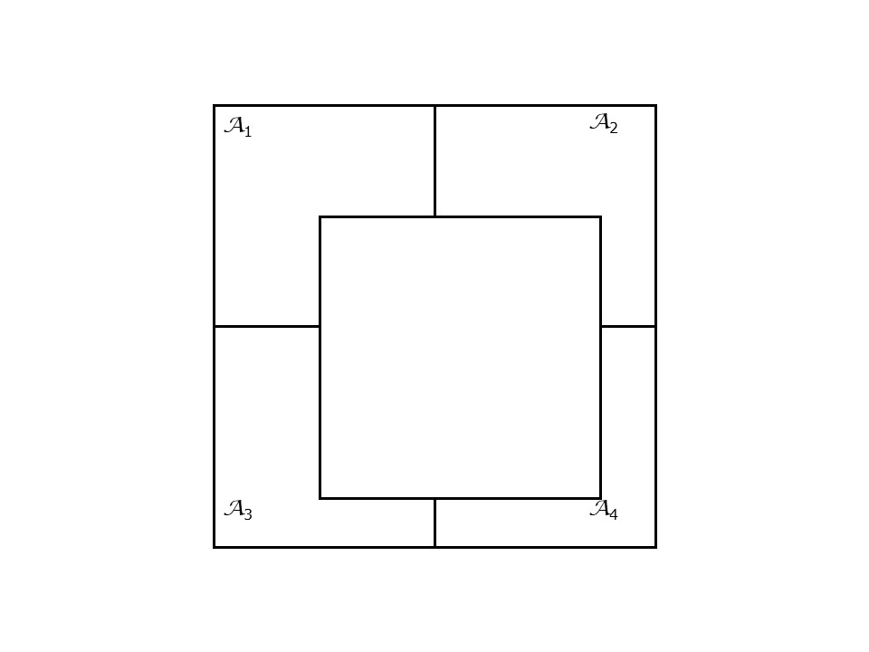
<p class="caption">(\#fig:simple-areal-system-i)\label{fig:simple-areal-system-i}Sample areal system 1</p>
</div>

<div class="figure">
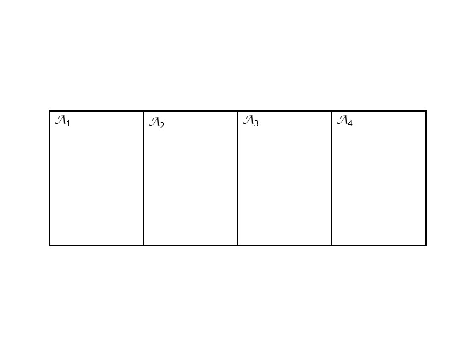
<p class="caption">(\#fig:simple-areal-system-ii)\label{fig:simple-areal-system-ii}Sample areal system 2</p>
</div>

## Learning objectives

In this activity, you will:

1. Create spatial weights matrices.
2. Calculate the spatial moving average of a variable.
2. Create scatterplots of a variable and its spatial moving average.
3. Think about ways to decide whether a landscape is random when working with area data.

## Suggested reading

O'Sullivan D and Unwin D (2010) Geographic Information Analysis, 2nd Edition, Chapter 7. John Wiley & Sons: New Jersey.

## Preliminaries

Remember to restart your `R` session or at least clear all extraneous objects from the workspace with `rm` (for "remove"), followed by a list of items to be removed. To clear the workspace from _all_ objects, do the following:

``` r
rm(list = ls())
```

Note that `ls()` lists all objects currently on the workspace.

Load the libraries you will use in this activity. 

In addition to `tidyverse`, you will need `sf`, a package that implements simple features in R (you can learn about `sf` [here](https://cran.r-project.org/web/packages/sf/vignettes/sf1.html)) and `spdep`, a package that implements several spatial statistical methods (you can learn more about it [here](https://cran.r-project.org/web/packages/spdep/index.html)):

``` r
library(isdas)
library(plotly)
library(sf)
library(spdep)
library(tidyverse)
```

In the practice that preceded this activity, you learned about the area data and visualization techniques for area data.

Begin by loading the data that you will use in this activity:

``` r
data(Hamilton_CT)
```

This is a `sf` object with census tracts and selected demographic variables for the Hamilton CMA in Canada.

You can obtain new (calculated) variables as follows. For instance, to obtain the proportion of residents who are between 20 and 34 years old, and between 35 and 49:

``` r
Hamilton_CT <- Hamilton_CT |>
  mutate(Prop20to34 = (AGE_20_TO_24 + AGE_25_TO_29 + AGE_30_TO_34)/POPULATION,
         Prop35to49 = (AGE_35_TO_39 + AGE_40_TO_44 + AGE_45_TO_49)/POPULATION)
```

You are now ready for the next activity.

## Activity

**NOTE**: Activities include technical "how to" tasks/questions. Usually, these ask you to practice using the software to organize data, create plots, and so on in support of analysis and interpretation. The second type of questions ask you to activate your brainware and to think geographically and statistically.

::: {.infobox .software data-latex="{software}"}
**Activity Part I**
:::

1. Create a spatial weights matrix for the census tracts in the Hamilton CMA. Use adjacency as your criterion for proximity.

2. Calculate the spatial moving average for the following two variables: 1) proportion of the population who are 20 to 34 years old; and 2) proportion of the population who are 65 and older.

3. Append the spatial moving averages to your dataframe.

4. Choose one age group and create a scatterplot of the proportion of population in that group versus its spatial moving average. (Hint: if you create the scatterplot using `ggplot2` you can add the 45 degree line by means of `geom_abline(slope = 1, intercept = 0)`).

::: {.infobox .brainware data-latex="{brainware}"}
**Activity Part II**
:::

5. Show your scatterplot of the population versus its spatial moving average to a fellow student. Discuss what you believe is the meaning of the 45 degree line in this plot.

6. Create a null-landscape by scrambling the values of your variable. For instance, you can use the variable `prop20to34` to generate a null landscape as follows:


``` r
Hamilton_CT$Null_1 <- sample(Hamilton_CT$Prop20to34)
```

7. Calculate the spatial moving average of your null landscape, and create a scatterplot just like you did for your variable. How is this scatterplot different from the plot created in Question 4?

<!--chapter:end:22-Activity-Area-Data-II.Rmd-->

# Area Data III

*NOTE*: The source files for this book are available with companion package [{isdas}](https://paezha.github.io/isdas/). The source files are in Rmarkdown format and packed as templates. These files allow you execute code within the notebook, so that you can work interactively with the notes. 

## Learning Objectives

In the previous chapter and its corresponding activity, you learned about different ways to define _proximity_ for area data, about spatial weights matrices, and how spatial weights matrices could be used to calculate spatial moving averages. 

In this practice, you will learn about:

1. Spatial moving averages and simulation. 
2. The concept of spatial autocorrelation.
3. Moran's $I$ coefficient and Moran's scatterplot.
4. Hypothesis testing for spatial autocorrelation.

## Suggested Readings

- Bailey TC and Gatrell AC [-@Bailey1995] Interactive Spatial Data Analysis, Chapter 7. Longman: Essex.
- Bivand RS, Pebesma E, and Gomez-Rubio V [-@Bivand2008] Applied Spatial Data Analysis with R, Chapter 9. Springer: New York.
- Brunsdon C and Comber L [-@Brunsdon2015R] An Introduction to R for Spatial Analysis and Mapping, Chapter 7. Sage: Los Angeles.
- O'Sullivan D and Unwin D [-@Osullivan2010] Geographic Information Analysis, 2nd Edition, Chapter 7. John Wiley & Sons: New Jersey.

## Preliminaries

As usual, it is good practice to restart the `R` session or at least to clear the working space to make sure that you do not have extraneous items there when you begin your work. The command in `R` to clear the workspace is `rm` (for "remove"), followed by a list of items to be removed. To clear the workspace from _all_ objects, do the following:

``` r
rm(list = ls())
```

Note that `ls()` lists all objects currently on the workspace.

Load the libraries you will use in this activity:

``` r
library(isdas)
library(gridExtra)
library(patchwork)
library(spdep)
library(sf)
library(tidyverse)
```

Read the data used in this chapter. This is an object of class `sf` (simple feature) with the census tracts of Hamilton CMA and some selected population variables from the 2011 Census of Canada:

``` r
data(Hamilton_CT)
```

You can quickly verify the contents of the dataframe by means of `summary`:

``` r
summary(Hamilton_CT)
```

```
##        ID               AREA                TRACT       POPULATION   
##  Min.   : 919807   Min.   :  0.3154   Length   :188   Min.   :    5  
##  1st Qu.: 927964   1st Qu.:  0.8552   N.unique :188   1st Qu.: 2639  
##  Median : 948130   Median :  1.4157   N.blank  :  0   Median : 3595  
##  Mean   : 948710   Mean   :  7.4578   Min.nchar: 10   Mean   : 3835  
##  3rd Qu.: 959722   3rd Qu.:  2.7775   Max.nchar: 10   3rd Qu.: 4692  
##  Max.   :1115750   Max.   :138.4466                   Max.   :11675  
##   POP_DENSITY         AGE_LESS_20      AGE_20_TO_24    AGE_25_TO_29  
##  Min.   :    2.591   Min.   :   0.0   Min.   :  0.0   Min.   :  0.0  
##  1st Qu.: 1438.007   1st Qu.: 528.8   1st Qu.:168.8   1st Qu.:135.0  
##  Median : 2689.737   Median : 750.0   Median :225.0   Median :215.0  
##  Mean   : 2853.078   Mean   : 899.3   Mean   :253.9   Mean   :232.8  
##  3rd Qu.: 3783.889   3rd Qu.:1110.0   3rd Qu.:311.2   3rd Qu.:296.2  
##  Max.   :14234.286   Max.   :3285.0   Max.   :835.0   Max.   :915.0  
##   AGE_30_TO_34     AGE_35_TO_39     AGE_40_TO_44     AGE_45_TO_49  
##  Min.   :   0.0   Min.   :   0.0   Min.   :   0.0   Min.   :  0.0  
##  1st Qu.: 135.0   1st Qu.: 145.0   1st Qu.: 170.0   1st Qu.:203.8  
##  Median : 195.0   Median : 200.0   Median : 230.0   Median :282.5  
##  Mean   : 228.2   Mean   : 239.6   Mean   : 268.7   Mean   :310.6  
##  3rd Qu.: 281.2   3rd Qu.: 280.0   3rd Qu.: 325.0   3rd Qu.:385.0  
##  Max.   :1320.0   Max.   :1200.0   Max.   :1105.0   Max.   :880.0  
##   AGE_50_TO_54    AGE_55_TO_59    AGE_60_TO_64  AGE_65_TO_69    AGE_70_TO_74  
##  Min.   :  0.0   Min.   :  0.0   Min.   :  0   Min.   :  0.0   Min.   :  0.0  
##  1st Qu.:203.8   1st Qu.:175.0   1st Qu.:140   1st Qu.:115.0   1st Qu.: 90.0  
##  Median :280.0   Median :240.0   Median :220   Median :157.5   Median :130.0  
##  Mean   :300.3   Mean   :257.7   Mean   :229   Mean   :174.2   Mean   :139.7  
##  3rd Qu.:375.0   3rd Qu.:325.0   3rd Qu.:295   3rd Qu.:221.2   3rd Qu.:180.0  
##  Max.   :740.0   Max.   :625.0   Max.   :540   Max.   :625.0   Max.   :540.0  
##   AGE_75_TO_79     AGE_80_TO_84     AGE_MORE_85              geometry  
##  Min.   :  0.00   Min.   :  0.00   Min.   :  0.00   POLYGON      :188  
##  1st Qu.: 68.75   1st Qu.: 50.00   1st Qu.: 35.00   epsg:26917   :  0  
##  Median :100.00   Median : 77.50   Median : 70.00   +proj=utm ...:  0  
##  Mean   :118.32   Mean   : 95.05   Mean   : 87.71                      
##  3rd Qu.:160.00   3rd Qu.:120.00   3rd Qu.:105.00                      
##  Max.   :575.00   Max.   :420.00   Max.   :400.00
```

## Spatial Moving Averages and Simulation

In the preceding chapter and activity you learned about different criteria to define proximity for the analysis of area data, and how spatial weights matrices can be used to code patterns of proximity among zones in a spatial system. Furthermore, you also saw how spatial weights matrices can be used to calculate spatial moving averages, which in turn can be used to explore spatial patterns in area data.

We will begin this chapter by briefly revisiting some of these notions. In the following chunk, we create a spatial weights matrix for Hamilton CMA census tracts based on the adjacency criterion:

``` r
# Function `poly2nb()` builds a list of neighbors based on contiguous boundaries. The argument for this function is an object of class "sf", which contains multi-polygon objects. 

# Function `nb2listw()` takes a list of neighbors and creates a matrix of spatial weights in the form of a list. Together, these two functions create a spatial weights matrix for the Census Tracts in Hamilton.

Hamilton_CT.nb <- poly2nb(pl = Hamilton_CT)
Hamilton_CT.w <- nb2listw(Hamilton_CT.nb)
```

Once that you have a matrix of spatial weights, it can be used to calculate the spatial moving average. In this example, we calculate the spatial moving average of the variable for population density, i.e., `POP_DENSITY` which is found in the `sf` dataframe:

``` r
# The function `lag.listw()` takes as argument the population density by census tracts in Hamilton, and calculates the moving average, with the "moving" part given by the local neighborhoods around each zone as defined by `Hamilton_CT.w`

POP_DENSITY.sma <- lag.listw(Hamilton_CT.w, Hamilton_CT$POP_DENSITY)
```

After calculating the spatial moving average of population density, we can join this new variable to the `sf` object:

``` r
Hamilton_CT$POP_DENSITY.sma <- POP_DENSITY.sma
```

As you saw in your last activity, the spatial moving average can be used in two ways to explore the spatial pattern of an area variable: as a smoother and by means of a scatterplot, combined with the original variable.

## The Spatial Moving Average as a Smoother

The spatial moving average, when mapped, is essentially a smoothing technique. What do we mean by smoothing? By reporting the average of the neighbors instead of the actually observed value of the variable, we reduce the amount of variability that is communicated. This often can make it easier to distinguish the overall pattern, at the cost of some information loss (think of how when mapping quadrats we lost some information/detail by calculating the intensity for areas).

We can illustrate the use of the spatial moving average as a smoother with the help of a little simulation.

To simulate a random spatial variable, we can randomize the observations that we already have, reassigning them at random to areas in the system. This is accomplished as follows:

``` r
# By sampling at random and without replacement from the original variable, we create a null landscape. We will call this `POP_DENSITY_s1`, where the "s1" part is to indicate that this is our first simulated random landscape. We will actually repeat this process below.

POP_DENSITY_s1 <- sample(Hamilton_CT$POP_DENSITY)
```

Calculate the spatial moving average for this randomized variable (i.e., null landscape):

``` r
# We use the function `lag.listw()` to calculate the spatial moving average, but now for the null landscape we just simulated. 

POP_DENSITY_s1.sma <- lag.listw(Hamilton_CT.w, POP_DENSITY_s1)
```

Once that you have seen how to randomize the variable, repeat the process to simulate a total of eight new variables/null landscapes, and calculate their spatial moving averages:

``` r
# Note that we are creating 8 null landscapes based on our original population density variable, and that we are calculating the spatial moving average for each of them. Each simulation has a new name: s2, s3, s4,..., s8. 

# Null landscape/simulation #2
POP_DENSITY_s2 <- sample(Hamilton_CT$POP_DENSITY)
POP_DENSITY_s2.sma <- lag.listw(Hamilton_CT.w, POP_DENSITY_s2)

# Null landscape/simulation #3
POP_DENSITY_s3 <- sample(Hamilton_CT$POP_DENSITY)
POP_DENSITY_s3.sma <- lag.listw(Hamilton_CT.w, POP_DENSITY_s3)

# Null landscape/simulation #4
POP_DENSITY_s4 <- sample(Hamilton_CT$POP_DENSITY)
POP_DENSITY_s4.sma <- lag.listw(Hamilton_CT.w, POP_DENSITY_s4)

# Null landscape/simulation #5
POP_DENSITY_s5 <- sample(Hamilton_CT$POP_DENSITY)
POP_DENSITY_s5.sma <- lag.listw(Hamilton_CT.w, POP_DENSITY_s5)

# Null landscape/simulation #6
POP_DENSITY_s6 <- sample(Hamilton_CT$POP_DENSITY)
POP_DENSITY_s6.sma <- lag.listw(Hamilton_CT.w, POP_DENSITY_s6)

# Null landscape/simulation #7
POP_DENSITY_s7 <- sample(Hamilton_CT$POP_DENSITY)
POP_DENSITY_s7.sma <- lag.listw(Hamilton_CT.w, POP_DENSITY_s7)

# Null landscape/simulation #8
POP_DENSITY_s8 <- sample(Hamilton_CT$POP_DENSITY)
POP_DENSITY_s8.sma <- lag.listw(Hamilton_CT.w, POP_DENSITY_s8)
```

Next, we will add all the null landscapes that you just simulated to the dataframes, as well as their spatial moving averages. This is useful for mapping and plotting purposes:

``` r
# Here we add the simulated landscapes to the `sf` dataframe.
Hamilton_CT$POP_DENSITY_s1 <- POP_DENSITY_s1
Hamilton_CT$POP_DENSITY_s2 <- POP_DENSITY_s2
Hamilton_CT$POP_DENSITY_s3 <- POP_DENSITY_s3
Hamilton_CT$POP_DENSITY_s4 <- POP_DENSITY_s4
Hamilton_CT$POP_DENSITY_s5 <- POP_DENSITY_s5
Hamilton_CT$POP_DENSITY_s6 <- POP_DENSITY_s6
Hamilton_CT$POP_DENSITY_s7 <- POP_DENSITY_s7
Hamilton_CT$POP_DENSITY_s8 <- POP_DENSITY_s8

# Here we add the spatial moving averages of the simulated landscapes to the `sf` dataframe.
Hamilton_CT$POP_DENSITY_s1.sma <- POP_DENSITY_s1.sma
Hamilton_CT$POP_DENSITY_s2.sma <- POP_DENSITY_s2.sma
Hamilton_CT$POP_DENSITY_s3.sma <- POP_DENSITY_s3.sma
Hamilton_CT$POP_DENSITY_s4.sma <- POP_DENSITY_s4.sma
Hamilton_CT$POP_DENSITY_s5.sma <- POP_DENSITY_s5.sma
Hamilton_CT$POP_DENSITY_s6.sma <- POP_DENSITY_s6.sma
Hamilton_CT$POP_DENSITY_s7.sma <- POP_DENSITY_s7.sma
Hamilton_CT$POP_DENSITY_s8.sma <- POP_DENSITY_s8.sma
```

It would be useful to compare the original landscape of population density to the null landscapes that you created before. To create a single figure with choropleth maps of the empirical variable and the eight simulated variables using the `facet_wrap()` function of `ggplot2`, we must first reorganize the data so that all the population density variables are in a single column, and all spatial moving average variables are also in a single column. Further, we need a new column to identifies which variable the values in this column correspond to. We will solve this little data management problem by copying only the data we are interested in into a new dataframe (by means of `select()`), and then _pivoting_ the spatial moving averages into a single column (i.e., a long table): 

``` r
#"Hamilton_CT2 is a new dataframe. Here, the pipe operators (|>) are used to pass the original dataframe to the select() function, and then the output of that is passed on to the `gather()` function. Notice that we are selecting the empirical spatial moving average and the 8 simulated instances of population densities. 

Hamilton_CT2 <- Hamilton_CT |> # This pipe operator passes the dataframe to `select()`
  # `select()` keeps only the spatial moving averages and geometry
  select(POP_DENSITY.sma, 
         POP_DENSITY_s1.sma,
         POP_DENSITY_s2.sma,
         POP_DENSITY_s3.sma,
         POP_DENSITY_s4.sma,
         POP_DENSITY_s5.sma,
         POP_DENSITY_s6.sma,
         POP_DENSITY_s7.sma,
         POP_DENSITY_s8.sma,
         geometry) |> # This pipe operator passes the dataframe with only the spatial moving average variables and the geometry to `pivot_longer()`
  # `pivot_longer()` takes a wide table and makes it longer; in this case, it places all variables with the exception of `geometry` in a single column named `DENSITY_SMA` and creates a new variable called `VAR` with the names of the original columns (i.e., POP_DENSITY.sma, POP_DENSITY_s1.sma, etc.)
  pivot_longer(cols = -geometry,
               names_to = "VAR",
               values_to = "DENSITY_SMA")
```

Now the new dataframe with all spatial moving averages in a single column can be used to create choropleth maps. The function `facet_wrap()` is used to create facet plots so that we can place all maps in a single figure:

``` r
ggplot() + 
  geom_sf(data = Hamilton_CT2, 
          aes(fill = DENSITY_SMA), color = NA) + 
  facet_wrap(~VAR, ncol = 3) + # We are creating multiple plots for single data frame by means of the "facet_wrap" function.
  scale_fill_distiller(palette = "YlOrRd", direction = 1) + # Select palette for colors 
  labs(fill = "Pop Den SMA") + # Change the label of the legend
  theme(axis.text.x = element_blank(), 
        axis.text.y = element_blank()) # Remove the axis labels to avoid cluttering the plots
```


The empirical variable is the map in the upper left corner (labeled `POP_DENSITY.sma`). The remaining 8 maps are simulated variables. Would you say the map of the empirical variable is fairly different from the map of the simulated variables? What are the key differences?

An additional advantage of the spatial moving average is its use in the development of scatterplots. The information below provides further examples of exploring spatial moving averages with scatterplots.

## Spatial Moving Average Scatterplots

Let us explore the use of spatial moving average scatterplots. First, we will extract the density information from the original `sf` object, reorganize, and bind to `Hamilton_CT2` so that we can plot using faceting:

``` r
Hamilton_CT2 <- Hamilton_CT2 |> # Pass `Hamilton_CT2` as the first argument of `data.frame()`
  data.frame(Hamilton_CT |> # Pass `Hamilton_CT` to `st_drop_geometry()`
               st_drop_geometry() |> # Drop the geometry because it is already available in `Hamilton_CT2`.
               # Select from `Hamilton_CT` the original population density and the 8 null landscapes simulated from it.
               select(POP_DENSITY,
                      POP_DENSITY_s1,
                      POP_DENSITY_s2,
                      POP_DENSITY_s3,
                      POP_DENSITY_s4,
                      POP_DENSITY_s5,
                      POP_DENSITY_s6,
                      POP_DENSITY_s7,
                      POP_DENSITY_s8) |> # Pass the result to `pivot_longer()`  
               pivot_longer(cols = everything(),
                            names_to = "VAR", 
                            values_to = "DENSITY") |> # Copy all density variables to a single column, and create a new variable called `VAR` with the names of the original columns (i.e., POP_DENSITY, POP_DENSITY_s1, etc.) 
               select(DENSITY)) # Drop VAR from the the dataframe
```

After reorganizing the data we can create the scatterplot of the empirical population density and its spatial moving average, as well as the scatterplots of the simulated variables and their spatial moving averages for comparison (the plots include the 45 degree line). Again, the use of `facet_wrap()` allows us to put all plots in a single figure:

``` r
#We are adding a geom and line (slope = 1)
ggplot(data = Hamilton_CT2, aes(x = DENSITY, y = DENSITY_SMA, color = VAR)) +
  geom_point() +
  geom_abline(slope = 1, intercept = 0) +
  coord_equal() +
  facet_wrap(~ VAR, ncol = 3)
```


What difference do you see between the empirical and simulated variables in these scatterplots?

It is possible to fit a line to the scatterplots (i.e., adding a regression line). This makes it easier to appreciate the difference between the empirical and simulated variables. This line would take the following form, with $\beta$ as the slope of the line, and $\alpha$ the intercept:
$$
\overline{x_i} =\alpha + \beta x_i
$$

Recreate the previous figure, but now add fitted lines to the scatterplots by means of the function `geom_smooth()`. The method "lm" means _linear model_, so the fitted line is a straight line:

``` r
ggplot(data = Hamilton_CT2, aes(x = DENSITY, y = DENSITY_SMA, color = VAR)) +
  geom_point(alpha = 0.1) +
  geom_abline(slope = 1, intercept = 0, linetype = "dashed") +
  # Add a fitted line to the plots
  geom_smooth(method = "lm") +
  coord_equal() +
  facet_wrap(~ VAR, ncol = 3) 
```

```
## `geom_smooth()` using formula = 'y ~ x'
```


You will notice that the slope of the line tends to be flat in the simulated variables; this is to be expected, since these variables are spatially random: _the values of the variable at $i$ are independent of the values of their local means!_. In other words, the probability that the map is random is pretty high (in fact, since these 8 of these maps are null landscapes, we know for a fact that they are random).

The empirical variable, on the other hand, has a slope that is much closer to the 45 degree line. This indicates that the values of the variable at $i$ are not independent of their local means: in other words, $x_i$ is correlated with $\overline{x_i}$, and the probability of a non-random pattern is high. This phenomenon is called _spatial autocorrelation_, and it is a fundamental way to describe spatial data. We will discuss this more extensively next.

## Spatial Autocorrelation and Moran's $I$ coefficient

As seen above, the spatial moving average can provide evidence of the phenomenon of spatial autocorrelation, that is, when a variable displays spatial patterns whereby the values of a variable at zone $i$ are not independent of the values of the variable in the neighborhood of zone $i$.

A convenient modification to the concept of the spatial moving average is as follows. Instead of using the variable $x$ for the calculation of the spatial moving average, we first center it on the global mean:
$$
z_i = x_i - \bar{x}
$$

In this way, the values of $z_i$ are given in _deviations from the mean_. By forcing the variable to be centered on the mean, the slope of the fit line is forced to pass through the origin.

Calculate the mean-centered version of POP_DENSIT, and then its spatial moving average:

``` r
df_mean_center_scatterplot <- transmute(Hamilton_CT, # Modify values in dataframe
                                        Density_z = POP_DENSITY - mean(POP_DENSITY), # Subtract the mean, so that the variable now is deviations from the mean 
                                        SMA_z = lag.listw(Hamilton_CT.w, Density_z)) # Calculate the spatial moving average of the newly created variable `Density_z`
```

Compare the following two plots. You will see that they are identical, but in the mean-centered one the origin of the axes coincides with the means of $x$ and the spatial moving average of $x$. In other words, we have the same data, but we have displaced the origin of the plot:

``` r
# Create a scatterplot of population density and its spatial moving average
sc1 <- ggplot(data = filter(Hamilton_CT2, VAR == "POP_DENSITY.sma"),
              aes(x = DENSITY, y = DENSITY_SMA)) +
  geom_point(alpha = 0.1) +
  geom_abline(slope = 1, intercept = 0, linetype = "dashed") +
  geom_smooth(method = "lm") +
  ggtitle("Population Density") +
  coord_equal()

# Create a scatterplot of the mean-centered population density, and its spatial moving average
sc2 <- ggplot(data = df_mean_center_scatterplot, 
              aes(x = Density_z, y = SMA_z)) +
  geom_point(alpha = 0.1) +
  geom_abline(slope = 1, intercept = 0, linetype = "dashed") +
  geom_smooth(method = "lm", formula = y ~ x-1) +
  ggtitle("Mean-Centered Population Density") +
  coord_equal()

# Use patchwork to place the two plots in a single figure 
sc1 + sc2
```

```
## `geom_smooth()` using formula = 'y ~ x'
```


How is it useful to displace the origin of the axes to the mean values of $x$ and its spatial moving average? To explain this, notice that the values on the top scatterplot are all positive. The values on the bottom scatterplot are positive or negative, depending if they are _above_ or _below_ the mean. This sign is interesting. Notice what happens when the variable $z_i$ multiplies its spatial moving average:
$$
z_i\bar{z}_i = z_i\sum_{j=1}^n{w_{ij}^{st}z_j}
$$

When $z_i$ is above its mean, it is a positive value. When it is below the mean, it is a negative value. Likewise, when $\bar{z}_i$ is above its mean, it is a positive value, and negative otherwise. The mean is a useful benchmark to see if values are relatively high, or relatively low.

There are four possibilities with respect to the combinations of (relatively) high and low values.

1. Quadrant 1 (the value of $z_i$ is high & the value of $\bar{z}_i$ is also high):

If $z_i$ is above the mean, it is a relatively high value in the distribution (signed positive). If its neighbors are also relatively high values, the spatial moving average will be above the mean, and also signed positive. Their product will be positive (positive times positive equals positive).

2. Quadrant 2 (the value of $z_i$ is low & the value of $\bar{z}_i$ is high): 

If $z_i$ is below the mean, it is a relatively low value in the distribution (signed negative). If its neighbors in contrast are relatively high values, the spatial moving average will be above the mean, and signed positive. Their product will be negative (negative times positive equals negative).

3. Quadrant 3 (the value of $z_i$ is low & the value of $\bar{z}_i$ is also low): 

If $z_i$ is below the mean, it is a relatively low value in the distribution (signed negative). If its neighbors are also relatively low values, the spatial moving average will be below the mean, and also signed negative. Their product will be positive (negative times negative equals positive).

4. Quadrant 4 (the value of $z_i$ is high & the value of $\bar{z}_i$ is low): 

If $z_i$ is above the mean, it is a relatively high value in the distribution (signed positive). If its neighbors are relatively low values, the spatial moving average will be below the mean, and signed negative. Their product will be negative (positive times negative equals negative).

These four quadrants are shown in the following plot:

``` r
ggplot(data = df_mean_center_scatterplot, 
       aes(x = Density_z, y = SMA_z)) +
  geom_point(color = "gray") +
  geom_hline(yintercept = 0) +
  geom_vline(xintercept = 0) +
  # You can also add annotations to plots by using `annotate()`. The inputs are the kind of annotation; in this case "text", but it could be circles, arrows, rectangles, labels, and other things. For text, you need a label, and coordinates for the annotation.
  annotate("text", label = "Q1: Positive", x= 2000, y = 2500) +
  annotate("text", label = "Q4: Negative", x= 2000, y = -2500) +
  annotate("text", label = "Q2: Negative", x= -2000, y = 2500) +
  annotate("text", label = "Q3: Positive", x= -2000, y = -2500) +
  coord_equal()
```


We can take the products of $z_i$ by $\bar{z}_i$ for all $i$ and add them:
$$
\sum_{i=1}^n{z_i\overline{z_i}} = \sum_{i=1}^n{z_i\sum_{j=1}^n{w_{ij}^{st}z_j}}
$$

If many dots are in Quadrants 1 and 3 in the scatterplot, the sum of the products will tend to be a large positive number. On the other hand, if many dots are in Quadrants 2 and 4, the sum of the products will tend to be a large number, but negative. Either case would be indicative of a pattern:

1. If the sum is positive, this would suggest that high & high values tend to be together, while low & low values also tend to be together.

2. In contrast, if the sum is negative, this would suggest that high values tend to be surrounded by low values, and vice-versa.

Finally, if the dots are scattered over the four quadrants, some products will be positive and some will be negative, and they will tend to cancel each other when summed. In this way, the sum of the products will tend to be closer to zero.

## Moran's $I$ and Moran's Scatterplot

Based on the discussion above, let us define the following coefficient, called _Moran's I_:
$$
I = \frac{\sum_{i=1}^n{z_i\sum_{j=1}^n{w_{ij}^{st}z_j}}}{\sum_{i=1}^{n}{z_i^2}}
$$

The numerator in this expression is the sum of the products described above. The denominator is the variance of variable $x_i$, and is used here to scale Moran's $I$ so that it is contained roughly in the interval $(-1, 1)$ (the exact bounds depend on the characteristics of the zoning system).

Moran's $I$ is a coefficient of _spatial autocorrelation_.

We can calculate Moran's $I$ as follows, using as an example the mean-centered population density (notice how it is the sum of the products of $z_i$ by their spatial moving averages $\bar{z}_i$, divided by the variance):

``` r
# Try to decipher the formula. You should be able to see that we are calculating the sum of the products by their spatial moving averages, divided by variance
sum(df_mean_center_scatterplot$Density_z *  df_mean_center_scatterplot$SMA_z) / sum(df_mean_center_scatterplot$Density_z^2)
```

```
## [1] 0.5179736
```

Since the value is positive, and relatively high, this would suggest a non-random spatial pattern of similar values (i.e., high & high and low & low).

Moran's $I$ is implemented in `R` in the `spdep` package, which makes its calculation easy, since you do not have to go manually through the process of calculating the spatial moving averages, etc.

The function `moran()` requires as input arguments a variable, a set of spatial weights, the number of zones ($n$), and the total sum of all weights (termed $S_0$) - which in the case of row-standardized spatial weights is equal to the number of zones. Therefore:

``` r
mc <- moran(Hamilton_CT$POP_DENSITY, Hamilton_CT.w, n = 188, S0 =  188)
mc$I
```

```
## [1] 0.5179736
```

You can verify that this matches the value calculated above. The kind of scatterplots that we used previously are called _Moran's scatterplots_, and they can also be created easily by means of the `moran.plot()` function of the `spdep` package:

``` r
# Confirming the results from the Moran coefficient above. We use "moran.plot" to illustrate the SMA of population density by census tract in Hamilton. 
mp <- moran.plot(Hamilton_CT$POP_DENSITY, Hamilton_CT.w)
```


## Hypothesis Testing for Spatial Autocorrelation

The tools described so far are useful to suggest whether a pattern is random; however, while inspection of the scatterplot is suggestive, we would like a more formal criterion to decide whether the pattern is random. Fortunately, Moran's $I$ can be used to develop a test of hypothesis. The expected value of Moran's $I$ under the null hypothesis of spatial randomness (or independence), as well as its variance, have been derived.

A test for autocorrelation based on Moran's $I$ is implemented in the `spdep` package:

``` r
#"moran.test" is calculating spatial autocorrelation of population density in Hamilton census tracts
moran.test(Hamilton_CT$POP_DENSITY, Hamilton_CT.w)
```

```
## 
## 	Moran I test under randomisation
## 
## data:  Hamilton_CT$POP_DENSITY  
## weights: Hamilton_CT.w    
## 
## Moran I statistic standard deviate = 12.722, p-value < 2.2e-16
## alternative hypothesis: greater
## sample estimates:
## Moran I statistic       Expectation          Variance 
##       0.517973553      -0.005347594       0.001691977
```

Since the null hypothesis is of spatial independence, the $p$-value of the statistic is interpreted as the probability of making a mistake by rejecting the null hypothesis. In the present case, the $p$-value is such a small number that we can reject the null hypothesis with a high degree of confidence.

Moran's $I$ and Moran's scatterplots are among the most widely used tools in the analysis of spatial area data.

<!--chapter:end:23-Area-Data-III.Rmd-->

# Activity 11: Area Data III

*NOTE*: The source files for this book are available with companion package [{isdas}](https://paezha.github.io/isdas/). The source files are in Rmarkdown format and packed as templates. These files allow you execute code within the notebook, so that you can work interactively with the notes. 

## Practice questions

Answer the following questions:

1. What does the 45 degree line in the scatterplot of spatial moving averages indicate?
2. What is the effect of centering a variable around the mean?
3. In your own words, describe the phenomenon of spatial autocorrelation.
4. What is the null hypothesis in the test of autocorrelation based on Moran's I?

## Learning objectives

In this activity, you will:

1. Calculate Moran's I coefficient of autocorrelation for area data.
2. Create Moran's scatterplots.
2. Examine the results of the tests/scatterplots for further insights.
3. Think about ways to decide whether a landscape is random when working with area data.

## Suggested reading

O'Sullivan D and Unwin D (2010) Geographic Information Analysis, 2nd Edition, Chapter 7. John Wiley & Sons: New Jersey.

## Preliminaries

Restart your `R` session or at least make sure that the working space is clean when you begin your work. The command in `R` to clear the workspace is `rm` (for "remove"), followed by a list of items to be removed. To clear the workspace from _all_ objects, do the following:

``` r
rm(list = ls())
```

Note that `ls()` lists all objects currently on the workspace.

Load the libraries you will use in this activity. 

In addition to `tidyverse`, you will need `sf`, a package that implements simple features in R (you can learn about `sf` [here](https://cran.r-project.org/web/packages/sf/vignettes/sf1.html)) and `spdep`, a package that implements several spatial statistical methods (you can learn more about it [here](https://cran.r-project.org/web/packages/spdep/index.html)):

``` r
library(isdas)
library(sf)
library(spdep)
library(tidyverse)
```

Begin by loading the data that you will use in this activity:

``` r
data(Hamilton_CT)
```

This is a `sf` object with census tracts and selected demographic variables for the Hamilton CMA in Canada.

You can obtain new (calculated) variables as follows. For instance, to obtain the proportion of residents who are between 20 and 34 years old, and between 35 and 49:

``` r
Hamilton_CT <- mutate(Hamilton_CT, Prop20to34 = (AGE_20_TO_24 + AGE_25_TO_29 + AGE_30_TO_34)/POPULATION, Prop35to49 = (AGE_35_TO_39 + AGE_40_TO_44 + AGE_45_TO_49)/POPULATION)
```

You are now ready for the next activity.

## Activity

**NOTE**: Activities include technical "how to" tasks/questions. Usually, these ask you to practice using the software to organize data, create plots, and so on in support of analysis and interpretation. The second type of questions ask you to activate your brainware and to think geographically and statistically.

::: {.infobox .software data-latex="{software}"}
**Activity Part I**
:::

1. Create a spatial weights matrix for the census tracts in the Hamilton CMA.

2. Use `moran.test` to test the following variables for spatial autocorrelation: proportion of the population who are 20 to 34 years old, 35 to 49 years old, 50 to 65 years old, and 65 and older.

3. Use `moran.plot()` to create Moran's scatterplots to complement your tests of spatial autocorrelation.

::: {.infobox .brainware data-latex="{brainware}"}
**Activity Part II**
:::

4. How confident are you deciding whether the variables under analysis are not spatially random? What can you say regarding the relative strength of the spatial pattern of these variables?

5. Show a fellow student the Moran's scatterplots you created in Question 3. What can you tell about the spatial pattern based on these scatterplots? Create choropleth maps for the variables. If the spatial pattern is not random, what kind of process might have led to the patterns you observe? 

6. The scatterplots created using `moran.plot` include some observations that are labeled with their id and a different symbol. Why do you think these observations are highlighted in such a way?

<!--chapter:end:24-Activity-Area-Data-III.Rmd-->

# Area Data IV

*NOTE*: The source files for this book are available with companion package [{isdas}](https://paezha.github.io/isdas/). The source files are in Rmarkdown format and packed as templates. These files allow you execute code within the notebook, so that you can work interactively with the notes. 

## Learning objectives

In the previous practice/session, you learned about the concept of _spatial autocorrelation_, and how it can be used to evaluate statistical maps when searching for patterns. We also introduced Moran's $I$ coefficient, one of the most widely used tools to measure spatial autocorrelation. 

In this practice, you will learn about:

1. Decomposing Moran's $I$. 
2. Local Moran's $I$ and mapping.
3. A concentration approach for local analysis of spatial association.
4. A short note on hypothesis testing.
5. Detection of hot and cold spots.

## Suggested readings

- Bailey TC and Gatrell AC [-@Bailey1995] Interactive Spatial Data Analysis, Chapter 7. Longman: Essex.
- Bivand RS, Pebesma E, and Gomez-Rubio V [-@Bivand2008] Applied Spatial Data Analysis with R, Chapter 9. Springer: New York.
- Brunsdon C and Comber L [-@Brunsdon2015R] An Introduction to R for Spatial Analysis and Mapping, Chapter 7. Sage: Los Angeles.
- O'Sullivan D and Unwin D [-@Osullivan2010] Geographic Information Analysis, 2nd Edition, Chapter 7. John Wiley & Sons: New Jersey.

## Preliminaries

As usual, it is recommended that you begin your work with a new session of `R`. At the very least, make sure that the working space is clear from extraneous items there may have been there from earlier. The command in `R` to clear the workspace is `rm` (for "remove"), followed by a list of items to be removed. To clear the workspace from _all_ objects, do the following:

``` r
rm(list = ls())
```

Note that `ls()` lists all objects currently on the workspace.

Load the libraries you will use in this activity:

``` r
library(crosstalk)
library(isdas)
library(plotly)
library(sf)
library(spdep)
library(tidyverse)
```

Load the datasets:

``` r
data("df1_simulated")
data("df2_simulated")
```

These two dataframes are simulated landscapes, one completely random and another stochastic with a strong systematic pattern. Note that the descriptive statistics of both variables are identical.:

``` r
summary(df1_simulated)
```

```
##        x               y               z        
##  Min.   : 1.00   Min.   : 1.00   Min.   :24.40  
##  1st Qu.:27.00   1st Qu.:19.00   1st Qu.:27.89  
##  Median :46.50   Median :33.00   Median :30.33  
##  Mean   :45.61   Mean   :31.63   Mean   :34.38  
##  3rd Qu.:66.00   3rd Qu.:45.00   3rd Qu.:38.25  
##  Max.   :87.00   Max.   :61.00   Max.   :69.59
```

``` r
summary(df2_simulated)
```

```
##        x               y               z        
##  Min.   : 1.00   Min.   : 1.00   Min.   :24.40  
##  1st Qu.:27.00   1st Qu.:19.00   1st Qu.:27.89  
##  Median :46.50   Median :33.00   Median :30.33  
##  Mean   :45.61   Mean   :31.63   Mean   :34.38  
##  3rd Qu.:66.00   3rd Qu.:45.00   3rd Qu.:38.25  
##  Max.   :87.00   Max.   :61.00   Max.   :69.59
```

The third dataset is an object of class `sf` (simple feature) with the census tracts of Hamilton CMA and some selected population variables from the 2011 Census of Canada:

``` r
data(Hamilton_CT)
```

## Decomposing Moran's $I$

Here we will revisit Moran's $I$ coefficient to see how its utility for the exploration of spatial patterns can be extended. Recall from the preceding reading and activity that this coefficient of spatial autocorrelation was derived based on the idea of aggregating the products of a (mean-centered) variable by its spatial moving average, and then dividing by the variance:
$$
I = \frac{\sum_{i=1}^n{z_i\sum_{j=1}^n{w_{ij}^{st}z_j}}}{\sum_{i=1}^{n}{z_i^2}}
$$

Also, remember that when plotting Moran's scatterplot using `moran.plot()` some observations were highlighted. To see this, we will recreate the plot, for which we need a set of spatial weights:

``` r
Hamilton_CT.w <- nb2listw(poly2nb(pl = Hamilton_CT))
```

And here is the scatterplot of population density again:

``` r
# We can use the arguments xlab and ylab in `moran.plot()` to change the labels for the two axes of the plot
mp <- moran.plot(Hamilton_CT$POP_DENSITY, Hamilton_CT.w, xlab = "Population Density", ylab = "Lagged Population Density")
```


The reason some observations are highlighted is because they have been identified as "influential", meaning that they make a particularly large contribution to the calculation of $I$. It turns out that the relative contribution of each observation to the calculation of Moran's $I$ is informative in and of itself, and its analysis can provide more focused information about the spatial pattern.

To explore this, we will recreate the scatterplot manually to have better control of its aspect. To do this, we first create a dataframe with the mean-centered and scaled variable $z_i=(x_i-\overline{x})/\sum z_i^2$, and its spatial moving average. We will also create a factor variable (call it `Type`) to identify the type of spatial relationship (Low & Low, if both $z_i$ and its spatial moving average are negative, High & High, if both $z_i$ and its spatial moving average are positive, and Low & High/High & Low otherwise). This is information is useful for mapping the results:

``` r
Hamilton_CT <- Hamilton_CT |> # Use the pipe operator to pass the dataframe as an argument to `mutate()`, which is used to create new variables.
  mutate(Z = (POP_DENSITY - mean(POP_DENSITY)) / var(POP_DENSITY), # Create a mean-centered variable that is standardized by the variance.
         SMA = lag.listw(Hamilton_CT.w, Z), # Calculate the spatial moving average of variable `Z`.
         # The function `case_when()` is used to evaluate several logical conditions and respond to them. 
         Type = case_when(Z < 0 & SMA < 0 ~ "LL",
                          Z > 0 & SMA > 0 ~ "HH",
                          TRUE ~ "HL/LH"))
```

Next, we will create the scatterplot and a choropleth map of the population density. The package `plotly` is used to create interactive plots. Read more about how to visualize geospatial information with `plotly` [here](#https://moderndata.plot.ly/visualizing-geo-spatial-data-with-sf-and-plotly/). The package `crosstalk` allows us to link two plots for _brushing_ (brushing is a visualization technique that links several plots in a dynamic way to highlight some elements of interest).

To create an interactive plot for linking and brushing we first, create a `SharedData` object to link two plots:

``` r
# Create a shared data object for brushing.
df_msc.sd <- SharedData$new(Hamilton_CT)
```

The function `bscols()` (for bootstrap columns) is used to array two `plotly` objects; the first of these is a scatterplot, and the second is a choropleth map of population density.

``` r
bscols(
  # The first plot is Moran's scatterplot
  plot_ly(df_msc.sd) |> # Create a `plotly` object using the dataframe as an input. The pipe operator passes this object to the function `add_markers()`; this function is similar to the `geom_point()` function in `ggplot2` and it draws objects on the blank plot created by `plot_ly()`
    add_markers(x = ~Z, y = ~SMA, color = ~POP_DENSITY, size = ~(Z * SMA), colors = "YlOrRd") |>
    hide_colorbar() |>     # Remove the colorbar from the plot.
    highlight("plotly_selected"), # Highlight observations when selected.
  # The second plot is a choropleth map
  plot_ly(df_msc.sd) |> # Create a `plotly` object using the dataframe as an input. The pipe operator passes this object to the function `add_sf()`; this function is similar to the `geom_sf()` functions in `ggplot2` and it draws a simple features object on the blank plot created by `plot_ly()`
    add_sf(split = ~TRACT, color = ~POP_DENSITY, colors = "YlOrRd", showlegend = FALSE) |>
    hide_colorbar() |> # Remove colorbar from the plot.
    highlight(dynamic = TRUE) # Highlight observations when selected.
)
```

```{=html}
<div class="container-fluid crosstalk-bscols">
<div class="row">
<div class="col-xs-6">
<div class="plotly html-widget html-fill-item" id="htmlwidget-8469fb0b3b9915d0736c" style="width:100%;height:400px;"></div>
<script type="application/json" data-for="htmlwidget-8469fb0b3b9915d0736c">{"x":{"visdat":{"132ec3c040b2a":["function () ","plotlyVisDat"]},"cur_data":"132ec3c040b2a","attrs":{"132ec3c040b2a":{"alpha_stroke":1,"sizes":[10,100],"spans":[1,20],"x":{},"y":{},"type":"scatter","mode":"markers","color":{},"size":{},"colors":"YlOrRd","inherit":true}},"layout":{"margin":{"b":40,"l":60,"t":25,"r":10},"xaxis":{"domain":[0,1],"automargin":true,"title":"Z"},"yaxis":{"domain":[0,1],"automargin":true,"title":"SMA"},"dragmode":"select","hovermode":"closest","showlegend":false,"legend":{"yanchor":"top","y":0.5}},"source":"A","config":{"modeBarButtonsToAdd":["hoverclosest","hovercompare"],"showSendToCloud":false},"data":[{"x":[-0.00061121998319908842,-0.000611154571546171,-0.00019116517371191164,-0.0003742472834283489,-0.00040350055068513936,-0.00056224797752912729,-0.00061038680151542443,-0.00061105577171042744,-0.00060690354785330461,-0.00042590457399757989,-0.00024399029767540567,-6.1426149130428537e-05,-0.00029071527039707196,-0.00059379658839191229,-0.00059840652763912142,-0.00056372854868406161,-0.00024842000331263701,0.00019762064907736517,0.00044026466697209913,0.00031503681101346877,-0.00015961379642256705,6.0273756714313095e-05,-0.00039967363219299047,0.0001252148033647325,0.00023946667531971603,0.00024423745095026933,0.00027099535644309737,-0.00018600082548808123,-0.00010397040758806913,0.00010926521716815982,-0.00022168347406383124,-0.00011283264695757559,-0.00034245837428481302,-0.00060437275808616605,0.00017472950684160922,-0.00012912151367952738,3.8073015878266685e-05,0.00019077799630387425,0.00031762983228717005,0.00017375424681280636,0.00014350379757120134,9.6925987490713818e-05,-4.4578641675560898e-05,-0.00058008538359626384,0.00064593018453329941,8.4340583716073736e-05,0.0024626729964403837,0.001764803262008893,0.00012833005500004029,0.00056309956287474438,0.0013318780464412338,0.00018107379171113897,0.00030100877799741634,0.00043978239995200982,0.00010033102907003829,0.00026730424883067471,-0.00053402471958134288,0.00031561795100596004,0.00031937597216936448,0.00033019021164009549,6.8575708694187319e-05,0.00049159987170398862,0.001186968583421055,0.00036501719377010942,0.0010491734542221163,0.00018803795303641411,-2.5302209537530054e-05,0.00033818599366104788,0.00092262603551450948,-0.00013949136572606515,0.0007224780210295425,-0.00059455090279218476,-0.00020559869973103161,-0.0002927799701939805,-0.00014443342611221782,-0.00035919290507676986,-7.0989808002140979e-05,-0.00029019281067198054,7.293003380575745e-05,0.00021717095419908998,0.00031137193089915275,0.0003362265457379865,0.00061421556968458172,0.00011247006770138021,0.00023885525501961795,-0.00019875274498888206,0.00056192358166725481,0.00047164673722494894,-2.8299044992829782e-06,-0.00040915890544462939,-0.00029007521211847029,0.0004547504316067863,-0.00014399039323086864,-0.00011150598043198958,0.00014681439332614183,0.00013963785872439058,3.9120019074070853e-05,-9.7849973116825633e-06,6.4530329705227848e-05,0.0015634568514453135,-0.00060772396762284579,3.8066037602431827e-05,-0.00015641508460827484,-1.7775265953773776e-05,0.00021475285503964818,-0.00061169392886867302,-3.5287001405405837e-05,7.9300660855136229e-05,-0.00045283156538588243,-0.0002466476164580779,0.00021277527225464212,-0.00051932724466047903,-2.6238356600754532e-05,-0.00041096762693727167,-0.00052610750147811635,-5.6002788945674399e-05,-0.00023259462609831114,-0.0006054604953713487,-0.00042368079829026338,-0.00036897738039776693,0.00043869216390312661,-0.00011299052476834641,0.0010487800352590977,0.00046923079105293529,-0.00031899294050401303,1.2051010143590983e-05,0.00057178092100699965,0.00066612794382410771,0.00015168958776505496,-0.00023558335347845951,0.001090482486451381,0.00062775464086335642,0.00051900808542662135,0.00027723770006266436,-0.00046332809120660601,-0.00049446637144421994,-0.00034720632824862828,-0.00058177399760180493,-0.00046004093921276078,-0.0003574028831995584,-0.00022912380480259029,0.00018418102644351099,0.00010986347503355928,-7.4745459797471219e-05,2.940244619267861e-06,9.3172445406682519e-05,-0.00059032997050662136,-0.00057883955558175469,-0.00058280046713982234,-4.19210913655974e-05,0.00028225159665949613,-0.00041585216880371312,-0.00047920021919055415,-0.00016741443339408099,9.6322216246453189e-05,3.9580702124717562e-05,0.0003853028793364362,-0.00026941086042157208,-0.00010424831607081164,-0.00010366921438400617,-0.00014963585083833193,-0.00018986278942242427,-0.00025685009807490311,0.00019041053003554195,-0.00020970370673462061,0.00019718880740302931,-0.00021387051637833176,-0.00026320133309078365,-0.00027752934541547475,-0.00061679036754140799,-0.00020202791923206573,2.6419847004770597e-05,-3.540088686703003e-05,0.00036835930969375866,0.00011750177675299398,0.00015341184355153938,8.6627188356916513e-05,-8.3732224064967756e-05,-1.449802743922683e-05,0.00015608004195309457,-0.00043246972465118156,8.1789347416585557e-06,-0.0004614986387170278,-0.00060838020727891978,-0.0004933407002515991,-0.00030192777142967997,-0.00034518305669021068,-0.00018852384113136889],"y":[-0.00043129952562913842,-0.00032629341714642077,-0.00050003059721468682,-0.00044203342128131668,-0.000124058357027864,-0.00016822306936214635,-0.00056049422932475204,-0.0006036956459202137,-0.00056648003628061465,-0.00042416396398245188,-0.00035769425890459523,-0.00032248245416641316,-0.00030913855090851123,-0.00042424548785758713,-0.00060089800457709152,-0.00033680974375810836,-0.00012852917463622451,-0.00038201842450816118,2.717544757160325e-05,-0.00022645191004258563,-0.00016888055343774103,-0.00014475140492125132,-8.183678583757052e-05,7.4353332411679858e-05,1.0997837827377917e-05,0.00012082954911273248,8.9995285645687599e-05,-4.3797323619804444e-05,3.0701166007635389e-05,5.9983961000145927e-05,-6.1038778562874307e-05,-8.0641678342900205e-06,0.00027072388058602337,-0.00032001508982211512,-1.6251391880633769e-07,-0.00015020977630338643,9.8772776349568192e-05,0.00016637107230043017,0.00011603023782080986,0.00022870460089513241,-9.2635951826784772e-05,0.00011677686851342997,0.00015158132356349969,4.5360419162675028e-05,0.00058157803999009643,2.423710111735272e-05,0.00071114945428392082,0.0010127944533461293,0.00017316109580112925,0.00049894221289842843,0.0009564493774393009,0.00024939641964212382,-7.7200724713057651e-05,8.319192990557783e-05,0.00021565149251788151,7.5955142859731911e-05,-0.000112898069844255,-5.5778985956617972e-05,0.00023110435715809413,0.00027030836952998238,0.00023879101098757792,0.00022629726049052694,0.00087993014875191705,0.00068371111013334183,0.00066591008989634311,0.00014332790093260733,0.00012505782415187319,0.00046453640157709583,0.00042126107753677163,0.00040890062833671411,0.0003348301876043994,-0.00048793003625534662,-0.00042001387363849901,-0.00032336784520016194,-4.5602807273602134e-05,-4.0884440928850632e-05,-0.0003603905737377461,-0.00016675913604867297,-4.386849986951314e-05,0.00025489069518335058,0.00021169042516574861,0.00021248391018158588,0.00030316424792976312,0.00022069291894610533,-2.1953152988278321e-05,-1.952758721279508e-05,0.0002873408925349784,2.2190819432382438e-05,6.5753747825368435e-05,-0.00029266035773170237,-0.00010001953163453638,-0.00010766480072422136,-1.5074989183266065e-05,-0.00019516105386613259,-1.3160909711665857e-06,-0.00017950557040828703,0.00010246395281912096,0.00016330182548822704,0.00021918186980438828,-8.5548935358869882e-05,-0.00033842815941381347,-0.0001415677731945256,-9.3252769129019894e-05,3.4111248101982493e-05,8.5066569922801025e-05,6.5611451639014252e-05,-0.00012951375590276968,-0.00016566674323729229,-0.00010991323113085523,-0.00019827807275636428,-0.0002591841700515156,-0.00024610430917900925,-0.00035633013416896573,-0.00016696374163321291,-0.00027771881299083843,-0.00029354450270143763,6.8926144002504173e-05,-0.00053587235670041439,-0.00052703579024541872,-0.00051482308087418525,0.00071350480940317643,0.00019445194925867888,0.00098943823658360366,0.0004546658319132246,-4.2530397101287902e-05,0.00023780762972945633,0.00074947213629081473,0.00035138019229667315,4.8004868273662763e-05,-0.00033306860751942144,0.00078971360862195009,0.00051213348392709632,0.00033374677246852621,0.00035819207073463073,0.00013502359007912029,-0.00032248708410946363,-0.00036282769261532753,-0.0004667986106873891,-0.00048793758756122729,-0.00020990501756859965,-0.00011926745034276363,-0.00018527312469554012,-0.00022042404926653995,-7.5356930676545394e-05,1.9992062389509792e-05,-6.4908463137954863e-05,-0.00011982413470613181,-7.4390422024728394e-05,-5.2092579835824837e-05,-0.00030603974205704285,-0.00014805338192594485,-0.0003073773321947884,-0.00032480926918334403,-0.00010304330662068526,-4.5173829099593121e-05,2.6991479772626415e-05,5.7210852425847102e-05,-0.00013815677344789038,5.8536329467121862e-06,-0.00016374485159880223,-0.00014952838149562422,-0.00020173796570428071,-0.00010045963836795205,-0.00010568235385684989,-0.00017529162994939641,-9.1212918741783464e-06,-0.00012558122013168544,-0.00023987840446594675,-0.00024338057593633133,-0.00022785974102062855,-0.00010768007633230926,-0.00015267784187244395,6.5447337607965691e-06,-4.4905199311297163e-06,-0.00011871440304954788,-4.3435912417642505e-05,-6.8947569684746929e-05,-0.00011626909556944248,-0.00019581166873822419,-0.000274588246120278,-0.00013703593376461997,-0.00028890655106823609,-0.00055719302995346093,-0.00044193482694227263,-0.00049488264626211835,-0.00040885695133802461,-0.00036627727327998949,-0.00032355541405994529],"type":"scatter","mode":"markers","key":["1","2","3","4","5","6","7","8","9","10","11","12","13","14","15","16","17","18","19","20","21","22","23","24","25","26","27","28","29","30","31","32","33","34","35","36","37","38","39","40","41","42","43","44","45","46","47","48","49","50","51","52","53","54","55","56","57","58","59","60","61","62","63","64","65","66","67","68","69","70","71","72","73","74","75","76","77","78","79","80","81","82","83","84","85","86","87","88","89","90","91","92","93","94","95","96","97","98","99","100","101","102","103","104","105","106","107","108","109","110","111","112","113","114","115","116","117","118","119","120","121","122","123","124","125","126","127","128","129","130","131","132","133","134","135","136","137","138","139","140","141","142","143","144","145","146","147","148","149","150","151","152","153","154","155","156","157","158","159","160","161","162","163","164","165","166","167","168","169","170","171","172","173","174","175","176","177","178","179","180","181","182","183","184","185","186","187","188"],"set":"SharedData24e3ad34","marker":{"colorbar":{"title":"POP_DENSITY","ticklen":2},"cmin":2.5906739999999999,"cmax":14234.2857,"colorscale":[["0","rgba(255,255,204,1)"],["0.0416666666666667","rgba(255,249,189,1)"],["0.0833333333333333","rgba(255,243,175,1)"],["0.125","rgba(255,237,160,1)"],["0.166666666666667","rgba(255,230,146,1)"],["0.208333333333333","rgba(255,224,132,1)"],["0.25","rgba(254,217,118,1)"],["0.291666666666667","rgba(255,204,104,1)"],["0.333333333333333","rgba(255,191,90,1)"],["0.375","rgba(254,178,76,1)"],["0.416666666666667","rgba(254,166,71,1)"],["0.458333333333333","rgba(254,154,65,1)"],["0.5","rgba(253,141,60,1)"],["0.541666666666667","rgba(253,122,54,1)"],["0.583333333333333","rgba(253,102,48,1)"],["0.625","rgba(252,78,42,1)"],["0.666666666666667","rgba(244,64,37,1)"],["0.708333333333333","rgba(235,48,33,1)"],["0.75","rgba(227,26,28,1)"],["0.791666666666667","rgba(214,18,32,1)"],["0.833333333333333","rgba(202,9,35,1)"],["0.875","rgba(189,0,38,1)"],["0.916666666666667","rgba(168,0,38,1)"],["0.958333333333333","rgba(148,0,38,1)"],["1","rgba(128,0,38,1)"]],"showscale":false,"color":[28.334123999999999,28.636423000000001,1969.6113,1123.5,988.30645200000004,254.657534,32.184660999999998,29.093025000000001,48.282466999999997,884.76658499999996,1725.4807599999999,2569.1983100000002,1509.54198,108.856089,87.551321999999999,247.81509600000001,1705.0089399999999,3766.3793099999998,4887.7551000000003,4309.0163899999998,2115.42553,3131.63265,1005.9924999999999,3431.75675,3959.7701099999999,3981.8181800000002,4105.4794499999998,1993.4782600000001,2372.5806400000001,3358.0459700000001,1828.57142,2331.6239300000002,1270.4119800000001,59.978475000000003,3660.5882299999998,2256.3451700000001,3029.0322500000002,3734.7560899999999,4321,3656.0810799999999,3516.27907,3301.0203999999999,2647.0588200000002,172.22222199999999,5838.2352899999996,3242.8571400000001,14234.2857,11009.090899999999,3446.1538399999999,5455.4347799999996,9008.3333299999995,3689.90825,4244.1860399999996,4885.5263100000002,3316.75675,4088.4210499999999,385.09090900000001,4311.7021199999999,4329.0697600000003,4379.0476099999996,3170,5125,8338.6363600000004,4540,7701.8181800000002,3722.0930199999998,2736.1445699999999,4416,7116.9811300000001,2208.4210499999999,6192,105.370036,1902.90697,1500,2185.5813899999998,1193.07359,2525,1511.95652,3190.12345,3856.7307599999999,4292.0792000000001,4406.9444400000002,5691.6666599999999,3372.8571400000001,3956.9444400000002,1934.5454500000001,5450,5032.7868799999997,2840,962.15644799999995,1512.5,4954.7008500000002,2187.6288599999998,2337.7550999999999,3531.5789399999999,3498.4126900000001,3033.8709600000002,2807.8571400000001,3151.3043400000001,10078.571400000001,44.490909000000002,3029,2130.2083299999999,2770.9302299999999,3845.55555,26.143791,2690,3219.5652100000002,760.32388700000001,1713.2,3836.4161800000002,453.01507500000002,2731.8181800000002,953.79746799999998,421.68021700000003,2594.2622900000001,1778.1456900000001,54.951512999999998,895.04373199999998,1147.8547799999999,4880.4877999999999,2330.8942999999999,7700,5021.6216199999999,1378.8571400000001,2908.7719299999999,5495.55555,5931.5789400000003,3554.1095799999998,1764.3333299999999,7892.7272700000003,5754.2372800000003,5251.6666599999999,4134.3283499999998,711.814346,567.90923799999996,1248.46938,164.418317,727.00587099999996,1201.3461500000001,1794.18604,3704.26829,3360.8108099999999,2507.6433099999999,2866.6666599999999,3283.67346,124.87701300000001,177.97979799999999,159.67450299999999,2659.3406500000001,4157.5,931.22362899999996,638.46153800000002,2079.375,3298.2300799999998,3036,4633.75,1608,2371.2962900000002,2373.9726000000001,2161.5384600000002,1975.6302499999999,1666.0493799999999,3733.0578500000001,1883.9357399999999,3764.3835600000002,1864.6788899999999,1636.69724,1570.48054,2.5906739999999999,1919.4092800000001,2975.1772999999998,2689.4736800000001,4555.4455399999997,3396.1111099999998,3562.0689600000001,3253.4246499999999,2466.1111099999998,2786.0759400000002,3574.4000000000001,854.425837,2890.8771900000002,720.26913400000001,41.458106999999998,573.11151099999995,1457.7235700000001,1257.8199,1981.81818],"size":[28.615758790739861,25.60801300488194,20.743984779626302,24.015864851542673,18.610988502671248,20.696886585156786,32.293243772249284,33.547506783380328,32.371968978559622,24.729047870190776,20.354472514750608,17.193915589591651,20.476152241068025,28.06748764903525,33.111338671023674,25.160787751954601,17.761721926136541,12.729199428478898,16.826423494382244,12.923805077421942,17.528724428029427,15.857194883617865,17.798206020154741,16.702078963688937,16.389301884617574,17.648439663547602,17.408450446298374,16.647558090255586,16.116386889197273,16.572968848898281,16.899828496156619,16.30855051562521,11.922632595921737,25.326586665107989,16.264593811352999,17.174542278108611,16.442097009745339,17.752854753704163,17.992465847602087,18.12756086123229,15.643154232055625,16.796175309685488,15.949363278267381,15.033234856426386,33.864527275396057,16.361688002339612,98.310948613568726,100,17.306954279560415,29.427868697679024,75.943485585633908,18.381508847401054,15.177281905412976,17.979895853986765,17.279537512998985,17.217071139370795,19.090365023589307,15.441184329289287,19.723685255236603,20.447194999650215,17.033061031054469,21.477579308102538,65.195566519055859,27.957433369788628,48.996037399496132,17.528509812474564,16.11768800154524,23.625621990326398,34.473899564519925,13.593842439899261,27.598636438939508,29.856292067800275,20.311390682101361,20.701222188852594,16.574487131176745,16.953895563263913,17.464468258570179,18.532973076084801,16.116044040223045,18.859149930189794,19.353838785121127,19.612823561057535,24.989276636820982,17.428737345246326,16.020274337615056,16.447746048983422,23.830059835191392,16.756238650681372,16.257206888354226,21.875635591244226,17.625113723815687,13.972251201071735,16.367613360356309,17.28539757168269,16.256872198520895,15.091660130451398,16.453706442343808,16.191066405204342,16.928526679708746,10,25.901051815018185,16.0134675073636,16.949245437081231,16.237518854590842,17.121744196712761,14.385748382162017,16.48002339881663,15.650468439059974,18.597616648107078,18.556982865905038,13.682389691922149,22.253416066976627,16.703923774542204,19.480431272979366,23.110781635824175,17.036061508360081,15.514875074081274,31.465511029582405,26.726690632216503,25.164947966883069,30.929550972281884,15.236631258860939,64.87951709545176,26.260478595253826,16.901496632572776,16.400180133436834,36.341581272215194,27.231199605766253,16.60705860991186,19.941817590000124,56.609365012071819,31.327059848026028,24.380686666739727,20.918065146804857,13.335146221922164,23.7361494834838,22.167563607889285,28.988307540061545,26.781798135585269,19.78043981697855,17.546120975265751,14.667316259993527,15.131443867313758,16.529795679223547,16.268677843797132,15.982606560738464,19.579704706505879,18.283174641643761,17.68818860881559,16.866952532801349,14.308254655373846,22.254112098447557,23.557645070549135,17.074083998014778,16.062080059137585,16.315973017681976,17.298602961244178,18.009624621005287,16.237336390398418,17.061171162720171,17.314123493367109,18.060294558921846,17.474728302569304,15.323214204735056,17.987998468874814,16.18166374132829,17.5241546663969,19.22369038274287,19.430237160160949,22.849923778322172,17.285058261831825,16.076954927230727,16.255070063152097,16.188432794963198,15.61244383649554,15.953753156943289,15.98611758511943,16.722004624995478,16.39891810394279,14.258154200732724,19.04227778448265,16.155226346845183,28.312419488128985,28.86149693354551,27.703494760184192,22.049002315665113,22.188955860759869,19.12351180613306],"sizemode":"area","line":{"colorbar":{"title":"","ticklen":2},"cmin":2.5906739999999999,"cmax":14234.2857,"colorscale":[["0","rgba(255,255,204,1)"],["0.0416666666666667","rgba(255,249,189,1)"],["0.0833333333333333","rgba(255,243,175,1)"],["0.125","rgba(255,237,160,1)"],["0.166666666666667","rgba(255,230,146,1)"],["0.208333333333333","rgba(255,224,132,1)"],["0.25","rgba(254,217,118,1)"],["0.291666666666667","rgba(255,204,104,1)"],["0.333333333333333","rgba(255,191,90,1)"],["0.375","rgba(254,178,76,1)"],["0.416666666666667","rgba(254,166,71,1)"],["0.458333333333333","rgba(254,154,65,1)"],["0.5","rgba(253,141,60,1)"],["0.541666666666667","rgba(253,122,54,1)"],["0.583333333333333","rgba(253,102,48,1)"],["0.625","rgba(252,78,42,1)"],["0.666666666666667","rgba(244,64,37,1)"],["0.708333333333333","rgba(235,48,33,1)"],["0.75","rgba(227,26,28,1)"],["0.791666666666667","rgba(214,18,32,1)"],["0.833333333333333","rgba(202,9,35,1)"],["0.875","rgba(189,0,38,1)"],["0.916666666666667","rgba(168,0,38,1)"],["0.958333333333333","rgba(148,0,38,1)"],["1","rgba(128,0,38,1)"]],"showscale":false,"color":[28.334123999999999,28.636423000000001,1969.6113,1123.5,988.30645200000004,254.657534,32.184660999999998,29.093025000000001,48.282466999999997,884.76658499999996,1725.4807599999999,2569.1983100000002,1509.54198,108.856089,87.551321999999999,247.81509600000001,1705.0089399999999,3766.3793099999998,4887.7551000000003,4309.0163899999998,2115.42553,3131.63265,1005.9924999999999,3431.75675,3959.7701099999999,3981.8181800000002,4105.4794499999998,1993.4782600000001,2372.5806400000001,3358.0459700000001,1828.57142,2331.6239300000002,1270.4119800000001,59.978475000000003,3660.5882299999998,2256.3451700000001,3029.0322500000002,3734.7560899999999,4321,3656.0810799999999,3516.27907,3301.0203999999999,2647.0588200000002,172.22222199999999,5838.2352899999996,3242.8571400000001,14234.2857,11009.090899999999,3446.1538399999999,5455.4347799999996,9008.3333299999995,3689.90825,4244.1860399999996,4885.5263100000002,3316.75675,4088.4210499999999,385.09090900000001,4311.7021199999999,4329.0697600000003,4379.0476099999996,3170,5125,8338.6363600000004,4540,7701.8181800000002,3722.0930199999998,2736.1445699999999,4416,7116.9811300000001,2208.4210499999999,6192,105.370036,1902.90697,1500,2185.5813899999998,1193.07359,2525,1511.95652,3190.12345,3856.7307599999999,4292.0792000000001,4406.9444400000002,5691.6666599999999,3372.8571400000001,3956.9444400000002,1934.5454500000001,5450,5032.7868799999997,2840,962.15644799999995,1512.5,4954.7008500000002,2187.6288599999998,2337.7550999999999,3531.5789399999999,3498.4126900000001,3033.8709600000002,2807.8571400000001,3151.3043400000001,10078.571400000001,44.490909000000002,3029,2130.2083299999999,2770.9302299999999,3845.55555,26.143791,2690,3219.5652100000002,760.32388700000001,1713.2,3836.4161800000002,453.01507500000002,2731.8181800000002,953.79746799999998,421.68021700000003,2594.2622900000001,1778.1456900000001,54.951512999999998,895.04373199999998,1147.8547799999999,4880.4877999999999,2330.8942999999999,7700,5021.6216199999999,1378.8571400000001,2908.7719299999999,5495.55555,5931.5789400000003,3554.1095799999998,1764.3333299999999,7892.7272700000003,5754.2372800000003,5251.6666599999999,4134.3283499999998,711.814346,567.90923799999996,1248.46938,164.418317,727.00587099999996,1201.3461500000001,1794.18604,3704.26829,3360.8108099999999,2507.6433099999999,2866.6666599999999,3283.67346,124.87701300000001,177.97979799999999,159.67450299999999,2659.3406500000001,4157.5,931.22362899999996,638.46153800000002,2079.375,3298.2300799999998,3036,4633.75,1608,2371.2962900000002,2373.9726000000001,2161.5384600000002,1975.6302499999999,1666.0493799999999,3733.0578500000001,1883.9357399999999,3764.3835600000002,1864.6788899999999,1636.69724,1570.48054,2.5906739999999999,1919.4092800000001,2975.1772999999998,2689.4736800000001,4555.4455399999997,3396.1111099999998,3562.0689600000001,3253.4246499999999,2466.1111099999998,2786.0759400000002,3574.4000000000001,854.425837,2890.8771900000002,720.26913400000001,41.458106999999998,573.11151099999995,1457.7235700000001,1257.8199,1981.81818]}},"textfont":{"size":[28.615758790739861,25.60801300488194,20.743984779626302,24.015864851542673,18.610988502671248,20.696886585156786,32.293243772249284,33.547506783380328,32.371968978559622,24.729047870190776,20.354472514750608,17.193915589591651,20.476152241068025,28.06748764903525,33.111338671023674,25.160787751954601,17.761721926136541,12.729199428478898,16.826423494382244,12.923805077421942,17.528724428029427,15.857194883617865,17.798206020154741,16.702078963688937,16.389301884617574,17.648439663547602,17.408450446298374,16.647558090255586,16.116386889197273,16.572968848898281,16.899828496156619,16.30855051562521,11.922632595921737,25.326586665107989,16.264593811352999,17.174542278108611,16.442097009745339,17.752854753704163,17.992465847602087,18.12756086123229,15.643154232055625,16.796175309685488,15.949363278267381,15.033234856426386,33.864527275396057,16.361688002339612,98.310948613568726,100,17.306954279560415,29.427868697679024,75.943485585633908,18.381508847401054,15.177281905412976,17.979895853986765,17.279537512998985,17.217071139370795,19.090365023589307,15.441184329289287,19.723685255236603,20.447194999650215,17.033061031054469,21.477579308102538,65.195566519055859,27.957433369788628,48.996037399496132,17.528509812474564,16.11768800154524,23.625621990326398,34.473899564519925,13.593842439899261,27.598636438939508,29.856292067800275,20.311390682101361,20.701222188852594,16.574487131176745,16.953895563263913,17.464468258570179,18.532973076084801,16.116044040223045,18.859149930189794,19.353838785121127,19.612823561057535,24.989276636820982,17.428737345246326,16.020274337615056,16.447746048983422,23.830059835191392,16.756238650681372,16.257206888354226,21.875635591244226,17.625113723815687,13.972251201071735,16.367613360356309,17.28539757168269,16.256872198520895,15.091660130451398,16.453706442343808,16.191066405204342,16.928526679708746,10,25.901051815018185,16.0134675073636,16.949245437081231,16.237518854590842,17.121744196712761,14.385748382162017,16.48002339881663,15.650468439059974,18.597616648107078,18.556982865905038,13.682389691922149,22.253416066976627,16.703923774542204,19.480431272979366,23.110781635824175,17.036061508360081,15.514875074081274,31.465511029582405,26.726690632216503,25.164947966883069,30.929550972281884,15.236631258860939,64.87951709545176,26.260478595253826,16.901496632572776,16.400180133436834,36.341581272215194,27.231199605766253,16.60705860991186,19.941817590000124,56.609365012071819,31.327059848026028,24.380686666739727,20.918065146804857,13.335146221922164,23.7361494834838,22.167563607889285,28.988307540061545,26.781798135585269,19.78043981697855,17.546120975265751,14.667316259993527,15.131443867313758,16.529795679223547,16.268677843797132,15.982606560738464,19.579704706505879,18.283174641643761,17.68818860881559,16.866952532801349,14.308254655373846,22.254112098447557,23.557645070549135,17.074083998014778,16.062080059137585,16.315973017681976,17.298602961244178,18.009624621005287,16.237336390398418,17.061171162720171,17.314123493367109,18.060294558921846,17.474728302569304,15.323214204735056,17.987998468874814,16.18166374132829,17.5241546663969,19.22369038274287,19.430237160160949,22.849923778322172,17.285058261831825,16.076954927230727,16.255070063152097,16.188432794963198,15.61244383649554,15.953753156943289,15.98611758511943,16.722004624995478,16.39891810394279,14.258154200732724,19.04227778448265,16.155226346845183,28.312419488128985,28.86149693354551,27.703494760184192,22.049002315665113,22.188955860759869,19.12351180613306]},"error_y":{"width":[]},"error_x":{"width":[]},"xaxis":"x","yaxis":"y","_isNestedKey":false,"frame":null},{"x":[-0.00061679036754140799,0.0024626729964403837],"y":[-0.0006036956459202137,0.0010127944533461293],"type":"scatter","mode":"markers","opacity":0,"hoverinfo":"none","showlegend":false,"marker":{"colorbar":{"title":"POP_DENSITY","ticklen":2,"len":0.5,"lenmode":"fraction","y":1,"yanchor":"top"},"cmin":2.5906739999999999,"cmax":14234.2857,"colorscale":[["0","rgba(255,255,204,1)"],["0.0416666666666667","rgba(255,249,189,1)"],["0.0833333333333333","rgba(255,243,175,1)"],["0.125","rgba(255,237,160,1)"],["0.166666666666667","rgba(255,230,146,1)"],["0.208333333333333","rgba(255,224,132,1)"],["0.25","rgba(254,217,118,1)"],["0.291666666666667","rgba(255,204,104,1)"],["0.333333333333333","rgba(255,191,90,1)"],["0.375","rgba(254,178,76,1)"],["0.416666666666667","rgba(254,166,71,1)"],["0.458333333333333","rgba(254,154,65,1)"],["0.5","rgba(253,141,60,1)"],["0.541666666666667","rgba(253,122,54,1)"],["0.583333333333333","rgba(253,102,48,1)"],["0.625","rgba(252,78,42,1)"],["0.666666666666667","rgba(244,64,37,1)"],["0.708333333333333","rgba(235,48,33,1)"],["0.75","rgba(227,26,28,1)"],["0.791666666666667","rgba(214,18,32,1)"],["0.833333333333333","rgba(202,9,35,1)"],["0.875","rgba(189,0,38,1)"],["0.916666666666667","rgba(168,0,38,1)"],["0.958333333333333","rgba(148,0,38,1)"],["1","rgba(128,0,38,1)"]],"showscale":false,"color":[2.5906739999999999,14234.2857],"line":{"color":"rgba(255,127,14,1)"}},"xaxis":"x","yaxis":"y","frame":null}],"highlight":{"on":"plotly_selected","off":"plotly_deselect","persistent":false,"dynamic":false,"color":null,"selectize":false,"defaultValues":null,"opacityDim":0.20000000000000001,"selected":{"opacity":1},"debounce":0,"ctGroups":["SharedData24e3ad34"]},"shinyEvents":["plotly_hover","plotly_click","plotly_selected","plotly_relayout","plotly_brushed","plotly_brushing","plotly_clickannotation","plotly_doubleclick","plotly_deselect","plotly_afterplot","plotly_sunburstclick"],"base_url":"https://plot.ly"},"evals":[],"jsHooks":[]}</script>
</div>
<div class="col-xs-6">
<div class="plotly html-widget html-fill-item" id="htmlwidget-5c6c3f742330ccf4e7a9" style="width:100%;height:400px;"></div>
<script type="application/json" data-for="htmlwidget-5c6c3f742330ccf4e7a9">{"x":{"visdat":{"132ec62f1e517":["function () ","plotlyVisDat"],"132ec7835587b":["function () ","data"]},"cur_data":"132ec7835587b","attrs":{"132ec7835587b":{"alpha_stroke":1,"sizes":[10,100],"spans":[1,20],"x":{},"y":{},"_bbox":[560922.35635895876,4767178.0285029253,621020.10993682651,4814329.4679198749],"set":"SharedData24e3ad34","mode":"lines","fill":"toself","split":{},"color":{},"colors":"YlOrRd","showlegend":false,"inherit":true}},"layout":{"margin":{"b":40,"l":60,"t":25,"r":10},"xaxis":{"showgrid":false,"zeroline":false,"ticks":"","showticklabels":false,"domain":[0,1],"automargin":true,"scaleanchor":"y","scaleratio":-0.59133482281009786},"yaxis":{"showgrid":false,"zeroline":false,"ticks":"","showticklabels":false,"domain":[0,1],"automargin":true},"dragmode":"zoom","hovermode":"closest","showlegend":false},"source":"A","config":{"modeBarButtonsToAdd":["hoverclosest","hovercompare"],"showSendToCloud":false},"data":[{"fillcolor":"rgba(255,251,195,0.5)","x":[596185.91030568152,595921.02470729302,595904.03807806224,595887.02625276207,595880.00636161503,595854.00188104063,595822.0172084053,595795.03434505512,595779.0208846021,595778.86459324881,595739.80236332933,595588.17339434731,595505.58082366048,595513.75808196468,595396.59984622314,595286.85242817691,595250.24317205942,594828.97607913741,594701.02975540177,594549.63169892633,594190.20038396504,593858.96659031196,593825.27696462348,593827.0464059083,593828.99215255247,593850.9731803973,593857.95561139612,593870.98964752071,593881.01841118676,593891.966987113,593892.02065137634,593892.01911835221,593926.00473939371,593925.97713400167,593952.10443104431,593955.9800739733,593959.03700421599,593966.03395936138,593988.02242728614,594009.99806519726,594025.03043406573,594036.96601595252,594063.97293506993,594092.99471621681,594108.01338789507,594127.21786303108,594135.96541745903,594143.98780338117,594168.03041427047,594171.03293728002,594200.16011782596,594201.78626830725,594206.44250759622,594220.02179058641,594235.7725876167,594241.99196397478,594283.984426799,594285.03865238349,594300.98934243596,594322.76475442504,594331.85386601253,594332.01018297498,594342.02014785842,594349.01424708799,594407.00286587002,594423.00504068402,594448.02915087319,594448.01526352239,594452.96590946452,594459.02450059727,594459.10110619874,594464.00286552683,594463.98897558625,594494.39022270753,594509.80983573198,594546.03529367852,594603.98665845138,594694.02446121909,594718.99835886271,594729.03358058655,594761.02318758878,594816.03428518551,594862.96617487899,594882.97116588429,594927.04151051829,594967.03628594521,594979.03692192386,595049.00548541336,595116.99535967596,595140.02062150906,595225.98589680134,595232.02699103649,595329.00372649508,595366.96917878883,595425.98764400196,595437.00775396056,595506.96558309766,595521.58054783219,595533.01163697988,595613.99513696192,595641.99277028826,595688.03179113474,595728.02962073428,595766.97149962187,595785.58791991777,595789.17966066638,595791.87307585648,595797.60208003828,595803.56854714372,595809.77404143719,595815.97171354014,595822.32560613297,595828.83728352049,595835.26146093698,595841.75748465257,595848.16913698055,595854.57295910176,595868.25387174264,595882.95819913864,595893.04350334161,595898.00739599403,595906.02284343808,595908.98241192428,595911.9999620053,595915.00185786909,595912.99504029995,595911.02714841079,595908.00154347252,595904.00259283511,595898.02000921045,595889.98145830573,595879.98555938981,595873.01373476803,595865.07908378262,595858.16610456037,595853.6183788419,595849.25347709481,595848.23957871343,595844.05436351558,595840.8237084893,595840.53630265931,595867.61880287202,595872.9730909057,595877.02120672364,595885.82357325486,595888.73779901781,595898.93217364815,595920.81520540512,595982.78261369432,596050.38712194504,596332.0291822654,596475.78212262935,596564.13854258298,596576.6568073649,596598.22042150795,596601.93226833921,596676.82503692538,596712.20626974921,596747.19221444509,596734.10561920202,596715.0106493471,596714.63445246895,596714.79535792861,596731.93821103557,596739.69957186806,596764.76620935113,596795.81611388514,596880.42440807517,596885.18912161514,597052.77739917429,597029.03345274669,596953.56491653551,596923.74261076062,596909.69477997732,596867.02793547465,596851.44088843348,596746.33020331955,596671.97665945115,596580.31902520417,596516.65553855966,596507.02440887352,596495.92456211196,596475.10519571789,596440.70522223436,596421.2686289493,596418.4143719048,596415.56797314039,596405.15182368038,596387.60729120451,596385.13704999734,596379.81075145898,596377.6402819996,596370.58840308699,596363.76758601342,596360.02299263596,596348.09012382803,596343.76194864418,596341.055058192,596243.60621267185,596185.91030568152],"y":[4782693.8226585332,4781842.0197772793,4781790.0191221684,4781734.0194504736,4781713.0383308111,4781626.0330687426,4781524.948213906,4781438.0405441802,4781386.0539961597,4781385.6074947491,4781394.4991351701,4781448.4602288306,4781477.7349860454,4781526.3896478023,4781574.5076066693,4781615.9557420043,4781629.7717970926,4781784.834567639,4781832.0363486586,4781894.1317552701,4782117.5152449124,4782248.781024267,4782263.5334549341,4782270.7777075469,4782277.0247218702,4782350.9704046389,4782375.0588587485,4782420.0017860401,4782453.0182824181,4782490.046181771,4782492.0462656859,4782492.1573191406,4782603.0347507028,4782605.0337132523,4782696.3647369351,4782709.9693883415,4782724.0070307208,4782746.985086605,4782826.0408974942,4782905.9852253506,4782959.0646288078,4783000.9937759917,4783099.0020293817,4783204.0360230664,4783258.0040835924,4783326.5809392948,4783358.0251525715,4783389.0150412582,4783471.987702827,4783484.0253786612,4783587.0621032892,4783592.8605311504,4783608.6976894196,4783654.9819681207,4783708.7384053674,4783729.040261778,4783871.0209894879,4783877.0336627271,4783928.0161961783,4783998.4066560613,4784028.5230455985,4784028.9695150498,4784062.9863290126,4784085.9648682782,4784281.0403898442,4784334.0233669523,4784416.0113025494,4784417.0107867112,4784434.9626889639,4784455.0404220708,4784455.3747123498,4784470.9933657832,4784471.9928500345,4784570.3838019269,4784565.8219454475,4784554.9960486209,4784536.0309630353,4784505.9614486722,4784497.9787546284,4784495.0084893676,4784485.0132904667,4784467.2308191331,4784452.0018395782,4784444.9500730196,4784431.0144903623,4784418.0219271658,4784413.9687283328,4784389.9547393797,4784368.0242044479,4784360.015762045,4784331.0069174385,4784328.9811108364,4784297.0177005166,4784283.9989876291,4784264.6114454558,4784260.9895779863,4784237.979741822,4784232.9645313257,4784229.0153642818,4784202.0517621003,4784193.0041676154,4784177.9903662819,4784165.0022385092,4784151.9994660066,4784145.5971973464,4784144.4259719253,4784143.5753175402,4784140.6569994958,4784138.1863360004,4784136.052273904,4784134.4734863564,4784133.3412097702,4784132.5443908134,4784132.1906479662,4784132.5043792427,4784133.0390789006,4784134.1290535657,4784137.7653224859,4784137.9727015439,4784120.0095862458,4784107.9723359514,4784086.9809915489,4784073.0271828454,4784054.9643857637,4784038.0121280169,4784018.9898398342,4784002.9671508651,4783987.040617411,4783970.9892795114,4783940.0257994039,4783905.0345989512,4783859.0193009581,4783829.0415864279,4783809.7135842973,4783792.8436657889,4783781.1165886819,4783767.9481073301,4783764.9347671727,4783750.5469895452,4783737.6166563863,4783734.9467860823,4783733.3292392874,4783733.960117477,4783735.0168837812,4783738.9175952924,4783728.1843414968,4783691.0066513056,4783689.3159757294,4783732.0660867486,4783761.1230123565,4783945.0508930907,4783944.5345748318,4783982.5552041316,4783987.9536043182,4783997.2571377493,4783999.0870994693,4784035.2517943475,4784049.9727935642,4784063.91082233,4783989.969947082,4783881.3989251163,4783879.2831248529,4783879.3964900617,4783885.3052669233,4783888.081530856,4783896.7689766409,4783936.087681856,4784043.1485952791,4784045.2158715809,4784116.6958465818,4784032.4942029249,4783814.5964256795,4783729.086746512,4783688.45472397,4783568.9950990276,4783516.5672174944,4783547.7272346932,4783570.439987137,4783598.5726028467,4783618.2176706688,4783621.1910920348,4783624.5879866593,4783625.7365347343,4783627.5811125571,4783628.6383623239,4783612.1586303767,4783595.1236316916,4783533.1065846439,4783429.3350108061,4783414.4158107247,4783383.1279588742,4783369.9902284043,4783328.5700169997,4783288.0417004591,4783265.5512918998,4783218.7303080745,4783203.0072774598,4783193.3053204305,4782901.1288074562,4782693.8226585332],"_bbox":[560922.35635895876,4767178.0285029253,621020.10993682651,4814329.4679198749],"set":"SharedData24e3ad34","mode":"lines","fill":"toself","showlegend":false,"type":"scatter","key":["57"],"name":"5370001.01","marker":{"color":"rgba(255,251,195,1)","line":{"color":"rgba(255,251,195,1)"},"showscale":false},"textfont":{"color":"rgba(255,251,195,1)"},"error_y":{"color":"rgba(255,251,195,1)"},"error_x":{"color":"rgba(255,251,195,1)"},"line":{"color":"rgba(255,251,195,1)"},"xaxis":"x","yaxis":"y","_isSimpleKey":true,"_isNestedKey":false,"frame":null},{"fillcolor":"rgba(255,202,102,0.5)","x":[594201.78626830725,594200.16011782596,594171.03293728002,594168.03041427047,594143.98780338117,594135.96541745903,594127.21786303108,594108.01338789507,594092.99471621681,594063.97293506993,594036.96601595252,594025.03043406573,594009.99806519726,593988.02242728614,593966.03395936138,593959.03700421599,593955.9800739733,593952.10443104431,593925.97713400167,593926.00473939371,593892.01911835221,593892.02065137634,593891.966987113,593881.01841118676,593870.98964752071,593857.95561139612,593850.9731803973,593828.99215255247,593827.0464059083,593825.27696462348,593802.50089909206,593647.41596479958,593589.14324144472,592968.14841559972,592973.0105011079,592981.99095615419,592986.02745548193,592985.01062100765,592975.98849249783,592992.00395371311,592993.9937164021,593020.00514410913,593041.0037569073,593048.99192619603,593060.96001163812,593069.99066233914,593077.01800340845,593086.03565406066,593116.02450812701,593133.00283261493,593146.9882120844,593148.99128603062,593156.01543040259,593160.03431366489,593167.980385812,593190.00414024829,593202.0233376635,593206.96461922256,593218.9708161311,593251.32608352031,593254.04337810597,593274.02142136509,593300.02235560433,593302.98629098525,593346.01371703472,593348.03154737293,593393.15122913942,593396.25448326173,593405.63705132494,593505.00907440251,593520.99075144471,593654.98233734083,593765.13440527278,593786.0232456642,593833.99706457986,593900.986927588,593947.01137154317,594000.03688757843,594052.00799780618,594082.02296066005,594092.38412548206,594195.5854499985,594201.78626830725],"y":[4783592.8605311504,4783587.0621032892,4783484.0253786612,4783471.987702827,4783389.0150412582,4783358.0251525715,4783326.5809392948,4783258.0040835924,4783204.0360230664,4783099.0020293817,4783000.9937759917,4782959.0646288078,4782905.9852253506,4782826.0408974942,4782746.985086605,4782724.0070307208,4782709.9693883415,4782696.3647369351,4782605.0337132523,4782603.0347507028,4782492.1573191406,4782492.0462656859,4782490.046181771,4782453.0182824181,4782420.0017860401,4782375.0588587485,4782350.9704046389,4782277.0247218702,4782270.7777075469,4782263.5334549341,4782270.7723979568,4782306.8451200929,4782123.5478175068,4782304.080522472,4782317.0315789618,4782320.0422624554,4782327.9837070238,4782336.9668130847,4782342.9525615489,4782408.0388104552,4782417.0630223462,4782505.9448355539,4782580.9850007929,4782608.9739136221,4782649.0133132087,4782678.0161912134,4782698.9943210287,4782722.9987063287,4782812.0465157712,4782860.0409554141,4782906.9947851663,4782915.0195732536,4782953.9918076908,4782975.0399131291,4783006.0274426229,4783094.9665655037,4783143.0043518189,4783161.9547273777,4783204.9940284742,4783316.734248288,4783325.9906936139,4783398.0188201014,4783493.0110169994,4783502.0487238336,4783653.0342349689,4783659.94856162,4783818.1830458445,4783828.8888390362,4783826.1297960859,4783797.0612987531,4783793.0602778848,4783752.0298662335,4783719.2259943848,4783712.9606928723,4783698.9607423991,4783679.0035354635,4783664.9774466362,4783650.0487782881,4783634.9948563315,4783626.9684219901,4783624.0017021196,4783594.6628978252,4783592.8605311504],"_bbox":[560922.35635895876,4767178.0285029253,621020.10993682651,4814329.4679198749],"set":"SharedData24e3ad34","mode":"lines","fill":"toself","showlegend":false,"type":"scatter","key":["53"],"name":"5370001.02","marker":{"color":"rgba(255,202,102,1)","line":{"color":"rgba(255,202,102,1)"},"showscale":false},"textfont":{"color":"rgba(255,202,102,1)"},"error_y":{"color":"rgba(255,202,102,1)"},"error_x":{"color":"rgba(255,202,102,1)"},"line":{"color":"rgba(255,202,102,1)"},"xaxis":"x","yaxis":"y","_isSimpleKey":true,"_isNestedKey":false,"frame":null},{"fillcolor":"rgba(254,215,116,0.5)","x":[590561.98377859627,590386.02061429503,590106.99527229951,589917.49974536628,589907.95194592269,589931.43416586076,589936.03446054843,589940.30978226662,589944.58215439529,589948.61226430279,589952.39570490213,589956.01518607093,589959.39093802834,589962.68397144263,589965.73180738464,589968.61715579149,589993.55528331199,589999.71288990916,590039.88841686677,590070.84889863816,590105.9990325931,590132.98397941375,590153.01545596588,590166.04062581179,590198.9720456386,590225.98106652731,590229.01781597233,590242.97592963441,590428.99699601438,590539.02102063817,590555.01185328641,590720.95816891803,590778.99138803722,590780.6234465614,590829.99742354394,590960.98761247506,591026.99799568113,591078.9682055196,591085.98106025776,591334.99910358631,591384.0448968017,591578.97153668408,591605.64922452788,591635.01972688967,591670.03750238114,591737.02723946725,591777.99060485535,591812.66294198704,591846.61326552578,591802.00722116965,591780.98755464121,591759.96744050935,591755.91984802647,591739.96104379185,591735.91486749984,591707.96890829317,591707.98239052761,591698.4723352486,591691.07635569491,591636.02838468063,591631.97728893289,591628.24516927567,591616.96897382603,591603.02904078586,591583.0344110548,591565.29235072609,591551.98521896161,591541.04121528845,591534.02551372221,591506.68501150783,591452.982180672,591360.03565370257,591341.00815002108,591230.03563422826,591148.99469562911,591148.58697645494,591081.99859106238,590956.24315803475,590955.99793644948,590905.48139234609,590900.01272919681,590837.00071120658,590804.36484259088,590803.95565273403,590732.38245007209,590729.52555781219,590625.97048154031,590561.98377859627],"y":[4783690.023300075,4783747.9945139484,4783839.0361461192,4783900.9496350139,4783904.0444799494,4783953.2271912498,4783961.7295965767,4783970.2277061846,4783978.9479259439,4783987.5538704274,4783996.3786999825,4784005.3124355655,4784014.2429482983,4784023.283441511,4784032.4317648998,4784041.577939651,4784121.8806325691,4784141.6220866377,4784267.666716042,4784365.4880290972,4784472.0287700938,4784557.0243301969,4784621.0460252278,4784661.9826835338,4784764.0516768349,4784847.0487117339,4784856.9745519273,4784852.0504977778,4784786.9903618572,4784749.0240356652,4784744.0166147687,4784686.0277350321,4784666.0318237524,4784665.4982537972,4784649.0525485082,4784605.0419413261,4784584.0441305256,4784567.9681913611,4784566.0628383383,4784487.9873169707,4784471.9854494119,4784410.9635201171,4784402.8813719936,4784393.9470360251,4784381.9789108243,4784361.0010822006,4784348.0030050436,4784337.5859727105,4784326.4929148564,4784188.0475986358,4784120.008684041,4784051.96984802,4784038.8084978396,4783987.054844318,4783973.782454906,4783882.991309179,4783881.9918265268,4783852.0957641732,4783828.1151423585,4783649.9881418934,4783637.0489881625,4783624.5584312007,4783586.9746269938,4783542.024094156,4783475.9991136501,4783417.6686275406,4783373.948563219,4783378.0220199283,4783380.0379740605,4783388.7780240951,4783406.0494569438,4783435.012005792,4783441.9761588797,4783476.0298594562,4783502.044933957,4783502.1505418345,4783523.0286291344,4783562.8866781751,4783562.9944712007,4783579.2020425349,4783581.0171770211,4783601.9454355557,4783611.8393234313,4783612.0560053652,4783635.2034264756,4783636.1649627266,4783668.9944566591,4783690.023300075],"_bbox":[560922.35635895876,4767178.0285029253,621020.10993682651,4814329.4679198749],"set":"SharedData24e3ad34","mode":"lines","fill":"toself","showlegend":false,"type":"scatter","key":["35"],"name":"5370001.04","marker":{"color":"rgba(254,215,116,1)","line":{"color":"rgba(254,215,116,1)"},"showscale":false},"textfont":{"color":"rgba(254,215,116,1)"},"error_y":{"color":"rgba(254,215,116,1)"},"error_x":{"color":"rgba(254,215,116,1)"},"line":{"color":"rgba(254,215,116,1)"},"xaxis":"x","yaxis":"y","_isSimpleKey":true,"_isNestedKey":false,"frame":null},{"fillcolor":"rgba(255,223,131,0.5)","x":[591846.61326552578,591812.66294198704,591777.99060485535,591737.02723946725,591670.03750238114,591635.01972688967,591605.64922452788,591578.97153668408,591384.0448968017,591334.99910358631,591085.98106025776,591078.9682055196,591026.99799568113,590960.98761247506,590829.99742354394,590780.6234465614,590778.99138803722,590720.95816891803,590555.01185328641,590539.02102063817,590428.99699601438,590242.97592963441,590229.01781597233,590248.99430634163,590276.04496836883,590307.95824585389,590333.02821555512,590340.02111369511,590378.9647739738,590412.0279993841,590422.97644714336,590437.02737273742,590444.98848437914,590453.98589344381,590484.02412329754,590487.99330648128,590490.0251572791,590496.01432279649,590558.51265869872,590907.24172381475,591047.01351239625,591244.96572923218,591290.98564279126,591302.98060246313,591329.97730642359,591552.36955872842,591578.96675468783,591896.98777327593,592111.00174912845,592118.99050133093,592125.02983270318,592120.0195994,592118.22666112171,592114.02106835693,592086.03449513647,592075.96088186628,592053.01091210276,592043.01672853052,592022.43385123671,591992.26654544414,591979.64366466913,591954.70883928542,591913.02005206991,591905.96426782408,591891.01287680038,591881.59328822501,591861.19365906483,591846.61326552578],"y":[4784326.4929148564,4784337.5859727105,4784348.0030050436,4784361.0010822006,4784381.9789108243,4784393.9470360251,4784402.8813719936,4784410.9635201171,4784471.9854494119,4784487.9873169707,4784566.0628383383,4784567.9681913611,4784584.0441305256,4784605.0419413261,4784649.0525485082,4784665.4982537972,4784666.0318237524,4784686.0277350321,4784744.0166147687,4784749.0240356652,4784786.9903618572,4784852.0504977778,4784856.9745519273,4784924.994521982,4785016.9893091675,4785122.0444420306,4785204.0166000687,4785227.9903467381,4785354.0211858982,4785463.9794844473,4785502.0012379093,4785544.9515417004,4785551.0554744862,4785583.0533509683,4785675.977577839,4785689.0260459892,4785695.0510793962,4785715.0130185569,4785694.5195619287,4785579.8830476692,4785533.9926874442,4785469.003912569,4785453.9605916003,4785450.0120133059,4785442.0442562932,4785372.3944729837,4785363.9780098991,4785263.9726093858,4785196.0046821097,4785194.0025559375,4785191.9740121439,4785172.0238011992,4785166.4457845185,4785153.0598679613,4785060.0446738331,4785024.0312129054,4784948.9673858909,4784943.0561693832,4784879.1319473488,4784784.9769828469,4784745.1526836725,4784666.5080496026,4784534.9878578819,4784516.0098645939,4784468.0458892668,4784437.5953484299,4784371.8970479909,4784326.4929148564],"_bbox":[560922.35635895876,4767178.0285029253,621020.10993682651,4814329.4679198749],"set":"SharedData24e3ad34","mode":"lines","fill":"toself","showlegend":false,"type":"scatter","key":["37"],"name":"5370001.05","marker":{"color":"rgba(255,223,131,1)","line":{"color":"rgba(255,223,131,1)"},"showscale":false},"textfont":{"color":"rgba(255,223,131,1)"},"error_y":{"color":"rgba(255,223,131,1)"},"error_x":{"color":"rgba(255,223,131,1)"},"line":{"color":"rgba(255,223,131,1)"},"xaxis":"x","yaxis":"y","_isSimpleKey":true,"_isNestedKey":false,"frame":null},{"fillcolor":"rgba(254,215,116,0.5)","x":[591846.61326552578,591861.19365906483,591881.59328822501,591891.01287680038,591905.96426782408,591913.02005206991,591954.70883928542,591979.64366466913,591992.26654544414,592022.43385123671,592043.01672853052,592053.01091210276,592075.96088186628,592086.03449513647,592114.02106835693,592118.22666112171,592120.0195994,592125.02983270318,592195.0321639491,592223.0209009297,592224.65296555124,592495.80643021711,592691.97568109841,592904.96389860031,593116.97727503371,593151.98784149881,593318.13648817595,593454.01045464154,593581.98379178415,593583.53484437824,593611.03237866191,593613.39881567762,593648.00341124833,593655.01692668127,593661.38364868448,593655.48084476986,593653.84994132933,593649.03385667154,593620.81440790254,593605.02589112322,593596.96132790972,593586.988332949,593543.0371711863,593542.03610560135,593526.96063812124,593493.96687361796,593490.976015753,593456.99364864198,593447.98040986934,593445.01690934785,593438.96708620409,593429.00625275658,593426.97486256936,593399.67506864457,593396.25448326173,593384.58492818917,593259.97608966345,593159.99802790943,593123.99855871906,593014.97519911535,593004.03116169292,592883.10847868398,592853.81569831131,592831.21200329915,592697.13592434931,592665.55380768038,592633.89054801001,592564.03341663559,592462.00242570159,592460.03909826011,592351.98396667151,592314.02410371148,592263.01052352926,592168.01124663441,592112.02788348403,591853.55137026636,591846.61326552578],"y":[4784326.4929148564,4784371.8970479909,4784437.5953484299,4784468.0458892668,4784516.0098645939,4784534.9878578819,4784666.5080496026,4784745.1526836725,4784784.9769828469,4784879.1319473488,4784943.0561693832,4784948.9673858909,4785024.0312129054,4785060.0446738331,4785153.0598679613,4785166.4457845185,4785172.0238011992,4785191.9740121439,4785170.0420275433,4785160.9804733675,4785160.4472498046,4785073.1624310557,4785009.9679759489,4784941.01094444,4784872.3803342609,4784860.9751010714,4784807.6058724336,4784764.0431780294,4784722.04048975,4784721.5064711422,4784712.9991404591,4784712.2542088488,4784700.9569673613,4784699.0542554073,4784696.9204878993,4784677.1788916802,4784671.7137494003,4784655.6526060924,4784563.1827864265,4784511.9819846572,4784483.9911476597,4784452.9750274457,4784304.9737972366,4784300.9613296567,4784250.9924006741,4784145.0175412055,4784137.9787008287,4784026.9921164885,4783996.9891275018,4783987.9513442079,4783966.9861530904,4783934.9708292885,4783929.0559562789,4783840.1543666879,4783828.8888390362,4783832.5050782161,4783871.0036384109,4783902.9552898249,4783915.0135094002,4783948.9537778851,4783953.0248829238,4783989.6923910482,4783998.622490854,4784005.6447115168,4784047.6895931913,4784057.7000177326,4784067.7094807122,4784089.9724771492,4784124.0166685889,4784124.9896334792,4784159.9531830326,4784172.9886490181,4784189.9568871837,4784220.9907723796,4784239.0034838896,4784324.1430348735,4784326.4929148564],"_bbox":[560922.35635895876,4767178.0285029253,621020.10993682651,4814329.4679198749],"set":"SharedData24e3ad34","mode":"lines","fill":"toself","showlegend":false,"type":"scatter","key":["40"],"name":"5370001.06","marker":{"color":"rgba(254,215,116,1)","line":{"color":"rgba(254,215,116,1)"},"showscale":false},"textfont":{"color":"rgba(254,215,116,1)"},"error_y":{"color":"rgba(254,215,116,1)"},"error_x":{"color":"rgba(254,215,116,1)"},"line":{"color":"rgba(254,215,116,1)"},"xaxis":"x","yaxis":"y","_isSimpleKey":true,"_isNestedKey":false,"frame":null},{"fillcolor":"rgba(254,188,87,0.5)","x":[594459.10110619874,594459.02450059727,594452.96590946452,594448.01526352239,594448.02915087319,594423.00504068402,594407.00286587002,594349.01424708799,594342.02014785842,594332.01018297498,594331.85386601253,594322.76475442504,594300.98934243596,594285.03865238349,594283.984426799,594241.99196397478,594235.7725876167,594220.02179058641,594206.44250759622,594201.78626830725,594195.5854499985,594092.38412548206,594082.02296066005,594052.00799780618,594000.03688757843,593947.01137154317,593900.986927588,593833.99706457986,593786.0232456642,593765.13440527278,593654.98233734083,593520.99075144471,593505.00907440251,593405.63705132494,593396.25448326173,593399.67506864457,593426.97486256936,593429.00625275658,593438.96708620409,593445.01690934785,593447.98040986934,593456.99364864198,593490.976015753,593493.96687361796,593526.96063812124,593542.03610560135,593543.0371711863,593586.988332949,593596.96132790972,593605.02589112322,593620.81440790254,593649.03385667154,593653.84994132933,593655.48084476986,593661.38364868448,593667.01622326707,593687.00385844742,593746.23742098664,594124.48803115555,594239.04410035419,594449.63923268963,594459.10110619874],"y":[4784455.3747123498,4784455.0404220708,4784434.9626889639,4784417.0107867112,4784416.0113025494,4784334.0233669523,4784281.0403898442,4784085.9648682782,4784062.9863290126,4784028.9695150498,4784028.5230455985,4783998.4066560613,4783928.0161961783,4783877.0336627271,4783871.0209894879,4783729.040261778,4783708.7384053674,4783654.9819681207,4783608.6976894196,4783592.8605311504,4783594.6628978252,4783624.0017021196,4783626.9684219901,4783634.9948563315,4783650.0487782881,4783664.9774466362,4783679.0035354635,4783698.9607423991,4783712.9606928723,4783719.2259943848,4783752.0298662335,4783793.0602778848,4783797.0612987531,4783826.1297960859,4783828.8888390362,4783840.1543666879,4783929.0559562789,4783934.9708292885,4783966.9861530904,4783987.9513442079,4783996.9891275018,4784026.9921164885,4784137.9787008287,4784145.0175412055,4784250.9924006741,4784300.9613296567,4784304.9737972366,4784452.9750274457,4784483.9911476597,4784511.9819846572,4784563.1827864265,4784655.6526060924,4784671.7137494003,4784677.1788916802,4784696.9204878993,4784694.9987588506,4784689.0540392362,4784671.0990926884,4784556.6987021444,4784521.9644109337,4784458.0201148326,4784455.3747123498],"_bbox":[560922.35635895876,4767178.0285029253,621020.10993682651,4814329.4679198749],"set":"SharedData24e3ad34","mode":"lines","fill":"toself","showlegend":false,"type":"scatter","key":["54"],"name":"5370001.07","marker":{"color":"rgba(254,188,87,1)","line":{"color":"rgba(254,188,87,1)"},"showscale":false},"textfont":{"color":"rgba(254,188,87,1)"},"error_y":{"color":"rgba(254,188,87,1)"},"error_x":{"color":"rgba(254,188,87,1)"},"line":{"color":"rgba(254,188,87,1)"},"xaxis":"x","yaxis":"y","_isSimpleKey":true,"_isNestedKey":false,"frame":null},{"fillcolor":"rgba(254,213,114,0.5)","x":[593396.25448326173,593393.15122913942,593348.03154737293,593346.01371703472,593302.98629098525,593300.02235560433,593274.02142136509,593254.04337810597,593251.32608352031,593218.9708161311,593206.96461922256,593202.0233376635,593190.00414024829,593167.980385812,593160.03431366489,593156.01543040259,593148.99128603062,593146.9882120844,593133.00283261493,593062.97373738838,593025.9940857715,592998.97154413722,592944.0313774863,592929.00943519617,592908.0272030523,592721.99866115686,592650.97010380053,592597.99550429033,592588.02682237781,592365.01339220162,592330.98999363219,592232.96939065668,592105.96454080474,592085.96054876177,592053.96928298217,591999.0342860627,591976.00926358812,591901.96482838888,591685.02241781843,591578.01989586593,591551.98521896161,591565.29235072609,591583.0344110548,591603.02904078586,591616.96897382603,591628.24516927567,591631.97728893289,591636.02838468063,591691.07635569491,591698.4723352486,591707.98239052761,591707.96890829317,591735.91486749984,591739.96104379185,591755.91984802647,591759.96744050935,591780.98755464121,591802.00722116965,591846.61326552578,591853.55137026636,592112.02788348403,592168.01124663441,592263.01052352926,592314.02410371148,592351.98396667151,592460.03909826011,592462.00242570159,592564.03341663559,592633.89054801001,592665.55380768038,592697.13592434931,592831.21200329915,592853.81569831131,592883.10847868398,593004.03116169292,593014.97519911535,593123.99855871906,593159.99802790943,593259.97608966345,593384.58492818917,593396.25448326173],"y":[4783828.8888390362,4783818.1830458445,4783659.94856162,4783653.0342349689,4783502.0487238336,4783493.0110169994,4783398.0188201014,4783325.9906936139,4783316.734248288,4783204.9940284742,4783161.9547273777,4783143.0043518189,4783094.9665655037,4783006.0274426229,4782975.0399131291,4782953.9918076908,4782915.0195732536,4782906.9947851663,4782860.0409554141,4782881.9636144685,4782894.0090718633,4782902.9697279176,4782920.9901973484,4782926.0054002032,4782933.0496161599,4782993.0454531386,4783016.957985945,4783034.0083120707,4783037.9823226174,4783111.0353347398,4783121.0142503763,4783152.0065919803,4783193.0486211758,4783199.9975030804,4783210.0053001288,4783228.0333349332,4783236.0524011934,4783261.042559782,4783330.9783811849,4783365.6353999292,4783373.948563219,4783417.6686275406,4783475.9991136501,4783542.024094156,4783586.9746269938,4783624.5584312007,4783637.0489881625,4783649.9881418934,4783828.1151423585,4783852.0957641732,4783881.9918265268,4783882.991309179,4783973.782454906,4783987.054844318,4784038.8084978396,4784051.96984802,4784120.008684041,4784188.0475986358,4784326.4929148564,4784324.1430348735,4784239.0034838896,4784220.9907723796,4784189.9568871837,4784172.9886490181,4784159.9531830326,4784124.9896334792,4784124.0166685889,4784089.9724771492,4784067.7094807122,4784057.7000177326,4784047.6895931913,4784005.6447115168,4783998.622490854,4783989.6923910482,4783953.0248829238,4783948.9537778851,4783915.0135094002,4783902.9552898249,4783871.0036384109,4783832.5050782161,4783828.8888390362],"_bbox":[560922.35635895876,4767178.0285029253,621020.10993682651,4814329.4679198749],"set":"SharedData24e3ad34","mode":"lines","fill":"toself","showlegend":false,"type":"scatter","key":["38"],"name":"5370001.08","marker":{"color":"rgba(254,213,114,1)","line":{"color":"rgba(254,213,114,1)"},"showscale":false},"textfont":{"color":"rgba(254,213,114,1)"},"error_y":{"color":"rgba(254,213,114,1)"},"error_x":{"color":"rgba(254,213,114,1)"},"line":{"color":"rgba(254,213,114,1)"},"xaxis":"x","yaxis":"y","_isSimpleKey":true,"_isNestedKey":false,"frame":null},{"fillcolor":"rgba(255,232,149,0.5)","x":[592968.14841559972,592476.97973748716,592183.07113747706,591371.98126763292,590552.27455965162,590252.91780101846,590222.34446086979,590101.82784257235,589965.88013755681,589715.95263852412,589716.03095593129,589733.96907227149,589769.96518082556,589771.97200509021,589810.01663232083,589811.99493071844,589854.61950811162,589856.9760638827,589871.96836669184,589875.03257615038,589876.95792330033,589880.02065089822,589883.00359738781,589887.0412094132,589904.16251772526,589907.95194592269,589917.49974536628,590106.99527229951,590386.02061429503,590561.98377859627,590625.97048154031,590729.52555781219,590732.38245007209,590803.95565273403,590804.36484259088,590837.00071120658,590900.01272919681,590905.48139234609,590955.99793644948,590956.24315803475,591081.99859106238,591148.58697645494,591148.99469562911,591230.03563422826,591341.00815002108,591360.03565370257,591452.982180672,591506.68501150783,591534.02551372221,591541.04121528845,591551.98521896161,591578.01989586593,591685.02241781843,591901.96482838888,591976.00926358812,591999.0342860627,592053.96928298217,592085.96054876177,592105.96454080474,592232.96939065668,592330.98999363219,592365.01339220162,592588.02682237781,592597.99550429033,592650.97010380053,592721.99866115686,592908.0272030523,592929.00943519617,592944.0313774863,592998.97154413722,593025.9940857715,593062.97373738838,593133.00283261493,593116.02450812701,593086.03565406066,593077.01800340845,593069.99066233914,593060.96001163812,593048.99192619603,593041.0037569073,593020.00514410913,592993.9937164021,592992.00395371311,592975.98849249783,592985.01062100765,592986.02745548193,592981.99095615419,592973.0105011079,592968.14841559972],"y":[4782304.080522472,4782466.8838932859,4782582.5206828611,4782812.0499599325,4783101.0949034924,4783166.6469795024,4783174.1274558818,4783211.0718560079,4783253.58997129,4783330.8157106508,4783331.0388895907,4783388.0338018546,4783499.0264247889,4783507.0501669142,4783628.9552511442,4783632.9800075954,4783764.8314011153,4783770.9715586817,4783817.0428568255,4783824.9695441797,4783832.9922506586,4783841.0299942214,4783848.9556117291,4783857.0062478026,4783895.6638923381,4783904.0444799494,4783900.9496350139,4783839.0361461192,4783747.9945139484,4783690.023300075,4783668.9944566591,4783636.1649627266,4783635.2034264756,4783612.0560053652,4783611.8393234313,4783601.9454355557,4783581.0171770211,4783579.2020425349,4783562.9944712007,4783562.8866781751,4783523.0286291344,4783502.1505418345,4783502.044933957,4783476.0298594562,4783441.9761588797,4783435.012005792,4783406.0494569438,4783388.7780240951,4783380.0379740605,4783378.0220199283,4783373.948563219,4783365.6353999292,4783330.9783811849,4783261.042559782,4783236.0524011934,4783228.0333349332,4783210.0053001288,4783199.9975030804,4783193.0486211758,4783152.0065919803,4783121.0142503763,4783111.0353347398,4783037.9823226174,4783034.0083120707,4783016.957985945,4782993.0454531386,4782933.0496161599,4782926.0054002032,4782920.9901973484,4782902.9697279176,4782894.0090718633,4782881.9636144685,4782860.0409554141,4782812.0465157712,4782722.9987063287,4782698.9943210287,4782678.0161912134,4782649.0133132087,4782608.9739136221,4782580.9850007929,4782505.9448355539,4782417.0630223462,4782408.0388104552,4782342.9525615489,4782336.9668130847,4782327.9837070238,4782320.0422624554,4782317.0315789618,4782304.080522472],"_bbox":[560922.35635895876,4767178.0285029253,621020.10993682651,4814329.4679198749],"set":"SharedData24e3ad34","mode":"lines","fill":"toself","showlegend":false,"type":"scatter","key":["36"],"name":"5370001.09","marker":{"color":"rgba(255,232,149,1)","line":{"color":"rgba(255,232,149,1)"},"showscale":false},"textfont":{"color":"rgba(255,232,149,1)"},"error_y":{"color":"rgba(255,232,149,1)"},"error_x":{"color":"rgba(255,232,149,1)"},"line":{"color":"rgba(255,232,149,1)"},"xaxis":"x","yaxis":"y","_isSimpleKey":true,"_isNestedKey":false,"frame":null},{"fillcolor":"rgba(254,218,121,0.5)","x":[590496.01432279649,590490.0251572791,590487.99330648128,590484.02412329754,590453.98589344381,590444.98848437914,590437.02737273742,590422.97644714336,590412.0279993841,590378.9647739738,590340.02111369511,590333.02821555512,590307.95824585389,590276.04496836883,590248.99430634163,590229.01781597233,590118.00790984847,589985.97319327143,589905.02411996422,589862.02441635705,589713.04793222737,589702.03383642843,589539.01548195875,589446.96767639089,589242.98311910429,589091.01753778011,589068.01743878017,588957.96801485459,588869.0250868774,588752.98175881058,588682.23613589793,588664.44683253369,588680.7370073878,588703.4929472392,588709.93859482557,588723.94654453825,588743.47726737056,588743.78764390852,588747.0552938222,588775.6065016248,588801.52607287327,588805.34027480497,588831.85795401374,588858.38504834333,588867.10060451645,588881.18308816012,588906.59942141594,588912.26785057574,588913.27856739017,588913.90356514836,588919.89680110919,588919.97801417089,588926.98995741876,589035.65190954646,589252.40939860512,589339.78288611828,589492.58571399632,589662.76757233648,589978.01027571061,590106.99379490071,590239.08443940396,590286.9766079851,590395.408207061,590478.71149164427,590484.99496737542,590496.01432279649],"y":[4785715.0130185569,4785695.0510793962,4785689.0260459892,4785675.977577839,4785583.0533509683,4785551.0554744862,4785544.9515417004,4785502.0012379093,4785463.9794844473,4785354.0211858982,4785227.9903467381,4785204.0166000687,4785122.0444420306,4785016.9893091675,4784924.994521982,4784856.9745519273,4784896.0434626741,4784940.0561857317,4784966.9753175378,4784980.9572154246,4785028.5276462333,4785032.0476754997,4785084.9901864901,4785115.9892339781,4785177.063352555,4785224.0525687179,4785230.9708152954,4785265.9612253243,4785296.0089542177,4785336.0335905161,4785359.9902654327,4785366.0892772954,4785418.8392395359,4785498.997546779,4785521.7405318441,4785568.7961255126,4785634.5841118852,4785635.6988934018,4785646.7377773318,4785743.2997994181,4785829.8310273094,4785842.5431840792,4785932.9699312188,4786022.6194275524,4786051.8345270352,4786099.224739776,4786186.7495665448,4786206.7058105972,4786210.1623005271,4786212.0587208429,4786232.0192243308,4786232.0202873154,4786230.0016826242,4786194.3265329888,4786123.0849879105,4786094.3547281977,4786044.1614072025,4785988.3139108242,4785884.9624783173,4785843.0199812409,4785799.6771996329,4785783.9856257373,4785748.4398509813,4785721.1137853563,4785718.9759878004,4785715.0130185569],"_bbox":[560922.35635895876,4767178.0285029253,621020.10993682651,4814329.4679198749],"set":"SharedData24e3ad34","mode":"lines","fill":"toself","showlegend":false,"type":"scatter","key":["24"],"name":"5370002.01","marker":{"color":"rgba(254,218,121,1)","line":{"color":"rgba(254,218,121,1)"},"showscale":false},"textfont":{"color":"rgba(254,218,121,1)"},"error_y":{"color":"rgba(254,218,121,1)"},"error_x":{"color":"rgba(254,218,121,1)"},"line":{"color":"rgba(254,218,121,1)"},"xaxis":"x","yaxis":"y","_isSimpleKey":true,"_isNestedKey":false,"frame":null},{"fillcolor":"rgba(254,208,108,0.5)","x":[588919.89680110919,588913.90356514836,588913.27856739017,588912.26785057574,588906.59942141594,588881.18308816012,588867.10060451645,588858.38504834333,588831.85795401374,588805.34027480497,588801.52607287327,588775.6065016248,588747.0552938222,588743.78764390852,588743.47726737056,588723.94654453825,588709.93859482557,588703.4929472392,588680.7370073878,588664.44683253369,588654.73778667115,588637.67954324803,588621.03468878835,588551.98123893293,588520.96898785699,588458.0354450926,588454.04253486625,588416.00358866912,588337.00363723503,588293.01002219168,588234.00408620271,588226.97866764734,588168.01206304925,588076.99063284695,587984.09040727979,587925.04392602737,587849.83005651156,587841.59095023817,587845.65214641369,587866.03479882865,587909.97438187199,587917.9920000924,587933.98462460993,587952.71747265058,587954.59188868734,587955.99626078154,587980.88149471732,587982.13203014992,587984.1587537853,588005.99249057018,588020.51261207939,588057.97765038954,588058.9686229229,588078.85685143061,588097.95994859643,588098.03971849894,588098.98975585238,588102.97591682617,588107.00582233013,588108.97124779318,588404.99367530656,588476.12493559357,588716.03605498269,588912.96607526671,588919.89680110919],"y":[4786232.0192243308,4786212.0587208429,4786210.1623005271,4786206.7058105972,4786186.7495665448,4786099.224739776,4786051.8345270352,4786022.6194275524,4785932.9699312188,4785842.5431840792,4785829.8310273094,4785743.2997994181,4785646.7377773318,4785635.6988934018,4785634.5841118852,4785568.7961255126,4785521.7405318441,4785498.997546779,4785418.8392395359,4785366.0892772954,4785369.2947845627,4785375.4034028593,4785380.9620908862,4785406.0528922742,4785416.9782427894,4785440.0393257486,4785440.9870023187,4785455.04246563,4785483.004958746,4785498.9829957085,4785519.9867702173,4785523.0055798218,4785541.0114694713,4785569.0431035021,4785597.9401884153,4785615.9471177841,4785640.4098489285,4785643.0801405208,4785655.6838231515,4785719.0364914993,4785863.9990143273,4785890.9822912952,4785941.9493740462,4786000.83812543,4786006.6381608583,4786011.0992417186,4786090.3940129522,4786094.1866734251,4786100.76619941,4786171.0246966742,4786216.4193392685,4786333.9753671857,4786338.9864798142,4786402.555704264,4786464.0044412389,4786464.116548405,4786466.0171043081,4786478.0646479083,4786493.0006508473,4786498.0244127018,4786401.0163586996,4786377.7285444606,4786298.9966844162,4786234.038899187,4786232.0192243308],"_bbox":[560922.35635895876,4767178.0285029253,621020.10993682651,4814329.4679198749],"set":"SharedData24e3ad34","mode":"lines","fill":"toself","showlegend":false,"type":"scatter","key":["26"],"name":"5370002.03","marker":{"color":"rgba(254,208,108,1)","line":{"color":"rgba(254,208,108,1)"},"showscale":false},"textfont":{"color":"rgba(254,208,108,1)"},"error_y":{"color":"rgba(254,208,108,1)"},"error_x":{"color":"rgba(254,208,108,1)"},"line":{"color":"rgba(254,208,108,1)"},"xaxis":"x","yaxis":"y","_isSimpleKey":true,"_isNestedKey":false,"frame":null},{"fillcolor":"rgba(254,188,87,0.5)","x":[587446.95474658103,587318.76429179497,587296.63218080462,587138.78664488834,587138.78379628342,587138.77382616536,587138.6911850922,587138.68833648937,587138.68691218796,587138.68263928348,587138.6797906803,587138.67836637876,587138.59430101863,587138.59287671826,587138.59002811753,587138.58860381704,587138.58575521607,587138.58433091559,587138.50026556966,587138.4959926717,587138.49456837238,587138.40623014234,587138.40480584418,587138.40195724776,587138.40053294948,587138.31504333194,587138.31219473784,587138.22670512961,587138.22528083366,587138.22243224189,587138.13979123544,587138.13694264612,587138.13551835145,587138.13266976201,587138.0500287636,587137.96453918237,587137.96169059793,587137.96026630572,587137.87620102905,587137.87477673811,587137.871928156,587137.78928717715,587137.78643859748,587137.78501430771,587137.69952475931,587137.61545950489,587137.61403521756,587137.61118664267,587137.52854568348,587137.52712139732,587137.44020758744,587137.35756663966,587137.35614235606,587137.35329378874,587137.27065284643,587137.26780428155,587137.18231478333,587137.09967385163,587137.09682529175,587137.01133580785,587136.9286948865,587136.84320541658,587136.84035686427,587136.7577159534,587136.67365077266,587136.67222649895,587136.589585596,587136.58673705126,587136.50409615354,587136.50124761125,587136.41860671877,587136.33454156131,587136.33311729273,587136.24905214075,587136.24762787332,587136.16498699505,587136.08092185238,587136.07949758763,587135.99400819,587135.90994306142,587135.82730220002,587135.82445367798,587135.65917196742,587135.65632345038,587135.57368260017,587135.48961749859,587135.48819324269,587135.32148731011,587135.23884647526,587135.15335714258,587135.06929206499,587135.06786781538,587134.98522699461,587134.90116192854,587134.81852111442,587134.73445605743,587134.73303181294,587134.56632595905,587134.48368515936,587134.48083667818,587134.39819588256,587134.3141308527,587134.23149006371,587134.14884927636,587134.14600080543,587134.06336002529,587133.97929501394,587133.89665424044,587133.81401346857,587133.72994847014,587133.72852424113,587133.56181849015,587133.47917773272,587133.39653697889,587133.31247200409,587133.22983125574,587133.14576629002,587133.14434206998,587133.06170133059,587132.89499564248,587132.81235491124,587132.72828996903,587132.64564924431,587132.56158431235,587132.47894359427,587132.39630287979,587132.31223795866,587132.22959725081,587132.1469565446,587132.0628916386,587131.89761024283,587131.73090465844,587131.64826397062,587131.56562328641,587131.4815584094,587131.39891773183,587131.23221219191,587131.14957152237,587130.98286600586,587130.90022534446,587130.73351985123,587130.65087920008,587130.56823855266,587130.48417372804,587130.40153308515,587130.31889244681,587130.1550353507,587130.07097054576,587129.98832991696,587129.90568929084,587129.82162449998,587129.73898388038,587129.65634326451,587129.57370265014,587129.48963787523,587129.32578082406,587122.21442639432,587113.94613032683,587099.47703331057,587084.96396983392,586952.68184722611,586917.82418201247,586891.61432240892,586891.4007667288,586890.38578266127,587012.98965233052,587145.04302130116,587190.99295271037,587220.483734846,587241.9906755283,587289.99536281847,587344.99972872017,587372.95792408916,587394.96664630505,587438.98135646095,587467.99832873046,587524.97822130809,587577.97779129376,587629.02863371093,587672.98739753803,587697.37180643028,587729.99415244511,587857.48702730262,587942.07570059341,588108.97124779318,588107.00582233013,588102.97591682617,588098.98975585238,588098.03971849894,588097.95994859643,588078.85685143061,588058.9686229229,588057.97765038954,588020.51261207939,588005.99249057018,587984.1587537853,587982.13203014992,587980.88149471732,587955.99626078154,587954.59188868734,587952.71747265058,587933.98462460993,587917.9920000924,587909.97438187199,587866.03479882865,587845.65214641369,587841.59095023817,587830.90520582127,587753.01035755826,587748.03014943691,587710.98158542591,587686.99560150004,587671.972443935,587647.98655833805,587646.76254173648,587612.9960708915,587562.00666664704,587504.01842982008,587450.8366853823,587446.95474658103],"y":[4785712.8525188211,4785770.1832428668,4785817.3266661009,4785894.3837995091,4785894.605907199,4785895.3832841106,4785895.4932963243,4785895.7154040132,4785895.8264578572,4785896.1596193928,4785896.3817270827,4785896.4927809266,4785896.7138469862,4785896.8249008311,4785897.0470085209,4785897.158062364,4785897.3801700547,4785897.4912239006,4785897.7122899601,4785898.0454514958,4785898.1565053407,4785898.7107329387,4785898.8217867827,4785899.0438944744,4785899.1549483202,4785899.4870682284,4785899.7091759183,4785900.0412958274,4785900.1523496741,4785900.3744573649,4785900.4844695833,4785900.7065772759,4785900.8176311208,4785901.0397388125,4785901.1497510327,4785901.4818709446,4785901.7039786372,4785901.8150324821,4785902.0360985501,4785902.1471523959,4785902.3692600876,4785902.4792723116,4785902.7013800023,4785902.8124338491,4785903.1445537657,4785903.3656198373,4785903.4766736832,4785903.6987813767,4785903.8087936016,4785903.9198474493,4785904.3630212154,4785904.473033445,4785904.5840872917,4785904.8061949834,4785904.916207213,4785905.1383149056,4785905.4704348287,4785905.580447061,4785905.8025547536,4785906.1346746795,4785906.2446869127,4785906.5768068414,4785906.798914534,4785906.9089267692,4785907.1299928539,4785907.2410466997,4785907.3510589376,4785907.5731666321,4785907.6831788709,4785907.9052865636,4785908.0152988043,4785908.2363648918,4785908.3474187376,4785908.5684848279,4785908.6795386747,4785908.7895509182,4785909.0106170084,4785909.1216708552,4785909.4537907941,4785909.6748568872,4785909.7848691344,4785910.006976828,4785910.2270013262,4785910.4491090197,4785910.5591212697,4785910.7801873684,4785910.8912412152,4785911.2223195676,4785911.3323318223,4785911.6644517714,4785911.8855178757,4785911.9965717234,4785912.1065839799,4785912.3276500851,4785912.4376623435,4785912.6587284515,4785912.7697822982,4785913.1008606702,4785913.2108729323,4785913.4329806287,4785913.5429928936,4785913.7640590053,4785913.8740712712,4785913.9840835379,4785914.2061912334,4785914.316203502,4785914.5372696184,4785914.6472818889,4785914.7572941594,4785914.9783602795,4785915.0894141281,4785915.4204925224,4785915.5305047976,4785915.6405170737,4785915.8615831994,4785915.9715954755,4785916.192661603,4785916.3037154516,4785916.4137277324,4785916.7448061416,4785916.8548184251,4785917.0758845573,4785917.1858968418,4785917.4069629768,4785917.5169752631,4785917.6269875513,4785917.8480536891,4785917.9580659792,4785918.0680782693,4785918.2891444089,4785918.5091689955,4785918.8402474364,4785918.950259733,4785919.0602720305,4785919.2813381776,4785919.3913504779,4785919.7224289291,4785919.8324412322,4785920.1635196898,4785920.2735319939,4785920.604610458,4785920.7146227658,4785920.8246350754,4785921.0457012355,4785921.155713547,4785921.2657258604,4785921.3746966384,4785921.5957628042,4785921.7057751203,4785921.8157874374,4785922.0368536059,4785922.1468659248,4785922.2568782456,4785922.3668905683,4785922.5879567387,4785922.6969275372,4785932.4911526851,4785943.8255601479,4785963.6330334758,4785993.2143176096,4785932.9850729415,4786200.4448219296,4786820.669439394,4786824.6653055577,4786846.8667556224,4786818.0024956185,4786787.0402042931,4786775.9672995666,4786769.0151518844,4786763.9598829485,4786751.0258013783,4786736.9602641659,4786729.2115556616,4786723.0524954004,4786710.9566952093,4786702.9998568613,4786686.9618922174,4786670.9841509135,4786654.9816765673,4786640.9984158305,4786633.3159688944,4786622.9631858123,4786580.9594739033,4786553.0641145213,4786498.0244127018,4786493.0006508473,4786478.0646479083,4786466.0171043081,4786464.116548405,4786464.0044412389,4786402.555704264,4786338.9864798142,4786333.9753671857,4786216.4193392685,4786171.0246966742,4786100.76619941,4786094.1866734251,4786090.3940129522,4786011.0992417186,4786006.6381608583,4786000.83812543,4785941.9493740462,4785890.9822912952,4785863.9990143273,4785719.0364914993,4785655.6838231515,4785643.0801405208,4785646.4963224502,4785671.0365252281,4785672.9715107651,4785686.0439872984,4785694.0648259092,4785699.9799430044,4785708.0009180913,4785708.4294182044,4785718.9900939278,4785735.9932981115,4785754.0174626019,4785770.9932530904,4785712.8525188211],"_bbox":[560922.35635895876,4767178.0285029253,621020.10993682651,4814329.4679198749],"set":"SharedData24e3ad34","mode":"lines","fill":"toself","showlegend":false,"type":"scatter","key":["19"],"name":"5370002.04","marker":{"color":"rgba(254,188,87,1)","line":{"color":"rgba(254,188,87,1)"},"showscale":false},"textfont":{"color":"rgba(254,188,87,1)"},"error_y":{"color":"rgba(254,188,87,1)"},"error_x":{"color":"rgba(254,188,87,1)"},"line":{"color":"rgba(254,188,87,1)"},"xaxis":"x","yaxis":"y","_isSimpleKey":true,"_isNestedKey":false,"frame":null},{"fillcolor":"rgba(255,222,128,0.5)","x":[588125.81249773048,587738.84422105737,587711.33882638591,587702.52337355551,587687.50505663431,587603.68257257668,587469.90962911618,587455.87226185948,587445.67027614464,587440.0376648535,587423.22537486115,587276.4782520181,587216.74276191986,587213.4277696918,587186.47941946937,587167.90020450228,587161.12828902178,587122.33955513185,587126.92575447052,587134.5959184519,587325.34345562407,587384.95796615619,587435.47737444413,587446.95474658103,587450.8366853823,587504.01842982008,587562.00666664704,587612.9960708915,587646.76254173648,587647.98655833805,587671.972443935,587686.99560150004,587710.98158542591,587748.03014943691,587753.01035755826,587830.90520582127,587841.59095023817,587849.83005651156,587925.04392602737,587984.09040727979,588076.99063284695,588168.01206304925,588226.97866764734,588234.00408620271,588293.01002219168,588337.00363723503,588416.00358866912,588454.04253486625,588458.0354450926,588520.96898785699,588551.98123893293,588621.03468878835,588637.67954324803,588654.73778667115,588664.44683253369,588662.96589423239,588645.66307259316,588643.08118606347,588640.01484538987,588628.01926969807,588619.9675315487,588595.01367531961,588590.98537917016,588586.98472770501,588574.98252100719,588552.98539493687,588550.04056094319,588548.00678238843,588530.00849292381,588514.99387930159,588513.03981361352,588511.00596166169,588508.9721059018,588507.99422451388,588505.96036207373,588504.96946039051,588504.82724820834,588503.60711802496,588502.38698542234,588501.33075541665,588500.43553623697,588499.36339542642,588498.2100232339,588497.05520317948,588495.82059754408,588494.58598994242,588493.34993442567,588492.03264703962,588490.55289760465,588489.15582183341,588487.75729801063,588476.99425017647,588462.25308356795,588458.97868462605,588425.85827649757,588421.02555816108,588391.96917784854,588367.035473519,588361.96164654929,588344.00212927372,588341.98092672159,588340.02796660422,588337.01893616421,588334.0084570871,588330.98642810236,588327.00254842406,588323.00423224841,588319.02033876465,588315.02201013523,588310.03729782195,588292.00288920279,588288.56452634011,588284.87523770914,588274.68941519945,588274.2092050832,588243.5703104015,588219.02880495228,588216.30131940718,588203.64159230399,588192.207584118,588181.92238320759,588172.78455249849,588164.79553687037,588162.9817831231,588158.03369965928,588156.07906096953,588132.11778593285,588128.23144125298,588125.00651528221,588119.18701947667,588115.4710984875,588113.54532485199,588113.48951616336,588115.2195697187,588118.81674311869,588124.28393210354,588125.81249773048],"y":[4783827.0622152053,4783961.6748114238,4783971.205297716,4783974.312656777,4783979.5614579702,4784008.6923830882,4784055.2861731807,4784060.1038106252,4784063.6379473228,4784065.6758632557,4784071.457522884,4784122.5532368189,4784142.7791640665,4784160.5081270635,4784304.1115453979,4784403.3936485173,4784449.9569909209,4784718.8089989778,4784734.9732119795,4784757.7302074414,4785327.7564218827,4785505.6828148887,4785670.4973765332,4785712.8525188211,4785770.9932530904,4785754.0174626019,4785735.9932981115,4785718.9900939278,4785708.4294182044,4785708.0009180913,4785699.9799430044,4785694.0648259092,4785686.0439872984,4785672.9715107651,4785671.0365252281,4785646.4963224502,4785643.0801405208,4785640.4098489285,4785615.9471177841,4785597.9401884153,4785569.0431035021,4785541.0114694713,4785523.0055798218,4785519.9867702173,4785498.9829957085,4785483.004958746,4785455.04246563,4785440.9870023187,4785440.0393257486,4785416.9782427894,4785406.0528922742,4785380.9620908862,4785375.4034028593,4785369.2947845627,4785366.0892772954,4785361.2938285191,4785311.418601485,4785303.8319797171,4785296.0168946832,4785268.9808512134,4785250.9931471813,4785171.0286937142,4785155.9813740775,4785145.044105215,4785106.0122463638,4785035.9719921183,4785025.0485080527,4785019.0240896624,4784960.032220629,4784908.9654227579,4784903.0531285042,4784897.0287233442,4784891.0043189013,4784884.9936667774,4784878.9692634409,4784873.9580952981,4784872.4012278244,4784866.2763495566,4784860.1514715962,4784853.9176557148,4784847.7970092352,4784842.7847845545,4784837.7715024091,4784832.8692742242,4784827.8549349289,4784822.8405959243,4784817.9373109099,4784813.0329685621,4784808.1265113354,4784803.110058384,4784798.2046594862,4784763.7431342071,4784716.5675889868,4784705.9730860339,4784597.6907502776,4784581.966665512,4784485.9553830717,4784403.9929770902,4784388.0436676741,4784332.0519005712,4784325.0280735418,4784319.0047854483,4784312.967774136,4784307.0418178979,4784302.0042919731,4784295.9546183264,4784291.0154832145,4784284.9658145485,4784280.026684395,4784275.963321276,4784256.9578342559,4784252.6924279043,4784248.9791262308,4784238.7392665045,4784238.1776690371,4784207.457132807,4784182.7026997786,4784180.0015700571,4784166.2864799639,4784152.031955258,4784136.9037752068,4784121.0129881725,4784104.2485359469,4784100.0042682393,4784086.8335750941,4784080.9213990225,4784005.081609617,4783991.4804191152,4783976.9992276281,4783955.8200757597,4783935.3346280372,4783914.6502406169,4783893.8790182248,4783873.2420146782,4783852.7402840806,4783832.151722094,4783827.0622152053],"_bbox":[560922.35635895876,4767178.0285029253,621020.10993682651,4814329.4679198749],"set":"SharedData24e3ad34","mode":"lines","fill":"toself","showlegend":false,"type":"scatter","key":["22"],"name":"5370002.05","marker":{"color":"rgba(255,222,128,1)","line":{"color":"rgba(255,222,128,1)"},"showscale":false},"textfont":{"color":"rgba(255,222,128,1)"},"error_y":{"color":"rgba(255,222,128,1)"},"error_x":{"color":"rgba(255,222,128,1)"},"line":{"color":"rgba(255,222,128,1)"},"xaxis":"x","yaxis":"y","_isSimpleKey":true,"_isNestedKey":false,"frame":null},{"fillcolor":"rgba(255,245,179,0.5)","x":[589715.95263852412,589374.73767896532,589197.23422230571,588876.65450129879,588787.48722126673,588673.80850731779,588666.13828222477,588462.14750004688,588428.78336524114,588293.39533820655,588162.35853362456,588125.81249773048,588124.28393210354,588118.81674311869,588115.2195697187,588113.48951616336,588113.54532485199,588115.4710984875,588119.18701947667,588125.00651528221,588128.23144125298,588132.11778593285,588156.07906096953,588158.03369965928,588162.9817831231,588164.79553687037,588172.78455249849,588181.92238320759,588192.207584118,588203.64159230399,588216.30131940718,588219.02880495228,588243.5703104015,588274.2092050832,588274.68941519945,588284.87523770914,588288.56452634011,588292.00288920279,588310.03729782195,588315.02201013523,588319.02033876465,588323.00423224841,588327.00254842406,588330.98642810236,588334.0084570871,588337.01893616421,588340.02796660422,588341.98092672159,588344.00212927372,588361.96164654929,588367.035473519,588391.96917784854,588421.02555816108,588425.85827649757,588458.97868462605,588462.25308356795,588476.99425017647,588487.75729801063,588489.15582183341,588490.55289760465,588492.03264703962,588493.34993442567,588494.58598994242,588495.82059754408,588497.05520317948,588498.2100232339,588499.36339542642,588500.43553623697,588501.33075541665,588502.38698542234,588503.60711802496,588504.82724820834,588504.96946039051,588505.96036207373,588507.99422451388,588508.9721059018,588511.00596166169,588513.03981361352,588514.99387930159,588530.00849292381,588548.00678238843,588550.04056094319,588552.98539493687,588574.98252100719,588586.98472770501,588590.98537917016,588595.01367531961,588619.9675315487,588628.01926969807,588640.01484538987,588643.08118606347,588645.66307259316,588662.96589423239,588664.44683253369,588682.23613589793,588752.98175881058,588869.0250868774,588957.96801485459,589068.01743878017,589091.01753778011,589242.98311910429,589446.96767639089,589539.01548195875,589702.03383642843,589713.04793222737,589862.02441635705,589905.02411996422,589985.97319327143,590118.00790984847,590229.01781597233,590225.98106652731,590198.9720456386,590166.04062581179,590153.01545596588,590132.98397941375,590105.9990325931,590070.84889863816,590039.88841686677,589999.71288990916,589993.55528331199,589968.61715579149,589965.73180738464,589962.68397144263,589959.39093802834,589956.01518607093,589952.39570490213,589948.61226430279,589944.58215439529,589940.30978226662,589936.03446054843,589931.43416586076,589907.95194592269,589904.16251772526,589887.0412094132,589883.00359738781,589880.02065089822,589876.95792330033,589875.03257615038,589871.96836669184,589856.9760638827,589854.61950811162,589811.99493071844,589810.01663232083,589771.97200509021,589769.96518082556,589733.96907227149,589716.03095593129,589715.95263852412],"y":[4783330.8157106508,4783435.6177996229,4783487.4904007073,4783587.7006069859,4783620.8570160046,4783658.1377439806,4783660.5923778107,4783725.6893137153,4783735.6960839145,4783774.366825006,4783815.9845207501,4783827.0622152053,4783832.151722094,4783852.7402840806,4783873.2420146782,4783893.8790182248,4783914.6502406169,4783935.3346280372,4783955.8200757597,4783976.9992276281,4783991.4804191152,4784005.081609617,4784080.9213990225,4784086.8335750941,4784100.0042682393,4784104.2485359469,4784121.0129881725,4784136.9037752068,4784152.031955258,4784166.2864799639,4784180.0015700571,4784182.7026997786,4784207.457132807,4784238.1776690371,4784238.7392665045,4784248.9791262308,4784252.6924279043,4784256.9578342559,4784275.963321276,4784280.026684395,4784284.9658145485,4784291.0154832145,4784295.9546183264,4784302.0042919731,4784307.0418178979,4784312.967774136,4784319.0047854483,4784325.0280735418,4784332.0519005712,4784388.0436676741,4784403.9929770902,4784485.9553830717,4784581.966665512,4784597.6907502776,4784705.9730860339,4784716.5675889868,4784763.7431342071,4784798.2046594862,4784803.110058384,4784808.1265113354,4784813.0329685621,4784817.9373109099,4784822.8405959243,4784827.8549349289,4784832.8692742242,4784837.7715024091,4784842.7847845545,4784847.7970092352,4784853.9176557148,4784860.1514715962,4784866.2763495566,4784872.4012278244,4784873.9580952981,4784878.9692634409,4784884.9936667774,4784891.0043189013,4784897.0287233442,4784903.0531285042,4784908.9654227579,4784960.032220629,4785019.0240896624,4785025.0485080527,4785035.9719921183,4785106.0122463638,4785145.044105215,4785155.9813740775,4785171.0286937142,4785250.9931471813,4785268.9808512134,4785296.0168946832,4785303.8319797171,4785311.418601485,4785361.2938285191,4785366.0892772954,4785359.9902654327,4785336.0335905161,4785296.0089542177,4785265.9612253243,4785230.9708152954,4785224.0525687179,4785177.063352555,4785115.9892339781,4785084.9901864901,4785032.0476754997,4785028.5276462333,4784980.9572154246,4784966.9753175378,4784940.0561857317,4784896.0434626741,4784856.9745519273,4784847.0487117339,4784764.0516768349,4784661.9826835338,4784621.0460252278,4784557.0243301969,4784472.0287700938,4784365.4880290972,4784267.666716042,4784141.6220866377,4784121.8806325691,4784041.577939651,4784032.4317648998,4784023.283441511,4784014.2429482983,4784005.3124355655,4783996.3786999825,4783987.5538704274,4783978.9479259439,4783970.2277061846,4783961.7295965767,4783953.2271912498,4783904.0444799494,4783895.6638923381,4783857.0062478026,4783848.9556117291,4783841.0299942214,4783832.9922506586,4783824.9695441797,4783817.0428568255,4783770.9715586817,4783764.8314011153,4783632.9800075954,4783628.9552511442,4783507.0501669142,4783499.0264247889,4783388.0338018546,4783331.0388895907,4783330.8157106508],"_bbox":[560922.35635895876,4767178.0285029253,621020.10993682651,4814329.4679198749],"set":"SharedData24e3ad34","mode":"lines","fill":"toself","showlegend":false,"type":"scatter","key":["23"],"name":"5370002.06","marker":{"color":"rgba(255,245,179,1)","line":{"color":"rgba(255,245,179,1)"},"showscale":false},"textfont":{"color":"rgba(255,245,179,1)"},"error_y":{"color":"rgba(255,245,179,1)"},"error_x":{"color":"rgba(255,245,179,1)"},"line":{"color":"rgba(255,245,179,1)"},"xaxis":"x","yaxis":"y","_isSimpleKey":true,"_isNestedKey":false,"frame":null},{"fillcolor":"rgba(255,201,100,0.5)","x":[586915.42066673143,586895.84404298651,586883.4189129622,586837.7537886186,586836.29563180881,586836.64620611363,586967.97804706683,586909.83204167883,586804.86909575912,586795.35353747662,586786.21793007466,586921.33077265264,587423.81348742638,587485.17410036793,587491.4466917055,587549.05247725628,587589.30333852407,587654.53325747163,587762.00139866816,587765.65753310535,587773.7802030273,587774.00631012127,587777.99868168053,587782.99111122289,587789.0245754749,587794.01701374573,587799.00802020123,587804.013395207,587809.0058476897,587814.00979732815,587819.01518943172,587824.01915076235,587827.98208953685,587832.98606265709,587837.03019768815,587840.9917171261,587845.02293025516,587845.02724147157,587845.43891264766,587849.24094876123,587852.96324305714,587856.3622412117,587859.03201842448,587861.53943001991,587863.88447559508,587866.07002955268,587868.25558703183,587870.19759250153,587871.97723058809,587873.67568618851,587875.21464878507,587876.58980541513,587896.69712269329,587920.99033092288,587922.64427175059,587940.53802922717,587939.01992791693,587937.01470252255,587935.01091443608,587933.00712514529,587931.00333465228,587928.0238570451,587926.00711925537,587923.02907720581,587921.01089956309,587918.03285474435,587808.01665775967,587778.95644067053,587729.98423628462,587571.98252418148,587543.97728865955,587552.03191525466,587656.24758686288,587562.01843168179,587581.98035859736,587582.00231130479,587581.00746369048,587578.02008653956,587574.99545332417,587561.98938720557,587560.03980067885,587551.32725803973,587542.9747767332,587539.00005972525,587538.46178017184,587537.0050288405,587534.99710692058,587534.03179934865,587533.95960952085,587534.00726715359,587535.01635482139,587536.01255942916,587537.99596929119,587541.02344225999,587544.0366039233,587547.95721793489,587557.96349233913,587563.98228190409,587572.03092821222,587579.98550577357,587588.01985885378,587597.00419868494,587604.02699786692,587612.99846055324,587679.0352288679,587688.90132916975,587795.79366558383,587853.03232897876,587867.9571136937,588015.20423598064,587980.00370173866,587970.02338640252,587934.01870691206,587930.01849053812,587922.48180306051,587915.25646501209,587906.4085696562,587807.76238530513,587800.78064351366,587697.10148313839,587571.3870876783,587541.50701809442,587474.44033109001,587426.53534709779,587377.03780028434,587332.00477599935,587278.93721718225,587129.9640404298,586924.75156702194,586915.42066673143],"y":[4787289.5877352702,4787550.1349337008,4787619.9515018705,4787875.9444285575,4787888.3658821248,4787892.7021867866,4787910.0442552743,4788157.657632729,4788580.6114520179,4788619.9205028266,4788648.5714683253,4788661.1852714475,4788721.5081764879,4788691.8647593642,4788690.2795095099,4788674.8055804912,4788663.9953870755,4788686.9408496404,4788677.2221001228,4788677.0472231107,4788676.8190263864,4788653.0523498049,4788651.9932434605,4788648.9477592567,4788647.0264704255,4788643.9809942273,4788641.0465759803,4788637.0016180798,4788633.9561527474,4788630.0222564247,4788625.977309403,4788622.0434203371,4788616.9853370339,4788613.0514544593,4788607.9944267422,4788603.0474052057,4788598.9898710558,4788598.6567080906,4788598.2177435653,4788593.0465169949,4788587.7631875481,4788582.3646030463,4788576.8455094332,4788571.3243153682,4788565.8010206753,4788560.053516563,4788554.3060131483,4788548.5553579088,4788542.8026015013,4788537.048794684,4788531.07077788,4788525.2017139206,4788452.2649700548,4788407.26179248,4788404.9506810494,4788383.8564436352,4788381.9485394889,4788380.034326015,4788378.0090588676,4788375.9837923348,4788373.9585264176,4788372.0316973021,4788371.0059214737,4788368.9680403126,4788368.0533202821,4788366.0154413637,4788340.0445143813,4788333.0043482827,4788321.0419138903,4788282.0148018487,4788274.9892632691,4788235.9955303883,4788214.5703409873,4788192.0284499237,4788104.9827703014,4788096.985818387,4788085.9767873986,4788072.0541650131,4788061.018954224,4788017.9771522712,4788011.7319399416,4787982.0742573077,4787955.9755569808,4787943.0398825537,4787940.7004169021,4787934.0172763886,4787925.9941588091,4787918.9841369418,4787911.9856290603,4787901.9897046806,4787893.0058287522,4787885.0214407947,4787876.0501262704,4787867.9808540316,4787861.0221250262,4787852.9643709371,4787838.9871671712,4787831.9561317163,4787824.9512799224,4787818.9448779011,4787813.0505865701,4787809.0567949498,4787806.0373617494,4787803.0430787019,4787783.0137959328,4787779.920090857,4787746.7577103749,4787728.9488698756,4787724.0326342862,4787678.955812999,4787568.9818671094,4787536.9746808382,4787419.993039377,4787409.0561148105,4787332.5404961305,4787332.3358842945,4787331.9992046244,4787329.8344490658,4787329.6331087509,4787327.2938217558,4787327.0044671083,4787326.5081627173,4787325.3107599067,4787324.4717427157,4787321.1689787423,4787318.0350593003,4787314.4649600461,4787303.9994646693,4787290.2625205722,4787289.5877352702],"_bbox":[560922.35635895876,4767178.0285029253,621020.10993682651,4814329.4679198749],"set":"SharedData24e3ad34","mode":"lines","fill":"toself","showlegend":false,"type":"scatter","key":["20"],"name":"5370003.01","marker":{"color":"rgba(255,201,100,1)","line":{"color":"rgba(255,201,100,1)"},"showscale":false},"textfont":{"color":"rgba(255,201,100,1)"},"error_y":{"color":"rgba(255,201,100,1)"},"error_x":{"color":"rgba(255,201,100,1)"},"line":{"color":"rgba(255,201,100,1)"},"xaxis":"x","yaxis":"y","_isSimpleKey":true,"_isNestedKey":false,"frame":null},{"fillcolor":"rgba(254,208,109,0.5)","x":[586890.38578266127,586890.5098351948,586901.32080407627,586915.42066673143,586924.75156702194,587129.9640404298,587278.93721718225,587332.00477599935,587377.03780028434,587426.53534709779,587474.44033109001,587541.50701809442,587571.3870876783,587697.10148313839,587800.78064351366,587807.76238530513,587906.4085696562,587915.25646501209,587922.48180306051,587923.29380033049,587924.10579759942,587932.95512991841,587941.72613839922,587950.58122336259,587959.43630921445,587968.2130732385,588006.0285188338,588047.03672465519,588086.01645009185,588123.0200704796,588163.9516181699,588244.22742100107,588351.34147217323,588369.16626029869,588364.09486222733,588275.95651408273,588262.98180814006,588219.03844480519,588211.97511420632,588174.99911054003,588159.01030646649,588131.03580272268,588120.03770827956,588114.01795673347,588113.00112659356,588112.92135753809,588108.97124779318,587942.07570059341,587857.48702730262,587729.99415244511,587697.37180643028,587672.98739753803,587629.02863371093,587577.97779129376,587524.97822130809,587467.99832873046,587438.98135646095,587394.96664630505,587372.95792408916,587344.99972872017,587289.99536281847,587241.9906755283,587220.483734846,587190.99295271037,587145.04302130116,587012.98965233052,586890.38578266127],"y":[4786846.8667556224,4786849.8672912782,4787039.6058397992,4787289.5877352702,4787290.2625205722,4787303.9994646693,4787314.4649600461,4787318.0350593003,4787321.1689787423,4787324.4717427157,4787325.3107599067,4787326.5081627173,4787327.0044671083,4787327.2938217558,4787329.6331087509,4787329.8344490658,4787331.9992046244,4787332.3358842945,4787332.5404961305,4787332.5510087153,4787332.561521397,4787332.7871700348,4787332.7896705093,4787332.5711256787,4787332.3525923863,4787331.9109106064,4787327.9579383135,4787322.0472581135,4787315.9994399538,4787312.0365848206,4787305.7923917668,4787296.7273730263,4787284.7912810994,4787281.8020808557,4787265.8526669778,4787005.0181324631,4786965.9740249673,4786835.0036747195,4786816.0295693399,4786705.032092087,4786654.0643290635,4786569.0639306027,4786534.0444305157,4786515.9725714847,4786512.9604200274,4786512.8483126666,4786498.0244127018,4786553.0641145213,4786580.9594739033,4786622.9631858123,4786633.3159688944,4786640.9984158305,4786654.9816765673,4786670.9841509135,4786686.9618922174,4786702.9998568613,4786710.9566952093,4786723.0524954004,4786729.2115556616,4786736.9602641659,4786751.0258013783,4786763.9598829485,4786769.0151518844,4786775.9672995666,4786787.0402042931,4786818.0024956185,4786846.8667556224],"_bbox":[560922.35635895876,4767178.0285029253,621020.10993682651,4814329.4679198749],"set":"SharedData24e3ad34","mode":"lines","fill":"toself","showlegend":false,"type":"scatter","key":["25"],"name":"5370003.02","marker":{"color":"rgba(254,208,109,1)","line":{"color":"rgba(254,208,109,1)"},"showscale":false},"textfont":{"color":"rgba(254,208,109,1)"},"error_y":{"color":"rgba(254,208,109,1)"},"error_x":{"color":"rgba(254,208,109,1)"},"line":{"color":"rgba(254,208,109,1)"},"xaxis":"x","yaxis":"y","_isSimpleKey":true,"_isNestedKey":false,"frame":null},{"fillcolor":"rgba(255,205,105,0.5)","x":[589183.91353224439,589181.42294766288,589168.03485174687,589152.0411786224,589138.83508206718,589135.00471113797,589098.99005170201,589061.03564465092,589047.00644120108,589026.99760483229,588989.97568614059,588984.03791157436,588968.02557865216,588953.90657299082,588933.04755875957,588921.91676375479,588919.89680110919,588912.96607526671,588716.03605498269,588476.12493559357,588404.99367530656,588108.97124779318,588112.92135753809,588113.00112659356,588114.01795673347,588120.03770827956,588131.03580272268,588159.01030646649,588174.99911054003,588211.97511420632,588219.03844480519,588262.98180814006,588275.95651408273,588364.09486222733,588369.16626029869,588432.56598980108,588493.8474739315,588613.31958304951,588628.29388604197,588665.65211653989,588688.02735847177,588693.98114302498,588700.01758262061,588704.98535640095,588711.02035164833,588716.97559995262,588722.99899593787,588729.03545199358,588734.01484451734,588739.97010633722,588746.00657314307,588789.60182164994,588793.51982166257,588819.96564221557,588826.98965462402,588834.01367342018,588840.95649683278,588849.03615190019,588855.9789884605,588862.98850255925,588870.97534991521,588877.99795254483,588885.00893395336,588892.99434352887,588952.96554811974,589064.03004256426,589172.66670166724,589183.91353224439],"y":[4787083.5236991467,4787075.2715749023,4787030.9997166432,4786981.0289571667,4786941.4246371938,4786930.0449021114,4786815.0559230344,4786693.0441502929,4786647.9866834925,4786581.9691410046,4786462.9690769846,4786445.0085340329,4786390.0398010239,4786345.5367722716,4786276.0651941057,4786239.0432610903,4786232.0192243308,4786234.038899187,4786298.9966844162,4786377.7285444606,4786401.0163586996,4786498.0244127018,4786512.8483126666,4786512.9604200274,4786515.9725714847,4786534.0444305157,4786569.0639306027,4786654.0643290635,4786705.032092087,4786816.0295693399,4786835.0036747195,4786965.9740249673,4787005.0181324631,4787265.8526669778,4787281.8020808557,4787271.5200445484,4787261.7663577162,4787242.6645902721,4787240.3053098135,4787234.1285570646,4787230.9774499955,4787229.0558869997,4787227.0243355986,4787225.9784887498,4787224.0580011616,4787222.0254040435,4787220.9933599094,4787218.9618340889,4787217.0275754342,4787214.9949983098,4787212.963487437,4787195.6505306261,4787194.1467309138,4787184.051668454,4787181.0334854862,4787178.0153097054,4787174.996078901,4787171.9917272832,4787168.9725116733,4787167.064906613,4787164.9479512367,4787162.0408745892,4787160.0222379714,4787158.0163623923,4787143.0291833729,4787115.0503550749,4787086.4860748192,4787083.5236991467],"_bbox":[560922.35635895876,4767178.0285029253,621020.10993682651,4814329.4679198749],"set":"SharedData24e3ad34","mode":"lines","fill":"toself","showlegend":false,"type":"scatter","key":["27"],"name":"5370003.03","marker":{"color":"rgba(255,205,105,1)","line":{"color":"rgba(255,205,105,1)"},"showscale":false},"textfont":{"color":"rgba(255,205,105,1)"},"error_y":{"color":"rgba(255,205,105,1)"},"error_x":{"color":"rgba(255,205,105,1)"},"line":{"color":"rgba(255,205,105,1)"},"xaxis":"x","yaxis":"y","_isSimpleKey":true,"_isNestedKey":false,"frame":null},{"fillcolor":"rgba(254,219,123,0.5)","x":[590496.01432279649,590484.99496737542,590478.71149164427,590395.408207061,590286.9766079851,590239.08443940396,590106.99379490071,589978.01027571061,589662.76757233648,589492.58571399632,589339.78288611828,589252.40939860512,589035.65190954646,588926.98995741876,588919.97801417089,588919.89680110919,588921.91676375479,588933.04755875957,588953.90657299082,588968.02557865216,588984.03791157436,588989.97568614059,589026.99760483229,589047.00644120108,589061.03564465092,589098.99005170201,589135.00471113797,589138.83508206718,589152.0411786224,589168.03485174687,589181.42294766288,589183.91353224439,589189.53549302137,589253.00274117757,589262.04402080493,589340.97968829097,589375.02061871777,589422.02855301276,589492.97932966286,589500.96510964062,589507.40363033488,589521.98596402025,589536.96994070965,589552.03367134649,589566.03004754544,589581.01406399813,589597.53364750836,589611.03696980095,589626.00636994746,589640.97724513256,589769.0073319627,589807.02008651104,589845.04453272372,589930.04367018561,590036.98680943495,590042.00965217128,590047.03102122573,590051.97265772324,590056.99549644883,590062.99130336277,590068.01413925551,590073.03550103982,590077.99038664007,590083.01321926597,590089.00901913177,590090.14586766169,590096.96843202808,590104.0346070365,590111.99402046821,590120.03463765047,590128.00731489377,590135.97999475524,590144.03388074564,590150.96418663277,590159.01807890367,590167.00403921911,590213.00936755876,590412.20481944876,590429.17521377979,590487.02005872503,590525.04211311124,590576.03074297216,590582.96133070497,590654.18704930658,590692.0325206751,590731.69136220869,590775.50227121159,590814.51181145292,590807.36152755748,590749.01632659195,590737.97716429178,590693.30857778294,590689.03914439108,590663.02495636162,590655.018710715,590620.96173760865,590620.01383141568,590581.0225559331,590573.02893125231,590552.02879828576,590537.00504157587,590541.02335826308,590536.97317635897,590529.96838600922,590529.58153125155,590515.03595959442,590502.96476938319,590499.00747900223,590496.01432279649],"y":[4785715.0130185569,4785718.9759878004,4785721.1137853563,4785748.4398509813,4785783.9856257373,4785799.6771996329,4785843.0199812409,4785884.9624783173,4785988.3139108242,4786044.1614072025,4786094.3547281977,4786123.0849879105,4786194.3265329888,4786230.0016826242,4786232.0202873154,4786232.0192243308,4786239.0432610903,4786276.0651941057,4786345.5367722716,4786390.0398010239,4786445.0085340329,4786462.9690769846,4786581.9691410046,4786647.9866834925,4786693.0441502929,4786815.0559230344,4786930.0449021114,4786941.4246371938,4786981.0289571667,4787030.9997166432,4787075.2715749023,4787083.5236991467,4787082.153572347,4787066.9927706318,4787065.0011985749,4787047.0455429992,4787040.051495838,4787029.0075419955,4787013.0588996848,4787011.0537341088,4787009.3614071719,4787005.9992480073,4787002.9756347248,4787000.0641790861,4786998.0272683613,4786995.0037517212,4786992.555891471,4786990.9568621581,4786989.0439852625,4786987.0200871415,4786997.0415602028,4787002.9866831228,4787008.043586961,4787023.0527041284,4787043.0188556015,4787043.9740325045,4787045.0402672598,4787045.9943749672,4787046.949563019,4787048.0287304223,4787048.9839266697,4787050.0501807714,4787050.0048204446,4787050.9600278381,4787052.0392183289,4787052.054297952,4787052.0337255662,4787052.0163918957,4787052.0109167406,4787052.0065283906,4787051.0015848996,4787049.9966507312,4787048.9928036528,4787046.974389025,4787045.9705596315,4787043.9661746286,4787029.0267669484,4786964.3647773881,4786958.5927154729,4786939.0365990307,4786925.9922439242,4786909.0112675549,4786906.9932900537,4786882.951935133,4786871.0168797914,4786857.1069240896,4786842.4751670482,4786828.5570082162,4786804.4694385184,4786605.9781266199,4786568.9541303637,4786416.5196674,4786401.6898512049,4786312.0392801613,4786285.0525801657,4786164.9717613282,4786162.9597899849,4786029.0402779235,4786001.0542107178,4785925.0220406121,4785875.9494153196,4785867.0059960876,4785853.9564080192,4785830.9819006631,4785829.5327888504,4785775.0239940565,4785735.9874310903,4785722.0505211558,4785715.0130185569],"_bbox":[560922.35635895876,4767178.0285029253,621020.10993682651,4814329.4679198749],"set":"SharedData24e3ad34","mode":"lines","fill":"toself","showlegend":false,"type":"scatter","key":["30"],"name":"5370003.04","marker":{"color":"rgba(254,219,123,1)","line":{"color":"rgba(254,219,123,1)"},"showscale":false},"textfont":{"color":"rgba(254,219,123,1)"},"error_y":{"color":"rgba(254,219,123,1)"},"error_x":{"color":"rgba(254,219,123,1)"},"line":{"color":"rgba(254,219,123,1)"},"xaxis":"x","yaxis":"y","_isSimpleKey":true,"_isNestedKey":false,"frame":null},{"fillcolor":"rgba(254,220,124,0.5)","x":[591302.98060246313,591290.98564279126,591244.96572923218,591047.01351239625,590907.24172381475,590558.51265869872,590496.01432279649,590499.00747900223,590502.96476938319,590515.03595959442,590529.58153125155,590529.96838600922,590536.97317635897,590541.02335826308,590537.00504157587,590552.02879828576,590573.02893125231,590581.0225559331,590620.01383141568,590620.96173760865,590655.018710715,590663.02495636162,590689.03914439108,590693.30857778294,590737.97716429178,590749.01632659195,590807.36152755748,590814.51181145292,590833.02583090961,591014.01584022259,591049.9963662345,591209.98334560916,591213.00145808794,591408.9729073433,591564.86742095894,591608.5211247101,591569.01138688379,591523.98810328532,591500.00709824369,591495.97091253847,591436.0069508591,591409.97754314565,591403.02944606473,591392.98042077688,591383.02593628305,591370.95903416199,591367.03035958158,591363.79979663319,591345.04350356513,591342.04605975607,591321.44089759421,591307.00274025975,591302.98060246313],"y":[4785450.0120133059,4785453.9605916003,4785469.003912569,4785533.9926874442,4785579.8830476692,4785694.5195619287,4785715.0130185569,4785722.0505211558,4785735.9874310903,4785775.0239940565,4785829.5327888504,4785830.9819006631,4785853.9564080192,4785867.0059960876,4785875.9494153196,4785925.0220406121,4786001.0542107178,4786029.0402779235,4786162.9597899849,4786164.9717613282,4786285.0525801657,4786312.0392801613,4786401.6898512049,4786416.5196674,4786568.9541303637,4786605.9781266199,4786804.4694385184,4786828.5570082162,4786822.8065754911,4786766.0268837204,4786753.9577250006,4786701.0113983117,4786700.052258756,4786635.042462606,4786578.8281173445,4786564.0884413393,4786422.0471423138,4786261.0492597716,4786171.977969178,4786158.0393408975,4785935.9724214328,4785841.9867372494,4785815.0133442152,4785777.0019206619,4785737.9921228597,4785692.9559423123,4785677.0195309194,4785663.536137538,4785584.3103629258,4785571.6076360466,4785509.0181926182,4785465.0610381011,4785450.0120133059],"_bbox":[560922.35635895876,4767178.0285029253,621020.10993682651,4814329.4679198749],"set":"SharedData24e3ad34","mode":"lines","fill":"toself","showlegend":false,"type":"scatter","key":["42"],"name":"5370004.01","marker":{"color":"rgba(254,220,124,1)","line":{"color":"rgba(254,220,124,1)"},"showscale":false},"textfont":{"color":"rgba(254,220,124,1)"},"error_y":{"color":"rgba(254,220,124,1)"},"error_x":{"color":"rgba(254,220,124,1)"},"line":{"color":"rgba(254,220,124,1)"},"xaxis":"x","yaxis":"y","_isSimpleKey":true,"_isNestedKey":false,"frame":null},{"fillcolor":"rgba(255,200,100,0.5)","x":[592125.02983270318,592118.99050133093,592111.00174912845,591896.98777327593,591578.96675468783,591552.36955872842,591329.97730642359,591302.98060246313,591307.00274025975,591321.44089759421,591342.04605975607,591345.04350356513,591363.79979663319,591367.03035958158,591370.95903416199,591383.02593628305,591392.98042077688,591403.02944606473,591409.97754314565,591436.0069508591,591495.97091253847,591500.00709824369,591523.98810328532,591569.01138688379,591608.5211247101,591913.00472687988,591938.0356497867,591963.08617090213,591988.13675642491,592002.6600195471,592090.03765781177,592191.04324520309,592439.87156298966,592431.78503110108,592414.34594012343,592396.90651074634,592391.4030497655,592388.14455140848,592384.97027701791,592367.70327833295,592365.92136931361,592363.82516051712,592354.96656582423,592351.01472571923,592354.98286784941,592343.17978378816,592315.38354052452,592309.09151650569,592282.59807423118,592280.65807698248,592278.94966944563,592228.03143435169,592226.78614577698,592185.38556512468,592166.97302011354,592159.73693678202,592159.04055445781,592150.95912722207,592143.03707033966,592132.02852373989,592132.03002932563,592126.96563840448,592125.02983270318],"y":[4785191.9740121439,4785194.0025559375,4785196.0046821097,4785263.9726093858,4785363.9780098991,4785372.3944729837,4785442.0442562932,4785450.0120133059,4785465.0610381011,4785509.0181926182,4785571.6076360466,4785584.3103629258,4785663.536137538,4785677.0195309194,4785692.9559423123,4785737.9921228597,4785777.0019206619,4785815.0133442152,4785841.9867372494,4785935.9724214328,4786158.0393408975,4786171.977969178,4786261.0492597716,4786422.0471423138,4786564.0884413393,4786464.0137215611,4786457.0215334985,4786448.5857340535,4786440.1500261324,4786435.3483558204,4786406.986499086,4786374.0344716972,4786294.2209554641,4786267.6751678642,4786206.124739591,4786144.574366794,4786125.1725463131,4786113.9097030116,4786102.425857977,4786040.1004088894,4786033.7449346781,4786026.6076665018,4785997.0524916304,4785983.0033842148,4785971.9498713221,4785931.913689618,4785837.3447938869,4785816.1551581956,4785727.2689375561,4785720.5781232184,4785714.7790503278,4785540.0341404881,4785536.0185609069,4785396.0584689379,4785334.0513894185,4785310.5165717257,4785307.9524185555,4785280.8517711684,4785253.9754459346,4785215.0612657331,4785214.9502118677,4785198.9979335042,4785191.9740121439],"_bbox":[560922.35635895876,4767178.0285029253,621020.10993682651,4814329.4679198749],"set":"SharedData24e3ad34","mode":"lines","fill":"toself","showlegend":false,"type":"scatter","key":["39"],"name":"5370004.02","marker":{"color":"rgba(255,200,100,1)","line":{"color":"rgba(255,200,100,1)"},"showscale":false},"textfont":{"color":"rgba(255,200,100,1)"},"error_y":{"color":"rgba(255,200,100,1)"},"error_x":{"color":"rgba(255,200,100,1)"},"line":{"color":"rgba(255,200,100,1)"},"xaxis":"x","yaxis":"y","_isSimpleKey":true,"_isNestedKey":false,"frame":null},{"fillcolor":"rgba(254,220,124,0.5)","x":[593661.38364868448,593655.01692668127,593648.00341124833,593613.39881567762,593611.03237866191,593583.53484437824,593581.98379178415,593454.01045464154,593318.13648817595,593151.98784149881,593116.97727503371,592904.96389860031,592691.97568109841,592495.80643021711,592224.65296555124,592223.0209009297,592195.0321639491,592125.02983270318,592126.96563840448,592132.03002932563,592132.02852373989,592143.03707033966,592150.95912722207,592159.04055445781,592159.73693678202,592166.97302011354,592185.38556512468,592226.78614577698,592228.03143435169,592278.94966944563,592280.65807698248,592282.59807423118,592309.09151650569,592315.38354052452,592343.17978378816,592354.98286784941,592351.01472571923,592354.96656582423,592363.82516051712,592365.92136931361,592367.70327833295,592384.97027701791,592388.14455140848,592391.4030497655,592396.90651074634,592414.34594012343,592431.78503110108,592439.87156298966,592445.4182235162,592450.96639824414,592579.21286548406,592610.29600532632,592744.01612886798,592884.02190616098,592934.03441122919,592983.00504306075,593225.75692761946,593237.42570219014,593245.5823777162,593341.02493718429,593422.99272772402,593475.03829107399,593483.02659882186,593656.97295089962,593666.03099549911,593709.03498387896,593762.9775678718,593827.03601157852,593868.99865906872,593969.89028648124,593978.298866853,593976.35440354864,593953.9767614645,593906.02665869752,593890.95700673258,593833.96950780379,593819.38911005808,593816.83284371032,593813.65282455739,593791.03222943353,593772.02497705026,593746.02382534556,593745.00921002193,593721.99605267809,593708.96804110496,593708.03461818583,593695.69309009996,593695.15049967798,593691.73554997542,593681.02466679586,593672.09934743098,593663.16935184097,593661.38364868448],"y":[4784696.9204878993,4784699.0542554073,4784700.9569673613,4784712.2542088488,4784712.9991404591,4784721.5064711422,4784722.04048975,4784764.0431780294,4784807.6058724336,4784860.9751010714,4784872.3803342609,4784941.01094444,4785009.9679759489,4785073.1624310557,4785160.4472498046,4785160.9804733675,4785170.0420275433,4785191.9740121439,4785198.9979335042,4785214.9502118677,4785215.0612657331,4785253.9754459346,4785280.8517711684,4785307.9524185555,4785310.5165717257,4785334.0513894185,4785396.0584689379,4785536.0185609069,4785540.0341404881,4785714.7790503278,4785720.5781232184,4785727.2689375561,4785816.1551581956,4785837.3447938869,4785931.913689618,4785971.9498713221,4785983.0033842148,4785997.0524916304,4786026.6076665018,4786033.7449346781,4786040.1004088894,4786102.425857977,4786113.9097030116,4786125.1725463131,4786144.574366794,4786206.124739591,4786267.6751678642,4786294.2209554641,4786292.5192381283,4786290.7064712252,4786249.9113580668,4786240.0050680283,4786197.0661356272,4786151.9942258978,4786136.0169534404,4786119.0261094104,4786039.4909201721,4786035.6523477994,4786033.2095663641,4786003.9745261678,4785979.9981818954,4785964.0527761858,4785962.0522587383,4785907.0220157849,4785904.0367798591,4785889.9678465845,4785872.0514190225,4785851.0539175142,4785835.9719206644,4785800.8227786897,4785797.8289689841,4785791.5818600189,4785717.9627296906,4785549.0209461944,4785499.0510288104,4785295.9960642969,4785245.8109636623,4785236.7785915667,4785225.8493336728,4785146.0073576123,4785080.9883174459,4784986.9933703644,4784983.9803500744,4784903.0225181496,4784857.9685907485,4784854.9566971175,4784813.1334423833,4784811.2376884054,4784799.6388184605,4784763.2807498015,4784732.9453571299,4784702.9431403056,4784696.9204878993],"_bbox":[560922.35635895876,4767178.0285029253,621020.10993682651,4814329.4679198749],"set":"SharedData24e3ad34","mode":"lines","fill":"toself","showlegend":false,"type":"scatter","key":["55"],"name":"5370005.01","marker":{"color":"rgba(254,220,124,1)","line":{"color":"rgba(254,220,124,1)"},"showscale":false},"textfont":{"color":"rgba(254,220,124,1)"},"error_y":{"color":"rgba(254,220,124,1)"},"error_x":{"color":"rgba(254,220,124,1)"},"line":{"color":"rgba(254,220,124,1)"},"xaxis":"x","yaxis":"y","_isSimpleKey":true,"_isNestedKey":false,"frame":null},{"fillcolor":"rgba(255,205,106,0.5)","x":[594494.39022270753,594463.98897558625,594464.00286552683,594459.10110619874,594449.63923268963,594239.04410035419,594124.48803115555,593746.23742098664,593687.00385844742,593667.01622326707,593661.38364868448,593663.16935184097,593672.09934743098,593681.02466679586,593691.73554997542,593695.15049967798,593695.69309009996,593708.03461818583,593708.96804110496,593721.99605267809,593745.00921002193,593746.02382534556,593772.02497705026,593791.03222943353,593813.65282455739,593816.83284371032,593819.38911005808,593833.96950780379,593890.95700673258,593906.02665869752,593953.9767614645,593976.35440354864,593978.298866853,594055.58852668875,594111.57736621983,594120.14697373379,594177.03114432935,594210.00416722987,594215.96095613658,594296.04173806123,594374.97222802392,594383.37654161931,594495.97567059961,594511.98155500647,594752.42197858787,594773.39060513373,594768.8934419346,594741.98503525381,594702.00195521209,594674.02559846186,594629.9826799701,594619.98971655103,594590.00861837761,594569.0213257554,594554.96897348959,594527.01592444465,594524.97337612137,594499.50154138135,594494.39022270753],"y":[4784570.3838019269,4784471.9928500345,4784470.9933657832,4784455.3747123498,4784458.0201148326,4784521.9644109337,4784556.6987021444,4784671.0990926884,4784689.0540392362,4784694.9987588506,4784696.9204878993,4784702.9431403056,4784732.9453571299,4784763.2807498015,4784799.6388184605,4784811.2376884054,4784813.1334423833,4784854.9566971175,4784857.9685907485,4784903.0225181496,4784983.9803500744,4784986.9933703644,4785080.9883174459,4785146.0073576123,4785225.8493336728,4785236.7785915667,4785245.8109636623,4785295.9960642969,4785499.0510288104,4785549.0209461944,4785717.9627296906,4785791.5818600189,4785797.8289689841,4785771.7960631177,4785752.9109986853,4785750.030666763,4785731.0474583507,4785719.9527197918,4785718.0359579064,4785690.0450805984,4785663.0388304982,4785660.3786792364,4785624.9555283245,4785618.9579114597,4785544.7757309387,4785538.2925433461,4785522.9013896259,4785430.9998925617,4785292.0424468908,4785195.0169529272,4785044.0073647937,4785008.9905448444,4784904.0512481229,4784830.0051393649,4784783.0469018482,4784684.0231862692,4784678.9963907795,4784588.4490584703,4784570.3838019269],"_bbox":[560922.35635895876,4767178.0285029253,621020.10993682651,4814329.4679198749],"set":"SharedData24e3ad34","mode":"lines","fill":"toself","showlegend":false,"type":"scatter","key":["56"],"name":"5370005.02","marker":{"color":"rgba(255,205,106,1)","line":{"color":"rgba(255,205,106,1)"},"showscale":false},"textfont":{"color":"rgba(255,205,106,1)"},"error_y":{"color":"rgba(255,205,106,1)"},"error_x":{"color":"rgba(255,205,106,1)"},"line":{"color":"rgba(255,205,106,1)"},"xaxis":"x","yaxis":"y","_isSimpleKey":true,"_isNestedKey":false,"frame":null},{"fillcolor":"rgba(255,201,100,0.5)","x":[595366.96917878883,595329.00372649508,595232.02699103649,595225.98589680134,595140.02062150906,595116.99535967596,595049.00548541336,594979.03692192386,594967.03628594521,594927.04151051829,594882.97116588429,594862.96617487899,594816.03428518551,594761.02318758878,594729.03358058655,594718.99835886271,594694.02446121909,594603.98665845138,594546.03529367852,594509.80983573198,594494.39022270753,594499.50154138135,594524.97337612137,594527.01592444465,594554.96897348959,594569.0213257554,594590.00861837761,594619.98971655103,594629.9826799701,594674.02559846186,594702.00195521209,594741.98503525381,594768.8934419346,594773.39060513373,594789.46423441148,594897.9755896976,595005.02292571159,595079.02811510267,595147.98394828383,595188.94035037223,595345.02001221292,595361.98798474425,595458.01690455817,595475.97379640723,595517.17512734898,595657.99686159799,595669.02019599534,595650.99948271026,595622.9799094568,595619.02011401684,595614.27927140903,595595.01262794004,595562.98767881666,595532.98941338726,595530.04311420245,595528.01539012906,595481.98409532732,595474.98198178306,595473.98054476513,595453.97067182278,595444.96698667959,595436.00235238264,595395.982100041,595389.03101449693,595366.96917878883],"y":[4784283.9989876291,4784297.0177005166,4784328.9811108364,4784331.0069174385,4784360.015762045,4784368.0242044479,4784389.9547393797,4784413.9687283328,4784418.0219271658,4784431.0144903623,4784444.9500730196,4784452.0018395782,4784467.2308191331,4784485.0132904667,4784495.0084893676,4784497.9787546284,4784505.9614486722,4784536.0309630353,4784554.9960486209,4784565.8219454475,4784570.3838019269,4784588.4490584703,4784678.9963907795,4784684.0231862692,4784783.0469018482,4784830.0051393649,4784904.0512481229,4785008.9905448444,4785044.0073647937,4785195.0169529272,4785292.0424468908,4785430.9998925617,4785522.9013896259,4785538.2925433461,4785533.296192592,4785500.0440737111,4785466.9953396432,4785444.0380562581,4785422.0105437534,4785409.5882688472,4785362.01442625,4785357.0319537716,4785327.9454210708,4785321.9774367204,4785309.5605463274,4785266.9998886455,4785263.0452534975,4785210.0304987365,4785116.9988456173,4785103.9472467778,4785088.6631438453,4785025.9674469046,4784922.9940257696,4784826.0473835766,4784816.0091461577,4784809.9825509675,4784657.0508165266,4784634.959453146,4784631.0577344382,4784569.0185766891,4784539.0127672181,4784512.0065665701,4784382.0415978357,4784362.0615037866,4784283.9989876291],"_bbox":[560922.35635895876,4767178.0285029253,621020.10993682651,4814329.4679198749],"set":"SharedData24e3ad34","mode":"lines","fill":"toself","showlegend":false,"type":"scatter","key":["58"],"name":"5370005.03","marker":{"color":"rgba(255,201,100,1)","line":{"color":"rgba(255,201,100,1)"},"showscale":false},"textfont":{"color":"rgba(255,201,100,1)"},"error_y":{"color":"rgba(255,201,100,1)"},"error_x":{"color":"rgba(255,201,100,1)"},"line":{"color":"rgba(255,201,100,1)"},"xaxis":"x","yaxis":"y","_isSimpleKey":true,"_isNestedKey":false,"frame":null},{"fillcolor":"rgba(255,232,151,0.5)","x":[595885.82357325486,595877.02120672364,595872.9730909057,595867.61880287202,595840.53630265931,595840.8237084893,595844.05436351558,595848.23957871343,595849.25347709481,595853.6183788419,595858.16610456037,595865.07908378262,595873.01373476803,595879.98555938981,595889.98145830573,595898.02000921045,595904.00259283511,595908.00154347252,595911.02714841079,595912.99504029995,595915.00185786909,595911.9999620053,595908.98241192428,595906.02284343808,595898.00739599403,595893.04350334161,595882.95819913864,595868.25387174264,595854.57295910176,595848.16913698055,595841.75748465257,595835.26146093698,595828.83728352049,595822.32560613297,595815.97171354014,595809.77404143719,595803.56854714372,595797.60208003828,595791.87307585648,595789.17966066638,595785.58791991777,595766.97149962187,595728.02962073428,595688.03179113474,595641.99277028826,595613.99513696192,595533.01163697988,595521.58054783219,595506.96558309766,595437.00775396056,595425.98764400196,595366.96917878883,595389.03101449693,595395.982100041,595436.00235238264,595444.96698667959,595453.97067182278,595473.98054476513,595474.98198178306,595481.98409532732,595528.01539012906,595530.04311420245,595532.98941338726,595562.98767881666,595595.01262794004,595614.27927140903,595619.02011401684,595622.9799094568,595650.99948271026,595669.02019599534,595657.99686159799,595517.17512734898,595475.97379640723,595458.01690455817,595361.98798474425,595345.02001221292,595188.94035037223,595147.98394828383,595079.02811510267,595005.02292571159,594897.9755896976,594789.46423441148,594773.39060513373,594779.27849257039,594822.03955806606,594843.03649077506,594845.96936239128,594868.0190682027,594888.98546299979,594901.98936186056,594931.96015149169,594963.01106807054,595024.04108168359,595052.47529962379,595056.65865934081,595179.98903641221,595213.67396852374,595214.00036986405,595229.66297626763,595383.99454049405,595388.4830230677,595525.04226264637,595534.99390230235,595543.39626681502,595599.43614335917,595599.76255681121,595753.99470084428,595757.0136783655,595896.34353100008,595986.04307332472,595997.97252404632,596092.01665978238,596114.98408407893,596133.70854500507,596132.85811277025,596129.6780032448,596119.12874543201,596116.26029568643,596118.38867636363,596129.01662894571,596135.35217486951,596141.28462957637,596143.01846449473,596145.63126806973,596145.47182555776,596159.90100259962,596206.22943719767,596221.64643807942,596272.41608247068,596338.4668985639,596345.47982665233,596271.74902579712,596096.9410267534,595959.94321408763,596095.13545019599,596144.73008733196,596127.46977725194,596024.09351768333,595905.16719127866,595885.82357325486],"y":[4783738.9175952924,4783735.0168837812,4783733.960117477,4783733.3292392874,4783734.9467860823,4783737.6166563863,4783750.5469895452,4783764.9347671727,4783767.9481073301,4783781.1165886819,4783792.8436657889,4783809.7135842973,4783829.0415864279,4783859.0193009581,4783905.0345989512,4783940.0257994039,4783970.9892795114,4783987.040617411,4784002.9671508651,4784018.9898398342,4784038.0121280169,4784054.9643857637,4784073.0271828454,4784086.9809915489,4784107.9723359514,4784120.0095862458,4784137.9727015439,4784137.7653224859,4784134.1290535657,4784133.0390789006,4784132.5043792427,4784132.1906479662,4784132.5443908134,4784133.3412097702,4784134.4734863564,4784136.052273904,4784138.1863360004,4784140.6569994958,4784143.5753175402,4784144.4259719253,4784145.5971973464,4784151.9994660066,4784165.0022385092,4784177.9903662819,4784193.0041676154,4784202.0517621003,4784229.0153642818,4784232.9645313257,4784237.979741822,4784260.9895779863,4784264.6114454558,4784283.9989876291,4784362.0615037866,4784382.0415978357,4784512.0065665701,4784539.0127672181,4784569.0185766891,4784631.0577344382,4784634.959453146,4784657.0508165266,4784809.9825509675,4784816.0091461577,4784826.0473835766,4784922.9940257696,4785025.9674469046,4785088.6631438453,4785103.9472467778,4785116.9988456173,4785210.0304987365,4785263.0452534975,4785266.9998886455,4785309.5605463274,4785321.9774367204,4785327.9454210708,4785357.0319537716,4785362.01442625,4785409.5882688472,4785422.0105437534,4785444.0380562581,4785466.9953396432,4785500.0440737111,4785533.296192592,4785538.2925433461,4785558.812576795,4785708.0283576194,4785780.9648938049,4785792.0023253486,4785870.9517482128,4785945.9984878134,4785992.0543938475,4786096.9953946369,4786205.9504003627,4786418.9586530384,4786517.3253976824,4786531.8238042342,4786495.007366268,4786485.1493541664,4786485.0428531142,4786480.263983353,4786434.0000838861,4786432.5080437446,4786390.9961833656,4786388.0259958301,4786385.4783374146,4786368.7167005157,4786368.6102178302,4786324.0193210114,4786323.0621883916,4786281.2634863211,4786250.9845865155,4786246.0436360231,4786213.0505923899,4786203.0453870567,4786205.865076934,4786197.0780088445,4786163.4879445378,4785984.7279107561,4785900.3803987987,4785830.3213545177,4785727.948283596,4785630.4018624295,4785572.8372105062,4785553.6455475045,4785483.8155465173,4785391.7310804036,4785307.8505339473,4785168.661263491,4785124.1158095719,4785038.6396568604,4784843.8592719799,4784767.5382328052,4784397.3874234315,4784348.0398360724,4784273.571915918,4784159.6294017816,4784059.9179257127,4783970.3687554859,4783850.7230775924,4783830.8279850315,4783738.9175952924],"_bbox":[560922.35635895876,4767178.0285029253,621020.10993682651,4814329.4679198749],"set":"SharedData24e3ad34","mode":"lines","fill":"toself","showlegend":false,"type":"scatter","key":["75"],"name":"5370006.00","marker":{"color":"rgba(255,232,151,1)","line":{"color":"rgba(255,232,151,1)"},"showscale":false},"textfont":{"color":"rgba(255,232,151,1)"},"error_y":{"color":"rgba(255,232,151,1)"},"error_x":{"color":"rgba(255,232,151,1)"},"line":{"color":"rgba(255,232,151,1)"},"xaxis":"x","yaxis":"y","_isSimpleKey":true,"_isNestedKey":false,"frame":null},{"fillcolor":"rgba(254,213,114,0.5)","x":[595056.65865934081,595052.47529962379,595024.04108168359,594963.01106807054,594931.96015149169,594901.98936186056,594888.98546299979,594868.0190682027,594845.96936239128,594843.03649077506,594822.03955806606,594779.27849257039,594773.39060513373,594752.42197858787,594511.98155500647,594495.97567059961,594383.37654161931,594374.97222802392,594296.04173806123,594215.96095613658,594210.00416722987,594177.03114432935,594120.14697373379,594111.57736621983,594055.58852668875,593978.298866853,593981.0140430918,593996.98927900533,594042.97540609143,594062.01860688697,594076.00389581523,594124.01472334622,594127.99196560867,594152.99751175288,594176.01407824201,594198.97621025797,594219.97728657746,594229.98347093409,594253.96147905255,594253.95839708357,594276.19904319709,594280.01019205619,594290.53835433326,594376.96748224925,594390.76875586738,594458.35322454839,594471.98448639596,594518.01769815129,594594.01397807547,594667.96517961111,594670.82142620208,594787.99087021663,594861.98445859831,594896.98327172454,594931.007681043,594935.99098642718,594936.31737900153,594982.41383737058,595056.49623812956,595056.65865934081],"y":[4786531.8238042342,4786517.3253976824,4786418.9586530384,4786205.9504003627,4786096.9953946369,4785992.0543938475,4785945.9984878134,4785870.9517482128,4785792.0023253486,4785780.9648938049,4785708.0283576194,4785558.812576795,4785538.2925433461,4785544.7757309387,4785618.9579114597,4785624.9555283245,4785660.3786792364,4785663.0388304982,4785690.0450805984,4785718.0359579064,4785719.9527197918,4785731.0474583507,4785750.030666763,4785752.9109986853,4785771.7960631177,4785797.8289689841,4785807.0857711444,4785861.9557934823,4786013.9878004482,4786076.0093135824,4786121.9660032811,4786280.0248377966,4786291.9650137005,4786374.9516562121,4786449.0248076366,4786526.9849484283,4786594.0325898658,4786628.0494244285,4786708.8007916883,4786709.0229000412,4786780.3088406706,4786792.4689777028,4786788.8385484098,4786759.0487809358,4786753.6867722264,4786729.8564097192,4786725.0475766771,4786709.0266154706,4786681.9823592193,4786656.0211916352,4786655.0613170667,4786617.0412673466,4786593.9707337944,4786583.0187687781,4786572.0533634378,4786570.0125656771,4786569.9060514029,4786555.3330464577,4786531.8215314206,4786531.8238042342],"_bbox":[560922.35635895876,4767178.0285029253,621020.10993682651,4814329.4679198749],"set":"SharedData24e3ad34","mode":"lines","fill":"toself","showlegend":false,"type":"scatter","key":["66"],"name":"5370007.00","marker":{"color":"rgba(254,213,114,1)","line":{"color":"rgba(254,213,114,1)"},"showscale":false},"textfont":{"color":"rgba(254,213,114,1)"},"error_y":{"color":"rgba(254,213,114,1)"},"error_x":{"color":"rgba(254,213,114,1)"},"line":{"color":"rgba(254,213,114,1)"},"xaxis":"x","yaxis":"y","_isSimpleKey":true,"_isNestedKey":false,"frame":null},{"fillcolor":"rgba(254,221,127,0.5)","x":[593978.298866853,593969.89028648124,593868.99865906872,593827.03601157852,593762.9775678718,593709.03498387896,593666.03099549911,593656.97295089962,593483.02659882186,593475.03829107399,593422.99272772402,593341.02493718429,593245.5823777162,593237.42570219014,593240.68742059334,593259.00073527393,593272.00414465717,593308.96893991774,593315.04273908911,593332.99586946529,593388.9622669575,593395.02335762419,593396.97115525452,593417.99243186275,593436.01261990925,593462.97251958505,593487.0355594079,593501.96980189066,593525.9934701873,593530.33448691084,593532.50422287825,593546.6061503113,593611.00270520279,593681.99405517895,593692.02517281356,593716.97660215548,593756.99398760032,593831.00457609468,593834.99745701125,593844.04042957514,593864.00946873974,593903.97374207759,593910.01214638399,593958.96609113505,593983.03712244064,594054.99310935067,594065.99904138525,594101.01047381258,594127.03080909827,594171.00447083218,594268.58721989684,594280.01019205619,594276.19904319709,594253.95839708357,594253.96147905255,594229.98347093409,594219.97728657746,594198.97621025797,594176.01407824201,594152.99751175288,594127.99196560867,594124.01472334622,594076.00389581523,594062.01860688697,594042.97540609143,593996.98927900533,593981.0140430918,593978.298866853],"y":[4785797.8289689841,4785800.8227786897,4785835.9719206644,4785851.0539175142,4785872.0514190225,4785889.9678465845,4785904.0367798591,4785907.0220157849,4785962.0522587383,4785964.0527761858,4785979.9981818954,4786003.9745261678,4786033.2095663641,4786035.6523477994,4786046.5824558837,4786109.0357937049,4786149.9788218625,4786267.8927040361,4786286.9699604344,4786345.9752868908,4786535.016718192,4786554.9824941847,4786561.0073310155,4786633.0509281838,4786692.9461365929,4786781.9550348325,4786863.0378606534,4786911.0057775779,4786988.9781361483,4787004.0330741704,4787011.6160715688,4787007.9226504285,4786991.0378502291,4786973.0227810228,4786970.0510374224,4786962.9532246031,4786952.9533438133,4786933.9818084082,4786933.037291402,4786931.0517959045,4786925.9961096365,4786913.9969905075,4786911.9700430185,4786895.9857497374,4786887.9881159868,4786864.9918360924,4786862.0341342166,4786849.9675637987,4786841.997436963,4786827.9449888496,4786796.198079898,4786792.4689777028,4786780.3088406706,4786709.0229000412,4786708.8007916883,4786628.0494244285,4786594.0325898658,4786526.9849484283,4786449.0248076366,4786374.9516562121,4786291.9650137005,4786280.0248377966,4786121.9660032811,4786076.0093135824,4786013.9878004482,4785861.9557934823,4785807.0857711444,4785797.8289689841],"_bbox":[560922.35635895876,4767178.0285029253,621020.10993682651,4814329.4679198749],"set":"SharedData24e3ad34","mode":"lines","fill":"toself","showlegend":false,"type":"scatter","key":["61"],"name":"5370008.00","marker":{"color":"rgba(254,221,127,1)","line":{"color":"rgba(254,221,127,1)"},"showscale":false},"textfont":{"color":"rgba(254,221,127,1)"},"error_y":{"color":"rgba(254,221,127,1)"},"error_x":{"color":"rgba(254,221,127,1)"},"line":{"color":"rgba(254,221,127,1)"},"xaxis":"x","yaxis":"y","_isSimpleKey":true,"_isNestedKey":false,"frame":null},{"fillcolor":"rgba(255,200,100,0.5)","x":[593237.42570219014,593225.75692761946,592983.00504306075,592934.03441122919,592884.02190616098,592744.01612886798,592610.29600532632,592579.21286548406,592450.96639824414,592445.4182235162,592439.87156298966,592528.0366526763,592542.02949939144,592550.00060763548,592583.02174331155,592596.98804872797,592611.50895810244,592613.68127354549,592630.00603922945,592637.96274033794,592685.97415822535,592690.00575077115,592733.8116635083,592739.52304321877,592822.98500182224,592877.97151557822,592907.02215435484,592911.98914403282,592997.0151629725,593064.9838419389,593095.99761073629,593185.03163754509,593222.00260323659,593253.9913356374,593270.96704651287,593356.97070658579,593399.00448275625,593445.01898413268,593516.42740841757,593532.50422287825,593530.33448691084,593525.9934701873,593501.96980189066,593487.0355594079,593462.97251958505,593436.01261990925,593417.99243186275,593396.97115525452,593395.02335762419,593388.9622669575,593332.99586946529,593315.04273908911,593308.96893991774,593272.00414465717,593259.00073527393,593240.68742059334,593237.42570219014],"y":[4786035.6523477994,4786039.4909201721,4786119.0261094104,4786136.0169534404,4786151.9942258978,4786197.0661356272,4786240.0050680283,4786249.9113580668,4786290.7064712252,4786292.5192381283,4786294.2209554641,4786589.9912742749,4786636.055752187,4786665.0437836992,4786775.0134924334,4786822.9660289232,4786871.9258387787,4786879.3974704519,4786933.047070602,4786963.0347173698,4787122.9710888201,4787137.0215448951,4787283.571981838,4787281.650622352,4787254.0224316642,4787236.0025173631,4787225.9588162024,4787225.027090976,4787195.97842158,4787173.02831861,4787162.0126356101,4787131.0218640445,4787117.9780557211,4787106.9764622627,4787100.9893594319,4787071.9585357727,4787056.985911346,4787041.9572336348,4787017.1706090132,4787011.6160715688,4787004.0330741704,4786988.9781361483,4786911.0057775779,4786863.0378606534,4786781.9550348325,4786692.9461365929,4786633.0509281838,4786561.0073310155,4786554.9824941847,4786535.016718192,4786345.9752868908,4786286.9699604344,4786267.8927040361,4786149.9788218625,4786109.0357937049,4786046.5824558837,4786035.6523477994],"_bbox":[560922.35635895876,4767178.0285029253,621020.10993682651,4814329.4679198749],"set":"SharedData24e3ad34","mode":"lines","fill":"toself","showlegend":false,"type":"scatter","key":["59"],"name":"5370009.00","marker":{"color":"rgba(255,200,100,1)","line":{"color":"rgba(255,200,100,1)"},"showscale":false},"textfont":{"color":"rgba(255,200,100,1)"},"error_y":{"color":"rgba(255,200,100,1)"},"error_x":{"color":"rgba(255,200,100,1)"},"line":{"color":"rgba(255,200,100,1)"},"xaxis":"x","yaxis":"y","_isSimpleKey":true,"_isNestedKey":false,"frame":null},{"fillcolor":"rgba(254,218,121,0.5)","x":[592439.87156298966,592191.04324520309,592090.03765781177,592002.6600195471,591988.13675642491,591963.08617090213,591938.0356497867,591913.00472687988,591608.5211247101,591645.97282827483,591673.99842070532,591700.01976899873,591701.96894954087,591726.97436059103,591735.0024617532,591758.00223637954,591798.96668432013,591809.9989284944,591860.97776467865,591898.25226313272,591902.21150203643,591912.3266222073,591982.97336162743,592042.03022391698,592062.021678244,592102.96704750764,592140.00147794036,592218.80743773363,592298.99290404783,592301.03798298049,592379.75495638547,592453.00643522257,592467.0439074859,592523.002863592,592530.01483949006,592552.03881940036,592624.97279661684,592636.97898603405,592685.01995253749,592733.8116635083,592690.00575077115,592685.97415822535,592637.96274033794,592630.00603922945,592613.68127354549,592611.50895810244,592596.98804872797,592583.02174331155,592550.00060763548,592542.02949939144,592528.0366526763,592439.87156298966],"y":[4786294.2209554641,4786374.0344716972,4786406.986499086,4786435.3483558204,4786440.1500261324,4786448.5857340535,4786457.0215334985,4786464.0137215611,4786564.0884413393,4786695.9945199834,4786792.0077060265,4786879.9966311185,4786886.0209632171,4786970.9973002784,4786995.9863936426,4787073.0495090848,4787209.0028463546,4787246.028706179,4787415.9956450034,4787542.2363722883,4787555.7299786108,4787552.4235655507,4787529.0547840297,4787509.972613587,4787503.0237500891,4787490.0278471448,4787477.9787938977,4787451.9462634521,4787426.0444545653,4787424.9615025036,4787399.5960447593,4787376.0453470591,4787371.0159470188,4787353.0064521488,4787350.9915642636,4787343.9607348582,4787319.9632320441,4787315.0175474621,4787300.0114592426,4787283.571981838,4787137.0215448951,4787122.9710888201,4786963.0347173698,4786933.047070602,4786879.3974704519,4786871.9258387787,4786822.9660289232,4786775.0134924334,4786665.0437836992,4786636.055752187,4786589.9912742749,4786294.2209554641],"_bbox":[560922.35635895876,4767178.0285029253,621020.10993682651,4814329.4679198749],"set":"SharedData24e3ad34","mode":"lines","fill":"toself","showlegend":false,"type":"scatter","key":["49"],"name":"5370010.00","marker":{"color":"rgba(254,218,121,1)","line":{"color":"rgba(254,218,121,1)"},"showscale":false},"textfont":{"color":"rgba(254,218,121,1)"},"error_y":{"color":"rgba(254,218,121,1)"},"error_x":{"color":"rgba(254,218,121,1)"},"line":{"color":"rgba(254,218,121,1)"},"xaxis":"x","yaxis":"y","_isSimpleKey":true,"_isNestedKey":false,"frame":null},{"fillcolor":"rgba(255,227,140,0.5)","x":[591608.5211247101,591564.86742095894,591408.9729073433,591213.00145808794,591209.98334560916,591049.9963662345,591014.01584022259,590833.02583090961,590814.51181145292,590823.75956413348,590852.02218759002,590875.9812496925,590911.96574253915,590915.97327005165,590961.88264833682,590968.04163632961,590973.57627641805,591016.99485951557,591020.02912809362,591033.72158575291,591070.36472483887,591095.18181216542,591119.08128386387,591126.34187473985,591215.02402730333,591432.02535452438,591462.04603109765,591507.96887940611,591533.99619908328,591626.02164457494,591697.97451346985,591719.00732672797,591811.01949108217,591857.01312024985,591888.58685696148,591902.21150203643,591898.25226313272,591860.97776467865,591809.9989284944,591798.96668432013,591758.00223637954,591735.0024617532,591726.97436059103,591701.96894954087,591700.01976899873,591673.99842070532,591645.97282827483,591608.5211247101],"y":[4786564.0884413393,4786578.8281173445,4786635.042462606,4786700.052258756,4786701.0113983117,4786753.9577250006,4786766.0268837204,4786822.8065754911,4786828.5570082162,4786859.7813677583,4786951.0178652359,4787029.9787896443,4787150.9757011877,4787161.0260121375,4787304.9263178958,4787324.1135609979,4787341.4041875675,4787477.0521220937,4787486.978391205,4787531.8137481119,4787651.709841066,4787732.9047640488,4787815.864680062,4787813.4074067976,4787783.0530167017,4787709.9966071472,4787699.9599016197,4787685.0281802323,4787676.0487183649,4787644.9671421731,4787620.9466263251,4787615.0105046127,4787585.0419554673,4787571.0021054279,4787560.3218118092,4787555.7299786108,4787542.2363722883,4787415.9956450034,4787246.028706179,4787209.0028463546,4787073.0495090848,4786995.9863936426,4786970.9973002784,4786886.0209632171,4786879.9966311185,4786792.0077060265,4786695.9945199834,4786564.0884413393],"_bbox":[560922.35635895876,4767178.0285029253,621020.10993682651,4814329.4679198749],"set":"SharedData24e3ad34","mode":"lines","fill":"toself","showlegend":false,"type":"scatter","key":["43"],"name":"5370011.00","marker":{"color":"rgba(255,227,140,1)","line":{"color":"rgba(255,227,140,1)"},"showscale":false},"textfont":{"color":"rgba(255,227,140,1)"},"error_y":{"color":"rgba(255,227,140,1)"},"error_x":{"color":"rgba(255,227,140,1)"},"line":{"color":"rgba(255,227,140,1)"},"xaxis":"x","yaxis":"y","_isSimpleKey":true,"_isNestedKey":false,"frame":null},{"fillcolor":"rgba(254,217,119,0.5)","x":[590814.51181145292,590775.50227121159,590731.69136220869,590692.0325206751,590654.18704930658,590582.96133070497,590576.03074297216,590525.04211311124,590487.02005872503,590429.17521377979,590431.50637135457,590488.0015952203,590508.98344983428,590526.01012638817,590574.97446731874,590596.9992996786,590619.27607397141,590622.37871132989,590631.06514981319,590637.50650960382,590654.18976563844,590669.01301409025,590669.98847078346,590716.71675641241,590718.8169718869,590724.11973348749,590801.04104992049,590860.02163097053,590880.01212868572,590957.9812660513,590972.99086622789,591037.99574141297,591107.90548204875,591119.08128386387,591095.18181216542,591070.36472483887,591033.72158575291,591020.02912809362,591016.99485951557,590973.57627641805,590968.04163632961,590961.88264833682,590915.97327005165,590911.96574253915,590875.9812496925,590852.02218759002,590823.75956413348,590814.51181145292],"y":[4786828.5570082162,4786842.4751670482,4786857.1069240896,4786871.0168797914,4786882.951935133,4786906.9932900537,4786909.0112675549,4786925.9922439242,4786939.0365990307,4786958.5927154729,4786966.5099927653,4787157.9762186343,4787229.0098634176,4787285.9955592537,4787451.0378450314,4787528.9723449228,4787606.243858533,4787617.1705157142,4787647.8317976901,4787670.2436496587,4787728.4470002623,4787779.9611253543,4787785.9721497102,4787941.5446347781,4787948.4592899168,4787946.6418812089,4787921.0123117948,4787901.0304334536,4787893.9670679858,4787869.0197137026,4787864.0003061173,4787842.9899188522,4787819.6023185039,4787815.864680062,4787732.9047640488,4787651.709841066,4787531.8137481119,4787486.978391205,4787477.0521220937,4787341.4041875675,4787324.1135609979,4787304.9263178958,4787161.0260121375,4787150.9757011877,4787029.9787896443,4786951.0178652359,4786859.7813677583,4786828.5570082162],"_bbox":[560922.35635895876,4767178.0285029253,621020.10993682651,4814329.4679198749],"set":"SharedData24e3ad34","mode":"lines","fill":"toself","showlegend":false,"type":"scatter","key":["41"],"name":"5370012.00","marker":{"color":"rgba(254,217,119,1)","line":{"color":"rgba(254,217,119,1)"},"showscale":false},"textfont":{"color":"rgba(254,217,119,1)"},"error_y":{"color":"rgba(254,217,119,1)"},"error_x":{"color":"rgba(254,217,119,1)"},"line":{"color":"rgba(254,217,119,1)"},"xaxis":"x","yaxis":"y","_isSimpleKey":true,"_isNestedKey":false,"frame":null},{"fillcolor":"rgba(255,236,159,0.5)","x":[590429.17521377979,590412.20481944876,590213.00936755876,590167.00403921911,590159.01807890367,590150.96418663277,590144.03388074564,590135.97999475524,590128.00731489377,590120.03463765047,590111.99402046821,590104.0346070365,590096.96843202808,590090.14586766169,590089.00901913177,590083.01321926597,590077.99038664007,590073.03550103982,590068.01413925551,590062.99130336277,590056.99549644883,590051.97265772324,590047.03102122573,590042.00965217128,590036.98680943495,589930.04367018561,589845.04453272372,589807.02008651104,589769.0073319627,589640.97724513256,589626.00636994746,589611.03696980095,589597.53364750836,589581.01406399813,589566.03004754544,589552.03367134649,589536.96994070965,589521.98596402025,589507.40363033488,589500.96510964062,589492.97932966286,589422.02855301276,589375.02061871777,589340.97968829097,589262.04402080493,589253.00274117757,589189.53549302137,589183.91353224439,589187.95816635166,589197.98993230204,589263.97797335405,589270.97210218373,589315.97806813254,589352.02441466751,589368.96298906428,589432.96280596801,589434.99485049897,589470.98433721694,589511.99742355419,589534.02764688572,589577.02483056881,589579.91596770484,589583.41557106085,589607.99948505638,589641.01852840581,589652.13677383284,589652.37152998592,589652.83810888813,589653.70034728816,589654.64670359227,589655.75542965403,589656.94534016261,589658.21936848364,589659.65576630714,589661.17334840447,589662.77504830563,589664.45793245884,589666.22786822997,589668.08045526838,589670.01569362602,589670.33896675915,589671.95093140949,589673.88910258538,589675.98964328133,589678.09311760089,589680.19659157563,589682.22181448422,589684.40940711892,589686.35931341955,589688.22656759853,589690.17647399544,589692.04519548861,589694.0762869824,589696.02619357244,589696.59448836162,589911.44884515484,590072.29591281456,589968.01092324324,590010.99226798711,590054.77833350736,590146.02374643285,590225.04263094056,590334.97390569933,590345.00180038949,590387.03557364701,590579.96744861733,590706.41631410527,590718.8169718869,590716.71675641241,590669.98847078346,590669.01301409025,590654.18976563844,590637.50650960382,590631.06514981319,590622.37871132989,590619.27607397141,590596.9992996786,590574.97446731874,590526.01012638817,590508.98344983428,590488.0015952203,590431.50637135457,590429.17521377979],"y":[4786958.5927154729,4786964.3647773881,4787029.0267669484,4787043.9661746286,4787045.9705596315,4787046.974389025,4787048.9928036528,4787049.9966507312,4787051.0015848996,4787052.0065283906,4787052.0109167406,4787052.0163918957,4787052.0337255662,4787052.054297952,4787052.0392183289,4787050.9600278381,4787050.0048204446,4787050.0501807714,4787048.9839266697,4787048.0287304223,4787046.949563019,4787045.9943749672,4787045.0402672598,4787043.9740325045,4787043.0188556015,4787023.0527041284,4787008.043586961,4787002.9866831228,4786997.0415602028,4786987.0200871415,4786989.0439852625,4786990.9568621581,4786992.555891471,4786995.0037517212,4786998.0272683613,4787000.0641790861,4787002.9756347248,4787005.9992480073,4787009.3614071719,4787011.0537341088,4787013.0588996848,4787029.0075419955,4787040.051495838,4787047.0455429992,4787065.0011985749,4787066.9927706318,4787082.153572347,4787083.5236991467,4787097.1277480898,4787131.0257627079,4787338.0448054997,4787362.0175078288,4787503.006011921,4787614.9979092078,4787666.9810315017,4787869.9773735162,4787876.0021075411,4787991.9927131785,4788121.045403542,4788186.9803813621,4788313.1718233246,4788321.7626415193,4788333.4715525173,4788414.990845236,4788527.9444180746,4788565.3009373015,4788565.9704799606,4788567.531674034,4788569.8756095693,4788571.9985086862,4788574.1235523531,4788576.2496684343,4788578.1547482396,4788580.0619727988,4788581.9702699445,4788583.6575310007,4788585.3458647579,4788586.5910538053,4788587.7262613084,4788588.7514873333,4788588.8668312095,4788589.7767139226,4788590.579832335,4788591.3850961979,4788591.9682519827,4788592.551408425,4788592.9113842631,4788593.2735058041,4788593.1881928565,4788593.2128622429,4788593.1275503896,4788593.0411664573,4788592.956928364,4788592.8716181889,4788592.8791270191,4788482.4260647204,4788452.6800399935,4788197.0492128488,4788182.9571613288,4788169.4314200273,4788140.9855799694,4788116.0438978355,4788080.9623086341,4788077.9856645791,4788061.9950856175,4787996.0335215833,4787952.7365827393,4787948.4592899168,4787941.5446347781,4787785.9721497102,4787779.9611253543,4787728.4470002623,4787670.2436496587,4787647.8317976901,4787617.1705157142,4787606.243858533,4787528.9723449228,4787451.0378450314,4787285.9955592537,4787229.0098634176,4787157.9762186343,4786966.5099927653,4786958.5927154729],"_bbox":[560922.35635895876,4767178.0285029253,621020.10993682651,4814329.4679198749],"set":"SharedData24e3ad34","mode":"lines","fill":"toself","showlegend":false,"type":"scatter","key":["31"],"name":"5370013.00","marker":{"color":"rgba(255,236,159,1)","line":{"color":"rgba(255,236,159,1)"},"showscale":false},"textfont":{"color":"rgba(255,236,159,1)"},"error_y":{"color":"rgba(255,236,159,1)"},"error_x":{"color":"rgba(255,236,159,1)"},"line":{"color":"rgba(255,236,159,1)"},"xaxis":"x","yaxis":"y","_isSimpleKey":true,"_isNestedKey":false,"frame":null},{"fillcolor":"rgba(255,231,147,0.5)","x":[589696.59448836162,589696.02619357244,589694.0762869824,589692.04519548861,589690.17647399544,589688.22656759853,589686.35931341955,589684.40940711892,589682.22181448422,589680.19659157563,589678.09311760089,589675.98964328133,589673.88910258538,589671.95093140949,589670.33896675915,589670.01569362602,589668.08045526838,589666.22786822997,589664.45793245884,589662.77504830563,589661.17334840447,589659.65576630714,589658.21936848364,589656.94534016261,589655.75542965403,589654.64670359227,589653.70034728816,589652.83810888813,589652.37152998592,589652.13677383284,589641.01852840581,589607.99948505638,589583.41557106085,589579.91596770484,589577.02483056881,589534.02764688572,589511.99742355419,589470.98433721694,589434.99485049897,589432.96280596801,589368.96298906428,589352.02441466751,589315.97806813254,589270.97210218373,589263.97797335405,589197.98993230204,589187.95816635166,589183.91353224439,589172.66670166724,589064.03004256426,588952.96554811974,588892.99434352887,588885.00893395336,588877.99795254483,588870.97534991521,588862.98850255925,588855.9789884605,588849.03615190019,588840.95649683278,588834.01367342018,588826.98965462402,588819.96564221557,588793.51982166257,588789.60182164994,588746.00657314307,588739.97010633722,588734.01484451734,588729.03545199358,588722.99899593787,588716.97559995262,588711.02035164833,588704.98535640095,588700.01758262061,588693.98114302498,588688.02735847177,588665.65211653989,588628.29388604197,588613.31958304951,588493.8474739315,588432.56598980108,588369.16626029869,588394.01374077075,588393.97471266589,588417.02054344339,588418.95941614709,588433.12416402344,588441.0156579091,588472.03147977486,588477.98248704686,588524.03537034278,588543.02868434228,588574.04441287578,588622.98091303301,588635.98017123225,588686.9708290383,588699.02255162864,588743.41538561508,588743.88217890926,588773.68414400471,588775.16566536413,588776.88057337864,588782.12579326215,588818.53046631487,589004.87504826207,589023.81800801388,589069.26411872567,589145.80797155609,589190.8740698609,589260.21854251774,589224.32188845403,589255.98519630858,589282.07837831287,589295.08077840984,589335.20422878105,589360.17657520634,589303.67219171894,589332.72592647641,589511.77146041882,589632.52703475102,589660.52298519085,589696.59448836162],"y":[4788592.8791270191,4788592.8716181889,4788592.956928364,4788593.0411664573,4788593.1275503896,4788593.2128622429,4788593.1881928565,4788593.2735058041,4788592.9113842631,4788592.551408425,4788591.9682519827,4788591.3850961979,4788590.579832335,4788589.7767139226,4788588.8668312095,4788588.7514873333,4788587.7262613084,4788586.5910538053,4788585.3458647579,4788583.6575310007,4788581.9702699445,4788580.0619727988,4788578.1547482396,4788576.2496684343,4788574.1235523531,4788571.9985086862,4788569.8756095693,4788567.531674034,4788565.9704799606,4788565.3009373015,4788527.9444180746,4788414.990845236,4788333.4715525173,4788321.7626415193,4788313.1718233246,4788186.9803813621,4788121.045403542,4787991.9927131785,4787876.0021075411,4787869.9773735162,4787666.9810315017,4787614.9979092078,4787503.006011921,4787362.0175078288,4787338.0448054997,4787131.0257627079,4787097.1277480898,4787083.5236991467,4787086.4860748192,4787115.0503550749,4787143.0291833729,4787158.0163623923,4787160.0222379714,4787162.0408745892,4787164.9479512367,4787167.064906613,4787168.9725116733,4787171.9917272832,4787174.996078901,4787178.0153097054,4787181.0334854862,4787184.051668454,4787194.1467309138,4787195.6505306261,4787212.963487437,4787214.9949983098,4787217.0275754342,4787218.9618340889,4787220.9933599094,4787222.0254040435,4787224.0580011616,4787225.9784887498,4787227.0243355986,4787229.0558869997,4787230.9774499955,4787234.1285570646,4787240.3053098135,4787242.6645902721,4787261.7663577162,4787271.5200445484,4787281.8020808557,4787356.9886007374,4787359.9870621394,4787430.0408842219,4787437.0637249127,4787478.123020526,4787501.9954094002,4787596.0339642549,4787612.9945991151,4787761.9884060742,4787824.9923395924,4787925.0294372132,4788082.9475806281,4788125.9915184556,4788288.0467830151,4788328.9681084463,4788473.7213711943,4788475.2824993879,4788568.3072924083,4788572.9917462962,4788578.456766041,4788574.7488686005,4788560.2301708609,4788461.7050215257,4788552.8114698716,4788579.509853092,4788569.1850811075,4788470.2551587755,4788365.3134872913,4788266.874802867,4788254.961839336,4788259.0814269427,4788283.0221600756,4788350.1941291029,4788365.4066363862,4788531.1623887261,4788550.8714509793,4788587.7738173306,4788617.5798671702,4788606.6200508224,4788592.8791270191],"_bbox":[560922.35635895876,4767178.0285029253,621020.10993682651,4814329.4679198749],"set":"SharedData24e3ad34","mode":"lines","fill":"toself","showlegend":false,"type":"scatter","key":["32"],"name":"5370014.00","marker":{"color":"rgba(255,231,147,1)","line":{"color":"rgba(255,231,147,1)"},"showscale":false},"textfont":{"color":"rgba(255,231,147,1)"},"error_y":{"color":"rgba(255,231,147,1)"},"error_x":{"color":"rgba(255,231,147,1)"},"line":{"color":"rgba(255,231,147,1)"},"xaxis":"x","yaxis":"y","_isSimpleKey":true,"_isNestedKey":false,"frame":null},{"fillcolor":"rgba(255,230,146,0.5)","x":[588315.39067105344,588546.51902277663,588565.66686603962,588664.32080424228,588687.25985859206,588698.09885968629,588762.78435433761,588771.44844091602,588776.88057337864,588775.16566536413,588773.68414400471,588743.88217890926,588743.41538561508,588699.02255162864,588686.9708290383,588635.98017123225,588622.98091303301,588574.04441287578,588543.02868434228,588524.03537034278,588477.98248704686,588472.03147977486,588441.0156579091,588433.12416402344,588418.95941614709,588417.02054344339,588393.97471266589,588394.01374077075,588369.16626029869,588351.34147217323,588244.22742100107,588163.9516181699,588123.0200704796,588086.01645009185,588047.03672465519,588006.0285188338,587968.2130732385,587959.43630921445,587950.58122336259,587941.72613839922,587932.95512991841,587924.10579759942,587923.29380033049,587922.48180306051,587930.01849053812,587934.01870691206,587970.02338640252,587980.00370173866,588015.20423598064,588028.7592803305,588029.69762881112,588030.47502617608,588031.33361786406,588031.72231595882,588142.86331898603,588173.51886528125,588243.555624192,588245.28401019902,588266.97736963385,588286.63365165156,588296.55263374851,588315.39067105344],"y":[4788643.7463038098,4788653.1994042173,4788654.3377780542,4788530.1127827158,4788551.8495650999,4788610.9710981483,4788600.8203245234,4788577.8303632112,4788578.456766041,4788572.9917462962,4788568.3072924083,4788475.2824993879,4788473.7213711943,4788328.9681084463,4788288.0467830151,4788125.9915184556,4788082.9475806281,4787925.0294372132,4787824.9923395924,4787761.9884060742,4787612.9945991151,4787596.0339642549,4787501.9954094002,4787478.123020526,4787437.0637249127,4787430.0408842219,4787359.9870621394,4787356.9886007374,4787281.8020808557,4787284.7912810994,4787296.7273730263,4787305.7923917668,4787312.0365848206,4787315.9994399538,4787322.0472581135,4787327.9579383135,4787331.9109106064,4787332.3525923863,4787332.5711256787,4787332.7896705093,4787332.7871700348,4787332.561521397,4787332.5510087153,4787332.5404961305,4787409.0561148105,4787419.993039377,4787536.9746808382,4787568.9818671094,4787678.955812999,4787723.3385107825,4787726.1274964325,4787728.8033228237,4787731.4802019503,4787732.8181152456,4788060.7032088377,4788126.3010822637,4788354.4664157741,4788358.9318036661,4788420.4150754055,4788457.4358607261,4788512.6571196429,4788643.7463038098],"_bbox":[560922.35635895876,4767178.0285029253,621020.10993682651,4814329.4679198749],"set":"SharedData24e3ad34","mode":"lines","fill":"toself","showlegend":false,"type":"scatter","key":["29"],"name":"5370015.00","marker":{"color":"rgba(255,230,146,1)","line":{"color":"rgba(255,230,146,1)"},"showscale":false},"textfont":{"color":"rgba(255,230,146,1)"},"error_y":{"color":"rgba(255,230,146,1)"},"error_x":{"color":"rgba(255,230,146,1)"},"line":{"color":"rgba(255,230,146,1)"},"xaxis":"x","yaxis":"y","_isSimpleKey":true,"_isNestedKey":false,"frame":null},{"fillcolor":"rgba(255,235,155,0.5)","x":[587773.7802030273,588018.93926595559,588051.83442633017,588066.14391767338,588093.38334167807,588108.21574190282,588233.44160723907,588315.39067105344,588296.55263374851,588286.63365165156,588266.97736963385,588245.28401019902,588243.555624192,588173.51886528125,588142.86331898603,588031.72231595882,588031.33361786406,588030.47502617608,588029.69762881112,588028.7592803305,588015.20423598064,587867.9571136937,587853.03232897876,587795.79366558383,587688.90132916975,587679.0352288679,587612.99846055324,587604.02699786692,587597.00419868494,587588.01985885378,587579.98550577357,587572.03092821222,587563.98228190409,587557.96349233913,587547.95721793489,587544.0366039233,587541.02344225999,587537.99596929119,587536.01255942916,587535.01635482139,587534.00726715359,587533.95960952085,587534.03179934865,587534.99710692058,587537.0050288405,587538.46178017184,587539.00005972525,587542.9747767332,587551.32725803973,587560.03980067885,587561.98938720557,587574.99545332417,587578.02008653956,587581.00746369048,587582.00231130479,587581.98035859736,587562.01843168179,587656.24758686288,587552.03191525466,587543.97728865955,587571.98252418148,587729.98423628462,587778.95644067053,587808.01665775967,587918.03285474435,587921.01089956309,587923.02907720581,587926.00711925537,587928.0238570451,587931.00333465228,587933.00712514529,587935.01091443608,587937.01470252255,587939.01992791693,587940.53802922717,587922.64427175059,587920.99033092288,587896.69712269329,587876.58980541513,587875.21464878507,587873.67568618851,587871.97723058809,587870.19759250153,587868.25558703183,587866.07002955268,587863.88447559508,587861.53943001991,587859.03201842448,587856.3622412117,587852.96324305714,587849.24094876123,587845.43891264766,587845.02724147157,587845.02293025516,587840.9917171261,587837.03019768815,587832.98606265709,587827.98208953685,587824.01915076235,587819.01518943172,587814.00979732815,587809.0058476897,587804.013395207,587799.00802020123,587794.01701374573,587789.0245754749,587782.99111122289,587777.99868168053,587774.00631012127,587773.7802030273],"y":[4788676.8190263864,4788668.6639352422,4788649.0973950448,4788641.3968326868,4788575.8839568384,4788540.4220070718,4788651.5665117819,4788643.7463038098,4788512.6571196429,4788457.4358607261,4788420.4150754055,4788358.9318036661,4788354.4664157741,4788126.3010822637,4788060.7032088377,4787732.8181152456,4787731.4802019503,4787728.8033228237,4787726.1274964325,4787723.3385107825,4787678.955812999,4787724.0326342862,4787728.9488698756,4787746.7577103749,4787779.920090857,4787783.0137959328,4787803.0430787019,4787806.0373617494,4787809.0567949498,4787813.0505865701,4787818.9448779011,4787824.9512799224,4787831.9561317163,4787838.9871671712,4787852.9643709371,4787861.0221250262,4787867.9808540316,4787876.0501262704,4787885.0214407947,4787893.0058287522,4787901.9897046806,4787911.9856290603,4787918.9841369418,4787925.9941588091,4787934.0172763886,4787940.7004169021,4787943.0398825537,4787955.9755569808,4787982.0742573077,4788011.7319399416,4788017.9771522712,4788061.018954224,4788072.0541650131,4788085.9767873986,4788096.985818387,4788104.9827703014,4788192.0284499237,4788214.5703409873,4788235.9955303883,4788274.9892632691,4788282.0148018487,4788321.0419138903,4788333.0043482827,4788340.0445143813,4788366.0154413637,4788368.0533202821,4788368.9680403126,4788371.0059214737,4788372.0316973021,4788373.9585264176,4788375.9837923348,4788378.0090588676,4788380.034326015,4788381.9485394889,4788383.8564436352,4788404.9506810494,4788407.26179248,4788452.2649700548,4788525.2017139206,4788531.07077788,4788537.048794684,4788542.8026015013,4788548.5553579088,4788554.3060131483,4788560.053516563,4788565.8010206753,4788571.3243153682,4788576.8455094332,4788582.3646030463,4788587.7631875481,4788593.0465169949,4788598.2177435653,4788598.6567080906,4788598.9898710558,4788603.0474052057,4788607.9944267422,4788613.0514544593,4788616.9853370339,4788622.0434203371,4788625.977309403,4788630.0222564247,4788633.9561527474,4788637.0016180798,4788641.0465759803,4788643.9809942273,4788647.0264704255,4788648.9477592567,4788651.9932434605,4788653.0523498049,4788676.8190263864],"_bbox":[560922.35635895876,4767178.0285029253,621020.10993682651,4814329.4679198749],"set":"SharedData24e3ad34","mode":"lines","fill":"toself","showlegend":false,"type":"scatter","key":["28"],"name":"5370016.00","marker":{"color":"rgba(255,235,155,1)","line":{"color":"rgba(255,235,155,1)"},"showscale":false},"textfont":{"color":"rgba(255,235,155,1)"},"error_y":{"color":"rgba(255,235,155,1)"},"error_x":{"color":"rgba(255,235,155,1)"},"line":{"color":"rgba(255,235,155,1)"},"xaxis":"x","yaxis":"y","_isSimpleKey":true,"_isNestedKey":false,"frame":null},{"fillcolor":"rgba(255,242,173,0.5)","x":[591068.98338734603,591100.98748835514,591148.97265898914,591217.02581982443,591341.02453223721,591373.00052397733,591351.56091375428,591340.39904355817,591306.56260377332,591302.31515778543,591297.90235258767,591293.32418834185,591288.58066525043,591283.6747703125,591278.68320689572,591273.52479208598,591268.28369629581,591262.95842665154,591257.38810926583,591181.28007674532,591176.18935257324,591171.09713419818,591166.0049133139,591160.82703180995,591155.65063953714,591150.39156979625,591145.2106998855,591140.02982827753,591134.68509582104,591129.42154591507,591063.31459820224,591039.15963406744,590918.34133600607,590775.54778510018,590679.0728470186,590605.59480129788,590611.35934572481,590573.02091416914,590523.00832869741,590451.42410262488,590269.17939433258,590205.77118769847,590072.29591281456,589911.44884515484,589696.59448836162,589660.52298519085,589632.52703475102,589511.77146041882,589332.72592647641,589303.67219171894,589360.17657520634,589335.20422878105,589295.08077840984,589282.07837831287,589255.98519630858,589224.32188845403,589260.21854251774,589190.8740698609,589145.80797155609,589069.26411872567,589023.81800801388,589004.87504826207,588818.53046631487,588782.12579326215,588776.88057337864,588771.44844091602,588762.78435433761,588698.09885968629,588687.25985859206,588664.32080424228,588565.66686603962,588546.51902277663,588315.39067105344,588233.44160723907,588108.21574190282,588093.38334167807,588066.14391767338,588051.83442633017,588018.93926595559,587773.7802030273,587765.65753310535,587762.00139866816,587654.53325747163,587589.30333852407,587549.05247725628,587491.4466917055,587485.17410036793,587423.81348742638,586921.33077265264,586786.21793007466,586727.97478989209,586446.3708778118,586434.47065307107,586425.45299772697,586340.44369013293,586335.88664283801,586272.95585872733,585905.33863659843,585812.23859418801,586097.01736023708,586250.81217633141,586270.99525252893,586359.99860260217,586455.03078299866,586695.97642650118,586715.81936740107,586887.92166427767,587052.00384350331,587228.96671728196,587414.99443234887,587446.0081051439,587543.9893595851,587555.00559586752,587566.00893217174,587577.02658741665,587588.02990676893,587599.03321673872,587610.03651732509,587621.04124208784,587630.98917696741,587641.9795449028,587652.98424104147,587668.98195340706,587683.99399715289,587699.98017355625,587714.97923995124,587729.97683631594,587744.96291263425,587758.97479170538,587772.97227336769,587786.97115003061,587799.98146668915,587812.03195608675,587823.98686169554,587834.96757908026,587846.03087683546,587856.99858510029,587866.99210988404,587876.98559884797,587885.99196935247,587895.01124786027,587904.0046048509,587911.00731285545,587943.97668319778,587996.95330870594,588044.99731928157,588055.00637621223,588066.0024482212,588077.97400341975,588089.95703325199,588102.99527407612,588117.02196415514,588123.59315668826,588140.21466703108,588145.67207841983,588151.78321215243,588158.95394012576,588545.77397602866,588618.16370123054,588873.82415815862,589104.78624067944,589117.06218072632,589174.97828158038,589183.20412597805,589191.98650803789,589265.00502083357,589276.94139209914,589277.26462818135,589289.41219070822,589296.58767550241,589315.01491790195,589414.98684363917,589455.99635840429,589464.97977177252,589506.96359439695,589570.98804474249,589587.95463368215,589653.99435406842,589666.97026557859,589692.00132729998,589738.96572465613,589878.95109059976,589944.99562148401,589963.01816402213,590010.94320053514,590087.98880486609,590199.01009870088,590212.9609004868,590240.99687020539,590270.02181688906,590304.01201953168,590376.98455699778,590470.97429677029,590477.98381554778,590537.00775608269,590589.99658095348,590595.0445279876,590604.01577388216,590624.96193354495,590672.98586776969,590720.02250488498,590768.03350556106,590791.01096209278,590817.01887614466,590875.96348456328,590896.01716666459,590938.96894154546,590971.02626720339,590979.99784006726,591037.00840716192,591068.98338734603],"y":[4788923.0481786514,4788916.0356472731,4788898.0193200652,4788873.0531279556,4788829.9575147284,4788819.0582573107,4788801.2199152326,4788791.9615989085,4788760.0722893458,4788755.9054015083,4788751.9584415657,4788748.231409831,4788744.7243066346,4788741.2150234394,4788738.037815555,4788735.1915915757,4788732.4553345125,4788729.9400989907,4788727.5326479888,4788699.1856045621,4788697.3400360774,4788695.6055258848,4788693.8710195534,4788692.4685901422,4788690.9551102864,4788689.5515987454,4788688.3712901967,4788687.190985634,4788686.119559654,4788685.0492277564,4788667.723092963,4788658.5131561672,4788682.3299636366,4788546.1302118925,4788540.7311207037,4788521.8670990178,4788515.8349590329,4788474.1148427632,4788443.1245487267,4788519.7001305148,4788497.614281768,4788429.6827688674,4788452.6800399935,4788482.4260647204,4788592.8791270191,4788606.6200508224,4788617.5798671702,4788587.7738173306,4788550.8714509793,4788531.1623887261,4788365.4066363862,4788350.1941291029,4788283.0221600756,4788259.0814269427,4788254.961839336,4788266.874802867,4788365.3134872913,4788470.2551587755,4788569.1850811075,4788579.509853092,4788552.8114698716,4788461.7050215257,4788560.2301708609,4788574.7488686005,4788578.456766041,4788577.8303632112,4788600.8203245234,4788610.9710981483,4788551.8495650999,4788530.1127827158,4788654.3377780542,4788653.1994042173,4788643.7463038098,4788651.5665117819,4788540.4220070718,4788575.8839568384,4788641.3968326868,4788649.0973950448,4788668.6639352422,4788676.8190263864,4788677.0472231107,4788677.2221001228,4788686.9408496404,4788663.9953870755,4788674.8055804912,4788690.2795095099,4788691.8647593642,4788721.5081764879,4788661.1852714475,4788648.5714683253,4788644.1617180239,4788562.2638447918,4788559.4465816934,4788464.1428370979,4788431.7387809195,4788438.9005200109,4788534.8443831643,4788447.6559685245,4788425.5969890999,4788559.0459236093,4788628.8633090211,4788638.0055543939,4788669.0156838382,4788691.9955042955,4788740.0527746398,4788743.9716200018,4788778.2722855508,4788811.0305605056,4788845.9576643752,4788883.0054727159,4788889.513943485,4788909.9925118089,4788912.0228375457,4788915.0526705738,4788916.9719779054,4788920.0018469067,4788923.0317339022,4788926.0616388861,4788928.9805074912,4788931.9968237514,4788936.0262703523,4788938.9451912176,4788945.0386580247,4788952.0080137243,4788958.9899896141,4788966.958904353,4788975.0389072224,4788984.0073789218,4788992.9632892571,4789003.0297730602,4789012.9852320952,4789024.0386635792,4789033.9689740073,4789045.0088000838,4789056.0360417841,4789066.9532981953,4789078.9800665947,4789090.9942426514,4789103.0084341587,4789116.0095171761,4789128.0111231906,4789142.0117213503,4789152.9875767827,4789208.9512180164,4789306.0493158652,4789388.9776011808,4789405.9905753545,4789422.0167152397,4789437.9444613578,4789452.9837940177,4789468.0368481195,4789481.9920311049,4789488.6306732316,4789484.0703745503,4789482.6973023079,4789480.9995059446,4789478.9822594943,4789370.0568226976,4789360.0053842412,4789379.0097931297,4789393.0344632138,4789397.9718126915,4789426.7231158158,4789430.9409308238,4789436.0546596069,4789477.0012083184,4789483.0451259231,4789483.1604517717,4789479.3216079101,4789476.9723948417,4789470.9947502716,4789437.9893560465,4789424.9787757732,4789420.9874610798,4789407.9900270421,4789385.9534969842,4789379.9573032018,4789359.0588829331,4789354.0098328255,4789346.0100411652,4789330.9694355652,4789287.0593263544,4789265.9416045705,4789259.9603253221,4789246.0450427569,4789221.96452084,4789189.0060686413,4789183.9709985163,4789176.0131372651,4789166.9578018868,4789156.9689810844,4789134.0593099231,4789105.9878832083,4789103.9709078157,4789085.9864185182,4789070.0322942147,4789068.9889261443,4789065.9985944647,4789060.0580692962,4789045.0379628846,4789031.004663391,4789016.9847141411,4789010.9607827691,4789002.9781357124,4788984.9954835773,4788979.0438326886,4788966.956664375,4788955.9455639636,4788952.9557249574,4788933.9488549847,4788923.0481786514],"_bbox":[560922.35635895876,4767178.0285029253,621020.10993682651,4814329.4679198749],"set":"SharedData24e3ad34","mode":"lines","fill":"toself","showlegend":false,"type":"scatter","key":["33"],"name":"5370017.00","marker":{"color":"rgba(255,242,173,1)","line":{"color":"rgba(255,242,173,1)"},"showscale":false},"textfont":{"color":"rgba(255,242,173,1)"},"error_y":{"color":"rgba(255,242,173,1)"},"error_x":{"color":"rgba(255,242,173,1)"},"line":{"color":"rgba(255,242,173,1)"},"xaxis":"x","yaxis":"y","_isSimpleKey":true,"_isNestedKey":false,"frame":null},{"fillcolor":"rgba(255,253,200,0.5)","x":[590718.8169718869,590706.41631410527,590579.96744861733,590387.03557364701,590345.00180038949,590334.97390569933,590225.04263094056,590146.02374643285,590054.77833350736,590010.99226798711,589968.01092324324,590072.29591281456,590205.77118769847,590269.17939433258,590451.42410262488,590523.00832869741,590573.02091416914,590611.35934572481,590605.59480129788,590679.0728470186,590775.54778510018,590918.34133600607,591039.15963406744,590997.55508957722,590970.08774920611,590952.63814680197,590949.24326353404,590945.84986695554,590942.4564691491,590939.06455780857,590935.75531764468,590932.52874854684,590929.2209930399,590926.07709335745,590922.93467954197,590919.87344904582,590917.78048760432,590915.85138266161,590913.92525143758,590912.24416165962,590911.36451113271,590910.56455820252,590909.0473239884,590907.77513144969,590906.58709758578,590905.56143326778,590904.69962577627,590903.67544718937,590902.65126786614,590901.70827309508,590879.58941952733,590870.00097320357,590865.9918228098,590856.42495796666,590812.99469097785,590805.00503999228,590739.02773376647,590722.62626412872,590718.8169718869],"y":[4787948.4592899168,4787952.7365827393,4787996.0335215833,4788061.9950856175,4788077.9856645791,4788080.9623086341,4788116.0438978355,4788140.9855799694,4788169.4314200273,4788182.9571613288,4788197.0492128488,4788452.6800399935,4788429.6827688674,4788497.614281768,4788519.7001305148,4788443.1245487267,4788474.1148427632,4788515.8349590329,4788521.8670990178,4788540.7311207037,4788546.1302118925,4788682.3299636366,4788658.5131561672,4788642.6270632101,4788632.1511589009,4788625.4750326304,4788624.3188050995,4788623.0515248757,4788621.7842463702,4788620.4059151737,4788618.9176188065,4788617.3193571484,4788615.7200096119,4788614.0117841074,4788612.1925056819,4788610.3743160674,4788609.0133930324,4788607.5435908083,4788605.8516803375,4788604.0519777266,4788603.0405285675,4788602.1412211461,4788600.232639391,4788598.2162651243,4788595.9788694736,4788593.743648353,4788591.3995472845,4788589.0532720834,4788586.7069970556,4788584.3618093058,4788501.8706860747,4788465.9764158921,4788450.0391324712,4788418.5881479429,4788271.9444470247,4788243.9579554182,4788016.0402738275,4787961.1726353886,4787948.4592899168],"_bbox":[560922.35635895876,4767178.0285029253,621020.10993682651,4814329.4679198749],"set":"SharedData24e3ad34","mode":"lines","fill":"toself","showlegend":false,"type":"scatter","key":["44"],"name":"5370018.00","marker":{"color":"rgba(255,253,200,1)","line":{"color":"rgba(255,253,200,1)"},"showscale":false},"textfont":{"color":"rgba(255,253,200,1)"},"error_y":{"color":"rgba(255,253,200,1)"},"error_x":{"color":"rgba(255,253,200,1)"},"line":{"color":"rgba(255,253,200,1)"},"xaxis":"x","yaxis":"y","_isSimpleKey":true,"_isNestedKey":false,"frame":null},{"fillcolor":"rgba(254,221,126,0.5)","x":[590718.8169718869,590722.62626412872,590739.02773376647,590805.00503999228,590812.99469097785,590856.42495796666,590865.9918228098,590870.00097320357,590879.58941952733,590901.70827309508,590902.65126786614,590903.67544718937,590904.69962577627,590905.56143326778,590906.58709758578,590907.77513144969,590909.0473239884,590910.56455820252,590911.36451113271,590912.24416165962,590913.92525143758,590915.85138266161,590917.78048760432,590919.87344904582,590922.93467954197,590926.07709335745,590929.2209930399,590932.52874854684,590935.75531764468,590939.06455780857,590942.4564691491,590945.84986695554,590949.24326353404,590952.63814680197,590970.08774920611,591061.70581938268,591136.92425032076,591384.42850346025,591459.00622490537,591462.09721996833,591468.84450998658,591503.08605047851,591517.56235117198,591524.80125319725,591632.27914339723,591767.84537024109,591838.08815543237,591878.51652045117,591971.4514264192,592216.21841160697,592221.17820918153,592244.75944128272,592245.58939566137,592278.98693807074,592272.97924757586,592266.98363243218,592260.98801572353,592255.98171026888,592250.96031031455,592245.96607231733,592242.015164688,592237.02091921261,592233.00240056566,592228.99594861304,592224.991000699,592222.04145729111,592219.00921631069,592217.0203136215,592215.03140911832,592214.01522010658,592212.0263124425,592211.0116296428,592209.99694589234,592208.00803364918,592206.99334756064,592205.97866052133,592204.96246415412,592197.02087218151,592195.9657112034,592187.03346799815,592140.01070687897,592140.02427175571,592134.96405636298,592099.00831579568,592085.01469053642,592060.99293429649,592056.96070034243,592037.95994515147,592032.99243615312,591996.03146294493,591966.01265038329,591930.99780828215,591907.41126759315,591902.21150203643,591888.58685696148,591857.01312024985,591811.01949108217,591719.00732672797,591697.97451346985,591626.02164457494,591533.99619908328,591507.96887940611,591462.04603109765,591432.02535452438,591215.02402730333,591126.34187473985,591119.08128386387,591107.90548204875,591037.99574141297,590972.99086622789,590957.9812660513,590880.01212868572,590860.02163097053,590801.04104992049,590724.11973348749,590718.8169718869],"y":[4787948.4592899168,4787961.1726353886,4788016.0402738275,4788243.9579554182,4788271.9444470247,4788418.5881479429,4788450.0391324712,4788465.9764158921,4788501.8706860747,4788584.3618093058,4788586.7069970556,4788589.0532720834,4788591.3995472845,4788593.743648353,4788595.9788694736,4788598.2162651243,4788600.232639391,4788602.1412211461,4788603.0405285675,4788604.0519777266,4788605.8516803375,4788607.5435908083,4788609.0133930324,4788610.3743160674,4788612.1925056819,4788614.0117841074,4788615.7200096119,4788617.3193571484,4788618.9176188065,4788620.4059151737,4788621.7842463702,4788623.0515248757,4788624.3188050995,4788625.4750326304,4788632.1511589009,4788654.4836582774,4788664.4901053617,4788669.816803677,4788661.0466057239,4788660.6439525038,4788660.0684164157,4788655.8647489939,4788654.1716263155,4788653.2695492972,4788655.4969916623,4788658.216859974,4788669.8299640436,4788676.4861407494,4788691.2957506599,4788670.9574092496,4788670.4694121769,4788668.012933149,4788666.6913116099,4788629.0465082452,4788628.9648455959,4788627.9947527004,4788627.0246651256,4788624.95727807,4788624.0004392015,4788621.044624079,4788618.9915890098,4788616.0357806068,4788612.9821578329,4788609.0401019761,4788604.9869941399,4788600.9482263681,4788597.0194115313,4788593.9933704436,4788590.9673299771,4788588.0655781096,4788585.0395385986,4788582.0267328061,4788579.0139271934,4788575.9878889704,4788572.9750838671,4788569.9622789426,4788567.0605286332,4788541.960812455,4788535.9484371673,4788506.0590614937,4788351.0266218176,4788350.0271322625,4788333.9636799758,4788212.9596435148,4788167.0070161736,4788088.0403143382,4788073.9902222119,4788007.976379321,4787991.0256850673,4787866.010052355,4787767.9687714446,4787654.976025111,4787573.572286821,4787555.7299786108,4787560.3218118092,4787571.0021054279,4787585.0419554673,4787615.0105046127,4787620.9466263251,4787644.9671421731,4787676.0487183649,4787685.0281802323,4787699.9599016197,4787709.9966071472,4787783.0530167017,4787813.4074067976,4787815.864680062,4787819.6023185039,4787842.9899188522,4787864.0003061173,4787869.0197137026,4787893.9670679858,4787901.0304334536,4787921.0123117948,4787946.6418812089,4787948.4592899168],"_bbox":[560922.35635895876,4767178.0285029253,621020.10993682651,4814329.4679198749],"set":"SharedData24e3ad34","mode":"lines","fill":"toself","showlegend":false,"type":"scatter","key":["46"],"name":"5370019.00","marker":{"color":"rgba(254,221,126,1)","line":{"color":"rgba(254,221,126,1)"},"showscale":false},"textfont":{"color":"rgba(254,221,126,1)"},"error_y":{"color":"rgba(254,221,126,1)"},"error_x":{"color":"rgba(254,221,126,1)"},"line":{"color":"rgba(254,221,126,1)"},"xaxis":"x","yaxis":"y","_isSimpleKey":true,"_isNestedKey":false,"frame":null},{"fillcolor":"rgba(254,214,115,0.5)","x":[592917.00733970827,592867.99302745331,592863.97587588744,592797.70685069612,592794.28889638523,592793.98838123179,592739.02921707381,592733.8116635083,592685.01995253749,592636.97898603405,592624.97279661684,592552.03881940036,592530.01483949006,592523.002863592,592467.0439074859,592453.00643522257,592379.75495638547,592301.03798298049,592298.99290404783,592218.80743773363,592140.00147794036,592102.96704750764,592062.021678244,592042.03022391698,591982.97336162743,591912.3266222073,591902.21150203643,591907.41126759315,591930.99780828215,591966.01265038329,591996.03146294493,592032.99243615312,592037.95994515147,592056.96070034243,592060.99293429649,592085.01469053642,592099.00831579568,592134.96405636298,592140.02427175571,592140.01070687897,592187.03346799815,592195.9657112034,592197.02087218151,592204.96246415412,592205.97866052133,592206.99334756064,592208.00803364918,592209.99694589234,592211.0116296428,592212.0263124425,592214.01522010658,592215.03140911832,592217.0203136215,592219.00921631069,592222.04145729111,592224.991000699,592228.99594861304,592233.00240056566,592237.02091921261,592242.015164688,592245.96607231733,592250.96031031455,592255.98171026888,592260.98801572353,592266.98363243218,592272.97924757586,592278.98693807074,592245.58939566137,592244.75944128272,592278.99700605695,592443.86324550654,592515.3399367251,592516.88092933828,592586.26341619168,592601.84698510065,592640.02945778321,592846.97862237296,592985.95870331198,593127.14010886825,593138.98380571161,593143.8419656324,593121.00302154757,593097.03687951481,593090.97674183687,593071.02617436997,593029.01417293912,593012.98443910631,592945.95639490918,592942.03446813719,592917.00733970827],"y":[4787896.9888726901,4787734.0376060009,4787718.98753139,4787499.1527010305,4787487.7763450881,4787485.9950386724,4787299.9712442122,4787283.571981838,4787300.0114592426,4787315.0175474621,4787319.9632320441,4787343.9607348582,4787350.9915642636,4787353.0064521488,4787371.0159470188,4787376.0453470591,4787399.5960447593,4787424.9615025036,4787426.0444545653,4787451.9462634521,4787477.9787938977,4787490.0278471448,4787503.0237500891,4787509.972613587,4787529.0547840297,4787552.4235655507,4787555.7299786108,4787573.572286821,4787654.976025111,4787767.9687714446,4787866.010052355,4787991.0256850673,4788007.976379321,4788073.9902222119,4788088.0403143382,4788167.0070161736,4788212.9596435148,4788333.9636799758,4788350.0271322625,4788351.0266218176,4788506.0590614937,4788535.9484371673,4788541.960812455,4788567.0605286332,4788569.9622789426,4788572.9750838671,4788575.9878889704,4788579.0139271934,4788582.0267328061,4788585.0395385986,4788588.0655781096,4788590.9673299771,4788593.9933704436,4788597.0194115313,4788600.9482263681,4788604.9869941399,4788609.0401019761,4788612.9821578329,4788616.0357806068,4788618.9915890098,4788621.044624079,4788624.0004392015,4788624.95727807,4788627.0246651256,4788627.9947527004,4788628.9648455959,4788629.0465082452,4788666.6913116099,4788668.012933149,4788664.1463356474,4788667.8334416635,4788672.2505089948,4788672.3825856103,4788645.7819031831,4788640.3296308862,4788627.077270627,4788569.923960045,4788531.0615642434,4788491.676788589,4788486.6187268617,4788475.7999958647,4788424.0588003183,4788341.9786805334,4788322.0131039871,4788254.9833328677,4788268.9583995724,4788217.9773861887,4787995.0201460021,4787978.9716363512,4787896.9888726901],"_bbox":[560922.35635895876,4767178.0285029253,621020.10993682651,4814329.4679198749],"set":"SharedData24e3ad34","mode":"lines","fill":"toself","showlegend":false,"type":"scatter","key":["52"],"name":"5370020.00","marker":{"color":"rgba(254,214,115,1)","line":{"color":"rgba(254,214,115,1)"},"showscale":false},"textfont":{"color":"rgba(254,214,115,1)"},"error_y":{"color":"rgba(254,214,115,1)"},"error_x":{"color":"rgba(254,214,115,1)"},"line":{"color":"rgba(254,214,115,1)"},"xaxis":"x","yaxis":"y","_isSimpleKey":true,"_isNestedKey":false,"frame":null},{"fillcolor":"rgba(255,199,99,0.5)","x":[593532.50422287825,593516.42740841757,593445.01898413268,593399.00448275625,593356.97070658579,593270.96704651287,593253.9913356374,593222.00260323659,593185.03163754509,593095.99761073629,593064.9838419389,592997.0151629725,592911.98914403282,592907.02215435484,592877.97151557822,592822.98500182224,592739.52304321877,592733.8116635083,592739.02921707381,592793.98838123179,592794.28889638523,592797.70685069612,592863.97587588744,592867.99302745331,592917.00733970827,592942.03446813719,592945.95639490918,593012.98443910631,593029.01417293912,593071.02617436997,593090.97674183687,593097.03687951481,593121.00302154757,593143.8419656324,593138.98380571161,593234.26691014715,593331.98232847499,593359.50912914588,593486.19661769259,593684.54871154809,593792.6881854391,593887.58257475647,593912.16252772813,593916.16546144499,593913.68102437234,593914.00732465473,593914.08851569658,593914.41481599095,593922.98135474219,593928.74745764676,593880.66294532944,593876.02112788288,593865.99140814785,593857.01720489014,593842.00557747844,593822.00603357097,593780.07097854221,593775.70656007901,593774.85022001434,593772.51557999267,593770.02467793133,593746.05288382666,593739.98631547845,593711.04551631876,593676.99139999039,593660.99192788056,593605.95783679432,593579.96115462016,593532.50422287825],"y":[4787011.6160715688,4787017.1706090132,4787041.9572336348,4787056.985911346,4787071.9585357727,4787100.9893594319,4787106.9764622627,4787117.9780557211,4787131.0218640445,4787162.0126356101,4787173.02831861,4787195.97842158,4787225.027090976,4787225.9588162024,4787236.0025173631,4787254.0224316642,4787281.650622352,4787283.571981838,4787299.9712442122,4787485.9950386724,4787487.7763450881,4787499.1527010305,4787718.98753139,4787734.0376060009,4787896.9888726901,4787978.9716363512,4787995.0201460021,4788217.9773861887,4788268.9583995724,4788254.9833328677,4788322.0131039871,4788341.9786805334,4788424.0588003183,4788475.7999958647,4788486.6187268617,4788442.8300250247,4788399.4092912991,4788387.6805508537,4788339.7731393063,4788253.6468887823,4788214.3752000937,4788175.810632498,4788160.0446079932,4788158.3227670426,4788150.0688026212,4788149.9622404044,4788149.9633634556,4788149.8568012575,4788146.9762583235,4788146.9449505163,4787989.1078897472,4787990.0433913451,4787993.0148457745,4787996.0009052297,4788001.0139671229,4787937.9798804624,4787804.9985150844,4787791.7202517753,4787789.0426129103,4787781.679387019,4787773.8697022032,4787698.4516697135,4787679.0407849671,4787587.0040724557,4787477.013839528,4787424.0323360711,4787250.9956530137,4787168.9970267704,4787011.6160715688],"_bbox":[560922.35635895876,4767178.0285029253,621020.10993682651,4814329.4679198749],"set":"SharedData24e3ad34","mode":"lines","fill":"toself","showlegend":false,"type":"scatter","key":["60"],"name":"5370021.00","marker":{"color":"rgba(255,199,99,1)","line":{"color":"rgba(255,199,99,1)"},"showscale":false},"textfont":{"color":"rgba(255,199,99,1)"},"error_y":{"color":"rgba(255,199,99,1)"},"error_x":{"color":"rgba(255,199,99,1)"},"line":{"color":"rgba(255,199,99,1)"},"xaxis":"x","yaxis":"y","_isSimpleKey":true,"_isNestedKey":false,"frame":null},{"fillcolor":"rgba(254,183,81,0.5)","x":[594280.01019205619,594268.58721989684,594171.00447083218,594127.03080909827,594101.01047381258,594065.99904138525,594054.99310935067,593983.03712244064,593958.96609113505,593910.01214638399,593903.97374207759,593864.00946873974,593844.04042957514,593834.99745701125,593831.00457609468,593756.99398760032,593716.97660215548,593692.02517281356,593681.99405517895,593611.00270520279,593546.6061503113,593532.50422287825,593579.96115462016,593605.95783679432,593660.99192788056,593676.99139999039,593711.04551631876,593739.98631547845,593746.05288382666,593770.02467793133,593772.51557999267,593774.85022001434,593775.70656007901,593780.07097854221,593822.00603357097,593842.00557747844,593857.01720489014,593865.99140814785,593876.02112788288,593880.66294532944,593928.74745764676,593922.98135474219,593914.41481599095,593914.08851569658,593914.00732465473,593913.68102437234,593916.16546144499,593918.29025171243,593948.97428525053,594007.1288363873,594101.41626400372,594162.22108893492,594290.69946352707,594498.93461670796,594572.14573664812,594623.09100952651,594619.70178898796,594577.01690943586,594536.00246824627,594522.97039586399,594509.99306647677,594497.02792859194,594452.02400936664,594428.1840589327,594412.96639352688,594363.99608232873,594354.00520031387,594324.4404711636,594314.96979691461,594302.00355294917,594280.01019205619],"y":[4786792.4689777028,4786796.198079898,4786827.9449888496,4786841.997436963,4786849.9675637987,4786862.0341342166,4786864.9918360924,4786887.9881159868,4786895.9857497374,4786911.9700430185,4786913.9969905075,4786925.9961096365,4786931.0517959045,4786933.037291402,4786933.9818084082,4786952.9533438133,4786962.9532246031,4786970.0510374224,4786973.0227810228,4786991.0378502291,4787007.9226504285,4787011.6160715688,4787168.9970267704,4787250.9956530137,4787424.0323360711,4787477.013839528,4787587.0040724557,4787679.0407849671,4787698.4516697135,4787773.8697022032,4787781.679387019,4787789.0426129103,4787791.7202517753,4787804.9985150844,4787937.9798804624,4788001.0139671229,4787996.0009052297,4787993.0148457745,4787990.0433913451,4787989.1078897472,4788146.9449505163,4788146.9762583235,4788149.8568012575,4788149.9633634556,4788149.9622404044,4788150.0688026212,4788158.3227670426,4788157.3524776837,4788158.2212976376,4788151.5841812501,4788127.676137385,4788105.6375371646,4788046.551009547,4787951.9213585882,4787913.9530131165,4787882.8950511832,4787875.5168090528,4787779.9522218592,4787645.9789575441,4787602.0336555587,4787559.977437851,4787517.0328156361,4787366.0101046134,4787287.3701723311,4787236.9523675758,4787072.9905043188,4787037.9739400679,4786938.594887997,4786907.0289693177,4786863.9737474397,4786792.4689777028],"_bbox":[560922.35635895876,4767178.0285029253,621020.10993682651,4814329.4679198749],"set":"SharedData24e3ad34","mode":"lines","fill":"toself","showlegend":false,"type":"scatter","key":["62"],"name":"5370022.00","marker":{"color":"rgba(254,183,81,1)","line":{"color":"rgba(254,183,81,1)"},"showscale":false},"textfont":{"color":"rgba(254,183,81,1)"},"error_y":{"color":"rgba(254,183,81,1)"},"error_x":{"color":"rgba(254,183,81,1)"},"line":{"color":"rgba(254,183,81,1)"},"xaxis":"x","yaxis":"y","_isSimpleKey":true,"_isNestedKey":false,"frame":null},{"fillcolor":"rgba(255,226,138,0.5)","x":[595305.0832133264,595300.98355617037,595299.02365554241,595288.98188514635,595263.97994362528,595253.97832167812,595243.03174317174,595231.00424544746,595220.04183634673,595203.01153264719,595177.99493063032,595136.00068302627,595124.97001114336,595086.05394202226,595085.97428714647,595082.01292590215,595080.99917175435,595072.9403965961,595056.65865934081,595056.49623812956,594982.41383737058,594936.31737900153,594935.99098642718,594931.007681043,594896.98327172454,594861.98445859831,594787.99087021663,594670.82142620208,594667.96517961111,594594.01397807547,594518.01769815129,594471.98448639596,594458.35322454839,594390.76875586738,594376.96748224925,594290.53835433326,594280.01019205619,594302.00355294917,594314.96979691461,594324.4404711636,594354.00520031387,594363.99608232873,594412.96639352688,594428.1840589327,594452.02400936664,594497.02792859194,594509.99306647677,594522.97039586399,594536.00246824627,594577.01690943586,594619.70178898796,594623.09100952651,594738.28687508916,594747.71110710292,594908.63314557611,594961.19710111408,595046.30733722483,595245.8988104423,595305.0832133264],"y":[4787351.3808331136,4787330.9963603113,4787325.9704295704,4787294.950350089,4787212.9586270507,4787179.0511985626,4787143.0200917609,4787102.9751121514,4787068.05459313,4787014.0550310407,4786932.9521267591,4786793.9630777286,4786758.0421191556,4786631.0927922428,4786630.9806012781,4786618.0403412683,4786615.0271008965,4786587.2563964324,4786531.8238042342,4786531.8215314206,4786555.3330464577,4786569.9060514029,4786570.0125656771,4786572.0533634378,4786583.0187687781,4786593.9707337944,4786617.0412673466,4786655.0613170667,4786656.0211916352,4786681.9823592193,4786709.0266154706,4786725.0475766771,4786729.8564097192,4786753.6867722264,4786759.0487809358,4786788.8385484098,4786792.4689777028,4786863.9737474397,4786907.0289693177,4786938.594887997,4787037.9739400679,4787072.9905043188,4787236.9523675758,4787287.3701723311,4787366.0101046134,4787517.0328156361,4787559.977437851,4787602.0336555587,4787645.9789575441,4787779.9522218592,4787875.5168090528,4787882.8950511832,4787810.1914898306,4787804.1027282132,4787702.2717790194,4787642.8034191681,4787544.2478075763,4787396.0917513343,4787351.3808331136],"_bbox":[560922.35635895876,4767178.0285029253,621020.10993682651,4814329.4679198749],"set":"SharedData24e3ad34","mode":"lines","fill":"toself","showlegend":false,"type":"scatter","key":["67"],"name":"5370023.00","marker":{"color":"rgba(255,226,138,1)","line":{"color":"rgba(255,226,138,1)"},"showscale":false},"textfont":{"color":"rgba(255,226,138,1)"},"error_y":{"color":"rgba(255,226,138,1)"},"error_x":{"color":"rgba(255,226,138,1)"},"line":{"color":"rgba(255,226,138,1)"},"xaxis":"x","yaxis":"y","_isSimpleKey":true,"_isNestedKey":false,"frame":null},{"fillcolor":"rgba(254,221,127,0.5)","x":[596133.70854500507,596114.98408407893,596092.01665978238,595997.97252404632,595986.04307332472,595896.34353100008,595757.0136783655,595753.99470084428,595599.76255681121,595599.43614335917,595543.39626681502,595534.99390230235,595525.04226264637,595388.4830230677,595383.99454049405,595229.66297626763,595214.00036986405,595213.67396852374,595179.98903641221,595056.65865934081,595072.9403965961,595080.99917175435,595082.01292590215,595085.97428714647,595086.05394202226,595124.97001114336,595136.00068302627,595177.99493063032,595203.01153264719,595220.04183634673,595231.00424544746,595243.03174317174,595253.97832167812,595263.97994362528,595288.98188514635,595299.02365554241,595300.98355617037,595305.0832133264,595387.00139363203,595418.71500459884,595486.72466557845,595496.9577332394,595555.29110845516,595583.51563219749,595624.95011408476,595641.8390098199,595646.46448898653,595657.33951893391,595723.47527034837,595832.33814588632,595874.25573886826,595959.69979176659,596076.25265116431,596132.92739770678,596180.16166660027,596184.8973567161,596204.84352936945,596184.75027900445,596177.37186235166,596144.91165798588,596133.70854500507],"y":[4786205.865076934,4786203.0453870567,4786213.0505923899,4786246.0436360231,4786250.9845865155,4786281.2634863211,4786323.0621883916,4786324.0193210114,4786368.6102178302,4786368.7167005157,4786385.4783374146,4786388.0259958301,4786390.9961833656,4786432.5080437446,4786434.0000838861,4786480.263983353,4786485.0428531142,4786485.1493541664,4786495.007366268,4786531.8238042342,4786587.2563964324,4786615.0271008965,4786618.0403412683,4786630.9806012781,4786631.0927922428,4786758.0421191556,4786793.9630777286,4786932.9521267591,4787014.0550310407,4787068.05459313,4787102.9751121514,4787143.0200917609,4787179.0511985626,4787212.9586270507,4787294.950350089,4787325.9704295704,4787330.9963603113,4787351.3808331136,4787289.8839398278,4787264.0043755081,4787221.4183510477,4787215.6751910215,4787179.7294286452,4787159.4664054411,4787129.7258359035,4787124.2987546613,4787124.5860453257,4787125.1835099971,4787123.5605575861,4787092.7725239638,4787080.7013993748,4787057.6934085451,4787028.906174453,4786995.7186928177,4786923.7433432518,4786916.2571998276,4786786.8022954315,4786519.3787770336,4786461.070244438,4786309.6578943534,4786205.865076934],"_bbox":[560922.35635895876,4767178.0285029253,621020.10993682651,4814329.4679198749],"set":"SharedData24e3ad34","mode":"lines","fill":"toself","showlegend":false,"type":"scatter","key":["79"],"name":"5370024.00","marker":{"color":"rgba(254,221,127,1)","line":{"color":"rgba(254,221,127,1)"},"showscale":false},"textfont":{"color":"rgba(254,221,127,1)"},"error_y":{"color":"rgba(254,221,127,1)"},"error_x":{"color":"rgba(254,221,127,1)"},"line":{"color":"rgba(254,221,127,1)"},"xaxis":"x","yaxis":"y","_isSimpleKey":true,"_isNestedKey":false,"frame":null},{"fillcolor":"rgba(255,243,175,0.5)","x":[595885.82357325486,595905.16719127866,596024.09351768333,596127.46977725194,596144.73008733196,596095.13545019599,595959.94321408763,596096.9410267534,596271.74902579712,596345.47982665233,596338.4668985639,596272.41608247068,596221.64643807942,596206.22943719767,596159.90100259962,596145.47182555776,596145.63126806973,596143.01846449473,596141.28462957637,596135.35217486951,596129.01662894571,596118.38867636363,596116.26029568643,596119.12874543201,596129.6780032448,596132.85811277025,596133.70854500507,596144.91165798588,596177.37186235166,596184.75027900445,596204.84352936945,596184.8973567161,596180.16166660027,596176.44593885331,596182.94641313085,596191.5147211788,596255.97567952459,596297.89267009893,596316.24223536381,596317.01194000873,596319.97167676117,596325.84667603765,596329.9367770768,596330.9112189943,596414.02330025157,596480.1046210659,596709.53026284266,596726.99006595649,597021.01833492797,597038.39318946004,597052.98161392193,597090.0914090299,597106.63375323941,597135.8683913236,597206.93991541537,597236.4489927704,597254.51404485211,597263.26076178066,597272.08869904,597308.79226248513,597311.81295338995,597330.42756435007,597348.55176684516,597405.12842331605,597454.06517470721,597544.1254854236,597563.05103144702,597581.40653506899,597756.88013485831,597755.83905199857,597755.01923030289,597752.51951835724,597751.03561147046,597744.01675792341,597723.9913612688,597720.0313732333,597719.03816795349,597730.0050933935,597731.02012600936,597727.97128898953,597727.67066124792,597727.04064671043,597733.17401861132,597735.98668964161,597738.45693579304,597745.01561590889,597751.0068710479,597754.99813667161,597767.98727272579,597770.98802196514,597769.98046410258,597766.9949678171,597759.97586062271,597710.01360185666,597704.98325270694,597698.98172901885,597693.02831615508,597679.99966410769,597669.97372095101,597661.01454623812,597655.42176864622,597640.0193244972,597634.01567085041,597630.52813922358,597608.87199155556,597603.19479590328,597601.97813990084,597593.6305021923,597577.01479715214,597573.02080974402,597567.00425479317,597565.25245081505,597562.00206644065,597561.91925489658,597549.01822622365,597510.99095031084,597502.0363758069,597468.9875267758,597445.00975816185,597436.02188485896,597423.99876391061,597390.00129279273,597370.97461497167,597347.03833557025,597340.99013725016,597332.02128280536,597331.98772399547,597341.01797385048,597346.0018168661,597339.9899552589,597321.99456551694,597297.96811526653,597297.01714061014,597301.00614134292,597312.96705560421,597319.98644838692,597320.97511032096,597323.00557847181,597323.9656153731,597321.98277141294,597308.96027354582,597304.96122852887,597301.99405835546,597296.01550011046,597293.98500877153,597245.00304141967,597219.02630929591,597202.98845239263,597177.00940299244,597166.96428477508,597150.97405005584,597146.96853928769,597141.01821317547,597133.97070870106,597116.99342238787,597110.01726228383,597075.96541771654,597057.99130894989,597029.03883118276,597010.97437123652,596989.98855210934,596955.00934210001,596936.43770159525,596936.35806088767,596930.0331712733,596917.00959092961,596914.01172242849,596912.96438805398,596916.00412323722,596913.02160308044,596907.01785855123,596908.02695382247,596920.99920968141,596919.96181622276,596877.959517729,596865.55445959629,596846.98818663706,596839.03472305904,596801.00292054354,596790.96165105782,596783.97269363608,596784.99014056451,596780.01088344678,596764.99699462554,596754.9982858618,596743.98052777781,596733.96340443636,596721.03876578831,596704.99289121153,596701.03504273458,596702.96841074433,596700.97019301634,596695.96077698946,596676.00340229785,596656.98671736824,596640.98120432009,596633.98365055164,596627.99084963731,596609.00044106715,596588.97373876767,596588.00686084351,596578.02261784568,596573.56205809908,596573.00448753894,596547.96340409236,596506.97716126102,596493.96784150356,596462.97553072846,596446.03440214426,596438.00218191429,596414.96783540188,596399.01535398141,596381.01492654381,596375.01485366444,596366.02003171598,596346.97354290821,596335.9738043322,596308.97383600462,596282.02055534744,596260.02618836309,596255.03555278468,596249.03702364,596250.98360829731,596245.9756140844,596236.99942656572,596219.98655082216,596216.0013588462,596212.00316765439,596195.97484849021,596181.00944985787,596173.99306998611,596111.97707163868,596076.03859860892,596041.03044041072,596012.02717841649,595995.96605580417,595971.01959537971,595960.96864865045,595955.0080966719,595936.97626877809,595930.00188085658,595916.00341638864,595910.98221172718,595912.96114511602,595909.97436169756,595900.03952273284,595891.03396035847,595885.98449535726,595885.82357325486],"y":[4783738.9175952924,4783830.8279850315,4783850.7230775924,4783970.3687554859,4784059.9179257127,4784159.6294017816,4784273.571915918,4784348.0398360724,4784397.3874234315,4784767.5382328052,4784843.8592719799,4785038.6396568604,4785124.1158095719,4785168.661263491,4785307.8505339473,4785391.7310804036,4785483.8155465173,4785553.6455475045,4785572.8372105062,4785630.4018624295,4785727.948283596,4785830.3213545177,4785900.3803987987,4785984.7279107561,4786163.4879445378,4786197.0780088445,4786205.865076934,4786309.6578943534,4786461.070244438,4786519.3787770336,4786786.8022954315,4786916.2571998276,4786923.7433432518,4786945.239576038,4786967.9912409326,4786988.1063621296,4787036.0049887281,4787092.8039406566,4787127.6089699259,4787142.0598490145,4787150.9879550999,4787149.071897489,4787147.0194518715,4787147.0332729397,4787111.0019228552,4787078.950531682,4786932.2597710108,4786921.0674823737,4786738.9850670286,4786728.1255687606,4786719.0035311831,4786696.9852378834,4786687.5580092724,4786670.9812285146,4786637.0086701652,4786623.9907007925,4786616.0296198772,4786612.1560816327,4786608.2837174237,4786592.036770937,4786590.9692729628,4786584.3491861476,4786577.9442753745,4786557.9838914489,4786544.0236011194,4786517.2137112981,4786511.5984084625,4786506.0860459814,4786453.8478853703,4786447.1682699025,4786442.0469199149,4786435.1241611168,4786430.9929509209,4786422.0057792375,4786408.0551786497,4786401.000349896,4786390.9891146207,4786357.046176156,4786342.9539739927,4786329.0254640961,4786321.6900445204,4786309.0181814767,4786289.2235976458,4786280.0446549691,4786272.0826360183,4786250.9612546014,4786241.0505107548,4786229.0005267411,4786206.9720025584,4786196.0185446553,4786187.0067920974,4786179.9659651276,4786170.9787843106,4786143.046127622,4786136.9756162604,4786125.0040542996,4786104.0359421475,4786077.9676388446,4786069.0484065674,4786065.0319172395,4786064.1739860093,4786061.9532248909,4786061.4226378566,4786061.0392896151,4786058.728736381,4786058.0917898323,4786057.9632343454,4786050.956539724,4786037.0554029141,4786037.9977357127,4786044.020570104,4786047.2166481288,4786052.945979327,4786053.0558672221,4786068.9767949404,4786097.9773951797,4786104.9578099726,4786138.0288573718,4786139.0178236067,4786137.0006062221,4786137.0503379246,4786157.0010657748,4786163.94834729,4786162.0502491901,4786158.9645102331,4786149.9498540526,4786140.952139128,4786088.9864209276,4786035.9630439403,4786018.9932122165,4786004.9618740398,4785980.9583680052,4785967.9487502072,4785956.0095692007,4785931.9661048921,4785906.9632621482,4785888.9829634074,4785889.0120475926,4785873.0307238642,4785864.0050920555,4785843.0471930141,4785832.9930002764,4785818.9548193915,4785810.9827464009,4785810.953670661,4785805.0318420464,4785781.0007403931,4785755.0014608242,4785679.9862443097,4785660.9595350996,4785642.958607343,4785639.0136519754,4785629.0427496592,4785621.9441650221,4785582.047092896,4785569.9511018163,4785531.0319954231,4785504.0057517961,4785472.0464953519,4785457.0153802065,4785436.0555553185,4785388.015583952,4785368.6454559946,4785368.5332433097,4785362.0005788645,4785335.2675145585,4785329.0044701267,4785316.9932603203,4785269.0515187485,4785256.0130229453,4785244.0422118846,4785235.9480105909,4785215.0284551876,4785208.0158349704,4785150.9900481002,4785137.8172660628,4785118.0031891866,4785106.0046639433,4785061.0322408155,4785053.002794032,4785036.0196341956,4785033.0350583754,4785028.9653969323,4785004.9812454768,4784993.9533976587,4784986.0212006252,4784981.9909404926,4784971.0325771878,4784951.0326359868,4784937.9803787479,4784922.0128814206,4784913.9869473586,4784912.0273753656,4784909.9662407897,4784916.0271207904,4784916.0216673175,4784911.0348091749,4784903.9517920455,4784891.0191181554,4784870.9628850697,4784870.3937625717,4784864.0316046281,4784857.7479464961,4784856.9624894494,4784800.9574813219,4784671.9711892717,4784644.017419247,4784595.0371846855,4784575.0252115559,4784557.0279725986,4784514.047936515,4784493.0504309312,4784456.0289572198,4784437.9495434146,4784419.0501470249,4784387.012376843,4784371.9722746871,4784322.0497302134,4784286.0124832848,4784244.0474630892,4784234.9796333248,4784211.0133429999,4784194.0462645199,4784168.9832440363,4784142.9754442452,4784081.9760279255,4784042.0433283802,4784025.9917958919,4783992.9975542622,4783971.014918101,4783950.0333711645,4783864.9607837051,4783832.0186530389,4783807.9759380771,4783796.0144040333,4783794.0103968177,4783793.9914400643,4783797.9593773717,4783799.9856921528,4783810.9498855472,4783809.9628678644,4783799.9906928036,4783793.0331552373,4783767.9579341281,4783755.0310038989,4783745.0051161097,4783743.9894910315,4783739.0309405895,4783738.9175952924],"_bbox":[560922.35635895876,4767178.0285029253,621020.10993682651,4814329.4679198749],"set":"SharedData24e3ad34","mode":"lines","fill":"toself","showlegend":false,"type":"scatter","key":["76"],"name":"5370025.00","marker":{"color":"rgba(255,243,175,1)","line":{"color":"rgba(255,243,175,1)"},"showscale":false},"textfont":{"color":"rgba(255,243,175,1)"},"error_y":{"color":"rgba(255,243,175,1)"},"error_x":{"color":"rgba(255,243,175,1)"},"line":{"color":"rgba(255,243,175,1)"},"xaxis":"x","yaxis":"y","_isSimpleKey":true,"_isNestedKey":false,"frame":null},{"fillcolor":"rgba(254,217,119,0.5)","x":[598171.36978339602,598173.19264786842,598190.01723588188,598190.01015018136,598190.01524236263,598186.08928750735,598177.98575262143,598182.02586295758,598183.15153576597,598198.66891006811,598198.99052979029,598218.19890369126,598274.52480201144,598282.01359903964,598360.98703004397,598367.01249165006,598377.93372961308,598378.01493741467,598392.8300853289,598406.03552298609,598414.02755873383,598416.98621788819,598416.0003618038,598414.00150965608,598412.00105040963,598411.99944136338,598413.00761450606,598418.03106904181,598422.85519882874,598459.52003814024,598462.01167955808,598469.97453909623,598477.03836267372,598487.96230495104,598500.52642190654,598513.80845492426,598513.96925536392,598528.41710768966,598530.98507246422,598553.96523438161,598575.97672608797,598599.96031573706,598610.97096793889,598617.9735170668,598620.00364513544,598626.98302058491,598630.0355159546,598637.02694890066,598640.98988907516,598657.96694538195,598668.48999642988,598671.36001923797,598672.02791452827,598676.17939731886,598678.44280313642,598681.68920803734,598681.99303712766,598682.931956516,598686.52360995684,598686.6031977802,598714.99049012957,598719.2258928275,598763.13250535296,598768.99841798795,598848.92413147329,598899.03159046406,598917.94652479584,598949.00917567045,598967.03095985344,598985.03820413351,598992.00651635241,598996.00163169194,599007.98374757008,599019.98206615774,599032.04702799453,599044.04375499417,599057.00197232375,599069.00034723047,599077.3235437019,599131.01928073261,599141.05265779677,599184.06081041193,599215.31094717712,599261.00238259649,599355.24748707796,599516.24571703025,599565.99871705507,599526.99823262799,599499.02985479636,599491.98970081296,599481.01281397522,599466.01621467387,599429.04984667967,599423.02101216954,599394.04563843063,599390.01272805268,599361.04285652388,599341.06584409438,599334.02449062234,599313.05767004983,599310.04125407641,599276.43609175179,599221.60738183057,599219.47954022593,599008.02257400367,598967.99461157387,598929.05179733469,598804.01538694475,598755.99320607015,598648.06945385702,598634.06281420076,598621.03075432102,598611.03420256649,598606.98932691861,598565.0149724622,598434.04478883767,598354.03994781594,598291.02662012435,598289.87682379934,598279.86957763601,598275.68770155997,598252.8020295985,598249.7683557258,598231.72234469955,598229.99927793804,598199.03006970545,598171.36978339602],"y":[4786719.5243343534,4786722.660849547,4786750.0069453809,4786756.1161057111,4786767.0017749341,4786774.4982944112,4786790.0430901954,4786813.9831514852,4786814.7769653676,4786825.77580343,4786826.0026081856,4786823.2812412307,4786815.0986656882,4786813.9851665404,4786818.0163386753,4786816.9928200413,4786820.0390068647,4786820.0401830375,4786829.0299066789,4786836.9966440583,4786845.9986458477,4786866.0354891047,4786878.0175897712,4786881.4320347952,4786884.9575347211,4786885.0685890485,4786893.9694077037,4786906.0385802323,4786909.4408121407,4786935.1868354389,4786937.0001976378,4786948.0012479108,4786964.9874686748,4786979.0305728894,4786991.9867055146,4787005.8418976981,4787005.9553077221,4787017.8280411009,4787019.9757707026,4787025.9741462674,4787025.9603433963,4787029.9740401385,4787038.0204138821,4787048.008007966,4787048.0374854933,4787054.0259531839,4787061.9568023989,4787123.0400413247,4787140.9811223419,4787179.9938705415,4787255.1242760615,4787275.604295807,4787279.9460354336,4787301.6665334981,4787313.5847504428,4787330.5157556301,4787331.9641825976,4787334.4215386258,4787344.3596587181,4787344.4718930982,4787335.9982277798,4787335.171169701,4787326.2568433629,4787325.0092162695,4787307.8442169456,4787297.0216114037,4787292.0764199551,4787283.9759186711,4787279.0178488512,4787275.0593161425,4787265.0527842613,4787264.0002379548,4787261.0647218367,4787257.0186826186,4787253.9733381337,4787250.0383954328,4787247.0061214399,4787242.9601680087,4787240.3046339862,4787222.9824555917,4787220.0187263461,4787205.9843737008,4787196.2216352606,4787182.0048035188,4787152.2809775705,4787101.2094778372,4787087.054171958,4786954.9659276726,4786857.0295023248,4786833.0445682034,4786795.00613706,4786743.024097831,4786615.9649124295,4786594.9939863337,4786499.0428108061,4786485.9876706451,4786384.0385488886,4786316.9885046398,4786293.0037726685,4786221.3851679852,4786211.0108220438,4786098.1087886179,4786125.632694588,4786126.7123979358,4786233.0391744282,4786254.0050360244,4786272.9875281779,4786347.0339742647,4786375.9934570016,4786440.960938435,4786448.9773025746,4786457.0078431852,4786462.9719956983,4786473.0213479903,4786493.9612558968,4786552.0440949565,4786590.984249128,4786628.9493098743,4786629.8212928521,4786636.5633052783,4786639.2797403466,4786654.7216846989,4786656.6772005958,4786668.8568898737,4786670.05382491,4786694.0430973573,4786719.5243343534],"_bbox":[560922.35635895876,4767178.0285029253,621020.10993682651,4814329.4679198749],"set":"SharedData24e3ad34","mode":"lines","fill":"toself","showlegend":false,"type":"scatter","key":["95"],"name":"5370026.01","marker":{"color":"rgba(254,217,119,1)","line":{"color":"rgba(254,217,119,1)"},"showscale":false},"textfont":{"color":"rgba(254,217,119,1)"},"error_y":{"color":"rgba(254,217,119,1)"},"error_x":{"color":"rgba(254,217,119,1)"},"line":{"color":"rgba(254,217,119,1)"},"xaxis":"x","yaxis":"y","_isSimpleKey":true,"_isNestedKey":false,"frame":null},{"fillcolor":"rgba(255,223,131,0.5)","x":[600151.45604371815,600082.20229447447,600047.14132133918,600014.29209006671,600015.49935279309,600008.90258034703,599938.71982633416,599890.28313945467,599844.60439600341,599674.01913114241,599610.03345537151,599476.01387581206,599433.04329130927,599420.6625202148,599383.03295773978,599374.06821292988,599365.99686133966,599357.0321273756,599349.04200308095,599341.03564558784,599276.43609175179,599310.04125407641,599313.05767004983,599334.02449062234,599341.06584409438,599361.04285652388,599390.01272805268,599394.04563843063,599423.02101216954,599429.04984667967,599466.01621467387,599481.01281397522,599491.98970081296,599499.02985479636,599526.99823262799,599565.99871705507,599584.02314633748,599637.02301626583,599760.04268692131,599876.05044179212,599963.03868765465,600009.99983410805,600049.05468569021,600151.04837249662,600151.45604371815],"y":[4786937.9304586463,4786764.9601670178,4786669.2494422272,4786467.3805702133,4786446.0712964116,4786436.1992799593,4786171.1332864473,4786100.7748785429,4785947.7041236591,4785991.2968682656,4786006.0204796707,4786038.0467988625,4786048.9698912818,4786051.232422553,4786058.0130226836,4786059.9923742563,4786061.9848037288,4786063.9641776206,4786065.9578148164,4786069.0620035129,4786098.1087886179,4786211.0108220438,4786221.3851679852,4786293.0037726685,4786316.9885046398,4786384.0385488886,4786485.9876706451,4786499.0428108061,4786594.9939863337,4786615.9649124295,4786743.024097831,4786795.00613706,4786833.0445682034,4786857.0295023248,4786954.9659276726,4787087.054171958,4787081.9866702473,4787067.9905612888,4787037.0282586338,4787007.9644475933,4786986.0287627196,4786974.0571352625,4786963.9687745413,4786938.0355260316,4786937.9304586463],"_bbox":[560922.35635895876,4767178.0285029253,621020.10993682651,4814329.4679198749],"set":"SharedData24e3ad34","mode":"lines","fill":"toself","showlegend":false,"type":"scatter","key":["97"],"name":"5370026.02","marker":{"color":"rgba(255,223,131,1)","line":{"color":"rgba(255,223,131,1)"},"showscale":false},"textfont":{"color":"rgba(255,223,131,1)"},"error_y":{"color":"rgba(255,223,131,1)"},"error_x":{"color":"rgba(255,223,131,1)"},"line":{"color":"rgba(255,223,131,1)"},"xaxis":"x","yaxis":"y","_isSimpleKey":true,"_isNestedKey":false,"frame":null},{"fillcolor":"rgba(255,232,150,0.5)","x":[600078.91851009871,600033.69471112825,599990.0958383627,599983.08690139535,599976.97300109244,599971.75578123017,599971.04973846406,599950.9873795798,599948.2306596447,599945.56169713824,599944.75435589277,599941.40639464208,599957.64689232921,599939.54919820302,599837.29550258396,599804.18346751074,599798.42273713194,599662.97543021524,599626.18519375799,599586.0206252872,599536.12803373591,599489.05091393343,599428.44607244618,599413.19296809763,599411.56189410051,599409.00155723153,599406.04644025431,599404.06606202282,599402.02557903458,599401.02807628224,599398.05831739714,599394.04556443286,599390.03442453081,599387.84282939869,599386.9817865364,599383.03724017343,599378.04968996765,599374.02389265597,599359.03677254857,599352.05899005115,599347.04213668755,599342.01228677388,599336.02064825525,599330.01438978221,599323.99351408484,599317.01246800181,599310.01842783613,599295.99786643148,599288.01280392392,599230.04919919919,599098.04176080949,599071.04963621078,599057.05158808851,599044.01535885304,599030.00271905959,599015.99006782146,599003.02047791099,598988.99324925139,598975.04724517092,598961.02000193205,598947.05943270086,598933.00307986978,598917.02625477768,598881.03404978151,598879.05083006423,598879.00621052354,598877.9893306283,598914.96125034511,599040.5609245589,599019.10528933431,599014.73074839183,599050.20432171563,599056.00131570036,599067.98071921535,599102.09093235037,599199.22822644259,599240.52742514526,599276.43609175179,599341.03564558784,599349.04200308095,599357.0321273756,599365.99686133966,599374.06821292988,599383.03295773978,599420.6625202148,599433.04329130927,599476.01387581206,599610.03345537151,599674.01913114241,599844.60439600341,599850.63741571573,599889.3778607276,600037.40619191469,600078.91851009871],"y":[4785885.0599041777,4785723.3304429017,4785566.957057042,4785540.8616266316,4785514.6682965495,4785488.2660100823,4785481.0355414664,4785480.7404172597,4785480.3666351028,4785479.549832169,4785479.2047233079,4785375.4084909381,4785088.7325696703,4785087.355631398,4785079.4101969497,4785076.9244481055,4785076.3955398509,4785065.9659832511,4785064.9822578784,4785066.9483894696,4785072.9932340104,4785080.9679806875,4785097.2981161447,4785101.4070120053,4785096.2735731704,4785088.0163632911,4785078.9758355925,4785069.9495665096,4785065.0322980927,4785061.0189074399,4785052.9778703935,4785044.0329587823,4785034.9769957932,4785029.2799780937,4785027.045830437,4785018.9905463913,4785010.0313914344,4785001.9749253988,4784976.7633048054,4784964.9981316244,4784958.0379740344,4784951.9662526334,4784944.9918557694,4784939.0169507144,4784934.0415374339,4784928.0523990514,4784922.9517002916,4784914.9714054475,4784910.9670289187,4784891.0151402736,4784844.9912886787,4784835.0451113516,4784831.0644460171,4784827.98644666,4784825.005323533,4784822.024229507,4784819.946978759,4784817.9654267151,4784815.9850866729,4784814.0035926299,4784813.0227962118,4784813.040332065,4784811.0305514736,4784810.9511381602,4784897.0073519722,4784927.9973296169,4784969.9698386444,4785047.8178065307,4785315.9001201736,4785333.1377268303,4785337.8503259057,4785668.7123943428,4785722.4474530425,4785742.1717887428,4785798.5413321164,4785967.019909,4786037.1577870175,4786098.1087886179,4786069.0620035129,4786065.9578148164,4786063.9641776206,4786061.9848037288,4786059.9923742563,4786058.0130226836,4786051.232422553,4786048.9698912818,4786038.0467988625,4786006.0204796707,4785991.2968682656,4785947.7041236591,4785946.237689035,4785935.8103954308,4785896.1117924489,4785885.0599041777],"_bbox":[560922.35635895876,4767178.0285029253,621020.10993682651,4814329.4679198749],"set":"SharedData24e3ad34","mode":"lines","fill":"toself","showlegend":false,"type":"scatter","key":["93"],"name":"5370026.03","marker":{"color":"rgba(255,232,150,1)","line":{"color":"rgba(255,232,150,1)"},"showscale":false},"textfont":{"color":"rgba(255,232,150,1)"},"error_y":{"color":"rgba(255,232,150,1)"},"error_x":{"color":"rgba(255,232,150,1)"},"line":{"color":"rgba(255,232,150,1)"},"xaxis":"x","yaxis":"y","_isSimpleKey":true,"_isNestedKey":false,"frame":null},{"fillcolor":"rgba(255,240,167,0.5)","x":[598881.03404978151,598917.02625477768,598933.00307986978,598947.05943270086,598961.02000193205,598975.04724517092,598988.99324925139,599003.02047791099,599015.99006782146,599030.00271905959,599044.01535885304,599057.05158808851,599071.04963621078,599098.04176080949,599230.04919919919,599288.01280392392,599295.99786643148,599310.01842783613,599317.01246800181,599323.99351408484,599330.01438978221,599336.02064825525,599342.01228677388,599347.04213668755,599352.05899005115,599359.03677254857,599374.02389265597,599378.04968996765,599383.03724017343,599386.9817865364,599387.84282939869,599390.03442453081,599394.04556443286,599398.05831739714,599401.02807628224,599402.02557903458,599404.06606202282,599406.04644025431,599409.00155723153,599411.56189410051,599413.19296809763,599428.44607244618,599489.05091393343,599536.12803373591,599586.0206252872,599626.18519375799,599662.97543021524,599798.42273713194,599804.18346751074,599837.29550258396,599939.54919820302,599957.64689232921,599958.05109130766,599954.70611722046,599799.03140890168,599753.11616228719,599751.66703167383,599745.86724578019,599740.15031558403,599734.34888851969,599728.46459456056,599722.58029515925,599716.69436100218,599710.64595773711,599667.6911321528,599639.3593625814,599603.74614345399,599595.83795280871,599592.18923875364,599591.97157527355,599591.42897933896,599590.80189558701,599589.76864594698,599588.65253551281,599587.28947084409,599585.92152430629,599584.30987789528,599582.6933498485,599582.12634467473,599580.91272812965,599577.90221943229,599574.81535868079,599571.80973110988,599568.64326402848,599565.64251678821,599562.64014251286,599559.64264812227,599556.64677988482,599553.65091106039,599550.8207611721,599546.43416739278,599542.20353442815,599538.04275085428,599533.95832313516,599530.34991272935,599526.98032565101,599524.00877603493,599521.44014223036,599519.43363776256,599517.99251407036,599516.98682461435,599515.73743707291,599514.5709091149,599513.08107638138,599511.672477277,599510.10141332669,599508.45236919564,599506.64248617471,599504.75137122395,599502.86188290676,599500.57273482112,599498.12437341176,599495.6776382305,599493.15292209247,599490.71269014641,599488.11161853292,599485.59503070021,599483.00046101946,599480.56998190226,599478.14275322924,599354.5485226718,599348.22533434397,599341.90052122821,599335.65531666635,599329.33050078561,599322.92120475543,599316.59151801548,599310.17897478119,599303.84604147216,599297.43187469931,599291.09894058155,599247.40366078564,599242.20636589185,599237.09354675759,599231.90111539012,599226.79315894924,599221.69006502838,599216.66820271919,599211.64958094701,599206.63419921719,599201.78290251247,599200.7317339062,599196.8536119262,599161.47438074939,599133.43704349606,599116.43307595584,599101.87257302378,599097.89860494342,599093.93435072922,599090.13741940889,599086.59390096599,599083.29893790418,599080.41499736079,599077.86246447102,599076.98993764177,599026.10390997201,598877.68253358162,598767.75157227088,598752.5520936125,598734.87131595321,598697.4414797409,598661.69625895016,598585.57320814731,598504.04759288346,598484.69682298903,598317.97531826841,598296.10180253175,598295.87734756095,598264.63518230326,598262.23202421935,598340.28744121885,598098.54241148161,598012.38226722833,597714.90372196806,597675.99420708581,597482.6622455843,597471.20747624291,597487.34427506337,597590.24624495977,597533.89431624312,597498.72552066296,597495.7039063049,597492.18690333003,597494.02023305465,597498.76363189588,597503.63126394711,597513.31553914316,597525.07523366914,597542.59445006854,597542.66133972642,597543.34298479697,597545.34512352699,597550.7017227934,597589.71503000264,597643.03431537212,597672.99177639536,597691.98906264,597725.02343668428,597738.03322229174,597756.02692361258,597772.98830941168,597788.99858461972,597829.98560860485,597841.02875009936,597840.02848982415,597829.96945204283,597774.96559957601,597768.02925077442,597761.96349373099,597744.01736629743,597737.9948142973,597735.03181241045,597736.02527167986,597739.99542015896,597764.99252204772,597771.03800184478,597781.97148798662,597818.98020803882,597822.99491095659,597819.96333689487,597817.96474933834,597824.99409268575,597852.99856973207,597868.00896690518,597874.83350862365,597893.27489769936,597900.01415246271,597928.00370927982,597932.99411143619,597983.03122908808,597993.01230255677,598006.01691449713,598043.06527323916,598094.00015943777,598100.06136238819,598106.0413512612,598112.99611430126,598119.04293591972,598125.99773298332,598130.05016317638,598133.99410916248,598141.0301731691,598148.05021811358,598156.04825282213,598164.03026652918,598176.05034988793,598190.0216165079,598202.98927364487,598205.0344894483,598217.02741289313,598232.01147677866,598246.01919587154,598261.00493559567,598277.03066285956,598292.06558484572,598307.99729400547,598319.00854335737,598330.02140941599,598341.03267904394,598352.02949558583,598363.02792615688,598374.99953821301,598385.99798331235,598397.06158999261,598409.00588723214,598419.98826804443,598422.99545511999,598490.99939994526,598502.050154011,598586.0471394175,598665.98092582938,598703.03073009616,598764.04879314255,598810.03573937842,598881.03404978151],"y":[4784810.9511381602,4784811.0305514736,4784813.040332065,4784813.0227962118,4784814.0035926299,4784815.9850866729,4784817.9654267151,4784819.946978759,4784822.024229507,4784825.005323533,4784827.98644666,4784831.0644460171,4784835.0451113516,4784844.9912886787,4784891.0151402736,4784910.9670289187,4784914.9714054475,4784922.9517002916,4784928.0523990514,4784934.0415374339,4784939.0169507144,4784944.9918557694,4784951.9662526334,4784958.0379740344,4784964.9981316244,4784976.7633048054,4785001.9749253988,4785010.0313914344,4785018.9905463913,4785027.045830437,4785029.2799780937,4785034.9769957932,4785044.0329587823,4785052.9778703935,4785061.0189074399,4785065.0322980927,4785069.9495665096,4785078.9758355925,4785088.0163632911,4785096.2735731704,4785101.4070120053,4785097.2981161447,4785080.9679806875,4785072.9932340104,4785066.9483894696,4785064.9822578784,4785065.9659832511,4785076.3955398509,4785076.9244481055,4785079.4101969497,4785087.355631398,4785088.7325696703,4785072.2989566717,4785051.1449225834,4785057.0769040771,4784847.4651596397,4784846.555267578,4784843.137810546,4784839.6104966188,4784836.3041036641,4784833.1075778687,4784829.911057272,4784826.8255958976,4784823.7377562979,4784805.3352608122,4784792.5902161049,4784766.6313955784,4784740.7454485307,4784729.139888321,4784727.3594534937,4784725.5742576057,4784724.0099795088,4784722.4397502402,4784720.9793849029,4784719.7375571067,4784718.8288915921,4784717.9166558152,4784717.3375824215,4784717.2181973262,4784716.8671831377,4784717.1563106542,4784717.1110874396,4784717.0670556575,4784716.9095912185,4784716.5324001741,4784716.2662644591,4784715.6669680802,4784714.9566190382,4784714.2462713234,4784713.3161965059,4784713.2519498775,4784713.6343014147,4784714.7952231783,4784716.2904990334,4784718.570292484,4784721.1868182933,4784724.3645630144,4784727.770364143,4784731.6287080357,4784735.7174862158,4784737.8132395865,4784739.9054250037,4784741.8877459969,4784743.7542558415,4784745.6219553221,4784747.4872764852,4784749.129300721,4784750.6578928307,4784752.1852961751,4784753.6016460331,4784754.5678344546,4784755.3095373185,4784755.9401870547,4784756.347540563,4784756.5339760659,4784756.6069803657,4784756.4590666629,4784756.087856913,4784755.6079720482,4784754.9059800571,4784727.99461878,4784727.0135698169,4784726.1435807608,4784725.3858388169,4784724.5158615094,4784723.8668110389,4784723.3300076034,4784722.9030771647,4784722.5883936062,4784722.2725292053,4784721.9578575427,4784720.7642964637,4784720.5773306405,4784720.1694468483,4784719.6493269568,4784718.9082889743,4784717.834092888,4784716.7610864453,4784715.465975767,4784713.948760855,4784712.3228669111,4784711.9742921516,4784710.4736829503,4784696.1838125158,4784685.4446136579,4784681.419995103,4784676.9867352527,4784676.4844846493,4784675.3159125205,4784673.8165493272,4784671.6544170929,4784669.1626773663,4784666.3436980834,4784663.085240637,4784661.6285137655,4784640.893005766,4784555.424192477,4784499.2869498413,4784432.53076954,4784396.7291782238,4784389.1877419613,4784422.3252612017,4784399.1164343525,4784260.865265769,4784228.0392747801,4784148.3162946599,4784031.369058636,4784030.0328885689,4784038.3563245265,4784148.3989506969,4784279.8210953129,4784269.3303609127,4784265.7549305651,4784260.3615926784,4784242.5855030129,4784153.7259257045,4784153.5616774037,4784291.8613931211,4784363.0940967398,4784462.3654663926,4784552.0552532868,4784553.1226799032,4784628.3822786482,4784636.5171789331,4784645.6935131485,4784651.8725603297,4784662.1194757288,4784669.286034191,4784682.7555664619,4784683.7562176138,4784692.8742977995,4784694.9024134092,4784695.3125204341,4784750.9666666826,4784726.9623012422,4784722.9496574327,4784724.0002182098,4784732.0283330055,4784736.991706742,4784740.027401099,4784747.0470630061,4784758.0518540284,4784794.963844941,4784818.00466209,4784847.9810471935,4784892.044888868,4784988.001416252,4785024.0016468372,4785039.0208586492,4785060.9781252407,4785072.9988998668,4785086.951986732,4785096.9632014213,4785109.0166117949,4785156.0285009686,4785165.0016327677,4785173.0454059774,4785187.0183213186,4785195.9622723339,4785209.0257253479,4785234.9889848158,4785248.9747988833,4785324.0217707921,4785331.0136311175,4785331.0008424977,4785331.0443193018,4785320.0336946109,4785272.0073613171,4785263.9706475409,4785180.0511485022,4785163.9778033122,4785141.0612927256,4785079.0592490099,4784995.0423827171,4784986.0215440989,4784976.9995381897,4784967.9916090555,4784959.9702729071,4784950.9623567499,4784946.0223951759,4784942.9691809416,4784933.9624526845,4784926.0662714317,4784917.9620669857,4784910.9684116226,4784900.0343165388,4784889.0173531557,4784879.985305164,4784879.0151621476,4784869.9690558221,4784861.9658950903,4784854.059730296,4784845.9455785602,4784838.9572686087,4784833.0654386124,4784826.9644578919,4784824.0135730803,4784820.9516519867,4784818.0008025644,4784816.0494566355,4784813.9870744199,4784812.0498727346,4784809.9875274785,4784809.036915699,4784808.9876912916,4784808.0359406006,4784807.9684096845,4784808.064895317,4784808.0028859898,4784808.9985859627,4784810.047415941,4784810.0299720615,4784810.0277420701,4784810.0296766013,4784810.9511381602],"_bbox":[560922.35635895876,4767178.0285029253,621020.10993682651,4814329.4679198749],"set":"SharedData24e3ad34","mode":"lines","fill":"toself","showlegend":false,"type":"scatter","key":["91"],"name":"5370026.04","marker":{"color":"rgba(255,240,167,1)","line":{"color":"rgba(255,240,167,1)"},"showscale":false},"textfont":{"color":"rgba(255,240,167,1)"},"error_y":{"color":"rgba(255,240,167,1)"},"error_x":{"color":"rgba(255,240,167,1)"},"line":{"color":"rgba(255,240,167,1)"},"xaxis":"x","yaxis":"y","_isSimpleKey":true,"_isNestedKey":false,"frame":null},{"fillcolor":"rgba(255,240,167,0.5)","x":[597052.77739917429,596885.18912161514,596880.42440807517,596795.81611388514,596764.76620935113,596739.69957186806,596731.93821103557,596714.79535792861,596714.63445246895,596715.0106493471,596734.10561920202,596747.19221444509,596712.20626974921,596676.82503692538,596601.93226833921,596598.22042150795,596576.6568073649,596564.13854258298,596475.78212262935,596332.0291822654,596050.38712194504,595982.78261369432,595920.81520540512,595898.93217364815,595888.73779901781,595885.82357325486,595885.98449535726,595891.03396035847,595900.03952273284,595909.97436169756,595912.96114511602,595910.98221172718,595916.00341638864,595930.00188085658,595936.97626877809,595955.0080966719,595960.96864865045,595971.01959537971,595995.96605580417,596012.02717841649,596041.03044041072,596076.03859860892,596111.97707163868,596173.99306998611,596181.00944985787,596195.97484849021,596212.00316765439,596216.0013588462,596219.98655082216,596236.99942656572,596245.9756140844,596250.98360829731,596249.03702364,596255.03555278468,596260.02618836309,596282.02055534744,596308.97383600462,596335.9738043322,596346.97354290821,596366.02003171598,596375.01485366444,596381.01492654381,596399.01535398141,596414.96783540188,596438.00218191429,596446.03440214426,596462.97553072846,596493.96784150356,596506.97716126102,596547.96340409236,596573.00448753894,596573.56205809908,596578.02261784568,596588.00686084351,596588.97373876767,596609.00044106715,596627.99084963731,596633.98365055164,596640.98120432009,596656.98671736824,596676.00340229785,596695.96077698946,596700.97019301634,596702.96841074433,596701.03504273458,596704.99289121153,596721.03876578831,596733.96340443636,596743.98052777781,596754.9982858618,596764.99699462554,596780.01088344678,596784.99014056451,596783.97269363608,596790.96165105782,596801.00292054354,596839.03472305904,596846.98818663706,596865.55445959629,596877.959517729,596919.96181622276,596920.99920968141,596908.02695382247,596907.01785855123,596913.02160308044,596916.00412323722,596912.96438805398,596914.01172242849,596917.00959092961,596930.0331712733,596936.35806088767,596936.43770159525,596955.00934210001,596989.98855210934,597010.97437123652,597029.03883118276,597057.99130894989,597075.96541771654,597110.01726228383,597116.99342238787,597133.97070870106,597141.01821317547,597146.96853928769,597150.97405005584,597166.96428477508,597177.00940299244,597202.98845239263,597219.02630929591,597245.00304141967,597293.98500877153,597296.01550011046,597301.99405835546,597304.96122852887,597308.96027354582,597321.98277141294,597323.9656153731,597323.00557847181,597320.97511032096,597319.98644838692,597312.96705560421,597301.00614134292,597297.01714061014,597297.96811526653,597321.99456551694,597339.9899552589,597346.0018168661,597341.01797385048,597331.98772399547,597332.02128280536,597340.99013725016,597347.03833557025,597370.97461497167,597390.00129279273,597423.99876391061,597436.02188485896,597445.00975816185,597468.9875267758,597502.0363758069,597510.99095031084,597549.01822622365,597561.91925489658,597562.00206644065,597565.25245081505,597567.00425479317,597573.02080974402,597577.01479715214,597593.6305021923,597601.97813990084,597603.19479590328,597608.87199155556,597630.52813922358,597634.01567085041,597640.0193244972,597655.42176864622,597661.01454623812,597669.97372095101,597679.99966410769,597693.02831615508,597698.98172901885,597704.98325270694,597710.01360185666,597759.97586062271,597766.9949678171,597769.98046410258,597770.98802196514,597767.98727272579,597754.99813667161,597751.0068710479,597745.01561590889,597738.45693579304,597735.98668964161,597733.17401861132,597727.04064671043,597727.67066124792,597727.97128898953,597731.02012600936,597730.0050933935,597719.03816795349,597720.0313732333,597723.9913612688,597744.01675792341,597751.03561147046,597752.51951835724,597755.01923030289,597755.83905199857,597756.88013485831,597758.58819712058,597759.85213301005,597764.61336339044,597764.83462194609,597767.9578027887,597769.96509410755,597770.99206674553,597772.16547663161,597773.96459634707,597800.96846666792,597815.97610935895,597824.01240965421,597846.00570098439,597881.00861399062,597908.02927003347,597928.03904529545,597945.00241449208,597964.96368796332,597969.256623636,597988.36939335347,598013.96293693385,598025.28108465672,598042.0178593325,598084.99301413598,598124.98893021885,598128.97724199854,598132.98159131699,598136.06152766151,598136.05992324813,598138.98545096722,598138.99445958354,598140.74577304279,598151.73927853978,598152.37772126449,598160.97822764411,598166.05621565878,598171.36978339602,598199.03006970545,598229.99927793804,598231.72234469955,598249.7683557258,598252.8020295985,598275.68770155997,598279.86957763601,598289.87682379934,598291.02662012435,598354.03994781594,598434.04478883767,598565.0149724622,598606.98932691861,598611.03420256649,598621.03075432102,598634.06281420076,598648.06945385702,598755.99320607015,598804.01538694475,598929.05179733469,598967.99461157387,598923.47868349694,598922.00709921366,598843.00707193906,598824.12242565269,598813.03725790151,598807.88034065359,598790.93805897143,598759.01730707695,598712.03439807624,598659.01893472532,598628.00611764262,598620.99412780278,598619.02501474135,598614.99914335634,598603.96238851815,598600.03220756131,598594.99247689836,598596.01800458331,598600.02370440378,598606.99249124096,598621.02001298207,598627.00559569569,598629.01583913155,598626.96526488313,598615.00883069832,598607.59427926166,598604.96247235825,598592.99006315973,598584.00074544561,598574.63434014295,598566.96220822888,598548.01214625489,598532.99822568672,598514.98640580056,598489.9666707695,598478.96298111964,598451.0291724659,598435.97744334373,598412.02476749686,598398.99458233744,598388.99997714662,598372.01898833748,598359.97217824589,598345.99448923115,598344.98603142903,598353.98904024658,598357.9598817064,598357.96547676134,598352.00427857379,598336.88053373469,598334.00004195515,598325.54991753015,598321.00559204468,598320.63793465483,598320.04094618373,598317.95875430829,598301.04055250948,598296.00364997832,598290.85675075022,598287.03596634592,598286.03792439029,598284.57504411612,598280.18638770492,598259.01322402095,598242.03307442844,598228.00374797499,598213.02313204005,598203.97335373715,598203.02401225362,598200.01519759244,598184.99655339913,598158.03479777894,598130.00591229554,598115.02496053767,598102.9968927654,598088.02495003294,598068.01177360443,598056.97272146947,598052.98892974132,598052.03927257971,598045.03942309995,598033.97300736478,598001.97821701062,597989.01993885578,597974.00972767756,597944.96790756902,597939.01325661968,597912.69381482038,597900.01821470703,597893.27489769936,597874.83350862365,597868.00896690518,597852.99856973207,597824.99409268575,597817.96474933834,597819.96333689487,597822.99491095659,597818.98020803882,597781.97148798662,597771.03800184478,597764.99252204772,597739.99542015896,597736.02527167986,597735.03181241045,597737.9948142973,597744.01736629743,597761.96349373099,597768.02925077442,597774.96559957601,597829.96945204283,597840.02848982415,597841.02875009936,597829.98560860485,597788.99858461972,597772.98830941168,597756.02692361258,597738.03322229174,597725.02343668428,597691.98906264,597672.99177639536,597643.03431537212,597589.71503000264,597550.7017227934,597545.34512352699,597543.34298479697,597542.66133972642,597542.59445006854,597525.07523366914,597513.31553914316,597503.63126394711,597498.76363189588,597494.02023305465,597492.18690333003,597495.7039063049,597498.72552066296,597533.89431624312,597590.24624495977,597487.34427506337,597471.20747624291,597191.23209318554,597146.38628044247,597070.23165069916,597052.77739917429],"y":[4784116.6958465818,4784045.2158715809,4784043.1485952791,4783936.087681856,4783896.7689766409,4783888.081530856,4783885.3052669233,4783879.3964900617,4783879.2831248529,4783881.3989251163,4783989.969947082,4784063.91082233,4784049.9727935642,4784035.2517943475,4783999.0870994693,4783997.2571377493,4783987.9536043182,4783982.5552041316,4783944.5345748318,4783945.0508930907,4783761.1230123565,4783732.0660867486,4783689.3159757294,4783691.0066513056,4783728.1843414968,4783738.9175952924,4783739.0309405895,4783743.9894910315,4783745.0051161097,4783755.0310038989,4783767.9579341281,4783793.0331552373,4783799.9906928036,4783809.9628678644,4783810.9498855472,4783799.9856921528,4783797.9593773717,4783793.9914400643,4783794.0103968177,4783796.0144040333,4783807.9759380771,4783832.0186530389,4783864.9607837051,4783950.0333711645,4783971.014918101,4783992.9975542622,4784025.9917958919,4784042.0433283802,4784081.9760279255,4784142.9754442452,4784168.9832440363,4784194.0462645199,4784211.0133429999,4784234.9796333248,4784244.0474630892,4784286.0124832848,4784322.0497302134,4784371.9722746871,4784387.012376843,4784419.0501470249,4784437.9495434146,4784456.0289572198,4784493.0504309312,4784514.047936515,4784557.0279725986,4784575.0252115559,4784595.0371846855,4784644.017419247,4784671.9711892717,4784800.9574813219,4784856.9624894494,4784857.7479464961,4784864.0316046281,4784870.3937625717,4784870.9628850697,4784891.0191181554,4784903.9517920455,4784911.0348091749,4784916.0216673175,4784916.0271207904,4784909.9662407897,4784912.0273753656,4784913.9869473586,4784922.0128814206,4784937.9803787479,4784951.0326359868,4784971.0325771878,4784981.9909404926,4784986.0212006252,4784993.9533976587,4785004.9812454768,4785028.9653969323,4785033.0350583754,4785036.0196341956,4785053.002794032,4785061.0322408155,4785106.0046639433,4785118.0031891866,4785137.8172660628,4785150.9900481002,4785208.0158349704,4785215.0284551876,4785235.9480105909,4785244.0422118846,4785256.0130229453,4785269.0515187485,4785316.9932603203,4785329.0044701267,4785335.2675145585,4785362.0005788645,4785368.5332433097,4785368.6454559946,4785388.015583952,4785436.0555553185,4785457.0153802065,4785472.0464953519,4785504.0057517961,4785531.0319954231,4785569.9511018163,4785582.047092896,4785621.9441650221,4785629.0427496592,4785639.0136519754,4785642.958607343,4785660.9595350996,4785679.9862443097,4785755.0014608242,4785781.0007403931,4785805.0318420464,4785810.953670661,4785810.9827464009,4785818.9548193915,4785832.9930002764,4785843.0471930141,4785864.0050920555,4785873.0307238642,4785889.0120475926,4785888.9829634074,4785906.9632621482,4785931.9661048921,4785956.0095692007,4785967.9487502072,4785980.9583680052,4786004.9618740398,4786018.9932122165,4786035.9630439403,4786088.9864209276,4786140.952139128,4786149.9498540526,4786158.9645102331,4786162.0502491901,4786163.94834729,4786157.0010657748,4786137.0503379246,4786137.0006062221,4786139.0178236067,4786138.0288573718,4786104.9578099726,4786097.9773951797,4786068.9767949404,4786053.0558672221,4786052.945979327,4786047.2166481288,4786044.020570104,4786037.9977357127,4786037.0554029141,4786050.956539724,4786057.9632343454,4786058.0917898323,4786058.728736381,4786061.0392896151,4786061.4226378566,4786061.9532248909,4786064.1739860093,4786065.0319172395,4786069.0484065674,4786077.9676388446,4786104.0359421475,4786125.0040542996,4786136.9756162604,4786143.046127622,4786170.9787843106,4786179.9659651276,4786187.0067920974,4786196.0185446553,4786206.9720025584,4786229.0005267411,4786241.0505107548,4786250.9612546014,4786272.0826360183,4786280.0446549691,4786289.2235976458,4786309.0181814767,4786321.6900445204,4786329.0254640961,4786342.9539739927,4786357.046176156,4786390.9891146207,4786401.000349896,4786408.0551786497,4786422.0057792375,4786430.9929509209,4786435.1241611168,4786442.0469199149,4786447.1682699025,4786453.8478853703,4786464.9801888298,4786473.1070162356,4786503.499623958,4786505.0578897158,4786525.0967436936,4786538.0105951382,4786540.0247667683,4786543.1518188287,4786547.9540360607,4786568.0034440821,4786574.9952466246,4786580.9980678651,4786587.9794645458,4786594.0376082966,4786595.9820945188,4786594.0489844969,4786594.9600181626,4786602.0235835332,4786602.863038023,4786606.8042697394,4786611.9498377033,4786615.6676332615,4786621.0187374642,4786614.9744950915,4786623.9940182548,4786629.0501174219,4786632.9956762986,4786644.7033045748,4786644.8143588528,4786655.9643709371,4786660.9629868697,4786663.4319935935,4786678.3641389627,4786679.1509065218,4786691.0493990676,4786705.0074682375,4786719.5243343534,4786694.0430973573,4786670.05382491,4786668.8568898737,4786656.6772005958,4786654.7216846989,4786639.2797403466,4786636.5633052783,4786629.8212928521,4786628.9493098743,4786590.984249128,4786552.0440949565,4786493.9612558968,4786473.0213479903,4786462.9719956983,4786457.0078431852,4786448.9773025746,4786440.960938435,4786375.9934570016,4786347.0339742647,4786272.9875281779,4786254.0050360244,4786170.3815856744,4786171.0266249338,4786212.974954159,4786226.80709536,4786234.976683517,4786237.6786217606,4786246.4295268906,4786262.9603086142,4786293.0459953295,4786319.0455884384,4786329.0365713565,4786314.0503702294,4786265.036547523,4786256.9805180328,4786245.046091428,4786235.9917622963,4786197.0414562086,4786187.9479756402,4786175.0100304876,4786165.0031115394,4786149.9890918676,4786134.9694272541,4786114.004941918,4786092.9815060282,4786066.0382463066,4786056.3779557915,4786053.0074311253,4786043.9474746827,4786042.0397898536,4786038.1272497149,4786035.016845664,4786030.9653124586,4786029.9700101186,4786034.0408373103,4786034.0113272928,4786030.9638066422,4786019.0069092326,4786015.0121822385,4786003.0020534145,4785994.0382059216,4785983.007871354,4785971.9874722427,4785968.0364266345,4785945.9518309832,4785937.0510390634,4785909.9673886523,4785905.0263865348,4785899.0282861181,4785889.9447204098,4785874.0638979701,4785871.023118522,4785859.9041638123,4785853.9512998862,4785840.0613040309,4785813.94947608,4785795.0361889713,4785774.0199326528,4785745.955564606,4785731.107818407,4785720.0558898123,4785716.042667985,4785710.4676395273,4785693.7425565673,4785613.0163479755,4785585.0014974913,4785572.024786965,4785563.0331405206,4785554.0161619075,4785541.0063989107,4785529.9662649026,4785517.9750487814,4785506.0334914345,4785477.9704334065,4785468.979009768,4785458.0308601884,4785454.0381035469,4785455.9707942568,4785444.0373077691,4785432.9831803627,4785419.9734458737,4785403.9884096263,4785393.9428825453,4785376.0422737738,4785361.9707628898,4785354.9786318457,4785352.0052121961,4785348.0316904001,4785336.544708766,4785331.0303858826,4785331.0443193018,4785331.0008424977,4785331.0136311175,4785324.0217707921,4785248.9747988833,4785234.9889848158,4785209.0257253479,4785195.9622723339,4785187.0183213186,4785173.0454059774,4785165.0016327677,4785156.0285009686,4785109.0166117949,4785096.9632014213,4785086.951986732,4785072.9988998668,4785060.9781252407,4785039.0208586492,4785024.0016468372,4784988.001416252,4784892.044888868,4784847.9810471935,4784818.00466209,4784794.963844941,4784758.0518540284,4784747.0470630061,4784740.027401099,4784736.991706742,4784732.0283330055,4784724.0002182098,4784722.9496574327,4784726.9623012422,4784750.9666666826,4784695.3125204341,4784694.9024134092,4784692.8742977995,4784683.7562176138,4784682.7555664619,4784669.286034191,4784662.1194757288,4784651.8725603297,4784645.6935131485,4784636.5171789331,4784628.3822786482,4784553.1226799032,4784552.0552532868,4784462.3654663926,4784363.0940967398,4784291.8613931211,4784153.5616774037,4784145.5543982135,4784145.0244710539,4784123.4985626815,4784116.6958465818],"_bbox":[560922.35635895876,4767178.0285029253,621020.10993682651,4814329.4679198749],"set":"SharedData24e3ad34","mode":"lines","fill":"toself","showlegend":false,"type":"scatter","key":["78"],"name":"5370026.05","marker":{"color":"rgba(255,240,167,1)","line":{"color":"rgba(255,240,167,1)"},"showscale":false},"textfont":{"color":"rgba(255,240,167,1)"},"error_y":{"color":"rgba(255,240,167,1)"},"error_x":{"color":"rgba(255,240,167,1)"},"line":{"color":"rgba(255,240,167,1)"},"xaxis":"x","yaxis":"y","_isSimpleKey":true,"_isNestedKey":false,"frame":null},{"fillcolor":"rgba(254,187,85,0.5)","x":[598967.99461157387,599008.02257400367,599219.47954022593,599221.60738183057,599276.43609175179,599240.52742514526,599199.22822644259,599102.09093235037,599067.98071921535,599056.00131570036,599050.20432171563,599014.73074839183,599019.10528933431,599040.5609245589,598914.96125034511,598877.9893306283,598879.00621052354,598879.05083006423,598881.03404978151,598810.03573937842,598764.04879314255,598703.03073009616,598665.98092582938,598586.0471394175,598502.050154011,598490.99939994526,598422.99545511999,598419.98826804443,598409.00588723214,598397.06158999261,598385.99798331235,598374.99953821301,598363.02792615688,598352.02949558583,598341.03267904394,598330.02140941599,598319.00854335737,598307.99729400547,598292.06558484572,598277.03066285956,598261.00493559567,598246.01919587154,598232.01147677866,598217.02741289313,598205.0344894483,598202.98927364487,598190.0216165079,598176.05034988793,598164.03026652918,598156.04825282213,598148.05021811358,598141.0301731691,598133.99410916248,598130.05016317638,598125.99773298332,598119.04293591972,598112.99611430126,598106.0413512612,598100.06136238819,598094.00015943777,598043.06527323916,598006.01691449713,597993.01230255677,597983.03122908808,597932.99411143619,597928.00370927982,597900.01415246271,597893.27489769936,597900.01821470703,597912.69381482038,597939.01325661968,597944.96790756902,597974.00972767756,597989.01993885578,598001.97821701062,598033.97300736478,598045.03942309995,598052.03927257971,598052.98892974132,598056.97272146947,598068.01177360443,598088.02495003294,598102.9968927654,598115.02496053767,598130.00591229554,598158.03479777894,598184.99655339913,598200.01519759244,598203.02401225362,598203.97335373715,598213.02313204005,598228.00374797499,598242.03307442844,598259.01322402095,598280.18638770492,598284.57504411612,598286.03792439029,598287.03596634592,598290.85675075022,598296.00364997832,598301.04055250948,598317.95875430829,598320.04094618373,598320.63793465483,598321.00559204468,598325.54991753015,598334.00004195515,598336.88053373469,598352.00427857379,598357.96547676134,598357.9598817064,598353.98904024658,598344.98603142903,598345.99448923115,598359.97217824589,598372.01898833748,598388.99997714662,598398.99458233744,598412.02476749686,598435.97744334373,598451.0291724659,598478.96298111964,598489.9666707695,598514.98640580056,598532.99822568672,598548.01214625489,598566.96220822888,598574.63434014295,598584.00074544561,598592.99006315973,598604.96247235825,598607.59427926166,598615.00883069832,598626.96526488313,598629.01583913155,598627.00559569569,598621.02001298207,598606.99249124096,598600.02370440378,598596.01800458331,598594.99247689836,598600.03220756131,598603.96238851815,598614.99914335634,598619.02501474135,598620.99412780278,598628.00611764262,598659.01893472532,598712.03439807624,598759.01730707695,598790.93805897143,598807.88034065359,598813.03725790151,598824.12242565269,598843.00707193906,598922.00709921366,598923.47868349694,598967.99461157387],"y":[4786254.0050360244,4786233.0391744282,4786126.7123979358,4786125.632694588,4786098.1087886179,4786037.1577870175,4785967.019909,4785798.5413321164,4785742.1717887428,4785722.4474530425,4785668.7123943428,4785337.8503259057,4785333.1377268303,4785315.9001201736,4785047.8178065307,4784969.9698386444,4784927.9973296169,4784897.0073519722,4784810.9511381602,4784810.0296766013,4784810.0277420701,4784810.0299720615,4784810.047415941,4784808.9985859627,4784808.0028859898,4784808.064895317,4784807.9684096845,4784808.0359406006,4784808.9876912916,4784809.036915699,4784809.9875274785,4784812.0498727346,4784813.9870744199,4784816.0494566355,4784818.0008025644,4784820.9516519867,4784824.0135730803,4784826.9644578919,4784833.0654386124,4784838.9572686087,4784845.9455785602,4784854.059730296,4784861.9658950903,4784869.9690558221,4784879.0151621476,4784879.985305164,4784889.0173531557,4784900.0343165388,4784910.9684116226,4784917.9620669857,4784926.0662714317,4784933.9624526845,4784942.9691809416,4784946.0223951759,4784950.9623567499,4784959.9702729071,4784967.9916090555,4784976.9995381897,4784986.0215440989,4784995.0423827171,4785079.0592490099,4785141.0612927256,4785163.9778033122,4785180.0511485022,4785263.9706475409,4785272.0073613171,4785320.0336946109,4785331.0443193018,4785331.0303858826,4785336.544708766,4785348.0316904001,4785352.0052121961,4785354.9786318457,4785361.9707628898,4785376.0422737738,4785393.9428825453,4785403.9884096263,4785419.9734458737,4785432.9831803627,4785444.0373077691,4785455.9707942568,4785454.0381035469,4785458.0308601884,4785468.979009768,4785477.9704334065,4785506.0334914345,4785517.9750487814,4785529.9662649026,4785541.0063989107,4785554.0161619075,4785563.0331405206,4785572.024786965,4785585.0014974913,4785613.0163479755,4785693.7425565673,4785710.4676395273,4785716.042667985,4785720.0558898123,4785731.107818407,4785745.955564606,4785774.0199326528,4785795.0361889713,4785813.94947608,4785840.0613040309,4785853.9512998862,4785859.9041638123,4785871.023118522,4785874.0638979701,4785889.9447204098,4785899.0282861181,4785905.0263865348,4785909.9673886523,4785937.0510390634,4785945.9518309832,4785968.0364266345,4785971.9874722427,4785983.007871354,4785994.0382059216,4786003.0020534145,4786015.0121822385,4786019.0069092326,4786030.9638066422,4786034.0113272928,4786034.0408373103,4786029.9700101186,4786030.9653124586,4786035.016845664,4786038.1272497149,4786042.0397898536,4786043.9474746827,4786053.0074311253,4786056.3779557915,4786066.0382463066,4786092.9815060282,4786114.004941918,4786134.9694272541,4786149.9890918676,4786165.0031115394,4786175.0100304876,4786187.9479756402,4786197.0414562086,4786235.9917622963,4786245.046091428,4786256.9805180328,4786265.036547523,4786314.0503702294,4786329.0365713565,4786319.0455884384,4786293.0459953295,4786262.9603086142,4786246.4295268906,4786237.6786217606,4786234.976683517,4786226.80709536,4786212.974954159,4786171.0266249338,4786170.3815856744,4786254.0050360244],"_bbox":[560922.35635895876,4767178.0285029253,621020.10993682651,4814329.4679198749],"set":"SharedData24e3ad34","mode":"lines","fill":"toself","showlegend":false,"type":"scatter","key":["92"],"name":"5370026.06","marker":{"color":"rgba(254,187,85,1)","line":{"color":"rgba(254,187,85,1)"},"showscale":false},"textfont":{"color":"rgba(254,187,85,1)"},"error_y":{"color":"rgba(254,187,85,1)"},"error_x":{"color":"rgba(254,187,85,1)"},"line":{"color":"rgba(254,187,85,1)"},"xaxis":"x","yaxis":"y","_isSimpleKey":true,"_isNestedKey":false,"frame":null},{"fillcolor":"rgba(255,235,156,0.5)","x":[597756.88013485831,597581.40653506899,597563.05103144702,597580.90083084838,597601.98898595304,597609.0034070618,597618.06245907338,597627.02594423958,597635.99103117245,597645.02137108264,597654.03734548343,597663.03895039647,597672.04055297223,597681.0277807425,597690.0022268045,597699.05627876474,597707.0402105673,597714.0352308345,597721.02864328527,597728.00926351757,597734.00096864393,597739.99266131641,597744.99543917587,597749.03647066874,597753.0503249591,597756.02122757281,597762.0551038892,597788.05127961759,597792.00584249606,597801.01025621663,597801.08826608479,597820.31903128745,597821.24553474889,597829.98685599153,597846.99161032611,597853.01048410439,597907.0453142717,597947.01742954471,597963.00760258932,598002.99165654462,598017.00430685282,598096.98026281805,598176.00174111361,598190.04353465931,598261.04875493632,598334.0193810995,598406.00006639527,598485.74528434675,598523.04742042394,598532.02465008851,598543.98600830883,598584.06851293822,598600.13770726987,598611.9651054542,598633.66304184636,598681.21968752344,598686.6031977802,598686.52360995684,598682.931956516,598681.99303712766,598681.68920803734,598678.44280313642,598676.17939731886,598672.02791452827,598671.36001923797,598668.48999642988,598657.96694538195,598640.98988907516,598637.02694890066,598630.0355159546,598626.98302058491,598620.00364513544,598617.9735170668,598610.97096793889,598599.96031573706,598575.97672608797,598553.96523438161,598530.98507246422,598528.41710768966,598513.96925536392,598513.80845492426,598500.52642190654,598487.96230495104,598477.03836267372,598469.97453909623,598462.01167955808,598459.52003814024,598422.85519882874,598418.03106904181,598413.00761450606,598411.99944136338,598412.00105040963,598414.00150965608,598416.0003618038,598416.98621788819,598414.02755873383,598406.03552298609,598392.8300853289,598378.01493741467,598377.93372961308,598367.01249165006,598360.98703004397,598282.01359903964,598274.52480201144,598218.19890369126,598198.99052979029,598198.66891006811,598183.15153576597,598182.02586295758,598177.98575262143,598186.08928750735,598190.01524236263,598190.01015018136,598190.01723588188,598173.19264786842,598171.36978339602,598166.05621565878,598160.97822764411,598152.37772126449,598151.73927853978,598140.74577304279,598138.99445958354,598138.98545096722,598136.05992324813,598136.06152766151,598132.98159131699,598128.97724199854,598124.98893021885,598084.99301413598,598042.0178593325,598025.28108465672,598013.96293693385,597988.36939335347,597969.256623636,597964.96368796332,597945.00241449208,597928.03904529545,597908.02927003347,597881.00861399062,597846.00570098439,597824.01240965421,597815.97610935895,597800.96846666792,597773.96459634707,597772.16547663161,597770.99206674553,597769.96509410755,597767.9578027887,597764.83462194609,597764.61336339044,597759.85213301005,597758.58819712058,597756.88013485831],"y":[4786453.8478853703,4786506.0860459814,4786511.5984084625,4786541.2902406808,4786583.0249896841,4786581.0153115857,4786578.0353281246,4786576.0536777508,4786573.9609848708,4786572.980013621,4786572.998542604,4786574.0165718272,4786575.0346130216,4786577.052154474,4786579.9581419416,4786582.9763636682,4786586.97890044,4786591.9669167185,4786597.0659946632,4786603.0535140904,4786610.0265080212,4786616.9995075101,4786624.9579780456,4786632.0139949452,4786640.9579369947,4786648.9982543224,4786669.9676190205,4786759.9811883857,4786773.0341660352,4786802.0439111572,4786802.2671890203,4786871.3009809516,4786874.6466444563,4786904.9855799433,4786964.9901476437,4786986.9591014432,4787177.0137248253,4787316.9923017854,4787373.9835382393,4787512.9630349344,4787560.5953910192,4787533.9808135498,4787506.0204288336,4787501.0027950378,4787477.0373502579,4787451.9903145907,4787428.0404796544,4787400.7605787292,4787387.9723030636,4787384.992367615,4787389.053645689,4787374.973111161,4787370.2078946996,4787366.7140554218,4787360.2534057833,4787346.0598335089,4787344.4718930982,4787344.3596587181,4787334.4215386258,4787331.9641825976,4787330.5157556301,4787313.5847504428,4787301.6665334981,4787279.9460354336,4787275.604295807,4787255.1242760615,4787179.9938705415,4787140.9811223419,4787123.0400413247,4787061.9568023989,4787054.0259531839,4787048.0374854933,4787048.008007966,4787038.0204138821,4787029.9740401385,4787025.9603433963,4787025.9741462674,4787019.9757707026,4787017.8280411009,4787005.9553077221,4787005.8418976981,4786991.9867055146,4786979.0305728894,4786964.9874686748,4786948.0012479108,4786937.0001976378,4786935.1868354389,4786909.4408121407,4786906.0385802323,4786893.9694077037,4786885.0685890485,4786884.9575347211,4786881.4320347952,4786878.0175897712,4786866.0354891047,4786845.9986458477,4786836.9966440583,4786829.0299066789,4786820.0401830375,4786820.0390068647,4786816.9928200413,4786818.0163386753,4786813.9851665404,4786815.0986656882,4786823.2812412307,4786826.0026081856,4786825.77580343,4786814.7769653676,4786813.9831514852,4786790.0430901954,4786774.4982944112,4786767.0017749341,4786756.1161057111,4786750.0069453809,4786722.660849547,4786719.5243343534,4786705.0074682375,4786691.0493990676,4786679.1509065218,4786678.3641389627,4786663.4319935935,4786660.9629868697,4786655.9643709371,4786644.8143588528,4786644.7033045748,4786632.9956762986,4786629.0501174219,4786623.9940182548,4786614.9744950915,4786621.0187374642,4786615.6676332615,4786611.9498377033,4786606.8042697394,4786602.863038023,4786602.0235835332,4786594.9600181626,4786594.0489844969,4786595.9820945188,4786594.0376082966,4786587.9794645458,4786580.9980678651,4786574.9952466246,4786568.0034440821,4786547.9540360607,4786543.1518188287,4786540.0247667683,4786538.0105951382,4786525.0967436936,4786505.0578897158,4786503.499623958,4786473.1070162356,4786464.9801888298,4786453.8478853703],"_bbox":[560922.35635895876,4767178.0285029253,621020.10993682651,4814329.4679198749],"set":"SharedData24e3ad34","mode":"lines","fill":"toself","showlegend":false,"type":"scatter","key":["86"],"name":"5370027.00","marker":{"color":"rgba(255,235,156,1)","line":{"color":"rgba(255,235,156,1)"},"showscale":false},"textfont":{"color":"rgba(255,235,156,1)"},"error_y":{"color":"rgba(255,235,156,1)"},"error_x":{"color":"rgba(255,235,156,1)"},"line":{"color":"rgba(255,235,156,1)"},"xaxis":"x","yaxis":"y","_isSimpleKey":true,"_isNestedKey":false,"frame":null},{"fillcolor":"rgba(254,208,109,0.5)","x":[597563.05103144702,597544.1254854236,597454.06517470721,597405.12842331605,597348.55176684516,597330.42756435007,597311.81295338995,597308.79226248513,597272.08869904,597263.26076178066,597254.51404485211,597236.4489927704,597206.93991541537,597135.8683913236,597106.63375323941,597090.0914090299,597100.001971383,597106.98369238258,597148.97660047514,597164.97455896693,597201.99505452451,597232.02061182831,597233.96483603306,597241.99654387916,597257.9975274289,597265.03065744275,597290.9684266831,597315.02359822416,597344.02173580427,597347.96387462108,597378.74731043633,597379.04980397562,597379.43349466578,597379.73758045048,597379.95728366903,597380.26136917225,597380.48107212619,597380.78356475756,597380.92525544204,597381.06535345386,597381.28505594144,597387.21691045316,597403.97959741345,597426.75309267594,597428.41685472417,597430.24301090196,597432.06757505925,597433.97174358298,597436.11950300471,597438.18447390874,597440.33064282138,597442.55641620106,597444.94299064309,597447.3295666168,597450.44850789639,597453.48625458882,597456.68480293266,597459.9629561844,597463.3191203,597466.75648305786,597470.19225363538,597472.56130832317,597480.96603214229,597545.00707990187,597552.02034446318,597620.04050021688,597698.98629749694,597709.01835505757,597728.0285245392,597776.06509976392,597794.0182160408,597831.28411717177,597903.14153484872,597993.43206378946,597997.67363213748,598001.8340033245,598006.07557497255,598010.31554545858,598014.47592148965,598017.00430685282,598002.99165654462,597963.00760258932,597947.01742954471,597907.0453142717,597853.01048410439,597846.99161032611,597829.98685599153,597821.24553474889,597820.31903128745,597801.08826608479,597801.01025621663,597792.00584249606,597788.05127961759,597762.0551038892,597756.02122757281,597753.0503249591,597749.03647066874,597744.99543917587,597739.99266131641,597734.00096864393,597728.00926351757,597721.02864328527,597714.0352308345,597707.0402105673,597699.05627876474,597690.0022268045,597681.0277807425,597672.04055297223,597663.03895039647,597654.03734548343,597645.02137108264,597635.99103117245,597627.02594423958,597618.06245907338,597609.0034070618,597601.98898595304,597580.90083084838,597563.05103144702],"y":[4786511.5984084625,4786517.2137112981,4786544.0236011194,4786557.9838914489,4786577.9442753745,4786584.3491861476,4786590.9692729628,4786592.036770937,4786608.2837174237,4786612.1560816327,4786616.0296198772,4786623.9907007925,4786637.0086701652,4786670.9812285146,4786687.5580092724,4786696.9852378834,4786731.0053713443,4786753.9870327702,4786895.9885169156,4786952.9777129758,4787079.0244895769,4787182.9781215768,4787189.0041199941,4787217.9991623498,4787268.9905324457,4787293.9725343743,4787376.9854683699,4787460.971249003,4787557.0243386272,4787570.9655028759,4787678.3742615432,4787679.9336811546,4787681.4942651857,4787682.9426304074,4787684.6119401008,4787686.060305357,4787687.7296150792,4787689.2890348034,4787690.7350712651,4787692.2921621678,4787693.9614719395,4787750.3627227815,4787799.0328537542,4787762.7040551715,4787759.950993917,4787757.2002631081,4787754.5605872236,4787752.0331313284,4787749.5091712326,4787747.0951011255,4787744.6821967745,4787742.3815126978,4787740.1942141717,4787738.0069164643,4787735.7190524638,4787733.4300245699,4787731.2543831225,4787729.1909629712,4787727.3508186722,4787725.5118414657,4787723.7839204129,4787722.8182302536,4787720.0508689927,4787699.9768943116,4787697.967172808,4787677.9510575999,4787654.9826262202,4787652.0168003151,4787645.9589467198,4787631.9882142944,4787626.0263994811,4787615.5665048333,4787594.2755286684,4787567.5863148645,4787566.3145926194,4787565.0417011771,4787563.7699841354,4787562.6093241451,4787561.3364403797,4787560.5953910192,4787512.9630349344,4787373.9835382393,4787316.9923017854,4787177.0137248253,4786986.9591014432,4786964.9901476437,4786904.9855799433,4786874.6466444563,4786871.3009809516,4786802.2671890203,4786802.0439111572,4786773.0341660352,4786759.9811883857,4786669.9676190205,4786648.9982543224,4786640.9579369947,4786632.0139949452,4786624.9579780456,4786616.9995075101,4786610.0265080212,4786603.0535140904,4786597.0659946632,4786591.9669167185,4786586.97890044,4786582.9763636682,4786579.9581419416,4786577.052154474,4786575.0346130216,4786574.0165718272,4786572.998542604,4786572.980013621,4786573.9609848708,4786576.0536777508,4786578.0353281246,4786581.0153115857,4786583.0249896841,4786541.2902406808,4786511.5984084625],"_bbox":[560922.35635895876,4767178.0285029253,621020.10993682651,4814329.4679198749],"set":"SharedData24e3ad34","mode":"lines","fill":"toself","showlegend":false,"type":"scatter","key":["85"],"name":"5370028.00","marker":{"color":"rgba(254,208,109,1)","line":{"color":"rgba(254,208,109,1)"},"showscale":false},"textfont":{"color":"rgba(254,208,109,1)"},"error_y":{"color":"rgba(254,208,109,1)"},"error_x":{"color":"rgba(254,208,109,1)"},"line":{"color":"rgba(254,208,109,1)"},"xaxis":"x","yaxis":"y","_isSimpleKey":true,"_isNestedKey":false,"frame":null},{"fillcolor":"rgba(255,201,101,0.5)","x":[596319.97167676117,596325.97075362597,596328.98174090742,596330.44426632812,596330.97960884543,596332.97747165989,596372.96741417737,596376.99287711643,596378.38672678266,596384.65350765048,596390.22569438186,596418.00649295351,596423.97658637469,596454.01172015676,596467.97177514865,596488.9868120997,596517.04517573444,596528.9682617397,596566.98063681577,596573.00253419043,596621.97487915272,596666.02509611915,596690.98818170535,596698.9892040242,596715.96714790992,596741.01155089203,596765.98906852864,596774.96445520385,596791.03359742707,596815.99857939128,596840.97629504208,596842.28011607996,596848.96319097711,596866.02101134474,596891.95890098053,596917.00532596919,596987.01081422856,596991.00351976824,597010.74570195389,597014.66357009916,597018.58143990161,597022.49931136111,597026.01439562289,597026.41718447779,597030.3366463047,597034.25452279916,597038.17398813041,597042.09186800243,597045.93014418404,597049.84961478494,597061.03810063493,597075.99957639491,597100.99228006927,597133.98805257911,597206.01533183549,597214.0168105606,597251.02014750522,597257.65251052845,597261.90480910742,597266.24148580397,597270.49697164563,597274.67285754939,597278.76914362842,597282.86702388164,597284.01964988734,597287.03973644786,597290.98000869527,597295.00306968507,597297.96902052115,597301.01616798481,597307.03086819453,597309.99842096283,597312.97870925954,597314.97034493589,597318.01909985533,597320.99939705036,597322.9910390391,597339.03886317578,597341.6163968998,597348.26641622395,597386.97288097523,597391.5342091308,597403.97959741345,597387.21691045316,597381.28505594144,597381.06535345386,597380.92525544204,597380.78356475756,597380.48107212619,597380.26136917225,597379.95728366903,597379.73758045048,597379.43349466578,597379.04980397562,597378.74731043633,597347.96387462108,597344.02173580427,597315.02359822416,597290.9684266831,597265.03065744275,597257.9975274289,597241.99654387916,597233.96483603306,597232.02061182831,597201.99505452451,597164.97455896693,597148.97660047514,597106.98369238258,597100.001971383,597090.0914090299,597052.98161392193,597038.39318946004,597021.01833492797,596726.99006595649,596709.53026284266,596480.1046210659,596414.02330025157,596330.9112189943,596329.9367770768,596325.84667603765,596319.97167676117],"y":[4787150.9879550999,4787168.9563779021,4787179.9956723796,4787185.6813258426,4787188.0215288708,4787196.047386121,4787337.0156696634,4787350.957383737,4787355.7534631267,4787377.7245149743,4787397.1309511401,4787494.0510096615,4787514.0185163179,4787617.9686184917,4787670.0397899756,4787739.9835388726,4787840.0182383154,4787881.0640169857,4788012.0088077998,4788033.9766109269,4788204.9543331172,4788191.0302764941,4788183.0549616581,4788180.0587546425,4788173.9691928038,4788165.9952166919,4788157.0206845067,4788154.0384520842,4788149.0468911491,4788140.96097707,4788131.9867179915,4788131.6720834607,4788129.9901763331,4788124.013198616,4788116.0525159407,4788107.9681283999,4788084.9751001773,4788084.0324405907,4788077.7609345913,4788076.3729107846,4788074.9848892158,4788073.596869885,4788071.9809425455,4788072.2088527903,4788070.7097834488,4788069.321770831,4788067.8227059655,4788066.4346978217,4788064.9344769428,4788063.4354187418,4788059.0411873534,4788052.0350644672,4788042.0622618636,4788028.9827960301,4788001.0224281298,4787998.0268217083,4787983.0059006,4787979.2131940676,4787977.1636365466,4787974.8931358065,4787972.6214746395,4787970.2375984155,4787967.7415069938,4787965.1343635255,4787964.04010511,4787962.9726037448,4787960.0299749644,4787956.9774574004,4787954.020871304,4787951.0654499922,4787945.0423933221,4787941.974757893,4787938.018687956,4787935.0481452905,4787931.9816769678,4787928.0256104656,4787925.0550700957,4787898.9597878139,4787894.7758014007,4787884.0966407936,4787824.0034674974,4787817.4042503368,4787799.0328537542,4787750.3627227815,4787693.9614719395,4787692.2921621678,4787690.7350712651,4787689.2890348034,4787687.7296150792,4787686.060305357,4787684.6119401008,4787682.9426304074,4787681.4942651857,4787679.9336811546,4787678.3742615432,4787570.9655028759,4787557.0243386272,4787460.971249003,4787376.9854683699,4787293.9725343743,4787268.9905324457,4787217.9991623498,4787189.0041199941,4787182.9781215768,4787079.0244895769,4786952.9777129758,4786895.9885169156,4786753.9870327702,4786731.0053713443,4786696.9852378834,4786719.0035311831,4786728.1255687606,4786738.9850670286,4786921.0674823737,4786932.2597710108,4787078.950531682,4787111.0019228552,4787147.0332729397,4787147.0194518715,4787149.071897489,4787150.9879550999],"_bbox":[560922.35635895876,4767178.0285029253,621020.10993682651,4814329.4679198749],"set":"SharedData24e3ad34","mode":"lines","fill":"toself","showlegend":false,"type":"scatter","key":["81"],"name":"5370029.00","marker":{"color":"rgba(255,201,101,1)","line":{"color":"rgba(255,201,101,1)"},"showscale":false},"textfont":{"color":"rgba(255,201,101,1)"},"error_y":{"color":"rgba(255,201,101,1)"},"error_x":{"color":"rgba(255,201,101,1)"},"line":{"color":"rgba(255,201,101,1)"},"xaxis":"x","yaxis":"y","_isSimpleKey":true,"_isNestedKey":false,"frame":null},{"fillcolor":"rgba(254,211,111,0.5)","x":[596180.16166660027,596132.92739770678,596076.25265116431,595959.69979176659,595874.25573886826,595832.33814588632,595723.47527034837,595657.33951893391,595646.46448898653,595641.8390098199,595624.95011408476,595583.51563219749,595555.29110845516,595496.9577332394,595486.72466557845,595489.43402887275,595553.8442753905,595551.88923179079,595576.96620966983,595595.98897943425,595621.9812804336,595637.97408934205,595651.99788463337,595678.0415840327,595688.01014576468,595693.02167724096,595718.99704909686,595731.01976954704,595772.99664599763,595776.03773409745,595791.99952045816,595823.0109436604,595903.42322242167,595981.95620329189,595991.98794905399,596060.9847430872,596139.99814130645,596144.97899644682,596200.01939471718,596219.02626368124,596231.97948347754,596300.04218454543,596379.02887859615,596382.03448962257,596461.00750724226,596499.96646146616,596542.01078046684,596584.96412669099,596617.0064307485,596621.97487915272,596573.00253419043,596566.98063681577,596528.9682617397,596517.04517573444,596488.9868120997,596467.97177514865,596454.01172015676,596423.97658637469,596418.00649295351,596390.22569438186,596384.65350765048,596378.38672678266,596376.99287711643,596372.96741417737,596332.97747165989,596330.97960884543,596330.44426632812,596328.98174090742,596325.97075362597,596319.97167676117,596317.01194000873,596316.24223536381,596297.89267009893,596255.97567952459,596191.5147211788,596182.94641313085,596176.44593885331,596180.16166660027],"y":[4786923.7433432518,4786995.7186928177,4787028.906174453,4787057.6934085451,4787080.7013993748,4787092.7725239638,4787123.5605575861,4787125.1835099971,4787124.5860453257,4787124.2987546613,4787129.7258359035,4787159.4664054411,4787179.7294286452,4787215.6751910215,4787221.4183510477,4787230.8979259543,4787449.9577129465,4787450.3745099138,4787544.0315272352,4787611.944797257,4787703.9487814074,4787762.0448209234,4787810.0052185981,4787904.0095930025,4787940.027768393,4787958.9813977471,4788051.985334604,4788092.0313091977,4788248.0194063038,4788256.9484322341,4788317.0439066971,4788427.0030860752,4788402.5909109507,4788379.0417157048,4788375.9623248335,4788354.9450410185,4788331.9598231567,4788330.0309759704,4788314.0380587969,4788307.9760265136,4788305.0494655687,4788287.020403171,4788266.0369250439,4788265.9685156466,4788245.9854745101,4788235.9867948415,4788226.0322070839,4788214.9800378615,4788205.9943976793,4788204.9543331172,4788033.9766109269,4788012.0088077998,4787881.0640169857,4787840.0182383154,4787739.9835388726,4787670.0397899756,4787617.9686184917,4787514.0185163179,4787494.0510096615,4787397.1309511401,4787377.7245149743,4787355.7534631267,4787350.957383737,4787337.0156696634,4787196.047386121,4787188.0215288708,4787185.6813258426,4787179.9956723796,4787168.9563779021,4787150.9879550999,4787142.0598490145,4787127.6089699259,4787092.8039406566,4787036.0049887281,4786988.1063621296,4786967.9912409326,4786945.239576038,4786923.7433432518],"_bbox":[560922.35635895876,4767178.0285029253,621020.10993682651,4814329.4679198749],"set":"SharedData24e3ad34","mode":"lines","fill":"toself","showlegend":false,"type":"scatter","key":["80"],"name":"5370030.00","marker":{"color":"rgba(254,211,111,1)","line":{"color":"rgba(254,211,111,1)"},"showscale":false},"textfont":{"color":"rgba(254,211,111,1)"},"error_y":{"color":"rgba(254,211,111,1)"},"error_x":{"color":"rgba(254,211,111,1)"},"line":{"color":"rgba(254,211,111,1)"},"xaxis":"x","yaxis":"y","_isSimpleKey":true,"_isNestedKey":false,"frame":null},{"fillcolor":"rgba(255,232,150,0.5)","x":[595486.72466557845,595418.71500459884,595387.00139363203,595305.0832133264,595245.8988104423,595046.30733722483,594961.19710111408,594908.63314557611,594747.71110710292,594747.72257070674,594745.63100972585,594746.91151375463,594756.40373843012,594759.58856070193,594788.88398289355,594789.27134257765,594790.67234776414,594792.45915901172,594793.936701069,594795.64541480783,594796.18895486847,594800.36445072899,594803.81696326972,594823.81365535944,594823.30944109824,594822.63353681564,594821.60494722985,594820.74029397022,594820.19730824465,594819.818258101,594819.76242548833,594819.95171967731,594820.22065456433,594820.897099372,594821.81711881608,594841.400982455,594859.97914192954,594871.99256065418,594908.00549165579,594940.96521799034,594943.01748539868,594978.98721850407,594981.00014743232,594993.01198280137,595002.96004564012,595073.03377195087,595154.03197916015,595158.02407662722,595234.04102408665,595277.03010406252,595293.99160736974,595309.97734523308,595327.03256229684,595343.99258671911,595359.99244177411,595377.03370623733,595383.3990084785,595394.00785521371,595445.48630331131,595464.33255358518,595469.22562063718,595479.90325392666,595488.21710707736,595504.19221105147,595567.48085929558,595567.64323347714,595575.63709185191,595647.98647086963,595655.97882699606,595738.02926029591,595808.98703659989,595823.0109436604,595791.99952045816,595776.03773409745,595772.99664599763,595731.01976954704,595718.99704909686,595693.02167724096,595688.01014576468,595678.0415840327,595651.99788463337,595637.97408934205,595621.9812804336,595595.98897943425,595576.96620966983,595551.88923179079,595553.8442753905,595489.43402887275,595486.72466557845],"y":[4787221.4183510477,4787264.0043755081,4787289.8839398278,4787351.3808331136,4787396.0917513343,4787544.2478075763,4787642.8034191681,4787702.2717790194,4787804.1027282132,4787809.1013080943,4787830.9540958265,4787861.4067885736,4787908.6354769394,4787919.0099926908,4788013.6113824453,4788014.9497028412,4788019.3012279598,4788025.1021284582,4788029.7879511639,4788035.3656102978,4788037.1504159877,4788040.540995921,4788043.3661033316,4788059.4181452403,4788060.632940406,4788062.5117943352,4788066.3850923618,4788070.1496038837,4788074.1407598546,4788078.0231291968,4788082.0210884716,4788085.9113949593,4788089.9138897797,4788093.8109996282,4788097.7115112692,4788160.743038957,4788225.9821113888,4788267.025990638,4788392.045711414,4788503.0273844879,4788513.0529456073,4788640.9605494207,4788647.9865176389,4788689.030661081,4788686.0597403301,4788663.0482941857,4788636.9694629367,4788636.0257340129,4788611.9884673413,4788598.0406726887,4788592.9470792608,4788587.9509043591,4788581.9700963749,4788576.9876812873,4788570.9921323573,4788566.0109394966,4788563.7677663341,4788560.0291575287,4788542.9804899571,4788536.6919719465,4788535.205710304,4788532.3568123197,4788530.1411411809,4788525.9228010969,4788506.3753621764,4788506.3776479624,4788503.8243478741,4788480.9618405169,4788478.5196886826,4788453.0179057876,4788431.0260713007,4788427.0030860752,4788317.0439066971,4788256.9484322341,4788248.0194063038,4788092.0313091977,4788051.985334604,4787958.9813977471,4787940.027768393,4787904.0095930025,4787810.0052185981,4787762.0448209234,4787703.9487814074,4787611.944797257,4787544.0315272352,4787450.3745099138,4787449.9577129465,4787230.8979259543,4787221.4183510477],"_bbox":[560922.35635895876,4767178.0285029253,621020.10993682651,4814329.4679198749],"set":"SharedData24e3ad34","mode":"lines","fill":"toself","showlegend":false,"type":"scatter","key":["70"],"name":"5370031.00","marker":{"color":"rgba(255,232,150,1)","line":{"color":"rgba(255,232,150,1)"},"showscale":false},"textfont":{"color":"rgba(255,232,150,1)"},"error_y":{"color":"rgba(255,232,150,1)"},"error_x":{"color":"rgba(255,232,150,1)"},"line":{"color":"rgba(255,232,150,1)"},"xaxis":"x","yaxis":"y","_isSimpleKey":true,"_isNestedKey":false,"frame":null},{"fillcolor":"rgba(255,198,98,0.5)","x":[594993.01198280137,594981.00014743232,594978.98721850407,594943.01748539868,594940.96521799034,594908.00549165579,594871.99256065418,594859.97914192954,594841.400982455,594821.81711881608,594820.897099372,594820.22065456433,594819.95171967731,594819.76242548833,594819.818258101,594820.19730824465,594820.74029397022,594821.60494722985,594822.63353681564,594823.30944109824,594823.81365535944,594803.81696326972,594800.36445072899,594796.18895486847,594795.64541480783,594793.936701069,594792.45915901172,594790.67234776414,594789.27134257765,594788.88398289355,594759.58856070193,594756.40373843012,594746.91151375463,594745.63100972585,594747.72257070674,594747.71110710292,594738.28687508916,594623.09100952651,594572.14573664812,594498.93461670796,594290.69946352707,594162.22108893492,594101.41626400372,594007.1288363873,593948.97428525053,593918.29025171243,593916.16546144499,593923.07805268187,593924.86401307734,593984.37353074504,593985.85000799247,594011.19334404985,594012.98069061793,594015.00236901734,594036.98623240634,594076.00095222075,594110.00039729464,594122.97909862804,594164.96578966442,594175.03558715177,594255.97134676215,594258.01476415317,594289.02264060569,594332.99717661133,594368.985194801,594396.00161620183,594408.96672764921,594482.00196441181,594513.9986982923,594545.00588699221,594553.98085718183,594603.01783858263,594635.01500224031,594651.97389054287,594681.03468206793,594714.00632698333,594784.02467683982,594831.03326354933,594853.9623757283,594911.00047919806,594923.96781542269,594993.01198280137],"y":[4788689.030661081,4788647.9865176389,4788640.9605494207,4788513.0529456073,4788503.0273844879,4788392.045711414,4788267.025990638,4788225.9821113888,4788160.743038957,4788097.7115112692,4788093.8109996282,4788089.9138897797,4788085.9113949593,4788082.0210884716,4788078.0231291968,4788074.1407598546,4788070.1496038837,4788066.3850923618,4788062.5117943352,4788060.632940406,4788059.4181452403,4788043.3661033316,4788040.540995921,4788037.1504159877,4788035.3656102978,4788029.7879511639,4788025.1021284582,4788019.3012279598,4788014.9497028412,4788013.6113824453,4787919.0099926908,4787908.6354769394,4787861.4067885736,4787830.9540958265,4787809.1013080943,4787804.1027282132,4787810.1914898306,4787882.8950511832,4787913.9530131165,4787951.9213585882,4788046.551009547,4788105.6375371646,4788127.676137385,4788151.5841812501,4788158.2212976376,4788157.3524776837,4788158.3227670426,4788181.0778252911,4788186.9895424154,4788346.4291744651,4788351.2258704696,4788432.7731348891,4788438.5738252569,4788445.044215912,4788516.9925686289,4788649.0468743388,4788762.0379716512,4788803.9824459944,4788943.9650243977,4788978.9825689383,4788951.0040700743,4788950.0327616511,4788939.0225923182,4788923.97186286,4788911.0318956962,4788900.966399231,4788897.0368971713,4788870.9505298166,4788858.9554469008,4788848.0574898906,4788844.9612940606,4788827.9834286384,4788815.9889103621,4788811.0047820173,4788799.969217957,4788787.9886564594,4788762.9741409998,4788745.9695674833,4788737.9592061313,4788717.9851927431,4788713.9456106331,4788689.030661081],"_bbox":[560922.35635895876,4767178.0285029253,621020.10993682651,4814329.4679198749],"set":"SharedData24e3ad34","mode":"lines","fill":"toself","showlegend":false,"type":"scatter","key":["68"],"name":"5370032.00","marker":{"color":"rgba(255,198,98,1)","line":{"color":"rgba(255,198,98,1)"},"showscale":false},"textfont":{"color":"rgba(255,198,98,1)"},"error_y":{"color":"rgba(255,198,98,1)"},"error_x":{"color":"rgba(255,198,98,1)"},"line":{"color":"rgba(255,198,98,1)"},"xaxis":"x","yaxis":"y","_isSimpleKey":true,"_isNestedKey":false,"frame":null},{"fillcolor":"rgba(255,196,95,0.5)","x":[593371.98151346971,593427.03489686793,593481.03326573514,593502.9711978141,593574.99466142012,593671.01707390719,593750.03854291071,593769.04079285671,593800.03325648827,593860.97541618615,593913.98817659589,593941.97588498821,594002.01365420443,594019.95949692267,594073.96112213761,594083.01528587798,594099.01293575752,594175.03558715177,594164.96578966442,594122.97909862804,594110.00039729464,594076.00095222075,594036.98623240634,594015.00236901734,594012.98069061793,594011.19334404985,593985.85000799247,593984.37353074504,593924.86401307734,593923.07805268187,593916.16546144499,593912.16252772813,593887.58257475647,593792.6881854391,593684.54871154809,593486.19661769259,593359.50912914588,593331.98232847499,593234.26691014715,593138.98380571161,593127.14010886825,593129.33652925398,593132.84193786641,593188.19129568851,593188.67688013613,593194.39678920119,593196.07575097424,593197.03014771314,593197.42692351586,593198.13929015503,593199.00335313973,593199.62081215379,593211.23734999495,593213.48494521971,593213.4834202755,593213.56307941582,593216.1186299969,593226.97345076536,593251.99168804009,593265.02916664793,593267.99048419006,593270.00507883646,593296.0241292289,593306.0061449171,593310.03516783216,593365.99052714743,593371.98151346971],"y":[4789246.0215467131,4789228.0073654093,4789209.9790915893,4789202.950285539,4789179.061925591,4789145.9529649466,4789121.0522515979,4789114.983423695,4789104.9705333328,4789084.0421430003,4789067.003301831,4789057.0605496066,4789037.0094910879,4789031.0377983544,4789013.014197873,4789010.0295650866,4789004.0310740704,4788978.9825689383,4788943.9650243977,4788803.9824459944,4788762.0379716512,4788649.0468743388,4788516.9925686289,4788445.044215912,4788438.5738252569,4788432.7731348891,4788351.2258704696,4788346.4291744651,4788186.9895424154,4788181.0778252911,4788158.3227670426,4788160.0446079932,4788175.810632498,4788214.3752000937,4788253.6468887823,4788339.7731393063,4788387.6805508537,4788399.4092912991,4788442.8300250247,4788486.6187268617,4788491.676788589,4788509.1457484392,4788537.7402028563,4788658.2390303491,4788658.3567716321,4788661.6564813182,4788663.5678129746,4788665.0248959726,4788665.6967957085,4788667.0394806704,4788669.1617762512,4788671.5028370991,4788712.5380881606,4788720.3442303985,4788720.4552848851,4788720.5674541518,4788729.599655956,4788766.9589941166,4788849.0541723538,4788892.9970288929,4788902.0348318564,4788909.0602690335,4788995.0570543474,4789024.9625033038,4789039.0134059768,4789227.0562797319,4789246.0215467131],"_bbox":[560922.35635895876,4767178.0285029253,621020.10993682651,4814329.4679198749],"set":"SharedData24e3ad34","mode":"lines","fill":"toself","showlegend":false,"type":"scatter","key":["64"],"name":"5370033.00","marker":{"color":"rgba(255,196,95,1)","line":{"color":"rgba(255,196,95,1)"},"showscale":false},"textfont":{"color":"rgba(255,196,95,1)"},"error_y":{"color":"rgba(255,196,95,1)"},"error_x":{"color":"rgba(255,196,95,1)"},"line":{"color":"rgba(255,196,95,1)"},"xaxis":"x","yaxis":"y","_isSimpleKey":true,"_isNestedKey":false,"frame":null},{"fillcolor":"rgba(254,176,75,0.5)","x":[591688.2220131947,591886.49889596354,591901.9896686849,591923.6767886756,591974.87853197393,591988.67680991627,592006.39558562555,592008.19196835533,592024.60446158866,592025.09452213801,592067.99018800654,592095.09595404286,592144.12104426266,592156.19142065826,592167.60037513357,592176.03422738705,592186.97279996122,592215.90105732752,592232.0074587831,592232.83281919558,592244.14284657815,592245.0508978375,592247.11053530977,592279.22515168914,592317.65554109612,592329.05575763516,592337.99947194709,592340.05161678314,592348.91568508558,592351.87138593197,592356.97402130964,592377.11043252621,592392.96661107149,592410.53667421371,592428.10829351819,592441.83878344612,592594.898802732,592596.86077753641,592600.78472885897,592607.16077585868,592609.28966161853,592612.07254139392,592618.27259957162,592618.5161424781,592627.84048515721,592634.67939441686,592640.39995990833,592661.98268413288,592662.1465624579,592680.07768169837,592720.85032439767,592727.86378117197,592729.33414905425,592739.13812621543,592749.84118290304,592866.19878013153,592913.09985139105,592995.1973400088,593022.09067915601,593055.13882973313,593115.67844559264,593133.62871958071,593152.23154551757,593160.79850845505,593214.8135864709,593216.1186299969,593213.56307941582,593213.4834202755,593213.48494521971,593211.23734999495,593199.62081215379,593199.00335313973,593198.13929015503,593197.42692351586,593197.03014771314,593196.07575097424,593194.39678920119,593188.67688013613,593188.19129568851,593132.84193786641,593129.33652925398,593127.14010886825,592985.95870331198,592846.97862237296,592640.02945778321,592601.84698510065,592586.26341619168,592516.88092933828,592515.3399367251,592443.86324550654,592278.99700605695,592244.75944128272,592221.17820918153,592216.21841160697,591971.4514264192,591878.51652045117,591838.08815543237,591767.84537024109,591632.27914339723,591524.80125319725,591517.56235117198,591503.08605047851,591468.84450998658,591462.09721996833,591459.00622490537,591384.42850346025,591136.92425032076,591061.70581938268,590970.08774920611,590997.55508957722,591039.15963406744,591063.31459820224,591129.42154591507,591134.68509582104,591140.02982827753,591145.2106998855,591150.39156979625,591155.65063953714,591160.82703180995,591166.0049133139,591171.09713419818,591176.18935257324,591181.28007674532,591257.38810926583,591262.95842665154,591268.28369629581,591273.52479208598,591278.68320689572,591283.6747703125,591288.58066525043,591293.32418834185,591297.90235258767,591302.31515778543,591306.56260377332,591340.39904355817,591351.56091375428,591373.00052397733,591384.96515925601,591454.01261858386,591458.01933996263,591462.02456028678,591466.01780426619,591469.03536628583,591471.97174213966,591473.96237037424,591474.99079161964,591478.00833995827,591479.95705547009,591482.97459492343,591484.03180549946,591496.99742314778,591501.97891303478,591505.03716366924,591512.0349764009,591529.00745490356,591551.97427423147,591560.54288834566,591570.97579943947,591584.02328316157,591595.01219615561,591613.95893993706,591619.9816413431,591625.97732381651,591642.98855553486,591658.00893379294,591667.02168678015,591672.00232510176,591674.95192585699,591677.98269115563,591678.29388454475,591684.03219045897,591687.05842551345,591688.2220131947],"y":[4789587.3922244273,4789526.3169233464,4789521.528305063,4789514.8242983622,4789498.9678415358,4789493.2678806661,4789485.8438962502,4789485.0907250177,4789478.2044525966,4789477.988947642,4789452.0238052849,4789428.9547425071,4789364.1969794519,4789348.2549855094,4789333.1926299622,4789321.9775128076,4789305.6869740719,4789262.0942401318,4789229.9902533107,4789229.001793786,4789215.2711154418,4789214.172706102,4789211.9791977098,4789166.9860484935,4789123.3007675633,4789114.9030534262,4789108.0269896928,4789106.388781555,4789099.4005730208,4789096.9971363526,4789091.9571116716,4789080.0128756426,4789072.3423620202,4789064.0287676435,4789055.604163669,4789049.015566716,4788983.0127653051,4788982.0398532515,4788980.0940308254,4788976.9598377869,4788975.6559808906,4788974.0278221415,4788971.8909147708,4788971.8942378955,4788966.9120154846,4788965.5613671327,4788962.8625598112,4788958.0476982696,4788957.9388602134,4788952.9631319679,4788940.1909330972,4788937.9541597366,4788937.3077950301,4788932.8876505224,4788928.0355039043,4788874.4220014447,4788852.9598306306,4788810.9868297698,4788797.9151971564,4788786.0387920709,4788764.8760394091,4788758.568843714,4788752.0484984312,4788749.0559535231,4788730.0260370411,4788729.599655956,4788720.5674541518,4788720.4552848851,4788720.3442303985,4788712.5380881606,4788671.5028370991,4788669.1617762512,4788667.0394806704,4788665.6967957085,4788665.0248959726,4788663.5678129746,4788661.6564813182,4788658.3567716321,4788658.2390303491,4788537.7402028563,4788509.1457484392,4788491.676788589,4788531.0615642434,4788569.923960045,4788627.077270627,4788640.3296308862,4788645.7819031831,4788672.3825856103,4788672.2505089948,4788667.8334416635,4788664.1463356474,4788668.012933149,4788670.4694121769,4788670.9574092496,4788691.2957506599,4788676.4861407494,4788669.8299640436,4788658.216859974,4788655.4969916623,4788653.2695492972,4788654.1716263155,4788655.8647489939,4788660.0684164157,4788660.6439525038,4788661.0466057239,4788669.816803677,4788664.4901053617,4788654.4836582774,4788632.1511589009,4788642.6270632101,4788658.5131561672,4788667.723092963,4788685.0492277564,4788686.119559654,4788687.190985634,4788688.3712901967,4788689.5515987454,4788690.9551102864,4788692.4685901422,4788693.8710195534,4788695.6055258848,4788697.3400360774,4788699.1856045621,4788727.5326479888,4788729.9400989907,4788732.4553345125,4788735.1915915757,4788738.037815555,4788741.2150234394,4788744.7243066346,4788748.231409831,4788751.9584415657,4788755.9054015083,4788760.0722893458,4788791.9615989085,4788801.2199152326,4788819.0582573107,4788828.9938849462,4788881.0181218153,4788884.9597175838,4788889.0123702772,4788893.9534611795,4788898.9924815856,4788904.0304094572,4788906.9451755881,4788908.9583782526,4788913.9974029679,4788920.0216962406,4788925.0607233811,4788930.9619283034,4788969.0131450081,4788984.963973009,4788993.0025766464,4789015.9783007819,4789069.9672969999,4789143.0309765814,4789169.9155689469,4789203.0455126297,4789246.9850076251,4789281.0110998359,4789345.0237445757,4789361.9884128328,4789380.9520693282,4789437.9409779618,4789486.017068103,4789516.0179283218,4789531.9689067723,4789542.0054865964,4789552.0431645568,4789553.0470421007,4789573.0069621298,4789583.3778088158,4789587.3922244273],"_bbox":[560922.35635895876,4767178.0285029253,621020.10993682651,4814329.4679198749],"set":"SharedData24e3ad34","mode":"lines","fill":"toself","showlegend":false,"type":"scatter","key":["50"],"name":"5370034.00","marker":{"color":"rgba(254,176,75,1)","line":{"color":"rgba(254,176,75,1)"},"showscale":false},"textfont":{"color":"rgba(254,176,75,1)"},"error_y":{"color":"rgba(254,176,75,1)"},"error_x":{"color":"rgba(254,176,75,1)"},"line":{"color":"rgba(254,176,75,1)"},"xaxis":"x","yaxis":"y","_isSimpleKey":true,"_isNestedKey":false,"frame":null},{"fillcolor":"rgba(253,101,47,0.5)","x":[592410.53667421371,592429.98353804683,592458.9883112543,592462.03173755016,592476.03409611853,592481.95999823045,592508.47761001391,592535.41098657157,592538.75920711993,592570.02397220244,592663.00259233825,592676.95476898481,592763.97976670717,592802.96681508329,592866.0011144405,592946.01925387618,592957.0206076696,593025.95687636861,593031.99285086396,593038.02882909402,593043.98211214133,593050.01809772046,593052.95415412053,593055.97291054321,593062.00890356838,593067.9622009201,593073.99820129445,593077.01544137497,593079.95302881114,593085.98751347209,593142.02713326388,593183.95330290811,593229.96597196395,593297.99600063346,593299.95800066844,593337.95930785604,593371.98151346971,593365.99052714743,593310.03516783216,593306.0061449171,593296.0241292289,593270.00507883646,593267.99048419006,593265.02916664793,593251.99168804009,593226.97345076536,593216.1186299969,593214.8135864709,593160.79850845505,593152.23154551757,593133.62871958071,593115.67844559264,593055.13882973313,593022.09067915601,592995.1973400088,592913.09985139105,592866.19878013153,592749.84118290304,592739.13812621543,592729.33414905425,592727.86378117197,592720.85032439767,592680.07768169837,592662.1465624579,592661.98268413288,592640.39995990833,592634.67939441686,592627.84048515721,592618.5161424781,592618.27259957162,592612.07254139392,592609.28966161853,592607.16077585868,592600.78472885897,592596.86077753641,592594.898802732,592441.83878344612,592428.10829351819,592410.53667421371],"y":[4789064.0287676435,4789066.9593615243,4789160.9907414205,4789170.0292876512,4789214.9833430769,4789232.9471885851,4789318.7253913684,4789403.7318712985,4789414.2185953772,4789514.9459219323,4789484.002960044,4789478.9729335178,4789450.0604616106,4789437.0422707442,4789417.022328129,4789390.0156307351,4789387.0561910635,4789363.0087553244,4789360.9810572667,4789358.9533645287,4789357.0356188286,4789355.0079366546,4789354.0485118804,4789352.979146787,4789350.9514751779,4789349.0337503208,4789347.0060892757,4789346.0477880426,4789344.977320252,4789343.0607243609,4789324.0581218051,4789309.9716594061,4789293.9422239969,4789270.995805203,4789270.0230956553,4789257.9940499654,4789246.0215467131,4789227.0562797319,4789039.0134059768,4789024.9625033038,4788995.0570543474,4788909.0602690335,4788902.0348318564,4788892.9970288929,4788849.0541723538,4788766.9589941166,4788729.599655956,4788730.0260370411,4788749.0559535231,4788752.0484984312,4788758.568843714,4788764.8760394091,4788786.0387920709,4788797.9151971564,4788810.9868297698,4788852.9598306306,4788874.4220014447,4788928.0355039043,4788932.8876505224,4788937.3077950301,4788937.9541597366,4788940.1909330972,4788952.9631319679,4788957.9388602134,4788958.0476982696,4788962.8625598112,4788965.5613671327,4788966.9120154846,4788971.8942378955,4788971.8909147708,4788974.0278221415,4788975.6559808906,4788976.9598377869,4788980.0940308254,4788982.0398532515,4788983.0127653051,4789049.015566716,4789055.604163669,4789064.0287676435],"_bbox":[560922.35635895876,4767178.0285029253,621020.10993682651,4814329.4679198749],"set":"SharedData24e3ad34","mode":"lines","fill":"toself","showlegend":false,"type":"scatter","key":["63"],"name":"5370035.00","marker":{"color":"rgba(253,101,47,1)","line":{"color":"rgba(253,101,47,1)"},"showscale":false},"textfont":{"color":"rgba(253,101,47,1)"},"error_y":{"color":"rgba(253,101,47,1)"},"error_x":{"color":"rgba(253,101,47,1)"},"line":{"color":"rgba(253,101,47,1)"},"xaxis":"x","yaxis":"y","_isSimpleKey":true,"_isNestedKey":false,"frame":null},{"fillcolor":"rgba(250,75,41,0.5)","x":[591691.56992687646,591692.4238207998,591697.9981924583,591719.9870287407,591731.10076352337,591739.95949088212,591750.96170554426,591782.98918405408,591790.01204202045,591797.02133286395,591808.95467988553,591900.0029054,591907.02562232374,592002.98737894651,592016.95183785714,592104.99920037191,592116.01304929575,592188.96036427375,592191.00322660804,592278.02420694206,592290.02593654767,592299.98630214669,592369.95725752611,592384.97761965089,592389.95785962604,592482.96105998231,592525.00582612865,592545.99300472077,592578.98391807813,592582.0024825068,592585.01953282964,592587.95541064837,592590.97397791338,592593.99103092926,592595.9528302761,592578.97878186603,592570.02397220244,592538.75920711993,592535.41098657157,592508.47761001391,592481.95999823045,592476.03409611853,592462.03173755016,592458.9883112543,592429.98353804683,592410.53667421371,592392.96661107149,592377.11043252621,592356.97402130964,592351.87138593197,592348.91568508558,592340.05161678314,592337.99947194709,592329.05575763516,592317.65554109612,592279.22515168914,592247.11053530977,592245.0508978375,592244.14284657815,592232.83281919558,592232.0074587831,592215.90105732752,592186.97279996122,592176.03422738705,592167.60037513357,592156.19142065826,592144.12104426266,592095.09595404286,592067.99018800654,592025.09452213801,592024.60446158866,592008.19196835533,592006.39558562555,591988.67680991627,591974.87853197393,591923.6767886756,591901.9896686849,591886.49889596354,591688.2220131947,591688.99923791771,591691.56992687646],"y":[4789597.9895695336,4789600.8890531454,4789620.957848805,4789694.0090532629,4789730.7029157821,4789760.0353718577,4789792.9512217827,4789898.016936427,4789918.9940240663,4789940.9706122065,4789935.0229335465,4789896.0462493524,4789893.0312612774,4789851.0123769203,4789844.9815180264,4789805.9668288426,4789802.0065483311,4789769.0081698047,4789768.0362463454,4789733.0085107237,4789728.0622633826,4789723.9768728251,4789695.0496945279,4789689.0339478478,4789686.9913196834,4789648.0488923537,4789630.9610357378,4789622.0279593999,4789608.0381506961,4789606.9685772732,4789606.0100598009,4789605.0504361978,4789603.9808667274,4789603.0223532049,4789602.049442702,4789542.9479659759,4789514.9459219323,4789414.2185953772,4789403.7318712985,4789318.7253913684,4789232.9471885851,4789214.9833430769,4789170.0292876512,4789160.9907414205,4789066.9593615243,4789064.0287676435,4789072.3423620202,4789080.0128756426,4789091.9571116716,4789096.9971363526,4789099.4005730208,4789106.388781555,4789108.0269896928,4789114.9030534262,4789123.3007675633,4789166.9860484935,4789211.9791977098,4789214.172706102,4789215.2711154418,4789229.001793786,4789229.9902533107,4789262.0942401318,4789305.6869740719,4789321.9775128076,4789333.1926299622,4789348.2549855094,4789364.1969794519,4789428.9547425071,4789452.0238052849,4789477.988947642,4789478.2044525966,4789485.0907250177,4789485.8438962502,4789493.2678806661,4789498.9678415358,4789514.8242983622,4789521.528305063,4789526.3169233464,4789587.3922244273,4789589.9574470436,4789597.9895695336],"_bbox":[560922.35635895876,4767178.0285029253,621020.10993682651,4814329.4679198749],"set":"SharedData24e3ad34","mode":"lines","fill":"toself","showlegend":false,"type":"scatter","key":["51"],"name":"5370036.00","marker":{"color":"rgba(250,75,41,1)","line":{"color":"rgba(250,75,41,1)"},"showscale":false},"textfont":{"color":"rgba(250,75,41,1)"},"error_y":{"color":"rgba(250,75,41,1)"},"error_x":{"color":"rgba(250,75,41,1)"},"line":{"color":"rgba(250,75,41,1)"},"xaxis":"x","yaxis":"y","_isSimpleKey":true,"_isNestedKey":false,"frame":null},{"fillcolor":"rgba(253,123,54,0.5)","x":[591797.02133286395,591790.01204202045,591782.98918405408,591750.96170554426,591739.95949088212,591731.10076352337,591719.9870287407,591697.9981924583,591692.4238207998,591691.56992687646,591583.02343418112,591568.99128617789,591565.97440947616,591457.95510044717,591436.00865385891,591414.95362043113,591361.96739610564,591303.02600335004,591218.96018626494,591150.9827370923,591142.98619315855,591104.10502489016,591022.02317801083,591005.96254414588,590898.03142328572,590904.02945819462,590910.96048295393,590926.96051865874,590931.00867578737,590935.94898521085,590953.95244095835,590959.97685979679,590978.60088280356,590979.99636643776,591007.94729401672,591016.99839183921,591122.00149433082,591133.98960119823,591231.98537724279,591257.02900836791,591320.00961617415,591413.96292651619,591426.95085398073,591543.94741215592,591562.95698123821,591658.98245346057,591675.04318594281,591685.48379370966,591778.95676093188,591797.02133286395],"y":[4789940.9706122065,4789918.9940240663,4789898.016936427,4789792.9512217827,4789760.0353718577,4789730.7029157821,4789694.0090532629,4789620.957848805,4789600.8890531454,4789597.9895695336,4789639.9541143561,4789644.9852780337,4789645.9442447396,4789679.0318795219,4789680.9576384071,4789683.0065504983,4789698.9542072276,4789717.0436396087,4789744.0150037855,4789763.9836212313,4789766.9863054035,4789778.5713399108,4789803.0170211708,4789808.022119917,4789841.0086281979,4789865.9696735917,4789887.9442130411,4789948.0277804881,4789960.9666773118,4789980.0266352389,4790042.0254053706,4790064.9875299884,4790129.1051237648,4790134.0111186607,4790229.021559977,4790226.0328777293,4790187.0110407295,4790182.9512080578,4790145.9473437592,4790136.9538381556,4790114.0311717009,4790081.973844422,4790076.0397172365,4790032.9650468752,4790026.0016669882,4789990.9766061809,4789985.9730506521,4789982.337566358,4789950.0565553335,4789940.9706122065],"_bbox":[560922.35635895876,4767178.0285029253,621020.10993682651,4814329.4679198749],"set":"SharedData24e3ad34","mode":"lines","fill":"toself","showlegend":false,"type":"scatter","key":["123"],"name":"5370037.00","marker":{"color":"rgba(253,123,54,1)","line":{"color":"rgba(253,123,54,1)"},"showscale":false},"textfont":{"color":"rgba(253,123,54,1)"},"error_y":{"color":"rgba(253,123,54,1)"},"error_x":{"color":"rgba(253,123,54,1)"},"line":{"color":"rgba(253,123,54,1)"},"xaxis":"x","yaxis":"y","_isSimpleKey":true,"_isNestedKey":false,"frame":null},{"fillcolor":"rgba(220,22,30,0.5)","x":[591691.56992687646,591688.99923791771,591688.2220131947,591687.05842551345,591684.03219045897,591678.29388454475,591677.98269115563,591674.95192585699,591672.00232510176,591667.02168678015,591658.00893379294,591642.98855553486,591625.97732381651,591619.9816413431,591613.95893993706,591595.01219615561,591584.02328316157,591570.97579943947,591560.54288834566,591551.97427423147,591529.00745490356,591512.0349764009,591505.03716366924,591501.97891303478,591496.99742314778,591484.03180549946,591482.97459492343,591479.95705547009,591478.00833995827,591474.99079161964,591473.96237037424,591471.97174213966,591469.03536628583,591466.01780426619,591462.02456028678,591458.01933996263,591454.01261858386,591384.96515925601,591373.00052397733,591341.02453223721,591217.02581982443,591148.97265898914,591100.98748835514,591068.98338734603,591079.00276973983,591115.0382962143,591116.97535058181,591145.97185117332,591149.01699442149,591173.99267946149,591176.02271898824,591208.97015736508,591236.01445296814,591239.97966893774,591271.97770936182,591273.98066720623,591282.99490086187,591283.94208359264,591303.02600335004,591361.96739610564,591414.95362043113,591436.00865385891,591457.95510044717,591565.97440947616,591568.99128617789,591583.02343418112,591691.56992687646],"y":[4789597.9895695336,4789589.9574470436,4789587.3922244273,4789583.3778088158,4789573.0069621298,4789553.0470421007,4789552.0431645568,4789542.0054865964,4789531.9689067723,4789516.0179283218,4789486.017068103,4789437.9409779618,4789380.9520693282,4789361.9884128328,4789345.0237445757,4789281.0110998359,4789246.9850076251,4789203.0455126297,4789169.9155689469,4789143.0309765814,4789069.9672969999,4789015.9783007819,4788993.0025766464,4788984.963973009,4788969.0131450081,4788930.9619283034,4788925.0607233811,4788920.0216962406,4788913.9974029679,4788908.9583782526,4788906.9451755881,4788904.0304094572,4788898.9924815856,4788893.9534611795,4788889.0123702772,4788884.9597175838,4788881.0181218153,4788828.9938849462,4788819.0582573107,4788829.9575147284,4788873.0531279556,4788898.0193200652,4788916.0356472731,4788923.0481786514,4788956.9492468843,4789079.0594390295,4789085.9720614264,4789187.9945719875,4789197.0325033776,4789284.0061148172,4789290.0314123174,4789399.9936519535,4789489.9943800913,4789503.0434200512,4789610.9939545039,4789619.0182697,4789649.0186031135,4789651.0306881396,4789717.0436396087,4789698.9542072276,4789683.0065504983,4789680.9576384071,4789679.0318795219,4789645.9442447396,4789644.9852780337,4789639.9541143561,4789597.9895695336],"_bbox":[560922.35635895876,4767178.0285029253,621020.10993682651,4814329.4679198749],"set":"SharedData24e3ad34","mode":"lines","fill":"toself","showlegend":false,"type":"scatter","key":["48"],"name":"5370038.00","marker":{"color":"rgba(220,22,30,1)","line":{"color":"rgba(220,22,30,1)"},"showscale":false},"textfont":{"color":"rgba(220,22,30,1)"},"error_y":{"color":"rgba(220,22,30,1)"},"error_x":{"color":"rgba(220,22,30,1)"},"line":{"color":"rgba(220,22,30,1)"},"xaxis":"x","yaxis":"y","_isSimpleKey":true,"_isNestedKey":false,"frame":null},{"fillcolor":"rgba(128,0,38,0.5)","x":[590898.03142328572,591005.96254414588,591022.02317801083,591104.10502489016,591142.98619315855,591150.9827370923,591218.96018626494,591303.02600335004,591283.94208359264,591282.99490086187,591273.98066720623,591271.97770936182,591239.97966893774,591236.01445296814,591208.97015736508,591176.02271898824,591173.99267946149,591149.01699442149,591145.97185117332,591116.97535058181,591115.0382962143,591079.00276973983,591068.98338734603,591037.00840716192,590979.99784006726,590971.02626720339,590938.96894154546,590896.01716666459,590875.96348456328,590817.01887614466,590791.01096209278,590768.03350556106,590720.02250488498,590672.98586776969,590680.04088334064,590687.01466422551,590687.9621053891,590701.97731261374,590713.98705260258,590718.99643645971,590728.98885932146,590741.96047137177,590742.96231705288,590746.97117185825,590751.95263794647,590754.97150010616,590776.94618734112,590778.9631633613,590803.00863666798,590807.00141540333,590809.00495193352,590836.96203040064,590869.00766279583,590878.94399780943,590888.47586074448,590890.01746374811,590898.03142328572],"y":[4789841.0086281979,4789808.022119917,4789803.0170211708,4789778.5713399108,4789766.9863054035,4789763.9836212313,4789744.0150037855,4789717.0436396087,4789651.0306881396,4789649.0186031135,4789619.0182697,4789610.9939545039,4789503.0434200512,4789489.9943800913,4789399.9936519535,4789290.0314123174,4789284.0061148172,4789197.0325033776,4789187.9945719875,4789085.9720614264,4789079.0594390295,4788956.9492468843,4788923.0481786514,4788933.9488549847,4788952.9557249574,4788955.9455639636,4788966.956664375,4788979.0438326886,4788984.9954835773,4789002.9781357124,4789010.9607827691,4789016.9847141411,4789031.004663391,4789045.0379628846,4789070.012854483,4789094.9866705332,4789096.9986668257,4789147.9469031356,4789190.9820965948,4789211.0424317112,4789247.0530142663,4789290.9897272671,4789295.0017991299,4789310.9390339721,4789327.0003516925,4789338.0370827382,4789412.9729593657,4789419.9976254422,4789503.9583401363,4789515.0081329737,4789523.032301032,4789624.0399075961,4789740.9860702204,4789774.9968570331,4789808.8911712235,4789815.0209182436,4789841.0086281979],"_bbox":[560922.35635895876,4767178.0285029253,621020.10993682651,4814329.4679198749],"set":"SharedData24e3ad34","mode":"lines","fill":"toself","showlegend":false,"type":"scatter","key":["47"],"name":"5370039.00","marker":{"color":"rgba(128,0,38,1)","line":{"color":"rgba(128,0,38,1)"},"showscale":false},"textfont":{"color":"rgba(128,0,38,1)"},"error_y":{"color":"rgba(128,0,38,1)"},"error_x":{"color":"rgba(128,0,38,1)"},"line":{"color":"rgba(128,0,38,1)"},"xaxis":"x","yaxis":"y","_isSimpleKey":true,"_isNestedKey":false,"frame":null},{"fillcolor":"rgba(254,168,71,0.5)","x":[590890.01746374811,590888.47586074448,590878.94399780943,590869.00766279583,590836.96203040064,590809.00495193352,590807.00141540333,590803.00863666798,590778.9631633613,590776.94618734112,590754.97150010616,590751.95263794647,590746.97117185825,590742.96231705288,590741.96047137177,590728.98885932146,590718.99643645971,590713.98705260258,590701.97731261374,590687.9621053891,590687.01466422551,590680.04088334064,590672.98586776969,590624.96193354495,590604.01577388216,590595.0445279876,590589.99658095348,590537.00775608269,590477.98381554778,590470.97429677029,590376.98455699778,590304.01201953168,590270.02181688906,590274.97793336154,590297.98714659817,590299.99136758782,590326.01951528527,590328.9977803356,590332.95298160554,590354.95726716309,590381.12407042924,590391.01748785935,590404.96443356283,590411.96519549005,590430.0143640954,590440.9815251031,590445.00409691373,590451.97792378603,590459.97878549981,590473.96612987458,590486.96322466654,590495.00645380735,590498.36787136144,590501.96537968481,590506.90541442577,590526.63268411322,590609.13581178733,590627.64128602273,590635.87497049617,590646.31061480206,590763.7864539274,590756.60401968448,590752.95686336991,590781.96484229947,590875.02556558256,590890.01746374811],"y":[4789815.0209182436,4789808.8911712235,4789774.9968570331,4789740.9860702204,4789624.0399075961,4789523.032301032,4789515.0081329737,4789503.9583401363,4789419.9976254422,4789412.9729593657,4789338.0370827382,4789327.0003516925,4789310.9390339721,4789295.0017991299,4789290.9897272671,4789247.0530142663,4789211.0424317112,4789190.9820965948,4789147.9469031356,4789096.9986668257,4789094.9866705332,4789070.012854483,4789045.0379628846,4789060.0580692962,4789065.9985944647,4789068.9889261443,4789070.0322942147,4789085.9864185182,4789103.9709078157,4789105.9878832083,4789134.0593099231,4789156.9689810844,4789166.9578018868,4789185.0177282076,4789261.9649671121,4789269.9889716087,4789357.972844271,4789366.0098238429,4789379.946740184,4789452.9932604553,4789542.6453703707,4789573.989000842,4789624.0471252538,4789647.0216913195,4789706.0204804922,4789742.0436348012,4789756.9812043868,4789781.9548032163,4789809.0525147505,4789856.001285051,4789898.0496165073,4789928.0358808348,4789937.7441803049,4789948.0110025397,4789967.181684115,4789961.1135961646,4789935.2236822369,4789929.4727916885,4789926.9169768598,4789923.613065145,4789886.9737498667,4789865.5513841957,4789852.9511907781,4789845.0086143008,4789819.0409671385,4789815.0209182436],"_bbox":[560922.35635895876,4767178.0285029253,621020.10993682651,4814329.4679198749],"set":"SharedData24e3ad34","mode":"lines","fill":"toself","showlegend":false,"type":"scatter","key":["45"],"name":"5370040.00","marker":{"color":"rgba(254,168,71,1)","line":{"color":"rgba(254,168,71,1)"},"showscale":false},"textfont":{"color":"rgba(254,168,71,1)"},"error_y":{"color":"rgba(254,168,71,1)"},"error_x":{"color":"rgba(254,168,71,1)"},"line":{"color":"rgba(254,168,71,1)"},"xaxis":"x","yaxis":"y","_isSimpleKey":true,"_isNestedKey":false,"frame":null},{"fillcolor":"rgba(254,188,87,0.5)","x":[591007.94729401672,590979.99636643776,590978.60088280356,590959.97685979679,590953.95244095835,590935.94898521085,590931.00867578737,590926.96051865874,590910.96048295393,590904.02945819462,590898.03142328572,590890.01746374811,590875.02556558256,590781.96484229947,590752.95686336991,590756.60401968448,590763.7864539274,590646.31061480206,590635.87497049617,590627.64128602273,590609.13581178733,590526.63268411322,590506.90541442577,590489.45830709359,590374.34977820248,590321.93100251432,590319.08421137324,590213.00777109724,590180.91855515435,590179.19485671632,590164.8223687167,590150.86019429343,590149.37705839099,590136.36681140645,590122.69695940462,590105.97976765968,590085.99116451421,590070.39750267146,590062.08647105366,590058.4696932981,590055.45351242076,590053.84818989306,590051.96457577613,590064.20214688196,590098.12942675629,590100.41825071583,590107.08968928759,590111.7276757767,590114.00608889165,590116.20334112574,590118.40206883487,590120.60079690348,590122.71836413397,590124.91709291341,590127.0361361691,590129.2348656964,590131.43507098116,590135.99780532788,590140.15916178352,590144.96685929864,590148.80505032069,590152.96198564582,590158.02202806156,590161.85874952446,590166.01716647483,590170.020642502,590174.99953410763,590235.02245417656,590238.4519280137,590242.04668138281,590245.96756116697,590249.39704011078,590252.98736698006,590264.97430784884,590268.40527236124,590275.33506884915,590343.96494560887,590369.01934031979,590455.02056916559,590471.0114142613,590516.95504617447,590546.01363477972,590625.57801785367,590628.68003848928,590630.14988556993,590750.97475590557,590790.99344711029,590847.97789835953,590859.97754050978,590876.9565251267,590910.02178523189,590954.00651260931,591007.94729401672],"y":[4790229.021559977,4790134.0111186607,4790129.1051237648,4790064.9875299884,4790042.0254053706,4789980.0266352389,4789960.9666773118,4789948.0277804881,4789887.9442130411,4789865.9696735917,4789841.0086281979,4789815.0209182436,4789819.0409671385,4789845.0086143008,4789852.9511907781,4789865.5513841957,4789886.9737498667,4789923.613065145,4789926.9169768598,4789929.4727916885,4789935.2236822369,4789961.1135961646,4789967.181684115,4789972.7248633429,4790008.6228554072,4790025.0303505994,4790025.4367546365,4790066.0117095495,4790086.0228158655,4790087.4438724937,4790099.9153373986,4790112.0590602644,4790113.7054688139,4790127.5279811835,4790142.1192759285,4790160.0023551257,4790198.0575477369,4790235.282542265,4790255.9430998443,4790271.5565588176,4790284.7343582008,4790301.7074085074,4790357.9970461857,4790432.9124555327,4790579.9809804717,4790591.0077335835,4790589.8745213123,4790589.0475289868,4790588.6334949834,4790588.2183836717,4790587.6922183465,4790587.1660537291,4790586.6388116712,4790586.1126484452,4790585.4743530052,4790584.9481911678,4790584.3109753197,4790583.0387023585,4790581.4278764939,4790580.0477898698,4790578.3216008926,4790577.0439469581,4790575.0007767268,4790573.3856497724,4790571.9969490469,4790570.0508198356,4790568.0065834224,4790541.0360631701,4790539.5266363584,4790537.7972609662,4790535.961151191,4790534.4517298499,4790533.0555243269,4790528.9941712534,4790527.3737047063,4790525.1333491281,4790498.0561543992,4790488.0599115249,4790454.9950566003,4790448.988103454,4790430.9403966861,4790418.9988762327,4790387.8495775089,4790386.5581187252,4790385.9113056734,4790334.9880885538,4790316.9740250129,4790292.9671598645,4790288.0184102207,4790281.0259548323,4790267.0292074857,4790249.9578213692,4790229.021559977],"_bbox":[560922.35635895876,4767178.0285029253,621020.10993682651,4814329.4679198749],"set":"SharedData24e3ad34","mode":"lines","fill":"toself","showlegend":false,"type":"scatter","key":["121"],"name":"5370041.00","marker":{"color":"rgba(254,188,87,1)","line":{"color":"rgba(254,188,87,1)"},"showscale":false},"textfont":{"color":"rgba(254,188,87,1)"},"error_y":{"color":"rgba(254,188,87,1)"},"error_x":{"color":"rgba(254,188,87,1)"},"line":{"color":"rgba(254,188,87,1)"},"xaxis":"x","yaxis":"y","_isSimpleKey":true,"_isNestedKey":false,"frame":null},{"fillcolor":"rgba(255,237,160,0.5)","x":[590506.90541442577,590501.96537968481,590498.36787136144,590495.00645380735,590486.96322466654,590473.96612987458,590459.97878549981,590451.97792378603,590445.00409691373,590440.9815251031,590430.0143640954,590411.96519549005,590404.96443356283,590391.01748785935,590381.12407042924,590354.95726716309,590332.95298160554,590328.9977803356,590326.01951528527,590299.99136758782,590297.98714659817,590274.97793336154,590270.02181688906,590240.99687020539,590212.9609004868,590199.01009870088,590087.98880486609,590010.94320053514,589963.01816402213,589944.99562148401,589878.95109059976,589738.96572465613,589692.00132729998,589666.97026557859,589653.99435406842,589587.95463368215,589570.98804474249,589506.96359439695,589464.97977177252,589455.99635840429,589414.98684363917,589315.01491790195,589296.58767550241,589289.41219070822,589277.26462818135,589276.94139209914,589265.00502083357,589191.98650803789,589183.20412597805,589174.97828158038,589117.06218072632,589104.78624067944,588873.82415815862,588618.16370123054,588545.77397602866,588158.95394012576,588151.78321215243,588145.67207841983,588140.21466703108,588123.59315668826,588128.72339579999,588130.96742231667,588134.25516985939,588145.00553565577,588160.01912037877,588174.96301738848,588190.96355732763,588206.97703184397,588223.00344814686,588240.00389305071,588257.01728683547,588273.96246438369,588291.96284726134,588309.97619485692,588319.02994515467,588328.00251521694,588345.94763233955,588495.9780445405,588592.95658542449,588613.97415842651,588633.99007490161,588654.00593924825,588672.4707941981,588672.9534672054,588693.02572161658,588704.94901714742,588710.98601947713,588723.95142905042,588727.97221149947,588729.98840977077,588748.01668701752,588765.95065637771,588782.9786080909,588880.95924400014,588906.97437450755,588933.01553491736,588961.01914824231,588987.96596101078,588999.96974298102,589016.95493987889,589032.51111424877,589045.96999868611,589074.98638011806,589105.00143064244,589133.00176028116,589135.99182808981,589166.9952352026,589279.98643147782,589424.99245556374,589433.63919751532,589531.6660526644,589547.0201606513,589551.94636161183,589555.9782698924,589560.98563130875,589565.99152396072,589570.99887968809,589574.95107803273,589579.9569622553,589584.96430978645,589588.99620015197,589594.00354226399,589601.98761153955,589609.95847137086,589618.02368649398,589625.99452423654,589628.97123920859,589633.9638832754,589641.68826726801,589649.16767637664,589656.56297369837,589663.87415868719,589670.93890070997,589674.79372544773,589678.64707875636,589682.49896044622,589686.26967339276,589689.95774968888,589693.48349255009,589697.08892838575,589700.61172743561,589703.97219323635,589707.41381996521,589713.57686005172,589719.49492600863,589725.32887842646,589730.9990213688,589736.50682385953,589741.76818444836,589742.72452715249,589746.9469004781,589751.79801096744,589756.56794643623,589761.17260489776,589766.40893006825,589771.3973417487,589776.14224865625,589780.55954933481,589784.8130407827,589788.82156037854,589792.5054157764,589795.94283157669,589799.05558555771,589802.00453445467,589804.32916372165,589806.10623026011,589806.57115440874,589808.48554968694,589810.32171760872,589811.91145393392,589813.33886173042,589813.56029530789,589824.95561350894,589835.95687412226,589836.8496551041,589837.01197891857,589950.99234513112,589951.47784167051,589972.0059676019,589980.01590843627,590020.97316958418,590044.02747186529,590048.96650988457,590053.98523361259,590059.00543007581,590063.95773278235,590068.97645299404,590074.00991634023,590077.90712426452,590078.55493863916,590083.58987685386,590088.54512898717,590093.58449229691,590100.41825071583,590098.12942675629,590064.20214688196,590051.96457577613,590053.84818989306,590055.45351242076,590058.4696932981,590062.08647105366,590070.39750267146,590085.99116451421,590105.97976765968,590122.69695940462,590136.36681140645,590149.37705839099,590150.86019429343,590164.8223687167,590179.19485671632,590180.91855515435,590213.00777109724,590319.08421137324,590321.93100251432,590374.34977820248,590489.45830709359,590506.90541442577],"y":[4789967.181684115,4789948.0110025397,4789937.7441803049,4789928.0358808348,4789898.0496165073,4789856.001285051,4789809.0525147505,4789781.9548032163,4789756.9812043868,4789742.0436348012,4789706.0204804922,4789647.0216913195,4789624.0471252538,4789573.989000842,4789542.6453703707,4789452.9932604553,4789379.946740184,4789366.0098238429,4789357.972844271,4789269.9889716087,4789261.9649671121,4789185.0177282076,4789166.9578018868,4789176.0131372651,4789183.9709985163,4789189.0060686413,4789221.96452084,4789246.0450427569,4789259.9603253221,4789265.9416045705,4789287.0593263544,4789330.9694355652,4789346.0100411652,4789354.0098328255,4789359.0588829331,4789379.9573032018,4789385.9534969842,4789407.9900270421,4789420.9874610798,4789424.9787757732,4789437.9893560465,4789470.9947502716,4789476.9723948417,4789479.3216079101,4789483.1604517717,4789483.0451259231,4789477.0012083184,4789436.0546596069,4789430.9409308238,4789426.7231158158,4789397.9718126915,4789393.0344632138,4789379.0097931297,4789360.0053842412,4789370.0568226976,4789478.9822594943,4789480.9995059446,4789482.6973023079,4789484.0703745503,4789488.6306732316,4789493.6955852797,4789495.9461900918,4789499.0989356255,4789509.0129972948,4789521.9814337846,4789534.0604140088,4789546.0420866674,4789557.0243076459,4789567.0070768874,4789577.0025500963,4789585.9985762732,4789593.994099508,4789602.0033945842,4789609.0132475719,4789612.0189751489,4789615.0236584265,4789621.0330609577,4789670.9715592125,4789705.0035731932,4789711.9423974035,4789720.9786012406,4789730.0148650184,4789739.6973634688,4789740.0368909836,4789750.962259586,4789758.0046643103,4789761.9711539708,4789770.0268782321,4789772.9673610432,4789773.9933851892,4789786.0029320372,4789799.0109571023,4789813.0068399291,4789888.0423473716,4789910.042506054,4789930.0437853234,4789948.9601606,4789967.9738707719,4789975.0178707372,4789986.014819447,4789994.5494405264,4790002.0569120813,4790017.9880765937,4790032.044229826,4790044.9633163558,4790046.0022582477,4790058.9609389342,4790096.9899901832,4790144.9951751707,4790147.9970612796,4790181.7234273897,4790187.0354490783,4790188.9887222601,4790191.0412693741,4790192.9956205105,4790195.0610300275,4790197.0153886508,4790198.9558210997,4790201.0212410679,4790202.9756101398,4790205.028177185,4790206.982553022,4790210.9755739793,4790215.9680962721,4790219.9622083958,4790224.9547499279,4790226.9934034161,4790230.0583556816,4790235.2698086603,4790240.5891080312,4790246.1294526495,4790251.8908422543,4790257.8711312162,4790261.0321514402,4790264.304228575,4790267.6873626234,4790271.0694260607,4790274.5614734069,4790278.0513769146,4790281.6534099849,4790285.3654266577,4790289.0752990656,4790292.7862463407,4790299.4211048847,4790306.1638041055,4790313.1275447132,4790320.2001984213,4790327.2707101544,4790334.5601152983,4790335.9056539098,4790341.9595058281,4790349.5767152198,4790357.1928546028,4790365.0289593637,4790374.2063143309,4790383.7136159725,4790393.2176997224,4790402.9396003895,4790412.7704107976,4790422.7090565078,4790432.6434082249,4790442.796648982,4790452.9455947764,4790463.2034484064,4790471.5647792853,4790478.3638250502,4790480.036091499,4790488.7252165414,4790497.1911585275,4790505.8759873332,4790514.5586678162,4790516.2277116021,4790520.0440219818,4790522.9665405666,4790522.9783623954,4790522.9805118321,4790559.034844826,4790559.1523560882,4790565.9779434698,4790567.9724361654,4790582.9554278897,4790589.0372378379,4790589.9913870478,4790591.0576719167,4790592.0129058072,4790591.9675735226,4790593.0338695422,4790592.9896221114,4790592.930291729,4790593.0499673877,4790592.8946723435,4790592.6272485731,4790592.1387967775,4790591.0077335835,4790579.9809804717,4790432.9124555327,4790357.9970461857,4790301.7074085074,4790284.7343582008,4790271.5565588176,4790255.9430998443,4790235.282542265,4790198.0575477369,4790160.0023551257,4790142.1192759285,4790127.5279811835,4790113.7054688139,4790112.0590602644,4790099.9153373986,4790087.4438724937,4790086.0228158655,4790066.0117095495,4790025.4367546365,4790025.0303505994,4790008.6228554072,4789972.7248633429,4789967.181684115],"_bbox":[560922.35635895876,4767178.0285029253,621020.10993682651,4814329.4679198749],"set":"SharedData24e3ad34","mode":"lines","fill":"toself","showlegend":false,"type":"scatter","key":["117"],"name":"5370042.00","marker":{"color":"rgba(255,237,160,1)","line":{"color":"rgba(255,237,160,1)"},"showscale":false},"textfont":{"color":"rgba(255,237,160,1)"},"error_y":{"color":"rgba(255,237,160,1)"},"error_x":{"color":"rgba(255,237,160,1)"},"line":{"color":"rgba(255,237,160,1)"},"xaxis":"x","yaxis":"y","_isSimpleKey":true,"_isNestedKey":false,"frame":null},{"fillcolor":"rgba(255,233,152,0.5)","x":[589133.00176028116,589105.00143064244,589074.98638011806,589045.96999868611,589032.51111424877,589016.95493987889,588999.96974298102,588987.96596101078,588961.01914824231,588933.01553491736,588906.97437450755,588880.95924400014,588782.9786080909,588765.95065637771,588748.01668701752,588729.98840977077,588727.97221149947,588723.95142905042,588710.98601947713,588704.94901714742,588693.02572161658,588672.9534672054,588672.4707941981,588654.00593924825,588633.99007490161,588613.97415842651,588592.95658542449,588495.9780445405,588345.94763233955,588328.00251521694,588319.02994515467,588309.97619485692,588291.96284726134,588273.96246438369,588257.01728683547,588240.00389305071,588223.00344814686,588206.97703184397,588190.96355732763,588174.96301738848,588160.01912037877,588145.00553565577,588134.25516985939,588130.96742231667,588128.72339579999,588123.59315668826,588117.02196415514,588102.99527407612,588089.95703325199,588077.97400341975,588066.0024482212,588055.00637621223,588044.99731928157,587996.95330870594,587943.97668319778,587911.00731285545,587904.0046048509,587895.01124786027,587885.99196935247,587876.98559884797,587866.99210988404,587856.99858510029,587846.03087683546,587834.96757908026,587823.98686169554,587812.03195608675,587799.98146668915,587786.97115003061,587772.97227336769,587758.97479170538,587744.96291263425,587729.97683631594,587714.97923995124,587699.98017355625,587683.99399715289,587668.98195340706,587652.98424104147,587641.9795449028,587630.98917696741,587621.04124208784,587610.03651732509,587599.03321673872,587588.02990676893,587577.02658741665,587566.00893217174,587555.00559586752,587543.9893595851,587446.0081051439,587414.99443234887,587228.96671728196,587052.00384350331,586887.92166427767,586715.81936740107,586679.41576469457,586676.00582532503,586675.90195634321,586655.99245995586,586635.25150201726,586626.96086026053,586616.65967102954,586620.96016905864,586675.96243236016,586712.96945159871,586811.77831590897,586838.95400918648,586892.98211663275,586933.95351038361,587010.94357176207,587022.22165772005,587054.02528357203,587097.01298038906,587181.95878237416,587266.97282759182,587276.95791083004,587351.01133293926,587423.99803829391,587430.00445704907,587440.95598393411,587478.9907247544,587573.97648399288,587704.99334914866,587784.01179529866,587906.03169736988,587928.99202928855,587967.78001724358,588082.35968735791,588142.00190919195,588169.00902664696,588254.65828543808,588309.97252396855,588336.65923036332,588342.98739010736,588351.02131838456,588409.02865347033,588436.98505432846,588529.0229835182,588556.96620975074,588652.6358729424,588657.41456157574,588671.50857166224,588713.95578415249,588734.53002640395,588762.63967660302,588823.9621904837,588835.77616053936,588836.01820617402,588896.97801609186,588913.81260239973,588994.99813664542,589077.32395853405,589088.89860998548,589090.9525638537,589107.00708758086,589107.17671312578,589133.00176028116],"y":[4790044.9633163558,4790032.044229826,4790017.9880765937,4790002.0569120813,4789994.5494405264,4789986.014819447,4789975.0178707372,4789967.9738707719,4789948.9601606,4789930.0437853234,4789910.042506054,4789888.0423473716,4789813.0068399291,4789799.0109571023,4789786.0029320372,4789773.9933851892,4789772.9673610432,4789770.0268782321,4789761.9711539708,4789758.0046643103,4789750.962259586,4789740.0368909836,4789739.6973634688,4789730.0148650184,4789720.9786012406,4789711.9423974035,4789705.0035731932,4789670.9715592125,4789621.0330609577,4789615.0236584265,4789612.0189751489,4789609.0132475719,4789602.0033945842,4789593.994099508,4789585.9985762732,4789577.0025500963,4789567.0070768874,4789557.0243076459,4789546.0420866674,4789534.0604140088,4789521.9814337846,4789509.0129972948,4789499.0989356255,4789495.9461900918,4789493.6955852797,4789488.6306732316,4789481.9920311049,4789468.0368481195,4789452.9837940177,4789437.9444613578,4789422.0167152397,4789405.9905753545,4789388.9776011808,4789306.0493158652,4789208.9512180164,4789152.9875767827,4789142.0117213503,4789128.0111231906,4789116.0095171761,4789103.0084341587,4789090.9942426514,4789078.9800665947,4789066.9532981953,4789056.0360417841,4789045.0088000838,4789033.9689740073,4789024.0386635792,4789012.9852320952,4789003.0297730602,4788992.9632892571,4788984.0073789218,4788975.0389072224,4788966.958904353,4788958.9899896141,4788952.0080137243,4788945.0386580247,4788938.9451912176,4788936.0262703523,4788931.9968237514,4788928.9805074912,4788926.0616388861,4788923.0317339022,4788920.0018469067,4788916.9719779054,4788915.0526705738,4788912.0228375457,4788909.9925118089,4788889.513943485,4788883.0054727159,4788845.9576643752,4788811.0305605056,4788778.2722855508,4788743.9716200018,4789089.4973761421,4789133.9938982166,4789135.7697316762,4789397.8687762208,4789718.8257997064,4789821.3510314841,4789947.8423036542,4789948.008272415,4789951.0431458643,4789951.9602466337,4789957.4444032013,4789959.0139308041,4789962.0381009001,4789964.0068306327,4789967.9925963897,4789968.4704422634,4789969.9891135143,4789972.9843534771,4789976.9631130407,4789981.9434720883,4789981.9608218111,4789987.0234138286,4789992.9616570063,4789993.039045739,4789999.9556150008,4790003.0005325666,4790009.0018989593,4790016.0255851075,4790020.0463649621,4790025.9578955267,4790027.0328993564,4790028.3131549815,4790032.0210184371,4790034.0173067553,4790036.0342791686,4790042.0349616623,4790045.975759984,4790047.6560118338,4790047.9605454011,4790041.9561107308,4790051.0421622852,4790054.9608220765,4790069.0455402695,4790073.964187908,4790089.6530258013,4790090.4929775503,4790092.8986164043,4790099.8957227431,4790103.3858843176,4790107.974342458,4790117.9959293446,4790120.9274338167,4790121.0416764338,4790133.9470961532,4790137.8331072535,4790156.002802887,4790173.8552306993,4790176.4508185536,4790156.0402142219,4790108.0450172247,4790107.491875995,4790044.9633163558],"_bbox":[560922.35635895876,4767178.0285029253,621020.10993682651,4814329.4679198749],"set":"SharedData24e3ad34","mode":"lines","fill":"toself","showlegend":false,"type":"scatter","key":["21"],"name":"5370043.00","marker":{"color":"rgba(255,233,152,1)","line":{"color":"rgba(255,233,152,1)"},"showscale":false},"textfont":{"color":"rgba(255,233,152,1)"},"error_y":{"color":"rgba(255,233,152,1)"},"error_x":{"color":"rgba(255,233,152,1)"},"line":{"color":"rgba(255,233,152,1)"},"xaxis":"x","yaxis":"y","_isSimpleKey":true,"_isNestedKey":false,"frame":null},{"fillcolor":"rgba(254,213,113,0.5)","x":[586616.65967102954,586626.96086026053,586635.25150201726,586655.99245995586,586675.90195634321,586676.00582532503,586679.41576469457,586715.81936740107,586695.97642650118,586455.03078299866,586359.99860260217,586270.99525252893,586250.81217633141,586097.01736023708,585812.23859418801,585803.26443116297,585731.61855757283,585762.19692936516,585764.5049122239,585767.52809726447,585770.38751039817,585772.04602748924,585784.01540803153,585805.03303707461,585814.62572448305,585825.64591434749,585738.64714532811,585637.74913938879,585575.58386512101,585561.90320010076,585545.80844759441,585566.05759141198,585605.23215489939,585673.3727525071,585705.99416951067,585783.88300404348,585826.73903021589,585854.99221738393,585883.6110892992,585900.96098138241,585918.97674401978,585981.02558111167,586029.00087275472,586058.98468978505,586073.01616269257,586092.97859529452,586109.03425750602,586125.98664169374,586137.97342740104,586142.00786814187,586137.1223575552,586134.00346413371,586133.74245137442,586132.98337775224,586132.22007743421,586131.96752392559,586128.57132706908,586126.96285930276,586128.89566011657,586128.96414332755,586142.01850819692,586146.01735087286,586141.70211766777,586131.99252398487,586120.43160967936,586116.96334544872,586116.99121095811,586125.69217211497,586129.53406845545,586131.96427536046,586137.55296002002,586143.00950886414,586194.00656889891,586337.96741531033,586338.29208770709,586343.99929087074,586389.58351576619,586402.67422870256,586414.53893854783,586415.84045963548,586428.91704043315,586442.15171627013,586455.21556722559,586468.43467774591,586469.97121439478,586543.80177036987,586616.65967102954],"y":[4789947.8423036542,4789821.3510314841,4789718.8257997064,4789397.8687762208,4789135.7697316762,4789133.9938982166,4789089.4973761421,4788743.9716200018,4788740.0527746398,4788691.9955042955,4788669.0156838382,4788638.0055543939,4788628.8633090211,4788559.0459236093,4788425.5969890999,4788473.9109450513,4788566.1951670526,4788761.6238456164,4788765.3183821421,4788770.2437483296,4788775.2781187249,4788778.9644519081,4788801.9965429893,4788841.4706202419,4788859.8077039141,4788880.8285818957,4789108.9818509622,4789338.8489919389,4789587.9770213375,4789642.7852070956,4789734.5499964105,4789751.1328903325,4789747.6283650436,4789713.2784210443,4789643.7148760268,4789634.7025115462,4789539.1669280548,4789551.964384201,4789555.1033057077,4789556.9889771389,4789563.9924461739,4789574.9969423739,4789601.0404940806,4789630.9658922013,4789632.0324227223,4789651.9454451716,4789679.0286586862,4789693.0167579474,4789708.0525939111,4789741.9808762474,4789755.9139795024,4789764.9823251609,4789772.7540779188,4789794.1814105976,4789815.9419074599,4789823.0473339343,4789834.7778993528,4789839.9778860025,4789853.9975375831,4789854.9980582409,4789869.047812108,4789892.9791412372,4789900.3662103871,4789917.0148894573,4789932.4182888484,4789937.0393124316,4789954.0337421494,4789978.4690285586,4789989.1807439094,4789995.9870081646,4790003.388729712,4790002.0140579902,4789988.0001046406,4789953.9538977789,4789953.9580288241,4789952.0313433912,4789942.3928658552,4789940.7823795686,4789939.822740322,4789939.6171701858,4789939.1172795147,4789938.9526455542,4789939.4522961546,4789940.5093131326,4789940.9731833972,4789944.4690852119,4789947.8423036542],"_bbox":[560922.35635895876,4767178.0285029253,621020.10993682651,4814329.4679198749],"set":"SharedData24e3ad34","mode":"lines","fill":"toself","showlegend":false,"type":"scatter","key":["18"],"name":"5370044.00","marker":{"color":"rgba(254,213,113,1)","line":{"color":"rgba(254,213,113,1)"},"showscale":false},"textfont":{"color":"rgba(254,213,113,1)"},"error_y":{"color":"rgba(254,213,113,1)"},"error_x":{"color":"rgba(254,213,113,1)"},"line":{"color":"rgba(254,213,113,1)"},"xaxis":"x","yaxis":"y","_isSimpleKey":true,"_isNestedKey":false,"frame":null},{"fillcolor":"rgba(255,245,180,0.5)","x":[589088.89860998548,589077.32395853405,588994.99813664542,588913.81260239973,588896.97801609186,588836.01820617402,588835.77616053936,588823.9621904837,588762.63967660302,588734.53002640395,588713.95578415249,588671.50857166224,588657.41456157574,588652.6358729424,588556.96620975074,588529.0229835182,588436.98505432846,588409.02865347033,588351.02131838456,588342.98739010736,588336.65923036332,588309.97252396855,588254.65828543808,588169.00902664696,588142.00190919195,588082.35968735791,587967.78001724358,587928.99202928855,587906.03169736988,587784.01179529866,587704.99334914866,587573.97648399288,587478.9907247544,587440.95598393411,587430.00445704907,587423.99803829391,587351.01133293926,587276.95791083004,587266.97282759182,587181.95878237416,587097.01298038906,587054.02528357203,587022.22165772005,587010.94357176207,586933.95351038361,586892.98211663275,586838.95400918648,586811.77831590897,586712.96945159871,586675.96243236016,586620.96016905864,586616.65967102954,586543.80177036987,586469.97121439478,586468.43467774591,586455.21556722559,586442.15171627013,586428.91704043315,586415.84045963548,586414.53893854783,586402.67422870256,586389.58351576619,586343.99929087074,586338.29208770709,586337.96741531033,586194.00656889891,586143.00950886414,586137.55296002002,586151.12724120193,586154.0013210834,586193.00356551155,586236.98467531672,586291.49169507425,586273.66083009774,586406.33340969845,586450.8190061996,586479.03311955696,586488.0358119352,586508.0273212574,586545.96020992135,586572.97594287083,586646.02820927603,586649.00574932573,586660.96616020217,586663.97472589766,586744.00489771494,586753.99354829045,586904.98667700007,586930.99645939749,586941.96741346747,586942.01025338331,586931.03818748309,586921.03735461261,586923.01957352576,586918.02215827676,586893.00445155636,586852.0045345698,586843.02057669952,586842.9613456527,586858.96817727247,586864.50409554632,586872.01628401445,586872.55877886992,586877.51383943681,586883.01704847277,586886.98545125872,586825.08673937246,586810.1301183668,586811.06560902263,586852.03340940678,586836.75607337465,586832.72145597811,586829.11679496139,587083.07430702099,587099.34196798003,587336.78723318561,587343.01598759787,587424.4621366557,587539.04177221737,587567.36336963379,587706.20638800727,588032.2276994806,588137.55999556708,588181.32673680398,588343.1779275072,588353.69270292111,588410.88041217206,588446.95590261929,588510.46998217236,588523.81616319087,588854.70155133842,588863.43648254196,588977.45655692066,589026.36357249529,589036.64749574126,589065.53272574814,589122.11441474501,589189.76985129085,589192.1172869833,589190.7814173525,589190.62934555497,588964.62061991519,588962.1194866338,589006.2800516095,589040.98831088131,589044.0043542413,589045.96677419881,589048.98281922168,589050.95690255135,589053.98606976867,589056.02965331776,589058.01686087076,589059.99094912864,589060.99111482617,589062.97978443385,589072.01386236039,589075.9513541488,589079.00920209021,589082.96127042151,589087.00616350444,589090.97135345114,589095.01624422567,589098.99455875123,589102.98454213678,589106.97598535276,589110.97909963503,589137.95408070413,589216.00812888576,589204.00584603578,589194.99850095494,589183.99851540662,589173.97382174048,589164.0170483198,589153.992142512,589143.95399739291,589132.95491124655,589126.99267528264,589123.01084534265,589112.97238113149,589103.02810389386,589092.98797254649,589088.89860998548],"y":[4790176.4508185536,4790173.8552306993,4790156.002802887,4790137.8331072535,4790133.9470961532,4790121.0416764338,4790120.9274338167,4790117.9959293446,4790107.974342458,4790103.3858843176,4790099.8957227431,4790092.8986164043,4790090.4929775503,4790089.6530258013,4790073.964187908,4790069.0455402695,4790054.9608220765,4790051.0421622852,4790041.9561107308,4790047.9605454011,4790047.6560118338,4790045.975759984,4790042.0349616623,4790036.0342791686,4790034.0173067553,4790032.0210184371,4790028.3131549815,4790027.0328993564,4790025.9578955267,4790020.0463649621,4790016.0255851075,4790009.0018989593,4790003.0005325666,4789999.9556150008,4789993.039045739,4789992.9616570063,4789987.0234138286,4789981.9608218111,4789981.9434720883,4789976.9631130407,4789972.9843534771,4789969.9891135143,4789968.4704422634,4789967.9925963897,4789964.0068306327,4789962.0381009001,4789959.0139308041,4789957.4444032013,4789951.9602466337,4789951.0431458643,4789948.008272415,4789947.8423036542,4789944.4690852119,4789940.9731833972,4789940.5093131326,4789939.4522961546,4789938.9526455542,4789939.1172795147,4789939.6171701858,4789939.822740322,4789940.7823795686,4789942.3928658552,4789952.0313433912,4789953.9580288241,4789953.9538977789,4789988.0001046406,4790002.0140579902,4790003.388729712,4790021.2215750422,4790025.0345286317,4790066.9598694853,4790093.9539431166,4790110.308135164,4790203.8265848886,4790259.0518247103,4790246.2897833204,4790229.988441512,4790236.9896939509,4790248.0185983554,4790278.0476688705,4790292.0542627266,4790298.9847058952,4790301.0220396454,4790317.94677338,4790431.9458046118,4790585.0271804761,4790591.0417613909,4790621.9642944112,4790631.96086857,4790649.9841916552,4790671.9771724418,4790692.0518329879,4790725.0234092958,4790754.0388324298,4790782.9648276856,4790815.9662012607,4790841.9875765331,4790858.977783842,4790888.9667037893,4790913.0523125399,4790924.4526343709,4790939.9879675144,4790941.9942272631,4790960.7179350108,4790981.0036893087,4791007.0455825198,4791017.1381579647,4791025.1661274144,4791028.1770676905,4791029.923288824,4791094.7053527245,4791111.8700060574,4791127.1519258153,4791178.9464590056,4791182.5985946031,4791236.8564808834,4791238.4917100752,4791260.8670378607,4791288.1138319857,4791294.8105895901,4791334.9248216618,4791417.7884615231,4791444.2590479357,4791455.2688537836,4791498.1391231986,4791500.9418597473,4791515.9045225848,4791525.3718539178,4791540.6400205726,4791544.1464186516,4791632.2230481328,4791634.5589727378,4791666.488181062,4791675.2384057641,4791677.0395203512,4791683.8610946005,4791701.4876612695,4791716.3724063421,4791716.847574749,4791701.1685591415,4791700.3890405688,4790732.9658383448,4790682.2833835306,4790669.755910988,4790659.9925739355,4790659.0324954148,4790657.9475148097,4790656.9874384813,4790655.0140216835,4790653.0544552319,4790651.9705428733,4790648.9976357799,4790647.0242215618,4790645.0380223589,4790641.9540619859,4790633.9642775683,4790637.0149693554,4790639.0544487508,4790640.9945977069,4790642.0473771626,4790642.9880385352,4790644.0408228058,4790643.98199658,4790643.0347350771,4790641.9764212035,4790640.0296720527,4790631.9424317684,4790609.9761416959,4790572.0531918965,4790540.9451502422,4790507.0340833552,4790473.0247842986,4790440.0160620017,4790406.0067989444,4790372.9970458886,4790338.9750237335,4790317.0151585862,4790304.9668825455,4790271.9571849294,4790237.9490794903,4790205.0504723974,4790176.4508185536],"_bbox":[560922.35635895876,4767178.0285029253,621020.10993682651,4814329.4679198749],"set":"SharedData24e3ad34","mode":"lines","fill":"toself","showlegend":false,"type":"scatter","key":["114"],"name":"5370045.00","marker":{"color":"rgba(255,245,180,1)","line":{"color":"rgba(255,245,180,1)"},"showscale":false},"textfont":{"color":"rgba(255,245,180,1)"},"error_y":{"color":"rgba(255,245,180,1)"},"error_x":{"color":"rgba(255,245,180,1)"},"line":{"color":"rgba(255,245,180,1)"},"xaxis":"x","yaxis":"y","_isSimpleKey":true,"_isNestedKey":false,"frame":null},{"fillcolor":"rgba(255,228,141,0.5)","x":[589813.56029530789,589813.33886173042,589811.91145393392,589810.32171760872,589808.48554968694,589806.57115440874,589806.10623026011,589804.32916372165,589802.00453445467,589799.05558555771,589795.94283157669,589792.5054157764,589788.82156037854,589784.8130407827,589780.55954933481,589776.14224865625,589771.3973417487,589766.40893006825,589761.17260489776,589756.56794643623,589751.79801096744,589746.9469004781,589742.72452715249,589741.76818444836,589736.50682385953,589730.9990213688,589725.32887842646,589719.49492600863,589713.57686005172,589707.41381996521,589703.97219323635,589700.61172743561,589697.08892838575,589693.48349255009,589689.95774968888,589686.26967339276,589682.49896044622,589678.64707875636,589674.79372544773,589670.93890070997,589663.87415868719,589656.56297369837,589649.16767637664,589641.68826726801,589633.9638832754,589628.97123920859,589625.99452423654,589618.02368649398,589609.95847137086,589601.98761153955,589594.00354226399,589588.99620015197,589584.96430978645,589579.9569622553,589574.95107803273,589570.99887968809,589565.99152396072,589560.98563130875,589555.9782698924,589551.94636161183,589547.0201606513,589531.6660526644,589433.63919751532,589424.99245556374,589279.98643147782,589166.9952352026,589135.99182808981,589133.00176028116,589107.17671312578,589107.00708758086,589090.9525638537,589088.89860998548,589092.98797254649,589103.02810389386,589112.97238113149,589123.01084534265,589126.99267528264,589132.95491124655,589143.95399739291,589153.992142512,589164.0170483198,589173.97382174048,589183.99851540662,589194.99850095494,589204.00584603578,589216.00812888576,589137.95408070413,589110.97909963503,589106.97598535276,589102.98454213678,589098.99455875123,589095.01624422567,589090.97135345114,589087.00616350444,589082.96127042151,589079.00920209021,589075.9513541488,589072.01386236039,589062.97978443385,589060.99111482617,589059.99094912864,589058.01686087076,589056.02965331776,589053.98606976867,589050.95690255135,589048.98281922168,589045.96677419881,589044.0043542413,589040.98831088131,589006.2800516095,588962.1194866338,588964.62061991519,589190.62934555497,589190.7814173525,589192.1172869833,589193.92963834165,589372.3359553169,589559.35955062066,589569.97190613125,589568.01523140655,589559.98910316685,589560.04001194204,589565.01363713027,589581.96963227331,589601.01207901165,589614.01945328212,589629.98693084146,589652.03185067908,589657.98073211533,589675.02967559278,589718.9748847743,589729.02033810352,589784.96337266825,589801.03427822224,589833.00611464505,589840.99207706202,589839.98691498383,589840.97700795205,589846.00570665451,589855.970625318,589860.0599303653,589863.00299542374,589877.89845676522,589876.59824763599,589873.98455398192,589873.95640798344,589871.94964705652,589870.98591584677,589870.0221799037,589868.00362042931,589866.95873293909,589865.02129799931,589863.0027142216,589860.98264989839,589858.96404861147,589858.01518320176,589856.97192904132,589856.00981337659,589854.00610676652,589852.96284414281,589852.01249306393,589849.99552979763,589848.96550260391,589846.94853109063,589845.9996388685,589844.94311595848,589843.98097570497,589841.96251810936,589840.98712968745,589839.94383970357,589838.98168932402,589836.96468883054,589835.98929111334,589833.98383013357,589831.97858507046,589829.00923644938,589827.9923996937,589827.94927588897,589827.00033711805,589826.9572109516,589826.9521002142,589832.97410423111,589839.95502252271,589850.96809268324,589859.00260029535,589863.03136395663,589865.01840580581,589864.95359914645,589864.00428694696,589861.97687971289,589857.99327329313,589853.96811682289,589853.96469597088,589852.98743266123,589848.95255771524,589847.02517916239,589843.83209075418,589843.03006179619,589831.27153680508,589824.26946476276,589820.68491849559,589818.49474084226,589817.21143853082,589817.01794189028,589816.40363509068,589815.54584083578,589814.60541180277,589813.56029530789],"y":[4790516.2277116021,4790514.5586678162,4790505.8759873332,4790497.1911585275,4790488.7252165414,4790480.036091499,4790478.3638250502,4790471.5647792853,4790463.2034484064,4790452.9455947764,4790442.796648982,4790432.6434082249,4790422.7090565078,4790412.7704107976,4790402.9396003895,4790393.2176997224,4790383.7136159725,4790374.2063143309,4790365.0289593637,4790357.1928546028,4790349.5767152198,4790341.9595058281,4790335.9056539098,4790334.5601152983,4790327.2707101544,4790320.2001984213,4790313.1275447132,4790306.1638041055,4790299.4211048847,4790292.7862463407,4790289.0752990656,4790285.3654266577,4790281.6534099849,4790278.0513769146,4790274.5614734069,4790271.0694260607,4790267.6873626234,4790264.304228575,4790261.0321514402,4790257.8711312162,4790251.8908422543,4790246.1294526495,4790240.5891080312,4790235.2698086603,4790230.0583556816,4790226.9934034161,4790224.9547499279,4790219.9622083958,4790215.9680962721,4790210.9755739793,4790206.982553022,4790205.028177185,4790202.9756101398,4790201.0212410679,4790198.9558210997,4790197.0153886508,4790195.0610300275,4790192.9956205105,4790191.0412693741,4790188.9887222601,4790187.0354490783,4790181.7234273897,4790147.9970612796,4790144.9951751707,4790096.9899901832,4790058.9609389342,4790046.0022582477,4790044.9633163558,4790107.491875995,4790108.0450172247,4790156.0402142219,4790176.4508185536,4790205.0504723974,4790237.9490794903,4790271.9571849294,4790304.9668825455,4790317.0151585862,4790338.9750237335,4790372.9970458886,4790406.0067989444,4790440.0160620017,4790473.0247842986,4790507.0340833552,4790540.9451502422,4790572.0531918965,4790609.9761416959,4790631.9424317684,4790640.0296720527,4790641.9764212035,4790643.0347350771,4790643.98199658,4790644.0408228058,4790642.9880385352,4790642.0473771626,4790640.9945977069,4790639.0544487508,4790637.0149693554,4790633.9642775683,4790641.9540619859,4790645.0380223589,4790647.0242215618,4790648.9976357799,4790651.9705428733,4790653.0544552319,4790655.0140216835,4790656.9874384813,4790657.9475148097,4790659.0324954148,4790659.9925739355,4790669.755910988,4790682.2833835306,4790732.9658383448,4791700.3890405688,4791701.1685591415,4791716.847574749,4791720.9811517615,4792126.4181943769,4793002.0416985806,4792984.9653598256,4792954.9493941981,4792935.9606942413,4792925.9646633305,4792918.0330080297,4792906.0388499442,4792901.9585977513,4792894.0220870525,4792877.0166258588,4792829.9903744925,4792821.9606059277,4792802.9702059161,4792769.0074449321,4792758.0329370014,4792676.0230387887,4792639.0259119244,4792584.0232592151,4792557.026885842,4792541.0188327143,4792503.0444601178,4792491.0039703697,4792480.0285709137,4792477.6391262729,4792476.0120138638,4792472.6550637353,4792454.42160339,4792418.9541805116,4792414.955124218,4792401.0442084996,4792388.0357148349,4792375.0272216238,4792362.0047483286,4792348.9951808034,4792335.9737845277,4792322.9513138263,4792310.039899108,4792297.0174303642,4792289.007491501,4792281.9959726175,4792274.9855292644,4792266.9616130451,4792259.950095132,4792252.0512127457,4792245.0267930953,4792237.0157812303,4792229.9913627626,4792221.9814267652,4792215.9694056837,4792208.9589650799,4792202.0456035873,4792196.034658486,4792189.0231437087,4792182.012704242,4792174.9882897399,4792168.977345733,4792154.9553938294,4792147.0425415048,4792120.0121109625,4792111.0016097696,4792102.0040075528,4792093.9940764057,4792084.9964744523,4792067.002345806,4791979.9997559106,4791888.0115338201,4791748.9812000711,4791651.0089603122,4791591.9707685625,4791540.0142894788,4791502.0259972773,4791445.0322734676,4791402.0196390236,4791328.9910229072,4791252.9628633717,4791240.9667923395,4791228.9578210227,4791172.0343300598,4791127.5790834948,4791056.1160280667,4791037.0006307587,4790809.3648533784,4790676.09416134,4790609.6243374422,4790572.7187139867,4790553.1526701767,4790549.3735867618,4790540.5905948579,4790531.8043797594,4790523.1281451704,4790516.2277116021],"_bbox":[560922.35635895876,4767178.0285029253,621020.10993682651,4814329.4679198749],"set":"SharedData24e3ad34","mode":"lines","fill":"toself","showlegend":false,"type":"scatter","key":["116"],"name":"5370046.00","marker":{"color":"rgba(255,228,141,1)","line":{"color":"rgba(255,228,141,1)"},"showscale":false},"textfont":{"color":"rgba(255,228,141,1)"},"error_y":{"color":"rgba(255,228,141,1)"},"error_x":{"color":"rgba(255,228,141,1)"},"line":{"color":"rgba(255,228,141,1)"},"xaxis":"x","yaxis":"y","_isSimpleKey":true,"_isNestedKey":false,"frame":null},{"fillcolor":"rgba(255,231,147,0.5)","x":[590100.41825071583,590093.58449229691,590088.54512898717,590083.58987685386,590078.55493863916,590077.90712426452,590074.00991634023,590068.97645299404,590063.95773278235,590059.00543007581,590053.98523361259,590048.96650988457,590044.02747186529,590020.97316958418,589980.01590843627,589972.0059676019,589951.47784167051,589950.99234513112,589837.01197891857,589836.8496551041,589835.95687412226,589824.95561350894,589813.56029530789,589814.60541180277,589815.54584083578,589816.40363509068,589817.01794189028,589817.21143853082,589818.49474084226,589820.68491849559,589824.26946476276,589831.27153680508,589843.03006179619,589843.83209075418,589847.02517916239,589848.95255771524,589852.98743266123,589853.96469597088,589853.96811682289,589857.99327329313,589861.97687971289,589864.00428694696,589864.95359914645,589865.01840580581,589863.03136395663,589859.00260029535,589850.96809268324,589839.95502252271,589832.97410423111,589826.9521002142,589826.9572109516,589827.00033711805,589827.94927588897,589827.9923996937,589829.00923644938,589831.97858507046,589833.98383013357,589835.98929111334,589836.96468883054,589838.98168932402,589839.94383970357,589840.98712968745,589841.96251810936,589843.98097570497,589844.94311595848,589845.9996388685,589846.94853109063,589848.96550260391,589849.99552979763,589852.01249306393,589852.96284414281,589854.00610676652,589856.00981337659,589856.97192904132,589858.01518320176,589858.96404861147,589860.98264989839,589863.0027142216,589865.02129799931,589866.95873293909,589868.00362042931,589870.0221799037,589870.98591584677,589871.94964705652,589873.95640798344,589873.98455398192,589876.59824763599,589885.50290464272,589896.93169391167,589983.97451647522,589999.02587215486,590036.02618826635,590061.00562320603,590068.52226993488,590092.06973240897,590095.99409590394,590203.80222976557,590203.96747432288,590357.1071670854,590415.99738396879,590411.02984230372,590415.0187028565,590435.97260104027,590444.99189901061,590462.9654724705,590490.01520870079,590545.01294578612,590612.00852445944,590639.182763424,590694.02912670525,590709.1357247202,590773.99126255489,590789.83601244783,590836.96038302325,590892.95014197379,590900.99894527963,590966.98635574873,590989.97021220357,591007.94831257593,591030.02473493607,591061.38271043054,591104.97109585837,591121.99041918991,591093.97515886533,591088.95309413434,591073.02291226445,591064.94268464961,591062.01945701684,591036.99345684913,591034.02990078088,591031.95914787077,591010.95187382819,591007.94729401672,590954.00651260931,590910.02178523189,590876.9565251267,590859.97754050978,590847.97789835953,590790.99344711029,590750.97475590557,590630.14988556993,590628.68003848928,590625.57801785367,590546.01363477972,590516.95504617447,590471.0114142613,590455.02056916559,590369.01934031979,590343.96494560887,590275.33506884915,590268.40527236124,590264.97430784884,590252.98736698006,590249.39704011078,590245.96756116697,590242.04668138281,590238.4519280137,590235.02245417656,590174.99953410763,590170.020642502,590166.01716647483,590161.85874952446,590158.02202806156,590152.96198564582,590148.80505032069,590144.96685929864,590140.15916178352,590135.99780532788,590131.43507098116,590129.2348656964,590127.0361361691,590124.91709291341,590122.71836413397,590120.60079690348,590118.40206883487,590116.20334112574,590114.00608889165,590111.7276757767,590107.08968928759,590100.41825071583],"y":[4790591.0077335835,4790592.1387967775,4790592.6272485731,4790592.8946723435,4790593.0499673877,4790592.930291729,4790592.9896221114,4790593.0338695422,4790591.9675735226,4790592.0129058072,4790591.0576719167,4790589.9913870478,4790589.0372378379,4790582.9554278897,4790567.9724361654,4790565.9779434698,4790559.1523560882,4790559.034844826,4790522.9805118321,4790522.9783623954,4790522.9665405666,4790520.0440219818,4790516.2277116021,4790523.1281451704,4790531.8043797594,4790540.5905948579,4790549.3735867618,4790553.1526701767,4790572.7187139867,4790609.6243374422,4790676.09416134,4790809.3648533784,4791037.0006307587,4791056.1160280667,4791127.5790834948,4791172.0343300598,4791228.9578210227,4791240.9667923395,4791252.9628633717,4791328.9910229072,4791402.0196390236,4791445.0322734676,4791502.0259972773,4791540.0142894788,4791591.9707685625,4791651.0089603122,4791748.9812000711,4791888.0115338201,4791979.9997559106,4792067.002345806,4792084.9964744523,4792093.9940764057,4792102.0040075528,4792111.0016097696,4792120.0121109625,4792147.0425415048,4792154.9553938294,4792168.977345733,4792174.9882897399,4792182.012704242,4792189.0231437087,4792196.034658486,4792202.0456035873,4792208.9589650799,4792215.9694056837,4792221.9814267652,4792229.9913627626,4792237.0157812303,4792245.0267930953,4792252.0512127457,4792259.950095132,4792266.9616130451,4792274.9855292644,4792281.9959726175,4792289.007491501,4792297.0174303642,4792310.039899108,4792322.9513138263,4792335.9737845277,4792348.9951808034,4792362.0047483286,4792375.0272216238,4792388.0357148349,4792401.0442084996,4792414.955124218,4792418.9541805116,4792454.42160339,4792456.0946889939,4792457.1348049957,4792465.8424984487,4792407.950254933,4792280.0392440176,4792214.059445465,4792198.0534689119,4792148.2716454174,4792139.9931918234,4791936.2716331556,4791936.0516819833,4791516.3400469553,4791311.9700763058,4791301.0185504388,4791287.9649208123,4791220.0444764234,4791201.0599079905,4791167.9772188459,4791136.0153196268,4791089.9868290583,4791033.0115614776,4791010.0489369463,4790963.3531353148,4790950.5593900662,4790896.0006833794,4790882.6616146835,4790842.9723572936,4790795.9601851599,4790788.9592496241,4790734.972853953,4790715.9540802147,4790700.9779929528,4790683.0579238199,4790657.0429683467,4790620.9735033894,4790616.9812345188,4790520.9696357427,4790502.0194991902,4790449.0451379642,4790422.0565941045,4790410.0212887116,4790327.0458655553,4790318.0090521742,4790308.9842190128,4790241.0579247838,4790229.021559977,4790249.9578213692,4790267.0292074857,4790281.0259548323,4790288.0184102207,4790292.9671598645,4790316.9740250129,4790334.9880885538,4790385.9113056734,4790386.5581187252,4790387.8495775089,4790418.9988762327,4790430.9403966861,4790448.988103454,4790454.9950566003,4790488.0599115249,4790498.0561543992,4790525.1333491281,4790527.3737047063,4790528.9941712534,4790533.0555243269,4790534.4517298499,4790535.961151191,4790537.7972609662,4790539.5266363584,4790541.0360631701,4790568.0065834224,4790570.0508198356,4790571.9969490469,4790573.3856497724,4790575.0007767268,4790577.0439469581,4790578.3216008926,4790580.0477898698,4790581.4278764939,4790583.0387023585,4790584.3109753197,4790584.9481911678,4790585.4743530052,4790586.1126484452,4790586.6388116712,4790587.1660537291,4790587.6922183465,4790588.2183836717,4790588.6334949834,4790589.0475289868,4790589.8745213123,4790591.0077335835],"_bbox":[560922.35635895876,4767178.0285029253,621020.10993682651,4814329.4679198749],"set":"SharedData24e3ad34","mode":"lines","fill":"toself","showlegend":false,"type":"scatter","key":["122"],"name":"5370047.00","marker":{"color":"rgba(255,231,147,1)","line":{"color":"rgba(255,231,147,1)"},"showscale":false},"textfont":{"color":"rgba(255,231,147,1)"},"error_y":{"color":"rgba(255,231,147,1)"},"error_x":{"color":"rgba(255,231,147,1)"},"line":{"color":"rgba(255,231,147,1)"},"xaxis":"x","yaxis":"y","_isSimpleKey":true,"_isNestedKey":false,"frame":null},{"fillcolor":"rgba(254,185,84,0.5)","x":[591797.02133286395,591778.95676093188,591685.48379370966,591675.04318594281,591658.98245346057,591562.95698123821,591543.94741215592,591426.95085398073,591413.96292651619,591320.00961617415,591257.02900836791,591231.98537724279,591133.98960119823,591122.00149433082,591016.99839183921,591007.94729401672,591010.95187382819,591031.95914787077,591034.02990078088,591036.99345684913,591062.01945701684,591064.94268464961,591073.02291226445,591088.95309413434,591093.97515886533,591121.99041918991,591191.98450093169,591231.01421917393,591249.75826158887,591289.71008850669,591291.90592991246,591294.18293295894,591296.37877480243,591298.65876729798,591300.93726562662,591303.13759195805,591305.33642410999,591307.45558980317,591309.65741206368,591311.85923482536,591384.98270404187,591406.98017224646,591451.00516880129,591536.98321831913,591555.9794668447,591679.9632423399,591737.01752248732,591806.95150595345,591850.96464914677,591934.99788326398,591902.98893609375,591888.94477408752,591882.70718126732,591870.97741875134,591865.5273246693,591857.97590506345,591828.99319384445,591826.01701680874,591800.99870175542,591797.02133286395],"y":[4789940.9706122065,4789950.0565553335,4789982.337566358,4789985.9730506521,4789990.9766061809,4790026.0016669882,4790032.9650468752,4790076.0397172365,4790081.973844422,4790114.0311717009,4790136.9538381556,4790145.9473437592,4790182.9512080578,4790187.0110407295,4790226.0328777293,4790229.021559977,4790241.0579247838,4790308.9842190128,4790318.0090521742,4790327.0458655553,4790410.0212887116,4790422.0565941045,4790449.0451379642,4790502.0194991902,4790520.9696357427,4790616.9812345188,4790555.0533732297,4790520.034160316,4790593.0402554534,4790586.0246415967,4790585.7209646804,4790585.4183806349,4790585.1147051603,4790584.5900131091,4790584.17637657,4790583.5395390224,4790583.0137569318,4790582.3758284748,4790581.6279382752,4790580.8800487807,4790557.9835281335,4790552.0596738188,4790537.9910826292,4790513.0479607154,4790506.973014554,4790468.9935175488,4790451.9927274771,4790431.0569025176,4790417.9903772632,4790393.025887223,4790286.9598107822,4790239.0073106969,4790220.040076579,4790181.0049727103,4790163.825622661,4790139.9533277526,4790044.0365072107,4790035.9988299347,4789953.0205174182,4789940.9706122065],"_bbox":[560922.35635895876,4767178.0285029253,621020.10993682651,4814329.4679198749],"set":"SharedData24e3ad34","mode":"lines","fill":"toself","showlegend":false,"type":"scatter","key":["124"],"name":"5370048.00","marker":{"color":"rgba(254,185,84,1)","line":{"color":"rgba(254,185,84,1)"},"showscale":false},"textfont":{"color":"rgba(254,185,84,1)"},"error_y":{"color":"rgba(254,185,84,1)"},"error_x":{"color":"rgba(254,185,84,1)"},"line":{"color":"rgba(254,185,84,1)"},"xaxis":"x","yaxis":"y","_isSimpleKey":true,"_isNestedKey":false,"frame":null},{"fillcolor":"rgba(254,175,75,0.5)","x":[592595.9528302761,592593.99103092926,592590.97397791338,592587.95541064837,592585.01953282964,592582.0024825068,592578.98391807813,592545.99300472077,592525.00582612865,592482.96105998231,592389.95785962604,592384.97761965089,592369.95725752611,592299.98630214669,592290.02593654767,592278.02420694206,592191.00322660804,592188.96036427375,592116.01304929575,592104.99920037191,592016.95183785714,592002.98737894651,591907.02562232374,591900.0029054,591808.95467988553,591797.02133286395,591800.99870175542,591826.01701680874,591828.99319384445,591857.97590506345,591865.5273246693,591870.97741875134,591882.70718126732,591888.94477408752,591902.98893609375,591934.99788326398,591970.9477008956,592043.00852389238,592090.95770448376,592149.00320958043,592221.95806613972,592260.03123441187,592341.97096073907,592351.99814559903,592450.95975639101,592484.9618330287,592532.98214977991,592556.13938762946,592642.98783983709,592660.99694536242,592725.97211958817,592751.97823060572,592749.01684277703,592730.97605852003,592718.97926332802,592687.95449738647,592683.00384744781,592664.00133914978,592638.96572847001,592631.98619601922,592595.9528302761],"y":[4789602.049442702,4789603.0223532049,4789603.9808667274,4789605.0504361978,4789606.0100598009,4789606.9685772732,4789608.0381506961,4789622.0279593999,4789630.9610357378,4789648.0488923537,4789686.9913196834,4789689.0339478478,4789695.0496945279,4789723.9768728251,4789728.0622633826,4789733.0085107237,4789768.0362463454,4789769.0081698047,4789802.0065483311,4789805.9668288426,4789844.9815180264,4789851.0123769203,4789893.0312612774,4789896.0462493524,4789935.0229335465,4789940.9706122065,4789953.0205174182,4790035.9988299347,4790044.0365072107,4790139.9533277526,4790163.825622661,4790181.0049727103,4790220.040076579,4790239.0073106969,4790286.9598107822,4790393.025887223,4790381.9612988802,4790359.9459456829,4790344.0463942485,4790325.9517123559,4790303.9503693515,4790292.0275456626,4790266.0398662118,4790262.9551573368,4790232.9796192925,4790222.0022436595,4790206.9953325316,4790199.5359051144,4790170.9529489884,4790165.9783185516,4790145.9837659318,4790138.0085504521,4790128.9709575633,4790064.9670725195,4790022.0390909836,4789915.982522374,4789898.0317642614,4789833.015303649,4789746.0347084496,4789722.0582355112,4789602.049442702],"_bbox":[560922.35635895876,4767178.0285029253,621020.10993682651,4814329.4679198749],"set":"SharedData24e3ad34","mode":"lines","fill":"toself","showlegend":false,"type":"scatter","key":["127"],"name":"5370049.00","marker":{"color":"rgba(254,175,75,1)","line":{"color":"rgba(254,175,75,1)"},"showscale":false},"textfont":{"color":"rgba(254,175,75,1)"},"error_y":{"color":"rgba(254,175,75,1)"},"error_x":{"color":"rgba(254,175,75,1)"},"line":{"color":"rgba(254,175,75,1)"},"xaxis":"x","yaxis":"y","_isSimpleKey":true,"_isNestedKey":false,"frame":null},{"fillcolor":"rgba(253,116,52,0.5)","x":[592570.02397220244,592578.97878186603,592595.9528302761,592631.98619601922,592638.96572847001,592664.00133914978,592683.00384744781,592687.95449738647,592718.97926332802,592730.97605852003,592749.01684277703,592751.97823060572,592808.98437737313,592853.01531236502,592926.00239074964,592956.01361488795,593029.97698984167,593060.96254724194,593151.00228407781,593154.01924678974,593228.97032051568,593247.98342362186,593269.99830102606,593312.97604844125,593335.00634060928,593392.01585920574,593394.9517248607,593443.9778793985,593458.9850335503,593550.99030897056,593560.94974864589,593510.95309020975,593500.9746225992,593486.00741882424,593459.97972995194,593447.97419439908,593434.97910578153,593403.97484564281,593371.98151346971,593337.95930785604,593299.95800066844,593297.99600063346,593229.96597196395,593183.95330290811,593142.02713326388,593085.98751347209,593079.95302881114,593077.01544137497,593073.99820129445,593067.9622009201,593062.00890356838,593055.97291054321,593052.95415412053,593050.01809772046,593043.98211214133,593038.02882909402,593031.99285086396,593025.95687636861,592957.0206076696,592946.01925387618,592866.0011144405,592802.96681508329,592763.97976670717,592676.95476898481,592663.00259233825,592570.02397220244],"y":[4789514.9459219323,4789542.9479659759,4789602.049442702,4789722.0582355112,4789746.0347084496,4789833.015303649,4789898.0317642614,4789915.982522374,4790022.0390909836,4790064.9670725195,4790128.9709575633,4790138.0085504521,4790119.0166044245,4790104.9570321664,4790080.964209524,4790071.0452536196,4790046.9558279756,4790037.0506860735,4790006.9628232783,4790006.0045596454,4789981.0422174325,4789973.9724749168,4789967.0551195927,4789952.9840012705,4789944.9563079542,4789925.9692151127,4789925.0099404911,4789908.0238409154,4789903.009954093,4789871.9546878953,4789867.9821933154,4789702.012306002,4789671.9954402708,4789621.0276325233,4789536.0294529498,4789493.9885985972,4789453.0449058441,4789351.9836002532,4789246.0215467131,4789257.9940499654,4789270.0230956553,4789270.995805203,4789293.9422239969,4789309.9716594061,4789324.0581218051,4789343.0607243609,4789344.977320252,4789346.0477880426,4789347.0060892757,4789349.0337503208,4789350.9514751779,4789352.979146787,4789354.0485118804,4789355.0079366546,4789357.0356188286,4789358.9533645287,4789360.9810572667,4789363.0087553244,4789387.0561910635,4789390.0156307351,4789417.022328129,4789437.0422707442,4789450.0604616106,4789478.9729335178,4789484.002960044,4789514.9459219323],"_bbox":[560922.35635895876,4767178.0285029253,621020.10993682651,4814329.4679198749],"set":"SharedData24e3ad34","mode":"lines","fill":"toself","showlegend":false,"type":"scatter","key":["131"],"name":"5370050.00","marker":{"color":"rgba(253,116,52,1)","line":{"color":"rgba(253,116,52,1)"},"showscale":false},"textfont":{"color":"rgba(253,116,52,1)"},"error_y":{"color":"rgba(253,116,52,1)"},"error_x":{"color":"rgba(253,116,52,1)"},"line":{"color":"rgba(253,116,52,1)"},"xaxis":"x","yaxis":"y","_isSimpleKey":true,"_isNestedKey":false,"frame":null},{"fillcolor":"rgba(253,123,54,0.5)","x":[593371.98151346971,593403.97484564281,593434.97910578153,593447.97419439908,593459.97972995194,593486.00741882424,593500.9746225992,593510.95309020975,593560.94974864589,593617.96059187374,593640.95186266582,593692.00854950666,593741.99646849849,593762.95873194654,593846.9690438339,593879.02772705595,593905.94349078252,593950.96714226296,593964.99946906511,594027.00724772748,594062.0179929951,594072.95207419596,594140.02257160004,594211.99170285522,594215.00898781931,594288.02008037176,594328.57634920476,594342.2018338393,594343.91420263203,594345.70928939385,594347.34202889341,594348.97631265526,594350.69331458898,594352.24796929082,594353.80262439756,594355.43999781401,594356.91656803607,594358.97679700598,594355.00368404784,594350.9617336333,594342.98829062935,594320.98517458048,594293.9674220985,594288.99275872868,594268.97623367736,594251.97256040887,594231.967592031,594217.01997548167,594175.03558715177,594099.01293575752,594083.01528587798,594073.96112213761,594019.95949692267,594002.01365420443,593941.97588498821,593913.98817659589,593860.97541618615,593800.03325648827,593769.04079285671,593750.03854291071,593671.01707390719,593574.99466142012,593502.9711978141,593481.03326573514,593427.03489686793,593371.98151346971],"y":[4789246.0215467131,4789351.9836002532,4789453.0449058441,4789493.9885985972,4789536.0294529498,4789621.0276325233,4789671.9954402708,4789702.012306002,4789867.9821933154,4789848.9969809465,4789841.9832014861,4789825.0268797791,4789809.0558537934,4789802.0144517291,4789773.9627847262,4789762.9653907847,4789754.0074188048,4789738.9688934274,4789734.0536845149,4789712.0309088323,4789698.9648218201,4789695.0065724719,4789670.9445471643,4789644.9518060256,4789643.9940097788,4789619.016209255,4789604.2513014963,4789599.4422781505,4789598.9107023608,4789598.2692008186,4789597.6254427349,4789596.8706303723,4789596.0058922768,4789595.1388974795,4789594.2719030324,4789593.294982872,4789592.2047511954,4789590.0118736532,4789577.9604103062,4789565.0193838943,4789537.0284297597,4789466.9667993439,4789377.9526571147,4789361.9996666163,4789294.964909845,4789238.9685947588,4789171.0455345735,4789118.9655408738,4788978.9825689383,4789004.0310740704,4789010.0295650866,4789013.014197873,4789031.0377983544,4789037.0094910879,4789057.0605496066,4789067.003301831,4789084.0421430003,4789104.9705333328,4789114.983423695,4789121.0522515979,4789145.9529649466,4789179.061925591,4789202.950285539,4789209.9790915893,4789228.0073654093,4789246.0215467131],"_bbox":[560922.35635895876,4767178.0285029253,621020.10993682651,4814329.4679198749],"set":"SharedData24e3ad34","mode":"lines","fill":"toself","showlegend":false,"type":"scatter","key":["65"],"name":"5370051.00","marker":{"color":"rgba(253,123,54,1)","line":{"color":"rgba(253,123,54,1)"},"showscale":false},"textfont":{"color":"rgba(253,123,54,1)"},"error_y":{"color":"rgba(253,123,54,1)"},"error_x":{"color":"rgba(253,123,54,1)"},"line":{"color":"rgba(253,123,54,1)"},"xaxis":"x","yaxis":"y","_isSimpleKey":true,"_isNestedKey":false,"frame":null},{"fillcolor":"rgba(253,141,60,0.5)","x":[594175.03558715177,594217.01997548167,594231.967592031,594251.97256040887,594268.97623367736,594288.99275872868,594293.9674220985,594320.98517458048,594342.98829062935,594350.9617336333,594355.00368404784,594371.00027716416,594530.36400925333,594593.20211497357,594600.94780148577,594605.42946005927,594758.01978294377,594781.01214445778,594794.96611058968,594798.97320108395,594802.97874275316,594806.9718759103,594810.97742174147,594814.9984847689,594818.02992381994,594821.95585258969,594824.0131827849,594825.97537313052,594829.00837021961,594831.97260710865,594946.99879341444,594969.99883053557,594971.96107753541,594974.99261986127,594976.97040915221,594980.00195473956,594981.97819258424,594984.99730779266,594988.02885796875,594990.96524353279,594993.98436201934,594995.96060599771,595016.9930821684,595084.9878770035,595093.9610315871,595141.98198348447,595152.01050578745,595125.01649071474,595116.97846621787,595090.00989676011,595051.97737276333,595051.0451713549,595036.02032655128,595006.95690453507,594995.98392846121,594993.01198280137,594923.96781542269,594911.00047919806,594853.9623757283,594831.03326354933,594784.02467683982,594714.00632698333,594681.03468206793,594651.97389054287,594635.01500224031,594603.01783858263,594553.98085718183,594545.00588699221,594513.9986982923,594482.00196441181,594408.96672764921,594396.00161620183,594368.985194801,594332.99717661133,594289.02264060569,594258.01476415317,594255.97134676215,594175.03558715177],"y":[4788978.9825689383,4789118.9655408738,4789171.0455345735,4789238.9685947588,4789294.964909845,4789361.9996666163,4789377.9526571147,4789466.9667993439,4789537.0284297597,4789565.0193838943,4789577.9604103062,4789571.9625721155,4789514.532584874,4789497.3027178692,4789494.9670054205,4789493.8076392543,4789444.9524250878,4789438.053527032,4789433.0278289421,4789430.9733493412,4789429.0299267266,4789427.9749436555,4789426.0315257059,4789422.9775635842,4789421.0205410039,4789418.9649406876,4789416.9943110188,4789416.022039609,4789413.9539672043,4789410.9963246714,4789313.968726729,4789294.9632332781,4789293.9910033718,4789292.0340496674,4789289.9512748551,4789287.9943233496,4789286.0226046005,4789284.954092348,4789282.9971443703,4789282.0385532649,4789280.9700449677,4789278.9983302141,4789272.9613891505,4789253.031259154,4789250.0468344279,4789235.9466484729,4789232.977093135,4789142.9600283811,4789113.967512113,4789022.0626899945,4788891.01527273,4788888.0031578792,4788836.0312131783,4788736.9886176437,4788702.956784674,4788689.030661081,4788713.9456106331,4788717.9851927431,4788737.9592061313,4788745.9695674833,4788762.9741409998,4788787.9886564594,4788799.969217957,4788811.0047820173,4788815.9889103621,4788827.9834286384,4788844.9612940606,4788848.0574898906,4788858.9554469008,4788870.9505298166,4788897.0368971713,4788900.966399231,4788911.0318956962,4788923.97186286,4788939.0225923182,4788950.0327616511,4788951.0040700743,4788978.9825689383],"_bbox":[560922.35635895876,4767178.0285029253,621020.10993682651,4814329.4679198749],"set":"SharedData24e3ad34","mode":"lines","fill":"toself","showlegend":false,"type":"scatter","key":["69"],"name":"5370052.00","marker":{"color":"rgba(253,141,60,1)","line":{"color":"rgba(253,141,60,1)"},"showscale":false},"textfont":{"color":"rgba(253,141,60,1)"},"error_y":{"color":"rgba(253,141,60,1)"},"error_x":{"color":"rgba(253,141,60,1)"},"line":{"color":"rgba(253,141,60,1)"},"xaxis":"x","yaxis":"y","_isSimpleKey":true,"_isNestedKey":false,"frame":null},{"fillcolor":"rgba(254,161,68,0.5)","x":[595152.01050578745,595188.00969335681,595231.9705467287,595292.97123541113,595307.98143522162,595413.98391706438,595418.96551804256,595436.00538886292,595497.00726224319,595565.98075496021,595599.01971586677,595645.02589902841,595723.00222893176,595738.01149993041,595803.98284686019,595888.97176965547,595895.4913671281,595960.97346388362,595962.84848743735,595964.72194121731,595966.67500659917,595968.54689070315,595970.49838629249,595972.2843786584,595972.44831180584,595974.31548567477,595976.26227074966,595978.6149631124,595940.97885268833,595935.00869950629,595894.9810742822,595878.97884883371,595866.99885477987,595827.03521228873,595823.0109436604,595808.98703659989,595738.02926029591,595655.97882699606,595647.98647086963,595575.63709185191,595567.64323347714,595567.48085929558,595504.19221105147,595488.21710707736,595479.90325392666,595469.22562063718,595464.33255358518,595445.48630331131,595394.00785521371,595383.3990084785,595377.03370623733,595359.99244177411,595343.99258671911,595327.03256229684,595309.97734523308,595293.99160736974,595277.03010406252,595234.04102408665,595158.02407662722,595154.03197916015,595073.03377195087,595002.96004564012,594993.01198280137,594995.98392846121,595006.95690453507,595036.02032655128,595051.0451713549,595051.97737276333,595090.00989676011,595116.97846621787,595125.01649071474,595152.01050578745],"y":[4789232.977093135,4789225.0400595339,4789210.9946362954,4789191.968112262,4789186.9582734834,4789155.01354618,4789152.9731221683,4789147.9920952208,4789128.9673885796,4789108.9446874131,4789097.9690521453,4789082.9553733645,4789057.9515794786,4789053.0537375314,4789032.9910678798,4789005.9776698742,4789004.2925458755,4788984.4466162762,4788983.9177403674,4788983.4999195794,4788983.1943016732,4788982.8875365453,4788982.692974343,4788982.7182262661,4788982.6094673099,4788982.6358675947,4788982.7744708741,4788982.9188142084,4788847.9838392548,4788828.0167199075,4788684.0510747209,4788626.9537685998,4788584.0200519608,4788441.0555445263,4788427.0030860752,4788431.0260713007,4788453.0179057876,4788478.5196886826,4788480.9618405169,4788503.8243478741,4788506.3776479624,4788506.3753621764,4788525.9228010969,4788530.1411411809,4788532.3568123197,4788535.205710304,4788536.6919719465,4788542.9804899571,4788560.0291575287,4788563.7677663341,4788566.0109394966,4788570.9921323573,4788576.9876812873,4788581.9700963749,4788587.9509043591,4788592.9470792608,4788598.0406726887,4788611.9884673413,4788636.0257340129,4788636.9694629367,4788663.0482941857,4788686.0597403301,4788689.030661081,4788702.956784674,4788736.9886176437,4788836.0312131783,4788888.0031578792,4788891.01527273,4789022.0626899945,4789113.967512113,4789142.9600283811,4789232.977093135],"_bbox":[560922.35635895876,4767178.0285029253,621020.10993682651,4814329.4679198749],"set":"SharedData24e3ad34","mode":"lines","fill":"toself","showlegend":false,"type":"scatter","key":["71"],"name":"5370053.00","marker":{"color":"rgba(254,161,68,1)","line":{"color":"rgba(254,161,68,1)"},"showscale":false},"textfont":{"color":"rgba(254,161,68,1)"},"error_y":{"color":"rgba(254,161,68,1)"},"error_x":{"color":"rgba(254,161,68,1)"},"line":{"color":"rgba(254,161,68,1)"},"xaxis":"x","yaxis":"y","_isSimpleKey":true,"_isNestedKey":false,"frame":null},{"fillcolor":"rgba(254,171,73,0.5)","x":[595978.6149631124,595980.07465924299,595981.52336285287,595982.97677721106,595984.59412462462,595986.213042257,595987.83510064473,595989.46029994939,595991.08706981759,595992.63579941832,595994.18609978119,595995.65836010163,596059.99971763091,596100.9976377656,596139.00611958141,596202.02737661533,596218.01308061345,596229.01677243668,596251.03993349709,596297.99479171587,596351.00149933656,596397.97096186096,596426.01779529289,596590.00700244284,596594.97342963412,596745.00984566123,596784.98330010951,596774.99338843243,596764.00494966982,596746.00562505913,596736.99950757402,596704.00239984761,596676.9968590826,596656.00186076737,596630.96784202056,596621.97487915272,596617.0064307485,596584.96412669099,596542.01078046684,596499.96646146616,596461.00750724226,596382.03448962257,596379.02887859615,596300.04218454543,596231.97948347754,596219.02626368124,596200.01939471718,596144.97899644682,596139.99814130645,596060.9847430872,595991.98794905399,595981.95620329189,595903.42322242167,595823.0109436604,595827.03521228873,595866.99885477987,595878.97884883371,595894.9810742822,595935.00869950629,595940.97885268833,595978.6149631124],"y":[4788982.9188142084,4788983.0505311955,4788983.9596307641,4788984.5355668198,4788985.0027445266,4788985.3588680113,4788985.4928826643,4788985.4047884876,4788985.2056400869,4788984.7832347862,4788984.2497752244,4788983.493058688,4788963.9651676109,4788952.9934932236,4788940.9800293492,4788922.9898405476,4788917.9958028467,4788915.0416342728,4788908.0228041634,4788895.0263084862,4788879.0058762319,4788865.0105748447,4788856.9670782099,4788807.9809579374,4788807.0519343559,4788762.9805060178,4788749.9989045188,4788715.9779449655,4788677.9439944383,4788619.0387261296,4788590.0303320205,4788478.0388095565,4788390.0143836718,4788318.9593742648,4788234.9620318217,4788204.9543331172,4788205.9943976793,4788214.9800378615,4788226.0322070839,4788235.9867948415,4788245.9854745101,4788265.9685156466,4788266.0369250439,4788287.020403171,4788305.0494655687,4788307.9760265136,4788314.0380587969,4788330.0309759704,4788331.9598231567,4788354.9450410185,4788375.9623248335,4788379.0417157048,4788402.5909109507,4788427.0030860752,4788441.0555445263,4788584.0200519608,4788626.9537685998,4788684.0510747209,4788828.0167199075,4788847.9838392548,4788982.9188142084],"_bbox":[560922.35635895876,4767178.0285029253,621020.10993682651,4814329.4679198749],"set":"SharedData24e3ad34","mode":"lines","fill":"toself","showlegend":false,"type":"scatter","key":["83"],"name":"5370054.00","marker":{"color":"rgba(254,171,73,1)","line":{"color":"rgba(254,171,73,1)"},"showscale":false},"textfont":{"color":"rgba(254,171,73,1)"},"error_y":{"color":"rgba(254,171,73,1)"},"error_x":{"color":"rgba(254,171,73,1)"},"line":{"color":"rgba(254,171,73,1)"},"xaxis":"x","yaxis":"y","_isSimpleKey":true,"_isNestedKey":false,"frame":null},{"fillcolor":"rgba(254,176,75,0.5)","x":[596784.98330010951,596806.98963512352,596841.98055763892,596886.01470125001,596912.01698577602,596962.98219262925,596987.03622745362,597013.9428740337,597030.57749114546,597089.61704667949,597110.0849314552,597179.95906891371,597249.03769264848,597322.0136630839,597326.00767135236,597401.0281212962,597490.9683158379,597580.99041820085,597558.96286502783,597508.98488341481,597504.96400795376,597463.02693889162,597448.97372130677,597417.98213636968,597387.98930855247,597383.95038894447,597380.68517111172,597379.95442253805,597377.59501025814,597375.23559821164,597377.44058499928,597381.5433030494,597385.32921116054,597388.47353205876,597391.05427402386,597393.06984339212,597394.27824834827,597394.8386906893,597394.58718662732,597393.10342441406,597392.78660984722,597390.96532326599,597388.01845680119,597384.97605703329,597381.99892234989,597377.96784454165,597372.96083231468,597368.98068708426,597365.00213441672,597359.96645502746,597355.95924135542,597352.03163270641,597348.26641622395,597341.6163968998,597339.03886317578,597322.9910390391,597320.99939705036,597318.01909985533,597314.97034493589,597312.97870925954,597309.99842096283,597307.03086819453,597301.01616798481,597297.96902052115,597295.00306968507,597290.98000869527,597287.03973644786,597284.01964988734,597282.86702388164,597278.76914362842,597274.67285754939,597270.49697164563,597266.24148580397,597261.90480910742,597257.65251052845,597251.02014750522,597214.0168105606,597206.01533183549,597133.98805257911,597100.99228006927,597075.99957639491,597061.03810063493,597049.84961478494,597045.93014418404,597042.09186800243,597038.17398813041,597034.25452279916,597030.3366463047,597026.41718447779,597026.01439562289,597022.49931136111,597018.58143990161,597014.66357009916,597010.74570195389,596991.00351976824,596987.01081422856,596917.00532596919,596891.95890098053,596866.02101134474,596848.96319097711,596842.28011607996,596840.97629504208,596815.99857939128,596791.03359742707,596774.96445520385,596765.98906852864,596741.01155089203,596715.96714790992,596698.9892040242,596690.98818170535,596666.02509611915,596621.97487915272,596630.96784202056,596656.00186076737,596676.9968590826,596704.00239984761,596736.99950757402,596746.00562505913,596764.00494966982,596774.99338843243,596784.98330010951],"y":[4788749.9989045188,4788823.9568739412,4788813.0150258038,4788799.9808761217,4788793.0209529828,4788777.9757817546,4788770.9883126197,4788763.2641536454,4788758.3923515175,4788740.9087552726,4788734.8701204564,4788714.9875203343,4788693.9834569404,4788673.0359567078,4788671.9824434612,4788650.0653932076,4788624.0313828764,4788597.9997208836,4788526.0381275816,4788359.0371186975,4788344.9836106794,4788205.9789805282,4788161.0130696241,4788057.0442186147,4787956.97758698,4787944.1457664687,4787933.9909008369,4787933.9804206723,4787934.2798152072,4787934.5792105626,4787933.7222139845,4787930.781965836,4787927.281789667,4787923.2170267105,4787918.8109496208,4787914.1746122427,4787909.1934657479,4787904.0919479346,4787898.9787838794,4787894.8476408562,4787894.2877100967,4787891.0403449275,4787886.9992952961,4787883.9565727022,4787882.0255606454,4787879.9683578676,4787878.0082395589,4787878.0622413633,4787878.0051910356,4787878.0440627104,4787879.9859980037,4787882.0401542103,4787884.0966407936,4787894.7758014007,4787898.9597878139,4787925.0550700957,4787928.0256104656,4787931.9816769678,4787935.0481452905,4787938.018687956,4787941.974757893,4787945.0423933221,4787951.0654499922,4787954.020871304,4787956.9774574004,4787960.0299749644,4787962.9726037448,4787964.04010511,4787965.1343635255,4787967.7415069938,4787970.2375984155,4787972.6214746395,4787974.8931358065,4787977.1636365466,4787979.2131940676,4787983.0059006,4787998.0268217083,4788001.0224281298,4788028.9827960301,4788042.0622618636,4788052.0350644672,4788059.0411873534,4788063.4354187418,4788064.9344769428,4788066.4346978217,4788067.8227059655,4788069.321770831,4788070.7097834488,4788072.2088527903,4788071.9809425455,4788073.596869885,4788074.9848892158,4788076.3729107846,4788077.7609345913,4788084.0324405907,4788084.9751001773,4788107.9681283999,4788116.0525159407,4788124.013198616,4788129.9901763331,4788131.6720834607,4788131.9867179915,4788140.96097707,4788149.0468911491,4788154.0384520842,4788157.0206845067,4788165.9952166919,4788173.9691928038,4788180.0587546425,4788183.0549616581,4788191.0302764941,4788204.9543331172,4788234.9620318217,4788318.9593742648,4788390.0143836718,4788478.0388095565,4788590.0303320205,4788619.0387261296,4788677.9439944383,4788715.9779449655,4788749.9989045188],"_bbox":[560922.35635895876,4767178.0285029253,621020.10993682651,4814329.4679198749],"set":"SharedData24e3ad34","mode":"lines","fill":"toself","showlegend":false,"type":"scatter","key":["87"],"name":"5370055.00","marker":{"color":"rgba(254,176,75,1)","line":{"color":"rgba(254,176,75,1)"},"showscale":false},"textfont":{"color":"rgba(254,176,75,1)"},"error_y":{"color":"rgba(254,176,75,1)"},"error_x":{"color":"rgba(254,176,75,1)"},"line":{"color":"rgba(254,176,75,1)"},"xaxis":"x","yaxis":"y","_isSimpleKey":true,"_isNestedKey":false,"frame":null},{"fillcolor":"rgba(255,225,135,0.5)","x":[597788.54916182347,597804.04335821781,597807.14252023958,597807.87632185302,597850.44810489402,597887.14639793593,597890.89821321063,597984.98828432348,598202.13639035774,598219.92028316495,598239.25304828014,598368.79549767589,598386.52908828412,598399.43927518895,598450.40405321226,598469.16094205901,598470.05876099155,598468.3565666806,598467.04738393344,598448.04499818175,598421.03952215845,598417.03540290007,598394.02612639754,598393.04317620664,598383.99213763361,598376.98582009342,598363.06223901582,598356.60151499801,598314.29197387828,598311.3451732652,598273.04077776673,598267.03518765955,598262.99982034042,598234.01862350712,598191.02992507629,598185.00048400834,598147.98858197161,598132.02507290593,598091.05780290894,598078.97351154755,598021.01986112643,598017.00430685282,598014.47592148965,598010.31554545858,598006.07557497255,598001.8340033245,597997.67363213748,597993.43206378946,597903.14153484872,597831.28411717177,597794.0182160408,597776.06509976392,597728.0285245392,597709.01835505757,597698.98629749694,597620.04050021688,597552.02034446318,597545.00707990187,597480.96603214229,597472.56130832317,597470.19225363538,597466.75648305786,597463.3191203,597459.9629561844,597456.68480293266,597453.48625458882,597450.44850789639,597447.3295666168,597444.94299064309,597442.55641620106,597440.33064282138,597438.18447390874,597436.11950300471,597433.97174358298,597432.06757505925,597430.24301090196,597428.41685472417,597426.75309267594,597403.97959741345,597391.5342091308,597386.97288097523,597348.26641622395,597352.03163270641,597355.95924135542,597359.96645502746,597365.00213441672,597368.98068708426,597372.96083231468,597377.96784454165,597381.99892234989,597384.97605703329,597388.01845680119,597390.96532326599,597392.78660984722,597393.10342441406,597394.58718662732,597394.8386906893,597394.27824834827,597393.06984339212,597391.05427402386,597388.47353205876,597385.32921116054,597381.5433030494,597377.44058499928,597375.23559821164,597377.59501025814,597379.95442253805,597380.68517111172,597383.95038894447,597387.98930855247,597417.98213636968,597448.97372130677,597463.02693889162,597504.96400795376,597508.98488341481,597558.96286502783,597580.99041820085,597632.2571833455,597677.00235876255,597683.50366571604,597715.02255393867,597730.05532254407,597737.00335690007,597780.01645940763,597782.99522009317,597783.20995520276,597786.36461033882,597788.54916182347],"y":[4789319.2148439633,4789314.5506807938,4789313.5956414239,4789313.3840605561,4789300.33512183,4789289.2011332856,4789288.0333887218,4789260.9551698016,4789191.4485680321,4789185.7076859837,4789179.5449556839,4789137.9896560386,4789130.1379903918,4789124.5490814047,4789109.62611055,4789104.011059924,4789103.6908507328,4789097.8900965545,4789092.9836689215,4789025.9501164444,4788934.0301908925,4788918.976602219,4788837.0007068608,4788831.9879495772,4788800.9770834614,4788774.5500625148,4788721.1419514176,4788696.2779568117,4788550.7083982313,4788541.1130244201,4788416.0401428314,4788398.9583021821,4788386.0148644336,4788289.9574607722,4788146.0452659829,4788124.9643750722,4788000.0221957499,4787947.0295547936,4787809.0345356436,4787768.5387968039,4787574.9823580505,4787560.5953910192,4787561.3364403797,4787562.6093241451,4787563.7699841354,4787565.0417011771,4787566.3145926194,4787567.5863148645,4787594.2755286684,4787615.5665048333,4787626.0263994811,4787631.9882142944,4787645.9589467198,4787652.0168003151,4787654.9826262202,4787677.9510575999,4787697.967172808,4787699.9768943116,4787720.0508689927,4787722.8182302536,4787723.7839204129,4787725.5118414657,4787727.3508186722,4787729.1909629712,4787731.2543831225,4787733.4300245699,4787735.7190524638,4787738.0069164643,4787740.1942141717,4787742.3815126978,4787744.6821967745,4787747.0951011255,4787749.5091712326,4787752.0331313284,4787754.5605872236,4787757.2002631081,4787759.950993917,4787762.7040551715,4787799.0328537542,4787817.4042503368,4787824.0034674974,4787884.0966407936,4787882.0401542103,4787879.9859980037,4787878.0440627104,4787878.0051910356,4787878.0622413633,4787878.0082395589,4787879.9683578676,4787882.0255606454,4787883.9565727022,4787886.9992952961,4787891.0403449275,4787894.2877100967,4787894.8476408562,4787898.9787838794,4787904.0919479346,4787909.1934657479,4787914.1746122427,4787918.8109496208,4787923.2170267105,4787927.281789667,4787930.781965836,4787933.7222139845,4787934.5792105626,4787934.2798152072,4787933.9804206723,4787933.9909008369,4787944.1457664687,4787956.97758698,4788057.0442186147,4788161.0130696241,4788205.9789805282,4788344.9836106794,4788359.0371186975,4788526.0381275816,4788597.9997208836,4788765.4642791413,4788911.952902548,4788934.1509099593,4789046.0154752666,4789095.994712241,4789120.9761632606,4789268.9958382528,4789282.0348507753,4789284.0373442192,4789307.4091255134,4789319.2148439633],"_bbox":[560922.35635895876,4767178.0285029253,621020.10993682651,4814329.4679198749],"set":"SharedData24e3ad34","mode":"lines","fill":"toself","showlegend":false,"type":"scatter","key":["89"],"name":"5370056.00","marker":{"color":"rgba(255,225,135,1)","line":{"color":"rgba(255,225,135,1)"},"showscale":false},"textfont":{"color":"rgba(255,225,135,1)"},"error_y":{"color":"rgba(255,225,135,1)"},"error_x":{"color":"rgba(255,225,135,1)"},"line":{"color":"rgba(255,225,135,1)"},"xaxis":"x","yaxis":"y","_isSimpleKey":true,"_isNestedKey":false,"frame":null},{"fillcolor":"rgba(254,185,83,0.5)","x":[596806.98963512352,596817.00771612348,596845.97746766196,596869.02347404137,596871.03433178924,596889.98520135402,596913.02570282249,596918.28740940336,596935.07532584271,596956.43030834012,596961.99902192003,596979.00402813812,596988.9677132339,597001.97992792388,597019.87261917291,597021.09500696091,597039.28119150037,597057.54858259449,597057.71252110077,597075.9799441928,597095.33936513588,597147.07014967746,597279.26185197465,597297.93550236453,597316.52960147522,597714.49916057987,597718.41326963389,597733.25634483376,597751.68725198857,597788.54916182347,597786.36461033882,597783.20995520276,597782.99522009317,597780.01645940763,597737.00335690007,597730.05532254407,597715.02255393867,597683.50366571604,597677.00235876255,597632.2571833455,597580.99041820085,597490.9683158379,597401.0281212962,597326.00767135236,597322.0136630839,597249.03769264848,597179.95906891371,597110.0849314552,597089.61704667949,597030.57749114546,597013.9428740337,596987.03622745362,596962.98219262925,596912.01698577602,596886.01470125001,596841.98055763892,596806.98963512352],"y":[4788823.9568739412,4788855.97890836,4788954.0290446654,4789029.0018094014,4789036.0283748275,4789102.0566103123,4789183.027668749,4789201.2084023776,4789259.4305101084,4789333.2687450498,4789352.6757609136,4789407.0134074856,4789437.0356065221,4789480.9860719116,4789541.3347208044,4789541.0189636704,4789535.3918736083,4789529.7659927523,4789529.6572598461,4789524.031428149,4789521.5314366529,4789515.0517020589,4789474.624694637,4789469.0052732024,4789463.2736839671,4789341.8078885712,4789340.6423869999,4789336.0797681892,4789330.4580771821,4789319.2148439633,4789307.4091255134,4789284.0373442192,4789282.0348507753,4789268.9958382528,4789120.9761632606,4789095.994712241,4789046.0154752666,4788934.1509099593,4788911.952902548,4788765.4642791413,4788597.9997208836,4788624.0313828764,4788650.0653932076,4788671.9824434612,4788673.0359567078,4788693.9834569404,4788714.9875203343,4788734.8701204564,4788740.9087552726,4788758.3923515175,4788763.2641536454,4788770.9883126197,4788777.9757817546,4788793.0209529828,4788799.9808761217,4788813.0150258038,4788823.9568739412],"_bbox":[560922.35635895876,4767178.0285029253,621020.10993682651,4814329.4679198749],"set":"SharedData24e3ad34","mode":"lines","fill":"toself","showlegend":false,"type":"scatter","key":["88"],"name":"5370057.00","marker":{"color":"rgba(254,185,83,1)","line":{"color":"rgba(254,185,83,1)"},"showscale":false},"textfont":{"color":"rgba(254,185,83,1)"},"error_y":{"color":"rgba(254,185,83,1)"},"error_x":{"color":"rgba(254,185,83,1)"},"line":{"color":"rgba(254,185,83,1)"},"xaxis":"x","yaxis":"y","_isSimpleKey":true,"_isNestedKey":false,"frame":null},{"fillcolor":"rgba(254,219,122,0.5)","x":[596426.01779529289,596397.97096186096,596351.00149933656,596297.99479171587,596251.03993349709,596229.01677243668,596218.01308061345,596202.02737661533,596139.00611958141,596100.9976377656,596059.99971763091,595995.65836010163,595994.18609978119,595992.63579941832,595991.08706981759,595989.46029994939,595987.83510064473,595986.213042257,595984.59412462462,595982.97677721106,595981.52336285287,595980.07465924299,595978.6149631124,595984.97503480082,596000.9769181743,596018.97607471223,596020.97363142413,596038.9865160475,596040.9714528193,596056.98489014234,596068.03061532357,596076.98188641097,596093.96663580916,596099.96405538695,596130.01736880955,596140.99358689762,596148.97380628542,596167.99685791193,596174.00417428929,596187.02108018799,596204.23619986465,596204.54829224339,596205.78563992388,596227.63417870936,596412.85671586788,596820.05753179395,596837.26610605838,596857.1661419376,597002.0923425986,597019.87261917291,597001.97992792388,596988.9677132339,596979.00402813812,596961.99902192003,596956.43030834012,596935.07532584271,596918.28740940336,596913.02570282249,596889.98520135402,596871.03433178924,596869.02347404137,596845.97746766196,596817.00771612348,596806.98963512352,596784.98330010951,596745.00984566123,596594.97342963412,596590.00700244284,596426.01779529289],"y":[4788856.9670782099,4788865.0105748447,4788879.0058762319,4788895.0263084862,4788908.0228041634,4788915.0416342728,4788917.9958028467,4788922.9898405476,4788940.9800293492,4788952.9934932236,4788963.9651676109,4788983.493058688,4788984.2497752244,4788984.7832347862,4788985.2056400869,4788985.4047884876,4788985.4928826643,4788985.3588680113,4788985.0027445266,4788984.5355668198,4788983.9596307641,4788983.0505311955,4788982.9188142084,4789004.0022669202,4789060.9888298782,4789126.001231865,4789134.0270246388,4789198.0400012983,4789206.9542387603,4789263.0525294347,4789302.9744001534,4789335.9798764139,4789397.9791125804,4789415.9474203978,4789524.0066246549,4789563.0390562918,4789590.0327476412,4789657.0595790436,4789680.026579557,4789723.9754219651,4789786.7558377003,4789787.6488787364,4789791.9984263126,4789785.643583429,4789731.9564796407,4789604.1278465856,4789598.7084326372,4789592.4388548983,4789546.9676636523,4789541.3347208044,4789480.9860719116,4789437.0356065221,4789407.0134074856,4789352.6757609136,4789333.2687450498,4789259.4305101084,4789201.2084023776,4789183.027668749,4789102.0566103123,4789036.0283748275,4789029.0018094014,4788954.0290446654,4788855.97890836,4788823.9568739412,4788749.9989045188,4788762.9805060178,4788807.0519343559,4788807.9809579374,4788856.9670782099],"_bbox":[560922.35635895876,4767178.0285029253,621020.10993682651,4814329.4679198749],"set":"SharedData24e3ad34","mode":"lines","fill":"toself","showlegend":false,"type":"scatter","key":["84"],"name":"5370058.00","marker":{"color":"rgba(254,219,122,1)","line":{"color":"rgba(254,219,122,1)"},"showscale":false},"textfont":{"color":"rgba(254,219,122,1)"},"error_y":{"color":"rgba(254,219,122,1)"},"error_x":{"color":"rgba(254,219,122,1)"},"line":{"color":"rgba(254,219,122,1)"},"xaxis":"x","yaxis":"y","_isSimpleKey":true,"_isNestedKey":false,"frame":null},{"fillcolor":"rgba(255,199,98,0.5)","x":[596205.78563992388,596204.54829224339,596204.23619986465,596187.02108018799,596174.00417428929,596167.99685791193,596148.97380628542,596140.99358689762,596130.01736880955,596099.96405538695,596093.96663580916,596076.98188641097,596068.03061532357,596056.98489014234,596040.9714528193,596038.9865160475,596020.97363142413,596018.97607471223,596000.9769181743,595984.97503480082,595978.6149631124,595976.26227074966,595974.31548567477,595972.44831180584,595972.2843786584,595970.49838629249,595968.54689070315,595966.67500659917,595964.72194121731,595962.84848743735,595960.97346388362,595895.4913671281,595888.97176965547,595803.98284686019,595738.01149993041,595723.00222893176,595645.02589902841,595599.01971586677,595565.98075496021,595497.00726224319,595436.00538886292,595418.96551804256,595413.98391706438,595307.98143522162,595292.97123541113,595231.9705467287,595188.00969335681,595152.01050578745,595157.0348635097,595172.98981530906,595178.97572276578,595194.01225535467,595234.98333001113,595237.01128117298,595241.02197541762,595282.99465766118,595286.95359931735,595322.00734896015,595332.94859633583,595341.99779648113,595389.96157003287,595390.04117757198,595390.50321069814,595405.66929555067,595526.99250393978,595564.25419677794,595866.0192134541,595923.33955691371,595942.09204900381,595960.60263125645,596190.2937276006,596198.85612198198,596205.78563992388],"y":[4789791.9984263126,4789787.6488787364,4789786.7558377003,4789723.9754219651,4789680.026579557,4789657.0595790436,4789590.0327476412,4789563.0390562918,4789524.0066246549,4789415.9474203978,4789397.9791125804,4789335.9798764139,4789302.9744001534,4789263.0525294347,4789206.9542387603,4789198.0400012983,4789134.0270246388,4789126.001231865,4789060.9888298782,4789004.0022669202,4788982.9188142084,4788982.7744708741,4788982.6358675947,4788982.6094673099,4788982.7182262661,4788982.692974343,4788982.8875365453,4788983.1943016732,4788983.4999195794,4788983.9177403674,4788984.4466162762,4789004.2925458755,4789005.9776698742,4789032.9910678798,4789053.0537375314,4789057.9515794786,4789082.9553733645,4789097.9690521453,4789108.9446874131,4789128.9673885796,4789147.9920952208,4789152.9731221683,4789155.01354618,4789186.9582734834,4789191.968112262,4789210.9946362954,4789225.0400595339,4789232.977093135,4789251.0419192202,4789306.0263293693,4789324.993272664,4789375.966115525,4789517.0527193481,4789522.968234471,4789538.0198526345,4789677.0104435235,4789689.9509162586,4789806.9625893785,4789842.9940466154,4789875.0001833858,4790037.9573117858,4790038.0695076184,4790039.8532303395,4790035.1790759079,4789998.2312689908,4789986.8707209937,4789895.0457472401,4789877.6391571099,4789872.0171852196,4789866.2807663726,4789796.6662059184,4789794.0106543414,4789791.9984263126],"_bbox":[560922.35635895876,4767178.0285029253,621020.10993682651,4814329.4679198749],"set":"SharedData24e3ad34","mode":"lines","fill":"toself","showlegend":false,"type":"scatter","key":["82"],"name":"5370059.00","marker":{"color":"rgba(255,199,98,1)","line":{"color":"rgba(255,199,98,1)"},"showscale":false},"textfont":{"color":"rgba(255,199,98,1)"},"error_y":{"color":"rgba(255,199,98,1)"},"error_x":{"color":"rgba(255,199,98,1)"},"line":{"color":"rgba(255,199,98,1)"},"xaxis":"x","yaxis":"y","_isSimpleKey":true,"_isNestedKey":false,"frame":null},{"fillcolor":"rgba(255,204,105,0.5)","x":[594355.00368404784,594358.97679700598,594375.99249001208,594389.98117780965,594398.99555905885,594421.00858399714,594451.98317303252,594468.95550015336,594494.99433489307,594520.95127135864,594525.97652366571,594538.98904021608,594542.97534756304,594545.14587931545,594546.85107251827,594551.19056542416,594566.99932039168,594567.15391230304,594567.8518973625,594579.59237123688,594949.2460864014,594972.97139055957,594986.50576231652,595115.16354174132,595193.0292057019,595368.40815576783,595390.50321069814,595390.04117757198,595389.96157003287,595341.99779648113,595332.94859633583,595322.00734896015,595286.95359931735,595282.99465766118,595241.02197541762,595237.01128117298,595234.98333001113,595194.01225535467,595178.97572276578,595172.98981530906,595157.0348635097,595152.01050578745,595141.98198348447,595093.9610315871,595084.9878770035,595016.9930821684,594995.96060599771,594993.98436201934,594990.96524353279,594988.02885796875,594984.99730779266,594981.97819258424,594980.00195473956,594976.97040915221,594974.99261986127,594971.96107753541,594969.99883053557,594946.99879341444,594831.97260710865,594829.00837021961,594825.97537313052,594824.0131827849,594821.95585258969,594818.02992381994,594814.9984847689,594810.97742174147,594806.9718759103,594802.97874275316,594798.97320108395,594794.96611058968,594781.01214445778,594758.01978294377,594605.42946005927,594600.94780148577,594593.20211497357,594530.36400925333,594371.00027716416,594355.00368404784],"y":[4789577.9604103062,4789590.0118736532,4789645.009022681,4789689.9672687193,4789718.9724615486,4789794.0329885595,4789895.9877123991,4789953.9836221579,4790042.9850477334,4790131.9854654912,4790150.0498336488,4790194.9948848179,4790206.046985168,4790213.4082676433,4790219.2079980113,4790234.0416216357,4790288.0228948751,4790288.5804313524,4790290.9227633681,4790287.3098140713,4790174.6204950362,4790167.3993332079,4790163.2568023289,4790123.960758782,4790100.0604664786,4790046.5404870771,4790039.8532303395,4790038.0695076184,4790037.9573117858,4789875.0001833858,4789842.9940466154,4789806.9625893785,4789689.9509162586,4789677.0104435235,4789538.0198526345,4789522.968234471,4789517.0527193481,4789375.966115525,4789324.993272664,4789306.0263293693,4789251.0419192202,4789232.977093135,4789235.9466484729,4789250.0468344279,4789253.031259154,4789272.9613891505,4789278.9983302141,4789280.9700449677,4789282.0385532649,4789282.9971443703,4789284.954092348,4789286.0226046005,4789287.9943233496,4789289.9512748551,4789292.0340496674,4789293.9910033718,4789294.9632332781,4789313.968726729,4789410.9963246714,4789413.9539672043,4789416.022039609,4789416.9943110188,4789418.9649406876,4789421.0205410039,4789422.9775635842,4789426.0315257059,4789427.9749436555,4789429.0299267266,4789430.9733493412,4789433.0278289421,4789438.053527032,4789444.9524250878,4789493.8076392543,4789494.9670054205,4789497.3027178692,4789514.532584874,4789571.9625721155,4789577.9604103062],"_bbox":[560922.35635895876,4767178.0285029253,621020.10993682651,4814329.4679198749],"set":"SharedData24e3ad34","mode":"lines","fill":"toself","showlegend":false,"type":"scatter","key":["134"],"name":"5370060.00","marker":{"color":"rgba(255,204,105,1)","line":{"color":"rgba(255,204,105,1)"},"showscale":false},"textfont":{"color":"rgba(255,204,105,1)"},"error_y":{"color":"rgba(255,204,105,1)"},"error_x":{"color":"rgba(255,204,105,1)"},"line":{"color":"rgba(255,204,105,1)"},"xaxis":"x","yaxis":"y","_isSimpleKey":true,"_isNestedKey":false,"frame":null},{"fillcolor":"rgba(254,180,78,0.5)","x":[594358.97679700598,594356.91656803607,594355.43999781401,594353.80262439756,594352.24796929082,594350.69331458898,594348.97631265526,594347.34202889341,594345.70928939385,594343.91420263203,594342.2018338393,594328.57634920476,594288.02008037176,594215.00898781931,594211.99170285522,594140.02257160004,594072.95207419596,594062.0179929951,594027.00724772748,593964.99946906511,593950.96714226296,593905.94349078252,593879.02772705595,593846.9690438339,593762.95873194654,593741.99646849849,593692.00854950666,593640.95186266582,593617.96059187374,593560.94974864589,593584.96081930015,593645.95836429403,593650.99971057463,593674.00861149584,593676.99469577172,593721.97999986319,593753.59254416183,593762.89619305707,593764.60827793891,593769.00946756126,593774.97270061285,593777.26060021017,593835.91004626709,593890.21037693205,593998.1487328799,594069.369992967,594075.8815607992,594076.12659158499,594087.78843393503,594094.31079191284,594156.84385367483,594257.28989032668,594259.00205576373,594259.4109632289,594269.60279785388,594271.56000157807,594277.59240072872,594278.16363800876,594427.61654621805,594435.19889786874,594445.79827548109,594464.8774914206,594547.79541356617,594561.90049977333,594567.8518973625,594567.15391230304,594566.99932039168,594551.19056542416,594546.85107251827,594545.14587931545,594542.97534756304,594538.98904021608,594525.97652366571,594520.95127135864,594494.99433489307,594468.95550015336,594451.98317303252,594421.00858399714,594398.99555905885,594389.98117780965,594375.99249001208,594358.97679700598],"y":[4789590.0118736532,4789592.2047511954,4789593.294982872,4789594.2719030324,4789595.1388974795,4789596.0058922768,4789596.8706303723,4789597.6254427349,4789598.2692008186,4789598.9107023608,4789599.4422781505,4789604.2513014963,4789619.016209255,4789643.9940097788,4789644.9518060256,4789670.9445471643,4789695.0065724719,4789698.9648218201,4789712.0309088323,4789734.0536845149,4789738.9688934274,4789754.0074188048,4789762.9653907847,4789773.9627847262,4789802.0144517291,4789809.0558537934,4789825.0268797791,4789841.9832014861,4789848.9969809465,4789867.9821933154,4789945.9552906379,4790143.9564922126,4790161.0206838138,4790234.9816285418,4790248.0187380817,4790400.0365088256,4790509.2166734748,4790540.8908345522,4790540.3591162302,4790539.0870323461,4790536.3925534543,4790535.3134171143,4790509.0217909459,4790492.0008613244,4790458.950791616,4790445.2758582998,4790444.0332309604,4790443.9255524147,4790440.0885245688,4790438.0685311714,4790418.7202063072,4790387.5695885569,4790387.0379939005,4790386.8215223039,4790383.6308362531,4790382.9915731167,4790381.1870974964,4790380.9728826554,4790334.2887624195,4790331.9506144067,4790328.6547843767,4790322.7001207191,4790297.0856771003,4790292.7281143628,4790290.9227633681,4790288.5804313524,4790288.0228948751,4790234.0416216357,4790219.2079980113,4790213.4082676433,4790206.046985168,4790194.9948848179,4790150.0498336488,4790131.9854654912,4790042.9850477334,4789953.9836221579,4789895.9877123991,4789794.0329885595,4789718.9724615486,4789689.9672687193,4789645.009022681,4789590.0118736532],"_bbox":[560922.35635895876,4767178.0285029253,621020.10993682651,4814329.4679198749],"set":"SharedData24e3ad34","mode":"lines","fill":"toself","showlegend":false,"type":"scatter","key":["133"],"name":"5370061.00","marker":{"color":"rgba(254,180,78,1)","line":{"color":"rgba(254,180,78,1)"},"showscale":false},"textfont":{"color":"rgba(254,180,78,1)"},"error_y":{"color":"rgba(254,180,78,1)"},"error_x":{"color":"rgba(254,180,78,1)"},"line":{"color":"rgba(254,180,78,1)"},"xaxis":"x","yaxis":"y","_isSimpleKey":true,"_isNestedKey":false,"frame":null},{"fillcolor":"rgba(254,170,72,0.5)","x":[593560.94974864589,593550.99030897056,593458.9850335503,593443.9778793985,593394.9517248607,593392.01585920574,593335.00634060928,593312.97604844125,593269.99830102606,593247.98342362186,593228.97032051568,593154.01924678974,593151.00228407781,593060.96254724194,593029.97698984167,592956.01361488795,592926.00239074964,592853.01531236502,592808.98437737313,592751.97823060572,592803.01655123581,592808.9806636452,592858.97290100646,592873.98264816869,592896.02294283686,592924.00022330333,592932.96545922477,592941.42692714348,592942.43787475035,592961.18668845599,593135.38656326383,593158.04817608092,593172.63989657536,593305.35059417668,593311.13744218613,593323.77387538936,593329.64189398242,593578.26832220179,593596.69054094132,593601.7440226425,593620.0851192479,593638.17969554279,593745.94075336773,593756.53790006228,593756.61906245153,593762.89619305707,593753.59254416183,593721.97999986319,593676.99469577172,593674.00861149584,593650.99971057463,593645.95836429403,593584.96081930015,593560.94974864589],"y":[4789867.9821933154,4789871.9546878953,4789903.009954093,4789908.0238409154,4789925.0099404911,4789925.9692151127,4789944.9563079542,4789952.9840012705,4789967.0551195927,4789973.9724749168,4789981.0422174325,4790006.0045596454,4790006.9628232783,4790037.0506860735,4790046.9558279756,4790071.0452536196,4790080.964209524,4790104.9570321664,4790119.0166044245,4790138.0085504521,4790311.9842050485,4790332.9479829771,4790506.0212842375,4790559.9873267729,4790634.0432910603,4790730.9511775002,4790757.9542950131,4790786.1723582447,4790789.4074031776,4790783.6662099836,4790730.5176659552,4790723.6088927276,4790719.1440991536,4790678.6481687315,4790676.9505472826,4790673.0145588964,4790671.3180695614,4790595.9901415901,4790590.4683213606,4790588.9829779714,4790583.4601009591,4790578.156022111,4790545.9881746918,4790542.8023321815,4790542.8034537984,4790540.8908345522,4790509.2166734748,4790400.0365088256,4790248.0187380817,4790234.9816285418,4790161.0206838138,4790143.9564922126,4789945.9552906379,4789867.9821933154],"_bbox":[560922.35635895876,4767178.0285029253,621020.10993682651,4814329.4679198749],"set":"SharedData24e3ad34","mode":"lines","fill":"toself","showlegend":false,"type":"scatter","key":["132"],"name":"5370062.00","marker":{"color":"rgba(254,170,72,1)","line":{"color":"rgba(254,170,72,1)"},"showscale":false},"textfont":{"color":"rgba(254,170,72,1)"},"error_y":{"color":"rgba(254,170,72,1)"},"error_x":{"color":"rgba(254,170,72,1)"},"line":{"color":"rgba(254,170,72,1)"},"xaxis":"x","yaxis":"y","_isSimpleKey":true,"_isNestedKey":false,"frame":null},{"fillcolor":"rgba(254,166,71,0.5)","x":[592751.97823060572,592725.97211958817,592660.99694536242,592642.98783983709,592556.13938762946,592532.98214977991,592484.9618330287,592450.95975639101,592351.99814559903,592341.97096073907,592260.03123441187,592221.95806613972,592149.00320958043,592090.95770448376,592043.00852389238,591970.9477008956,591934.99788326398,591938.97621547803,591966.9803010684,591988.9765893711,592014.96397367772,592025.98866337561,592046.98409149179,592048.9857428926,592051.96108573116,592080.02974704187,592082.99315993302,592100.95636027458,592101.03600978712,592109.99211098859,592113.02151181269,592123.88727201556,592125.98649227014,592128.16083114559,592142.99462889333,592148.04744110687,592344.47024403815,592363.94995131961,592436.24505386106,592473.57411183231,592485.06577857141,592534.33579615969,592547.20265892521,592564.30489481729,592566.09642899514,592570.98257025995,592572.85374767403,592583.20778301125,592756.50419607246,592923.93409291503,592942.43787475035,592941.42692714348,592932.96545922477,592924.00022330333,592896.02294283686,592873.98264816869,592858.97290100646,592808.9806636452,592803.01655123581,592751.97823060572],"y":[4790138.0085504521,4790145.9837659318,4790165.9783185516,4790170.9529489884,4790199.5359051144,4790206.9953325316,4790222.0022436595,4790232.9796192925,4790262.9551573368,4790266.0398662118,4790292.0275456626,4790303.9503693515,4790325.9517123559,4790344.0463942485,4790359.9459456829,4790381.9612988802,4790393.025887223,4790404.9648347693,4790494.9820212694,4790567.0347904069,4790650.0271538738,4790687.0536653316,4790760.9813833507,4790769.0059605921,4790783.0418143487,4790868.0620996626,4790876.9883474102,4790940.9894278059,4790941.1015845202,4790968.9920160221,4790979.0299299462,4791015.7212670567,4791022.5253715729,4791029.7747984901,4791025.3111155936,4791023.8246983895,4790965.0711167725,4790959.2271752181,4790937.5525322696,4790926.398374578,4790923.0006228713,4790911.2320752144,4790908.1864126706,4790904.0878104242,4790903.6679545101,4790902.5127994195,4790902.2051076144,4790898.903070543,4790846.0658610333,4790795.0409280118,4790789.4074031776,4790786.1723582447,4790757.9542950131,4790730.9511775002,4790634.0432910603,4790559.9873267729,4790506.0212842375,4790332.9479829771,4790311.9842050485,4790138.0085504521],"_bbox":[560922.35635895876,4767178.0285029253,621020.10993682651,4814329.4679198749],"set":"SharedData24e3ad34","mode":"lines","fill":"toself","showlegend":false,"type":"scatter","key":["128"],"name":"5370063.00","marker":{"color":"rgba(254,166,71,1)","line":{"color":"rgba(254,166,71,1)"},"showscale":false},"textfont":{"color":"rgba(254,166,71,1)"},"error_y":{"color":"rgba(254,166,71,1)"},"error_x":{"color":"rgba(254,166,71,1)"},"line":{"color":"rgba(254,166,71,1)"},"xaxis":"x","yaxis":"y","_isSimpleKey":true,"_isNestedKey":false,"frame":null},{"fillcolor":"rgba(255,224,134,0.5)","x":[591121.99041918991,591125.9819532074,591129.97557055915,591147.9752493347,591156.90573540702,591171.96861429419,591177.32080915989,591181.98284900701,591189.95404241572,591219.0229323121,591238.00870252762,591240.9850904725,591252.94680729765,591269.55055798183,591271.41609176935,591271.95279577374,591272.73296409519,591275.99157332419,591280.97924553754,591283.00856295647,591286.20437889569,591320.99720974767,591359.91556379315,591416.40773003816,591434.99306453578,591435.56413362524,591453.57992971828,591603.81950345088,591614.17259090417,591632.88144333602,591651.30036556628,591654.47889514663,591669.55550912884,591673.30512767122,591687.24109972629,591833.53305825335,591852.19728995499,591870.86004981596,591985.20584925439,592003.05426540109,592022.53336065728,592128.16083114559,592125.98649227014,592123.88727201556,592113.02151181269,592109.99211098859,592101.03600978712,592100.95636027458,592082.99315993302,592080.02974704187,592051.96108573116,592048.9857428926,592046.98409149179,592025.98866337561,592014.96397367772,591988.9765893711,591966.9803010684,591938.97621547803,591934.99788326398,591850.96464914677,591806.95150595345,591737.01752248732,591679.9632423399,591555.9794668447,591536.98321831913,591451.00516880129,591406.98017224646,591384.98270404187,591311.85923482536,591309.65741206368,591307.45558980317,591305.33642410999,591303.13759195805,591300.93726562662,591298.65876729798,591296.37877480243,591294.18293295894,591291.90592991246,591289.71008850669,591249.75826158887,591231.01421917393,591191.98450093169,591121.99041918991],"y":[4790616.9812345188,4790628.0312517732,4790644.9682639875,4790706.9676661296,4790737.0778604792,4790788.0414781552,4790806.5518353302,4790822.0539006284,4790851.0405101096,4790946.9557278054,4791013.9670768501,4791022.0045043575,4791062.0413058689,4791119.0239846818,4791125.1582083544,4791127.4980039615,4791129.841075642,4791134.9943714458,4791150.3898328403,4791156.4151896611,4791166.2327945214,4791276.88751279,4791267.9702278674,4791249.9596892996,4791244.1010713344,4791243.8866194095,4791238.1314489907,4791190.2860563044,4791186.982552777,4791178.0160322543,4791172.4889736809,4791171.5322458977,4791167.0708260434,4791165.8996746428,4791161.7561031636,4791117.9721305696,4791112.3378542913,4791106.814683794,4791072.5980964312,4791067.2863911856,4791061.441477377,4791029.7747984901,4791022.5253715729,4791015.7212670567,4790979.0299299462,4790968.9920160221,4790941.1015845202,4790940.9894278059,4790876.9883474102,4790868.0620996626,4790783.0418143487,4790769.0059605921,4790760.9813833507,4790687.0536653316,4790650.0271538738,4790567.0347904069,4790494.9820212694,4790404.9648347693,4790393.025887223,4790417.9903772632,4790431.0569025176,4790451.9927274771,4790468.9935175488,4790506.973014554,4790513.0479607154,4790537.9910826292,4790552.0596738188,4790557.9835281335,4790580.8800487807,4790581.6279382752,4790582.3758284748,4790583.0137569318,4790583.5395390224,4790584.17637657,4790584.5900131091,4790585.1147051603,4790585.4183806349,4790585.7209646804,4790586.0246415967,4790593.0402554534,4790520.034160316,4790555.0533732297,4790616.9812345188],"_bbox":[560922.35635895876,4767178.0285029253,621020.10993682651,4814329.4679198749],"set":"SharedData24e3ad34","mode":"lines","fill":"toself","showlegend":false,"type":"scatter","key":["126"],"name":"5370064.00","marker":{"color":"rgba(255,224,134,1)","line":{"color":"rgba(255,224,134,1)"},"showscale":false},"textfont":{"color":"rgba(255,224,134,1)"},"error_y":{"color":"rgba(255,224,134,1)"},"error_x":{"color":"rgba(255,224,134,1)"},"line":{"color":"rgba(255,224,134,1)"},"xaxis":"x","yaxis":"y","_isSimpleKey":true,"_isNestedKey":false,"frame":null},{"fillcolor":"rgba(255,241,170,0.5)","x":[591121.99041918991,591104.97109585837,591061.38271043054,591030.02473493607,591007.94831257593,590989.97021220357,590966.98635574873,590900.99894527963,590892.95014197379,590836.96038302325,590789.83601244783,590773.99126255489,590709.1357247202,590694.02912670525,590639.182763424,590612.00852445944,590545.01294578612,590490.01520870079,590462.9654724705,590444.99189901061,590435.97260104027,590415.0187028565,590411.02984230372,590415.99738396879,590357.1071670854,590203.96747432288,590203.80222976557,590095.99409590394,590092.06973240897,590068.52226993488,590061.00562320603,590036.02618826635,589999.02587215486,589983.97451647522,589896.93169391167,589885.50290464272,589876.59824763599,589877.89845676522,589863.00299542374,589860.0599303653,589855.970625318,589846.00570665451,589840.97700795205,589839.98691498383,589840.99207706202,589833.00611464505,589801.03427822224,589784.96337266825,589729.02033810352,589718.9748847743,589675.02967559278,589657.98073211533,589652.03185067908,589629.98693084146,589614.01945328212,589601.01207901165,589581.96963227331,589565.01363713027,589560.04001194204,589559.98910316685,589568.01523140655,589569.97190613125,589559.35955062066,589549.07911014184,589569.00071709044,589576.7084498225,589585.42973461538,589605.52041359944,589612.87468262785,589616.70509241498,589639.90481646021,589640.5909178725,589641.97046167264,589670.43994530686,589676.80587391905,589677.66594675055,589680.40106841503,589682.59180577716,589709.24333235121,589711.43401392538,589712.68499014108,589721.20281844598,589726.82921100943,589745.74687649438,589748.24728044809,589750.5145993738,589752.70592060406,589753.54999400896,589804.02447192755,589813.47328911361,589850.82457036828,590007.67794859805,590012.6131932392,590020.0219553631,590128.42810202856,590160.22609339445,590181.33463067608,590200.20562474022,590216.01579601236,590239.8584439602,590258.80429845559,590282.04078745097,590295.00298557756,590292.00932472886,590293.06713742716,590294.03495117102,590292.00070888619,590287.00702263357,590269.96551716526,590264.0288851175,590260.02191442903,590260.02638737625,590262.97246296424,590263.03523117793,590256.51498898026,590256.1256279283,590273.63715985394,590279.01364454406,590297.30540024058,590321.55339231191,590377.7446128861,590376.3512980364,590375.24398300971,590372.44400286663,590359.51976539369,590357.90640195832,590355.5998990899,590355.61351666006,590355.57680083602,590355.46487893607,590355.279231161,590355.08618117042,590356.73538040044,590359.53813300293,590361.02211846632,590369.84017191187,590378.9531322642,590382.76021382562,590390.45550320693,590391.10600613931,590399.46956968075,590407.82720968453,590415.6184370335,590422.83436319046,590429.63724194816,590436.36047289369,590443.23854869558,590450.10921216209,590456.90022615425,590457.95043978118,590463.76495347428,590470.21810890734,590473.11795077065,590476.50159203424,590482.46352370421,590488.33542698901,590504.01590308477,590512.94392656861,590521.23033235117,590523.40593631216,590528.81179564819,590536.48327876965,590545.22276013705,590551.06094748154,590559.66487597674,590573.47726674296,590593.8921362838,590620.81354228314,590725.7605605101,590739.26192555716,590748.93394841393,590756.65891261806,590771.60869955912,590783.61856259871,590958.22906196897,591008.45453366847,591028.90317796124,591042.77153346059,591055.3433370007,591067.67026474432,591082.09009505622,591252.89104206499,591266.58036754734,591325.9812565574,591442.96536299889,591501.98403180565,591530.96499487699,591592.01248393208,591625.97059451521,591666.98842597695,591731.99824915733,591789.97625495878,591799.03731366759,591809.03274358239,591818.06653552898,591829.98034552392,591837.02634462365,591843.00309258862,591848.9655889608,591873.98366743571,591901.01662121259,591906.12917044119,591916.02825275611,591925.16857036564,591806.55381927534,591738.72507391963,591723.55862603546,591727.84870752669,591730.00202740263,591700.99961370567,591683.54327882431,591679.64608719107,591678.25435630337,591677.0925775324,591676.9407755977,591676.62966676417,591676.09010418924,591675.85714759689,591673.30512767122,591669.55550912884,591654.47889514663,591651.30036556628,591632.88144333602,591614.17259090417,591603.81950345088,591453.57992971828,591435.56413362524,591434.99306453578,591416.40773003816,591359.91556379315,591320.99720974767,591286.20437889569,591283.00856295647,591280.97924553754,591275.99157332419,591272.73296409519,591271.95279577374,591271.41609176935,591269.55055798183,591252.94680729765,591240.9850904725,591238.00870252762,591219.0229323121,591189.95404241572,591181.98284900701,591177.32080915989,591171.96861429419,591156.90573540702,591147.9752493347,591129.97557055915,591125.9819532074,591121.99041918991],"y":[4790616.9812345188,4790620.9735033894,4790657.0429683467,4790683.0579238199,4790700.9779929528,4790715.9540802147,4790734.972853953,4790788.9592496241,4790795.9601851599,4790842.9723572936,4790882.6616146835,4790896.0006833794,4790950.5593900662,4790963.3531353148,4791010.0489369463,4791033.0115614776,4791089.9868290583,4791136.0153196268,4791167.9772188459,4791201.0599079905,4791220.0444764234,4791287.9649208123,4791301.0185504388,4791311.9700763058,4791516.3400469553,4791936.0516819833,4791936.2716331556,4792139.9931918234,4792148.2716454174,4792198.0534689119,4792214.059445465,4792280.0392440176,4792407.950254933,4792465.8424984487,4792457.1348049957,4792456.0946889939,4792454.42160339,4792472.6550637353,4792476.0120138638,4792477.6391262729,4792480.0285709137,4792491.0039703697,4792503.0444601178,4792541.0188327143,4792557.026885842,4792584.0232592151,4792639.0259119244,4792676.0230387887,4792758.0329370014,4792769.0074449321,4792802.9702059161,4792821.9606059277,4792829.9903744925,4792877.0166258588,4792894.0220870525,4792901.9585977513,4792906.0388499442,4792918.0330080297,4792925.9646633305,4792935.9606942413,4792954.9493941981,4792984.9653598256,4793002.0416985806,4793018.5670649046,4793040.0454809209,4793064.6947919279,4793092.4675951833,4793156.3788393205,4793170.9157470604,4793188.071866083,4793280.6815839829,4793284.0228945874,4793290.1502402648,4793413.7085350808,4793435.452305899,4793437.9073266899,4793445.8298125239,4793451.9679027768,4793528.8510197904,4793534.9891209397,4793538.5600678017,4793563.2203161214,4793579.5116990618,4793633.7444600184,4793640.9974240726,4793647.4697798844,4793671.9352323599,4793681.7209841609,4793699.6061645793,4793702.9525357299,4793719.2202125797,4793754.8460362656,4793755.9112531897,4793760.1194225475,4793820.6520035248,4793778.5332471495,4793765.3740194617,4793755.7394739678,4793756.6163550457,4793763.5982644409,4793766.6274212198,4793770.3802347481,4793765.7766907346,4793752.9631860079,4793746.6460052757,4793740.9940755153,4793710.976734207,4793696.0261654276,4793684.0252279276,4793678.9477898264,4793663.0107105616,4793620.024770502,4793605.9574877536,4793582.9658137131,4793560.7750759907,4793559.5480670948,4793554.5607542545,4793552.9662402831,4793550.3219535025,4793545.2023605807,4793535.954635378,4793524.828560275,4793516.5942482566,4793495.3415974965,4793436.1884928914,4793429.3914140854,4793419.8082226114,4793412.6996081201,4793409.3668705868,4793405.5888308221,4793401.2544336375,4793397.4753124928,4793395.4979477953,4793392.2030618284,4793390.4456455763,4793386.3423562665,4793384.4645091379,4793384.9595718076,4793385.950785445,4793385.8483851328,4793385.4045463661,4793385.4049387015,4793385.2867110102,4793385.7161925361,4793386.6955461157,4793387.5627689455,4793388.9874394527,4793390.967392995,4793392.835215711,4793393.1824558983,4793395.2594040427,4793398.122406139,4793399.7161609279,4793401.5385247143,4793404.7282069596,4793408.5831427528,4793419.2335420987,4793425.1286566313,4793430.459839684,4793431.5996447671,4793433.8933427697,4793436.661606811,4793438.4444709886,4793438.7446117057,4793438.5263331588,4793437.1558358427,4793433.5410322864,4793428.7914492255,4793408.3135427311,4793405.9395414134,4793404.7361239968,4793403.5066502066,4793402.0407072762,4793401.9793979805,4793402.543053492,4793402.6618415974,4793402.6031996179,4793403.122684326,4793403.5137049956,4793404.0125343185,4793405.7613368072,4793207.1233169548,4793220.9698771983,4793280.973063888,4793330.9790601227,4793352.9909063438,4793358.0473537119,4793355.9840109851,4793347.0015306296,4793326.0074518789,4793283.0120633291,4793232.0356896818,4793228.0485953111,4793232.9602141902,4793242.9682996897,4793256.0144542679,4793268.9946799707,4793330.9447715767,4793352.0188540379,4793392.0119038988,4793415.0377989337,4793414.9960420346,4793415.019194548,4793417.1425090488,4793020.5501653831,4791706.1654254431,4791411.2776796818,4791358.1306729829,4791330.9463700308,4791260.7989880973,4791207.1358573614,4791189.2000818113,4791184.071814375,4791179.9463315988,4791179.1667538667,4791178.1628727242,4791176.0451524686,4791175.264477931,4791165.8996746428,4791167.0708260434,4791171.5322458977,4791172.4889736809,4791178.0160322543,4791186.982552777,4791190.2860563044,4791238.1314489907,4791243.8866194095,4791244.1010713344,4791249.9596892996,4791267.9702278674,4791276.88751279,4791166.2327945214,4791156.4151896611,4791150.3898328403,4791134.9943714458,4791129.841075642,4791127.4980039615,4791125.1582083544,4791119.0239846818,4791062.0413058689,4791022.0045043575,4791013.9670768501,4790946.9557278054,4790851.0405101096,4790822.0539006284,4790806.5518353302,4790788.0414781552,4790737.0778604792,4790706.9676661296,4790644.9682639875,4790628.0312517732,4790616.9812345188],"_bbox":[560922.35635895876,4767178.0285029253,621020.10993682651,4814329.4679198749],"set":"SharedData24e3ad34","mode":"lines","fill":"toself","showlegend":false,"type":"scatter","key":["125"],"name":"5370065.00","marker":{"color":"rgba(255,241,170,1)","line":{"color":"rgba(255,241,170,1)"},"showscale":false},"textfont":{"color":"rgba(255,241,170,1)"},"error_y":{"color":"rgba(255,241,170,1)"},"error_x":{"color":"rgba(255,241,170,1)"},"line":{"color":"rgba(255,241,170,1)"},"xaxis":"x","yaxis":"y","_isSimpleKey":true,"_isNestedKey":false,"frame":null},{"fillcolor":"rgba(254,217,118,0.5)","x":[591673.30512767122,591675.85714759689,591676.09010418924,591676.62966676417,591676.9407755977,591677.0925775324,591678.25435630337,591679.64608719107,591683.54327882431,591700.99961370567,591730.00202740263,591727.84870752669,591723.55862603546,591738.72507391963,591806.55381927534,591925.16857036564,591933.01385297952,591943.34094652883,591951.97489480744,592029.96174950071,592039.03525596333,592050.01440335519,592074.97624614323,592132.04019305867,592229.98029536987,592260.98551992408,592280.02624107909,592286.96199160733,592356.00648850272,592382.99505459354,592477.73495354981,592493.61961474642,592508.61946399719,592591.96636006644,592611.9777495726,592620.12515223352,592636.97401550214,592645.99083761731,592670.02712325566,592680.00685881951,592694.02822424681,592699.96415661974,592708.97980728652,592720.98553968256,592734.03149022139,592748.01320616272,592753.97543803602,592766.9812052676,592772.9981292556,592795.00738824077,592793.01951288292,592799.99610965,592804.97315660806,592808.01454430714,592868.33675846423,592872.97606302891,592882.59890651866,592897.51754101017,592906.0184041193,592914.00930272928,592923.02504523296,592981.02648573217,593123.01103583444,593129.98839310196,593197.99093124887,593188.19040048006,593159.03395276959,593172.98708634393,593178.00522633106,593193.99991238036,593197.98956823652,593184.03933010227,593206.84346761438,593224.00985266175,593227.98443381663,593219.00120017375,593390.99243978295,593470.00876646931,593474.00919136894,593474.02135669615,593465.97437823098,593462.96108158736,593455.98235222709,593459.96898754372,593434.96353653527,593422.97133864521,593415.96983435715,593410.00584103551,593405.01518744079,593413.00381417654,593410.98667752848,593397.00341756432,593402.00470124756,593405.01801332261,593440.97788451682,593461.99602548243,593472.99203268765,593453.02681140555,593492.02954090817,593562.97633970948,593575.99685625592,593590.02195695951,593593.00044955185,593604.00897513516,593618.02194384974,593629.96398604952,593638.96891320741,593647.02635354747,593651.40306379658,593651.95856400463,593666.9882394172,593668.03194025985,593682.07857569389,593695.96150394855,593707.06400154496,593707.0624655846,593731.02259158751,593718.21101713192,593659.97709977254,593659.9614904332,593659.0260336661,593655.03449090139,593655.01709670771,593662.03195533529,593683.0385856753,593768.41600035108,593778.9778455249,593782.42861833726,593797.4283197365,593801.03821898683,593825.0193320231,593892.97843591031,593909.96029504039,593955.01413492113,594002.03170759452,594025.98648225411,594057.98620871117,594073.87731925375,594075.96296716703,594092.04000656609,594091.1898618096,594087.95140724664,594045.83101750235,593276.3857796177,593214.04131976701,593151.91881732177,593155.20963973482,593158.15147370531,593159.7122459074,593161.94633316947,593162.66265665856,593167.67694574269,593164.98523908574,593157.00347751356,593154.00332994526,593152.98955060763,593149.98665136495,593147.95908518892,593144.97142734972,593143.02347851254,593140.99589981814,593138.9683173073,593137.99570021045,593135.98183586984,593115.9732345168,593114.01303181681,593083.9878420165,593079.98578198231,593049.99951938633,593042.95563755301,593019.99970741954,592992.95701340889,592987.99586421566,592945.08013108175,592942.43787475035,592923.93409291503,592756.50419607246,592583.20778301125,592572.85374767403,592570.98257025995,592566.09642899514,592564.30489481729,592547.20265892521,592534.33579615969,592485.06577857141,592473.57411183231,592436.24505386106,592363.94995131961,592344.47024403815,592148.04744110687,592142.99462889333,592128.16083114559,592022.53336065728,592003.05426540109,591985.20584925439,591870.86004981596,591852.19728995499,591833.53305825335,591687.24109972629,591673.30512767122],"y":[4791165.8996746428,4791175.264477931,4791176.0451524686,4791178.1628727242,4791179.1667538667,4791179.9463315988,4791184.071814375,4791189.2000818113,4791207.1358573614,4791260.7989880973,4791330.9463700308,4791358.1306729829,4791411.2776796818,4791706.1654254431,4793020.5501653831,4793417.1425090488,4793419.0261201197,4793423.3870692952,4793426.9475358222,4793503.981732945,4793516.9897212619,4793545.018829044,4793589.0106516937,4793664.9844028065,4793777.9476914816,4793801.029172373,4793808.9526367625,4793812.0461255433,4793859.9717698917,4793885.9981512232,4793965.3766858913,4793978.5893570948,4793991.2346093468,4794061.0178580098,4794080.9517728928,4794096.2805481385,4794127.9453914193,4794144.9522292623,4794179.0480291089,4794184.9604689907,4794186.0408545975,4794191.0094034756,4794214.0144318882,4794231.9508815249,4794245.0142367147,4794248.9821768291,4794257.949879976,4794268.0136943404,4794272.9834202025,4794295.0557166701,4794298.0275538536,4794304.0101328827,4794301.9678447004,4794305.0085569602,4794367.1490955492,4794371.9889592463,4794380.2294234196,4794392.763401621,4794399.9888326041,4794402.9863821426,4794419.993612064,4794456.0004545245,4794550.0326171257,4794550.017436414,4794596.0494822804,4794612.5761599541,4794662.0485663442,4794668.0164016783,4794662.9758904185,4794667.9721567091,4794661.0292132637,4794648.9521590285,4794613.0548783876,4794585.966220919,4794586.0209059296,4794608.001535181,4794720.0025292747,4794778.9630539864,4794783.0170027297,4794788.0156200817,4794795.0135132559,4794789.973496154,4794795.9864470838,4794801.039887364,4794820.0223404076,4794818.9683590913,4794808.9860002762,4794812.0139188757,4794815.055261068,4794824.0515283728,4794835.0203045206,4794843.047201409,4794851.0025870372,4794856.0425772285,4794830.9907956002,4794854.0514146993,4794844.9837465733,4794822.0486931615,4794794.0400744313,4794838.0061143404,4794840.96285161,4794824.0507580545,4794813.9839204904,4794804.0280175991,4794788.0044249119,4794780.9494560594,4794780.9628256829,4794784.9618739486,4794791.1315896222,4794792.0278819036,4794802.232552872,4794803.0245190663,4794790.4448992033,4794777.9741200488,4794790.5682620984,4794790.6793176224,4794818.0024002222,4794829.2660825746,4794881.0001258934,4794887.9977461882,4794896.9820323614,4794904.0357675841,4794917.0315087028,4794926.0146234212,4794943.9662708417,4795029.4546978083,4795040.042112588,4795042.7557243761,4795055.0707562231,4795058.0087348362,4795072.0032657254,4795097.0484753549,4795100.9493923327,4795128.0103854388,4795147.9900111388,4795157.9861395517,4795166.9832761046,4795179.3113214206,4795181.0064391214,4795185.783873369,4795165.2228162913,4794983.6780144498,4794832.9171531312,4792076.3627294945,4791853.0201878715,4791625.0162801947,4791604.0681302873,4791584.892403244,4791565.8087833058,4791539.0701745385,4791534.1926737661,4791500.0501710661,4791501.0128794974,4791503.0136861121,4791490.9762815451,4791487.9633083129,4791482.0350428671,4791476.0090979636,4791468.9702855088,4791463.0565117495,4791457.0305692861,4791451.0046275398,4791444.9931734074,4791437.9677382717,4791370.0478093149,4791365.0224850643,4791263.9756493866,4791248.0368857654,4791149.9898301931,4791125.0122306617,4791046.9443531455,4790959.0458889119,4790941.983294026,4790797.9964309689,4790789.4074031776,4790795.0409280118,4790846.0658610333,4790898.903070543,4790902.2051076144,4790902.5127994195,4790903.6679545101,4790904.0878104242,4790908.1864126706,4790911.2320752144,4790923.0006228713,4790926.398374578,4790937.5525322696,4790959.2271752181,4790965.0711167725,4791023.8246983895,4791025.3111155936,4791029.7747984901,4791061.441477377,4791067.2863911856,4791072.5980964312,4791106.814683794,4791112.3378542913,4791117.9721305696,4791161.7561031636,4791165.8996746428],"_bbox":[560922.35635895876,4767178.0285029253,621020.10993682651,4814329.4679198749],"set":"SharedData24e3ad34","mode":"lines","fill":"toself","showlegend":false,"type":"scatter","key":["129"],"name":"5370066.00","marker":{"color":"rgba(254,217,118,1)","line":{"color":"rgba(254,217,118,1)"},"showscale":false},"textfont":{"color":"rgba(254,217,118,1)"},"error_y":{"color":"rgba(254,217,118,1)"},"error_x":{"color":"rgba(254,217,118,1)"},"line":{"color":"rgba(254,217,118,1)"},"xaxis":"x","yaxis":"y","_isSimpleKey":true,"_isNestedKey":false,"frame":null},{"fillcolor":"rgba(255,248,186,0.5)","x":[594567.8518973625,594561.90049977333,594547.79541356617,594464.8774914206,594445.79827548109,594435.19889786874,594427.61654621805,594278.16363800876,594277.59240072872,594271.56000157807,594269.60279785388,594259.4109632289,594259.00205576373,594257.28989032668,594156.84385367483,594094.31079191284,594087.78843393503,594076.12659158499,594075.8815607992,594069.369992967,593998.1487328799,593890.21037693205,593835.91004626709,593777.26060021017,593774.97270061285,593769.00946756126,593764.60827793891,593762.89619305707,593756.61906245153,593756.53790006228,593745.94075336773,593638.17969554279,593620.0851192479,593601.7440226425,593596.69054094132,593578.26832220179,593329.64189398242,593323.77387538936,593311.13744218613,593305.35059417668,593172.63989657536,593158.04817608092,593135.38656326383,592961.18668845599,592942.43787475035,592945.08013108175,592987.99586421566,592992.95701340889,593019.99970741954,593042.95563755301,593049.99951938633,593079.98578198231,593083.9878420165,593114.01303181681,593115.9732345168,593135.98183586984,593137.99570021045,593138.9683173073,593140.99589981814,593143.02347851254,593144.97142734972,593147.95908518892,593149.98665136495,593152.98955060763,593154.00332994526,593157.00347751356,593164.98523908574,593167.67694574269,593162.66265665856,593161.94633316947,593159.7122459074,593158.15147370531,593155.20963973482,593151.91881732177,593214.04131976701,593276.3857796177,594045.83101750235,594087.95140724664,594091.1898618096,594092.04000656609,594095.99881850765,594109.03322466288,594142.0246442355,594151.99333101651,594163.99338964652,594143.72698812606,594112.96246650757,594139.02695084072,594138.97139283479,594185.03327685501,594191.99373845803,594185.00119623437,594188.02914807724,594218.48450666456,594252.99045564653,594249.02633895644,594234.97664075298,594234.01419366687,594258.97598040546,594271.6330542427,594274.0160122395,594282.96848841233,594294.95968282933,594316.96686269471,594336.00849082787,594339.97934722505,594338.99972049252,594343.04015630949,594353.003625768,594354.00893861393,594351.99040570657,594352.9890711715,594360.01881910185,594365.0094782844,594376.02555043553,594383.00452233315,594393.96663109795,594403.99231836468,594419.81443679065,594428.69409138698,594438.78255748947,594454.96832999005,594463.00960723439,594468.98088168912,594471.42230265215,594472.83880093729,594474.96354580787,594474.96776701289,594474.98128070647,594483.02090956585,594483.9890569821,594487.96720328217,594489.70909678435,594499.91717677587,594508.96506479045,594529.97036256164,594547.01660976862,594545.98236654943,594563.95993220713,594570.03028723982,594572.97947026882,594583.00387734675,594589.96638460259,594597.00734983338,594611.97450665385,594618.96223345515,594647.03603789059,594644.00305806019,594644.32436624682,594660.06223341613,594681.98130366858,594690.00076697324,594737.03297744493,594738.02828257461,594734.99988100934,594747.0185193175,594752.69100370805,594803.98819889117,594848.98403804004,594851.01314537111,594870.49009051244,594873.35911944986,595319.61463037133,595341.70142461255,595197.6895298392,595193.7432387257,595191.96591783967,595161.34988979623,595156.17065144307,595121.201209213,595026.39265179238,594945.18418538629,594886.17586870189,594882.88641781604,594882.99561634567,594885.12231279118,594885.07689215883,594884.70530595665,594858.19696959225,594841.96405685553,594795.00880877697,594787.47338133678,594781.02599177684,594765.00269621727,594762.38761696126,594760.00669450196,594756.0248898539,594736.77705635363,594721.95335296099,594697.95869949134,594693.97298621282,594687.94782610191,594678.10692022147,594605.022182127,594590.99724571931,594583.99741361768,594568.08455893456,594567.8518973625],"y":[4790290.9227633681,4790292.7281143628,4790297.0856771003,4790322.7001207191,4790328.6547843767,4790331.9506144067,4790334.2887624195,4790380.9728826554,4790381.1870974964,4790382.9915731167,4790383.6308362531,4790386.8215223039,4790387.0379939005,4790387.5695885569,4790418.7202063072,4790438.0685311714,4790440.0885245688,4790443.9255524147,4790444.0332309604,4790445.2758582998,4790458.950791616,4790492.0008613244,4790509.0217909459,4790535.3134171143,4790536.3925534543,4790539.0870323461,4790540.3591162302,4790540.8908345522,4790542.8034537984,4790542.8023321815,4790545.9881746918,4790578.156022111,4790583.4601009591,4790588.9829779714,4790590.4683213606,4790595.9901415901,4790671.3180695614,4790673.0145588964,4790676.9505472826,4790678.6481687315,4790719.1440991536,4790723.6088927276,4790730.5176659552,4790783.6662099836,4790789.4074031776,4790797.9964309689,4790941.983294026,4790959.0458889119,4791046.9443531455,4791125.0122306617,4791149.9898301931,4791248.0368857654,4791263.9756493866,4791365.0224850643,4791370.0478093149,4791437.9677382717,4791444.9931734074,4791451.0046275398,4791457.0305692861,4791463.0565117495,4791468.9702855088,4791476.0090979636,4791482.0350428671,4791487.9633083129,4791490.9762815451,4791503.0136861121,4791501.0128794974,4791500.0501710661,4791534.1926737661,4791539.0701745385,4791565.8087833058,4791584.892403244,4791604.0681302873,4791625.0162801947,4791853.0201878715,4792076.3627294945,4794832.9171531312,4794983.6780144498,4795165.2228162913,4795185.783873369,4795186.9496291401,4795194.6839239178,4795214.0254085101,4795238.0455150912,4795255.984636154,4795260.8125079228,4795268.0493579982,4795277.9641377758,4795281.962140088,4795283.0467015794,4795290.0302579319,4795332.0312535884,4795335.9610517472,4795339.2725741686,4795342.9738225676,4795348.0282168463,4795349.1656837631,4795360.0378535967,4795350.0549646253,4795338.2347614598,4795336.0463809436,4795333.9494321151,4795335.004952508,4795344.9750347985,4795364.0122205382,4795375.9527775897,4795388.0465475982,4795394.989603119,4795396.0169898141,4795417.0245818598,4795427.9931087457,4795432.0057978313,4795433.9920290764,4795430.9513878096,4795403.0023227772,4795396.9903108506,4795402.0304517113,4795416.0548153371,4795421.6070401175,4795424.7299003489,4795428.4250109997,4795436.9814751614,4795447.8680990711,4795455.9489336098,4795461.203613081,4795464.3335314356,4795469.0284095872,4795480.3583493643,4795491.0219553513,4795502.0196610987,4795514.0295106862,4795507.9757503597,4795505.223116247,4795488.7039264226,4795473.9458004599,4795451.0237435587,4795456.0379673205,4795472.0186626744,4795480.0450172648,4795481.0183808822,4795478.9490859639,4795463.9825329054,4795464.9683709983,4795471.9534873376,4795498.0435368596,4795503.0285423826,4795519.9712685402,4795528.0375378644,4795528.2641819231,4795539.8139826711,4795556.0043909419,4795551.0069305198,4795586.9871709058,4795591.2220330387,4795598.9550966425,4795598.0124235246,4795598.4250024948,4795602.0307770781,4795597.9954350004,4795597.9127706783,4795597.2969131721,4795577.7874607518,4793142.1253370577,4793019.9177351305,4792544.038877001,4792530.3209892428,4792523.9646426644,4792415.5679803314,4792397.1675824495,4792280.823599535,4792056.1185676251,4791810.278770484,4791578.4132117284,4791384.2050611023,4791358.992174658,4791352.0240924945,4791349.4686927395,4791347.0198069047,4791263.341511148,4791211.0195566313,4791056.9663540097,4791032.7574289478,4791012.0070918025,4790962.0209154552,4790951.6542617604,4790941.9573398791,4790919.0199452946,4790855.7707057334,4790807.0232587121,4790729.0457845125,4790717.993575396,4790696.027406849,4790662.4560382208,4790413.9582012258,4790365.9998046355,4790344.0201718379,4790291.7035407247,4790290.9227633681],"_bbox":[560922.35635895876,4767178.0285029253,621020.10993682651,4814329.4679198749],"set":"SharedData24e3ad34","mode":"lines","fill":"toself","showlegend":false,"type":"scatter","key":["135"],"name":"5370067.00","marker":{"color":"rgba(255,248,186,1)","line":{"color":"rgba(255,248,186,1)"},"showscale":false},"textfont":{"color":"rgba(255,248,186,1)"},"error_y":{"color":"rgba(255,248,186,1)"},"error_x":{"color":"rgba(255,248,186,1)"},"line":{"color":"rgba(255,248,186,1)"},"xaxis":"x","yaxis":"y","_isSimpleKey":true,"_isNestedKey":false,"frame":null},{"fillcolor":"rgba(255,253,200,0.5)","x":[596205.78563992388,596198.85612198198,596190.2937276006,595960.60263125645,595942.09204900381,595923.33955691371,595866.0192134541,595564.25419677794,595526.99250393978,595405.66929555067,595390.50321069814,595368.40815576783,595193.0292057019,595115.16354174132,594986.50576231652,594972.97139055957,594949.2460864014,594579.59237123688,594567.8518973625,594568.08455893456,594583.99741361768,594590.99724571931,594605.022182127,594678.10692022147,594687.94782610191,594693.97298621282,594697.95869949134,594721.95335296099,594736.77705635363,594756.0248898539,594760.00669450196,594762.38761696126,594765.00269621727,594781.02599177684,594787.47338133678,594795.00880877697,594841.96405685553,594858.19696959225,594884.70530595665,594885.07689215883,594885.12231279118,594882.99561634567,594882.88641781604,594886.17586870189,594945.18418538629,595026.39265179238,595121.201209213,595156.17065144307,595161.34988979623,595191.96591783967,595193.7432387257,595197.6895298392,595341.70142461255,595319.61463037133,594873.35911944986,594870.49009051244,594879.09157997253,594889.96704086044,594913.01404597412,594922.03194454079,594936.07301625668,594936.98070720583,594943.01185794477,594991.01680678921,595024.00252800563,595027.01126210822,595026.01985935611,595019.98764671315,595020.51484766358,595023.97907594813,595036.0195337882,595040.21339363803,595053.03670396144,595066.97509114724,595075.03366473224,595080.03848064423,595085.03079781041,595087.98622144829,595087.01132312277,595114.0226973294,595126.03970995999,595138.98624209582,595158.97130420164,595174.02792075451,595256.03642254358,595265.00545294571,595269.99731728772,595276.02027580386,595281.03593395918,595287.00319669,595294.021494088,595305.9910736559,595353.99790572829,595377.0032107369,595489.98238131404,595500.02605008276,595512.01417109533,595566.96044789767,595674.03939591686,595678.01109273126,595738.00551762059,595766.01108275435,595785.01541832206,595825.03511684516,595833.07405571744,595834.36531351367,595838.76338153449,595846.74478391511,595847.75817388156,595849.47313942481,595850.51953338122,595857.99390394799,595867.21530117386,595877.97280611191,595899.01626928058,595911.02656262158,595941.01264552469,595957.97763800295,595968.96182894334,595992.01181976136,596005.96579882095,596059.96811471658,596068.57283126621,597083.75333580468,597374.42531463399,597377.39624516072,597437.55407345749,597496.2003498798,597459.2702825045,597453.19276631158,597449.1919471398,597100.19868024637,597065.4813713592,596972.63636507245,596942.16992160818,596936.86347168242,596930.93962329498,596923.63141474931,596919.32251852693,596914.01274473011,596896.16578027536,596895.93346572109,596894.70185971202,596891.24252034794,596887.00983444764,596875.46848678216,596872.31300895254,596868.38893024554,596722.42713247333,596714.27033838048,596713.88517854188,596666.55981253192,596634.28709117463,596610.8130142123,596597.82862919546,596591.98822063662,596478.76724576054,596470.99740854895,596443.02610395569,596408.98860255559,596382.02094223013,596371.00911142328,596317.9965388506,596274.00262944959,596245.0055184646,596244.00700998784,596238.94199723681,596214.9931820567,596205.78563992388],"y":[4789791.9984263126,4789794.0106543414,4789796.6662059184,4789866.2807663726,4789872.0171852196,4789877.6391571099,4789895.0457472401,4789986.8707209937,4789998.2312689908,4790035.1790759079,4790039.8532303395,4790046.5404870771,4790100.0604664786,4790123.960758782,4790163.2568023289,4790167.3993332079,4790174.6204950362,4790287.3098140713,4790290.9227633681,4790291.7035407247,4790344.0201718379,4790365.9998046355,4790413.9582012258,4790662.4560382208,4790696.027406849,4790717.993575396,4790729.0457845125,4790807.0232587121,4790855.7707057334,4790919.0199452946,4790941.9573398791,4790951.6542617604,4790962.0209154552,4791012.0070918025,4791032.7574289478,4791056.9663540097,4791211.0195566313,4791263.341511148,4791347.0198069047,4791349.4686927395,4791352.0240924945,4791358.992174658,4791384.2050611023,4791578.4132117284,4791810.278770484,4792056.1185676251,4792280.823599535,4792397.1675824495,4792415.5679803314,4792523.9646426644,4792530.3209892428,4792544.038877001,4793019.9177351305,4793142.1253370577,4795577.7874607518,4795597.2969131721,4795597.0841569537,4795596.6811116068,4795596.0043113446,4795595.0199017823,4795577.1110457024,4795576.012992342,4795573.9870520858,4795580.9914984368,4795612.0004817601,4795623.0393687813,4795659.0145904729,4795690.0316852434,4795692.927097762,4795711.9699609401,4795721.0250932416,4795722.7501014275,4795728.039611836,4795729.0127712833,4795727.015406847,4795722.9757878054,4795714.0485822614,4795699.983215387,4795676.9764662422,4795677.0224760557,4795681.9675683957,4795690.0359119335,4795710.9770890828,4795718.9640698554,4795793.9835471082,4795807.9944031965,4795827.947526101,4795838.0292411633,4795838.9884186927,4795829.9639922185,4795826.9525551079,4795841.0056864237,4795865.0076983711,4795872.9959808188,4795920.0187067976,4795921.0489394274,4795927.9937334061,4795988.9730199287,4796040.0255518723,4796045.9687902946,4796048.0384546965,4796057.9871032322,4796062.0325042401,4796077.0387595678,4796082.1510176193,4796082.6136012496,4796081.3428999074,4796084.7881898135,4796087.6905606352,4796092.6022655088,4796093.1724649323,4796098.0546075888,4796099.8513024887,4796102.0029904125,4796110.9650201937,4796122.020747521,4796140.9955113474,4796163.0071726339,4796172.0490644146,4796171.04279612,4796188.0133920275,4796194.9995238921,4796200.2311750585,4794344.4791015703,4794561.2540089302,4794563.4071959732,4794605.8153825887,4794646.091885481,4794506.1569936955,4794483.0763236601,4794467.9121030122,4793145.5140821254,4793014.1668844242,4792657.3885252634,4792540.5431451425,4792520.0289364746,4792497.2843487486,4792469.1882389076,4792452.6871143654,4792432.3950390117,4792363.7159918342,4792362.935126815,4792358.2522559268,4792344.7623993764,4792328.5956261344,4792284.332812761,4792272.2913231356,4792257.2397535313,4791696.5462709861,4791665.2171215126,4791663.7676193686,4791481.9253056413,4791365.722575916,4791269.9725604318,4791218.4698128784,4791195.393594237,4790760.6913757063,4790724.8139655208,4790631.0002115825,4790506.9984556613,4790410.9777557291,4790368.9452051874,4790186.0257902918,4790031.004168096,4789928.9572447697,4789924.9443064164,4789909.9881370412,4789824.0080900034,4789791.9984263126],"_bbox":[560922.35635895876,4767178.0285029253,621020.10993682651,4814329.4679198749],"set":"SharedData24e3ad34","mode":"lines","fill":"toself","showlegend":false,"type":"scatter","key":["148"],"name":"5370068.00","marker":{"color":"rgba(255,253,200,1)","line":{"color":"rgba(255,253,200,1)"},"showscale":false},"textfont":{"color":"rgba(255,253,200,1)"},"error_y":{"color":"rgba(255,253,200,1)"},"error_x":{"color":"rgba(255,253,200,1)"},"line":{"color":"rgba(255,253,200,1)"},"xaxis":"x","yaxis":"y","_isSimpleKey":true,"_isNestedKey":false,"frame":null},{"fillcolor":"rgba(255,253,200,0.5)","x":[597019.87261917291,597002.0923425986,596857.1661419376,596837.26610605838,596820.05753179395,596412.85671586788,596227.63417870936,596205.78563992388,596214.9931820567,596238.94199723681,596244.00700998784,596245.0055184646,596274.00262944959,596317.9965388506,596371.00911142328,596382.02094223013,596408.98860255559,596443.02610395569,596470.99740854895,596478.76724576054,596591.98822063662,596597.82862919546,596610.8130142123,596634.28709117463,596666.55981253192,596713.88517854188,596714.27033838048,596722.42713247333,596868.38893024554,596872.31300895254,596875.46848678216,596887.00983444764,596891.24252034794,596894.70185971202,596895.93346572109,596896.16578027536,596914.01274473011,596919.32251852693,596923.63141474931,596930.93962329498,596936.86347168242,596942.16992160818,596972.63636507245,597065.4813713592,597100.19868024637,597449.1919471398,597450.02387115045,597789.22892191785,597800.01558121853,597818.98369523627,597830.02010339685,597855.00976057292,597917.01143934415,597928.00325527531,597941.00728255324,597954.98099438765,598064.02302227274,598124.00580318039,598133.98510050902,598138.98892008292,598140.02607112029,598125.9710418327,598081.0399368736,598054.9812074441,598038.99726451875,598001.99109044869,597992.01411881438,597960.03801811009,597939.98264050274,597926.02455052547,597904.00033507904,597890.98696087743,597876.98203988874,597845.00556807918,597843.99052948051,597851.99735141918,597851.96492585458,597865.97375697247,597865.99906266807,597871.03832886461,597878.99656453775,597886.99458784226,597897.99821487593,597898.99719898752,597908.9660090222,597911.9626571344,597917.99210652092,597925.99399265007,597936.96205139917,597942.0140761158,597958.03640816931,597974.00460103329,597975.97740292631,597986.99419872195,598004.96563953848,598022.01405691681,598043.96321508579,598069.99517845013,598095.02160260757,598114.96295456751,598150.00250911899,598164.62425444182,598175.00816261198,598185.39211998519,598213.9709549481,598232.0123950867,598254.99199273973,598258.00878416304,598276.97209941142,598284.99530301592,598327.99408585147,598327.99121723417,598462.96320231969,598463.20664498652,598484.08694279916,598484.00902043981,598580.01159179467,598903.99649854237,598914.24593097845,598917.03429859166,598937.98744858324,598955.96749281033,598975.02542859665,598984.64373525186,598807.72397268331,598802.4541425301,598805.15766770777,598791.08046347299,598787.49285477074,598772.57746906078,598776.48169455025,598817.40636541555,598829.72569595533,598831.66528781131,598837.36381148291,598834.63816440466,598831.57814792171,598828.68693118892,598825.88011319772,598823.48235541035,598821.25177921273,598819.18676698871,598817.68991147273,598816.35862050205,598815.35360797599,598814.67487433087,598815.47594040446,598812.8159815796,598774.84526669839,598756.97343804664,598754.2275433602,598747.20769392524,598746.97873191326,598745.99625907838,598743.98605811235,598739.97732366342,598736.63409338018,598722.0237427844,598718.01939562324,598712.01646489103,598688.98571946425,598683.9841332573,598640.96578786755,598606.00313267997,598599.02977516153,598594.95821144187,598570.95630113757,598561.00548730593,598557.97022565885,598539.96703201905,598524.99885209231,598519.00766375125,598511.05086521537,598470.05876099155,598469.16094205901,598450.40405321226,598399.43927518895,598386.52908828412,598368.79549767589,598239.25304828014,598219.92028316495,598202.13639035774,597984.98828432348,597890.89821321063,597887.14639793593,597850.44810489402,597807.87632185302,597807.14252023958,597804.04335821781,597788.54916182347,597751.68725198857,597733.25634483376,597718.41326963389,597714.49916057987,597316.52960147522,597297.93550236453,597279.26185197465,597147.07014967746,597095.33936513588,597075.9799441928,597057.71252110077,597057.54858259449,597039.28119150037,597021.09500696091,597019.87261917291],"y":[4789541.3347208044,4789546.9676636523,4789592.4388548983,4789598.7084326372,4789604.1278465856,4789731.9564796407,4789785.643583429,4789791.9984263126,4789824.0080900034,4789909.9881370412,4789924.9443064164,4789928.9572447697,4790031.004168096,4790186.0257902918,4790368.9452051874,4790410.9777557291,4790506.9984556613,4790631.0002115825,4790724.8139655208,4790760.6913757063,4791195.393594237,4791218.4698128784,4791269.9725604318,4791365.722575916,4791481.9253056413,4791663.7676193686,4791665.2171215126,4791696.5462709861,4792257.2397535313,4792272.2913231356,4792284.332812761,4792328.5956261344,4792344.7623993764,4792358.2522559268,4792362.935126815,4792363.7159918342,4792432.3950390117,4792452.6871143654,4792469.1882389076,4792497.2843487486,4792520.0289364746,4792540.5431451425,4792657.3885252634,4793014.1668844242,4793145.5140821254,4794467.9121030122,4794466.4800461754,4793854.4359344123,4793821.0458424231,4793782.9974626796,4793766.0506523289,4793709.9834722281,4793597.0233276309,4793571.9672816908,4793548.0511139147,4793530.036149811,4793318.0086057279,4793188.0259706276,4793176.9514852995,4793162.0283069676,4793152.0462435614,4793141.956780483,4793128.9768180298,4793124.0456153844,4793107.0415654127,4793095.9540125141,4793090.0337007884,4793079.0190944374,4793062.9561640639,4793062.9766777931,4793053.9944428736,4793056.0280860467,4793048.0503729722,4793037.03631608,4793023.02577761,4793008.0346718393,4792999.0368471425,4792973.0245449236,4792960.0287283622,4792936.9971538642,4792931.0027323449,4792911.0130058965,4792873.9606038872,4792860.9788479172,4792845.0164295733,4792822.9550904445,4792810.0459896065,4792772.9502760479,4792744.0061469655,4792736.9701053929,4792683.9949955102,4792646.0147317769,4792633.0470586848,4792611.990279532,4792587.0352161909,4792552.9584175833,4792527.9498799173,4792490.0042779865,4792443.0468633929,4792411.0115479305,4792361.9776509479,4792338.6406735992,4792322.1292340541,4792305.6178100109,4792260.0451848023,4792235.9803251773,4792195.991753581,4792195.0357603999,4792168.9849573206,4792152.9948539259,4792086.9710863102,4792075.9742684653,4791857.9971004855,4791858.0006350344,4791834.1997764073,4791833.9764876571,4791728.9579981137,4791385.9986097245,4791378.9279567283,4791376.9692041138,4791353.9482795484,4791339.9924958097,4791330.0513208425,4791327.3036314361,4790784.4377420144,4790767.2548929155,4790659.6591637284,4790650.790033767,4790646.2946517719,4790628.0827623904,4790605.2574328696,4790465.2280020621,4790405.3139741784,4790400.3436950818,4790382.5430682013,4790380.1707146848,4790378.459962653,4790376.3073568558,4790373.9338247059,4790371.3440949097,4790368.423565574,4790365.2832914656,4790362.1512929285,4790358.79954914,4790355.3414791301,4790351.7770827478,4790335.7934488952,4790317.7599973176,4790187.9118128112,4790105.0093325311,4790092.86182277,4790061.9909455534,4790060.9879080318,4790055.9750830103,4790049.0589698963,4790040.0032862844,4790029.8465054268,4789984.9804223785,4789970.0376655469,4789952.9553495636,4789872.9771950357,4789854.0211428218,4789707.9942128379,4789582.967395924,4789559.983964229,4789544.0406259913,4789458.0506800907,4789422.0279091718,4789412.9864984415,4789349.9659216637,4789295.9867954003,4789278.0162477652,4789250.0201461948,4789103.6908507328,4789104.011059924,4789109.62611055,4789124.5490814047,4789130.1379903918,4789137.9896560386,4789179.5449556839,4789185.7076859837,4789191.4485680321,4789260.9551698016,4789288.0333887218,4789289.2011332856,4789300.33512183,4789313.3840605561,4789313.5956414239,4789314.5506807938,4789319.2148439633,4789330.4580771821,4789336.0797681892,4789340.6423869999,4789341.8078885712,4789463.2736839671,4789469.0052732024,4789474.624694637,4789515.0517020589,4789521.5314366529,4789524.031428149,4789529.6572598461,4789529.7659927523,4789535.3918736083,4789541.0189636704,4789541.3347208044],"_bbox":[560922.35635895876,4767178.0285029253,621020.10993682651,4814329.4679198749],"set":"SharedData24e3ad34","mode":"lines","fill":"toself","showlegend":false,"type":"scatter","key":["149"],"name":"5370069.00","marker":{"color":"rgba(255,253,200,1)","line":{"color":"rgba(255,253,200,1)"},"showscale":false},"textfont":{"color":"rgba(255,253,200,1)"},"error_y":{"color":"rgba(255,253,200,1)"},"error_x":{"color":"rgba(255,253,200,1)"},"line":{"color":"rgba(255,253,200,1)"},"xaxis":"x","yaxis":"y","_isSimpleKey":true,"_isNestedKey":false,"frame":null},{"fillcolor":"rgba(255,246,181,0.5)","x":[598470.05876099155,598511.05086521537,598519.00766375125,598524.99885209231,598539.96703201905,598557.97022565885,598561.00548730593,598570.95630113757,598594.95821144187,598599.02977516153,598606.00313267997,598640.96578786755,598683.9841332573,598688.98571946425,598712.01646489103,598718.01939562324,598722.0237427844,598736.63409338018,598739.97732366342,598743.98605811235,598745.99625907838,598746.97873191326,598747.20769392524,598754.2275433602,598756.97343804664,598774.84526669839,598812.8159815796,598815.47594040446,598814.67487433087,598815.35360797599,598816.35862050205,598817.68991147273,598819.18676698871,598821.25177921273,598823.48235541035,598825.88011319772,598828.68693118892,598831.57814792171,598834.63816440466,598837.36381148291,598831.66528781131,598829.72569595533,598817.40636541555,598776.48169455025,598784.55684344261,598785.02764714044,598797.03057209984,598825.03181424469,598845.86026244075,598862.18726062519,598869.98713134392,598876.69789737905,598887.0026470942,598898.00262590509,598901.57393361686,598941.09492170799,599003.7670295306,599502.70170793531,599560.74621902697,599573.46990104869,599580.32850932667,599589.497138971,599595.6122919491,599602.95465932135,599615.90733355551,599621.10367201793,599655.30728962366,599672.6584864133,599720.3918861053,599720.63864023401,599735.54350409622,599764.61207029084,599768.48164759751,599795.16143640212,599797.43836094218,599804.32849597814,599805.39560720825,599806.73889188422,599808.79195723298,599811.20236992813,599833.19359687192,599857.77756388835,599903.66477825865,599988.89451815083,600033.59730083123,600046.86605055176,600102.68648494408,600116.39382377104,600125.53869112779,600120.16240897693,600180.3578024361,600227.08158467617,600244.04567417433,600219.76604769286,600210.12895488727,600207.28933319054,600185.22367696068,600141.43469271332,600110.99555414845,600085.97241234093,600070.97275916301,600048.96712861548,600045.46106679691,600038.96311713895,600035.00590974616,600033.65235326544,599902.8824952913,599910.01385972835,599909.00815326523,599892.95711703785,599869.93486016418,599863.07016444916,599861.12177372735,599848.83132320503,599840.08623043343,599832.05214257643,599828.11381699494,599819.89490567474,599813.82475332054,599813.89916204684,599818.17977691349,599827.90683158836,599838.68025831704,599840.10124502075,599854.5989939149,599862.09308167093,599872.22597892256,599873.94885545166,599893.38438572339,599891.60371588892,599884.25938002649,599869.4944401175,599851.6264843496,599844.36663053115,599823.97052485065,599261.07284123916,599249.35803682217,599248.78812819324,599225.78397711902,598954.96133408998,598487.67593299458,598470.05876099155],"y":[4789103.6908507328,4789250.0201461948,4789278.0162477652,4789295.9867954003,4789349.9659216637,4789412.9864984415,4789422.0279091718,4789458.0506800907,4789544.0406259913,4789559.983964229,4789582.967395924,4789707.9942128379,4789854.0211428218,4789872.9771950357,4789952.9553495636,4789970.0376655469,4789984.9804223785,4790029.8465054268,4790040.0032862844,4790049.0589698963,4790055.9750830103,4790060.9879080318,4790061.9909455534,4790092.86182277,4790105.0093325311,4790187.9118128112,4790317.7599973176,4790335.7934488952,4790351.7770827478,4790355.3414791301,4790358.79954914,4790362.1512929285,4790365.2832914656,4790368.423565574,4790371.3440949097,4790373.9338247059,4790376.3073568558,4790378.459962653,4790380.1707146848,4790382.5430682013,4790400.3436950818,4790405.3139741784,4790465.2280020621,4790605.2574328696,4790624.9248255584,4790626.0424659643,4790637.9915724238,4790643.9533298556,4790657.475113377,4790667.9322440354,4790673.044446798,4790680.4734355258,4790691.9536456876,4790716.9955950845,4790722.6015876736,4790784.71541085,4790784.5189599246,4790783.4877528427,4790783.3396493988,4790768.1974989735,4790759.9672504058,4790749.2161033368,4790741.863586992,4790733.8626198601,4790719.72361698,4790714.1348939557,4790662.5412070937,4790636.3593114046,4790575.6340862866,4790575.4155552406,4790555.5293545313,4790510.9697498968,4790496.2531462219,4790360.240530245,4790348.9439650271,4790305.5023553027,4790299.1865507411,4790290.6532294052,4790278.0204274012,4790263.171303397,4790214.1757740648,4790198.653238398,4790169.8927789768,4790115.8308422025,4790051.8417189196,4790032.9317461075,4789875.8005714985,4789810.6883101733,4789763.1703242343,4789698.3319288995,4789641.1259349287,4789589.0532736238,4789556.4244272122,4789479.643458711,4789433.9587548608,4789400.8152807644,4789366.4993489347,4789318.6445439728,4789284.9828878054,4789263.9531610534,4789245.9593622833,4789201.9809403066,4789180.935349538,4789142.5173589243,4789119.0213930635,4789100.6734307325,4789153.0649680262,4789131.9538833704,4789089.9512906745,4789021.9569871826,4788942.0858198823,4788922.990357074,4788922.9616929311,4788897.3438610509,4788879.1093964633,4788862.2183465194,4788853.9406014942,4788833.0480168303,4788804.0782942744,4788787.972976774,4788761.9324259004,4788729.9737202851,4788709.693679695,4788706.9376112223,4788692.9327776935,4788685.8229004797,4788675.9748852272,4788674.7783666896,4788661.8459684048,4788655.9325939855,4788658.3793377988,4788662.9384906366,4788668.673897746,4788670.8997691218,4788677.3756150957,4788854.8446839051,4788861.8934876788,4788861.9962334,4788869.2132589417,4788954.0114009054,4789098.2814721577,4789103.6908507328],"_bbox":[560922.35635895876,4767178.0285029253,621020.10993682651,4814329.4679198749],"set":"SharedData24e3ad34","mode":"lines","fill":"toself","showlegend":false,"type":"scatter","key":["152"],"name":"5370070.00","marker":{"color":"rgba(255,246,181,1)","line":{"color":"rgba(255,246,181,1)"},"showscale":false},"textfont":{"color":"rgba(255,246,181,1)"},"error_y":{"color":"rgba(255,246,181,1)"},"error_x":{"color":"rgba(255,246,181,1)"},"line":{"color":"rgba(255,246,181,1)"},"xaxis":"x","yaxis":"y","_isSimpleKey":true,"_isNestedKey":false,"frame":null},{"fillcolor":"rgba(254,218,119,0.5)","x":[598470.05876099155,598487.67593299458,598954.96133408998,599225.78397711902,599248.78812819324,599249.35803682217,599261.07284123916,599823.97052485065,599844.36663053115,599851.6264843496,599869.4944401175,599884.25938002649,599891.60371588892,599889.97070809116,599879.00771014486,599877.96575811063,599873.97064522118,599869.02528221428,599856.10071452067,599846.97395337757,599838.85082666401,599837.24341715302,599834.9914097588,599825.32453858177,599817.01496131055,599810.00880836078,599804.02795431635,599796.98861108697,599776.97433970752,599759.97696951998,599753.73933377163,599751.25432830385,599741.82433632528,599735.56804873061,599734.45224309026,599728.34983383561,599683.98511810042,599648.03307420714,599626.96236821217,599614.98625941167,599611.01379354869,599612.5284683936,599613.80092761572,599614.0203373374,599605.03070862172,599592.28146072733,599587.44178753765,599586.05855299451,599582.6020851942,599573.9973740495,599571.75407810602,599568.03514543665,599567.40098782175,599572.01709336624,599574.52125905594,599575.52162327792,599577.02217055322,599575.99256524199,599573.50424572965,599572.01743241877,599577.46599150752,599586.09601437254,599590.03426946537,599595.2667436538,599598.00640462898,599604.00847675616,599615.02202929393,599623.01732653589,599621.99005558505,599618.00095240539,599609.02963737457,599599.98497887095,599546.97919231257,599533.03969472297,599520.97562486585,599501.94146879809,599489.39010921982,599478.97099347739,599475.54129444575,599464.51982729812,599438.47400731919,599432.02386649954,599388.01639852917,599379.09151948779,599360.02709237719,599359.62274552614,599341.92891338281,599329.00278305158,599325.96778390033,599322.96221389854,599316.0200765949,599308.98863703071,599292.01060777763,599280.88835023623,599270.87843222322,599268.97030705295,599257.7878688107,599235.02499442699,599234.70182986802,599197.00676875934,599176.00106035592,599127.01935216167,599120.03285538999,599112.0224209294,599106.97795396869,599098.97953162272,599081.99595822545,599071.99236634199,599046.00202076312,599026.96344624809,599016.00625337905,599004.01474985853,598986.01239474455,598983.95949875261,598982.02559318137,598980.03095596377,598951.9849796677,598918.9846061545,598918.90664159483,598905.04117562796,598899.18957930442,598891.97697564121,598876.96624346171,598872.70305016066,598862.00525959232,598858.94514203898,598851.88927436969,598851.0283966657,598839.03416250169,598823.20968838071,598821.01888058567,598803.93922805355,598791.1696914694,598790.03126418777,598784.73220925394,598754.97601944674,598736.98982415954,598712.03761263331,598710.9949148891,598699.04124336457,598693.76438275177,598689.63772638433,598689.02684603527,598686.68278559984,598686.6031977802,598681.21968752344,598633.66304184636,598611.9651054542,598600.13770726987,598584.06851293822,598543.98600830883,598532.02465008851,598523.04742042394,598485.74528434675,598406.00006639527,598334.0193810995,598261.04875493632,598190.04353465931,598176.00174111361,598096.98026281805,598017.00430685282,598021.01986112643,598078.97351154755,598091.05780290894,598132.02507290593,598147.98858197161,598185.00048400834,598191.02992507629,598234.01862350712,598262.99982034042,598267.03518765955,598273.04077776673,598311.3451732652,598314.29197387828,598356.60151499801,598363.06223901582,598376.98582009342,598383.99213763361,598393.04317620664,598394.02612639754,598417.03540290007,598421.03952215845,598448.04499818175,598467.04738393344,598468.3565666806,598470.05876099155],"y":[4789103.6908507328,4789098.2814721577,4788954.0114009054,4788869.2132589417,4788861.9962334,4788861.8934876788,4788854.8446839051,4788677.3756150957,4788670.8997691218,4788668.673897746,4788662.9384906366,4788658.3793377988,4788655.9325939855,4788651.0211013835,4788628.9772896934,4788605.9686686387,4788596.0238875048,4788589.952884078,4788585.3196133561,4788581.9640899384,4788576.6239230204,4788575.4894968355,4788574.0123554887,4788563.2066486077,4788553.9760144753,4788549.9852512451,4788537.0121981986,4788480.0364504755,4788454.9717362663,4788451.1674316609,4788461.1839290289,4788470.033704455,4788503.8852073355,4788526.2311716191,4788530.3246877668,4788558.7822425328,4788544.0236748429,4788525.9454466561,4788511.9735341966,4788498.0240536211,4788480.970748635,4788455.2227523234,4788434.9140511574,4788431.0295219002,4788374.0254206574,4788324.1862923997,4788305.3430339871,4788299.9909765692,4788286.499780016,4788253.0500304084,4788234.3559462084,4788205.5320825446,4788187.8613066114,4788161.0480147237,4788156.4194445228,4788154.6568603534,4788152.0129843699,4788117.0081697162,4788092.8676528549,4788077.9613364153,4788066.3780051311,4788048.2877113316,4788040.0145912413,4788032.0936924508,4788028.0239764759,4788023.0024127439,4788014.0555518912,4787994.9562831987,4787981.9450317034,4787966.0022863774,4787951.9858657802,4787942.9669122417,4787907.9774511242,4787905.9958496289,4787909.0402919147,4787922.2018231647,4787930.7930983575,4787937.9716156283,4787939.2543093553,4787943.2027508076,4787952.7072388045,4787955.0565043641,4787959.9661227353,4787959.3911779281,4787958.0013922602,4787957.8843970252,4787951.6272733072,4787946.9950364428,4787937.9532970851,4787888.0351798711,4787874.0488521475,4787843.9548773794,4787822.0463299314,4787805.1108862907,4787789.8578982996,4787787.0530469343,4787774.2266603857,4787748.0127398428,4787747.8969389293,4787732.0173814781,4787730.0443843016,4787714.0003898339,4787703.0127468361,4787662.0190694015,4787645.9501940897,4787631.9486992527,4787627.0355920605,4787628.0004196251,4787616.9577891733,4787597.0193080017,4787590.9723944124,4787589.0203081844,4787575.9838956045,4787571.9551619282,4787543.0466799885,4787535.0199875934,4787508.9522390058,4787494.0313241333,4787493.8080324689,4787469.9464654718,4787464.6405792441,4787457.9819432693,4787456.9858262632,4787454.1468065772,4787446.9931511199,4787439.6174578508,4787422.1865861025,4787419.9524959959,4787407.0039552525,4787406.1071955413,4787405.9642378958,4787407.604051183,4787408.8622934679,4787408.9568107538,4787410.323741206,4787417.9996576374,4787414.9611832788,4787405.0457485449,4787404.1419695457,4787393.9712218801,4787371.4568027789,4787353.6243744949,4787350.9496285403,4787344.5841274802,4787344.4718930982,4787346.0598335089,4787360.2534057833,4787366.7140554218,4787370.2078946996,4787374.973111161,4787389.053645689,4787384.992367615,4787387.9723030636,4787400.7605787292,4787428.0404796544,4787451.9903145907,4787477.0373502579,4787501.0027950378,4787506.0204288336,4787533.9808135498,4787560.5953910192,4787574.9823580505,4787768.5387968039,4787809.0345356436,4787947.0295547936,4788000.0221957499,4788124.9643750722,4788146.0452659829,4788289.9574607722,4788386.0148644336,4788398.9583021821,4788416.0401428314,4788541.1130244201,4788550.7083982313,4788696.2779568117,4788721.1419514176,4788774.5500625148,4788800.9770834614,4788831.9879495772,4788837.0007068608,4788918.976602219,4788934.0301908925,4789025.9501164444,4789092.9836689215,4789097.8900965545,4789103.6908507328],"_bbox":[560922.35635895876,4767178.0285029253,621020.10993682651,4814329.4679198749],"set":"SharedData24e3ad34","mode":"lines","fill":"toself","showlegend":false,"type":"scatter","key":["96"],"name":"5370071.00","marker":{"color":"rgba(254,218,119,1)","line":{"color":"rgba(254,218,119,1)"},"showscale":false},"textfont":{"color":"rgba(254,218,119,1)"},"error_y":{"color":"rgba(254,218,119,1)"},"error_x":{"color":"rgba(254,218,119,1)"},"line":{"color":"rgba(254,218,119,1)"},"xaxis":"x","yaxis":"y","_isSimpleKey":true,"_isNestedKey":false,"frame":null},{"fillcolor":"rgba(255,255,203,0.5)","x":[599891.60371588892,599893.38438572339,599873.94885545166,599872.22597892256,599862.09308167093,599854.5989939149,599840.10124502075,599838.68025831704,599827.90683158836,599818.17977691349,599813.89916204684,599813.82475332054,599819.89490567474,599828.11381699494,599832.05214257643,599840.08623043343,599848.83132320503,599861.12177372735,599863.07016444916,599869.93486016418,599892.95711703785,599909.00815326523,599910.01385972835,599902.8824952913,600033.65235326544,600035.00590974616,600038.96311713895,600045.46106679691,600048.96712861548,600070.97275916301,600085.97241234093,600110.99555414845,600141.43469271332,600185.22367696068,600207.28933319054,600210.12895488727,600219.76604769286,600244.04567417433,600227.08158467617,600180.3578024361,600120.16240897693,600125.53869112779,600116.39382377104,600102.68648494408,600046.86605055176,600033.59730083123,599988.89451815083,599903.66477825865,599857.77756388835,599833.19359687192,599811.20236992813,599808.79195723298,599806.73889188422,599805.39560720825,599804.32849597814,599797.43836094218,599795.16143640212,599768.48164759751,599764.61207029084,599735.54350409622,599720.63864023401,599720.3918861053,599672.6584864133,599655.30728962366,599621.10367201793,599615.90733355551,599602.95465932135,599595.6122919491,599589.497138971,599580.32850932667,599573.46990104869,599560.74621902697,599570.55130708602,599573.81857507571,599582.95185992273,599624.81754904613,599642.58513694326,599665.95278480183,599684.65066445712,599686.15680928994,599698.19939902076,599699.27954602742,599699.50625604484,599695.80125138885,599707.27226433961,599715.06796390819,599738.8542520823,599777.00600560626,599778.94564523408,599813.96640157269,599823.97403736447,599831.96630594379,599838.001504404,599881.02303562651,599888.97077567095,599896.97025114938,599910.98398281983,599919.03444085654,599939.97018402396,599946.96639740421,599993.03875019005,600001.03845384181,600006.99998442503,600017.01518548105,600059.95903517038,600064.98352188861,600107.0132164855,600121.03560581431,600128.03944814007,600154.02581690496,600179.97393844777,600189.96626905794,600190.98616912775,600203.00033848803,600232.99416608294,600247.00239653687,600256.96701525245,600267.03353928321,600305.99513671699,600312.992127117,600328.97829994839,600337.0302872773,600342.97192620602,600469.03046679148,600496.97562047758,600525.98339884297,600540.99605625204,600598.9990052043,600644.0399287428,600686.99363650416,600702.02166277659,600715.99612905923,600757.99082887766,600775.97102642804,600782.96148854494,600789.00061559025,600813.98198175745,600889.01109150017,600898.97665350558,600922.9820563274,600930.96863763919,600929.98767774878,600980.01641526632,600995.98723099206,600998.98559165606,600986.97753579612,600994.97227516631,601001.03920859878,601009.01909040671,601077.99921877973,601085.96437485423,601098.96926986112,601103.03121216141,601120.99251700949,601165.97592313867,601175.83650635101,601176.00051849545,601198.96719806583,601206.02473093395,601215.03721558931,601224.98078042839,601227.99265291251,601246.00602115015,601391.00252192398,601413.00281204598,601452.99792271736,601476.01754824189,601493.01971061854,601526.02180939703,601553.96569228044,601577.02639204671,601584.03323958721,601596.98136697395,601622.99851212557,601662.00893769448,601677.97764395527,601700.02180368465,601715.03138238983,601756.98795005912,601769.97435288597,601786.97498485108,601800.0338546735,601817.03195447708,601819.04198870505,601832.00557068887,601846.03244177473,601904.97189526423,601966.97476169665,601977.96023741283,601992.96157682885,602010.00030100369,602020.97402384016,602032.00491877424,602076.0166246912,602096.99127389607,602111.96264354791,602122.01783693593,602126.03195442748,602128.00308915204,602130.97683969676,602134.96392468084,602151.96060899924,602205.99018987291,602229.98071067384,602251.96255981619,602281.97412570217,602325.00854154793,602377.9756673337,602395.9675997271,602414.99818817654,602419.96717564599,602466.96560614055,602481.99908873136,602504.00509149977,602519.97158288793,602534.01043659577,602547.97777880635,602557.02845404705,602571.9696828298,602605.02595738054,602656.03660866083,602735.02280043042,602750.98110671644,602752.00624013878,602755.02685954946,602767.98627778701,602780.1567087312,602768.88144545304,602690.69853515329,602649.02971843898,602647.94175364589,602640.01296100987,602635.93484950659,602628.69745862694,602581.7872758247,602484.12109207513,602481.00064356474,602479.07559275255,602476.56950010022,602472.10481158842,602411.55406595895,602353.88666498091,602295.91971934005,602284.58921730355,602231.12042083777,602228.51027585787,602225.90013147355,602223.29333096126,602220.68485928094,602217.99685836327,602215.39005917998,602212.78326042194,602210.09693223529,602207.41060440103,602204.72427691799,602174.5117213981,602091.21690795943,602056.00625068997,601906.02342058532,601801.57287820161,601791.78892201465,601779.88378743106,601700.05638962076,601652.02363217599,601610.03305612435,601556.05650735064,601496.0415886204,601459.92275212449,601450.05620851007,601435.05258172133,601397.05640401563,601380.02287681703,601357.04529845866,601291.16187447973,601278.19833564945,601267.58955989801,601205.00098717981,601157.99766861089,601139.05060626089,601103.05556336953,601019.99165407429,600981.05908065324,600953.99102504004,600936.03524135612,600919.06705661095,600890.99673219188,600871.99375275918,600807.37273009995,600770.57514691108,600654.55102837714,600643.12270944531,600616.25461266632,600358.01963240828,600249.3584500025,600234.02344248572,600221.13411475602,600183.03785969992,600060.9913327489,599844.72209946555,599831.33790184872,599779.92698790622,599772.66168764513,599765.47595369723,599758.44934702828,599751.41948334873,599744.54874800902,599737.75594913447,599733.33567693131,599725.06022506824,599718.01734703244,599709.82637157617,599699.06627086876,599692.7525230631,599683.64238776208,599674.50944511907,599671.05863364355,599669.41523579392,599663.33043080766,599648.98956065217,599640.64905742276,599636.18486633874,599620.10459744674,599615.12070604216,599571.75407810602,599573.9973740495,599582.6020851942,599586.05855299451,599587.44178753765,599592.28146072733,599605.03070862172,599614.0203373374,599613.80092761572,599612.5284683936,599611.01379354869,599614.98625941167,599626.96236821217,599648.03307420714,599683.98511810042,599728.34983383561,599734.45224309026,599735.56804873061,599741.82433632528,599751.25432830385,599753.73933377163,599759.97696951998,599776.97433970752,599796.98861108697,599804.02795431635,599810.00880836078,599817.01496131055,599825.32453858177,599834.9914097588,599837.24341715302,599838.85082666401,599846.97395337757,599856.10071452067,599869.02528221428,599873.97064522118,599877.96575811063,599879.00771014486,599889.97070809116,599891.60371588892],"y":[4788655.9325939855,4788661.8459684048,4788674.7783666896,4788675.9748852272,4788685.8229004797,4788692.9327776935,4788706.9376112223,4788709.693679695,4788729.9737202851,4788761.9324259004,4788787.972976774,4788804.0782942744,4788833.0480168303,4788853.9406014942,4788862.2183465194,4788879.1093964633,4788897.3438610509,4788922.9616929311,4788922.990357074,4788942.0858198823,4789021.9569871826,4789089.9512906745,4789131.9538833704,4789153.0649680262,4789100.6734307325,4789119.0213930635,4789142.5173589243,4789180.935349538,4789201.9809403066,4789245.9593622833,4789263.9531610534,4789284.9828878054,4789318.6445439728,4789366.4993489347,4789400.8152807644,4789433.9587548608,4789479.643458711,4789556.4244272122,4789589.0532736238,4789641.1259349287,4789698.3319288995,4789763.1703242343,4789810.6883101733,4789875.8005714985,4790032.9317461075,4790051.8417189196,4790115.8308422025,4790169.8927789768,4790198.653238398,4790214.1757740648,4790263.171303397,4790278.0204274012,4790290.6532294052,4790299.1865507411,4790305.5023553027,4790348.9439650271,4790360.240530245,4790496.2531462219,4790510.9697498968,4790555.5293545313,4790575.4155552406,4790575.6340862866,4790636.3593114046,4790662.5412070937,4790714.1348939557,4790719.72361698,4790733.8626198601,4790741.863586992,4790749.2161033368,4790759.9672504058,4790768.1974989735,4790783.3396493988,4790795.5911595309,4790799.7490362497,4790807.9918631837,4790809.4951823857,4790810.20044675,4790810.9880288588,4790809.1522539826,4790811.6181239476,4790831.7893168032,4790863.2405531332,4790869.9086262984,4790901.0673812171,4790921.4523569373,4790926.7876584744,4790943.2438048227,4790954.3573651295,4790954.9412900992,4790914.0239940565,4790906.9511109423,4790909.9567804839,4790908.0461760852,4790842.0320054032,4790837.0393883651,4790834.046966237,4790814.0369423497,4790791.0510541741,4790753.037144728,4790752.0294227973,4790682.9506456144,4790679.9583431296,4790672.0485221986,4790647.9809113704,4790592.9634881094,4790577.0421954915,4790518.0127172982,4790503.0017880499,4790495.9960814705,4790456.9465327282,4790426.0052924212,4790420.0434860168,4790416.9483295586,4790395.0209946567,4790354.0314890528,4790340.0203083698,4790335.9465327254,4790313.9905241244,4790265.0250681257,4790253.0208750591,4790237.039670662,4790236.0479444573,4790235.0250182385,4790061.0519158924,4790027.0311638638,4789998.0248299334,4789993.0265247049,4789914.0201562624,4789866.0352860577,4789811.0217311159,4789805.0242806589,4789777.0175157562,4789731.9872911312,4789724.0344018051,4789718.028848906,4789705.0111734476,4789673.9467758024,4789596.972956446,4789582.0143140582,4789562.0437245741,4789560.0519884713,4789555.0388259795,4789505.0197338909,4789523.0300942184,4789517.9650607128,4789501.0133735696,4789493.023541932,4789500.0007533357,4789493.010431556,4789429.9445788553,4789423.9538391065,4789423.0367558412,4789411.9893169431,4789389.0412941845,4789339.9480490778,4789332.0973112378,4789331.9886766905,4789311.0038174912,4789305.9993945565,4789306.0227102553,4789308.9479917381,4789302.9946180824,4789282.0471155569,4789153.0266148904,4789137.0265910616,4789095.9694304457,4789076.9856881564,4789064.0214200094,4789039.9663690105,4789022.9448891515,4789022.9567091921,4789015.9524708437,4789008.0374467969,4788994.9862718182,4788971.0218141442,4788962.0413824655,4788954.0406478709,4788944.0462132301,4788924.0142212957,4788918.9881630493,4788917.0214749742,4788917.9948661262,4788927.0251109172,4788922.9453099919,4788914.0312347747,4788910.0206465535,4788873.0270111216,4788842.966833611,4788836.0227504438,4788832.0270977104,4788832.9496073369,4788843.0006320002,4788860.0505659673,4788833.0533598019,4788826.0375234066,4788824.041117928,4788824.9699412035,4788828.0294885598,4788831.9469406102,4788833.9911197098,4788828.0527935186,4788820.9772731718,4788819.01355414,4788822.0407276182,4788829.0366079118,4788842.0407848991,4788853.0197942089,4788873.0352819255,4788869.9742593328,4788868.0397550985,4788867.0039257491,4788852.050918052,4788845.9463006509,4788845.9453258161,4788847.9637280013,4788853.9519352475,4788870.0473837815,4788872.9611223545,4788872.9647167921,4788851.0261059236,4788850.020060082,4788856.9911908442,4788881.003902087,4788883.0188639378,4788881.9537858628,4788868.0427816873,4788863.3395153396,4788798.1868635928,4788534.0769260144,4788389.7090910124,4788386.471318705,4788363.0246256478,4788348.0782421511,4788321.8650170071,4788164.0889021186,4787893.0229770169,4787884.5338071948,4787872.1748833591,4787866.0276664197,4787849.7426217021,4787588.9022746235,4787395.0872734059,4787409.653954979,4787412.3713656468,4787424.8958266806,4787425.634093103,4787426.3723605191,4787426.8885198627,4787427.5157347349,4787428.030673855,4787428.5468362123,4787429.0629995661,4787429.4668872599,4787429.8707760116,4787430.2746658204,4787435.5961861769,4787454.7821558276,4787463.02821129,4787498.9872943405,4787526.3013761267,4787528.8206216348,4787531.9745661533,4787552.9945009062,4787566.0491818339,4787576.973014147,4787591.0502231391,4787607.0370291378,4787616.3833467439,4787619.0129219051,4787623.0098063443,4787632.9948866172,4787636.9615810141,4787641.9503875235,4787659.4064942589,4787662.7676748727,4787666.1639956068,4787686.0027238,4787700.9645285495,4787708.0135293175,4787720.0294566164,4787746.0076239062,4787758.9801967693,4787766.0200191066,4787771.9735209756,4787777.0531143639,4787785.9666320179,4787791.3493454894,4787811.4947122727,4787822.9450577069,4787859.2132101413,4787863.1537337685,4787873.1969738584,4787954.01744607,4787986.957775048,4787991.5077672433,4787995.4274193533,4788006.9727979321,4788039.0521312701,4788100.0718592843,4788104.5403538151,4788121.4461247353,4788124.0052438965,4788126.6766183488,4788129.5724953543,4788132.6904887008,4788136.0329839364,4788139.5987878796,4788141.9775844207,4788146.965642957,4788150.9721070314,4788155.7392671425,4788164.0232236963,4788168.151498301,4788174.6824490139,4788182.7681758795,4788185.4944794867,4788186.8032965316,4788191.9346649023,4788206.275454171,4788215.7057971517,4788221.0831296723,4788243.2850245088,4788250.876314518,4788234.3559462084,4788253.0500304084,4788286.499780016,4788299.9909765692,4788305.3430339871,4788324.1862923997,4788374.0254206574,4788431.0295219002,4788434.9140511574,4788455.2227523234,4788480.970748635,4788498.0240536211,4788511.9735341966,4788525.9454466561,4788544.0236748429,4788558.7822425328,4788530.3246877668,4788526.2311716191,4788503.8852073355,4788470.033704455,4788461.1839290289,4788451.1674316609,4788454.9717362663,4788480.0364504755,4788537.0121981986,4788549.9852512451,4788553.9760144753,4788563.2066486077,4788574.0123554887,4788575.4894968355,4788576.6239230204,4788581.9640899384,4788585.3196133561,4788589.952884078,4788596.0238875048,4788605.9686686387,4788628.9772896934,4788651.0211013835,4788655.9325939855],"_bbox":[560922.35635895876,4767178.0285029253,621020.10993682651,4814329.4679198749],"set":"SharedData24e3ad34","mode":"lines","fill":"toself","showlegend":false,"type":"scatter","key":["106"],"name":"5370072.01","marker":{"color":"rgba(255,255,203,1)","line":{"color":"rgba(255,255,203,1)"},"showscale":false},"textfont":{"color":"rgba(255,255,203,1)"},"error_y":{"color":"rgba(255,255,203,1)"},"error_x":{"color":"rgba(255,255,203,1)"},"line":{"color":"rgba(255,255,203,1)"},"xaxis":"x","yaxis":"y","_isSimpleKey":true,"_isNestedKey":false,"frame":null},{"fillcolor":"rgba(255,225,136,0.5)","x":[599571.75407810602,599615.12070604216,599620.10459744674,599636.18486633874,599640.64905742276,599648.98956065217,599663.33043080766,599669.41523579392,599671.05863364355,599674.50944511907,599683.64238776208,599692.7525230631,599699.06627086876,599709.82637157617,599718.01734703244,599725.06022506824,599733.33567693131,599737.75594913447,599744.54874800902,599751.41948334873,599758.44934702828,599765.47595369723,599772.66168764513,599779.92698790622,599831.33790184872,599844.72209946555,600060.9913327489,600183.03785969992,600221.13411475602,600234.02344248572,600249.3584500025,600358.01963240828,600616.25461266632,600643.12270944531,600608.29584100493,600603.72897194477,600583.98102222069,600574.059717261,600554.99755529105,600540.01994544128,600490.42760368902,600486.79351615102,600458.66188674467,600433.1622448127,600412.07222052722,600393.76230605948,600375.8441376246,600374.76632782712,600184.64531134511,600169.90114197833,600151.45604371815,600151.04837249662,600049.05468569021,600009.99983410805,599963.03868765465,599876.05044179212,599760.04268692131,599637.02301626583,599584.02314633748,599565.99871705507,599516.24571703025,599355.24748707796,599261.00238259649,599215.31094717712,599184.06081041193,599141.05265779677,599131.01928073261,599077.3235437019,599069.00034723047,599057.00197232375,599044.04375499417,599032.04702799453,599019.98206615774,599007.98374757008,598996.00163169194,598992.00651635241,598985.03820413351,598967.03095985344,598949.00917567045,598917.94652479584,598899.03159046406,598848.92413147329,598768.99841798795,598763.13250535296,598719.2258928275,598714.99049012957,598686.6031977802,598686.68278559984,598689.02684603527,598689.63772638433,598693.76438275177,598699.04124336457,598710.9949148891,598712.03761263331,598736.98982415954,598754.97601944674,598784.73220925394,598790.03126418777,598791.1696914694,598803.93922805355,598821.01888058567,598823.20968838071,598839.03416250169,598851.0283966657,598851.88927436969,598858.94514203898,598862.00525959232,598872.70305016066,598876.96624346171,598891.97697564121,598899.18957930442,598905.04117562796,598918.90664159483,598918.9846061545,598951.9849796677,598980.03095596377,598982.02559318137,598983.95949875261,598986.01239474455,599004.01474985853,599016.00625337905,599026.96344624809,599046.00202076312,599071.99236634199,599081.99595822545,599098.97953162272,599106.97795396869,599112.0224209294,599120.03285538999,599127.01935216167,599176.00106035592,599197.00676875934,599234.70182986802,599235.02499442699,599257.7878688107,599268.97030705295,599270.87843222322,599280.88835023623,599292.01060777763,599308.98863703071,599316.0200765949,599322.96221389854,599325.96778390033,599329.00278305158,599341.92891338281,599359.62274552614,599360.02709237719,599379.09151948779,599388.01639852917,599432.02386649954,599438.47400731919,599464.51982729812,599475.54129444575,599478.97099347739,599489.39010921982,599501.94146879809,599520.97562486585,599533.03969472297,599546.97919231257,599599.98497887095,599609.02963737457,599618.00095240539,599621.99005558505,599623.01732653589,599615.02202929393,599604.00847675616,599598.00640462898,599595.2667436538,599590.03426946537,599586.09601437254,599577.46599150752,599572.01743241877,599573.50424572965,599575.99256524199,599577.02217055322,599575.52162327792,599574.52125905594,599572.01709336624,599567.40098782175,599568.03514543665,599571.75407810602],"y":[4788234.3559462084,4788250.876314518,4788243.2850245088,4788221.0831296723,4788215.7057971517,4788206.275454171,4788191.9346649023,4788186.8032965316,4788185.4944794867,4788182.7681758795,4788174.6824490139,4788168.151498301,4788164.0232236963,4788155.7392671425,4788150.9721070314,4788146.965642957,4788141.9775844207,4788139.5987878796,4788136.0329839364,4788132.6904887008,4788129.5724953543,4788126.6766183488,4788124.0052438965,4788121.4461247353,4788104.5403538151,4788100.0718592843,4788039.0521312701,4788006.9727979321,4787995.4274193533,4787991.5077672433,4787986.957775048,4787954.01744607,4787873.1969738584,4787863.1537337685,4787747.1155423783,4787731.9411484879,4787667.0006868131,4787634.9740990866,4787573.0430356823,4787525.9459991083,4787359.1491575893,4787346.7656403221,4787249.9330912512,4787161.803759533,4787088.5132141355,4787024.9276944939,4786956.7938061757,4786952.7790466994,4786989.6271333406,4786992.5198687343,4786937.9304586463,4786938.0355260316,4786963.9687745413,4786974.0571352625,4786986.0287627196,4787007.9644475933,4787037.0282586338,4787067.9905612888,4787081.9866702473,4787087.054171958,4787101.2094778372,4787152.2809775705,4787182.0048035188,4787196.2216352606,4787205.9843737008,4787220.0187263461,4787222.9824555917,4787240.3046339862,4787242.9601680087,4787247.0061214399,4787250.0383954328,4787253.9733381337,4787257.0186826186,4787261.0647218367,4787264.0002379548,4787265.0527842613,4787275.0593161425,4787279.0178488512,4787283.9759186711,4787292.0764199551,4787297.0216114037,4787307.8442169456,4787325.0092162695,4787326.2568433629,4787335.171169701,4787335.9982277798,4787344.4718930982,4787344.5841274802,4787350.9496285403,4787353.6243744949,4787371.4568027789,4787393.9712218801,4787404.1419695457,4787405.0457485449,4787414.9611832788,4787417.9996576374,4787410.323741206,4787408.9568107538,4787408.8622934679,4787407.604051183,4787405.9642378958,4787406.1071955413,4787407.0039552525,4787419.9524959959,4787422.1865861025,4787439.6174578508,4787446.9931511199,4787454.1468065772,4787456.9858262632,4787457.9819432693,4787464.6405792441,4787469.9464654718,4787493.8080324689,4787494.0313241333,4787508.9522390058,4787535.0199875934,4787543.0466799885,4787571.9551619282,4787575.9838956045,4787589.0203081844,4787590.9723944124,4787597.0193080017,4787616.9577891733,4787628.0004196251,4787627.0355920605,4787631.9486992527,4787645.9501940897,4787662.0190694015,4787703.0127468361,4787714.0003898339,4787730.0443843016,4787732.0173814781,4787747.8969389293,4787748.0127398428,4787774.2266603857,4787787.0530469343,4787789.8578982996,4787805.1108862907,4787822.0463299314,4787843.9548773794,4787874.0488521475,4787888.0351798711,4787937.9532970851,4787946.9950364428,4787951.6272733072,4787957.8843970252,4787958.0013922602,4787959.3911779281,4787959.9661227353,4787955.0565043641,4787952.7072388045,4787943.2027508076,4787939.2543093553,4787937.9716156283,4787930.7930983575,4787922.2018231647,4787909.0402919147,4787905.9958496289,4787907.9774511242,4787942.9669122417,4787951.9858657802,4787966.0022863774,4787981.9450317034,4787994.9562831987,4788014.0555518912,4788023.0024127439,4788028.0239764759,4788032.0936924508,4788040.0145912413,4788048.2877113316,4788066.3780051311,4788077.9613364153,4788092.8676528549,4788117.0081697162,4788152.0129843699,4788154.6568603534,4788156.4194445228,4788161.0480147237,4788187.8613066114,4788205.5320825446,4788234.3559462084],"_bbox":[560922.35635895876,4767178.0285029253,621020.10993682651,4814329.4679198749],"set":"SharedData24e3ad34","mode":"lines","fill":"toself","showlegend":false,"type":"scatter","key":["98"],"name":"5370072.02","marker":{"color":"rgba(255,225,136,1)","line":{"color":"rgba(255,225,136,1)"},"showscale":false},"textfont":{"color":"rgba(255,225,136,1)"},"error_y":{"color":"rgba(255,225,136,1)"},"error_x":{"color":"rgba(255,225,136,1)"},"line":{"color":"rgba(255,225,136,1)"},"xaxis":"x","yaxis":"y","_isSimpleKey":true,"_isNestedKey":false,"frame":null},{"fillcolor":"rgba(235,48,33,0.5)","x":[600643.12270944531,600654.55102837714,600770.57514691108,600807.37273009995,600871.99375275918,600890.99673219188,600919.06705661095,600936.03524135612,600953.99102504004,600981.05908065324,601019.99165407429,601103.05556336953,601139.05060626089,601157.99766861089,601205.00098717981,601267.58955989801,601278.19833564945,601291.16187447973,601357.04529845866,601380.02287681703,601397.05640401563,601435.05258172133,601450.05620851007,601459.92275212449,601456.49932847277,601452.99967231683,601448.37345122639,601440.0173159492,601395.93583257729,601379.81845133298,601379.01307859586,601363.66955844196,601352.02144113521,601335.98016621929,601324.00051252334,601322.02838054136,601314.0173894926,601308.03818897158,601282.00831599184,601263.96916553716,601257.2788140513,601212.01666675252,601191.04457167548,601190.96667543601,601179.30259684206,601174.03070842195,601162.67665510986,601153.65935373853,601136.18818905926,601120.16545246716,601103.01570523437,601082.00249553658,601065.02825409104,601034.96152955829,601004.98498137435,600992.0066187355,600989.01200980227,600985.81788958446,600974.9856731625,600954.96359352523,600934.99023021292,600917.28107612277,600800.55220680521,600690.38866634748,600644.68676489743,600595.86134918476,600593.98370668688,600374.76632782712,600375.8441376246,600393.76230605948,600412.07222052722,600433.1622448127,600458.66188674467,600486.79351615102,600490.42760368902,600540.01994544128,600554.99755529105,600574.059717261,600583.98102222069,600603.72897194477,600608.29584100493,600643.12270944531],"y":[4787863.1537337685,4787859.2132101413,4787822.9450577069,4787811.4947122727,4787791.3493454894,4787785.9666320179,4787777.0531143639,4787771.9735209756,4787766.0200191066,4787758.9801967693,4787746.0076239062,4787720.0294566164,4787708.0135293175,4787700.9645285495,4787686.0027238,4787666.1639956068,4787662.7676748727,4787659.4064942589,4787641.9503875235,4787636.9615810141,4787632.9948866172,4787623.0098063443,4787619.0129219051,4787616.3833467439,4787606.3350588605,4787595.9523963146,4787568.5577703388,4787519.0026509035,4787495.9063112801,4787487.4458171166,4787486.9894770784,4787475.652514521,4787467.0366407642,4787448.0248630978,4787428.9626457859,4787386.9452756774,4787335.9514819905,4787322.9770988962,4787282.0449549677,4787239.0104796197,4787224.6925957333,4787128.0455598729,4787069.1943787625,4787068.9710600208,4787055.9121159306,4787049.946391508,4787043.3346828185,4787037.9796647085,4787027.6112928893,4787018.1531643895,4787008.0118247708,4786990.0375000341,4786979.0102406302,4786969.0101270871,4786942.0164073827,4786908.0554165561,4786880.0189942969,4786870.8630304374,4786840.0442017978,4786809.9774332028,4786793.0187657978,4786782.2031392939,4786815.4597224537,4786844.2613670919,4786858.801826844,4786875.851138643,4786876.4898030488,4786952.7790466994,4786956.7938061757,4787024.9276944939,4787088.5132141355,4787161.803759533,4787249.9330912512,4787346.7656403221,4787359.1491575893,4787525.9459991083,4787573.0430356823,4787634.9740990866,4787667.0006868131,4787731.9411484879,4787747.1155423783,4787863.1537337685],"_bbox":[560922.35635895876,4767178.0285029253,621020.10993682651,4814329.4679198749],"set":"SharedData24e3ad34","mode":"lines","fill":"toself","showlegend":false,"type":"scatter","key":["100"],"name":"5370072.03","marker":{"color":"rgba(235,48,33,1)","line":{"color":"rgba(235,48,33,1)"},"showscale":false},"textfont":{"color":"rgba(235,48,33,1)"},"error_y":{"color":"rgba(235,48,33,1)"},"error_x":{"color":"rgba(235,48,33,1)"},"line":{"color":"rgba(235,48,33,1)"},"xaxis":"x","yaxis":"y","_isSimpleKey":true,"_isNestedKey":false,"frame":null},{"fillcolor":"rgba(254,211,111,0.5)","x":[601459.92275212449,601496.0415886204,601556.05650735064,601610.03305612435,601652.02363217599,601700.05638962076,601779.88378743106,601791.78892201465,601801.57287820161,601906.02342058532,602056.00625068997,602091.21690795943,602174.5117213981,602204.72427691799,602207.41060440103,602210.09693223529,602212.78326042194,602215.39005917998,602217.99685836327,602220.68485928094,602223.29333096126,602225.90013147355,602228.51027585787,602231.12042083777,602284.58921730355,602295.91971934005,602353.88666498091,602304.3652702407,602253.02487207227,602215.19515615259,602212.04466101085,602190.34508046368,602183.95700665948,602110.13595004543,602064.40450841025,602053.97686481406,601997.38442570926,601970.35790660896,601744.72003511596,601563.07030681858,601539.23381627479,601414.89122650225,601130.31104417529,601122.24319833925,601066.97497606755,600998.14340393897,600917.28107612277,600934.99023021292,600954.96359352523,600974.9856731625,600985.81788958446,600989.01200980227,600992.0066187355,601004.98498137435,601034.96152955829,601065.02825409104,601082.00249553658,601103.01570523437,601120.16545246716,601136.18818905926,601153.65935373853,601162.67665510986,601174.03070842195,601179.30259684206,601190.96667543601,601191.04457167548,601212.01666675252,601257.2788140513,601263.96916553716,601282.00831599184,601308.03818897158,601314.0173894926,601322.02838054136,601324.00051252334,601335.98016621929,601352.02144113521,601363.66955844196,601379.01307859586,601379.81845133298,601395.93583257729,601440.0173159492,601448.37345122639,601452.99967231683,601456.49932847277,601459.92275212449],"y":[4787616.3833467439,4787607.0370291378,4787591.0502231391,4787576.973014147,4787566.0491818339,4787552.9945009062,4787531.9745661533,4787528.8206216348,4787526.3013761267,4787498.9872943405,4787463.02821129,4787454.7821558276,4787435.5961861769,4787430.2746658204,4787429.8707760116,4787429.4668872599,4787429.0629995661,4787428.5468362123,4787428.030673855,4787427.5157347349,4787426.8885198627,4787426.3723605191,4787425.634093103,4787424.8958266806,4787412.3713656468,4787409.653954979,4787395.0872734059,4787253.380929729,4787264.7154414793,4787268.8113276018,4787256.8783883452,4787176.796664211,4787158.7056502318,4786974.314097262,4786769.0182842733,4786733.2050934099,4786580.1762453215,4786519.1211380381,4786561.1692879936,4786595.1071245298,4786602.9706396582,4786639.7686622152,4786724.0558832604,4786725.8241151851,4786738.9975103047,4786752.0807418516,4786782.2031392939,4786793.0187657978,4786809.9774332028,4786840.0442017978,4786870.8630304374,4786880.0189942969,4786908.0554165561,4786942.0164073827,4786969.0101270871,4786979.0102406302,4786990.0375000341,4787008.0118247708,4787018.1531643895,4787027.6112928893,4787037.9796647085,4787043.3346828185,4787049.946391508,4787055.9121159306,4787068.9710600208,4787069.1943787625,4787128.0455598729,4787224.6925957333,4787239.0104796197,4787282.0449549677,4787322.9770988962,4787335.9514819905,4787386.9452756774,4787428.9626457859,4787448.0248630978,4787467.0366407642,4787475.652514521,4787486.9894770784,4787487.4458171166,4787495.9063112801,4787519.0026509035,4787568.5577703388,4787595.9523963146,4787606.3350588605,4787616.3833467439],"_bbox":[560922.35635895876,4767178.0285029253,621020.10993682651,4814329.4679198749],"set":"SharedData24e3ad34","mode":"lines","fill":"toself","showlegend":false,"type":"scatter","key":["105"],"name":"5370072.04","marker":{"color":"rgba(254,211,111,1)","line":{"color":"rgba(254,211,111,1)"},"showscale":false},"textfont":{"color":"rgba(254,211,111,1)"},"error_y":{"color":"rgba(254,211,111,1)"},"error_x":{"color":"rgba(254,211,111,1)"},"line":{"color":"rgba(254,211,111,1)"},"xaxis":"x","yaxis":"y","_isSimpleKey":true,"_isNestedKey":false,"frame":null},{"fillcolor":"rgba(255,249,188,0.5)","x":[598776.48169455025,598772.57746906078,598787.49285477074,598791.08046347299,598805.15766770777,598802.4541425301,598807.72397268331,598984.64373525186,598975.02542859665,598955.96749281033,598937.98744858324,598917.03429859166,598914.24593097845,598903.99649854237,598580.01159179467,598484.00902043981,598484.08694279916,598463.20664498652,598462.96320231969,598327.99121723417,598327.99408585147,598284.99530301592,598276.97209941142,598258.00878416304,598254.99199273973,598232.0123950867,598213.9709549481,598185.39211998519,598175.00816261198,598164.62425444182,598150.00250911899,598114.96295456751,598095.02160260757,598069.99517845013,598043.96321508579,598022.01405691681,598004.96563953848,597986.99419872195,597975.97740292631,597974.00460103329,597958.03640816931,597942.0140761158,597936.96205139917,597925.99399265007,597917.99210652092,597911.9626571344,597908.9660090222,597898.99719898752,597897.99821487593,597886.99458784226,597878.99656453775,597871.03832886461,597865.99906266807,597865.97375697247,597851.96492585458,597851.99735141918,597843.99052948051,597845.00556807918,597876.98203988874,597890.98696087743,597904.00033507904,597926.02455052547,597939.98264050274,597960.03801811009,597992.01411881438,598001.99109044869,598038.99726451875,598054.9812074441,598081.0399368736,598125.9710418327,598140.02607112029,598138.98892008292,598133.98510050902,598124.00580318039,598064.02302227274,597954.98099438765,597941.00728255324,597928.00325527531,597917.01143934415,597855.00976057292,597830.02010339685,597818.98369523627,597800.01558121853,597789.22892191785,597450.02387115045,597449.1919471398,597453.19276631158,597459.2702825045,597496.2003498798,597543.83890135412,597563.58976230386,597680.95491395856,597736.21970548551,597772.67585043644,597821.72346328711,597842.13894851354,597849.99936858891,597896.97424870089,597903.20196860924,597926.70042822836,597946.03432099742,597946.11703802971,597953.56717152754,597805.01413568598,597807.99737321166,597796.02532656037,597800.96809433354,597812.98547484423,597809.02018466475,597814.9883642674,597838.98182659864,597873.03947887511,597877.02677412354,597908.01152931293,597955.01345464727,597992.03408335452,598004.00749593449,598036.03682224371,598039.99811545399,598052.97987363697,598068.02748437761,598083.99023069802,598112.96178289433,598114.40034641814,598121.01729236136,598154.98718817625,598167.96687878552,598195.03065986873,598224.00714014051,598236.9903740735,598245.96796464559,598275.02353395359,598279.97524403152,598307.00019143987,598313.01414342388,598327.40408103238,598339.01703254809,598391.98106924002,598404.03992439853,598424.0179287279,598444.99610758957,598452.97240777686,598473.18252054602,598486.99078327394,598498.97783539793,598534.03475569724,598556.00480961415,598557.18103976909,598588.01320665714,598602.96949020831,598629.99669728917,598648.03805904207,598656.0028845506,598677.97003885463,598690.96355110651,598732.02371601155,598741.96965083154,598752.0005638873,598770.1302938998,598813.96161730553,598869.98471383215,598876.94141080836,598894.00138482032,598927.0228368087,598999.02780060039,599010.01104706223,599089.04138909862,599115.99625764834,599192.01516279962,599202.99796211941,599283.96362189949,599293.83837099001,599313.00698173442,599362.02541616268,599461.02618848439,599498.99394750257,599561.56648226141,599561.98203506751,599576.96680646657,599622.98636688804,599640.99069917493,599658.03515561437,599694.97974884417,599715.99524173222,599765.97998155421,599778.94564523408,599777.00600560626,599738.8542520823,599715.06796390819,599707.27226433961,599695.80125138885,599699.50625604484,599699.27954602742,599698.19939902076,599686.15680928994,599684.65066445712,599665.95278480183,599642.58513694326,599624.81754904613,599582.95185992273,599573.81857507571,599570.55130708602,599560.74621902697,599502.70170793531,599003.7670295306,598941.09492170799,598901.57393361686,598898.00262590509,598887.0026470942,598876.69789737905,598869.98713134392,598862.18726062519,598845.86026244075,598825.03181424469,598797.03057209984,598785.02764714044,598784.55684344261,598776.48169455025],"y":[4790605.2574328696,4790628.0827623904,4790646.2946517719,4790650.790033767,4790659.6591637284,4790767.2548929155,4790784.4377420144,4791327.3036314361,4791330.0513208425,4791339.9924958097,4791353.9482795484,4791376.9692041138,4791378.9279567283,4791385.9986097245,4791728.9579981137,4791833.9764876571,4791834.1997764073,4791858.0006350344,4791857.9971004855,4792075.9742684653,4792086.9710863102,4792152.9948539259,4792168.9849573206,4792195.0357603999,4792195.991753581,4792235.9803251773,4792260.0451848023,4792305.6178100109,4792322.1292340541,4792338.6406735992,4792361.9776509479,4792411.0115479305,4792443.0468633929,4792490.0042779865,4792527.9498799173,4792552.9584175833,4792587.0352161909,4792611.990279532,4792633.0470586848,4792646.0147317769,4792683.9949955102,4792736.9701053929,4792744.0061469655,4792772.9502760479,4792810.0459896065,4792822.9550904445,4792845.0164295733,4792860.9788479172,4792873.9606038872,4792911.0130058965,4792931.0027323449,4792936.9971538642,4792960.0287283622,4792973.0245449236,4792999.0368471425,4793008.0346718393,4793023.02577761,4793037.03631608,4793048.0503729722,4793056.0280860467,4793053.9944428736,4793062.9766777931,4793062.9561640639,4793079.0190944374,4793090.0337007884,4793095.9540125141,4793107.0415654127,4793124.0456153844,4793128.9768180298,4793141.956780483,4793152.0462435614,4793162.0283069676,4793176.9514852995,4793188.0259706276,4793318.0086057279,4793530.036149811,4793548.0511139147,4793571.9672816908,4793597.0233276309,4793709.9834722281,4793766.0506523289,4793782.9974626796,4793821.0458424231,4793854.4359344123,4794466.4800461754,4794467.9121030122,4794483.0763236601,4794506.1569936955,4794646.091885481,4794678.8792507192,4794693.2706052568,4794791.044673996,4794834.9402067363,4794861.0143156843,4794897.1564307259,4794916.0013883589,4794911.0052820239,4794944.563219063,4794934.6561126942,4794897.3399816537,4794856.2981179003,4794856.1882348275,4794840.3005845798,4794733.9626204707,4794724.0085949413,4794715.949191601,4794677.0318903662,4794636.9948510742,4794625.0521835852,4794605.0330833923,4794555.9494461017,4794501.0129941106,4794488.9630027702,4794438.9808721002,4794353.0187102873,4794256.0267876452,4794235.9836013122,4794170.0217740079,4794142.9758585906,4794114.9496674351,4794089.9525207598,4794040.9756322633,4793978.9687199043,4793974.8796310984,4793954.9812476141,4793884.0494869258,4793845.0266678017,4793785.9915717496,4793734.9819674687,4793706.956121441,4793680.9827312287,4793618.9776730407,4793602.0544143682,4793557.0150954397,4793533.9979309076,4793498.5503675472,4793469.9494289579,4793370.9692574879,4793334.0439823754,4793305.0092243254,4793262.9928241037,4793239.0045617698,4793205.1969195148,4793181.959888095,4793150.0322710965,4793083.005810895,4793051.0012395941,4793048.2413689196,4792976.0441199094,4792952.0464500431,4792896.0115470625,4792871.9477740889,4792854.4021361964,4792805.9582180986,4792783.0429484379,4792721.992004076,4792691.0347663639,4792670.9645088809,4792640.904065581,4792568.0085119996,4792454.969351463,4792445.4069321752,4792421.9959293017,4792367.0492571425,4792238.0267501548,4792213.971907679,4792082.053737157,4792037.0163769023,4791905.9439349882,4791882.0004525771,4791756.9995936733,4791736.705631542,4791696.9978724243,4791630.9573792079,4791461.0135795465,4791407.0306570148,4791302.645933874,4791301.9855593573,4791270.9923204174,4791205.020638206,4791172.9610883147,4791150.9956737822,4791084.0024903575,4791056.9859385369,4790969.9684255039,4790954.9412900992,4790954.3573651295,4790943.2438048227,4790926.7876584744,4790921.4523569373,4790901.0673812171,4790869.9086262984,4790863.2405531332,4790831.7893168032,4790811.6181239476,4790809.1522539826,4790810.9880288588,4790810.20044675,4790809.4951823857,4790807.9918631837,4790799.7490362497,4790795.5911595309,4790783.3396493988,4790783.4877528427,4790784.5189599246,4790784.71541085,4790722.6015876736,4790716.9955950845,4790691.9536456876,4790680.4734355258,4790673.044446798,4790667.9322440354,4790657.475113377,4790643.9533298556,4790637.9915724238,4790626.0424659643,4790624.9248255584,4790605.2574328696],"_bbox":[560922.35635895876,4767178.0285029253,621020.10993682651,4814329.4679198749],"set":"SharedData24e3ad34","mode":"lines","fill":"toself","showlegend":false,"type":"scatter","key":["153"],"name":"5370073.00","marker":{"color":"rgba(255,249,188,1)","line":{"color":"rgba(255,249,188,1)"},"showscale":false},"textfont":{"color":"rgba(255,249,188,1)"},"error_y":{"color":"rgba(255,249,188,1)"},"error_x":{"color":"rgba(255,249,188,1)"},"line":{"color":"rgba(255,249,188,1)"},"xaxis":"x","yaxis":"y","_isSimpleKey":true,"_isNestedKey":false,"frame":null},{"fillcolor":"rgba(255,255,203,0.5)","x":[609714.01484644786,609595.81188786007,609456.99783741788,609406.03947480163,609404.0389042726,609400.0217032521,609348.48074105103,609156.48044162244,609077.48144620319,608804.14240468573,608797.18957804213,608703.04872009449,608412.41973874322,608297.02167173545,607489.70875212108,606849.3974687414,606685.0641523418,606076.03011598089,605878.08393872483,605677.17114451132,605107.09756461205,605085.28824689286,604900.9586776474,604957.23656218441,604343.04707008158,604161.46589225205,603992.46512026258,603869.69766183302,603769.58793670917,603629.40848465578,603629.00031455827,603620.06130547659,603604.01577371475,603586.99641753291,603571.04914540809,603560.35211793927,603560.02524628758,603515.02368406614,603478.02130867622,603283.02934476582,603081.03451633593,602975.9817174105,602928.02407499927,602843.99254174985,602843.58439960296,602776.03997946274,602712.02002966381,602627.40430867393,602587.30580016994,602218.58008754777,601853.82312831329,601853.00857451418,601582.00656940392,601319.04034783109,601122.0401648914,601042.99714924616,600858.98893141863,600726.04979467671,600492.99347494938,600492.66669892904,600459.01046501927,600288.01315786806,600027.01415320474,599929.02861162846,599860.99812062166,599801.00855825434,599789.9883381651,599721.58648090856,599596.04781879601,599463.00023366639,599438.18717369693,599445.54528175481,599512.79301655246,599570.04555175384,599609.98696025345,599613.02492510143,599662.02759813052,599705.19134644279,599709.91604301508,599715.95881122584,599755.00020125741,599827.99010002229,600011.23121317534,600014.9355993761,600017.41498027276,600042.03285332269,600242.97581407998,600243.05378809292,600307.02989149769,600365.03951258771,600389.06406799739,600394.0438559124,600398.03231155209,600402.02238674858,600406.01080143463,600409.02429363469,600412.03941016668,600414.57198310154,600416.03528356832,600417.99258300988,600419.05622184731,600420.00908548012,600420.003460899,600419.97978945647,600418.99763999507,600418.0007295555,600416.04371056519,600415.01720244042,600413.0141832243,600410.00107309932,600406.98633577803,600402.99838634476,600399.05309950688,600395.02822935011,600391.00173437118,600386.00039729662,600381.01547874138,600370.0528063121,600209.58068146731,600141.04953449417,600069.02417783614,600066.35121352272,600063.01205720752,600056.99995540304,600052.04386768455,600046.03343656659,600040.99615109735,600036.04011126759,600031.00449147215,600029.16022629186,600025.87785063754,600021.32146805269,600016.84469519008,600007.02987561037,599997.89880027785,599999.92788576114,600139.09124884161,600444.84081627359,600475.75764734345,600667.82456347102,600843.16103524808,600843.24226332654,600847.2987234029,600866.6908058218,600884.29586317984,600886.08123149967,600903.60670165624,600903.68792968045,600923.07998803828,601041.78117188229,601200.79418081813,601254.09798037983,601376.85141353356,601475.9210686594,601541.80516181374,601595.4935643588,601614.44623351516,601634.29574172944,601645.60137555748,601650.56458657468,601650.97072640574,601655.61400992505,601657.24189187726,601665.12266723579,601670.40913169668,601732.22219867504,601751.2528412001,601771.09743648896,601854.21906958416,601873.24976954667,601893.09442552668,602050.31035566155,602069.50360490801,602089.18590180448,602480.96562407969,602501.09614358353,602510.06147270161,602519.85249854054,602538.70016285079,602552.89601512428,602621.23353498313,602688.81795099983,602732.89787002699,602923.93900364288,603309.7602587376,603344.2550600844,603348.33189478132,603363.41737579368,603367.4959051162,603372.87753901293,603385.93391489412,603444.03370040818,603551.08357149421,603686.93180707004,603811.89619634673,603919.10751168197,604126.05274747638,604129.15160763217,604143.91650000901,604145.221374474,604148.23900351324,604163.32886087312,604166.50896546792,604171.89264640189,604209.85745031014,604224.44122734212,604243.66738210875,604262.81232110225,604347.05233662378,604424.46889515966,604443.70038325293,604462.76942058594,604522.25811685168,604645.85892305721,604738.47940951912,604842.1069338551,604842.18817129056,604859.88008100225,605023.02686751739,605081.57704958005,605166.59477717837,605366.57010172214,605546.16383462015,605963.84445210418,605964.90401531768,606118.04853801196,606349.12689719955,606419.59721383057,606605.91988209519,606608.11858711566,606891.69048523682,607008.86392896587,607378.32395005052,607396.07198874501,607603.27163665299,607756.4509797463,608300.80884049309,608415.72585047956,608550.96879034524,608848.22301056609,608962.92287130817,609186.84143600764,609366.94625877985,609543.29821512639,609763.91195005737,609790.11987442733,609791.91629859514,609929.80686647748,610022.35286277393,610156.95297382993,610215.7175850377,610246.23127188347,610510.10162987502,610696.46040000441,610838.94485513691,610843.81091216882,610681.02882473695,610666.53478361689,610666.14836656477,610639.83378625289,610394.18705697823,610392.71862814995,610351.33514317381,610155.97201308748,610127.11538048857,610119.651742758,610028.55957916449,609774.50171478139,609769.00775434508,609764.99677816615,609762.62958356796,609759.55687743437,609754.11695005011,609748.73070621304,609741.04090602999,609730.0082217626,609724.99683859071,609714.01484644786],"y":[4779642.9927091822,4779257.0775832869,4778837.064941911,4778678.065287685,4778676.0336721484,4778672.9699226627,4778489.3012880571,4777853.6107079051,4777677.0584281124,4777776.1039534528,4777778.5477751149,4777806.0370842572,4777893.3807057403,4777927.979666857,4778188.7840124732,4778358.4370504096,4778408.0686546704,4778587.9470735071,4778645.1831373852,4778705.155806954,4778872.5054107392,4778878.7225088216,4778929.5318088038,4779145.671295411,4779330.0648389505,4779383.1573077207,4779432.6699841768,4779468.6738601746,4779517.3549964195,4779532.881367621,4779532.9862336172,4779537.9598071743,4779545.0468213856,4779552.0079761613,4779557.9857714605,4779560.9332551211,4779561.0393618466,4779574.0176760005,4779585.0073626926,4779644.028333568,4779703.9484507404,4779736.0154034914,4779751.0633052494,4779775.0081437044,4779775.1130563645,4779794.9757483359,4779813.0039396314,4779838.0533741051,4779849.6676058853,4779956.865364641,4780065.9193661083,4780066.0182558596,4780148.0540527226,4780225.999087845,4780286.0506023597,4780308.9806057187,4780365.0115184467,4780404.0304883923,4780473.0079593752,4780473.1142119458,4780483.9472566042,4780534.9647348849,4780613.9874531934,4780642.9831823176,4780663.9779038439,4780679.9816537956,4780683.0412939852,4780701.6993177207,4780735.9610092742,4780772.3367687389,4780779.0830915496,4780804.0718696676,4781030.9857266992,4781223.9867343716,4781360.9741541622,4781370.0158861438,4781532.0176818203,4781676.2730750702,4781692.2263784558,4781712.531021758,4781843.9525215598,4782087.9495840296,4782693.9037428964,4782707.2875388833,4782715.5437488994,4782798.9919490311,4783452.7560756886,4783452.9793810993,4783660.972227416,4783848.9948115656,4783927.9928023564,4783942.95080279,4783959.0049494263,4783974.9480452174,4783991.0021979548,4784007.0419549393,4784022.9706599889,4784038.5590054542,4784055.0201838044,4784071.0443474175,4784087.0553117497,4784105.0640472574,4784121.9478435889,4784140.0532335555,4784157.0336841336,4784175.0136206122,4784191.9796719728,4784200.9618406836,4784210.0406637024,4784226.9911176078,4784244.0526269861,4784260.988685403,4784275.0373435961,4784288.973750378,4784303.0212135222,4784317.0542828301,4784329.9768162025,4784357.0290932618,4784659.6820799354,4784788.966701325,4784923.9765731515,4784928.9357333416,4784934.9958674554,4784946.015166942,4784957.0500171632,4784967.958272052,4784978.9919343935,4784990.0267960168,4785000.9494115403,4785004.8100012029,4785012.5371595621,4785024.0222255299,4785035.6195439771,4785062.1338585857,4785091.8795120511,4785092.0204463778,4785103.8444397105,4785130.0167561807,4785132.5842632633,4785148.9781575212,4785164.9070709059,4785164.9082762236,4785165.3017056352,4785167.0335192718,4785168.7388603762,4785168.8764425162,4785170.4695738545,4785170.4707798958,4785172.202754911,4785183.0750096142,4785192.9944266463,4785198.0093983449,4785204.0604410553,4785201.9844969818,4785196.9703309201,4785192.5520227039,4785191.0581181888,4785189.3555206023,4785188.5248968666,4785188.0437376639,4785188.0498125367,4785187.2306346847,4785187.0328272479,4785187.0396377034,4785186.6744076842,4785182.2676482946,4785180.9974485198,4785179.6284118332,4785173.7646261128,4785172.4947671406,4785171.1260858187,4785160.0444867779,4785158.7776155304,4785157.4070654502,4785129.9798322609,4785125.840242588,4785123.9760375395,4785121.2356644366,4785115.966038282,4785112.0702990489,4785089.9973214092,4785064.025855069,4785045.0309570096,4784978.9409986772,4784826.0617547175,4784817.8108562566,4784816.8731273524,4784813.3258136204,4784812.2770419912,4784811.0259321164,4784807.336727079,4784791.0033566542,4784766.9739886206,4784730.0559438774,4784692.974327419,4784647.9589938698,4784595.4748994689,4784594.7448100476,4784590.9721279321,4784590.6588801369,4784589.92755468,4784586.1598932091,4784585.431065565,4784584.0695289364,4784577.5423338637,4784574.988929783,4784571.7291893102,4784568.4682568368,4784553.9875259269,4784539.4029979715,4784535.8106576037,4784532.2158744009,4784521.0226033479,4784493.9323199922,4784473.5870564068,4784450.85794276,4784450.8591957269,4784447.0221104845,4784490.1963041648,4784481.99256106,4784469.9776879046,4784422.6438276256,4784358.8925381992,4784378.9424464218,4784378.7368008988,4784354.4663026873,4784309.0906674787,4784297.5302300518,4784266.791946521,4784266.4931827132,4784231.9565351261,4784211.5836365158,4784151.9821482776,4784155.0395498285,4784161.3152014297,4784135.6377208596,4784060.3096675007,4784044.3681151401,4784022.7545442795,4783987.8507686695,4783965.3610198125,4783917.7443143232,4783865.9863705635,4783749.7445058823,4783655.8826165516,4783648.4188521132,4783647.8924441058,4783609.1307370327,4783590.2993808473,4783524.0513815451,4783513.6731553096,4783511.390740525,4783482.4601895371,4783417.3972613355,4783356.7338777995,4783357.3686142564,4782817.5173041262,4782764.183561312,4782762.9553559683,4782671.7720848676,4781891.3090585489,4781886.6197395511,4781771.7549350373,4781089.9834984429,4780989.2086521937,4780963.0944968639,4780713.795512151,4779815.2567812214,4779813.057625425,4779809.6604795922,4779805.1790161403,4779794.0212360974,4779778.3819977827,4779759.4111597091,4779726.9622288644,4779690.0161349159,4779678.0495520718,4779642.9927091822],"_bbox":[560922.35635895876,4767178.0285029253,621020.10993682651,4814329.4679198749],"set":"SharedData24e3ad34","mode":"lines","fill":"toself","showlegend":false,"type":"scatter","key":["101"],"name":"5370080.01","marker":{"color":"rgba(255,255,203,1)","line":{"color":"rgba(255,255,203,1)"},"showscale":false},"textfont":{"color":"rgba(255,255,203,1)"},"error_y":{"color":"rgba(255,255,203,1)"},"error_x":{"color":"rgba(255,255,203,1)"},"line":{"color":"rgba(255,255,203,1)"},"xaxis":"x","yaxis":"y","_isSimpleKey":true,"_isNestedKey":false,"frame":null},{"fillcolor":"rgba(255,245,180,0.5)","x":[599997.89880027785,600007.02987561037,600016.84469519008,600021.32146805269,600025.87785063754,600029.16022629186,600031.00449147215,600036.04011126759,600040.99615109735,600046.03343656659,600052.04386768455,600056.99995540304,600063.01205720752,600066.35121352272,600069.02417783614,600141.04953449417,600209.58068146731,600370.0528063121,600381.01547874138,600386.00039729662,600391.00173437118,600395.02822935011,600399.05309950688,600402.99838634476,600406.98633577803,600410.00107309932,600413.0141832243,600415.01720244042,600416.04371056519,600418.0007295555,600418.99763999507,600419.97978945647,600420.003460899,600420.00908548012,600419.05622184731,600417.99258300988,600416.03528356832,600414.57198310154,600412.03941016668,600409.02429363469,600406.01080143463,600402.02238674858,600398.03231155209,600394.0438559124,600389.06406799739,600365.03951258771,600307.02989149769,600243.05378809292,600242.97581407998,600042.03285332269,600017.41498027276,600014.9355993761,599477.9886501123,599468.06571748666,599445.04453672818,599433.00266544591,599177.06757489964,598940.00583366584,598732.99528736761,598438.01221627323,598432.05834670272,598355.05812119227,598241.04581342102,598097.98751836561,597930.99424036569,597857.01140310266,597838.21263706917,597835.65443217917,597824.80029968673,597693.08281847031,597680.14970947977,597670.30419616832,597630.46337780426,597592.52159767633,597563.04407358938,597481.02535932465,597478.83322179248,597376.02416181273,597287.10386216617,597191.68511607288,597111.04573684116,596993.78339263552,596960.56978939823,596951.03777153604,596940.02900209511,596926.00765729137,596871.03017847124,596817.92140922789,596761.88762271206,596717.87401466072,596686.68993852427,596659.46340767411,596635.79608396674,596616.50836182979,596616.18336338643,596615.85678705154,596615.53178861458,596615.20679017669,596614.88021386298,596614.55521543149,596614.22863913397,596613.90364070563,596613.57864228054,596613.17081639846,596612.84581797663,596612.19424330117,596611.86766705918,596611.21767023706,596610.89109401626,596610.56609561061,596610.23951940378,596609.91452100559,596609.5879448147,596609.26294641977,596608.93637024588,596608.61137185735,596608.28637346777,596607.95979731518,596607.63479893212,596607.30822279549,596606.65664829605,596606.33164992358,596606.00507381896,596605.35349936318,596604.70192492777,596604.29567698087,596604.05035051459,596603.64410257444,596603.3175265349,596602.99252818828,596602.66595216584,596602.34095382458,596602.01437781693,596601.68937948218,596601.36280349048,596601.03780516004,596600.71122918441,596600.38623086037,596600.05965490057,596599.73465657991,596599.40808063815,596599.08308232273,596598.75650639494,596598.43150808592,596598.10493217513,596597.77993387158,596597.4533579757,596597.12835967843,596596.8017837985,596596.47520792915,596596.15020964167,596595.82363378932,596595.49863550719,596595.17205966974,596594.84706139402,596594.52048557263,596594.19548730121,596593.86891149671,596593.54391323065,596593.21733744117,596592.89076166123,596592.56576340797,596591.9141893941,596591.58761364804,596591.26261540351,596590.93603967247,596590.60946395202,596590.28446571925,596589.95789001475,596589.63289178628,596589.30631609878,596588.97974042094,596588.65474220319,596588.32816654118,596588.00316832983,596587.67659268389,596587.35159447684,596587.0250188479,596586.6984432285,596586.37344503216,596586.04686942871,596585.72029383702,596585.39529565023,596585.06872007344,596584.74372189422,596584.41714633338,596584.09057078313,596583.76557261357,596583.43899708032,596583.11242155661,596582.78742339776,596582.46084789105,596582.134272394,596581.80927424587,596581.48269876582,596581.15770062304,596580.83112515777,596580.50454970321,596580.17955157231,596579.85297613358,596579.52640070568,596579.20140258537,596578.87482717331,596578.5482517709,596578.22325366025,596577.89667827589,596577.57010290108,596577.24510480114,596576.91852944321,596576.59195409506,596575.94038067351,596575.61380535294,596575.28723004193,596574.96223196876,596574.63565667463,596574.31065860693,596573.65750805917,596573.3309328024,596573.00593475066,596572.76060901955,596572.10903574689,596571.45588532521,596571.12931012968,596570.80431210471,596570.47773692629,596570.15116175741,596569.82616374316,596569.49958859023,596569.17301344895,596568.52144031913,596568.19486520439,596567.86829009932,596567.54171500378,596567.21671702166,596566.89014194417,596566.56356687634,596566.23699181899,596565.91199385398,596565.58541881258,596565.25884378189,596564.68852030055,596564.36194529408,596564.03537029924,596563.70879531605,596563.38222034252,596563.05722241383,596562.7306474573,596562.40407251019,596562.0774975738,596561.75249966222,596561.09934983193,596560.77277493279,596560.44620004529,596559.79462728137,596559.46805242042,596558.89615219506,596558.5711543262,596557.59142987966,596557.26485508645,596556.61328245956,596556.28670769301,596555.30856036232,596554.98198563291,596554.4100856568,596554.08351095684,596553.75693626748,596553.43036158883,596553.10536379472,596552.77878913202,596552.45221447991,596552.12563983933,596551.79906520841,596551.4724905882,596551.14591597847,596550.90216765646,596550.57559306151,596549.92244390433,596549.59586934105,596548.94272024767,596548.61772251665,596548.29114799073,596547.06609942031,596546.73952494608,596546.41295048245,596545.43480390543,596545.10822947894,596544.7816550642,596544.536330075,596544.20975567913,596543.88318129478,596543.5566069202,596543.23003255611,596542.90345820272,596542.57688386098,596542.25188622624,596541.92531189939,596541.59873758431,596541.02683838631,596540.70026410162,596540.37368982658,596540.04711556213,596539.72054130933,596539.39396706619,596539.1486422281,596538.82206800592,596538.49549379316,596538.16891959112,596537.84392202587,596537.51734784083,596537.19077366532,596536.86419950041,596536.53762534726,596536.29230058857,596535.96572645311,596535.63915233046,596535.31257821736,596534.98600411485,596534.6594300241,596534.33285594278,596534.08753124776,596533.76095718751,596533.4343831368,596533.10780909669,596532.78123506613,596532.45466104941,596532.12808704004,596531.8827624087,596531.55618842144,596530.90304047661,596530.24989257532,596529.67799407232,596529.35142015701,596529.02484625229,596528.04512460297,596527.79980008956,596527.47322623665,596527.14665239432,596526.8200785626,596526.49350474251,596526.16693093209,596525.92160647409,596525.59503268357,596525.2684589026,596524.94188513327,596524.61531137559,596524.36998696171,596524.04341322288,596523.7152630979,596523.38868938561,596523.06211568404,596522.73554199398,596522.49021763739,596522.1636439662,596521.83707030676,596521.51049665688,596520.85734938993,596520.6120250877,596519.95887788187,596519.63230429438,596519.30573071749,596519.06040646241,596518.73225658806,596518.40568304597,596518.07910951541,596517.50721178961,596516.85406480136,596516.5274913226,596516.20091785456,596515.9555936926,596515.62744397717,596515.38369610067,596515.30087054486,596514.97429712419,596514.64772371319,596514.4023995992,596514.07582620915,596513.74925282865,596513.66642730928,596513.42267945874,596512.52263247606,596512.19605915365,596511.62416181178,596511.29758851975,596510.9710152375,596510.64286577899,596510.39754179062,596510.07096854411,596509.7443953082,596509.41782208392,596509.0912488692,596508.84592492599,596508.5177755797,596508.19120240083,596507.86462923163,596507.61930532916,596507.29273218079,596506.96615904314,596506.63800979475,596506.31143668364,596506.06611282809,596505.73953973781,596501.43175374379,596390.873404891,596380.00436326524,596377.6402819996,596379.81075145898,596385.13704999734,596387.60729120451,596405.15182368038,596415.56797314039,596418.4143719048,596421.2686289493,596440.70522223436,596475.10519571789,596495.92456211196,596507.02440887352,596516.65553855966,596580.31902520417,596671.97665945115,596746.33020331955,596851.44088843348,596867.02793547465,596909.69477997732,596923.74261076062,596953.56491653551,597029.03345274669,597052.77739917429,597070.23165069916,597146.38628044247,597191.23209318554,597471.20747624291,597482.6622455843,597675.99420708581,597714.90372196806,598012.38226722833,598098.54241148161,598340.28744121885,598262.23202421935,598264.63518230326,598295.87734756095,598296.10180253175,598317.97531826841,598484.69682298903,598504.04759288346,598585.57320814731,598661.69625895016,598697.4414797409,598734.87131595321,598752.5520936125,598767.75157227088,598877.68253358162,599026.10390997201,599076.98993764177,599077.86246447102,599080.41499736079,599083.29893790418,599086.59390096599,599090.13741940889,599093.93435072922,599097.89860494342,599101.87257302378,599116.43307595584,599133.43704349606,599161.47438074939,599196.8536119262,599200.7317339062,599201.78290251247,599206.63419921719,599211.64958094701,599216.66820271919,599221.69006502838,599226.79315894924,599231.90111539012,599237.09354675759,599242.20636589185,599247.40366078564,599291.09894058155,599297.43187469931,599303.84604147216,599310.17897478119,599316.59151801548,599322.92120475543,599329.33050078561,599335.65531666635,599341.90052122821,599348.22533434397,599354.5485226718,599478.14275322924,599480.56998190226,599483.00046101946,599485.59503070021,599488.11161853292,599490.71269014641,599493.15292209247,599495.6776382305,599498.12437341176,599500.57273482112,599502.86188290676,599504.75137122395,599506.64248617471,599508.45236919564,599510.10141332669,599511.672477277,599513.08107638138,599514.5709091149,599515.73743707291,599516.98682461435,599517.99251407036,599519.43363776256,599521.44014223036,599524.00877603493,599526.98032565101,599530.34991272935,599533.95832313516,599538.04275085428,599542.20353442815,599546.43416739278,599550.8207611721,599553.65091106039,599556.64677988482,599559.64264812227,599562.64014251286,599565.64251678821,599568.64326402848,599571.80973110988,599574.81535868079,599577.90221943229,599580.91272812965,599582.12634467473,599582.6933498485,599584.30987789528,599585.92152430629,599587.28947084409,599588.65253551281,599589.76864594698,599590.80189558701,599591.42897933896,599591.97157527355,599592.18923875364,599595.83795280871,599603.74614345399,599639.3593625814,599667.6911321528,599710.64595773711,599716.69436100218,599722.58029515925,599728.46459456056,599734.34888851969,599740.15031558403,599745.86724578019,599751.66703167383,599753.11616228719,599799.03140890168,599954.70611722046,599958.05109130766,599957.64689232921,599978.58432114008,599980.53217849659,599987.91746334778,599997.89880027785],"y":[4785091.8795120511,4785062.1338585857,4785035.6195439771,4785024.0222255299,4785012.5371595621,4785004.8100012029,4785000.9494115403,4784990.0267960168,4784978.9919343935,4784967.958272052,4784957.0500171632,4784946.015166942,4784934.9958674554,4784928.9357333416,4784923.9765731515,4784788.966701325,4784659.6820799354,4784357.0290932618,4784329.9768162025,4784317.0542828301,4784303.0212135222,4784288.973750378,4784275.0373435961,4784260.988685403,4784244.0526269861,4784226.9911176078,4784210.0406637024,4784200.9618406836,4784191.9796719728,4784175.0136206122,4784157.0336841336,4784140.0532335555,4784121.9478435889,4784105.0640472574,4784087.0553117497,4784071.0443474175,4784055.0201838044,4784038.5590054542,4784022.9706599889,4784007.0419549393,4783991.0021979548,4783974.9480452174,4783959.0049494263,4783942.95080279,4783927.9928023564,4783848.9948115656,4783660.972227416,4783452.9793810993,4783452.7560756886,4782798.9919490311,4782715.5437488994,4782707.2875388833,4782866.0288396366,4782860.9962944146,4782867.9907413498,4782880.0331874248,4782953.0504712351,4783014.0222099535,4783070.99523478,4783159.023835198,4783160.4927290585,4783180.0389107596,4783202.0502158972,4783248.9698446821,4783298.9910555556,4783318.0308586778,4783314.2058976609,4783305.6161844404,4783269.2490257761,4783336.0007660938,4783342.4795665657,4783343.33783169,4783344.765068206,4783344.1093375608,4783342.5755683631,4783338.4002037058,4783338.2577015255,4783333.119140096,4783328.5140616195,4783323.7061860384,4783319.6660868991,4783313.6604648838,4783311.9649473373,4783307.9413666409,4783304.8964330796,4783302.2528806748,4783299.4700814495,4783296.7143344376,4783293.9173801262,4783291.6250737999,4783290.0708417222,4783290.2391490526,4783291.5689062607,4783293.5163519559,4783293.5117342342,4783293.6181702008,4783293.6135525107,4783293.6089348365,4783293.7153708469,4783293.7107532043,4783293.8171892455,4783293.8125716327,4783293.8079540366,4783293.9132357314,4783293.9086181698,4783294.0104367631,4783294.1168729169,4783294.1076379335,4783294.2140741339,4783294.2094566813,4783294.3158929134,4783294.3112754915,4783294.4177117543,4783294.4130943641,4783294.5195306577,4783294.5149132982,4783294.5102959536,4783294.6167322947,4783294.6121149808,4783294.7185513536,4783294.8203704739,4783294.8157532234,4783294.9221896576,4783295.0240089018,4783295.1258282084,4783295.1200567652,4783295.2276475783,4783295.2218761723,4783295.328312736,4783295.3236956419,4783295.4301322354,4783295.4255151739,4783295.5319517981,4783295.5273347693,4783295.6337714242,4783295.629154426,4783295.7355911117,4783295.7309741443,4783295.8374108616,4783295.832793924,4783295.9392306739,4783295.9346137689,4783296.0410505477,4783296.0364336735,4783296.1428704839,4783296.1382536413,4783296.2446904825,4783296.2400736706,4783296.3465105426,4783296.4529474312,4783296.448330665,4783296.5547675844,4783296.5501508499,4783296.6565878,4783296.6519710971,4783296.758408078,4783296.7537914068,4783296.8602284193,4783296.8556117769,4783296.9620488212,4783297.0684858803,4783297.0638692854,4783297.165689812,4783297.2721269326,4783297.2675103992,4783297.3739475533,4783297.4803847205,4783297.4757682346,4783297.5822054325,4783297.5775889773,4783297.6840262087,4783297.7904634541,4783297.7858470455,4783297.8922843216,4783297.8876679447,4783297.9941052534,4783297.9894889072,4783298.0959262447,4783298.2023636,4783298.1977473004,4783298.3041846845,4783298.4106220873,4783298.4060058333,4783298.5124432668,4783298.5078270426,4783298.6142645059,4783298.7207019841,4783298.7160858084,4783298.8225233201,4783298.9289608439,4783298.9243447147,4783299.0307822702,4783299.1372198435,4783299.1326037608,4783299.2390413629,4783299.2344253119,4783299.3408629457,4783299.4473005952,4783299.4426845908,4783299.5491222721,4783299.6555599682,4783299.6509440094,4783299.7573817363,4783299.863819479,4783299.8592035687,4783299.9656413412,4783300.0720791304,4783300.0674632657,4783300.1739010867,4783300.2803389225,4783300.3821609709,4783300.4885988533,4783300.5950367516,4783300.5904209949,4783300.696858923,4783300.6922431989,4783300.9051191341,4783301.0115571246,4783301.0069414619,4783301.1145333964,4783301.2163558099,4783301.4292319547,4783301.5356700514,4783301.531054493,4783301.6374926204,4783301.7439307626,4783301.7393152509,4783301.8457534248,4783301.9521916145,4783302.0540143689,4783302.1604526052,4783302.2668908564,4783302.3733291244,4783302.3687137356,4783302.4751520324,4783302.5815903479,4783302.6880286783,4783302.6834133519,4783302.7898517121,4783302.8962900881,4783302.9992670305,4783303.1057054484,4783303.2121438831,4783303.3185823308,4783303.4250207972,4783303.4204056077,4783303.5268441038,4783303.6332826149,4783303.7397211427,4783303.7351060156,4783303.9479831466,4783304.0544217359,4783304.160860341,4783304.2626839271,4783304.3691225788,4783304.5831536734,4783304.5785386981,4783304.897854873,4783305.0042936299,4783305.1061175186,4783305.2125563221,4783305.420819154,4783305.5272580171,4783305.7412894871,4783305.8477283958,4783305.9541673176,4783306.0606062561,4783306.0559915397,4783306.1624305118,4783306.2688694969,4783306.3753084969,4783306.4817475146,4783306.5881865453,4783306.6946255937,4783306.691164637,4783306.7976037115,4783307.0104819071,4783307.11692103,4783307.3297993187,4783307.3251848156,4783307.431624,4783307.8585344935,4783307.9649737524,4783308.0714130243,4783308.2796772653,4783308.3861166006,4783308.4925559517,4783308.6001488911,4783308.7065882683,4783308.8130276613,4783308.9194670711,4783309.0259064957,4783309.1323459363,4783309.2387853907,4783309.2341711922,4783309.3406106783,4783309.4470501803,4783309.6610827623,4783309.767522308,4783309.8739618678,4783309.9804014433,4783310.0868410338,4783310.1932806429,4783310.300873775,4783310.4073134083,4783310.5137530584,4783310.6201927224,4783310.6155787334,4783310.72201843,4783310.8284581406,4783310.9348978689,4783311.0413376112,4783311.1489308458,4783311.255370616,4783311.361810402,4783311.4682502029,4783311.5746900206,4783311.6811298514,4783311.7875696979,4783311.8951630136,4783312.0016028881,4783312.1080427784,4783312.2144826846,4783312.3209226048,4783312.4273625435,4783312.5338024953,4783312.6413958864,4783312.747835868,4783312.9607158732,4783313.1735959407,4783313.3876294699,4783313.4940695539,4783313.6005096538,4783313.9198300475,4783314.0274235848,4783314.1338637592,4783314.2403039485,4783314.3467441536,4783314.4531843746,4783314.5596246105,4783314.6672182148,4783314.7736584777,4783314.8800987573,4783314.9865390509,4783315.0929793622,4783315.2005730206,4783315.3070133571,4783315.524507382,4783315.6309477491,4783315.7373881349,4783315.8438285328,4783315.9514222601,4783316.0578626869,4783316.1643031286,4783316.2707435852,4783316.4836245477,4783316.5912183421,4783316.8040993875,4783316.9105399353,4783317.0169804981,4783317.1245743483,4783317.3420686079,4783317.4485092126,4783317.554949834,4783317.7689843746,4783317.981865718,4783318.0883064112,4783318.1947471211,4783318.3023410821,4783318.5198354898,4783318.5163757987,4783318.6262762416,4783318.7327170102,4783318.8391577946,4783318.9467518106,4783319.0531926202,4783319.1596334474,4783319.2695339099,4783319.2660742886,4783319.6976037733,4783319.8040446732,4783320.0180797046,4783320.1245206473,4783320.230961605,4783320.4484562511,4783320.5560504105,4783320.662491411,4783320.7689324282,4783320.8753734604,4783320.9818145083,4783321.0894087227,4783321.3069034694,4783321.4133445593,4783321.519785665,4783321.6273799231,4783321.7338210568,4783321.8402622053,4783322.0577570414,4783322.1641982207,4783322.2717925338,4783322.378233742,4783322.4281737264,4783365.1793837408,4783369.4683566196,4783369.9902284043,4783383.1279588742,4783414.4158107247,4783429.3350108061,4783533.1065846439,4783595.1236316916,4783612.1586303767,4783628.6383623239,4783627.5811125571,4783625.7365347343,4783624.5879866593,4783621.1910920348,4783618.2176706688,4783598.5726028467,4783570.439987137,4783547.7272346932,4783516.5672174944,4783568.9950990276,4783688.45472397,4783729.086746512,4783814.5964256795,4784032.4942029249,4784116.6958465818,4784123.4985626815,4784145.0244710539,4784145.5543982135,4784153.5616774037,4784153.7259257045,4784242.5855030129,4784260.3615926784,4784265.7549305651,4784269.3303609127,4784279.8210953129,4784148.3989506969,4784038.3563245265,4784030.0328885689,4784031.369058636,4784148.3162946599,4784228.0392747801,4784260.865265769,4784399.1164343525,4784422.3252612017,4784389.1877419613,4784396.7291782238,4784432.53076954,4784499.2869498413,4784555.424192477,4784640.893005766,4784661.6285137655,4784663.085240637,4784666.3436980834,4784669.1626773663,4784671.6544170929,4784673.8165493272,4784675.3159125205,4784676.4844846493,4784676.9867352527,4784681.419995103,4784685.4446136579,4784696.1838125158,4784710.4736829503,4784711.9742921516,4784712.3228669111,4784713.948760855,4784715.465975767,4784716.7610864453,4784717.834092888,4784718.9082889743,4784719.6493269568,4784720.1694468483,4784720.5773306405,4784720.7642964637,4784721.9578575427,4784722.2725292053,4784722.5883936062,4784722.9030771647,4784723.3300076034,4784723.8668110389,4784724.5158615094,4784725.3858388169,4784726.1435807608,4784727.0135698169,4784727.99461878,4784754.9059800571,4784755.6079720482,4784756.087856913,4784756.4590666629,4784756.6069803657,4784756.5339760659,4784756.347540563,4784755.9401870547,4784755.3095373185,4784754.5678344546,4784753.6016460331,4784752.1852961751,4784750.6578928307,4784749.129300721,4784747.4872764852,4784745.6219553221,4784743.7542558415,4784741.8877459969,4784739.9054250037,4784737.8132395865,4784735.7174862158,4784731.6287080357,4784727.770364143,4784724.3645630144,4784721.1868182933,4784718.570292484,4784716.2904990334,4784714.7952231783,4784713.6343014147,4784713.2519498775,4784713.3161965059,4784714.2462713234,4784714.9566190382,4784715.6669680802,4784716.2662644591,4784716.5324001741,4784716.9095912185,4784717.0670556575,4784717.1110874396,4784717.1563106542,4784716.8671831377,4784717.2181973262,4784717.3375824215,4784717.9166558152,4784718.8288915921,4784719.7375571067,4784720.9793849029,4784722.4397502402,4784724.0099795088,4784725.5742576057,4784727.3594534937,4784729.139888321,4784740.7454485307,4784766.6313955784,4784792.5902161049,4784805.3352608122,4784823.7377562979,4784826.8255958976,4784829.911057272,4784833.1075778687,4784836.3041036641,4784839.6104966188,4784843.137810546,4784846.555267578,4784847.4651596397,4785057.0769040771,4785051.1449225834,4785072.2989566717,4785088.7325696703,4785090.373487642,4785090.5132211978,4785091.0661856094,4785091.8795120511],"_bbox":[560922.35635895876,4767178.0285029253,621020.10993682651,4814329.4679198749],"set":"SharedData24e3ad34","mode":"lines","fill":"toself","showlegend":false,"type":"scatter","key":["90"],"name":"5370080.03","marker":{"color":"rgba(255,245,180,1)","line":{"color":"rgba(255,245,180,1)"},"showscale":false},"textfont":{"color":"rgba(255,245,180,1)"},"error_y":{"color":"rgba(255,245,180,1)"},"error_x":{"color":"rgba(255,245,180,1)"},"line":{"color":"rgba(255,245,180,1)"},"xaxis":"x","yaxis":"y","_isSimpleKey":true,"_isNestedKey":false,"frame":null},{"fillcolor":"rgba(255,236,157,0.5)","x":[599709.91604301508,599705.19134644279,599662.02759813052,599613.02492510143,599609.98696025345,599570.04555175384,599512.79301655246,599445.54528175481,599438.18717369693,599414.02278406417,599216.14490617742,599208.79899851698,599094.58459490049,599048.05191882071,599004.05845913594,598892.98853531037,598774.90734341845,598697.98451159208,598624.0123579948,598548.00878232031,598422.02349052846,598334.01272099977,598294.02060040622,598076.03260945843,597948.99460239254,597864.9860320281,597795.01789152506,597619.00869350776,597516.96649087209,597430.01950875181,597339.32198255823,597291.97439151467,597190.01489832276,597053.02931915573,596974.00097574247,596842.97931468789,596702.97374456772,596577.99923049298,596390.99417875893,596325.03337047191,596323.00165622577,596237.04097663471,596150.99971416232,596055.97423065512,596030.97468247276,596025.98915348342,596020.02685130714,596014.97259984957,596009.98707934341,596004.02478666371,595999.02360153815,595994.03652393748,595988.96974909259,595983.982677583,595978.98307507706,595972.03149887931,595964.99866188539,595957.96583127335,595951.00017729751,595945.02383116202,595937.97692530008,595931.02538862557,595925.0365333911,595921.02470729302,596185.91030568152,596582.03978543321,596582.52575729019,596639.16663883103,596732.85555905604,596806.14672932238,596946.1437538981,596955.28597658826,596964.42504067393,596973.5641119004,596982.78444990085,596992.00162787526,597001.13596900366,597010.43441973499,597019.64686519455,597029.02342012175,597038.23746157321,597051.36307266215,597064.48869531858,597077.61432954133,597090.73997533042,597104.02498177753,597116.989715965,597130.03730789991,597143.00365208264,597156.03540589893,597169.9768944073,597232.02859944326,597278.01190091833,597346.01199536002,597350.00807228417,597354.00573986676,597358.00181920012,597361.02436084452,597365.0204424446,597369.01811494539,597373.01419895585,597377.0118739974,597380.03283118515,597384.030508606,597393.01371800515,597422.98595576012,597506.96954995161,597547.9857000499,597575.0186689106,597642.01028606214,597716.02284799214,597736.02305054129,597759.04436313477,597850.01458431489,597872.0322140553,597873.09342378238,597965.06522544485,598039.060565277,598129.04488180182,598131.16734877543,598195.0452650697,598237.7242814512,598391.03454840195,598493.01235001313,598496.03522893146,598579.01793727058,598579.75576078543,598746.40847769671,598859.57592766476,598886.9975683596,599011.02118360007,599227.04576555814,599333.02067727083,599709.91604301508],"y":[4781692.2263784558,4781676.2730750702,4781532.0176818203,4781370.0158861438,4781360.9741541622,4781223.9867343716,4781030.9857266992,4780804.0718696676,4780779.0830915496,4780785.9500562763,4780841.710900778,4780843.7142671729,4780876.7061509602,4780890.0243971283,4780902.0469753239,4780936.9762370614,4780973.3605779139,4780997.0145651298,4781019.0460200161,4781041.048844778,4781078.9908822179,4781105.0433048159,4781116.0174527317,4781180.9619065439,4781219.0084479749,4781244.01367814,4781265.0008104108,4781317.011805756,4781346.9831349421,4781373.0622888692,4781399.9774856819,4781413.9623276629,4781444.0507326741,4781484.9706688831,4781508.9469873859,4781547.9567171689,4781590.0624252614,4781627.0526814684,4781682.0489252033,4781701.9969269512,4781701.968161189,4781727.9651796352,4781753.9621260278,4781783.0544748465,4781792.0318879709,4781793.9608750036,4781795.9871547772,4781797.0265755896,4781798.9555742331,4781800.9818678983,4781804.0214084862,4781806.0614720834,4781807.9893392455,4781810.0294101294,4781812.9579118406,4781815.9699555542,4781818.9808599232,4781821.9917714745,4781826.0033170329,4781829.0291424459,4781833.0395550197,4781836.0516401073,4781839.9659100659,4781842.0197772793,4782693.8226585332,4782579.0301192673,4782579.1480961284,4782562.5137211913,4782535.410089625,4782513.9044082323,4782471.1347364765,4782468.3770702137,4782465.8415232105,4782463.3059883853,4782460.7716243854,4782458.4593798621,4782456.2570424099,4782453.9459815463,4782451.9669348327,4782449.8791653682,4782447.7890901249,4782444.9773056423,4782442.1655463241,4782439.3538121693,4782436.5421031751,4782433.9548466047,4782431.0298142182,4782427.9949132325,4782424.9588765446,4782423.0345605016,4782420.0125034954,4782406.0150370905,4782396.0092025269,4782380.9870739374,4782380.0445788791,4782378.9910326134,4782378.0485422174,4782376.9810427381,4782376.0385564342,4782374.9850189202,4782374.0425372776,4782372.9890044266,4782372.0325668557,4782370.979038097,4782367.9975215727,4782357.9855702808,4782327.9765154608,4782313.0139151113,4782303.9601560524,4782280.0403595362,4782254.0005354388,4782247.9565186035,4782240.9562891684,4782217.0499273771,4782212.035013116,4782211.7170525277,4782186.0493914923,4782167.0105922064,4782143.9823061042,4782143.3464646023,4782127.0513819298,4782115.3380873902,4782075.0114476541,4782049.0512336968,4782047.9842337826,4782025.9712002175,4782025.5375848971,4781979.0808074884,4781949.6228962289,4781942.023904209,4781903.95120301,4781839.0084118135,4781807.0096407225,4781692.2263784558],"_bbox":[560922.35635895876,4767178.0285029253,621020.10993682651,4814329.4679198749],"set":"SharedData24e3ad34","mode":"lines","fill":"toself","showlegend":false,"type":"scatter","key":["73"],"name":"5370080.05","marker":{"color":"rgba(255,236,157,1)","line":{"color":"rgba(255,236,157,1)"},"showscale":false},"textfont":{"color":"rgba(255,236,157,1)"},"error_y":{"color":"rgba(255,236,157,1)"},"error_x":{"color":"rgba(255,236,157,1)"},"line":{"color":"rgba(255,236,157,1)"},"xaxis":"x","yaxis":"y","_isSimpleKey":true,"_isNestedKey":false,"frame":null},{"fillcolor":"rgba(255,229,143,0.5)","x":[596185.91030568152,596243.60621267185,596341.055058192,596343.76194864418,596348.09012382803,596360.02299263596,596363.76758601342,596370.58840308699,596377.6402819996,596380.00436326524,596390.873404891,596501.43175374379,596505.73953973781,596506.06611282809,596506.31143668364,596506.63800979475,596506.96615904314,596507.29273218079,596507.61930532916,596507.86462923163,596508.19120240083,596508.5177755797,596508.84592492599,596509.0912488692,596509.41782208392,596509.7443953082,596510.07096854411,596510.39754179062,596510.64286577899,596510.9710152375,596511.29758851975,596511.62416181178,596512.19605915365,596512.52263247606,596513.42267945874,596513.66642730928,596513.74925282865,596514.07582620915,596514.4023995992,596514.64772371319,596514.97429712419,596515.30087054486,596515.38369610067,596515.62744397717,596515.9555936926,596516.20091785456,596516.5274913226,596516.85406480136,596517.50721178961,596518.07910951541,596518.40568304597,596518.73225658806,596519.06040646241,596519.30573071749,596519.63230429438,596519.95887788187,596520.6120250877,596520.85734938993,596521.51049665688,596521.83707030676,596522.1636439662,596522.49021763739,596522.73554199398,596523.06211568404,596523.38868938561,596523.7152630979,596524.04341322288,596524.36998696171,596524.61531137559,596524.94188513327,596525.2684589026,596525.59503268357,596525.92160647409,596526.16693093209,596526.49350474251,596526.8200785626,596527.14665239432,596527.47322623665,596527.79980008956,596528.04512460297,596529.02484625229,596529.35142015701,596529.67799407232,596530.24989257532,596530.90304047661,596531.55618842144,596531.8827624087,596532.12808704004,596532.45466104941,596532.78123506613,596533.10780909669,596533.4343831368,596533.76095718751,596534.08753124776,596534.33285594278,596534.6594300241,596534.98600411485,596535.31257821736,596535.63915233046,596535.96572645311,596536.29230058857,596536.53762534726,596536.86419950041,596537.19077366532,596537.51734784083,596537.84392202587,596538.16891959112,596538.49549379316,596538.82206800592,596539.1486422281,596539.39396706619,596539.72054130933,596540.04711556213,596540.37368982658,596540.70026410162,596541.02683838631,596541.59873758431,596541.92531189939,596542.25188622624,596542.57688386098,596542.90345820272,596543.23003255611,596543.5566069202,596543.88318129478,596544.20975567913,596544.536330075,596544.7816550642,596545.10822947894,596545.43480390543,596546.41295048245,596546.73952494608,596547.06609942031,596548.29114799073,596548.61772251665,596548.94272024767,596549.59586934105,596549.92244390433,596550.57559306151,596550.90216765646,596551.14591597847,596551.4724905882,596551.79906520841,596552.12563983933,596552.45221447991,596552.77878913202,596553.10536379472,596553.43036158883,596553.75693626748,596554.08351095684,596554.4100856568,596554.98198563291,596555.30856036232,596556.28670769301,596556.61328245956,596557.26485508645,596557.59142987966,596558.5711543262,596558.89615219506,596559.46805242042,596559.79462728137,596560.44620004529,596560.77277493279,596561.09934983193,596561.75249966222,596562.0774975738,596562.40407251019,596562.7306474573,596563.05722241383,596563.38222034252,596563.70879531605,596564.03537029924,596564.36194529408,596564.68852030055,596565.25884378189,596565.58541881258,596565.91199385398,596566.23699181899,596566.56356687634,596566.89014194417,596567.21671702166,596567.54171500378,596567.86829009932,596568.19486520439,596568.52144031913,596569.17301344895,596569.49958859023,596569.82616374316,596570.15116175741,596570.47773692629,596570.80431210471,596571.12931012968,596571.45588532521,596572.10903574689,596572.76060901955,596573.00593475066,596573.3309328024,596573.65750805917,596574.31065860693,596574.63565667463,596574.96223196876,596575.28723004193,596575.61380535294,596575.94038067351,596576.59195409506,596576.91852944321,596577.24510480114,596577.57010290108,596577.89667827589,596578.22325366025,596578.5482517709,596578.87482717331,596579.20140258537,596579.52640070568,596579.85297613358,596580.17955157231,596580.50454970321,596580.83112515777,596581.15770062304,596581.48269876582,596581.80927424587,596582.134272394,596582.46084789105,596582.78742339776,596583.11242155661,596583.43899708032,596583.76557261357,596584.09057078313,596584.41714633338,596584.74372189422,596585.06872007344,596585.39529565023,596585.72029383702,596586.04686942871,596586.37344503216,596586.6984432285,596587.0250188479,596587.35159447684,596587.67659268389,596588.00316832983,596588.32816654118,596588.65474220319,596588.97974042094,596589.30631609878,596589.63289178628,596589.95789001475,596590.28446571925,596590.60946395202,596590.93603967247,596591.26261540351,596591.58761364804,596591.9141893941,596592.56576340797,596592.89076166123,596593.21733744117,596593.54391323065,596593.86891149671,596594.19548730121,596594.52048557263,596594.84706139402,596595.17205966974,596595.49863550719,596595.82363378932,596596.15020964167,596596.47520792915,596596.8017837985,596597.12835967843,596597.4533579757,596597.77993387158,596598.10493217513,596598.43150808592,596598.75650639494,596599.08308232273,596599.40808063815,596599.73465657991,596600.05965490057,596600.38623086037,596600.71122918441,596601.03780516004,596601.36280349048,596601.68937948218,596602.01437781693,596602.34095382458,596602.66595216584,596602.99252818828,596603.3175265349,596603.64410257444,596604.05035051459,596604.29567698087,596604.70192492777,596605.35349936318,596606.00507381896,596606.33164992358,596606.65664829605,596607.30822279549,596607.63479893212,596607.95979731518,596608.28637346777,596608.61137185735,596608.93637024588,596609.26294641977,596609.5879448147,596609.91452100559,596610.23951940378,596610.56609561061,596610.89109401626,596611.21767023706,596611.86766705918,596612.19424330117,596612.84581797663,596613.17081639846,596613.57864228054,596613.90364070563,596614.22863913397,596614.55521543149,596614.88021386298,596615.20679017669,596615.53178861458,596615.85678705154,596616.18336338643,596616.50836182979,596635.79608396674,596659.46340767411,596686.68993852427,596717.87401466072,596761.88762271206,596817.92140922789,596871.03017847124,596926.00765729137,596940.02900209511,596951.03777153604,596960.56978939823,596993.78339263552,597111.04573684116,597191.68511607288,597287.10386216617,597376.02416181273,597478.83322179248,597481.02535932465,597563.04407358938,597592.52159767633,597630.46337780426,597670.30419616832,597680.14970947977,597693.08281847031,597824.80029968673,597835.65443217917,597838.21263706917,597857.01140310266,597930.99424036569,598097.98751836561,598241.04581342102,598355.05812119227,598432.05834670272,598438.01221627323,598434.01861546119,598429.89873414312,598417.06915479922,598412.47936788294,598411.24361076253,598410.17035723163,598409.09870922414,598408.19117223495,598408.0399159356,598407.36327966815,598406.69789162872,598406.03410955553,598405.53122543916,598405.1924535922,598404.85368113581,598405.20449756191,598405.05323903263,598406.20241137641,598406.28275819879,598407.01964048622,598407.99889067223,598408.05957939313,598408.02170917578,598408.06509516295,598408.04168676469,598409.06014925253,598409.02227914298,598409.06727229105,598409.02779513027,598408.99153166905,598410.00999653514,598410.06784522336,598411.04844168876,598413.00412069063,598413.99918365397,598416.03612538613,598417.99342051137,598420.03036890784,598423.0440132668,598426.05605564942,598429.06810310681,598432.00050552981,598434.98363205441,598439.03918214503,598442.02231656481,598445.99661951081,598448.97976177896,598453.02086456178,598457.06036449305,598461.0202190096,598466.03482189844,598469.9802158426,598474.00526331598,598477.05682727415,598481.0674092737,598485.01281638467,598489.02340367623,598493.03560150752,598497.04619353777,598501.05839623371,598504.98773490125,598508.99994243844,598521.00601543533,598572.00482606748,598590.04019059439,598723.00333974569,598810.982805387,598782.9975657498,598760.03385322751,598752.44751510723,598746.32932001748,598745.63987893297,598744.87078736315,598743.93755887018,598742.92306747078,598741.82408887229,598740.56580925907,598739.22143021983,598737.79901198589,598736.37336854124,598734.78519948106,598733.51563051378,598732.08192420006,598730.64821701706,598729.21289708989,598727.61343975505,598725.93433099659,598724.25199769787,598722.40713869699,598720.56227877457,598718.71419453167,598690.01607124659,598645.79827730451,598642.98466652108,598640.25714829611,598637.61089127127,598635.04911613755,598632.73112873582,598630.49601298885,598628.42664239858,598626.51979666017,598624.69582270703,598623.03598400054,598621.77280061622,598620.59087974473,598619.40895794192,598618.22703520686,598617.20924872602,598616.18985142221,598615.17206326791,598614.15266432962,598613.21613822423,598612.36087508954,598604.0109763277,598579.01793727058,598496.03522893146,598493.01235001313,598391.03454840195,598237.7242814512,598195.0452650697,598131.16734877543,598129.04488180182,598039.060565277,597965.06522544485,597873.09342378238,597872.0322140553,597850.01458431489,597759.04436313477,597736.02305054129,597716.02284799214,597642.01028606214,597575.0186689106,597547.9857000499,597506.96954995161,597422.98595576012,597393.01371800515,597384.030508606,597380.03283118515,597377.0118739974,597373.01419895585,597369.01811494539,597365.0204424446,597361.02436084452,597358.00181920012,597354.00573986676,597350.00807228417,597346.01199536002,597278.01190091833,597232.02859944326,597169.9768944073,597156.03540589893,597143.00365208264,597130.03730789991,597116.989715965,597104.02498177753,597090.73997533042,597077.61432954133,597064.48869531858,597051.36307266215,597038.23746157321,597029.02342012175,597019.64686519455,597010.43441973499,597001.13596900366,596992.00162787526,596982.78444990085,596973.5641119004,596964.42504067393,596955.28597658826,596946.1437538981,596806.14672932238,596732.85555905604,596639.16663883103,596582.52575729019,596582.03978543321,596185.91030568152],"y":[4782693.8226585332,4782901.1288074562,4783193.3053204305,4783203.0072774598,4783218.7303080745,4783265.5512918998,4783288.0417004591,4783328.5700169997,4783369.9902284043,4783369.4683566196,4783365.1793837408,4783322.4281737264,4783322.378233742,4783322.2717925338,4783322.1641982207,4783322.0577570414,4783321.8402622053,4783321.7338210568,4783321.6273799231,4783321.519785665,4783321.4133445593,4783321.3069034694,4783321.0894087227,4783320.9818145083,4783320.8753734604,4783320.7689324282,4783320.662491411,4783320.5560504105,4783320.4484562511,4783320.230961605,4783320.1245206473,4783320.0180797046,4783319.8040446732,4783319.6976037733,4783319.2660742886,4783319.2695339099,4783319.1596334474,4783319.0531926202,4783318.9467518106,4783318.8391577946,4783318.7327170102,4783318.6262762416,4783318.5163757987,4783318.5198354898,4783318.3023410821,4783318.1947471211,4783318.0883064112,4783317.981865718,4783317.7689843746,4783317.554949834,4783317.4485092126,4783317.3420686079,4783317.1245743483,4783317.0169804981,4783316.9105399353,4783316.8040993875,4783316.5912183421,4783316.4836245477,4783316.2707435852,4783316.1643031286,4783316.0578626869,4783315.9514222601,4783315.8438285328,4783315.7373881349,4783315.6309477491,4783315.524507382,4783315.3070133571,4783315.2005730206,4783315.0929793622,4783314.9865390509,4783314.8800987573,4783314.7736584777,4783314.6672182148,4783314.5596246105,4783314.4531843746,4783314.3467441536,4783314.2403039485,4783314.1338637592,4783314.0274235848,4783313.9198300475,4783313.6005096538,4783313.4940695539,4783313.3876294699,4783313.1735959407,4783312.9607158732,4783312.747835868,4783312.6413958864,4783312.5338024953,4783312.4273625435,4783312.3209226048,4783312.2144826846,4783312.1080427784,4783312.0016028881,4783311.8951630136,4783311.7875696979,4783311.6811298514,4783311.5746900206,4783311.4682502029,4783311.361810402,4783311.255370616,4783311.1489308458,4783311.0413376112,4783310.9348978689,4783310.8284581406,4783310.72201843,4783310.6155787334,4783310.6201927224,4783310.5137530584,4783310.4073134083,4783310.300873775,4783310.1932806429,4783310.0868410338,4783309.9804014433,4783309.8739618678,4783309.767522308,4783309.6610827623,4783309.4470501803,4783309.3406106783,4783309.2341711922,4783309.2387853907,4783309.1323459363,4783309.0259064957,4783308.9194670711,4783308.8130276613,4783308.7065882683,4783308.6001488911,4783308.4925559517,4783308.3861166006,4783308.2796772653,4783308.0714130243,4783307.9649737524,4783307.8585344935,4783307.431624,4783307.3251848156,4783307.3297993187,4783307.11692103,4783307.0104819071,4783306.7976037115,4783306.691164637,4783306.6946255937,4783306.5881865453,4783306.4817475146,4783306.3753084969,4783306.2688694969,4783306.1624305118,4783306.0559915397,4783306.0606062561,4783305.9541673176,4783305.8477283958,4783305.7412894871,4783305.5272580171,4783305.420819154,4783305.2125563221,4783305.1061175186,4783305.0042936299,4783304.897854873,4783304.5785386981,4783304.5831536734,4783304.3691225788,4783304.2626839271,4783304.160860341,4783304.0544217359,4783303.9479831466,4783303.7351060156,4783303.7397211427,4783303.6332826149,4783303.5268441038,4783303.4204056077,4783303.4250207972,4783303.3185823308,4783303.2121438831,4783303.1057054484,4783302.9992670305,4783302.8962900881,4783302.7898517121,4783302.6834133519,4783302.6880286783,4783302.5815903479,4783302.4751520324,4783302.3687137356,4783302.3733291244,4783302.2668908564,4783302.1604526052,4783302.0540143689,4783301.9521916145,4783301.8457534248,4783301.7393152509,4783301.7439307626,4783301.6374926204,4783301.531054493,4783301.5356700514,4783301.4292319547,4783301.2163558099,4783301.1145333964,4783301.0069414619,4783301.0115571246,4783300.9051191341,4783300.6922431989,4783300.696858923,4783300.5904209949,4783300.5950367516,4783300.4885988533,4783300.3821609709,4783300.2803389225,4783300.1739010867,4783300.0674632657,4783300.0720791304,4783299.9656413412,4783299.8592035687,4783299.863819479,4783299.7573817363,4783299.6509440094,4783299.6555599682,4783299.5491222721,4783299.4426845908,4783299.4473005952,4783299.3408629457,4783299.2344253119,4783299.2390413629,4783299.1326037608,4783299.1372198435,4783299.0307822702,4783298.9243447147,4783298.9289608439,4783298.8225233201,4783298.7160858084,4783298.7207019841,4783298.6142645059,4783298.5078270426,4783298.5124432668,4783298.4060058333,4783298.4106220873,4783298.3041846845,4783298.1977473004,4783298.2023636,4783298.0959262447,4783297.9894889072,4783297.9941052534,4783297.8876679447,4783297.8922843216,4783297.7858470455,4783297.7904634541,4783297.6840262087,4783297.5775889773,4783297.5822054325,4783297.4757682346,4783297.4803847205,4783297.3739475533,4783297.2675103992,4783297.2721269326,4783297.165689812,4783297.0638692854,4783297.0684858803,4783296.9620488212,4783296.8556117769,4783296.8602284193,4783296.7537914068,4783296.758408078,4783296.6519710971,4783296.6565878,4783296.5501508499,4783296.5547675844,4783296.448330665,4783296.4529474312,4783296.3465105426,4783296.2400736706,4783296.2446904825,4783296.1382536413,4783296.1428704839,4783296.0364336735,4783296.0410505477,4783295.9346137689,4783295.9392306739,4783295.832793924,4783295.8374108616,4783295.7309741443,4783295.7355911117,4783295.629154426,4783295.6337714242,4783295.5273347693,4783295.5319517981,4783295.4255151739,4783295.4301322354,4783295.3236956419,4783295.328312736,4783295.2218761723,4783295.2276475783,4783295.1200567652,4783295.1258282084,4783295.0240089018,4783294.9221896576,4783294.8157532234,4783294.8203704739,4783294.7185513536,4783294.6121149808,4783294.6167322947,4783294.5102959536,4783294.5149132982,4783294.5195306577,4783294.4130943641,4783294.4177117543,4783294.3112754915,4783294.3158929134,4783294.2094566813,4783294.2140741339,4783294.1076379335,4783294.1168729169,4783294.0104367631,4783293.9086181698,4783293.9132357314,4783293.8079540366,4783293.8125716327,4783293.8171892455,4783293.7107532043,4783293.7153708469,4783293.6089348365,4783293.6135525107,4783293.6181702008,4783293.5117342342,4783293.5163519559,4783291.5689062607,4783290.2391490526,4783290.0708417222,4783291.6250737999,4783293.9173801262,4783296.7143344376,4783299.4700814495,4783302.2528806748,4783304.8964330796,4783307.9413666409,4783311.9649473373,4783313.6604648838,4783319.6660868991,4783323.7061860384,4783328.5140616195,4783333.119140096,4783338.2577015255,4783338.4002037058,4783342.5755683631,4783344.1093375608,4783344.765068206,4783343.33783169,4783342.4795665657,4783336.0007660938,4783269.2490257761,4783305.6161844404,4783314.2058976609,4783318.0308586778,4783298.9910555556,4783248.9698446821,4783202.0502158972,4783180.0389107596,4783160.4927290585,4783159.023835198,4783142.9709427347,4783130.0263807494,4783089.9640668128,4783075.7908715298,4783071.3299105857,4783066.8713015625,4783062.3016390763,4783057.6232747221,4783056.8435473479,4783053.0571400113,4783048.4933569999,4783043.8185204212,4783039.2570891529,4783034.5869557951,4783029.916822494,4782988.8234352814,4782988.0437080869,4782919.8591084722,4782914.3064254662,4782868.9977096235,4782835.0223474456,4782769.0435516164,4782766.0439277347,4782763.0454796022,4782759.0463730441,4782756.062033833,4782753.0624099998,4782749.9529082924,4782747.0643381197,4782743.9536606967,4782740.9693216542,4782736.9713909645,4782730.9874283355,4782725.0175752575,4782718.0341304494,4782712.0654540574,4782705.9845488025,4782700.0158736026,4782693.9502561325,4782687.9956935905,4782682.0411323505,4782675.9743427876,4782672.0187492725,4782666.9679098949,4782663.0123193907,4782657.960307938,4782654.0047204085,4782649.9533717195,4782646.0130789941,4782641.9605586557,4782638.0343873566,4782634.9813546594,4782632.0405543186,4782628.9745842237,4782627.0332705108,4782623.9802463707,4782622.038937279,4782619.9865769064,4782618.0452724826,4782615.9929167768,4782614.0504401531,4782611.9980890667,4782607.9510684293,4782594.0278407242,4782588.9575543404,4782550.0098740906,4782524.9621878844,4782426.0303685246,4782345.0550068272,4782318.95284939,4782298.0926338779,4782295.1946240244,4782292.1843810277,4782289.2828323971,4782286.3801042754,4782283.6983038289,4782280.7920372318,4782278.2177519863,4782275.4201803301,4782272.8447161252,4782270.2668931596,4782268.1380029386,4782266.117807515,4782264.0976124136,4782262.1884711953,4782260.3880249457,4782258.4753460959,4782256.7847748017,4782255.0918451529,4782253.3989160247,4782251.9280945323,4782229.9627398476,4782196.4425863139,4782194.2913232623,4782191.8080791729,4782189.3260145811,4782186.6230223095,4782183.9235659596,4782181.1142351767,4782178.0851545911,4782175.0584311374,4782171.9218329256,4782168.67653808,4782166.1034557689,4782163.5315518742,4782160.9596482115,4782158.3877447797,4782155.7071442669,4782153.1375974696,4782150.4569973089,4782147.8874508636,4782145.2080291212,4782142.5297855847,4782112.9733749703,4782025.9712002175,4782047.9842337826,4782049.0512336968,4782075.0114476541,4782115.3380873902,4782127.0513819298,4782143.3464646023,4782143.9823061042,4782167.0105922064,4782186.0493914923,4782211.7170525277,4782212.035013116,4782217.0499273771,4782240.9562891684,4782247.9565186035,4782254.0005354388,4782280.0403595362,4782303.9601560524,4782313.0139151113,4782327.9765154608,4782357.9855702808,4782367.9975215727,4782370.979038097,4782372.0325668557,4782372.9890044266,4782374.0425372776,4782374.9850189202,4782376.0385564342,4782376.9810427381,4782378.0485422174,4782378.9910326134,4782380.0445788791,4782380.9870739374,4782396.0092025269,4782406.0150370905,4782420.0125034954,4782423.0345605016,4782424.9588765446,4782427.9949132325,4782431.0298142182,4782433.9548466047,4782436.5421031751,4782439.3538121693,4782442.1655463241,4782444.9773056423,4782447.7890901249,4782449.8791653682,4782451.9669348327,4782453.9459815463,4782456.2570424099,4782458.4593798621,4782460.7716243854,4782463.3059883853,4782465.8415232105,4782468.3770702137,4782471.1347364765,4782513.9044082323,4782535.410089625,4782562.5137211913,4782579.1480961284,4782579.0301192673,4782693.8226585332],"_bbox":[560922.35635895876,4767178.0285029253,621020.10993682651,4814329.4679198749],"set":"SharedData24e3ad34","mode":"lines","fill":"toself","showlegend":false,"type":"scatter","key":["77"],"name":"5370080.06","marker":{"color":"rgba(255,229,143,1)","line":{"color":"rgba(255,229,143,1)"},"showscale":false},"textfont":{"color":"rgba(255,229,143,1)"},"error_y":{"color":"rgba(255,229,143,1)"},"error_x":{"color":"rgba(255,229,143,1)"},"line":{"color":"rgba(255,229,143,1)"},"xaxis":"x","yaxis":"y","_isSimpleKey":true,"_isNestedKey":false,"frame":null},{"fillcolor":"rgba(255,240,167,0.5)","x":[600014.9355993761,600011.23121317534,599827.99010002229,599755.00020125741,599715.95881122584,599709.91604301508,599333.02067727083,599227.04576555814,599011.02118360007,598886.9975683596,598859.57592766476,598746.40847769671,598579.75576078543,598579.01793727058,598604.0109763277,598612.36087508954,598613.21613822423,598614.15266432962,598615.17206326791,598616.18985142221,598617.20924872602,598618.22703520686,598619.40895794192,598620.59087974473,598621.77280061622,598623.03598400054,598624.69582270703,598626.51979666017,598628.42664239858,598630.49601298885,598632.73112873582,598635.04911613755,598637.61089127127,598640.25714829611,598642.98466652108,598645.79827730451,598690.01607124659,598718.71419453167,598720.56227877457,598722.40713869699,598724.25199769787,598725.93433099659,598727.61343975505,598729.21289708989,598730.64821701706,598732.08192420006,598733.51563051378,598734.78519948106,598736.37336854124,598737.79901198589,598739.22143021983,598740.56580925907,598741.82408887229,598742.92306747078,598743.93755887018,598744.87078736315,598745.63987893297,598746.32932001748,598752.44751510723,598760.03385322751,598782.9975657498,598810.982805387,598723.00333974569,598590.04019059439,598572.00482606748,598521.00601543533,598508.99994243844,598504.98773490125,598501.05839623371,598497.04619353777,598493.03560150752,598489.02340367623,598485.01281638467,598481.0674092737,598477.05682727415,598474.00526331598,598469.9802158426,598466.03482189844,598461.0202190096,598457.06036449305,598453.02086456178,598448.97976177896,598445.99661951081,598442.02231656481,598439.03918214503,598434.98363205441,598432.00050552981,598429.06810310681,598426.05605564942,598423.0440132668,598420.03036890784,598417.99342051137,598416.03612538613,598413.99918365397,598413.00412069063,598411.04844168876,598410.06784522336,598410.00999653514,598408.99153166905,598409.02779513027,598409.06727229105,598409.02227914298,598409.06014925253,598408.04168676469,598408.06509516295,598408.02170917578,598408.05957939313,598407.99889067223,598407.01964048622,598406.28275819879,598406.20241137641,598405.05323903263,598405.20449756191,598404.85368113581,598405.1924535922,598405.53122543916,598406.03410955553,598406.69789162872,598407.36327966815,598408.0399159356,598408.19117223495,598409.09870922414,598410.17035723163,598411.24361076253,598412.47936788294,598417.06915479922,598429.89873414312,598434.01861546119,598438.01221627323,598732.99528736761,598940.00583366584,599177.06757489964,599433.00266544591,599445.04453672818,599468.06571748666,599477.9886501123,600014.9355993761],"y":[4782707.2875388833,4782693.9037428964,4782087.9495840296,4781843.9525215598,4781712.531021758,4781692.2263784558,4781807.0096407225,4781839.0084118135,4781903.95120301,4781942.023904209,4781949.6228962289,4781979.0808074884,4782025.5375848971,4782025.9712002175,4782112.9733749703,4782142.5297855847,4782145.2080291212,4782147.8874508636,4782150.4569973089,4782153.1375974696,4782155.7071442669,4782158.3877447797,4782160.9596482115,4782163.5315518742,4782166.1034557689,4782168.67653808,4782171.9218329256,4782175.0584311374,4782178.0851545911,4782181.1142351767,4782183.9235659596,4782186.6230223095,4782189.3260145811,4782191.8080791729,4782194.2913232623,4782196.4425863139,4782229.9627398476,4782251.9280945323,4782253.3989160247,4782255.0918451529,4782256.7847748017,4782258.4753460959,4782260.3880249457,4782262.1884711953,4782264.0976124136,4782266.117807515,4782268.1380029386,4782270.2668931596,4782272.8447161252,4782275.4201803301,4782278.2177519863,4782280.7920372318,4782283.6983038289,4782286.3801042754,4782289.2828323971,4782292.1843810277,4782295.1946240244,4782298.0926338779,4782318.95284939,4782345.0550068272,4782426.0303685246,4782524.9621878844,4782550.0098740906,4782588.9575543404,4782594.0278407242,4782607.9510684293,4782611.9980890667,4782614.0504401531,4782615.9929167768,4782618.0452724826,4782619.9865769064,4782622.038937279,4782623.9802463707,4782627.0332705108,4782628.9745842237,4782632.0405543186,4782634.9813546594,4782638.0343873566,4782641.9605586557,4782646.0130789941,4782649.9533717195,4782654.0047204085,4782657.960307938,4782663.0123193907,4782666.9679098949,4782672.0187492725,4782675.9743427876,4782682.0411323505,4782687.9956935905,4782693.9502561325,4782700.0158736026,4782705.9845488025,4782712.0654540574,4782718.0341304494,4782725.0175752575,4782730.9874283355,4782736.9713909645,4782740.9693216542,4782743.9536606967,4782747.0643381197,4782749.9529082924,4782753.0624099998,4782756.062033833,4782759.0463730441,4782763.0454796022,4782766.0439277347,4782769.0435516164,4782835.0223474456,4782868.9977096235,4782914.3064254662,4782919.8591084722,4782988.0437080869,4782988.8234352814,4783029.916822494,4783034.5869557951,4783039.2570891529,4783043.8185204212,4783048.4933569999,4783053.0571400113,4783056.8435473479,4783057.6232747221,4783062.3016390763,4783066.8713015625,4783071.3299105857,4783075.7908715298,4783089.9640668128,4783130.0263807494,4783142.9709427347,4783159.023835198,4783070.99523478,4783014.0222099535,4782953.0504712351,4782880.0331874248,4782867.9907413498,4782860.9962944146,4782866.0288396366,4782707.2875388833],"_bbox":[560922.35635895876,4767178.0285029253,621020.10993682651,4814329.4679198749],"set":"SharedData24e3ad34","mode":"lines","fill":"toself","showlegend":false,"type":"scatter","key":["74"],"name":"5370080.07","marker":{"color":"rgba(255,240,167,1)","line":{"color":"rgba(255,240,167,1)"},"showscale":false},"textfont":{"color":"rgba(255,240,167,1)"},"error_y":{"color":"rgba(255,240,167,1)"},"error_x":{"color":"rgba(255,240,167,1)"},"line":{"color":"rgba(255,240,167,1)"},"xaxis":"x","yaxis":"y","_isSimpleKey":true,"_isNestedKey":false,"frame":null},{"fillcolor":"rgba(255,231,147,0.5)","x":[601655.61400992505,601650.97072640574,601650.56458657468,601645.60137555748,601634.29574172944,601614.44623351516,601595.4935643588,601541.80516181374,601475.9210686594,601376.85141353356,601254.09798037983,601200.79418081813,601041.78117188229,600923.07998803828,600903.68792968045,600903.60670165624,600886.08123149967,600884.29586317984,600866.6908058218,600847.2987234029,600843.24226332654,600843.16103524808,600667.82456347102,600475.75764734345,600444.84081627359,600139.09124884161,599999.92788576114,599997.89880027785,599987.91746334778,599980.53217849659,599978.58432114008,599957.64689232921,599941.40639464208,599944.75435589277,599945.56169713824,599948.2306596447,599950.9873795798,599971.04973846406,599971.75578123017,599976.97300109244,599983.08690139535,599990.0958383627,600033.69471112825,600078.91851009871,600142.0474244837,600199.55449441297,600213.9942684141,600236.01699572685,600358.06485572772,600432.05833344662,600541.05049781164,600546.02141008142,600582.01083001262,600625.00184601697,600708.05873450998,600712.0534058609,600786.04918347602,600874.01190964715,600969.0066816411,600990.05452835327,600997.00631982682,601084.99884254381,601092.99008933885,601098.04244036286,601105.04414653545,601112.04585500446,601119.04756576789,601126.03440419491,601128.6285847649,601133.00636720273,601139.97832839715,601140.05955146742,601147.03151083563,601153.98858962278,601200.0574752182,601215.1766724505,601266.05231301114,601278.04512305825,601324.02555633266,601350.98982170224,601398.04084126849,601458.04582827736,601498.04350462731,601579.01488168212,601667.02389615215,601667.9985559046,601753.01685899857,601789.69870467612,601795.53166795522,601801.44751470408,601807.36502386536,601813.28419573128,601815.55506422196,601806.03437945223,601786.04099960683,601778.01136702904,601747.02926342806,601718.04631918843,601691.01668749203,601687.0022881797,601682.99119433213,601672.26057965553,601655.61400992505],"y":[4785187.2306346847,4785188.0498125367,4785188.0437376639,4785188.5248968666,4785189.3555206023,4785191.0581181888,4785192.5520227039,4785196.9703309201,4785201.9844969818,4785204.0604410553,4785198.0093983449,4785192.9944266463,4785183.0750096142,4785172.202754911,4785170.4707798958,4785170.4695738545,4785168.8764425162,4785168.7388603762,4785167.0335192718,4785165.3017056352,4785164.9082762236,4785164.9070709059,4785148.9781575212,4785132.5842632633,4785130.0167561807,4785103.8444397105,4785092.0204463778,4785091.8795120511,4785091.0661856094,4785090.5132211978,4785090.373487642,4785088.7325696703,4785375.4084909381,4785479.2047233079,4785479.549832169,4785480.3666351028,4785480.7404172597,4785481.0355414664,4785488.2660100823,4785514.6682965495,4785540.8616266316,4785566.957057042,4785723.3304429017,4785885.0599041777,4785867.9953687182,4785852.0703633893,4785847.9512681467,4785841.9446554957,4785806.9792985572,4785785.9679906433,4785755.0338795306,4785753.9966505654,4785742.9771383842,4785730.950712177,4785706.9663851094,4785706.0258852011,4785685.0183983389,4785658.9983380008,4785629.973679618,4785624.0660610246,4785620.9481019471,4785593.0428260546,4785591.0512138633,4785590.0155939218,4785589.0089822114,4785588.0023776805,4785586.9957803292,4785586.988677877,4785587.3605220011,4785587.9810703313,4785588.9734699726,4785588.9746789234,4785589.9670858374,4785591.958987671,4785607.9738217499,4785612.8643237101,4785627.951505797,4785630.0185867054,4785641.0344102709,4785646.9904910112,4785657.0230809515,4785670.0263850559,4785679.0657318104,4785697.0486536352,4785717.0261951815,4785717.0407785689,4785735.9749896638,4785743.9667108785,4785745.053807429,4785746.0310716694,4785746.897286851,4785747.6524529718,4785747.9086387036,4785710.9987788675,4785641.0526248887,4785613.0514863515,4785501.0640769061,4785401.9919567024,4785308.0588676315,4785294.0028397655,4785279.7247065445,4785242.1305286912,4785187.2306346847],"_bbox":[560922.35635895876,4767178.0285029253,621020.10993682651,4814329.4679198749],"set":"SharedData24e3ad34","mode":"lines","fill":"toself","showlegend":false,"type":"scatter","key":["94"],"name":"5370081.00","marker":{"color":"rgba(255,231,147,1)","line":{"color":"rgba(255,231,147,1)"},"showscale":false},"textfont":{"color":"rgba(255,231,147,1)"},"error_y":{"color":"rgba(255,231,147,1)"},"error_x":{"color":"rgba(255,231,147,1)"},"line":{"color":"rgba(255,231,147,1)"},"xaxis":"x","yaxis":"y","_isSimpleKey":true,"_isNestedKey":false,"frame":null},{"fillcolor":"rgba(254,222,128,0.5)","x":[600374.76632782712,600593.98370668688,600595.86134918476,600644.68676489743,600690.38866634748,600800.55220680521,600917.28107612277,600998.14340393897,601066.97497606755,601122.24319833925,601115.54952141969,601114.2697932577,601113.29837150744,601110.97570970817,601110.13012302562,601109.98423256457,601109.99228563439,601110.00033847243,601109.01898676297,601107.99911470152,601108.00155365316,601108.03935410199,601108.01081891195,601108.04861852748,601107.28256305156,601107.00212448591,601105.99903989583,601106.03683545941,601105.03374602739,601104.01577780629,601103.01268213429,601101.9930552505,601100.01540028665,601099.0122938914,601097.01975428313,601095.04208355758,601093.04788072291,601090.98898550647,601089.01129765646,601087.01873133902,601085.03937974677,601079.03023865889,601077.02277606598,601049.9904195508,601040.03230320569,600987.02569240425,600981.01588420512,600959.00907430623,600953.98066723661,600874.01190964715,600786.04918347602,600712.0534058609,600708.05873450998,600625.00184601697,600582.01083001262,600546.02141008142,600541.05049781164,600432.05833344662,600358.06485572772,600236.01699572685,600213.9942684141,600199.55449441297,600142.0474244837,600078.91851009871,600037.40619191469,599889.3778607276,599850.63741571573,599844.60439600341,599890.28313945467,599938.71982633416,600008.90258034703,600015.49935279309,600014.29209006671,600047.14132133918,600082.20229447447,600151.45604371815,600169.90114197833,600184.64531134511,600374.76632782712],"y":[4786952.7790466994,4786876.4898030488,4786875.851138643,4786858.801826844,4786844.2613670919,4786815.4597224537,4786782.2031392939,4786752.0807418516,4786738.9975103047,4786725.8241151851,4786689.8459565863,4786683.0510888789,4786677.3716006586,4786658.7868378172,4786650.1100912262,4786648.9971299255,4786642.9989852402,4786637.0008406099,4786631.9876797693,4786574.9889906682,4786552.9953934476,4786544.9982713545,4786536.0004514512,4786528.0033295648,4786519.4388485216,4786510.9926744923,4786501.9803502802,4786493.9832288399,4786484.9709050739,4786476.9580706796,4786467.9457475357,4786460.0439680759,4786451.017141724,4786442.0048196828,4786433.9774835967,4786424.9506592928,4786417.0343790716,4786408.0063478034,4786398.979525879,4786390.9521936672,4786382.0364276329,4786360.0644699568,4786353.0366304042,4786258.9949840559,4786223.9681092706,4786041.0107134972,4786019.0388644496,4785941.9563819058,4785924.9976931186,4785658.9983380008,4785685.0183983389,4785706.0258852011,4785706.9663851094,4785730.950712177,4785742.9771383842,4785753.9966505654,4785755.0338795306,4785785.9679906433,4785806.9792985572,4785841.9446554957,4785847.9512681467,4785852.0703633893,4785867.9953687182,4785885.0599041777,4785896.1117924489,4785935.8103954308,4785946.237689035,4785947.7041236591,4786100.7748785429,4786171.1332864473,4786436.1992799593,4786446.0712964116,4786467.3805702133,4786669.2494422272,4786764.9601670178,4786937.9304586463,4786992.5198687343,4786989.6271333406,4786952.7790466994],"_bbox":[560922.35635895876,4767178.0285029253,621020.10993682651,4814329.4679198749],"set":"SharedData24e3ad34","mode":"lines","fill":"toself","showlegend":false,"type":"scatter","key":["99"],"name":"5370082.00","marker":{"color":"rgba(254,222,128,1)","line":{"color":"rgba(254,222,128,1)"},"showscale":false},"textfont":{"color":"rgba(254,222,128,1)"},"error_y":{"color":"rgba(254,222,128,1)"},"error_x":{"color":"rgba(254,222,128,1)"},"line":{"color":"rgba(254,222,128,1)"},"xaxis":"x","yaxis":"y","_isSimpleKey":true,"_isNestedKey":false,"frame":null},{"fillcolor":"rgba(255,226,137,0.5)","x":[601815.55506422196,601813.28419573128,601807.36502386536,601801.44751470408,601795.53166795522,601789.69870467612,601753.01685899857,601667.9985559046,601667.02389615215,601579.01488168212,601498.04350462731,601458.04582827736,601398.04084126849,601350.98982170224,601324.02555633266,601278.04512305825,601266.05231301114,601215.1766724505,601200.0574752182,601153.98858962278,601147.03151083563,601140.05955146742,601139.97832839715,601133.00636720273,601128.6285847649,601126.03440419491,601119.04756576789,601112.04585500446,601105.04414653545,601098.04244036286,601092.99008933885,601084.99884254381,600997.00631982682,600990.05452835327,600969.0066816411,600874.01190964715,600953.98066723661,600959.00907430623,600981.01588420512,600987.02569240425,601040.03230320569,601049.9904195508,601077.02277606598,601079.03023865889,601085.03937974677,601087.01873133902,601089.01129765646,601090.98898550647,601093.04788072291,601095.04208355758,601097.01975428313,601099.0122938914,601100.01540028665,601101.9930552505,601103.01268213429,601104.01577780629,601105.03374602739,601106.03683545941,601105.99903989583,601107.00212448591,601107.28256305156,601108.04861852748,601108.01081891195,601108.03935410199,601108.00155365316,601107.99911470152,601109.01898676297,601110.00033847243,601109.99228563439,601109.98423256457,601110.13012302562,601110.97570970817,601113.29837150744,601114.2697932577,601115.54952141969,601122.24319833925,601130.31104417529,601414.89122650225,601539.23381627479,601563.07030681858,601744.72003511596,601970.35790660896,601918.0042194922,601920.04455061117,601997.00559785625,601985.02933276934,601970.61906792538,601948.03468968335,601905.99588955881,601904.0254167394,601879.05478691054,601870.0001138607,601830.03244118684,601823.99512877816,601817.62655830639,601815.55506422196],"y":[4785747.9086387036,4785747.6524529718,4785746.897286851,4785746.0310716694,4785745.053807429,4785743.9667108785,4785735.9749896638,4785717.0407785689,4785717.0261951815,4785697.0486536352,4785679.0657318104,4785670.0263850559,4785657.0230809515,4785646.9904910112,4785641.0344102709,4785630.0185867054,4785627.951505797,4785612.8643237101,4785607.9738217499,4785591.958987671,4785589.9670858374,4785588.9746789234,4785588.9734699726,4785587.9810703313,4785587.3605220011,4785586.988677877,4785586.9957803292,4785588.0023776805,4785589.0089822114,4785590.0155939218,4785591.0512138633,4785593.0428260546,4785620.9481019471,4785624.0660610246,4785629.973679618,4785658.9983380008,4785924.9976931186,4785941.9563819058,4786019.0388644496,4786041.0107134972,4786223.9681092706,4786258.9949840559,4786353.0366304042,4786360.0644699568,4786382.0364276329,4786390.9521936672,4786398.979525879,4786408.0063478034,4786417.0343790716,4786424.9506592928,4786433.9774835967,4786442.0048196828,4786451.017141724,4786460.0439680759,4786467.9457475357,4786476.9580706796,4786484.9709050739,4786493.9832288399,4786501.9803502802,4786510.9926744923,4786519.4388485216,4786528.0033295648,4786536.0004514512,4786544.9982713545,4786552.9953934476,4786574.9889906682,4786631.9876797693,4786637.0008406099,4786642.9989852402,4786648.9971299255,4786650.1100912262,4786658.7868378172,4786677.3716006586,4786683.0510888789,4786689.8459565863,4786725.8241151851,4786724.0558832604,4786639.7686622152,4786602.9706396582,4786595.1071245298,4786561.1692879936,4786519.1211380381,4786413.5876281988,4786412.9517628448,4786389.002902328,4786348.0569675947,4786296.0776703916,4786214.9840414003,4786066.0624729972,4786062.034063573,4785972.0186152374,4785942.002531671,4785800.9992830679,4785781.025630964,4785756.0484591536,4785747.9086387036],"_bbox":[560922.35635895876,4767178.0285029253,621020.10993682651,4814329.4679198749],"set":"SharedData24e3ad34","mode":"lines","fill":"toself","showlegend":false,"type":"scatter","key":["104"],"name":"5370083.00","marker":{"color":"rgba(255,226,137,1)","line":{"color":"rgba(255,226,137,1)"},"showscale":false},"textfont":{"color":"rgba(255,226,137,1)"},"error_y":{"color":"rgba(255,226,137,1)"},"error_x":{"color":"rgba(255,226,137,1)"},"line":{"color":"rgba(255,226,137,1)"},"xaxis":"x","yaxis":"y","_isSimpleKey":true,"_isNestedKey":false,"frame":null},{"fillcolor":"rgba(255,227,139,0.5)","x":[601997.00559785625,601920.04455061117,601918.0042194922,601970.35790660896,601997.38442570926,602053.97686481406,602064.40450841025,602110.13595004543,602183.95700665948,602190.34508046368,602212.04466101085,602215.19515615259,602253.02487207227,602304.3652702407,602353.88666498091,602354.05074218579,602365.04477979103,602481.05907478975,602608.01763389446,602660.0346956189,602665.01827924571,602671.04407041182,602676.98866079247,602682.05345525825,602687.99805015791,602694.03896327328,602699.02424311347,602705.050048306,602710.03365437011,602715.99337787821,602723.00874322618,602730.02411291818,602737.0394869555,602745.04442236037,602752.05980641267,602759.00911465369,602767.98850729666,602773.03990647488,602779.9892317123,602787.00463948026,602822.04593643325,602863.06064384396,602926.04727117461,602940.01224427903,602949.98140925309,602976.02860273607,603049.05136623501,603076.9968824411,603155.74868150509,603164.89761445683,603159.02459547506,603108.0529448567,603089.01313352888,603081.99093923916,603047.05758782069,603031.03219570825,602994.05963105615,602965.04327608494,602956.00931647047,602902.99137502757,602898.0207010142,602881.01662208361,602847.04125558364,602844.99570179591,602836.98937428242,602829.06259005703,602822.04768654215,602814.05650476483,602806.04852308193,602789.98497016239,602783.03450556542,602775.0433507117,602717.01286873454,602692.04985015828,602595.00900814834,602528.98852816655,602511.04063707404,602467.04430254735,602390.01201934763,602376.04724106716,602268.98645260872,602235.04236307391,602147.06723459624,602087.00984504609,601997.00559785625],"y":[4786389.002902328,4786412.9517628448,4786413.5876281988,4786519.1211380381,4786580.1762453215,4786733.2050934099,4786769.0182842733,4786974.314097262,4787158.7056502318,4787176.796664211,4787256.8783883452,4787268.8113276018,4787264.7154414793,4787253.380929729,4787395.0872734059,4787394.9786665384,4787393.0338567114,4787364.0144350175,4787331.0523518324,4787317.9534678441,4787316.0293641742,4787315.0096591515,4787313.9887317661,4787312.0658681542,4787311.0449503362,4787309.0257748207,4787306.9906413248,4787305.9709662599,4787304.046895287,4787302.0265110321,4787300.0220987974,4787298.0176937468,4787296.0132958749,4787293.024156224,4787291.019773718,4787288.0146790016,4787285.0403100019,4787284.005949731,4787281.000876233,4787278.9965294693,4787265.9752017921,4787250.045360093,4787226.0066260239,4787220.9975168174,4787217.0386648569,4787207.9917442482,4787180.996060201,4787169.9788797442,4787140.1831848128,4787136.7675835546,4787117.0171936452,4786954.0662635276,4786892.016746073,4786873.0265637757,4786760.972162528,4786708.9657915579,4786591.9933004631,4786502.0230011381,4786471.0058633164,4786303.0273537403,4786287.9562854944,4786236.0466381144,4786130.0064100847,4786130.9751627073,4786133.9642032776,4786137.0655367645,4786138.9588025175,4786140.9483808065,4786144.0485117817,4786148.0264861928,4786151.031564014,4786153.0211877842,4786171.0271274047,4786177.9810150918,4786207.9504333194,4786227.9478065362,4786233.0087876096,4786247.0075723818,4786270.0615000306,4786274.9607044905,4786307.0052935723,4786317.0469417498,4786344.0488442983,4786362.0295852879,4786389.002902328],"_bbox":[560922.35635895876,4767178.0285029253,621020.10993682651,4814329.4679198749],"set":"SharedData24e3ad34","mode":"lines","fill":"toself","showlegend":false,"type":"scatter","key":["107"],"name":"5370084.01","marker":{"color":"rgba(255,227,139,1)","line":{"color":"rgba(255,227,139,1)"},"showscale":false},"textfont":{"color":"rgba(255,227,139,1)"},"error_y":{"color":"rgba(255,227,139,1)"},"error_x":{"color":"rgba(255,227,139,1)"},"line":{"color":"rgba(255,227,139,1)"},"xaxis":"x","yaxis":"y","_isSimpleKey":true,"_isNestedKey":false,"frame":null},{"fillcolor":"rgba(255,223,131,0.5)","x":[602519.85249854054,602510.06147270161,602501.09614358353,602480.96562407969,602089.18590180448,602069.50360490801,602050.31035566155,601893.09442552668,601873.24976954667,601854.21906958416,601771.09743648896,601751.2528412001,601732.22219867504,601670.40913169668,601665.12266723579,601657.24189187726,601655.61400992505,601672.26057965553,601682.99119433213,601687.0022881797,601691.01668749203,601718.04631918843,601747.02926342806,601778.01136702904,601786.04099960683,601806.03437945223,601815.55506422196,601817.62655830639,601823.99512877816,601830.03244118684,601870.0001138607,601879.05478691054,601904.0254167394,601905.99588955881,601948.03468968335,601970.61906792538,601985.02933276934,601997.00559785625,602087.00984504609,602147.06723459624,602235.04236307391,602268.98645260872,602376.04724106716,602390.01201934763,602467.04430254735,602511.04063707404,602528.98852816655,602595.00900814834,602692.04985015828,602717.01286873454,602775.0433507117,602783.03450556542,602789.98497016239,602806.04852308193,602814.05650476483,602822.04768654215,602829.06259005703,602836.98937428242,602844.99570179591,602847.04125558364,602842.01767490793,602780.03545961971,602759.05518635816,602743.06104561221,602732.02303438215,602718.98059651954,602709.03411815164,602707.01299392618,602690.03768725961,602667.03273876198,602658.04703238839,602646.01260652719,602626.04029830161,602573.26379411912,602575.64451697085,602576.22483905253,602576.64438376157,602576.98270166921,602577.16024212295,602577.17532876297,602577.10751216835,602576.79769098421,602576.32373949722,602575.84811161004,602575.12712641084,602574.32323783531,602573.51934912743,602572.5496538555,602571.57660609286,602570.6831091143,602569.78793596558,602569.21431850782,602534.8008288336,602519.85249854054],"y":[4785121.2356644366,4785123.9760375395,4785125.840242588,4785129.9798322609,4785157.4070654502,4785158.7776155304,4785160.0444867779,4785171.1260858187,4785172.4947671406,4785173.7646261128,4785179.6284118332,4785180.9974485198,4785182.2676482946,4785186.6744076842,4785187.0396377034,4785187.0328272479,4785187.2306346847,4785242.1305286912,4785279.7247065445,4785294.0028397655,4785308.0588676315,4785401.9919567024,4785501.0640769061,4785613.0514863515,4785641.0526248887,4785710.9987788675,4785747.9086387036,4785756.0484591536,4785781.025630964,4785800.9992830679,4785942.002531671,4785972.0186152374,4786062.034063573,4786066.0624729972,4786214.9840414003,4786296.0776703916,4786348.0569675947,4786389.002902328,4786362.0295852879,4786344.0488442983,4786317.0469417498,4786307.0052935723,4786274.9607044905,4786270.0615000306,4786247.0075723818,4786233.0087876096,4786227.9478065362,4786207.9504333194,4786177.9810150918,4786171.0271274047,4786153.0211877842,4786151.031564014,4786148.0264861928,4786144.0485117817,4786140.9483808065,4786138.9588025175,4786137.0655367645,4786133.9642032776,4786130.9751627073,4786130.0064100847,4786113.0462380154,4785925.0500171315,4785861.9726484176,4785812.9667964587,4785780.0313962288,4785739.9566197619,4785710.0369195435,4785704.0080688065,4785649.9889652617,4785580.9941476537,4785551.9776975354,4785515.0285604699,4785454.9660988748,4785296.7696002675,4785295.1393425642,4785294.3705456443,4785293.4882424586,4785292.6047132276,4785291.607677686,4785290.6081900075,4785289.71853045,4785288.7141385097,4785287.8183486527,4785287.0336130187,4785286.3562534694,4785285.78872215,4785285.2211909285,4785284.8733161455,4785284.7475498747,4785284.7340639187,4785284.8316322649,4785285.1562129846,4785169.7807348734,4785121.2356644366],"_bbox":[560922.35635895876,4767178.0285029253,621020.10993682651,4814329.4679198749],"set":"SharedData24e3ad34","mode":"lines","fill":"toself","showlegend":false,"type":"scatter","key":["102"],"name":"5370084.02","marker":{"color":"rgba(255,223,131,1)","line":{"color":"rgba(255,223,131,1)"},"showscale":false},"textfont":{"color":"rgba(255,223,131,1)"},"error_y":{"color":"rgba(255,223,131,1)"},"error_x":{"color":"rgba(255,223,131,1)"},"line":{"color":"rgba(255,223,131,1)"},"xaxis":"x","yaxis":"y","_isSimpleKey":true,"_isNestedKey":false,"frame":null},{"fillcolor":"rgba(255,233,152,0.5)","x":[603367.4959051162,603363.41737579368,603348.33189478132,603344.2550600844,603309.7602587376,602923.93900364288,602732.89787002699,602688.81795099983,602621.23353498313,602552.89601512428,602538.70016285079,602519.85249854054,602534.8008288336,602569.21431850782,602569.78793596558,602570.6831091143,602571.57660609286,602572.5496538555,602573.51934912743,602574.32323783531,602575.12712641084,602575.84811161004,602576.32373949722,602576.79769098421,602577.10751216835,602577.17532876297,602577.16024212295,602576.98270166921,602576.64438376157,602576.22483905253,602575.64451697085,602573.26379411912,602626.04029830161,602646.01260652719,602658.04703238839,602667.03273876198,602690.03768725961,602707.01299392618,602709.03411815164,602718.98059651954,602732.02303438215,602743.06104561221,602759.05518635816,602780.03545961971,602842.01767490793,602847.04125558364,602852.01230182976,603068.00206487277,603166.00315499306,603212.39327997761,603223.33730241121,603310.96271869889,603313.00501318579,603346.98298311362,603474.04320032045,603536.9986262914,603542.05118475959,603673.44235575479,603687.16027059732,603679.89326725458,603638.05826103769,603570.0117585978,603512.85533669207,603510.53015701391,603508.20497194107,603505.87809002621,603503.47166650195,603500.98400961293,603501.00430590182,603498.98202293972,603496.00191352959,603493.99653418805,603491.02994225395,603488.04981398419,603485.03410988778,603469.00113026064,603467.04649349651,603465.02584119071,603462.98996893317,603461.03363193839,603459.01296893496,603457.05831614963,603455.03764590481,603454.05773873767,603452.03537162626,603451.05546029843,603429.04597036343,603405.02523518295,603383.5803999214,603380.46426866355,603367.4959051162],"y":[4784812.2770419912,4784813.3258136204,4784816.8731273524,4784817.8108562566,4784826.0617547175,4784978.9409986772,4785045.0309570096,4785064.025855069,4785089.9973214092,4785112.0702990489,4785115.966038282,4785121.2356644366,4785169.7807348734,4785285.1562129846,4785284.8316322649,4785284.7340639187,4785284.7475498747,4785284.8733161455,4785285.2211909285,4785285.78872215,4785286.3562534694,4785287.0336130187,4785287.8183486527,4785288.7141385097,4785289.71853045,4785290.6081900075,4785291.607677686,4785292.6047132276,4785293.4882424586,4785294.3705456443,4785295.1393425642,4785296.7696002675,4785454.9660988748,4785515.0285604699,4785551.9776975354,4785580.9941476537,4785649.9889652617,4785704.0080688065,4785710.0369195435,4785739.9566197619,4785780.0313962288,4785812.9667964587,4785861.9726484176,4785925.0500171315,4786113.0462380154,4786130.0064100847,4786128.9708660832,4786055.0435993159,4786020.9854260609,4786004.6947616851,4786000.8621452246,4785970.758347868,4785970.0118424464,4785957.9765503481,4785915.0340768341,4785893.999275296,4785892.965469392,4785848.5375261325,4785843.9704049872,4785819.7551151859,4785681.0442729183,4785454.958538983,4785271.0278135352,4785263.6611185037,4785256.2944244361,4785249.0387855452,4785241.6708562756,4785234.3016909305,4785232.9690404637,4785227.0510033118,4785220.0075803138,4785212.9790028902,4785205.0471488209,4785198.0037298566,4785187.9606121425,4785147.0612331219,4785142.0328773819,4785136.0037979474,4785130.974206917,4785126.0569073716,4785120.0278300466,4785114.99947765,4785108.9704017257,4785103.9568887483,4785098.0388681032,4785093.025355706,4785023.0432690084,4784941.0340507366,4784887.2784070987,4784867.7920367895,4784812.2770419912],"_bbox":[560922.35635895876,4767178.0285029253,621020.10993682651,4814329.4679198749],"set":"SharedData24e3ad34","mode":"lines","fill":"toself","showlegend":false,"type":"scatter","key":["103"],"name":"5370084.03","marker":{"color":"rgba(255,233,152,1)","line":{"color":"rgba(255,233,152,1)"},"showscale":false},"textfont":{"color":"rgba(255,233,152,1)"},"error_y":{"color":"rgba(255,233,152,1)"},"error_x":{"color":"rgba(255,233,152,1)"},"line":{"color":"rgba(255,233,152,1)"},"xaxis":"x","yaxis":"y","_isSimpleKey":true,"_isNestedKey":false,"frame":null},{"fillcolor":"rgba(255,247,185,0.5)","x":[604299.31990474614,604316.00978280581,604300.05454725376,604269.99976236746,604275.13341459201,604265.83974203665,604250.03450813098,604228.10979625327,604218.99715225212,604216.03432992997,604193.03455719224,604192.04030511703,604189.99045705923,604187.06104116281,604184.99585299869,604180.99549951986,604178.03710898862,604174.02141470648,604169.9920885301,604164.98665828339,604161.0231963261,604130.01784786896,604142.54065448174,604144.08796649345,604145.31218261691,604146.12869417854,604146.45970438852,604146.30350777437,604145.82250457851,604144.77138584608,604143.31425507821,604141.44770431845,604139.17684075236,604123.57826541574,604123.49876557675,604068.02206904779,604037.03499204002,603992.21322988381,603982.59942223236,603719.04658830096,603493.02882509097,603487.80453547114,603478.00730782922,603419.02791741886,603306.05426832987,603253.03609766706,603172.41233449907,603164.89761445683,603155.74868150509,603076.9968824411,603049.05136623501,602976.02860273607,602949.98140925309,602940.01224427903,602926.04727117461,602863.06064384396,602822.04593643325,602787.00463948026,602779.9892317123,602773.03990647488,602767.98850729666,602759.00911465369,602752.05980641267,602745.04442236037,602737.0394869555,602730.02411291818,602723.00874322618,602715.99337787821,602710.03365437011,602705.050048306,602699.02424311347,602694.03896327328,602687.99805015791,602682.05345525825,602676.98866079247,602671.04407041182,602665.01827924571,602660.0346956189,602608.01763389446,602481.05907478975,602365.04477979103,602354.05074218579,602353.88666498091,602411.55406595895,602472.10481158842,602476.56950010022,602479.07559275255,602481.00064356474,602484.12109207513,602581.7872758247,602628.69745862694,602635.93484950659,602640.01296100987,602647.94175364589,602649.02971843898,602690.69853515329,602768.88144545304,602780.1567087312,602780.9735957979,602802.97957454086,602819.98204929591,602824.96624176356,602826.00101260596,602831.96908463479,602860.00922026602,602884.98875341529,602892.0286081013,602895.03954063437,602900.0177835119,602921.03327625361,602931.01690409798,602945.97334798519,602951.03170393733,602960.02600031497,602971.01791338436,602988.03970197402,603001.96576411719,603011.97982713138,603020.9725020508,603029.01147518714,603035.02083045768,603044.9824192368,603096.96634743735,603108.02081715502,603110.98903405713,603131.99539513711,603158.97037294041,603162.24649066536,603201.96766200277,603210.02195751783,603213.9969662315,603244.02694785187,603260.02884203393,603279.0263200854,603280.95958321041,603297.01748465805,603308.97045785422,603320.97763076064,603322.83477200498,603325.98244037793,603335.03632843995,603348.99354487378,603349.96778187633,603365.97670636815,603417.00929913681,603430.01106969349,603435.0361641777,603462.01739099401,603474.9904491388,603490.03390944609,603502.97154524177,603521.00877134583,603556.00937716814,603592.0198377372,603612.97678271274,603647.96315539628,603652.03782766219,603687.00441559288,603736.00037008885,603776.99277220969,603814.01037069061,603836.01896592858,603877.9914121402,603917.0137725994,603959.97653162852,604002.97495649126,604054.02877388126,604101.9869819351,604158.02677514043,604208.00660233572,604282.03179579123,604299.31990474614],"y":[4788101.3911454873,4788066.990296917,4788005.9839311596,4787889.9982206002,4787851.8652387513,4787838.2817434594,4787815.0453370595,4787740.7289445493,4787710.0418588603,4787701.9985698005,4787613.0031680297,4787608.9890053235,4787604.9586469308,4787600.0261484412,4787596.9952833038,4787593.046084295,4787590.0015185308,4787587.051815385,4787584.9905516449,4787583.025398571,4787581.9648773428,4787570.0480593201,4787526.6964469347,4787515.8342646547,4787504.856047106,4787493.9826580742,4787482.9907429526,4787471.9913563142,4787460.9869887764,4787450.0849592555,4787439.1767039401,4787428.4843323063,4787417.6746809408,4787359.6735441536,4787359.5612445865,4787152.9895710591,4787038.9904723186,4786873.571616238,4786838.3229901623,4786932.0442190571,4787015.0170909157,4787016.7147730188,4787020.0089921905,4787041.9932179842,4787084.0395497298,4787104.0053334376,4787133.9936500685,4787136.7675835546,4787140.1831848128,4787169.9788797442,4787180.996060201,4787207.9917442482,4787217.0386648569,4787220.9975168174,4787226.0066260239,4787250.045360093,4787265.9752017921,4787278.9965294693,4787281.000876233,4787284.005949731,4787285.0403100019,4787288.0146790016,4787291.019773718,4787293.024156224,4787296.0132958749,4787298.0176937468,4787300.0220987974,4787302.0265110321,4787304.046895287,4787305.9709662599,4787306.9906413248,4787309.0257748207,4787311.0449503362,4787312.0658681542,4787313.9887317661,4787315.0096591515,4787316.0293641742,4787317.9534678441,4787331.0523518324,4787364.0144350175,4787393.0338567114,4787394.9786665384,4787395.0872734059,4787588.9022746235,4787849.7426217021,4787866.0276664197,4787872.1748833591,4787884.5338071948,4787893.0229770169,4788164.0889021186,4788321.8650170071,4788348.0782421511,4788363.0246256478,4788386.471318705,4788389.7090910124,4788534.0769260144,4788798.1868635928,4788863.3395153396,4788863.0186433131,4788863.0186384842,4788877.050109202,4788875.01508216,4788871.0318668736,4788863.0134136416,4788855.9958681883,4788858.0406326074,4788865.0343160424,4788869.9674893087,4788879.0404578568,4788864.0299784224,4788858.9605818968,4788857.9655057043,4788851.0441593872,4788846.9595229058,4788845.0157266706,4788847.0512416409,4788839.0425920887,4788831.9743268453,4788828.0008249637,4788828.0117531074,4788827.9918836961,4788819.034502618,4788786.0553756477,4788780.0027718255,4788777.0486860424,4788768.0370404916,4788751.0072864573,4788749.168705414,4788727.0009706933,4788726.012618077,4788736.9589394601,4788721.9754122291,4788710.9996738518,4788705.9568113135,4788706.9859485505,4788703.0092176851,4788701.9692262691,4788708.0392331304,4788708.733982401,4788710.0037775962,4788702.0327143567,4788692.0257802494,4788692.0406122962,4788685.9527664315,4788656.9604269499,4788651.0490784608,4788657.0129118981,4788644.9830464516,4788640.9597143633,4788628.9701669523,4788621.9471709961,4788616.0016868357,4788599.9844958121,4788586.9820669405,4788575.9716663817,4788544.9588312134,4788544.0213167239,4788509.0094671184,4788469.9910781719,4788433.9609395368,4788402.9799680663,4788386.9876774484,4788355.9717420191,4788332.020068353,4788300.0200500228,4788271.0200195443,4788241.032893653,4788216.9970380953,4788184.9765828103,4788150.9751875792,4788106.013159371,4788101.3911454873],"_bbox":[560922.35635895876,4767178.0285029253,621020.10993682651,4814329.4679198749],"set":"SharedData24e3ad34","mode":"lines","fill":"toself","showlegend":false,"type":"scatter","key":["109"],"name":"5370084.04","marker":{"color":"rgba(255,247,185,1)","line":{"color":"rgba(255,247,185,1)"},"showscale":false},"textfont":{"color":"rgba(255,247,185,1)"},"error_y":{"color":"rgba(255,247,185,1)"},"error_x":{"color":"rgba(255,247,185,1)"},"line":{"color":"rgba(255,247,185,1)"},"xaxis":"x","yaxis":"y","_isSimpleKey":true,"_isNestedKey":false,"frame":null},{"fillcolor":"rgba(254,221,126,0.5)","x":[602847.04125558364,602881.01662208361,602898.0207010142,602902.99137502757,602956.00931647047,602965.04327608494,602994.05963105615,603031.03219570825,603047.05758782069,603081.99093923916,603089.01313352888,603108.0529448567,603159.02459547506,603164.89761445683,603172.41233449907,603253.03609766706,603306.05426832987,603419.02791741886,603478.00730782922,603487.80453547114,603493.02882509097,603719.04658830096,603982.59942223236,603971.06237041182,603923.99651328358,603895.99938657763,603867.05094799853,603863.02481191815,603806.02489304775,603752.05652946245,603752.00583776389,603691.72178896307,603687.16027059732,603673.44235575479,603542.05118475959,603536.9986262914,603474.04320032045,603346.98298311362,603313.00501318579,603310.96271869889,603223.33730241121,603212.39327997761,603166.00315499306,603068.00206487277,602852.01230182976,602847.04125558364],"y":[4786130.0064100847,4786236.0466381144,4786287.9562854944,4786303.0273537403,4786471.0058633164,4786502.0230011381,4786591.9933004631,4786708.9657915579,4786760.972162528,4786873.0265637757,4786892.016746073,4786954.0662635276,4787117.0171936452,4787136.7675835546,4787133.9936500685,4787104.0053334376,4787084.0395497298,4787041.9932179842,4787020.0089921905,4787016.7147730188,4787015.0170909157,4786932.0442190571,4786838.3229901623,4786796.0468725255,4786639.0364035321,4786546.966783219,4786447.9957877873,4786435.0489066131,4786242.0087011578,4786063.0115455454,4786061.0113269361,4785859.1469212156,4785843.9704049872,4785848.5375261325,4785892.965469392,4785893.999275296,4785915.0340768341,4785957.9765503481,4785970.0118424464,4785970.758347868,4786000.8621452246,4786004.6947616851,4786020.9854260609,4786055.0435993159,4786128.9708660832,4786130.0064100847],"_bbox":[560922.35635895876,4767178.0285029253,621020.10993682651,4814329.4679198749],"set":"SharedData24e3ad34","mode":"lines","fill":"toself","showlegend":false,"type":"scatter","key":["108"],"name":"5370084.05","marker":{"color":"rgba(254,221,126,1)","line":{"color":"rgba(254,221,126,1)"},"showscale":false},"textfont":{"color":"rgba(254,221,126,1)"},"error_y":{"color":"rgba(254,221,126,1)"},"error_x":{"color":"rgba(254,221,126,1)"},"line":{"color":"rgba(254,221,126,1)"},"xaxis":"x","yaxis":"y","_isSimpleKey":true,"_isNestedKey":false,"frame":null},{"fillcolor":"rgba(255,238,162,0.5)","x":[605964.90401531768,605963.84445210418,605546.16383462015,605366.57010172214,605166.59477717837,605081.57704958005,605023.02686751739,604859.88008100225,604842.18817129056,604842.1069338551,604738.47940951912,604645.85892305721,604522.25811685168,604462.76942058594,604443.70038325293,604424.46889515966,604347.05233662378,604262.81232110225,604243.66738210875,604224.44122734212,604209.85745031014,604171.89264640189,604166.50896546792,604163.32886087312,604148.23900351324,604145.221374474,604143.91650000901,604129.15160763217,604126.05274747638,603919.10751168197,603811.89619634673,603686.93180707004,603551.08357149421,603444.03370040818,603385.93391489412,603372.87753901293,603367.4959051162,603380.46426866355,603383.5803999214,603405.02523518295,603429.04597036343,603451.05546029843,603452.03537162626,603454.05773873767,603455.03764590481,603457.05831614963,603459.01296893496,603461.03363193839,603462.98996893317,603465.02584119071,603467.04649349651,603469.00113026064,603485.03410988778,603488.04981398419,603491.02994225395,603493.99653418805,603496.00191352959,603498.98202293972,603501.00430590182,603500.98400961293,603503.47166650195,603505.87809002621,603508.20497194107,603510.53015701391,603512.85533669207,603570.0117585978,603638.05826103769,603679.89326725458,603687.16027059732,603718.02098727215,603832.98724849964,603943.04927253746,604069.04776188731,604153.05770785781,604197.06141066097,604337.01709970704,604384.04222239181,604523.98516569484,604613.71365278377,604829.99738441221,604957.04591482168,605091.6758430833,605106.04552591767,605293.04321727797,605294.03342872835,605527.01444870897,605625.65742610674,605625.98406580102,605675.04755408096,605689.99356140918,605705.9955649731,605722.06500080356,605738.05150035792,605754.99721282278,605771.05115184514,605787.02214898937,605802.99316128099,605820.0046030744,605836.04303707811,605851.98295571457,605868.01967918966,605885.01732029498,605901.03848825605,605917.04408488201,605930.77526733908,605937.356557008,605949.05528151558,605965.04702887405,605982.01179058221,605998.00179934665,606068.02624579065,606068.43239098473,606192.71910305705,606194.99343751767,606194.99029825744,606194.02802439895,606193.05013093329,606191.99100636411,606191.01137434505,606190.03347598203,606187.99959039141,606186.04693135212,606183.03654698795,606181.06826538383,606176.06009093497,606172.00931651716,606168.03976488626,606164.00632388052,606160.0367572516,606156.00329971337,606153.02409376996,606150.04661599291,606147.06739723845,606144.00867592415,606135.00243098824,605994.05872732028,605964.90401531768],"y":[4784378.7368008988,4784378.9424464218,4784358.8925381992,4784422.6438276256,4784469.9776879046,4784481.99256106,4784490.1963041648,4784447.0221104845,4784450.8591957269,4784450.85794276,4784473.5870564068,4784493.9323199922,4784521.0226033479,4784532.2158744009,4784535.8106576037,4784539.4029979715,4784553.9875259269,4784568.4682568368,4784571.7291893102,4784574.988929783,4784577.5423338637,4784584.0695289364,4784585.431065565,4784586.1598932091,4784589.92755468,4784590.6588801369,4784590.9721279321,4784594.7448100476,4784595.4748994689,4784647.9589938698,4784692.974327419,4784730.0559438774,4784766.9739886206,4784791.0033566542,4784807.336727079,4784811.0259321164,4784812.2770419912,4784867.7920367895,4784887.2784070987,4784941.0340507366,4785023.0432690084,4785093.025355706,4785098.0388681032,4785103.9568887483,4785108.9704017257,4785114.99947765,4785120.0278300466,4785126.0569073716,4785130.974206917,4785136.0037979474,4785142.0328773819,4785147.0612331219,4785187.9606121425,4785198.0037298566,4785205.0471488209,4785212.9790028902,4785220.0075803138,4785227.0510033118,4785232.9690404637,4785234.3016909305,4785241.6708562756,4785249.0387855452,4785256.2944244361,4785263.6611185037,4785271.0278135352,4785454.958538983,4785681.0442729183,4785819.7551151859,4785843.9704049872,4785833.9998819726,4785795.9890663233,4785760.0156561434,4785717.9564749831,4785691.0292632841,4785677.0412862683,4785630.9799560467,4785616.0398350786,4785570.9818047974,4785542.2597676981,4785472.9461526629,4785432.0300991768,4785389.5673999265,4785385.0131628765,4785324.0364668863,4785323.0520809544,4785252.0194709552,4785220.1165214051,4785220.0105171241,4785204.9997480828,4785200.0113577703,4785195.03942475,4785190.9572268231,4785186.9848570097,4785184.0271812491,4785180.944586684,4785177.9718196504,4785174.9990899097,4785173.0423283158,4785170.9593747929,4785169.985736453,4785168.0139123667,4785166.9457470616,4785165.9734890629,4785166.0007571848,4785165.9926109444,4785165.9841164853,4785166.0554065024,4785166.971221881,4785168.0133300908,4785169.0402774392,4785175.0203925883,4785175.0267314687,4785186.9649934946,4785161.0074850433,4785156.0087732086,4785149.9953415506,4785144.981398602,4785139.9661866091,4785135.0632983558,4785130.049356034,4785125.0189142711,4785119.9897423815,4785115.0551265655,4785111.0254447265,4785103.9490736444,4785097.9984771255,4785092.0491521535,4785084.9880181151,4785079.0386981927,4785071.9775693258,4785065.0439912239,4785057.9993603472,4785051.065785219,4785044.0198886637,4785011.9988915613,4784484.0519443741,4784378.7368008988],"_bbox":[560922.35635895876,4767178.0285029253,621020.10993682651,4814329.4679198749],"set":"SharedData24e3ad34","mode":"lines","fill":"toself","showlegend":false,"type":"scatter","key":["110"],"name":"5370085.01","marker":{"color":"rgba(255,238,162,1)","line":{"color":"rgba(255,238,162,1)"},"showscale":false},"textfont":{"color":"rgba(255,238,162,1)"},"error_y":{"color":"rgba(255,238,162,1)"},"error_x":{"color":"rgba(255,238,162,1)"},"line":{"color":"rgba(255,238,162,1)"},"xaxis":"x","yaxis":"y","_isSimpleKey":true,"_isNestedKey":false,"frame":null},{"fillcolor":"rgba(254,211,112,0.5)","x":[603982.59942223236,604020.00390045904,604107.03894584824,604128.99659562251,604289.0177177625,604366.00143572665,604417.0310231701,604623.98074388923,604683.01831565658,604741.13552010187,604750.03384999128,604811.17170019983,604827.82123614033,604928.04899470077,605113.99295626872,605196.01819778059,605271.02869306004,605323.021952649,605339.99542765145,605399.00792220468,605547.45817701076,605558.96298235527,605555.48258425575,605542.0205575797,605520.98150176078,605520.05347247887,605505.03177861229,605434.02759951307,605370.02113668423,605345.05931929999,605293.04321727797,605106.04552591767,605091.6758430833,604957.04591482168,604829.99738441221,604613.71365278377,604523.98516569484,604384.04222239181,604337.01709970704,604197.06141066097,604153.05770785781,604069.04776188731,603943.04927253746,603832.98724849964,603718.02098727215,603687.16027059732,603691.72178896307,603752.00583776389,603752.05652946245,603806.02489304775,603863.02481191815,603867.05094799853,603895.99938657763,603923.99651328358,603971.06237041182,603982.59942223236],"y":[4786838.3229901623,4786825.1217169343,4786796.0190545898,4786789.0243099611,4786736.0500524389,4786711.0173906814,4786694.02870664,4786627.0099774189,4786607.0363300266,4786588.8262874242,4786585.9643132137,4786566.8017098522,4786561.7267359607,4786530.9495954923,4786472.95186128,4786448.0064237658,4786424.9527118132,4786408.9853559872,4786404.0277160276,4786385.9481528122,4786341.8209932754,4786338.5562282167,4786327.2829422783,4786283.9742617588,4786195.0046228245,4786191.9910158906,4786133.9954920467,4785861.9663266083,4785615.0399525966,4785522.0113561694,4785324.0364668863,4785385.0131628765,4785389.5673999265,4785432.0300991768,4785472.9461526629,4785542.2597676981,4785570.9818047974,4785616.0398350786,4785630.9799560467,4785677.0412862683,4785691.0292632841,4785717.9564749831,4785760.0156561434,4785795.9890663233,4785833.9998819726,4785843.9704049872,4785859.1469212156,4786061.0113269361,4786063.0115455454,4786242.0087011578,4786435.0489066131,4786447.9957877873,4786546.966783219,4786639.0364035321,4786796.0468725255,4786838.3229901623],"_bbox":[560922.35635895876,4767178.0285029253,621020.10993682651,4814329.4679198749],"set":"SharedData24e3ad34","mode":"lines","fill":"toself","showlegend":false,"type":"scatter","key":["111"],"name":"5370085.02","marker":{"color":"rgba(254,211,112,1)","line":{"color":"rgba(254,211,112,1)"},"showscale":false},"textfont":{"color":"rgba(254,211,112,1)"},"error_y":{"color":"rgba(254,211,112,1)"},"error_x":{"color":"rgba(254,211,112,1)"},"line":{"color":"rgba(254,211,112,1)"},"xaxis":"x","yaxis":"y","_isSimpleKey":true,"_isNestedKey":false,"frame":null},{"fillcolor":"rgba(255,250,193,0.5)","x":[607756.4509797463,607603.27163665299,607396.07198874501,607378.32395005052,607008.86392896587,606891.69048523682,606608.11858711566,606605.91988209519,606419.59721383057,606349.12689719955,606118.04853801196,605964.90401531768,605994.05872732028,606135.00243098824,606144.00867592415,606147.06739723845,606150.04661599291,606153.02409376996,606156.00329971337,606160.0367572516,606164.00632388052,606168.03976488626,606172.00931651716,606176.06009093497,606181.06826538383,606183.03654698795,606186.04693135212,606187.99959039141,606190.03347598203,606191.01137434505,606191.99100636411,606193.05013093329,606194.02802439895,606194.99029825744,606194.99343751767,606192.71910305705,606068.43239098473,606068.02624579065,605998.00179934665,605982.01179058221,605965.04702887405,605949.05528151558,605937.356557008,605930.77526733908,605917.04408488201,605901.03848825605,605885.01732029498,605868.01967918966,605851.98295571457,605836.04303707811,605820.0046030744,605802.99316128099,605787.02214898937,605771.05115184514,605754.99721282278,605738.05150035792,605722.06500080356,605705.9955649731,605689.99356140918,605675.04755408096,605625.98406580102,605625.65742610674,605527.01444870897,605294.03342872835,605293.04321727797,605345.05931929999,605370.02113668423,605434.02759951307,605505.03177861229,605520.05347247887,605520.98150176078,605542.0205575797,605555.48258425575,605558.96298235527,605547.45817701076,605399.00792220468,605339.99542765145,605323.021952649,605271.02869306004,605196.01819778059,605113.99295626872,604928.04899470077,604827.82123614033,604811.17170019983,604750.03384999128,604741.13552010187,604683.01831565658,604623.98074388923,604417.0310231701,604366.00143572665,604289.0177177625,604128.99659562251,604107.03894584824,604020.00390045904,603982.59942223236,603992.21322988381,604037.03499204002,604068.02206904779,604123.49876557675,604123.57826541574,604139.17684075236,604141.44770431845,604143.31425507821,604144.77138584608,604145.82250457851,604146.30350777437,604146.45970438852,604146.12869417854,604145.31218261691,604144.08796649345,604142.54065448174,604130.01784786896,604161.0231963261,604164.98665828339,604169.9920885301,604174.02141470648,604178.03710898862,604180.99549951986,604184.99585299869,604187.06104116281,604189.99045705923,604192.04030511703,604193.03455719224,604216.03432992997,604218.99715225212,604228.10979625327,604250.03450813098,604265.83974203665,604275.13341459201,604269.99976236746,604300.05454725376,604316.00978280581,604299.31990474614,604316.03626992053,604340.008900902,604368.97778423899,604374.02450364048,604391.97842806857,604402.03018803662,604410.97427372739,604427.01906273351,604427.03443482681,604432.01973762945,604484.00783423928,604486.9786979577,604507.00219671603,604544.99466031848,604573.0011310383,604614.98377488786,604661.01113537047,604666.97096393036,604682.98125076422,604705.00592600578,604716.03247387253,604743.98930238676,604777.01538523706,604799.99271425838,604819.98188634939,604836.00959955191,604878.01976357622,604988.97716635303,605025.0141624714,605025.98853340303,605040.97870693961,605084.03150208865,605109.0125028888,605127.96980490629,605146.01231239631,605178.96961186361,605184.96445243619,605208.00663210428,605223.96122529695,605234.03892255784,605242.01721162174,605265.00119547278,605283.02843680617,605300.01761815872,605309.96183107467,605327.01670746272,605413.00619805686,605440.98795140255,605444.00777802896,605460.03631732671,605477.99995417637,605496.98141847586,605516.03520550102,605551.99696751463,605578.99428530922,605593.9691539635,605625.96613364771,605664.00289422378,605702.02931518853,605705.03362820426,605724.03906538221,605754.00791795598,605771.03174897097,605781.96574979788,605787.00000210677,605805.01549091388,605805.98986223887,605826.97850505507,605847.00834074756,605865.00649681862,605865.98086728493,605873.01561731589,605923.98122584959,605954.97436229687,605971.96687984548,605989.47575613868,605998.02892105933,606001.01761421864,606014.98699572193,606060.02606723469,606075.99417417706,606083.98447048501,606092.04035302729,606112.0138900287,606129.0188659993,606134.96363804094,606144.97002190852,606146.02558914199,606166.97668532096,606182.01733329135,606216.0387155331,606237.97693417454,606264.96388933645,606326.02697488153,606378.00783227128,606394.99453115335,606416.0186157336,606418.99049915478,606425.61458834831,606473.96001162741,606488.98248308233,606519.02923692646,606554.98795181536,606583.95911118621,606636.03316880064,606653.04050904117,606701.99503274681,606717.03351517604,606739.00982913841,606764.02461847558,606777.96305253869,606800.98883651511,606804.70306161069,606814.9612665436,606826.96483393898,606855.99153959414,606877.02239659429,606925.97231252363,606937.99341029546,606945.97099692258,606954.97194840759,606985.03620630677,606999.00611046469,607014.01586534432,607065.03026459273,607076.0273161598,607083.02804949402,607089.00470474351,607106.99838761589,607120.00735116238,607128.98845735658,607156.03054935904,607192.96231142036,607199.01850860985,607257.97480330872,607258.96500419301,607299.97095330444,607304.98917351197,607317.96293234103,607412.98340992653,607425.97716427594,607436.03007715777,607453.9610388265,607491.03097528289,607508.03516318998,607524.02948196826,607535.9994873387,607555.99254901614,607572.97732909257,607635.96369468339,607653.99432643235,607665.03987110837,607672.96993557643,607681.59715841617,607676.7634332556,607672.96555749036,607647.51639916794,607645.04807455675,607644.4318724575,607635.02813911636,607608.01011280122,607604.2350584768,607600.99853125564,607559.00912789733,607557.86309303716,607553.03706725128,607545.00098800706,607540.99962689728,607533.06048004236,607529.05730803695,607527.74529552413,607466.0128675967,607445.05592319637,607410.99964623898,607406.37781960494,607329.03827922256,607324.02573634533,607298.35845960549,607249.02133809507,607218.03499481245,607193.05134665628,607188.03806393512,607020.98734190152,607213.03435190907,607239.01102335344,607326.0444747057,607587.03579172562,607597.0290561833,607608.06080735463,607618.0382763719,607628.98881863954,607640.00653954525,607662.00859067251,607674.05072912038,607685.03505653027,607696.00531074347,607704.04934310389,607712.01214066846,607720.04033363564,607727.01246875117,607735.04065768549,607743.05300117505,607750.98586570518,607758.02338063647,607766.03571117308,607772.9919830549,607803.04405076138,607794.02919245069,607793.03653763304,607761.05812228331,607759.02519764379,607712.04183644592,607702.01572283276,607695.99815179675,607696.98648522526,607699.06084287842,607704.04575298633,607713.04515039478,607727.00195337797,607743.99634995195,607749.04879387002,607760.0611711815,607813.02793552633,607832.03201903077,607837.06681039173,607836.99945391517,607835.37088939419,607835.06353840604,607829.93100718898,607828.00762739405,607810.06376750546,607781.00386777474,607762.03554112511,607756.4509797463],"y":[4784135.6377208596,4784161.3152014297,4784155.0395498285,4784151.9821482776,4784211.5836365158,4784231.9565351261,4784266.4931827132,4784266.791946521,4784297.5302300518,4784309.0906674787,4784354.4663026873,4784378.7368008988,4784484.0519443741,4785011.9988915613,4785044.0198886637,4785051.065785219,4785057.9993603472,4785065.0439912239,4785071.9775693258,4785079.0386981927,4785084.9880181151,4785092.0491521535,4785097.9984771255,4785103.9490736444,4785111.0254447265,4785115.0551265655,4785119.9897423815,4785125.0189142711,4785130.049356034,4785135.0632983558,4785139.9661866091,4785144.981398602,4785149.9953415506,4785156.0087732086,4785161.0074850433,4785186.9649934946,4785175.0267314687,4785175.0203925883,4785169.0402774392,4785168.0133300908,4785166.971221881,4785166.0554065024,4785165.9841164853,4785165.9926109444,4785166.0007571848,4785165.9734890629,4785166.9457470616,4785168.0139123667,4785169.985736453,4785170.9593747929,4785173.0423283158,4785174.9990899097,4785177.9718196504,4785180.944586684,4785184.0271812491,4785186.9848570097,4785190.9572268231,4785195.03942475,4785200.0113577703,4785204.9997480828,4785220.0105171241,4785220.1165214051,4785252.0194709552,4785323.0520809544,4785324.0364668863,4785522.0113561694,4785615.0399525966,4785861.9663266083,4786133.9954920467,4786191.9910158906,4786195.0046228245,4786283.9742617588,4786327.2829422783,4786338.5562282167,4786341.8209932754,4786385.9481528122,4786404.0277160276,4786408.9853559872,4786424.9527118132,4786448.0064237658,4786472.95186128,4786530.9495954923,4786561.7267359607,4786566.8017098522,4786585.9643132137,4786588.8262874242,4786607.0363300266,4786627.0099774189,4786694.02870664,4786711.0173906814,4786736.0500524389,4786789.0243099611,4786796.0190545898,4786825.1217169343,4786838.3229901623,4786873.571616238,4787038.9904723186,4787152.9895710591,4787359.5612445865,4787359.6735441536,4787417.6746809408,4787428.4843323063,4787439.1767039401,4787450.0849592555,4787460.9869887764,4787471.9913563142,4787482.9907429526,4787493.9826580742,4787504.856047106,4787515.8342646547,4787526.6964469347,4787570.0480593201,4787581.9648773428,4787583.025398571,4787584.9905516449,4787587.051815385,4787590.0015185308,4787593.046084295,4787596.9952833038,4787600.0261484412,4787604.9586469308,4787608.9890053235,4787613.0031680297,4787701.9985698005,4787710.0418588603,4787740.7289445493,4787815.0453370595,4787838.2817434594,4787851.8652387513,4787889.9982206002,4788005.9839311596,4788066.990296917,4788101.3911454873,4788096.9825525545,4788096.017933215,4788087.0212870622,4788080.9894122016,4788070.0462505072,4788065.9797251485,4788060.0078044217,4788057.0332046822,4788056.0337123228,4788053.9998490261,4788011.0337427529,4788007.9691912914,4788005.0560030416,4787984.9797965242,4787969.9708033837,4787943.9580530198,4787919.0076251067,4787916.9889501734,4787911.0152196903,4787910.0218341425,4787905.9707919136,4787888.9622568451,4787875.0312426398,4787864.9442072501,4787859.0322029712,4787851.9482821794,4787840.0448394436,4787796.9937751899,4787787.9980655154,4787788.0131358402,4787785.0236459142,4787774.0262314519,4787770.9693452306,4787774.0398430303,4787788.9819294428,4787811.0421141488,4787812.0236241594,4787803.049760662,4787805.9629271301,4787816.0053402577,4787820.0168368993,4787820.0398548571,4787814.9874328794,4787814.02897212,4787816.9602221092,4787817.0025804657,4787813.00502019,4787804.9972717315,4787804.0444309348,4787796.9619698655,4787796.0190859064,4787807.9775167368,4787810.0508719273,4787805.9443545602,4787809.0300206468,4787807.0412400849,4787801.9848063542,4787795.0230340995,4787793.9486367619,4787793.9954036521,4787793.9580393229,4787793.9803820588,4787796.0228392296,4787797.9704683619,4787798.0488945767,4787798.9960698839,4787799.0112521695,4787802.0042835986,4787803.9826995162,4787806.0405815328,4787806.0557724461,4787808.0538408309,4787820.9565772405,4787822.9952599267,4787827.0372081669,4787834.4197126189,4787837.9967585783,4787839.0431492655,4787839.0390705811,4787830.9669365427,4787832.9936744273,4787831.0079457695,4787830.0229875501,4787820.0044715963,4787818.0485902391,4787817.0306872521,4787815.9651961913,4787815.981696574,4787810.977303504,4787809.9905786309,4787794.9711951185,4787783.9840352256,4787766.9664452896,4787747.038897682,4787746.9643576546,4787741.0098959338,4787721.0113327382,4787717.9476104956,4787715.0522097312,4787693.0382630872,4787688.0529699251,4787677.9714275198,4787668.9825176001,4787654.9965068251,4787649.03802884,4787646.9723951342,4787637.9662076179,4787631.9819217743,4787628.9948509717,4787629.0548388353,4787631.0513066966,4787643.9656891385,4787645.3570915898,4787648.9619881427,4787650.0394666055,4787648.0523473574,4787638.0526651945,4787619.0506044822,4787619.0177313294,4787623.0312419096,4787623.9505767599,4787617.9813833069,4787617.9793205634,4787618.9934137706,4787603.0240941495,4787600.9758372018,4787599.9754030714,4787596.9593447251,4787589.0230286019,4787583.0076098079,4787580.0389787871,4787570.023890391,4787550.9451680174,4787548.041541514,4787522.9791708896,4787521.9950686097,4787496.9828092456,4787492.9520498645,4787484.0482993023,4787423.0111113917,4787417.995761984,4787414.0447375961,4787404.9974954771,4787367.0384992035,4787354.977497315,4787340.0124018649,4787332.9815616235,4787321.9677442908,4787306.0187017154,4787278.0241084285,4787272.9779276326,4787273.0419388525,4787280.0547779696,4787284.0794504061,4787276.4491954865,4787259.8376768194,4787174.345008906,4787166.0857777782,4787163.9654428381,4787132.0467986055,4787042.9748263983,4787030.0294470042,4787018.9810044467,4786875.0195478518,4786870.447019577,4786852.0419967379,4786826.0325474767,4786811.9728085306,4786784.9651710708,4786771.0164955109,4786766.663511741,4786555.9630571175,4786483.9834501985,4786367.0306425393,4786351.0728032049,4786089.0294672912,4786072.0657922141,4785984.3498085923,4785816.0590185532,4785710.042029608,4785620.0046522794,4785603.0411019633,4785026.0036800895,4784924.9467746643,4784911.027028353,4784863.9690950997,4784725.021672179,4784719.9590013986,4784716.0236066002,4784711.9604545357,4784708.0238070954,4784704.9768975582,4784700.9931623116,4784699.9620115757,4784699.0252052685,4784698.9768506661,4784698.9932271903,4784699.0083259102,4784700.0242096428,4784701.0233652852,4784702.0392668154,4784704.0546661532,4784705.9577329792,4784707.9576967228,4784709.9731234107,4784711.9718148429,4784723.0011927858,4784691.9773716936,4784687.9626707565,4784578.0396860689,4784573.0087609766,4784409.9731377298,4784376.0453251582,4784366.0636823205,4784354.9711335022,4784342.007395803,4784329.9784290735,4784321.0122904629,4784312.0136400051,4784301.063683562,4784295.0342499241,4784276.9913457157,4784195.9636578299,4784171.0494353836,4784161.0208265623,4784155.0213242229,4784150.107878509,4784148.9921821607,4784144.6896507395,4784142.9929118687,4784142.0418323586,4784140.0258981911,4784137.059226634,4784135.6377208596],"_bbox":[560922.35635895876,4767178.0285029253,621020.10993682651,4814329.4679198749],"set":"SharedData24e3ad34","mode":"lines","fill":"toself","showlegend":false,"type":"scatter","key":["112"],"name":"5370085.03","marker":{"color":"rgba(255,250,193,1)","line":{"color":"rgba(255,250,193,1)"},"showscale":false},"textfont":{"color":"rgba(255,250,193,1)"},"error_y":{"color":"rgba(255,250,193,1)"},"error_x":{"color":"rgba(255,250,193,1)"},"line":{"color":"rgba(255,250,193,1)"},"xaxis":"x","yaxis":"y","_isSimpleKey":true,"_isNestedKey":false,"frame":null},{"fillcolor":"rgba(255,248,186,0.5)","x":[610843.81091216882,610838.94485513691,610696.46040000441,610510.10162987502,610246.23127188347,610215.7175850377,610156.95297382993,610022.35286277393,609929.80686647748,609791.91629859514,609790.11987442733,609763.91195005737,609543.29821512639,609366.94625877985,609186.84143600764,608962.92287130817,608848.22301056609,608550.96879034524,608415.72585047956,608300.80884049309,607756.4509797463,607762.03554112511,607781.00386777474,607810.06376750546,607828.00762739405,607829.93100718898,607835.06353840604,607835.37088939419,607836.99945391517,607837.06681039173,607832.03201903077,607813.02793552633,607760.0611711815,607749.04879387002,607743.99634995195,607727.00195337797,607713.04515039478,607704.04575298633,607699.06084287842,607696.98648522526,607695.99815179675,607702.01572283276,607712.04183644592,607759.02519764379,607761.05812228331,607793.03653763304,607794.02919245069,607803.04405076138,607772.9919830549,607766.03571117308,607758.02338063647,607750.98586570518,607743.05300117505,607735.04065768549,607727.01246875117,607720.04033363564,607712.01214066846,607704.04934310389,607696.00531074347,607685.03505653027,607674.05072912038,607662.00859067251,607640.00653954525,607628.98881863954,607618.0382763719,607608.06080735463,607597.0290561833,607587.03579172562,607326.0444747057,607239.01102335344,607213.03435190907,607020.98734190152,607188.03806393512,607193.05134665628,607218.03499481245,607249.02133809507,607298.35845960549,607324.02573634533,607329.03827922256,607406.37781960494,607410.99964623898,607445.05592319637,607466.0128675967,607527.74529552413,607529.05730803695,607533.06048004236,607540.99962689728,607545.00098800706,607553.03706725128,607557.86309303716,607559.00912789733,607600.99853125564,607604.2350584768,607608.01011280122,607635.02813911636,607644.4318724575,607645.04807455675,607647.51639916794,607672.96555749036,607676.7634332556,607681.59715841617,607691.99677415926,607696.02704199031,607714.00448414939,607747.99463561876,607781.04043405759,607835.9800111365,607880.99374185957,607892.03591295006,607934.97804165073,607988.03791577613,608002.97835144133,608098.00656283367,608139.9760987293,608177.9826707762,608202.99556618917,608209.97973452765,608309.02843511116,608360.03187168669,608378.97075692541,608389.37813022395,608395.96328590252,608407.0114869863,608446.01174667361,608521.98723044188,608532.98488938669,608566.96808409749,608591.9844146485,608607.02682791161,608623.01184743375,608649.00294415443,608663.96425380302,608679.99859976303,608681.96546199929,608701.01942795375,608748.99155381625,608762.01993279962,608774.00976802257,608787.99792072957,608789.96303335251,608796.03858653747,608814.03998395312,608832.03847154556,608877.02465148177,608900.9696262097,608922.00701399473,608970.98974178405,609004.95912338328,609030.98567424458,609080.01523360598,609111.97236999799,609130.96480375074,609144.96838007693,609161.00325090764,609191.98511900229,609208.02004008484,609233.00733449112,609302.0244890966,609344.00700747943,609348.03555434884,609348.99403928558,609358.01394806488,609363.00096404529,609377.03851778409,609386.99926129961,609434.99401304626,609450.99678652908,609531.03100512642,609545.97799236351,609561.99688465567,609617.98449212441,609627.03567215102,609667.99608590372,609685.03951099108,609706.97262378223,609718.99635593069,609738.98080905678,609767.00764395599,609797.01671224844,609818.02405137767,609836.96872511646,609853.03679134417,609877.97758592991,609903.03146611922,609921.99072809564,610014.01644259901,610029.97057488048,610049.02872510091,610066.99665360106,610132.00153658865,610165.990020514,610193.00845182349,610215.9805412651,610254.97324214969,610263.97329548257,610288.03360158845,610313.99606346106,610327.96802401089,610340.99795339035,610343.02823651314,610361.97222736978,610370.01392928394,610384.03454415326,610388.01567984372,610407.9664715114,610421.97081143572,610451.00264167739,610480.01825137064,610493.01547911763,610510.96823989763,610535.97178874107,610568.00800553884,610615.0245498399,610641.01859243028,610647.98816799652,610667.02905796806,610690.97486634832,610707.02519492782,610715.03574172361,610720.96559956088,610764.00121913408,610792.02514242707,610800.01746237953,610807.00264210207,610815.97007950745,610826.02733994741,610836.01754782558,610863.97634546948,610875.00735255214,610894.01530011406,610911.98201426689,610928.03334262397,610929.96602768835,610938.98200519581,610955.99228886026,610974.96745374752,610978.0370487913,610999.02650917391,611023.97920947522,611053.7017608746,611057.00587253331,611067.02795034565,611068.96059845353,611075.02032460331,611114.02740865294,611134.98396296357,611176.0025126118,611192.00225333497,611209.01157864323,611216.02934675082,611255.03554157924,611281.01031386189,611299.9848410734,611313.02938856289,611332.97833118855,611370.00329354871,611419.03387245012,611441.03166420863,611445.01264355204,611466.03682003939,611479.96056940767,611493.02305090206,611494.98844050174,611496.02856127266,611506.02242227132,611516.01364608272,611527.03043854726,611542.9681194271,611542.98453353602,611544.96904260817,611553.97029178636,611567.99188758014,611575.01046485838,611576.00138384069,611579.02522458439,611605.96450580179,611617.02804718271,611641.96922624111,611658.99760294042,611661.9868520929,611667.02458999038,611724.02206790878,611746.96637241042,611749.59249026899,611765.93231198913,611792.04035998438,611813.97468013584,611818.96323916852,611829.03513767105,611832.00700531318,611834.97962897492,611841.9819866725,611842.00059518812,611839.5079207872,611872.75185788539,611875.99186406867,611886.03846702469,611891.02592326957,611899.0368452213,611898.97433649749,611892.0082311338,611887.04236539884,611887.95763387042,611880.07473711588,611879.81648779067,611833.17830290017,611780.04685270623,611771.03544803022,611669.05051583261,611658.06952298468,611599.61996047827,611578.44909959822,611565.63569240435,611515.06699442514,611508.08426218329,611508.84939709224,611395.15200205147,611382.77580658672,611368.00140328403,611358.90989082726,611222.97793640429,610844.65761487791,610843.81091216882],"y":[4783357.3686142564,4783356.7338777995,4783417.3972613355,4783482.4601895371,4783511.390740525,4783513.6731553096,4783524.0513815451,4783590.2993808473,4783609.1307370327,4783647.8924441058,4783648.4188521132,4783655.8826165516,4783749.7445058823,4783865.9863705635,4783917.7443143232,4783965.3610198125,4783987.8507686695,4784022.7545442795,4784044.3681151401,4784060.3096675007,4784135.6377208596,4784137.059226634,4784140.0258981911,4784142.0418323586,4784142.9929118687,4784144.6896507395,4784148.9921821607,4784150.107878509,4784155.0213242229,4784161.0208265623,4784171.0494353836,4784195.9636578299,4784276.9913457157,4784295.0342499241,4784301.063683562,4784312.0136400051,4784321.0122904629,4784329.9784290735,4784342.007395803,4784354.9711335022,4784366.0636823205,4784376.0453251582,4784409.9731377298,4784573.0087609766,4784578.0396860689,4784687.9626707565,4784691.9773716936,4784723.0011927858,4784711.9718148429,4784709.9731234107,4784707.9576967228,4784705.9577329792,4784704.0546661532,4784702.0392668154,4784701.0233652852,4784700.0242096428,4784699.0083259102,4784698.9932271903,4784698.9768506661,4784699.0252052685,4784699.9620115757,4784700.9931623116,4784704.9768975582,4784708.0238070954,4784711.9604545357,4784716.0236066002,4784719.9590013986,4784725.021672179,4784863.9690950997,4784911.027028353,4784924.9467746643,4785026.0036800895,4785603.0411019633,4785620.0046522794,4785710.042029608,4785816.0590185532,4785984.3498085923,4786072.0657922141,4786089.0294672912,4786351.0728032049,4786367.0306425393,4786483.9834501985,4786555.9630571175,4786766.663511741,4786771.0164955109,4786784.9651710708,4786811.9728085306,4786826.0325474767,4786852.0419967379,4786870.447019577,4786875.0195478518,4787018.9810044467,4787030.0294470042,4787042.9748263983,4787132.0467986055,4787163.9654428381,4787166.0857777782,4787174.345008906,4787259.8376768194,4787276.4491954865,4787284.0794504061,4787289.0208993349,4787290.9732122095,4787279.0392244682,4787251.0301580345,4787216.0080603883,4787168.0037775189,4787115.9543549698,4787106.0212314408,4787077.0444374196,4787035.0099163698,4787020.0291392263,4786944.0050986372,4786915.0140647488,4786884.9604172846,4786870.0293997983,4786865.0308515504,4786796.9605616881,4786767.0040557599,4786750.977021575,4786750.3655018518,4786750.0262515265,4786749.9803994223,4786729.0528454417,4786697.0524171721,4786690.0077328393,4786672.9996786779,4786657.9590142705,4786651.9788536942,4786648.0132924542,4786632.9884183323,4786627.0070832083,4786625.0419366052,4786623.9625743153,4786616.0473049395,4786598.0420864085,4786591.0302702971,4786588.0008391859,4786587.002926426,4786586.0346495574,4786582.02187768,4786578.977715713,4786571.0458976272,4786561.9914575331,4786553.0442972351,4786543.0508495606,4786527.9515289729,4786522.05370156,4786515.0288055046,4786497.0428437041,4786490.0023997193,4786485.9752329271,4786478.9797974844,4786477.0157776773,4786464.96128459,4786462.9973749369,4786454.9567815205,4786451.9568089209,4786452.9656719761,4786455.0300165908,4786456.0451951819,4786465.9657279719,4786469.0452618068,4786470.0488462793,4786471.9865634795,4786477.9804768804,4786478.0161228497,4786481.9720842168,4786481.9909312306,4786481.0273472918,4786485.0408871565,4786487.9640340684,4786501.9551892085,4786513.0054615811,4786513.0263850847,4786517.9971678322,4786522.9854840962,4786532.9914870989,4786551.0276691578,4786553.0334977182,4786557.0055462662,4786563.0417191731,4786577.9970531445,4786585.9560387917,4786594.0386629542,4786639.9619194148,4786647.9961865116,4786654.9699407145,4786659.0379053848,4786682.974781503,4786695.9673143178,4786702.9595032921,4786703.9986997293,4786718.9613115974,4786719.9960710807,4786724.0524446582,4786731.0279781912,4786731.0327291312,4786734.0214738734,4786734.0544540565,4786763.0218827249,4786768.0402388796,4786770.0454104459,4786774.9978036843,4786776.9883159017,4786779.9930585464,4786793.0175638525,4786797.0441236487,4786802.0321483212,4786811.9885201287,4786822.9483489105,4786836.0222604051,4786852.0062838672,4786861.9828833397,4786862.9850863256,4786865.961306341,4786872.0167834694,4786879.0544988299,4786885.9612016287,4786890.9455656428,4786891.9804659681,4786901.9907582002,4786910.0081107616,4786920.0085604209,4786918.0442554634,4786918.9859354701,4786924.0366552314,4786933.0464313598,4786944.0016672574,4786948.9775150595,4786953.0477397311,4786964.9737204034,4786966.0050436705,4786966.041212975,4786968.9850913547,4786975.9601535983,4786977.0100664515,4786980.0190710872,4786998.9779936187,4787014.3492138032,4787015.9584200261,4787024.0092921434,4787025.0406557415,4787027.0281865168,4787025.999934813,4787031.0083492715,4787051.0083387727,4787066.0444911141,4787073.987804045,4787076.9909110572,4787080.9622684317,4787087.0531061944,4787094.0290897284,4787101.0190235935,4787108.0110716382,4787108.9513364881,4787100.9797978345,4787092.0095848339,4787091.963820192,4787077.9789000284,4787070.9869169416,4787066.980110256,4787066.0126106534,4787062.0306357965,4787051.9749066411,4787047.0290444288,4787038.9896644522,4787033.0306376014,4787032.0311447,4787024.9543134961,4787015.9931970006,4787008.0032318477,4787006.0079126731,4787005.0244280025,4786998.9644414783,4786980.9669740144,4786975.0391117185,4786960.0082349544,4786951.9567877539,4786948.0068772342,4786942.9797975495,4786910.0362241287,4786892.9733460248,4786891.3502785992,4786880.732810799,4786863.9443063699,4786853.974451635,4786851.9459601464,4786852.000687643,4786854.0491432576,4786860.9853461981,4786859.9897917788,4786848.9926974624,4786842.5087333275,4786826.504533953,4786832.0010560015,4786873.0457712337,4786876.0161340637,4786868.0389044881,4786857.040470629,4786841.0405767532,4786821.9632627387,4786820.645320585,4786796.1878908314,4786772.4114762787,4786625.0115094064,4786491.9461408965,4786457.0283432454,4786117.9870601352,4786089.1467526378,4785903.4527938524,4785812.3490430983,4785736.7122673811,4785615.0222813059,4785575.1394644557,4785518.610048512,4785168.6070084935,4785130.5244217422,4785085.0710045807,4785049.8194083804,4784622.4745428283,4783360.2705908278,4783357.3686142564],"_bbox":[560922.35635895876,4767178.0285029253,621020.10993682651,4814329.4679198749],"set":"SharedData24e3ad34","mode":"lines","fill":"toself","showlegend":false,"type":"scatter","key":["183"],"name":"5370086.00","marker":{"color":"rgba(255,248,186,1)","line":{"color":"rgba(255,248,186,1)"},"showscale":false},"textfont":{"color":"rgba(255,248,186,1)"},"error_y":{"color":"rgba(255,248,186,1)"},"error_x":{"color":"rgba(255,248,186,1)"},"line":{"color":"rgba(255,248,186,1)"},"xaxis":"x","yaxis":"y","_isSimpleKey":true,"_isNestedKey":false,"frame":null},{"fillcolor":"rgba(255,254,201,0.5)","x":[599438.18717369693,599463.00023366639,599596.04781879601,599721.58648090856,599789.9883381651,599801.00855825434,599860.99812062166,599929.02861162846,600027.01415320474,600288.01315786806,600459.01046501927,600492.66669892904,600492.99347494938,600726.04979467671,600858.98893141863,601042.99714924616,601122.0401648914,601319.04034783109,601582.00656940392,601853.00857451418,601853.82312831329,602218.58008754777,602587.30580016994,602627.40430867393,602712.02002966381,602776.03997946274,602843.58439960296,602843.99254174985,602928.02407499927,602975.9817174105,603081.03451633593,603283.02934476582,603478.02130867622,603515.02368406614,603560.02524628758,603560.35211793927,603571.04914540809,603586.99641753291,603604.01577371475,603620.06130547659,603629.00031455827,603629.40848465578,603769.58793670917,603869.69766183302,603992.46512026258,604161.46589225205,604343.04707008158,604957.23656218441,604900.9586776474,604826.42879287037,604757.20841692318,604686.59433814301,604683.11793575226,604683.03833052516,604672.34182085493,604672.26392163441,604633.0321807008,604608.03201741469,604558.03250342607,604547.90489491937,604546.04019277496,604521.05296807876,604468.06113434094,604464.89045113581,604393.03735370829,604372.75800970232,604233.04420619353,604201.20040586719,604123.02563390264,604029.50907612487,603942.84658811381,603874.05306094431,603806.03590195067,603713.06679735007,603664.519052597,603635.06773311435,603604.90519393538,603542.03396440658,603499.06377199525,603499.01274879056,603460.00010319147,603426.12342636683,603392.01487553108,603229.05016371887,603211.02481783589,603174.05536699865,603154.00220311782,603107.01630949683,603005.45856322034,602931.16936361557,602846.76252586953,602755.55794995616,602741.49270135653,602717.0136399084,602707.02370967669,602699.00834700221,602696.03571315098,602572.03624633793,602431.05936709931,602400.35594487377,602370.04185684025,602358.45185535052,602341.99768603151,602327.99350196496,602300.01609496353,602271.02270829072,602204.00971745187,602124.06261607644,602110.59174719115,602098.12765135441,602059.03437970683,602053.06883570133,602012.04397141444,602010.98549181875,602005.05765957152,601937.03922553197,601933.04896249017,601912.00147585641,601889.69154220971,601840.84276003274,601818.37040843302,601760.94086046889,601677.20835633017,601519.04044876224,601517.99490776868,601515.99619975651,601485.03032613022,601479.05568953359,601477.6925983649,601469.68846582144,601468.00619370083,601431.04471638845,601411.03593080654,601362.04009556887,601353.98298856698,601224.05318185023,601182.03611841367,600937.18468061241,600929.47521023557,600546.47161268047,600544.66854706407,600499.43569701537,600480.40832160204,600394.69779153529,600383.86167233216,600365.88349501346,600288.00537755061,600279.0604262508,600268.99650934257,600211.68335230625,600113.04725195235,600091.9817224883,600080.00109248562,600055.98285362939,599926.47284664307,599861.50297637656,598979.21938611986,598497.25149863632,598494.38236621243,598137.79810856853,598094.33239153924,598094.00510163174,597834.8688484194,597833.99706100719,597411.01597183826,596909.9855543382,596839.97364030976,596829.96839602967,596786.03643927281,596714.98149118572,596068.03270863357,595726.00624777586,595713.9673360684,595076.97480097564,594782.97009833553,593561.03186606115,593503.0235736199,592940.00209048821,592666.03213558206,592716.04002950038,592792.01215606078,592793.01583795797,592794.98257908132,592795.98625768849,592796.97634515644,592797.96643101831,592799.03941255924,592798.98505170271,592800.00231440703,592799.97513364116,592799.98856878642,592800.00200375402,592800.01543854375,592800.02887315769,592800.04230759386,592799.97284499579,592799.98778919503,592801.04565930844,592800.97770568915,592801.96777716954,592801.98120915156,592802.97127813473,592816.99688082794,592903.96005095053,592958.69974514574,592961.50385415647,593022.01090137137,593119.18109865813,593126.581149615,593126.66100728756,593126.65949138172,593126.73934905243,593126.73783314519,593126.81769081089,593126.81617490225,593126.89603256283,593126.97285839904,593126.97134248761,593127.05120013875,593127.04968422605,593127.04816831322,593127.12802596099,593127.12651004689,593127.2063676886,593127.20485177299,593127.28470941179,593127.36153521016,593127.44139284082,593127.43987692113,593127.51973454677,593127.51670270448,593127.59656032687,593127.59504440427,593127.67490202049,593127.75172778452,593127.83158539271,593127.83006946603,593127.90992707119,593127.90841114311,593127.98826874432,593127.98675281485,593128.06661041197,593128.14495207323,593128.22329373006,593128.2217777964,593128.30163538037,593128.38149296271,593128.37846109015,593128.45983460476,593128.5366603022,593128.53514436318,593128.61500193097,593128.61348599056,593128.69334355532,593128.69182761351,593128.77168517327,593128.85002678691,593128.92988434096,593128.92836839496,593129.00822594506,593129.00670999778,593129.08656754275,593129.08505159395,593129.16490913602,593129.24476667435,593129.24325072288,593129.32310825924,593129.32159230637,593129.40144983656,593129.48130736523,593129.55813297618,593129.63647453836,593129.71633205388,593129.7961895687,593129.79467360768,593129.87301515497,593129.95287265978,593130.03121419658,593130.10955572908,593130.2662387779,593130.34609626478,593130.42443777598,593130.50429525622,593130.58415273286,593130.58263675799,593130.66249423265,593130.66097825638,593130.81917721289,593130.89903467463,593130.97889213485,593130.97737615311,593131.05723360821,593131.13709106273,593131.13557507831,593131.21543252666,593131.29528997338,593131.29377398628,593131.373631428,593131.37211543939,593131.53183031408,593131.53031432279,593131.61017175484,593131.69002918317,593131.76988660975,593131.76837061439,593131.84822803596,593131.92656945775,593132.00642687362,593132.08628428692,593132.16462569428,593132.24448310072,593132.24296709709,593132.32282449864,593132.40268189844,593132.40116589214,593132.48102328787,593132.56088068092,593132.64073807036,593132.63922205998,593132.7190794464,593132.79893682897,593132.79742081591,593132.95713557256,593133.03699294687,593133.11533429893,593133.19367564667,593133.3549063938,593133.43324772944,593133.51310508396,593133.59296243684,593133.59144641005,593133.67130375793,593133.75116110302,593133.91087578842,593133.90935975616,593133.98921709193,593134.06907442608,593134.1489317565,593134.14741572016,593134.22727304872,593134.30713037238,593134.38698769442,593134.38547165401,593134.54518628644,593134.625043598,593134.62352755363,593134.70338486333,593134.78324216825,593134.86309947155,593135.02281406906,593135.10267136432,593135.10115531168,593135.26086989045,593135.34072717628,593135.42058445851,593135.4190684004,593135.49892567971,593135.65864022996,593135.73849750008,593135.81835476856,593135.8168387037,593135.89669596707,593135.9765532288,593136.05641048797,593136.13778381457,593136.13475167402,593136.21612499701,593136.29598224815,593136.37583949545,593136.37432342116,593136.61389514618,593136.69375238148,593136.77360961505,593136.85195076244,593136.93180799042,593137.01166521467,593137.09152243519,593137.17289574211,593137.33109408291,593137.41095129377,593137.49080850207,593137.65052290936,593137.6490068133,593137.72886401112,593137.80872120825,593137.88857840071,593137.96843559144,593138.12966606813,593138.12814996392,593138.20800714567,593138.28786432685,593138.36772150313,593138.44757867791,593138.52743584896,593138.60729301826,593138.687150185,593138.68563407124,593138.8468645094,593138.92672166799,593139.00657882297,593139.08643597621,593139.16629312688,593139.24615027488,593139.32600741915,593139.32449129457,593139.48572170059,593139.56557883788,593139.64543597249,593139.72529310442,593139.80515023263,593139.88500735909,593140.04472160421,593140.04320546752,593140.12457872275,593140.20443583757,593140.36415006011,593140.44400716689,593140.5238642731,593140.60372137558,593140.76343557145,593140.84329266485,593140.9246659081,593140.92314975662,593141.00300684571,593141.08286393213,593141.16272101481,593141.32243517309,593141.40380840958,593141.48366548284,593141.56352255458,593141.6433796226,593141.72323668888,593141.80309375154,593141.96280787082,593142.04418109695,593142.12403815018,593142.20389520191,593142.28375224979,593142.28223607526,593142.36209312128,593142.44195016241,593142.52180720202,593142.68303745345,593142.76289448631,593142.84275151649,593142.92260854307,593143.0024655679,593143.08383877715,593143.16369579802,593143.24355281622,593143.32340983173,593143.40326684352,593143.48312385369,593143.56298086012,593143.64435406355,593143.80406806688,593143.88392506493,593143.96378205938,593144.04363905103,593144.12349604222,593144.2847262217,593144.36458320508,593144.44444018486,593144.52429716289,593144.60415413836,593144.68552732607,593144.76538429642,593144.92509823013,593145.00495519454,593145.08632837597,593145.16618533537,593145.24604229105,593145.3258992451,593145.40575619531,593145.48561314505,593145.64684326458,593145.72670020547,593145.80655714474,593145.88641408039,593145.96627101535,593146.04764418362,593146.2073580398,593146.2872149644,593146.449961295,593146.5298182132,593146.60967512988,593146.68953204271,593146.76938895404,593146.84924586257,593146.93061902118,593147.0104759247,593147.0903328266,593147.17018972489,593147.25004662247,593147.33141977584,593147.41127666726,593147.57099044335,593147.6508473279,593147.73222047591,593147.8120773565,593148.13453739556,593148.29425113264,593148.37410799612,593148.45396485785,593148.53533799574,593148.69505170872,593148.77490856114,593148.85628169496,593148.93613854342,593122.16644349333,593169.17651115847,593378.05103036645,593380.19476140919,593392.60242740251,593378.34413429152,593588.02217563055,593623.98335056752,593648.04416070529,593654.9981912002,593685.9841711279,593798.96259117441,594034.97575361992,594051.97906262765,594098.96290366526,594131.03001617896,594174.01513141464,594354.96532660536,594435.03369625122,594535.97540992592,594586.01051404525,594713.99106859299,594811.12158501963,594821.53325891471,594872.96730015357,595185.00579026621,595194.99135200749,595273.01151305612,595289.03323933948,595296.0291975803,595444.98379904975,595469.95944423019,595534.03191944351,595534.96520991856,595593.01205961732,595593.08865920722,595635.00048570137,595642.60828152555,595657.97999933828,595688.02393198945,595732.98422755382,595764.89206444402,595778.86459324881,595779.0208846021,595795.03434505512,595822.0172084053,595854.00188104063,595880.00636161503,595887.02625276207,595904.03807806224,595921.02470729302,595925.0365333911,595931.02538862557,595937.97692530008,595945.02383116202,595951.00017729751,595957.96583127335,595964.99866188539,595972.03149887931,595978.98307507706,595983.982677583,595988.96974909259,595994.03652393748,595999.02360153815,596004.02478666371,596009.98707934341,596014.97259984957,596020.02685130714,596025.98915348342,596030.97468247276,596055.97423065512,596150.99971416232,596237.04097663471,596323.00165622577,596325.03337047191,596390.99417875893,596577.99923049298,596702.97374456772,596842.97931468789,596974.00097574247,597053.02931915573,597190.01489832276,597291.97439151467,597339.32198255823,597430.01950875181,597516.96649087209,597619.00869350776,597795.01789152506,597864.9860320281,597948.99460239254,598076.03260945843,598294.02060040622,598334.01272099977,598422.02349052846,598548.00878232031,598624.0123579948,598697.98451159208,598774.90734341845,598892.98853531037,599004.05845913594,599048.05191882071,599094.58459490049,599208.79899851698,599216.14490617742,599414.02278406417,599438.18717369693],"y":[4780779.0830915496,4780772.3367687389,4780735.9610092742,4780701.6993177207,4780683.0412939852,4780679.9816537956,4780663.9779038439,4780642.9831823176,4780613.9874531934,4780534.9647348849,4780483.9472566042,4780473.1142119458,4780473.0079593752,4780404.0304883923,4780365.0115184467,4780308.9806057187,4780286.0506023597,4780225.999087845,4780148.0540527226,4780066.0182558596,4780065.9193661083,4779956.865364641,4779849.6676058853,4779838.0533741051,4779813.0039396314,4779794.9757483359,4779775.1130563645,4779775.0081437044,4779751.0633052494,4779736.0154034914,4779703.9484507404,4779644.028333568,4779585.0073626926,4779574.0176760005,4779561.0393618466,4779560.9332551211,4779557.9857714605,4779552.0079761613,4779545.0468213856,4779537.9598071743,4779532.9862336172,4779532.881367621,4779517.3549964195,4779468.6738601746,4779432.6699841768,4779383.1573077207,4779330.0648389505,4779145.671295411,4778929.5318088038,4778689.0077510932,4778451.8988271309,4778209.8819456408,4778197.9430272244,4778197.8307244005,4778158.2331799762,4778158.0098242359,4778017.0028418722,4777928.9773388235,4777758.0363632049,4777723.6685411148,4777717.9748861939,4777628.950304918,4777445.9677709145,4777435.2555617532,4777193.0016569206,4777125.5992744761,4776650.0424728012,4776535.3664973015,4776274.2474660994,4775951.8022520375,4775659.454472105,4775422.0309835821,4775192.0625041155,4774868.9650410423,4774701.0541352639,4774598.9699759111,4774495.4311685842,4774278.9848854998,4774129.0438245218,4774127.0436474895,4773995.0465308763,4773878.4563403456,4773760.9742404465,4773204.0060680434,4773141.9741752399,4773014.008973835,4772946.0595072135,4772785.9530262863,4772433.9698028443,4772178.4817186045,4771891.7406342346,4771569.3539467584,4771530.2652322361,4771442.0348546412,4771408.0060313577,4771378.0057095168,4771369.9634389756,4770948.006070287,4770468.0371197984,4770359.9432596136,4770252.9661912769,4770211.3608571049,4770152.021464265,4770103.0489622056,4770002.994084903,4769900.0361596178,4769654.9978956636,4769375.9999207594,4769329.2575285798,4769285.9735875288,4769149.9873386873,4769135.013985239,4768981.0048910892,4768980.9890833767,4768958.0188610433,4768718.9672925416,4768708.0222908501,4768633.9537335159,4768546.204079899,4768381.0831887908,4768304.1058089426,4768113.310337238,4767828.8203629367,4767306.9676459879,4767306.0635099933,4767298.0363747748,4767200.0520892404,4767190.9662508741,4767189.5020289505,4767179.9417638844,4767178.0285029253,4767193.0304393088,4767201.9527894417,4767220.9974041199,4767225.987388243,4767281.0434963787,4767301.9699441278,4767422.3093704013,4767425.8609938649,4767602.3785421113,4767603.1295392625,4767621.4580207905,4767630.2863804428,4767670.4576539183,4767676.1854439043,4767685.6959772073,4767713.9874837808,4767712.9676108295,4767716.0411083186,4767741.7473033974,4767785.9533256264,4767794.9750278275,4767801.0197467422,4767811.4422866264,4767872.7487666234,4767904.23282318,4768303.8150829496,4768522.1083132308,4768523.3998389626,4768700.9851086019,4768722.0202765977,4768722.1266509481,4768846.7009546617,4768845.0223577935,4769044.0197647186,4769276.0344103239,4769309.0299103009,4769313.9974425724,4769334.0344376052,4769366.0167417768,4769665.0034386935,4769818.0355731752,4769822.9761890816,4770120.9720985768,4770260.9460505173,4770841.9947588891,4770868.8569834465,4771129.9628935223,4771257.969468141,4771418.0369249731,4771673.9798369966,4771677.9920800207,4771683.0170668755,4771687.0293104388,4771692.0410185885,4771697.052726943,4771701.9544905629,4771705.952348222,4771708.9651281824,4771710.9640570302,4771715.9624858545,4771720.9609147161,4771725.9593436187,4771730.9577725595,4771735.9562015394,4771741.064575484,4771745.9519529343,4771751.9642334823,4771756.9615559429,4771761.9732655734,4771766.9716948196,4771771.983404709,4771824.0448430581,4772121.0135083431,4772303.2511319593,4772312.5083368337,4772513.263211404,4772830.256623419,4772854.5714366864,4772854.6835992774,4772854.7946510818,4772854.9068136727,4772855.0178654799,4772855.1300280718,4772855.2410798781,4772855.3532424718,4772855.6875086781,4772855.7985604843,4772855.910723079,4772856.0217748852,4772856.1328266906,4772856.2449892871,4772856.3560410934,4772856.4682036918,4772856.5792554971,4772856.6914180955,4772857.0256843073,4772857.1378469095,4772857.2488987138,4772857.361061316,4772857.5831649303,4772857.6953275306,4772857.8063793378,4772857.9185419409,4772858.2528081583,4772858.3649707641,4772858.4760225713,4772858.5881851772,4772858.6992369844,4772858.8113995921,4772858.9224513974,4772859.0346140079,4772859.2578284228,4772859.4810428405,4772859.5920946458,4772859.7042572591,4772859.8164198706,4772860.038523485,4772860.039634292,4772860.3739005206,4772860.4849523269,4772860.5971149439,4772860.7081667511,4772860.8203293672,4772860.9313811734,4772861.0435437923,4772861.2667582175,4772861.3789208364,4772861.4899726436,4772861.6021352652,4772861.7131870734,4772861.825349695,4772861.9364015022,4772862.0485641239,4772862.1607267493,4772862.2717785565,4772862.3839411801,4772862.4949929882,4772862.6071556127,4772862.7193182399,4772863.0535844825,4772863.2767989188,4772863.3889615489,4772863.5011241809,4772863.6121759871,4772863.8353904262,4772863.9475530591,4772864.1707675019,4772864.3939819448,4772864.8404108314,4772864.9525734698,4772865.1757879164,4772865.2879505577,4772865.4001131989,4772865.5111650061,4772865.6233276483,4772865.7343794564,4772866.0697565507,4772866.1819191957,4772866.2940818416,4772866.4051336497,4772866.5172962975,4772866.6294589452,4772866.7405107524,4772866.8526734021,4772866.9648360526,4772867.0758878598,4772867.1880505113,4772867.2991023194,4772867.5234276243,4772867.6344794324,4772867.7466420867,4772867.8588047419,4772867.970967398,4772868.0820192071,4772868.1941818641,4772868.4173963293,4772868.5295589892,4772868.6417216482,4772868.8649361189,4772868.9770987816,4772869.0881505897,4772869.2003132524,4772869.312475916,4772869.423527726,4772869.5356903905,4772869.647853056,4772869.7600157233,4772869.8710675323,4772869.9832302006,4772870.0953928698,4772870.2064446788,4772870.43077002,4772870.542932692,4772870.7661471739,4772870.9893616568,4772871.1026352001,4772871.3258496867,4772871.4380123643,4772871.5501750438,4772871.6612268519,4772871.7733895322,4772871.8855522135,4772872.1098775798,4772872.2209293889,4772872.333092073,4772872.4452547571,4772872.557417444,4772872.6684692521,4772872.7806319399,4772872.8927946286,4772873.0049573164,4772873.1160091264,4772873.3403345076,4772873.4524972001,4772873.5635490101,4772873.6757117026,4772873.7878743978,4772873.9000370922,4772874.1243624873,4772874.2365251845,4772874.3475769926,4772874.5719023924,4772874.6840650942,4772874.7962277969,4772874.9072796069,4772875.0194423087,4772875.2437677188,4772875.3559304243,4772875.4680931326,4772875.5791449416,4772875.6913076509,4772875.8034703592,4772875.9156330703,4772875.9167439714,4772876.1388475904,4772876.1399584934,4772876.2521212045,4772876.3642839212,4772876.4753357312,4772876.8118238784,4772876.923986597,4772877.0361493165,4772877.2593638469,4772877.3715265673,4772877.4836892895,4772877.5958520127,4772877.5969629269,4772877.932340188,4772878.0445029158,4772878.1566656437,4772878.3809911031,4772878.4920429131,4772878.6042056447,4772878.7163683763,4772878.8285311097,4772878.9406938441,4772879.0539675048,4772879.1650193157,4772879.2771820528,4772879.3893447891,4772879.50150753,4772879.61367027,4772879.725833009,4772879.8379957536,4772879.9501584964,4772880.0612103073,4772880.1744839866,4772880.2866467331,4772880.3988094786,4772880.510972227,4772880.6231349763,4772880.7352977265,4772880.8474604767,4772880.9585122885,4772881.0717859827,4772881.1839487357,4772881.2961114906,4772881.4082742482,4772881.520437005,4772881.6325997626,4772881.8569252817,4772881.9679770926,4772881.9690880431,4772882.0812508045,4772882.3055763328,4772882.4177390952,4772882.5299018631,4772882.6420646301,4772882.8663901659,4772882.9785529375,4772882.9796638973,4772883.0907157082,4772883.2028784789,4772883.3150412533,4772883.4272040259,4772883.6515295776,4772883.6526405439,4772883.764803322,4772883.8769661002,4772883.9891288802,4772884.1012916612,4772884.213454443,4772884.4377800087,4772884.4388909834,4772884.5510537699,4772884.6632165564,4772884.7753793439,4772884.8864311557,4772884.9985939451,4772885.1107567335,4772885.2229195256,4772885.336193298,4772885.448356092,4772885.5605188869,4772885.6726816827,4772885.7848444786,4772885.7859554663,4772885.898118265,4772886.0102810636,4772886.1224438651,4772886.2346066674,4772886.3467694689,4772886.458932274,4772886.4600432655,4772886.6843688786,4772886.7965316856,4772886.9086944954,4772887.0208573043,4772887.1330201151,4772887.2462939275,4772887.358456742,4772887.4706195565,4772887.582782371,4772887.6949451882,4772887.6960561937,4772887.8082190128,4772888.0325446529,4772888.1447074749,4772888.1458184859,4772888.2579813078,4772888.3701441325,4772888.4823069591,4772888.5944697838,4772888.7066326123,4772888.8199064583,4772888.9320692886,4772889.0442321207,4772889.156394952,4772889.2685577879,4772889.2696688101,4772889.49399448,4772889.6061573187,4772889.6083793715,4772889.720542212,4772889.8327050526,4772889.944867895,4772890.0570307393,4772890.1691935835,4772890.170304616,4772890.2824674631,4772890.3946303101,4772890.5067931581,4772890.618956008,4772890.620067046,4772890.7322298968,4772890.9565556021,4772891.0687184557,4772891.0698294993,4772891.1819923557,4772891.4085401651,4772891.6328658871,4772891.745028751,4772891.8571916157,4772891.8583026677,4772892.0826284001,4772892.1947912686,4772892.1959023252,4772892.3080651956,4772903.7162933983,4772983.5528598297,4773313.9620132111,4773317.8789042402,4773362.7000021301,4773369.8355971072,4774067.0257613342,4774186.0342170484,4774259.0063312007,4774279.9835592499,4774370.0451289909,4774746.0257881228,4775521.0143553158,4775580.0067839734,4775742.0449794792,4775853.0059022233,4775997.9953148533,4776624.9544373304,4776898.9720168319,4777245.0342343086,4777414.0058388235,4777843.9747126997,4778169.5517097004,4778204.4629039839,4778377.0111560998,4779430.0203612475,4779466.0371020865,4779736.0404636664,4779788.0255651483,4779811.0049069077,4780298.0448673656,4780378.0359129291,4780585.9788451139,4780588.990972857,4780779.9666433344,4780780.3009447064,4780915.9572006511,4780941.5003383104,4780993.0331429839,4781087.9805618888,4781232.0111193964,4781338.7591860089,4781385.6074947491,4781386.0539961597,4781438.0405441802,4781524.948213906,4781626.0330687426,4781713.0383308111,4781734.0194504736,4781790.0191221684,4781842.0197772793,4781839.9659100659,4781836.0516401073,4781833.0395550197,4781829.0291424459,4781826.0033170329,4781821.9917714745,4781818.9808599232,4781815.9699555542,4781812.9579118406,4781810.0294101294,4781807.9893392455,4781806.0614720834,4781804.0214084862,4781800.9818678983,4781798.9555742331,4781797.0265755896,4781795.9871547772,4781793.9608750036,4781792.0318879709,4781783.0544748465,4781753.9621260278,4781727.9651796352,4781701.968161189,4781701.9969269512,4781682.0489252033,4781627.0526814684,4781590.0624252614,4781547.9567171689,4781508.9469873859,4781484.9706688831,4781444.0507326741,4781413.9623276629,4781399.9774856819,4781373.0622888692,4781346.9831349421,4781317.011805756,4781265.0008104108,4781244.01367814,4781219.0084479749,4781180.9619065439,4781116.0174527317,4781105.0433048159,4781078.9908822179,4781041.048844778,4781019.0460200161,4780997.0145651298,4780973.3605779139,4780936.9762370614,4780902.0469753239,4780890.0243971283,4780876.7061509602,4780843.7142671729,4780841.710900778,4780785.9500562763,4780779.0830915496],"_bbox":[560922.35635895876,4767178.0285029253,621020.10993682651,4814329.4679198749],"set":"SharedData24e3ad34","mode":"lines","fill":"toself","showlegend":false,"type":"scatter","key":["72"],"name":"5370100.00","marker":{"color":"rgba(255,254,201,1)","line":{"color":"rgba(255,254,201,1)"},"showscale":false},"textfont":{"color":"rgba(255,254,201,1)"},"error_y":{"color":"rgba(255,254,201,1)"},"error_x":{"color":"rgba(255,254,201,1)"},"line":{"color":"rgba(255,254,201,1)"},"xaxis":"x","yaxis":"y","_isSimpleKey":true,"_isNestedKey":false,"frame":null},{"fillcolor":"rgba(255,252,198,0.5)","x":[586758.02882082202,586694.02816192235,586363.00064336159,585956.01292310888,585570.01529304602,585052.96183373034,584855.9932151126,584854.0270526777,584525.97035692935,584247.00245691522,584233.9795620197,584229.96900995169,584225.95708815916,584222.02788470767,584218.9934660024,584214.98155114183,584212.02848010347,584208.0042238601,584204.96981327923,584202.00440312689,584199.03762391082,584195.02709564648,584281.9665112244,584355.03582295729,584499.95733550435,584577.02280560229,584675.0163784445,584677.99492818641,584736.02164351207,584750.02165129571,584752.03655647952,584883.95823052083,584952.96001768007,584958.97920148866,585044.99753489951,585049.97813792946,585077.98018974473,585091.02964544378,585105.96846867981,585109.98392690776,585113.02368118847,585116.95921005332,585120.98714613216,585125.00397445913,585129.03190281056,585132.96741428541,585136.99533494806,585141.02464030241,585146.02824919065,585151.99644080084,585157.9632369515,585165.00091430941,585172.03858566121,585178.01925027359,585184.98671445716,585192.0368713683,585195.03414294939,585192.96255456947,585189.99797332787,585187.03339464753,585183.98612197815,585181.02154850191,585177.97567011532,585173.96521584515,585171.00065018039,585166.99020102643,585163.95683137246,585145.02826925972,585123.99685218546,585149.00714300363,585230.0367765741,585321.01829218306,585336.19615003152,585355.13412010355,585394.02270461584,585469.01152178273,585513.02157098276,585522.97043206973,585536.99706933403,585593.00295793137,585646.02549810451,585705.23192086886,585706.01540815621,585748.96502376324,585775.02896559588,585795.97134602466,585846.97654937801,585903.00288517517,585937.97646135464,585946.8030333952,585973.55525804986,586037.54215037788,586085.96471399756,586122.9798056127,586249.02718773158,586322.01461340941,586328.98050526518,586396.01351353584,586463.97889644641,586469.97016565234,586556.02069316967,586639.9590672137,586692.03606113954,586695.99646501325,586727.97478682769,586744.00676698086,586753.85256839788,586775.9660721462,586776.97121753858,586802.03392780444,586852.03187916626,586872.97716112039,586887.02700370911,586890.0005632902,586908.04145411111,586920.37029874395,586979.999555132,587013.97401769494,587016.00935849501,587017.00143805332,587018.96833279892,587021.00508554117,587021.99715863843,587024.0452791896,587025.02455229952,587026.99143257481,587027.97070111055,587028.96276434837,587030.96110486239,587032.95801776205,587033.98011738458,587035.00221382268,587035.29017802037,587046.5649542585,587048.37928493612,587056.35488367593,587080.74930092657,587096.16451113543,587099.27859243436,587122.33955513185,587161.12828902178,587167.90020450228,587186.47941946937,587213.4277696918,587216.74276191986,587276.4782520181,587423.22537486115,587440.0376648535,587445.67027614464,587455.87226185948,587469.90962911618,587603.68257257668,587687.50505663431,587702.52337355551,587711.33882638591,587738.84422105737,588125.81249773048,588162.35853362456,588293.39533820655,588428.78336524114,588462.14750004688,588666.13828222477,588673.80850731779,588787.48722126673,588876.65450129879,589197.23422230571,589374.73767896532,589715.95263852412,589707.96423457621,589693.14231724048,589668.01995275938,589662.039014176,589606.03925110563,589560.02815453301,589555.97406245105,589552.01290640945,589546.99689092964,589544.01221229683,589540.03784496628,589536.97188325902,589533.01064257545,589530.02590646688,589528.02937584859,589525.0446142971,589522.04290164914,589519.02947646682,589519.04263187537,589523.98290295817,589518.02265128563,589509.98911636428,589500.00387729157,589496.02839954523,589490.98194007017,589486.03132070485,589393.04188908951,589319.39750434796,589305.02956906066,589265.65887361544,589189.96771885559,589164.01849257201,589094.98137974681,589052.98080356594,589048.96521331486,588982.85962292983,588974.96730790159,588959.10267378332,588959.02430058212,588818.97662776662,588766.03717654408,588762.033631403,588757.96327061288,588755.01639268734,588752.00270114013,588748.00055166008,588744.98538794403,588743.01533177891,588740.00159545545,588737.96326849633,588735.02934834873,588719.9725123028,588717.98621763254,588715.00999865227,588711.96695196268,588711.03058819391,588709.00517641869,588706.04193818313,588702.01037154847,588697.99180957093,588693.97178015497,588690.0214428578,588686.00137365563,588631.96002313984,588615.99993664131,588611.99578356417,588608.96855225554,588604.96581907338,588602.01841087174,588599.96664115624,588597.0206593473,588595.02415034396,588594.96887347591,588592.99692663515,588591.02641795436,588588.98761658778,588586.96181309177,588585.99279925867,588585.02378071006,588583.97346494754,588583.00443681073,588582.86641669413,588582.03395896428,588581.96567107504,588581.97359382594,588583.03688126872,588583.0433590631,588584.02535713464,588600.00401384174,588606.03758752951,588606.99037911568,588608.02591572294,588608.97871355596,588609.03724580538,588609.01447925891,588608.01614024339,588607.99336755485,588606.0064353632,588605.00807639549,588603.03268536949,588600.97742936201,588599.00346011156,588596.04088689794,588593.00855852093,588588.9890623528,588584.98254880821,588580.96156643413,588577.03631008719,588572.03968514106,588567.04447983054,588497.00747875974,588483.96778517473,588485.03094865195,588472.00265927019,588456.00641172228,588445.99977519573,588441.9571359884,588394.01612913865,588372.02210271079,588364.01631160302,588355.02184500848,588346.02733778744,588337.03278994118,588326.98121940333,588316.99794879928,588307.02759615134,588297.04424035072,588286.00385188079,588275.04328498733,588168.03188366606,588102.037216692,588091.98463389825,588082.00039064733,588073.47107747593,588072.02902955515,588063.03335122473,588054.03763227118,588046.01760460041,588037.02180653543,588029.01462138514,588020.99448126508,588012.98721967754,588006.97397526947,588001.0305409088,587995.01725001843,587989.98111794388,587983.96778132697,587979.01148527954,587973.97529101477,587969.03186327196,587963.99562801607,587960.01501097507,587921.97460577404,587864.02836912498,587869.97089504788,587858.01779045223,587848.95730829495,587835.99114726216,587738.02418468031,587731.01269719668,587726.06816175289,587704.26420975779,587650.03049028898,587635.00458046503,587601.02290530351,587513.98477159836,587445.02475259814,587444.00590281561,587342.00567453925,587263.9684337686,587187.97620709927,587081.98869995994,587040.02275831974,586983.01968580915,586823.96432658692,586758.02882082202],"y":[4774026.0318009071,4774054.9845996313,4774209.9472505609,4774401.9534280896,4774583.0287117194,4774823.0219147559,4774913.9767276999,4774915.0629476756,4775067.0397664821,4775197.9800501866,4775205.0386029305,4775206.9882890405,4775209.0490294369,4775210.999725177,4775212.9614773113,4775215.0222240882,4775216.9849841604,4775220.0452025672,4775222.0069608558,4775224.9691927889,4775228.0424779439,4775229.9921843493,4775521.9560966492,4775763.9908360578,4776253.0463838745,4776506.018546652,4776822.0060790926,4776831.0397155872,4777018.0245429752,4777062.9596676799,4777070.9817333613,4777502.0189854568,4777734.0150849121,4777746.9742391165,4778029.0540968096,4778046.9985209703,4778135.9819371747,4778185.0156743433,4778199.9746176749,4778204.0233093994,4778208.0598102286,4778211.9964376483,4778215.0456637358,4778218.9833121719,4778222.0325431591,4778225.9691801583,4778229.0184159977,4778231.9566017911,4778235.0180405239,4778238.9801018024,4778243.0532209259,4778246.0290379291,4778249.0048623038,4778251.9674743954,4778254.053875478,4778256.0302483179,4778256.9563001161,4778260.0403429531,4778263.0021464648,4778265.9639512412,4778269.0357928202,4778271.9976001689,4778274.9583918909,4778277.0185627313,4778279.9803743679,4778282.0405492615,4778284.0018746546,4778288.9854873652,4778293.0543094296,4778374.0036806632,4778631.0334649961,4778923.9537301585,4778971.570846214,4779030.5642884718,4779152.007248451,4779389.9719236949,4779537.0261975639,4779567.0290693557,4779608.9677127805,4779791.0494562862,4779957.9886852605,4780143.6661369009,4780146.008481483,4780286.0539355967,4780366.0199029455,4780433.0372505002,4780597.9537842171,4780777.0401620017,4780884.9981308561,4780913.4326281864,4781015.7334704492,4781239.683370294,4781370.0265452014,4781496.0050400868,4781908.0089475131,4782144.9606889933,4782166.041524142,4782385.036281839,4782607.0426706262,4782628.000229164,4782909.9940912137,4783184.9649547739,4783358.0115425074,4783366.0591813428,4783470.9852443989,4783520.0612144023,4783550.8425690494,4783619.9891072987,4783624.0005112635,4783703.9587391727,4783860.9860608941,4783926.0084292125,4783971.0609223554,4783979.9846590059,4784036.9728860473,4784076.7830983689,4784268.0337878754,4784374.9864188768,4784381.0103495112,4784386.021279634,4784391.0446891487,4784396.9575679759,4784401.9684990365,4784406.9929502439,4784413.0033641895,4784418.0267764367,4784424.03719097,4784429.0481233895,4784437.9594528954,4784446.9818367846,4784455.9917398449,4784465.0016432237,4784467.8931973903,4784482.0326215001,4784486.2765851961,4784504.2612914992,4784578.7697588885,4784631.1710419673,4784641.7627737103,4784718.8089989778,4784449.9569909209,4784403.3936485173,4784304.1115453979,4784160.5081270635,4784142.7791640665,4784122.5532368189,4784071.457522884,4784065.6758632557,4784063.6379473228,4784060.1038106252,4784055.2861731807,4784008.6923830882,4783979.5614579702,4783974.312656777,4783971.205297716,4783961.6748114238,4783827.0622152053,4783815.9845207501,4783774.366825006,4783735.6960839145,4783725.6893137153,4783660.5923778107,4783658.1377439806,4783620.8570160046,4783587.7006069859,4783487.4904007073,4783435.6177996229,4783330.8157106508,4783308.051464281,4783261.2053665444,4783182.0123745166,4783161.0518322429,4782989.0395615688,4782842.0396854226,4782828.9907984007,4782815.0545571195,4782800.9933569469,4782786.9589065127,4782774.0221542586,4782759.9866381157,4782746.0504105715,4782732.0159682613,4782716.9948828565,4782702.9604437063,4782684.038588752,4782666.0051628174,4782665.0056825671,4782653.9634492556,4782619.0082026916,4782581.0267194323,4782574.0088156145,4782554.9630933972,4782537.0140087409,4782517.9554644562,4782216.0594309364,4781987.7267874535,4781942.9981274651,4781827.7436599219,4781606.0502794841,4781526.9599298937,4781318.0173275508,4781191.9559772825,4781182.018005251,4780978.3356030015,4780954.0186981726,4780905.2728056712,4780905.0496370718,4780474.0383685837,4780306.9620730076,4780296.0248213978,4780283.9759831531,4780273.0525164139,4780261.0174620282,4780249.9691672521,4780238.0451696664,4780227.0233745798,4780214.9883269817,4780202.9659979055,4780191.0430659056,4780104.9883028138,4780088.9680782882,4780074.0456704972,4780058.0116761671,4780055.000535178,4780041.9787431741,4780026.0568649657,4780011.0096410848,4779994.9629442282,4779979.0273033064,4779963.9811475994,4779948.0455126958,4779790.0641289558,4779741.9844592316,4779731.0473139053,4779720.0118157668,4779708.9636224704,4779698.0402390053,4779687.0174422525,4779675.9830087516,4779666.9602229344,4779664.9602140998,4779654.0495310882,4779643.0277961027,4779631.0055287154,4779617.9837868949,4779604.9757976169,4779591.9678087942,4779578.9587626364,4779565.9507747376,4779564.0607614154,4779553.0538401026,4779552.0533070695,4779538.9469603458,4779525.9654176114,4779512.9701241916,4779499.9875242813,4779328.0344856335,4779258.0268430756,4779241.0452932119,4779223.9537491193,4779206.9722002912,4779189.9790136907,4779172.9847695176,4779155.9778297003,4779138.9835864678,4779122.9634266943,4779105.9564888589,4779089.0479091834,4779072.0272200396,4779055.0075899931,4779038.9747414757,4779022.0524153048,4779006.0058198264,4778988.9597529825,4778973.0242163418,4778955.9792132732,4778940.0309922202,4778923.9717228701,4778757.0093069253,4778727.9612864973,4778714.9797457103,4778685.0433307793,4778651.9583933037,4778646.0527067911,4778638.0030624317,4778534.9728154913,4778494.0352632301,4778478.0481815813,4778463.0479254723,4778448.0476821698,4778433.0474516777,4778418.033525208,4778404.0201424193,4778389.0073017394,4778374.993950055,4778360.9669116139,4778347.0519985184,4778202.0507337032,4778111.0069568017,4778095.9933991963,4778081.9803818595,4778068.6526208539,4778066.9679071838,4778051.9680636264,4778036.9682328785,4778021.9810279654,4778006.9812215148,4777990.9945656452,4777976.0073928637,4777960.0207576845,4777947.0588158965,4777934.9863506928,4777922.024420619,4777908.9640486958,4777896.0021295436,4777883.0538696861,4777869.9935112568,4777856.0457872124,4777842.9854372824,4777830.0497944411,4777715.0444790153,4777529.0304707643,4777516.0007518791,4777477.9713995699,4777448.9761182237,4777439.034686245,4777132.9939147942,4777109.0234054532,4777095.0758895343,4777026.0423723487,4776853.9623422222,4776808.0079416065,4776699.0549326343,4776427.0353503246,4776210.0068781413,4776206.9949017772,4775889.0251272516,4775643.0043845354,4775402.0091037806,4775063.0010446552,4774927.9592431467,4774746.9650663482,4774235.0158160161,4774026.0318009071],"_bbox":[560922.35635895876,4767178.0285029253,621020.10993682651,4814329.4679198749],"set":"SharedData24e3ad34","mode":"lines","fill":"toself","showlegend":false,"type":"scatter","key":["16"],"name":"5370101.01","marker":{"color":"rgba(255,252,198,1)","line":{"color":"rgba(255,252,198,1)"},"showscale":false},"textfont":{"color":"rgba(255,252,198,1)"},"error_y":{"color":"rgba(255,252,198,1)"},"error_x":{"color":"rgba(255,252,198,1)"},"line":{"color":"rgba(255,252,198,1)"},"xaxis":"x","yaxis":"y","_isSimpleKey":true,"_isNestedKey":false,"frame":null},{"fillcolor":"rgba(255,254,203,0.5)","x":[586758.02882082202,586823.96432658692,586983.01968580915,587040.02275831974,587081.98869995994,587187.97620709927,587263.9684337686,587342.00567453925,587444.00590281561,587445.02475259814,587513.98477159836,587601.02290530351,587635.00458046503,587650.03049028898,587704.26420975779,587726.06816175289,587731.01269719668,587738.02418468031,587835.99114726216,587848.95730829495,587858.01779045223,587869.97089504788,587864.02836912498,587921.97460577404,587960.01501097507,587963.99562801607,587969.03186327196,587973.97529101477,587979.01148527954,587983.96778132697,587989.98111794388,587995.01725001843,588001.0305409088,588006.97397526947,588012.98721967754,588020.99448126508,588029.01462138514,588037.02180653543,588046.01760460041,588054.03763227118,588063.03335122473,588072.02902955515,588073.47107747593,588082.00039064733,588091.98463389825,588102.037216692,588168.03188366606,588275.04328498733,588286.00385188079,588297.04424035072,588307.02759615134,588316.99794879928,588326.98121940333,588337.03278994118,588346.02733778744,588355.02184500848,588364.01631160302,588372.02210271079,588394.01612913865,588441.9571359884,588445.99977519573,588456.00641172228,588472.00265927019,588485.03094865195,588483.96778517473,588497.00747875974,588567.04447983054,588572.03968514106,588577.03631008719,588580.96156643413,588584.98254880821,588588.9890623528,588593.00855852093,588596.04088689794,588599.00346011156,588600.97742936201,588603.03268536949,588605.00807639549,588606.0064353632,588607.99336755485,588608.01614024339,588609.01447925891,588609.03724580538,588608.97871355596,588608.02591572294,588606.99037911568,588606.03758752951,588600.00401384174,588584.02535713464,588583.0433590631,588583.03688126872,588581.97359382594,588581.96567107504,588582.03395896428,588582.86641669413,588583.00443681073,588583.97346494754,588585.02378071006,588585.99279925867,588586.96181309177,588588.98761658778,588591.02641795436,588592.99692663515,588594.96887347591,588595.02415034396,588597.0206593473,588599.96664115624,588602.01841087174,588604.96581907338,588608.96855225554,588611.99578356417,588615.99993664131,588631.96002313984,588686.00137365563,588690.0214428578,588693.97178015497,588697.99180957093,588702.01037154847,588706.04193818313,588709.00517641869,588711.03058819391,588711.96695196268,588715.00999865227,588717.98621763254,588719.9725123028,588735.02934834873,588737.96326849633,588740.00159545545,588743.01533177891,588744.98538794403,588748.00055166008,588752.00270114013,588755.01639268734,588757.96327061288,588762.033631403,588766.03717654408,588818.97662776662,588959.02430058212,588959.10267378332,588974.96730790159,588982.85962292983,589048.96521331486,589052.98080356594,589094.98137974681,589164.01849257201,589189.96771885559,589265.65887361544,589305.02956906066,589319.39750434796,589393.04188908951,589486.03132070485,589490.98194007017,589496.02839954523,589500.00387729157,589509.98911636428,589518.02265128563,589523.98290295817,589519.04263187537,589519.02947646682,589522.04290164914,589525.0446142971,589528.02937584859,589530.02590646688,589533.01064257545,589536.97188325902,589540.03784496628,589544.01221229683,589546.99689092964,589552.01290640945,589555.97406245105,589560.02815453301,589606.03925110563,589662.039014176,589668.01995275938,589693.14231724048,589707.96423457621,589715.95263852412,589965.88013755681,590101.82784257235,590222.34446086979,590252.91780101846,590552.27455965162,591371.98126763292,592183.07113747706,592476.97973748716,592968.14841559972,593589.14324144472,593647.41596479958,593802.50089909206,593825.27696462348,593858.96659031196,594190.20038396504,594549.63169892633,594701.02975540177,594828.97607913741,595250.24317205942,595286.85242817691,595396.59984622314,595513.75808196468,595505.58082366048,595588.17339434731,595739.80236332933,595778.86459324881,595764.89206444402,595732.98422755382,595688.02393198945,595657.97999933828,595642.60828152555,595635.00048570137,595593.08865920722,595593.01205961732,595534.96520991856,595534.03191944351,595469.95944423019,595444.98379904975,595296.0291975803,595289.03323933948,595273.01151305612,595194.99135200749,595185.00579026621,594872.96730015357,594821.53325891471,594811.12158501963,594713.99106859299,594586.01051404525,594535.97540992592,594435.03369625122,594354.96532660536,594174.01513141464,594131.03001617896,594098.96290366526,594051.97906262765,594034.97575361992,593798.96259117441,593685.9841711279,593654.9981912002,593648.04416070529,593623.98335056752,593588.02217563055,593378.34413429152,593392.60242740251,593380.19476140919,593378.05103036645,593169.17651115847,593122.16644349333,593148.93613854342,593148.85628169496,593148.77490856114,593148.69505170872,593148.53533799574,593148.45396485785,593148.37410799612,593148.29425113264,593148.13453739556,593147.8120773565,593147.73222047591,593147.6508473279,593147.57099044335,593147.41127666726,593147.33141977584,593147.25004662247,593147.17018972489,593147.0903328266,593147.0104759247,593146.93061902118,593146.84924586257,593146.76938895404,593146.68953204271,593146.60967512988,593146.5298182132,593146.449961295,593146.2872149644,593146.2073580398,593146.04764418362,593145.96627101535,593145.88641408039,593145.80655714474,593145.72670020547,593145.64684326458,593145.48561314505,593145.40575619531,593145.3258992451,593145.24604229105,593145.16618533537,593145.08632837597,593145.00495519454,593144.92509823013,593144.76538429642,593144.68552732607,593144.60415413836,593144.52429716289,593144.44444018486,593144.36458320508,593144.2847262217,593144.12349604222,593144.04363905103,593143.96378205938,593143.88392506493,593143.80406806688,593143.64435406355,593143.56298086012,593143.48312385369,593143.40326684352,593143.32340983173,593143.24355281622,593143.16369579802,593143.08383877715,593143.0024655679,593142.92260854307,593142.84275151649,593142.76289448631,593142.68303745345,593142.52180720202,593142.44195016241,593142.36209312128,593142.28223607526,593142.28375224979,593142.20389520191,593142.12403815018,593142.04418109695,593141.96280787082,593141.80309375154,593141.72323668888,593141.6433796226,593141.56352255458,593141.48366548284,593141.40380840958,593141.32243517309,593141.16272101481,593141.08286393213,593141.00300684571,593140.92314975662,593140.9246659081,593140.84329266485,593140.76343557145,593140.60372137558,593140.5238642731,593140.44400716689,593140.36415006011,593140.20443583757,593140.12457872275,593140.04320546752,593140.04472160421,593139.88500735909,593139.80515023263,593139.72529310442,593139.64543597249,593139.56557883788,593139.48572170059,593139.32449129457,593139.32600741915,593139.24615027488,593139.16629312688,593139.08643597621,593139.00657882297,593138.92672166799,593138.8468645094,593138.68563407124,593138.687150185,593138.60729301826,593138.52743584896,593138.44757867791,593138.36772150313,593138.28786432685,593138.20800714567,593138.12814996392,593138.12966606813,593137.96843559144,593137.88857840071,593137.80872120825,593137.72886401112,593137.6490068133,593137.65052290936,593137.49080850207,593137.41095129377,593137.33109408291,593137.17289574211,593137.09152243519,593137.01166521467,593136.93180799042,593136.85195076244,593136.77360961505,593136.69375238148,593136.61389514618,593136.37432342116,593136.37583949545,593136.29598224815,593136.21612499701,593136.13475167402,593136.13778381457,593136.05641048797,593135.9765532288,593135.89669596707,593135.8168387037,593135.81835476856,593135.73849750008,593135.65864022996,593135.49892567971,593135.4190684004,593135.42058445851,593135.34072717628,593135.26086989045,593135.10115531168,593135.10267136432,593135.02281406906,593134.86309947155,593134.78324216825,593134.70338486333,593134.62352755363,593134.625043598,593134.54518628644,593134.38547165401,593134.38698769442,593134.30713037238,593134.22727304872,593134.14741572016,593134.1489317565,593134.06907442608,593133.98921709193,593133.90935975616,593133.91087578842,593133.75116110302,593133.67130375793,593133.59144641005,593133.59296243684,593133.51310508396,593133.43324772944,593133.3549063938,593133.19367564667,593133.11533429893,593133.03699294687,593132.95713557256,593132.79742081591,593132.79893682897,593132.7190794464,593132.63922205998,593132.64073807036,593132.56088068092,593132.48102328787,593132.40116589214,593132.40268189844,593132.32282449864,593132.24296709709,593132.24448310072,593132.16462569428,593132.08628428692,593132.00642687362,593131.92656945775,593131.84822803596,593131.76837061439,593131.76988660975,593131.69002918317,593131.61017175484,593131.53031432279,593131.53183031408,593131.37211543939,593131.373631428,593131.29377398628,593131.29528997338,593131.21543252666,593131.13557507831,593131.13709106273,593131.05723360821,593130.97737615311,593130.97889213485,593130.89903467463,593130.81917721289,593130.66097825638,593130.66249423265,593130.58263675799,593130.58415273286,593130.50429525622,593130.42443777598,593130.34609626478,593130.2662387779,593130.10955572908,593130.03121419658,593129.95287265978,593129.87301515497,593129.79467360768,593129.7961895687,593129.71633205388,593129.63647453836,593129.55813297618,593129.48130736523,593129.40144983656,593129.32159230637,593129.32310825924,593129.24325072288,593129.24476667435,593129.16490913602,593129.08505159395,593129.08656754275,593129.00670999778,593129.00822594506,593128.92836839496,593128.92988434096,593128.85002678691,593128.77168517327,593128.69182761351,593128.69334355532,593128.61348599056,593128.61500193097,593128.53514436318,593128.5366603022,593128.45983460476,593128.37846109015,593128.38149296271,593128.30163538037,593128.2217777964,593128.22329373006,593128.14495207323,593128.06661041197,593127.98675281485,593127.98826874432,593127.90841114311,593127.90992707119,593127.83006946603,593127.83158539271,593127.75172778452,593127.67490202049,593127.59504440427,593127.59656032687,593127.51670270448,593127.51973454677,593127.43987692113,593127.44139284082,593127.36153521016,593127.28470941179,593127.20485177299,593127.2063676886,593127.12651004689,593127.12802596099,593127.04816831322,593127.04968422605,593127.05120013875,593126.97134248761,593126.97285839904,593126.89603256283,593126.81617490225,593126.81769081089,593126.73783314519,593126.73934905243,593126.65949138172,593126.66100728756,593126.581149615,593119.18109865813,593022.01090137137,592961.50385415647,592958.69974514574,592903.96005095053,592816.99688082794,592802.97127813473,592801.98120915156,592801.96777716954,592800.97770568915,592801.04565930844,592799.98778919503,592799.97284499579,592800.04230759386,592800.02887315769,592800.01543854375,592800.00200375402,592799.98856878642,592799.97513364116,592800.00231440703,592798.98505170271,592799.03941255924,592797.96643101831,592796.97634515644,592795.98625768849,592794.98257908132,592793.01583795797,592792.01215606078,592716.04002950038,592666.03213558206,592520.96470722638,592487.03228513093,592376.0223466726,591888.01923474995,591699.04090220935,591300.96706211148,591247.96814591286,591246.00007165235,590890.04343122523,590530.9853831029,590510.01503324683,590482.0063017417,590119.01925500459,590004.04528068914,589767.96014997014,589461.96937041404,589450.02029353939,588891.00032780564,588620.03577297891,588389.04088587896,588157.98651468533,587779.00476968253,587343.97925283003,586829.98829392856,586758.43843866326,586758.02882082202],"y":[4774026.0318009071,4774235.0158160161,4774746.9650663482,4774927.9592431467,4775063.0010446552,4775402.0091037806,4775643.0043845354,4775889.0251272516,4776206.9949017772,4776210.0068781413,4776427.0353503246,4776699.0549326343,4776808.0079416065,4776853.9623422222,4777026.0423723487,4777095.0758895343,4777109.0234054532,4777132.9939147942,4777439.034686245,4777448.9761182237,4777477.9713995699,4777516.0007518791,4777529.0304707643,4777715.0444790153,4777830.0497944411,4777842.9854372824,4777856.0457872124,4777869.9935112568,4777883.0538696861,4777896.0021295436,4777908.9640486958,4777922.024420619,4777934.9863506928,4777947.0588158965,4777960.0207576845,4777976.0073928637,4777990.9945656452,4778006.9812215148,4778021.9810279654,4778036.9682328785,4778051.9680636264,4778066.9679071838,4778068.6526208539,4778081.9803818595,4778095.9933991963,4778111.0069568017,4778202.0507337032,4778347.0519985184,4778360.9669116139,4778374.993950055,4778389.0073017394,4778404.0201424193,4778418.033525208,4778433.0474516777,4778448.0476821698,4778463.0479254723,4778478.0481815813,4778494.0352632301,4778534.9728154913,4778638.0030624317,4778646.0527067911,4778651.9583933037,4778685.0433307793,4778714.9797457103,4778727.9612864973,4778757.0093069253,4778923.9717228701,4778940.0309922202,4778955.9792132732,4778973.0242163418,4778988.9597529825,4779006.0058198264,4779022.0524153048,4779038.9747414757,4779055.0075899931,4779072.0272200396,4779089.0479091834,4779105.9564888589,4779122.9634266943,4779138.9835864678,4779155.9778297003,4779172.9847695176,4779189.9790136907,4779206.9722002912,4779223.9537491193,4779241.0452932119,4779258.0268430756,4779328.0344856335,4779499.9875242813,4779512.9701241916,4779525.9654176114,4779538.9469603458,4779552.0533070695,4779553.0538401026,4779564.0607614154,4779565.9507747376,4779578.9587626364,4779591.9678087942,4779604.9757976169,4779617.9837868949,4779631.0055287154,4779643.0277961027,4779654.0495310882,4779664.9602140998,4779666.9602229344,4779675.9830087516,4779687.0174422525,4779698.0402390053,4779708.9636224704,4779720.0118157668,4779731.0473139053,4779741.9844592316,4779790.0641289558,4779948.0455126958,4779963.9811475994,4779979.0273033064,4779994.9629442282,4780011.0096410848,4780026.0568649657,4780041.9787431741,4780055.000535178,4780058.0116761671,4780074.0456704972,4780088.9680782882,4780104.9883028138,4780191.0430659056,4780202.9659979055,4780214.9883269817,4780227.0233745798,4780238.0451696664,4780249.9691672521,4780261.0174620282,4780273.0525164139,4780283.9759831531,4780296.0248213978,4780306.9620730076,4780474.0383685837,4780905.0496370718,4780905.2728056712,4780954.0186981726,4780978.3356030015,4781182.018005251,4781191.9559772825,4781318.0173275508,4781526.9599298937,4781606.0502794841,4781827.7436599219,4781942.9981274651,4781987.7267874535,4782216.0594309364,4782517.9554644562,4782537.0140087409,4782554.9630933972,4782574.0088156145,4782581.0267194323,4782619.0082026916,4782653.9634492556,4782665.0056825671,4782666.0051628174,4782684.038588752,4782702.9604437063,4782716.9948828565,4782732.0159682613,4782746.0504105715,4782759.9866381157,4782774.0221542586,4782786.9589065127,4782800.9933569469,4782815.0545571195,4782828.9907984007,4782842.0396854226,4782989.0395615688,4783161.0518322429,4783182.0123745166,4783261.2053665444,4783308.051464281,4783330.8157106508,4783253.58997129,4783211.0718560079,4783174.1274558818,4783166.6469795024,4783101.0949034924,4782812.0499599325,4782582.5206828611,4782466.8838932859,4782304.080522472,4782123.5478175068,4782306.8451200929,4782270.7723979568,4782263.5334549341,4782248.781024267,4782117.5152449124,4781894.1317552701,4781832.0363486586,4781784.834567639,4781629.7717970926,4781615.9557420043,4781574.5076066693,4781526.3896478023,4781477.7349860454,4781448.4602288306,4781394.4991351701,4781385.6074947491,4781338.7591860089,4781232.0111193964,4781087.9805618888,4780993.0331429839,4780941.5003383104,4780915.9572006511,4780780.3009447064,4780779.9666433344,4780588.990972857,4780585.9788451139,4780378.0359129291,4780298.0448673656,4779811.0049069077,4779788.0255651483,4779736.0404636664,4779466.0371020865,4779430.0203612475,4778377.0111560998,4778204.4629039839,4778169.5517097004,4777843.9747126997,4777414.0058388235,4777245.0342343086,4776898.9720168319,4776624.9544373304,4775997.9953148533,4775853.0059022233,4775742.0449794792,4775580.0067839734,4775521.0143553158,4774746.0257881228,4774370.0451289909,4774279.9835592499,4774259.0063312007,4774186.0342170484,4774067.0257613342,4773369.8355971072,4773362.7000021301,4773317.8789042402,4773313.9620132111,4772983.5528598297,4772903.7162933983,4772892.3080651956,4772892.1959023252,4772892.1947912686,4772892.0826284001,4772891.8583026677,4772891.8571916157,4772891.745028751,4772891.6328658871,4772891.4085401651,4772891.1819923557,4772891.0698294993,4772891.0687184557,4772890.9565556021,4772890.7322298968,4772890.620067046,4772890.618956008,4772890.5067931581,4772890.3946303101,4772890.2824674631,4772890.170304616,4772890.1691935835,4772890.0570307393,4772889.944867895,4772889.8327050526,4772889.720542212,4772889.6083793715,4772889.6061573187,4772889.49399448,4772889.2696688101,4772889.2685577879,4772889.156394952,4772889.0442321207,4772888.9320692886,4772888.8199064583,4772888.7066326123,4772888.5944697838,4772888.4823069591,4772888.3701441325,4772888.2579813078,4772888.1458184859,4772888.1447074749,4772888.0325446529,4772887.8082190128,4772887.6960561937,4772887.6949451882,4772887.582782371,4772887.4706195565,4772887.358456742,4772887.2462939275,4772887.1330201151,4772887.0208573043,4772886.9086944954,4772886.7965316856,4772886.6843688786,4772886.4600432655,4772886.458932274,4772886.3467694689,4772886.2346066674,4772886.1224438651,4772886.0102810636,4772885.898118265,4772885.7859554663,4772885.7848444786,4772885.6726816827,4772885.5605188869,4772885.448356092,4772885.336193298,4772885.2229195256,4772885.1107567335,4772884.9985939451,4772884.8864311557,4772884.7753793439,4772884.6632165564,4772884.5510537699,4772884.4388909834,4772884.4377800087,4772884.213454443,4772884.1012916612,4772883.9891288802,4772883.8769661002,4772883.764803322,4772883.6526405439,4772883.6515295776,4772883.4272040259,4772883.3150412533,4772883.2028784789,4772883.0907157082,4772882.9796638973,4772882.9785529375,4772882.8663901659,4772882.6420646301,4772882.5299018631,4772882.4177390952,4772882.3055763328,4772882.0812508045,4772881.9690880431,4772881.9679770926,4772881.8569252817,4772881.6325997626,4772881.520437005,4772881.4082742482,4772881.2961114906,4772881.1839487357,4772881.0717859827,4772880.9585122885,4772880.8474604767,4772880.7352977265,4772880.6231349763,4772880.510972227,4772880.3988094786,4772880.2866467331,4772880.1744839866,4772880.0612103073,4772879.9501584964,4772879.8379957536,4772879.725833009,4772879.61367027,4772879.50150753,4772879.3893447891,4772879.2771820528,4772879.1650193157,4772879.0539675048,4772878.9406938441,4772878.8285311097,4772878.7163683763,4772878.6042056447,4772878.4920429131,4772878.3809911031,4772878.1566656437,4772878.0445029158,4772877.932340188,4772877.5969629269,4772877.5958520127,4772877.4836892895,4772877.3715265673,4772877.2593638469,4772877.0361493165,4772876.923986597,4772876.8118238784,4772876.4753357312,4772876.3642839212,4772876.2521212045,4772876.1399584934,4772876.1388475904,4772875.9167439714,4772875.9156330703,4772875.8034703592,4772875.6913076509,4772875.5791449416,4772875.4680931326,4772875.3559304243,4772875.2437677188,4772875.0194423087,4772874.9072796069,4772874.7962277969,4772874.6840650942,4772874.5719023924,4772874.3475769926,4772874.2365251845,4772874.1243624873,4772873.9000370922,4772873.7878743978,4772873.6757117026,4772873.5635490101,4772873.4524972001,4772873.3403345076,4772873.1160091264,4772873.0049573164,4772872.8927946286,4772872.7806319399,4772872.6684692521,4772872.557417444,4772872.4452547571,4772872.333092073,4772872.2209293889,4772872.1098775798,4772871.8855522135,4772871.7733895322,4772871.6612268519,4772871.5501750438,4772871.4380123643,4772871.3258496867,4772871.1026352001,4772870.9893616568,4772870.7661471739,4772870.542932692,4772870.43077002,4772870.2064446788,4772870.0953928698,4772869.9832302006,4772869.8710675323,4772869.7600157233,4772869.647853056,4772869.5356903905,4772869.423527726,4772869.312475916,4772869.2003132524,4772869.0881505897,4772868.9770987816,4772868.8649361189,4772868.6417216482,4772868.5295589892,4772868.4173963293,4772868.1941818641,4772868.0820192071,4772867.970967398,4772867.8588047419,4772867.7466420867,4772867.6344794324,4772867.5234276243,4772867.2991023194,4772867.1880505113,4772867.0758878598,4772866.9648360526,4772866.8526734021,4772866.7405107524,4772866.6294589452,4772866.5172962975,4772866.4051336497,4772866.2940818416,4772866.1819191957,4772866.0697565507,4772865.7343794564,4772865.6233276483,4772865.5111650061,4772865.4001131989,4772865.2879505577,4772865.1757879164,4772864.9525734698,4772864.8404108314,4772864.3939819448,4772864.1707675019,4772863.9475530591,4772863.8353904262,4772863.6121759871,4772863.5011241809,4772863.3889615489,4772863.2767989188,4772863.0535844825,4772862.7193182399,4772862.6071556127,4772862.4949929882,4772862.3839411801,4772862.2717785565,4772862.1607267493,4772862.0485641239,4772861.9364015022,4772861.825349695,4772861.7131870734,4772861.6021352652,4772861.4899726436,4772861.3789208364,4772861.2667582175,4772861.0435437923,4772860.9313811734,4772860.8203293672,4772860.7081667511,4772860.5971149439,4772860.4849523269,4772860.3739005206,4772860.039634292,4772860.038523485,4772859.8164198706,4772859.7042572591,4772859.5920946458,4772859.4810428405,4772859.2578284228,4772859.0346140079,4772858.9224513974,4772858.8113995921,4772858.6992369844,4772858.5881851772,4772858.4760225713,4772858.3649707641,4772858.2528081583,4772857.9185419409,4772857.8063793378,4772857.6953275306,4772857.5831649303,4772857.361061316,4772857.2488987138,4772857.1378469095,4772857.0256843073,4772856.6914180955,4772856.5792554971,4772856.4682036918,4772856.3560410934,4772856.2449892871,4772856.1328266906,4772856.0217748852,4772855.910723079,4772855.7985604843,4772855.6875086781,4772855.3532424718,4772855.2410798781,4772855.1300280718,4772855.0178654799,4772854.9068136727,4772854.7946510818,4772854.6835992774,4772854.5714366864,4772830.256623419,4772513.263211404,4772312.5083368337,4772303.2511319593,4772121.0135083431,4771824.0448430581,4771771.983404709,4771766.9716948196,4771761.9732655734,4771756.9615559429,4771751.9642334823,4771745.9519529343,4771741.064575484,4771735.9562015394,4771730.9577725595,4771725.9593436187,4771720.9609147161,4771715.9624858545,4771710.9640570302,4771708.9651281824,4771705.952348222,4771701.9544905629,4771697.052726943,4771692.0410185885,4771687.0293104388,4771683.0170668755,4771677.9920800207,4771673.9798369966,4771418.0369249731,4771257.969468141,4771323.9775785124,4771340.95599546,4771392.9893297665,4771620.9854127932,4771708.9670484383,4771893.0068161478,4771917.9554626346,4771919.0398619389,4772084.006634729,4772250.9496535137,4772261.0010801144,4772273.9581553442,4772437.9823790221,4772491.0006290963,4772599.9609650662,4772740.0006430792,4772745.0642929915,4773010.9913378954,4773138.9733863678,4773248.0464215977,4773356.0156187089,4773538.9476980977,4773747.0616810517,4773991.960635961,4774025.8148723813,4774026.0318009071],"_bbox":[560922.35635895876,4767178.0285029253,621020.10993682651,4814329.4679198749],"set":"SharedData24e3ad34","mode":"lines","fill":"toself","showlegend":false,"type":"scatter","key":["34"],"name":"5370101.02","marker":{"color":"rgba(255,254,203,1)","line":{"color":"rgba(255,254,203,1)"},"showscale":false},"textfont":{"color":"rgba(255,254,203,1)"},"error_y":{"color":"rgba(255,254,203,1)"},"error_x":{"color":"rgba(255,254,203,1)"},"line":{"color":"rgba(255,254,203,1)"},"xaxis":"x","yaxis":"y","_isSimpleKey":true,"_isNestedKey":false,"frame":null},{"fillcolor":"rgba(255,238,162,0.5)","x":[585087.9910451544,585029.01683554461,584748.01441024395,584702.40140339173,584687.49536725867,584642.3096919182,584638.19195841404,584597.13010001066,584581.34729770327,584530.98770259717,584526.97106023761,584485.00550435891,584464.03394936048,584446.03526230413,584443.04337162466,584412.99532576697,584411.99013559113,584410.01027716405,584409.00509267184,584407.99991037627,584407.96939684928,584408.00768989732,584407.01492664963,584407.40862155135,584407.70023607789,584408.15429285681,584408.77079123049,584413.05104757985,584414.63666628185,584415.97861713613,584417.23934281943,584418.25640227285,584419.11101712205,584419.72058787732,584420.24893597688,584420.61484153313,584420.73846486839,584420.69826756173,584419.98209570069,584418.77860721527,584417.17040393932,584414.99366937228,584412.41222469904,584409.42607190146,584405.95537343516,584401.99737246858,584397.55483026651,584392.7089674396,584377.21064020775,584371.21261488588,584361.55277319439,584361.3862008875,584344.98373069288,584344.98235209414,584372.04191553034,584376.01725701021,584451.00074230239,584527.97432209144,584602.00219461124,584667.03586593864,584673.14929937012,584682.14431226032,584693.08837829484,584695.76279369555,584704.0324393335,584712.70952057233,584714.89805448463,584725.84764621127,584736.1503195978,584736.80000488856,584747.83495681337,584796.61483450269,584815.3592373858,584850.98156685161,584859.02910073777,584878.02264834917,584986.98617528484,585040.85619375843,585047.98461716273,585122.989037839,585183.00689622515,585284.96567374654,585353.78590755688,585403.98493668938,585500.01255435764,585508.99726544356,585546.00210116769,585646.96998374083,585653.99171466206,585708.00226402504,585833.82821095362,585893.98602737393,586141.0428145437,586258.02618419845,586307.99548781302,586310.99653769168,586314.97066223586,586344.5918121303,586355.99957458663,586365.0650912975,586371.54330552067,586374.59740717907,586381.89904938079,586392.76267753914,586396.00538207521,586399.00022213219,586401.83264383266,586404.50123463711,586407.24679563753,586409.34551062877,586411.36160350346,586412.89326855098,586414.42352043302,586416.27436849382,586420.29242012685,586423.97998141346,586427.17604790395,586429.96182855312,586431.46522589715,586436.97600613954,586441.0977444977,586443.59247740323,586444.62263068103,586444.02721169509,586441.89026512485,586438.46390211035,586437.01130537631,586436.12292161712,586435.88278287649,586436.29230058473,586437.35288619006,586438.98333114618,586441.58401505335,586444.52082753542,586445.15634816547,586448.74846183031,586452.83346377243,586457.32873374317,586462.23851255816,586467.47876714799,586473.050911934,586508.51751020446,586532.96826658421,586649.97278739465,586740.02141266991,586746.005109402,586750.02851867385,586753.99944259913,586836.0895231748,586891.61432240892,586917.82418201247,586952.68184722611,587084.96396983392,587099.47703331057,587113.94613032683,587122.21442639432,587129.32578082406,587129.48963787523,587129.57370265014,587129.65634326451,587129.73898388038,587129.82162449998,587129.90568929084,587129.98832991696,587130.07097054576,587130.1550353507,587130.31889244681,587130.40153308515,587130.48417372804,587130.56823855266,587130.65087920008,587130.73351985123,587130.90022534446,587130.98286600586,587131.14957152237,587131.23221219191,587131.39891773183,587131.4815584094,587131.56562328641,587131.64826397062,587131.73090465844,587131.89761024283,587132.0628916386,587132.1469565446,587132.22959725081,587132.31223795866,587132.39630287979,587132.47894359427,587132.56158431235,587132.64564924431,587132.72828996903,587132.81235491124,587132.89499564248,587133.06170133059,587133.14434206998,587133.14576629002,587133.22983125574,587133.31247200409,587133.39653697889,587133.47917773272,587133.56181849015,587133.72852424113,587133.72994847014,587133.81401346857,587133.89665424044,587133.97929501394,587134.06336002529,587134.14600080543,587134.14884927636,587134.23149006371,587134.3141308527,587134.39819588256,587134.48083667818,587134.48368515936,587134.56632595905,587134.73303181294,587134.73445605743,587134.81852111442,587134.90116192854,587134.98522699461,587135.06786781538,587135.06929206499,587135.15335714258,587135.23884647526,587135.32148731011,587135.48819324269,587135.48961749859,587135.57368260017,587135.65632345038,587135.65917196742,587135.82445367798,587135.82730220002,587135.90994306142,587135.99400819,587136.07949758763,587136.08092185238,587136.16498699505,587136.24762787332,587136.24905214075,587136.33311729273,587136.33454156131,587136.41860671877,587136.50124761125,587136.50409615354,587136.58673705126,587136.589585596,587136.67222649895,587136.67365077266,587136.7577159534,587136.84035686427,587136.84320541658,587136.9286948865,587137.01133580785,587137.09682529175,587137.09967385163,587137.18231478333,587137.26780428155,587137.27065284643,587137.35329378874,587137.35614235606,587137.35756663966,587137.44020758744,587137.52712139732,587137.52854568348,587137.61118664267,587137.61403521756,587137.61545950489,587137.69952475931,587137.78501430771,587137.78643859748,587137.78928717715,587137.871928156,587137.87477673811,587137.87620102905,587137.96026630572,587137.96169059793,587137.96453918237,587138.0500287636,587138.13266976201,587138.13551835145,587138.13694264612,587138.13979123544,587138.22243224189,587138.22528083366,587138.22670512961,587138.31219473784,587138.31504333194,587138.40053294948,587138.40195724776,587138.40480584418,587138.40623014234,587138.49456837238,587138.4959926717,587138.50026556966,587138.58433091559,587138.58575521607,587138.58860381704,587138.59002811753,587138.59287671826,587138.59430101863,587138.67836637876,587138.6797906803,587138.68263928348,587138.68691218796,587138.68833648937,587138.6911850922,587138.77382616536,587138.78379628342,587138.78664488834,587296.63218080462,587318.76429179497,587446.95474658103,587435.47737444413,587384.95796615619,587325.34345562407,587134.5959184519,587126.92575447052,587124.97621908435,587117.01419284474,587110.02693453897,587098.9767215153,587094.99642039393,587087.03439522593,587044.06623474916,587028.95733660064,587003.01044497755,586988.00693186687,586973.00198938581,586906.9966215468,586789.03792531323,586653.0232365228,586512.98536583525,586372.03708442533,586237.9697386378,586106.01329133473,585828.98621368594,585698.80356379051,585464.0395140188,585378.98030282662,585324.461203343,585230.00438888127,585087.9910451544],"y":[4784290.9600291736,4784277.0046561174,4784208.9634380359,4784198.5096435202,4784194.9918068079,4784378.5842982912,4784396.0822025845,4784568.3971182881,4784635.3985091718,4784850.0271495963,4784865.9713859446,4785046.0506766513,4785131.9809367573,4785214.0607227134,4785226.0191921387,4785356.0430090232,4785365.0272588944,4785373.9994018516,4785382.9836523207,4785391.9679030292,4785400.9642607477,4785410.9611107195,4785418.9458786529,4785419.9504063781,4785429.172907481,4785438.3974265615,4785447.6239636624,4785488.8844149243,4785498.5672761053,4785508.2471108092,4785517.9259369429,4785527.6017363584,4785537.275517989,4785547.0573264118,4785556.838125987,4785566.616907604,4785576.2816084241,4785586.055344942,4785597.9310296793,4785609.8006602507,4785621.5541922003,4785633.3006614577,4785644.9310327889,4785656.4453066224,4785667.7314207982,4785679.0114834895,4785690.0633880375,4785700.888144129,4785732.2397923032,4785744.2720345529,4785763.3673510347,4785763.6984954681,4785795.927553718,4785796.0386074726,4785841.0250689909,4785847.9608310182,4785977.9568599546,4786110.977496882,4786238.9642316736,4786351.9562399751,4786363.2506190604,4786364.9177373163,4786366.6091666743,4786367.0867943307,4786368.3006137414,4786369.4084529402,4786369.7689580591,4786371.0162249617,4786372.0332978871,4786372.0414018454,4786372.9565556981,4786375.7866999973,4786377.242486475,4786380.0198304038,4786386.0071267989,4786387.0219146702,4786403.0456459234,4786414.4937234661,4786416.0268920632,4786432.6273945579,4786446.0418651067,4786469.9797261991,4786487.3937413124,4786500.0203939965,4786523.9980303152,4786520.0014779801,4786529.0199014153,4786554.0615011305,4786564.0354078487,4786577.0456151869,4786608.068377181,4786623.0459817145,4786682.0436369469,4786711.9625833053,4786736.033495822,4786729.9626748115,4786724.0152921267,4786681.1847934397,4786659.1154329255,4786636.0166624887,4786611.9964293372,4786595.3744786391,4786544.9296141295,4786546.511705325,4786546.9972349051,4786547.8128291406,4786548.6263588341,4786549.5488777207,4786550.8055924764,4786551.8319362486,4786552.9683015672,4786553.8763611913,4786554.8954751054,4786556.2518836157,4786559.6351584457,4786563.4585186653,4786567.6088433219,4786572.0871649971,4786575.2163077677,4786588.9482757151,4786603.3290042421,4786617.9111746131,4786632.6968518272,4786647.5729142204,4786662.3182875989,4786676.2697496936,4786681.9159340393,4786687.902514155,4786694.0084152911,4786700.1225834442,4786706.1339647928,4786712.0415262561,4786718.2946513137,4786723.6634796541,4786724.7822871646,4786729.7151694996,4786734.2100394154,4786738.3769181333,4786741.882644549,4786744.9482937288,4786747.4628124507,4786755.9116053646,4786761.998798863,4786790.0366246486,4786810.9568044515,4786813.0325187147,4786815.9717784803,4786823.0200383868,4786818.4043452665,4786820.669439394,4786200.4448219296,4785932.9850729415,4785993.2143176096,4785963.6330334758,4785943.8255601479,4785932.4911526851,4785922.6969275372,4785922.5879567387,4785922.3668905683,4785922.2568782456,4785922.1468659248,4785922.0368536059,4785921.8157874374,4785921.7057751203,4785921.5957628042,4785921.3746966384,4785921.2657258604,4785921.155713547,4785921.0457012355,4785920.8246350754,4785920.7146227658,4785920.604610458,4785920.2735319939,4785920.1635196898,4785919.8324412322,4785919.7224289291,4785919.3913504779,4785919.2813381776,4785919.0602720305,4785918.950259733,4785918.8402474364,4785918.5091689955,4785918.2891444089,4785918.0680782693,4785917.9580659792,4785917.8480536891,4785917.6269875513,4785917.5169752631,4785917.4069629768,4785917.1858968418,4785917.0758845573,4785916.8548184251,4785916.7448061416,4785916.4137277324,4785916.3037154516,4785916.192661603,4785915.9715954755,4785915.8615831994,4785915.6405170737,4785915.5305047976,4785915.4204925224,4785915.0894141281,4785914.9783602795,4785914.7572941594,4785914.6472818889,4785914.5372696184,4785914.316203502,4785914.2061912334,4785913.9840835379,4785913.8740712712,4785913.7640590053,4785913.5429928936,4785913.4329806287,4785913.2108729323,4785913.1008606702,4785912.7697822982,4785912.6587284515,4785912.4376623435,4785912.3276500851,4785912.1065839799,4785911.9965717234,4785911.8855178757,4785911.6644517714,4785911.3323318223,4785911.2223195676,4785910.8912412152,4785910.7801873684,4785910.5591212697,4785910.4491090197,4785910.2270013262,4785910.006976828,4785909.7848691344,4785909.6748568872,4785909.4537907941,4785909.1216708552,4785909.0106170084,4785908.7895509182,4785908.6795386747,4785908.5684848279,4785908.3474187376,4785908.2363648918,4785908.0152988043,4785907.9052865636,4785907.6831788709,4785907.5731666321,4785907.3510589376,4785907.2410466997,4785907.1299928539,4785906.9089267692,4785906.798914534,4785906.5768068414,4785906.2446869127,4785906.1346746795,4785905.8025547536,4785905.580447061,4785905.4704348287,4785905.1383149056,4785904.916207213,4785904.8061949834,4785904.5840872917,4785904.473033445,4785904.3630212154,4785903.9198474493,4785903.8087936016,4785903.6987813767,4785903.4766736832,4785903.3656198373,4785903.1445537657,4785902.8124338491,4785902.7013800023,4785902.4792723116,4785902.3692600876,4785902.1471523959,4785902.0360985501,4785901.8150324821,4785901.7039786372,4785901.4818709446,4785901.1497510327,4785901.0397388125,4785900.8176311208,4785900.7065772759,4785900.4844695833,4785900.3744573649,4785900.1523496741,4785900.0412958274,4785899.7091759183,4785899.4870682284,4785899.1549483202,4785899.0438944744,4785898.8217867827,4785898.7107329387,4785898.1565053407,4785898.0454514958,4785897.7122899601,4785897.4912239006,4785897.3801700547,4785897.158062364,4785897.0470085209,4785896.8249008311,4785896.7138469862,4785896.4927809266,4785896.3817270827,4785896.1596193928,4785895.8264578572,4785895.7154040132,4785895.4932963243,4785895.3832841106,4785894.605907199,4785894.3837995091,4785817.3266661009,4785770.1832428668,4785712.8525188211,4785670.4973765332,4785505.6828148887,4785327.7564218827,4784757.7302074414,4784734.9732119795,4784734.9482213333,4784734.957235653,4784734.9787522675,4784735.0592807718,4784735.008275168,4784735.0173246004,4784734.2447637739,4784734.0512851356,4784730.0537270363,4784727.9734675046,4784726.0042948676,4784716.0521081099,4784689.9980004951,4784659.0507362615,4784624.9450138677,4784592.05243323,4784561.0272541344,4784530.0314931013,4784463.9946556585,4784433.8067979617,4784378.9808304394,4784359.0298437392,4784346.2385444148,4784324.0611417647,4784290.9600291736],"_bbox":[560922.35635895876,4767178.0285029253,621020.10993682651,4814329.4679198749],"set":"SharedData24e3ad34","mode":"lines","fill":"toself","showlegend":false,"type":"scatter","key":["17"],"name":"5370120.01","marker":{"color":"rgba(255,238,162,1)","line":{"color":"rgba(255,238,162,1)"},"showscale":false},"textfont":{"color":"rgba(255,238,162,1)"},"error_y":{"color":"rgba(255,238,162,1)"},"error_x":{"color":"rgba(255,238,162,1)"},"line":{"color":"rgba(255,238,162,1)"},"xaxis":"x","yaxis":"y","_isSimpleKey":true,"_isNestedKey":false,"frame":null},{"fillcolor":"rgba(255,255,203,0.5)","x":[576761.11230330262,576211.2860455286,575840.16123366775,575810.48433732637,575728.89293854963,575689.16059940821,575434.50569281366,575057.23867576011,574834.97714336705,574830.08762136113,574815.50157394318,574793.3247457057,574719.49914054293,574454.63405478443,574437.95326995908,573739.81392824452,573734.82805197395,572984.65041112574,572811.41642598622,572178.74237499991,572178.33365542931,571693.45143674489,571142.99630124145,571116.67867974029,571094.59741149261,570865.95252556645,570338.19655071304,570118.93997747765,569927.21993403416,569779.34007807262,569641.98705277569,569355.83734272257,568948.69470684754,569285.02959271579,569497.96246919199,569706.02616611391,570007.01429746067,570100.97809062956,570373.03260734677,570401.00522214465,570647.00113873254,570884.01597283571,571003.01991527958,571374.99648241536,571624.98067268287,571713.01309826167,571713.41815921396,571717.30861770385,572125.01691523602,572326.01751213369,572498.96527274919,572529.03584040224,572533.16981945396,572776.00461737975,572781.99643482198,572815.95543032396,573119.9831699332,573643.0141567383,574032.97043234657,574852.03317202383,574942.96184698888,575166.96867043118,575207.20948144351,575255.02148518898,575257.82817116647,575260.97585389588,575265.81497691793,575268.01973857847,575273.99508701137,575325.90524630621,575451.01064337883,575495.9941135915,575520.95874158153,575730.99287840328,575969.01774335071,576073.00826808519,576073.41457041842,576380.01986886654,576801.00876602321,577211.99035219452,577620.98392546608,577850.95552180451,577999.97915775469,578247.01055950252,578377.01355893107,578694.97103278083,578709.96944757272,578793.01071351406,578807.99745213357,578823.96049393923,578839.0284506497,578854.99145719514,578871.03569863131,578886.03394381562,578901.99689971819,578916.98480776232,578932.95804011438,578948.02716868231,579023.97358608525,579040.99267264886,579058.01044932473,579075.02949778992,579084.98992959794,579187.99622331047,579341.96355309396,579398.10085273103,579422.96972361335,579619.00307731703,579844.59711514635,579862.01233938267,579891.98470345826,580191.01136290166,580270.00340394618,580476.04402014392,580708.01230459055,581079.0359394087,581107.96138252912,581244.98514089081,581493.98279813491,581614.46913233749,581712.26742691093,581894.97908664332,582155.96725105378,582263.00361814233,582374.00803098409,582491.96346555487,582662.66619144706,582668.17444782529,582676.76314686704,582995.03181470884,582999.00178735168,583135.03501218918,583264.99710992479,583290.02967357938,583398.02072444325,583530.22938494361,583587.01734264765,583857.02870951686,583873.96105089341,583917.95036154066,583924.43163633766,583946.62795894616,583991.02324808785,584160.97909559612,584547.00665800099,584673.80233414669,584687.49536725867,584702.40140339173,584748.01441024395,585029.01683554461,585087.9910451544,585230.00438888127,585324.461203343,585378.98030282662,585464.0395140188,585698.80356379051,585828.98621368594,586106.01329133473,586237.9697386378,586372.03708442533,586512.98536583525,586653.0232365228,586789.03792531323,586906.9966215468,586973.00198938581,586988.00693186687,587003.01044497755,587028.95733660064,587044.06623474916,587087.03439522593,587094.99642039393,587098.9767215153,587110.02693453897,587117.01419284474,587124.97621908435,587126.92575447052,587122.33955513185,587099.27859243436,587096.16451113543,587080.74930092657,587056.35488367593,587048.37928493612,587046.5649542585,587035.29017802037,587035.00221382268,587033.98011738458,587032.95801776205,587030.96110486239,587028.96276434837,587027.97070111055,587026.99143257481,587025.02455229952,587024.0452791896,587021.99715863843,587021.00508554117,587018.96833279892,587017.00143805332,587016.00935849501,587013.97401769494,586979.999555132,586920.37029874395,586908.04145411111,586890.0005632902,586887.02700370911,586872.97716112039,586852.03187916626,586802.03392780444,586776.97121753858,586775.9660721462,586753.85256839788,586744.00676698086,586727.97478682769,586695.99646501325,586692.03606113954,586639.9590672137,586556.02069316967,586469.97016565234,586463.97889644641,586396.01351353584,586328.98050526518,586322.01461340941,586249.02718773158,586122.9798056127,586085.96471399756,586037.54215037788,585973.55525804986,585946.8030333952,585937.97646135464,585903.00288517517,585846.97654937801,585795.97134602466,585775.02896559588,585748.96502376324,585706.01540815621,585705.23192086886,585646.02549810451,585593.00295793137,585536.99706933403,585522.97043206973,585513.02157098276,585469.01152178273,585394.02270461584,585355.13412010355,585336.19615003152,585321.01829218306,585230.0367765741,585149.00714300363,585123.99685218546,585145.02826925972,585163.95683137246,585166.99020102643,585171.00065018039,585173.96521584515,585177.97567011532,585181.02154850191,585183.98612197815,585187.03339464753,585189.99797332787,585192.96255456947,585195.03414294939,585192.0368713683,585184.98671445716,585178.01925027359,585172.03858566121,585165.00091430941,585157.9632369515,585151.99644080084,585146.02824919065,585141.02464030241,585136.99533494806,585132.96741428541,585129.03190281056,585125.00397445913,585120.98714613216,585116.95921005332,585113.02368118847,585109.98392690776,585105.96846867981,585091.02964544378,585077.98018974473,585049.97813792946,585044.99753489951,584958.97920148866,584952.96001768007,584883.95823052083,584752.03655647952,584750.02165129571,584736.02164351207,584677.99492818641,584675.0163784445,584577.02280560229,584499.95733550435,584355.03582295729,584281.9665112244,584195.02709564648,584191.0151982191,584186.99233179528,584182.98181117629,584178.96992158832,584176.01687144581,584172.00498639047,584167.99447492545,584163.9825947322,584159.97208799934,583977.00060876203,583848.03600412712,583488.98577102507,583443.00785624608,583363.9709723714,582969.96943564527,582619.40135208587,582609.01128982508,582556.98390684067,582150.04209749424,582144.97409024474,582143.98606138083,581968.00616747886,581860.99720030709,581586.02716754738,581326.0250168473,580920.00156875281,580506.03243249853,580472.98547093349,580362.96691314946,580046.98168330709,579206.03278446826,579194.99593194202,579184.04041027755,579172.99197400128,579162.02358108549,579152.02065518731,579142.01774991804,579132.00325461139,579121.98878281447,579113.0314140222,579103.99275250803,579097.96400539589,579090.96982525184,579087.00746535463,579071.9862891779,579068.98799942667,579065.99099790188,579062.99399549537,579059.0199398644,579056.01133596373,579052.02696864062,579049.0170760107,579045.99687399867,579042.97667286906,579038.9678239252,578684.01007380825,578132.02220638748,578103.96919568442,578085.32527855947,577988.0181843827,577975.99479737168,577534.96407390223,577037.0349196638,577021.5721983955,577019.77226089698,576830.73802943574,576807.86873140675,576777.47239879973,576761.27490343503,576761.11230330262],"y":[4778781.2042925311,4779057.803177787,4779222.0356112579,4779236.6990369838,4779277.1076334845,4779296.7687814021,4779422.5569999311,4779609.1985474853,4779719.0392533531,4779720.0961624952,4779723.1567517947,4779736.35202902,4779759.1983243115,4779900.1263971459,4779908.9402922336,4780251.4201797992,4780253.920672196,4780619.6809262587,4780704.3451657845,4781013.4745859653,4781013.6923808167,4781248.5777883418,4781508.4670636673,4781514.7447419055,4781520.0672048386,4781630.9678275576,4781886.8259508023,4781996.0712430812,4782091.5012923609,4782160.0643752227,4782216.7434260389,4782337.3232615329,4782554.3127853088,4782635.0315560019,4782687.960574205,4782739.9579084422,4782811.0211522812,4782831.9807196539,4782894.98761875,4782900.9414479006,4782961.0241523338,4783017.0238913381,4783044.032490667,4783131.0033623222,4783188.9423895553,4783208.973466442,4783209.0888036834,4783210.0183576206,4783304.960094058,4783352.9652029779,4783395.0127998833,4783401.9974335041,4783402.930056992,4783459.0585437426,4783461.0107977623,4783469.037930212,4783538.9402126214,4783657.9836728172,4783751.9602775695,4783952.962836843,4783973.9566131197,4783084.0086307907,4782920.7413323512,4782727.0147263352,4782715.7169899214,4782702.9791622935,4782684.2624581177,4782675.9568628184,4782650.033409968,4782438.8041333612,4781929.9509041132,4781941.0013070134,4781947.053873946,4782003.0340633905,4782062.9985693209,4782088.0400981614,4782088.04464202,4782163.0075720251,4782270.0406200187,4782376.9864424001,4782479.0477614459,4782536.9878257075,4782574.0147527494,4782631.9419081733,4782661.9832579847,4782734.9612918776,4782738.0226249648,4782759.9760543723,4782764.0370829739,4782767.9983925791,4782772.0604318213,4782776.0218147868,4782779.9841777897,4782783.0459016692,4782787.0073957173,4782790.9576131552,4782794.0307554975,4782797.9819848696,4782814.968917395,4782818.9430137817,4782823.0282061566,4782827.0023882892,4782830.0059809992,4782853.9735850077,4782897.974074237,4782913.1791986125,4782919.9115541764,4782972.9620796293,4783034.2512126593,4783039.0095205205,4783047.0253052767,4783123.9613088556,4783143.9970992198,4783194.9694295451,4783252.0313512748,4783340.9687191723,4783347.9778300887,4783380.0466020377,4783439.0052056555,4783467.5512505965,4783490.7175722644,4783534.0114755277,4783595.027231697,4783619.9792480515,4783645.9806706235,4783674.9560729712,4783716.1259134924,4783717.5257239221,4783719.5183463572,4783793.0368995462,4783793.9739233786,4783825.9580904907,4783855.9824640742,4783862.0647372464,4783888.0461695865,4783920.2135682683,4783934.0178234167,4783998.9870230975,4784002.9722965369,4784013.5114906216,4784015.0354135456,4784020.4187005451,4784030.9633866381,4784072.0510269729,4784163.0318399584,4784191.9333950151,4784194.9918068079,4784198.5096435202,4784208.9634380359,4784277.0046561174,4784290.9600291736,4784324.0611417647,4784346.2385444148,4784359.0298437392,4784378.9808304394,4784433.8067979617,4784463.9946556585,4784530.0314931013,4784561.0272541344,4784592.05243323,4784624.9450138677,4784659.0507362615,4784689.9980004951,4784716.0521081099,4784726.0042948676,4784727.9734675046,4784730.0537270363,4784734.0512851356,4784734.2447637739,4784735.0173246004,4784735.008275168,4784735.0592807718,4784734.9787522675,4784734.957235653,4784734.9482213333,4784734.9732119795,4784718.8089989778,4784641.7627737103,4784631.1710419673,4784578.7697588885,4784504.2612914992,4784486.2765851961,4784482.0326215001,4784467.8931973903,4784465.0016432237,4784455.9917398449,4784446.9818367846,4784437.9594528954,4784429.0481233895,4784424.03719097,4784418.0267764367,4784413.0033641895,4784406.9929502439,4784401.9684990365,4784396.9575679759,4784391.0446891487,4784386.021279634,4784381.0103495112,4784374.9864188768,4784268.0337878754,4784076.7830983689,4784036.9728860473,4783979.9846590059,4783971.0609223554,4783926.0084292125,4783860.9860608941,4783703.9587391727,4783624.0005112635,4783619.9891072987,4783550.8425690494,4783520.0612144023,4783470.9852443989,4783366.0591813428,4783358.0115425074,4783184.9649547739,4782909.9940912137,4782628.000229164,4782607.0426706262,4782385.036281839,4782166.041524142,4782144.9606889933,4781908.0089475131,4781496.0050400868,4781370.0265452014,4781239.683370294,4781015.7334704492,4780913.4326281864,4780884.9981308561,4780777.0401620017,4780597.9537842171,4780433.0372505002,4780366.0199029455,4780286.0539355967,4780146.008481483,4780143.6661369009,4779957.9886852605,4779791.0494562862,4779608.9677127805,4779567.0290693557,4779537.0261975639,4779389.9719236949,4779152.007248451,4779030.5642884718,4778971.570846214,4778923.9537301585,4778631.0334649961,4778374.0036806632,4778293.0543094296,4778288.9854873652,4778284.0018746546,4778282.0405492615,4778279.9803743679,4778277.0185627313,4778274.9583918909,4778271.9976001689,4778269.0357928202,4778265.9639512412,4778263.0021464648,4778260.0403429531,4778256.9563001161,4778256.0302483179,4778254.053875478,4778251.9674743954,4778249.0048623038,4778246.0290379291,4778243.0532209259,4778238.9801018024,4778235.0180405239,4778231.9566017911,4778229.0184159977,4778225.9691801583,4778222.0325431591,4778218.9833121719,4778215.0456637358,4778211.9964376483,4778208.0598102286,4778204.0233093994,4778199.9746176749,4778185.0156743433,4778135.9819371747,4778046.9985209703,4778029.0540968096,4777746.9742391165,4777734.0150849121,4777502.0189854568,4777070.9817333613,4777062.9596676799,4777018.0245429752,4776831.0397155872,4776822.0060790926,4776506.018546652,4776253.0463838745,4775763.9908360578,4775521.9560966492,4775229.9921843493,4775232.0529450439,4775235.0021237135,4775236.9518371196,4775239.012604815,4775240.9753802679,4775243.0361520136,4775244.9858741341,4775247.0466505457,4775248.9963773331,4775335.0396535331,4775395.9838691233,4775564.9550176524,4775586.0504026208,4775622.9577103984,4775804.9675137252,4775969.0886230068,4775973.9607549803,4775997.9875085559,4776190.9937564442,4776193.0429627122,4776194.0306672808,4776277.9895785088,4776329.0163961723,4776460.999711236,4776586.9526937073,4776784.0401603887,4776981.0573889958,4776996.993929089,4777050.0074213836,4777203.0038486114,4777601.0138152819,4777605.9945859015,4777610.9763194555,4777616.9565954404,4777623.0488863429,4777630.0409506643,4777637.0330294818,4777645.0245929081,4777653.0161708472,4777661.0200402429,4777669.022976961,4777676.9498083303,4777683.9768974278,4777689.0399835519,4777679.9802221414,4777679.0568806017,4777678.0224881517,4777676.9880970363,4777676.0534344902,4777676.0185166178,4777675.9722760739,4777676.0484135281,4777677.0129702212,4777677.9775282415,4777680.041287845,4777846.9751338577,4778113.9566441616,4778127.9625148168,4778136.9672900261,4778183.9443121105,4778190.0263887616,4778401.0159986438,4778655.8162792502,4778664.1934939586,4778665.1727347886,4778764.6631522365,4778773.7347423825,4778779.722739459,4778781.2061254969,4778781.2042925311],"_bbox":[560922.35635895876,4767178.0285029253,621020.10993682651,4814329.4679198749],"set":"SharedData24e3ad34","mode":"lines","fill":"toself","showlegend":false,"type":"scatter","key":["2"],"name":"5370120.02","marker":{"color":"rgba(255,255,203,1)","line":{"color":"rgba(255,255,203,1)"},"showscale":false},"textfont":{"color":"rgba(255,255,203,1)"},"error_y":{"color":"rgba(255,255,203,1)"},"error_x":{"color":"rgba(255,255,203,1)"},"line":{"color":"rgba(255,255,203,1)"},"xaxis":"x","yaxis":"y","_isSimpleKey":true,"_isNestedKey":false,"frame":null},{"fillcolor":"rgba(255,255,203,0.5)","x":[564680.97526418022,564774.97943003837,565099.03007497464,565299.98982618074,565311.97271811543,565780.97268661472,565814.99972750305,566087.98275405797,566403.98143405176,566595.04389222478,566635.96340247605,566791.03819551936,566812.02557362756,566859.01580618194,566903.98538793775,566985.00930609566,567085.96398159966,567087.01974833268,567206.44732185558,567214.96584358288,567352.03826583328,567476.97167662554,567603.02216441906,567720.023449125,567831.98874384165,568007.95593579346,568168.0417265849,568311.994091311,568423.96474870038,568485.05080120417,568513.9650746641,568741.03918789327,568873.98078281432,568874.38682143588,569114.02415307052,569196.00093306508,569323.0294817104,569474.02577381325,569530.96583146404,569581.99810872972,569923.0144586392,570259.9829039824,570604.00904787949,570913.99174715986,571153.02634348394,571451.00972454471,571451.17095693666,571577.04499398405,571757.97999120073,571849.02498878352,571904.01700085506,572267.99916453147,572668.03335202008,573098.00569450657,573420.02337076003,573738.95936232398,574231.02987610456,574335.9830929162,574942.02150629659,575019.01161162718,575019.25518249802,575421.00499790465,575754.95838884474,576094.01940506953,576097.01212382584,576481.96815608628,576583.00755456323,576606.01038395939,576689.0110608266,576782.03300887311,576793.04151519132,576803.98013465479,576814.9999330187,576826.03103603679,576836.9809512326,576848.01330564474,576860.02993529849,576870.99116101244,576882.03357206611,576893.00611919048,576904.97553446295,576915.97199841286,576928.011294647,576932.00068931945,576936.95802835852,576937.97945039009,576939.00087147125,576940.01096399571,576942.01792803465,576944.01356265589,576946.00919546653,576948.99163016793,576951.97280436975,576953.97976125404,576958.99180625344,576964.00258942868,576969.98884345987,576974.99962049851,576980.02298744139,576985.03375937429,576989.97593837325,576994.99804102723,577000.99561544252,577006.01897479396,577074.01547857595,577080.98724390811,577089.01440351747,577095.97481434932,577103.02649603458,577109.98690000118,577117.99134116317,577125.03292024904,577131.0064833886,577137.95551265473,577144.98572007357,577173.01141853898,577288.96338009101,577293.98664938787,577299.99423707533,577304.86651875929,577305.02888599667,577512.4836439502,577807.79738920776,578023.6462161591,578038.01102961996,578054.9697908113,578072.00841711683,578082.03021049127,578091.97081094526,578102.97825726867,578113.0000170134,578123.99721842748,578134.03045923763,578145.03786577145,578154.97840026009,578165.98578684172,578176.0305018964,578312.99172390427,578419.00577050773,578431.97282350156,578445.98494685348,578459.03316380503,578472.97435703129,578486.02384332998,578499.96502156754,578513.02605443692,578526.9672197469,578541.00112231821,578553.9693968466,578604.01772255683,578604.17108083086,578604.06160846364,578604.11321034108,578604.32588627737,578604.70349413401,578605.07981565746,578605.70096284873,578606.40328951599,578607.26797549392,578608.21512679872,578609.00506208441,578610.0411086987,578611.15962076024,578612.60413772822,578614.21487223182,578615.98925200338,578617.84866977064,578619.71065972652,578621.73886792071,578623.76964873762,578660.42440328444,578705.21894539963,578783.44883863837,578898.1442560323,578987.02672606055,579017.97533320356,579025.01764345844,579033.0109251223,579042.98726877593,579043.15739029762,579054.97156060999,579086.99155781511,579117.99127871683,579151.99774166697,579185.0312861671,579212.04293123551,579235.02991079853,579266.97471753368,579283.01220205834,579294.96312088345,579304.18677487015,579342.75968616514,579386.04044848424,579391.95718563208,579397.95511470363,579403.955639494,579409.87756713945,579415.88068746508,579421.88510595053,579427.89212192234,579433.90043683851,579439.9912444395,579446.00215813192,579469.8087351321,579506.79467335099,579511.50909861072,579516.14233096805,579520.85675746249,579525.49129167362,579530.20571948262,579534.76036238112,579539.39619973232,579544.11323155905,579548.66787717014,579553.30631942058,579558.59821513493,579565.27040415676,579587.46489634318,579717.94308049779,579786.13791278983,579842.73249010346,579885.67589768174,579942.36466883752,580030.44678391726,580039.39382872975,580039.63741068449,580045.00668658025,580050.29346067912,580055.57892670995,580060.94558780408,580066.31094049662,580071.676294073,580077.03902926471,580082.32057094574,580087.76450124662,580093.04342419596,580118.2266823285,580146.59749010997,580147.82195551356,580149.12761522585,580150.51446926803,580151.73893528641,580153.04459563666,580154.43145033473,580155.65591697209,580157.04146117088,580158.34581139556,580159.65147276968,580160.96106736152,580162.1907791316,580163.26203598094,580164.16959375679,580164.91738552286,580165.50278909609,580165.92842653475,580166.109170218,580166.04633105255,580165.90360859816,580165.3601585984,580164.73551385873,580164.19075206213,580163.48622314283,580162.77907169261,580161.99203633703,580161.28488397331,580160.41665310541,580159.46591615805,580158.59506225458,580157.40598411323,580156.13439954678,580154.94400873315,580153.67242238857,580152.31832958711,580150.8843519534,580149.61145204294,580148.09365612792,580146.57716998958,580145.0606828325,580142.97189851641,580140.80191813223,580138.54812039179,580136.21312660456,580133.95932660415,580131.45931959664,580129.03919604886,580126.45668154745,580123.95405067049,580121.28771851002,580120.23873471073,580119.2722560676,580118.30708750593,580117.58681415487,580116.94904593308,580116.31258775748,580116.0009097585,580115.77042676252,580115.5412539097,580115.63686152874,580116.21964010387,580116.80110863794,580117.54627797299,580118.37002222973,580119.19507700496,580120.10001696774,580121.00364688167,580121.98716194183,580123.05318281811,580124.19908886892,580129.93517528393,580128.00498503563,580128.25381344301,580130.00085495482,580138.03147826879,580164.03405061318,580178.02750488627,580190.01745124091,580180.99998973601,580179.96468052815,580176.03600792028,580156.03935933206,580144.96930943511,580113.97643165477,580106.0333917205,580117.96719755838,580122.96108658123,580140.9810664329,580145.99592617154,580143.97316404141,580143.02776086563,580145.01470314944,580173.03254952352,580204.01102246612,580220.98336466379,580224.0143869156,580224.0346607368,580230.03486844653,580239.96822145698,580303.00722460262,580322.96724784386,580366.0173410041,580369.88393432123,580391.15521898237,580387.32235905249,580417.96488434309,580475.31006236747,580493.89004494064,580513.57483074209,580513.5479659593,580513.60231332143,580505.94141669676,580494.42699569778,580452.39005965809,580429.37696128676,580414.12511253892,580398.81091126497,580394.98568508006,580398.78516687849,580387.32436758257,580368.17381364922,580349.10438892595,580345.22484341718,580352.91449771577,580368.17742731236,580376.06745698233,580391.19258262403,580391.13971188152,580391.13151295134,580398.78741929214,580421.76931371598,580463.82784408506,580481.83546143014,580486.83043585008,580510.71847968735,580273.79787973559,580154.0011740874,579814.03250363399,579785.02056357521,579811.00700818072,579828.26645520143,579832.02436932398,579837.98944117804,579850.02310952824,579876.9767096485,579880.03017553699,579908.28015532822,579911.35330608778,579950.01228159433,579956.03845798515,579957.32357621298,579962.9723715958,579963.90905091411,579968.85967944947,579970.90989034285,579972.01949776616,579994.99271049874,580082.9254290245,580083.01059289963,580086.02011395432,580105.02119198325,580133.08689399704,580133.17075360985,580133.25592212658,580133.34109064995,580133.67652920412,580133.9267992652,580134.26092904608,580134.59636781935,580135.01173962548,580135.34586963919,580135.84510139027,580136.26047348557,580136.75839653926,580137.17507779307,580137.67300108785,580138.0870646137,580138.49981923949,580138.91388291644,580139.24539571372,580139.82325248362,580140.31855838874,580140.89641539811,580141.55682356702,580142.1333718145,580142.62867815397,580143.20391756145,580143.86301722401,580144.27446368546,580144.93356358376,580145.5900454442,580146.24783651403,580146.90562770958,580147.56210990902,580148.30114343483,580148.95762586291,580150.0242463866,580150.51562652714,580151.08955800603,580151.74473167944,580152.48245676362,580152.81004368234,580153.22018196678,580153.62901107117,580154.52922073426,580154.93804992631,580155.26563699741,580155.6744662408,580156.82233051502,580157.72384999925,580158.38033383107,580159.28447224793,580160.02481718268,580160.93026536703,580161.5919871548,580162.17246690067,580162.75294681301,580163.25218463654,580163.75273198215,580164.09079492139,580164.42885796539,580164.68306001509,580164.77215870027,580164.77346809697,580164.94773731858,580165.03945484816,580165.04993004934,580165.06040524901,580165.07349924627,580164.92279907526,580164.77340824821,580164.54146556463,580164.38814645587,580164.15358488017,580163.83778081171,580163.52328604029,580163.20748181525,580162.73050194175,580162.33345506596,580162.17489815922,580161.93509875075,580161.61798484763,580161.30087088095,580160.98506617662,580160.66795207444,580160.35214722564,580160.03634230036,580159.40473222337,580159.16886033921,580158.93298840651,580158.69711642503,580158.461244395,580158.14805755857,580157.83487062261,580157.52168359002,580157.28973909561,580156.97524262208,580156.74460722413,580156.51266249665,580156.36065113032,580156.20733047521,580155.97538556228,580155.90330752695,580155.74867751694,580155.67529020051,580155.52327859483,580155.45120046323,580155.37781308405,580155.30311646243,580155.22841982602,580155.15765084745,580155.08688184503,580155.01611281966,580154.94403455267,580154.88243000582,580154.89159452613,580154.90075904515,580154.90730512945,580154.91385121318,580154.92301572929,580154.93218024424,580154.93872632564,580155.03044295078,580155.04091668862,580155.13132412522,580155.22435001808,580155.23220533412,580155.31737593282,580155.40516498173,580155.40778342518,580155.40909264679,580168.06680494046,580182.54345774162,580208.12584346102,580238.06623513333,580270.00340394618,580191.01136290166,579891.98470345826,579862.01233938267,579844.59711514635,579619.00307731703,579422.96972361335,579398.10085273103,579341.96355309396,579187.99622331047,579084.98992959794,579075.02949778992,579058.01044932473,579040.99267264886,579023.97358608525,578948.02716868231,578932.95804011438,578916.98480776232,578901.99689971819,578886.03394381562,578871.03569863131,578854.99145719514,578839.0284506497,578823.96049393923,578807.99745213357,578793.01071351406,578709.96944757272,578694.97103278083,578377.01355893107,578247.01055950252,577999.97915775469,577850.95552180451,577620.98392546608,577211.99035219452,576801.00876602321,576380.01986886654,576073.41457041842,576073.00826808519,575969.01774335071,575730.99287840328,575520.95874158153,575495.9941135915,575451.01064337883,575325.90524630621,575273.99508701137,575268.01973857847,575265.81497691793,575260.97585389588,575257.82817116647,575255.02148518898,575207.20948144351,575166.96867043118,574942.96184698888,574852.03317202383,574032.97043234657,573643.0141567383,573119.9831699332,572815.95543032396,572781.99643482198,572776.00461737975,572533.16981945396,572529.03584040224,572498.96527274919,572326.01751213369,572125.01691523602,571717.30861770385,571713.41815921396,571713.01309826167,571624.98067268287,571374.99648241536,571003.01991527958,570884.01597283571,570647.00113873254,570401.00522214465,570373.03260734677,570100.97809062956,570007.01429746067,569706.02616611391,569497.96246919199,569285.02959271579,568948.69470684754,568856.10924185859,568856.02798832953,568811.85374421917,568804.99736601044,568784.02244941285,568546.01811782981,568532.0211285979,568520.36102302012,568152.04460841825,568151.39127408341,568097.87478992762,567734.9937332524,566861.59633327869,566836.35835182574,566590.11079181207,566583.08717334957,565843.29447849724,565834.97189967439,565679.04410774342,565444.96895128454,565435.57905531302,565402.02458385797,565358.02447664109,565182.00776481,565123.96927763487,565105.02583522443,565096.86552681576,565090.01130030269,565035.00782193278,564979.02045435936,564972.9903185853,564965.96525828622,564959.99725754198,564954.02820250695,564949.02542390733,564944.02159147116,564939.00927838008,564934.97066908469,564931.98911253817,564928.03280678275,564877.03253241477,564802.95583465556,564729.98878821416,564696.01561525534,564695.76561082667,564693.00499265268,564680.97526418022],"y":[4785367.0407750877,4785390.0378182307,4785470.990043059,4785521.0088072577,4785525.0111992769,4785642.0429235417,4785651.0354062272,4785718.9906316195,4785798.0393567886,4785845.0013830671,4785854.9540966805,4785894.0164751252,4785898.9985858621,4785911.0115125887,4785922.0052920338,4785942.0177570889,4785967.0037343968,4785967.0141595164,4785996.5158874337,4785997.4886738351,4786033.0539868716,4786064.0589437447,4786096.9654339738,4786125.0083075035,4786153.002932203,4786196.9667394292,4786236.9995766431,4786273.9862921815,4786300.9912528722,4786316.0452275043,4786324.0002548965,4786381.0492241234,4786414.0493002329,4786414.0534170531,4786473.0194217088,4786493.9567609038,4786525.0173853384,4786562.9894143846,4786578.0104959086,4786590.9723663814,4786677.9953425406,4786762.9945858661,4786847.9730340019,4786925.9496281818,4786984.9820862897,4787059.9700625064,4787060.0828247014,4787090.9518016102,4787136.9543365352,4787159.0194804501,4787173.0404868191,4787263.9798739543,4787361.9886668166,4787469.0066888109,4787548.0060222885,4787625.9877356179,4787746.9699242143,4787772.9971369309,4787925.0461087124,4787945.9995250469,4787946.0022162208,4788050.969172487,4788139.9871121738,4788228.9678697428,4788230.0010244669,4788330.9559772573,4788356.9742625877,4788362.0097173648,4788381.9394631777,4788405.9820255758,4788408.9943155106,4788411.0062187882,4788413.0190583831,4788414.0324297724,4788415.044900259,4788415.9472534284,4788415.9722220507,4788415.9852612857,4788415.9992376249,4788415.0128261903,4788412.0384961609,4788408.9420952834,4788406.9682116481,4788406.0138044385,4788419.9535193341,4788422.9639388919,4788425.9743586294,4788429.9842647742,4788432.0062400987,4788435.0277022691,4788438.0491650654,4788439.9711306784,4788442.0041516563,4788444.0261306437,4788445.9711078312,4788448.0271427911,4788449.9831729624,4788452.039216131,4788452.9847227428,4788455.0407733945,4788455.9853667738,4788457.0419385675,4788457.9985100273,4788458.9440359827,4788470.0450349357,4788471.0127379727,4788471.9924326949,4788473.9596375162,4788475.0393392956,4788477.0065585831,4788479.9852604233,4788481.9534175117,4788485.0201311307,4788487.9868657254,4788490.9545300845,4788504.0459328182,4788532.021493406,4788532.9672337463,4788533.0356384264,4788532.9800515333,4788532.9819004992,4788575.3321492383,4788645.1296091164,4788698.3655303176,4788705.9722626805,4788713.9420591341,4788722.02388635,4788726.0265644304,4788730.0283235563,4788733.0427531507,4788737.0454774639,4788740.9483743021,4788743.951643046,4788746.9661414344,4788750.9679938285,4788753.9825264839,4788755.9863708476,4788791.9964472931,4788814.9898693012,4788817.027857949,4788819.966500666,4788822.0054794196,4788824.0548067754,4788825.9827834982,4788828.0321665071,4788828.9607081534,4788831.0101468107,4788832.0610663444,4788833.9882348394,4788838.010749355,4788838.7900084238,4788841.2322593015,4788843.7874444574,4788846.455563901,4788848.9034552453,4788851.4624007605,4788853.9131124364,4788856.3647642843,4788858.8182964362,4788861.1617147001,4788863.0590362949,4788864.7370701442,4788866.3049901798,4788867.7656169608,4788868.8949620286,4788869.915133778,4788870.6030838173,4788871.0689260922,4788871.2034870293,4788871.1159402942,4788881.8700347487,4788897.8278845036,4788915.0625804756,4788945.27276887,4788967.9649905227,4788862.0319765154,4788822.0179804573,4788784.0143097313,4788750.0322303958,4788749.3677962311,4788710.9643668523,4788582.94136733,4788445.0214693006,4788300.028341122,4788155.0240340624,4788046.0470950967,4787948.0191364754,4787826.9934473494,4787753.9861429716,4787718.0282335086,4787720.9126782641,4787727.8052916629,4787734.8642338021,4787735.8219629852,4787736.7806467367,4787737.5172278779,4787738.0307568777,4787738.5452406583,4787738.9486757927,4787739.1300083129,4787739.2002921868,4787739.160477303,4787739.0086639524,4787737.8433431424,4787734.6110252244,4787734.2219509501,4787733.8319291417,4787733.4428613437,4787732.9417919321,4787732.5527306097,4787731.9396625729,4787731.3275486566,4787730.7163890293,4787730.1033302881,4787729.269117902,4787728.1093571978,4787726.965774036,4787724.7823515953,4787726.3129102718,4787727.7802752182,4787728.2233608253,4787722.5085579148,4787714.9565864131,4787703.3322363412,4787702.1048585651,4787702.1077297274,4787701.282465714,4787700.5673027206,4787699.9631978003,4787699.3600542927,4787698.8679689877,4787698.3758879118,4787698.1059190119,4787697.8349967757,4787697.5659939004,4787697.5171879428,4787696.7035797946,4787694.1505756127,4787693.6096808463,4787693.0697446605,4787692.5307671046,4787691.9898730377,4787691.4499375978,4787690.9109608354,4787690.3700674679,4787689.942145206,4787689.5132647501,4787688.9733305713,4787688.1002347162,4787687.115126621,4787685.7949397573,4787684.5838899482,4787683.1488152063,4787681.7118234327,4787680.0508066369,4787678.4979681438,4787676.9422539668,4787675.2745272582,4787673.1577918911,4787671.0400980301,4787669.0344167482,4787666.8047105167,4787664.7971123122,4787662.677501712,4787660.6699036872,4787658.5493347915,4787656.5388615103,4787654.6404008111,4787652.1828365671,4787649.8353680782,4787647.4888582742,4787645.1413902864,4787642.9040181292,4787640.5546339201,4787638.3182207206,4787636.1899867114,4787633.9506990984,4787631.711411844,4787629.7985788602,4787627.8847882878,4787626.1921481267,4787624.498550538,4787622.8059119415,4787621.3325076085,4787619.9711162886,4787618.6078096833,4787617.3565160884,4787616.214361351,4787615.6466373932,4787614.9688176345,4787614.1799440552,4787613.2828905731,4787612.2757411757,4787611.1575378813,4787610.0431664586,4787608.9297530064,4787607.7052856041,4787606.4846500009,4787605.2697621183,4787604.1659282437,4787602.9529564017,4787601.9630505349,4787600.8620908093,4787599.8731431402,4787598.9952495489,4787598.2293680562,4787597.3533907831,4787596.5894256802,4787592.2143332465,4787569.9776734095,4787569.5363318743,4787566.0027255705,4787552.9913009237,4787530.9732578984,4787515.0333973523,4787489.9622122934,4787448.9821881093,4787405.986101931,4787387.9464743864,4787362.0533900391,4787316.0510832239,4787286.0298766866,4787264.0555172227,4787229.9869311349,4787205.9437971422,4787186.0528623462,4787174.0054814806,4787077.0180754941,4787047.0182003118,4787030.0480396282,4786981.9524872499,4786917.009466215,4786869.0058163153,4786853.0476328991,4786816.9503425006,4786804.0261039017,4786795.0357591808,4786780.0089095356,4786761.0299208937,4786739.9916889304,4786735.8168027299,4786688.4197650095,4786634.8389724335,4786516.2464006292,4786282.7913430212,4786215.9255953794,4786144.9634250654,4786133.5229671197,4786122.0834718477,4786110.552546734,4786095.1996162226,4786064.6019071443,4786053.1114301728,4786037.8254688261,4786007.211249915,4785980.3982967166,4785961.3393487306,4785934.5471198633,4785919.2151459334,4785903.8841879591,4785888.5107589448,4785877.0505002905,4785850.2412089836,4785842.4486291502,4785827.3000234822,4785804.3080719663,4785777.5402970426,4785727.7608145708,4785632.1800780203,4785482.845667637,4785395.8696242748,4785371.9378450708,4785302.9136652462,4785244.5763016976,4785214.9507176727,4785131.9793762211,4785125.9741952093,4785022.9853149271,4784950.6600824045,4784935.0435200566,4784911.3448637705,4784862.0606129747,4784752.9745575115,4784742.0146320602,4784626.3908747919,4784613.7651624884,4784455.9467505012,4784434.0260146055,4784428.3766236221,4784404.0079414379,4784400.3536907323,4784380.0863449881,4784371.5581693938,4784367.0174040534,4784271.9907128606,4783904.3888274217,4783904.056624406,4783889.9863464609,4783822.0140008535,4783701.9462386658,4783701.7250896106,4783701.3928872645,4783701.0606849184,4783700.1760887196,4783699.6236948762,4783698.850151998,4783697.9655558458,4783697.1929705562,4783696.4194277339,4783695.4256934682,4783694.653108255,4783693.7704273462,4783692.8867888954,4783692.0041080555,4783691.342576243,4783690.7920977464,4783690.1305659842,4783689.5791299334,4783688.8084601434,4783688.1478860769,4783687.3772163764,4783686.4964510631,4783685.8368347585,4783685.176260855,4783684.6276979297,4783683.857986128,4783683.4185612686,4783682.6488495693,4783682.1012445139,4783681.4425862292,4783680.783928006,4783680.2363231387,4783679.5786227537,4783679.0310180178,4783678.1550421165,4783677.8276286488,4783677.39011967,4783676.9535684902,4783676.4069218412,4783676.1886463091,4783675.8602752713,4783675.6429575467,4783675.0982266655,4783674.880909021,4783674.6626336053,4783674.4453160036,4783673.5702989521,4783672.9145151991,4783672.366911361,4783671.4890212342,4783670.7202688139,4783669.7313256143,4783668.739508925,4783667.7467344264,4783666.7539599743,4783665.7602276849,4783664.6554421438,4783663.5487408433,4783662.4420395615,4783661.556486967,4783660.8911251472,4783660.7800718583,4783659.7825080855,4783658.8950396953,4783658.0066134008,4783657.1181871071,4783656.0076542413,4783655.0062588518,4783653.8938101819,4783652.891456902,4783652.1121681044,4783651.3319214117,4783650.5507168397,4783649.6584589984,4783648.8772544591,4783647.9830808928,4783647.2009185217,4783646.8658429235,4783646.52980946,4783645.8596582878,4783645.1895071315,4783644.4083027076,4783643.7381515829,4783642.9569471916,4783642.1757428162,4783640.6133341175,4783639.9441409092,4783639.2749477113,4783638.6057545207,4783637.9365613414,4783636.933250499,4783635.9299396761,4783634.92662887,4783633.9242758919,4783633.032018397,4783631.9186121579,4783630.9162592124,4783630.0259173587,4783629.2466287902,4783628.2442758707,4783627.4659451069,4783626.7977098338,4783626.130432358,4783625.2400905294,4783624.4617597768,4783623.7944823056,4783623.2382581169,4783622.682033929,4783621.7926499015,4783620.9032658758,4783620.0138818529,4783619.2355511133,4783617.5687941369,4783616.7914211797,4783616.0140482225,4783615.4587818263,4783614.9035154292,4783614.1261424758,4783613.3487695223,4783612.7935031289,4783611.9060346773,4783611.0176084479,4783610.2411932787,4783609.2426715568,4783608.5763518875,4783608.2441498348,4783607.6898412276,4783607.4677346721,4783607.3566813953,4783553.7486595716,4783490.6102024885,4783374.6230040714,4783254.3556462098,4783143.9970992198,4783123.9613088556,4783047.0253052767,4783039.0095205205,4783034.2512126593,4782972.9620796293,4782919.9115541764,4782913.1791986125,4782897.974074237,4782853.9735850077,4782830.0059809992,4782827.0023882892,4782823.0282061566,4782818.9430137817,4782814.968917395,4782797.9819848696,4782794.0307554975,4782790.9576131552,4782787.0073957173,4782783.0459016692,4782779.9841777897,4782776.0218147868,4782772.0604318213,4782767.9983925791,4782764.0370829739,4782759.9760543723,4782738.0226249648,4782734.9612918776,4782661.9832579847,4782631.9419081733,4782574.0147527494,4782536.9878257075,4782479.0477614459,4782376.9864424001,4782270.0406200187,4782163.0075720251,4782088.04464202,4782088.0400981614,4782062.9985693209,4782003.0340633905,4781947.053873946,4781941.0013070134,4781929.9509041132,4782438.8041333612,4782650.033409968,4782675.9568628184,4782684.2624581177,4782702.9791622935,4782715.7169899214,4782727.0147263352,4782920.7413323512,4783084.0086307907,4783973.9566131197,4783952.962836843,4783751.9602775695,4783657.9836728172,4783538.9402126214,4783469.037930212,4783461.0107977623,4783459.0585437426,4783402.930056992,4783401.9974335041,4783395.0127998833,4783352.9652029779,4783304.960094058,4783210.0183576206,4783209.0888036834,4783208.973466442,4783188.9423895553,4783131.0033623222,4783044.032490667,4783017.0238913381,4782961.0241523338,4782900.9414479006,4782894.98761875,4782831.9807196539,4782811.0211522812,4782739.9579084422,4782687.960574205,4782635.0315560019,4782554.3127853088,4782581.1408730531,4782581.1400504345,4782594.0206746263,4782605.0577288605,4782622.0605168324,4782733.9425843721,4782744.0194239579,4782764.115608735,4782914.9047327824,4782915.2313774424,4782936.352753792,4783114.4291980658,4783542.9320173422,4783556.3447126588,4783687.0938045736,4783690.8011799846,4784063.3222230272,4784067.017775679,4784145.0308864051,4784264.9430184104,4784269.8504727678,4784286.9644943262,4784308.9760854989,4784399.0242302995,4784428.0107542342,4784438.0471052779,4784441.8561635334,4784445.0113587435,4784471.0289845336,4784498.0372111155,4784499.9787049005,4784504.0208960278,4784507.9621333675,4784512.0144289918,4784516.9644688275,4784522.0255654007,4784527.9750904134,4784534.0449844338,4784540.0139155425,4784545.9735365445,4784722.9655966489,4784969.041435767,4785210.0197292054,4785322.9807609534,4785323.6447605286,4785332.0592888007,4785367.0407750877],"_bbox":[560922.35635895876,4767178.0285029253,621020.10993682651,4814329.4679198749],"set":"SharedData24e3ad34","mode":"lines","fill":"toself","showlegend":false,"type":"scatter","key":["1"],"name":"5370121.00","marker":{"color":"rgba(255,255,203,1)","line":{"color":"rgba(255,255,203,1)"},"showscale":false},"textfont":{"color":"rgba(255,255,203,1)"},"error_y":{"color":"rgba(255,255,203,1)"},"error_x":{"color":"rgba(255,255,203,1)"},"line":{"color":"rgba(255,255,203,1)"},"xaxis":"x","yaxis":"y","_isSimpleKey":true,"_isNestedKey":false,"frame":null},{"fillcolor":"rgba(255,235,156,0.5)","x":[582668.17444782529,582662.66619144706,582491.96346555487,582374.00803098409,582263.00361814233,582155.96725105378,581894.97908664332,581712.26742691093,581614.46913233749,581493.98279813491,581244.98514089081,581107.96138252912,581079.0359394087,580708.01230459055,580476.04402014392,580270.00340394618,580238.06623513333,580208.12584346102,580182.54345774162,580168.06680494046,580155.40909264679,580155.40778342518,580155.40516498173,580155.31737593282,580155.23220533412,580155.22435001808,580155.13132412522,580155.04091668862,580155.03044295078,580154.93872632564,580154.93218024424,580154.92301572929,580154.91385121318,580154.90730512945,580154.90075904515,580154.89159452613,580154.88243000582,580154.94403455267,580155.01611281966,580155.08688184503,580155.15765084745,580155.22841982602,580155.30311646243,580155.37781308405,580155.45120046323,580155.52327859483,580155.67529020051,580155.74867751694,580155.90330752695,580155.97538556228,580156.20733047521,580156.36065113032,580156.51266249665,580156.74460722413,580156.97524262208,580157.28973909561,580157.52168359002,580157.83487062261,580158.14805755857,580158.461244395,580158.69711642503,580158.93298840651,580159.16886033921,580159.40473222337,580160.03634230036,580160.35214722564,580160.66795207444,580160.98506617662,580161.30087088095,580161.61798484763,580161.93509875075,580162.17489815922,580162.33345506596,580162.73050194175,580163.20748181525,580163.52328604029,580163.83778081171,580164.15358488017,580164.38814645587,580164.54146556463,580164.77340824821,580164.92279907526,580165.07349924627,580165.06040524901,580165.04993004934,580165.03945484816,580164.94773731858,580164.77346809697,580164.77215870027,580164.68306001509,580164.42885796539,580164.09079492139,580163.75273198215,580163.25218463654,580162.75294681301,580162.17246690067,580161.5919871548,580160.93026536703,580160.02481718268,580159.28447224793,580158.38033383107,580157.72384999925,580156.82233051502,580155.6744662408,580156.6532998461,580157.22461348097,580157.87716931046,580158.61096734437,580159.34476542601,580160.159805723,580160.89229456568,580161.62609278061,580162.2773395105,580163.09107060777,580163.74231738306,580164.47480635531,580165.28853752965,580166.10095930751,580166.99593270151,580167.88959667145,580168.62077628355,580169.27071371744,580170.0005838431,580170.65052126662,580171.38170086627,580172.2740552997,580173.16640970402,580173.97752190498,580174.6261497346,580175.43595230847,580176.08458008256,580176.81314040371,580177.46176812344,580178.19032836263,580178.91888855607,580179.72738121147,580180.37469914055,580181.10194950958,580181.74926734052,580182.47651758196,580183.04128347349,580183.6872914437,580184.17212481075,580184.65695814486,580185.2217238365,580185.7065570961,580186.19008057052,580186.67360399698,580187.23836948641,580187.64065070613,580211.98973189748,580237.32534238661,580263.56886504975,580275.02514924959,580282.03543887357,580380.44577776943,580381.00920861051,580445.96596982307,580531.96222303261,580550.98335029406,580569.99256003706,580576.027560357,580579.97272162279,580588.98984371859,580598.00694730412,580607.01218159194,580616.02924680803,580625.03444001987,580699.99795910309,580723.03092110623,580730.99163811759,580751.97158903116,580755.98594164674,580773.98374730896,580788.03651022841,580802.98149483383,580827.97662261559,580870.96758081263,580951.02124896424,580967.97394110751,581012.73452069552,581019.43326681177,581025.25034571672,581030.26302352804,581034.79623820842,581039.1709551845,581039.90603250265,581041.21107145341,581042.59602048562,581043.97964559938,581044.63084121677,581045.3619467261,581046.74292380014,581048.12257675268,581049.50090551516,581050.79667608475,581052.08979815082,581053.38292000536,581054.59348350158,581055.80272250867,581056.84816917451,581057.89361556305,581058.77394532587,581059.65427479532,581060.37081195193,581061.00611501327,581061.55885967507,581061.94913651468,581062.25817940861,581062.4034302762,581064.85280803184,581068.02136396116,581072.39649554272,581076.77823982562,581081.00678057468,581144.78353993956,581190.2743862269,581231.02377035283,581267.02653777308,581276.03016275843,581290.02228292299,581389.97531781823,581495.9698394438,581504.00882455753,581508.02364943724,581673.00725371239,581715.98964755365,581747.98516841908,581889.38288695004,581893.31873027899,581899.42487925326,581945.38446039683,581985.95776743873,582118.99716238712,582194.99775252689,582229.78087672207,582253.24062550534,582271.01924065,582272.98414549732,582281.03180076357,582297.98798047425,582324.96966243279,582325.01809434732,582351.01025778509,582362.03613320796,582388.97492712655,582391.97675603908,582411.00578699622,582419.96036331018,582430.97363109991,582476.04554471525,582484.02596721041,582514.98204148386,582536.99048494373,582571.02841692581,582572.99398481962,582574.00524820259,582577.00637039752,582583.0342789772,582586.03543357993,582587.99024177517,582589.01366279321,582610.03695251746,582613.9939077493,582635.96140516014,582638.02050762775,582644.00026481063,582651.03166762192,582663.03033429768,582666.93173661572,582668.17444782529],"y":[4783717.5257239221,4783716.1259134924,4783674.9560729712,4783645.9806706235,4783619.9792480515,4783595.027231697,4783534.0114755277,4783490.7175722644,4783467.5512505965,4783439.0052056555,4783380.0466020377,4783347.9778300887,4783340.9687191723,4783252.0313512748,4783194.9694295451,4783143.9970992198,4783254.3556462098,4783374.6230040714,4783490.6102024885,4783553.7486595716,4783607.3566813953,4783607.4677346721,4783607.6898412276,4783608.2441498348,4783608.5763518875,4783609.2426715568,4783610.2411932787,4783611.0176084479,4783611.9060346773,4783612.7935031289,4783613.3487695223,4783614.1261424758,4783614.9035154292,4783615.4587818263,4783616.0140482225,4783616.7914211797,4783617.5687941369,4783619.2355511133,4783620.0138818529,4783620.9032658758,4783621.7926499015,4783622.682033929,4783623.2382581169,4783623.7944823056,4783624.4617597768,4783625.2400905294,4783626.130432358,4783626.7977098338,4783627.4659451069,4783628.2442758707,4783629.2466287902,4783630.0259173587,4783630.9162592124,4783631.9186121579,4783633.032018397,4783633.9242758919,4783634.92662887,4783635.9299396761,4783636.933250499,4783637.9365613414,4783638.6057545207,4783639.2749477113,4783639.9441409092,4783640.6133341175,4783642.1757428162,4783642.9569471916,4783643.7381515829,4783644.4083027076,4783645.1895071315,4783645.8596582878,4783646.52980946,4783646.8658429235,4783647.2009185217,4783647.9830808928,4783648.8772544591,4783649.6584589984,4783650.5507168397,4783651.3319214117,4783652.1121681044,4783652.891456902,4783653.8938101819,4783655.0062588518,4783656.0076542413,4783657.1181871071,4783658.0066134008,4783658.8950396953,4783659.7825080855,4783660.7800718583,4783660.8911251472,4783661.556486967,4783662.4420395615,4783663.5487408433,4783664.6554421438,4783665.7602276849,4783666.7539599743,4783667.7467344264,4783668.739508925,4783669.7313256143,4783670.7202688139,4783671.4890212342,4783672.366911361,4783672.9145151991,4783673.5702989521,4783674.4453160036,4783674.1236497769,4783673.9082478881,4783673.6938038701,4783673.4803177463,4783673.2668317007,4783673.0543035846,4783672.9518709937,4783672.7383851949,4783672.634994884,4783672.533520407,4783672.4301302377,4783672.3276980314,4783672.2262238171,4783672.2358029885,4783672.1352868984,4783672.1458242163,4783672.1544457451,4783672.1621093927,4783672.2817843612,4783672.2894481393,4783672.298069967,4783672.4196611494,4783672.541252451,4783672.6618858539,4783672.7806033036,4783673.0122901704,4783673.1310077608,4783673.3617367521,4783673.4804544738,4783673.7111836141,4783673.9419128327,4783674.2846535053,4783674.5144247981,4783674.8562075421,4783675.0859789671,4783675.4277618611,4783675.7676285841,4783676.1084534852,4783676.3363088798,4783676.5641643107,4783676.9040312171,4783677.1318867235,4783677.4707955541,4783677.8097044211,4783678.1495714979,4783678.4875222594,4783701.4327673428,4783723.3901282307,4783744.1365501266,4783751.0470034592,4783756.0168061499,4783823.5987428315,4783824.049679691,4783869.0233934764,4783928.019493008,4783941.0177656384,4783955.0155728413,4783959.9741324298,4783963.0197544908,4783970.0129146967,4783977.006087184,4783984.9987521367,4783991.9919492034,4783999.9846387608,4784070.9586415514,4784095.0008764891,4784101.9816904459,4784121.0015420802,4784125.0477147717,4784142.0329698278,4784155.9725253824,4784170.0337861339,4784192.9890307868,4784233.0409444971,4784305.9666060722,4784321.9403353939,4784363.3471046537,4784367.0922276732,4784369.827225171,4784371.8862234764,4784373.2730944278,4784374.3248711983,4784374.0004271651,4784373.5717092091,4784373.2550134389,4784373.0493713832,4784372.9460661905,4784372.9547830345,4784372.9712483985,4784373.0987674734,4784373.337340259,4784373.6859981474,4784374.2567631472,4784374.8275283966,4784375.5083786733,4784376.3002825994,4784377.2013028134,4784378.102323194,4784379.2235131944,4784380.3447033148,4784381.5750095388,4784382.8043471118,4784384.143769443,4784385.4812543392,4784386.8177705146,4784388.2634026418,4784394.0682128835,4784400.8812243585,4784408.7082513617,4784415.9800142208,4784422.4724680781,4784483.7662699334,4784525.0719217528,4784561.9895244241,4784594.9632037235,4784602.956784023,4784615.0085333101,4784707.9480192047,4784804.9599988051,4784812.0537749911,4784815.9893540749,4784966.0256796377,4785005.9720645715,4785034.0131884394,4785165.2227652911,4785168.9354940271,4785174.5625655474,4785216.6566880373,4785254.0212230543,4785377.0269199163,4785447.0312516131,4785479.3291435083,4785500.8274330711,4785427.9586525951,4785419.9854081599,4785385.9843843691,4785313.9942737212,4785199.0305273402,4785195.0325976498,4785088.0539982812,4785042.9821689893,4784925.0192651991,4784911.9494102942,4784829.9884168319,4784794.9989223313,4784751.0377480239,4784564.987160272,4784529.9859273341,4784395.967137251,4784303.0467437571,4784162.9567837752,4784154.9836319862,4784151.9970305823,4784139.0383170303,4784111.0108791543,4784098.0521699311,4784090.9674501568,4784086.9813702777,4783995.0488680517,4783976.99257458,4783880.9620428849,4783871.9904182414,4783847.9609611304,4783810.9491286092,4783753.0055073472,4783726.1740564844,4783717.5257239221],"_bbox":[560922.35635895876,4767178.0285029253,621020.10993682651,4814329.4679198749],"set":"SharedData24e3ad34","mode":"lines","fill":"toself","showlegend":false,"type":"scatter","key":["3"],"name":"5370122.01","marker":{"color":"rgba(255,235,156,1)","line":{"color":"rgba(255,235,156,1)"},"showscale":false},"textfont":{"color":"rgba(255,235,156,1)"},"error_y":{"color":"rgba(255,235,156,1)"},"error_x":{"color":"rgba(255,235,156,1)"},"line":{"color":"rgba(255,235,156,1)"},"xaxis":"x","yaxis":"y","_isSimpleKey":true,"_isNestedKey":false,"frame":null},{"fillcolor":"rgba(255,244,176,0.5)","x":[582069.84081419709,582082.02177392284,582094.95997083385,582137.00865886512,582150.9859678729,582170.38137552619,582172.96013296756,582186.02049942827,582197.02176349587,582202.96547339007,582226.03784904431,582240.00453289796,582246.959450825,582280.00186081394,582202.98122325295,582242.99412866542,582247.9602987112,582253.24062550534,582229.78087672207,582194.99775252689,582118.99716238712,581985.95776743873,581945.38446039683,581899.42487925326,581893.31873027899,581889.38288695004,581747.98516841908,581715.98964755365,581673.00725371239,581508.02364943724,581504.00882455753,581495.9698394438,581389.97531781823,581290.02228292299,581276.03016275843,581267.02653777308,581231.02377035283,581190.2743862269,581144.78353993956,581081.00678057468,581076.77823982562,581072.39649554272,581068.02136396116,581064.85280803184,581062.4034302762,581062.25817940861,581061.94913651468,581061.55885967507,581061.00611501327,581060.37081195193,581059.65427479532,581058.77394532587,581057.89361556305,581056.84816917451,581055.80272250867,581054.59348350158,581053.38292000536,581052.08979815082,581050.79667608475,581049.50090551516,581048.12257675268,581046.74292380014,581045.3619467261,581044.63084121677,581043.97964559938,581042.59602048562,581041.21107145341,581039.90603250265,581039.1709551845,581034.79623820842,581030.26302352804,581025.25034571672,581019.43326681177,581012.73452069552,580967.97394110751,580951.02124896424,580870.96758081263,580827.97662261559,580802.98149483383,580788.03651022841,580773.98374730896,580755.98594164674,580751.97158903116,580730.99163811759,580723.03092110623,580699.99795910309,580625.03444001987,580616.02924680803,580607.01218159194,580598.00694730412,580588.98984371859,580579.97272162279,580576.027560357,580569.99256003706,580550.98335029406,580531.96222303261,580445.96596982307,580381.00920861051,580380.44577776943,580282.03543887357,580275.02514924959,580263.56886504975,580237.32534238661,580211.98973189748,580187.64065070613,580187.23836948641,580186.67360399698,580186.19008057052,580185.7065570961,580185.2217238365,580184.65695814486,580184.17212481075,580183.6872914437,580183.04128347349,580182.47651758196,580181.74926734052,580181.10194950958,580180.37469914055,580179.72738121147,580178.91888855607,580178.19032836263,580177.46176812344,580176.81314040371,580176.08458008256,580175.43595230847,580174.6261497346,580173.97752190498,580173.16640970402,580172.2740552997,580171.38170086627,580170.65052126662,580170.0005838431,580169.27071371744,580168.62077628355,580167.88959667145,580166.99593270151,580166.10095930751,580165.28853752965,580164.47480635531,580163.74231738306,580163.09107060777,580162.2773395105,580161.62609278061,580160.89229456568,580160.159805723,580159.34476542601,580158.61096734437,580157.87716931046,580157.22461348097,580156.6532998461,580155.6744662408,580155.26563699741,580154.93804992631,580154.52922073426,580153.62901107117,580153.22018196678,580152.81004368234,580152.48245676362,580151.74473167944,580151.08955800603,580150.51562652714,580150.0242463866,580148.95762586291,580148.30114343483,580147.56210990902,580146.90562770958,580146.24783651403,580145.5900454442,580144.93356358376,580144.27446368546,580143.86301722401,580143.20391756145,580142.62867815397,580142.1333718145,580141.55682356702,580140.89641539811,580140.31855838874,580139.82325248362,580139.24539571372,580138.91388291644,580138.49981923949,580138.0870646137,580137.67300108785,580137.17507779307,580136.75839653926,580136.26047348557,580135.84510139027,580135.34586963919,580135.01173962548,580134.59636781935,580134.26092904608,580133.9267992652,580133.67652920412,580133.34109064995,580133.25592212658,580133.17075360985,580133.08689399704,580105.02119198325,580086.02011395432,580083.01059289963,580082.9254290245,579994.99271049874,579972.01949776616,579970.90989034285,579968.85967944947,579963.90905091411,579962.9723715958,579957.32357621298,579956.03845798515,579950.01228159433,579911.35330608778,579908.28015532822,579880.03017553699,579876.9767096485,579850.02310952824,579837.98944117804,579832.02436932398,579828.26645520143,579811.00700818072,579785.02056357521,579814.03250363399,580154.0011740874,580273.79787973559,580510.71847968735,580486.83043585008,580481.83546143014,580463.82784408506,580421.76931371598,580398.78741929214,580391.13151295134,580391.13971188152,580391.19258262403,580376.06745698233,580368.17742731236,580352.91449771577,580345.22484341718,580349.10438892595,580368.17381364922,580387.32436758257,580398.78516687849,580394.98568508006,580398.81091126497,580414.12511253892,580429.37696128676,580452.39005965809,580494.42699569778,580505.94141669676,580513.60231332143,580513.5479659593,580513.57483074209,580493.89004494064,580475.31006236747,580417.96488434309,580387.32235905249,580391.15521898237,580369.88393432123,580366.0173410041,580322.96724784386,580303.00722460262,580239.96822145698,580230.03486844653,580224.0346607368,580224.0143869156,580220.98336466379,580204.01102246612,580173.03254952352,580145.01470314944,580143.02776086563,580143.97316404141,580145.99592617154,580140.9810664329,580122.96108658123,580117.96719755838,580106.0333917205,580113.97643165477,580144.96930943511,580156.03935933206,580176.03600792028,580179.96468052815,580180.99998973601,580190.01745124091,580178.02750488627,580164.03405061318,580138.03147826879,580130.00085495482,580128.25381344301,580128.00498503563,580129.93517528393,580130.00719740603,580139.77278826875,580142.97341049078,580170.02430614969,580209.00168987061,580234.99685338698,580285.03080201766,580303.96755793365,580312.02290768956,580335.99171631644,580344.01451812708,580346.01589340123,580346.99627688038,580344.97512349905,580347.03940656199,580356.0259997003,580381.46524545562,580468.0050385975,580505.97142622992,580533.97208254412,580569.0100669777,580602.01051264419,580630.02468446561,580652.03279166436,580753.02888931334,580849.98221752688,580879.96888071531,580908.98883160192,580928.02330646687,580965.96781612409,580993.03393471788,581024.99437313317,581044.99116111372,581058.96899251535,581069.48781038378,581069.82950508699,581069.48853317066,581068.73998366809,581061.8999370333,581061.36475355306,581060.91075970838,581060.78152604471,581060.65229223249,581060.93033520854,581061.28824276,581061.80853112694,581062.5710649403,581063.49730590591,581064.66446689365,581065.83693246823,581066.76715362584,581067.53499460733,581067.97807413444,581068.34128942201,581068.54212379013,581068.41819572577,581068.13056016166,581067.68186880439,581066.98827875301,581062.07978100237,581057.33129588782,581049.69303384353,581048.74922524055,581047.88660743751,581047.26756367716,581046.649844995,581046.1945090692,581045.73917274666,581045.52741113841,581045.31564932456,581045.34878816071,581045.4617932298,581045.18607130635,581045.15259910724,581045.44522011187,581045.8988998126,581046.59615608864,581047.5369893685,581048.64020794409,581049.9843530599,581051.57207627792,581053.40205233754,581055.81893638009,581058.15595733281,581060.49165602319,581062.74616563297,581065.00200440618,581067.1766539145,581067.92197257723,581068.00581702706,581069.0278617281,581071.03748009796,581074.02008942422,581075.95912947191,581077.98069177184,581080.01286610519,581080.97759862023,581083.00977942813,581085.04196415585,581086.0067032919,581087.95902722632,581089.01689974987,581089.99358055473,581090.95832701772,581095.95773304463,581096.97980929038,581098.00188665057,581099.02396512649,581101.02037588798,581102.04378356051,581104.02826050518,581106.0246772361,581108.00915786787,581110.97991261887,581112.96572393447,581130.9888104304,581157.95914871746,581167.97380090598,581169.95832760539,581172.99839465076,581175.9705446735,581178.03627305944,581181.00710143894,581182.99296629056,581184.98945456499,581186.98594510218,581188.97048798401,581189.99263521086,581195.0091100086,581211.01023186615,581222.01838886063,581287.01291483152,581290.01716790313,581293.00945587619,581296.01503801451,581299.01929069939,581302.01290656033,581305.01715885638,581308.02141115244,581311.02566345281,581314.03124555398,581317.03549790767,581321.01410237898,581325.00600664248,581328.99658216618,581332.00216555712,581336.00471418072,581339.02227048192,581343.01285054034,581346.04105147533,581350.04493816441,581352.99194680469,581356.9945075392,581360.03602157917,581362.99501150276,581366.03520028561,581369.00750225317,581370.17219585122,581371.00412032194,581373.00074065442,581374.99736325152,581376.99531892361,581378.01758709596,581390.00403838931,581416.98833786824,581434.99991634977,581443.01748339343,581450.96590835473,581451.98958332709,581453.02391503146,581453.96506084152,581455.97379112779,581457.97053601779,581459.98060371901,581461.97735344688,581465.02970377158,581467.02645864943,581469.98695770476,581492.0150593099,581496.0311838123,581499.00236947136,581502.04276439291,581505.01528927137,581507.97448948817,581511.0268885222,581513.02368424018,581515.99622203619,581517.99302288634,581520.96423403709,581539.02077008062,581542.00401049689,581544.98725516768,581547.97050409485,581551.02429070754,581554.00754782872,581556.99080920429,581561.01902532647,581563.99029237439,581568.01851736289,581572.04541331471,581603.99846184289,581606.96977189276,581610.98603720625,581614.02654605068,581618.02947255224,581620.99011907657,581624.99305058923,581629.00799702911,581633.01226859668,581637.01520776958,581641.00746987457,581645.9968563501,581652.03119739937,581657.98433978157,581664.01735297614,581669.97050265293,581675.99283905549,581682.01384183858,581685.03168991627,581688.03618208633,581695.03295436082,581700.97276029468,581728.04126158799,581845.97680055711,581907.00547102932,581910.99645352841,581914.01434481714,581917.03089765902,581921.03393889114,581923.98268679518,581927.01129965519,581929.95871151937,581932.0249515255,581934.98576414329,581936.95874753466,581964.02914287185,581983.96839126665,581990.02899809775,581993.01401437318,581996.98421118525,581999.97996307514,582002.97706083115,582005.98489032628,582008.00620347937,582010.02886088344,582011.98104430502,582012.95877411403,582014.98010032275,582035.0973482494,582043.73777151725,582048.17244693683,582066.17779157811,582066.43348906352,582067.02609166235,582067.9421826303,582069.100554734,582069.84081419709],"y":[4786601.6455254713,4786548.0348045724,4786498.9871282233,4786333.0014395323,4786271.9708675742,4786192.7903729035,4786181.048142612,4786122.0058108866,4786072.0463315798,4786044.0175345251,4785943.0008960823,4785882.9700060049,4785851.9545975924,4785725.9570183503,4785707.0314318966,4785542.0214203438,4785520.9782438241,4785500.8274330711,4785479.3291435083,4785447.0312516131,4785377.0269199163,4785254.0212230543,4785216.6566880373,4785174.5625655474,4785168.9354940271,4785165.2227652911,4785034.0131884394,4785005.9720645715,4784966.0256796377,4784815.9893540749,4784812.0537749911,4784804.9599988051,4784707.9480192047,4784615.0085333101,4784602.956784023,4784594.9632037235,4784561.9895244241,4784525.0719217528,4784483.7662699334,4784422.4724680781,4784415.9800142208,4784408.7082513617,4784400.8812243585,4784394.0682128835,4784388.2634026418,4784386.8177705146,4784385.4812543392,4784384.143769443,4784382.8043471118,4784381.5750095388,4784380.3447033148,4784379.2235131944,4784378.102323194,4784377.2013028134,4784376.3002825994,4784375.5083786733,4784374.8275283966,4784374.2567631472,4784373.6859981474,4784373.337340259,4784373.0987674734,4784372.9712483985,4784372.9547830345,4784372.9460661905,4784373.0493713832,4784373.2550134389,4784373.5717092091,4784374.0004271651,4784374.3248711983,4784373.2730944278,4784371.8862234764,4784369.827225171,4784367.0922276732,4784363.3471046537,4784321.9403353939,4784305.9666060722,4784233.0409444971,4784192.9890307868,4784170.0337861339,4784155.9725253824,4784142.0329698278,4784125.0477147717,4784121.0015420802,4784101.9816904459,4784095.0008764891,4784070.9586415514,4783999.9846387608,4783991.9919492034,4783984.9987521367,4783977.006087184,4783970.0129146967,4783963.0197544908,4783959.9741324298,4783955.0155728413,4783941.0177656384,4783928.019493008,4783869.0233934764,4783824.049679691,4783823.5987428315,4783756.0168061499,4783751.0470034592,4783744.1365501266,4783723.3901282307,4783701.4327673428,4783678.4875222594,4783678.1495714979,4783677.8097044211,4783677.4707955541,4783677.1318867235,4783676.9040312171,4783676.5641643107,4783676.3363088798,4783676.1084534852,4783675.7676285841,4783675.4277618611,4783675.0859789671,4783674.8562075421,4783674.5144247981,4783674.2846535053,4783673.9419128327,4783673.7111836141,4783673.4804544738,4783673.3617367521,4783673.1310077608,4783673.0122901704,4783672.7806033036,4783672.6618858539,4783672.541252451,4783672.4196611494,4783672.298069967,4783672.2894481393,4783672.2817843612,4783672.1621093927,4783672.1544457451,4783672.1458242163,4783672.1352868984,4783672.2358029885,4783672.2262238171,4783672.3276980314,4783672.4301302377,4783672.533520407,4783672.634994884,4783672.7383851949,4783672.9518709937,4783673.0543035846,4783673.2668317007,4783673.4803177463,4783673.6938038701,4783673.9082478881,4783674.1236497769,4783674.4453160036,4783674.6626336053,4783674.880909021,4783675.0982266655,4783675.6429575467,4783675.8602752713,4783676.1886463091,4783676.4069218412,4783676.9535684902,4783677.39011967,4783677.8276286488,4783678.1550421165,4783679.0310180178,4783679.5786227537,4783680.2363231387,4783680.783928006,4783681.4425862292,4783682.1012445139,4783682.6488495693,4783683.4185612686,4783683.857986128,4783684.6276979297,4783685.176260855,4783685.8368347585,4783686.4964510631,4783687.3772163764,4783688.1478860769,4783688.8084601434,4783689.5791299334,4783690.1305659842,4783690.7920977464,4783691.342576243,4783692.0041080555,4783692.8867888954,4783693.7704273462,4783694.653108255,4783695.4256934682,4783696.4194277339,4783697.1929705562,4783697.9655558458,4783698.850151998,4783699.6236948762,4783700.1760887196,4783701.0606849184,4783701.3928872645,4783701.7250896106,4783701.9462386658,4783822.0140008535,4783889.9863464609,4783904.056624406,4783904.3888274217,4784271.9907128606,4784367.0174040534,4784371.5581693938,4784380.0863449881,4784400.3536907323,4784404.0079414379,4784428.3766236221,4784434.0260146055,4784455.9467505012,4784613.7651624884,4784626.3908747919,4784742.0146320602,4784752.9745575115,4784862.0606129747,4784911.3448637705,4784935.0435200566,4784950.6600824045,4785022.9853149271,4785125.9741952093,4785131.9793762211,4785214.9507176727,4785244.5763016976,4785302.9136652462,4785371.9378450708,4785395.8696242748,4785482.845667637,4785632.1800780203,4785727.7608145708,4785777.5402970426,4785804.3080719663,4785827.3000234822,4785842.4486291502,4785850.2412089836,4785877.0505002905,4785888.5107589448,4785903.8841879591,4785919.2151459334,4785934.5471198633,4785961.3393487306,4785980.3982967166,4786007.211249915,4786037.8254688261,4786053.1114301728,4786064.6019071443,4786095.1996162226,4786110.552546734,4786122.0834718477,4786133.5229671197,4786144.9634250654,4786215.9255953794,4786282.7913430212,4786516.2464006292,4786634.8389724335,4786688.4197650095,4786735.8168027299,4786739.9916889304,4786761.0299208937,4786780.0089095356,4786795.0357591808,4786804.0261039017,4786816.9503425006,4786853.0476328991,4786869.0058163153,4786917.009466215,4786981.9524872499,4787030.0480396282,4787047.0182003118,4787077.0180754941,4787174.0054814806,4787186.0528623462,4787205.9437971422,4787229.9869311349,4787264.0555172227,4787286.0298766866,4787316.0510832239,4787362.0533900391,4787387.9464743864,4787405.986101931,4787448.9821881093,4787489.9622122934,4787515.0333973523,4787530.9732578984,4787552.9913009237,4787566.0027255705,4787569.5363318743,4787569.9776734095,4787592.2143332465,4787592.9926690627,4787604.9923403142,4787609.028613138,4787622.0098418333,4787629.0232255384,4787641.9922483265,4787696.0080531426,4787728.997482609,4787761.9693311173,4787802.0157620804,4787823.9913878581,4787847.0064670183,4787921.9900225131,4787934.9612454334,4787986.9662342798,4788002.9555347441,4788021.5831392854,4788085.0293569379,4788088.0340344859,4788096.029914299,4788119.9923840342,4788124.0493737441,4788124.0487969946,4788116.9795939252,4788097.9653793853,4788098.0085170949,4788096.0332006086,4788107.0416664192,4788111.0448978143,4788109.0537511026,4788100.0467049731,4788095.9852459272,4788100.9999191677,4788100.0560852941,4788103.1805634666,4788094.9654708859,4788089.5189745249,4788077.4034179077,4788045.0004118821,4788042.2172751483,4788039.4351077983,4788036.6568177659,4788033.8785277549,4788030.9940302949,4788028.221556236,4788025.4510208648,4788022.7944476074,4788020.0287590837,4788017.4880868774,4788014.5031986665,4788011.4043484367,4788008.3035595417,4788005.1988931289,4788001.9822032992,4787998.7635746831,4787995.5410684589,4787992.4276774973,4787989.2012937283,4787986.083055893,4787961.9222894739,4787944.7608402204,4787924.7881534249,4787922.2222806383,4787919.6573771499,4787917.095381204,4787914.4223312959,4787911.7512197113,4787909.0801081741,4787906.4119040286,4787903.7436999036,4787900.9673491046,4787898.3030214626,4787894.190145866,4787890.1912316671,4787886.085139907,4787882.0920404419,4787878.1018483983,4787874.1145638414,4787870.1292177187,4787866.3688873211,4787862.6114647351,4787858.9680041466,4787853.7765723076,4787848.4731180361,4787843.2807185883,4787838.0873506246,4787832.782929386,4787827.47753953,4787826.2646696186,4787826.0435309531,4787822.057218804,4787816.9719994552,4787812.0094679566,4787806.0348484777,4787799.9501450369,4787792.9770100927,4787786.9907580325,4787780.0176240318,4787773.0444906587,4787767.0582394004,4787759.9730833629,4787752.9883161243,4787746.0025794748,4787740.0163290622,4787708.976478925,4787704.9901712527,4787701.0038637435,4787697.0175563963,4787693.0428860933,4787688.9455252131,4787685.9703417597,4787681.9956729133,4787679.0204906054,4787675.0574611882,4787671.9712263104,4787651.9718277436,4787623.9713046346,4787614.983275651,4787612.0081111295,4787609.0455648033,4787604.9715093421,4787601.9973177686,4787598.0343184602,4787594.948103698,4787590.9734576484,4787586.9988121781,4787584.0236531189,4787580.0373592367,4787567.9907246931,4787526.9751497507,4787529.994622671,4787547.9881486017,4787548.0241112849,4787549.059561098,4787548.984472462,4787549.0204391349,4787549.9448389607,4787549.9808082916,4787550.0167789534,4787550.0527509423,4787549.977670284,4787550.0136449328,4787550.0612890823,4787548.9983957754,4787548.0465587787,4787547.971486059,4787546.0201673489,4787544.9456119128,4787543.9937830986,4787542.0307989307,4787539.9684344316,4787538.0044806246,4787536.0531741548,4787532.9796563732,4787530.0162210567,4787527.0537598953,4787522.9797873963,4787520.6612749351,4787519.0051947273,4787515.0306026386,4787511.056011131,4787506.9703662312,4787502.984099484,4787465.0307677677,4787375.0543881217,4787329.0652649198,4787297.0622061566,4787264.0586981717,4787259.9613890592,4787254.9756486574,4787250.9884199128,4787246.0143667851,4787242.0397996157,4787236.9546937374,4787232.9801277351,4787229.0182245309,4787225.0436599897,4787221.9692163439,4787200.0195199978,4787196.9577540355,4787192.9948914479,4787190.0324898902,4787185.9585759658,4787182.9952025227,4787179.0333196335,4787175.0587683627,4787170.984859162,4787167.0103093302,4787163.0474561835,4787126.9443546915,4787121.9820253886,4787117.0196973756,4787112.0573706524,4787107.9844515193,4787103.0221274039,4787098.0598045792,4787093.9985911511,4787090.035756506,4787085.9745471589,4787082.024394067,4787051.9750814997,4787048.0122653292,4787044.9505661484,4787041.9882138465,4787040.0370577658,4787036.9626788124,4787035.011526783,4787032.0608920055,4787029.9986907486,4787028.0475457218,4787026.9848342072,4787024.0459225476,4787022.0081365285,4787019.9693795312,4787018.0426579723,4787016.0039113965,4787014.9656315707,4787014.038410957,4787012.9640062172,4787013.000141765,4787011.9735986721,4787011.0454180613,4787009.0386173902,4787008.015251033,4787004.9745773142,4787004.0230776668,4787002.9487741282,4787001.9855258148,4787000.0345469238,4786997.9597832356,4786995.9970542165,4786994.0333469873,4786991.0593806235,4786987.9851365555,4786986.0096771484,4786930.0237829443,4786892.9448909648,4786882.0221118545,4786876.9489227403,4786870.9990677116,4786865.0374505753,4786858.9647808643,4786852.0036814502,4786846.030302735,4786839.9458707543,4786832.9720278988,4786825.9864194486,4786820.0130428635,4786734.6209651567,4786698.4054163415,4786680.909913878,4786609.0429627309,4786608.0464215362,4786606.0543202935,4786604.1771974508,4786602.4140719902,4786601.6455254713],"_bbox":[560922.35635895876,4767178.0285029253,621020.10993682651,4814329.4679198749],"set":"SharedData24e3ad34","mode":"lines","fill":"toself","showlegend":false,"type":"scatter","key":["4"],"name":"5370122.02","marker":{"color":"rgba(255,244,176,1)","line":{"color":"rgba(255,244,176,1)"},"showscale":false},"textfont":{"color":"rgba(255,244,176,1)"},"error_y":{"color":"rgba(255,244,176,1)"},"error_x":{"color":"rgba(255,244,176,1)"},"line":{"color":"rgba(255,244,176,1)"},"xaxis":"x","yaxis":"y","_isSimpleKey":true,"_isNestedKey":false,"frame":null},{"fillcolor":"rgba(255,245,180,0.5)","x":[586891.61432240892,586836.0895231748,586753.99944259913,586750.02851867385,586746.005109402,586740.02141266991,586649.97278739465,586532.96826658421,586508.51751020446,586473.050911934,586467.47876714799,586462.23851255816,586457.32873374317,586452.83346377243,586448.74846183031,586445.15634816547,586444.52082753542,586441.58401505335,586438.98333114618,586437.35288619006,586436.29230058473,586435.88278287649,586436.12292161712,586437.01130537631,586438.46390211035,586441.89026512485,586444.02721169509,586444.62263068103,586443.59247740323,586441.0977444977,586436.97600613954,586431.46522589715,586429.96182855312,586427.17604790395,586423.97998141346,586420.29242012685,586416.27436849382,586414.42352043302,586412.89326855098,586411.36160350346,586409.34551062877,586407.24679563753,586404.50123463711,586401.83264383266,586399.00022213219,586396.00538207521,586392.76267753914,586381.89904938079,586374.59740717907,586371.54330552067,586365.0650912975,586355.99957458663,586344.5918121303,586314.97066223586,586310.99653769168,586307.99548781302,586258.02618419845,586141.0428145437,585893.98602737393,585833.82821095362,585708.00226402504,585653.99171466206,585646.96998374083,585546.00210116769,585508.99726544356,585500.01255435764,585403.98493668938,585353.78590755688,585284.96567374654,585183.00689622515,585122.989037839,585047.98461716273,585040.85619375843,584986.98617528484,584878.02264834917,584859.02910073777,584850.98156685161,584815.3592373858,584796.61483450269,584747.83495681337,584736.80000488856,584736.1503195978,584725.84764621127,584714.89805448463,584712.70952057233,584704.0324393335,584695.76279369555,584693.08837829484,584682.14431226032,584673.14929937012,584667.03586593864,584602.00219461124,584527.97432209144,584451.00074230239,584376.01725701021,584372.04191553034,584344.98235209414,584344.98373069288,584361.3862008875,584361.55277319439,584371.21261488588,584377.21064020775,584392.7089674396,584397.55483026651,584401.99737246858,584405.95537343516,584409.42607190146,584412.41222469904,584414.99366937228,584417.17040393932,584418.77860721527,584419.98209570069,584420.69826756173,584420.73846486839,584420.61484153313,584420.24893597688,584419.72058787732,584419.11101712205,584418.25640227285,584417.23934281943,584415.97861713613,584414.63666628185,584413.05104757985,584408.77079123049,584408.15429285681,584407.70023607789,584407.40862155135,584407.01492664963,584408.00768989732,584407.96939684928,584407.99991037627,584409.00509267184,584410.01027716405,584411.99013559113,584412.99532576697,584443.04337162466,584446.03526230413,584464.03394936048,584485.00550435891,584526.97106023761,584530.98770259717,584581.34729770327,584597.13010001066,584638.19195841404,584642.3096919182,584687.49536725867,584673.80233414669,584547.00665800099,584160.97909559612,583991.02324808785,583946.62795894616,583924.43163633766,583917.95036154066,583873.96105089341,583857.02870951686,583587.01734264765,583530.22938494361,583398.02072444325,583290.02967357938,583264.99710992479,583135.03501218918,582999.00178735168,582995.03181470884,582676.76314686704,582668.17444782529,582666.93173661572,582663.03033429768,582651.03166762192,582644.00026481063,582638.02050762775,582635.96140516014,582613.9939077493,582610.03695251746,582589.01366279321,582587.99024177517,582586.03543357993,582583.0342789772,582577.00637039752,582574.00524820259,582572.99398481962,582571.02841692581,582536.99048494373,582514.98204148386,582484.02596721041,582476.04554471525,582430.97363109991,582419.96036331018,582411.00578699622,582391.97675603908,582388.97492712655,582362.03613320796,582351.01025778509,582325.01809434732,582324.96966243279,582297.98798047425,582281.03180076357,582272.98414549732,582271.01924065,582253.24062550534,582247.9602987112,582242.99412866542,582202.98122325295,582280.00186081394,582246.959450825,582240.00453289796,582226.03784904431,582202.96547339007,582197.02176349587,582186.02049942827,582172.96013296756,582170.38137552619,582150.9859678729,582137.00865886512,582094.95997083385,582082.02177392284,582069.84081419709,582070.49986634403,582071.23878435104,582072.2186414008,582073.3622553905,582074.42197839846,582075.48035966,582076.61994850368,582077.75819553481,582078.89510070079,582080.03066394373,582081.16622715082,582082.21924085461,582156.59043295903,582163.48633978248,582165.75880158716,582170.46613962273,582177.44996935676,582184.4378300102,582191.34717152722,582198.26323349308,582205.18064169853,582211.93832581269,582218.70273376757,582225.3060751406,582376.91484274284,582416.01998430246,582482.99959730078,582493.18975000537,582503.29330868134,582513.64050092106,582523.98500330606,582534.32546551351,582544.74444403523,582555.24193792639,582565.73673766525,582576.22884222493,582586.79945917113,582653.97775056085,582686.83743061824,582750.02861687774,582859.03539244481,582863.51137129799,582907.04223630589,582928.03350355732,582946.99456101155,582953.01760246558,583003.02117674041,583097.02505593956,583120.04390801792,583161.01771229308,583192.02613812045,583193.99646184267,583226.71395488223,583231.97102207958,583253.8854924076,583253.96397473174,583267.99860867439,583302.01320995309,583314.53809987579,583368.97446778929,583376.02069362241,583383.96017171396,583390.99414771644,583399.01485152065,583407.03420350794,583422.96991430246,583430.9906633338,583447.00763809122,583512.06194388261,583530.59098023921,583581.0419333732,583689.04114217649,583690.02108098194,583705.98935820069,583723.025647328,583739.96843469678,583756.01798062003,583766.03230080986,583824.27700344787,583859.47750709311,583868.98818928096,583878.41629641084,583887.92423973233,583897.43355633144,583906.8602970771,583916.36687326059,583925.79361698357,583935.2176176284,583944.72282512067,583954.22940619814,583962.18621239159,583970.05906665558,583977.92780110892,583985.71395499783,583993.57719316846,584001.35647611064,584009.05180310505,584016.7443792664,584024.43420383427,584031.9574906067,584038.59300514124,584045.14456200821,584051.77594624925,584058.32749480964,584064.79508474795,584071.34250127664,584077.80870749056,584084.27215948829,584090.65440086543,584097.03526222135,584105.09668073663,584113.07413193642,584117.10139278183,584120.96761520044,584128.7785054394,584136.42422163615,584143.90613918984,584151.30408728204,584158.61944139004,584165.68841545167,584172.67479529686,584213.25084182748,584218.14234022272,584223.19486259471,584228.25150874909,584233.38797449181,584238.68959546834,584243.99120904272,584249.29419274395,584254.84078082,584260.3089129593,584265.93944554543,584274.07212853432,584282.45254319289,584290.91690484469,584299.54641767009,584308.42504267371,584311.65525996662,584316.98159991123,584327.00394379464,584335.96787529113,584345.02679060423,584354.98031327769,584413.96216892905,584434.02873531892,584546.98304496449,584572.9661058737,584605.9763754888,584713.02484501421,584780.02169157204,584809.79994963086,584897.03276512655,584897.76080148574,584923.76813418348,584949.61441765027,584954.23177917791,584975.39891825418,584984.64335686702,584999.24151587882,585010.6825512948,585021.07491972775,585031.46867826662,585041.86660859734,585052.26732149336,585058.03817364154,585062.67081797402,585072.99450668728,585073.40190414083,585083.32376318704,585093.16720736946,585146.96563220723,585163.00868454855,585164.71948250534,585174.98427494138,585178.97706939036,585188.99130397162,585224.97568779916,585248.98309490574,585262.8236040005,585509.98635288933,585610.97662828746,585834.72528856155,585810.47634103789,585781.16059377592,585744.59543924441,585669.22810900898,585996.57051928353,585997.94954399625,585999.16475880751,586000.46117534977,586001.67357746547,586132.22913487069,586225.0145855227,586231.9866243666,586335.96893356252,586340.01769851311,586419.35821098823,586427.21916565404,586493.71406861383,586512.90350101772,586515.58029835217,586516.95929735783,586518.25851026701,586519.5591379517,586520.94238128688,586522.24300907901,586523.54788143537,586524.93253992242,586526.15479689336,586527.30009785772,586528.52518496488,586529.67048636486,586530.8172029428,586531.96250480518,586533.02802100813,586534.09495246294,586535.16046916647,586536.14478520525,586537.13193158328,586547.96508638549,586579.97021035594,586607.99816015188,586618.99989956,586634.0295505781,586642.04432070523,586663.98872926866,586765.02014087385,586780.00671494659,586794.03022858663,586809.02955633251,586814.13665102085,586824.02887626644,586840.97699210199,586852.97047070705,586861.97232220136,586878.11267784704,586915.42066673143,586901.32080407627,586890.5098351948,586890.38578266127,586891.4007667288,586891.61432240892],"y":[4786820.669439394,4786818.4043452665,4786823.0200383868,4786815.9717784803,4786813.0325187147,4786810.9568044515,4786790.0366246486,4786761.998798863,4786755.9116053646,4786747.4628124507,4786744.9482937288,4786741.882644549,4786738.3769181333,4786734.2100394154,4786729.7151694996,4786724.7822871646,4786723.6634796541,4786718.2946513137,4786712.0415262561,4786706.1339647928,4786700.1225834442,4786694.0084152911,4786687.902514155,4786681.9159340393,4786676.2697496936,4786662.3182875989,4786647.5729142204,4786632.6968518272,4786617.9111746131,4786603.3290042421,4786588.9482757151,4786575.2163077677,4786572.0871649971,4786567.6088433219,4786563.4585186653,4786559.6351584457,4786556.2518836157,4786554.8954751054,4786553.8763611913,4786552.9683015672,4786551.8319362486,4786550.8055924764,4786549.5488777207,4786548.6263588341,4786547.8128291406,4786546.9972349051,4786546.511705325,4786544.9296141295,4786595.3744786391,4786611.9964293372,4786636.0166624887,4786659.1154329255,4786681.1847934397,4786724.0152921267,4786729.9626748115,4786736.033495822,4786711.9625833053,4786682.0436369469,4786623.0459817145,4786608.068377181,4786577.0456151869,4786564.0354078487,4786554.0615011305,4786529.0199014153,4786520.0014779801,4786523.9980303152,4786500.0203939965,4786487.3937413124,4786469.9797261991,4786446.0418651067,4786432.6273945579,4786416.0268920632,4786414.4937234661,4786403.0456459234,4786387.0219146702,4786386.0071267989,4786380.0198304038,4786377.242486475,4786375.7866999973,4786372.9565556981,4786372.0414018454,4786372.0332978871,4786371.0162249617,4786369.7689580591,4786369.4084529402,4786368.3006137414,4786367.0867943307,4786366.6091666743,4786364.9177373163,4786363.2506190604,4786351.9562399751,4786238.9642316736,4786110.977496882,4785977.9568599546,4785847.9608310182,4785841.0250689909,4785796.0386074726,4785795.927553718,4785763.6984954681,4785763.3673510347,4785744.2720345529,4785732.2397923032,4785700.888144129,4785690.0633880375,4785679.0114834895,4785667.7314207982,4785656.4453066224,4785644.9310327889,4785633.3006614577,4785621.5541922003,4785609.8006602507,4785597.9310296793,4785586.055344942,4785576.2816084241,4785566.616907604,4785556.838125987,4785547.0573264118,4785537.275517989,4785527.6017363584,4785517.9259369429,4785508.2471108092,4785498.5672761053,4785488.8844149243,4785447.6239636624,4785438.3974265615,4785429.172907481,4785419.9504063781,4785418.9458786529,4785410.9611107195,4785400.9642607477,4785391.9679030292,4785382.9836523207,4785373.9994018516,4785365.0272588944,4785356.0430090232,4785226.0191921387,4785214.0607227134,4785131.9809367573,4785046.0506766513,4784865.9713859446,4784850.0271495963,4784635.3985091718,4784568.3971182881,4784396.0822025845,4784378.5842982912,4784194.9918068079,4784191.9333950151,4784163.0318399584,4784072.0510269729,4784030.9633866381,4784020.4187005451,4784015.0354135456,4784013.5114906216,4784002.9722965369,4783998.9870230975,4783934.0178234167,4783920.2135682683,4783888.0461695865,4783862.0647372464,4783855.9824640742,4783825.9580904907,4783793.9739233786,4783793.0368995462,4783719.5183463572,4783717.5257239221,4783726.1740564844,4783753.0055073472,4783810.9491286092,4783847.9609611304,4783871.9904182414,4783880.9620428849,4783976.99257458,4783995.0488680517,4784086.9813702777,4784090.9674501568,4784098.0521699311,4784111.0108791543,4784139.0383170303,4784151.9970305823,4784154.9836319862,4784162.9567837752,4784303.0467437571,4784395.967137251,4784529.9859273341,4784564.987160272,4784751.0377480239,4784794.9989223313,4784829.9884168319,4784911.9494102942,4784925.0192651991,4785042.9821689893,4785088.0539982812,4785195.0325976498,4785199.0305273402,4785313.9942737212,4785385.9843843691,4785419.9854081599,4785427.9586525951,4785500.8274330711,4785520.9782438241,4785542.0214203438,4785707.0314318966,4785725.9570183503,4785851.9545975924,4785882.9700060049,4785943.0008960823,4786044.0175345251,4786072.0463315798,4786122.0058108866,4786181.048142612,4786192.7903729035,4786271.9708675742,4786333.0014395323,4786498.9871282233,4786548.0348045724,4786601.6455254713,4786600.8759978712,4786600.218505336,4786599.7860640883,4786599.244531529,4786598.9241256248,4786598.7147737183,4786598.5064032096,4786598.4090867247,4786598.4228242664,4786598.5476158326,4786598.6724075889,4786598.9072720725,4786614.4676209092,4786615.106379875,4786615.2449377645,4786615.5240205359,4786615.6085068574,4786615.3598388415,4786614.888087715,4786613.861074402,4786612.7230142606,4786611.3608877454,4786609.4434987167,4786607.4130965099,4786562.8226726772,4786552.9674898647,4786535.120675982,4786532.023382457,4786529.3693331182,4786526.71825804,4786524.2893062886,4786522.1935316985,4786520.3208672469,4786518.6713133119,4786517.2438831963,4786516.0385769038,4786515.0563817518,4786507.6542542167,4786503.8334883507,4786497.0501949117,4786483.0512549626,4786482.3283608155,4786475.9731443273,4786473.008329696,4786470.0187889505,4786468.9816329358,4786458.0411142157,4786428.9792214939,4786486.0178476125,4786589.0374021856,4786670.0542989485,4786674.9655342707,4786768.8877396425,4786783.946683269,4786844.7487235079,4786844.9718266698,4786886.0178487441,4786979.9564045304,4786971.8908048933,4786937.0161658544,4786931.993408558,4786926.981624499,4786922.9583678348,4786917.9475981453,4786913.047891723,4786905.0243722638,4786900.0136398496,4786891.9911736064,4786865.5784113957,4786858.0313079245,4786836.9931513332,4786792.4507549861,4786792.0185459368,4786787.9946247274,4786782.9842678858,4786778.9724374739,4786774.9496342633,4786772.9627822647,4786765.4620873453,4786762.7866021199,4786762.1265327474,4786761.5765277725,4786761.1385926828,4786760.5896169757,4786760.1507053263,4786759.8238639059,4786759.3849784993,4786759.1682139747,4786758.9524661079,4786758.6256776238,4786758.835099549,4786759.2656347239,4786760.0293407664,4786760.903105774,4786762.1110456446,4786763.5400982099,4786765.1902631912,4786767.0625447687,4786769.1569429478,4786771.582502366,4786773.5528025767,4786775.744212362,4786778.0476873191,4786780.239109952,4786782.6516417665,4786785.1762388414,4786787.6998371119,4786790.4455494527,4786793.1902626809,4786796.0460359082,4786800.9219014533,4786806.0188789899,4786808.7344550621,4786811.3369682347,4786816.7651149891,4786822.4133669985,4786828.1706697876,4786834.1490828237,4786840.2375519173,4786846.5451182304,4786852.9627397396,4786894.8951876322,4786899.9540331941,4786905.1259502554,4786909.9647093974,4786914.9155334542,4786919.6462679207,4786924.377006663,4786928.9966957346,4786933.6194110699,4786938.0190157788,4786942.4206399489,4786948.0750963669,4786953.3994238973,4786958.5026618596,4786963.3858184209,4786967.8277942697,4786969.3118155571,4786972.0436416753,4786975.9444856346,4786980.0543443775,4786983.0546839722,4786985.9550756672,4787004.0149754239,4787010.0401043296,4787043.9891071254,4787050.9768761806,4787061.0512041003,4787093.0412354069,4787112.9814830227,4787121.6836180603,4787146.9870440876,4787147.2182875359,4787152.2084381077,4787157.0856034774,4787158.0319306217,4787160.407095721,4787161.5224103723,4787163.1490254188,4787163.9586532693,4787164.1998154065,4787164.3299394501,4787164.1269173855,4787163.7018032204,4787163.3297898853,4787163.0545969475,4787162.2953354251,4787162.1893671937,4787161.091873534,4787159.7712689219,4787157.0023217676,4787159.9802621249,4787159.5574291022,4787157.0204399489,4787155.9598012147,4787153.9750478929,4787146.9847179838,4787143.0653032176,4787140.3511861339,4787093.0320954714,4787076.977173957,4787044.8136518691,4787048.5058195917,4787054.688726509,4787062.5573797682,4787081.8213461284,4787129.6094866404,4787129.7380200354,4787129.9755512914,4787130.2141110012,4787130.6737507591,4787152.8765191119,4787169.0485898564,4787170.0256855758,4787187.0078928135,4787187.9479392748,4787201.1749779154,4787202.496802995,4787216.7830522535,4787221.3592809867,4787221.6155241476,4787221.74416334,4787221.7607143139,4787221.6662114831,4787221.4616893241,4787221.3671870055,4787220.9395227749,4787220.6239473708,4787220.3063031677,4787219.6544624725,4787219.1147105843,4787218.462870284,4787217.6999761192,4787217.0481361989,4787216.2842077976,4787215.4092255058,4787214.6452974342,4787213.8803348681,4787212.8932643393,4787204.0344707286,4787228.9893423831,4787241.0092853969,4787238.0395757919,4787244.0070348009,4787245.9975059452,4787251.0536027523,4787270.0040848972,4787272.9723727163,4787275.0398081699,4787277.0086737303,4787277.740389673,4787278.9775725426,4787280.9714238346,4787283.0130239865,4787284.0167312259,4787285.667127708,4787289.5877352702,4787039.6058397992,4786849.8672912782,4786846.8667556224,4786824.6653055577,4786820.669439394],"_bbox":[560922.35635895876,4767178.0285029253,621020.10993682651,4814329.4679198749],"set":"SharedData24e3ad34","mode":"lines","fill":"toself","showlegend":false,"type":"scatter","key":["5"],"name":"5370123.00","marker":{"color":"rgba(255,245,180,1)","line":{"color":"rgba(255,245,180,1)"},"showscale":false},"textfont":{"color":"rgba(255,245,180,1)"},"error_y":{"color":"rgba(255,245,180,1)"},"error_x":{"color":"rgba(255,245,180,1)"},"line":{"color":"rgba(255,245,180,1)"},"xaxis":"x","yaxis":"y","_isSimpleKey":true,"_isNestedKey":false,"frame":null},{"fillcolor":"rgba(255,252,198,0.5)","x":[585575.58386512101,585637.74913938879,585738.64714532811,585825.64591434749,585814.62572448305,585805.03303707461,585784.01540803153,585772.04602748924,585770.38751039817,585767.52809726447,585764.5049122239,585762.19692936516,585731.61855757283,585803.26443116297,585812.23859418801,585905.33863659843,586272.95585872733,586335.88664283801,586340.44369013293,586425.45299772697,586434.47065307107,586446.3708778118,586727.97478989209,586786.21793007466,586795.35353747662,586804.86909575912,586909.83204167883,586967.97804706683,586836.64620611363,586836.29563180881,586837.7537886186,586883.4189129622,586895.84404298651,586915.42066673143,586878.11267784704,586861.97232220136,586852.97047070705,586840.97699210199,586824.02887626644,586814.13665102085,586809.02955633251,586794.03022858663,586780.00671494659,586765.02014087385,586663.98872926866,586642.04432070523,586634.0295505781,586618.99989956,586607.99816015188,586579.97021035594,586547.96508638549,586537.13193158328,586536.14478520525,586535.16046916647,586534.09495246294,586533.02802100813,586531.96250480518,586530.8172029428,586529.67048636486,586528.52518496488,586527.30009785772,586526.15479689336,586524.93253992242,586523.54788143537,586522.24300907901,586520.94238128688,586519.5591379517,586518.25851026701,586516.95929735783,586515.58029835217,586512.90350101772,586493.71406861383,586427.21916565404,586419.35821098823,586340.01769851311,586335.96893356252,586231.9866243666,586225.0145855227,586132.22913487069,586001.67357746547,586000.46117534977,585999.16475880751,585997.94954399625,585996.57051928353,585669.22810900898,585744.59543924441,585781.16059377592,585810.47634103789,585834.72528856155,585610.97662828746,585509.98635288933,585262.8236040005,585248.98309490574,585224.97568779916,585188.99130397162,585178.97706939036,585174.98427494138,585164.71948250534,585163.00868454855,585146.96563220723,585093.16720736946,585083.32376318704,585073.40190414083,585072.99450668728,585062.67081797402,585058.03817364154,585052.26732149336,585041.86660859734,585031.46867826662,585021.07491972775,585010.6825512948,584999.24151587882,584984.64335686702,584975.39891825418,584954.23177917791,584949.61441765027,584923.76813418348,584897.76080148574,584897.03276512655,584809.79994963086,584780.02169157204,584713.02484501421,584605.9763754888,584572.9661058737,584546.98304496449,584434.02873531892,584413.96216892905,584354.98031327769,584345.02679060423,584335.96787529113,584327.00394379464,584316.98159991123,584311.65525996662,584308.42504267371,584299.54641767009,584290.91690484469,584282.45254319289,584274.07212853432,584265.93944554543,584260.3089129593,584254.84078082,584249.29419274395,584243.99120904272,584238.68959546834,584233.38797449181,584228.25150874909,584223.19486259471,584218.14234022272,584213.25084182748,584172.67479529686,584165.68841545167,584158.61944139004,584151.30408728204,584143.90613918984,584136.42422163615,584128.7785054394,584120.96761520044,584117.10139278183,584113.07413193642,584105.09668073663,584097.03526222135,584090.65440086543,584084.27215948829,584077.80870749056,584071.34250127664,584064.79508474795,584058.32749480964,584051.77594624925,584045.14456200821,584038.59300514124,584031.9574906067,584024.43420383427,584016.7443792664,584009.05180310505,584001.35647611064,583993.57719316846,583985.71395499783,583977.92780110892,583970.05906665558,583962.18621239159,583954.22940619814,583944.72282512067,583935.2176176284,583925.79361698357,583916.36687326059,583906.8602970771,583897.43355633144,583887.92423973233,583878.41629641084,583868.98818928096,583859.47750709311,583824.27700344787,583766.03230080986,583756.01798062003,583739.96843469678,583723.025647328,583705.98935820069,583690.02108098194,583689.04114217649,583581.0419333732,583530.59098023921,583512.06194388261,583447.00763809122,583430.9906633338,583422.96991430246,583407.03420350794,583399.01485152065,583390.99414771644,583383.96017171396,583376.02069362241,583368.97446778929,583314.53809987579,583302.01320995309,583267.99860867439,583253.96397473174,583253.8854924076,583231.97102207958,583226.71395488223,583193.99646184267,583192.02613812045,583161.01771229308,583120.04390801792,583097.02505593956,583003.02117674041,582953.01760246558,582946.99456101155,582928.03350355732,582907.04223630589,582863.51137129799,582859.03539244481,582750.02861687774,582686.83743061824,582653.97775056085,582586.79945917113,582576.22884222493,582565.73673766525,582555.24193792639,582544.74444403523,582534.32546551351,582523.98500330606,582513.64050092106,582503.29330868134,582493.18975000537,582482.99959730078,582416.01998430246,582376.91484274284,582225.3060751406,582218.70273376757,582211.93832581269,582205.18064169853,582198.26323349308,582191.34717152722,582184.4378300102,582177.44996935676,582170.46613962273,582165.75880158716,582163.48633978248,582156.59043295903,582082.21924085461,582081.16622715082,582080.03066394373,582078.89510070079,582077.75819553481,582076.61994850368,582075.48035966,582074.42197839846,582073.3622553905,582072.2186414008,582071.23878435104,582070.49986634403,582069.84081419709,582069.100554734,582067.9421826303,582067.02609166235,582066.43348906352,582066.17779157811,582048.17244693683,582043.73777151725,582035.0973482494,582014.98010032275,582012.95877411403,582011.98104430502,582010.02886088344,582008.00620347937,582005.98489032628,582002.97706083115,581999.97996307514,581996.98421118525,581993.01401437318,581990.02899809775,581983.96839126665,581964.02914287185,581936.95874753466,581934.98576414329,581932.0249515255,581929.95871151937,581927.01129965519,581923.98268679518,581921.03393889114,581917.03089765902,581914.01434481714,581910.99645352841,581907.00547102932,581845.97680055711,581728.04126158799,581700.97276029468,581695.03295436082,581688.03618208633,581685.03168991627,581682.01384183858,581675.99283905549,581669.97050265293,581664.01735297614,581657.98433978157,581652.03119739937,581645.9968563501,581641.00746987457,581637.01520776958,581633.01226859668,581629.00799702911,581624.99305058923,581620.99011907657,581618.02947255224,581614.02654605068,581610.98603720625,581606.96977189276,581603.99846184289,581572.04541331471,581568.01851736289,581563.99029237439,581561.01902532647,581556.99080920429,581554.00754782872,581551.02429070754,581547.97050409485,581544.98725516768,581542.00401049689,581539.02077008062,581520.96423403709,581517.99302288634,581515.99622203619,581513.02368424018,581511.0268885222,581507.97448948817,581505.01528927137,581502.04276439291,581499.00236947136,581496.0311838123,581492.0150593099,581469.98695770476,581467.02645864943,581465.02970377158,581461.97735344688,581459.98060371901,581457.97053601779,581455.97379112779,581453.96506084152,581453.02391503146,581451.98958332709,581450.96590835473,581443.01748339343,581434.99991634977,581416.98833786824,581390.00403838931,581378.01758709596,581376.99531892361,581374.99736325152,581373.00074065442,581371.00412032194,581370.17219585122,581369.00750225317,581366.03520028561,581362.99501150276,581360.03602157917,581356.9945075392,581352.99194680469,581350.04493816441,581346.04105147533,581343.01285054034,581339.02227048192,581336.00471418072,581332.00216555712,581328.99658216618,581325.00600664248,581321.01410237898,581317.03549790767,581314.03124555398,581311.02566345281,581308.02141115244,581305.01715885638,581302.01290656033,581299.01929069939,581296.01503801451,581293.00945587619,581290.01716790313,581287.01291483152,581222.01838886063,581211.01023186615,581195.0091100086,581189.99263521086,581188.97048798401,581186.98594510218,581184.98945456499,581182.99296629056,581181.00710143894,581178.03627305944,581175.9705446735,581172.99839465076,581169.95832760539,581167.97380090598,581157.95914871746,581130.9888104304,581112.96572393447,581110.97991261887,581108.00915786787,581106.0246772361,581104.02826050518,581102.04378356051,581101.02037588798,581099.02396512649,581098.00188665057,581096.97980929038,581095.95773304463,581090.95832701772,581089.99358055473,581089.01689974987,581087.95902722632,581086.0067032919,581085.04196415585,581083.00977942813,581080.97759862023,581080.01286610519,581077.98069177184,581075.95912947191,581074.02008942422,581071.03748009796,581069.0278617281,581068.00581702706,581067.92197257723,581067.1766539145,581065.00200440618,581062.74616563297,581060.49165602319,581058.15595733281,581055.81893638009,581053.40205233754,581051.57207627792,581049.9843530599,581048.64020794409,581047.5369893685,581046.59615608864,581045.8988998126,581045.44522011187,581045.15259910724,581045.18607130635,581045.4617932298,581045.34878816071,581045.31564932456,581045.52741113841,581045.73917274666,581046.1945090692,581046.649844995,581047.26756367716,581047.88660743751,581048.74922524055,581049.69303384353,581057.33129588782,581062.07978100237,581066.98827875301,581067.68186880439,581068.13056016166,581068.41819572577,581068.54212379013,581068.34128942201,581067.97807413444,581067.53499460733,581066.76715362584,581065.83693246823,581064.66446689365,581063.49730590591,581062.5710649403,581061.80853112694,581061.28824276,581060.93033520854,581060.65229223249,581060.78152604471,581060.91075970838,581061.36475355306,581061.8999370333,581068.73998366809,581069.48853317066,581069.82950508699,581069.48781038378,581058.96899251535,581044.99116111372,581024.99437313317,580993.03393471788,580965.96781612409,580928.02330646687,580908.98883160192,580879.96888071531,580849.98221752688,580753.02888931334,580652.03279166436,580630.02468446561,580602.01051264419,580569.0100669777,580533.97208254412,580505.97142622992,580468.0050385975,580381.46524545562,580356.0259997003,580347.03940656199,580344.97512349905,580346.99627688038,580346.01589340123,580344.01451812708,580335.99171631644,580312.02290768956,580303.96755793365,580285.03080201766,580234.99685338698,580209.00168987061,580170.02430614969,580142.97341049078,580139.77278826875,580130.00719740603,580129.93517528393,580124.19908886892,580123.05318281811,580121.98716194183,580121.00364688167,580120.10001696774,580119.19507700496,580118.37002222973,580117.54627797299,580116.80110863794,580116.21964010387,580115.63686152874,580115.5412539097,580115.77042676252,580116.0009097585,580116.31258775748,580116.94904593308,580117.58681415487,580118.30708750593,580119.2722560676,580120.23873471073,580121.28771851002,580123.95405067049,580126.45668154745,580129.03919604886,580131.45931959664,580133.95932660415,580136.21312660456,580138.54812039179,580140.80191813223,580142.97189851641,580145.0606828325,580146.57716998958,580148.09365612792,580149.61145204294,580150.8843519534,580152.31832958711,580153.67242238857,580154.94400873315,580156.13439954678,580157.40598411323,580158.59506225458,580159.46591615805,580160.41665310541,580161.28488397331,580161.99203633703,580162.77907169261,580163.48622314283,580164.19075206213,580164.73551385873,580165.3601585984,580165.90360859816,580166.04633105255,580166.109170218,580165.92842653475,580165.50278909609,580164.91738552286,580164.16959375679,580163.26203598094,580162.1907791316,580160.96106736152,580159.65147276968,580158.34581139556,580157.04146117088,580155.65591697209,580154.43145033473,580153.04459563666,580151.73893528641,580150.51446926803,580149.12761522585,580147.82195551356,580146.59749010997,580118.2266823285,580093.04342419596,580087.76450124662,580082.32057094574,580077.03902926471,580071.676294073,580066.31094049662,580060.94558780408,580055.57892670995,580050.29346067912,580045.00668658025,580039.63741068449,580039.39382872975,580030.44678391726,579942.36466883752,579885.67589768174,579842.73249010346,579786.13791278983,579717.94308049779,579587.46489634318,579565.27040415676,579558.59821513493,579553.30631942058,579548.66787717014,579544.11323155905,579539.39619973232,579534.76036238112,579530.20571948262,579525.49129167362,579520.85675746249,579516.14233096805,579511.50909861072,579506.79467335099,579469.8087351321,579446.00215813192,579439.9912444395,579433.90043683851,579427.89212192234,579421.88510595053,579415.88068746508,579409.87756713945,579403.955639494,579397.95511470363,579391.95718563208,579386.04044848424,579342.75968616514,579304.18677487015,579294.96312088345,579283.01220205834,579266.97471753368,579235.02991079853,579212.04293123551,579185.0312861671,579151.99774166697,579117.99127871683,579086.99155781511,579054.97156060999,579043.15739029762,579392.75137255632,579596.0573620348,579637.76464957953,579717.75952940912,579740.44132704008,579919.52497944701,579934.52201895649,580061.36029048893,580147.55071714788,580246.16328344087,580276.89584179502,580352.27029659273,580475.91279828292,580668.69431213744,580721.64534315467,580742.23525458016,580832.58213731251,580855.40754878428,580983.68401491037,581111.85382451129,581169.50773805124,581183.88063487876,581247.54270476312,581418.63871335099,581462.66061306978,581682.4432160256,581795.32711161533,581798.64989414485,581798.83365488308,581799.17975906702,581799.60569651634,581800.11414449348,581800.78359758947,581801.53422276455,581805.89852147689,581867.89807592612,581871.76533278241,581903.9196083094,581904.9486875392,581932.34851536085,581933.91430637066,581978.81889522902,582356.2616048489,582359.16791297472,582391.62430497562,582655.86236269365,582733.9340338055,582734.98393169104,582834.96156740224,582881.23594048317,582894.76245465095,582901.12388317753,582910.94741637644,582927.70951443166,582928.14932492026,582955.53551012452,582960.00718531373,582969.01162320818,582983.02479562489,583017.01577920187,583040.99881294719,583069.9976617503,583087.99005358305,583105.03278317256,583124.02062130009,583146.99412520998,583165.9975799165,583184.10080818529,583223.06467527279,583247.04013123282,583264.98837164557,583279.02011324326,583321.02369455085,583330.03328677674,583334.97021699999,583345.0305031843,583363.03567096707,583402.98372342007,583405.01325763972,583406.04405353684,583415.01011080376,583444.96039560996,583454.77646743727,583473.02853000211,583526.97782346688,583558.01394805661,583588.99707583559,583614.96435692383,583639.98445120663,583672.03032331308,583738.96095541958,583789.98763308325,583793.71920254081,583813.03334770084,583875.98628632142,583902.97581045283,583970.03439091973,583989.98955345177,584021.98671346705,584053.97690393613,584076.03569709661,584080.01348769676,584103.99166918034,584127.98901388398,584161.98364429071,584186.9852827749,584195.03015559702,584224.97797625139,584245.00950079015,584252.82024204149,584252.97846304637,584254.61794517795,584255.03057041345,584255.09244834341,584255.98201154615,584265.98944334779,584291.02158540732,584330.0258239531,584383.96773505607,584466.01428148162,584528.03107002319,584558.97010200645,584579.00517814583,584589.03532962792,584588.97344851575,584594.01449442597,584608.04094873997,584627.03950580128,584643.98327821831,584684.01438133221,584712.00476541801,584738.03425008652,584752.88053374307,584772.02619266522,584790.38856666652,584803.00847675861,584832.99644449831,584911.9887582215,584933.00863734749,585034.02658589871,585059.02513586136,585096.96175952489,585113.03585688816,585232.97283012664,585250.98876532039,585294.9694265197,585329.98459384416,585356.02044311468,585359.96831674466,585363.9719285866,585360.97299844807,585367.96419335704,585376.96533338155,585388.98846209736,585399.00035872508,585409.01799784997,585425.97894819616,585434.02086215606,585445.03525750281,585463.01354307926,585497.99163477542,585514.02307963138,585528.96152769355,585555.96109506558,585575.58386512101],"y":[4789587.9770213375,4789338.8489919389,4789108.9818509622,4788880.8285818957,4788859.8077039141,4788841.4706202419,4788801.9965429893,4788778.9644519081,4788775.2781187249,4788770.2437483296,4788765.3183821421,4788761.6238456164,4788566.1951670526,4788473.9109450513,4788425.5969890999,4788447.6559685245,4788534.8443831643,4788438.9005200109,4788431.7387809195,4788464.1428370979,4788559.4465816934,4788562.2638447918,4788644.1617180239,4788648.5714683253,4788619.9205028266,4788580.6114520179,4788157.657632729,4787910.0442552743,4787892.7021867866,4787888.3658821248,4787875.9444285575,4787619.9515018705,4787550.1349337008,4787289.5877352702,4787285.667127708,4787284.0167312259,4787283.0130239865,4787280.9714238346,4787278.9775725426,4787277.740389673,4787277.0086737303,4787275.0398081699,4787272.9723727163,4787270.0040848972,4787251.0536027523,4787245.9975059452,4787244.0070348009,4787238.0395757919,4787241.0092853969,4787228.9893423831,4787204.0344707286,4787212.8932643393,4787213.8803348681,4787214.6452974342,4787215.4092255058,4787216.2842077976,4787217.0481361989,4787217.6999761192,4787218.462870284,4787219.1147105843,4787219.6544624725,4787220.3063031677,4787220.6239473708,4787220.9395227749,4787221.3671870055,4787221.4616893241,4787221.6662114831,4787221.7607143139,4787221.74416334,4787221.6155241476,4787221.3592809867,4787216.7830522535,4787202.496802995,4787201.1749779154,4787187.9479392748,4787187.0078928135,4787170.0256855758,4787169.0485898564,4787152.8765191119,4787130.6737507591,4787130.2141110012,4787129.9755512914,4787129.7380200354,4787129.6094866404,4787081.8213461284,4787062.5573797682,4787054.688726509,4787048.5058195917,4787044.8136518691,4787076.977173957,4787093.0320954714,4787140.3511861339,4787143.0653032176,4787146.9847179838,4787153.9750478929,4787155.9598012147,4787157.0204399489,4787159.5574291022,4787159.9802621249,4787157.0023217676,4787159.7712689219,4787161.091873534,4787162.1893671937,4787162.2953354251,4787163.0545969475,4787163.3297898853,4787163.7018032204,4787164.1269173855,4787164.3299394501,4787164.1998154065,4787163.9586532693,4787163.1490254188,4787161.5224103723,4787160.407095721,4787158.0319306217,4787157.0856034774,4787152.2084381077,4787147.2182875359,4787146.9870440876,4787121.6836180603,4787112.9814830227,4787093.0412354069,4787061.0512041003,4787050.9768761806,4787043.9891071254,4787010.0401043296,4787004.0149754239,4786985.9550756672,4786983.0546839722,4786980.0543443775,4786975.9444856346,4786972.0436416753,4786969.3118155571,4786967.8277942697,4786963.3858184209,4786958.5026618596,4786953.3994238973,4786948.0750963669,4786942.4206399489,4786938.0190157788,4786933.6194110699,4786928.9966957346,4786924.377006663,4786919.6462679207,4786914.9155334542,4786909.9647093974,4786905.1259502554,4786899.9540331941,4786894.8951876322,4786852.9627397396,4786846.5451182304,4786840.2375519173,4786834.1490828237,4786828.1706697876,4786822.4133669985,4786816.7651149891,4786811.3369682347,4786808.7344550621,4786806.0188789899,4786800.9219014533,4786796.0460359082,4786793.1902626809,4786790.4455494527,4786787.6998371119,4786785.1762388414,4786782.6516417665,4786780.239109952,4786778.0476873191,4786775.744212362,4786773.5528025767,4786771.582502366,4786769.1569429478,4786767.0625447687,4786765.1902631912,4786763.5400982099,4786762.1110456446,4786760.903105774,4786760.0293407664,4786759.2656347239,4786758.835099549,4786758.6256776238,4786758.9524661079,4786759.1682139747,4786759.3849784993,4786759.8238639059,4786760.1507053263,4786760.5896169757,4786761.1385926828,4786761.5765277725,4786762.1265327474,4786762.7866021199,4786765.4620873453,4786772.9627822647,4786774.9496342633,4786778.9724374739,4786782.9842678858,4786787.9946247274,4786792.0185459368,4786792.4507549861,4786836.9931513332,4786858.0313079245,4786865.5784113957,4786891.9911736064,4786900.0136398496,4786905.0243722638,4786913.047891723,4786917.9475981453,4786922.9583678348,4786926.981624499,4786931.993408558,4786937.0161658544,4786971.8908048933,4786979.9564045304,4786886.0178487441,4786844.9718266698,4786844.7487235079,4786783.946683269,4786768.8877396425,4786674.9655342707,4786670.0542989485,4786589.0374021856,4786486.0178476125,4786428.9792214939,4786458.0411142157,4786468.9816329358,4786470.0187889505,4786473.008329696,4786475.9731443273,4786482.3283608155,4786483.0512549626,4786497.0501949117,4786503.8334883507,4786507.6542542167,4786515.0563817518,4786516.0385769038,4786517.2438831963,4786518.6713133119,4786520.3208672469,4786522.1935316985,4786524.2893062886,4786526.71825804,4786529.3693331182,4786532.023382457,4786535.120675982,4786552.9674898647,4786562.8226726772,4786607.4130965099,4786609.4434987167,4786611.3608877454,4786612.7230142606,4786613.861074402,4786614.888087715,4786615.3598388415,4786615.6085068574,4786615.5240205359,4786615.2449377645,4786615.106379875,4786614.4676209092,4786598.9072720725,4786598.6724075889,4786598.5476158326,4786598.4228242664,4786598.4090867247,4786598.5064032096,4786598.7147737183,4786598.9241256248,4786599.244531529,4786599.7860640883,4786600.218505336,4786600.8759978712,4786601.6455254713,4786602.4140719902,4786604.1771974508,4786606.0543202935,4786608.0464215362,4786609.0429627309,4786680.909913878,4786698.4054163415,4786734.6209651567,4786820.0130428635,4786825.9864194486,4786832.9720278988,4786839.9458707543,4786846.030302735,4786852.0036814502,4786858.9647808643,4786865.0374505753,4786870.9990677116,4786876.9489227403,4786882.0221118545,4786892.9448909648,4786930.0237829443,4786986.0096771484,4786987.9851365555,4786991.0593806235,4786994.0333469873,4786995.9970542165,4786997.9597832356,4787000.0345469238,4787001.9855258148,4787002.9487741282,4787004.0230776668,4787004.9745773142,4787008.015251033,4787009.0386173902,4787011.0454180613,4787011.9735986721,4787013.000141765,4787012.9640062172,4787014.038410957,4787014.9656315707,4787016.0039113965,4787018.0426579723,4787019.9693795312,4787022.0081365285,4787024.0459225476,4787026.9848342072,4787028.0475457218,4787029.9986907486,4787032.0608920055,4787035.011526783,4787036.9626788124,4787040.0370577658,4787041.9882138465,4787044.9505661484,4787048.0122653292,4787051.9750814997,4787082.024394067,4787085.9745471589,4787090.035756506,4787093.9985911511,4787098.0598045792,4787103.0221274039,4787107.9844515193,4787112.0573706524,4787117.0196973756,4787121.9820253886,4787126.9443546915,4787163.0474561835,4787167.0103093302,4787170.984859162,4787175.0587683627,4787179.0333196335,4787182.9952025227,4787185.9585759658,4787190.0324898902,4787192.9948914479,4787196.9577540355,4787200.0195199978,4787221.9692163439,4787225.0436599897,4787229.0182245309,4787232.9801277351,4787236.9546937374,4787242.0397996157,4787246.0143667851,4787250.9884199128,4787254.9756486574,4787259.9613890592,4787264.0586981717,4787297.0622061566,4787329.0652649198,4787375.0543881217,4787465.0307677677,4787502.984099484,4787506.9703662312,4787511.056011131,4787515.0306026386,4787519.0051947273,4787520.6612749351,4787522.9797873963,4787527.0537598953,4787530.0162210567,4787532.9796563732,4787536.0531741548,4787538.0044806246,4787539.9684344316,4787542.0307989307,4787543.9937830986,4787544.9456119128,4787546.0201673489,4787547.971486059,4787548.0465587787,4787548.9983957754,4787550.0612890823,4787550.0136449328,4787549.977670284,4787550.0527509423,4787550.0167789534,4787549.9808082916,4787549.9448389607,4787549.0204391349,4787548.984472462,4787549.059561098,4787548.0241112849,4787547.9881486017,4787529.994622671,4787526.9751497507,4787567.9907246931,4787580.0373592367,4787584.0236531189,4787586.9988121781,4787590.9734576484,4787594.948103698,4787598.0343184602,4787601.9973177686,4787604.9715093421,4787609.0455648033,4787612.0081111295,4787614.983275651,4787623.9713046346,4787651.9718277436,4787671.9712263104,4787675.0574611882,4787679.0204906054,4787681.9956729133,4787685.9703417597,4787688.9455252131,4787693.0428860933,4787697.0175563963,4787701.0038637435,4787704.9901712527,4787708.976478925,4787740.0163290622,4787746.0025794748,4787752.9883161243,4787759.9730833629,4787767.0582394004,4787773.0444906587,4787780.0176240318,4787786.9907580325,4787792.9770100927,4787799.9501450369,4787806.0348484777,4787812.0094679566,4787816.9719994552,4787822.057218804,4787826.0435309531,4787826.2646696186,4787827.47753953,4787832.782929386,4787838.0873506246,4787843.2807185883,4787848.4731180361,4787853.7765723076,4787858.9680041466,4787862.6114647351,4787866.3688873211,4787870.1292177187,4787874.1145638414,4787878.1018483983,4787882.0920404419,4787886.085139907,4787890.1912316671,4787894.190145866,4787898.3030214626,4787900.9673491046,4787903.7436999036,4787906.4119040286,4787909.0801081741,4787911.7512197113,4787914.4223312959,4787917.095381204,4787919.6573771499,4787922.2222806383,4787924.7881534249,4787944.7608402204,4787961.9222894739,4787986.083055893,4787989.2012937283,4787992.4276774973,4787995.5410684589,4787998.7635746831,4788001.9822032992,4788005.1988931289,4788008.3035595417,4788011.4043484367,4788014.5031986665,4788017.4880868774,4788020.0287590837,4788022.7944476074,4788025.4510208648,4788028.221556236,4788030.9940302949,4788033.8785277549,4788036.6568177659,4788039.4351077983,4788042.2172751483,4788045.0004118821,4788077.4034179077,4788089.5189745249,4788094.9654708859,4788103.1805634666,4788100.0560852941,4788100.9999191677,4788095.9852459272,4788100.0467049731,4788109.0537511026,4788111.0448978143,4788107.0416664192,4788096.0332006086,4788098.0085170949,4788097.9653793853,4788116.9795939252,4788124.0487969946,4788124.0493737441,4788119.9923840342,4788096.029914299,4788088.0340344859,4788085.0293569379,4788021.5831392854,4788002.9555347441,4787986.9662342798,4787934.9612454334,4787921.9900225131,4787847.0064670183,4787823.9913878581,4787802.0157620804,4787761.9693311173,4787728.997482609,4787696.0080531426,4787641.9922483265,4787629.0232255384,4787622.0098418333,4787609.028613138,4787604.9923403142,4787592.9926690627,4787592.2143332465,4787596.5894256802,4787597.3533907831,4787598.2293680562,4787598.9952495489,4787599.8731431402,4787600.8620908093,4787601.9630505349,4787602.9529564017,4787604.1659282437,4787605.2697621183,4787606.4846500009,4787607.7052856041,4787608.9297530064,4787610.0431664586,4787611.1575378813,4787612.2757411757,4787613.2828905731,4787614.1799440552,4787614.9688176345,4787615.6466373932,4787616.214361351,4787617.3565160884,4787618.6078096833,4787619.9711162886,4787621.3325076085,4787622.8059119415,4787624.498550538,4787626.1921481267,4787627.8847882878,4787629.7985788602,4787631.711411844,4787633.9506990984,4787636.1899867114,4787638.3182207206,4787640.5546339201,4787642.9040181292,4787645.1413902864,4787647.4888582742,4787649.8353680782,4787652.1828365671,4787654.6404008111,4787656.5388615103,4787658.5493347915,4787660.6699036872,4787662.677501712,4787664.7971123122,4787666.8047105167,4787669.0344167482,4787671.0400980301,4787673.1577918911,4787675.2745272582,4787676.9422539668,4787678.4979681438,4787680.0508066369,4787681.7118234327,4787683.1488152063,4787684.5838899482,4787685.7949397573,4787687.115126621,4787688.1002347162,4787688.9733305713,4787689.5132647501,4787689.942145206,4787690.3700674679,4787690.9109608354,4787691.4499375978,4787691.9898730377,4787692.5307671046,4787693.0697446605,4787693.6096808463,4787694.1505756127,4787696.7035797946,4787697.5171879428,4787697.5659939004,4787697.8349967757,4787698.1059190119,4787698.3758879118,4787698.8679689877,4787699.3600542927,4787699.9631978003,4787700.5673027206,4787701.282465714,4787702.1077297274,4787702.1048585651,4787703.3322363412,4787714.9565864131,4787722.5085579148,4787728.2233608253,4787727.7802752182,4787726.3129102718,4787724.7823515953,4787726.965774036,4787728.1093571978,4787729.269117902,4787730.1033302881,4787730.7163890293,4787731.3275486566,4787731.9396625729,4787732.5527306097,4787732.9417919321,4787733.4428613437,4787733.8319291417,4787734.2219509501,4787734.6110252244,4787737.8433431424,4787739.0086639524,4787739.160477303,4787739.2002921868,4787739.1300083129,4787738.9486757927,4787738.5452406583,4787738.0307568777,4787737.5172278779,4787736.7806467367,4787735.8219629852,4787734.8642338021,4787727.8052916629,4787720.9126782641,4787718.0282335086,4787753.9861429716,4787826.9934473494,4787948.0191364754,4788046.0470950967,4788155.0240340624,4788300.028341122,4788445.0214693006,4788582.94136733,4788710.9643668523,4788749.3677962311,4788820.5334799588,4788861.8997869045,4788891.711319264,4788924.4162030704,4788956.4485030016,4789061.738362072,4789070.5783923138,4789144.490756074,4789195.267221095,4789218.4242365183,4789228.450737319,4789253.1116152573,4789267.2385193733,4789304.5141685596,4789316.6950224284,4789326.1587533019,4789374.9943054738,4789387.5949759418,4789475.7591180122,4789491.0624713255,4789489.9746656679,4789489.7023052219,4789488.5759665379,4789512.2851690883,4789524.1426220844,4789583.4302963102,4789613.8904029457,4789594.1599088525,4789592.3849962382,4789590.6120404387,4789588.9511174057,4789587.1801184798,4789585.5221307734,4789583.8651215658,4789551.8183632838,4789237.5701695047,4789219.8455485944,4789071.5101814205,4789066.9687120402,4788942.6783899106,4788934.0337981656,4788731.872484046,4788908.1563507635,4788909.5244606333,4788924.5796648385,4789047.9707256118,4789084.0202692784,4789084.4773499854,4789135.0122051472,4789161.9009043258,4789171.1739045307,4789175.4722945029,4789182.1454702076,4789092.7160632461,4789089.9446653519,4788928.4490871225,4788927.9483843017,4788921.9495460792,4788918.011226451,4788926.9793203101,4788931.0490946826,4788929.9600055916,4788925.9595301989,4788919.9481985867,4788900.9654324707,4788888.0293673929,4788881.0425649723,4788881.2643929916,4788881.9641426951,4788880.0367189739,4788873.0372492485,4788860.9915808523,4788838.9596326575,4788825.9638540363,4788814.0287960768,4788808.0434075119,4788803.0441669617,4788802.979527371,4788803.0044641159,4788805.0164078446,4788822.0093762195,4788836.039226965,4788836.7152591143,4788838.0503948135,4788868.0367989382,4788872.9726931835,4788869.0223898068,4788857.0133186979,4788855.9887142731,4788858.0497228401,4788868.9825575128,4788865.9468921553,4788866.2150981631,4788867.0089066643,4788891.0003916062,4788907.9946353249,4788961.0273662284,4788969.0492495783,4788974.9988196604,4788974.9506045068,4788977.0009431839,4788977.0502156485,4788988.0101289712,4789003.9685776951,4789019.0514255082,4789026.0257605501,4789032.0123305777,4789046.0456623593,4789060.9556860738,4789072.7151352568,4789073.050313523,4789097.9506638646,4789103.9536430594,4789105.5094111785,4789131.955454519,4789162.9575518891,4789187.0376715567,4789203.9607594097,4789220.9587077657,4789262.9646814,4789289.9496663185,4789308.9950921535,4789330.0151301455,4789346.0233750138,4789364.0162058929,4789382.9612137554,4789404.0175279733,4789443.0184076047,4789470.9976258334,4789516.0367653016,4789537.0454314006,4789546.0339877633,4789546.8858102597,4789548.0135124922,4789553.3522085762,4789556.9531188104,4789573.9886780493,4789625.9585349588,4789632.9969552932,4789631.0409053704,4789638.018503027,4789662.0413481304,4789675.0162001746,4789730.9467840185,4789737.9484785898,4789746.0540320165,4789744.050650686,4789733.0487383306,4789728.9887315948,4789714.044370125,4789662.0249438854,4789629.0134280128,4789604.0243898667,4789596.9559794152,4789581.9761673314,4789572.9943302181,4789579.983203724,4789598.9666836606,4789613.9890068164,4789623.9897314627,4789624.9856776446,4789621.9665808463,4789609.0483316099,4789598.9478885178,4789587.9770213375],"_bbox":[560922.35635895876,4767178.0285029253,621020.10993682651,4814329.4679198749],"set":"SharedData24e3ad34","mode":"lines","fill":"toself","showlegend":false,"type":"scatter","key":["6"],"name":"5370124.00","marker":{"color":"rgba(255,252,198,1)","line":{"color":"rgba(255,252,198,1)"},"showscale":false},"textfont":{"color":"rgba(255,252,198,1)"},"error_y":{"color":"rgba(255,252,198,1)"},"error_x":{"color":"rgba(255,252,198,1)"},"line":{"color":"rgba(255,252,198,1)"},"xaxis":"x","yaxis":"y","_isSimpleKey":true,"_isNestedKey":false,"frame":null},{"fillcolor":"rgba(255,240,167,0.5)","x":[586137.55296002002,586131.96427536046,586129.53406845545,586125.69217211497,586116.99121095811,586116.96334544872,586120.43160967936,586131.99252398487,586141.70211766777,586146.01735087286,586142.01850819692,586128.96414332755,586128.89566011657,586126.96285930276,586128.57132706908,586131.96752392559,586132.22007743421,586132.98337775224,586133.74245137442,586134.00346413371,586137.1223575552,586142.00786814187,586137.97342740104,586125.98664169374,586109.03425750602,586092.97859529452,586073.01616269257,586058.98468978505,586029.00087275472,585981.02558111167,585918.97674401978,585900.96098138241,585883.6110892992,585854.99221738393,585826.73903021589,585783.88300404348,585705.99416951067,585673.3727525071,585605.23215489939,585566.05759141198,585545.80844759441,585561.90320010076,585575.58386512101,585555.96109506558,585528.96152769355,585514.02307963138,585497.99163477542,585463.01354307926,585445.03525750281,585434.02086215606,585425.97894819616,585409.01799784997,585399.00035872508,585388.98846209736,585376.96533338155,585367.96419335704,585360.97299844807,585363.9719285866,585359.96831674466,585356.02044311468,585329.98459384416,585294.9694265197,585250.98876532039,585232.97283012664,585113.03585688816,585096.96175952489,585059.02513586136,585034.02658589871,584933.00863734749,584911.9887582215,584832.99644449831,584803.00847675861,584790.38856666652,584772.02619266522,584752.88053374307,584738.03425008652,584712.00476541801,584684.01438133221,584643.98327821831,584627.03950580128,584608.04094873997,584594.01449442597,584588.97344851575,584589.03532962792,584579.00517814583,584558.97010200645,584528.03107002319,584466.01428148162,584383.96773505607,584330.0258239531,584291.02158540732,584265.98944334779,584255.98201154615,584255.09244834341,584255.03057041345,584254.61794517795,584252.97846304637,584252.82024204149,584245.00950079015,584224.97797625139,584195.03015559702,584186.9852827749,584161.98364429071,584127.98901388398,584103.99166918034,584080.01348769676,584076.03569709661,584053.97690393613,584021.98671346705,583989.98955345177,583970.03439091973,583902.97581045283,583875.98628632142,583813.03334770084,583793.71920254081,583789.98763308325,583738.96095541958,583672.03032331308,583639.98445120663,583614.96435692383,583588.99707583559,583558.01394805661,583526.97782346688,583473.02853000211,583454.77646743727,583444.96039560996,583415.01011080376,583406.04405353684,583405.01325763972,583402.98372342007,583363.03567096707,583345.0305031843,583334.97021699999,583330.03328677674,583321.02369455085,583279.02011324326,583264.98837164557,583247.04013123282,583223.06467527279,583184.10080818529,583165.9975799165,583146.99412520998,583124.02062130009,583105.03278317256,583087.99005358305,583069.9976617503,583040.99881294719,583017.01577920187,582983.02479562489,582969.01162320818,582960.00718531373,582955.53551012452,582928.14932492026,582927.70951443166,582910.94741637644,582901.12388317753,582894.76245465095,582881.23594048317,582834.96156740224,582734.98393169104,582733.9340338055,582655.86236269365,582391.62430497562,582359.16791297472,582356.2616048489,581978.81889522902,581933.91430637066,581935.03875532385,581967.99639817839,582002.02800210787,582024.9715905115,582060.96362614632,582086.00376729737,582098.00069241226,582108.01817518368,582110.9993276702,582119.00623612141,582138.96835414623,582159.97707398876,582167.97522311704,582168.61657977058,582185.98878900416,582218.9778970055,582230.04000688088,582246.03464278474,582249.02969943371,582286.02777131472,582291.46513722243,582292.08358602878,582290.42850866378,582286.64629128063,582286.46413511375,582280.01926038717,582275.96527311148,582280.01681634528,582296.98170096183,582308.03991717857,582315.99760651076,582331.99667665642,582339.97614691756,582348.03344298177,582353.98488717445,582364.02406324481,582372.03008197015,582372.01047534612,582363.98209399928,582356.99414170021,582363.03132610151,582378.03030348709,582417.02435438882,582432.00020821008,582447.97885057982,582457.03136216069,582473.9857915215,582495.98674615903,582510.98618383345,582530.96981018409,582538.03720289003,582537.01407790883,582544.0150508855,582562.98000934359,582586.97519448795,582608.98966598441,582633.01597333816,582648.04003969755,582667.9913409017,582667.96294214798,582681.02512082865,582694.96938092471,582694.98161272868,582706.01450584235,582721.0180868376,582733.98682044982,582744.95879205549,582761.02607292822,582775.03529433673,582787.97986993159,582795.03951929265,582806.97346046404,582820.97848532943,582829.02825915208,582849.02890249889,582855.97888287855,582882.0362480469,582921.98095870053,582936.00684117968,582955.01673657447,582963.01777332637,583003.01176217746,583015.97217706346,583021.03420240874,583020.96323441749,583023.97005786025,583037.01927681628,583069.97433417046,583081.99255612527,583105.97029714717,583134.97748018627,583156.00077404105,583216.96661555837,583224.92977369973,583242.97068857646,583257.21632858703,583258.99669199658,583263.05672045471,583325.98649729555,583342.98374808906,583359.03902921185,583393.96138108918,583414.98323595256,583451.03485963133,583465.02768264769,583466.96744489169,583459.03597723693,583457.98192559474,583460.02998543112,583467.00842059054,583476.01005863049,583477.96068448096,583476.98914035782,583470.41270218254,583465.00409606972,583452.02911591204,583449.96554178884,583451.0307298007,583456.0240556075,583469.03614400269,583498.02018552553,583527.96344347904,583547.99671230116,583585.03543058434,583588.36885868118,583606.01688332425,583632.96427371528,583646.9860851015,583663.033021732,583693.96411122859,583727.98480518325,583739.01808470138,583792.02303949278,583851.00639617699,583876.97793136619,583897.98043773603,583912.99296384724,583940.02461370081,583961.99022052332,583965.96369334403,583962.02299786056,583963.01232780085,583969.99437276192,583997.99220890237,584001.01374591689,584024.00207949255,584055.03000512219,584077.95916227507,584103.00433977484,584110.022043537,584122.0158257538,584143.02334906126,584162.99352330493,584170.99899295159,584188.03921805695,584209.0331005964,584226.96173531131,584262.00829750556,584305.98551201692,584339.00857533223,584366.96242767689,584402.0153187894,584417.01562957687,584444.01097328367,584504.01985811139,584523.99103621114,584549.97500012373,584573.01704222022,584591.45829214528,584624.01154758944,584668.96619180753,584695.96735987044,584727.59137675131,584785.25213117409,584810.99684965017,584828.96837766131,584867.00898270577,584877.97996250854,584886.01646290882,584899.9588132283,584908.98169273569,584919.98971230432,584925.94102093601,584926.33957689989,584927.02547213179,584907.02459848148,584908.37517790776,584917.60378936096,584967.96433432272,585070.00763208431,585095.34853557788,585101.95253598085,585103.95196075225,585106.49444496958,585107.15349121368,585110.19270064146,585113.23191261257,585116.59298830957,585120.03244193969,585123.55027325649,585127.31019943638,585131.06734095397,585134.98262798018,585280.79434048699,585291.39574188576,585302.23505882896,585313.2269374904,585324.29440141807,585335.59698052425,585346.89118322672,585358.17700620403,585369.37468067952,585369.45584349753,585374.80839711556,585380.80885514384,585391.98975447554,585505.58261551813,585508.98164082412,585511.97205376194,585514.97506367147,585517.96687509608,585520.96988461574,585523.97289413866,585526.96470399387,585529.96771312784,585534.02583358169,585537.03024284332,585542.95649903535,585548.00117130473,585554.00859108765,585559.95865710906,585565.00473477889,585570.9562074244,585576.01349534816,585580.99102453748,585590.78348016564,585591.5754894705,585592.61238639499,585593.73324728187,585595.01783341775,585596.38498250674,585597.83469458041,585599.44953309232,585601.06577246485,585602.76597623178,585604.38641881431,585740.98550020321,585753.01184493594,585763.67234997055,585764.09220274782,585763.50747466017,585763.43192691065,585760.79566116724,585759.74896425579,585758.53853731765,585735.00709838187,585760.69238229422,585760.70782312565,585760.64209953218,585760.57637590729,585760.42948779895,585760.20143516234,585759.80964978097,585759.41926795267,585758.94631778775,585758.31103842158,585757.75692337262,585752.9586338934,585810.21376031567,585854.69532447786,585912.03846352175,585922.35397399182,585976.95610918023,586036.9552734436,586049.95095799514,586063.01656820101,586075.98694726382,586089.94544288423,586103.97244826995,586117.01137193944,586130.95724979287,586133.07465204876,586137.55296002002],"y":[4790003.388729712,4789995.9870081646,4789989.1807439094,4789978.4690285586,4789954.0337421494,4789937.0393124316,4789932.4182888484,4789917.0148894573,4789900.3662103871,4789892.9791412372,4789869.047812108,4789854.9980582409,4789853.9975375831,4789839.9778860025,4789834.7778993528,4789823.0473339343,4789815.9419074599,4789794.1814105976,4789772.7540779188,4789764.9823251609,4789755.9139795024,4789741.9808762474,4789708.0525939111,4789693.0167579474,4789679.0286586862,4789651.9454451716,4789632.0324227223,4789630.9658922013,4789601.0404940806,4789574.9969423739,4789563.9924461739,4789556.9889771389,4789555.1033057077,4789551.964384201,4789539.1669280548,4789634.7025115462,4789643.7148760268,4789713.2784210443,4789747.6283650436,4789751.1328903325,4789734.5499964105,4789642.7852070956,4789587.9770213375,4789598.9478885178,4789609.0483316099,4789621.9665808463,4789624.9856776446,4789623.9897314627,4789613.9890068164,4789598.9666836606,4789579.983203724,4789572.9943302181,4789581.9761673314,4789596.9559794152,4789604.0243898667,4789629.0134280128,4789662.0249438854,4789714.044370125,4789728.9887315948,4789733.0487383306,4789744.050650686,4789746.0540320165,4789737.9484785898,4789730.9467840185,4789675.0162001746,4789662.0413481304,4789638.018503027,4789631.0409053704,4789632.9969552932,4789625.9585349588,4789573.9886780493,4789556.9531188104,4789553.3522085762,4789548.0135124922,4789546.8858102597,4789546.0339877633,4789537.0454314006,4789516.0367653016,4789470.9976258334,4789443.0184076047,4789404.0175279733,4789382.9612137554,4789364.0162058929,4789346.0233750138,4789330.0151301455,4789308.9950921535,4789289.9496663185,4789262.9646814,4789220.9587077657,4789203.9607594097,4789187.0376715567,4789162.9575518891,4789131.955454519,4789105.5094111785,4789103.9536430594,4789097.9506638646,4789073.050313523,4789072.7151352568,4789060.9556860738,4789046.0456623593,4789032.0123305777,4789026.0257605501,4789019.0514255082,4789003.9685776951,4788988.0101289712,4788977.0502156485,4788977.0009431839,4788974.9506045068,4788974.9988196604,4788969.0492495783,4788961.0273662284,4788907.9946353249,4788891.0003916062,4788867.0089066643,4788866.2150981631,4788865.9468921553,4788868.9825575128,4788858.0497228401,4788855.9887142731,4788857.0133186979,4788869.0223898068,4788872.9726931835,4788868.0367989382,4788838.0503948135,4788836.7152591143,4788836.039226965,4788822.0093762195,4788805.0164078446,4788803.0044641159,4788802.979527371,4788803.0441669617,4788808.0434075119,4788814.0287960768,4788825.9638540363,4788838.9596326575,4788860.9915808523,4788873.0372492485,4788880.0367189739,4788881.9641426951,4788881.2643929916,4788881.0425649723,4788888.0293673929,4788900.9654324707,4788919.9481985867,4788925.9595301989,4788929.9600055916,4788931.0490946826,4788926.9793203101,4788918.011226451,4788921.9495460792,4788927.9483843017,4788928.4490871225,4789089.9446653519,4789092.7160632461,4789182.1454702076,4789175.4722945029,4789171.1739045307,4789161.9009043258,4789135.0122051472,4789084.4773499854,4789084.0202692784,4789047.9707256118,4788924.5796648385,4788909.5244606333,4788908.1563507635,4788731.872484046,4788934.0337981656,4788935.047005049,4788948.9955104627,4788947.9626442706,4788944.0191866569,4788942.010671569,4788945.9787694355,4788961.0073075471,4788992.0060745599,4789014.0340959635,4789030.0140445391,4789051.0257723033,4789066.0524227535,4789076.0345200347,4789076.7087074742,4789097.0228061182,4789114.9714880493,4789119.9926036187,4789119.9642597036,4789114.0027420539,4789116.0061732884,4789136.2869434683,4789138.8490655208,4789154.8231651094,4789165.4400872262,4789173.76817392,4789183.0199714899,4789195.9660872295,4789210.0100985123,4789216.9910910316,4789229.0097421547,4789248.9878927637,4789261.9550773446,4789260.0526076443,4789245.0447557122,4789243.0066253906,4789252.0140994182,4789267.9943642868,4789282.9886649577,4789308.9928356297,4789362.9994477509,4789373.9576363191,4789389.0231479425,4789407.0457415227,4789423.9992993874,4789451.9610762522,4789461.9563520346,4789463.0509346621,4789422.9996577222,4789417.9616758274,4789416.9828826999,4789409.9603025708,4789393.9536718605,4789379.0442665294,4789375.0542647783,4789378.011912616,4789376.9469882948,4789384.0147974472,4789396.970882196,4789431.9790379582,4789440.9754276946,4789455.0184023343,4789449.9679698562,4789428.9757334329,4789423.0012816032,4789430.9590973854,4789446.0006746082,4789445.0237310454,4789419.006926964,4789421.9545493266,4789419.0024581635,4789405.9822178409,4789406.0167460814,4789415.9618766736,4789414.9494073177,4789385.9818946598,4789381.9571169531,4789368.9467796003,4789329.0049021207,4789323.9559516152,4789322.966499039,4789325.9521425655,4789374.9791457737,4789384.0233406695,4789394.9702145681,4789433.955252097,4789446.9873376265,4789462.0304968795,4789508.9725402938,4789522.0038953694,4789532.9602968274,4789530.9830845976,4789518.0232017366,4789472.0095855678,4789471.4408078333,4789469.9960039761,4789473.5028848592,4789473.9690106772,4789473.9077498941,4789473.0140453586,4789464.0038577421,4789458.9807014056,4789457.9658123329,4789464.999500148,4789490.9890749818,4789515.0414521378,4789528.9492046367,4789559.9515866637,4789573.045022116,4789597.9501522183,4789618.0287910355,4789632.0234099487,4789645.0427337866,4789658.0261124512,4789671.2737621181,4789681.9811437521,4789727.027548098,4789742.9964238228,4789762.0026981877,4789785.0558455344,4789802.9872802803,4789816.0059771473,4789817.0409134217,4789811.9561146172,4789783.9779939651,4789783.5747688748,4789781.0153963482,4789788.0117315678,4789789.8506268542,4789792.0477325004,4789791.984864654,4789784.9627645509,4789778.9899841119,4789772.9799946649,4789743.0528698256,4789737.0427661771,4789738.9684653189,4789746.0405133609,4789779.0298241172,4789794.9626382943,4789815.0046607004,4789871.0469762404,4789882.9438619213,4789896.0256170547,4789923.0292867748,4789974.0484959604,4789985.9956234973,4789978.0495463749,4789962.0061060321,4789938.9914616449,4789922.973075185,4789905.0170948375,4789899.9461242128,4789899.9716419922,4789895.9612917872,4789876.9573064465,4789872.9970829748,4789873.9970962824,4789888.9825723125,4789916.9634882668,4789951.0285512283,4790001.0250718743,4790035.0046315594,4790042.9662500685,4790045.9678731002,4790038.0513552539,4790037.9668865437,4790043.9552698173,4790058.0153218843,4790076.4609661931,4790108.9666209435,4790142.9600428548,4790151.9606321277,4790154.7990337024,4790152.8535759067,4790151.9535323735,4790155.9546344373,4790177.9782761149,4790190.0002008313,4790202.9850785257,4790237.0364543619,4790249.034058176,4790271.0529941302,4790301.4501210582,4790315.0058861105,4790351.001780712,4790385.9612568067,4790388.3106696513,4790403.3098109746,4790485.0228648204,4790477.9712126087,4790483.2872497812,4790468.0421428988,4790463.9575576019,4790461.8790818779,4790461.1098448467,4790458.2600972597,4790455.410351011,4790452.7867881572,4790450.3863543496,4790448.2090497073,4790446.1458565081,4790444.3047744958,4790442.7988951383,4790395.8695050273,4790392.00417348,4790388.5861379141,4790385.9475425975,4790383.7542039212,4790382.2302730838,4790381.372688367,4790381.1814497709,4790381.5444814954,4790381.5455027418,4790381.9460707931,4790382.465868664,4790384.1615925245,4790414.1377824014,4790414.9581262227,4790415.995466101,4790416.0333161801,4790416.9596041534,4790416.9974568924,4790417.0353109585,4790417.9616029235,4790417.9994596513,4790418.0506195035,4790417.9774247855,4790417.9410705799,4790417.005027649,4790416.9697064739,4790415.0454393672,4790413.9983544471,4790411.9630423412,4790410.027528978,4790407.9799409974,4790423.2092952849,4790424.7742983773,4790426.2313187625,4790427.467254106,4790428.5941829691,4790429.6110814782,4790430.5179496827,4790431.2047570646,4790431.7805102579,4790432.1351787392,4790432.3777690046,4790465.9804401891,4790420.0374232167,4790379.4086323734,4790378.3032164937,4790373.1864985786,4790372.7412543427,4790369.3757611876,4790368.6960968226,4790368.1254353896,4790360.9415568179,4790255.5253458377,4790254.303745796,4790253.0811198521,4790251.858493913,4790250.6348420726,4790249.4101643413,4790248.2944893809,4790247.0677598994,4790245.9510591086,4790244.832306602,4790243.7145800292,4790237.9892478166,4790197.505290132,4790165.7459452152,4790124.8196427794,4790117.9527044185,4790081.9904790483,4790042.9870835748,4790036.0432451814,4790029.9888970032,4790025.0440892475,4790019.0011184467,4790013.958696682,4790010.0144872405,4790004.9710906455,4790004.442605976,4790003.388729712],"_bbox":[560922.35635895876,4767178.0285029253,621020.10993682651,4814329.4679198749],"set":"SharedData24e3ad34","mode":"lines","fill":"toself","showlegend":false,"type":"scatter","key":["13"],"name":"5370130.02","marker":{"color":"rgba(255,240,167,1)","line":{"color":"rgba(255,240,167,1)"},"showscale":false},"textfont":{"color":"rgba(255,240,167,1)"},"error_y":{"color":"rgba(255,240,167,1)"},"error_x":{"color":"rgba(255,240,167,1)"},"line":{"color":"rgba(255,240,167,1)"},"xaxis":"x","yaxis":"y","_isSimpleKey":true,"_isNestedKey":false,"frame":null},{"fillcolor":"rgba(255,238,161,0.5)","x":[581933.91430637066,581932.34851536085,581904.9486875392,581903.9196083094,581871.76533278241,581867.89807592612,581805.89852147689,581801.53422276455,581800.78359758947,581800.11414449348,581799.60569651634,581799.17975906702,581798.83365488308,581798.64989414485,581795.32711161533,581682.4432160256,581462.66061306978,581418.63871335099,581247.54270476312,581183.88063487876,581169.50773805124,581111.85382451129,580983.68401491037,580855.40754878428,580832.58213731251,580742.23525458016,580721.64534315467,580668.69431213744,580475.91279828292,580352.27029659273,580276.89584179502,580246.16328344087,580147.55071714788,580061.36029048893,579934.52201895649,579919.52497944701,579740.44132704008,579717.75952940912,579637.76464957953,579596.0573620348,579392.75137255632,579043.15739029762,579042.98726877593,579033.0109251223,579025.01764345844,579017.97533320356,579186.96823425335,579276.99561818142,579354.99508024775,579423.9942991623,579491.98252346751,579549.00983809412,579549.0910167679,579549.08971524297,579580.98472170392,579681.00202904979,579681.96442961413,579700.97243286239,579720.96753784805,579741.04244616046,579762.0102340139,579782.00382304715,579802.97146578843,579822.97666771151,579844.03710295539,579865.01760098059,579886.00848947966,579991.97406041843,580088.01286463079,580238.00188371167,580418.02583685133,580571.97635123506,580582.00765173312,580681.02272718865,580692.99021811457,580706.00106628262,580714.39425018162,580718.0259258179,580721.99286070419,580755.99247204617,580780.04332815367,580804.0010276055,580892.99877760513,580923.04398559802,580970.98308593675,581020.0262442762,581052.98366896831,581160.02702135849,581170.97459147742,581294.97189068736,581364.65839162946,581364.98307796696,581474.97393738234,581613.0033672452,581668.9891399655,581669.3936566601,581766.00230036327,581777.6533563073,581968.99868490407,582021.01763523184,582047.23196550144,582139.95505233936,582289.9914833298,582338.9476204738,582525.97303673846,582539.0059639914,582573.96646924247,582676.01741544926,582905.97245693975,582963.00772270036,583066.98063221667,583067.22277179454,583146.99561361619,583175.96051478584,583346.95619851071,583469.02366691583,583589.00290669431,583721.11045511405,583746.99803532881,583976.94778524514,583997.01721346169,584157.95539531892,584189.67068099417,584360.95256260526,584509.9915918801,584552.94601256482,584570.02269653161,584571.95950329362,584695.0252293282,584749.96870502038,584816.255075188,584837.13212741003,584842.5532464243,584872.00830686511,584884.71304640407,585048.95900988113,585297.97320741462,585379.0182302529,585436.02985702537,585450.99670821195,585531.98477420432,585559.99425203551,585602.97585769207,585624.98493442312,585642.99054611637,585653.01595995121,585657.01444329869,585652.99811563268,585666.29324567434,585667.46750307013,585671.79224239895,585685.67646135087,585687.46056995587,585689.32724082633,585691.11555759469,585714.98777327174,585723.98533592361,585740.98550020321,585604.38641881431,585602.76597623178,585601.06577246485,585599.44953309232,585597.83469458041,585596.38498250674,585595.01783341775,585593.73324728187,585592.61238639499,585591.5754894705,585590.78348016564,585580.99102453748,585576.01349534816,585570.9562074244,585565.00473477889,585559.95865710906,585554.00859108765,585548.00117130473,585542.95649903535,585537.03024284332,585534.02583358169,585529.96771312784,585526.96470399387,585523.97289413866,585520.96988461574,585517.96687509608,585514.97506367147,585511.97205376194,585508.98164082412,585505.58261551813,585391.98975447554,585380.80885514384,585374.80839711556,585369.45584349753,585369.37468067952,585358.17700620403,585346.89118322672,585335.59698052425,585324.29440141807,585313.2269374904,585302.23505882896,585291.39574188576,585280.79434048699,585134.98262798018,585131.06734095397,585127.31019943638,585123.55027325649,585120.03244193969,585116.59298830957,585113.23191261257,585110.19270064146,585107.15349121368,585106.49444496958,585103.95196075225,585101.95253598085,585095.34853557788,585070.00763208431,584967.96433432272,584917.60378936096,584908.37517790776,584907.02459848148,584927.02547213179,584926.33957689989,584925.94102093601,584919.98971230432,584908.98169273569,584899.9588132283,584886.01646290882,584877.97996250854,584867.00898270577,584828.96837766131,584810.99684965017,584785.25213117409,584727.59137675131,584695.96735987044,584668.96619180753,584624.01154758944,584591.45829214528,584573.01704222022,584549.97500012373,584523.99103621114,584504.01985811139,584444.01097328367,584417.01562957687,584402.0153187894,584366.96242767689,584339.00857533223,584305.98551201692,584262.00829750556,584226.96173531131,584209.0331005964,584188.03921805695,584170.99899295159,584162.99352330493,584143.02334906126,584122.0158257538,584110.022043537,584103.00433977484,584077.95916227507,584055.03000512219,584024.00207949255,584001.01374591689,583997.99220890237,583969.99437276192,583963.01232780085,583962.02299786056,583965.96369334403,583961.99022052332,583940.02461370081,583912.99296384724,583897.98043773603,583876.97793136619,583851.00639617699,583792.02303949278,583739.01808470138,583727.98480518325,583693.96411122859,583663.033021732,583646.9860851015,583632.96427371528,583606.01688332425,583588.36885868118,583585.03543058434,583547.99671230116,583527.96344347904,583498.02018552553,583469.03614400269,583456.0240556075,583451.0307298007,583449.96554178884,583452.02911591204,583465.00409606972,583470.41270218254,583476.98914035782,583477.96068448096,583476.01005863049,583467.00842059054,583460.02998543112,583457.98192559474,583459.03597723693,583466.96744489169,583465.02768264769,583451.03485963133,583414.98323595256,583393.96138108918,583359.03902921185,583342.98374808906,583325.98649729555,583263.05672045471,583258.99669199658,583257.21632858703,583242.97068857646,583224.92977369973,583216.96661555837,583156.00077404105,583134.97748018627,583105.97029714717,583081.99255612527,583069.97433417046,583037.01927681628,583023.97005786025,583020.96323441749,583021.03420240874,583015.97217706346,583003.01176217746,582963.01777332637,582955.01673657447,582936.00684117968,582921.98095870053,582882.0362480469,582855.97888287855,582849.02890249889,582829.02825915208,582820.97848532943,582806.97346046404,582795.03951929265,582787.97986993159,582775.03529433673,582761.02607292822,582744.95879205549,582733.98682044982,582721.0180868376,582706.01450584235,582694.98161272868,582694.96938092471,582681.02512082865,582667.96294214798,582667.9913409017,582648.04003969755,582633.01597333816,582608.98966598441,582586.97519448795,582562.98000934359,582544.0150508855,582537.01407790883,582538.03720289003,582530.96981018409,582510.98618383345,582495.98674615903,582473.9857915215,582457.03136216069,582447.97885057982,582432.00020821008,582417.02435438882,582378.03030348709,582363.03132610151,582356.99414170021,582363.98209399928,582372.01047534612,582372.03008197015,582364.02406324481,582353.98488717445,582348.03344298177,582339.97614691756,582331.99667665642,582315.99760651076,582308.03991717857,582296.98170096183,582280.01681634528,582275.96527311148,582280.01926038717,582286.46413511375,582286.64629128063,582290.42850866378,582292.08358602878,582291.46513722243,582286.02777131472,582249.02969943371,582246.03464278474,582230.04000688088,582218.9778970055,582185.98878900416,582168.61657977058,582167.97522311704,582159.97707398876,582138.96835414623,582119.00623612141,582110.9993276702,582108.01817518368,582098.00069241226,582086.00376729737,582060.96362614632,582024.9715905115,582002.02800210787,581967.99639817839,581935.03875532385,581933.91430637066],"y":[4788934.0337981656,4788942.6783899106,4789066.9687120402,4789071.5101814205,4789219.8455485944,4789237.5701695047,4789551.8183632838,4789583.8651215658,4789585.5221307734,4789587.1801184798,4789588.9511174057,4789590.6120404387,4789592.3849962382,4789594.1599088525,4789613.8904029457,4789583.4302963102,4789524.1426220844,4789512.2851690883,4789488.5759665379,4789489.7023052219,4789489.9746656679,4789491.0624713255,4789475.7591180122,4789387.5949759418,4789374.9943054738,4789326.1587533019,4789316.6950224284,4789304.5141685596,4789267.2385193733,4789253.1116152573,4789228.450737319,4789218.4242365183,4789195.267221095,4789144.490756074,4789070.5783923138,4789061.738362072,4788956.4485030016,4788924.4162030704,4788891.711319264,4788861.8997869045,4788820.5334799588,4788749.3677962311,4788750.0322303958,4788784.0143097313,4788822.0179804573,4788862.0319765154,4788872.9979496878,4788888.0435392754,4788904.0603986066,4788925.9705908829,4788950.9795994097,4788975.9719039667,4788975.9728553593,4788976.0839095376,4788991.0078829015,4789047.0496013444,4789048.0605249386,4789061.0566908391,4789072.9538106751,4789084.9629984628,4789096.9827402607,4789108.9910975723,4789121.0109682847,4789132.0199606745,4789143.0414272873,4789153.9509509206,4789163.9721067231,4789203.983463089,4789231.9949049205,4789276.9725817163,4789328.9736342849,4789375.0053758277,4789378.0122919818,4789407.9557818202,4789411.9855122846,4789417.0273014242,4789421.2367063658,4789423.0570189413,4789423.9927611873,4789439.0584853953,4789451.007067563,4789463.9542584587,4789509.9978676373,4789523.0180548858,4789540.0282359533,4789552.9423476504,4789560.0001018709,4789569.9428901924,4789570.9623856386,4789581.9986788044,4789592.9412215892,4789592.9451144263,4789621.0326994974,4789660.0109223155,4789676.0121775847,4789676.1281162519,4789702.9487423636,4789706.1991101783,4789760.0444146171,4789775.001067685,4789782.3154169759,4789807.9837608999,4789847.0102363164,4789860.0440185843,4789907.9660891322,4789911.0124476328,4789919.9902446177,4789946.0016752481,4790008.0082097938,4790024.0331212673,4790051.9622210842,4790052.0762564745,4790074.0457579214,4790081.9535924075,4790132.034625493,4790166.9676141907,4790199.9888935359,4790236.8273247844,4790244.033234016,4790304.9658167781,4790309.9903251743,4790351.9704516688,4790360.4721518392,4790406.0287426719,4790444.9815281723,4790456.9571116231,4790461.0574671831,4790461.9701845972,4790494.0501368186,4790507.9538146453,4790523.554746612,4790528.8140149377,4790530.2146704802,4790537.5806213189,4790540.7385123093,4790590.0011414634,4790662.9918095581,4790686.0035899701,4790703.0489557032,4790707.0139173837,4790728.0275355149,4790734.0454239743,4790750.0267024478,4790761.9670549938,4790775.9673124263,4790791.9772309884,4790816.0193441296,4790831.9630500609,4790807.5839409111,4790798.1576199122,4790764.2240966801,4790654.6599782016,4790654.7935847268,4790654.817162225,4790654.6176058641,4790570.5042061713,4790532.9643708635,4790465.9804401891,4790432.3777690046,4790432.1351787392,4790431.7805102579,4790431.2047570646,4790430.5179496827,4790429.6110814782,4790428.5941829691,4790427.467254106,4790426.2313187625,4790424.7742983773,4790423.2092952849,4790407.9799409974,4790410.027528978,4790411.9630423412,4790413.9983544471,4790415.0454393672,4790416.9697064739,4790417.005027649,4790417.9410705799,4790417.9774247855,4790418.0506195035,4790417.9994596513,4790417.9616029235,4790417.0353109585,4790416.9974568924,4790416.9596041534,4790416.0333161801,4790415.995466101,4790414.9581262227,4790414.1377824014,4790384.1615925245,4790382.465868664,4790381.9460707931,4790381.5455027418,4790381.5444814954,4790381.1814497709,4790381.372688367,4790382.2302730838,4790383.7542039212,4790385.9475425975,4790388.5861379141,4790392.00417348,4790395.8695050273,4790442.7988951383,4790444.3047744958,4790446.1458565081,4790448.2090497073,4790450.3863543496,4790452.7867881572,4790455.410351011,4790458.2600972597,4790461.1098448467,4790461.8790818779,4790463.9575576019,4790468.0421428988,4790483.2872497812,4790477.9712126087,4790485.0228648204,4790403.3098109746,4790388.3106696513,4790385.9612568067,4790351.001780712,4790315.0058861105,4790301.4501210582,4790271.0529941302,4790249.034058176,4790237.0364543619,4790202.9850785257,4790190.0002008313,4790177.9782761149,4790155.9546344373,4790151.9535323735,4790152.8535759067,4790154.7990337024,4790151.9606321277,4790142.9600428548,4790108.9666209435,4790076.4609661931,4790058.0153218843,4790043.9552698173,4790037.9668865437,4790038.0513552539,4790045.9678731002,4790042.9662500685,4790035.0046315594,4790001.0250718743,4789951.0285512283,4789916.9634882668,4789888.9825723125,4789873.9970962824,4789872.9970829748,4789876.9573064465,4789895.9612917872,4789899.9716419922,4789899.9461242128,4789905.0170948375,4789922.973075185,4789938.9914616449,4789962.0061060321,4789978.0495463749,4789985.9956234973,4789974.0484959604,4789923.0292867748,4789896.0256170547,4789882.9438619213,4789871.0469762404,4789815.0046607004,4789794.9626382943,4789779.0298241172,4789746.0405133609,4789738.9684653189,4789737.0427661771,4789743.0528698256,4789772.9799946649,4789778.9899841119,4789784.9627645509,4789791.984864654,4789792.0477325004,4789789.8506268542,4789788.0117315678,4789781.0153963482,4789783.5747688748,4789783.9779939651,4789811.9561146172,4789817.0409134217,4789816.0059771473,4789802.9872802803,4789785.0558455344,4789762.0026981877,4789742.9964238228,4789727.027548098,4789681.9811437521,4789671.2737621181,4789658.0261124512,4789645.0427337866,4789632.0234099487,4789618.0287910355,4789597.9501522183,4789573.045022116,4789559.9515866637,4789528.9492046367,4789515.0414521378,4789490.9890749818,4789464.999500148,4789457.9658123329,4789458.9807014056,4789464.0038577421,4789473.0140453586,4789473.9077498941,4789473.9690106772,4789473.5028848592,4789469.9960039761,4789471.4408078333,4789472.0095855678,4789518.0232017366,4789530.9830845976,4789532.9602968274,4789522.0038953694,4789508.9725402938,4789462.0304968795,4789446.9873376265,4789433.955252097,4789394.9702145681,4789384.0233406695,4789374.9791457737,4789325.9521425655,4789322.966499039,4789323.9559516152,4789329.0049021207,4789368.9467796003,4789381.9571169531,4789385.9818946598,4789414.9494073177,4789415.9618766736,4789406.0167460814,4789405.9822178409,4789419.0024581635,4789421.9545493266,4789419.006926964,4789445.0237310454,4789446.0006746082,4789430.9590973854,4789423.0012816032,4789428.9757334329,4789449.9679698562,4789455.0184023343,4789440.9754276946,4789431.9790379582,4789396.970882196,4789384.0147974472,4789376.9469882948,4789378.011912616,4789375.0542647783,4789379.0442665294,4789393.9536718605,4789409.9603025708,4789416.9828826999,4789417.9616758274,4789422.9996577222,4789463.0509346621,4789461.9563520346,4789451.9610762522,4789423.9992993874,4789407.0457415227,4789389.0231479425,4789373.9576363191,4789362.9994477509,4789308.9928356297,4789282.9886649577,4789267.9943642868,4789252.0140994182,4789243.0066253906,4789245.0447557122,4789260.0526076443,4789261.9550773446,4789248.9878927637,4789229.0097421547,4789216.9910910316,4789210.0100985123,4789195.9660872295,4789183.0199714899,4789173.76817392,4789165.4400872262,4789154.8231651094,4789138.8490655208,4789136.2869434683,4789116.0061732884,4789114.0027420539,4789119.9642597036,4789119.9926036187,4789114.9714880493,4789097.0228061182,4789076.7087074742,4789076.0345200347,4789066.0524227535,4789051.0257723033,4789030.0140445391,4789014.0340959635,4788992.0060745599,4788961.0073075471,4788945.9787694355,4788942.010671569,4788944.0191866569,4788947.9626442706,4788948.9955104627,4788935.047005049,4788934.0337981656],"_bbox":[560922.35635895876,4767178.0285029253,621020.10993682651,4814329.4679198749],"set":"SharedData24e3ad34","mode":"lines","fill":"toself","showlegend":false,"type":"scatter","key":["11"],"name":"5370130.03","marker":{"color":"rgba(255,238,161,1)","line":{"color":"rgba(255,238,161,1)"},"showscale":false},"textfont":{"color":"rgba(255,238,161,1)"},"error_y":{"color":"rgba(255,238,161,1)"},"error_x":{"color":"rgba(255,238,161,1)"},"line":{"color":"rgba(255,238,161,1)"},"xaxis":"x","yaxis":"y","_isSimpleKey":true,"_isNestedKey":false,"frame":null},{"fillcolor":"rgba(255,251,194,0.5)","x":[586137.55296002002,586133.07465204876,586130.95724979287,586117.01137193944,586103.97244826995,586089.94544288423,586075.98694726382,586063.01656820101,586049.95095799514,586036.9552734436,585976.95610918023,585922.35397399182,585912.03846352175,585854.69532447786,585810.21376031567,585752.9586338934,585757.75692337262,585758.31103842158,585758.94631778775,585759.41926795267,585759.80964978097,585760.20143516234,585760.42948779895,585760.57637590729,585760.64209953218,585760.70782312565,585760.69238229422,585735.00709838187,585758.53853731765,585759.74896425579,585760.79566116724,585763.43192691065,585763.50747466017,585764.09220274782,585763.67234997055,585753.01184493594,585740.98550020321,585723.98533592361,585714.98777327174,585691.11555759469,585689.32724082633,585687.46056995587,585685.67646135087,585671.79224239895,585667.46750307013,585666.29324567434,585652.99811563268,585649.95429068361,585624.00952157844,585619.00545445306,585602.94359149481,585586.52390381298,585583.52657447115,585569.1290627683,585552.14455582108,585535.06945365143,585521.97548857715,585513.95375639654,585522.43663340807,585566.00356095273,585598.99980433972,585603.95675030968,585590.98316133057,585567.97889959195,585495.39400835556,585492.46989707521,585490.02987138066,585486.93506638845,585483.99835780752,585481.95707221946,585479.00916768145,585476.95528651495,585474.98255395866,585473.98359129508,585471.99686458672,585462.01001233608,585434.95454373769,585412.06606309861,585388.99275455903,585563.79391932441,585645.22763630701,585786.81413148157,585804.85314725561,585805.33576972899,585838.99631026445,585859.89851893741,585891.09078103444,585918.103015773,586004.96407829656,586007.93518981303,586116.0269104878,586130.22022287955,586116.73631002568,586090.68958955386,586069.46500104386,586043.03752950241,586232.83937145525,586331.69816731918,586431.29380049638,586430.92679832946,586414.9823101568,586353.23963565903,586338.22291936958,586381.71398576372,586449.12963645277,586638.83620801428,586641.8293316341,586763.0867349233,586898.02166901517,586939.41643807536,587068.0874411905,587084.25280614046,587005.79847697087,586952.47971511097,586936.54499626718,586871.24839818082,586859.67308493797,587004.01418106363,587005.06437191903,587150.38782779779,587303.7886237991,587543.22013254277,587684.72241070389,587793.16687690164,587905.53017796844,587938.87207145733,588044.20491021941,588147.26315770182,588258.99659617455,588263.07922089309,588269.00256630476,588280.25671989354,588377.84249170311,588552.09212883154,588566.61895656143,588693.9363965845,588736.31811320863,588742.47384751611,588891.89198242954,588907.24432968372,588944.18929952243,589080.12564139115,589164.47544828407,589316.65255082399,589407.95774813066,589544.9990542673,589784.984945531,589835.00410104624,589851.36894143873,589909.02218153491,590013.78871325694,590021.23864189279,590025.62954219815,590067.66104309028,590084.14958847431,590128.42810202856,590020.0219553631,590012.6131932392,590007.67794859805,589850.82457036828,589813.47328911361,589804.02447192755,589753.54999400896,589752.70592060406,589750.5145993738,589748.24728044809,589745.74687649438,589726.82921100943,589721.20281844598,589712.68499014108,589711.43401392538,589709.24333235121,589682.59180577716,589680.40106841503,589677.66594675055,589676.80587391905,589670.43994530686,589641.97046167264,589640.5909178725,589639.90481646021,589616.70509241498,589612.87468262785,589605.52041359944,589585.42973461538,589576.7084498225,589569.00071709044,589549.07911014184,589559.35955062066,589372.3359553169,589193.92963834165,589192.1172869833,589189.76985129085,589122.11441474501,589065.53272574814,589036.64749574126,589026.36357249529,588977.45655692066,588863.43648254196,588854.70155133842,588523.81616319087,588510.46998217236,588446.95590261929,588410.88041217206,588353.69270292111,588343.1779275072,588181.32673680398,588137.55999556708,588032.2276994806,587706.20638800727,587567.36336963379,587539.04177221737,587424.4621366557,587343.01598759787,587336.78723318561,587099.34196798003,587083.07430702099,586829.11679496139,586832.72145597811,586836.75607337465,586852.03340940678,586811.06560902263,586810.1301183668,586825.08673937246,586886.98545125872,586883.01704847277,586877.51383943681,586872.55877886992,586872.01628401445,586864.50409554632,586858.96817727247,586842.9613456527,586843.02057669952,586852.0045345698,586893.00445155636,586918.02215827676,586923.01957352576,586921.03735461261,586931.03818748309,586942.01025338331,586941.96741346747,586930.99645939749,586904.98667700007,586753.99354829045,586744.00489771494,586663.97472589766,586660.96616020217,586649.00574932573,586646.02820927603,586572.97594287083,586545.96020992135,586508.0273212574,586488.0358119352,586479.03311955696,586450.8190061996,586406.33340969845,586273.66083009774,586291.49169507425,586236.98467531672,586193.00356551155,586154.0013210834,586151.12724120193,586137.55296002002],"y":[4790003.388729712,4790004.442605976,4790004.9710906455,4790010.0144872405,4790013.958696682,4790019.0011184467,4790025.0440892475,4790029.9888970032,4790036.0432451814,4790042.9870835748,4790081.9904790483,4790117.9527044185,4790124.8196427794,4790165.7459452152,4790197.505290132,4790237.9892478166,4790243.7145800292,4790244.832306602,4790245.9510591086,4790247.0677598994,4790248.2944893809,4790249.4101643413,4790250.6348420726,4790251.858493913,4790253.0811198521,4790254.303745796,4790255.5253458377,4790360.9415568179,4790368.1254353896,4790368.6960968226,4790369.3757611876,4790372.7412543427,4790373.1864985786,4790378.3032164937,4790379.4086323734,4790420.0374232167,4790465.9804401891,4790532.9643708635,4790570.5042061713,4790654.6176058641,4790654.817162225,4790654.7935847268,4790654.6599782016,4790764.2240966801,4790798.1576199122,4790807.5839409111,4790831.9630500609,4790848.0301092546,4790954.9984725434,4790972.0404538084,4791042.0354738925,4791108.249555625,4791120.6518427255,4791187.4468417065,4791266.3161301576,4791345.9618249331,4791405.9979461413,4791449.9925443046,4791459.5406579468,4791505.9630683577,4791541.0340375109,4791546.9834416993,4791591.026540393,4791671.041648644,4791660.3518555397,4791660.5371387666,4791660.9506702377,4791661.8002387155,4791662.9850186091,4791663.958941061,4791666.032161341,4791668.0055783158,4791669.9800186278,4791671.96673204,4791675.0517210318,4791714.0233572582,4791812.9812143743,4791877.5592011269,4792092.1938102189,4792182.8109656619,4792224.9358834866,4792304.032267265,4792315.0345682474,4792315.3738936838,4792336.0151700331,4792351.6078516059,4792374.8838874614,4792394.9970676033,4792469.5174059076,4792471.9986957591,4792574.3359423671,4792587.7339052819,4792652.6513301777,4792741.9563515177,4792834.9880911829,4792954.3892089389,4793011.5598585121,4793022.3703884967,4793051.7409690935,4793055.0684826998,4793198.260584618,4793414.2884691795,4793472.0773463361,4793478.4072712706,4793479.2667696485,4793523.4525321592,4793524.1572316932,4793559.3635474425,4793597.1910269214,4793608.7181404913,4793641.359334372,4793759.8602964059,4794132.3929066109,4794373.8488828568,4794408.0772300549,4794489.4342198484,4794531.7159233801,4794568.3338152897,4794568.6805211818,4794623.419201728,4794661.8262206372,4794885.5083159767,4795046.6183071965,4795147.8783485712,4795228.1980673447,4795259.2872697264,4795343.5168099422,4795440.2698671883,4795562.0182747738,4795566.1812231671,4795572.2564251618,4795561.4067267356,4795467.8217032766,4795299.3759021694,4795286.4590251036,4795165.4985180441,4795125.5113290632,4795120.0382366972,4794984.48684543,4794970.5818288131,4794937.077939583,4794809.4619878,4794730.8199410057,4794584.2063645273,4794495.3289603898,4794352.9635711564,4794132.3233513366,4794068.0074703312,4794039.2338964548,4793980.5734942062,4793887.328416991,4793882.3179253116,4793881.5987262661,4793869.1614194717,4793855.6072794711,4793820.6520035248,4793760.1194225475,4793755.9112531897,4793754.8460362656,4793719.2202125797,4793702.9525357299,4793699.6061645793,4793681.7209841609,4793671.9352323599,4793647.4697798844,4793640.9974240726,4793633.7444600184,4793579.5116990618,4793563.2203161214,4793538.5600678017,4793534.9891209397,4793528.8510197904,4793451.9679027768,4793445.8298125239,4793437.9073266899,4793435.452305899,4793413.7085350808,4793290.1502402648,4793284.0228945874,4793280.6815839829,4793188.071866083,4793170.9157470604,4793156.3788393205,4793092.4675951833,4793064.6947919279,4793040.0454809209,4793018.5670649046,4793002.0416985806,4792126.4181943769,4791720.9811517615,4791716.847574749,4791716.3724063421,4791701.4876612695,4791683.8610946005,4791677.0395203512,4791675.2384057641,4791666.488181062,4791634.5589727378,4791632.2230481328,4791544.1464186516,4791540.6400205726,4791525.3718539178,4791515.9045225848,4791500.9418597473,4791498.1391231986,4791455.2688537836,4791444.2590479357,4791417.7884615231,4791334.9248216618,4791294.8105895901,4791288.1138319857,4791260.8670378607,4791238.4917100752,4791236.8564808834,4791182.5985946031,4791178.9464590056,4791127.1519258153,4791111.8700060574,4791094.7053527245,4791029.923288824,4791028.1770676905,4791025.1661274144,4791017.1381579647,4791007.0455825198,4790981.0036893087,4790960.7179350108,4790941.9942272631,4790939.9879675144,4790924.4526343709,4790913.0523125399,4790888.9667037893,4790858.977783842,4790841.9875765331,4790815.9662012607,4790782.9648276856,4790754.0388324298,4790725.0234092958,4790692.0518329879,4790671.9771724418,4790649.9841916552,4790631.96086857,4790621.9642944112,4790591.0417613909,4790585.0271804761,4790431.9458046118,4790317.94677338,4790301.0220396454,4790298.9847058952,4790292.0542627266,4790278.0476688705,4790248.0185983554,4790236.9896939509,4790229.988441512,4790246.2897833204,4790259.0518247103,4790203.8265848886,4790110.308135164,4790093.9539431166,4790066.9598694853,4790025.0345286317,4790021.2215750422,4790003.388729712],"_bbox":[560922.35635895876,4767178.0285029253,621020.10993682651,4814329.4679198749],"set":"SharedData24e3ad34","mode":"lines","fill":"toself","showlegend":false,"type":"scatter","key":["115"],"name":"5370131.00","marker":{"color":"rgba(255,251,194,1)","line":{"color":"rgba(255,251,194,1)"},"showscale":false},"textfont":{"color":"rgba(255,251,194,1)"},"error_y":{"color":"rgba(255,251,194,1)"},"error_x":{"color":"rgba(255,251,194,1)"},"line":{"color":"rgba(255,251,194,1)"},"xaxis":"x","yaxis":"y","_isSimpleKey":true,"_isNestedKey":false,"frame":null},{"fillcolor":"rgba(255,226,138,0.5)","x":[585652.99811563268,585657.01444329869,585653.01595995121,585642.99054611637,585624.98493442312,585602.97585769207,585559.99425203551,585531.98477420432,585450.99670821195,585436.02985702537,585379.0182302529,585297.97320741462,585048.95900988113,585017.59027801594,584935.73604638979,584934.92028270301,584932.71368914226,584930.58686527924,584928.62236065115,584926.57530734979,584924.68918303144,584920.67345955875,584897.96862488089,584895.02049882803,584892.07098489127,584888.95776554127,584885.7633894945,584882.97619906557,584879.37603339378,584876.18305323727,584872.91030583181,584869.63617110543,584865.95485598175,584856.88929195656,584831.00092813489,584819.96816986869,584811.96327930107,584805.01345580805,584797.00858383439,584789.00372147688,584781.01135985414,584765.026658474,584756.95316069864,584748.96221564827,584739.99599504319,584721.00713915355,584682.37195373944,584619.35860518832,584626.44906247605,584626.97836967465,584627.75253254652,584628.52669468313,584629.38201294024,584630.48080085078,584631.58097324125,584632.84345815075,584634.18709865469,584635.69582248176,584637.20315948245,584639.03789294278,584640.70892614312,584642.37995798863,584643.88728971488,584645.31069219089,584646.6543226667,584647.8342533292,584648.85187013133,584649.78832963505,584650.56108980556,584657.61845779838,584657.6885262077,584673.94235927041,584686.97908569034,584691.00085134292,584699.9480863224,584703.98085633549,584712.78210938303,584715.43305821728,584715.55097219313,584715.67720862257,584715.66749886377,584715.70287480159,584715.49618626898,584715.20834743476,584714.75682092295,584714.22553155466,584713.61309235403,584712.75720290036,584711.82155109558,584669.13662015484,584667.30143450736,584665.38510211988,584663.47015821922,584661.55521642754,584659.55912807095,584657.48189328704,584655.485809381,584653.32881676988,584651.25158883899,584649.09460085607,584635.49799278798,584629.69289980654,584608.55264467176,584603.76157427253,584599.69529899769,584596.35520254285,584593.66152089892,584591.85630838072,584590.8611853373,584590.67891924281,584591.22558989562,584592.66625862441,584594.92116089677,584597.04424121731,584599.57443608844,584602.51313008973,584605.77917616919,584609.21028119943,584613.21217683272,584617.21822407271,584621.71391519706,584626.45858287415,584631.28716359579,584753.17535127245,584765.37976767146,584776.77687887591,584789.18582700856,584790.31214471685,584801.58502835617,584811.21414855693,584818.44083374424,584828.75993142324,584841.14317817334,584848.83250804921,584938.13151154737,585021.77664078888,585054.14842756675,585108.9624761244,585141.94123911008,585176.53155228263,585354.40354835219,585388.99275455903,585412.06606309861,585434.95454373769,585462.01001233608,585471.99686458672,585473.98359129508,585474.98255395866,585476.95528651495,585479.00916768145,585481.95707221946,585483.99835780752,585486.93506638845,585490.02987138066,585492.46989707521,585495.39400835556,585567.97889959195,585590.98316133057,585603.95675030968,585598.99980433972,585566.00356095273,585522.43663340807,585513.95375639654,585521.97548857715,585535.06945365143,585552.14455582108,585569.1290627683,585583.52657447115,585586.52390381298,585602.94359149481,585619.00545445306,585624.00952157844,585649.95429068361,585652.99811563268],"y":[4790831.9630500609,4790816.0193441296,4790791.9772309884,4790775.9673124263,4790761.9670549938,4790750.0267024478,4790734.0454239743,4790728.0275355149,4790707.0139173837,4790703.0489557032,4790686.0035899701,4790662.9918095581,4790590.0011414634,4790605.8244831981,4790673.2195558529,4790673.5425586309,4790674.7367249532,4790676.0429626293,4790677.3512330065,4790678.7695425469,4790680.300939247,4790683.3606864037,4790700.9591023466,4790703.0325766867,4790705.2171068918,4790707.5106618563,4790709.8032027092,4790711.9897678429,4790714.2772342609,4790716.458724956,4790718.5281471638,4790720.7086255336,4790722.9950836524,4790727.4356323536,4790739.9962057788,4790745.9672112837,4790749.9767925246,4790753.9995722575,4790758.0091709364,4790762.0187789528,4790765.028904804,4790771.0491844937,4790774.0583243482,4790776.9574330011,4790779.9554401254,4790786.0493679224,4790798.8956045732,4790820.434748292,4790857.1769253146,4790860.293541857,4790863.3021411961,4790866.3107406469,4790869.3203526847,4790872.3330023177,4790875.2345975274,4790878.1382179782,4790881.0428512245,4790883.7274006149,4790886.5230049966,4790889.1005508527,4790891.7871266343,4790894.4737028563,4790897.2693088436,4790900.2860117825,4790903.1906477371,4790906.2043132102,4790909.2159534851,4790912.2265812149,4790915.3462382583,4790935.2051135441,4790936.0945634656,4791058.0322896605,4791158.0487455763,4791186.9776768368,4791256.9536871845,4791297.9896212397,4791366.6309810672,4791388.3231389197,4791391.8789170124,4791394.7683668314,4791395.5457498487,4791399.211569109,4791402.7632928826,4791406.3140030857,4791409.9737408599,4791413.521410374,4791417.068066366,4791420.6116817221,4791424.043228915,4791534.0269113127,4791538.0025947839,4791541.9772657249,4791545.8408824606,4791549.704499728,4791553.567104578,4791557.4286970776,4791561.2913031094,4791565.0408292133,4791568.9024235914,4791572.6519510197,4791595.5852473546,4791605.5092902286,4791641.1217931816,4791647.8374182954,4791655.0063759945,4791662.5176102538,4791670.2590530962,4791678.3447950296,4791686.5517137209,4791694.6576993307,4791702.8838491999,4791711.0100783678,4791718.9243204696,4791724.3933340842,4791729.7563549951,4791734.9023288926,4791739.8302439731,4791744.5380759435,4791749.0308871903,4791753.1905365773,4791757.1341540581,4791760.6365932757,4791763.9179389924,4791803.8710730625,4791807.911132955,4791811.6079066414,4791818.7605872117,4791819.5521745086,4791826.6906744763,4791835.4747190233,4791841.6740699308,4791853.6878635418,4791856.3974344134,4791858.0486476729,4791881.9363300866,4791910.0861364147,4791923.8207480693,4791947.0561429039,4791964.1309714885,4791982.1147858659,4792074.2088932898,4792092.1938102189,4791877.5592011269,4791812.9812143743,4791714.0233572582,4791675.0517210318,4791671.96673204,4791669.9800186278,4791668.0055783158,4791666.032161341,4791663.958941061,4791662.9850186091,4791661.8002387155,4791660.9506702377,4791660.5371387666,4791660.3518555397,4791671.041648644,4791591.026540393,4791546.9834416993,4791541.0340375109,4791505.9630683577,4791459.5406579468,4791449.9925443046,4791405.9979461413,4791345.9618249331,4791266.3161301576,4791187.4468417065,4791120.6518427255,4791108.249555625,4791042.0354738925,4790972.0404538084,4790954.9984725434,4790848.0301092546,4790831.9630500609],"_bbox":[560922.35635895876,4767178.0285029253,621020.10993682651,4814329.4679198749],"set":"SharedData24e3ad34","mode":"lines","fill":"toself","showlegend":false,"type":"scatter","key":["113"],"name":"5370132.00","marker":{"color":"rgba(255,226,138,1)","line":{"color":"rgba(255,226,138,1)"},"showscale":false},"textfont":{"color":"rgba(255,226,138,1)"},"error_y":{"color":"rgba(255,226,138,1)"},"error_x":{"color":"rgba(255,226,138,1)"},"line":{"color":"rgba(255,226,138,1)"},"xaxis":"x","yaxis":"y","_isSimpleKey":true,"_isNestedKey":false,"frame":null},{"fillcolor":"rgba(255,246,182,0.5)","x":[578987.02672606055,578986.94296273112,578980.9079077288,578980.1449965497,578970.89235617372,578966.40279734065,578965.43748815265,578965.68467910471,578967.29121744307,578969.71598747559,578973.0349959482,578976.60528185521,578981.31721148198,578984.43918753369,579003.04480937298,579005.61791351496,579008.2553875068,579008.52709313226,579007.59536534047,579005.60963223362,579002.24777330423,578997.2701371935,578992.23071472358,578969.38386381918,578965.87646776333,578961.79179244768,578958.19547167013,578953.93423775537,578952.04779811006,578951.02071471908,578950.00246846222,578952.3292465579,578954.73719398223,578971.87455477612,578984.36713766516,578985.88959254115,578984.36079660861,578978.07012338121,578975.01014981093,578974.5952350084,578965.53796891717,578958.13910035242,578962.01474750065,579104.01382192993,579290.79714687937,579472.159725009,579473.85519594036,579658.19206544512,579842.9718182584,580103.02814422501,580376.38761527173,580392.8465556486,580411.0006998505,580681.03968700545,580855.80025185482,581071.21789574448,581087.91858942481,581090.41996373481,581105.90984235262,581107.11928229197,581125.1118116898,581159.07702595857,581159.64248943632,581286.34659209102,581302.96026188647,581320.62230023765,581330.13915852562,581532.41690023884,581549.84419530793,581914.70252127282,581931.72305564431,582535.63253310206,582705.57667443738,582745.77072593558,583088.08575410489,583126.38524436683,583150.23605620326,583197.55105568329,583227.57981122832,583209.67197711638,583223.97307646717,583229.01882926538,583233.9697965082,583238.02932883054,583242.98029616417,583248.01378951257,583251.97853206308,583256.99976009526,583262.01962397469,583265.98572567513,583271.00558683346,583312.98890350491,583375.6072495461,583378.76851273049,583381.9311404234,583385.0964976477,583388.26594963402,583391.43676690513,583392.3322900451,583394.53051663761,583397.5458341866,583400.48135469016,583403.41960648086,583406.199628887,583409.14197885792,583412.00726304587,583414.79275109654,583417.33611670602,583419.72125381965,583421.94543166994,583423.92748689512,583425.74994812277,583427.32892086299,583428.66713592783,583448.67673221754,583469.02366691583,583346.95619851071,583175.96051478584,583146.99561361619,583067.22277179454,583066.98063221667,582963.00772270036,582905.97245693975,582676.01741544926,582573.96646924247,582539.0059639914,582525.97303673846,582338.9476204738,582289.9914833298,582139.95505233936,582047.23196550144,582021.01763523184,581968.99868490407,581777.6533563073,581766.00230036327,581669.3936566601,581668.9891399655,581613.0033672452,581474.97393738234,581364.98307796696,581364.65839162946,581294.97189068736,581170.97459147742,581160.02702135849,581052.98366896831,581020.0262442762,580970.98308593675,580923.04398559802,580892.99877760513,580804.0010276055,580780.04332815367,580755.99247204617,580721.99286070419,580718.0259258179,580714.39425018162,580706.00106628262,580692.99021811457,580681.02272718865,580582.00765173312,580571.97635123506,580418.02583685133,580238.00188371167,580088.01286463079,579991.97406041843,579886.00848947966,579865.01760098059,579844.03710295539,579822.97666771151,579802.97146578843,579782.00382304715,579762.0102340139,579741.04244616046,579720.96753784805,579700.97243286239,579681.96442961413,579681.00202904979,579580.98472170392,579549.08971524297,579549.0910167679,579549.00983809412,579491.98252346751,579423.9942991623,579354.99508024775,579276.99561818142,579186.96823425335,579017.97533320356,578987.02672606055],"y":[4788967.9649905227,4788968.1861541839,4788991.4404602246,4788994.2083130935,4789021.8679568376,4789030.923398409,4789037.1320435442,4789043.799071827,4789052.2590224836,4789060.1731474902,4789067.9866089784,4789075.1365808649,4789081.8555626282,4789085.6682457337,4789105.4329689061,4789107.573235197,4789111.1581519004,4789115.7151534772,4789119.0363848181,4789122.2342781266,4789125.0829464151,4789127.2463946808,4789127.7430889225,4789130.58716828,4789131.9902609102,4789134.1641239142,4789136.2326012347,4789139.6261763293,4789141.2702705981,4789145.8121612836,4789156.5740313428,4789165.9309119666,4789175.2887379248,4789209.5863727694,4789231.3902456863,4789247.0687278789,4789301.6970109669,4789346.9400644051,4789379.6698908424,4789380.4425475486,4789398.3303798381,4789413.2386472682,4789415.0608470924,4789491.0198583053,4789583.0547532663,4789680.0295709148,4789680.8269134695,4789772.9546173736,4789868.4247676954,4790002.6631303169,4790143.7335166875,4790152.258757608,4790161.5816194294,4790300.9592286414,4790397.005036464,4790507.091781023,4790515.6216456434,4790516.8733168161,4790524.8334030155,4790525.5142839579,4790534.6150386026,4790552.0150390621,4790552.2439443842,4790620.4031404387,4790629.3767888304,4790638.9183981195,4790644.0306539964,4790745.3114521885,4790754.0733603779,4790942.1802198542,4790950.9382251278,4791262.4828857398,4791350.0777640147,4791282.0370817995,4790701.6536900848,4790636.4797833385,4790591.2328680921,4790492.6263334369,4790393.8080349499,4790305.1757021993,4790304.0182528812,4790302.9694349105,4790303.0301699247,4790302.9689009255,4790303.0296425158,4790302.9803290805,4790304.0286175255,4790304.97880123,4790306.0400431659,4790306.9772853591,4790308.0385339856,4790319.9942693086,4790337.2020210577,4790337.5740833506,4790337.8350926181,4790337.8739943551,4790337.5797340572,4790337.174420733,4790336.963285109,4790336.4349477589,4790335.4723695321,4790334.397740447,4790333.1010036161,4790331.4691090286,4790329.8392111352,4790327.8751531756,4790325.7990440512,4790323.6088878987,4790321.0835733553,4790318.4452092592,4790315.6927974923,4790312.7162813246,4790309.7367716385,4790306.5321592614,4790237.247604508,4790166.9676141907,4790132.034625493,4790081.9535924075,4790074.0457579214,4790052.0762564745,4790051.9622210842,4790024.0331212673,4790008.0082097938,4789946.0016752481,4789919.9902446177,4789911.0124476328,4789907.9660891322,4789860.0440185843,4789847.0102363164,4789807.9837608999,4789782.3154169759,4789775.001067685,4789760.0444146171,4789706.1991101783,4789702.9487423636,4789676.1281162519,4789676.0121775847,4789660.0109223155,4789621.0326994974,4789592.9451144263,4789592.9412215892,4789581.9986788044,4789570.9623856386,4789569.9428901924,4789560.0001018709,4789552.9423476504,4789540.0282359533,4789523.0180548858,4789509.9978676373,4789463.9542584587,4789451.007067563,4789439.0584853953,4789423.9927611873,4789423.0570189413,4789421.2367063658,4789417.0273014242,4789411.9855122846,4789407.9557818202,4789378.0122919818,4789375.0053758277,4789328.9736342849,4789276.9725817163,4789231.9949049205,4789203.983463089,4789163.9721067231,4789153.9509509206,4789143.0414272873,4789132.0199606745,4789121.0109682847,4789108.9910975723,4789096.9827402607,4789084.9629984628,4789072.9538106751,4789061.0566908391,4789048.0605249386,4789047.0496013444,4788991.0078829015,4788976.0839095376,4788975.9728553593,4788975.9719039667,4788950.9795994097,4788925.9705908829,4788904.0603986066,4788888.0435392754,4788872.9979496878,4788862.0319765154,4788967.9649905227],"_bbox":[560922.35635895876,4767178.0285029253,621020.10993682651,4814329.4679198749],"set":"SharedData24e3ad34","mode":"lines","fill":"toself","showlegend":false,"type":"scatter","key":["10"],"name":"5370133.01","marker":{"color":"rgba(255,246,182,1)","line":{"color":"rgba(255,246,182,1)"},"showscale":false},"textfont":{"color":"rgba(255,246,182,1)"},"error_y":{"color":"rgba(255,246,182,1)"},"error_x":{"color":"rgba(255,246,182,1)"},"line":{"color":"rgba(255,246,182,1)"},"xaxis":"x","yaxis":"y","_isSimpleKey":true,"_isNestedKey":false,"frame":null},{"fillcolor":"rgba(255,228,142,0.5)","x":[585048.95900988113,584884.71304640407,584872.00830686511,584842.5532464243,584837.13212741003,584816.255075188,584749.96870502038,584695.0252293282,584571.95950329362,584570.02269653161,584552.94601256482,584509.9915918801,584360.95256260526,584189.67068099417,584157.95539531892,583997.01721346169,583976.94778524514,583746.99803532881,583721.11045511405,583589.00290669431,583469.02366691583,583448.67673221754,583428.66713592783,583427.32892086299,583425.74994812277,583423.92748689512,583421.94543166994,583419.72125381965,583417.33611670602,583414.79275109654,583412.00726304587,583409.14197885792,583406.199628887,583403.41960648086,583400.48135469016,583397.5458341866,583394.53051663761,583392.3322900451,583391.43676690513,583388.26594963402,583385.0964976477,583381.9311404234,583378.76851273049,583375.6072495461,583312.98890350491,583271.00558683346,583265.98572567513,583262.01962397469,583256.99976009526,583251.97853206308,583248.01378951257,583242.98029616417,583238.02932883054,583233.9697965082,583229.01882926538,583223.97307646717,583209.67197711638,583227.57981122832,583197.55105568329,583150.23605620326,583126.38524436683,583088.08575410489,582745.77072593558,582705.57667443738,582736.95196190325,582740.33861078322,582744.12965581508,582755.42027265637,583058.15653439297,583069.76984508766,583073.72163924109,583075.41487592598,583087.02815636771,583223.08750234335,583338.88005285501,583383.86948130757,583389.62135675317,583408.98679518607,583428.26970730396,583478.09849649144,583524.00981637707,583574.45398667757,583593.86724924971,583674.03457459644,583786.18200675084,583901.23478449346,583942.17699621303,583961.63443700201,583980.93095056969,583995.11794054124,584041.03751648287,584504.19833962771,584516.01380924822,584522.16567034693,584522.97436067869,584535.1143995556,584745.63623484247,584803.0210565984,584822.20384600502,584828.75993142324,584818.44083374424,584811.21414855693,584801.58502835617,584790.31214471685,584789.18582700856,584776.77687887591,584765.37976767146,584753.17535127245,584631.28716359579,584626.45858287415,584621.71391519706,584617.21822407271,584613.21217683272,584609.21028119943,584605.77917616919,584602.51313008973,584599.57443608844,584597.04424121731,584594.92116089677,584592.66625862441,584591.22558989562,584590.67891924281,584590.8611853373,584591.85630838072,584593.66152089892,584596.35520254285,584599.69529899769,584603.76157427253,584608.55264467176,584629.69289980654,584635.49799278798,584649.09460085607,584651.25158883899,584653.32881676988,584655.485809381,584657.48189328704,584659.55912807095,584661.55521642754,584663.47015821922,584665.38510211988,584667.30143450736,584669.13662015484,584711.82155109558,584712.75720290036,584713.61309235403,584714.22553155466,584714.75682092295,584715.20834743476,584715.49618626898,584715.70287480159,584715.66749886377,584715.67720862257,584715.55097219313,584715.43305821728,584712.78210938303,584703.98085633549,584699.9480863224,584691.00085134292,584686.97908569034,584673.94235927041,584657.6885262077,584657.61845779838,584650.56108980556,584649.78832963505,584648.85187013133,584647.8342533292,584646.6543226667,584645.31069219089,584643.88728971488,584642.37995798863,584640.70892614312,584639.03789294278,584637.20315948245,584635.69582248176,584634.18709865469,584632.84345815075,584631.58097324125,584630.48080085078,584629.38201294024,584628.52669468313,584627.75253254652,584626.97836967465,584626.44906247605,584619.35860518832,584682.37195373944,584721.00713915355,584739.99599504319,584748.96221564827,584756.95316069864,584765.026658474,584781.01135985414,584789.00372147688,584797.00858383439,584805.01345580805,584811.96327930107,584819.96816986869,584831.00092813489,584856.88929195656,584865.95485598175,584869.63617110543,584872.91030583181,584876.18305323727,584879.37603339378,584882.97619906557,584885.7633894945,584888.95776554127,584892.07098489127,584895.02049882803,584897.96862488089,584920.67345955875,584924.68918303144,584926.57530734979,584928.62236065115,584930.58686527924,584932.71368914226,584934.92028270301,584935.73604638979,585017.59027801594,585048.95900988113],"y":[4790590.0011414634,4790540.7385123093,4790537.5806213189,4790530.2146704802,4790528.8140149377,4790523.554746612,4790507.9538146453,4790494.0501368186,4790461.9701845972,4790461.0574671831,4790456.9571116231,4790444.9815281723,4790406.0287426719,4790360.4721518392,4790351.9704516688,4790309.9903251743,4790304.9658167781,4790244.033234016,4790236.8273247844,4790199.9888935359,4790166.9676141907,4790237.247604508,4790306.5321592614,4790309.7367716385,4790312.7162813246,4790315.6927974923,4790318.4452092592,4790321.0835733553,4790323.6088878987,4790325.7990440512,4790327.8751531756,4790329.8392111352,4790331.4691090286,4790333.1010036161,4790334.397740447,4790335.4723695321,4790336.4349477589,4790336.963285109,4790337.174420733,4790337.5797340572,4790337.8739943551,4790337.8350926181,4790337.5740833506,4790337.2020210577,4790319.9942693086,4790308.0385339856,4790306.9772853591,4790306.0400431659,4790304.97880123,4790304.0286175255,4790302.9803290805,4790303.0296425158,4790302.9689009255,4790303.0301699247,4790302.9694349105,4790304.0182528812,4790305.1757021993,4790393.8080349499,4790492.6263334369,4790591.2328680921,4790636.4797833385,4790701.6536900848,4791282.0370817995,4791350.0777640147,4791366.2325294828,4791368.0509814005,4791369.9854397001,4791375.8988920497,4791534.9882194027,4791541.017233883,4791543.0649220776,4791543.9742333647,4791550.0032778988,4791619.9804131184,4791668.0523366258,4791679.0460568191,4791679.8942796653,4791682.4649255062,4791685.1456833445,4791691.978850048,4791693.9880593652,4791690.3887861501,4791689.0730452603,4791683.952727221,4791672.0087126698,4791667.9885773873,4791671.4941472868,4791673.1789399339,4791674.7507240856,4791676.0371354762,4791683.936752297,4791782.9925432606,4791785.6944386885,4791786.9929008195,4791787.2251238972,4791789.93109826,4791835.6545593999,4791848.145558591,4791852.2729919637,4791853.6878635418,4791841.6740699308,4791835.4747190233,4791826.6906744763,4791819.5521745086,4791818.7605872117,4791811.6079066414,4791807.911132955,4791803.8710730625,4791763.9179389924,4791760.6365932757,4791757.1341540581,4791753.1905365773,4791749.0308871903,4791744.5380759435,4791739.8302439731,4791734.9023288926,4791729.7563549951,4791724.3933340842,4791718.9243204696,4791711.0100783678,4791702.8838491999,4791694.6576993307,4791686.5517137209,4791678.3447950296,4791670.2590530962,4791662.5176102538,4791655.0063759945,4791647.8374182954,4791641.1217931816,4791605.5092902286,4791595.5852473546,4791572.6519510197,4791568.9024235914,4791565.0408292133,4791561.2913031094,4791557.4286970776,4791553.567104578,4791549.704499728,4791545.8408824606,4791541.9772657249,4791538.0025947839,4791534.0269113127,4791424.043228915,4791420.6116817221,4791417.068066366,4791413.521410374,4791409.9737408599,4791406.3140030857,4791402.7632928826,4791399.211569109,4791395.5457498487,4791394.7683668314,4791391.8789170124,4791388.3231389197,4791366.6309810672,4791297.9896212397,4791256.9536871845,4791186.9776768368,4791158.0487455763,4791058.0322896605,4790936.0945634656,4790935.2051135441,4790915.3462382583,4790912.2265812149,4790909.2159534851,4790906.2043132102,4790903.1906477371,4790900.2860117825,4790897.2693088436,4790894.4737028563,4790891.7871266343,4790889.1005508527,4790886.5230049966,4790883.7274006149,4790881.0428512245,4790878.1382179782,4790875.2345975274,4790872.3330023177,4790869.3203526847,4790866.3107406469,4790863.3021411961,4790860.293541857,4790857.1769253146,4790820.434748292,4790798.8956045732,4790786.0493679224,4790779.9554401254,4790776.9574330011,4790774.0583243482,4790771.0491844937,4790765.028904804,4790762.0187789528,4790758.0091709364,4790753.9995722575,4790749.9767925246,4790745.9672112837,4790739.9962057788,4790727.4356323536,4790722.9950836524,4790720.7086255336,4790718.5281471638,4790716.458724956,4790714.2772342609,4790711.9897678429,4790709.8032027092,4790707.5106618563,4790705.2171068918,4790703.0325766867,4790700.9591023466,4790683.3606864037,4790680.300939247,4790678.7695425469,4790677.3512330065,4790676.0429626293,4790674.7367249532,4790673.5425586309,4790673.2195558529,4790605.8244831981,4790590.0011414634],"_bbox":[560922.35635895876,4767178.0285029253,621020.10993682651,4814329.4679198749],"set":"SharedData24e3ad34","mode":"lines","fill":"toself","showlegend":false,"type":"scatter","key":["12"],"name":"5370133.02","marker":{"color":"rgba(255,228,142,1)","line":{"color":"rgba(255,228,142,1)"},"showscale":false},"textfont":{"color":"rgba(255,228,142,1)"},"error_y":{"color":"rgba(255,228,142,1)"},"error_x":{"color":"rgba(255,228,142,1)"},"line":{"color":"rgba(255,228,142,1)"},"xaxis":"x","yaxis":"y","_isSimpleKey":true,"_isNestedKey":false,"frame":null},{"fillcolor":"rgba(255,248,186,0.5)","x":[587540.93627591222,587575.95714941621,587853.02158668556,587896.12608584238,587922.03857665532,588069.98400227912,588160.79129707348,588347.99506028986,588802.9990777591,589308.02108658908,589688.01931843651,590139.58453621238,590251.7477262055,590271.01560420461,590635.99717646616,590776.69799994142,590902.80344278424,590917.27693428134,590989.56390471582,590991.00162093877,590992.35680662608,590993.54842637503,590994.57797473657,590995.52499268739,590996.30844492221,590997.09339119669,590997.71477191278,590998.01051667717,590998.30626123014,590998.44292427297,590998.41751685366,591061.21052152419,591732.24510229751,591813.2253846376,591945.12923686858,592206.32338274282,592338.40551527659,592348.15035618015,592357.95807035291,592366.34247855982,592371.75150916935,592373.68909440131,592399.35814436746,592399.56316127989,592397.11213418108,592395.96918515465,592388.26538969215,592346.6349176073,592311.74412885064,592286.80831506918,592271.09033867344,592254.69185364619,592217.17133155814,592165.04530351993,592136.84976255684,592079.63035726838,592046.17515746714,592041.88554137992,592010.09229397308,591952.98327845382,591914.47336992156,591864.28576563299,591800.17858775589,591739.08095367358,591687.34911967267,591625.74742477911,591593.63097986882,591509.81580497569,591426.69934296911,591359.00689962239,591313.42923041398,591234.00189284259,591203.99879919074,591174.71652897983,591134.29105327302,591085.04573818378,590866.51967591664,590786.8357449118,590736.08428723621,590600.06786658301,590537.82917334558,590508.14489992533,590474.39976807288,590450.48601834371,590448.76716435561,590443.9339588352,590436.28248944273,590376.36556121125,590376.4742896579,590132.24229409825,590102.09978791908,590094.97961529088,590064.9818360887,590035.46879423759,589820.88164090796,589807.53697158606,589757.98692794889,589746.00155867008,589717.00749522273,589677.01905271539,589621.01182228012,589609.01367187372,589577.00640932878,589573.96710481239,589541.6904845786,589533.96996444801,589458.00815640972,589299.02525796776,589251.56037166726,589242.94728279673,589228.97847582796,589193.1796170593,589164.19445710059,589098.99458694586,589061.22808756365,589052.11443718453,588823.11231546418,588822.20751281455,588806.98948901228,588800.99181515607,588794.98103589623,588788.98484136397,588782.97408581362,588778.01714145916,588772.00786643452,588766.96988205856,588762.01296916476,588756.97646200762,588752.00645944895,588686.25626978674,588678.99928136123,588670.00513096037,588661.01101187721,588650.96315263351,588641.00948180771,588630.96023643052,588621.00663123711,588609.99929362233,588599.96469541162,588588.96905963647,588569.00725085801,588465.96784192789,588100.99476455967,587821.94353046501,587638.97319233068,587578.9927341172,587572.99723973044,587567.9757530198,587561.98027888942,587556.97174879955,587550.97629406222,587545.95340589504,587540.93627591222],"y":[4800147.628421817,4800184.9586307136,4800478.0132337641,4800523.0033321772,4800549.887104365,4800703.9850911843,4800801.3594507836,4801001.9610307785,4801477.9931860808,4801003.0202263705,4800646.0529922526,4800219.7484264234,4800336.9854695704,4800357.0141616082,4800739.9993014522,4800885.6194555936,4801013.1631914238,4801027.7977295239,4801100.8587567713,4801102.4331759363,4801104.1175614782,4801105.9108228721,4801107.7019035062,4801109.6029503299,4801111.612872798,4801113.511738847,4801115.5194804622,4801117.633916527,4801119.748352618,4801121.6384946015,4801123.5264555151,4801251.4435106693,4800615.601164382,4800537.6132938405,4800410.6670505954,4800159.3010722697,4800032.2535016192,4800025.0554491598,4800019.1911936011,4800016.6398286754,4800018.2687709676,4800018.8506161878,4799973.4374450101,4799863.4739381382,4799852.9992148783,4799847.6519043986,4799812.2241803585,4799702.5781037258,4799592.0246102111,4799530.1477656532,4799464.0647448823,4799412.1903424496,4799351.5862160288,4799285.8959657364,4799236.9713616623,4799122.4497626387,4799072.6764743356,4799066.1756690471,4799025.3113256274,4798967.9969457248,4798920.1550614275,4798866.4899604814,4798780.9795794161,4798700.6201838925,4798629.0522483382,4798543.7997796573,4798496.4907601578,4798404.8296297481,4798303.2932613809,4798236.2887552176,4798182.8013736401,4798083.8720939606,4798035.8160524676,4798000.4325507777,4797967.5649687005,4797951.3514383873,4797908.6490584845,4797888.5858208677,4797881.7961227112,4797847.7621707832,4797905.5774374325,4797930.2835837202,4797955.4909521928,4797973.1656251019,4797974.3644895898,4797971.9673128119,4797968.0884981127,4797906.8629819043,4797892.6467361161,4797630.3617870808,4797659.0623141844,4797663.9659459181,4797694.0014643623,4797742.4821023997,4797897.0252362238,4797906.6228093635,4797955.9495234806,4797967.0092201419,4797994.9490882251,4798032.6291145207,4798085.9810283938,4798098.0404668776,4798127.0517700361,4798130.0105823772,4798161.0178383235,4798168.4688298898,4798240.996286178,4798392.9582411582,4798438.4283742057,4798445.9789872309,4798460.0124388495,4798493.9738784479,4798521.5829020878,4798584.0370857026,4798619.7504915986,4798628.4055023324,4798847.324078639,4798848.3118787408,4798864.9955703067,4798871.0259948224,4798878.0559293507,4798883.9753082162,4798891.0052531995,4798898.0490292702,4798904.9679277074,4798912.0106482422,4798919.0544357961,4798925.9861075254,4798934.0294071231,4799026.6926240167,4799036.038901059,4799048.0282246647,4799060.01755998,4799071.9931003777,4799082.9702122435,4799095.0568378726,4799106.0339785842,4799116.9973332966,4799127.973442805,4799138.0483820774,4799158.0027275868,4799256.9555337653,4799604.9673826406,4799875.0276924558,4800051.0409664968,4800107.0233609565,4800113.0548535073,4800118.9878859343,4800125.0193880666,4800129.9529220816,4800135.984433786,4800142.0285385186,4800147.628421817],"_bbox":[560922.35635895876,4767178.0285029253,621020.10993682651,4814329.4679198749],"set":"SharedData24e3ad34","mode":"lines","fill":"toself","showlegend":false,"type":"scatter","key":["139"],"name":"5370140.02","marker":{"color":"rgba(255,248,186,1)","line":{"color":"rgba(255,248,186,1)"},"showscale":false},"textfont":{"color":"rgba(255,248,186,1)"},"error_y":{"color":"rgba(255,248,186,1)"},"error_x":{"color":"rgba(255,248,186,1)"},"line":{"color":"rgba(255,248,186,1)"},"xaxis":"x","yaxis":"y","_isSimpleKey":true,"_isNestedKey":false,"frame":null},{"fillcolor":"rgba(255,246,182,0.5)","x":[587400.85549754917,587259.00394943717,587158.9606717428,587065.99655957159,586934.97166973457,586925.9569291136,586912.97579240648,586892.94442412269,586892.0053040497,586671.96532332175,586663.01078713569,586653.98798531783,586644.95241324208,586636.98371939606,586627.94819228211,586618.99377065082,586613.00945548876,586611.02513766661,586601.98967924702,586592.96702870436,586584.98567264341,586371.96398895292,585991.99016068759,585626.99655247445,585651.99625562236,585671.0153363205,585803.95689345989,586099.99849677854,586132.01002388424,586338.00187822629,586338.24222798459,586493.98875196325,586685.96141769737,586854.96493308502,586997.98577778169,587540.93627591222,587545.95340589504,587550.97629406222,587556.97174879955,587561.98027888942,587567.9757530198,587572.99723973044,587578.9927341172,587638.97319233068,587821.94353046501,588100.99476455967,588465.96784192789,588569.00725085801,588588.96905963647,588599.96469541162,588609.99929362233,588621.00663123711,588630.96023643052,588641.00948180771,588650.96315263351,588661.01101187721,588670.00513096037,588678.99928136123,588686.25626978674,588752.00645944895,588756.97646200762,588762.01296916476,588766.96988205856,588772.00786643452,588778.01714145916,588782.97408581362,588788.98484136397,588794.98103589623,588800.99181515607,588806.98948901228,588822.20751281455,588823.11231546418,589052.11443718453,589061.22808756365,589098.99458694586,589164.19445710059,589193.1796170593,589228.97847582796,589242.94728279673,589109.92713741853,589181.77969448664,589183.91823114164,589185.8164877292,589187.55260670232,589189.12805138051,589190.54428516934,589191.71877484256,589192.65005657426,589193.41919971898,589193.94659792061,589194.23078728642,589195.15048399451,589196.06139195419,589196.09505360515,589195.88550124702,589195.59487732826,589195.22171822528,589194.6878794973,589193.99043391342,589193.21191630757,589192.27125508396,589191.24659468245,589190.06125389435,589183.89922700066,589129.03052257071,589060.96095249802,589019.03746756515,588937.0423657964,588924.68028367253,588912.87544654286,588908.96556863468,588855.02877309499,588718.89952862437,588704.82230152213,588692.10584438825,588585.96541223337,588550.96550269506,588484.86280787166,588464.54304204276,588453.53978248604,588379.72604675801,588359.16402810009,588348.3197767185,588323.01884014544,588244.00809084519,588142.31101855438,588138.03687274852,588137.9557919926,588135.03387567273,588130.35708796966,588128.84980065585,588117.04193069565,588120.97679774801,588112.44476820924,588103.97923317039,588058.02693962981,587984.02191569156,587971.96345331497,587939.01151534705,587922.01652799675,587902.96212326561,587886.03864306153,587882.98339948524,587888.00413116685,587887.98612166429,587883.00934952206,587877.00766867306,587870.02972150408,587860.97276965494,587858.00829013146,587859.03635730781,587847.97489682818,587789.03535040887,587758.00136135495,587735.99315312377,587726.02099849342,587709.98225506605,587702.01464346517,587691.0114052773,587682.03188437503,587654.02958455845,587627.01562227146,587627.03801468736,587632.03257854097,587650.00741576275,587658.97672832466,587659.9865806381,587611.96631263162,587532.00717702578,587489.02542512724,587400.85549754917],"y":[4796412.6038360633,4796551.0610824935,4796648.9617881207,4796738.9575998187,4796869.0078610154,4796870.0028617848,4796883.0540255336,4796902.0127263367,4796911.9973339802,4797128.9923391733,4797137.9857740132,4797145.9786810195,4797154.9711015299,4797162.9775206819,4797171.9699634733,4797180.963455474,4797185.996294356,4797188.9699046239,4797197.9623814281,4797205.9553683223,4797214.9613493169,4797410.9514095094,4797772.9906485472,4798127.0203822963,4798156.9933803761,4798179.0045400588,4798315.9764733464,4798627.0778180165,4798660.0298600802,4798878.0275485208,4798878.2527634753,4799042.9654951924,4799246.022444441,4799425.0203673532,4799575.0313914642,4800147.628421817,4800142.0285385186,4800135.984433786,4800129.9529220816,4800125.0193880666,4800118.9878859343,4800113.0548535073,4800107.0233609565,4800051.0409664968,4799875.0276924558,4799604.9673826406,4799256.9555337653,4799158.0027275868,4799138.0483820774,4799127.973442805,4799116.9973332966,4799106.0339785842,4799095.0568378726,4799082.9702122435,4799071.9931003777,4799060.01755998,4799048.0282246647,4799036.038901059,4799026.6926240167,4798934.0294071231,4798925.9861075254,4798919.0544357961,4798912.0106482422,4798904.9679277074,4798898.0490292702,4798891.0052531995,4798883.9753082162,4798878.0559293507,4798871.0259948224,4798864.9955703067,4798848.3118787408,4798847.324078639,4798628.4055023324,4798619.7504915986,4798584.0370857026,4798521.5829020878,4798493.9738784479,4798460.0124388495,4798445.9789872309,4798307.9368185727,4798239.239060373,4798236.9346595062,4798234.4049424138,4798231.873089198,4798229.228043749,4798226.358749968,4798223.3751953747,4798220.3884358387,4798217.3995396532,4798214.2963823816,4798211.1900199633,4798147.5560115911,4798084.58834517,4798082.0340579934,4798079.4765656414,4798076.918004917,4798074.4694317942,4798071.9076659856,4798069.4548194548,4798067.0009046514,4798064.5448532589,4798062.3098455993,4798059.961645511,4798053.7713099085,4798101.0330459783,4798067.0365967946,4798024.0543655027,4797920.454125938,4797904.7411915045,4797889.8131271079,4797884.9855400035,4797848.9554133117,4797705.327047769,4797690.4806656949,4797676.9850434884,4797564.9645953188,4797543.9578196863,4797495.3312802911,4797480.2927612364,4797472.1515943753,4797417.7605641233,4797402.6081386423,4797394.6913756086,4797376.0339048561,4797322.0209186021,4797278.8209539065,4797276.9881139137,4797276.9870583331,4797270.9509893125,4797262.670584769,4797260.0962473443,4797238.9494479718,4797217.0078916596,4797168.4683187995,4797121.0403750129,4797068.9039503336,4796984.9691711208,4796983.0352908317,4796985.0508598145,4797001.0470184442,4797007.0197776966,4797005.0228887871,4797002.9838904385,4796991.0530202035,4796979.9453406176,4796975.9931343272,4796976.0263096532,4796970.0487999888,4796968.0429989127,4796959.0075006904,4796936.0284325108,4796925.999280531,4796912.0169653269,4796909.9485384449,4796881.0061317077,4796861.9942789488,4796848.0132745057,4796837.0247812392,4796834.9940047218,4796826.9914383544,4796809.9677262958,4796772.9635500703,4796764.9664901625,4796755.0344411517,4796751.0462721996,4796741.0546205807,4796731.9596007159,4796695.0168064572,4796569.0241884841,4796506.0450221598,4796412.6038360633],"_bbox":[560922.35635895876,4767178.0285029253,621020.10993682651,4814329.4679198749],"set":"SharedData24e3ad34","mode":"lines","fill":"toself","showlegend":false,"type":"scatter","key":["119"],"name":"5370140.03","marker":{"color":"rgba(255,246,182,1)","line":{"color":"rgba(255,246,182,1)"},"showscale":false},"textfont":{"color":"rgba(255,246,182,1)"},"error_y":{"color":"rgba(255,246,182,1)"},"error_x":{"color":"rgba(255,246,182,1)"},"line":{"color":"rgba(255,246,182,1)"},"xaxis":"x","yaxis":"y","_isSimpleKey":true,"_isNestedKey":false,"frame":null},{"fillcolor":"rgba(255,243,176,0.5)","x":[588193.51333128836,587981.37287191593,587974.38868337311,587932.81688903016,587814.07775551733,587798.95889653952,587779.97680219216,587768.96466406598,587712.86610227311,587629.99556305003,587617.96497567033,587464.02056925464,587400.85549754917,587489.02542512724,587532.00717702578,587611.96631263162,587659.9865806381,587658.97672832466,587650.00741576275,587632.03257854097,587627.03801468736,587627.01562227146,587654.02958455845,587682.03188437503,587691.0114052773,587702.01464346517,587709.98225506605,587726.02099849342,587735.99315312377,587758.00136135495,587789.03535040887,587847.97489682818,587859.03635730781,587858.00829013146,587860.97276965494,587870.02972150408,587877.00766867306,587883.00934952206,587887.98612166429,587888.00413116685,587882.98339948524,587886.03864306153,587902.96212326561,587922.01652799675,587939.01151534705,587971.96345331497,587984.02191569156,588058.02693962981,588103.97923317039,588112.44476820924,588120.97679774801,588117.04193069565,588128.84980065585,588130.35708796966,588135.03387567273,588137.9557919926,588138.03687274852,588142.31101855438,588244.00809084519,588323.01884014544,588348.3197767185,588359.16402810009,588379.72604675801,588453.53978248604,588464.54304204276,588484.86280787166,588550.96550269506,588585.96541223337,588692.10584438825,588704.82230152213,588718.89952862437,588855.02877309499,588908.96556863468,588912.87544654286,588924.68028367253,588937.0423657964,589019.03746756515,589060.96095249802,589129.03052257071,589183.89922700066,589190.06125389435,589191.24659468245,589192.27125508396,589193.21191630757,589193.99043391342,589194.6878794973,589195.22171822528,589195.59487732826,589195.88550124702,589196.09505360515,589196.06139195419,589195.15048399451,589194.23078728642,589193.94659792061,589193.41919971898,589192.65005657426,589191.71877484256,589190.54428516934,589189.12805138051,589187.55260670232,589185.8164877292,589183.91823114164,589181.77969448664,589109.92713741853,589242.94728279673,589251.56037166726,589299.02525796776,589458.00815640972,589533.96996444801,589541.6904845786,589573.96710481239,589577.00640932878,589609.01367187372,589621.01182228012,589677.01905271539,589717.00749522273,589746.00155867008,589757.98692794889,589807.53697158606,589820.88164090796,590035.46879423759,590064.9818360887,590094.97961529088,590102.09978791908,590132.24229409825,590045.41726792196,589967.74562037201,589877.53775029373,589771.96006693947,589765.32016150688,589666.2610539787,589541.67113578808,589467.65181014431,589421.15760191379,589182.27893520403,589108.40350158,589102.16331357555,589096.0809081737,588482.89659406571,588475.80680698529,588238.76515427721,588230.25104933081,588228.23368247692,588193.51333128836],"y":[4795644.8043443002,4795852.9755630288,4795859.8825228922,4795900.662308651,4796018.9708676683,4796033.9920261558,4796052.9618170401,4796064.0375953438,4796118.1814851165,4796197.9707164057,4796200.0365416054,4796350.9956942499,4796412.6038360633,4796506.0450221598,4796569.0241884841,4796695.0168064572,4796731.9596007159,4796741.0546205807,4796751.0462721996,4796755.0344411517,4796764.9664901625,4796772.9635500703,4796809.9677262958,4796826.9914383544,4796834.9940047218,4796837.0247812392,4796848.0132745057,4796861.9942789488,4796881.0061317077,4796909.9485384449,4796912.0169653269,4796925.999280531,4796936.0284325108,4796959.0075006904,4796968.0429989127,4796970.0487999888,4796976.0263096532,4796975.9931343272,4796979.9453406176,4796991.0530202035,4797002.9838904385,4797005.0228887871,4797007.0197776966,4797001.0470184442,4796985.0508598145,4796983.0352908317,4796984.9691711208,4797068.9039503336,4797121.0403750129,4797168.4683187995,4797217.0078916596,4797238.9494479718,4797260.0962473443,4797262.670584769,4797270.9509893125,4797276.9870583331,4797276.9881139137,4797278.8209539065,4797322.0209186021,4797376.0339048561,4797394.6913756086,4797402.6081386423,4797417.7605641233,4797472.1515943753,4797480.2927612364,4797495.3312802911,4797543.9578196863,4797564.9645953188,4797676.9850434884,4797690.4806656949,4797705.327047769,4797848.9554133117,4797884.9855400035,4797889.8131271079,4797904.7411915045,4797920.454125938,4798024.0543655027,4798067.0365967946,4798101.0330459783,4798053.7713099085,4798059.961645511,4798062.3098455993,4798064.5448532589,4798067.0009046514,4798069.4548194548,4798071.9076659856,4798074.4694317942,4798076.918004917,4798079.4765656414,4798082.0340579934,4798084.58834517,4798147.5560115911,4798211.1900199633,4798214.2963823816,4798217.3995396532,4798220.3884358387,4798223.3751953747,4798226.358749968,4798229.228043749,4798231.873089198,4798234.4049424138,4798236.9346595062,4798239.239060373,4798307.9368185727,4798445.9789872309,4798438.4283742057,4798392.9582411582,4798240.996286178,4798168.4688298898,4798161.0178383235,4798130.0105823772,4798127.0517700361,4798098.0404668776,4798085.9810283938,4798032.6291145207,4797994.9490882251,4797967.0092201419,4797955.9495234806,4797906.6228093635,4797897.0252362238,4797742.4821023997,4797694.0014643623,4797663.9659459181,4797659.0623141844,4797630.3617870808,4797543.2338009859,4797481.109555088,4797385.8303929931,4797275.2424429609,4797268.3788024681,4797167.4315309981,4797040.6008051941,4796965.2019183654,4796917.9361433107,4796674.7524114382,4796600.1371381637,4796593.6126774466,4796587.423523711,4795957.6987819355,4795941.6114286287,4795701.5973278554,4795695.155177692,4795694.3513790704,4795644.8043443002],"_bbox":[560922.35635895876,4767178.0285029253,621020.10993682651,4814329.4679198749],"set":"SharedData24e3ad34","mode":"lines","fill":"toself","showlegend":false,"type":"scatter","key":["120"],"name":"5370140.04","marker":{"color":"rgba(255,243,176,1)","line":{"color":"rgba(255,243,176,1)"},"showscale":false},"textfont":{"color":"rgba(255,243,176,1)"},"error_y":{"color":"rgba(255,243,176,1)"},"error_x":{"color":"rgba(255,243,176,1)"},"line":{"color":"rgba(255,243,176,1)"},"xaxis":"x","yaxis":"y","_isSimpleKey":true,"_isNestedKey":false,"frame":null},{"fillcolor":"rgba(255,254,201,0.5)","x":[578958.13910035242,578957.72548143519,578956.72685309569,578949.91173679451,578931.26585799316,578906.26924241381,578891.456927247,578876.64465665014,578861.03864616924,578850.19464367966,578829.95415113564,578814.55133363337,578806.31410985615,578796.97019613977,578795.94072233269,578783.03308627766,578759.03776684706,578734.97483597894,578724.9656628099,578674.96148497367,578632.01050200476,578619.99808537983,578608.03224519535,578600.01987802982,578597.02750712004,578582.01166932564,578539.98116202594,578530.03358656727,578513.98722481204,578493.97678853665,578476.95748065331,578434.96661715524,578392.0042231878,578385.01380988467,578384.93137878063,578343.03881708009,578328.97733608016,578309.04044984002,578235.03188763896,578089.97748614335,578026.95979463845,578009.99500833265,578009.98350646591,578145.97686989559,578270.73966323282,578283.98585971969,578302.01095588412,578319.9664400249,578338.9650248111,578357.01313706231,578376.02321950719,578383.62750179996,578384.03314597916,578839.97871657123,578844.99441816751,578872.01349818695,579112.9786744602,579113.22205502493,579200.9312949623,579212.98541814426,579572.02917348233,579883.98555387056,579914.00425715197,580115.0240021277,580194.01185855782,580304.97608411766,580494.03435112536,580617.00428239745,580627.1182324813,580687.01832975505,580701.03142061713,580716.00475178391,580730.00592021982,580744.97922653449,580758.96846187732,580774.02418726869,580788.01206909644,580802.01185075182,580816.0010267091,580831.04345442494,580982.01756139263,581015.97326000023,581077.96382188972,581088.99768062867,581121.00616752543,581169.99417638686,581167.99805486191,581165.01784181804,581215.00299325259,581218.02842592401,581287.99165376171,581425.98349446163,581423.01832233579,581377.9555919118,581331.98028651718,581262.97753349459,581246.02778573788,581117.02358427504,581104.02420716954,581028.99396695616,580958.95780220069,581095.97324199928,581359.96588012704,581397.97823660087,581465.99823058874,581600.98039165325,582137.98020680796,582517.00389161007,582533.01291411615,582906.96519406955,583270.95729370753,583595.94850920432,584050.94622979802,584389.02198219276,584861.99407879589,584891.00807110616,585116.96338872798,585240.97849510249,585427.00543558411,585656.98253181693,586419.99337216129,586586.02620993415,586613.00945548876,586618.99377065082,586627.94819228211,586636.98371939606,586644.95241324208,586653.98798531783,586663.01078713569,586671.96532332175,586892.0053040497,586892.94442412269,586912.97579240648,586925.9569291136,586934.97166973457,587065.99655957159,587158.9606717428,587259.00394943717,587400.85549754917,587464.02056925464,587617.96497567033,587629.99556305003,587712.86610227311,587768.96466406598,587779.97680219216,587798.95889653952,587814.07775551733,587932.81688903016,587974.38868337311,587981.37287191593,588193.51333128836,588196.96437175409,588269.00256630476,588263.07922089309,588258.99659617455,588147.26315770182,588044.20491021941,587938.87207145733,587905.53017796844,587793.16687690164,587684.72241070389,587543.22013254277,587303.7886237991,587150.38782779779,587005.06437191903,587004.01418106363,586859.67308493797,586871.24839818082,586936.54499626718,586952.47971511097,587005.79847697087,587084.25280614046,587068.0874411905,586939.41643807536,586898.02166901517,586763.0867349233,586641.8293316341,586638.83620801428,586449.12963645277,586381.71398576372,586338.22291936958,586353.23963565903,586414.9823101568,586430.92679832946,586431.29380049638,586331.69816731918,586232.83937145525,586043.03752950241,586069.46500104386,586090.68958955386,586116.73631002568,586130.22022287955,586116.0269104878,586007.93518981303,586004.96407829656,585918.103015773,585891.09078103444,585859.89851893741,585838.99631026445,585805.33576972899,585804.85314725561,585786.81413148157,585645.22763630701,585563.79391932441,585388.99275455903,585354.40354835219,585176.53155228263,585141.94123911008,585108.9624761244,585054.14842756675,585021.77664078888,584938.13151154737,584848.83250804921,584841.14317817334,584828.75993142324,584822.20384600502,584803.0210565984,584745.63623484247,584535.1143995556,584522.97436067869,584522.16567034693,584516.01380924822,584504.19833962771,584041.03751648287,583995.11794054124,583980.93095056969,583961.63443700201,583942.17699621303,583901.23478449346,583786.18200675084,583674.03457459644,583593.86724924971,583574.45398667757,583524.00981637707,583478.09849649144,583428.26970730396,583408.98679518607,583389.62135675317,583383.86948130757,583338.88005285501,583223.08750234335,583087.02815636771,583075.41487592598,583073.72163924109,583069.76984508766,583058.15653439297,582755.42027265637,582744.12965581508,582740.33861078322,582736.95196190325,582705.57667443738,582535.63253310206,581931.72305564431,581914.70252127282,581549.84419530793,581532.41690023884,581330.13915852562,581320.62230023765,581302.96026188647,581286.34659209102,581159.64248943632,581159.07702595857,581125.1118116898,581107.11928229197,581105.90984235262,581090.41996373481,581087.91858942481,581071.21789574448,580855.80025185482,580681.03968700545,580411.0006998505,580392.8465556486,580376.38761527173,580103.02814422501,579842.9718182584,579658.19206544512,579473.85519594036,579472.159725009,579290.79714687937,579104.01382192993,578962.01474750065,578958.13910035242],"y":[4789413.2386472682,4789413.9002507562,4789415.9989487324,4789429.5811848184,4789448.246075822,4789468.5032130843,4789478.6604497172,4789488.8177182572,4789504.4081878429,4789529.383835746,4789643.4389553983,4789725.4513046658,4789763.6745386599,4789806.327702906,4789811.0917277103,4789874.0292089283,4789976.0454722289,4790076.9503418934,4790121.0397866042,4790331.0471977834,4790514.0357987117,4790562.9892301122,4790614.9420944536,4790647.9479247238,4790661.0194390388,4790724.0439484939,4790905.044540111,4790951.0231629042,4791019.0340133123,4791106.9915178064,4791181.9885678496,4791352.9940175228,4791530.9858667729,4791560.0052606845,4791560.1153774038,4791730.0118283508,4791781.0524159307,4791863.0135596888,4792158.0483588576,4792724.9409258114,4792976.0099532781,4793040.012903587,4793041.0123971244,4793069.0132968742,4793092.7776936432,4793098.0398562867,4793104.0236627581,4793109.0070865769,4793115.0022403235,4793118.9872068791,4793123.9829715844,4793125.9590815315,4793125.9637720557,4793235.7680673003,4793237.0481750108,4793244.0266989991,4793301.0369292134,4793301.0397697967,4793321.9455681331,4793324.9742460456,4793414.0372671122,4793491.0131001389,4793498.0311842291,4793549.0531076165,4793565.9813658604,4793588.9539417196,4793621.9631598787,4793644.9724167809,4793647.3141389545,4793659.0229783142,4793660.9669488585,4793664.0330917342,4793666.9766175328,4793670.0428247945,4793673.9859058838,4793676.9420893285,4793680.9962858306,4793684.05101634,4793687.9942160491,4793692.0610771235,4793740.9573647864,4793751.0263443096,4793770.9829173926,4793771.0038531497,4793781.0500696199,4793795.964756513,4793800.0504758237,4793805.0129779493,4793817.9406614695,4793815.9776391275,4793834.0324344719,4793869.0102660684,4793892.9659965634,4794085.0220188908,4794278.9555916833,4794560.0262508625,4794634.0185148893,4795164.0593574764,4795219.9946686234,4795524.9868736267,4795813.0456815753,4795845.0072908569,4795907.0411886564,4795916.0504253218,4795931.9739712914,4795964.0325353108,4796092.0363603747,4796183.9464029949,4796188.0290031033,4796276.0118229203,4796362.0048355618,4796439.9831572585,4796550.0236216309,4796630.9797333088,4796747.9638075354,4796755.9915438723,4796813.0318961488,4796844.0264216643,4796890.0227506207,4796949.0203617048,4797135.9901354108,4797177.9870438538,4797185.996294356,4797180.963455474,4797171.9699634733,4797162.9775206819,4797154.9711015299,4797145.9786810195,4797137.9857740132,4797128.9923391733,4796911.9973339802,4796902.0127263367,4796883.0540255336,4796870.0028617848,4796869.0078610154,4796738.9575998187,4796648.9617881207,4796551.0610824935,4796412.6038360633,4796350.9956942499,4796200.0365416054,4796197.9707164057,4796118.1814851165,4796064.0375953438,4796052.9618170401,4796033.9920261558,4796018.9708676683,4795900.662308651,4795859.8825228922,4795852.9755630288,4795644.8043443002,4795641.4059741283,4795572.2564251618,4795566.1812231671,4795562.0182747738,4795440.2698671883,4795343.5168099422,4795259.2872697264,4795228.1980673447,4795147.8783485712,4795046.6183071965,4794885.5083159767,4794661.8262206372,4794623.419201728,4794568.6805211818,4794568.3338152897,4794531.7159233801,4794489.4342198484,4794408.0772300549,4794373.8488828568,4794132.3929066109,4793759.8602964059,4793641.359334372,4793608.7181404913,4793597.1910269214,4793559.3635474425,4793524.1572316932,4793523.4525321592,4793479.2667696485,4793478.4072712706,4793472.0773463361,4793414.2884691795,4793198.260584618,4793055.0684826998,4793051.7409690935,4793022.3703884967,4793011.5598585121,4792954.3892089389,4792834.9880911829,4792741.9563515177,4792652.6513301777,4792587.7339052819,4792574.3359423671,4792471.9986957591,4792469.5174059076,4792394.9970676033,4792374.8838874614,4792351.6078516059,4792336.0151700331,4792315.3738936838,4792315.0345682474,4792304.032267265,4792224.9358834866,4792182.8109656619,4792092.1938102189,4792074.2088932898,4791982.1147858659,4791964.1309714885,4791947.0561429039,4791923.8207480693,4791910.0861364147,4791881.9363300866,4791858.0486476729,4791856.3974344134,4791853.6878635418,4791852.2729919637,4791848.145558591,4791835.6545593999,4791789.93109826,4791787.2251238972,4791786.9929008195,4791785.6944386885,4791782.9925432606,4791683.936752297,4791676.0371354762,4791674.7507240856,4791673.1789399339,4791671.4941472868,4791667.9885773873,4791672.0087126698,4791683.952727221,4791689.0730452603,4791690.3887861501,4791693.9880593652,4791691.978850048,4791685.1456833445,4791682.4649255062,4791679.8942796653,4791679.0460568191,4791668.0523366258,4791619.9804131184,4791550.0032778988,4791543.9742333647,4791543.0649220776,4791541.017233883,4791534.9882194027,4791375.8988920497,4791369.9854397001,4791368.0509814005,4791366.2325294828,4791350.0777640147,4791262.4828857398,4790950.9382251278,4790942.1802198542,4790754.0733603779,4790745.3114521885,4790644.0306539964,4790638.9183981195,4790629.3767888304,4790620.4031404387,4790552.2439443842,4790552.0150390621,4790534.6150386026,4790525.5142839579,4790524.8334030155,4790516.8733168161,4790515.6216456434,4790507.091781023,4790397.005036464,4790300.9592286414,4790161.5816194294,4790152.258757608,4790143.7335166875,4790002.6631303169,4789868.4247676954,4789772.9546173736,4789680.8269134695,4789680.0295709148,4789583.0547532663,4789491.0198583053,4789415.0608470924,4789413.2386472682],"_bbox":[560922.35635895876,4767178.0285029253,621020.10993682651,4814329.4679198749],"set":"SharedData24e3ad34","mode":"lines","fill":"toself","showlegend":false,"type":"scatter","key":["14"],"name":"5370141.00","marker":{"color":"rgba(255,254,201,1)","line":{"color":"rgba(255,254,201,1)"},"showscale":false},"textfont":{"color":"rgba(255,254,201,1)"},"error_y":{"color":"rgba(255,254,201,1)"},"error_x":{"color":"rgba(255,254,201,1)"},"line":{"color":"rgba(255,254,201,1)"},"xaxis":"x","yaxis":"y","_isSimpleKey":true,"_isNestedKey":false,"frame":null},{"fillcolor":"rgba(255,255,203,0.5)","x":[571849.02498878352,571757.97999120073,571577.04499398405,571451.17095693666,571451.00972454471,571153.02634348394,570913.99174715986,570604.00904787949,570259.9829039824,569923.0144586392,569581.99810872972,569530.96583146404,569474.02577381325,569323.0294817104,569196.00093306508,569114.02415307052,568874.38682143588,568873.98078281432,568741.03918789327,568513.9650746641,568485.05080120417,568423.96474870038,568311.994091311,568168.0417265849,568007.95593579346,567831.98874384165,567720.023449125,567603.02216441906,567476.97167662554,567352.03826583328,567214.96584358288,567206.44732185558,567087.01974833268,567085.96398159966,566985.00930609566,566903.98538793775,566859.01580618194,566812.02557362756,566791.03819551936,566635.96340247605,566595.04389222478,566403.98143405176,566087.98275405797,565814.99972750305,565780.97268661472,565311.97271811543,565299.98982618074,565099.03007497464,564774.97943003837,564680.97526418022,564559.75719758263,564522.7190696263,564506.42060956859,564468.39713949547,564440.54800866626,564298.12029056973,564227.68679151789,564205.1242846644,564159.92307691823,564155.03769586107,564104.90834496485,564094.46731014352,563984.13922868704,563974.36657083407,563974.11671525065,563885.43621871364,563709.23126167885,563622.14903080638,563620.05400199839,563606.72209719243,563595.97968354973,563457.14820073603,563447.50722621765,563412.28334015608,563384.1902013002,563359.20158315904,563326.48510233057,563291.80099728331,563269.38761255296,563238.5620156856,563153.92933213874,563152.16711043823,563141.46509819699,563136.32373373432,562998.54394949297,562991.69657463068,562902.57539210143,562903.32915551565,562901.16264618863,562898.08085035486,562897.99867204821,562868.22592335916,562867.39386046724,562864.89767493622,562834.93311893358,562764.34482250467,562763.75626464922,562763.67306596797,562724.36584298208,562721.09758368379,562720.67852414935,562716.48793813761,562715.64982296946,562714.14203902159,562688.83254902973,562675.85753535188,562674.01498434704,562386.95828909311,562385.86683322466,562283.1029835497,562224.78017092519,562214.89387366024,562198.22288564709,562193.42700977018,561816.87959545036,561764.55319572892,561725.41200309445,561709.01473266154,561314.09117654455,561260.53356786456,561207.03307277453,561204.66170916252,561041.68997858861,561041.52182620019,560922.35635895876,561345.05323404679,561804.41958576336,561825.02924009401,561883.03536402062,562176.98359617381,562379.02242561395,562646.02817911899,562839.98994491261,562970.99278196949,563141.00065171439,563217.20500644192,563248.02803775063,563318.9884279212,563396.00892007467,563533.01915155631,563622.04029721057,563735.99683355563,563898.0334200724,563984.02723044681,564069.02293961309,564114.01785575924,564117.02706320316,564211.95755768137,564309.97502500261,564384.97445573844,564457.98688495788,564527.96582895832,564568.03480817727,564881.98403746611,564987.10957781342,564987.76248547167,565040.98327934695,565080.18597278022,565090.28700145218,565176.59005746653,565241.69394803594,566045.75722539483,566051.94138414518,566379.45887864695,566380.59844937385,566796.95830043254,566944.0036200881,567048.00182715466,567054.0233574796,567070.70944436931,567072.41892964765,567078.52596556128,567084.71409592358,567090.74005114113,567096.76711120619,567102.87416552671,567108.90233548556,567494.67891176022,568205.24816783099,568680.10247143987,568685.88974045264,568691.67701436847,568697.46541950922,568703.2527033228,568708.96001992933,568714.74731360609,568720.5368655799,568726.24307052093,568732.03263282462,568737.66000280227,568804.55245717545,568814.42526359996,568824.46028585033,568834.41084030131,568844.6035808489,568854.63413845282,568864.9068820203,568875.25848296972,568885.69006984716,568896.11941294069,568906.54877065378,569074.99153872777,569496.52683689981,569546.96782425605,569666.10372321494,569922.87924907706,569983.99729493959,570085.97854112193,570100.00234961358,570112.97295378102,570126.0338879074,570139.01374644565,570151.02035577619,570164.00142484438,570176.01844528678,570188.03549766936,570199.97147490038,570211.99894911726,570254.01575872232,570504.01786347234,570514.01851992088,570524.9821316388,570534.97244210995,570546.01837794331,570555.9971787706,570567.04317055643,570577.99651300348,570589.03099274461,570600.95772478089,570611.98184193589,570627.98504678346,570643.98945676989,570659.98233360739,570675.976411446,570691.96937383083,570709.01799684996,570725.00177300547,570742.02845508326,570758.98565720278,570776.01357301476,570790.01831127587,570800.60473205731,570801.01145603368,570804.02307056868,570818.02785089542,570832.0233651459,570846.02818571648,570860.02257522219,570874.98104500794,570888.97546714963,570902.96060987026,570917.99907415616,571283.97579137993,571447.00301469944,571497.97300257988,571516.99831882119,571534.96916977805,571553.0211576873,571561.96487265534,571570.99088047852,571588.97235744598,571607.02441500733,571625.00594467577,571642.98632786318,571660.96791251353,571679.03063980129,571693.99927297141,571710.03417265613,571725.00284514448,571739.98211703845,571756.00650245859,571770.9869944175,571785.96633292246,571801.02680939261,571816.98075616907,571827.00151862111,571831.97075798642,571978.96476772067,571981.00329057092,572099.99900109647,572298.03016627626,572536.58319910825,572544.00549587316,572717.99896632857,572799.00730893621,573303.02041596791,573575.00989965152,573588.96063754195,573602.99132413871,573617.9967486941,573632.02749497595,573645.98800464277,573658.96538685227,573673.00708534964,573686.97976426873,573699.96689627157,573712.9649283425,573824.0012009741,573836.97898731066,573849.96648035012,573876.00211026042,573890.03345097031,573903.01016609743,573917.04277512408,573930.98217413528,573944.02919534559,573957.96985516604,574173.01434891252,574329.00873027102,574423.01593533996,574449.00972541154,574482.98727106163,574515.99138832709,574523.73171182559,574523.97632311995,574549.97041923436,574582.98579346447,574616.00252878864,574649.01818105311,574669.9703215519,574682.03397206496,574714.9810101887,574747.03452826315,574779.98063697806,575050.9748188979,575485.99742729962,575623.98716167931,575691.02455592481,575717.04355064279,575726.97995775694,575766.03927001602,575786.03201221977,575795.0030190649,575799.99539676215,575838.98518257751,575841.43172754033,575940.30390514201,575948.46000061918,575956.53372295189,575964.68734791141,575972.75984317495,575980.99462332122,575989.22941204999,575997.46296463243,576000.72343474813,576005.69652553147,576013.92884975113,576022.08004357887,576063.73613210092,576250.00713355886,576274.70610478707,576351.08288240153,576372.03969715256,576380.02646098274,576387.02828962274,576395.0150664188,576403.00059919828,576410.01370619389,576417.98924034182,576425.97604455194,576432.97790447227,576440.96346972534,576449.02016609872,576787.03286334977,576827.98809715034,576920.98222645279,577220.01305413945,577231.97653719923,577242.96631038911,577254.99957192095,577266.96308567887,577279.97135139885,577292.00463766803,577304.03793143434,577315.99135528551,577328.01326707646,577339.9654381352,577351.01363614434,577361.00697053398,577371.97403199901,577383.03364596888,577393.0269920323,577403.9940658001,577413.98868635704,577424.9671787587,577434.96053993492,577446.00877338985,577458.0421521205,577469.99439452949,577482.02905709459,577493.99273614364,577505.96784942027,577518.02412113664,577529.0268046218,577541.01338931266,577552.02626208949,577562.96943872189,577761.03251610312,577770.99084904604,577779.97544949385,577789.04120903707,577798.02583638101,577807.98422673438,577816.96888164978,577824.99126862001,577833.97595094156,577842.97084428661,577851.96702821599,577860.96322817157,577871.02582225774,577880.02205652592,577890.00354328612,577899.01129221695,577908.00757805142,577917.98912335793,577926.99692790839,577936.00475109066,577945.01259290799,577998.96739274403,578005.01956485061,578010.0155486149,578015.02431286022,578020.0203090487,578025.02908732113,578030.02509593696,578035.0338882365,578038.97498682723,578043.98379235901,578048.9798252011,578080.76509663905,578081.01237736165,578159.962222339,578291.77989345719,578292.02591031813,578311.01669731992,578390.03142780485,578398.00845122745,578406.04354140954,578414.98288084473,578423.00516650663,578432.98925657792,578441.97384831263,578452.01600895147,578463.03073512926,578472.97892619902,578483.97055356961,578493.97678853665,578513.98722481204,578530.03358656727,578539.98116202594,578582.01166932564,578597.02750712004,578600.01987802982,578608.03224519535,578619.99808537983,578632.01050200476,578674.96148497367,578724.9656628099,578734.97483597894,578759.03776684706,578783.03308627766,578795.94072233269,578796.97019613977,578806.31410985615,578814.55133363337,578829.95415113564,578850.19464367966,578861.03864616924,578876.64465665014,578891.456927247,578906.26924241381,578931.26585799316,578949.91173679451,578956.72685309569,578957.72548143519,578958.13910035242,578965.53796891717,578974.5952350084,578975.01014981093,578978.07012338121,578984.36079660861,578985.88959254115,578984.36713766516,578971.87455477612,578954.73719398223,578952.3292465579,578950.00246846222,578951.02071471908,578952.04779811006,578953.93423775537,578958.19547167013,578961.79179244768,578965.87646776333,578969.38386381918,578992.23071472358,578997.2701371935,579002.24777330423,579005.60963223362,579007.59536534047,579008.52709313226,579008.2553875068,579005.61791351496,579003.04480937298,578984.43918753369,578981.31721148198,578976.60528185521,578973.0349959482,578969.71598747559,578967.29121744307,578965.68467910471,578965.43748815265,578966.40279734065,578970.89235617372,578980.1449965497,578980.9079077288,578986.94296273112,578987.02672606055,578898.1442560323,578783.44883863837,578705.21894539963,578660.42440328444,578623.76964873762,578621.73886792071,578619.71065972652,578617.84866977064,578615.98925200338,578614.21487223182,578612.60413772822,578611.15962076024,578610.0411086987,578609.00506208441,578608.21512679872,578607.26797549392,578606.40328951599,578605.70096284873,578605.07981565746,578604.70349413401,578604.32588627737,578604.11321034108,578604.06160846364,578604.17108083086,578604.01772255683,578553.9693968466,578541.00112231821,578526.9672197469,578513.02605443692,578499.96502156754,578486.02384332998,578472.97435703129,578459.03316380503,578445.98494685348,578431.97282350156,578419.00577050773,578312.99172390427,578176.0305018964,578165.98578684172,578154.97840026009,578145.03786577145,578134.03045923763,578123.99721842748,578113.0000170134,578102.97825726867,578091.97081094526,578082.03021049127,578072.00841711683,578054.9697908113,578038.01102961996,578023.6462161591,577807.79738920776,577512.4836439502,577305.02888599667,577304.86651875929,577299.99423707533,577293.98664938787,577288.96338009101,577173.01141853898,577144.98572007357,577137.95551265473,577131.0064833886,577125.03292024904,577117.99134116317,577109.98690000118,577103.02649603458,577095.97481434932,577089.01440351747,577080.98724390811,577074.01547857595,577006.01897479396,577000.99561544252,576994.99804102723,576989.97593837325,576985.03375937429,576980.02298744139,576974.99962049851,576969.98884345987,576964.00258942868,576958.99180625344,576953.97976125404,576951.97280436975,576948.99163016793,576946.00919546653,576944.01356265589,576942.01792803465,576940.01096399571,576939.00087147125,576937.97945039009,576936.95802835852,576932.00068931945,576928.011294647,576915.97199841286,576904.97553446295,576893.00611919048,576882.03357206611,576870.99116101244,576860.02993529849,576848.01330564474,576836.9809512326,576826.03103603679,576814.9999330187,576803.98013465479,576793.04151519132,576782.03300887311,576689.0110608266,576606.01038395939,576583.00755456323,576481.96815608628,576097.01212382584,576094.01940506953,575754.95838884474,575421.00499790465,575019.25518249802,575019.01161162718,574942.02150629659,574335.9830929162,574231.02987610456,573738.95936232398,573420.02337076003,573098.00569450657,572668.03335202008,572267.99916453147,571904.01700085506,571849.02498878352],"y":[4787159.0194804501,4787136.9543365352,4787090.9518016102,4787060.0828247014,4787059.9700625064,4786984.9820862897,4786925.9496281818,4786847.9730340019,4786762.9945858661,4786677.9953425406,4786590.9723663814,4786578.0104959086,4786562.9894143846,4786525.0173853384,4786493.9567609038,4786473.0194217088,4786414.0534170531,4786414.0493002329,4786381.0492241234,4786324.0002548965,4786316.0452275043,4786300.9912528722,4786273.9862921815,4786236.9995766431,4786196.9667394292,4786153.002932203,4786125.0083075035,4786096.9654339738,4786064.0589437447,4786033.0539868716,4785997.4886738351,4785996.5158874337,4785967.0141595164,4785967.0037343968,4785942.0177570889,4785922.0052920338,4785911.0115125887,4785898.9985858621,4785894.0164751252,4785854.9540966805,4785845.0013830671,4785798.0393567886,4785718.9906316195,4785651.0354062272,4785642.0429235417,4785525.0111992769,4785521.0088072577,4785470.990043059,4785390.0378182307,4785367.0407750877,4785763.1614377797,4785882.9801267879,4785931.471104729,4786061.1653674794,4786154.4164966382,4786597.6535880286,4786823.3344252761,4786899.1995425988,4787059.147973503,4787086.3123640893,4787235.2193260035,4787265.9964144742,4787590.4829817945,4787619.3784695324,4787620.0424963944,4787923.1883059181,4788529.8274075575,4788829.4375925073,4788836.414961122,4788881.6039553657,4788919.0427865312,4789405.9789227005,4789438.6525507448,4789559.4937442383,4789655.7455907743,4789741.2533647623,4789854.6771476381,4789970.304006936,4790049.7276287675,4790152.1741604591,4790454.4786703959,4790460.6818342311,4790485.5715570832,4790497.2964614937,4790947.6006726567,4790968.3060030779,4791240.4736602912,4791290.4593488676,4791296.5477641765,4791305.0710952794,4791305.1813969743,4791382.7610706994,4791384.9746337077,4791391.6153233619,4791498.7363294717,4791751.4192217356,4791753.63505089,4791753.856408515,4791888.7684593173,4791899.9556764346,4791901.3956302544,4791915.7951699393,4791918.6750782048,4791923.7700698897,4792010.6100916378,4792044.8088787179,4792051.0114233913,4793016.7298940066,4793020.7181503996,4793379.0649744235,4793563.5618444718,4793597.6787890755,4793655.0569150811,4793691.4418883584,4794913.921024478,4795137.3489612713,4795249.2780112401,4795321.9866757402,4796729.9143959284,4796922.3482091753,4797108.7854925133,4797110.9853396108,4797694.3784580585,4797695.0433276454,4798134.2287580315,4798225.6767972084,4798339.8102463614,4798329.0030908249,4798297.9908782877,4798140.9739640709,4798034.989159951,4797891.9602858722,4797793.0223965244,4797734.0426761536,4797665.9886542903,4797641.0438988134,4797631.0027838331,4797612.0076762708,4797595.2913592467,4797571.0309356507,4797562.981829932,4797558.9448410617,4797555.030252696,4797549.9560794532,4797538.9870894961,4797530.9721410926,4797530.0010553822,4797506.0222504996,4797472.9667319134,4797439.027256906,4797400.9602603121,4797357.9782436974,4797331.0382091245,4797078.033937443,4797006.627516441,4797006.1895216228,4796978.0456891311,4796957.3199607544,4796952.5301802848,4796916.2645425797,4796892.123956467,4796603.2629091749,4796601.1019159304,4796487.1301957406,4796486.6971033383,4796344.9618071662,4796293.9906921797,4796258.0345730819,4796255.9839386186,4796249.8184139533,4796249.1689487565,4796246.6749184402,4796244.1816968815,4796241.6868742118,4796239.0810017092,4796236.5869931905,4796233.8700762484,4796063.6632843632,4795752.6880518934,4795545.7937430814,4795542.9646967882,4795540.1356553975,4795537.1955638416,4795534.366532255,4795531.4256278621,4795528.5966060124,4795525.5454789298,4795522.7156440364,4795519.6645266926,4795516.6117682857,4795478.7508327765,4795472.9645987842,4795467.1800270695,4795461.7278111158,4795456.3891374571,4795451.0488302484,4795445.8220662959,4795440.8182525095,4795435.9263342042,4795431.2565419357,4795426.5867655938,4795356.886526946,4795181.9364168849,4795159.2411245853,4795105.7093322324,4794990.4017975498,4794963.04403573,4794914.0071155271,4794907.0439257203,4794899.9587979028,4794891.9860943127,4794884.0125759719,4794876.0290043959,4794867.9444784448,4794858.961455849,4794849.9784543253,4794840.9946334762,4794831.0121791596,4794792.0189871583,4794558.0432946365,4794548.0402702503,4794539.0468856934,4794530.0433862414,4794520.9398247404,4794513.0469052112,4794503.9433775712,4794495.9495721133,4794487.9566291617,4794479.9730005162,4794472.9795888448,4794463.0392836705,4794452.9879609765,4794444.0472248755,4794434.9954712363,4794426.0548098916,4794417.0141345197,4794408.9619897213,4794402.0314400364,4794393.9895366468,4794386.9480167562,4794381.9852283616,4794378.0974210799,4794377.990603786,4794377.0224687075,4794372.059737795,4794367.9854749013,4794363.0228014672,4794359.0596509529,4794355.9951492706,4794352.032058225,4794348.9574351748,4794346.0049316604,4794280.9834277546,4794253.0454288982,4794243.0316402214,4794239.0118493997,4794234.9809798794,4794230.9510142906,4794229.046247731,4794227.0312947398,4794222.0010736082,4794217.9712511655,4794212.9411251154,4794208.0221013986,4794202.9920702158,4794197.9629444806,4794194.0118036857,4794188.9613056649,4794185.0102329534,4794180.0596990557,4794176.0088032084,4794170.947282508,4794165.99684959,4794161.0473090252,4794155.9962029727,4794151.9929169631,4794150.0463769995,4794096.9609540133,4794095.9830000019,4794044.046697163,4793944.9739992376,4793827.6812053053,4793823.9843526119,4793750.9894413399,4793716.983861519,4793504.0570458146,4793389.0499608144,4793381.9819936622,4793375.025990664,4793367.9695347603,4793361.0135912988,4793353.0573020149,4793345.9789004205,4793338.0235477919,4793328.9567941101,4793320.9900318496,4793312.0238010958,4793241.0380352726,4793233.9599708263,4793225.9934927514,4793211.9494257728,4793204.994010861,4793198.0271263132,4793190.9607119905,4793185.0039893333,4793179.0375603233,4793172.9698379068,4793096.0168868601,4793039.9701421298,4793006.0150945075,4792995.9711793186,4792983.0162368724,4792970.0507618384,4792967.1370079527,4792967.0286288504,4792956.9850976858,4792943.0204534205,4792928.9449138166,4792914.9805883607,4792905.9926736699,4792901.0164223099,4792885.9409741247,4792870.966899341,4792856.0028188834,4792733.0459732134,4792534.9535934376,4792472.9601378608,4792442.9422068978,4792431.015182496,4792435.0135517856,4792418.0121484688,4792408.0172802135,4792404.0080223745,4792392.9569769334,4792374.9555903822,4792373.8722700458,4792327.3304932257,4792323.6455131182,4792320.0706884647,4792316.6078370325,4792313.1440861952,4792309.6821633261,4792306.2202503672,4792302.8694019886,4792301.5731234979,4792299.518563523,4792296.2787896357,4792293.0381159484,4792276.1785774976,4792200.9668920292,4792191.1374278003,4792161.0088236583,4792152.0261222813,4792149.0061567947,4792146.9747237284,4792143.9547757581,4792141.0458917674,4792138.0149904285,4792135.9945611311,4792132.9746493418,4792130.9432633845,4792128.0344237573,4792126.0149454204,4792023.9855488669,4792012.0097210305,4791983.9638947342,4791899.9511558982,4791896.9774628822,4791893.9926996566,4791892.0194629142,4791889.0458312752,4791886.972678652,4791884.9995072922,4791883.0263571991,4791880.9412486162,4791879.9676325275,4791877.9936206723,4791877.0089403,4791876.012244096,4791875.0266721221,4791873.042552162,4791872.0459030094,4791871.0603826791,4791869.9527097158,4791867.9677315848,4791866.9711440559,4791865.9866180439,4791864.0137402527,4791862.0399567559,4791859.9560667295,4791856.9828337245,4791853.0101300906,4791849.0383749912,4791844.9435266815,4791839.9713928513,4791834.9881445579,4791829.004494315,4791725.9790959563,4791720.9841041099,4791715.9779587667,4791710.9727559593,4791705.9666342624,4791700.9716961598,4791695.9655992854,4791689.9488483695,4791684.9427737603,4791679.048274111,4791673.0427316437,4791667.0372009603,4791660.0443031983,4791654.0387974763,4791647.0449956674,4791640.0400234368,4791634.0345543604,4791627.0407932037,4791620.0358576439,4791613.030933884,4791606.0260219267,4791564.9953559749,4791560.9553998774,4791557.0143695921,4791551.9627971044,4791548.0217740843,4791542.9702088712,4791539.0291931154,4791533.9776351806,4791530.0244881352,4791524.9729367085,4791521.0319347102,4791488.299142262,4791487.9687812105,4791405.0208204221,4791270.2590609044,4791270.0397619642,4791249.0447520297,4791167.988291732,4791158.9727988066,4791151.9572346052,4791143.9525088565,4791138.0475096852,4791130.943440997,4791126.0492152991,4791120.9450941347,4791115.9633069811,4791111.9688229999,4791108.9860508954,4791106.9915178064,4791019.0340133123,4790951.0231629042,4790905.044540111,4790724.0439484939,4790661.0194390388,4790647.9479247238,4790614.9420944536,4790562.9892301122,4790514.0357987117,4790331.0471977834,4790121.0397866042,4790076.9503418934,4789976.0454722289,4789874.0292089283,4789811.0917277103,4789806.327702906,4789763.6745386599,4789725.4513046658,4789643.4389553983,4789529.383835746,4789504.4081878429,4789488.8177182572,4789478.6604497172,4789468.5032130843,4789448.246075822,4789429.5811848184,4789415.9989487324,4789413.9002507562,4789413.2386472682,4789398.3303798381,4789380.4425475486,4789379.6698908424,4789346.9400644051,4789301.6970109669,4789247.0687278789,4789231.3902456863,4789209.5863727694,4789175.2887379248,4789165.9309119666,4789156.5740313428,4789145.8121612836,4789141.2702705981,4789139.6261763293,4789136.2326012347,4789134.1641239142,4789131.9902609102,4789130.58716828,4789127.7430889225,4789127.2463946808,4789125.0829464151,4789122.2342781266,4789119.0363848181,4789115.7151534772,4789111.1581519004,4789107.573235197,4789105.4329689061,4789085.6682457337,4789081.8555626282,4789075.1365808649,4789067.9866089784,4789060.1731474902,4789052.2590224836,4789043.799071827,4789037.1320435442,4789030.923398409,4789021.8679568376,4788994.2083130935,4788991.4404602246,4788968.1861541839,4788967.9649905227,4788945.27276887,4788915.0625804756,4788897.8278845036,4788881.8700347487,4788871.1159402942,4788871.2034870293,4788871.0689260922,4788870.6030838173,4788869.915133778,4788868.8949620286,4788867.7656169608,4788866.3049901798,4788864.7370701442,4788863.0590362949,4788861.1617147001,4788858.8182964362,4788856.3647642843,4788853.9131124364,4788851.4624007605,4788848.9034552453,4788846.455563901,4788843.7874444574,4788841.2322593015,4788838.7900084238,4788838.010749355,4788833.9882348394,4788832.0610663444,4788831.0101468107,4788828.9607081534,4788828.0321665071,4788825.9827834982,4788824.0548067754,4788822.0054794196,4788819.966500666,4788817.027857949,4788814.9898693012,4788791.9964472931,4788755.9863708476,4788753.9825264839,4788750.9679938285,4788746.9661414344,4788743.951643046,4788740.9483743021,4788737.0454774639,4788733.0427531507,4788730.0283235563,4788726.0265644304,4788722.02388635,4788713.9420591341,4788705.9722626805,4788698.3655303176,4788645.1296091164,4788575.3321492383,4788532.9819004992,4788532.9800515333,4788533.0356384264,4788532.9672337463,4788532.021493406,4788504.0459328182,4788490.9545300845,4788487.9868657254,4788485.0201311307,4788481.9534175117,4788479.9852604233,4788477.0065585831,4788475.0393392956,4788473.9596375162,4788471.9924326949,4788471.0127379727,4788470.0450349357,4788458.9440359827,4788457.9985100273,4788457.0419385675,4788455.9853667738,4788455.0407733945,4788452.9847227428,4788452.039216131,4788449.9831729624,4788448.0271427911,4788445.9711078312,4788444.0261306437,4788442.0041516563,4788439.9711306784,4788438.0491650654,4788435.0277022691,4788432.0062400987,4788429.9842647742,4788425.9743586294,4788422.9639388919,4788419.9535193341,4788406.0138044385,4788406.9682116481,4788408.9420952834,4788412.0384961609,4788415.0128261903,4788415.9992376249,4788415.9852612857,4788415.9722220507,4788415.9472534284,4788415.044900259,4788414.0324297724,4788413.0190583831,4788411.0062187882,4788408.9943155106,4788405.9820255758,4788381.9394631777,4788362.0097173648,4788356.9742625877,4788330.9559772573,4788230.0010244669,4788228.9678697428,4788139.9871121738,4788050.969172487,4787946.0022162208,4787945.9995250469,4787925.0461087124,4787772.9971369309,4787746.9699242143,4787625.9877356179,4787548.0060222885,4787469.0066888109,4787361.9886668166,4787263.9798739543,4787173.0404868191,4787159.0194804501],"_bbox":[560922.35635895876,4767178.0285029253,621020.10993682651,4814329.4679198749],"set":"SharedData24e3ad34","mode":"lines","fill":"toself","showlegend":false,"type":"scatter","key":["7"],"name":"5370142.01","marker":{"color":"rgba(255,255,203,1)","line":{"color":"rgba(255,255,203,1)"},"showscale":false},"textfont":{"color":"rgba(255,255,203,1)"},"error_y":{"color":"rgba(255,255,203,1)"},"error_x":{"color":"rgba(255,255,203,1)"},"line":{"color":"rgba(255,255,203,1)"},"xaxis":"x","yaxis":"y","_isSimpleKey":true,"_isNestedKey":false,"frame":null},{"fillcolor":"rgba(255,255,203,0.5)","x":[578493.97678853665,578483.97055356961,578472.97892619902,578463.03073512926,578452.01600895147,578441.97384831263,578432.98925657792,578423.00516650663,578414.98288084473,578406.04354140954,578398.00845122745,578390.03142780485,578311.01669731992,578292.02591031813,578291.77989345719,578159.962222339,578081.01237736165,578080.76509663905,578048.9798252011,578043.98379235901,578038.97498682723,578035.0338882365,578030.02509593696,578025.02908732113,578020.0203090487,578015.02431286022,578010.0155486149,578005.01956485061,577998.96739274403,577945.01259290799,577936.00475109066,577926.99692790839,577917.98912335793,577908.00757805142,577899.01129221695,577890.00354328612,577880.02205652592,577871.02582225774,577860.96322817157,577851.96702821599,577842.97084428661,577833.97595094156,577824.99126862001,577816.96888164978,577807.98422673438,577798.02583638101,577789.04120903707,577779.97544949385,577770.99084904604,577761.03251610312,577562.96943872189,577552.02626208949,577541.01338931266,577529.0268046218,577518.02412113664,577505.96784942027,577493.99273614364,577482.02905709459,577469.99439452949,577458.0421521205,577446.00877338985,577434.96053993492,577424.9671787587,577413.98868635704,577403.9940658001,577393.0269920323,577383.03364596888,577371.97403199901,577361.00697053398,577351.01363614434,577339.9654381352,577328.01326707646,577315.99135528551,577304.03793143434,577292.00463766803,577279.97135139885,577266.96308567887,577254.99957192095,577242.96631038911,577231.97653719923,577220.01305413945,576920.98222645279,576827.98809715034,576787.03286334977,576449.02016609872,576440.96346972534,576432.97790447227,576425.97604455194,576417.98924034182,576410.01370619389,576403.00059919828,576395.0150664188,576387.02828962274,576380.02646098274,576372.03969715256,576351.08288240153,576274.70610478707,576250.00713355886,576063.73613210092,576022.08004357887,576013.92884975113,576005.69652553147,576000.72343474813,575997.46296463243,575989.22941204999,575980.99462332122,575972.75984317495,575964.68734791141,575956.53372295189,575948.46000061918,575940.30390514201,575841.43172754033,575838.98518257751,575799.99539676215,575795.0030190649,575786.03201221977,575766.03927001602,575726.97995775694,575717.04355064279,575691.02455592481,575623.98716167931,575485.99742729962,575050.9748188979,574779.98063697806,574747.03452826315,574714.9810101887,574682.03397206496,574669.9703215519,574649.01818105311,574616.00252878864,574582.98579346447,574549.97041923436,574523.97632311995,574523.73171182559,574515.99138832709,574482.98727106163,574449.00972541154,574423.01593533996,574329.00873027102,574173.01434891252,573957.96985516604,573944.02919534559,573930.98217413528,573917.04277512408,573903.01016609743,573890.03345097031,573876.00211026042,573849.96648035012,573836.97898731066,573824.0012009741,573712.9649283425,573699.96689627157,573686.97976426873,573673.00708534964,573658.96538685227,573645.98800464277,573632.02749497595,573617.9967486941,573602.99132413871,573588.96063754195,573575.00989965152,573303.02041596791,572799.00730893621,572717.99896632857,572544.00549587316,572536.58319910825,572298.03016627626,572099.99900109647,571981.00329057092,571978.96476772067,571831.97075798642,571827.00151862111,571816.98075616907,571801.02680939261,571785.96633292246,571770.9869944175,571756.00650245859,571739.98211703845,571725.00284514448,571710.03417265613,571693.99927297141,571679.03063980129,571660.96791251353,571642.98632786318,571625.00594467577,571607.02441500733,571588.97235744598,571570.99088047852,571561.96487265534,571553.0211576873,571534.96916977805,571516.99831882119,571497.97300257988,571447.00301469944,571283.97579137993,570917.99907415616,570902.96060987026,570888.97546714963,570874.98104500794,570860.02257522219,570846.02818571648,570832.0233651459,570818.02785089542,570804.02307056868,570801.01145603368,570800.60473205731,570790.01831127587,570776.01357301476,570758.98565720278,570742.02845508326,570725.00177300547,570709.01799684996,570691.96937383083,570675.976411446,570659.98233360739,570643.98945676989,570627.98504678346,570611.98184193589,570600.95772478089,570589.03099274461,570577.99651300348,570567.04317055643,570555.9971787706,570546.01837794331,570534.97244210995,570524.9821316388,570514.01851992088,570504.01786347234,570254.01575872232,570211.99894911726,570199.97147490038,570188.03549766936,570176.01844528678,570164.00142484438,570151.02035577619,570139.01374644565,570126.0338879074,570112.97295378102,570100.00234961358,570085.97854112193,569983.99729493959,569922.87924907706,569666.10372321494,569546.96782425605,569496.52683689981,569074.99153872777,568906.54877065378,568896.11941294069,568885.69006984716,568875.25848296972,568864.9068820203,568854.63413845282,568844.6035808489,568834.41084030131,568824.46028585033,568814.42526359996,568804.55245717545,568737.66000280227,568732.03263282462,568726.24307052093,568720.5368655799,568714.74731360609,568708.96001992933,568703.2527033228,568697.46541950922,568691.67701436847,568685.88974045264,568680.10247143987,568205.24816783099,567494.67891176022,567108.90233548556,567102.87416552671,567096.76711120619,567090.74005114113,567084.71409592358,567078.52596556128,567072.41892964765,567070.70944436931,567054.0233574796,567048.00182715466,566944.0036200881,566796.95830043254,566380.59844937385,566379.45887864695,566051.94138414518,566045.75722539483,565241.69394803594,565176.59005746653,565090.28700145218,565080.18597278022,565040.98327934695,564987.76248547167,564987.10957781342,564881.98403746611,564568.03480817727,564527.96582895832,564457.98688495788,564384.97445573844,564309.97502500261,564211.95755768137,564117.02706320316,564114.01785575924,564069.02293961309,563984.02723044681,563898.0334200724,563735.99683355563,563622.04029721057,563533.01915155631,563396.00892007467,563318.9884279212,563248.02803775063,563217.20500644192,563141.00065171439,562970.99278196949,562839.98994491261,562646.02817911899,562379.02242561395,562176.98359617381,561883.03536402062,561825.02924009401,561804.41958576336,561936.44480238843,562138.04060927476,562316.25672343827,563335.84154318704,563762.6183768264,564623.60129292251,564787.0883477875,565449.69127199135,565847.49830182421,565604.56359140261,565521.66423066054,565513.18573489692,565508.03161742131,565255.84640621906,565215.42795141856,565211.74931449664,565205.0448596474,565109.89241727546,564684.04025197914,564679.82245342201,564641.11109240202,564560.2430896603,564406.03750809445,564682.9852086812,564926.00716225884,565204.53095942305,565243.96838032221,565622.04118730826,565966.02646336856,566249.02813044807,566380.9800965623,567117.01654574391,567228.01749896433,567329.01563357911,567694.98008807364,567930.0200280206,568608.96415589075,569244.02923511609,569279.98156376951,569764.95766702737,570016.00886265386,570518.02560876228,570751.77841077372,570752.02013976476,571160.96624978783,571251.01754012308,571822.04335914948,572184.01348362351,572312.98962575756,572651.65435200965,572672.97616221476,573474.98178442311,573500.98705877678,574415.00981713075,574483.97706814529,574594.04050306941,574633.64720505418,574762.79759764974,574774.76333768107,574783.58960298914,574791.14488413627,574800.64857055899,574819.23418893781,574827.29650418437,574834.68161159358,575210.02687281196,575210.97336651385,575266.99812990997,575310.98455164908,575585.51880624343,575600.4126502783,575793.58033961232,575878.97129442007,575845.03018448316,575731.99145434215,575791.01908261189,575793.99292233353,575796.9767302078,575800.03034897987,575803.00420217717,575805.98802466225,575807.98845331301,575810.00009588932,575812.01298755885,575812.96021896903,575814.97187051829,575870.98923811014,575938.96956520248,575975.98413450038,576003.98203883786,576061.99935168948,576099.00575062342,576172.97136143746,576222.00012845104,575868.99866535887,575610.99946120137,575186.98910624965,574957.96431232418,574730.02152715868,574724.12273286341,574723.96555946267,574731.99310267915,574741.01189706288,574771.03780564037,574795.03255546559,574812.02478798968,574830.03376691462,574844.99129632907,574880.04035484931,574892.99788695632,574910.01685600146,574933.04172950296,574970.01020181528,575059.9703584864,575083.01307278103,575136.02153533837,575152.97726362199,575163.97995639883,575174.00148203631,575174.01832016627,575181.03418876173,575207.96516818716,575229.01358081761,575252.96654679347,575274.98250027758,575292.00371159206,575299.03438115877,575301.96460355259,575336.01918953925,575352.03496403724,575353.01247094397,575357.01550335879,575357.03465457039,575346.99592038826,575266.01485643862,575246.02383243712,575241.02816162247,575232.98956406594,575203.03157669445,575184.96408328018,575172.00169827149,575164.98649581929,575160.98799875763,575145.98247937183,575144.01597642933,575144.03817777976,575150.02525302942,575165.03759404656,575177.010792683,575206.98574158701,575239.97579708323,575259.03469185764,575269.98983985081,575319.00417904183,575333.97888511093,575348.9913553925,575374.00731438561,575403.02665111469,575414.00105428416,575442.03361785074,575532.97503662063,575540.00014285301,575549.99390325265,575568.97525087208,575602.01737086056,575616.00660246215,575620.99585901294,575621.96569849702,575601.03889678675,575599.95991155168,575602.00583085441,575611.01290050487,575619.98934800981,575629.98889792326,575662.02597961528,575720.02023909648,575767.00451577466,575797.00332147407,575821.00389634713,575840.01126449811,575848.02691956214,575844.97031268419,575858.01521048299,575884.83092906023,575893.52183126146,575897.08474640897,575897.57735011703,575905.70719131001,575908.98956584884,575928.98826692207,575997.00009379303,576025.03063082113,576054.98964021564,576071.99501848884,576078.99913625629,576090.99319275958,576131.99351892853,576137.98763754091,576159.01172490488,576175.00078569748,576180.973791247,576181.9803370086,576211.02141189843,576222.78603636322,576276.98216237896,576294.97013719834,576313.96563609841,576325.99977399758,576345.96987156803,576354.96740111103,576361.02550742822,576369.02562299103,576372.0334167165,576384.02425235289,576406.0350465849,576465.99553529802,576476.02070217114,576491.99056939257,576497.96834895376,576505.96750033961,576516.98282057617,576544.97406587191,576565.0044733492,576579.99597240915,576582.52356992941,576582.99741541664,576607.56493526138,576613.00592143589,576617.01905768062,576638.96256512031,576711.00054542685,576719.99422265752,576735.01904828695,576766.00302214571,576796.98909843003,576800.26999174396,576804.53002562956,576896.01074297994,576909.0418591674,576913.97120400367,576918.98291070829,576923.0205059268,576927.96255083673,576932.00019277295,576937.02336496115,576940.97997978108,576945.01895256538,576948.98697216483,576951.97201642639,577002.98182144063,577063.02888933022,577110.03291259368,577177.0426818768,577317.98809232318,577546.99439918017,577567.99045299238,577717.01126640313,577849.01430623059,577950.99310562294,577961.02717516525,578009.98350646591,578009.99500833265,578026.95979463845,578089.97748614335,578235.03188763896,578309.04044984002,578328.97733608016,578343.03881708009,578384.93137878063,578385.01380988467,578392.0042231878,578434.96661715524,578476.95748065331,578493.97678853665],"y":[4791106.9915178064,4791108.9860508954,4791111.9688229999,4791115.9633069811,4791120.9450941347,4791126.0492152991,4791130.943440997,4791138.0475096852,4791143.9525088565,4791151.9572346052,4791158.9727988066,4791167.988291732,4791249.0447520297,4791270.0397619642,4791270.2590609044,4791405.0208204221,4791487.9687812105,4791488.299142262,4791521.0319347102,4791524.9729367085,4791530.0244881352,4791533.9776351806,4791539.0291931154,4791542.9702088712,4791548.0217740843,4791551.9627971044,4791557.0143695921,4791560.9553998774,4791564.9953559749,4791606.0260219267,4791613.030933884,4791620.0358576439,4791627.0407932037,4791634.0345543604,4791640.0400234368,4791647.0449956674,4791654.0387974763,4791660.0443031983,4791667.0372009603,4791673.0427316437,4791679.048274111,4791684.9427737603,4791689.9488483695,4791695.9655992854,4791700.9716961598,4791705.9666342624,4791710.9727559593,4791715.9779587667,4791720.9841041099,4791725.9790959563,4791829.004494315,4791834.9881445579,4791839.9713928513,4791844.9435266815,4791849.0383749912,4791853.0101300906,4791856.9828337245,4791859.9560667295,4791862.0399567559,4791864.0137402527,4791865.9866180439,4791866.9711440559,4791867.9677315848,4791869.9527097158,4791871.0603826791,4791872.0459030094,4791873.042552162,4791875.0266721221,4791876.012244096,4791877.0089403,4791877.9936206723,4791879.9676325275,4791880.9412486162,4791883.0263571991,4791884.9995072922,4791886.972678652,4791889.0458312752,4791892.0194629142,4791893.9926996566,4791896.9774628822,4791899.9511558982,4791983.9638947342,4792012.0097210305,4792023.9855488669,4792126.0149454204,4792128.0344237573,4792130.9432633845,4792132.9746493418,4792135.9945611311,4792138.0149904285,4792141.0458917674,4792143.9547757581,4792146.9747237284,4792149.0061567947,4792152.0261222813,4792161.0088236583,4792191.1374278003,4792200.9668920292,4792276.1785774976,4792293.0381159484,4792296.2787896357,4792299.518563523,4792301.5731234979,4792302.8694019886,4792306.2202503672,4792309.6821633261,4792313.1440861952,4792316.6078370325,4792320.0706884647,4792323.6455131182,4792327.3304932257,4792373.8722700458,4792374.9555903822,4792392.9569769334,4792404.0080223745,4792408.0172802135,4792418.0121484688,4792435.0135517856,4792431.015182496,4792442.9422068978,4792472.9601378608,4792534.9535934376,4792733.0459732134,4792856.0028188834,4792870.966899341,4792885.9409741247,4792901.0164223099,4792905.9926736699,4792914.9805883607,4792928.9449138166,4792943.0204534205,4792956.9850976858,4792967.0286288504,4792967.1370079527,4792970.0507618384,4792983.0162368724,4792995.9711793186,4793006.0150945075,4793039.9701421298,4793096.0168868601,4793172.9698379068,4793179.0375603233,4793185.0039893333,4793190.9607119905,4793198.0271263132,4793204.994010861,4793211.9494257728,4793225.9934927514,4793233.9599708263,4793241.0380352726,4793312.0238010958,4793320.9900318496,4793328.9567941101,4793338.0235477919,4793345.9789004205,4793353.0573020149,4793361.0135912988,4793367.9695347603,4793375.025990664,4793381.9819936622,4793389.0499608144,4793504.0570458146,4793716.983861519,4793750.9894413399,4793823.9843526119,4793827.6812053053,4793944.9739992376,4794044.046697163,4794095.9830000019,4794096.9609540133,4794150.0463769995,4794151.9929169631,4794155.9962029727,4794161.0473090252,4794165.99684959,4794170.947282508,4794176.0088032084,4794180.0596990557,4794185.0102329534,4794188.9613056649,4794194.0118036857,4794197.9629444806,4794202.9920702158,4794208.0221013986,4794212.9411251154,4794217.9712511655,4794222.0010736082,4794227.0312947398,4794229.046247731,4794230.9510142906,4794234.9809798794,4794239.0118493997,4794243.0316402214,4794253.0454288982,4794280.9834277546,4794346.0049316604,4794348.9574351748,4794352.032058225,4794355.9951492706,4794359.0596509529,4794363.0228014672,4794367.9854749013,4794372.059737795,4794377.0224687075,4794377.990603786,4794378.0974210799,4794381.9852283616,4794386.9480167562,4794393.9895366468,4794402.0314400364,4794408.9619897213,4794417.0141345197,4794426.0548098916,4794434.9954712363,4794444.0472248755,4794452.9879609765,4794463.0392836705,4794472.9795888448,4794479.9730005162,4794487.9566291617,4794495.9495721133,4794503.9433775712,4794513.0469052112,4794520.9398247404,4794530.0433862414,4794539.0468856934,4794548.0402702503,4794558.0432946365,4794792.0189871583,4794831.0121791596,4794840.9946334762,4794849.9784543253,4794858.961455849,4794867.9444784448,4794876.0290043959,4794884.0125759719,4794891.9860943127,4794899.9587979028,4794907.0439257203,4794914.0071155271,4794963.04403573,4794990.4017975498,4795105.7093322324,4795159.2411245853,4795181.9364168849,4795356.886526946,4795426.5867655938,4795431.2565419357,4795435.9263342042,4795440.8182525095,4795445.8220662959,4795451.0488302484,4795456.3891374571,4795461.7278111158,4795467.1800270695,4795472.9645987842,4795478.7508327765,4795516.6117682857,4795519.6645266926,4795522.7156440364,4795525.5454789298,4795528.5966060124,4795531.4256278621,4795534.366532255,4795537.1955638416,4795540.1356553975,4795542.9646967882,4795545.7937430814,4795752.6880518934,4796063.6632843632,4796233.8700762484,4796236.5869931905,4796239.0810017092,4796241.6868742118,4796244.1816968815,4796246.6749184402,4796249.1689487565,4796249.8184139533,4796255.9839386186,4796258.0345730819,4796293.9906921797,4796344.9618071662,4796486.6971033383,4796487.1301957406,4796601.1019159304,4796603.2629091749,4796892.123956467,4796916.2645425797,4796952.5301802848,4796957.3199607544,4796978.0456891311,4797006.1895216228,4797006.627516441,4797078.033937443,4797331.0382091245,4797357.9782436974,4797400.9602603121,4797439.027256906,4797472.9667319134,4797506.0222504996,4797530.0010553822,4797530.9721410926,4797538.9870894961,4797549.9560794532,4797555.030252696,4797558.9448410617,4797562.981829932,4797571.0309356507,4797595.2913592467,4797612.0076762708,4797631.0027838331,4797641.0438988134,4797665.9886542903,4797734.0426761536,4797793.0223965244,4797891.9602858722,4798034.989159951,4798140.9739640709,4798297.9908782877,4798329.0030908249,4798339.8102463614,4798370.6715357918,4798417.7229344603,4798459.1228848025,4798696.1611423315,4798795.2411253713,4798984.2240531724,4799020.1068119174,4799155.5425436879,4799252.0316358535,4800304.4671472153,4800595.8789078761,4800626.1178690391,4800647.8369366778,4801526.9320181478,4801667.9295155574,4801679.6670678165,4801719.4752348848,4802285.3300613696,4804061.1927717635,4804078.7009163825,4804247.1516831182,4804580.6889687823,4805267.2749990039,4805330.0092770122,4805382.9880478382,4805449.3132169023,4805458.0241873153,4805546.987442052,4805625.9761046041,4805687.9458391508,4805718.008303524,4805891.9974804008,4805918.980660405,4805941.9785476923,4806030.0497615812,4806083.0576662291,4806241.9759541824,4806396.958796097,4806404.9914149735,4806522.0546014607,4806581.9655122617,4806701.0372686135,4806756.9077194491,4806757.0213225381,4806853.9522510627,4806876.005466965,4807012.0091867773,4807099.9506831253,4807130.9870381141,4807209.0411434015,4807214.0467210226,4807398.9992913464,4807405.0581410443,4807619.0011684969,4807634.9787790971,4807653.9659035653,4807462.2513099164,4806927.875284344,4806878.3592049666,4806841.8036405165,4806810.3432588801,4806771.1295247376,4806694.2524118386,4806660.909487918,4806630.2247634595,4805079.9613554738,4805074.9737189682,4804830.0207757642,4804648.0221420573,4803675.7779757716,4803618.965447464,4802879.2897254927,4802684.9860964064,4802677.0523240138,4802649.0167538514,4802573.039874386,4802567.9639857905,4802561.9996471498,4802557.0357261691,4802551.9598414917,4802545.9955067905,4802541.0197766572,4802535.0445394032,4802528.9582463475,4802523.9707040964,4802517.9954683604,4802270.0485454248,4801989.0264369044,4801831.9446128719,4801712.9698031219,4801454.0509868357,4801290.9719479261,4800991.0265259603,4800789.9865013985,4800707.0460691741,4800643.956599284,4800546.0416763807,4800492.9626629027,4800437.0156375216,4800435.3954868233,4800434.949471917,4800375.9491508259,4800351.9467120636,4800311.9603314009,4800253.0255502285,4800197.0122713102,4800180.9953305023,4800177.051254157,4800173.9960278617,4800153.036266054,4800102.0216454109,4800064.9572978755,4800035.0449414384,4799984.950590644,4799960.9931472437,4799880.9451846154,4799865.0284444708,4799845.0470871869,4799803.9516097382,4799765.9659786634,4799740.0536526628,4799731.0231613265,4799748.0287232222,4799758.9578328179,4799739.9877310377,4799710.9658336332,4799691.0515474714,4799638.9924885845,4799609.0496248556,4799583.0155553063,4799568.0320371892,4799557.9692862257,4799548.9728560457,4799525.9806893496,4799424.0058835456,4799392.0176011492,4799330.9848333327,4799303.0169737665,4799256.0346918218,4799225.9561802568,4799196.0455104057,4799199.9660744425,4799195.0345946979,4799151.9950801339,4799131.9807263305,4799129.9817216406,4799131.0478435988,4799136.9902188759,4799110.0222793063,4799068.0379059901,4799031.9738721577,4799023.9666885985,4799022.9778542183,4799003.9750460899,4799006.0299379667,4799011.9727187632,4799015.0280842064,4799008.0208224291,4798998.0357973678,4798985.0199435819,4798972.0397528904,4798960.0115881199,4798958.0128438789,4798957.0030423468,4798960.0378222661,4798955.9734951006,4798952.0307455463,4798945.0441955933,4798946.032112469,4798941.0219223732,4798932.0481393561,4798924.0406979173,4798926.0291953376,4798938.0254102862,4798914.9478734238,4798905.0449922336,4798901.0170760611,4798879.0280383965,4798856.9719153037,4798831.9720956041,4798803.9612978613,4798743.949386836,4798694.0031697061,4798645.0999464029,4798629.2033723341,4798622.357009694,4798621.8071860308,4798612.568517074,4798609.0511050997,4798596.9467289485,4798576.0515847327,4798549.0432745842,4798501.9531235769,4798446.0540345926,4798436.0254233927,4798422.054411253,4798416.9620400267,4798403.0346834892,4798371.9495714968,4798356.0244058687,4798343.9850339126,4798340.9974803813,4798317.9997974457,4798317.2437309269,4798313.9669018555,4798314.9471522793,4798320.0483950628,4798316.963080422,4798285.9777095243,4798278.9707458457,4798245.0517285001,4798233.0353863146,4798217.9638303034,4798189.9984838208,4798165.0340836858,4798110.9538238039,4798091.9630812127,4798085.0350788264,4798086.9908280177,4798110.9612635337,4798111.9743469711,4798095.963587733,4798109.9628179884,4798125.0157924378,4798130.9310966684,4798132.047157309,4798160.6480173534,4798167.0405913005,4798184.9682772178,4798208.9856895478,4798234.0150718829,4798255.9978014147,4798268.052627041,4798266.960092159,4798279.9736133087,4798283.7872241363,4798265.6200867835,4797878.0249179397,4797822.9711957648,4797803.0346123353,4797782.9878984084,4797763.0411880016,4797741.9940593662,4797722.0473549459,4797701.0011549713,4797681.0535350451,4797660.9957837323,4797640.0486687291,4797619.9789412366,4797376.9826190565,4797123.9821893657,4796920.0376894083,4796626.0217090724,4795993.9760883469,4794997.9657563623,4794907.0178852249,4794276.9612031486,4793718.0189575581,4793281.0215083938,4793241.0407934971,4793041.0123971244,4793040.012903587,4792976.0099532781,4792724.9409258114,4792158.0483588576,4791863.0135596888,4791781.0524159307,4791730.0118283508,4791560.1153774038,4791560.0052606845,4791530.9858667729,4791352.9940175228,4791181.9885678496,4791106.9915178064],"_bbox":[560922.35635895876,4767178.0285029253,621020.10993682651,4814329.4679198749],"set":"SharedData24e3ad34","mode":"lines","fill":"toself","showlegend":false,"type":"scatter","key":["8"],"name":"5370142.02","marker":{"color":"rgba(255,255,203,1)","line":{"color":"rgba(255,255,203,1)"},"showscale":false},"textfont":{"color":"rgba(255,255,203,1)"},"error_y":{"color":"rgba(255,255,203,1)"},"error_x":{"color":"rgba(255,255,203,1)"},"line":{"color":"rgba(255,255,203,1)"},"xaxis":"x","yaxis":"y","_isSimpleKey":true,"_isNestedKey":false,"frame":null},{"fillcolor":"rgba(255,255,203,0.5)","x":[578009.98350646591,577961.02717516525,577950.99310562294,577849.01430623059,577717.01126640313,577567.99045299238,577546.99439918017,577317.98809232318,577177.0426818768,577110.03291259368,577063.02888933022,577002.98182144063,576951.97201642639,576948.98697216483,576945.01895256538,576940.97997978108,576937.02336496115,576932.00019277295,576927.96255083673,576923.0205059268,576918.98291070829,576913.97120400367,576909.0418591674,576896.01074297994,576804.53002562956,576800.26999174396,576796.98909843003,576766.00302214571,576735.01904828695,576719.99422265752,576711.00054542685,576638.96256512031,576617.01905768062,576613.00592143589,576607.56493526138,576582.99741541664,576582.52356992941,576579.99597240915,576565.0044733492,576544.97406587191,576516.98282057617,576505.96750033961,576497.96834895376,576491.99056939257,576476.02070217114,576465.99553529802,576406.0350465849,576384.02425235289,576372.0334167165,576369.02562299103,576361.02550742822,576354.96740111103,576345.96987156803,576325.99977399758,576313.96563609841,576294.97013719834,576276.98216237896,576222.78603636322,576211.02141189843,576181.9803370086,576180.973791247,576175.00078569748,576159.01172490488,576137.98763754091,576131.99351892853,576090.99319275958,576078.99913625629,576071.99501848884,576054.98964021564,576025.03063082113,575997.00009379303,575928.98826692207,575908.98956584884,575905.70719131001,575897.57735011703,575897.08474640897,575893.52183126146,575884.83092906023,575858.01521048299,575844.97031268419,575848.02691956214,575840.01126449811,575821.00389634713,575797.00332147407,575767.00451577466,575720.02023909648,575662.02597961528,575629.98889792326,575619.98934800981,575611.01290050487,575602.00583085441,575599.95991155168,575601.03889678675,575621.96569849702,575620.99585901294,575616.00660246215,575602.01737086056,575568.97525087208,575549.99390325265,575540.00014285301,575532.97503662063,575442.03361785074,575414.00105428416,575403.02665111469,575374.00731438561,575348.9913553925,575333.97888511093,575319.00417904183,575269.98983985081,575259.03469185764,575239.97579708323,575206.98574158701,575177.010792683,575165.03759404656,575150.02525302942,575144.03817777976,575144.01597642933,575145.98247937183,575160.98799875763,575164.98649581929,575172.00169827149,575184.96408328018,575203.03157669445,575232.98956406594,575241.02816162247,575246.02383243712,575266.01485643862,575346.99592038826,575357.03465457039,575357.01550335879,575353.01247094397,575352.03496403724,575336.01918953925,575301.96460355259,575299.03438115877,575292.00371159206,575274.98250027758,575252.96654679347,575229.01358081761,575207.96516818716,575181.03418876173,575174.01832016627,575174.00148203631,575163.97995639883,575152.97726362199,575136.02153533837,575083.01307278103,575059.9703584864,574970.01020181528,574933.04172950296,574910.01685600146,574892.99788695632,574880.04035484931,574844.99129632907,574830.03376691462,574812.02478798968,574795.03255546559,574771.03780564037,574741.01189706288,574731.99310267915,574723.96555946267,574724.12273286341,574730.02152715868,574957.96431232418,575186.98910624965,575610.99946120137,575868.99866535887,576222.00012845104,576172.97136143746,576099.00575062342,576061.99935168948,576003.98203883786,575975.98413450038,575938.96956520248,575870.98923811014,575814.97187051829,575812.96021896903,575812.01298755885,575810.00009588932,575807.98845331301,575805.98802466225,575803.00420217717,575800.03034897987,575796.9767302078,575793.99292233353,575791.01908261189,575731.99145434215,575845.03018448316,575878.97129442007,575793.58033961232,575600.4126502783,575585.51880624343,575310.98455164908,575266.99812990997,575210.97336651385,575210.02687281196,574834.68161159358,574827.29650418437,574819.23418893781,574800.64857055899,574791.14488413627,574783.58960298914,574774.76333768107,574762.79759764974,574633.64720505418,574594.04050306941,574570.0443003953,574501.02279522992,574428.96415124286,574385.022599224,574380.01807906595,574366.98883039213,574261.9624658149,574248.57677917974,574211.18666006136,574152.4729818881,574151.53877318639,574151.09015493107,574151.12590513774,574151.64724404272,574152.03969004552,574219.01475413819,574315.60456453159,574464.25230663293,574965.00757795142,575015.50627476664,575166.62505972257,575274.65278328594,575773.86113194528,575986.36688665987,575992.80634477653,576049.94783671631,576052.26088792703,576286.66032771522,576402.8433190994,576428.89397444855,576904.5469956476,576913.00916315068,576933.02034408727,576951.01882609667,576969.98894665507,576988.01032813429,577006.0203660063,577022.99944090936,577039.97984354629,577056.97171725379,577081.03078380041,577185.02786673908,577499.03647260566,577772.02661391685,577945.01830666128,578108.03482204804,578170.99894534599,578226.02677661343,578238.97342364152,578251.02933915332,578263.00560753408,578274.99222099583,578286.96729528892,578297.98223628756,578309.97028107278,578320.98531423649,578332.00039237854,578341.97435320448,578381.98618777026,578466.04065206845,578480.04145825922,578488.0143438048,578495.01544461516,578502.97675625479,578509.97660723364,578518.030566275,578526.00356441154,578532.99314728146,578540.96618947806,578612.98909506469,578643.00621167279,578689.01654848503,578833.99321018858,579056.99259160471,579282.97855488164,579326.99524666253,579421.02526951348,579645.02458482725,579985.96854708495,580024.99267787323,580230.98285086267,580429.01951390493,580441.03380024247,580570.99914655939,580590.02380296472,580592.04199060134,580770.97047699091,580956.5330595274,580993.03027151967,581013.94329567754,581379.98138034006,581632.98267264687,581656.01827240316,581791.58000556321,581826.02423439466,582015.00092292565,582371.03075152868,582739.98128395015,583070.9883872635,583089.94593555515,583305.99112116208,583398.94873192685,583661.9609432111,583831.02418655937,584182.95839381625,584273.99292495451,584283.00375710928,584363.02852223208,584383.96349687979,584385.96490092622,584505.9853790435,584781.20641685987,584870.9851566361,584935.00180829316,585270.9609457897,585574.02810283925,585616.97815391677,585626.99655247445,585991.99016068759,586371.96398895292,586584.98567264341,586592.96702870436,586601.98967924702,586611.02513766661,586613.00945548876,586586.02620993415,586419.99337216129,585656.98253181693,585427.00543558411,585240.97849510249,585116.96338872798,584891.00807110616,584861.99407879589,584389.02198219276,584050.94622979802,583595.94850920432,583270.95729370753,582906.96519406955,582533.01291411615,582517.00389161007,582137.98020680796,581600.98039165325,581465.99823058874,581397.97823660087,581359.96588012704,581095.97324199928,580958.95780220069,581028.99396695616,581104.02420716954,581117.02358427504,581246.02778573788,581262.97753349459,581331.98028651718,581377.9555919118,581423.01832233579,581425.98349446163,581287.99165376171,581218.02842592401,581215.00299325259,581165.01784181804,581167.99805486191,581169.99417638686,581121.00616752543,581088.99768062867,581077.96382188972,581015.97326000023,580982.01756139263,580831.04345442494,580816.0010267091,580802.01185075182,580788.01206909644,580774.02418726869,580758.96846187732,580744.97922653449,580730.00592021982,580716.00475178391,580701.03142061713,580687.01832975505,580627.1182324813,580617.00428239745,580494.03435112536,580304.97608411766,580194.01185855782,580115.0240021277,579914.00425715197,579883.98555387056,579572.02917348233,579212.98541814426,579200.9312949623,579113.22205502493,579112.9786744602,578872.01349818695,578844.99441816751,578839.97871657123,578384.03314597916,578383.62750179996,578376.02321950719,578357.01313706231,578338.9650248111,578319.9664400249,578302.01095588412,578283.98585971969,578270.73966323282,578145.97686989559,578009.98350646591],"y":[4793041.0123971244,4793241.0407934971,4793281.0215083938,4793718.0189575581,4794276.9612031486,4794907.0178852249,4794997.9657563623,4795993.9760883469,4796626.0217090724,4796920.0376894083,4797123.9821893657,4797376.9826190565,4797619.9789412366,4797640.0486687291,4797660.9957837323,4797681.0535350451,4797701.0011549713,4797722.0473549459,4797741.9940593662,4797763.0411880016,4797782.9878984084,4797803.0346123353,4797822.9711957648,4797878.0249179397,4798265.6200867835,4798283.7872241363,4798279.9736133087,4798266.960092159,4798268.052627041,4798255.9978014147,4798234.0150718829,4798208.9856895478,4798184.9682772178,4798167.0405913005,4798160.6480173534,4798132.047157309,4798130.9310966684,4798125.0157924378,4798109.9628179884,4798095.963587733,4798111.9743469711,4798110.9612635337,4798086.9908280177,4798085.0350788264,4798091.9630812127,4798110.9538238039,4798165.0340836858,4798189.9984838208,4798217.9638303034,4798233.0353863146,4798245.0517285001,4798278.9707458457,4798285.9777095243,4798316.963080422,4798320.0483950628,4798314.9471522793,4798313.9669018555,4798317.2437309269,4798317.9997974457,4798340.9974803813,4798343.9850339126,4798356.0244058687,4798371.9495714968,4798403.0346834892,4798416.9620400267,4798422.054411253,4798436.0254233927,4798446.0540345926,4798501.9531235769,4798549.0432745842,4798576.0515847327,4798596.9467289485,4798609.0511050997,4798612.568517074,4798621.8071860308,4798622.357009694,4798629.2033723341,4798645.0999464029,4798694.0031697061,4798743.949386836,4798803.9612978613,4798831.9720956041,4798856.9719153037,4798879.0280383965,4798901.0170760611,4798905.0449922336,4798914.9478734238,4798938.0254102862,4798926.0291953376,4798924.0406979173,4798932.0481393561,4798941.0219223732,4798946.032112469,4798945.0441955933,4798952.0307455463,4798955.9734951006,4798960.0378222661,4798957.0030423468,4798958.0128438789,4798960.0115881199,4798972.0397528904,4798985.0199435819,4798998.0357973678,4799008.0208224291,4799015.0280842064,4799011.9727187632,4799006.0299379667,4799003.9750460899,4799022.9778542183,4799023.9666885985,4799031.9738721577,4799068.0379059901,4799110.0222793063,4799136.9902188759,4799131.0478435988,4799129.9817216406,4799131.9807263305,4799151.9950801339,4799195.0345946979,4799199.9660744425,4799196.0455104057,4799225.9561802568,4799256.0346918218,4799303.0169737665,4799330.9848333327,4799392.0176011492,4799424.0058835456,4799525.9806893496,4799548.9728560457,4799557.9692862257,4799568.0320371892,4799583.0155553063,4799609.0496248556,4799638.9924885845,4799691.0515474714,4799710.9658336332,4799739.9877310377,4799758.9578328179,4799748.0287232222,4799731.0231613265,4799740.0536526628,4799765.9659786634,4799803.9516097382,4799845.0470871869,4799865.0284444708,4799880.9451846154,4799960.9931472437,4799984.950590644,4800035.0449414384,4800064.9572978755,4800102.0216454109,4800153.036266054,4800173.9960278617,4800177.051254157,4800180.9953305023,4800197.0122713102,4800253.0255502285,4800311.9603314009,4800351.9467120636,4800375.9491508259,4800434.949471917,4800435.3954868233,4800437.0156375216,4800492.9626629027,4800546.0416763807,4800643.956599284,4800707.0460691741,4800789.9865013985,4800991.0265259603,4801290.9719479261,4801454.0509868357,4801712.9698031219,4801831.9446128719,4801989.0264369044,4802270.0485454248,4802517.9954683604,4802523.9707040964,4802528.9582463475,4802535.0445394032,4802541.0197766572,4802545.9955067905,4802551.9598414917,4802557.0357261691,4802561.9996471498,4802567.9639857905,4802573.039874386,4802649.0167538514,4802677.0523240138,4802684.9860964064,4802879.2897254927,4803618.965447464,4803675.7779757716,4804648.0221420573,4804830.0207757642,4805074.9737189682,4805079.9613554738,4806630.2247634595,4806660.909487918,4806694.2524118386,4806771.1295247376,4806810.3432588801,4806841.8036405165,4806878.3592049666,4806927.875284344,4807462.2513099164,4807653.9659035653,4807751.998369392,4808027.024847459,4808343.0036747754,4808547.0005585328,4808575.0463193459,4808582.0112103494,4809048.0184872141,4809109.5155050419,4809270.712259735,4809523.6415149355,4809527.6297989814,4809531.6234223731,4809535.7334426017,4809539.8488021092,4809540.963827298,4809456.7312522745,4809373.6030774359,4809245.7338099312,4808682.2633022154,4808625.4008872584,4808489.1326191183,4808391.7058970192,4807941.5686131325,4807713.0410175584,4807702.0063967882,4807603.1301884977,4807599.0466156295,4807369.4420307465,4807255.5752766673,4807228.8798809471,4806742.5693102404,4806739.0003681555,4806731.0091250632,4806721.9953500489,4806712.9927016981,4806701.9799955664,4806691.9668513266,4806680.0537723387,4806668.0296783717,4806655.0061122831,4806632.9554138742,4806538.9553862913,4806244.9919924103,4805991.9998233132,4805830.0527681541,4805676.9914045474,4805617.9633964645,4805565.9526077509,4805552.9961249279,4805540.0293435063,4805526.9505877029,4805512.9833970172,4805500.0157400183,4805486.0373230334,4805471.9591364842,4805457.9807564272,4805444.002394055,4805429.01232279,4805373.0521130934,4805255.9588251626,4805236.0175022082,4805226.0026178667,4805215.9764467757,4805206.9610921703,4805197.0459932713,4805187.0320853079,4805177.0172451036,4805167.9906250583,4805157.9758022362,4805072.9552022126,4805040.9827440809,4804991.9805859905,4804847.0562818591,4804624.9641124122,4804405.024443957,4804361.0013049338,4804266.0288104564,4804037.9691602932,4803698.006435005,4803659.03788542,4803449.9991126312,4803249.9796304097,4803248.0122677069,4803118.0509389881,4803098.9512004387,4803085.9797977898,4802906.9569051433,4802722.7976183221,4802686.0256177047,4802665.0614222968,4802305.0297448877,4802054.9459303534,4802033.0096211107,4801899.8062461773,4801866.0126862125,4801679.0347300945,4801331.0400917893,4800970.0038515814,4800646.0634216201,4800626.9696092205,4800413.034929581,4800321.9898904162,4800060.9950524019,4799893.0351568386,4799543.9705234701,4799453.0241550673,4799452.0256733056,4799373.05029386,4799351.9852949204,4799341.0139974309,4799220.9977808744,4798956.5317225438,4798870.0202529617,4798807.9559018742,4798480.9596919436,4798179.9990323279,4798137.0013454836,4798127.0203822963,4797772.9906485472,4797410.9514095094,4797214.9613493169,4797205.9553683223,4797197.9623814281,4797188.9699046239,4797185.996294356,4797177.9870438538,4797135.9901354108,4796949.0203617048,4796890.0227506207,4796844.0264216643,4796813.0318961488,4796755.9915438723,4796747.9638075354,4796630.9797333088,4796550.0236216309,4796439.9831572585,4796362.0048355618,4796276.0118229203,4796188.0290031033,4796183.9464029949,4796092.0363603747,4795964.0325353108,4795931.9739712914,4795916.0504253218,4795907.0411886564,4795845.0072908569,4795813.0456815753,4795524.9868736267,4795219.9946686234,4795164.0593574764,4794634.0185148893,4794560.0262508625,4794278.9555916833,4794085.0220188908,4793892.9659965634,4793869.0102660684,4793834.0324344719,4793815.9776391275,4793817.9406614695,4793805.0129779493,4793800.0504758237,4793795.964756513,4793781.0500696199,4793771.0038531497,4793770.9829173926,4793751.0263443096,4793740.9573647864,4793692.0610771235,4793687.9942160491,4793684.05101634,4793680.9962858306,4793676.9420893285,4793673.9859058838,4793670.0428247945,4793666.9766175328,4793664.0330917342,4793660.9669488585,4793659.0229783142,4793647.3141389545,4793644.9724167809,4793621.9631598787,4793588.9539417196,4793565.9813658604,4793549.0531076165,4793498.0311842291,4793491.0131001389,4793414.0372671122,4793324.9742460456,4793321.9455681331,4793301.0397697967,4793301.0369292134,4793244.0266989991,4793237.0481750108,4793235.7680673003,4793125.9637720557,4793125.9590815315,4793123.9829715844,4793118.9872068791,4793115.0022403235,4793109.0070865769,4793104.0236627581,4793098.0398562867,4793092.7776936432,4793069.0132968742,4793041.0123971244],"_bbox":[560922.35635895876,4767178.0285029253,621020.10993682651,4814329.4679198749],"set":"SharedData24e3ad34","mode":"lines","fill":"toself","showlegend":false,"type":"scatter","key":["9"],"name":"5370143.00","marker":{"color":"rgba(255,255,203,1)","line":{"color":"rgba(255,255,203,1)"},"showscale":false},"textfont":{"color":"rgba(255,255,203,1)"},"error_y":{"color":"rgba(255,255,203,1)"},"error_x":{"color":"rgba(255,255,203,1)"},"line":{"color":"rgba(255,255,203,1)"},"xaxis":"x","yaxis":"y","_isSimpleKey":true,"_isNestedKey":false,"frame":null},{"fillcolor":"rgba(255,254,202,0.5)","x":[582020.23030907591,582145.95880716911,582183.05771683948,582258.06602266326,582471.49949806789,582758.13822711643,582976.77184391976,583384.51902776142,583409.99516248377,583434.91034999234,583448.43267604278,583503.81078629696,583581.62941675121,583911.29363992589,583988.41733348323,584047.71579452255,584249.36373364553,584611.00075423555,584695.29489023122,584822.78104862804,584929.14834365773,585053.71399376274,585155.49378831789,585248.10296280344,585464.07872769143,585466.70208105515,585944.98674913321,585996.19975822093,585993.99078535335,585943.01751236769,585942.36405777209,585939.99457872659,585936.00136167486,585932.97843202099,585918.96836366877,585907.96242093586,585861.9907837339,585730.96554347943,585496.99707500043,585481.00071861944,585217.96619302477,584960.96611234685,584878.28961282352,584695.96938818414,584649.36060876481,584305.95790315291,584261.01799258101,584092.00145065819,583829.94569941738,583810.42130498472,583437.96009146934,583019.02184007643,582937.08405843563,582937.0057730698,582656.97820954246,582475.00454414426,582173.01503043878,582126.50207416981,582047.97343558981,582019.55423654278,581964.95817060687,581859.397338134,581826.02423439466,581791.58000556321,581656.01827240316,581632.98267264687,581379.98138034006,581013.94329567754,580993.03027151967,580956.5330595274,580770.97047699091,580592.04199060134,580590.02380296472,580570.99914655939,580441.03380024247,580429.01951390493,580230.98285086267,580024.99267787323,579985.96854708495,579645.02458482725,579421.02526951348,579326.99524666253,579282.97855488164,579056.99259160471,578833.99321018858,578689.01654848503,578643.00621167279,578612.98909506469,578540.96618947806,578532.99314728146,578526.00356441154,578518.030566275,578509.97660723364,578502.97675625479,578495.01544461516,578488.0143438048,578480.04145825922,578466.04065206845,578381.98618777026,578341.97435320448,578332.00039237854,578320.98531423649,578309.97028107278,578297.98223628756,578286.96729528892,578274.99222099583,578263.00560753408,578251.02933915332,578238.97342364152,578226.02677661343,578170.99894534599,578108.03482204804,577945.01830666128,577772.02661391685,577499.03647260566,577185.02786673908,577081.03078380041,577056.97171725379,577039.97984354629,577022.99944090936,577006.0203660063,576988.01032813429,576969.98894665507,576951.01882609667,576933.02034408727,576913.00916315068,576904.5469956476,576428.89397444855,576402.8433190994,576286.66032771522,576052.26088792703,576049.94783671631,575992.80634477653,575986.36688665987,575773.86113194528,575274.65278328594,575166.62505972257,575015.50627476664,574965.00757795142,574464.25230663293,574315.60456453159,574219.01475413819,574152.03969004552,574152.65661305061,574154.23250046361,574156.13577492884,574157.8084657992,574158.44614627934,574161.08268289443,574164.21091107081,574491.7109139855,574636.19421889586,574780.67003043229,574848.4030878169,574911.65250819502,574913.97334577737,575092.96641368454,575415.00939625467,575423.9838101269,575435.00347781368,575435.9695015389,575459.72812298022,575463.56733117858,575539.75920631469,576167.96629273391,576172.92607887799,576329.54517187388,576332.02809109516,576334.10270655854,576335.76901840628,576337.02828488161,576337.40891102189,576663.18101313896,576691.65082323621,576699.35413700354,576733.2540374035,576763.79625160364,577322.29718757491,577351.72674786963,577382.19872005878,577398.80313852255,577417.89473788685,577444.52755899332,577462.89860124956,577464.10176361166,577486.15584138257,577789.62446835474,577813.03462528298,577840.03960568667,577857.13763009978,577871.7588886969,577873.75665979239,578098.40388415393,578098.56307607598,578107.91055854387,578138.35356887965,578341.89678279776,578394.81183887529,578424.25307033246,578450.67971263186,578476.79335327027,578505.45485328126,578521.09350444691,578532.5564167361,578565.38259614818,578589.92654963315,578644.67674913874,578672.26477635652,578853.49178267259,578887.29565067589,578937.85731400771,578937.85861527943,578952.99437651911,579020.01858393382,579308.96760738362,579624.99727072963,579776.9410209317,579782.27073270304,579875.65291771595,579951.19331441389,580089.18467294227,580223.17061744374,580361.17255757563,580462.91706312366,580680.82443404116,580736.52684184152,580784.50835816236,580848.45954425179,580895.80726595398,580907.21858711482,580916.09487553791,580920.19003346213,580930.09961594513,580957.20984340063,580999.09311451786,581027.38827408373,581056.37504963216,581116.75951671985,581187.64175763517,581221.46566429536,581235.22082568461,581252.12463258719,581265.18242291838,581305.88082652143,581448.83684970369,581644.21696134389,581748.39512859902,581932.05985812435,582020.23030907591],"y":[4809802.7905343631,4809681.0285300128,4809645.6035587937,4809574.7640903154,4809364.3302266039,4809086.8231400987,4808877.3570223218,4808492.0690698484,4808467.9476058846,4808443.3749983953,4808430.1022267258,4808377.5827250471,4808304.3485335428,4807998.8754732935,4807923.6377993897,4807869.0609639063,4807677.528057823,4807339.0535678118,4807261.4698994914,4807142.77685175,4807042.4809281249,4806924.8660657499,4806829.2919809055,4806741.9341701129,4806549.8395318603,4806547.3180185463,4806076.3222840792,4806023.2140035545,4806024.9630710855,4806071.9652814344,4806072.4012640398,4806074.0372301256,4806075.9857542608,4806078.0577060496,4806077.9904703638,4806070.9637506194,4806024.0605774289,4805888.9942943519,4805644.9947696635,4805629.0195978675,4805357.0048249131,4805092.9631903274,4805007.2847496644,4804819.0571414651,4804769.9332889616,4804408.9786929647,4804361.9889399204,4804189.0507687377,4803913.9957437897,4803894.4266431406,4803510.9438950857,4803082.038197102,4802998.1713248873,4802997.9482173566,4802713.9463237561,4802527.0086065996,4802219.990098265,4802173.3295630999,4802093.8474197509,4802065.1789639955,4802009.9800045518,4801900.6271168143,4801866.0126862125,4801899.8062461773,4802033.0096211107,4802054.9459303534,4802305.0297448877,4802665.0614222968,4802686.0256177047,4802722.7976183221,4802906.9569051433,4803085.9797977898,4803098.9512004387,4803118.0509389881,4803248.0122677069,4803249.9796304097,4803449.9991126312,4803659.03788542,4803698.006435005,4804037.9691602932,4804266.0288104564,4804361.0013049338,4804405.024443957,4804624.9641124122,4804847.0562818591,4804991.9805859905,4805040.9827440809,4805072.9552022126,4805157.9758022362,4805167.9906250583,4805177.0172451036,4805187.0320853079,4805197.0459932713,4805206.9610921703,4805215.9764467757,4805226.0026178667,4805236.0175022082,4805255.9588251626,4805373.0521130934,4805429.01232279,4805444.002394055,4805457.9807564272,4805471.9591364842,4805486.0373230334,4805500.0157400183,4805512.9833970172,4805526.9505877029,4805540.0293435063,4805552.9961249279,4805565.9526077509,4805617.9633964645,4805676.9914045474,4805830.0527681541,4805991.9998233132,4806244.9919924103,4806538.9553862913,4806632.9554138742,4806655.0061122831,4806668.0296783717,4806680.0537723387,4806691.9668513266,4806701.9799955664,4806712.9927016981,4806721.9953500489,4806731.0091250632,4806739.0003681555,4806742.5693102404,4807228.8798809471,4807255.5752766673,4807369.4420307465,4807599.0466156295,4807603.1301884977,4807702.0063967882,4807713.0410175584,4807941.5686131325,4808391.7058970192,4808489.1326191183,4808625.4008872584,4808682.2633022154,4809245.7338099312,4809373.6030774359,4809456.7312522745,4809540.963827298,4809543.7473858623,4809547.6521991529,4809551.2273998447,4809553.6893554404,4809554.5849357536,4809557.7239173055,4809560.312952199,4809881.5860912036,4810026.9099727944,4810172.348117019,4810238.7428722465,4810300.6456703264,4810303.0039572092,4810480.043867968,4810810.9668496531,4810818.9533469928,4810824.9634523448,4810825.4185493886,4810850.1202430995,4810854.1618032102,4810929.9886248829,4811554.3963837707,4811559.4506857144,4811712.8362538619,4811715.0858209394,4811717.6639809217,4811720.5707334364,4811723.6950201821,4811725.8097043019,4812059.7259605303,4812089.1508986084,4812101.9008356035,4812137.6078280881,4812169.7224297356,4812757.2408417724,4812787.1240481697,4812817.796874173,4812830.2056324994,4812844.4201808358,4812864.1640442535,4812877.7040048316,4812878.6064226571,4812902.5185807711,4813231.459993165,4813256.8329017814,4813286.1349968705,4813304.659668847,4813320.48999786,4813322.6234836299,4813567.253016253,4813567.4770086883,4813577.5819977317,4813547.3899508696,4813358.5971188536,4813309.2297551427,4813281.9152003927,4813256.4539068695,4813230.1004796233,4813200.3335683038,4813184.2991317008,4813172.5479085958,4813139.4975951388,4813116.0141904037,4813062.2271903232,4813034.4477501558,4812860.9594956851,4812827.5889140796,4812779.5309811663,4812779.4199229395,4812765.0466600228,4812699.9658786124,4812422.011738508,4812113.9552902645,4811964.4700924885,4811958.5352121489,4811869.2274437509,4811797.1477996577,4811665.3867245205,4811537.4682708951,4811405.7126775207,4811308.6262041423,4811100.5238679452,4811044.3209813721,4810997.6894327747,4810935.3661566712,4810887.7281022463,4810874.2029581098,4810862.8688818514,4810858.808302898,4810849.0416832455,4810822.1540880371,4810784.8920593439,4810760.4626003783,4810732.3761303276,4810677.6765202098,4810611.5521474006,4810578.4152090177,4810565.2520568874,4810546.0178071065,4810530.2916061981,4810490.906722432,4810354.5671683103,4810167.1045798194,4810065.9564778572,4809884.8021748746,4809802.7905343631],"_bbox":[560922.35635895876,4767178.0285029253,621020.10993682651,4814329.4679198749],"set":"SharedData24e3ad34","mode":"lines","fill":"toself","showlegend":false,"type":"scatter","key":["15"],"name":"5370144.01","marker":{"color":"rgba(255,254,202,1)","line":{"color":"rgba(255,254,202,1)"},"showscale":false},"textfont":{"color":"rgba(255,254,202,1)"},"error_y":{"color":"rgba(255,254,202,1)"},"error_x":{"color":"rgba(255,254,202,1)"},"line":{"color":"rgba(255,254,202,1)"},"xaxis":"x","yaxis":"y","_isSimpleKey":true,"_isNestedKey":false,"frame":null},{"fillcolor":"rgba(255,254,203,0.5)","x":[585626.99655247445,585616.97815391677,585574.02810283925,585270.9609457897,584935.00180829316,584870.9851566361,584781.20641685987,584505.9853790435,584385.96490092622,584383.96349687979,584363.02852223208,584283.00375710928,584273.99292495451,584182.95839381625,583831.02418655937,583661.9609432111,583398.94873192685,583305.99112116208,583089.94593555515,583070.9883872635,582739.98128395015,582371.03075152868,582015.00092292565,581826.02423439466,581859.397338134,581964.95817060687,582019.55423654278,582047.97343558981,582126.50207416981,582173.01503043878,582475.00454414426,582656.97820954246,582937.0057730698,582937.08405843563,583019.02184007643,583437.96009146934,583810.42130498472,583829.94569941738,584092.00145065819,584261.01799258101,584305.95790315291,584649.36060876481,584695.96938818414,584878.28961282352,584960.96611234685,585217.96619302477,585481.00071861944,585496.99707500043,585730.96554347943,585861.9907837339,585907.96242093586,585918.96836366877,585932.97843202099,585936.00136167486,585939.99457872659,585942.36405777209,585943.01751236769,585993.99078535335,585996.19975822093,586258.98274418758,586472.09410720784,586677.9801724127,586913.96247096441,587236.0027498923,587276.17413291743,587283.06197107967,587594.99515902752,587716.99194147647,587800.49734697375,587859.77962281415,587953.15390202368,588081.37631050579,588188.26919897518,588248.00190823071,588450.11276368692,588536.12341334403,588541.36881991127,588676.45702582179,588711.98611637356,588714.19662114279,589763.6882974481,589966.97322447435,590197.67332901445,590274.75060993771,590473.68211456877,590474.81571955234,590476.52394492435,590478.69603900844,590484.28761431214,590649.30631651869,590722.55265790515,590805.87468010909,590888.25910531811,591061.21052152419,590998.41751685366,590998.44292427297,590998.30626123014,590998.01051667717,590997.71477191278,590997.09339119669,590996.30844492221,590995.52499268739,590994.57797473657,590993.54842637503,590992.35680662608,590991.00162093877,590989.56390471582,590917.27693428134,590902.80344278424,590776.69799994142,590635.99717646616,590271.01560420461,590251.7477262055,590139.58453621238,589688.01931843651,589308.02108658908,588802.9990777591,588347.99506028986,588160.79129707348,588069.98400227912,587922.03857665532,587896.12608584238,587853.02158668556,587575.95714941621,587540.93627591222,586997.98577778169,586854.96493308502,586685.96141769737,586493.98875196325,586338.24222798459,586338.00187822629,586132.01002388424,586099.99849677854,585803.95689345989,585671.0153363205,585651.99625562236,585626.99655247445],"y":[4798127.0203822963,4798137.0013454836,4798179.9990323279,4798480.9596919436,4798807.9559018742,4798870.0202529617,4798956.5317225438,4799220.9977808744,4799341.0139974309,4799351.9852949204,4799373.05029386,4799452.0256733056,4799453.0241550673,4799543.9705234701,4799893.0351568386,4800060.9950524019,4800321.9898904162,4800413.034929581,4800626.9696092205,4800646.0634216201,4800970.0038515814,4801331.0400917893,4801679.0347300945,4801866.0126862125,4801900.6271168143,4802009.9800045518,4802065.1789639955,4802093.8474197509,4802173.3295630999,4802219.990098265,4802527.0086065996,4802713.9463237561,4802997.9482173566,4802998.1713248873,4803082.038197102,4803510.9438950857,4803894.4266431406,4803913.9957437897,4804189.0507687377,4804361.9889399204,4804408.9786929647,4804769.9332889616,4804819.0571414651,4805007.2847496644,4805092.9631903274,4805357.0048249131,4805629.0195978675,4805644.9947696635,4805888.9942943519,4806024.0605774289,4806070.9637506194,4806077.9904703638,4806078.0577060496,4806075.9857542608,4806074.0372301256,4806072.4012640398,4806071.9652814344,4806024.9630710855,4806023.2140035545,4805777.9796984997,4805580.2145593138,4805391.0270064445,4805174.019569695,4804874.0468546096,4804836.9112147121,4804830.4467637558,4804537.801906894,4804425.5324588902,4804351.8633760912,4804297.0962934811,4804212.3387336256,4804095.7136219079,4803993.5854684804,4803935.8284810623,4803739.4234525338,4803655.1325917309,4803650.5361387059,4803518.5722578429,4803484.4939992949,4803482.7458057273,4802480.0354595846,4802287.2438382646,4802075.2743612239,4802007.7690767525,4801833.5947474856,4801827.6117864186,4801821.0811332669,4801816.2228365839,4801810.1884658765,4801651.6713484526,4801580.454058161,4801501.3753256202,4801419.8412844241,4801251.4435106693,4801123.5264555151,4801121.6384946015,4801119.748352618,4801117.633916527,4801115.5194804622,4801113.511738847,4801111.612872798,4801109.6029503299,4801107.7019035062,4801105.9108228721,4801104.1175614782,4801102.4331759363,4801100.8587567713,4801027.7977295239,4801013.1631914238,4800885.6194555936,4800739.9993014522,4800357.0141616082,4800336.9854695704,4800219.7484264234,4800646.0529922526,4801003.0202263705,4801477.9931860808,4801001.9610307785,4800801.3594507836,4800703.9850911843,4800549.887104365,4800523.0033321772,4800478.0132337641,4800184.9586307136,4800147.628421817,4799575.0313914642,4799425.0203673532,4799246.022444441,4799042.9654951924,4798878.2527634753,4798878.0275485208,4798660.0298600802,4798627.0778180165,4798315.9764733464,4798179.0045400588,4798156.9933803761,4798127.0203822963],"_bbox":[560922.35635895876,4767178.0285029253,621020.10993682651,4814329.4679198749],"set":"SharedData24e3ad34","mode":"lines","fill":"toself","showlegend":false,"type":"scatter","key":["118"],"name":"5370144.02","marker":{"color":"rgba(255,254,203,1)","line":{"color":"rgba(255,254,203,1)"},"showscale":false},"textfont":{"color":"rgba(255,254,203,1)"},"error_y":{"color":"rgba(255,254,203,1)"},"error_x":{"color":"rgba(255,254,203,1)"},"line":{"color":"rgba(255,254,203,1)"},"xaxis":"x","yaxis":"y","_isSimpleKey":true,"_isNestedKey":false,"frame":null},{"fillcolor":"rgba(255,253,200,0.5)","x":[588269.00256630476,588196.96437175409,588193.51333128836,588228.23368247692,588230.25104933081,588238.76515427721,588475.80680698529,588482.89659406571,589096.0809081737,589102.16331357555,589108.40350158,589182.27893520403,589421.15760191379,589467.65181014431,589541.67113578808,589666.2610539787,589765.32016150688,589771.96006693947,589877.53775029373,589967.74562037201,590045.41726792196,590132.24229409825,590376.4742896579,590376.36556121125,590436.28248944273,590443.9339588352,590448.76716435561,590450.48601834371,590474.39976807288,590508.14489992533,590537.82917334558,590600.06786658301,590736.08428723621,590786.8357449118,590866.51967591664,591085.04573818378,591134.29105327302,591174.71652897983,591203.99879919074,591234.00189284259,591313.42923041398,591359.00689962239,591426.69934296911,591509.81580497569,591593.63097986882,591625.74742477911,591687.34911967267,591739.08095367358,591800.17858775589,591864.28576563299,591914.47336992156,591952.98327845382,592010.09229397308,592041.88554137992,592046.17515746714,592079.63035726838,592136.84976255684,592165.04530351993,592217.17133155814,592254.69185364619,592271.09033867344,592286.80831506918,592311.74412885064,592346.6349176073,592388.26538969215,592395.96918515465,592397.11213418108,592399.56316127989,592399.35814436746,592373.68909440131,592383.76102408883,592403.19553873793,592415.20320385636,592427.02049799054,592434.11841347825,592446.43067965272,592459.51637405739,592594.87861332705,592787.6077526405,592790.93376659183,592867.34652620624,592882.93214920152,592903.77980424988,592921.67140595301,592926.72080131783,592934.71692449902,592953.87907616026,592963.541993591,592974.97564270953,593005.27806349203,593004.07759880321,593042.10583588202,593098.2895146173,593111.06784458901,593120.98651868897,593134.54636630649,593165.17884281871,593183.05431661988,593189.46495841839,593326.39640482387,593338.98838104343,593363.72283913463,593386.36228905921,593406.01670456701,593445.5688410931,593466.52790242154,593487.50697339245,593508.2033524639,593531.8272225759,593568.6658016094,593654.55051739968,593749.78863946116,593815.78024447931,593824.34164912347,593835.03047160641,593873.32952245011,593904.66280951165,593912.27942991699,593921.37507576169,593980.08299981931,593987.48436459457,594170.96962793032,594252.98377537681,594324.02096902067,594357.87092690368,594503.70979708806,594531.4903847184,594601.68416743423,594648.99323810299,594637.96850325144,594521.95102243917,594455.95430349163,594270.94517078425,594153.95745782729,594125.97293842258,593835.98169291951,593391.36120302638,593009.6490905683,592445.01698452118,592322.03113092948,592087.65028925694,591911.97603310796,591873.90306635981,591867.98430286371,591771.07624731027,591766.91450618696,591763.95427675068,590785.00634864031,590666.01998812787,590566.99407895526,590547.98140273115,590547.09358241968,590532.98439873825,590172.74181750976,590122.95866243728,590043.02813342528,590041.01196276315,590033.16853001586,590024.25430062821,589994.78293237474,589934.80845104577,589909.02218153491,589851.36894143873,589835.00410104624,589784.984945531,589544.9990542673,589407.95774813066,589316.65255082399,589164.47544828407,589080.12564139115,588944.18929952243,588907.24432968372,588891.89198242954,588742.47384751611,588736.31811320863,588693.9363965845,588566.61895656143,588552.09212883154,588377.84249170311,588280.25671989354,588269.00256630476],"y":[4795572.2564251618,4795641.4059741283,4795644.8043443002,4795694.3513790704,4795695.155177692,4795701.5973278554,4795941.6114286287,4795957.6987819355,4796587.423523711,4796593.6126774466,4796600.1371381637,4796674.7524114382,4796917.9361433107,4796965.2019183654,4797040.6008051941,4797167.4315309981,4797268.3788024681,4797275.2424429609,4797385.8303929931,4797481.109555088,4797543.2338009859,4797630.3617870808,4797892.6467361161,4797906.8629819043,4797968.0884981127,4797971.9673128119,4797974.3644895898,4797973.1656251019,4797955.4909521928,4797930.2835837202,4797905.5774374325,4797847.7621707832,4797881.7961227112,4797888.5858208677,4797908.6490584845,4797951.3514383873,4797967.5649687005,4798000.4325507777,4798035.8160524676,4798083.8720939606,4798182.8013736401,4798236.2887552176,4798303.2932613809,4798404.8296297481,4798496.4907601578,4798543.7997796573,4798629.0522483382,4798700.6201838925,4798780.9795794161,4798866.4899604814,4798920.1550614275,4798967.9969457248,4799025.3113256274,4799066.1756690471,4799072.6764743356,4799122.4497626387,4799236.9713616623,4799285.8959657364,4799351.5862160288,4799412.1903424496,4799464.0647448823,4799530.1477656532,4799592.0246102111,4799702.5781037258,4799812.2241803585,4799847.6519043986,4799852.9992148783,4799863.4739381382,4799973.4374450101,4800018.8506161878,4800023.3201746251,4800048.5779815838,4800065.6257462678,4800090.668485947,4800099.2073401129,4800105.8180782869,4800109.2181747044,4800098.2959568175,4800083.3868088247,4800083.2102802433,4800079.4826299334,4800077.9193925057,4800076.8727711719,4800072.6754386183,4800070.9675686061,4800067.1897179717,4800053.1240402684,4800046.0368071217,4800033.9754442591,4800005.6229811162,4800004.4957015952,4799968.4742080802,4799915.041458183,4799905.442524245,4799897.4704077486,4799889.9927460486,4799878.9735912271,4799875.9985608244,4799875.531484725,4799862.9791868515,4799861.0424492825,4799854.4969793009,4799847.0340558412,4799838.5302907387,4799821.5262887469,4799812.4853297351,4799802.0007021613,4799788.5131354928,4799768.5125279492,4799748.4726129128,4799728.4452577354,4799694.5528055262,4799671.0305564804,4799667.4837257322,4799662.5224036342,4799642.5043647643,4799622.0566094881,4799616.4973733574,4799609.5146681871,4799556.0129458355,4799548.4514008062,4799372.0565909985,4799287.0022288468,4799216.0137411393,4799183.9399070386,4799045.6838860437,4799024.522828415,4798991.0696857944,4798935.9701327216,4798930.0398755372,4798831.0029108571,4798766.9891298367,4798568.0237509273,4798432.9908183236,4798392.9468294391,4797986.0419012029,4797387.2959459815,4796873.3088835608,4796113.0331658721,4795959.9584826706,4795718.842457464,4795537.9571092799,4795498.2307719812,4795492.0413168501,4795394.2027131114,4795390.0365231205,4795386.9973713802,4794533.9657285726,4794452.9537396552,4794407.9768992113,4794397.9481926132,4794397.6031033657,4794390.9722214481,4794228.2201166796,4794177.0187405217,4794110.9773783935,4794110.0619904706,4794101.9603878111,4794095.0663941205,4794066.0176334586,4794006.1296323314,4793980.5734942062,4794039.2338964548,4794068.0074703312,4794132.3233513366,4794352.9635711564,4794495.3289603898,4794584.2063645273,4794730.8199410057,4794809.4619878,4794937.077939583,4794970.5818288131,4794984.48684543,4795120.0382366972,4795125.5113290632,4795165.4985180441,4795286.4590251036,4795299.3759021694,4795467.8217032766,4795561.4067267356,4795572.2564251618],"_bbox":[560922.35635895876,4767178.0285029253,621020.10993682651,4814329.4679198749],"set":"SharedData24e3ad34","mode":"lines","fill":"toself","showlegend":false,"type":"scatter","key":["138"],"name":"5370200.00","marker":{"color":"rgba(255,253,200,1)","line":{"color":"rgba(255,253,200,1)"},"showscale":false},"textfont":{"color":"rgba(255,253,200,1)"},"error_y":{"color":"rgba(255,253,200,1)"},"error_x":{"color":"rgba(255,253,200,1)"},"line":{"color":"rgba(255,253,200,1)"},"xaxis":"x","yaxis":"y","_isSimpleKey":true,"_isNestedKey":false,"frame":null},{"fillcolor":"rgba(255,249,190,0.5)","x":[594657.86353714997,594623.89544259827,594571.34985682624,594547.66390847065,594502.8454517409,594460.79615085712,594435.85232901946,594418.57793716039,594352.40013051522,594308.90477339388,594265.96871776506,594230.14228625025,594173.05642887088,594164.58150288346,594108.13548971468,594052.80370111018,593931.06123778387,593901.42285542004,593867.05977252068,593773.77515420725,593705.60425127053,593693.14403964067,593607.12193497142,593570.8369347587,593373.57470648037,593333.45085835969,593266.06758466666,593254.00802672131,593205.2490766769,593188.30323498091,593155.93081932061,593084.06455458398,593049.29764085216,593037.78053343261,592999.31589192688,592952.30678269896,592914.56648048561,592828.93633023696,592728.36494498106,592552.45917544817,592543.6570301801,592508.71277439874,592435.70828363905,592422.7532161104,592389.09479830659,592381.57938754,592324.53316045983,592235.46256549971,592228.1886085053,592206.44472447131,592185.58991514973,592169.30558152369,592157.82154023019,592069.71606793057,591998.47415303311,591935.20950497244,591919.0889178369,591904.40275232762,591899.0552085255,591883.89126200671,591874.57208361616,591874.17402036255,591864.63403140381,591852.62749168661,591839.05419512279,591830.23208374833,591804.91462634364,591789.2919701864,591773.96512265399,591759.99016728729,591746.56043365027,591732.72503791493,591717.27768756659,591699.57090142136,591680.01026154857,591658.67386323155,591636.28427189053,591606.88500195183,591603.02567941777,591589.84026387252,591553.66093997599,591497.23038959014,591475.11800863978,591454.51839633635,591446.71689426538,591435.7590697828,591420.85315447429,591410.61640980234,591400.77927624481,591392.38887286524,591383.10760067275,591374.71268779726,591364.30015931453,591354.93174654653,591344.67395927478,591333.12117705611,591322.85887938354,591312.99321371794,591302.97277412598,591292.13510488276,591282.83429244056,591272.07324579149,591259.45083048299,591248.27816941473,591236.37688301201,591225.03897329315,591216.1243134815,591205.26716162194,591194.48515340162,591184.67065402307,591171.77792726737,591160.01495896513,591148.89948852418,591137.86215570103,591127.06072987104,591116.26378587901,591104.56850969908,591094.16226314334,591082.62625768769,591071.40878270601,591057.26488804561,591043.67842599738,591017.23266715044,590973.16139687295,590893.66382508748,590653.95401978772,590649.95172377431,590485.99841070711,590322.02168616781,590316.97621154541,590306.95693895617,590236.02143508149,590222.98747767415,590194.00962962839,590184.9905094339,590175.95809266483,590171.96990613989,590164.99342879385,590129.00861139456,590110.00888430909,590100.98839287483,590081.97392664349,590051.01416314347,590029.01878658566,590019.73414884857,590017.0571526133,590013.98340282869,590013.78871325694,589909.02218153491,589934.80845104577,589994.78293237474,590024.25430062821,590033.16853001586,590041.01196276315,590043.02813342528,590122.95866243728,590172.74181750976,590532.98439873825,590547.09358241968,590547.98140273115,590566.99407895526,590666.01998812787,590785.00634864031,591763.95427675068,591766.91450618696,591771.07624731027,591867.98430286371,591873.90306635981,591911.97603310796,592087.65028925694,592322.03113092948,592445.01698452118,593009.6490905683,593391.36120302638,593835.98169291951,594125.97293842258,594153.95745782729,594270.94517078425,594455.95430349163,594521.95102243917,594637.96850325144,594648.99323810299,594676.96171944297,594711.01389303524,594739.59772051685,594802.55173979886,594827.5360776973,594857.39944799338,594881.98689713341,594908.0209593419,594905.72434948583,594896.99448088196,594906.0291176344,594912.01956903643,594944.95513913897,595057.95354670822,595088.9719667444,595104.47274147265,595168.06909195485,595178.32230121957,595201.99252307392,595213.01762164314,595103.00733630196,595045.97820233263,595017.0008866709,595017.00708620646,594960.64774084568,594959.05888208968,594931.17648521904,594899.34119843657,594866.52481518697,594803.16144767753,594729.80456144107,594706.14303016546,594671.54076354683,594657.86353714997],"y":[4797217.3870000234,4797181.7005439792,4797128.9820271591,4797106.102462017,4797057.4912205562,4797013.806343494,4796988.0216319952,4796970.5637011183,4796900.6620582715,4796855.8472678773,4796811.5959505448,4796775.1082010446,4796715.9984018886,4796707.2165076407,4796648.6715801228,4796591.5866374997,4796463.1577200815,4796430.5342961391,4796393.5135120442,4796294.6954426859,4796221.3295997009,4796207.3836539527,4796116.7771519879,4796077.7320347838,4795865.8518650625,4795822.6453522258,4795750.2948100176,4795736.5774045689,4795684.1445366014,4795665.9169543553,4795631.0378938951,4795554.0735027883,4795516.2740938012,4795504.3417799734,4795464.0481750304,4795413.8628186053,4795373.9128990145,4795282.7670046967,4795174.7562868623,4794987.1866685329,4794978.2914043767,4794941.1590120867,4794863.2978574485,4794849.5698280446,4794813.2331719771,4794805.1332127145,4794740.7090177275,4794644.8591044424,4794636.8736910447,4794613.1407145923,4794589.6420611665,4794570.0933059491,4794555.4972232683,4794442.0017087245,4794353.0619877828,4794274.0059768977,4794254.2379452903,4794236.3776978375,4794229.8627788145,4794211.3296454577,4794198.5406526281,4794197.9798769075,4794183.521768705,4794165.4758180045,4794143.298854596,4794129.7391352728,4794094.0740258135,4794073.4244714268,4794054.8894009432,4794038.3720352873,4794023.5282174665,4794008.6789372917,4793993.0303420667,4793976.4626066843,4793958.9812362529,4793940.8094550269,4793922.5124285333,4793900.5663079675,4793897.959404218,4793889.0062270239,4793864.4139850484,4793825.3308446137,4793810.4814610071,4793797.7630005199,4793792.6593338791,4793786.957715977,4793779.2035008185,4793774.1781044677,4793769.6024150988,4793766.0459282389,4793762.3663646877,4793759.1430658819,4793755.1150507694,4793751.8786538756,4793748.4081326583,4793744.698025153,4793741.5607031668,4793739.0951933842,4793736.0722359726,4793733.4825874744,4793731.2468815334,4793728.9915237986,4793726.3778937925,4793724.5613336032,4793722.6239082143,4793721.0273129921,4793720.2408773536,4793719.0950872619,4793718.3946272656,4793718.1515025785,4793717.5337573411,4793717.3755334709,4793717.3371132324,4793717.5219126344,4793718.2652785759,4793718.6754958695,4793719.5179562615,4793721.0442137709,4793722.1110031521,4793723.6263934774,4793725.5467863567,4793728.2522236984,4793733.8950949367,4793746.9656582829,4793775.8893695911,4793862.9829335408,4793871.0378859984,4793930.0492767813,4793984.9544688249,4793979.9999254141,4793982.9765076935,4794003.0248067025,4794006.9610460717,4794014.0173453856,4794015.008066684,4794016.9982976541,4794017.9449057663,4794023.9612056063,4794021.0388873955,4794016.0100084795,4794011.0027767215,4794000.9754105592,4793974.0170537308,4793937.9587104404,4793916.1757769631,4793910.0311016655,4793890.996473386,4793887.328416991,4793980.5734942062,4794006.1296323314,4794066.0176334586,4794095.0663941205,4794101.9603878111,4794110.0619904706,4794110.9773783935,4794177.0187405217,4794228.2201166796,4794390.9722214481,4794397.6031033657,4794397.9481926132,4794407.9768992113,4794452.9537396552,4794533.9657285726,4795386.9973713802,4795390.0365231205,4795394.2027131114,4795492.0413168501,4795498.2307719812,4795537.9571092799,4795718.842457464,4795959.9584826706,4796113.0331658721,4796873.3088835608,4797387.2959459815,4797986.0419012029,4798392.9468294391,4798432.9908183236,4798568.0237509273,4798766.9891298367,4798831.0029108571,4798930.0398755372,4798935.9701327216,4798913.035029442,4798907.2911984771,4798863.5933699254,4798837.8163433662,4798825.3924456146,4798788.8220140859,4798798.9415936731,4798809.9701788658,4798782.9459950542,4798676.9661706304,4798599.3382370062,4798547.9931183932,4798437.043841321,4798168.0439136336,4798089.947454107,4798060.1741712401,4797937.4381939713,4797917.5883129854,4797872.0459547993,4797854.9839304136,4797772.0172117259,4797710.0122554712,4797659.9536114531,4797647.957282627,4797555.4160957607,4797553.0611724062,4797511.5713012302,4797474.3581793336,4797437.6868602922,4797370.1525608348,4797292.2599068219,4797267.713924773,4797231.0186415119,4797217.3870000234],"_bbox":[560922.35635895876,4767178.0285029253,621020.10993682651,4814329.4679198749],"set":"SharedData24e3ad34","mode":"lines","fill":"toself","showlegend":false,"type":"scatter","key":["136"],"name":"5370201.00","marker":{"color":"rgba(255,249,190,1)","line":{"color":"rgba(255,249,190,1)"},"showscale":false},"textfont":{"color":"rgba(255,249,190,1)"},"error_y":{"color":"rgba(255,249,190,1)"},"error_x":{"color":"rgba(255,249,190,1)"},"line":{"color":"rgba(255,249,190,1)"},"xaxis":"x","yaxis":"y","_isSimpleKey":true,"_isNestedKey":false,"frame":null},{"fillcolor":"rgba(255,237,160,0.5)","x":[593693.14403964067,593704.88039516867,593748.59311535675,593919.58682441758,593927.80280802702,593950.10982463672,593961.47075654811,593966.63131756627,593993.7939773798,593998.4563156598,594012.98467988637,594153.13682800811,594174.15116471471,594217.9681598224,594243.34444050677,594291.69297735323,594375.99606058514,594411.49352139013,594419.81443679065,594403.99231836468,594393.96663109795,594383.00452233315,594376.02555043553,594365.0094782844,594360.01881910185,594352.9890711715,594351.99040570657,594354.00893861393,594353.003625768,594343.04015630949,594338.99972049252,594339.97934722505,594336.00849082787,594316.96686269471,594294.95968282933,594282.96848841233,594274.0160122395,594271.6330542427,594258.97598040546,594234.01419366687,594234.97664075298,594249.02633895644,594252.99045564653,594218.48450666456,594188.02914807724,594185.00119623437,594191.99373845803,594185.03327685501,594138.97139283479,594139.02695084072,594112.96246650757,594143.72698812606,594163.99338964652,594151.99333101651,594142.0246442355,594109.03322466288,594095.99881850765,594092.04000656609,594075.96296716703,594073.87731925375,594057.98620871117,594025.98648225411,594002.03170759452,593955.01413492113,593909.96029504039,593892.97843591031,593825.0193320231,593801.03821898683,593797.4283197365,593782.42861833726,593778.9778455249,593768.41600035108,593683.0385856753,593662.03195533529,593655.01709670771,593655.03449090139,593659.0260336661,593659.9614904332,593659.97709977254,593718.21101713192,593731.02259158751,593707.0624655846,593707.06400154496,593695.96150394855,593682.07857569389,593668.03194025985,593666.9882394172,593651.95856400463,593651.40306379658,593647.02635354747,593638.96891320741,593629.96398604952,593618.02194384974,593604.00897513516,593593.00044955185,593590.02195695951,593575.99685625592,593562.97633970948,593492.02954090817,593453.02681140555,593472.99203268765,593461.99602548243,593440.97788451682,593405.01801332261,593402.00470124756,593397.00341756432,593410.98667752848,593413.00381417654,593405.01518744079,593410.00584103551,593415.96983435715,593422.97133864521,593434.96353653527,593459.96898754372,593455.98235222709,593462.96108158736,593465.97437823098,593474.02135669615,593474.00919136894,593470.00876646931,593390.99243978295,593219.00120017375,593227.98443381663,593224.00985266175,593206.84346761438,593184.03933010227,593197.98956823652,593193.99991238036,593178.00522633106,593172.98708634393,593159.03395276959,593188.19040048006,593197.99093124887,593129.98839310196,593123.01103583444,592981.02648573217,592923.02504523296,592914.00930272928,592906.0184041193,592897.51754101017,592882.59890651866,592872.97606302891,592868.33675846423,592808.01454430714,592804.97315660806,592799.99610965,592793.01951288292,592795.00738824077,592772.9981292556,592766.9812052676,592753.97543803602,592748.01320616272,592734.03149022139,592720.98553968256,592708.97980728652,592699.96415661974,592694.02822424681,592680.00685881951,592670.02712325566,592645.99083761731,592636.97401550214,592620.12515223352,592611.9777495726,592591.96636006644,592508.61946399719,592493.61961474642,592477.73495354981,592382.99505459354,592356.00648850272,592286.96199160733,592280.02624107909,592260.98551992408,592229.98029536987,592132.04019305867,592074.97624614323,592050.01440335519,592039.03525596333,592029.96174950071,591951.97489480744,591943.34094652883,591933.01385297952,591925.16857036564,591916.02825275611,591906.12917044119,591901.01662121259,591873.98366743571,591848.9655889608,591843.00309258862,591837.02634462365,591829.98034552392,591818.06653552898,591809.03274358239,591799.03731366759,591789.97625495878,591731.99824915733,591666.98842597695,591625.97059451521,591592.01248393208,591530.96499487699,591501.98403180565,591442.96536299889,591325.9812565574,591266.58036754734,591252.89104206499,591082.09009505622,591067.67026474432,591055.3433370007,591042.77153346059,591028.90317796124,591008.45453366847,590958.22906196897,590783.61856259871,590771.60869955912,590756.65891261806,590748.93394841393,590739.26192555716,590725.7605605101,590620.81354228314,590593.8921362838,590573.47726674296,590559.66487597674,590551.06094748154,590545.22276013705,590536.48327876965,590528.81179564819,590523.40593631216,590521.23033235117,590512.94392656861,590504.01590308477,590488.33542698901,590482.46352370421,590476.50159203424,590473.11795077065,590470.21810890734,590463.76495347428,590457.95043978118,590456.90022615425,590450.10921216209,590443.23854869558,590436.36047289369,590429.63724194816,590422.83436319046,590415.6184370335,590407.82720968453,590399.46956968075,590391.10600613931,590390.45550320693,590382.76021382562,590378.9531322642,590369.84017191187,590361.02211846632,590359.53813300293,590356.73538040044,590355.08618117042,590355.279231161,590355.46487893607,590355.57680083602,590355.61351666006,590355.5998990899,590357.90640195832,590359.51976539369,590372.44400286663,590375.24398300971,590376.3512980364,590377.7446128861,590321.55339231191,590297.30540024058,590279.01364454406,590273.63715985394,590256.1256279283,590256.51498898026,590263.03523117793,590262.97246296424,590260.02638737625,590260.02191442903,590264.0288851175,590269.96551716526,590287.00702263357,590292.00070888619,590294.03495117102,590293.06713742716,590292.00932472886,590295.00298557756,590282.04078745097,590258.80429845559,590239.8584439602,590216.01579601236,590200.20562474022,590181.33463067608,590160.22609339445,590128.42810202856,590084.14958847431,590067.66104309028,590025.62954219815,590021.23864189279,590013.78871325694,590013.98340282869,590017.0571526133,590019.73414884857,590029.01878658566,590051.01416314347,590081.97392664349,590100.98839287483,590110.00888430909,590129.00861139456,590164.99342879385,590171.96990613989,590175.95809266483,590184.9905094339,590194.00962962839,590222.98747767415,590236.02143508149,590306.95693895617,590316.97621154541,590322.02168616781,590485.99841070711,590649.95172377431,590653.95401978772,590893.66382508748,590973.16139687295,591017.23266715044,591043.67842599738,591057.26488804561,591071.40878270601,591082.62625768769,591094.16226314334,591104.56850969908,591116.26378587901,591127.06072987104,591137.86215570103,591148.89948852418,591160.01495896513,591171.77792726737,591184.67065402307,591194.48515340162,591205.26716162194,591216.1243134815,591225.03897329315,591236.37688301201,591248.27816941473,591259.45083048299,591272.07324579149,591282.83429244056,591292.13510488276,591302.97277412598,591312.99321371794,591322.85887938354,591333.12117705611,591344.67395927478,591354.93174654653,591364.30015931453,591374.71268779726,591383.10760067275,591392.38887286524,591400.77927624481,591410.61640980234,591420.85315447429,591435.7590697828,591446.71689426538,591454.51839633635,591475.11800863978,591497.23038959014,591553.66093997599,591589.84026387252,591603.02567941777,591606.88500195183,591636.28427189053,591658.67386323155,591680.01026154857,591699.57090142136,591717.27768756659,591732.72503791493,591746.56043365027,591759.99016728729,591773.96512265399,591789.2919701864,591804.91462634364,591830.23208374833,591839.05419512279,591852.62749168661,591864.63403140381,591874.17402036255,591874.57208361616,591883.89126200671,591899.0552085255,591904.40275232762,591919.0889178369,591935.20950497244,591998.47415303311,592069.71606793057,592157.82154023019,592169.30558152369,592185.58991514973,592206.44472447131,592228.1886085053,592235.46256549971,592324.53316045983,592381.57938754,592389.09479830659,592422.7532161104,592435.70828363905,592508.71277439874,592543.6570301801,592552.45917544817,592728.36494498106,592828.93633023696,592914.56648048561,592952.30678269896,592999.31589192688,593037.78053343261,593049.29764085216,593084.06455458398,593155.93081932061,593188.30323498091,593205.2490766769,593254.00802672131,593266.06758466666,593333.45085835969,593373.57470648037,593570.8369347587,593607.12193497142,593693.14403964067],"y":[4796207.3836539527,4796197.4380234517,4796156.8334070891,4795998.029689623,4795990.4793076953,4795967.0182064949,4795954.9573283773,4795945.4762927359,4795858.5465915343,4795844.0601945166,4795820.047028021,4795681.0369038964,4795668.9994774982,4795650.5035476116,4795633.9728403417,4795592.9917548643,4795515.7452831687,4795436.5975666335,4795421.6070401175,4795416.0548153371,4795402.0304517113,4795396.9903108506,4795403.0023227772,4795430.9513878096,4795433.9920290764,4795432.0057978313,4795427.9931087457,4795417.0245818598,4795396.0169898141,4795394.989603119,4795388.0465475982,4795375.9527775897,4795364.0122205382,4795344.9750347985,4795335.004952508,4795333.9494321151,4795336.0463809436,4795338.2347614598,4795350.0549646253,4795360.0378535967,4795349.1656837631,4795348.0282168463,4795342.9738225676,4795339.2725741686,4795335.9610517472,4795332.0312535884,4795290.0302579319,4795283.0467015794,4795281.962140088,4795277.9641377758,4795268.0493579982,4795260.8125079228,4795255.984636154,4795238.0455150912,4795214.0254085101,4795194.6839239178,4795186.9496291401,4795185.783873369,4795181.0064391214,4795179.3113214206,4795166.9832761046,4795157.9861395517,4795147.9900111388,4795128.0103854388,4795100.9493923327,4795097.0484753549,4795072.0032657254,4795058.0087348362,4795055.0707562231,4795042.7557243761,4795040.042112588,4795029.4546978083,4794943.9662708417,4794926.0146234212,4794917.0315087028,4794904.0357675841,4794896.9820323614,4794887.9977461882,4794881.0001258934,4794829.2660825746,4794818.0024002222,4794790.6793176224,4794790.5682620984,4794777.9741200488,4794790.4448992033,4794803.0245190663,4794802.232552872,4794792.0278819036,4794791.1315896222,4794784.9618739486,4794780.9628256829,4794780.9494560594,4794788.0044249119,4794804.0280175991,4794813.9839204904,4794824.0507580545,4794840.96285161,4794838.0061143404,4794794.0400744313,4794822.0486931615,4794844.9837465733,4794854.0514146993,4794830.9907956002,4794856.0425772285,4794851.0025870372,4794843.047201409,4794835.0203045206,4794824.0515283728,4794815.055261068,4794812.0139188757,4794808.9860002762,4794818.9683590913,4794820.0223404076,4794801.039887364,4794795.9864470838,4794789.973496154,4794795.0135132559,4794788.0156200817,4794783.0170027297,4794778.9630539864,4794720.0025292747,4794608.001535181,4794586.0209059296,4794585.966220919,4794613.0548783876,4794648.9521590285,4794661.0292132637,4794667.9721567091,4794662.9758904185,4794668.0164016783,4794662.0485663442,4794612.5761599541,4794596.0494822804,4794550.017436414,4794550.0326171257,4794456.0004545245,4794419.993612064,4794402.9863821426,4794399.9888326041,4794392.763401621,4794380.2294234196,4794371.9889592463,4794367.1490955492,4794305.0085569602,4794301.9678447004,4794304.0101328827,4794298.0275538536,4794295.0557166701,4794272.9834202025,4794268.0136943404,4794257.949879976,4794248.9821768291,4794245.0142367147,4794231.9508815249,4794214.0144318882,4794191.0094034756,4794186.0408545975,4794184.9604689907,4794179.0480291089,4794144.9522292623,4794127.9453914193,4794096.2805481385,4794080.9517728928,4794061.0178580098,4793991.2346093468,4793978.5893570948,4793965.3766858913,4793885.9981512232,4793859.9717698917,4793812.0461255433,4793808.9526367625,4793801.029172373,4793777.9476914816,4793664.9844028065,4793589.0106516937,4793545.018829044,4793516.9897212619,4793503.981732945,4793426.9475358222,4793423.3870692952,4793419.0261201197,4793417.1425090488,4793415.019194548,4793414.9960420346,4793415.0377989337,4793392.0119038988,4793352.0188540379,4793330.9447715767,4793268.9946799707,4793256.0144542679,4793242.9682996897,4793232.9602141902,4793228.0485953111,4793232.0356896818,4793283.0120633291,4793326.0074518789,4793347.0015306296,4793355.9840109851,4793358.0473537119,4793352.9909063438,4793330.9790601227,4793280.973063888,4793220.9698771983,4793207.1233169548,4793405.7613368072,4793404.0125343185,4793403.5137049956,4793403.122684326,4793402.6031996179,4793402.6618415974,4793402.543053492,4793401.9793979805,4793402.0407072762,4793403.5066502066,4793404.7361239968,4793405.9395414134,4793408.3135427311,4793428.7914492255,4793433.5410322864,4793437.1558358427,4793438.5263331588,4793438.7446117057,4793438.4444709886,4793436.661606811,4793433.8933427697,4793431.5996447671,4793430.459839684,4793425.1286566313,4793419.2335420987,4793408.5831427528,4793404.7282069596,4793401.5385247143,4793399.7161609279,4793398.122406139,4793395.2594040427,4793393.1824558983,4793392.835215711,4793390.967392995,4793388.9874394527,4793387.5627689455,4793386.6955461157,4793385.7161925361,4793385.2867110102,4793385.4049387015,4793385.4045463661,4793385.8483851328,4793385.950785445,4793384.9595718076,4793384.4645091379,4793386.3423562665,4793390.4456455763,4793392.2030618284,4793395.4979477953,4793397.4753124928,4793401.2544336375,4793405.5888308221,4793409.3668705868,4793412.6996081201,4793419.8082226114,4793429.3914140854,4793436.1884928914,4793495.3415974965,4793516.5942482566,4793524.828560275,4793535.954635378,4793545.2023605807,4793550.3219535025,4793552.9662402831,4793554.5607542545,4793559.5480670948,4793560.7750759907,4793582.9658137131,4793605.9574877536,4793620.024770502,4793663.0107105616,4793678.9477898264,4793684.0252279276,4793696.0261654276,4793710.976734207,4793740.9940755153,4793746.6460052757,4793752.9631860079,4793765.7766907346,4793770.3802347481,4793766.6274212198,4793763.5982644409,4793756.6163550457,4793755.7394739678,4793765.3740194617,4793778.5332471495,4793820.6520035248,4793855.6072794711,4793869.1614194717,4793881.5987262661,4793882.3179253116,4793887.328416991,4793890.996473386,4793910.0311016655,4793916.1757769631,4793937.9587104404,4793974.0170537308,4794000.9754105592,4794011.0027767215,4794016.0100084795,4794021.0388873955,4794023.9612056063,4794017.9449057663,4794016.9982976541,4794015.008066684,4794014.0173453856,4794006.9610460717,4794003.0248067025,4793982.9765076935,4793979.9999254141,4793984.9544688249,4793930.0492767813,4793871.0378859984,4793862.9829335408,4793775.8893695911,4793746.9656582829,4793733.8950949367,4793728.2522236984,4793725.5467863567,4793723.6263934774,4793722.1110031521,4793721.0442137709,4793719.5179562615,4793718.6754958695,4793718.2652785759,4793717.5219126344,4793717.3371132324,4793717.3755334709,4793717.5337573411,4793718.1515025785,4793718.3946272656,4793719.0950872619,4793720.2408773536,4793721.0273129921,4793722.6239082143,4793724.5613336032,4793726.3778937925,4793728.9915237986,4793731.2468815334,4793733.4825874744,4793736.0722359726,4793739.0951933842,4793741.5607031668,4793744.698025153,4793748.4081326583,4793751.8786538756,4793755.1150507694,4793759.1430658819,4793762.3663646877,4793766.0459282389,4793769.6024150988,4793774.1781044677,4793779.2035008185,4793786.957715977,4793792.6593338791,4793797.7630005199,4793810.4814610071,4793825.3308446137,4793864.4139850484,4793889.0062270239,4793897.959404218,4793900.5663079675,4793922.5124285333,4793940.8094550269,4793958.9812362529,4793976.4626066843,4793993.0303420667,4794008.6789372917,4794023.5282174665,4794038.3720352873,4794054.8894009432,4794073.4244714268,4794094.0740258135,4794129.7391352728,4794143.298854596,4794165.4758180045,4794183.521768705,4794197.9798769075,4794198.5406526281,4794211.3296454577,4794229.8627788145,4794236.3776978375,4794254.2379452903,4794274.0059768977,4794353.0619877828,4794442.0017087245,4794555.4972232683,4794570.0933059491,4794589.6420611665,4794613.1407145923,4794636.8736910447,4794644.8591044424,4794740.7090177275,4794805.1332127145,4794813.2331719771,4794849.5698280446,4794863.2978574485,4794941.1590120867,4794978.2914043767,4794987.1866685329,4795174.7562868623,4795282.7670046967,4795373.9128990145,4795413.8628186053,4795464.0481750304,4795504.3417799734,4795516.2740938012,4795554.0735027883,4795631.0378938951,4795665.9169543553,4795684.1445366014,4795736.5774045689,4795750.2948100176,4795822.6453522258,4795865.8518650625,4796077.7320347838,4796116.7771519879,4796207.3836539527],"_bbox":[560922.35635895876,4767178.0285029253,621020.10993682651,4814329.4679198749],"set":"SharedData24e3ad34","mode":"lines","fill":"toself","showlegend":false,"type":"scatter","key":["130"],"name":"5370202.00","marker":{"color":"rgba(255,237,160,1)","line":{"color":"rgba(255,237,160,1)"},"showscale":false},"textfont":{"color":"rgba(255,237,160,1)"},"error_y":{"color":"rgba(255,237,160,1)"},"error_x":{"color":"rgba(255,237,160,1)"},"line":{"color":"rgba(255,237,160,1)"},"xaxis":"x","yaxis":"y","_isSimpleKey":true,"_isNestedKey":false,"frame":null},{"fillcolor":"rgba(255,242,173,0.5)","x":[595849.47313942481,595847.75817388156,595846.74478391511,595838.76338153449,595834.36531351367,595833.07405571744,595825.03511684516,595785.01541832206,595766.01108275435,595738.00551762059,595678.01109273126,595674.03939591686,595566.96044789767,595512.01417109533,595500.02605008276,595489.98238131404,595377.0032107369,595353.99790572829,595305.9910736559,595294.021494088,595287.00319669,595281.03593395918,595276.02027580386,595269.99731728772,595265.00545294571,595256.03642254358,595174.02792075451,595158.97130420164,595138.98624209582,595126.03970995999,595114.0226973294,595087.01132312277,595087.98622144829,595085.03079781041,595080.03848064423,595075.03366473224,595066.97509114724,595053.03670396144,595040.21339363803,595036.0195337882,595023.97907594813,595020.51484766358,595019.98764671315,595026.01985935611,595027.01126210822,595024.00252800563,594991.01680678921,594943.01185794477,594936.98070720583,594936.07301625668,594922.03194454079,594913.01404597412,594889.96704086044,594879.09157997253,594870.49009051244,594851.01314537111,594848.98403804004,594803.98819889117,594752.69100370805,594747.0185193175,594734.99988100934,594738.02828257461,594737.03297744493,594690.00076697324,594681.98130366858,594660.06223341613,594644.32436624682,594644.00305806019,594647.03603789059,594618.96223345515,594611.97450665385,594597.00734983338,594589.96638460259,594583.00387734675,594572.97947026882,594570.03028723982,594563.95993220713,594545.98236654943,594547.01660976862,594529.97036256164,594508.96506479045,594499.91717677587,594489.70909678435,594487.96720328217,594483.9890569821,594483.02090956585,594474.98128070647,594474.96776701289,594474.96354580787,594472.83880093729,594471.42230265215,594468.98088168912,594463.00960723439,594454.96832999005,594438.78255748947,594428.69409138698,594419.81443679065,594411.49352139013,594375.99606058514,594291.69297735323,594243.34444050677,594217.9681598224,594174.15116471471,594153.13682800811,594012.98467988637,593998.4563156598,593993.7939773798,593966.63131756627,593961.47075654811,593950.10982463672,593927.80280802702,593919.58682441758,593748.59311535675,593704.88039516867,593693.14403964067,593705.60425127053,593773.77515420725,593867.05977252068,593901.42285542004,593931.06123778387,594052.80370111018,594108.13548971468,594164.58150288346,594173.05642887088,594230.14228625025,594265.96871776506,594308.90477339388,594352.40013051522,594418.57793716039,594435.85232901946,594460.79615085712,594502.8454517409,594547.66390847065,594571.34985682624,594623.89544259827,594657.86353714997,594672.64166643505,594740.55161736044,594755.26919678051,594796.36309931241,594825.12988788344,594881.10330417263,594945.97824851505,595048.91652327275,595174.8419662806,595384.11093334283,595444.46289564623,595624.05384571885,595657.23817167059,595698.95134816016,595722.99519055337,595735.28975323215,595740.12460833648,595750.99192149506,595771.98989203933,595784.48486069334,595804.80052249762,595831.01821798983,595802.36197443889,595783.20420021017,595780.3847044477,595849.47313942481],"y":[4796092.6022655088,4796087.6905606352,4796084.7881898135,4796081.3428999074,4796082.6136012496,4796082.1510176193,4796077.0387595678,4796062.0325042401,4796057.9871032322,4796048.0384546965,4796045.9687902946,4796040.0255518723,4795988.9730199287,4795927.9937334061,4795921.0489394274,4795920.0187067976,4795872.9959808188,4795865.0076983711,4795841.0056864237,4795826.9525551079,4795829.9639922185,4795838.9884186927,4795838.0292411633,4795827.947526101,4795807.9944031965,4795793.9835471082,4795718.9640698554,4795710.9770890828,4795690.0359119335,4795681.9675683957,4795677.0224760557,4795676.9764662422,4795699.983215387,4795714.0485822614,4795722.9757878054,4795727.015406847,4795729.0127712833,4795728.039611836,4795722.7501014275,4795721.0250932416,4795711.9699609401,4795692.927097762,4795690.0316852434,4795659.0145904729,4795623.0393687813,4795612.0004817601,4795580.9914984368,4795573.9870520858,4795576.012992342,4795577.1110457024,4795595.0199017823,4795596.0043113446,4795596.6811116068,4795597.0841569537,4795597.2969131721,4795597.9127706783,4795597.9954350004,4795602.0307770781,4795598.4250024948,4795598.0124235246,4795598.9550966425,4795591.2220330387,4795586.9871709058,4795551.0069305198,4795556.0043909419,4795539.8139826711,4795528.2641819231,4795528.0375378644,4795519.9712685402,4795503.0285423826,4795498.0435368596,4795471.9534873376,4795464.9683709983,4795463.9825329054,4795478.9490859639,4795481.0183808822,4795480.0450172648,4795472.0186626744,4795456.0379673205,4795451.0237435587,4795473.9458004599,4795488.7039264226,4795505.223116247,4795507.9757503597,4795514.0295106862,4795502.0196610987,4795491.0219553513,4795480.3583493643,4795469.0284095872,4795464.3335314356,4795461.203613081,4795455.9489336098,4795447.8680990711,4795436.9814751614,4795428.4250109997,4795424.7299003489,4795421.6070401175,4795436.5975666335,4795515.7452831687,4795592.9917548643,4795633.9728403417,4795650.5035476116,4795668.9994774982,4795681.0369038964,4795820.047028021,4795844.0601945166,4795858.5465915343,4795945.4762927359,4795954.9573283773,4795967.0182064949,4795990.4793076953,4795998.029689623,4796156.8334070891,4796197.4380234517,4796207.3836539527,4796221.3295997009,4796294.6954426859,4796393.5135120442,4796430.5342961391,4796463.1577200815,4796591.5866374997,4796648.6715801228,4796707.2165076407,4796715.9984018886,4796775.1082010446,4796811.5959505448,4796855.8472678773,4796900.6620582715,4796970.5637011183,4796988.0216319952,4797013.806343494,4797057.4912205562,4797106.102462017,4797128.9820271591,4797181.7005439792,4797217.3870000234,4797204.4864713075,4797138.5676651131,4797124.2224511607,4797085.3651165422,4797058.1095997263,4797005.021062647,4796947.6146756941,4796847.9781510839,4796728.7832487449,4796531.6765815848,4796473.5445761885,4796305.6845482616,4796270.4971639104,4796222.9897131696,4796197.5594187509,4796188.5137302503,4796185.0275815409,4796179.4051622879,4796174.3703265274,4796174.10272275,4796177.1670343447,4796187.3128371211,4796171.8007924967,4796161.4217148982,4796160.0489029484,4796092.6022655088],"_bbox":[560922.35635895876,4767178.0285029253,621020.10993682651,4814329.4679198749],"set":"SharedData24e3ad34","mode":"lines","fill":"toself","showlegend":false,"type":"scatter","key":["137"],"name":"5370203.00","marker":{"color":"rgba(255,242,173,1)","line":{"color":"rgba(255,242,173,1)"},"showscale":false},"textfont":{"color":"rgba(255,242,173,1)"},"error_y":{"color":"rgba(255,242,173,1)"},"error_x":{"color":"rgba(255,242,173,1)"},"line":{"color":"rgba(255,242,173,1)"},"xaxis":"x","yaxis":"y","_isSimpleKey":true,"_isNestedKey":false,"frame":null},{"fillcolor":"rgba(255,227,139,0.5)","x":[597496.2003498798,597437.55407345749,597377.39624516072,597374.42531463399,597083.75333580468,596068.57283126621,596059.96811471658,596005.96579882095,595992.01181976136,595968.96182894334,595957.97763800295,595941.01264552469,595911.02656262158,595899.01626928058,595877.97280611191,595867.21530117386,595857.99390394799,595850.51953338122,595849.47313942481,595780.3847044477,595783.20420021017,595802.36197443889,595831.01821798983,595804.80052249762,595784.48486069334,595771.98989203933,595750.99192149506,595740.12460833648,595735.28975323215,595722.99519055337,595698.95134816016,595657.23817167059,595624.05384571885,595444.46289564623,595384.11093334283,595174.8419662806,595048.91652327275,594945.97824851505,594881.10330417263,594825.12988788344,594796.36309931241,594755.26919678051,594740.55161736044,594672.64166643505,594657.86353714997,594671.54076354683,594706.14303016546,594729.80456144107,594803.16144767753,594866.52481518697,594899.34119843657,594931.17648521904,594959.05888208968,594960.64774084568,595017.00708620646,595017.0008866709,595045.97820233263,595103.00733630196,595213.01762164314,595216.95469199237,595223.01535428944,595290.97789128579,595415.97553795623,595430.00155127479,595533.9598438862,595645.63710398541,596010.97270831338,596138.21753909625,596207.37945046136,596270.38988952129,596622.45911299658,596665.8634718376,596688.0181650467,596702.97981263069,596712.98877812421,596721.0230111219,596825.99004901038,596884.83559736342,596909.02208203287,596913.31049123406,596948.96663450333,597012.95752288576,597045.01787105505,597118.96670730726,597243.08043837326,597376.54783078283,597431.64551671967,597543.83890135412,597496.2003498798],"y":[4794646.091885481,4794605.8153825887,4794563.4071959732,4794561.2540089302,4794344.4791015703,4796200.2311750585,4796194.9995238921,4796188.0133920275,4796171.04279612,4796172.0490644146,4796163.0071726339,4796140.9955113474,4796122.020747521,4796110.9650201937,4796102.0029904125,4796099.8513024887,4796098.0546075888,4796093.1724649323,4796092.6022655088,4796160.0489029484,4796161.4217148982,4796171.8007924967,4796187.3128371211,4796177.1670343447,4796174.10272275,4796174.3703265274,4796179.4051622879,4796185.0275815409,4796188.5137302503,4796197.5594187509,4796222.9897131696,4796270.4971639104,4796305.6845482616,4796473.5445761885,4796531.6765815848,4796728.7832487449,4796847.9781510839,4796947.6146756941,4797005.021062647,4797058.1095997263,4797085.3651165422,4797124.2224511607,4797138.5676651131,4797204.4864713075,4797217.3870000234,4797231.0186415119,4797267.713924773,4797292.2599068219,4797370.1525608348,4797437.6868602922,4797474.3581793336,4797511.5713012302,4797553.0611724062,4797555.4160957607,4797647.957282627,4797659.9536114531,4797710.0122554712,4797772.0172117259,4797854.9839304136,4797846.0419890424,4797836.0191430049,4797726.0085597932,4797574.0372254476,4797557.0178306401,4797453.9595973399,4797361.5643585529,4797059.0487229237,4796956.4406797793,4796900.6620125622,4796849.7950853677,4796565.7836093334,4796530.8579437761,4796512.9573578555,4796498.9529460538,4796490.987150955,4796484.9925786536,4796364.9726525247,4796265.7324577998,4796224.9794347351,4796214.3772559734,4796126.0247094119,4795900.0074438052,4795808.0493422225,4795646.0458674487,4795363.354165745,4795074.0231946819,4794954.628274845,4794678.8792507192,4794646.091885481],"_bbox":[560922.35635895876,4767178.0285029253,621020.10993682651,4814329.4679198749],"set":"SharedData24e3ad34","mode":"lines","fill":"toself","showlegend":false,"type":"scatter","key":["150"],"name":"5370204.00","marker":{"color":"rgba(255,227,139,1)","line":{"color":"rgba(255,227,139,1)"},"showscale":false},"textfont":{"color":"rgba(255,227,139,1)"},"error_y":{"color":"rgba(255,227,139,1)"},"error_x":{"color":"rgba(255,227,139,1)"},"line":{"color":"rgba(255,227,139,1)"},"xaxis":"x","yaxis":"y","_isSimpleKey":true,"_isNestedKey":false,"frame":null},{"fillcolor":"rgba(255,234,153,0.5)","x":[596138.21753909625,596010.97270831338,595645.63710398541,595533.9598438862,595430.00155127479,595415.97553795623,595290.97789128579,595223.01535428944,595216.95469199237,595213.01762164314,595233.01158022264,595221.02917753812,595204.00881862966,595192.67033401527,595183.99812261551,595176.94417290401,595118.00938135071,595086.94251773017,595050.99472706998,595035.99347830005,595019.95096031227,595039.01637816988,595069.02046156349,595100.95368965529,595130.00148748665,595201.95610408136,595219.54670998012,595293.61359755299,595415.70567798417,595493.08253921813,595570.42039707408,595596.92510299222,595699.47609840753,595784.10767562443,595800.48522742477,595826.28984827746,595850.0819798361,595874.65244992753,595924.48129585246,595958.44920879533,595982.74935374514,596010.1501208992,596026.61513504933,596050.65653811768,596192.89538436255,596193.30704566627,596271.50633874163,596402.6964001219,596536.51952090138,596550.21081914648,596528.97425973031,596515.64211158734,596542.99765650521,596574.44664989982,596599.78248616809,596607.9882014012,596614.87428121932,596611.96428609709,596605.94345583499,596604.5904950978,596507.89378178969,596499.79946397641,596497.39173770836,596507.48878421099,596586.05980849569,596618.01473933295,596636.53263027605,596645.26048741862,596646.81051707291,596655.24102138239,596679.07298050704,596679.9823085831,596739.38031141856,596773.9871311225,596779.63675431663,596706.63110481703,596709.77545856021,596707.72905817255,596703.14058552217,596674.15540914726,596637.9804008496,596633.01332715352,596623.1681415023,596616.38500739087,596625.37539807905,596690.38176192576,596741.38212440908,596733.11766864115,596721.01370180736,596700.1812256038,596537.77989368234,596543.45483541512,596557.45904988865,596568.23005407245,596588.14915778022,596641.45732727973,596653.89012540691,596584.91103531932,596515.74671866372,596438.95841175783,596413.15714008559,596406.77125751914,596401.40629190998,596327.70385998127,596268.56676793064,596254.34149482963,596166.7415474942,596138.21753909625],"y":[4796956.4406797793,4797059.0487229237,4797361.5643585529,4797453.9595973399,4797557.0178306401,4797574.0372254476,4797726.0085597932,4797836.0191430049,4797846.0419890424,4797854.9839304136,4797869.038882223,4797884.9766275138,4797918.9492551107,4797941.0053975992,4797957.9894608539,4797980.9945047842,4798124.0121157719,4798193.9990731692,4798294.019764401,4798346.0157842357,4798425.9888873342,4798355.9441811079,4798274.945364791,4798200.9716955936,4798141.953148135,4798013.0035100784,4797984.5928057097,4798103.2669155877,4798306.4828846399,4798431.4264987055,4798558.9253593599,4798588.2911737198,4798675.604249469,4798722.6770422272,4798728.4628042597,4798732.7159177242,4798735.9409178179,4798735.7335948683,4798721.110911265,4798698.5992359184,4798671.7296072049,4798626.3539262135,4798580.2677709898,4798537.3993813619,4798342.1440156708,4798341.7055522231,4798242.5134485252,4798066.6549093788,4797894.2797492538,4797878.146456725,4797854.7392015746,4797839.9977794141,4797803.9540736442,4797759.5268899463,4797728.6752840718,4797716.240494418,4797699.6769665172,4797681.9739178671,4797672.0019848282,4797670.2054171609,4797564.4122115625,4797551.9670927562,4797538.8254923271,4797490.4280677419,4797491.2153899632,4797491.0049111424,4797489.047654544,4797485.5066531617,4797484.8623097707,4797479.4287379365,4797457.4422249496,4797456.2333454583,4797504.8457416343,4797512.005095372,4797485.5380367562,4797418.7361336518,4797408.6728886003,4797398.6465712693,4797390.5833592573,4797358.8451962899,4797319.4511834923,4797309.4942827206,4797289.0263703493,4797269.9351163274,4797265.0648852699,4797233.4469376253,4797205.8504387494,4797193.9580107648,4797184.0101575376,4797171.9382366575,4797106.4169044457,4797089.5028022639,4797068.5975793572,4797058.3098111749,4797043.4872579221,4797013.3680996755,4797005.9922258435,4796929.3633694276,4796968.0321409833,4797012.4801604552,4797030.329578287,4797040.2357112616,4797052.4890342597,4797022.670718967,4797000.835796101,4796997.4122758703,4796963.8436889332,4796956.4406797793],"_bbox":[560922.35635895876,4767178.0285029253,621020.10993682651,4814329.4679198749],"set":"SharedData24e3ad34","mode":"lines","fill":"toself","showlegend":false,"type":"scatter","key":["154"],"name":"5370205.01","marker":{"color":"rgba(255,234,153,1)","line":{"color":"rgba(255,234,153,1)"},"showscale":false},"textfont":{"color":"rgba(255,234,153,1)"},"error_y":{"color":"rgba(255,234,153,1)"},"error_x":{"color":"rgba(255,234,153,1)"},"line":{"color":"rgba(255,234,153,1)"},"xaxis":"x","yaxis":"y","_isSimpleKey":true,"_isNestedKey":false,"frame":null},{"fillcolor":"rgba(255,204,104,0.5)","x":[597543.83890135412,597431.64551671967,597376.54783078283,597243.08043837326,597118.96670730726,597045.01787105505,597012.95752288576,596948.96663450333,596913.31049123406,596909.02208203287,596884.83559736342,596825.99004901038,596721.0230111219,596712.98877812421,596702.97981263069,596688.0181650467,596665.8634718376,596622.45911299658,596270.38988952129,596207.37945046136,596138.21753909625,596166.7415474942,596254.34149482963,596268.56676793064,596327.70385998127,596401.40629190998,596406.77125751914,596413.15714008559,596438.95841175783,596515.74671866372,596584.91103531932,596653.89012540691,596641.45732727973,596588.14915778022,596568.23005407245,596557.45904988865,596543.45483541512,596537.77989368234,596700.1812256038,596721.01370180736,596733.11766864115,596741.38212440908,596690.38176192576,596625.37539807905,596616.38500739087,596623.1681415023,596633.01332715352,596637.9804008496,596674.15540914726,596703.14058552217,596707.72905817255,596709.77545856021,596706.63110481703,596779.63675431663,596773.9871311225,596739.38031141856,596679.9823085831,596679.07298050704,596655.24102138239,596646.81051707291,596645.26048741862,596636.53263027605,596618.01473933295,596586.05980849569,596507.48878421099,596497.39173770836,596499.79946397641,596507.89378178969,596604.5904950978,596605.94345583499,596611.96428609709,596614.87428121932,596607.9882014012,596599.78248616809,596574.44664989982,596542.99765650521,596515.64211158734,596528.97425973031,596576.13633764035,596630.44654612639,596696.73804587161,596929.63790603261,596988.43034107017,597070.43844676367,597062.61488806631,597103.19090114802,597190.26035607932,597198.08551043004,597229.55098510208,597272.98490514467,597273.00650404103,597283.99356954556,597285.9615582776,597299.9869037969,597264.0253482993,597249.99481114012,597251.98714479804,597258.03578446549,597257.98925385077,597245.00922018138,597252.98153778585,597258.04097576754,597257.99441380647,597260.97614704364,597267.96590732096,597278.96449321555,597278.9653151962,597254.98626894376,597250.98753446143,597254.03054724738,597259.00662928494,597274.97699063283,597287.00488731742,597285.97514514357,597270.02093482495,597271.03944588848,597278.96780647221,597288.96936124819,597299.02926453156,597307.02124158177,597307.98594816902,597304.97446734586,597305.98807608022,597316.97837723466,597333.01707335492,597334.02495529409,597341.00702224893,597341.96924851788,597350.01078064484,597356.97954381781,597368.99512747035,597377.97977809666,597395.96070012415,597401.97510317911,597414.98545172974,597421.02465282776,597447.98075137811,597452.97912874678,597460.96402473934,597482.98969177227,597512.00925961882,597532.02894312982,597543.02972150128,597547.02130626643,597558.00256042427,597565.00045193359,597576.96198677679,597595.99366585817,597617.03587107139,597624.01438727044,597649.9880713477,597664.98007537879,597674.96892780298,597707.96711231431,597734.96371527342,597751.03225948405,597777.00855498947,597793.02842469269,597802.98676794337,597802.02942729997,597793.03001234704,597798.03158743633,597839.02786957915,597842.13894851354,597821.72346328711,597772.67585043644,597736.21970548551,597680.95491395856,597563.58976230386,597543.83890135412],"y":[4794678.8792507192,4794954.628274845,4795074.0231946819,4795363.354165745,4795646.0458674487,4795808.0493422225,4795900.0074438052,4796126.0247094119,4796214.3772559734,4796224.9794347351,4796265.7324577998,4796364.9726525247,4796484.9925786536,4796490.987150955,4796498.9529460538,4796512.9573578555,4796530.8579437761,4796565.7836093334,4796849.7950853677,4796900.6620125622,4796956.4406797793,4796963.8436889332,4796997.4122758703,4797000.835796101,4797022.670718967,4797052.4890342597,4797040.2357112616,4797030.329578287,4797012.4801604552,4796968.0321409833,4796929.3633694276,4797005.9922258435,4797013.3680996755,4797043.4872579221,4797058.3098111749,4797068.5975793572,4797089.5028022639,4797106.4169044457,4797171.9382366575,4797184.0101575376,4797193.9580107648,4797205.8504387494,4797233.4469376253,4797265.0648852699,4797269.9351163274,4797289.0263703493,4797309.4942827206,4797319.4511834923,4797358.8451962899,4797390.5833592573,4797398.6465712693,4797408.6728886003,4797418.7361336518,4797485.5380367562,4797512.005095372,4797504.8457416343,4797456.2333454583,4797457.4422249496,4797479.4287379365,4797484.8623097707,4797485.5066531617,4797489.047654544,4797491.0049111424,4797491.2153899632,4797490.4280677419,4797538.8254923271,4797551.9670927562,4797564.4122115625,4797670.2054171609,4797672.0019848282,4797681.9739178671,4797699.6769665172,4797716.240494418,4797728.6752840718,4797759.5268899463,4797803.9540736442,4797839.9977794141,4797854.7392015746,4797788.8757771347,4797716.5610521249,4797634.4207857018,4797396.8216482839,4797323.4630182907,4797209.1163593149,4797200.4511197638,4797164.7101741228,4797048.3269708632,4797017.3372154096,4797028.785811183,4797014.4140280234,4796995.9752377998,4796982.02607211,4796957.9502236638,4796947.0438689673,4796858.9970087251,4796842.0225665988,4796804.9508377798,4796796.0403269846,4796771.0469126869,4796759.9747578241,4796651.0098225884,4796614.9818652049,4796589.9884579377,4796580.0341890808,4796579.0237988932,4796569.962248873,4796552.9671980431,4796550.9565840354,4796547.0113962172,4796481.9629106596,4796463.039899826,4796361.9654132184,4796349.0308954949,4796336.0198823074,4796323.0166466627,4796269.0469847564,4796230.9497641819,4796200.991085548,4796150.039369789,4796084.9509532601,4796062.9712181957,4796058.0404852722,4796043.9480454531,4795996.0088520972,4795958.0282329284,4795933.0499971565,4795910.045958735,4795876.9583202498,4795847.9712648159,4795808.9717114419,4795780.0418001721,4795724.9648293518,4795693.0105204526,4795663.9943742072,4795627.9698028425,4795585.9578170385,4795494.0391277699,4795468.0075336285,4795443.0186194684,4795395.0162998578,4795312.0138374055,4795239.9897839976,4795214.0446704039,4795195.996312161,4795177.0488994624,4795153.04559281,4795128.0029959697,4795073.9596391888,4795038.0511328913,4795021.0455627777,4794991.9840172194,4794964.9858262073,4794953.0222438341,4794931.9487746442,4794922.0078375954,4794916.0192429051,4794914.9500519587,4794917.958235316,4794924.9888682654,4794951.9671983588,4794974.0530536063,4794976.0135897938,4794917.955879664,4794916.0013883589,4794897.1564307259,4794861.0143156843,4794834.9402067363,4794791.044673996,4794693.2706052568,4794678.8792507192],"_bbox":[560922.35635895876,4767178.0285029253,621020.10993682651,4814329.4679198749],"set":"SharedData24e3ad34","mode":"lines","fill":"toself","showlegend":false,"type":"scatter","key":["151"],"name":"5370205.02","marker":{"color":"rgba(255,204,104,1)","line":{"color":"rgba(255,204,104,1)"},"showscale":false},"textfont":{"color":"rgba(255,204,104,1)"},"error_y":{"color":"rgba(255,204,104,1)"},"error_x":{"color":"rgba(255,204,104,1)"},"line":{"color":"rgba(255,204,104,1)"},"xaxis":"x","yaxis":"y","_isSimpleKey":true,"_isNestedKey":false,"frame":null},{"fillcolor":"rgba(254,220,124,0.5)","x":[596528.97425973031,596550.21081914648,596536.51952090138,596402.6964001219,596271.50633874163,596193.30704566627,596192.89538436255,596050.65653811768,596026.61513504933,596010.1501208992,595982.74935374514,595958.44920879533,595924.48129585246,595874.65244992753,595850.0819798361,595826.28984827746,595800.48522742477,595784.10767562443,595699.47609840753,595596.92510299222,595570.42039707408,595680.47991916211,595848.84716418013,595873.2522839139,595880.77995612856,595918.7148572416,596054.53794971306,596137.50892365596,596163.39088974509,596253.58757087553,596243.59514978738,596270.96553060063,596283.66104237852,596350.85248098604,596462.90390387899,596572.89055609622,596706.67161499907,596804.13008705259,596922.25012870482,596965.31710486999,596980.19004685897,597055.95141223946,597160.08015936089,597236.32528568339,597318.08707293868,597381.78687988746,597428.87359622016,597440.77686280268,597484.01687838207,597562.88715293969,597610.90485785075,597644.2363078926,597656.16043686378,597743.41168064706,597732.97287780151,597723.00381287909,597705.98256099131,597662.99442255439,597648.9877431941,597636.01330640947,597322.99072408199,597298.02604759438,597309.96984261647,597301.00580524257,597289.99610766699,597275.98043534148,597273.0191476841,597272.98490514467,597229.55098510208,597198.08551043004,597190.26035607932,597103.19090114802,597062.61488806631,597070.43844676367,596988.43034107017,596929.63790603261,596696.73804587161,596630.44654612639,596576.13633764035,596528.97425973031],"y":[4797854.7392015746,4797878.146456725,4797894.2797492538,4798066.6549093788,4798242.5134485252,4798341.7055522231,4798342.1440156708,4798537.3993813619,4798580.2677709898,4798626.3539262135,4798671.7296072049,4798698.5992359184,4798721.110911265,4798735.7335948683,4798735.9409178179,4798732.7159177242,4798728.4628042597,4798722.6770422272,4798675.604249469,4798588.2911737198,4798558.9253593599,4798740.3165233089,4799017.7297215005,4799057.7305336511,4799070.0558456378,4799047.8223867184,4798966.5512329517,4798907.5249050288,4798883.4553582417,4798801.0954757826,4798791.0673407959,4798765.0199370794,4798767.4221390057,4798706.5076319212,4798604.3563575214,4798499.400416567,4798380.7902030181,4798290.5434056818,4798184.5984251015,4798144.3382305671,4798130.6664513769,4798061.1061808039,4797964.4062584592,4797895.2991722692,4797820.4961038651,4797761.2073428957,4797718.1197314663,4797708.0717858989,4797667.4839887768,4797596.7520267442,4797551.1242186334,4797522.9464782961,4797517.1202048985,4797427.8498466704,4797415.0361058125,4797409.0049954336,4797413.9800366387,4797465.0115680769,4797469.0305249505,4797468.954467901,4797045.0128749106,4797043.9875962697,4797065.0420889463,4797068.0234695105,4797060.9783616299,4797043.0043485928,4797028.9658587482,4797014.4140280234,4797028.785811183,4797017.3372154096,4797048.3269708632,4797164.7101741228,4797200.4511197638,4797209.1163593149,4797323.4630182907,4797396.8216482839,4797634.4207857018,4797716.5610521249,4797788.8757771347,4797854.7392015746],"_bbox":[560922.35635895876,4767178.0285029253,621020.10993682651,4814329.4679198749],"set":"SharedData24e3ad34","mode":"lines","fill":"toself","showlegend":false,"type":"scatter","key":["155"],"name":"5370206.00","marker":{"color":"rgba(254,220,124,1)","line":{"color":"rgba(254,220,124,1)"},"showscale":false},"textfont":{"color":"rgba(254,220,124,1)"},"error_y":{"color":"rgba(254,220,124,1)"},"error_x":{"color":"rgba(254,220,124,1)"},"line":{"color":"rgba(254,220,124,1)"},"xaxis":"x","yaxis":"y","_isSimpleKey":true,"_isNestedKey":false,"frame":null},{"fillcolor":"rgba(255,243,174,0.5)","x":[591732.24510229751,591895.95905176655,592092.17080565763,592201.51239410159,592372.66588456882,592457.18432441156,592467.62011056044,592714.62166797835,592736.37313461851,592770.29395020043,592812.35286511958,592841.20614536165,592862.4857695353,592898.17431988858,592914.33993090712,592942.90872023208,592961.90719284676,592977.11575021502,593001.83966716996,593070.78359340387,593182.01765409531,593344.34967253299,593388.54912890925,593393.14983091643,593431.27060525981,593560.69630904228,593667.54031264747,593895.2409688076,594091.692526225,594147.04968449776,594221.62983322586,594269.34986059717,594343.02557126852,594524.03831024969,594664.40533773578,594708.01972821064,594727.89761354029,594766.74817777739,594839.85263473506,594894.83155913302,594934.34945864789,595006.2368644313,595045.97105627053,595140.95634541614,595156.99707827438,595173.0304109985,595184.29556511762,595197.86149332754,595232.00028715795,595279.95510779927,595323.9993422163,595360.98886158084,595402.98109146091,595448.02772030118,595455.99042584561,595476.96061648021,595480.00201472465,595486.00533019751,595493.98222600343,595573.03106894821,595592.97120325651,595601.98120182753,595635.98805793654,595654.84396999085,595687.8651014074,595752.51491743361,595762.50252669316,595771.53382732975,595824.49746298254,595846.50403858174,595880.77995612856,595873.2522839139,595848.84716418013,595680.47991916211,595570.42039707408,595493.08253921813,595415.70567798417,595293.61359755299,595219.54670998012,595201.95610408136,595130.00148748665,595100.95368965529,595069.02046156349,595039.01637816988,595019.95096031227,595035.99347830005,595050.99472706998,595086.94251773017,595118.00938135071,595176.94417290401,595183.99812261551,595192.67033401527,595204.00881862966,595221.02917753812,595233.01158022264,595213.01762164314,595201.99252307392,595178.32230121957,595168.06909195485,595104.47274147265,595088.9719667444,595057.95354670822,594944.95513913897,594912.01956903643,594906.0291176344,594896.99448088196,594905.72434948583,594908.0209593419,594881.98689713341,594857.39944799338,594827.5360776973,594802.55173979886,594739.59772051685,594711.01389303524,594676.96171944297,594648.99323810299,594601.68416743423,594531.4903847184,594503.70979708806,594357.87092690368,594324.02096902067,594252.98377537681,594170.96962793032,593987.48436459457,593980.08299981931,593921.37507576169,593912.27942991699,593904.66280951165,593873.32952245011,593835.03047160641,593824.34164912347,593815.78024447931,593749.78863946116,593654.55051739968,593568.6658016094,593531.8272225759,593508.2033524639,593487.50697339245,593466.52790242154,593445.5688410931,593406.01670456701,593386.36228905921,593363.72283913463,593338.98838104343,593326.39640482387,593189.46495841839,593183.05431661988,593165.17884281871,593134.54636630649,593120.98651868897,593111.06784458901,593098.2895146173,593042.10583588202,593004.07759880321,593005.27806349203,592974.97564270953,592963.541993591,592953.87907616026,592934.71692449902,592926.72080131783,592921.67140595301,592903.77980424988,592882.93214920152,592867.34652620624,592790.93376659183,592787.6077526405,592594.87861332705,592459.51637405739,592446.43067965272,592434.11841347825,592427.02049799054,592415.20320385636,592403.19553873793,592383.76102408883,592373.68909440131,592371.75150916935,592366.34247855982,592357.95807035291,592348.15035618015,592338.40551527659,592206.32338274282,591945.12923686858,591813.2253846376,591732.24510229751],"y":[4800615.601164382,4800819.8727899864,4801065.3565453673,4801201.8053664798,4801417.076574007,4801524.7550143339,4801538.0048657507,4801847.1840260327,4801838.9293969907,4801829.7310452526,4801823.9769114023,4801823.8177070254,4801826.3315288881,4801824.1559867645,4801821.3790493812,4801812.4412315227,4801804.0383913973,4801794.2505469266,4801776.1517232805,4801713.1197405811,4801604.2406678805,4801445.8614391433,4801402.7071335837,4801398.2164904224,4801360.9766917806,4801238.5813086722,4801137.6467133248,4800919.6484445194,4800734.8792843428,4800682.7765552867,4800612.3920075679,4800567.5149903195,4800498.2298935978,4800329.4747725176,4800198.4772797246,4800157.7667271644,4800139.1617835332,4800102.9390853643,4800034.6508512944,4799981.4378734948,4799944.0035938891,4799876.0332285166,4799840.6020183228,4799755.9626066517,4799750.9675404578,4799734.9756477671,4799723.6930701202,4799710.221319383,4799675.0456502968,4799625.9577588905,4799584.0351854293,4799548.011676169,4799507.9490018077,4799464.0419208463,4799457.0452429028,4799436.014083405,4799433.057886498,4799427.0332963401,4799419.0371549977,4799349.9517543558,4799333.0162915355,4799315.0378020741,4799283.7499550991,4799263.2448273543,4799227.1669154838,4799167.5437211748,4799166.4632076779,4799158.4823012436,4799105.4701524321,4799091.5637903679,4799070.0558456378,4799057.7305336511,4799017.7297215005,4798740.3165233089,4798558.9253593599,4798431.4264987055,4798306.4828846399,4798103.2669155877,4797984.5928057097,4798013.0035100784,4798141.953148135,4798200.9716955936,4798274.945364791,4798355.9441811079,4798425.9888873342,4798346.0157842357,4798294.019764401,4798193.9990731692,4798124.0121157719,4797980.9945047842,4797957.9894608539,4797941.0053975992,4797918.9492551107,4797884.9766275138,4797869.038882223,4797854.9839304136,4797872.0459547993,4797917.5883129854,4797937.4381939713,4798060.1741712401,4798089.947454107,4798168.0439136336,4798437.043841321,4798547.9931183932,4798599.3382370062,4798676.9661706304,4798782.9459950542,4798809.9701788658,4798798.9415936731,4798788.8220140859,4798825.3924456146,4798837.8163433662,4798863.5933699254,4798907.2911984771,4798913.035029442,4798935.9701327216,4798991.0696857944,4799024.522828415,4799045.6838860437,4799183.9399070386,4799216.0137411393,4799287.0022288468,4799372.0565909985,4799548.4514008062,4799556.0129458355,4799609.5146681871,4799616.4973733574,4799622.0566094881,4799642.5043647643,4799662.5224036342,4799667.4837257322,4799671.0305564804,4799694.5528055262,4799728.4452577354,4799748.4726129128,4799768.5125279492,4799788.5131354928,4799802.0007021613,4799812.4853297351,4799821.5262887469,4799838.5302907387,4799847.0340558412,4799854.4969793009,4799861.0424492825,4799862.9791868515,4799875.531484725,4799875.9985608244,4799878.9735912271,4799889.9927460486,4799897.4704077486,4799905.442524245,4799915.041458183,4799968.4742080802,4800004.4957015952,4800005.6229811162,4800033.9754442591,4800046.0368071217,4800053.1240402684,4800067.1897179717,4800070.9675686061,4800072.6754386183,4800076.8727711719,4800077.9193925057,4800079.4826299334,4800083.2102802433,4800083.3868088247,4800098.2959568175,4800109.2181747044,4800105.8180782869,4800099.2073401129,4800090.668485947,4800065.6257462678,4800048.5779815838,4800023.3201746251,4800018.8506161878,4800018.2687709676,4800016.6398286754,4800019.1911936011,4800025.0554491598,4800032.2535016192,4800159.3010722697,4800410.6670505954,4800537.6132938405,4800615.601164382],"_bbox":[560922.35635895876,4767178.0285029253,621020.10993682651,4814329.4679198749],"set":"SharedData24e3ad34","mode":"lines","fill":"toself","showlegend":false,"type":"scatter","key":["140"],"name":"5370207.01","marker":{"color":"rgba(255,243,174,1)","line":{"color":"rgba(255,243,174,1)"},"showscale":false},"textfont":{"color":"rgba(255,243,174,1)"},"error_y":{"color":"rgba(255,243,174,1)"},"error_x":{"color":"rgba(255,243,174,1)"},"line":{"color":"rgba(255,243,174,1)"},"xaxis":"x","yaxis":"y","_isSimpleKey":true,"_isNestedKey":false,"frame":null},{"fillcolor":"rgba(254,214,115,0.5)","x":[592714.62166797835,592810.04186555767,592825.51223375229,592875.23126092914,593046.69450702227,593221.89189464762,593326.9546330485,593333.48614163394,593374.51523528271,593494.96519530308,593606.87716917414,593871.08043916849,593987.08989169099,594100.50049839471,594194.71271877107,594275.30908074859,594543.05498597457,594573.37220141047,594596.45926659938,594632.28121205547,594671.14469280012,594605.53414880636,594604.44031225087,594587.19102003553,594498.28909057879,594463.12950444652,594341.03909758013,594305.268833315,594142.91401305189,594140.26655535796,594023.11288722453,593986.07738573314,593924.96314458945,593892.07435554848,593837.614948267,593679.83169520786,593643.80019838375,593629.58626270096,593586.30857664102,593558.3374896145,593436.52236668766,593409.91499576799,593393.14983091643,593388.54912890925,593344.34967253299,593182.01765409531,593070.78359340387,593001.83966716996,592977.11575021502,592961.90719284676,592942.90872023208,592914.33993090712,592898.17431988858,592862.4857695353,592841.20614536165,592812.35286511958,592770.29395020043,592736.37313461851,592714.62166797835],"y":[4801847.1840260327,4801962.7922255658,4801981.110295237,4802042.9969982179,4802256.180573008,4802473.9745803792,4802605.9410945037,4802614.1399820037,4802665.025043251,4802814.757337478,4802948.7116749361,4803271.9488390144,4803418.9631168414,4803304.2423496721,4803212.6933254916,4803133.1742272684,4802870.3260373771,4802840.5368307484,4802817.8666618885,4802782.7119047465,4802744.4897298096,4802603.7229811233,4802600.8196259746,4802594.2467231452,4802560.0128143337,4802547.7469984693,4802417.9682618566,4802379.7024207301,4802207.9336276241,4802206.0084245764,4802093.2995893331,4802058.3503091699,4802000.7399296416,4801964.7380334288,4801906.3323068898,4801742.1922070524,4801704.704047869,4801689.4005747968,4801636.7057907274,4801602.3288088907,4801450.1336953007,4801416.6648510322,4801398.2164904224,4801402.7071335837,4801445.8614391433,4801604.2406678805,4801713.1197405811,4801776.1517232805,4801794.2505469266,4801804.0383913973,4801812.4412315227,4801821.3790493812,4801824.1559867645,4801826.3315288881,4801823.8177070254,4801823.9769114023,4801829.7310452526,4801838.9293969907,4801847.1840260327],"_bbox":[560922.35635895876,4767178.0285029253,621020.10993682651,4814329.4679198749],"set":"SharedData24e3ad34","mode":"lines","fill":"toself","showlegend":false,"type":"scatter","key":["142"],"name":"5370207.02","marker":{"color":"rgba(254,214,115,1)","line":{"color":"rgba(254,214,115,1)"},"showscale":false},"textfont":{"color":"rgba(254,214,115,1)"},"error_y":{"color":"rgba(254,214,115,1)"},"error_x":{"color":"rgba(254,214,115,1)"},"line":{"color":"rgba(254,214,115,1)"},"xaxis":"x","yaxis":"y","_isSimpleKey":true,"_isNestedKey":false,"frame":null},{"fillcolor":"rgba(255,229,143,0.5)","x":[593667.54031264747,593560.69630904228,593431.27060525981,593393.14983091643,593409.91499576799,593436.52236668766,593558.3374896145,593586.30857664102,593629.58626270096,593643.80019838375,593679.83169520786,593837.614948267,593892.07435554848,593924.96314458945,593986.07738573314,594023.11288722453,594140.26655535796,594142.91401305189,594305.268833315,594341.03909758013,594463.12950444652,594498.28909057879,594587.19102003553,594604.44031225087,594605.53414880636,594671.14469280012,594751.66492090048,594774.1985087978,594896.89026818401,595003.62801965233,595121.70946559077,595346.96560024179,595352.22636494099,595424.15287254343,595441.41596222657,595422.70676723262,595409.83400919987,595327.45423894085,595294.17348270584,595082.8233289764,595016.42495678621,594988.03315715725,594966.39931544918,594943.96276972978,594927.94796225254,594897.62925972347,594851.81289128319,594823.95621117111,594782.14470506471,594710.40399438725,594670.68380804476,594652.68825635058,594634.36857502209,594467.94882556726,594400.00133618759,594364.61363116093,594320.53114163433,594272.27174943918,594235.1351928534,594211.92491894518,594173.40022595716,594153.04787405394,594132.15617060743,594108.28022981086,594086.14925587759,594068.8894686494,594050.6102536174,594021.34465969494,594003.33320855815,593972.37744815624,593965.21343374555,593947.58620694769,593923.87452492956,593888.2986148583,593881.83056377445,593773.6815160024,593756.72092524928,593667.54031264747],"y":[4801137.6467133248,4801238.5813086722,4801360.9766917806,4801398.2164904224,4801416.6648510322,4801450.1336953007,4801602.3288088907,4801636.7057907274,4801689.4005747968,4801704.704047869,4801742.1922070524,4801906.3323068898,4801964.7380334288,4802000.7399296416,4802058.3503091699,4802093.2995893331,4802206.0084245764,4802207.9336276241,4802379.7024207301,4802417.9682618566,4802547.7469984693,4802560.0128143337,4802594.2467231452,4802600.8196259746,4802603.7229811233,4802744.4897298096,4802665.4192884276,4802641.8533084411,4802520.1663728086,4802415.3634292893,4802299.3916752273,4802077.408389328,4802072.1508066459,4802000.1869027847,4801982.8801391618,4801964.8433957063,4801952.4430228723,4801857.6413797447,4801815.4065332301,4801537.9552314905,4801452.9352531116,4801420.1013662517,4801402.3581325943,4801389.8243930303,4801381.7129511312,4801370.6238106582,4801360.7614042815,4801359.0377339395,4801358.3404072644,4801359.2234514849,4801359.66689282,4801359.8592631062,4801360.0471446142,4801361.940912758,4801363.9910280053,4801367.6069468176,4801378.6550745051,4801398.6425839355,4801411.4542820137,4801419.4616958993,4801433.0319316788,4801439.5242558522,4801444.0097237416,4801447.4540139241,4801447.8124811156,4801447.5723229758,4801444.8743090192,4801439.5798406526,4801435.1084292326,4801423.1259901654,4801419.583002625,4801410.7850366738,4801396.5708461171,4801367.0853687311,4801360.1087174639,4801245.4194648452,4801229.4111968074,4801137.6467133248],"_bbox":[560922.35635895876,4767178.0285029253,621020.10993682651,4814329.4679198749],"set":"SharedData24e3ad34","mode":"lines","fill":"toself","showlegend":false,"type":"scatter","key":["144"],"name":"5370207.03","marker":{"color":"rgba(255,229,143,1)","line":{"color":"rgba(255,229,143,1)"},"showscale":false},"textfont":{"color":"rgba(255,229,143,1)"},"error_y":{"color":"rgba(255,229,143,1)"},"error_x":{"color":"rgba(255,229,143,1)"},"line":{"color":"rgba(255,229,143,1)"},"xaxis":"x","yaxis":"y","_isSimpleKey":true,"_isNestedKey":false,"frame":null},{"fillcolor":"rgba(254,219,123,0.5)","x":[594727.89761354029,594708.01972821064,594664.40533773578,594524.03831024969,594343.02557126852,594269.34986059717,594221.62983322586,594147.04968449776,594091.692526225,593895.2409688076,593667.54031264747,593756.72092524928,593773.6815160024,593881.83056377445,593888.2986148583,593923.87452492956,593947.58620694769,593965.21343374555,593972.37744815624,594003.33320855815,594021.34465969494,594050.6102536174,594068.8894686494,594086.14925587759,594108.28022981086,594132.15617060743,594153.04787405394,594173.40022595716,594211.92491894518,594235.1351928534,594272.27174943918,594320.53114163433,594364.61363116093,594400.00133618759,594467.94882556726,594634.36857502209,594652.68825635058,594670.68380804476,594670.97822146863,594670.97077720263,594676.99526220385,594696.71037676942,594711.01703180454,594711.16028475191,594726.94283644611,594727.89761354029],"y":[4800139.1617835332,4800157.7667271644,4800198.4772797246,4800329.4747725176,4800498.2298935978,4800567.5149903195,4800612.3920075679,4800682.7765552867,4800734.8792843428,4800919.6484445194,4801137.6467133248,4801229.4111968074,4801245.4194648452,4801360.1087174639,4801367.0853687311,4801396.5708461171,4801410.7850366738,4801419.583002625,4801423.1259901654,4801435.1084292326,4801439.5798406526,4801444.8743090192,4801447.5723229758,4801447.8124811156,4801447.4540139241,4801444.0097237416,4801439.5242558522,4801433.0319316788,4801419.4616958993,4801411.4542820137,4801398.6425839355,4801378.6550745051,4801367.6069468176,4801363.9910280053,4801361.940912758,4801360.0471446142,4801359.8592631062,4801359.66689282,4801356.0054268632,4801316.0170887504,4801262.006251825,4800890.1697193943,4800621.0050995909,4800616.5639731102,4800161.0308251698,4800139.1617835332],"_bbox":[560922.35635895876,4767178.0285029253,621020.10993682651,4814329.4679198749],"set":"SharedData24e3ad34","mode":"lines","fill":"toself","showlegend":false,"type":"scatter","key":["143"],"name":"5370207.04","marker":{"color":"rgba(254,219,123,1)","line":{"color":"rgba(254,219,123,1)"},"showscale":false},"textfont":{"color":"rgba(254,219,123,1)"},"error_y":{"color":"rgba(254,219,123,1)"},"error_x":{"color":"rgba(254,219,123,1)"},"line":{"color":"rgba(254,219,123,1)"},"xaxis":"x","yaxis":"y","_isSimpleKey":true,"_isNestedKey":false,"frame":null},{"fillcolor":"rgba(255,237,160,0.5)","x":[595880.77995612856,595846.50403858174,595824.49746298254,595771.53382732975,595762.50252669316,595752.51491743361,595687.8651014074,595654.84396999085,595635.98805793654,595601.98120182753,595592.97120325651,595573.03106894821,595493.98222600343,595486.00533019751,595480.00201472465,595476.96061648021,595455.99042584561,595448.02772030118,595402.98109146091,595360.98886158084,595323.9993422163,595279.95510779927,595232.00028715795,595197.86149332754,595184.29556511762,595173.0304109985,595156.99707827438,595140.95634541614,595045.97105627053,595006.2368644313,594934.34945864789,594894.83155913302,594839.85263473506,594766.74817777739,594727.89761354029,594726.94283644611,594711.16028475191,594711.01703180454,594696.71037676942,594676.99526220385,594670.97077720263,594670.97822146863,594670.68380804476,594710.40399438725,594782.14470506471,594823.95621117111,594851.81289128319,594897.62925972347,594927.94796225254,594943.96276972978,595000.88367641356,595111.05296711368,595146.48698943481,595168.20657221333,595201.91301079199,595216.61176411365,595276.22349263448,595306.67180509842,595336.79018427595,595345.22930530203,595365.0174852052,595410.97660158237,595428.9807547091,595485.98328595783,595505.96255887451,595565.0065149127,595583.02718541259,595643.782195081,595624.20692575548,595594.63335189002,595570.6450623842,595563.69079688226,595550.4990047568,595521.30794172955,595512.38074586133,595503.47652159038,595492.49651922612,595387.75648978562,595453.28416920954,595587.89677962137,595594.79884095606,595654.85412279179,595664.99034284102,595671.19704647036,595767.75607007614,595793.70958928915,595826.26786107454,595820.39282876567,595846.4078720276,595844.4161720057,595814.9249371913,595813.47930143471,595897.02376167988,595900.95283278753,595995.15446237673,596103.08630032442,596114.8108708153,596142.91667849571,596337.15627729113,596369.83001385559,596474.10991025856,596588.38404501521,596660.15474072436,596602.05038589181,596541.21466902806,596554.37108552968,596521.04103269347,596447.89100432524,596389.28677230934,596345.62778937211,596325.52547574323,596300.74531179515,596275.13612389157,596266.67845254566,596182.98486187577,596128.8482745958,596107.01873132447,596064.60259341414,596049.01283992769,596012.88571540243,595981.95322211599,595899.83707748074,595880.77995612856],"y":[4799070.0558456378,4799091.5637903679,4799105.4701524321,4799158.4823012436,4799166.4632076779,4799167.5437211748,4799227.1669154838,4799263.2448273543,4799283.7499550991,4799315.0378020741,4799333.0162915355,4799349.9517543558,4799419.0371549977,4799427.0332963401,4799433.057886498,4799436.014083405,4799457.0452429028,4799464.0419208463,4799507.9490018077,4799548.011676169,4799584.0351854293,4799625.9577588905,4799675.0456502968,4799710.221319383,4799723.6930701202,4799734.9756477671,4799750.9675404578,4799755.9626066517,4799840.6020183228,4799876.0332285166,4799944.0035938891,4799981.4378734948,4800034.6508512944,4800102.9390853643,4800139.1617835332,4800161.0308251698,4800616.5639731102,4800621.0050995909,4800890.1697193943,4801262.006251825,4801316.0170887504,4801356.0054268632,4801359.66689282,4801359.2234514849,4801358.3404072644,4801359.0377339395,4801360.7614042815,4801370.6238106582,4801381.7129511312,4801389.8243930303,4801301.5388977975,4801190.4539718106,4801154.8519257242,4801143.4943223028,4801138.5259457128,4801136.5113355955,4801128.0204047896,4801118.4524122467,4801103.548124467,4801097.1134689189,4801079.0645268615,4801032.9486995665,4801014.9858427392,4800956.0301434267,4800935.9848748194,4800876.0589313619,4800856.9859099388,4800796.5294109834,4800776.4805603167,4800746.9598141592,4800717.9624496661,4800705.3122776905,4800680.9107147725,4800618.5164205711,4800602.0617676871,4800589.7173645208,4800575.1220908053,4800466.7863645796,4800401.3969155364,4800271.5587297156,4800264.9915552121,4800208.5239962619,4800202.558022052,4800199.3134483621,4800169.8000174956,4800197.4929088559,4800239.6086409055,4799996.2629079586,4799848.008116208,4799834.0950554572,4799695.4953724304,4799688.8101762244,4799742.9785042144,4799746.0333289886,4799808.9070739215,4799880.9746255027,4799888.8056470398,4799907.6441455679,4800038.3706403533,4800060.8297111345,4800132.6292622769,4800225.3450099481,4800291.3516229792,4800210.6555719431,4800094.0425312566,4800081.0119041912,4800042.1028481023,4799964.52596993,4799907.1514144382,4799864.7637482183,4799841.8173585907,4799811.4732284471,4799771.0092160739,4799755.7821199801,4799603.9686953295,4799522.7781643635,4799490.0330133718,4799416.8961611139,4799390.015918673,4799313.5252839131,4799247.9942769231,4799104.0938193388,4799070.0558456378],"_bbox":[560922.35635895876,4767178.0285029253,621020.10993682651,4814329.4679198749],"set":"SharedData24e3ad34","mode":"lines","fill":"toself","showlegend":false,"type":"scatter","key":["141"],"name":"5370208.00","marker":{"color":"rgba(255,237,160,1)","line":{"color":"rgba(255,237,160,1)"},"showscale":false},"textfont":{"color":"rgba(255,237,160,1)"},"error_y":{"color":"rgba(255,237,160,1)"},"error_x":{"color":"rgba(255,237,160,1)"},"line":{"color":"rgba(255,237,160,1)"},"xaxis":"x","yaxis":"y","_isSimpleKey":true,"_isNestedKey":false,"frame":null},{"fillcolor":"rgba(255,233,151,0.5)","x":[594943.96276972978,594966.39931544918,594988.03315715725,595016.42495678621,595082.8233289764,595294.17348270584,595327.45423894085,595409.83400919987,595422.70676723262,595441.41596222657,595480.58231453667,595509.75239031971,595583.2159496299,595662.49550792039,595684.41597199417,595735.26736689429,595766.23986382771,595789.58173053653,595794.80787542555,595800.85302758228,595810.13994028827,595815.16660534032,595826.26786107454,595793.70958928915,595767.75607007614,595671.19704647036,595664.99034284102,595654.85412279179,595594.79884095606,595587.89677962137,595453.28416920954,595387.75648978562,595492.49651922612,595503.47652159038,595512.38074586133,595521.30794172955,595550.4990047568,595563.69079688226,595570.6450623842,595594.63335189002,595624.20692575548,595643.782195081,595583.02718541259,595565.0065149127,595505.96255887451,595485.98328595783,595428.9807547091,595410.97660158237,595365.0174852052,595345.22930530203,595336.79018427595,595306.67180509842,595276.22349263448,595216.61176411365,595201.91301079199,595168.20657221333,595146.48698943481,595111.05296711368,595000.88367641356,594943.96276972978],"y":[4801389.8243930303,4801402.3581325943,4801420.1013662517,4801452.9352531116,4801537.9552314905,4801815.4065332301,4801857.6413797447,4801952.4430228723,4801964.8433957063,4801982.8801391618,4801952.5532735046,4801929.971993723,4801881.3580022762,4801822.7188881394,4801802.8127265964,4801754.4357136972,4801724.8830410047,4801330.1056882916,4801184.3330508089,4800975.0349063491,4800800.1061300151,4800668.4377993569,4800239.6086409055,4800197.4929088559,4800169.8000174956,4800199.3134483621,4800202.558022052,4800208.5239962619,4800264.9915552121,4800271.5587297156,4800401.3969155364,4800466.7863645796,4800575.1220908053,4800589.7173645208,4800602.0617676871,4800618.5164205711,4800680.9107147725,4800705.3122776905,4800717.9624496661,4800746.9598141592,4800776.4805603167,4800796.5294109834,4800856.9859099388,4800876.0589313619,4800935.9848748194,4800956.0301434267,4801014.9858427392,4801032.9486995665,4801079.0645268615,4801097.1134689189,4801103.548124467,4801118.4524122467,4801128.0204047896,4801136.5113355955,4801138.5259457128,4801143.4943223028,4801154.8519257242,4801190.4539718106,4801301.5388977975,4801389.8243930303],"_bbox":[560922.35635895876,4767178.0285029253,621020.10993682651,4814329.4679198749],"set":"SharedData24e3ad34","mode":"lines","fill":"toself","showlegend":false,"type":"scatter","key":["161"],"name":"5370209.00","marker":{"color":"rgba(255,233,151,1)","line":{"color":"rgba(255,233,151,1)"},"showscale":false},"textfont":{"color":"rgba(255,233,151,1)"},"error_y":{"color":"rgba(255,233,151,1)"},"error_x":{"color":"rgba(255,233,151,1)"},"line":{"color":"rgba(255,233,151,1)"},"xaxis":"x","yaxis":"y","_isSimpleKey":true,"_isNestedKey":false,"frame":null},{"fillcolor":"rgba(255,235,155,0.5)","x":[596660.15474072436,596588.38404501521,596474.10991025856,596369.83001385559,596337.15627729113,596142.91667849571,596114.8108708153,596103.08630032442,595995.15446237673,595900.95283278753,595897.02376167988,595813.47930143471,595814.9249371913,595844.4161720057,595846.4078720276,595820.39282876567,595826.26786107454,595815.16660534032,595810.13994028827,595800.85302758228,595794.80787542555,595789.58173053653,595766.23986382771,595816.10747853783,595872.95940760314,596028.11466967035,596116.03447166493,596203.94652378047,596270.03554566042,596333.41526158492,596347.94312001672,596379.24030890316,596407.01678985998,596506.61480333284,596689.98482457653,596701.0760309929,596721.94602259586,596731.56113198469,596748.08373505401,596757.86417409626,596766.08262403589,596791.15441818745,596818.57658230199,596877.79625223833,596904.49284970737,596915.26213381486,596928.00511557912,596928.25142579118,596932.35447600007,596924.47453084937,596907.67533572402,596889.20913375402,596868.03663956746,596800.06229366106,596758.98699031782,596660.15474072436],"y":[4800291.3516229792,4800225.3450099481,4800132.6292622769,4800060.8297111345,4800038.3706403533,4799907.6441455679,4799888.8056470398,4799880.9746255027,4799808.9070739215,4799746.0333289886,4799742.9785042144,4799688.8101762244,4799695.4953724304,4799834.0950554572,4799848.008116208,4799996.2629079586,4800239.6086409055,4800668.4377993569,4800800.1061300151,4800975.0349063491,4801184.3330508089,4801330.1056882916,4801724.8830410047,4801677.3813040908,4801623.2031327542,4801472.5602255408,4801388.2785642836,4801298.9993183846,4801234.0699982503,4801171.6575151812,4801175.9744357532,4801146.7623017672,4801120.0549315317,4801024.6145347599,4800847.0633109994,4800836.6693647848,4800816.9735466614,4800807.7804090288,4800791.6881026672,4800782.2752071721,4800774.3950856281,4800749.9831828177,4800725.6050168704,4800671.3577088686,4800646.7473227615,4800636.2380189849,4800623.7575892052,4800623.5389605444,4800620.0432262924,4800609.933143097,4800588.6984001035,4800564.9960744418,4800537.8115812838,4800450.4186230171,4800403.5107969027,4800291.3516229792],"_bbox":[560922.35635895876,4767178.0285029253,621020.10993682651,4814329.4679198749],"set":"SharedData24e3ad34","mode":"lines","fill":"toself","showlegend":false,"type":"scatter","key":["162"],"name":"5370210.00","marker":{"color":"rgba(255,235,155,1)","line":{"color":"rgba(255,235,155,1)"},"showscale":false},"textfont":{"color":"rgba(255,235,155,1)"},"error_y":{"color":"rgba(255,235,155,1)"},"error_x":{"color":"rgba(255,235,155,1)"},"line":{"color":"rgba(255,235,155,1)"},"xaxis":"x","yaxis":"y","_isSimpleKey":true,"_isNestedKey":false,"frame":null},{"fillcolor":"rgba(255,239,164,0.5)","x":[595880.77995612856,595899.83707748074,595981.95322211599,596012.88571540243,596049.01283992769,596064.60259341414,596107.01873132447,596128.8482745958,596182.98486187577,596266.67845254566,596275.13612389157,596300.74531179515,596325.52547574323,596345.62778937211,596389.28677230934,596447.89100432524,596521.04103269347,596554.37108552968,596541.21466902806,596602.05038589181,596660.15474072436,596758.98699031782,596800.06229366106,596868.03663956746,596889.20913375402,596907.67533572402,596924.47453084937,596932.35447600007,596933.74970504805,596947.16656498087,596947.82445707056,596949.22287618753,596957.93598157598,596985.55490405881,597015.47511693777,597046.13317245839,597081.27766580915,597112.96444802731,597135.90924499743,597150.9605997426,597291.2123441695,597293.02093195345,597404.99794747587,597430.96474389383,597469.85643603408,597497.98971077544,597620.99577595189,597695.98371250229,597712.50124494149,597701.102584932,597698.78737102903,597678.34280032967,597565.01335220563,597530.44397969358,597468.80003012891,597441.16781878134,597409.7881307794,597346.6576901282,597272.70300037367,597212.66080268624,597144.85362682864,596940.02320624748,596914.06004351808,596799.45086797338,596758.34185876115,596691.83818319323,596558.65957909555,596544.07855260069,596516.3375911708,596477.10825782514,596462.90390387899,596350.85248098604,596283.66104237852,596270.96553060063,596243.59514978738,596253.58757087553,596163.39088974509,596137.50892365596,596054.53794971306,595918.7148572416,595880.77995612856],"y":[4799070.0558456378,4799104.0938193388,4799247.9942769231,4799313.5252839131,4799390.015918673,4799416.8961611139,4799490.0330133718,4799522.7781643635,4799603.9686953295,4799755.7821199801,4799771.0092160739,4799811.4732284471,4799841.8173585907,4799864.7637482183,4799907.1514144382,4799964.52596993,4800042.1028481023,4800081.0119041912,4800094.0425312566,4800210.6555719431,4800291.3516229792,4800403.5107969027,4800450.4186230171,4800537.8115812838,4800564.9960744418,4800588.6984001035,4800609.933143097,4800620.0432262924,4800618.841350412,4800604.5933430828,4800603.9362974353,4800602.5123114903,4800594.0841058064,4800567.3767382475,4800538.4809001572,4800503.3753263606,4800466.3348508859,4800433.0216015205,4800410.1354858503,4800395.022700713,4800258.7447193041,4800256.9934622301,4800164.9650381217,4800135.0143015757,4800091.3649453586,4800063.0007851329,4799943.0316099171,4799870.0240803342,4799854.6004186887,4799846.7712828871,4799844.2940925537,4799822.8937204285,4799704.5136305504,4799667.4699866651,4799602.0443672137,4799572.9878092343,4799539.5453151111,4799470.2117109839,4799392.3921561828,4799327.9917937601,4799256.5935964454,4799038.2732776972,4799011.2423731042,4798889.7475359952,4798850.1708527971,4798789.0154415527,4798650.0424327049,4798643.3918228121,4798632.7768601226,4798609.0019985223,4798604.3563575214,4798706.5076319212,4798767.4221390057,4798765.0199370794,4798791.0673407959,4798801.0954757826,4798883.4553582417,4798907.5249050288,4798966.5512329517,4799047.8223867184,4799070.0558456378],"_bbox":[560922.35635895876,4767178.0285029253,621020.10993682651,4814329.4679198749],"set":"SharedData24e3ad34","mode":"lines","fill":"toself","showlegend":false,"type":"scatter","key":["158"],"name":"5370211.00","marker":{"color":"rgba(255,239,164,1)","line":{"color":"rgba(255,239,164,1)"},"showscale":false},"textfont":{"color":"rgba(255,239,164,1)"},"error_y":{"color":"rgba(255,239,164,1)"},"error_x":{"color":"rgba(255,239,164,1)"},"line":{"color":"rgba(255,239,164,1)"},"xaxis":"x","yaxis":"y","_isSimpleKey":true,"_isNestedKey":false,"frame":null},{"fillcolor":"rgba(255,223,130,0.5)","x":[596462.90390387899,596477.10825782514,596516.3375911708,596544.07855260069,596558.65957909555,596691.83818319323,596758.34185876115,596799.45086797338,596914.06004351808,596940.02320624748,597144.85362682864,597147.20140536525,597150.05467606056,597208.35828862363,597268.74047381128,597331.18220907566,597218.48844051443,597159.12969097623,597152.78469588968,597221.43942201522,597353.92485991656,597411.60021356912,597415.72866096022,597419.45225221082,597421.63239340147,597422.73676254367,597424.41387112567,597409.83780841168,597383.57415270724,597357.63353782776,597337.24694192887,597235.60079854296,597216.52691197023,597212.12641429133,597104.06058222963,597076.74702659668,597062.7714498936,597027.54928087175,597014.4906297531,596996.4134446705,596965.31710486999,596922.25012870482,596804.13008705259,596706.67161499907,596572.89055609622,596462.90390387899],"y":[4798604.3563575214,4798609.0019985223,4798632.7768601226,4798643.3918228121,4798650.0424327049,4798789.0154415527,4798850.1708527971,4798889.7475359952,4799011.2423731042,4799038.2732776972,4799256.5935964454,4799251.1844222322,4799244.4495557798,4799187.3035836238,4799126.6334320102,4799063.7718312601,4798944.9630895937,4798883.4612642871,4798879.2602325147,4798812.932277495,4798688.9842153331,4798636.4961394547,4798631.3348416891,4798620.5026744036,4798609.8704478899,4798595.1128015053,4798574.3651195867,4798573.0445019305,4798566.8903899994,4798555.187066569,4798540.6756679034,4798431.1343999049,4798409.8664196078,4798388.8092507469,4798268.6253977371,4798239.464096847,4798224.49014231,4798186.9957921477,4798175.922855176,4798164.2226266023,4798144.3382305671,4798184.5984251015,4798290.5434056818,4798380.7902030181,4798499.400416567,4798604.3563575214],"_bbox":[560922.35635895876,4767178.0285029253,621020.10993682651,4814329.4679198749],"set":"SharedData24e3ad34","mode":"lines","fill":"toself","showlegend":false,"type":"scatter","key":["156"],"name":"5370212.00","marker":{"color":"rgba(255,223,130,1)","line":{"color":"rgba(255,223,130,1)"},"showscale":false},"textfont":{"color":"rgba(255,223,130,1)"},"error_y":{"color":"rgba(255,223,130,1)"},"error_x":{"color":"rgba(255,223,130,1)"},"line":{"color":"rgba(255,223,130,1)"},"xaxis":"x","yaxis":"y","_isSimpleKey":true,"_isNestedKey":false,"frame":null},{"fillcolor":"rgba(255,194,93,0.5)","x":[598225.71884661121,598304.16330110258,598314.31332631723,598335.51251717564,598311.98381832149,598303.02233680768,598290.97555844754,598277.98577691568,598260.9738018238,598248.97145702585,598231.96291663521,598199.04056663043,598187.97082422406,598165.01187182381,598115.84634980652,598087.03992871847,598078.03599054576,598078.97127879458,598061.98834725714,598046.96275647799,598014.02449967724,597975.00053830142,597966.98367584334,597934.01580295491,597914.97776905296,597896.8813458255,597879.99140856392,597818.02714710159,597811.98464950582,597812.96874305094,597819.00467451429,597832.02950137679,597838.02772697934,597837.3028258112,597818.9659193129,597766.97959793976,597745.96136631956,597743.41168064706,597656.16043686378,597644.2363078926,597610.90485785075,597562.88715293969,597484.01687838207,597440.77686280268,597428.87359622016,597381.78687988746,597318.08707293868,597236.32528568339,597160.08015936089,597055.95141223946,596980.19004685897,596965.31710486999,596996.4134446705,597014.4906297531,597027.54928087175,597062.7714498936,597076.74702659668,597104.06058222963,597212.12641429133,597216.52691197023,597235.60079854296,597337.24694192887,597357.63353782776,597383.57415270724,597409.83780841168,597424.41387112567,597422.73676254367,597421.63239340147,597419.45225221082,597415.72866096022,597411.60021356912,597353.92485991656,597410.77066741663,597486.59342302661,597560.96170918981,597725.34379550978,597734.06535386259,597855.28899239202,597881.87007415725,598163.6252997003,598194.30381083733,598225.71884661121],"y":[4797991.0058542024,4797955.488420588,4797948.9710642276,4797924.2860979391,4797913.9471518509,4797900.04312748,4797891.9815320233,4797893.0147931827,4797902.987134588,4797903.0350689497,4797896.0123578385,4797867.9869266981,4797854.0524795279,4797837.946189262,4797811.5739917494,4797796.0496977558,4797785.0334436046,4797782.0478497148,4797762.029656562,4797758.0353001859,4797731.0103032244,4797693.0116097871,4797681.0100869564,4797655.9845037926,4797649.0443389136,4797638.6743863868,4797628.9884048859,4797578.9956801366,4797565.0234579416,4797553.0411137575,4797545.0195414415,4797535.9881794415,4797524.966937216,4797524.6232226677,4797514.0278601116,4797474.9545286419,4797430.9968784824,4797427.8498466704,4797517.1202048985,4797522.9464782961,4797551.1242186334,4797596.7520267442,4797667.4839887768,4797708.0717858989,4797718.1197314663,4797761.2073428957,4797820.4961038651,4797895.2991722692,4797964.4062584592,4798061.1061808039,4798130.6664513769,4798144.3382305671,4798164.2226266023,4798175.922855176,4798186.9957921477,4798224.49014231,4798239.464096847,4798268.6253977371,4798388.8092507469,4798409.8664196078,4798431.1343999049,4798540.6756679034,4798555.187066569,4798566.8903899994,4798573.0445019305,4798574.3651195867,4798595.1128015053,4798609.8704478899,4798620.5026744036,4798631.3348416891,4798636.4961394547,4798688.9842153331,4798750.451556325,4798682.1188655803,4798613.5438575232,4798454.5172812706,4798445.756874552,4798322.3220471237,4798357.0299843801,4798084.5226599369,4798037.9810072398,4797991.0058542024],"_bbox":[560922.35635895876,4767178.0285029253,621020.10993682651,4814329.4679198749],"set":"SharedData24e3ad34","mode":"lines","fill":"toself","showlegend":false,"type":"scatter","key":["157"],"name":"5370213.00","marker":{"color":"rgba(255,194,93,1)","line":{"color":"rgba(255,194,93,1)"},"showscale":false},"textfont":{"color":"rgba(255,194,93,1)"},"error_y":{"color":"rgba(255,194,93,1)"},"error_x":{"color":"rgba(255,194,93,1)"},"line":{"color":"rgba(255,194,93,1)"},"xaxis":"x","yaxis":"y","_isSimpleKey":true,"_isNestedKey":false,"frame":null},{"fillcolor":"rgba(255,230,146,0.5)","x":[597144.85362682864,597212.66080268624,597272.70300037367,597346.6576901282,597409.7881307794,597441.16781878134,597468.80003012891,597530.44397969358,597565.01335220563,597678.34280032967,597698.78737102903,597701.102584932,597712.50124494149,597725.99265970651,597814.98179987143,597826.00348473946,597833.96841857245,597832.4133122731,597995.22339037783,598050.84403238189,598234.0907544517,598314.73317164276,598460.91004751425,598299.49039939535,598236.82170261815,598177.82936493633,598114.66856592975,597989.80333929486,597915.31196490757,597881.87007415725,597855.28899239202,597734.06535386259,597725.34379550978,597560.96170918981,597486.59342302661,597410.77066741663,597353.92485991656,597221.43942201522,597152.78469588968,597159.12969097623,597218.48844051443,597331.18220907566,597268.74047381128,597208.35828862363,597150.05467606056,597147.20140536525,597144.85362682864],"y":[4799256.5935964454,4799327.9917937601,4799392.3921561828,4799470.2117109839,4799539.5453151111,4799572.9878092343,4799602.0443672137,4799667.4699866651,4799704.5136305504,4799822.8937204285,4799844.2940925537,4799846.7712828871,4799854.6004186887,4799841.0214320924,4799752.9995249873,4799742.0509302272,4799735.0570141831,4799719.2612074837,4799561.1074260743,4799504.8183217766,4799324.6391867036,4799242.8338846369,4799098.2229742026,4798891.2669700328,4798807.0470687337,4798731.9896779181,4798653.5400230782,4798496.5526536806,4798399.501779763,4798357.0299843801,4798322.3220471237,4798445.756874552,4798454.5172812706,4798613.5438575232,4798682.1188655803,4798750.451556325,4798688.9842153331,4798812.932277495,4798879.2602325147,4798883.4612642871,4798944.9630895937,4799063.7718312601,4799126.6334320102,4799187.3035836238,4799244.4495557798,4799251.1844222322,4799256.5935964454],"_bbox":[560922.35635895876,4767178.0285029253,621020.10993682651,4814329.4679198749],"set":"SharedData24e3ad34","mode":"lines","fill":"toself","showlegend":false,"type":"scatter","key":["159"],"name":"5370214.00","marker":{"color":"rgba(255,230,146,1)","line":{"color":"rgba(255,230,146,1)"},"showscale":false},"textfont":{"color":"rgba(255,230,146,1)"},"error_y":{"color":"rgba(255,230,146,1)"},"error_x":{"color":"rgba(255,230,146,1)"},"line":{"color":"rgba(255,230,146,1)"},"xaxis":"x","yaxis":"y","_isSimpleKey":true,"_isNestedKey":false,"frame":null},{"fillcolor":"rgba(254,213,113,0.5)","x":[598335.51251717564,598314.31332631723,598304.16330110258,598225.71884661121,598194.30381083733,598163.6252997003,597881.87007415725,597915.31196490757,597989.80333929486,598114.66856592975,598177.82936493633,598236.82170261815,598299.49039939535,598460.91004751425,598539.83654541813,598568.66453274549,598655.73007667251,598737.76527911925,598830.799792376,598844.86794766178,598898.99772004632,598945.5695355871,599045.68221096694,599054.24979587842,599060.45017768862,599066.81249256001,599078.40706270852,599080.62354016327,599119.37725088419,599118.01535265462,599107.00754864188,599097.97524249007,599079.0153222261,599063.96128674736,599036.9800584414,599013.02792754013,598994.00923356484,598951.03121045802,598943.60700198961,598938.01978417835,598896.96963571524,598882.00414586754,598860.02612645505,598834.98995650606,598814.59740137134,598800.97585402394,598780.03673480311,598773.96767056012,598748.97478224488,598727.01055748225,598718.01635473443,598693.03313035681,598679.01079445716,598639.030334307,598634.02503920917,598628.974125957,598625.50403926661,598618.00928154867,598601.03706627176,598594.98411001102,598586.97912343976,598563.97464491334,598543.9734044784,598534.02727067913,598521.98106432939,598518.96307303035,598509.96230728517,598504.01944284211,598498.03240236733,598493.02280129422,598481.02064414625,598466.98488689179,598454.98050050717,598439.95954791643,598424.04055150726,598424.00080299191,598421.01557633036,598407.0323376233,598394.04033282783,598367.01229749667,598362.00464353513,598343.9737480575,598335.51251717564],"y":[4797924.2860979391,4797948.9710642276,4797955.488420588,4797991.0058542024,4798037.9810072398,4798084.5226599369,4798357.0299843801,4798399.501779763,4798496.5526536806,4798653.5400230782,4798731.9896779181,4798807.0470687337,4798891.2669700328,4799098.2229742026,4799028.8361992138,4799003.4855407737,4798921.0001096781,4798838.8866617549,4798747.7151501589,4798733.8134643752,4798680.6194426101,4798634.2022846173,4798536.2501093419,4798527.0447785826,4798518.9156082077,4798516.3428185405,4798510.847471877,4798508.9915604135,4798476.1239342345,4798474.993186539,4798445.9511467479,4798437.0435534427,4798424.9914627718,4798411.996879016,4798405.0482649496,4798385.0366299162,4798376.9828089047,4798366.0238542799,4798358.0286296224,4798351.9486282375,4798320.0240924507,4798312.0298258718,4798290.0481629325,4798272.0207946021,4798263.6141928872,4798257.9724131459,4798237.0059104562,4798225.0317861931,4798204.006227171,4798181.025506489,4798175.0070823878,4798169.9773811353,4798163.9967728108,4798141.9755823575,4798146.0125914421,4798142.0511930697,4798135.3358386913,4798121.0084171314,4798105.9875325141,4798104.0109997643,4798108.0043474035,4798084.0093157887,4798070.9439082909,4798069.0218303688,4798060.9598123822,4798051.0297864238,4798051.0098608816,4798047.0355791487,4798034.9518402172,4798016.9951057192,4798017.0426254263,4798011.9509154838,4798001.0015593367,4797980.0111818528,4797965.0060849162,4797951.0094683999,4797949.9663436171,4797957.9829278113,4797948.0190449916,4797932.9636897193,4797926.0039800992,4797927.9635750484,4797924.2860979391],"_bbox":[560922.35635895876,4767178.0285029253,621020.10993682651,4814329.4679198749],"set":"SharedData24e3ad34","mode":"lines","fill":"toself","showlegend":false,"type":"scatter","key":["166"],"name":"5370215.00","marker":{"color":"rgba(254,213,113,1)","line":{"color":"rgba(254,213,113,1)"},"showscale":false},"textfont":{"color":"rgba(254,213,113,1)"},"error_y":{"color":"rgba(254,213,113,1)"},"error_x":{"color":"rgba(254,213,113,1)"},"line":{"color":"rgba(254,213,113,1)"},"xaxis":"x","yaxis":"y","_isSimpleKey":true,"_isNestedKey":false,"frame":null},{"fillcolor":"rgba(255,236,158,0.5)","x":[599719.82663883851,599731.21181637933,599766.00361405103,599800.19404678326,599829.07274934917,599905.49354568543,600078.61484213942,600150.4679849504,600241.78277609055,600304.72308797576,600353.73489309696,600405.56076158641,600476.96751011384,600485.61992480792,600502.20152788004,600491.97692922421,600477.03975636791,600453.0230974257,600438.0275506879,600424.97603544197,600384.00002711534,600373.03299076005,600367.00486003736,600363.02741672751,600348.96057022887,600341.03254266968,600342.01405483996,600305.01504560886,600329.99478926288,600329.98881017778,600327.02572212461,600310.96781973355,600296.03673671931,600279.00518309139,600272.0259306737,600269.027789452,600236.9861971878,600233.02309546201,600221.00336450315,600201.97610770701,600193.97394827893,600185.98581433168,600177.9694073128,600153.99034984899,600147.02735964395,600118.98415128328,600104.03161490825,600084.98661021411,600070.99019194534,600020.02496032324,600009.98546745116,599987.97699007113,599958.99757418945,599941.02683659445,599907.99951412738,599872.96617436386,599864.01093302178,599837.00386461592,599808.02361698286,599787.00202454301,599748.9838752544,599748.01115074079,599745.03974877077,599753.99480129499,599759.98017929331,599760.02436904865,599699.96786061232,599700.01921842899,599696.98869332415,599689.98609740392,599656.98692170659,599648.01634733088,599622.03336228733,599610.97463551513,599602.99149610754,599600.02844525233,599579.96300283144,599555.0040958809,599500.96495806985,599492.00914274307,599411.96880525805,599404.99484920688,599375.99620314315,599356.97000358952,599329.03874536825,599323.03980148304,599314.03734426107,599299.99566282006,599288.00914419815,599280.99175708194,599271.0188835673,599184.0016296946,599181.03824289283,599178.02888512239,599169.03550394892,599145.98475335992,599135.00692025095,599124.02391514333,599119.37725088419,599080.62354016327,599078.40706270852,599066.81249256001,599060.45017768862,599054.24979587842,599045.68221096694,598945.5695355871,598898.99772004632,598844.86794766178,598830.799792376,598737.76527911925,598655.73007667251,598568.66453274549,598539.83654541813,598460.91004751425,598582.39710605552,598609.28680101864,598676.9134581245,598719.10421856318,598725.07490619062,598856.99716071098,598913.98990234511,598952.01874982438,598985.96223265433,599001.00652308145,599027.01971852977,599090.5621514736,599211.43918883835,599350.32342166884,599388.10770215502,599557.04822526604,599636.51413249259,599719.82663883851],"y":[4800730.6620219154,4800717.1669666581,4800683.0229037767,4800651.2028345764,4800622.3037047395,4800546.7863607947,4800378.7255461207,4800305.4759427784,4800215.5200654212,4800153.1369512752,4800106.2101608943,4800055.4376407079,4799979.9630762152,4799975.9816026101,4799956.6776702739,4799940.9744140347,4799925.9787425352,4799910.9593515452,4799888.9647985036,4799877.9961657627,4799874.9441920808,4799871.0047002696,4799862.0287770238,4799845.9740998354,4799815.9957071161,4799792.9954231828,4799776.0145913931,4799789.0177672748,4799771.9484872613,4799755.9527383931,4799748.0220445124,4799732.0104196118,4799722.0139127346,4799716.9849463338,4799711.9939331086,4799700.9524822934,4799631.0520777181,4799613.9979813956,4799588.049141272,4799558.997349388,4799529.9978080606,4799510.9957641233,4799471.9987611035,4799404.9952457491,4799366.0138899274,4799327.0538137658,4799312.9474678021,4799285.0066028694,4799272.0252869986,4799236.9477345832,4799225.0247746697,4799211.0365712941,4799185.9484659908,4799184.0167880934,4799174.9758156063,4799159.0183975305,4799166.9951031925,4799173.0392235052,4799169.945734025,4799154.973036347,4799159.9664797438,4799159.9521395154,4799158.0199654251,4799128.0491522057,4799118.0290659927,4799104.0335668009,4799019.949063072,4798999.9553276384,4798991.0242346358,4798982.0346222315,4798970.9958844371,4798946.981469986,4798899.9450898562,4798847.0190777257,4798833.0165122189,4798813.9781458043,4798789.0229849126,4798765.9953422165,4798729.9880638476,4798726.9682963407,4798667.0304997284,4798656.0421844721,4798631.9561788449,4798630.0106046908,4798616.0487840595,4798615.9607351851,4798605.053829086,4798594.961633238,4798594.008198685,4798597.0154917184,4798596.9802707219,4798537.0540302237,4798529.0128278285,4798501.9762469418,4798495.9572070763,4798491.9538243497,4798483.0176754408,4798479.9687159956,4798476.1239342345,4798508.9915604135,4798510.847471877,4798516.3428185405,4798518.9156082077,4798527.0447785826,4798536.2501093419,4798634.2022846173,4798680.6194426101,4798733.8134643752,4798747.7151501589,4798838.8866617549,4798921.0001096781,4799003.4855407737,4799028.8361992138,4799098.2229742026,4799257.3922416959,4799292.6632121438,4799380.9581016526,4799434.3366258591,4799441.8661159305,4799612.8564937068,4799685.003056827,4799739.9885268901,4799786.028030823,4799805.0207541874,4799838.9477590788,4799917.5234169774,4800072.030785352,4800253.020008171,4800302.1173251662,4800522.2089902572,4800625.0181235066,4800730.6620219154],"_bbox":[560922.35635895876,4767178.0285029253,621020.10993682651,4814329.4679198749],"set":"SharedData24e3ad34","mode":"lines","fill":"toself","showlegend":false,"type":"scatter","key":["167"],"name":"5370216.00","marker":{"color":"rgba(255,236,158,1)","line":{"color":"rgba(255,236,158,1)"},"showscale":false},"textfont":{"color":"rgba(255,236,158,1)"},"error_y":{"color":"rgba(255,236,158,1)"},"error_x":{"color":"rgba(255,236,158,1)"},"line":{"color":"rgba(255,236,158,1)"},"xaxis":"x","yaxis":"y","_isSimpleKey":true,"_isNestedKey":false,"frame":null},{"fillcolor":"rgba(255,230,146,0.5)","x":[597712.50124494149,597695.98371250229,597620.99577595189,597497.98971077544,597469.85643603408,597430.96474389383,597404.99794747587,597293.02093195345,597291.2123441695,597150.9605997426,597135.90924499743,597112.96444802731,597081.27766580915,597046.13317245839,597015.47511693777,596985.55490405881,596957.93598157598,596949.22287618753,596947.82445707056,596947.16656498087,596933.74970504805,596932.35447600007,596962.92539898725,597153.02789230982,597223.86566928565,597276.79413799988,597422.91578129015,597563.93766791117,597568.95138539386,597581.06194331194,597600.50472444971,597829.54576591996,597932.39433715004,597962.2098291805,598037.85596432933,598131.52371087822,598156.52886863449,598159.24348339404,598190.58246392093,598261.80538034218,598337.94408801291,598367.65905591997,598505.9634454801,598597.64084339596,598682.89854621282,598961.41754903097,598970.62510625704,599008.93073104951,599090.5621514736,599027.01971852977,599001.00652308145,598985.96223265433,598952.01874982438,598913.98990234511,598856.99716071098,598725.07490619062,598719.10421856318,598676.9134581245,598609.28680101864,598582.39710605552,598460.91004751425,598314.73317164276,598234.0907544517,598050.84403238189,597995.22339037783,597832.4133122731,597833.96841857245,597826.00348473946,597814.98179987143,597725.99265970651,597712.50124494149],"y":[4799854.6004186887,4799870.0240803342,4799943.0316099171,4800063.0007851329,4800091.3649453586,4800135.0143015757,4800164.9650381217,4800256.9934622301,4800258.7447193041,4800395.022700713,4800410.1354858503,4800433.0216015205,4800466.3348508859,4800503.3753263606,4800538.4809001572,4800567.3767382475,4800594.0841058064,4800602.5123114903,4800603.9362974353,4800604.5933430828,4800618.841350412,4800620.0432262924,4800658.8038638989,4800900.0199138401,4800990.5681556528,4801058.19929606,4801245.1396389101,4801425.4561382541,4801431.8600398777,4801418.2609076435,4801396.4366418757,4801172.8103453964,4801066.995851025,4801039.8798828712,4800965.663923841,4800872.9377316274,4800847.8632974727,4800845.1256984249,4800813.7006793311,4800737.4234346077,4800657.6638133759,4800626.5491983416,4800480.7145194206,4800391.964348902,4800310.0086663309,4800039.5984917153,4800030.8467789665,4799994.7508387621,4799917.5234169774,4799838.9477590788,4799805.0207541874,4799786.028030823,4799739.9885268901,4799685.003056827,4799612.8564937068,4799441.8661159305,4799434.3366258591,4799380.9581016526,4799292.6632121438,4799257.3922416959,4799098.2229742026,4799242.8338846369,4799324.6391867036,4799504.8183217766,4799561.1074260743,4799719.2612074837,4799735.0570141831,4799742.0509302272,4799752.9995249873,4799841.0214320924,4799854.6004186887],"_bbox":[560922.35635895876,4767178.0285029253,621020.10993682651,4814329.4679198749],"set":"SharedData24e3ad34","mode":"lines","fill":"toself","showlegend":false,"type":"scatter","key":["160"],"name":"5370217.01","marker":{"color":"rgba(255,230,146,1)","line":{"color":"rgba(255,230,146,1)"},"showscale":false},"textfont":{"color":"rgba(255,230,146,1)"},"error_y":{"color":"rgba(255,230,146,1)"},"error_x":{"color":"rgba(255,230,146,1)"},"line":{"color":"rgba(255,230,146,1)"},"xaxis":"x","yaxis":"y","_isSimpleKey":true,"_isNestedKey":false,"frame":null},{"fillcolor":"rgba(255,238,164,0.5)","x":[598196.00000949344,598208.99369294848,598210.95277682017,598227.97638275288,598312.06040502677,598313.95142962702,598389.97737556021,598458.23303785746,598587.01520834758,598590.55285580165,598613.00396244903,598617.00345179997,598680.8022382108,598838.07425116457,598913.93009162229,598995.08284077584,599071.27922767668,599161.42454747006,599172.94209235685,599235.674773306,599323.5129490121,599376.21159107145,599465.65775960067,599516.23841988342,599636.726224632,599687.14402193017,599719.82663883851,599636.51413249259,599557.04822526604,599388.10770215502,599350.32342166884,599211.43918883835,599090.5621514736,599008.93073104951,598970.62510625704,598961.41754903097,598682.89854621282,598597.64084339596,598505.9634454801,598367.65905591997,598337.94408801291,598261.80538034218,598190.58246392093,598159.24348339404,598156.52886863449,598131.52371087822,598037.85596432933,597962.2098291805,597932.39433715004,597829.54576591996,597600.50472444971,597581.06194331194,597568.95138539386,597741.47707588633,597774.02573809144,597973.61381362705,598066.31979562645,598106.74402351596,598110.00639441749,598186.96500407695,598187.98927130736,598196.00000949344],"y":[4802232.0514338128,4802219.0216439534,4802218.0503842942,4802200.9692086633,4802119.8810371533,4802118.0201733122,4802045.0356798805,4801977.0485236319,4801848.9612482674,4801845.3471833821,4801823.0142199723,4801809.9650647268,4801747.802292469,4801595.2534309197,4801523.6050133733,4801439.0385279581,4801366.50812844,4801276.9655962884,4801265.3599651335,4801204.7416575402,4801118.0554145072,4801067.5103913089,4800981.9603402112,4800932.273846603,4800814.191838026,4800764.726319625,4800730.6620219154,4800625.0181235066,4800522.2089902572,4800302.1173251662,4800253.020008171,4800072.030785352,4799917.5234169774,4799994.7508387621,4800030.8467789665,4800039.5984917153,4800310.0086663309,4800391.964348902,4800480.7145194206,4800626.5491983416,4800657.6638133759,4800737.4234346077,4800813.7006793311,4800845.1256984249,4800847.8632974727,4800872.9377316274,4800965.663923841,4801039.8798828712,4801066.995851025,4801172.8103453964,4801396.4366418757,4801418.2609076435,4801431.8600398777,4801652.5129696233,4801693.9721348062,4801947.6805190295,4802065.5478814924,4802116.8981183935,4802121.0554367686,4802218.0351474565,4802220.0494715227,4802232.0514338128],"_bbox":[560922.35635895876,4767178.0285029253,621020.10993682651,4814329.4679198749],"set":"SharedData24e3ad34","mode":"lines","fill":"toself","showlegend":false,"type":"scatter","key":["168"],"name":"5370217.02","marker":{"color":"rgba(255,238,164,1)","line":{"color":"rgba(255,238,164,1)"},"showscale":false},"textfont":{"color":"rgba(255,238,164,1)"},"error_y":{"color":"rgba(255,238,164,1)"},"error_x":{"color":"rgba(255,238,164,1)"},"line":{"color":"rgba(255,238,164,1)"},"xaxis":"x","yaxis":"y","_isSimpleKey":true,"_isNestedKey":false,"frame":null},{"fillcolor":"rgba(255,239,165,0.5)","x":[599470.01972411014,599483.98497601482,599490.96026260965,599561.53940889856,599571.31647126563,599581.01255498338,599603.97152814071,599604.14336228545,599607.98671669536,599614.99171848409,599673.0132484365,599684.15064625593,599697.10300968518,599756.10566209326,599845.45449157793,599886.34461169189,600101.59048873396,600173.33745172026,600210.52368551411,600274.4167626932,600338.96078482887,600481.04284993454,600558.67069900478,600655.27680725208,600775.48259143019,600869.9648975071,600977.29214347142,600896.09361508011,600827.06546455401,600816.24983555765,600704.34404007136,600644.01054191764,600559.93221421598,600489.1537468168,600431.18505053257,600304.42925989721,600215.66924495297,600206.52480169944,600147.82534641097,600065.15676970838,599892.94028198591,599823.61538929143,599753.0729626891,599719.82663883851,599687.14402193017,599636.726224632,599516.23841988342,599465.65775960067,599376.21159107145,599323.5129490121,599235.674773306,599172.94209235685,599161.42454747006,599071.27922767668,598995.08284077584,598913.93009162229,598838.07425116457,598680.8022382108,598617.00345179997,598613.00396244903,598590.55285580165,598587.01520834758,598458.23303785746,598389.97737556021,598313.95142962702,598312.06040502677,598227.97638275288,598210.95277682017,598208.99369294848,598196.00000949344,598307.38933698158,598381.77858336724,598582.97622679023,599138.95589382271,599321.02332878439,599461.02651690319,599470.01972411014],"y":[4803874.0188607937,4803861.0058117472,4803854.9990552524,4803788.3902466698,4803779.203498885,4803770.0155710168,4803746.0271888468,4803745.3632340841,4803731.9790537935,4803723.9733930826,4803662.9567814199,4803649.4580833511,4803633.7645558454,4803566.7647015471,4803469.5552163888,4803427.6153756557,4803217.1909410087,4803143.7184384847,4803111.3896446098,4803048.5766068818,4802985.662725389,4802847.2555118296,4802771.2083668979,4802677.8937767623,4802561.8273327034,4802470.0391327702,4802354.0060715638,4802245.1553456374,4802156.9262414947,4802143.1018824456,4802000.6934617478,4801921.4824662367,4801814.8149442608,4801723.7865576977,4801648.7228135625,4801484.5513012046,4801370.3765821261,4801358.4664449431,4801283.0612974102,4801178.6430329354,4800957.6003764672,4800865.7124677692,4800773.8073826907,4800730.6620219154,4800764.726319625,4800814.191838026,4800932.273846603,4800981.9603402112,4801067.5103913089,4801118.0554145072,4801204.7416575402,4801265.3599651335,4801276.9655962884,4801366.50812844,4801439.0385279581,4801523.6050133733,4801595.2534309197,4801747.802292469,4801809.9650647268,4801823.0142199723,4801845.3471833821,4801848.9612482674,4801977.0485236319,4802045.0356798805,4802118.0201733122,4802119.8810371533,4802200.9692086633,4802218.0503842942,4802219.0216439534,4802232.0514338128,4802374.1872121738,4802469.132537283,4802725.9943171246,4803444.0454504928,4803680.9893474476,4803863.0004946105,4803874.0188607937],"_bbox":[560922.35635895876,4767178.0285029253,621020.10993682651,4814329.4679198749],"set":"SharedData24e3ad34","mode":"lines","fill":"toself","showlegend":false,"type":"scatter","key":["169"],"name":"5370218.00","marker":{"color":"rgba(255,239,165,1)","line":{"color":"rgba(255,239,165,1)"},"showscale":false},"textfont":{"color":"rgba(255,239,165,1)"},"error_y":{"color":"rgba(255,239,165,1)"},"error_x":{"color":"rgba(255,239,165,1)"},"line":{"color":"rgba(255,239,165,1)"},"xaxis":"x","yaxis":"y","_isSimpleKey":true,"_isNestedKey":false,"frame":null},{"fillcolor":"rgba(255,235,157,0.5)","x":[599719.82663883851,599753.0729626891,599823.61538929143,599892.94028198591,600065.15676970838,600147.82534641097,600206.52480169944,600215.66924495297,600304.42925989721,600431.18505053257,600489.1537468168,600559.93221421598,600644.01054191764,600704.34404007136,600816.24983555765,600827.06546455401,600896.09361508011,600977.29214347142,600999.15605791297,601049.63973982376,601141.85764632479,601168.17936345306,601225.5133517033,601296.01548730233,601337.816096375,601437.76334942866,601666.9725867114,601673.96708631003,601738.68588315882,601857.11131711467,601891.99577341869,601884.01582236099,601873.03492165066,601865.96249608893,601847.03439691686,601803.01811848721,601761.00303832314,601733.02009307989,601724.01601970592,601699.99529972405,601664.98027250799,601648.02596881951,601629.01832699589,601597.97515153245,601551.99204644468,601541.01741349476,601519.98477366392,601516.01693020749,601516.00091589009,601515.98990319029,601499.02396018815,601469.99801201373,601441.98383717705,601433.01919951034,601396.01056702016,601381.95999926876,601369.97930003889,601350.98697380919,601317.0103180845,601304.07304395735,601282.98929401929,601264.98498258612,601227.00440164935,601209.97812256473,601201.03193338669,601183.98231469048,601180.02454811917,601175.03852505703,601165.99705615046,601143.98713546107,601127.89791144338,601114.96268587885,601080.01467453036,601063.9884314558,601056.98943372304,601048.97947180166,601043.98940101743,601020.04055467539,601009.97891275189,601003.98858985805,600998.96866760612,600984.03850372788,600959.0251542906,600945.00537773466,600936.02680079441,600926.03370966553,600918.00223365775,600869.96597767097,600836.03221422643,600778.98525042366,600766.97554348479,600752.01345054107,600735.65519768093,600726.99801401002,600715.01946821052,600659.98722214461,600650.00157710351,600614.03144730045,600571.00468555186,600544.97316847509,600507.03838135023,600502.20152788004,600485.61992480792,600476.96751011384,600405.56076158641,600353.73489309696,600304.72308797576,600241.78277609055,600150.4679849504,600078.61484213942,599905.49354568543,599829.07274934917,599800.19404678326,599766.00361405103,599731.21181637933,599719.82663883851],"y":[4800730.6620219154,4800773.8073826907,4800865.7124677692,4800957.6003764672,4801178.6430329354,4801283.0612974102,4801358.4664449431,4801370.3765821261,4801484.5513012046,4801648.7228135625,4801723.7865576977,4801814.8149442608,4801921.4824662367,4802000.6934617478,4802143.1018824456,4802156.9262414947,4802245.1553456374,4802354.0060715638,4802333.4493528772,4802279.5516193099,4802187.9553321293,4802162.0228228951,4802105.4518125476,4802035.5265790895,4801993.4976189258,4801895.0228680046,4801667.9707780583,4801660.9667134807,4801598.9567880388,4801485.2145099901,4801445.4173308546,4801420.9701015884,4801402.0317727132,4801398.0373444743,4801373.980643048,4801341.992640499,4801317.0332227703,4801312.9464340312,4801308.0344417123,4801283.0129106324,4801256.0488472637,4801230.0229458762,4801221.9615003783,4801194.9464210402,4801148.0456145564,4801133.9955723407,4801115.0180187756,4801103.9613477569,4801099.628915837,4801094.9633135414,4801075.0471487828,4801026.9574382044,4800933.0062765377,4800892.9934542906,4800842.0073429989,4800833.0212319512,4800831.952979153,4800838.9997064704,4800829.04863948,4800816.0804337459,4800794.9923621351,4800773.9504719796,4800711.953722476,4800723.0292162215,4800725.0058870316,4800715.9753266843,4800715.0274599446,4800706.9549909225,4800699.0440224539,4800691.0501831733,4800688.2547002714,4800685.9507382819,4800664.9893047987,4800657.9738204246,4800648.9827117249,4800647.9743741034,4800651.0100989789,4800647.9863713989,4800626.9527667928,4800620.9759818008,4800626.0107604945,4800627.0097061414,4800602.9759084452,4800580.9946731664,4800557.9778911639,4800554.0519894417,4800549.0445589423,4800487.0110210897,4800435.9629888469,4800342.0265693748,4800331.9613976153,4800296.9700596323,4800274.0658269664,4800262.0512014572,4800238.9900867064,4800161.9691497236,4800152.045407082,4800095.9696674673,4800051.0084174611,4800007.9662748827,4799963.9698067605,4799956.6776702739,4799975.9816026101,4799979.9630762152,4800055.4376407079,4800106.2101608943,4800153.1369512752,4800215.5200654212,4800305.4759427784,4800378.7255461207,4800546.7863607947,4800622.3037047395,4800651.2028345764,4800683.0229037767,4800717.1669666581,4800730.6620219154],"_bbox":[560922.35635895876,4767178.0285029253,621020.10993682651,4814329.4679198749],"set":"SharedData24e3ad34","mode":"lines","fill":"toself","showlegend":false,"type":"scatter","key":["171"],"name":"5370219.00","marker":{"color":"rgba(255,235,157,1)","line":{"color":"rgba(255,235,157,1)"},"showscale":false},"textfont":{"color":"rgba(255,235,157,1)"},"error_y":{"color":"rgba(255,235,157,1)"},"error_x":{"color":"rgba(255,235,157,1)"},"line":{"color":"rgba(255,235,157,1)"},"xaxis":"x","yaxis":"y","_isSimpleKey":true,"_isNestedKey":false,"frame":null},{"fillcolor":"rgba(254,219,122,0.5)","x":[602606.74247535004,602709.97709267691,602751.68529443757,602764.7583395869,602782.18914099911,602851.25666195783,602863.51151203341,603050.09582469985,603196.93918800645,603312.6115530259,603339.09151095618,603339.58440250601,603339.03766488214,603326.0119551731,603285.96268642729,603278.99952103384,603273.96214316087,603243.98267129355,603228.97342165827,603226.98438315897,603222.96517632529,603199.01904848602,603192.0003294996,603181.02106832224,603158.0343122523,603141.99671074795,603137.98693559947,603137.03758964955,603121.97655478423,603104.99563448457,603096.02617938875,603090.00399618794,603077.02741783822,603042.97188105888,603042.2426771574,603030.02010572969,603021.97708242573,602999.96428952692,602984.01523994526,602940.96717439452,602893.01019450207,602837.96838411549,602826.97625808569,602819.009078559,602794.03375204734,602764.14629804529,602750.0025897969,602714.0143451523,602711.27808326087,602695.02085243724,602675.86694988236,602662.02519860992,602659.69235380599,602639.02924575424,602634.48334697587,602598.03995145124,602588.96787836659,602576.0000205735,602557.9933321476,602550.02031464351,602545.98200691235,602539.01678552083,602533.0150909943,602524.0020684239,602514.98133574484,602519.02443414973,602502.97838158184,602486.00260769262,602500.96500199952,602509.00874385145,602516.97781389114,602498.00661477819,602467.95992119703,602438.96981744003,602421.97120482824,602411.96590593667,602394.00394385471,602376.1366669808,602373.01191185194,602363.88407940511,602346.99069529586,602345.8731196695,602324.96994742844,602294.03257256537,602287.98569518351,602255.00181090611,602235.41137177765,602223.54461040627,602210.00472889678,602195.98867938726,602176.0149699871,602149.97419207718,602098.96513306082,602078.99086302612,602051.00614006701,602035.99134993716,602025.0074017169,602011.0308963405,602007.96679015202,602006.98315654695,601999.03294363653,601972.99057905609,601949.00751589891,601919.96846930694,601913.00165825582,601891.99577341869,601857.11131711467,601738.68588315882,601673.96708631003,601666.9725867114,601437.76334942866,601445.15896016802,601509.23228261771,601524.57783266017,601528.92919645214,601546.32955335581,601559.96587770456,601563.63818672032,601569.98078809679,601573.44276662427,601576.61974712042,601583.42426225799,601622.01649983833,601676.40143258381,601751.33948657743,601761.23063904839,601940.72494739958,602012.07366154867,602099.7413483311,602155.45756530296,602210.85019554745,602317.08643711195,602471.63322502363,602499.91866839502,602517.55745872471,602518.51103998045,602527.99122372561,602530.31546249671,602534.07414559543,602543.54814902286,602594.15910884808,602606.74247535004],"y":[4803605.4537314242,4803503.7151245745,4803462.4709863896,4803450.0063434849,4803433.3868580535,4803367.454777264,4803355.5332766036,4803171.3123369142,4803027.1457047593,4802913.3866184456,4802882.7992789717,4802882.3624832146,4802881.0211257124,4802869.0471552415,4802848.9954287028,4802838.0028739329,4802807.0448016236,4802759.0432122396,4802723.0452083703,4802710.0181141589,4802691.9612785093,4802668.0460012481,4802650.0544727156,4802641.9999587368,4802602.99220064,4802559.9805036439,4802520.0405362984,4802476.0372050963,4802438.0392113738,4802409.0096886307,4802401.9857355068,4802393.007252791,4802383.034057416,4802362.9642239874,4802362.9531076802,4802361.9892130923,4802357.9787215469,4802355.9770097053,4802338.9604875147,4802323.9750767909,4802312.025538791,4802312.9652366368,4802311.0206882069,4802302.0128747346,4802286.9700998673,4802259.189313204,4802245.9776296932,4802224.9914713148,4802223.7279845513,4802216.2606065599,4802207.4162776563,4802200.9854155639,4802199.8391598342,4802188.9725311603,4802184.1269555381,4802145.0280650575,4802118.0083929524,4802102.037877446,4802086.9906840418,4802072.9844072163,4802056.0385989295,4802045.0468541915,4802023.9612209545,4802009.0505459979,4802016.0230247201,4802021.9717124235,4802037.9464351907,4802019.0271896766,4802005.0354810841,4802009.0453382488,4802001.9458205039,4801980.9968023729,4802000.9804783352,4801977.9913733555,4801981.954943141,4801979.0263004228,4801960.9810201954,4801947.3805227093,4801945.000471333,4801937.6418929743,4801923.9451412,4801922.8173976149,4801900.9509841315,4801878.0441421811,4801875.9531642823,4801849.0165803879,4801826.0594953028,4801812.2169235013,4801796.4606794268,4801780.0307730148,4801760.9559621876,4801725.0161173008,4801684.0338207074,4801664.9593086941,4801644.9863669248,4801640.9829500029,4801633.0414340254,4801630.0534818685,4801629.007510487,4801618.9952728543,4801597.9918772858,4801562.0527494363,4801540.0300514353,4801520.0417868262,4801509.0507225776,4801445.4173308546,4801485.2145099901,4801598.9567880388,4801660.9667134807,4801667.9707780583,4801895.0228680046,4801904.4647252718,4802009.2881701058,4802034.4009851515,4802041.4645035863,4802070.0517785251,4802101.0263576703,4802115.5221966179,4802168.0482227132,4802196.5372499647,4802217.0240895441,4802228.0123870438,4802297.0190346269,4802372.0397482058,4802449.03655193,4802459.516104551,4802696.4934663139,4802779.9931337619,4802893.5102389697,4802965.5560857225,4803037.4864613526,4803176.5032809842,4803378.2385475775,4803415.2137819035,4803438.2533418983,4803439.4897202747,4803455.5184003292,4803467.8838582132,4803476.4942690125,4803524.9590624897,4803591.0440477552,4803605.4537314242],"_bbox":[560922.35635895876,4767178.0285029253,621020.10993682651,4814329.4679198749],"set":"SharedData24e3ad34","mode":"lines","fill":"toself","showlegend":false,"type":"scatter","key":["175"],"name":"5370220.00","marker":{"color":"rgba(254,219,122,1)","line":{"color":"rgba(254,219,122,1)"},"showscale":false},"textfont":{"color":"rgba(254,219,122,1)"},"error_y":{"color":"rgba(254,219,122,1)"},"error_x":{"color":"rgba(254,219,122,1)"},"line":{"color":"rgba(254,219,122,1)"},"xaxis":"x","yaxis":"y","_isSimpleKey":true,"_isNestedKey":false,"frame":null},{"fillcolor":"rgba(255,227,139,0.5)","x":[602240.64640939713,602362.9864494123,602372.2779695153,602428.49661137187,602437.71572255809,602606.74247535004,602594.15910884808,602543.54814902286,602534.07414559543,602530.31546249671,602527.99122372561,602518.51103998045,602517.55745872471,602499.91866839502,602471.63322502363,602317.08643711195,602210.85019554745,602155.45756530296,602099.7413483311,602012.07366154867,601940.72494739958,601761.23063904839,601751.33948657743,601676.40143258381,601622.01649983833,601583.42426225799,601576.61974712042,601573.44276662427,601569.98078809679,601563.63818672032,601559.96587770456,601546.32955335581,601528.92919645214,601524.57783266017,601509.23228261771,601445.15896016802,601437.76334942866,601337.816096375,601296.01548730233,601225.5133517033,601168.17936345306,601141.85764632479,601049.63973982376,600999.15605791297,600977.29214347142,601135.62811645947,601159.6456925621,601166.80447178474,601229.5445313853,601237.41565099917,601322.25729781028,601513.40084807097,601529.77109883341,601557.11919414764,601614.62324573402,601689.5692947926,601707.62294159492,601791.42456026888,601937.7693935649,601946.4048733447,601978.21625443886,601992.37401586142,602011.46022585069,602018.3786916472,602045.89707161835,602098.1229671645,602148.76466212072,602199.56738646037,602217.74761982902,602240.64640939713],"y":[4803965.4773349883,4803848.0269501517,4803839.0589438584,4803781.0371320583,4803771.5126991868,4803605.4537314242,4803591.0440477552,4803524.9590624897,4803476.4942690125,4803467.8838582132,4803455.5184003292,4803439.4897202747,4803438.2533418983,4803415.2137819035,4803378.2385475775,4803176.5032809842,4803037.4864613526,4802965.5560857225,4802893.5102389697,4802779.9931337619,4802696.4934663139,4802459.516104551,4802449.03655193,4802372.0397482058,4802297.0190346269,4802228.0123870438,4802217.0240895441,4802196.5372499647,4802168.0482227132,4802115.5221966179,4802101.0263576703,4802070.0517785251,4802041.4645035863,4802034.4009851515,4802009.2881701058,4801904.4647252718,4801895.0228680046,4801993.4976189258,4802035.5265790895,4802105.4518125476,4802162.0228228951,4802187.9553321293,4802279.5516193099,4802333.4493528772,4802354.0060715638,4802555.5431096405,4802586.0057333903,4802594.9994363561,4802675.0291845035,4802685.1444585528,4802793.498908625,4803037.5266164141,4803058.9892405365,4803094.0578240724,4803166.0148935346,4803263.4506380484,4803286.0498923101,4803392.5067598885,4803579.9985148804,4803593.0143736722,4803632.7065577758,4803650.2491335412,4803674.0867738184,4803682.7445910946,4803716.929259195,4803783.5902474821,4803847.7839085599,4803911.9804224242,4803936.6936592348,4803965.4773349883],"_bbox":[560922.35635895876,4767178.0285029253,621020.10993682651,4814329.4679198749],"set":"SharedData24e3ad34","mode":"lines","fill":"toself","showlegend":false,"type":"scatter","key":["173"],"name":"5370221.00","marker":{"color":"rgba(255,227,139,1)","line":{"color":"rgba(255,227,139,1)"},"showscale":false},"textfont":{"color":"rgba(255,227,139,1)"},"error_y":{"color":"rgba(255,227,139,1)"},"error_x":{"color":"rgba(255,227,139,1)"},"line":{"color":"rgba(255,227,139,1)"},"xaxis":"x","yaxis":"y","_isSimpleKey":true,"_isNestedKey":false,"frame":null},{"fillcolor":"rgba(255,255,204,0.5)","x":[600702.76174239162,600715.01234249468,600720.76245905878,600724.37549745687,600738.99462679494,600824.57870925916,600843.97340826376,600845.01352092659,600989.20314957399,601018.77758530993,601063.22234002745,601260.36227312754,601239.33065850264,601106.52384135651,600814.97007027478,600810.5269452004,600806.08049713401,600682.54700326361,600755.82410615974,600747.15853571543,600744.21950956667,600746.96290880523,600745.92395975406,600739.07417069026,600725.77202623722,600680.66344391915,600664.6377578642,600638.88635345281,600616.58144712704,600535.09115772578,600514.12078885187,600482.61368267669,600421.96763337066,600392.7047320758,600368.96374315221,600334.20926986088,600286.41722012381,600274.4167626932,600210.52368551411,600173.33745172026,600101.59048873396,599886.34461169189,599845.45449157793,599756.10566209326,599697.10300968518,599684.15064625593,599673.0132484365,599614.99171848409,599607.98671669536,599604.14336228545,599603.97152814071,599581.01255498338,599571.31647126563,599561.53940889856,599490.96026260965,599483.98497601482,599470.01972411014,599628.68983369728,599903.0025728459,600384.98011496372,600542.53378322651,600596.79265587474,600695.69320189627,600702.76174239162],"y":[4805477.1999366954,4805465.0525138825,4805459.6952487379,4805456.4166733921,4805442.9716346906,4805358.6045075422,4805340.010121474,4805330.0282503059,4805189.1089862827,4805161.5585616492,4805120.1233166791,4804922.3503871746,4804893.2647573976,4804716.7650480568,4804309.0679534152,4804302.7810503906,4804296.7162651243,4804127.0290863393,4803923.6196621964,4803917.9363362566,4803908.5616259743,4803876.7220169883,4803843.1597787691,4803808.0668329168,4803770.9893087493,4803677.1192681091,4803648.7767740972,4803593.4076497015,4803545.976771717,4803386.5833585663,4803352.8357868036,4803308.3788347784,4803229.0536347218,4803191.6286414545,4803158.840146333,4803114.6689725611,4803058.9741853429,4803048.5766068818,4803111.3896446098,4803143.7184384847,4803217.1909410087,4803427.6153756557,4803469.5552163888,4803566.7647015471,4803633.7645558454,4803649.4580833511,4803662.9567814199,4803723.9733930826,4803731.9790537935,4803745.3632340841,4803746.0271888468,4803770.0155710168,4803779.203498885,4803788.3902466698,4803854.9990552524,4803861.0058117472,4803874.0188607937,4804080.7465701038,4804438.036962986,4805069.0184997926,4805265.3115105974,4805336.9899423858,4805467.7636222821,4805477.1999366954],"_bbox":[560922.35635895876,4767178.0285029253,621020.10993682651,4814329.4679198749],"set":"SharedData24e3ad34","mode":"lines","fill":"toself","showlegend":false,"type":"scatter","key":["170"],"name":"5370222.01","marker":{"color":"rgba(255,255,204,1)","line":{"color":"rgba(255,255,204,1)"},"showscale":false},"textfont":{"color":"rgba(255,255,204,1)"},"error_y":{"color":"rgba(255,255,204,1)"},"error_x":{"color":"rgba(255,255,204,1)"},"line":{"color":"rgba(255,255,204,1)"},"xaxis":"x","yaxis":"y","_isSimpleKey":true,"_isNestedKey":false,"frame":null},{"fillcolor":"rgba(255,224,132,0.5)","x":[601260.36227312754,601341.09748050163,601336.2359034142,601273.12850486441,601271.78989174613,601248.41306897812,601227.40647225315,601203.87761187658,601161.29985615914,601135.60969537997,601175.13691604068,601191.13737387583,601219.28150498797,601189.90645942034,601168.34370370896,601161.67278722348,601158.58364746999,601157.42519411014,601158.3710717574,601162.34055493958,601380.92581597401,601435.59282815398,601447.1157442081,601449.8505571913,601453.42495008721,601452.73927715828,601449.45956950821,601441.5742892205,601394.91193836299,601388.85224938951,601358.80520664563,601300.24389231193,601293.95932857704,601295.33823856246,601287.25084267813,601260.22883536119,601239.23342106945,601132.75485588366,601096.42981682147,601166.62674689083,601251.63198183442,601341.61222191702,601454.60699538549,601461.10711106844,601468.66708775912,601513.40084807097,601322.25729781028,601237.41565099917,601229.5445313853,601166.80447178474,601159.6456925621,601135.62811645947,600977.29214347142,600869.9648975071,600775.48259143019,600655.27680725208,600558.67069900478,600481.04284993454,600338.96078482887,600274.4167626932,600286.41722012381,600334.20926986088,600368.96374315221,600392.7047320758,600421.96763337066,600482.61368267669,600514.12078885187,600535.09115772578,600616.58144712704,600638.88635345281,600664.6377578642,600680.66344391915,600725.77202623722,600739.07417069026,600745.92395975406,600746.96290880523,600744.21950956667,600747.15853571543,600755.82410615974,600682.54700326361,600806.08049713401,600810.5269452004,600814.97007027478,601106.52384135651,601239.33065850264,601260.36227312754],"y":[4804922.3503871746,4804843.4708863311,4804832.7340300083,4804659.8319652043,4804657.2570005711,4804617.0279841684,4804575.390510601,4804529.049866057,4804440.1016686587,4804391.9516188642,4804354.6644832082,4804346.5729808407,4804317.446751982,4804288.1252768291,4804256.4771230537,4804247.4906438245,4804242.7789310124,4804238.9847881747,4804235.3332388802,4804229.9496522862,4804019.5041471794,4803967.0052123507,4803949.6272239741,4803945.5582444118,4803917.9524219576,4803915.0539852111,4803901.4526937446,4803887.004675067,4803837.9834196595,4803831.4497089861,4803782.0115963789,4803683.492052828,4803659.5151610877,4803626.9887536736,4803625.9788553109,4803612.4661343284,4803591.4902359452,4803446.0443668002,4803398.9574114345,4803348.4659435777,4803293.9759261347,4803205.0150041599,4803094.5175106609,4803087.9501698492,4803080.954420018,4803037.5266164141,4802793.498908625,4802685.1444585528,4802675.0291845035,4802594.9994363561,4802586.0057333903,4802555.5431096405,4802354.0060715638,4802470.0391327702,4802561.8273327034,4802677.8937767623,4802771.2083668979,4802847.2555118296,4802985.662725389,4803048.5766068818,4803058.9741853429,4803114.6689725611,4803158.840146333,4803191.6286414545,4803229.0536347218,4803308.3788347784,4803352.8357868036,4803386.5833585663,4803545.976771717,4803593.4076497015,4803648.7767740972,4803677.1192681091,4803770.9893087493,4803808.0668329168,4803843.1597787691,4803876.7220169883,4803908.5616259743,4803917.9363362566,4803923.6196621964,4804127.0290863393,4804296.7162651243,4804302.7810503906,4804309.0679534152,4804716.7650480568,4804893.2647573976,4804922.3503871746],"_bbox":[560922.35635895876,4767178.0285029253,621020.10993682651,4814329.4679198749],"set":"SharedData24e3ad34","mode":"lines","fill":"toself","showlegend":false,"type":"scatter","key":["172"],"name":"5370222.02","marker":{"color":"rgba(255,224,132,1)","line":{"color":"rgba(255,224,132,1)"},"showscale":false},"textfont":{"color":"rgba(255,224,132,1)"},"error_y":{"color":"rgba(255,224,132,1)"},"error_x":{"color":"rgba(255,224,132,1)"},"line":{"color":"rgba(255,224,132,1)"},"xaxis":"x","yaxis":"y","_isSimpleKey":true,"_isNestedKey":false,"frame":null},{"fillcolor":"rgba(255,195,95,0.5)","x":[601341.09748050163,601503.72579267656,601612.50209840946,601685.45680267236,601873.10321871319,601894.31633462396,601941.81038026256,602137.28227151907,602214.8366811726,602240.64640939713,602217.74761982902,602199.56738646037,602148.76466212072,602098.1229671645,602045.89707161835,602018.3786916472,602011.46022585069,601992.37401586142,601978.21625443886,601946.4048733447,601937.7693935649,601791.42456026888,601707.62294159492,601689.5692947926,601614.62324573402,601557.11919414764,601529.77109883341,601513.40084807097,601468.66708775912,601461.10711106844,601454.60699538549,601341.61222191702,601251.63198183442,601166.62674689083,601096.42981682147,601132.75485588366,601239.23342106945,601260.22883536119,601287.25084267813,601295.33823856246,601293.95932857704,601300.24389231193,601358.80520664563,601388.85224938951,601394.91193836299,601441.5742892205,601449.45956950821,601452.73927715828,601453.42495008721,601449.8505571913,601447.1157442081,601435.59282815398,601380.92581597401,601162.34055493958,601158.3710717574,601157.42519411014,601158.58364746999,601161.67278722348,601168.34370370896,601189.90645942034,601219.28150498797,601191.13737387583,601175.13691604068,601135.60969537997,601161.29985615914,601203.87761187658,601227.40647225315,601248.41306897812,601271.78989174613,601273.12850486441,601336.2359034142,601341.09748050163],"y":[4804843.4708863311,4804684.5101227136,4804578.395609458,4804527.1736051971,4804332.7182766637,4804301.3796734894,4804251.8868775312,4804065.9988658382,4803989.8582424186,4803965.4773349883,4803936.6936592348,4803911.9804224242,4803847.7839085599,4803783.5902474821,4803716.929259195,4803682.7445910946,4803674.0867738184,4803650.2491335412,4803632.7065577758,4803593.0143736722,4803579.9985148804,4803392.5067598885,4803286.0498923101,4803263.4506380484,4803166.0148935346,4803094.0578240724,4803058.9892405365,4803037.5266164141,4803080.954420018,4803087.9501698492,4803094.5175106609,4803205.0150041599,4803293.9759261347,4803348.4659435777,4803398.9574114345,4803446.0443668002,4803591.4902359452,4803612.4661343284,4803625.9788553109,4803626.9887536736,4803659.5151610877,4803683.492052828,4803782.0115963789,4803831.4497089861,4803837.9834196595,4803887.004675067,4803901.4526937446,4803915.0539852111,4803917.9524219576,4803945.5582444118,4803949.6272239741,4803967.0052123507,4804019.5041471794,4804229.9496522862,4804235.3332388802,4804238.9847881747,4804242.7789310124,4804247.4906438245,4804256.4771230537,4804288.1252768291,4804317.446751982,4804346.5729808407,4804354.6644832082,4804391.9516188642,4804440.1016686587,4804529.049866057,4804575.390510601,4804617.0279841684,4804657.2570005711,4804659.8319652043,4804832.7340300083,4804843.4708863311],"_bbox":[560922.35635895876,4767178.0285029253,621020.10993682651,4814329.4679198749],"set":"SharedData24e3ad34","mode":"lines","fill":"toself","showlegend":false,"type":"scatter","key":["174"],"name":"5370222.03","marker":{"color":"rgba(255,195,95,1)","line":{"color":"rgba(255,195,95,1)"},"showscale":false},"textfont":{"color":"rgba(255,195,95,1)"},"error_y":{"color":"rgba(255,195,95,1)"},"error_x":{"color":"rgba(255,195,95,1)"},"line":{"color":"rgba(255,195,95,1)"},"xaxis":"x","yaxis":"y","_isSimpleKey":true,"_isNestedKey":false,"frame":null},{"fillcolor":"rgba(255,238,163,0.5)","x":[595766.23986382771,595735.26736689429,595684.41597199417,595662.49550792039,595583.2159496299,595509.75239031971,595480.58231453667,595441.41596222657,595462.07071955025,595484.02335147222,595522.02019649302,595542.31581133569,595591.98310080974,595659.95940716355,595702.53612827393,595891.60836258368,595975.32979635021,595983.71033806622,596168.0715044078,596204.54713888047,596429.98252976395,596433.5966677455,596478.22475839779,596531.83573894179,596539.8093090927,596726.25376861938,596848.78133370378,597174.6832261848,597200.314839951,597203.33818261442,597413.11630122853,597422.91578129015,597276.79413799988,597223.86566928565,597153.02789230982,596962.92539898725,596932.35447600007,596928.25142579118,596928.00511557912,596915.26213381486,596904.49284970737,596877.79625223833,596818.57658230199,596791.15441818745,596766.08262403589,596757.86417409626,596748.08373505401,596731.56113198469,596721.94602259586,596701.0760309929,596689.98482457653,596506.61480333284,596407.01678985998,596379.24030890316,596347.94312001672,596333.41526158492,596270.03554566042,596203.94652378047,596116.03447166493,596028.11466967035,595872.95940760314,595816.10747853783,595766.23986382771],"y":[4801724.8830410047,4801754.4357136972,4801802.8127265964,4801822.7188881394,4801881.3580022762,4801929.971993723,4801952.5532735046,4801982.8801391618,4801989.3922027592,4802013.028820469,4802053.9983711662,4802080.1665951852,4802143.9616451906,4802231.0095416466,4802286.0409726538,4802530.9843502184,4802638.5866233855,4802630.4857658846,4802453.3800437162,4802418.5758733517,4802203.4060657946,4802200.0141615942,4802156.3302701553,4802102.2223800337,4802094.3385260329,4801909.6125582298,4801797.1769823898,4801491.274723527,4801467.3167087706,4801471.2479631286,4801267.1033273088,4801245.1396389101,4801058.19929606,4800990.5681556528,4800900.0199138401,4800658.8038638989,4800620.0432262924,4800623.5389605444,4800623.7575892052,4800636.2380189849,4800646.7473227615,4800671.3577088686,4800725.6050168704,4800749.9831828177,4800774.3950856281,4800782.2752071721,4800791.6881026672,4800807.7804090288,4800816.9735466614,4800836.6693647848,4800847.0633109994,4801024.6145347599,4801120.0549315317,4801146.7623017672,4801175.9744357532,4801171.6575151812,4801234.0699982503,4801298.9993183846,4801388.2785642836,4801472.5602255408,4801623.2031327542,4801677.3813040908,4801724.8830410047],"_bbox":[560922.35635895876,4767178.0285029253,621020.10993682651,4814329.4679198749],"set":"SharedData24e3ad34","mode":"lines","fill":"toself","showlegend":false,"type":"scatter","key":["163"],"name":"5370223.01","marker":{"color":"rgba(255,238,163,1)","line":{"color":"rgba(255,238,163,1)"},"showscale":false},"textfont":{"color":"rgba(255,238,163,1)"},"error_y":{"color":"rgba(255,238,163,1)"},"error_x":{"color":"rgba(255,238,163,1)"},"line":{"color":"rgba(255,238,163,1)"},"xaxis":"x","yaxis":"y","_isSimpleKey":true,"_isNestedKey":false,"frame":null},{"fillcolor":"rgba(255,236,158,0.5)","x":[595975.32979635021,596053.63566794083,596144.4326810739,596336.41157519177,596516.97530477413,596614.96882054128,596663.96416205517,596702.95042087126,596713.76703492529,596720.68424138392,596748.21885125618,596789.76650575211,596817.75115388795,596844.44784263452,596905.73647900205,596961.04717203043,597077.98080889229,597179.38671693008,597256.95819269551,597299.02027233969,597331.96077995305,597369.88082815649,597430.20323932369,597565.14442842244,597867.98513899185,597879.97762755095,598014.99988320447,598056.3522976914,598099.02257811278,598164.99781560362,598176.00327691343,598187.9564867625,598196.00000949344,598187.98927130736,598186.96500407695,598110.00639441749,598106.74402351596,598066.31979562645,597973.61381362705,597774.02573809144,597741.47707588633,597568.95138539386,597563.93766791117,597422.91578129015,597413.11630122853,597203.33818261442,597200.314839951,597174.6832261848,596848.78133370378,596726.25376861938,596539.8093090927,596531.83573894179,596478.22475839779,596433.5966677455,596429.98252976395,596204.54713888047,596168.0715044078,595983.71033806622,595975.32979635021],"y":[4802638.5866233855,4802739.337220992,4802856.1508599138,4803110.9242195562,4803346.9902021848,4803475.0215401454,4803539.0377736529,4803589.0261571761,4803603.1770357145,4803612.3845988708,4803590.6739182249,4803557.9449993204,4803533.130800331,4803507.7428523507,4803448.860570089,4803394.4473108044,4803280.7141655562,4803182.0886654826,4803107.003752837,4803067.0650253231,4803035.9926492525,4802996.7722459668,4802938.1027263068,4802812.9738249108,4802542.9842718216,4802543.0468514776,4802419.038489107,4802372.7623824105,4802325.0615968369,4802263.0368698146,4802252.9773149733,4802239.0437322157,4802232.0514338128,4802220.0494715227,4802218.0351474565,4802121.0554367686,4802116.8981183935,4802065.5478814924,4801947.6805190295,4801693.9721348062,4801652.5129696233,4801431.8600398777,4801425.4561382541,4801245.1396389101,4801267.1033273088,4801471.2479631286,4801467.3167087706,4801491.274723527,4801797.1769823898,4801909.6125582298,4802094.3385260329,4802102.2223800337,4802156.3302701553,4802200.0141615942,4802203.4060657946,4802418.5758733517,4802453.3800437162,4802630.4857658846,4802638.5866233855],"_bbox":[560922.35635895876,4767178.0285029253,621020.10993682651,4814329.4679198749],"set":"SharedData24e3ad34","mode":"lines","fill":"toself","showlegend":false,"type":"scatter","key":["165"],"name":"5370223.02","marker":{"color":"rgba(255,236,158,1)","line":{"color":"rgba(255,236,158,1)"},"showscale":false},"textfont":{"color":"rgba(255,236,158,1)"},"error_y":{"color":"rgba(255,236,158,1)"},"error_x":{"color":"rgba(255,236,158,1)"},"line":{"color":"rgba(255,236,158,1)"},"xaxis":"x","yaxis":"y","_isSimpleKey":true,"_isNestedKey":false,"frame":null},{"fillcolor":"rgba(254,220,125,0.5)","x":[593987.08989169099,594071.68267030292,594170.95392417046,594354.98961000657,594365.00911644241,594390.94582012435,594431.99628372292,594441.95536049642,594454.97718170891,594477.97184328223,594502.94936355669,594526.02303683211,594531.98770630849,594538.99137268262,594600.01098670624,594623.00278081757,594623.96875367197,594716.96481795027,594825.79495079373,594863.98018689675,594864.29948660138,594873.66547461494,594894.45048785,594914.00353109592,594977.95794476441,595036.80116338516,595078.78142650845,595168.49629357026,595295.59622416308,595353.17664083804,595403.77565397345,595497.46556231263,595605.18253424915,595575.89810120862,595531.19750095357,595443.36764797335,595410.29709581344,595344.67582497164,595330.51553868887,595313.39871683507,595281.40967364446,595262.71192239714,595238.09133025981,595220.98192856484,595173.97956531879,595091.28149771364,595043.65459695226,595001.79482785077,594911.59851995553,594890.77558559598,594848.34150137566,594765.66199104255,594726.82790290611,594602.65339087811,594609.72671405133,594624.41722063196,594624.90002396388,594628.67111320572,594633.58736491343,594640.036587168,594648.09202039859,594657.59165269486,594668.28623645834,594720.87331424991,594666.89751373674,594660.24516965414,594650.5237288709,594615.1198835813,594671.14469280012,594632.28121205547,594596.45926659938,594573.37220141047,594543.05498597457,594275.30908074859,594194.71271877107,594100.50049839471,593987.08989169099],"y":[4803418.9631168414,4803523.4433241123,4803650.0117378281,4803891.0653011613,4803892.98250164,4803927.0016884524,4803981.0042491546,4803993.028894647,4804011.9832629692,4804041.9628457502,4804074.9693805221,4804105.0613266397,4804113.0313883089,4804122.0157055706,4804201.958091775,4804232.0492542041,4804244.0593097294,4804365.9943706272,4804508.1473353375,4804558.002627966,4804558.3403496547,4804549.0301711364,4804528.4392692847,4804509.0529874926,4804443.082299524,4804383.4828661531,4804342.0856939023,4804253.4859616887,4804127.9809261793,4804072.1429946776,4804023.0938515859,4803929.0004483406,4803822.8880331768,4803796.8143757023,4803772.3001254983,4803858.589270697,4803819.4665867146,4803733.0092213359,4803714.4813430188,4803693.0237301663,4803669.0237550437,4803661.9842740633,4803655.5278315097,4803656.5085541392,4803662.9553664681,4803678.4528244305,4803689.0016694898,4803698.5211445279,4803711.4716106178,4803711.5123662772,4803710.0278994916,4803706.9793856088,4803702.9913634481,4803695.0311302971,4803606.489275516,4803419.5272145476,4803413.9800364552,4803393.4832724985,4803378.001093735,4803362.984703904,4803348.990526895,4803336.0162986573,4803324.5028483048,4803272.3662814703,4803203.8518406367,4803198.6490267944,4803192.7367585851,4803175.0237548826,4802744.4897298096,4802782.7119047465,4802817.8666618885,4802840.5368307484,4802870.3260373771,4803133.1742272684,4803212.6933254916,4803304.2423496721,4803418.9631168414],"_bbox":[560922.35635895876,4767178.0285029253,621020.10993682651,4814329.4679198749],"set":"SharedData24e3ad34","mode":"lines","fill":"toself","showlegend":false,"type":"scatter","key":["146"],"name":"5370223.05","marker":{"color":"rgba(254,220,125,1)","line":{"color":"rgba(254,220,125,1)"},"showscale":false},"textfont":{"color":"rgba(254,220,125,1)"},"error_y":{"color":"rgba(254,220,125,1)"},"error_x":{"color":"rgba(254,220,125,1)"},"line":{"color":"rgba(254,220,125,1)"},"xaxis":"x","yaxis":"y","_isSimpleKey":true,"_isNestedKey":false,"frame":null},{"fillcolor":"rgba(255,225,134,0.5)","x":[595441.41596222657,595424.15287254343,595352.22636494099,595346.96560024179,595121.70946559077,595003.62801965233,594896.89026818401,594774.1985087978,594751.66492090048,594671.14469280012,594615.1198835813,594650.5237288709,594660.24516965414,594666.89751373674,594720.87331424991,594668.28623645834,594657.59165269486,594648.09202039859,594640.036587168,594633.58736491343,594628.67111320572,594624.90002396388,594624.41722063196,594609.72671405133,594602.65339087811,594726.82790290611,594765.66199104255,594848.34150137566,594890.77558559598,594911.59851995553,595001.79482785077,595043.65459695226,595091.28149771364,595173.97956531879,595220.98192856484,595238.09133025981,595262.71192239714,595281.40967364446,595313.39871683507,595330.51553868887,595344.67582497164,595410.29709581344,595443.36764797335,595531.19750095357,595575.89810120862,595605.18253424915,595671.16261776234,595665.46625345189,595662.9629193549,595655.42373860744,595638.09608418366,595631.78130987415,595640.68399524235,595680.08581133164,595691.56783989677,595702.44776268245,595702.67112954229,595702.5637774542,595702.53612827393,595659.95940716355,595591.98310080974,595542.31581133569,595522.02019649302,595484.02335147222,595462.07071955025,595441.41596222657],"y":[4801982.8801391618,4802000.1869027847,4802072.1508066459,4802077.408389328,4802299.3916752273,4802415.3634292893,4802520.1663728086,4802641.8533084411,4802665.4192884276,4802744.4897298096,4803175.0237548826,4803192.7367585851,4803198.6490267944,4803203.8518406367,4803272.3662814703,4803324.5028483048,4803336.0162986573,4803348.990526895,4803362.984703904,4803378.001093735,4803393.4832724985,4803413.9800364552,4803419.5272145476,4803606.489275516,4803695.0311302971,4803702.9913634481,4803706.9793856088,4803710.0278994916,4803711.5123662772,4803711.4716106178,4803698.5211445279,4803689.0016694898,4803678.4528244305,4803662.9553664681,4803656.5085541392,4803655.5278315097,4803661.9842740633,4803669.0237550437,4803693.0237301663,4803714.4813430188,4803733.0092213359,4803819.4665867146,4803858.589270697,4803772.3001254983,4803796.8143757023,4803822.8880331768,4803757.8408831973,4803730.9900994841,4803718.9580848701,4803679.196018409,4803460.9020416969,4803380.3912681555,4803186.4618099304,4802675.4998163069,4802511.2652237574,4802355.2420079736,4802350.913084968,4802301.2592017222,4802286.0409726538,4802231.0095416466,4802143.9616451906,4802080.1665951852,4802053.9983711662,4802013.028820469,4801989.3922027592,4801982.8801391618],"_bbox":[560922.35635895876,4767178.0285029253,621020.10993682651,4814329.4679198749],"set":"SharedData24e3ad34","mode":"lines","fill":"toself","showlegend":false,"type":"scatter","key":["145"],"name":"5370223.06","marker":{"color":"rgba(255,225,134,1)","line":{"color":"rgba(255,225,134,1)"},"showscale":false},"textfont":{"color":"rgba(255,225,134,1)"},"error_y":{"color":"rgba(255,225,134,1)"},"error_x":{"color":"rgba(255,225,134,1)"},"line":{"color":"rgba(255,225,134,1)"},"xaxis":"x","yaxis":"y","_isSimpleKey":true,"_isNestedKey":false,"frame":null},{"fillcolor":"rgba(254,213,114,0.5)","x":[595702.53612827393,595702.5637774542,595702.67112954229,595702.44776268245,595691.56783989677,595680.08581133164,595640.68399524235,595631.78130987415,595638.09608418366,595655.42373860744,595662.9629193549,595665.46625345189,595671.16261776234,595719.09237545927,595768.82680565084,595809.61128500488,595862.51959322742,595880.42744028335,595972.52946785814,596024.38728454476,596047.02230275783,596070.95298161963,596130.94817704603,596177.300742944,596216.99797913607,596253.96726122801,596299.97849185648,596406.9607988717,596519.94062299887,596568.17266196862,596647.86887060269,596681.07504483336,596708.96044023358,596720.68424138392,596713.76703492529,596702.95042087126,596663.96416205517,596614.96882054128,596516.97530477413,596336.41157519177,596144.4326810739,596053.63566794083,595975.32979635021,595891.60836258368,595702.53612827393],"y":[4802286.0409726538,4802301.2592017222,4802350.913084968,4802355.2420079736,4802511.2652237574,4802675.4998163069,4803186.4618099304,4803380.3912681555,4803460.9020416969,4803679.196018409,4803718.9580848701,4803730.9900994841,4803757.8408831973,4804131.9687482743,4804366.9402771275,4804490.1504414389,4804438.2493793415,4804420.8418905195,4804330.2869867254,4804278.3722058237,4804259.032901681,4804234.0470344964,4804174.0288687209,4804127.7019280167,4804087.9452790851,4804052.0377733754,4804007.0397260105,4803902.1511379816,4803791.6847701669,4803744.6096709268,4803672.9919448867,4803645.5859818822,4803621.9918101421,4803612.3845988708,4803603.1770357145,4803589.0261571761,4803539.0377736529,4803475.0215401454,4803346.9902021848,4803110.9242195562,4802856.1508599138,4802739.337220992,4802638.5866233855,4802530.9843502184,4802286.0409726538],"_bbox":[560922.35635895876,4767178.0285029253,621020.10993682651,4814329.4679198749],"set":"SharedData24e3ad34","mode":"lines","fill":"toself","showlegend":false,"type":"scatter","key":["164"],"name":"5370223.07","marker":{"color":"rgba(254,213,114,1)","line":{"color":"rgba(254,213,114,1)"},"showscale":false},"textfont":{"color":"rgba(254,213,114,1)"},"error_y":{"color":"rgba(254,213,114,1)"},"error_x":{"color":"rgba(254,213,114,1)"},"line":{"color":"rgba(254,213,114,1)"},"xaxis":"x","yaxis":"y","_isSimpleKey":true,"_isNestedKey":false,"frame":null},{"fillcolor":"rgba(255,224,134,0.5)","x":[596967.36753101647,596987.4142663579,597095.01634178823,597132.36622823379,597262.21272403386,597302.10272891715,597466.26615542325,597649.35861861741,597683.65107038012,597781.59958638204,597798.67879101075,598160.46653434751,598258.65834650211,598259.80952406384,598292.10744055477,598886.80713219708,598909.1482243496,598917.3650563159,599100.92144568893,599104.00957503612,599115.75408853334,599221.60532137507,599206.97173124424,599076.17547737889,598955.74841095565,598921.28043277841,598883.71422098821,598845.51102986012,598838.64974763722,598827.0646564645,598808.34275290812,598793.0425137881,598767.97223718639,598757.84447287174,598744.808337647,598677.4388924127,598644.31463967904,598503.86928363668,598357.02637190116,598340.75538805185,598335.9871043578,598077.50340379158,598055.62138633453,598045.33759072074,597676.93155697873,597619.65743554232,597489.4674107529,597443.42218423402,597335.4315829433,597289.2615474459,597120.57675741473,597017.76209303085,596977.00175674143,596970.14798850589,596940.9486110463,596930.1242075623,596952.19640247931,596983.22765234497,596967.36753101647],"y":[4807247.3577167094,4807272.416759586,4807414.4810676882,4807463.7829940738,4807635.1625199597,4807687.8345163865,4807887.7056486905,4808110.5156137384,4808152.3341993205,4808282.4961532578,4808266.0815204754,4807919.4297161987,4807815.6648065057,4807814.4596744496,4807781.8278124845,4807221.8897644803,4807200.4451494114,4807192.3455352429,4807006.7548610242,4807006.022632434,4806994.8647594154,4806895.3356440756,4806877.1253080014,4806700.9170858366,4806540.6372282887,4806494.1443086276,4806443.4961853949,4806392.0613959711,4806384.962805938,4806374.1293815952,4806358.415016396,4806346.8607899481,4806327.7212011674,4806316.9092244012,4806300.0563297039,4806210.317294227,4806165.8450278006,4805977.2890728395,4805776.9796291664,4805759.6361469347,4805753.3461620621,4806027.8443888063,4806051.0757142222,4806056.4804123798,4806395.3798555229,4806446.7593768723,4806567.2889779862,4806609.6123978319,4806707.4716060953,4806747.3504528236,4806893.1028323118,4806980.8219492799,4807016.448454055,4807020.0156408083,4807057.0303477263,4807111.5265347734,4807170.3830470005,4807214.3724987954,4807247.3577167094],"_bbox":[560922.35635895876,4767178.0285029253,621020.10993682651,4814329.4679198749],"set":"SharedData24e3ad34","mode":"lines","fill":"toself","showlegend":false,"type":"scatter","key":["182"],"name":"5370223.09","marker":{"color":"rgba(255,224,134,1)","line":{"color":"rgba(255,224,134,1)"},"showscale":false},"textfont":{"color":"rgba(255,224,134,1)"},"error_y":{"color":"rgba(255,224,134,1)"},"error_x":{"color":"rgba(255,224,134,1)"},"line":{"color":"rgba(255,224,134,1)"},"xaxis":"x","yaxis":"y","_isSimpleKey":true,"_isNestedKey":false,"frame":null},{"fillcolor":"rgba(254,217,118,0.5)","x":[596513.46675730112,596700.04312180018,596721.5362780795,596746.40909965197,596756.42133917287,596769.70854040352,596774.16458128032,596782.37980353832,596807.50316617975,596904.17371394043,596938.65039098111,596967.36753101647,596983.22765234497,596952.19640247931,596930.1242075623,596940.9486110463,596970.14798850589,596977.00175674143,597017.76209303085,597120.57675741473,597289.2615474459,597335.4315829433,597443.42218423402,597489.4674107529,597619.65743554232,597676.93155697873,598045.33759072074,598055.62138633453,598077.50340379158,598335.9871043578,598270.74944757752,598206.54186795524,598175.07321809675,598123.97550187015,598085.11617194861,597998.7503126869,597980.0778387374,597963.78811275412,597920.9283765289,597832.92511644191,597570.60432696377,597438.48716888134,597394.27392516122,597359.47801180521,597301.97207036894,597263.1074342106,597237.60000916768,597221.16025329672,597194.74051013531,597160.75428773742,597124.86860049423,597071.039257981,597001.29293067695,596881.85698706214,596680.02287236694,596513.46675730112],"y":[4806659.1235823156,4806931.6081654737,4806963.2408178495,4806996.3660357716,4807009.7281363793,4807026.2474613776,4807031.7542961473,4807040.5363725033,4807067.4449205352,4807170.4709246904,4807211.3993763421,4807247.3577167094,4807214.3724987954,4807170.3830470005,4807111.5265347734,4807057.0303477263,4807020.0156408083,4807016.448454055,4806980.8219492799,4806893.1028323118,4806747.3504528236,4806707.4716060953,4806609.6123978319,4806567.2889779862,4806446.7593768723,4806395.3798555229,4806056.4804123798,4806051.0757142222,4806027.8443888063,4805753.3461620621,4805666.6418316783,4805581.3972286247,4805539.6175202858,4805471.7819432775,4805420.1201876123,4805304.119791938,4805279.0778314816,4805257.2918349002,4805296.9925457165,4805377.583545588,4805632.2728611911,4805761.8844971266,4805806.0120806284,4805843.0554890223,4805904.7648754716,4805943.1941673299,4805965.2650304968,4805976.3584982818,4805994.3064000495,4806020.254385923,4806054.3951673033,4806114.1598651456,4806182.5826914469,4806299.1683242405,4806497.4413376711,4806659.1235823156],"_bbox":[560922.35635895876,4767178.0285029253,621020.10993682651,4814329.4679198749],"set":"SharedData24e3ad34","mode":"lines","fill":"toself","showlegend":false,"type":"scatter","key":["180"],"name":"5370223.10","marker":{"color":"rgba(254,217,118,1)","line":{"color":"rgba(254,217,118,1)"},"showscale":false},"textfont":{"color":"rgba(254,217,118,1)"},"error_y":{"color":"rgba(254,217,118,1)"},"error_x":{"color":"rgba(254,217,118,1)"},"line":{"color":"rgba(254,217,118,1)"},"xaxis":"x","yaxis":"y","_isSimpleKey":true,"_isNestedKey":false,"frame":null},{"fillcolor":"rgba(255,246,183,0.5)","x":[599221.60532137507,599462.29144895286,599463.27782093477,599468.12544170953,599472.39809303137,599692.66666048998,599979.66172723379,600261.006780806,600292.33516035182,600301.95501710975,600309.26950303977,600433.84287928173,600462.02776401665,600569.00807624497,600579.00211413484,600601.02334042755,600670.95370808966,600683.94630446704,600689.94926115288,600695.12085186585,600698.97847523144,600702.76174239162,600695.69320189627,600596.79265587474,600542.53378322651,600384.98011496372,599903.0025728459,599628.68983369728,599470.01972411014,599461.02651690319,599321.02332878439,599138.95589382271,598582.97622679023,598381.77858336724,598307.38933698158,598196.00000949344,598187.9564867625,598176.00327691343,598164.99781560362,598099.02257811278,598056.3522976914,598014.99988320447,597879.97762755095,597867.98513899185,597565.14442842244,597430.20323932369,597369.88082815649,597331.96077995305,597299.02027233969,597256.95819269551,597179.38671693008,597077.98080889229,596961.04717203043,596905.73647900205,596844.44784263452,596817.75115388795,596789.76650575211,596748.21885125618,596720.68424138392,596747.96533806284,596818.97165618755,596858.96562638623,596884.97146656364,596945.95242487406,596962.01695038169,596995.00801985699,597027.99865169218,597082.69676658942,597105.99737069267,597106.98770154011,597337.27731070865,597479.34346086555,597518.57945973275,597540.08135058964,597569.11049422424,597602.6409112718,597616.61609274754,597629.57284811325,597646.65203522798,597653.26671646384,597681.63855079259,597684.90616161341,597713.04918003478,597728.14260880649,597769.32457763772,597805.35719214322,597845.3820331915,597940.09693249164,597963.78811275412,597980.0778387374,597998.7503126869,598085.11617194861,598123.97550187015,598175.07321809675,598206.54186795524,598270.74944757752,598335.9871043578,598340.75538805185,598357.02637190116,598503.86928363668,598644.31463967904,598677.4388924127,598744.808337647,598757.84447287174,598767.97223718639,598793.0425137881,598808.34275290812,598827.0646564645,598838.64974763722,598845.51102986012,598883.71422098821,598921.28043277841,598955.74841095565,599076.17547737889,599206.97173124424,599221.60532137507],"y":[4806895.3356440756,4806664.6065191422,4806663.6213170318,4806658.9162308043,4806654.7580839675,4806442.1754915072,4806165.7156996736,4805894.9598569786,4805863.4335019691,4805853.801179125,4805846.689507192,4805727.0175161846,4805699.9995182492,4805598.0634662556,4805595.9906783076,4805574.9909452703,4805508.0508409655,4805495.0257690698,4805489.0057556676,4805484.4174188208,4805481.0313955704,4805477.1999366954,4805467.7636222821,4805336.9899423858,4805265.3115105974,4805069.0184997926,4804438.036962986,4804080.7465701038,4803874.0188607937,4803863.0004946105,4803680.9893474476,4803444.0454504928,4802725.9943171246,4802469.132537283,4802374.1872121738,4802232.0514338128,4802239.0437322157,4802252.9773149733,4802263.0368698146,4802325.0615968369,4802372.7623824105,4802419.038489107,4802543.0468514776,4802542.9842718216,4802812.9738249108,4802938.1027263068,4802996.7722459668,4803035.9926492525,4803067.0650253231,4803107.003752837,4803182.0886654826,4803280.7141655562,4803394.4473108044,4803448.860570089,4803507.7428523507,4803533.130800331,4803557.9449993204,4803590.6739182249,4803612.3845988708,4803647.9874988301,4803741.9785088636,4803794.9814784741,4803829.0115843313,4803909.9750266364,4803930.9775303686,4803974.9944806471,4804019.0116018765,4804091.5551630026,4804121.9927642895,4804132.0042119687,4804432.9024945721,4804620.3443276361,4804669.0085157789,4804700.310436991,4804754.4926640708,4804822.2919030469,4804853.0410154862,4804875.77764202,4804899.1292996546,4804906.6673336178,4804938.9577398505,4804942.6706595905,4804973.9581739437,4804988.9502824023,4805020.4267370766,4805055.0502202883,4805104.8387205293,4805226.4009946594,4805257.2918349002,4805279.0778314816,4805304.119791938,4805420.1201876123,4805471.7819432775,4805539.6175202858,4805581.3972286247,4805666.6418316783,4805753.3461620621,4805759.6361469347,4805776.9796291664,4805977.2890728395,4806165.8450278006,4806210.317294227,4806300.0563297039,4806316.9092244012,4806327.7212011674,4806346.8607899481,4806358.415016396,4806374.1293815952,4806384.962805938,4806392.0613959711,4806443.4961853949,4806494.1443086276,4806540.6372282887,4806700.9170858366,4806877.1253080014,4806895.3356440756],"_bbox":[560922.35635895876,4767178.0285029253,621020.10993682651,4814329.4679198749],"set":"SharedData24e3ad34","mode":"lines","fill":"toself","showlegend":false,"type":"scatter","key":["181"],"name":"5370223.12","marker":{"color":"rgba(255,246,183,1)","line":{"color":"rgba(255,246,183,1)"},"showscale":false},"textfont":{"color":"rgba(255,246,183,1)"},"error_y":{"color":"rgba(255,246,183,1)"},"error_x":{"color":"rgba(255,246,183,1)"},"line":{"color":"rgba(255,246,183,1)"},"xaxis":"x","yaxis":"y","_isSimpleKey":true,"_isNestedKey":false,"frame":null},{"fillcolor":"rgba(255,229,144,0.5)","x":[596021.48023277998,596142.03922860371,596338.05792983493,596401.10204836261,596513.46675730112,596680.02287236694,596881.85698706214,597001.29293067695,597071.039257981,597124.86860049423,597160.75428773742,597194.74051013531,597221.16025329672,597237.60000916768,597263.1074342106,597301.97207036894,597359.47801180521,597394.27392516122,597438.48716888134,597570.60432696377,597832.92511644191,597920.9283765289,597963.78811275412,597940.09693249164,597845.3820331915,597805.35719214322,597769.32457763772,597728.14260880649,597713.04918003478,597684.90616161341,597681.63855079259,597653.26671646384,597646.65203522798,597629.57284811325,597616.61609274754,597602.6409112718,597569.11049422424,597540.08135058964,597518.57945973275,597479.34346086555,597337.27731070865,597106.98770154011,597105.99737069267,597082.69676658942,597027.99865169218,596995.00801985699,596962.01695038169,596945.95242487406,596884.97146656364,596858.96562638623,596818.97165618755,596747.96533806284,596720.68424138392,596708.96044023358,596681.07504483336,596647.86887060269,596568.17266196862,596519.94062299887,596406.9607988717,596535.1538757151,596535.63035924849,596544.51835229341,596551.60366374464,596556.81006174441,596561.23028582952,596563.85570598277,596572.96117449156,596582.07767718914,596667.46143290924,596689.34016310563,596749.34827979759,596780.2832855361,596877.14989229001,596925.90157757455,597037.6152280228,597122.25159756152,597129.02251010621,597135.5568203273,597147.0657919161,597156.85312082688,597163.91386178392,597169.33877233614,597173.06444776326,597175.41805869294,597178.11958692002,597185.21293585876,597192.35825227282,597196.59523081779,597197.78606823157,597197.52818815759,597196.12903353712,597193.25614334131,597188.74116558884,597182.86383540859,597175.86712007504,597172.16631221026,597165.59426701861,597157.85329665814,597140.09957059892,597108.1866095562,597069.80805821228,597015.56714161148,596963.00894157402,596944.958333118,596903.98986558919,596873.41998858459,596862.9839594576,596810.63004627184,596772.83636432292,596723.21839342616,596656.9092545748,596650.65787735465,596643.45063538686,596631.46238007885,596614.53433090355,596585.97054713732,596545.04852094979,596519.84779216361,596477.56034716894,596431.66411729611,596400.77458939748,596257.07704541448,596216.5260214539,596162.36148300488,596145.81840606057,596129.3835609355,596021.48023277998],"y":[4806003.9553194763,4806160.405464231,4806414.574132056,4806497.2291563395,4806659.1235823156,4806497.4413376711,4806299.1683242405,4806182.5826914469,4806114.1598651456,4806054.3951673033,4806020.254385923,4805994.3064000495,4805976.3584982818,4805965.2650304968,4805943.1941673299,4805904.7648754716,4805843.0554890223,4805806.0120806284,4805761.8844971266,4805632.2728611911,4805377.583545588,4805296.9925457165,4805257.2918349002,4805226.4009946594,4805104.8387205293,4805055.0502202883,4805020.4267370766,4804988.9502824023,4804973.9581739437,4804942.6706595905,4804938.9577398505,4804906.6673336178,4804899.1292996546,4804875.77764202,4804853.0410154862,4804822.2919030469,4804754.4926640708,4804700.310436991,4804669.0085157789,4804620.3443276361,4804432.9024945721,4804132.0042119687,4804121.9927642895,4804091.5551630026,4804019.0116018765,4803974.9944806471,4803930.9775303686,4803909.9750266364,4803829.0115843313,4803794.9814784741,4803741.9785088636,4803647.9874988301,4803612.3845988708,4803621.9918101421,4803645.5859818822,4803672.9919448867,4803744.6096709268,4803791.6847701669,4803902.1511379816,4804070.8235442759,4804071.4968320737,4804084.5091062067,4804098.9396671439,4804114.4541799417,4804133.9563357178,4804142.991332503,4804163.4491104577,4804177.464427419,4804285.544594516,4804313.5166264605,4804400.01849645,4804440.4504505377,4804566.4708615644,4804618.489273645,4804736.9496434806,4804834.0284051597,4804842.0124731325,4804849.5488245506,4804866.0431580758,4804883.9567908468,4804899.9428484999,4804917.0161828585,4804933.9539940245,4804950.5388255473,4804965.4624598874,4805057.9833690794,4805152.5045002112,4805201.4408432897,4805220.0084061213,4805243.5537359798,4805261.9729425944,4805281.4817429846,4805302.5220373841,4805322.5430053016,4805341.5481462274,4805351.0478060022,4805363.0610027695,4805377.5011559455,4805401.0169480983,4805440.3247271627,4805478.651059201,4805532.9674133491,4805582.9762114706,4805599.0458423449,4805643.000983187,4805673.5537416246,4805683.9566542953,4805725.5274095172,4805751.5338221518,4805771.8170323521,4805792.5281203911,4805793.549435135,4805793.4462718451,4805793.4968513632,4805793.4767667213,4805791.5129848067,4805792.8160908874,4805793.566601024,4805805.4032089161,4805831.7400300223,4805845.1839452563,4805880.0123892426,4805889.4315977339,4805904.9887012476,4805912.0843847282,4805922.9583680229,4806003.9553194763],"_bbox":[560922.35635895876,4767178.0285029253,621020.10993682651,4814329.4679198749],"set":"SharedData24e3ad34","mode":"lines","fill":"toself","showlegend":false,"type":"scatter","key":["178"],"name":"5370223.13","marker":{"color":"rgba(255,229,144,1)","line":{"color":"rgba(255,229,144,1)"},"showscale":false},"textfont":{"color":"rgba(255,229,144,1)"},"error_y":{"color":"rgba(255,229,144,1)"},"error_x":{"color":"rgba(255,229,144,1)"},"line":{"color":"rgba(255,229,144,1)"},"xaxis":"x","yaxis":"y","_isSimpleKey":true,"_isNestedKey":false,"frame":null},{"fillcolor":"rgba(255,226,136,0.5)","x":[595516.11823631101,595627.51907067513,595648.68315216131,595655.36775266484,595760.31656847987,596002.15008805122,596021.48023277998,596129.3835609355,596145.81840606057,596162.36148300488,596216.5260214539,596257.07704541448,596400.77458939748,596431.66411729611,596477.56034716894,596519.84779216361,596545.04852094979,596585.97054713732,596614.53433090355,596631.46238007885,596643.45063538686,596650.65787735465,596656.9092545748,596723.21839342616,596772.83636432292,596810.63004627184,596862.9839594576,596873.41998858459,596903.98986558919,596944.958333118,596963.00894157402,597015.56714161148,597069.80805821228,597108.1866095562,597140.09957059892,597157.85329665814,597165.59426701861,597172.16631221026,597175.86712007504,597182.86383540859,597188.74116558884,597193.25614334131,597196.12903353712,597197.52818815759,597197.78606823157,597196.59523081779,597192.35825227282,597185.21293585876,597178.11958692002,597175.41805869294,597173.06444776326,597169.33877233614,597163.91386178392,597156.85312082688,597147.0657919161,597135.5568203273,597129.02251010621,597122.25159756152,597037.6152280228,596925.90157757455,596877.14989229001,596780.2832855361,596749.34827979759,596689.34016310563,596667.46143290924,596619.99948967656,596534.99700473878,596510.95399304654,596479.99823323381,596471.30649273354,596430.62693436875,596377.1415261575,596283.56349901704,596128.55682359822,596105.15337927907,596091.34140367003,596080.27528495947,596062.24643527309,596054.41533157707,596019.41624762688,596008.31257471594,596003.00136012456,595974.91151334764,595951.89317906834,595906.45794075122,595824.8889975549,595776.38740377303,595662.5371591181,595659.77411014144,595649.23951682495,595603.30925761303,595589.57939200685,595587.04681638093,595566.94434117537,595516.11823631101],"y":[4805359.8562946552,4805501.1711060368,4805528.1299759662,4805536.5556409899,4805669.7837158367,4805979.2428466761,4806003.9553194763,4805922.9583680229,4805912.0843847282,4805904.9887012476,4805889.4315977339,4805880.0123892426,4805845.1839452563,4805831.7400300223,4805805.4032089161,4805793.566601024,4805792.8160908874,4805791.5129848067,4805793.4767667213,4805793.4968513632,4805793.4462718451,4805793.549435135,4805792.5281203911,4805771.8170323521,4805751.5338221518,4805725.5274095172,4805683.9566542953,4805673.5537416246,4805643.000983187,4805599.0458423449,4805582.9762114706,4805532.9674133491,4805478.651059201,4805440.3247271627,4805401.0169480983,4805377.5011559455,4805363.0610027695,4805351.0478060022,4805341.5481462274,4805322.5430053016,4805302.5220373841,4805281.4817429846,4805261.9729425944,4805243.5537359798,4805220.0084061213,4805201.4408432897,4805152.5045002112,4805057.9833690794,4804965.4624598874,4804950.5388255473,4804933.9539940245,4804917.0161828585,4804899.9428484999,4804883.9567908468,4804866.0431580758,4804849.5488245506,4804842.0124731325,4804834.0284051597,4804736.9496434806,4804618.489273645,4804566.4708615644,4804440.4504505377,4804400.01849645,4804313.5166264605,4804285.544594516,4804324.2989514172,4804404.9495598804,4804432.0427376181,4804478.0319179818,4804491.0152043356,4804531.5338950492,4804583.866712112,4804675.5059567327,4804825.9217124283,4804848.1378512736,4804862.3816993292,4804877.220034495,4804903.1784063997,4804918.3960336931,4804975.6598300375,4804993.1636555614,4805002.0856147492,4805029.2341529187,4805047.2352366075,4805075.1373514254,4805126.2980155088,4805159.1560532572,4805236.297828218,4805248.3663676083,4805260.1026704907,4805283.1122391662,4805291.6931675235,4805293.2124337191,4805311.3671320416,4805359.8562946552],"_bbox":[560922.35635895876,4767178.0285029253,621020.10993682651,4814329.4679198749],"set":"SharedData24e3ad34","mode":"lines","fill":"toself","showlegend":false,"type":"scatter","key":["179"],"name":"5370223.14","marker":{"color":"rgba(255,226,136,1)","line":{"color":"rgba(255,226,136,1)"},"showscale":false},"textfont":{"color":"rgba(255,226,136,1)"},"error_y":{"color":"rgba(255,226,136,1)"},"error_x":{"color":"rgba(255,226,136,1)"},"line":{"color":"rgba(255,226,136,1)"},"xaxis":"x","yaxis":"y","_isSimpleKey":true,"_isNestedKey":false,"frame":null},{"fillcolor":"rgba(254,220,125,0.5)","x":[595255.38462273078,595328.56108456803,595516.11823631101,595566.94434117537,595587.04681638093,595589.57939200685,595603.30925761303,595649.23951682495,595659.77411014144,595662.5371591181,595776.38740377303,595824.8889975549,595906.45794075122,595951.89317906834,595974.91151334764,596003.00136012456,596008.31257471594,596019.41624762688,596054.41533157707,596062.24643527309,596080.27528495947,596091.34140367003,596105.15337927907,596128.55682359822,596283.56349901704,596377.1415261575,596430.62693436875,596471.30649273354,596479.99823323381,596510.95399304654,596534.99700473878,596619.99948967656,596667.46143290924,596582.07767718914,596572.96117449156,596563.85570598277,596561.23028582952,596556.81006174441,596551.60366374464,596544.51835229341,596535.63035924849,596535.1538757151,596406.9607988717,596299.97849185648,596253.96726122801,596216.99797913607,596177.300742944,596130.94817704603,596070.95298161963,596047.02230275783,596024.38728454476,595972.52946785814,595880.42744028335,595862.51959322742,595809.61128500488,595782.66358720721,595630.10573471896,595390.52636818658,595255.38462273078],"y":[4805031.8215032993,4805121.6064737178,4805359.8562946552,4805311.3671320416,4805293.2124337191,4805291.6931675235,4805283.1122391662,4805260.1026704907,4805248.3663676083,4805236.297828218,4805159.1560532572,4805126.2980155088,4805075.1373514254,4805047.2352366075,4805029.2341529187,4805002.0856147492,4804993.1636555614,4804975.6598300375,4804918.3960336931,4804903.1784063997,4804877.220034495,4804862.3816993292,4804848.1378512736,4804825.9217124283,4804675.5059567327,4804583.866712112,4804531.5338950492,4804491.0152043356,4804478.0319179818,4804432.0427376181,4804404.9495598804,4804324.2989514172,4804285.544594516,4804177.464427419,4804163.4491104577,4804142.991332503,4804133.9563357178,4804114.4541799417,4804098.9396671439,4804084.5091062067,4804071.4968320737,4804070.8235442759,4803902.1511379816,4804007.0397260105,4804052.0377733754,4804087.9452790851,4804127.7019280167,4804174.0288687209,4804234.0470344964,4804259.032901681,4804278.3722058237,4804330.2869867254,4804420.8418905195,4804438.2493793415,4804490.1504414389,4804516.6495195515,4804666.3336132905,4804903.8770790929,4805031.8215032993],"_bbox":[560922.35635895876,4767178.0285029253,621020.10993682651,4814329.4679198749],"set":"SharedData24e3ad34","mode":"lines","fill":"toself","showlegend":false,"type":"scatter","key":["177"],"name":"5370223.15","marker":{"color":"rgba(254,220,125,1)","line":{"color":"rgba(254,220,125,1)"},"showscale":false},"textfont":{"color":"rgba(254,220,125,1)"},"error_y":{"color":"rgba(254,220,125,1)"},"error_x":{"color":"rgba(254,220,125,1)"},"line":{"color":"rgba(254,220,125,1)"},"xaxis":"x","yaxis":"y","_isSimpleKey":true,"_isNestedKey":false,"frame":null},{"fillcolor":"rgba(254,217,118,0.5)","x":[594864.29948660138,594986.04471835436,595255.38462273078,595390.52636818658,595630.10573471896,595782.66358720721,595809.61128500488,595768.82680565084,595719.09237545927,595671.16261776234,595605.18253424915,595497.46556231263,595403.77565397345,595353.17664083804,595295.59622416308,595168.49629357026,595078.78142650845,595036.80116338516,594977.95794476441,594914.00353109592,594894.45048785,594873.66547461494,594864.29948660138],"y":[4804558.3403496547,4804703.3434294891,4805031.8215032993,4804903.8770790929,4804666.3336132905,4804516.6495195515,4804490.1504414389,4804366.9402771275,4804131.9687482743,4803757.8408831973,4803822.8880331768,4803929.0004483406,4804023.0938515859,4804072.1429946776,4804127.9809261793,4804253.4859616887,4804342.0856939023,4804383.4828661531,4804443.082299524,4804509.0529874926,4804528.4392692847,4804549.0301711364,4804558.3403496547],"_bbox":[560922.35635895876,4767178.0285029253,621020.10993682651,4814329.4679198749],"set":"SharedData24e3ad34","mode":"lines","fill":"toself","showlegend":false,"type":"scatter","key":["176"],"name":"5370223.16","marker":{"color":"rgba(254,217,118,1)","line":{"color":"rgba(254,217,118,1)"},"showscale":false},"textfont":{"color":"rgba(254,217,118,1)"},"error_y":{"color":"rgba(254,217,118,1)"},"error_x":{"color":"rgba(254,217,118,1)"},"line":{"color":"rgba(254,217,118,1)"},"xaxis":"x","yaxis":"y","_isSimpleKey":true,"_isNestedKey":false,"frame":null},{"fillcolor":"rgba(255,254,201,0.5)","x":[596231.52574396005,596782.96319947555,596786.08349616232,596797.00774445501,596803.00395516388,596817.95326171932,596838.97984800301,596842.0986011253,597781.59958638204,597683.65107038012,597649.35861861741,597466.26615542325,597302.10272891715,597262.21272403386,597132.36622823379,597095.01634178823,596987.4142663579,596967.36753101647,596938.65039098111,596904.17371394043,596807.50316617975,596782.37980353832,596774.16458128032,596769.70854040352,596756.42133917287,596746.40909965197,596721.5362780795,596700.04312180018,596513.46675730112,596401.10204836261,596338.05792983493,596142.03922860371,596021.48023277998,596002.15008805122,595760.31656847987,595655.36775266484,595648.68315216131,595627.51907067513,595516.11823631101,595328.56108456803,595255.38462273078,594986.04471835436,594864.29948660138,594863.98018689675,594825.79495079373,594716.96481795027,594623.96875367197,594623.00278081757,594600.01098670624,594538.99137268262,594531.98770630849,594526.02303683211,594502.94936355669,594477.97184328223,594454.97718170891,594441.95536049642,594431.99628372292,594390.94582012435,594365.00911644241,594354.98961000657,594170.95392417046,594071.68267030292,593987.08989169099,593871.08043916849,593606.87716917414,593494.96519530308,593374.51523528271,593333.48614163394,593326.9546330485,593221.89189464762,593046.69450702227,592875.23126092914,592825.51223375229,592810.04186555767,592714.62166797835,592467.62011056044,592457.18432441156,592372.66588456882,592201.51239410159,592092.17080565763,591895.95905176655,591732.24510229751,591061.21052152419,590888.25910531811,590805.87468010909,590722.55265790515,590649.30631651869,590484.28761431214,590478.69603900844,590476.52394492435,590474.81571955234,590473.68211456877,590274.75060993771,590197.67332901445,589966.97322447435,589763.6882974481,588714.19662114279,588711.98611637356,588676.45702582179,588541.36881991127,588536.12341334403,588450.11276368692,588248.00190823071,588188.26919897518,588081.37631050579,587953.15390202368,587859.77962281415,587800.49734697375,587716.99194147647,587594.99515902752,587283.06197107967,587276.17413291743,587236.0027498923,586913.96247096441,586677.9801724127,586472.09410720784,586258.98274418758,585996.19975822093,585944.98674913321,585466.70208105515,585464.07872769143,585248.10296280344,585155.49378831789,585053.71399376274,584929.14834365773,584822.78104862804,584695.29489023122,584611.00075423555,584249.36373364553,584396.88550211315,584542.4350028293,584610.68173972366,584640.43304455199,584662.21732663747,584677.6593358597,584682.13254651963,584703.42935810983,584721.24107542832,584800.1754981461,584865.27994422894,584930.89765809546,584978.1582488846,584996.09095849434,585036.26398909371,585057.08367173572,585070.17775016779,585084.5346456269,585109.85142061557,585144.7839385689,585158.34783324425,585167.86215235165,585176.35365018027,585187.99063890742,585197.07113140507,585245.72787848744,585271.06437272858,585283.08901764522,585294.43661018647,585304.35901114228,585326.64657369209,585363.1121264596,585374.15402634931,585393.88035921857,585411.95804950688,585481.00259677367,585493.73151406564,585502.66056375881,585511.47765251296,585521.94075798022,585530.02572094509,585547.5821042544,585569.84662846301,585611.92612594052,585778.69558858871,585942.35921095544,586028.58022111165,586124.73843493254,586242.41769535723,586342.31328079174,586417.74070679047,586532.62296229496,586581.51947210589,586743.34011501982,586883.5288729053,586939.39810844697,586995.71443648008,587168.95275791769,587276.19527990022,587291.07934864494,587308.09319910454,587322.86163644504,587341.41138408496,587379.18670557556,587409.127271723,587429.18175030232,587450.30222260789,587518.79262980935,587714.06924233399,587865.99699822569,587870.21660935506,587905.0725195338,588029.72032538871,588078.24876449676,588158.14878401253,588274.38022128295,588348.53846307681,588405.53973342222,588548.13436921965,588680.96514139639,588754.71801834472,588828.9453195422,588874.76257059991,588906.20008975954,588919.421473447,588936.65761932242,588959.40857873252,589013.2175657897,589030.51941438089,589050.90800069447,589149.63262604736,589390.1864085102,589583.51618318085,589949.87210131495,590289.31106401561,590534.69411016465,590808.83881726093,591246.3036486659,591584.23885317938,591592.33264294895,591600.23897851165,591633.2580803443,591642.90049173019,591650.52489383938,591657.25182618049,591664.89889599755,591685.22025102179,591651.50239916658,591674.96989421325,591686.36649196094,591698.3907039942,591712.34604481375,591720.90285277099,591743.13760361541,591759.05590698309,591776.88495624636,591888.7267733214,592181.46048843139,592338.40202682687,592603.63223356823,592961.89429295924,593498.40422612033,593665.61749470222,593671.66609511769,593676.37978807173,593684.32892990892,593690.21174446773,593703.30369257089,593738.77129105432,593780.81668467401,593799.17313972826,593806.03932358918,593811.49214087659,593816.32229468785,593820.37875718565,593844.33780148602,593878.6205017732,593891.06137805572,593896.65865606559,593908.29394180281,593920.72305064218,593934.36298733216,593974.42731403233,594028.67999254982,594038.3346556623,594095.97468341072,594134.93456676381,594394.64043105301,594619.23811005114,594761.28459034464,595558.84416972217,595864.79585698305,595865.11329454766,595866.33999212552,596231.52574396005],"y":[4809783.2348301364,4809252.0505930865,4809248.9851030931,4809238.0337831583,4809232.0103903227,4809217.006879149,4809195.9812008766,4809193.0267942799,4808282.4961532578,4808152.3341993205,4808110.5156137384,4807887.7056486905,4807687.8345163865,4807635.1625199597,4807463.7829940738,4807414.4810676882,4807272.416759586,4807247.3577167094,4807211.3993763421,4807170.4709246904,4807067.4449205352,4807040.5363725033,4807031.7542961473,4807026.2474613776,4807009.7281363793,4806996.3660357716,4806963.2408178495,4806931.6081654737,4806659.1235823156,4806497.2291563395,4806414.574132056,4806160.405464231,4806003.9553194763,4805979.2428466761,4805669.7837158367,4805536.5556409899,4805528.1299759662,4805501.1711060368,4805359.8562946552,4805121.6064737178,4805031.8215032993,4804703.3434294891,4804558.3403496547,4804558.002627966,4804508.1473353375,4804365.9943706272,4804244.0593097294,4804232.0492542041,4804201.958091775,4804122.0157055706,4804113.0313883089,4804105.0613266397,4804074.9693805221,4804041.9628457502,4804011.9832629692,4803993.028894647,4803981.0042491546,4803927.0016884524,4803892.98250164,4803891.0653011613,4803650.0117378281,4803523.4433241123,4803418.9631168414,4803271.9488390144,4802948.7116749361,4802814.757337478,4802665.025043251,4802614.1399820037,4802605.9410945037,4802473.9745803792,4802256.180573008,4802042.9969982179,4801981.110295237,4801962.7922255658,4801847.1840260327,4801538.0048657507,4801524.7550143339,4801417.076574007,4801201.8053664798,4801065.3565453673,4800819.8727899864,4800615.601164382,4801251.4435106693,4801419.8412844241,4801501.3753256202,4801580.454058161,4801651.6713484526,4801810.1884658765,4801816.2228365839,4801821.0811332669,4801827.6117864186,4801833.5947474856,4802007.7690767525,4802075.2743612239,4802287.2438382646,4802480.0354595846,4803482.7458057273,4803484.4939992949,4803518.5722578429,4803650.5361387059,4803655.1325917309,4803739.4234525338,4803935.8284810623,4803993.5854684804,4804095.7136219079,4804212.3387336256,4804297.0962934811,4804351.8633760912,4804425.5324588902,4804537.801906894,4804830.4467637558,4804836.9112147121,4804874.0468546096,4805174.019569695,4805391.0270064445,4805580.2145593138,4805777.9796984997,4806023.2140035545,4806076.3222840792,4806547.3180185463,4806549.8395318603,4806741.9341701129,4806829.2919809055,4806924.8660657499,4807042.4809281249,4807142.77685175,4807261.4698994914,4807339.0535678118,4807677.528057823,4807865.4219276765,4808048.5183583004,4808132.9022617675,4808168.5972910104,4808193.9735769359,4808208.6071276478,4808213.4394998299,4808232.478530244,4808251.8070919737,4808348.6566167893,4808431.3376761107,4808518.1356624132,4808577.4896338899,4808599.930608782,4808649.8654014301,4808674.4533756897,4808688.9472078513,4808706.0117279347,4808739.8758551572,4808787.968025024,4808803.6898013083,4808813.1402540561,4808820.245222277,4808828.2785284854,4808833.6137559097,4808858.9983032187,4808871.9811451249,4808881.3524273979,4808893.0477554817,4808908.6127214842,4808964.2102095932,4809050.8661973132,4809073.8875091411,4809107.9041892439,4809131.4589541461,4809221.4162711892,4809239.016479807,4809256.2353147129,4809275.8964074058,4809312.572957838,4809338.8893351406,4809371.5460944911,4809403.1518836115,4809455.2250375506,4809663.8340261253,4809867.631635352,4809974.1421656748,4810094.5542382505,4810240.6794673158,4810365.6968301795,4810460.8558409931,4810609.5054670256,4810671.5584738627,4810882.6845420813,4811069.7655981164,4811136.5765207708,4811206.2817066014,4811427.341009303,4811563.4650225155,4811582.651920734,4811606.0873648906,4811627.9386863131,4811657.7255047867,4811721.3068434652,4811771.2354117418,4811803.4857094884,4811834.6391371237,4811925.6116962284,4812178.9627212286,4812373.7721503256,4812379.0478076031,4812423.8222844256,4812581.6243845038,4812644.906253879,4812753.0299084485,4812910.0603521122,4813011.335515799,4813088.1714711376,4813282.0976526951,4813448.9066752205,4813543.1834886866,4813638.1339055598,4813697.2763968762,4813736.4575149603,4813752.1829717318,4813770.1830303203,4813793.2544863774,4813847.3939720839,4813866.5059361197,4813890.7683522841,4814016.7041116497,4814329.4679198749,4814146.9805494864,4813802.4111280926,4813483.0479671899,4813253.6319596777,4812998.5086450828,4812592.428226403,4812273.6624704739,4812267.5520633794,4812263.3274594601,4812257.0005886573,4812256.0209327796,4812254.6806054041,4812253.8834735174,4812250.877285962,4812238.1575199645,4812194.7112605833,4812170.8152776696,4812159.8624387085,4812150.3621854419,4812141.6657884317,4812137.2280156268,4812126.6449587978,4812116.4202752095,4812102.5560443504,4812000.7767045731,4811731.1867712587,4811587.1550447522,4811342.8651619572,4811014.7808210179,4810529.7852631481,4810378.7053531315,4810374.457280999,4810373.0787363099,4810371.8562305234,4810373.7152489061,4810381.0062817521,4810403.159828878,4810423.738866806,4810430.7700825687,4810431.7542483248,4810429.6085243691,4810425.676865668,4810419.1796115134,4810378.4135742132,4810328.6828182833,4810312.9716576356,4810306.273743812,4810296.1053788234,4810287.0588877201,4810278.2514469242,4810255.149752521,4810224.5816363143,4810217.1628600582,4810164.3154811095,4810127.6475633783,4809876.2388878744,4809659.1150806965,4809522.2596013425,4808903.2436981332,4809307.1412202753,4809307.5900541088,4809306.7188464338,4809783.2348301364],"_bbox":[560922.35635895876,4767178.0285029253,621020.10993682651,4814329.4679198749],"set":"SharedData24e3ad34","mode":"lines","fill":"toself","showlegend":false,"type":"scatter","key":["147"],"name":"5370224.00","marker":{"color":"rgba(255,254,201,1)","line":{"color":"rgba(255,254,201,1)"},"showscale":false},"textfont":{"color":"rgba(255,254,201,1)"},"error_y":{"color":"rgba(255,254,201,1)"},"error_x":{"color":"rgba(255,254,201,1)"},"line":{"color":"rgba(255,254,201,1)"},"xaxis":"x","yaxis":"y","_isSimpleKey":true,"_isNestedKey":false,"frame":null},{"fillcolor":"rgba(255,255,203,0.5)","x":[609774.50171478139,610028.55957916449,610119.651742758,610127.11538048857,610155.97201308748,610351.33514317381,610392.71862814995,610394.18705697823,610639.83378625289,610666.14836656477,610666.53478361689,610681.02882473695,610843.81091216882,610918.70461508702,611213.54976534378,611350.29336818645,611387.42006326735,611426.51895111741,611571.41552815679,611646.73224177654,611709.95214237936,611835.32041159447,612032.2917863566,612123.87341235764,612321.71088722325,612405.86918389145,612597.3492435402,612710.69066608173,612857.37071354757,612954.62136690191,613018.84990988497,613095.64888629306,613182.28060478217,613227.11205154029,613306.37897340511,613447.93932624592,613645.20444429584,613821.6731910276,613819.36398974725,613847.94856241683,613852.7923656815,613882.99086198315,613972.35200381733,614141.85550615983,614472.76351803716,614582.24996248784,614684.25834258785,614836.6323523171,614961.17123524181,615092.21429800394,615233.48683248367,615440.75533237192,615462.07677566505,615510.16959499265,615572.24628462235,615675.44500452327,615754.05101802642,615807.53346842015,615817.23523496033,615875.90542991005,615985.10273166758,616175.71746897348,616318.25126734131,616398.92251638125,616414.47559077304,616400.68973384867,616356.52692024561,616314.8067400282,616238.11511075636,616187.8645815464,616115.70655078301,616122.35164789984,616201.2361878315,616202.38145693752,616298.7805259279,616336.83434292767,616394.40379926283,616531.706468869,616613.50578764349,616678.69416631234,616758.6942859384,616817.80503799231,616835.4283932877,616898.46188233863,616926.90982492606,616966.4762699937,616991.95435994002,617042.40499593865,617134.42541915819,617191.84835993208,617204.72382120334,617223.18752357806,617302.39371839282,617379.52019634563,617469.7596543103,617510.79529534769,617529.69262981298,617568.88783605327,617570.5151111664,617579.22612061456,617623.27072965459,617699.80233427789,617849.91139609844,618022.09594547132,618145.76339498814,618299.72797318967,618346.784081719,618446.74190224358,618510.76273733296,618612.50083330832,618665.62692572782,618721.35896860529,618811.38736105396,618978.47809057264,619052.9486749121,619099.63031264558,619122.69027753617,619159.60208826,619220.7567896056,619274.01938034757,619273.4732764276,619263.01352190215,619282.15015586512,619329.46266839444,619362.49887215171,619447.96906233951,619538.09391287912,619625.75419453206,619701.02709653939,619769.54707254888,619837.88991877076,619930.56214591698,620061.50234118383,620094.88038938458,620337.29474823852,620381.61428242153,620432.59904780844,620471.88328270661,620515.28428410133,620533.13013610977,620549.42648966098,620561.57744195743,620592.6748001026,620608.67406523123,620614.27058928192,620609.75844846608,620583.60054484534,620582.27789190516,620586.28495429421,620611.83564722107,620633.01590130106,620676.94461854105,620688.27180956618,620709.02283464873,620740.40054625575,620788.38200115308,620818.19366186881,620865.79944388231,620878.72615255218,620893.18824564642,620912.43914277293,620933.56244900241,620915.60952920222,620911.62016178842,620951.7561465695,620963.39237508189,620974.01871649281,620985.00532787456,621020.10993682651,621014.21588203649,621015.34084815404,620873.97504118714,620844.36468575615,620085.56643272459,619692.97269203723,619173.43841060007,618133.98434061219,617333.01291668555,617316.98217656813,615746.00950006105,615034.23879767512,614943.0233085705,614149.00152352196,613566.00882070861,613358.0237690052,612588.00830834848,612072.27857967245,612061.00222457573,611764.01076875941,610972.03400719503,610190.8716798122,610188.99289870902,610129.27674399246,609944.4777892835,609883.62480321468,609876.74589676515,609864.49799566518,609839.17136992747,609786.0615644058,609774.66251174454,609774.50171478139],"y":[4779815.2567812214,4780713.795512151,4780963.0944968639,4780989.2086521937,4781089.9834984429,4781771.7549350373,4781886.6197395511,4781891.3090585489,4782671.7720848676,4782762.9553559683,4782764.183561312,4782817.5173041262,4783357.3686142564,4783369.8092968017,4783271.3171558268,4783239.1189051168,4783215.2884750795,4783190.1575472336,4783161.5408505537,4783177.995478848,4783154.0397824021,4783156.5446961364,4783169.0068215206,4783174.9595678542,4783144.7879593931,4783152.3992431704,4783128.351239318,4783130.7842358099,4783137.2159413602,4783119.9461507322,4783128.567045697,4783094.8520841198,4783061.3016028106,4783043.8299464025,4783052.3706835983,4783029.6254881574,4783024.6987910485,4783043.4241288481,4783016.2806701129,4782993.5423044451,4782995.5118437586,4783007.4592571659,4783044.1703219237,4783051.6787361018,4783050.4645134723,4783030.9798765192,4783040.4753461415,4783008.2767547397,4783031.2650034036,4783020.484393267,4783010.4350447385,4782991.066446255,4782989.5399365323,4782986.2464213492,4782982.7465250352,4782984.3899692697,4783003.0569195515,4782993.5253136614,4782991.8020577328,4782968.8067804556,4782961.8923731884,4782975.5880246684,4782972.8032844309,4782960.9641955039,4782935.5693581291,4782900.452142763,4782835.4882879369,4782770.2332705259,4782706.0470830314,4782607.0989956232,4782558.0995301688,4782549.7703971872,4782533.3437502012,4782532.9189696219,4782504.7953223614,4782527.8855856843,4782555.3091257131,4782663.8590842485,4782714.4725451963,4782700.3716390384,4782628.4271252202,4782537.5731747327,4782439.1195597704,4782299.8996997755,4782304.8321211627,4782287.1830022959,4782275.7348369313,4782249.1642125808,4782230.3081166893,4782242.6280388804,4782245.5159605201,4782249.6110761249,4782285.6356747448,4782281.9671896854,4782253.3091931101,4782188.3653505938,4782167.3630539272,4782147.8224546583,4782147.739491499,4782147.0013516424,4782143.2081960486,4782164.6387454951,4782148.0194804287,4782114.7900546072,4782019.9571841294,4781954.8692949684,4781908.9197763363,4781808.2363999821,4781759.2506897738,4781738.5838889116,4781699.0742932782,4781631.3942266479,4781587.7529531419,4781568.0108420337,4781577.3118509687,4781543.9136869237,4781462.0010532225,4781387.6628720919,4781293.9758914225,4781256.3617018992,4781241.1330455365,4781220.9538358785,4781209.9582689805,4781191.7917108294,4781176.3744179355,4781142.8813848812,4781126.8009407856,4781107.5678726034,4781090.0065083122,4781068.1057427069,4781033.2051757602,4780988.0694963867,4780916.9488007994,4780909.9837230155,4780903.4903744012,4780893.9429530716,4780870.7387483073,4780860.880618291,4780843.541567456,4780822.972903694,4780793.4897241276,4780763.9331426797,4780711.3836009251,4780680.3400398595,4780662.7760827234,4780619.1492668884,4780535.1469274731,4780504.2407884421,4780461.653656791,4780419.3371685734,4780385.0527949631,4780342.7290089978,4780327.5995765887,4780312.9705452295,4780327.3021014873,4780349.9268420208,4780370.0076064281,4780409.178510881,4780427.6266732821,4780455.7668818692,4780493.5458580786,4780357.2815923439,4780182.3306870665,4779857.5467348928,4778898.2295809388,4778765.1297242278,4778230.9816743024,4777736.0547292484,4776904.6250978252,4776860.8626533393,4776614.2663141359,4776657.9700851785,4776666.8874286134,4776895.42278961,4777014.0442405399,4777163.1259843046,4777454.9560694341,4777677.9501676466,4777683.006218629,4778126.02420286,4778331.6927713044,4778358.0351000959,4778577.9585686633,4778743.9471564768,4778804.0220090728,4779019.9690808337,4779165.7563096564,4779169.0143052004,4779252.9996329406,4779475.9858315093,4779697.4600812728,4779697.9850844983,4779714.9030879354,4779768.2349007847,4779785.1366572184,4779788.1359340586,4779791.2707324633,4779798.6378131006,4779814.443457664,4779815.3704565372,4779815.2567812214],"_bbox":[560922.35635895876,4767178.0285029253,621020.10993682651,4814329.4679198749],"set":"SharedData24e3ad34","mode":"lines","fill":"toself","showlegend":false,"type":"scatter","key":["184"],"name":"5370300.00","marker":{"color":"rgba(255,255,203,1)","line":{"color":"rgba(255,255,203,1)"},"showscale":false},"textfont":{"color":"rgba(255,255,203,1)"},"error_y":{"color":"rgba(255,255,203,1)"},"error_x":{"color":"rgba(255,255,203,1)"},"line":{"color":"rgba(255,255,203,1)"},"xaxis":"x","yaxis":"y","_isSimpleKey":true,"_isNestedKey":false,"frame":null},{"fillcolor":"rgba(255,249,190,0.5)","x":[615462.07677566505,615440.75533237192,615233.48683248367,615092.21429800394,614961.17123524181,614836.6323523171,614684.25834258785,614582.24996248784,614472.76351803716,614141.85550615983,613972.35200381733,613882.99086198315,613852.7923656815,613847.94856241683,613819.36398974725,613821.6731910276,613645.20444429584,613447.93932624592,613306.37897340511,613227.11205154029,613182.28060478217,613095.64888629306,613018.84990988497,612954.62136690191,612857.37071354757,612710.69066608173,612597.3492435402,612405.86918389145,612321.71088722325,612123.87341235764,612032.2917863566,611835.32041159447,611709.95214237936,611646.73224177654,611571.41552815679,611426.51895111741,611387.42006326735,611350.29336818645,611213.54976534378,610918.70461508702,610843.81091216882,610844.65761487791,611222.97793640429,611358.90989082726,611368.00140328403,611382.77580658672,611395.15200205147,611508.84939709224,611508.08426218329,611515.06699442514,611565.63569240435,611578.44909959822,611599.61996047827,611658.06952298468,611669.05051583261,611771.03544803022,611780.04685270623,611833.17830290017,611879.81648779067,611880.07473711588,611887.95763387042,611895.02152647905,611913.025119561,611922.00954891508,611940.02853068907,611970.9607455486,611991.04063482361,612035.97348135454,612055.968348147,612068.01733192138,612065.00759398693,612056.99648597313,612045.96477105643,612034.02447768918,612017.97301335202,612017.01136045007,612028.00825705065,612047.0168149916,612067.98965400935,612072.99225268397,612077.96310809534,612099.99287646182,612147.0338327284,612159.98550137435,612181.96988668747,612202.99951845803,612217.01956672594,612225.96970183332,612233.01896002726,612242.97662812588,612242.97799871454,612231.01610530191,612215.99248894944,612201.98835839995,612168.96113771072,612153.00526342168,612126.99646647403,612128.00967982446,612131.97896171152,612142.98695255222,612155.98974468932,612171.02554445108,612200.97980642121,612254.02653643361,612275.02377119171,612313.96272006922,612356.99444865854,612394.0302670378,612407.03132556099,612420.97541273234,612429.01907437667,612436.99807475554,612455.02144019853,612488.96995320462,612500.03865244985,612575.00907437003,612588.98688818468,612616.01454755175,612637.97211012011,612675.02821842907,612743.01526796003,612788.99888856232,612849.01013298542,612863.99692176981,612908.01264563517,612930.96306712087,612945.03832521185,612953.97822209576,612958.00976326643,612976.96212627669,613018.03667975392,613050.02569228387,613052.00828876614,613075.00744713121,613089.99327590503,613100.02064024762,613107.04092019191,613109.00690470205,613122.01020164485,613142.96457544446,613232.02528392756,613256.99158321414,613261.02340704715,613280.99976586038,613303.00893032958,613322.01289145509,613367.96640512219,613390.96929383511,613450.0402725063,613479.98125512991,613500.00642130885,613543.01866948605,613577.02346424852,613585.99373940262,613623.97147916642,613632.01718562446,613635.97044193314,613644.993250828,613673.9624977666,613695.95931365585,613733.02498787409,613756.02553007577,613794.99345876707,613836.9647654905,613852.96329341014,613897.0154264099,613915.02630978497,613943.00321588293,613958.00360019866,613991.00920809095,613993.03996777756,613993.98120229784,614020.0159094038,614068.97566920065,614080.99007450824,614090.96921047405,614130.00476802594,614165.9766657165,614176.0276476565,614179.03865984606,614188.97214627021,614216.00985796493,614269.01021320606,614316.00644397247,614350.03185029211,614390.98770149262,614432.00255295308,614462.01559667452,614484.98551281216,614498.02034920454,614514.02607415861,614530.02199745574,614540.96460772411,614543.01230322407,614558.01665162004,614591.03602086415,614604.97249313351,614634.00979117153,614671.00134724996,614689.9746820475,614703.97087747417,614706.01863045536,614739.9800489546,614751.02124411648,614765.03444415983,614804.037893411,614840.99382320931,614854.01550347556,614854.99034164415,614866.02858703712,614881.97805677517,614901.03010944347,614906.02122365427,614920.99983714276,614944.00200945605,614968.0316893491,615106.99669839127,615118.99659547349,615172.02637033397,615181.96156998829,615227.99990853725,615255.03644029796,615278.02106412477,615306.96651980327,615339.9624063893,615377.98986685299,615427.97648177051,615459.9883914215,615467.98749914463,615490.03543964867,615501.9642882871,615512.97695250285,615513.99359363492,615556.97252000729,615611.00347879715,615633.02654401062,615710.0173693609,615753.99155362579,615782.01103519939,615792.96690002084,615796.0125428359,615800.04038551974,615825.9759665723,615834.03541022935,615865.96945353772,615898.98951993487,615939.00900058739,615948.00721288426,615987.99239894643,615993.5146468014,615993.43909477605,615975.01077149226,615948.98098546499,615934.97988790844,615913.00491550018,615866.01924290252,615850.68055040622,615844.01767268905,615788.71561119333,615779.91894118499,615715.00659507478,615678.0119128006,615588.0158270814,615539.92399043997,615538.00592154823,615509.98928423948,615497.03545476065,615484.00757297711,615477.97318527638,615472.96733652474,615462.07677566505],"y":[4782989.5399365323,4782991.066446255,4783010.4350447385,4783020.484393267,4783031.2650034036,4783008.2767547397,4783040.4753461415,4783030.9798765192,4783050.4645134723,4783051.6787361018,4783044.1703219237,4783007.4592571659,4782995.5118437586,4782993.5423044451,4783016.2806701129,4783043.4241288481,4783024.6987910485,4783029.6254881574,4783052.3706835983,4783043.8299464025,4783061.3016028106,4783094.8520841198,4783128.567045697,4783119.9461507322,4783137.2159413602,4783130.7842358099,4783128.351239318,4783152.3992431704,4783144.7879593931,4783174.9595678542,4783169.0068215206,4783156.5446961364,4783154.0397824021,4783177.995478848,4783161.5408505537,4783190.1575472336,4783215.2884750795,4783239.1189051168,4783271.3171558268,4783369.8092968017,4783357.3686142564,4783360.2705908278,4784622.4745428283,4785049.8194083804,4785085.0710045807,4785130.5244217422,4785168.6070084935,4785518.610048512,4785575.1394644557,4785615.0222813059,4785736.7122673811,4785812.3490430983,4785903.4527938524,4786089.1467526378,4786117.9870601352,4786457.0283432454,4786491.9461408965,4786625.0115094064,4786772.4114762787,4786796.1878908314,4786820.645320585,4786810.9862122061,4786802.9514446752,4786799.9890985806,4786795.953710556,4786797.0189578934,4786801.0157915158,4786824.9735130938,4786843.9656121777,4786862.049077169,4786881.9947182527,4786889.9717556043,4786889.0121755311,4786884.0385683738,4786886.9952992192,4786900.9761454556,4786904.0457192864,4786904.0260022664,4786908.0378066925,4786915.0076166857,4786918.9776119329,4786918.0081318263,4786888.0140950233,4786876.0085925143,4786863.041437719,4786843.9489016905,4786845.957869011,4786849.9937148942,4786855.9976957859,4786858.0506810294,4786853.0518748211,4786814.974210009,4786799.9516844917,4786792.0554780196,4786789.954817865,4786792.0241375891,4786783.041211064,4786765.9508456355,4786742.0220077075,4786709.9890812011,4786689.9862865563,4786660.019434697,4786621.9676314164,4786562.9691816457,4786540.9880917007,4786504.973700799,4786472.026508335,4786447.9782654485,4786437.9735465888,4786424.985159155,4786420.0083594108,4786414.030732573,4786399.9990768516,4786376.011308847,4786364.9749968452,4786302.0096747512,4786287.0226393538,4786264.0316339675,4786247.9550365144,4786213.0222404962,4786150.0539439125,4786101.0509750498,4786043.9498796174,4786026.9805993624,4785984.0553878872,4785966.9964191662,4785956.0107633471,4785946.0506140292,4785943.007248194,4785926.9928135974,4785890.0179787101,4785862.0012061819,4785860.034656588,4785844.9764976799,4785833.0065120002,4785830.9517058302,4785828.9579419428,4785827.9909001729,4785817.987517043,4785794.008703663,4785719.9541712878,4785699.0418522116,4785695.9986619996,4785682.001638419,4785663.0397198964,4785644.02775033,4785607.025201383,4785586.9692764301,4785542.9655981576,4785521.0262568109,4785509.0302015683,4785477.9782730751,4785455.9961565817,4785454.035461301,4785452.0043054624,4785447.0288991584,4785438.9857541993,4785429.0278483555,4785406.9619887853,4785384.0019900473,4785353.9625797756,4785339.0177312819,4785307.010942624,4785280.0535315191,4785265.9914814141,4785240.9577435898,4785228.0404164325,4785211.9576462442,4785208.9876736086,4785207.9860009477,4785208.0200635083,4785210.0353956185,4785208.0282536782,4785185.9661668576,4785176.9477087678,4785173.0050519761,4785170.9944198113,4785153.0472631203,4785139.9968923749,4785130.0497481953,4785123.995832135,4785101.0110431956,4785061.0223353291,4785035.0409443052,4785016.9508962119,4784982.9812726127,4784960.0103904791,4784938.9650904099,4784926.0216427054,4784924.0194976777,4784928.9547667671,4784920.0041524135,4784911.9681860274,4784911.0029205848,4784903.0354333576,4784882.0413534036,4784869.9457766181,4784848.9958387129,4784818.9600643581,4784806.9496323792,4784800.9649931416,4784799.9997758884,4784781.0218370529,4784771.9880823325,4784765.004076194,4784741.0016161939,4784717.9645523075,4784711.9637464033,4784711.9802187849,4784707.9454718819,4784696.9953162074,4784689.9856604189,4784687.9593950706,4784695.9886619449,4784686.0465828152,4784673.0115430523,4784610.0446567405,4784602.0274862088,4784580.0420067115,4784573.9895147467,4784556.9959661504,4784544.0128785586,4784539.9591780389,4784539.0060000438,4784534.0114726173,4784538.9892021781,4784547.9471557634,4784553.0453742128,4784550.9595191805,4784558.9990537781,4784559.9793438977,4784567.0538468063,4784578.9573860159,4784589.0191732971,4784599.0470300922,4784598.9772924623,4784615.9506785478,4784620.0319895856,4784620.9535483783,4784617.0299644684,4784609.9722964764,4784612.040475348,4784616.037142274,4784619.9514294565,4784620.0513499109,4784627.9460139796,4784639.9593501864,4784646.0004382143,4784660.0130484765,4784660.2183692325,4784659.88381935,4784635.0191739621,4784546.0389029291,4784495.0334209045,4784416.0092249904,4784250.022234763,4784215.4350301977,4784181.9954806557,4783979.2089222781,4783946.9550808212,4783726.0096797971,4783597.9639635924,4783283.9474350195,4783095.9496897319,4783094.0286352895,4783082.9995083418,4783080.0023393864,4783067.0061735921,4783049.0188154662,4783047.0453496668,4782989.5399365323],"_bbox":[560922.35635895876,4767178.0285029253,621020.10993682651,4814329.4679198749],"set":"SharedData24e3ad34","mode":"lines","fill":"toself","showlegend":false,"type":"scatter","key":["185"],"name":"5370301.00","marker":{"color":"rgba(255,249,190,1)","line":{"color":"rgba(255,249,190,1)"},"showscale":false},"textfont":{"color":"rgba(255,249,190,1)"},"error_y":{"color":"rgba(255,249,190,1)"},"error_x":{"color":"rgba(255,249,190,1)"},"line":{"color":"rgba(255,249,190,1)"},"xaxis":"x","yaxis":"y","_isSimpleKey":true,"_isNestedKey":false,"frame":null},{"fillcolor":"rgba(255,240,168,0.5)","x":[617204.72382120334,617191.84835993208,617134.42541915819,617042.40499593865,616991.95435994002,616966.4762699937,616926.90982492606,616898.46188233863,616835.4283932877,616817.80503799231,616758.6942859384,616678.69416631234,616613.50578764349,616531.706468869,616394.40379926283,616336.83434292767,616298.7805259279,616202.38145693752,616201.2361878315,616122.35164789984,616115.70655078301,616187.8645815464,616238.11511075636,616314.8067400282,616356.52692024561,616400.68973384867,616414.47559077304,616398.92251638125,616318.25126734131,616175.71746897348,615985.10273166758,615875.90542991005,615817.23523496033,615807.53346842015,615754.05101802642,615675.44500452327,615572.24628462235,615510.16959499265,615462.07677566505,615472.96733652474,615477.97318527638,615484.00757297711,615497.03545476065,615509.98928423948,615538.00592154823,615539.92399043997,615588.0158270814,615678.0119128006,615715.00659507478,615779.91894118499,615788.71561119333,615844.01767268905,615850.68055040622,615866.01924290252,615913.00491550018,615934.97988790844,615948.98098546499,615975.01077149226,615993.43909477605,615993.5146468014,616019.9923511846,616032.99005315383,616098.00360069878,616114.98786342575,616121.99323393439,616129.02032787481,616217.97854445106,616222.9871574128,616240.01840141288,616276.02439382672,616301.97216013412,616360.01348384644,616399.98889144452,616416.01529046509,616421.04109279183,616426.96889308607,616456.97383150889,616487.98524268216,616536.01734432019,616554.04030886898,616566.9949221313,616590.99696804432,616614.9672993368,616635.96810968244,616649.99597660732,616678.01743549109,616711.98366465268,616725.02757968917,616743.96129892033,616753.98687753011,616768.98963150964,616778.01527352096,616810.00213840487,616829.99981324596,616860.00073795638,616864.99241749337,616874.01153360948,616891.00808840024,616901.9959660481,616909.0280023712,616927.96650577825,616969.99432849628,617017.02542481979,617043.99118871067,617084.03722888045,617085.99927880848,617091.02064914233,617109.98897851957,617123.97039752733,617128.96708183864,617136.99910647119,617149.02599741169,617166.02257692628,617193.0181099989,617211.3366262248,617219.96689142869,617233.96567030926,617246.0369906819,617270.01958022336,617286.01682066126,617322.96273987321,617326.96255140193,617333.9854096598,617378.99319387786,617389.01164342568,617407.97331660707,617467.99949972145,617483.00306122098,617512.98971084878,617529.02193060133,617531.96380571998,617535.0214850225,617534.99209311453,617535.0285779133,617536.00861680019,617540.98664758995,617568.01774242136,617569.02718646813,617562.03698338324,617561.00334753795,617564.95989092486,617574.02109231823,617582.96289936965,617591.01798353961,617592.96279563138,617599.03878467763,617598.98526498629,617596.96276095498,617587.02533582458,617583.96916985093,617583.96228530328,617585.01345353003,617588.98050154571,617594.01250171789,617584.97382387624,617577.98173438141,617570.99821042817,617554.00939568214,617542.00416379224,617533.01891707815,617523.02228033706,617515.01193343615,617512.98602151521,617513.97820704954,617515.99713464815,617560.97218951269,617568.00763018476,617574.97392080782,617586.02841186337,617593.03612473269,617605.03936239076,617601.97085521277,617602.96468786791,617609.00259351183,617616.01699181285,617619.99447961035,617627.01245366351,617631.96481550462,617633.00364697678,617639.0016390736,617647.01856028265,617652.96831933712,617654.99932583293,617682.97289169778,617684.96782115253,617683.98851001274,617679.98699294357,617675.02452114399,617670.0014364582,617635.03358605388,617633.00620293384,617654.02942531614,617623.98725592927,617603.97895018721,617639.00984287262,617684.02705427282,617720.03959827917,617718.98873986979,617721.9731560623,617721.01941715798,617716.96783028368,617710.03616940719,617668.03707459057,617660.02138448064,617653.99906396109,617702.0381866867,617703.0131142576,617711.96581624122,617736.96871803096,617755.98689239542,617762.01417582866,617762.03092146642,617695.02943098173,617677.03451989812,617677.00142014679,617690.03099469468,617695.02090347966,617698.96711417881,617717.02574373502,617720.00427670393,617718.97604724683,617715.97310304071,617744.9968169583,617748.0334471789,617740.95951612224,617745.98915879731,617754.98759894818,617757.99012523156,617776.03083595913,617771.99661800952,617741.99724410486,617741.0196396067,617708.97320542741,617704.98519276362,617702.03264199849,617703.0012442033,617705.01493677974,617710.0191224406,617713.98979488539,617715.97417128482,617746.99349720578,617766.60997726349,617764.94582346152,617800.01251232717,617809.95458627364,617794.04227499419,617787.9263002607,617781.9845290425,617779.92813218059,617777.97654425981,617768.778402208,617757.96730506327,617728.00415734586,617667.21137098398,617665.70997578348,617579.9887120768,617528.83017557079,617501.95833190554,617485.61096689792,617465.68954962946,617459.02041734976,617451.98020235938,617433.85763999505,617414.96622576891,617406.9999672164,617323.98863184557,617435.98695287399,617402.01621977834,617348.97231832542,617299.00298756093,617275.01502824528,617204.72382120334],"y":[4782245.5159605201,4782242.6280388804,4782230.3081166893,4782249.1642125808,4782275.7348369313,4782287.1830022959,4782304.8321211627,4782299.8996997755,4782439.1195597704,4782537.5731747327,4782628.4271252202,4782700.3716390384,4782714.4725451963,4782663.8590842485,4782555.3091257131,4782527.8855856843,4782504.7953223614,4782532.9189696219,4782533.3437502012,4782549.7703971872,4782558.0995301688,4782607.0989956232,4782706.0470830314,4782770.2332705259,4782835.4882879369,4782900.452142763,4782935.5693581291,4782960.9641955039,4782972.8032844309,4782975.5880246684,4782961.8923731884,4782968.8067804556,4782991.8020577328,4782993.5253136614,4783003.0569195515,4782984.3899692697,4782982.7465250352,4782986.2464213492,4782989.5399365323,4783047.0453496668,4783049.0188154662,4783067.0061735921,4783080.0023393864,4783082.9995083418,4783094.0286352895,4783095.9496897319,4783283.9474350195,4783597.9639635924,4783726.0096797971,4783946.9550808212,4783979.2089222781,4784181.9954806557,4784215.4350301977,4784250.022234763,4784416.0092249904,4784495.0334209045,4784546.0389029291,4784635.0191739621,4784659.88381935,4784660.2183692325,4784661.0035185833,4784666.0021213861,4784679.9983401317,4784679.9551966563,4784678.9640020542,4784690.970359128,4784716.0412304886,4784713.0164338741,4784714.9739752682,4784724.0324378274,4784732.0302885938,4784745.0210634172,4784750.0379249994,4784748.9793517273,4784744.9552086163,4784749.9445776781,4784763.0114492355,4784778.9839734016,4784788.0277799182,4784789.0033362675,4784787.0037490986,4784789.9704296226,4784790.0483826995,4784787.9648044109,4784784.9840059355,4784781.0214774301,4784781.0491950428,4784788.0495133502,4784788.0414283741,4784790.9908175441,4784788.027008825,4784782.9609656502,4784779.9558069874,4784788.9643238317,4784788.0359260421,4784786.0110888118,4784786.05507915,4784790.0132412566,4784788.9802526925,4784776.9926708695,4784771.98624417,4784771.0430610273,4784757.9666468371,4784753.9874394843,4784736.0144381318,4784740.0473871185,4784741.0225870656,4784739.0165363904,4784734.0363279833,4784727.0128264977,4784723.041000844,4784723.0260999184,4784726.9849492386,4784726.0062033078,4784723.9892288465,4784723.027180979,4784717.0477054352,4784705.0362786101,4784695.0077657364,4784690.9513629917,4784669.0381728895,4784667.9963357961,4784666.0068952097,4784629.0141540971,4784622.9662535535,4784611.9627999403,4784590.0047119427,4784587.0424651494,4784587.0053667594,4784580.9505463848,4784580.0016227979,4784577.0551229427,4784574.0552448966,4784571.9452081099,4784566.9632044109,4784561.0505425576,4784543.966144599,4784541.9840236399,4784527.9771528188,4784521.9605363775,4784514.0306443684,4784506.9666594267,4784488.0142276902,4784478.0445778994,4784468.9690225236,4784455.9657748695,4784444.9671581117,4784435.0453567989,4784426.986220153,4784411.0478041414,4784402.049575734,4784392.9585612249,4784375.030963731,4784366.0088117607,4784352.9662807686,4784324.9623145573,4784319.9536699858,4784291.999024407,4784286.0148749109,4784283.9710299009,4784284.0203787386,4784281.9934116937,4784276.9594443263,4784275.9768062113,4784272.0125490865,4784270.0129722403,4784272.0231329603,4784278.0312637715,4784291.9973447779,4784305.0047406927,4784343.9820157262,4784371.0343470108,4784384.0488099391,4784392.0405010823,4784414.0461548492,4784419.0028378824,4784422.0125543913,4784426.9861140624,4784428.003880864,4784442.9934432041,4784454.0187919289,4784453.0108882189,4784453.0460407129,4784451.9750369415,4784440.0120873554,4784398.003932748,4784385.048471909,4784375.9644531589,4784360.9917353541,4784367.0518072993,4784348.0207123654,4784340.0529512297,4784253.9954832289,4784161.0021416536,4784156.0538426712,4784269.0316456435,4784258.9907351164,4784253.9735859055,4784213.0338602187,4784193.0215382399,4784182.9534779144,4784174.9462208059,4784173.9969754852,4784176.9686985277,4784153.9803911252,4784144.0364241842,4784144.0533034718,4784147.985296634,4784158.9716048772,4784172.9648010274,4784190.9543460552,4784265.0502276253,4784285.9963800302,4784288.0177010028,4784304.0137719251,4784340.0096100057,4784370.9784159819,4784373.0463208528,4784372.0259596277,4784368.967079144,4784357.9515767796,4784292.0244902354,4784281.9737862693,4784299.0228230311,4784318.0074092187,4784341.9784126841,4784362.019006555,4784366.9588839281,4784381.0463195164,4784430.9659730485,4784427.0025715474,4784398.991496806,4784409.9896503119,4784415.0306367567,4784425.977209813,4784477.9830946103,4784479.0177532276,4784480.9928989746,4784476.9514066763,4784474.986188652,4784466.9696592111,4784455.7563372869,4784448.6178821083,4784404.0126988534,4784378.9680397175,4784349.9205277944,4784332.3737560576,4784295.3896325538,4784188.9318372281,4784170.2352684652,4784147.6361778555,4784129.0083255088,4784075.9448573459,4783949.3632425293,4783946.8933277288,4783785.9994985545,4783689.4685517866,4783636.0153388362,4783603.7396392655,4783552.5173601182,4783533.9616212761,4783518.0655817147,4783442.6574176801,4783327.0223859465,4783280.0059326664,4783045.9562519956,4783004.0098091718,4782886.0039182035,4782705.0159024568,4782552.9641648121,4782478.0109920166,4782245.5159605201],"_bbox":[560922.35635895876,4767178.0285029253,621020.10993682651,4814329.4679198749],"set":"SharedData24e3ad34","mode":"lines","fill":"toself","showlegend":false,"type":"scatter","key":["186"],"name":"5370302.00","marker":{"color":"rgba(255,240,168,1)","line":{"color":"rgba(255,240,168,1)"},"showscale":false},"textfont":{"color":"rgba(255,240,168,1)"},"error_y":{"color":"rgba(255,240,168,1)"},"error_x":{"color":"rgba(255,240,168,1)"},"line":{"color":"rgba(255,240,168,1)"},"xaxis":"x","yaxis":"y","_isSimpleKey":true,"_isNestedKey":false,"frame":null},{"fillcolor":"rgba(255,235,155,0.5)","x":[617528.83017557079,617579.9887120768,617665.70997578348,617667.21137098398,617728.00415734586,617757.96730506327,617768.778402208,617777.97654425981,617779.92813218059,617781.9845290425,617787.9263002607,617794.04227499419,617809.95458627364,617800.01251232717,617764.94582346152,617766.60997726349,617779.99067957536,617783.9787314547,617795.01739044313,617827.03457709588,617868.02039146272,617932.01350726525,617955.96920403815,618005.00449636986,618049.96628660709,618069.98812165088,618082.02508411603,618138.01142070303,618149.01170320611,618162.00836318522,618189.54719330324,618201.99650105624,618225.03060799604,618262.98822859128,618286.96280208183,618325.96550913877,618412.01361365942,618482.01125549013,618524.03926692531,618539.00625791936,618580.99982177501,618606.97810143966,618627.99445950566,618632.98737830832,618636.66483583755,618641.97887447383,618664.03218831774,618674.9641386607,618703.02834760654,618724.02565990598,618745.96914139367,618779.00326229329,618835.97764576157,618887.01323622838,618932.03477399179,618959.98726641689,618980.96984716016,619009.99623084767,619023.98133120872,619048.02784413076,619073.0381524933,619115.38594559382,619145.00432290661,619165.98541195143,619185.02772265405,619202.96124426182,619226.99690370506,619241.02849571581,619297.04062232503,619318.57793944981,619318.98419363622,619369.02359281224,619409.02383284515,619435.01708525443,619443.98008143972,619455.96957950515,619475.01236597239,619484.03322426358,619555.98834932118,619567.80301546387,619610.98939731345,619741.97961891792,619750.97810473235,619756.03738298081,619756.98803299724,619760.00712882681,619792.98334453767,619845.01758024143,619873.9636818571,619885.01484401373,619886.9648756875,619891.98289835325,619911.58015746833,619927.02968103986,619942.91774237517,619950.25573634764,619958.17330364219,619965.31362038583,619978.00449676928,620053.97494019591,620099.91064051329,620163.03370312229,620178.98062659323,620270.95881508465,620298.02351373364,620313.96526850504,620314.61528236966,620338.00595461042,620418.00092287315,620486.99801223329,620529.97426450404,620547.96489280229,620564.0158314833,620566.96461457317,620559.98104405752,620561.95915817912,620576.02151459421,620579.01745328202,620577.00091056968,620579.96140679903,620643.98109009338,620718.9997883389,620782.99988639879,620813.00929685903,620825.60130159417,620881.55525869969,620879.82808624406,620829.13003432413,620762.57650795032,620553.30764331261,620443.16365058324,620379.43526704097,620298.10783248837,620214.25449104013,620105.43425213627,619945.95025012514,619859.15458609955,619368.81548673334,619220.61715286504,618992.27216642036,618652.95528893522,618543.77293574484,618246.06359116896,617528.83017557079],"y":[4783689.4685517866,4783785.9994985545,4783946.8933277288,4783949.3632425293,4784075.9448573459,4784129.0083255088,4784147.6361778555,4784170.2352684652,4784188.9318372281,4784295.3896325538,4784332.3737560576,4784349.9205277944,4784378.9680397175,4784404.0126988534,4784448.6178821083,4784455.7563372869,4784447.9898359124,4784442.9488924975,4784439.02991571,4784425.0322860917,4784399.9704232942,4784350.9796322873,4784337.9536182024,4784308.0332629969,4784274.0433394192,4784262.9489839366,4784253.0490415338,4784216.0296221711,4784205.0008965041,4784196.0064720996,4784173.267775232,4784163.0419386448,4784147.0014300067,4784114.0019252421,4784099.9775625523,4784062.9974007942,4783993.9545736508,4783945.9619895639,4783922.0329471696,4783911.9626750918,4783890.032958989,4783873.0452388665,4783860.9700100794,4783858.9464502567,4783857.7886465732,4783855.9928730708,4783845.0467296746,4783838.0167942736,4783817.9553622259,4783806.9909694307,4783793.0437781615,4783776.9575396413,4783748.9590279404,4783725.9672010606,4783702.9816343887,4783694.0281103142,4783683.9529330637,4783674.0186048178,4783669.042241686,4783665.0196800362,4783657.0148933837,4783647.5364830215,4783640.9457460279,4783630.9821862523,4783624.9838941842,4783621.9656080538,4783613.9442884782,4783610.9687718013,4783600.9534927653,4783600.9981302982,4783601.0052592736,4783583.9982591663,4783574.0360782994,4783570.2712284131,4783568.9845156139,4783561.9743687492,4783555.9768803632,4783556.0243011862,4783549.957224682,4783548.2764584264,4783542.0374050224,4783539.0106095979,4783544.9457023982,4783553.0332075134,4783559.0487526786,4783562.9900390767,4783555.0170710301,4783554.0454725148,4783557.9994734516,4783571.9693455612,4783572.0037271632,4783563.982706015,4783563.439563713,4783563.0454997234,4783565.4364324706,4783573.3421094781,4783576.0368342856,4783576.7182523813,4783576.0534567423,4783558.9535761178,4783553.5437771399,4783545.9940353967,4783545.0538854152,4783542.0144036682,4783542.0488139037,4783545.9968155241,4783546.0083169565,4783546.9776824387,4783545.9499089587,4783550.9491938083,4783552.0441179667,4783555.0291874381,4783561.9791316278,4783579.0280995881,4783597.0118509494,4783600.046338914,4783599.9624226829,4783596.0163301853,4783585.9825209528,4783584.0354101155,4783580.9495986197,4783580.9479804048,4783578.9740210753,4783577.9518973352,4783578.2867287975,4783000.1713010231,4782905.270162913,4782903.9249018794,4782902.8539108485,4782900.5854194639,4782900.7446299214,4782905.3929693224,4782912.3967228774,4782924.3558027027,4782941.6515718503,4782974.163224685,4782991.7402686933,4783114.3117797533,4783161.9241214246,4783233.1316359304,4783338.7352851825,4783372.8236304466,4783465.6198262898,4783689.4685517866],"_bbox":[560922.35635895876,4767178.0285029253,621020.10993682651,4814329.4679198749],"set":"SharedData24e3ad34","mode":"lines","fill":"toself","showlegend":false,"type":"scatter","key":["188"],"name":"5370303.01","marker":{"color":"rgba(255,235,155,1)","line":{"color":"rgba(255,235,155,1)"},"showscale":false},"textfont":{"color":"rgba(255,235,155,1)"},"error_y":{"color":"rgba(255,235,155,1)"},"error_x":{"color":"rgba(255,235,155,1)"},"line":{"color":"rgba(255,235,155,1)"},"xaxis":"x","yaxis":"y","_isSimpleKey":true,"_isNestedKey":false,"frame":null},{"fillcolor":"rgba(255,242,173,0.5)","x":[620912.43914277293,620893.18824564642,620878.72615255218,620865.79944388231,620818.19366186881,620788.38200115308,620740.40054625575,620709.02283464873,620688.27180956618,620676.94461854105,620633.01590130106,620611.83564722107,620586.28495429421,620582.27789190516,620583.60054484534,620609.75844846608,620614.27058928192,620608.67406523123,620592.6748001026,620561.57744195743,620549.42648966098,620533.13013610977,620515.28428410133,620471.88328270661,620432.59904780844,620381.61428242153,620337.29474823852,620094.88038938458,620061.50234118383,619930.56214591698,619837.88991877076,619769.54707254888,619701.02709653939,619625.75419453206,619538.09391287912,619447.96906233951,619362.49887215171,619329.46266839444,619282.15015586512,619263.01352190215,619273.4732764276,619274.01938034757,619220.7567896056,619159.60208826,619122.69027753617,619099.63031264558,619052.9486749121,618978.47809057264,618811.38736105396,618721.35896860529,618665.62692572782,618612.50083330832,618510.76273733296,618446.74190224358,618346.784081719,618299.72797318967,618145.76339498814,618022.09594547132,617849.91139609844,617699.80233427789,617623.27072965459,617579.22612061456,617570.5151111664,617568.88783605327,617529.69262981298,617510.79529534769,617469.7596543103,617379.52019634563,617302.39371839282,617223.18752357806,617204.72382120334,617275.01502824528,617299.00298756093,617348.97231832542,617402.01621977834,617435.98695287399,617323.98863184557,617406.9999672164,617414.96622576891,617433.85763999505,617451.98020235938,617459.02041734976,617465.68954962946,617485.61096689792,617501.95833190554,617528.83017557079,618246.06359116896,618543.77293574484,618652.95528893522,618992.27216642036,619220.61715286504,619368.81548673334,619859.15458609955,619945.95025012514,620105.43425213627,620214.25449104013,620298.10783248837,620379.43526704097,620443.16365058324,620553.30764331261,620762.57650795032,620829.13003432413,620879.82808624406,620879.15758280421,620875.810384279,620875.08416946814,620867.04068548337,620869.42700682802,620880.15250634402,620899.8766586259,620899.94570737111,620902.55712746992,620912.43914277293],"y":[4780493.5458580786,4780455.7668818692,4780427.6266732821,4780409.178510881,4780370.0076064281,4780349.9268420208,4780327.3021014873,4780312.9705452295,4780327.5995765887,4780342.7290089978,4780385.0527949631,4780419.3371685734,4780461.653656791,4780504.2407884421,4780535.1469274731,4780619.1492668884,4780662.7760827234,4780680.3400398595,4780711.3836009251,4780763.9331426797,4780793.4897241276,4780822.972903694,4780843.541567456,4780860.880618291,4780870.7387483073,4780893.9429530716,4780903.4903744012,4780909.9837230155,4780916.9488007994,4780988.0694963867,4781033.2051757602,4781068.1057427069,4781090.0065083122,4781107.5678726034,4781126.8009407856,4781142.8813848812,4781176.3744179355,4781191.7917108294,4781209.9582689805,4781220.9538358785,4781241.1330455365,4781256.3617018992,4781293.9758914225,4781387.6628720919,4781462.0010532225,4781543.9136869237,4781577.3118509687,4781568.0108420337,4781587.7529531419,4781631.3942266479,4781699.0742932782,4781738.5838889116,4781759.2506897738,4781808.2363999821,4781908.9197763363,4781954.8692949684,4782019.9571841294,4782114.7900546072,4782148.0194804287,4782164.6387454951,4782143.2081960486,4782147.0013516424,4782147.739491499,4782147.8224546583,4782167.3630539272,4782188.3653505938,4782253.3091931101,4782281.9671896854,4782285.6356747448,4782249.6110761249,4782245.5159605201,4782478.0109920166,4782552.9641648121,4782705.0159024568,4782886.0039182035,4783004.0098091718,4783045.9562519956,4783280.0059326664,4783327.0223859465,4783442.6574176801,4783518.0655817147,4783533.9616212761,4783552.5173601182,4783603.7396392655,4783636.0153388362,4783689.4685517866,4783465.6198262898,4783372.8236304466,4783338.7352851825,4783233.1316359304,4783161.9241214246,4783114.3117797533,4782991.7402686933,4782974.163224685,4782941.6515718503,4782924.3558027027,4782912.3967228774,4782905.3929693224,4782900.7446299214,4782900.5854194639,4782902.8539108485,4782903.9249018794,4782905.270162913,4782869.8206969872,4782687.6855624337,4782650.7909585517,4782215.9551879568,4781825.407516446,4781230.8262776425,4780733.8305615131,4780729.9436694542,4780509.7004034054,4780493.5458580786],"_bbox":[560922.35635895876,4767178.0285029253,621020.10993682651,4814329.4679198749],"set":"SharedData24e3ad34","mode":"lines","fill":"toself","showlegend":false,"type":"scatter","key":["187"],"name":"5370303.02","marker":{"color":"rgba(255,242,173,1)","line":{"color":"rgba(255,242,173,1)"},"showscale":false},"textfont":{"color":"rgba(255,242,173,1)"},"error_y":{"color":"rgba(255,242,173,1)"},"error_x":{"color":"rgba(255,242,173,1)"},"line":{"color":"rgba(255,242,173,1)"},"xaxis":"x","yaxis":"y","_isSimpleKey":true,"_isNestedKey":false,"frame":null},{"x":[560922.35635895876,621020.10993682651],"y":[4767178.0285029253,4814329.4679198749],"type":"scatter","mode":"markers","opacity":0,"hoverinfo":"none","showlegend":false,"marker":{"colorbar":{"title":"POP_DENSITY","ticklen":2},"cmin":2.5906739999999999,"cmax":14234.2857,"colorscale":[["0","rgba(255,255,204,1)"],["0.0416666666666667","rgba(255,249,189,1)"],["0.0833333333333333","rgba(255,243,175,1)"],["0.125","rgba(255,237,160,1)"],["0.166666666666667","rgba(255,230,146,1)"],["0.208333333333333","rgba(255,224,132,1)"],["0.25","rgba(254,217,118,1)"],["0.291666666666667","rgba(255,204,104,1)"],["0.333333333333333","rgba(255,191,90,1)"],["0.375","rgba(254,178,76,1)"],["0.416666666666667","rgba(254,166,71,1)"],["0.458333333333333","rgba(254,154,65,1)"],["0.5","rgba(253,141,60,1)"],["0.541666666666667","rgba(253,122,54,1)"],["0.583333333333333","rgba(253,102,48,1)"],["0.625","rgba(252,78,42,1)"],["0.666666666666667","rgba(244,64,37,1)"],["0.708333333333333","rgba(235,48,33,1)"],["0.75","rgba(227,26,28,1)"],["0.791666666666667","rgba(214,18,32,1)"],["0.833333333333333","rgba(202,9,35,1)"],["0.875","rgba(189,0,38,1)"],["0.916666666666667","rgba(168,0,38,1)"],["0.958333333333333","rgba(148,0,38,1)"],["1","rgba(128,0,38,1)"]],"showscale":false,"color":[2.5906739999999999,14234.2857],"line":{"color":"rgba(188,189,34,1)"}},"xaxis":"x","yaxis":"y","frame":null}],"highlight":{"on":"plotly_click","off":"plotly_doubleclick","persistent":false,"dynamic":true,"color":["rgba(228,26,28,1)","rgba(55,126,184,1)","rgba(77,175,74,1)","rgba(152,78,163,1)"],"selectize":false,"defaultValues":null,"opacityDim":0.20000000000000001,"selected":{"opacity":1},"debounce":0,"ctGroups":["SharedData24e3ad34"]},"shinyEvents":["plotly_hover","plotly_click","plotly_selected","plotly_relayout","plotly_brushed","plotly_brushing","plotly_clickannotation","plotly_doubleclick","plotly_deselect","plotly_afterplot","plotly_sunburstclick"],"base_url":"https://plot.ly"},"evals":[],"jsHooks":[]}</script>
</div>
</div>
</div>
```

The darker colors are zones with higher population densities. The size of the dots in the scatterplot indicates the contributions of the zone to Moran's $I$. The darker colors in the choropleth map are higher population densities.Since the plots are linked for brushing, it is possible to selecting groups of dots in the scatterplot (double click to clear a selection). Change the color for brushing to select a different group of dots. Can you identify in the map the zones that most contribute to Moran's $I$?

The direct relationship between the dots in the scatterplot and the values of the variable in the map suggest the following decomposition of Moran's $I$.

## Local Moran's $I$ and Mapping

A possible decomposition of Moran's $I$ into local components is as follows [see @Anselin1995] (Available [here](http://onlinelibrary.wiley.com/doi/10.1111/j.1538-4632.1995.tb00338.x/abstract)):
$$
I_i = \frac{z_i}{m_2}\sum_{j=1}^n{w_{ij}^{st}z_j}
$$
where $z_i$ is a mean-centered variable, and:
$$
m_2 = \sum_{i=1}^n{z_i^2}
$$
is its variance. $I_i$ is called _local Moran's $I$_. It is straightforward to see that:
$$
I = \sum_{i=1}^n{I_i}
$$

In other words, the coefficients $I_i$ when summed equal $I$. To distinguish between these, we will call our Moran's $I$ coefficient a _global_ statistic: there is one value for a map and it describes overall autocorrelation. $I_i$, in turn, we will call a _local_ statistic: it can be calculated locally for a location of interest, and describes autocorrelation for that location, as well as the contribution of that location to the global statistic.

An advantage of the local decomposition described here is that it allows an analyst to map the statistic to better understand the spatial pattern. The local version of Moran's $I$ is implemented in `spdep` as `localmoran()`, and can be called with a variable and a set of spatial weights as arguments:

``` r
POP_DENSITY.lm <- localmoran(Hamilton_CT$POP_DENSITY, Hamilton_CT.w)
```

The value (output) of the function is a matrix with local Moran's $I$ coefficients (i.e., $I_i$), and their corresponding expected values and variances (used for hypothesis testing; more on this next). You can check the summary to verify the contents:

``` r
summary(POP_DENSITY.lm)
```

```
##        Ii                E.Ii                Var.Ii               Z.Ii         
##  Min.   :-0.62144   Min.   :-1.507e-01   Min.   :0.0000045   Min.   :-2.36042  
##  1st Qu.: 0.00478   1st Qu.:-5.485e-03   1st Qu.:0.0126089   1st Qu.: 0.08777  
##  Median : 0.12523   Median :-1.789e-03   Median :0.0483798   Median : 0.86588  
##  Mean   : 0.51797   Mean   :-5.348e-03   Mean   :0.1691088   Mean   : 1.00476  
##  3rd Qu.: 0.59384   3rd Qu.:-4.661e-04   3rd Qu.:0.1597070   3rd Qu.: 1.77619  
##  Max.   : 8.30454   Max.   :-1.990e-07   Max.   :4.7085247   Max.   : 5.83338  
##  Pr(z != E(Ii))     
##  Min.   :1.000e-08  
##  1st Qu.:7.346e-02  
##  Median :3.153e-01  
##  Mean   :3.654e-01  
##  3rd Qu.:6.187e-01  
##  Max.   :9.975e-01
```

Rename the columns for convenience:

``` r
colnames(POP_DENSITY.lm) <- c("Ii", "E.Ii", "Var.Ii", "Z.Ii", "p.val")
```

Similar to the global version of Moran's $I$, hypothesis testing can be conducted by comparing the empirical statistic to its distribution under the null hypothesis of spatial independence. The function `localmoran` reports p-values to this end.

For further exploration, join the local statistics to the dataframe:

``` r
Hamilton_CT <- Hamilton_CT |> 
  left_join(data.frame(TRACT = Hamilton_CT$TRACT, 
                       POP_DENSITY.lm), 
            by = "TRACT") # Join the results of `localmoran()` to the dataframe
```

Now it is possible to map the local statistics. Since we added the $p$-value of the local statistics, we can distinguish between those with small (say, less than 0.05) and large $p$-values:

``` r
# The function `add_sf()` draws a simple features object, similar to `geom_sf()` in `ggplot2`. We "split" observations based on their p-values: if the p-value is less than 0.05, the condition is "TRUE" and otherwise it is "FALSE". Finally, we color the zones based on their `Type`: that is, whether they are High & High according to the local statistic, or Low & Low, etc.
  plot_ly(Hamilton_CT) |>
    add_sf(type = "scatter",
           split = ~(p.val < 0.05), 
           color = ~Type, 
           colors = c("red", 
                      "khaki1", 
                      "dodgerblue", 
                      "dodgerblue4")) 
```

```{=html}
<div class="plotly html-widget html-fill-item" id="htmlwidget-876168b1175792ea4c34" style="width:672px;height:480px;"></div>
<script type="application/json" data-for="htmlwidget-876168b1175792ea4c34">{"x":{"visdat":{"132ec4ae80fcf":["function () ","plotlyVisDat"],"132ec4714eb81":["function () ","data"]},"cur_data":"132ec4714eb81","attrs":{"132ec4714eb81":{"alpha_stroke":1,"sizes":[10,100],"spans":[1,20],"x":{},"y":{},"_bbox":[560922.35635895876,4767178.0285029253,621020.10993682651,4814329.4679198749],"mode":"lines","fill":"toself","type":"scatter","split":{},"color":{},"colors":["red","khaki1","dodgerblue","dodgerblue4"],"inherit":true}},"layout":{"margin":{"b":40,"l":60,"t":25,"r":10},"xaxis":{"showgrid":false,"zeroline":false,"ticks":"","showticklabels":false,"domain":[0,1],"automargin":true,"scaleanchor":"y","scaleratio":-0.59133482281009786},"yaxis":{"showgrid":false,"zeroline":false,"ticks":"","showticklabels":false,"domain":[0,1],"automargin":true},"hovermode":"closest","showlegend":true},"source":"A","config":{"modeBarButtonsToAdd":["hoverclosest","hovercompare"],"showSendToCloud":false},"data":[{"fillcolor":"rgba(255,0,0,0.5)","x":[601459.92275212449,601496.0415886204,601556.05650735064,601610.03305612435,601652.02363217599,601700.05638962076,601779.88378743106,601791.78892201465,601801.57287820161,601906.02342058532,602056.00625068997,602091.21690795943,602174.5117213981,602204.72427691799,602207.41060440103,602210.09693223529,602212.78326042194,602215.39005917998,602217.99685836327,602220.68485928094,602223.29333096126,602225.90013147355,602228.51027585787,602231.12042083777,602284.58921730355,602295.91971934005,602353.88666498091,602304.3652702407,602253.02487207227,602215.19515615259,602212.04466101085,602190.34508046368,602183.95700665948,602110.13595004543,602064.40450841025,602053.97686481406,601997.38442570926,601970.35790660896,601744.72003511596,601563.07030681858,601539.23381627479,601414.89122650225,601130.31104417529,601122.24319833925,601066.97497606755,600998.14340393897,600917.28107612277,600934.99023021292,600954.96359352523,600974.9856731625,600985.81788958446,600989.01200980227,600992.0066187355,601004.98498137435,601034.96152955829,601065.02825409104,601082.00249553658,601103.01570523437,601120.16545246716,601136.18818905926,601153.65935373853,601162.67665510986,601174.03070842195,601179.30259684206,601190.96667543601,601191.04457167548,601212.01666675252,601257.2788140513,601263.96916553716,601282.00831599184,601308.03818897158,601314.0173894926,601322.02838054136,601324.00051252334,601335.98016621929,601352.02144113521,601363.66955844196,601379.01307859586,601379.81845133298,601395.93583257729,601440.0173159492,601448.37345122639,601452.99967231683,601456.49932847277,601459.92275212449,null,591121.99041918991,591125.9819532074,591129.97557055915,591147.9752493347,591156.90573540702,591171.96861429419,591177.32080915989,591181.98284900701,591189.95404241572,591219.0229323121,591238.00870252762,591240.9850904725,591252.94680729765,591269.55055798183,591271.41609176935,591271.95279577374,591272.73296409519,591275.99157332419,591280.97924553754,591283.00856295647,591286.20437889569,591320.99720974767,591359.91556379315,591416.40773003816,591434.99306453578,591435.56413362524,591453.57992971828,591603.81950345088,591614.17259090417,591632.88144333602,591651.30036556628,591654.47889514663,591669.55550912884,591673.30512767122,591687.24109972629,591833.53305825335,591852.19728995499,591870.86004981596,591985.20584925439,592003.05426540109,592022.53336065728,592128.16083114559,592125.98649227014,592123.88727201556,592113.02151181269,592109.99211098859,592101.03600978712,592100.95636027458,592082.99315993302,592080.02974704187,592051.96108573116,592048.9857428926,592046.98409149179,592025.98866337561,592014.96397367772,591988.9765893711,591966.9803010684,591938.97621547803,591934.99788326398,591850.96464914677,591806.95150595345,591737.01752248732,591679.9632423399,591555.9794668447,591536.98321831913,591451.00516880129,591406.98017224646,591384.98270404187,591311.85923482536,591309.65741206368,591307.45558980317,591305.33642410999,591303.13759195805,591300.93726562662,591298.65876729798,591296.37877480243,591294.18293295894,591291.90592991246,591289.71008850669,591249.75826158887,591231.01421917393,591191.98450093169,591121.99041918991,null,591673.30512767122,591675.85714759689,591676.09010418924,591676.62966676417,591676.9407755977,591677.0925775324,591678.25435630337,591679.64608719107,591683.54327882431,591700.99961370567,591730.00202740263,591727.84870752669,591723.55862603546,591738.72507391963,591806.55381927534,591925.16857036564,591933.01385297952,591943.34094652883,591951.97489480744,592029.96174950071,592039.03525596333,592050.01440335519,592074.97624614323,592132.04019305867,592229.98029536987,592260.98551992408,592280.02624107909,592286.96199160733,592356.00648850272,592382.99505459354,592477.73495354981,592493.61961474642,592508.61946399719,592591.96636006644,592611.9777495726,592620.12515223352,592636.97401550214,592645.99083761731,592670.02712325566,592680.00685881951,592694.02822424681,592699.96415661974,592708.97980728652,592720.98553968256,592734.03149022139,592748.01320616272,592753.97543803602,592766.9812052676,592772.9981292556,592795.00738824077,592793.01951288292,592799.99610965,592804.97315660806,592808.01454430714,592868.33675846423,592872.97606302891,592882.59890651866,592897.51754101017,592906.0184041193,592914.00930272928,592923.02504523296,592981.02648573217,593123.01103583444,593129.98839310196,593197.99093124887,593188.19040048006,593159.03395276959,593172.98708634393,593178.00522633106,593193.99991238036,593197.98956823652,593184.03933010227,593206.84346761438,593224.00985266175,593227.98443381663,593219.00120017375,593390.99243978295,593470.00876646931,593474.00919136894,593474.02135669615,593465.97437823098,593462.96108158736,593455.98235222709,593459.96898754372,593434.96353653527,593422.97133864521,593415.96983435715,593410.00584103551,593405.01518744079,593413.00381417654,593410.98667752848,593397.00341756432,593402.00470124756,593405.01801332261,593440.97788451682,593461.99602548243,593472.99203268765,593453.02681140555,593492.02954090817,593562.97633970948,593575.99685625592,593590.02195695951,593593.00044955185,593604.00897513516,593618.02194384974,593629.96398604952,593638.96891320741,593647.02635354747,593651.40306379658,593651.95856400463,593666.9882394172,593668.03194025985,593682.07857569389,593695.96150394855,593707.06400154496,593707.0624655846,593731.02259158751,593718.21101713192,593659.97709977254,593659.9614904332,593659.0260336661,593655.03449090139,593655.01709670771,593662.03195533529,593683.0385856753,593768.41600035108,593778.9778455249,593782.42861833726,593797.4283197365,593801.03821898683,593825.0193320231,593892.97843591031,593909.96029504039,593955.01413492113,594002.03170759452,594025.98648225411,594057.98620871117,594073.87731925375,594075.96296716703,594092.04000656609,594091.1898618096,594087.95140724664,594045.83101750235,593276.3857796177,593214.04131976701,593151.91881732177,593155.20963973482,593158.15147370531,593159.7122459074,593161.94633316947,593162.66265665856,593167.67694574269,593164.98523908574,593157.00347751356,593154.00332994526,593152.98955060763,593149.98665136495,593147.95908518892,593144.97142734972,593143.02347851254,593140.99589981814,593138.9683173073,593137.99570021045,593135.98183586984,593115.9732345168,593114.01303181681,593083.9878420165,593079.98578198231,593049.99951938633,593042.95563755301,593019.99970741954,592992.95701340889,592987.99586421566,592945.08013108175,592942.43787475035,592923.93409291503,592756.50419607246,592583.20778301125,592572.85374767403,592570.98257025995,592566.09642899514,592564.30489481729,592547.20265892521,592534.33579615969,592485.06577857141,592473.57411183231,592436.24505386106,592363.94995131961,592344.47024403815,592148.04744110687,592142.99462889333,592128.16083114559,592022.53336065728,592003.05426540109,591985.20584925439,591870.86004981596,591852.19728995499,591833.53305825335,591687.24109972629,591673.30512767122,null,594358.97679700598,594356.91656803607,594355.43999781401,594353.80262439756,594352.24796929082,594350.69331458898,594348.97631265526,594347.34202889341,594345.70928939385,594343.91420263203,594342.2018338393,594328.57634920476,594288.02008037176,594215.00898781931,594211.99170285522,594140.02257160004,594072.95207419596,594062.0179929951,594027.00724772748,593964.99946906511,593950.96714226296,593905.94349078252,593879.02772705595,593846.9690438339,593762.95873194654,593741.99646849849,593692.00854950666,593640.95186266582,593617.96059187374,593560.94974864589,593584.96081930015,593645.95836429403,593650.99971057463,593674.00861149584,593676.99469577172,593721.97999986319,593753.59254416183,593762.89619305707,593764.60827793891,593769.00946756126,593774.97270061285,593777.26060021017,593835.91004626709,593890.21037693205,593998.1487328799,594069.369992967,594075.8815607992,594076.12659158499,594087.78843393503,594094.31079191284,594156.84385367483,594257.28989032668,594259.00205576373,594259.4109632289,594269.60279785388,594271.56000157807,594277.59240072872,594278.16363800876,594427.61654621805,594435.19889786874,594445.79827548109,594464.8774914206,594547.79541356617,594561.90049977333,594567.8518973625,594567.15391230304,594566.99932039168,594551.19056542416,594546.85107251827,594545.14587931545,594542.97534756304,594538.98904021608,594525.97652366571,594520.95127135864,594494.99433489307,594468.95550015336,594451.98317303252,594421.00858399714,594398.99555905885,594389.98117780965,594375.99249001208,594358.97679700598,null,595441.41596222657,595424.15287254343,595352.22636494099,595346.96560024179,595121.70946559077,595003.62801965233,594896.89026818401,594774.1985087978,594751.66492090048,594671.14469280012,594615.1198835813,594650.5237288709,594660.24516965414,594666.89751373674,594720.87331424991,594668.28623645834,594657.59165269486,594648.09202039859,594640.036587168,594633.58736491343,594628.67111320572,594624.90002396388,594624.41722063196,594609.72671405133,594602.65339087811,594726.82790290611,594765.66199104255,594848.34150137566,594890.77558559598,594911.59851995553,595001.79482785077,595043.65459695226,595091.28149771364,595173.97956531879,595220.98192856484,595238.09133025981,595262.71192239714,595281.40967364446,595313.39871683507,595330.51553868887,595344.67582497164,595410.29709581344,595443.36764797335,595531.19750095357,595575.89810120862,595605.18253424915,595671.16261776234,595665.46625345189,595662.9629193549,595655.42373860744,595638.09608418366,595631.78130987415,595640.68399524235,595680.08581133164,595691.56783989677,595702.44776268245,595702.67112954229,595702.5637774542,595702.53612827393,595659.95940716355,595591.98310080974,595542.31581133569,595522.02019649302,595484.02335147222,595462.07071955025,595441.41596222657,null,596462.90390387899,596477.10825782514,596516.3375911708,596544.07855260069,596558.65957909555,596691.83818319323,596758.34185876115,596799.45086797338,596914.06004351808,596940.02320624748,597144.85362682864,597147.20140536525,597150.05467606056,597208.35828862363,597268.74047381128,597331.18220907566,597218.48844051443,597159.12969097623,597152.78469588968,597221.43942201522,597353.92485991656,597411.60021356912,597415.72866096022,597419.45225221082,597421.63239340147,597422.73676254367,597424.41387112567,597409.83780841168,597383.57415270724,597357.63353782776,597337.24694192887,597235.60079854296,597216.52691197023,597212.12641429133,597104.06058222963,597076.74702659668,597062.7714498936,597027.54928087175,597014.4906297531,596996.4134446705,596965.31710486999,596922.25012870482,596804.13008705259,596706.67161499907,596572.89055609622,596462.90390387899,null,598225.71884661121,598304.16330110258,598314.31332631723,598335.51251717564,598311.98381832149,598303.02233680768,598290.97555844754,598277.98577691568,598260.9738018238,598248.97145702585,598231.96291663521,598199.04056663043,598187.97082422406,598165.01187182381,598115.84634980652,598087.03992871847,598078.03599054576,598078.97127879458,598061.98834725714,598046.96275647799,598014.02449967724,597975.00053830142,597966.98367584334,597934.01580295491,597914.97776905296,597896.8813458255,597879.99140856392,597818.02714710159,597811.98464950582,597812.96874305094,597819.00467451429,597832.02950137679,597838.02772697934,597837.3028258112,597818.9659193129,597766.97959793976,597745.96136631956,597743.41168064706,597656.16043686378,597644.2363078926,597610.90485785075,597562.88715293969,597484.01687838207,597440.77686280268,597428.87359622016,597381.78687988746,597318.08707293868,597236.32528568339,597160.08015936089,597055.95141223946,596980.19004685897,596965.31710486999,596996.4134446705,597014.4906297531,597027.54928087175,597062.7714498936,597076.74702659668,597104.06058222963,597212.12641429133,597216.52691197023,597235.60079854296,597337.24694192887,597357.63353782776,597383.57415270724,597409.83780841168,597424.41387112567,597422.73676254367,597421.63239340147,597419.45225221082,597415.72866096022,597411.60021356912,597353.92485991656,597410.77066741663,597486.59342302661,597560.96170918981,597725.34379550978,597734.06535386259,597855.28899239202,597881.87007415725,598163.6252997003,598194.30381083733,598225.71884661121,null,587446.95474658103,587318.76429179497,587296.63218080462,587138.78664488834,587138.78379628342,587138.77382616536,587138.6911850922,587138.68833648937,587138.68691218796,587138.68263928348,587138.6797906803,587138.67836637876,587138.59430101863,587138.59287671826,587138.59002811753,587138.58860381704,587138.58575521607,587138.58433091559,587138.50026556966,587138.4959926717,587138.49456837238,587138.40623014234,587138.40480584418,587138.40195724776,587138.40053294948,587138.31504333194,587138.31219473784,587138.22670512961,587138.22528083366,587138.22243224189,587138.13979123544,587138.13694264612,587138.13551835145,587138.13266976201,587138.0500287636,587137.96453918237,587137.96169059793,587137.96026630572,587137.87620102905,587137.87477673811,587137.871928156,587137.78928717715,587137.78643859748,587137.78501430771,587137.69952475931,587137.61545950489,587137.61403521756,587137.61118664267,587137.52854568348,587137.52712139732,587137.44020758744,587137.35756663966,587137.35614235606,587137.35329378874,587137.27065284643,587137.26780428155,587137.18231478333,587137.09967385163,587137.09682529175,587137.01133580785,587136.9286948865,587136.84320541658,587136.84035686427,587136.7577159534,587136.67365077266,587136.67222649895,587136.589585596,587136.58673705126,587136.50409615354,587136.50124761125,587136.41860671877,587136.33454156131,587136.33311729273,587136.24905214075,587136.24762787332,587136.16498699505,587136.08092185238,587136.07949758763,587135.99400819,587135.90994306142,587135.82730220002,587135.82445367798,587135.65917196742,587135.65632345038,587135.57368260017,587135.48961749859,587135.48819324269,587135.32148731011,587135.23884647526,587135.15335714258,587135.06929206499,587135.06786781538,587134.98522699461,587134.90116192854,587134.81852111442,587134.73445605743,587134.73303181294,587134.56632595905,587134.48368515936,587134.48083667818,587134.39819588256,587134.3141308527,587134.23149006371,587134.14884927636,587134.14600080543,587134.06336002529,587133.97929501394,587133.89665424044,587133.81401346857,587133.72994847014,587133.72852424113,587133.56181849015,587133.47917773272,587133.39653697889,587133.31247200409,587133.22983125574,587133.14576629002,587133.14434206998,587133.06170133059,587132.89499564248,587132.81235491124,587132.72828996903,587132.64564924431,587132.56158431235,587132.47894359427,587132.39630287979,587132.31223795866,587132.22959725081,587132.1469565446,587132.0628916386,587131.89761024283,587131.73090465844,587131.64826397062,587131.56562328641,587131.4815584094,587131.39891773183,587131.23221219191,587131.14957152237,587130.98286600586,587130.90022534446,587130.73351985123,587130.65087920008,587130.56823855266,587130.48417372804,587130.40153308515,587130.31889244681,587130.1550353507,587130.07097054576,587129.98832991696,587129.90568929084,587129.82162449998,587129.73898388038,587129.65634326451,587129.57370265014,587129.48963787523,587129.32578082406,587122.21442639432,587113.94613032683,587099.47703331057,587084.96396983392,586952.68184722611,586917.82418201247,586891.61432240892,586891.4007667288,586890.38578266127,587012.98965233052,587145.04302130116,587190.99295271037,587220.483734846,587241.9906755283,587289.99536281847,587344.99972872017,587372.95792408916,587394.96664630505,587438.98135646095,587467.99832873046,587524.97822130809,587577.97779129376,587629.02863371093,587672.98739753803,587697.37180643028,587729.99415244511,587857.48702730262,587942.07570059341,588108.97124779318,588107.00582233013,588102.97591682617,588098.98975585238,588098.03971849894,588097.95994859643,588078.85685143061,588058.9686229229,588057.97765038954,588020.51261207939,588005.99249057018,587984.1587537853,587982.13203014992,587980.88149471732,587955.99626078154,587954.59188868734,587952.71747265058,587933.98462460993,587917.9920000924,587909.97438187199,587866.03479882865,587845.65214641369,587841.59095023817,587830.90520582127,587753.01035755826,587748.03014943691,587710.98158542591,587686.99560150004,587671.972443935,587647.98655833805,587646.76254173648,587612.9960708915,587562.00666664704,587504.01842982008,587450.8366853823,587446.95474658103,null,590496.01432279649,590490.0251572791,590487.99330648128,590484.02412329754,590453.98589344381,590444.98848437914,590437.02737273742,590422.97644714336,590412.0279993841,590378.9647739738,590340.02111369511,590333.02821555512,590307.95824585389,590276.04496836883,590248.99430634163,590229.01781597233,590118.00790984847,589985.97319327143,589905.02411996422,589862.02441635705,589713.04793222737,589702.03383642843,589539.01548195875,589446.96767639089,589242.98311910429,589091.01753778011,589068.01743878017,588957.96801485459,588869.0250868774,588752.98175881058,588682.23613589793,588664.44683253369,588680.7370073878,588703.4929472392,588709.93859482557,588723.94654453825,588743.47726737056,588743.78764390852,588747.0552938222,588775.6065016248,588801.52607287327,588805.34027480497,588831.85795401374,588858.38504834333,588867.10060451645,588881.18308816012,588906.59942141594,588912.26785057574,588913.27856739017,588913.90356514836,588919.89680110919,588919.97801417089,588926.98995741876,589035.65190954646,589252.40939860512,589339.78288611828,589492.58571399632,589662.76757233648,589978.01027571061,590106.99379490071,590239.08443940396,590286.9766079851,590395.408207061,590478.71149164427,590484.99496737542,590496.01432279649,null,586890.38578266127,586890.5098351948,586901.32080407627,586915.42066673143,586924.75156702194,587129.9640404298,587278.93721718225,587332.00477599935,587377.03780028434,587426.53534709779,587474.44033109001,587541.50701809442,587571.3870876783,587697.10148313839,587800.78064351366,587807.76238530513,587906.4085696562,587915.25646501209,587922.48180306051,587923.29380033049,587924.10579759942,587932.95512991841,587941.72613839922,587950.58122336259,587959.43630921445,587968.2130732385,588006.0285188338,588047.03672465519,588086.01645009185,588123.0200704796,588163.9516181699,588244.22742100107,588351.34147217323,588369.16626029869,588364.09486222733,588275.95651408273,588262.98180814006,588219.03844480519,588211.97511420632,588174.99911054003,588159.01030646649,588131.03580272268,588120.03770827956,588114.01795673347,588113.00112659356,588112.92135753809,588108.97124779318,587942.07570059341,587857.48702730262,587729.99415244511,587697.37180643028,587672.98739753803,587629.02863371093,587577.97779129376,587524.97822130809,587467.99832873046,587438.98135646095,587394.96664630505,587372.95792408916,587344.99972872017,587289.99536281847,587241.9906755283,587220.483734846,587190.99295271037,587145.04302130116,587012.98965233052,586890.38578266127,null,588919.89680110919,588913.90356514836,588913.27856739017,588912.26785057574,588906.59942141594,588881.18308816012,588867.10060451645,588858.38504834333,588831.85795401374,588805.34027480497,588801.52607287327,588775.6065016248,588747.0552938222,588743.78764390852,588743.47726737056,588723.94654453825,588709.93859482557,588703.4929472392,588680.7370073878,588664.44683253369,588654.73778667115,588637.67954324803,588621.03468878835,588551.98123893293,588520.96898785699,588458.0354450926,588454.04253486625,588416.00358866912,588337.00363723503,588293.01002219168,588234.00408620271,588226.97866764734,588168.01206304925,588076.99063284695,587984.09040727979,587925.04392602737,587849.83005651156,587841.59095023817,587845.65214641369,587866.03479882865,587909.97438187199,587917.9920000924,587933.98462460993,587952.71747265058,587954.59188868734,587955.99626078154,587980.88149471732,587982.13203014992,587984.1587537853,588005.99249057018,588020.51261207939,588057.97765038954,588058.9686229229,588078.85685143061,588097.95994859643,588098.03971849894,588098.98975585238,588102.97591682617,588107.00582233013,588108.97124779318,588404.99367530656,588476.12493559357,588716.03605498269,588912.96607526671,588919.89680110919,null,589183.91353224439,589181.42294766288,589168.03485174687,589152.0411786224,589138.83508206718,589135.00471113797,589098.99005170201,589061.03564465092,589047.00644120108,589026.99760483229,588989.97568614059,588984.03791157436,588968.02557865216,588953.90657299082,588933.04755875957,588921.91676375479,588919.89680110919,588912.96607526671,588716.03605498269,588476.12493559357,588404.99367530656,588108.97124779318,588112.92135753809,588113.00112659356,588114.01795673347,588120.03770827956,588131.03580272268,588159.01030646649,588174.99911054003,588211.97511420632,588219.03844480519,588262.98180814006,588275.95651408273,588364.09486222733,588369.16626029869,588432.56598980108,588493.8474739315,588613.31958304951,588628.29388604197,588665.65211653989,588688.02735847177,588693.98114302498,588700.01758262061,588704.98535640095,588711.02035164833,588716.97559995262,588722.99899593787,588729.03545199358,588734.01484451734,588739.97010633722,588746.00657314307,588789.60182164994,588793.51982166257,588819.96564221557,588826.98965462402,588834.01367342018,588840.95649683278,588849.03615190019,588855.9789884605,588862.98850255925,588870.97534991521,588877.99795254483,588885.00893395336,588892.99434352887,588952.96554811974,589064.03004256426,589172.66670166724,589183.91353224439,null,590496.01432279649,590484.99496737542,590478.71149164427,590395.408207061,590286.9766079851,590239.08443940396,590106.99379490071,589978.01027571061,589662.76757233648,589492.58571399632,589339.78288611828,589252.40939860512,589035.65190954646,588926.98995741876,588919.97801417089,588919.89680110919,588921.91676375479,588933.04755875957,588953.90657299082,588968.02557865216,588984.03791157436,588989.97568614059,589026.99760483229,589047.00644120108,589061.03564465092,589098.99005170201,589135.00471113797,589138.83508206718,589152.0411786224,589168.03485174687,589181.42294766288,589183.91353224439,589189.53549302137,589253.00274117757,589262.04402080493,589340.97968829097,589375.02061871777,589422.02855301276,589492.97932966286,589500.96510964062,589507.40363033488,589521.98596402025,589536.96994070965,589552.03367134649,589566.03004754544,589581.01406399813,589597.53364750836,589611.03696980095,589626.00636994746,589640.97724513256,589769.0073319627,589807.02008651104,589845.04453272372,589930.04367018561,590036.98680943495,590042.00965217128,590047.03102122573,590051.97265772324,590056.99549644883,590062.99130336277,590068.01413925551,590073.03550103982,590077.99038664007,590083.01321926597,590089.00901913177,590090.14586766169,590096.96843202808,590104.0346070365,590111.99402046821,590120.03463765047,590128.00731489377,590135.97999475524,590144.03388074564,590150.96418663277,590159.01807890367,590167.00403921911,590213.00936755876,590412.20481944876,590429.17521377979,590487.02005872503,590525.04211311124,590576.03074297216,590582.96133070497,590654.18704930658,590692.0325206751,590731.69136220869,590775.50227121159,590814.51181145292,590807.36152755748,590749.01632659195,590737.97716429178,590693.30857778294,590689.03914439108,590663.02495636162,590655.018710715,590620.96173760865,590620.01383141568,590581.0225559331,590573.02893125231,590552.02879828576,590537.00504157587,590541.02335826308,590536.97317635897,590529.96838600922,590529.58153125155,590515.03595959442,590502.96476938319,590499.00747900223,590496.01432279649,null,591846.61326552578,591812.66294198704,591777.99060485535,591737.02723946725,591670.03750238114,591635.01972688967,591605.64922452788,591578.97153668408,591384.0448968017,591334.99910358631,591085.98106025776,591078.9682055196,591026.99799568113,590960.98761247506,590829.99742354394,590780.6234465614,590778.99138803722,590720.95816891803,590555.01185328641,590539.02102063817,590428.99699601438,590242.97592963441,590229.01781597233,590248.99430634163,590276.04496836883,590307.95824585389,590333.02821555512,590340.02111369511,590378.9647739738,590412.0279993841,590422.97644714336,590437.02737273742,590444.98848437914,590453.98589344381,590484.02412329754,590487.99330648128,590490.0251572791,590496.01432279649,590558.51265869872,590907.24172381475,591047.01351239625,591244.96572923218,591290.98564279126,591302.98060246313,591329.97730642359,591552.36955872842,591578.96675468783,591896.98777327593,592111.00174912845,592118.99050133093,592125.02983270318,592120.0195994,592118.22666112171,592114.02106835693,592086.03449513647,592075.96088186628,592053.01091210276,592043.01672853052,592022.43385123671,591992.26654544414,591979.64366466913,591954.70883928542,591913.02005206991,591905.96426782408,591891.01287680038,591881.59328822501,591861.19365906483,591846.61326552578,null,593396.25448326173,593393.15122913942,593348.03154737293,593346.01371703472,593302.98629098525,593300.02235560433,593274.02142136509,593254.04337810597,593251.32608352031,593218.9708161311,593206.96461922256,593202.0233376635,593190.00414024829,593167.980385812,593160.03431366489,593156.01543040259,593148.99128603062,593146.9882120844,593133.00283261493,593062.97373738838,593025.9940857715,592998.97154413722,592944.0313774863,592929.00943519617,592908.0272030523,592721.99866115686,592650.97010380053,592597.99550429033,592588.02682237781,592365.01339220162,592330.98999363219,592232.96939065668,592105.96454080474,592085.96054876177,592053.96928298217,591999.0342860627,591976.00926358812,591901.96482838888,591685.02241781843,591578.01989586593,591551.98521896161,591565.29235072609,591583.0344110548,591603.02904078586,591616.96897382603,591628.24516927567,591631.97728893289,591636.02838468063,591691.07635569491,591698.4723352486,591707.98239052761,591707.96890829317,591735.91486749984,591739.96104379185,591755.91984802647,591759.96744050935,591780.98755464121,591802.00722116965,591846.61326552578,591853.55137026636,592112.02788348403,592168.01124663441,592263.01052352926,592314.02410371148,592351.98396667151,592460.03909826011,592462.00242570159,592564.03341663559,592633.89054801001,592665.55380768038,592697.13592434931,592831.21200329915,592853.81569831131,592883.10847868398,593004.03116169292,593014.97519911535,593123.99855871906,593159.99802790943,593259.97608966345,593384.58492818917,593396.25448326173,null,592125.02983270318,592118.99050133093,592111.00174912845,591896.98777327593,591578.96675468783,591552.36955872842,591329.97730642359,591302.98060246313,591307.00274025975,591321.44089759421,591342.04605975607,591345.04350356513,591363.79979663319,591367.03035958158,591370.95903416199,591383.02593628305,591392.98042077688,591403.02944606473,591409.97754314565,591436.0069508591,591495.97091253847,591500.00709824369,591523.98810328532,591569.01138688379,591608.5211247101,591913.00472687988,591938.0356497867,591963.08617090213,591988.13675642491,592002.6600195471,592090.03765781177,592191.04324520309,592439.87156298966,592431.78503110108,592414.34594012343,592396.90651074634,592391.4030497655,592388.14455140848,592384.97027701791,592367.70327833295,592365.92136931361,592363.82516051712,592354.96656582423,592351.01472571923,592354.98286784941,592343.17978378816,592315.38354052452,592309.09151650569,592282.59807423118,592280.65807698248,592278.94966944563,592228.03143435169,592226.78614577698,592185.38556512468,592166.97302011354,592159.73693678202,592159.04055445781,592150.95912722207,592143.03707033966,592132.02852373989,592132.03002932563,592126.96563840448,592125.02983270318,null,591846.61326552578,591861.19365906483,591881.59328822501,591891.01287680038,591905.96426782408,591913.02005206991,591954.70883928542,591979.64366466913,591992.26654544414,592022.43385123671,592043.01672853052,592053.01091210276,592075.96088186628,592086.03449513647,592114.02106835693,592118.22666112171,592120.0195994,592125.02983270318,592195.0321639491,592223.0209009297,592224.65296555124,592495.80643021711,592691.97568109841,592904.96389860031,593116.97727503371,593151.98784149881,593318.13648817595,593454.01045464154,593581.98379178415,593583.53484437824,593611.03237866191,593613.39881567762,593648.00341124833,593655.01692668127,593661.38364868448,593655.48084476986,593653.84994132933,593649.03385667154,593620.81440790254,593605.02589112322,593596.96132790972,593586.988332949,593543.0371711863,593542.03610560135,593526.96063812124,593493.96687361796,593490.976015753,593456.99364864198,593447.98040986934,593445.01690934785,593438.96708620409,593429.00625275658,593426.97486256936,593399.67506864457,593396.25448326173,593384.58492818917,593259.97608966345,593159.99802790943,593123.99855871906,593014.97519911535,593004.03116169292,592883.10847868398,592853.81569831131,592831.21200329915,592697.13592434931,592665.55380768038,592633.89054801001,592564.03341663559,592462.00242570159,592460.03909826011,592351.98396667151,592314.02410371148,592263.01052352926,592168.01124663441,592112.02788348403,591853.55137026636,591846.61326552578,null,591302.98060246313,591290.98564279126,591244.96572923218,591047.01351239625,590907.24172381475,590558.51265869872,590496.01432279649,590499.00747900223,590502.96476938319,590515.03595959442,590529.58153125155,590529.96838600922,590536.97317635897,590541.02335826308,590537.00504157587,590552.02879828576,590573.02893125231,590581.0225559331,590620.01383141568,590620.96173760865,590655.018710715,590663.02495636162,590689.03914439108,590693.30857778294,590737.97716429178,590749.01632659195,590807.36152755748,590814.51181145292,590833.02583090961,591014.01584022259,591049.9963662345,591209.98334560916,591213.00145808794,591408.9729073433,591564.86742095894,591608.5211247101,591569.01138688379,591523.98810328532,591500.00709824369,591495.97091253847,591436.0069508591,591409.97754314565,591403.02944606473,591392.98042077688,591383.02593628305,591370.95903416199,591367.03035958158,591363.79979663319,591345.04350356513,591342.04605975607,591321.44089759421,591307.00274025975,591302.98060246313,null,590718.8169718869,590722.62626412872,590739.02773376647,590805.00503999228,590812.99469097785,590856.42495796666,590865.9918228098,590870.00097320357,590879.58941952733,590901.70827309508,590902.65126786614,590903.67544718937,590904.69962577627,590905.56143326778,590906.58709758578,590907.77513144969,590909.0473239884,590910.56455820252,590911.36451113271,590912.24416165962,590913.92525143758,590915.85138266161,590917.78048760432,590919.87344904582,590922.93467954197,590926.07709335745,590929.2209930399,590932.52874854684,590935.75531764468,590939.06455780857,590942.4564691491,590945.84986695554,590949.24326353404,590952.63814680197,590970.08774920611,591061.70581938268,591136.92425032076,591384.42850346025,591459.00622490537,591462.09721996833,591468.84450998658,591503.08605047851,591517.56235117198,591524.80125319725,591632.27914339723,591767.84537024109,591838.08815543237,591878.51652045117,591971.4514264192,592216.21841160697,592221.17820918153,592244.75944128272,592245.58939566137,592278.98693807074,592272.97924757586,592266.98363243218,592260.98801572353,592255.98171026888,592250.96031031455,592245.96607231733,592242.015164688,592237.02091921261,592233.00240056566,592228.99594861304,592224.991000699,592222.04145729111,592219.00921631069,592217.0203136215,592215.03140911832,592214.01522010658,592212.0263124425,592211.0116296428,592209.99694589234,592208.00803364918,592206.99334756064,592205.97866052133,592204.96246415412,592197.02087218151,592195.9657112034,592187.03346799815,592140.01070687897,592140.02427175571,592134.96405636298,592099.00831579568,592085.01469053642,592060.99293429649,592056.96070034243,592037.95994515147,592032.99243615312,591996.03146294493,591966.01265038329,591930.99780828215,591907.41126759315,591902.21150203643,591888.58685696148,591857.01312024985,591811.01949108217,591719.00732672797,591697.97451346985,591626.02164457494,591533.99619908328,591507.96887940611,591462.04603109765,591432.02535452438,591215.02402730333,591126.34187473985,591119.08128386387,591107.90548204875,591037.99574141297,590972.99086622789,590957.9812660513,590880.01212868572,590860.02163097053,590801.04104992049,590724.11973348749,590718.8169718869,null,592439.87156298966,592191.04324520309,592090.03765781177,592002.6600195471,591988.13675642491,591963.08617090213,591938.0356497867,591913.00472687988,591608.5211247101,591645.97282827483,591673.99842070532,591700.01976899873,591701.96894954087,591726.97436059103,591735.0024617532,591758.00223637954,591798.96668432013,591809.9989284944,591860.97776467865,591898.25226313272,591902.21150203643,591912.3266222073,591982.97336162743,592042.03022391698,592062.021678244,592102.96704750764,592140.00147794036,592218.80743773363,592298.99290404783,592301.03798298049,592379.75495638547,592453.00643522257,592467.0439074859,592523.002863592,592530.01483949006,592552.03881940036,592624.97279661684,592636.97898603405,592685.01995253749,592733.8116635083,592690.00575077115,592685.97415822535,592637.96274033794,592630.00603922945,592613.68127354549,592611.50895810244,592596.98804872797,592583.02174331155,592550.00060763548,592542.02949939144,592528.0366526763,592439.87156298966,null,592917.00733970827,592867.99302745331,592863.97587588744,592797.70685069612,592794.28889638523,592793.98838123179,592739.02921707381,592733.8116635083,592685.01995253749,592636.97898603405,592624.97279661684,592552.03881940036,592530.01483949006,592523.002863592,592467.0439074859,592453.00643522257,592379.75495638547,592301.03798298049,592298.99290404783,592218.80743773363,592140.00147794036,592102.96704750764,592062.021678244,592042.03022391698,591982.97336162743,591912.3266222073,591902.21150203643,591907.41126759315,591930.99780828215,591966.01265038329,591996.03146294493,592032.99243615312,592037.95994515147,592056.96070034243,592060.99293429649,592085.01469053642,592099.00831579568,592134.96405636298,592140.02427175571,592140.01070687897,592187.03346799815,592195.9657112034,592197.02087218151,592204.96246415412,592205.97866052133,592206.99334756064,592208.00803364918,592209.99694589234,592211.0116296428,592212.0263124425,592214.01522010658,592215.03140911832,592217.0203136215,592219.00921631069,592222.04145729111,592224.991000699,592228.99594861304,592233.00240056566,592237.02091921261,592242.015164688,592245.96607231733,592250.96031031455,592255.98171026888,592260.98801572353,592266.98363243218,592272.97924757586,592278.98693807074,592245.58939566137,592244.75944128272,592278.99700605695,592443.86324550654,592515.3399367251,592516.88092933828,592586.26341619168,592601.84698510065,592640.02945778321,592846.97862237296,592985.95870331198,593127.14010886825,593138.98380571161,593143.8419656324,593121.00302154757,593097.03687951481,593090.97674183687,593071.02617436997,593029.01417293912,593012.98443910631,592945.95639490918,592942.03446813719,592917.00733970827,null,594459.10110619874,594459.02450059727,594452.96590946452,594448.01526352239,594448.02915087319,594423.00504068402,594407.00286587002,594349.01424708799,594342.02014785842,594332.01018297498,594331.85386601253,594322.76475442504,594300.98934243596,594285.03865238349,594283.984426799,594241.99196397478,594235.7725876167,594220.02179058641,594206.44250759622,594201.78626830725,594195.5854499985,594092.38412548206,594082.02296066005,594052.00799780618,594000.03688757843,593947.01137154317,593900.986927588,593833.99706457986,593786.0232456642,593765.13440527278,593654.98233734083,593520.99075144471,593505.00907440251,593405.63705132494,593396.25448326173,593399.67506864457,593426.97486256936,593429.00625275658,593438.96708620409,593445.01690934785,593447.98040986934,593456.99364864198,593490.976015753,593493.96687361796,593526.96063812124,593542.03610560135,593543.0371711863,593586.988332949,593596.96132790972,593605.02589112322,593620.81440790254,593649.03385667154,593653.84994132933,593655.48084476986,593661.38364868448,593667.01622326707,593687.00385844742,593746.23742098664,594124.48803115555,594239.04410035419,594449.63923268963,594459.10110619874,null,593661.38364868448,593655.01692668127,593648.00341124833,593613.39881567762,593611.03237866191,593583.53484437824,593581.98379178415,593454.01045464154,593318.13648817595,593151.98784149881,593116.97727503371,592904.96389860031,592691.97568109841,592495.80643021711,592224.65296555124,592223.0209009297,592195.0321639491,592125.02983270318,592126.96563840448,592132.03002932563,592132.02852373989,592143.03707033966,592150.95912722207,592159.04055445781,592159.73693678202,592166.97302011354,592185.38556512468,592226.78614577698,592228.03143435169,592278.94966944563,592280.65807698248,592282.59807423118,592309.09151650569,592315.38354052452,592343.17978378816,592354.98286784941,592351.01472571923,592354.96656582423,592363.82516051712,592365.92136931361,592367.70327833295,592384.97027701791,592388.14455140848,592391.4030497655,592396.90651074634,592414.34594012343,592431.78503110108,592439.87156298966,592445.4182235162,592450.96639824414,592579.21286548406,592610.29600532632,592744.01612886798,592884.02190616098,592934.03441122919,592983.00504306075,593225.75692761946,593237.42570219014,593245.5823777162,593341.02493718429,593422.99272772402,593475.03829107399,593483.02659882186,593656.97295089962,593666.03099549911,593709.03498387896,593762.9775678718,593827.03601157852,593868.99865906872,593969.89028648124,593978.298866853,593976.35440354864,593953.9767614645,593906.02665869752,593890.95700673258,593833.96950780379,593819.38911005808,593816.83284371032,593813.65282455739,593791.03222943353,593772.02497705026,593746.02382534556,593745.00921002193,593721.99605267809,593708.96804110496,593708.03461818583,593695.69309009996,593695.15049967798,593691.73554997542,593681.02466679586,593672.09934743098,593663.16935184097,593661.38364868448,null,594494.39022270753,594463.98897558625,594464.00286552683,594459.10110619874,594449.63923268963,594239.04410035419,594124.48803115555,593746.23742098664,593687.00385844742,593667.01622326707,593661.38364868448,593663.16935184097,593672.09934743098,593681.02466679586,593691.73554997542,593695.15049967798,593695.69309009996,593708.03461818583,593708.96804110496,593721.99605267809,593745.00921002193,593746.02382534556,593772.02497705026,593791.03222943353,593813.65282455739,593816.83284371032,593819.38911005808,593833.96950780379,593890.95700673258,593906.02665869752,593953.9767614645,593976.35440354864,593978.298866853,594055.58852668875,594111.57736621983,594120.14697373379,594177.03114432935,594210.00416722987,594215.96095613658,594296.04173806123,594374.97222802392,594383.37654161931,594495.97567059961,594511.98155500647,594752.42197858787,594773.39060513373,594768.8934419346,594741.98503525381,594702.00195521209,594674.02559846186,594629.9826799701,594619.98971655103,594590.00861837761,594569.0213257554,594554.96897348959,594527.01592444465,594524.97337612137,594499.50154138135,594494.39022270753,null,593237.42570219014,593225.75692761946,592983.00504306075,592934.03441122919,592884.02190616098,592744.01612886798,592610.29600532632,592579.21286548406,592450.96639824414,592445.4182235162,592439.87156298966,592528.0366526763,592542.02949939144,592550.00060763548,592583.02174331155,592596.98804872797,592611.50895810244,592613.68127354549,592630.00603922945,592637.96274033794,592685.97415822535,592690.00575077115,592733.8116635083,592739.52304321877,592822.98500182224,592877.97151557822,592907.02215435484,592911.98914403282,592997.0151629725,593064.9838419389,593095.99761073629,593185.03163754509,593222.00260323659,593253.9913356374,593270.96704651287,593356.97070658579,593399.00448275625,593445.01898413268,593516.42740841757,593532.50422287825,593530.33448691084,593525.9934701873,593501.96980189066,593487.0355594079,593462.97251958505,593436.01261990925,593417.99243186275,593396.97115525452,593395.02335762419,593388.9622669575,593332.99586946529,593315.04273908911,593308.96893991774,593272.00414465717,593259.00073527393,593240.68742059334,593237.42570219014,null,593532.50422287825,593516.42740841757,593445.01898413268,593399.00448275625,593356.97070658579,593270.96704651287,593253.9913356374,593222.00260323659,593185.03163754509,593095.99761073629,593064.9838419389,592997.0151629725,592911.98914403282,592907.02215435484,592877.97151557822,592822.98500182224,592739.52304321877,592733.8116635083,592739.02921707381,592793.98838123179,592794.28889638523,592797.70685069612,592863.97587588744,592867.99302745331,592917.00733970827,592942.03446813719,592945.95639490918,593012.98443910631,593029.01417293912,593071.02617436997,593090.97674183687,593097.03687951481,593121.00302154757,593143.8419656324,593138.98380571161,593234.26691014715,593331.98232847499,593359.50912914588,593486.19661769259,593684.54871154809,593792.6881854391,593887.58257475647,593912.16252772813,593916.16546144499,593913.68102437234,593914.00732465473,593914.08851569658,593914.41481599095,593922.98135474219,593928.74745764676,593880.66294532944,593876.02112788288,593865.99140814785,593857.01720489014,593842.00557747844,593822.00603357097,593780.07097854221,593775.70656007901,593774.85022001434,593772.51557999267,593770.02467793133,593746.05288382666,593739.98631547845,593711.04551631876,593676.99139999039,593660.99192788056,593605.95783679432,593579.96115462016,593532.50422287825,null,593978.298866853,593969.89028648124,593868.99865906872,593827.03601157852,593762.9775678718,593709.03498387896,593666.03099549911,593656.97295089962,593483.02659882186,593475.03829107399,593422.99272772402,593341.02493718429,593245.5823777162,593237.42570219014,593240.68742059334,593259.00073527393,593272.00414465717,593308.96893991774,593315.04273908911,593332.99586946529,593388.9622669575,593395.02335762419,593396.97115525452,593417.99243186275,593436.01261990925,593462.97251958505,593487.0355594079,593501.96980189066,593525.9934701873,593530.33448691084,593532.50422287825,593546.6061503113,593611.00270520279,593681.99405517895,593692.02517281356,593716.97660215548,593756.99398760032,593831.00457609468,593834.99745701125,593844.04042957514,593864.00946873974,593903.97374207759,593910.01214638399,593958.96609113505,593983.03712244064,594054.99310935067,594065.99904138525,594101.01047381258,594127.03080909827,594171.00447083218,594268.58721989684,594280.01019205619,594276.19904319709,594253.95839708357,594253.96147905255,594229.98347093409,594219.97728657746,594198.97621025797,594176.01407824201,594152.99751175288,594127.99196560867,594124.01472334622,594076.00389581523,594062.01860688697,594042.97540609143,593996.98927900533,593981.0140430918,593978.298866853,null,594280.01019205619,594268.58721989684,594171.00447083218,594127.03080909827,594101.01047381258,594065.99904138525,594054.99310935067,593983.03712244064,593958.96609113505,593910.01214638399,593903.97374207759,593864.00946873974,593844.04042957514,593834.99745701125,593831.00457609468,593756.99398760032,593716.97660215548,593692.02517281356,593681.99405517895,593611.00270520279,593546.6061503113,593532.50422287825,593579.96115462016,593605.95783679432,593660.99192788056,593676.99139999039,593711.04551631876,593739.98631547845,593746.05288382666,593770.02467793133,593772.51557999267,593774.85022001434,593775.70656007901,593780.07097854221,593822.00603357097,593842.00557747844,593857.01720489014,593865.99140814785,593876.02112788288,593880.66294532944,593928.74745764676,593922.98135474219,593914.41481599095,593914.08851569658,593914.00732465473,593913.68102437234,593916.16546144499,593918.29025171243,593948.97428525053,594007.1288363873,594101.41626400372,594162.22108893492,594290.69946352707,594498.93461670796,594572.14573664812,594623.09100952651,594619.70178898796,594577.01690943586,594536.00246824627,594522.97039586399,594509.99306647677,594497.02792859194,594452.02400936664,594428.1840589327,594412.96639352688,594363.99608232873,594354.00520031387,594324.4404711636,594314.96979691461,594302.00355294917,594280.01019205619,null,595056.65865934081,595052.47529962379,595024.04108168359,594963.01106807054,594931.96015149169,594901.98936186056,594888.98546299979,594868.0190682027,594845.96936239128,594843.03649077506,594822.03955806606,594779.27849257039,594773.39060513373,594752.42197858787,594511.98155500647,594495.97567059961,594383.37654161931,594374.97222802392,594296.04173806123,594215.96095613658,594210.00416722987,594177.03114432935,594120.14697373379,594111.57736621983,594055.58852668875,593978.298866853,593981.0140430918,593996.98927900533,594042.97540609143,594062.01860688697,594076.00389581523,594124.01472334622,594127.99196560867,594152.99751175288,594176.01407824201,594198.97621025797,594219.97728657746,594229.98347093409,594253.96147905255,594253.95839708357,594276.19904319709,594280.01019205619,594290.53835433326,594376.96748224925,594390.76875586738,594458.35322454839,594471.98448639596,594518.01769815129,594594.01397807547,594667.96517961111,594670.82142620208,594787.99087021663,594861.98445859831,594896.98327172454,594931.007681043,594935.99098642718,594936.31737900153,594982.41383737058,595056.49623812956,595056.65865934081,null,596180.16166660027,596132.92739770678,596076.25265116431,595959.69979176659,595874.25573886826,595832.33814588632,595723.47527034837,595657.33951893391,595646.46448898653,595641.8390098199,595624.95011408476,595583.51563219749,595555.29110845516,595496.9577332394,595486.72466557845,595489.43402887275,595553.8442753905,595551.88923179079,595576.96620966983,595595.98897943425,595621.9812804336,595637.97408934205,595651.99788463337,595678.0415840327,595688.01014576468,595693.02167724096,595718.99704909686,595731.01976954704,595772.99664599763,595776.03773409745,595791.99952045816,595823.0109436604,595903.42322242167,595981.95620329189,595991.98794905399,596060.9847430872,596139.99814130645,596144.97899644682,596200.01939471718,596219.02626368124,596231.97948347754,596300.04218454543,596379.02887859615,596382.03448962257,596461.00750724226,596499.96646146616,596542.01078046684,596584.96412669099,596617.0064307485,596621.97487915272,596573.00253419043,596566.98063681577,596528.9682617397,596517.04517573444,596488.9868120997,596467.97177514865,596454.01172015676,596423.97658637469,596418.00649295351,596390.22569438186,596384.65350765048,596378.38672678266,596376.99287711643,596372.96741417737,596332.97747165989,596330.97960884543,596330.44426632812,596328.98174090742,596325.97075362597,596319.97167676117,596317.01194000873,596316.24223536381,596297.89267009893,596255.97567952459,596191.5147211788,596182.94641313085,596176.44593885331,596180.16166660027,null,596319.97167676117,596325.97075362597,596328.98174090742,596330.44426632812,596330.97960884543,596332.97747165989,596372.96741417737,596376.99287711643,596378.38672678266,596384.65350765048,596390.22569438186,596418.00649295351,596423.97658637469,596454.01172015676,596467.97177514865,596488.9868120997,596517.04517573444,596528.9682617397,596566.98063681577,596573.00253419043,596621.97487915272,596666.02509611915,596690.98818170535,596698.9892040242,596715.96714790992,596741.01155089203,596765.98906852864,596774.96445520385,596791.03359742707,596815.99857939128,596840.97629504208,596842.28011607996,596848.96319097711,596866.02101134474,596891.95890098053,596917.00532596919,596987.01081422856,596991.00351976824,597010.74570195389,597014.66357009916,597018.58143990161,597022.49931136111,597026.01439562289,597026.41718447779,597030.3366463047,597034.25452279916,597038.17398813041,597042.09186800243,597045.93014418404,597049.84961478494,597061.03810063493,597075.99957639491,597100.99228006927,597133.98805257911,597206.01533183549,597214.0168105606,597251.02014750522,597257.65251052845,597261.90480910742,597266.24148580397,597270.49697164563,597274.67285754939,597278.76914362842,597282.86702388164,597284.01964988734,597287.03973644786,597290.98000869527,597295.00306968507,597297.96902052115,597301.01616798481,597307.03086819453,597309.99842096283,597312.97870925954,597314.97034493589,597318.01909985533,597320.99939705036,597322.9910390391,597339.03886317578,597341.6163968998,597348.26641622395,597386.97288097523,597391.5342091308,597403.97959741345,597387.21691045316,597381.28505594144,597381.06535345386,597380.92525544204,597380.78356475756,597380.48107212619,597380.26136917225,597379.95728366903,597379.73758045048,597379.43349466578,597379.04980397562,597378.74731043633,597347.96387462108,597344.02173580427,597315.02359822416,597290.9684266831,597265.03065744275,597257.9975274289,597241.99654387916,597233.96483603306,597232.02061182831,597201.99505452451,597164.97455896693,597148.97660047514,597106.98369238258,597100.001971383,597090.0914090299,597052.98161392193,597038.39318946004,597021.01833492797,596726.99006595649,596709.53026284266,596480.1046210659,596414.02330025157,596330.9112189943,596329.9367770768,596325.84667603765,596319.97167676117,null,596205.78563992388,596204.54829224339,596204.23619986465,596187.02108018799,596174.00417428929,596167.99685791193,596148.97380628542,596140.99358689762,596130.01736880955,596099.96405538695,596093.96663580916,596076.98188641097,596068.03061532357,596056.98489014234,596040.9714528193,596038.9865160475,596020.97363142413,596018.97607471223,596000.9769181743,595984.97503480082,595978.6149631124,595976.26227074966,595974.31548567477,595972.44831180584,595972.2843786584,595970.49838629249,595968.54689070315,595966.67500659917,595964.72194121731,595962.84848743735,595960.97346388362,595895.4913671281,595888.97176965547,595803.98284686019,595738.01149993041,595723.00222893176,595645.02589902841,595599.01971586677,595565.98075496021,595497.00726224319,595436.00538886292,595418.96551804256,595413.98391706438,595307.98143522162,595292.97123541113,595231.9705467287,595188.00969335681,595152.01050578745,595157.0348635097,595172.98981530906,595178.97572276578,595194.01225535467,595234.98333001113,595237.01128117298,595241.02197541762,595282.99465766118,595286.95359931735,595322.00734896015,595332.94859633583,595341.99779648113,595389.96157003287,595390.04117757198,595390.50321069814,595405.66929555067,595526.99250393978,595564.25419677794,595866.0192134541,595923.33955691371,595942.09204900381,595960.60263125645,596190.2937276006,596198.85612198198,596205.78563992388,null,595978.6149631124,595980.07465924299,595981.52336285287,595982.97677721106,595984.59412462462,595986.213042257,595987.83510064473,595989.46029994939,595991.08706981759,595992.63579941832,595994.18609978119,595995.65836010163,596059.99971763091,596100.9976377656,596139.00611958141,596202.02737661533,596218.01308061345,596229.01677243668,596251.03993349709,596297.99479171587,596351.00149933656,596397.97096186096,596426.01779529289,596590.00700244284,596594.97342963412,596745.00984566123,596784.98330010951,596774.99338843243,596764.00494966982,596746.00562505913,596736.99950757402,596704.00239984761,596676.9968590826,596656.00186076737,596630.96784202056,596621.97487915272,596617.0064307485,596584.96412669099,596542.01078046684,596499.96646146616,596461.00750724226,596382.03448962257,596379.02887859615,596300.04218454543,596231.97948347754,596219.02626368124,596200.01939471718,596144.97899644682,596139.99814130645,596060.9847430872,595991.98794905399,595981.95620329189,595903.42322242167,595823.0109436604,595827.03521228873,595866.99885477987,595878.97884883371,595894.9810742822,595935.00869950629,595940.97885268833,595978.6149631124,null,596426.01779529289,596397.97096186096,596351.00149933656,596297.99479171587,596251.03993349709,596229.01677243668,596218.01308061345,596202.02737661533,596139.00611958141,596100.9976377656,596059.99971763091,595995.65836010163,595994.18609978119,595992.63579941832,595991.08706981759,595989.46029994939,595987.83510064473,595986.213042257,595984.59412462462,595982.97677721106,595981.52336285287,595980.07465924299,595978.6149631124,595984.97503480082,596000.9769181743,596018.97607471223,596020.97363142413,596038.9865160475,596040.9714528193,596056.98489014234,596068.03061532357,596076.98188641097,596093.96663580916,596099.96405538695,596130.01736880955,596140.99358689762,596148.97380628542,596167.99685791193,596174.00417428929,596187.02108018799,596204.23619986465,596204.54829224339,596205.78563992388,596227.63417870936,596412.85671586788,596820.05753179395,596837.26610605838,596857.1661419376,597002.0923425986,597019.87261917291,597001.97992792388,596988.9677132339,596979.00402813812,596961.99902192003,596956.43030834012,596935.07532584271,596918.28740940336,596913.02570282249,596889.98520135402,596871.03433178924,596869.02347404137,596845.97746766196,596817.00771612348,596806.98963512352,596784.98330010951,596745.00984566123,596594.97342963412,596590.00700244284,596426.01779529289,null,596784.98330010951,596806.98963512352,596841.98055763892,596886.01470125001,596912.01698577602,596962.98219262925,596987.03622745362,597013.9428740337,597030.57749114546,597089.61704667949,597110.0849314552,597179.95906891371,597249.03769264848,597322.0136630839,597326.00767135236,597401.0281212962,597490.9683158379,597580.99041820085,597558.96286502783,597508.98488341481,597504.96400795376,597463.02693889162,597448.97372130677,597417.98213636968,597387.98930855247,597383.95038894447,597380.68517111172,597379.95442253805,597377.59501025814,597375.23559821164,597377.44058499928,597381.5433030494,597385.32921116054,597388.47353205876,597391.05427402386,597393.06984339212,597394.27824834827,597394.8386906893,597394.58718662732,597393.10342441406,597392.78660984722,597390.96532326599,597388.01845680119,597384.97605703329,597381.99892234989,597377.96784454165,597372.96083231468,597368.98068708426,597365.00213441672,597359.96645502746,597355.95924135542,597352.03163270641,597348.26641622395,597341.6163968998,597339.03886317578,597322.9910390391,597320.99939705036,597318.01909985533,597314.97034493589,597312.97870925954,597309.99842096283,597307.03086819453,597301.01616798481,597297.96902052115,597295.00306968507,597290.98000869527,597287.03973644786,597284.01964988734,597282.86702388164,597278.76914362842,597274.67285754939,597270.49697164563,597266.24148580397,597261.90480910742,597257.65251052845,597251.02014750522,597214.0168105606,597206.01533183549,597133.98805257911,597100.99228006927,597075.99957639491,597061.03810063493,597049.84961478494,597045.93014418404,597042.09186800243,597038.17398813041,597034.25452279916,597030.3366463047,597026.41718447779,597026.01439562289,597022.49931136111,597018.58143990161,597014.66357009916,597010.74570195389,596991.00351976824,596987.01081422856,596917.00532596919,596891.95890098053,596866.02101134474,596848.96319097711,596842.28011607996,596840.97629504208,596815.99857939128,596791.03359742707,596774.96445520385,596765.98906852864,596741.01155089203,596715.96714790992,596698.9892040242,596690.98818170535,596666.02509611915,596621.97487915272,596630.96784202056,596656.00186076737,596676.9968590826,596704.00239984761,596736.99950757402,596746.00562505913,596764.00494966982,596774.99338843243,596784.98330010951,null,596806.98963512352,596817.00771612348,596845.97746766196,596869.02347404137,596871.03433178924,596889.98520135402,596913.02570282249,596918.28740940336,596935.07532584271,596956.43030834012,596961.99902192003,596979.00402813812,596988.9677132339,597001.97992792388,597019.87261917291,597021.09500696091,597039.28119150037,597057.54858259449,597057.71252110077,597075.9799441928,597095.33936513588,597147.07014967746,597279.26185197465,597297.93550236453,597316.52960147522,597714.49916057987,597718.41326963389,597733.25634483376,597751.68725198857,597788.54916182347,597786.36461033882,597783.20995520276,597782.99522009317,597780.01645940763,597737.00335690007,597730.05532254407,597715.02255393867,597683.50366571604,597677.00235876255,597632.2571833455,597580.99041820085,597490.9683158379,597401.0281212962,597326.00767135236,597322.0136630839,597249.03769264848,597179.95906891371,597110.0849314552,597089.61704667949,597030.57749114546,597013.9428740337,596987.03622745362,596962.98219262925,596912.01698577602,596886.01470125001,596841.98055763892,596806.98963512352,null,600151.45604371815,600082.20229447447,600047.14132133918,600014.29209006671,600015.49935279309,600008.90258034703,599938.71982633416,599890.28313945467,599844.60439600341,599674.01913114241,599610.03345537151,599476.01387581206,599433.04329130927,599420.6625202148,599383.03295773978,599374.06821292988,599365.99686133966,599357.0321273756,599349.04200308095,599341.03564558784,599276.43609175179,599310.04125407641,599313.05767004983,599334.02449062234,599341.06584409438,599361.04285652388,599390.01272805268,599394.04563843063,599423.02101216954,599429.04984667967,599466.01621467387,599481.01281397522,599491.98970081296,599499.02985479636,599526.99823262799,599565.99871705507,599584.02314633748,599637.02301626583,599760.04268692131,599876.05044179212,599963.03868765465,600009.99983410805,600049.05468569021,600151.04837249662,600151.45604371815,null,600374.76632782712,600593.98370668688,600595.86134918476,600644.68676489743,600690.38866634748,600800.55220680521,600917.28107612277,600998.14340393897,601066.97497606755,601122.24319833925,601115.54952141969,601114.2697932577,601113.29837150744,601110.97570970817,601110.13012302562,601109.98423256457,601109.99228563439,601110.00033847243,601109.01898676297,601107.99911470152,601108.00155365316,601108.03935410199,601108.01081891195,601108.04861852748,601107.28256305156,601107.00212448591,601105.99903989583,601106.03683545941,601105.03374602739,601104.01577780629,601103.01268213429,601101.9930552505,601100.01540028665,601099.0122938914,601097.01975428313,601095.04208355758,601093.04788072291,601090.98898550647,601089.01129765646,601087.01873133902,601085.03937974677,601079.03023865889,601077.02277606598,601049.9904195508,601040.03230320569,600987.02569240425,600981.01588420512,600959.00907430623,600953.98066723661,600874.01190964715,600786.04918347602,600712.0534058609,600708.05873450998,600625.00184601697,600582.01083001262,600546.02141008142,600541.05049781164,600432.05833344662,600358.06485572772,600236.01699572685,600213.9942684141,600199.55449441297,600142.0474244837,600078.91851009871,600037.40619191469,599889.3778607276,599850.63741571573,599844.60439600341,599890.28313945467,599938.71982633416,600008.90258034703,600015.49935279309,600014.29209006671,600047.14132133918,600082.20229447447,600151.45604371815,600169.90114197833,600184.64531134511,600374.76632782712],"y":[4787616.3833467439,4787607.0370291378,4787591.0502231391,4787576.973014147,4787566.0491818339,4787552.9945009062,4787531.9745661533,4787528.8206216348,4787526.3013761267,4787498.9872943405,4787463.02821129,4787454.7821558276,4787435.5961861769,4787430.2746658204,4787429.8707760116,4787429.4668872599,4787429.0629995661,4787428.5468362123,4787428.030673855,4787427.5157347349,4787426.8885198627,4787426.3723605191,4787425.634093103,4787424.8958266806,4787412.3713656468,4787409.653954979,4787395.0872734059,4787253.380929729,4787264.7154414793,4787268.8113276018,4787256.8783883452,4787176.796664211,4787158.7056502318,4786974.314097262,4786769.0182842733,4786733.2050934099,4786580.1762453215,4786519.1211380381,4786561.1692879936,4786595.1071245298,4786602.9706396582,4786639.7686622152,4786724.0558832604,4786725.8241151851,4786738.9975103047,4786752.0807418516,4786782.2031392939,4786793.0187657978,4786809.9774332028,4786840.0442017978,4786870.8630304374,4786880.0189942969,4786908.0554165561,4786942.0164073827,4786969.0101270871,4786979.0102406302,4786990.0375000341,4787008.0118247708,4787018.1531643895,4787027.6112928893,4787037.9796647085,4787043.3346828185,4787049.946391508,4787055.9121159306,4787068.9710600208,4787069.1943787625,4787128.0455598729,4787224.6925957333,4787239.0104796197,4787282.0449549677,4787322.9770988962,4787335.9514819905,4787386.9452756774,4787428.9626457859,4787448.0248630978,4787467.0366407642,4787475.652514521,4787486.9894770784,4787487.4458171166,4787495.9063112801,4787519.0026509035,4787568.5577703388,4787595.9523963146,4787606.3350588605,4787616.3833467439,null,4790616.9812345188,4790628.0312517732,4790644.9682639875,4790706.9676661296,4790737.0778604792,4790788.0414781552,4790806.5518353302,4790822.0539006284,4790851.0405101096,4790946.9557278054,4791013.9670768501,4791022.0045043575,4791062.0413058689,4791119.0239846818,4791125.1582083544,4791127.4980039615,4791129.841075642,4791134.9943714458,4791150.3898328403,4791156.4151896611,4791166.2327945214,4791276.88751279,4791267.9702278674,4791249.9596892996,4791244.1010713344,4791243.8866194095,4791238.1314489907,4791190.2860563044,4791186.982552777,4791178.0160322543,4791172.4889736809,4791171.5322458977,4791167.0708260434,4791165.8996746428,4791161.7561031636,4791117.9721305696,4791112.3378542913,4791106.814683794,4791072.5980964312,4791067.2863911856,4791061.441477377,4791029.7747984901,4791022.5253715729,4791015.7212670567,4790979.0299299462,4790968.9920160221,4790941.1015845202,4790940.9894278059,4790876.9883474102,4790868.0620996626,4790783.0418143487,4790769.0059605921,4790760.9813833507,4790687.0536653316,4790650.0271538738,4790567.0347904069,4790494.9820212694,4790404.9648347693,4790393.025887223,4790417.9903772632,4790431.0569025176,4790451.9927274771,4790468.9935175488,4790506.973014554,4790513.0479607154,4790537.9910826292,4790552.0596738188,4790557.9835281335,4790580.8800487807,4790581.6279382752,4790582.3758284748,4790583.0137569318,4790583.5395390224,4790584.17637657,4790584.5900131091,4790585.1147051603,4790585.4183806349,4790585.7209646804,4790586.0246415967,4790593.0402554534,4790520.034160316,4790555.0533732297,4790616.9812345188,null,4791165.8996746428,4791175.264477931,4791176.0451524686,4791178.1628727242,4791179.1667538667,4791179.9463315988,4791184.071814375,4791189.2000818113,4791207.1358573614,4791260.7989880973,4791330.9463700308,4791358.1306729829,4791411.2776796818,4791706.1654254431,4793020.5501653831,4793417.1425090488,4793419.0261201197,4793423.3870692952,4793426.9475358222,4793503.981732945,4793516.9897212619,4793545.018829044,4793589.0106516937,4793664.9844028065,4793777.9476914816,4793801.029172373,4793808.9526367625,4793812.0461255433,4793859.9717698917,4793885.9981512232,4793965.3766858913,4793978.5893570948,4793991.2346093468,4794061.0178580098,4794080.9517728928,4794096.2805481385,4794127.9453914193,4794144.9522292623,4794179.0480291089,4794184.9604689907,4794186.0408545975,4794191.0094034756,4794214.0144318882,4794231.9508815249,4794245.0142367147,4794248.9821768291,4794257.949879976,4794268.0136943404,4794272.9834202025,4794295.0557166701,4794298.0275538536,4794304.0101328827,4794301.9678447004,4794305.0085569602,4794367.1490955492,4794371.9889592463,4794380.2294234196,4794392.763401621,4794399.9888326041,4794402.9863821426,4794419.993612064,4794456.0004545245,4794550.0326171257,4794550.017436414,4794596.0494822804,4794612.5761599541,4794662.0485663442,4794668.0164016783,4794662.9758904185,4794667.9721567091,4794661.0292132637,4794648.9521590285,4794613.0548783876,4794585.966220919,4794586.0209059296,4794608.001535181,4794720.0025292747,4794778.9630539864,4794783.0170027297,4794788.0156200817,4794795.0135132559,4794789.973496154,4794795.9864470838,4794801.039887364,4794820.0223404076,4794818.9683590913,4794808.9860002762,4794812.0139188757,4794815.055261068,4794824.0515283728,4794835.0203045206,4794843.047201409,4794851.0025870372,4794856.0425772285,4794830.9907956002,4794854.0514146993,4794844.9837465733,4794822.0486931615,4794794.0400744313,4794838.0061143404,4794840.96285161,4794824.0507580545,4794813.9839204904,4794804.0280175991,4794788.0044249119,4794780.9494560594,4794780.9628256829,4794784.9618739486,4794791.1315896222,4794792.0278819036,4794802.232552872,4794803.0245190663,4794790.4448992033,4794777.9741200488,4794790.5682620984,4794790.6793176224,4794818.0024002222,4794829.2660825746,4794881.0001258934,4794887.9977461882,4794896.9820323614,4794904.0357675841,4794917.0315087028,4794926.0146234212,4794943.9662708417,4795029.4546978083,4795040.042112588,4795042.7557243761,4795055.0707562231,4795058.0087348362,4795072.0032657254,4795097.0484753549,4795100.9493923327,4795128.0103854388,4795147.9900111388,4795157.9861395517,4795166.9832761046,4795179.3113214206,4795181.0064391214,4795185.783873369,4795165.2228162913,4794983.6780144498,4794832.9171531312,4792076.3627294945,4791853.0201878715,4791625.0162801947,4791604.0681302873,4791584.892403244,4791565.8087833058,4791539.0701745385,4791534.1926737661,4791500.0501710661,4791501.0128794974,4791503.0136861121,4791490.9762815451,4791487.9633083129,4791482.0350428671,4791476.0090979636,4791468.9702855088,4791463.0565117495,4791457.0305692861,4791451.0046275398,4791444.9931734074,4791437.9677382717,4791370.0478093149,4791365.0224850643,4791263.9756493866,4791248.0368857654,4791149.9898301931,4791125.0122306617,4791046.9443531455,4790959.0458889119,4790941.983294026,4790797.9964309689,4790789.4074031776,4790795.0409280118,4790846.0658610333,4790898.903070543,4790902.2051076144,4790902.5127994195,4790903.6679545101,4790904.0878104242,4790908.1864126706,4790911.2320752144,4790923.0006228713,4790926.398374578,4790937.5525322696,4790959.2271752181,4790965.0711167725,4791023.8246983895,4791025.3111155936,4791029.7747984901,4791061.441477377,4791067.2863911856,4791072.5980964312,4791106.814683794,4791112.3378542913,4791117.9721305696,4791161.7561031636,4791165.8996746428,null,4789590.0118736532,4789592.2047511954,4789593.294982872,4789594.2719030324,4789595.1388974795,4789596.0058922768,4789596.8706303723,4789597.6254427349,4789598.2692008186,4789598.9107023608,4789599.4422781505,4789604.2513014963,4789619.016209255,4789643.9940097788,4789644.9518060256,4789670.9445471643,4789695.0065724719,4789698.9648218201,4789712.0309088323,4789734.0536845149,4789738.9688934274,4789754.0074188048,4789762.9653907847,4789773.9627847262,4789802.0144517291,4789809.0558537934,4789825.0268797791,4789841.9832014861,4789848.9969809465,4789867.9821933154,4789945.9552906379,4790143.9564922126,4790161.0206838138,4790234.9816285418,4790248.0187380817,4790400.0365088256,4790509.2166734748,4790540.8908345522,4790540.3591162302,4790539.0870323461,4790536.3925534543,4790535.3134171143,4790509.0217909459,4790492.0008613244,4790458.950791616,4790445.2758582998,4790444.0332309604,4790443.9255524147,4790440.0885245688,4790438.0685311714,4790418.7202063072,4790387.5695885569,4790387.0379939005,4790386.8215223039,4790383.6308362531,4790382.9915731167,4790381.1870974964,4790380.9728826554,4790334.2887624195,4790331.9506144067,4790328.6547843767,4790322.7001207191,4790297.0856771003,4790292.7281143628,4790290.9227633681,4790288.5804313524,4790288.0228948751,4790234.0416216357,4790219.2079980113,4790213.4082676433,4790206.046985168,4790194.9948848179,4790150.0498336488,4790131.9854654912,4790042.9850477334,4789953.9836221579,4789895.9877123991,4789794.0329885595,4789718.9724615486,4789689.9672687193,4789645.009022681,4789590.0118736532,null,4801982.8801391618,4802000.1869027847,4802072.1508066459,4802077.408389328,4802299.3916752273,4802415.3634292893,4802520.1663728086,4802641.8533084411,4802665.4192884276,4802744.4897298096,4803175.0237548826,4803192.7367585851,4803198.6490267944,4803203.8518406367,4803272.3662814703,4803324.5028483048,4803336.0162986573,4803348.990526895,4803362.984703904,4803378.001093735,4803393.4832724985,4803413.9800364552,4803419.5272145476,4803606.489275516,4803695.0311302971,4803702.9913634481,4803706.9793856088,4803710.0278994916,4803711.5123662772,4803711.4716106178,4803698.5211445279,4803689.0016694898,4803678.4528244305,4803662.9553664681,4803656.5085541392,4803655.5278315097,4803661.9842740633,4803669.0237550437,4803693.0237301663,4803714.4813430188,4803733.0092213359,4803819.4665867146,4803858.589270697,4803772.3001254983,4803796.8143757023,4803822.8880331768,4803757.8408831973,4803730.9900994841,4803718.9580848701,4803679.196018409,4803460.9020416969,4803380.3912681555,4803186.4618099304,4802675.4998163069,4802511.2652237574,4802355.2420079736,4802350.913084968,4802301.2592017222,4802286.0409726538,4802231.0095416466,4802143.9616451906,4802080.1665951852,4802053.9983711662,4802013.028820469,4801989.3922027592,4801982.8801391618,null,4798604.3563575214,4798609.0019985223,4798632.7768601226,4798643.3918228121,4798650.0424327049,4798789.0154415527,4798850.1708527971,4798889.7475359952,4799011.2423731042,4799038.2732776972,4799256.5935964454,4799251.1844222322,4799244.4495557798,4799187.3035836238,4799126.6334320102,4799063.7718312601,4798944.9630895937,4798883.4612642871,4798879.2602325147,4798812.932277495,4798688.9842153331,4798636.4961394547,4798631.3348416891,4798620.5026744036,4798609.8704478899,4798595.1128015053,4798574.3651195867,4798573.0445019305,4798566.8903899994,4798555.187066569,4798540.6756679034,4798431.1343999049,4798409.8664196078,4798388.8092507469,4798268.6253977371,4798239.464096847,4798224.49014231,4798186.9957921477,4798175.922855176,4798164.2226266023,4798144.3382305671,4798184.5984251015,4798290.5434056818,4798380.7902030181,4798499.400416567,4798604.3563575214,null,4797991.0058542024,4797955.488420588,4797948.9710642276,4797924.2860979391,4797913.9471518509,4797900.04312748,4797891.9815320233,4797893.0147931827,4797902.987134588,4797903.0350689497,4797896.0123578385,4797867.9869266981,4797854.0524795279,4797837.946189262,4797811.5739917494,4797796.0496977558,4797785.0334436046,4797782.0478497148,4797762.029656562,4797758.0353001859,4797731.0103032244,4797693.0116097871,4797681.0100869564,4797655.9845037926,4797649.0443389136,4797638.6743863868,4797628.9884048859,4797578.9956801366,4797565.0234579416,4797553.0411137575,4797545.0195414415,4797535.9881794415,4797524.966937216,4797524.6232226677,4797514.0278601116,4797474.9545286419,4797430.9968784824,4797427.8498466704,4797517.1202048985,4797522.9464782961,4797551.1242186334,4797596.7520267442,4797667.4839887768,4797708.0717858989,4797718.1197314663,4797761.2073428957,4797820.4961038651,4797895.2991722692,4797964.4062584592,4798061.1061808039,4798130.6664513769,4798144.3382305671,4798164.2226266023,4798175.922855176,4798186.9957921477,4798224.49014231,4798239.464096847,4798268.6253977371,4798388.8092507469,4798409.8664196078,4798431.1343999049,4798540.6756679034,4798555.187066569,4798566.8903899994,4798573.0445019305,4798574.3651195867,4798595.1128015053,4798609.8704478899,4798620.5026744036,4798631.3348416891,4798636.4961394547,4798688.9842153331,4798750.451556325,4798682.1188655803,4798613.5438575232,4798454.5172812706,4798445.756874552,4798322.3220471237,4798357.0299843801,4798084.5226599369,4798037.9810072398,4797991.0058542024,null,4785712.8525188211,4785770.1832428668,4785817.3266661009,4785894.3837995091,4785894.605907199,4785895.3832841106,4785895.4932963243,4785895.7154040132,4785895.8264578572,4785896.1596193928,4785896.3817270827,4785896.4927809266,4785896.7138469862,4785896.8249008311,4785897.0470085209,4785897.158062364,4785897.3801700547,4785897.4912239006,4785897.7122899601,4785898.0454514958,4785898.1565053407,4785898.7107329387,4785898.8217867827,4785899.0438944744,4785899.1549483202,4785899.4870682284,4785899.7091759183,4785900.0412958274,4785900.1523496741,4785900.3744573649,4785900.4844695833,4785900.7065772759,4785900.8176311208,4785901.0397388125,4785901.1497510327,4785901.4818709446,4785901.7039786372,4785901.8150324821,4785902.0360985501,4785902.1471523959,4785902.3692600876,4785902.4792723116,4785902.7013800023,4785902.8124338491,4785903.1445537657,4785903.3656198373,4785903.4766736832,4785903.6987813767,4785903.8087936016,4785903.9198474493,4785904.3630212154,4785904.473033445,4785904.5840872917,4785904.8061949834,4785904.916207213,4785905.1383149056,4785905.4704348287,4785905.580447061,4785905.8025547536,4785906.1346746795,4785906.2446869127,4785906.5768068414,4785906.798914534,4785906.9089267692,4785907.1299928539,4785907.2410466997,4785907.3510589376,4785907.5731666321,4785907.6831788709,4785907.9052865636,4785908.0152988043,4785908.2363648918,4785908.3474187376,4785908.5684848279,4785908.6795386747,4785908.7895509182,4785909.0106170084,4785909.1216708552,4785909.4537907941,4785909.6748568872,4785909.7848691344,4785910.006976828,4785910.2270013262,4785910.4491090197,4785910.5591212697,4785910.7801873684,4785910.8912412152,4785911.2223195676,4785911.3323318223,4785911.6644517714,4785911.8855178757,4785911.9965717234,4785912.1065839799,4785912.3276500851,4785912.4376623435,4785912.6587284515,4785912.7697822982,4785913.1008606702,4785913.2108729323,4785913.4329806287,4785913.5429928936,4785913.7640590053,4785913.8740712712,4785913.9840835379,4785914.2061912334,4785914.316203502,4785914.5372696184,4785914.6472818889,4785914.7572941594,4785914.9783602795,4785915.0894141281,4785915.4204925224,4785915.5305047976,4785915.6405170737,4785915.8615831994,4785915.9715954755,4785916.192661603,4785916.3037154516,4785916.4137277324,4785916.7448061416,4785916.8548184251,4785917.0758845573,4785917.1858968418,4785917.4069629768,4785917.5169752631,4785917.6269875513,4785917.8480536891,4785917.9580659792,4785918.0680782693,4785918.2891444089,4785918.5091689955,4785918.8402474364,4785918.950259733,4785919.0602720305,4785919.2813381776,4785919.3913504779,4785919.7224289291,4785919.8324412322,4785920.1635196898,4785920.2735319939,4785920.604610458,4785920.7146227658,4785920.8246350754,4785921.0457012355,4785921.155713547,4785921.2657258604,4785921.3746966384,4785921.5957628042,4785921.7057751203,4785921.8157874374,4785922.0368536059,4785922.1468659248,4785922.2568782456,4785922.3668905683,4785922.5879567387,4785922.6969275372,4785932.4911526851,4785943.8255601479,4785963.6330334758,4785993.2143176096,4785932.9850729415,4786200.4448219296,4786820.669439394,4786824.6653055577,4786846.8667556224,4786818.0024956185,4786787.0402042931,4786775.9672995666,4786769.0151518844,4786763.9598829485,4786751.0258013783,4786736.9602641659,4786729.2115556616,4786723.0524954004,4786710.9566952093,4786702.9998568613,4786686.9618922174,4786670.9841509135,4786654.9816765673,4786640.9984158305,4786633.3159688944,4786622.9631858123,4786580.9594739033,4786553.0641145213,4786498.0244127018,4786493.0006508473,4786478.0646479083,4786466.0171043081,4786464.116548405,4786464.0044412389,4786402.555704264,4786338.9864798142,4786333.9753671857,4786216.4193392685,4786171.0246966742,4786100.76619941,4786094.1866734251,4786090.3940129522,4786011.0992417186,4786006.6381608583,4786000.83812543,4785941.9493740462,4785890.9822912952,4785863.9990143273,4785719.0364914993,4785655.6838231515,4785643.0801405208,4785646.4963224502,4785671.0365252281,4785672.9715107651,4785686.0439872984,4785694.0648259092,4785699.9799430044,4785708.0009180913,4785708.4294182044,4785718.9900939278,4785735.9932981115,4785754.0174626019,4785770.9932530904,4785712.8525188211,null,4785715.0130185569,4785695.0510793962,4785689.0260459892,4785675.977577839,4785583.0533509683,4785551.0554744862,4785544.9515417004,4785502.0012379093,4785463.9794844473,4785354.0211858982,4785227.9903467381,4785204.0166000687,4785122.0444420306,4785016.9893091675,4784924.994521982,4784856.9745519273,4784896.0434626741,4784940.0561857317,4784966.9753175378,4784980.9572154246,4785028.5276462333,4785032.0476754997,4785084.9901864901,4785115.9892339781,4785177.063352555,4785224.0525687179,4785230.9708152954,4785265.9612253243,4785296.0089542177,4785336.0335905161,4785359.9902654327,4785366.0892772954,4785418.8392395359,4785498.997546779,4785521.7405318441,4785568.7961255126,4785634.5841118852,4785635.6988934018,4785646.7377773318,4785743.2997994181,4785829.8310273094,4785842.5431840792,4785932.9699312188,4786022.6194275524,4786051.8345270352,4786099.224739776,4786186.7495665448,4786206.7058105972,4786210.1623005271,4786212.0587208429,4786232.0192243308,4786232.0202873154,4786230.0016826242,4786194.3265329888,4786123.0849879105,4786094.3547281977,4786044.1614072025,4785988.3139108242,4785884.9624783173,4785843.0199812409,4785799.6771996329,4785783.9856257373,4785748.4398509813,4785721.1137853563,4785718.9759878004,4785715.0130185569,null,4786846.8667556224,4786849.8672912782,4787039.6058397992,4787289.5877352702,4787290.2625205722,4787303.9994646693,4787314.4649600461,4787318.0350593003,4787321.1689787423,4787324.4717427157,4787325.3107599067,4787326.5081627173,4787327.0044671083,4787327.2938217558,4787329.6331087509,4787329.8344490658,4787331.9992046244,4787332.3358842945,4787332.5404961305,4787332.5510087153,4787332.561521397,4787332.7871700348,4787332.7896705093,4787332.5711256787,4787332.3525923863,4787331.9109106064,4787327.9579383135,4787322.0472581135,4787315.9994399538,4787312.0365848206,4787305.7923917668,4787296.7273730263,4787284.7912810994,4787281.8020808557,4787265.8526669778,4787005.0181324631,4786965.9740249673,4786835.0036747195,4786816.0295693399,4786705.032092087,4786654.0643290635,4786569.0639306027,4786534.0444305157,4786515.9725714847,4786512.9604200274,4786512.8483126666,4786498.0244127018,4786553.0641145213,4786580.9594739033,4786622.9631858123,4786633.3159688944,4786640.9984158305,4786654.9816765673,4786670.9841509135,4786686.9618922174,4786702.9998568613,4786710.9566952093,4786723.0524954004,4786729.2115556616,4786736.9602641659,4786751.0258013783,4786763.9598829485,4786769.0151518844,4786775.9672995666,4786787.0402042931,4786818.0024956185,4786846.8667556224,null,4786232.0192243308,4786212.0587208429,4786210.1623005271,4786206.7058105972,4786186.7495665448,4786099.224739776,4786051.8345270352,4786022.6194275524,4785932.9699312188,4785842.5431840792,4785829.8310273094,4785743.2997994181,4785646.7377773318,4785635.6988934018,4785634.5841118852,4785568.7961255126,4785521.7405318441,4785498.997546779,4785418.8392395359,4785366.0892772954,4785369.2947845627,4785375.4034028593,4785380.9620908862,4785406.0528922742,4785416.9782427894,4785440.0393257486,4785440.9870023187,4785455.04246563,4785483.004958746,4785498.9829957085,4785519.9867702173,4785523.0055798218,4785541.0114694713,4785569.0431035021,4785597.9401884153,4785615.9471177841,4785640.4098489285,4785643.0801405208,4785655.6838231515,4785719.0364914993,4785863.9990143273,4785890.9822912952,4785941.9493740462,4786000.83812543,4786006.6381608583,4786011.0992417186,4786090.3940129522,4786094.1866734251,4786100.76619941,4786171.0246966742,4786216.4193392685,4786333.9753671857,4786338.9864798142,4786402.555704264,4786464.0044412389,4786464.116548405,4786466.0171043081,4786478.0646479083,4786493.0006508473,4786498.0244127018,4786401.0163586996,4786377.7285444606,4786298.9966844162,4786234.038899187,4786232.0192243308,null,4787083.5236991467,4787075.2715749023,4787030.9997166432,4786981.0289571667,4786941.4246371938,4786930.0449021114,4786815.0559230344,4786693.0441502929,4786647.9866834925,4786581.9691410046,4786462.9690769846,4786445.0085340329,4786390.0398010239,4786345.5367722716,4786276.0651941057,4786239.0432610903,4786232.0192243308,4786234.038899187,4786298.9966844162,4786377.7285444606,4786401.0163586996,4786498.0244127018,4786512.8483126666,4786512.9604200274,4786515.9725714847,4786534.0444305157,4786569.0639306027,4786654.0643290635,4786705.032092087,4786816.0295693399,4786835.0036747195,4786965.9740249673,4787005.0181324631,4787265.8526669778,4787281.8020808557,4787271.5200445484,4787261.7663577162,4787242.6645902721,4787240.3053098135,4787234.1285570646,4787230.9774499955,4787229.0558869997,4787227.0243355986,4787225.9784887498,4787224.0580011616,4787222.0254040435,4787220.9933599094,4787218.9618340889,4787217.0275754342,4787214.9949983098,4787212.963487437,4787195.6505306261,4787194.1467309138,4787184.051668454,4787181.0334854862,4787178.0153097054,4787174.996078901,4787171.9917272832,4787168.9725116733,4787167.064906613,4787164.9479512367,4787162.0408745892,4787160.0222379714,4787158.0163623923,4787143.0291833729,4787115.0503550749,4787086.4860748192,4787083.5236991467,null,4785715.0130185569,4785718.9759878004,4785721.1137853563,4785748.4398509813,4785783.9856257373,4785799.6771996329,4785843.0199812409,4785884.9624783173,4785988.3139108242,4786044.1614072025,4786094.3547281977,4786123.0849879105,4786194.3265329888,4786230.0016826242,4786232.0202873154,4786232.0192243308,4786239.0432610903,4786276.0651941057,4786345.5367722716,4786390.0398010239,4786445.0085340329,4786462.9690769846,4786581.9691410046,4786647.9866834925,4786693.0441502929,4786815.0559230344,4786930.0449021114,4786941.4246371938,4786981.0289571667,4787030.9997166432,4787075.2715749023,4787083.5236991467,4787082.153572347,4787066.9927706318,4787065.0011985749,4787047.0455429992,4787040.051495838,4787029.0075419955,4787013.0588996848,4787011.0537341088,4787009.3614071719,4787005.9992480073,4787002.9756347248,4787000.0641790861,4786998.0272683613,4786995.0037517212,4786992.555891471,4786990.9568621581,4786989.0439852625,4786987.0200871415,4786997.0415602028,4787002.9866831228,4787008.043586961,4787023.0527041284,4787043.0188556015,4787043.9740325045,4787045.0402672598,4787045.9943749672,4787046.949563019,4787048.0287304223,4787048.9839266697,4787050.0501807714,4787050.0048204446,4787050.9600278381,4787052.0392183289,4787052.054297952,4787052.0337255662,4787052.0163918957,4787052.0109167406,4787052.0065283906,4787051.0015848996,4787049.9966507312,4787048.9928036528,4787046.974389025,4787045.9705596315,4787043.9661746286,4787029.0267669484,4786964.3647773881,4786958.5927154729,4786939.0365990307,4786925.9922439242,4786909.0112675549,4786906.9932900537,4786882.951935133,4786871.0168797914,4786857.1069240896,4786842.4751670482,4786828.5570082162,4786804.4694385184,4786605.9781266199,4786568.9541303637,4786416.5196674,4786401.6898512049,4786312.0392801613,4786285.0525801657,4786164.9717613282,4786162.9597899849,4786029.0402779235,4786001.0542107178,4785925.0220406121,4785875.9494153196,4785867.0059960876,4785853.9564080192,4785830.9819006631,4785829.5327888504,4785775.0239940565,4785735.9874310903,4785722.0505211558,4785715.0130185569,null,4784326.4929148564,4784337.5859727105,4784348.0030050436,4784361.0010822006,4784381.9789108243,4784393.9470360251,4784402.8813719936,4784410.9635201171,4784471.9854494119,4784487.9873169707,4784566.0628383383,4784567.9681913611,4784584.0441305256,4784605.0419413261,4784649.0525485082,4784665.4982537972,4784666.0318237524,4784686.0277350321,4784744.0166147687,4784749.0240356652,4784786.9903618572,4784852.0504977778,4784856.9745519273,4784924.994521982,4785016.9893091675,4785122.0444420306,4785204.0166000687,4785227.9903467381,4785354.0211858982,4785463.9794844473,4785502.0012379093,4785544.9515417004,4785551.0554744862,4785583.0533509683,4785675.977577839,4785689.0260459892,4785695.0510793962,4785715.0130185569,4785694.5195619287,4785579.8830476692,4785533.9926874442,4785469.003912569,4785453.9605916003,4785450.0120133059,4785442.0442562932,4785372.3944729837,4785363.9780098991,4785263.9726093858,4785196.0046821097,4785194.0025559375,4785191.9740121439,4785172.0238011992,4785166.4457845185,4785153.0598679613,4785060.0446738331,4785024.0312129054,4784948.9673858909,4784943.0561693832,4784879.1319473488,4784784.9769828469,4784745.1526836725,4784666.5080496026,4784534.9878578819,4784516.0098645939,4784468.0458892668,4784437.5953484299,4784371.8970479909,4784326.4929148564,null,4783828.8888390362,4783818.1830458445,4783659.94856162,4783653.0342349689,4783502.0487238336,4783493.0110169994,4783398.0188201014,4783325.9906936139,4783316.734248288,4783204.9940284742,4783161.9547273777,4783143.0043518189,4783094.9665655037,4783006.0274426229,4782975.0399131291,4782953.9918076908,4782915.0195732536,4782906.9947851663,4782860.0409554141,4782881.9636144685,4782894.0090718633,4782902.9697279176,4782920.9901973484,4782926.0054002032,4782933.0496161599,4782993.0454531386,4783016.957985945,4783034.0083120707,4783037.9823226174,4783111.0353347398,4783121.0142503763,4783152.0065919803,4783193.0486211758,4783199.9975030804,4783210.0053001288,4783228.0333349332,4783236.0524011934,4783261.042559782,4783330.9783811849,4783365.6353999292,4783373.948563219,4783417.6686275406,4783475.9991136501,4783542.024094156,4783586.9746269938,4783624.5584312007,4783637.0489881625,4783649.9881418934,4783828.1151423585,4783852.0957641732,4783881.9918265268,4783882.991309179,4783973.782454906,4783987.054844318,4784038.8084978396,4784051.96984802,4784120.008684041,4784188.0475986358,4784326.4929148564,4784324.1430348735,4784239.0034838896,4784220.9907723796,4784189.9568871837,4784172.9886490181,4784159.9531830326,4784124.9896334792,4784124.0166685889,4784089.9724771492,4784067.7094807122,4784057.7000177326,4784047.6895931913,4784005.6447115168,4783998.622490854,4783989.6923910482,4783953.0248829238,4783948.9537778851,4783915.0135094002,4783902.9552898249,4783871.0036384109,4783832.5050782161,4783828.8888390362,null,4785191.9740121439,4785194.0025559375,4785196.0046821097,4785263.9726093858,4785363.9780098991,4785372.3944729837,4785442.0442562932,4785450.0120133059,4785465.0610381011,4785509.0181926182,4785571.6076360466,4785584.3103629258,4785663.536137538,4785677.0195309194,4785692.9559423123,4785737.9921228597,4785777.0019206619,4785815.0133442152,4785841.9867372494,4785935.9724214328,4786158.0393408975,4786171.977969178,4786261.0492597716,4786422.0471423138,4786564.0884413393,4786464.0137215611,4786457.0215334985,4786448.5857340535,4786440.1500261324,4786435.3483558204,4786406.986499086,4786374.0344716972,4786294.2209554641,4786267.6751678642,4786206.124739591,4786144.574366794,4786125.1725463131,4786113.9097030116,4786102.425857977,4786040.1004088894,4786033.7449346781,4786026.6076665018,4785997.0524916304,4785983.0033842148,4785971.9498713221,4785931.913689618,4785837.3447938869,4785816.1551581956,4785727.2689375561,4785720.5781232184,4785714.7790503278,4785540.0341404881,4785536.0185609069,4785396.0584689379,4785334.0513894185,4785310.5165717257,4785307.9524185555,4785280.8517711684,4785253.9754459346,4785215.0612657331,4785214.9502118677,4785198.9979335042,4785191.9740121439,null,4784326.4929148564,4784371.8970479909,4784437.5953484299,4784468.0458892668,4784516.0098645939,4784534.9878578819,4784666.5080496026,4784745.1526836725,4784784.9769828469,4784879.1319473488,4784943.0561693832,4784948.9673858909,4785024.0312129054,4785060.0446738331,4785153.0598679613,4785166.4457845185,4785172.0238011992,4785191.9740121439,4785170.0420275433,4785160.9804733675,4785160.4472498046,4785073.1624310557,4785009.9679759489,4784941.01094444,4784872.3803342609,4784860.9751010714,4784807.6058724336,4784764.0431780294,4784722.04048975,4784721.5064711422,4784712.9991404591,4784712.2542088488,4784700.9569673613,4784699.0542554073,4784696.9204878993,4784677.1788916802,4784671.7137494003,4784655.6526060924,4784563.1827864265,4784511.9819846572,4784483.9911476597,4784452.9750274457,4784304.9737972366,4784300.9613296567,4784250.9924006741,4784145.0175412055,4784137.9787008287,4784026.9921164885,4783996.9891275018,4783987.9513442079,4783966.9861530904,4783934.9708292885,4783929.0559562789,4783840.1543666879,4783828.8888390362,4783832.5050782161,4783871.0036384109,4783902.9552898249,4783915.0135094002,4783948.9537778851,4783953.0248829238,4783989.6923910482,4783998.622490854,4784005.6447115168,4784047.6895931913,4784057.7000177326,4784067.7094807122,4784089.9724771492,4784124.0166685889,4784124.9896334792,4784159.9531830326,4784172.9886490181,4784189.9568871837,4784220.9907723796,4784239.0034838896,4784324.1430348735,4784326.4929148564,null,4785450.0120133059,4785453.9605916003,4785469.003912569,4785533.9926874442,4785579.8830476692,4785694.5195619287,4785715.0130185569,4785722.0505211558,4785735.9874310903,4785775.0239940565,4785829.5327888504,4785830.9819006631,4785853.9564080192,4785867.0059960876,4785875.9494153196,4785925.0220406121,4786001.0542107178,4786029.0402779235,4786162.9597899849,4786164.9717613282,4786285.0525801657,4786312.0392801613,4786401.6898512049,4786416.5196674,4786568.9541303637,4786605.9781266199,4786804.4694385184,4786828.5570082162,4786822.8065754911,4786766.0268837204,4786753.9577250006,4786701.0113983117,4786700.052258756,4786635.042462606,4786578.8281173445,4786564.0884413393,4786422.0471423138,4786261.0492597716,4786171.977969178,4786158.0393408975,4785935.9724214328,4785841.9867372494,4785815.0133442152,4785777.0019206619,4785737.9921228597,4785692.9559423123,4785677.0195309194,4785663.536137538,4785584.3103629258,4785571.6076360466,4785509.0181926182,4785465.0610381011,4785450.0120133059,null,4787948.4592899168,4787961.1726353886,4788016.0402738275,4788243.9579554182,4788271.9444470247,4788418.5881479429,4788450.0391324712,4788465.9764158921,4788501.8706860747,4788584.3618093058,4788586.7069970556,4788589.0532720834,4788591.3995472845,4788593.743648353,4788595.9788694736,4788598.2162651243,4788600.232639391,4788602.1412211461,4788603.0405285675,4788604.0519777266,4788605.8516803375,4788607.5435908083,4788609.0133930324,4788610.3743160674,4788612.1925056819,4788614.0117841074,4788615.7200096119,4788617.3193571484,4788618.9176188065,4788620.4059151737,4788621.7842463702,4788623.0515248757,4788624.3188050995,4788625.4750326304,4788632.1511589009,4788654.4836582774,4788664.4901053617,4788669.816803677,4788661.0466057239,4788660.6439525038,4788660.0684164157,4788655.8647489939,4788654.1716263155,4788653.2695492972,4788655.4969916623,4788658.216859974,4788669.8299640436,4788676.4861407494,4788691.2957506599,4788670.9574092496,4788670.4694121769,4788668.012933149,4788666.6913116099,4788629.0465082452,4788628.9648455959,4788627.9947527004,4788627.0246651256,4788624.95727807,4788624.0004392015,4788621.044624079,4788618.9915890098,4788616.0357806068,4788612.9821578329,4788609.0401019761,4788604.9869941399,4788600.9482263681,4788597.0194115313,4788593.9933704436,4788590.9673299771,4788588.0655781096,4788585.0395385986,4788582.0267328061,4788579.0139271934,4788575.9878889704,4788572.9750838671,4788569.9622789426,4788567.0605286332,4788541.960812455,4788535.9484371673,4788506.0590614937,4788351.0266218176,4788350.0271322625,4788333.9636799758,4788212.9596435148,4788167.0070161736,4788088.0403143382,4788073.9902222119,4788007.976379321,4787991.0256850673,4787866.010052355,4787767.9687714446,4787654.976025111,4787573.572286821,4787555.7299786108,4787560.3218118092,4787571.0021054279,4787585.0419554673,4787615.0105046127,4787620.9466263251,4787644.9671421731,4787676.0487183649,4787685.0281802323,4787699.9599016197,4787709.9966071472,4787783.0530167017,4787813.4074067976,4787815.864680062,4787819.6023185039,4787842.9899188522,4787864.0003061173,4787869.0197137026,4787893.9670679858,4787901.0304334536,4787921.0123117948,4787946.6418812089,4787948.4592899168,null,4786294.2209554641,4786374.0344716972,4786406.986499086,4786435.3483558204,4786440.1500261324,4786448.5857340535,4786457.0215334985,4786464.0137215611,4786564.0884413393,4786695.9945199834,4786792.0077060265,4786879.9966311185,4786886.0209632171,4786970.9973002784,4786995.9863936426,4787073.0495090848,4787209.0028463546,4787246.028706179,4787415.9956450034,4787542.2363722883,4787555.7299786108,4787552.4235655507,4787529.0547840297,4787509.972613587,4787503.0237500891,4787490.0278471448,4787477.9787938977,4787451.9462634521,4787426.0444545653,4787424.9615025036,4787399.5960447593,4787376.0453470591,4787371.0159470188,4787353.0064521488,4787350.9915642636,4787343.9607348582,4787319.9632320441,4787315.0175474621,4787300.0114592426,4787283.571981838,4787137.0215448951,4787122.9710888201,4786963.0347173698,4786933.047070602,4786879.3974704519,4786871.9258387787,4786822.9660289232,4786775.0134924334,4786665.0437836992,4786636.055752187,4786589.9912742749,4786294.2209554641,null,4787896.9888726901,4787734.0376060009,4787718.98753139,4787499.1527010305,4787487.7763450881,4787485.9950386724,4787299.9712442122,4787283.571981838,4787300.0114592426,4787315.0175474621,4787319.9632320441,4787343.9607348582,4787350.9915642636,4787353.0064521488,4787371.0159470188,4787376.0453470591,4787399.5960447593,4787424.9615025036,4787426.0444545653,4787451.9462634521,4787477.9787938977,4787490.0278471448,4787503.0237500891,4787509.972613587,4787529.0547840297,4787552.4235655507,4787555.7299786108,4787573.572286821,4787654.976025111,4787767.9687714446,4787866.010052355,4787991.0256850673,4788007.976379321,4788073.9902222119,4788088.0403143382,4788167.0070161736,4788212.9596435148,4788333.9636799758,4788350.0271322625,4788351.0266218176,4788506.0590614937,4788535.9484371673,4788541.960812455,4788567.0605286332,4788569.9622789426,4788572.9750838671,4788575.9878889704,4788579.0139271934,4788582.0267328061,4788585.0395385986,4788588.0655781096,4788590.9673299771,4788593.9933704436,4788597.0194115313,4788600.9482263681,4788604.9869941399,4788609.0401019761,4788612.9821578329,4788616.0357806068,4788618.9915890098,4788621.044624079,4788624.0004392015,4788624.95727807,4788627.0246651256,4788627.9947527004,4788628.9648455959,4788629.0465082452,4788666.6913116099,4788668.012933149,4788664.1463356474,4788667.8334416635,4788672.2505089948,4788672.3825856103,4788645.7819031831,4788640.3296308862,4788627.077270627,4788569.923960045,4788531.0615642434,4788491.676788589,4788486.6187268617,4788475.7999958647,4788424.0588003183,4788341.9786805334,4788322.0131039871,4788254.9833328677,4788268.9583995724,4788217.9773861887,4787995.0201460021,4787978.9716363512,4787896.9888726901,null,4784455.3747123498,4784455.0404220708,4784434.9626889639,4784417.0107867112,4784416.0113025494,4784334.0233669523,4784281.0403898442,4784085.9648682782,4784062.9863290126,4784028.9695150498,4784028.5230455985,4783998.4066560613,4783928.0161961783,4783877.0336627271,4783871.0209894879,4783729.040261778,4783708.7384053674,4783654.9819681207,4783608.6976894196,4783592.8605311504,4783594.6628978252,4783624.0017021196,4783626.9684219901,4783634.9948563315,4783650.0487782881,4783664.9774466362,4783679.0035354635,4783698.9607423991,4783712.9606928723,4783719.2259943848,4783752.0298662335,4783793.0602778848,4783797.0612987531,4783826.1297960859,4783828.8888390362,4783840.1543666879,4783929.0559562789,4783934.9708292885,4783966.9861530904,4783987.9513442079,4783996.9891275018,4784026.9921164885,4784137.9787008287,4784145.0175412055,4784250.9924006741,4784300.9613296567,4784304.9737972366,4784452.9750274457,4784483.9911476597,4784511.9819846572,4784563.1827864265,4784655.6526060924,4784671.7137494003,4784677.1788916802,4784696.9204878993,4784694.9987588506,4784689.0540392362,4784671.0990926884,4784556.6987021444,4784521.9644109337,4784458.0201148326,4784455.3747123498,null,4784696.9204878993,4784699.0542554073,4784700.9569673613,4784712.2542088488,4784712.9991404591,4784721.5064711422,4784722.04048975,4784764.0431780294,4784807.6058724336,4784860.9751010714,4784872.3803342609,4784941.01094444,4785009.9679759489,4785073.1624310557,4785160.4472498046,4785160.9804733675,4785170.0420275433,4785191.9740121439,4785198.9979335042,4785214.9502118677,4785215.0612657331,4785253.9754459346,4785280.8517711684,4785307.9524185555,4785310.5165717257,4785334.0513894185,4785396.0584689379,4785536.0185609069,4785540.0341404881,4785714.7790503278,4785720.5781232184,4785727.2689375561,4785816.1551581956,4785837.3447938869,4785931.913689618,4785971.9498713221,4785983.0033842148,4785997.0524916304,4786026.6076665018,4786033.7449346781,4786040.1004088894,4786102.425857977,4786113.9097030116,4786125.1725463131,4786144.574366794,4786206.124739591,4786267.6751678642,4786294.2209554641,4786292.5192381283,4786290.7064712252,4786249.9113580668,4786240.0050680283,4786197.0661356272,4786151.9942258978,4786136.0169534404,4786119.0261094104,4786039.4909201721,4786035.6523477994,4786033.2095663641,4786003.9745261678,4785979.9981818954,4785964.0527761858,4785962.0522587383,4785907.0220157849,4785904.0367798591,4785889.9678465845,4785872.0514190225,4785851.0539175142,4785835.9719206644,4785800.8227786897,4785797.8289689841,4785791.5818600189,4785717.9627296906,4785549.0209461944,4785499.0510288104,4785295.9960642969,4785245.8109636623,4785236.7785915667,4785225.8493336728,4785146.0073576123,4785080.9883174459,4784986.9933703644,4784983.9803500744,4784903.0225181496,4784857.9685907485,4784854.9566971175,4784813.1334423833,4784811.2376884054,4784799.6388184605,4784763.2807498015,4784732.9453571299,4784702.9431403056,4784696.9204878993,null,4784570.3838019269,4784471.9928500345,4784470.9933657832,4784455.3747123498,4784458.0201148326,4784521.9644109337,4784556.6987021444,4784671.0990926884,4784689.0540392362,4784694.9987588506,4784696.9204878993,4784702.9431403056,4784732.9453571299,4784763.2807498015,4784799.6388184605,4784811.2376884054,4784813.1334423833,4784854.9566971175,4784857.9685907485,4784903.0225181496,4784983.9803500744,4784986.9933703644,4785080.9883174459,4785146.0073576123,4785225.8493336728,4785236.7785915667,4785245.8109636623,4785295.9960642969,4785499.0510288104,4785549.0209461944,4785717.9627296906,4785791.5818600189,4785797.8289689841,4785771.7960631177,4785752.9109986853,4785750.030666763,4785731.0474583507,4785719.9527197918,4785718.0359579064,4785690.0450805984,4785663.0388304982,4785660.3786792364,4785624.9555283245,4785618.9579114597,4785544.7757309387,4785538.2925433461,4785522.9013896259,4785430.9998925617,4785292.0424468908,4785195.0169529272,4785044.0073647937,4785008.9905448444,4784904.0512481229,4784830.0051393649,4784783.0469018482,4784684.0231862692,4784678.9963907795,4784588.4490584703,4784570.3838019269,null,4786035.6523477994,4786039.4909201721,4786119.0261094104,4786136.0169534404,4786151.9942258978,4786197.0661356272,4786240.0050680283,4786249.9113580668,4786290.7064712252,4786292.5192381283,4786294.2209554641,4786589.9912742749,4786636.055752187,4786665.0437836992,4786775.0134924334,4786822.9660289232,4786871.9258387787,4786879.3974704519,4786933.047070602,4786963.0347173698,4787122.9710888201,4787137.0215448951,4787283.571981838,4787281.650622352,4787254.0224316642,4787236.0025173631,4787225.9588162024,4787225.027090976,4787195.97842158,4787173.02831861,4787162.0126356101,4787131.0218640445,4787117.9780557211,4787106.9764622627,4787100.9893594319,4787071.9585357727,4787056.985911346,4787041.9572336348,4787017.1706090132,4787011.6160715688,4787004.0330741704,4786988.9781361483,4786911.0057775779,4786863.0378606534,4786781.9550348325,4786692.9461365929,4786633.0509281838,4786561.0073310155,4786554.9824941847,4786535.016718192,4786345.9752868908,4786286.9699604344,4786267.8927040361,4786149.9788218625,4786109.0357937049,4786046.5824558837,4786035.6523477994,null,4787011.6160715688,4787017.1706090132,4787041.9572336348,4787056.985911346,4787071.9585357727,4787100.9893594319,4787106.9764622627,4787117.9780557211,4787131.0218640445,4787162.0126356101,4787173.02831861,4787195.97842158,4787225.027090976,4787225.9588162024,4787236.0025173631,4787254.0224316642,4787281.650622352,4787283.571981838,4787299.9712442122,4787485.9950386724,4787487.7763450881,4787499.1527010305,4787718.98753139,4787734.0376060009,4787896.9888726901,4787978.9716363512,4787995.0201460021,4788217.9773861887,4788268.9583995724,4788254.9833328677,4788322.0131039871,4788341.9786805334,4788424.0588003183,4788475.7999958647,4788486.6187268617,4788442.8300250247,4788399.4092912991,4788387.6805508537,4788339.7731393063,4788253.6468887823,4788214.3752000937,4788175.810632498,4788160.0446079932,4788158.3227670426,4788150.0688026212,4788149.9622404044,4788149.9633634556,4788149.8568012575,4788146.9762583235,4788146.9449505163,4787989.1078897472,4787990.0433913451,4787993.0148457745,4787996.0009052297,4788001.0139671229,4787937.9798804624,4787804.9985150844,4787791.7202517753,4787789.0426129103,4787781.679387019,4787773.8697022032,4787698.4516697135,4787679.0407849671,4787587.0040724557,4787477.013839528,4787424.0323360711,4787250.9956530137,4787168.9970267704,4787011.6160715688,null,4785797.8289689841,4785800.8227786897,4785835.9719206644,4785851.0539175142,4785872.0514190225,4785889.9678465845,4785904.0367798591,4785907.0220157849,4785962.0522587383,4785964.0527761858,4785979.9981818954,4786003.9745261678,4786033.2095663641,4786035.6523477994,4786046.5824558837,4786109.0357937049,4786149.9788218625,4786267.8927040361,4786286.9699604344,4786345.9752868908,4786535.016718192,4786554.9824941847,4786561.0073310155,4786633.0509281838,4786692.9461365929,4786781.9550348325,4786863.0378606534,4786911.0057775779,4786988.9781361483,4787004.0330741704,4787011.6160715688,4787007.9226504285,4786991.0378502291,4786973.0227810228,4786970.0510374224,4786962.9532246031,4786952.9533438133,4786933.9818084082,4786933.037291402,4786931.0517959045,4786925.9961096365,4786913.9969905075,4786911.9700430185,4786895.9857497374,4786887.9881159868,4786864.9918360924,4786862.0341342166,4786849.9675637987,4786841.997436963,4786827.9449888496,4786796.198079898,4786792.4689777028,4786780.3088406706,4786709.0229000412,4786708.8007916883,4786628.0494244285,4786594.0325898658,4786526.9849484283,4786449.0248076366,4786374.9516562121,4786291.9650137005,4786280.0248377966,4786121.9660032811,4786076.0093135824,4786013.9878004482,4785861.9557934823,4785807.0857711444,4785797.8289689841,null,4786792.4689777028,4786796.198079898,4786827.9449888496,4786841.997436963,4786849.9675637987,4786862.0341342166,4786864.9918360924,4786887.9881159868,4786895.9857497374,4786911.9700430185,4786913.9969905075,4786925.9961096365,4786931.0517959045,4786933.037291402,4786933.9818084082,4786952.9533438133,4786962.9532246031,4786970.0510374224,4786973.0227810228,4786991.0378502291,4787007.9226504285,4787011.6160715688,4787168.9970267704,4787250.9956530137,4787424.0323360711,4787477.013839528,4787587.0040724557,4787679.0407849671,4787698.4516697135,4787773.8697022032,4787781.679387019,4787789.0426129103,4787791.7202517753,4787804.9985150844,4787937.9798804624,4788001.0139671229,4787996.0009052297,4787993.0148457745,4787990.0433913451,4787989.1078897472,4788146.9449505163,4788146.9762583235,4788149.8568012575,4788149.9633634556,4788149.9622404044,4788150.0688026212,4788158.3227670426,4788157.3524776837,4788158.2212976376,4788151.5841812501,4788127.676137385,4788105.6375371646,4788046.551009547,4787951.9213585882,4787913.9530131165,4787882.8950511832,4787875.5168090528,4787779.9522218592,4787645.9789575441,4787602.0336555587,4787559.977437851,4787517.0328156361,4787366.0101046134,4787287.3701723311,4787236.9523675758,4787072.9905043188,4787037.9739400679,4786938.594887997,4786907.0289693177,4786863.9737474397,4786792.4689777028,null,4786531.8238042342,4786517.3253976824,4786418.9586530384,4786205.9504003627,4786096.9953946369,4785992.0543938475,4785945.9984878134,4785870.9517482128,4785792.0023253486,4785780.9648938049,4785708.0283576194,4785558.812576795,4785538.2925433461,4785544.7757309387,4785618.9579114597,4785624.9555283245,4785660.3786792364,4785663.0388304982,4785690.0450805984,4785718.0359579064,4785719.9527197918,4785731.0474583507,4785750.030666763,4785752.9109986853,4785771.7960631177,4785797.8289689841,4785807.0857711444,4785861.9557934823,4786013.9878004482,4786076.0093135824,4786121.9660032811,4786280.0248377966,4786291.9650137005,4786374.9516562121,4786449.0248076366,4786526.9849484283,4786594.0325898658,4786628.0494244285,4786708.8007916883,4786709.0229000412,4786780.3088406706,4786792.4689777028,4786788.8385484098,4786759.0487809358,4786753.6867722264,4786729.8564097192,4786725.0475766771,4786709.0266154706,4786681.9823592193,4786656.0211916352,4786655.0613170667,4786617.0412673466,4786593.9707337944,4786583.0187687781,4786572.0533634378,4786570.0125656771,4786569.9060514029,4786555.3330464577,4786531.8215314206,4786531.8238042342,null,4786923.7433432518,4786995.7186928177,4787028.906174453,4787057.6934085451,4787080.7013993748,4787092.7725239638,4787123.5605575861,4787125.1835099971,4787124.5860453257,4787124.2987546613,4787129.7258359035,4787159.4664054411,4787179.7294286452,4787215.6751910215,4787221.4183510477,4787230.8979259543,4787449.9577129465,4787450.3745099138,4787544.0315272352,4787611.944797257,4787703.9487814074,4787762.0448209234,4787810.0052185981,4787904.0095930025,4787940.027768393,4787958.9813977471,4788051.985334604,4788092.0313091977,4788248.0194063038,4788256.9484322341,4788317.0439066971,4788427.0030860752,4788402.5909109507,4788379.0417157048,4788375.9623248335,4788354.9450410185,4788331.9598231567,4788330.0309759704,4788314.0380587969,4788307.9760265136,4788305.0494655687,4788287.020403171,4788266.0369250439,4788265.9685156466,4788245.9854745101,4788235.9867948415,4788226.0322070839,4788214.9800378615,4788205.9943976793,4788204.9543331172,4788033.9766109269,4788012.0088077998,4787881.0640169857,4787840.0182383154,4787739.9835388726,4787670.0397899756,4787617.9686184917,4787514.0185163179,4787494.0510096615,4787397.1309511401,4787377.7245149743,4787355.7534631267,4787350.957383737,4787337.0156696634,4787196.047386121,4787188.0215288708,4787185.6813258426,4787179.9956723796,4787168.9563779021,4787150.9879550999,4787142.0598490145,4787127.6089699259,4787092.8039406566,4787036.0049887281,4786988.1063621296,4786967.9912409326,4786945.239576038,4786923.7433432518,null,4787150.9879550999,4787168.9563779021,4787179.9956723796,4787185.6813258426,4787188.0215288708,4787196.047386121,4787337.0156696634,4787350.957383737,4787355.7534631267,4787377.7245149743,4787397.1309511401,4787494.0510096615,4787514.0185163179,4787617.9686184917,4787670.0397899756,4787739.9835388726,4787840.0182383154,4787881.0640169857,4788012.0088077998,4788033.9766109269,4788204.9543331172,4788191.0302764941,4788183.0549616581,4788180.0587546425,4788173.9691928038,4788165.9952166919,4788157.0206845067,4788154.0384520842,4788149.0468911491,4788140.96097707,4788131.9867179915,4788131.6720834607,4788129.9901763331,4788124.013198616,4788116.0525159407,4788107.9681283999,4788084.9751001773,4788084.0324405907,4788077.7609345913,4788076.3729107846,4788074.9848892158,4788073.596869885,4788071.9809425455,4788072.2088527903,4788070.7097834488,4788069.321770831,4788067.8227059655,4788066.4346978217,4788064.9344769428,4788063.4354187418,4788059.0411873534,4788052.0350644672,4788042.0622618636,4788028.9827960301,4788001.0224281298,4787998.0268217083,4787983.0059006,4787979.2131940676,4787977.1636365466,4787974.8931358065,4787972.6214746395,4787970.2375984155,4787967.7415069938,4787965.1343635255,4787964.04010511,4787962.9726037448,4787960.0299749644,4787956.9774574004,4787954.020871304,4787951.0654499922,4787945.0423933221,4787941.974757893,4787938.018687956,4787935.0481452905,4787931.9816769678,4787928.0256104656,4787925.0550700957,4787898.9597878139,4787894.7758014007,4787884.0966407936,4787824.0034674974,4787817.4042503368,4787799.0328537542,4787750.3627227815,4787693.9614719395,4787692.2921621678,4787690.7350712651,4787689.2890348034,4787687.7296150792,4787686.060305357,4787684.6119401008,4787682.9426304074,4787681.4942651857,4787679.9336811546,4787678.3742615432,4787570.9655028759,4787557.0243386272,4787460.971249003,4787376.9854683699,4787293.9725343743,4787268.9905324457,4787217.9991623498,4787189.0041199941,4787182.9781215768,4787079.0244895769,4786952.9777129758,4786895.9885169156,4786753.9870327702,4786731.0053713443,4786696.9852378834,4786719.0035311831,4786728.1255687606,4786738.9850670286,4786921.0674823737,4786932.2597710108,4787078.950531682,4787111.0019228552,4787147.0332729397,4787147.0194518715,4787149.071897489,4787150.9879550999,null,4789791.9984263126,4789787.6488787364,4789786.7558377003,4789723.9754219651,4789680.026579557,4789657.0595790436,4789590.0327476412,4789563.0390562918,4789524.0066246549,4789415.9474203978,4789397.9791125804,4789335.9798764139,4789302.9744001534,4789263.0525294347,4789206.9542387603,4789198.0400012983,4789134.0270246388,4789126.001231865,4789060.9888298782,4789004.0022669202,4788982.9188142084,4788982.7744708741,4788982.6358675947,4788982.6094673099,4788982.7182262661,4788982.692974343,4788982.8875365453,4788983.1943016732,4788983.4999195794,4788983.9177403674,4788984.4466162762,4789004.2925458755,4789005.9776698742,4789032.9910678798,4789053.0537375314,4789057.9515794786,4789082.9553733645,4789097.9690521453,4789108.9446874131,4789128.9673885796,4789147.9920952208,4789152.9731221683,4789155.01354618,4789186.9582734834,4789191.968112262,4789210.9946362954,4789225.0400595339,4789232.977093135,4789251.0419192202,4789306.0263293693,4789324.993272664,4789375.966115525,4789517.0527193481,4789522.968234471,4789538.0198526345,4789677.0104435235,4789689.9509162586,4789806.9625893785,4789842.9940466154,4789875.0001833858,4790037.9573117858,4790038.0695076184,4790039.8532303395,4790035.1790759079,4789998.2312689908,4789986.8707209937,4789895.0457472401,4789877.6391571099,4789872.0171852196,4789866.2807663726,4789796.6662059184,4789794.0106543414,4789791.9984263126,null,4788982.9188142084,4788983.0505311955,4788983.9596307641,4788984.5355668198,4788985.0027445266,4788985.3588680113,4788985.4928826643,4788985.4047884876,4788985.2056400869,4788984.7832347862,4788984.2497752244,4788983.493058688,4788963.9651676109,4788952.9934932236,4788940.9800293492,4788922.9898405476,4788917.9958028467,4788915.0416342728,4788908.0228041634,4788895.0263084862,4788879.0058762319,4788865.0105748447,4788856.9670782099,4788807.9809579374,4788807.0519343559,4788762.9805060178,4788749.9989045188,4788715.9779449655,4788677.9439944383,4788619.0387261296,4788590.0303320205,4788478.0388095565,4788390.0143836718,4788318.9593742648,4788234.9620318217,4788204.9543331172,4788205.9943976793,4788214.9800378615,4788226.0322070839,4788235.9867948415,4788245.9854745101,4788265.9685156466,4788266.0369250439,4788287.020403171,4788305.0494655687,4788307.9760265136,4788314.0380587969,4788330.0309759704,4788331.9598231567,4788354.9450410185,4788375.9623248335,4788379.0417157048,4788402.5909109507,4788427.0030860752,4788441.0555445263,4788584.0200519608,4788626.9537685998,4788684.0510747209,4788828.0167199075,4788847.9838392548,4788982.9188142084,null,4788856.9670782099,4788865.0105748447,4788879.0058762319,4788895.0263084862,4788908.0228041634,4788915.0416342728,4788917.9958028467,4788922.9898405476,4788940.9800293492,4788952.9934932236,4788963.9651676109,4788983.493058688,4788984.2497752244,4788984.7832347862,4788985.2056400869,4788985.4047884876,4788985.4928826643,4788985.3588680113,4788985.0027445266,4788984.5355668198,4788983.9596307641,4788983.0505311955,4788982.9188142084,4789004.0022669202,4789060.9888298782,4789126.001231865,4789134.0270246388,4789198.0400012983,4789206.9542387603,4789263.0525294347,4789302.9744001534,4789335.9798764139,4789397.9791125804,4789415.9474203978,4789524.0066246549,4789563.0390562918,4789590.0327476412,4789657.0595790436,4789680.026579557,4789723.9754219651,4789786.7558377003,4789787.6488787364,4789791.9984263126,4789785.643583429,4789731.9564796407,4789604.1278465856,4789598.7084326372,4789592.4388548983,4789546.9676636523,4789541.3347208044,4789480.9860719116,4789437.0356065221,4789407.0134074856,4789352.6757609136,4789333.2687450498,4789259.4305101084,4789201.2084023776,4789183.027668749,4789102.0566103123,4789036.0283748275,4789029.0018094014,4788954.0290446654,4788855.97890836,4788823.9568739412,4788749.9989045188,4788762.9805060178,4788807.0519343559,4788807.9809579374,4788856.9670782099,null,4788749.9989045188,4788823.9568739412,4788813.0150258038,4788799.9808761217,4788793.0209529828,4788777.9757817546,4788770.9883126197,4788763.2641536454,4788758.3923515175,4788740.9087552726,4788734.8701204564,4788714.9875203343,4788693.9834569404,4788673.0359567078,4788671.9824434612,4788650.0653932076,4788624.0313828764,4788597.9997208836,4788526.0381275816,4788359.0371186975,4788344.9836106794,4788205.9789805282,4788161.0130696241,4788057.0442186147,4787956.97758698,4787944.1457664687,4787933.9909008369,4787933.9804206723,4787934.2798152072,4787934.5792105626,4787933.7222139845,4787930.781965836,4787927.281789667,4787923.2170267105,4787918.8109496208,4787914.1746122427,4787909.1934657479,4787904.0919479346,4787898.9787838794,4787894.8476408562,4787894.2877100967,4787891.0403449275,4787886.9992952961,4787883.9565727022,4787882.0255606454,4787879.9683578676,4787878.0082395589,4787878.0622413633,4787878.0051910356,4787878.0440627104,4787879.9859980037,4787882.0401542103,4787884.0966407936,4787894.7758014007,4787898.9597878139,4787925.0550700957,4787928.0256104656,4787931.9816769678,4787935.0481452905,4787938.018687956,4787941.974757893,4787945.0423933221,4787951.0654499922,4787954.020871304,4787956.9774574004,4787960.0299749644,4787962.9726037448,4787964.04010511,4787965.1343635255,4787967.7415069938,4787970.2375984155,4787972.6214746395,4787974.8931358065,4787977.1636365466,4787979.2131940676,4787983.0059006,4787998.0268217083,4788001.0224281298,4788028.9827960301,4788042.0622618636,4788052.0350644672,4788059.0411873534,4788063.4354187418,4788064.9344769428,4788066.4346978217,4788067.8227059655,4788069.321770831,4788070.7097834488,4788072.2088527903,4788071.9809425455,4788073.596869885,4788074.9848892158,4788076.3729107846,4788077.7609345913,4788084.0324405907,4788084.9751001773,4788107.9681283999,4788116.0525159407,4788124.013198616,4788129.9901763331,4788131.6720834607,4788131.9867179915,4788140.96097707,4788149.0468911491,4788154.0384520842,4788157.0206845067,4788165.9952166919,4788173.9691928038,4788180.0587546425,4788183.0549616581,4788191.0302764941,4788204.9543331172,4788234.9620318217,4788318.9593742648,4788390.0143836718,4788478.0388095565,4788590.0303320205,4788619.0387261296,4788677.9439944383,4788715.9779449655,4788749.9989045188,null,4788823.9568739412,4788855.97890836,4788954.0290446654,4789029.0018094014,4789036.0283748275,4789102.0566103123,4789183.027668749,4789201.2084023776,4789259.4305101084,4789333.2687450498,4789352.6757609136,4789407.0134074856,4789437.0356065221,4789480.9860719116,4789541.3347208044,4789541.0189636704,4789535.3918736083,4789529.7659927523,4789529.6572598461,4789524.031428149,4789521.5314366529,4789515.0517020589,4789474.624694637,4789469.0052732024,4789463.2736839671,4789341.8078885712,4789340.6423869999,4789336.0797681892,4789330.4580771821,4789319.2148439633,4789307.4091255134,4789284.0373442192,4789282.0348507753,4789268.9958382528,4789120.9761632606,4789095.994712241,4789046.0154752666,4788934.1509099593,4788911.952902548,4788765.4642791413,4788597.9997208836,4788624.0313828764,4788650.0653932076,4788671.9824434612,4788673.0359567078,4788693.9834569404,4788714.9875203343,4788734.8701204564,4788740.9087552726,4788758.3923515175,4788763.2641536454,4788770.9883126197,4788777.9757817546,4788793.0209529828,4788799.9808761217,4788813.0150258038,4788823.9568739412,null,4786937.9304586463,4786764.9601670178,4786669.2494422272,4786467.3805702133,4786446.0712964116,4786436.1992799593,4786171.1332864473,4786100.7748785429,4785947.7041236591,4785991.2968682656,4786006.0204796707,4786038.0467988625,4786048.9698912818,4786051.232422553,4786058.0130226836,4786059.9923742563,4786061.9848037288,4786063.9641776206,4786065.9578148164,4786069.0620035129,4786098.1087886179,4786211.0108220438,4786221.3851679852,4786293.0037726685,4786316.9885046398,4786384.0385488886,4786485.9876706451,4786499.0428108061,4786594.9939863337,4786615.9649124295,4786743.024097831,4786795.00613706,4786833.0445682034,4786857.0295023248,4786954.9659276726,4787087.054171958,4787081.9866702473,4787067.9905612888,4787037.0282586338,4787007.9644475933,4786986.0287627196,4786974.0571352625,4786963.9687745413,4786938.0355260316,4786937.9304586463,null,4786952.7790466994,4786876.4898030488,4786875.851138643,4786858.801826844,4786844.2613670919,4786815.4597224537,4786782.2031392939,4786752.0807418516,4786738.9975103047,4786725.8241151851,4786689.8459565863,4786683.0510888789,4786677.3716006586,4786658.7868378172,4786650.1100912262,4786648.9971299255,4786642.9989852402,4786637.0008406099,4786631.9876797693,4786574.9889906682,4786552.9953934476,4786544.9982713545,4786536.0004514512,4786528.0033295648,4786519.4388485216,4786510.9926744923,4786501.9803502802,4786493.9832288399,4786484.9709050739,4786476.9580706796,4786467.9457475357,4786460.0439680759,4786451.017141724,4786442.0048196828,4786433.9774835967,4786424.9506592928,4786417.0343790716,4786408.0063478034,4786398.979525879,4786390.9521936672,4786382.0364276329,4786360.0644699568,4786353.0366304042,4786258.9949840559,4786223.9681092706,4786041.0107134972,4786019.0388644496,4785941.9563819058,4785924.9976931186,4785658.9983380008,4785685.0183983389,4785706.0258852011,4785706.9663851094,4785730.950712177,4785742.9771383842,4785753.9966505654,4785755.0338795306,4785785.9679906433,4785806.9792985572,4785841.9446554957,4785847.9512681467,4785852.0703633893,4785867.9953687182,4785885.0599041777,4785896.1117924489,4785935.8103954308,4785946.237689035,4785947.7041236591,4786100.7748785429,4786171.1332864473,4786436.1992799593,4786446.0712964116,4786467.3805702133,4786669.2494422272,4786764.9601670178,4786937.9304586463,4786992.5198687343,4786989.6271333406,4786952.7790466994],"_bbox":[560922.35635895876,4767178.0285029253,621020.10993682651,4814329.4679198749],"mode":"lines","fill":"toself","type":"scatter","name":"FALSE<br />HH","marker":{"color":"rgba(255,0,0,1)","line":{"color":"rgba(255,0,0,1)"}},"textfont":{"color":"rgba(255,0,0,1)"},"error_y":{"color":"rgba(255,0,0,1)"},"error_x":{"color":"rgba(255,0,0,1)"},"line":{"color":"rgba(255,0,0,1)"},"xaxis":"x","yaxis":"y","frame":null},{"fillcolor":"rgba(185,192,203,0.5)","x":[600643.12270944531,600654.55102837714,600770.57514691108,600807.37273009995,600871.99375275918,600890.99673219188,600919.06705661095,600936.03524135612,600953.99102504004,600981.05908065324,601019.99165407429,601103.05556336953,601139.05060626089,601157.99766861089,601205.00098717981,601267.58955989801,601278.19833564945,601291.16187447973,601357.04529845866,601380.02287681703,601397.05640401563,601435.05258172133,601450.05620851007,601459.92275212449,601456.49932847277,601452.99967231683,601448.37345122639,601440.0173159492,601395.93583257729,601379.81845133298,601379.01307859586,601363.66955844196,601352.02144113521,601335.98016621929,601324.00051252334,601322.02838054136,601314.0173894926,601308.03818897158,601282.00831599184,601263.96916553716,601257.2788140513,601212.01666675252,601191.04457167548,601190.96667543601,601179.30259684206,601174.03070842195,601162.67665510986,601153.65935373853,601136.18818905926,601120.16545246716,601103.01570523437,601082.00249553658,601065.02825409104,601034.96152955829,601004.98498137435,600992.0066187355,600989.01200980227,600985.81788958446,600974.9856731625,600954.96359352523,600934.99023021292,600917.28107612277,600800.55220680521,600690.38866634748,600644.68676489743,600595.86134918476,600593.98370668688,600374.76632782712,600375.8441376246,600393.76230605948,600412.07222052722,600433.1622448127,600458.66188674467,600486.79351615102,600490.42760368902,600540.01994544128,600554.99755529105,600574.059717261,600583.98102222069,600603.72897194477,600608.29584100493,600643.12270944531,null,602519.85249854054,602510.06147270161,602501.09614358353,602480.96562407969,602089.18590180448,602069.50360490801,602050.31035566155,601893.09442552668,601873.24976954667,601854.21906958416,601771.09743648896,601751.2528412001,601732.22219867504,601670.40913169668,601665.12266723579,601657.24189187726,601655.61400992505,601672.26057965553,601682.99119433213,601687.0022881797,601691.01668749203,601718.04631918843,601747.02926342806,601778.01136702904,601786.04099960683,601806.03437945223,601815.55506422196,601817.62655830639,601823.99512877816,601830.03244118684,601870.0001138607,601879.05478691054,601904.0254167394,601905.99588955881,601948.03468968335,601970.61906792538,601985.02933276934,601997.00559785625,602087.00984504609,602147.06723459624,602235.04236307391,602268.98645260872,602376.04724106716,602390.01201934763,602467.04430254735,602511.04063707404,602528.98852816655,602595.00900814834,602692.04985015828,602717.01286873454,602775.0433507117,602783.03450556542,602789.98497016239,602806.04852308193,602814.05650476483,602822.04768654215,602829.06259005703,602836.98937428242,602844.99570179591,602847.04125558364,602842.01767490793,602780.03545961971,602759.05518635816,602743.06104561221,602732.02303438215,602718.98059651954,602709.03411815164,602707.01299392618,602690.03768725961,602667.03273876198,602658.04703238839,602646.01260652719,602626.04029830161,602573.26379411912,602575.64451697085,602576.22483905253,602576.64438376157,602576.98270166921,602577.16024212295,602577.17532876297,602577.10751216835,602576.79769098421,602576.32373949722,602575.84811161004,602575.12712641084,602574.32323783531,602573.51934912743,602572.5496538555,602571.57660609286,602570.6831091143,602569.78793596558,602569.21431850782,602534.8008288336,602519.85249854054,null,601815.55506422196,601813.28419573128,601807.36502386536,601801.44751470408,601795.53166795522,601789.69870467612,601753.01685899857,601667.9985559046,601667.02389615215,601579.01488168212,601498.04350462731,601458.04582827736,601398.04084126849,601350.98982170224,601324.02555633266,601278.04512305825,601266.05231301114,601215.1766724505,601200.0574752182,601153.98858962278,601147.03151083563,601140.05955146742,601139.97832839715,601133.00636720273,601128.6285847649,601126.03440419491,601119.04756576789,601112.04585500446,601105.04414653545,601098.04244036286,601092.99008933885,601084.99884254381,600997.00631982682,600990.05452835327,600969.0066816411,600874.01190964715,600953.98066723661,600959.00907430623,600981.01588420512,600987.02569240425,601040.03230320569,601049.9904195508,601077.02277606598,601079.03023865889,601085.03937974677,601087.01873133902,601089.01129765646,601090.98898550647,601093.04788072291,601095.04208355758,601097.01975428313,601099.0122938914,601100.01540028665,601101.9930552505,601103.01268213429,601104.01577780629,601105.03374602739,601106.03683545941,601105.99903989583,601107.00212448591,601107.28256305156,601108.04861852748,601108.01081891195,601108.03935410199,601108.00155365316,601107.99911470152,601109.01898676297,601110.00033847243,601109.99228563439,601109.98423256457,601110.13012302562,601110.97570970817,601113.29837150744,601114.2697932577,601115.54952141969,601122.24319833925,601130.31104417529,601414.89122650225,601539.23381627479,601563.07030681858,601744.72003511596,601970.35790660896,601918.0042194922,601920.04455061117,601997.00559785625,601985.02933276934,601970.61906792538,601948.03468968335,601905.99588955881,601904.0254167394,601879.05478691054,601870.0001138607,601830.03244118684,601823.99512877816,601817.62655830639,601815.55506422196,null,599891.60371588892,599893.38438572339,599873.94885545166,599872.22597892256,599862.09308167093,599854.5989939149,599840.10124502075,599838.68025831704,599827.90683158836,599818.17977691349,599813.89916204684,599813.82475332054,599819.89490567474,599828.11381699494,599832.05214257643,599840.08623043343,599848.83132320503,599861.12177372735,599863.07016444916,599869.93486016418,599892.95711703785,599909.00815326523,599910.01385972835,599902.8824952913,600033.65235326544,600035.00590974616,600038.96311713895,600045.46106679691,600048.96712861548,600070.97275916301,600085.97241234093,600110.99555414845,600141.43469271332,600185.22367696068,600207.28933319054,600210.12895488727,600219.76604769286,600244.04567417433,600227.08158467617,600180.3578024361,600120.16240897693,600125.53869112779,600116.39382377104,600102.68648494408,600046.86605055176,600033.59730083123,599988.89451815083,599903.66477825865,599857.77756388835,599833.19359687192,599811.20236992813,599808.79195723298,599806.73889188422,599805.39560720825,599804.32849597814,599797.43836094218,599795.16143640212,599768.48164759751,599764.61207029084,599735.54350409622,599720.63864023401,599720.3918861053,599672.6584864133,599655.30728962366,599621.10367201793,599615.90733355551,599602.95465932135,599595.6122919491,599589.497138971,599580.32850932667,599573.46990104869,599560.74621902697,599570.55130708602,599573.81857507571,599582.95185992273,599624.81754904613,599642.58513694326,599665.95278480183,599684.65066445712,599686.15680928994,599698.19939902076,599699.27954602742,599699.50625604484,599695.80125138885,599707.27226433961,599715.06796390819,599738.8542520823,599777.00600560626,599778.94564523408,599813.96640157269,599823.97403736447,599831.96630594379,599838.001504404,599881.02303562651,599888.97077567095,599896.97025114938,599910.98398281983,599919.03444085654,599939.97018402396,599946.96639740421,599993.03875019005,600001.03845384181,600006.99998442503,600017.01518548105,600059.95903517038,600064.98352188861,600107.0132164855,600121.03560581431,600128.03944814007,600154.02581690496,600179.97393844777,600189.96626905794,600190.98616912775,600203.00033848803,600232.99416608294,600247.00239653687,600256.96701525245,600267.03353928321,600305.99513671699,600312.992127117,600328.97829994839,600337.0302872773,600342.97192620602,600469.03046679148,600496.97562047758,600525.98339884297,600540.99605625204,600598.9990052043,600644.0399287428,600686.99363650416,600702.02166277659,600715.99612905923,600757.99082887766,600775.97102642804,600782.96148854494,600789.00061559025,600813.98198175745,600889.01109150017,600898.97665350558,600922.9820563274,600930.96863763919,600929.98767774878,600980.01641526632,600995.98723099206,600998.98559165606,600986.97753579612,600994.97227516631,601001.03920859878,601009.01909040671,601077.99921877973,601085.96437485423,601098.96926986112,601103.03121216141,601120.99251700949,601165.97592313867,601175.83650635101,601176.00051849545,601198.96719806583,601206.02473093395,601215.03721558931,601224.98078042839,601227.99265291251,601246.00602115015,601391.00252192398,601413.00281204598,601452.99792271736,601476.01754824189,601493.01971061854,601526.02180939703,601553.96569228044,601577.02639204671,601584.03323958721,601596.98136697395,601622.99851212557,601662.00893769448,601677.97764395527,601700.02180368465,601715.03138238983,601756.98795005912,601769.97435288597,601786.97498485108,601800.0338546735,601817.03195447708,601819.04198870505,601832.00557068887,601846.03244177473,601904.97189526423,601966.97476169665,601977.96023741283,601992.96157682885,602010.00030100369,602020.97402384016,602032.00491877424,602076.0166246912,602096.99127389607,602111.96264354791,602122.01783693593,602126.03195442748,602128.00308915204,602130.97683969676,602134.96392468084,602151.96060899924,602205.99018987291,602229.98071067384,602251.96255981619,602281.97412570217,602325.00854154793,602377.9756673337,602395.9675997271,602414.99818817654,602419.96717564599,602466.96560614055,602481.99908873136,602504.00509149977,602519.97158288793,602534.01043659577,602547.97777880635,602557.02845404705,602571.9696828298,602605.02595738054,602656.03660866083,602735.02280043042,602750.98110671644,602752.00624013878,602755.02685954946,602767.98627778701,602780.1567087312,602768.88144545304,602690.69853515329,602649.02971843898,602647.94175364589,602640.01296100987,602635.93484950659,602628.69745862694,602581.7872758247,602484.12109207513,602481.00064356474,602479.07559275255,602476.56950010022,602472.10481158842,602411.55406595895,602353.88666498091,602295.91971934005,602284.58921730355,602231.12042083777,602228.51027585787,602225.90013147355,602223.29333096126,602220.68485928094,602217.99685836327,602215.39005917998,602212.78326042194,602210.09693223529,602207.41060440103,602204.72427691799,602174.5117213981,602091.21690795943,602056.00625068997,601906.02342058532,601801.57287820161,601791.78892201465,601779.88378743106,601700.05638962076,601652.02363217599,601610.03305612435,601556.05650735064,601496.0415886204,601459.92275212449,601450.05620851007,601435.05258172133,601397.05640401563,601380.02287681703,601357.04529845866,601291.16187447973,601278.19833564945,601267.58955989801,601205.00098717981,601157.99766861089,601139.05060626089,601103.05556336953,601019.99165407429,600981.05908065324,600953.99102504004,600936.03524135612,600919.06705661095,600890.99673219188,600871.99375275918,600807.37273009995,600770.57514691108,600654.55102837714,600643.12270944531,600616.25461266632,600358.01963240828,600249.3584500025,600234.02344248572,600221.13411475602,600183.03785969992,600060.9913327489,599844.72209946555,599831.33790184872,599779.92698790622,599772.66168764513,599765.47595369723,599758.44934702828,599751.41948334873,599744.54874800902,599737.75594913447,599733.33567693131,599725.06022506824,599718.01734703244,599709.82637157617,599699.06627086876,599692.7525230631,599683.64238776208,599674.50944511907,599671.05863364355,599669.41523579392,599663.33043080766,599648.98956065217,599640.64905742276,599636.18486633874,599620.10459744674,599615.12070604216,599571.75407810602,599573.9973740495,599582.6020851942,599586.05855299451,599587.44178753765,599592.28146072733,599605.03070862172,599614.0203373374,599613.80092761572,599612.5284683936,599611.01379354869,599614.98625941167,599626.96236821217,599648.03307420714,599683.98511810042,599728.34983383561,599734.45224309026,599735.56804873061,599741.82433632528,599751.25432830385,599753.73933377163,599759.97696951998,599776.97433970752,599796.98861108697,599804.02795431635,599810.00880836078,599817.01496131055,599825.32453858177,599834.9914097588,599837.24341715302,599838.85082666401,599846.97395337757,599856.10071452067,599869.02528221428,599873.97064522118,599877.96575811063,599879.00771014486,599889.97070809116,599891.60371588892,null,602847.04125558364,602881.01662208361,602898.0207010142,602902.99137502757,602956.00931647047,602965.04327608494,602994.05963105615,603031.03219570825,603047.05758782069,603081.99093923916,603089.01313352888,603108.0529448567,603159.02459547506,603164.89761445683,603172.41233449907,603253.03609766706,603306.05426832987,603419.02791741886,603478.00730782922,603487.80453547114,603493.02882509097,603719.04658830096,603982.59942223236,603971.06237041182,603923.99651328358,603895.99938657763,603867.05094799853,603863.02481191815,603806.02489304775,603752.05652946245,603752.00583776389,603691.72178896307,603687.16027059732,603673.44235575479,603542.05118475959,603536.9986262914,603474.04320032045,603346.98298311362,603313.00501318579,603310.96271869889,603223.33730241121,603212.39327997761,603166.00315499306,603068.00206487277,602852.01230182976,602847.04125558364,null,603982.59942223236,604020.00390045904,604107.03894584824,604128.99659562251,604289.0177177625,604366.00143572665,604417.0310231701,604623.98074388923,604683.01831565658,604741.13552010187,604750.03384999128,604811.17170019983,604827.82123614033,604928.04899470077,605113.99295626872,605196.01819778059,605271.02869306004,605323.021952649,605339.99542765145,605399.00792220468,605547.45817701076,605558.96298235527,605555.48258425575,605542.0205575797,605520.98150176078,605520.05347247887,605505.03177861229,605434.02759951307,605370.02113668423,605345.05931929999,605293.04321727797,605106.04552591767,605091.6758430833,604957.04591482168,604829.99738441221,604613.71365278377,604523.98516569484,604384.04222239181,604337.01709970704,604197.06141066097,604153.05770785781,604069.04776188731,603943.04927253746,603832.98724849964,603718.02098727215,603687.16027059732,603691.72178896307,603752.00583776389,603752.05652946245,603806.02489304775,603863.02481191815,603867.05094799853,603895.99938657763,603923.99651328358,603971.06237041182,603982.59942223236,null,590506.90541442577,590501.96537968481,590498.36787136144,590495.00645380735,590486.96322466654,590473.96612987458,590459.97878549981,590451.97792378603,590445.00409691373,590440.9815251031,590430.0143640954,590411.96519549005,590404.96443356283,590391.01748785935,590381.12407042924,590354.95726716309,590332.95298160554,590328.9977803356,590326.01951528527,590299.99136758782,590297.98714659817,590274.97793336154,590270.02181688906,590240.99687020539,590212.9609004868,590199.01009870088,590087.98880486609,590010.94320053514,589963.01816402213,589944.99562148401,589878.95109059976,589738.96572465613,589692.00132729998,589666.97026557859,589653.99435406842,589587.95463368215,589570.98804474249,589506.96359439695,589464.97977177252,589455.99635840429,589414.98684363917,589315.01491790195,589296.58767550241,589289.41219070822,589277.26462818135,589276.94139209914,589265.00502083357,589191.98650803789,589183.20412597805,589174.97828158038,589117.06218072632,589104.78624067944,588873.82415815862,588618.16370123054,588545.77397602866,588158.95394012576,588151.78321215243,588145.67207841983,588140.21466703108,588123.59315668826,588128.72339579999,588130.96742231667,588134.25516985939,588145.00553565577,588160.01912037877,588174.96301738848,588190.96355732763,588206.97703184397,588223.00344814686,588240.00389305071,588257.01728683547,588273.96246438369,588291.96284726134,588309.97619485692,588319.02994515467,588328.00251521694,588345.94763233955,588495.9780445405,588592.95658542449,588613.97415842651,588633.99007490161,588654.00593924825,588672.4707941981,588672.9534672054,588693.02572161658,588704.94901714742,588710.98601947713,588723.95142905042,588727.97221149947,588729.98840977077,588748.01668701752,588765.95065637771,588782.9786080909,588880.95924400014,588906.97437450755,588933.01553491736,588961.01914824231,588987.96596101078,588999.96974298102,589016.95493987889,589032.51111424877,589045.96999868611,589074.98638011806,589105.00143064244,589133.00176028116,589135.99182808981,589166.9952352026,589279.98643147782,589424.99245556374,589433.63919751532,589531.6660526644,589547.0201606513,589551.94636161183,589555.9782698924,589560.98563130875,589565.99152396072,589570.99887968809,589574.95107803273,589579.9569622553,589584.96430978645,589588.99620015197,589594.00354226399,589601.98761153955,589609.95847137086,589618.02368649398,589625.99452423654,589628.97123920859,589633.9638832754,589641.68826726801,589649.16767637664,589656.56297369837,589663.87415868719,589670.93890070997,589674.79372544773,589678.64707875636,589682.49896044622,589686.26967339276,589689.95774968888,589693.48349255009,589697.08892838575,589700.61172743561,589703.97219323635,589707.41381996521,589713.57686005172,589719.49492600863,589725.32887842646,589730.9990213688,589736.50682385953,589741.76818444836,589742.72452715249,589746.9469004781,589751.79801096744,589756.56794643623,589761.17260489776,589766.40893006825,589771.3973417487,589776.14224865625,589780.55954933481,589784.8130407827,589788.82156037854,589792.5054157764,589795.94283157669,589799.05558555771,589802.00453445467,589804.32916372165,589806.10623026011,589806.57115440874,589808.48554968694,589810.32171760872,589811.91145393392,589813.33886173042,589813.56029530789,589824.95561350894,589835.95687412226,589836.8496551041,589837.01197891857,589950.99234513112,589951.47784167051,589972.0059676019,589980.01590843627,590020.97316958418,590044.02747186529,590048.96650988457,590053.98523361259,590059.00543007581,590063.95773278235,590068.97645299404,590074.00991634023,590077.90712426452,590078.55493863916,590083.58987685386,590088.54512898717,590093.58449229691,590100.41825071583,590098.12942675629,590064.20214688196,590051.96457577613,590053.84818989306,590055.45351242076,590058.4696932981,590062.08647105366,590070.39750267146,590085.99116451421,590105.97976765968,590122.69695940462,590136.36681140645,590149.37705839099,590150.86019429343,590164.8223687167,590179.19485671632,590180.91855515435,590213.00777109724,590319.08421137324,590321.93100251432,590374.34977820248,590489.45830709359,590506.90541442577,null,590100.41825071583,590093.58449229691,590088.54512898717,590083.58987685386,590078.55493863916,590077.90712426452,590074.00991634023,590068.97645299404,590063.95773278235,590059.00543007581,590053.98523361259,590048.96650988457,590044.02747186529,590020.97316958418,589980.01590843627,589972.0059676019,589951.47784167051,589950.99234513112,589837.01197891857,589836.8496551041,589835.95687412226,589824.95561350894,589813.56029530789,589814.60541180277,589815.54584083578,589816.40363509068,589817.01794189028,589817.21143853082,589818.49474084226,589820.68491849559,589824.26946476276,589831.27153680508,589843.03006179619,589843.83209075418,589847.02517916239,589848.95255771524,589852.98743266123,589853.96469597088,589853.96811682289,589857.99327329313,589861.97687971289,589864.00428694696,589864.95359914645,589865.01840580581,589863.03136395663,589859.00260029535,589850.96809268324,589839.95502252271,589832.97410423111,589826.9521002142,589826.9572109516,589827.00033711805,589827.94927588897,589827.9923996937,589829.00923644938,589831.97858507046,589833.98383013357,589835.98929111334,589836.96468883054,589838.98168932402,589839.94383970357,589840.98712968745,589841.96251810936,589843.98097570497,589844.94311595848,589845.9996388685,589846.94853109063,589848.96550260391,589849.99552979763,589852.01249306393,589852.96284414281,589854.00610676652,589856.00981337659,589856.97192904132,589858.01518320176,589858.96404861147,589860.98264989839,589863.0027142216,589865.02129799931,589866.95873293909,589868.00362042931,589870.0221799037,589870.98591584677,589871.94964705652,589873.95640798344,589873.98455398192,589876.59824763599,589885.50290464272,589896.93169391167,589983.97451647522,589999.02587215486,590036.02618826635,590061.00562320603,590068.52226993488,590092.06973240897,590095.99409590394,590203.80222976557,590203.96747432288,590357.1071670854,590415.99738396879,590411.02984230372,590415.0187028565,590435.97260104027,590444.99189901061,590462.9654724705,590490.01520870079,590545.01294578612,590612.00852445944,590639.182763424,590694.02912670525,590709.1357247202,590773.99126255489,590789.83601244783,590836.96038302325,590892.95014197379,590900.99894527963,590966.98635574873,590989.97021220357,591007.94831257593,591030.02473493607,591061.38271043054,591104.97109585837,591121.99041918991,591093.97515886533,591088.95309413434,591073.02291226445,591064.94268464961,591062.01945701684,591036.99345684913,591034.02990078088,591031.95914787077,591010.95187382819,591007.94729401672,590954.00651260931,590910.02178523189,590876.9565251267,590859.97754050978,590847.97789835953,590790.99344711029,590750.97475590557,590630.14988556993,590628.68003848928,590625.57801785367,590546.01363477972,590516.95504617447,590471.0114142613,590455.02056916559,590369.01934031979,590343.96494560887,590275.33506884915,590268.40527236124,590264.97430784884,590252.98736698006,590249.39704011078,590245.96756116697,590242.04668138281,590238.4519280137,590235.02245417656,590174.99953410763,590170.020642502,590166.01716647483,590161.85874952446,590158.02202806156,590152.96198564582,590148.80505032069,590144.96685929864,590140.15916178352,590135.99780532788,590131.43507098116,590129.2348656964,590127.0361361691,590124.91709291341,590122.71836413397,590120.60079690348,590118.40206883487,590116.20334112574,590114.00608889165,590111.7276757767,590107.08968928759,590100.41825071583,null,594567.8518973625,594561.90049977333,594547.79541356617,594464.8774914206,594445.79827548109,594435.19889786874,594427.61654621805,594278.16363800876,594277.59240072872,594271.56000157807,594269.60279785388,594259.4109632289,594259.00205576373,594257.28989032668,594156.84385367483,594094.31079191284,594087.78843393503,594076.12659158499,594075.8815607992,594069.369992967,593998.1487328799,593890.21037693205,593835.91004626709,593777.26060021017,593774.97270061285,593769.00946756126,593764.60827793891,593762.89619305707,593756.61906245153,593756.53790006228,593745.94075336773,593638.17969554279,593620.0851192479,593601.7440226425,593596.69054094132,593578.26832220179,593329.64189398242,593323.77387538936,593311.13744218613,593305.35059417668,593172.63989657536,593158.04817608092,593135.38656326383,592961.18668845599,592942.43787475035,592945.08013108175,592987.99586421566,592992.95701340889,593019.99970741954,593042.95563755301,593049.99951938633,593079.98578198231,593083.9878420165,593114.01303181681,593115.9732345168,593135.98183586984,593137.99570021045,593138.9683173073,593140.99589981814,593143.02347851254,593144.97142734972,593147.95908518892,593149.98665136495,593152.98955060763,593154.00332994526,593157.00347751356,593164.98523908574,593167.67694574269,593162.66265665856,593161.94633316947,593159.7122459074,593158.15147370531,593155.20963973482,593151.91881732177,593214.04131976701,593276.3857796177,594045.83101750235,594087.95140724664,594091.1898618096,594092.04000656609,594095.99881850765,594109.03322466288,594142.0246442355,594151.99333101651,594163.99338964652,594143.72698812606,594112.96246650757,594139.02695084072,594138.97139283479,594185.03327685501,594191.99373845803,594185.00119623437,594188.02914807724,594218.48450666456,594252.99045564653,594249.02633895644,594234.97664075298,594234.01419366687,594258.97598040546,594271.6330542427,594274.0160122395,594282.96848841233,594294.95968282933,594316.96686269471,594336.00849082787,594339.97934722505,594338.99972049252,594343.04015630949,594353.003625768,594354.00893861393,594351.99040570657,594352.9890711715,594360.01881910185,594365.0094782844,594376.02555043553,594383.00452233315,594393.96663109795,594403.99231836468,594419.81443679065,594428.69409138698,594438.78255748947,594454.96832999005,594463.00960723439,594468.98088168912,594471.42230265215,594472.83880093729,594474.96354580787,594474.96776701289,594474.98128070647,594483.02090956585,594483.9890569821,594487.96720328217,594489.70909678435,594499.91717677587,594508.96506479045,594529.97036256164,594547.01660976862,594545.98236654943,594563.95993220713,594570.03028723982,594572.97947026882,594583.00387734675,594589.96638460259,594597.00734983338,594611.97450665385,594618.96223345515,594647.03603789059,594644.00305806019,594644.32436624682,594660.06223341613,594681.98130366858,594690.00076697324,594737.03297744493,594738.02828257461,594734.99988100934,594747.0185193175,594752.69100370805,594803.98819889117,594848.98403804004,594851.01314537111,594870.49009051244,594873.35911944986,595319.61463037133,595341.70142461255,595197.6895298392,595193.7432387257,595191.96591783967,595161.34988979623,595156.17065144307,595121.201209213,595026.39265179238,594945.18418538629,594886.17586870189,594882.88641781604,594882.99561634567,594885.12231279118,594885.07689215883,594884.70530595665,594858.19696959225,594841.96405685553,594795.00880877697,594787.47338133678,594781.02599177684,594765.00269621727,594762.38761696126,594760.00669450196,594756.0248898539,594736.77705635363,594721.95335296099,594697.95869949134,594693.97298621282,594687.94782610191,594678.10692022147,594605.022182127,594590.99724571931,594583.99741361768,594568.08455893456,594567.8518973625,null,592714.62166797835,592810.04186555767,592825.51223375229,592875.23126092914,593046.69450702227,593221.89189464762,593326.9546330485,593333.48614163394,593374.51523528271,593494.96519530308,593606.87716917414,593871.08043916849,593987.08989169099,594100.50049839471,594194.71271877107,594275.30908074859,594543.05498597457,594573.37220141047,594596.45926659938,594632.28121205547,594671.14469280012,594605.53414880636,594604.44031225087,594587.19102003553,594498.28909057879,594463.12950444652,594341.03909758013,594305.268833315,594142.91401305189,594140.26655535796,594023.11288722453,593986.07738573314,593924.96314458945,593892.07435554848,593837.614948267,593679.83169520786,593643.80019838375,593629.58626270096,593586.30857664102,593558.3374896145,593436.52236668766,593409.91499576799,593393.14983091643,593388.54912890925,593344.34967253299,593182.01765409531,593070.78359340387,593001.83966716996,592977.11575021502,592961.90719284676,592942.90872023208,592914.33993090712,592898.17431988858,592862.4857695353,592841.20614536165,592812.35286511958,592770.29395020043,592736.37313461851,592714.62166797835,null,594727.89761354029,594708.01972821064,594664.40533773578,594524.03831024969,594343.02557126852,594269.34986059717,594221.62983322586,594147.04968449776,594091.692526225,593895.2409688076,593667.54031264747,593756.72092524928,593773.6815160024,593881.83056377445,593888.2986148583,593923.87452492956,593947.58620694769,593965.21343374555,593972.37744815624,594003.33320855815,594021.34465969494,594050.6102536174,594068.8894686494,594086.14925587759,594108.28022981086,594132.15617060743,594153.04787405394,594173.40022595716,594211.92491894518,594235.1351928534,594272.27174943918,594320.53114163433,594364.61363116093,594400.00133618759,594467.94882556726,594634.36857502209,594652.68825635058,594670.68380804476,594670.97822146863,594670.97077720263,594676.99526220385,594696.71037676942,594711.01703180454,594711.16028475191,594726.94283644611,594727.89761354029,null,593987.08989169099,594071.68267030292,594170.95392417046,594354.98961000657,594365.00911644241,594390.94582012435,594431.99628372292,594441.95536049642,594454.97718170891,594477.97184328223,594502.94936355669,594526.02303683211,594531.98770630849,594538.99137268262,594600.01098670624,594623.00278081757,594623.96875367197,594716.96481795027,594825.79495079373,594863.98018689675,594864.29948660138,594873.66547461494,594894.45048785,594914.00353109592,594977.95794476441,595036.80116338516,595078.78142650845,595168.49629357026,595295.59622416308,595353.17664083804,595403.77565397345,595497.46556231263,595605.18253424915,595575.89810120862,595531.19750095357,595443.36764797335,595410.29709581344,595344.67582497164,595330.51553868887,595313.39871683507,595281.40967364446,595262.71192239714,595238.09133025981,595220.98192856484,595173.97956531879,595091.28149771364,595043.65459695226,595001.79482785077,594911.59851995553,594890.77558559598,594848.34150137566,594765.66199104255,594726.82790290611,594602.65339087811,594609.72671405133,594624.41722063196,594624.90002396388,594628.67111320572,594633.58736491343,594640.036587168,594648.09202039859,594657.59165269486,594668.28623645834,594720.87331424991,594666.89751373674,594660.24516965414,594650.5237288709,594615.1198835813,594671.14469280012,594632.28121205547,594596.45926659938,594573.37220141047,594543.05498597457,594275.30908074859,594194.71271877107,594100.50049839471,593987.08989169099,null,597543.83890135412,597431.64551671967,597376.54783078283,597243.08043837326,597118.96670730726,597045.01787105505,597012.95752288576,596948.96663450333,596913.31049123406,596909.02208203287,596884.83559736342,596825.99004901038,596721.0230111219,596712.98877812421,596702.97981263069,596688.0181650467,596665.8634718376,596622.45911299658,596270.38988952129,596207.37945046136,596138.21753909625,596166.7415474942,596254.34149482963,596268.56676793064,596327.70385998127,596401.40629190998,596406.77125751914,596413.15714008559,596438.95841175783,596515.74671866372,596584.91103531932,596653.89012540691,596641.45732727973,596588.14915778022,596568.23005407245,596557.45904988865,596543.45483541512,596537.77989368234,596700.1812256038,596721.01370180736,596733.11766864115,596741.38212440908,596690.38176192576,596625.37539807905,596616.38500739087,596623.1681415023,596633.01332715352,596637.9804008496,596674.15540914726,596703.14058552217,596707.72905817255,596709.77545856021,596706.63110481703,596779.63675431663,596773.9871311225,596739.38031141856,596679.9823085831,596679.07298050704,596655.24102138239,596646.81051707291,596645.26048741862,596636.53263027605,596618.01473933295,596586.05980849569,596507.48878421099,596497.39173770836,596499.79946397641,596507.89378178969,596604.5904950978,596605.94345583499,596611.96428609709,596614.87428121932,596607.9882014012,596599.78248616809,596574.44664989982,596542.99765650521,596515.64211158734,596528.97425973031,596576.13633764035,596630.44654612639,596696.73804587161,596929.63790603261,596988.43034107017,597070.43844676367,597062.61488806631,597103.19090114802,597190.26035607932,597198.08551043004,597229.55098510208,597272.98490514467,597273.00650404103,597283.99356954556,597285.9615582776,597299.9869037969,597264.0253482993,597249.99481114012,597251.98714479804,597258.03578446549,597257.98925385077,597245.00922018138,597252.98153778585,597258.04097576754,597257.99441380647,597260.97614704364,597267.96590732096,597278.96449321555,597278.9653151962,597254.98626894376,597250.98753446143,597254.03054724738,597259.00662928494,597274.97699063283,597287.00488731742,597285.97514514357,597270.02093482495,597271.03944588848,597278.96780647221,597288.96936124819,597299.02926453156,597307.02124158177,597307.98594816902,597304.97446734586,597305.98807608022,597316.97837723466,597333.01707335492,597334.02495529409,597341.00702224893,597341.96924851788,597350.01078064484,597356.97954381781,597368.99512747035,597377.97977809666,597395.96070012415,597401.97510317911,597414.98545172974,597421.02465282776,597447.98075137811,597452.97912874678,597460.96402473934,597482.98969177227,597512.00925961882,597532.02894312982,597543.02972150128,597547.02130626643,597558.00256042427,597565.00045193359,597576.96198677679,597595.99366585817,597617.03587107139,597624.01438727044,597649.9880713477,597664.98007537879,597674.96892780298,597707.96711231431,597734.96371527342,597751.03225948405,597777.00855498947,597793.02842469269,597802.98676794337,597802.02942729997,597793.03001234704,597798.03158743633,597839.02786957915,597842.13894851354,597821.72346328711,597772.67585043644,597736.21970548551,597680.95491395856,597563.58976230386,597543.83890135412,null,596528.97425973031,596550.21081914648,596536.51952090138,596402.6964001219,596271.50633874163,596193.30704566627,596192.89538436255,596050.65653811768,596026.61513504933,596010.1501208992,595982.74935374514,595958.44920879533,595924.48129585246,595874.65244992753,595850.0819798361,595826.28984827746,595800.48522742477,595784.10767562443,595699.47609840753,595596.92510299222,595570.42039707408,595680.47991916211,595848.84716418013,595873.2522839139,595880.77995612856,595918.7148572416,596054.53794971306,596137.50892365596,596163.39088974509,596253.58757087553,596243.59514978738,596270.96553060063,596283.66104237852,596350.85248098604,596462.90390387899,596572.89055609622,596706.67161499907,596804.13008705259,596922.25012870482,596965.31710486999,596980.19004685897,597055.95141223946,597160.08015936089,597236.32528568339,597318.08707293868,597381.78687988746,597428.87359622016,597440.77686280268,597484.01687838207,597562.88715293969,597610.90485785075,597644.2363078926,597656.16043686378,597743.41168064706,597732.97287780151,597723.00381287909,597705.98256099131,597662.99442255439,597648.9877431941,597636.01330640947,597322.99072408199,597298.02604759438,597309.96984261647,597301.00580524257,597289.99610766699,597275.98043534148,597273.0191476841,597272.98490514467,597229.55098510208,597198.08551043004,597190.26035607932,597103.19090114802,597062.61488806631,597070.43844676367,596988.43034107017,596929.63790603261,596696.73804587161,596630.44654612639,596576.13633764035,596528.97425973031,null,597144.85362682864,597212.66080268624,597272.70300037367,597346.6576901282,597409.7881307794,597441.16781878134,597468.80003012891,597530.44397969358,597565.01335220563,597678.34280032967,597698.78737102903,597701.102584932,597712.50124494149,597725.99265970651,597814.98179987143,597826.00348473946,597833.96841857245,597832.4133122731,597995.22339037783,598050.84403238189,598234.0907544517,598314.73317164276,598460.91004751425,598299.49039939535,598236.82170261815,598177.82936493633,598114.66856592975,597989.80333929486,597915.31196490757,597881.87007415725,597855.28899239202,597734.06535386259,597725.34379550978,597560.96170918981,597486.59342302661,597410.77066741663,597353.92485991656,597221.43942201522,597152.78469588968,597159.12969097623,597218.48844051443,597331.18220907566,597268.74047381128,597208.35828862363,597150.05467606056,597147.20140536525,597144.85362682864,null,595702.53612827393,595702.5637774542,595702.67112954229,595702.44776268245,595691.56783989677,595680.08581133164,595640.68399524235,595631.78130987415,595638.09608418366,595655.42373860744,595662.9629193549,595665.46625345189,595671.16261776234,595719.09237545927,595768.82680565084,595809.61128500488,595862.51959322742,595880.42744028335,595972.52946785814,596024.38728454476,596047.02230275783,596070.95298161963,596130.94817704603,596177.300742944,596216.99797913607,596253.96726122801,596299.97849185648,596406.9607988717,596519.94062299887,596568.17266196862,596647.86887060269,596681.07504483336,596708.96044023358,596720.68424138392,596713.76703492529,596702.95042087126,596663.96416205517,596614.96882054128,596516.97530477413,596336.41157519177,596144.4326810739,596053.63566794083,595975.32979635021,595891.60836258368,595702.53612827393,null,598335.51251717564,598314.31332631723,598304.16330110258,598225.71884661121,598194.30381083733,598163.6252997003,597881.87007415725,597915.31196490757,597989.80333929486,598114.66856592975,598177.82936493633,598236.82170261815,598299.49039939535,598460.91004751425,598539.83654541813,598568.66453274549,598655.73007667251,598737.76527911925,598830.799792376,598844.86794766178,598898.99772004632,598945.5695355871,599045.68221096694,599054.24979587842,599060.45017768862,599066.81249256001,599078.40706270852,599080.62354016327,599119.37725088419,599118.01535265462,599107.00754864188,599097.97524249007,599079.0153222261,599063.96128674736,599036.9800584414,599013.02792754013,598994.00923356484,598951.03121045802,598943.60700198961,598938.01978417835,598896.96963571524,598882.00414586754,598860.02612645505,598834.98995650606,598814.59740137134,598800.97585402394,598780.03673480311,598773.96767056012,598748.97478224488,598727.01055748225,598718.01635473443,598693.03313035681,598679.01079445716,598639.030334307,598634.02503920917,598628.974125957,598625.50403926661,598618.00928154867,598601.03706627176,598594.98411001102,598586.97912343976,598563.97464491334,598543.9734044784,598534.02727067913,598521.98106432939,598518.96307303035,598509.96230728517,598504.01944284211,598498.03240236733,598493.02280129422,598481.02064414625,598466.98488689179,598454.98050050717,598439.95954791643,598424.04055150726,598424.00080299191,598421.01557633036,598407.0323376233,598394.04033282783,598367.01229749667,598362.00464353513,598343.9737480575,598335.51251717564,null,601260.36227312754,601341.09748050163,601336.2359034142,601273.12850486441,601271.78989174613,601248.41306897812,601227.40647225315,601203.87761187658,601161.29985615914,601135.60969537997,601175.13691604068,601191.13737387583,601219.28150498797,601189.90645942034,601168.34370370896,601161.67278722348,601158.58364746999,601157.42519411014,601158.3710717574,601162.34055493958,601380.92581597401,601435.59282815398,601447.1157442081,601449.8505571913,601453.42495008721,601452.73927715828,601449.45956950821,601441.5742892205,601394.91193836299,601388.85224938951,601358.80520664563,601300.24389231193,601293.95932857704,601295.33823856246,601287.25084267813,601260.22883536119,601239.23342106945,601132.75485588366,601096.42981682147,601166.62674689083,601251.63198183442,601341.61222191702,601454.60699538549,601461.10711106844,601468.66708775912,601513.40084807097,601322.25729781028,601237.41565099917,601229.5445313853,601166.80447178474,601159.6456925621,601135.62811645947,600977.29214347142,600869.9648975071,600775.48259143019,600655.27680725208,600558.67069900478,600481.04284993454,600338.96078482887,600274.4167626932,600286.41722012381,600334.20926986088,600368.96374315221,600392.7047320758,600421.96763337066,600482.61368267669,600514.12078885187,600535.09115772578,600616.58144712704,600638.88635345281,600664.6377578642,600680.66344391915,600725.77202623722,600739.07417069026,600745.92395975406,600746.96290880523,600744.21950956667,600747.15853571543,600755.82410615974,600682.54700326361,600806.08049713401,600810.5269452004,600814.97007027478,601106.52384135651,601239.33065850264,601260.36227312754,null,602240.64640939713,602362.9864494123,602372.2779695153,602428.49661137187,602437.71572255809,602606.74247535004,602594.15910884808,602543.54814902286,602534.07414559543,602530.31546249671,602527.99122372561,602518.51103998045,602517.55745872471,602499.91866839502,602471.63322502363,602317.08643711195,602210.85019554745,602155.45756530296,602099.7413483311,602012.07366154867,601940.72494739958,601761.23063904839,601751.33948657743,601676.40143258381,601622.01649983833,601583.42426225799,601576.61974712042,601573.44276662427,601569.98078809679,601563.63818672032,601559.96587770456,601546.32955335581,601528.92919645214,601524.57783266017,601509.23228261771,601445.15896016802,601437.76334942866,601337.816096375,601296.01548730233,601225.5133517033,601168.17936345306,601141.85764632479,601049.63973982376,600999.15605791297,600977.29214347142,601135.62811645947,601159.6456925621,601166.80447178474,601229.5445313853,601237.41565099917,601322.25729781028,601513.40084807097,601529.77109883341,601557.11919414764,601614.62324573402,601689.5692947926,601707.62294159492,601791.42456026888,601937.7693935649,601946.4048733447,601978.21625443886,601992.37401586142,602011.46022585069,602018.3786916472,602045.89707161835,602098.1229671645,602148.76466212072,602199.56738646037,602217.74761982902,602240.64640939713,null,601341.09748050163,601503.72579267656,601612.50209840946,601685.45680267236,601873.10321871319,601894.31633462396,601941.81038026256,602137.28227151907,602214.8366811726,602240.64640939713,602217.74761982902,602199.56738646037,602148.76466212072,602098.1229671645,602045.89707161835,602018.3786916472,602011.46022585069,601992.37401586142,601978.21625443886,601946.4048733447,601937.7693935649,601791.42456026888,601707.62294159492,601689.5692947926,601614.62324573402,601557.11919414764,601529.77109883341,601513.40084807097,601468.66708775912,601461.10711106844,601454.60699538549,601341.61222191702,601251.63198183442,601166.62674689083,601096.42981682147,601132.75485588366,601239.23342106945,601260.22883536119,601287.25084267813,601295.33823856246,601293.95932857704,601300.24389231193,601358.80520664563,601388.85224938951,601394.91193836299,601441.5742892205,601449.45956950821,601452.73927715828,601453.42495008721,601449.8505571913,601447.1157442081,601435.59282815398,601380.92581597401,601162.34055493958,601158.3710717574,601157.42519411014,601158.58364746999,601161.67278722348,601168.34370370896,601189.90645942034,601219.28150498797,601191.13737387583,601175.13691604068,601135.60969537997,601161.29985615914,601203.87761187658,601227.40647225315,601248.41306897812,601271.78989174613,601273.12850486441,601336.2359034142,601341.09748050163,null,602606.74247535004,602709.97709267691,602751.68529443757,602764.7583395869,602782.18914099911,602851.25666195783,602863.51151203341,603050.09582469985,603196.93918800645,603312.6115530259,603339.09151095618,603339.58440250601,603339.03766488214,603326.0119551731,603285.96268642729,603278.99952103384,603273.96214316087,603243.98267129355,603228.97342165827,603226.98438315897,603222.96517632529,603199.01904848602,603192.0003294996,603181.02106832224,603158.0343122523,603141.99671074795,603137.98693559947,603137.03758964955,603121.97655478423,603104.99563448457,603096.02617938875,603090.00399618794,603077.02741783822,603042.97188105888,603042.2426771574,603030.02010572969,603021.97708242573,602999.96428952692,602984.01523994526,602940.96717439452,602893.01019450207,602837.96838411549,602826.97625808569,602819.009078559,602794.03375204734,602764.14629804529,602750.0025897969,602714.0143451523,602711.27808326087,602695.02085243724,602675.86694988236,602662.02519860992,602659.69235380599,602639.02924575424,602634.48334697587,602598.03995145124,602588.96787836659,602576.0000205735,602557.9933321476,602550.02031464351,602545.98200691235,602539.01678552083,602533.0150909943,602524.0020684239,602514.98133574484,602519.02443414973,602502.97838158184,602486.00260769262,602500.96500199952,602509.00874385145,602516.97781389114,602498.00661477819,602467.95992119703,602438.96981744003,602421.97120482824,602411.96590593667,602394.00394385471,602376.1366669808,602373.01191185194,602363.88407940511,602346.99069529586,602345.8731196695,602324.96994742844,602294.03257256537,602287.98569518351,602255.00181090611,602235.41137177765,602223.54461040627,602210.00472889678,602195.98867938726,602176.0149699871,602149.97419207718,602098.96513306082,602078.99086302612,602051.00614006701,602035.99134993716,602025.0074017169,602011.0308963405,602007.96679015202,602006.98315654695,601999.03294363653,601972.99057905609,601949.00751589891,601919.96846930694,601913.00165825582,601891.99577341869,601857.11131711467,601738.68588315882,601673.96708631003,601666.9725867114,601437.76334942866,601445.15896016802,601509.23228261771,601524.57783266017,601528.92919645214,601546.32955335581,601559.96587770456,601563.63818672032,601569.98078809679,601573.44276662427,601576.61974712042,601583.42426225799,601622.01649983833,601676.40143258381,601751.33948657743,601761.23063904839,601940.72494739958,602012.07366154867,602099.7413483311,602155.45756530296,602210.85019554745,602317.08643711195,602471.63322502363,602499.91866839502,602517.55745872471,602518.51103998045,602527.99122372561,602530.31546249671,602534.07414559543,602543.54814902286,602594.15910884808,602606.74247535004,null,594864.29948660138,594986.04471835436,595255.38462273078,595390.52636818658,595630.10573471896,595782.66358720721,595809.61128500488,595768.82680565084,595719.09237545927,595671.16261776234,595605.18253424915,595497.46556231263,595403.77565397345,595353.17664083804,595295.59622416308,595168.49629357026,595078.78142650845,595036.80116338516,594977.95794476441,594914.00353109592,594894.45048785,594873.66547461494,594864.29948660138,null,595255.38462273078,595328.56108456803,595516.11823631101,595566.94434117537,595587.04681638093,595589.57939200685,595603.30925761303,595649.23951682495,595659.77411014144,595662.5371591181,595776.38740377303,595824.8889975549,595906.45794075122,595951.89317906834,595974.91151334764,596003.00136012456,596008.31257471594,596019.41624762688,596054.41533157707,596062.24643527309,596080.27528495947,596091.34140367003,596105.15337927907,596128.55682359822,596283.56349901704,596377.1415261575,596430.62693436875,596471.30649273354,596479.99823323381,596510.95399304654,596534.99700473878,596619.99948967656,596667.46143290924,596582.07767718914,596572.96117449156,596563.85570598277,596561.23028582952,596556.81006174441,596551.60366374464,596544.51835229341,596535.63035924849,596535.1538757151,596406.9607988717,596299.97849185648,596253.96726122801,596216.99797913607,596177.300742944,596130.94817704603,596070.95298161963,596047.02230275783,596024.38728454476,595972.52946785814,595880.42744028335,595862.51959322742,595809.61128500488,595782.66358720721,595630.10573471896,595390.52636818658,595255.38462273078,null,596513.46675730112,596700.04312180018,596721.5362780795,596746.40909965197,596756.42133917287,596769.70854040352,596774.16458128032,596782.37980353832,596807.50316617975,596904.17371394043,596938.65039098111,596967.36753101647,596983.22765234497,596952.19640247931,596930.1242075623,596940.9486110463,596970.14798850589,596977.00175674143,597017.76209303085,597120.57675741473,597289.2615474459,597335.4315829433,597443.42218423402,597489.4674107529,597619.65743554232,597676.93155697873,598045.33759072074,598055.62138633453,598077.50340379158,598335.9871043578,598270.74944757752,598206.54186795524,598175.07321809675,598123.97550187015,598085.11617194861,597998.7503126869,597980.0778387374,597963.78811275412,597920.9283765289,597832.92511644191,597570.60432696377,597438.48716888134,597394.27392516122,597359.47801180521,597301.97207036894,597263.1074342106,597237.60000916768,597221.16025329672,597194.74051013531,597160.75428773742,597124.86860049423,597071.039257981,597001.29293067695,596881.85698706214,596680.02287236694,596513.46675730112,null,596967.36753101647,596987.4142663579,597095.01634178823,597132.36622823379,597262.21272403386,597302.10272891715,597466.26615542325,597649.35861861741,597683.65107038012,597781.59958638204,597798.67879101075,598160.46653434751,598258.65834650211,598259.80952406384,598292.10744055477,598886.80713219708,598909.1482243496,598917.3650563159,599100.92144568893,599104.00957503612,599115.75408853334,599221.60532137507,599206.97173124424,599076.17547737889,598955.74841095565,598921.28043277841,598883.71422098821,598845.51102986012,598838.64974763722,598827.0646564645,598808.34275290812,598793.0425137881,598767.97223718639,598757.84447287174,598744.808337647,598677.4388924127,598644.31463967904,598503.86928363668,598357.02637190116,598340.75538805185,598335.9871043578,598077.50340379158,598055.62138633453,598045.33759072074,597676.93155697873,597619.65743554232,597489.4674107529,597443.42218423402,597335.4315829433,597289.2615474459,597120.57675741473,597017.76209303085,596977.00175674143,596970.14798850589,596940.9486110463,596930.1242075623,596952.19640247931,596983.22765234497,596967.36753101647,null,586915.42066673143,586895.84404298651,586883.4189129622,586837.7537886186,586836.29563180881,586836.64620611363,586967.97804706683,586909.83204167883,586804.86909575912,586795.35353747662,586786.21793007466,586921.33077265264,587423.81348742638,587485.17410036793,587491.4466917055,587549.05247725628,587589.30333852407,587654.53325747163,587762.00139866816,587765.65753310535,587773.7802030273,587774.00631012127,587777.99868168053,587782.99111122289,587789.0245754749,587794.01701374573,587799.00802020123,587804.013395207,587809.0058476897,587814.00979732815,587819.01518943172,587824.01915076235,587827.98208953685,587832.98606265709,587837.03019768815,587840.9917171261,587845.02293025516,587845.02724147157,587845.43891264766,587849.24094876123,587852.96324305714,587856.3622412117,587859.03201842448,587861.53943001991,587863.88447559508,587866.07002955268,587868.25558703183,587870.19759250153,587871.97723058809,587873.67568618851,587875.21464878507,587876.58980541513,587896.69712269329,587920.99033092288,587922.64427175059,587940.53802922717,587939.01992791693,587937.01470252255,587935.01091443608,587933.00712514529,587931.00333465228,587928.0238570451,587926.00711925537,587923.02907720581,587921.01089956309,587918.03285474435,587808.01665775967,587778.95644067053,587729.98423628462,587571.98252418148,587543.97728865955,587552.03191525466,587656.24758686288,587562.01843168179,587581.98035859736,587582.00231130479,587581.00746369048,587578.02008653956,587574.99545332417,587561.98938720557,587560.03980067885,587551.32725803973,587542.9747767332,587539.00005972525,587538.46178017184,587537.0050288405,587534.99710692058,587534.03179934865,587533.95960952085,587534.00726715359,587535.01635482139,587536.01255942916,587537.99596929119,587541.02344225999,587544.0366039233,587547.95721793489,587557.96349233913,587563.98228190409,587572.03092821222,587579.98550577357,587588.01985885378,587597.00419868494,587604.02699786692,587612.99846055324,587679.0352288679,587688.90132916975,587795.79366558383,587853.03232897876,587867.9571136937,588015.20423598064,587980.00370173866,587970.02338640252,587934.01870691206,587930.01849053812,587922.48180306051,587915.25646501209,587906.4085696562,587807.76238530513,587800.78064351366,587697.10148313839,587571.3870876783,587541.50701809442,587474.44033109001,587426.53534709779,587377.03780028434,587332.00477599935,587278.93721718225,587129.9640404298,586924.75156702194,586915.42066673143,null,588125.81249773048,587738.84422105737,587711.33882638591,587702.52337355551,587687.50505663431,587603.68257257668,587469.90962911618,587455.87226185948,587445.67027614464,587440.0376648535,587423.22537486115,587276.4782520181,587216.74276191986,587213.4277696918,587186.47941946937,587167.90020450228,587161.12828902178,587122.33955513185,587126.92575447052,587134.5959184519,587325.34345562407,587384.95796615619,587435.47737444413,587446.95474658103,587450.8366853823,587504.01842982008,587562.00666664704,587612.9960708915,587646.76254173648,587647.98655833805,587671.972443935,587686.99560150004,587710.98158542591,587748.03014943691,587753.01035755826,587830.90520582127,587841.59095023817,587849.83005651156,587925.04392602737,587984.09040727979,588076.99063284695,588168.01206304925,588226.97866764734,588234.00408620271,588293.01002219168,588337.00363723503,588416.00358866912,588454.04253486625,588458.0354450926,588520.96898785699,588551.98123893293,588621.03468878835,588637.67954324803,588654.73778667115,588664.44683253369,588662.96589423239,588645.66307259316,588643.08118606347,588640.01484538987,588628.01926969807,588619.9675315487,588595.01367531961,588590.98537917016,588586.98472770501,588574.98252100719,588552.98539493687,588550.04056094319,588548.00678238843,588530.00849292381,588514.99387930159,588513.03981361352,588511.00596166169,588508.9721059018,588507.99422451388,588505.96036207373,588504.96946039051,588504.82724820834,588503.60711802496,588502.38698542234,588501.33075541665,588500.43553623697,588499.36339542642,588498.2100232339,588497.05520317948,588495.82059754408,588494.58598994242,588493.34993442567,588492.03264703962,588490.55289760465,588489.15582183341,588487.75729801063,588476.99425017647,588462.25308356795,588458.97868462605,588425.85827649757,588421.02555816108,588391.96917784854,588367.035473519,588361.96164654929,588344.00212927372,588341.98092672159,588340.02796660422,588337.01893616421,588334.0084570871,588330.98642810236,588327.00254842406,588323.00423224841,588319.02033876465,588315.02201013523,588310.03729782195,588292.00288920279,588288.56452634011,588284.87523770914,588274.68941519945,588274.2092050832,588243.5703104015,588219.02880495228,588216.30131940718,588203.64159230399,588192.207584118,588181.92238320759,588172.78455249849,588164.79553687037,588162.9817831231,588158.03369965928,588156.07906096953,588132.11778593285,588128.23144125298,588125.00651528221,588119.18701947667,588115.4710984875,588113.54532485199,588113.48951616336,588115.2195697187,588118.81674311869,588124.28393210354,588125.81249773048,null,588315.39067105344,588546.51902277663,588565.66686603962,588664.32080424228,588687.25985859206,588698.09885968629,588762.78435433761,588771.44844091602,588776.88057337864,588775.16566536413,588773.68414400471,588743.88217890926,588743.41538561508,588699.02255162864,588686.9708290383,588635.98017123225,588622.98091303301,588574.04441287578,588543.02868434228,588524.03537034278,588477.98248704686,588472.03147977486,588441.0156579091,588433.12416402344,588418.95941614709,588417.02054344339,588393.97471266589,588394.01374077075,588369.16626029869,588351.34147217323,588244.22742100107,588163.9516181699,588123.0200704796,588086.01645009185,588047.03672465519,588006.0285188338,587968.2130732385,587959.43630921445,587950.58122336259,587941.72613839922,587932.95512991841,587924.10579759942,587923.29380033049,587922.48180306051,587930.01849053812,587934.01870691206,587970.02338640252,587980.00370173866,588015.20423598064,588028.7592803305,588029.69762881112,588030.47502617608,588031.33361786406,588031.72231595882,588142.86331898603,588173.51886528125,588243.555624192,588245.28401019902,588266.97736963385,588286.63365165156,588296.55263374851,588315.39067105344,null,590561.98377859627,590386.02061429503,590106.99527229951,589917.49974536628,589907.95194592269,589931.43416586076,589936.03446054843,589940.30978226662,589944.58215439529,589948.61226430279,589952.39570490213,589956.01518607093,589959.39093802834,589962.68397144263,589965.73180738464,589968.61715579149,589993.55528331199,589999.71288990916,590039.88841686677,590070.84889863816,590105.9990325931,590132.98397941375,590153.01545596588,590166.04062581179,590198.9720456386,590225.98106652731,590229.01781597233,590242.97592963441,590428.99699601438,590539.02102063817,590555.01185328641,590720.95816891803,590778.99138803722,590780.6234465614,590829.99742354394,590960.98761247506,591026.99799568113,591078.9682055196,591085.98106025776,591334.99910358631,591384.0448968017,591578.97153668408,591605.64922452788,591635.01972688967,591670.03750238114,591737.02723946725,591777.99060485535,591812.66294198704,591846.61326552578,591802.00722116965,591780.98755464121,591759.96744050935,591755.91984802647,591739.96104379185,591735.91486749984,591707.96890829317,591707.98239052761,591698.4723352486,591691.07635569491,591636.02838468063,591631.97728893289,591628.24516927567,591616.96897382603,591603.02904078586,591583.0344110548,591565.29235072609,591551.98521896161,591541.04121528845,591534.02551372221,591506.68501150783,591452.982180672,591360.03565370257,591341.00815002108,591230.03563422826,591148.99469562911,591148.58697645494,591081.99859106238,590956.24315803475,590955.99793644948,590905.48139234609,590900.01272919681,590837.00071120658,590804.36484259088,590803.95565273403,590732.38245007209,590729.52555781219,590625.97048154031,590561.98377859627,null,590814.51181145292,590775.50227121159,590731.69136220869,590692.0325206751,590654.18704930658,590582.96133070497,590576.03074297216,590525.04211311124,590487.02005872503,590429.17521377979,590431.50637135457,590488.0015952203,590508.98344983428,590526.01012638817,590574.97446731874,590596.9992996786,590619.27607397141,590622.37871132989,590631.06514981319,590637.50650960382,590654.18976563844,590669.01301409025,590669.98847078346,590716.71675641241,590718.8169718869,590724.11973348749,590801.04104992049,590860.02163097053,590880.01212868572,590957.9812660513,590972.99086622789,591037.99574141297,591107.90548204875,591119.08128386387,591095.18181216542,591070.36472483887,591033.72158575291,591020.02912809362,591016.99485951557,590973.57627641805,590968.04163632961,590961.88264833682,590915.97327005165,590911.96574253915,590875.9812496925,590852.02218759002,590823.75956413348,590814.51181145292,null,591608.5211247101,591564.86742095894,591408.9729073433,591213.00145808794,591209.98334560916,591049.9963662345,591014.01584022259,590833.02583090961,590814.51181145292,590823.75956413348,590852.02218759002,590875.9812496925,590911.96574253915,590915.97327005165,590961.88264833682,590968.04163632961,590973.57627641805,591016.99485951557,591020.02912809362,591033.72158575291,591070.36472483887,591095.18181216542,591119.08128386387,591126.34187473985,591215.02402730333,591432.02535452438,591462.04603109765,591507.96887940611,591533.99619908328,591626.02164457494,591697.97451346985,591719.00732672797,591811.01949108217,591857.01312024985,591888.58685696148,591902.21150203643,591898.25226313272,591860.97776467865,591809.9989284944,591798.96668432013,591758.00223637954,591735.0024617532,591726.97436059103,591701.96894954087,591700.01976899873,591673.99842070532,591645.97282827483,591608.5211247101,null,590718.8169718869,590706.41631410527,590579.96744861733,590387.03557364701,590345.00180038949,590334.97390569933,590225.04263094056,590146.02374643285,590054.77833350736,590010.99226798711,589968.01092324324,590072.29591281456,590205.77118769847,590269.17939433258,590451.42410262488,590523.00832869741,590573.02091416914,590611.35934572481,590605.59480129788,590679.0728470186,590775.54778510018,590918.34133600607,591039.15963406744,590997.55508957722,590970.08774920611,590952.63814680197,590949.24326353404,590945.84986695554,590942.4564691491,590939.06455780857,590935.75531764468,590932.52874854684,590929.2209930399,590926.07709335745,590922.93467954197,590919.87344904582,590917.78048760432,590915.85138266161,590913.92525143758,590912.24416165962,590911.36451113271,590910.56455820252,590909.0473239884,590907.77513144969,590906.58709758578,590905.56143326778,590904.69962577627,590903.67544718937,590902.65126786614,590901.70827309508,590879.58941952733,590870.00097320357,590865.9918228098,590856.42495796666,590812.99469097785,590805.00503999228,590739.02773376647,590722.62626412872,590718.8169718869,null,594201.78626830725,594200.16011782596,594171.03293728002,594168.03041427047,594143.98780338117,594135.96541745903,594127.21786303108,594108.01338789507,594092.99471621681,594063.97293506993,594036.96601595252,594025.03043406573,594009.99806519726,593988.02242728614,593966.03395936138,593959.03700421599,593955.9800739733,593952.10443104431,593925.97713400167,593926.00473939371,593892.01911835221,593892.02065137634,593891.966987113,593881.01841118676,593870.98964752071,593857.95561139612,593850.9731803973,593828.99215255247,593827.0464059083,593825.27696462348,593802.50089909206,593647.41596479958,593589.14324144472,592968.14841559972,592973.0105011079,592981.99095615419,592986.02745548193,592985.01062100765,592975.98849249783,592992.00395371311,592993.9937164021,593020.00514410913,593041.0037569073,593048.99192619603,593060.96001163812,593069.99066233914,593077.01800340845,593086.03565406066,593116.02450812701,593133.00283261493,593146.9882120844,593148.99128603062,593156.01543040259,593160.03431366489,593167.980385812,593190.00414024829,593202.0233376635,593206.96461922256,593218.9708161311,593251.32608352031,593254.04337810597,593274.02142136509,593300.02235560433,593302.98629098525,593346.01371703472,593348.03154737293,593393.15122913942,593396.25448326173,593405.63705132494,593505.00907440251,593520.99075144471,593654.98233734083,593765.13440527278,593786.0232456642,593833.99706457986,593900.986927588,593947.01137154317,594000.03688757843,594052.00799780618,594082.02296066005,594092.38412548206,594195.5854499985,594201.78626830725,null,595366.96917878883,595329.00372649508,595232.02699103649,595225.98589680134,595140.02062150906,595116.99535967596,595049.00548541336,594979.03692192386,594967.03628594521,594927.04151051829,594882.97116588429,594862.96617487899,594816.03428518551,594761.02318758878,594729.03358058655,594718.99835886271,594694.02446121909,594603.98665845138,594546.03529367852,594509.80983573198,594494.39022270753,594499.50154138135,594524.97337612137,594527.01592444465,594554.96897348959,594569.0213257554,594590.00861837761,594619.98971655103,594629.9826799701,594674.02559846186,594702.00195521209,594741.98503525381,594768.8934419346,594773.39060513373,594789.46423441148,594897.9755896976,595005.02292571159,595079.02811510267,595147.98394828383,595188.94035037223,595345.02001221292,595361.98798474425,595458.01690455817,595475.97379640723,595517.17512734898,595657.99686159799,595669.02019599534,595650.99948271026,595622.9799094568,595619.02011401684,595614.27927140903,595595.01262794004,595562.98767881666,595532.98941338726,595530.04311420245,595528.01539012906,595481.98409532732,595474.98198178306,595473.98054476513,595453.97067182278,595444.96698667959,595436.00235238264,595395.982100041,595389.03101449693,595366.96917878883,null,595305.0832133264,595300.98355617037,595299.02365554241,595288.98188514635,595263.97994362528,595253.97832167812,595243.03174317174,595231.00424544746,595220.04183634673,595203.01153264719,595177.99493063032,595136.00068302627,595124.97001114336,595086.05394202226,595085.97428714647,595082.01292590215,595080.99917175435,595072.9403965961,595056.65865934081,595056.49623812956,594982.41383737058,594936.31737900153,594935.99098642718,594931.007681043,594896.98327172454,594861.98445859831,594787.99087021663,594670.82142620208,594667.96517961111,594594.01397807547,594518.01769815129,594471.98448639596,594458.35322454839,594390.76875586738,594376.96748224925,594290.53835433326,594280.01019205619,594302.00355294917,594314.96979691461,594324.4404711636,594354.00520031387,594363.99608232873,594412.96639352688,594428.1840589327,594452.02400936664,594497.02792859194,594509.99306647677,594522.97039586399,594536.00246824627,594577.01690943586,594619.70178898796,594623.09100952651,594738.28687508916,594747.71110710292,594908.63314557611,594961.19710111408,595046.30733722483,595245.8988104423,595305.0832133264,null,596133.70854500507,596114.98408407893,596092.01665978238,595997.97252404632,595986.04307332472,595896.34353100008,595757.0136783655,595753.99470084428,595599.76255681121,595599.43614335917,595543.39626681502,595534.99390230235,595525.04226264637,595388.4830230677,595383.99454049405,595229.66297626763,595214.00036986405,595213.67396852374,595179.98903641221,595056.65865934081,595072.9403965961,595080.99917175435,595082.01292590215,595085.97428714647,595086.05394202226,595124.97001114336,595136.00068302627,595177.99493063032,595203.01153264719,595220.04183634673,595231.00424544746,595243.03174317174,595253.97832167812,595263.97994362528,595288.98188514635,595299.02365554241,595300.98355617037,595305.0832133264,595387.00139363203,595418.71500459884,595486.72466557845,595496.9577332394,595555.29110845516,595583.51563219749,595624.95011408476,595641.8390098199,595646.46448898653,595657.33951893391,595723.47527034837,595832.33814588632,595874.25573886826,595959.69979176659,596076.25265116431,596132.92739770678,596180.16166660027,596184.8973567161,596204.84352936945,596184.75027900445,596177.37186235166,596144.91165798588,596133.70854500507,null,597563.05103144702,597544.1254854236,597454.06517470721,597405.12842331605,597348.55176684516,597330.42756435007,597311.81295338995,597308.79226248513,597272.08869904,597263.26076178066,597254.51404485211,597236.4489927704,597206.93991541537,597135.8683913236,597106.63375323941,597090.0914090299,597100.001971383,597106.98369238258,597148.97660047514,597164.97455896693,597201.99505452451,597232.02061182831,597233.96483603306,597241.99654387916,597257.9975274289,597265.03065744275,597290.9684266831,597315.02359822416,597344.02173580427,597347.96387462108,597378.74731043633,597379.04980397562,597379.43349466578,597379.73758045048,597379.95728366903,597380.26136917225,597380.48107212619,597380.78356475756,597380.92525544204,597381.06535345386,597381.28505594144,597387.21691045316,597403.97959741345,597426.75309267594,597428.41685472417,597430.24301090196,597432.06757505925,597433.97174358298,597436.11950300471,597438.18447390874,597440.33064282138,597442.55641620106,597444.94299064309,597447.3295666168,597450.44850789639,597453.48625458882,597456.68480293266,597459.9629561844,597463.3191203,597466.75648305786,597470.19225363538,597472.56130832317,597480.96603214229,597545.00707990187,597552.02034446318,597620.04050021688,597698.98629749694,597709.01835505757,597728.0285245392,597776.06509976392,597794.0182160408,597831.28411717177,597903.14153484872,597993.43206378946,597997.67363213748,598001.8340033245,598006.07557497255,598010.31554545858,598014.47592148965,598017.00430685282,598002.99165654462,597963.00760258932,597947.01742954471,597907.0453142717,597853.01048410439,597846.99161032611,597829.98685599153,597821.24553474889,597820.31903128745,597801.08826608479,597801.01025621663,597792.00584249606,597788.05127961759,597762.0551038892,597756.02122757281,597753.0503249591,597749.03647066874,597744.99543917587,597739.99266131641,597734.00096864393,597728.00926351757,597721.02864328527,597714.0352308345,597707.0402105673,597699.05627876474,597690.0022268045,597681.0277807425,597672.04055297223,597663.03895039647,597654.03734548343,597645.02137108264,597635.99103117245,597627.02594423958,597618.06245907338,597609.0034070618,597601.98898595304,597580.90083084838,597563.05103144702,null,597788.54916182347,597804.04335821781,597807.14252023958,597807.87632185302,597850.44810489402,597887.14639793593,597890.89821321063,597984.98828432348,598202.13639035774,598219.92028316495,598239.25304828014,598368.79549767589,598386.52908828412,598399.43927518895,598450.40405321226,598469.16094205901,598470.05876099155,598468.3565666806,598467.04738393344,598448.04499818175,598421.03952215845,598417.03540290007,598394.02612639754,598393.04317620664,598383.99213763361,598376.98582009342,598363.06223901582,598356.60151499801,598314.29197387828,598311.3451732652,598273.04077776673,598267.03518765955,598262.99982034042,598234.01862350712,598191.02992507629,598185.00048400834,598147.98858197161,598132.02507290593,598091.05780290894,598078.97351154755,598021.01986112643,598017.00430685282,598014.47592148965,598010.31554545858,598006.07557497255,598001.8340033245,597997.67363213748,597993.43206378946,597903.14153484872,597831.28411717177,597794.0182160408,597776.06509976392,597728.0285245392,597709.01835505757,597698.98629749694,597620.04050021688,597552.02034446318,597545.00707990187,597480.96603214229,597472.56130832317,597470.19225363538,597466.75648305786,597463.3191203,597459.9629561844,597456.68480293266,597453.48625458882,597450.44850789639,597447.3295666168,597444.94299064309,597442.55641620106,597440.33064282138,597438.18447390874,597436.11950300471,597433.97174358298,597432.06757505925,597430.24301090196,597428.41685472417,597426.75309267594,597403.97959741345,597391.5342091308,597386.97288097523,597348.26641622395,597352.03163270641,597355.95924135542,597359.96645502746,597365.00213441672,597368.98068708426,597372.96083231468,597377.96784454165,597381.99892234989,597384.97605703329,597388.01845680119,597390.96532326599,597392.78660984722,597393.10342441406,597394.58718662732,597394.8386906893,597394.27824834827,597393.06984339212,597391.05427402386,597388.47353205876,597385.32921116054,597381.5433030494,597377.44058499928,597375.23559821164,597377.59501025814,597379.95442253805,597380.68517111172,597383.95038894447,597387.98930855247,597417.98213636968,597448.97372130677,597463.02693889162,597504.96400795376,597508.98488341481,597558.96286502783,597580.99041820085,597632.2571833455,597677.00235876255,597683.50366571604,597715.02255393867,597730.05532254407,597737.00335690007,597780.01645940763,597782.99522009317,597783.20995520276,597786.36461033882,597788.54916182347,null,598967.99461157387,599008.02257400367,599219.47954022593,599221.60738183057,599276.43609175179,599240.52742514526,599199.22822644259,599102.09093235037,599067.98071921535,599056.00131570036,599050.20432171563,599014.73074839183,599019.10528933431,599040.5609245589,598914.96125034511,598877.9893306283,598879.00621052354,598879.05083006423,598881.03404978151,598810.03573937842,598764.04879314255,598703.03073009616,598665.98092582938,598586.0471394175,598502.050154011,598490.99939994526,598422.99545511999,598419.98826804443,598409.00588723214,598397.06158999261,598385.99798331235,598374.99953821301,598363.02792615688,598352.02949558583,598341.03267904394,598330.02140941599,598319.00854335737,598307.99729400547,598292.06558484572,598277.03066285956,598261.00493559567,598246.01919587154,598232.01147677866,598217.02741289313,598205.0344894483,598202.98927364487,598190.0216165079,598176.05034988793,598164.03026652918,598156.04825282213,598148.05021811358,598141.0301731691,598133.99410916248,598130.05016317638,598125.99773298332,598119.04293591972,598112.99611430126,598106.0413512612,598100.06136238819,598094.00015943777,598043.06527323916,598006.01691449713,597993.01230255677,597983.03122908808,597932.99411143619,597928.00370927982,597900.01415246271,597893.27489769936,597900.01821470703,597912.69381482038,597939.01325661968,597944.96790756902,597974.00972767756,597989.01993885578,598001.97821701062,598033.97300736478,598045.03942309995,598052.03927257971,598052.98892974132,598056.97272146947,598068.01177360443,598088.02495003294,598102.9968927654,598115.02496053767,598130.00591229554,598158.03479777894,598184.99655339913,598200.01519759244,598203.02401225362,598203.97335373715,598213.02313204005,598228.00374797499,598242.03307442844,598259.01322402095,598280.18638770492,598284.57504411612,598286.03792439029,598287.03596634592,598290.85675075022,598296.00364997832,598301.04055250948,598317.95875430829,598320.04094618373,598320.63793465483,598321.00559204468,598325.54991753015,598334.00004195515,598336.88053373469,598352.00427857379,598357.96547676134,598357.9598817064,598353.98904024658,598344.98603142903,598345.99448923115,598359.97217824589,598372.01898833748,598388.99997714662,598398.99458233744,598412.02476749686,598435.97744334373,598451.0291724659,598478.96298111964,598489.9666707695,598514.98640580056,598532.99822568672,598548.01214625489,598566.96220822888,598574.63434014295,598584.00074544561,598592.99006315973,598604.96247235825,598607.59427926166,598615.00883069832,598626.96526488313,598629.01583913155,598627.00559569569,598621.02001298207,598606.99249124096,598600.02370440378,598596.01800458331,598594.99247689836,598600.03220756131,598603.96238851815,598614.99914335634,598619.02501474135,598620.99412780278,598628.00611764262,598659.01893472532,598712.03439807624,598759.01730707695,598790.93805897143,598807.88034065359,598813.03725790151,598824.12242565269,598843.00707193906,598922.00709921366,598923.47868349694,598967.99461157387,null,598171.36978339602,598173.19264786842,598190.01723588188,598190.01015018136,598190.01524236263,598186.08928750735,598177.98575262143,598182.02586295758,598183.15153576597,598198.66891006811,598198.99052979029,598218.19890369126,598274.52480201144,598282.01359903964,598360.98703004397,598367.01249165006,598377.93372961308,598378.01493741467,598392.8300853289,598406.03552298609,598414.02755873383,598416.98621788819,598416.0003618038,598414.00150965608,598412.00105040963,598411.99944136338,598413.00761450606,598418.03106904181,598422.85519882874,598459.52003814024,598462.01167955808,598469.97453909623,598477.03836267372,598487.96230495104,598500.52642190654,598513.80845492426,598513.96925536392,598528.41710768966,598530.98507246422,598553.96523438161,598575.97672608797,598599.96031573706,598610.97096793889,598617.9735170668,598620.00364513544,598626.98302058491,598630.0355159546,598637.02694890066,598640.98988907516,598657.96694538195,598668.48999642988,598671.36001923797,598672.02791452827,598676.17939731886,598678.44280313642,598681.68920803734,598681.99303712766,598682.931956516,598686.52360995684,598686.6031977802,598714.99049012957,598719.2258928275,598763.13250535296,598768.99841798795,598848.92413147329,598899.03159046406,598917.94652479584,598949.00917567045,598967.03095985344,598985.03820413351,598992.00651635241,598996.00163169194,599007.98374757008,599019.98206615774,599032.04702799453,599044.04375499417,599057.00197232375,599069.00034723047,599077.3235437019,599131.01928073261,599141.05265779677,599184.06081041193,599215.31094717712,599261.00238259649,599355.24748707796,599516.24571703025,599565.99871705507,599526.99823262799,599499.02985479636,599491.98970081296,599481.01281397522,599466.01621467387,599429.04984667967,599423.02101216954,599394.04563843063,599390.01272805268,599361.04285652388,599341.06584409438,599334.02449062234,599313.05767004983,599310.04125407641,599276.43609175179,599221.60738183057,599219.47954022593,599008.02257400367,598967.99461157387,598929.05179733469,598804.01538694475,598755.99320607015,598648.06945385702,598634.06281420076,598621.03075432102,598611.03420256649,598606.98932691861,598565.0149724622,598434.04478883767,598354.03994781594,598291.02662012435,598289.87682379934,598279.86957763601,598275.68770155997,598252.8020295985,598249.7683557258,598231.72234469955,598229.99927793804,598199.03006970545,598171.36978339602,null,598470.05876099155,598487.67593299458,598954.96133408998,599225.78397711902,599248.78812819324,599249.35803682217,599261.07284123916,599823.97052485065,599844.36663053115,599851.6264843496,599869.4944401175,599884.25938002649,599891.60371588892,599889.97070809116,599879.00771014486,599877.96575811063,599873.97064522118,599869.02528221428,599856.10071452067,599846.97395337757,599838.85082666401,599837.24341715302,599834.9914097588,599825.32453858177,599817.01496131055,599810.00880836078,599804.02795431635,599796.98861108697,599776.97433970752,599759.97696951998,599753.73933377163,599751.25432830385,599741.82433632528,599735.56804873061,599734.45224309026,599728.34983383561,599683.98511810042,599648.03307420714,599626.96236821217,599614.98625941167,599611.01379354869,599612.5284683936,599613.80092761572,599614.0203373374,599605.03070862172,599592.28146072733,599587.44178753765,599586.05855299451,599582.6020851942,599573.9973740495,599571.75407810602,599568.03514543665,599567.40098782175,599572.01709336624,599574.52125905594,599575.52162327792,599577.02217055322,599575.99256524199,599573.50424572965,599572.01743241877,599577.46599150752,599586.09601437254,599590.03426946537,599595.2667436538,599598.00640462898,599604.00847675616,599615.02202929393,599623.01732653589,599621.99005558505,599618.00095240539,599609.02963737457,599599.98497887095,599546.97919231257,599533.03969472297,599520.97562486585,599501.94146879809,599489.39010921982,599478.97099347739,599475.54129444575,599464.51982729812,599438.47400731919,599432.02386649954,599388.01639852917,599379.09151948779,599360.02709237719,599359.62274552614,599341.92891338281,599329.00278305158,599325.96778390033,599322.96221389854,599316.0200765949,599308.98863703071,599292.01060777763,599280.88835023623,599270.87843222322,599268.97030705295,599257.7878688107,599235.02499442699,599234.70182986802,599197.00676875934,599176.00106035592,599127.01935216167,599120.03285538999,599112.0224209294,599106.97795396869,599098.97953162272,599081.99595822545,599071.99236634199,599046.00202076312,599026.96344624809,599016.00625337905,599004.01474985853,598986.01239474455,598983.95949875261,598982.02559318137,598980.03095596377,598951.9849796677,598918.9846061545,598918.90664159483,598905.04117562796,598899.18957930442,598891.97697564121,598876.96624346171,598872.70305016066,598862.00525959232,598858.94514203898,598851.88927436969,598851.0283966657,598839.03416250169,598823.20968838071,598821.01888058567,598803.93922805355,598791.1696914694,598790.03126418777,598784.73220925394,598754.97601944674,598736.98982415954,598712.03761263331,598710.9949148891,598699.04124336457,598693.76438275177,598689.63772638433,598689.02684603527,598686.68278559984,598686.6031977802,598681.21968752344,598633.66304184636,598611.9651054542,598600.13770726987,598584.06851293822,598543.98600830883,598532.02465008851,598523.04742042394,598485.74528434675,598406.00006639527,598334.0193810995,598261.04875493632,598190.04353465931,598176.00174111361,598096.98026281805,598017.00430685282,598021.01986112643,598078.97351154755,598091.05780290894,598132.02507290593,598147.98858197161,598185.00048400834,598191.02992507629,598234.01862350712,598262.99982034042,598267.03518765955,598273.04077776673,598311.3451732652,598314.29197387828,598356.60151499801,598363.06223901582,598376.98582009342,598383.99213763361,598393.04317620664,598394.02612639754,598417.03540290007,598421.03952215845,598448.04499818175,598467.04738393344,598468.3565666806,598470.05876099155,null,599571.75407810602,599615.12070604216,599620.10459744674,599636.18486633874,599640.64905742276,599648.98956065217,599663.33043080766,599669.41523579392,599671.05863364355,599674.50944511907,599683.64238776208,599692.7525230631,599699.06627086876,599709.82637157617,599718.01734703244,599725.06022506824,599733.33567693131,599737.75594913447,599744.54874800902,599751.41948334873,599758.44934702828,599765.47595369723,599772.66168764513,599779.92698790622,599831.33790184872,599844.72209946555,600060.9913327489,600183.03785969992,600221.13411475602,600234.02344248572,600249.3584500025,600358.01963240828,600616.25461266632,600643.12270944531,600608.29584100493,600603.72897194477,600583.98102222069,600574.059717261,600554.99755529105,600540.01994544128,600490.42760368902,600486.79351615102,600458.66188674467,600433.1622448127,600412.07222052722,600393.76230605948,600375.8441376246,600374.76632782712,600184.64531134511,600169.90114197833,600151.45604371815,600151.04837249662,600049.05468569021,600009.99983410805,599963.03868765465,599876.05044179212,599760.04268692131,599637.02301626583,599584.02314633748,599565.99871705507,599516.24571703025,599355.24748707796,599261.00238259649,599215.31094717712,599184.06081041193,599141.05265779677,599131.01928073261,599077.3235437019,599069.00034723047,599057.00197232375,599044.04375499417,599032.04702799453,599019.98206615774,599007.98374757008,598996.00163169194,598992.00651635241,598985.03820413351,598967.03095985344,598949.00917567045,598917.94652479584,598899.03159046406,598848.92413147329,598768.99841798795,598763.13250535296,598719.2258928275,598714.99049012957,598686.6031977802,598686.68278559984,598689.02684603527,598689.63772638433,598693.76438275177,598699.04124336457,598710.9949148891,598712.03761263331,598736.98982415954,598754.97601944674,598784.73220925394,598790.03126418777,598791.1696914694,598803.93922805355,598821.01888058567,598823.20968838071,598839.03416250169,598851.0283966657,598851.88927436969,598858.94514203898,598862.00525959232,598872.70305016066,598876.96624346171,598891.97697564121,598899.18957930442,598905.04117562796,598918.90664159483,598918.9846061545,598951.9849796677,598980.03095596377,598982.02559318137,598983.95949875261,598986.01239474455,599004.01474985853,599016.00625337905,599026.96344624809,599046.00202076312,599071.99236634199,599081.99595822545,599098.97953162272,599106.97795396869,599112.0224209294,599120.03285538999,599127.01935216167,599176.00106035592,599197.00676875934,599234.70182986802,599235.02499442699,599257.7878688107,599268.97030705295,599270.87843222322,599280.88835023623,599292.01060777763,599308.98863703071,599316.0200765949,599322.96221389854,599325.96778390033,599329.00278305158,599341.92891338281,599359.62274552614,599360.02709237719,599379.09151948779,599388.01639852917,599432.02386649954,599438.47400731919,599464.51982729812,599475.54129444575,599478.97099347739,599489.39010921982,599501.94146879809,599520.97562486585,599533.03969472297,599546.97919231257,599599.98497887095,599609.02963737457,599618.00095240539,599621.99005558505,599623.01732653589,599615.02202929393,599604.00847675616,599598.00640462898,599595.2667436538,599590.03426946537,599586.09601437254,599577.46599150752,599572.01743241877,599573.50424572965,599575.99256524199,599577.02217055322,599575.52162327792,599574.52125905594,599572.01709336624,599567.40098782175,599568.03514543665,599571.75407810602],"y":[4787863.1537337685,4787859.2132101413,4787822.9450577069,4787811.4947122727,4787791.3493454894,4787785.9666320179,4787777.0531143639,4787771.9735209756,4787766.0200191066,4787758.9801967693,4787746.0076239062,4787720.0294566164,4787708.0135293175,4787700.9645285495,4787686.0027238,4787666.1639956068,4787662.7676748727,4787659.4064942589,4787641.9503875235,4787636.9615810141,4787632.9948866172,4787623.0098063443,4787619.0129219051,4787616.3833467439,4787606.3350588605,4787595.9523963146,4787568.5577703388,4787519.0026509035,4787495.9063112801,4787487.4458171166,4787486.9894770784,4787475.652514521,4787467.0366407642,4787448.0248630978,4787428.9626457859,4787386.9452756774,4787335.9514819905,4787322.9770988962,4787282.0449549677,4787239.0104796197,4787224.6925957333,4787128.0455598729,4787069.1943787625,4787068.9710600208,4787055.9121159306,4787049.946391508,4787043.3346828185,4787037.9796647085,4787027.6112928893,4787018.1531643895,4787008.0118247708,4786990.0375000341,4786979.0102406302,4786969.0101270871,4786942.0164073827,4786908.0554165561,4786880.0189942969,4786870.8630304374,4786840.0442017978,4786809.9774332028,4786793.0187657978,4786782.2031392939,4786815.4597224537,4786844.2613670919,4786858.801826844,4786875.851138643,4786876.4898030488,4786952.7790466994,4786956.7938061757,4787024.9276944939,4787088.5132141355,4787161.803759533,4787249.9330912512,4787346.7656403221,4787359.1491575893,4787525.9459991083,4787573.0430356823,4787634.9740990866,4787667.0006868131,4787731.9411484879,4787747.1155423783,4787863.1537337685,null,4785121.2356644366,4785123.9760375395,4785125.840242588,4785129.9798322609,4785157.4070654502,4785158.7776155304,4785160.0444867779,4785171.1260858187,4785172.4947671406,4785173.7646261128,4785179.6284118332,4785180.9974485198,4785182.2676482946,4785186.6744076842,4785187.0396377034,4785187.0328272479,4785187.2306346847,4785242.1305286912,4785279.7247065445,4785294.0028397655,4785308.0588676315,4785401.9919567024,4785501.0640769061,4785613.0514863515,4785641.0526248887,4785710.9987788675,4785747.9086387036,4785756.0484591536,4785781.025630964,4785800.9992830679,4785942.002531671,4785972.0186152374,4786062.034063573,4786066.0624729972,4786214.9840414003,4786296.0776703916,4786348.0569675947,4786389.002902328,4786362.0295852879,4786344.0488442983,4786317.0469417498,4786307.0052935723,4786274.9607044905,4786270.0615000306,4786247.0075723818,4786233.0087876096,4786227.9478065362,4786207.9504333194,4786177.9810150918,4786171.0271274047,4786153.0211877842,4786151.031564014,4786148.0264861928,4786144.0485117817,4786140.9483808065,4786138.9588025175,4786137.0655367645,4786133.9642032776,4786130.9751627073,4786130.0064100847,4786113.0462380154,4785925.0500171315,4785861.9726484176,4785812.9667964587,4785780.0313962288,4785739.9566197619,4785710.0369195435,4785704.0080688065,4785649.9889652617,4785580.9941476537,4785551.9776975354,4785515.0285604699,4785454.9660988748,4785296.7696002675,4785295.1393425642,4785294.3705456443,4785293.4882424586,4785292.6047132276,4785291.607677686,4785290.6081900075,4785289.71853045,4785288.7141385097,4785287.8183486527,4785287.0336130187,4785286.3562534694,4785285.78872215,4785285.2211909285,4785284.8733161455,4785284.7475498747,4785284.7340639187,4785284.8316322649,4785285.1562129846,4785169.7807348734,4785121.2356644366,null,4785747.9086387036,4785747.6524529718,4785746.897286851,4785746.0310716694,4785745.053807429,4785743.9667108785,4785735.9749896638,4785717.0407785689,4785717.0261951815,4785697.0486536352,4785679.0657318104,4785670.0263850559,4785657.0230809515,4785646.9904910112,4785641.0344102709,4785630.0185867054,4785627.951505797,4785612.8643237101,4785607.9738217499,4785591.958987671,4785589.9670858374,4785588.9746789234,4785588.9734699726,4785587.9810703313,4785587.3605220011,4785586.988677877,4785586.9957803292,4785588.0023776805,4785589.0089822114,4785590.0155939218,4785591.0512138633,4785593.0428260546,4785620.9481019471,4785624.0660610246,4785629.973679618,4785658.9983380008,4785924.9976931186,4785941.9563819058,4786019.0388644496,4786041.0107134972,4786223.9681092706,4786258.9949840559,4786353.0366304042,4786360.0644699568,4786382.0364276329,4786390.9521936672,4786398.979525879,4786408.0063478034,4786417.0343790716,4786424.9506592928,4786433.9774835967,4786442.0048196828,4786451.017141724,4786460.0439680759,4786467.9457475357,4786476.9580706796,4786484.9709050739,4786493.9832288399,4786501.9803502802,4786510.9926744923,4786519.4388485216,4786528.0033295648,4786536.0004514512,4786544.9982713545,4786552.9953934476,4786574.9889906682,4786631.9876797693,4786637.0008406099,4786642.9989852402,4786648.9971299255,4786650.1100912262,4786658.7868378172,4786677.3716006586,4786683.0510888789,4786689.8459565863,4786725.8241151851,4786724.0558832604,4786639.7686622152,4786602.9706396582,4786595.1071245298,4786561.1692879936,4786519.1211380381,4786413.5876281988,4786412.9517628448,4786389.002902328,4786348.0569675947,4786296.0776703916,4786214.9840414003,4786066.0624729972,4786062.034063573,4785972.0186152374,4785942.002531671,4785800.9992830679,4785781.025630964,4785756.0484591536,4785747.9086387036,null,4788655.9325939855,4788661.8459684048,4788674.7783666896,4788675.9748852272,4788685.8229004797,4788692.9327776935,4788706.9376112223,4788709.693679695,4788729.9737202851,4788761.9324259004,4788787.972976774,4788804.0782942744,4788833.0480168303,4788853.9406014942,4788862.2183465194,4788879.1093964633,4788897.3438610509,4788922.9616929311,4788922.990357074,4788942.0858198823,4789021.9569871826,4789089.9512906745,4789131.9538833704,4789153.0649680262,4789100.6734307325,4789119.0213930635,4789142.5173589243,4789180.935349538,4789201.9809403066,4789245.9593622833,4789263.9531610534,4789284.9828878054,4789318.6445439728,4789366.4993489347,4789400.8152807644,4789433.9587548608,4789479.643458711,4789556.4244272122,4789589.0532736238,4789641.1259349287,4789698.3319288995,4789763.1703242343,4789810.6883101733,4789875.8005714985,4790032.9317461075,4790051.8417189196,4790115.8308422025,4790169.8927789768,4790198.653238398,4790214.1757740648,4790263.171303397,4790278.0204274012,4790290.6532294052,4790299.1865507411,4790305.5023553027,4790348.9439650271,4790360.240530245,4790496.2531462219,4790510.9697498968,4790555.5293545313,4790575.4155552406,4790575.6340862866,4790636.3593114046,4790662.5412070937,4790714.1348939557,4790719.72361698,4790733.8626198601,4790741.863586992,4790749.2161033368,4790759.9672504058,4790768.1974989735,4790783.3396493988,4790795.5911595309,4790799.7490362497,4790807.9918631837,4790809.4951823857,4790810.20044675,4790810.9880288588,4790809.1522539826,4790811.6181239476,4790831.7893168032,4790863.2405531332,4790869.9086262984,4790901.0673812171,4790921.4523569373,4790926.7876584744,4790943.2438048227,4790954.3573651295,4790954.9412900992,4790914.0239940565,4790906.9511109423,4790909.9567804839,4790908.0461760852,4790842.0320054032,4790837.0393883651,4790834.046966237,4790814.0369423497,4790791.0510541741,4790753.037144728,4790752.0294227973,4790682.9506456144,4790679.9583431296,4790672.0485221986,4790647.9809113704,4790592.9634881094,4790577.0421954915,4790518.0127172982,4790503.0017880499,4790495.9960814705,4790456.9465327282,4790426.0052924212,4790420.0434860168,4790416.9483295586,4790395.0209946567,4790354.0314890528,4790340.0203083698,4790335.9465327254,4790313.9905241244,4790265.0250681257,4790253.0208750591,4790237.039670662,4790236.0479444573,4790235.0250182385,4790061.0519158924,4790027.0311638638,4789998.0248299334,4789993.0265247049,4789914.0201562624,4789866.0352860577,4789811.0217311159,4789805.0242806589,4789777.0175157562,4789731.9872911312,4789724.0344018051,4789718.028848906,4789705.0111734476,4789673.9467758024,4789596.972956446,4789582.0143140582,4789562.0437245741,4789560.0519884713,4789555.0388259795,4789505.0197338909,4789523.0300942184,4789517.9650607128,4789501.0133735696,4789493.023541932,4789500.0007533357,4789493.010431556,4789429.9445788553,4789423.9538391065,4789423.0367558412,4789411.9893169431,4789389.0412941845,4789339.9480490778,4789332.0973112378,4789331.9886766905,4789311.0038174912,4789305.9993945565,4789306.0227102553,4789308.9479917381,4789302.9946180824,4789282.0471155569,4789153.0266148904,4789137.0265910616,4789095.9694304457,4789076.9856881564,4789064.0214200094,4789039.9663690105,4789022.9448891515,4789022.9567091921,4789015.9524708437,4789008.0374467969,4788994.9862718182,4788971.0218141442,4788962.0413824655,4788954.0406478709,4788944.0462132301,4788924.0142212957,4788918.9881630493,4788917.0214749742,4788917.9948661262,4788927.0251109172,4788922.9453099919,4788914.0312347747,4788910.0206465535,4788873.0270111216,4788842.966833611,4788836.0227504438,4788832.0270977104,4788832.9496073369,4788843.0006320002,4788860.0505659673,4788833.0533598019,4788826.0375234066,4788824.041117928,4788824.9699412035,4788828.0294885598,4788831.9469406102,4788833.9911197098,4788828.0527935186,4788820.9772731718,4788819.01355414,4788822.0407276182,4788829.0366079118,4788842.0407848991,4788853.0197942089,4788873.0352819255,4788869.9742593328,4788868.0397550985,4788867.0039257491,4788852.050918052,4788845.9463006509,4788845.9453258161,4788847.9637280013,4788853.9519352475,4788870.0473837815,4788872.9611223545,4788872.9647167921,4788851.0261059236,4788850.020060082,4788856.9911908442,4788881.003902087,4788883.0188639378,4788881.9537858628,4788868.0427816873,4788863.3395153396,4788798.1868635928,4788534.0769260144,4788389.7090910124,4788386.471318705,4788363.0246256478,4788348.0782421511,4788321.8650170071,4788164.0889021186,4787893.0229770169,4787884.5338071948,4787872.1748833591,4787866.0276664197,4787849.7426217021,4787588.9022746235,4787395.0872734059,4787409.653954979,4787412.3713656468,4787424.8958266806,4787425.634093103,4787426.3723605191,4787426.8885198627,4787427.5157347349,4787428.030673855,4787428.5468362123,4787429.0629995661,4787429.4668872599,4787429.8707760116,4787430.2746658204,4787435.5961861769,4787454.7821558276,4787463.02821129,4787498.9872943405,4787526.3013761267,4787528.8206216348,4787531.9745661533,4787552.9945009062,4787566.0491818339,4787576.973014147,4787591.0502231391,4787607.0370291378,4787616.3833467439,4787619.0129219051,4787623.0098063443,4787632.9948866172,4787636.9615810141,4787641.9503875235,4787659.4064942589,4787662.7676748727,4787666.1639956068,4787686.0027238,4787700.9645285495,4787708.0135293175,4787720.0294566164,4787746.0076239062,4787758.9801967693,4787766.0200191066,4787771.9735209756,4787777.0531143639,4787785.9666320179,4787791.3493454894,4787811.4947122727,4787822.9450577069,4787859.2132101413,4787863.1537337685,4787873.1969738584,4787954.01744607,4787986.957775048,4787991.5077672433,4787995.4274193533,4788006.9727979321,4788039.0521312701,4788100.0718592843,4788104.5403538151,4788121.4461247353,4788124.0052438965,4788126.6766183488,4788129.5724953543,4788132.6904887008,4788136.0329839364,4788139.5987878796,4788141.9775844207,4788146.965642957,4788150.9721070314,4788155.7392671425,4788164.0232236963,4788168.151498301,4788174.6824490139,4788182.7681758795,4788185.4944794867,4788186.8032965316,4788191.9346649023,4788206.275454171,4788215.7057971517,4788221.0831296723,4788243.2850245088,4788250.876314518,4788234.3559462084,4788253.0500304084,4788286.499780016,4788299.9909765692,4788305.3430339871,4788324.1862923997,4788374.0254206574,4788431.0295219002,4788434.9140511574,4788455.2227523234,4788480.970748635,4788498.0240536211,4788511.9735341966,4788525.9454466561,4788544.0236748429,4788558.7822425328,4788530.3246877668,4788526.2311716191,4788503.8852073355,4788470.033704455,4788461.1839290289,4788451.1674316609,4788454.9717362663,4788480.0364504755,4788537.0121981986,4788549.9852512451,4788553.9760144753,4788563.2066486077,4788574.0123554887,4788575.4894968355,4788576.6239230204,4788581.9640899384,4788585.3196133561,4788589.952884078,4788596.0238875048,4788605.9686686387,4788628.9772896934,4788651.0211013835,4788655.9325939855,null,4786130.0064100847,4786236.0466381144,4786287.9562854944,4786303.0273537403,4786471.0058633164,4786502.0230011381,4786591.9933004631,4786708.9657915579,4786760.972162528,4786873.0265637757,4786892.016746073,4786954.0662635276,4787117.0171936452,4787136.7675835546,4787133.9936500685,4787104.0053334376,4787084.0395497298,4787041.9932179842,4787020.0089921905,4787016.7147730188,4787015.0170909157,4786932.0442190571,4786838.3229901623,4786796.0468725255,4786639.0364035321,4786546.966783219,4786447.9957877873,4786435.0489066131,4786242.0087011578,4786063.0115455454,4786061.0113269361,4785859.1469212156,4785843.9704049872,4785848.5375261325,4785892.965469392,4785893.999275296,4785915.0340768341,4785957.9765503481,4785970.0118424464,4785970.758347868,4786000.8621452246,4786004.6947616851,4786020.9854260609,4786055.0435993159,4786128.9708660832,4786130.0064100847,null,4786838.3229901623,4786825.1217169343,4786796.0190545898,4786789.0243099611,4786736.0500524389,4786711.0173906814,4786694.02870664,4786627.0099774189,4786607.0363300266,4786588.8262874242,4786585.9643132137,4786566.8017098522,4786561.7267359607,4786530.9495954923,4786472.95186128,4786448.0064237658,4786424.9527118132,4786408.9853559872,4786404.0277160276,4786385.9481528122,4786341.8209932754,4786338.5562282167,4786327.2829422783,4786283.9742617588,4786195.0046228245,4786191.9910158906,4786133.9954920467,4785861.9663266083,4785615.0399525966,4785522.0113561694,4785324.0364668863,4785385.0131628765,4785389.5673999265,4785432.0300991768,4785472.9461526629,4785542.2597676981,4785570.9818047974,4785616.0398350786,4785630.9799560467,4785677.0412862683,4785691.0292632841,4785717.9564749831,4785760.0156561434,4785795.9890663233,4785833.9998819726,4785843.9704049872,4785859.1469212156,4786061.0113269361,4786063.0115455454,4786242.0087011578,4786435.0489066131,4786447.9957877873,4786546.966783219,4786639.0364035321,4786796.0468725255,4786838.3229901623,null,4789967.181684115,4789948.0110025397,4789937.7441803049,4789928.0358808348,4789898.0496165073,4789856.001285051,4789809.0525147505,4789781.9548032163,4789756.9812043868,4789742.0436348012,4789706.0204804922,4789647.0216913195,4789624.0471252538,4789573.989000842,4789542.6453703707,4789452.9932604553,4789379.946740184,4789366.0098238429,4789357.972844271,4789269.9889716087,4789261.9649671121,4789185.0177282076,4789166.9578018868,4789176.0131372651,4789183.9709985163,4789189.0060686413,4789221.96452084,4789246.0450427569,4789259.9603253221,4789265.9416045705,4789287.0593263544,4789330.9694355652,4789346.0100411652,4789354.0098328255,4789359.0588829331,4789379.9573032018,4789385.9534969842,4789407.9900270421,4789420.9874610798,4789424.9787757732,4789437.9893560465,4789470.9947502716,4789476.9723948417,4789479.3216079101,4789483.1604517717,4789483.0451259231,4789477.0012083184,4789436.0546596069,4789430.9409308238,4789426.7231158158,4789397.9718126915,4789393.0344632138,4789379.0097931297,4789360.0053842412,4789370.0568226976,4789478.9822594943,4789480.9995059446,4789482.6973023079,4789484.0703745503,4789488.6306732316,4789493.6955852797,4789495.9461900918,4789499.0989356255,4789509.0129972948,4789521.9814337846,4789534.0604140088,4789546.0420866674,4789557.0243076459,4789567.0070768874,4789577.0025500963,4789585.9985762732,4789593.994099508,4789602.0033945842,4789609.0132475719,4789612.0189751489,4789615.0236584265,4789621.0330609577,4789670.9715592125,4789705.0035731932,4789711.9423974035,4789720.9786012406,4789730.0148650184,4789739.6973634688,4789740.0368909836,4789750.962259586,4789758.0046643103,4789761.9711539708,4789770.0268782321,4789772.9673610432,4789773.9933851892,4789786.0029320372,4789799.0109571023,4789813.0068399291,4789888.0423473716,4789910.042506054,4789930.0437853234,4789948.9601606,4789967.9738707719,4789975.0178707372,4789986.014819447,4789994.5494405264,4790002.0569120813,4790017.9880765937,4790032.044229826,4790044.9633163558,4790046.0022582477,4790058.9609389342,4790096.9899901832,4790144.9951751707,4790147.9970612796,4790181.7234273897,4790187.0354490783,4790188.9887222601,4790191.0412693741,4790192.9956205105,4790195.0610300275,4790197.0153886508,4790198.9558210997,4790201.0212410679,4790202.9756101398,4790205.028177185,4790206.982553022,4790210.9755739793,4790215.9680962721,4790219.9622083958,4790224.9547499279,4790226.9934034161,4790230.0583556816,4790235.2698086603,4790240.5891080312,4790246.1294526495,4790251.8908422543,4790257.8711312162,4790261.0321514402,4790264.304228575,4790267.6873626234,4790271.0694260607,4790274.5614734069,4790278.0513769146,4790281.6534099849,4790285.3654266577,4790289.0752990656,4790292.7862463407,4790299.4211048847,4790306.1638041055,4790313.1275447132,4790320.2001984213,4790327.2707101544,4790334.5601152983,4790335.9056539098,4790341.9595058281,4790349.5767152198,4790357.1928546028,4790365.0289593637,4790374.2063143309,4790383.7136159725,4790393.2176997224,4790402.9396003895,4790412.7704107976,4790422.7090565078,4790432.6434082249,4790442.796648982,4790452.9455947764,4790463.2034484064,4790471.5647792853,4790478.3638250502,4790480.036091499,4790488.7252165414,4790497.1911585275,4790505.8759873332,4790514.5586678162,4790516.2277116021,4790520.0440219818,4790522.9665405666,4790522.9783623954,4790522.9805118321,4790559.034844826,4790559.1523560882,4790565.9779434698,4790567.9724361654,4790582.9554278897,4790589.0372378379,4790589.9913870478,4790591.0576719167,4790592.0129058072,4790591.9675735226,4790593.0338695422,4790592.9896221114,4790592.930291729,4790593.0499673877,4790592.8946723435,4790592.6272485731,4790592.1387967775,4790591.0077335835,4790579.9809804717,4790432.9124555327,4790357.9970461857,4790301.7074085074,4790284.7343582008,4790271.5565588176,4790255.9430998443,4790235.282542265,4790198.0575477369,4790160.0023551257,4790142.1192759285,4790127.5279811835,4790113.7054688139,4790112.0590602644,4790099.9153373986,4790087.4438724937,4790086.0228158655,4790066.0117095495,4790025.4367546365,4790025.0303505994,4790008.6228554072,4789972.7248633429,4789967.181684115,null,4790591.0077335835,4790592.1387967775,4790592.6272485731,4790592.8946723435,4790593.0499673877,4790592.930291729,4790592.9896221114,4790593.0338695422,4790591.9675735226,4790592.0129058072,4790591.0576719167,4790589.9913870478,4790589.0372378379,4790582.9554278897,4790567.9724361654,4790565.9779434698,4790559.1523560882,4790559.034844826,4790522.9805118321,4790522.9783623954,4790522.9665405666,4790520.0440219818,4790516.2277116021,4790523.1281451704,4790531.8043797594,4790540.5905948579,4790549.3735867618,4790553.1526701767,4790572.7187139867,4790609.6243374422,4790676.09416134,4790809.3648533784,4791037.0006307587,4791056.1160280667,4791127.5790834948,4791172.0343300598,4791228.9578210227,4791240.9667923395,4791252.9628633717,4791328.9910229072,4791402.0196390236,4791445.0322734676,4791502.0259972773,4791540.0142894788,4791591.9707685625,4791651.0089603122,4791748.9812000711,4791888.0115338201,4791979.9997559106,4792067.002345806,4792084.9964744523,4792093.9940764057,4792102.0040075528,4792111.0016097696,4792120.0121109625,4792147.0425415048,4792154.9553938294,4792168.977345733,4792174.9882897399,4792182.012704242,4792189.0231437087,4792196.034658486,4792202.0456035873,4792208.9589650799,4792215.9694056837,4792221.9814267652,4792229.9913627626,4792237.0157812303,4792245.0267930953,4792252.0512127457,4792259.950095132,4792266.9616130451,4792274.9855292644,4792281.9959726175,4792289.007491501,4792297.0174303642,4792310.039899108,4792322.9513138263,4792335.9737845277,4792348.9951808034,4792362.0047483286,4792375.0272216238,4792388.0357148349,4792401.0442084996,4792414.955124218,4792418.9541805116,4792454.42160339,4792456.0946889939,4792457.1348049957,4792465.8424984487,4792407.950254933,4792280.0392440176,4792214.059445465,4792198.0534689119,4792148.2716454174,4792139.9931918234,4791936.2716331556,4791936.0516819833,4791516.3400469553,4791311.9700763058,4791301.0185504388,4791287.9649208123,4791220.0444764234,4791201.0599079905,4791167.9772188459,4791136.0153196268,4791089.9868290583,4791033.0115614776,4791010.0489369463,4790963.3531353148,4790950.5593900662,4790896.0006833794,4790882.6616146835,4790842.9723572936,4790795.9601851599,4790788.9592496241,4790734.972853953,4790715.9540802147,4790700.9779929528,4790683.0579238199,4790657.0429683467,4790620.9735033894,4790616.9812345188,4790520.9696357427,4790502.0194991902,4790449.0451379642,4790422.0565941045,4790410.0212887116,4790327.0458655553,4790318.0090521742,4790308.9842190128,4790241.0579247838,4790229.021559977,4790249.9578213692,4790267.0292074857,4790281.0259548323,4790288.0184102207,4790292.9671598645,4790316.9740250129,4790334.9880885538,4790385.9113056734,4790386.5581187252,4790387.8495775089,4790418.9988762327,4790430.9403966861,4790448.988103454,4790454.9950566003,4790488.0599115249,4790498.0561543992,4790525.1333491281,4790527.3737047063,4790528.9941712534,4790533.0555243269,4790534.4517298499,4790535.961151191,4790537.7972609662,4790539.5266363584,4790541.0360631701,4790568.0065834224,4790570.0508198356,4790571.9969490469,4790573.3856497724,4790575.0007767268,4790577.0439469581,4790578.3216008926,4790580.0477898698,4790581.4278764939,4790583.0387023585,4790584.3109753197,4790584.9481911678,4790585.4743530052,4790586.1126484452,4790586.6388116712,4790587.1660537291,4790587.6922183465,4790588.2183836717,4790588.6334949834,4790589.0475289868,4790589.8745213123,4790591.0077335835,null,4790290.9227633681,4790292.7281143628,4790297.0856771003,4790322.7001207191,4790328.6547843767,4790331.9506144067,4790334.2887624195,4790380.9728826554,4790381.1870974964,4790382.9915731167,4790383.6308362531,4790386.8215223039,4790387.0379939005,4790387.5695885569,4790418.7202063072,4790438.0685311714,4790440.0885245688,4790443.9255524147,4790444.0332309604,4790445.2758582998,4790458.950791616,4790492.0008613244,4790509.0217909459,4790535.3134171143,4790536.3925534543,4790539.0870323461,4790540.3591162302,4790540.8908345522,4790542.8034537984,4790542.8023321815,4790545.9881746918,4790578.156022111,4790583.4601009591,4790588.9829779714,4790590.4683213606,4790595.9901415901,4790671.3180695614,4790673.0145588964,4790676.9505472826,4790678.6481687315,4790719.1440991536,4790723.6088927276,4790730.5176659552,4790783.6662099836,4790789.4074031776,4790797.9964309689,4790941.983294026,4790959.0458889119,4791046.9443531455,4791125.0122306617,4791149.9898301931,4791248.0368857654,4791263.9756493866,4791365.0224850643,4791370.0478093149,4791437.9677382717,4791444.9931734074,4791451.0046275398,4791457.0305692861,4791463.0565117495,4791468.9702855088,4791476.0090979636,4791482.0350428671,4791487.9633083129,4791490.9762815451,4791503.0136861121,4791501.0128794974,4791500.0501710661,4791534.1926737661,4791539.0701745385,4791565.8087833058,4791584.892403244,4791604.0681302873,4791625.0162801947,4791853.0201878715,4792076.3627294945,4794832.9171531312,4794983.6780144498,4795165.2228162913,4795185.783873369,4795186.9496291401,4795194.6839239178,4795214.0254085101,4795238.0455150912,4795255.984636154,4795260.8125079228,4795268.0493579982,4795277.9641377758,4795281.962140088,4795283.0467015794,4795290.0302579319,4795332.0312535884,4795335.9610517472,4795339.2725741686,4795342.9738225676,4795348.0282168463,4795349.1656837631,4795360.0378535967,4795350.0549646253,4795338.2347614598,4795336.0463809436,4795333.9494321151,4795335.004952508,4795344.9750347985,4795364.0122205382,4795375.9527775897,4795388.0465475982,4795394.989603119,4795396.0169898141,4795417.0245818598,4795427.9931087457,4795432.0057978313,4795433.9920290764,4795430.9513878096,4795403.0023227772,4795396.9903108506,4795402.0304517113,4795416.0548153371,4795421.6070401175,4795424.7299003489,4795428.4250109997,4795436.9814751614,4795447.8680990711,4795455.9489336098,4795461.203613081,4795464.3335314356,4795469.0284095872,4795480.3583493643,4795491.0219553513,4795502.0196610987,4795514.0295106862,4795507.9757503597,4795505.223116247,4795488.7039264226,4795473.9458004599,4795451.0237435587,4795456.0379673205,4795472.0186626744,4795480.0450172648,4795481.0183808822,4795478.9490859639,4795463.9825329054,4795464.9683709983,4795471.9534873376,4795498.0435368596,4795503.0285423826,4795519.9712685402,4795528.0375378644,4795528.2641819231,4795539.8139826711,4795556.0043909419,4795551.0069305198,4795586.9871709058,4795591.2220330387,4795598.9550966425,4795598.0124235246,4795598.4250024948,4795602.0307770781,4795597.9954350004,4795597.9127706783,4795597.2969131721,4795577.7874607518,4793142.1253370577,4793019.9177351305,4792544.038877001,4792530.3209892428,4792523.9646426644,4792415.5679803314,4792397.1675824495,4792280.823599535,4792056.1185676251,4791810.278770484,4791578.4132117284,4791384.2050611023,4791358.992174658,4791352.0240924945,4791349.4686927395,4791347.0198069047,4791263.341511148,4791211.0195566313,4791056.9663540097,4791032.7574289478,4791012.0070918025,4790962.0209154552,4790951.6542617604,4790941.9573398791,4790919.0199452946,4790855.7707057334,4790807.0232587121,4790729.0457845125,4790717.993575396,4790696.027406849,4790662.4560382208,4790413.9582012258,4790365.9998046355,4790344.0201718379,4790291.7035407247,4790290.9227633681,null,4801847.1840260327,4801962.7922255658,4801981.110295237,4802042.9969982179,4802256.180573008,4802473.9745803792,4802605.9410945037,4802614.1399820037,4802665.025043251,4802814.757337478,4802948.7116749361,4803271.9488390144,4803418.9631168414,4803304.2423496721,4803212.6933254916,4803133.1742272684,4802870.3260373771,4802840.5368307484,4802817.8666618885,4802782.7119047465,4802744.4897298096,4802603.7229811233,4802600.8196259746,4802594.2467231452,4802560.0128143337,4802547.7469984693,4802417.9682618566,4802379.7024207301,4802207.9336276241,4802206.0084245764,4802093.2995893331,4802058.3503091699,4802000.7399296416,4801964.7380334288,4801906.3323068898,4801742.1922070524,4801704.704047869,4801689.4005747968,4801636.7057907274,4801602.3288088907,4801450.1336953007,4801416.6648510322,4801398.2164904224,4801402.7071335837,4801445.8614391433,4801604.2406678805,4801713.1197405811,4801776.1517232805,4801794.2505469266,4801804.0383913973,4801812.4412315227,4801821.3790493812,4801824.1559867645,4801826.3315288881,4801823.8177070254,4801823.9769114023,4801829.7310452526,4801838.9293969907,4801847.1840260327,null,4800139.1617835332,4800157.7667271644,4800198.4772797246,4800329.4747725176,4800498.2298935978,4800567.5149903195,4800612.3920075679,4800682.7765552867,4800734.8792843428,4800919.6484445194,4801137.6467133248,4801229.4111968074,4801245.4194648452,4801360.1087174639,4801367.0853687311,4801396.5708461171,4801410.7850366738,4801419.583002625,4801423.1259901654,4801435.1084292326,4801439.5798406526,4801444.8743090192,4801447.5723229758,4801447.8124811156,4801447.4540139241,4801444.0097237416,4801439.5242558522,4801433.0319316788,4801419.4616958993,4801411.4542820137,4801398.6425839355,4801378.6550745051,4801367.6069468176,4801363.9910280053,4801361.940912758,4801360.0471446142,4801359.8592631062,4801359.66689282,4801356.0054268632,4801316.0170887504,4801262.006251825,4800890.1697193943,4800621.0050995909,4800616.5639731102,4800161.0308251698,4800139.1617835332,null,4803418.9631168414,4803523.4433241123,4803650.0117378281,4803891.0653011613,4803892.98250164,4803927.0016884524,4803981.0042491546,4803993.028894647,4804011.9832629692,4804041.9628457502,4804074.9693805221,4804105.0613266397,4804113.0313883089,4804122.0157055706,4804201.958091775,4804232.0492542041,4804244.0593097294,4804365.9943706272,4804508.1473353375,4804558.002627966,4804558.3403496547,4804549.0301711364,4804528.4392692847,4804509.0529874926,4804443.082299524,4804383.4828661531,4804342.0856939023,4804253.4859616887,4804127.9809261793,4804072.1429946776,4804023.0938515859,4803929.0004483406,4803822.8880331768,4803796.8143757023,4803772.3001254983,4803858.589270697,4803819.4665867146,4803733.0092213359,4803714.4813430188,4803693.0237301663,4803669.0237550437,4803661.9842740633,4803655.5278315097,4803656.5085541392,4803662.9553664681,4803678.4528244305,4803689.0016694898,4803698.5211445279,4803711.4716106178,4803711.5123662772,4803710.0278994916,4803706.9793856088,4803702.9913634481,4803695.0311302971,4803606.489275516,4803419.5272145476,4803413.9800364552,4803393.4832724985,4803378.001093735,4803362.984703904,4803348.990526895,4803336.0162986573,4803324.5028483048,4803272.3662814703,4803203.8518406367,4803198.6490267944,4803192.7367585851,4803175.0237548826,4802744.4897298096,4802782.7119047465,4802817.8666618885,4802840.5368307484,4802870.3260373771,4803133.1742272684,4803212.6933254916,4803304.2423496721,4803418.9631168414,null,4794678.8792507192,4794954.628274845,4795074.0231946819,4795363.354165745,4795646.0458674487,4795808.0493422225,4795900.0074438052,4796126.0247094119,4796214.3772559734,4796224.9794347351,4796265.7324577998,4796364.9726525247,4796484.9925786536,4796490.987150955,4796498.9529460538,4796512.9573578555,4796530.8579437761,4796565.7836093334,4796849.7950853677,4796900.6620125622,4796956.4406797793,4796963.8436889332,4796997.4122758703,4797000.835796101,4797022.670718967,4797052.4890342597,4797040.2357112616,4797030.329578287,4797012.4801604552,4796968.0321409833,4796929.3633694276,4797005.9922258435,4797013.3680996755,4797043.4872579221,4797058.3098111749,4797068.5975793572,4797089.5028022639,4797106.4169044457,4797171.9382366575,4797184.0101575376,4797193.9580107648,4797205.8504387494,4797233.4469376253,4797265.0648852699,4797269.9351163274,4797289.0263703493,4797309.4942827206,4797319.4511834923,4797358.8451962899,4797390.5833592573,4797398.6465712693,4797408.6728886003,4797418.7361336518,4797485.5380367562,4797512.005095372,4797504.8457416343,4797456.2333454583,4797457.4422249496,4797479.4287379365,4797484.8623097707,4797485.5066531617,4797489.047654544,4797491.0049111424,4797491.2153899632,4797490.4280677419,4797538.8254923271,4797551.9670927562,4797564.4122115625,4797670.2054171609,4797672.0019848282,4797681.9739178671,4797699.6769665172,4797716.240494418,4797728.6752840718,4797759.5268899463,4797803.9540736442,4797839.9977794141,4797854.7392015746,4797788.8757771347,4797716.5610521249,4797634.4207857018,4797396.8216482839,4797323.4630182907,4797209.1163593149,4797200.4511197638,4797164.7101741228,4797048.3269708632,4797017.3372154096,4797028.785811183,4797014.4140280234,4796995.9752377998,4796982.02607211,4796957.9502236638,4796947.0438689673,4796858.9970087251,4796842.0225665988,4796804.9508377798,4796796.0403269846,4796771.0469126869,4796759.9747578241,4796651.0098225884,4796614.9818652049,4796589.9884579377,4796580.0341890808,4796579.0237988932,4796569.962248873,4796552.9671980431,4796550.9565840354,4796547.0113962172,4796481.9629106596,4796463.039899826,4796361.9654132184,4796349.0308954949,4796336.0198823074,4796323.0166466627,4796269.0469847564,4796230.9497641819,4796200.991085548,4796150.039369789,4796084.9509532601,4796062.9712181957,4796058.0404852722,4796043.9480454531,4795996.0088520972,4795958.0282329284,4795933.0499971565,4795910.045958735,4795876.9583202498,4795847.9712648159,4795808.9717114419,4795780.0418001721,4795724.9648293518,4795693.0105204526,4795663.9943742072,4795627.9698028425,4795585.9578170385,4795494.0391277699,4795468.0075336285,4795443.0186194684,4795395.0162998578,4795312.0138374055,4795239.9897839976,4795214.0446704039,4795195.996312161,4795177.0488994624,4795153.04559281,4795128.0029959697,4795073.9596391888,4795038.0511328913,4795021.0455627777,4794991.9840172194,4794964.9858262073,4794953.0222438341,4794931.9487746442,4794922.0078375954,4794916.0192429051,4794914.9500519587,4794917.958235316,4794924.9888682654,4794951.9671983588,4794974.0530536063,4794976.0135897938,4794917.955879664,4794916.0013883589,4794897.1564307259,4794861.0143156843,4794834.9402067363,4794791.044673996,4794693.2706052568,4794678.8792507192,null,4797854.7392015746,4797878.146456725,4797894.2797492538,4798066.6549093788,4798242.5134485252,4798341.7055522231,4798342.1440156708,4798537.3993813619,4798580.2677709898,4798626.3539262135,4798671.7296072049,4798698.5992359184,4798721.110911265,4798735.7335948683,4798735.9409178179,4798732.7159177242,4798728.4628042597,4798722.6770422272,4798675.604249469,4798588.2911737198,4798558.9253593599,4798740.3165233089,4799017.7297215005,4799057.7305336511,4799070.0558456378,4799047.8223867184,4798966.5512329517,4798907.5249050288,4798883.4553582417,4798801.0954757826,4798791.0673407959,4798765.0199370794,4798767.4221390057,4798706.5076319212,4798604.3563575214,4798499.400416567,4798380.7902030181,4798290.5434056818,4798184.5984251015,4798144.3382305671,4798130.6664513769,4798061.1061808039,4797964.4062584592,4797895.2991722692,4797820.4961038651,4797761.2073428957,4797718.1197314663,4797708.0717858989,4797667.4839887768,4797596.7520267442,4797551.1242186334,4797522.9464782961,4797517.1202048985,4797427.8498466704,4797415.0361058125,4797409.0049954336,4797413.9800366387,4797465.0115680769,4797469.0305249505,4797468.954467901,4797045.0128749106,4797043.9875962697,4797065.0420889463,4797068.0234695105,4797060.9783616299,4797043.0043485928,4797028.9658587482,4797014.4140280234,4797028.785811183,4797017.3372154096,4797048.3269708632,4797164.7101741228,4797200.4511197638,4797209.1163593149,4797323.4630182907,4797396.8216482839,4797634.4207857018,4797716.5610521249,4797788.8757771347,4797854.7392015746,null,4799256.5935964454,4799327.9917937601,4799392.3921561828,4799470.2117109839,4799539.5453151111,4799572.9878092343,4799602.0443672137,4799667.4699866651,4799704.5136305504,4799822.8937204285,4799844.2940925537,4799846.7712828871,4799854.6004186887,4799841.0214320924,4799752.9995249873,4799742.0509302272,4799735.0570141831,4799719.2612074837,4799561.1074260743,4799504.8183217766,4799324.6391867036,4799242.8338846369,4799098.2229742026,4798891.2669700328,4798807.0470687337,4798731.9896779181,4798653.5400230782,4798496.5526536806,4798399.501779763,4798357.0299843801,4798322.3220471237,4798445.756874552,4798454.5172812706,4798613.5438575232,4798682.1188655803,4798750.451556325,4798688.9842153331,4798812.932277495,4798879.2602325147,4798883.4612642871,4798944.9630895937,4799063.7718312601,4799126.6334320102,4799187.3035836238,4799244.4495557798,4799251.1844222322,4799256.5935964454,null,4802286.0409726538,4802301.2592017222,4802350.913084968,4802355.2420079736,4802511.2652237574,4802675.4998163069,4803186.4618099304,4803380.3912681555,4803460.9020416969,4803679.196018409,4803718.9580848701,4803730.9900994841,4803757.8408831973,4804131.9687482743,4804366.9402771275,4804490.1504414389,4804438.2493793415,4804420.8418905195,4804330.2869867254,4804278.3722058237,4804259.032901681,4804234.0470344964,4804174.0288687209,4804127.7019280167,4804087.9452790851,4804052.0377733754,4804007.0397260105,4803902.1511379816,4803791.6847701669,4803744.6096709268,4803672.9919448867,4803645.5859818822,4803621.9918101421,4803612.3845988708,4803603.1770357145,4803589.0261571761,4803539.0377736529,4803475.0215401454,4803346.9902021848,4803110.9242195562,4802856.1508599138,4802739.337220992,4802638.5866233855,4802530.9843502184,4802286.0409726538,null,4797924.2860979391,4797948.9710642276,4797955.488420588,4797991.0058542024,4798037.9810072398,4798084.5226599369,4798357.0299843801,4798399.501779763,4798496.5526536806,4798653.5400230782,4798731.9896779181,4798807.0470687337,4798891.2669700328,4799098.2229742026,4799028.8361992138,4799003.4855407737,4798921.0001096781,4798838.8866617549,4798747.7151501589,4798733.8134643752,4798680.6194426101,4798634.2022846173,4798536.2501093419,4798527.0447785826,4798518.9156082077,4798516.3428185405,4798510.847471877,4798508.9915604135,4798476.1239342345,4798474.993186539,4798445.9511467479,4798437.0435534427,4798424.9914627718,4798411.996879016,4798405.0482649496,4798385.0366299162,4798376.9828089047,4798366.0238542799,4798358.0286296224,4798351.9486282375,4798320.0240924507,4798312.0298258718,4798290.0481629325,4798272.0207946021,4798263.6141928872,4798257.9724131459,4798237.0059104562,4798225.0317861931,4798204.006227171,4798181.025506489,4798175.0070823878,4798169.9773811353,4798163.9967728108,4798141.9755823575,4798146.0125914421,4798142.0511930697,4798135.3358386913,4798121.0084171314,4798105.9875325141,4798104.0109997643,4798108.0043474035,4798084.0093157887,4798070.9439082909,4798069.0218303688,4798060.9598123822,4798051.0297864238,4798051.0098608816,4798047.0355791487,4798034.9518402172,4798016.9951057192,4798017.0426254263,4798011.9509154838,4798001.0015593367,4797980.0111818528,4797965.0060849162,4797951.0094683999,4797949.9663436171,4797957.9829278113,4797948.0190449916,4797932.9636897193,4797926.0039800992,4797927.9635750484,4797924.2860979391,null,4804922.3503871746,4804843.4708863311,4804832.7340300083,4804659.8319652043,4804657.2570005711,4804617.0279841684,4804575.390510601,4804529.049866057,4804440.1016686587,4804391.9516188642,4804354.6644832082,4804346.5729808407,4804317.446751982,4804288.1252768291,4804256.4771230537,4804247.4906438245,4804242.7789310124,4804238.9847881747,4804235.3332388802,4804229.9496522862,4804019.5041471794,4803967.0052123507,4803949.6272239741,4803945.5582444118,4803917.9524219576,4803915.0539852111,4803901.4526937446,4803887.004675067,4803837.9834196595,4803831.4497089861,4803782.0115963789,4803683.492052828,4803659.5151610877,4803626.9887536736,4803625.9788553109,4803612.4661343284,4803591.4902359452,4803446.0443668002,4803398.9574114345,4803348.4659435777,4803293.9759261347,4803205.0150041599,4803094.5175106609,4803087.9501698492,4803080.954420018,4803037.5266164141,4802793.498908625,4802685.1444585528,4802675.0291845035,4802594.9994363561,4802586.0057333903,4802555.5431096405,4802354.0060715638,4802470.0391327702,4802561.8273327034,4802677.8937767623,4802771.2083668979,4802847.2555118296,4802985.662725389,4803048.5766068818,4803058.9741853429,4803114.6689725611,4803158.840146333,4803191.6286414545,4803229.0536347218,4803308.3788347784,4803352.8357868036,4803386.5833585663,4803545.976771717,4803593.4076497015,4803648.7767740972,4803677.1192681091,4803770.9893087493,4803808.0668329168,4803843.1597787691,4803876.7220169883,4803908.5616259743,4803917.9363362566,4803923.6196621964,4804127.0290863393,4804296.7162651243,4804302.7810503906,4804309.0679534152,4804716.7650480568,4804893.2647573976,4804922.3503871746,null,4803965.4773349883,4803848.0269501517,4803839.0589438584,4803781.0371320583,4803771.5126991868,4803605.4537314242,4803591.0440477552,4803524.9590624897,4803476.4942690125,4803467.8838582132,4803455.5184003292,4803439.4897202747,4803438.2533418983,4803415.2137819035,4803378.2385475775,4803176.5032809842,4803037.4864613526,4802965.5560857225,4802893.5102389697,4802779.9931337619,4802696.4934663139,4802459.516104551,4802449.03655193,4802372.0397482058,4802297.0190346269,4802228.0123870438,4802217.0240895441,4802196.5372499647,4802168.0482227132,4802115.5221966179,4802101.0263576703,4802070.0517785251,4802041.4645035863,4802034.4009851515,4802009.2881701058,4801904.4647252718,4801895.0228680046,4801993.4976189258,4802035.5265790895,4802105.4518125476,4802162.0228228951,4802187.9553321293,4802279.5516193099,4802333.4493528772,4802354.0060715638,4802555.5431096405,4802586.0057333903,4802594.9994363561,4802675.0291845035,4802685.1444585528,4802793.498908625,4803037.5266164141,4803058.9892405365,4803094.0578240724,4803166.0148935346,4803263.4506380484,4803286.0498923101,4803392.5067598885,4803579.9985148804,4803593.0143736722,4803632.7065577758,4803650.2491335412,4803674.0867738184,4803682.7445910946,4803716.929259195,4803783.5902474821,4803847.7839085599,4803911.9804224242,4803936.6936592348,4803965.4773349883,null,4804843.4708863311,4804684.5101227136,4804578.395609458,4804527.1736051971,4804332.7182766637,4804301.3796734894,4804251.8868775312,4804065.9988658382,4803989.8582424186,4803965.4773349883,4803936.6936592348,4803911.9804224242,4803847.7839085599,4803783.5902474821,4803716.929259195,4803682.7445910946,4803674.0867738184,4803650.2491335412,4803632.7065577758,4803593.0143736722,4803579.9985148804,4803392.5067598885,4803286.0498923101,4803263.4506380484,4803166.0148935346,4803094.0578240724,4803058.9892405365,4803037.5266164141,4803080.954420018,4803087.9501698492,4803094.5175106609,4803205.0150041599,4803293.9759261347,4803348.4659435777,4803398.9574114345,4803446.0443668002,4803591.4902359452,4803612.4661343284,4803625.9788553109,4803626.9887536736,4803659.5151610877,4803683.492052828,4803782.0115963789,4803831.4497089861,4803837.9834196595,4803887.004675067,4803901.4526937446,4803915.0539852111,4803917.9524219576,4803945.5582444118,4803949.6272239741,4803967.0052123507,4804019.5041471794,4804229.9496522862,4804235.3332388802,4804238.9847881747,4804242.7789310124,4804247.4906438245,4804256.4771230537,4804288.1252768291,4804317.446751982,4804346.5729808407,4804354.6644832082,4804391.9516188642,4804440.1016686587,4804529.049866057,4804575.390510601,4804617.0279841684,4804657.2570005711,4804659.8319652043,4804832.7340300083,4804843.4708863311,null,4803605.4537314242,4803503.7151245745,4803462.4709863896,4803450.0063434849,4803433.3868580535,4803367.454777264,4803355.5332766036,4803171.3123369142,4803027.1457047593,4802913.3866184456,4802882.7992789717,4802882.3624832146,4802881.0211257124,4802869.0471552415,4802848.9954287028,4802838.0028739329,4802807.0448016236,4802759.0432122396,4802723.0452083703,4802710.0181141589,4802691.9612785093,4802668.0460012481,4802650.0544727156,4802641.9999587368,4802602.99220064,4802559.9805036439,4802520.0405362984,4802476.0372050963,4802438.0392113738,4802409.0096886307,4802401.9857355068,4802393.007252791,4802383.034057416,4802362.9642239874,4802362.9531076802,4802361.9892130923,4802357.9787215469,4802355.9770097053,4802338.9604875147,4802323.9750767909,4802312.025538791,4802312.9652366368,4802311.0206882069,4802302.0128747346,4802286.9700998673,4802259.189313204,4802245.9776296932,4802224.9914713148,4802223.7279845513,4802216.2606065599,4802207.4162776563,4802200.9854155639,4802199.8391598342,4802188.9725311603,4802184.1269555381,4802145.0280650575,4802118.0083929524,4802102.037877446,4802086.9906840418,4802072.9844072163,4802056.0385989295,4802045.0468541915,4802023.9612209545,4802009.0505459979,4802016.0230247201,4802021.9717124235,4802037.9464351907,4802019.0271896766,4802005.0354810841,4802009.0453382488,4802001.9458205039,4801980.9968023729,4802000.9804783352,4801977.9913733555,4801981.954943141,4801979.0263004228,4801960.9810201954,4801947.3805227093,4801945.000471333,4801937.6418929743,4801923.9451412,4801922.8173976149,4801900.9509841315,4801878.0441421811,4801875.9531642823,4801849.0165803879,4801826.0594953028,4801812.2169235013,4801796.4606794268,4801780.0307730148,4801760.9559621876,4801725.0161173008,4801684.0338207074,4801664.9593086941,4801644.9863669248,4801640.9829500029,4801633.0414340254,4801630.0534818685,4801629.007510487,4801618.9952728543,4801597.9918772858,4801562.0527494363,4801540.0300514353,4801520.0417868262,4801509.0507225776,4801445.4173308546,4801485.2145099901,4801598.9567880388,4801660.9667134807,4801667.9707780583,4801895.0228680046,4801904.4647252718,4802009.2881701058,4802034.4009851515,4802041.4645035863,4802070.0517785251,4802101.0263576703,4802115.5221966179,4802168.0482227132,4802196.5372499647,4802217.0240895441,4802228.0123870438,4802297.0190346269,4802372.0397482058,4802449.03655193,4802459.516104551,4802696.4934663139,4802779.9931337619,4802893.5102389697,4802965.5560857225,4803037.4864613526,4803176.5032809842,4803378.2385475775,4803415.2137819035,4803438.2533418983,4803439.4897202747,4803455.5184003292,4803467.8838582132,4803476.4942690125,4803524.9590624897,4803591.0440477552,4803605.4537314242,null,4804558.3403496547,4804703.3434294891,4805031.8215032993,4804903.8770790929,4804666.3336132905,4804516.6495195515,4804490.1504414389,4804366.9402771275,4804131.9687482743,4803757.8408831973,4803822.8880331768,4803929.0004483406,4804023.0938515859,4804072.1429946776,4804127.9809261793,4804253.4859616887,4804342.0856939023,4804383.4828661531,4804443.082299524,4804509.0529874926,4804528.4392692847,4804549.0301711364,4804558.3403496547,null,4805031.8215032993,4805121.6064737178,4805359.8562946552,4805311.3671320416,4805293.2124337191,4805291.6931675235,4805283.1122391662,4805260.1026704907,4805248.3663676083,4805236.297828218,4805159.1560532572,4805126.2980155088,4805075.1373514254,4805047.2352366075,4805029.2341529187,4805002.0856147492,4804993.1636555614,4804975.6598300375,4804918.3960336931,4804903.1784063997,4804877.220034495,4804862.3816993292,4804848.1378512736,4804825.9217124283,4804675.5059567327,4804583.866712112,4804531.5338950492,4804491.0152043356,4804478.0319179818,4804432.0427376181,4804404.9495598804,4804324.2989514172,4804285.544594516,4804177.464427419,4804163.4491104577,4804142.991332503,4804133.9563357178,4804114.4541799417,4804098.9396671439,4804084.5091062067,4804071.4968320737,4804070.8235442759,4803902.1511379816,4804007.0397260105,4804052.0377733754,4804087.9452790851,4804127.7019280167,4804174.0288687209,4804234.0470344964,4804259.032901681,4804278.3722058237,4804330.2869867254,4804420.8418905195,4804438.2493793415,4804490.1504414389,4804516.6495195515,4804666.3336132905,4804903.8770790929,4805031.8215032993,null,4806659.1235823156,4806931.6081654737,4806963.2408178495,4806996.3660357716,4807009.7281363793,4807026.2474613776,4807031.7542961473,4807040.5363725033,4807067.4449205352,4807170.4709246904,4807211.3993763421,4807247.3577167094,4807214.3724987954,4807170.3830470005,4807111.5265347734,4807057.0303477263,4807020.0156408083,4807016.448454055,4806980.8219492799,4806893.1028323118,4806747.3504528236,4806707.4716060953,4806609.6123978319,4806567.2889779862,4806446.7593768723,4806395.3798555229,4806056.4804123798,4806051.0757142222,4806027.8443888063,4805753.3461620621,4805666.6418316783,4805581.3972286247,4805539.6175202858,4805471.7819432775,4805420.1201876123,4805304.119791938,4805279.0778314816,4805257.2918349002,4805296.9925457165,4805377.583545588,4805632.2728611911,4805761.8844971266,4805806.0120806284,4805843.0554890223,4805904.7648754716,4805943.1941673299,4805965.2650304968,4805976.3584982818,4805994.3064000495,4806020.254385923,4806054.3951673033,4806114.1598651456,4806182.5826914469,4806299.1683242405,4806497.4413376711,4806659.1235823156,null,4807247.3577167094,4807272.416759586,4807414.4810676882,4807463.7829940738,4807635.1625199597,4807687.8345163865,4807887.7056486905,4808110.5156137384,4808152.3341993205,4808282.4961532578,4808266.0815204754,4807919.4297161987,4807815.6648065057,4807814.4596744496,4807781.8278124845,4807221.8897644803,4807200.4451494114,4807192.3455352429,4807006.7548610242,4807006.022632434,4806994.8647594154,4806895.3356440756,4806877.1253080014,4806700.9170858366,4806540.6372282887,4806494.1443086276,4806443.4961853949,4806392.0613959711,4806384.962805938,4806374.1293815952,4806358.415016396,4806346.8607899481,4806327.7212011674,4806316.9092244012,4806300.0563297039,4806210.317294227,4806165.8450278006,4805977.2890728395,4805776.9796291664,4805759.6361469347,4805753.3461620621,4806027.8443888063,4806051.0757142222,4806056.4804123798,4806395.3798555229,4806446.7593768723,4806567.2889779862,4806609.6123978319,4806707.4716060953,4806747.3504528236,4806893.1028323118,4806980.8219492799,4807016.448454055,4807020.0156408083,4807057.0303477263,4807111.5265347734,4807170.3830470005,4807214.3724987954,4807247.3577167094,null,4787289.5877352702,4787550.1349337008,4787619.9515018705,4787875.9444285575,4787888.3658821248,4787892.7021867866,4787910.0442552743,4788157.657632729,4788580.6114520179,4788619.9205028266,4788648.5714683253,4788661.1852714475,4788721.5081764879,4788691.8647593642,4788690.2795095099,4788674.8055804912,4788663.9953870755,4788686.9408496404,4788677.2221001228,4788677.0472231107,4788676.8190263864,4788653.0523498049,4788651.9932434605,4788648.9477592567,4788647.0264704255,4788643.9809942273,4788641.0465759803,4788637.0016180798,4788633.9561527474,4788630.0222564247,4788625.977309403,4788622.0434203371,4788616.9853370339,4788613.0514544593,4788607.9944267422,4788603.0474052057,4788598.9898710558,4788598.6567080906,4788598.2177435653,4788593.0465169949,4788587.7631875481,4788582.3646030463,4788576.8455094332,4788571.3243153682,4788565.8010206753,4788560.053516563,4788554.3060131483,4788548.5553579088,4788542.8026015013,4788537.048794684,4788531.07077788,4788525.2017139206,4788452.2649700548,4788407.26179248,4788404.9506810494,4788383.8564436352,4788381.9485394889,4788380.034326015,4788378.0090588676,4788375.9837923348,4788373.9585264176,4788372.0316973021,4788371.0059214737,4788368.9680403126,4788368.0533202821,4788366.0154413637,4788340.0445143813,4788333.0043482827,4788321.0419138903,4788282.0148018487,4788274.9892632691,4788235.9955303883,4788214.5703409873,4788192.0284499237,4788104.9827703014,4788096.985818387,4788085.9767873986,4788072.0541650131,4788061.018954224,4788017.9771522712,4788011.7319399416,4787982.0742573077,4787955.9755569808,4787943.0398825537,4787940.7004169021,4787934.0172763886,4787925.9941588091,4787918.9841369418,4787911.9856290603,4787901.9897046806,4787893.0058287522,4787885.0214407947,4787876.0501262704,4787867.9808540316,4787861.0221250262,4787852.9643709371,4787838.9871671712,4787831.9561317163,4787824.9512799224,4787818.9448779011,4787813.0505865701,4787809.0567949498,4787806.0373617494,4787803.0430787019,4787783.0137959328,4787779.920090857,4787746.7577103749,4787728.9488698756,4787724.0326342862,4787678.955812999,4787568.9818671094,4787536.9746808382,4787419.993039377,4787409.0561148105,4787332.5404961305,4787332.3358842945,4787331.9992046244,4787329.8344490658,4787329.6331087509,4787327.2938217558,4787327.0044671083,4787326.5081627173,4787325.3107599067,4787324.4717427157,4787321.1689787423,4787318.0350593003,4787314.4649600461,4787303.9994646693,4787290.2625205722,4787289.5877352702,null,4783827.0622152053,4783961.6748114238,4783971.205297716,4783974.312656777,4783979.5614579702,4784008.6923830882,4784055.2861731807,4784060.1038106252,4784063.6379473228,4784065.6758632557,4784071.457522884,4784122.5532368189,4784142.7791640665,4784160.5081270635,4784304.1115453979,4784403.3936485173,4784449.9569909209,4784718.8089989778,4784734.9732119795,4784757.7302074414,4785327.7564218827,4785505.6828148887,4785670.4973765332,4785712.8525188211,4785770.9932530904,4785754.0174626019,4785735.9932981115,4785718.9900939278,4785708.4294182044,4785708.0009180913,4785699.9799430044,4785694.0648259092,4785686.0439872984,4785672.9715107651,4785671.0365252281,4785646.4963224502,4785643.0801405208,4785640.4098489285,4785615.9471177841,4785597.9401884153,4785569.0431035021,4785541.0114694713,4785523.0055798218,4785519.9867702173,4785498.9829957085,4785483.004958746,4785455.04246563,4785440.9870023187,4785440.0393257486,4785416.9782427894,4785406.0528922742,4785380.9620908862,4785375.4034028593,4785369.2947845627,4785366.0892772954,4785361.2938285191,4785311.418601485,4785303.8319797171,4785296.0168946832,4785268.9808512134,4785250.9931471813,4785171.0286937142,4785155.9813740775,4785145.044105215,4785106.0122463638,4785035.9719921183,4785025.0485080527,4785019.0240896624,4784960.032220629,4784908.9654227579,4784903.0531285042,4784897.0287233442,4784891.0043189013,4784884.9936667774,4784878.9692634409,4784873.9580952981,4784872.4012278244,4784866.2763495566,4784860.1514715962,4784853.9176557148,4784847.7970092352,4784842.7847845545,4784837.7715024091,4784832.8692742242,4784827.8549349289,4784822.8405959243,4784817.9373109099,4784813.0329685621,4784808.1265113354,4784803.110058384,4784798.2046594862,4784763.7431342071,4784716.5675889868,4784705.9730860339,4784597.6907502776,4784581.966665512,4784485.9553830717,4784403.9929770902,4784388.0436676741,4784332.0519005712,4784325.0280735418,4784319.0047854483,4784312.967774136,4784307.0418178979,4784302.0042919731,4784295.9546183264,4784291.0154832145,4784284.9658145485,4784280.026684395,4784275.963321276,4784256.9578342559,4784252.6924279043,4784248.9791262308,4784238.7392665045,4784238.1776690371,4784207.457132807,4784182.7026997786,4784180.0015700571,4784166.2864799639,4784152.031955258,4784136.9037752068,4784121.0129881725,4784104.2485359469,4784100.0042682393,4784086.8335750941,4784080.9213990225,4784005.081609617,4783991.4804191152,4783976.9992276281,4783955.8200757597,4783935.3346280372,4783914.6502406169,4783893.8790182248,4783873.2420146782,4783852.7402840806,4783832.151722094,4783827.0622152053,null,4788643.7463038098,4788653.1994042173,4788654.3377780542,4788530.1127827158,4788551.8495650999,4788610.9710981483,4788600.8203245234,4788577.8303632112,4788578.456766041,4788572.9917462962,4788568.3072924083,4788475.2824993879,4788473.7213711943,4788328.9681084463,4788288.0467830151,4788125.9915184556,4788082.9475806281,4787925.0294372132,4787824.9923395924,4787761.9884060742,4787612.9945991151,4787596.0339642549,4787501.9954094002,4787478.123020526,4787437.0637249127,4787430.0408842219,4787359.9870621394,4787356.9886007374,4787281.8020808557,4787284.7912810994,4787296.7273730263,4787305.7923917668,4787312.0365848206,4787315.9994399538,4787322.0472581135,4787327.9579383135,4787331.9109106064,4787332.3525923863,4787332.5711256787,4787332.7896705093,4787332.7871700348,4787332.561521397,4787332.5510087153,4787332.5404961305,4787409.0561148105,4787419.993039377,4787536.9746808382,4787568.9818671094,4787678.955812999,4787723.3385107825,4787726.1274964325,4787728.8033228237,4787731.4802019503,4787732.8181152456,4788060.7032088377,4788126.3010822637,4788354.4664157741,4788358.9318036661,4788420.4150754055,4788457.4358607261,4788512.6571196429,4788643.7463038098,null,4783690.023300075,4783747.9945139484,4783839.0361461192,4783900.9496350139,4783904.0444799494,4783953.2271912498,4783961.7295965767,4783970.2277061846,4783978.9479259439,4783987.5538704274,4783996.3786999825,4784005.3124355655,4784014.2429482983,4784023.283441511,4784032.4317648998,4784041.577939651,4784121.8806325691,4784141.6220866377,4784267.666716042,4784365.4880290972,4784472.0287700938,4784557.0243301969,4784621.0460252278,4784661.9826835338,4784764.0516768349,4784847.0487117339,4784856.9745519273,4784852.0504977778,4784786.9903618572,4784749.0240356652,4784744.0166147687,4784686.0277350321,4784666.0318237524,4784665.4982537972,4784649.0525485082,4784605.0419413261,4784584.0441305256,4784567.9681913611,4784566.0628383383,4784487.9873169707,4784471.9854494119,4784410.9635201171,4784402.8813719936,4784393.9470360251,4784381.9789108243,4784361.0010822006,4784348.0030050436,4784337.5859727105,4784326.4929148564,4784188.0475986358,4784120.008684041,4784051.96984802,4784038.8084978396,4783987.054844318,4783973.782454906,4783882.991309179,4783881.9918265268,4783852.0957641732,4783828.1151423585,4783649.9881418934,4783637.0489881625,4783624.5584312007,4783586.9746269938,4783542.024094156,4783475.9991136501,4783417.6686275406,4783373.948563219,4783378.0220199283,4783380.0379740605,4783388.7780240951,4783406.0494569438,4783435.012005792,4783441.9761588797,4783476.0298594562,4783502.044933957,4783502.1505418345,4783523.0286291344,4783562.8866781751,4783562.9944712007,4783579.2020425349,4783581.0171770211,4783601.9454355557,4783611.8393234313,4783612.0560053652,4783635.2034264756,4783636.1649627266,4783668.9944566591,4783690.023300075,null,4786828.5570082162,4786842.4751670482,4786857.1069240896,4786871.0168797914,4786882.951935133,4786906.9932900537,4786909.0112675549,4786925.9922439242,4786939.0365990307,4786958.5927154729,4786966.5099927653,4787157.9762186343,4787229.0098634176,4787285.9955592537,4787451.0378450314,4787528.9723449228,4787606.243858533,4787617.1705157142,4787647.8317976901,4787670.2436496587,4787728.4470002623,4787779.9611253543,4787785.9721497102,4787941.5446347781,4787948.4592899168,4787946.6418812089,4787921.0123117948,4787901.0304334536,4787893.9670679858,4787869.0197137026,4787864.0003061173,4787842.9899188522,4787819.6023185039,4787815.864680062,4787732.9047640488,4787651.709841066,4787531.8137481119,4787486.978391205,4787477.0521220937,4787341.4041875675,4787324.1135609979,4787304.9263178958,4787161.0260121375,4787150.9757011877,4787029.9787896443,4786951.0178652359,4786859.7813677583,4786828.5570082162,null,4786564.0884413393,4786578.8281173445,4786635.042462606,4786700.052258756,4786701.0113983117,4786753.9577250006,4786766.0268837204,4786822.8065754911,4786828.5570082162,4786859.7813677583,4786951.0178652359,4787029.9787896443,4787150.9757011877,4787161.0260121375,4787304.9263178958,4787324.1135609979,4787341.4041875675,4787477.0521220937,4787486.978391205,4787531.8137481119,4787651.709841066,4787732.9047640488,4787815.864680062,4787813.4074067976,4787783.0530167017,4787709.9966071472,4787699.9599016197,4787685.0281802323,4787676.0487183649,4787644.9671421731,4787620.9466263251,4787615.0105046127,4787585.0419554673,4787571.0021054279,4787560.3218118092,4787555.7299786108,4787542.2363722883,4787415.9956450034,4787246.028706179,4787209.0028463546,4787073.0495090848,4786995.9863936426,4786970.9973002784,4786886.0209632171,4786879.9966311185,4786792.0077060265,4786695.9945199834,4786564.0884413393,null,4787948.4592899168,4787952.7365827393,4787996.0335215833,4788061.9950856175,4788077.9856645791,4788080.9623086341,4788116.0438978355,4788140.9855799694,4788169.4314200273,4788182.9571613288,4788197.0492128488,4788452.6800399935,4788429.6827688674,4788497.614281768,4788519.7001305148,4788443.1245487267,4788474.1148427632,4788515.8349590329,4788521.8670990178,4788540.7311207037,4788546.1302118925,4788682.3299636366,4788658.5131561672,4788642.6270632101,4788632.1511589009,4788625.4750326304,4788624.3188050995,4788623.0515248757,4788621.7842463702,4788620.4059151737,4788618.9176188065,4788617.3193571484,4788615.7200096119,4788614.0117841074,4788612.1925056819,4788610.3743160674,4788609.0133930324,4788607.5435908083,4788605.8516803375,4788604.0519777266,4788603.0405285675,4788602.1412211461,4788600.232639391,4788598.2162651243,4788595.9788694736,4788593.743648353,4788591.3995472845,4788589.0532720834,4788586.7069970556,4788584.3618093058,4788501.8706860747,4788465.9764158921,4788450.0391324712,4788418.5881479429,4788271.9444470247,4788243.9579554182,4788016.0402738275,4787961.1726353886,4787948.4592899168,null,4783592.8605311504,4783587.0621032892,4783484.0253786612,4783471.987702827,4783389.0150412582,4783358.0251525715,4783326.5809392948,4783258.0040835924,4783204.0360230664,4783099.0020293817,4783000.9937759917,4782959.0646288078,4782905.9852253506,4782826.0408974942,4782746.985086605,4782724.0070307208,4782709.9693883415,4782696.3647369351,4782605.0337132523,4782603.0347507028,4782492.1573191406,4782492.0462656859,4782490.046181771,4782453.0182824181,4782420.0017860401,4782375.0588587485,4782350.9704046389,4782277.0247218702,4782270.7777075469,4782263.5334549341,4782270.7723979568,4782306.8451200929,4782123.5478175068,4782304.080522472,4782317.0315789618,4782320.0422624554,4782327.9837070238,4782336.9668130847,4782342.9525615489,4782408.0388104552,4782417.0630223462,4782505.9448355539,4782580.9850007929,4782608.9739136221,4782649.0133132087,4782678.0161912134,4782698.9943210287,4782722.9987063287,4782812.0465157712,4782860.0409554141,4782906.9947851663,4782915.0195732536,4782953.9918076908,4782975.0399131291,4783006.0274426229,4783094.9665655037,4783143.0043518189,4783161.9547273777,4783204.9940284742,4783316.734248288,4783325.9906936139,4783398.0188201014,4783493.0110169994,4783502.0487238336,4783653.0342349689,4783659.94856162,4783818.1830458445,4783828.8888390362,4783826.1297960859,4783797.0612987531,4783793.0602778848,4783752.0298662335,4783719.2259943848,4783712.9606928723,4783698.9607423991,4783679.0035354635,4783664.9774466362,4783650.0487782881,4783634.9948563315,4783626.9684219901,4783624.0017021196,4783594.6628978252,4783592.8605311504,null,4784283.9989876291,4784297.0177005166,4784328.9811108364,4784331.0069174385,4784360.015762045,4784368.0242044479,4784389.9547393797,4784413.9687283328,4784418.0219271658,4784431.0144903623,4784444.9500730196,4784452.0018395782,4784467.2308191331,4784485.0132904667,4784495.0084893676,4784497.9787546284,4784505.9614486722,4784536.0309630353,4784554.9960486209,4784565.8219454475,4784570.3838019269,4784588.4490584703,4784678.9963907795,4784684.0231862692,4784783.0469018482,4784830.0051393649,4784904.0512481229,4785008.9905448444,4785044.0073647937,4785195.0169529272,4785292.0424468908,4785430.9998925617,4785522.9013896259,4785538.2925433461,4785533.296192592,4785500.0440737111,4785466.9953396432,4785444.0380562581,4785422.0105437534,4785409.5882688472,4785362.01442625,4785357.0319537716,4785327.9454210708,4785321.9774367204,4785309.5605463274,4785266.9998886455,4785263.0452534975,4785210.0304987365,4785116.9988456173,4785103.9472467778,4785088.6631438453,4785025.9674469046,4784922.9940257696,4784826.0473835766,4784816.0091461577,4784809.9825509675,4784657.0508165266,4784634.959453146,4784631.0577344382,4784569.0185766891,4784539.0127672181,4784512.0065665701,4784382.0415978357,4784362.0615037866,4784283.9989876291,null,4787351.3808331136,4787330.9963603113,4787325.9704295704,4787294.950350089,4787212.9586270507,4787179.0511985626,4787143.0200917609,4787102.9751121514,4787068.05459313,4787014.0550310407,4786932.9521267591,4786793.9630777286,4786758.0421191556,4786631.0927922428,4786630.9806012781,4786618.0403412683,4786615.0271008965,4786587.2563964324,4786531.8238042342,4786531.8215314206,4786555.3330464577,4786569.9060514029,4786570.0125656771,4786572.0533634378,4786583.0187687781,4786593.9707337944,4786617.0412673466,4786655.0613170667,4786656.0211916352,4786681.9823592193,4786709.0266154706,4786725.0475766771,4786729.8564097192,4786753.6867722264,4786759.0487809358,4786788.8385484098,4786792.4689777028,4786863.9737474397,4786907.0289693177,4786938.594887997,4787037.9739400679,4787072.9905043188,4787236.9523675758,4787287.3701723311,4787366.0101046134,4787517.0328156361,4787559.977437851,4787602.0336555587,4787645.9789575441,4787779.9522218592,4787875.5168090528,4787882.8950511832,4787810.1914898306,4787804.1027282132,4787702.2717790194,4787642.8034191681,4787544.2478075763,4787396.0917513343,4787351.3808331136,null,4786205.865076934,4786203.0453870567,4786213.0505923899,4786246.0436360231,4786250.9845865155,4786281.2634863211,4786323.0621883916,4786324.0193210114,4786368.6102178302,4786368.7167005157,4786385.4783374146,4786388.0259958301,4786390.9961833656,4786432.5080437446,4786434.0000838861,4786480.263983353,4786485.0428531142,4786485.1493541664,4786495.007366268,4786531.8238042342,4786587.2563964324,4786615.0271008965,4786618.0403412683,4786630.9806012781,4786631.0927922428,4786758.0421191556,4786793.9630777286,4786932.9521267591,4787014.0550310407,4787068.05459313,4787102.9751121514,4787143.0200917609,4787179.0511985626,4787212.9586270507,4787294.950350089,4787325.9704295704,4787330.9963603113,4787351.3808331136,4787289.8839398278,4787264.0043755081,4787221.4183510477,4787215.6751910215,4787179.7294286452,4787159.4664054411,4787129.7258359035,4787124.2987546613,4787124.5860453257,4787125.1835099971,4787123.5605575861,4787092.7725239638,4787080.7013993748,4787057.6934085451,4787028.906174453,4786995.7186928177,4786923.7433432518,4786916.2571998276,4786786.8022954315,4786519.3787770336,4786461.070244438,4786309.6578943534,4786205.865076934,null,4786511.5984084625,4786517.2137112981,4786544.0236011194,4786557.9838914489,4786577.9442753745,4786584.3491861476,4786590.9692729628,4786592.036770937,4786608.2837174237,4786612.1560816327,4786616.0296198772,4786623.9907007925,4786637.0086701652,4786670.9812285146,4786687.5580092724,4786696.9852378834,4786731.0053713443,4786753.9870327702,4786895.9885169156,4786952.9777129758,4787079.0244895769,4787182.9781215768,4787189.0041199941,4787217.9991623498,4787268.9905324457,4787293.9725343743,4787376.9854683699,4787460.971249003,4787557.0243386272,4787570.9655028759,4787678.3742615432,4787679.9336811546,4787681.4942651857,4787682.9426304074,4787684.6119401008,4787686.060305357,4787687.7296150792,4787689.2890348034,4787690.7350712651,4787692.2921621678,4787693.9614719395,4787750.3627227815,4787799.0328537542,4787762.7040551715,4787759.950993917,4787757.2002631081,4787754.5605872236,4787752.0331313284,4787749.5091712326,4787747.0951011255,4787744.6821967745,4787742.3815126978,4787740.1942141717,4787738.0069164643,4787735.7190524638,4787733.4300245699,4787731.2543831225,4787729.1909629712,4787727.3508186722,4787725.5118414657,4787723.7839204129,4787722.8182302536,4787720.0508689927,4787699.9768943116,4787697.967172808,4787677.9510575999,4787654.9826262202,4787652.0168003151,4787645.9589467198,4787631.9882142944,4787626.0263994811,4787615.5665048333,4787594.2755286684,4787567.5863148645,4787566.3145926194,4787565.0417011771,4787563.7699841354,4787562.6093241451,4787561.3364403797,4787560.5953910192,4787512.9630349344,4787373.9835382393,4787316.9923017854,4787177.0137248253,4786986.9591014432,4786964.9901476437,4786904.9855799433,4786874.6466444563,4786871.3009809516,4786802.2671890203,4786802.0439111572,4786773.0341660352,4786759.9811883857,4786669.9676190205,4786648.9982543224,4786640.9579369947,4786632.0139949452,4786624.9579780456,4786616.9995075101,4786610.0265080212,4786603.0535140904,4786597.0659946632,4786591.9669167185,4786586.97890044,4786582.9763636682,4786579.9581419416,4786577.052154474,4786575.0346130216,4786574.0165718272,4786572.998542604,4786572.980013621,4786573.9609848708,4786576.0536777508,4786578.0353281246,4786581.0153115857,4786583.0249896841,4786541.2902406808,4786511.5984084625,null,4789319.2148439633,4789314.5506807938,4789313.5956414239,4789313.3840605561,4789300.33512183,4789289.2011332856,4789288.0333887218,4789260.9551698016,4789191.4485680321,4789185.7076859837,4789179.5449556839,4789137.9896560386,4789130.1379903918,4789124.5490814047,4789109.62611055,4789104.011059924,4789103.6908507328,4789097.8900965545,4789092.9836689215,4789025.9501164444,4788934.0301908925,4788918.976602219,4788837.0007068608,4788831.9879495772,4788800.9770834614,4788774.5500625148,4788721.1419514176,4788696.2779568117,4788550.7083982313,4788541.1130244201,4788416.0401428314,4788398.9583021821,4788386.0148644336,4788289.9574607722,4788146.0452659829,4788124.9643750722,4788000.0221957499,4787947.0295547936,4787809.0345356436,4787768.5387968039,4787574.9823580505,4787560.5953910192,4787561.3364403797,4787562.6093241451,4787563.7699841354,4787565.0417011771,4787566.3145926194,4787567.5863148645,4787594.2755286684,4787615.5665048333,4787626.0263994811,4787631.9882142944,4787645.9589467198,4787652.0168003151,4787654.9826262202,4787677.9510575999,4787697.967172808,4787699.9768943116,4787720.0508689927,4787722.8182302536,4787723.7839204129,4787725.5118414657,4787727.3508186722,4787729.1909629712,4787731.2543831225,4787733.4300245699,4787735.7190524638,4787738.0069164643,4787740.1942141717,4787742.3815126978,4787744.6821967745,4787747.0951011255,4787749.5091712326,4787752.0331313284,4787754.5605872236,4787757.2002631081,4787759.950993917,4787762.7040551715,4787799.0328537542,4787817.4042503368,4787824.0034674974,4787884.0966407936,4787882.0401542103,4787879.9859980037,4787878.0440627104,4787878.0051910356,4787878.0622413633,4787878.0082395589,4787879.9683578676,4787882.0255606454,4787883.9565727022,4787886.9992952961,4787891.0403449275,4787894.2877100967,4787894.8476408562,4787898.9787838794,4787904.0919479346,4787909.1934657479,4787914.1746122427,4787918.8109496208,4787923.2170267105,4787927.281789667,4787930.781965836,4787933.7222139845,4787934.5792105626,4787934.2798152072,4787933.9804206723,4787933.9909008369,4787944.1457664687,4787956.97758698,4788057.0442186147,4788161.0130696241,4788205.9789805282,4788344.9836106794,4788359.0371186975,4788526.0381275816,4788597.9997208836,4788765.4642791413,4788911.952902548,4788934.1509099593,4789046.0154752666,4789095.994712241,4789120.9761632606,4789268.9958382528,4789282.0348507753,4789284.0373442192,4789307.4091255134,4789319.2148439633,null,4786254.0050360244,4786233.0391744282,4786126.7123979358,4786125.632694588,4786098.1087886179,4786037.1577870175,4785967.019909,4785798.5413321164,4785742.1717887428,4785722.4474530425,4785668.7123943428,4785337.8503259057,4785333.1377268303,4785315.9001201736,4785047.8178065307,4784969.9698386444,4784927.9973296169,4784897.0073519722,4784810.9511381602,4784810.0296766013,4784810.0277420701,4784810.0299720615,4784810.047415941,4784808.9985859627,4784808.0028859898,4784808.064895317,4784807.9684096845,4784808.0359406006,4784808.9876912916,4784809.036915699,4784809.9875274785,4784812.0498727346,4784813.9870744199,4784816.0494566355,4784818.0008025644,4784820.9516519867,4784824.0135730803,4784826.9644578919,4784833.0654386124,4784838.9572686087,4784845.9455785602,4784854.059730296,4784861.9658950903,4784869.9690558221,4784879.0151621476,4784879.985305164,4784889.0173531557,4784900.0343165388,4784910.9684116226,4784917.9620669857,4784926.0662714317,4784933.9624526845,4784942.9691809416,4784946.0223951759,4784950.9623567499,4784959.9702729071,4784967.9916090555,4784976.9995381897,4784986.0215440989,4784995.0423827171,4785079.0592490099,4785141.0612927256,4785163.9778033122,4785180.0511485022,4785263.9706475409,4785272.0073613171,4785320.0336946109,4785331.0443193018,4785331.0303858826,4785336.544708766,4785348.0316904001,4785352.0052121961,4785354.9786318457,4785361.9707628898,4785376.0422737738,4785393.9428825453,4785403.9884096263,4785419.9734458737,4785432.9831803627,4785444.0373077691,4785455.9707942568,4785454.0381035469,4785458.0308601884,4785468.979009768,4785477.9704334065,4785506.0334914345,4785517.9750487814,4785529.9662649026,4785541.0063989107,4785554.0161619075,4785563.0331405206,4785572.024786965,4785585.0014974913,4785613.0163479755,4785693.7425565673,4785710.4676395273,4785716.042667985,4785720.0558898123,4785731.107818407,4785745.955564606,4785774.0199326528,4785795.0361889713,4785813.94947608,4785840.0613040309,4785853.9512998862,4785859.9041638123,4785871.023118522,4785874.0638979701,4785889.9447204098,4785899.0282861181,4785905.0263865348,4785909.9673886523,4785937.0510390634,4785945.9518309832,4785968.0364266345,4785971.9874722427,4785983.007871354,4785994.0382059216,4786003.0020534145,4786015.0121822385,4786019.0069092326,4786030.9638066422,4786034.0113272928,4786034.0408373103,4786029.9700101186,4786030.9653124586,4786035.016845664,4786038.1272497149,4786042.0397898536,4786043.9474746827,4786053.0074311253,4786056.3779557915,4786066.0382463066,4786092.9815060282,4786114.004941918,4786134.9694272541,4786149.9890918676,4786165.0031115394,4786175.0100304876,4786187.9479756402,4786197.0414562086,4786235.9917622963,4786245.046091428,4786256.9805180328,4786265.036547523,4786314.0503702294,4786329.0365713565,4786319.0455884384,4786293.0459953295,4786262.9603086142,4786246.4295268906,4786237.6786217606,4786234.976683517,4786226.80709536,4786212.974954159,4786171.0266249338,4786170.3815856744,4786254.0050360244,null,4786719.5243343534,4786722.660849547,4786750.0069453809,4786756.1161057111,4786767.0017749341,4786774.4982944112,4786790.0430901954,4786813.9831514852,4786814.7769653676,4786825.77580343,4786826.0026081856,4786823.2812412307,4786815.0986656882,4786813.9851665404,4786818.0163386753,4786816.9928200413,4786820.0390068647,4786820.0401830375,4786829.0299066789,4786836.9966440583,4786845.9986458477,4786866.0354891047,4786878.0175897712,4786881.4320347952,4786884.9575347211,4786885.0685890485,4786893.9694077037,4786906.0385802323,4786909.4408121407,4786935.1868354389,4786937.0001976378,4786948.0012479108,4786964.9874686748,4786979.0305728894,4786991.9867055146,4787005.8418976981,4787005.9553077221,4787017.8280411009,4787019.9757707026,4787025.9741462674,4787025.9603433963,4787029.9740401385,4787038.0204138821,4787048.008007966,4787048.0374854933,4787054.0259531839,4787061.9568023989,4787123.0400413247,4787140.9811223419,4787179.9938705415,4787255.1242760615,4787275.604295807,4787279.9460354336,4787301.6665334981,4787313.5847504428,4787330.5157556301,4787331.9641825976,4787334.4215386258,4787344.3596587181,4787344.4718930982,4787335.9982277798,4787335.171169701,4787326.2568433629,4787325.0092162695,4787307.8442169456,4787297.0216114037,4787292.0764199551,4787283.9759186711,4787279.0178488512,4787275.0593161425,4787265.0527842613,4787264.0002379548,4787261.0647218367,4787257.0186826186,4787253.9733381337,4787250.0383954328,4787247.0061214399,4787242.9601680087,4787240.3046339862,4787222.9824555917,4787220.0187263461,4787205.9843737008,4787196.2216352606,4787182.0048035188,4787152.2809775705,4787101.2094778372,4787087.054171958,4786954.9659276726,4786857.0295023248,4786833.0445682034,4786795.00613706,4786743.024097831,4786615.9649124295,4786594.9939863337,4786499.0428108061,4786485.9876706451,4786384.0385488886,4786316.9885046398,4786293.0037726685,4786221.3851679852,4786211.0108220438,4786098.1087886179,4786125.632694588,4786126.7123979358,4786233.0391744282,4786254.0050360244,4786272.9875281779,4786347.0339742647,4786375.9934570016,4786440.960938435,4786448.9773025746,4786457.0078431852,4786462.9719956983,4786473.0213479903,4786493.9612558968,4786552.0440949565,4786590.984249128,4786628.9493098743,4786629.8212928521,4786636.5633052783,4786639.2797403466,4786654.7216846989,4786656.6772005958,4786668.8568898737,4786670.05382491,4786694.0430973573,4786719.5243343534,null,4789103.6908507328,4789098.2814721577,4788954.0114009054,4788869.2132589417,4788861.9962334,4788861.8934876788,4788854.8446839051,4788677.3756150957,4788670.8997691218,4788668.673897746,4788662.9384906366,4788658.3793377988,4788655.9325939855,4788651.0211013835,4788628.9772896934,4788605.9686686387,4788596.0238875048,4788589.952884078,4788585.3196133561,4788581.9640899384,4788576.6239230204,4788575.4894968355,4788574.0123554887,4788563.2066486077,4788553.9760144753,4788549.9852512451,4788537.0121981986,4788480.0364504755,4788454.9717362663,4788451.1674316609,4788461.1839290289,4788470.033704455,4788503.8852073355,4788526.2311716191,4788530.3246877668,4788558.7822425328,4788544.0236748429,4788525.9454466561,4788511.9735341966,4788498.0240536211,4788480.970748635,4788455.2227523234,4788434.9140511574,4788431.0295219002,4788374.0254206574,4788324.1862923997,4788305.3430339871,4788299.9909765692,4788286.499780016,4788253.0500304084,4788234.3559462084,4788205.5320825446,4788187.8613066114,4788161.0480147237,4788156.4194445228,4788154.6568603534,4788152.0129843699,4788117.0081697162,4788092.8676528549,4788077.9613364153,4788066.3780051311,4788048.2877113316,4788040.0145912413,4788032.0936924508,4788028.0239764759,4788023.0024127439,4788014.0555518912,4787994.9562831987,4787981.9450317034,4787966.0022863774,4787951.9858657802,4787942.9669122417,4787907.9774511242,4787905.9958496289,4787909.0402919147,4787922.2018231647,4787930.7930983575,4787937.9716156283,4787939.2543093553,4787943.2027508076,4787952.7072388045,4787955.0565043641,4787959.9661227353,4787959.3911779281,4787958.0013922602,4787957.8843970252,4787951.6272733072,4787946.9950364428,4787937.9532970851,4787888.0351798711,4787874.0488521475,4787843.9548773794,4787822.0463299314,4787805.1108862907,4787789.8578982996,4787787.0530469343,4787774.2266603857,4787748.0127398428,4787747.8969389293,4787732.0173814781,4787730.0443843016,4787714.0003898339,4787703.0127468361,4787662.0190694015,4787645.9501940897,4787631.9486992527,4787627.0355920605,4787628.0004196251,4787616.9577891733,4787597.0193080017,4787590.9723944124,4787589.0203081844,4787575.9838956045,4787571.9551619282,4787543.0466799885,4787535.0199875934,4787508.9522390058,4787494.0313241333,4787493.8080324689,4787469.9464654718,4787464.6405792441,4787457.9819432693,4787456.9858262632,4787454.1468065772,4787446.9931511199,4787439.6174578508,4787422.1865861025,4787419.9524959959,4787407.0039552525,4787406.1071955413,4787405.9642378958,4787407.604051183,4787408.8622934679,4787408.9568107538,4787410.323741206,4787417.9996576374,4787414.9611832788,4787405.0457485449,4787404.1419695457,4787393.9712218801,4787371.4568027789,4787353.6243744949,4787350.9496285403,4787344.5841274802,4787344.4718930982,4787346.0598335089,4787360.2534057833,4787366.7140554218,4787370.2078946996,4787374.973111161,4787389.053645689,4787384.992367615,4787387.9723030636,4787400.7605787292,4787428.0404796544,4787451.9903145907,4787477.0373502579,4787501.0027950378,4787506.0204288336,4787533.9808135498,4787560.5953910192,4787574.9823580505,4787768.5387968039,4787809.0345356436,4787947.0295547936,4788000.0221957499,4788124.9643750722,4788146.0452659829,4788289.9574607722,4788386.0148644336,4788398.9583021821,4788416.0401428314,4788541.1130244201,4788550.7083982313,4788696.2779568117,4788721.1419514176,4788774.5500625148,4788800.9770834614,4788831.9879495772,4788837.0007068608,4788918.976602219,4788934.0301908925,4789025.9501164444,4789092.9836689215,4789097.8900965545,4789103.6908507328,null,4788234.3559462084,4788250.876314518,4788243.2850245088,4788221.0831296723,4788215.7057971517,4788206.275454171,4788191.9346649023,4788186.8032965316,4788185.4944794867,4788182.7681758795,4788174.6824490139,4788168.151498301,4788164.0232236963,4788155.7392671425,4788150.9721070314,4788146.965642957,4788141.9775844207,4788139.5987878796,4788136.0329839364,4788132.6904887008,4788129.5724953543,4788126.6766183488,4788124.0052438965,4788121.4461247353,4788104.5403538151,4788100.0718592843,4788039.0521312701,4788006.9727979321,4787995.4274193533,4787991.5077672433,4787986.957775048,4787954.01744607,4787873.1969738584,4787863.1537337685,4787747.1155423783,4787731.9411484879,4787667.0006868131,4787634.9740990866,4787573.0430356823,4787525.9459991083,4787359.1491575893,4787346.7656403221,4787249.9330912512,4787161.803759533,4787088.5132141355,4787024.9276944939,4786956.7938061757,4786952.7790466994,4786989.6271333406,4786992.5198687343,4786937.9304586463,4786938.0355260316,4786963.9687745413,4786974.0571352625,4786986.0287627196,4787007.9644475933,4787037.0282586338,4787067.9905612888,4787081.9866702473,4787087.054171958,4787101.2094778372,4787152.2809775705,4787182.0048035188,4787196.2216352606,4787205.9843737008,4787220.0187263461,4787222.9824555917,4787240.3046339862,4787242.9601680087,4787247.0061214399,4787250.0383954328,4787253.9733381337,4787257.0186826186,4787261.0647218367,4787264.0002379548,4787265.0527842613,4787275.0593161425,4787279.0178488512,4787283.9759186711,4787292.0764199551,4787297.0216114037,4787307.8442169456,4787325.0092162695,4787326.2568433629,4787335.171169701,4787335.9982277798,4787344.4718930982,4787344.5841274802,4787350.9496285403,4787353.6243744949,4787371.4568027789,4787393.9712218801,4787404.1419695457,4787405.0457485449,4787414.9611832788,4787417.9996576374,4787410.323741206,4787408.9568107538,4787408.8622934679,4787407.604051183,4787405.9642378958,4787406.1071955413,4787407.0039552525,4787419.9524959959,4787422.1865861025,4787439.6174578508,4787446.9931511199,4787454.1468065772,4787456.9858262632,4787457.9819432693,4787464.6405792441,4787469.9464654718,4787493.8080324689,4787494.0313241333,4787508.9522390058,4787535.0199875934,4787543.0466799885,4787571.9551619282,4787575.9838956045,4787589.0203081844,4787590.9723944124,4787597.0193080017,4787616.9577891733,4787628.0004196251,4787627.0355920605,4787631.9486992527,4787645.9501940897,4787662.0190694015,4787703.0127468361,4787714.0003898339,4787730.0443843016,4787732.0173814781,4787747.8969389293,4787748.0127398428,4787774.2266603857,4787787.0530469343,4787789.8578982996,4787805.1108862907,4787822.0463299314,4787843.9548773794,4787874.0488521475,4787888.0351798711,4787937.9532970851,4787946.9950364428,4787951.6272733072,4787957.8843970252,4787958.0013922602,4787959.3911779281,4787959.9661227353,4787955.0565043641,4787952.7072388045,4787943.2027508076,4787939.2543093553,4787937.9716156283,4787930.7930983575,4787922.2018231647,4787909.0402919147,4787905.9958496289,4787907.9774511242,4787942.9669122417,4787951.9858657802,4787966.0022863774,4787981.9450317034,4787994.9562831987,4788014.0555518912,4788023.0024127439,4788028.0239764759,4788032.0936924508,4788040.0145912413,4788048.2877113316,4788066.3780051311,4788077.9613364153,4788092.8676528549,4788117.0081697162,4788152.0129843699,4788154.6568603534,4788156.4194445228,4788161.0480147237,4788187.8613066114,4788205.5320825446,4788234.3559462084],"_bbox":[560922.35635895876,4767178.0285029253,621020.10993682651,4814329.4679198749],"mode":"lines","fill":"toself","type":"scatter","name":"FALSE<br />HL/LH","marker":{"color":"rgba(185,192,203,1)","line":{"color":"rgba(185,192,203,1)"}},"textfont":{"color":"rgba(185,192,203,1)"},"error_y":{"color":"rgba(185,192,203,1)"},"error_x":{"color":"rgba(185,192,203,1)"},"line":{"color":"rgba(185,192,203,1)"},"xaxis":"x","yaxis":"y","frame":null},{"fillcolor":"rgba(16,78,139,0.5)","x":[603367.4959051162,603363.41737579368,603348.33189478132,603344.2550600844,603309.7602587376,602923.93900364288,602732.89787002699,602688.81795099983,602621.23353498313,602552.89601512428,602538.70016285079,602519.85249854054,602534.8008288336,602569.21431850782,602569.78793596558,602570.6831091143,602571.57660609286,602572.5496538555,602573.51934912743,602574.32323783531,602575.12712641084,602575.84811161004,602576.32373949722,602576.79769098421,602577.10751216835,602577.17532876297,602577.16024212295,602576.98270166921,602576.64438376157,602576.22483905253,602575.64451697085,602573.26379411912,602626.04029830161,602646.01260652719,602658.04703238839,602667.03273876198,602690.03768725961,602707.01299392618,602709.03411815164,602718.98059651954,602732.02303438215,602743.06104561221,602759.05518635816,602780.03545961971,602842.01767490793,602847.04125558364,602852.01230182976,603068.00206487277,603166.00315499306,603212.39327997761,603223.33730241121,603310.96271869889,603313.00501318579,603346.98298311362,603474.04320032045,603536.9986262914,603542.05118475959,603673.44235575479,603687.16027059732,603679.89326725458,603638.05826103769,603570.0117585978,603512.85533669207,603510.53015701391,603508.20497194107,603505.87809002621,603503.47166650195,603500.98400961293,603501.00430590182,603498.98202293972,603496.00191352959,603493.99653418805,603491.02994225395,603488.04981398419,603485.03410988778,603469.00113026064,603467.04649349651,603465.02584119071,603462.98996893317,603461.03363193839,603459.01296893496,603457.05831614963,603455.03764590481,603454.05773873767,603452.03537162626,603451.05546029843,603429.04597036343,603405.02523518295,603383.5803999214,603380.46426866355,603367.4959051162,null,601997.00559785625,601920.04455061117,601918.0042194922,601970.35790660896,601997.38442570926,602053.97686481406,602064.40450841025,602110.13595004543,602183.95700665948,602190.34508046368,602212.04466101085,602215.19515615259,602253.02487207227,602304.3652702407,602353.88666498091,602354.05074218579,602365.04477979103,602481.05907478975,602608.01763389446,602660.0346956189,602665.01827924571,602671.04407041182,602676.98866079247,602682.05345525825,602687.99805015791,602694.03896327328,602699.02424311347,602705.050048306,602710.03365437011,602715.99337787821,602723.00874322618,602730.02411291818,602737.0394869555,602745.04442236037,602752.05980641267,602759.00911465369,602767.98850729666,602773.03990647488,602779.9892317123,602787.00463948026,602822.04593643325,602863.06064384396,602926.04727117461,602940.01224427903,602949.98140925309,602976.02860273607,603049.05136623501,603076.9968824411,603155.74868150509,603164.89761445683,603159.02459547506,603108.0529448567,603089.01313352888,603081.99093923916,603047.05758782069,603031.03219570825,602994.05963105615,602965.04327608494,602956.00931647047,602902.99137502757,602898.0207010142,602881.01662208361,602847.04125558364,602844.99570179591,602836.98937428242,602829.06259005703,602822.04768654215,602814.05650476483,602806.04852308193,602789.98497016239,602783.03450556542,602775.0433507117,602717.01286873454,602692.04985015828,602595.00900814834,602528.98852816655,602511.04063707404,602467.04430254735,602390.01201934763,602376.04724106716,602268.98645260872,602235.04236307391,602147.06723459624,602087.00984504609,601997.00559785625,null,604299.31990474614,604316.00978280581,604300.05454725376,604269.99976236746,604275.13341459201,604265.83974203665,604250.03450813098,604228.10979625327,604218.99715225212,604216.03432992997,604193.03455719224,604192.04030511703,604189.99045705923,604187.06104116281,604184.99585299869,604180.99549951986,604178.03710898862,604174.02141470648,604169.9920885301,604164.98665828339,604161.0231963261,604130.01784786896,604142.54065448174,604144.08796649345,604145.31218261691,604146.12869417854,604146.45970438852,604146.30350777437,604145.82250457851,604144.77138584608,604143.31425507821,604141.44770431845,604139.17684075236,604123.57826541574,604123.49876557675,604068.02206904779,604037.03499204002,603992.21322988381,603982.59942223236,603719.04658830096,603493.02882509097,603487.80453547114,603478.00730782922,603419.02791741886,603306.05426832987,603253.03609766706,603172.41233449907,603164.89761445683,603155.74868150509,603076.9968824411,603049.05136623501,602976.02860273607,602949.98140925309,602940.01224427903,602926.04727117461,602863.06064384396,602822.04593643325,602787.00463948026,602779.9892317123,602773.03990647488,602767.98850729666,602759.00911465369,602752.05980641267,602745.04442236037,602737.0394869555,602730.02411291818,602723.00874322618,602715.99337787821,602710.03365437011,602705.050048306,602699.02424311347,602694.03896327328,602687.99805015791,602682.05345525825,602676.98866079247,602671.04407041182,602665.01827924571,602660.0346956189,602608.01763389446,602481.05907478975,602365.04477979103,602354.05074218579,602353.88666498091,602411.55406595895,602472.10481158842,602476.56950010022,602479.07559275255,602481.00064356474,602484.12109207513,602581.7872758247,602628.69745862694,602635.93484950659,602640.01296100987,602647.94175364589,602649.02971843898,602690.69853515329,602768.88144545304,602780.1567087312,602780.9735957979,602802.97957454086,602819.98204929591,602824.96624176356,602826.00101260596,602831.96908463479,602860.00922026602,602884.98875341529,602892.0286081013,602895.03954063437,602900.0177835119,602921.03327625361,602931.01690409798,602945.97334798519,602951.03170393733,602960.02600031497,602971.01791338436,602988.03970197402,603001.96576411719,603011.97982713138,603020.9725020508,603029.01147518714,603035.02083045768,603044.9824192368,603096.96634743735,603108.02081715502,603110.98903405713,603131.99539513711,603158.97037294041,603162.24649066536,603201.96766200277,603210.02195751783,603213.9969662315,603244.02694785187,603260.02884203393,603279.0263200854,603280.95958321041,603297.01748465805,603308.97045785422,603320.97763076064,603322.83477200498,603325.98244037793,603335.03632843995,603348.99354487378,603349.96778187633,603365.97670636815,603417.00929913681,603430.01106969349,603435.0361641777,603462.01739099401,603474.9904491388,603490.03390944609,603502.97154524177,603521.00877134583,603556.00937716814,603592.0198377372,603612.97678271274,603647.96315539628,603652.03782766219,603687.00441559288,603736.00037008885,603776.99277220969,603814.01037069061,603836.01896592858,603877.9914121402,603917.0137725994,603959.97653162852,604002.97495649126,604054.02877388126,604101.9869819351,604158.02677514043,604208.00660233572,604282.03179579123,604299.31990474614,null,605964.90401531768,605963.84445210418,605546.16383462015,605366.57010172214,605166.59477717837,605081.57704958005,605023.02686751739,604859.88008100225,604842.18817129056,604842.1069338551,604738.47940951912,604645.85892305721,604522.25811685168,604462.76942058594,604443.70038325293,604424.46889515966,604347.05233662378,604262.81232110225,604243.66738210875,604224.44122734212,604209.85745031014,604171.89264640189,604166.50896546792,604163.32886087312,604148.23900351324,604145.221374474,604143.91650000901,604129.15160763217,604126.05274747638,603919.10751168197,603811.89619634673,603686.93180707004,603551.08357149421,603444.03370040818,603385.93391489412,603372.87753901293,603367.4959051162,603380.46426866355,603383.5803999214,603405.02523518295,603429.04597036343,603451.05546029843,603452.03537162626,603454.05773873767,603455.03764590481,603457.05831614963,603459.01296893496,603461.03363193839,603462.98996893317,603465.02584119071,603467.04649349651,603469.00113026064,603485.03410988778,603488.04981398419,603491.02994225395,603493.99653418805,603496.00191352959,603498.98202293972,603501.00430590182,603500.98400961293,603503.47166650195,603505.87809002621,603508.20497194107,603510.53015701391,603512.85533669207,603570.0117585978,603638.05826103769,603679.89326725458,603687.16027059732,603718.02098727215,603832.98724849964,603943.04927253746,604069.04776188731,604153.05770785781,604197.06141066097,604337.01709970704,604384.04222239181,604523.98516569484,604613.71365278377,604829.99738441221,604957.04591482168,605091.6758430833,605106.04552591767,605293.04321727797,605294.03342872835,605527.01444870897,605625.65742610674,605625.98406580102,605675.04755408096,605689.99356140918,605705.9955649731,605722.06500080356,605738.05150035792,605754.99721282278,605771.05115184514,605787.02214898937,605802.99316128099,605820.0046030744,605836.04303707811,605851.98295571457,605868.01967918966,605885.01732029498,605901.03848825605,605917.04408488201,605930.77526733908,605937.356557008,605949.05528151558,605965.04702887405,605982.01179058221,605998.00179934665,606068.02624579065,606068.43239098473,606192.71910305705,606194.99343751767,606194.99029825744,606194.02802439895,606193.05013093329,606191.99100636411,606191.01137434505,606190.03347598203,606187.99959039141,606186.04693135212,606183.03654698795,606181.06826538383,606176.06009093497,606172.00931651716,606168.03976488626,606164.00632388052,606160.0367572516,606156.00329971337,606153.02409376996,606150.04661599291,606147.06739723845,606144.00867592415,606135.00243098824,605994.05872732028,605964.90401531768,null,607756.4509797463,607603.27163665299,607396.07198874501,607378.32395005052,607008.86392896587,606891.69048523682,606608.11858711566,606605.91988209519,606419.59721383057,606349.12689719955,606118.04853801196,605964.90401531768,605994.05872732028,606135.00243098824,606144.00867592415,606147.06739723845,606150.04661599291,606153.02409376996,606156.00329971337,606160.0367572516,606164.00632388052,606168.03976488626,606172.00931651716,606176.06009093497,606181.06826538383,606183.03654698795,606186.04693135212,606187.99959039141,606190.03347598203,606191.01137434505,606191.99100636411,606193.05013093329,606194.02802439895,606194.99029825744,606194.99343751767,606192.71910305705,606068.43239098473,606068.02624579065,605998.00179934665,605982.01179058221,605965.04702887405,605949.05528151558,605937.356557008,605930.77526733908,605917.04408488201,605901.03848825605,605885.01732029498,605868.01967918966,605851.98295571457,605836.04303707811,605820.0046030744,605802.99316128099,605787.02214898937,605771.05115184514,605754.99721282278,605738.05150035792,605722.06500080356,605705.9955649731,605689.99356140918,605675.04755408096,605625.98406580102,605625.65742610674,605527.01444870897,605294.03342872835,605293.04321727797,605345.05931929999,605370.02113668423,605434.02759951307,605505.03177861229,605520.05347247887,605520.98150176078,605542.0205575797,605555.48258425575,605558.96298235527,605547.45817701076,605399.00792220468,605339.99542765145,605323.021952649,605271.02869306004,605196.01819778059,605113.99295626872,604928.04899470077,604827.82123614033,604811.17170019983,604750.03384999128,604741.13552010187,604683.01831565658,604623.98074388923,604417.0310231701,604366.00143572665,604289.0177177625,604128.99659562251,604107.03894584824,604020.00390045904,603982.59942223236,603992.21322988381,604037.03499204002,604068.02206904779,604123.49876557675,604123.57826541574,604139.17684075236,604141.44770431845,604143.31425507821,604144.77138584608,604145.82250457851,604146.30350777437,604146.45970438852,604146.12869417854,604145.31218261691,604144.08796649345,604142.54065448174,604130.01784786896,604161.0231963261,604164.98665828339,604169.9920885301,604174.02141470648,604178.03710898862,604180.99549951986,604184.99585299869,604187.06104116281,604189.99045705923,604192.04030511703,604193.03455719224,604216.03432992997,604218.99715225212,604228.10979625327,604250.03450813098,604265.83974203665,604275.13341459201,604269.99976236746,604300.05454725376,604316.00978280581,604299.31990474614,604316.03626992053,604340.008900902,604368.97778423899,604374.02450364048,604391.97842806857,604402.03018803662,604410.97427372739,604427.01906273351,604427.03443482681,604432.01973762945,604484.00783423928,604486.9786979577,604507.00219671603,604544.99466031848,604573.0011310383,604614.98377488786,604661.01113537047,604666.97096393036,604682.98125076422,604705.00592600578,604716.03247387253,604743.98930238676,604777.01538523706,604799.99271425838,604819.98188634939,604836.00959955191,604878.01976357622,604988.97716635303,605025.0141624714,605025.98853340303,605040.97870693961,605084.03150208865,605109.0125028888,605127.96980490629,605146.01231239631,605178.96961186361,605184.96445243619,605208.00663210428,605223.96122529695,605234.03892255784,605242.01721162174,605265.00119547278,605283.02843680617,605300.01761815872,605309.96183107467,605327.01670746272,605413.00619805686,605440.98795140255,605444.00777802896,605460.03631732671,605477.99995417637,605496.98141847586,605516.03520550102,605551.99696751463,605578.99428530922,605593.9691539635,605625.96613364771,605664.00289422378,605702.02931518853,605705.03362820426,605724.03906538221,605754.00791795598,605771.03174897097,605781.96574979788,605787.00000210677,605805.01549091388,605805.98986223887,605826.97850505507,605847.00834074756,605865.00649681862,605865.98086728493,605873.01561731589,605923.98122584959,605954.97436229687,605971.96687984548,605989.47575613868,605998.02892105933,606001.01761421864,606014.98699572193,606060.02606723469,606075.99417417706,606083.98447048501,606092.04035302729,606112.0138900287,606129.0188659993,606134.96363804094,606144.97002190852,606146.02558914199,606166.97668532096,606182.01733329135,606216.0387155331,606237.97693417454,606264.96388933645,606326.02697488153,606378.00783227128,606394.99453115335,606416.0186157336,606418.99049915478,606425.61458834831,606473.96001162741,606488.98248308233,606519.02923692646,606554.98795181536,606583.95911118621,606636.03316880064,606653.04050904117,606701.99503274681,606717.03351517604,606739.00982913841,606764.02461847558,606777.96305253869,606800.98883651511,606804.70306161069,606814.9612665436,606826.96483393898,606855.99153959414,606877.02239659429,606925.97231252363,606937.99341029546,606945.97099692258,606954.97194840759,606985.03620630677,606999.00611046469,607014.01586534432,607065.03026459273,607076.0273161598,607083.02804949402,607089.00470474351,607106.99838761589,607120.00735116238,607128.98845735658,607156.03054935904,607192.96231142036,607199.01850860985,607257.97480330872,607258.96500419301,607299.97095330444,607304.98917351197,607317.96293234103,607412.98340992653,607425.97716427594,607436.03007715777,607453.9610388265,607491.03097528289,607508.03516318998,607524.02948196826,607535.9994873387,607555.99254901614,607572.97732909257,607635.96369468339,607653.99432643235,607665.03987110837,607672.96993557643,607681.59715841617,607676.7634332556,607672.96555749036,607647.51639916794,607645.04807455675,607644.4318724575,607635.02813911636,607608.01011280122,607604.2350584768,607600.99853125564,607559.00912789733,607557.86309303716,607553.03706725128,607545.00098800706,607540.99962689728,607533.06048004236,607529.05730803695,607527.74529552413,607466.0128675967,607445.05592319637,607410.99964623898,607406.37781960494,607329.03827922256,607324.02573634533,607298.35845960549,607249.02133809507,607218.03499481245,607193.05134665628,607188.03806393512,607020.98734190152,607213.03435190907,607239.01102335344,607326.0444747057,607587.03579172562,607597.0290561833,607608.06080735463,607618.0382763719,607628.98881863954,607640.00653954525,607662.00859067251,607674.05072912038,607685.03505653027,607696.00531074347,607704.04934310389,607712.01214066846,607720.04033363564,607727.01246875117,607735.04065768549,607743.05300117505,607750.98586570518,607758.02338063647,607766.03571117308,607772.9919830549,607803.04405076138,607794.02919245069,607793.03653763304,607761.05812228331,607759.02519764379,607712.04183644592,607702.01572283276,607695.99815179675,607696.98648522526,607699.06084287842,607704.04575298633,607713.04515039478,607727.00195337797,607743.99634995195,607749.04879387002,607760.0611711815,607813.02793552633,607832.03201903077,607837.06681039173,607836.99945391517,607835.37088939419,607835.06353840604,607829.93100718898,607828.00762739405,607810.06376750546,607781.00386777474,607762.03554112511,607756.4509797463,null,585652.99811563268,585657.01444329869,585653.01595995121,585642.99054611637,585624.98493442312,585602.97585769207,585559.99425203551,585531.98477420432,585450.99670821195,585436.02985702537,585379.0182302529,585297.97320741462,585048.95900988113,585017.59027801594,584935.73604638979,584934.92028270301,584932.71368914226,584930.58686527924,584928.62236065115,584926.57530734979,584924.68918303144,584920.67345955875,584897.96862488089,584895.02049882803,584892.07098489127,584888.95776554127,584885.7633894945,584882.97619906557,584879.37603339378,584876.18305323727,584872.91030583181,584869.63617110543,584865.95485598175,584856.88929195656,584831.00092813489,584819.96816986869,584811.96327930107,584805.01345580805,584797.00858383439,584789.00372147688,584781.01135985414,584765.026658474,584756.95316069864,584748.96221564827,584739.99599504319,584721.00713915355,584682.37195373944,584619.35860518832,584626.44906247605,584626.97836967465,584627.75253254652,584628.52669468313,584629.38201294024,584630.48080085078,584631.58097324125,584632.84345815075,584634.18709865469,584635.69582248176,584637.20315948245,584639.03789294278,584640.70892614312,584642.37995798863,584643.88728971488,584645.31069219089,584646.6543226667,584647.8342533292,584648.85187013133,584649.78832963505,584650.56108980556,584657.61845779838,584657.6885262077,584673.94235927041,584686.97908569034,584691.00085134292,584699.9480863224,584703.98085633549,584712.78210938303,584715.43305821728,584715.55097219313,584715.67720862257,584715.66749886377,584715.70287480159,584715.49618626898,584715.20834743476,584714.75682092295,584714.22553155466,584713.61309235403,584712.75720290036,584711.82155109558,584669.13662015484,584667.30143450736,584665.38510211988,584663.47015821922,584661.55521642754,584659.55912807095,584657.48189328704,584655.485809381,584653.32881676988,584651.25158883899,584649.09460085607,584635.49799278798,584629.69289980654,584608.55264467176,584603.76157427253,584599.69529899769,584596.35520254285,584593.66152089892,584591.85630838072,584590.8611853373,584590.67891924281,584591.22558989562,584592.66625862441,584594.92116089677,584597.04424121731,584599.57443608844,584602.51313008973,584605.77917616919,584609.21028119943,584613.21217683272,584617.21822407271,584621.71391519706,584626.45858287415,584631.28716359579,584753.17535127245,584765.37976767146,584776.77687887591,584789.18582700856,584790.31214471685,584801.58502835617,584811.21414855693,584818.44083374424,584828.75993142324,584841.14317817334,584848.83250804921,584938.13151154737,585021.77664078888,585054.14842756675,585108.9624761244,585141.94123911008,585176.53155228263,585354.40354835219,585388.99275455903,585412.06606309861,585434.95454373769,585462.01001233608,585471.99686458672,585473.98359129508,585474.98255395866,585476.95528651495,585479.00916768145,585481.95707221946,585483.99835780752,585486.93506638845,585490.02987138066,585492.46989707521,585495.39400835556,585567.97889959195,585590.98316133057,585603.95675030968,585598.99980433972,585566.00356095273,585522.43663340807,585513.95375639654,585521.97548857715,585535.06945365143,585552.14455582108,585569.1290627683,585583.52657447115,585586.52390381298,585602.94359149481,585619.00545445306,585624.00952157844,585649.95429068361,585652.99811563268,null,589088.89860998548,589077.32395853405,588994.99813664542,588913.81260239973,588896.97801609186,588836.01820617402,588835.77616053936,588823.9621904837,588762.63967660302,588734.53002640395,588713.95578415249,588671.50857166224,588657.41456157574,588652.6358729424,588556.96620975074,588529.0229835182,588436.98505432846,588409.02865347033,588351.02131838456,588342.98739010736,588336.65923036332,588309.97252396855,588254.65828543808,588169.00902664696,588142.00190919195,588082.35968735791,587967.78001724358,587928.99202928855,587906.03169736988,587784.01179529866,587704.99334914866,587573.97648399288,587478.9907247544,587440.95598393411,587430.00445704907,587423.99803829391,587351.01133293926,587276.95791083004,587266.97282759182,587181.95878237416,587097.01298038906,587054.02528357203,587022.22165772005,587010.94357176207,586933.95351038361,586892.98211663275,586838.95400918648,586811.77831590897,586712.96945159871,586675.96243236016,586620.96016905864,586616.65967102954,586543.80177036987,586469.97121439478,586468.43467774591,586455.21556722559,586442.15171627013,586428.91704043315,586415.84045963548,586414.53893854783,586402.67422870256,586389.58351576619,586343.99929087074,586338.29208770709,586337.96741531033,586194.00656889891,586143.00950886414,586137.55296002002,586151.12724120193,586154.0013210834,586193.00356551155,586236.98467531672,586291.49169507425,586273.66083009774,586406.33340969845,586450.8190061996,586479.03311955696,586488.0358119352,586508.0273212574,586545.96020992135,586572.97594287083,586646.02820927603,586649.00574932573,586660.96616020217,586663.97472589766,586744.00489771494,586753.99354829045,586904.98667700007,586930.99645939749,586941.96741346747,586942.01025338331,586931.03818748309,586921.03735461261,586923.01957352576,586918.02215827676,586893.00445155636,586852.0045345698,586843.02057669952,586842.9613456527,586858.96817727247,586864.50409554632,586872.01628401445,586872.55877886992,586877.51383943681,586883.01704847277,586886.98545125872,586825.08673937246,586810.1301183668,586811.06560902263,586852.03340940678,586836.75607337465,586832.72145597811,586829.11679496139,587083.07430702099,587099.34196798003,587336.78723318561,587343.01598759787,587424.4621366557,587539.04177221737,587567.36336963379,587706.20638800727,588032.2276994806,588137.55999556708,588181.32673680398,588343.1779275072,588353.69270292111,588410.88041217206,588446.95590261929,588510.46998217236,588523.81616319087,588854.70155133842,588863.43648254196,588977.45655692066,589026.36357249529,589036.64749574126,589065.53272574814,589122.11441474501,589189.76985129085,589192.1172869833,589190.7814173525,589190.62934555497,588964.62061991519,588962.1194866338,589006.2800516095,589040.98831088131,589044.0043542413,589045.96677419881,589048.98281922168,589050.95690255135,589053.98606976867,589056.02965331776,589058.01686087076,589059.99094912864,589060.99111482617,589062.97978443385,589072.01386236039,589075.9513541488,589079.00920209021,589082.96127042151,589087.00616350444,589090.97135345114,589095.01624422567,589098.99455875123,589102.98454213678,589106.97598535276,589110.97909963503,589137.95408070413,589216.00812888576,589204.00584603578,589194.99850095494,589183.99851540662,589173.97382174048,589164.0170483198,589153.992142512,589143.95399739291,589132.95491124655,589126.99267528264,589123.01084534265,589112.97238113149,589103.02810389386,589092.98797254649,589088.89860998548,null,589813.56029530789,589813.33886173042,589811.91145393392,589810.32171760872,589808.48554968694,589806.57115440874,589806.10623026011,589804.32916372165,589802.00453445467,589799.05558555771,589795.94283157669,589792.5054157764,589788.82156037854,589784.8130407827,589780.55954933481,589776.14224865625,589771.3973417487,589766.40893006825,589761.17260489776,589756.56794643623,589751.79801096744,589746.9469004781,589742.72452715249,589741.76818444836,589736.50682385953,589730.9990213688,589725.32887842646,589719.49492600863,589713.57686005172,589707.41381996521,589703.97219323635,589700.61172743561,589697.08892838575,589693.48349255009,589689.95774968888,589686.26967339276,589682.49896044622,589678.64707875636,589674.79372544773,589670.93890070997,589663.87415868719,589656.56297369837,589649.16767637664,589641.68826726801,589633.9638832754,589628.97123920859,589625.99452423654,589618.02368649398,589609.95847137086,589601.98761153955,589594.00354226399,589588.99620015197,589584.96430978645,589579.9569622553,589574.95107803273,589570.99887968809,589565.99152396072,589560.98563130875,589555.9782698924,589551.94636161183,589547.0201606513,589531.6660526644,589433.63919751532,589424.99245556374,589279.98643147782,589166.9952352026,589135.99182808981,589133.00176028116,589107.17671312578,589107.00708758086,589090.9525638537,589088.89860998548,589092.98797254649,589103.02810389386,589112.97238113149,589123.01084534265,589126.99267528264,589132.95491124655,589143.95399739291,589153.992142512,589164.0170483198,589173.97382174048,589183.99851540662,589194.99850095494,589204.00584603578,589216.00812888576,589137.95408070413,589110.97909963503,589106.97598535276,589102.98454213678,589098.99455875123,589095.01624422567,589090.97135345114,589087.00616350444,589082.96127042151,589079.00920209021,589075.9513541488,589072.01386236039,589062.97978443385,589060.99111482617,589059.99094912864,589058.01686087076,589056.02965331776,589053.98606976867,589050.95690255135,589048.98281922168,589045.96677419881,589044.0043542413,589040.98831088131,589006.2800516095,588962.1194866338,588964.62061991519,589190.62934555497,589190.7814173525,589192.1172869833,589193.92963834165,589372.3359553169,589559.35955062066,589569.97190613125,589568.01523140655,589559.98910316685,589560.04001194204,589565.01363713027,589581.96963227331,589601.01207901165,589614.01945328212,589629.98693084146,589652.03185067908,589657.98073211533,589675.02967559278,589718.9748847743,589729.02033810352,589784.96337266825,589801.03427822224,589833.00611464505,589840.99207706202,589839.98691498383,589840.97700795205,589846.00570665451,589855.970625318,589860.0599303653,589863.00299542374,589877.89845676522,589876.59824763599,589873.98455398192,589873.95640798344,589871.94964705652,589870.98591584677,589870.0221799037,589868.00362042931,589866.95873293909,589865.02129799931,589863.0027142216,589860.98264989839,589858.96404861147,589858.01518320176,589856.97192904132,589856.00981337659,589854.00610676652,589852.96284414281,589852.01249306393,589849.99552979763,589848.96550260391,589846.94853109063,589845.9996388685,589844.94311595848,589843.98097570497,589841.96251810936,589840.98712968745,589839.94383970357,589838.98168932402,589836.96468883054,589835.98929111334,589833.98383013357,589831.97858507046,589829.00923644938,589827.9923996937,589827.94927588897,589827.00033711805,589826.9572109516,589826.9521002142,589832.97410423111,589839.95502252271,589850.96809268324,589859.00260029535,589863.03136395663,589865.01840580581,589864.95359914645,589864.00428694696,589861.97687971289,589857.99327329313,589853.96811682289,589853.96469597088,589852.98743266123,589848.95255771524,589847.02517916239,589843.83209075418,589843.03006179619,589831.27153680508,589824.26946476276,589820.68491849559,589818.49474084226,589817.21143853082,589817.01794189028,589816.40363509068,589815.54584083578,589814.60541180277,589813.56029530789,null,585048.95900988113,584884.71304640407,584872.00830686511,584842.5532464243,584837.13212741003,584816.255075188,584749.96870502038,584695.0252293282,584571.95950329362,584570.02269653161,584552.94601256482,584509.9915918801,584360.95256260526,584189.67068099417,584157.95539531892,583997.01721346169,583976.94778524514,583746.99803532881,583721.11045511405,583589.00290669431,583469.02366691583,583448.67673221754,583428.66713592783,583427.32892086299,583425.74994812277,583423.92748689512,583421.94543166994,583419.72125381965,583417.33611670602,583414.79275109654,583412.00726304587,583409.14197885792,583406.199628887,583403.41960648086,583400.48135469016,583397.5458341866,583394.53051663761,583392.3322900451,583391.43676690513,583388.26594963402,583385.0964976477,583381.9311404234,583378.76851273049,583375.6072495461,583312.98890350491,583271.00558683346,583265.98572567513,583262.01962397469,583256.99976009526,583251.97853206308,583248.01378951257,583242.98029616417,583238.02932883054,583233.9697965082,583229.01882926538,583223.97307646717,583209.67197711638,583227.57981122832,583197.55105568329,583150.23605620326,583126.38524436683,583088.08575410489,582745.77072593558,582705.57667443738,582736.95196190325,582740.33861078322,582744.12965581508,582755.42027265637,583058.15653439297,583069.76984508766,583073.72163924109,583075.41487592598,583087.02815636771,583223.08750234335,583338.88005285501,583383.86948130757,583389.62135675317,583408.98679518607,583428.26970730396,583478.09849649144,583524.00981637707,583574.45398667757,583593.86724924971,583674.03457459644,583786.18200675084,583901.23478449346,583942.17699621303,583961.63443700201,583980.93095056969,583995.11794054124,584041.03751648287,584504.19833962771,584516.01380924822,584522.16567034693,584522.97436067869,584535.1143995556,584745.63623484247,584803.0210565984,584822.20384600502,584828.75993142324,584818.44083374424,584811.21414855693,584801.58502835617,584790.31214471685,584789.18582700856,584776.77687887591,584765.37976767146,584753.17535127245,584631.28716359579,584626.45858287415,584621.71391519706,584617.21822407271,584613.21217683272,584609.21028119943,584605.77917616919,584602.51313008973,584599.57443608844,584597.04424121731,584594.92116089677,584592.66625862441,584591.22558989562,584590.67891924281,584590.8611853373,584591.85630838072,584593.66152089892,584596.35520254285,584599.69529899769,584603.76157427253,584608.55264467176,584629.69289980654,584635.49799278798,584649.09460085607,584651.25158883899,584653.32881676988,584655.485809381,584657.48189328704,584659.55912807095,584661.55521642754,584663.47015821922,584665.38510211988,584667.30143450736,584669.13662015484,584711.82155109558,584712.75720290036,584713.61309235403,584714.22553155466,584714.75682092295,584715.20834743476,584715.49618626898,584715.70287480159,584715.66749886377,584715.67720862257,584715.55097219313,584715.43305821728,584712.78210938303,584703.98085633549,584699.9480863224,584691.00085134292,584686.97908569034,584673.94235927041,584657.6885262077,584657.61845779838,584650.56108980556,584649.78832963505,584648.85187013133,584647.8342533292,584646.6543226667,584645.31069219089,584643.88728971488,584642.37995798863,584640.70892614312,584639.03789294278,584637.20315948245,584635.69582248176,584634.18709865469,584632.84345815075,584631.58097324125,584630.48080085078,584629.38201294024,584628.52669468313,584627.75253254652,584626.97836967465,584626.44906247605,584619.35860518832,584682.37195373944,584721.00713915355,584739.99599504319,584748.96221564827,584756.95316069864,584765.026658474,584781.01135985414,584789.00372147688,584797.00858383439,584805.01345580805,584811.96327930107,584819.96816986869,584831.00092813489,584856.88929195656,584865.95485598175,584869.63617110543,584872.91030583181,584876.18305323727,584879.37603339378,584882.97619906557,584885.7633894945,584888.95776554127,584892.07098489127,584895.02049882803,584897.96862488089,584920.67345955875,584924.68918303144,584926.57530734979,584928.62236065115,584930.58686527924,584932.71368914226,584934.92028270301,584935.73604638979,585017.59027801594,585048.95900988113,null,591121.99041918991,591104.97109585837,591061.38271043054,591030.02473493607,591007.94831257593,590989.97021220357,590966.98635574873,590900.99894527963,590892.95014197379,590836.96038302325,590789.83601244783,590773.99126255489,590709.1357247202,590694.02912670525,590639.182763424,590612.00852445944,590545.01294578612,590490.01520870079,590462.9654724705,590444.99189901061,590435.97260104027,590415.0187028565,590411.02984230372,590415.99738396879,590357.1071670854,590203.96747432288,590203.80222976557,590095.99409590394,590092.06973240897,590068.52226993488,590061.00562320603,590036.02618826635,589999.02587215486,589983.97451647522,589896.93169391167,589885.50290464272,589876.59824763599,589877.89845676522,589863.00299542374,589860.0599303653,589855.970625318,589846.00570665451,589840.97700795205,589839.98691498383,589840.99207706202,589833.00611464505,589801.03427822224,589784.96337266825,589729.02033810352,589718.9748847743,589675.02967559278,589657.98073211533,589652.03185067908,589629.98693084146,589614.01945328212,589601.01207901165,589581.96963227331,589565.01363713027,589560.04001194204,589559.98910316685,589568.01523140655,589569.97190613125,589559.35955062066,589549.07911014184,589569.00071709044,589576.7084498225,589585.42973461538,589605.52041359944,589612.87468262785,589616.70509241498,589639.90481646021,589640.5909178725,589641.97046167264,589670.43994530686,589676.80587391905,589677.66594675055,589680.40106841503,589682.59180577716,589709.24333235121,589711.43401392538,589712.68499014108,589721.20281844598,589726.82921100943,589745.74687649438,589748.24728044809,589750.5145993738,589752.70592060406,589753.54999400896,589804.02447192755,589813.47328911361,589850.82457036828,590007.67794859805,590012.6131932392,590020.0219553631,590128.42810202856,590160.22609339445,590181.33463067608,590200.20562474022,590216.01579601236,590239.8584439602,590258.80429845559,590282.04078745097,590295.00298557756,590292.00932472886,590293.06713742716,590294.03495117102,590292.00070888619,590287.00702263357,590269.96551716526,590264.0288851175,590260.02191442903,590260.02638737625,590262.97246296424,590263.03523117793,590256.51498898026,590256.1256279283,590273.63715985394,590279.01364454406,590297.30540024058,590321.55339231191,590377.7446128861,590376.3512980364,590375.24398300971,590372.44400286663,590359.51976539369,590357.90640195832,590355.5998990899,590355.61351666006,590355.57680083602,590355.46487893607,590355.279231161,590355.08618117042,590356.73538040044,590359.53813300293,590361.02211846632,590369.84017191187,590378.9531322642,590382.76021382562,590390.45550320693,590391.10600613931,590399.46956968075,590407.82720968453,590415.6184370335,590422.83436319046,590429.63724194816,590436.36047289369,590443.23854869558,590450.10921216209,590456.90022615425,590457.95043978118,590463.76495347428,590470.21810890734,590473.11795077065,590476.50159203424,590482.46352370421,590488.33542698901,590504.01590308477,590512.94392656861,590521.23033235117,590523.40593631216,590528.81179564819,590536.48327876965,590545.22276013705,590551.06094748154,590559.66487597674,590573.47726674296,590593.8921362838,590620.81354228314,590725.7605605101,590739.26192555716,590748.93394841393,590756.65891261806,590771.60869955912,590783.61856259871,590958.22906196897,591008.45453366847,591028.90317796124,591042.77153346059,591055.3433370007,591067.67026474432,591082.09009505622,591252.89104206499,591266.58036754734,591325.9812565574,591442.96536299889,591501.98403180565,591530.96499487699,591592.01248393208,591625.97059451521,591666.98842597695,591731.99824915733,591789.97625495878,591799.03731366759,591809.03274358239,591818.06653552898,591829.98034552392,591837.02634462365,591843.00309258862,591848.9655889608,591873.98366743571,591901.01662121259,591906.12917044119,591916.02825275611,591925.16857036564,591806.55381927534,591738.72507391963,591723.55862603546,591727.84870752669,591730.00202740263,591700.99961370567,591683.54327882431,591679.64608719107,591678.25435630337,591677.0925775324,591676.9407755977,591676.62966676417,591676.09010418924,591675.85714759689,591673.30512767122,591669.55550912884,591654.47889514663,591651.30036556628,591632.88144333602,591614.17259090417,591603.81950345088,591453.57992971828,591435.56413362524,591434.99306453578,591416.40773003816,591359.91556379315,591320.99720974767,591286.20437889569,591283.00856295647,591280.97924553754,591275.99157332419,591272.73296409519,591271.95279577374,591271.41609176935,591269.55055798183,591252.94680729765,591240.9850904725,591238.00870252762,591219.0229323121,591189.95404241572,591181.98284900701,591177.32080915989,591171.96861429419,591156.90573540702,591147.9752493347,591129.97557055915,591125.9819532074,591121.99041918991,null,586137.55296002002,586131.96427536046,586129.53406845545,586125.69217211497,586116.99121095811,586116.96334544872,586120.43160967936,586131.99252398487,586141.70211766777,586146.01735087286,586142.01850819692,586128.96414332755,586128.89566011657,586126.96285930276,586128.57132706908,586131.96752392559,586132.22007743421,586132.98337775224,586133.74245137442,586134.00346413371,586137.1223575552,586142.00786814187,586137.97342740104,586125.98664169374,586109.03425750602,586092.97859529452,586073.01616269257,586058.98468978505,586029.00087275472,585981.02558111167,585918.97674401978,585900.96098138241,585883.6110892992,585854.99221738393,585826.73903021589,585783.88300404348,585705.99416951067,585673.3727525071,585605.23215489939,585566.05759141198,585545.80844759441,585561.90320010076,585575.58386512101,585555.96109506558,585528.96152769355,585514.02307963138,585497.99163477542,585463.01354307926,585445.03525750281,585434.02086215606,585425.97894819616,585409.01799784997,585399.00035872508,585388.98846209736,585376.96533338155,585367.96419335704,585360.97299844807,585363.9719285866,585359.96831674466,585356.02044311468,585329.98459384416,585294.9694265197,585250.98876532039,585232.97283012664,585113.03585688816,585096.96175952489,585059.02513586136,585034.02658589871,584933.00863734749,584911.9887582215,584832.99644449831,584803.00847675861,584790.38856666652,584772.02619266522,584752.88053374307,584738.03425008652,584712.00476541801,584684.01438133221,584643.98327821831,584627.03950580128,584608.04094873997,584594.01449442597,584588.97344851575,584589.03532962792,584579.00517814583,584558.97010200645,584528.03107002319,584466.01428148162,584383.96773505607,584330.0258239531,584291.02158540732,584265.98944334779,584255.98201154615,584255.09244834341,584255.03057041345,584254.61794517795,584252.97846304637,584252.82024204149,584245.00950079015,584224.97797625139,584195.03015559702,584186.9852827749,584161.98364429071,584127.98901388398,584103.99166918034,584080.01348769676,584076.03569709661,584053.97690393613,584021.98671346705,583989.98955345177,583970.03439091973,583902.97581045283,583875.98628632142,583813.03334770084,583793.71920254081,583789.98763308325,583738.96095541958,583672.03032331308,583639.98445120663,583614.96435692383,583588.99707583559,583558.01394805661,583526.97782346688,583473.02853000211,583454.77646743727,583444.96039560996,583415.01011080376,583406.04405353684,583405.01325763972,583402.98372342007,583363.03567096707,583345.0305031843,583334.97021699999,583330.03328677674,583321.02369455085,583279.02011324326,583264.98837164557,583247.04013123282,583223.06467527279,583184.10080818529,583165.9975799165,583146.99412520998,583124.02062130009,583105.03278317256,583087.99005358305,583069.9976617503,583040.99881294719,583017.01577920187,582983.02479562489,582969.01162320818,582960.00718531373,582955.53551012452,582928.14932492026,582927.70951443166,582910.94741637644,582901.12388317753,582894.76245465095,582881.23594048317,582834.96156740224,582734.98393169104,582733.9340338055,582655.86236269365,582391.62430497562,582359.16791297472,582356.2616048489,581978.81889522902,581933.91430637066,581935.03875532385,581967.99639817839,582002.02800210787,582024.9715905115,582060.96362614632,582086.00376729737,582098.00069241226,582108.01817518368,582110.9993276702,582119.00623612141,582138.96835414623,582159.97707398876,582167.97522311704,582168.61657977058,582185.98878900416,582218.9778970055,582230.04000688088,582246.03464278474,582249.02969943371,582286.02777131472,582291.46513722243,582292.08358602878,582290.42850866378,582286.64629128063,582286.46413511375,582280.01926038717,582275.96527311148,582280.01681634528,582296.98170096183,582308.03991717857,582315.99760651076,582331.99667665642,582339.97614691756,582348.03344298177,582353.98488717445,582364.02406324481,582372.03008197015,582372.01047534612,582363.98209399928,582356.99414170021,582363.03132610151,582378.03030348709,582417.02435438882,582432.00020821008,582447.97885057982,582457.03136216069,582473.9857915215,582495.98674615903,582510.98618383345,582530.96981018409,582538.03720289003,582537.01407790883,582544.0150508855,582562.98000934359,582586.97519448795,582608.98966598441,582633.01597333816,582648.04003969755,582667.9913409017,582667.96294214798,582681.02512082865,582694.96938092471,582694.98161272868,582706.01450584235,582721.0180868376,582733.98682044982,582744.95879205549,582761.02607292822,582775.03529433673,582787.97986993159,582795.03951929265,582806.97346046404,582820.97848532943,582829.02825915208,582849.02890249889,582855.97888287855,582882.0362480469,582921.98095870053,582936.00684117968,582955.01673657447,582963.01777332637,583003.01176217746,583015.97217706346,583021.03420240874,583020.96323441749,583023.97005786025,583037.01927681628,583069.97433417046,583081.99255612527,583105.97029714717,583134.97748018627,583156.00077404105,583216.96661555837,583224.92977369973,583242.97068857646,583257.21632858703,583258.99669199658,583263.05672045471,583325.98649729555,583342.98374808906,583359.03902921185,583393.96138108918,583414.98323595256,583451.03485963133,583465.02768264769,583466.96744489169,583459.03597723693,583457.98192559474,583460.02998543112,583467.00842059054,583476.01005863049,583477.96068448096,583476.98914035782,583470.41270218254,583465.00409606972,583452.02911591204,583449.96554178884,583451.0307298007,583456.0240556075,583469.03614400269,583498.02018552553,583527.96344347904,583547.99671230116,583585.03543058434,583588.36885868118,583606.01688332425,583632.96427371528,583646.9860851015,583663.033021732,583693.96411122859,583727.98480518325,583739.01808470138,583792.02303949278,583851.00639617699,583876.97793136619,583897.98043773603,583912.99296384724,583940.02461370081,583961.99022052332,583965.96369334403,583962.02299786056,583963.01232780085,583969.99437276192,583997.99220890237,584001.01374591689,584024.00207949255,584055.03000512219,584077.95916227507,584103.00433977484,584110.022043537,584122.0158257538,584143.02334906126,584162.99352330493,584170.99899295159,584188.03921805695,584209.0331005964,584226.96173531131,584262.00829750556,584305.98551201692,584339.00857533223,584366.96242767689,584402.0153187894,584417.01562957687,584444.01097328367,584504.01985811139,584523.99103621114,584549.97500012373,584573.01704222022,584591.45829214528,584624.01154758944,584668.96619180753,584695.96735987044,584727.59137675131,584785.25213117409,584810.99684965017,584828.96837766131,584867.00898270577,584877.97996250854,584886.01646290882,584899.9588132283,584908.98169273569,584919.98971230432,584925.94102093601,584926.33957689989,584927.02547213179,584907.02459848148,584908.37517790776,584917.60378936096,584967.96433432272,585070.00763208431,585095.34853557788,585101.95253598085,585103.95196075225,585106.49444496958,585107.15349121368,585110.19270064146,585113.23191261257,585116.59298830957,585120.03244193969,585123.55027325649,585127.31019943638,585131.06734095397,585134.98262798018,585280.79434048699,585291.39574188576,585302.23505882896,585313.2269374904,585324.29440141807,585335.59698052425,585346.89118322672,585358.17700620403,585369.37468067952,585369.45584349753,585374.80839711556,585380.80885514384,585391.98975447554,585505.58261551813,585508.98164082412,585511.97205376194,585514.97506367147,585517.96687509608,585520.96988461574,585523.97289413866,585526.96470399387,585529.96771312784,585534.02583358169,585537.03024284332,585542.95649903535,585548.00117130473,585554.00859108765,585559.95865710906,585565.00473477889,585570.9562074244,585576.01349534816,585580.99102453748,585590.78348016564,585591.5754894705,585592.61238639499,585593.73324728187,585595.01783341775,585596.38498250674,585597.83469458041,585599.44953309232,585601.06577246485,585602.76597623178,585604.38641881431,585740.98550020321,585753.01184493594,585763.67234997055,585764.09220274782,585763.50747466017,585763.43192691065,585760.79566116724,585759.74896425579,585758.53853731765,585735.00709838187,585760.69238229422,585760.70782312565,585760.64209953218,585760.57637590729,585760.42948779895,585760.20143516234,585759.80964978097,585759.41926795267,585758.94631778775,585758.31103842158,585757.75692337262,585752.9586338934,585810.21376031567,585854.69532447786,585912.03846352175,585922.35397399182,585976.95610918023,586036.9552734436,586049.95095799514,586063.01656820101,586075.98694726382,586089.94544288423,586103.97244826995,586117.01137193944,586130.95724979287,586133.07465204876,586137.55296002002,null,593693.14403964067,593704.88039516867,593748.59311535675,593919.58682441758,593927.80280802702,593950.10982463672,593961.47075654811,593966.63131756627,593993.7939773798,593998.4563156598,594012.98467988637,594153.13682800811,594174.15116471471,594217.9681598224,594243.34444050677,594291.69297735323,594375.99606058514,594411.49352139013,594419.81443679065,594403.99231836468,594393.96663109795,594383.00452233315,594376.02555043553,594365.0094782844,594360.01881910185,594352.9890711715,594351.99040570657,594354.00893861393,594353.003625768,594343.04015630949,594338.99972049252,594339.97934722505,594336.00849082787,594316.96686269471,594294.95968282933,594282.96848841233,594274.0160122395,594271.6330542427,594258.97598040546,594234.01419366687,594234.97664075298,594249.02633895644,594252.99045564653,594218.48450666456,594188.02914807724,594185.00119623437,594191.99373845803,594185.03327685501,594138.97139283479,594139.02695084072,594112.96246650757,594143.72698812606,594163.99338964652,594151.99333101651,594142.0246442355,594109.03322466288,594095.99881850765,594092.04000656609,594075.96296716703,594073.87731925375,594057.98620871117,594025.98648225411,594002.03170759452,593955.01413492113,593909.96029504039,593892.97843591031,593825.0193320231,593801.03821898683,593797.4283197365,593782.42861833726,593778.9778455249,593768.41600035108,593683.0385856753,593662.03195533529,593655.01709670771,593655.03449090139,593659.0260336661,593659.9614904332,593659.97709977254,593718.21101713192,593731.02259158751,593707.0624655846,593707.06400154496,593695.96150394855,593682.07857569389,593668.03194025985,593666.9882394172,593651.95856400463,593651.40306379658,593647.02635354747,593638.96891320741,593629.96398604952,593618.02194384974,593604.00897513516,593593.00044955185,593590.02195695951,593575.99685625592,593562.97633970948,593492.02954090817,593453.02681140555,593472.99203268765,593461.99602548243,593440.97788451682,593405.01801332261,593402.00470124756,593397.00341756432,593410.98667752848,593413.00381417654,593405.01518744079,593410.00584103551,593415.96983435715,593422.97133864521,593434.96353653527,593459.96898754372,593455.98235222709,593462.96108158736,593465.97437823098,593474.02135669615,593474.00919136894,593470.00876646931,593390.99243978295,593219.00120017375,593227.98443381663,593224.00985266175,593206.84346761438,593184.03933010227,593197.98956823652,593193.99991238036,593178.00522633106,593172.98708634393,593159.03395276959,593188.19040048006,593197.99093124887,593129.98839310196,593123.01103583444,592981.02648573217,592923.02504523296,592914.00930272928,592906.0184041193,592897.51754101017,592882.59890651866,592872.97606302891,592868.33675846423,592808.01454430714,592804.97315660806,592799.99610965,592793.01951288292,592795.00738824077,592772.9981292556,592766.9812052676,592753.97543803602,592748.01320616272,592734.03149022139,592720.98553968256,592708.97980728652,592699.96415661974,592694.02822424681,592680.00685881951,592670.02712325566,592645.99083761731,592636.97401550214,592620.12515223352,592611.9777495726,592591.96636006644,592508.61946399719,592493.61961474642,592477.73495354981,592382.99505459354,592356.00648850272,592286.96199160733,592280.02624107909,592260.98551992408,592229.98029536987,592132.04019305867,592074.97624614323,592050.01440335519,592039.03525596333,592029.96174950071,591951.97489480744,591943.34094652883,591933.01385297952,591925.16857036564,591916.02825275611,591906.12917044119,591901.01662121259,591873.98366743571,591848.9655889608,591843.00309258862,591837.02634462365,591829.98034552392,591818.06653552898,591809.03274358239,591799.03731366759,591789.97625495878,591731.99824915733,591666.98842597695,591625.97059451521,591592.01248393208,591530.96499487699,591501.98403180565,591442.96536299889,591325.9812565574,591266.58036754734,591252.89104206499,591082.09009505622,591067.67026474432,591055.3433370007,591042.77153346059,591028.90317796124,591008.45453366847,590958.22906196897,590783.61856259871,590771.60869955912,590756.65891261806,590748.93394841393,590739.26192555716,590725.7605605101,590620.81354228314,590593.8921362838,590573.47726674296,590559.66487597674,590551.06094748154,590545.22276013705,590536.48327876965,590528.81179564819,590523.40593631216,590521.23033235117,590512.94392656861,590504.01590308477,590488.33542698901,590482.46352370421,590476.50159203424,590473.11795077065,590470.21810890734,590463.76495347428,590457.95043978118,590456.90022615425,590450.10921216209,590443.23854869558,590436.36047289369,590429.63724194816,590422.83436319046,590415.6184370335,590407.82720968453,590399.46956968075,590391.10600613931,590390.45550320693,590382.76021382562,590378.9531322642,590369.84017191187,590361.02211846632,590359.53813300293,590356.73538040044,590355.08618117042,590355.279231161,590355.46487893607,590355.57680083602,590355.61351666006,590355.5998990899,590357.90640195832,590359.51976539369,590372.44400286663,590375.24398300971,590376.3512980364,590377.7446128861,590321.55339231191,590297.30540024058,590279.01364454406,590273.63715985394,590256.1256279283,590256.51498898026,590263.03523117793,590262.97246296424,590260.02638737625,590260.02191442903,590264.0288851175,590269.96551716526,590287.00702263357,590292.00070888619,590294.03495117102,590293.06713742716,590292.00932472886,590295.00298557756,590282.04078745097,590258.80429845559,590239.8584439602,590216.01579601236,590200.20562474022,590181.33463067608,590160.22609339445,590128.42810202856,590084.14958847431,590067.66104309028,590025.62954219815,590021.23864189279,590013.78871325694,590013.98340282869,590017.0571526133,590019.73414884857,590029.01878658566,590051.01416314347,590081.97392664349,590100.98839287483,590110.00888430909,590129.00861139456,590164.99342879385,590171.96990613989,590175.95809266483,590184.9905094339,590194.00962962839,590222.98747767415,590236.02143508149,590306.95693895617,590316.97621154541,590322.02168616781,590485.99841070711,590649.95172377431,590653.95401978772,590893.66382508748,590973.16139687295,591017.23266715044,591043.67842599738,591057.26488804561,591071.40878270601,591082.62625768769,591094.16226314334,591104.56850969908,591116.26378587901,591127.06072987104,591137.86215570103,591148.89948852418,591160.01495896513,591171.77792726737,591184.67065402307,591194.48515340162,591205.26716162194,591216.1243134815,591225.03897329315,591236.37688301201,591248.27816941473,591259.45083048299,591272.07324579149,591282.83429244056,591292.13510488276,591302.97277412598,591312.99321371794,591322.85887938354,591333.12117705611,591344.67395927478,591354.93174654653,591364.30015931453,591374.71268779726,591383.10760067275,591392.38887286524,591400.77927624481,591410.61640980234,591420.85315447429,591435.7590697828,591446.71689426538,591454.51839633635,591475.11800863978,591497.23038959014,591553.66093997599,591589.84026387252,591603.02567941777,591606.88500195183,591636.28427189053,591658.67386323155,591680.01026154857,591699.57090142136,591717.27768756659,591732.72503791493,591746.56043365027,591759.99016728729,591773.96512265399,591789.2919701864,591804.91462634364,591830.23208374833,591839.05419512279,591852.62749168661,591864.63403140381,591874.17402036255,591874.57208361616,591883.89126200671,591899.0552085255,591904.40275232762,591919.0889178369,591935.20950497244,591998.47415303311,592069.71606793057,592157.82154023019,592169.30558152369,592185.58991514973,592206.44472447131,592228.1886085053,592235.46256549971,592324.53316045983,592381.57938754,592389.09479830659,592422.7532161104,592435.70828363905,592508.71277439874,592543.6570301801,592552.45917544817,592728.36494498106,592828.93633023696,592914.56648048561,592952.30678269896,592999.31589192688,593037.78053343261,593049.29764085216,593084.06455458398,593155.93081932061,593188.30323498091,593205.2490766769,593254.00802672131,593266.06758466666,593333.45085835969,593373.57470648037,593570.8369347587,593607.12193497142,593693.14403964067,null,594657.86353714997,594623.89544259827,594571.34985682624,594547.66390847065,594502.8454517409,594460.79615085712,594435.85232901946,594418.57793716039,594352.40013051522,594308.90477339388,594265.96871776506,594230.14228625025,594173.05642887088,594164.58150288346,594108.13548971468,594052.80370111018,593931.06123778387,593901.42285542004,593867.05977252068,593773.77515420725,593705.60425127053,593693.14403964067,593607.12193497142,593570.8369347587,593373.57470648037,593333.45085835969,593266.06758466666,593254.00802672131,593205.2490766769,593188.30323498091,593155.93081932061,593084.06455458398,593049.29764085216,593037.78053343261,592999.31589192688,592952.30678269896,592914.56648048561,592828.93633023696,592728.36494498106,592552.45917544817,592543.6570301801,592508.71277439874,592435.70828363905,592422.7532161104,592389.09479830659,592381.57938754,592324.53316045983,592235.46256549971,592228.1886085053,592206.44472447131,592185.58991514973,592169.30558152369,592157.82154023019,592069.71606793057,591998.47415303311,591935.20950497244,591919.0889178369,591904.40275232762,591899.0552085255,591883.89126200671,591874.57208361616,591874.17402036255,591864.63403140381,591852.62749168661,591839.05419512279,591830.23208374833,591804.91462634364,591789.2919701864,591773.96512265399,591759.99016728729,591746.56043365027,591732.72503791493,591717.27768756659,591699.57090142136,591680.01026154857,591658.67386323155,591636.28427189053,591606.88500195183,591603.02567941777,591589.84026387252,591553.66093997599,591497.23038959014,591475.11800863978,591454.51839633635,591446.71689426538,591435.7590697828,591420.85315447429,591410.61640980234,591400.77927624481,591392.38887286524,591383.10760067275,591374.71268779726,591364.30015931453,591354.93174654653,591344.67395927478,591333.12117705611,591322.85887938354,591312.99321371794,591302.97277412598,591292.13510488276,591282.83429244056,591272.07324579149,591259.45083048299,591248.27816941473,591236.37688301201,591225.03897329315,591216.1243134815,591205.26716162194,591194.48515340162,591184.67065402307,591171.77792726737,591160.01495896513,591148.89948852418,591137.86215570103,591127.06072987104,591116.26378587901,591104.56850969908,591094.16226314334,591082.62625768769,591071.40878270601,591057.26488804561,591043.67842599738,591017.23266715044,590973.16139687295,590893.66382508748,590653.95401978772,590649.95172377431,590485.99841070711,590322.02168616781,590316.97621154541,590306.95693895617,590236.02143508149,590222.98747767415,590194.00962962839,590184.9905094339,590175.95809266483,590171.96990613989,590164.99342879385,590129.00861139456,590110.00888430909,590100.98839287483,590081.97392664349,590051.01416314347,590029.01878658566,590019.73414884857,590017.0571526133,590013.98340282869,590013.78871325694,589909.02218153491,589934.80845104577,589994.78293237474,590024.25430062821,590033.16853001586,590041.01196276315,590043.02813342528,590122.95866243728,590172.74181750976,590532.98439873825,590547.09358241968,590547.98140273115,590566.99407895526,590666.01998812787,590785.00634864031,591763.95427675068,591766.91450618696,591771.07624731027,591867.98430286371,591873.90306635981,591911.97603310796,592087.65028925694,592322.03113092948,592445.01698452118,593009.6490905683,593391.36120302638,593835.98169291951,594125.97293842258,594153.95745782729,594270.94517078425,594455.95430349163,594521.95102243917,594637.96850325144,594648.99323810299,594676.96171944297,594711.01389303524,594739.59772051685,594802.55173979886,594827.5360776973,594857.39944799338,594881.98689713341,594908.0209593419,594905.72434948583,594896.99448088196,594906.0291176344,594912.01956903643,594944.95513913897,595057.95354670822,595088.9719667444,595104.47274147265,595168.06909195485,595178.32230121957,595201.99252307392,595213.01762164314,595103.00733630196,595045.97820233263,595017.0008866709,595017.00708620646,594960.64774084568,594959.05888208968,594931.17648521904,594899.34119843657,594866.52481518697,594803.16144767753,594729.80456144107,594706.14303016546,594671.54076354683,594657.86353714997,null,595849.47313942481,595847.75817388156,595846.74478391511,595838.76338153449,595834.36531351367,595833.07405571744,595825.03511684516,595785.01541832206,595766.01108275435,595738.00551762059,595678.01109273126,595674.03939591686,595566.96044789767,595512.01417109533,595500.02605008276,595489.98238131404,595377.0032107369,595353.99790572829,595305.9910736559,595294.021494088,595287.00319669,595281.03593395918,595276.02027580386,595269.99731728772,595265.00545294571,595256.03642254358,595174.02792075451,595158.97130420164,595138.98624209582,595126.03970995999,595114.0226973294,595087.01132312277,595087.98622144829,595085.03079781041,595080.03848064423,595075.03366473224,595066.97509114724,595053.03670396144,595040.21339363803,595036.0195337882,595023.97907594813,595020.51484766358,595019.98764671315,595026.01985935611,595027.01126210822,595024.00252800563,594991.01680678921,594943.01185794477,594936.98070720583,594936.07301625668,594922.03194454079,594913.01404597412,594889.96704086044,594879.09157997253,594870.49009051244,594851.01314537111,594848.98403804004,594803.98819889117,594752.69100370805,594747.0185193175,594734.99988100934,594738.02828257461,594737.03297744493,594690.00076697324,594681.98130366858,594660.06223341613,594644.32436624682,594644.00305806019,594647.03603789059,594618.96223345515,594611.97450665385,594597.00734983338,594589.96638460259,594583.00387734675,594572.97947026882,594570.03028723982,594563.95993220713,594545.98236654943,594547.01660976862,594529.97036256164,594508.96506479045,594499.91717677587,594489.70909678435,594487.96720328217,594483.9890569821,594483.02090956585,594474.98128070647,594474.96776701289,594474.96354580787,594472.83880093729,594471.42230265215,594468.98088168912,594463.00960723439,594454.96832999005,594438.78255748947,594428.69409138698,594419.81443679065,594411.49352139013,594375.99606058514,594291.69297735323,594243.34444050677,594217.9681598224,594174.15116471471,594153.13682800811,594012.98467988637,593998.4563156598,593993.7939773798,593966.63131756627,593961.47075654811,593950.10982463672,593927.80280802702,593919.58682441758,593748.59311535675,593704.88039516867,593693.14403964067,593705.60425127053,593773.77515420725,593867.05977252068,593901.42285542004,593931.06123778387,594052.80370111018,594108.13548971468,594164.58150288346,594173.05642887088,594230.14228625025,594265.96871776506,594308.90477339388,594352.40013051522,594418.57793716039,594435.85232901946,594460.79615085712,594502.8454517409,594547.66390847065,594571.34985682624,594623.89544259827,594657.86353714997,594672.64166643505,594740.55161736044,594755.26919678051,594796.36309931241,594825.12988788344,594881.10330417263,594945.97824851505,595048.91652327275,595174.8419662806,595384.11093334283,595444.46289564623,595624.05384571885,595657.23817167059,595698.95134816016,595722.99519055337,595735.28975323215,595740.12460833648,595750.99192149506,595771.98989203933,595784.48486069334,595804.80052249762,595831.01821798983,595802.36197443889,595783.20420021017,595780.3847044477,595849.47313942481,null,591732.24510229751,591895.95905176655,592092.17080565763,592201.51239410159,592372.66588456882,592457.18432441156,592467.62011056044,592714.62166797835,592736.37313461851,592770.29395020043,592812.35286511958,592841.20614536165,592862.4857695353,592898.17431988858,592914.33993090712,592942.90872023208,592961.90719284676,592977.11575021502,593001.83966716996,593070.78359340387,593182.01765409531,593344.34967253299,593388.54912890925,593393.14983091643,593431.27060525981,593560.69630904228,593667.54031264747,593895.2409688076,594091.692526225,594147.04968449776,594221.62983322586,594269.34986059717,594343.02557126852,594524.03831024969,594664.40533773578,594708.01972821064,594727.89761354029,594766.74817777739,594839.85263473506,594894.83155913302,594934.34945864789,595006.2368644313,595045.97105627053,595140.95634541614,595156.99707827438,595173.0304109985,595184.29556511762,595197.86149332754,595232.00028715795,595279.95510779927,595323.9993422163,595360.98886158084,595402.98109146091,595448.02772030118,595455.99042584561,595476.96061648021,595480.00201472465,595486.00533019751,595493.98222600343,595573.03106894821,595592.97120325651,595601.98120182753,595635.98805793654,595654.84396999085,595687.8651014074,595752.51491743361,595762.50252669316,595771.53382732975,595824.49746298254,595846.50403858174,595880.77995612856,595873.2522839139,595848.84716418013,595680.47991916211,595570.42039707408,595493.08253921813,595415.70567798417,595293.61359755299,595219.54670998012,595201.95610408136,595130.00148748665,595100.95368965529,595069.02046156349,595039.01637816988,595019.95096031227,595035.99347830005,595050.99472706998,595086.94251773017,595118.00938135071,595176.94417290401,595183.99812261551,595192.67033401527,595204.00881862966,595221.02917753812,595233.01158022264,595213.01762164314,595201.99252307392,595178.32230121957,595168.06909195485,595104.47274147265,595088.9719667444,595057.95354670822,594944.95513913897,594912.01956903643,594906.0291176344,594896.99448088196,594905.72434948583,594908.0209593419,594881.98689713341,594857.39944799338,594827.5360776973,594802.55173979886,594739.59772051685,594711.01389303524,594676.96171944297,594648.99323810299,594601.68416743423,594531.4903847184,594503.70979708806,594357.87092690368,594324.02096902067,594252.98377537681,594170.96962793032,593987.48436459457,593980.08299981931,593921.37507576169,593912.27942991699,593904.66280951165,593873.32952245011,593835.03047160641,593824.34164912347,593815.78024447931,593749.78863946116,593654.55051739968,593568.6658016094,593531.8272225759,593508.2033524639,593487.50697339245,593466.52790242154,593445.5688410931,593406.01670456701,593386.36228905921,593363.72283913463,593338.98838104343,593326.39640482387,593189.46495841839,593183.05431661988,593165.17884281871,593134.54636630649,593120.98651868897,593111.06784458901,593098.2895146173,593042.10583588202,593004.07759880321,593005.27806349203,592974.97564270953,592963.541993591,592953.87907616026,592934.71692449902,592926.72080131783,592921.67140595301,592903.77980424988,592882.93214920152,592867.34652620624,592790.93376659183,592787.6077526405,592594.87861332705,592459.51637405739,592446.43067965272,592434.11841347825,592427.02049799054,592415.20320385636,592403.19553873793,592383.76102408883,592373.68909440131,592371.75150916935,592366.34247855982,592357.95807035291,592348.15035618015,592338.40551527659,592206.32338274282,591945.12923686858,591813.2253846376,591732.24510229751,null,595880.77995612856,595846.50403858174,595824.49746298254,595771.53382732975,595762.50252669316,595752.51491743361,595687.8651014074,595654.84396999085,595635.98805793654,595601.98120182753,595592.97120325651,595573.03106894821,595493.98222600343,595486.00533019751,595480.00201472465,595476.96061648021,595455.99042584561,595448.02772030118,595402.98109146091,595360.98886158084,595323.9993422163,595279.95510779927,595232.00028715795,595197.86149332754,595184.29556511762,595173.0304109985,595156.99707827438,595140.95634541614,595045.97105627053,595006.2368644313,594934.34945864789,594894.83155913302,594839.85263473506,594766.74817777739,594727.89761354029,594726.94283644611,594711.16028475191,594711.01703180454,594696.71037676942,594676.99526220385,594670.97077720263,594670.97822146863,594670.68380804476,594710.40399438725,594782.14470506471,594823.95621117111,594851.81289128319,594897.62925972347,594927.94796225254,594943.96276972978,595000.88367641356,595111.05296711368,595146.48698943481,595168.20657221333,595201.91301079199,595216.61176411365,595276.22349263448,595306.67180509842,595336.79018427595,595345.22930530203,595365.0174852052,595410.97660158237,595428.9807547091,595485.98328595783,595505.96255887451,595565.0065149127,595583.02718541259,595643.782195081,595624.20692575548,595594.63335189002,595570.6450623842,595563.69079688226,595550.4990047568,595521.30794172955,595512.38074586133,595503.47652159038,595492.49651922612,595387.75648978562,595453.28416920954,595587.89677962137,595594.79884095606,595654.85412279179,595664.99034284102,595671.19704647036,595767.75607007614,595793.70958928915,595826.26786107454,595820.39282876567,595846.4078720276,595844.4161720057,595814.9249371913,595813.47930143471,595897.02376167988,595900.95283278753,595995.15446237673,596103.08630032442,596114.8108708153,596142.91667849571,596337.15627729113,596369.83001385559,596474.10991025856,596588.38404501521,596660.15474072436,596602.05038589181,596541.21466902806,596554.37108552968,596521.04103269347,596447.89100432524,596389.28677230934,596345.62778937211,596325.52547574323,596300.74531179515,596275.13612389157,596266.67845254566,596182.98486187577,596128.8482745958,596107.01873132447,596064.60259341414,596049.01283992769,596012.88571540243,595981.95322211599,595899.83707748074,595880.77995612856,null,593667.54031264747,593560.69630904228,593431.27060525981,593393.14983091643,593409.91499576799,593436.52236668766,593558.3374896145,593586.30857664102,593629.58626270096,593643.80019838375,593679.83169520786,593837.614948267,593892.07435554848,593924.96314458945,593986.07738573314,594023.11288722453,594140.26655535796,594142.91401305189,594305.268833315,594341.03909758013,594463.12950444652,594498.28909057879,594587.19102003553,594604.44031225087,594605.53414880636,594671.14469280012,594751.66492090048,594774.1985087978,594896.89026818401,595003.62801965233,595121.70946559077,595346.96560024179,595352.22636494099,595424.15287254343,595441.41596222657,595422.70676723262,595409.83400919987,595327.45423894085,595294.17348270584,595082.8233289764,595016.42495678621,594988.03315715725,594966.39931544918,594943.96276972978,594927.94796225254,594897.62925972347,594851.81289128319,594823.95621117111,594782.14470506471,594710.40399438725,594670.68380804476,594652.68825635058,594634.36857502209,594467.94882556726,594400.00133618759,594364.61363116093,594320.53114163433,594272.27174943918,594235.1351928534,594211.92491894518,594173.40022595716,594153.04787405394,594132.15617060743,594108.28022981086,594086.14925587759,594068.8894686494,594050.6102536174,594021.34465969494,594003.33320855815,593972.37744815624,593965.21343374555,593947.58620694769,593923.87452492956,593888.2986148583,593881.83056377445,593773.6815160024,593756.72092524928,593667.54031264747,null,596231.52574396005,596782.96319947555,596786.08349616232,596797.00774445501,596803.00395516388,596817.95326171932,596838.97984800301,596842.0986011253,597781.59958638204,597683.65107038012,597649.35861861741,597466.26615542325,597302.10272891715,597262.21272403386,597132.36622823379,597095.01634178823,596987.4142663579,596967.36753101647,596938.65039098111,596904.17371394043,596807.50316617975,596782.37980353832,596774.16458128032,596769.70854040352,596756.42133917287,596746.40909965197,596721.5362780795,596700.04312180018,596513.46675730112,596401.10204836261,596338.05792983493,596142.03922860371,596021.48023277998,596002.15008805122,595760.31656847987,595655.36775266484,595648.68315216131,595627.51907067513,595516.11823631101,595328.56108456803,595255.38462273078,594986.04471835436,594864.29948660138,594863.98018689675,594825.79495079373,594716.96481795027,594623.96875367197,594623.00278081757,594600.01098670624,594538.99137268262,594531.98770630849,594526.02303683211,594502.94936355669,594477.97184328223,594454.97718170891,594441.95536049642,594431.99628372292,594390.94582012435,594365.00911644241,594354.98961000657,594170.95392417046,594071.68267030292,593987.08989169099,593871.08043916849,593606.87716917414,593494.96519530308,593374.51523528271,593333.48614163394,593326.9546330485,593221.89189464762,593046.69450702227,592875.23126092914,592825.51223375229,592810.04186555767,592714.62166797835,592467.62011056044,592457.18432441156,592372.66588456882,592201.51239410159,592092.17080565763,591895.95905176655,591732.24510229751,591061.21052152419,590888.25910531811,590805.87468010909,590722.55265790515,590649.30631651869,590484.28761431214,590478.69603900844,590476.52394492435,590474.81571955234,590473.68211456877,590274.75060993771,590197.67332901445,589966.97322447435,589763.6882974481,588714.19662114279,588711.98611637356,588676.45702582179,588541.36881991127,588536.12341334403,588450.11276368692,588248.00190823071,588188.26919897518,588081.37631050579,587953.15390202368,587859.77962281415,587800.49734697375,587716.99194147647,587594.99515902752,587283.06197107967,587276.17413291743,587236.0027498923,586913.96247096441,586677.9801724127,586472.09410720784,586258.98274418758,585996.19975822093,585944.98674913321,585466.70208105515,585464.07872769143,585248.10296280344,585155.49378831789,585053.71399376274,584929.14834365773,584822.78104862804,584695.29489023122,584611.00075423555,584249.36373364553,584396.88550211315,584542.4350028293,584610.68173972366,584640.43304455199,584662.21732663747,584677.6593358597,584682.13254651963,584703.42935810983,584721.24107542832,584800.1754981461,584865.27994422894,584930.89765809546,584978.1582488846,584996.09095849434,585036.26398909371,585057.08367173572,585070.17775016779,585084.5346456269,585109.85142061557,585144.7839385689,585158.34783324425,585167.86215235165,585176.35365018027,585187.99063890742,585197.07113140507,585245.72787848744,585271.06437272858,585283.08901764522,585294.43661018647,585304.35901114228,585326.64657369209,585363.1121264596,585374.15402634931,585393.88035921857,585411.95804950688,585481.00259677367,585493.73151406564,585502.66056375881,585511.47765251296,585521.94075798022,585530.02572094509,585547.5821042544,585569.84662846301,585611.92612594052,585778.69558858871,585942.35921095544,586028.58022111165,586124.73843493254,586242.41769535723,586342.31328079174,586417.74070679047,586532.62296229496,586581.51947210589,586743.34011501982,586883.5288729053,586939.39810844697,586995.71443648008,587168.95275791769,587276.19527990022,587291.07934864494,587308.09319910454,587322.86163644504,587341.41138408496,587379.18670557556,587409.127271723,587429.18175030232,587450.30222260789,587518.79262980935,587714.06924233399,587865.99699822569,587870.21660935506,587905.0725195338,588029.72032538871,588078.24876449676,588158.14878401253,588274.38022128295,588348.53846307681,588405.53973342222,588548.13436921965,588680.96514139639,588754.71801834472,588828.9453195422,588874.76257059991,588906.20008975954,588919.421473447,588936.65761932242,588959.40857873252,589013.2175657897,589030.51941438089,589050.90800069447,589149.63262604736,589390.1864085102,589583.51618318085,589949.87210131495,590289.31106401561,590534.69411016465,590808.83881726093,591246.3036486659,591584.23885317938,591592.33264294895,591600.23897851165,591633.2580803443,591642.90049173019,591650.52489383938,591657.25182618049,591664.89889599755,591685.22025102179,591651.50239916658,591674.96989421325,591686.36649196094,591698.3907039942,591712.34604481375,591720.90285277099,591743.13760361541,591759.05590698309,591776.88495624636,591888.7267733214,592181.46048843139,592338.40202682687,592603.63223356823,592961.89429295924,593498.40422612033,593665.61749470222,593671.66609511769,593676.37978807173,593684.32892990892,593690.21174446773,593703.30369257089,593738.77129105432,593780.81668467401,593799.17313972826,593806.03932358918,593811.49214087659,593816.32229468785,593820.37875718565,593844.33780148602,593878.6205017732,593891.06137805572,593896.65865606559,593908.29394180281,593920.72305064218,593934.36298733216,593974.42731403233,594028.67999254982,594038.3346556623,594095.97468341072,594134.93456676381,594394.64043105301,594619.23811005114,594761.28459034464,595558.84416972217,595864.79585698305,595865.11329454766,595866.33999212552,596231.52574396005,null,596205.78563992388,596198.85612198198,596190.2937276006,595960.60263125645,595942.09204900381,595923.33955691371,595866.0192134541,595564.25419677794,595526.99250393978,595405.66929555067,595390.50321069814,595368.40815576783,595193.0292057019,595115.16354174132,594986.50576231652,594972.97139055957,594949.2460864014,594579.59237123688,594567.8518973625,594568.08455893456,594583.99741361768,594590.99724571931,594605.022182127,594678.10692022147,594687.94782610191,594693.97298621282,594697.95869949134,594721.95335296099,594736.77705635363,594756.0248898539,594760.00669450196,594762.38761696126,594765.00269621727,594781.02599177684,594787.47338133678,594795.00880877697,594841.96405685553,594858.19696959225,594884.70530595665,594885.07689215883,594885.12231279118,594882.99561634567,594882.88641781604,594886.17586870189,594945.18418538629,595026.39265179238,595121.201209213,595156.17065144307,595161.34988979623,595191.96591783967,595193.7432387257,595197.6895298392,595341.70142461255,595319.61463037133,594873.35911944986,594870.49009051244,594879.09157997253,594889.96704086044,594913.01404597412,594922.03194454079,594936.07301625668,594936.98070720583,594943.01185794477,594991.01680678921,595024.00252800563,595027.01126210822,595026.01985935611,595019.98764671315,595020.51484766358,595023.97907594813,595036.0195337882,595040.21339363803,595053.03670396144,595066.97509114724,595075.03366473224,595080.03848064423,595085.03079781041,595087.98622144829,595087.01132312277,595114.0226973294,595126.03970995999,595138.98624209582,595158.97130420164,595174.02792075451,595256.03642254358,595265.00545294571,595269.99731728772,595276.02027580386,595281.03593395918,595287.00319669,595294.021494088,595305.9910736559,595353.99790572829,595377.0032107369,595489.98238131404,595500.02605008276,595512.01417109533,595566.96044789767,595674.03939591686,595678.01109273126,595738.00551762059,595766.01108275435,595785.01541832206,595825.03511684516,595833.07405571744,595834.36531351367,595838.76338153449,595846.74478391511,595847.75817388156,595849.47313942481,595850.51953338122,595857.99390394799,595867.21530117386,595877.97280611191,595899.01626928058,595911.02656262158,595941.01264552469,595957.97763800295,595968.96182894334,595992.01181976136,596005.96579882095,596059.96811471658,596068.57283126621,597083.75333580468,597374.42531463399,597377.39624516072,597437.55407345749,597496.2003498798,597459.2702825045,597453.19276631158,597449.1919471398,597100.19868024637,597065.4813713592,596972.63636507245,596942.16992160818,596936.86347168242,596930.93962329498,596923.63141474931,596919.32251852693,596914.01274473011,596896.16578027536,596895.93346572109,596894.70185971202,596891.24252034794,596887.00983444764,596875.46848678216,596872.31300895254,596868.38893024554,596722.42713247333,596714.27033838048,596713.88517854188,596666.55981253192,596634.28709117463,596610.8130142123,596597.82862919546,596591.98822063662,596478.76724576054,596470.99740854895,596443.02610395569,596408.98860255559,596382.02094223013,596371.00911142328,596317.9965388506,596274.00262944959,596245.0055184646,596244.00700998784,596238.94199723681,596214.9931820567,596205.78563992388,null,597019.87261917291,597002.0923425986,596857.1661419376,596837.26610605838,596820.05753179395,596412.85671586788,596227.63417870936,596205.78563992388,596214.9931820567,596238.94199723681,596244.00700998784,596245.0055184646,596274.00262944959,596317.9965388506,596371.00911142328,596382.02094223013,596408.98860255559,596443.02610395569,596470.99740854895,596478.76724576054,596591.98822063662,596597.82862919546,596610.8130142123,596634.28709117463,596666.55981253192,596713.88517854188,596714.27033838048,596722.42713247333,596868.38893024554,596872.31300895254,596875.46848678216,596887.00983444764,596891.24252034794,596894.70185971202,596895.93346572109,596896.16578027536,596914.01274473011,596919.32251852693,596923.63141474931,596930.93962329498,596936.86347168242,596942.16992160818,596972.63636507245,597065.4813713592,597100.19868024637,597449.1919471398,597450.02387115045,597789.22892191785,597800.01558121853,597818.98369523627,597830.02010339685,597855.00976057292,597917.01143934415,597928.00325527531,597941.00728255324,597954.98099438765,598064.02302227274,598124.00580318039,598133.98510050902,598138.98892008292,598140.02607112029,598125.9710418327,598081.0399368736,598054.9812074441,598038.99726451875,598001.99109044869,597992.01411881438,597960.03801811009,597939.98264050274,597926.02455052547,597904.00033507904,597890.98696087743,597876.98203988874,597845.00556807918,597843.99052948051,597851.99735141918,597851.96492585458,597865.97375697247,597865.99906266807,597871.03832886461,597878.99656453775,597886.99458784226,597897.99821487593,597898.99719898752,597908.9660090222,597911.9626571344,597917.99210652092,597925.99399265007,597936.96205139917,597942.0140761158,597958.03640816931,597974.00460103329,597975.97740292631,597986.99419872195,598004.96563953848,598022.01405691681,598043.96321508579,598069.99517845013,598095.02160260757,598114.96295456751,598150.00250911899,598164.62425444182,598175.00816261198,598185.39211998519,598213.9709549481,598232.0123950867,598254.99199273973,598258.00878416304,598276.97209941142,598284.99530301592,598327.99408585147,598327.99121723417,598462.96320231969,598463.20664498652,598484.08694279916,598484.00902043981,598580.01159179467,598903.99649854237,598914.24593097845,598917.03429859166,598937.98744858324,598955.96749281033,598975.02542859665,598984.64373525186,598807.72397268331,598802.4541425301,598805.15766770777,598791.08046347299,598787.49285477074,598772.57746906078,598776.48169455025,598817.40636541555,598829.72569595533,598831.66528781131,598837.36381148291,598834.63816440466,598831.57814792171,598828.68693118892,598825.88011319772,598823.48235541035,598821.25177921273,598819.18676698871,598817.68991147273,598816.35862050205,598815.35360797599,598814.67487433087,598815.47594040446,598812.8159815796,598774.84526669839,598756.97343804664,598754.2275433602,598747.20769392524,598746.97873191326,598745.99625907838,598743.98605811235,598739.97732366342,598736.63409338018,598722.0237427844,598718.01939562324,598712.01646489103,598688.98571946425,598683.9841332573,598640.96578786755,598606.00313267997,598599.02977516153,598594.95821144187,598570.95630113757,598561.00548730593,598557.97022565885,598539.96703201905,598524.99885209231,598519.00766375125,598511.05086521537,598470.05876099155,598469.16094205901,598450.40405321226,598399.43927518895,598386.52908828412,598368.79549767589,598239.25304828014,598219.92028316495,598202.13639035774,597984.98828432348,597890.89821321063,597887.14639793593,597850.44810489402,597807.87632185302,597807.14252023958,597804.04335821781,597788.54916182347,597751.68725198857,597733.25634483376,597718.41326963389,597714.49916057987,597316.52960147522,597297.93550236453,597279.26185197465,597147.07014967746,597095.33936513588,597075.9799441928,597057.71252110077,597057.54858259449,597039.28119150037,597021.09500696091,597019.87261917291,null,597496.2003498798,597437.55407345749,597377.39624516072,597374.42531463399,597083.75333580468,596068.57283126621,596059.96811471658,596005.96579882095,595992.01181976136,595968.96182894334,595957.97763800295,595941.01264552469,595911.02656262158,595899.01626928058,595877.97280611191,595867.21530117386,595857.99390394799,595850.51953338122,595849.47313942481,595780.3847044477,595783.20420021017,595802.36197443889,595831.01821798983,595804.80052249762,595784.48486069334,595771.98989203933,595750.99192149506,595740.12460833648,595735.28975323215,595722.99519055337,595698.95134816016,595657.23817167059,595624.05384571885,595444.46289564623,595384.11093334283,595174.8419662806,595048.91652327275,594945.97824851505,594881.10330417263,594825.12988788344,594796.36309931241,594755.26919678051,594740.55161736044,594672.64166643505,594657.86353714997,594671.54076354683,594706.14303016546,594729.80456144107,594803.16144767753,594866.52481518697,594899.34119843657,594931.17648521904,594959.05888208968,594960.64774084568,595017.00708620646,595017.0008866709,595045.97820233263,595103.00733630196,595213.01762164314,595216.95469199237,595223.01535428944,595290.97789128579,595415.97553795623,595430.00155127479,595533.9598438862,595645.63710398541,596010.97270831338,596138.21753909625,596207.37945046136,596270.38988952129,596622.45911299658,596665.8634718376,596688.0181650467,596702.97981263069,596712.98877812421,596721.0230111219,596825.99004901038,596884.83559736342,596909.02208203287,596913.31049123406,596948.96663450333,597012.95752288576,597045.01787105505,597118.96670730726,597243.08043837326,597376.54783078283,597431.64551671967,597543.83890135412,597496.2003498798,null,598470.05876099155,598511.05086521537,598519.00766375125,598524.99885209231,598539.96703201905,598557.97022565885,598561.00548730593,598570.95630113757,598594.95821144187,598599.02977516153,598606.00313267997,598640.96578786755,598683.9841332573,598688.98571946425,598712.01646489103,598718.01939562324,598722.0237427844,598736.63409338018,598739.97732366342,598743.98605811235,598745.99625907838,598746.97873191326,598747.20769392524,598754.2275433602,598756.97343804664,598774.84526669839,598812.8159815796,598815.47594040446,598814.67487433087,598815.35360797599,598816.35862050205,598817.68991147273,598819.18676698871,598821.25177921273,598823.48235541035,598825.88011319772,598828.68693118892,598831.57814792171,598834.63816440466,598837.36381148291,598831.66528781131,598829.72569595533,598817.40636541555,598776.48169455025,598784.55684344261,598785.02764714044,598797.03057209984,598825.03181424469,598845.86026244075,598862.18726062519,598869.98713134392,598876.69789737905,598887.0026470942,598898.00262590509,598901.57393361686,598941.09492170799,599003.7670295306,599502.70170793531,599560.74621902697,599573.46990104869,599580.32850932667,599589.497138971,599595.6122919491,599602.95465932135,599615.90733355551,599621.10367201793,599655.30728962366,599672.6584864133,599720.3918861053,599720.63864023401,599735.54350409622,599764.61207029084,599768.48164759751,599795.16143640212,599797.43836094218,599804.32849597814,599805.39560720825,599806.73889188422,599808.79195723298,599811.20236992813,599833.19359687192,599857.77756388835,599903.66477825865,599988.89451815083,600033.59730083123,600046.86605055176,600102.68648494408,600116.39382377104,600125.53869112779,600120.16240897693,600180.3578024361,600227.08158467617,600244.04567417433,600219.76604769286,600210.12895488727,600207.28933319054,600185.22367696068,600141.43469271332,600110.99555414845,600085.97241234093,600070.97275916301,600048.96712861548,600045.46106679691,600038.96311713895,600035.00590974616,600033.65235326544,599902.8824952913,599910.01385972835,599909.00815326523,599892.95711703785,599869.93486016418,599863.07016444916,599861.12177372735,599848.83132320503,599840.08623043343,599832.05214257643,599828.11381699494,599819.89490567474,599813.82475332054,599813.89916204684,599818.17977691349,599827.90683158836,599838.68025831704,599840.10124502075,599854.5989939149,599862.09308167093,599872.22597892256,599873.94885545166,599893.38438572339,599891.60371588892,599884.25938002649,599869.4944401175,599851.6264843496,599844.36663053115,599823.97052485065,599261.07284123916,599249.35803682217,599248.78812819324,599225.78397711902,598954.96133408998,598487.67593299458,598470.05876099155,null,598776.48169455025,598772.57746906078,598787.49285477074,598791.08046347299,598805.15766770777,598802.4541425301,598807.72397268331,598984.64373525186,598975.02542859665,598955.96749281033,598937.98744858324,598917.03429859166,598914.24593097845,598903.99649854237,598580.01159179467,598484.00902043981,598484.08694279916,598463.20664498652,598462.96320231969,598327.99121723417,598327.99408585147,598284.99530301592,598276.97209941142,598258.00878416304,598254.99199273973,598232.0123950867,598213.9709549481,598185.39211998519,598175.00816261198,598164.62425444182,598150.00250911899,598114.96295456751,598095.02160260757,598069.99517845013,598043.96321508579,598022.01405691681,598004.96563953848,597986.99419872195,597975.97740292631,597974.00460103329,597958.03640816931,597942.0140761158,597936.96205139917,597925.99399265007,597917.99210652092,597911.9626571344,597908.9660090222,597898.99719898752,597897.99821487593,597886.99458784226,597878.99656453775,597871.03832886461,597865.99906266807,597865.97375697247,597851.96492585458,597851.99735141918,597843.99052948051,597845.00556807918,597876.98203988874,597890.98696087743,597904.00033507904,597926.02455052547,597939.98264050274,597960.03801811009,597992.01411881438,598001.99109044869,598038.99726451875,598054.9812074441,598081.0399368736,598125.9710418327,598140.02607112029,598138.98892008292,598133.98510050902,598124.00580318039,598064.02302227274,597954.98099438765,597941.00728255324,597928.00325527531,597917.01143934415,597855.00976057292,597830.02010339685,597818.98369523627,597800.01558121853,597789.22892191785,597450.02387115045,597449.1919471398,597453.19276631158,597459.2702825045,597496.2003498798,597543.83890135412,597563.58976230386,597680.95491395856,597736.21970548551,597772.67585043644,597821.72346328711,597842.13894851354,597849.99936858891,597896.97424870089,597903.20196860924,597926.70042822836,597946.03432099742,597946.11703802971,597953.56717152754,597805.01413568598,597807.99737321166,597796.02532656037,597800.96809433354,597812.98547484423,597809.02018466475,597814.9883642674,597838.98182659864,597873.03947887511,597877.02677412354,597908.01152931293,597955.01345464727,597992.03408335452,598004.00749593449,598036.03682224371,598039.99811545399,598052.97987363697,598068.02748437761,598083.99023069802,598112.96178289433,598114.40034641814,598121.01729236136,598154.98718817625,598167.96687878552,598195.03065986873,598224.00714014051,598236.9903740735,598245.96796464559,598275.02353395359,598279.97524403152,598307.00019143987,598313.01414342388,598327.40408103238,598339.01703254809,598391.98106924002,598404.03992439853,598424.0179287279,598444.99610758957,598452.97240777686,598473.18252054602,598486.99078327394,598498.97783539793,598534.03475569724,598556.00480961415,598557.18103976909,598588.01320665714,598602.96949020831,598629.99669728917,598648.03805904207,598656.0028845506,598677.97003885463,598690.96355110651,598732.02371601155,598741.96965083154,598752.0005638873,598770.1302938998,598813.96161730553,598869.98471383215,598876.94141080836,598894.00138482032,598927.0228368087,598999.02780060039,599010.01104706223,599089.04138909862,599115.99625764834,599192.01516279962,599202.99796211941,599283.96362189949,599293.83837099001,599313.00698173442,599362.02541616268,599461.02618848439,599498.99394750257,599561.56648226141,599561.98203506751,599576.96680646657,599622.98636688804,599640.99069917493,599658.03515561437,599694.97974884417,599715.99524173222,599765.97998155421,599778.94564523408,599777.00600560626,599738.8542520823,599715.06796390819,599707.27226433961,599695.80125138885,599699.50625604484,599699.27954602742,599698.19939902076,599686.15680928994,599684.65066445712,599665.95278480183,599642.58513694326,599624.81754904613,599582.95185992273,599573.81857507571,599570.55130708602,599560.74621902697,599502.70170793531,599003.7670295306,598941.09492170799,598901.57393361686,598898.00262590509,598887.0026470942,598876.69789737905,598869.98713134392,598862.18726062519,598845.86026244075,598825.03181424469,598797.03057209984,598785.02764714044,598784.55684344261,598776.48169455025,null,596138.21753909625,596010.97270831338,595645.63710398541,595533.9598438862,595430.00155127479,595415.97553795623,595290.97789128579,595223.01535428944,595216.95469199237,595213.01762164314,595233.01158022264,595221.02917753812,595204.00881862966,595192.67033401527,595183.99812261551,595176.94417290401,595118.00938135071,595086.94251773017,595050.99472706998,595035.99347830005,595019.95096031227,595039.01637816988,595069.02046156349,595100.95368965529,595130.00148748665,595201.95610408136,595219.54670998012,595293.61359755299,595415.70567798417,595493.08253921813,595570.42039707408,595596.92510299222,595699.47609840753,595784.10767562443,595800.48522742477,595826.28984827746,595850.0819798361,595874.65244992753,595924.48129585246,595958.44920879533,595982.74935374514,596010.1501208992,596026.61513504933,596050.65653811768,596192.89538436255,596193.30704566627,596271.50633874163,596402.6964001219,596536.51952090138,596550.21081914648,596528.97425973031,596515.64211158734,596542.99765650521,596574.44664989982,596599.78248616809,596607.9882014012,596614.87428121932,596611.96428609709,596605.94345583499,596604.5904950978,596507.89378178969,596499.79946397641,596497.39173770836,596507.48878421099,596586.05980849569,596618.01473933295,596636.53263027605,596645.26048741862,596646.81051707291,596655.24102138239,596679.07298050704,596679.9823085831,596739.38031141856,596773.9871311225,596779.63675431663,596706.63110481703,596709.77545856021,596707.72905817255,596703.14058552217,596674.15540914726,596637.9804008496,596633.01332715352,596623.1681415023,596616.38500739087,596625.37539807905,596690.38176192576,596741.38212440908,596733.11766864115,596721.01370180736,596700.1812256038,596537.77989368234,596543.45483541512,596557.45904988865,596568.23005407245,596588.14915778022,596641.45732727973,596653.89012540691,596584.91103531932,596515.74671866372,596438.95841175783,596413.15714008559,596406.77125751914,596401.40629190998,596327.70385998127,596268.56676793064,596254.34149482963,596166.7415474942,596138.21753909625,null,595880.77995612856,595899.83707748074,595981.95322211599,596012.88571540243,596049.01283992769,596064.60259341414,596107.01873132447,596128.8482745958,596182.98486187577,596266.67845254566,596275.13612389157,596300.74531179515,596325.52547574323,596345.62778937211,596389.28677230934,596447.89100432524,596521.04103269347,596554.37108552968,596541.21466902806,596602.05038589181,596660.15474072436,596758.98699031782,596800.06229366106,596868.03663956746,596889.20913375402,596907.67533572402,596924.47453084937,596932.35447600007,596933.74970504805,596947.16656498087,596947.82445707056,596949.22287618753,596957.93598157598,596985.55490405881,597015.47511693777,597046.13317245839,597081.27766580915,597112.96444802731,597135.90924499743,597150.9605997426,597291.2123441695,597293.02093195345,597404.99794747587,597430.96474389383,597469.85643603408,597497.98971077544,597620.99577595189,597695.98371250229,597712.50124494149,597701.102584932,597698.78737102903,597678.34280032967,597565.01335220563,597530.44397969358,597468.80003012891,597441.16781878134,597409.7881307794,597346.6576901282,597272.70300037367,597212.66080268624,597144.85362682864,596940.02320624748,596914.06004351808,596799.45086797338,596758.34185876115,596691.83818319323,596558.65957909555,596544.07855260069,596516.3375911708,596477.10825782514,596462.90390387899,596350.85248098604,596283.66104237852,596270.96553060063,596243.59514978738,596253.58757087553,596163.39088974509,596137.50892365596,596054.53794971306,595918.7148572416,595880.77995612856,null,586758.02882082202,586694.02816192235,586363.00064336159,585956.01292310888,585570.01529304602,585052.96183373034,584855.9932151126,584854.0270526777,584525.97035692935,584247.00245691522,584233.9795620197,584229.96900995169,584225.95708815916,584222.02788470767,584218.9934660024,584214.98155114183,584212.02848010347,584208.0042238601,584204.96981327923,584202.00440312689,584199.03762391082,584195.02709564648,584281.9665112244,584355.03582295729,584499.95733550435,584577.02280560229,584675.0163784445,584677.99492818641,584736.02164351207,584750.02165129571,584752.03655647952,584883.95823052083,584952.96001768007,584958.97920148866,585044.99753489951,585049.97813792946,585077.98018974473,585091.02964544378,585105.96846867981,585109.98392690776,585113.02368118847,585116.95921005332,585120.98714613216,585125.00397445913,585129.03190281056,585132.96741428541,585136.99533494806,585141.02464030241,585146.02824919065,585151.99644080084,585157.9632369515,585165.00091430941,585172.03858566121,585178.01925027359,585184.98671445716,585192.0368713683,585195.03414294939,585192.96255456947,585189.99797332787,585187.03339464753,585183.98612197815,585181.02154850191,585177.97567011532,585173.96521584515,585171.00065018039,585166.99020102643,585163.95683137246,585145.02826925972,585123.99685218546,585149.00714300363,585230.0367765741,585321.01829218306,585336.19615003152,585355.13412010355,585394.02270461584,585469.01152178273,585513.02157098276,585522.97043206973,585536.99706933403,585593.00295793137,585646.02549810451,585705.23192086886,585706.01540815621,585748.96502376324,585775.02896559588,585795.97134602466,585846.97654937801,585903.00288517517,585937.97646135464,585946.8030333952,585973.55525804986,586037.54215037788,586085.96471399756,586122.9798056127,586249.02718773158,586322.01461340941,586328.98050526518,586396.01351353584,586463.97889644641,586469.97016565234,586556.02069316967,586639.9590672137,586692.03606113954,586695.99646501325,586727.97478682769,586744.00676698086,586753.85256839788,586775.9660721462,586776.97121753858,586802.03392780444,586852.03187916626,586872.97716112039,586887.02700370911,586890.0005632902,586908.04145411111,586920.37029874395,586979.999555132,587013.97401769494,587016.00935849501,587017.00143805332,587018.96833279892,587021.00508554117,587021.99715863843,587024.0452791896,587025.02455229952,587026.99143257481,587027.97070111055,587028.96276434837,587030.96110486239,587032.95801776205,587033.98011738458,587035.00221382268,587035.29017802037,587046.5649542585,587048.37928493612,587056.35488367593,587080.74930092657,587096.16451113543,587099.27859243436,587122.33955513185,587161.12828902178,587167.90020450228,587186.47941946937,587213.4277696918,587216.74276191986,587276.4782520181,587423.22537486115,587440.0376648535,587445.67027614464,587455.87226185948,587469.90962911618,587603.68257257668,587687.50505663431,587702.52337355551,587711.33882638591,587738.84422105737,588125.81249773048,588162.35853362456,588293.39533820655,588428.78336524114,588462.14750004688,588666.13828222477,588673.80850731779,588787.48722126673,588876.65450129879,589197.23422230571,589374.73767896532,589715.95263852412,589707.96423457621,589693.14231724048,589668.01995275938,589662.039014176,589606.03925110563,589560.02815453301,589555.97406245105,589552.01290640945,589546.99689092964,589544.01221229683,589540.03784496628,589536.97188325902,589533.01064257545,589530.02590646688,589528.02937584859,589525.0446142971,589522.04290164914,589519.02947646682,589519.04263187537,589523.98290295817,589518.02265128563,589509.98911636428,589500.00387729157,589496.02839954523,589490.98194007017,589486.03132070485,589393.04188908951,589319.39750434796,589305.02956906066,589265.65887361544,589189.96771885559,589164.01849257201,589094.98137974681,589052.98080356594,589048.96521331486,588982.85962292983,588974.96730790159,588959.10267378332,588959.02430058212,588818.97662776662,588766.03717654408,588762.033631403,588757.96327061288,588755.01639268734,588752.00270114013,588748.00055166008,588744.98538794403,588743.01533177891,588740.00159545545,588737.96326849633,588735.02934834873,588719.9725123028,588717.98621763254,588715.00999865227,588711.96695196268,588711.03058819391,588709.00517641869,588706.04193818313,588702.01037154847,588697.99180957093,588693.97178015497,588690.0214428578,588686.00137365563,588631.96002313984,588615.99993664131,588611.99578356417,588608.96855225554,588604.96581907338,588602.01841087174,588599.96664115624,588597.0206593473,588595.02415034396,588594.96887347591,588592.99692663515,588591.02641795436,588588.98761658778,588586.96181309177,588585.99279925867,588585.02378071006,588583.97346494754,588583.00443681073,588582.86641669413,588582.03395896428,588581.96567107504,588581.97359382594,588583.03688126872,588583.0433590631,588584.02535713464,588600.00401384174,588606.03758752951,588606.99037911568,588608.02591572294,588608.97871355596,588609.03724580538,588609.01447925891,588608.01614024339,588607.99336755485,588606.0064353632,588605.00807639549,588603.03268536949,588600.97742936201,588599.00346011156,588596.04088689794,588593.00855852093,588588.9890623528,588584.98254880821,588580.96156643413,588577.03631008719,588572.03968514106,588567.04447983054,588497.00747875974,588483.96778517473,588485.03094865195,588472.00265927019,588456.00641172228,588445.99977519573,588441.9571359884,588394.01612913865,588372.02210271079,588364.01631160302,588355.02184500848,588346.02733778744,588337.03278994118,588326.98121940333,588316.99794879928,588307.02759615134,588297.04424035072,588286.00385188079,588275.04328498733,588168.03188366606,588102.037216692,588091.98463389825,588082.00039064733,588073.47107747593,588072.02902955515,588063.03335122473,588054.03763227118,588046.01760460041,588037.02180653543,588029.01462138514,588020.99448126508,588012.98721967754,588006.97397526947,588001.0305409088,587995.01725001843,587989.98111794388,587983.96778132697,587979.01148527954,587973.97529101477,587969.03186327196,587963.99562801607,587960.01501097507,587921.97460577404,587864.02836912498,587869.97089504788,587858.01779045223,587848.95730829495,587835.99114726216,587738.02418468031,587731.01269719668,587726.06816175289,587704.26420975779,587650.03049028898,587635.00458046503,587601.02290530351,587513.98477159836,587445.02475259814,587444.00590281561,587342.00567453925,587263.9684337686,587187.97620709927,587081.98869995994,587040.02275831974,586983.01968580915,586823.96432658692,586758.02882082202,null,597712.50124494149,597695.98371250229,597620.99577595189,597497.98971077544,597469.85643603408,597430.96474389383,597404.99794747587,597293.02093195345,597291.2123441695,597150.9605997426,597135.90924499743,597112.96444802731,597081.27766580915,597046.13317245839,597015.47511693777,596985.55490405881,596957.93598157598,596949.22287618753,596947.82445707056,596947.16656498087,596933.74970504805,596932.35447600007,596962.92539898725,597153.02789230982,597223.86566928565,597276.79413799988,597422.91578129015,597563.93766791117,597568.95138539386,597581.06194331194,597600.50472444971,597829.54576591996,597932.39433715004,597962.2098291805,598037.85596432933,598131.52371087822,598156.52886863449,598159.24348339404,598190.58246392093,598261.80538034218,598337.94408801291,598367.65905591997,598505.9634454801,598597.64084339596,598682.89854621282,598961.41754903097,598970.62510625704,599008.93073104951,599090.5621514736,599027.01971852977,599001.00652308145,598985.96223265433,598952.01874982438,598913.98990234511,598856.99716071098,598725.07490619062,598719.10421856318,598676.9134581245,598609.28680101864,598582.39710605552,598460.91004751425,598314.73317164276,598234.0907544517,598050.84403238189,597995.22339037783,597832.4133122731,597833.96841857245,597826.00348473946,597814.98179987143,597725.99265970651,597712.50124494149,null,594943.96276972978,594966.39931544918,594988.03315715725,595016.42495678621,595082.8233289764,595294.17348270584,595327.45423894085,595409.83400919987,595422.70676723262,595441.41596222657,595480.58231453667,595509.75239031971,595583.2159496299,595662.49550792039,595684.41597199417,595735.26736689429,595766.23986382771,595789.58173053653,595794.80787542555,595800.85302758228,595810.13994028827,595815.16660534032,595826.26786107454,595793.70958928915,595767.75607007614,595671.19704647036,595664.99034284102,595654.85412279179,595594.79884095606,595587.89677962137,595453.28416920954,595387.75648978562,595492.49651922612,595503.47652159038,595512.38074586133,595521.30794172955,595550.4990047568,595563.69079688226,595570.6450623842,595594.63335189002,595624.20692575548,595643.782195081,595583.02718541259,595565.0065149127,595505.96255887451,595485.98328595783,595428.9807547091,595410.97660158237,595365.0174852052,595345.22930530203,595336.79018427595,595306.67180509842,595276.22349263448,595216.61176411365,595201.91301079199,595168.20657221333,595146.48698943481,595111.05296711368,595000.88367641356,594943.96276972978,null,596660.15474072436,596588.38404501521,596474.10991025856,596369.83001385559,596337.15627729113,596142.91667849571,596114.8108708153,596103.08630032442,595995.15446237673,595900.95283278753,595897.02376167988,595813.47930143471,595814.9249371913,595844.4161720057,595846.4078720276,595820.39282876567,595826.26786107454,595815.16660534032,595810.13994028827,595800.85302758228,595794.80787542555,595789.58173053653,595766.23986382771,595816.10747853783,595872.95940760314,596028.11466967035,596116.03447166493,596203.94652378047,596270.03554566042,596333.41526158492,596347.94312001672,596379.24030890316,596407.01678985998,596506.61480333284,596689.98482457653,596701.0760309929,596721.94602259586,596731.56113198469,596748.08373505401,596757.86417409626,596766.08262403589,596791.15441818745,596818.57658230199,596877.79625223833,596904.49284970737,596915.26213381486,596928.00511557912,596928.25142579118,596932.35447600007,596924.47453084937,596907.67533572402,596889.20913375402,596868.03663956746,596800.06229366106,596758.98699031782,596660.15474072436,null,595766.23986382771,595735.26736689429,595684.41597199417,595662.49550792039,595583.2159496299,595509.75239031971,595480.58231453667,595441.41596222657,595462.07071955025,595484.02335147222,595522.02019649302,595542.31581133569,595591.98310080974,595659.95940716355,595702.53612827393,595891.60836258368,595975.32979635021,595983.71033806622,596168.0715044078,596204.54713888047,596429.98252976395,596433.5966677455,596478.22475839779,596531.83573894179,596539.8093090927,596726.25376861938,596848.78133370378,597174.6832261848,597200.314839951,597203.33818261442,597413.11630122853,597422.91578129015,597276.79413799988,597223.86566928565,597153.02789230982,596962.92539898725,596932.35447600007,596928.25142579118,596928.00511557912,596915.26213381486,596904.49284970737,596877.79625223833,596818.57658230199,596791.15441818745,596766.08262403589,596757.86417409626,596748.08373505401,596731.56113198469,596721.94602259586,596701.0760309929,596689.98482457653,596506.61480333284,596407.01678985998,596379.24030890316,596347.94312001672,596333.41526158492,596270.03554566042,596203.94652378047,596116.03447166493,596028.11466967035,595872.95940760314,595816.10747853783,595766.23986382771,null,595975.32979635021,596053.63566794083,596144.4326810739,596336.41157519177,596516.97530477413,596614.96882054128,596663.96416205517,596702.95042087126,596713.76703492529,596720.68424138392,596748.21885125618,596789.76650575211,596817.75115388795,596844.44784263452,596905.73647900205,596961.04717203043,597077.98080889229,597179.38671693008,597256.95819269551,597299.02027233969,597331.96077995305,597369.88082815649,597430.20323932369,597565.14442842244,597867.98513899185,597879.97762755095,598014.99988320447,598056.3522976914,598099.02257811278,598164.99781560362,598176.00327691343,598187.9564867625,598196.00000949344,598187.98927130736,598186.96500407695,598110.00639441749,598106.74402351596,598066.31979562645,597973.61381362705,597774.02573809144,597741.47707588633,597568.95138539386,597563.93766791117,597422.91578129015,597413.11630122853,597203.33818261442,597200.314839951,597174.6832261848,596848.78133370378,596726.25376861938,596539.8093090927,596531.83573894179,596478.22475839779,596433.5966677455,596429.98252976395,596204.54713888047,596168.0715044078,595983.71033806622,595975.32979635021,null,599719.82663883851,599731.21181637933,599766.00361405103,599800.19404678326,599829.07274934917,599905.49354568543,600078.61484213942,600150.4679849504,600241.78277609055,600304.72308797576,600353.73489309696,600405.56076158641,600476.96751011384,600485.61992480792,600502.20152788004,600491.97692922421,600477.03975636791,600453.0230974257,600438.0275506879,600424.97603544197,600384.00002711534,600373.03299076005,600367.00486003736,600363.02741672751,600348.96057022887,600341.03254266968,600342.01405483996,600305.01504560886,600329.99478926288,600329.98881017778,600327.02572212461,600310.96781973355,600296.03673671931,600279.00518309139,600272.0259306737,600269.027789452,600236.9861971878,600233.02309546201,600221.00336450315,600201.97610770701,600193.97394827893,600185.98581433168,600177.9694073128,600153.99034984899,600147.02735964395,600118.98415128328,600104.03161490825,600084.98661021411,600070.99019194534,600020.02496032324,600009.98546745116,599987.97699007113,599958.99757418945,599941.02683659445,599907.99951412738,599872.96617436386,599864.01093302178,599837.00386461592,599808.02361698286,599787.00202454301,599748.9838752544,599748.01115074079,599745.03974877077,599753.99480129499,599759.98017929331,599760.02436904865,599699.96786061232,599700.01921842899,599696.98869332415,599689.98609740392,599656.98692170659,599648.01634733088,599622.03336228733,599610.97463551513,599602.99149610754,599600.02844525233,599579.96300283144,599555.0040958809,599500.96495806985,599492.00914274307,599411.96880525805,599404.99484920688,599375.99620314315,599356.97000358952,599329.03874536825,599323.03980148304,599314.03734426107,599299.99566282006,599288.00914419815,599280.99175708194,599271.0188835673,599184.0016296946,599181.03824289283,599178.02888512239,599169.03550394892,599145.98475335992,599135.00692025095,599124.02391514333,599119.37725088419,599080.62354016327,599078.40706270852,599066.81249256001,599060.45017768862,599054.24979587842,599045.68221096694,598945.5695355871,598898.99772004632,598844.86794766178,598830.799792376,598737.76527911925,598655.73007667251,598568.66453274549,598539.83654541813,598460.91004751425,598582.39710605552,598609.28680101864,598676.9134581245,598719.10421856318,598725.07490619062,598856.99716071098,598913.98990234511,598952.01874982438,598985.96223265433,599001.00652308145,599027.01971852977,599090.5621514736,599211.43918883835,599350.32342166884,599388.10770215502,599557.04822526604,599636.51413249259,599719.82663883851,null,598196.00000949344,598208.99369294848,598210.95277682017,598227.97638275288,598312.06040502677,598313.95142962702,598389.97737556021,598458.23303785746,598587.01520834758,598590.55285580165,598613.00396244903,598617.00345179997,598680.8022382108,598838.07425116457,598913.93009162229,598995.08284077584,599071.27922767668,599161.42454747006,599172.94209235685,599235.674773306,599323.5129490121,599376.21159107145,599465.65775960067,599516.23841988342,599636.726224632,599687.14402193017,599719.82663883851,599636.51413249259,599557.04822526604,599388.10770215502,599350.32342166884,599211.43918883835,599090.5621514736,599008.93073104951,598970.62510625704,598961.41754903097,598682.89854621282,598597.64084339596,598505.9634454801,598367.65905591997,598337.94408801291,598261.80538034218,598190.58246392093,598159.24348339404,598156.52886863449,598131.52371087822,598037.85596432933,597962.2098291805,597932.39433715004,597829.54576591996,597600.50472444971,597581.06194331194,597568.95138539386,597741.47707588633,597774.02573809144,597973.61381362705,598066.31979562645,598106.74402351596,598110.00639441749,598186.96500407695,598187.98927130736,598196.00000949344,null,599470.01972411014,599483.98497601482,599490.96026260965,599561.53940889856,599571.31647126563,599581.01255498338,599603.97152814071,599604.14336228545,599607.98671669536,599614.99171848409,599673.0132484365,599684.15064625593,599697.10300968518,599756.10566209326,599845.45449157793,599886.34461169189,600101.59048873396,600173.33745172026,600210.52368551411,600274.4167626932,600338.96078482887,600481.04284993454,600558.67069900478,600655.27680725208,600775.48259143019,600869.9648975071,600977.29214347142,600896.09361508011,600827.06546455401,600816.24983555765,600704.34404007136,600644.01054191764,600559.93221421598,600489.1537468168,600431.18505053257,600304.42925989721,600215.66924495297,600206.52480169944,600147.82534641097,600065.15676970838,599892.94028198591,599823.61538929143,599753.0729626891,599719.82663883851,599687.14402193017,599636.726224632,599516.23841988342,599465.65775960067,599376.21159107145,599323.5129490121,599235.674773306,599172.94209235685,599161.42454747006,599071.27922767668,598995.08284077584,598913.93009162229,598838.07425116457,598680.8022382108,598617.00345179997,598613.00396244903,598590.55285580165,598587.01520834758,598458.23303785746,598389.97737556021,598313.95142962702,598312.06040502677,598227.97638275288,598210.95277682017,598208.99369294848,598196.00000949344,598307.38933698158,598381.77858336724,598582.97622679023,599138.95589382271,599321.02332878439,599461.02651690319,599470.01972411014,null,585087.9910451544,585029.01683554461,584748.01441024395,584702.40140339173,584687.49536725867,584642.3096919182,584638.19195841404,584597.13010001066,584581.34729770327,584530.98770259717,584526.97106023761,584485.00550435891,584464.03394936048,584446.03526230413,584443.04337162466,584412.99532576697,584411.99013559113,584410.01027716405,584409.00509267184,584407.99991037627,584407.96939684928,584408.00768989732,584407.01492664963,584407.40862155135,584407.70023607789,584408.15429285681,584408.77079123049,584413.05104757985,584414.63666628185,584415.97861713613,584417.23934281943,584418.25640227285,584419.11101712205,584419.72058787732,584420.24893597688,584420.61484153313,584420.73846486839,584420.69826756173,584419.98209570069,584418.77860721527,584417.17040393932,584414.99366937228,584412.41222469904,584409.42607190146,584405.95537343516,584401.99737246858,584397.55483026651,584392.7089674396,584377.21064020775,584371.21261488588,584361.55277319439,584361.3862008875,584344.98373069288,584344.98235209414,584372.04191553034,584376.01725701021,584451.00074230239,584527.97432209144,584602.00219461124,584667.03586593864,584673.14929937012,584682.14431226032,584693.08837829484,584695.76279369555,584704.0324393335,584712.70952057233,584714.89805448463,584725.84764621127,584736.1503195978,584736.80000488856,584747.83495681337,584796.61483450269,584815.3592373858,584850.98156685161,584859.02910073777,584878.02264834917,584986.98617528484,585040.85619375843,585047.98461716273,585122.989037839,585183.00689622515,585284.96567374654,585353.78590755688,585403.98493668938,585500.01255435764,585508.99726544356,585546.00210116769,585646.96998374083,585653.99171466206,585708.00226402504,585833.82821095362,585893.98602737393,586141.0428145437,586258.02618419845,586307.99548781302,586310.99653769168,586314.97066223586,586344.5918121303,586355.99957458663,586365.0650912975,586371.54330552067,586374.59740717907,586381.89904938079,586392.76267753914,586396.00538207521,586399.00022213219,586401.83264383266,586404.50123463711,586407.24679563753,586409.34551062877,586411.36160350346,586412.89326855098,586414.42352043302,586416.27436849382,586420.29242012685,586423.97998141346,586427.17604790395,586429.96182855312,586431.46522589715,586436.97600613954,586441.0977444977,586443.59247740323,586444.62263068103,586444.02721169509,586441.89026512485,586438.46390211035,586437.01130537631,586436.12292161712,586435.88278287649,586436.29230058473,586437.35288619006,586438.98333114618,586441.58401505335,586444.52082753542,586445.15634816547,586448.74846183031,586452.83346377243,586457.32873374317,586462.23851255816,586467.47876714799,586473.050911934,586508.51751020446,586532.96826658421,586649.97278739465,586740.02141266991,586746.005109402,586750.02851867385,586753.99944259913,586836.0895231748,586891.61432240892,586917.82418201247,586952.68184722611,587084.96396983392,587099.47703331057,587113.94613032683,587122.21442639432,587129.32578082406,587129.48963787523,587129.57370265014,587129.65634326451,587129.73898388038,587129.82162449998,587129.90568929084,587129.98832991696,587130.07097054576,587130.1550353507,587130.31889244681,587130.40153308515,587130.48417372804,587130.56823855266,587130.65087920008,587130.73351985123,587130.90022534446,587130.98286600586,587131.14957152237,587131.23221219191,587131.39891773183,587131.4815584094,587131.56562328641,587131.64826397062,587131.73090465844,587131.89761024283,587132.0628916386,587132.1469565446,587132.22959725081,587132.31223795866,587132.39630287979,587132.47894359427,587132.56158431235,587132.64564924431,587132.72828996903,587132.81235491124,587132.89499564248,587133.06170133059,587133.14434206998,587133.14576629002,587133.22983125574,587133.31247200409,587133.39653697889,587133.47917773272,587133.56181849015,587133.72852424113,587133.72994847014,587133.81401346857,587133.89665424044,587133.97929501394,587134.06336002529,587134.14600080543,587134.14884927636,587134.23149006371,587134.3141308527,587134.39819588256,587134.48083667818,587134.48368515936,587134.56632595905,587134.73303181294,587134.73445605743,587134.81852111442,587134.90116192854,587134.98522699461,587135.06786781538,587135.06929206499,587135.15335714258,587135.23884647526,587135.32148731011,587135.48819324269,587135.48961749859,587135.57368260017,587135.65632345038,587135.65917196742,587135.82445367798,587135.82730220002,587135.90994306142,587135.99400819,587136.07949758763,587136.08092185238,587136.16498699505,587136.24762787332,587136.24905214075,587136.33311729273,587136.33454156131,587136.41860671877,587136.50124761125,587136.50409615354,587136.58673705126,587136.589585596,587136.67222649895,587136.67365077266,587136.7577159534,587136.84035686427,587136.84320541658,587136.9286948865,587137.01133580785,587137.09682529175,587137.09967385163,587137.18231478333,587137.26780428155,587137.27065284643,587137.35329378874,587137.35614235606,587137.35756663966,587137.44020758744,587137.52712139732,587137.52854568348,587137.61118664267,587137.61403521756,587137.61545950489,587137.69952475931,587137.78501430771,587137.78643859748,587137.78928717715,587137.871928156,587137.87477673811,587137.87620102905,587137.96026630572,587137.96169059793,587137.96453918237,587138.0500287636,587138.13266976201,587138.13551835145,587138.13694264612,587138.13979123544,587138.22243224189,587138.22528083366,587138.22670512961,587138.31219473784,587138.31504333194,587138.40053294948,587138.40195724776,587138.40480584418,587138.40623014234,587138.49456837238,587138.4959926717,587138.50026556966,587138.58433091559,587138.58575521607,587138.58860381704,587138.59002811753,587138.59287671826,587138.59430101863,587138.67836637876,587138.6797906803,587138.68263928348,587138.68691218796,587138.68833648937,587138.6911850922,587138.77382616536,587138.78379628342,587138.78664488834,587296.63218080462,587318.76429179497,587446.95474658103,587435.47737444413,587384.95796615619,587325.34345562407,587134.5959184519,587126.92575447052,587124.97621908435,587117.01419284474,587110.02693453897,587098.9767215153,587094.99642039393,587087.03439522593,587044.06623474916,587028.95733660064,587003.01044497755,586988.00693186687,586973.00198938581,586906.9966215468,586789.03792531323,586653.0232365228,586512.98536583525,586372.03708442533,586237.9697386378,586106.01329133473,585828.98621368594,585698.80356379051,585464.0395140188,585378.98030282662,585324.461203343,585230.00438888127,585087.9910451544,null,600702.76174239162,600715.01234249468,600720.76245905878,600724.37549745687,600738.99462679494,600824.57870925916,600843.97340826376,600845.01352092659,600989.20314957399,601018.77758530993,601063.22234002745,601260.36227312754,601239.33065850264,601106.52384135651,600814.97007027478,600810.5269452004,600806.08049713401,600682.54700326361,600755.82410615974,600747.15853571543,600744.21950956667,600746.96290880523,600745.92395975406,600739.07417069026,600725.77202623722,600680.66344391915,600664.6377578642,600638.88635345281,600616.58144712704,600535.09115772578,600514.12078885187,600482.61368267669,600421.96763337066,600392.7047320758,600368.96374315221,600334.20926986088,600286.41722012381,600274.4167626932,600210.52368551411,600173.33745172026,600101.59048873396,599886.34461169189,599845.45449157793,599756.10566209326,599697.10300968518,599684.15064625593,599673.0132484365,599614.99171848409,599607.98671669536,599604.14336228545,599603.97152814071,599581.01255498338,599571.31647126563,599561.53940889856,599490.96026260965,599483.98497601482,599470.01972411014,599628.68983369728,599903.0025728459,600384.98011496372,600542.53378322651,600596.79265587474,600695.69320189627,600702.76174239162,null,599719.82663883851,599753.0729626891,599823.61538929143,599892.94028198591,600065.15676970838,600147.82534641097,600206.52480169944,600215.66924495297,600304.42925989721,600431.18505053257,600489.1537468168,600559.93221421598,600644.01054191764,600704.34404007136,600816.24983555765,600827.06546455401,600896.09361508011,600977.29214347142,600999.15605791297,601049.63973982376,601141.85764632479,601168.17936345306,601225.5133517033,601296.01548730233,601337.816096375,601437.76334942866,601666.9725867114,601673.96708631003,601738.68588315882,601857.11131711467,601891.99577341869,601884.01582236099,601873.03492165066,601865.96249608893,601847.03439691686,601803.01811848721,601761.00303832314,601733.02009307989,601724.01601970592,601699.99529972405,601664.98027250799,601648.02596881951,601629.01832699589,601597.97515153245,601551.99204644468,601541.01741349476,601519.98477366392,601516.01693020749,601516.00091589009,601515.98990319029,601499.02396018815,601469.99801201373,601441.98383717705,601433.01919951034,601396.01056702016,601381.95999926876,601369.97930003889,601350.98697380919,601317.0103180845,601304.07304395735,601282.98929401929,601264.98498258612,601227.00440164935,601209.97812256473,601201.03193338669,601183.98231469048,601180.02454811917,601175.03852505703,601165.99705615046,601143.98713546107,601127.89791144338,601114.96268587885,601080.01467453036,601063.9884314558,601056.98943372304,601048.97947180166,601043.98940101743,601020.04055467539,601009.97891275189,601003.98858985805,600998.96866760612,600984.03850372788,600959.0251542906,600945.00537773466,600936.02680079441,600926.03370966553,600918.00223365775,600869.96597767097,600836.03221422643,600778.98525042366,600766.97554348479,600752.01345054107,600735.65519768093,600726.99801401002,600715.01946821052,600659.98722214461,600650.00157710351,600614.03144730045,600571.00468555186,600544.97316847509,600507.03838135023,600502.20152788004,600485.61992480792,600476.96751011384,600405.56076158641,600353.73489309696,600304.72308797576,600241.78277609055,600150.4679849504,600078.61484213942,599905.49354568543,599829.07274934917,599800.19404678326,599766.00361405103,599731.21181637933,599719.82663883851,null,596021.48023277998,596142.03922860371,596338.05792983493,596401.10204836261,596513.46675730112,596680.02287236694,596881.85698706214,597001.29293067695,597071.039257981,597124.86860049423,597160.75428773742,597194.74051013531,597221.16025329672,597237.60000916768,597263.1074342106,597301.97207036894,597359.47801180521,597394.27392516122,597438.48716888134,597570.60432696377,597832.92511644191,597920.9283765289,597963.78811275412,597940.09693249164,597845.3820331915,597805.35719214322,597769.32457763772,597728.14260880649,597713.04918003478,597684.90616161341,597681.63855079259,597653.26671646384,597646.65203522798,597629.57284811325,597616.61609274754,597602.6409112718,597569.11049422424,597540.08135058964,597518.57945973275,597479.34346086555,597337.27731070865,597106.98770154011,597105.99737069267,597082.69676658942,597027.99865169218,596995.00801985699,596962.01695038169,596945.95242487406,596884.97146656364,596858.96562638623,596818.97165618755,596747.96533806284,596720.68424138392,596708.96044023358,596681.07504483336,596647.86887060269,596568.17266196862,596519.94062299887,596406.9607988717,596535.1538757151,596535.63035924849,596544.51835229341,596551.60366374464,596556.81006174441,596561.23028582952,596563.85570598277,596572.96117449156,596582.07767718914,596667.46143290924,596689.34016310563,596749.34827979759,596780.2832855361,596877.14989229001,596925.90157757455,597037.6152280228,597122.25159756152,597129.02251010621,597135.5568203273,597147.0657919161,597156.85312082688,597163.91386178392,597169.33877233614,597173.06444776326,597175.41805869294,597178.11958692002,597185.21293585876,597192.35825227282,597196.59523081779,597197.78606823157,597197.52818815759,597196.12903353712,597193.25614334131,597188.74116558884,597182.86383540859,597175.86712007504,597172.16631221026,597165.59426701861,597157.85329665814,597140.09957059892,597108.1866095562,597069.80805821228,597015.56714161148,596963.00894157402,596944.958333118,596903.98986558919,596873.41998858459,596862.9839594576,596810.63004627184,596772.83636432292,596723.21839342616,596656.9092545748,596650.65787735465,596643.45063538686,596631.46238007885,596614.53433090355,596585.97054713732,596545.04852094979,596519.84779216361,596477.56034716894,596431.66411729611,596400.77458939748,596257.07704541448,596216.5260214539,596162.36148300488,596145.81840606057,596129.3835609355,596021.48023277998,null,595516.11823631101,595627.51907067513,595648.68315216131,595655.36775266484,595760.31656847987,596002.15008805122,596021.48023277998,596129.3835609355,596145.81840606057,596162.36148300488,596216.5260214539,596257.07704541448,596400.77458939748,596431.66411729611,596477.56034716894,596519.84779216361,596545.04852094979,596585.97054713732,596614.53433090355,596631.46238007885,596643.45063538686,596650.65787735465,596656.9092545748,596723.21839342616,596772.83636432292,596810.63004627184,596862.9839594576,596873.41998858459,596903.98986558919,596944.958333118,596963.00894157402,597015.56714161148,597069.80805821228,597108.1866095562,597140.09957059892,597157.85329665814,597165.59426701861,597172.16631221026,597175.86712007504,597182.86383540859,597188.74116558884,597193.25614334131,597196.12903353712,597197.52818815759,597197.78606823157,597196.59523081779,597192.35825227282,597185.21293585876,597178.11958692002,597175.41805869294,597173.06444776326,597169.33877233614,597163.91386178392,597156.85312082688,597147.0657919161,597135.5568203273,597129.02251010621,597122.25159756152,597037.6152280228,596925.90157757455,596877.14989229001,596780.2832855361,596749.34827979759,596689.34016310563,596667.46143290924,596619.99948967656,596534.99700473878,596510.95399304654,596479.99823323381,596471.30649273354,596430.62693436875,596377.1415261575,596283.56349901704,596128.55682359822,596105.15337927907,596091.34140367003,596080.27528495947,596062.24643527309,596054.41533157707,596019.41624762688,596008.31257471594,596003.00136012456,595974.91151334764,595951.89317906834,595906.45794075122,595824.8889975549,595776.38740377303,595662.5371591181,595659.77411014144,595649.23951682495,595603.30925761303,595589.57939200685,595587.04681638093,595566.94434117537,595516.11823631101,null,599221.60532137507,599462.29144895286,599463.27782093477,599468.12544170953,599472.39809303137,599692.66666048998,599979.66172723379,600261.006780806,600292.33516035182,600301.95501710975,600309.26950303977,600433.84287928173,600462.02776401665,600569.00807624497,600579.00211413484,600601.02334042755,600670.95370808966,600683.94630446704,600689.94926115288,600695.12085186585,600698.97847523144,600702.76174239162,600695.69320189627,600596.79265587474,600542.53378322651,600384.98011496372,599903.0025728459,599628.68983369728,599470.01972411014,599461.02651690319,599321.02332878439,599138.95589382271,598582.97622679023,598381.77858336724,598307.38933698158,598196.00000949344,598187.9564867625,598176.00327691343,598164.99781560362,598099.02257811278,598056.3522976914,598014.99988320447,597879.97762755095,597867.98513899185,597565.14442842244,597430.20323932369,597369.88082815649,597331.96077995305,597299.02027233969,597256.95819269551,597179.38671693008,597077.98080889229,596961.04717203043,596905.73647900205,596844.44784263452,596817.75115388795,596789.76650575211,596748.21885125618,596720.68424138392,596747.96533806284,596818.97165618755,596858.96562638623,596884.97146656364,596945.95242487406,596962.01695038169,596995.00801985699,597027.99865169218,597082.69676658942,597105.99737069267,597106.98770154011,597337.27731070865,597479.34346086555,597518.57945973275,597540.08135058964,597569.11049422424,597602.6409112718,597616.61609274754,597629.57284811325,597646.65203522798,597653.26671646384,597681.63855079259,597684.90616161341,597713.04918003478,597728.14260880649,597769.32457763772,597805.35719214322,597845.3820331915,597940.09693249164,597963.78811275412,597980.0778387374,597998.7503126869,598085.11617194861,598123.97550187015,598175.07321809675,598206.54186795524,598270.74944757752,598335.9871043578,598340.75538805185,598357.02637190116,598503.86928363668,598644.31463967904,598677.4388924127,598744.808337647,598757.84447287174,598767.97223718639,598793.0425137881,598808.34275290812,598827.0646564645,598838.64974763722,598845.51102986012,598883.71422098821,598921.28043277841,598955.74841095565,599076.17547737889,599206.97173124424,599221.60532137507,null,617204.72382120334,617191.84835993208,617134.42541915819,617042.40499593865,616991.95435994002,616966.4762699937,616926.90982492606,616898.46188233863,616835.4283932877,616817.80503799231,616758.6942859384,616678.69416631234,616613.50578764349,616531.706468869,616394.40379926283,616336.83434292767,616298.7805259279,616202.38145693752,616201.2361878315,616122.35164789984,616115.70655078301,616187.8645815464,616238.11511075636,616314.8067400282,616356.52692024561,616400.68973384867,616414.47559077304,616398.92251638125,616318.25126734131,616175.71746897348,615985.10273166758,615875.90542991005,615817.23523496033,615807.53346842015,615754.05101802642,615675.44500452327,615572.24628462235,615510.16959499265,615462.07677566505,615472.96733652474,615477.97318527638,615484.00757297711,615497.03545476065,615509.98928423948,615538.00592154823,615539.92399043997,615588.0158270814,615678.0119128006,615715.00659507478,615779.91894118499,615788.71561119333,615844.01767268905,615850.68055040622,615866.01924290252,615913.00491550018,615934.97988790844,615948.98098546499,615975.01077149226,615993.43909477605,615993.5146468014,616019.9923511846,616032.99005315383,616098.00360069878,616114.98786342575,616121.99323393439,616129.02032787481,616217.97854445106,616222.9871574128,616240.01840141288,616276.02439382672,616301.97216013412,616360.01348384644,616399.98889144452,616416.01529046509,616421.04109279183,616426.96889308607,616456.97383150889,616487.98524268216,616536.01734432019,616554.04030886898,616566.9949221313,616590.99696804432,616614.9672993368,616635.96810968244,616649.99597660732,616678.01743549109,616711.98366465268,616725.02757968917,616743.96129892033,616753.98687753011,616768.98963150964,616778.01527352096,616810.00213840487,616829.99981324596,616860.00073795638,616864.99241749337,616874.01153360948,616891.00808840024,616901.9959660481,616909.0280023712,616927.96650577825,616969.99432849628,617017.02542481979,617043.99118871067,617084.03722888045,617085.99927880848,617091.02064914233,617109.98897851957,617123.97039752733,617128.96708183864,617136.99910647119,617149.02599741169,617166.02257692628,617193.0181099989,617211.3366262248,617219.96689142869,617233.96567030926,617246.0369906819,617270.01958022336,617286.01682066126,617322.96273987321,617326.96255140193,617333.9854096598,617378.99319387786,617389.01164342568,617407.97331660707,617467.99949972145,617483.00306122098,617512.98971084878,617529.02193060133,617531.96380571998,617535.0214850225,617534.99209311453,617535.0285779133,617536.00861680019,617540.98664758995,617568.01774242136,617569.02718646813,617562.03698338324,617561.00334753795,617564.95989092486,617574.02109231823,617582.96289936965,617591.01798353961,617592.96279563138,617599.03878467763,617598.98526498629,617596.96276095498,617587.02533582458,617583.96916985093,617583.96228530328,617585.01345353003,617588.98050154571,617594.01250171789,617584.97382387624,617577.98173438141,617570.99821042817,617554.00939568214,617542.00416379224,617533.01891707815,617523.02228033706,617515.01193343615,617512.98602151521,617513.97820704954,617515.99713464815,617560.97218951269,617568.00763018476,617574.97392080782,617586.02841186337,617593.03612473269,617605.03936239076,617601.97085521277,617602.96468786791,617609.00259351183,617616.01699181285,617619.99447961035,617627.01245366351,617631.96481550462,617633.00364697678,617639.0016390736,617647.01856028265,617652.96831933712,617654.99932583293,617682.97289169778,617684.96782115253,617683.98851001274,617679.98699294357,617675.02452114399,617670.0014364582,617635.03358605388,617633.00620293384,617654.02942531614,617623.98725592927,617603.97895018721,617639.00984287262,617684.02705427282,617720.03959827917,617718.98873986979,617721.9731560623,617721.01941715798,617716.96783028368,617710.03616940719,617668.03707459057,617660.02138448064,617653.99906396109,617702.0381866867,617703.0131142576,617711.96581624122,617736.96871803096,617755.98689239542,617762.01417582866,617762.03092146642,617695.02943098173,617677.03451989812,617677.00142014679,617690.03099469468,617695.02090347966,617698.96711417881,617717.02574373502,617720.00427670393,617718.97604724683,617715.97310304071,617744.9968169583,617748.0334471789,617740.95951612224,617745.98915879731,617754.98759894818,617757.99012523156,617776.03083595913,617771.99661800952,617741.99724410486,617741.0196396067,617708.97320542741,617704.98519276362,617702.03264199849,617703.0012442033,617705.01493677974,617710.0191224406,617713.98979488539,617715.97417128482,617746.99349720578,617766.60997726349,617764.94582346152,617800.01251232717,617809.95458627364,617794.04227499419,617787.9263002607,617781.9845290425,617779.92813218059,617777.97654425981,617768.778402208,617757.96730506327,617728.00415734586,617667.21137098398,617665.70997578348,617579.9887120768,617528.83017557079,617501.95833190554,617485.61096689792,617465.68954962946,617459.02041734976,617451.98020235938,617433.85763999505,617414.96622576891,617406.9999672164,617323.98863184557,617435.98695287399,617402.01621977834,617348.97231832542,617299.00298756093,617275.01502824528,617204.72382120334,null,620912.43914277293,620893.18824564642,620878.72615255218,620865.79944388231,620818.19366186881,620788.38200115308,620740.40054625575,620709.02283464873,620688.27180956618,620676.94461854105,620633.01590130106,620611.83564722107,620586.28495429421,620582.27789190516,620583.60054484534,620609.75844846608,620614.27058928192,620608.67406523123,620592.6748001026,620561.57744195743,620549.42648966098,620533.13013610977,620515.28428410133,620471.88328270661,620432.59904780844,620381.61428242153,620337.29474823852,620094.88038938458,620061.50234118383,619930.56214591698,619837.88991877076,619769.54707254888,619701.02709653939,619625.75419453206,619538.09391287912,619447.96906233951,619362.49887215171,619329.46266839444,619282.15015586512,619263.01352190215,619273.4732764276,619274.01938034757,619220.7567896056,619159.60208826,619122.69027753617,619099.63031264558,619052.9486749121,618978.47809057264,618811.38736105396,618721.35896860529,618665.62692572782,618612.50083330832,618510.76273733296,618446.74190224358,618346.784081719,618299.72797318967,618145.76339498814,618022.09594547132,617849.91139609844,617699.80233427789,617623.27072965459,617579.22612061456,617570.5151111664,617568.88783605327,617529.69262981298,617510.79529534769,617469.7596543103,617379.52019634563,617302.39371839282,617223.18752357806,617204.72382120334,617275.01502824528,617299.00298756093,617348.97231832542,617402.01621977834,617435.98695287399,617323.98863184557,617406.9999672164,617414.96622576891,617433.85763999505,617451.98020235938,617459.02041734976,617465.68954962946,617485.61096689792,617501.95833190554,617528.83017557079,618246.06359116896,618543.77293574484,618652.95528893522,618992.27216642036,619220.61715286504,619368.81548673334,619859.15458609955,619945.95025012514,620105.43425213627,620214.25449104013,620298.10783248837,620379.43526704097,620443.16365058324,620553.30764331261,620762.57650795032,620829.13003432413,620879.82808624406,620879.15758280421,620875.810384279,620875.08416946814,620867.04068548337,620869.42700682802,620880.15250634402,620899.8766586259,620899.94570737111,620902.55712746992,620912.43914277293,null,617528.83017557079,617579.9887120768,617665.70997578348,617667.21137098398,617728.00415734586,617757.96730506327,617768.778402208,617777.97654425981,617779.92813218059,617781.9845290425,617787.9263002607,617794.04227499419,617809.95458627364,617800.01251232717,617764.94582346152,617766.60997726349,617779.99067957536,617783.9787314547,617795.01739044313,617827.03457709588,617868.02039146272,617932.01350726525,617955.96920403815,618005.00449636986,618049.96628660709,618069.98812165088,618082.02508411603,618138.01142070303,618149.01170320611,618162.00836318522,618189.54719330324,618201.99650105624,618225.03060799604,618262.98822859128,618286.96280208183,618325.96550913877,618412.01361365942,618482.01125549013,618524.03926692531,618539.00625791936,618580.99982177501,618606.97810143966,618627.99445950566,618632.98737830832,618636.66483583755,618641.97887447383,618664.03218831774,618674.9641386607,618703.02834760654,618724.02565990598,618745.96914139367,618779.00326229329,618835.97764576157,618887.01323622838,618932.03477399179,618959.98726641689,618980.96984716016,619009.99623084767,619023.98133120872,619048.02784413076,619073.0381524933,619115.38594559382,619145.00432290661,619165.98541195143,619185.02772265405,619202.96124426182,619226.99690370506,619241.02849571581,619297.04062232503,619318.57793944981,619318.98419363622,619369.02359281224,619409.02383284515,619435.01708525443,619443.98008143972,619455.96957950515,619475.01236597239,619484.03322426358,619555.98834932118,619567.80301546387,619610.98939731345,619741.97961891792,619750.97810473235,619756.03738298081,619756.98803299724,619760.00712882681,619792.98334453767,619845.01758024143,619873.9636818571,619885.01484401373,619886.9648756875,619891.98289835325,619911.58015746833,619927.02968103986,619942.91774237517,619950.25573634764,619958.17330364219,619965.31362038583,619978.00449676928,620053.97494019591,620099.91064051329,620163.03370312229,620178.98062659323,620270.95881508465,620298.02351373364,620313.96526850504,620314.61528236966,620338.00595461042,620418.00092287315,620486.99801223329,620529.97426450404,620547.96489280229,620564.0158314833,620566.96461457317,620559.98104405752,620561.95915817912,620576.02151459421,620579.01745328202,620577.00091056968,620579.96140679903,620643.98109009338,620718.9997883389,620782.99988639879,620813.00929685903,620825.60130159417,620881.55525869969,620879.82808624406,620829.13003432413,620762.57650795032,620553.30764331261,620443.16365058324,620379.43526704097,620298.10783248837,620214.25449104013,620105.43425213627,619945.95025012514,619859.15458609955,619368.81548673334,619220.61715286504,618992.27216642036,618652.95528893522,618543.77293574484,618246.06359116896,617528.83017557079,null,576761.11230330262,576211.2860455286,575840.16123366775,575810.48433732637,575728.89293854963,575689.16059940821,575434.50569281366,575057.23867576011,574834.97714336705,574830.08762136113,574815.50157394318,574793.3247457057,574719.49914054293,574454.63405478443,574437.95326995908,573739.81392824452,573734.82805197395,572984.65041112574,572811.41642598622,572178.74237499991,572178.33365542931,571693.45143674489,571142.99630124145,571116.67867974029,571094.59741149261,570865.95252556645,570338.19655071304,570118.93997747765,569927.21993403416,569779.34007807262,569641.98705277569,569355.83734272257,568948.69470684754,569285.02959271579,569497.96246919199,569706.02616611391,570007.01429746067,570100.97809062956,570373.03260734677,570401.00522214465,570647.00113873254,570884.01597283571,571003.01991527958,571374.99648241536,571624.98067268287,571713.01309826167,571713.41815921396,571717.30861770385,572125.01691523602,572326.01751213369,572498.96527274919,572529.03584040224,572533.16981945396,572776.00461737975,572781.99643482198,572815.95543032396,573119.9831699332,573643.0141567383,574032.97043234657,574852.03317202383,574942.96184698888,575166.96867043118,575207.20948144351,575255.02148518898,575257.82817116647,575260.97585389588,575265.81497691793,575268.01973857847,575273.99508701137,575325.90524630621,575451.01064337883,575495.9941135915,575520.95874158153,575730.99287840328,575969.01774335071,576073.00826808519,576073.41457041842,576380.01986886654,576801.00876602321,577211.99035219452,577620.98392546608,577850.95552180451,577999.97915775469,578247.01055950252,578377.01355893107,578694.97103278083,578709.96944757272,578793.01071351406,578807.99745213357,578823.96049393923,578839.0284506497,578854.99145719514,578871.03569863131,578886.03394381562,578901.99689971819,578916.98480776232,578932.95804011438,578948.02716868231,579023.97358608525,579040.99267264886,579058.01044932473,579075.02949778992,579084.98992959794,579187.99622331047,579341.96355309396,579398.10085273103,579422.96972361335,579619.00307731703,579844.59711514635,579862.01233938267,579891.98470345826,580191.01136290166,580270.00340394618,580476.04402014392,580708.01230459055,581079.0359394087,581107.96138252912,581244.98514089081,581493.98279813491,581614.46913233749,581712.26742691093,581894.97908664332,582155.96725105378,582263.00361814233,582374.00803098409,582491.96346555487,582662.66619144706,582668.17444782529,582676.76314686704,582995.03181470884,582999.00178735168,583135.03501218918,583264.99710992479,583290.02967357938,583398.02072444325,583530.22938494361,583587.01734264765,583857.02870951686,583873.96105089341,583917.95036154066,583924.43163633766,583946.62795894616,583991.02324808785,584160.97909559612,584547.00665800099,584673.80233414669,584687.49536725867,584702.40140339173,584748.01441024395,585029.01683554461,585087.9910451544,585230.00438888127,585324.461203343,585378.98030282662,585464.0395140188,585698.80356379051,585828.98621368594,586106.01329133473,586237.9697386378,586372.03708442533,586512.98536583525,586653.0232365228,586789.03792531323,586906.9966215468,586973.00198938581,586988.00693186687,587003.01044497755,587028.95733660064,587044.06623474916,587087.03439522593,587094.99642039393,587098.9767215153,587110.02693453897,587117.01419284474,587124.97621908435,587126.92575447052,587122.33955513185,587099.27859243436,587096.16451113543,587080.74930092657,587056.35488367593,587048.37928493612,587046.5649542585,587035.29017802037,587035.00221382268,587033.98011738458,587032.95801776205,587030.96110486239,587028.96276434837,587027.97070111055,587026.99143257481,587025.02455229952,587024.0452791896,587021.99715863843,587021.00508554117,587018.96833279892,587017.00143805332,587016.00935849501,587013.97401769494,586979.999555132,586920.37029874395,586908.04145411111,586890.0005632902,586887.02700370911,586872.97716112039,586852.03187916626,586802.03392780444,586776.97121753858,586775.9660721462,586753.85256839788,586744.00676698086,586727.97478682769,586695.99646501325,586692.03606113954,586639.9590672137,586556.02069316967,586469.97016565234,586463.97889644641,586396.01351353584,586328.98050526518,586322.01461340941,586249.02718773158,586122.9798056127,586085.96471399756,586037.54215037788,585973.55525804986,585946.8030333952,585937.97646135464,585903.00288517517,585846.97654937801,585795.97134602466,585775.02896559588,585748.96502376324,585706.01540815621,585705.23192086886,585646.02549810451,585593.00295793137,585536.99706933403,585522.97043206973,585513.02157098276,585469.01152178273,585394.02270461584,585355.13412010355,585336.19615003152,585321.01829218306,585230.0367765741,585149.00714300363,585123.99685218546,585145.02826925972,585163.95683137246,585166.99020102643,585171.00065018039,585173.96521584515,585177.97567011532,585181.02154850191,585183.98612197815,585187.03339464753,585189.99797332787,585192.96255456947,585195.03414294939,585192.0368713683,585184.98671445716,585178.01925027359,585172.03858566121,585165.00091430941,585157.9632369515,585151.99644080084,585146.02824919065,585141.02464030241,585136.99533494806,585132.96741428541,585129.03190281056,585125.00397445913,585120.98714613216,585116.95921005332,585113.02368118847,585109.98392690776,585105.96846867981,585091.02964544378,585077.98018974473,585049.97813792946,585044.99753489951,584958.97920148866,584952.96001768007,584883.95823052083,584752.03655647952,584750.02165129571,584736.02164351207,584677.99492818641,584675.0163784445,584577.02280560229,584499.95733550435,584355.03582295729,584281.9665112244,584195.02709564648,584191.0151982191,584186.99233179528,584182.98181117629,584178.96992158832,584176.01687144581,584172.00498639047,584167.99447492545,584163.9825947322,584159.97208799934,583977.00060876203,583848.03600412712,583488.98577102507,583443.00785624608,583363.9709723714,582969.96943564527,582619.40135208587,582609.01128982508,582556.98390684067,582150.04209749424,582144.97409024474,582143.98606138083,581968.00616747886,581860.99720030709,581586.02716754738,581326.0250168473,580920.00156875281,580506.03243249853,580472.98547093349,580362.96691314946,580046.98168330709,579206.03278446826,579194.99593194202,579184.04041027755,579172.99197400128,579162.02358108549,579152.02065518731,579142.01774991804,579132.00325461139,579121.98878281447,579113.0314140222,579103.99275250803,579097.96400539589,579090.96982525184,579087.00746535463,579071.9862891779,579068.98799942667,579065.99099790188,579062.99399549537,579059.0199398644,579056.01133596373,579052.02696864062,579049.0170760107,579045.99687399867,579042.97667286906,579038.9678239252,578684.01007380825,578132.02220638748,578103.96919568442,578085.32527855947,577988.0181843827,577975.99479737168,577534.96407390223,577037.0349196638,577021.5721983955,577019.77226089698,576830.73802943574,576807.86873140675,576777.47239879973,576761.27490343503,576761.11230330262,null,589133.00176028116,589105.00143064244,589074.98638011806,589045.96999868611,589032.51111424877,589016.95493987889,588999.96974298102,588987.96596101078,588961.01914824231,588933.01553491736,588906.97437450755,588880.95924400014,588782.9786080909,588765.95065637771,588748.01668701752,588729.98840977077,588727.97221149947,588723.95142905042,588710.98601947713,588704.94901714742,588693.02572161658,588672.9534672054,588672.4707941981,588654.00593924825,588633.99007490161,588613.97415842651,588592.95658542449,588495.9780445405,588345.94763233955,588328.00251521694,588319.02994515467,588309.97619485692,588291.96284726134,588273.96246438369,588257.01728683547,588240.00389305071,588223.00344814686,588206.97703184397,588190.96355732763,588174.96301738848,588160.01912037877,588145.00553565577,588134.25516985939,588130.96742231667,588128.72339579999,588123.59315668826,588117.02196415514,588102.99527407612,588089.95703325199,588077.97400341975,588066.0024482212,588055.00637621223,588044.99731928157,587996.95330870594,587943.97668319778,587911.00731285545,587904.0046048509,587895.01124786027,587885.99196935247,587876.98559884797,587866.99210988404,587856.99858510029,587846.03087683546,587834.96757908026,587823.98686169554,587812.03195608675,587799.98146668915,587786.97115003061,587772.97227336769,587758.97479170538,587744.96291263425,587729.97683631594,587714.97923995124,587699.98017355625,587683.99399715289,587668.98195340706,587652.98424104147,587641.9795449028,587630.98917696741,587621.04124208784,587610.03651732509,587599.03321673872,587588.02990676893,587577.02658741665,587566.00893217174,587555.00559586752,587543.9893595851,587446.0081051439,587414.99443234887,587228.96671728196,587052.00384350331,586887.92166427767,586715.81936740107,586679.41576469457,586676.00582532503,586675.90195634321,586655.99245995586,586635.25150201726,586626.96086026053,586616.65967102954,586620.96016905864,586675.96243236016,586712.96945159871,586811.77831590897,586838.95400918648,586892.98211663275,586933.95351038361,587010.94357176207,587022.22165772005,587054.02528357203,587097.01298038906,587181.95878237416,587266.97282759182,587276.95791083004,587351.01133293926,587423.99803829391,587430.00445704907,587440.95598393411,587478.9907247544,587573.97648399288,587704.99334914866,587784.01179529866,587906.03169736988,587928.99202928855,587967.78001724358,588082.35968735791,588142.00190919195,588169.00902664696,588254.65828543808,588309.97252396855,588336.65923036332,588342.98739010736,588351.02131838456,588409.02865347033,588436.98505432846,588529.0229835182,588556.96620975074,588652.6358729424,588657.41456157574,588671.50857166224,588713.95578415249,588734.53002640395,588762.63967660302,588823.9621904837,588835.77616053936,588836.01820617402,588896.97801609186,588913.81260239973,588994.99813664542,589077.32395853405,589088.89860998548,589090.9525638537,589107.00708758086,589107.17671312578,589133.00176028116,null,589715.95263852412,589374.73767896532,589197.23422230571,588876.65450129879,588787.48722126673,588673.80850731779,588666.13828222477,588462.14750004688,588428.78336524114,588293.39533820655,588162.35853362456,588125.81249773048,588124.28393210354,588118.81674311869,588115.2195697187,588113.48951616336,588113.54532485199,588115.4710984875,588119.18701947667,588125.00651528221,588128.23144125298,588132.11778593285,588156.07906096953,588158.03369965928,588162.9817831231,588164.79553687037,588172.78455249849,588181.92238320759,588192.207584118,588203.64159230399,588216.30131940718,588219.02880495228,588243.5703104015,588274.2092050832,588274.68941519945,588284.87523770914,588288.56452634011,588292.00288920279,588310.03729782195,588315.02201013523,588319.02033876465,588323.00423224841,588327.00254842406,588330.98642810236,588334.0084570871,588337.01893616421,588340.02796660422,588341.98092672159,588344.00212927372,588361.96164654929,588367.035473519,588391.96917784854,588421.02555816108,588425.85827649757,588458.97868462605,588462.25308356795,588476.99425017647,588487.75729801063,588489.15582183341,588490.55289760465,588492.03264703962,588493.34993442567,588494.58598994242,588495.82059754408,588497.05520317948,588498.2100232339,588499.36339542642,588500.43553623697,588501.33075541665,588502.38698542234,588503.60711802496,588504.82724820834,588504.96946039051,588505.96036207373,588507.99422451388,588508.9721059018,588511.00596166169,588513.03981361352,588514.99387930159,588530.00849292381,588548.00678238843,588550.04056094319,588552.98539493687,588574.98252100719,588586.98472770501,588590.98537917016,588595.01367531961,588619.9675315487,588628.01926969807,588640.01484538987,588643.08118606347,588645.66307259316,588662.96589423239,588664.44683253369,588682.23613589793,588752.98175881058,588869.0250868774,588957.96801485459,589068.01743878017,589091.01753778011,589242.98311910429,589446.96767639089,589539.01548195875,589702.03383642843,589713.04793222737,589862.02441635705,589905.02411996422,589985.97319327143,590118.00790984847,590229.01781597233,590225.98106652731,590198.9720456386,590166.04062581179,590153.01545596588,590132.98397941375,590105.9990325931,590070.84889863816,590039.88841686677,589999.71288990916,589993.55528331199,589968.61715579149,589965.73180738464,589962.68397144263,589959.39093802834,589956.01518607093,589952.39570490213,589948.61226430279,589944.58215439529,589940.30978226662,589936.03446054843,589931.43416586076,589907.95194592269,589904.16251772526,589887.0412094132,589883.00359738781,589880.02065089822,589876.95792330033,589875.03257615038,589871.96836669184,589856.9760638827,589854.61950811162,589811.99493071844,589810.01663232083,589771.97200509021,589769.96518082556,589733.96907227149,589716.03095593129,589715.95263852412,null,587773.7802030273,588018.93926595559,588051.83442633017,588066.14391767338,588093.38334167807,588108.21574190282,588233.44160723907,588315.39067105344,588296.55263374851,588286.63365165156,588266.97736963385,588245.28401019902,588243.555624192,588173.51886528125,588142.86331898603,588031.72231595882,588031.33361786406,588030.47502617608,588029.69762881112,588028.7592803305,588015.20423598064,587867.9571136937,587853.03232897876,587795.79366558383,587688.90132916975,587679.0352288679,587612.99846055324,587604.02699786692,587597.00419868494,587588.01985885378,587579.98550577357,587572.03092821222,587563.98228190409,587557.96349233913,587547.95721793489,587544.0366039233,587541.02344225999,587537.99596929119,587536.01255942916,587535.01635482139,587534.00726715359,587533.95960952085,587534.03179934865,587534.99710692058,587537.0050288405,587538.46178017184,587539.00005972525,587542.9747767332,587551.32725803973,587560.03980067885,587561.98938720557,587574.99545332417,587578.02008653956,587581.00746369048,587582.00231130479,587581.98035859736,587562.01843168179,587656.24758686288,587552.03191525466,587543.97728865955,587571.98252418148,587729.98423628462,587778.95644067053,587808.01665775967,587918.03285474435,587921.01089956309,587923.02907720581,587926.00711925537,587928.0238570451,587931.00333465228,587933.00712514529,587935.01091443608,587937.01470252255,587939.01992791693,587940.53802922717,587922.64427175059,587920.99033092288,587896.69712269329,587876.58980541513,587875.21464878507,587873.67568618851,587871.97723058809,587870.19759250153,587868.25558703183,587866.07002955268,587863.88447559508,587861.53943001991,587859.03201842448,587856.3622412117,587852.96324305714,587849.24094876123,587845.43891264766,587845.02724147157,587845.02293025516,587840.9917171261,587837.03019768815,587832.98606265709,587827.98208953685,587824.01915076235,587819.01518943172,587814.00979732815,587809.0058476897,587804.013395207,587799.00802020123,587794.01701374573,587789.0245754749,587782.99111122289,587777.99868168053,587774.00631012127,587773.7802030273,null,590429.17521377979,590412.20481944876,590213.00936755876,590167.00403921911,590159.01807890367,590150.96418663277,590144.03388074564,590135.97999475524,590128.00731489377,590120.03463765047,590111.99402046821,590104.0346070365,590096.96843202808,590090.14586766169,590089.00901913177,590083.01321926597,590077.99038664007,590073.03550103982,590068.01413925551,590062.99130336277,590056.99549644883,590051.97265772324,590047.03102122573,590042.00965217128,590036.98680943495,589930.04367018561,589845.04453272372,589807.02008651104,589769.0073319627,589640.97724513256,589626.00636994746,589611.03696980095,589597.53364750836,589581.01406399813,589566.03004754544,589552.03367134649,589536.96994070965,589521.98596402025,589507.40363033488,589500.96510964062,589492.97932966286,589422.02855301276,589375.02061871777,589340.97968829097,589262.04402080493,589253.00274117757,589189.53549302137,589183.91353224439,589187.95816635166,589197.98993230204,589263.97797335405,589270.97210218373,589315.97806813254,589352.02441466751,589368.96298906428,589432.96280596801,589434.99485049897,589470.98433721694,589511.99742355419,589534.02764688572,589577.02483056881,589579.91596770484,589583.41557106085,589607.99948505638,589641.01852840581,589652.13677383284,589652.37152998592,589652.83810888813,589653.70034728816,589654.64670359227,589655.75542965403,589656.94534016261,589658.21936848364,589659.65576630714,589661.17334840447,589662.77504830563,589664.45793245884,589666.22786822997,589668.08045526838,589670.01569362602,589670.33896675915,589671.95093140949,589673.88910258538,589675.98964328133,589678.09311760089,589680.19659157563,589682.22181448422,589684.40940711892,589686.35931341955,589688.22656759853,589690.17647399544,589692.04519548861,589694.0762869824,589696.02619357244,589696.59448836162,589911.44884515484,590072.29591281456,589968.01092324324,590010.99226798711,590054.77833350736,590146.02374643285,590225.04263094056,590334.97390569933,590345.00180038949,590387.03557364701,590579.96744861733,590706.41631410527,590718.8169718869,590716.71675641241,590669.98847078346,590669.01301409025,590654.18976563844,590637.50650960382,590631.06514981319,590622.37871132989,590619.27607397141,590596.9992996786,590574.97446731874,590526.01012638817,590508.98344983428,590488.0015952203,590431.50637135457,590429.17521377979,null,589696.59448836162,589696.02619357244,589694.0762869824,589692.04519548861,589690.17647399544,589688.22656759853,589686.35931341955,589684.40940711892,589682.22181448422,589680.19659157563,589678.09311760089,589675.98964328133,589673.88910258538,589671.95093140949,589670.33896675915,589670.01569362602,589668.08045526838,589666.22786822997,589664.45793245884,589662.77504830563,589661.17334840447,589659.65576630714,589658.21936848364,589656.94534016261,589655.75542965403,589654.64670359227,589653.70034728816,589652.83810888813,589652.37152998592,589652.13677383284,589641.01852840581,589607.99948505638,589583.41557106085,589579.91596770484,589577.02483056881,589534.02764688572,589511.99742355419,589470.98433721694,589434.99485049897,589432.96280596801,589368.96298906428,589352.02441466751,589315.97806813254,589270.97210218373,589263.97797335405,589197.98993230204,589187.95816635166,589183.91353224439,589172.66670166724,589064.03004256426,588952.96554811974,588892.99434352887,588885.00893395336,588877.99795254483,588870.97534991521,588862.98850255925,588855.9789884605,588849.03615190019,588840.95649683278,588834.01367342018,588826.98965462402,588819.96564221557,588793.51982166257,588789.60182164994,588746.00657314307,588739.97010633722,588734.01484451734,588729.03545199358,588722.99899593787,588716.97559995262,588711.02035164833,588704.98535640095,588700.01758262061,588693.98114302498,588688.02735847177,588665.65211653989,588628.29388604197,588613.31958304951,588493.8474739315,588432.56598980108,588369.16626029869,588394.01374077075,588393.97471266589,588417.02054344339,588418.95941614709,588433.12416402344,588441.0156579091,588472.03147977486,588477.98248704686,588524.03537034278,588543.02868434228,588574.04441287578,588622.98091303301,588635.98017123225,588686.9708290383,588699.02255162864,588743.41538561508,588743.88217890926,588773.68414400471,588775.16566536413,588776.88057337864,588782.12579326215,588818.53046631487,589004.87504826207,589023.81800801388,589069.26411872567,589145.80797155609,589190.8740698609,589260.21854251774,589224.32188845403,589255.98519630858,589282.07837831287,589295.08077840984,589335.20422878105,589360.17657520634,589303.67219171894,589332.72592647641,589511.77146041882,589632.52703475102,589660.52298519085,589696.59448836162,null,586758.02882082202,586823.96432658692,586983.01968580915,587040.02275831974,587081.98869995994,587187.97620709927,587263.9684337686,587342.00567453925,587444.00590281561,587445.02475259814,587513.98477159836,587601.02290530351,587635.00458046503,587650.03049028898,587704.26420975779,587726.06816175289,587731.01269719668,587738.02418468031,587835.99114726216,587848.95730829495,587858.01779045223,587869.97089504788,587864.02836912498,587921.97460577404,587960.01501097507,587963.99562801607,587969.03186327196,587973.97529101477,587979.01148527954,587983.96778132697,587989.98111794388,587995.01725001843,588001.0305409088,588006.97397526947,588012.98721967754,588020.99448126508,588029.01462138514,588037.02180653543,588046.01760460041,588054.03763227118,588063.03335122473,588072.02902955515,588073.47107747593,588082.00039064733,588091.98463389825,588102.037216692,588168.03188366606,588275.04328498733,588286.00385188079,588297.04424035072,588307.02759615134,588316.99794879928,588326.98121940333,588337.03278994118,588346.02733778744,588355.02184500848,588364.01631160302,588372.02210271079,588394.01612913865,588441.9571359884,588445.99977519573,588456.00641172228,588472.00265927019,588485.03094865195,588483.96778517473,588497.00747875974,588567.04447983054,588572.03968514106,588577.03631008719,588580.96156643413,588584.98254880821,588588.9890623528,588593.00855852093,588596.04088689794,588599.00346011156,588600.97742936201,588603.03268536949,588605.00807639549,588606.0064353632,588607.99336755485,588608.01614024339,588609.01447925891,588609.03724580538,588608.97871355596,588608.02591572294,588606.99037911568,588606.03758752951,588600.00401384174,588584.02535713464,588583.0433590631,588583.03688126872,588581.97359382594,588581.96567107504,588582.03395896428,588582.86641669413,588583.00443681073,588583.97346494754,588585.02378071006,588585.99279925867,588586.96181309177,588588.98761658778,588591.02641795436,588592.99692663515,588594.96887347591,588595.02415034396,588597.0206593473,588599.96664115624,588602.01841087174,588604.96581907338,588608.96855225554,588611.99578356417,588615.99993664131,588631.96002313984,588686.00137365563,588690.0214428578,588693.97178015497,588697.99180957093,588702.01037154847,588706.04193818313,588709.00517641869,588711.03058819391,588711.96695196268,588715.00999865227,588717.98621763254,588719.9725123028,588735.02934834873,588737.96326849633,588740.00159545545,588743.01533177891,588744.98538794403,588748.00055166008,588752.00270114013,588755.01639268734,588757.96327061288,588762.033631403,588766.03717654408,588818.97662776662,588959.02430058212,588959.10267378332,588974.96730790159,588982.85962292983,589048.96521331486,589052.98080356594,589094.98137974681,589164.01849257201,589189.96771885559,589265.65887361544,589305.02956906066,589319.39750434796,589393.04188908951,589486.03132070485,589490.98194007017,589496.02839954523,589500.00387729157,589509.98911636428,589518.02265128563,589523.98290295817,589519.04263187537,589519.02947646682,589522.04290164914,589525.0446142971,589528.02937584859,589530.02590646688,589533.01064257545,589536.97188325902,589540.03784496628,589544.01221229683,589546.99689092964,589552.01290640945,589555.97406245105,589560.02815453301,589606.03925110563,589662.039014176,589668.01995275938,589693.14231724048,589707.96423457621,589715.95263852412,589965.88013755681,590101.82784257235,590222.34446086979,590252.91780101846,590552.27455965162,591371.98126763292,592183.07113747706,592476.97973748716,592968.14841559972,593589.14324144472,593647.41596479958,593802.50089909206,593825.27696462348,593858.96659031196,594190.20038396504,594549.63169892633,594701.02975540177,594828.97607913741,595250.24317205942,595286.85242817691,595396.59984622314,595513.75808196468,595505.58082366048,595588.17339434731,595739.80236332933,595778.86459324881,595764.89206444402,595732.98422755382,595688.02393198945,595657.97999933828,595642.60828152555,595635.00048570137,595593.08865920722,595593.01205961732,595534.96520991856,595534.03191944351,595469.95944423019,595444.98379904975,595296.0291975803,595289.03323933948,595273.01151305612,595194.99135200749,595185.00579026621,594872.96730015357,594821.53325891471,594811.12158501963,594713.99106859299,594586.01051404525,594535.97540992592,594435.03369625122,594354.96532660536,594174.01513141464,594131.03001617896,594098.96290366526,594051.97906262765,594034.97575361992,593798.96259117441,593685.9841711279,593654.9981912002,593648.04416070529,593623.98335056752,593588.02217563055,593378.34413429152,593392.60242740251,593380.19476140919,593378.05103036645,593169.17651115847,593122.16644349333,593148.93613854342,593148.85628169496,593148.77490856114,593148.69505170872,593148.53533799574,593148.45396485785,593148.37410799612,593148.29425113264,593148.13453739556,593147.8120773565,593147.73222047591,593147.6508473279,593147.57099044335,593147.41127666726,593147.33141977584,593147.25004662247,593147.17018972489,593147.0903328266,593147.0104759247,593146.93061902118,593146.84924586257,593146.76938895404,593146.68953204271,593146.60967512988,593146.5298182132,593146.449961295,593146.2872149644,593146.2073580398,593146.04764418362,593145.96627101535,593145.88641408039,593145.80655714474,593145.72670020547,593145.64684326458,593145.48561314505,593145.40575619531,593145.3258992451,593145.24604229105,593145.16618533537,593145.08632837597,593145.00495519454,593144.92509823013,593144.76538429642,593144.68552732607,593144.60415413836,593144.52429716289,593144.44444018486,593144.36458320508,593144.2847262217,593144.12349604222,593144.04363905103,593143.96378205938,593143.88392506493,593143.80406806688,593143.64435406355,593143.56298086012,593143.48312385369,593143.40326684352,593143.32340983173,593143.24355281622,593143.16369579802,593143.08383877715,593143.0024655679,593142.92260854307,593142.84275151649,593142.76289448631,593142.68303745345,593142.52180720202,593142.44195016241,593142.36209312128,593142.28223607526,593142.28375224979,593142.20389520191,593142.12403815018,593142.04418109695,593141.96280787082,593141.80309375154,593141.72323668888,593141.6433796226,593141.56352255458,593141.48366548284,593141.40380840958,593141.32243517309,593141.16272101481,593141.08286393213,593141.00300684571,593140.92314975662,593140.9246659081,593140.84329266485,593140.76343557145,593140.60372137558,593140.5238642731,593140.44400716689,593140.36415006011,593140.20443583757,593140.12457872275,593140.04320546752,593140.04472160421,593139.88500735909,593139.80515023263,593139.72529310442,593139.64543597249,593139.56557883788,593139.48572170059,593139.32449129457,593139.32600741915,593139.24615027488,593139.16629312688,593139.08643597621,593139.00657882297,593138.92672166799,593138.8468645094,593138.68563407124,593138.687150185,593138.60729301826,593138.52743584896,593138.44757867791,593138.36772150313,593138.28786432685,593138.20800714567,593138.12814996392,593138.12966606813,593137.96843559144,593137.88857840071,593137.80872120825,593137.72886401112,593137.6490068133,593137.65052290936,593137.49080850207,593137.41095129377,593137.33109408291,593137.17289574211,593137.09152243519,593137.01166521467,593136.93180799042,593136.85195076244,593136.77360961505,593136.69375238148,593136.61389514618,593136.37432342116,593136.37583949545,593136.29598224815,593136.21612499701,593136.13475167402,593136.13778381457,593136.05641048797,593135.9765532288,593135.89669596707,593135.8168387037,593135.81835476856,593135.73849750008,593135.65864022996,593135.49892567971,593135.4190684004,593135.42058445851,593135.34072717628,593135.26086989045,593135.10115531168,593135.10267136432,593135.02281406906,593134.86309947155,593134.78324216825,593134.70338486333,593134.62352755363,593134.625043598,593134.54518628644,593134.38547165401,593134.38698769442,593134.30713037238,593134.22727304872,593134.14741572016,593134.1489317565,593134.06907442608,593133.98921709193,593133.90935975616,593133.91087578842,593133.75116110302,593133.67130375793,593133.59144641005,593133.59296243684,593133.51310508396,593133.43324772944,593133.3549063938,593133.19367564667,593133.11533429893,593133.03699294687,593132.95713557256,593132.79742081591,593132.79893682897,593132.7190794464,593132.63922205998,593132.64073807036,593132.56088068092,593132.48102328787,593132.40116589214,593132.40268189844,593132.32282449864,593132.24296709709,593132.24448310072,593132.16462569428,593132.08628428692,593132.00642687362,593131.92656945775,593131.84822803596,593131.76837061439,593131.76988660975,593131.69002918317,593131.61017175484,593131.53031432279,593131.53183031408,593131.37211543939,593131.373631428,593131.29377398628,593131.29528997338,593131.21543252666,593131.13557507831,593131.13709106273,593131.05723360821,593130.97737615311,593130.97889213485,593130.89903467463,593130.81917721289,593130.66097825638,593130.66249423265,593130.58263675799,593130.58415273286,593130.50429525622,593130.42443777598,593130.34609626478,593130.2662387779,593130.10955572908,593130.03121419658,593129.95287265978,593129.87301515497,593129.79467360768,593129.7961895687,593129.71633205388,593129.63647453836,593129.55813297618,593129.48130736523,593129.40144983656,593129.32159230637,593129.32310825924,593129.24325072288,593129.24476667435,593129.16490913602,593129.08505159395,593129.08656754275,593129.00670999778,593129.00822594506,593128.92836839496,593128.92988434096,593128.85002678691,593128.77168517327,593128.69182761351,593128.69334355532,593128.61348599056,593128.61500193097,593128.53514436318,593128.5366603022,593128.45983460476,593128.37846109015,593128.38149296271,593128.30163538037,593128.2217777964,593128.22329373006,593128.14495207323,593128.06661041197,593127.98675281485,593127.98826874432,593127.90841114311,593127.90992707119,593127.83006946603,593127.83158539271,593127.75172778452,593127.67490202049,593127.59504440427,593127.59656032687,593127.51670270448,593127.51973454677,593127.43987692113,593127.44139284082,593127.36153521016,593127.28470941179,593127.20485177299,593127.2063676886,593127.12651004689,593127.12802596099,593127.04816831322,593127.04968422605,593127.05120013875,593126.97134248761,593126.97285839904,593126.89603256283,593126.81617490225,593126.81769081089,593126.73783314519,593126.73934905243,593126.65949138172,593126.66100728756,593126.581149615,593119.18109865813,593022.01090137137,592961.50385415647,592958.69974514574,592903.96005095053,592816.99688082794,592802.97127813473,592801.98120915156,592801.96777716954,592800.97770568915,592801.04565930844,592799.98778919503,592799.97284499579,592800.04230759386,592800.02887315769,592800.01543854375,592800.00200375402,592799.98856878642,592799.97513364116,592800.00231440703,592798.98505170271,592799.03941255924,592797.96643101831,592796.97634515644,592795.98625768849,592794.98257908132,592793.01583795797,592792.01215606078,592716.04002950038,592666.03213558206,592520.96470722638,592487.03228513093,592376.0223466726,591888.01923474995,591699.04090220935,591300.96706211148,591247.96814591286,591246.00007165235,590890.04343122523,590530.9853831029,590510.01503324683,590482.0063017417,590119.01925500459,590004.04528068914,589767.96014997014,589461.96937041404,589450.02029353939,588891.00032780564,588620.03577297891,588389.04088587896,588157.98651468533,587779.00476968253,587343.97925283003,586829.98829392856,586758.43843866326,586758.02882082202,null,592968.14841559972,592476.97973748716,592183.07113747706,591371.98126763292,590552.27455965162,590252.91780101846,590222.34446086979,590101.82784257235,589965.88013755681,589715.95263852412,589716.03095593129,589733.96907227149,589769.96518082556,589771.97200509021,589810.01663232083,589811.99493071844,589854.61950811162,589856.9760638827,589871.96836669184,589875.03257615038,589876.95792330033,589880.02065089822,589883.00359738781,589887.0412094132,589904.16251772526,589907.95194592269,589917.49974536628,590106.99527229951,590386.02061429503,590561.98377859627,590625.97048154031,590729.52555781219,590732.38245007209,590803.95565273403,590804.36484259088,590837.00071120658,590900.01272919681,590905.48139234609,590955.99793644948,590956.24315803475,591081.99859106238,591148.58697645494,591148.99469562911,591230.03563422826,591341.00815002108,591360.03565370257,591452.982180672,591506.68501150783,591534.02551372221,591541.04121528845,591551.98521896161,591578.01989586593,591685.02241781843,591901.96482838888,591976.00926358812,591999.0342860627,592053.96928298217,592085.96054876177,592105.96454080474,592232.96939065668,592330.98999363219,592365.01339220162,592588.02682237781,592597.99550429033,592650.97010380053,592721.99866115686,592908.0272030523,592929.00943519617,592944.0313774863,592998.97154413722,593025.9940857715,593062.97373738838,593133.00283261493,593116.02450812701,593086.03565406066,593077.01800340845,593069.99066233914,593060.96001163812,593048.99192619603,593041.0037569073,593020.00514410913,592993.9937164021,592992.00395371311,592975.98849249783,592985.01062100765,592986.02745548193,592981.99095615419,592973.0105011079,592968.14841559972,null,582069.84081419709,582082.02177392284,582094.95997083385,582137.00865886512,582150.9859678729,582170.38137552619,582172.96013296756,582186.02049942827,582197.02176349587,582202.96547339007,582226.03784904431,582240.00453289796,582246.959450825,582280.00186081394,582202.98122325295,582242.99412866542,582247.9602987112,582253.24062550534,582229.78087672207,582194.99775252689,582118.99716238712,581985.95776743873,581945.38446039683,581899.42487925326,581893.31873027899,581889.38288695004,581747.98516841908,581715.98964755365,581673.00725371239,581508.02364943724,581504.00882455753,581495.9698394438,581389.97531781823,581290.02228292299,581276.03016275843,581267.02653777308,581231.02377035283,581190.2743862269,581144.78353993956,581081.00678057468,581076.77823982562,581072.39649554272,581068.02136396116,581064.85280803184,581062.4034302762,581062.25817940861,581061.94913651468,581061.55885967507,581061.00611501327,581060.37081195193,581059.65427479532,581058.77394532587,581057.89361556305,581056.84816917451,581055.80272250867,581054.59348350158,581053.38292000536,581052.08979815082,581050.79667608475,581049.50090551516,581048.12257675268,581046.74292380014,581045.3619467261,581044.63084121677,581043.97964559938,581042.59602048562,581041.21107145341,581039.90603250265,581039.1709551845,581034.79623820842,581030.26302352804,581025.25034571672,581019.43326681177,581012.73452069552,580967.97394110751,580951.02124896424,580870.96758081263,580827.97662261559,580802.98149483383,580788.03651022841,580773.98374730896,580755.98594164674,580751.97158903116,580730.99163811759,580723.03092110623,580699.99795910309,580625.03444001987,580616.02924680803,580607.01218159194,580598.00694730412,580588.98984371859,580579.97272162279,580576.027560357,580569.99256003706,580550.98335029406,580531.96222303261,580445.96596982307,580381.00920861051,580380.44577776943,580282.03543887357,580275.02514924959,580263.56886504975,580237.32534238661,580211.98973189748,580187.64065070613,580187.23836948641,580186.67360399698,580186.19008057052,580185.7065570961,580185.2217238365,580184.65695814486,580184.17212481075,580183.6872914437,580183.04128347349,580182.47651758196,580181.74926734052,580181.10194950958,580180.37469914055,580179.72738121147,580178.91888855607,580178.19032836263,580177.46176812344,580176.81314040371,580176.08458008256,580175.43595230847,580174.6261497346,580173.97752190498,580173.16640970402,580172.2740552997,580171.38170086627,580170.65052126662,580170.0005838431,580169.27071371744,580168.62077628355,580167.88959667145,580166.99593270151,580166.10095930751,580165.28853752965,580164.47480635531,580163.74231738306,580163.09107060777,580162.2773395105,580161.62609278061,580160.89229456568,580160.159805723,580159.34476542601,580158.61096734437,580157.87716931046,580157.22461348097,580156.6532998461,580155.6744662408,580155.26563699741,580154.93804992631,580154.52922073426,580153.62901107117,580153.22018196678,580152.81004368234,580152.48245676362,580151.74473167944,580151.08955800603,580150.51562652714,580150.0242463866,580148.95762586291,580148.30114343483,580147.56210990902,580146.90562770958,580146.24783651403,580145.5900454442,580144.93356358376,580144.27446368546,580143.86301722401,580143.20391756145,580142.62867815397,580142.1333718145,580141.55682356702,580140.89641539811,580140.31855838874,580139.82325248362,580139.24539571372,580138.91388291644,580138.49981923949,580138.0870646137,580137.67300108785,580137.17507779307,580136.75839653926,580136.26047348557,580135.84510139027,580135.34586963919,580135.01173962548,580134.59636781935,580134.26092904608,580133.9267992652,580133.67652920412,580133.34109064995,580133.25592212658,580133.17075360985,580133.08689399704,580105.02119198325,580086.02011395432,580083.01059289963,580082.9254290245,579994.99271049874,579972.01949776616,579970.90989034285,579968.85967944947,579963.90905091411,579962.9723715958,579957.32357621298,579956.03845798515,579950.01228159433,579911.35330608778,579908.28015532822,579880.03017553699,579876.9767096485,579850.02310952824,579837.98944117804,579832.02436932398,579828.26645520143,579811.00700818072,579785.02056357521,579814.03250363399,580154.0011740874,580273.79787973559,580510.71847968735,580486.83043585008,580481.83546143014,580463.82784408506,580421.76931371598,580398.78741929214,580391.13151295134,580391.13971188152,580391.19258262403,580376.06745698233,580368.17742731236,580352.91449771577,580345.22484341718,580349.10438892595,580368.17381364922,580387.32436758257,580398.78516687849,580394.98568508006,580398.81091126497,580414.12511253892,580429.37696128676,580452.39005965809,580494.42699569778,580505.94141669676,580513.60231332143,580513.5479659593,580513.57483074209,580493.89004494064,580475.31006236747,580417.96488434309,580387.32235905249,580391.15521898237,580369.88393432123,580366.0173410041,580322.96724784386,580303.00722460262,580239.96822145698,580230.03486844653,580224.0346607368,580224.0143869156,580220.98336466379,580204.01102246612,580173.03254952352,580145.01470314944,580143.02776086563,580143.97316404141,580145.99592617154,580140.9810664329,580122.96108658123,580117.96719755838,580106.0333917205,580113.97643165477,580144.96930943511,580156.03935933206,580176.03600792028,580179.96468052815,580180.99998973601,580190.01745124091,580178.02750488627,580164.03405061318,580138.03147826879,580130.00085495482,580128.25381344301,580128.00498503563,580129.93517528393,580130.00719740603,580139.77278826875,580142.97341049078,580170.02430614969,580209.00168987061,580234.99685338698,580285.03080201766,580303.96755793365,580312.02290768956,580335.99171631644,580344.01451812708,580346.01589340123,580346.99627688038,580344.97512349905,580347.03940656199,580356.0259997003,580381.46524545562,580468.0050385975,580505.97142622992,580533.97208254412,580569.0100669777,580602.01051264419,580630.02468446561,580652.03279166436,580753.02888931334,580849.98221752688,580879.96888071531,580908.98883160192,580928.02330646687,580965.96781612409,580993.03393471788,581024.99437313317,581044.99116111372,581058.96899251535,581069.48781038378,581069.82950508699,581069.48853317066,581068.73998366809,581061.8999370333,581061.36475355306,581060.91075970838,581060.78152604471,581060.65229223249,581060.93033520854,581061.28824276,581061.80853112694,581062.5710649403,581063.49730590591,581064.66446689365,581065.83693246823,581066.76715362584,581067.53499460733,581067.97807413444,581068.34128942201,581068.54212379013,581068.41819572577,581068.13056016166,581067.68186880439,581066.98827875301,581062.07978100237,581057.33129588782,581049.69303384353,581048.74922524055,581047.88660743751,581047.26756367716,581046.649844995,581046.1945090692,581045.73917274666,581045.52741113841,581045.31564932456,581045.34878816071,581045.4617932298,581045.18607130635,581045.15259910724,581045.44522011187,581045.8988998126,581046.59615608864,581047.5369893685,581048.64020794409,581049.9843530599,581051.57207627792,581053.40205233754,581055.81893638009,581058.15595733281,581060.49165602319,581062.74616563297,581065.00200440618,581067.1766539145,581067.92197257723,581068.00581702706,581069.0278617281,581071.03748009796,581074.02008942422,581075.95912947191,581077.98069177184,581080.01286610519,581080.97759862023,581083.00977942813,581085.04196415585,581086.0067032919,581087.95902722632,581089.01689974987,581089.99358055473,581090.95832701772,581095.95773304463,581096.97980929038,581098.00188665057,581099.02396512649,581101.02037588798,581102.04378356051,581104.02826050518,581106.0246772361,581108.00915786787,581110.97991261887,581112.96572393447,581130.9888104304,581157.95914871746,581167.97380090598,581169.95832760539,581172.99839465076,581175.9705446735,581178.03627305944,581181.00710143894,581182.99296629056,581184.98945456499,581186.98594510218,581188.97048798401,581189.99263521086,581195.0091100086,581211.01023186615,581222.01838886063,581287.01291483152,581290.01716790313,581293.00945587619,581296.01503801451,581299.01929069939,581302.01290656033,581305.01715885638,581308.02141115244,581311.02566345281,581314.03124555398,581317.03549790767,581321.01410237898,581325.00600664248,581328.99658216618,581332.00216555712,581336.00471418072,581339.02227048192,581343.01285054034,581346.04105147533,581350.04493816441,581352.99194680469,581356.9945075392,581360.03602157917,581362.99501150276,581366.03520028561,581369.00750225317,581370.17219585122,581371.00412032194,581373.00074065442,581374.99736325152,581376.99531892361,581378.01758709596,581390.00403838931,581416.98833786824,581434.99991634977,581443.01748339343,581450.96590835473,581451.98958332709,581453.02391503146,581453.96506084152,581455.97379112779,581457.97053601779,581459.98060371901,581461.97735344688,581465.02970377158,581467.02645864943,581469.98695770476,581492.0150593099,581496.0311838123,581499.00236947136,581502.04276439291,581505.01528927137,581507.97448948817,581511.0268885222,581513.02368424018,581515.99622203619,581517.99302288634,581520.96423403709,581539.02077008062,581542.00401049689,581544.98725516768,581547.97050409485,581551.02429070754,581554.00754782872,581556.99080920429,581561.01902532647,581563.99029237439,581568.01851736289,581572.04541331471,581603.99846184289,581606.96977189276,581610.98603720625,581614.02654605068,581618.02947255224,581620.99011907657,581624.99305058923,581629.00799702911,581633.01226859668,581637.01520776958,581641.00746987457,581645.9968563501,581652.03119739937,581657.98433978157,581664.01735297614,581669.97050265293,581675.99283905549,581682.01384183858,581685.03168991627,581688.03618208633,581695.03295436082,581700.97276029468,581728.04126158799,581845.97680055711,581907.00547102932,581910.99645352841,581914.01434481714,581917.03089765902,581921.03393889114,581923.98268679518,581927.01129965519,581929.95871151937,581932.0249515255,581934.98576414329,581936.95874753466,581964.02914287185,581983.96839126665,581990.02899809775,581993.01401437318,581996.98421118525,581999.97996307514,582002.97706083115,582005.98489032628,582008.00620347937,582010.02886088344,582011.98104430502,582012.95877411403,582014.98010032275,582035.0973482494,582043.73777151725,582048.17244693683,582066.17779157811,582066.43348906352,582067.02609166235,582067.9421826303,582069.100554734,582069.84081419709,null,586891.61432240892,586836.0895231748,586753.99944259913,586750.02851867385,586746.005109402,586740.02141266991,586649.97278739465,586532.96826658421,586508.51751020446,586473.050911934,586467.47876714799,586462.23851255816,586457.32873374317,586452.83346377243,586448.74846183031,586445.15634816547,586444.52082753542,586441.58401505335,586438.98333114618,586437.35288619006,586436.29230058473,586435.88278287649,586436.12292161712,586437.01130537631,586438.46390211035,586441.89026512485,586444.02721169509,586444.62263068103,586443.59247740323,586441.0977444977,586436.97600613954,586431.46522589715,586429.96182855312,586427.17604790395,586423.97998141346,586420.29242012685,586416.27436849382,586414.42352043302,586412.89326855098,586411.36160350346,586409.34551062877,586407.24679563753,586404.50123463711,586401.83264383266,586399.00022213219,586396.00538207521,586392.76267753914,586381.89904938079,586374.59740717907,586371.54330552067,586365.0650912975,586355.99957458663,586344.5918121303,586314.97066223586,586310.99653769168,586307.99548781302,586258.02618419845,586141.0428145437,585893.98602737393,585833.82821095362,585708.00226402504,585653.99171466206,585646.96998374083,585546.00210116769,585508.99726544356,585500.01255435764,585403.98493668938,585353.78590755688,585284.96567374654,585183.00689622515,585122.989037839,585047.98461716273,585040.85619375843,584986.98617528484,584878.02264834917,584859.02910073777,584850.98156685161,584815.3592373858,584796.61483450269,584747.83495681337,584736.80000488856,584736.1503195978,584725.84764621127,584714.89805448463,584712.70952057233,584704.0324393335,584695.76279369555,584693.08837829484,584682.14431226032,584673.14929937012,584667.03586593864,584602.00219461124,584527.97432209144,584451.00074230239,584376.01725701021,584372.04191553034,584344.98235209414,584344.98373069288,584361.3862008875,584361.55277319439,584371.21261488588,584377.21064020775,584392.7089674396,584397.55483026651,584401.99737246858,584405.95537343516,584409.42607190146,584412.41222469904,584414.99366937228,584417.17040393932,584418.77860721527,584419.98209570069,584420.69826756173,584420.73846486839,584420.61484153313,584420.24893597688,584419.72058787732,584419.11101712205,584418.25640227285,584417.23934281943,584415.97861713613,584414.63666628185,584413.05104757985,584408.77079123049,584408.15429285681,584407.70023607789,584407.40862155135,584407.01492664963,584408.00768989732,584407.96939684928,584407.99991037627,584409.00509267184,584410.01027716405,584411.99013559113,584412.99532576697,584443.04337162466,584446.03526230413,584464.03394936048,584485.00550435891,584526.97106023761,584530.98770259717,584581.34729770327,584597.13010001066,584638.19195841404,584642.3096919182,584687.49536725867,584673.80233414669,584547.00665800099,584160.97909559612,583991.02324808785,583946.62795894616,583924.43163633766,583917.95036154066,583873.96105089341,583857.02870951686,583587.01734264765,583530.22938494361,583398.02072444325,583290.02967357938,583264.99710992479,583135.03501218918,582999.00178735168,582995.03181470884,582676.76314686704,582668.17444782529,582666.93173661572,582663.03033429768,582651.03166762192,582644.00026481063,582638.02050762775,582635.96140516014,582613.9939077493,582610.03695251746,582589.01366279321,582587.99024177517,582586.03543357993,582583.0342789772,582577.00637039752,582574.00524820259,582572.99398481962,582571.02841692581,582536.99048494373,582514.98204148386,582484.02596721041,582476.04554471525,582430.97363109991,582419.96036331018,582411.00578699622,582391.97675603908,582388.97492712655,582362.03613320796,582351.01025778509,582325.01809434732,582324.96966243279,582297.98798047425,582281.03180076357,582272.98414549732,582271.01924065,582253.24062550534,582247.9602987112,582242.99412866542,582202.98122325295,582280.00186081394,582246.959450825,582240.00453289796,582226.03784904431,582202.96547339007,582197.02176349587,582186.02049942827,582172.96013296756,582170.38137552619,582150.9859678729,582137.00865886512,582094.95997083385,582082.02177392284,582069.84081419709,582070.49986634403,582071.23878435104,582072.2186414008,582073.3622553905,582074.42197839846,582075.48035966,582076.61994850368,582077.75819553481,582078.89510070079,582080.03066394373,582081.16622715082,582082.21924085461,582156.59043295903,582163.48633978248,582165.75880158716,582170.46613962273,582177.44996935676,582184.4378300102,582191.34717152722,582198.26323349308,582205.18064169853,582211.93832581269,582218.70273376757,582225.3060751406,582376.91484274284,582416.01998430246,582482.99959730078,582493.18975000537,582503.29330868134,582513.64050092106,582523.98500330606,582534.32546551351,582544.74444403523,582555.24193792639,582565.73673766525,582576.22884222493,582586.79945917113,582653.97775056085,582686.83743061824,582750.02861687774,582859.03539244481,582863.51137129799,582907.04223630589,582928.03350355732,582946.99456101155,582953.01760246558,583003.02117674041,583097.02505593956,583120.04390801792,583161.01771229308,583192.02613812045,583193.99646184267,583226.71395488223,583231.97102207958,583253.8854924076,583253.96397473174,583267.99860867439,583302.01320995309,583314.53809987579,583368.97446778929,583376.02069362241,583383.96017171396,583390.99414771644,583399.01485152065,583407.03420350794,583422.96991430246,583430.9906633338,583447.00763809122,583512.06194388261,583530.59098023921,583581.0419333732,583689.04114217649,583690.02108098194,583705.98935820069,583723.025647328,583739.96843469678,583756.01798062003,583766.03230080986,583824.27700344787,583859.47750709311,583868.98818928096,583878.41629641084,583887.92423973233,583897.43355633144,583906.8602970771,583916.36687326059,583925.79361698357,583935.2176176284,583944.72282512067,583954.22940619814,583962.18621239159,583970.05906665558,583977.92780110892,583985.71395499783,583993.57719316846,584001.35647611064,584009.05180310505,584016.7443792664,584024.43420383427,584031.9574906067,584038.59300514124,584045.14456200821,584051.77594624925,584058.32749480964,584064.79508474795,584071.34250127664,584077.80870749056,584084.27215948829,584090.65440086543,584097.03526222135,584105.09668073663,584113.07413193642,584117.10139278183,584120.96761520044,584128.7785054394,584136.42422163615,584143.90613918984,584151.30408728204,584158.61944139004,584165.68841545167,584172.67479529686,584213.25084182748,584218.14234022272,584223.19486259471,584228.25150874909,584233.38797449181,584238.68959546834,584243.99120904272,584249.29419274395,584254.84078082,584260.3089129593,584265.93944554543,584274.07212853432,584282.45254319289,584290.91690484469,584299.54641767009,584308.42504267371,584311.65525996662,584316.98159991123,584327.00394379464,584335.96787529113,584345.02679060423,584354.98031327769,584413.96216892905,584434.02873531892,584546.98304496449,584572.9661058737,584605.9763754888,584713.02484501421,584780.02169157204,584809.79994963086,584897.03276512655,584897.76080148574,584923.76813418348,584949.61441765027,584954.23177917791,584975.39891825418,584984.64335686702,584999.24151587882,585010.6825512948,585021.07491972775,585031.46867826662,585041.86660859734,585052.26732149336,585058.03817364154,585062.67081797402,585072.99450668728,585073.40190414083,585083.32376318704,585093.16720736946,585146.96563220723,585163.00868454855,585164.71948250534,585174.98427494138,585178.97706939036,585188.99130397162,585224.97568779916,585248.98309490574,585262.8236040005,585509.98635288933,585610.97662828746,585834.72528856155,585810.47634103789,585781.16059377592,585744.59543924441,585669.22810900898,585996.57051928353,585997.94954399625,585999.16475880751,586000.46117534977,586001.67357746547,586132.22913487069,586225.0145855227,586231.9866243666,586335.96893356252,586340.01769851311,586419.35821098823,586427.21916565404,586493.71406861383,586512.90350101772,586515.58029835217,586516.95929735783,586518.25851026701,586519.5591379517,586520.94238128688,586522.24300907901,586523.54788143537,586524.93253992242,586526.15479689336,586527.30009785772,586528.52518496488,586529.67048636486,586530.8172029428,586531.96250480518,586533.02802100813,586534.09495246294,586535.16046916647,586536.14478520525,586537.13193158328,586547.96508638549,586579.97021035594,586607.99816015188,586618.99989956,586634.0295505781,586642.04432070523,586663.98872926866,586765.02014087385,586780.00671494659,586794.03022858663,586809.02955633251,586814.13665102085,586824.02887626644,586840.97699210199,586852.97047070705,586861.97232220136,586878.11267784704,586915.42066673143,586901.32080407627,586890.5098351948,586890.38578266127,586891.4007667288,586891.61432240892,null,596185.91030568152,595921.02470729302,595904.03807806224,595887.02625276207,595880.00636161503,595854.00188104063,595822.0172084053,595795.03434505512,595779.0208846021,595778.86459324881,595739.80236332933,595588.17339434731,595505.58082366048,595513.75808196468,595396.59984622314,595286.85242817691,595250.24317205942,594828.97607913741,594701.02975540177,594549.63169892633,594190.20038396504,593858.96659031196,593825.27696462348,593827.0464059083,593828.99215255247,593850.9731803973,593857.95561139612,593870.98964752071,593881.01841118676,593891.966987113,593892.02065137634,593892.01911835221,593926.00473939371,593925.97713400167,593952.10443104431,593955.9800739733,593959.03700421599,593966.03395936138,593988.02242728614,594009.99806519726,594025.03043406573,594036.96601595252,594063.97293506993,594092.99471621681,594108.01338789507,594127.21786303108,594135.96541745903,594143.98780338117,594168.03041427047,594171.03293728002,594200.16011782596,594201.78626830725,594206.44250759622,594220.02179058641,594235.7725876167,594241.99196397478,594283.984426799,594285.03865238349,594300.98934243596,594322.76475442504,594331.85386601253,594332.01018297498,594342.02014785842,594349.01424708799,594407.00286587002,594423.00504068402,594448.02915087319,594448.01526352239,594452.96590946452,594459.02450059727,594459.10110619874,594464.00286552683,594463.98897558625,594494.39022270753,594509.80983573198,594546.03529367852,594603.98665845138,594694.02446121909,594718.99835886271,594729.03358058655,594761.02318758878,594816.03428518551,594862.96617487899,594882.97116588429,594927.04151051829,594967.03628594521,594979.03692192386,595049.00548541336,595116.99535967596,595140.02062150906,595225.98589680134,595232.02699103649,595329.00372649508,595366.96917878883,595425.98764400196,595437.00775396056,595506.96558309766,595521.58054783219,595533.01163697988,595613.99513696192,595641.99277028826,595688.03179113474,595728.02962073428,595766.97149962187,595785.58791991777,595789.17966066638,595791.87307585648,595797.60208003828,595803.56854714372,595809.77404143719,595815.97171354014,595822.32560613297,595828.83728352049,595835.26146093698,595841.75748465257,595848.16913698055,595854.57295910176,595868.25387174264,595882.95819913864,595893.04350334161,595898.00739599403,595906.02284343808,595908.98241192428,595911.9999620053,595915.00185786909,595912.99504029995,595911.02714841079,595908.00154347252,595904.00259283511,595898.02000921045,595889.98145830573,595879.98555938981,595873.01373476803,595865.07908378262,595858.16610456037,595853.6183788419,595849.25347709481,595848.23957871343,595844.05436351558,595840.8237084893,595840.53630265931,595867.61880287202,595872.9730909057,595877.02120672364,595885.82357325486,595888.73779901781,595898.93217364815,595920.81520540512,595982.78261369432,596050.38712194504,596332.0291822654,596475.78212262935,596564.13854258298,596576.6568073649,596598.22042150795,596601.93226833921,596676.82503692538,596712.20626974921,596747.19221444509,596734.10561920202,596715.0106493471,596714.63445246895,596714.79535792861,596731.93821103557,596739.69957186806,596764.76620935113,596795.81611388514,596880.42440807517,596885.18912161514,597052.77739917429,597029.03345274669,596953.56491653551,596923.74261076062,596909.69477997732,596867.02793547465,596851.44088843348,596746.33020331955,596671.97665945115,596580.31902520417,596516.65553855966,596507.02440887352,596495.92456211196,596475.10519571789,596440.70522223436,596421.2686289493,596418.4143719048,596415.56797314039,596405.15182368038,596387.60729120451,596385.13704999734,596379.81075145898,596377.6402819996,596370.58840308699,596363.76758601342,596360.02299263596,596348.09012382803,596343.76194864418,596341.055058192,596243.60621267185,596185.91030568152,null,585575.58386512101,585637.74913938879,585738.64714532811,585825.64591434749,585814.62572448305,585805.03303707461,585784.01540803153,585772.04602748924,585770.38751039817,585767.52809726447,585764.5049122239,585762.19692936516,585731.61855757283,585803.26443116297,585812.23859418801,585905.33863659843,586272.95585872733,586335.88664283801,586340.44369013293,586425.45299772697,586434.47065307107,586446.3708778118,586727.97478989209,586786.21793007466,586795.35353747662,586804.86909575912,586909.83204167883,586967.97804706683,586836.64620611363,586836.29563180881,586837.7537886186,586883.4189129622,586895.84404298651,586915.42066673143,586878.11267784704,586861.97232220136,586852.97047070705,586840.97699210199,586824.02887626644,586814.13665102085,586809.02955633251,586794.03022858663,586780.00671494659,586765.02014087385,586663.98872926866,586642.04432070523,586634.0295505781,586618.99989956,586607.99816015188,586579.97021035594,586547.96508638549,586537.13193158328,586536.14478520525,586535.16046916647,586534.09495246294,586533.02802100813,586531.96250480518,586530.8172029428,586529.67048636486,586528.52518496488,586527.30009785772,586526.15479689336,586524.93253992242,586523.54788143537,586522.24300907901,586520.94238128688,586519.5591379517,586518.25851026701,586516.95929735783,586515.58029835217,586512.90350101772,586493.71406861383,586427.21916565404,586419.35821098823,586340.01769851311,586335.96893356252,586231.9866243666,586225.0145855227,586132.22913487069,586001.67357746547,586000.46117534977,585999.16475880751,585997.94954399625,585996.57051928353,585669.22810900898,585744.59543924441,585781.16059377592,585810.47634103789,585834.72528856155,585610.97662828746,585509.98635288933,585262.8236040005,585248.98309490574,585224.97568779916,585188.99130397162,585178.97706939036,585174.98427494138,585164.71948250534,585163.00868454855,585146.96563220723,585093.16720736946,585083.32376318704,585073.40190414083,585072.99450668728,585062.67081797402,585058.03817364154,585052.26732149336,585041.86660859734,585031.46867826662,585021.07491972775,585010.6825512948,584999.24151587882,584984.64335686702,584975.39891825418,584954.23177917791,584949.61441765027,584923.76813418348,584897.76080148574,584897.03276512655,584809.79994963086,584780.02169157204,584713.02484501421,584605.9763754888,584572.9661058737,584546.98304496449,584434.02873531892,584413.96216892905,584354.98031327769,584345.02679060423,584335.96787529113,584327.00394379464,584316.98159991123,584311.65525996662,584308.42504267371,584299.54641767009,584290.91690484469,584282.45254319289,584274.07212853432,584265.93944554543,584260.3089129593,584254.84078082,584249.29419274395,584243.99120904272,584238.68959546834,584233.38797449181,584228.25150874909,584223.19486259471,584218.14234022272,584213.25084182748,584172.67479529686,584165.68841545167,584158.61944139004,584151.30408728204,584143.90613918984,584136.42422163615,584128.7785054394,584120.96761520044,584117.10139278183,584113.07413193642,584105.09668073663,584097.03526222135,584090.65440086543,584084.27215948829,584077.80870749056,584071.34250127664,584064.79508474795,584058.32749480964,584051.77594624925,584045.14456200821,584038.59300514124,584031.9574906067,584024.43420383427,584016.7443792664,584009.05180310505,584001.35647611064,583993.57719316846,583985.71395499783,583977.92780110892,583970.05906665558,583962.18621239159,583954.22940619814,583944.72282512067,583935.2176176284,583925.79361698357,583916.36687326059,583906.8602970771,583897.43355633144,583887.92423973233,583878.41629641084,583868.98818928096,583859.47750709311,583824.27700344787,583766.03230080986,583756.01798062003,583739.96843469678,583723.025647328,583705.98935820069,583690.02108098194,583689.04114217649,583581.0419333732,583530.59098023921,583512.06194388261,583447.00763809122,583430.9906633338,583422.96991430246,583407.03420350794,583399.01485152065,583390.99414771644,583383.96017171396,583376.02069362241,583368.97446778929,583314.53809987579,583302.01320995309,583267.99860867439,583253.96397473174,583253.8854924076,583231.97102207958,583226.71395488223,583193.99646184267,583192.02613812045,583161.01771229308,583120.04390801792,583097.02505593956,583003.02117674041,582953.01760246558,582946.99456101155,582928.03350355732,582907.04223630589,582863.51137129799,582859.03539244481,582750.02861687774,582686.83743061824,582653.97775056085,582586.79945917113,582576.22884222493,582565.73673766525,582555.24193792639,582544.74444403523,582534.32546551351,582523.98500330606,582513.64050092106,582503.29330868134,582493.18975000537,582482.99959730078,582416.01998430246,582376.91484274284,582225.3060751406,582218.70273376757,582211.93832581269,582205.18064169853,582198.26323349308,582191.34717152722,582184.4378300102,582177.44996935676,582170.46613962273,582165.75880158716,582163.48633978248,582156.59043295903,582082.21924085461,582081.16622715082,582080.03066394373,582078.89510070079,582077.75819553481,582076.61994850368,582075.48035966,582074.42197839846,582073.3622553905,582072.2186414008,582071.23878435104,582070.49986634403,582069.84081419709,582069.100554734,582067.9421826303,582067.02609166235,582066.43348906352,582066.17779157811,582048.17244693683,582043.73777151725,582035.0973482494,582014.98010032275,582012.95877411403,582011.98104430502,582010.02886088344,582008.00620347937,582005.98489032628,582002.97706083115,581999.97996307514,581996.98421118525,581993.01401437318,581990.02899809775,581983.96839126665,581964.02914287185,581936.95874753466,581934.98576414329,581932.0249515255,581929.95871151937,581927.01129965519,581923.98268679518,581921.03393889114,581917.03089765902,581914.01434481714,581910.99645352841,581907.00547102932,581845.97680055711,581728.04126158799,581700.97276029468,581695.03295436082,581688.03618208633,581685.03168991627,581682.01384183858,581675.99283905549,581669.97050265293,581664.01735297614,581657.98433978157,581652.03119739937,581645.9968563501,581641.00746987457,581637.01520776958,581633.01226859668,581629.00799702911,581624.99305058923,581620.99011907657,581618.02947255224,581614.02654605068,581610.98603720625,581606.96977189276,581603.99846184289,581572.04541331471,581568.01851736289,581563.99029237439,581561.01902532647,581556.99080920429,581554.00754782872,581551.02429070754,581547.97050409485,581544.98725516768,581542.00401049689,581539.02077008062,581520.96423403709,581517.99302288634,581515.99622203619,581513.02368424018,581511.0268885222,581507.97448948817,581505.01528927137,581502.04276439291,581499.00236947136,581496.0311838123,581492.0150593099,581469.98695770476,581467.02645864943,581465.02970377158,581461.97735344688,581459.98060371901,581457.97053601779,581455.97379112779,581453.96506084152,581453.02391503146,581451.98958332709,581450.96590835473,581443.01748339343,581434.99991634977,581416.98833786824,581390.00403838931,581378.01758709596,581376.99531892361,581374.99736325152,581373.00074065442,581371.00412032194,581370.17219585122,581369.00750225317,581366.03520028561,581362.99501150276,581360.03602157917,581356.9945075392,581352.99194680469,581350.04493816441,581346.04105147533,581343.01285054034,581339.02227048192,581336.00471418072,581332.00216555712,581328.99658216618,581325.00600664248,581321.01410237898,581317.03549790767,581314.03124555398,581311.02566345281,581308.02141115244,581305.01715885638,581302.01290656033,581299.01929069939,581296.01503801451,581293.00945587619,581290.01716790313,581287.01291483152,581222.01838886063,581211.01023186615,581195.0091100086,581189.99263521086,581188.97048798401,581186.98594510218,581184.98945456499,581182.99296629056,581181.00710143894,581178.03627305944,581175.9705446735,581172.99839465076,581169.95832760539,581167.97380090598,581157.95914871746,581130.9888104304,581112.96572393447,581110.97991261887,581108.00915786787,581106.0246772361,581104.02826050518,581102.04378356051,581101.02037588798,581099.02396512649,581098.00188665057,581096.97980929038,581095.95773304463,581090.95832701772,581089.99358055473,581089.01689974987,581087.95902722632,581086.0067032919,581085.04196415585,581083.00977942813,581080.97759862023,581080.01286610519,581077.98069177184,581075.95912947191,581074.02008942422,581071.03748009796,581069.0278617281,581068.00581702706,581067.92197257723,581067.1766539145,581065.00200440618,581062.74616563297,581060.49165602319,581058.15595733281,581055.81893638009,581053.40205233754,581051.57207627792,581049.9843530599,581048.64020794409,581047.5369893685,581046.59615608864,581045.8988998126,581045.44522011187,581045.15259910724,581045.18607130635,581045.4617932298,581045.34878816071,581045.31564932456,581045.52741113841,581045.73917274666,581046.1945090692,581046.649844995,581047.26756367716,581047.88660743751,581048.74922524055,581049.69303384353,581057.33129588782,581062.07978100237,581066.98827875301,581067.68186880439,581068.13056016166,581068.41819572577,581068.54212379013,581068.34128942201,581067.97807413444,581067.53499460733,581066.76715362584,581065.83693246823,581064.66446689365,581063.49730590591,581062.5710649403,581061.80853112694,581061.28824276,581060.93033520854,581060.65229223249,581060.78152604471,581060.91075970838,581061.36475355306,581061.8999370333,581068.73998366809,581069.48853317066,581069.82950508699,581069.48781038378,581058.96899251535,581044.99116111372,581024.99437313317,580993.03393471788,580965.96781612409,580928.02330646687,580908.98883160192,580879.96888071531,580849.98221752688,580753.02888931334,580652.03279166436,580630.02468446561,580602.01051264419,580569.0100669777,580533.97208254412,580505.97142622992,580468.0050385975,580381.46524545562,580356.0259997003,580347.03940656199,580344.97512349905,580346.99627688038,580346.01589340123,580344.01451812708,580335.99171631644,580312.02290768956,580303.96755793365,580285.03080201766,580234.99685338698,580209.00168987061,580170.02430614969,580142.97341049078,580139.77278826875,580130.00719740603,580129.93517528393,580124.19908886892,580123.05318281811,580121.98716194183,580121.00364688167,580120.10001696774,580119.19507700496,580118.37002222973,580117.54627797299,580116.80110863794,580116.21964010387,580115.63686152874,580115.5412539097,580115.77042676252,580116.0009097585,580116.31258775748,580116.94904593308,580117.58681415487,580118.30708750593,580119.2722560676,580120.23873471073,580121.28771851002,580123.95405067049,580126.45668154745,580129.03919604886,580131.45931959664,580133.95932660415,580136.21312660456,580138.54812039179,580140.80191813223,580142.97189851641,580145.0606828325,580146.57716998958,580148.09365612792,580149.61145204294,580150.8843519534,580152.31832958711,580153.67242238857,580154.94400873315,580156.13439954678,580157.40598411323,580158.59506225458,580159.46591615805,580160.41665310541,580161.28488397331,580161.99203633703,580162.77907169261,580163.48622314283,580164.19075206213,580164.73551385873,580165.3601585984,580165.90360859816,580166.04633105255,580166.109170218,580165.92842653475,580165.50278909609,580164.91738552286,580164.16959375679,580163.26203598094,580162.1907791316,580160.96106736152,580159.65147276968,580158.34581139556,580157.04146117088,580155.65591697209,580154.43145033473,580153.04459563666,580151.73893528641,580150.51446926803,580149.12761522585,580147.82195551356,580146.59749010997,580118.2266823285,580093.04342419596,580087.76450124662,580082.32057094574,580077.03902926471,580071.676294073,580066.31094049662,580060.94558780408,580055.57892670995,580050.29346067912,580045.00668658025,580039.63741068449,580039.39382872975,580030.44678391726,579942.36466883752,579885.67589768174,579842.73249010346,579786.13791278983,579717.94308049779,579587.46489634318,579565.27040415676,579558.59821513493,579553.30631942058,579548.66787717014,579544.11323155905,579539.39619973232,579534.76036238112,579530.20571948262,579525.49129167362,579520.85675746249,579516.14233096805,579511.50909861072,579506.79467335099,579469.8087351321,579446.00215813192,579439.9912444395,579433.90043683851,579427.89212192234,579421.88510595053,579415.88068746508,579409.87756713945,579403.955639494,579397.95511470363,579391.95718563208,579386.04044848424,579342.75968616514,579304.18677487015,579294.96312088345,579283.01220205834,579266.97471753368,579235.02991079853,579212.04293123551,579185.0312861671,579151.99774166697,579117.99127871683,579086.99155781511,579054.97156060999,579043.15739029762,579392.75137255632,579596.0573620348,579637.76464957953,579717.75952940912,579740.44132704008,579919.52497944701,579934.52201895649,580061.36029048893,580147.55071714788,580246.16328344087,580276.89584179502,580352.27029659273,580475.91279828292,580668.69431213744,580721.64534315467,580742.23525458016,580832.58213731251,580855.40754878428,580983.68401491037,581111.85382451129,581169.50773805124,581183.88063487876,581247.54270476312,581418.63871335099,581462.66061306978,581682.4432160256,581795.32711161533,581798.64989414485,581798.83365488308,581799.17975906702,581799.60569651634,581800.11414449348,581800.78359758947,581801.53422276455,581805.89852147689,581867.89807592612,581871.76533278241,581903.9196083094,581904.9486875392,581932.34851536085,581933.91430637066,581978.81889522902,582356.2616048489,582359.16791297472,582391.62430497562,582655.86236269365,582733.9340338055,582734.98393169104,582834.96156740224,582881.23594048317,582894.76245465095,582901.12388317753,582910.94741637644,582927.70951443166,582928.14932492026,582955.53551012452,582960.00718531373,582969.01162320818,582983.02479562489,583017.01577920187,583040.99881294719,583069.9976617503,583087.99005358305,583105.03278317256,583124.02062130009,583146.99412520998,583165.9975799165,583184.10080818529,583223.06467527279,583247.04013123282,583264.98837164557,583279.02011324326,583321.02369455085,583330.03328677674,583334.97021699999,583345.0305031843,583363.03567096707,583402.98372342007,583405.01325763972,583406.04405353684,583415.01011080376,583444.96039560996,583454.77646743727,583473.02853000211,583526.97782346688,583558.01394805661,583588.99707583559,583614.96435692383,583639.98445120663,583672.03032331308,583738.96095541958,583789.98763308325,583793.71920254081,583813.03334770084,583875.98628632142,583902.97581045283,583970.03439091973,583989.98955345177,584021.98671346705,584053.97690393613,584076.03569709661,584080.01348769676,584103.99166918034,584127.98901388398,584161.98364429071,584186.9852827749,584195.03015559702,584224.97797625139,584245.00950079015,584252.82024204149,584252.97846304637,584254.61794517795,584255.03057041345,584255.09244834341,584255.98201154615,584265.98944334779,584291.02158540732,584330.0258239531,584383.96773505607,584466.01428148162,584528.03107002319,584558.97010200645,584579.00517814583,584589.03532962792,584588.97344851575,584594.01449442597,584608.04094873997,584627.03950580128,584643.98327821831,584684.01438133221,584712.00476541801,584738.03425008652,584752.88053374307,584772.02619266522,584790.38856666652,584803.00847675861,584832.99644449831,584911.9887582215,584933.00863734749,585034.02658589871,585059.02513586136,585096.96175952489,585113.03585688816,585232.97283012664,585250.98876532039,585294.9694265197,585329.98459384416,585356.02044311468,585359.96831674466,585363.9719285866,585360.97299844807,585367.96419335704,585376.96533338155,585388.98846209736,585399.00035872508,585409.01799784997,585425.97894819616,585434.02086215606,585445.03525750281,585463.01354307926,585497.99163477542,585514.02307963138,585528.96152769355,585555.96109506558,585575.58386512101,null,600014.9355993761,600011.23121317534,599827.99010002229,599755.00020125741,599715.95881122584,599709.91604301508,599333.02067727083,599227.04576555814,599011.02118360007,598886.9975683596,598859.57592766476,598746.40847769671,598579.75576078543,598579.01793727058,598604.0109763277,598612.36087508954,598613.21613822423,598614.15266432962,598615.17206326791,598616.18985142221,598617.20924872602,598618.22703520686,598619.40895794192,598620.59087974473,598621.77280061622,598623.03598400054,598624.69582270703,598626.51979666017,598628.42664239858,598630.49601298885,598632.73112873582,598635.04911613755,598637.61089127127,598640.25714829611,598642.98466652108,598645.79827730451,598690.01607124659,598718.71419453167,598720.56227877457,598722.40713869699,598724.25199769787,598725.93433099659,598727.61343975505,598729.21289708989,598730.64821701706,598732.08192420006,598733.51563051378,598734.78519948106,598736.37336854124,598737.79901198589,598739.22143021983,598740.56580925907,598741.82408887229,598742.92306747078,598743.93755887018,598744.87078736315,598745.63987893297,598746.32932001748,598752.44751510723,598760.03385322751,598782.9975657498,598810.982805387,598723.00333974569,598590.04019059439,598572.00482606748,598521.00601543533,598508.99994243844,598504.98773490125,598501.05839623371,598497.04619353777,598493.03560150752,598489.02340367623,598485.01281638467,598481.0674092737,598477.05682727415,598474.00526331598,598469.9802158426,598466.03482189844,598461.0202190096,598457.06036449305,598453.02086456178,598448.97976177896,598445.99661951081,598442.02231656481,598439.03918214503,598434.98363205441,598432.00050552981,598429.06810310681,598426.05605564942,598423.0440132668,598420.03036890784,598417.99342051137,598416.03612538613,598413.99918365397,598413.00412069063,598411.04844168876,598410.06784522336,598410.00999653514,598408.99153166905,598409.02779513027,598409.06727229105,598409.02227914298,598409.06014925253,598408.04168676469,598408.06509516295,598408.02170917578,598408.05957939313,598407.99889067223,598407.01964048622,598406.28275819879,598406.20241137641,598405.05323903263,598405.20449756191,598404.85368113581,598405.1924535922,598405.53122543916,598406.03410955553,598406.69789162872,598407.36327966815,598408.0399159356,598408.19117223495,598409.09870922414,598410.17035723163,598411.24361076253,598412.47936788294,598417.06915479922,598429.89873414312,598434.01861546119,598438.01221627323,598732.99528736761,598940.00583366584,599177.06757489964,599433.00266544591,599445.04453672818,599468.06571748666,599477.9886501123,600014.9355993761,null,595885.82357325486,595877.02120672364,595872.9730909057,595867.61880287202,595840.53630265931,595840.8237084893,595844.05436351558,595848.23957871343,595849.25347709481,595853.6183788419,595858.16610456037,595865.07908378262,595873.01373476803,595879.98555938981,595889.98145830573,595898.02000921045,595904.00259283511,595908.00154347252,595911.02714841079,595912.99504029995,595915.00185786909,595911.9999620053,595908.98241192428,595906.02284343808,595898.00739599403,595893.04350334161,595882.95819913864,595868.25387174264,595854.57295910176,595848.16913698055,595841.75748465257,595835.26146093698,595828.83728352049,595822.32560613297,595815.97171354014,595809.77404143719,595803.56854714372,595797.60208003828,595791.87307585648,595789.17966066638,595785.58791991777,595766.97149962187,595728.02962073428,595688.03179113474,595641.99277028826,595613.99513696192,595533.01163697988,595521.58054783219,595506.96558309766,595437.00775396056,595425.98764400196,595366.96917878883,595389.03101449693,595395.982100041,595436.00235238264,595444.96698667959,595453.97067182278,595473.98054476513,595474.98198178306,595481.98409532732,595528.01539012906,595530.04311420245,595532.98941338726,595562.98767881666,595595.01262794004,595614.27927140903,595619.02011401684,595622.9799094568,595650.99948271026,595669.02019599534,595657.99686159799,595517.17512734898,595475.97379640723,595458.01690455817,595361.98798474425,595345.02001221292,595188.94035037223,595147.98394828383,595079.02811510267,595005.02292571159,594897.9755896976,594789.46423441148,594773.39060513373,594779.27849257039,594822.03955806606,594843.03649077506,594845.96936239128,594868.0190682027,594888.98546299979,594901.98936186056,594931.96015149169,594963.01106807054,595024.04108168359,595052.47529962379,595056.65865934081,595179.98903641221,595213.67396852374,595214.00036986405,595229.66297626763,595383.99454049405,595388.4830230677,595525.04226264637,595534.99390230235,595543.39626681502,595599.43614335917,595599.76255681121,595753.99470084428,595757.0136783655,595896.34353100008,595986.04307332472,595997.97252404632,596092.01665978238,596114.98408407893,596133.70854500507,596132.85811277025,596129.6780032448,596119.12874543201,596116.26029568643,596118.38867636363,596129.01662894571,596135.35217486951,596141.28462957637,596143.01846449473,596145.63126806973,596145.47182555776,596159.90100259962,596206.22943719767,596221.64643807942,596272.41608247068,596338.4668985639,596345.47982665233,596271.74902579712,596096.9410267534,595959.94321408763,596095.13545019599,596144.73008733196,596127.46977725194,596024.09351768333,595905.16719127866,595885.82357325486,null,595885.82357325486,595905.16719127866,596024.09351768333,596127.46977725194,596144.73008733196,596095.13545019599,595959.94321408763,596096.9410267534,596271.74902579712,596345.47982665233,596338.4668985639,596272.41608247068,596221.64643807942,596206.22943719767,596159.90100259962,596145.47182555776,596145.63126806973,596143.01846449473,596141.28462957637,596135.35217486951,596129.01662894571,596118.38867636363,596116.26029568643,596119.12874543201,596129.6780032448,596132.85811277025,596133.70854500507,596144.91165798588,596177.37186235166,596184.75027900445,596204.84352936945,596184.8973567161,596180.16166660027,596176.44593885331,596182.94641313085,596191.5147211788,596255.97567952459,596297.89267009893,596316.24223536381,596317.01194000873,596319.97167676117,596325.84667603765,596329.9367770768,596330.9112189943,596414.02330025157,596480.1046210659,596709.53026284266,596726.99006595649,597021.01833492797,597038.39318946004,597052.98161392193,597090.0914090299,597106.63375323941,597135.8683913236,597206.93991541537,597236.4489927704,597254.51404485211,597263.26076178066,597272.08869904,597308.79226248513,597311.81295338995,597330.42756435007,597348.55176684516,597405.12842331605,597454.06517470721,597544.1254854236,597563.05103144702,597581.40653506899,597756.88013485831,597755.83905199857,597755.01923030289,597752.51951835724,597751.03561147046,597744.01675792341,597723.9913612688,597720.0313732333,597719.03816795349,597730.0050933935,597731.02012600936,597727.97128898953,597727.67066124792,597727.04064671043,597733.17401861132,597735.98668964161,597738.45693579304,597745.01561590889,597751.0068710479,597754.99813667161,597767.98727272579,597770.98802196514,597769.98046410258,597766.9949678171,597759.97586062271,597710.01360185666,597704.98325270694,597698.98172901885,597693.02831615508,597679.99966410769,597669.97372095101,597661.01454623812,597655.42176864622,597640.0193244972,597634.01567085041,597630.52813922358,597608.87199155556,597603.19479590328,597601.97813990084,597593.6305021923,597577.01479715214,597573.02080974402,597567.00425479317,597565.25245081505,597562.00206644065,597561.91925489658,597549.01822622365,597510.99095031084,597502.0363758069,597468.9875267758,597445.00975816185,597436.02188485896,597423.99876391061,597390.00129279273,597370.97461497167,597347.03833557025,597340.99013725016,597332.02128280536,597331.98772399547,597341.01797385048,597346.0018168661,597339.9899552589,597321.99456551694,597297.96811526653,597297.01714061014,597301.00614134292,597312.96705560421,597319.98644838692,597320.97511032096,597323.00557847181,597323.9656153731,597321.98277141294,597308.96027354582,597304.96122852887,597301.99405835546,597296.01550011046,597293.98500877153,597245.00304141967,597219.02630929591,597202.98845239263,597177.00940299244,597166.96428477508,597150.97405005584,597146.96853928769,597141.01821317547,597133.97070870106,597116.99342238787,597110.01726228383,597075.96541771654,597057.99130894989,597029.03883118276,597010.97437123652,596989.98855210934,596955.00934210001,596936.43770159525,596936.35806088767,596930.0331712733,596917.00959092961,596914.01172242849,596912.96438805398,596916.00412323722,596913.02160308044,596907.01785855123,596908.02695382247,596920.99920968141,596919.96181622276,596877.959517729,596865.55445959629,596846.98818663706,596839.03472305904,596801.00292054354,596790.96165105782,596783.97269363608,596784.99014056451,596780.01088344678,596764.99699462554,596754.9982858618,596743.98052777781,596733.96340443636,596721.03876578831,596704.99289121153,596701.03504273458,596702.96841074433,596700.97019301634,596695.96077698946,596676.00340229785,596656.98671736824,596640.98120432009,596633.98365055164,596627.99084963731,596609.00044106715,596588.97373876767,596588.00686084351,596578.02261784568,596573.56205809908,596573.00448753894,596547.96340409236,596506.97716126102,596493.96784150356,596462.97553072846,596446.03440214426,596438.00218191429,596414.96783540188,596399.01535398141,596381.01492654381,596375.01485366444,596366.02003171598,596346.97354290821,596335.9738043322,596308.97383600462,596282.02055534744,596260.02618836309,596255.03555278468,596249.03702364,596250.98360829731,596245.9756140844,596236.99942656572,596219.98655082216,596216.0013588462,596212.00316765439,596195.97484849021,596181.00944985787,596173.99306998611,596111.97707163868,596076.03859860892,596041.03044041072,596012.02717841649,595995.96605580417,595971.01959537971,595960.96864865045,595955.0080966719,595936.97626877809,595930.00188085658,595916.00341638864,595910.98221172718,595912.96114511602,595909.97436169756,595900.03952273284,595891.03396035847,595885.98449535726,595885.82357325486,null,596185.91030568152,596243.60621267185,596341.055058192,596343.76194864418,596348.09012382803,596360.02299263596,596363.76758601342,596370.58840308699,596377.6402819996,596380.00436326524,596390.873404891,596501.43175374379,596505.73953973781,596506.06611282809,596506.31143668364,596506.63800979475,596506.96615904314,596507.29273218079,596507.61930532916,596507.86462923163,596508.19120240083,596508.5177755797,596508.84592492599,596509.0912488692,596509.41782208392,596509.7443953082,596510.07096854411,596510.39754179062,596510.64286577899,596510.9710152375,596511.29758851975,596511.62416181178,596512.19605915365,596512.52263247606,596513.42267945874,596513.66642730928,596513.74925282865,596514.07582620915,596514.4023995992,596514.64772371319,596514.97429712419,596515.30087054486,596515.38369610067,596515.62744397717,596515.9555936926,596516.20091785456,596516.5274913226,596516.85406480136,596517.50721178961,596518.07910951541,596518.40568304597,596518.73225658806,596519.06040646241,596519.30573071749,596519.63230429438,596519.95887788187,596520.6120250877,596520.85734938993,596521.51049665688,596521.83707030676,596522.1636439662,596522.49021763739,596522.73554199398,596523.06211568404,596523.38868938561,596523.7152630979,596524.04341322288,596524.36998696171,596524.61531137559,596524.94188513327,596525.2684589026,596525.59503268357,596525.92160647409,596526.16693093209,596526.49350474251,596526.8200785626,596527.14665239432,596527.47322623665,596527.79980008956,596528.04512460297,596529.02484625229,596529.35142015701,596529.67799407232,596530.24989257532,596530.90304047661,596531.55618842144,596531.8827624087,596532.12808704004,596532.45466104941,596532.78123506613,596533.10780909669,596533.4343831368,596533.76095718751,596534.08753124776,596534.33285594278,596534.6594300241,596534.98600411485,596535.31257821736,596535.63915233046,596535.96572645311,596536.29230058857,596536.53762534726,596536.86419950041,596537.19077366532,596537.51734784083,596537.84392202587,596538.16891959112,596538.49549379316,596538.82206800592,596539.1486422281,596539.39396706619,596539.72054130933,596540.04711556213,596540.37368982658,596540.70026410162,596541.02683838631,596541.59873758431,596541.92531189939,596542.25188622624,596542.57688386098,596542.90345820272,596543.23003255611,596543.5566069202,596543.88318129478,596544.20975567913,596544.536330075,596544.7816550642,596545.10822947894,596545.43480390543,596546.41295048245,596546.73952494608,596547.06609942031,596548.29114799073,596548.61772251665,596548.94272024767,596549.59586934105,596549.92244390433,596550.57559306151,596550.90216765646,596551.14591597847,596551.4724905882,596551.79906520841,596552.12563983933,596552.45221447991,596552.77878913202,596553.10536379472,596553.43036158883,596553.75693626748,596554.08351095684,596554.4100856568,596554.98198563291,596555.30856036232,596556.28670769301,596556.61328245956,596557.26485508645,596557.59142987966,596558.5711543262,596558.89615219506,596559.46805242042,596559.79462728137,596560.44620004529,596560.77277493279,596561.09934983193,596561.75249966222,596562.0774975738,596562.40407251019,596562.7306474573,596563.05722241383,596563.38222034252,596563.70879531605,596564.03537029924,596564.36194529408,596564.68852030055,596565.25884378189,596565.58541881258,596565.91199385398,596566.23699181899,596566.56356687634,596566.89014194417,596567.21671702166,596567.54171500378,596567.86829009932,596568.19486520439,596568.52144031913,596569.17301344895,596569.49958859023,596569.82616374316,596570.15116175741,596570.47773692629,596570.80431210471,596571.12931012968,596571.45588532521,596572.10903574689,596572.76060901955,596573.00593475066,596573.3309328024,596573.65750805917,596574.31065860693,596574.63565667463,596574.96223196876,596575.28723004193,596575.61380535294,596575.94038067351,596576.59195409506,596576.91852944321,596577.24510480114,596577.57010290108,596577.89667827589,596578.22325366025,596578.5482517709,596578.87482717331,596579.20140258537,596579.52640070568,596579.85297613358,596580.17955157231,596580.50454970321,596580.83112515777,596581.15770062304,596581.48269876582,596581.80927424587,596582.134272394,596582.46084789105,596582.78742339776,596583.11242155661,596583.43899708032,596583.76557261357,596584.09057078313,596584.41714633338,596584.74372189422,596585.06872007344,596585.39529565023,596585.72029383702,596586.04686942871,596586.37344503216,596586.6984432285,596587.0250188479,596587.35159447684,596587.67659268389,596588.00316832983,596588.32816654118,596588.65474220319,596588.97974042094,596589.30631609878,596589.63289178628,596589.95789001475,596590.28446571925,596590.60946395202,596590.93603967247,596591.26261540351,596591.58761364804,596591.9141893941,596592.56576340797,596592.89076166123,596593.21733744117,596593.54391323065,596593.86891149671,596594.19548730121,596594.52048557263,596594.84706139402,596595.17205966974,596595.49863550719,596595.82363378932,596596.15020964167,596596.47520792915,596596.8017837985,596597.12835967843,596597.4533579757,596597.77993387158,596598.10493217513,596598.43150808592,596598.75650639494,596599.08308232273,596599.40808063815,596599.73465657991,596600.05965490057,596600.38623086037,596600.71122918441,596601.03780516004,596601.36280349048,596601.68937948218,596602.01437781693,596602.34095382458,596602.66595216584,596602.99252818828,596603.3175265349,596603.64410257444,596604.05035051459,596604.29567698087,596604.70192492777,596605.35349936318,596606.00507381896,596606.33164992358,596606.65664829605,596607.30822279549,596607.63479893212,596607.95979731518,596608.28637346777,596608.61137185735,596608.93637024588,596609.26294641977,596609.5879448147,596609.91452100559,596610.23951940378,596610.56609561061,596610.89109401626,596611.21767023706,596611.86766705918,596612.19424330117,596612.84581797663,596613.17081639846,596613.57864228054,596613.90364070563,596614.22863913397,596614.55521543149,596614.88021386298,596615.20679017669,596615.53178861458,596615.85678705154,596616.18336338643,596616.50836182979,596635.79608396674,596659.46340767411,596686.68993852427,596717.87401466072,596761.88762271206,596817.92140922789,596871.03017847124,596926.00765729137,596940.02900209511,596951.03777153604,596960.56978939823,596993.78339263552,597111.04573684116,597191.68511607288,597287.10386216617,597376.02416181273,597478.83322179248,597481.02535932465,597563.04407358938,597592.52159767633,597630.46337780426,597670.30419616832,597680.14970947977,597693.08281847031,597824.80029968673,597835.65443217917,597838.21263706917,597857.01140310266,597930.99424036569,598097.98751836561,598241.04581342102,598355.05812119227,598432.05834670272,598438.01221627323,598434.01861546119,598429.89873414312,598417.06915479922,598412.47936788294,598411.24361076253,598410.17035723163,598409.09870922414,598408.19117223495,598408.0399159356,598407.36327966815,598406.69789162872,598406.03410955553,598405.53122543916,598405.1924535922,598404.85368113581,598405.20449756191,598405.05323903263,598406.20241137641,598406.28275819879,598407.01964048622,598407.99889067223,598408.05957939313,598408.02170917578,598408.06509516295,598408.04168676469,598409.06014925253,598409.02227914298,598409.06727229105,598409.02779513027,598408.99153166905,598410.00999653514,598410.06784522336,598411.04844168876,598413.00412069063,598413.99918365397,598416.03612538613,598417.99342051137,598420.03036890784,598423.0440132668,598426.05605564942,598429.06810310681,598432.00050552981,598434.98363205441,598439.03918214503,598442.02231656481,598445.99661951081,598448.97976177896,598453.02086456178,598457.06036449305,598461.0202190096,598466.03482189844,598469.9802158426,598474.00526331598,598477.05682727415,598481.0674092737,598485.01281638467,598489.02340367623,598493.03560150752,598497.04619353777,598501.05839623371,598504.98773490125,598508.99994243844,598521.00601543533,598572.00482606748,598590.04019059439,598723.00333974569,598810.982805387,598782.9975657498,598760.03385322751,598752.44751510723,598746.32932001748,598745.63987893297,598744.87078736315,598743.93755887018,598742.92306747078,598741.82408887229,598740.56580925907,598739.22143021983,598737.79901198589,598736.37336854124,598734.78519948106,598733.51563051378,598732.08192420006,598730.64821701706,598729.21289708989,598727.61343975505,598725.93433099659,598724.25199769787,598722.40713869699,598720.56227877457,598718.71419453167,598690.01607124659,598645.79827730451,598642.98466652108,598640.25714829611,598637.61089127127,598635.04911613755,598632.73112873582,598630.49601298885,598628.42664239858,598626.51979666017,598624.69582270703,598623.03598400054,598621.77280061622,598620.59087974473,598619.40895794192,598618.22703520686,598617.20924872602,598616.18985142221,598615.17206326791,598614.15266432962,598613.21613822423,598612.36087508954,598604.0109763277,598579.01793727058,598496.03522893146,598493.01235001313,598391.03454840195,598237.7242814512,598195.0452650697,598131.16734877543,598129.04488180182,598039.060565277,597965.06522544485,597873.09342378238,597872.0322140553,597850.01458431489,597759.04436313477,597736.02305054129,597716.02284799214,597642.01028606214,597575.0186689106,597547.9857000499,597506.96954995161,597422.98595576012,597393.01371800515,597384.030508606,597380.03283118515,597377.0118739974,597373.01419895585,597369.01811494539,597365.0204424446,597361.02436084452,597358.00181920012,597354.00573986676,597350.00807228417,597346.01199536002,597278.01190091833,597232.02859944326,597169.9768944073,597156.03540589893,597143.00365208264,597130.03730789991,597116.989715965,597104.02498177753,597090.73997533042,597077.61432954133,597064.48869531858,597051.36307266215,597038.23746157321,597029.02342012175,597019.64686519455,597010.43441973499,597001.13596900366,596992.00162787526,596982.78444990085,596973.5641119004,596964.42504067393,596955.28597658826,596946.1437538981,596806.14672932238,596732.85555905604,596639.16663883103,596582.52575729019,596582.03978543321,596185.91030568152,null,597052.77739917429,596885.18912161514,596880.42440807517,596795.81611388514,596764.76620935113,596739.69957186806,596731.93821103557,596714.79535792861,596714.63445246895,596715.0106493471,596734.10561920202,596747.19221444509,596712.20626974921,596676.82503692538,596601.93226833921,596598.22042150795,596576.6568073649,596564.13854258298,596475.78212262935,596332.0291822654,596050.38712194504,595982.78261369432,595920.81520540512,595898.93217364815,595888.73779901781,595885.82357325486,595885.98449535726,595891.03396035847,595900.03952273284,595909.97436169756,595912.96114511602,595910.98221172718,595916.00341638864,595930.00188085658,595936.97626877809,595955.0080966719,595960.96864865045,595971.01959537971,595995.96605580417,596012.02717841649,596041.03044041072,596076.03859860892,596111.97707163868,596173.99306998611,596181.00944985787,596195.97484849021,596212.00316765439,596216.0013588462,596219.98655082216,596236.99942656572,596245.9756140844,596250.98360829731,596249.03702364,596255.03555278468,596260.02618836309,596282.02055534744,596308.97383600462,596335.9738043322,596346.97354290821,596366.02003171598,596375.01485366444,596381.01492654381,596399.01535398141,596414.96783540188,596438.00218191429,596446.03440214426,596462.97553072846,596493.96784150356,596506.97716126102,596547.96340409236,596573.00448753894,596573.56205809908,596578.02261784568,596588.00686084351,596588.97373876767,596609.00044106715,596627.99084963731,596633.98365055164,596640.98120432009,596656.98671736824,596676.00340229785,596695.96077698946,596700.97019301634,596702.96841074433,596701.03504273458,596704.99289121153,596721.03876578831,596733.96340443636,596743.98052777781,596754.9982858618,596764.99699462554,596780.01088344678,596784.99014056451,596783.97269363608,596790.96165105782,596801.00292054354,596839.03472305904,596846.98818663706,596865.55445959629,596877.959517729,596919.96181622276,596920.99920968141,596908.02695382247,596907.01785855123,596913.02160308044,596916.00412323722,596912.96438805398,596914.01172242849,596917.00959092961,596930.0331712733,596936.35806088767,596936.43770159525,596955.00934210001,596989.98855210934,597010.97437123652,597029.03883118276,597057.99130894989,597075.96541771654,597110.01726228383,597116.99342238787,597133.97070870106,597141.01821317547,597146.96853928769,597150.97405005584,597166.96428477508,597177.00940299244,597202.98845239263,597219.02630929591,597245.00304141967,597293.98500877153,597296.01550011046,597301.99405835546,597304.96122852887,597308.96027354582,597321.98277141294,597323.9656153731,597323.00557847181,597320.97511032096,597319.98644838692,597312.96705560421,597301.00614134292,597297.01714061014,597297.96811526653,597321.99456551694,597339.9899552589,597346.0018168661,597341.01797385048,597331.98772399547,597332.02128280536,597340.99013725016,597347.03833557025,597370.97461497167,597390.00129279273,597423.99876391061,597436.02188485896,597445.00975816185,597468.9875267758,597502.0363758069,597510.99095031084,597549.01822622365,597561.91925489658,597562.00206644065,597565.25245081505,597567.00425479317,597573.02080974402,597577.01479715214,597593.6305021923,597601.97813990084,597603.19479590328,597608.87199155556,597630.52813922358,597634.01567085041,597640.0193244972,597655.42176864622,597661.01454623812,597669.97372095101,597679.99966410769,597693.02831615508,597698.98172901885,597704.98325270694,597710.01360185666,597759.97586062271,597766.9949678171,597769.98046410258,597770.98802196514,597767.98727272579,597754.99813667161,597751.0068710479,597745.01561590889,597738.45693579304,597735.98668964161,597733.17401861132,597727.04064671043,597727.67066124792,597727.97128898953,597731.02012600936,597730.0050933935,597719.03816795349,597720.0313732333,597723.9913612688,597744.01675792341,597751.03561147046,597752.51951835724,597755.01923030289,597755.83905199857,597756.88013485831,597758.58819712058,597759.85213301005,597764.61336339044,597764.83462194609,597767.9578027887,597769.96509410755,597770.99206674553,597772.16547663161,597773.96459634707,597800.96846666792,597815.97610935895,597824.01240965421,597846.00570098439,597881.00861399062,597908.02927003347,597928.03904529545,597945.00241449208,597964.96368796332,597969.256623636,597988.36939335347,598013.96293693385,598025.28108465672,598042.0178593325,598084.99301413598,598124.98893021885,598128.97724199854,598132.98159131699,598136.06152766151,598136.05992324813,598138.98545096722,598138.99445958354,598140.74577304279,598151.73927853978,598152.37772126449,598160.97822764411,598166.05621565878,598171.36978339602,598199.03006970545,598229.99927793804,598231.72234469955,598249.7683557258,598252.8020295985,598275.68770155997,598279.86957763601,598289.87682379934,598291.02662012435,598354.03994781594,598434.04478883767,598565.0149724622,598606.98932691861,598611.03420256649,598621.03075432102,598634.06281420076,598648.06945385702,598755.99320607015,598804.01538694475,598929.05179733469,598967.99461157387,598923.47868349694,598922.00709921366,598843.00707193906,598824.12242565269,598813.03725790151,598807.88034065359,598790.93805897143,598759.01730707695,598712.03439807624,598659.01893472532,598628.00611764262,598620.99412780278,598619.02501474135,598614.99914335634,598603.96238851815,598600.03220756131,598594.99247689836,598596.01800458331,598600.02370440378,598606.99249124096,598621.02001298207,598627.00559569569,598629.01583913155,598626.96526488313,598615.00883069832,598607.59427926166,598604.96247235825,598592.99006315973,598584.00074544561,598574.63434014295,598566.96220822888,598548.01214625489,598532.99822568672,598514.98640580056,598489.9666707695,598478.96298111964,598451.0291724659,598435.97744334373,598412.02476749686,598398.99458233744,598388.99997714662,598372.01898833748,598359.97217824589,598345.99448923115,598344.98603142903,598353.98904024658,598357.9598817064,598357.96547676134,598352.00427857379,598336.88053373469,598334.00004195515,598325.54991753015,598321.00559204468,598320.63793465483,598320.04094618373,598317.95875430829,598301.04055250948,598296.00364997832,598290.85675075022,598287.03596634592,598286.03792439029,598284.57504411612,598280.18638770492,598259.01322402095,598242.03307442844,598228.00374797499,598213.02313204005,598203.97335373715,598203.02401225362,598200.01519759244,598184.99655339913,598158.03479777894,598130.00591229554,598115.02496053767,598102.9968927654,598088.02495003294,598068.01177360443,598056.97272146947,598052.98892974132,598052.03927257971,598045.03942309995,598033.97300736478,598001.97821701062,597989.01993885578,597974.00972767756,597944.96790756902,597939.01325661968,597912.69381482038,597900.01821470703,597893.27489769936,597874.83350862365,597868.00896690518,597852.99856973207,597824.99409268575,597817.96474933834,597819.96333689487,597822.99491095659,597818.98020803882,597781.97148798662,597771.03800184478,597764.99252204772,597739.99542015896,597736.02527167986,597735.03181241045,597737.9948142973,597744.01736629743,597761.96349373099,597768.02925077442,597774.96559957601,597829.96945204283,597840.02848982415,597841.02875009936,597829.98560860485,597788.99858461972,597772.98830941168,597756.02692361258,597738.03322229174,597725.02343668428,597691.98906264,597672.99177639536,597643.03431537212,597589.71503000264,597550.7017227934,597545.34512352699,597543.34298479697,597542.66133972642,597542.59445006854,597525.07523366914,597513.31553914316,597503.63126394711,597498.76363189588,597494.02023305465,597492.18690333003,597495.7039063049,597498.72552066296,597533.89431624312,597590.24624495977,597487.34427506337,597471.20747624291,597191.23209318554,597146.38628044247,597070.23165069916,597052.77739917429,null,597756.88013485831,597581.40653506899,597563.05103144702,597580.90083084838,597601.98898595304,597609.0034070618,597618.06245907338,597627.02594423958,597635.99103117245,597645.02137108264,597654.03734548343,597663.03895039647,597672.04055297223,597681.0277807425,597690.0022268045,597699.05627876474,597707.0402105673,597714.0352308345,597721.02864328527,597728.00926351757,597734.00096864393,597739.99266131641,597744.99543917587,597749.03647066874,597753.0503249591,597756.02122757281,597762.0551038892,597788.05127961759,597792.00584249606,597801.01025621663,597801.08826608479,597820.31903128745,597821.24553474889,597829.98685599153,597846.99161032611,597853.01048410439,597907.0453142717,597947.01742954471,597963.00760258932,598002.99165654462,598017.00430685282,598096.98026281805,598176.00174111361,598190.04353465931,598261.04875493632,598334.0193810995,598406.00006639527,598485.74528434675,598523.04742042394,598532.02465008851,598543.98600830883,598584.06851293822,598600.13770726987,598611.9651054542,598633.66304184636,598681.21968752344,598686.6031977802,598686.52360995684,598682.931956516,598681.99303712766,598681.68920803734,598678.44280313642,598676.17939731886,598672.02791452827,598671.36001923797,598668.48999642988,598657.96694538195,598640.98988907516,598637.02694890066,598630.0355159546,598626.98302058491,598620.00364513544,598617.9735170668,598610.97096793889,598599.96031573706,598575.97672608797,598553.96523438161,598530.98507246422,598528.41710768966,598513.96925536392,598513.80845492426,598500.52642190654,598487.96230495104,598477.03836267372,598469.97453909623,598462.01167955808,598459.52003814024,598422.85519882874,598418.03106904181,598413.00761450606,598411.99944136338,598412.00105040963,598414.00150965608,598416.0003618038,598416.98621788819,598414.02755873383,598406.03552298609,598392.8300853289,598378.01493741467,598377.93372961308,598367.01249165006,598360.98703004397,598282.01359903964,598274.52480201144,598218.19890369126,598198.99052979029,598198.66891006811,598183.15153576597,598182.02586295758,598177.98575262143,598186.08928750735,598190.01524236263,598190.01015018136,598190.01723588188,598173.19264786842,598171.36978339602,598166.05621565878,598160.97822764411,598152.37772126449,598151.73927853978,598140.74577304279,598138.99445958354,598138.98545096722,598136.05992324813,598136.06152766151,598132.98159131699,598128.97724199854,598124.98893021885,598084.99301413598,598042.0178593325,598025.28108465672,598013.96293693385,597988.36939335347,597969.256623636,597964.96368796332,597945.00241449208,597928.03904529545,597908.02927003347,597881.00861399062,597846.00570098439,597824.01240965421,597815.97610935895,597800.96846666792,597773.96459634707,597772.16547663161,597770.99206674553,597769.96509410755,597767.9578027887,597764.83462194609,597764.61336339044,597759.85213301005,597758.58819712058,597756.88013485831,null,599997.89880027785,600007.02987561037,600016.84469519008,600021.32146805269,600025.87785063754,600029.16022629186,600031.00449147215,600036.04011126759,600040.99615109735,600046.03343656659,600052.04386768455,600056.99995540304,600063.01205720752,600066.35121352272,600069.02417783614,600141.04953449417,600209.58068146731,600370.0528063121,600381.01547874138,600386.00039729662,600391.00173437118,600395.02822935011,600399.05309950688,600402.99838634476,600406.98633577803,600410.00107309932,600413.0141832243,600415.01720244042,600416.04371056519,600418.0007295555,600418.99763999507,600419.97978945647,600420.003460899,600420.00908548012,600419.05622184731,600417.99258300988,600416.03528356832,600414.57198310154,600412.03941016668,600409.02429363469,600406.01080143463,600402.02238674858,600398.03231155209,600394.0438559124,600389.06406799739,600365.03951258771,600307.02989149769,600243.05378809292,600242.97581407998,600042.03285332269,600017.41498027276,600014.9355993761,599477.9886501123,599468.06571748666,599445.04453672818,599433.00266544591,599177.06757489964,598940.00583366584,598732.99528736761,598438.01221627323,598432.05834670272,598355.05812119227,598241.04581342102,598097.98751836561,597930.99424036569,597857.01140310266,597838.21263706917,597835.65443217917,597824.80029968673,597693.08281847031,597680.14970947977,597670.30419616832,597630.46337780426,597592.52159767633,597563.04407358938,597481.02535932465,597478.83322179248,597376.02416181273,597287.10386216617,597191.68511607288,597111.04573684116,596993.78339263552,596960.56978939823,596951.03777153604,596940.02900209511,596926.00765729137,596871.03017847124,596817.92140922789,596761.88762271206,596717.87401466072,596686.68993852427,596659.46340767411,596635.79608396674,596616.50836182979,596616.18336338643,596615.85678705154,596615.53178861458,596615.20679017669,596614.88021386298,596614.55521543149,596614.22863913397,596613.90364070563,596613.57864228054,596613.17081639846,596612.84581797663,596612.19424330117,596611.86766705918,596611.21767023706,596610.89109401626,596610.56609561061,596610.23951940378,596609.91452100559,596609.5879448147,596609.26294641977,596608.93637024588,596608.61137185735,596608.28637346777,596607.95979731518,596607.63479893212,596607.30822279549,596606.65664829605,596606.33164992358,596606.00507381896,596605.35349936318,596604.70192492777,596604.29567698087,596604.05035051459,596603.64410257444,596603.3175265349,596602.99252818828,596602.66595216584,596602.34095382458,596602.01437781693,596601.68937948218,596601.36280349048,596601.03780516004,596600.71122918441,596600.38623086037,596600.05965490057,596599.73465657991,596599.40808063815,596599.08308232273,596598.75650639494,596598.43150808592,596598.10493217513,596597.77993387158,596597.4533579757,596597.12835967843,596596.8017837985,596596.47520792915,596596.15020964167,596595.82363378932,596595.49863550719,596595.17205966974,596594.84706139402,596594.52048557263,596594.19548730121,596593.86891149671,596593.54391323065,596593.21733744117,596592.89076166123,596592.56576340797,596591.9141893941,596591.58761364804,596591.26261540351,596590.93603967247,596590.60946395202,596590.28446571925,596589.95789001475,596589.63289178628,596589.30631609878,596588.97974042094,596588.65474220319,596588.32816654118,596588.00316832983,596587.67659268389,596587.35159447684,596587.0250188479,596586.6984432285,596586.37344503216,596586.04686942871,596585.72029383702,596585.39529565023,596585.06872007344,596584.74372189422,596584.41714633338,596584.09057078313,596583.76557261357,596583.43899708032,596583.11242155661,596582.78742339776,596582.46084789105,596582.134272394,596581.80927424587,596581.48269876582,596581.15770062304,596580.83112515777,596580.50454970321,596580.17955157231,596579.85297613358,596579.52640070568,596579.20140258537,596578.87482717331,596578.5482517709,596578.22325366025,596577.89667827589,596577.57010290108,596577.24510480114,596576.91852944321,596576.59195409506,596575.94038067351,596575.61380535294,596575.28723004193,596574.96223196876,596574.63565667463,596574.31065860693,596573.65750805917,596573.3309328024,596573.00593475066,596572.76060901955,596572.10903574689,596571.45588532521,596571.12931012968,596570.80431210471,596570.47773692629,596570.15116175741,596569.82616374316,596569.49958859023,596569.17301344895,596568.52144031913,596568.19486520439,596567.86829009932,596567.54171500378,596567.21671702166,596566.89014194417,596566.56356687634,596566.23699181899,596565.91199385398,596565.58541881258,596565.25884378189,596564.68852030055,596564.36194529408,596564.03537029924,596563.70879531605,596563.38222034252,596563.05722241383,596562.7306474573,596562.40407251019,596562.0774975738,596561.75249966222,596561.09934983193,596560.77277493279,596560.44620004529,596559.79462728137,596559.46805242042,596558.89615219506,596558.5711543262,596557.59142987966,596557.26485508645,596556.61328245956,596556.28670769301,596555.30856036232,596554.98198563291,596554.4100856568,596554.08351095684,596553.75693626748,596553.43036158883,596553.10536379472,596552.77878913202,596552.45221447991,596552.12563983933,596551.79906520841,596551.4724905882,596551.14591597847,596550.90216765646,596550.57559306151,596549.92244390433,596549.59586934105,596548.94272024767,596548.61772251665,596548.29114799073,596547.06609942031,596546.73952494608,596546.41295048245,596545.43480390543,596545.10822947894,596544.7816550642,596544.536330075,596544.20975567913,596543.88318129478,596543.5566069202,596543.23003255611,596542.90345820272,596542.57688386098,596542.25188622624,596541.92531189939,596541.59873758431,596541.02683838631,596540.70026410162,596540.37368982658,596540.04711556213,596539.72054130933,596539.39396706619,596539.1486422281,596538.82206800592,596538.49549379316,596538.16891959112,596537.84392202587,596537.51734784083,596537.19077366532,596536.86419950041,596536.53762534726,596536.29230058857,596535.96572645311,596535.63915233046,596535.31257821736,596534.98600411485,596534.6594300241,596534.33285594278,596534.08753124776,596533.76095718751,596533.4343831368,596533.10780909669,596532.78123506613,596532.45466104941,596532.12808704004,596531.8827624087,596531.55618842144,596530.90304047661,596530.24989257532,596529.67799407232,596529.35142015701,596529.02484625229,596528.04512460297,596527.79980008956,596527.47322623665,596527.14665239432,596526.8200785626,596526.49350474251,596526.16693093209,596525.92160647409,596525.59503268357,596525.2684589026,596524.94188513327,596524.61531137559,596524.36998696171,596524.04341322288,596523.7152630979,596523.38868938561,596523.06211568404,596522.73554199398,596522.49021763739,596522.1636439662,596521.83707030676,596521.51049665688,596520.85734938993,596520.6120250877,596519.95887788187,596519.63230429438,596519.30573071749,596519.06040646241,596518.73225658806,596518.40568304597,596518.07910951541,596517.50721178961,596516.85406480136,596516.5274913226,596516.20091785456,596515.9555936926,596515.62744397717,596515.38369610067,596515.30087054486,596514.97429712419,596514.64772371319,596514.4023995992,596514.07582620915,596513.74925282865,596513.66642730928,596513.42267945874,596512.52263247606,596512.19605915365,596511.62416181178,596511.29758851975,596510.9710152375,596510.64286577899,596510.39754179062,596510.07096854411,596509.7443953082,596509.41782208392,596509.0912488692,596508.84592492599,596508.5177755797,596508.19120240083,596507.86462923163,596507.61930532916,596507.29273218079,596506.96615904314,596506.63800979475,596506.31143668364,596506.06611282809,596505.73953973781,596501.43175374379,596390.873404891,596380.00436326524,596377.6402819996,596379.81075145898,596385.13704999734,596387.60729120451,596405.15182368038,596415.56797314039,596418.4143719048,596421.2686289493,596440.70522223436,596475.10519571789,596495.92456211196,596507.02440887352,596516.65553855966,596580.31902520417,596671.97665945115,596746.33020331955,596851.44088843348,596867.02793547465,596909.69477997732,596923.74261076062,596953.56491653551,597029.03345274669,597052.77739917429,597070.23165069916,597146.38628044247,597191.23209318554,597471.20747624291,597482.6622455843,597675.99420708581,597714.90372196806,598012.38226722833,598098.54241148161,598340.28744121885,598262.23202421935,598264.63518230326,598295.87734756095,598296.10180253175,598317.97531826841,598484.69682298903,598504.04759288346,598585.57320814731,598661.69625895016,598697.4414797409,598734.87131595321,598752.5520936125,598767.75157227088,598877.68253358162,599026.10390997201,599076.98993764177,599077.86246447102,599080.41499736079,599083.29893790418,599086.59390096599,599090.13741940889,599093.93435072922,599097.89860494342,599101.87257302378,599116.43307595584,599133.43704349606,599161.47438074939,599196.8536119262,599200.7317339062,599201.78290251247,599206.63419921719,599211.64958094701,599216.66820271919,599221.69006502838,599226.79315894924,599231.90111539012,599237.09354675759,599242.20636589185,599247.40366078564,599291.09894058155,599297.43187469931,599303.84604147216,599310.17897478119,599316.59151801548,599322.92120475543,599329.33050078561,599335.65531666635,599341.90052122821,599348.22533434397,599354.5485226718,599478.14275322924,599480.56998190226,599483.00046101946,599485.59503070021,599488.11161853292,599490.71269014641,599493.15292209247,599495.6776382305,599498.12437341176,599500.57273482112,599502.86188290676,599504.75137122395,599506.64248617471,599508.45236919564,599510.10141332669,599511.672477277,599513.08107638138,599514.5709091149,599515.73743707291,599516.98682461435,599517.99251407036,599519.43363776256,599521.44014223036,599524.00877603493,599526.98032565101,599530.34991272935,599533.95832313516,599538.04275085428,599542.20353442815,599546.43416739278,599550.8207611721,599553.65091106039,599556.64677988482,599559.64264812227,599562.64014251286,599565.64251678821,599568.64326402848,599571.80973110988,599574.81535868079,599577.90221943229,599580.91272812965,599582.12634467473,599582.6933498485,599584.30987789528,599585.92152430629,599587.28947084409,599588.65253551281,599589.76864594698,599590.80189558701,599591.42897933896,599591.97157527355,599592.18923875364,599595.83795280871,599603.74614345399,599639.3593625814,599667.6911321528,599710.64595773711,599716.69436100218,599722.58029515925,599728.46459456056,599734.34888851969,599740.15031558403,599745.86724578019,599751.66703167383,599753.11616228719,599799.03140890168,599954.70611722046,599958.05109130766,599957.64689232921,599978.58432114008,599980.53217849659,599987.91746334778,599997.89880027785,null,598881.03404978151,598917.02625477768,598933.00307986978,598947.05943270086,598961.02000193205,598975.04724517092,598988.99324925139,599003.02047791099,599015.99006782146,599030.00271905959,599044.01535885304,599057.05158808851,599071.04963621078,599098.04176080949,599230.04919919919,599288.01280392392,599295.99786643148,599310.01842783613,599317.01246800181,599323.99351408484,599330.01438978221,599336.02064825525,599342.01228677388,599347.04213668755,599352.05899005115,599359.03677254857,599374.02389265597,599378.04968996765,599383.03724017343,599386.9817865364,599387.84282939869,599390.03442453081,599394.04556443286,599398.05831739714,599401.02807628224,599402.02557903458,599404.06606202282,599406.04644025431,599409.00155723153,599411.56189410051,599413.19296809763,599428.44607244618,599489.05091393343,599536.12803373591,599586.0206252872,599626.18519375799,599662.97543021524,599798.42273713194,599804.18346751074,599837.29550258396,599939.54919820302,599957.64689232921,599958.05109130766,599954.70611722046,599799.03140890168,599753.11616228719,599751.66703167383,599745.86724578019,599740.15031558403,599734.34888851969,599728.46459456056,599722.58029515925,599716.69436100218,599710.64595773711,599667.6911321528,599639.3593625814,599603.74614345399,599595.83795280871,599592.18923875364,599591.97157527355,599591.42897933896,599590.80189558701,599589.76864594698,599588.65253551281,599587.28947084409,599585.92152430629,599584.30987789528,599582.6933498485,599582.12634467473,599580.91272812965,599577.90221943229,599574.81535868079,599571.80973110988,599568.64326402848,599565.64251678821,599562.64014251286,599559.64264812227,599556.64677988482,599553.65091106039,599550.8207611721,599546.43416739278,599542.20353442815,599538.04275085428,599533.95832313516,599530.34991272935,599526.98032565101,599524.00877603493,599521.44014223036,599519.43363776256,599517.99251407036,599516.98682461435,599515.73743707291,599514.5709091149,599513.08107638138,599511.672477277,599510.10141332669,599508.45236919564,599506.64248617471,599504.75137122395,599502.86188290676,599500.57273482112,599498.12437341176,599495.6776382305,599493.15292209247,599490.71269014641,599488.11161853292,599485.59503070021,599483.00046101946,599480.56998190226,599478.14275322924,599354.5485226718,599348.22533434397,599341.90052122821,599335.65531666635,599329.33050078561,599322.92120475543,599316.59151801548,599310.17897478119,599303.84604147216,599297.43187469931,599291.09894058155,599247.40366078564,599242.20636589185,599237.09354675759,599231.90111539012,599226.79315894924,599221.69006502838,599216.66820271919,599211.64958094701,599206.63419921719,599201.78290251247,599200.7317339062,599196.8536119262,599161.47438074939,599133.43704349606,599116.43307595584,599101.87257302378,599097.89860494342,599093.93435072922,599090.13741940889,599086.59390096599,599083.29893790418,599080.41499736079,599077.86246447102,599076.98993764177,599026.10390997201,598877.68253358162,598767.75157227088,598752.5520936125,598734.87131595321,598697.4414797409,598661.69625895016,598585.57320814731,598504.04759288346,598484.69682298903,598317.97531826841,598296.10180253175,598295.87734756095,598264.63518230326,598262.23202421935,598340.28744121885,598098.54241148161,598012.38226722833,597714.90372196806,597675.99420708581,597482.6622455843,597471.20747624291,597487.34427506337,597590.24624495977,597533.89431624312,597498.72552066296,597495.7039063049,597492.18690333003,597494.02023305465,597498.76363189588,597503.63126394711,597513.31553914316,597525.07523366914,597542.59445006854,597542.66133972642,597543.34298479697,597545.34512352699,597550.7017227934,597589.71503000264,597643.03431537212,597672.99177639536,597691.98906264,597725.02343668428,597738.03322229174,597756.02692361258,597772.98830941168,597788.99858461972,597829.98560860485,597841.02875009936,597840.02848982415,597829.96945204283,597774.96559957601,597768.02925077442,597761.96349373099,597744.01736629743,597737.9948142973,597735.03181241045,597736.02527167986,597739.99542015896,597764.99252204772,597771.03800184478,597781.97148798662,597818.98020803882,597822.99491095659,597819.96333689487,597817.96474933834,597824.99409268575,597852.99856973207,597868.00896690518,597874.83350862365,597893.27489769936,597900.01415246271,597928.00370927982,597932.99411143619,597983.03122908808,597993.01230255677,598006.01691449713,598043.06527323916,598094.00015943777,598100.06136238819,598106.0413512612,598112.99611430126,598119.04293591972,598125.99773298332,598130.05016317638,598133.99410916248,598141.0301731691,598148.05021811358,598156.04825282213,598164.03026652918,598176.05034988793,598190.0216165079,598202.98927364487,598205.0344894483,598217.02741289313,598232.01147677866,598246.01919587154,598261.00493559567,598277.03066285956,598292.06558484572,598307.99729400547,598319.00854335737,598330.02140941599,598341.03267904394,598352.02949558583,598363.02792615688,598374.99953821301,598385.99798331235,598397.06158999261,598409.00588723214,598419.98826804443,598422.99545511999,598490.99939994526,598502.050154011,598586.0471394175,598665.98092582938,598703.03073009616,598764.04879314255,598810.03573937842,598881.03404978151,null,600078.91851009871,600033.69471112825,599990.0958383627,599983.08690139535,599976.97300109244,599971.75578123017,599971.04973846406,599950.9873795798,599948.2306596447,599945.56169713824,599944.75435589277,599941.40639464208,599957.64689232921,599939.54919820302,599837.29550258396,599804.18346751074,599798.42273713194,599662.97543021524,599626.18519375799,599586.0206252872,599536.12803373591,599489.05091393343,599428.44607244618,599413.19296809763,599411.56189410051,599409.00155723153,599406.04644025431,599404.06606202282,599402.02557903458,599401.02807628224,599398.05831739714,599394.04556443286,599390.03442453081,599387.84282939869,599386.9817865364,599383.03724017343,599378.04968996765,599374.02389265597,599359.03677254857,599352.05899005115,599347.04213668755,599342.01228677388,599336.02064825525,599330.01438978221,599323.99351408484,599317.01246800181,599310.01842783613,599295.99786643148,599288.01280392392,599230.04919919919,599098.04176080949,599071.04963621078,599057.05158808851,599044.01535885304,599030.00271905959,599015.99006782146,599003.02047791099,598988.99324925139,598975.04724517092,598961.02000193205,598947.05943270086,598933.00307986978,598917.02625477768,598881.03404978151,598879.05083006423,598879.00621052354,598877.9893306283,598914.96125034511,599040.5609245589,599019.10528933431,599014.73074839183,599050.20432171563,599056.00131570036,599067.98071921535,599102.09093235037,599199.22822644259,599240.52742514526,599276.43609175179,599341.03564558784,599349.04200308095,599357.0321273756,599365.99686133966,599374.06821292988,599383.03295773978,599420.6625202148,599433.04329130927,599476.01387581206,599610.03345537151,599674.01913114241,599844.60439600341,599850.63741571573,599889.3778607276,600037.40619191469,600078.91851009871,null,601655.61400992505,601650.97072640574,601650.56458657468,601645.60137555748,601634.29574172944,601614.44623351516,601595.4935643588,601541.80516181374,601475.9210686594,601376.85141353356,601254.09798037983,601200.79418081813,601041.78117188229,600923.07998803828,600903.68792968045,600903.60670165624,600886.08123149967,600884.29586317984,600866.6908058218,600847.2987234029,600843.24226332654,600843.16103524808,600667.82456347102,600475.75764734345,600444.84081627359,600139.09124884161,599999.92788576114,599997.89880027785,599987.91746334778,599980.53217849659,599978.58432114008,599957.64689232921,599941.40639464208,599944.75435589277,599945.56169713824,599948.2306596447,599950.9873795798,599971.04973846406,599971.75578123017,599976.97300109244,599983.08690139535,599990.0958383627,600033.69471112825,600078.91851009871,600142.0474244837,600199.55449441297,600213.9942684141,600236.01699572685,600358.06485572772,600432.05833344662,600541.05049781164,600546.02141008142,600582.01083001262,600625.00184601697,600708.05873450998,600712.0534058609,600786.04918347602,600874.01190964715,600969.0066816411,600990.05452835327,600997.00631982682,601084.99884254381,601092.99008933885,601098.04244036286,601105.04414653545,601112.04585500446,601119.04756576789,601126.03440419491,601128.6285847649,601133.00636720273,601139.97832839715,601140.05955146742,601147.03151083563,601153.98858962278,601200.0574752182,601215.1766724505,601266.05231301114,601278.04512305825,601324.02555633266,601350.98982170224,601398.04084126849,601458.04582827736,601498.04350462731,601579.01488168212,601667.02389615215,601667.9985559046,601753.01685899857,601789.69870467612,601795.53166795522,601801.44751470408,601807.36502386536,601813.28419573128,601815.55506422196,601806.03437945223,601786.04099960683,601778.01136702904,601747.02926342806,601718.04631918843,601691.01668749203,601687.0022881797,601682.99119433213,601672.26057965553,601655.61400992505],"y":[4784812.2770419912,4784813.3258136204,4784816.8731273524,4784817.8108562566,4784826.0617547175,4784978.9409986772,4785045.0309570096,4785064.025855069,4785089.9973214092,4785112.0702990489,4785115.966038282,4785121.2356644366,4785169.7807348734,4785285.1562129846,4785284.8316322649,4785284.7340639187,4785284.7475498747,4785284.8733161455,4785285.2211909285,4785285.78872215,4785286.3562534694,4785287.0336130187,4785287.8183486527,4785288.7141385097,4785289.71853045,4785290.6081900075,4785291.607677686,4785292.6047132276,4785293.4882424586,4785294.3705456443,4785295.1393425642,4785296.7696002675,4785454.9660988748,4785515.0285604699,4785551.9776975354,4785580.9941476537,4785649.9889652617,4785704.0080688065,4785710.0369195435,4785739.9566197619,4785780.0313962288,4785812.9667964587,4785861.9726484176,4785925.0500171315,4786113.0462380154,4786130.0064100847,4786128.9708660832,4786055.0435993159,4786020.9854260609,4786004.6947616851,4786000.8621452246,4785970.758347868,4785970.0118424464,4785957.9765503481,4785915.0340768341,4785893.999275296,4785892.965469392,4785848.5375261325,4785843.9704049872,4785819.7551151859,4785681.0442729183,4785454.958538983,4785271.0278135352,4785263.6611185037,4785256.2944244361,4785249.0387855452,4785241.6708562756,4785234.3016909305,4785232.9690404637,4785227.0510033118,4785220.0075803138,4785212.9790028902,4785205.0471488209,4785198.0037298566,4785187.9606121425,4785147.0612331219,4785142.0328773819,4785136.0037979474,4785130.974206917,4785126.0569073716,4785120.0278300466,4785114.99947765,4785108.9704017257,4785103.9568887483,4785098.0388681032,4785093.025355706,4785023.0432690084,4784941.0340507366,4784887.2784070987,4784867.7920367895,4784812.2770419912,null,4786389.002902328,4786412.9517628448,4786413.5876281988,4786519.1211380381,4786580.1762453215,4786733.2050934099,4786769.0182842733,4786974.314097262,4787158.7056502318,4787176.796664211,4787256.8783883452,4787268.8113276018,4787264.7154414793,4787253.380929729,4787395.0872734059,4787394.9786665384,4787393.0338567114,4787364.0144350175,4787331.0523518324,4787317.9534678441,4787316.0293641742,4787315.0096591515,4787313.9887317661,4787312.0658681542,4787311.0449503362,4787309.0257748207,4787306.9906413248,4787305.9709662599,4787304.046895287,4787302.0265110321,4787300.0220987974,4787298.0176937468,4787296.0132958749,4787293.024156224,4787291.019773718,4787288.0146790016,4787285.0403100019,4787284.005949731,4787281.000876233,4787278.9965294693,4787265.9752017921,4787250.045360093,4787226.0066260239,4787220.9975168174,4787217.0386648569,4787207.9917442482,4787180.996060201,4787169.9788797442,4787140.1831848128,4787136.7675835546,4787117.0171936452,4786954.0662635276,4786892.016746073,4786873.0265637757,4786760.972162528,4786708.9657915579,4786591.9933004631,4786502.0230011381,4786471.0058633164,4786303.0273537403,4786287.9562854944,4786236.0466381144,4786130.0064100847,4786130.9751627073,4786133.9642032776,4786137.0655367645,4786138.9588025175,4786140.9483808065,4786144.0485117817,4786148.0264861928,4786151.031564014,4786153.0211877842,4786171.0271274047,4786177.9810150918,4786207.9504333194,4786227.9478065362,4786233.0087876096,4786247.0075723818,4786270.0615000306,4786274.9607044905,4786307.0052935723,4786317.0469417498,4786344.0488442983,4786362.0295852879,4786389.002902328,null,4788101.3911454873,4788066.990296917,4788005.9839311596,4787889.9982206002,4787851.8652387513,4787838.2817434594,4787815.0453370595,4787740.7289445493,4787710.0418588603,4787701.9985698005,4787613.0031680297,4787608.9890053235,4787604.9586469308,4787600.0261484412,4787596.9952833038,4787593.046084295,4787590.0015185308,4787587.051815385,4787584.9905516449,4787583.025398571,4787581.9648773428,4787570.0480593201,4787526.6964469347,4787515.8342646547,4787504.856047106,4787493.9826580742,4787482.9907429526,4787471.9913563142,4787460.9869887764,4787450.0849592555,4787439.1767039401,4787428.4843323063,4787417.6746809408,4787359.6735441536,4787359.5612445865,4787152.9895710591,4787038.9904723186,4786873.571616238,4786838.3229901623,4786932.0442190571,4787015.0170909157,4787016.7147730188,4787020.0089921905,4787041.9932179842,4787084.0395497298,4787104.0053334376,4787133.9936500685,4787136.7675835546,4787140.1831848128,4787169.9788797442,4787180.996060201,4787207.9917442482,4787217.0386648569,4787220.9975168174,4787226.0066260239,4787250.045360093,4787265.9752017921,4787278.9965294693,4787281.000876233,4787284.005949731,4787285.0403100019,4787288.0146790016,4787291.019773718,4787293.024156224,4787296.0132958749,4787298.0176937468,4787300.0220987974,4787302.0265110321,4787304.046895287,4787305.9709662599,4787306.9906413248,4787309.0257748207,4787311.0449503362,4787312.0658681542,4787313.9887317661,4787315.0096591515,4787316.0293641742,4787317.9534678441,4787331.0523518324,4787364.0144350175,4787393.0338567114,4787394.9786665384,4787395.0872734059,4787588.9022746235,4787849.7426217021,4787866.0276664197,4787872.1748833591,4787884.5338071948,4787893.0229770169,4788164.0889021186,4788321.8650170071,4788348.0782421511,4788363.0246256478,4788386.471318705,4788389.7090910124,4788534.0769260144,4788798.1868635928,4788863.3395153396,4788863.0186433131,4788863.0186384842,4788877.050109202,4788875.01508216,4788871.0318668736,4788863.0134136416,4788855.9958681883,4788858.0406326074,4788865.0343160424,4788869.9674893087,4788879.0404578568,4788864.0299784224,4788858.9605818968,4788857.9655057043,4788851.0441593872,4788846.9595229058,4788845.0157266706,4788847.0512416409,4788839.0425920887,4788831.9743268453,4788828.0008249637,4788828.0117531074,4788827.9918836961,4788819.034502618,4788786.0553756477,4788780.0027718255,4788777.0486860424,4788768.0370404916,4788751.0072864573,4788749.168705414,4788727.0009706933,4788726.012618077,4788736.9589394601,4788721.9754122291,4788710.9996738518,4788705.9568113135,4788706.9859485505,4788703.0092176851,4788701.9692262691,4788708.0392331304,4788708.733982401,4788710.0037775962,4788702.0327143567,4788692.0257802494,4788692.0406122962,4788685.9527664315,4788656.9604269499,4788651.0490784608,4788657.0129118981,4788644.9830464516,4788640.9597143633,4788628.9701669523,4788621.9471709961,4788616.0016868357,4788599.9844958121,4788586.9820669405,4788575.9716663817,4788544.9588312134,4788544.0213167239,4788509.0094671184,4788469.9910781719,4788433.9609395368,4788402.9799680663,4788386.9876774484,4788355.9717420191,4788332.020068353,4788300.0200500228,4788271.0200195443,4788241.032893653,4788216.9970380953,4788184.9765828103,4788150.9751875792,4788106.013159371,4788101.3911454873,null,4784378.7368008988,4784378.9424464218,4784358.8925381992,4784422.6438276256,4784469.9776879046,4784481.99256106,4784490.1963041648,4784447.0221104845,4784450.8591957269,4784450.85794276,4784473.5870564068,4784493.9323199922,4784521.0226033479,4784532.2158744009,4784535.8106576037,4784539.4029979715,4784553.9875259269,4784568.4682568368,4784571.7291893102,4784574.988929783,4784577.5423338637,4784584.0695289364,4784585.431065565,4784586.1598932091,4784589.92755468,4784590.6588801369,4784590.9721279321,4784594.7448100476,4784595.4748994689,4784647.9589938698,4784692.974327419,4784730.0559438774,4784766.9739886206,4784791.0033566542,4784807.336727079,4784811.0259321164,4784812.2770419912,4784867.7920367895,4784887.2784070987,4784941.0340507366,4785023.0432690084,4785093.025355706,4785098.0388681032,4785103.9568887483,4785108.9704017257,4785114.99947765,4785120.0278300466,4785126.0569073716,4785130.974206917,4785136.0037979474,4785142.0328773819,4785147.0612331219,4785187.9606121425,4785198.0037298566,4785205.0471488209,4785212.9790028902,4785220.0075803138,4785227.0510033118,4785232.9690404637,4785234.3016909305,4785241.6708562756,4785249.0387855452,4785256.2944244361,4785263.6611185037,4785271.0278135352,4785454.958538983,4785681.0442729183,4785819.7551151859,4785843.9704049872,4785833.9998819726,4785795.9890663233,4785760.0156561434,4785717.9564749831,4785691.0292632841,4785677.0412862683,4785630.9799560467,4785616.0398350786,4785570.9818047974,4785542.2597676981,4785472.9461526629,4785432.0300991768,4785389.5673999265,4785385.0131628765,4785324.0364668863,4785323.0520809544,4785252.0194709552,4785220.1165214051,4785220.0105171241,4785204.9997480828,4785200.0113577703,4785195.03942475,4785190.9572268231,4785186.9848570097,4785184.0271812491,4785180.944586684,4785177.9718196504,4785174.9990899097,4785173.0423283158,4785170.9593747929,4785169.985736453,4785168.0139123667,4785166.9457470616,4785165.9734890629,4785166.0007571848,4785165.9926109444,4785165.9841164853,4785166.0554065024,4785166.971221881,4785168.0133300908,4785169.0402774392,4785175.0203925883,4785175.0267314687,4785186.9649934946,4785161.0074850433,4785156.0087732086,4785149.9953415506,4785144.981398602,4785139.9661866091,4785135.0632983558,4785130.049356034,4785125.0189142711,4785119.9897423815,4785115.0551265655,4785111.0254447265,4785103.9490736444,4785097.9984771255,4785092.0491521535,4785084.9880181151,4785079.0386981927,4785071.9775693258,4785065.0439912239,4785057.9993603472,4785051.065785219,4785044.0198886637,4785011.9988915613,4784484.0519443741,4784378.7368008988,null,4784135.6377208596,4784161.3152014297,4784155.0395498285,4784151.9821482776,4784211.5836365158,4784231.9565351261,4784266.4931827132,4784266.791946521,4784297.5302300518,4784309.0906674787,4784354.4663026873,4784378.7368008988,4784484.0519443741,4785011.9988915613,4785044.0198886637,4785051.065785219,4785057.9993603472,4785065.0439912239,4785071.9775693258,4785079.0386981927,4785084.9880181151,4785092.0491521535,4785097.9984771255,4785103.9490736444,4785111.0254447265,4785115.0551265655,4785119.9897423815,4785125.0189142711,4785130.049356034,4785135.0632983558,4785139.9661866091,4785144.981398602,4785149.9953415506,4785156.0087732086,4785161.0074850433,4785186.9649934946,4785175.0267314687,4785175.0203925883,4785169.0402774392,4785168.0133300908,4785166.971221881,4785166.0554065024,4785165.9841164853,4785165.9926109444,4785166.0007571848,4785165.9734890629,4785166.9457470616,4785168.0139123667,4785169.985736453,4785170.9593747929,4785173.0423283158,4785174.9990899097,4785177.9718196504,4785180.944586684,4785184.0271812491,4785186.9848570097,4785190.9572268231,4785195.03942475,4785200.0113577703,4785204.9997480828,4785220.0105171241,4785220.1165214051,4785252.0194709552,4785323.0520809544,4785324.0364668863,4785522.0113561694,4785615.0399525966,4785861.9663266083,4786133.9954920467,4786191.9910158906,4786195.0046228245,4786283.9742617588,4786327.2829422783,4786338.5562282167,4786341.8209932754,4786385.9481528122,4786404.0277160276,4786408.9853559872,4786424.9527118132,4786448.0064237658,4786472.95186128,4786530.9495954923,4786561.7267359607,4786566.8017098522,4786585.9643132137,4786588.8262874242,4786607.0363300266,4786627.0099774189,4786694.02870664,4786711.0173906814,4786736.0500524389,4786789.0243099611,4786796.0190545898,4786825.1217169343,4786838.3229901623,4786873.571616238,4787038.9904723186,4787152.9895710591,4787359.5612445865,4787359.6735441536,4787417.6746809408,4787428.4843323063,4787439.1767039401,4787450.0849592555,4787460.9869887764,4787471.9913563142,4787482.9907429526,4787493.9826580742,4787504.856047106,4787515.8342646547,4787526.6964469347,4787570.0480593201,4787581.9648773428,4787583.025398571,4787584.9905516449,4787587.051815385,4787590.0015185308,4787593.046084295,4787596.9952833038,4787600.0261484412,4787604.9586469308,4787608.9890053235,4787613.0031680297,4787701.9985698005,4787710.0418588603,4787740.7289445493,4787815.0453370595,4787838.2817434594,4787851.8652387513,4787889.9982206002,4788005.9839311596,4788066.990296917,4788101.3911454873,4788096.9825525545,4788096.017933215,4788087.0212870622,4788080.9894122016,4788070.0462505072,4788065.9797251485,4788060.0078044217,4788057.0332046822,4788056.0337123228,4788053.9998490261,4788011.0337427529,4788007.9691912914,4788005.0560030416,4787984.9797965242,4787969.9708033837,4787943.9580530198,4787919.0076251067,4787916.9889501734,4787911.0152196903,4787910.0218341425,4787905.9707919136,4787888.9622568451,4787875.0312426398,4787864.9442072501,4787859.0322029712,4787851.9482821794,4787840.0448394436,4787796.9937751899,4787787.9980655154,4787788.0131358402,4787785.0236459142,4787774.0262314519,4787770.9693452306,4787774.0398430303,4787788.9819294428,4787811.0421141488,4787812.0236241594,4787803.049760662,4787805.9629271301,4787816.0053402577,4787820.0168368993,4787820.0398548571,4787814.9874328794,4787814.02897212,4787816.9602221092,4787817.0025804657,4787813.00502019,4787804.9972717315,4787804.0444309348,4787796.9619698655,4787796.0190859064,4787807.9775167368,4787810.0508719273,4787805.9443545602,4787809.0300206468,4787807.0412400849,4787801.9848063542,4787795.0230340995,4787793.9486367619,4787793.9954036521,4787793.9580393229,4787793.9803820588,4787796.0228392296,4787797.9704683619,4787798.0488945767,4787798.9960698839,4787799.0112521695,4787802.0042835986,4787803.9826995162,4787806.0405815328,4787806.0557724461,4787808.0538408309,4787820.9565772405,4787822.9952599267,4787827.0372081669,4787834.4197126189,4787837.9967585783,4787839.0431492655,4787839.0390705811,4787830.9669365427,4787832.9936744273,4787831.0079457695,4787830.0229875501,4787820.0044715963,4787818.0485902391,4787817.0306872521,4787815.9651961913,4787815.981696574,4787810.977303504,4787809.9905786309,4787794.9711951185,4787783.9840352256,4787766.9664452896,4787747.038897682,4787746.9643576546,4787741.0098959338,4787721.0113327382,4787717.9476104956,4787715.0522097312,4787693.0382630872,4787688.0529699251,4787677.9714275198,4787668.9825176001,4787654.9965068251,4787649.03802884,4787646.9723951342,4787637.9662076179,4787631.9819217743,4787628.9948509717,4787629.0548388353,4787631.0513066966,4787643.9656891385,4787645.3570915898,4787648.9619881427,4787650.0394666055,4787648.0523473574,4787638.0526651945,4787619.0506044822,4787619.0177313294,4787623.0312419096,4787623.9505767599,4787617.9813833069,4787617.9793205634,4787618.9934137706,4787603.0240941495,4787600.9758372018,4787599.9754030714,4787596.9593447251,4787589.0230286019,4787583.0076098079,4787580.0389787871,4787570.023890391,4787550.9451680174,4787548.041541514,4787522.9791708896,4787521.9950686097,4787496.9828092456,4787492.9520498645,4787484.0482993023,4787423.0111113917,4787417.995761984,4787414.0447375961,4787404.9974954771,4787367.0384992035,4787354.977497315,4787340.0124018649,4787332.9815616235,4787321.9677442908,4787306.0187017154,4787278.0241084285,4787272.9779276326,4787273.0419388525,4787280.0547779696,4787284.0794504061,4787276.4491954865,4787259.8376768194,4787174.345008906,4787166.0857777782,4787163.9654428381,4787132.0467986055,4787042.9748263983,4787030.0294470042,4787018.9810044467,4786875.0195478518,4786870.447019577,4786852.0419967379,4786826.0325474767,4786811.9728085306,4786784.9651710708,4786771.0164955109,4786766.663511741,4786555.9630571175,4786483.9834501985,4786367.0306425393,4786351.0728032049,4786089.0294672912,4786072.0657922141,4785984.3498085923,4785816.0590185532,4785710.042029608,4785620.0046522794,4785603.0411019633,4785026.0036800895,4784924.9467746643,4784911.027028353,4784863.9690950997,4784725.021672179,4784719.9590013986,4784716.0236066002,4784711.9604545357,4784708.0238070954,4784704.9768975582,4784700.9931623116,4784699.9620115757,4784699.0252052685,4784698.9768506661,4784698.9932271903,4784699.0083259102,4784700.0242096428,4784701.0233652852,4784702.0392668154,4784704.0546661532,4784705.9577329792,4784707.9576967228,4784709.9731234107,4784711.9718148429,4784723.0011927858,4784691.9773716936,4784687.9626707565,4784578.0396860689,4784573.0087609766,4784409.9731377298,4784376.0453251582,4784366.0636823205,4784354.9711335022,4784342.007395803,4784329.9784290735,4784321.0122904629,4784312.0136400051,4784301.063683562,4784295.0342499241,4784276.9913457157,4784195.9636578299,4784171.0494353836,4784161.0208265623,4784155.0213242229,4784150.107878509,4784148.9921821607,4784144.6896507395,4784142.9929118687,4784142.0418323586,4784140.0258981911,4784137.059226634,4784135.6377208596,null,4790831.9630500609,4790816.0193441296,4790791.9772309884,4790775.9673124263,4790761.9670549938,4790750.0267024478,4790734.0454239743,4790728.0275355149,4790707.0139173837,4790703.0489557032,4790686.0035899701,4790662.9918095581,4790590.0011414634,4790605.8244831981,4790673.2195558529,4790673.5425586309,4790674.7367249532,4790676.0429626293,4790677.3512330065,4790678.7695425469,4790680.300939247,4790683.3606864037,4790700.9591023466,4790703.0325766867,4790705.2171068918,4790707.5106618563,4790709.8032027092,4790711.9897678429,4790714.2772342609,4790716.458724956,4790718.5281471638,4790720.7086255336,4790722.9950836524,4790727.4356323536,4790739.9962057788,4790745.9672112837,4790749.9767925246,4790753.9995722575,4790758.0091709364,4790762.0187789528,4790765.028904804,4790771.0491844937,4790774.0583243482,4790776.9574330011,4790779.9554401254,4790786.0493679224,4790798.8956045732,4790820.434748292,4790857.1769253146,4790860.293541857,4790863.3021411961,4790866.3107406469,4790869.3203526847,4790872.3330023177,4790875.2345975274,4790878.1382179782,4790881.0428512245,4790883.7274006149,4790886.5230049966,4790889.1005508527,4790891.7871266343,4790894.4737028563,4790897.2693088436,4790900.2860117825,4790903.1906477371,4790906.2043132102,4790909.2159534851,4790912.2265812149,4790915.3462382583,4790935.2051135441,4790936.0945634656,4791058.0322896605,4791158.0487455763,4791186.9776768368,4791256.9536871845,4791297.9896212397,4791366.6309810672,4791388.3231389197,4791391.8789170124,4791394.7683668314,4791395.5457498487,4791399.211569109,4791402.7632928826,4791406.3140030857,4791409.9737408599,4791413.521410374,4791417.068066366,4791420.6116817221,4791424.043228915,4791534.0269113127,4791538.0025947839,4791541.9772657249,4791545.8408824606,4791549.704499728,4791553.567104578,4791557.4286970776,4791561.2913031094,4791565.0408292133,4791568.9024235914,4791572.6519510197,4791595.5852473546,4791605.5092902286,4791641.1217931816,4791647.8374182954,4791655.0063759945,4791662.5176102538,4791670.2590530962,4791678.3447950296,4791686.5517137209,4791694.6576993307,4791702.8838491999,4791711.0100783678,4791718.9243204696,4791724.3933340842,4791729.7563549951,4791734.9023288926,4791739.8302439731,4791744.5380759435,4791749.0308871903,4791753.1905365773,4791757.1341540581,4791760.6365932757,4791763.9179389924,4791803.8710730625,4791807.911132955,4791811.6079066414,4791818.7605872117,4791819.5521745086,4791826.6906744763,4791835.4747190233,4791841.6740699308,4791853.6878635418,4791856.3974344134,4791858.0486476729,4791881.9363300866,4791910.0861364147,4791923.8207480693,4791947.0561429039,4791964.1309714885,4791982.1147858659,4792074.2088932898,4792092.1938102189,4791877.5592011269,4791812.9812143743,4791714.0233572582,4791675.0517210318,4791671.96673204,4791669.9800186278,4791668.0055783158,4791666.032161341,4791663.958941061,4791662.9850186091,4791661.8002387155,4791660.9506702377,4791660.5371387666,4791660.3518555397,4791671.041648644,4791591.026540393,4791546.9834416993,4791541.0340375109,4791505.9630683577,4791459.5406579468,4791449.9925443046,4791405.9979461413,4791345.9618249331,4791266.3161301576,4791187.4468417065,4791120.6518427255,4791108.249555625,4791042.0354738925,4790972.0404538084,4790954.9984725434,4790848.0301092546,4790831.9630500609,null,4790176.4508185536,4790173.8552306993,4790156.002802887,4790137.8331072535,4790133.9470961532,4790121.0416764338,4790120.9274338167,4790117.9959293446,4790107.974342458,4790103.3858843176,4790099.8957227431,4790092.8986164043,4790090.4929775503,4790089.6530258013,4790073.964187908,4790069.0455402695,4790054.9608220765,4790051.0421622852,4790041.9561107308,4790047.9605454011,4790047.6560118338,4790045.975759984,4790042.0349616623,4790036.0342791686,4790034.0173067553,4790032.0210184371,4790028.3131549815,4790027.0328993564,4790025.9578955267,4790020.0463649621,4790016.0255851075,4790009.0018989593,4790003.0005325666,4789999.9556150008,4789993.039045739,4789992.9616570063,4789987.0234138286,4789981.9608218111,4789981.9434720883,4789976.9631130407,4789972.9843534771,4789969.9891135143,4789968.4704422634,4789967.9925963897,4789964.0068306327,4789962.0381009001,4789959.0139308041,4789957.4444032013,4789951.9602466337,4789951.0431458643,4789948.008272415,4789947.8423036542,4789944.4690852119,4789940.9731833972,4789940.5093131326,4789939.4522961546,4789938.9526455542,4789939.1172795147,4789939.6171701858,4789939.822740322,4789940.7823795686,4789942.3928658552,4789952.0313433912,4789953.9580288241,4789953.9538977789,4789988.0001046406,4790002.0140579902,4790003.388729712,4790021.2215750422,4790025.0345286317,4790066.9598694853,4790093.9539431166,4790110.308135164,4790203.8265848886,4790259.0518247103,4790246.2897833204,4790229.988441512,4790236.9896939509,4790248.0185983554,4790278.0476688705,4790292.0542627266,4790298.9847058952,4790301.0220396454,4790317.94677338,4790431.9458046118,4790585.0271804761,4790591.0417613909,4790621.9642944112,4790631.96086857,4790649.9841916552,4790671.9771724418,4790692.0518329879,4790725.0234092958,4790754.0388324298,4790782.9648276856,4790815.9662012607,4790841.9875765331,4790858.977783842,4790888.9667037893,4790913.0523125399,4790924.4526343709,4790939.9879675144,4790941.9942272631,4790960.7179350108,4790981.0036893087,4791007.0455825198,4791017.1381579647,4791025.1661274144,4791028.1770676905,4791029.923288824,4791094.7053527245,4791111.8700060574,4791127.1519258153,4791178.9464590056,4791182.5985946031,4791236.8564808834,4791238.4917100752,4791260.8670378607,4791288.1138319857,4791294.8105895901,4791334.9248216618,4791417.7884615231,4791444.2590479357,4791455.2688537836,4791498.1391231986,4791500.9418597473,4791515.9045225848,4791525.3718539178,4791540.6400205726,4791544.1464186516,4791632.2230481328,4791634.5589727378,4791666.488181062,4791675.2384057641,4791677.0395203512,4791683.8610946005,4791701.4876612695,4791716.3724063421,4791716.847574749,4791701.1685591415,4791700.3890405688,4790732.9658383448,4790682.2833835306,4790669.755910988,4790659.9925739355,4790659.0324954148,4790657.9475148097,4790656.9874384813,4790655.0140216835,4790653.0544552319,4790651.9705428733,4790648.9976357799,4790647.0242215618,4790645.0380223589,4790641.9540619859,4790633.9642775683,4790637.0149693554,4790639.0544487508,4790640.9945977069,4790642.0473771626,4790642.9880385352,4790644.0408228058,4790643.98199658,4790643.0347350771,4790641.9764212035,4790640.0296720527,4790631.9424317684,4790609.9761416959,4790572.0531918965,4790540.9451502422,4790507.0340833552,4790473.0247842986,4790440.0160620017,4790406.0067989444,4790372.9970458886,4790338.9750237335,4790317.0151585862,4790304.9668825455,4790271.9571849294,4790237.9490794903,4790205.0504723974,4790176.4508185536,null,4790516.2277116021,4790514.5586678162,4790505.8759873332,4790497.1911585275,4790488.7252165414,4790480.036091499,4790478.3638250502,4790471.5647792853,4790463.2034484064,4790452.9455947764,4790442.796648982,4790432.6434082249,4790422.7090565078,4790412.7704107976,4790402.9396003895,4790393.2176997224,4790383.7136159725,4790374.2063143309,4790365.0289593637,4790357.1928546028,4790349.5767152198,4790341.9595058281,4790335.9056539098,4790334.5601152983,4790327.2707101544,4790320.2001984213,4790313.1275447132,4790306.1638041055,4790299.4211048847,4790292.7862463407,4790289.0752990656,4790285.3654266577,4790281.6534099849,4790278.0513769146,4790274.5614734069,4790271.0694260607,4790267.6873626234,4790264.304228575,4790261.0321514402,4790257.8711312162,4790251.8908422543,4790246.1294526495,4790240.5891080312,4790235.2698086603,4790230.0583556816,4790226.9934034161,4790224.9547499279,4790219.9622083958,4790215.9680962721,4790210.9755739793,4790206.982553022,4790205.028177185,4790202.9756101398,4790201.0212410679,4790198.9558210997,4790197.0153886508,4790195.0610300275,4790192.9956205105,4790191.0412693741,4790188.9887222601,4790187.0354490783,4790181.7234273897,4790147.9970612796,4790144.9951751707,4790096.9899901832,4790058.9609389342,4790046.0022582477,4790044.9633163558,4790107.491875995,4790108.0450172247,4790156.0402142219,4790176.4508185536,4790205.0504723974,4790237.9490794903,4790271.9571849294,4790304.9668825455,4790317.0151585862,4790338.9750237335,4790372.9970458886,4790406.0067989444,4790440.0160620017,4790473.0247842986,4790507.0340833552,4790540.9451502422,4790572.0531918965,4790609.9761416959,4790631.9424317684,4790640.0296720527,4790641.9764212035,4790643.0347350771,4790643.98199658,4790644.0408228058,4790642.9880385352,4790642.0473771626,4790640.9945977069,4790639.0544487508,4790637.0149693554,4790633.9642775683,4790641.9540619859,4790645.0380223589,4790647.0242215618,4790648.9976357799,4790651.9705428733,4790653.0544552319,4790655.0140216835,4790656.9874384813,4790657.9475148097,4790659.0324954148,4790659.9925739355,4790669.755910988,4790682.2833835306,4790732.9658383448,4791700.3890405688,4791701.1685591415,4791716.847574749,4791720.9811517615,4792126.4181943769,4793002.0416985806,4792984.9653598256,4792954.9493941981,4792935.9606942413,4792925.9646633305,4792918.0330080297,4792906.0388499442,4792901.9585977513,4792894.0220870525,4792877.0166258588,4792829.9903744925,4792821.9606059277,4792802.9702059161,4792769.0074449321,4792758.0329370014,4792676.0230387887,4792639.0259119244,4792584.0232592151,4792557.026885842,4792541.0188327143,4792503.0444601178,4792491.0039703697,4792480.0285709137,4792477.6391262729,4792476.0120138638,4792472.6550637353,4792454.42160339,4792418.9541805116,4792414.955124218,4792401.0442084996,4792388.0357148349,4792375.0272216238,4792362.0047483286,4792348.9951808034,4792335.9737845277,4792322.9513138263,4792310.039899108,4792297.0174303642,4792289.007491501,4792281.9959726175,4792274.9855292644,4792266.9616130451,4792259.950095132,4792252.0512127457,4792245.0267930953,4792237.0157812303,4792229.9913627626,4792221.9814267652,4792215.9694056837,4792208.9589650799,4792202.0456035873,4792196.034658486,4792189.0231437087,4792182.012704242,4792174.9882897399,4792168.977345733,4792154.9553938294,4792147.0425415048,4792120.0121109625,4792111.0016097696,4792102.0040075528,4792093.9940764057,4792084.9964744523,4792067.002345806,4791979.9997559106,4791888.0115338201,4791748.9812000711,4791651.0089603122,4791591.9707685625,4791540.0142894788,4791502.0259972773,4791445.0322734676,4791402.0196390236,4791328.9910229072,4791252.9628633717,4791240.9667923395,4791228.9578210227,4791172.0343300598,4791127.5790834948,4791056.1160280667,4791037.0006307587,4790809.3648533784,4790676.09416134,4790609.6243374422,4790572.7187139867,4790553.1526701767,4790549.3735867618,4790540.5905948579,4790531.8043797594,4790523.1281451704,4790516.2277116021,null,4790590.0011414634,4790540.7385123093,4790537.5806213189,4790530.2146704802,4790528.8140149377,4790523.554746612,4790507.9538146453,4790494.0501368186,4790461.9701845972,4790461.0574671831,4790456.9571116231,4790444.9815281723,4790406.0287426719,4790360.4721518392,4790351.9704516688,4790309.9903251743,4790304.9658167781,4790244.033234016,4790236.8273247844,4790199.9888935359,4790166.9676141907,4790237.247604508,4790306.5321592614,4790309.7367716385,4790312.7162813246,4790315.6927974923,4790318.4452092592,4790321.0835733553,4790323.6088878987,4790325.7990440512,4790327.8751531756,4790329.8392111352,4790331.4691090286,4790333.1010036161,4790334.397740447,4790335.4723695321,4790336.4349477589,4790336.963285109,4790337.174420733,4790337.5797340572,4790337.8739943551,4790337.8350926181,4790337.5740833506,4790337.2020210577,4790319.9942693086,4790308.0385339856,4790306.9772853591,4790306.0400431659,4790304.97880123,4790304.0286175255,4790302.9803290805,4790303.0296425158,4790302.9689009255,4790303.0301699247,4790302.9694349105,4790304.0182528812,4790305.1757021993,4790393.8080349499,4790492.6263334369,4790591.2328680921,4790636.4797833385,4790701.6536900848,4791282.0370817995,4791350.0777640147,4791366.2325294828,4791368.0509814005,4791369.9854397001,4791375.8988920497,4791534.9882194027,4791541.017233883,4791543.0649220776,4791543.9742333647,4791550.0032778988,4791619.9804131184,4791668.0523366258,4791679.0460568191,4791679.8942796653,4791682.4649255062,4791685.1456833445,4791691.978850048,4791693.9880593652,4791690.3887861501,4791689.0730452603,4791683.952727221,4791672.0087126698,4791667.9885773873,4791671.4941472868,4791673.1789399339,4791674.7507240856,4791676.0371354762,4791683.936752297,4791782.9925432606,4791785.6944386885,4791786.9929008195,4791787.2251238972,4791789.93109826,4791835.6545593999,4791848.145558591,4791852.2729919637,4791853.6878635418,4791841.6740699308,4791835.4747190233,4791826.6906744763,4791819.5521745086,4791818.7605872117,4791811.6079066414,4791807.911132955,4791803.8710730625,4791763.9179389924,4791760.6365932757,4791757.1341540581,4791753.1905365773,4791749.0308871903,4791744.5380759435,4791739.8302439731,4791734.9023288926,4791729.7563549951,4791724.3933340842,4791718.9243204696,4791711.0100783678,4791702.8838491999,4791694.6576993307,4791686.5517137209,4791678.3447950296,4791670.2590530962,4791662.5176102538,4791655.0063759945,4791647.8374182954,4791641.1217931816,4791605.5092902286,4791595.5852473546,4791572.6519510197,4791568.9024235914,4791565.0408292133,4791561.2913031094,4791557.4286970776,4791553.567104578,4791549.704499728,4791545.8408824606,4791541.9772657249,4791538.0025947839,4791534.0269113127,4791424.043228915,4791420.6116817221,4791417.068066366,4791413.521410374,4791409.9737408599,4791406.3140030857,4791402.7632928826,4791399.211569109,4791395.5457498487,4791394.7683668314,4791391.8789170124,4791388.3231389197,4791366.6309810672,4791297.9896212397,4791256.9536871845,4791186.9776768368,4791158.0487455763,4791058.0322896605,4790936.0945634656,4790935.2051135441,4790915.3462382583,4790912.2265812149,4790909.2159534851,4790906.2043132102,4790903.1906477371,4790900.2860117825,4790897.2693088436,4790894.4737028563,4790891.7871266343,4790889.1005508527,4790886.5230049966,4790883.7274006149,4790881.0428512245,4790878.1382179782,4790875.2345975274,4790872.3330023177,4790869.3203526847,4790866.3107406469,4790863.3021411961,4790860.293541857,4790857.1769253146,4790820.434748292,4790798.8956045732,4790786.0493679224,4790779.9554401254,4790776.9574330011,4790774.0583243482,4790771.0491844937,4790765.028904804,4790762.0187789528,4790758.0091709364,4790753.9995722575,4790749.9767925246,4790745.9672112837,4790739.9962057788,4790727.4356323536,4790722.9950836524,4790720.7086255336,4790718.5281471638,4790716.458724956,4790714.2772342609,4790711.9897678429,4790709.8032027092,4790707.5106618563,4790705.2171068918,4790703.0325766867,4790700.9591023466,4790683.3606864037,4790680.300939247,4790678.7695425469,4790677.3512330065,4790676.0429626293,4790674.7367249532,4790673.5425586309,4790673.2195558529,4790605.8244831981,4790590.0011414634,null,4790616.9812345188,4790620.9735033894,4790657.0429683467,4790683.0579238199,4790700.9779929528,4790715.9540802147,4790734.972853953,4790788.9592496241,4790795.9601851599,4790842.9723572936,4790882.6616146835,4790896.0006833794,4790950.5593900662,4790963.3531353148,4791010.0489369463,4791033.0115614776,4791089.9868290583,4791136.0153196268,4791167.9772188459,4791201.0599079905,4791220.0444764234,4791287.9649208123,4791301.0185504388,4791311.9700763058,4791516.3400469553,4791936.0516819833,4791936.2716331556,4792139.9931918234,4792148.2716454174,4792198.0534689119,4792214.059445465,4792280.0392440176,4792407.950254933,4792465.8424984487,4792457.1348049957,4792456.0946889939,4792454.42160339,4792472.6550637353,4792476.0120138638,4792477.6391262729,4792480.0285709137,4792491.0039703697,4792503.0444601178,4792541.0188327143,4792557.026885842,4792584.0232592151,4792639.0259119244,4792676.0230387887,4792758.0329370014,4792769.0074449321,4792802.9702059161,4792821.9606059277,4792829.9903744925,4792877.0166258588,4792894.0220870525,4792901.9585977513,4792906.0388499442,4792918.0330080297,4792925.9646633305,4792935.9606942413,4792954.9493941981,4792984.9653598256,4793002.0416985806,4793018.5670649046,4793040.0454809209,4793064.6947919279,4793092.4675951833,4793156.3788393205,4793170.9157470604,4793188.071866083,4793280.6815839829,4793284.0228945874,4793290.1502402648,4793413.7085350808,4793435.452305899,4793437.9073266899,4793445.8298125239,4793451.9679027768,4793528.8510197904,4793534.9891209397,4793538.5600678017,4793563.2203161214,4793579.5116990618,4793633.7444600184,4793640.9974240726,4793647.4697798844,4793671.9352323599,4793681.7209841609,4793699.6061645793,4793702.9525357299,4793719.2202125797,4793754.8460362656,4793755.9112531897,4793760.1194225475,4793820.6520035248,4793778.5332471495,4793765.3740194617,4793755.7394739678,4793756.6163550457,4793763.5982644409,4793766.6274212198,4793770.3802347481,4793765.7766907346,4793752.9631860079,4793746.6460052757,4793740.9940755153,4793710.976734207,4793696.0261654276,4793684.0252279276,4793678.9477898264,4793663.0107105616,4793620.024770502,4793605.9574877536,4793582.9658137131,4793560.7750759907,4793559.5480670948,4793554.5607542545,4793552.9662402831,4793550.3219535025,4793545.2023605807,4793535.954635378,4793524.828560275,4793516.5942482566,4793495.3415974965,4793436.1884928914,4793429.3914140854,4793419.8082226114,4793412.6996081201,4793409.3668705868,4793405.5888308221,4793401.2544336375,4793397.4753124928,4793395.4979477953,4793392.2030618284,4793390.4456455763,4793386.3423562665,4793384.4645091379,4793384.9595718076,4793385.950785445,4793385.8483851328,4793385.4045463661,4793385.4049387015,4793385.2867110102,4793385.7161925361,4793386.6955461157,4793387.5627689455,4793388.9874394527,4793390.967392995,4793392.835215711,4793393.1824558983,4793395.2594040427,4793398.122406139,4793399.7161609279,4793401.5385247143,4793404.7282069596,4793408.5831427528,4793419.2335420987,4793425.1286566313,4793430.459839684,4793431.5996447671,4793433.8933427697,4793436.661606811,4793438.4444709886,4793438.7446117057,4793438.5263331588,4793437.1558358427,4793433.5410322864,4793428.7914492255,4793408.3135427311,4793405.9395414134,4793404.7361239968,4793403.5066502066,4793402.0407072762,4793401.9793979805,4793402.543053492,4793402.6618415974,4793402.6031996179,4793403.122684326,4793403.5137049956,4793404.0125343185,4793405.7613368072,4793207.1233169548,4793220.9698771983,4793280.973063888,4793330.9790601227,4793352.9909063438,4793358.0473537119,4793355.9840109851,4793347.0015306296,4793326.0074518789,4793283.0120633291,4793232.0356896818,4793228.0485953111,4793232.9602141902,4793242.9682996897,4793256.0144542679,4793268.9946799707,4793330.9447715767,4793352.0188540379,4793392.0119038988,4793415.0377989337,4793414.9960420346,4793415.019194548,4793417.1425090488,4793020.5501653831,4791706.1654254431,4791411.2776796818,4791358.1306729829,4791330.9463700308,4791260.7989880973,4791207.1358573614,4791189.2000818113,4791184.071814375,4791179.9463315988,4791179.1667538667,4791178.1628727242,4791176.0451524686,4791175.264477931,4791165.8996746428,4791167.0708260434,4791171.5322458977,4791172.4889736809,4791178.0160322543,4791186.982552777,4791190.2860563044,4791238.1314489907,4791243.8866194095,4791244.1010713344,4791249.9596892996,4791267.9702278674,4791276.88751279,4791166.2327945214,4791156.4151896611,4791150.3898328403,4791134.9943714458,4791129.841075642,4791127.4980039615,4791125.1582083544,4791119.0239846818,4791062.0413058689,4791022.0045043575,4791013.9670768501,4790946.9557278054,4790851.0405101096,4790822.0539006284,4790806.5518353302,4790788.0414781552,4790737.0778604792,4790706.9676661296,4790644.9682639875,4790628.0312517732,4790616.9812345188,null,4790003.388729712,4789995.9870081646,4789989.1807439094,4789978.4690285586,4789954.0337421494,4789937.0393124316,4789932.4182888484,4789917.0148894573,4789900.3662103871,4789892.9791412372,4789869.047812108,4789854.9980582409,4789853.9975375831,4789839.9778860025,4789834.7778993528,4789823.0473339343,4789815.9419074599,4789794.1814105976,4789772.7540779188,4789764.9823251609,4789755.9139795024,4789741.9808762474,4789708.0525939111,4789693.0167579474,4789679.0286586862,4789651.9454451716,4789632.0324227223,4789630.9658922013,4789601.0404940806,4789574.9969423739,4789563.9924461739,4789556.9889771389,4789555.1033057077,4789551.964384201,4789539.1669280548,4789634.7025115462,4789643.7148760268,4789713.2784210443,4789747.6283650436,4789751.1328903325,4789734.5499964105,4789642.7852070956,4789587.9770213375,4789598.9478885178,4789609.0483316099,4789621.9665808463,4789624.9856776446,4789623.9897314627,4789613.9890068164,4789598.9666836606,4789579.983203724,4789572.9943302181,4789581.9761673314,4789596.9559794152,4789604.0243898667,4789629.0134280128,4789662.0249438854,4789714.044370125,4789728.9887315948,4789733.0487383306,4789744.050650686,4789746.0540320165,4789737.9484785898,4789730.9467840185,4789675.0162001746,4789662.0413481304,4789638.018503027,4789631.0409053704,4789632.9969552932,4789625.9585349588,4789573.9886780493,4789556.9531188104,4789553.3522085762,4789548.0135124922,4789546.8858102597,4789546.0339877633,4789537.0454314006,4789516.0367653016,4789470.9976258334,4789443.0184076047,4789404.0175279733,4789382.9612137554,4789364.0162058929,4789346.0233750138,4789330.0151301455,4789308.9950921535,4789289.9496663185,4789262.9646814,4789220.9587077657,4789203.9607594097,4789187.0376715567,4789162.9575518891,4789131.955454519,4789105.5094111785,4789103.9536430594,4789097.9506638646,4789073.050313523,4789072.7151352568,4789060.9556860738,4789046.0456623593,4789032.0123305777,4789026.0257605501,4789019.0514255082,4789003.9685776951,4788988.0101289712,4788977.0502156485,4788977.0009431839,4788974.9506045068,4788974.9988196604,4788969.0492495783,4788961.0273662284,4788907.9946353249,4788891.0003916062,4788867.0089066643,4788866.2150981631,4788865.9468921553,4788868.9825575128,4788858.0497228401,4788855.9887142731,4788857.0133186979,4788869.0223898068,4788872.9726931835,4788868.0367989382,4788838.0503948135,4788836.7152591143,4788836.039226965,4788822.0093762195,4788805.0164078446,4788803.0044641159,4788802.979527371,4788803.0441669617,4788808.0434075119,4788814.0287960768,4788825.9638540363,4788838.9596326575,4788860.9915808523,4788873.0372492485,4788880.0367189739,4788881.9641426951,4788881.2643929916,4788881.0425649723,4788888.0293673929,4788900.9654324707,4788919.9481985867,4788925.9595301989,4788929.9600055916,4788931.0490946826,4788926.9793203101,4788918.011226451,4788921.9495460792,4788927.9483843017,4788928.4490871225,4789089.9446653519,4789092.7160632461,4789182.1454702076,4789175.4722945029,4789171.1739045307,4789161.9009043258,4789135.0122051472,4789084.4773499854,4789084.0202692784,4789047.9707256118,4788924.5796648385,4788909.5244606333,4788908.1563507635,4788731.872484046,4788934.0337981656,4788935.047005049,4788948.9955104627,4788947.9626442706,4788944.0191866569,4788942.010671569,4788945.9787694355,4788961.0073075471,4788992.0060745599,4789014.0340959635,4789030.0140445391,4789051.0257723033,4789066.0524227535,4789076.0345200347,4789076.7087074742,4789097.0228061182,4789114.9714880493,4789119.9926036187,4789119.9642597036,4789114.0027420539,4789116.0061732884,4789136.2869434683,4789138.8490655208,4789154.8231651094,4789165.4400872262,4789173.76817392,4789183.0199714899,4789195.9660872295,4789210.0100985123,4789216.9910910316,4789229.0097421547,4789248.9878927637,4789261.9550773446,4789260.0526076443,4789245.0447557122,4789243.0066253906,4789252.0140994182,4789267.9943642868,4789282.9886649577,4789308.9928356297,4789362.9994477509,4789373.9576363191,4789389.0231479425,4789407.0457415227,4789423.9992993874,4789451.9610762522,4789461.9563520346,4789463.0509346621,4789422.9996577222,4789417.9616758274,4789416.9828826999,4789409.9603025708,4789393.9536718605,4789379.0442665294,4789375.0542647783,4789378.011912616,4789376.9469882948,4789384.0147974472,4789396.970882196,4789431.9790379582,4789440.9754276946,4789455.0184023343,4789449.9679698562,4789428.9757334329,4789423.0012816032,4789430.9590973854,4789446.0006746082,4789445.0237310454,4789419.006926964,4789421.9545493266,4789419.0024581635,4789405.9822178409,4789406.0167460814,4789415.9618766736,4789414.9494073177,4789385.9818946598,4789381.9571169531,4789368.9467796003,4789329.0049021207,4789323.9559516152,4789322.966499039,4789325.9521425655,4789374.9791457737,4789384.0233406695,4789394.9702145681,4789433.955252097,4789446.9873376265,4789462.0304968795,4789508.9725402938,4789522.0038953694,4789532.9602968274,4789530.9830845976,4789518.0232017366,4789472.0095855678,4789471.4408078333,4789469.9960039761,4789473.5028848592,4789473.9690106772,4789473.9077498941,4789473.0140453586,4789464.0038577421,4789458.9807014056,4789457.9658123329,4789464.999500148,4789490.9890749818,4789515.0414521378,4789528.9492046367,4789559.9515866637,4789573.045022116,4789597.9501522183,4789618.0287910355,4789632.0234099487,4789645.0427337866,4789658.0261124512,4789671.2737621181,4789681.9811437521,4789727.027548098,4789742.9964238228,4789762.0026981877,4789785.0558455344,4789802.9872802803,4789816.0059771473,4789817.0409134217,4789811.9561146172,4789783.9779939651,4789783.5747688748,4789781.0153963482,4789788.0117315678,4789789.8506268542,4789792.0477325004,4789791.984864654,4789784.9627645509,4789778.9899841119,4789772.9799946649,4789743.0528698256,4789737.0427661771,4789738.9684653189,4789746.0405133609,4789779.0298241172,4789794.9626382943,4789815.0046607004,4789871.0469762404,4789882.9438619213,4789896.0256170547,4789923.0292867748,4789974.0484959604,4789985.9956234973,4789978.0495463749,4789962.0061060321,4789938.9914616449,4789922.973075185,4789905.0170948375,4789899.9461242128,4789899.9716419922,4789895.9612917872,4789876.9573064465,4789872.9970829748,4789873.9970962824,4789888.9825723125,4789916.9634882668,4789951.0285512283,4790001.0250718743,4790035.0046315594,4790042.9662500685,4790045.9678731002,4790038.0513552539,4790037.9668865437,4790043.9552698173,4790058.0153218843,4790076.4609661931,4790108.9666209435,4790142.9600428548,4790151.9606321277,4790154.7990337024,4790152.8535759067,4790151.9535323735,4790155.9546344373,4790177.9782761149,4790190.0002008313,4790202.9850785257,4790237.0364543619,4790249.034058176,4790271.0529941302,4790301.4501210582,4790315.0058861105,4790351.001780712,4790385.9612568067,4790388.3106696513,4790403.3098109746,4790485.0228648204,4790477.9712126087,4790483.2872497812,4790468.0421428988,4790463.9575576019,4790461.8790818779,4790461.1098448467,4790458.2600972597,4790455.410351011,4790452.7867881572,4790450.3863543496,4790448.2090497073,4790446.1458565081,4790444.3047744958,4790442.7988951383,4790395.8695050273,4790392.00417348,4790388.5861379141,4790385.9475425975,4790383.7542039212,4790382.2302730838,4790381.372688367,4790381.1814497709,4790381.5444814954,4790381.5455027418,4790381.9460707931,4790382.465868664,4790384.1615925245,4790414.1377824014,4790414.9581262227,4790415.995466101,4790416.0333161801,4790416.9596041534,4790416.9974568924,4790417.0353109585,4790417.9616029235,4790417.9994596513,4790418.0506195035,4790417.9774247855,4790417.9410705799,4790417.005027649,4790416.9697064739,4790415.0454393672,4790413.9983544471,4790411.9630423412,4790410.027528978,4790407.9799409974,4790423.2092952849,4790424.7742983773,4790426.2313187625,4790427.467254106,4790428.5941829691,4790429.6110814782,4790430.5179496827,4790431.2047570646,4790431.7805102579,4790432.1351787392,4790432.3777690046,4790465.9804401891,4790420.0374232167,4790379.4086323734,4790378.3032164937,4790373.1864985786,4790372.7412543427,4790369.3757611876,4790368.6960968226,4790368.1254353896,4790360.9415568179,4790255.5253458377,4790254.303745796,4790253.0811198521,4790251.858493913,4790250.6348420726,4790249.4101643413,4790248.2944893809,4790247.0677598994,4790245.9510591086,4790244.832306602,4790243.7145800292,4790237.9892478166,4790197.505290132,4790165.7459452152,4790124.8196427794,4790117.9527044185,4790081.9904790483,4790042.9870835748,4790036.0432451814,4790029.9888970032,4790025.0440892475,4790019.0011184467,4790013.958696682,4790010.0144872405,4790004.9710906455,4790004.442605976,4790003.388729712,null,4796207.3836539527,4796197.4380234517,4796156.8334070891,4795998.029689623,4795990.4793076953,4795967.0182064949,4795954.9573283773,4795945.4762927359,4795858.5465915343,4795844.0601945166,4795820.047028021,4795681.0369038964,4795668.9994774982,4795650.5035476116,4795633.9728403417,4795592.9917548643,4795515.7452831687,4795436.5975666335,4795421.6070401175,4795416.0548153371,4795402.0304517113,4795396.9903108506,4795403.0023227772,4795430.9513878096,4795433.9920290764,4795432.0057978313,4795427.9931087457,4795417.0245818598,4795396.0169898141,4795394.989603119,4795388.0465475982,4795375.9527775897,4795364.0122205382,4795344.9750347985,4795335.004952508,4795333.9494321151,4795336.0463809436,4795338.2347614598,4795350.0549646253,4795360.0378535967,4795349.1656837631,4795348.0282168463,4795342.9738225676,4795339.2725741686,4795335.9610517472,4795332.0312535884,4795290.0302579319,4795283.0467015794,4795281.962140088,4795277.9641377758,4795268.0493579982,4795260.8125079228,4795255.984636154,4795238.0455150912,4795214.0254085101,4795194.6839239178,4795186.9496291401,4795185.783873369,4795181.0064391214,4795179.3113214206,4795166.9832761046,4795157.9861395517,4795147.9900111388,4795128.0103854388,4795100.9493923327,4795097.0484753549,4795072.0032657254,4795058.0087348362,4795055.0707562231,4795042.7557243761,4795040.042112588,4795029.4546978083,4794943.9662708417,4794926.0146234212,4794917.0315087028,4794904.0357675841,4794896.9820323614,4794887.9977461882,4794881.0001258934,4794829.2660825746,4794818.0024002222,4794790.6793176224,4794790.5682620984,4794777.9741200488,4794790.4448992033,4794803.0245190663,4794802.232552872,4794792.0278819036,4794791.1315896222,4794784.9618739486,4794780.9628256829,4794780.9494560594,4794788.0044249119,4794804.0280175991,4794813.9839204904,4794824.0507580545,4794840.96285161,4794838.0061143404,4794794.0400744313,4794822.0486931615,4794844.9837465733,4794854.0514146993,4794830.9907956002,4794856.0425772285,4794851.0025870372,4794843.047201409,4794835.0203045206,4794824.0515283728,4794815.055261068,4794812.0139188757,4794808.9860002762,4794818.9683590913,4794820.0223404076,4794801.039887364,4794795.9864470838,4794789.973496154,4794795.0135132559,4794788.0156200817,4794783.0170027297,4794778.9630539864,4794720.0025292747,4794608.001535181,4794586.0209059296,4794585.966220919,4794613.0548783876,4794648.9521590285,4794661.0292132637,4794667.9721567091,4794662.9758904185,4794668.0164016783,4794662.0485663442,4794612.5761599541,4794596.0494822804,4794550.017436414,4794550.0326171257,4794456.0004545245,4794419.993612064,4794402.9863821426,4794399.9888326041,4794392.763401621,4794380.2294234196,4794371.9889592463,4794367.1490955492,4794305.0085569602,4794301.9678447004,4794304.0101328827,4794298.0275538536,4794295.0557166701,4794272.9834202025,4794268.0136943404,4794257.949879976,4794248.9821768291,4794245.0142367147,4794231.9508815249,4794214.0144318882,4794191.0094034756,4794186.0408545975,4794184.9604689907,4794179.0480291089,4794144.9522292623,4794127.9453914193,4794096.2805481385,4794080.9517728928,4794061.0178580098,4793991.2346093468,4793978.5893570948,4793965.3766858913,4793885.9981512232,4793859.9717698917,4793812.0461255433,4793808.9526367625,4793801.029172373,4793777.9476914816,4793664.9844028065,4793589.0106516937,4793545.018829044,4793516.9897212619,4793503.981732945,4793426.9475358222,4793423.3870692952,4793419.0261201197,4793417.1425090488,4793415.019194548,4793414.9960420346,4793415.0377989337,4793392.0119038988,4793352.0188540379,4793330.9447715767,4793268.9946799707,4793256.0144542679,4793242.9682996897,4793232.9602141902,4793228.0485953111,4793232.0356896818,4793283.0120633291,4793326.0074518789,4793347.0015306296,4793355.9840109851,4793358.0473537119,4793352.9909063438,4793330.9790601227,4793280.973063888,4793220.9698771983,4793207.1233169548,4793405.7613368072,4793404.0125343185,4793403.5137049956,4793403.122684326,4793402.6031996179,4793402.6618415974,4793402.543053492,4793401.9793979805,4793402.0407072762,4793403.5066502066,4793404.7361239968,4793405.9395414134,4793408.3135427311,4793428.7914492255,4793433.5410322864,4793437.1558358427,4793438.5263331588,4793438.7446117057,4793438.4444709886,4793436.661606811,4793433.8933427697,4793431.5996447671,4793430.459839684,4793425.1286566313,4793419.2335420987,4793408.5831427528,4793404.7282069596,4793401.5385247143,4793399.7161609279,4793398.122406139,4793395.2594040427,4793393.1824558983,4793392.835215711,4793390.967392995,4793388.9874394527,4793387.5627689455,4793386.6955461157,4793385.7161925361,4793385.2867110102,4793385.4049387015,4793385.4045463661,4793385.8483851328,4793385.950785445,4793384.9595718076,4793384.4645091379,4793386.3423562665,4793390.4456455763,4793392.2030618284,4793395.4979477953,4793397.4753124928,4793401.2544336375,4793405.5888308221,4793409.3668705868,4793412.6996081201,4793419.8082226114,4793429.3914140854,4793436.1884928914,4793495.3415974965,4793516.5942482566,4793524.828560275,4793535.954635378,4793545.2023605807,4793550.3219535025,4793552.9662402831,4793554.5607542545,4793559.5480670948,4793560.7750759907,4793582.9658137131,4793605.9574877536,4793620.024770502,4793663.0107105616,4793678.9477898264,4793684.0252279276,4793696.0261654276,4793710.976734207,4793740.9940755153,4793746.6460052757,4793752.9631860079,4793765.7766907346,4793770.3802347481,4793766.6274212198,4793763.5982644409,4793756.6163550457,4793755.7394739678,4793765.3740194617,4793778.5332471495,4793820.6520035248,4793855.6072794711,4793869.1614194717,4793881.5987262661,4793882.3179253116,4793887.328416991,4793890.996473386,4793910.0311016655,4793916.1757769631,4793937.9587104404,4793974.0170537308,4794000.9754105592,4794011.0027767215,4794016.0100084795,4794021.0388873955,4794023.9612056063,4794017.9449057663,4794016.9982976541,4794015.008066684,4794014.0173453856,4794006.9610460717,4794003.0248067025,4793982.9765076935,4793979.9999254141,4793984.9544688249,4793930.0492767813,4793871.0378859984,4793862.9829335408,4793775.8893695911,4793746.9656582829,4793733.8950949367,4793728.2522236984,4793725.5467863567,4793723.6263934774,4793722.1110031521,4793721.0442137709,4793719.5179562615,4793718.6754958695,4793718.2652785759,4793717.5219126344,4793717.3371132324,4793717.3755334709,4793717.5337573411,4793718.1515025785,4793718.3946272656,4793719.0950872619,4793720.2408773536,4793721.0273129921,4793722.6239082143,4793724.5613336032,4793726.3778937925,4793728.9915237986,4793731.2468815334,4793733.4825874744,4793736.0722359726,4793739.0951933842,4793741.5607031668,4793744.698025153,4793748.4081326583,4793751.8786538756,4793755.1150507694,4793759.1430658819,4793762.3663646877,4793766.0459282389,4793769.6024150988,4793774.1781044677,4793779.2035008185,4793786.957715977,4793792.6593338791,4793797.7630005199,4793810.4814610071,4793825.3308446137,4793864.4139850484,4793889.0062270239,4793897.959404218,4793900.5663079675,4793922.5124285333,4793940.8094550269,4793958.9812362529,4793976.4626066843,4793993.0303420667,4794008.6789372917,4794023.5282174665,4794038.3720352873,4794054.8894009432,4794073.4244714268,4794094.0740258135,4794129.7391352728,4794143.298854596,4794165.4758180045,4794183.521768705,4794197.9798769075,4794198.5406526281,4794211.3296454577,4794229.8627788145,4794236.3776978375,4794254.2379452903,4794274.0059768977,4794353.0619877828,4794442.0017087245,4794555.4972232683,4794570.0933059491,4794589.6420611665,4794613.1407145923,4794636.8736910447,4794644.8591044424,4794740.7090177275,4794805.1332127145,4794813.2331719771,4794849.5698280446,4794863.2978574485,4794941.1590120867,4794978.2914043767,4794987.1866685329,4795174.7562868623,4795282.7670046967,4795373.9128990145,4795413.8628186053,4795464.0481750304,4795504.3417799734,4795516.2740938012,4795554.0735027883,4795631.0378938951,4795665.9169543553,4795684.1445366014,4795736.5774045689,4795750.2948100176,4795822.6453522258,4795865.8518650625,4796077.7320347838,4796116.7771519879,4796207.3836539527,null,4797217.3870000234,4797181.7005439792,4797128.9820271591,4797106.102462017,4797057.4912205562,4797013.806343494,4796988.0216319952,4796970.5637011183,4796900.6620582715,4796855.8472678773,4796811.5959505448,4796775.1082010446,4796715.9984018886,4796707.2165076407,4796648.6715801228,4796591.5866374997,4796463.1577200815,4796430.5342961391,4796393.5135120442,4796294.6954426859,4796221.3295997009,4796207.3836539527,4796116.7771519879,4796077.7320347838,4795865.8518650625,4795822.6453522258,4795750.2948100176,4795736.5774045689,4795684.1445366014,4795665.9169543553,4795631.0378938951,4795554.0735027883,4795516.2740938012,4795504.3417799734,4795464.0481750304,4795413.8628186053,4795373.9128990145,4795282.7670046967,4795174.7562868623,4794987.1866685329,4794978.2914043767,4794941.1590120867,4794863.2978574485,4794849.5698280446,4794813.2331719771,4794805.1332127145,4794740.7090177275,4794644.8591044424,4794636.8736910447,4794613.1407145923,4794589.6420611665,4794570.0933059491,4794555.4972232683,4794442.0017087245,4794353.0619877828,4794274.0059768977,4794254.2379452903,4794236.3776978375,4794229.8627788145,4794211.3296454577,4794198.5406526281,4794197.9798769075,4794183.521768705,4794165.4758180045,4794143.298854596,4794129.7391352728,4794094.0740258135,4794073.4244714268,4794054.8894009432,4794038.3720352873,4794023.5282174665,4794008.6789372917,4793993.0303420667,4793976.4626066843,4793958.9812362529,4793940.8094550269,4793922.5124285333,4793900.5663079675,4793897.959404218,4793889.0062270239,4793864.4139850484,4793825.3308446137,4793810.4814610071,4793797.7630005199,4793792.6593338791,4793786.957715977,4793779.2035008185,4793774.1781044677,4793769.6024150988,4793766.0459282389,4793762.3663646877,4793759.1430658819,4793755.1150507694,4793751.8786538756,4793748.4081326583,4793744.698025153,4793741.5607031668,4793739.0951933842,4793736.0722359726,4793733.4825874744,4793731.2468815334,4793728.9915237986,4793726.3778937925,4793724.5613336032,4793722.6239082143,4793721.0273129921,4793720.2408773536,4793719.0950872619,4793718.3946272656,4793718.1515025785,4793717.5337573411,4793717.3755334709,4793717.3371132324,4793717.5219126344,4793718.2652785759,4793718.6754958695,4793719.5179562615,4793721.0442137709,4793722.1110031521,4793723.6263934774,4793725.5467863567,4793728.2522236984,4793733.8950949367,4793746.9656582829,4793775.8893695911,4793862.9829335408,4793871.0378859984,4793930.0492767813,4793984.9544688249,4793979.9999254141,4793982.9765076935,4794003.0248067025,4794006.9610460717,4794014.0173453856,4794015.008066684,4794016.9982976541,4794017.9449057663,4794023.9612056063,4794021.0388873955,4794016.0100084795,4794011.0027767215,4794000.9754105592,4793974.0170537308,4793937.9587104404,4793916.1757769631,4793910.0311016655,4793890.996473386,4793887.328416991,4793980.5734942062,4794006.1296323314,4794066.0176334586,4794095.0663941205,4794101.9603878111,4794110.0619904706,4794110.9773783935,4794177.0187405217,4794228.2201166796,4794390.9722214481,4794397.6031033657,4794397.9481926132,4794407.9768992113,4794452.9537396552,4794533.9657285726,4795386.9973713802,4795390.0365231205,4795394.2027131114,4795492.0413168501,4795498.2307719812,4795537.9571092799,4795718.842457464,4795959.9584826706,4796113.0331658721,4796873.3088835608,4797387.2959459815,4797986.0419012029,4798392.9468294391,4798432.9908183236,4798568.0237509273,4798766.9891298367,4798831.0029108571,4798930.0398755372,4798935.9701327216,4798913.035029442,4798907.2911984771,4798863.5933699254,4798837.8163433662,4798825.3924456146,4798788.8220140859,4798798.9415936731,4798809.9701788658,4798782.9459950542,4798676.9661706304,4798599.3382370062,4798547.9931183932,4798437.043841321,4798168.0439136336,4798089.947454107,4798060.1741712401,4797937.4381939713,4797917.5883129854,4797872.0459547993,4797854.9839304136,4797772.0172117259,4797710.0122554712,4797659.9536114531,4797647.957282627,4797555.4160957607,4797553.0611724062,4797511.5713012302,4797474.3581793336,4797437.6868602922,4797370.1525608348,4797292.2599068219,4797267.713924773,4797231.0186415119,4797217.3870000234,null,4796092.6022655088,4796087.6905606352,4796084.7881898135,4796081.3428999074,4796082.6136012496,4796082.1510176193,4796077.0387595678,4796062.0325042401,4796057.9871032322,4796048.0384546965,4796045.9687902946,4796040.0255518723,4795988.9730199287,4795927.9937334061,4795921.0489394274,4795920.0187067976,4795872.9959808188,4795865.0076983711,4795841.0056864237,4795826.9525551079,4795829.9639922185,4795838.9884186927,4795838.0292411633,4795827.947526101,4795807.9944031965,4795793.9835471082,4795718.9640698554,4795710.9770890828,4795690.0359119335,4795681.9675683957,4795677.0224760557,4795676.9764662422,4795699.983215387,4795714.0485822614,4795722.9757878054,4795727.015406847,4795729.0127712833,4795728.039611836,4795722.7501014275,4795721.0250932416,4795711.9699609401,4795692.927097762,4795690.0316852434,4795659.0145904729,4795623.0393687813,4795612.0004817601,4795580.9914984368,4795573.9870520858,4795576.012992342,4795577.1110457024,4795595.0199017823,4795596.0043113446,4795596.6811116068,4795597.0841569537,4795597.2969131721,4795597.9127706783,4795597.9954350004,4795602.0307770781,4795598.4250024948,4795598.0124235246,4795598.9550966425,4795591.2220330387,4795586.9871709058,4795551.0069305198,4795556.0043909419,4795539.8139826711,4795528.2641819231,4795528.0375378644,4795519.9712685402,4795503.0285423826,4795498.0435368596,4795471.9534873376,4795464.9683709983,4795463.9825329054,4795478.9490859639,4795481.0183808822,4795480.0450172648,4795472.0186626744,4795456.0379673205,4795451.0237435587,4795473.9458004599,4795488.7039264226,4795505.223116247,4795507.9757503597,4795514.0295106862,4795502.0196610987,4795491.0219553513,4795480.3583493643,4795469.0284095872,4795464.3335314356,4795461.203613081,4795455.9489336098,4795447.8680990711,4795436.9814751614,4795428.4250109997,4795424.7299003489,4795421.6070401175,4795436.5975666335,4795515.7452831687,4795592.9917548643,4795633.9728403417,4795650.5035476116,4795668.9994774982,4795681.0369038964,4795820.047028021,4795844.0601945166,4795858.5465915343,4795945.4762927359,4795954.9573283773,4795967.0182064949,4795990.4793076953,4795998.029689623,4796156.8334070891,4796197.4380234517,4796207.3836539527,4796221.3295997009,4796294.6954426859,4796393.5135120442,4796430.5342961391,4796463.1577200815,4796591.5866374997,4796648.6715801228,4796707.2165076407,4796715.9984018886,4796775.1082010446,4796811.5959505448,4796855.8472678773,4796900.6620582715,4796970.5637011183,4796988.0216319952,4797013.806343494,4797057.4912205562,4797106.102462017,4797128.9820271591,4797181.7005439792,4797217.3870000234,4797204.4864713075,4797138.5676651131,4797124.2224511607,4797085.3651165422,4797058.1095997263,4797005.021062647,4796947.6146756941,4796847.9781510839,4796728.7832487449,4796531.6765815848,4796473.5445761885,4796305.6845482616,4796270.4971639104,4796222.9897131696,4796197.5594187509,4796188.5137302503,4796185.0275815409,4796179.4051622879,4796174.3703265274,4796174.10272275,4796177.1670343447,4796187.3128371211,4796171.8007924967,4796161.4217148982,4796160.0489029484,4796092.6022655088,null,4800615.601164382,4800819.8727899864,4801065.3565453673,4801201.8053664798,4801417.076574007,4801524.7550143339,4801538.0048657507,4801847.1840260327,4801838.9293969907,4801829.7310452526,4801823.9769114023,4801823.8177070254,4801826.3315288881,4801824.1559867645,4801821.3790493812,4801812.4412315227,4801804.0383913973,4801794.2505469266,4801776.1517232805,4801713.1197405811,4801604.2406678805,4801445.8614391433,4801402.7071335837,4801398.2164904224,4801360.9766917806,4801238.5813086722,4801137.6467133248,4800919.6484445194,4800734.8792843428,4800682.7765552867,4800612.3920075679,4800567.5149903195,4800498.2298935978,4800329.4747725176,4800198.4772797246,4800157.7667271644,4800139.1617835332,4800102.9390853643,4800034.6508512944,4799981.4378734948,4799944.0035938891,4799876.0332285166,4799840.6020183228,4799755.9626066517,4799750.9675404578,4799734.9756477671,4799723.6930701202,4799710.221319383,4799675.0456502968,4799625.9577588905,4799584.0351854293,4799548.011676169,4799507.9490018077,4799464.0419208463,4799457.0452429028,4799436.014083405,4799433.057886498,4799427.0332963401,4799419.0371549977,4799349.9517543558,4799333.0162915355,4799315.0378020741,4799283.7499550991,4799263.2448273543,4799227.1669154838,4799167.5437211748,4799166.4632076779,4799158.4823012436,4799105.4701524321,4799091.5637903679,4799070.0558456378,4799057.7305336511,4799017.7297215005,4798740.3165233089,4798558.9253593599,4798431.4264987055,4798306.4828846399,4798103.2669155877,4797984.5928057097,4798013.0035100784,4798141.953148135,4798200.9716955936,4798274.945364791,4798355.9441811079,4798425.9888873342,4798346.0157842357,4798294.019764401,4798193.9990731692,4798124.0121157719,4797980.9945047842,4797957.9894608539,4797941.0053975992,4797918.9492551107,4797884.9766275138,4797869.038882223,4797854.9839304136,4797872.0459547993,4797917.5883129854,4797937.4381939713,4798060.1741712401,4798089.947454107,4798168.0439136336,4798437.043841321,4798547.9931183932,4798599.3382370062,4798676.9661706304,4798782.9459950542,4798809.9701788658,4798798.9415936731,4798788.8220140859,4798825.3924456146,4798837.8163433662,4798863.5933699254,4798907.2911984771,4798913.035029442,4798935.9701327216,4798991.0696857944,4799024.522828415,4799045.6838860437,4799183.9399070386,4799216.0137411393,4799287.0022288468,4799372.0565909985,4799548.4514008062,4799556.0129458355,4799609.5146681871,4799616.4973733574,4799622.0566094881,4799642.5043647643,4799662.5224036342,4799667.4837257322,4799671.0305564804,4799694.5528055262,4799728.4452577354,4799748.4726129128,4799768.5125279492,4799788.5131354928,4799802.0007021613,4799812.4853297351,4799821.5262887469,4799838.5302907387,4799847.0340558412,4799854.4969793009,4799861.0424492825,4799862.9791868515,4799875.531484725,4799875.9985608244,4799878.9735912271,4799889.9927460486,4799897.4704077486,4799905.442524245,4799915.041458183,4799968.4742080802,4800004.4957015952,4800005.6229811162,4800033.9754442591,4800046.0368071217,4800053.1240402684,4800067.1897179717,4800070.9675686061,4800072.6754386183,4800076.8727711719,4800077.9193925057,4800079.4826299334,4800083.2102802433,4800083.3868088247,4800098.2959568175,4800109.2181747044,4800105.8180782869,4800099.2073401129,4800090.668485947,4800065.6257462678,4800048.5779815838,4800023.3201746251,4800018.8506161878,4800018.2687709676,4800016.6398286754,4800019.1911936011,4800025.0554491598,4800032.2535016192,4800159.3010722697,4800410.6670505954,4800537.6132938405,4800615.601164382,null,4799070.0558456378,4799091.5637903679,4799105.4701524321,4799158.4823012436,4799166.4632076779,4799167.5437211748,4799227.1669154838,4799263.2448273543,4799283.7499550991,4799315.0378020741,4799333.0162915355,4799349.9517543558,4799419.0371549977,4799427.0332963401,4799433.057886498,4799436.014083405,4799457.0452429028,4799464.0419208463,4799507.9490018077,4799548.011676169,4799584.0351854293,4799625.9577588905,4799675.0456502968,4799710.221319383,4799723.6930701202,4799734.9756477671,4799750.9675404578,4799755.9626066517,4799840.6020183228,4799876.0332285166,4799944.0035938891,4799981.4378734948,4800034.6508512944,4800102.9390853643,4800139.1617835332,4800161.0308251698,4800616.5639731102,4800621.0050995909,4800890.1697193943,4801262.006251825,4801316.0170887504,4801356.0054268632,4801359.66689282,4801359.2234514849,4801358.3404072644,4801359.0377339395,4801360.7614042815,4801370.6238106582,4801381.7129511312,4801389.8243930303,4801301.5388977975,4801190.4539718106,4801154.8519257242,4801143.4943223028,4801138.5259457128,4801136.5113355955,4801128.0204047896,4801118.4524122467,4801103.548124467,4801097.1134689189,4801079.0645268615,4801032.9486995665,4801014.9858427392,4800956.0301434267,4800935.9848748194,4800876.0589313619,4800856.9859099388,4800796.5294109834,4800776.4805603167,4800746.9598141592,4800717.9624496661,4800705.3122776905,4800680.9107147725,4800618.5164205711,4800602.0617676871,4800589.7173645208,4800575.1220908053,4800466.7863645796,4800401.3969155364,4800271.5587297156,4800264.9915552121,4800208.5239962619,4800202.558022052,4800199.3134483621,4800169.8000174956,4800197.4929088559,4800239.6086409055,4799996.2629079586,4799848.008116208,4799834.0950554572,4799695.4953724304,4799688.8101762244,4799742.9785042144,4799746.0333289886,4799808.9070739215,4799880.9746255027,4799888.8056470398,4799907.6441455679,4800038.3706403533,4800060.8297111345,4800132.6292622769,4800225.3450099481,4800291.3516229792,4800210.6555719431,4800094.0425312566,4800081.0119041912,4800042.1028481023,4799964.52596993,4799907.1514144382,4799864.7637482183,4799841.8173585907,4799811.4732284471,4799771.0092160739,4799755.7821199801,4799603.9686953295,4799522.7781643635,4799490.0330133718,4799416.8961611139,4799390.015918673,4799313.5252839131,4799247.9942769231,4799104.0938193388,4799070.0558456378,null,4801137.6467133248,4801238.5813086722,4801360.9766917806,4801398.2164904224,4801416.6648510322,4801450.1336953007,4801602.3288088907,4801636.7057907274,4801689.4005747968,4801704.704047869,4801742.1922070524,4801906.3323068898,4801964.7380334288,4802000.7399296416,4802058.3503091699,4802093.2995893331,4802206.0084245764,4802207.9336276241,4802379.7024207301,4802417.9682618566,4802547.7469984693,4802560.0128143337,4802594.2467231452,4802600.8196259746,4802603.7229811233,4802744.4897298096,4802665.4192884276,4802641.8533084411,4802520.1663728086,4802415.3634292893,4802299.3916752273,4802077.408389328,4802072.1508066459,4802000.1869027847,4801982.8801391618,4801964.8433957063,4801952.4430228723,4801857.6413797447,4801815.4065332301,4801537.9552314905,4801452.9352531116,4801420.1013662517,4801402.3581325943,4801389.8243930303,4801381.7129511312,4801370.6238106582,4801360.7614042815,4801359.0377339395,4801358.3404072644,4801359.2234514849,4801359.66689282,4801359.8592631062,4801360.0471446142,4801361.940912758,4801363.9910280053,4801367.6069468176,4801378.6550745051,4801398.6425839355,4801411.4542820137,4801419.4616958993,4801433.0319316788,4801439.5242558522,4801444.0097237416,4801447.4540139241,4801447.8124811156,4801447.5723229758,4801444.8743090192,4801439.5798406526,4801435.1084292326,4801423.1259901654,4801419.583002625,4801410.7850366738,4801396.5708461171,4801367.0853687311,4801360.1087174639,4801245.4194648452,4801229.4111968074,4801137.6467133248,null,4809783.2348301364,4809252.0505930865,4809248.9851030931,4809238.0337831583,4809232.0103903227,4809217.006879149,4809195.9812008766,4809193.0267942799,4808282.4961532578,4808152.3341993205,4808110.5156137384,4807887.7056486905,4807687.8345163865,4807635.1625199597,4807463.7829940738,4807414.4810676882,4807272.416759586,4807247.3577167094,4807211.3993763421,4807170.4709246904,4807067.4449205352,4807040.5363725033,4807031.7542961473,4807026.2474613776,4807009.7281363793,4806996.3660357716,4806963.2408178495,4806931.6081654737,4806659.1235823156,4806497.2291563395,4806414.574132056,4806160.405464231,4806003.9553194763,4805979.2428466761,4805669.7837158367,4805536.5556409899,4805528.1299759662,4805501.1711060368,4805359.8562946552,4805121.6064737178,4805031.8215032993,4804703.3434294891,4804558.3403496547,4804558.002627966,4804508.1473353375,4804365.9943706272,4804244.0593097294,4804232.0492542041,4804201.958091775,4804122.0157055706,4804113.0313883089,4804105.0613266397,4804074.9693805221,4804041.9628457502,4804011.9832629692,4803993.028894647,4803981.0042491546,4803927.0016884524,4803892.98250164,4803891.0653011613,4803650.0117378281,4803523.4433241123,4803418.9631168414,4803271.9488390144,4802948.7116749361,4802814.757337478,4802665.025043251,4802614.1399820037,4802605.9410945037,4802473.9745803792,4802256.180573008,4802042.9969982179,4801981.110295237,4801962.7922255658,4801847.1840260327,4801538.0048657507,4801524.7550143339,4801417.076574007,4801201.8053664798,4801065.3565453673,4800819.8727899864,4800615.601164382,4801251.4435106693,4801419.8412844241,4801501.3753256202,4801580.454058161,4801651.6713484526,4801810.1884658765,4801816.2228365839,4801821.0811332669,4801827.6117864186,4801833.5947474856,4802007.7690767525,4802075.2743612239,4802287.2438382646,4802480.0354595846,4803482.7458057273,4803484.4939992949,4803518.5722578429,4803650.5361387059,4803655.1325917309,4803739.4234525338,4803935.8284810623,4803993.5854684804,4804095.7136219079,4804212.3387336256,4804297.0962934811,4804351.8633760912,4804425.5324588902,4804537.801906894,4804830.4467637558,4804836.9112147121,4804874.0468546096,4805174.019569695,4805391.0270064445,4805580.2145593138,4805777.9796984997,4806023.2140035545,4806076.3222840792,4806547.3180185463,4806549.8395318603,4806741.9341701129,4806829.2919809055,4806924.8660657499,4807042.4809281249,4807142.77685175,4807261.4698994914,4807339.0535678118,4807677.528057823,4807865.4219276765,4808048.5183583004,4808132.9022617675,4808168.5972910104,4808193.9735769359,4808208.6071276478,4808213.4394998299,4808232.478530244,4808251.8070919737,4808348.6566167893,4808431.3376761107,4808518.1356624132,4808577.4896338899,4808599.930608782,4808649.8654014301,4808674.4533756897,4808688.9472078513,4808706.0117279347,4808739.8758551572,4808787.968025024,4808803.6898013083,4808813.1402540561,4808820.245222277,4808828.2785284854,4808833.6137559097,4808858.9983032187,4808871.9811451249,4808881.3524273979,4808893.0477554817,4808908.6127214842,4808964.2102095932,4809050.8661973132,4809073.8875091411,4809107.9041892439,4809131.4589541461,4809221.4162711892,4809239.016479807,4809256.2353147129,4809275.8964074058,4809312.572957838,4809338.8893351406,4809371.5460944911,4809403.1518836115,4809455.2250375506,4809663.8340261253,4809867.631635352,4809974.1421656748,4810094.5542382505,4810240.6794673158,4810365.6968301795,4810460.8558409931,4810609.5054670256,4810671.5584738627,4810882.6845420813,4811069.7655981164,4811136.5765207708,4811206.2817066014,4811427.341009303,4811563.4650225155,4811582.651920734,4811606.0873648906,4811627.9386863131,4811657.7255047867,4811721.3068434652,4811771.2354117418,4811803.4857094884,4811834.6391371237,4811925.6116962284,4812178.9627212286,4812373.7721503256,4812379.0478076031,4812423.8222844256,4812581.6243845038,4812644.906253879,4812753.0299084485,4812910.0603521122,4813011.335515799,4813088.1714711376,4813282.0976526951,4813448.9066752205,4813543.1834886866,4813638.1339055598,4813697.2763968762,4813736.4575149603,4813752.1829717318,4813770.1830303203,4813793.2544863774,4813847.3939720839,4813866.5059361197,4813890.7683522841,4814016.7041116497,4814329.4679198749,4814146.9805494864,4813802.4111280926,4813483.0479671899,4813253.6319596777,4812998.5086450828,4812592.428226403,4812273.6624704739,4812267.5520633794,4812263.3274594601,4812257.0005886573,4812256.0209327796,4812254.6806054041,4812253.8834735174,4812250.877285962,4812238.1575199645,4812194.7112605833,4812170.8152776696,4812159.8624387085,4812150.3621854419,4812141.6657884317,4812137.2280156268,4812126.6449587978,4812116.4202752095,4812102.5560443504,4812000.7767045731,4811731.1867712587,4811587.1550447522,4811342.8651619572,4811014.7808210179,4810529.7852631481,4810378.7053531315,4810374.457280999,4810373.0787363099,4810371.8562305234,4810373.7152489061,4810381.0062817521,4810403.159828878,4810423.738866806,4810430.7700825687,4810431.7542483248,4810429.6085243691,4810425.676865668,4810419.1796115134,4810378.4135742132,4810328.6828182833,4810312.9716576356,4810306.273743812,4810296.1053788234,4810287.0588877201,4810278.2514469242,4810255.149752521,4810224.5816363143,4810217.1628600582,4810164.3154811095,4810127.6475633783,4809876.2388878744,4809659.1150806965,4809522.2596013425,4808903.2436981332,4809307.1412202753,4809307.5900541088,4809306.7188464338,4809783.2348301364,null,4789791.9984263126,4789794.0106543414,4789796.6662059184,4789866.2807663726,4789872.0171852196,4789877.6391571099,4789895.0457472401,4789986.8707209937,4789998.2312689908,4790035.1790759079,4790039.8532303395,4790046.5404870771,4790100.0604664786,4790123.960758782,4790163.2568023289,4790167.3993332079,4790174.6204950362,4790287.3098140713,4790290.9227633681,4790291.7035407247,4790344.0201718379,4790365.9998046355,4790413.9582012258,4790662.4560382208,4790696.027406849,4790717.993575396,4790729.0457845125,4790807.0232587121,4790855.7707057334,4790919.0199452946,4790941.9573398791,4790951.6542617604,4790962.0209154552,4791012.0070918025,4791032.7574289478,4791056.9663540097,4791211.0195566313,4791263.341511148,4791347.0198069047,4791349.4686927395,4791352.0240924945,4791358.992174658,4791384.2050611023,4791578.4132117284,4791810.278770484,4792056.1185676251,4792280.823599535,4792397.1675824495,4792415.5679803314,4792523.9646426644,4792530.3209892428,4792544.038877001,4793019.9177351305,4793142.1253370577,4795577.7874607518,4795597.2969131721,4795597.0841569537,4795596.6811116068,4795596.0043113446,4795595.0199017823,4795577.1110457024,4795576.012992342,4795573.9870520858,4795580.9914984368,4795612.0004817601,4795623.0393687813,4795659.0145904729,4795690.0316852434,4795692.927097762,4795711.9699609401,4795721.0250932416,4795722.7501014275,4795728.039611836,4795729.0127712833,4795727.015406847,4795722.9757878054,4795714.0485822614,4795699.983215387,4795676.9764662422,4795677.0224760557,4795681.9675683957,4795690.0359119335,4795710.9770890828,4795718.9640698554,4795793.9835471082,4795807.9944031965,4795827.947526101,4795838.0292411633,4795838.9884186927,4795829.9639922185,4795826.9525551079,4795841.0056864237,4795865.0076983711,4795872.9959808188,4795920.0187067976,4795921.0489394274,4795927.9937334061,4795988.9730199287,4796040.0255518723,4796045.9687902946,4796048.0384546965,4796057.9871032322,4796062.0325042401,4796077.0387595678,4796082.1510176193,4796082.6136012496,4796081.3428999074,4796084.7881898135,4796087.6905606352,4796092.6022655088,4796093.1724649323,4796098.0546075888,4796099.8513024887,4796102.0029904125,4796110.9650201937,4796122.020747521,4796140.9955113474,4796163.0071726339,4796172.0490644146,4796171.04279612,4796188.0133920275,4796194.9995238921,4796200.2311750585,4794344.4791015703,4794561.2540089302,4794563.4071959732,4794605.8153825887,4794646.091885481,4794506.1569936955,4794483.0763236601,4794467.9121030122,4793145.5140821254,4793014.1668844242,4792657.3885252634,4792540.5431451425,4792520.0289364746,4792497.2843487486,4792469.1882389076,4792452.6871143654,4792432.3950390117,4792363.7159918342,4792362.935126815,4792358.2522559268,4792344.7623993764,4792328.5956261344,4792284.332812761,4792272.2913231356,4792257.2397535313,4791696.5462709861,4791665.2171215126,4791663.7676193686,4791481.9253056413,4791365.722575916,4791269.9725604318,4791218.4698128784,4791195.393594237,4790760.6913757063,4790724.8139655208,4790631.0002115825,4790506.9984556613,4790410.9777557291,4790368.9452051874,4790186.0257902918,4790031.004168096,4789928.9572447697,4789924.9443064164,4789909.9881370412,4789824.0080900034,4789791.9984263126,null,4789541.3347208044,4789546.9676636523,4789592.4388548983,4789598.7084326372,4789604.1278465856,4789731.9564796407,4789785.643583429,4789791.9984263126,4789824.0080900034,4789909.9881370412,4789924.9443064164,4789928.9572447697,4790031.004168096,4790186.0257902918,4790368.9452051874,4790410.9777557291,4790506.9984556613,4790631.0002115825,4790724.8139655208,4790760.6913757063,4791195.393594237,4791218.4698128784,4791269.9725604318,4791365.722575916,4791481.9253056413,4791663.7676193686,4791665.2171215126,4791696.5462709861,4792257.2397535313,4792272.2913231356,4792284.332812761,4792328.5956261344,4792344.7623993764,4792358.2522559268,4792362.935126815,4792363.7159918342,4792432.3950390117,4792452.6871143654,4792469.1882389076,4792497.2843487486,4792520.0289364746,4792540.5431451425,4792657.3885252634,4793014.1668844242,4793145.5140821254,4794467.9121030122,4794466.4800461754,4793854.4359344123,4793821.0458424231,4793782.9974626796,4793766.0506523289,4793709.9834722281,4793597.0233276309,4793571.9672816908,4793548.0511139147,4793530.036149811,4793318.0086057279,4793188.0259706276,4793176.9514852995,4793162.0283069676,4793152.0462435614,4793141.956780483,4793128.9768180298,4793124.0456153844,4793107.0415654127,4793095.9540125141,4793090.0337007884,4793079.0190944374,4793062.9561640639,4793062.9766777931,4793053.9944428736,4793056.0280860467,4793048.0503729722,4793037.03631608,4793023.02577761,4793008.0346718393,4792999.0368471425,4792973.0245449236,4792960.0287283622,4792936.9971538642,4792931.0027323449,4792911.0130058965,4792873.9606038872,4792860.9788479172,4792845.0164295733,4792822.9550904445,4792810.0459896065,4792772.9502760479,4792744.0061469655,4792736.9701053929,4792683.9949955102,4792646.0147317769,4792633.0470586848,4792611.990279532,4792587.0352161909,4792552.9584175833,4792527.9498799173,4792490.0042779865,4792443.0468633929,4792411.0115479305,4792361.9776509479,4792338.6406735992,4792322.1292340541,4792305.6178100109,4792260.0451848023,4792235.9803251773,4792195.991753581,4792195.0357603999,4792168.9849573206,4792152.9948539259,4792086.9710863102,4792075.9742684653,4791857.9971004855,4791858.0006350344,4791834.1997764073,4791833.9764876571,4791728.9579981137,4791385.9986097245,4791378.9279567283,4791376.9692041138,4791353.9482795484,4791339.9924958097,4791330.0513208425,4791327.3036314361,4790784.4377420144,4790767.2548929155,4790659.6591637284,4790650.790033767,4790646.2946517719,4790628.0827623904,4790605.2574328696,4790465.2280020621,4790405.3139741784,4790400.3436950818,4790382.5430682013,4790380.1707146848,4790378.459962653,4790376.3073568558,4790373.9338247059,4790371.3440949097,4790368.423565574,4790365.2832914656,4790362.1512929285,4790358.79954914,4790355.3414791301,4790351.7770827478,4790335.7934488952,4790317.7599973176,4790187.9118128112,4790105.0093325311,4790092.86182277,4790061.9909455534,4790060.9879080318,4790055.9750830103,4790049.0589698963,4790040.0032862844,4790029.8465054268,4789984.9804223785,4789970.0376655469,4789952.9553495636,4789872.9771950357,4789854.0211428218,4789707.9942128379,4789582.967395924,4789559.983964229,4789544.0406259913,4789458.0506800907,4789422.0279091718,4789412.9864984415,4789349.9659216637,4789295.9867954003,4789278.0162477652,4789250.0201461948,4789103.6908507328,4789104.011059924,4789109.62611055,4789124.5490814047,4789130.1379903918,4789137.9896560386,4789179.5449556839,4789185.7076859837,4789191.4485680321,4789260.9551698016,4789288.0333887218,4789289.2011332856,4789300.33512183,4789313.3840605561,4789313.5956414239,4789314.5506807938,4789319.2148439633,4789330.4580771821,4789336.0797681892,4789340.6423869999,4789341.8078885712,4789463.2736839671,4789469.0052732024,4789474.624694637,4789515.0517020589,4789521.5314366529,4789524.031428149,4789529.6572598461,4789529.7659927523,4789535.3918736083,4789541.0189636704,4789541.3347208044,null,4794646.091885481,4794605.8153825887,4794563.4071959732,4794561.2540089302,4794344.4791015703,4796200.2311750585,4796194.9995238921,4796188.0133920275,4796171.04279612,4796172.0490644146,4796163.0071726339,4796140.9955113474,4796122.020747521,4796110.9650201937,4796102.0029904125,4796099.8513024887,4796098.0546075888,4796093.1724649323,4796092.6022655088,4796160.0489029484,4796161.4217148982,4796171.8007924967,4796187.3128371211,4796177.1670343447,4796174.10272275,4796174.3703265274,4796179.4051622879,4796185.0275815409,4796188.5137302503,4796197.5594187509,4796222.9897131696,4796270.4971639104,4796305.6845482616,4796473.5445761885,4796531.6765815848,4796728.7832487449,4796847.9781510839,4796947.6146756941,4797005.021062647,4797058.1095997263,4797085.3651165422,4797124.2224511607,4797138.5676651131,4797204.4864713075,4797217.3870000234,4797231.0186415119,4797267.713924773,4797292.2599068219,4797370.1525608348,4797437.6868602922,4797474.3581793336,4797511.5713012302,4797553.0611724062,4797555.4160957607,4797647.957282627,4797659.9536114531,4797710.0122554712,4797772.0172117259,4797854.9839304136,4797846.0419890424,4797836.0191430049,4797726.0085597932,4797574.0372254476,4797557.0178306401,4797453.9595973399,4797361.5643585529,4797059.0487229237,4796956.4406797793,4796900.6620125622,4796849.7950853677,4796565.7836093334,4796530.8579437761,4796512.9573578555,4796498.9529460538,4796490.987150955,4796484.9925786536,4796364.9726525247,4796265.7324577998,4796224.9794347351,4796214.3772559734,4796126.0247094119,4795900.0074438052,4795808.0493422225,4795646.0458674487,4795363.354165745,4795074.0231946819,4794954.628274845,4794678.8792507192,4794646.091885481,null,4789103.6908507328,4789250.0201461948,4789278.0162477652,4789295.9867954003,4789349.9659216637,4789412.9864984415,4789422.0279091718,4789458.0506800907,4789544.0406259913,4789559.983964229,4789582.967395924,4789707.9942128379,4789854.0211428218,4789872.9771950357,4789952.9553495636,4789970.0376655469,4789984.9804223785,4790029.8465054268,4790040.0032862844,4790049.0589698963,4790055.9750830103,4790060.9879080318,4790061.9909455534,4790092.86182277,4790105.0093325311,4790187.9118128112,4790317.7599973176,4790335.7934488952,4790351.7770827478,4790355.3414791301,4790358.79954914,4790362.1512929285,4790365.2832914656,4790368.423565574,4790371.3440949097,4790373.9338247059,4790376.3073568558,4790378.459962653,4790380.1707146848,4790382.5430682013,4790400.3436950818,4790405.3139741784,4790465.2280020621,4790605.2574328696,4790624.9248255584,4790626.0424659643,4790637.9915724238,4790643.9533298556,4790657.475113377,4790667.9322440354,4790673.044446798,4790680.4734355258,4790691.9536456876,4790716.9955950845,4790722.6015876736,4790784.71541085,4790784.5189599246,4790783.4877528427,4790783.3396493988,4790768.1974989735,4790759.9672504058,4790749.2161033368,4790741.863586992,4790733.8626198601,4790719.72361698,4790714.1348939557,4790662.5412070937,4790636.3593114046,4790575.6340862866,4790575.4155552406,4790555.5293545313,4790510.9697498968,4790496.2531462219,4790360.240530245,4790348.9439650271,4790305.5023553027,4790299.1865507411,4790290.6532294052,4790278.0204274012,4790263.171303397,4790214.1757740648,4790198.653238398,4790169.8927789768,4790115.8308422025,4790051.8417189196,4790032.9317461075,4789875.8005714985,4789810.6883101733,4789763.1703242343,4789698.3319288995,4789641.1259349287,4789589.0532736238,4789556.4244272122,4789479.643458711,4789433.9587548608,4789400.8152807644,4789366.4993489347,4789318.6445439728,4789284.9828878054,4789263.9531610534,4789245.9593622833,4789201.9809403066,4789180.935349538,4789142.5173589243,4789119.0213930635,4789100.6734307325,4789153.0649680262,4789131.9538833704,4789089.9512906745,4789021.9569871826,4788942.0858198823,4788922.990357074,4788922.9616929311,4788897.3438610509,4788879.1093964633,4788862.2183465194,4788853.9406014942,4788833.0480168303,4788804.0782942744,4788787.972976774,4788761.9324259004,4788729.9737202851,4788709.693679695,4788706.9376112223,4788692.9327776935,4788685.8229004797,4788675.9748852272,4788674.7783666896,4788661.8459684048,4788655.9325939855,4788658.3793377988,4788662.9384906366,4788668.673897746,4788670.8997691218,4788677.3756150957,4788854.8446839051,4788861.8934876788,4788861.9962334,4788869.2132589417,4788954.0114009054,4789098.2814721577,4789103.6908507328,null,4790605.2574328696,4790628.0827623904,4790646.2946517719,4790650.790033767,4790659.6591637284,4790767.2548929155,4790784.4377420144,4791327.3036314361,4791330.0513208425,4791339.9924958097,4791353.9482795484,4791376.9692041138,4791378.9279567283,4791385.9986097245,4791728.9579981137,4791833.9764876571,4791834.1997764073,4791858.0006350344,4791857.9971004855,4792075.9742684653,4792086.9710863102,4792152.9948539259,4792168.9849573206,4792195.0357603999,4792195.991753581,4792235.9803251773,4792260.0451848023,4792305.6178100109,4792322.1292340541,4792338.6406735992,4792361.9776509479,4792411.0115479305,4792443.0468633929,4792490.0042779865,4792527.9498799173,4792552.9584175833,4792587.0352161909,4792611.990279532,4792633.0470586848,4792646.0147317769,4792683.9949955102,4792736.9701053929,4792744.0061469655,4792772.9502760479,4792810.0459896065,4792822.9550904445,4792845.0164295733,4792860.9788479172,4792873.9606038872,4792911.0130058965,4792931.0027323449,4792936.9971538642,4792960.0287283622,4792973.0245449236,4792999.0368471425,4793008.0346718393,4793023.02577761,4793037.03631608,4793048.0503729722,4793056.0280860467,4793053.9944428736,4793062.9766777931,4793062.9561640639,4793079.0190944374,4793090.0337007884,4793095.9540125141,4793107.0415654127,4793124.0456153844,4793128.9768180298,4793141.956780483,4793152.0462435614,4793162.0283069676,4793176.9514852995,4793188.0259706276,4793318.0086057279,4793530.036149811,4793548.0511139147,4793571.9672816908,4793597.0233276309,4793709.9834722281,4793766.0506523289,4793782.9974626796,4793821.0458424231,4793854.4359344123,4794466.4800461754,4794467.9121030122,4794483.0763236601,4794506.1569936955,4794646.091885481,4794678.8792507192,4794693.2706052568,4794791.044673996,4794834.9402067363,4794861.0143156843,4794897.1564307259,4794916.0013883589,4794911.0052820239,4794944.563219063,4794934.6561126942,4794897.3399816537,4794856.2981179003,4794856.1882348275,4794840.3005845798,4794733.9626204707,4794724.0085949413,4794715.949191601,4794677.0318903662,4794636.9948510742,4794625.0521835852,4794605.0330833923,4794555.9494461017,4794501.0129941106,4794488.9630027702,4794438.9808721002,4794353.0187102873,4794256.0267876452,4794235.9836013122,4794170.0217740079,4794142.9758585906,4794114.9496674351,4794089.9525207598,4794040.9756322633,4793978.9687199043,4793974.8796310984,4793954.9812476141,4793884.0494869258,4793845.0266678017,4793785.9915717496,4793734.9819674687,4793706.956121441,4793680.9827312287,4793618.9776730407,4793602.0544143682,4793557.0150954397,4793533.9979309076,4793498.5503675472,4793469.9494289579,4793370.9692574879,4793334.0439823754,4793305.0092243254,4793262.9928241037,4793239.0045617698,4793205.1969195148,4793181.959888095,4793150.0322710965,4793083.005810895,4793051.0012395941,4793048.2413689196,4792976.0441199094,4792952.0464500431,4792896.0115470625,4792871.9477740889,4792854.4021361964,4792805.9582180986,4792783.0429484379,4792721.992004076,4792691.0347663639,4792670.9645088809,4792640.904065581,4792568.0085119996,4792454.969351463,4792445.4069321752,4792421.9959293017,4792367.0492571425,4792238.0267501548,4792213.971907679,4792082.053737157,4792037.0163769023,4791905.9439349882,4791882.0004525771,4791756.9995936733,4791736.705631542,4791696.9978724243,4791630.9573792079,4791461.0135795465,4791407.0306570148,4791302.645933874,4791301.9855593573,4791270.9923204174,4791205.020638206,4791172.9610883147,4791150.9956737822,4791084.0024903575,4791056.9859385369,4790969.9684255039,4790954.9412900992,4790954.3573651295,4790943.2438048227,4790926.7876584744,4790921.4523569373,4790901.0673812171,4790869.9086262984,4790863.2405531332,4790831.7893168032,4790811.6181239476,4790809.1522539826,4790810.9880288588,4790810.20044675,4790809.4951823857,4790807.9918631837,4790799.7490362497,4790795.5911595309,4790783.3396493988,4790783.4877528427,4790784.5189599246,4790784.71541085,4790722.6015876736,4790716.9955950845,4790691.9536456876,4790680.4734355258,4790673.044446798,4790667.9322440354,4790657.475113377,4790643.9533298556,4790637.9915724238,4790626.0424659643,4790624.9248255584,4790605.2574328696,null,4796956.4406797793,4797059.0487229237,4797361.5643585529,4797453.9595973399,4797557.0178306401,4797574.0372254476,4797726.0085597932,4797836.0191430049,4797846.0419890424,4797854.9839304136,4797869.038882223,4797884.9766275138,4797918.9492551107,4797941.0053975992,4797957.9894608539,4797980.9945047842,4798124.0121157719,4798193.9990731692,4798294.019764401,4798346.0157842357,4798425.9888873342,4798355.9441811079,4798274.945364791,4798200.9716955936,4798141.953148135,4798013.0035100784,4797984.5928057097,4798103.2669155877,4798306.4828846399,4798431.4264987055,4798558.9253593599,4798588.2911737198,4798675.604249469,4798722.6770422272,4798728.4628042597,4798732.7159177242,4798735.9409178179,4798735.7335948683,4798721.110911265,4798698.5992359184,4798671.7296072049,4798626.3539262135,4798580.2677709898,4798537.3993813619,4798342.1440156708,4798341.7055522231,4798242.5134485252,4798066.6549093788,4797894.2797492538,4797878.146456725,4797854.7392015746,4797839.9977794141,4797803.9540736442,4797759.5268899463,4797728.6752840718,4797716.240494418,4797699.6769665172,4797681.9739178671,4797672.0019848282,4797670.2054171609,4797564.4122115625,4797551.9670927562,4797538.8254923271,4797490.4280677419,4797491.2153899632,4797491.0049111424,4797489.047654544,4797485.5066531617,4797484.8623097707,4797479.4287379365,4797457.4422249496,4797456.2333454583,4797504.8457416343,4797512.005095372,4797485.5380367562,4797418.7361336518,4797408.6728886003,4797398.6465712693,4797390.5833592573,4797358.8451962899,4797319.4511834923,4797309.4942827206,4797289.0263703493,4797269.9351163274,4797265.0648852699,4797233.4469376253,4797205.8504387494,4797193.9580107648,4797184.0101575376,4797171.9382366575,4797106.4169044457,4797089.5028022639,4797068.5975793572,4797058.3098111749,4797043.4872579221,4797013.3680996755,4797005.9922258435,4796929.3633694276,4796968.0321409833,4797012.4801604552,4797030.329578287,4797040.2357112616,4797052.4890342597,4797022.670718967,4797000.835796101,4796997.4122758703,4796963.8436889332,4796956.4406797793,null,4799070.0558456378,4799104.0938193388,4799247.9942769231,4799313.5252839131,4799390.015918673,4799416.8961611139,4799490.0330133718,4799522.7781643635,4799603.9686953295,4799755.7821199801,4799771.0092160739,4799811.4732284471,4799841.8173585907,4799864.7637482183,4799907.1514144382,4799964.52596993,4800042.1028481023,4800081.0119041912,4800094.0425312566,4800210.6555719431,4800291.3516229792,4800403.5107969027,4800450.4186230171,4800537.8115812838,4800564.9960744418,4800588.6984001035,4800609.933143097,4800620.0432262924,4800618.841350412,4800604.5933430828,4800603.9362974353,4800602.5123114903,4800594.0841058064,4800567.3767382475,4800538.4809001572,4800503.3753263606,4800466.3348508859,4800433.0216015205,4800410.1354858503,4800395.022700713,4800258.7447193041,4800256.9934622301,4800164.9650381217,4800135.0143015757,4800091.3649453586,4800063.0007851329,4799943.0316099171,4799870.0240803342,4799854.6004186887,4799846.7712828871,4799844.2940925537,4799822.8937204285,4799704.5136305504,4799667.4699866651,4799602.0443672137,4799572.9878092343,4799539.5453151111,4799470.2117109839,4799392.3921561828,4799327.9917937601,4799256.5935964454,4799038.2732776972,4799011.2423731042,4798889.7475359952,4798850.1708527971,4798789.0154415527,4798650.0424327049,4798643.3918228121,4798632.7768601226,4798609.0019985223,4798604.3563575214,4798706.5076319212,4798767.4221390057,4798765.0199370794,4798791.0673407959,4798801.0954757826,4798883.4553582417,4798907.5249050288,4798966.5512329517,4799047.8223867184,4799070.0558456378,null,4774026.0318009071,4774054.9845996313,4774209.9472505609,4774401.9534280896,4774583.0287117194,4774823.0219147559,4774913.9767276999,4774915.0629476756,4775067.0397664821,4775197.9800501866,4775205.0386029305,4775206.9882890405,4775209.0490294369,4775210.999725177,4775212.9614773113,4775215.0222240882,4775216.9849841604,4775220.0452025672,4775222.0069608558,4775224.9691927889,4775228.0424779439,4775229.9921843493,4775521.9560966492,4775763.9908360578,4776253.0463838745,4776506.018546652,4776822.0060790926,4776831.0397155872,4777018.0245429752,4777062.9596676799,4777070.9817333613,4777502.0189854568,4777734.0150849121,4777746.9742391165,4778029.0540968096,4778046.9985209703,4778135.9819371747,4778185.0156743433,4778199.9746176749,4778204.0233093994,4778208.0598102286,4778211.9964376483,4778215.0456637358,4778218.9833121719,4778222.0325431591,4778225.9691801583,4778229.0184159977,4778231.9566017911,4778235.0180405239,4778238.9801018024,4778243.0532209259,4778246.0290379291,4778249.0048623038,4778251.9674743954,4778254.053875478,4778256.0302483179,4778256.9563001161,4778260.0403429531,4778263.0021464648,4778265.9639512412,4778269.0357928202,4778271.9976001689,4778274.9583918909,4778277.0185627313,4778279.9803743679,4778282.0405492615,4778284.0018746546,4778288.9854873652,4778293.0543094296,4778374.0036806632,4778631.0334649961,4778923.9537301585,4778971.570846214,4779030.5642884718,4779152.007248451,4779389.9719236949,4779537.0261975639,4779567.0290693557,4779608.9677127805,4779791.0494562862,4779957.9886852605,4780143.6661369009,4780146.008481483,4780286.0539355967,4780366.0199029455,4780433.0372505002,4780597.9537842171,4780777.0401620017,4780884.9981308561,4780913.4326281864,4781015.7334704492,4781239.683370294,4781370.0265452014,4781496.0050400868,4781908.0089475131,4782144.9606889933,4782166.041524142,4782385.036281839,4782607.0426706262,4782628.000229164,4782909.9940912137,4783184.9649547739,4783358.0115425074,4783366.0591813428,4783470.9852443989,4783520.0612144023,4783550.8425690494,4783619.9891072987,4783624.0005112635,4783703.9587391727,4783860.9860608941,4783926.0084292125,4783971.0609223554,4783979.9846590059,4784036.9728860473,4784076.7830983689,4784268.0337878754,4784374.9864188768,4784381.0103495112,4784386.021279634,4784391.0446891487,4784396.9575679759,4784401.9684990365,4784406.9929502439,4784413.0033641895,4784418.0267764367,4784424.03719097,4784429.0481233895,4784437.9594528954,4784446.9818367846,4784455.9917398449,4784465.0016432237,4784467.8931973903,4784482.0326215001,4784486.2765851961,4784504.2612914992,4784578.7697588885,4784631.1710419673,4784641.7627737103,4784718.8089989778,4784449.9569909209,4784403.3936485173,4784304.1115453979,4784160.5081270635,4784142.7791640665,4784122.5532368189,4784071.457522884,4784065.6758632557,4784063.6379473228,4784060.1038106252,4784055.2861731807,4784008.6923830882,4783979.5614579702,4783974.312656777,4783971.205297716,4783961.6748114238,4783827.0622152053,4783815.9845207501,4783774.366825006,4783735.6960839145,4783725.6893137153,4783660.5923778107,4783658.1377439806,4783620.8570160046,4783587.7006069859,4783487.4904007073,4783435.6177996229,4783330.8157106508,4783308.051464281,4783261.2053665444,4783182.0123745166,4783161.0518322429,4782989.0395615688,4782842.0396854226,4782828.9907984007,4782815.0545571195,4782800.9933569469,4782786.9589065127,4782774.0221542586,4782759.9866381157,4782746.0504105715,4782732.0159682613,4782716.9948828565,4782702.9604437063,4782684.038588752,4782666.0051628174,4782665.0056825671,4782653.9634492556,4782619.0082026916,4782581.0267194323,4782574.0088156145,4782554.9630933972,4782537.0140087409,4782517.9554644562,4782216.0594309364,4781987.7267874535,4781942.9981274651,4781827.7436599219,4781606.0502794841,4781526.9599298937,4781318.0173275508,4781191.9559772825,4781182.018005251,4780978.3356030015,4780954.0186981726,4780905.2728056712,4780905.0496370718,4780474.0383685837,4780306.9620730076,4780296.0248213978,4780283.9759831531,4780273.0525164139,4780261.0174620282,4780249.9691672521,4780238.0451696664,4780227.0233745798,4780214.9883269817,4780202.9659979055,4780191.0430659056,4780104.9883028138,4780088.9680782882,4780074.0456704972,4780058.0116761671,4780055.000535178,4780041.9787431741,4780026.0568649657,4780011.0096410848,4779994.9629442282,4779979.0273033064,4779963.9811475994,4779948.0455126958,4779790.0641289558,4779741.9844592316,4779731.0473139053,4779720.0118157668,4779708.9636224704,4779698.0402390053,4779687.0174422525,4779675.9830087516,4779666.9602229344,4779664.9602140998,4779654.0495310882,4779643.0277961027,4779631.0055287154,4779617.9837868949,4779604.9757976169,4779591.9678087942,4779578.9587626364,4779565.9507747376,4779564.0607614154,4779553.0538401026,4779552.0533070695,4779538.9469603458,4779525.9654176114,4779512.9701241916,4779499.9875242813,4779328.0344856335,4779258.0268430756,4779241.0452932119,4779223.9537491193,4779206.9722002912,4779189.9790136907,4779172.9847695176,4779155.9778297003,4779138.9835864678,4779122.9634266943,4779105.9564888589,4779089.0479091834,4779072.0272200396,4779055.0075899931,4779038.9747414757,4779022.0524153048,4779006.0058198264,4778988.9597529825,4778973.0242163418,4778955.9792132732,4778940.0309922202,4778923.9717228701,4778757.0093069253,4778727.9612864973,4778714.9797457103,4778685.0433307793,4778651.9583933037,4778646.0527067911,4778638.0030624317,4778534.9728154913,4778494.0352632301,4778478.0481815813,4778463.0479254723,4778448.0476821698,4778433.0474516777,4778418.033525208,4778404.0201424193,4778389.0073017394,4778374.993950055,4778360.9669116139,4778347.0519985184,4778202.0507337032,4778111.0069568017,4778095.9933991963,4778081.9803818595,4778068.6526208539,4778066.9679071838,4778051.9680636264,4778036.9682328785,4778021.9810279654,4778006.9812215148,4777990.9945656452,4777976.0073928637,4777960.0207576845,4777947.0588158965,4777934.9863506928,4777922.024420619,4777908.9640486958,4777896.0021295436,4777883.0538696861,4777869.9935112568,4777856.0457872124,4777842.9854372824,4777830.0497944411,4777715.0444790153,4777529.0304707643,4777516.0007518791,4777477.9713995699,4777448.9761182237,4777439.034686245,4777132.9939147942,4777109.0234054532,4777095.0758895343,4777026.0423723487,4776853.9623422222,4776808.0079416065,4776699.0549326343,4776427.0353503246,4776210.0068781413,4776206.9949017772,4775889.0251272516,4775643.0043845354,4775402.0091037806,4775063.0010446552,4774927.9592431467,4774746.9650663482,4774235.0158160161,4774026.0318009071,null,4799854.6004186887,4799870.0240803342,4799943.0316099171,4800063.0007851329,4800091.3649453586,4800135.0143015757,4800164.9650381217,4800256.9934622301,4800258.7447193041,4800395.022700713,4800410.1354858503,4800433.0216015205,4800466.3348508859,4800503.3753263606,4800538.4809001572,4800567.3767382475,4800594.0841058064,4800602.5123114903,4800603.9362974353,4800604.5933430828,4800618.841350412,4800620.0432262924,4800658.8038638989,4800900.0199138401,4800990.5681556528,4801058.19929606,4801245.1396389101,4801425.4561382541,4801431.8600398777,4801418.2609076435,4801396.4366418757,4801172.8103453964,4801066.995851025,4801039.8798828712,4800965.663923841,4800872.9377316274,4800847.8632974727,4800845.1256984249,4800813.7006793311,4800737.4234346077,4800657.6638133759,4800626.5491983416,4800480.7145194206,4800391.964348902,4800310.0086663309,4800039.5984917153,4800030.8467789665,4799994.7508387621,4799917.5234169774,4799838.9477590788,4799805.0207541874,4799786.028030823,4799739.9885268901,4799685.003056827,4799612.8564937068,4799441.8661159305,4799434.3366258591,4799380.9581016526,4799292.6632121438,4799257.3922416959,4799098.2229742026,4799242.8338846369,4799324.6391867036,4799504.8183217766,4799561.1074260743,4799719.2612074837,4799735.0570141831,4799742.0509302272,4799752.9995249873,4799841.0214320924,4799854.6004186887,null,4801389.8243930303,4801402.3581325943,4801420.1013662517,4801452.9352531116,4801537.9552314905,4801815.4065332301,4801857.6413797447,4801952.4430228723,4801964.8433957063,4801982.8801391618,4801952.5532735046,4801929.971993723,4801881.3580022762,4801822.7188881394,4801802.8127265964,4801754.4357136972,4801724.8830410047,4801330.1056882916,4801184.3330508089,4800975.0349063491,4800800.1061300151,4800668.4377993569,4800239.6086409055,4800197.4929088559,4800169.8000174956,4800199.3134483621,4800202.558022052,4800208.5239962619,4800264.9915552121,4800271.5587297156,4800401.3969155364,4800466.7863645796,4800575.1220908053,4800589.7173645208,4800602.0617676871,4800618.5164205711,4800680.9107147725,4800705.3122776905,4800717.9624496661,4800746.9598141592,4800776.4805603167,4800796.5294109834,4800856.9859099388,4800876.0589313619,4800935.9848748194,4800956.0301434267,4801014.9858427392,4801032.9486995665,4801079.0645268615,4801097.1134689189,4801103.548124467,4801118.4524122467,4801128.0204047896,4801136.5113355955,4801138.5259457128,4801143.4943223028,4801154.8519257242,4801190.4539718106,4801301.5388977975,4801389.8243930303,null,4800291.3516229792,4800225.3450099481,4800132.6292622769,4800060.8297111345,4800038.3706403533,4799907.6441455679,4799888.8056470398,4799880.9746255027,4799808.9070739215,4799746.0333289886,4799742.9785042144,4799688.8101762244,4799695.4953724304,4799834.0950554572,4799848.008116208,4799996.2629079586,4800239.6086409055,4800668.4377993569,4800800.1061300151,4800975.0349063491,4801184.3330508089,4801330.1056882916,4801724.8830410047,4801677.3813040908,4801623.2031327542,4801472.5602255408,4801388.2785642836,4801298.9993183846,4801234.0699982503,4801171.6575151812,4801175.9744357532,4801146.7623017672,4801120.0549315317,4801024.6145347599,4800847.0633109994,4800836.6693647848,4800816.9735466614,4800807.7804090288,4800791.6881026672,4800782.2752071721,4800774.3950856281,4800749.9831828177,4800725.6050168704,4800671.3577088686,4800646.7473227615,4800636.2380189849,4800623.7575892052,4800623.5389605444,4800620.0432262924,4800609.933143097,4800588.6984001035,4800564.9960744418,4800537.8115812838,4800450.4186230171,4800403.5107969027,4800291.3516229792,null,4801724.8830410047,4801754.4357136972,4801802.8127265964,4801822.7188881394,4801881.3580022762,4801929.971993723,4801952.5532735046,4801982.8801391618,4801989.3922027592,4802013.028820469,4802053.9983711662,4802080.1665951852,4802143.9616451906,4802231.0095416466,4802286.0409726538,4802530.9843502184,4802638.5866233855,4802630.4857658846,4802453.3800437162,4802418.5758733517,4802203.4060657946,4802200.0141615942,4802156.3302701553,4802102.2223800337,4802094.3385260329,4801909.6125582298,4801797.1769823898,4801491.274723527,4801467.3167087706,4801471.2479631286,4801267.1033273088,4801245.1396389101,4801058.19929606,4800990.5681556528,4800900.0199138401,4800658.8038638989,4800620.0432262924,4800623.5389605444,4800623.7575892052,4800636.2380189849,4800646.7473227615,4800671.3577088686,4800725.6050168704,4800749.9831828177,4800774.3950856281,4800782.2752071721,4800791.6881026672,4800807.7804090288,4800816.9735466614,4800836.6693647848,4800847.0633109994,4801024.6145347599,4801120.0549315317,4801146.7623017672,4801175.9744357532,4801171.6575151812,4801234.0699982503,4801298.9993183846,4801388.2785642836,4801472.5602255408,4801623.2031327542,4801677.3813040908,4801724.8830410047,null,4802638.5866233855,4802739.337220992,4802856.1508599138,4803110.9242195562,4803346.9902021848,4803475.0215401454,4803539.0377736529,4803589.0261571761,4803603.1770357145,4803612.3845988708,4803590.6739182249,4803557.9449993204,4803533.130800331,4803507.7428523507,4803448.860570089,4803394.4473108044,4803280.7141655562,4803182.0886654826,4803107.003752837,4803067.0650253231,4803035.9926492525,4802996.7722459668,4802938.1027263068,4802812.9738249108,4802542.9842718216,4802543.0468514776,4802419.038489107,4802372.7623824105,4802325.0615968369,4802263.0368698146,4802252.9773149733,4802239.0437322157,4802232.0514338128,4802220.0494715227,4802218.0351474565,4802121.0554367686,4802116.8981183935,4802065.5478814924,4801947.6805190295,4801693.9721348062,4801652.5129696233,4801431.8600398777,4801425.4561382541,4801245.1396389101,4801267.1033273088,4801471.2479631286,4801467.3167087706,4801491.274723527,4801797.1769823898,4801909.6125582298,4802094.3385260329,4802102.2223800337,4802156.3302701553,4802200.0141615942,4802203.4060657946,4802418.5758733517,4802453.3800437162,4802630.4857658846,4802638.5866233855,null,4800730.6620219154,4800717.1669666581,4800683.0229037767,4800651.2028345764,4800622.3037047395,4800546.7863607947,4800378.7255461207,4800305.4759427784,4800215.5200654212,4800153.1369512752,4800106.2101608943,4800055.4376407079,4799979.9630762152,4799975.9816026101,4799956.6776702739,4799940.9744140347,4799925.9787425352,4799910.9593515452,4799888.9647985036,4799877.9961657627,4799874.9441920808,4799871.0047002696,4799862.0287770238,4799845.9740998354,4799815.9957071161,4799792.9954231828,4799776.0145913931,4799789.0177672748,4799771.9484872613,4799755.9527383931,4799748.0220445124,4799732.0104196118,4799722.0139127346,4799716.9849463338,4799711.9939331086,4799700.9524822934,4799631.0520777181,4799613.9979813956,4799588.049141272,4799558.997349388,4799529.9978080606,4799510.9957641233,4799471.9987611035,4799404.9952457491,4799366.0138899274,4799327.0538137658,4799312.9474678021,4799285.0066028694,4799272.0252869986,4799236.9477345832,4799225.0247746697,4799211.0365712941,4799185.9484659908,4799184.0167880934,4799174.9758156063,4799159.0183975305,4799166.9951031925,4799173.0392235052,4799169.945734025,4799154.973036347,4799159.9664797438,4799159.9521395154,4799158.0199654251,4799128.0491522057,4799118.0290659927,4799104.0335668009,4799019.949063072,4798999.9553276384,4798991.0242346358,4798982.0346222315,4798970.9958844371,4798946.981469986,4798899.9450898562,4798847.0190777257,4798833.0165122189,4798813.9781458043,4798789.0229849126,4798765.9953422165,4798729.9880638476,4798726.9682963407,4798667.0304997284,4798656.0421844721,4798631.9561788449,4798630.0106046908,4798616.0487840595,4798615.9607351851,4798605.053829086,4798594.961633238,4798594.008198685,4798597.0154917184,4798596.9802707219,4798537.0540302237,4798529.0128278285,4798501.9762469418,4798495.9572070763,4798491.9538243497,4798483.0176754408,4798479.9687159956,4798476.1239342345,4798508.9915604135,4798510.847471877,4798516.3428185405,4798518.9156082077,4798527.0447785826,4798536.2501093419,4798634.2022846173,4798680.6194426101,4798733.8134643752,4798747.7151501589,4798838.8866617549,4798921.0001096781,4799003.4855407737,4799028.8361992138,4799098.2229742026,4799257.3922416959,4799292.6632121438,4799380.9581016526,4799434.3366258591,4799441.8661159305,4799612.8564937068,4799685.003056827,4799739.9885268901,4799786.028030823,4799805.0207541874,4799838.9477590788,4799917.5234169774,4800072.030785352,4800253.020008171,4800302.1173251662,4800522.2089902572,4800625.0181235066,4800730.6620219154,null,4802232.0514338128,4802219.0216439534,4802218.0503842942,4802200.9692086633,4802119.8810371533,4802118.0201733122,4802045.0356798805,4801977.0485236319,4801848.9612482674,4801845.3471833821,4801823.0142199723,4801809.9650647268,4801747.802292469,4801595.2534309197,4801523.6050133733,4801439.0385279581,4801366.50812844,4801276.9655962884,4801265.3599651335,4801204.7416575402,4801118.0554145072,4801067.5103913089,4800981.9603402112,4800932.273846603,4800814.191838026,4800764.726319625,4800730.6620219154,4800625.0181235066,4800522.2089902572,4800302.1173251662,4800253.020008171,4800072.030785352,4799917.5234169774,4799994.7508387621,4800030.8467789665,4800039.5984917153,4800310.0086663309,4800391.964348902,4800480.7145194206,4800626.5491983416,4800657.6638133759,4800737.4234346077,4800813.7006793311,4800845.1256984249,4800847.8632974727,4800872.9377316274,4800965.663923841,4801039.8798828712,4801066.995851025,4801172.8103453964,4801396.4366418757,4801418.2609076435,4801431.8600398777,4801652.5129696233,4801693.9721348062,4801947.6805190295,4802065.5478814924,4802116.8981183935,4802121.0554367686,4802218.0351474565,4802220.0494715227,4802232.0514338128,null,4803874.0188607937,4803861.0058117472,4803854.9990552524,4803788.3902466698,4803779.203498885,4803770.0155710168,4803746.0271888468,4803745.3632340841,4803731.9790537935,4803723.9733930826,4803662.9567814199,4803649.4580833511,4803633.7645558454,4803566.7647015471,4803469.5552163888,4803427.6153756557,4803217.1909410087,4803143.7184384847,4803111.3896446098,4803048.5766068818,4802985.662725389,4802847.2555118296,4802771.2083668979,4802677.8937767623,4802561.8273327034,4802470.0391327702,4802354.0060715638,4802245.1553456374,4802156.9262414947,4802143.1018824456,4802000.6934617478,4801921.4824662367,4801814.8149442608,4801723.7865576977,4801648.7228135625,4801484.5513012046,4801370.3765821261,4801358.4664449431,4801283.0612974102,4801178.6430329354,4800957.6003764672,4800865.7124677692,4800773.8073826907,4800730.6620219154,4800764.726319625,4800814.191838026,4800932.273846603,4800981.9603402112,4801067.5103913089,4801118.0554145072,4801204.7416575402,4801265.3599651335,4801276.9655962884,4801366.50812844,4801439.0385279581,4801523.6050133733,4801595.2534309197,4801747.802292469,4801809.9650647268,4801823.0142199723,4801845.3471833821,4801848.9612482674,4801977.0485236319,4802045.0356798805,4802118.0201733122,4802119.8810371533,4802200.9692086633,4802218.0503842942,4802219.0216439534,4802232.0514338128,4802374.1872121738,4802469.132537283,4802725.9943171246,4803444.0454504928,4803680.9893474476,4803863.0004946105,4803874.0188607937,null,4784290.9600291736,4784277.0046561174,4784208.9634380359,4784198.5096435202,4784194.9918068079,4784378.5842982912,4784396.0822025845,4784568.3971182881,4784635.3985091718,4784850.0271495963,4784865.9713859446,4785046.0506766513,4785131.9809367573,4785214.0607227134,4785226.0191921387,4785356.0430090232,4785365.0272588944,4785373.9994018516,4785382.9836523207,4785391.9679030292,4785400.9642607477,4785410.9611107195,4785418.9458786529,4785419.9504063781,4785429.172907481,4785438.3974265615,4785447.6239636624,4785488.8844149243,4785498.5672761053,4785508.2471108092,4785517.9259369429,4785527.6017363584,4785537.275517989,4785547.0573264118,4785556.838125987,4785566.616907604,4785576.2816084241,4785586.055344942,4785597.9310296793,4785609.8006602507,4785621.5541922003,4785633.3006614577,4785644.9310327889,4785656.4453066224,4785667.7314207982,4785679.0114834895,4785690.0633880375,4785700.888144129,4785732.2397923032,4785744.2720345529,4785763.3673510347,4785763.6984954681,4785795.927553718,4785796.0386074726,4785841.0250689909,4785847.9608310182,4785977.9568599546,4786110.977496882,4786238.9642316736,4786351.9562399751,4786363.2506190604,4786364.9177373163,4786366.6091666743,4786367.0867943307,4786368.3006137414,4786369.4084529402,4786369.7689580591,4786371.0162249617,4786372.0332978871,4786372.0414018454,4786372.9565556981,4786375.7866999973,4786377.242486475,4786380.0198304038,4786386.0071267989,4786387.0219146702,4786403.0456459234,4786414.4937234661,4786416.0268920632,4786432.6273945579,4786446.0418651067,4786469.9797261991,4786487.3937413124,4786500.0203939965,4786523.9980303152,4786520.0014779801,4786529.0199014153,4786554.0615011305,4786564.0354078487,4786577.0456151869,4786608.068377181,4786623.0459817145,4786682.0436369469,4786711.9625833053,4786736.033495822,4786729.9626748115,4786724.0152921267,4786681.1847934397,4786659.1154329255,4786636.0166624887,4786611.9964293372,4786595.3744786391,4786544.9296141295,4786546.511705325,4786546.9972349051,4786547.8128291406,4786548.6263588341,4786549.5488777207,4786550.8055924764,4786551.8319362486,4786552.9683015672,4786553.8763611913,4786554.8954751054,4786556.2518836157,4786559.6351584457,4786563.4585186653,4786567.6088433219,4786572.0871649971,4786575.2163077677,4786588.9482757151,4786603.3290042421,4786617.9111746131,4786632.6968518272,4786647.5729142204,4786662.3182875989,4786676.2697496936,4786681.9159340393,4786687.902514155,4786694.0084152911,4786700.1225834442,4786706.1339647928,4786712.0415262561,4786718.2946513137,4786723.6634796541,4786724.7822871646,4786729.7151694996,4786734.2100394154,4786738.3769181333,4786741.882644549,4786744.9482937288,4786747.4628124507,4786755.9116053646,4786761.998798863,4786790.0366246486,4786810.9568044515,4786813.0325187147,4786815.9717784803,4786823.0200383868,4786818.4043452665,4786820.669439394,4786200.4448219296,4785932.9850729415,4785993.2143176096,4785963.6330334758,4785943.8255601479,4785932.4911526851,4785922.6969275372,4785922.5879567387,4785922.3668905683,4785922.2568782456,4785922.1468659248,4785922.0368536059,4785921.8157874374,4785921.7057751203,4785921.5957628042,4785921.3746966384,4785921.2657258604,4785921.155713547,4785921.0457012355,4785920.8246350754,4785920.7146227658,4785920.604610458,4785920.2735319939,4785920.1635196898,4785919.8324412322,4785919.7224289291,4785919.3913504779,4785919.2813381776,4785919.0602720305,4785918.950259733,4785918.8402474364,4785918.5091689955,4785918.2891444089,4785918.0680782693,4785917.9580659792,4785917.8480536891,4785917.6269875513,4785917.5169752631,4785917.4069629768,4785917.1858968418,4785917.0758845573,4785916.8548184251,4785916.7448061416,4785916.4137277324,4785916.3037154516,4785916.192661603,4785915.9715954755,4785915.8615831994,4785915.6405170737,4785915.5305047976,4785915.4204925224,4785915.0894141281,4785914.9783602795,4785914.7572941594,4785914.6472818889,4785914.5372696184,4785914.316203502,4785914.2061912334,4785913.9840835379,4785913.8740712712,4785913.7640590053,4785913.5429928936,4785913.4329806287,4785913.2108729323,4785913.1008606702,4785912.7697822982,4785912.6587284515,4785912.4376623435,4785912.3276500851,4785912.1065839799,4785911.9965717234,4785911.8855178757,4785911.6644517714,4785911.3323318223,4785911.2223195676,4785910.8912412152,4785910.7801873684,4785910.5591212697,4785910.4491090197,4785910.2270013262,4785910.006976828,4785909.7848691344,4785909.6748568872,4785909.4537907941,4785909.1216708552,4785909.0106170084,4785908.7895509182,4785908.6795386747,4785908.5684848279,4785908.3474187376,4785908.2363648918,4785908.0152988043,4785907.9052865636,4785907.6831788709,4785907.5731666321,4785907.3510589376,4785907.2410466997,4785907.1299928539,4785906.9089267692,4785906.798914534,4785906.5768068414,4785906.2446869127,4785906.1346746795,4785905.8025547536,4785905.580447061,4785905.4704348287,4785905.1383149056,4785904.916207213,4785904.8061949834,4785904.5840872917,4785904.473033445,4785904.3630212154,4785903.9198474493,4785903.8087936016,4785903.6987813767,4785903.4766736832,4785903.3656198373,4785903.1445537657,4785902.8124338491,4785902.7013800023,4785902.4792723116,4785902.3692600876,4785902.1471523959,4785902.0360985501,4785901.8150324821,4785901.7039786372,4785901.4818709446,4785901.1497510327,4785901.0397388125,4785900.8176311208,4785900.7065772759,4785900.4844695833,4785900.3744573649,4785900.1523496741,4785900.0412958274,4785899.7091759183,4785899.4870682284,4785899.1549483202,4785899.0438944744,4785898.8217867827,4785898.7107329387,4785898.1565053407,4785898.0454514958,4785897.7122899601,4785897.4912239006,4785897.3801700547,4785897.158062364,4785897.0470085209,4785896.8249008311,4785896.7138469862,4785896.4927809266,4785896.3817270827,4785896.1596193928,4785895.8264578572,4785895.7154040132,4785895.4932963243,4785895.3832841106,4785894.605907199,4785894.3837995091,4785817.3266661009,4785770.1832428668,4785712.8525188211,4785670.4973765332,4785505.6828148887,4785327.7564218827,4784757.7302074414,4784734.9732119795,4784734.9482213333,4784734.957235653,4784734.9787522675,4784735.0592807718,4784735.008275168,4784735.0173246004,4784734.2447637739,4784734.0512851356,4784730.0537270363,4784727.9734675046,4784726.0042948676,4784716.0521081099,4784689.9980004951,4784659.0507362615,4784624.9450138677,4784592.05243323,4784561.0272541344,4784530.0314931013,4784463.9946556585,4784433.8067979617,4784378.9808304394,4784359.0298437392,4784346.2385444148,4784324.0611417647,4784290.9600291736,null,4805477.1999366954,4805465.0525138825,4805459.6952487379,4805456.4166733921,4805442.9716346906,4805358.6045075422,4805340.010121474,4805330.0282503059,4805189.1089862827,4805161.5585616492,4805120.1233166791,4804922.3503871746,4804893.2647573976,4804716.7650480568,4804309.0679534152,4804302.7810503906,4804296.7162651243,4804127.0290863393,4803923.6196621964,4803917.9363362566,4803908.5616259743,4803876.7220169883,4803843.1597787691,4803808.0668329168,4803770.9893087493,4803677.1192681091,4803648.7767740972,4803593.4076497015,4803545.976771717,4803386.5833585663,4803352.8357868036,4803308.3788347784,4803229.0536347218,4803191.6286414545,4803158.840146333,4803114.6689725611,4803058.9741853429,4803048.5766068818,4803111.3896446098,4803143.7184384847,4803217.1909410087,4803427.6153756557,4803469.5552163888,4803566.7647015471,4803633.7645558454,4803649.4580833511,4803662.9567814199,4803723.9733930826,4803731.9790537935,4803745.3632340841,4803746.0271888468,4803770.0155710168,4803779.203498885,4803788.3902466698,4803854.9990552524,4803861.0058117472,4803874.0188607937,4804080.7465701038,4804438.036962986,4805069.0184997926,4805265.3115105974,4805336.9899423858,4805467.7636222821,4805477.1999366954,null,4800730.6620219154,4800773.8073826907,4800865.7124677692,4800957.6003764672,4801178.6430329354,4801283.0612974102,4801358.4664449431,4801370.3765821261,4801484.5513012046,4801648.7228135625,4801723.7865576977,4801814.8149442608,4801921.4824662367,4802000.6934617478,4802143.1018824456,4802156.9262414947,4802245.1553456374,4802354.0060715638,4802333.4493528772,4802279.5516193099,4802187.9553321293,4802162.0228228951,4802105.4518125476,4802035.5265790895,4801993.4976189258,4801895.0228680046,4801667.9707780583,4801660.9667134807,4801598.9567880388,4801485.2145099901,4801445.4173308546,4801420.9701015884,4801402.0317727132,4801398.0373444743,4801373.980643048,4801341.992640499,4801317.0332227703,4801312.9464340312,4801308.0344417123,4801283.0129106324,4801256.0488472637,4801230.0229458762,4801221.9615003783,4801194.9464210402,4801148.0456145564,4801133.9955723407,4801115.0180187756,4801103.9613477569,4801099.628915837,4801094.9633135414,4801075.0471487828,4801026.9574382044,4800933.0062765377,4800892.9934542906,4800842.0073429989,4800833.0212319512,4800831.952979153,4800838.9997064704,4800829.04863948,4800816.0804337459,4800794.9923621351,4800773.9504719796,4800711.953722476,4800723.0292162215,4800725.0058870316,4800715.9753266843,4800715.0274599446,4800706.9549909225,4800699.0440224539,4800691.0501831733,4800688.2547002714,4800685.9507382819,4800664.9893047987,4800657.9738204246,4800648.9827117249,4800647.9743741034,4800651.0100989789,4800647.9863713989,4800626.9527667928,4800620.9759818008,4800626.0107604945,4800627.0097061414,4800602.9759084452,4800580.9946731664,4800557.9778911639,4800554.0519894417,4800549.0445589423,4800487.0110210897,4800435.9629888469,4800342.0265693748,4800331.9613976153,4800296.9700596323,4800274.0658269664,4800262.0512014572,4800238.9900867064,4800161.9691497236,4800152.045407082,4800095.9696674673,4800051.0084174611,4800007.9662748827,4799963.9698067605,4799956.6776702739,4799975.9816026101,4799979.9630762152,4800055.4376407079,4800106.2101608943,4800153.1369512752,4800215.5200654212,4800305.4759427784,4800378.7255461207,4800546.7863607947,4800622.3037047395,4800651.2028345764,4800683.0229037767,4800717.1669666581,4800730.6620219154,null,4806003.9553194763,4806160.405464231,4806414.574132056,4806497.2291563395,4806659.1235823156,4806497.4413376711,4806299.1683242405,4806182.5826914469,4806114.1598651456,4806054.3951673033,4806020.254385923,4805994.3064000495,4805976.3584982818,4805965.2650304968,4805943.1941673299,4805904.7648754716,4805843.0554890223,4805806.0120806284,4805761.8844971266,4805632.2728611911,4805377.583545588,4805296.9925457165,4805257.2918349002,4805226.4009946594,4805104.8387205293,4805055.0502202883,4805020.4267370766,4804988.9502824023,4804973.9581739437,4804942.6706595905,4804938.9577398505,4804906.6673336178,4804899.1292996546,4804875.77764202,4804853.0410154862,4804822.2919030469,4804754.4926640708,4804700.310436991,4804669.0085157789,4804620.3443276361,4804432.9024945721,4804132.0042119687,4804121.9927642895,4804091.5551630026,4804019.0116018765,4803974.9944806471,4803930.9775303686,4803909.9750266364,4803829.0115843313,4803794.9814784741,4803741.9785088636,4803647.9874988301,4803612.3845988708,4803621.9918101421,4803645.5859818822,4803672.9919448867,4803744.6096709268,4803791.6847701669,4803902.1511379816,4804070.8235442759,4804071.4968320737,4804084.5091062067,4804098.9396671439,4804114.4541799417,4804133.9563357178,4804142.991332503,4804163.4491104577,4804177.464427419,4804285.544594516,4804313.5166264605,4804400.01849645,4804440.4504505377,4804566.4708615644,4804618.489273645,4804736.9496434806,4804834.0284051597,4804842.0124731325,4804849.5488245506,4804866.0431580758,4804883.9567908468,4804899.9428484999,4804917.0161828585,4804933.9539940245,4804950.5388255473,4804965.4624598874,4805057.9833690794,4805152.5045002112,4805201.4408432897,4805220.0084061213,4805243.5537359798,4805261.9729425944,4805281.4817429846,4805302.5220373841,4805322.5430053016,4805341.5481462274,4805351.0478060022,4805363.0610027695,4805377.5011559455,4805401.0169480983,4805440.3247271627,4805478.651059201,4805532.9674133491,4805582.9762114706,4805599.0458423449,4805643.000983187,4805673.5537416246,4805683.9566542953,4805725.5274095172,4805751.5338221518,4805771.8170323521,4805792.5281203911,4805793.549435135,4805793.4462718451,4805793.4968513632,4805793.4767667213,4805791.5129848067,4805792.8160908874,4805793.566601024,4805805.4032089161,4805831.7400300223,4805845.1839452563,4805880.0123892426,4805889.4315977339,4805904.9887012476,4805912.0843847282,4805922.9583680229,4806003.9553194763,null,4805359.8562946552,4805501.1711060368,4805528.1299759662,4805536.5556409899,4805669.7837158367,4805979.2428466761,4806003.9553194763,4805922.9583680229,4805912.0843847282,4805904.9887012476,4805889.4315977339,4805880.0123892426,4805845.1839452563,4805831.7400300223,4805805.4032089161,4805793.566601024,4805792.8160908874,4805791.5129848067,4805793.4767667213,4805793.4968513632,4805793.4462718451,4805793.549435135,4805792.5281203911,4805771.8170323521,4805751.5338221518,4805725.5274095172,4805683.9566542953,4805673.5537416246,4805643.000983187,4805599.0458423449,4805582.9762114706,4805532.9674133491,4805478.651059201,4805440.3247271627,4805401.0169480983,4805377.5011559455,4805363.0610027695,4805351.0478060022,4805341.5481462274,4805322.5430053016,4805302.5220373841,4805281.4817429846,4805261.9729425944,4805243.5537359798,4805220.0084061213,4805201.4408432897,4805152.5045002112,4805057.9833690794,4804965.4624598874,4804950.5388255473,4804933.9539940245,4804917.0161828585,4804899.9428484999,4804883.9567908468,4804866.0431580758,4804849.5488245506,4804842.0124731325,4804834.0284051597,4804736.9496434806,4804618.489273645,4804566.4708615644,4804440.4504505377,4804400.01849645,4804313.5166264605,4804285.544594516,4804324.2989514172,4804404.9495598804,4804432.0427376181,4804478.0319179818,4804491.0152043356,4804531.5338950492,4804583.866712112,4804675.5059567327,4804825.9217124283,4804848.1378512736,4804862.3816993292,4804877.220034495,4804903.1784063997,4804918.3960336931,4804975.6598300375,4804993.1636555614,4805002.0856147492,4805029.2341529187,4805047.2352366075,4805075.1373514254,4805126.2980155088,4805159.1560532572,4805236.297828218,4805248.3663676083,4805260.1026704907,4805283.1122391662,4805291.6931675235,4805293.2124337191,4805311.3671320416,4805359.8562946552,null,4806895.3356440756,4806664.6065191422,4806663.6213170318,4806658.9162308043,4806654.7580839675,4806442.1754915072,4806165.7156996736,4805894.9598569786,4805863.4335019691,4805853.801179125,4805846.689507192,4805727.0175161846,4805699.9995182492,4805598.0634662556,4805595.9906783076,4805574.9909452703,4805508.0508409655,4805495.0257690698,4805489.0057556676,4805484.4174188208,4805481.0313955704,4805477.1999366954,4805467.7636222821,4805336.9899423858,4805265.3115105974,4805069.0184997926,4804438.036962986,4804080.7465701038,4803874.0188607937,4803863.0004946105,4803680.9893474476,4803444.0454504928,4802725.9943171246,4802469.132537283,4802374.1872121738,4802232.0514338128,4802239.0437322157,4802252.9773149733,4802263.0368698146,4802325.0615968369,4802372.7623824105,4802419.038489107,4802543.0468514776,4802542.9842718216,4802812.9738249108,4802938.1027263068,4802996.7722459668,4803035.9926492525,4803067.0650253231,4803107.003752837,4803182.0886654826,4803280.7141655562,4803394.4473108044,4803448.860570089,4803507.7428523507,4803533.130800331,4803557.9449993204,4803590.6739182249,4803612.3845988708,4803647.9874988301,4803741.9785088636,4803794.9814784741,4803829.0115843313,4803909.9750266364,4803930.9775303686,4803974.9944806471,4804019.0116018765,4804091.5551630026,4804121.9927642895,4804132.0042119687,4804432.9024945721,4804620.3443276361,4804669.0085157789,4804700.310436991,4804754.4926640708,4804822.2919030469,4804853.0410154862,4804875.77764202,4804899.1292996546,4804906.6673336178,4804938.9577398505,4804942.6706595905,4804973.9581739437,4804988.9502824023,4805020.4267370766,4805055.0502202883,4805104.8387205293,4805226.4009946594,4805257.2918349002,4805279.0778314816,4805304.119791938,4805420.1201876123,4805471.7819432775,4805539.6175202858,4805581.3972286247,4805666.6418316783,4805753.3461620621,4805759.6361469347,4805776.9796291664,4805977.2890728395,4806165.8450278006,4806210.317294227,4806300.0563297039,4806316.9092244012,4806327.7212011674,4806346.8607899481,4806358.415016396,4806374.1293815952,4806384.962805938,4806392.0613959711,4806443.4961853949,4806494.1443086276,4806540.6372282887,4806700.9170858366,4806877.1253080014,4806895.3356440756,null,4782245.5159605201,4782242.6280388804,4782230.3081166893,4782249.1642125808,4782275.7348369313,4782287.1830022959,4782304.8321211627,4782299.8996997755,4782439.1195597704,4782537.5731747327,4782628.4271252202,4782700.3716390384,4782714.4725451963,4782663.8590842485,4782555.3091257131,4782527.8855856843,4782504.7953223614,4782532.9189696219,4782533.3437502012,4782549.7703971872,4782558.0995301688,4782607.0989956232,4782706.0470830314,4782770.2332705259,4782835.4882879369,4782900.452142763,4782935.5693581291,4782960.9641955039,4782972.8032844309,4782975.5880246684,4782961.8923731884,4782968.8067804556,4782991.8020577328,4782993.5253136614,4783003.0569195515,4782984.3899692697,4782982.7465250352,4782986.2464213492,4782989.5399365323,4783047.0453496668,4783049.0188154662,4783067.0061735921,4783080.0023393864,4783082.9995083418,4783094.0286352895,4783095.9496897319,4783283.9474350195,4783597.9639635924,4783726.0096797971,4783946.9550808212,4783979.2089222781,4784181.9954806557,4784215.4350301977,4784250.022234763,4784416.0092249904,4784495.0334209045,4784546.0389029291,4784635.0191739621,4784659.88381935,4784660.2183692325,4784661.0035185833,4784666.0021213861,4784679.9983401317,4784679.9551966563,4784678.9640020542,4784690.970359128,4784716.0412304886,4784713.0164338741,4784714.9739752682,4784724.0324378274,4784732.0302885938,4784745.0210634172,4784750.0379249994,4784748.9793517273,4784744.9552086163,4784749.9445776781,4784763.0114492355,4784778.9839734016,4784788.0277799182,4784789.0033362675,4784787.0037490986,4784789.9704296226,4784790.0483826995,4784787.9648044109,4784784.9840059355,4784781.0214774301,4784781.0491950428,4784788.0495133502,4784788.0414283741,4784790.9908175441,4784788.027008825,4784782.9609656502,4784779.9558069874,4784788.9643238317,4784788.0359260421,4784786.0110888118,4784786.05507915,4784790.0132412566,4784788.9802526925,4784776.9926708695,4784771.98624417,4784771.0430610273,4784757.9666468371,4784753.9874394843,4784736.0144381318,4784740.0473871185,4784741.0225870656,4784739.0165363904,4784734.0363279833,4784727.0128264977,4784723.041000844,4784723.0260999184,4784726.9849492386,4784726.0062033078,4784723.9892288465,4784723.027180979,4784717.0477054352,4784705.0362786101,4784695.0077657364,4784690.9513629917,4784669.0381728895,4784667.9963357961,4784666.0068952097,4784629.0141540971,4784622.9662535535,4784611.9627999403,4784590.0047119427,4784587.0424651494,4784587.0053667594,4784580.9505463848,4784580.0016227979,4784577.0551229427,4784574.0552448966,4784571.9452081099,4784566.9632044109,4784561.0505425576,4784543.966144599,4784541.9840236399,4784527.9771528188,4784521.9605363775,4784514.0306443684,4784506.9666594267,4784488.0142276902,4784478.0445778994,4784468.9690225236,4784455.9657748695,4784444.9671581117,4784435.0453567989,4784426.986220153,4784411.0478041414,4784402.049575734,4784392.9585612249,4784375.030963731,4784366.0088117607,4784352.9662807686,4784324.9623145573,4784319.9536699858,4784291.999024407,4784286.0148749109,4784283.9710299009,4784284.0203787386,4784281.9934116937,4784276.9594443263,4784275.9768062113,4784272.0125490865,4784270.0129722403,4784272.0231329603,4784278.0312637715,4784291.9973447779,4784305.0047406927,4784343.9820157262,4784371.0343470108,4784384.0488099391,4784392.0405010823,4784414.0461548492,4784419.0028378824,4784422.0125543913,4784426.9861140624,4784428.003880864,4784442.9934432041,4784454.0187919289,4784453.0108882189,4784453.0460407129,4784451.9750369415,4784440.0120873554,4784398.003932748,4784385.048471909,4784375.9644531589,4784360.9917353541,4784367.0518072993,4784348.0207123654,4784340.0529512297,4784253.9954832289,4784161.0021416536,4784156.0538426712,4784269.0316456435,4784258.9907351164,4784253.9735859055,4784213.0338602187,4784193.0215382399,4784182.9534779144,4784174.9462208059,4784173.9969754852,4784176.9686985277,4784153.9803911252,4784144.0364241842,4784144.0533034718,4784147.985296634,4784158.9716048772,4784172.9648010274,4784190.9543460552,4784265.0502276253,4784285.9963800302,4784288.0177010028,4784304.0137719251,4784340.0096100057,4784370.9784159819,4784373.0463208528,4784372.0259596277,4784368.967079144,4784357.9515767796,4784292.0244902354,4784281.9737862693,4784299.0228230311,4784318.0074092187,4784341.9784126841,4784362.019006555,4784366.9588839281,4784381.0463195164,4784430.9659730485,4784427.0025715474,4784398.991496806,4784409.9896503119,4784415.0306367567,4784425.977209813,4784477.9830946103,4784479.0177532276,4784480.9928989746,4784476.9514066763,4784474.986188652,4784466.9696592111,4784455.7563372869,4784448.6178821083,4784404.0126988534,4784378.9680397175,4784349.9205277944,4784332.3737560576,4784295.3896325538,4784188.9318372281,4784170.2352684652,4784147.6361778555,4784129.0083255088,4784075.9448573459,4783949.3632425293,4783946.8933277288,4783785.9994985545,4783689.4685517866,4783636.0153388362,4783603.7396392655,4783552.5173601182,4783533.9616212761,4783518.0655817147,4783442.6574176801,4783327.0223859465,4783280.0059326664,4783045.9562519956,4783004.0098091718,4782886.0039182035,4782705.0159024568,4782552.9641648121,4782478.0109920166,4782245.5159605201,null,4780493.5458580786,4780455.7668818692,4780427.6266732821,4780409.178510881,4780370.0076064281,4780349.9268420208,4780327.3021014873,4780312.9705452295,4780327.5995765887,4780342.7290089978,4780385.0527949631,4780419.3371685734,4780461.653656791,4780504.2407884421,4780535.1469274731,4780619.1492668884,4780662.7760827234,4780680.3400398595,4780711.3836009251,4780763.9331426797,4780793.4897241276,4780822.972903694,4780843.541567456,4780860.880618291,4780870.7387483073,4780893.9429530716,4780903.4903744012,4780909.9837230155,4780916.9488007994,4780988.0694963867,4781033.2051757602,4781068.1057427069,4781090.0065083122,4781107.5678726034,4781126.8009407856,4781142.8813848812,4781176.3744179355,4781191.7917108294,4781209.9582689805,4781220.9538358785,4781241.1330455365,4781256.3617018992,4781293.9758914225,4781387.6628720919,4781462.0010532225,4781543.9136869237,4781577.3118509687,4781568.0108420337,4781587.7529531419,4781631.3942266479,4781699.0742932782,4781738.5838889116,4781759.2506897738,4781808.2363999821,4781908.9197763363,4781954.8692949684,4782019.9571841294,4782114.7900546072,4782148.0194804287,4782164.6387454951,4782143.2081960486,4782147.0013516424,4782147.739491499,4782147.8224546583,4782167.3630539272,4782188.3653505938,4782253.3091931101,4782281.9671896854,4782285.6356747448,4782249.6110761249,4782245.5159605201,4782478.0109920166,4782552.9641648121,4782705.0159024568,4782886.0039182035,4783004.0098091718,4783045.9562519956,4783280.0059326664,4783327.0223859465,4783442.6574176801,4783518.0655817147,4783533.9616212761,4783552.5173601182,4783603.7396392655,4783636.0153388362,4783689.4685517866,4783465.6198262898,4783372.8236304466,4783338.7352851825,4783233.1316359304,4783161.9241214246,4783114.3117797533,4782991.7402686933,4782974.163224685,4782941.6515718503,4782924.3558027027,4782912.3967228774,4782905.3929693224,4782900.7446299214,4782900.5854194639,4782902.8539108485,4782903.9249018794,4782905.270162913,4782869.8206969872,4782687.6855624337,4782650.7909585517,4782215.9551879568,4781825.407516446,4781230.8262776425,4780733.8305615131,4780729.9436694542,4780509.7004034054,4780493.5458580786,null,4783689.4685517866,4783785.9994985545,4783946.8933277288,4783949.3632425293,4784075.9448573459,4784129.0083255088,4784147.6361778555,4784170.2352684652,4784188.9318372281,4784295.3896325538,4784332.3737560576,4784349.9205277944,4784378.9680397175,4784404.0126988534,4784448.6178821083,4784455.7563372869,4784447.9898359124,4784442.9488924975,4784439.02991571,4784425.0322860917,4784399.9704232942,4784350.9796322873,4784337.9536182024,4784308.0332629969,4784274.0433394192,4784262.9489839366,4784253.0490415338,4784216.0296221711,4784205.0008965041,4784196.0064720996,4784173.267775232,4784163.0419386448,4784147.0014300067,4784114.0019252421,4784099.9775625523,4784062.9974007942,4783993.9545736508,4783945.9619895639,4783922.0329471696,4783911.9626750918,4783890.032958989,4783873.0452388665,4783860.9700100794,4783858.9464502567,4783857.7886465732,4783855.9928730708,4783845.0467296746,4783838.0167942736,4783817.9553622259,4783806.9909694307,4783793.0437781615,4783776.9575396413,4783748.9590279404,4783725.9672010606,4783702.9816343887,4783694.0281103142,4783683.9529330637,4783674.0186048178,4783669.042241686,4783665.0196800362,4783657.0148933837,4783647.5364830215,4783640.9457460279,4783630.9821862523,4783624.9838941842,4783621.9656080538,4783613.9442884782,4783610.9687718013,4783600.9534927653,4783600.9981302982,4783601.0052592736,4783583.9982591663,4783574.0360782994,4783570.2712284131,4783568.9845156139,4783561.9743687492,4783555.9768803632,4783556.0243011862,4783549.957224682,4783548.2764584264,4783542.0374050224,4783539.0106095979,4783544.9457023982,4783553.0332075134,4783559.0487526786,4783562.9900390767,4783555.0170710301,4783554.0454725148,4783557.9994734516,4783571.9693455612,4783572.0037271632,4783563.982706015,4783563.439563713,4783563.0454997234,4783565.4364324706,4783573.3421094781,4783576.0368342856,4783576.7182523813,4783576.0534567423,4783558.9535761178,4783553.5437771399,4783545.9940353967,4783545.0538854152,4783542.0144036682,4783542.0488139037,4783545.9968155241,4783546.0083169565,4783546.9776824387,4783545.9499089587,4783550.9491938083,4783552.0441179667,4783555.0291874381,4783561.9791316278,4783579.0280995881,4783597.0118509494,4783600.046338914,4783599.9624226829,4783596.0163301853,4783585.9825209528,4783584.0354101155,4783580.9495986197,4783580.9479804048,4783578.9740210753,4783577.9518973352,4783578.2867287975,4783000.1713010231,4782905.270162913,4782903.9249018794,4782902.8539108485,4782900.5854194639,4782900.7446299214,4782905.3929693224,4782912.3967228774,4782924.3558027027,4782941.6515718503,4782974.163224685,4782991.7402686933,4783114.3117797533,4783161.9241214246,4783233.1316359304,4783338.7352851825,4783372.8236304466,4783465.6198262898,4783689.4685517866,null,4778781.2042925311,4779057.803177787,4779222.0356112579,4779236.6990369838,4779277.1076334845,4779296.7687814021,4779422.5569999311,4779609.1985474853,4779719.0392533531,4779720.0961624952,4779723.1567517947,4779736.35202902,4779759.1983243115,4779900.1263971459,4779908.9402922336,4780251.4201797992,4780253.920672196,4780619.6809262587,4780704.3451657845,4781013.4745859653,4781013.6923808167,4781248.5777883418,4781508.4670636673,4781514.7447419055,4781520.0672048386,4781630.9678275576,4781886.8259508023,4781996.0712430812,4782091.5012923609,4782160.0643752227,4782216.7434260389,4782337.3232615329,4782554.3127853088,4782635.0315560019,4782687.960574205,4782739.9579084422,4782811.0211522812,4782831.9807196539,4782894.98761875,4782900.9414479006,4782961.0241523338,4783017.0238913381,4783044.032490667,4783131.0033623222,4783188.9423895553,4783208.973466442,4783209.0888036834,4783210.0183576206,4783304.960094058,4783352.9652029779,4783395.0127998833,4783401.9974335041,4783402.930056992,4783459.0585437426,4783461.0107977623,4783469.037930212,4783538.9402126214,4783657.9836728172,4783751.9602775695,4783952.962836843,4783973.9566131197,4783084.0086307907,4782920.7413323512,4782727.0147263352,4782715.7169899214,4782702.9791622935,4782684.2624581177,4782675.9568628184,4782650.033409968,4782438.8041333612,4781929.9509041132,4781941.0013070134,4781947.053873946,4782003.0340633905,4782062.9985693209,4782088.0400981614,4782088.04464202,4782163.0075720251,4782270.0406200187,4782376.9864424001,4782479.0477614459,4782536.9878257075,4782574.0147527494,4782631.9419081733,4782661.9832579847,4782734.9612918776,4782738.0226249648,4782759.9760543723,4782764.0370829739,4782767.9983925791,4782772.0604318213,4782776.0218147868,4782779.9841777897,4782783.0459016692,4782787.0073957173,4782790.9576131552,4782794.0307554975,4782797.9819848696,4782814.968917395,4782818.9430137817,4782823.0282061566,4782827.0023882892,4782830.0059809992,4782853.9735850077,4782897.974074237,4782913.1791986125,4782919.9115541764,4782972.9620796293,4783034.2512126593,4783039.0095205205,4783047.0253052767,4783123.9613088556,4783143.9970992198,4783194.9694295451,4783252.0313512748,4783340.9687191723,4783347.9778300887,4783380.0466020377,4783439.0052056555,4783467.5512505965,4783490.7175722644,4783534.0114755277,4783595.027231697,4783619.9792480515,4783645.9806706235,4783674.9560729712,4783716.1259134924,4783717.5257239221,4783719.5183463572,4783793.0368995462,4783793.9739233786,4783825.9580904907,4783855.9824640742,4783862.0647372464,4783888.0461695865,4783920.2135682683,4783934.0178234167,4783998.9870230975,4784002.9722965369,4784013.5114906216,4784015.0354135456,4784020.4187005451,4784030.9633866381,4784072.0510269729,4784163.0318399584,4784191.9333950151,4784194.9918068079,4784198.5096435202,4784208.9634380359,4784277.0046561174,4784290.9600291736,4784324.0611417647,4784346.2385444148,4784359.0298437392,4784378.9808304394,4784433.8067979617,4784463.9946556585,4784530.0314931013,4784561.0272541344,4784592.05243323,4784624.9450138677,4784659.0507362615,4784689.9980004951,4784716.0521081099,4784726.0042948676,4784727.9734675046,4784730.0537270363,4784734.0512851356,4784734.2447637739,4784735.0173246004,4784735.008275168,4784735.0592807718,4784734.9787522675,4784734.957235653,4784734.9482213333,4784734.9732119795,4784718.8089989778,4784641.7627737103,4784631.1710419673,4784578.7697588885,4784504.2612914992,4784486.2765851961,4784482.0326215001,4784467.8931973903,4784465.0016432237,4784455.9917398449,4784446.9818367846,4784437.9594528954,4784429.0481233895,4784424.03719097,4784418.0267764367,4784413.0033641895,4784406.9929502439,4784401.9684990365,4784396.9575679759,4784391.0446891487,4784386.021279634,4784381.0103495112,4784374.9864188768,4784268.0337878754,4784076.7830983689,4784036.9728860473,4783979.9846590059,4783971.0609223554,4783926.0084292125,4783860.9860608941,4783703.9587391727,4783624.0005112635,4783619.9891072987,4783550.8425690494,4783520.0612144023,4783470.9852443989,4783366.0591813428,4783358.0115425074,4783184.9649547739,4782909.9940912137,4782628.000229164,4782607.0426706262,4782385.036281839,4782166.041524142,4782144.9606889933,4781908.0089475131,4781496.0050400868,4781370.0265452014,4781239.683370294,4781015.7334704492,4780913.4326281864,4780884.9981308561,4780777.0401620017,4780597.9537842171,4780433.0372505002,4780366.0199029455,4780286.0539355967,4780146.008481483,4780143.6661369009,4779957.9886852605,4779791.0494562862,4779608.9677127805,4779567.0290693557,4779537.0261975639,4779389.9719236949,4779152.007248451,4779030.5642884718,4778971.570846214,4778923.9537301585,4778631.0334649961,4778374.0036806632,4778293.0543094296,4778288.9854873652,4778284.0018746546,4778282.0405492615,4778279.9803743679,4778277.0185627313,4778274.9583918909,4778271.9976001689,4778269.0357928202,4778265.9639512412,4778263.0021464648,4778260.0403429531,4778256.9563001161,4778256.0302483179,4778254.053875478,4778251.9674743954,4778249.0048623038,4778246.0290379291,4778243.0532209259,4778238.9801018024,4778235.0180405239,4778231.9566017911,4778229.0184159977,4778225.9691801583,4778222.0325431591,4778218.9833121719,4778215.0456637358,4778211.9964376483,4778208.0598102286,4778204.0233093994,4778199.9746176749,4778185.0156743433,4778135.9819371747,4778046.9985209703,4778029.0540968096,4777746.9742391165,4777734.0150849121,4777502.0189854568,4777070.9817333613,4777062.9596676799,4777018.0245429752,4776831.0397155872,4776822.0060790926,4776506.018546652,4776253.0463838745,4775763.9908360578,4775521.9560966492,4775229.9921843493,4775232.0529450439,4775235.0021237135,4775236.9518371196,4775239.012604815,4775240.9753802679,4775243.0361520136,4775244.9858741341,4775247.0466505457,4775248.9963773331,4775335.0396535331,4775395.9838691233,4775564.9550176524,4775586.0504026208,4775622.9577103984,4775804.9675137252,4775969.0886230068,4775973.9607549803,4775997.9875085559,4776190.9937564442,4776193.0429627122,4776194.0306672808,4776277.9895785088,4776329.0163961723,4776460.999711236,4776586.9526937073,4776784.0401603887,4776981.0573889958,4776996.993929089,4777050.0074213836,4777203.0038486114,4777601.0138152819,4777605.9945859015,4777610.9763194555,4777616.9565954404,4777623.0488863429,4777630.0409506643,4777637.0330294818,4777645.0245929081,4777653.0161708472,4777661.0200402429,4777669.022976961,4777676.9498083303,4777683.9768974278,4777689.0399835519,4777679.9802221414,4777679.0568806017,4777678.0224881517,4777676.9880970363,4777676.0534344902,4777676.0185166178,4777675.9722760739,4777676.0484135281,4777677.0129702212,4777677.9775282415,4777680.041287845,4777846.9751338577,4778113.9566441616,4778127.9625148168,4778136.9672900261,4778183.9443121105,4778190.0263887616,4778401.0159986438,4778655.8162792502,4778664.1934939586,4778665.1727347886,4778764.6631522365,4778773.7347423825,4778779.722739459,4778781.2061254969,4778781.2042925311,null,4790044.9633163558,4790032.044229826,4790017.9880765937,4790002.0569120813,4789994.5494405264,4789986.014819447,4789975.0178707372,4789967.9738707719,4789948.9601606,4789930.0437853234,4789910.042506054,4789888.0423473716,4789813.0068399291,4789799.0109571023,4789786.0029320372,4789773.9933851892,4789772.9673610432,4789770.0268782321,4789761.9711539708,4789758.0046643103,4789750.962259586,4789740.0368909836,4789739.6973634688,4789730.0148650184,4789720.9786012406,4789711.9423974035,4789705.0035731932,4789670.9715592125,4789621.0330609577,4789615.0236584265,4789612.0189751489,4789609.0132475719,4789602.0033945842,4789593.994099508,4789585.9985762732,4789577.0025500963,4789567.0070768874,4789557.0243076459,4789546.0420866674,4789534.0604140088,4789521.9814337846,4789509.0129972948,4789499.0989356255,4789495.9461900918,4789493.6955852797,4789488.6306732316,4789481.9920311049,4789468.0368481195,4789452.9837940177,4789437.9444613578,4789422.0167152397,4789405.9905753545,4789388.9776011808,4789306.0493158652,4789208.9512180164,4789152.9875767827,4789142.0117213503,4789128.0111231906,4789116.0095171761,4789103.0084341587,4789090.9942426514,4789078.9800665947,4789066.9532981953,4789056.0360417841,4789045.0088000838,4789033.9689740073,4789024.0386635792,4789012.9852320952,4789003.0297730602,4788992.9632892571,4788984.0073789218,4788975.0389072224,4788966.958904353,4788958.9899896141,4788952.0080137243,4788945.0386580247,4788938.9451912176,4788936.0262703523,4788931.9968237514,4788928.9805074912,4788926.0616388861,4788923.0317339022,4788920.0018469067,4788916.9719779054,4788915.0526705738,4788912.0228375457,4788909.9925118089,4788889.513943485,4788883.0054727159,4788845.9576643752,4788811.0305605056,4788778.2722855508,4788743.9716200018,4789089.4973761421,4789133.9938982166,4789135.7697316762,4789397.8687762208,4789718.8257997064,4789821.3510314841,4789947.8423036542,4789948.008272415,4789951.0431458643,4789951.9602466337,4789957.4444032013,4789959.0139308041,4789962.0381009001,4789964.0068306327,4789967.9925963897,4789968.4704422634,4789969.9891135143,4789972.9843534771,4789976.9631130407,4789981.9434720883,4789981.9608218111,4789987.0234138286,4789992.9616570063,4789993.039045739,4789999.9556150008,4790003.0005325666,4790009.0018989593,4790016.0255851075,4790020.0463649621,4790025.9578955267,4790027.0328993564,4790028.3131549815,4790032.0210184371,4790034.0173067553,4790036.0342791686,4790042.0349616623,4790045.975759984,4790047.6560118338,4790047.9605454011,4790041.9561107308,4790051.0421622852,4790054.9608220765,4790069.0455402695,4790073.964187908,4790089.6530258013,4790090.4929775503,4790092.8986164043,4790099.8957227431,4790103.3858843176,4790107.974342458,4790117.9959293446,4790120.9274338167,4790121.0416764338,4790133.9470961532,4790137.8331072535,4790156.002802887,4790173.8552306993,4790176.4508185536,4790156.0402142219,4790108.0450172247,4790107.491875995,4790044.9633163558,null,4783330.8157106508,4783435.6177996229,4783487.4904007073,4783587.7006069859,4783620.8570160046,4783658.1377439806,4783660.5923778107,4783725.6893137153,4783735.6960839145,4783774.366825006,4783815.9845207501,4783827.0622152053,4783832.151722094,4783852.7402840806,4783873.2420146782,4783893.8790182248,4783914.6502406169,4783935.3346280372,4783955.8200757597,4783976.9992276281,4783991.4804191152,4784005.081609617,4784080.9213990225,4784086.8335750941,4784100.0042682393,4784104.2485359469,4784121.0129881725,4784136.9037752068,4784152.031955258,4784166.2864799639,4784180.0015700571,4784182.7026997786,4784207.457132807,4784238.1776690371,4784238.7392665045,4784248.9791262308,4784252.6924279043,4784256.9578342559,4784275.963321276,4784280.026684395,4784284.9658145485,4784291.0154832145,4784295.9546183264,4784302.0042919731,4784307.0418178979,4784312.967774136,4784319.0047854483,4784325.0280735418,4784332.0519005712,4784388.0436676741,4784403.9929770902,4784485.9553830717,4784581.966665512,4784597.6907502776,4784705.9730860339,4784716.5675889868,4784763.7431342071,4784798.2046594862,4784803.110058384,4784808.1265113354,4784813.0329685621,4784817.9373109099,4784822.8405959243,4784827.8549349289,4784832.8692742242,4784837.7715024091,4784842.7847845545,4784847.7970092352,4784853.9176557148,4784860.1514715962,4784866.2763495566,4784872.4012278244,4784873.9580952981,4784878.9692634409,4784884.9936667774,4784891.0043189013,4784897.0287233442,4784903.0531285042,4784908.9654227579,4784960.032220629,4785019.0240896624,4785025.0485080527,4785035.9719921183,4785106.0122463638,4785145.044105215,4785155.9813740775,4785171.0286937142,4785250.9931471813,4785268.9808512134,4785296.0168946832,4785303.8319797171,4785311.418601485,4785361.2938285191,4785366.0892772954,4785359.9902654327,4785336.0335905161,4785296.0089542177,4785265.9612253243,4785230.9708152954,4785224.0525687179,4785177.063352555,4785115.9892339781,4785084.9901864901,4785032.0476754997,4785028.5276462333,4784980.9572154246,4784966.9753175378,4784940.0561857317,4784896.0434626741,4784856.9745519273,4784847.0487117339,4784764.0516768349,4784661.9826835338,4784621.0460252278,4784557.0243301969,4784472.0287700938,4784365.4880290972,4784267.666716042,4784141.6220866377,4784121.8806325691,4784041.577939651,4784032.4317648998,4784023.283441511,4784014.2429482983,4784005.3124355655,4783996.3786999825,4783987.5538704274,4783978.9479259439,4783970.2277061846,4783961.7295965767,4783953.2271912498,4783904.0444799494,4783895.6638923381,4783857.0062478026,4783848.9556117291,4783841.0299942214,4783832.9922506586,4783824.9695441797,4783817.0428568255,4783770.9715586817,4783764.8314011153,4783632.9800075954,4783628.9552511442,4783507.0501669142,4783499.0264247889,4783388.0338018546,4783331.0388895907,4783330.8157106508,null,4788676.8190263864,4788668.6639352422,4788649.0973950448,4788641.3968326868,4788575.8839568384,4788540.4220070718,4788651.5665117819,4788643.7463038098,4788512.6571196429,4788457.4358607261,4788420.4150754055,4788358.9318036661,4788354.4664157741,4788126.3010822637,4788060.7032088377,4787732.8181152456,4787731.4802019503,4787728.8033228237,4787726.1274964325,4787723.3385107825,4787678.955812999,4787724.0326342862,4787728.9488698756,4787746.7577103749,4787779.920090857,4787783.0137959328,4787803.0430787019,4787806.0373617494,4787809.0567949498,4787813.0505865701,4787818.9448779011,4787824.9512799224,4787831.9561317163,4787838.9871671712,4787852.9643709371,4787861.0221250262,4787867.9808540316,4787876.0501262704,4787885.0214407947,4787893.0058287522,4787901.9897046806,4787911.9856290603,4787918.9841369418,4787925.9941588091,4787934.0172763886,4787940.7004169021,4787943.0398825537,4787955.9755569808,4787982.0742573077,4788011.7319399416,4788017.9771522712,4788061.018954224,4788072.0541650131,4788085.9767873986,4788096.985818387,4788104.9827703014,4788192.0284499237,4788214.5703409873,4788235.9955303883,4788274.9892632691,4788282.0148018487,4788321.0419138903,4788333.0043482827,4788340.0445143813,4788366.0154413637,4788368.0533202821,4788368.9680403126,4788371.0059214737,4788372.0316973021,4788373.9585264176,4788375.9837923348,4788378.0090588676,4788380.034326015,4788381.9485394889,4788383.8564436352,4788404.9506810494,4788407.26179248,4788452.2649700548,4788525.2017139206,4788531.07077788,4788537.048794684,4788542.8026015013,4788548.5553579088,4788554.3060131483,4788560.053516563,4788565.8010206753,4788571.3243153682,4788576.8455094332,4788582.3646030463,4788587.7631875481,4788593.0465169949,4788598.2177435653,4788598.6567080906,4788598.9898710558,4788603.0474052057,4788607.9944267422,4788613.0514544593,4788616.9853370339,4788622.0434203371,4788625.977309403,4788630.0222564247,4788633.9561527474,4788637.0016180798,4788641.0465759803,4788643.9809942273,4788647.0264704255,4788648.9477592567,4788651.9932434605,4788653.0523498049,4788676.8190263864,null,4786958.5927154729,4786964.3647773881,4787029.0267669484,4787043.9661746286,4787045.9705596315,4787046.974389025,4787048.9928036528,4787049.9966507312,4787051.0015848996,4787052.0065283906,4787052.0109167406,4787052.0163918957,4787052.0337255662,4787052.054297952,4787052.0392183289,4787050.9600278381,4787050.0048204446,4787050.0501807714,4787048.9839266697,4787048.0287304223,4787046.949563019,4787045.9943749672,4787045.0402672598,4787043.9740325045,4787043.0188556015,4787023.0527041284,4787008.043586961,4787002.9866831228,4786997.0415602028,4786987.0200871415,4786989.0439852625,4786990.9568621581,4786992.555891471,4786995.0037517212,4786998.0272683613,4787000.0641790861,4787002.9756347248,4787005.9992480073,4787009.3614071719,4787011.0537341088,4787013.0588996848,4787029.0075419955,4787040.051495838,4787047.0455429992,4787065.0011985749,4787066.9927706318,4787082.153572347,4787083.5236991467,4787097.1277480898,4787131.0257627079,4787338.0448054997,4787362.0175078288,4787503.006011921,4787614.9979092078,4787666.9810315017,4787869.9773735162,4787876.0021075411,4787991.9927131785,4788121.045403542,4788186.9803813621,4788313.1718233246,4788321.7626415193,4788333.4715525173,4788414.990845236,4788527.9444180746,4788565.3009373015,4788565.9704799606,4788567.531674034,4788569.8756095693,4788571.9985086862,4788574.1235523531,4788576.2496684343,4788578.1547482396,4788580.0619727988,4788581.9702699445,4788583.6575310007,4788585.3458647579,4788586.5910538053,4788587.7262613084,4788588.7514873333,4788588.8668312095,4788589.7767139226,4788590.579832335,4788591.3850961979,4788591.9682519827,4788592.551408425,4788592.9113842631,4788593.2735058041,4788593.1881928565,4788593.2128622429,4788593.1275503896,4788593.0411664573,4788592.956928364,4788592.8716181889,4788592.8791270191,4788482.4260647204,4788452.6800399935,4788197.0492128488,4788182.9571613288,4788169.4314200273,4788140.9855799694,4788116.0438978355,4788080.9623086341,4788077.9856645791,4788061.9950856175,4787996.0335215833,4787952.7365827393,4787948.4592899168,4787941.5446347781,4787785.9721497102,4787779.9611253543,4787728.4470002623,4787670.2436496587,4787647.8317976901,4787617.1705157142,4787606.243858533,4787528.9723449228,4787451.0378450314,4787285.9955592537,4787229.0098634176,4787157.9762186343,4786966.5099927653,4786958.5927154729,null,4788592.8791270191,4788592.8716181889,4788592.956928364,4788593.0411664573,4788593.1275503896,4788593.2128622429,4788593.1881928565,4788593.2735058041,4788592.9113842631,4788592.551408425,4788591.9682519827,4788591.3850961979,4788590.579832335,4788589.7767139226,4788588.8668312095,4788588.7514873333,4788587.7262613084,4788586.5910538053,4788585.3458647579,4788583.6575310007,4788581.9702699445,4788580.0619727988,4788578.1547482396,4788576.2496684343,4788574.1235523531,4788571.9985086862,4788569.8756095693,4788567.531674034,4788565.9704799606,4788565.3009373015,4788527.9444180746,4788414.990845236,4788333.4715525173,4788321.7626415193,4788313.1718233246,4788186.9803813621,4788121.045403542,4787991.9927131785,4787876.0021075411,4787869.9773735162,4787666.9810315017,4787614.9979092078,4787503.006011921,4787362.0175078288,4787338.0448054997,4787131.0257627079,4787097.1277480898,4787083.5236991467,4787086.4860748192,4787115.0503550749,4787143.0291833729,4787158.0163623923,4787160.0222379714,4787162.0408745892,4787164.9479512367,4787167.064906613,4787168.9725116733,4787171.9917272832,4787174.996078901,4787178.0153097054,4787181.0334854862,4787184.051668454,4787194.1467309138,4787195.6505306261,4787212.963487437,4787214.9949983098,4787217.0275754342,4787218.9618340889,4787220.9933599094,4787222.0254040435,4787224.0580011616,4787225.9784887498,4787227.0243355986,4787229.0558869997,4787230.9774499955,4787234.1285570646,4787240.3053098135,4787242.6645902721,4787261.7663577162,4787271.5200445484,4787281.8020808557,4787356.9886007374,4787359.9870621394,4787430.0408842219,4787437.0637249127,4787478.123020526,4787501.9954094002,4787596.0339642549,4787612.9945991151,4787761.9884060742,4787824.9923395924,4787925.0294372132,4788082.9475806281,4788125.9915184556,4788288.0467830151,4788328.9681084463,4788473.7213711943,4788475.2824993879,4788568.3072924083,4788572.9917462962,4788578.456766041,4788574.7488686005,4788560.2301708609,4788461.7050215257,4788552.8114698716,4788579.509853092,4788569.1850811075,4788470.2551587755,4788365.3134872913,4788266.874802867,4788254.961839336,4788259.0814269427,4788283.0221600756,4788350.1941291029,4788365.4066363862,4788531.1623887261,4788550.8714509793,4788587.7738173306,4788617.5798671702,4788606.6200508224,4788592.8791270191,null,4774026.0318009071,4774235.0158160161,4774746.9650663482,4774927.9592431467,4775063.0010446552,4775402.0091037806,4775643.0043845354,4775889.0251272516,4776206.9949017772,4776210.0068781413,4776427.0353503246,4776699.0549326343,4776808.0079416065,4776853.9623422222,4777026.0423723487,4777095.0758895343,4777109.0234054532,4777132.9939147942,4777439.034686245,4777448.9761182237,4777477.9713995699,4777516.0007518791,4777529.0304707643,4777715.0444790153,4777830.0497944411,4777842.9854372824,4777856.0457872124,4777869.9935112568,4777883.0538696861,4777896.0021295436,4777908.9640486958,4777922.024420619,4777934.9863506928,4777947.0588158965,4777960.0207576845,4777976.0073928637,4777990.9945656452,4778006.9812215148,4778021.9810279654,4778036.9682328785,4778051.9680636264,4778066.9679071838,4778068.6526208539,4778081.9803818595,4778095.9933991963,4778111.0069568017,4778202.0507337032,4778347.0519985184,4778360.9669116139,4778374.993950055,4778389.0073017394,4778404.0201424193,4778418.033525208,4778433.0474516777,4778448.0476821698,4778463.0479254723,4778478.0481815813,4778494.0352632301,4778534.9728154913,4778638.0030624317,4778646.0527067911,4778651.9583933037,4778685.0433307793,4778714.9797457103,4778727.9612864973,4778757.0093069253,4778923.9717228701,4778940.0309922202,4778955.9792132732,4778973.0242163418,4778988.9597529825,4779006.0058198264,4779022.0524153048,4779038.9747414757,4779055.0075899931,4779072.0272200396,4779089.0479091834,4779105.9564888589,4779122.9634266943,4779138.9835864678,4779155.9778297003,4779172.9847695176,4779189.9790136907,4779206.9722002912,4779223.9537491193,4779241.0452932119,4779258.0268430756,4779328.0344856335,4779499.9875242813,4779512.9701241916,4779525.9654176114,4779538.9469603458,4779552.0533070695,4779553.0538401026,4779564.0607614154,4779565.9507747376,4779578.9587626364,4779591.9678087942,4779604.9757976169,4779617.9837868949,4779631.0055287154,4779643.0277961027,4779654.0495310882,4779664.9602140998,4779666.9602229344,4779675.9830087516,4779687.0174422525,4779698.0402390053,4779708.9636224704,4779720.0118157668,4779731.0473139053,4779741.9844592316,4779790.0641289558,4779948.0455126958,4779963.9811475994,4779979.0273033064,4779994.9629442282,4780011.0096410848,4780026.0568649657,4780041.9787431741,4780055.000535178,4780058.0116761671,4780074.0456704972,4780088.9680782882,4780104.9883028138,4780191.0430659056,4780202.9659979055,4780214.9883269817,4780227.0233745798,4780238.0451696664,4780249.9691672521,4780261.0174620282,4780273.0525164139,4780283.9759831531,4780296.0248213978,4780306.9620730076,4780474.0383685837,4780905.0496370718,4780905.2728056712,4780954.0186981726,4780978.3356030015,4781182.018005251,4781191.9559772825,4781318.0173275508,4781526.9599298937,4781606.0502794841,4781827.7436599219,4781942.9981274651,4781987.7267874535,4782216.0594309364,4782517.9554644562,4782537.0140087409,4782554.9630933972,4782574.0088156145,4782581.0267194323,4782619.0082026916,4782653.9634492556,4782665.0056825671,4782666.0051628174,4782684.038588752,4782702.9604437063,4782716.9948828565,4782732.0159682613,4782746.0504105715,4782759.9866381157,4782774.0221542586,4782786.9589065127,4782800.9933569469,4782815.0545571195,4782828.9907984007,4782842.0396854226,4782989.0395615688,4783161.0518322429,4783182.0123745166,4783261.2053665444,4783308.051464281,4783330.8157106508,4783253.58997129,4783211.0718560079,4783174.1274558818,4783166.6469795024,4783101.0949034924,4782812.0499599325,4782582.5206828611,4782466.8838932859,4782304.080522472,4782123.5478175068,4782306.8451200929,4782270.7723979568,4782263.5334549341,4782248.781024267,4782117.5152449124,4781894.1317552701,4781832.0363486586,4781784.834567639,4781629.7717970926,4781615.9557420043,4781574.5076066693,4781526.3896478023,4781477.7349860454,4781448.4602288306,4781394.4991351701,4781385.6074947491,4781338.7591860089,4781232.0111193964,4781087.9805618888,4780993.0331429839,4780941.5003383104,4780915.9572006511,4780780.3009447064,4780779.9666433344,4780588.990972857,4780585.9788451139,4780378.0359129291,4780298.0448673656,4779811.0049069077,4779788.0255651483,4779736.0404636664,4779466.0371020865,4779430.0203612475,4778377.0111560998,4778204.4629039839,4778169.5517097004,4777843.9747126997,4777414.0058388235,4777245.0342343086,4776898.9720168319,4776624.9544373304,4775997.9953148533,4775853.0059022233,4775742.0449794792,4775580.0067839734,4775521.0143553158,4774746.0257881228,4774370.0451289909,4774279.9835592499,4774259.0063312007,4774186.0342170484,4774067.0257613342,4773369.8355971072,4773362.7000021301,4773317.8789042402,4773313.9620132111,4772983.5528598297,4772903.7162933983,4772892.3080651956,4772892.1959023252,4772892.1947912686,4772892.0826284001,4772891.8583026677,4772891.8571916157,4772891.745028751,4772891.6328658871,4772891.4085401651,4772891.1819923557,4772891.0698294993,4772891.0687184557,4772890.9565556021,4772890.7322298968,4772890.620067046,4772890.618956008,4772890.5067931581,4772890.3946303101,4772890.2824674631,4772890.170304616,4772890.1691935835,4772890.0570307393,4772889.944867895,4772889.8327050526,4772889.720542212,4772889.6083793715,4772889.6061573187,4772889.49399448,4772889.2696688101,4772889.2685577879,4772889.156394952,4772889.0442321207,4772888.9320692886,4772888.8199064583,4772888.7066326123,4772888.5944697838,4772888.4823069591,4772888.3701441325,4772888.2579813078,4772888.1458184859,4772888.1447074749,4772888.0325446529,4772887.8082190128,4772887.6960561937,4772887.6949451882,4772887.582782371,4772887.4706195565,4772887.358456742,4772887.2462939275,4772887.1330201151,4772887.0208573043,4772886.9086944954,4772886.7965316856,4772886.6843688786,4772886.4600432655,4772886.458932274,4772886.3467694689,4772886.2346066674,4772886.1224438651,4772886.0102810636,4772885.898118265,4772885.7859554663,4772885.7848444786,4772885.6726816827,4772885.5605188869,4772885.448356092,4772885.336193298,4772885.2229195256,4772885.1107567335,4772884.9985939451,4772884.8864311557,4772884.7753793439,4772884.6632165564,4772884.5510537699,4772884.4388909834,4772884.4377800087,4772884.213454443,4772884.1012916612,4772883.9891288802,4772883.8769661002,4772883.764803322,4772883.6526405439,4772883.6515295776,4772883.4272040259,4772883.3150412533,4772883.2028784789,4772883.0907157082,4772882.9796638973,4772882.9785529375,4772882.8663901659,4772882.6420646301,4772882.5299018631,4772882.4177390952,4772882.3055763328,4772882.0812508045,4772881.9690880431,4772881.9679770926,4772881.8569252817,4772881.6325997626,4772881.520437005,4772881.4082742482,4772881.2961114906,4772881.1839487357,4772881.0717859827,4772880.9585122885,4772880.8474604767,4772880.7352977265,4772880.6231349763,4772880.510972227,4772880.3988094786,4772880.2866467331,4772880.1744839866,4772880.0612103073,4772879.9501584964,4772879.8379957536,4772879.725833009,4772879.61367027,4772879.50150753,4772879.3893447891,4772879.2771820528,4772879.1650193157,4772879.0539675048,4772878.9406938441,4772878.8285311097,4772878.7163683763,4772878.6042056447,4772878.4920429131,4772878.3809911031,4772878.1566656437,4772878.0445029158,4772877.932340188,4772877.5969629269,4772877.5958520127,4772877.4836892895,4772877.3715265673,4772877.2593638469,4772877.0361493165,4772876.923986597,4772876.8118238784,4772876.4753357312,4772876.3642839212,4772876.2521212045,4772876.1399584934,4772876.1388475904,4772875.9167439714,4772875.9156330703,4772875.8034703592,4772875.6913076509,4772875.5791449416,4772875.4680931326,4772875.3559304243,4772875.2437677188,4772875.0194423087,4772874.9072796069,4772874.7962277969,4772874.6840650942,4772874.5719023924,4772874.3475769926,4772874.2365251845,4772874.1243624873,4772873.9000370922,4772873.7878743978,4772873.6757117026,4772873.5635490101,4772873.4524972001,4772873.3403345076,4772873.1160091264,4772873.0049573164,4772872.8927946286,4772872.7806319399,4772872.6684692521,4772872.557417444,4772872.4452547571,4772872.333092073,4772872.2209293889,4772872.1098775798,4772871.8855522135,4772871.7733895322,4772871.6612268519,4772871.5501750438,4772871.4380123643,4772871.3258496867,4772871.1026352001,4772870.9893616568,4772870.7661471739,4772870.542932692,4772870.43077002,4772870.2064446788,4772870.0953928698,4772869.9832302006,4772869.8710675323,4772869.7600157233,4772869.647853056,4772869.5356903905,4772869.423527726,4772869.312475916,4772869.2003132524,4772869.0881505897,4772868.9770987816,4772868.8649361189,4772868.6417216482,4772868.5295589892,4772868.4173963293,4772868.1941818641,4772868.0820192071,4772867.970967398,4772867.8588047419,4772867.7466420867,4772867.6344794324,4772867.5234276243,4772867.2991023194,4772867.1880505113,4772867.0758878598,4772866.9648360526,4772866.8526734021,4772866.7405107524,4772866.6294589452,4772866.5172962975,4772866.4051336497,4772866.2940818416,4772866.1819191957,4772866.0697565507,4772865.7343794564,4772865.6233276483,4772865.5111650061,4772865.4001131989,4772865.2879505577,4772865.1757879164,4772864.9525734698,4772864.8404108314,4772864.3939819448,4772864.1707675019,4772863.9475530591,4772863.8353904262,4772863.6121759871,4772863.5011241809,4772863.3889615489,4772863.2767989188,4772863.0535844825,4772862.7193182399,4772862.6071556127,4772862.4949929882,4772862.3839411801,4772862.2717785565,4772862.1607267493,4772862.0485641239,4772861.9364015022,4772861.825349695,4772861.7131870734,4772861.6021352652,4772861.4899726436,4772861.3789208364,4772861.2667582175,4772861.0435437923,4772860.9313811734,4772860.8203293672,4772860.7081667511,4772860.5971149439,4772860.4849523269,4772860.3739005206,4772860.039634292,4772860.038523485,4772859.8164198706,4772859.7042572591,4772859.5920946458,4772859.4810428405,4772859.2578284228,4772859.0346140079,4772858.9224513974,4772858.8113995921,4772858.6992369844,4772858.5881851772,4772858.4760225713,4772858.3649707641,4772858.2528081583,4772857.9185419409,4772857.8063793378,4772857.6953275306,4772857.5831649303,4772857.361061316,4772857.2488987138,4772857.1378469095,4772857.0256843073,4772856.6914180955,4772856.5792554971,4772856.4682036918,4772856.3560410934,4772856.2449892871,4772856.1328266906,4772856.0217748852,4772855.910723079,4772855.7985604843,4772855.6875086781,4772855.3532424718,4772855.2410798781,4772855.1300280718,4772855.0178654799,4772854.9068136727,4772854.7946510818,4772854.6835992774,4772854.5714366864,4772830.256623419,4772513.263211404,4772312.5083368337,4772303.2511319593,4772121.0135083431,4771824.0448430581,4771771.983404709,4771766.9716948196,4771761.9732655734,4771756.9615559429,4771751.9642334823,4771745.9519529343,4771741.064575484,4771735.9562015394,4771730.9577725595,4771725.9593436187,4771720.9609147161,4771715.9624858545,4771710.9640570302,4771708.9651281824,4771705.952348222,4771701.9544905629,4771697.052726943,4771692.0410185885,4771687.0293104388,4771683.0170668755,4771677.9920800207,4771673.9798369966,4771418.0369249731,4771257.969468141,4771323.9775785124,4771340.95599546,4771392.9893297665,4771620.9854127932,4771708.9670484383,4771893.0068161478,4771917.9554626346,4771919.0398619389,4772084.006634729,4772250.9496535137,4772261.0010801144,4772273.9581553442,4772437.9823790221,4772491.0006290963,4772599.9609650662,4772740.0006430792,4772745.0642929915,4773010.9913378954,4773138.9733863678,4773248.0464215977,4773356.0156187089,4773538.9476980977,4773747.0616810517,4773991.960635961,4774025.8148723813,4774026.0318009071,null,4782304.080522472,4782466.8838932859,4782582.5206828611,4782812.0499599325,4783101.0949034924,4783166.6469795024,4783174.1274558818,4783211.0718560079,4783253.58997129,4783330.8157106508,4783331.0388895907,4783388.0338018546,4783499.0264247889,4783507.0501669142,4783628.9552511442,4783632.9800075954,4783764.8314011153,4783770.9715586817,4783817.0428568255,4783824.9695441797,4783832.9922506586,4783841.0299942214,4783848.9556117291,4783857.0062478026,4783895.6638923381,4783904.0444799494,4783900.9496350139,4783839.0361461192,4783747.9945139484,4783690.023300075,4783668.9944566591,4783636.1649627266,4783635.2034264756,4783612.0560053652,4783611.8393234313,4783601.9454355557,4783581.0171770211,4783579.2020425349,4783562.9944712007,4783562.8866781751,4783523.0286291344,4783502.1505418345,4783502.044933957,4783476.0298594562,4783441.9761588797,4783435.012005792,4783406.0494569438,4783388.7780240951,4783380.0379740605,4783378.0220199283,4783373.948563219,4783365.6353999292,4783330.9783811849,4783261.042559782,4783236.0524011934,4783228.0333349332,4783210.0053001288,4783199.9975030804,4783193.0486211758,4783152.0065919803,4783121.0142503763,4783111.0353347398,4783037.9823226174,4783034.0083120707,4783016.957985945,4782993.0454531386,4782933.0496161599,4782926.0054002032,4782920.9901973484,4782902.9697279176,4782894.0090718633,4782881.9636144685,4782860.0409554141,4782812.0465157712,4782722.9987063287,4782698.9943210287,4782678.0161912134,4782649.0133132087,4782608.9739136221,4782580.9850007929,4782505.9448355539,4782417.0630223462,4782408.0388104552,4782342.9525615489,4782336.9668130847,4782327.9837070238,4782320.0422624554,4782317.0315789618,4782304.080522472,null,4786601.6455254713,4786548.0348045724,4786498.9871282233,4786333.0014395323,4786271.9708675742,4786192.7903729035,4786181.048142612,4786122.0058108866,4786072.0463315798,4786044.0175345251,4785943.0008960823,4785882.9700060049,4785851.9545975924,4785725.9570183503,4785707.0314318966,4785542.0214203438,4785520.9782438241,4785500.8274330711,4785479.3291435083,4785447.0312516131,4785377.0269199163,4785254.0212230543,4785216.6566880373,4785174.5625655474,4785168.9354940271,4785165.2227652911,4785034.0131884394,4785005.9720645715,4784966.0256796377,4784815.9893540749,4784812.0537749911,4784804.9599988051,4784707.9480192047,4784615.0085333101,4784602.956784023,4784594.9632037235,4784561.9895244241,4784525.0719217528,4784483.7662699334,4784422.4724680781,4784415.9800142208,4784408.7082513617,4784400.8812243585,4784394.0682128835,4784388.2634026418,4784386.8177705146,4784385.4812543392,4784384.143769443,4784382.8043471118,4784381.5750095388,4784380.3447033148,4784379.2235131944,4784378.102323194,4784377.2013028134,4784376.3002825994,4784375.5083786733,4784374.8275283966,4784374.2567631472,4784373.6859981474,4784373.337340259,4784373.0987674734,4784372.9712483985,4784372.9547830345,4784372.9460661905,4784373.0493713832,4784373.2550134389,4784373.5717092091,4784374.0004271651,4784374.3248711983,4784373.2730944278,4784371.8862234764,4784369.827225171,4784367.0922276732,4784363.3471046537,4784321.9403353939,4784305.9666060722,4784233.0409444971,4784192.9890307868,4784170.0337861339,4784155.9725253824,4784142.0329698278,4784125.0477147717,4784121.0015420802,4784101.9816904459,4784095.0008764891,4784070.9586415514,4783999.9846387608,4783991.9919492034,4783984.9987521367,4783977.006087184,4783970.0129146967,4783963.0197544908,4783959.9741324298,4783955.0155728413,4783941.0177656384,4783928.019493008,4783869.0233934764,4783824.049679691,4783823.5987428315,4783756.0168061499,4783751.0470034592,4783744.1365501266,4783723.3901282307,4783701.4327673428,4783678.4875222594,4783678.1495714979,4783677.8097044211,4783677.4707955541,4783677.1318867235,4783676.9040312171,4783676.5641643107,4783676.3363088798,4783676.1084534852,4783675.7676285841,4783675.4277618611,4783675.0859789671,4783674.8562075421,4783674.5144247981,4783674.2846535053,4783673.9419128327,4783673.7111836141,4783673.4804544738,4783673.3617367521,4783673.1310077608,4783673.0122901704,4783672.7806033036,4783672.6618858539,4783672.541252451,4783672.4196611494,4783672.298069967,4783672.2894481393,4783672.2817843612,4783672.1621093927,4783672.1544457451,4783672.1458242163,4783672.1352868984,4783672.2358029885,4783672.2262238171,4783672.3276980314,4783672.4301302377,4783672.533520407,4783672.634994884,4783672.7383851949,4783672.9518709937,4783673.0543035846,4783673.2668317007,4783673.4803177463,4783673.6938038701,4783673.9082478881,4783674.1236497769,4783674.4453160036,4783674.6626336053,4783674.880909021,4783675.0982266655,4783675.6429575467,4783675.8602752713,4783676.1886463091,4783676.4069218412,4783676.9535684902,4783677.39011967,4783677.8276286488,4783678.1550421165,4783679.0310180178,4783679.5786227537,4783680.2363231387,4783680.783928006,4783681.4425862292,4783682.1012445139,4783682.6488495693,4783683.4185612686,4783683.857986128,4783684.6276979297,4783685.176260855,4783685.8368347585,4783686.4964510631,4783687.3772163764,4783688.1478860769,4783688.8084601434,4783689.5791299334,4783690.1305659842,4783690.7920977464,4783691.342576243,4783692.0041080555,4783692.8867888954,4783693.7704273462,4783694.653108255,4783695.4256934682,4783696.4194277339,4783697.1929705562,4783697.9655558458,4783698.850151998,4783699.6236948762,4783700.1760887196,4783701.0606849184,4783701.3928872645,4783701.7250896106,4783701.9462386658,4783822.0140008535,4783889.9863464609,4783904.056624406,4783904.3888274217,4784271.9907128606,4784367.0174040534,4784371.5581693938,4784380.0863449881,4784400.3536907323,4784404.0079414379,4784428.3766236221,4784434.0260146055,4784455.9467505012,4784613.7651624884,4784626.3908747919,4784742.0146320602,4784752.9745575115,4784862.0606129747,4784911.3448637705,4784935.0435200566,4784950.6600824045,4785022.9853149271,4785125.9741952093,4785131.9793762211,4785214.9507176727,4785244.5763016976,4785302.9136652462,4785371.9378450708,4785395.8696242748,4785482.845667637,4785632.1800780203,4785727.7608145708,4785777.5402970426,4785804.3080719663,4785827.3000234822,4785842.4486291502,4785850.2412089836,4785877.0505002905,4785888.5107589448,4785903.8841879591,4785919.2151459334,4785934.5471198633,4785961.3393487306,4785980.3982967166,4786007.211249915,4786037.8254688261,4786053.1114301728,4786064.6019071443,4786095.1996162226,4786110.552546734,4786122.0834718477,4786133.5229671197,4786144.9634250654,4786215.9255953794,4786282.7913430212,4786516.2464006292,4786634.8389724335,4786688.4197650095,4786735.8168027299,4786739.9916889304,4786761.0299208937,4786780.0089095356,4786795.0357591808,4786804.0261039017,4786816.9503425006,4786853.0476328991,4786869.0058163153,4786917.009466215,4786981.9524872499,4787030.0480396282,4787047.0182003118,4787077.0180754941,4787174.0054814806,4787186.0528623462,4787205.9437971422,4787229.9869311349,4787264.0555172227,4787286.0298766866,4787316.0510832239,4787362.0533900391,4787387.9464743864,4787405.986101931,4787448.9821881093,4787489.9622122934,4787515.0333973523,4787530.9732578984,4787552.9913009237,4787566.0027255705,4787569.5363318743,4787569.9776734095,4787592.2143332465,4787592.9926690627,4787604.9923403142,4787609.028613138,4787622.0098418333,4787629.0232255384,4787641.9922483265,4787696.0080531426,4787728.997482609,4787761.9693311173,4787802.0157620804,4787823.9913878581,4787847.0064670183,4787921.9900225131,4787934.9612454334,4787986.9662342798,4788002.9555347441,4788021.5831392854,4788085.0293569379,4788088.0340344859,4788096.029914299,4788119.9923840342,4788124.0493737441,4788124.0487969946,4788116.9795939252,4788097.9653793853,4788098.0085170949,4788096.0332006086,4788107.0416664192,4788111.0448978143,4788109.0537511026,4788100.0467049731,4788095.9852459272,4788100.9999191677,4788100.0560852941,4788103.1805634666,4788094.9654708859,4788089.5189745249,4788077.4034179077,4788045.0004118821,4788042.2172751483,4788039.4351077983,4788036.6568177659,4788033.8785277549,4788030.9940302949,4788028.221556236,4788025.4510208648,4788022.7944476074,4788020.0287590837,4788017.4880868774,4788014.5031986665,4788011.4043484367,4788008.3035595417,4788005.1988931289,4788001.9822032992,4787998.7635746831,4787995.5410684589,4787992.4276774973,4787989.2012937283,4787986.083055893,4787961.9222894739,4787944.7608402204,4787924.7881534249,4787922.2222806383,4787919.6573771499,4787917.095381204,4787914.4223312959,4787911.7512197113,4787909.0801081741,4787906.4119040286,4787903.7436999036,4787900.9673491046,4787898.3030214626,4787894.190145866,4787890.1912316671,4787886.085139907,4787882.0920404419,4787878.1018483983,4787874.1145638414,4787870.1292177187,4787866.3688873211,4787862.6114647351,4787858.9680041466,4787853.7765723076,4787848.4731180361,4787843.2807185883,4787838.0873506246,4787832.782929386,4787827.47753953,4787826.2646696186,4787826.0435309531,4787822.057218804,4787816.9719994552,4787812.0094679566,4787806.0348484777,4787799.9501450369,4787792.9770100927,4787786.9907580325,4787780.0176240318,4787773.0444906587,4787767.0582394004,4787759.9730833629,4787752.9883161243,4787746.0025794748,4787740.0163290622,4787708.976478925,4787704.9901712527,4787701.0038637435,4787697.0175563963,4787693.0428860933,4787688.9455252131,4787685.9703417597,4787681.9956729133,4787679.0204906054,4787675.0574611882,4787671.9712263104,4787651.9718277436,4787623.9713046346,4787614.983275651,4787612.0081111295,4787609.0455648033,4787604.9715093421,4787601.9973177686,4787598.0343184602,4787594.948103698,4787590.9734576484,4787586.9988121781,4787584.0236531189,4787580.0373592367,4787567.9907246931,4787526.9751497507,4787529.994622671,4787547.9881486017,4787548.0241112849,4787549.059561098,4787548.984472462,4787549.0204391349,4787549.9448389607,4787549.9808082916,4787550.0167789534,4787550.0527509423,4787549.977670284,4787550.0136449328,4787550.0612890823,4787548.9983957754,4787548.0465587787,4787547.971486059,4787546.0201673489,4787544.9456119128,4787543.9937830986,4787542.0307989307,4787539.9684344316,4787538.0044806246,4787536.0531741548,4787532.9796563732,4787530.0162210567,4787527.0537598953,4787522.9797873963,4787520.6612749351,4787519.0051947273,4787515.0306026386,4787511.056011131,4787506.9703662312,4787502.984099484,4787465.0307677677,4787375.0543881217,4787329.0652649198,4787297.0622061566,4787264.0586981717,4787259.9613890592,4787254.9756486574,4787250.9884199128,4787246.0143667851,4787242.0397996157,4787236.9546937374,4787232.9801277351,4787229.0182245309,4787225.0436599897,4787221.9692163439,4787200.0195199978,4787196.9577540355,4787192.9948914479,4787190.0324898902,4787185.9585759658,4787182.9952025227,4787179.0333196335,4787175.0587683627,4787170.984859162,4787167.0103093302,4787163.0474561835,4787126.9443546915,4787121.9820253886,4787117.0196973756,4787112.0573706524,4787107.9844515193,4787103.0221274039,4787098.0598045792,4787093.9985911511,4787090.035756506,4787085.9745471589,4787082.024394067,4787051.9750814997,4787048.0122653292,4787044.9505661484,4787041.9882138465,4787040.0370577658,4787036.9626788124,4787035.011526783,4787032.0608920055,4787029.9986907486,4787028.0475457218,4787026.9848342072,4787024.0459225476,4787022.0081365285,4787019.9693795312,4787018.0426579723,4787016.0039113965,4787014.9656315707,4787014.038410957,4787012.9640062172,4787013.000141765,4787011.9735986721,4787011.0454180613,4787009.0386173902,4787008.015251033,4787004.9745773142,4787004.0230776668,4787002.9487741282,4787001.9855258148,4787000.0345469238,4786997.9597832356,4786995.9970542165,4786994.0333469873,4786991.0593806235,4786987.9851365555,4786986.0096771484,4786930.0237829443,4786892.9448909648,4786882.0221118545,4786876.9489227403,4786870.9990677116,4786865.0374505753,4786858.9647808643,4786852.0036814502,4786846.030302735,4786839.9458707543,4786832.9720278988,4786825.9864194486,4786820.0130428635,4786734.6209651567,4786698.4054163415,4786680.909913878,4786609.0429627309,4786608.0464215362,4786606.0543202935,4786604.1771974508,4786602.4140719902,4786601.6455254713,null,4786820.669439394,4786818.4043452665,4786823.0200383868,4786815.9717784803,4786813.0325187147,4786810.9568044515,4786790.0366246486,4786761.998798863,4786755.9116053646,4786747.4628124507,4786744.9482937288,4786741.882644549,4786738.3769181333,4786734.2100394154,4786729.7151694996,4786724.7822871646,4786723.6634796541,4786718.2946513137,4786712.0415262561,4786706.1339647928,4786700.1225834442,4786694.0084152911,4786687.902514155,4786681.9159340393,4786676.2697496936,4786662.3182875989,4786647.5729142204,4786632.6968518272,4786617.9111746131,4786603.3290042421,4786588.9482757151,4786575.2163077677,4786572.0871649971,4786567.6088433219,4786563.4585186653,4786559.6351584457,4786556.2518836157,4786554.8954751054,4786553.8763611913,4786552.9683015672,4786551.8319362486,4786550.8055924764,4786549.5488777207,4786548.6263588341,4786547.8128291406,4786546.9972349051,4786546.511705325,4786544.9296141295,4786595.3744786391,4786611.9964293372,4786636.0166624887,4786659.1154329255,4786681.1847934397,4786724.0152921267,4786729.9626748115,4786736.033495822,4786711.9625833053,4786682.0436369469,4786623.0459817145,4786608.068377181,4786577.0456151869,4786564.0354078487,4786554.0615011305,4786529.0199014153,4786520.0014779801,4786523.9980303152,4786500.0203939965,4786487.3937413124,4786469.9797261991,4786446.0418651067,4786432.6273945579,4786416.0268920632,4786414.4937234661,4786403.0456459234,4786387.0219146702,4786386.0071267989,4786380.0198304038,4786377.242486475,4786375.7866999973,4786372.9565556981,4786372.0414018454,4786372.0332978871,4786371.0162249617,4786369.7689580591,4786369.4084529402,4786368.3006137414,4786367.0867943307,4786366.6091666743,4786364.9177373163,4786363.2506190604,4786351.9562399751,4786238.9642316736,4786110.977496882,4785977.9568599546,4785847.9608310182,4785841.0250689909,4785796.0386074726,4785795.927553718,4785763.6984954681,4785763.3673510347,4785744.2720345529,4785732.2397923032,4785700.888144129,4785690.0633880375,4785679.0114834895,4785667.7314207982,4785656.4453066224,4785644.9310327889,4785633.3006614577,4785621.5541922003,4785609.8006602507,4785597.9310296793,4785586.055344942,4785576.2816084241,4785566.616907604,4785556.838125987,4785547.0573264118,4785537.275517989,4785527.6017363584,4785517.9259369429,4785508.2471108092,4785498.5672761053,4785488.8844149243,4785447.6239636624,4785438.3974265615,4785429.172907481,4785419.9504063781,4785418.9458786529,4785410.9611107195,4785400.9642607477,4785391.9679030292,4785382.9836523207,4785373.9994018516,4785365.0272588944,4785356.0430090232,4785226.0191921387,4785214.0607227134,4785131.9809367573,4785046.0506766513,4784865.9713859446,4784850.0271495963,4784635.3985091718,4784568.3971182881,4784396.0822025845,4784378.5842982912,4784194.9918068079,4784191.9333950151,4784163.0318399584,4784072.0510269729,4784030.9633866381,4784020.4187005451,4784015.0354135456,4784013.5114906216,4784002.9722965369,4783998.9870230975,4783934.0178234167,4783920.2135682683,4783888.0461695865,4783862.0647372464,4783855.9824640742,4783825.9580904907,4783793.9739233786,4783793.0368995462,4783719.5183463572,4783717.5257239221,4783726.1740564844,4783753.0055073472,4783810.9491286092,4783847.9609611304,4783871.9904182414,4783880.9620428849,4783976.99257458,4783995.0488680517,4784086.9813702777,4784090.9674501568,4784098.0521699311,4784111.0108791543,4784139.0383170303,4784151.9970305823,4784154.9836319862,4784162.9567837752,4784303.0467437571,4784395.967137251,4784529.9859273341,4784564.987160272,4784751.0377480239,4784794.9989223313,4784829.9884168319,4784911.9494102942,4784925.0192651991,4785042.9821689893,4785088.0539982812,4785195.0325976498,4785199.0305273402,4785313.9942737212,4785385.9843843691,4785419.9854081599,4785427.9586525951,4785500.8274330711,4785520.9782438241,4785542.0214203438,4785707.0314318966,4785725.9570183503,4785851.9545975924,4785882.9700060049,4785943.0008960823,4786044.0175345251,4786072.0463315798,4786122.0058108866,4786181.048142612,4786192.7903729035,4786271.9708675742,4786333.0014395323,4786498.9871282233,4786548.0348045724,4786601.6455254713,4786600.8759978712,4786600.218505336,4786599.7860640883,4786599.244531529,4786598.9241256248,4786598.7147737183,4786598.5064032096,4786598.4090867247,4786598.4228242664,4786598.5476158326,4786598.6724075889,4786598.9072720725,4786614.4676209092,4786615.106379875,4786615.2449377645,4786615.5240205359,4786615.6085068574,4786615.3598388415,4786614.888087715,4786613.861074402,4786612.7230142606,4786611.3608877454,4786609.4434987167,4786607.4130965099,4786562.8226726772,4786552.9674898647,4786535.120675982,4786532.023382457,4786529.3693331182,4786526.71825804,4786524.2893062886,4786522.1935316985,4786520.3208672469,4786518.6713133119,4786517.2438831963,4786516.0385769038,4786515.0563817518,4786507.6542542167,4786503.8334883507,4786497.0501949117,4786483.0512549626,4786482.3283608155,4786475.9731443273,4786473.008329696,4786470.0187889505,4786468.9816329358,4786458.0411142157,4786428.9792214939,4786486.0178476125,4786589.0374021856,4786670.0542989485,4786674.9655342707,4786768.8877396425,4786783.946683269,4786844.7487235079,4786844.9718266698,4786886.0178487441,4786979.9564045304,4786971.8908048933,4786937.0161658544,4786931.993408558,4786926.981624499,4786922.9583678348,4786917.9475981453,4786913.047891723,4786905.0243722638,4786900.0136398496,4786891.9911736064,4786865.5784113957,4786858.0313079245,4786836.9931513332,4786792.4507549861,4786792.0185459368,4786787.9946247274,4786782.9842678858,4786778.9724374739,4786774.9496342633,4786772.9627822647,4786765.4620873453,4786762.7866021199,4786762.1265327474,4786761.5765277725,4786761.1385926828,4786760.5896169757,4786760.1507053263,4786759.8238639059,4786759.3849784993,4786759.1682139747,4786758.9524661079,4786758.6256776238,4786758.835099549,4786759.2656347239,4786760.0293407664,4786760.903105774,4786762.1110456446,4786763.5400982099,4786765.1902631912,4786767.0625447687,4786769.1569429478,4786771.582502366,4786773.5528025767,4786775.744212362,4786778.0476873191,4786780.239109952,4786782.6516417665,4786785.1762388414,4786787.6998371119,4786790.4455494527,4786793.1902626809,4786796.0460359082,4786800.9219014533,4786806.0188789899,4786808.7344550621,4786811.3369682347,4786816.7651149891,4786822.4133669985,4786828.1706697876,4786834.1490828237,4786840.2375519173,4786846.5451182304,4786852.9627397396,4786894.8951876322,4786899.9540331941,4786905.1259502554,4786909.9647093974,4786914.9155334542,4786919.6462679207,4786924.377006663,4786928.9966957346,4786933.6194110699,4786938.0190157788,4786942.4206399489,4786948.0750963669,4786953.3994238973,4786958.5026618596,4786963.3858184209,4786967.8277942697,4786969.3118155571,4786972.0436416753,4786975.9444856346,4786980.0543443775,4786983.0546839722,4786985.9550756672,4787004.0149754239,4787010.0401043296,4787043.9891071254,4787050.9768761806,4787061.0512041003,4787093.0412354069,4787112.9814830227,4787121.6836180603,4787146.9870440876,4787147.2182875359,4787152.2084381077,4787157.0856034774,4787158.0319306217,4787160.407095721,4787161.5224103723,4787163.1490254188,4787163.9586532693,4787164.1998154065,4787164.3299394501,4787164.1269173855,4787163.7018032204,4787163.3297898853,4787163.0545969475,4787162.2953354251,4787162.1893671937,4787161.091873534,4787159.7712689219,4787157.0023217676,4787159.9802621249,4787159.5574291022,4787157.0204399489,4787155.9598012147,4787153.9750478929,4787146.9847179838,4787143.0653032176,4787140.3511861339,4787093.0320954714,4787076.977173957,4787044.8136518691,4787048.5058195917,4787054.688726509,4787062.5573797682,4787081.8213461284,4787129.6094866404,4787129.7380200354,4787129.9755512914,4787130.2141110012,4787130.6737507591,4787152.8765191119,4787169.0485898564,4787170.0256855758,4787187.0078928135,4787187.9479392748,4787201.1749779154,4787202.496802995,4787216.7830522535,4787221.3592809867,4787221.6155241476,4787221.74416334,4787221.7607143139,4787221.6662114831,4787221.4616893241,4787221.3671870055,4787220.9395227749,4787220.6239473708,4787220.3063031677,4787219.6544624725,4787219.1147105843,4787218.462870284,4787217.6999761192,4787217.0481361989,4787216.2842077976,4787215.4092255058,4787214.6452974342,4787213.8803348681,4787212.8932643393,4787204.0344707286,4787228.9893423831,4787241.0092853969,4787238.0395757919,4787244.0070348009,4787245.9975059452,4787251.0536027523,4787270.0040848972,4787272.9723727163,4787275.0398081699,4787277.0086737303,4787277.740389673,4787278.9775725426,4787280.9714238346,4787283.0130239865,4787284.0167312259,4787285.667127708,4787289.5877352702,4787039.6058397992,4786849.8672912782,4786846.8667556224,4786824.6653055577,4786820.669439394,null,4782693.8226585332,4781842.0197772793,4781790.0191221684,4781734.0194504736,4781713.0383308111,4781626.0330687426,4781524.948213906,4781438.0405441802,4781386.0539961597,4781385.6074947491,4781394.4991351701,4781448.4602288306,4781477.7349860454,4781526.3896478023,4781574.5076066693,4781615.9557420043,4781629.7717970926,4781784.834567639,4781832.0363486586,4781894.1317552701,4782117.5152449124,4782248.781024267,4782263.5334549341,4782270.7777075469,4782277.0247218702,4782350.9704046389,4782375.0588587485,4782420.0017860401,4782453.0182824181,4782490.046181771,4782492.0462656859,4782492.1573191406,4782603.0347507028,4782605.0337132523,4782696.3647369351,4782709.9693883415,4782724.0070307208,4782746.985086605,4782826.0408974942,4782905.9852253506,4782959.0646288078,4783000.9937759917,4783099.0020293817,4783204.0360230664,4783258.0040835924,4783326.5809392948,4783358.0251525715,4783389.0150412582,4783471.987702827,4783484.0253786612,4783587.0621032892,4783592.8605311504,4783608.6976894196,4783654.9819681207,4783708.7384053674,4783729.040261778,4783871.0209894879,4783877.0336627271,4783928.0161961783,4783998.4066560613,4784028.5230455985,4784028.9695150498,4784062.9863290126,4784085.9648682782,4784281.0403898442,4784334.0233669523,4784416.0113025494,4784417.0107867112,4784434.9626889639,4784455.0404220708,4784455.3747123498,4784470.9933657832,4784471.9928500345,4784570.3838019269,4784565.8219454475,4784554.9960486209,4784536.0309630353,4784505.9614486722,4784497.9787546284,4784495.0084893676,4784485.0132904667,4784467.2308191331,4784452.0018395782,4784444.9500730196,4784431.0144903623,4784418.0219271658,4784413.9687283328,4784389.9547393797,4784368.0242044479,4784360.015762045,4784331.0069174385,4784328.9811108364,4784297.0177005166,4784283.9989876291,4784264.6114454558,4784260.9895779863,4784237.979741822,4784232.9645313257,4784229.0153642818,4784202.0517621003,4784193.0041676154,4784177.9903662819,4784165.0022385092,4784151.9994660066,4784145.5971973464,4784144.4259719253,4784143.5753175402,4784140.6569994958,4784138.1863360004,4784136.052273904,4784134.4734863564,4784133.3412097702,4784132.5443908134,4784132.1906479662,4784132.5043792427,4784133.0390789006,4784134.1290535657,4784137.7653224859,4784137.9727015439,4784120.0095862458,4784107.9723359514,4784086.9809915489,4784073.0271828454,4784054.9643857637,4784038.0121280169,4784018.9898398342,4784002.9671508651,4783987.040617411,4783970.9892795114,4783940.0257994039,4783905.0345989512,4783859.0193009581,4783829.0415864279,4783809.7135842973,4783792.8436657889,4783781.1165886819,4783767.9481073301,4783764.9347671727,4783750.5469895452,4783737.6166563863,4783734.9467860823,4783733.3292392874,4783733.960117477,4783735.0168837812,4783738.9175952924,4783728.1843414968,4783691.0066513056,4783689.3159757294,4783732.0660867486,4783761.1230123565,4783945.0508930907,4783944.5345748318,4783982.5552041316,4783987.9536043182,4783997.2571377493,4783999.0870994693,4784035.2517943475,4784049.9727935642,4784063.91082233,4783989.969947082,4783881.3989251163,4783879.2831248529,4783879.3964900617,4783885.3052669233,4783888.081530856,4783896.7689766409,4783936.087681856,4784043.1485952791,4784045.2158715809,4784116.6958465818,4784032.4942029249,4783814.5964256795,4783729.086746512,4783688.45472397,4783568.9950990276,4783516.5672174944,4783547.7272346932,4783570.439987137,4783598.5726028467,4783618.2176706688,4783621.1910920348,4783624.5879866593,4783625.7365347343,4783627.5811125571,4783628.6383623239,4783612.1586303767,4783595.1236316916,4783533.1065846439,4783429.3350108061,4783414.4158107247,4783383.1279588742,4783369.9902284043,4783328.5700169997,4783288.0417004591,4783265.5512918998,4783218.7303080745,4783203.0072774598,4783193.3053204305,4782901.1288074562,4782693.8226585332,null,4789587.9770213375,4789338.8489919389,4789108.9818509622,4788880.8285818957,4788859.8077039141,4788841.4706202419,4788801.9965429893,4788778.9644519081,4788775.2781187249,4788770.2437483296,4788765.3183821421,4788761.6238456164,4788566.1951670526,4788473.9109450513,4788425.5969890999,4788447.6559685245,4788534.8443831643,4788438.9005200109,4788431.7387809195,4788464.1428370979,4788559.4465816934,4788562.2638447918,4788644.1617180239,4788648.5714683253,4788619.9205028266,4788580.6114520179,4788157.657632729,4787910.0442552743,4787892.7021867866,4787888.3658821248,4787875.9444285575,4787619.9515018705,4787550.1349337008,4787289.5877352702,4787285.667127708,4787284.0167312259,4787283.0130239865,4787280.9714238346,4787278.9775725426,4787277.740389673,4787277.0086737303,4787275.0398081699,4787272.9723727163,4787270.0040848972,4787251.0536027523,4787245.9975059452,4787244.0070348009,4787238.0395757919,4787241.0092853969,4787228.9893423831,4787204.0344707286,4787212.8932643393,4787213.8803348681,4787214.6452974342,4787215.4092255058,4787216.2842077976,4787217.0481361989,4787217.6999761192,4787218.462870284,4787219.1147105843,4787219.6544624725,4787220.3063031677,4787220.6239473708,4787220.9395227749,4787221.3671870055,4787221.4616893241,4787221.6662114831,4787221.7607143139,4787221.74416334,4787221.6155241476,4787221.3592809867,4787216.7830522535,4787202.496802995,4787201.1749779154,4787187.9479392748,4787187.0078928135,4787170.0256855758,4787169.0485898564,4787152.8765191119,4787130.6737507591,4787130.2141110012,4787129.9755512914,4787129.7380200354,4787129.6094866404,4787081.8213461284,4787062.5573797682,4787054.688726509,4787048.5058195917,4787044.8136518691,4787076.977173957,4787093.0320954714,4787140.3511861339,4787143.0653032176,4787146.9847179838,4787153.9750478929,4787155.9598012147,4787157.0204399489,4787159.5574291022,4787159.9802621249,4787157.0023217676,4787159.7712689219,4787161.091873534,4787162.1893671937,4787162.2953354251,4787163.0545969475,4787163.3297898853,4787163.7018032204,4787164.1269173855,4787164.3299394501,4787164.1998154065,4787163.9586532693,4787163.1490254188,4787161.5224103723,4787160.407095721,4787158.0319306217,4787157.0856034774,4787152.2084381077,4787147.2182875359,4787146.9870440876,4787121.6836180603,4787112.9814830227,4787093.0412354069,4787061.0512041003,4787050.9768761806,4787043.9891071254,4787010.0401043296,4787004.0149754239,4786985.9550756672,4786983.0546839722,4786980.0543443775,4786975.9444856346,4786972.0436416753,4786969.3118155571,4786967.8277942697,4786963.3858184209,4786958.5026618596,4786953.3994238973,4786948.0750963669,4786942.4206399489,4786938.0190157788,4786933.6194110699,4786928.9966957346,4786924.377006663,4786919.6462679207,4786914.9155334542,4786909.9647093974,4786905.1259502554,4786899.9540331941,4786894.8951876322,4786852.9627397396,4786846.5451182304,4786840.2375519173,4786834.1490828237,4786828.1706697876,4786822.4133669985,4786816.7651149891,4786811.3369682347,4786808.7344550621,4786806.0188789899,4786800.9219014533,4786796.0460359082,4786793.1902626809,4786790.4455494527,4786787.6998371119,4786785.1762388414,4786782.6516417665,4786780.239109952,4786778.0476873191,4786775.744212362,4786773.5528025767,4786771.582502366,4786769.1569429478,4786767.0625447687,4786765.1902631912,4786763.5400982099,4786762.1110456446,4786760.903105774,4786760.0293407664,4786759.2656347239,4786758.835099549,4786758.6256776238,4786758.9524661079,4786759.1682139747,4786759.3849784993,4786759.8238639059,4786760.1507053263,4786760.5896169757,4786761.1385926828,4786761.5765277725,4786762.1265327474,4786762.7866021199,4786765.4620873453,4786772.9627822647,4786774.9496342633,4786778.9724374739,4786782.9842678858,4786787.9946247274,4786792.0185459368,4786792.4507549861,4786836.9931513332,4786858.0313079245,4786865.5784113957,4786891.9911736064,4786900.0136398496,4786905.0243722638,4786913.047891723,4786917.9475981453,4786922.9583678348,4786926.981624499,4786931.993408558,4786937.0161658544,4786971.8908048933,4786979.9564045304,4786886.0178487441,4786844.9718266698,4786844.7487235079,4786783.946683269,4786768.8877396425,4786674.9655342707,4786670.0542989485,4786589.0374021856,4786486.0178476125,4786428.9792214939,4786458.0411142157,4786468.9816329358,4786470.0187889505,4786473.008329696,4786475.9731443273,4786482.3283608155,4786483.0512549626,4786497.0501949117,4786503.8334883507,4786507.6542542167,4786515.0563817518,4786516.0385769038,4786517.2438831963,4786518.6713133119,4786520.3208672469,4786522.1935316985,4786524.2893062886,4786526.71825804,4786529.3693331182,4786532.023382457,4786535.120675982,4786552.9674898647,4786562.8226726772,4786607.4130965099,4786609.4434987167,4786611.3608877454,4786612.7230142606,4786613.861074402,4786614.888087715,4786615.3598388415,4786615.6085068574,4786615.5240205359,4786615.2449377645,4786615.106379875,4786614.4676209092,4786598.9072720725,4786598.6724075889,4786598.5476158326,4786598.4228242664,4786598.4090867247,4786598.5064032096,4786598.7147737183,4786598.9241256248,4786599.244531529,4786599.7860640883,4786600.218505336,4786600.8759978712,4786601.6455254713,4786602.4140719902,4786604.1771974508,4786606.0543202935,4786608.0464215362,4786609.0429627309,4786680.909913878,4786698.4054163415,4786734.6209651567,4786820.0130428635,4786825.9864194486,4786832.9720278988,4786839.9458707543,4786846.030302735,4786852.0036814502,4786858.9647808643,4786865.0374505753,4786870.9990677116,4786876.9489227403,4786882.0221118545,4786892.9448909648,4786930.0237829443,4786986.0096771484,4786987.9851365555,4786991.0593806235,4786994.0333469873,4786995.9970542165,4786997.9597832356,4787000.0345469238,4787001.9855258148,4787002.9487741282,4787004.0230776668,4787004.9745773142,4787008.015251033,4787009.0386173902,4787011.0454180613,4787011.9735986721,4787013.000141765,4787012.9640062172,4787014.038410957,4787014.9656315707,4787016.0039113965,4787018.0426579723,4787019.9693795312,4787022.0081365285,4787024.0459225476,4787026.9848342072,4787028.0475457218,4787029.9986907486,4787032.0608920055,4787035.011526783,4787036.9626788124,4787040.0370577658,4787041.9882138465,4787044.9505661484,4787048.0122653292,4787051.9750814997,4787082.024394067,4787085.9745471589,4787090.035756506,4787093.9985911511,4787098.0598045792,4787103.0221274039,4787107.9844515193,4787112.0573706524,4787117.0196973756,4787121.9820253886,4787126.9443546915,4787163.0474561835,4787167.0103093302,4787170.984859162,4787175.0587683627,4787179.0333196335,4787182.9952025227,4787185.9585759658,4787190.0324898902,4787192.9948914479,4787196.9577540355,4787200.0195199978,4787221.9692163439,4787225.0436599897,4787229.0182245309,4787232.9801277351,4787236.9546937374,4787242.0397996157,4787246.0143667851,4787250.9884199128,4787254.9756486574,4787259.9613890592,4787264.0586981717,4787297.0622061566,4787329.0652649198,4787375.0543881217,4787465.0307677677,4787502.984099484,4787506.9703662312,4787511.056011131,4787515.0306026386,4787519.0051947273,4787520.6612749351,4787522.9797873963,4787527.0537598953,4787530.0162210567,4787532.9796563732,4787536.0531741548,4787538.0044806246,4787539.9684344316,4787542.0307989307,4787543.9937830986,4787544.9456119128,4787546.0201673489,4787547.971486059,4787548.0465587787,4787548.9983957754,4787550.0612890823,4787550.0136449328,4787549.977670284,4787550.0527509423,4787550.0167789534,4787549.9808082916,4787549.9448389607,4787549.0204391349,4787548.984472462,4787549.059561098,4787548.0241112849,4787547.9881486017,4787529.994622671,4787526.9751497507,4787567.9907246931,4787580.0373592367,4787584.0236531189,4787586.9988121781,4787590.9734576484,4787594.948103698,4787598.0343184602,4787601.9973177686,4787604.9715093421,4787609.0455648033,4787612.0081111295,4787614.983275651,4787623.9713046346,4787651.9718277436,4787671.9712263104,4787675.0574611882,4787679.0204906054,4787681.9956729133,4787685.9703417597,4787688.9455252131,4787693.0428860933,4787697.0175563963,4787701.0038637435,4787704.9901712527,4787708.976478925,4787740.0163290622,4787746.0025794748,4787752.9883161243,4787759.9730833629,4787767.0582394004,4787773.0444906587,4787780.0176240318,4787786.9907580325,4787792.9770100927,4787799.9501450369,4787806.0348484777,4787812.0094679566,4787816.9719994552,4787822.057218804,4787826.0435309531,4787826.2646696186,4787827.47753953,4787832.782929386,4787838.0873506246,4787843.2807185883,4787848.4731180361,4787853.7765723076,4787858.9680041466,4787862.6114647351,4787866.3688873211,4787870.1292177187,4787874.1145638414,4787878.1018483983,4787882.0920404419,4787886.085139907,4787890.1912316671,4787894.190145866,4787898.3030214626,4787900.9673491046,4787903.7436999036,4787906.4119040286,4787909.0801081741,4787911.7512197113,4787914.4223312959,4787917.095381204,4787919.6573771499,4787922.2222806383,4787924.7881534249,4787944.7608402204,4787961.9222894739,4787986.083055893,4787989.2012937283,4787992.4276774973,4787995.5410684589,4787998.7635746831,4788001.9822032992,4788005.1988931289,4788008.3035595417,4788011.4043484367,4788014.5031986665,4788017.4880868774,4788020.0287590837,4788022.7944476074,4788025.4510208648,4788028.221556236,4788030.9940302949,4788033.8785277549,4788036.6568177659,4788039.4351077983,4788042.2172751483,4788045.0004118821,4788077.4034179077,4788089.5189745249,4788094.9654708859,4788103.1805634666,4788100.0560852941,4788100.9999191677,4788095.9852459272,4788100.0467049731,4788109.0537511026,4788111.0448978143,4788107.0416664192,4788096.0332006086,4788098.0085170949,4788097.9653793853,4788116.9795939252,4788124.0487969946,4788124.0493737441,4788119.9923840342,4788096.029914299,4788088.0340344859,4788085.0293569379,4788021.5831392854,4788002.9555347441,4787986.9662342798,4787934.9612454334,4787921.9900225131,4787847.0064670183,4787823.9913878581,4787802.0157620804,4787761.9693311173,4787728.997482609,4787696.0080531426,4787641.9922483265,4787629.0232255384,4787622.0098418333,4787609.028613138,4787604.9923403142,4787592.9926690627,4787592.2143332465,4787596.5894256802,4787597.3533907831,4787598.2293680562,4787598.9952495489,4787599.8731431402,4787600.8620908093,4787601.9630505349,4787602.9529564017,4787604.1659282437,4787605.2697621183,4787606.4846500009,4787607.7052856041,4787608.9297530064,4787610.0431664586,4787611.1575378813,4787612.2757411757,4787613.2828905731,4787614.1799440552,4787614.9688176345,4787615.6466373932,4787616.214361351,4787617.3565160884,4787618.6078096833,4787619.9711162886,4787621.3325076085,4787622.8059119415,4787624.498550538,4787626.1921481267,4787627.8847882878,4787629.7985788602,4787631.711411844,4787633.9506990984,4787636.1899867114,4787638.3182207206,4787640.5546339201,4787642.9040181292,4787645.1413902864,4787647.4888582742,4787649.8353680782,4787652.1828365671,4787654.6404008111,4787656.5388615103,4787658.5493347915,4787660.6699036872,4787662.677501712,4787664.7971123122,4787666.8047105167,4787669.0344167482,4787671.0400980301,4787673.1577918911,4787675.2745272582,4787676.9422539668,4787678.4979681438,4787680.0508066369,4787681.7118234327,4787683.1488152063,4787684.5838899482,4787685.7949397573,4787687.115126621,4787688.1002347162,4787688.9733305713,4787689.5132647501,4787689.942145206,4787690.3700674679,4787690.9109608354,4787691.4499375978,4787691.9898730377,4787692.5307671046,4787693.0697446605,4787693.6096808463,4787694.1505756127,4787696.7035797946,4787697.5171879428,4787697.5659939004,4787697.8349967757,4787698.1059190119,4787698.3758879118,4787698.8679689877,4787699.3600542927,4787699.9631978003,4787700.5673027206,4787701.282465714,4787702.1077297274,4787702.1048585651,4787703.3322363412,4787714.9565864131,4787722.5085579148,4787728.2233608253,4787727.7802752182,4787726.3129102718,4787724.7823515953,4787726.965774036,4787728.1093571978,4787729.269117902,4787730.1033302881,4787730.7163890293,4787731.3275486566,4787731.9396625729,4787732.5527306097,4787732.9417919321,4787733.4428613437,4787733.8319291417,4787734.2219509501,4787734.6110252244,4787737.8433431424,4787739.0086639524,4787739.160477303,4787739.2002921868,4787739.1300083129,4787738.9486757927,4787738.5452406583,4787738.0307568777,4787737.5172278779,4787736.7806467367,4787735.8219629852,4787734.8642338021,4787727.8052916629,4787720.9126782641,4787718.0282335086,4787753.9861429716,4787826.9934473494,4787948.0191364754,4788046.0470950967,4788155.0240340624,4788300.028341122,4788445.0214693006,4788582.94136733,4788710.9643668523,4788749.3677962311,4788820.5334799588,4788861.8997869045,4788891.711319264,4788924.4162030704,4788956.4485030016,4789061.738362072,4789070.5783923138,4789144.490756074,4789195.267221095,4789218.4242365183,4789228.450737319,4789253.1116152573,4789267.2385193733,4789304.5141685596,4789316.6950224284,4789326.1587533019,4789374.9943054738,4789387.5949759418,4789475.7591180122,4789491.0624713255,4789489.9746656679,4789489.7023052219,4789488.5759665379,4789512.2851690883,4789524.1426220844,4789583.4302963102,4789613.8904029457,4789594.1599088525,4789592.3849962382,4789590.6120404387,4789588.9511174057,4789587.1801184798,4789585.5221307734,4789583.8651215658,4789551.8183632838,4789237.5701695047,4789219.8455485944,4789071.5101814205,4789066.9687120402,4788942.6783899106,4788934.0337981656,4788731.872484046,4788908.1563507635,4788909.5244606333,4788924.5796648385,4789047.9707256118,4789084.0202692784,4789084.4773499854,4789135.0122051472,4789161.9009043258,4789171.1739045307,4789175.4722945029,4789182.1454702076,4789092.7160632461,4789089.9446653519,4788928.4490871225,4788927.9483843017,4788921.9495460792,4788918.011226451,4788926.9793203101,4788931.0490946826,4788929.9600055916,4788925.9595301989,4788919.9481985867,4788900.9654324707,4788888.0293673929,4788881.0425649723,4788881.2643929916,4788881.9641426951,4788880.0367189739,4788873.0372492485,4788860.9915808523,4788838.9596326575,4788825.9638540363,4788814.0287960768,4788808.0434075119,4788803.0441669617,4788802.979527371,4788803.0044641159,4788805.0164078446,4788822.0093762195,4788836.039226965,4788836.7152591143,4788838.0503948135,4788868.0367989382,4788872.9726931835,4788869.0223898068,4788857.0133186979,4788855.9887142731,4788858.0497228401,4788868.9825575128,4788865.9468921553,4788866.2150981631,4788867.0089066643,4788891.0003916062,4788907.9946353249,4788961.0273662284,4788969.0492495783,4788974.9988196604,4788974.9506045068,4788977.0009431839,4788977.0502156485,4788988.0101289712,4789003.9685776951,4789019.0514255082,4789026.0257605501,4789032.0123305777,4789046.0456623593,4789060.9556860738,4789072.7151352568,4789073.050313523,4789097.9506638646,4789103.9536430594,4789105.5094111785,4789131.955454519,4789162.9575518891,4789187.0376715567,4789203.9607594097,4789220.9587077657,4789262.9646814,4789289.9496663185,4789308.9950921535,4789330.0151301455,4789346.0233750138,4789364.0162058929,4789382.9612137554,4789404.0175279733,4789443.0184076047,4789470.9976258334,4789516.0367653016,4789537.0454314006,4789546.0339877633,4789546.8858102597,4789548.0135124922,4789553.3522085762,4789556.9531188104,4789573.9886780493,4789625.9585349588,4789632.9969552932,4789631.0409053704,4789638.018503027,4789662.0413481304,4789675.0162001746,4789730.9467840185,4789737.9484785898,4789746.0540320165,4789744.050650686,4789733.0487383306,4789728.9887315948,4789714.044370125,4789662.0249438854,4789629.0134280128,4789604.0243898667,4789596.9559794152,4789581.9761673314,4789572.9943302181,4789579.983203724,4789598.9666836606,4789613.9890068164,4789623.9897314627,4789624.9856776446,4789621.9665808463,4789609.0483316099,4789598.9478885178,4789587.9770213375,null,4782707.2875388833,4782693.9037428964,4782087.9495840296,4781843.9525215598,4781712.531021758,4781692.2263784558,4781807.0096407225,4781839.0084118135,4781903.95120301,4781942.023904209,4781949.6228962289,4781979.0808074884,4782025.5375848971,4782025.9712002175,4782112.9733749703,4782142.5297855847,4782145.2080291212,4782147.8874508636,4782150.4569973089,4782153.1375974696,4782155.7071442669,4782158.3877447797,4782160.9596482115,4782163.5315518742,4782166.1034557689,4782168.67653808,4782171.9218329256,4782175.0584311374,4782178.0851545911,4782181.1142351767,4782183.9235659596,4782186.6230223095,4782189.3260145811,4782191.8080791729,4782194.2913232623,4782196.4425863139,4782229.9627398476,4782251.9280945323,4782253.3989160247,4782255.0918451529,4782256.7847748017,4782258.4753460959,4782260.3880249457,4782262.1884711953,4782264.0976124136,4782266.117807515,4782268.1380029386,4782270.2668931596,4782272.8447161252,4782275.4201803301,4782278.2177519863,4782280.7920372318,4782283.6983038289,4782286.3801042754,4782289.2828323971,4782292.1843810277,4782295.1946240244,4782298.0926338779,4782318.95284939,4782345.0550068272,4782426.0303685246,4782524.9621878844,4782550.0098740906,4782588.9575543404,4782594.0278407242,4782607.9510684293,4782611.9980890667,4782614.0504401531,4782615.9929167768,4782618.0452724826,4782619.9865769064,4782622.038937279,4782623.9802463707,4782627.0332705108,4782628.9745842237,4782632.0405543186,4782634.9813546594,4782638.0343873566,4782641.9605586557,4782646.0130789941,4782649.9533717195,4782654.0047204085,4782657.960307938,4782663.0123193907,4782666.9679098949,4782672.0187492725,4782675.9743427876,4782682.0411323505,4782687.9956935905,4782693.9502561325,4782700.0158736026,4782705.9845488025,4782712.0654540574,4782718.0341304494,4782725.0175752575,4782730.9874283355,4782736.9713909645,4782740.9693216542,4782743.9536606967,4782747.0643381197,4782749.9529082924,4782753.0624099998,4782756.062033833,4782759.0463730441,4782763.0454796022,4782766.0439277347,4782769.0435516164,4782835.0223474456,4782868.9977096235,4782914.3064254662,4782919.8591084722,4782988.0437080869,4782988.8234352814,4783029.916822494,4783034.5869557951,4783039.2570891529,4783043.8185204212,4783048.4933569999,4783053.0571400113,4783056.8435473479,4783057.6232747221,4783062.3016390763,4783066.8713015625,4783071.3299105857,4783075.7908715298,4783089.9640668128,4783130.0263807494,4783142.9709427347,4783159.023835198,4783070.99523478,4783014.0222099535,4782953.0504712351,4782880.0331874248,4782867.9907413498,4782860.9962944146,4782866.0288396366,4782707.2875388833,null,4783738.9175952924,4783735.0168837812,4783733.960117477,4783733.3292392874,4783734.9467860823,4783737.6166563863,4783750.5469895452,4783764.9347671727,4783767.9481073301,4783781.1165886819,4783792.8436657889,4783809.7135842973,4783829.0415864279,4783859.0193009581,4783905.0345989512,4783940.0257994039,4783970.9892795114,4783987.040617411,4784002.9671508651,4784018.9898398342,4784038.0121280169,4784054.9643857637,4784073.0271828454,4784086.9809915489,4784107.9723359514,4784120.0095862458,4784137.9727015439,4784137.7653224859,4784134.1290535657,4784133.0390789006,4784132.5043792427,4784132.1906479662,4784132.5443908134,4784133.3412097702,4784134.4734863564,4784136.052273904,4784138.1863360004,4784140.6569994958,4784143.5753175402,4784144.4259719253,4784145.5971973464,4784151.9994660066,4784165.0022385092,4784177.9903662819,4784193.0041676154,4784202.0517621003,4784229.0153642818,4784232.9645313257,4784237.979741822,4784260.9895779863,4784264.6114454558,4784283.9989876291,4784362.0615037866,4784382.0415978357,4784512.0065665701,4784539.0127672181,4784569.0185766891,4784631.0577344382,4784634.959453146,4784657.0508165266,4784809.9825509675,4784816.0091461577,4784826.0473835766,4784922.9940257696,4785025.9674469046,4785088.6631438453,4785103.9472467778,4785116.9988456173,4785210.0304987365,4785263.0452534975,4785266.9998886455,4785309.5605463274,4785321.9774367204,4785327.9454210708,4785357.0319537716,4785362.01442625,4785409.5882688472,4785422.0105437534,4785444.0380562581,4785466.9953396432,4785500.0440737111,4785533.296192592,4785538.2925433461,4785558.812576795,4785708.0283576194,4785780.9648938049,4785792.0023253486,4785870.9517482128,4785945.9984878134,4785992.0543938475,4786096.9953946369,4786205.9504003627,4786418.9586530384,4786517.3253976824,4786531.8238042342,4786495.007366268,4786485.1493541664,4786485.0428531142,4786480.263983353,4786434.0000838861,4786432.5080437446,4786390.9961833656,4786388.0259958301,4786385.4783374146,4786368.7167005157,4786368.6102178302,4786324.0193210114,4786323.0621883916,4786281.2634863211,4786250.9845865155,4786246.0436360231,4786213.0505923899,4786203.0453870567,4786205.865076934,4786197.0780088445,4786163.4879445378,4785984.7279107561,4785900.3803987987,4785830.3213545177,4785727.948283596,4785630.4018624295,4785572.8372105062,4785553.6455475045,4785483.8155465173,4785391.7310804036,4785307.8505339473,4785168.661263491,4785124.1158095719,4785038.6396568604,4784843.8592719799,4784767.5382328052,4784397.3874234315,4784348.0398360724,4784273.571915918,4784159.6294017816,4784059.9179257127,4783970.3687554859,4783850.7230775924,4783830.8279850315,4783738.9175952924,null,4783738.9175952924,4783830.8279850315,4783850.7230775924,4783970.3687554859,4784059.9179257127,4784159.6294017816,4784273.571915918,4784348.0398360724,4784397.3874234315,4784767.5382328052,4784843.8592719799,4785038.6396568604,4785124.1158095719,4785168.661263491,4785307.8505339473,4785391.7310804036,4785483.8155465173,4785553.6455475045,4785572.8372105062,4785630.4018624295,4785727.948283596,4785830.3213545177,4785900.3803987987,4785984.7279107561,4786163.4879445378,4786197.0780088445,4786205.865076934,4786309.6578943534,4786461.070244438,4786519.3787770336,4786786.8022954315,4786916.2571998276,4786923.7433432518,4786945.239576038,4786967.9912409326,4786988.1063621296,4787036.0049887281,4787092.8039406566,4787127.6089699259,4787142.0598490145,4787150.9879550999,4787149.071897489,4787147.0194518715,4787147.0332729397,4787111.0019228552,4787078.950531682,4786932.2597710108,4786921.0674823737,4786738.9850670286,4786728.1255687606,4786719.0035311831,4786696.9852378834,4786687.5580092724,4786670.9812285146,4786637.0086701652,4786623.9907007925,4786616.0296198772,4786612.1560816327,4786608.2837174237,4786592.036770937,4786590.9692729628,4786584.3491861476,4786577.9442753745,4786557.9838914489,4786544.0236011194,4786517.2137112981,4786511.5984084625,4786506.0860459814,4786453.8478853703,4786447.1682699025,4786442.0469199149,4786435.1241611168,4786430.9929509209,4786422.0057792375,4786408.0551786497,4786401.000349896,4786390.9891146207,4786357.046176156,4786342.9539739927,4786329.0254640961,4786321.6900445204,4786309.0181814767,4786289.2235976458,4786280.0446549691,4786272.0826360183,4786250.9612546014,4786241.0505107548,4786229.0005267411,4786206.9720025584,4786196.0185446553,4786187.0067920974,4786179.9659651276,4786170.9787843106,4786143.046127622,4786136.9756162604,4786125.0040542996,4786104.0359421475,4786077.9676388446,4786069.0484065674,4786065.0319172395,4786064.1739860093,4786061.9532248909,4786061.4226378566,4786061.0392896151,4786058.728736381,4786058.0917898323,4786057.9632343454,4786050.956539724,4786037.0554029141,4786037.9977357127,4786044.020570104,4786047.2166481288,4786052.945979327,4786053.0558672221,4786068.9767949404,4786097.9773951797,4786104.9578099726,4786138.0288573718,4786139.0178236067,4786137.0006062221,4786137.0503379246,4786157.0010657748,4786163.94834729,4786162.0502491901,4786158.9645102331,4786149.9498540526,4786140.952139128,4786088.9864209276,4786035.9630439403,4786018.9932122165,4786004.9618740398,4785980.9583680052,4785967.9487502072,4785956.0095692007,4785931.9661048921,4785906.9632621482,4785888.9829634074,4785889.0120475926,4785873.0307238642,4785864.0050920555,4785843.0471930141,4785832.9930002764,4785818.9548193915,4785810.9827464009,4785810.953670661,4785805.0318420464,4785781.0007403931,4785755.0014608242,4785679.9862443097,4785660.9595350996,4785642.958607343,4785639.0136519754,4785629.0427496592,4785621.9441650221,4785582.047092896,4785569.9511018163,4785531.0319954231,4785504.0057517961,4785472.0464953519,4785457.0153802065,4785436.0555553185,4785388.015583952,4785368.6454559946,4785368.5332433097,4785362.0005788645,4785335.2675145585,4785329.0044701267,4785316.9932603203,4785269.0515187485,4785256.0130229453,4785244.0422118846,4785235.9480105909,4785215.0284551876,4785208.0158349704,4785150.9900481002,4785137.8172660628,4785118.0031891866,4785106.0046639433,4785061.0322408155,4785053.002794032,4785036.0196341956,4785033.0350583754,4785028.9653969323,4785004.9812454768,4784993.9533976587,4784986.0212006252,4784981.9909404926,4784971.0325771878,4784951.0326359868,4784937.9803787479,4784922.0128814206,4784913.9869473586,4784912.0273753656,4784909.9662407897,4784916.0271207904,4784916.0216673175,4784911.0348091749,4784903.9517920455,4784891.0191181554,4784870.9628850697,4784870.3937625717,4784864.0316046281,4784857.7479464961,4784856.9624894494,4784800.9574813219,4784671.9711892717,4784644.017419247,4784595.0371846855,4784575.0252115559,4784557.0279725986,4784514.047936515,4784493.0504309312,4784456.0289572198,4784437.9495434146,4784419.0501470249,4784387.012376843,4784371.9722746871,4784322.0497302134,4784286.0124832848,4784244.0474630892,4784234.9796333248,4784211.0133429999,4784194.0462645199,4784168.9832440363,4784142.9754442452,4784081.9760279255,4784042.0433283802,4784025.9917958919,4783992.9975542622,4783971.014918101,4783950.0333711645,4783864.9607837051,4783832.0186530389,4783807.9759380771,4783796.0144040333,4783794.0103968177,4783793.9914400643,4783797.9593773717,4783799.9856921528,4783810.9498855472,4783809.9628678644,4783799.9906928036,4783793.0331552373,4783767.9579341281,4783755.0310038989,4783745.0051161097,4783743.9894910315,4783739.0309405895,4783738.9175952924,null,4782693.8226585332,4782901.1288074562,4783193.3053204305,4783203.0072774598,4783218.7303080745,4783265.5512918998,4783288.0417004591,4783328.5700169997,4783369.9902284043,4783369.4683566196,4783365.1793837408,4783322.4281737264,4783322.378233742,4783322.2717925338,4783322.1641982207,4783322.0577570414,4783321.8402622053,4783321.7338210568,4783321.6273799231,4783321.519785665,4783321.4133445593,4783321.3069034694,4783321.0894087227,4783320.9818145083,4783320.8753734604,4783320.7689324282,4783320.662491411,4783320.5560504105,4783320.4484562511,4783320.230961605,4783320.1245206473,4783320.0180797046,4783319.8040446732,4783319.6976037733,4783319.2660742886,4783319.2695339099,4783319.1596334474,4783319.0531926202,4783318.9467518106,4783318.8391577946,4783318.7327170102,4783318.6262762416,4783318.5163757987,4783318.5198354898,4783318.3023410821,4783318.1947471211,4783318.0883064112,4783317.981865718,4783317.7689843746,4783317.554949834,4783317.4485092126,4783317.3420686079,4783317.1245743483,4783317.0169804981,4783316.9105399353,4783316.8040993875,4783316.5912183421,4783316.4836245477,4783316.2707435852,4783316.1643031286,4783316.0578626869,4783315.9514222601,4783315.8438285328,4783315.7373881349,4783315.6309477491,4783315.524507382,4783315.3070133571,4783315.2005730206,4783315.0929793622,4783314.9865390509,4783314.8800987573,4783314.7736584777,4783314.6672182148,4783314.5596246105,4783314.4531843746,4783314.3467441536,4783314.2403039485,4783314.1338637592,4783314.0274235848,4783313.9198300475,4783313.6005096538,4783313.4940695539,4783313.3876294699,4783313.1735959407,4783312.9607158732,4783312.747835868,4783312.6413958864,4783312.5338024953,4783312.4273625435,4783312.3209226048,4783312.2144826846,4783312.1080427784,4783312.0016028881,4783311.8951630136,4783311.7875696979,4783311.6811298514,4783311.5746900206,4783311.4682502029,4783311.361810402,4783311.255370616,4783311.1489308458,4783311.0413376112,4783310.9348978689,4783310.8284581406,4783310.72201843,4783310.6155787334,4783310.6201927224,4783310.5137530584,4783310.4073134083,4783310.300873775,4783310.1932806429,4783310.0868410338,4783309.9804014433,4783309.8739618678,4783309.767522308,4783309.6610827623,4783309.4470501803,4783309.3406106783,4783309.2341711922,4783309.2387853907,4783309.1323459363,4783309.0259064957,4783308.9194670711,4783308.8130276613,4783308.7065882683,4783308.6001488911,4783308.4925559517,4783308.3861166006,4783308.2796772653,4783308.0714130243,4783307.9649737524,4783307.8585344935,4783307.431624,4783307.3251848156,4783307.3297993187,4783307.11692103,4783307.0104819071,4783306.7976037115,4783306.691164637,4783306.6946255937,4783306.5881865453,4783306.4817475146,4783306.3753084969,4783306.2688694969,4783306.1624305118,4783306.0559915397,4783306.0606062561,4783305.9541673176,4783305.8477283958,4783305.7412894871,4783305.5272580171,4783305.420819154,4783305.2125563221,4783305.1061175186,4783305.0042936299,4783304.897854873,4783304.5785386981,4783304.5831536734,4783304.3691225788,4783304.2626839271,4783304.160860341,4783304.0544217359,4783303.9479831466,4783303.7351060156,4783303.7397211427,4783303.6332826149,4783303.5268441038,4783303.4204056077,4783303.4250207972,4783303.3185823308,4783303.2121438831,4783303.1057054484,4783302.9992670305,4783302.8962900881,4783302.7898517121,4783302.6834133519,4783302.6880286783,4783302.5815903479,4783302.4751520324,4783302.3687137356,4783302.3733291244,4783302.2668908564,4783302.1604526052,4783302.0540143689,4783301.9521916145,4783301.8457534248,4783301.7393152509,4783301.7439307626,4783301.6374926204,4783301.531054493,4783301.5356700514,4783301.4292319547,4783301.2163558099,4783301.1145333964,4783301.0069414619,4783301.0115571246,4783300.9051191341,4783300.6922431989,4783300.696858923,4783300.5904209949,4783300.5950367516,4783300.4885988533,4783300.3821609709,4783300.2803389225,4783300.1739010867,4783300.0674632657,4783300.0720791304,4783299.9656413412,4783299.8592035687,4783299.863819479,4783299.7573817363,4783299.6509440094,4783299.6555599682,4783299.5491222721,4783299.4426845908,4783299.4473005952,4783299.3408629457,4783299.2344253119,4783299.2390413629,4783299.1326037608,4783299.1372198435,4783299.0307822702,4783298.9243447147,4783298.9289608439,4783298.8225233201,4783298.7160858084,4783298.7207019841,4783298.6142645059,4783298.5078270426,4783298.5124432668,4783298.4060058333,4783298.4106220873,4783298.3041846845,4783298.1977473004,4783298.2023636,4783298.0959262447,4783297.9894889072,4783297.9941052534,4783297.8876679447,4783297.8922843216,4783297.7858470455,4783297.7904634541,4783297.6840262087,4783297.5775889773,4783297.5822054325,4783297.4757682346,4783297.4803847205,4783297.3739475533,4783297.2675103992,4783297.2721269326,4783297.165689812,4783297.0638692854,4783297.0684858803,4783296.9620488212,4783296.8556117769,4783296.8602284193,4783296.7537914068,4783296.758408078,4783296.6519710971,4783296.6565878,4783296.5501508499,4783296.5547675844,4783296.448330665,4783296.4529474312,4783296.3465105426,4783296.2400736706,4783296.2446904825,4783296.1382536413,4783296.1428704839,4783296.0364336735,4783296.0410505477,4783295.9346137689,4783295.9392306739,4783295.832793924,4783295.8374108616,4783295.7309741443,4783295.7355911117,4783295.629154426,4783295.6337714242,4783295.5273347693,4783295.5319517981,4783295.4255151739,4783295.4301322354,4783295.3236956419,4783295.328312736,4783295.2218761723,4783295.2276475783,4783295.1200567652,4783295.1258282084,4783295.0240089018,4783294.9221896576,4783294.8157532234,4783294.8203704739,4783294.7185513536,4783294.6121149808,4783294.6167322947,4783294.5102959536,4783294.5149132982,4783294.5195306577,4783294.4130943641,4783294.4177117543,4783294.3112754915,4783294.3158929134,4783294.2094566813,4783294.2140741339,4783294.1076379335,4783294.1168729169,4783294.0104367631,4783293.9086181698,4783293.9132357314,4783293.8079540366,4783293.8125716327,4783293.8171892455,4783293.7107532043,4783293.7153708469,4783293.6089348365,4783293.6135525107,4783293.6181702008,4783293.5117342342,4783293.5163519559,4783291.5689062607,4783290.2391490526,4783290.0708417222,4783291.6250737999,4783293.9173801262,4783296.7143344376,4783299.4700814495,4783302.2528806748,4783304.8964330796,4783307.9413666409,4783311.9649473373,4783313.6604648838,4783319.6660868991,4783323.7061860384,4783328.5140616195,4783333.119140096,4783338.2577015255,4783338.4002037058,4783342.5755683631,4783344.1093375608,4783344.765068206,4783343.33783169,4783342.4795665657,4783336.0007660938,4783269.2490257761,4783305.6161844404,4783314.2058976609,4783318.0308586778,4783298.9910555556,4783248.9698446821,4783202.0502158972,4783180.0389107596,4783160.4927290585,4783159.023835198,4783142.9709427347,4783130.0263807494,4783089.9640668128,4783075.7908715298,4783071.3299105857,4783066.8713015625,4783062.3016390763,4783057.6232747221,4783056.8435473479,4783053.0571400113,4783048.4933569999,4783043.8185204212,4783039.2570891529,4783034.5869557951,4783029.916822494,4782988.8234352814,4782988.0437080869,4782919.8591084722,4782914.3064254662,4782868.9977096235,4782835.0223474456,4782769.0435516164,4782766.0439277347,4782763.0454796022,4782759.0463730441,4782756.062033833,4782753.0624099998,4782749.9529082924,4782747.0643381197,4782743.9536606967,4782740.9693216542,4782736.9713909645,4782730.9874283355,4782725.0175752575,4782718.0341304494,4782712.0654540574,4782705.9845488025,4782700.0158736026,4782693.9502561325,4782687.9956935905,4782682.0411323505,4782675.9743427876,4782672.0187492725,4782666.9679098949,4782663.0123193907,4782657.960307938,4782654.0047204085,4782649.9533717195,4782646.0130789941,4782641.9605586557,4782638.0343873566,4782634.9813546594,4782632.0405543186,4782628.9745842237,4782627.0332705108,4782623.9802463707,4782622.038937279,4782619.9865769064,4782618.0452724826,4782615.9929167768,4782614.0504401531,4782611.9980890667,4782607.9510684293,4782594.0278407242,4782588.9575543404,4782550.0098740906,4782524.9621878844,4782426.0303685246,4782345.0550068272,4782318.95284939,4782298.0926338779,4782295.1946240244,4782292.1843810277,4782289.2828323971,4782286.3801042754,4782283.6983038289,4782280.7920372318,4782278.2177519863,4782275.4201803301,4782272.8447161252,4782270.2668931596,4782268.1380029386,4782266.117807515,4782264.0976124136,4782262.1884711953,4782260.3880249457,4782258.4753460959,4782256.7847748017,4782255.0918451529,4782253.3989160247,4782251.9280945323,4782229.9627398476,4782196.4425863139,4782194.2913232623,4782191.8080791729,4782189.3260145811,4782186.6230223095,4782183.9235659596,4782181.1142351767,4782178.0851545911,4782175.0584311374,4782171.9218329256,4782168.67653808,4782166.1034557689,4782163.5315518742,4782160.9596482115,4782158.3877447797,4782155.7071442669,4782153.1375974696,4782150.4569973089,4782147.8874508636,4782145.2080291212,4782142.5297855847,4782112.9733749703,4782025.9712002175,4782047.9842337826,4782049.0512336968,4782075.0114476541,4782115.3380873902,4782127.0513819298,4782143.3464646023,4782143.9823061042,4782167.0105922064,4782186.0493914923,4782211.7170525277,4782212.035013116,4782217.0499273771,4782240.9562891684,4782247.9565186035,4782254.0005354388,4782280.0403595362,4782303.9601560524,4782313.0139151113,4782327.9765154608,4782357.9855702808,4782367.9975215727,4782370.979038097,4782372.0325668557,4782372.9890044266,4782374.0425372776,4782374.9850189202,4782376.0385564342,4782376.9810427381,4782378.0485422174,4782378.9910326134,4782380.0445788791,4782380.9870739374,4782396.0092025269,4782406.0150370905,4782420.0125034954,4782423.0345605016,4782424.9588765446,4782427.9949132325,4782431.0298142182,4782433.9548466047,4782436.5421031751,4782439.3538121693,4782442.1655463241,4782444.9773056423,4782447.7890901249,4782449.8791653682,4782451.9669348327,4782453.9459815463,4782456.2570424099,4782458.4593798621,4782460.7716243854,4782463.3059883853,4782465.8415232105,4782468.3770702137,4782471.1347364765,4782513.9044082323,4782535.410089625,4782562.5137211913,4782579.1480961284,4782579.0301192673,4782693.8226585332,null,4784116.6958465818,4784045.2158715809,4784043.1485952791,4783936.087681856,4783896.7689766409,4783888.081530856,4783885.3052669233,4783879.3964900617,4783879.2831248529,4783881.3989251163,4783989.969947082,4784063.91082233,4784049.9727935642,4784035.2517943475,4783999.0870994693,4783997.2571377493,4783987.9536043182,4783982.5552041316,4783944.5345748318,4783945.0508930907,4783761.1230123565,4783732.0660867486,4783689.3159757294,4783691.0066513056,4783728.1843414968,4783738.9175952924,4783739.0309405895,4783743.9894910315,4783745.0051161097,4783755.0310038989,4783767.9579341281,4783793.0331552373,4783799.9906928036,4783809.9628678644,4783810.9498855472,4783799.9856921528,4783797.9593773717,4783793.9914400643,4783794.0103968177,4783796.0144040333,4783807.9759380771,4783832.0186530389,4783864.9607837051,4783950.0333711645,4783971.014918101,4783992.9975542622,4784025.9917958919,4784042.0433283802,4784081.9760279255,4784142.9754442452,4784168.9832440363,4784194.0462645199,4784211.0133429999,4784234.9796333248,4784244.0474630892,4784286.0124832848,4784322.0497302134,4784371.9722746871,4784387.012376843,4784419.0501470249,4784437.9495434146,4784456.0289572198,4784493.0504309312,4784514.047936515,4784557.0279725986,4784575.0252115559,4784595.0371846855,4784644.017419247,4784671.9711892717,4784800.9574813219,4784856.9624894494,4784857.7479464961,4784864.0316046281,4784870.3937625717,4784870.9628850697,4784891.0191181554,4784903.9517920455,4784911.0348091749,4784916.0216673175,4784916.0271207904,4784909.9662407897,4784912.0273753656,4784913.9869473586,4784922.0128814206,4784937.9803787479,4784951.0326359868,4784971.0325771878,4784981.9909404926,4784986.0212006252,4784993.9533976587,4785004.9812454768,4785028.9653969323,4785033.0350583754,4785036.0196341956,4785053.002794032,4785061.0322408155,4785106.0046639433,4785118.0031891866,4785137.8172660628,4785150.9900481002,4785208.0158349704,4785215.0284551876,4785235.9480105909,4785244.0422118846,4785256.0130229453,4785269.0515187485,4785316.9932603203,4785329.0044701267,4785335.2675145585,4785362.0005788645,4785368.5332433097,4785368.6454559946,4785388.015583952,4785436.0555553185,4785457.0153802065,4785472.0464953519,4785504.0057517961,4785531.0319954231,4785569.9511018163,4785582.047092896,4785621.9441650221,4785629.0427496592,4785639.0136519754,4785642.958607343,4785660.9595350996,4785679.9862443097,4785755.0014608242,4785781.0007403931,4785805.0318420464,4785810.953670661,4785810.9827464009,4785818.9548193915,4785832.9930002764,4785843.0471930141,4785864.0050920555,4785873.0307238642,4785889.0120475926,4785888.9829634074,4785906.9632621482,4785931.9661048921,4785956.0095692007,4785967.9487502072,4785980.9583680052,4786004.9618740398,4786018.9932122165,4786035.9630439403,4786088.9864209276,4786140.952139128,4786149.9498540526,4786158.9645102331,4786162.0502491901,4786163.94834729,4786157.0010657748,4786137.0503379246,4786137.0006062221,4786139.0178236067,4786138.0288573718,4786104.9578099726,4786097.9773951797,4786068.9767949404,4786053.0558672221,4786052.945979327,4786047.2166481288,4786044.020570104,4786037.9977357127,4786037.0554029141,4786050.956539724,4786057.9632343454,4786058.0917898323,4786058.728736381,4786061.0392896151,4786061.4226378566,4786061.9532248909,4786064.1739860093,4786065.0319172395,4786069.0484065674,4786077.9676388446,4786104.0359421475,4786125.0040542996,4786136.9756162604,4786143.046127622,4786170.9787843106,4786179.9659651276,4786187.0067920974,4786196.0185446553,4786206.9720025584,4786229.0005267411,4786241.0505107548,4786250.9612546014,4786272.0826360183,4786280.0446549691,4786289.2235976458,4786309.0181814767,4786321.6900445204,4786329.0254640961,4786342.9539739927,4786357.046176156,4786390.9891146207,4786401.000349896,4786408.0551786497,4786422.0057792375,4786430.9929509209,4786435.1241611168,4786442.0469199149,4786447.1682699025,4786453.8478853703,4786464.9801888298,4786473.1070162356,4786503.499623958,4786505.0578897158,4786525.0967436936,4786538.0105951382,4786540.0247667683,4786543.1518188287,4786547.9540360607,4786568.0034440821,4786574.9952466246,4786580.9980678651,4786587.9794645458,4786594.0376082966,4786595.9820945188,4786594.0489844969,4786594.9600181626,4786602.0235835332,4786602.863038023,4786606.8042697394,4786611.9498377033,4786615.6676332615,4786621.0187374642,4786614.9744950915,4786623.9940182548,4786629.0501174219,4786632.9956762986,4786644.7033045748,4786644.8143588528,4786655.9643709371,4786660.9629868697,4786663.4319935935,4786678.3641389627,4786679.1509065218,4786691.0493990676,4786705.0074682375,4786719.5243343534,4786694.0430973573,4786670.05382491,4786668.8568898737,4786656.6772005958,4786654.7216846989,4786639.2797403466,4786636.5633052783,4786629.8212928521,4786628.9493098743,4786590.984249128,4786552.0440949565,4786493.9612558968,4786473.0213479903,4786462.9719956983,4786457.0078431852,4786448.9773025746,4786440.960938435,4786375.9934570016,4786347.0339742647,4786272.9875281779,4786254.0050360244,4786170.3815856744,4786171.0266249338,4786212.974954159,4786226.80709536,4786234.976683517,4786237.6786217606,4786246.4295268906,4786262.9603086142,4786293.0459953295,4786319.0455884384,4786329.0365713565,4786314.0503702294,4786265.036547523,4786256.9805180328,4786245.046091428,4786235.9917622963,4786197.0414562086,4786187.9479756402,4786175.0100304876,4786165.0031115394,4786149.9890918676,4786134.9694272541,4786114.004941918,4786092.9815060282,4786066.0382463066,4786056.3779557915,4786053.0074311253,4786043.9474746827,4786042.0397898536,4786038.1272497149,4786035.016845664,4786030.9653124586,4786029.9700101186,4786034.0408373103,4786034.0113272928,4786030.9638066422,4786019.0069092326,4786015.0121822385,4786003.0020534145,4785994.0382059216,4785983.007871354,4785971.9874722427,4785968.0364266345,4785945.9518309832,4785937.0510390634,4785909.9673886523,4785905.0263865348,4785899.0282861181,4785889.9447204098,4785874.0638979701,4785871.023118522,4785859.9041638123,4785853.9512998862,4785840.0613040309,4785813.94947608,4785795.0361889713,4785774.0199326528,4785745.955564606,4785731.107818407,4785720.0558898123,4785716.042667985,4785710.4676395273,4785693.7425565673,4785613.0163479755,4785585.0014974913,4785572.024786965,4785563.0331405206,4785554.0161619075,4785541.0063989107,4785529.9662649026,4785517.9750487814,4785506.0334914345,4785477.9704334065,4785468.979009768,4785458.0308601884,4785454.0381035469,4785455.9707942568,4785444.0373077691,4785432.9831803627,4785419.9734458737,4785403.9884096263,4785393.9428825453,4785376.0422737738,4785361.9707628898,4785354.9786318457,4785352.0052121961,4785348.0316904001,4785336.544708766,4785331.0303858826,4785331.0443193018,4785331.0008424977,4785331.0136311175,4785324.0217707921,4785248.9747988833,4785234.9889848158,4785209.0257253479,4785195.9622723339,4785187.0183213186,4785173.0454059774,4785165.0016327677,4785156.0285009686,4785109.0166117949,4785096.9632014213,4785086.951986732,4785072.9988998668,4785060.9781252407,4785039.0208586492,4785024.0016468372,4784988.001416252,4784892.044888868,4784847.9810471935,4784818.00466209,4784794.963844941,4784758.0518540284,4784747.0470630061,4784740.027401099,4784736.991706742,4784732.0283330055,4784724.0002182098,4784722.9496574327,4784726.9623012422,4784750.9666666826,4784695.3125204341,4784694.9024134092,4784692.8742977995,4784683.7562176138,4784682.7555664619,4784669.286034191,4784662.1194757288,4784651.8725603297,4784645.6935131485,4784636.5171789331,4784628.3822786482,4784553.1226799032,4784552.0552532868,4784462.3654663926,4784363.0940967398,4784291.8613931211,4784153.5616774037,4784145.5543982135,4784145.0244710539,4784123.4985626815,4784116.6958465818,null,4786453.8478853703,4786506.0860459814,4786511.5984084625,4786541.2902406808,4786583.0249896841,4786581.0153115857,4786578.0353281246,4786576.0536777508,4786573.9609848708,4786572.980013621,4786572.998542604,4786574.0165718272,4786575.0346130216,4786577.052154474,4786579.9581419416,4786582.9763636682,4786586.97890044,4786591.9669167185,4786597.0659946632,4786603.0535140904,4786610.0265080212,4786616.9995075101,4786624.9579780456,4786632.0139949452,4786640.9579369947,4786648.9982543224,4786669.9676190205,4786759.9811883857,4786773.0341660352,4786802.0439111572,4786802.2671890203,4786871.3009809516,4786874.6466444563,4786904.9855799433,4786964.9901476437,4786986.9591014432,4787177.0137248253,4787316.9923017854,4787373.9835382393,4787512.9630349344,4787560.5953910192,4787533.9808135498,4787506.0204288336,4787501.0027950378,4787477.0373502579,4787451.9903145907,4787428.0404796544,4787400.7605787292,4787387.9723030636,4787384.992367615,4787389.053645689,4787374.973111161,4787370.2078946996,4787366.7140554218,4787360.2534057833,4787346.0598335089,4787344.4718930982,4787344.3596587181,4787334.4215386258,4787331.9641825976,4787330.5157556301,4787313.5847504428,4787301.6665334981,4787279.9460354336,4787275.604295807,4787255.1242760615,4787179.9938705415,4787140.9811223419,4787123.0400413247,4787061.9568023989,4787054.0259531839,4787048.0374854933,4787048.008007966,4787038.0204138821,4787029.9740401385,4787025.9603433963,4787025.9741462674,4787019.9757707026,4787017.8280411009,4787005.9553077221,4787005.8418976981,4786991.9867055146,4786979.0305728894,4786964.9874686748,4786948.0012479108,4786937.0001976378,4786935.1868354389,4786909.4408121407,4786906.0385802323,4786893.9694077037,4786885.0685890485,4786884.9575347211,4786881.4320347952,4786878.0175897712,4786866.0354891047,4786845.9986458477,4786836.9966440583,4786829.0299066789,4786820.0401830375,4786820.0390068647,4786816.9928200413,4786818.0163386753,4786813.9851665404,4786815.0986656882,4786823.2812412307,4786826.0026081856,4786825.77580343,4786814.7769653676,4786813.9831514852,4786790.0430901954,4786774.4982944112,4786767.0017749341,4786756.1161057111,4786750.0069453809,4786722.660849547,4786719.5243343534,4786705.0074682375,4786691.0493990676,4786679.1509065218,4786678.3641389627,4786663.4319935935,4786660.9629868697,4786655.9643709371,4786644.8143588528,4786644.7033045748,4786632.9956762986,4786629.0501174219,4786623.9940182548,4786614.9744950915,4786621.0187374642,4786615.6676332615,4786611.9498377033,4786606.8042697394,4786602.863038023,4786602.0235835332,4786594.9600181626,4786594.0489844969,4786595.9820945188,4786594.0376082966,4786587.9794645458,4786580.9980678651,4786574.9952466246,4786568.0034440821,4786547.9540360607,4786543.1518188287,4786540.0247667683,4786538.0105951382,4786525.0967436936,4786505.0578897158,4786503.499623958,4786473.1070162356,4786464.9801888298,4786453.8478853703,null,4785091.8795120511,4785062.1338585857,4785035.6195439771,4785024.0222255299,4785012.5371595621,4785004.8100012029,4785000.9494115403,4784990.0267960168,4784978.9919343935,4784967.958272052,4784957.0500171632,4784946.015166942,4784934.9958674554,4784928.9357333416,4784923.9765731515,4784788.966701325,4784659.6820799354,4784357.0290932618,4784329.9768162025,4784317.0542828301,4784303.0212135222,4784288.973750378,4784275.0373435961,4784260.988685403,4784244.0526269861,4784226.9911176078,4784210.0406637024,4784200.9618406836,4784191.9796719728,4784175.0136206122,4784157.0336841336,4784140.0532335555,4784121.9478435889,4784105.0640472574,4784087.0553117497,4784071.0443474175,4784055.0201838044,4784038.5590054542,4784022.9706599889,4784007.0419549393,4783991.0021979548,4783974.9480452174,4783959.0049494263,4783942.95080279,4783927.9928023564,4783848.9948115656,4783660.972227416,4783452.9793810993,4783452.7560756886,4782798.9919490311,4782715.5437488994,4782707.2875388833,4782866.0288396366,4782860.9962944146,4782867.9907413498,4782880.0331874248,4782953.0504712351,4783014.0222099535,4783070.99523478,4783159.023835198,4783160.4927290585,4783180.0389107596,4783202.0502158972,4783248.9698446821,4783298.9910555556,4783318.0308586778,4783314.2058976609,4783305.6161844404,4783269.2490257761,4783336.0007660938,4783342.4795665657,4783343.33783169,4783344.765068206,4783344.1093375608,4783342.5755683631,4783338.4002037058,4783338.2577015255,4783333.119140096,4783328.5140616195,4783323.7061860384,4783319.6660868991,4783313.6604648838,4783311.9649473373,4783307.9413666409,4783304.8964330796,4783302.2528806748,4783299.4700814495,4783296.7143344376,4783293.9173801262,4783291.6250737999,4783290.0708417222,4783290.2391490526,4783291.5689062607,4783293.5163519559,4783293.5117342342,4783293.6181702008,4783293.6135525107,4783293.6089348365,4783293.7153708469,4783293.7107532043,4783293.8171892455,4783293.8125716327,4783293.8079540366,4783293.9132357314,4783293.9086181698,4783294.0104367631,4783294.1168729169,4783294.1076379335,4783294.2140741339,4783294.2094566813,4783294.3158929134,4783294.3112754915,4783294.4177117543,4783294.4130943641,4783294.5195306577,4783294.5149132982,4783294.5102959536,4783294.6167322947,4783294.6121149808,4783294.7185513536,4783294.8203704739,4783294.8157532234,4783294.9221896576,4783295.0240089018,4783295.1258282084,4783295.1200567652,4783295.2276475783,4783295.2218761723,4783295.328312736,4783295.3236956419,4783295.4301322354,4783295.4255151739,4783295.5319517981,4783295.5273347693,4783295.6337714242,4783295.629154426,4783295.7355911117,4783295.7309741443,4783295.8374108616,4783295.832793924,4783295.9392306739,4783295.9346137689,4783296.0410505477,4783296.0364336735,4783296.1428704839,4783296.1382536413,4783296.2446904825,4783296.2400736706,4783296.3465105426,4783296.4529474312,4783296.448330665,4783296.5547675844,4783296.5501508499,4783296.6565878,4783296.6519710971,4783296.758408078,4783296.7537914068,4783296.8602284193,4783296.8556117769,4783296.9620488212,4783297.0684858803,4783297.0638692854,4783297.165689812,4783297.2721269326,4783297.2675103992,4783297.3739475533,4783297.4803847205,4783297.4757682346,4783297.5822054325,4783297.5775889773,4783297.6840262087,4783297.7904634541,4783297.7858470455,4783297.8922843216,4783297.8876679447,4783297.9941052534,4783297.9894889072,4783298.0959262447,4783298.2023636,4783298.1977473004,4783298.3041846845,4783298.4106220873,4783298.4060058333,4783298.5124432668,4783298.5078270426,4783298.6142645059,4783298.7207019841,4783298.7160858084,4783298.8225233201,4783298.9289608439,4783298.9243447147,4783299.0307822702,4783299.1372198435,4783299.1326037608,4783299.2390413629,4783299.2344253119,4783299.3408629457,4783299.4473005952,4783299.4426845908,4783299.5491222721,4783299.6555599682,4783299.6509440094,4783299.7573817363,4783299.863819479,4783299.8592035687,4783299.9656413412,4783300.0720791304,4783300.0674632657,4783300.1739010867,4783300.2803389225,4783300.3821609709,4783300.4885988533,4783300.5950367516,4783300.5904209949,4783300.696858923,4783300.6922431989,4783300.9051191341,4783301.0115571246,4783301.0069414619,4783301.1145333964,4783301.2163558099,4783301.4292319547,4783301.5356700514,4783301.531054493,4783301.6374926204,4783301.7439307626,4783301.7393152509,4783301.8457534248,4783301.9521916145,4783302.0540143689,4783302.1604526052,4783302.2668908564,4783302.3733291244,4783302.3687137356,4783302.4751520324,4783302.5815903479,4783302.6880286783,4783302.6834133519,4783302.7898517121,4783302.8962900881,4783302.9992670305,4783303.1057054484,4783303.2121438831,4783303.3185823308,4783303.4250207972,4783303.4204056077,4783303.5268441038,4783303.6332826149,4783303.7397211427,4783303.7351060156,4783303.9479831466,4783304.0544217359,4783304.160860341,4783304.2626839271,4783304.3691225788,4783304.5831536734,4783304.5785386981,4783304.897854873,4783305.0042936299,4783305.1061175186,4783305.2125563221,4783305.420819154,4783305.5272580171,4783305.7412894871,4783305.8477283958,4783305.9541673176,4783306.0606062561,4783306.0559915397,4783306.1624305118,4783306.2688694969,4783306.3753084969,4783306.4817475146,4783306.5881865453,4783306.6946255937,4783306.691164637,4783306.7976037115,4783307.0104819071,4783307.11692103,4783307.3297993187,4783307.3251848156,4783307.431624,4783307.8585344935,4783307.9649737524,4783308.0714130243,4783308.2796772653,4783308.3861166006,4783308.4925559517,4783308.6001488911,4783308.7065882683,4783308.8130276613,4783308.9194670711,4783309.0259064957,4783309.1323459363,4783309.2387853907,4783309.2341711922,4783309.3406106783,4783309.4470501803,4783309.6610827623,4783309.767522308,4783309.8739618678,4783309.9804014433,4783310.0868410338,4783310.1932806429,4783310.300873775,4783310.4073134083,4783310.5137530584,4783310.6201927224,4783310.6155787334,4783310.72201843,4783310.8284581406,4783310.9348978689,4783311.0413376112,4783311.1489308458,4783311.255370616,4783311.361810402,4783311.4682502029,4783311.5746900206,4783311.6811298514,4783311.7875696979,4783311.8951630136,4783312.0016028881,4783312.1080427784,4783312.2144826846,4783312.3209226048,4783312.4273625435,4783312.5338024953,4783312.6413958864,4783312.747835868,4783312.9607158732,4783313.1735959407,4783313.3876294699,4783313.4940695539,4783313.6005096538,4783313.9198300475,4783314.0274235848,4783314.1338637592,4783314.2403039485,4783314.3467441536,4783314.4531843746,4783314.5596246105,4783314.6672182148,4783314.7736584777,4783314.8800987573,4783314.9865390509,4783315.0929793622,4783315.2005730206,4783315.3070133571,4783315.524507382,4783315.6309477491,4783315.7373881349,4783315.8438285328,4783315.9514222601,4783316.0578626869,4783316.1643031286,4783316.2707435852,4783316.4836245477,4783316.5912183421,4783316.8040993875,4783316.9105399353,4783317.0169804981,4783317.1245743483,4783317.3420686079,4783317.4485092126,4783317.554949834,4783317.7689843746,4783317.981865718,4783318.0883064112,4783318.1947471211,4783318.3023410821,4783318.5198354898,4783318.5163757987,4783318.6262762416,4783318.7327170102,4783318.8391577946,4783318.9467518106,4783319.0531926202,4783319.1596334474,4783319.2695339099,4783319.2660742886,4783319.6976037733,4783319.8040446732,4783320.0180797046,4783320.1245206473,4783320.230961605,4783320.4484562511,4783320.5560504105,4783320.662491411,4783320.7689324282,4783320.8753734604,4783320.9818145083,4783321.0894087227,4783321.3069034694,4783321.4133445593,4783321.519785665,4783321.6273799231,4783321.7338210568,4783321.8402622053,4783322.0577570414,4783322.1641982207,4783322.2717925338,4783322.378233742,4783322.4281737264,4783365.1793837408,4783369.4683566196,4783369.9902284043,4783383.1279588742,4783414.4158107247,4783429.3350108061,4783533.1065846439,4783595.1236316916,4783612.1586303767,4783628.6383623239,4783627.5811125571,4783625.7365347343,4783624.5879866593,4783621.1910920348,4783618.2176706688,4783598.5726028467,4783570.439987137,4783547.7272346932,4783516.5672174944,4783568.9950990276,4783688.45472397,4783729.086746512,4783814.5964256795,4784032.4942029249,4784116.6958465818,4784123.4985626815,4784145.0244710539,4784145.5543982135,4784153.5616774037,4784153.7259257045,4784242.5855030129,4784260.3615926784,4784265.7549305651,4784269.3303609127,4784279.8210953129,4784148.3989506969,4784038.3563245265,4784030.0328885689,4784031.369058636,4784148.3162946599,4784228.0392747801,4784260.865265769,4784399.1164343525,4784422.3252612017,4784389.1877419613,4784396.7291782238,4784432.53076954,4784499.2869498413,4784555.424192477,4784640.893005766,4784661.6285137655,4784663.085240637,4784666.3436980834,4784669.1626773663,4784671.6544170929,4784673.8165493272,4784675.3159125205,4784676.4844846493,4784676.9867352527,4784681.419995103,4784685.4446136579,4784696.1838125158,4784710.4736829503,4784711.9742921516,4784712.3228669111,4784713.948760855,4784715.465975767,4784716.7610864453,4784717.834092888,4784718.9082889743,4784719.6493269568,4784720.1694468483,4784720.5773306405,4784720.7642964637,4784721.9578575427,4784722.2725292053,4784722.5883936062,4784722.9030771647,4784723.3300076034,4784723.8668110389,4784724.5158615094,4784725.3858388169,4784726.1435807608,4784727.0135698169,4784727.99461878,4784754.9059800571,4784755.6079720482,4784756.087856913,4784756.4590666629,4784756.6069803657,4784756.5339760659,4784756.347540563,4784755.9401870547,4784755.3095373185,4784754.5678344546,4784753.6016460331,4784752.1852961751,4784750.6578928307,4784749.129300721,4784747.4872764852,4784745.6219553221,4784743.7542558415,4784741.8877459969,4784739.9054250037,4784737.8132395865,4784735.7174862158,4784731.6287080357,4784727.770364143,4784724.3645630144,4784721.1868182933,4784718.570292484,4784716.2904990334,4784714.7952231783,4784713.6343014147,4784713.2519498775,4784713.3161965059,4784714.2462713234,4784714.9566190382,4784715.6669680802,4784716.2662644591,4784716.5324001741,4784716.9095912185,4784717.0670556575,4784717.1110874396,4784717.1563106542,4784716.8671831377,4784717.2181973262,4784717.3375824215,4784717.9166558152,4784718.8288915921,4784719.7375571067,4784720.9793849029,4784722.4397502402,4784724.0099795088,4784725.5742576057,4784727.3594534937,4784729.139888321,4784740.7454485307,4784766.6313955784,4784792.5902161049,4784805.3352608122,4784823.7377562979,4784826.8255958976,4784829.911057272,4784833.1075778687,4784836.3041036641,4784839.6104966188,4784843.137810546,4784846.555267578,4784847.4651596397,4785057.0769040771,4785051.1449225834,4785072.2989566717,4785088.7325696703,4785090.373487642,4785090.5132211978,4785091.0661856094,4785091.8795120511,null,4784810.9511381602,4784811.0305514736,4784813.040332065,4784813.0227962118,4784814.0035926299,4784815.9850866729,4784817.9654267151,4784819.946978759,4784822.024229507,4784825.005323533,4784827.98644666,4784831.0644460171,4784835.0451113516,4784844.9912886787,4784891.0151402736,4784910.9670289187,4784914.9714054475,4784922.9517002916,4784928.0523990514,4784934.0415374339,4784939.0169507144,4784944.9918557694,4784951.9662526334,4784958.0379740344,4784964.9981316244,4784976.7633048054,4785001.9749253988,4785010.0313914344,4785018.9905463913,4785027.045830437,4785029.2799780937,4785034.9769957932,4785044.0329587823,4785052.9778703935,4785061.0189074399,4785065.0322980927,4785069.9495665096,4785078.9758355925,4785088.0163632911,4785096.2735731704,4785101.4070120053,4785097.2981161447,4785080.9679806875,4785072.9932340104,4785066.9483894696,4785064.9822578784,4785065.9659832511,4785076.3955398509,4785076.9244481055,4785079.4101969497,4785087.355631398,4785088.7325696703,4785072.2989566717,4785051.1449225834,4785057.0769040771,4784847.4651596397,4784846.555267578,4784843.137810546,4784839.6104966188,4784836.3041036641,4784833.1075778687,4784829.911057272,4784826.8255958976,4784823.7377562979,4784805.3352608122,4784792.5902161049,4784766.6313955784,4784740.7454485307,4784729.139888321,4784727.3594534937,4784725.5742576057,4784724.0099795088,4784722.4397502402,4784720.9793849029,4784719.7375571067,4784718.8288915921,4784717.9166558152,4784717.3375824215,4784717.2181973262,4784716.8671831377,4784717.1563106542,4784717.1110874396,4784717.0670556575,4784716.9095912185,4784716.5324001741,4784716.2662644591,4784715.6669680802,4784714.9566190382,4784714.2462713234,4784713.3161965059,4784713.2519498775,4784713.6343014147,4784714.7952231783,4784716.2904990334,4784718.570292484,4784721.1868182933,4784724.3645630144,4784727.770364143,4784731.6287080357,4784735.7174862158,4784737.8132395865,4784739.9054250037,4784741.8877459969,4784743.7542558415,4784745.6219553221,4784747.4872764852,4784749.129300721,4784750.6578928307,4784752.1852961751,4784753.6016460331,4784754.5678344546,4784755.3095373185,4784755.9401870547,4784756.347540563,4784756.5339760659,4784756.6069803657,4784756.4590666629,4784756.087856913,4784755.6079720482,4784754.9059800571,4784727.99461878,4784727.0135698169,4784726.1435807608,4784725.3858388169,4784724.5158615094,4784723.8668110389,4784723.3300076034,4784722.9030771647,4784722.5883936062,4784722.2725292053,4784721.9578575427,4784720.7642964637,4784720.5773306405,4784720.1694468483,4784719.6493269568,4784718.9082889743,4784717.834092888,4784716.7610864453,4784715.465975767,4784713.948760855,4784712.3228669111,4784711.9742921516,4784710.4736829503,4784696.1838125158,4784685.4446136579,4784681.419995103,4784676.9867352527,4784676.4844846493,4784675.3159125205,4784673.8165493272,4784671.6544170929,4784669.1626773663,4784666.3436980834,4784663.085240637,4784661.6285137655,4784640.893005766,4784555.424192477,4784499.2869498413,4784432.53076954,4784396.7291782238,4784389.1877419613,4784422.3252612017,4784399.1164343525,4784260.865265769,4784228.0392747801,4784148.3162946599,4784031.369058636,4784030.0328885689,4784038.3563245265,4784148.3989506969,4784279.8210953129,4784269.3303609127,4784265.7549305651,4784260.3615926784,4784242.5855030129,4784153.7259257045,4784153.5616774037,4784291.8613931211,4784363.0940967398,4784462.3654663926,4784552.0552532868,4784553.1226799032,4784628.3822786482,4784636.5171789331,4784645.6935131485,4784651.8725603297,4784662.1194757288,4784669.286034191,4784682.7555664619,4784683.7562176138,4784692.8742977995,4784694.9024134092,4784695.3125204341,4784750.9666666826,4784726.9623012422,4784722.9496574327,4784724.0002182098,4784732.0283330055,4784736.991706742,4784740.027401099,4784747.0470630061,4784758.0518540284,4784794.963844941,4784818.00466209,4784847.9810471935,4784892.044888868,4784988.001416252,4785024.0016468372,4785039.0208586492,4785060.9781252407,4785072.9988998668,4785086.951986732,4785096.9632014213,4785109.0166117949,4785156.0285009686,4785165.0016327677,4785173.0454059774,4785187.0183213186,4785195.9622723339,4785209.0257253479,4785234.9889848158,4785248.9747988833,4785324.0217707921,4785331.0136311175,4785331.0008424977,4785331.0443193018,4785320.0336946109,4785272.0073613171,4785263.9706475409,4785180.0511485022,4785163.9778033122,4785141.0612927256,4785079.0592490099,4784995.0423827171,4784986.0215440989,4784976.9995381897,4784967.9916090555,4784959.9702729071,4784950.9623567499,4784946.0223951759,4784942.9691809416,4784933.9624526845,4784926.0662714317,4784917.9620669857,4784910.9684116226,4784900.0343165388,4784889.0173531557,4784879.985305164,4784879.0151621476,4784869.9690558221,4784861.9658950903,4784854.059730296,4784845.9455785602,4784838.9572686087,4784833.0654386124,4784826.9644578919,4784824.0135730803,4784820.9516519867,4784818.0008025644,4784816.0494566355,4784813.9870744199,4784812.0498727346,4784809.9875274785,4784809.036915699,4784808.9876912916,4784808.0359406006,4784807.9684096845,4784808.064895317,4784808.0028859898,4784808.9985859627,4784810.047415941,4784810.0299720615,4784810.0277420701,4784810.0296766013,4784810.9511381602,null,4785885.0599041777,4785723.3304429017,4785566.957057042,4785540.8616266316,4785514.6682965495,4785488.2660100823,4785481.0355414664,4785480.7404172597,4785480.3666351028,4785479.549832169,4785479.2047233079,4785375.4084909381,4785088.7325696703,4785087.355631398,4785079.4101969497,4785076.9244481055,4785076.3955398509,4785065.9659832511,4785064.9822578784,4785066.9483894696,4785072.9932340104,4785080.9679806875,4785097.2981161447,4785101.4070120053,4785096.2735731704,4785088.0163632911,4785078.9758355925,4785069.9495665096,4785065.0322980927,4785061.0189074399,4785052.9778703935,4785044.0329587823,4785034.9769957932,4785029.2799780937,4785027.045830437,4785018.9905463913,4785010.0313914344,4785001.9749253988,4784976.7633048054,4784964.9981316244,4784958.0379740344,4784951.9662526334,4784944.9918557694,4784939.0169507144,4784934.0415374339,4784928.0523990514,4784922.9517002916,4784914.9714054475,4784910.9670289187,4784891.0151402736,4784844.9912886787,4784835.0451113516,4784831.0644460171,4784827.98644666,4784825.005323533,4784822.024229507,4784819.946978759,4784817.9654267151,4784815.9850866729,4784814.0035926299,4784813.0227962118,4784813.040332065,4784811.0305514736,4784810.9511381602,4784897.0073519722,4784927.9973296169,4784969.9698386444,4785047.8178065307,4785315.9001201736,4785333.1377268303,4785337.8503259057,4785668.7123943428,4785722.4474530425,4785742.1717887428,4785798.5413321164,4785967.019909,4786037.1577870175,4786098.1087886179,4786069.0620035129,4786065.9578148164,4786063.9641776206,4786061.9848037288,4786059.9923742563,4786058.0130226836,4786051.232422553,4786048.9698912818,4786038.0467988625,4786006.0204796707,4785991.2968682656,4785947.7041236591,4785946.237689035,4785935.8103954308,4785896.1117924489,4785885.0599041777,null,4785187.2306346847,4785188.0498125367,4785188.0437376639,4785188.5248968666,4785189.3555206023,4785191.0581181888,4785192.5520227039,4785196.9703309201,4785201.9844969818,4785204.0604410553,4785198.0093983449,4785192.9944266463,4785183.0750096142,4785172.202754911,4785170.4707798958,4785170.4695738545,4785168.8764425162,4785168.7388603762,4785167.0335192718,4785165.3017056352,4785164.9082762236,4785164.9070709059,4785148.9781575212,4785132.5842632633,4785130.0167561807,4785103.8444397105,4785092.0204463778,4785091.8795120511,4785091.0661856094,4785090.5132211978,4785090.373487642,4785088.7325696703,4785375.4084909381,4785479.2047233079,4785479.549832169,4785480.3666351028,4785480.7404172597,4785481.0355414664,4785488.2660100823,4785514.6682965495,4785540.8616266316,4785566.957057042,4785723.3304429017,4785885.0599041777,4785867.9953687182,4785852.0703633893,4785847.9512681467,4785841.9446554957,4785806.9792985572,4785785.9679906433,4785755.0338795306,4785753.9966505654,4785742.9771383842,4785730.950712177,4785706.9663851094,4785706.0258852011,4785685.0183983389,4785658.9983380008,4785629.973679618,4785624.0660610246,4785620.9481019471,4785593.0428260546,4785591.0512138633,4785590.0155939218,4785589.0089822114,4785588.0023776805,4785586.9957803292,4785586.988677877,4785587.3605220011,4785587.9810703313,4785588.9734699726,4785588.9746789234,4785589.9670858374,4785591.958987671,4785607.9738217499,4785612.8643237101,4785627.951505797,4785630.0185867054,4785641.0344102709,4785646.9904910112,4785657.0230809515,4785670.0263850559,4785679.0657318104,4785697.0486536352,4785717.0261951815,4785717.0407785689,4785735.9749896638,4785743.9667108785,4785745.053807429,4785746.0310716694,4785746.897286851,4785747.6524529718,4785747.9086387036,4785710.9987788675,4785641.0526248887,4785613.0514863515,4785501.0640769061,4785401.9919567024,4785308.0588676315,4785294.0028397655,4785279.7247065445,4785242.1305286912,4785187.2306346847],"_bbox":[560922.35635895876,4767178.0285029253,621020.10993682651,4814329.4679198749],"mode":"lines","fill":"toself","type":"scatter","name":"FALSE<br />LL","marker":{"color":"rgba(16,78,139,1)","line":{"color":"rgba(16,78,139,1)"}},"textfont":{"color":"rgba(16,78,139,1)"},"error_y":{"color":"rgba(16,78,139,1)"},"error_x":{"color":"rgba(16,78,139,1)"},"line":{"color":"rgba(16,78,139,1)"},"xaxis":"x","yaxis":"y","frame":null},{"fillcolor":"rgba(255,0,0,0.5)","x":[591007.94729401672,590979.99636643776,590978.60088280356,590959.97685979679,590953.95244095835,590935.94898521085,590931.00867578737,590926.96051865874,590910.96048295393,590904.02945819462,590898.03142328572,590890.01746374811,590875.02556558256,590781.96484229947,590752.95686336991,590756.60401968448,590763.7864539274,590646.31061480206,590635.87497049617,590627.64128602273,590609.13581178733,590526.63268411322,590506.90541442577,590489.45830709359,590374.34977820248,590321.93100251432,590319.08421137324,590213.00777109724,590180.91855515435,590179.19485671632,590164.8223687167,590150.86019429343,590149.37705839099,590136.36681140645,590122.69695940462,590105.97976765968,590085.99116451421,590070.39750267146,590062.08647105366,590058.4696932981,590055.45351242076,590053.84818989306,590051.96457577613,590064.20214688196,590098.12942675629,590100.41825071583,590107.08968928759,590111.7276757767,590114.00608889165,590116.20334112574,590118.40206883487,590120.60079690348,590122.71836413397,590124.91709291341,590127.0361361691,590129.2348656964,590131.43507098116,590135.99780532788,590140.15916178352,590144.96685929864,590148.80505032069,590152.96198564582,590158.02202806156,590161.85874952446,590166.01716647483,590170.020642502,590174.99953410763,590235.02245417656,590238.4519280137,590242.04668138281,590245.96756116697,590249.39704011078,590252.98736698006,590264.97430784884,590268.40527236124,590275.33506884915,590343.96494560887,590369.01934031979,590455.02056916559,590471.0114142613,590516.95504617447,590546.01363477972,590625.57801785367,590628.68003848928,590630.14988556993,590750.97475590557,590790.99344711029,590847.97789835953,590859.97754050978,590876.9565251267,590910.02178523189,590954.00651260931,591007.94729401672,null,591797.02133286395,591790.01204202045,591782.98918405408,591750.96170554426,591739.95949088212,591731.10076352337,591719.9870287407,591697.9981924583,591692.4238207998,591691.56992687646,591583.02343418112,591568.99128617789,591565.97440947616,591457.95510044717,591436.00865385891,591414.95362043113,591361.96739610564,591303.02600335004,591218.96018626494,591150.9827370923,591142.98619315855,591104.10502489016,591022.02317801083,591005.96254414588,590898.03142328572,590904.02945819462,590910.96048295393,590926.96051865874,590931.00867578737,590935.94898521085,590953.95244095835,590959.97685979679,590978.60088280356,590979.99636643776,591007.94729401672,591016.99839183921,591122.00149433082,591133.98960119823,591231.98537724279,591257.02900836791,591320.00961617415,591413.96292651619,591426.95085398073,591543.94741215592,591562.95698123821,591658.98245346057,591675.04318594281,591685.48379370966,591778.95676093188,591797.02133286395,null,591797.02133286395,591778.95676093188,591685.48379370966,591675.04318594281,591658.98245346057,591562.95698123821,591543.94741215592,591426.95085398073,591413.96292651619,591320.00961617415,591257.02900836791,591231.98537724279,591133.98960119823,591122.00149433082,591016.99839183921,591007.94729401672,591010.95187382819,591031.95914787077,591034.02990078088,591036.99345684913,591062.01945701684,591064.94268464961,591073.02291226445,591088.95309413434,591093.97515886533,591121.99041918991,591191.98450093169,591231.01421917393,591249.75826158887,591289.71008850669,591291.90592991246,591294.18293295894,591296.37877480243,591298.65876729798,591300.93726562662,591303.13759195805,591305.33642410999,591307.45558980317,591309.65741206368,591311.85923482536,591384.98270404187,591406.98017224646,591451.00516880129,591536.98321831913,591555.9794668447,591679.9632423399,591737.01752248732,591806.95150595345,591850.96464914677,591934.99788326398,591902.98893609375,591888.94477408752,591882.70718126732,591870.97741875134,591865.5273246693,591857.97590506345,591828.99319384445,591826.01701680874,591800.99870175542,591797.02133286395,null,592595.9528302761,592593.99103092926,592590.97397791338,592587.95541064837,592585.01953282964,592582.0024825068,592578.98391807813,592545.99300472077,592525.00582612865,592482.96105998231,592389.95785962604,592384.97761965089,592369.95725752611,592299.98630214669,592290.02593654767,592278.02420694206,592191.00322660804,592188.96036427375,592116.01304929575,592104.99920037191,592016.95183785714,592002.98737894651,591907.02562232374,591900.0029054,591808.95467988553,591797.02133286395,591800.99870175542,591826.01701680874,591828.99319384445,591857.97590506345,591865.5273246693,591870.97741875134,591882.70718126732,591888.94477408752,591902.98893609375,591934.99788326398,591970.9477008956,592043.00852389238,592090.95770448376,592149.00320958043,592221.95806613972,592260.03123441187,592341.97096073907,592351.99814559903,592450.95975639101,592484.9618330287,592532.98214977991,592556.13938762946,592642.98783983709,592660.99694536242,592725.97211958817,592751.97823060572,592749.01684277703,592730.97605852003,592718.97926332802,592687.95449738647,592683.00384744781,592664.00133914978,592638.96572847001,592631.98619601922,592595.9528302761,null,592751.97823060572,592725.97211958817,592660.99694536242,592642.98783983709,592556.13938762946,592532.98214977991,592484.9618330287,592450.95975639101,592351.99814559903,592341.97096073907,592260.03123441187,592221.95806613972,592149.00320958043,592090.95770448376,592043.00852389238,591970.9477008956,591934.99788326398,591938.97621547803,591966.9803010684,591988.9765893711,592014.96397367772,592025.98866337561,592046.98409149179,592048.9857428926,592051.96108573116,592080.02974704187,592082.99315993302,592100.95636027458,592101.03600978712,592109.99211098859,592113.02151181269,592123.88727201556,592125.98649227014,592128.16083114559,592142.99462889333,592148.04744110687,592344.47024403815,592363.94995131961,592436.24505386106,592473.57411183231,592485.06577857141,592534.33579615969,592547.20265892521,592564.30489481729,592566.09642899514,592570.98257025995,592572.85374767403,592583.20778301125,592756.50419607246,592923.93409291503,592942.43787475035,592941.42692714348,592932.96545922477,592924.00022330333,592896.02294283686,592873.98264816869,592858.97290100646,592808.9806636452,592803.01655123581,592751.97823060572,null,592570.02397220244,592578.97878186603,592595.9528302761,592631.98619601922,592638.96572847001,592664.00133914978,592683.00384744781,592687.95449738647,592718.97926332802,592730.97605852003,592749.01684277703,592751.97823060572,592808.98437737313,592853.01531236502,592926.00239074964,592956.01361488795,593029.97698984167,593060.96254724194,593151.00228407781,593154.01924678974,593228.97032051568,593247.98342362186,593269.99830102606,593312.97604844125,593335.00634060928,593392.01585920574,593394.9517248607,593443.9778793985,593458.9850335503,593550.99030897056,593560.94974864589,593510.95309020975,593500.9746225992,593486.00741882424,593459.97972995194,593447.97419439908,593434.97910578153,593403.97484564281,593371.98151346971,593337.95930785604,593299.95800066844,593297.99600063346,593229.96597196395,593183.95330290811,593142.02713326388,593085.98751347209,593079.95302881114,593077.01544137497,593073.99820129445,593067.9622009201,593062.00890356838,593055.97291054321,593052.95415412053,593050.01809772046,593043.98211214133,593038.02882909402,593031.99285086396,593025.95687636861,592957.0206076696,592946.01925387618,592866.0011144405,592802.96681508329,592763.97976670717,592676.95476898481,592663.00259233825,592570.02397220244,null,593560.94974864589,593550.99030897056,593458.9850335503,593443.9778793985,593394.9517248607,593392.01585920574,593335.00634060928,593312.97604844125,593269.99830102606,593247.98342362186,593228.97032051568,593154.01924678974,593151.00228407781,593060.96254724194,593029.97698984167,592956.01361488795,592926.00239074964,592853.01531236502,592808.98437737313,592751.97823060572,592803.01655123581,592808.9806636452,592858.97290100646,592873.98264816869,592896.02294283686,592924.00022330333,592932.96545922477,592941.42692714348,592942.43787475035,592961.18668845599,593135.38656326383,593158.04817608092,593172.63989657536,593305.35059417668,593311.13744218613,593323.77387538936,593329.64189398242,593578.26832220179,593596.69054094132,593601.7440226425,593620.0851192479,593638.17969554279,593745.94075336773,593756.53790006228,593756.61906245153,593762.89619305707,593753.59254416183,593721.97999986319,593676.99469577172,593674.00861149584,593650.99971057463,593645.95836429403,593584.96081930015,593560.94974864589,null,594355.00368404784,594358.97679700598,594375.99249001208,594389.98117780965,594398.99555905885,594421.00858399714,594451.98317303252,594468.95550015336,594494.99433489307,594520.95127135864,594525.97652366571,594538.98904021608,594542.97534756304,594545.14587931545,594546.85107251827,594551.19056542416,594566.99932039168,594567.15391230304,594567.8518973625,594579.59237123688,594949.2460864014,594972.97139055957,594986.50576231652,595115.16354174132,595193.0292057019,595368.40815576783,595390.50321069814,595390.04117757198,595389.96157003287,595341.99779648113,595332.94859633583,595322.00734896015,595286.95359931735,595282.99465766118,595241.02197541762,595237.01128117298,595234.98333001113,595194.01225535467,595178.97572276578,595172.98981530906,595157.0348635097,595152.01050578745,595141.98198348447,595093.9610315871,595084.9878770035,595016.9930821684,594995.96060599771,594993.98436201934,594990.96524353279,594988.02885796875,594984.99730779266,594981.97819258424,594980.00195473956,594976.97040915221,594974.99261986127,594971.96107753541,594969.99883053557,594946.99879341444,594831.97260710865,594829.00837021961,594825.97537313052,594824.0131827849,594821.95585258969,594818.02992381994,594814.9984847689,594810.97742174147,594806.9718759103,594802.97874275316,594798.97320108395,594794.96611058968,594781.01214445778,594758.01978294377,594605.42946005927,594600.94780148577,594593.20211497357,594530.36400925333,594371.00027716416,594355.00368404784,null,590890.01746374811,590888.47586074448,590878.94399780943,590869.00766279583,590836.96203040064,590809.00495193352,590807.00141540333,590803.00863666798,590778.9631633613,590776.94618734112,590754.97150010616,590751.95263794647,590746.97117185825,590742.96231705288,590741.96047137177,590728.98885932146,590718.99643645971,590713.98705260258,590701.97731261374,590687.9621053891,590687.01466422551,590680.04088334064,590672.98586776969,590624.96193354495,590604.01577388216,590595.0445279876,590589.99658095348,590537.00775608269,590477.98381554778,590470.97429677029,590376.98455699778,590304.01201953168,590270.02181688906,590274.97793336154,590297.98714659817,590299.99136758782,590326.01951528527,590328.9977803356,590332.95298160554,590354.95726716309,590381.12407042924,590391.01748785935,590404.96443356283,590411.96519549005,590430.0143640954,590440.9815251031,590445.00409691373,590451.97792378603,590459.97878549981,590473.96612987458,590486.96322466654,590495.00645380735,590498.36787136144,590501.96537968481,590506.90541442577,590526.63268411322,590609.13581178733,590627.64128602273,590635.87497049617,590646.31061480206,590763.7864539274,590756.60401968448,590752.95686336991,590781.96484229947,590875.02556558256,590890.01746374811,null,590898.03142328572,591005.96254414588,591022.02317801083,591104.10502489016,591142.98619315855,591150.9827370923,591218.96018626494,591303.02600335004,591283.94208359264,591282.99490086187,591273.98066720623,591271.97770936182,591239.97966893774,591236.01445296814,591208.97015736508,591176.02271898824,591173.99267946149,591149.01699442149,591145.97185117332,591116.97535058181,591115.0382962143,591079.00276973983,591068.98338734603,591037.00840716192,590979.99784006726,590971.02626720339,590938.96894154546,590896.01716666459,590875.96348456328,590817.01887614466,590791.01096209278,590768.03350556106,590720.02250488498,590672.98586776969,590680.04088334064,590687.01466422551,590687.9621053891,590701.97731261374,590713.98705260258,590718.99643645971,590728.98885932146,590741.96047137177,590742.96231705288,590746.97117185825,590751.95263794647,590754.97150010616,590776.94618734112,590778.9631633613,590803.00863666798,590807.00141540333,590809.00495193352,590836.96203040064,590869.00766279583,590878.94399780943,590888.47586074448,590890.01746374811,590898.03142328572,null,591691.56992687646,591688.99923791771,591688.2220131947,591687.05842551345,591684.03219045897,591678.29388454475,591677.98269115563,591674.95192585699,591672.00232510176,591667.02168678015,591658.00893379294,591642.98855553486,591625.97732381651,591619.9816413431,591613.95893993706,591595.01219615561,591584.02328316157,591570.97579943947,591560.54288834566,591551.97427423147,591529.00745490356,591512.0349764009,591505.03716366924,591501.97891303478,591496.99742314778,591484.03180549946,591482.97459492343,591479.95705547009,591478.00833995827,591474.99079161964,591473.96237037424,591471.97174213966,591469.03536628583,591466.01780426619,591462.02456028678,591458.01933996263,591454.01261858386,591384.96515925601,591373.00052397733,591341.02453223721,591217.02581982443,591148.97265898914,591100.98748835514,591068.98338734603,591079.00276973983,591115.0382962143,591116.97535058181,591145.97185117332,591149.01699442149,591173.99267946149,591176.02271898824,591208.97015736508,591236.01445296814,591239.97966893774,591271.97770936182,591273.98066720623,591282.99490086187,591283.94208359264,591303.02600335004,591361.96739610564,591414.95362043113,591436.00865385891,591457.95510044717,591565.97440947616,591568.99128617789,591583.02343418112,591691.56992687646,null,591688.2220131947,591886.49889596354,591901.9896686849,591923.6767886756,591974.87853197393,591988.67680991627,592006.39558562555,592008.19196835533,592024.60446158866,592025.09452213801,592067.99018800654,592095.09595404286,592144.12104426266,592156.19142065826,592167.60037513357,592176.03422738705,592186.97279996122,592215.90105732752,592232.0074587831,592232.83281919558,592244.14284657815,592245.0508978375,592247.11053530977,592279.22515168914,592317.65554109612,592329.05575763516,592337.99947194709,592340.05161678314,592348.91568508558,592351.87138593197,592356.97402130964,592377.11043252621,592392.96661107149,592410.53667421371,592428.10829351819,592441.83878344612,592594.898802732,592596.86077753641,592600.78472885897,592607.16077585868,592609.28966161853,592612.07254139392,592618.27259957162,592618.5161424781,592627.84048515721,592634.67939441686,592640.39995990833,592661.98268413288,592662.1465624579,592680.07768169837,592720.85032439767,592727.86378117197,592729.33414905425,592739.13812621543,592749.84118290304,592866.19878013153,592913.09985139105,592995.1973400088,593022.09067915601,593055.13882973313,593115.67844559264,593133.62871958071,593152.23154551757,593160.79850845505,593214.8135864709,593216.1186299969,593213.56307941582,593213.4834202755,593213.48494521971,593211.23734999495,593199.62081215379,593199.00335313973,593198.13929015503,593197.42692351586,593197.03014771314,593196.07575097424,593194.39678920119,593188.67688013613,593188.19129568851,593132.84193786641,593129.33652925398,593127.14010886825,592985.95870331198,592846.97862237296,592640.02945778321,592601.84698510065,592586.26341619168,592516.88092933828,592515.3399367251,592443.86324550654,592278.99700605695,592244.75944128272,592221.17820918153,592216.21841160697,591971.4514264192,591878.51652045117,591838.08815543237,591767.84537024109,591632.27914339723,591524.80125319725,591517.56235117198,591503.08605047851,591468.84450998658,591462.09721996833,591459.00622490537,591384.42850346025,591136.92425032076,591061.70581938268,590970.08774920611,590997.55508957722,591039.15963406744,591063.31459820224,591129.42154591507,591134.68509582104,591140.02982827753,591145.2106998855,591150.39156979625,591155.65063953714,591160.82703180995,591166.0049133139,591171.09713419818,591176.18935257324,591181.28007674532,591257.38810926583,591262.95842665154,591268.28369629581,591273.52479208598,591278.68320689572,591283.6747703125,591288.58066525043,591293.32418834185,591297.90235258767,591302.31515778543,591306.56260377332,591340.39904355817,591351.56091375428,591373.00052397733,591384.96515925601,591454.01261858386,591458.01933996263,591462.02456028678,591466.01780426619,591469.03536628583,591471.97174213966,591473.96237037424,591474.99079161964,591478.00833995827,591479.95705547009,591482.97459492343,591484.03180549946,591496.99742314778,591501.97891303478,591505.03716366924,591512.0349764009,591529.00745490356,591551.97427423147,591560.54288834566,591570.97579943947,591584.02328316157,591595.01219615561,591613.95893993706,591619.9816413431,591625.97732381651,591642.98855553486,591658.00893379294,591667.02168678015,591672.00232510176,591674.95192585699,591677.98269115563,591678.29388454475,591684.03219045897,591687.05842551345,591688.2220131947,null,591691.56992687646,591692.4238207998,591697.9981924583,591719.9870287407,591731.10076352337,591739.95949088212,591750.96170554426,591782.98918405408,591790.01204202045,591797.02133286395,591808.95467988553,591900.0029054,591907.02562232374,592002.98737894651,592016.95183785714,592104.99920037191,592116.01304929575,592188.96036427375,592191.00322660804,592278.02420694206,592290.02593654767,592299.98630214669,592369.95725752611,592384.97761965089,592389.95785962604,592482.96105998231,592525.00582612865,592545.99300472077,592578.98391807813,592582.0024825068,592585.01953282964,592587.95541064837,592590.97397791338,592593.99103092926,592595.9528302761,592578.97878186603,592570.02397220244,592538.75920711993,592535.41098657157,592508.47761001391,592481.95999823045,592476.03409611853,592462.03173755016,592458.9883112543,592429.98353804683,592410.53667421371,592392.96661107149,592377.11043252621,592356.97402130964,592351.87138593197,592348.91568508558,592340.05161678314,592337.99947194709,592329.05575763516,592317.65554109612,592279.22515168914,592247.11053530977,592245.0508978375,592244.14284657815,592232.83281919558,592232.0074587831,592215.90105732752,592186.97279996122,592176.03422738705,592167.60037513357,592156.19142065826,592144.12104426266,592095.09595404286,592067.99018800654,592025.09452213801,592024.60446158866,592008.19196835533,592006.39558562555,591988.67680991627,591974.87853197393,591923.6767886756,591901.9896686849,591886.49889596354,591688.2220131947,591688.99923791771,591691.56992687646,null,592410.53667421371,592429.98353804683,592458.9883112543,592462.03173755016,592476.03409611853,592481.95999823045,592508.47761001391,592535.41098657157,592538.75920711993,592570.02397220244,592663.00259233825,592676.95476898481,592763.97976670717,592802.96681508329,592866.0011144405,592946.01925387618,592957.0206076696,593025.95687636861,593031.99285086396,593038.02882909402,593043.98211214133,593050.01809772046,593052.95415412053,593055.97291054321,593062.00890356838,593067.9622009201,593073.99820129445,593077.01544137497,593079.95302881114,593085.98751347209,593142.02713326388,593183.95330290811,593229.96597196395,593297.99600063346,593299.95800066844,593337.95930785604,593371.98151346971,593365.99052714743,593310.03516783216,593306.0061449171,593296.0241292289,593270.00507883646,593267.99048419006,593265.02916664793,593251.99168804009,593226.97345076536,593216.1186299969,593214.8135864709,593160.79850845505,593152.23154551757,593133.62871958071,593115.67844559264,593055.13882973313,593022.09067915601,592995.1973400088,592913.09985139105,592866.19878013153,592749.84118290304,592739.13812621543,592729.33414905425,592727.86378117197,592720.85032439767,592680.07768169837,592662.1465624579,592661.98268413288,592640.39995990833,592634.67939441686,592627.84048515721,592618.5161424781,592618.27259957162,592612.07254139392,592609.28966161853,592607.16077585868,592600.78472885897,592596.86077753641,592594.898802732,592441.83878344612,592428.10829351819,592410.53667421371,null,593371.98151346971,593427.03489686793,593481.03326573514,593502.9711978141,593574.99466142012,593671.01707390719,593750.03854291071,593769.04079285671,593800.03325648827,593860.97541618615,593913.98817659589,593941.97588498821,594002.01365420443,594019.95949692267,594073.96112213761,594083.01528587798,594099.01293575752,594175.03558715177,594164.96578966442,594122.97909862804,594110.00039729464,594076.00095222075,594036.98623240634,594015.00236901734,594012.98069061793,594011.19334404985,593985.85000799247,593984.37353074504,593924.86401307734,593923.07805268187,593916.16546144499,593912.16252772813,593887.58257475647,593792.6881854391,593684.54871154809,593486.19661769259,593359.50912914588,593331.98232847499,593234.26691014715,593138.98380571161,593127.14010886825,593129.33652925398,593132.84193786641,593188.19129568851,593188.67688013613,593194.39678920119,593196.07575097424,593197.03014771314,593197.42692351586,593198.13929015503,593199.00335313973,593199.62081215379,593211.23734999495,593213.48494521971,593213.4834202755,593213.56307941582,593216.1186299969,593226.97345076536,593251.99168804009,593265.02916664793,593267.99048419006,593270.00507883646,593296.0241292289,593306.0061449171,593310.03516783216,593365.99052714743,593371.98151346971,null,593371.98151346971,593403.97484564281,593434.97910578153,593447.97419439908,593459.97972995194,593486.00741882424,593500.9746225992,593510.95309020975,593560.94974864589,593617.96059187374,593640.95186266582,593692.00854950666,593741.99646849849,593762.95873194654,593846.9690438339,593879.02772705595,593905.94349078252,593950.96714226296,593964.99946906511,594027.00724772748,594062.0179929951,594072.95207419596,594140.02257160004,594211.99170285522,594215.00898781931,594288.02008037176,594328.57634920476,594342.2018338393,594343.91420263203,594345.70928939385,594347.34202889341,594348.97631265526,594350.69331458898,594352.24796929082,594353.80262439756,594355.43999781401,594356.91656803607,594358.97679700598,594355.00368404784,594350.9617336333,594342.98829062935,594320.98517458048,594293.9674220985,594288.99275872868,594268.97623367736,594251.97256040887,594231.967592031,594217.01997548167,594175.03558715177,594099.01293575752,594083.01528587798,594073.96112213761,594019.95949692267,594002.01365420443,593941.97588498821,593913.98817659589,593860.97541618615,593800.03325648827,593769.04079285671,593750.03854291071,593671.01707390719,593574.99466142012,593502.9711978141,593481.03326573514,593427.03489686793,593371.98151346971,null,594993.01198280137,594981.00014743232,594978.98721850407,594943.01748539868,594940.96521799034,594908.00549165579,594871.99256065418,594859.97914192954,594841.400982455,594821.81711881608,594820.897099372,594820.22065456433,594819.95171967731,594819.76242548833,594819.818258101,594820.19730824465,594820.74029397022,594821.60494722985,594822.63353681564,594823.30944109824,594823.81365535944,594803.81696326972,594800.36445072899,594796.18895486847,594795.64541480783,594793.936701069,594792.45915901172,594790.67234776414,594789.27134257765,594788.88398289355,594759.58856070193,594756.40373843012,594746.91151375463,594745.63100972585,594747.72257070674,594747.71110710292,594738.28687508916,594623.09100952651,594572.14573664812,594498.93461670796,594290.69946352707,594162.22108893492,594101.41626400372,594007.1288363873,593948.97428525053,593918.29025171243,593916.16546144499,593923.07805268187,593924.86401307734,593984.37353074504,593985.85000799247,594011.19334404985,594012.98069061793,594015.00236901734,594036.98623240634,594076.00095222075,594110.00039729464,594122.97909862804,594164.96578966442,594175.03558715177,594255.97134676215,594258.01476415317,594289.02264060569,594332.99717661133,594368.985194801,594396.00161620183,594408.96672764921,594482.00196441181,594513.9986982923,594545.00588699221,594553.98085718183,594603.01783858263,594635.01500224031,594651.97389054287,594681.03468206793,594714.00632698333,594784.02467683982,594831.03326354933,594853.9623757283,594911.00047919806,594923.96781542269,594993.01198280137,null,594175.03558715177,594217.01997548167,594231.967592031,594251.97256040887,594268.97623367736,594288.99275872868,594293.9674220985,594320.98517458048,594342.98829062935,594350.9617336333,594355.00368404784,594371.00027716416,594530.36400925333,594593.20211497357,594600.94780148577,594605.42946005927,594758.01978294377,594781.01214445778,594794.96611058968,594798.97320108395,594802.97874275316,594806.9718759103,594810.97742174147,594814.9984847689,594818.02992381994,594821.95585258969,594824.0131827849,594825.97537313052,594829.00837021961,594831.97260710865,594946.99879341444,594969.99883053557,594971.96107753541,594974.99261986127,594976.97040915221,594980.00195473956,594981.97819258424,594984.99730779266,594988.02885796875,594990.96524353279,594993.98436201934,594995.96060599771,595016.9930821684,595084.9878770035,595093.9610315871,595141.98198348447,595152.01050578745,595125.01649071474,595116.97846621787,595090.00989676011,595051.97737276333,595051.0451713549,595036.02032655128,595006.95690453507,594995.98392846121,594993.01198280137,594923.96781542269,594911.00047919806,594853.9623757283,594831.03326354933,594784.02467683982,594714.00632698333,594681.03468206793,594651.97389054287,594635.01500224031,594603.01783858263,594553.98085718183,594545.00588699221,594513.9986982923,594482.00196441181,594408.96672764921,594396.00161620183,594368.985194801,594332.99717661133,594289.02264060569,594258.01476415317,594255.97134676215,594175.03558715177,null,595152.01050578745,595188.00969335681,595231.9705467287,595292.97123541113,595307.98143522162,595413.98391706438,595418.96551804256,595436.00538886292,595497.00726224319,595565.98075496021,595599.01971586677,595645.02589902841,595723.00222893176,595738.01149993041,595803.98284686019,595888.97176965547,595895.4913671281,595960.97346388362,595962.84848743735,595964.72194121731,595966.67500659917,595968.54689070315,595970.49838629249,595972.2843786584,595972.44831180584,595974.31548567477,595976.26227074966,595978.6149631124,595940.97885268833,595935.00869950629,595894.9810742822,595878.97884883371,595866.99885477987,595827.03521228873,595823.0109436604,595808.98703659989,595738.02926029591,595655.97882699606,595647.98647086963,595575.63709185191,595567.64323347714,595567.48085929558,595504.19221105147,595488.21710707736,595479.90325392666,595469.22562063718,595464.33255358518,595445.48630331131,595394.00785521371,595383.3990084785,595377.03370623733,595359.99244177411,595343.99258671911,595327.03256229684,595309.97734523308,595293.99160736974,595277.03010406252,595234.04102408665,595158.02407662722,595154.03197916015,595073.03377195087,595002.96004564012,594993.01198280137,594995.98392846121,595006.95690453507,595036.02032655128,595051.0451713549,595051.97737276333,595090.00989676011,595116.97846621787,595125.01649071474,595152.01050578745],"y":[4790229.021559977,4790134.0111186607,4790129.1051237648,4790064.9875299884,4790042.0254053706,4789980.0266352389,4789960.9666773118,4789948.0277804881,4789887.9442130411,4789865.9696735917,4789841.0086281979,4789815.0209182436,4789819.0409671385,4789845.0086143008,4789852.9511907781,4789865.5513841957,4789886.9737498667,4789923.613065145,4789926.9169768598,4789929.4727916885,4789935.2236822369,4789961.1135961646,4789967.181684115,4789972.7248633429,4790008.6228554072,4790025.0303505994,4790025.4367546365,4790066.0117095495,4790086.0228158655,4790087.4438724937,4790099.9153373986,4790112.0590602644,4790113.7054688139,4790127.5279811835,4790142.1192759285,4790160.0023551257,4790198.0575477369,4790235.282542265,4790255.9430998443,4790271.5565588176,4790284.7343582008,4790301.7074085074,4790357.9970461857,4790432.9124555327,4790579.9809804717,4790591.0077335835,4790589.8745213123,4790589.0475289868,4790588.6334949834,4790588.2183836717,4790587.6922183465,4790587.1660537291,4790586.6388116712,4790586.1126484452,4790585.4743530052,4790584.9481911678,4790584.3109753197,4790583.0387023585,4790581.4278764939,4790580.0477898698,4790578.3216008926,4790577.0439469581,4790575.0007767268,4790573.3856497724,4790571.9969490469,4790570.0508198356,4790568.0065834224,4790541.0360631701,4790539.5266363584,4790537.7972609662,4790535.961151191,4790534.4517298499,4790533.0555243269,4790528.9941712534,4790527.3737047063,4790525.1333491281,4790498.0561543992,4790488.0599115249,4790454.9950566003,4790448.988103454,4790430.9403966861,4790418.9988762327,4790387.8495775089,4790386.5581187252,4790385.9113056734,4790334.9880885538,4790316.9740250129,4790292.9671598645,4790288.0184102207,4790281.0259548323,4790267.0292074857,4790249.9578213692,4790229.021559977,null,4789940.9706122065,4789918.9940240663,4789898.016936427,4789792.9512217827,4789760.0353718577,4789730.7029157821,4789694.0090532629,4789620.957848805,4789600.8890531454,4789597.9895695336,4789639.9541143561,4789644.9852780337,4789645.9442447396,4789679.0318795219,4789680.9576384071,4789683.0065504983,4789698.9542072276,4789717.0436396087,4789744.0150037855,4789763.9836212313,4789766.9863054035,4789778.5713399108,4789803.0170211708,4789808.022119917,4789841.0086281979,4789865.9696735917,4789887.9442130411,4789948.0277804881,4789960.9666773118,4789980.0266352389,4790042.0254053706,4790064.9875299884,4790129.1051237648,4790134.0111186607,4790229.021559977,4790226.0328777293,4790187.0110407295,4790182.9512080578,4790145.9473437592,4790136.9538381556,4790114.0311717009,4790081.973844422,4790076.0397172365,4790032.9650468752,4790026.0016669882,4789990.9766061809,4789985.9730506521,4789982.337566358,4789950.0565553335,4789940.9706122065,null,4789940.9706122065,4789950.0565553335,4789982.337566358,4789985.9730506521,4789990.9766061809,4790026.0016669882,4790032.9650468752,4790076.0397172365,4790081.973844422,4790114.0311717009,4790136.9538381556,4790145.9473437592,4790182.9512080578,4790187.0110407295,4790226.0328777293,4790229.021559977,4790241.0579247838,4790308.9842190128,4790318.0090521742,4790327.0458655553,4790410.0212887116,4790422.0565941045,4790449.0451379642,4790502.0194991902,4790520.9696357427,4790616.9812345188,4790555.0533732297,4790520.034160316,4790593.0402554534,4790586.0246415967,4790585.7209646804,4790585.4183806349,4790585.1147051603,4790584.5900131091,4790584.17637657,4790583.5395390224,4790583.0137569318,4790582.3758284748,4790581.6279382752,4790580.8800487807,4790557.9835281335,4790552.0596738188,4790537.9910826292,4790513.0479607154,4790506.973014554,4790468.9935175488,4790451.9927274771,4790431.0569025176,4790417.9903772632,4790393.025887223,4790286.9598107822,4790239.0073106969,4790220.040076579,4790181.0049727103,4790163.825622661,4790139.9533277526,4790044.0365072107,4790035.9988299347,4789953.0205174182,4789940.9706122065,null,4789602.049442702,4789603.0223532049,4789603.9808667274,4789605.0504361978,4789606.0100598009,4789606.9685772732,4789608.0381506961,4789622.0279593999,4789630.9610357378,4789648.0488923537,4789686.9913196834,4789689.0339478478,4789695.0496945279,4789723.9768728251,4789728.0622633826,4789733.0085107237,4789768.0362463454,4789769.0081698047,4789802.0065483311,4789805.9668288426,4789844.9815180264,4789851.0123769203,4789893.0312612774,4789896.0462493524,4789935.0229335465,4789940.9706122065,4789953.0205174182,4790035.9988299347,4790044.0365072107,4790139.9533277526,4790163.825622661,4790181.0049727103,4790220.040076579,4790239.0073106969,4790286.9598107822,4790393.025887223,4790381.9612988802,4790359.9459456829,4790344.0463942485,4790325.9517123559,4790303.9503693515,4790292.0275456626,4790266.0398662118,4790262.9551573368,4790232.9796192925,4790222.0022436595,4790206.9953325316,4790199.5359051144,4790170.9529489884,4790165.9783185516,4790145.9837659318,4790138.0085504521,4790128.9709575633,4790064.9670725195,4790022.0390909836,4789915.982522374,4789898.0317642614,4789833.015303649,4789746.0347084496,4789722.0582355112,4789602.049442702,null,4790138.0085504521,4790145.9837659318,4790165.9783185516,4790170.9529489884,4790199.5359051144,4790206.9953325316,4790222.0022436595,4790232.9796192925,4790262.9551573368,4790266.0398662118,4790292.0275456626,4790303.9503693515,4790325.9517123559,4790344.0463942485,4790359.9459456829,4790381.9612988802,4790393.025887223,4790404.9648347693,4790494.9820212694,4790567.0347904069,4790650.0271538738,4790687.0536653316,4790760.9813833507,4790769.0059605921,4790783.0418143487,4790868.0620996626,4790876.9883474102,4790940.9894278059,4790941.1015845202,4790968.9920160221,4790979.0299299462,4791015.7212670567,4791022.5253715729,4791029.7747984901,4791025.3111155936,4791023.8246983895,4790965.0711167725,4790959.2271752181,4790937.5525322696,4790926.398374578,4790923.0006228713,4790911.2320752144,4790908.1864126706,4790904.0878104242,4790903.6679545101,4790902.5127994195,4790902.2051076144,4790898.903070543,4790846.0658610333,4790795.0409280118,4790789.4074031776,4790786.1723582447,4790757.9542950131,4790730.9511775002,4790634.0432910603,4790559.9873267729,4790506.0212842375,4790332.9479829771,4790311.9842050485,4790138.0085504521,null,4789514.9459219323,4789542.9479659759,4789602.049442702,4789722.0582355112,4789746.0347084496,4789833.015303649,4789898.0317642614,4789915.982522374,4790022.0390909836,4790064.9670725195,4790128.9709575633,4790138.0085504521,4790119.0166044245,4790104.9570321664,4790080.964209524,4790071.0452536196,4790046.9558279756,4790037.0506860735,4790006.9628232783,4790006.0045596454,4789981.0422174325,4789973.9724749168,4789967.0551195927,4789952.9840012705,4789944.9563079542,4789925.9692151127,4789925.0099404911,4789908.0238409154,4789903.009954093,4789871.9546878953,4789867.9821933154,4789702.012306002,4789671.9954402708,4789621.0276325233,4789536.0294529498,4789493.9885985972,4789453.0449058441,4789351.9836002532,4789246.0215467131,4789257.9940499654,4789270.0230956553,4789270.995805203,4789293.9422239969,4789309.9716594061,4789324.0581218051,4789343.0607243609,4789344.977320252,4789346.0477880426,4789347.0060892757,4789349.0337503208,4789350.9514751779,4789352.979146787,4789354.0485118804,4789355.0079366546,4789357.0356188286,4789358.9533645287,4789360.9810572667,4789363.0087553244,4789387.0561910635,4789390.0156307351,4789417.022328129,4789437.0422707442,4789450.0604616106,4789478.9729335178,4789484.002960044,4789514.9459219323,null,4789867.9821933154,4789871.9546878953,4789903.009954093,4789908.0238409154,4789925.0099404911,4789925.9692151127,4789944.9563079542,4789952.9840012705,4789967.0551195927,4789973.9724749168,4789981.0422174325,4790006.0045596454,4790006.9628232783,4790037.0506860735,4790046.9558279756,4790071.0452536196,4790080.964209524,4790104.9570321664,4790119.0166044245,4790138.0085504521,4790311.9842050485,4790332.9479829771,4790506.0212842375,4790559.9873267729,4790634.0432910603,4790730.9511775002,4790757.9542950131,4790786.1723582447,4790789.4074031776,4790783.6662099836,4790730.5176659552,4790723.6088927276,4790719.1440991536,4790678.6481687315,4790676.9505472826,4790673.0145588964,4790671.3180695614,4790595.9901415901,4790590.4683213606,4790588.9829779714,4790583.4601009591,4790578.156022111,4790545.9881746918,4790542.8023321815,4790542.8034537984,4790540.8908345522,4790509.2166734748,4790400.0365088256,4790248.0187380817,4790234.9816285418,4790161.0206838138,4790143.9564922126,4789945.9552906379,4789867.9821933154,null,4789577.9604103062,4789590.0118736532,4789645.009022681,4789689.9672687193,4789718.9724615486,4789794.0329885595,4789895.9877123991,4789953.9836221579,4790042.9850477334,4790131.9854654912,4790150.0498336488,4790194.9948848179,4790206.046985168,4790213.4082676433,4790219.2079980113,4790234.0416216357,4790288.0228948751,4790288.5804313524,4790290.9227633681,4790287.3098140713,4790174.6204950362,4790167.3993332079,4790163.2568023289,4790123.960758782,4790100.0604664786,4790046.5404870771,4790039.8532303395,4790038.0695076184,4790037.9573117858,4789875.0001833858,4789842.9940466154,4789806.9625893785,4789689.9509162586,4789677.0104435235,4789538.0198526345,4789522.968234471,4789517.0527193481,4789375.966115525,4789324.993272664,4789306.0263293693,4789251.0419192202,4789232.977093135,4789235.9466484729,4789250.0468344279,4789253.031259154,4789272.9613891505,4789278.9983302141,4789280.9700449677,4789282.0385532649,4789282.9971443703,4789284.954092348,4789286.0226046005,4789287.9943233496,4789289.9512748551,4789292.0340496674,4789293.9910033718,4789294.9632332781,4789313.968726729,4789410.9963246714,4789413.9539672043,4789416.022039609,4789416.9943110188,4789418.9649406876,4789421.0205410039,4789422.9775635842,4789426.0315257059,4789427.9749436555,4789429.0299267266,4789430.9733493412,4789433.0278289421,4789438.053527032,4789444.9524250878,4789493.8076392543,4789494.9670054205,4789497.3027178692,4789514.532584874,4789571.9625721155,4789577.9604103062,null,4789815.0209182436,4789808.8911712235,4789774.9968570331,4789740.9860702204,4789624.0399075961,4789523.032301032,4789515.0081329737,4789503.9583401363,4789419.9976254422,4789412.9729593657,4789338.0370827382,4789327.0003516925,4789310.9390339721,4789295.0017991299,4789290.9897272671,4789247.0530142663,4789211.0424317112,4789190.9820965948,4789147.9469031356,4789096.9986668257,4789094.9866705332,4789070.012854483,4789045.0379628846,4789060.0580692962,4789065.9985944647,4789068.9889261443,4789070.0322942147,4789085.9864185182,4789103.9709078157,4789105.9878832083,4789134.0593099231,4789156.9689810844,4789166.9578018868,4789185.0177282076,4789261.9649671121,4789269.9889716087,4789357.972844271,4789366.0098238429,4789379.946740184,4789452.9932604553,4789542.6453703707,4789573.989000842,4789624.0471252538,4789647.0216913195,4789706.0204804922,4789742.0436348012,4789756.9812043868,4789781.9548032163,4789809.0525147505,4789856.001285051,4789898.0496165073,4789928.0358808348,4789937.7441803049,4789948.0110025397,4789967.181684115,4789961.1135961646,4789935.2236822369,4789929.4727916885,4789926.9169768598,4789923.613065145,4789886.9737498667,4789865.5513841957,4789852.9511907781,4789845.0086143008,4789819.0409671385,4789815.0209182436,null,4789841.0086281979,4789808.022119917,4789803.0170211708,4789778.5713399108,4789766.9863054035,4789763.9836212313,4789744.0150037855,4789717.0436396087,4789651.0306881396,4789649.0186031135,4789619.0182697,4789610.9939545039,4789503.0434200512,4789489.9943800913,4789399.9936519535,4789290.0314123174,4789284.0061148172,4789197.0325033776,4789187.9945719875,4789085.9720614264,4789079.0594390295,4788956.9492468843,4788923.0481786514,4788933.9488549847,4788952.9557249574,4788955.9455639636,4788966.956664375,4788979.0438326886,4788984.9954835773,4789002.9781357124,4789010.9607827691,4789016.9847141411,4789031.004663391,4789045.0379628846,4789070.012854483,4789094.9866705332,4789096.9986668257,4789147.9469031356,4789190.9820965948,4789211.0424317112,4789247.0530142663,4789290.9897272671,4789295.0017991299,4789310.9390339721,4789327.0003516925,4789338.0370827382,4789412.9729593657,4789419.9976254422,4789503.9583401363,4789515.0081329737,4789523.032301032,4789624.0399075961,4789740.9860702204,4789774.9968570331,4789808.8911712235,4789815.0209182436,4789841.0086281979,null,4789597.9895695336,4789589.9574470436,4789587.3922244273,4789583.3778088158,4789573.0069621298,4789553.0470421007,4789552.0431645568,4789542.0054865964,4789531.9689067723,4789516.0179283218,4789486.017068103,4789437.9409779618,4789380.9520693282,4789361.9884128328,4789345.0237445757,4789281.0110998359,4789246.9850076251,4789203.0455126297,4789169.9155689469,4789143.0309765814,4789069.9672969999,4789015.9783007819,4788993.0025766464,4788984.963973009,4788969.0131450081,4788930.9619283034,4788925.0607233811,4788920.0216962406,4788913.9974029679,4788908.9583782526,4788906.9451755881,4788904.0304094572,4788898.9924815856,4788893.9534611795,4788889.0123702772,4788884.9597175838,4788881.0181218153,4788828.9938849462,4788819.0582573107,4788829.9575147284,4788873.0531279556,4788898.0193200652,4788916.0356472731,4788923.0481786514,4788956.9492468843,4789079.0594390295,4789085.9720614264,4789187.9945719875,4789197.0325033776,4789284.0061148172,4789290.0314123174,4789399.9936519535,4789489.9943800913,4789503.0434200512,4789610.9939545039,4789619.0182697,4789649.0186031135,4789651.0306881396,4789717.0436396087,4789698.9542072276,4789683.0065504983,4789680.9576384071,4789679.0318795219,4789645.9442447396,4789644.9852780337,4789639.9541143561,4789597.9895695336,null,4789587.3922244273,4789526.3169233464,4789521.528305063,4789514.8242983622,4789498.9678415358,4789493.2678806661,4789485.8438962502,4789485.0907250177,4789478.2044525966,4789477.988947642,4789452.0238052849,4789428.9547425071,4789364.1969794519,4789348.2549855094,4789333.1926299622,4789321.9775128076,4789305.6869740719,4789262.0942401318,4789229.9902533107,4789229.001793786,4789215.2711154418,4789214.172706102,4789211.9791977098,4789166.9860484935,4789123.3007675633,4789114.9030534262,4789108.0269896928,4789106.388781555,4789099.4005730208,4789096.9971363526,4789091.9571116716,4789080.0128756426,4789072.3423620202,4789064.0287676435,4789055.604163669,4789049.015566716,4788983.0127653051,4788982.0398532515,4788980.0940308254,4788976.9598377869,4788975.6559808906,4788974.0278221415,4788971.8909147708,4788971.8942378955,4788966.9120154846,4788965.5613671327,4788962.8625598112,4788958.0476982696,4788957.9388602134,4788952.9631319679,4788940.1909330972,4788937.9541597366,4788937.3077950301,4788932.8876505224,4788928.0355039043,4788874.4220014447,4788852.9598306306,4788810.9868297698,4788797.9151971564,4788786.0387920709,4788764.8760394091,4788758.568843714,4788752.0484984312,4788749.0559535231,4788730.0260370411,4788729.599655956,4788720.5674541518,4788720.4552848851,4788720.3442303985,4788712.5380881606,4788671.5028370991,4788669.1617762512,4788667.0394806704,4788665.6967957085,4788665.0248959726,4788663.5678129746,4788661.6564813182,4788658.3567716321,4788658.2390303491,4788537.7402028563,4788509.1457484392,4788491.676788589,4788531.0615642434,4788569.923960045,4788627.077270627,4788640.3296308862,4788645.7819031831,4788672.3825856103,4788672.2505089948,4788667.8334416635,4788664.1463356474,4788668.012933149,4788670.4694121769,4788670.9574092496,4788691.2957506599,4788676.4861407494,4788669.8299640436,4788658.216859974,4788655.4969916623,4788653.2695492972,4788654.1716263155,4788655.8647489939,4788660.0684164157,4788660.6439525038,4788661.0466057239,4788669.816803677,4788664.4901053617,4788654.4836582774,4788632.1511589009,4788642.6270632101,4788658.5131561672,4788667.723092963,4788685.0492277564,4788686.119559654,4788687.190985634,4788688.3712901967,4788689.5515987454,4788690.9551102864,4788692.4685901422,4788693.8710195534,4788695.6055258848,4788697.3400360774,4788699.1856045621,4788727.5326479888,4788729.9400989907,4788732.4553345125,4788735.1915915757,4788738.037815555,4788741.2150234394,4788744.7243066346,4788748.231409831,4788751.9584415657,4788755.9054015083,4788760.0722893458,4788791.9615989085,4788801.2199152326,4788819.0582573107,4788828.9938849462,4788881.0181218153,4788884.9597175838,4788889.0123702772,4788893.9534611795,4788898.9924815856,4788904.0304094572,4788906.9451755881,4788908.9583782526,4788913.9974029679,4788920.0216962406,4788925.0607233811,4788930.9619283034,4788969.0131450081,4788984.963973009,4788993.0025766464,4789015.9783007819,4789069.9672969999,4789143.0309765814,4789169.9155689469,4789203.0455126297,4789246.9850076251,4789281.0110998359,4789345.0237445757,4789361.9884128328,4789380.9520693282,4789437.9409779618,4789486.017068103,4789516.0179283218,4789531.9689067723,4789542.0054865964,4789552.0431645568,4789553.0470421007,4789573.0069621298,4789583.3778088158,4789587.3922244273,null,4789597.9895695336,4789600.8890531454,4789620.957848805,4789694.0090532629,4789730.7029157821,4789760.0353718577,4789792.9512217827,4789898.016936427,4789918.9940240663,4789940.9706122065,4789935.0229335465,4789896.0462493524,4789893.0312612774,4789851.0123769203,4789844.9815180264,4789805.9668288426,4789802.0065483311,4789769.0081698047,4789768.0362463454,4789733.0085107237,4789728.0622633826,4789723.9768728251,4789695.0496945279,4789689.0339478478,4789686.9913196834,4789648.0488923537,4789630.9610357378,4789622.0279593999,4789608.0381506961,4789606.9685772732,4789606.0100598009,4789605.0504361978,4789603.9808667274,4789603.0223532049,4789602.049442702,4789542.9479659759,4789514.9459219323,4789414.2185953772,4789403.7318712985,4789318.7253913684,4789232.9471885851,4789214.9833430769,4789170.0292876512,4789160.9907414205,4789066.9593615243,4789064.0287676435,4789072.3423620202,4789080.0128756426,4789091.9571116716,4789096.9971363526,4789099.4005730208,4789106.388781555,4789108.0269896928,4789114.9030534262,4789123.3007675633,4789166.9860484935,4789211.9791977098,4789214.172706102,4789215.2711154418,4789229.001793786,4789229.9902533107,4789262.0942401318,4789305.6869740719,4789321.9775128076,4789333.1926299622,4789348.2549855094,4789364.1969794519,4789428.9547425071,4789452.0238052849,4789477.988947642,4789478.2044525966,4789485.0907250177,4789485.8438962502,4789493.2678806661,4789498.9678415358,4789514.8242983622,4789521.528305063,4789526.3169233464,4789587.3922244273,4789589.9574470436,4789597.9895695336,null,4789064.0287676435,4789066.9593615243,4789160.9907414205,4789170.0292876512,4789214.9833430769,4789232.9471885851,4789318.7253913684,4789403.7318712985,4789414.2185953772,4789514.9459219323,4789484.002960044,4789478.9729335178,4789450.0604616106,4789437.0422707442,4789417.022328129,4789390.0156307351,4789387.0561910635,4789363.0087553244,4789360.9810572667,4789358.9533645287,4789357.0356188286,4789355.0079366546,4789354.0485118804,4789352.979146787,4789350.9514751779,4789349.0337503208,4789347.0060892757,4789346.0477880426,4789344.977320252,4789343.0607243609,4789324.0581218051,4789309.9716594061,4789293.9422239969,4789270.995805203,4789270.0230956553,4789257.9940499654,4789246.0215467131,4789227.0562797319,4789039.0134059768,4789024.9625033038,4788995.0570543474,4788909.0602690335,4788902.0348318564,4788892.9970288929,4788849.0541723538,4788766.9589941166,4788729.599655956,4788730.0260370411,4788749.0559535231,4788752.0484984312,4788758.568843714,4788764.8760394091,4788786.0387920709,4788797.9151971564,4788810.9868297698,4788852.9598306306,4788874.4220014447,4788928.0355039043,4788932.8876505224,4788937.3077950301,4788937.9541597366,4788940.1909330972,4788952.9631319679,4788957.9388602134,4788958.0476982696,4788962.8625598112,4788965.5613671327,4788966.9120154846,4788971.8942378955,4788971.8909147708,4788974.0278221415,4788975.6559808906,4788976.9598377869,4788980.0940308254,4788982.0398532515,4788983.0127653051,4789049.015566716,4789055.604163669,4789064.0287676435,null,4789246.0215467131,4789228.0073654093,4789209.9790915893,4789202.950285539,4789179.061925591,4789145.9529649466,4789121.0522515979,4789114.983423695,4789104.9705333328,4789084.0421430003,4789067.003301831,4789057.0605496066,4789037.0094910879,4789031.0377983544,4789013.014197873,4789010.0295650866,4789004.0310740704,4788978.9825689383,4788943.9650243977,4788803.9824459944,4788762.0379716512,4788649.0468743388,4788516.9925686289,4788445.044215912,4788438.5738252569,4788432.7731348891,4788351.2258704696,4788346.4291744651,4788186.9895424154,4788181.0778252911,4788158.3227670426,4788160.0446079932,4788175.810632498,4788214.3752000937,4788253.6468887823,4788339.7731393063,4788387.6805508537,4788399.4092912991,4788442.8300250247,4788486.6187268617,4788491.676788589,4788509.1457484392,4788537.7402028563,4788658.2390303491,4788658.3567716321,4788661.6564813182,4788663.5678129746,4788665.0248959726,4788665.6967957085,4788667.0394806704,4788669.1617762512,4788671.5028370991,4788712.5380881606,4788720.3442303985,4788720.4552848851,4788720.5674541518,4788729.599655956,4788766.9589941166,4788849.0541723538,4788892.9970288929,4788902.0348318564,4788909.0602690335,4788995.0570543474,4789024.9625033038,4789039.0134059768,4789227.0562797319,4789246.0215467131,null,4789246.0215467131,4789351.9836002532,4789453.0449058441,4789493.9885985972,4789536.0294529498,4789621.0276325233,4789671.9954402708,4789702.012306002,4789867.9821933154,4789848.9969809465,4789841.9832014861,4789825.0268797791,4789809.0558537934,4789802.0144517291,4789773.9627847262,4789762.9653907847,4789754.0074188048,4789738.9688934274,4789734.0536845149,4789712.0309088323,4789698.9648218201,4789695.0065724719,4789670.9445471643,4789644.9518060256,4789643.9940097788,4789619.016209255,4789604.2513014963,4789599.4422781505,4789598.9107023608,4789598.2692008186,4789597.6254427349,4789596.8706303723,4789596.0058922768,4789595.1388974795,4789594.2719030324,4789593.294982872,4789592.2047511954,4789590.0118736532,4789577.9604103062,4789565.0193838943,4789537.0284297597,4789466.9667993439,4789377.9526571147,4789361.9996666163,4789294.964909845,4789238.9685947588,4789171.0455345735,4789118.9655408738,4788978.9825689383,4789004.0310740704,4789010.0295650866,4789013.014197873,4789031.0377983544,4789037.0094910879,4789057.0605496066,4789067.003301831,4789084.0421430003,4789104.9705333328,4789114.983423695,4789121.0522515979,4789145.9529649466,4789179.061925591,4789202.950285539,4789209.9790915893,4789228.0073654093,4789246.0215467131,null,4788689.030661081,4788647.9865176389,4788640.9605494207,4788513.0529456073,4788503.0273844879,4788392.045711414,4788267.025990638,4788225.9821113888,4788160.743038957,4788097.7115112692,4788093.8109996282,4788089.9138897797,4788085.9113949593,4788082.0210884716,4788078.0231291968,4788074.1407598546,4788070.1496038837,4788066.3850923618,4788062.5117943352,4788060.632940406,4788059.4181452403,4788043.3661033316,4788040.540995921,4788037.1504159877,4788035.3656102978,4788029.7879511639,4788025.1021284582,4788019.3012279598,4788014.9497028412,4788013.6113824453,4787919.0099926908,4787908.6354769394,4787861.4067885736,4787830.9540958265,4787809.1013080943,4787804.1027282132,4787810.1914898306,4787882.8950511832,4787913.9530131165,4787951.9213585882,4788046.551009547,4788105.6375371646,4788127.676137385,4788151.5841812501,4788158.2212976376,4788157.3524776837,4788158.3227670426,4788181.0778252911,4788186.9895424154,4788346.4291744651,4788351.2258704696,4788432.7731348891,4788438.5738252569,4788445.044215912,4788516.9925686289,4788649.0468743388,4788762.0379716512,4788803.9824459944,4788943.9650243977,4788978.9825689383,4788951.0040700743,4788950.0327616511,4788939.0225923182,4788923.97186286,4788911.0318956962,4788900.966399231,4788897.0368971713,4788870.9505298166,4788858.9554469008,4788848.0574898906,4788844.9612940606,4788827.9834286384,4788815.9889103621,4788811.0047820173,4788799.969217957,4788787.9886564594,4788762.9741409998,4788745.9695674833,4788737.9592061313,4788717.9851927431,4788713.9456106331,4788689.030661081,null,4788978.9825689383,4789118.9655408738,4789171.0455345735,4789238.9685947588,4789294.964909845,4789361.9996666163,4789377.9526571147,4789466.9667993439,4789537.0284297597,4789565.0193838943,4789577.9604103062,4789571.9625721155,4789514.532584874,4789497.3027178692,4789494.9670054205,4789493.8076392543,4789444.9524250878,4789438.053527032,4789433.0278289421,4789430.9733493412,4789429.0299267266,4789427.9749436555,4789426.0315257059,4789422.9775635842,4789421.0205410039,4789418.9649406876,4789416.9943110188,4789416.022039609,4789413.9539672043,4789410.9963246714,4789313.968726729,4789294.9632332781,4789293.9910033718,4789292.0340496674,4789289.9512748551,4789287.9943233496,4789286.0226046005,4789284.954092348,4789282.9971443703,4789282.0385532649,4789280.9700449677,4789278.9983302141,4789272.9613891505,4789253.031259154,4789250.0468344279,4789235.9466484729,4789232.977093135,4789142.9600283811,4789113.967512113,4789022.0626899945,4788891.01527273,4788888.0031578792,4788836.0312131783,4788736.9886176437,4788702.956784674,4788689.030661081,4788713.9456106331,4788717.9851927431,4788737.9592061313,4788745.9695674833,4788762.9741409998,4788787.9886564594,4788799.969217957,4788811.0047820173,4788815.9889103621,4788827.9834286384,4788844.9612940606,4788848.0574898906,4788858.9554469008,4788870.9505298166,4788897.0368971713,4788900.966399231,4788911.0318956962,4788923.97186286,4788939.0225923182,4788950.0327616511,4788951.0040700743,4788978.9825689383,null,4789232.977093135,4789225.0400595339,4789210.9946362954,4789191.968112262,4789186.9582734834,4789155.01354618,4789152.9731221683,4789147.9920952208,4789128.9673885796,4789108.9446874131,4789097.9690521453,4789082.9553733645,4789057.9515794786,4789053.0537375314,4789032.9910678798,4789005.9776698742,4789004.2925458755,4788984.4466162762,4788983.9177403674,4788983.4999195794,4788983.1943016732,4788982.8875365453,4788982.692974343,4788982.7182262661,4788982.6094673099,4788982.6358675947,4788982.7744708741,4788982.9188142084,4788847.9838392548,4788828.0167199075,4788684.0510747209,4788626.9537685998,4788584.0200519608,4788441.0555445263,4788427.0030860752,4788431.0260713007,4788453.0179057876,4788478.5196886826,4788480.9618405169,4788503.8243478741,4788506.3776479624,4788506.3753621764,4788525.9228010969,4788530.1411411809,4788532.3568123197,4788535.205710304,4788536.6919719465,4788542.9804899571,4788560.0291575287,4788563.7677663341,4788566.0109394966,4788570.9921323573,4788576.9876812873,4788581.9700963749,4788587.9509043591,4788592.9470792608,4788598.0406726887,4788611.9884673413,4788636.0257340129,4788636.9694629367,4788663.0482941857,4788686.0597403301,4788689.030661081,4788702.956784674,4788736.9886176437,4788836.0312131783,4788888.0031578792,4788891.01527273,4789022.0626899945,4789113.967512113,4789142.9600283811,4789232.977093135],"_bbox":[560922.35635895876,4767178.0285029253,621020.10993682651,4814329.4679198749],"mode":"lines","fill":"toself","type":"scatter","name":"TRUE<br />HH","marker":{"color":"rgba(255,0,0,1)","line":{"color":"rgba(255,0,0,1)"}},"textfont":{"color":"rgba(255,0,0,1)"},"error_y":{"color":"rgba(255,0,0,1)"},"error_x":{"color":"rgba(255,0,0,1)"},"line":{"color":"rgba(255,0,0,1)"},"xaxis":"x","yaxis":"y","frame":null},{"fillcolor":"rgba(185,192,203,0.5)","x":[586616.65967102954,586626.96086026053,586635.25150201726,586655.99245995586,586675.90195634321,586676.00582532503,586679.41576469457,586715.81936740107,586695.97642650118,586455.03078299866,586359.99860260217,586270.99525252893,586250.81217633141,586097.01736023708,585812.23859418801,585803.26443116297,585731.61855757283,585762.19692936516,585764.5049122239,585767.52809726447,585770.38751039817,585772.04602748924,585784.01540803153,585805.03303707461,585814.62572448305,585825.64591434749,585738.64714532811,585637.74913938879,585575.58386512101,585561.90320010076,585545.80844759441,585566.05759141198,585605.23215489939,585673.3727525071,585705.99416951067,585783.88300404348,585826.73903021589,585854.99221738393,585883.6110892992,585900.96098138241,585918.97674401978,585981.02558111167,586029.00087275472,586058.98468978505,586073.01616269257,586092.97859529452,586109.03425750602,586125.98664169374,586137.97342740104,586142.00786814187,586137.1223575552,586134.00346413371,586133.74245137442,586132.98337775224,586132.22007743421,586131.96752392559,586128.57132706908,586126.96285930276,586128.89566011657,586128.96414332755,586142.01850819692,586146.01735087286,586141.70211766777,586131.99252398487,586120.43160967936,586116.96334544872,586116.99121095811,586125.69217211497,586129.53406845545,586131.96427536046,586137.55296002002,586143.00950886414,586194.00656889891,586337.96741531033,586338.29208770709,586343.99929087074,586389.58351576619,586402.67422870256,586414.53893854783,586415.84045963548,586428.91704043315,586442.15171627013,586455.21556722559,586468.43467774591,586469.97121439478,586543.80177036987,586616.65967102954,null,591068.98338734603,591100.98748835514,591148.97265898914,591217.02581982443,591341.02453223721,591373.00052397733,591351.56091375428,591340.39904355817,591306.56260377332,591302.31515778543,591297.90235258767,591293.32418834185,591288.58066525043,591283.6747703125,591278.68320689572,591273.52479208598,591268.28369629581,591262.95842665154,591257.38810926583,591181.28007674532,591176.18935257324,591171.09713419818,591166.0049133139,591160.82703180995,591155.65063953714,591150.39156979625,591145.2106998855,591140.02982827753,591134.68509582104,591129.42154591507,591063.31459820224,591039.15963406744,590918.34133600607,590775.54778510018,590679.0728470186,590605.59480129788,590611.35934572481,590573.02091416914,590523.00832869741,590451.42410262488,590269.17939433258,590205.77118769847,590072.29591281456,589911.44884515484,589696.59448836162,589660.52298519085,589632.52703475102,589511.77146041882,589332.72592647641,589303.67219171894,589360.17657520634,589335.20422878105,589295.08077840984,589282.07837831287,589255.98519630858,589224.32188845403,589260.21854251774,589190.8740698609,589145.80797155609,589069.26411872567,589023.81800801388,589004.87504826207,588818.53046631487,588782.12579326215,588776.88057337864,588771.44844091602,588762.78435433761,588698.09885968629,588687.25985859206,588664.32080424228,588565.66686603962,588546.51902277663,588315.39067105344,588233.44160723907,588108.21574190282,588093.38334167807,588066.14391767338,588051.83442633017,588018.93926595559,587773.7802030273,587765.65753310535,587762.00139866816,587654.53325747163,587589.30333852407,587549.05247725628,587491.4466917055,587485.17410036793,587423.81348742638,586921.33077265264,586786.21793007466,586727.97478989209,586446.3708778118,586434.47065307107,586425.45299772697,586340.44369013293,586335.88664283801,586272.95585872733,585905.33863659843,585812.23859418801,586097.01736023708,586250.81217633141,586270.99525252893,586359.99860260217,586455.03078299866,586695.97642650118,586715.81936740107,586887.92166427767,587052.00384350331,587228.96671728196,587414.99443234887,587446.0081051439,587543.9893595851,587555.00559586752,587566.00893217174,587577.02658741665,587588.02990676893,587599.03321673872,587610.03651732509,587621.04124208784,587630.98917696741,587641.9795449028,587652.98424104147,587668.98195340706,587683.99399715289,587699.98017355625,587714.97923995124,587729.97683631594,587744.96291263425,587758.97479170538,587772.97227336769,587786.97115003061,587799.98146668915,587812.03195608675,587823.98686169554,587834.96757908026,587846.03087683546,587856.99858510029,587866.99210988404,587876.98559884797,587885.99196935247,587895.01124786027,587904.0046048509,587911.00731285545,587943.97668319778,587996.95330870594,588044.99731928157,588055.00637621223,588066.0024482212,588077.97400341975,588089.95703325199,588102.99527407612,588117.02196415514,588123.59315668826,588140.21466703108,588145.67207841983,588151.78321215243,588158.95394012576,588545.77397602866,588618.16370123054,588873.82415815862,589104.78624067944,589117.06218072632,589174.97828158038,589183.20412597805,589191.98650803789,589265.00502083357,589276.94139209914,589277.26462818135,589289.41219070822,589296.58767550241,589315.01491790195,589414.98684363917,589455.99635840429,589464.97977177252,589506.96359439695,589570.98804474249,589587.95463368215,589653.99435406842,589666.97026557859,589692.00132729998,589738.96572465613,589878.95109059976,589944.99562148401,589963.01816402213,590010.94320053514,590087.98880486609,590199.01009870088,590212.9609004868,590240.99687020539,590270.02181688906,590304.01201953168,590376.98455699778,590470.97429677029,590477.98381554778,590537.00775608269,590589.99658095348,590595.0445279876,590604.01577388216,590624.96193354495,590672.98586776969,590720.02250488498,590768.03350556106,590791.01096209278,590817.01887614466,590875.96348456328,590896.01716666459,590938.96894154546,590971.02626720339,590979.99784006726,591037.00840716192,591068.98338734603,null,595486.72466557845,595418.71500459884,595387.00139363203,595305.0832133264,595245.8988104423,595046.30733722483,594961.19710111408,594908.63314557611,594747.71110710292,594747.72257070674,594745.63100972585,594746.91151375463,594756.40373843012,594759.58856070193,594788.88398289355,594789.27134257765,594790.67234776414,594792.45915901172,594793.936701069,594795.64541480783,594796.18895486847,594800.36445072899,594803.81696326972,594823.81365535944,594823.30944109824,594822.63353681564,594821.60494722985,594820.74029397022,594820.19730824465,594819.818258101,594819.76242548833,594819.95171967731,594820.22065456433,594820.897099372,594821.81711881608,594841.400982455,594859.97914192954,594871.99256065418,594908.00549165579,594940.96521799034,594943.01748539868,594978.98721850407,594981.00014743232,594993.01198280137,595002.96004564012,595073.03377195087,595154.03197916015,595158.02407662722,595234.04102408665,595277.03010406252,595293.99160736974,595309.97734523308,595327.03256229684,595343.99258671911,595359.99244177411,595377.03370623733,595383.3990084785,595394.00785521371,595445.48630331131,595464.33255358518,595469.22562063718,595479.90325392666,595488.21710707736,595504.19221105147,595567.48085929558,595567.64323347714,595575.63709185191,595647.98647086963,595655.97882699606,595738.02926029591,595808.98703659989,595823.0109436604,595791.99952045816,595776.03773409745,595772.99664599763,595731.01976954704,595718.99704909686,595693.02167724096,595688.01014576468,595678.0415840327,595651.99788463337,595637.97408934205,595621.9812804336,595595.98897943425,595576.96620966983,595551.88923179079,595553.8442753905,595489.43402887275,595486.72466557845],"y":[4789947.8423036542,4789821.3510314841,4789718.8257997064,4789397.8687762208,4789135.7697316762,4789133.9938982166,4789089.4973761421,4788743.9716200018,4788740.0527746398,4788691.9955042955,4788669.0156838382,4788638.0055543939,4788628.8633090211,4788559.0459236093,4788425.5969890999,4788473.9109450513,4788566.1951670526,4788761.6238456164,4788765.3183821421,4788770.2437483296,4788775.2781187249,4788778.9644519081,4788801.9965429893,4788841.4706202419,4788859.8077039141,4788880.8285818957,4789108.9818509622,4789338.8489919389,4789587.9770213375,4789642.7852070956,4789734.5499964105,4789751.1328903325,4789747.6283650436,4789713.2784210443,4789643.7148760268,4789634.7025115462,4789539.1669280548,4789551.964384201,4789555.1033057077,4789556.9889771389,4789563.9924461739,4789574.9969423739,4789601.0404940806,4789630.9658922013,4789632.0324227223,4789651.9454451716,4789679.0286586862,4789693.0167579474,4789708.0525939111,4789741.9808762474,4789755.9139795024,4789764.9823251609,4789772.7540779188,4789794.1814105976,4789815.9419074599,4789823.0473339343,4789834.7778993528,4789839.9778860025,4789853.9975375831,4789854.9980582409,4789869.047812108,4789892.9791412372,4789900.3662103871,4789917.0148894573,4789932.4182888484,4789937.0393124316,4789954.0337421494,4789978.4690285586,4789989.1807439094,4789995.9870081646,4790003.388729712,4790002.0140579902,4789988.0001046406,4789953.9538977789,4789953.9580288241,4789952.0313433912,4789942.3928658552,4789940.7823795686,4789939.822740322,4789939.6171701858,4789939.1172795147,4789938.9526455542,4789939.4522961546,4789940.5093131326,4789940.9731833972,4789944.4690852119,4789947.8423036542,null,4788923.0481786514,4788916.0356472731,4788898.0193200652,4788873.0531279556,4788829.9575147284,4788819.0582573107,4788801.2199152326,4788791.9615989085,4788760.0722893458,4788755.9054015083,4788751.9584415657,4788748.231409831,4788744.7243066346,4788741.2150234394,4788738.037815555,4788735.1915915757,4788732.4553345125,4788729.9400989907,4788727.5326479888,4788699.1856045621,4788697.3400360774,4788695.6055258848,4788693.8710195534,4788692.4685901422,4788690.9551102864,4788689.5515987454,4788688.3712901967,4788687.190985634,4788686.119559654,4788685.0492277564,4788667.723092963,4788658.5131561672,4788682.3299636366,4788546.1302118925,4788540.7311207037,4788521.8670990178,4788515.8349590329,4788474.1148427632,4788443.1245487267,4788519.7001305148,4788497.614281768,4788429.6827688674,4788452.6800399935,4788482.4260647204,4788592.8791270191,4788606.6200508224,4788617.5798671702,4788587.7738173306,4788550.8714509793,4788531.1623887261,4788365.4066363862,4788350.1941291029,4788283.0221600756,4788259.0814269427,4788254.961839336,4788266.874802867,4788365.3134872913,4788470.2551587755,4788569.1850811075,4788579.509853092,4788552.8114698716,4788461.7050215257,4788560.2301708609,4788574.7488686005,4788578.456766041,4788577.8303632112,4788600.8203245234,4788610.9710981483,4788551.8495650999,4788530.1127827158,4788654.3377780542,4788653.1994042173,4788643.7463038098,4788651.5665117819,4788540.4220070718,4788575.8839568384,4788641.3968326868,4788649.0973950448,4788668.6639352422,4788676.8190263864,4788677.0472231107,4788677.2221001228,4788686.9408496404,4788663.9953870755,4788674.8055804912,4788690.2795095099,4788691.8647593642,4788721.5081764879,4788661.1852714475,4788648.5714683253,4788644.1617180239,4788562.2638447918,4788559.4465816934,4788464.1428370979,4788431.7387809195,4788438.9005200109,4788534.8443831643,4788447.6559685245,4788425.5969890999,4788559.0459236093,4788628.8633090211,4788638.0055543939,4788669.0156838382,4788691.9955042955,4788740.0527746398,4788743.9716200018,4788778.2722855508,4788811.0305605056,4788845.9576643752,4788883.0054727159,4788889.513943485,4788909.9925118089,4788912.0228375457,4788915.0526705738,4788916.9719779054,4788920.0018469067,4788923.0317339022,4788926.0616388861,4788928.9805074912,4788931.9968237514,4788936.0262703523,4788938.9451912176,4788945.0386580247,4788952.0080137243,4788958.9899896141,4788966.958904353,4788975.0389072224,4788984.0073789218,4788992.9632892571,4789003.0297730602,4789012.9852320952,4789024.0386635792,4789033.9689740073,4789045.0088000838,4789056.0360417841,4789066.9532981953,4789078.9800665947,4789090.9942426514,4789103.0084341587,4789116.0095171761,4789128.0111231906,4789142.0117213503,4789152.9875767827,4789208.9512180164,4789306.0493158652,4789388.9776011808,4789405.9905753545,4789422.0167152397,4789437.9444613578,4789452.9837940177,4789468.0368481195,4789481.9920311049,4789488.6306732316,4789484.0703745503,4789482.6973023079,4789480.9995059446,4789478.9822594943,4789370.0568226976,4789360.0053842412,4789379.0097931297,4789393.0344632138,4789397.9718126915,4789426.7231158158,4789430.9409308238,4789436.0546596069,4789477.0012083184,4789483.0451259231,4789483.1604517717,4789479.3216079101,4789476.9723948417,4789470.9947502716,4789437.9893560465,4789424.9787757732,4789420.9874610798,4789407.9900270421,4789385.9534969842,4789379.9573032018,4789359.0588829331,4789354.0098328255,4789346.0100411652,4789330.9694355652,4789287.0593263544,4789265.9416045705,4789259.9603253221,4789246.0450427569,4789221.96452084,4789189.0060686413,4789183.9709985163,4789176.0131372651,4789166.9578018868,4789156.9689810844,4789134.0593099231,4789105.9878832083,4789103.9709078157,4789085.9864185182,4789070.0322942147,4789068.9889261443,4789065.9985944647,4789060.0580692962,4789045.0379628846,4789031.004663391,4789016.9847141411,4789010.9607827691,4789002.9781357124,4788984.9954835773,4788979.0438326886,4788966.956664375,4788955.9455639636,4788952.9557249574,4788933.9488549847,4788923.0481786514,null,4787221.4183510477,4787264.0043755081,4787289.8839398278,4787351.3808331136,4787396.0917513343,4787544.2478075763,4787642.8034191681,4787702.2717790194,4787804.1027282132,4787809.1013080943,4787830.9540958265,4787861.4067885736,4787908.6354769394,4787919.0099926908,4788013.6113824453,4788014.9497028412,4788019.3012279598,4788025.1021284582,4788029.7879511639,4788035.3656102978,4788037.1504159877,4788040.540995921,4788043.3661033316,4788059.4181452403,4788060.632940406,4788062.5117943352,4788066.3850923618,4788070.1496038837,4788074.1407598546,4788078.0231291968,4788082.0210884716,4788085.9113949593,4788089.9138897797,4788093.8109996282,4788097.7115112692,4788160.743038957,4788225.9821113888,4788267.025990638,4788392.045711414,4788503.0273844879,4788513.0529456073,4788640.9605494207,4788647.9865176389,4788689.030661081,4788686.0597403301,4788663.0482941857,4788636.9694629367,4788636.0257340129,4788611.9884673413,4788598.0406726887,4788592.9470792608,4788587.9509043591,4788581.9700963749,4788576.9876812873,4788570.9921323573,4788566.0109394966,4788563.7677663341,4788560.0291575287,4788542.9804899571,4788536.6919719465,4788535.205710304,4788532.3568123197,4788530.1411411809,4788525.9228010969,4788506.3753621764,4788506.3776479624,4788503.8243478741,4788480.9618405169,4788478.5196886826,4788453.0179057876,4788431.0260713007,4788427.0030860752,4788317.0439066971,4788256.9484322341,4788248.0194063038,4788092.0313091977,4788051.985334604,4787958.9813977471,4787940.027768393,4787904.0095930025,4787810.0052185981,4787762.0448209234,4787703.9487814074,4787611.944797257,4787544.0315272352,4787450.3745099138,4787449.9577129465,4787230.8979259543,4787221.4183510477],"_bbox":[560922.35635895876,4767178.0285029253,621020.10993682651,4814329.4679198749],"mode":"lines","fill":"toself","type":"scatter","name":"TRUE<br />HL/LH","marker":{"color":"rgba(185,192,203,1)","line":{"color":"rgba(185,192,203,1)"}},"textfont":{"color":"rgba(185,192,203,1)"},"error_y":{"color":"rgba(185,192,203,1)"},"error_x":{"color":"rgba(185,192,203,1)"},"line":{"color":"rgba(185,192,203,1)"},"xaxis":"x","yaxis":"y","frame":null},{"fillcolor":"rgba(16,78,139,0.5)","x":[564680.97526418022,564774.97943003837,565099.03007497464,565299.98982618074,565311.97271811543,565780.97268661472,565814.99972750305,566087.98275405797,566403.98143405176,566595.04389222478,566635.96340247605,566791.03819551936,566812.02557362756,566859.01580618194,566903.98538793775,566985.00930609566,567085.96398159966,567087.01974833268,567206.44732185558,567214.96584358288,567352.03826583328,567476.97167662554,567603.02216441906,567720.023449125,567831.98874384165,568007.95593579346,568168.0417265849,568311.994091311,568423.96474870038,568485.05080120417,568513.9650746641,568741.03918789327,568873.98078281432,568874.38682143588,569114.02415307052,569196.00093306508,569323.0294817104,569474.02577381325,569530.96583146404,569581.99810872972,569923.0144586392,570259.9829039824,570604.00904787949,570913.99174715986,571153.02634348394,571451.00972454471,571451.17095693666,571577.04499398405,571757.97999120073,571849.02498878352,571904.01700085506,572267.99916453147,572668.03335202008,573098.00569450657,573420.02337076003,573738.95936232398,574231.02987610456,574335.9830929162,574942.02150629659,575019.01161162718,575019.25518249802,575421.00499790465,575754.95838884474,576094.01940506953,576097.01212382584,576481.96815608628,576583.00755456323,576606.01038395939,576689.0110608266,576782.03300887311,576793.04151519132,576803.98013465479,576814.9999330187,576826.03103603679,576836.9809512326,576848.01330564474,576860.02993529849,576870.99116101244,576882.03357206611,576893.00611919048,576904.97553446295,576915.97199841286,576928.011294647,576932.00068931945,576936.95802835852,576937.97945039009,576939.00087147125,576940.01096399571,576942.01792803465,576944.01356265589,576946.00919546653,576948.99163016793,576951.97280436975,576953.97976125404,576958.99180625344,576964.00258942868,576969.98884345987,576974.99962049851,576980.02298744139,576985.03375937429,576989.97593837325,576994.99804102723,577000.99561544252,577006.01897479396,577074.01547857595,577080.98724390811,577089.01440351747,577095.97481434932,577103.02649603458,577109.98690000118,577117.99134116317,577125.03292024904,577131.0064833886,577137.95551265473,577144.98572007357,577173.01141853898,577288.96338009101,577293.98664938787,577299.99423707533,577304.86651875929,577305.02888599667,577512.4836439502,577807.79738920776,578023.6462161591,578038.01102961996,578054.9697908113,578072.00841711683,578082.03021049127,578091.97081094526,578102.97825726867,578113.0000170134,578123.99721842748,578134.03045923763,578145.03786577145,578154.97840026009,578165.98578684172,578176.0305018964,578312.99172390427,578419.00577050773,578431.97282350156,578445.98494685348,578459.03316380503,578472.97435703129,578486.02384332998,578499.96502156754,578513.02605443692,578526.9672197469,578541.00112231821,578553.9693968466,578604.01772255683,578604.17108083086,578604.06160846364,578604.11321034108,578604.32588627737,578604.70349413401,578605.07981565746,578605.70096284873,578606.40328951599,578607.26797549392,578608.21512679872,578609.00506208441,578610.0411086987,578611.15962076024,578612.60413772822,578614.21487223182,578615.98925200338,578617.84866977064,578619.71065972652,578621.73886792071,578623.76964873762,578660.42440328444,578705.21894539963,578783.44883863837,578898.1442560323,578987.02672606055,579017.97533320356,579025.01764345844,579033.0109251223,579042.98726877593,579043.15739029762,579054.97156060999,579086.99155781511,579117.99127871683,579151.99774166697,579185.0312861671,579212.04293123551,579235.02991079853,579266.97471753368,579283.01220205834,579294.96312088345,579304.18677487015,579342.75968616514,579386.04044848424,579391.95718563208,579397.95511470363,579403.955639494,579409.87756713945,579415.88068746508,579421.88510595053,579427.89212192234,579433.90043683851,579439.9912444395,579446.00215813192,579469.8087351321,579506.79467335099,579511.50909861072,579516.14233096805,579520.85675746249,579525.49129167362,579530.20571948262,579534.76036238112,579539.39619973232,579544.11323155905,579548.66787717014,579553.30631942058,579558.59821513493,579565.27040415676,579587.46489634318,579717.94308049779,579786.13791278983,579842.73249010346,579885.67589768174,579942.36466883752,580030.44678391726,580039.39382872975,580039.63741068449,580045.00668658025,580050.29346067912,580055.57892670995,580060.94558780408,580066.31094049662,580071.676294073,580077.03902926471,580082.32057094574,580087.76450124662,580093.04342419596,580118.2266823285,580146.59749010997,580147.82195551356,580149.12761522585,580150.51446926803,580151.73893528641,580153.04459563666,580154.43145033473,580155.65591697209,580157.04146117088,580158.34581139556,580159.65147276968,580160.96106736152,580162.1907791316,580163.26203598094,580164.16959375679,580164.91738552286,580165.50278909609,580165.92842653475,580166.109170218,580166.04633105255,580165.90360859816,580165.3601585984,580164.73551385873,580164.19075206213,580163.48622314283,580162.77907169261,580161.99203633703,580161.28488397331,580160.41665310541,580159.46591615805,580158.59506225458,580157.40598411323,580156.13439954678,580154.94400873315,580153.67242238857,580152.31832958711,580150.8843519534,580149.61145204294,580148.09365612792,580146.57716998958,580145.0606828325,580142.97189851641,580140.80191813223,580138.54812039179,580136.21312660456,580133.95932660415,580131.45931959664,580129.03919604886,580126.45668154745,580123.95405067049,580121.28771851002,580120.23873471073,580119.2722560676,580118.30708750593,580117.58681415487,580116.94904593308,580116.31258775748,580116.0009097585,580115.77042676252,580115.5412539097,580115.63686152874,580116.21964010387,580116.80110863794,580117.54627797299,580118.37002222973,580119.19507700496,580120.10001696774,580121.00364688167,580121.98716194183,580123.05318281811,580124.19908886892,580129.93517528393,580128.00498503563,580128.25381344301,580130.00085495482,580138.03147826879,580164.03405061318,580178.02750488627,580190.01745124091,580180.99998973601,580179.96468052815,580176.03600792028,580156.03935933206,580144.96930943511,580113.97643165477,580106.0333917205,580117.96719755838,580122.96108658123,580140.9810664329,580145.99592617154,580143.97316404141,580143.02776086563,580145.01470314944,580173.03254952352,580204.01102246612,580220.98336466379,580224.0143869156,580224.0346607368,580230.03486844653,580239.96822145698,580303.00722460262,580322.96724784386,580366.0173410041,580369.88393432123,580391.15521898237,580387.32235905249,580417.96488434309,580475.31006236747,580493.89004494064,580513.57483074209,580513.5479659593,580513.60231332143,580505.94141669676,580494.42699569778,580452.39005965809,580429.37696128676,580414.12511253892,580398.81091126497,580394.98568508006,580398.78516687849,580387.32436758257,580368.17381364922,580349.10438892595,580345.22484341718,580352.91449771577,580368.17742731236,580376.06745698233,580391.19258262403,580391.13971188152,580391.13151295134,580398.78741929214,580421.76931371598,580463.82784408506,580481.83546143014,580486.83043585008,580510.71847968735,580273.79787973559,580154.0011740874,579814.03250363399,579785.02056357521,579811.00700818072,579828.26645520143,579832.02436932398,579837.98944117804,579850.02310952824,579876.9767096485,579880.03017553699,579908.28015532822,579911.35330608778,579950.01228159433,579956.03845798515,579957.32357621298,579962.9723715958,579963.90905091411,579968.85967944947,579970.90989034285,579972.01949776616,579994.99271049874,580082.9254290245,580083.01059289963,580086.02011395432,580105.02119198325,580133.08689399704,580133.17075360985,580133.25592212658,580133.34109064995,580133.67652920412,580133.9267992652,580134.26092904608,580134.59636781935,580135.01173962548,580135.34586963919,580135.84510139027,580136.26047348557,580136.75839653926,580137.17507779307,580137.67300108785,580138.0870646137,580138.49981923949,580138.91388291644,580139.24539571372,580139.82325248362,580140.31855838874,580140.89641539811,580141.55682356702,580142.1333718145,580142.62867815397,580143.20391756145,580143.86301722401,580144.27446368546,580144.93356358376,580145.5900454442,580146.24783651403,580146.90562770958,580147.56210990902,580148.30114343483,580148.95762586291,580150.0242463866,580150.51562652714,580151.08955800603,580151.74473167944,580152.48245676362,580152.81004368234,580153.22018196678,580153.62901107117,580154.52922073426,580154.93804992631,580155.26563699741,580155.6744662408,580156.82233051502,580157.72384999925,580158.38033383107,580159.28447224793,580160.02481718268,580160.93026536703,580161.5919871548,580162.17246690067,580162.75294681301,580163.25218463654,580163.75273198215,580164.09079492139,580164.42885796539,580164.68306001509,580164.77215870027,580164.77346809697,580164.94773731858,580165.03945484816,580165.04993004934,580165.06040524901,580165.07349924627,580164.92279907526,580164.77340824821,580164.54146556463,580164.38814645587,580164.15358488017,580163.83778081171,580163.52328604029,580163.20748181525,580162.73050194175,580162.33345506596,580162.17489815922,580161.93509875075,580161.61798484763,580161.30087088095,580160.98506617662,580160.66795207444,580160.35214722564,580160.03634230036,580159.40473222337,580159.16886033921,580158.93298840651,580158.69711642503,580158.461244395,580158.14805755857,580157.83487062261,580157.52168359002,580157.28973909561,580156.97524262208,580156.74460722413,580156.51266249665,580156.36065113032,580156.20733047521,580155.97538556228,580155.90330752695,580155.74867751694,580155.67529020051,580155.52327859483,580155.45120046323,580155.37781308405,580155.30311646243,580155.22841982602,580155.15765084745,580155.08688184503,580155.01611281966,580154.94403455267,580154.88243000582,580154.89159452613,580154.90075904515,580154.90730512945,580154.91385121318,580154.92301572929,580154.93218024424,580154.93872632564,580155.03044295078,580155.04091668862,580155.13132412522,580155.22435001808,580155.23220533412,580155.31737593282,580155.40516498173,580155.40778342518,580155.40909264679,580168.06680494046,580182.54345774162,580208.12584346102,580238.06623513333,580270.00340394618,580191.01136290166,579891.98470345826,579862.01233938267,579844.59711514635,579619.00307731703,579422.96972361335,579398.10085273103,579341.96355309396,579187.99622331047,579084.98992959794,579075.02949778992,579058.01044932473,579040.99267264886,579023.97358608525,578948.02716868231,578932.95804011438,578916.98480776232,578901.99689971819,578886.03394381562,578871.03569863131,578854.99145719514,578839.0284506497,578823.96049393923,578807.99745213357,578793.01071351406,578709.96944757272,578694.97103278083,578377.01355893107,578247.01055950252,577999.97915775469,577850.95552180451,577620.98392546608,577211.99035219452,576801.00876602321,576380.01986886654,576073.41457041842,576073.00826808519,575969.01774335071,575730.99287840328,575520.95874158153,575495.9941135915,575451.01064337883,575325.90524630621,575273.99508701137,575268.01973857847,575265.81497691793,575260.97585389588,575257.82817116647,575255.02148518898,575207.20948144351,575166.96867043118,574942.96184698888,574852.03317202383,574032.97043234657,573643.0141567383,573119.9831699332,572815.95543032396,572781.99643482198,572776.00461737975,572533.16981945396,572529.03584040224,572498.96527274919,572326.01751213369,572125.01691523602,571717.30861770385,571713.41815921396,571713.01309826167,571624.98067268287,571374.99648241536,571003.01991527958,570884.01597283571,570647.00113873254,570401.00522214465,570373.03260734677,570100.97809062956,570007.01429746067,569706.02616611391,569497.96246919199,569285.02959271579,568948.69470684754,568856.10924185859,568856.02798832953,568811.85374421917,568804.99736601044,568784.02244941285,568546.01811782981,568532.0211285979,568520.36102302012,568152.04460841825,568151.39127408341,568097.87478992762,567734.9937332524,566861.59633327869,566836.35835182574,566590.11079181207,566583.08717334957,565843.29447849724,565834.97189967439,565679.04410774342,565444.96895128454,565435.57905531302,565402.02458385797,565358.02447664109,565182.00776481,565123.96927763487,565105.02583522443,565096.86552681576,565090.01130030269,565035.00782193278,564979.02045435936,564972.9903185853,564965.96525828622,564959.99725754198,564954.02820250695,564949.02542390733,564944.02159147116,564939.00927838008,564934.97066908469,564931.98911253817,564928.03280678275,564877.03253241477,564802.95583465556,564729.98878821416,564696.01561525534,564695.76561082667,564693.00499265268,564680.97526418022,null,578987.02672606055,578986.94296273112,578980.9079077288,578980.1449965497,578970.89235617372,578966.40279734065,578965.43748815265,578965.68467910471,578967.29121744307,578969.71598747559,578973.0349959482,578976.60528185521,578981.31721148198,578984.43918753369,579003.04480937298,579005.61791351496,579008.2553875068,579008.52709313226,579007.59536534047,579005.60963223362,579002.24777330423,578997.2701371935,578992.23071472358,578969.38386381918,578965.87646776333,578961.79179244768,578958.19547167013,578953.93423775537,578952.04779811006,578951.02071471908,578950.00246846222,578952.3292465579,578954.73719398223,578971.87455477612,578984.36713766516,578985.88959254115,578984.36079660861,578978.07012338121,578975.01014981093,578974.5952350084,578965.53796891717,578958.13910035242,578962.01474750065,579104.01382192993,579290.79714687937,579472.159725009,579473.85519594036,579658.19206544512,579842.9718182584,580103.02814422501,580376.38761527173,580392.8465556486,580411.0006998505,580681.03968700545,580855.80025185482,581071.21789574448,581087.91858942481,581090.41996373481,581105.90984235262,581107.11928229197,581125.1118116898,581159.07702595857,581159.64248943632,581286.34659209102,581302.96026188647,581320.62230023765,581330.13915852562,581532.41690023884,581549.84419530793,581914.70252127282,581931.72305564431,582535.63253310206,582705.57667443738,582745.77072593558,583088.08575410489,583126.38524436683,583150.23605620326,583197.55105568329,583227.57981122832,583209.67197711638,583223.97307646717,583229.01882926538,583233.9697965082,583238.02932883054,583242.98029616417,583248.01378951257,583251.97853206308,583256.99976009526,583262.01962397469,583265.98572567513,583271.00558683346,583312.98890350491,583375.6072495461,583378.76851273049,583381.9311404234,583385.0964976477,583388.26594963402,583391.43676690513,583392.3322900451,583394.53051663761,583397.5458341866,583400.48135469016,583403.41960648086,583406.199628887,583409.14197885792,583412.00726304587,583414.79275109654,583417.33611670602,583419.72125381965,583421.94543166994,583423.92748689512,583425.74994812277,583427.32892086299,583428.66713592783,583448.67673221754,583469.02366691583,583346.95619851071,583175.96051478584,583146.99561361619,583067.22277179454,583066.98063221667,582963.00772270036,582905.97245693975,582676.01741544926,582573.96646924247,582539.0059639914,582525.97303673846,582338.9476204738,582289.9914833298,582139.95505233936,582047.23196550144,582021.01763523184,581968.99868490407,581777.6533563073,581766.00230036327,581669.3936566601,581668.9891399655,581613.0033672452,581474.97393738234,581364.98307796696,581364.65839162946,581294.97189068736,581170.97459147742,581160.02702135849,581052.98366896831,581020.0262442762,580970.98308593675,580923.04398559802,580892.99877760513,580804.0010276055,580780.04332815367,580755.99247204617,580721.99286070419,580718.0259258179,580714.39425018162,580706.00106628262,580692.99021811457,580681.02272718865,580582.00765173312,580571.97635123506,580418.02583685133,580238.00188371167,580088.01286463079,579991.97406041843,579886.00848947966,579865.01760098059,579844.03710295539,579822.97666771151,579802.97146578843,579782.00382304715,579762.0102340139,579741.04244616046,579720.96753784805,579700.97243286239,579681.96442961413,579681.00202904979,579580.98472170392,579549.08971524297,579549.0910167679,579549.00983809412,579491.98252346751,579423.9942991623,579354.99508024775,579276.99561818142,579186.96823425335,579017.97533320356,578987.02672606055,null,609714.01484644786,609595.81188786007,609456.99783741788,609406.03947480163,609404.0389042726,609400.0217032521,609348.48074105103,609156.48044162244,609077.48144620319,608804.14240468573,608797.18957804213,608703.04872009449,608412.41973874322,608297.02167173545,607489.70875212108,606849.3974687414,606685.0641523418,606076.03011598089,605878.08393872483,605677.17114451132,605107.09756461205,605085.28824689286,604900.9586776474,604957.23656218441,604343.04707008158,604161.46589225205,603992.46512026258,603869.69766183302,603769.58793670917,603629.40848465578,603629.00031455827,603620.06130547659,603604.01577371475,603586.99641753291,603571.04914540809,603560.35211793927,603560.02524628758,603515.02368406614,603478.02130867622,603283.02934476582,603081.03451633593,602975.9817174105,602928.02407499927,602843.99254174985,602843.58439960296,602776.03997946274,602712.02002966381,602627.40430867393,602587.30580016994,602218.58008754777,601853.82312831329,601853.00857451418,601582.00656940392,601319.04034783109,601122.0401648914,601042.99714924616,600858.98893141863,600726.04979467671,600492.99347494938,600492.66669892904,600459.01046501927,600288.01315786806,600027.01415320474,599929.02861162846,599860.99812062166,599801.00855825434,599789.9883381651,599721.58648090856,599596.04781879601,599463.00023366639,599438.18717369693,599445.54528175481,599512.79301655246,599570.04555175384,599609.98696025345,599613.02492510143,599662.02759813052,599705.19134644279,599709.91604301508,599715.95881122584,599755.00020125741,599827.99010002229,600011.23121317534,600014.9355993761,600017.41498027276,600042.03285332269,600242.97581407998,600243.05378809292,600307.02989149769,600365.03951258771,600389.06406799739,600394.0438559124,600398.03231155209,600402.02238674858,600406.01080143463,600409.02429363469,600412.03941016668,600414.57198310154,600416.03528356832,600417.99258300988,600419.05622184731,600420.00908548012,600420.003460899,600419.97978945647,600418.99763999507,600418.0007295555,600416.04371056519,600415.01720244042,600413.0141832243,600410.00107309932,600406.98633577803,600402.99838634476,600399.05309950688,600395.02822935011,600391.00173437118,600386.00039729662,600381.01547874138,600370.0528063121,600209.58068146731,600141.04953449417,600069.02417783614,600066.35121352272,600063.01205720752,600056.99995540304,600052.04386768455,600046.03343656659,600040.99615109735,600036.04011126759,600031.00449147215,600029.16022629186,600025.87785063754,600021.32146805269,600016.84469519008,600007.02987561037,599997.89880027785,599999.92788576114,600139.09124884161,600444.84081627359,600475.75764734345,600667.82456347102,600843.16103524808,600843.24226332654,600847.2987234029,600866.6908058218,600884.29586317984,600886.08123149967,600903.60670165624,600903.68792968045,600923.07998803828,601041.78117188229,601200.79418081813,601254.09798037983,601376.85141353356,601475.9210686594,601541.80516181374,601595.4935643588,601614.44623351516,601634.29574172944,601645.60137555748,601650.56458657468,601650.97072640574,601655.61400992505,601657.24189187726,601665.12266723579,601670.40913169668,601732.22219867504,601751.2528412001,601771.09743648896,601854.21906958416,601873.24976954667,601893.09442552668,602050.31035566155,602069.50360490801,602089.18590180448,602480.96562407969,602501.09614358353,602510.06147270161,602519.85249854054,602538.70016285079,602552.89601512428,602621.23353498313,602688.81795099983,602732.89787002699,602923.93900364288,603309.7602587376,603344.2550600844,603348.33189478132,603363.41737579368,603367.4959051162,603372.87753901293,603385.93391489412,603444.03370040818,603551.08357149421,603686.93180707004,603811.89619634673,603919.10751168197,604126.05274747638,604129.15160763217,604143.91650000901,604145.221374474,604148.23900351324,604163.32886087312,604166.50896546792,604171.89264640189,604209.85745031014,604224.44122734212,604243.66738210875,604262.81232110225,604347.05233662378,604424.46889515966,604443.70038325293,604462.76942058594,604522.25811685168,604645.85892305721,604738.47940951912,604842.1069338551,604842.18817129056,604859.88008100225,605023.02686751739,605081.57704958005,605166.59477717837,605366.57010172214,605546.16383462015,605963.84445210418,605964.90401531768,606118.04853801196,606349.12689719955,606419.59721383057,606605.91988209519,606608.11858711566,606891.69048523682,607008.86392896587,607378.32395005052,607396.07198874501,607603.27163665299,607756.4509797463,608300.80884049309,608415.72585047956,608550.96879034524,608848.22301056609,608962.92287130817,609186.84143600764,609366.94625877985,609543.29821512639,609763.91195005737,609790.11987442733,609791.91629859514,609929.80686647748,610022.35286277393,610156.95297382993,610215.7175850377,610246.23127188347,610510.10162987502,610696.46040000441,610838.94485513691,610843.81091216882,610681.02882473695,610666.53478361689,610666.14836656477,610639.83378625289,610394.18705697823,610392.71862814995,610351.33514317381,610155.97201308748,610127.11538048857,610119.651742758,610028.55957916449,609774.50171478139,609769.00775434508,609764.99677816615,609762.62958356796,609759.55687743437,609754.11695005011,609748.73070621304,609741.04090602999,609730.0082217626,609724.99683859071,609714.01484644786,null,581933.91430637066,581932.34851536085,581904.9486875392,581903.9196083094,581871.76533278241,581867.89807592612,581805.89852147689,581801.53422276455,581800.78359758947,581800.11414449348,581799.60569651634,581799.17975906702,581798.83365488308,581798.64989414485,581795.32711161533,581682.4432160256,581462.66061306978,581418.63871335099,581247.54270476312,581183.88063487876,581169.50773805124,581111.85382451129,580983.68401491037,580855.40754878428,580832.58213731251,580742.23525458016,580721.64534315467,580668.69431213744,580475.91279828292,580352.27029659273,580276.89584179502,580246.16328344087,580147.55071714788,580061.36029048893,579934.52201895649,579919.52497944701,579740.44132704008,579717.75952940912,579637.76464957953,579596.0573620348,579392.75137255632,579043.15739029762,579042.98726877593,579033.0109251223,579025.01764345844,579017.97533320356,579186.96823425335,579276.99561818142,579354.99508024775,579423.9942991623,579491.98252346751,579549.00983809412,579549.0910167679,579549.08971524297,579580.98472170392,579681.00202904979,579681.96442961413,579700.97243286239,579720.96753784805,579741.04244616046,579762.0102340139,579782.00382304715,579802.97146578843,579822.97666771151,579844.03710295539,579865.01760098059,579886.00848947966,579991.97406041843,580088.01286463079,580238.00188371167,580418.02583685133,580571.97635123506,580582.00765173312,580681.02272718865,580692.99021811457,580706.00106628262,580714.39425018162,580718.0259258179,580721.99286070419,580755.99247204617,580780.04332815367,580804.0010276055,580892.99877760513,580923.04398559802,580970.98308593675,581020.0262442762,581052.98366896831,581160.02702135849,581170.97459147742,581294.97189068736,581364.65839162946,581364.98307796696,581474.97393738234,581613.0033672452,581668.9891399655,581669.3936566601,581766.00230036327,581777.6533563073,581968.99868490407,582021.01763523184,582047.23196550144,582139.95505233936,582289.9914833298,582338.9476204738,582525.97303673846,582539.0059639914,582573.96646924247,582676.01741544926,582905.97245693975,582963.00772270036,583066.98063221667,583067.22277179454,583146.99561361619,583175.96051478584,583346.95619851071,583469.02366691583,583589.00290669431,583721.11045511405,583746.99803532881,583976.94778524514,583997.01721346169,584157.95539531892,584189.67068099417,584360.95256260526,584509.9915918801,584552.94601256482,584570.02269653161,584571.95950329362,584695.0252293282,584749.96870502038,584816.255075188,584837.13212741003,584842.5532464243,584872.00830686511,584884.71304640407,585048.95900988113,585297.97320741462,585379.0182302529,585436.02985702537,585450.99670821195,585531.98477420432,585559.99425203551,585602.97585769207,585624.98493442312,585642.99054611637,585653.01595995121,585657.01444329869,585652.99811563268,585666.29324567434,585667.46750307013,585671.79224239895,585685.67646135087,585687.46056995587,585689.32724082633,585691.11555759469,585714.98777327174,585723.98533592361,585740.98550020321,585604.38641881431,585602.76597623178,585601.06577246485,585599.44953309232,585597.83469458041,585596.38498250674,585595.01783341775,585593.73324728187,585592.61238639499,585591.5754894705,585590.78348016564,585580.99102453748,585576.01349534816,585570.9562074244,585565.00473477889,585559.95865710906,585554.00859108765,585548.00117130473,585542.95649903535,585537.03024284332,585534.02583358169,585529.96771312784,585526.96470399387,585523.97289413866,585520.96988461574,585517.96687509608,585514.97506367147,585511.97205376194,585508.98164082412,585505.58261551813,585391.98975447554,585380.80885514384,585374.80839711556,585369.45584349753,585369.37468067952,585358.17700620403,585346.89118322672,585335.59698052425,585324.29440141807,585313.2269374904,585302.23505882896,585291.39574188576,585280.79434048699,585134.98262798018,585131.06734095397,585127.31019943638,585123.55027325649,585120.03244193969,585116.59298830957,585113.23191261257,585110.19270064146,585107.15349121368,585106.49444496958,585103.95196075225,585101.95253598085,585095.34853557788,585070.00763208431,584967.96433432272,584917.60378936096,584908.37517790776,584907.02459848148,584927.02547213179,584926.33957689989,584925.94102093601,584919.98971230432,584908.98169273569,584899.9588132283,584886.01646290882,584877.97996250854,584867.00898270577,584828.96837766131,584810.99684965017,584785.25213117409,584727.59137675131,584695.96735987044,584668.96619180753,584624.01154758944,584591.45829214528,584573.01704222022,584549.97500012373,584523.99103621114,584504.01985811139,584444.01097328367,584417.01562957687,584402.0153187894,584366.96242767689,584339.00857533223,584305.98551201692,584262.00829750556,584226.96173531131,584209.0331005964,584188.03921805695,584170.99899295159,584162.99352330493,584143.02334906126,584122.0158257538,584110.022043537,584103.00433977484,584077.95916227507,584055.03000512219,584024.00207949255,584001.01374591689,583997.99220890237,583969.99437276192,583963.01232780085,583962.02299786056,583965.96369334403,583961.99022052332,583940.02461370081,583912.99296384724,583897.98043773603,583876.97793136619,583851.00639617699,583792.02303949278,583739.01808470138,583727.98480518325,583693.96411122859,583663.033021732,583646.9860851015,583632.96427371528,583606.01688332425,583588.36885868118,583585.03543058434,583547.99671230116,583527.96344347904,583498.02018552553,583469.03614400269,583456.0240556075,583451.0307298007,583449.96554178884,583452.02911591204,583465.00409606972,583470.41270218254,583476.98914035782,583477.96068448096,583476.01005863049,583467.00842059054,583460.02998543112,583457.98192559474,583459.03597723693,583466.96744489169,583465.02768264769,583451.03485963133,583414.98323595256,583393.96138108918,583359.03902921185,583342.98374808906,583325.98649729555,583263.05672045471,583258.99669199658,583257.21632858703,583242.97068857646,583224.92977369973,583216.96661555837,583156.00077404105,583134.97748018627,583105.97029714717,583081.99255612527,583069.97433417046,583037.01927681628,583023.97005786025,583020.96323441749,583021.03420240874,583015.97217706346,583003.01176217746,582963.01777332637,582955.01673657447,582936.00684117968,582921.98095870053,582882.0362480469,582855.97888287855,582849.02890249889,582829.02825915208,582820.97848532943,582806.97346046404,582795.03951929265,582787.97986993159,582775.03529433673,582761.02607292822,582744.95879205549,582733.98682044982,582721.0180868376,582706.01450584235,582694.98161272868,582694.96938092471,582681.02512082865,582667.96294214798,582667.9913409017,582648.04003969755,582633.01597333816,582608.98966598441,582586.97519448795,582562.98000934359,582544.0150508855,582537.01407790883,582538.03720289003,582530.96981018409,582510.98618383345,582495.98674615903,582473.9857915215,582457.03136216069,582447.97885057982,582432.00020821008,582417.02435438882,582378.03030348709,582363.03132610151,582356.99414170021,582363.98209399928,582372.01047534612,582372.03008197015,582364.02406324481,582353.98488717445,582348.03344298177,582339.97614691756,582331.99667665642,582315.99760651076,582308.03991717857,582296.98170096183,582280.01681634528,582275.96527311148,582280.01926038717,582286.46413511375,582286.64629128063,582290.42850866378,582292.08358602878,582291.46513722243,582286.02777131472,582249.02969943371,582246.03464278474,582230.04000688088,582218.9778970055,582185.98878900416,582168.61657977058,582167.97522311704,582159.97707398876,582138.96835414623,582119.00623612141,582110.9993276702,582108.01817518368,582098.00069241226,582086.00376729737,582060.96362614632,582024.9715905115,582002.02800210787,581967.99639817839,581935.03875532385,581933.91430637066,null,586137.55296002002,586133.07465204876,586130.95724979287,586117.01137193944,586103.97244826995,586089.94544288423,586075.98694726382,586063.01656820101,586049.95095799514,586036.9552734436,585976.95610918023,585922.35397399182,585912.03846352175,585854.69532447786,585810.21376031567,585752.9586338934,585757.75692337262,585758.31103842158,585758.94631778775,585759.41926795267,585759.80964978097,585760.20143516234,585760.42948779895,585760.57637590729,585760.64209953218,585760.70782312565,585760.69238229422,585735.00709838187,585758.53853731765,585759.74896425579,585760.79566116724,585763.43192691065,585763.50747466017,585764.09220274782,585763.67234997055,585753.01184493594,585740.98550020321,585723.98533592361,585714.98777327174,585691.11555759469,585689.32724082633,585687.46056995587,585685.67646135087,585671.79224239895,585667.46750307013,585666.29324567434,585652.99811563268,585649.95429068361,585624.00952157844,585619.00545445306,585602.94359149481,585586.52390381298,585583.52657447115,585569.1290627683,585552.14455582108,585535.06945365143,585521.97548857715,585513.95375639654,585522.43663340807,585566.00356095273,585598.99980433972,585603.95675030968,585590.98316133057,585567.97889959195,585495.39400835556,585492.46989707521,585490.02987138066,585486.93506638845,585483.99835780752,585481.95707221946,585479.00916768145,585476.95528651495,585474.98255395866,585473.98359129508,585471.99686458672,585462.01001233608,585434.95454373769,585412.06606309861,585388.99275455903,585563.79391932441,585645.22763630701,585786.81413148157,585804.85314725561,585805.33576972899,585838.99631026445,585859.89851893741,585891.09078103444,585918.103015773,586004.96407829656,586007.93518981303,586116.0269104878,586130.22022287955,586116.73631002568,586090.68958955386,586069.46500104386,586043.03752950241,586232.83937145525,586331.69816731918,586431.29380049638,586430.92679832946,586414.9823101568,586353.23963565903,586338.22291936958,586381.71398576372,586449.12963645277,586638.83620801428,586641.8293316341,586763.0867349233,586898.02166901517,586939.41643807536,587068.0874411905,587084.25280614046,587005.79847697087,586952.47971511097,586936.54499626718,586871.24839818082,586859.67308493797,587004.01418106363,587005.06437191903,587150.38782779779,587303.7886237991,587543.22013254277,587684.72241070389,587793.16687690164,587905.53017796844,587938.87207145733,588044.20491021941,588147.26315770182,588258.99659617455,588263.07922089309,588269.00256630476,588280.25671989354,588377.84249170311,588552.09212883154,588566.61895656143,588693.9363965845,588736.31811320863,588742.47384751611,588891.89198242954,588907.24432968372,588944.18929952243,589080.12564139115,589164.47544828407,589316.65255082399,589407.95774813066,589544.9990542673,589784.984945531,589835.00410104624,589851.36894143873,589909.02218153491,590013.78871325694,590021.23864189279,590025.62954219815,590067.66104309028,590084.14958847431,590128.42810202856,590020.0219553631,590012.6131932392,590007.67794859805,589850.82457036828,589813.47328911361,589804.02447192755,589753.54999400896,589752.70592060406,589750.5145993738,589748.24728044809,589745.74687649438,589726.82921100943,589721.20281844598,589712.68499014108,589711.43401392538,589709.24333235121,589682.59180577716,589680.40106841503,589677.66594675055,589676.80587391905,589670.43994530686,589641.97046167264,589640.5909178725,589639.90481646021,589616.70509241498,589612.87468262785,589605.52041359944,589585.42973461538,589576.7084498225,589569.00071709044,589549.07911014184,589559.35955062066,589372.3359553169,589193.92963834165,589192.1172869833,589189.76985129085,589122.11441474501,589065.53272574814,589036.64749574126,589026.36357249529,588977.45655692066,588863.43648254196,588854.70155133842,588523.81616319087,588510.46998217236,588446.95590261929,588410.88041217206,588353.69270292111,588343.1779275072,588181.32673680398,588137.55999556708,588032.2276994806,587706.20638800727,587567.36336963379,587539.04177221737,587424.4621366557,587343.01598759787,587336.78723318561,587099.34196798003,587083.07430702099,586829.11679496139,586832.72145597811,586836.75607337465,586852.03340940678,586811.06560902263,586810.1301183668,586825.08673937246,586886.98545125872,586883.01704847277,586877.51383943681,586872.55877886992,586872.01628401445,586864.50409554632,586858.96817727247,586842.9613456527,586843.02057669952,586852.0045345698,586893.00445155636,586918.02215827676,586923.01957352576,586921.03735461261,586931.03818748309,586942.01025338331,586941.96741346747,586930.99645939749,586904.98667700007,586753.99354829045,586744.00489771494,586663.97472589766,586660.96616020217,586649.00574932573,586646.02820927603,586572.97594287083,586545.96020992135,586508.0273212574,586488.0358119352,586479.03311955696,586450.8190061996,586406.33340969845,586273.66083009774,586291.49169507425,586236.98467531672,586193.00356551155,586154.0013210834,586151.12724120193,586137.55296002002,null,585626.99655247445,585616.97815391677,585574.02810283925,585270.9609457897,584935.00180829316,584870.9851566361,584781.20641685987,584505.9853790435,584385.96490092622,584383.96349687979,584363.02852223208,584283.00375710928,584273.99292495451,584182.95839381625,583831.02418655937,583661.9609432111,583398.94873192685,583305.99112116208,583089.94593555515,583070.9883872635,582739.98128395015,582371.03075152868,582015.00092292565,581826.02423439466,581859.397338134,581964.95817060687,582019.55423654278,582047.97343558981,582126.50207416981,582173.01503043878,582475.00454414426,582656.97820954246,582937.0057730698,582937.08405843563,583019.02184007643,583437.96009146934,583810.42130498472,583829.94569941738,584092.00145065819,584261.01799258101,584305.95790315291,584649.36060876481,584695.96938818414,584878.28961282352,584960.96611234685,585217.96619302477,585481.00071861944,585496.99707500043,585730.96554347943,585861.9907837339,585907.96242093586,585918.96836366877,585932.97843202099,585936.00136167486,585939.99457872659,585942.36405777209,585943.01751236769,585993.99078535335,585996.19975822093,586258.98274418758,586472.09410720784,586677.9801724127,586913.96247096441,587236.0027498923,587276.17413291743,587283.06197107967,587594.99515902752,587716.99194147647,587800.49734697375,587859.77962281415,587953.15390202368,588081.37631050579,588188.26919897518,588248.00190823071,588450.11276368692,588536.12341334403,588541.36881991127,588676.45702582179,588711.98611637356,588714.19662114279,589763.6882974481,589966.97322447435,590197.67332901445,590274.75060993771,590473.68211456877,590474.81571955234,590476.52394492435,590478.69603900844,590484.28761431214,590649.30631651869,590722.55265790515,590805.87468010909,590888.25910531811,591061.21052152419,590998.41751685366,590998.44292427297,590998.30626123014,590998.01051667717,590997.71477191278,590997.09339119669,590996.30844492221,590995.52499268739,590994.57797473657,590993.54842637503,590992.35680662608,590991.00162093877,590989.56390471582,590917.27693428134,590902.80344278424,590776.69799994142,590635.99717646616,590271.01560420461,590251.7477262055,590139.58453621238,589688.01931843651,589308.02108658908,588802.9990777591,588347.99506028986,588160.79129707348,588069.98400227912,587922.03857665532,587896.12608584238,587853.02158668556,587575.95714941621,587540.93627591222,586997.98577778169,586854.96493308502,586685.96141769737,586493.98875196325,586338.24222798459,586338.00187822629,586132.01002388424,586099.99849677854,585803.95689345989,585671.0153363205,585651.99625562236,585626.99655247445,null,587400.85549754917,587259.00394943717,587158.9606717428,587065.99655957159,586934.97166973457,586925.9569291136,586912.97579240648,586892.94442412269,586892.0053040497,586671.96532332175,586663.01078713569,586653.98798531783,586644.95241324208,586636.98371939606,586627.94819228211,586618.99377065082,586613.00945548876,586611.02513766661,586601.98967924702,586592.96702870436,586584.98567264341,586371.96398895292,585991.99016068759,585626.99655247445,585651.99625562236,585671.0153363205,585803.95689345989,586099.99849677854,586132.01002388424,586338.00187822629,586338.24222798459,586493.98875196325,586685.96141769737,586854.96493308502,586997.98577778169,587540.93627591222,587545.95340589504,587550.97629406222,587556.97174879955,587561.98027888942,587567.9757530198,587572.99723973044,587578.9927341172,587638.97319233068,587821.94353046501,588100.99476455967,588465.96784192789,588569.00725085801,588588.96905963647,588599.96469541162,588609.99929362233,588621.00663123711,588630.96023643052,588641.00948180771,588650.96315263351,588661.01101187721,588670.00513096037,588678.99928136123,588686.25626978674,588752.00645944895,588756.97646200762,588762.01296916476,588766.96988205856,588772.00786643452,588778.01714145916,588782.97408581362,588788.98484136397,588794.98103589623,588800.99181515607,588806.98948901228,588822.20751281455,588823.11231546418,589052.11443718453,589061.22808756365,589098.99458694586,589164.19445710059,589193.1796170593,589228.97847582796,589242.94728279673,589109.92713741853,589181.77969448664,589183.91823114164,589185.8164877292,589187.55260670232,589189.12805138051,589190.54428516934,589191.71877484256,589192.65005657426,589193.41919971898,589193.94659792061,589194.23078728642,589195.15048399451,589196.06139195419,589196.09505360515,589195.88550124702,589195.59487732826,589195.22171822528,589194.6878794973,589193.99043391342,589193.21191630757,589192.27125508396,589191.24659468245,589190.06125389435,589183.89922700066,589129.03052257071,589060.96095249802,589019.03746756515,588937.0423657964,588924.68028367253,588912.87544654286,588908.96556863468,588855.02877309499,588718.89952862437,588704.82230152213,588692.10584438825,588585.96541223337,588550.96550269506,588484.86280787166,588464.54304204276,588453.53978248604,588379.72604675801,588359.16402810009,588348.3197767185,588323.01884014544,588244.00809084519,588142.31101855438,588138.03687274852,588137.9557919926,588135.03387567273,588130.35708796966,588128.84980065585,588117.04193069565,588120.97679774801,588112.44476820924,588103.97923317039,588058.02693962981,587984.02191569156,587971.96345331497,587939.01151534705,587922.01652799675,587902.96212326561,587886.03864306153,587882.98339948524,587888.00413116685,587887.98612166429,587883.00934952206,587877.00766867306,587870.02972150408,587860.97276965494,587858.00829013146,587859.03635730781,587847.97489682818,587789.03535040887,587758.00136135495,587735.99315312377,587726.02099849342,587709.98225506605,587702.01464346517,587691.0114052773,587682.03188437503,587654.02958455845,587627.01562227146,587627.03801468736,587632.03257854097,587650.00741576275,587658.97672832466,587659.9865806381,587611.96631263162,587532.00717702578,587489.02542512724,587400.85549754917,null,588193.51333128836,587981.37287191593,587974.38868337311,587932.81688903016,587814.07775551733,587798.95889653952,587779.97680219216,587768.96466406598,587712.86610227311,587629.99556305003,587617.96497567033,587464.02056925464,587400.85549754917,587489.02542512724,587532.00717702578,587611.96631263162,587659.9865806381,587658.97672832466,587650.00741576275,587632.03257854097,587627.03801468736,587627.01562227146,587654.02958455845,587682.03188437503,587691.0114052773,587702.01464346517,587709.98225506605,587726.02099849342,587735.99315312377,587758.00136135495,587789.03535040887,587847.97489682818,587859.03635730781,587858.00829013146,587860.97276965494,587870.02972150408,587877.00766867306,587883.00934952206,587887.98612166429,587888.00413116685,587882.98339948524,587886.03864306153,587902.96212326561,587922.01652799675,587939.01151534705,587971.96345331497,587984.02191569156,588058.02693962981,588103.97923317039,588112.44476820924,588120.97679774801,588117.04193069565,588128.84980065585,588130.35708796966,588135.03387567273,588137.9557919926,588138.03687274852,588142.31101855438,588244.00809084519,588323.01884014544,588348.3197767185,588359.16402810009,588379.72604675801,588453.53978248604,588464.54304204276,588484.86280787166,588550.96550269506,588585.96541223337,588692.10584438825,588704.82230152213,588718.89952862437,588855.02877309499,588908.96556863468,588912.87544654286,588924.68028367253,588937.0423657964,589019.03746756515,589060.96095249802,589129.03052257071,589183.89922700066,589190.06125389435,589191.24659468245,589192.27125508396,589193.21191630757,589193.99043391342,589194.6878794973,589195.22171822528,589195.59487732826,589195.88550124702,589196.09505360515,589196.06139195419,589195.15048399451,589194.23078728642,589193.94659792061,589193.41919971898,589192.65005657426,589191.71877484256,589190.54428516934,589189.12805138051,589187.55260670232,589185.8164877292,589183.91823114164,589181.77969448664,589109.92713741853,589242.94728279673,589251.56037166726,589299.02525796776,589458.00815640972,589533.96996444801,589541.6904845786,589573.96710481239,589577.00640932878,589609.01367187372,589621.01182228012,589677.01905271539,589717.00749522273,589746.00155867008,589757.98692794889,589807.53697158606,589820.88164090796,590035.46879423759,590064.9818360887,590094.97961529088,590102.09978791908,590132.24229409825,590045.41726792196,589967.74562037201,589877.53775029373,589771.96006693947,589765.32016150688,589666.2610539787,589541.67113578808,589467.65181014431,589421.15760191379,589182.27893520403,589108.40350158,589102.16331357555,589096.0809081737,588482.89659406571,588475.80680698529,588238.76515427721,588230.25104933081,588228.23368247692,588193.51333128836,null,588269.00256630476,588196.96437175409,588193.51333128836,588228.23368247692,588230.25104933081,588238.76515427721,588475.80680698529,588482.89659406571,589096.0809081737,589102.16331357555,589108.40350158,589182.27893520403,589421.15760191379,589467.65181014431,589541.67113578808,589666.2610539787,589765.32016150688,589771.96006693947,589877.53775029373,589967.74562037201,590045.41726792196,590132.24229409825,590376.4742896579,590376.36556121125,590436.28248944273,590443.9339588352,590448.76716435561,590450.48601834371,590474.39976807288,590508.14489992533,590537.82917334558,590600.06786658301,590736.08428723621,590786.8357449118,590866.51967591664,591085.04573818378,591134.29105327302,591174.71652897983,591203.99879919074,591234.00189284259,591313.42923041398,591359.00689962239,591426.69934296911,591509.81580497569,591593.63097986882,591625.74742477911,591687.34911967267,591739.08095367358,591800.17858775589,591864.28576563299,591914.47336992156,591952.98327845382,592010.09229397308,592041.88554137992,592046.17515746714,592079.63035726838,592136.84976255684,592165.04530351993,592217.17133155814,592254.69185364619,592271.09033867344,592286.80831506918,592311.74412885064,592346.6349176073,592388.26538969215,592395.96918515465,592397.11213418108,592399.56316127989,592399.35814436746,592373.68909440131,592383.76102408883,592403.19553873793,592415.20320385636,592427.02049799054,592434.11841347825,592446.43067965272,592459.51637405739,592594.87861332705,592787.6077526405,592790.93376659183,592867.34652620624,592882.93214920152,592903.77980424988,592921.67140595301,592926.72080131783,592934.71692449902,592953.87907616026,592963.541993591,592974.97564270953,593005.27806349203,593004.07759880321,593042.10583588202,593098.2895146173,593111.06784458901,593120.98651868897,593134.54636630649,593165.17884281871,593183.05431661988,593189.46495841839,593326.39640482387,593338.98838104343,593363.72283913463,593386.36228905921,593406.01670456701,593445.5688410931,593466.52790242154,593487.50697339245,593508.2033524639,593531.8272225759,593568.6658016094,593654.55051739968,593749.78863946116,593815.78024447931,593824.34164912347,593835.03047160641,593873.32952245011,593904.66280951165,593912.27942991699,593921.37507576169,593980.08299981931,593987.48436459457,594170.96962793032,594252.98377537681,594324.02096902067,594357.87092690368,594503.70979708806,594531.4903847184,594601.68416743423,594648.99323810299,594637.96850325144,594521.95102243917,594455.95430349163,594270.94517078425,594153.95745782729,594125.97293842258,593835.98169291951,593391.36120302638,593009.6490905683,592445.01698452118,592322.03113092948,592087.65028925694,591911.97603310796,591873.90306635981,591867.98430286371,591771.07624731027,591766.91450618696,591763.95427675068,590785.00634864031,590666.01998812787,590566.99407895526,590547.98140273115,590547.09358241968,590532.98439873825,590172.74181750976,590122.95866243728,590043.02813342528,590041.01196276315,590033.16853001586,590024.25430062821,589994.78293237474,589934.80845104577,589909.02218153491,589851.36894143873,589835.00410104624,589784.984945531,589544.9990542673,589407.95774813066,589316.65255082399,589164.47544828407,589080.12564139115,588944.18929952243,588907.24432968372,588891.89198242954,588742.47384751611,588736.31811320863,588693.9363965845,588566.61895656143,588552.09212883154,588377.84249170311,588280.25671989354,588269.00256630476,null,587540.93627591222,587575.95714941621,587853.02158668556,587896.12608584238,587922.03857665532,588069.98400227912,588160.79129707348,588347.99506028986,588802.9990777591,589308.02108658908,589688.01931843651,590139.58453621238,590251.7477262055,590271.01560420461,590635.99717646616,590776.69799994142,590902.80344278424,590917.27693428134,590989.56390471582,590991.00162093877,590992.35680662608,590993.54842637503,590994.57797473657,590995.52499268739,590996.30844492221,590997.09339119669,590997.71477191278,590998.01051667717,590998.30626123014,590998.44292427297,590998.41751685366,591061.21052152419,591732.24510229751,591813.2253846376,591945.12923686858,592206.32338274282,592338.40551527659,592348.15035618015,592357.95807035291,592366.34247855982,592371.75150916935,592373.68909440131,592399.35814436746,592399.56316127989,592397.11213418108,592395.96918515465,592388.26538969215,592346.6349176073,592311.74412885064,592286.80831506918,592271.09033867344,592254.69185364619,592217.17133155814,592165.04530351993,592136.84976255684,592079.63035726838,592046.17515746714,592041.88554137992,592010.09229397308,591952.98327845382,591914.47336992156,591864.28576563299,591800.17858775589,591739.08095367358,591687.34911967267,591625.74742477911,591593.63097986882,591509.81580497569,591426.69934296911,591359.00689962239,591313.42923041398,591234.00189284259,591203.99879919074,591174.71652897983,591134.29105327302,591085.04573818378,590866.51967591664,590786.8357449118,590736.08428723621,590600.06786658301,590537.82917334558,590508.14489992533,590474.39976807288,590450.48601834371,590448.76716435561,590443.9339588352,590436.28248944273,590376.36556121125,590376.4742896579,590132.24229409825,590102.09978791908,590094.97961529088,590064.9818360887,590035.46879423759,589820.88164090796,589807.53697158606,589757.98692794889,589746.00155867008,589717.00749522273,589677.01905271539,589621.01182228012,589609.01367187372,589577.00640932878,589573.96710481239,589541.6904845786,589533.96996444801,589458.00815640972,589299.02525796776,589251.56037166726,589242.94728279673,589228.97847582796,589193.1796170593,589164.19445710059,589098.99458694586,589061.22808756365,589052.11443718453,588823.11231546418,588822.20751281455,588806.98948901228,588800.99181515607,588794.98103589623,588788.98484136397,588782.97408581362,588778.01714145916,588772.00786643452,588766.96988205856,588762.01296916476,588756.97646200762,588752.00645944895,588686.25626978674,588678.99928136123,588670.00513096037,588661.01101187721,588650.96315263351,588641.00948180771,588630.96023643052,588621.00663123711,588609.99929362233,588599.96469541162,588588.96905963647,588569.00725085801,588465.96784192789,588100.99476455967,587821.94353046501,587638.97319233068,587578.9927341172,587572.99723973044,587567.9757530198,587561.98027888942,587556.97174879955,587550.97629406222,587545.95340589504,587540.93627591222,null,578958.13910035242,578957.72548143519,578956.72685309569,578949.91173679451,578931.26585799316,578906.26924241381,578891.456927247,578876.64465665014,578861.03864616924,578850.19464367966,578829.95415113564,578814.55133363337,578806.31410985615,578796.97019613977,578795.94072233269,578783.03308627766,578759.03776684706,578734.97483597894,578724.9656628099,578674.96148497367,578632.01050200476,578619.99808537983,578608.03224519535,578600.01987802982,578597.02750712004,578582.01166932564,578539.98116202594,578530.03358656727,578513.98722481204,578493.97678853665,578476.95748065331,578434.96661715524,578392.0042231878,578385.01380988467,578384.93137878063,578343.03881708009,578328.97733608016,578309.04044984002,578235.03188763896,578089.97748614335,578026.95979463845,578009.99500833265,578009.98350646591,578145.97686989559,578270.73966323282,578283.98585971969,578302.01095588412,578319.9664400249,578338.9650248111,578357.01313706231,578376.02321950719,578383.62750179996,578384.03314597916,578839.97871657123,578844.99441816751,578872.01349818695,579112.9786744602,579113.22205502493,579200.9312949623,579212.98541814426,579572.02917348233,579883.98555387056,579914.00425715197,580115.0240021277,580194.01185855782,580304.97608411766,580494.03435112536,580617.00428239745,580627.1182324813,580687.01832975505,580701.03142061713,580716.00475178391,580730.00592021982,580744.97922653449,580758.96846187732,580774.02418726869,580788.01206909644,580802.01185075182,580816.0010267091,580831.04345442494,580982.01756139263,581015.97326000023,581077.96382188972,581088.99768062867,581121.00616752543,581169.99417638686,581167.99805486191,581165.01784181804,581215.00299325259,581218.02842592401,581287.99165376171,581425.98349446163,581423.01832233579,581377.9555919118,581331.98028651718,581262.97753349459,581246.02778573788,581117.02358427504,581104.02420716954,581028.99396695616,580958.95780220069,581095.97324199928,581359.96588012704,581397.97823660087,581465.99823058874,581600.98039165325,582137.98020680796,582517.00389161007,582533.01291411615,582906.96519406955,583270.95729370753,583595.94850920432,584050.94622979802,584389.02198219276,584861.99407879589,584891.00807110616,585116.96338872798,585240.97849510249,585427.00543558411,585656.98253181693,586419.99337216129,586586.02620993415,586613.00945548876,586618.99377065082,586627.94819228211,586636.98371939606,586644.95241324208,586653.98798531783,586663.01078713569,586671.96532332175,586892.0053040497,586892.94442412269,586912.97579240648,586925.9569291136,586934.97166973457,587065.99655957159,587158.9606717428,587259.00394943717,587400.85549754917,587464.02056925464,587617.96497567033,587629.99556305003,587712.86610227311,587768.96466406598,587779.97680219216,587798.95889653952,587814.07775551733,587932.81688903016,587974.38868337311,587981.37287191593,588193.51333128836,588196.96437175409,588269.00256630476,588263.07922089309,588258.99659617455,588147.26315770182,588044.20491021941,587938.87207145733,587905.53017796844,587793.16687690164,587684.72241070389,587543.22013254277,587303.7886237991,587150.38782779779,587005.06437191903,587004.01418106363,586859.67308493797,586871.24839818082,586936.54499626718,586952.47971511097,587005.79847697087,587084.25280614046,587068.0874411905,586939.41643807536,586898.02166901517,586763.0867349233,586641.8293316341,586638.83620801428,586449.12963645277,586381.71398576372,586338.22291936958,586353.23963565903,586414.9823101568,586430.92679832946,586431.29380049638,586331.69816731918,586232.83937145525,586043.03752950241,586069.46500104386,586090.68958955386,586116.73631002568,586130.22022287955,586116.0269104878,586007.93518981303,586004.96407829656,585918.103015773,585891.09078103444,585859.89851893741,585838.99631026445,585805.33576972899,585804.85314725561,585786.81413148157,585645.22763630701,585563.79391932441,585388.99275455903,585354.40354835219,585176.53155228263,585141.94123911008,585108.9624761244,585054.14842756675,585021.77664078888,584938.13151154737,584848.83250804921,584841.14317817334,584828.75993142324,584822.20384600502,584803.0210565984,584745.63623484247,584535.1143995556,584522.97436067869,584522.16567034693,584516.01380924822,584504.19833962771,584041.03751648287,583995.11794054124,583980.93095056969,583961.63443700201,583942.17699621303,583901.23478449346,583786.18200675084,583674.03457459644,583593.86724924971,583574.45398667757,583524.00981637707,583478.09849649144,583428.26970730396,583408.98679518607,583389.62135675317,583383.86948130757,583338.88005285501,583223.08750234335,583087.02815636771,583075.41487592598,583073.72163924109,583069.76984508766,583058.15653439297,582755.42027265637,582744.12965581508,582740.33861078322,582736.95196190325,582705.57667443738,582535.63253310206,581931.72305564431,581914.70252127282,581549.84419530793,581532.41690023884,581330.13915852562,581320.62230023765,581302.96026188647,581286.34659209102,581159.64248943632,581159.07702595857,581125.1118116898,581107.11928229197,581105.90984235262,581090.41996373481,581087.91858942481,581071.21789574448,580855.80025185482,580681.03968700545,580411.0006998505,580392.8465556486,580376.38761527173,580103.02814422501,579842.9718182584,579658.19206544512,579473.85519594036,579472.159725009,579290.79714687937,579104.01382192993,578962.01474750065,578958.13910035242,null,582020.23030907591,582145.95880716911,582183.05771683948,582258.06602266326,582471.49949806789,582758.13822711643,582976.77184391976,583384.51902776142,583409.99516248377,583434.91034999234,583448.43267604278,583503.81078629696,583581.62941675121,583911.29363992589,583988.41733348323,584047.71579452255,584249.36373364553,584611.00075423555,584695.29489023122,584822.78104862804,584929.14834365773,585053.71399376274,585155.49378831789,585248.10296280344,585464.07872769143,585466.70208105515,585944.98674913321,585996.19975822093,585993.99078535335,585943.01751236769,585942.36405777209,585939.99457872659,585936.00136167486,585932.97843202099,585918.96836366877,585907.96242093586,585861.9907837339,585730.96554347943,585496.99707500043,585481.00071861944,585217.96619302477,584960.96611234685,584878.28961282352,584695.96938818414,584649.36060876481,584305.95790315291,584261.01799258101,584092.00145065819,583829.94569941738,583810.42130498472,583437.96009146934,583019.02184007643,582937.08405843563,582937.0057730698,582656.97820954246,582475.00454414426,582173.01503043878,582126.50207416981,582047.97343558981,582019.55423654278,581964.95817060687,581859.397338134,581826.02423439466,581791.58000556321,581656.01827240316,581632.98267264687,581379.98138034006,581013.94329567754,580993.03027151967,580956.5330595274,580770.97047699091,580592.04199060134,580590.02380296472,580570.99914655939,580441.03380024247,580429.01951390493,580230.98285086267,580024.99267787323,579985.96854708495,579645.02458482725,579421.02526951348,579326.99524666253,579282.97855488164,579056.99259160471,578833.99321018858,578689.01654848503,578643.00621167279,578612.98909506469,578540.96618947806,578532.99314728146,578526.00356441154,578518.030566275,578509.97660723364,578502.97675625479,578495.01544461516,578488.0143438048,578480.04145825922,578466.04065206845,578381.98618777026,578341.97435320448,578332.00039237854,578320.98531423649,578309.97028107278,578297.98223628756,578286.96729528892,578274.99222099583,578263.00560753408,578251.02933915332,578238.97342364152,578226.02677661343,578170.99894534599,578108.03482204804,577945.01830666128,577772.02661391685,577499.03647260566,577185.02786673908,577081.03078380041,577056.97171725379,577039.97984354629,577022.99944090936,577006.0203660063,576988.01032813429,576969.98894665507,576951.01882609667,576933.02034408727,576913.00916315068,576904.5469956476,576428.89397444855,576402.8433190994,576286.66032771522,576052.26088792703,576049.94783671631,575992.80634477653,575986.36688665987,575773.86113194528,575274.65278328594,575166.62505972257,575015.50627476664,574965.00757795142,574464.25230663293,574315.60456453159,574219.01475413819,574152.03969004552,574152.65661305061,574154.23250046361,574156.13577492884,574157.8084657992,574158.44614627934,574161.08268289443,574164.21091107081,574491.7109139855,574636.19421889586,574780.67003043229,574848.4030878169,574911.65250819502,574913.97334577737,575092.96641368454,575415.00939625467,575423.9838101269,575435.00347781368,575435.9695015389,575459.72812298022,575463.56733117858,575539.75920631469,576167.96629273391,576172.92607887799,576329.54517187388,576332.02809109516,576334.10270655854,576335.76901840628,576337.02828488161,576337.40891102189,576663.18101313896,576691.65082323621,576699.35413700354,576733.2540374035,576763.79625160364,577322.29718757491,577351.72674786963,577382.19872005878,577398.80313852255,577417.89473788685,577444.52755899332,577462.89860124956,577464.10176361166,577486.15584138257,577789.62446835474,577813.03462528298,577840.03960568667,577857.13763009978,577871.7588886969,577873.75665979239,578098.40388415393,578098.56307607598,578107.91055854387,578138.35356887965,578341.89678279776,578394.81183887529,578424.25307033246,578450.67971263186,578476.79335327027,578505.45485328126,578521.09350444691,578532.5564167361,578565.38259614818,578589.92654963315,578644.67674913874,578672.26477635652,578853.49178267259,578887.29565067589,578937.85731400771,578937.85861527943,578952.99437651911,579020.01858393382,579308.96760738362,579624.99727072963,579776.9410209317,579782.27073270304,579875.65291771595,579951.19331441389,580089.18467294227,580223.17061744374,580361.17255757563,580462.91706312366,580680.82443404116,580736.52684184152,580784.50835816236,580848.45954425179,580895.80726595398,580907.21858711482,580916.09487553791,580920.19003346213,580930.09961594513,580957.20984340063,580999.09311451786,581027.38827408373,581056.37504963216,581116.75951671985,581187.64175763517,581221.46566429536,581235.22082568461,581252.12463258719,581265.18242291838,581305.88082652143,581448.83684970369,581644.21696134389,581748.39512859902,581932.05985812435,582020.23030907591,null,610843.81091216882,610838.94485513691,610696.46040000441,610510.10162987502,610246.23127188347,610215.7175850377,610156.95297382993,610022.35286277393,609929.80686647748,609791.91629859514,609790.11987442733,609763.91195005737,609543.29821512639,609366.94625877985,609186.84143600764,608962.92287130817,608848.22301056609,608550.96879034524,608415.72585047956,608300.80884049309,607756.4509797463,607762.03554112511,607781.00386777474,607810.06376750546,607828.00762739405,607829.93100718898,607835.06353840604,607835.37088939419,607836.99945391517,607837.06681039173,607832.03201903077,607813.02793552633,607760.0611711815,607749.04879387002,607743.99634995195,607727.00195337797,607713.04515039478,607704.04575298633,607699.06084287842,607696.98648522526,607695.99815179675,607702.01572283276,607712.04183644592,607759.02519764379,607761.05812228331,607793.03653763304,607794.02919245069,607803.04405076138,607772.9919830549,607766.03571117308,607758.02338063647,607750.98586570518,607743.05300117505,607735.04065768549,607727.01246875117,607720.04033363564,607712.01214066846,607704.04934310389,607696.00531074347,607685.03505653027,607674.05072912038,607662.00859067251,607640.00653954525,607628.98881863954,607618.0382763719,607608.06080735463,607597.0290561833,607587.03579172562,607326.0444747057,607239.01102335344,607213.03435190907,607020.98734190152,607188.03806393512,607193.05134665628,607218.03499481245,607249.02133809507,607298.35845960549,607324.02573634533,607329.03827922256,607406.37781960494,607410.99964623898,607445.05592319637,607466.0128675967,607527.74529552413,607529.05730803695,607533.06048004236,607540.99962689728,607545.00098800706,607553.03706725128,607557.86309303716,607559.00912789733,607600.99853125564,607604.2350584768,607608.01011280122,607635.02813911636,607644.4318724575,607645.04807455675,607647.51639916794,607672.96555749036,607676.7634332556,607681.59715841617,607691.99677415926,607696.02704199031,607714.00448414939,607747.99463561876,607781.04043405759,607835.9800111365,607880.99374185957,607892.03591295006,607934.97804165073,607988.03791577613,608002.97835144133,608098.00656283367,608139.9760987293,608177.9826707762,608202.99556618917,608209.97973452765,608309.02843511116,608360.03187168669,608378.97075692541,608389.37813022395,608395.96328590252,608407.0114869863,608446.01174667361,608521.98723044188,608532.98488938669,608566.96808409749,608591.9844146485,608607.02682791161,608623.01184743375,608649.00294415443,608663.96425380302,608679.99859976303,608681.96546199929,608701.01942795375,608748.99155381625,608762.01993279962,608774.00976802257,608787.99792072957,608789.96303335251,608796.03858653747,608814.03998395312,608832.03847154556,608877.02465148177,608900.9696262097,608922.00701399473,608970.98974178405,609004.95912338328,609030.98567424458,609080.01523360598,609111.97236999799,609130.96480375074,609144.96838007693,609161.00325090764,609191.98511900229,609208.02004008484,609233.00733449112,609302.0244890966,609344.00700747943,609348.03555434884,609348.99403928558,609358.01394806488,609363.00096404529,609377.03851778409,609386.99926129961,609434.99401304626,609450.99678652908,609531.03100512642,609545.97799236351,609561.99688465567,609617.98449212441,609627.03567215102,609667.99608590372,609685.03951099108,609706.97262378223,609718.99635593069,609738.98080905678,609767.00764395599,609797.01671224844,609818.02405137767,609836.96872511646,609853.03679134417,609877.97758592991,609903.03146611922,609921.99072809564,610014.01644259901,610029.97057488048,610049.02872510091,610066.99665360106,610132.00153658865,610165.990020514,610193.00845182349,610215.9805412651,610254.97324214969,610263.97329548257,610288.03360158845,610313.99606346106,610327.96802401089,610340.99795339035,610343.02823651314,610361.97222736978,610370.01392928394,610384.03454415326,610388.01567984372,610407.9664715114,610421.97081143572,610451.00264167739,610480.01825137064,610493.01547911763,610510.96823989763,610535.97178874107,610568.00800553884,610615.0245498399,610641.01859243028,610647.98816799652,610667.02905796806,610690.97486634832,610707.02519492782,610715.03574172361,610720.96559956088,610764.00121913408,610792.02514242707,610800.01746237953,610807.00264210207,610815.97007950745,610826.02733994741,610836.01754782558,610863.97634546948,610875.00735255214,610894.01530011406,610911.98201426689,610928.03334262397,610929.96602768835,610938.98200519581,610955.99228886026,610974.96745374752,610978.0370487913,610999.02650917391,611023.97920947522,611053.7017608746,611057.00587253331,611067.02795034565,611068.96059845353,611075.02032460331,611114.02740865294,611134.98396296357,611176.0025126118,611192.00225333497,611209.01157864323,611216.02934675082,611255.03554157924,611281.01031386189,611299.9848410734,611313.02938856289,611332.97833118855,611370.00329354871,611419.03387245012,611441.03166420863,611445.01264355204,611466.03682003939,611479.96056940767,611493.02305090206,611494.98844050174,611496.02856127266,611506.02242227132,611516.01364608272,611527.03043854726,611542.9681194271,611542.98453353602,611544.96904260817,611553.97029178636,611567.99188758014,611575.01046485838,611576.00138384069,611579.02522458439,611605.96450580179,611617.02804718271,611641.96922624111,611658.99760294042,611661.9868520929,611667.02458999038,611724.02206790878,611746.96637241042,611749.59249026899,611765.93231198913,611792.04035998438,611813.97468013584,611818.96323916852,611829.03513767105,611832.00700531318,611834.97962897492,611841.9819866725,611842.00059518812,611839.5079207872,611872.75185788539,611875.99186406867,611886.03846702469,611891.02592326957,611899.0368452213,611898.97433649749,611892.0082311338,611887.04236539884,611887.95763387042,611880.07473711588,611879.81648779067,611833.17830290017,611780.04685270623,611771.03544803022,611669.05051583261,611658.06952298468,611599.61996047827,611578.44909959822,611565.63569240435,611515.06699442514,611508.08426218329,611508.84939709224,611395.15200205147,611382.77580658672,611368.00140328403,611358.90989082726,611222.97793640429,610844.65761487791,610843.81091216882,null,609774.50171478139,610028.55957916449,610119.651742758,610127.11538048857,610155.97201308748,610351.33514317381,610392.71862814995,610394.18705697823,610639.83378625289,610666.14836656477,610666.53478361689,610681.02882473695,610843.81091216882,610918.70461508702,611213.54976534378,611350.29336818645,611387.42006326735,611426.51895111741,611571.41552815679,611646.73224177654,611709.95214237936,611835.32041159447,612032.2917863566,612123.87341235764,612321.71088722325,612405.86918389145,612597.3492435402,612710.69066608173,612857.37071354757,612954.62136690191,613018.84990988497,613095.64888629306,613182.28060478217,613227.11205154029,613306.37897340511,613447.93932624592,613645.20444429584,613821.6731910276,613819.36398974725,613847.94856241683,613852.7923656815,613882.99086198315,613972.35200381733,614141.85550615983,614472.76351803716,614582.24996248784,614684.25834258785,614836.6323523171,614961.17123524181,615092.21429800394,615233.48683248367,615440.75533237192,615462.07677566505,615510.16959499265,615572.24628462235,615675.44500452327,615754.05101802642,615807.53346842015,615817.23523496033,615875.90542991005,615985.10273166758,616175.71746897348,616318.25126734131,616398.92251638125,616414.47559077304,616400.68973384867,616356.52692024561,616314.8067400282,616238.11511075636,616187.8645815464,616115.70655078301,616122.35164789984,616201.2361878315,616202.38145693752,616298.7805259279,616336.83434292767,616394.40379926283,616531.706468869,616613.50578764349,616678.69416631234,616758.6942859384,616817.80503799231,616835.4283932877,616898.46188233863,616926.90982492606,616966.4762699937,616991.95435994002,617042.40499593865,617134.42541915819,617191.84835993208,617204.72382120334,617223.18752357806,617302.39371839282,617379.52019634563,617469.7596543103,617510.79529534769,617529.69262981298,617568.88783605327,617570.5151111664,617579.22612061456,617623.27072965459,617699.80233427789,617849.91139609844,618022.09594547132,618145.76339498814,618299.72797318967,618346.784081719,618446.74190224358,618510.76273733296,618612.50083330832,618665.62692572782,618721.35896860529,618811.38736105396,618978.47809057264,619052.9486749121,619099.63031264558,619122.69027753617,619159.60208826,619220.7567896056,619274.01938034757,619273.4732764276,619263.01352190215,619282.15015586512,619329.46266839444,619362.49887215171,619447.96906233951,619538.09391287912,619625.75419453206,619701.02709653939,619769.54707254888,619837.88991877076,619930.56214591698,620061.50234118383,620094.88038938458,620337.29474823852,620381.61428242153,620432.59904780844,620471.88328270661,620515.28428410133,620533.13013610977,620549.42648966098,620561.57744195743,620592.6748001026,620608.67406523123,620614.27058928192,620609.75844846608,620583.60054484534,620582.27789190516,620586.28495429421,620611.83564722107,620633.01590130106,620676.94461854105,620688.27180956618,620709.02283464873,620740.40054625575,620788.38200115308,620818.19366186881,620865.79944388231,620878.72615255218,620893.18824564642,620912.43914277293,620933.56244900241,620915.60952920222,620911.62016178842,620951.7561465695,620963.39237508189,620974.01871649281,620985.00532787456,621020.10993682651,621014.21588203649,621015.34084815404,620873.97504118714,620844.36468575615,620085.56643272459,619692.97269203723,619173.43841060007,618133.98434061219,617333.01291668555,617316.98217656813,615746.00950006105,615034.23879767512,614943.0233085705,614149.00152352196,613566.00882070861,613358.0237690052,612588.00830834848,612072.27857967245,612061.00222457573,611764.01076875941,610972.03400719503,610190.8716798122,610188.99289870902,610129.27674399246,609944.4777892835,609883.62480321468,609876.74589676515,609864.49799566518,609839.17136992747,609786.0615644058,609774.66251174454,609774.50171478139,null,615462.07677566505,615440.75533237192,615233.48683248367,615092.21429800394,614961.17123524181,614836.6323523171,614684.25834258785,614582.24996248784,614472.76351803716,614141.85550615983,613972.35200381733,613882.99086198315,613852.7923656815,613847.94856241683,613819.36398974725,613821.6731910276,613645.20444429584,613447.93932624592,613306.37897340511,613227.11205154029,613182.28060478217,613095.64888629306,613018.84990988497,612954.62136690191,612857.37071354757,612710.69066608173,612597.3492435402,612405.86918389145,612321.71088722325,612123.87341235764,612032.2917863566,611835.32041159447,611709.95214237936,611646.73224177654,611571.41552815679,611426.51895111741,611387.42006326735,611350.29336818645,611213.54976534378,610918.70461508702,610843.81091216882,610844.65761487791,611222.97793640429,611358.90989082726,611368.00140328403,611382.77580658672,611395.15200205147,611508.84939709224,611508.08426218329,611515.06699442514,611565.63569240435,611578.44909959822,611599.61996047827,611658.06952298468,611669.05051583261,611771.03544803022,611780.04685270623,611833.17830290017,611879.81648779067,611880.07473711588,611887.95763387042,611895.02152647905,611913.025119561,611922.00954891508,611940.02853068907,611970.9607455486,611991.04063482361,612035.97348135454,612055.968348147,612068.01733192138,612065.00759398693,612056.99648597313,612045.96477105643,612034.02447768918,612017.97301335202,612017.01136045007,612028.00825705065,612047.0168149916,612067.98965400935,612072.99225268397,612077.96310809534,612099.99287646182,612147.0338327284,612159.98550137435,612181.96988668747,612202.99951845803,612217.01956672594,612225.96970183332,612233.01896002726,612242.97662812588,612242.97799871454,612231.01610530191,612215.99248894944,612201.98835839995,612168.96113771072,612153.00526342168,612126.99646647403,612128.00967982446,612131.97896171152,612142.98695255222,612155.98974468932,612171.02554445108,612200.97980642121,612254.02653643361,612275.02377119171,612313.96272006922,612356.99444865854,612394.0302670378,612407.03132556099,612420.97541273234,612429.01907437667,612436.99807475554,612455.02144019853,612488.96995320462,612500.03865244985,612575.00907437003,612588.98688818468,612616.01454755175,612637.97211012011,612675.02821842907,612743.01526796003,612788.99888856232,612849.01013298542,612863.99692176981,612908.01264563517,612930.96306712087,612945.03832521185,612953.97822209576,612958.00976326643,612976.96212627669,613018.03667975392,613050.02569228387,613052.00828876614,613075.00744713121,613089.99327590503,613100.02064024762,613107.04092019191,613109.00690470205,613122.01020164485,613142.96457544446,613232.02528392756,613256.99158321414,613261.02340704715,613280.99976586038,613303.00893032958,613322.01289145509,613367.96640512219,613390.96929383511,613450.0402725063,613479.98125512991,613500.00642130885,613543.01866948605,613577.02346424852,613585.99373940262,613623.97147916642,613632.01718562446,613635.97044193314,613644.993250828,613673.9624977666,613695.95931365585,613733.02498787409,613756.02553007577,613794.99345876707,613836.9647654905,613852.96329341014,613897.0154264099,613915.02630978497,613943.00321588293,613958.00360019866,613991.00920809095,613993.03996777756,613993.98120229784,614020.0159094038,614068.97566920065,614080.99007450824,614090.96921047405,614130.00476802594,614165.9766657165,614176.0276476565,614179.03865984606,614188.97214627021,614216.00985796493,614269.01021320606,614316.00644397247,614350.03185029211,614390.98770149262,614432.00255295308,614462.01559667452,614484.98551281216,614498.02034920454,614514.02607415861,614530.02199745574,614540.96460772411,614543.01230322407,614558.01665162004,614591.03602086415,614604.97249313351,614634.00979117153,614671.00134724996,614689.9746820475,614703.97087747417,614706.01863045536,614739.9800489546,614751.02124411648,614765.03444415983,614804.037893411,614840.99382320931,614854.01550347556,614854.99034164415,614866.02858703712,614881.97805677517,614901.03010944347,614906.02122365427,614920.99983714276,614944.00200945605,614968.0316893491,615106.99669839127,615118.99659547349,615172.02637033397,615181.96156998829,615227.99990853725,615255.03644029796,615278.02106412477,615306.96651980327,615339.9624063893,615377.98986685299,615427.97648177051,615459.9883914215,615467.98749914463,615490.03543964867,615501.9642882871,615512.97695250285,615513.99359363492,615556.97252000729,615611.00347879715,615633.02654401062,615710.0173693609,615753.99155362579,615782.01103519939,615792.96690002084,615796.0125428359,615800.04038551974,615825.9759665723,615834.03541022935,615865.96945353772,615898.98951993487,615939.00900058739,615948.00721288426,615987.99239894643,615993.5146468014,615993.43909477605,615975.01077149226,615948.98098546499,615934.97988790844,615913.00491550018,615866.01924290252,615850.68055040622,615844.01767268905,615788.71561119333,615779.91894118499,615715.00659507478,615678.0119128006,615588.0158270814,615539.92399043997,615538.00592154823,615509.98928423948,615497.03545476065,615484.00757297711,615477.97318527638,615472.96733652474,615462.07677566505,null,582668.17444782529,582662.66619144706,582491.96346555487,582374.00803098409,582263.00361814233,582155.96725105378,581894.97908664332,581712.26742691093,581614.46913233749,581493.98279813491,581244.98514089081,581107.96138252912,581079.0359394087,580708.01230459055,580476.04402014392,580270.00340394618,580238.06623513333,580208.12584346102,580182.54345774162,580168.06680494046,580155.40909264679,580155.40778342518,580155.40516498173,580155.31737593282,580155.23220533412,580155.22435001808,580155.13132412522,580155.04091668862,580155.03044295078,580154.93872632564,580154.93218024424,580154.92301572929,580154.91385121318,580154.90730512945,580154.90075904515,580154.89159452613,580154.88243000582,580154.94403455267,580155.01611281966,580155.08688184503,580155.15765084745,580155.22841982602,580155.30311646243,580155.37781308405,580155.45120046323,580155.52327859483,580155.67529020051,580155.74867751694,580155.90330752695,580155.97538556228,580156.20733047521,580156.36065113032,580156.51266249665,580156.74460722413,580156.97524262208,580157.28973909561,580157.52168359002,580157.83487062261,580158.14805755857,580158.461244395,580158.69711642503,580158.93298840651,580159.16886033921,580159.40473222337,580160.03634230036,580160.35214722564,580160.66795207444,580160.98506617662,580161.30087088095,580161.61798484763,580161.93509875075,580162.17489815922,580162.33345506596,580162.73050194175,580163.20748181525,580163.52328604029,580163.83778081171,580164.15358488017,580164.38814645587,580164.54146556463,580164.77340824821,580164.92279907526,580165.07349924627,580165.06040524901,580165.04993004934,580165.03945484816,580164.94773731858,580164.77346809697,580164.77215870027,580164.68306001509,580164.42885796539,580164.09079492139,580163.75273198215,580163.25218463654,580162.75294681301,580162.17246690067,580161.5919871548,580160.93026536703,580160.02481718268,580159.28447224793,580158.38033383107,580157.72384999925,580156.82233051502,580155.6744662408,580156.6532998461,580157.22461348097,580157.87716931046,580158.61096734437,580159.34476542601,580160.159805723,580160.89229456568,580161.62609278061,580162.2773395105,580163.09107060777,580163.74231738306,580164.47480635531,580165.28853752965,580166.10095930751,580166.99593270151,580167.88959667145,580168.62077628355,580169.27071371744,580170.0005838431,580170.65052126662,580171.38170086627,580172.2740552997,580173.16640970402,580173.97752190498,580174.6261497346,580175.43595230847,580176.08458008256,580176.81314040371,580177.46176812344,580178.19032836263,580178.91888855607,580179.72738121147,580180.37469914055,580181.10194950958,580181.74926734052,580182.47651758196,580183.04128347349,580183.6872914437,580184.17212481075,580184.65695814486,580185.2217238365,580185.7065570961,580186.19008057052,580186.67360399698,580187.23836948641,580187.64065070613,580211.98973189748,580237.32534238661,580263.56886504975,580275.02514924959,580282.03543887357,580380.44577776943,580381.00920861051,580445.96596982307,580531.96222303261,580550.98335029406,580569.99256003706,580576.027560357,580579.97272162279,580588.98984371859,580598.00694730412,580607.01218159194,580616.02924680803,580625.03444001987,580699.99795910309,580723.03092110623,580730.99163811759,580751.97158903116,580755.98594164674,580773.98374730896,580788.03651022841,580802.98149483383,580827.97662261559,580870.96758081263,580951.02124896424,580967.97394110751,581012.73452069552,581019.43326681177,581025.25034571672,581030.26302352804,581034.79623820842,581039.1709551845,581039.90603250265,581041.21107145341,581042.59602048562,581043.97964559938,581044.63084121677,581045.3619467261,581046.74292380014,581048.12257675268,581049.50090551516,581050.79667608475,581052.08979815082,581053.38292000536,581054.59348350158,581055.80272250867,581056.84816917451,581057.89361556305,581058.77394532587,581059.65427479532,581060.37081195193,581061.00611501327,581061.55885967507,581061.94913651468,581062.25817940861,581062.4034302762,581064.85280803184,581068.02136396116,581072.39649554272,581076.77823982562,581081.00678057468,581144.78353993956,581190.2743862269,581231.02377035283,581267.02653777308,581276.03016275843,581290.02228292299,581389.97531781823,581495.9698394438,581504.00882455753,581508.02364943724,581673.00725371239,581715.98964755365,581747.98516841908,581889.38288695004,581893.31873027899,581899.42487925326,581945.38446039683,581985.95776743873,582118.99716238712,582194.99775252689,582229.78087672207,582253.24062550534,582271.01924065,582272.98414549732,582281.03180076357,582297.98798047425,582324.96966243279,582325.01809434732,582351.01025778509,582362.03613320796,582388.97492712655,582391.97675603908,582411.00578699622,582419.96036331018,582430.97363109991,582476.04554471525,582484.02596721041,582514.98204148386,582536.99048494373,582571.02841692581,582572.99398481962,582574.00524820259,582577.00637039752,582583.0342789772,582586.03543357993,582587.99024177517,582589.01366279321,582610.03695251746,582613.9939077493,582635.96140516014,582638.02050762775,582644.00026481063,582651.03166762192,582663.03033429768,582666.93173661572,582668.17444782529,null,571849.02498878352,571757.97999120073,571577.04499398405,571451.17095693666,571451.00972454471,571153.02634348394,570913.99174715986,570604.00904787949,570259.9829039824,569923.0144586392,569581.99810872972,569530.96583146404,569474.02577381325,569323.0294817104,569196.00093306508,569114.02415307052,568874.38682143588,568873.98078281432,568741.03918789327,568513.9650746641,568485.05080120417,568423.96474870038,568311.994091311,568168.0417265849,568007.95593579346,567831.98874384165,567720.023449125,567603.02216441906,567476.97167662554,567352.03826583328,567214.96584358288,567206.44732185558,567087.01974833268,567085.96398159966,566985.00930609566,566903.98538793775,566859.01580618194,566812.02557362756,566791.03819551936,566635.96340247605,566595.04389222478,566403.98143405176,566087.98275405797,565814.99972750305,565780.97268661472,565311.97271811543,565299.98982618074,565099.03007497464,564774.97943003837,564680.97526418022,564559.75719758263,564522.7190696263,564506.42060956859,564468.39713949547,564440.54800866626,564298.12029056973,564227.68679151789,564205.1242846644,564159.92307691823,564155.03769586107,564104.90834496485,564094.46731014352,563984.13922868704,563974.36657083407,563974.11671525065,563885.43621871364,563709.23126167885,563622.14903080638,563620.05400199839,563606.72209719243,563595.97968354973,563457.14820073603,563447.50722621765,563412.28334015608,563384.1902013002,563359.20158315904,563326.48510233057,563291.80099728331,563269.38761255296,563238.5620156856,563153.92933213874,563152.16711043823,563141.46509819699,563136.32373373432,562998.54394949297,562991.69657463068,562902.57539210143,562903.32915551565,562901.16264618863,562898.08085035486,562897.99867204821,562868.22592335916,562867.39386046724,562864.89767493622,562834.93311893358,562764.34482250467,562763.75626464922,562763.67306596797,562724.36584298208,562721.09758368379,562720.67852414935,562716.48793813761,562715.64982296946,562714.14203902159,562688.83254902973,562675.85753535188,562674.01498434704,562386.95828909311,562385.86683322466,562283.1029835497,562224.78017092519,562214.89387366024,562198.22288564709,562193.42700977018,561816.87959545036,561764.55319572892,561725.41200309445,561709.01473266154,561314.09117654455,561260.53356786456,561207.03307277453,561204.66170916252,561041.68997858861,561041.52182620019,560922.35635895876,561345.05323404679,561804.41958576336,561825.02924009401,561883.03536402062,562176.98359617381,562379.02242561395,562646.02817911899,562839.98994491261,562970.99278196949,563141.00065171439,563217.20500644192,563248.02803775063,563318.9884279212,563396.00892007467,563533.01915155631,563622.04029721057,563735.99683355563,563898.0334200724,563984.02723044681,564069.02293961309,564114.01785575924,564117.02706320316,564211.95755768137,564309.97502500261,564384.97445573844,564457.98688495788,564527.96582895832,564568.03480817727,564881.98403746611,564987.10957781342,564987.76248547167,565040.98327934695,565080.18597278022,565090.28700145218,565176.59005746653,565241.69394803594,566045.75722539483,566051.94138414518,566379.45887864695,566380.59844937385,566796.95830043254,566944.0036200881,567048.00182715466,567054.0233574796,567070.70944436931,567072.41892964765,567078.52596556128,567084.71409592358,567090.74005114113,567096.76711120619,567102.87416552671,567108.90233548556,567494.67891176022,568205.24816783099,568680.10247143987,568685.88974045264,568691.67701436847,568697.46541950922,568703.2527033228,568708.96001992933,568714.74731360609,568720.5368655799,568726.24307052093,568732.03263282462,568737.66000280227,568804.55245717545,568814.42526359996,568824.46028585033,568834.41084030131,568844.6035808489,568854.63413845282,568864.9068820203,568875.25848296972,568885.69006984716,568896.11941294069,568906.54877065378,569074.99153872777,569496.52683689981,569546.96782425605,569666.10372321494,569922.87924907706,569983.99729493959,570085.97854112193,570100.00234961358,570112.97295378102,570126.0338879074,570139.01374644565,570151.02035577619,570164.00142484438,570176.01844528678,570188.03549766936,570199.97147490038,570211.99894911726,570254.01575872232,570504.01786347234,570514.01851992088,570524.9821316388,570534.97244210995,570546.01837794331,570555.9971787706,570567.04317055643,570577.99651300348,570589.03099274461,570600.95772478089,570611.98184193589,570627.98504678346,570643.98945676989,570659.98233360739,570675.976411446,570691.96937383083,570709.01799684996,570725.00177300547,570742.02845508326,570758.98565720278,570776.01357301476,570790.01831127587,570800.60473205731,570801.01145603368,570804.02307056868,570818.02785089542,570832.0233651459,570846.02818571648,570860.02257522219,570874.98104500794,570888.97546714963,570902.96060987026,570917.99907415616,571283.97579137993,571447.00301469944,571497.97300257988,571516.99831882119,571534.96916977805,571553.0211576873,571561.96487265534,571570.99088047852,571588.97235744598,571607.02441500733,571625.00594467577,571642.98632786318,571660.96791251353,571679.03063980129,571693.99927297141,571710.03417265613,571725.00284514448,571739.98211703845,571756.00650245859,571770.9869944175,571785.96633292246,571801.02680939261,571816.98075616907,571827.00151862111,571831.97075798642,571978.96476772067,571981.00329057092,572099.99900109647,572298.03016627626,572536.58319910825,572544.00549587316,572717.99896632857,572799.00730893621,573303.02041596791,573575.00989965152,573588.96063754195,573602.99132413871,573617.9967486941,573632.02749497595,573645.98800464277,573658.96538685227,573673.00708534964,573686.97976426873,573699.96689627157,573712.9649283425,573824.0012009741,573836.97898731066,573849.96648035012,573876.00211026042,573890.03345097031,573903.01016609743,573917.04277512408,573930.98217413528,573944.02919534559,573957.96985516604,574173.01434891252,574329.00873027102,574423.01593533996,574449.00972541154,574482.98727106163,574515.99138832709,574523.73171182559,574523.97632311995,574549.97041923436,574582.98579346447,574616.00252878864,574649.01818105311,574669.9703215519,574682.03397206496,574714.9810101887,574747.03452826315,574779.98063697806,575050.9748188979,575485.99742729962,575623.98716167931,575691.02455592481,575717.04355064279,575726.97995775694,575766.03927001602,575786.03201221977,575795.0030190649,575799.99539676215,575838.98518257751,575841.43172754033,575940.30390514201,575948.46000061918,575956.53372295189,575964.68734791141,575972.75984317495,575980.99462332122,575989.22941204999,575997.46296463243,576000.72343474813,576005.69652553147,576013.92884975113,576022.08004357887,576063.73613210092,576250.00713355886,576274.70610478707,576351.08288240153,576372.03969715256,576380.02646098274,576387.02828962274,576395.0150664188,576403.00059919828,576410.01370619389,576417.98924034182,576425.97604455194,576432.97790447227,576440.96346972534,576449.02016609872,576787.03286334977,576827.98809715034,576920.98222645279,577220.01305413945,577231.97653719923,577242.96631038911,577254.99957192095,577266.96308567887,577279.97135139885,577292.00463766803,577304.03793143434,577315.99135528551,577328.01326707646,577339.9654381352,577351.01363614434,577361.00697053398,577371.97403199901,577383.03364596888,577393.0269920323,577403.9940658001,577413.98868635704,577424.9671787587,577434.96053993492,577446.00877338985,577458.0421521205,577469.99439452949,577482.02905709459,577493.99273614364,577505.96784942027,577518.02412113664,577529.0268046218,577541.01338931266,577552.02626208949,577562.96943872189,577761.03251610312,577770.99084904604,577779.97544949385,577789.04120903707,577798.02583638101,577807.98422673438,577816.96888164978,577824.99126862001,577833.97595094156,577842.97084428661,577851.96702821599,577860.96322817157,577871.02582225774,577880.02205652592,577890.00354328612,577899.01129221695,577908.00757805142,577917.98912335793,577926.99692790839,577936.00475109066,577945.01259290799,577998.96739274403,578005.01956485061,578010.0155486149,578015.02431286022,578020.0203090487,578025.02908732113,578030.02509593696,578035.0338882365,578038.97498682723,578043.98379235901,578048.9798252011,578080.76509663905,578081.01237736165,578159.962222339,578291.77989345719,578292.02591031813,578311.01669731992,578390.03142780485,578398.00845122745,578406.04354140954,578414.98288084473,578423.00516650663,578432.98925657792,578441.97384831263,578452.01600895147,578463.03073512926,578472.97892619902,578483.97055356961,578493.97678853665,578513.98722481204,578530.03358656727,578539.98116202594,578582.01166932564,578597.02750712004,578600.01987802982,578608.03224519535,578619.99808537983,578632.01050200476,578674.96148497367,578724.9656628099,578734.97483597894,578759.03776684706,578783.03308627766,578795.94072233269,578796.97019613977,578806.31410985615,578814.55133363337,578829.95415113564,578850.19464367966,578861.03864616924,578876.64465665014,578891.456927247,578906.26924241381,578931.26585799316,578949.91173679451,578956.72685309569,578957.72548143519,578958.13910035242,578965.53796891717,578974.5952350084,578975.01014981093,578978.07012338121,578984.36079660861,578985.88959254115,578984.36713766516,578971.87455477612,578954.73719398223,578952.3292465579,578950.00246846222,578951.02071471908,578952.04779811006,578953.93423775537,578958.19547167013,578961.79179244768,578965.87646776333,578969.38386381918,578992.23071472358,578997.2701371935,579002.24777330423,579005.60963223362,579007.59536534047,579008.52709313226,579008.2553875068,579005.61791351496,579003.04480937298,578984.43918753369,578981.31721148198,578976.60528185521,578973.0349959482,578969.71598747559,578967.29121744307,578965.68467910471,578965.43748815265,578966.40279734065,578970.89235617372,578980.1449965497,578980.9079077288,578986.94296273112,578987.02672606055,578898.1442560323,578783.44883863837,578705.21894539963,578660.42440328444,578623.76964873762,578621.73886792071,578619.71065972652,578617.84866977064,578615.98925200338,578614.21487223182,578612.60413772822,578611.15962076024,578610.0411086987,578609.00506208441,578608.21512679872,578607.26797549392,578606.40328951599,578605.70096284873,578605.07981565746,578604.70349413401,578604.32588627737,578604.11321034108,578604.06160846364,578604.17108083086,578604.01772255683,578553.9693968466,578541.00112231821,578526.9672197469,578513.02605443692,578499.96502156754,578486.02384332998,578472.97435703129,578459.03316380503,578445.98494685348,578431.97282350156,578419.00577050773,578312.99172390427,578176.0305018964,578165.98578684172,578154.97840026009,578145.03786577145,578134.03045923763,578123.99721842748,578113.0000170134,578102.97825726867,578091.97081094526,578082.03021049127,578072.00841711683,578054.9697908113,578038.01102961996,578023.6462161591,577807.79738920776,577512.4836439502,577305.02888599667,577304.86651875929,577299.99423707533,577293.98664938787,577288.96338009101,577173.01141853898,577144.98572007357,577137.95551265473,577131.0064833886,577125.03292024904,577117.99134116317,577109.98690000118,577103.02649603458,577095.97481434932,577089.01440351747,577080.98724390811,577074.01547857595,577006.01897479396,577000.99561544252,576994.99804102723,576989.97593837325,576985.03375937429,576980.02298744139,576974.99962049851,576969.98884345987,576964.00258942868,576958.99180625344,576953.97976125404,576951.97280436975,576948.99163016793,576946.00919546653,576944.01356265589,576942.01792803465,576940.01096399571,576939.00087147125,576937.97945039009,576936.95802835852,576932.00068931945,576928.011294647,576915.97199841286,576904.97553446295,576893.00611919048,576882.03357206611,576870.99116101244,576860.02993529849,576848.01330564474,576836.9809512326,576826.03103603679,576814.9999330187,576803.98013465479,576793.04151519132,576782.03300887311,576689.0110608266,576606.01038395939,576583.00755456323,576481.96815608628,576097.01212382584,576094.01940506953,575754.95838884474,575421.00499790465,575019.25518249802,575019.01161162718,574942.02150629659,574335.9830929162,574231.02987610456,573738.95936232398,573420.02337076003,573098.00569450657,572668.03335202008,572267.99916453147,571904.01700085506,571849.02498878352,null,599438.18717369693,599463.00023366639,599596.04781879601,599721.58648090856,599789.9883381651,599801.00855825434,599860.99812062166,599929.02861162846,600027.01415320474,600288.01315786806,600459.01046501927,600492.66669892904,600492.99347494938,600726.04979467671,600858.98893141863,601042.99714924616,601122.0401648914,601319.04034783109,601582.00656940392,601853.00857451418,601853.82312831329,602218.58008754777,602587.30580016994,602627.40430867393,602712.02002966381,602776.03997946274,602843.58439960296,602843.99254174985,602928.02407499927,602975.9817174105,603081.03451633593,603283.02934476582,603478.02130867622,603515.02368406614,603560.02524628758,603560.35211793927,603571.04914540809,603586.99641753291,603604.01577371475,603620.06130547659,603629.00031455827,603629.40848465578,603769.58793670917,603869.69766183302,603992.46512026258,604161.46589225205,604343.04707008158,604957.23656218441,604900.9586776474,604826.42879287037,604757.20841692318,604686.59433814301,604683.11793575226,604683.03833052516,604672.34182085493,604672.26392163441,604633.0321807008,604608.03201741469,604558.03250342607,604547.90489491937,604546.04019277496,604521.05296807876,604468.06113434094,604464.89045113581,604393.03735370829,604372.75800970232,604233.04420619353,604201.20040586719,604123.02563390264,604029.50907612487,603942.84658811381,603874.05306094431,603806.03590195067,603713.06679735007,603664.519052597,603635.06773311435,603604.90519393538,603542.03396440658,603499.06377199525,603499.01274879056,603460.00010319147,603426.12342636683,603392.01487553108,603229.05016371887,603211.02481783589,603174.05536699865,603154.00220311782,603107.01630949683,603005.45856322034,602931.16936361557,602846.76252586953,602755.55794995616,602741.49270135653,602717.0136399084,602707.02370967669,602699.00834700221,602696.03571315098,602572.03624633793,602431.05936709931,602400.35594487377,602370.04185684025,602358.45185535052,602341.99768603151,602327.99350196496,602300.01609496353,602271.02270829072,602204.00971745187,602124.06261607644,602110.59174719115,602098.12765135441,602059.03437970683,602053.06883570133,602012.04397141444,602010.98549181875,602005.05765957152,601937.03922553197,601933.04896249017,601912.00147585641,601889.69154220971,601840.84276003274,601818.37040843302,601760.94086046889,601677.20835633017,601519.04044876224,601517.99490776868,601515.99619975651,601485.03032613022,601479.05568953359,601477.6925983649,601469.68846582144,601468.00619370083,601431.04471638845,601411.03593080654,601362.04009556887,601353.98298856698,601224.05318185023,601182.03611841367,600937.18468061241,600929.47521023557,600546.47161268047,600544.66854706407,600499.43569701537,600480.40832160204,600394.69779153529,600383.86167233216,600365.88349501346,600288.00537755061,600279.0604262508,600268.99650934257,600211.68335230625,600113.04725195235,600091.9817224883,600080.00109248562,600055.98285362939,599926.47284664307,599861.50297637656,598979.21938611986,598497.25149863632,598494.38236621243,598137.79810856853,598094.33239153924,598094.00510163174,597834.8688484194,597833.99706100719,597411.01597183826,596909.9855543382,596839.97364030976,596829.96839602967,596786.03643927281,596714.98149118572,596068.03270863357,595726.00624777586,595713.9673360684,595076.97480097564,594782.97009833553,593561.03186606115,593503.0235736199,592940.00209048821,592666.03213558206,592716.04002950038,592792.01215606078,592793.01583795797,592794.98257908132,592795.98625768849,592796.97634515644,592797.96643101831,592799.03941255924,592798.98505170271,592800.00231440703,592799.97513364116,592799.98856878642,592800.00200375402,592800.01543854375,592800.02887315769,592800.04230759386,592799.97284499579,592799.98778919503,592801.04565930844,592800.97770568915,592801.96777716954,592801.98120915156,592802.97127813473,592816.99688082794,592903.96005095053,592958.69974514574,592961.50385415647,593022.01090137137,593119.18109865813,593126.581149615,593126.66100728756,593126.65949138172,593126.73934905243,593126.73783314519,593126.81769081089,593126.81617490225,593126.89603256283,593126.97285839904,593126.97134248761,593127.05120013875,593127.04968422605,593127.04816831322,593127.12802596099,593127.12651004689,593127.2063676886,593127.20485177299,593127.28470941179,593127.36153521016,593127.44139284082,593127.43987692113,593127.51973454677,593127.51670270448,593127.59656032687,593127.59504440427,593127.67490202049,593127.75172778452,593127.83158539271,593127.83006946603,593127.90992707119,593127.90841114311,593127.98826874432,593127.98675281485,593128.06661041197,593128.14495207323,593128.22329373006,593128.2217777964,593128.30163538037,593128.38149296271,593128.37846109015,593128.45983460476,593128.5366603022,593128.53514436318,593128.61500193097,593128.61348599056,593128.69334355532,593128.69182761351,593128.77168517327,593128.85002678691,593128.92988434096,593128.92836839496,593129.00822594506,593129.00670999778,593129.08656754275,593129.08505159395,593129.16490913602,593129.24476667435,593129.24325072288,593129.32310825924,593129.32159230637,593129.40144983656,593129.48130736523,593129.55813297618,593129.63647453836,593129.71633205388,593129.7961895687,593129.79467360768,593129.87301515497,593129.95287265978,593130.03121419658,593130.10955572908,593130.2662387779,593130.34609626478,593130.42443777598,593130.50429525622,593130.58415273286,593130.58263675799,593130.66249423265,593130.66097825638,593130.81917721289,593130.89903467463,593130.97889213485,593130.97737615311,593131.05723360821,593131.13709106273,593131.13557507831,593131.21543252666,593131.29528997338,593131.29377398628,593131.373631428,593131.37211543939,593131.53183031408,593131.53031432279,593131.61017175484,593131.69002918317,593131.76988660975,593131.76837061439,593131.84822803596,593131.92656945775,593132.00642687362,593132.08628428692,593132.16462569428,593132.24448310072,593132.24296709709,593132.32282449864,593132.40268189844,593132.40116589214,593132.48102328787,593132.56088068092,593132.64073807036,593132.63922205998,593132.7190794464,593132.79893682897,593132.79742081591,593132.95713557256,593133.03699294687,593133.11533429893,593133.19367564667,593133.3549063938,593133.43324772944,593133.51310508396,593133.59296243684,593133.59144641005,593133.67130375793,593133.75116110302,593133.91087578842,593133.90935975616,593133.98921709193,593134.06907442608,593134.1489317565,593134.14741572016,593134.22727304872,593134.30713037238,593134.38698769442,593134.38547165401,593134.54518628644,593134.625043598,593134.62352755363,593134.70338486333,593134.78324216825,593134.86309947155,593135.02281406906,593135.10267136432,593135.10115531168,593135.26086989045,593135.34072717628,593135.42058445851,593135.4190684004,593135.49892567971,593135.65864022996,593135.73849750008,593135.81835476856,593135.8168387037,593135.89669596707,593135.9765532288,593136.05641048797,593136.13778381457,593136.13475167402,593136.21612499701,593136.29598224815,593136.37583949545,593136.37432342116,593136.61389514618,593136.69375238148,593136.77360961505,593136.85195076244,593136.93180799042,593137.01166521467,593137.09152243519,593137.17289574211,593137.33109408291,593137.41095129377,593137.49080850207,593137.65052290936,593137.6490068133,593137.72886401112,593137.80872120825,593137.88857840071,593137.96843559144,593138.12966606813,593138.12814996392,593138.20800714567,593138.28786432685,593138.36772150313,593138.44757867791,593138.52743584896,593138.60729301826,593138.687150185,593138.68563407124,593138.8468645094,593138.92672166799,593139.00657882297,593139.08643597621,593139.16629312688,593139.24615027488,593139.32600741915,593139.32449129457,593139.48572170059,593139.56557883788,593139.64543597249,593139.72529310442,593139.80515023263,593139.88500735909,593140.04472160421,593140.04320546752,593140.12457872275,593140.20443583757,593140.36415006011,593140.44400716689,593140.5238642731,593140.60372137558,593140.76343557145,593140.84329266485,593140.9246659081,593140.92314975662,593141.00300684571,593141.08286393213,593141.16272101481,593141.32243517309,593141.40380840958,593141.48366548284,593141.56352255458,593141.6433796226,593141.72323668888,593141.80309375154,593141.96280787082,593142.04418109695,593142.12403815018,593142.20389520191,593142.28375224979,593142.28223607526,593142.36209312128,593142.44195016241,593142.52180720202,593142.68303745345,593142.76289448631,593142.84275151649,593142.92260854307,593143.0024655679,593143.08383877715,593143.16369579802,593143.24355281622,593143.32340983173,593143.40326684352,593143.48312385369,593143.56298086012,593143.64435406355,593143.80406806688,593143.88392506493,593143.96378205938,593144.04363905103,593144.12349604222,593144.2847262217,593144.36458320508,593144.44444018486,593144.52429716289,593144.60415413836,593144.68552732607,593144.76538429642,593144.92509823013,593145.00495519454,593145.08632837597,593145.16618533537,593145.24604229105,593145.3258992451,593145.40575619531,593145.48561314505,593145.64684326458,593145.72670020547,593145.80655714474,593145.88641408039,593145.96627101535,593146.04764418362,593146.2073580398,593146.2872149644,593146.449961295,593146.5298182132,593146.60967512988,593146.68953204271,593146.76938895404,593146.84924586257,593146.93061902118,593147.0104759247,593147.0903328266,593147.17018972489,593147.25004662247,593147.33141977584,593147.41127666726,593147.57099044335,593147.6508473279,593147.73222047591,593147.8120773565,593148.13453739556,593148.29425113264,593148.37410799612,593148.45396485785,593148.53533799574,593148.69505170872,593148.77490856114,593148.85628169496,593148.93613854342,593122.16644349333,593169.17651115847,593378.05103036645,593380.19476140919,593392.60242740251,593378.34413429152,593588.02217563055,593623.98335056752,593648.04416070529,593654.9981912002,593685.9841711279,593798.96259117441,594034.97575361992,594051.97906262765,594098.96290366526,594131.03001617896,594174.01513141464,594354.96532660536,594435.03369625122,594535.97540992592,594586.01051404525,594713.99106859299,594811.12158501963,594821.53325891471,594872.96730015357,595185.00579026621,595194.99135200749,595273.01151305612,595289.03323933948,595296.0291975803,595444.98379904975,595469.95944423019,595534.03191944351,595534.96520991856,595593.01205961732,595593.08865920722,595635.00048570137,595642.60828152555,595657.97999933828,595688.02393198945,595732.98422755382,595764.89206444402,595778.86459324881,595779.0208846021,595795.03434505512,595822.0172084053,595854.00188104063,595880.00636161503,595887.02625276207,595904.03807806224,595921.02470729302,595925.0365333911,595931.02538862557,595937.97692530008,595945.02383116202,595951.00017729751,595957.96583127335,595964.99866188539,595972.03149887931,595978.98307507706,595983.982677583,595988.96974909259,595994.03652393748,595999.02360153815,596004.02478666371,596009.98707934341,596014.97259984957,596020.02685130714,596025.98915348342,596030.97468247276,596055.97423065512,596150.99971416232,596237.04097663471,596323.00165622577,596325.03337047191,596390.99417875893,596577.99923049298,596702.97374456772,596842.97931468789,596974.00097574247,597053.02931915573,597190.01489832276,597291.97439151467,597339.32198255823,597430.01950875181,597516.96649087209,597619.00869350776,597795.01789152506,597864.9860320281,597948.99460239254,598076.03260945843,598294.02060040622,598334.01272099977,598422.02349052846,598548.00878232031,598624.0123579948,598697.98451159208,598774.90734341845,598892.98853531037,599004.05845913594,599048.05191882071,599094.58459490049,599208.79899851698,599216.14490617742,599414.02278406417,599438.18717369693,null,599709.91604301508,599705.19134644279,599662.02759813052,599613.02492510143,599609.98696025345,599570.04555175384,599512.79301655246,599445.54528175481,599438.18717369693,599414.02278406417,599216.14490617742,599208.79899851698,599094.58459490049,599048.05191882071,599004.05845913594,598892.98853531037,598774.90734341845,598697.98451159208,598624.0123579948,598548.00878232031,598422.02349052846,598334.01272099977,598294.02060040622,598076.03260945843,597948.99460239254,597864.9860320281,597795.01789152506,597619.00869350776,597516.96649087209,597430.01950875181,597339.32198255823,597291.97439151467,597190.01489832276,597053.02931915573,596974.00097574247,596842.97931468789,596702.97374456772,596577.99923049298,596390.99417875893,596325.03337047191,596323.00165622577,596237.04097663471,596150.99971416232,596055.97423065512,596030.97468247276,596025.98915348342,596020.02685130714,596014.97259984957,596009.98707934341,596004.02478666371,595999.02360153815,595994.03652393748,595988.96974909259,595983.982677583,595978.98307507706,595972.03149887931,595964.99866188539,595957.96583127335,595951.00017729751,595945.02383116202,595937.97692530008,595931.02538862557,595925.0365333911,595921.02470729302,596185.91030568152,596582.03978543321,596582.52575729019,596639.16663883103,596732.85555905604,596806.14672932238,596946.1437538981,596955.28597658826,596964.42504067393,596973.5641119004,596982.78444990085,596992.00162787526,597001.13596900366,597010.43441973499,597019.64686519455,597029.02342012175,597038.23746157321,597051.36307266215,597064.48869531858,597077.61432954133,597090.73997533042,597104.02498177753,597116.989715965,597130.03730789991,597143.00365208264,597156.03540589893,597169.9768944073,597232.02859944326,597278.01190091833,597346.01199536002,597350.00807228417,597354.00573986676,597358.00181920012,597361.02436084452,597365.0204424446,597369.01811494539,597373.01419895585,597377.0118739974,597380.03283118515,597384.030508606,597393.01371800515,597422.98595576012,597506.96954995161,597547.9857000499,597575.0186689106,597642.01028606214,597716.02284799214,597736.02305054129,597759.04436313477,597850.01458431489,597872.0322140553,597873.09342378238,597965.06522544485,598039.060565277,598129.04488180182,598131.16734877543,598195.0452650697,598237.7242814512,598391.03454840195,598493.01235001313,598496.03522893146,598579.01793727058,598579.75576078543,598746.40847769671,598859.57592766476,598886.9975683596,599011.02118360007,599227.04576555814,599333.02067727083,599709.91604301508,null,578493.97678853665,578483.97055356961,578472.97892619902,578463.03073512926,578452.01600895147,578441.97384831263,578432.98925657792,578423.00516650663,578414.98288084473,578406.04354140954,578398.00845122745,578390.03142780485,578311.01669731992,578292.02591031813,578291.77989345719,578159.962222339,578081.01237736165,578080.76509663905,578048.9798252011,578043.98379235901,578038.97498682723,578035.0338882365,578030.02509593696,578025.02908732113,578020.0203090487,578015.02431286022,578010.0155486149,578005.01956485061,577998.96739274403,577945.01259290799,577936.00475109066,577926.99692790839,577917.98912335793,577908.00757805142,577899.01129221695,577890.00354328612,577880.02205652592,577871.02582225774,577860.96322817157,577851.96702821599,577842.97084428661,577833.97595094156,577824.99126862001,577816.96888164978,577807.98422673438,577798.02583638101,577789.04120903707,577779.97544949385,577770.99084904604,577761.03251610312,577562.96943872189,577552.02626208949,577541.01338931266,577529.0268046218,577518.02412113664,577505.96784942027,577493.99273614364,577482.02905709459,577469.99439452949,577458.0421521205,577446.00877338985,577434.96053993492,577424.9671787587,577413.98868635704,577403.9940658001,577393.0269920323,577383.03364596888,577371.97403199901,577361.00697053398,577351.01363614434,577339.9654381352,577328.01326707646,577315.99135528551,577304.03793143434,577292.00463766803,577279.97135139885,577266.96308567887,577254.99957192095,577242.96631038911,577231.97653719923,577220.01305413945,576920.98222645279,576827.98809715034,576787.03286334977,576449.02016609872,576440.96346972534,576432.97790447227,576425.97604455194,576417.98924034182,576410.01370619389,576403.00059919828,576395.0150664188,576387.02828962274,576380.02646098274,576372.03969715256,576351.08288240153,576274.70610478707,576250.00713355886,576063.73613210092,576022.08004357887,576013.92884975113,576005.69652553147,576000.72343474813,575997.46296463243,575989.22941204999,575980.99462332122,575972.75984317495,575964.68734791141,575956.53372295189,575948.46000061918,575940.30390514201,575841.43172754033,575838.98518257751,575799.99539676215,575795.0030190649,575786.03201221977,575766.03927001602,575726.97995775694,575717.04355064279,575691.02455592481,575623.98716167931,575485.99742729962,575050.9748188979,574779.98063697806,574747.03452826315,574714.9810101887,574682.03397206496,574669.9703215519,574649.01818105311,574616.00252878864,574582.98579346447,574549.97041923436,574523.97632311995,574523.73171182559,574515.99138832709,574482.98727106163,574449.00972541154,574423.01593533996,574329.00873027102,574173.01434891252,573957.96985516604,573944.02919534559,573930.98217413528,573917.04277512408,573903.01016609743,573890.03345097031,573876.00211026042,573849.96648035012,573836.97898731066,573824.0012009741,573712.9649283425,573699.96689627157,573686.97976426873,573673.00708534964,573658.96538685227,573645.98800464277,573632.02749497595,573617.9967486941,573602.99132413871,573588.96063754195,573575.00989965152,573303.02041596791,572799.00730893621,572717.99896632857,572544.00549587316,572536.58319910825,572298.03016627626,572099.99900109647,571981.00329057092,571978.96476772067,571831.97075798642,571827.00151862111,571816.98075616907,571801.02680939261,571785.96633292246,571770.9869944175,571756.00650245859,571739.98211703845,571725.00284514448,571710.03417265613,571693.99927297141,571679.03063980129,571660.96791251353,571642.98632786318,571625.00594467577,571607.02441500733,571588.97235744598,571570.99088047852,571561.96487265534,571553.0211576873,571534.96916977805,571516.99831882119,571497.97300257988,571447.00301469944,571283.97579137993,570917.99907415616,570902.96060987026,570888.97546714963,570874.98104500794,570860.02257522219,570846.02818571648,570832.0233651459,570818.02785089542,570804.02307056868,570801.01145603368,570800.60473205731,570790.01831127587,570776.01357301476,570758.98565720278,570742.02845508326,570725.00177300547,570709.01799684996,570691.96937383083,570675.976411446,570659.98233360739,570643.98945676989,570627.98504678346,570611.98184193589,570600.95772478089,570589.03099274461,570577.99651300348,570567.04317055643,570555.9971787706,570546.01837794331,570534.97244210995,570524.9821316388,570514.01851992088,570504.01786347234,570254.01575872232,570211.99894911726,570199.97147490038,570188.03549766936,570176.01844528678,570164.00142484438,570151.02035577619,570139.01374644565,570126.0338879074,570112.97295378102,570100.00234961358,570085.97854112193,569983.99729493959,569922.87924907706,569666.10372321494,569546.96782425605,569496.52683689981,569074.99153872777,568906.54877065378,568896.11941294069,568885.69006984716,568875.25848296972,568864.9068820203,568854.63413845282,568844.6035808489,568834.41084030131,568824.46028585033,568814.42526359996,568804.55245717545,568737.66000280227,568732.03263282462,568726.24307052093,568720.5368655799,568714.74731360609,568708.96001992933,568703.2527033228,568697.46541950922,568691.67701436847,568685.88974045264,568680.10247143987,568205.24816783099,567494.67891176022,567108.90233548556,567102.87416552671,567096.76711120619,567090.74005114113,567084.71409592358,567078.52596556128,567072.41892964765,567070.70944436931,567054.0233574796,567048.00182715466,566944.0036200881,566796.95830043254,566380.59844937385,566379.45887864695,566051.94138414518,566045.75722539483,565241.69394803594,565176.59005746653,565090.28700145218,565080.18597278022,565040.98327934695,564987.76248547167,564987.10957781342,564881.98403746611,564568.03480817727,564527.96582895832,564457.98688495788,564384.97445573844,564309.97502500261,564211.95755768137,564117.02706320316,564114.01785575924,564069.02293961309,563984.02723044681,563898.0334200724,563735.99683355563,563622.04029721057,563533.01915155631,563396.00892007467,563318.9884279212,563248.02803775063,563217.20500644192,563141.00065171439,562970.99278196949,562839.98994491261,562646.02817911899,562379.02242561395,562176.98359617381,561883.03536402062,561825.02924009401,561804.41958576336,561936.44480238843,562138.04060927476,562316.25672343827,563335.84154318704,563762.6183768264,564623.60129292251,564787.0883477875,565449.69127199135,565847.49830182421,565604.56359140261,565521.66423066054,565513.18573489692,565508.03161742131,565255.84640621906,565215.42795141856,565211.74931449664,565205.0448596474,565109.89241727546,564684.04025197914,564679.82245342201,564641.11109240202,564560.2430896603,564406.03750809445,564682.9852086812,564926.00716225884,565204.53095942305,565243.96838032221,565622.04118730826,565966.02646336856,566249.02813044807,566380.9800965623,567117.01654574391,567228.01749896433,567329.01563357911,567694.98008807364,567930.0200280206,568608.96415589075,569244.02923511609,569279.98156376951,569764.95766702737,570016.00886265386,570518.02560876228,570751.77841077372,570752.02013976476,571160.96624978783,571251.01754012308,571822.04335914948,572184.01348362351,572312.98962575756,572651.65435200965,572672.97616221476,573474.98178442311,573500.98705877678,574415.00981713075,574483.97706814529,574594.04050306941,574633.64720505418,574762.79759764974,574774.76333768107,574783.58960298914,574791.14488413627,574800.64857055899,574819.23418893781,574827.29650418437,574834.68161159358,575210.02687281196,575210.97336651385,575266.99812990997,575310.98455164908,575585.51880624343,575600.4126502783,575793.58033961232,575878.97129442007,575845.03018448316,575731.99145434215,575791.01908261189,575793.99292233353,575796.9767302078,575800.03034897987,575803.00420217717,575805.98802466225,575807.98845331301,575810.00009588932,575812.01298755885,575812.96021896903,575814.97187051829,575870.98923811014,575938.96956520248,575975.98413450038,576003.98203883786,576061.99935168948,576099.00575062342,576172.97136143746,576222.00012845104,575868.99866535887,575610.99946120137,575186.98910624965,574957.96431232418,574730.02152715868,574724.12273286341,574723.96555946267,574731.99310267915,574741.01189706288,574771.03780564037,574795.03255546559,574812.02478798968,574830.03376691462,574844.99129632907,574880.04035484931,574892.99788695632,574910.01685600146,574933.04172950296,574970.01020181528,575059.9703584864,575083.01307278103,575136.02153533837,575152.97726362199,575163.97995639883,575174.00148203631,575174.01832016627,575181.03418876173,575207.96516818716,575229.01358081761,575252.96654679347,575274.98250027758,575292.00371159206,575299.03438115877,575301.96460355259,575336.01918953925,575352.03496403724,575353.01247094397,575357.01550335879,575357.03465457039,575346.99592038826,575266.01485643862,575246.02383243712,575241.02816162247,575232.98956406594,575203.03157669445,575184.96408328018,575172.00169827149,575164.98649581929,575160.98799875763,575145.98247937183,575144.01597642933,575144.03817777976,575150.02525302942,575165.03759404656,575177.010792683,575206.98574158701,575239.97579708323,575259.03469185764,575269.98983985081,575319.00417904183,575333.97888511093,575348.9913553925,575374.00731438561,575403.02665111469,575414.00105428416,575442.03361785074,575532.97503662063,575540.00014285301,575549.99390325265,575568.97525087208,575602.01737086056,575616.00660246215,575620.99585901294,575621.96569849702,575601.03889678675,575599.95991155168,575602.00583085441,575611.01290050487,575619.98934800981,575629.98889792326,575662.02597961528,575720.02023909648,575767.00451577466,575797.00332147407,575821.00389634713,575840.01126449811,575848.02691956214,575844.97031268419,575858.01521048299,575884.83092906023,575893.52183126146,575897.08474640897,575897.57735011703,575905.70719131001,575908.98956584884,575928.98826692207,575997.00009379303,576025.03063082113,576054.98964021564,576071.99501848884,576078.99913625629,576090.99319275958,576131.99351892853,576137.98763754091,576159.01172490488,576175.00078569748,576180.973791247,576181.9803370086,576211.02141189843,576222.78603636322,576276.98216237896,576294.97013719834,576313.96563609841,576325.99977399758,576345.96987156803,576354.96740111103,576361.02550742822,576369.02562299103,576372.0334167165,576384.02425235289,576406.0350465849,576465.99553529802,576476.02070217114,576491.99056939257,576497.96834895376,576505.96750033961,576516.98282057617,576544.97406587191,576565.0044733492,576579.99597240915,576582.52356992941,576582.99741541664,576607.56493526138,576613.00592143589,576617.01905768062,576638.96256512031,576711.00054542685,576719.99422265752,576735.01904828695,576766.00302214571,576796.98909843003,576800.26999174396,576804.53002562956,576896.01074297994,576909.0418591674,576913.97120400367,576918.98291070829,576923.0205059268,576927.96255083673,576932.00019277295,576937.02336496115,576940.97997978108,576945.01895256538,576948.98697216483,576951.97201642639,577002.98182144063,577063.02888933022,577110.03291259368,577177.0426818768,577317.98809232318,577546.99439918017,577567.99045299238,577717.01126640313,577849.01430623059,577950.99310562294,577961.02717516525,578009.98350646591,578009.99500833265,578026.95979463845,578089.97748614335,578235.03188763896,578309.04044984002,578328.97733608016,578343.03881708009,578384.93137878063,578385.01380988467,578392.0042231878,578434.96661715524,578476.95748065331,578493.97678853665,null,578009.98350646591,577961.02717516525,577950.99310562294,577849.01430623059,577717.01126640313,577567.99045299238,577546.99439918017,577317.98809232318,577177.0426818768,577110.03291259368,577063.02888933022,577002.98182144063,576951.97201642639,576948.98697216483,576945.01895256538,576940.97997978108,576937.02336496115,576932.00019277295,576927.96255083673,576923.0205059268,576918.98291070829,576913.97120400367,576909.0418591674,576896.01074297994,576804.53002562956,576800.26999174396,576796.98909843003,576766.00302214571,576735.01904828695,576719.99422265752,576711.00054542685,576638.96256512031,576617.01905768062,576613.00592143589,576607.56493526138,576582.99741541664,576582.52356992941,576579.99597240915,576565.0044733492,576544.97406587191,576516.98282057617,576505.96750033961,576497.96834895376,576491.99056939257,576476.02070217114,576465.99553529802,576406.0350465849,576384.02425235289,576372.0334167165,576369.02562299103,576361.02550742822,576354.96740111103,576345.96987156803,576325.99977399758,576313.96563609841,576294.97013719834,576276.98216237896,576222.78603636322,576211.02141189843,576181.9803370086,576180.973791247,576175.00078569748,576159.01172490488,576137.98763754091,576131.99351892853,576090.99319275958,576078.99913625629,576071.99501848884,576054.98964021564,576025.03063082113,575997.00009379303,575928.98826692207,575908.98956584884,575905.70719131001,575897.57735011703,575897.08474640897,575893.52183126146,575884.83092906023,575858.01521048299,575844.97031268419,575848.02691956214,575840.01126449811,575821.00389634713,575797.00332147407,575767.00451577466,575720.02023909648,575662.02597961528,575629.98889792326,575619.98934800981,575611.01290050487,575602.00583085441,575599.95991155168,575601.03889678675,575621.96569849702,575620.99585901294,575616.00660246215,575602.01737086056,575568.97525087208,575549.99390325265,575540.00014285301,575532.97503662063,575442.03361785074,575414.00105428416,575403.02665111469,575374.00731438561,575348.9913553925,575333.97888511093,575319.00417904183,575269.98983985081,575259.03469185764,575239.97579708323,575206.98574158701,575177.010792683,575165.03759404656,575150.02525302942,575144.03817777976,575144.01597642933,575145.98247937183,575160.98799875763,575164.98649581929,575172.00169827149,575184.96408328018,575203.03157669445,575232.98956406594,575241.02816162247,575246.02383243712,575266.01485643862,575346.99592038826,575357.03465457039,575357.01550335879,575353.01247094397,575352.03496403724,575336.01918953925,575301.96460355259,575299.03438115877,575292.00371159206,575274.98250027758,575252.96654679347,575229.01358081761,575207.96516818716,575181.03418876173,575174.01832016627,575174.00148203631,575163.97995639883,575152.97726362199,575136.02153533837,575083.01307278103,575059.9703584864,574970.01020181528,574933.04172950296,574910.01685600146,574892.99788695632,574880.04035484931,574844.99129632907,574830.03376691462,574812.02478798968,574795.03255546559,574771.03780564037,574741.01189706288,574731.99310267915,574723.96555946267,574724.12273286341,574730.02152715868,574957.96431232418,575186.98910624965,575610.99946120137,575868.99866535887,576222.00012845104,576172.97136143746,576099.00575062342,576061.99935168948,576003.98203883786,575975.98413450038,575938.96956520248,575870.98923811014,575814.97187051829,575812.96021896903,575812.01298755885,575810.00009588932,575807.98845331301,575805.98802466225,575803.00420217717,575800.03034897987,575796.9767302078,575793.99292233353,575791.01908261189,575731.99145434215,575845.03018448316,575878.97129442007,575793.58033961232,575600.4126502783,575585.51880624343,575310.98455164908,575266.99812990997,575210.97336651385,575210.02687281196,574834.68161159358,574827.29650418437,574819.23418893781,574800.64857055899,574791.14488413627,574783.58960298914,574774.76333768107,574762.79759764974,574633.64720505418,574594.04050306941,574570.0443003953,574501.02279522992,574428.96415124286,574385.022599224,574380.01807906595,574366.98883039213,574261.9624658149,574248.57677917974,574211.18666006136,574152.4729818881,574151.53877318639,574151.09015493107,574151.12590513774,574151.64724404272,574152.03969004552,574219.01475413819,574315.60456453159,574464.25230663293,574965.00757795142,575015.50627476664,575166.62505972257,575274.65278328594,575773.86113194528,575986.36688665987,575992.80634477653,576049.94783671631,576052.26088792703,576286.66032771522,576402.8433190994,576428.89397444855,576904.5469956476,576913.00916315068,576933.02034408727,576951.01882609667,576969.98894665507,576988.01032813429,577006.0203660063,577022.99944090936,577039.97984354629,577056.97171725379,577081.03078380041,577185.02786673908,577499.03647260566,577772.02661391685,577945.01830666128,578108.03482204804,578170.99894534599,578226.02677661343,578238.97342364152,578251.02933915332,578263.00560753408,578274.99222099583,578286.96729528892,578297.98223628756,578309.97028107278,578320.98531423649,578332.00039237854,578341.97435320448,578381.98618777026,578466.04065206845,578480.04145825922,578488.0143438048,578495.01544461516,578502.97675625479,578509.97660723364,578518.030566275,578526.00356441154,578532.99314728146,578540.96618947806,578612.98909506469,578643.00621167279,578689.01654848503,578833.99321018858,579056.99259160471,579282.97855488164,579326.99524666253,579421.02526951348,579645.02458482725,579985.96854708495,580024.99267787323,580230.98285086267,580429.01951390493,580441.03380024247,580570.99914655939,580590.02380296472,580592.04199060134,580770.97047699091,580956.5330595274,580993.03027151967,581013.94329567754,581379.98138034006,581632.98267264687,581656.01827240316,581791.58000556321,581826.02423439466,582015.00092292565,582371.03075152868,582739.98128395015,583070.9883872635,583089.94593555515,583305.99112116208,583398.94873192685,583661.9609432111,583831.02418655937,584182.95839381625,584273.99292495451,584283.00375710928,584363.02852223208,584383.96349687979,584385.96490092622,584505.9853790435,584781.20641685987,584870.9851566361,584935.00180829316,585270.9609457897,585574.02810283925,585616.97815391677,585626.99655247445,585991.99016068759,586371.96398895292,586584.98567264341,586592.96702870436,586601.98967924702,586611.02513766661,586613.00945548876,586586.02620993415,586419.99337216129,585656.98253181693,585427.00543558411,585240.97849510249,585116.96338872798,584891.00807110616,584861.99407879589,584389.02198219276,584050.94622979802,583595.94850920432,583270.95729370753,582906.96519406955,582533.01291411615,582517.00389161007,582137.98020680796,581600.98039165325,581465.99823058874,581397.97823660087,581359.96588012704,581095.97324199928,580958.95780220069,581028.99396695616,581104.02420716954,581117.02358427504,581246.02778573788,581262.97753349459,581331.98028651718,581377.9555919118,581423.01832233579,581425.98349446163,581287.99165376171,581218.02842592401,581215.00299325259,581165.01784181804,581167.99805486191,581169.99417638686,581121.00616752543,581088.99768062867,581077.96382188972,581015.97326000023,580982.01756139263,580831.04345442494,580816.0010267091,580802.01185075182,580788.01206909644,580774.02418726869,580758.96846187732,580744.97922653449,580730.00592021982,580716.00475178391,580701.03142061713,580687.01832975505,580627.1182324813,580617.00428239745,580494.03435112536,580304.97608411766,580194.01185855782,580115.0240021277,579914.00425715197,579883.98555387056,579572.02917348233,579212.98541814426,579200.9312949623,579113.22205502493,579112.9786744602,578872.01349818695,578844.99441816751,578839.97871657123,578384.03314597916,578383.62750179996,578376.02321950719,578357.01313706231,578338.9650248111,578319.9664400249,578302.01095588412,578283.98585971969,578270.73966323282,578145.97686989559,578009.98350646591],"y":[4785367.0407750877,4785390.0378182307,4785470.990043059,4785521.0088072577,4785525.0111992769,4785642.0429235417,4785651.0354062272,4785718.9906316195,4785798.0393567886,4785845.0013830671,4785854.9540966805,4785894.0164751252,4785898.9985858621,4785911.0115125887,4785922.0052920338,4785942.0177570889,4785967.0037343968,4785967.0141595164,4785996.5158874337,4785997.4886738351,4786033.0539868716,4786064.0589437447,4786096.9654339738,4786125.0083075035,4786153.002932203,4786196.9667394292,4786236.9995766431,4786273.9862921815,4786300.9912528722,4786316.0452275043,4786324.0002548965,4786381.0492241234,4786414.0493002329,4786414.0534170531,4786473.0194217088,4786493.9567609038,4786525.0173853384,4786562.9894143846,4786578.0104959086,4786590.9723663814,4786677.9953425406,4786762.9945858661,4786847.9730340019,4786925.9496281818,4786984.9820862897,4787059.9700625064,4787060.0828247014,4787090.9518016102,4787136.9543365352,4787159.0194804501,4787173.0404868191,4787263.9798739543,4787361.9886668166,4787469.0066888109,4787548.0060222885,4787625.9877356179,4787746.9699242143,4787772.9971369309,4787925.0461087124,4787945.9995250469,4787946.0022162208,4788050.969172487,4788139.9871121738,4788228.9678697428,4788230.0010244669,4788330.9559772573,4788356.9742625877,4788362.0097173648,4788381.9394631777,4788405.9820255758,4788408.9943155106,4788411.0062187882,4788413.0190583831,4788414.0324297724,4788415.044900259,4788415.9472534284,4788415.9722220507,4788415.9852612857,4788415.9992376249,4788415.0128261903,4788412.0384961609,4788408.9420952834,4788406.9682116481,4788406.0138044385,4788419.9535193341,4788422.9639388919,4788425.9743586294,4788429.9842647742,4788432.0062400987,4788435.0277022691,4788438.0491650654,4788439.9711306784,4788442.0041516563,4788444.0261306437,4788445.9711078312,4788448.0271427911,4788449.9831729624,4788452.039216131,4788452.9847227428,4788455.0407733945,4788455.9853667738,4788457.0419385675,4788457.9985100273,4788458.9440359827,4788470.0450349357,4788471.0127379727,4788471.9924326949,4788473.9596375162,4788475.0393392956,4788477.0065585831,4788479.9852604233,4788481.9534175117,4788485.0201311307,4788487.9868657254,4788490.9545300845,4788504.0459328182,4788532.021493406,4788532.9672337463,4788533.0356384264,4788532.9800515333,4788532.9819004992,4788575.3321492383,4788645.1296091164,4788698.3655303176,4788705.9722626805,4788713.9420591341,4788722.02388635,4788726.0265644304,4788730.0283235563,4788733.0427531507,4788737.0454774639,4788740.9483743021,4788743.951643046,4788746.9661414344,4788750.9679938285,4788753.9825264839,4788755.9863708476,4788791.9964472931,4788814.9898693012,4788817.027857949,4788819.966500666,4788822.0054794196,4788824.0548067754,4788825.9827834982,4788828.0321665071,4788828.9607081534,4788831.0101468107,4788832.0610663444,4788833.9882348394,4788838.010749355,4788838.7900084238,4788841.2322593015,4788843.7874444574,4788846.455563901,4788848.9034552453,4788851.4624007605,4788853.9131124364,4788856.3647642843,4788858.8182964362,4788861.1617147001,4788863.0590362949,4788864.7370701442,4788866.3049901798,4788867.7656169608,4788868.8949620286,4788869.915133778,4788870.6030838173,4788871.0689260922,4788871.2034870293,4788871.1159402942,4788881.8700347487,4788897.8278845036,4788915.0625804756,4788945.27276887,4788967.9649905227,4788862.0319765154,4788822.0179804573,4788784.0143097313,4788750.0322303958,4788749.3677962311,4788710.9643668523,4788582.94136733,4788445.0214693006,4788300.028341122,4788155.0240340624,4788046.0470950967,4787948.0191364754,4787826.9934473494,4787753.9861429716,4787718.0282335086,4787720.9126782641,4787727.8052916629,4787734.8642338021,4787735.8219629852,4787736.7806467367,4787737.5172278779,4787738.0307568777,4787738.5452406583,4787738.9486757927,4787739.1300083129,4787739.2002921868,4787739.160477303,4787739.0086639524,4787737.8433431424,4787734.6110252244,4787734.2219509501,4787733.8319291417,4787733.4428613437,4787732.9417919321,4787732.5527306097,4787731.9396625729,4787731.3275486566,4787730.7163890293,4787730.1033302881,4787729.269117902,4787728.1093571978,4787726.965774036,4787724.7823515953,4787726.3129102718,4787727.7802752182,4787728.2233608253,4787722.5085579148,4787714.9565864131,4787703.3322363412,4787702.1048585651,4787702.1077297274,4787701.282465714,4787700.5673027206,4787699.9631978003,4787699.3600542927,4787698.8679689877,4787698.3758879118,4787698.1059190119,4787697.8349967757,4787697.5659939004,4787697.5171879428,4787696.7035797946,4787694.1505756127,4787693.6096808463,4787693.0697446605,4787692.5307671046,4787691.9898730377,4787691.4499375978,4787690.9109608354,4787690.3700674679,4787689.942145206,4787689.5132647501,4787688.9733305713,4787688.1002347162,4787687.115126621,4787685.7949397573,4787684.5838899482,4787683.1488152063,4787681.7118234327,4787680.0508066369,4787678.4979681438,4787676.9422539668,4787675.2745272582,4787673.1577918911,4787671.0400980301,4787669.0344167482,4787666.8047105167,4787664.7971123122,4787662.677501712,4787660.6699036872,4787658.5493347915,4787656.5388615103,4787654.6404008111,4787652.1828365671,4787649.8353680782,4787647.4888582742,4787645.1413902864,4787642.9040181292,4787640.5546339201,4787638.3182207206,4787636.1899867114,4787633.9506990984,4787631.711411844,4787629.7985788602,4787627.8847882878,4787626.1921481267,4787624.498550538,4787622.8059119415,4787621.3325076085,4787619.9711162886,4787618.6078096833,4787617.3565160884,4787616.214361351,4787615.6466373932,4787614.9688176345,4787614.1799440552,4787613.2828905731,4787612.2757411757,4787611.1575378813,4787610.0431664586,4787608.9297530064,4787607.7052856041,4787606.4846500009,4787605.2697621183,4787604.1659282437,4787602.9529564017,4787601.9630505349,4787600.8620908093,4787599.8731431402,4787598.9952495489,4787598.2293680562,4787597.3533907831,4787596.5894256802,4787592.2143332465,4787569.9776734095,4787569.5363318743,4787566.0027255705,4787552.9913009237,4787530.9732578984,4787515.0333973523,4787489.9622122934,4787448.9821881093,4787405.986101931,4787387.9464743864,4787362.0533900391,4787316.0510832239,4787286.0298766866,4787264.0555172227,4787229.9869311349,4787205.9437971422,4787186.0528623462,4787174.0054814806,4787077.0180754941,4787047.0182003118,4787030.0480396282,4786981.9524872499,4786917.009466215,4786869.0058163153,4786853.0476328991,4786816.9503425006,4786804.0261039017,4786795.0357591808,4786780.0089095356,4786761.0299208937,4786739.9916889304,4786735.8168027299,4786688.4197650095,4786634.8389724335,4786516.2464006292,4786282.7913430212,4786215.9255953794,4786144.9634250654,4786133.5229671197,4786122.0834718477,4786110.552546734,4786095.1996162226,4786064.6019071443,4786053.1114301728,4786037.8254688261,4786007.211249915,4785980.3982967166,4785961.3393487306,4785934.5471198633,4785919.2151459334,4785903.8841879591,4785888.5107589448,4785877.0505002905,4785850.2412089836,4785842.4486291502,4785827.3000234822,4785804.3080719663,4785777.5402970426,4785727.7608145708,4785632.1800780203,4785482.845667637,4785395.8696242748,4785371.9378450708,4785302.9136652462,4785244.5763016976,4785214.9507176727,4785131.9793762211,4785125.9741952093,4785022.9853149271,4784950.6600824045,4784935.0435200566,4784911.3448637705,4784862.0606129747,4784752.9745575115,4784742.0146320602,4784626.3908747919,4784613.7651624884,4784455.9467505012,4784434.0260146055,4784428.3766236221,4784404.0079414379,4784400.3536907323,4784380.0863449881,4784371.5581693938,4784367.0174040534,4784271.9907128606,4783904.3888274217,4783904.056624406,4783889.9863464609,4783822.0140008535,4783701.9462386658,4783701.7250896106,4783701.3928872645,4783701.0606849184,4783700.1760887196,4783699.6236948762,4783698.850151998,4783697.9655558458,4783697.1929705562,4783696.4194277339,4783695.4256934682,4783694.653108255,4783693.7704273462,4783692.8867888954,4783692.0041080555,4783691.342576243,4783690.7920977464,4783690.1305659842,4783689.5791299334,4783688.8084601434,4783688.1478860769,4783687.3772163764,4783686.4964510631,4783685.8368347585,4783685.176260855,4783684.6276979297,4783683.857986128,4783683.4185612686,4783682.6488495693,4783682.1012445139,4783681.4425862292,4783680.783928006,4783680.2363231387,4783679.5786227537,4783679.0310180178,4783678.1550421165,4783677.8276286488,4783677.39011967,4783676.9535684902,4783676.4069218412,4783676.1886463091,4783675.8602752713,4783675.6429575467,4783675.0982266655,4783674.880909021,4783674.6626336053,4783674.4453160036,4783673.5702989521,4783672.9145151991,4783672.366911361,4783671.4890212342,4783670.7202688139,4783669.7313256143,4783668.739508925,4783667.7467344264,4783666.7539599743,4783665.7602276849,4783664.6554421438,4783663.5487408433,4783662.4420395615,4783661.556486967,4783660.8911251472,4783660.7800718583,4783659.7825080855,4783658.8950396953,4783658.0066134008,4783657.1181871071,4783656.0076542413,4783655.0062588518,4783653.8938101819,4783652.891456902,4783652.1121681044,4783651.3319214117,4783650.5507168397,4783649.6584589984,4783648.8772544591,4783647.9830808928,4783647.2009185217,4783646.8658429235,4783646.52980946,4783645.8596582878,4783645.1895071315,4783644.4083027076,4783643.7381515829,4783642.9569471916,4783642.1757428162,4783640.6133341175,4783639.9441409092,4783639.2749477113,4783638.6057545207,4783637.9365613414,4783636.933250499,4783635.9299396761,4783634.92662887,4783633.9242758919,4783633.032018397,4783631.9186121579,4783630.9162592124,4783630.0259173587,4783629.2466287902,4783628.2442758707,4783627.4659451069,4783626.7977098338,4783626.130432358,4783625.2400905294,4783624.4617597768,4783623.7944823056,4783623.2382581169,4783622.682033929,4783621.7926499015,4783620.9032658758,4783620.0138818529,4783619.2355511133,4783617.5687941369,4783616.7914211797,4783616.0140482225,4783615.4587818263,4783614.9035154292,4783614.1261424758,4783613.3487695223,4783612.7935031289,4783611.9060346773,4783611.0176084479,4783610.2411932787,4783609.2426715568,4783608.5763518875,4783608.2441498348,4783607.6898412276,4783607.4677346721,4783607.3566813953,4783553.7486595716,4783490.6102024885,4783374.6230040714,4783254.3556462098,4783143.9970992198,4783123.9613088556,4783047.0253052767,4783039.0095205205,4783034.2512126593,4782972.9620796293,4782919.9115541764,4782913.1791986125,4782897.974074237,4782853.9735850077,4782830.0059809992,4782827.0023882892,4782823.0282061566,4782818.9430137817,4782814.968917395,4782797.9819848696,4782794.0307554975,4782790.9576131552,4782787.0073957173,4782783.0459016692,4782779.9841777897,4782776.0218147868,4782772.0604318213,4782767.9983925791,4782764.0370829739,4782759.9760543723,4782738.0226249648,4782734.9612918776,4782661.9832579847,4782631.9419081733,4782574.0147527494,4782536.9878257075,4782479.0477614459,4782376.9864424001,4782270.0406200187,4782163.0075720251,4782088.04464202,4782088.0400981614,4782062.9985693209,4782003.0340633905,4781947.053873946,4781941.0013070134,4781929.9509041132,4782438.8041333612,4782650.033409968,4782675.9568628184,4782684.2624581177,4782702.9791622935,4782715.7169899214,4782727.0147263352,4782920.7413323512,4783084.0086307907,4783973.9566131197,4783952.962836843,4783751.9602775695,4783657.9836728172,4783538.9402126214,4783469.037930212,4783461.0107977623,4783459.0585437426,4783402.930056992,4783401.9974335041,4783395.0127998833,4783352.9652029779,4783304.960094058,4783210.0183576206,4783209.0888036834,4783208.973466442,4783188.9423895553,4783131.0033623222,4783044.032490667,4783017.0238913381,4782961.0241523338,4782900.9414479006,4782894.98761875,4782831.9807196539,4782811.0211522812,4782739.9579084422,4782687.960574205,4782635.0315560019,4782554.3127853088,4782581.1408730531,4782581.1400504345,4782594.0206746263,4782605.0577288605,4782622.0605168324,4782733.9425843721,4782744.0194239579,4782764.115608735,4782914.9047327824,4782915.2313774424,4782936.352753792,4783114.4291980658,4783542.9320173422,4783556.3447126588,4783687.0938045736,4783690.8011799846,4784063.3222230272,4784067.017775679,4784145.0308864051,4784264.9430184104,4784269.8504727678,4784286.9644943262,4784308.9760854989,4784399.0242302995,4784428.0107542342,4784438.0471052779,4784441.8561635334,4784445.0113587435,4784471.0289845336,4784498.0372111155,4784499.9787049005,4784504.0208960278,4784507.9621333675,4784512.0144289918,4784516.9644688275,4784522.0255654007,4784527.9750904134,4784534.0449844338,4784540.0139155425,4784545.9735365445,4784722.9655966489,4784969.041435767,4785210.0197292054,4785322.9807609534,4785323.6447605286,4785332.0592888007,4785367.0407750877,null,4788967.9649905227,4788968.1861541839,4788991.4404602246,4788994.2083130935,4789021.8679568376,4789030.923398409,4789037.1320435442,4789043.799071827,4789052.2590224836,4789060.1731474902,4789067.9866089784,4789075.1365808649,4789081.8555626282,4789085.6682457337,4789105.4329689061,4789107.573235197,4789111.1581519004,4789115.7151534772,4789119.0363848181,4789122.2342781266,4789125.0829464151,4789127.2463946808,4789127.7430889225,4789130.58716828,4789131.9902609102,4789134.1641239142,4789136.2326012347,4789139.6261763293,4789141.2702705981,4789145.8121612836,4789156.5740313428,4789165.9309119666,4789175.2887379248,4789209.5863727694,4789231.3902456863,4789247.0687278789,4789301.6970109669,4789346.9400644051,4789379.6698908424,4789380.4425475486,4789398.3303798381,4789413.2386472682,4789415.0608470924,4789491.0198583053,4789583.0547532663,4789680.0295709148,4789680.8269134695,4789772.9546173736,4789868.4247676954,4790002.6631303169,4790143.7335166875,4790152.258757608,4790161.5816194294,4790300.9592286414,4790397.005036464,4790507.091781023,4790515.6216456434,4790516.8733168161,4790524.8334030155,4790525.5142839579,4790534.6150386026,4790552.0150390621,4790552.2439443842,4790620.4031404387,4790629.3767888304,4790638.9183981195,4790644.0306539964,4790745.3114521885,4790754.0733603779,4790942.1802198542,4790950.9382251278,4791262.4828857398,4791350.0777640147,4791282.0370817995,4790701.6536900848,4790636.4797833385,4790591.2328680921,4790492.6263334369,4790393.8080349499,4790305.1757021993,4790304.0182528812,4790302.9694349105,4790303.0301699247,4790302.9689009255,4790303.0296425158,4790302.9803290805,4790304.0286175255,4790304.97880123,4790306.0400431659,4790306.9772853591,4790308.0385339856,4790319.9942693086,4790337.2020210577,4790337.5740833506,4790337.8350926181,4790337.8739943551,4790337.5797340572,4790337.174420733,4790336.963285109,4790336.4349477589,4790335.4723695321,4790334.397740447,4790333.1010036161,4790331.4691090286,4790329.8392111352,4790327.8751531756,4790325.7990440512,4790323.6088878987,4790321.0835733553,4790318.4452092592,4790315.6927974923,4790312.7162813246,4790309.7367716385,4790306.5321592614,4790237.247604508,4790166.9676141907,4790132.034625493,4790081.9535924075,4790074.0457579214,4790052.0762564745,4790051.9622210842,4790024.0331212673,4790008.0082097938,4789946.0016752481,4789919.9902446177,4789911.0124476328,4789907.9660891322,4789860.0440185843,4789847.0102363164,4789807.9837608999,4789782.3154169759,4789775.001067685,4789760.0444146171,4789706.1991101783,4789702.9487423636,4789676.1281162519,4789676.0121775847,4789660.0109223155,4789621.0326994974,4789592.9451144263,4789592.9412215892,4789581.9986788044,4789570.9623856386,4789569.9428901924,4789560.0001018709,4789552.9423476504,4789540.0282359533,4789523.0180548858,4789509.9978676373,4789463.9542584587,4789451.007067563,4789439.0584853953,4789423.9927611873,4789423.0570189413,4789421.2367063658,4789417.0273014242,4789411.9855122846,4789407.9557818202,4789378.0122919818,4789375.0053758277,4789328.9736342849,4789276.9725817163,4789231.9949049205,4789203.983463089,4789163.9721067231,4789153.9509509206,4789143.0414272873,4789132.0199606745,4789121.0109682847,4789108.9910975723,4789096.9827402607,4789084.9629984628,4789072.9538106751,4789061.0566908391,4789048.0605249386,4789047.0496013444,4788991.0078829015,4788976.0839095376,4788975.9728553593,4788975.9719039667,4788950.9795994097,4788925.9705908829,4788904.0603986066,4788888.0435392754,4788872.9979496878,4788862.0319765154,4788967.9649905227,null,4779642.9927091822,4779257.0775832869,4778837.064941911,4778678.065287685,4778676.0336721484,4778672.9699226627,4778489.3012880571,4777853.6107079051,4777677.0584281124,4777776.1039534528,4777778.5477751149,4777806.0370842572,4777893.3807057403,4777927.979666857,4778188.7840124732,4778358.4370504096,4778408.0686546704,4778587.9470735071,4778645.1831373852,4778705.155806954,4778872.5054107392,4778878.7225088216,4778929.5318088038,4779145.671295411,4779330.0648389505,4779383.1573077207,4779432.6699841768,4779468.6738601746,4779517.3549964195,4779532.881367621,4779532.9862336172,4779537.9598071743,4779545.0468213856,4779552.0079761613,4779557.9857714605,4779560.9332551211,4779561.0393618466,4779574.0176760005,4779585.0073626926,4779644.028333568,4779703.9484507404,4779736.0154034914,4779751.0633052494,4779775.0081437044,4779775.1130563645,4779794.9757483359,4779813.0039396314,4779838.0533741051,4779849.6676058853,4779956.865364641,4780065.9193661083,4780066.0182558596,4780148.0540527226,4780225.999087845,4780286.0506023597,4780308.9806057187,4780365.0115184467,4780404.0304883923,4780473.0079593752,4780473.1142119458,4780483.9472566042,4780534.9647348849,4780613.9874531934,4780642.9831823176,4780663.9779038439,4780679.9816537956,4780683.0412939852,4780701.6993177207,4780735.9610092742,4780772.3367687389,4780779.0830915496,4780804.0718696676,4781030.9857266992,4781223.9867343716,4781360.9741541622,4781370.0158861438,4781532.0176818203,4781676.2730750702,4781692.2263784558,4781712.531021758,4781843.9525215598,4782087.9495840296,4782693.9037428964,4782707.2875388833,4782715.5437488994,4782798.9919490311,4783452.7560756886,4783452.9793810993,4783660.972227416,4783848.9948115656,4783927.9928023564,4783942.95080279,4783959.0049494263,4783974.9480452174,4783991.0021979548,4784007.0419549393,4784022.9706599889,4784038.5590054542,4784055.0201838044,4784071.0443474175,4784087.0553117497,4784105.0640472574,4784121.9478435889,4784140.0532335555,4784157.0336841336,4784175.0136206122,4784191.9796719728,4784200.9618406836,4784210.0406637024,4784226.9911176078,4784244.0526269861,4784260.988685403,4784275.0373435961,4784288.973750378,4784303.0212135222,4784317.0542828301,4784329.9768162025,4784357.0290932618,4784659.6820799354,4784788.966701325,4784923.9765731515,4784928.9357333416,4784934.9958674554,4784946.015166942,4784957.0500171632,4784967.958272052,4784978.9919343935,4784990.0267960168,4785000.9494115403,4785004.8100012029,4785012.5371595621,4785024.0222255299,4785035.6195439771,4785062.1338585857,4785091.8795120511,4785092.0204463778,4785103.8444397105,4785130.0167561807,4785132.5842632633,4785148.9781575212,4785164.9070709059,4785164.9082762236,4785165.3017056352,4785167.0335192718,4785168.7388603762,4785168.8764425162,4785170.4695738545,4785170.4707798958,4785172.202754911,4785183.0750096142,4785192.9944266463,4785198.0093983449,4785204.0604410553,4785201.9844969818,4785196.9703309201,4785192.5520227039,4785191.0581181888,4785189.3555206023,4785188.5248968666,4785188.0437376639,4785188.0498125367,4785187.2306346847,4785187.0328272479,4785187.0396377034,4785186.6744076842,4785182.2676482946,4785180.9974485198,4785179.6284118332,4785173.7646261128,4785172.4947671406,4785171.1260858187,4785160.0444867779,4785158.7776155304,4785157.4070654502,4785129.9798322609,4785125.840242588,4785123.9760375395,4785121.2356644366,4785115.966038282,4785112.0702990489,4785089.9973214092,4785064.025855069,4785045.0309570096,4784978.9409986772,4784826.0617547175,4784817.8108562566,4784816.8731273524,4784813.3258136204,4784812.2770419912,4784811.0259321164,4784807.336727079,4784791.0033566542,4784766.9739886206,4784730.0559438774,4784692.974327419,4784647.9589938698,4784595.4748994689,4784594.7448100476,4784590.9721279321,4784590.6588801369,4784589.92755468,4784586.1598932091,4784585.431065565,4784584.0695289364,4784577.5423338637,4784574.988929783,4784571.7291893102,4784568.4682568368,4784553.9875259269,4784539.4029979715,4784535.8106576037,4784532.2158744009,4784521.0226033479,4784493.9323199922,4784473.5870564068,4784450.85794276,4784450.8591957269,4784447.0221104845,4784490.1963041648,4784481.99256106,4784469.9776879046,4784422.6438276256,4784358.8925381992,4784378.9424464218,4784378.7368008988,4784354.4663026873,4784309.0906674787,4784297.5302300518,4784266.791946521,4784266.4931827132,4784231.9565351261,4784211.5836365158,4784151.9821482776,4784155.0395498285,4784161.3152014297,4784135.6377208596,4784060.3096675007,4784044.3681151401,4784022.7545442795,4783987.8507686695,4783965.3610198125,4783917.7443143232,4783865.9863705635,4783749.7445058823,4783655.8826165516,4783648.4188521132,4783647.8924441058,4783609.1307370327,4783590.2993808473,4783524.0513815451,4783513.6731553096,4783511.390740525,4783482.4601895371,4783417.3972613355,4783356.7338777995,4783357.3686142564,4782817.5173041262,4782764.183561312,4782762.9553559683,4782671.7720848676,4781891.3090585489,4781886.6197395511,4781771.7549350373,4781089.9834984429,4780989.2086521937,4780963.0944968639,4780713.795512151,4779815.2567812214,4779813.057625425,4779809.6604795922,4779805.1790161403,4779794.0212360974,4779778.3819977827,4779759.4111597091,4779726.9622288644,4779690.0161349159,4779678.0495520718,4779642.9927091822,null,4788934.0337981656,4788942.6783899106,4789066.9687120402,4789071.5101814205,4789219.8455485944,4789237.5701695047,4789551.8183632838,4789583.8651215658,4789585.5221307734,4789587.1801184798,4789588.9511174057,4789590.6120404387,4789592.3849962382,4789594.1599088525,4789613.8904029457,4789583.4302963102,4789524.1426220844,4789512.2851690883,4789488.5759665379,4789489.7023052219,4789489.9746656679,4789491.0624713255,4789475.7591180122,4789387.5949759418,4789374.9943054738,4789326.1587533019,4789316.6950224284,4789304.5141685596,4789267.2385193733,4789253.1116152573,4789228.450737319,4789218.4242365183,4789195.267221095,4789144.490756074,4789070.5783923138,4789061.738362072,4788956.4485030016,4788924.4162030704,4788891.711319264,4788861.8997869045,4788820.5334799588,4788749.3677962311,4788750.0322303958,4788784.0143097313,4788822.0179804573,4788862.0319765154,4788872.9979496878,4788888.0435392754,4788904.0603986066,4788925.9705908829,4788950.9795994097,4788975.9719039667,4788975.9728553593,4788976.0839095376,4788991.0078829015,4789047.0496013444,4789048.0605249386,4789061.0566908391,4789072.9538106751,4789084.9629984628,4789096.9827402607,4789108.9910975723,4789121.0109682847,4789132.0199606745,4789143.0414272873,4789153.9509509206,4789163.9721067231,4789203.983463089,4789231.9949049205,4789276.9725817163,4789328.9736342849,4789375.0053758277,4789378.0122919818,4789407.9557818202,4789411.9855122846,4789417.0273014242,4789421.2367063658,4789423.0570189413,4789423.9927611873,4789439.0584853953,4789451.007067563,4789463.9542584587,4789509.9978676373,4789523.0180548858,4789540.0282359533,4789552.9423476504,4789560.0001018709,4789569.9428901924,4789570.9623856386,4789581.9986788044,4789592.9412215892,4789592.9451144263,4789621.0326994974,4789660.0109223155,4789676.0121775847,4789676.1281162519,4789702.9487423636,4789706.1991101783,4789760.0444146171,4789775.001067685,4789782.3154169759,4789807.9837608999,4789847.0102363164,4789860.0440185843,4789907.9660891322,4789911.0124476328,4789919.9902446177,4789946.0016752481,4790008.0082097938,4790024.0331212673,4790051.9622210842,4790052.0762564745,4790074.0457579214,4790081.9535924075,4790132.034625493,4790166.9676141907,4790199.9888935359,4790236.8273247844,4790244.033234016,4790304.9658167781,4790309.9903251743,4790351.9704516688,4790360.4721518392,4790406.0287426719,4790444.9815281723,4790456.9571116231,4790461.0574671831,4790461.9701845972,4790494.0501368186,4790507.9538146453,4790523.554746612,4790528.8140149377,4790530.2146704802,4790537.5806213189,4790540.7385123093,4790590.0011414634,4790662.9918095581,4790686.0035899701,4790703.0489557032,4790707.0139173837,4790728.0275355149,4790734.0454239743,4790750.0267024478,4790761.9670549938,4790775.9673124263,4790791.9772309884,4790816.0193441296,4790831.9630500609,4790807.5839409111,4790798.1576199122,4790764.2240966801,4790654.6599782016,4790654.7935847268,4790654.817162225,4790654.6176058641,4790570.5042061713,4790532.9643708635,4790465.9804401891,4790432.3777690046,4790432.1351787392,4790431.7805102579,4790431.2047570646,4790430.5179496827,4790429.6110814782,4790428.5941829691,4790427.467254106,4790426.2313187625,4790424.7742983773,4790423.2092952849,4790407.9799409974,4790410.027528978,4790411.9630423412,4790413.9983544471,4790415.0454393672,4790416.9697064739,4790417.005027649,4790417.9410705799,4790417.9774247855,4790418.0506195035,4790417.9994596513,4790417.9616029235,4790417.0353109585,4790416.9974568924,4790416.9596041534,4790416.0333161801,4790415.995466101,4790414.9581262227,4790414.1377824014,4790384.1615925245,4790382.465868664,4790381.9460707931,4790381.5455027418,4790381.5444814954,4790381.1814497709,4790381.372688367,4790382.2302730838,4790383.7542039212,4790385.9475425975,4790388.5861379141,4790392.00417348,4790395.8695050273,4790442.7988951383,4790444.3047744958,4790446.1458565081,4790448.2090497073,4790450.3863543496,4790452.7867881572,4790455.410351011,4790458.2600972597,4790461.1098448467,4790461.8790818779,4790463.9575576019,4790468.0421428988,4790483.2872497812,4790477.9712126087,4790485.0228648204,4790403.3098109746,4790388.3106696513,4790385.9612568067,4790351.001780712,4790315.0058861105,4790301.4501210582,4790271.0529941302,4790249.034058176,4790237.0364543619,4790202.9850785257,4790190.0002008313,4790177.9782761149,4790155.9546344373,4790151.9535323735,4790152.8535759067,4790154.7990337024,4790151.9606321277,4790142.9600428548,4790108.9666209435,4790076.4609661931,4790058.0153218843,4790043.9552698173,4790037.9668865437,4790038.0513552539,4790045.9678731002,4790042.9662500685,4790035.0046315594,4790001.0250718743,4789951.0285512283,4789916.9634882668,4789888.9825723125,4789873.9970962824,4789872.9970829748,4789876.9573064465,4789895.9612917872,4789899.9716419922,4789899.9461242128,4789905.0170948375,4789922.973075185,4789938.9914616449,4789962.0061060321,4789978.0495463749,4789985.9956234973,4789974.0484959604,4789923.0292867748,4789896.0256170547,4789882.9438619213,4789871.0469762404,4789815.0046607004,4789794.9626382943,4789779.0298241172,4789746.0405133609,4789738.9684653189,4789737.0427661771,4789743.0528698256,4789772.9799946649,4789778.9899841119,4789784.9627645509,4789791.984864654,4789792.0477325004,4789789.8506268542,4789788.0117315678,4789781.0153963482,4789783.5747688748,4789783.9779939651,4789811.9561146172,4789817.0409134217,4789816.0059771473,4789802.9872802803,4789785.0558455344,4789762.0026981877,4789742.9964238228,4789727.027548098,4789681.9811437521,4789671.2737621181,4789658.0261124512,4789645.0427337866,4789632.0234099487,4789618.0287910355,4789597.9501522183,4789573.045022116,4789559.9515866637,4789528.9492046367,4789515.0414521378,4789490.9890749818,4789464.999500148,4789457.9658123329,4789458.9807014056,4789464.0038577421,4789473.0140453586,4789473.9077498941,4789473.9690106772,4789473.5028848592,4789469.9960039761,4789471.4408078333,4789472.0095855678,4789518.0232017366,4789530.9830845976,4789532.9602968274,4789522.0038953694,4789508.9725402938,4789462.0304968795,4789446.9873376265,4789433.955252097,4789394.9702145681,4789384.0233406695,4789374.9791457737,4789325.9521425655,4789322.966499039,4789323.9559516152,4789329.0049021207,4789368.9467796003,4789381.9571169531,4789385.9818946598,4789414.9494073177,4789415.9618766736,4789406.0167460814,4789405.9822178409,4789419.0024581635,4789421.9545493266,4789419.006926964,4789445.0237310454,4789446.0006746082,4789430.9590973854,4789423.0012816032,4789428.9757334329,4789449.9679698562,4789455.0184023343,4789440.9754276946,4789431.9790379582,4789396.970882196,4789384.0147974472,4789376.9469882948,4789378.011912616,4789375.0542647783,4789379.0442665294,4789393.9536718605,4789409.9603025708,4789416.9828826999,4789417.9616758274,4789422.9996577222,4789463.0509346621,4789461.9563520346,4789451.9610762522,4789423.9992993874,4789407.0457415227,4789389.0231479425,4789373.9576363191,4789362.9994477509,4789308.9928356297,4789282.9886649577,4789267.9943642868,4789252.0140994182,4789243.0066253906,4789245.0447557122,4789260.0526076443,4789261.9550773446,4789248.9878927637,4789229.0097421547,4789216.9910910316,4789210.0100985123,4789195.9660872295,4789183.0199714899,4789173.76817392,4789165.4400872262,4789154.8231651094,4789138.8490655208,4789136.2869434683,4789116.0061732884,4789114.0027420539,4789119.9642597036,4789119.9926036187,4789114.9714880493,4789097.0228061182,4789076.7087074742,4789076.0345200347,4789066.0524227535,4789051.0257723033,4789030.0140445391,4789014.0340959635,4788992.0060745599,4788961.0073075471,4788945.9787694355,4788942.010671569,4788944.0191866569,4788947.9626442706,4788948.9955104627,4788935.047005049,4788934.0337981656,null,4790003.388729712,4790004.442605976,4790004.9710906455,4790010.0144872405,4790013.958696682,4790019.0011184467,4790025.0440892475,4790029.9888970032,4790036.0432451814,4790042.9870835748,4790081.9904790483,4790117.9527044185,4790124.8196427794,4790165.7459452152,4790197.505290132,4790237.9892478166,4790243.7145800292,4790244.832306602,4790245.9510591086,4790247.0677598994,4790248.2944893809,4790249.4101643413,4790250.6348420726,4790251.858493913,4790253.0811198521,4790254.303745796,4790255.5253458377,4790360.9415568179,4790368.1254353896,4790368.6960968226,4790369.3757611876,4790372.7412543427,4790373.1864985786,4790378.3032164937,4790379.4086323734,4790420.0374232167,4790465.9804401891,4790532.9643708635,4790570.5042061713,4790654.6176058641,4790654.817162225,4790654.7935847268,4790654.6599782016,4790764.2240966801,4790798.1576199122,4790807.5839409111,4790831.9630500609,4790848.0301092546,4790954.9984725434,4790972.0404538084,4791042.0354738925,4791108.249555625,4791120.6518427255,4791187.4468417065,4791266.3161301576,4791345.9618249331,4791405.9979461413,4791449.9925443046,4791459.5406579468,4791505.9630683577,4791541.0340375109,4791546.9834416993,4791591.026540393,4791671.041648644,4791660.3518555397,4791660.5371387666,4791660.9506702377,4791661.8002387155,4791662.9850186091,4791663.958941061,4791666.032161341,4791668.0055783158,4791669.9800186278,4791671.96673204,4791675.0517210318,4791714.0233572582,4791812.9812143743,4791877.5592011269,4792092.1938102189,4792182.8109656619,4792224.9358834866,4792304.032267265,4792315.0345682474,4792315.3738936838,4792336.0151700331,4792351.6078516059,4792374.8838874614,4792394.9970676033,4792469.5174059076,4792471.9986957591,4792574.3359423671,4792587.7339052819,4792652.6513301777,4792741.9563515177,4792834.9880911829,4792954.3892089389,4793011.5598585121,4793022.3703884967,4793051.7409690935,4793055.0684826998,4793198.260584618,4793414.2884691795,4793472.0773463361,4793478.4072712706,4793479.2667696485,4793523.4525321592,4793524.1572316932,4793559.3635474425,4793597.1910269214,4793608.7181404913,4793641.359334372,4793759.8602964059,4794132.3929066109,4794373.8488828568,4794408.0772300549,4794489.4342198484,4794531.7159233801,4794568.3338152897,4794568.6805211818,4794623.419201728,4794661.8262206372,4794885.5083159767,4795046.6183071965,4795147.8783485712,4795228.1980673447,4795259.2872697264,4795343.5168099422,4795440.2698671883,4795562.0182747738,4795566.1812231671,4795572.2564251618,4795561.4067267356,4795467.8217032766,4795299.3759021694,4795286.4590251036,4795165.4985180441,4795125.5113290632,4795120.0382366972,4794984.48684543,4794970.5818288131,4794937.077939583,4794809.4619878,4794730.8199410057,4794584.2063645273,4794495.3289603898,4794352.9635711564,4794132.3233513366,4794068.0074703312,4794039.2338964548,4793980.5734942062,4793887.328416991,4793882.3179253116,4793881.5987262661,4793869.1614194717,4793855.6072794711,4793820.6520035248,4793760.1194225475,4793755.9112531897,4793754.8460362656,4793719.2202125797,4793702.9525357299,4793699.6061645793,4793681.7209841609,4793671.9352323599,4793647.4697798844,4793640.9974240726,4793633.7444600184,4793579.5116990618,4793563.2203161214,4793538.5600678017,4793534.9891209397,4793528.8510197904,4793451.9679027768,4793445.8298125239,4793437.9073266899,4793435.452305899,4793413.7085350808,4793290.1502402648,4793284.0228945874,4793280.6815839829,4793188.071866083,4793170.9157470604,4793156.3788393205,4793092.4675951833,4793064.6947919279,4793040.0454809209,4793018.5670649046,4793002.0416985806,4792126.4181943769,4791720.9811517615,4791716.847574749,4791716.3724063421,4791701.4876612695,4791683.8610946005,4791677.0395203512,4791675.2384057641,4791666.488181062,4791634.5589727378,4791632.2230481328,4791544.1464186516,4791540.6400205726,4791525.3718539178,4791515.9045225848,4791500.9418597473,4791498.1391231986,4791455.2688537836,4791444.2590479357,4791417.7884615231,4791334.9248216618,4791294.8105895901,4791288.1138319857,4791260.8670378607,4791238.4917100752,4791236.8564808834,4791182.5985946031,4791178.9464590056,4791127.1519258153,4791111.8700060574,4791094.7053527245,4791029.923288824,4791028.1770676905,4791025.1661274144,4791017.1381579647,4791007.0455825198,4790981.0036893087,4790960.7179350108,4790941.9942272631,4790939.9879675144,4790924.4526343709,4790913.0523125399,4790888.9667037893,4790858.977783842,4790841.9875765331,4790815.9662012607,4790782.9648276856,4790754.0388324298,4790725.0234092958,4790692.0518329879,4790671.9771724418,4790649.9841916552,4790631.96086857,4790621.9642944112,4790591.0417613909,4790585.0271804761,4790431.9458046118,4790317.94677338,4790301.0220396454,4790298.9847058952,4790292.0542627266,4790278.0476688705,4790248.0185983554,4790236.9896939509,4790229.988441512,4790246.2897833204,4790259.0518247103,4790203.8265848886,4790110.308135164,4790093.9539431166,4790066.9598694853,4790025.0345286317,4790021.2215750422,4790003.388729712,null,4798127.0203822963,4798137.0013454836,4798179.9990323279,4798480.9596919436,4798807.9559018742,4798870.0202529617,4798956.5317225438,4799220.9977808744,4799341.0139974309,4799351.9852949204,4799373.05029386,4799452.0256733056,4799453.0241550673,4799543.9705234701,4799893.0351568386,4800060.9950524019,4800321.9898904162,4800413.034929581,4800626.9696092205,4800646.0634216201,4800970.0038515814,4801331.0400917893,4801679.0347300945,4801866.0126862125,4801900.6271168143,4802009.9800045518,4802065.1789639955,4802093.8474197509,4802173.3295630999,4802219.990098265,4802527.0086065996,4802713.9463237561,4802997.9482173566,4802998.1713248873,4803082.038197102,4803510.9438950857,4803894.4266431406,4803913.9957437897,4804189.0507687377,4804361.9889399204,4804408.9786929647,4804769.9332889616,4804819.0571414651,4805007.2847496644,4805092.9631903274,4805357.0048249131,4805629.0195978675,4805644.9947696635,4805888.9942943519,4806024.0605774289,4806070.9637506194,4806077.9904703638,4806078.0577060496,4806075.9857542608,4806074.0372301256,4806072.4012640398,4806071.9652814344,4806024.9630710855,4806023.2140035545,4805777.9796984997,4805580.2145593138,4805391.0270064445,4805174.019569695,4804874.0468546096,4804836.9112147121,4804830.4467637558,4804537.801906894,4804425.5324588902,4804351.8633760912,4804297.0962934811,4804212.3387336256,4804095.7136219079,4803993.5854684804,4803935.8284810623,4803739.4234525338,4803655.1325917309,4803650.5361387059,4803518.5722578429,4803484.4939992949,4803482.7458057273,4802480.0354595846,4802287.2438382646,4802075.2743612239,4802007.7690767525,4801833.5947474856,4801827.6117864186,4801821.0811332669,4801816.2228365839,4801810.1884658765,4801651.6713484526,4801580.454058161,4801501.3753256202,4801419.8412844241,4801251.4435106693,4801123.5264555151,4801121.6384946015,4801119.748352618,4801117.633916527,4801115.5194804622,4801113.511738847,4801111.612872798,4801109.6029503299,4801107.7019035062,4801105.9108228721,4801104.1175614782,4801102.4331759363,4801100.8587567713,4801027.7977295239,4801013.1631914238,4800885.6194555936,4800739.9993014522,4800357.0141616082,4800336.9854695704,4800219.7484264234,4800646.0529922526,4801003.0202263705,4801477.9931860808,4801001.9610307785,4800801.3594507836,4800703.9850911843,4800549.887104365,4800523.0033321772,4800478.0132337641,4800184.9586307136,4800147.628421817,4799575.0313914642,4799425.0203673532,4799246.022444441,4799042.9654951924,4798878.2527634753,4798878.0275485208,4798660.0298600802,4798627.0778180165,4798315.9764733464,4798179.0045400588,4798156.9933803761,4798127.0203822963,null,4796412.6038360633,4796551.0610824935,4796648.9617881207,4796738.9575998187,4796869.0078610154,4796870.0028617848,4796883.0540255336,4796902.0127263367,4796911.9973339802,4797128.9923391733,4797137.9857740132,4797145.9786810195,4797154.9711015299,4797162.9775206819,4797171.9699634733,4797180.963455474,4797185.996294356,4797188.9699046239,4797197.9623814281,4797205.9553683223,4797214.9613493169,4797410.9514095094,4797772.9906485472,4798127.0203822963,4798156.9933803761,4798179.0045400588,4798315.9764733464,4798627.0778180165,4798660.0298600802,4798878.0275485208,4798878.2527634753,4799042.9654951924,4799246.022444441,4799425.0203673532,4799575.0313914642,4800147.628421817,4800142.0285385186,4800135.984433786,4800129.9529220816,4800125.0193880666,4800118.9878859343,4800113.0548535073,4800107.0233609565,4800051.0409664968,4799875.0276924558,4799604.9673826406,4799256.9555337653,4799158.0027275868,4799138.0483820774,4799127.973442805,4799116.9973332966,4799106.0339785842,4799095.0568378726,4799082.9702122435,4799071.9931003777,4799060.01755998,4799048.0282246647,4799036.038901059,4799026.6926240167,4798934.0294071231,4798925.9861075254,4798919.0544357961,4798912.0106482422,4798904.9679277074,4798898.0490292702,4798891.0052531995,4798883.9753082162,4798878.0559293507,4798871.0259948224,4798864.9955703067,4798848.3118787408,4798847.324078639,4798628.4055023324,4798619.7504915986,4798584.0370857026,4798521.5829020878,4798493.9738784479,4798460.0124388495,4798445.9789872309,4798307.9368185727,4798239.239060373,4798236.9346595062,4798234.4049424138,4798231.873089198,4798229.228043749,4798226.358749968,4798223.3751953747,4798220.3884358387,4798217.3995396532,4798214.2963823816,4798211.1900199633,4798147.5560115911,4798084.58834517,4798082.0340579934,4798079.4765656414,4798076.918004917,4798074.4694317942,4798071.9076659856,4798069.4548194548,4798067.0009046514,4798064.5448532589,4798062.3098455993,4798059.961645511,4798053.7713099085,4798101.0330459783,4798067.0365967946,4798024.0543655027,4797920.454125938,4797904.7411915045,4797889.8131271079,4797884.9855400035,4797848.9554133117,4797705.327047769,4797690.4806656949,4797676.9850434884,4797564.9645953188,4797543.9578196863,4797495.3312802911,4797480.2927612364,4797472.1515943753,4797417.7605641233,4797402.6081386423,4797394.6913756086,4797376.0339048561,4797322.0209186021,4797278.8209539065,4797276.9881139137,4797276.9870583331,4797270.9509893125,4797262.670584769,4797260.0962473443,4797238.9494479718,4797217.0078916596,4797168.4683187995,4797121.0403750129,4797068.9039503336,4796984.9691711208,4796983.0352908317,4796985.0508598145,4797001.0470184442,4797007.0197776966,4797005.0228887871,4797002.9838904385,4796991.0530202035,4796979.9453406176,4796975.9931343272,4796976.0263096532,4796970.0487999888,4796968.0429989127,4796959.0075006904,4796936.0284325108,4796925.999280531,4796912.0169653269,4796909.9485384449,4796881.0061317077,4796861.9942789488,4796848.0132745057,4796837.0247812392,4796834.9940047218,4796826.9914383544,4796809.9677262958,4796772.9635500703,4796764.9664901625,4796755.0344411517,4796751.0462721996,4796741.0546205807,4796731.9596007159,4796695.0168064572,4796569.0241884841,4796506.0450221598,4796412.6038360633,null,4795644.8043443002,4795852.9755630288,4795859.8825228922,4795900.662308651,4796018.9708676683,4796033.9920261558,4796052.9618170401,4796064.0375953438,4796118.1814851165,4796197.9707164057,4796200.0365416054,4796350.9956942499,4796412.6038360633,4796506.0450221598,4796569.0241884841,4796695.0168064572,4796731.9596007159,4796741.0546205807,4796751.0462721996,4796755.0344411517,4796764.9664901625,4796772.9635500703,4796809.9677262958,4796826.9914383544,4796834.9940047218,4796837.0247812392,4796848.0132745057,4796861.9942789488,4796881.0061317077,4796909.9485384449,4796912.0169653269,4796925.999280531,4796936.0284325108,4796959.0075006904,4796968.0429989127,4796970.0487999888,4796976.0263096532,4796975.9931343272,4796979.9453406176,4796991.0530202035,4797002.9838904385,4797005.0228887871,4797007.0197776966,4797001.0470184442,4796985.0508598145,4796983.0352908317,4796984.9691711208,4797068.9039503336,4797121.0403750129,4797168.4683187995,4797217.0078916596,4797238.9494479718,4797260.0962473443,4797262.670584769,4797270.9509893125,4797276.9870583331,4797276.9881139137,4797278.8209539065,4797322.0209186021,4797376.0339048561,4797394.6913756086,4797402.6081386423,4797417.7605641233,4797472.1515943753,4797480.2927612364,4797495.3312802911,4797543.9578196863,4797564.9645953188,4797676.9850434884,4797690.4806656949,4797705.327047769,4797848.9554133117,4797884.9855400035,4797889.8131271079,4797904.7411915045,4797920.454125938,4798024.0543655027,4798067.0365967946,4798101.0330459783,4798053.7713099085,4798059.961645511,4798062.3098455993,4798064.5448532589,4798067.0009046514,4798069.4548194548,4798071.9076659856,4798074.4694317942,4798076.918004917,4798079.4765656414,4798082.0340579934,4798084.58834517,4798147.5560115911,4798211.1900199633,4798214.2963823816,4798217.3995396532,4798220.3884358387,4798223.3751953747,4798226.358749968,4798229.228043749,4798231.873089198,4798234.4049424138,4798236.9346595062,4798239.239060373,4798307.9368185727,4798445.9789872309,4798438.4283742057,4798392.9582411582,4798240.996286178,4798168.4688298898,4798161.0178383235,4798130.0105823772,4798127.0517700361,4798098.0404668776,4798085.9810283938,4798032.6291145207,4797994.9490882251,4797967.0092201419,4797955.9495234806,4797906.6228093635,4797897.0252362238,4797742.4821023997,4797694.0014643623,4797663.9659459181,4797659.0623141844,4797630.3617870808,4797543.2338009859,4797481.109555088,4797385.8303929931,4797275.2424429609,4797268.3788024681,4797167.4315309981,4797040.6008051941,4796965.2019183654,4796917.9361433107,4796674.7524114382,4796600.1371381637,4796593.6126774466,4796587.423523711,4795957.6987819355,4795941.6114286287,4795701.5973278554,4795695.155177692,4795694.3513790704,4795644.8043443002,null,4795572.2564251618,4795641.4059741283,4795644.8043443002,4795694.3513790704,4795695.155177692,4795701.5973278554,4795941.6114286287,4795957.6987819355,4796587.423523711,4796593.6126774466,4796600.1371381637,4796674.7524114382,4796917.9361433107,4796965.2019183654,4797040.6008051941,4797167.4315309981,4797268.3788024681,4797275.2424429609,4797385.8303929931,4797481.109555088,4797543.2338009859,4797630.3617870808,4797892.6467361161,4797906.8629819043,4797968.0884981127,4797971.9673128119,4797974.3644895898,4797973.1656251019,4797955.4909521928,4797930.2835837202,4797905.5774374325,4797847.7621707832,4797881.7961227112,4797888.5858208677,4797908.6490584845,4797951.3514383873,4797967.5649687005,4798000.4325507777,4798035.8160524676,4798083.8720939606,4798182.8013736401,4798236.2887552176,4798303.2932613809,4798404.8296297481,4798496.4907601578,4798543.7997796573,4798629.0522483382,4798700.6201838925,4798780.9795794161,4798866.4899604814,4798920.1550614275,4798967.9969457248,4799025.3113256274,4799066.1756690471,4799072.6764743356,4799122.4497626387,4799236.9713616623,4799285.8959657364,4799351.5862160288,4799412.1903424496,4799464.0647448823,4799530.1477656532,4799592.0246102111,4799702.5781037258,4799812.2241803585,4799847.6519043986,4799852.9992148783,4799863.4739381382,4799973.4374450101,4800018.8506161878,4800023.3201746251,4800048.5779815838,4800065.6257462678,4800090.668485947,4800099.2073401129,4800105.8180782869,4800109.2181747044,4800098.2959568175,4800083.3868088247,4800083.2102802433,4800079.4826299334,4800077.9193925057,4800076.8727711719,4800072.6754386183,4800070.9675686061,4800067.1897179717,4800053.1240402684,4800046.0368071217,4800033.9754442591,4800005.6229811162,4800004.4957015952,4799968.4742080802,4799915.041458183,4799905.442524245,4799897.4704077486,4799889.9927460486,4799878.9735912271,4799875.9985608244,4799875.531484725,4799862.9791868515,4799861.0424492825,4799854.4969793009,4799847.0340558412,4799838.5302907387,4799821.5262887469,4799812.4853297351,4799802.0007021613,4799788.5131354928,4799768.5125279492,4799748.4726129128,4799728.4452577354,4799694.5528055262,4799671.0305564804,4799667.4837257322,4799662.5224036342,4799642.5043647643,4799622.0566094881,4799616.4973733574,4799609.5146681871,4799556.0129458355,4799548.4514008062,4799372.0565909985,4799287.0022288468,4799216.0137411393,4799183.9399070386,4799045.6838860437,4799024.522828415,4798991.0696857944,4798935.9701327216,4798930.0398755372,4798831.0029108571,4798766.9891298367,4798568.0237509273,4798432.9908183236,4798392.9468294391,4797986.0419012029,4797387.2959459815,4796873.3088835608,4796113.0331658721,4795959.9584826706,4795718.842457464,4795537.9571092799,4795498.2307719812,4795492.0413168501,4795394.2027131114,4795390.0365231205,4795386.9973713802,4794533.9657285726,4794452.9537396552,4794407.9768992113,4794397.9481926132,4794397.6031033657,4794390.9722214481,4794228.2201166796,4794177.0187405217,4794110.9773783935,4794110.0619904706,4794101.9603878111,4794095.0663941205,4794066.0176334586,4794006.1296323314,4793980.5734942062,4794039.2338964548,4794068.0074703312,4794132.3233513366,4794352.9635711564,4794495.3289603898,4794584.2063645273,4794730.8199410057,4794809.4619878,4794937.077939583,4794970.5818288131,4794984.48684543,4795120.0382366972,4795125.5113290632,4795165.4985180441,4795286.4590251036,4795299.3759021694,4795467.8217032766,4795561.4067267356,4795572.2564251618,null,4800147.628421817,4800184.9586307136,4800478.0132337641,4800523.0033321772,4800549.887104365,4800703.9850911843,4800801.3594507836,4801001.9610307785,4801477.9931860808,4801003.0202263705,4800646.0529922526,4800219.7484264234,4800336.9854695704,4800357.0141616082,4800739.9993014522,4800885.6194555936,4801013.1631914238,4801027.7977295239,4801100.8587567713,4801102.4331759363,4801104.1175614782,4801105.9108228721,4801107.7019035062,4801109.6029503299,4801111.612872798,4801113.511738847,4801115.5194804622,4801117.633916527,4801119.748352618,4801121.6384946015,4801123.5264555151,4801251.4435106693,4800615.601164382,4800537.6132938405,4800410.6670505954,4800159.3010722697,4800032.2535016192,4800025.0554491598,4800019.1911936011,4800016.6398286754,4800018.2687709676,4800018.8506161878,4799973.4374450101,4799863.4739381382,4799852.9992148783,4799847.6519043986,4799812.2241803585,4799702.5781037258,4799592.0246102111,4799530.1477656532,4799464.0647448823,4799412.1903424496,4799351.5862160288,4799285.8959657364,4799236.9713616623,4799122.4497626387,4799072.6764743356,4799066.1756690471,4799025.3113256274,4798967.9969457248,4798920.1550614275,4798866.4899604814,4798780.9795794161,4798700.6201838925,4798629.0522483382,4798543.7997796573,4798496.4907601578,4798404.8296297481,4798303.2932613809,4798236.2887552176,4798182.8013736401,4798083.8720939606,4798035.8160524676,4798000.4325507777,4797967.5649687005,4797951.3514383873,4797908.6490584845,4797888.5858208677,4797881.7961227112,4797847.7621707832,4797905.5774374325,4797930.2835837202,4797955.4909521928,4797973.1656251019,4797974.3644895898,4797971.9673128119,4797968.0884981127,4797906.8629819043,4797892.6467361161,4797630.3617870808,4797659.0623141844,4797663.9659459181,4797694.0014643623,4797742.4821023997,4797897.0252362238,4797906.6228093635,4797955.9495234806,4797967.0092201419,4797994.9490882251,4798032.6291145207,4798085.9810283938,4798098.0404668776,4798127.0517700361,4798130.0105823772,4798161.0178383235,4798168.4688298898,4798240.996286178,4798392.9582411582,4798438.4283742057,4798445.9789872309,4798460.0124388495,4798493.9738784479,4798521.5829020878,4798584.0370857026,4798619.7504915986,4798628.4055023324,4798847.324078639,4798848.3118787408,4798864.9955703067,4798871.0259948224,4798878.0559293507,4798883.9753082162,4798891.0052531995,4798898.0490292702,4798904.9679277074,4798912.0106482422,4798919.0544357961,4798925.9861075254,4798934.0294071231,4799026.6926240167,4799036.038901059,4799048.0282246647,4799060.01755998,4799071.9931003777,4799082.9702122435,4799095.0568378726,4799106.0339785842,4799116.9973332966,4799127.973442805,4799138.0483820774,4799158.0027275868,4799256.9555337653,4799604.9673826406,4799875.0276924558,4800051.0409664968,4800107.0233609565,4800113.0548535073,4800118.9878859343,4800125.0193880666,4800129.9529220816,4800135.984433786,4800142.0285385186,4800147.628421817,null,4789413.2386472682,4789413.9002507562,4789415.9989487324,4789429.5811848184,4789448.246075822,4789468.5032130843,4789478.6604497172,4789488.8177182572,4789504.4081878429,4789529.383835746,4789643.4389553983,4789725.4513046658,4789763.6745386599,4789806.327702906,4789811.0917277103,4789874.0292089283,4789976.0454722289,4790076.9503418934,4790121.0397866042,4790331.0471977834,4790514.0357987117,4790562.9892301122,4790614.9420944536,4790647.9479247238,4790661.0194390388,4790724.0439484939,4790905.044540111,4790951.0231629042,4791019.0340133123,4791106.9915178064,4791181.9885678496,4791352.9940175228,4791530.9858667729,4791560.0052606845,4791560.1153774038,4791730.0118283508,4791781.0524159307,4791863.0135596888,4792158.0483588576,4792724.9409258114,4792976.0099532781,4793040.012903587,4793041.0123971244,4793069.0132968742,4793092.7776936432,4793098.0398562867,4793104.0236627581,4793109.0070865769,4793115.0022403235,4793118.9872068791,4793123.9829715844,4793125.9590815315,4793125.9637720557,4793235.7680673003,4793237.0481750108,4793244.0266989991,4793301.0369292134,4793301.0397697967,4793321.9455681331,4793324.9742460456,4793414.0372671122,4793491.0131001389,4793498.0311842291,4793549.0531076165,4793565.9813658604,4793588.9539417196,4793621.9631598787,4793644.9724167809,4793647.3141389545,4793659.0229783142,4793660.9669488585,4793664.0330917342,4793666.9766175328,4793670.0428247945,4793673.9859058838,4793676.9420893285,4793680.9962858306,4793684.05101634,4793687.9942160491,4793692.0610771235,4793740.9573647864,4793751.0263443096,4793770.9829173926,4793771.0038531497,4793781.0500696199,4793795.964756513,4793800.0504758237,4793805.0129779493,4793817.9406614695,4793815.9776391275,4793834.0324344719,4793869.0102660684,4793892.9659965634,4794085.0220188908,4794278.9555916833,4794560.0262508625,4794634.0185148893,4795164.0593574764,4795219.9946686234,4795524.9868736267,4795813.0456815753,4795845.0072908569,4795907.0411886564,4795916.0504253218,4795931.9739712914,4795964.0325353108,4796092.0363603747,4796183.9464029949,4796188.0290031033,4796276.0118229203,4796362.0048355618,4796439.9831572585,4796550.0236216309,4796630.9797333088,4796747.9638075354,4796755.9915438723,4796813.0318961488,4796844.0264216643,4796890.0227506207,4796949.0203617048,4797135.9901354108,4797177.9870438538,4797185.996294356,4797180.963455474,4797171.9699634733,4797162.9775206819,4797154.9711015299,4797145.9786810195,4797137.9857740132,4797128.9923391733,4796911.9973339802,4796902.0127263367,4796883.0540255336,4796870.0028617848,4796869.0078610154,4796738.9575998187,4796648.9617881207,4796551.0610824935,4796412.6038360633,4796350.9956942499,4796200.0365416054,4796197.9707164057,4796118.1814851165,4796064.0375953438,4796052.9618170401,4796033.9920261558,4796018.9708676683,4795900.662308651,4795859.8825228922,4795852.9755630288,4795644.8043443002,4795641.4059741283,4795572.2564251618,4795566.1812231671,4795562.0182747738,4795440.2698671883,4795343.5168099422,4795259.2872697264,4795228.1980673447,4795147.8783485712,4795046.6183071965,4794885.5083159767,4794661.8262206372,4794623.419201728,4794568.6805211818,4794568.3338152897,4794531.7159233801,4794489.4342198484,4794408.0772300549,4794373.8488828568,4794132.3929066109,4793759.8602964059,4793641.359334372,4793608.7181404913,4793597.1910269214,4793559.3635474425,4793524.1572316932,4793523.4525321592,4793479.2667696485,4793478.4072712706,4793472.0773463361,4793414.2884691795,4793198.260584618,4793055.0684826998,4793051.7409690935,4793022.3703884967,4793011.5598585121,4792954.3892089389,4792834.9880911829,4792741.9563515177,4792652.6513301777,4792587.7339052819,4792574.3359423671,4792471.9986957591,4792469.5174059076,4792394.9970676033,4792374.8838874614,4792351.6078516059,4792336.0151700331,4792315.3738936838,4792315.0345682474,4792304.032267265,4792224.9358834866,4792182.8109656619,4792092.1938102189,4792074.2088932898,4791982.1147858659,4791964.1309714885,4791947.0561429039,4791923.8207480693,4791910.0861364147,4791881.9363300866,4791858.0486476729,4791856.3974344134,4791853.6878635418,4791852.2729919637,4791848.145558591,4791835.6545593999,4791789.93109826,4791787.2251238972,4791786.9929008195,4791785.6944386885,4791782.9925432606,4791683.936752297,4791676.0371354762,4791674.7507240856,4791673.1789399339,4791671.4941472868,4791667.9885773873,4791672.0087126698,4791683.952727221,4791689.0730452603,4791690.3887861501,4791693.9880593652,4791691.978850048,4791685.1456833445,4791682.4649255062,4791679.8942796653,4791679.0460568191,4791668.0523366258,4791619.9804131184,4791550.0032778988,4791543.9742333647,4791543.0649220776,4791541.017233883,4791534.9882194027,4791375.8988920497,4791369.9854397001,4791368.0509814005,4791366.2325294828,4791350.0777640147,4791262.4828857398,4790950.9382251278,4790942.1802198542,4790754.0733603779,4790745.3114521885,4790644.0306539964,4790638.9183981195,4790629.3767888304,4790620.4031404387,4790552.2439443842,4790552.0150390621,4790534.6150386026,4790525.5142839579,4790524.8334030155,4790516.8733168161,4790515.6216456434,4790507.091781023,4790397.005036464,4790300.9592286414,4790161.5816194294,4790152.258757608,4790143.7335166875,4790002.6631303169,4789868.4247676954,4789772.9546173736,4789680.8269134695,4789680.0295709148,4789583.0547532663,4789491.0198583053,4789415.0608470924,4789413.2386472682,null,4809802.7905343631,4809681.0285300128,4809645.6035587937,4809574.7640903154,4809364.3302266039,4809086.8231400987,4808877.3570223218,4808492.0690698484,4808467.9476058846,4808443.3749983953,4808430.1022267258,4808377.5827250471,4808304.3485335428,4807998.8754732935,4807923.6377993897,4807869.0609639063,4807677.528057823,4807339.0535678118,4807261.4698994914,4807142.77685175,4807042.4809281249,4806924.8660657499,4806829.2919809055,4806741.9341701129,4806549.8395318603,4806547.3180185463,4806076.3222840792,4806023.2140035545,4806024.9630710855,4806071.9652814344,4806072.4012640398,4806074.0372301256,4806075.9857542608,4806078.0577060496,4806077.9904703638,4806070.9637506194,4806024.0605774289,4805888.9942943519,4805644.9947696635,4805629.0195978675,4805357.0048249131,4805092.9631903274,4805007.2847496644,4804819.0571414651,4804769.9332889616,4804408.9786929647,4804361.9889399204,4804189.0507687377,4803913.9957437897,4803894.4266431406,4803510.9438950857,4803082.038197102,4802998.1713248873,4802997.9482173566,4802713.9463237561,4802527.0086065996,4802219.990098265,4802173.3295630999,4802093.8474197509,4802065.1789639955,4802009.9800045518,4801900.6271168143,4801866.0126862125,4801899.8062461773,4802033.0096211107,4802054.9459303534,4802305.0297448877,4802665.0614222968,4802686.0256177047,4802722.7976183221,4802906.9569051433,4803085.9797977898,4803098.9512004387,4803118.0509389881,4803248.0122677069,4803249.9796304097,4803449.9991126312,4803659.03788542,4803698.006435005,4804037.9691602932,4804266.0288104564,4804361.0013049338,4804405.024443957,4804624.9641124122,4804847.0562818591,4804991.9805859905,4805040.9827440809,4805072.9552022126,4805157.9758022362,4805167.9906250583,4805177.0172451036,4805187.0320853079,4805197.0459932713,4805206.9610921703,4805215.9764467757,4805226.0026178667,4805236.0175022082,4805255.9588251626,4805373.0521130934,4805429.01232279,4805444.002394055,4805457.9807564272,4805471.9591364842,4805486.0373230334,4805500.0157400183,4805512.9833970172,4805526.9505877029,4805540.0293435063,4805552.9961249279,4805565.9526077509,4805617.9633964645,4805676.9914045474,4805830.0527681541,4805991.9998233132,4806244.9919924103,4806538.9553862913,4806632.9554138742,4806655.0061122831,4806668.0296783717,4806680.0537723387,4806691.9668513266,4806701.9799955664,4806712.9927016981,4806721.9953500489,4806731.0091250632,4806739.0003681555,4806742.5693102404,4807228.8798809471,4807255.5752766673,4807369.4420307465,4807599.0466156295,4807603.1301884977,4807702.0063967882,4807713.0410175584,4807941.5686131325,4808391.7058970192,4808489.1326191183,4808625.4008872584,4808682.2633022154,4809245.7338099312,4809373.6030774359,4809456.7312522745,4809540.963827298,4809543.7473858623,4809547.6521991529,4809551.2273998447,4809553.6893554404,4809554.5849357536,4809557.7239173055,4809560.312952199,4809881.5860912036,4810026.9099727944,4810172.348117019,4810238.7428722465,4810300.6456703264,4810303.0039572092,4810480.043867968,4810810.9668496531,4810818.9533469928,4810824.9634523448,4810825.4185493886,4810850.1202430995,4810854.1618032102,4810929.9886248829,4811554.3963837707,4811559.4506857144,4811712.8362538619,4811715.0858209394,4811717.6639809217,4811720.5707334364,4811723.6950201821,4811725.8097043019,4812059.7259605303,4812089.1508986084,4812101.9008356035,4812137.6078280881,4812169.7224297356,4812757.2408417724,4812787.1240481697,4812817.796874173,4812830.2056324994,4812844.4201808358,4812864.1640442535,4812877.7040048316,4812878.6064226571,4812902.5185807711,4813231.459993165,4813256.8329017814,4813286.1349968705,4813304.659668847,4813320.48999786,4813322.6234836299,4813567.253016253,4813567.4770086883,4813577.5819977317,4813547.3899508696,4813358.5971188536,4813309.2297551427,4813281.9152003927,4813256.4539068695,4813230.1004796233,4813200.3335683038,4813184.2991317008,4813172.5479085958,4813139.4975951388,4813116.0141904037,4813062.2271903232,4813034.4477501558,4812860.9594956851,4812827.5889140796,4812779.5309811663,4812779.4199229395,4812765.0466600228,4812699.9658786124,4812422.011738508,4812113.9552902645,4811964.4700924885,4811958.5352121489,4811869.2274437509,4811797.1477996577,4811665.3867245205,4811537.4682708951,4811405.7126775207,4811308.6262041423,4811100.5238679452,4811044.3209813721,4810997.6894327747,4810935.3661566712,4810887.7281022463,4810874.2029581098,4810862.8688818514,4810858.808302898,4810849.0416832455,4810822.1540880371,4810784.8920593439,4810760.4626003783,4810732.3761303276,4810677.6765202098,4810611.5521474006,4810578.4152090177,4810565.2520568874,4810546.0178071065,4810530.2916061981,4810490.906722432,4810354.5671683103,4810167.1045798194,4810065.9564778572,4809884.8021748746,4809802.7905343631,null,4783357.3686142564,4783356.7338777995,4783417.3972613355,4783482.4601895371,4783511.390740525,4783513.6731553096,4783524.0513815451,4783590.2993808473,4783609.1307370327,4783647.8924441058,4783648.4188521132,4783655.8826165516,4783749.7445058823,4783865.9863705635,4783917.7443143232,4783965.3610198125,4783987.8507686695,4784022.7545442795,4784044.3681151401,4784060.3096675007,4784135.6377208596,4784137.059226634,4784140.0258981911,4784142.0418323586,4784142.9929118687,4784144.6896507395,4784148.9921821607,4784150.107878509,4784155.0213242229,4784161.0208265623,4784171.0494353836,4784195.9636578299,4784276.9913457157,4784295.0342499241,4784301.063683562,4784312.0136400051,4784321.0122904629,4784329.9784290735,4784342.007395803,4784354.9711335022,4784366.0636823205,4784376.0453251582,4784409.9731377298,4784573.0087609766,4784578.0396860689,4784687.9626707565,4784691.9773716936,4784723.0011927858,4784711.9718148429,4784709.9731234107,4784707.9576967228,4784705.9577329792,4784704.0546661532,4784702.0392668154,4784701.0233652852,4784700.0242096428,4784699.0083259102,4784698.9932271903,4784698.9768506661,4784699.0252052685,4784699.9620115757,4784700.9931623116,4784704.9768975582,4784708.0238070954,4784711.9604545357,4784716.0236066002,4784719.9590013986,4784725.021672179,4784863.9690950997,4784911.027028353,4784924.9467746643,4785026.0036800895,4785603.0411019633,4785620.0046522794,4785710.042029608,4785816.0590185532,4785984.3498085923,4786072.0657922141,4786089.0294672912,4786351.0728032049,4786367.0306425393,4786483.9834501985,4786555.9630571175,4786766.663511741,4786771.0164955109,4786784.9651710708,4786811.9728085306,4786826.0325474767,4786852.0419967379,4786870.447019577,4786875.0195478518,4787018.9810044467,4787030.0294470042,4787042.9748263983,4787132.0467986055,4787163.9654428381,4787166.0857777782,4787174.345008906,4787259.8376768194,4787276.4491954865,4787284.0794504061,4787289.0208993349,4787290.9732122095,4787279.0392244682,4787251.0301580345,4787216.0080603883,4787168.0037775189,4787115.9543549698,4787106.0212314408,4787077.0444374196,4787035.0099163698,4787020.0291392263,4786944.0050986372,4786915.0140647488,4786884.9604172846,4786870.0293997983,4786865.0308515504,4786796.9605616881,4786767.0040557599,4786750.977021575,4786750.3655018518,4786750.0262515265,4786749.9803994223,4786729.0528454417,4786697.0524171721,4786690.0077328393,4786672.9996786779,4786657.9590142705,4786651.9788536942,4786648.0132924542,4786632.9884183323,4786627.0070832083,4786625.0419366052,4786623.9625743153,4786616.0473049395,4786598.0420864085,4786591.0302702971,4786588.0008391859,4786587.002926426,4786586.0346495574,4786582.02187768,4786578.977715713,4786571.0458976272,4786561.9914575331,4786553.0442972351,4786543.0508495606,4786527.9515289729,4786522.05370156,4786515.0288055046,4786497.0428437041,4786490.0023997193,4786485.9752329271,4786478.9797974844,4786477.0157776773,4786464.96128459,4786462.9973749369,4786454.9567815205,4786451.9568089209,4786452.9656719761,4786455.0300165908,4786456.0451951819,4786465.9657279719,4786469.0452618068,4786470.0488462793,4786471.9865634795,4786477.9804768804,4786478.0161228497,4786481.9720842168,4786481.9909312306,4786481.0273472918,4786485.0408871565,4786487.9640340684,4786501.9551892085,4786513.0054615811,4786513.0263850847,4786517.9971678322,4786522.9854840962,4786532.9914870989,4786551.0276691578,4786553.0334977182,4786557.0055462662,4786563.0417191731,4786577.9970531445,4786585.9560387917,4786594.0386629542,4786639.9619194148,4786647.9961865116,4786654.9699407145,4786659.0379053848,4786682.974781503,4786695.9673143178,4786702.9595032921,4786703.9986997293,4786718.9613115974,4786719.9960710807,4786724.0524446582,4786731.0279781912,4786731.0327291312,4786734.0214738734,4786734.0544540565,4786763.0218827249,4786768.0402388796,4786770.0454104459,4786774.9978036843,4786776.9883159017,4786779.9930585464,4786793.0175638525,4786797.0441236487,4786802.0321483212,4786811.9885201287,4786822.9483489105,4786836.0222604051,4786852.0062838672,4786861.9828833397,4786862.9850863256,4786865.961306341,4786872.0167834694,4786879.0544988299,4786885.9612016287,4786890.9455656428,4786891.9804659681,4786901.9907582002,4786910.0081107616,4786920.0085604209,4786918.0442554634,4786918.9859354701,4786924.0366552314,4786933.0464313598,4786944.0016672574,4786948.9775150595,4786953.0477397311,4786964.9737204034,4786966.0050436705,4786966.041212975,4786968.9850913547,4786975.9601535983,4786977.0100664515,4786980.0190710872,4786998.9779936187,4787014.3492138032,4787015.9584200261,4787024.0092921434,4787025.0406557415,4787027.0281865168,4787025.999934813,4787031.0083492715,4787051.0083387727,4787066.0444911141,4787073.987804045,4787076.9909110572,4787080.9622684317,4787087.0531061944,4787094.0290897284,4787101.0190235935,4787108.0110716382,4787108.9513364881,4787100.9797978345,4787092.0095848339,4787091.963820192,4787077.9789000284,4787070.9869169416,4787066.980110256,4787066.0126106534,4787062.0306357965,4787051.9749066411,4787047.0290444288,4787038.9896644522,4787033.0306376014,4787032.0311447,4787024.9543134961,4787015.9931970006,4787008.0032318477,4787006.0079126731,4787005.0244280025,4786998.9644414783,4786980.9669740144,4786975.0391117185,4786960.0082349544,4786951.9567877539,4786948.0068772342,4786942.9797975495,4786910.0362241287,4786892.9733460248,4786891.3502785992,4786880.732810799,4786863.9443063699,4786853.974451635,4786851.9459601464,4786852.000687643,4786854.0491432576,4786860.9853461981,4786859.9897917788,4786848.9926974624,4786842.5087333275,4786826.504533953,4786832.0010560015,4786873.0457712337,4786876.0161340637,4786868.0389044881,4786857.040470629,4786841.0405767532,4786821.9632627387,4786820.645320585,4786796.1878908314,4786772.4114762787,4786625.0115094064,4786491.9461408965,4786457.0283432454,4786117.9870601352,4786089.1467526378,4785903.4527938524,4785812.3490430983,4785736.7122673811,4785615.0222813059,4785575.1394644557,4785518.610048512,4785168.6070084935,4785130.5244217422,4785085.0710045807,4785049.8194083804,4784622.4745428283,4783360.2705908278,4783357.3686142564,null,4779815.2567812214,4780713.795512151,4780963.0944968639,4780989.2086521937,4781089.9834984429,4781771.7549350373,4781886.6197395511,4781891.3090585489,4782671.7720848676,4782762.9553559683,4782764.183561312,4782817.5173041262,4783357.3686142564,4783369.8092968017,4783271.3171558268,4783239.1189051168,4783215.2884750795,4783190.1575472336,4783161.5408505537,4783177.995478848,4783154.0397824021,4783156.5446961364,4783169.0068215206,4783174.9595678542,4783144.7879593931,4783152.3992431704,4783128.351239318,4783130.7842358099,4783137.2159413602,4783119.9461507322,4783128.567045697,4783094.8520841198,4783061.3016028106,4783043.8299464025,4783052.3706835983,4783029.6254881574,4783024.6987910485,4783043.4241288481,4783016.2806701129,4782993.5423044451,4782995.5118437586,4783007.4592571659,4783044.1703219237,4783051.6787361018,4783050.4645134723,4783030.9798765192,4783040.4753461415,4783008.2767547397,4783031.2650034036,4783020.484393267,4783010.4350447385,4782991.066446255,4782989.5399365323,4782986.2464213492,4782982.7465250352,4782984.3899692697,4783003.0569195515,4782993.5253136614,4782991.8020577328,4782968.8067804556,4782961.8923731884,4782975.5880246684,4782972.8032844309,4782960.9641955039,4782935.5693581291,4782900.452142763,4782835.4882879369,4782770.2332705259,4782706.0470830314,4782607.0989956232,4782558.0995301688,4782549.7703971872,4782533.3437502012,4782532.9189696219,4782504.7953223614,4782527.8855856843,4782555.3091257131,4782663.8590842485,4782714.4725451963,4782700.3716390384,4782628.4271252202,4782537.5731747327,4782439.1195597704,4782299.8996997755,4782304.8321211627,4782287.1830022959,4782275.7348369313,4782249.1642125808,4782230.3081166893,4782242.6280388804,4782245.5159605201,4782249.6110761249,4782285.6356747448,4782281.9671896854,4782253.3091931101,4782188.3653505938,4782167.3630539272,4782147.8224546583,4782147.739491499,4782147.0013516424,4782143.2081960486,4782164.6387454951,4782148.0194804287,4782114.7900546072,4782019.9571841294,4781954.8692949684,4781908.9197763363,4781808.2363999821,4781759.2506897738,4781738.5838889116,4781699.0742932782,4781631.3942266479,4781587.7529531419,4781568.0108420337,4781577.3118509687,4781543.9136869237,4781462.0010532225,4781387.6628720919,4781293.9758914225,4781256.3617018992,4781241.1330455365,4781220.9538358785,4781209.9582689805,4781191.7917108294,4781176.3744179355,4781142.8813848812,4781126.8009407856,4781107.5678726034,4781090.0065083122,4781068.1057427069,4781033.2051757602,4780988.0694963867,4780916.9488007994,4780909.9837230155,4780903.4903744012,4780893.9429530716,4780870.7387483073,4780860.880618291,4780843.541567456,4780822.972903694,4780793.4897241276,4780763.9331426797,4780711.3836009251,4780680.3400398595,4780662.7760827234,4780619.1492668884,4780535.1469274731,4780504.2407884421,4780461.653656791,4780419.3371685734,4780385.0527949631,4780342.7290089978,4780327.5995765887,4780312.9705452295,4780327.3021014873,4780349.9268420208,4780370.0076064281,4780409.178510881,4780427.6266732821,4780455.7668818692,4780493.5458580786,4780357.2815923439,4780182.3306870665,4779857.5467348928,4778898.2295809388,4778765.1297242278,4778230.9816743024,4777736.0547292484,4776904.6250978252,4776860.8626533393,4776614.2663141359,4776657.9700851785,4776666.8874286134,4776895.42278961,4777014.0442405399,4777163.1259843046,4777454.9560694341,4777677.9501676466,4777683.006218629,4778126.02420286,4778331.6927713044,4778358.0351000959,4778577.9585686633,4778743.9471564768,4778804.0220090728,4779019.9690808337,4779165.7563096564,4779169.0143052004,4779252.9996329406,4779475.9858315093,4779697.4600812728,4779697.9850844983,4779714.9030879354,4779768.2349007847,4779785.1366572184,4779788.1359340586,4779791.2707324633,4779798.6378131006,4779814.443457664,4779815.3704565372,4779815.2567812214,null,4782989.5399365323,4782991.066446255,4783010.4350447385,4783020.484393267,4783031.2650034036,4783008.2767547397,4783040.4753461415,4783030.9798765192,4783050.4645134723,4783051.6787361018,4783044.1703219237,4783007.4592571659,4782995.5118437586,4782993.5423044451,4783016.2806701129,4783043.4241288481,4783024.6987910485,4783029.6254881574,4783052.3706835983,4783043.8299464025,4783061.3016028106,4783094.8520841198,4783128.567045697,4783119.9461507322,4783137.2159413602,4783130.7842358099,4783128.351239318,4783152.3992431704,4783144.7879593931,4783174.9595678542,4783169.0068215206,4783156.5446961364,4783154.0397824021,4783177.995478848,4783161.5408505537,4783190.1575472336,4783215.2884750795,4783239.1189051168,4783271.3171558268,4783369.8092968017,4783357.3686142564,4783360.2705908278,4784622.4745428283,4785049.8194083804,4785085.0710045807,4785130.5244217422,4785168.6070084935,4785518.610048512,4785575.1394644557,4785615.0222813059,4785736.7122673811,4785812.3490430983,4785903.4527938524,4786089.1467526378,4786117.9870601352,4786457.0283432454,4786491.9461408965,4786625.0115094064,4786772.4114762787,4786796.1878908314,4786820.645320585,4786810.9862122061,4786802.9514446752,4786799.9890985806,4786795.953710556,4786797.0189578934,4786801.0157915158,4786824.9735130938,4786843.9656121777,4786862.049077169,4786881.9947182527,4786889.9717556043,4786889.0121755311,4786884.0385683738,4786886.9952992192,4786900.9761454556,4786904.0457192864,4786904.0260022664,4786908.0378066925,4786915.0076166857,4786918.9776119329,4786918.0081318263,4786888.0140950233,4786876.0085925143,4786863.041437719,4786843.9489016905,4786845.957869011,4786849.9937148942,4786855.9976957859,4786858.0506810294,4786853.0518748211,4786814.974210009,4786799.9516844917,4786792.0554780196,4786789.954817865,4786792.0241375891,4786783.041211064,4786765.9508456355,4786742.0220077075,4786709.9890812011,4786689.9862865563,4786660.019434697,4786621.9676314164,4786562.9691816457,4786540.9880917007,4786504.973700799,4786472.026508335,4786447.9782654485,4786437.9735465888,4786424.985159155,4786420.0083594108,4786414.030732573,4786399.9990768516,4786376.011308847,4786364.9749968452,4786302.0096747512,4786287.0226393538,4786264.0316339675,4786247.9550365144,4786213.0222404962,4786150.0539439125,4786101.0509750498,4786043.9498796174,4786026.9805993624,4785984.0553878872,4785966.9964191662,4785956.0107633471,4785946.0506140292,4785943.007248194,4785926.9928135974,4785890.0179787101,4785862.0012061819,4785860.034656588,4785844.9764976799,4785833.0065120002,4785830.9517058302,4785828.9579419428,4785827.9909001729,4785817.987517043,4785794.008703663,4785719.9541712878,4785699.0418522116,4785695.9986619996,4785682.001638419,4785663.0397198964,4785644.02775033,4785607.025201383,4785586.9692764301,4785542.9655981576,4785521.0262568109,4785509.0302015683,4785477.9782730751,4785455.9961565817,4785454.035461301,4785452.0043054624,4785447.0288991584,4785438.9857541993,4785429.0278483555,4785406.9619887853,4785384.0019900473,4785353.9625797756,4785339.0177312819,4785307.010942624,4785280.0535315191,4785265.9914814141,4785240.9577435898,4785228.0404164325,4785211.9576462442,4785208.9876736086,4785207.9860009477,4785208.0200635083,4785210.0353956185,4785208.0282536782,4785185.9661668576,4785176.9477087678,4785173.0050519761,4785170.9944198113,4785153.0472631203,4785139.9968923749,4785130.0497481953,4785123.995832135,4785101.0110431956,4785061.0223353291,4785035.0409443052,4785016.9508962119,4784982.9812726127,4784960.0103904791,4784938.9650904099,4784926.0216427054,4784924.0194976777,4784928.9547667671,4784920.0041524135,4784911.9681860274,4784911.0029205848,4784903.0354333576,4784882.0413534036,4784869.9457766181,4784848.9958387129,4784818.9600643581,4784806.9496323792,4784800.9649931416,4784799.9997758884,4784781.0218370529,4784771.9880823325,4784765.004076194,4784741.0016161939,4784717.9645523075,4784711.9637464033,4784711.9802187849,4784707.9454718819,4784696.9953162074,4784689.9856604189,4784687.9593950706,4784695.9886619449,4784686.0465828152,4784673.0115430523,4784610.0446567405,4784602.0274862088,4784580.0420067115,4784573.9895147467,4784556.9959661504,4784544.0128785586,4784539.9591780389,4784539.0060000438,4784534.0114726173,4784538.9892021781,4784547.9471557634,4784553.0453742128,4784550.9595191805,4784558.9990537781,4784559.9793438977,4784567.0538468063,4784578.9573860159,4784589.0191732971,4784599.0470300922,4784598.9772924623,4784615.9506785478,4784620.0319895856,4784620.9535483783,4784617.0299644684,4784609.9722964764,4784612.040475348,4784616.037142274,4784619.9514294565,4784620.0513499109,4784627.9460139796,4784639.9593501864,4784646.0004382143,4784660.0130484765,4784660.2183692325,4784659.88381935,4784635.0191739621,4784546.0389029291,4784495.0334209045,4784416.0092249904,4784250.022234763,4784215.4350301977,4784181.9954806557,4783979.2089222781,4783946.9550808212,4783726.0096797971,4783597.9639635924,4783283.9474350195,4783095.9496897319,4783094.0286352895,4783082.9995083418,4783080.0023393864,4783067.0061735921,4783049.0188154662,4783047.0453496668,4782989.5399365323,null,4783717.5257239221,4783716.1259134924,4783674.9560729712,4783645.9806706235,4783619.9792480515,4783595.027231697,4783534.0114755277,4783490.7175722644,4783467.5512505965,4783439.0052056555,4783380.0466020377,4783347.9778300887,4783340.9687191723,4783252.0313512748,4783194.9694295451,4783143.9970992198,4783254.3556462098,4783374.6230040714,4783490.6102024885,4783553.7486595716,4783607.3566813953,4783607.4677346721,4783607.6898412276,4783608.2441498348,4783608.5763518875,4783609.2426715568,4783610.2411932787,4783611.0176084479,4783611.9060346773,4783612.7935031289,4783613.3487695223,4783614.1261424758,4783614.9035154292,4783615.4587818263,4783616.0140482225,4783616.7914211797,4783617.5687941369,4783619.2355511133,4783620.0138818529,4783620.9032658758,4783621.7926499015,4783622.682033929,4783623.2382581169,4783623.7944823056,4783624.4617597768,4783625.2400905294,4783626.130432358,4783626.7977098338,4783627.4659451069,4783628.2442758707,4783629.2466287902,4783630.0259173587,4783630.9162592124,4783631.9186121579,4783633.032018397,4783633.9242758919,4783634.92662887,4783635.9299396761,4783636.933250499,4783637.9365613414,4783638.6057545207,4783639.2749477113,4783639.9441409092,4783640.6133341175,4783642.1757428162,4783642.9569471916,4783643.7381515829,4783644.4083027076,4783645.1895071315,4783645.8596582878,4783646.52980946,4783646.8658429235,4783647.2009185217,4783647.9830808928,4783648.8772544591,4783649.6584589984,4783650.5507168397,4783651.3319214117,4783652.1121681044,4783652.891456902,4783653.8938101819,4783655.0062588518,4783656.0076542413,4783657.1181871071,4783658.0066134008,4783658.8950396953,4783659.7825080855,4783660.7800718583,4783660.8911251472,4783661.556486967,4783662.4420395615,4783663.5487408433,4783664.6554421438,4783665.7602276849,4783666.7539599743,4783667.7467344264,4783668.739508925,4783669.7313256143,4783670.7202688139,4783671.4890212342,4783672.366911361,4783672.9145151991,4783673.5702989521,4783674.4453160036,4783674.1236497769,4783673.9082478881,4783673.6938038701,4783673.4803177463,4783673.2668317007,4783673.0543035846,4783672.9518709937,4783672.7383851949,4783672.634994884,4783672.533520407,4783672.4301302377,4783672.3276980314,4783672.2262238171,4783672.2358029885,4783672.1352868984,4783672.1458242163,4783672.1544457451,4783672.1621093927,4783672.2817843612,4783672.2894481393,4783672.298069967,4783672.4196611494,4783672.541252451,4783672.6618858539,4783672.7806033036,4783673.0122901704,4783673.1310077608,4783673.3617367521,4783673.4804544738,4783673.7111836141,4783673.9419128327,4783674.2846535053,4783674.5144247981,4783674.8562075421,4783675.0859789671,4783675.4277618611,4783675.7676285841,4783676.1084534852,4783676.3363088798,4783676.5641643107,4783676.9040312171,4783677.1318867235,4783677.4707955541,4783677.8097044211,4783678.1495714979,4783678.4875222594,4783701.4327673428,4783723.3901282307,4783744.1365501266,4783751.0470034592,4783756.0168061499,4783823.5987428315,4783824.049679691,4783869.0233934764,4783928.019493008,4783941.0177656384,4783955.0155728413,4783959.9741324298,4783963.0197544908,4783970.0129146967,4783977.006087184,4783984.9987521367,4783991.9919492034,4783999.9846387608,4784070.9586415514,4784095.0008764891,4784101.9816904459,4784121.0015420802,4784125.0477147717,4784142.0329698278,4784155.9725253824,4784170.0337861339,4784192.9890307868,4784233.0409444971,4784305.9666060722,4784321.9403353939,4784363.3471046537,4784367.0922276732,4784369.827225171,4784371.8862234764,4784373.2730944278,4784374.3248711983,4784374.0004271651,4784373.5717092091,4784373.2550134389,4784373.0493713832,4784372.9460661905,4784372.9547830345,4784372.9712483985,4784373.0987674734,4784373.337340259,4784373.6859981474,4784374.2567631472,4784374.8275283966,4784375.5083786733,4784376.3002825994,4784377.2013028134,4784378.102323194,4784379.2235131944,4784380.3447033148,4784381.5750095388,4784382.8043471118,4784384.143769443,4784385.4812543392,4784386.8177705146,4784388.2634026418,4784394.0682128835,4784400.8812243585,4784408.7082513617,4784415.9800142208,4784422.4724680781,4784483.7662699334,4784525.0719217528,4784561.9895244241,4784594.9632037235,4784602.956784023,4784615.0085333101,4784707.9480192047,4784804.9599988051,4784812.0537749911,4784815.9893540749,4784966.0256796377,4785005.9720645715,4785034.0131884394,4785165.2227652911,4785168.9354940271,4785174.5625655474,4785216.6566880373,4785254.0212230543,4785377.0269199163,4785447.0312516131,4785479.3291435083,4785500.8274330711,4785427.9586525951,4785419.9854081599,4785385.9843843691,4785313.9942737212,4785199.0305273402,4785195.0325976498,4785088.0539982812,4785042.9821689893,4784925.0192651991,4784911.9494102942,4784829.9884168319,4784794.9989223313,4784751.0377480239,4784564.987160272,4784529.9859273341,4784395.967137251,4784303.0467437571,4784162.9567837752,4784154.9836319862,4784151.9970305823,4784139.0383170303,4784111.0108791543,4784098.0521699311,4784090.9674501568,4784086.9813702777,4783995.0488680517,4783976.99257458,4783880.9620428849,4783871.9904182414,4783847.9609611304,4783810.9491286092,4783753.0055073472,4783726.1740564844,4783717.5257239221,null,4787159.0194804501,4787136.9543365352,4787090.9518016102,4787060.0828247014,4787059.9700625064,4786984.9820862897,4786925.9496281818,4786847.9730340019,4786762.9945858661,4786677.9953425406,4786590.9723663814,4786578.0104959086,4786562.9894143846,4786525.0173853384,4786493.9567609038,4786473.0194217088,4786414.0534170531,4786414.0493002329,4786381.0492241234,4786324.0002548965,4786316.0452275043,4786300.9912528722,4786273.9862921815,4786236.9995766431,4786196.9667394292,4786153.002932203,4786125.0083075035,4786096.9654339738,4786064.0589437447,4786033.0539868716,4785997.4886738351,4785996.5158874337,4785967.0141595164,4785967.0037343968,4785942.0177570889,4785922.0052920338,4785911.0115125887,4785898.9985858621,4785894.0164751252,4785854.9540966805,4785845.0013830671,4785798.0393567886,4785718.9906316195,4785651.0354062272,4785642.0429235417,4785525.0111992769,4785521.0088072577,4785470.990043059,4785390.0378182307,4785367.0407750877,4785763.1614377797,4785882.9801267879,4785931.471104729,4786061.1653674794,4786154.4164966382,4786597.6535880286,4786823.3344252761,4786899.1995425988,4787059.147973503,4787086.3123640893,4787235.2193260035,4787265.9964144742,4787590.4829817945,4787619.3784695324,4787620.0424963944,4787923.1883059181,4788529.8274075575,4788829.4375925073,4788836.414961122,4788881.6039553657,4788919.0427865312,4789405.9789227005,4789438.6525507448,4789559.4937442383,4789655.7455907743,4789741.2533647623,4789854.6771476381,4789970.304006936,4790049.7276287675,4790152.1741604591,4790454.4786703959,4790460.6818342311,4790485.5715570832,4790497.2964614937,4790947.6006726567,4790968.3060030779,4791240.4736602912,4791290.4593488676,4791296.5477641765,4791305.0710952794,4791305.1813969743,4791382.7610706994,4791384.9746337077,4791391.6153233619,4791498.7363294717,4791751.4192217356,4791753.63505089,4791753.856408515,4791888.7684593173,4791899.9556764346,4791901.3956302544,4791915.7951699393,4791918.6750782048,4791923.7700698897,4792010.6100916378,4792044.8088787179,4792051.0114233913,4793016.7298940066,4793020.7181503996,4793379.0649744235,4793563.5618444718,4793597.6787890755,4793655.0569150811,4793691.4418883584,4794913.921024478,4795137.3489612713,4795249.2780112401,4795321.9866757402,4796729.9143959284,4796922.3482091753,4797108.7854925133,4797110.9853396108,4797694.3784580585,4797695.0433276454,4798134.2287580315,4798225.6767972084,4798339.8102463614,4798329.0030908249,4798297.9908782877,4798140.9739640709,4798034.989159951,4797891.9602858722,4797793.0223965244,4797734.0426761536,4797665.9886542903,4797641.0438988134,4797631.0027838331,4797612.0076762708,4797595.2913592467,4797571.0309356507,4797562.981829932,4797558.9448410617,4797555.030252696,4797549.9560794532,4797538.9870894961,4797530.9721410926,4797530.0010553822,4797506.0222504996,4797472.9667319134,4797439.027256906,4797400.9602603121,4797357.9782436974,4797331.0382091245,4797078.033937443,4797006.627516441,4797006.1895216228,4796978.0456891311,4796957.3199607544,4796952.5301802848,4796916.2645425797,4796892.123956467,4796603.2629091749,4796601.1019159304,4796487.1301957406,4796486.6971033383,4796344.9618071662,4796293.9906921797,4796258.0345730819,4796255.9839386186,4796249.8184139533,4796249.1689487565,4796246.6749184402,4796244.1816968815,4796241.6868742118,4796239.0810017092,4796236.5869931905,4796233.8700762484,4796063.6632843632,4795752.6880518934,4795545.7937430814,4795542.9646967882,4795540.1356553975,4795537.1955638416,4795534.366532255,4795531.4256278621,4795528.5966060124,4795525.5454789298,4795522.7156440364,4795519.6645266926,4795516.6117682857,4795478.7508327765,4795472.9645987842,4795467.1800270695,4795461.7278111158,4795456.3891374571,4795451.0488302484,4795445.8220662959,4795440.8182525095,4795435.9263342042,4795431.2565419357,4795426.5867655938,4795356.886526946,4795181.9364168849,4795159.2411245853,4795105.7093322324,4794990.4017975498,4794963.04403573,4794914.0071155271,4794907.0439257203,4794899.9587979028,4794891.9860943127,4794884.0125759719,4794876.0290043959,4794867.9444784448,4794858.961455849,4794849.9784543253,4794840.9946334762,4794831.0121791596,4794792.0189871583,4794558.0432946365,4794548.0402702503,4794539.0468856934,4794530.0433862414,4794520.9398247404,4794513.0469052112,4794503.9433775712,4794495.9495721133,4794487.9566291617,4794479.9730005162,4794472.9795888448,4794463.0392836705,4794452.9879609765,4794444.0472248755,4794434.9954712363,4794426.0548098916,4794417.0141345197,4794408.9619897213,4794402.0314400364,4794393.9895366468,4794386.9480167562,4794381.9852283616,4794378.0974210799,4794377.990603786,4794377.0224687075,4794372.059737795,4794367.9854749013,4794363.0228014672,4794359.0596509529,4794355.9951492706,4794352.032058225,4794348.9574351748,4794346.0049316604,4794280.9834277546,4794253.0454288982,4794243.0316402214,4794239.0118493997,4794234.9809798794,4794230.9510142906,4794229.046247731,4794227.0312947398,4794222.0010736082,4794217.9712511655,4794212.9411251154,4794208.0221013986,4794202.9920702158,4794197.9629444806,4794194.0118036857,4794188.9613056649,4794185.0102329534,4794180.0596990557,4794176.0088032084,4794170.947282508,4794165.99684959,4794161.0473090252,4794155.9962029727,4794151.9929169631,4794150.0463769995,4794096.9609540133,4794095.9830000019,4794044.046697163,4793944.9739992376,4793827.6812053053,4793823.9843526119,4793750.9894413399,4793716.983861519,4793504.0570458146,4793389.0499608144,4793381.9819936622,4793375.025990664,4793367.9695347603,4793361.0135912988,4793353.0573020149,4793345.9789004205,4793338.0235477919,4793328.9567941101,4793320.9900318496,4793312.0238010958,4793241.0380352726,4793233.9599708263,4793225.9934927514,4793211.9494257728,4793204.994010861,4793198.0271263132,4793190.9607119905,4793185.0039893333,4793179.0375603233,4793172.9698379068,4793096.0168868601,4793039.9701421298,4793006.0150945075,4792995.9711793186,4792983.0162368724,4792970.0507618384,4792967.1370079527,4792967.0286288504,4792956.9850976858,4792943.0204534205,4792928.9449138166,4792914.9805883607,4792905.9926736699,4792901.0164223099,4792885.9409741247,4792870.966899341,4792856.0028188834,4792733.0459732134,4792534.9535934376,4792472.9601378608,4792442.9422068978,4792431.015182496,4792435.0135517856,4792418.0121484688,4792408.0172802135,4792404.0080223745,4792392.9569769334,4792374.9555903822,4792373.8722700458,4792327.3304932257,4792323.6455131182,4792320.0706884647,4792316.6078370325,4792313.1440861952,4792309.6821633261,4792306.2202503672,4792302.8694019886,4792301.5731234979,4792299.518563523,4792296.2787896357,4792293.0381159484,4792276.1785774976,4792200.9668920292,4792191.1374278003,4792161.0088236583,4792152.0261222813,4792149.0061567947,4792146.9747237284,4792143.9547757581,4792141.0458917674,4792138.0149904285,4792135.9945611311,4792132.9746493418,4792130.9432633845,4792128.0344237573,4792126.0149454204,4792023.9855488669,4792012.0097210305,4791983.9638947342,4791899.9511558982,4791896.9774628822,4791893.9926996566,4791892.0194629142,4791889.0458312752,4791886.972678652,4791884.9995072922,4791883.0263571991,4791880.9412486162,4791879.9676325275,4791877.9936206723,4791877.0089403,4791876.012244096,4791875.0266721221,4791873.042552162,4791872.0459030094,4791871.0603826791,4791869.9527097158,4791867.9677315848,4791866.9711440559,4791865.9866180439,4791864.0137402527,4791862.0399567559,4791859.9560667295,4791856.9828337245,4791853.0101300906,4791849.0383749912,4791844.9435266815,4791839.9713928513,4791834.9881445579,4791829.004494315,4791725.9790959563,4791720.9841041099,4791715.9779587667,4791710.9727559593,4791705.9666342624,4791700.9716961598,4791695.9655992854,4791689.9488483695,4791684.9427737603,4791679.048274111,4791673.0427316437,4791667.0372009603,4791660.0443031983,4791654.0387974763,4791647.0449956674,4791640.0400234368,4791634.0345543604,4791627.0407932037,4791620.0358576439,4791613.030933884,4791606.0260219267,4791564.9953559749,4791560.9553998774,4791557.0143695921,4791551.9627971044,4791548.0217740843,4791542.9702088712,4791539.0291931154,4791533.9776351806,4791530.0244881352,4791524.9729367085,4791521.0319347102,4791488.299142262,4791487.9687812105,4791405.0208204221,4791270.2590609044,4791270.0397619642,4791249.0447520297,4791167.988291732,4791158.9727988066,4791151.9572346052,4791143.9525088565,4791138.0475096852,4791130.943440997,4791126.0492152991,4791120.9450941347,4791115.9633069811,4791111.9688229999,4791108.9860508954,4791106.9915178064,4791019.0340133123,4790951.0231629042,4790905.044540111,4790724.0439484939,4790661.0194390388,4790647.9479247238,4790614.9420944536,4790562.9892301122,4790514.0357987117,4790331.0471977834,4790121.0397866042,4790076.9503418934,4789976.0454722289,4789874.0292089283,4789811.0917277103,4789806.327702906,4789763.6745386599,4789725.4513046658,4789643.4389553983,4789529.383835746,4789504.4081878429,4789488.8177182572,4789478.6604497172,4789468.5032130843,4789448.246075822,4789429.5811848184,4789415.9989487324,4789413.9002507562,4789413.2386472682,4789398.3303798381,4789380.4425475486,4789379.6698908424,4789346.9400644051,4789301.6970109669,4789247.0687278789,4789231.3902456863,4789209.5863727694,4789175.2887379248,4789165.9309119666,4789156.5740313428,4789145.8121612836,4789141.2702705981,4789139.6261763293,4789136.2326012347,4789134.1641239142,4789131.9902609102,4789130.58716828,4789127.7430889225,4789127.2463946808,4789125.0829464151,4789122.2342781266,4789119.0363848181,4789115.7151534772,4789111.1581519004,4789107.573235197,4789105.4329689061,4789085.6682457337,4789081.8555626282,4789075.1365808649,4789067.9866089784,4789060.1731474902,4789052.2590224836,4789043.799071827,4789037.1320435442,4789030.923398409,4789021.8679568376,4788994.2083130935,4788991.4404602246,4788968.1861541839,4788967.9649905227,4788945.27276887,4788915.0625804756,4788897.8278845036,4788881.8700347487,4788871.1159402942,4788871.2034870293,4788871.0689260922,4788870.6030838173,4788869.915133778,4788868.8949620286,4788867.7656169608,4788866.3049901798,4788864.7370701442,4788863.0590362949,4788861.1617147001,4788858.8182964362,4788856.3647642843,4788853.9131124364,4788851.4624007605,4788848.9034552453,4788846.455563901,4788843.7874444574,4788841.2322593015,4788838.7900084238,4788838.010749355,4788833.9882348394,4788832.0610663444,4788831.0101468107,4788828.9607081534,4788828.0321665071,4788825.9827834982,4788824.0548067754,4788822.0054794196,4788819.966500666,4788817.027857949,4788814.9898693012,4788791.9964472931,4788755.9863708476,4788753.9825264839,4788750.9679938285,4788746.9661414344,4788743.951643046,4788740.9483743021,4788737.0454774639,4788733.0427531507,4788730.0283235563,4788726.0265644304,4788722.02388635,4788713.9420591341,4788705.9722626805,4788698.3655303176,4788645.1296091164,4788575.3321492383,4788532.9819004992,4788532.9800515333,4788533.0356384264,4788532.9672337463,4788532.021493406,4788504.0459328182,4788490.9545300845,4788487.9868657254,4788485.0201311307,4788481.9534175117,4788479.9852604233,4788477.0065585831,4788475.0393392956,4788473.9596375162,4788471.9924326949,4788471.0127379727,4788470.0450349357,4788458.9440359827,4788457.9985100273,4788457.0419385675,4788455.9853667738,4788455.0407733945,4788452.9847227428,4788452.039216131,4788449.9831729624,4788448.0271427911,4788445.9711078312,4788444.0261306437,4788442.0041516563,4788439.9711306784,4788438.0491650654,4788435.0277022691,4788432.0062400987,4788429.9842647742,4788425.9743586294,4788422.9639388919,4788419.9535193341,4788406.0138044385,4788406.9682116481,4788408.9420952834,4788412.0384961609,4788415.0128261903,4788415.9992376249,4788415.9852612857,4788415.9722220507,4788415.9472534284,4788415.044900259,4788414.0324297724,4788413.0190583831,4788411.0062187882,4788408.9943155106,4788405.9820255758,4788381.9394631777,4788362.0097173648,4788356.9742625877,4788330.9559772573,4788230.0010244669,4788228.9678697428,4788139.9871121738,4788050.969172487,4787946.0022162208,4787945.9995250469,4787925.0461087124,4787772.9971369309,4787746.9699242143,4787625.9877356179,4787548.0060222885,4787469.0066888109,4787361.9886668166,4787263.9798739543,4787173.0404868191,4787159.0194804501,null,4780779.0830915496,4780772.3367687389,4780735.9610092742,4780701.6993177207,4780683.0412939852,4780679.9816537956,4780663.9779038439,4780642.9831823176,4780613.9874531934,4780534.9647348849,4780483.9472566042,4780473.1142119458,4780473.0079593752,4780404.0304883923,4780365.0115184467,4780308.9806057187,4780286.0506023597,4780225.999087845,4780148.0540527226,4780066.0182558596,4780065.9193661083,4779956.865364641,4779849.6676058853,4779838.0533741051,4779813.0039396314,4779794.9757483359,4779775.1130563645,4779775.0081437044,4779751.0633052494,4779736.0154034914,4779703.9484507404,4779644.028333568,4779585.0073626926,4779574.0176760005,4779561.0393618466,4779560.9332551211,4779557.9857714605,4779552.0079761613,4779545.0468213856,4779537.9598071743,4779532.9862336172,4779532.881367621,4779517.3549964195,4779468.6738601746,4779432.6699841768,4779383.1573077207,4779330.0648389505,4779145.671295411,4778929.5318088038,4778689.0077510932,4778451.8988271309,4778209.8819456408,4778197.9430272244,4778197.8307244005,4778158.2331799762,4778158.0098242359,4778017.0028418722,4777928.9773388235,4777758.0363632049,4777723.6685411148,4777717.9748861939,4777628.950304918,4777445.9677709145,4777435.2555617532,4777193.0016569206,4777125.5992744761,4776650.0424728012,4776535.3664973015,4776274.2474660994,4775951.8022520375,4775659.454472105,4775422.0309835821,4775192.0625041155,4774868.9650410423,4774701.0541352639,4774598.9699759111,4774495.4311685842,4774278.9848854998,4774129.0438245218,4774127.0436474895,4773995.0465308763,4773878.4563403456,4773760.9742404465,4773204.0060680434,4773141.9741752399,4773014.008973835,4772946.0595072135,4772785.9530262863,4772433.9698028443,4772178.4817186045,4771891.7406342346,4771569.3539467584,4771530.2652322361,4771442.0348546412,4771408.0060313577,4771378.0057095168,4771369.9634389756,4770948.006070287,4770468.0371197984,4770359.9432596136,4770252.9661912769,4770211.3608571049,4770152.021464265,4770103.0489622056,4770002.994084903,4769900.0361596178,4769654.9978956636,4769375.9999207594,4769329.2575285798,4769285.9735875288,4769149.9873386873,4769135.013985239,4768981.0048910892,4768980.9890833767,4768958.0188610433,4768718.9672925416,4768708.0222908501,4768633.9537335159,4768546.204079899,4768381.0831887908,4768304.1058089426,4768113.310337238,4767828.8203629367,4767306.9676459879,4767306.0635099933,4767298.0363747748,4767200.0520892404,4767190.9662508741,4767189.5020289505,4767179.9417638844,4767178.0285029253,4767193.0304393088,4767201.9527894417,4767220.9974041199,4767225.987388243,4767281.0434963787,4767301.9699441278,4767422.3093704013,4767425.8609938649,4767602.3785421113,4767603.1295392625,4767621.4580207905,4767630.2863804428,4767670.4576539183,4767676.1854439043,4767685.6959772073,4767713.9874837808,4767712.9676108295,4767716.0411083186,4767741.7473033974,4767785.9533256264,4767794.9750278275,4767801.0197467422,4767811.4422866264,4767872.7487666234,4767904.23282318,4768303.8150829496,4768522.1083132308,4768523.3998389626,4768700.9851086019,4768722.0202765977,4768722.1266509481,4768846.7009546617,4768845.0223577935,4769044.0197647186,4769276.0344103239,4769309.0299103009,4769313.9974425724,4769334.0344376052,4769366.0167417768,4769665.0034386935,4769818.0355731752,4769822.9761890816,4770120.9720985768,4770260.9460505173,4770841.9947588891,4770868.8569834465,4771129.9628935223,4771257.969468141,4771418.0369249731,4771673.9798369966,4771677.9920800207,4771683.0170668755,4771687.0293104388,4771692.0410185885,4771697.052726943,4771701.9544905629,4771705.952348222,4771708.9651281824,4771710.9640570302,4771715.9624858545,4771720.9609147161,4771725.9593436187,4771730.9577725595,4771735.9562015394,4771741.064575484,4771745.9519529343,4771751.9642334823,4771756.9615559429,4771761.9732655734,4771766.9716948196,4771771.983404709,4771824.0448430581,4772121.0135083431,4772303.2511319593,4772312.5083368337,4772513.263211404,4772830.256623419,4772854.5714366864,4772854.6835992774,4772854.7946510818,4772854.9068136727,4772855.0178654799,4772855.1300280718,4772855.2410798781,4772855.3532424718,4772855.6875086781,4772855.7985604843,4772855.910723079,4772856.0217748852,4772856.1328266906,4772856.2449892871,4772856.3560410934,4772856.4682036918,4772856.5792554971,4772856.6914180955,4772857.0256843073,4772857.1378469095,4772857.2488987138,4772857.361061316,4772857.5831649303,4772857.6953275306,4772857.8063793378,4772857.9185419409,4772858.2528081583,4772858.3649707641,4772858.4760225713,4772858.5881851772,4772858.6992369844,4772858.8113995921,4772858.9224513974,4772859.0346140079,4772859.2578284228,4772859.4810428405,4772859.5920946458,4772859.7042572591,4772859.8164198706,4772860.038523485,4772860.039634292,4772860.3739005206,4772860.4849523269,4772860.5971149439,4772860.7081667511,4772860.8203293672,4772860.9313811734,4772861.0435437923,4772861.2667582175,4772861.3789208364,4772861.4899726436,4772861.6021352652,4772861.7131870734,4772861.825349695,4772861.9364015022,4772862.0485641239,4772862.1607267493,4772862.2717785565,4772862.3839411801,4772862.4949929882,4772862.6071556127,4772862.7193182399,4772863.0535844825,4772863.2767989188,4772863.3889615489,4772863.5011241809,4772863.6121759871,4772863.8353904262,4772863.9475530591,4772864.1707675019,4772864.3939819448,4772864.8404108314,4772864.9525734698,4772865.1757879164,4772865.2879505577,4772865.4001131989,4772865.5111650061,4772865.6233276483,4772865.7343794564,4772866.0697565507,4772866.1819191957,4772866.2940818416,4772866.4051336497,4772866.5172962975,4772866.6294589452,4772866.7405107524,4772866.8526734021,4772866.9648360526,4772867.0758878598,4772867.1880505113,4772867.2991023194,4772867.5234276243,4772867.6344794324,4772867.7466420867,4772867.8588047419,4772867.970967398,4772868.0820192071,4772868.1941818641,4772868.4173963293,4772868.5295589892,4772868.6417216482,4772868.8649361189,4772868.9770987816,4772869.0881505897,4772869.2003132524,4772869.312475916,4772869.423527726,4772869.5356903905,4772869.647853056,4772869.7600157233,4772869.8710675323,4772869.9832302006,4772870.0953928698,4772870.2064446788,4772870.43077002,4772870.542932692,4772870.7661471739,4772870.9893616568,4772871.1026352001,4772871.3258496867,4772871.4380123643,4772871.5501750438,4772871.6612268519,4772871.7733895322,4772871.8855522135,4772872.1098775798,4772872.2209293889,4772872.333092073,4772872.4452547571,4772872.557417444,4772872.6684692521,4772872.7806319399,4772872.8927946286,4772873.0049573164,4772873.1160091264,4772873.3403345076,4772873.4524972001,4772873.5635490101,4772873.6757117026,4772873.7878743978,4772873.9000370922,4772874.1243624873,4772874.2365251845,4772874.3475769926,4772874.5719023924,4772874.6840650942,4772874.7962277969,4772874.9072796069,4772875.0194423087,4772875.2437677188,4772875.3559304243,4772875.4680931326,4772875.5791449416,4772875.6913076509,4772875.8034703592,4772875.9156330703,4772875.9167439714,4772876.1388475904,4772876.1399584934,4772876.2521212045,4772876.3642839212,4772876.4753357312,4772876.8118238784,4772876.923986597,4772877.0361493165,4772877.2593638469,4772877.3715265673,4772877.4836892895,4772877.5958520127,4772877.5969629269,4772877.932340188,4772878.0445029158,4772878.1566656437,4772878.3809911031,4772878.4920429131,4772878.6042056447,4772878.7163683763,4772878.8285311097,4772878.9406938441,4772879.0539675048,4772879.1650193157,4772879.2771820528,4772879.3893447891,4772879.50150753,4772879.61367027,4772879.725833009,4772879.8379957536,4772879.9501584964,4772880.0612103073,4772880.1744839866,4772880.2866467331,4772880.3988094786,4772880.510972227,4772880.6231349763,4772880.7352977265,4772880.8474604767,4772880.9585122885,4772881.0717859827,4772881.1839487357,4772881.2961114906,4772881.4082742482,4772881.520437005,4772881.6325997626,4772881.8569252817,4772881.9679770926,4772881.9690880431,4772882.0812508045,4772882.3055763328,4772882.4177390952,4772882.5299018631,4772882.6420646301,4772882.8663901659,4772882.9785529375,4772882.9796638973,4772883.0907157082,4772883.2028784789,4772883.3150412533,4772883.4272040259,4772883.6515295776,4772883.6526405439,4772883.764803322,4772883.8769661002,4772883.9891288802,4772884.1012916612,4772884.213454443,4772884.4377800087,4772884.4388909834,4772884.5510537699,4772884.6632165564,4772884.7753793439,4772884.8864311557,4772884.9985939451,4772885.1107567335,4772885.2229195256,4772885.336193298,4772885.448356092,4772885.5605188869,4772885.6726816827,4772885.7848444786,4772885.7859554663,4772885.898118265,4772886.0102810636,4772886.1224438651,4772886.2346066674,4772886.3467694689,4772886.458932274,4772886.4600432655,4772886.6843688786,4772886.7965316856,4772886.9086944954,4772887.0208573043,4772887.1330201151,4772887.2462939275,4772887.358456742,4772887.4706195565,4772887.582782371,4772887.6949451882,4772887.6960561937,4772887.8082190128,4772888.0325446529,4772888.1447074749,4772888.1458184859,4772888.2579813078,4772888.3701441325,4772888.4823069591,4772888.5944697838,4772888.7066326123,4772888.8199064583,4772888.9320692886,4772889.0442321207,4772889.156394952,4772889.2685577879,4772889.2696688101,4772889.49399448,4772889.6061573187,4772889.6083793715,4772889.720542212,4772889.8327050526,4772889.944867895,4772890.0570307393,4772890.1691935835,4772890.170304616,4772890.2824674631,4772890.3946303101,4772890.5067931581,4772890.618956008,4772890.620067046,4772890.7322298968,4772890.9565556021,4772891.0687184557,4772891.0698294993,4772891.1819923557,4772891.4085401651,4772891.6328658871,4772891.745028751,4772891.8571916157,4772891.8583026677,4772892.0826284001,4772892.1947912686,4772892.1959023252,4772892.3080651956,4772903.7162933983,4772983.5528598297,4773313.9620132111,4773317.8789042402,4773362.7000021301,4773369.8355971072,4774067.0257613342,4774186.0342170484,4774259.0063312007,4774279.9835592499,4774370.0451289909,4774746.0257881228,4775521.0143553158,4775580.0067839734,4775742.0449794792,4775853.0059022233,4775997.9953148533,4776624.9544373304,4776898.9720168319,4777245.0342343086,4777414.0058388235,4777843.9747126997,4778169.5517097004,4778204.4629039839,4778377.0111560998,4779430.0203612475,4779466.0371020865,4779736.0404636664,4779788.0255651483,4779811.0049069077,4780298.0448673656,4780378.0359129291,4780585.9788451139,4780588.990972857,4780779.9666433344,4780780.3009447064,4780915.9572006511,4780941.5003383104,4780993.0331429839,4781087.9805618888,4781232.0111193964,4781338.7591860089,4781385.6074947491,4781386.0539961597,4781438.0405441802,4781524.948213906,4781626.0330687426,4781713.0383308111,4781734.0194504736,4781790.0191221684,4781842.0197772793,4781839.9659100659,4781836.0516401073,4781833.0395550197,4781829.0291424459,4781826.0033170329,4781821.9917714745,4781818.9808599232,4781815.9699555542,4781812.9579118406,4781810.0294101294,4781807.9893392455,4781806.0614720834,4781804.0214084862,4781800.9818678983,4781798.9555742331,4781797.0265755896,4781795.9871547772,4781793.9608750036,4781792.0318879709,4781783.0544748465,4781753.9621260278,4781727.9651796352,4781701.968161189,4781701.9969269512,4781682.0489252033,4781627.0526814684,4781590.0624252614,4781547.9567171689,4781508.9469873859,4781484.9706688831,4781444.0507326741,4781413.9623276629,4781399.9774856819,4781373.0622888692,4781346.9831349421,4781317.011805756,4781265.0008104108,4781244.01367814,4781219.0084479749,4781180.9619065439,4781116.0174527317,4781105.0433048159,4781078.9908822179,4781041.048844778,4781019.0460200161,4780997.0145651298,4780973.3605779139,4780936.9762370614,4780902.0469753239,4780890.0243971283,4780876.7061509602,4780843.7142671729,4780841.710900778,4780785.9500562763,4780779.0830915496,null,4781692.2263784558,4781676.2730750702,4781532.0176818203,4781370.0158861438,4781360.9741541622,4781223.9867343716,4781030.9857266992,4780804.0718696676,4780779.0830915496,4780785.9500562763,4780841.710900778,4780843.7142671729,4780876.7061509602,4780890.0243971283,4780902.0469753239,4780936.9762370614,4780973.3605779139,4780997.0145651298,4781019.0460200161,4781041.048844778,4781078.9908822179,4781105.0433048159,4781116.0174527317,4781180.9619065439,4781219.0084479749,4781244.01367814,4781265.0008104108,4781317.011805756,4781346.9831349421,4781373.0622888692,4781399.9774856819,4781413.9623276629,4781444.0507326741,4781484.9706688831,4781508.9469873859,4781547.9567171689,4781590.0624252614,4781627.0526814684,4781682.0489252033,4781701.9969269512,4781701.968161189,4781727.9651796352,4781753.9621260278,4781783.0544748465,4781792.0318879709,4781793.9608750036,4781795.9871547772,4781797.0265755896,4781798.9555742331,4781800.9818678983,4781804.0214084862,4781806.0614720834,4781807.9893392455,4781810.0294101294,4781812.9579118406,4781815.9699555542,4781818.9808599232,4781821.9917714745,4781826.0033170329,4781829.0291424459,4781833.0395550197,4781836.0516401073,4781839.9659100659,4781842.0197772793,4782693.8226585332,4782579.0301192673,4782579.1480961284,4782562.5137211913,4782535.410089625,4782513.9044082323,4782471.1347364765,4782468.3770702137,4782465.8415232105,4782463.3059883853,4782460.7716243854,4782458.4593798621,4782456.2570424099,4782453.9459815463,4782451.9669348327,4782449.8791653682,4782447.7890901249,4782444.9773056423,4782442.1655463241,4782439.3538121693,4782436.5421031751,4782433.9548466047,4782431.0298142182,4782427.9949132325,4782424.9588765446,4782423.0345605016,4782420.0125034954,4782406.0150370905,4782396.0092025269,4782380.9870739374,4782380.0445788791,4782378.9910326134,4782378.0485422174,4782376.9810427381,4782376.0385564342,4782374.9850189202,4782374.0425372776,4782372.9890044266,4782372.0325668557,4782370.979038097,4782367.9975215727,4782357.9855702808,4782327.9765154608,4782313.0139151113,4782303.9601560524,4782280.0403595362,4782254.0005354388,4782247.9565186035,4782240.9562891684,4782217.0499273771,4782212.035013116,4782211.7170525277,4782186.0493914923,4782167.0105922064,4782143.9823061042,4782143.3464646023,4782127.0513819298,4782115.3380873902,4782075.0114476541,4782049.0512336968,4782047.9842337826,4782025.9712002175,4782025.5375848971,4781979.0808074884,4781949.6228962289,4781942.023904209,4781903.95120301,4781839.0084118135,4781807.0096407225,4781692.2263784558,null,4791106.9915178064,4791108.9860508954,4791111.9688229999,4791115.9633069811,4791120.9450941347,4791126.0492152991,4791130.943440997,4791138.0475096852,4791143.9525088565,4791151.9572346052,4791158.9727988066,4791167.988291732,4791249.0447520297,4791270.0397619642,4791270.2590609044,4791405.0208204221,4791487.9687812105,4791488.299142262,4791521.0319347102,4791524.9729367085,4791530.0244881352,4791533.9776351806,4791539.0291931154,4791542.9702088712,4791548.0217740843,4791551.9627971044,4791557.0143695921,4791560.9553998774,4791564.9953559749,4791606.0260219267,4791613.030933884,4791620.0358576439,4791627.0407932037,4791634.0345543604,4791640.0400234368,4791647.0449956674,4791654.0387974763,4791660.0443031983,4791667.0372009603,4791673.0427316437,4791679.048274111,4791684.9427737603,4791689.9488483695,4791695.9655992854,4791700.9716961598,4791705.9666342624,4791710.9727559593,4791715.9779587667,4791720.9841041099,4791725.9790959563,4791829.004494315,4791834.9881445579,4791839.9713928513,4791844.9435266815,4791849.0383749912,4791853.0101300906,4791856.9828337245,4791859.9560667295,4791862.0399567559,4791864.0137402527,4791865.9866180439,4791866.9711440559,4791867.9677315848,4791869.9527097158,4791871.0603826791,4791872.0459030094,4791873.042552162,4791875.0266721221,4791876.012244096,4791877.0089403,4791877.9936206723,4791879.9676325275,4791880.9412486162,4791883.0263571991,4791884.9995072922,4791886.972678652,4791889.0458312752,4791892.0194629142,4791893.9926996566,4791896.9774628822,4791899.9511558982,4791983.9638947342,4792012.0097210305,4792023.9855488669,4792126.0149454204,4792128.0344237573,4792130.9432633845,4792132.9746493418,4792135.9945611311,4792138.0149904285,4792141.0458917674,4792143.9547757581,4792146.9747237284,4792149.0061567947,4792152.0261222813,4792161.0088236583,4792191.1374278003,4792200.9668920292,4792276.1785774976,4792293.0381159484,4792296.2787896357,4792299.518563523,4792301.5731234979,4792302.8694019886,4792306.2202503672,4792309.6821633261,4792313.1440861952,4792316.6078370325,4792320.0706884647,4792323.6455131182,4792327.3304932257,4792373.8722700458,4792374.9555903822,4792392.9569769334,4792404.0080223745,4792408.0172802135,4792418.0121484688,4792435.0135517856,4792431.015182496,4792442.9422068978,4792472.9601378608,4792534.9535934376,4792733.0459732134,4792856.0028188834,4792870.966899341,4792885.9409741247,4792901.0164223099,4792905.9926736699,4792914.9805883607,4792928.9449138166,4792943.0204534205,4792956.9850976858,4792967.0286288504,4792967.1370079527,4792970.0507618384,4792983.0162368724,4792995.9711793186,4793006.0150945075,4793039.9701421298,4793096.0168868601,4793172.9698379068,4793179.0375603233,4793185.0039893333,4793190.9607119905,4793198.0271263132,4793204.994010861,4793211.9494257728,4793225.9934927514,4793233.9599708263,4793241.0380352726,4793312.0238010958,4793320.9900318496,4793328.9567941101,4793338.0235477919,4793345.9789004205,4793353.0573020149,4793361.0135912988,4793367.9695347603,4793375.025990664,4793381.9819936622,4793389.0499608144,4793504.0570458146,4793716.983861519,4793750.9894413399,4793823.9843526119,4793827.6812053053,4793944.9739992376,4794044.046697163,4794095.9830000019,4794096.9609540133,4794150.0463769995,4794151.9929169631,4794155.9962029727,4794161.0473090252,4794165.99684959,4794170.947282508,4794176.0088032084,4794180.0596990557,4794185.0102329534,4794188.9613056649,4794194.0118036857,4794197.9629444806,4794202.9920702158,4794208.0221013986,4794212.9411251154,4794217.9712511655,4794222.0010736082,4794227.0312947398,4794229.046247731,4794230.9510142906,4794234.9809798794,4794239.0118493997,4794243.0316402214,4794253.0454288982,4794280.9834277546,4794346.0049316604,4794348.9574351748,4794352.032058225,4794355.9951492706,4794359.0596509529,4794363.0228014672,4794367.9854749013,4794372.059737795,4794377.0224687075,4794377.990603786,4794378.0974210799,4794381.9852283616,4794386.9480167562,4794393.9895366468,4794402.0314400364,4794408.9619897213,4794417.0141345197,4794426.0548098916,4794434.9954712363,4794444.0472248755,4794452.9879609765,4794463.0392836705,4794472.9795888448,4794479.9730005162,4794487.9566291617,4794495.9495721133,4794503.9433775712,4794513.0469052112,4794520.9398247404,4794530.0433862414,4794539.0468856934,4794548.0402702503,4794558.0432946365,4794792.0189871583,4794831.0121791596,4794840.9946334762,4794849.9784543253,4794858.961455849,4794867.9444784448,4794876.0290043959,4794884.0125759719,4794891.9860943127,4794899.9587979028,4794907.0439257203,4794914.0071155271,4794963.04403573,4794990.4017975498,4795105.7093322324,4795159.2411245853,4795181.9364168849,4795356.886526946,4795426.5867655938,4795431.2565419357,4795435.9263342042,4795440.8182525095,4795445.8220662959,4795451.0488302484,4795456.3891374571,4795461.7278111158,4795467.1800270695,4795472.9645987842,4795478.7508327765,4795516.6117682857,4795519.6645266926,4795522.7156440364,4795525.5454789298,4795528.5966060124,4795531.4256278621,4795534.366532255,4795537.1955638416,4795540.1356553975,4795542.9646967882,4795545.7937430814,4795752.6880518934,4796063.6632843632,4796233.8700762484,4796236.5869931905,4796239.0810017092,4796241.6868742118,4796244.1816968815,4796246.6749184402,4796249.1689487565,4796249.8184139533,4796255.9839386186,4796258.0345730819,4796293.9906921797,4796344.9618071662,4796486.6971033383,4796487.1301957406,4796601.1019159304,4796603.2629091749,4796892.123956467,4796916.2645425797,4796952.5301802848,4796957.3199607544,4796978.0456891311,4797006.1895216228,4797006.627516441,4797078.033937443,4797331.0382091245,4797357.9782436974,4797400.9602603121,4797439.027256906,4797472.9667319134,4797506.0222504996,4797530.0010553822,4797530.9721410926,4797538.9870894961,4797549.9560794532,4797555.030252696,4797558.9448410617,4797562.981829932,4797571.0309356507,4797595.2913592467,4797612.0076762708,4797631.0027838331,4797641.0438988134,4797665.9886542903,4797734.0426761536,4797793.0223965244,4797891.9602858722,4798034.989159951,4798140.9739640709,4798297.9908782877,4798329.0030908249,4798339.8102463614,4798370.6715357918,4798417.7229344603,4798459.1228848025,4798696.1611423315,4798795.2411253713,4798984.2240531724,4799020.1068119174,4799155.5425436879,4799252.0316358535,4800304.4671472153,4800595.8789078761,4800626.1178690391,4800647.8369366778,4801526.9320181478,4801667.9295155574,4801679.6670678165,4801719.4752348848,4802285.3300613696,4804061.1927717635,4804078.7009163825,4804247.1516831182,4804580.6889687823,4805267.2749990039,4805330.0092770122,4805382.9880478382,4805449.3132169023,4805458.0241873153,4805546.987442052,4805625.9761046041,4805687.9458391508,4805718.008303524,4805891.9974804008,4805918.980660405,4805941.9785476923,4806030.0497615812,4806083.0576662291,4806241.9759541824,4806396.958796097,4806404.9914149735,4806522.0546014607,4806581.9655122617,4806701.0372686135,4806756.9077194491,4806757.0213225381,4806853.9522510627,4806876.005466965,4807012.0091867773,4807099.9506831253,4807130.9870381141,4807209.0411434015,4807214.0467210226,4807398.9992913464,4807405.0581410443,4807619.0011684969,4807634.9787790971,4807653.9659035653,4807462.2513099164,4806927.875284344,4806878.3592049666,4806841.8036405165,4806810.3432588801,4806771.1295247376,4806694.2524118386,4806660.909487918,4806630.2247634595,4805079.9613554738,4805074.9737189682,4804830.0207757642,4804648.0221420573,4803675.7779757716,4803618.965447464,4802879.2897254927,4802684.9860964064,4802677.0523240138,4802649.0167538514,4802573.039874386,4802567.9639857905,4802561.9996471498,4802557.0357261691,4802551.9598414917,4802545.9955067905,4802541.0197766572,4802535.0445394032,4802528.9582463475,4802523.9707040964,4802517.9954683604,4802270.0485454248,4801989.0264369044,4801831.9446128719,4801712.9698031219,4801454.0509868357,4801290.9719479261,4800991.0265259603,4800789.9865013985,4800707.0460691741,4800643.956599284,4800546.0416763807,4800492.9626629027,4800437.0156375216,4800435.3954868233,4800434.949471917,4800375.9491508259,4800351.9467120636,4800311.9603314009,4800253.0255502285,4800197.0122713102,4800180.9953305023,4800177.051254157,4800173.9960278617,4800153.036266054,4800102.0216454109,4800064.9572978755,4800035.0449414384,4799984.950590644,4799960.9931472437,4799880.9451846154,4799865.0284444708,4799845.0470871869,4799803.9516097382,4799765.9659786634,4799740.0536526628,4799731.0231613265,4799748.0287232222,4799758.9578328179,4799739.9877310377,4799710.9658336332,4799691.0515474714,4799638.9924885845,4799609.0496248556,4799583.0155553063,4799568.0320371892,4799557.9692862257,4799548.9728560457,4799525.9806893496,4799424.0058835456,4799392.0176011492,4799330.9848333327,4799303.0169737665,4799256.0346918218,4799225.9561802568,4799196.0455104057,4799199.9660744425,4799195.0345946979,4799151.9950801339,4799131.9807263305,4799129.9817216406,4799131.0478435988,4799136.9902188759,4799110.0222793063,4799068.0379059901,4799031.9738721577,4799023.9666885985,4799022.9778542183,4799003.9750460899,4799006.0299379667,4799011.9727187632,4799015.0280842064,4799008.0208224291,4798998.0357973678,4798985.0199435819,4798972.0397528904,4798960.0115881199,4798958.0128438789,4798957.0030423468,4798960.0378222661,4798955.9734951006,4798952.0307455463,4798945.0441955933,4798946.032112469,4798941.0219223732,4798932.0481393561,4798924.0406979173,4798926.0291953376,4798938.0254102862,4798914.9478734238,4798905.0449922336,4798901.0170760611,4798879.0280383965,4798856.9719153037,4798831.9720956041,4798803.9612978613,4798743.949386836,4798694.0031697061,4798645.0999464029,4798629.2033723341,4798622.357009694,4798621.8071860308,4798612.568517074,4798609.0511050997,4798596.9467289485,4798576.0515847327,4798549.0432745842,4798501.9531235769,4798446.0540345926,4798436.0254233927,4798422.054411253,4798416.9620400267,4798403.0346834892,4798371.9495714968,4798356.0244058687,4798343.9850339126,4798340.9974803813,4798317.9997974457,4798317.2437309269,4798313.9669018555,4798314.9471522793,4798320.0483950628,4798316.963080422,4798285.9777095243,4798278.9707458457,4798245.0517285001,4798233.0353863146,4798217.9638303034,4798189.9984838208,4798165.0340836858,4798110.9538238039,4798091.9630812127,4798085.0350788264,4798086.9908280177,4798110.9612635337,4798111.9743469711,4798095.963587733,4798109.9628179884,4798125.0157924378,4798130.9310966684,4798132.047157309,4798160.6480173534,4798167.0405913005,4798184.9682772178,4798208.9856895478,4798234.0150718829,4798255.9978014147,4798268.052627041,4798266.960092159,4798279.9736133087,4798283.7872241363,4798265.6200867835,4797878.0249179397,4797822.9711957648,4797803.0346123353,4797782.9878984084,4797763.0411880016,4797741.9940593662,4797722.0473549459,4797701.0011549713,4797681.0535350451,4797660.9957837323,4797640.0486687291,4797619.9789412366,4797376.9826190565,4797123.9821893657,4796920.0376894083,4796626.0217090724,4795993.9760883469,4794997.9657563623,4794907.0178852249,4794276.9612031486,4793718.0189575581,4793281.0215083938,4793241.0407934971,4793041.0123971244,4793040.012903587,4792976.0099532781,4792724.9409258114,4792158.0483588576,4791863.0135596888,4791781.0524159307,4791730.0118283508,4791560.1153774038,4791560.0052606845,4791530.9858667729,4791352.9940175228,4791181.9885678496,4791106.9915178064,null,4793041.0123971244,4793241.0407934971,4793281.0215083938,4793718.0189575581,4794276.9612031486,4794907.0178852249,4794997.9657563623,4795993.9760883469,4796626.0217090724,4796920.0376894083,4797123.9821893657,4797376.9826190565,4797619.9789412366,4797640.0486687291,4797660.9957837323,4797681.0535350451,4797701.0011549713,4797722.0473549459,4797741.9940593662,4797763.0411880016,4797782.9878984084,4797803.0346123353,4797822.9711957648,4797878.0249179397,4798265.6200867835,4798283.7872241363,4798279.9736133087,4798266.960092159,4798268.052627041,4798255.9978014147,4798234.0150718829,4798208.9856895478,4798184.9682772178,4798167.0405913005,4798160.6480173534,4798132.047157309,4798130.9310966684,4798125.0157924378,4798109.9628179884,4798095.963587733,4798111.9743469711,4798110.9612635337,4798086.9908280177,4798085.0350788264,4798091.9630812127,4798110.9538238039,4798165.0340836858,4798189.9984838208,4798217.9638303034,4798233.0353863146,4798245.0517285001,4798278.9707458457,4798285.9777095243,4798316.963080422,4798320.0483950628,4798314.9471522793,4798313.9669018555,4798317.2437309269,4798317.9997974457,4798340.9974803813,4798343.9850339126,4798356.0244058687,4798371.9495714968,4798403.0346834892,4798416.9620400267,4798422.054411253,4798436.0254233927,4798446.0540345926,4798501.9531235769,4798549.0432745842,4798576.0515847327,4798596.9467289485,4798609.0511050997,4798612.568517074,4798621.8071860308,4798622.357009694,4798629.2033723341,4798645.0999464029,4798694.0031697061,4798743.949386836,4798803.9612978613,4798831.9720956041,4798856.9719153037,4798879.0280383965,4798901.0170760611,4798905.0449922336,4798914.9478734238,4798938.0254102862,4798926.0291953376,4798924.0406979173,4798932.0481393561,4798941.0219223732,4798946.032112469,4798945.0441955933,4798952.0307455463,4798955.9734951006,4798960.0378222661,4798957.0030423468,4798958.0128438789,4798960.0115881199,4798972.0397528904,4798985.0199435819,4798998.0357973678,4799008.0208224291,4799015.0280842064,4799011.9727187632,4799006.0299379667,4799003.9750460899,4799022.9778542183,4799023.9666885985,4799031.9738721577,4799068.0379059901,4799110.0222793063,4799136.9902188759,4799131.0478435988,4799129.9817216406,4799131.9807263305,4799151.9950801339,4799195.0345946979,4799199.9660744425,4799196.0455104057,4799225.9561802568,4799256.0346918218,4799303.0169737665,4799330.9848333327,4799392.0176011492,4799424.0058835456,4799525.9806893496,4799548.9728560457,4799557.9692862257,4799568.0320371892,4799583.0155553063,4799609.0496248556,4799638.9924885845,4799691.0515474714,4799710.9658336332,4799739.9877310377,4799758.9578328179,4799748.0287232222,4799731.0231613265,4799740.0536526628,4799765.9659786634,4799803.9516097382,4799845.0470871869,4799865.0284444708,4799880.9451846154,4799960.9931472437,4799984.950590644,4800035.0449414384,4800064.9572978755,4800102.0216454109,4800153.036266054,4800173.9960278617,4800177.051254157,4800180.9953305023,4800197.0122713102,4800253.0255502285,4800311.9603314009,4800351.9467120636,4800375.9491508259,4800434.949471917,4800435.3954868233,4800437.0156375216,4800492.9626629027,4800546.0416763807,4800643.956599284,4800707.0460691741,4800789.9865013985,4800991.0265259603,4801290.9719479261,4801454.0509868357,4801712.9698031219,4801831.9446128719,4801989.0264369044,4802270.0485454248,4802517.9954683604,4802523.9707040964,4802528.9582463475,4802535.0445394032,4802541.0197766572,4802545.9955067905,4802551.9598414917,4802557.0357261691,4802561.9996471498,4802567.9639857905,4802573.039874386,4802649.0167538514,4802677.0523240138,4802684.9860964064,4802879.2897254927,4803618.965447464,4803675.7779757716,4804648.0221420573,4804830.0207757642,4805074.9737189682,4805079.9613554738,4806630.2247634595,4806660.909487918,4806694.2524118386,4806771.1295247376,4806810.3432588801,4806841.8036405165,4806878.3592049666,4806927.875284344,4807462.2513099164,4807653.9659035653,4807751.998369392,4808027.024847459,4808343.0036747754,4808547.0005585328,4808575.0463193459,4808582.0112103494,4809048.0184872141,4809109.5155050419,4809270.712259735,4809523.6415149355,4809527.6297989814,4809531.6234223731,4809535.7334426017,4809539.8488021092,4809540.963827298,4809456.7312522745,4809373.6030774359,4809245.7338099312,4808682.2633022154,4808625.4008872584,4808489.1326191183,4808391.7058970192,4807941.5686131325,4807713.0410175584,4807702.0063967882,4807603.1301884977,4807599.0466156295,4807369.4420307465,4807255.5752766673,4807228.8798809471,4806742.5693102404,4806739.0003681555,4806731.0091250632,4806721.9953500489,4806712.9927016981,4806701.9799955664,4806691.9668513266,4806680.0537723387,4806668.0296783717,4806655.0061122831,4806632.9554138742,4806538.9553862913,4806244.9919924103,4805991.9998233132,4805830.0527681541,4805676.9914045474,4805617.9633964645,4805565.9526077509,4805552.9961249279,4805540.0293435063,4805526.9505877029,4805512.9833970172,4805500.0157400183,4805486.0373230334,4805471.9591364842,4805457.9807564272,4805444.002394055,4805429.01232279,4805373.0521130934,4805255.9588251626,4805236.0175022082,4805226.0026178667,4805215.9764467757,4805206.9610921703,4805197.0459932713,4805187.0320853079,4805177.0172451036,4805167.9906250583,4805157.9758022362,4805072.9552022126,4805040.9827440809,4804991.9805859905,4804847.0562818591,4804624.9641124122,4804405.024443957,4804361.0013049338,4804266.0288104564,4804037.9691602932,4803698.006435005,4803659.03788542,4803449.9991126312,4803249.9796304097,4803248.0122677069,4803118.0509389881,4803098.9512004387,4803085.9797977898,4802906.9569051433,4802722.7976183221,4802686.0256177047,4802665.0614222968,4802305.0297448877,4802054.9459303534,4802033.0096211107,4801899.8062461773,4801866.0126862125,4801679.0347300945,4801331.0400917893,4800970.0038515814,4800646.0634216201,4800626.9696092205,4800413.034929581,4800321.9898904162,4800060.9950524019,4799893.0351568386,4799543.9705234701,4799453.0241550673,4799452.0256733056,4799373.05029386,4799351.9852949204,4799341.0139974309,4799220.9977808744,4798956.5317225438,4798870.0202529617,4798807.9559018742,4798480.9596919436,4798179.9990323279,4798137.0013454836,4798127.0203822963,4797772.9906485472,4797410.9514095094,4797214.9613493169,4797205.9553683223,4797197.9623814281,4797188.9699046239,4797185.996294356,4797177.9870438538,4797135.9901354108,4796949.0203617048,4796890.0227506207,4796844.0264216643,4796813.0318961488,4796755.9915438723,4796747.9638075354,4796630.9797333088,4796550.0236216309,4796439.9831572585,4796362.0048355618,4796276.0118229203,4796188.0290031033,4796183.9464029949,4796092.0363603747,4795964.0325353108,4795931.9739712914,4795916.0504253218,4795907.0411886564,4795845.0072908569,4795813.0456815753,4795524.9868736267,4795219.9946686234,4795164.0593574764,4794634.0185148893,4794560.0262508625,4794278.9555916833,4794085.0220188908,4793892.9659965634,4793869.0102660684,4793834.0324344719,4793815.9776391275,4793817.9406614695,4793805.0129779493,4793800.0504758237,4793795.964756513,4793781.0500696199,4793771.0038531497,4793770.9829173926,4793751.0263443096,4793740.9573647864,4793692.0610771235,4793687.9942160491,4793684.05101634,4793680.9962858306,4793676.9420893285,4793673.9859058838,4793670.0428247945,4793666.9766175328,4793664.0330917342,4793660.9669488585,4793659.0229783142,4793647.3141389545,4793644.9724167809,4793621.9631598787,4793588.9539417196,4793565.9813658604,4793549.0531076165,4793498.0311842291,4793491.0131001389,4793414.0372671122,4793324.9742460456,4793321.9455681331,4793301.0397697967,4793301.0369292134,4793244.0266989991,4793237.0481750108,4793235.7680673003,4793125.9637720557,4793125.9590815315,4793123.9829715844,4793118.9872068791,4793115.0022403235,4793109.0070865769,4793104.0236627581,4793098.0398562867,4793092.7776936432,4793069.0132968742,4793041.0123971244],"_bbox":[560922.35635895876,4767178.0285029253,621020.10993682651,4814329.4679198749],"mode":"lines","fill":"toself","type":"scatter","name":"TRUE<br />LL","marker":{"color":"rgba(16,78,139,1)","line":{"color":"rgba(16,78,139,1)"}},"textfont":{"color":"rgba(16,78,139,1)"},"error_y":{"color":"rgba(16,78,139,1)"},"error_x":{"color":"rgba(16,78,139,1)"},"line":{"color":"rgba(16,78,139,1)"},"xaxis":"x","yaxis":"y","frame":null}],"highlight":{"on":"plotly_click","persistent":false,"dynamic":false,"selectize":false,"opacityDim":0.20000000000000001,"selected":{"opacity":1},"debounce":0},"shinyEvents":["plotly_hover","plotly_click","plotly_selected","plotly_relayout","plotly_brushed","plotly_brushing","plotly_clickannotation","plotly_doubleclick","plotly_deselect","plotly_afterplot","plotly_sunburstclick"],"base_url":"https://plot.ly"},"evals":[],"jsHooks":[]}</script>
```

The map above shows whether population density in a zone is high, surrounded by other zones with high population densities (HH), or low, surrounded by zones that also have low population density (LL). Other zones have either low population densities and are surrounded by zones with high population density, or vice-versa (HL/LH). 

Click on the legend to filter by category of TRUE-FALSE and HH-LL-HL/LH.

This map allows you to identify what we could call the downtown core (from the perspective of population density), and the most suburban-rural census tracts in the Hamilton CMA.

While mapping $I_i$ or their corresponding $p$-values is straightforward, I personally find it more useful to map whether the zones are of type HH, LH, or HL/LH. Since such maps are not (to the best of my knowledge) the output of an existing function in an R package, so we will create one here.


``` r
# A function is a way of packaging a set of standard instructions. Here, we package all the steps we used above to create the map of the local Moran coefficients in a new function called `localmoran.map()`
localmoran.map <- function(p, listw, VAR, by){
  # p is a simple features object
  require(tidyverse)
  require(spdep)
  require(plotly)
  
  df_msc <- p |> 
    rename(VAR = as.name(VAR),
              key = as.name(by)) |>
    transmute(key,
              VAR,
              Z = (VAR - mean(VAR)) / var(VAR),
              SMA = lag.listw(listw, Z),
              Type = case_when(Z < 0 & SMA < 0 ~ "LL",
                               Z > 0 & SMA > 0 ~ "HH",
                               TRUE ~ "HL/LH"))
  
  local_I <- localmoran(df_msc$VAR, listw)
  
  colnames(local_I) <- c("Ii", "E.Ii", "Var.Ii", "Z.Ii", "p.val")
  
  df_msc <- left_join(df_msc, 
                      data.frame(key = df_msc$key, 
                                 local_I),
                      by = "key")
  
  plot_ly(df_msc) |>
    add_sf(type = "scatter",
           split = ~(p.val < 0.05), 
           color = ~Type, 
           colors = c("red", 
                      "khaki1",
                      "dodgerblue", 
                      "dodgerblue4")) 
}
```

Notice how this function simply replicates the steps that we followed earlier to create the map with the results of the local Moran coefficients.

To use this function you need as inputs an object of class `sf`, a `listw` object with spatial weights, and to define the variable of interest and a unique identifier for the areas (such as their tract identifiers). For example:

``` r
localmoran.map(Hamilton_CT, Hamilton_CT.w, 
               "POP_DENSITY", 
               by = "TRACT")
```

```{=html}
<div class="plotly html-widget html-fill-item" id="htmlwidget-e65e4b60fd51306b35bd" style="width:672px;height:480px;"></div>
<script type="application/json" data-for="htmlwidget-e65e4b60fd51306b35bd">{"x":{"visdat":{"132ec62736309":["function () ","plotlyVisDat"],"132ec20bf295a":["function () ","data"]},"cur_data":"132ec20bf295a","attrs":{"132ec20bf295a":{"alpha_stroke":1,"sizes":[10,100],"spans":[1,20],"x":{},"y":{},"_bbox":[560922.35635895876,4767178.0285029253,621020.10993682651,4814329.4679198749],"mode":"lines","fill":"toself","type":"scatter","split":{},"color":{},"colors":["red","khaki1","dodgerblue","dodgerblue4"],"inherit":true}},"layout":{"margin":{"b":40,"l":60,"t":25,"r":10},"xaxis":{"showgrid":false,"zeroline":false,"ticks":"","showticklabels":false,"domain":[0,1],"automargin":true,"scaleanchor":"y","scaleratio":-0.59133482281009786},"yaxis":{"showgrid":false,"zeroline":false,"ticks":"","showticklabels":false,"domain":[0,1],"automargin":true},"hovermode":"closest","showlegend":true},"source":"A","config":{"modeBarButtonsToAdd":["hoverclosest","hovercompare"],"showSendToCloud":false},"data":[{"fillcolor":"rgba(255,0,0,0.5)","x":[601459.92275212449,601496.0415886204,601556.05650735064,601610.03305612435,601652.02363217599,601700.05638962076,601779.88378743106,601791.78892201465,601801.57287820161,601906.02342058532,602056.00625068997,602091.21690795943,602174.5117213981,602204.72427691799,602207.41060440103,602210.09693223529,602212.78326042194,602215.39005917998,602217.99685836327,602220.68485928094,602223.29333096126,602225.90013147355,602228.51027585787,602231.12042083777,602284.58921730355,602295.91971934005,602353.88666498091,602304.3652702407,602253.02487207227,602215.19515615259,602212.04466101085,602190.34508046368,602183.95700665948,602110.13595004543,602064.40450841025,602053.97686481406,601997.38442570926,601970.35790660896,601744.72003511596,601563.07030681858,601539.23381627479,601414.89122650225,601130.31104417529,601122.24319833925,601066.97497606755,600998.14340393897,600917.28107612277,600934.99023021292,600954.96359352523,600974.9856731625,600985.81788958446,600989.01200980227,600992.0066187355,601004.98498137435,601034.96152955829,601065.02825409104,601082.00249553658,601103.01570523437,601120.16545246716,601136.18818905926,601153.65935373853,601162.67665510986,601174.03070842195,601179.30259684206,601190.96667543601,601191.04457167548,601212.01666675252,601257.2788140513,601263.96916553716,601282.00831599184,601308.03818897158,601314.0173894926,601322.02838054136,601324.00051252334,601335.98016621929,601352.02144113521,601363.66955844196,601379.01307859586,601379.81845133298,601395.93583257729,601440.0173159492,601448.37345122639,601452.99967231683,601456.49932847277,601459.92275212449,null,591121.99041918991,591125.9819532074,591129.97557055915,591147.9752493347,591156.90573540702,591171.96861429419,591177.32080915989,591181.98284900701,591189.95404241572,591219.0229323121,591238.00870252762,591240.9850904725,591252.94680729765,591269.55055798183,591271.41609176935,591271.95279577374,591272.73296409519,591275.99157332419,591280.97924553754,591283.00856295647,591286.20437889569,591320.99720974767,591359.91556379315,591416.40773003816,591434.99306453578,591435.56413362524,591453.57992971828,591603.81950345088,591614.17259090417,591632.88144333602,591651.30036556628,591654.47889514663,591669.55550912884,591673.30512767122,591687.24109972629,591833.53305825335,591852.19728995499,591870.86004981596,591985.20584925439,592003.05426540109,592022.53336065728,592128.16083114559,592125.98649227014,592123.88727201556,592113.02151181269,592109.99211098859,592101.03600978712,592100.95636027458,592082.99315993302,592080.02974704187,592051.96108573116,592048.9857428926,592046.98409149179,592025.98866337561,592014.96397367772,591988.9765893711,591966.9803010684,591938.97621547803,591934.99788326398,591850.96464914677,591806.95150595345,591737.01752248732,591679.9632423399,591555.9794668447,591536.98321831913,591451.00516880129,591406.98017224646,591384.98270404187,591311.85923482536,591309.65741206368,591307.45558980317,591305.33642410999,591303.13759195805,591300.93726562662,591298.65876729798,591296.37877480243,591294.18293295894,591291.90592991246,591289.71008850669,591249.75826158887,591231.01421917393,591191.98450093169,591121.99041918991,null,591673.30512767122,591675.85714759689,591676.09010418924,591676.62966676417,591676.9407755977,591677.0925775324,591678.25435630337,591679.64608719107,591683.54327882431,591700.99961370567,591730.00202740263,591727.84870752669,591723.55862603546,591738.72507391963,591806.55381927534,591925.16857036564,591933.01385297952,591943.34094652883,591951.97489480744,592029.96174950071,592039.03525596333,592050.01440335519,592074.97624614323,592132.04019305867,592229.98029536987,592260.98551992408,592280.02624107909,592286.96199160733,592356.00648850272,592382.99505459354,592477.73495354981,592493.61961474642,592508.61946399719,592591.96636006644,592611.9777495726,592620.12515223352,592636.97401550214,592645.99083761731,592670.02712325566,592680.00685881951,592694.02822424681,592699.96415661974,592708.97980728652,592720.98553968256,592734.03149022139,592748.01320616272,592753.97543803602,592766.9812052676,592772.9981292556,592795.00738824077,592793.01951288292,592799.99610965,592804.97315660806,592808.01454430714,592868.33675846423,592872.97606302891,592882.59890651866,592897.51754101017,592906.0184041193,592914.00930272928,592923.02504523296,592981.02648573217,593123.01103583444,593129.98839310196,593197.99093124887,593188.19040048006,593159.03395276959,593172.98708634393,593178.00522633106,593193.99991238036,593197.98956823652,593184.03933010227,593206.84346761438,593224.00985266175,593227.98443381663,593219.00120017375,593390.99243978295,593470.00876646931,593474.00919136894,593474.02135669615,593465.97437823098,593462.96108158736,593455.98235222709,593459.96898754372,593434.96353653527,593422.97133864521,593415.96983435715,593410.00584103551,593405.01518744079,593413.00381417654,593410.98667752848,593397.00341756432,593402.00470124756,593405.01801332261,593440.97788451682,593461.99602548243,593472.99203268765,593453.02681140555,593492.02954090817,593562.97633970948,593575.99685625592,593590.02195695951,593593.00044955185,593604.00897513516,593618.02194384974,593629.96398604952,593638.96891320741,593647.02635354747,593651.40306379658,593651.95856400463,593666.9882394172,593668.03194025985,593682.07857569389,593695.96150394855,593707.06400154496,593707.0624655846,593731.02259158751,593718.21101713192,593659.97709977254,593659.9614904332,593659.0260336661,593655.03449090139,593655.01709670771,593662.03195533529,593683.0385856753,593768.41600035108,593778.9778455249,593782.42861833726,593797.4283197365,593801.03821898683,593825.0193320231,593892.97843591031,593909.96029504039,593955.01413492113,594002.03170759452,594025.98648225411,594057.98620871117,594073.87731925375,594075.96296716703,594092.04000656609,594091.1898618096,594087.95140724664,594045.83101750235,593276.3857796177,593214.04131976701,593151.91881732177,593155.20963973482,593158.15147370531,593159.7122459074,593161.94633316947,593162.66265665856,593167.67694574269,593164.98523908574,593157.00347751356,593154.00332994526,593152.98955060763,593149.98665136495,593147.95908518892,593144.97142734972,593143.02347851254,593140.99589981814,593138.9683173073,593137.99570021045,593135.98183586984,593115.9732345168,593114.01303181681,593083.9878420165,593079.98578198231,593049.99951938633,593042.95563755301,593019.99970741954,592992.95701340889,592987.99586421566,592945.08013108175,592942.43787475035,592923.93409291503,592756.50419607246,592583.20778301125,592572.85374767403,592570.98257025995,592566.09642899514,592564.30489481729,592547.20265892521,592534.33579615969,592485.06577857141,592473.57411183231,592436.24505386106,592363.94995131961,592344.47024403815,592148.04744110687,592142.99462889333,592128.16083114559,592022.53336065728,592003.05426540109,591985.20584925439,591870.86004981596,591852.19728995499,591833.53305825335,591687.24109972629,591673.30512767122,null,594358.97679700598,594356.91656803607,594355.43999781401,594353.80262439756,594352.24796929082,594350.69331458898,594348.97631265526,594347.34202889341,594345.70928939385,594343.91420263203,594342.2018338393,594328.57634920476,594288.02008037176,594215.00898781931,594211.99170285522,594140.02257160004,594072.95207419596,594062.0179929951,594027.00724772748,593964.99946906511,593950.96714226296,593905.94349078252,593879.02772705595,593846.9690438339,593762.95873194654,593741.99646849849,593692.00854950666,593640.95186266582,593617.96059187374,593560.94974864589,593584.96081930015,593645.95836429403,593650.99971057463,593674.00861149584,593676.99469577172,593721.97999986319,593753.59254416183,593762.89619305707,593764.60827793891,593769.00946756126,593774.97270061285,593777.26060021017,593835.91004626709,593890.21037693205,593998.1487328799,594069.369992967,594075.8815607992,594076.12659158499,594087.78843393503,594094.31079191284,594156.84385367483,594257.28989032668,594259.00205576373,594259.4109632289,594269.60279785388,594271.56000157807,594277.59240072872,594278.16363800876,594427.61654621805,594435.19889786874,594445.79827548109,594464.8774914206,594547.79541356617,594561.90049977333,594567.8518973625,594567.15391230304,594566.99932039168,594551.19056542416,594546.85107251827,594545.14587931545,594542.97534756304,594538.98904021608,594525.97652366571,594520.95127135864,594494.99433489307,594468.95550015336,594451.98317303252,594421.00858399714,594398.99555905885,594389.98117780965,594375.99249001208,594358.97679700598,null,595441.41596222657,595424.15287254343,595352.22636494099,595346.96560024179,595121.70946559077,595003.62801965233,594896.89026818401,594774.1985087978,594751.66492090048,594671.14469280012,594615.1198835813,594650.5237288709,594660.24516965414,594666.89751373674,594720.87331424991,594668.28623645834,594657.59165269486,594648.09202039859,594640.036587168,594633.58736491343,594628.67111320572,594624.90002396388,594624.41722063196,594609.72671405133,594602.65339087811,594726.82790290611,594765.66199104255,594848.34150137566,594890.77558559598,594911.59851995553,595001.79482785077,595043.65459695226,595091.28149771364,595173.97956531879,595220.98192856484,595238.09133025981,595262.71192239714,595281.40967364446,595313.39871683507,595330.51553868887,595344.67582497164,595410.29709581344,595443.36764797335,595531.19750095357,595575.89810120862,595605.18253424915,595671.16261776234,595665.46625345189,595662.9629193549,595655.42373860744,595638.09608418366,595631.78130987415,595640.68399524235,595680.08581133164,595691.56783989677,595702.44776268245,595702.67112954229,595702.5637774542,595702.53612827393,595659.95940716355,595591.98310080974,595542.31581133569,595522.02019649302,595484.02335147222,595462.07071955025,595441.41596222657,null,596462.90390387899,596477.10825782514,596516.3375911708,596544.07855260069,596558.65957909555,596691.83818319323,596758.34185876115,596799.45086797338,596914.06004351808,596940.02320624748,597144.85362682864,597147.20140536525,597150.05467606056,597208.35828862363,597268.74047381128,597331.18220907566,597218.48844051443,597159.12969097623,597152.78469588968,597221.43942201522,597353.92485991656,597411.60021356912,597415.72866096022,597419.45225221082,597421.63239340147,597422.73676254367,597424.41387112567,597409.83780841168,597383.57415270724,597357.63353782776,597337.24694192887,597235.60079854296,597216.52691197023,597212.12641429133,597104.06058222963,597076.74702659668,597062.7714498936,597027.54928087175,597014.4906297531,596996.4134446705,596965.31710486999,596922.25012870482,596804.13008705259,596706.67161499907,596572.89055609622,596462.90390387899,null,598225.71884661121,598304.16330110258,598314.31332631723,598335.51251717564,598311.98381832149,598303.02233680768,598290.97555844754,598277.98577691568,598260.9738018238,598248.97145702585,598231.96291663521,598199.04056663043,598187.97082422406,598165.01187182381,598115.84634980652,598087.03992871847,598078.03599054576,598078.97127879458,598061.98834725714,598046.96275647799,598014.02449967724,597975.00053830142,597966.98367584334,597934.01580295491,597914.97776905296,597896.8813458255,597879.99140856392,597818.02714710159,597811.98464950582,597812.96874305094,597819.00467451429,597832.02950137679,597838.02772697934,597837.3028258112,597818.9659193129,597766.97959793976,597745.96136631956,597743.41168064706,597656.16043686378,597644.2363078926,597610.90485785075,597562.88715293969,597484.01687838207,597440.77686280268,597428.87359622016,597381.78687988746,597318.08707293868,597236.32528568339,597160.08015936089,597055.95141223946,596980.19004685897,596965.31710486999,596996.4134446705,597014.4906297531,597027.54928087175,597062.7714498936,597076.74702659668,597104.06058222963,597212.12641429133,597216.52691197023,597235.60079854296,597337.24694192887,597357.63353782776,597383.57415270724,597409.83780841168,597424.41387112567,597422.73676254367,597421.63239340147,597419.45225221082,597415.72866096022,597411.60021356912,597353.92485991656,597410.77066741663,597486.59342302661,597560.96170918981,597725.34379550978,597734.06535386259,597855.28899239202,597881.87007415725,598163.6252997003,598194.30381083733,598225.71884661121,null,587446.95474658103,587318.76429179497,587296.63218080462,587138.78664488834,587138.78379628342,587138.77382616536,587138.6911850922,587138.68833648937,587138.68691218796,587138.68263928348,587138.6797906803,587138.67836637876,587138.59430101863,587138.59287671826,587138.59002811753,587138.58860381704,587138.58575521607,587138.58433091559,587138.50026556966,587138.4959926717,587138.49456837238,587138.40623014234,587138.40480584418,587138.40195724776,587138.40053294948,587138.31504333194,587138.31219473784,587138.22670512961,587138.22528083366,587138.22243224189,587138.13979123544,587138.13694264612,587138.13551835145,587138.13266976201,587138.0500287636,587137.96453918237,587137.96169059793,587137.96026630572,587137.87620102905,587137.87477673811,587137.871928156,587137.78928717715,587137.78643859748,587137.78501430771,587137.69952475931,587137.61545950489,587137.61403521756,587137.61118664267,587137.52854568348,587137.52712139732,587137.44020758744,587137.35756663966,587137.35614235606,587137.35329378874,587137.27065284643,587137.26780428155,587137.18231478333,587137.09967385163,587137.09682529175,587137.01133580785,587136.9286948865,587136.84320541658,587136.84035686427,587136.7577159534,587136.67365077266,587136.67222649895,587136.589585596,587136.58673705126,587136.50409615354,587136.50124761125,587136.41860671877,587136.33454156131,587136.33311729273,587136.24905214075,587136.24762787332,587136.16498699505,587136.08092185238,587136.07949758763,587135.99400819,587135.90994306142,587135.82730220002,587135.82445367798,587135.65917196742,587135.65632345038,587135.57368260017,587135.48961749859,587135.48819324269,587135.32148731011,587135.23884647526,587135.15335714258,587135.06929206499,587135.06786781538,587134.98522699461,587134.90116192854,587134.81852111442,587134.73445605743,587134.73303181294,587134.56632595905,587134.48368515936,587134.48083667818,587134.39819588256,587134.3141308527,587134.23149006371,587134.14884927636,587134.14600080543,587134.06336002529,587133.97929501394,587133.89665424044,587133.81401346857,587133.72994847014,587133.72852424113,587133.56181849015,587133.47917773272,587133.39653697889,587133.31247200409,587133.22983125574,587133.14576629002,587133.14434206998,587133.06170133059,587132.89499564248,587132.81235491124,587132.72828996903,587132.64564924431,587132.56158431235,587132.47894359427,587132.39630287979,587132.31223795866,587132.22959725081,587132.1469565446,587132.0628916386,587131.89761024283,587131.73090465844,587131.64826397062,587131.56562328641,587131.4815584094,587131.39891773183,587131.23221219191,587131.14957152237,587130.98286600586,587130.90022534446,587130.73351985123,587130.65087920008,587130.56823855266,587130.48417372804,587130.40153308515,587130.31889244681,587130.1550353507,587130.07097054576,587129.98832991696,587129.90568929084,587129.82162449998,587129.73898388038,587129.65634326451,587129.57370265014,587129.48963787523,587129.32578082406,587122.21442639432,587113.94613032683,587099.47703331057,587084.96396983392,586952.68184722611,586917.82418201247,586891.61432240892,586891.4007667288,586890.38578266127,587012.98965233052,587145.04302130116,587190.99295271037,587220.483734846,587241.9906755283,587289.99536281847,587344.99972872017,587372.95792408916,587394.96664630505,587438.98135646095,587467.99832873046,587524.97822130809,587577.97779129376,587629.02863371093,587672.98739753803,587697.37180643028,587729.99415244511,587857.48702730262,587942.07570059341,588108.97124779318,588107.00582233013,588102.97591682617,588098.98975585238,588098.03971849894,588097.95994859643,588078.85685143061,588058.9686229229,588057.97765038954,588020.51261207939,588005.99249057018,587984.1587537853,587982.13203014992,587980.88149471732,587955.99626078154,587954.59188868734,587952.71747265058,587933.98462460993,587917.9920000924,587909.97438187199,587866.03479882865,587845.65214641369,587841.59095023817,587830.90520582127,587753.01035755826,587748.03014943691,587710.98158542591,587686.99560150004,587671.972443935,587647.98655833805,587646.76254173648,587612.9960708915,587562.00666664704,587504.01842982008,587450.8366853823,587446.95474658103,null,590496.01432279649,590490.0251572791,590487.99330648128,590484.02412329754,590453.98589344381,590444.98848437914,590437.02737273742,590422.97644714336,590412.0279993841,590378.9647739738,590340.02111369511,590333.02821555512,590307.95824585389,590276.04496836883,590248.99430634163,590229.01781597233,590118.00790984847,589985.97319327143,589905.02411996422,589862.02441635705,589713.04793222737,589702.03383642843,589539.01548195875,589446.96767639089,589242.98311910429,589091.01753778011,589068.01743878017,588957.96801485459,588869.0250868774,588752.98175881058,588682.23613589793,588664.44683253369,588680.7370073878,588703.4929472392,588709.93859482557,588723.94654453825,588743.47726737056,588743.78764390852,588747.0552938222,588775.6065016248,588801.52607287327,588805.34027480497,588831.85795401374,588858.38504834333,588867.10060451645,588881.18308816012,588906.59942141594,588912.26785057574,588913.27856739017,588913.90356514836,588919.89680110919,588919.97801417089,588926.98995741876,589035.65190954646,589252.40939860512,589339.78288611828,589492.58571399632,589662.76757233648,589978.01027571061,590106.99379490071,590239.08443940396,590286.9766079851,590395.408207061,590478.71149164427,590484.99496737542,590496.01432279649,null,586890.38578266127,586890.5098351948,586901.32080407627,586915.42066673143,586924.75156702194,587129.9640404298,587278.93721718225,587332.00477599935,587377.03780028434,587426.53534709779,587474.44033109001,587541.50701809442,587571.3870876783,587697.10148313839,587800.78064351366,587807.76238530513,587906.4085696562,587915.25646501209,587922.48180306051,587923.29380033049,587924.10579759942,587932.95512991841,587941.72613839922,587950.58122336259,587959.43630921445,587968.2130732385,588006.0285188338,588047.03672465519,588086.01645009185,588123.0200704796,588163.9516181699,588244.22742100107,588351.34147217323,588369.16626029869,588364.09486222733,588275.95651408273,588262.98180814006,588219.03844480519,588211.97511420632,588174.99911054003,588159.01030646649,588131.03580272268,588120.03770827956,588114.01795673347,588113.00112659356,588112.92135753809,588108.97124779318,587942.07570059341,587857.48702730262,587729.99415244511,587697.37180643028,587672.98739753803,587629.02863371093,587577.97779129376,587524.97822130809,587467.99832873046,587438.98135646095,587394.96664630505,587372.95792408916,587344.99972872017,587289.99536281847,587241.9906755283,587220.483734846,587190.99295271037,587145.04302130116,587012.98965233052,586890.38578266127,null,588919.89680110919,588913.90356514836,588913.27856739017,588912.26785057574,588906.59942141594,588881.18308816012,588867.10060451645,588858.38504834333,588831.85795401374,588805.34027480497,588801.52607287327,588775.6065016248,588747.0552938222,588743.78764390852,588743.47726737056,588723.94654453825,588709.93859482557,588703.4929472392,588680.7370073878,588664.44683253369,588654.73778667115,588637.67954324803,588621.03468878835,588551.98123893293,588520.96898785699,588458.0354450926,588454.04253486625,588416.00358866912,588337.00363723503,588293.01002219168,588234.00408620271,588226.97866764734,588168.01206304925,588076.99063284695,587984.09040727979,587925.04392602737,587849.83005651156,587841.59095023817,587845.65214641369,587866.03479882865,587909.97438187199,587917.9920000924,587933.98462460993,587952.71747265058,587954.59188868734,587955.99626078154,587980.88149471732,587982.13203014992,587984.1587537853,588005.99249057018,588020.51261207939,588057.97765038954,588058.9686229229,588078.85685143061,588097.95994859643,588098.03971849894,588098.98975585238,588102.97591682617,588107.00582233013,588108.97124779318,588404.99367530656,588476.12493559357,588716.03605498269,588912.96607526671,588919.89680110919,null,589183.91353224439,589181.42294766288,589168.03485174687,589152.0411786224,589138.83508206718,589135.00471113797,589098.99005170201,589061.03564465092,589047.00644120108,589026.99760483229,588989.97568614059,588984.03791157436,588968.02557865216,588953.90657299082,588933.04755875957,588921.91676375479,588919.89680110919,588912.96607526671,588716.03605498269,588476.12493559357,588404.99367530656,588108.97124779318,588112.92135753809,588113.00112659356,588114.01795673347,588120.03770827956,588131.03580272268,588159.01030646649,588174.99911054003,588211.97511420632,588219.03844480519,588262.98180814006,588275.95651408273,588364.09486222733,588369.16626029869,588432.56598980108,588493.8474739315,588613.31958304951,588628.29388604197,588665.65211653989,588688.02735847177,588693.98114302498,588700.01758262061,588704.98535640095,588711.02035164833,588716.97559995262,588722.99899593787,588729.03545199358,588734.01484451734,588739.97010633722,588746.00657314307,588789.60182164994,588793.51982166257,588819.96564221557,588826.98965462402,588834.01367342018,588840.95649683278,588849.03615190019,588855.9789884605,588862.98850255925,588870.97534991521,588877.99795254483,588885.00893395336,588892.99434352887,588952.96554811974,589064.03004256426,589172.66670166724,589183.91353224439,null,590496.01432279649,590484.99496737542,590478.71149164427,590395.408207061,590286.9766079851,590239.08443940396,590106.99379490071,589978.01027571061,589662.76757233648,589492.58571399632,589339.78288611828,589252.40939860512,589035.65190954646,588926.98995741876,588919.97801417089,588919.89680110919,588921.91676375479,588933.04755875957,588953.90657299082,588968.02557865216,588984.03791157436,588989.97568614059,589026.99760483229,589047.00644120108,589061.03564465092,589098.99005170201,589135.00471113797,589138.83508206718,589152.0411786224,589168.03485174687,589181.42294766288,589183.91353224439,589189.53549302137,589253.00274117757,589262.04402080493,589340.97968829097,589375.02061871777,589422.02855301276,589492.97932966286,589500.96510964062,589507.40363033488,589521.98596402025,589536.96994070965,589552.03367134649,589566.03004754544,589581.01406399813,589597.53364750836,589611.03696980095,589626.00636994746,589640.97724513256,589769.0073319627,589807.02008651104,589845.04453272372,589930.04367018561,590036.98680943495,590042.00965217128,590047.03102122573,590051.97265772324,590056.99549644883,590062.99130336277,590068.01413925551,590073.03550103982,590077.99038664007,590083.01321926597,590089.00901913177,590090.14586766169,590096.96843202808,590104.0346070365,590111.99402046821,590120.03463765047,590128.00731489377,590135.97999475524,590144.03388074564,590150.96418663277,590159.01807890367,590167.00403921911,590213.00936755876,590412.20481944876,590429.17521377979,590487.02005872503,590525.04211311124,590576.03074297216,590582.96133070497,590654.18704930658,590692.0325206751,590731.69136220869,590775.50227121159,590814.51181145292,590807.36152755748,590749.01632659195,590737.97716429178,590693.30857778294,590689.03914439108,590663.02495636162,590655.018710715,590620.96173760865,590620.01383141568,590581.0225559331,590573.02893125231,590552.02879828576,590537.00504157587,590541.02335826308,590536.97317635897,590529.96838600922,590529.58153125155,590515.03595959442,590502.96476938319,590499.00747900223,590496.01432279649,null,591846.61326552578,591812.66294198704,591777.99060485535,591737.02723946725,591670.03750238114,591635.01972688967,591605.64922452788,591578.97153668408,591384.0448968017,591334.99910358631,591085.98106025776,591078.9682055196,591026.99799568113,590960.98761247506,590829.99742354394,590780.6234465614,590778.99138803722,590720.95816891803,590555.01185328641,590539.02102063817,590428.99699601438,590242.97592963441,590229.01781597233,590248.99430634163,590276.04496836883,590307.95824585389,590333.02821555512,590340.02111369511,590378.9647739738,590412.0279993841,590422.97644714336,590437.02737273742,590444.98848437914,590453.98589344381,590484.02412329754,590487.99330648128,590490.0251572791,590496.01432279649,590558.51265869872,590907.24172381475,591047.01351239625,591244.96572923218,591290.98564279126,591302.98060246313,591329.97730642359,591552.36955872842,591578.96675468783,591896.98777327593,592111.00174912845,592118.99050133093,592125.02983270318,592120.0195994,592118.22666112171,592114.02106835693,592086.03449513647,592075.96088186628,592053.01091210276,592043.01672853052,592022.43385123671,591992.26654544414,591979.64366466913,591954.70883928542,591913.02005206991,591905.96426782408,591891.01287680038,591881.59328822501,591861.19365906483,591846.61326552578,null,593396.25448326173,593393.15122913942,593348.03154737293,593346.01371703472,593302.98629098525,593300.02235560433,593274.02142136509,593254.04337810597,593251.32608352031,593218.9708161311,593206.96461922256,593202.0233376635,593190.00414024829,593167.980385812,593160.03431366489,593156.01543040259,593148.99128603062,593146.9882120844,593133.00283261493,593062.97373738838,593025.9940857715,592998.97154413722,592944.0313774863,592929.00943519617,592908.0272030523,592721.99866115686,592650.97010380053,592597.99550429033,592588.02682237781,592365.01339220162,592330.98999363219,592232.96939065668,592105.96454080474,592085.96054876177,592053.96928298217,591999.0342860627,591976.00926358812,591901.96482838888,591685.02241781843,591578.01989586593,591551.98521896161,591565.29235072609,591583.0344110548,591603.02904078586,591616.96897382603,591628.24516927567,591631.97728893289,591636.02838468063,591691.07635569491,591698.4723352486,591707.98239052761,591707.96890829317,591735.91486749984,591739.96104379185,591755.91984802647,591759.96744050935,591780.98755464121,591802.00722116965,591846.61326552578,591853.55137026636,592112.02788348403,592168.01124663441,592263.01052352926,592314.02410371148,592351.98396667151,592460.03909826011,592462.00242570159,592564.03341663559,592633.89054801001,592665.55380768038,592697.13592434931,592831.21200329915,592853.81569831131,592883.10847868398,593004.03116169292,593014.97519911535,593123.99855871906,593159.99802790943,593259.97608966345,593384.58492818917,593396.25448326173,null,592125.02983270318,592118.99050133093,592111.00174912845,591896.98777327593,591578.96675468783,591552.36955872842,591329.97730642359,591302.98060246313,591307.00274025975,591321.44089759421,591342.04605975607,591345.04350356513,591363.79979663319,591367.03035958158,591370.95903416199,591383.02593628305,591392.98042077688,591403.02944606473,591409.97754314565,591436.0069508591,591495.97091253847,591500.00709824369,591523.98810328532,591569.01138688379,591608.5211247101,591913.00472687988,591938.0356497867,591963.08617090213,591988.13675642491,592002.6600195471,592090.03765781177,592191.04324520309,592439.87156298966,592431.78503110108,592414.34594012343,592396.90651074634,592391.4030497655,592388.14455140848,592384.97027701791,592367.70327833295,592365.92136931361,592363.82516051712,592354.96656582423,592351.01472571923,592354.98286784941,592343.17978378816,592315.38354052452,592309.09151650569,592282.59807423118,592280.65807698248,592278.94966944563,592228.03143435169,592226.78614577698,592185.38556512468,592166.97302011354,592159.73693678202,592159.04055445781,592150.95912722207,592143.03707033966,592132.02852373989,592132.03002932563,592126.96563840448,592125.02983270318,null,591846.61326552578,591861.19365906483,591881.59328822501,591891.01287680038,591905.96426782408,591913.02005206991,591954.70883928542,591979.64366466913,591992.26654544414,592022.43385123671,592043.01672853052,592053.01091210276,592075.96088186628,592086.03449513647,592114.02106835693,592118.22666112171,592120.0195994,592125.02983270318,592195.0321639491,592223.0209009297,592224.65296555124,592495.80643021711,592691.97568109841,592904.96389860031,593116.97727503371,593151.98784149881,593318.13648817595,593454.01045464154,593581.98379178415,593583.53484437824,593611.03237866191,593613.39881567762,593648.00341124833,593655.01692668127,593661.38364868448,593655.48084476986,593653.84994132933,593649.03385667154,593620.81440790254,593605.02589112322,593596.96132790972,593586.988332949,593543.0371711863,593542.03610560135,593526.96063812124,593493.96687361796,593490.976015753,593456.99364864198,593447.98040986934,593445.01690934785,593438.96708620409,593429.00625275658,593426.97486256936,593399.67506864457,593396.25448326173,593384.58492818917,593259.97608966345,593159.99802790943,593123.99855871906,593014.97519911535,593004.03116169292,592883.10847868398,592853.81569831131,592831.21200329915,592697.13592434931,592665.55380768038,592633.89054801001,592564.03341663559,592462.00242570159,592460.03909826011,592351.98396667151,592314.02410371148,592263.01052352926,592168.01124663441,592112.02788348403,591853.55137026636,591846.61326552578,null,591302.98060246313,591290.98564279126,591244.96572923218,591047.01351239625,590907.24172381475,590558.51265869872,590496.01432279649,590499.00747900223,590502.96476938319,590515.03595959442,590529.58153125155,590529.96838600922,590536.97317635897,590541.02335826308,590537.00504157587,590552.02879828576,590573.02893125231,590581.0225559331,590620.01383141568,590620.96173760865,590655.018710715,590663.02495636162,590689.03914439108,590693.30857778294,590737.97716429178,590749.01632659195,590807.36152755748,590814.51181145292,590833.02583090961,591014.01584022259,591049.9963662345,591209.98334560916,591213.00145808794,591408.9729073433,591564.86742095894,591608.5211247101,591569.01138688379,591523.98810328532,591500.00709824369,591495.97091253847,591436.0069508591,591409.97754314565,591403.02944606473,591392.98042077688,591383.02593628305,591370.95903416199,591367.03035958158,591363.79979663319,591345.04350356513,591342.04605975607,591321.44089759421,591307.00274025975,591302.98060246313,null,590718.8169718869,590722.62626412872,590739.02773376647,590805.00503999228,590812.99469097785,590856.42495796666,590865.9918228098,590870.00097320357,590879.58941952733,590901.70827309508,590902.65126786614,590903.67544718937,590904.69962577627,590905.56143326778,590906.58709758578,590907.77513144969,590909.0473239884,590910.56455820252,590911.36451113271,590912.24416165962,590913.92525143758,590915.85138266161,590917.78048760432,590919.87344904582,590922.93467954197,590926.07709335745,590929.2209930399,590932.52874854684,590935.75531764468,590939.06455780857,590942.4564691491,590945.84986695554,590949.24326353404,590952.63814680197,590970.08774920611,591061.70581938268,591136.92425032076,591384.42850346025,591459.00622490537,591462.09721996833,591468.84450998658,591503.08605047851,591517.56235117198,591524.80125319725,591632.27914339723,591767.84537024109,591838.08815543237,591878.51652045117,591971.4514264192,592216.21841160697,592221.17820918153,592244.75944128272,592245.58939566137,592278.98693807074,592272.97924757586,592266.98363243218,592260.98801572353,592255.98171026888,592250.96031031455,592245.96607231733,592242.015164688,592237.02091921261,592233.00240056566,592228.99594861304,592224.991000699,592222.04145729111,592219.00921631069,592217.0203136215,592215.03140911832,592214.01522010658,592212.0263124425,592211.0116296428,592209.99694589234,592208.00803364918,592206.99334756064,592205.97866052133,592204.96246415412,592197.02087218151,592195.9657112034,592187.03346799815,592140.01070687897,592140.02427175571,592134.96405636298,592099.00831579568,592085.01469053642,592060.99293429649,592056.96070034243,592037.95994515147,592032.99243615312,591996.03146294493,591966.01265038329,591930.99780828215,591907.41126759315,591902.21150203643,591888.58685696148,591857.01312024985,591811.01949108217,591719.00732672797,591697.97451346985,591626.02164457494,591533.99619908328,591507.96887940611,591462.04603109765,591432.02535452438,591215.02402730333,591126.34187473985,591119.08128386387,591107.90548204875,591037.99574141297,590972.99086622789,590957.9812660513,590880.01212868572,590860.02163097053,590801.04104992049,590724.11973348749,590718.8169718869,null,592439.87156298966,592191.04324520309,592090.03765781177,592002.6600195471,591988.13675642491,591963.08617090213,591938.0356497867,591913.00472687988,591608.5211247101,591645.97282827483,591673.99842070532,591700.01976899873,591701.96894954087,591726.97436059103,591735.0024617532,591758.00223637954,591798.96668432013,591809.9989284944,591860.97776467865,591898.25226313272,591902.21150203643,591912.3266222073,591982.97336162743,592042.03022391698,592062.021678244,592102.96704750764,592140.00147794036,592218.80743773363,592298.99290404783,592301.03798298049,592379.75495638547,592453.00643522257,592467.0439074859,592523.002863592,592530.01483949006,592552.03881940036,592624.97279661684,592636.97898603405,592685.01995253749,592733.8116635083,592690.00575077115,592685.97415822535,592637.96274033794,592630.00603922945,592613.68127354549,592611.50895810244,592596.98804872797,592583.02174331155,592550.00060763548,592542.02949939144,592528.0366526763,592439.87156298966,null,592917.00733970827,592867.99302745331,592863.97587588744,592797.70685069612,592794.28889638523,592793.98838123179,592739.02921707381,592733.8116635083,592685.01995253749,592636.97898603405,592624.97279661684,592552.03881940036,592530.01483949006,592523.002863592,592467.0439074859,592453.00643522257,592379.75495638547,592301.03798298049,592298.99290404783,592218.80743773363,592140.00147794036,592102.96704750764,592062.021678244,592042.03022391698,591982.97336162743,591912.3266222073,591902.21150203643,591907.41126759315,591930.99780828215,591966.01265038329,591996.03146294493,592032.99243615312,592037.95994515147,592056.96070034243,592060.99293429649,592085.01469053642,592099.00831579568,592134.96405636298,592140.02427175571,592140.01070687897,592187.03346799815,592195.9657112034,592197.02087218151,592204.96246415412,592205.97866052133,592206.99334756064,592208.00803364918,592209.99694589234,592211.0116296428,592212.0263124425,592214.01522010658,592215.03140911832,592217.0203136215,592219.00921631069,592222.04145729111,592224.991000699,592228.99594861304,592233.00240056566,592237.02091921261,592242.015164688,592245.96607231733,592250.96031031455,592255.98171026888,592260.98801572353,592266.98363243218,592272.97924757586,592278.98693807074,592245.58939566137,592244.75944128272,592278.99700605695,592443.86324550654,592515.3399367251,592516.88092933828,592586.26341619168,592601.84698510065,592640.02945778321,592846.97862237296,592985.95870331198,593127.14010886825,593138.98380571161,593143.8419656324,593121.00302154757,593097.03687951481,593090.97674183687,593071.02617436997,593029.01417293912,593012.98443910631,592945.95639490918,592942.03446813719,592917.00733970827,null,594459.10110619874,594459.02450059727,594452.96590946452,594448.01526352239,594448.02915087319,594423.00504068402,594407.00286587002,594349.01424708799,594342.02014785842,594332.01018297498,594331.85386601253,594322.76475442504,594300.98934243596,594285.03865238349,594283.984426799,594241.99196397478,594235.7725876167,594220.02179058641,594206.44250759622,594201.78626830725,594195.5854499985,594092.38412548206,594082.02296066005,594052.00799780618,594000.03688757843,593947.01137154317,593900.986927588,593833.99706457986,593786.0232456642,593765.13440527278,593654.98233734083,593520.99075144471,593505.00907440251,593405.63705132494,593396.25448326173,593399.67506864457,593426.97486256936,593429.00625275658,593438.96708620409,593445.01690934785,593447.98040986934,593456.99364864198,593490.976015753,593493.96687361796,593526.96063812124,593542.03610560135,593543.0371711863,593586.988332949,593596.96132790972,593605.02589112322,593620.81440790254,593649.03385667154,593653.84994132933,593655.48084476986,593661.38364868448,593667.01622326707,593687.00385844742,593746.23742098664,594124.48803115555,594239.04410035419,594449.63923268963,594459.10110619874,null,593661.38364868448,593655.01692668127,593648.00341124833,593613.39881567762,593611.03237866191,593583.53484437824,593581.98379178415,593454.01045464154,593318.13648817595,593151.98784149881,593116.97727503371,592904.96389860031,592691.97568109841,592495.80643021711,592224.65296555124,592223.0209009297,592195.0321639491,592125.02983270318,592126.96563840448,592132.03002932563,592132.02852373989,592143.03707033966,592150.95912722207,592159.04055445781,592159.73693678202,592166.97302011354,592185.38556512468,592226.78614577698,592228.03143435169,592278.94966944563,592280.65807698248,592282.59807423118,592309.09151650569,592315.38354052452,592343.17978378816,592354.98286784941,592351.01472571923,592354.96656582423,592363.82516051712,592365.92136931361,592367.70327833295,592384.97027701791,592388.14455140848,592391.4030497655,592396.90651074634,592414.34594012343,592431.78503110108,592439.87156298966,592445.4182235162,592450.96639824414,592579.21286548406,592610.29600532632,592744.01612886798,592884.02190616098,592934.03441122919,592983.00504306075,593225.75692761946,593237.42570219014,593245.5823777162,593341.02493718429,593422.99272772402,593475.03829107399,593483.02659882186,593656.97295089962,593666.03099549911,593709.03498387896,593762.9775678718,593827.03601157852,593868.99865906872,593969.89028648124,593978.298866853,593976.35440354864,593953.9767614645,593906.02665869752,593890.95700673258,593833.96950780379,593819.38911005808,593816.83284371032,593813.65282455739,593791.03222943353,593772.02497705026,593746.02382534556,593745.00921002193,593721.99605267809,593708.96804110496,593708.03461818583,593695.69309009996,593695.15049967798,593691.73554997542,593681.02466679586,593672.09934743098,593663.16935184097,593661.38364868448,null,594494.39022270753,594463.98897558625,594464.00286552683,594459.10110619874,594449.63923268963,594239.04410035419,594124.48803115555,593746.23742098664,593687.00385844742,593667.01622326707,593661.38364868448,593663.16935184097,593672.09934743098,593681.02466679586,593691.73554997542,593695.15049967798,593695.69309009996,593708.03461818583,593708.96804110496,593721.99605267809,593745.00921002193,593746.02382534556,593772.02497705026,593791.03222943353,593813.65282455739,593816.83284371032,593819.38911005808,593833.96950780379,593890.95700673258,593906.02665869752,593953.9767614645,593976.35440354864,593978.298866853,594055.58852668875,594111.57736621983,594120.14697373379,594177.03114432935,594210.00416722987,594215.96095613658,594296.04173806123,594374.97222802392,594383.37654161931,594495.97567059961,594511.98155500647,594752.42197858787,594773.39060513373,594768.8934419346,594741.98503525381,594702.00195521209,594674.02559846186,594629.9826799701,594619.98971655103,594590.00861837761,594569.0213257554,594554.96897348959,594527.01592444465,594524.97337612137,594499.50154138135,594494.39022270753,null,593237.42570219014,593225.75692761946,592983.00504306075,592934.03441122919,592884.02190616098,592744.01612886798,592610.29600532632,592579.21286548406,592450.96639824414,592445.4182235162,592439.87156298966,592528.0366526763,592542.02949939144,592550.00060763548,592583.02174331155,592596.98804872797,592611.50895810244,592613.68127354549,592630.00603922945,592637.96274033794,592685.97415822535,592690.00575077115,592733.8116635083,592739.52304321877,592822.98500182224,592877.97151557822,592907.02215435484,592911.98914403282,592997.0151629725,593064.9838419389,593095.99761073629,593185.03163754509,593222.00260323659,593253.9913356374,593270.96704651287,593356.97070658579,593399.00448275625,593445.01898413268,593516.42740841757,593532.50422287825,593530.33448691084,593525.9934701873,593501.96980189066,593487.0355594079,593462.97251958505,593436.01261990925,593417.99243186275,593396.97115525452,593395.02335762419,593388.9622669575,593332.99586946529,593315.04273908911,593308.96893991774,593272.00414465717,593259.00073527393,593240.68742059334,593237.42570219014,null,593532.50422287825,593516.42740841757,593445.01898413268,593399.00448275625,593356.97070658579,593270.96704651287,593253.9913356374,593222.00260323659,593185.03163754509,593095.99761073629,593064.9838419389,592997.0151629725,592911.98914403282,592907.02215435484,592877.97151557822,592822.98500182224,592739.52304321877,592733.8116635083,592739.02921707381,592793.98838123179,592794.28889638523,592797.70685069612,592863.97587588744,592867.99302745331,592917.00733970827,592942.03446813719,592945.95639490918,593012.98443910631,593029.01417293912,593071.02617436997,593090.97674183687,593097.03687951481,593121.00302154757,593143.8419656324,593138.98380571161,593234.26691014715,593331.98232847499,593359.50912914588,593486.19661769259,593684.54871154809,593792.6881854391,593887.58257475647,593912.16252772813,593916.16546144499,593913.68102437234,593914.00732465473,593914.08851569658,593914.41481599095,593922.98135474219,593928.74745764676,593880.66294532944,593876.02112788288,593865.99140814785,593857.01720489014,593842.00557747844,593822.00603357097,593780.07097854221,593775.70656007901,593774.85022001434,593772.51557999267,593770.02467793133,593746.05288382666,593739.98631547845,593711.04551631876,593676.99139999039,593660.99192788056,593605.95783679432,593579.96115462016,593532.50422287825,null,593978.298866853,593969.89028648124,593868.99865906872,593827.03601157852,593762.9775678718,593709.03498387896,593666.03099549911,593656.97295089962,593483.02659882186,593475.03829107399,593422.99272772402,593341.02493718429,593245.5823777162,593237.42570219014,593240.68742059334,593259.00073527393,593272.00414465717,593308.96893991774,593315.04273908911,593332.99586946529,593388.9622669575,593395.02335762419,593396.97115525452,593417.99243186275,593436.01261990925,593462.97251958505,593487.0355594079,593501.96980189066,593525.9934701873,593530.33448691084,593532.50422287825,593546.6061503113,593611.00270520279,593681.99405517895,593692.02517281356,593716.97660215548,593756.99398760032,593831.00457609468,593834.99745701125,593844.04042957514,593864.00946873974,593903.97374207759,593910.01214638399,593958.96609113505,593983.03712244064,594054.99310935067,594065.99904138525,594101.01047381258,594127.03080909827,594171.00447083218,594268.58721989684,594280.01019205619,594276.19904319709,594253.95839708357,594253.96147905255,594229.98347093409,594219.97728657746,594198.97621025797,594176.01407824201,594152.99751175288,594127.99196560867,594124.01472334622,594076.00389581523,594062.01860688697,594042.97540609143,593996.98927900533,593981.0140430918,593978.298866853,null,594280.01019205619,594268.58721989684,594171.00447083218,594127.03080909827,594101.01047381258,594065.99904138525,594054.99310935067,593983.03712244064,593958.96609113505,593910.01214638399,593903.97374207759,593864.00946873974,593844.04042957514,593834.99745701125,593831.00457609468,593756.99398760032,593716.97660215548,593692.02517281356,593681.99405517895,593611.00270520279,593546.6061503113,593532.50422287825,593579.96115462016,593605.95783679432,593660.99192788056,593676.99139999039,593711.04551631876,593739.98631547845,593746.05288382666,593770.02467793133,593772.51557999267,593774.85022001434,593775.70656007901,593780.07097854221,593822.00603357097,593842.00557747844,593857.01720489014,593865.99140814785,593876.02112788288,593880.66294532944,593928.74745764676,593922.98135474219,593914.41481599095,593914.08851569658,593914.00732465473,593913.68102437234,593916.16546144499,593918.29025171243,593948.97428525053,594007.1288363873,594101.41626400372,594162.22108893492,594290.69946352707,594498.93461670796,594572.14573664812,594623.09100952651,594619.70178898796,594577.01690943586,594536.00246824627,594522.97039586399,594509.99306647677,594497.02792859194,594452.02400936664,594428.1840589327,594412.96639352688,594363.99608232873,594354.00520031387,594324.4404711636,594314.96979691461,594302.00355294917,594280.01019205619,null,595056.65865934081,595052.47529962379,595024.04108168359,594963.01106807054,594931.96015149169,594901.98936186056,594888.98546299979,594868.0190682027,594845.96936239128,594843.03649077506,594822.03955806606,594779.27849257039,594773.39060513373,594752.42197858787,594511.98155500647,594495.97567059961,594383.37654161931,594374.97222802392,594296.04173806123,594215.96095613658,594210.00416722987,594177.03114432935,594120.14697373379,594111.57736621983,594055.58852668875,593978.298866853,593981.0140430918,593996.98927900533,594042.97540609143,594062.01860688697,594076.00389581523,594124.01472334622,594127.99196560867,594152.99751175288,594176.01407824201,594198.97621025797,594219.97728657746,594229.98347093409,594253.96147905255,594253.95839708357,594276.19904319709,594280.01019205619,594290.53835433326,594376.96748224925,594390.76875586738,594458.35322454839,594471.98448639596,594518.01769815129,594594.01397807547,594667.96517961111,594670.82142620208,594787.99087021663,594861.98445859831,594896.98327172454,594931.007681043,594935.99098642718,594936.31737900153,594982.41383737058,595056.49623812956,595056.65865934081,null,596180.16166660027,596132.92739770678,596076.25265116431,595959.69979176659,595874.25573886826,595832.33814588632,595723.47527034837,595657.33951893391,595646.46448898653,595641.8390098199,595624.95011408476,595583.51563219749,595555.29110845516,595496.9577332394,595486.72466557845,595489.43402887275,595553.8442753905,595551.88923179079,595576.96620966983,595595.98897943425,595621.9812804336,595637.97408934205,595651.99788463337,595678.0415840327,595688.01014576468,595693.02167724096,595718.99704909686,595731.01976954704,595772.99664599763,595776.03773409745,595791.99952045816,595823.0109436604,595903.42322242167,595981.95620329189,595991.98794905399,596060.9847430872,596139.99814130645,596144.97899644682,596200.01939471718,596219.02626368124,596231.97948347754,596300.04218454543,596379.02887859615,596382.03448962257,596461.00750724226,596499.96646146616,596542.01078046684,596584.96412669099,596617.0064307485,596621.97487915272,596573.00253419043,596566.98063681577,596528.9682617397,596517.04517573444,596488.9868120997,596467.97177514865,596454.01172015676,596423.97658637469,596418.00649295351,596390.22569438186,596384.65350765048,596378.38672678266,596376.99287711643,596372.96741417737,596332.97747165989,596330.97960884543,596330.44426632812,596328.98174090742,596325.97075362597,596319.97167676117,596317.01194000873,596316.24223536381,596297.89267009893,596255.97567952459,596191.5147211788,596182.94641313085,596176.44593885331,596180.16166660027,null,596319.97167676117,596325.97075362597,596328.98174090742,596330.44426632812,596330.97960884543,596332.97747165989,596372.96741417737,596376.99287711643,596378.38672678266,596384.65350765048,596390.22569438186,596418.00649295351,596423.97658637469,596454.01172015676,596467.97177514865,596488.9868120997,596517.04517573444,596528.9682617397,596566.98063681577,596573.00253419043,596621.97487915272,596666.02509611915,596690.98818170535,596698.9892040242,596715.96714790992,596741.01155089203,596765.98906852864,596774.96445520385,596791.03359742707,596815.99857939128,596840.97629504208,596842.28011607996,596848.96319097711,596866.02101134474,596891.95890098053,596917.00532596919,596987.01081422856,596991.00351976824,597010.74570195389,597014.66357009916,597018.58143990161,597022.49931136111,597026.01439562289,597026.41718447779,597030.3366463047,597034.25452279916,597038.17398813041,597042.09186800243,597045.93014418404,597049.84961478494,597061.03810063493,597075.99957639491,597100.99228006927,597133.98805257911,597206.01533183549,597214.0168105606,597251.02014750522,597257.65251052845,597261.90480910742,597266.24148580397,597270.49697164563,597274.67285754939,597278.76914362842,597282.86702388164,597284.01964988734,597287.03973644786,597290.98000869527,597295.00306968507,597297.96902052115,597301.01616798481,597307.03086819453,597309.99842096283,597312.97870925954,597314.97034493589,597318.01909985533,597320.99939705036,597322.9910390391,597339.03886317578,597341.6163968998,597348.26641622395,597386.97288097523,597391.5342091308,597403.97959741345,597387.21691045316,597381.28505594144,597381.06535345386,597380.92525544204,597380.78356475756,597380.48107212619,597380.26136917225,597379.95728366903,597379.73758045048,597379.43349466578,597379.04980397562,597378.74731043633,597347.96387462108,597344.02173580427,597315.02359822416,597290.9684266831,597265.03065744275,597257.9975274289,597241.99654387916,597233.96483603306,597232.02061182831,597201.99505452451,597164.97455896693,597148.97660047514,597106.98369238258,597100.001971383,597090.0914090299,597052.98161392193,597038.39318946004,597021.01833492797,596726.99006595649,596709.53026284266,596480.1046210659,596414.02330025157,596330.9112189943,596329.9367770768,596325.84667603765,596319.97167676117,null,596205.78563992388,596204.54829224339,596204.23619986465,596187.02108018799,596174.00417428929,596167.99685791193,596148.97380628542,596140.99358689762,596130.01736880955,596099.96405538695,596093.96663580916,596076.98188641097,596068.03061532357,596056.98489014234,596040.9714528193,596038.9865160475,596020.97363142413,596018.97607471223,596000.9769181743,595984.97503480082,595978.6149631124,595976.26227074966,595974.31548567477,595972.44831180584,595972.2843786584,595970.49838629249,595968.54689070315,595966.67500659917,595964.72194121731,595962.84848743735,595960.97346388362,595895.4913671281,595888.97176965547,595803.98284686019,595738.01149993041,595723.00222893176,595645.02589902841,595599.01971586677,595565.98075496021,595497.00726224319,595436.00538886292,595418.96551804256,595413.98391706438,595307.98143522162,595292.97123541113,595231.9705467287,595188.00969335681,595152.01050578745,595157.0348635097,595172.98981530906,595178.97572276578,595194.01225535467,595234.98333001113,595237.01128117298,595241.02197541762,595282.99465766118,595286.95359931735,595322.00734896015,595332.94859633583,595341.99779648113,595389.96157003287,595390.04117757198,595390.50321069814,595405.66929555067,595526.99250393978,595564.25419677794,595866.0192134541,595923.33955691371,595942.09204900381,595960.60263125645,596190.2937276006,596198.85612198198,596205.78563992388,null,595978.6149631124,595980.07465924299,595981.52336285287,595982.97677721106,595984.59412462462,595986.213042257,595987.83510064473,595989.46029994939,595991.08706981759,595992.63579941832,595994.18609978119,595995.65836010163,596059.99971763091,596100.9976377656,596139.00611958141,596202.02737661533,596218.01308061345,596229.01677243668,596251.03993349709,596297.99479171587,596351.00149933656,596397.97096186096,596426.01779529289,596590.00700244284,596594.97342963412,596745.00984566123,596784.98330010951,596774.99338843243,596764.00494966982,596746.00562505913,596736.99950757402,596704.00239984761,596676.9968590826,596656.00186076737,596630.96784202056,596621.97487915272,596617.0064307485,596584.96412669099,596542.01078046684,596499.96646146616,596461.00750724226,596382.03448962257,596379.02887859615,596300.04218454543,596231.97948347754,596219.02626368124,596200.01939471718,596144.97899644682,596139.99814130645,596060.9847430872,595991.98794905399,595981.95620329189,595903.42322242167,595823.0109436604,595827.03521228873,595866.99885477987,595878.97884883371,595894.9810742822,595935.00869950629,595940.97885268833,595978.6149631124,null,596426.01779529289,596397.97096186096,596351.00149933656,596297.99479171587,596251.03993349709,596229.01677243668,596218.01308061345,596202.02737661533,596139.00611958141,596100.9976377656,596059.99971763091,595995.65836010163,595994.18609978119,595992.63579941832,595991.08706981759,595989.46029994939,595987.83510064473,595986.213042257,595984.59412462462,595982.97677721106,595981.52336285287,595980.07465924299,595978.6149631124,595984.97503480082,596000.9769181743,596018.97607471223,596020.97363142413,596038.9865160475,596040.9714528193,596056.98489014234,596068.03061532357,596076.98188641097,596093.96663580916,596099.96405538695,596130.01736880955,596140.99358689762,596148.97380628542,596167.99685791193,596174.00417428929,596187.02108018799,596204.23619986465,596204.54829224339,596205.78563992388,596227.63417870936,596412.85671586788,596820.05753179395,596837.26610605838,596857.1661419376,597002.0923425986,597019.87261917291,597001.97992792388,596988.9677132339,596979.00402813812,596961.99902192003,596956.43030834012,596935.07532584271,596918.28740940336,596913.02570282249,596889.98520135402,596871.03433178924,596869.02347404137,596845.97746766196,596817.00771612348,596806.98963512352,596784.98330010951,596745.00984566123,596594.97342963412,596590.00700244284,596426.01779529289,null,596784.98330010951,596806.98963512352,596841.98055763892,596886.01470125001,596912.01698577602,596962.98219262925,596987.03622745362,597013.9428740337,597030.57749114546,597089.61704667949,597110.0849314552,597179.95906891371,597249.03769264848,597322.0136630839,597326.00767135236,597401.0281212962,597490.9683158379,597580.99041820085,597558.96286502783,597508.98488341481,597504.96400795376,597463.02693889162,597448.97372130677,597417.98213636968,597387.98930855247,597383.95038894447,597380.68517111172,597379.95442253805,597377.59501025814,597375.23559821164,597377.44058499928,597381.5433030494,597385.32921116054,597388.47353205876,597391.05427402386,597393.06984339212,597394.27824834827,597394.8386906893,597394.58718662732,597393.10342441406,597392.78660984722,597390.96532326599,597388.01845680119,597384.97605703329,597381.99892234989,597377.96784454165,597372.96083231468,597368.98068708426,597365.00213441672,597359.96645502746,597355.95924135542,597352.03163270641,597348.26641622395,597341.6163968998,597339.03886317578,597322.9910390391,597320.99939705036,597318.01909985533,597314.97034493589,597312.97870925954,597309.99842096283,597307.03086819453,597301.01616798481,597297.96902052115,597295.00306968507,597290.98000869527,597287.03973644786,597284.01964988734,597282.86702388164,597278.76914362842,597274.67285754939,597270.49697164563,597266.24148580397,597261.90480910742,597257.65251052845,597251.02014750522,597214.0168105606,597206.01533183549,597133.98805257911,597100.99228006927,597075.99957639491,597061.03810063493,597049.84961478494,597045.93014418404,597042.09186800243,597038.17398813041,597034.25452279916,597030.3366463047,597026.41718447779,597026.01439562289,597022.49931136111,597018.58143990161,597014.66357009916,597010.74570195389,596991.00351976824,596987.01081422856,596917.00532596919,596891.95890098053,596866.02101134474,596848.96319097711,596842.28011607996,596840.97629504208,596815.99857939128,596791.03359742707,596774.96445520385,596765.98906852864,596741.01155089203,596715.96714790992,596698.9892040242,596690.98818170535,596666.02509611915,596621.97487915272,596630.96784202056,596656.00186076737,596676.9968590826,596704.00239984761,596736.99950757402,596746.00562505913,596764.00494966982,596774.99338843243,596784.98330010951,null,596806.98963512352,596817.00771612348,596845.97746766196,596869.02347404137,596871.03433178924,596889.98520135402,596913.02570282249,596918.28740940336,596935.07532584271,596956.43030834012,596961.99902192003,596979.00402813812,596988.9677132339,597001.97992792388,597019.87261917291,597021.09500696091,597039.28119150037,597057.54858259449,597057.71252110077,597075.9799441928,597095.33936513588,597147.07014967746,597279.26185197465,597297.93550236453,597316.52960147522,597714.49916057987,597718.41326963389,597733.25634483376,597751.68725198857,597788.54916182347,597786.36461033882,597783.20995520276,597782.99522009317,597780.01645940763,597737.00335690007,597730.05532254407,597715.02255393867,597683.50366571604,597677.00235876255,597632.2571833455,597580.99041820085,597490.9683158379,597401.0281212962,597326.00767135236,597322.0136630839,597249.03769264848,597179.95906891371,597110.0849314552,597089.61704667949,597030.57749114546,597013.9428740337,596987.03622745362,596962.98219262925,596912.01698577602,596886.01470125001,596841.98055763892,596806.98963512352,null,600151.45604371815,600082.20229447447,600047.14132133918,600014.29209006671,600015.49935279309,600008.90258034703,599938.71982633416,599890.28313945467,599844.60439600341,599674.01913114241,599610.03345537151,599476.01387581206,599433.04329130927,599420.6625202148,599383.03295773978,599374.06821292988,599365.99686133966,599357.0321273756,599349.04200308095,599341.03564558784,599276.43609175179,599310.04125407641,599313.05767004983,599334.02449062234,599341.06584409438,599361.04285652388,599390.01272805268,599394.04563843063,599423.02101216954,599429.04984667967,599466.01621467387,599481.01281397522,599491.98970081296,599499.02985479636,599526.99823262799,599565.99871705507,599584.02314633748,599637.02301626583,599760.04268692131,599876.05044179212,599963.03868765465,600009.99983410805,600049.05468569021,600151.04837249662,600151.45604371815,null,600374.76632782712,600593.98370668688,600595.86134918476,600644.68676489743,600690.38866634748,600800.55220680521,600917.28107612277,600998.14340393897,601066.97497606755,601122.24319833925,601115.54952141969,601114.2697932577,601113.29837150744,601110.97570970817,601110.13012302562,601109.98423256457,601109.99228563439,601110.00033847243,601109.01898676297,601107.99911470152,601108.00155365316,601108.03935410199,601108.01081891195,601108.04861852748,601107.28256305156,601107.00212448591,601105.99903989583,601106.03683545941,601105.03374602739,601104.01577780629,601103.01268213429,601101.9930552505,601100.01540028665,601099.0122938914,601097.01975428313,601095.04208355758,601093.04788072291,601090.98898550647,601089.01129765646,601087.01873133902,601085.03937974677,601079.03023865889,601077.02277606598,601049.9904195508,601040.03230320569,600987.02569240425,600981.01588420512,600959.00907430623,600953.98066723661,600874.01190964715,600786.04918347602,600712.0534058609,600708.05873450998,600625.00184601697,600582.01083001262,600546.02141008142,600541.05049781164,600432.05833344662,600358.06485572772,600236.01699572685,600213.9942684141,600199.55449441297,600142.0474244837,600078.91851009871,600037.40619191469,599889.3778607276,599850.63741571573,599844.60439600341,599890.28313945467,599938.71982633416,600008.90258034703,600015.49935279309,600014.29209006671,600047.14132133918,600082.20229447447,600151.45604371815,600169.90114197833,600184.64531134511,600374.76632782712],"y":[4787616.3833467439,4787607.0370291378,4787591.0502231391,4787576.973014147,4787566.0491818339,4787552.9945009062,4787531.9745661533,4787528.8206216348,4787526.3013761267,4787498.9872943405,4787463.02821129,4787454.7821558276,4787435.5961861769,4787430.2746658204,4787429.8707760116,4787429.4668872599,4787429.0629995661,4787428.5468362123,4787428.030673855,4787427.5157347349,4787426.8885198627,4787426.3723605191,4787425.634093103,4787424.8958266806,4787412.3713656468,4787409.653954979,4787395.0872734059,4787253.380929729,4787264.7154414793,4787268.8113276018,4787256.8783883452,4787176.796664211,4787158.7056502318,4786974.314097262,4786769.0182842733,4786733.2050934099,4786580.1762453215,4786519.1211380381,4786561.1692879936,4786595.1071245298,4786602.9706396582,4786639.7686622152,4786724.0558832604,4786725.8241151851,4786738.9975103047,4786752.0807418516,4786782.2031392939,4786793.0187657978,4786809.9774332028,4786840.0442017978,4786870.8630304374,4786880.0189942969,4786908.0554165561,4786942.0164073827,4786969.0101270871,4786979.0102406302,4786990.0375000341,4787008.0118247708,4787018.1531643895,4787027.6112928893,4787037.9796647085,4787043.3346828185,4787049.946391508,4787055.9121159306,4787068.9710600208,4787069.1943787625,4787128.0455598729,4787224.6925957333,4787239.0104796197,4787282.0449549677,4787322.9770988962,4787335.9514819905,4787386.9452756774,4787428.9626457859,4787448.0248630978,4787467.0366407642,4787475.652514521,4787486.9894770784,4787487.4458171166,4787495.9063112801,4787519.0026509035,4787568.5577703388,4787595.9523963146,4787606.3350588605,4787616.3833467439,null,4790616.9812345188,4790628.0312517732,4790644.9682639875,4790706.9676661296,4790737.0778604792,4790788.0414781552,4790806.5518353302,4790822.0539006284,4790851.0405101096,4790946.9557278054,4791013.9670768501,4791022.0045043575,4791062.0413058689,4791119.0239846818,4791125.1582083544,4791127.4980039615,4791129.841075642,4791134.9943714458,4791150.3898328403,4791156.4151896611,4791166.2327945214,4791276.88751279,4791267.9702278674,4791249.9596892996,4791244.1010713344,4791243.8866194095,4791238.1314489907,4791190.2860563044,4791186.982552777,4791178.0160322543,4791172.4889736809,4791171.5322458977,4791167.0708260434,4791165.8996746428,4791161.7561031636,4791117.9721305696,4791112.3378542913,4791106.814683794,4791072.5980964312,4791067.2863911856,4791061.441477377,4791029.7747984901,4791022.5253715729,4791015.7212670567,4790979.0299299462,4790968.9920160221,4790941.1015845202,4790940.9894278059,4790876.9883474102,4790868.0620996626,4790783.0418143487,4790769.0059605921,4790760.9813833507,4790687.0536653316,4790650.0271538738,4790567.0347904069,4790494.9820212694,4790404.9648347693,4790393.025887223,4790417.9903772632,4790431.0569025176,4790451.9927274771,4790468.9935175488,4790506.973014554,4790513.0479607154,4790537.9910826292,4790552.0596738188,4790557.9835281335,4790580.8800487807,4790581.6279382752,4790582.3758284748,4790583.0137569318,4790583.5395390224,4790584.17637657,4790584.5900131091,4790585.1147051603,4790585.4183806349,4790585.7209646804,4790586.0246415967,4790593.0402554534,4790520.034160316,4790555.0533732297,4790616.9812345188,null,4791165.8996746428,4791175.264477931,4791176.0451524686,4791178.1628727242,4791179.1667538667,4791179.9463315988,4791184.071814375,4791189.2000818113,4791207.1358573614,4791260.7989880973,4791330.9463700308,4791358.1306729829,4791411.2776796818,4791706.1654254431,4793020.5501653831,4793417.1425090488,4793419.0261201197,4793423.3870692952,4793426.9475358222,4793503.981732945,4793516.9897212619,4793545.018829044,4793589.0106516937,4793664.9844028065,4793777.9476914816,4793801.029172373,4793808.9526367625,4793812.0461255433,4793859.9717698917,4793885.9981512232,4793965.3766858913,4793978.5893570948,4793991.2346093468,4794061.0178580098,4794080.9517728928,4794096.2805481385,4794127.9453914193,4794144.9522292623,4794179.0480291089,4794184.9604689907,4794186.0408545975,4794191.0094034756,4794214.0144318882,4794231.9508815249,4794245.0142367147,4794248.9821768291,4794257.949879976,4794268.0136943404,4794272.9834202025,4794295.0557166701,4794298.0275538536,4794304.0101328827,4794301.9678447004,4794305.0085569602,4794367.1490955492,4794371.9889592463,4794380.2294234196,4794392.763401621,4794399.9888326041,4794402.9863821426,4794419.993612064,4794456.0004545245,4794550.0326171257,4794550.017436414,4794596.0494822804,4794612.5761599541,4794662.0485663442,4794668.0164016783,4794662.9758904185,4794667.9721567091,4794661.0292132637,4794648.9521590285,4794613.0548783876,4794585.966220919,4794586.0209059296,4794608.001535181,4794720.0025292747,4794778.9630539864,4794783.0170027297,4794788.0156200817,4794795.0135132559,4794789.973496154,4794795.9864470838,4794801.039887364,4794820.0223404076,4794818.9683590913,4794808.9860002762,4794812.0139188757,4794815.055261068,4794824.0515283728,4794835.0203045206,4794843.047201409,4794851.0025870372,4794856.0425772285,4794830.9907956002,4794854.0514146993,4794844.9837465733,4794822.0486931615,4794794.0400744313,4794838.0061143404,4794840.96285161,4794824.0507580545,4794813.9839204904,4794804.0280175991,4794788.0044249119,4794780.9494560594,4794780.9628256829,4794784.9618739486,4794791.1315896222,4794792.0278819036,4794802.232552872,4794803.0245190663,4794790.4448992033,4794777.9741200488,4794790.5682620984,4794790.6793176224,4794818.0024002222,4794829.2660825746,4794881.0001258934,4794887.9977461882,4794896.9820323614,4794904.0357675841,4794917.0315087028,4794926.0146234212,4794943.9662708417,4795029.4546978083,4795040.042112588,4795042.7557243761,4795055.0707562231,4795058.0087348362,4795072.0032657254,4795097.0484753549,4795100.9493923327,4795128.0103854388,4795147.9900111388,4795157.9861395517,4795166.9832761046,4795179.3113214206,4795181.0064391214,4795185.783873369,4795165.2228162913,4794983.6780144498,4794832.9171531312,4792076.3627294945,4791853.0201878715,4791625.0162801947,4791604.0681302873,4791584.892403244,4791565.8087833058,4791539.0701745385,4791534.1926737661,4791500.0501710661,4791501.0128794974,4791503.0136861121,4791490.9762815451,4791487.9633083129,4791482.0350428671,4791476.0090979636,4791468.9702855088,4791463.0565117495,4791457.0305692861,4791451.0046275398,4791444.9931734074,4791437.9677382717,4791370.0478093149,4791365.0224850643,4791263.9756493866,4791248.0368857654,4791149.9898301931,4791125.0122306617,4791046.9443531455,4790959.0458889119,4790941.983294026,4790797.9964309689,4790789.4074031776,4790795.0409280118,4790846.0658610333,4790898.903070543,4790902.2051076144,4790902.5127994195,4790903.6679545101,4790904.0878104242,4790908.1864126706,4790911.2320752144,4790923.0006228713,4790926.398374578,4790937.5525322696,4790959.2271752181,4790965.0711167725,4791023.8246983895,4791025.3111155936,4791029.7747984901,4791061.441477377,4791067.2863911856,4791072.5980964312,4791106.814683794,4791112.3378542913,4791117.9721305696,4791161.7561031636,4791165.8996746428,null,4789590.0118736532,4789592.2047511954,4789593.294982872,4789594.2719030324,4789595.1388974795,4789596.0058922768,4789596.8706303723,4789597.6254427349,4789598.2692008186,4789598.9107023608,4789599.4422781505,4789604.2513014963,4789619.016209255,4789643.9940097788,4789644.9518060256,4789670.9445471643,4789695.0065724719,4789698.9648218201,4789712.0309088323,4789734.0536845149,4789738.9688934274,4789754.0074188048,4789762.9653907847,4789773.9627847262,4789802.0144517291,4789809.0558537934,4789825.0268797791,4789841.9832014861,4789848.9969809465,4789867.9821933154,4789945.9552906379,4790143.9564922126,4790161.0206838138,4790234.9816285418,4790248.0187380817,4790400.0365088256,4790509.2166734748,4790540.8908345522,4790540.3591162302,4790539.0870323461,4790536.3925534543,4790535.3134171143,4790509.0217909459,4790492.0008613244,4790458.950791616,4790445.2758582998,4790444.0332309604,4790443.9255524147,4790440.0885245688,4790438.0685311714,4790418.7202063072,4790387.5695885569,4790387.0379939005,4790386.8215223039,4790383.6308362531,4790382.9915731167,4790381.1870974964,4790380.9728826554,4790334.2887624195,4790331.9506144067,4790328.6547843767,4790322.7001207191,4790297.0856771003,4790292.7281143628,4790290.9227633681,4790288.5804313524,4790288.0228948751,4790234.0416216357,4790219.2079980113,4790213.4082676433,4790206.046985168,4790194.9948848179,4790150.0498336488,4790131.9854654912,4790042.9850477334,4789953.9836221579,4789895.9877123991,4789794.0329885595,4789718.9724615486,4789689.9672687193,4789645.009022681,4789590.0118736532,null,4801982.8801391618,4802000.1869027847,4802072.1508066459,4802077.408389328,4802299.3916752273,4802415.3634292893,4802520.1663728086,4802641.8533084411,4802665.4192884276,4802744.4897298096,4803175.0237548826,4803192.7367585851,4803198.6490267944,4803203.8518406367,4803272.3662814703,4803324.5028483048,4803336.0162986573,4803348.990526895,4803362.984703904,4803378.001093735,4803393.4832724985,4803413.9800364552,4803419.5272145476,4803606.489275516,4803695.0311302971,4803702.9913634481,4803706.9793856088,4803710.0278994916,4803711.5123662772,4803711.4716106178,4803698.5211445279,4803689.0016694898,4803678.4528244305,4803662.9553664681,4803656.5085541392,4803655.5278315097,4803661.9842740633,4803669.0237550437,4803693.0237301663,4803714.4813430188,4803733.0092213359,4803819.4665867146,4803858.589270697,4803772.3001254983,4803796.8143757023,4803822.8880331768,4803757.8408831973,4803730.9900994841,4803718.9580848701,4803679.196018409,4803460.9020416969,4803380.3912681555,4803186.4618099304,4802675.4998163069,4802511.2652237574,4802355.2420079736,4802350.913084968,4802301.2592017222,4802286.0409726538,4802231.0095416466,4802143.9616451906,4802080.1665951852,4802053.9983711662,4802013.028820469,4801989.3922027592,4801982.8801391618,null,4798604.3563575214,4798609.0019985223,4798632.7768601226,4798643.3918228121,4798650.0424327049,4798789.0154415527,4798850.1708527971,4798889.7475359952,4799011.2423731042,4799038.2732776972,4799256.5935964454,4799251.1844222322,4799244.4495557798,4799187.3035836238,4799126.6334320102,4799063.7718312601,4798944.9630895937,4798883.4612642871,4798879.2602325147,4798812.932277495,4798688.9842153331,4798636.4961394547,4798631.3348416891,4798620.5026744036,4798609.8704478899,4798595.1128015053,4798574.3651195867,4798573.0445019305,4798566.8903899994,4798555.187066569,4798540.6756679034,4798431.1343999049,4798409.8664196078,4798388.8092507469,4798268.6253977371,4798239.464096847,4798224.49014231,4798186.9957921477,4798175.922855176,4798164.2226266023,4798144.3382305671,4798184.5984251015,4798290.5434056818,4798380.7902030181,4798499.400416567,4798604.3563575214,null,4797991.0058542024,4797955.488420588,4797948.9710642276,4797924.2860979391,4797913.9471518509,4797900.04312748,4797891.9815320233,4797893.0147931827,4797902.987134588,4797903.0350689497,4797896.0123578385,4797867.9869266981,4797854.0524795279,4797837.946189262,4797811.5739917494,4797796.0496977558,4797785.0334436046,4797782.0478497148,4797762.029656562,4797758.0353001859,4797731.0103032244,4797693.0116097871,4797681.0100869564,4797655.9845037926,4797649.0443389136,4797638.6743863868,4797628.9884048859,4797578.9956801366,4797565.0234579416,4797553.0411137575,4797545.0195414415,4797535.9881794415,4797524.966937216,4797524.6232226677,4797514.0278601116,4797474.9545286419,4797430.9968784824,4797427.8498466704,4797517.1202048985,4797522.9464782961,4797551.1242186334,4797596.7520267442,4797667.4839887768,4797708.0717858989,4797718.1197314663,4797761.2073428957,4797820.4961038651,4797895.2991722692,4797964.4062584592,4798061.1061808039,4798130.6664513769,4798144.3382305671,4798164.2226266023,4798175.922855176,4798186.9957921477,4798224.49014231,4798239.464096847,4798268.6253977371,4798388.8092507469,4798409.8664196078,4798431.1343999049,4798540.6756679034,4798555.187066569,4798566.8903899994,4798573.0445019305,4798574.3651195867,4798595.1128015053,4798609.8704478899,4798620.5026744036,4798631.3348416891,4798636.4961394547,4798688.9842153331,4798750.451556325,4798682.1188655803,4798613.5438575232,4798454.5172812706,4798445.756874552,4798322.3220471237,4798357.0299843801,4798084.5226599369,4798037.9810072398,4797991.0058542024,null,4785712.8525188211,4785770.1832428668,4785817.3266661009,4785894.3837995091,4785894.605907199,4785895.3832841106,4785895.4932963243,4785895.7154040132,4785895.8264578572,4785896.1596193928,4785896.3817270827,4785896.4927809266,4785896.7138469862,4785896.8249008311,4785897.0470085209,4785897.158062364,4785897.3801700547,4785897.4912239006,4785897.7122899601,4785898.0454514958,4785898.1565053407,4785898.7107329387,4785898.8217867827,4785899.0438944744,4785899.1549483202,4785899.4870682284,4785899.7091759183,4785900.0412958274,4785900.1523496741,4785900.3744573649,4785900.4844695833,4785900.7065772759,4785900.8176311208,4785901.0397388125,4785901.1497510327,4785901.4818709446,4785901.7039786372,4785901.8150324821,4785902.0360985501,4785902.1471523959,4785902.3692600876,4785902.4792723116,4785902.7013800023,4785902.8124338491,4785903.1445537657,4785903.3656198373,4785903.4766736832,4785903.6987813767,4785903.8087936016,4785903.9198474493,4785904.3630212154,4785904.473033445,4785904.5840872917,4785904.8061949834,4785904.916207213,4785905.1383149056,4785905.4704348287,4785905.580447061,4785905.8025547536,4785906.1346746795,4785906.2446869127,4785906.5768068414,4785906.798914534,4785906.9089267692,4785907.1299928539,4785907.2410466997,4785907.3510589376,4785907.5731666321,4785907.6831788709,4785907.9052865636,4785908.0152988043,4785908.2363648918,4785908.3474187376,4785908.5684848279,4785908.6795386747,4785908.7895509182,4785909.0106170084,4785909.1216708552,4785909.4537907941,4785909.6748568872,4785909.7848691344,4785910.006976828,4785910.2270013262,4785910.4491090197,4785910.5591212697,4785910.7801873684,4785910.8912412152,4785911.2223195676,4785911.3323318223,4785911.6644517714,4785911.8855178757,4785911.9965717234,4785912.1065839799,4785912.3276500851,4785912.4376623435,4785912.6587284515,4785912.7697822982,4785913.1008606702,4785913.2108729323,4785913.4329806287,4785913.5429928936,4785913.7640590053,4785913.8740712712,4785913.9840835379,4785914.2061912334,4785914.316203502,4785914.5372696184,4785914.6472818889,4785914.7572941594,4785914.9783602795,4785915.0894141281,4785915.4204925224,4785915.5305047976,4785915.6405170737,4785915.8615831994,4785915.9715954755,4785916.192661603,4785916.3037154516,4785916.4137277324,4785916.7448061416,4785916.8548184251,4785917.0758845573,4785917.1858968418,4785917.4069629768,4785917.5169752631,4785917.6269875513,4785917.8480536891,4785917.9580659792,4785918.0680782693,4785918.2891444089,4785918.5091689955,4785918.8402474364,4785918.950259733,4785919.0602720305,4785919.2813381776,4785919.3913504779,4785919.7224289291,4785919.8324412322,4785920.1635196898,4785920.2735319939,4785920.604610458,4785920.7146227658,4785920.8246350754,4785921.0457012355,4785921.155713547,4785921.2657258604,4785921.3746966384,4785921.5957628042,4785921.7057751203,4785921.8157874374,4785922.0368536059,4785922.1468659248,4785922.2568782456,4785922.3668905683,4785922.5879567387,4785922.6969275372,4785932.4911526851,4785943.8255601479,4785963.6330334758,4785993.2143176096,4785932.9850729415,4786200.4448219296,4786820.669439394,4786824.6653055577,4786846.8667556224,4786818.0024956185,4786787.0402042931,4786775.9672995666,4786769.0151518844,4786763.9598829485,4786751.0258013783,4786736.9602641659,4786729.2115556616,4786723.0524954004,4786710.9566952093,4786702.9998568613,4786686.9618922174,4786670.9841509135,4786654.9816765673,4786640.9984158305,4786633.3159688944,4786622.9631858123,4786580.9594739033,4786553.0641145213,4786498.0244127018,4786493.0006508473,4786478.0646479083,4786466.0171043081,4786464.116548405,4786464.0044412389,4786402.555704264,4786338.9864798142,4786333.9753671857,4786216.4193392685,4786171.0246966742,4786100.76619941,4786094.1866734251,4786090.3940129522,4786011.0992417186,4786006.6381608583,4786000.83812543,4785941.9493740462,4785890.9822912952,4785863.9990143273,4785719.0364914993,4785655.6838231515,4785643.0801405208,4785646.4963224502,4785671.0365252281,4785672.9715107651,4785686.0439872984,4785694.0648259092,4785699.9799430044,4785708.0009180913,4785708.4294182044,4785718.9900939278,4785735.9932981115,4785754.0174626019,4785770.9932530904,4785712.8525188211,null,4785715.0130185569,4785695.0510793962,4785689.0260459892,4785675.977577839,4785583.0533509683,4785551.0554744862,4785544.9515417004,4785502.0012379093,4785463.9794844473,4785354.0211858982,4785227.9903467381,4785204.0166000687,4785122.0444420306,4785016.9893091675,4784924.994521982,4784856.9745519273,4784896.0434626741,4784940.0561857317,4784966.9753175378,4784980.9572154246,4785028.5276462333,4785032.0476754997,4785084.9901864901,4785115.9892339781,4785177.063352555,4785224.0525687179,4785230.9708152954,4785265.9612253243,4785296.0089542177,4785336.0335905161,4785359.9902654327,4785366.0892772954,4785418.8392395359,4785498.997546779,4785521.7405318441,4785568.7961255126,4785634.5841118852,4785635.6988934018,4785646.7377773318,4785743.2997994181,4785829.8310273094,4785842.5431840792,4785932.9699312188,4786022.6194275524,4786051.8345270352,4786099.224739776,4786186.7495665448,4786206.7058105972,4786210.1623005271,4786212.0587208429,4786232.0192243308,4786232.0202873154,4786230.0016826242,4786194.3265329888,4786123.0849879105,4786094.3547281977,4786044.1614072025,4785988.3139108242,4785884.9624783173,4785843.0199812409,4785799.6771996329,4785783.9856257373,4785748.4398509813,4785721.1137853563,4785718.9759878004,4785715.0130185569,null,4786846.8667556224,4786849.8672912782,4787039.6058397992,4787289.5877352702,4787290.2625205722,4787303.9994646693,4787314.4649600461,4787318.0350593003,4787321.1689787423,4787324.4717427157,4787325.3107599067,4787326.5081627173,4787327.0044671083,4787327.2938217558,4787329.6331087509,4787329.8344490658,4787331.9992046244,4787332.3358842945,4787332.5404961305,4787332.5510087153,4787332.561521397,4787332.7871700348,4787332.7896705093,4787332.5711256787,4787332.3525923863,4787331.9109106064,4787327.9579383135,4787322.0472581135,4787315.9994399538,4787312.0365848206,4787305.7923917668,4787296.7273730263,4787284.7912810994,4787281.8020808557,4787265.8526669778,4787005.0181324631,4786965.9740249673,4786835.0036747195,4786816.0295693399,4786705.032092087,4786654.0643290635,4786569.0639306027,4786534.0444305157,4786515.9725714847,4786512.9604200274,4786512.8483126666,4786498.0244127018,4786553.0641145213,4786580.9594739033,4786622.9631858123,4786633.3159688944,4786640.9984158305,4786654.9816765673,4786670.9841509135,4786686.9618922174,4786702.9998568613,4786710.9566952093,4786723.0524954004,4786729.2115556616,4786736.9602641659,4786751.0258013783,4786763.9598829485,4786769.0151518844,4786775.9672995666,4786787.0402042931,4786818.0024956185,4786846.8667556224,null,4786232.0192243308,4786212.0587208429,4786210.1623005271,4786206.7058105972,4786186.7495665448,4786099.224739776,4786051.8345270352,4786022.6194275524,4785932.9699312188,4785842.5431840792,4785829.8310273094,4785743.2997994181,4785646.7377773318,4785635.6988934018,4785634.5841118852,4785568.7961255126,4785521.7405318441,4785498.997546779,4785418.8392395359,4785366.0892772954,4785369.2947845627,4785375.4034028593,4785380.9620908862,4785406.0528922742,4785416.9782427894,4785440.0393257486,4785440.9870023187,4785455.04246563,4785483.004958746,4785498.9829957085,4785519.9867702173,4785523.0055798218,4785541.0114694713,4785569.0431035021,4785597.9401884153,4785615.9471177841,4785640.4098489285,4785643.0801405208,4785655.6838231515,4785719.0364914993,4785863.9990143273,4785890.9822912952,4785941.9493740462,4786000.83812543,4786006.6381608583,4786011.0992417186,4786090.3940129522,4786094.1866734251,4786100.76619941,4786171.0246966742,4786216.4193392685,4786333.9753671857,4786338.9864798142,4786402.555704264,4786464.0044412389,4786464.116548405,4786466.0171043081,4786478.0646479083,4786493.0006508473,4786498.0244127018,4786401.0163586996,4786377.7285444606,4786298.9966844162,4786234.038899187,4786232.0192243308,null,4787083.5236991467,4787075.2715749023,4787030.9997166432,4786981.0289571667,4786941.4246371938,4786930.0449021114,4786815.0559230344,4786693.0441502929,4786647.9866834925,4786581.9691410046,4786462.9690769846,4786445.0085340329,4786390.0398010239,4786345.5367722716,4786276.0651941057,4786239.0432610903,4786232.0192243308,4786234.038899187,4786298.9966844162,4786377.7285444606,4786401.0163586996,4786498.0244127018,4786512.8483126666,4786512.9604200274,4786515.9725714847,4786534.0444305157,4786569.0639306027,4786654.0643290635,4786705.032092087,4786816.0295693399,4786835.0036747195,4786965.9740249673,4787005.0181324631,4787265.8526669778,4787281.8020808557,4787271.5200445484,4787261.7663577162,4787242.6645902721,4787240.3053098135,4787234.1285570646,4787230.9774499955,4787229.0558869997,4787227.0243355986,4787225.9784887498,4787224.0580011616,4787222.0254040435,4787220.9933599094,4787218.9618340889,4787217.0275754342,4787214.9949983098,4787212.963487437,4787195.6505306261,4787194.1467309138,4787184.051668454,4787181.0334854862,4787178.0153097054,4787174.996078901,4787171.9917272832,4787168.9725116733,4787167.064906613,4787164.9479512367,4787162.0408745892,4787160.0222379714,4787158.0163623923,4787143.0291833729,4787115.0503550749,4787086.4860748192,4787083.5236991467,null,4785715.0130185569,4785718.9759878004,4785721.1137853563,4785748.4398509813,4785783.9856257373,4785799.6771996329,4785843.0199812409,4785884.9624783173,4785988.3139108242,4786044.1614072025,4786094.3547281977,4786123.0849879105,4786194.3265329888,4786230.0016826242,4786232.0202873154,4786232.0192243308,4786239.0432610903,4786276.0651941057,4786345.5367722716,4786390.0398010239,4786445.0085340329,4786462.9690769846,4786581.9691410046,4786647.9866834925,4786693.0441502929,4786815.0559230344,4786930.0449021114,4786941.4246371938,4786981.0289571667,4787030.9997166432,4787075.2715749023,4787083.5236991467,4787082.153572347,4787066.9927706318,4787065.0011985749,4787047.0455429992,4787040.051495838,4787029.0075419955,4787013.0588996848,4787011.0537341088,4787009.3614071719,4787005.9992480073,4787002.9756347248,4787000.0641790861,4786998.0272683613,4786995.0037517212,4786992.555891471,4786990.9568621581,4786989.0439852625,4786987.0200871415,4786997.0415602028,4787002.9866831228,4787008.043586961,4787023.0527041284,4787043.0188556015,4787043.9740325045,4787045.0402672598,4787045.9943749672,4787046.949563019,4787048.0287304223,4787048.9839266697,4787050.0501807714,4787050.0048204446,4787050.9600278381,4787052.0392183289,4787052.054297952,4787052.0337255662,4787052.0163918957,4787052.0109167406,4787052.0065283906,4787051.0015848996,4787049.9966507312,4787048.9928036528,4787046.974389025,4787045.9705596315,4787043.9661746286,4787029.0267669484,4786964.3647773881,4786958.5927154729,4786939.0365990307,4786925.9922439242,4786909.0112675549,4786906.9932900537,4786882.951935133,4786871.0168797914,4786857.1069240896,4786842.4751670482,4786828.5570082162,4786804.4694385184,4786605.9781266199,4786568.9541303637,4786416.5196674,4786401.6898512049,4786312.0392801613,4786285.0525801657,4786164.9717613282,4786162.9597899849,4786029.0402779235,4786001.0542107178,4785925.0220406121,4785875.9494153196,4785867.0059960876,4785853.9564080192,4785830.9819006631,4785829.5327888504,4785775.0239940565,4785735.9874310903,4785722.0505211558,4785715.0130185569,null,4784326.4929148564,4784337.5859727105,4784348.0030050436,4784361.0010822006,4784381.9789108243,4784393.9470360251,4784402.8813719936,4784410.9635201171,4784471.9854494119,4784487.9873169707,4784566.0628383383,4784567.9681913611,4784584.0441305256,4784605.0419413261,4784649.0525485082,4784665.4982537972,4784666.0318237524,4784686.0277350321,4784744.0166147687,4784749.0240356652,4784786.9903618572,4784852.0504977778,4784856.9745519273,4784924.994521982,4785016.9893091675,4785122.0444420306,4785204.0166000687,4785227.9903467381,4785354.0211858982,4785463.9794844473,4785502.0012379093,4785544.9515417004,4785551.0554744862,4785583.0533509683,4785675.977577839,4785689.0260459892,4785695.0510793962,4785715.0130185569,4785694.5195619287,4785579.8830476692,4785533.9926874442,4785469.003912569,4785453.9605916003,4785450.0120133059,4785442.0442562932,4785372.3944729837,4785363.9780098991,4785263.9726093858,4785196.0046821097,4785194.0025559375,4785191.9740121439,4785172.0238011992,4785166.4457845185,4785153.0598679613,4785060.0446738331,4785024.0312129054,4784948.9673858909,4784943.0561693832,4784879.1319473488,4784784.9769828469,4784745.1526836725,4784666.5080496026,4784534.9878578819,4784516.0098645939,4784468.0458892668,4784437.5953484299,4784371.8970479909,4784326.4929148564,null,4783828.8888390362,4783818.1830458445,4783659.94856162,4783653.0342349689,4783502.0487238336,4783493.0110169994,4783398.0188201014,4783325.9906936139,4783316.734248288,4783204.9940284742,4783161.9547273777,4783143.0043518189,4783094.9665655037,4783006.0274426229,4782975.0399131291,4782953.9918076908,4782915.0195732536,4782906.9947851663,4782860.0409554141,4782881.9636144685,4782894.0090718633,4782902.9697279176,4782920.9901973484,4782926.0054002032,4782933.0496161599,4782993.0454531386,4783016.957985945,4783034.0083120707,4783037.9823226174,4783111.0353347398,4783121.0142503763,4783152.0065919803,4783193.0486211758,4783199.9975030804,4783210.0053001288,4783228.0333349332,4783236.0524011934,4783261.042559782,4783330.9783811849,4783365.6353999292,4783373.948563219,4783417.6686275406,4783475.9991136501,4783542.024094156,4783586.9746269938,4783624.5584312007,4783637.0489881625,4783649.9881418934,4783828.1151423585,4783852.0957641732,4783881.9918265268,4783882.991309179,4783973.782454906,4783987.054844318,4784038.8084978396,4784051.96984802,4784120.008684041,4784188.0475986358,4784326.4929148564,4784324.1430348735,4784239.0034838896,4784220.9907723796,4784189.9568871837,4784172.9886490181,4784159.9531830326,4784124.9896334792,4784124.0166685889,4784089.9724771492,4784067.7094807122,4784057.7000177326,4784047.6895931913,4784005.6447115168,4783998.622490854,4783989.6923910482,4783953.0248829238,4783948.9537778851,4783915.0135094002,4783902.9552898249,4783871.0036384109,4783832.5050782161,4783828.8888390362,null,4785191.9740121439,4785194.0025559375,4785196.0046821097,4785263.9726093858,4785363.9780098991,4785372.3944729837,4785442.0442562932,4785450.0120133059,4785465.0610381011,4785509.0181926182,4785571.6076360466,4785584.3103629258,4785663.536137538,4785677.0195309194,4785692.9559423123,4785737.9921228597,4785777.0019206619,4785815.0133442152,4785841.9867372494,4785935.9724214328,4786158.0393408975,4786171.977969178,4786261.0492597716,4786422.0471423138,4786564.0884413393,4786464.0137215611,4786457.0215334985,4786448.5857340535,4786440.1500261324,4786435.3483558204,4786406.986499086,4786374.0344716972,4786294.2209554641,4786267.6751678642,4786206.124739591,4786144.574366794,4786125.1725463131,4786113.9097030116,4786102.425857977,4786040.1004088894,4786033.7449346781,4786026.6076665018,4785997.0524916304,4785983.0033842148,4785971.9498713221,4785931.913689618,4785837.3447938869,4785816.1551581956,4785727.2689375561,4785720.5781232184,4785714.7790503278,4785540.0341404881,4785536.0185609069,4785396.0584689379,4785334.0513894185,4785310.5165717257,4785307.9524185555,4785280.8517711684,4785253.9754459346,4785215.0612657331,4785214.9502118677,4785198.9979335042,4785191.9740121439,null,4784326.4929148564,4784371.8970479909,4784437.5953484299,4784468.0458892668,4784516.0098645939,4784534.9878578819,4784666.5080496026,4784745.1526836725,4784784.9769828469,4784879.1319473488,4784943.0561693832,4784948.9673858909,4785024.0312129054,4785060.0446738331,4785153.0598679613,4785166.4457845185,4785172.0238011992,4785191.9740121439,4785170.0420275433,4785160.9804733675,4785160.4472498046,4785073.1624310557,4785009.9679759489,4784941.01094444,4784872.3803342609,4784860.9751010714,4784807.6058724336,4784764.0431780294,4784722.04048975,4784721.5064711422,4784712.9991404591,4784712.2542088488,4784700.9569673613,4784699.0542554073,4784696.9204878993,4784677.1788916802,4784671.7137494003,4784655.6526060924,4784563.1827864265,4784511.9819846572,4784483.9911476597,4784452.9750274457,4784304.9737972366,4784300.9613296567,4784250.9924006741,4784145.0175412055,4784137.9787008287,4784026.9921164885,4783996.9891275018,4783987.9513442079,4783966.9861530904,4783934.9708292885,4783929.0559562789,4783840.1543666879,4783828.8888390362,4783832.5050782161,4783871.0036384109,4783902.9552898249,4783915.0135094002,4783948.9537778851,4783953.0248829238,4783989.6923910482,4783998.622490854,4784005.6447115168,4784047.6895931913,4784057.7000177326,4784067.7094807122,4784089.9724771492,4784124.0166685889,4784124.9896334792,4784159.9531830326,4784172.9886490181,4784189.9568871837,4784220.9907723796,4784239.0034838896,4784324.1430348735,4784326.4929148564,null,4785450.0120133059,4785453.9605916003,4785469.003912569,4785533.9926874442,4785579.8830476692,4785694.5195619287,4785715.0130185569,4785722.0505211558,4785735.9874310903,4785775.0239940565,4785829.5327888504,4785830.9819006631,4785853.9564080192,4785867.0059960876,4785875.9494153196,4785925.0220406121,4786001.0542107178,4786029.0402779235,4786162.9597899849,4786164.9717613282,4786285.0525801657,4786312.0392801613,4786401.6898512049,4786416.5196674,4786568.9541303637,4786605.9781266199,4786804.4694385184,4786828.5570082162,4786822.8065754911,4786766.0268837204,4786753.9577250006,4786701.0113983117,4786700.052258756,4786635.042462606,4786578.8281173445,4786564.0884413393,4786422.0471423138,4786261.0492597716,4786171.977969178,4786158.0393408975,4785935.9724214328,4785841.9867372494,4785815.0133442152,4785777.0019206619,4785737.9921228597,4785692.9559423123,4785677.0195309194,4785663.536137538,4785584.3103629258,4785571.6076360466,4785509.0181926182,4785465.0610381011,4785450.0120133059,null,4787948.4592899168,4787961.1726353886,4788016.0402738275,4788243.9579554182,4788271.9444470247,4788418.5881479429,4788450.0391324712,4788465.9764158921,4788501.8706860747,4788584.3618093058,4788586.7069970556,4788589.0532720834,4788591.3995472845,4788593.743648353,4788595.9788694736,4788598.2162651243,4788600.232639391,4788602.1412211461,4788603.0405285675,4788604.0519777266,4788605.8516803375,4788607.5435908083,4788609.0133930324,4788610.3743160674,4788612.1925056819,4788614.0117841074,4788615.7200096119,4788617.3193571484,4788618.9176188065,4788620.4059151737,4788621.7842463702,4788623.0515248757,4788624.3188050995,4788625.4750326304,4788632.1511589009,4788654.4836582774,4788664.4901053617,4788669.816803677,4788661.0466057239,4788660.6439525038,4788660.0684164157,4788655.8647489939,4788654.1716263155,4788653.2695492972,4788655.4969916623,4788658.216859974,4788669.8299640436,4788676.4861407494,4788691.2957506599,4788670.9574092496,4788670.4694121769,4788668.012933149,4788666.6913116099,4788629.0465082452,4788628.9648455959,4788627.9947527004,4788627.0246651256,4788624.95727807,4788624.0004392015,4788621.044624079,4788618.9915890098,4788616.0357806068,4788612.9821578329,4788609.0401019761,4788604.9869941399,4788600.9482263681,4788597.0194115313,4788593.9933704436,4788590.9673299771,4788588.0655781096,4788585.0395385986,4788582.0267328061,4788579.0139271934,4788575.9878889704,4788572.9750838671,4788569.9622789426,4788567.0605286332,4788541.960812455,4788535.9484371673,4788506.0590614937,4788351.0266218176,4788350.0271322625,4788333.9636799758,4788212.9596435148,4788167.0070161736,4788088.0403143382,4788073.9902222119,4788007.976379321,4787991.0256850673,4787866.010052355,4787767.9687714446,4787654.976025111,4787573.572286821,4787555.7299786108,4787560.3218118092,4787571.0021054279,4787585.0419554673,4787615.0105046127,4787620.9466263251,4787644.9671421731,4787676.0487183649,4787685.0281802323,4787699.9599016197,4787709.9966071472,4787783.0530167017,4787813.4074067976,4787815.864680062,4787819.6023185039,4787842.9899188522,4787864.0003061173,4787869.0197137026,4787893.9670679858,4787901.0304334536,4787921.0123117948,4787946.6418812089,4787948.4592899168,null,4786294.2209554641,4786374.0344716972,4786406.986499086,4786435.3483558204,4786440.1500261324,4786448.5857340535,4786457.0215334985,4786464.0137215611,4786564.0884413393,4786695.9945199834,4786792.0077060265,4786879.9966311185,4786886.0209632171,4786970.9973002784,4786995.9863936426,4787073.0495090848,4787209.0028463546,4787246.028706179,4787415.9956450034,4787542.2363722883,4787555.7299786108,4787552.4235655507,4787529.0547840297,4787509.972613587,4787503.0237500891,4787490.0278471448,4787477.9787938977,4787451.9462634521,4787426.0444545653,4787424.9615025036,4787399.5960447593,4787376.0453470591,4787371.0159470188,4787353.0064521488,4787350.9915642636,4787343.9607348582,4787319.9632320441,4787315.0175474621,4787300.0114592426,4787283.571981838,4787137.0215448951,4787122.9710888201,4786963.0347173698,4786933.047070602,4786879.3974704519,4786871.9258387787,4786822.9660289232,4786775.0134924334,4786665.0437836992,4786636.055752187,4786589.9912742749,4786294.2209554641,null,4787896.9888726901,4787734.0376060009,4787718.98753139,4787499.1527010305,4787487.7763450881,4787485.9950386724,4787299.9712442122,4787283.571981838,4787300.0114592426,4787315.0175474621,4787319.9632320441,4787343.9607348582,4787350.9915642636,4787353.0064521488,4787371.0159470188,4787376.0453470591,4787399.5960447593,4787424.9615025036,4787426.0444545653,4787451.9462634521,4787477.9787938977,4787490.0278471448,4787503.0237500891,4787509.972613587,4787529.0547840297,4787552.4235655507,4787555.7299786108,4787573.572286821,4787654.976025111,4787767.9687714446,4787866.010052355,4787991.0256850673,4788007.976379321,4788073.9902222119,4788088.0403143382,4788167.0070161736,4788212.9596435148,4788333.9636799758,4788350.0271322625,4788351.0266218176,4788506.0590614937,4788535.9484371673,4788541.960812455,4788567.0605286332,4788569.9622789426,4788572.9750838671,4788575.9878889704,4788579.0139271934,4788582.0267328061,4788585.0395385986,4788588.0655781096,4788590.9673299771,4788593.9933704436,4788597.0194115313,4788600.9482263681,4788604.9869941399,4788609.0401019761,4788612.9821578329,4788616.0357806068,4788618.9915890098,4788621.044624079,4788624.0004392015,4788624.95727807,4788627.0246651256,4788627.9947527004,4788628.9648455959,4788629.0465082452,4788666.6913116099,4788668.012933149,4788664.1463356474,4788667.8334416635,4788672.2505089948,4788672.3825856103,4788645.7819031831,4788640.3296308862,4788627.077270627,4788569.923960045,4788531.0615642434,4788491.676788589,4788486.6187268617,4788475.7999958647,4788424.0588003183,4788341.9786805334,4788322.0131039871,4788254.9833328677,4788268.9583995724,4788217.9773861887,4787995.0201460021,4787978.9716363512,4787896.9888726901,null,4784455.3747123498,4784455.0404220708,4784434.9626889639,4784417.0107867112,4784416.0113025494,4784334.0233669523,4784281.0403898442,4784085.9648682782,4784062.9863290126,4784028.9695150498,4784028.5230455985,4783998.4066560613,4783928.0161961783,4783877.0336627271,4783871.0209894879,4783729.040261778,4783708.7384053674,4783654.9819681207,4783608.6976894196,4783592.8605311504,4783594.6628978252,4783624.0017021196,4783626.9684219901,4783634.9948563315,4783650.0487782881,4783664.9774466362,4783679.0035354635,4783698.9607423991,4783712.9606928723,4783719.2259943848,4783752.0298662335,4783793.0602778848,4783797.0612987531,4783826.1297960859,4783828.8888390362,4783840.1543666879,4783929.0559562789,4783934.9708292885,4783966.9861530904,4783987.9513442079,4783996.9891275018,4784026.9921164885,4784137.9787008287,4784145.0175412055,4784250.9924006741,4784300.9613296567,4784304.9737972366,4784452.9750274457,4784483.9911476597,4784511.9819846572,4784563.1827864265,4784655.6526060924,4784671.7137494003,4784677.1788916802,4784696.9204878993,4784694.9987588506,4784689.0540392362,4784671.0990926884,4784556.6987021444,4784521.9644109337,4784458.0201148326,4784455.3747123498,null,4784696.9204878993,4784699.0542554073,4784700.9569673613,4784712.2542088488,4784712.9991404591,4784721.5064711422,4784722.04048975,4784764.0431780294,4784807.6058724336,4784860.9751010714,4784872.3803342609,4784941.01094444,4785009.9679759489,4785073.1624310557,4785160.4472498046,4785160.9804733675,4785170.0420275433,4785191.9740121439,4785198.9979335042,4785214.9502118677,4785215.0612657331,4785253.9754459346,4785280.8517711684,4785307.9524185555,4785310.5165717257,4785334.0513894185,4785396.0584689379,4785536.0185609069,4785540.0341404881,4785714.7790503278,4785720.5781232184,4785727.2689375561,4785816.1551581956,4785837.3447938869,4785931.913689618,4785971.9498713221,4785983.0033842148,4785997.0524916304,4786026.6076665018,4786033.7449346781,4786040.1004088894,4786102.425857977,4786113.9097030116,4786125.1725463131,4786144.574366794,4786206.124739591,4786267.6751678642,4786294.2209554641,4786292.5192381283,4786290.7064712252,4786249.9113580668,4786240.0050680283,4786197.0661356272,4786151.9942258978,4786136.0169534404,4786119.0261094104,4786039.4909201721,4786035.6523477994,4786033.2095663641,4786003.9745261678,4785979.9981818954,4785964.0527761858,4785962.0522587383,4785907.0220157849,4785904.0367798591,4785889.9678465845,4785872.0514190225,4785851.0539175142,4785835.9719206644,4785800.8227786897,4785797.8289689841,4785791.5818600189,4785717.9627296906,4785549.0209461944,4785499.0510288104,4785295.9960642969,4785245.8109636623,4785236.7785915667,4785225.8493336728,4785146.0073576123,4785080.9883174459,4784986.9933703644,4784983.9803500744,4784903.0225181496,4784857.9685907485,4784854.9566971175,4784813.1334423833,4784811.2376884054,4784799.6388184605,4784763.2807498015,4784732.9453571299,4784702.9431403056,4784696.9204878993,null,4784570.3838019269,4784471.9928500345,4784470.9933657832,4784455.3747123498,4784458.0201148326,4784521.9644109337,4784556.6987021444,4784671.0990926884,4784689.0540392362,4784694.9987588506,4784696.9204878993,4784702.9431403056,4784732.9453571299,4784763.2807498015,4784799.6388184605,4784811.2376884054,4784813.1334423833,4784854.9566971175,4784857.9685907485,4784903.0225181496,4784983.9803500744,4784986.9933703644,4785080.9883174459,4785146.0073576123,4785225.8493336728,4785236.7785915667,4785245.8109636623,4785295.9960642969,4785499.0510288104,4785549.0209461944,4785717.9627296906,4785791.5818600189,4785797.8289689841,4785771.7960631177,4785752.9109986853,4785750.030666763,4785731.0474583507,4785719.9527197918,4785718.0359579064,4785690.0450805984,4785663.0388304982,4785660.3786792364,4785624.9555283245,4785618.9579114597,4785544.7757309387,4785538.2925433461,4785522.9013896259,4785430.9998925617,4785292.0424468908,4785195.0169529272,4785044.0073647937,4785008.9905448444,4784904.0512481229,4784830.0051393649,4784783.0469018482,4784684.0231862692,4784678.9963907795,4784588.4490584703,4784570.3838019269,null,4786035.6523477994,4786039.4909201721,4786119.0261094104,4786136.0169534404,4786151.9942258978,4786197.0661356272,4786240.0050680283,4786249.9113580668,4786290.7064712252,4786292.5192381283,4786294.2209554641,4786589.9912742749,4786636.055752187,4786665.0437836992,4786775.0134924334,4786822.9660289232,4786871.9258387787,4786879.3974704519,4786933.047070602,4786963.0347173698,4787122.9710888201,4787137.0215448951,4787283.571981838,4787281.650622352,4787254.0224316642,4787236.0025173631,4787225.9588162024,4787225.027090976,4787195.97842158,4787173.02831861,4787162.0126356101,4787131.0218640445,4787117.9780557211,4787106.9764622627,4787100.9893594319,4787071.9585357727,4787056.985911346,4787041.9572336348,4787017.1706090132,4787011.6160715688,4787004.0330741704,4786988.9781361483,4786911.0057775779,4786863.0378606534,4786781.9550348325,4786692.9461365929,4786633.0509281838,4786561.0073310155,4786554.9824941847,4786535.016718192,4786345.9752868908,4786286.9699604344,4786267.8927040361,4786149.9788218625,4786109.0357937049,4786046.5824558837,4786035.6523477994,null,4787011.6160715688,4787017.1706090132,4787041.9572336348,4787056.985911346,4787071.9585357727,4787100.9893594319,4787106.9764622627,4787117.9780557211,4787131.0218640445,4787162.0126356101,4787173.02831861,4787195.97842158,4787225.027090976,4787225.9588162024,4787236.0025173631,4787254.0224316642,4787281.650622352,4787283.571981838,4787299.9712442122,4787485.9950386724,4787487.7763450881,4787499.1527010305,4787718.98753139,4787734.0376060009,4787896.9888726901,4787978.9716363512,4787995.0201460021,4788217.9773861887,4788268.9583995724,4788254.9833328677,4788322.0131039871,4788341.9786805334,4788424.0588003183,4788475.7999958647,4788486.6187268617,4788442.8300250247,4788399.4092912991,4788387.6805508537,4788339.7731393063,4788253.6468887823,4788214.3752000937,4788175.810632498,4788160.0446079932,4788158.3227670426,4788150.0688026212,4788149.9622404044,4788149.9633634556,4788149.8568012575,4788146.9762583235,4788146.9449505163,4787989.1078897472,4787990.0433913451,4787993.0148457745,4787996.0009052297,4788001.0139671229,4787937.9798804624,4787804.9985150844,4787791.7202517753,4787789.0426129103,4787781.679387019,4787773.8697022032,4787698.4516697135,4787679.0407849671,4787587.0040724557,4787477.013839528,4787424.0323360711,4787250.9956530137,4787168.9970267704,4787011.6160715688,null,4785797.8289689841,4785800.8227786897,4785835.9719206644,4785851.0539175142,4785872.0514190225,4785889.9678465845,4785904.0367798591,4785907.0220157849,4785962.0522587383,4785964.0527761858,4785979.9981818954,4786003.9745261678,4786033.2095663641,4786035.6523477994,4786046.5824558837,4786109.0357937049,4786149.9788218625,4786267.8927040361,4786286.9699604344,4786345.9752868908,4786535.016718192,4786554.9824941847,4786561.0073310155,4786633.0509281838,4786692.9461365929,4786781.9550348325,4786863.0378606534,4786911.0057775779,4786988.9781361483,4787004.0330741704,4787011.6160715688,4787007.9226504285,4786991.0378502291,4786973.0227810228,4786970.0510374224,4786962.9532246031,4786952.9533438133,4786933.9818084082,4786933.037291402,4786931.0517959045,4786925.9961096365,4786913.9969905075,4786911.9700430185,4786895.9857497374,4786887.9881159868,4786864.9918360924,4786862.0341342166,4786849.9675637987,4786841.997436963,4786827.9449888496,4786796.198079898,4786792.4689777028,4786780.3088406706,4786709.0229000412,4786708.8007916883,4786628.0494244285,4786594.0325898658,4786526.9849484283,4786449.0248076366,4786374.9516562121,4786291.9650137005,4786280.0248377966,4786121.9660032811,4786076.0093135824,4786013.9878004482,4785861.9557934823,4785807.0857711444,4785797.8289689841,null,4786792.4689777028,4786796.198079898,4786827.9449888496,4786841.997436963,4786849.9675637987,4786862.0341342166,4786864.9918360924,4786887.9881159868,4786895.9857497374,4786911.9700430185,4786913.9969905075,4786925.9961096365,4786931.0517959045,4786933.037291402,4786933.9818084082,4786952.9533438133,4786962.9532246031,4786970.0510374224,4786973.0227810228,4786991.0378502291,4787007.9226504285,4787011.6160715688,4787168.9970267704,4787250.9956530137,4787424.0323360711,4787477.013839528,4787587.0040724557,4787679.0407849671,4787698.4516697135,4787773.8697022032,4787781.679387019,4787789.0426129103,4787791.7202517753,4787804.9985150844,4787937.9798804624,4788001.0139671229,4787996.0009052297,4787993.0148457745,4787990.0433913451,4787989.1078897472,4788146.9449505163,4788146.9762583235,4788149.8568012575,4788149.9633634556,4788149.9622404044,4788150.0688026212,4788158.3227670426,4788157.3524776837,4788158.2212976376,4788151.5841812501,4788127.676137385,4788105.6375371646,4788046.551009547,4787951.9213585882,4787913.9530131165,4787882.8950511832,4787875.5168090528,4787779.9522218592,4787645.9789575441,4787602.0336555587,4787559.977437851,4787517.0328156361,4787366.0101046134,4787287.3701723311,4787236.9523675758,4787072.9905043188,4787037.9739400679,4786938.594887997,4786907.0289693177,4786863.9737474397,4786792.4689777028,null,4786531.8238042342,4786517.3253976824,4786418.9586530384,4786205.9504003627,4786096.9953946369,4785992.0543938475,4785945.9984878134,4785870.9517482128,4785792.0023253486,4785780.9648938049,4785708.0283576194,4785558.812576795,4785538.2925433461,4785544.7757309387,4785618.9579114597,4785624.9555283245,4785660.3786792364,4785663.0388304982,4785690.0450805984,4785718.0359579064,4785719.9527197918,4785731.0474583507,4785750.030666763,4785752.9109986853,4785771.7960631177,4785797.8289689841,4785807.0857711444,4785861.9557934823,4786013.9878004482,4786076.0093135824,4786121.9660032811,4786280.0248377966,4786291.9650137005,4786374.9516562121,4786449.0248076366,4786526.9849484283,4786594.0325898658,4786628.0494244285,4786708.8007916883,4786709.0229000412,4786780.3088406706,4786792.4689777028,4786788.8385484098,4786759.0487809358,4786753.6867722264,4786729.8564097192,4786725.0475766771,4786709.0266154706,4786681.9823592193,4786656.0211916352,4786655.0613170667,4786617.0412673466,4786593.9707337944,4786583.0187687781,4786572.0533634378,4786570.0125656771,4786569.9060514029,4786555.3330464577,4786531.8215314206,4786531.8238042342,null,4786923.7433432518,4786995.7186928177,4787028.906174453,4787057.6934085451,4787080.7013993748,4787092.7725239638,4787123.5605575861,4787125.1835099971,4787124.5860453257,4787124.2987546613,4787129.7258359035,4787159.4664054411,4787179.7294286452,4787215.6751910215,4787221.4183510477,4787230.8979259543,4787449.9577129465,4787450.3745099138,4787544.0315272352,4787611.944797257,4787703.9487814074,4787762.0448209234,4787810.0052185981,4787904.0095930025,4787940.027768393,4787958.9813977471,4788051.985334604,4788092.0313091977,4788248.0194063038,4788256.9484322341,4788317.0439066971,4788427.0030860752,4788402.5909109507,4788379.0417157048,4788375.9623248335,4788354.9450410185,4788331.9598231567,4788330.0309759704,4788314.0380587969,4788307.9760265136,4788305.0494655687,4788287.020403171,4788266.0369250439,4788265.9685156466,4788245.9854745101,4788235.9867948415,4788226.0322070839,4788214.9800378615,4788205.9943976793,4788204.9543331172,4788033.9766109269,4788012.0088077998,4787881.0640169857,4787840.0182383154,4787739.9835388726,4787670.0397899756,4787617.9686184917,4787514.0185163179,4787494.0510096615,4787397.1309511401,4787377.7245149743,4787355.7534631267,4787350.957383737,4787337.0156696634,4787196.047386121,4787188.0215288708,4787185.6813258426,4787179.9956723796,4787168.9563779021,4787150.9879550999,4787142.0598490145,4787127.6089699259,4787092.8039406566,4787036.0049887281,4786988.1063621296,4786967.9912409326,4786945.239576038,4786923.7433432518,null,4787150.9879550999,4787168.9563779021,4787179.9956723796,4787185.6813258426,4787188.0215288708,4787196.047386121,4787337.0156696634,4787350.957383737,4787355.7534631267,4787377.7245149743,4787397.1309511401,4787494.0510096615,4787514.0185163179,4787617.9686184917,4787670.0397899756,4787739.9835388726,4787840.0182383154,4787881.0640169857,4788012.0088077998,4788033.9766109269,4788204.9543331172,4788191.0302764941,4788183.0549616581,4788180.0587546425,4788173.9691928038,4788165.9952166919,4788157.0206845067,4788154.0384520842,4788149.0468911491,4788140.96097707,4788131.9867179915,4788131.6720834607,4788129.9901763331,4788124.013198616,4788116.0525159407,4788107.9681283999,4788084.9751001773,4788084.0324405907,4788077.7609345913,4788076.3729107846,4788074.9848892158,4788073.596869885,4788071.9809425455,4788072.2088527903,4788070.7097834488,4788069.321770831,4788067.8227059655,4788066.4346978217,4788064.9344769428,4788063.4354187418,4788059.0411873534,4788052.0350644672,4788042.0622618636,4788028.9827960301,4788001.0224281298,4787998.0268217083,4787983.0059006,4787979.2131940676,4787977.1636365466,4787974.8931358065,4787972.6214746395,4787970.2375984155,4787967.7415069938,4787965.1343635255,4787964.04010511,4787962.9726037448,4787960.0299749644,4787956.9774574004,4787954.020871304,4787951.0654499922,4787945.0423933221,4787941.974757893,4787938.018687956,4787935.0481452905,4787931.9816769678,4787928.0256104656,4787925.0550700957,4787898.9597878139,4787894.7758014007,4787884.0966407936,4787824.0034674974,4787817.4042503368,4787799.0328537542,4787750.3627227815,4787693.9614719395,4787692.2921621678,4787690.7350712651,4787689.2890348034,4787687.7296150792,4787686.060305357,4787684.6119401008,4787682.9426304074,4787681.4942651857,4787679.9336811546,4787678.3742615432,4787570.9655028759,4787557.0243386272,4787460.971249003,4787376.9854683699,4787293.9725343743,4787268.9905324457,4787217.9991623498,4787189.0041199941,4787182.9781215768,4787079.0244895769,4786952.9777129758,4786895.9885169156,4786753.9870327702,4786731.0053713443,4786696.9852378834,4786719.0035311831,4786728.1255687606,4786738.9850670286,4786921.0674823737,4786932.2597710108,4787078.950531682,4787111.0019228552,4787147.0332729397,4787147.0194518715,4787149.071897489,4787150.9879550999,null,4789791.9984263126,4789787.6488787364,4789786.7558377003,4789723.9754219651,4789680.026579557,4789657.0595790436,4789590.0327476412,4789563.0390562918,4789524.0066246549,4789415.9474203978,4789397.9791125804,4789335.9798764139,4789302.9744001534,4789263.0525294347,4789206.9542387603,4789198.0400012983,4789134.0270246388,4789126.001231865,4789060.9888298782,4789004.0022669202,4788982.9188142084,4788982.7744708741,4788982.6358675947,4788982.6094673099,4788982.7182262661,4788982.692974343,4788982.8875365453,4788983.1943016732,4788983.4999195794,4788983.9177403674,4788984.4466162762,4789004.2925458755,4789005.9776698742,4789032.9910678798,4789053.0537375314,4789057.9515794786,4789082.9553733645,4789097.9690521453,4789108.9446874131,4789128.9673885796,4789147.9920952208,4789152.9731221683,4789155.01354618,4789186.9582734834,4789191.968112262,4789210.9946362954,4789225.0400595339,4789232.977093135,4789251.0419192202,4789306.0263293693,4789324.993272664,4789375.966115525,4789517.0527193481,4789522.968234471,4789538.0198526345,4789677.0104435235,4789689.9509162586,4789806.9625893785,4789842.9940466154,4789875.0001833858,4790037.9573117858,4790038.0695076184,4790039.8532303395,4790035.1790759079,4789998.2312689908,4789986.8707209937,4789895.0457472401,4789877.6391571099,4789872.0171852196,4789866.2807663726,4789796.6662059184,4789794.0106543414,4789791.9984263126,null,4788982.9188142084,4788983.0505311955,4788983.9596307641,4788984.5355668198,4788985.0027445266,4788985.3588680113,4788985.4928826643,4788985.4047884876,4788985.2056400869,4788984.7832347862,4788984.2497752244,4788983.493058688,4788963.9651676109,4788952.9934932236,4788940.9800293492,4788922.9898405476,4788917.9958028467,4788915.0416342728,4788908.0228041634,4788895.0263084862,4788879.0058762319,4788865.0105748447,4788856.9670782099,4788807.9809579374,4788807.0519343559,4788762.9805060178,4788749.9989045188,4788715.9779449655,4788677.9439944383,4788619.0387261296,4788590.0303320205,4788478.0388095565,4788390.0143836718,4788318.9593742648,4788234.9620318217,4788204.9543331172,4788205.9943976793,4788214.9800378615,4788226.0322070839,4788235.9867948415,4788245.9854745101,4788265.9685156466,4788266.0369250439,4788287.020403171,4788305.0494655687,4788307.9760265136,4788314.0380587969,4788330.0309759704,4788331.9598231567,4788354.9450410185,4788375.9623248335,4788379.0417157048,4788402.5909109507,4788427.0030860752,4788441.0555445263,4788584.0200519608,4788626.9537685998,4788684.0510747209,4788828.0167199075,4788847.9838392548,4788982.9188142084,null,4788856.9670782099,4788865.0105748447,4788879.0058762319,4788895.0263084862,4788908.0228041634,4788915.0416342728,4788917.9958028467,4788922.9898405476,4788940.9800293492,4788952.9934932236,4788963.9651676109,4788983.493058688,4788984.2497752244,4788984.7832347862,4788985.2056400869,4788985.4047884876,4788985.4928826643,4788985.3588680113,4788985.0027445266,4788984.5355668198,4788983.9596307641,4788983.0505311955,4788982.9188142084,4789004.0022669202,4789060.9888298782,4789126.001231865,4789134.0270246388,4789198.0400012983,4789206.9542387603,4789263.0525294347,4789302.9744001534,4789335.9798764139,4789397.9791125804,4789415.9474203978,4789524.0066246549,4789563.0390562918,4789590.0327476412,4789657.0595790436,4789680.026579557,4789723.9754219651,4789786.7558377003,4789787.6488787364,4789791.9984263126,4789785.643583429,4789731.9564796407,4789604.1278465856,4789598.7084326372,4789592.4388548983,4789546.9676636523,4789541.3347208044,4789480.9860719116,4789437.0356065221,4789407.0134074856,4789352.6757609136,4789333.2687450498,4789259.4305101084,4789201.2084023776,4789183.027668749,4789102.0566103123,4789036.0283748275,4789029.0018094014,4788954.0290446654,4788855.97890836,4788823.9568739412,4788749.9989045188,4788762.9805060178,4788807.0519343559,4788807.9809579374,4788856.9670782099,null,4788749.9989045188,4788823.9568739412,4788813.0150258038,4788799.9808761217,4788793.0209529828,4788777.9757817546,4788770.9883126197,4788763.2641536454,4788758.3923515175,4788740.9087552726,4788734.8701204564,4788714.9875203343,4788693.9834569404,4788673.0359567078,4788671.9824434612,4788650.0653932076,4788624.0313828764,4788597.9997208836,4788526.0381275816,4788359.0371186975,4788344.9836106794,4788205.9789805282,4788161.0130696241,4788057.0442186147,4787956.97758698,4787944.1457664687,4787933.9909008369,4787933.9804206723,4787934.2798152072,4787934.5792105626,4787933.7222139845,4787930.781965836,4787927.281789667,4787923.2170267105,4787918.8109496208,4787914.1746122427,4787909.1934657479,4787904.0919479346,4787898.9787838794,4787894.8476408562,4787894.2877100967,4787891.0403449275,4787886.9992952961,4787883.9565727022,4787882.0255606454,4787879.9683578676,4787878.0082395589,4787878.0622413633,4787878.0051910356,4787878.0440627104,4787879.9859980037,4787882.0401542103,4787884.0966407936,4787894.7758014007,4787898.9597878139,4787925.0550700957,4787928.0256104656,4787931.9816769678,4787935.0481452905,4787938.018687956,4787941.974757893,4787945.0423933221,4787951.0654499922,4787954.020871304,4787956.9774574004,4787960.0299749644,4787962.9726037448,4787964.04010511,4787965.1343635255,4787967.7415069938,4787970.2375984155,4787972.6214746395,4787974.8931358065,4787977.1636365466,4787979.2131940676,4787983.0059006,4787998.0268217083,4788001.0224281298,4788028.9827960301,4788042.0622618636,4788052.0350644672,4788059.0411873534,4788063.4354187418,4788064.9344769428,4788066.4346978217,4788067.8227059655,4788069.321770831,4788070.7097834488,4788072.2088527903,4788071.9809425455,4788073.596869885,4788074.9848892158,4788076.3729107846,4788077.7609345913,4788084.0324405907,4788084.9751001773,4788107.9681283999,4788116.0525159407,4788124.013198616,4788129.9901763331,4788131.6720834607,4788131.9867179915,4788140.96097707,4788149.0468911491,4788154.0384520842,4788157.0206845067,4788165.9952166919,4788173.9691928038,4788180.0587546425,4788183.0549616581,4788191.0302764941,4788204.9543331172,4788234.9620318217,4788318.9593742648,4788390.0143836718,4788478.0388095565,4788590.0303320205,4788619.0387261296,4788677.9439944383,4788715.9779449655,4788749.9989045188,null,4788823.9568739412,4788855.97890836,4788954.0290446654,4789029.0018094014,4789036.0283748275,4789102.0566103123,4789183.027668749,4789201.2084023776,4789259.4305101084,4789333.2687450498,4789352.6757609136,4789407.0134074856,4789437.0356065221,4789480.9860719116,4789541.3347208044,4789541.0189636704,4789535.3918736083,4789529.7659927523,4789529.6572598461,4789524.031428149,4789521.5314366529,4789515.0517020589,4789474.624694637,4789469.0052732024,4789463.2736839671,4789341.8078885712,4789340.6423869999,4789336.0797681892,4789330.4580771821,4789319.2148439633,4789307.4091255134,4789284.0373442192,4789282.0348507753,4789268.9958382528,4789120.9761632606,4789095.994712241,4789046.0154752666,4788934.1509099593,4788911.952902548,4788765.4642791413,4788597.9997208836,4788624.0313828764,4788650.0653932076,4788671.9824434612,4788673.0359567078,4788693.9834569404,4788714.9875203343,4788734.8701204564,4788740.9087552726,4788758.3923515175,4788763.2641536454,4788770.9883126197,4788777.9757817546,4788793.0209529828,4788799.9808761217,4788813.0150258038,4788823.9568739412,null,4786937.9304586463,4786764.9601670178,4786669.2494422272,4786467.3805702133,4786446.0712964116,4786436.1992799593,4786171.1332864473,4786100.7748785429,4785947.7041236591,4785991.2968682656,4786006.0204796707,4786038.0467988625,4786048.9698912818,4786051.232422553,4786058.0130226836,4786059.9923742563,4786061.9848037288,4786063.9641776206,4786065.9578148164,4786069.0620035129,4786098.1087886179,4786211.0108220438,4786221.3851679852,4786293.0037726685,4786316.9885046398,4786384.0385488886,4786485.9876706451,4786499.0428108061,4786594.9939863337,4786615.9649124295,4786743.024097831,4786795.00613706,4786833.0445682034,4786857.0295023248,4786954.9659276726,4787087.054171958,4787081.9866702473,4787067.9905612888,4787037.0282586338,4787007.9644475933,4786986.0287627196,4786974.0571352625,4786963.9687745413,4786938.0355260316,4786937.9304586463,null,4786952.7790466994,4786876.4898030488,4786875.851138643,4786858.801826844,4786844.2613670919,4786815.4597224537,4786782.2031392939,4786752.0807418516,4786738.9975103047,4786725.8241151851,4786689.8459565863,4786683.0510888789,4786677.3716006586,4786658.7868378172,4786650.1100912262,4786648.9971299255,4786642.9989852402,4786637.0008406099,4786631.9876797693,4786574.9889906682,4786552.9953934476,4786544.9982713545,4786536.0004514512,4786528.0033295648,4786519.4388485216,4786510.9926744923,4786501.9803502802,4786493.9832288399,4786484.9709050739,4786476.9580706796,4786467.9457475357,4786460.0439680759,4786451.017141724,4786442.0048196828,4786433.9774835967,4786424.9506592928,4786417.0343790716,4786408.0063478034,4786398.979525879,4786390.9521936672,4786382.0364276329,4786360.0644699568,4786353.0366304042,4786258.9949840559,4786223.9681092706,4786041.0107134972,4786019.0388644496,4785941.9563819058,4785924.9976931186,4785658.9983380008,4785685.0183983389,4785706.0258852011,4785706.9663851094,4785730.950712177,4785742.9771383842,4785753.9966505654,4785755.0338795306,4785785.9679906433,4785806.9792985572,4785841.9446554957,4785847.9512681467,4785852.0703633893,4785867.9953687182,4785885.0599041777,4785896.1117924489,4785935.8103954308,4785946.237689035,4785947.7041236591,4786100.7748785429,4786171.1332864473,4786436.1992799593,4786446.0712964116,4786467.3805702133,4786669.2494422272,4786764.9601670178,4786937.9304586463,4786992.5198687343,4786989.6271333406,4786952.7790466994],"_bbox":[560922.35635895876,4767178.0285029253,621020.10993682651,4814329.4679198749],"mode":"lines","fill":"toself","type":"scatter","name":"FALSE<br />HH","marker":{"color":"rgba(255,0,0,1)","line":{"color":"rgba(255,0,0,1)"}},"textfont":{"color":"rgba(255,0,0,1)"},"error_y":{"color":"rgba(255,0,0,1)"},"error_x":{"color":"rgba(255,0,0,1)"},"line":{"color":"rgba(255,0,0,1)"},"xaxis":"x","yaxis":"y","frame":null},{"fillcolor":"rgba(185,192,203,0.5)","x":[600643.12270944531,600654.55102837714,600770.57514691108,600807.37273009995,600871.99375275918,600890.99673219188,600919.06705661095,600936.03524135612,600953.99102504004,600981.05908065324,601019.99165407429,601103.05556336953,601139.05060626089,601157.99766861089,601205.00098717981,601267.58955989801,601278.19833564945,601291.16187447973,601357.04529845866,601380.02287681703,601397.05640401563,601435.05258172133,601450.05620851007,601459.92275212449,601456.49932847277,601452.99967231683,601448.37345122639,601440.0173159492,601395.93583257729,601379.81845133298,601379.01307859586,601363.66955844196,601352.02144113521,601335.98016621929,601324.00051252334,601322.02838054136,601314.0173894926,601308.03818897158,601282.00831599184,601263.96916553716,601257.2788140513,601212.01666675252,601191.04457167548,601190.96667543601,601179.30259684206,601174.03070842195,601162.67665510986,601153.65935373853,601136.18818905926,601120.16545246716,601103.01570523437,601082.00249553658,601065.02825409104,601034.96152955829,601004.98498137435,600992.0066187355,600989.01200980227,600985.81788958446,600974.9856731625,600954.96359352523,600934.99023021292,600917.28107612277,600800.55220680521,600690.38866634748,600644.68676489743,600595.86134918476,600593.98370668688,600374.76632782712,600375.8441376246,600393.76230605948,600412.07222052722,600433.1622448127,600458.66188674467,600486.79351615102,600490.42760368902,600540.01994544128,600554.99755529105,600574.059717261,600583.98102222069,600603.72897194477,600608.29584100493,600643.12270944531,null,602519.85249854054,602510.06147270161,602501.09614358353,602480.96562407969,602089.18590180448,602069.50360490801,602050.31035566155,601893.09442552668,601873.24976954667,601854.21906958416,601771.09743648896,601751.2528412001,601732.22219867504,601670.40913169668,601665.12266723579,601657.24189187726,601655.61400992505,601672.26057965553,601682.99119433213,601687.0022881797,601691.01668749203,601718.04631918843,601747.02926342806,601778.01136702904,601786.04099960683,601806.03437945223,601815.55506422196,601817.62655830639,601823.99512877816,601830.03244118684,601870.0001138607,601879.05478691054,601904.0254167394,601905.99588955881,601948.03468968335,601970.61906792538,601985.02933276934,601997.00559785625,602087.00984504609,602147.06723459624,602235.04236307391,602268.98645260872,602376.04724106716,602390.01201934763,602467.04430254735,602511.04063707404,602528.98852816655,602595.00900814834,602692.04985015828,602717.01286873454,602775.0433507117,602783.03450556542,602789.98497016239,602806.04852308193,602814.05650476483,602822.04768654215,602829.06259005703,602836.98937428242,602844.99570179591,602847.04125558364,602842.01767490793,602780.03545961971,602759.05518635816,602743.06104561221,602732.02303438215,602718.98059651954,602709.03411815164,602707.01299392618,602690.03768725961,602667.03273876198,602658.04703238839,602646.01260652719,602626.04029830161,602573.26379411912,602575.64451697085,602576.22483905253,602576.64438376157,602576.98270166921,602577.16024212295,602577.17532876297,602577.10751216835,602576.79769098421,602576.32373949722,602575.84811161004,602575.12712641084,602574.32323783531,602573.51934912743,602572.5496538555,602571.57660609286,602570.6831091143,602569.78793596558,602569.21431850782,602534.8008288336,602519.85249854054,null,601815.55506422196,601813.28419573128,601807.36502386536,601801.44751470408,601795.53166795522,601789.69870467612,601753.01685899857,601667.9985559046,601667.02389615215,601579.01488168212,601498.04350462731,601458.04582827736,601398.04084126849,601350.98982170224,601324.02555633266,601278.04512305825,601266.05231301114,601215.1766724505,601200.0574752182,601153.98858962278,601147.03151083563,601140.05955146742,601139.97832839715,601133.00636720273,601128.6285847649,601126.03440419491,601119.04756576789,601112.04585500446,601105.04414653545,601098.04244036286,601092.99008933885,601084.99884254381,600997.00631982682,600990.05452835327,600969.0066816411,600874.01190964715,600953.98066723661,600959.00907430623,600981.01588420512,600987.02569240425,601040.03230320569,601049.9904195508,601077.02277606598,601079.03023865889,601085.03937974677,601087.01873133902,601089.01129765646,601090.98898550647,601093.04788072291,601095.04208355758,601097.01975428313,601099.0122938914,601100.01540028665,601101.9930552505,601103.01268213429,601104.01577780629,601105.03374602739,601106.03683545941,601105.99903989583,601107.00212448591,601107.28256305156,601108.04861852748,601108.01081891195,601108.03935410199,601108.00155365316,601107.99911470152,601109.01898676297,601110.00033847243,601109.99228563439,601109.98423256457,601110.13012302562,601110.97570970817,601113.29837150744,601114.2697932577,601115.54952141969,601122.24319833925,601130.31104417529,601414.89122650225,601539.23381627479,601563.07030681858,601744.72003511596,601970.35790660896,601918.0042194922,601920.04455061117,601997.00559785625,601985.02933276934,601970.61906792538,601948.03468968335,601905.99588955881,601904.0254167394,601879.05478691054,601870.0001138607,601830.03244118684,601823.99512877816,601817.62655830639,601815.55506422196,null,599891.60371588892,599893.38438572339,599873.94885545166,599872.22597892256,599862.09308167093,599854.5989939149,599840.10124502075,599838.68025831704,599827.90683158836,599818.17977691349,599813.89916204684,599813.82475332054,599819.89490567474,599828.11381699494,599832.05214257643,599840.08623043343,599848.83132320503,599861.12177372735,599863.07016444916,599869.93486016418,599892.95711703785,599909.00815326523,599910.01385972835,599902.8824952913,600033.65235326544,600035.00590974616,600038.96311713895,600045.46106679691,600048.96712861548,600070.97275916301,600085.97241234093,600110.99555414845,600141.43469271332,600185.22367696068,600207.28933319054,600210.12895488727,600219.76604769286,600244.04567417433,600227.08158467617,600180.3578024361,600120.16240897693,600125.53869112779,600116.39382377104,600102.68648494408,600046.86605055176,600033.59730083123,599988.89451815083,599903.66477825865,599857.77756388835,599833.19359687192,599811.20236992813,599808.79195723298,599806.73889188422,599805.39560720825,599804.32849597814,599797.43836094218,599795.16143640212,599768.48164759751,599764.61207029084,599735.54350409622,599720.63864023401,599720.3918861053,599672.6584864133,599655.30728962366,599621.10367201793,599615.90733355551,599602.95465932135,599595.6122919491,599589.497138971,599580.32850932667,599573.46990104869,599560.74621902697,599570.55130708602,599573.81857507571,599582.95185992273,599624.81754904613,599642.58513694326,599665.95278480183,599684.65066445712,599686.15680928994,599698.19939902076,599699.27954602742,599699.50625604484,599695.80125138885,599707.27226433961,599715.06796390819,599738.8542520823,599777.00600560626,599778.94564523408,599813.96640157269,599823.97403736447,599831.96630594379,599838.001504404,599881.02303562651,599888.97077567095,599896.97025114938,599910.98398281983,599919.03444085654,599939.97018402396,599946.96639740421,599993.03875019005,600001.03845384181,600006.99998442503,600017.01518548105,600059.95903517038,600064.98352188861,600107.0132164855,600121.03560581431,600128.03944814007,600154.02581690496,600179.97393844777,600189.96626905794,600190.98616912775,600203.00033848803,600232.99416608294,600247.00239653687,600256.96701525245,600267.03353928321,600305.99513671699,600312.992127117,600328.97829994839,600337.0302872773,600342.97192620602,600469.03046679148,600496.97562047758,600525.98339884297,600540.99605625204,600598.9990052043,600644.0399287428,600686.99363650416,600702.02166277659,600715.99612905923,600757.99082887766,600775.97102642804,600782.96148854494,600789.00061559025,600813.98198175745,600889.01109150017,600898.97665350558,600922.9820563274,600930.96863763919,600929.98767774878,600980.01641526632,600995.98723099206,600998.98559165606,600986.97753579612,600994.97227516631,601001.03920859878,601009.01909040671,601077.99921877973,601085.96437485423,601098.96926986112,601103.03121216141,601120.99251700949,601165.97592313867,601175.83650635101,601176.00051849545,601198.96719806583,601206.02473093395,601215.03721558931,601224.98078042839,601227.99265291251,601246.00602115015,601391.00252192398,601413.00281204598,601452.99792271736,601476.01754824189,601493.01971061854,601526.02180939703,601553.96569228044,601577.02639204671,601584.03323958721,601596.98136697395,601622.99851212557,601662.00893769448,601677.97764395527,601700.02180368465,601715.03138238983,601756.98795005912,601769.97435288597,601786.97498485108,601800.0338546735,601817.03195447708,601819.04198870505,601832.00557068887,601846.03244177473,601904.97189526423,601966.97476169665,601977.96023741283,601992.96157682885,602010.00030100369,602020.97402384016,602032.00491877424,602076.0166246912,602096.99127389607,602111.96264354791,602122.01783693593,602126.03195442748,602128.00308915204,602130.97683969676,602134.96392468084,602151.96060899924,602205.99018987291,602229.98071067384,602251.96255981619,602281.97412570217,602325.00854154793,602377.9756673337,602395.9675997271,602414.99818817654,602419.96717564599,602466.96560614055,602481.99908873136,602504.00509149977,602519.97158288793,602534.01043659577,602547.97777880635,602557.02845404705,602571.9696828298,602605.02595738054,602656.03660866083,602735.02280043042,602750.98110671644,602752.00624013878,602755.02685954946,602767.98627778701,602780.1567087312,602768.88144545304,602690.69853515329,602649.02971843898,602647.94175364589,602640.01296100987,602635.93484950659,602628.69745862694,602581.7872758247,602484.12109207513,602481.00064356474,602479.07559275255,602476.56950010022,602472.10481158842,602411.55406595895,602353.88666498091,602295.91971934005,602284.58921730355,602231.12042083777,602228.51027585787,602225.90013147355,602223.29333096126,602220.68485928094,602217.99685836327,602215.39005917998,602212.78326042194,602210.09693223529,602207.41060440103,602204.72427691799,602174.5117213981,602091.21690795943,602056.00625068997,601906.02342058532,601801.57287820161,601791.78892201465,601779.88378743106,601700.05638962076,601652.02363217599,601610.03305612435,601556.05650735064,601496.0415886204,601459.92275212449,601450.05620851007,601435.05258172133,601397.05640401563,601380.02287681703,601357.04529845866,601291.16187447973,601278.19833564945,601267.58955989801,601205.00098717981,601157.99766861089,601139.05060626089,601103.05556336953,601019.99165407429,600981.05908065324,600953.99102504004,600936.03524135612,600919.06705661095,600890.99673219188,600871.99375275918,600807.37273009995,600770.57514691108,600654.55102837714,600643.12270944531,600616.25461266632,600358.01963240828,600249.3584500025,600234.02344248572,600221.13411475602,600183.03785969992,600060.9913327489,599844.72209946555,599831.33790184872,599779.92698790622,599772.66168764513,599765.47595369723,599758.44934702828,599751.41948334873,599744.54874800902,599737.75594913447,599733.33567693131,599725.06022506824,599718.01734703244,599709.82637157617,599699.06627086876,599692.7525230631,599683.64238776208,599674.50944511907,599671.05863364355,599669.41523579392,599663.33043080766,599648.98956065217,599640.64905742276,599636.18486633874,599620.10459744674,599615.12070604216,599571.75407810602,599573.9973740495,599582.6020851942,599586.05855299451,599587.44178753765,599592.28146072733,599605.03070862172,599614.0203373374,599613.80092761572,599612.5284683936,599611.01379354869,599614.98625941167,599626.96236821217,599648.03307420714,599683.98511810042,599728.34983383561,599734.45224309026,599735.56804873061,599741.82433632528,599751.25432830385,599753.73933377163,599759.97696951998,599776.97433970752,599796.98861108697,599804.02795431635,599810.00880836078,599817.01496131055,599825.32453858177,599834.9914097588,599837.24341715302,599838.85082666401,599846.97395337757,599856.10071452067,599869.02528221428,599873.97064522118,599877.96575811063,599879.00771014486,599889.97070809116,599891.60371588892,null,602847.04125558364,602881.01662208361,602898.0207010142,602902.99137502757,602956.00931647047,602965.04327608494,602994.05963105615,603031.03219570825,603047.05758782069,603081.99093923916,603089.01313352888,603108.0529448567,603159.02459547506,603164.89761445683,603172.41233449907,603253.03609766706,603306.05426832987,603419.02791741886,603478.00730782922,603487.80453547114,603493.02882509097,603719.04658830096,603982.59942223236,603971.06237041182,603923.99651328358,603895.99938657763,603867.05094799853,603863.02481191815,603806.02489304775,603752.05652946245,603752.00583776389,603691.72178896307,603687.16027059732,603673.44235575479,603542.05118475959,603536.9986262914,603474.04320032045,603346.98298311362,603313.00501318579,603310.96271869889,603223.33730241121,603212.39327997761,603166.00315499306,603068.00206487277,602852.01230182976,602847.04125558364,null,603982.59942223236,604020.00390045904,604107.03894584824,604128.99659562251,604289.0177177625,604366.00143572665,604417.0310231701,604623.98074388923,604683.01831565658,604741.13552010187,604750.03384999128,604811.17170019983,604827.82123614033,604928.04899470077,605113.99295626872,605196.01819778059,605271.02869306004,605323.021952649,605339.99542765145,605399.00792220468,605547.45817701076,605558.96298235527,605555.48258425575,605542.0205575797,605520.98150176078,605520.05347247887,605505.03177861229,605434.02759951307,605370.02113668423,605345.05931929999,605293.04321727797,605106.04552591767,605091.6758430833,604957.04591482168,604829.99738441221,604613.71365278377,604523.98516569484,604384.04222239181,604337.01709970704,604197.06141066097,604153.05770785781,604069.04776188731,603943.04927253746,603832.98724849964,603718.02098727215,603687.16027059732,603691.72178896307,603752.00583776389,603752.05652946245,603806.02489304775,603863.02481191815,603867.05094799853,603895.99938657763,603923.99651328358,603971.06237041182,603982.59942223236,null,590506.90541442577,590501.96537968481,590498.36787136144,590495.00645380735,590486.96322466654,590473.96612987458,590459.97878549981,590451.97792378603,590445.00409691373,590440.9815251031,590430.0143640954,590411.96519549005,590404.96443356283,590391.01748785935,590381.12407042924,590354.95726716309,590332.95298160554,590328.9977803356,590326.01951528527,590299.99136758782,590297.98714659817,590274.97793336154,590270.02181688906,590240.99687020539,590212.9609004868,590199.01009870088,590087.98880486609,590010.94320053514,589963.01816402213,589944.99562148401,589878.95109059976,589738.96572465613,589692.00132729998,589666.97026557859,589653.99435406842,589587.95463368215,589570.98804474249,589506.96359439695,589464.97977177252,589455.99635840429,589414.98684363917,589315.01491790195,589296.58767550241,589289.41219070822,589277.26462818135,589276.94139209914,589265.00502083357,589191.98650803789,589183.20412597805,589174.97828158038,589117.06218072632,589104.78624067944,588873.82415815862,588618.16370123054,588545.77397602866,588158.95394012576,588151.78321215243,588145.67207841983,588140.21466703108,588123.59315668826,588128.72339579999,588130.96742231667,588134.25516985939,588145.00553565577,588160.01912037877,588174.96301738848,588190.96355732763,588206.97703184397,588223.00344814686,588240.00389305071,588257.01728683547,588273.96246438369,588291.96284726134,588309.97619485692,588319.02994515467,588328.00251521694,588345.94763233955,588495.9780445405,588592.95658542449,588613.97415842651,588633.99007490161,588654.00593924825,588672.4707941981,588672.9534672054,588693.02572161658,588704.94901714742,588710.98601947713,588723.95142905042,588727.97221149947,588729.98840977077,588748.01668701752,588765.95065637771,588782.9786080909,588880.95924400014,588906.97437450755,588933.01553491736,588961.01914824231,588987.96596101078,588999.96974298102,589016.95493987889,589032.51111424877,589045.96999868611,589074.98638011806,589105.00143064244,589133.00176028116,589135.99182808981,589166.9952352026,589279.98643147782,589424.99245556374,589433.63919751532,589531.6660526644,589547.0201606513,589551.94636161183,589555.9782698924,589560.98563130875,589565.99152396072,589570.99887968809,589574.95107803273,589579.9569622553,589584.96430978645,589588.99620015197,589594.00354226399,589601.98761153955,589609.95847137086,589618.02368649398,589625.99452423654,589628.97123920859,589633.9638832754,589641.68826726801,589649.16767637664,589656.56297369837,589663.87415868719,589670.93890070997,589674.79372544773,589678.64707875636,589682.49896044622,589686.26967339276,589689.95774968888,589693.48349255009,589697.08892838575,589700.61172743561,589703.97219323635,589707.41381996521,589713.57686005172,589719.49492600863,589725.32887842646,589730.9990213688,589736.50682385953,589741.76818444836,589742.72452715249,589746.9469004781,589751.79801096744,589756.56794643623,589761.17260489776,589766.40893006825,589771.3973417487,589776.14224865625,589780.55954933481,589784.8130407827,589788.82156037854,589792.5054157764,589795.94283157669,589799.05558555771,589802.00453445467,589804.32916372165,589806.10623026011,589806.57115440874,589808.48554968694,589810.32171760872,589811.91145393392,589813.33886173042,589813.56029530789,589824.95561350894,589835.95687412226,589836.8496551041,589837.01197891857,589950.99234513112,589951.47784167051,589972.0059676019,589980.01590843627,590020.97316958418,590044.02747186529,590048.96650988457,590053.98523361259,590059.00543007581,590063.95773278235,590068.97645299404,590074.00991634023,590077.90712426452,590078.55493863916,590083.58987685386,590088.54512898717,590093.58449229691,590100.41825071583,590098.12942675629,590064.20214688196,590051.96457577613,590053.84818989306,590055.45351242076,590058.4696932981,590062.08647105366,590070.39750267146,590085.99116451421,590105.97976765968,590122.69695940462,590136.36681140645,590149.37705839099,590150.86019429343,590164.8223687167,590179.19485671632,590180.91855515435,590213.00777109724,590319.08421137324,590321.93100251432,590374.34977820248,590489.45830709359,590506.90541442577,null,590100.41825071583,590093.58449229691,590088.54512898717,590083.58987685386,590078.55493863916,590077.90712426452,590074.00991634023,590068.97645299404,590063.95773278235,590059.00543007581,590053.98523361259,590048.96650988457,590044.02747186529,590020.97316958418,589980.01590843627,589972.0059676019,589951.47784167051,589950.99234513112,589837.01197891857,589836.8496551041,589835.95687412226,589824.95561350894,589813.56029530789,589814.60541180277,589815.54584083578,589816.40363509068,589817.01794189028,589817.21143853082,589818.49474084226,589820.68491849559,589824.26946476276,589831.27153680508,589843.03006179619,589843.83209075418,589847.02517916239,589848.95255771524,589852.98743266123,589853.96469597088,589853.96811682289,589857.99327329313,589861.97687971289,589864.00428694696,589864.95359914645,589865.01840580581,589863.03136395663,589859.00260029535,589850.96809268324,589839.95502252271,589832.97410423111,589826.9521002142,589826.9572109516,589827.00033711805,589827.94927588897,589827.9923996937,589829.00923644938,589831.97858507046,589833.98383013357,589835.98929111334,589836.96468883054,589838.98168932402,589839.94383970357,589840.98712968745,589841.96251810936,589843.98097570497,589844.94311595848,589845.9996388685,589846.94853109063,589848.96550260391,589849.99552979763,589852.01249306393,589852.96284414281,589854.00610676652,589856.00981337659,589856.97192904132,589858.01518320176,589858.96404861147,589860.98264989839,589863.0027142216,589865.02129799931,589866.95873293909,589868.00362042931,589870.0221799037,589870.98591584677,589871.94964705652,589873.95640798344,589873.98455398192,589876.59824763599,589885.50290464272,589896.93169391167,589983.97451647522,589999.02587215486,590036.02618826635,590061.00562320603,590068.52226993488,590092.06973240897,590095.99409590394,590203.80222976557,590203.96747432288,590357.1071670854,590415.99738396879,590411.02984230372,590415.0187028565,590435.97260104027,590444.99189901061,590462.9654724705,590490.01520870079,590545.01294578612,590612.00852445944,590639.182763424,590694.02912670525,590709.1357247202,590773.99126255489,590789.83601244783,590836.96038302325,590892.95014197379,590900.99894527963,590966.98635574873,590989.97021220357,591007.94831257593,591030.02473493607,591061.38271043054,591104.97109585837,591121.99041918991,591093.97515886533,591088.95309413434,591073.02291226445,591064.94268464961,591062.01945701684,591036.99345684913,591034.02990078088,591031.95914787077,591010.95187382819,591007.94729401672,590954.00651260931,590910.02178523189,590876.9565251267,590859.97754050978,590847.97789835953,590790.99344711029,590750.97475590557,590630.14988556993,590628.68003848928,590625.57801785367,590546.01363477972,590516.95504617447,590471.0114142613,590455.02056916559,590369.01934031979,590343.96494560887,590275.33506884915,590268.40527236124,590264.97430784884,590252.98736698006,590249.39704011078,590245.96756116697,590242.04668138281,590238.4519280137,590235.02245417656,590174.99953410763,590170.020642502,590166.01716647483,590161.85874952446,590158.02202806156,590152.96198564582,590148.80505032069,590144.96685929864,590140.15916178352,590135.99780532788,590131.43507098116,590129.2348656964,590127.0361361691,590124.91709291341,590122.71836413397,590120.60079690348,590118.40206883487,590116.20334112574,590114.00608889165,590111.7276757767,590107.08968928759,590100.41825071583,null,594567.8518973625,594561.90049977333,594547.79541356617,594464.8774914206,594445.79827548109,594435.19889786874,594427.61654621805,594278.16363800876,594277.59240072872,594271.56000157807,594269.60279785388,594259.4109632289,594259.00205576373,594257.28989032668,594156.84385367483,594094.31079191284,594087.78843393503,594076.12659158499,594075.8815607992,594069.369992967,593998.1487328799,593890.21037693205,593835.91004626709,593777.26060021017,593774.97270061285,593769.00946756126,593764.60827793891,593762.89619305707,593756.61906245153,593756.53790006228,593745.94075336773,593638.17969554279,593620.0851192479,593601.7440226425,593596.69054094132,593578.26832220179,593329.64189398242,593323.77387538936,593311.13744218613,593305.35059417668,593172.63989657536,593158.04817608092,593135.38656326383,592961.18668845599,592942.43787475035,592945.08013108175,592987.99586421566,592992.95701340889,593019.99970741954,593042.95563755301,593049.99951938633,593079.98578198231,593083.9878420165,593114.01303181681,593115.9732345168,593135.98183586984,593137.99570021045,593138.9683173073,593140.99589981814,593143.02347851254,593144.97142734972,593147.95908518892,593149.98665136495,593152.98955060763,593154.00332994526,593157.00347751356,593164.98523908574,593167.67694574269,593162.66265665856,593161.94633316947,593159.7122459074,593158.15147370531,593155.20963973482,593151.91881732177,593214.04131976701,593276.3857796177,594045.83101750235,594087.95140724664,594091.1898618096,594092.04000656609,594095.99881850765,594109.03322466288,594142.0246442355,594151.99333101651,594163.99338964652,594143.72698812606,594112.96246650757,594139.02695084072,594138.97139283479,594185.03327685501,594191.99373845803,594185.00119623437,594188.02914807724,594218.48450666456,594252.99045564653,594249.02633895644,594234.97664075298,594234.01419366687,594258.97598040546,594271.6330542427,594274.0160122395,594282.96848841233,594294.95968282933,594316.96686269471,594336.00849082787,594339.97934722505,594338.99972049252,594343.04015630949,594353.003625768,594354.00893861393,594351.99040570657,594352.9890711715,594360.01881910185,594365.0094782844,594376.02555043553,594383.00452233315,594393.96663109795,594403.99231836468,594419.81443679065,594428.69409138698,594438.78255748947,594454.96832999005,594463.00960723439,594468.98088168912,594471.42230265215,594472.83880093729,594474.96354580787,594474.96776701289,594474.98128070647,594483.02090956585,594483.9890569821,594487.96720328217,594489.70909678435,594499.91717677587,594508.96506479045,594529.97036256164,594547.01660976862,594545.98236654943,594563.95993220713,594570.03028723982,594572.97947026882,594583.00387734675,594589.96638460259,594597.00734983338,594611.97450665385,594618.96223345515,594647.03603789059,594644.00305806019,594644.32436624682,594660.06223341613,594681.98130366858,594690.00076697324,594737.03297744493,594738.02828257461,594734.99988100934,594747.0185193175,594752.69100370805,594803.98819889117,594848.98403804004,594851.01314537111,594870.49009051244,594873.35911944986,595319.61463037133,595341.70142461255,595197.6895298392,595193.7432387257,595191.96591783967,595161.34988979623,595156.17065144307,595121.201209213,595026.39265179238,594945.18418538629,594886.17586870189,594882.88641781604,594882.99561634567,594885.12231279118,594885.07689215883,594884.70530595665,594858.19696959225,594841.96405685553,594795.00880877697,594787.47338133678,594781.02599177684,594765.00269621727,594762.38761696126,594760.00669450196,594756.0248898539,594736.77705635363,594721.95335296099,594697.95869949134,594693.97298621282,594687.94782610191,594678.10692022147,594605.022182127,594590.99724571931,594583.99741361768,594568.08455893456,594567.8518973625,null,592714.62166797835,592810.04186555767,592825.51223375229,592875.23126092914,593046.69450702227,593221.89189464762,593326.9546330485,593333.48614163394,593374.51523528271,593494.96519530308,593606.87716917414,593871.08043916849,593987.08989169099,594100.50049839471,594194.71271877107,594275.30908074859,594543.05498597457,594573.37220141047,594596.45926659938,594632.28121205547,594671.14469280012,594605.53414880636,594604.44031225087,594587.19102003553,594498.28909057879,594463.12950444652,594341.03909758013,594305.268833315,594142.91401305189,594140.26655535796,594023.11288722453,593986.07738573314,593924.96314458945,593892.07435554848,593837.614948267,593679.83169520786,593643.80019838375,593629.58626270096,593586.30857664102,593558.3374896145,593436.52236668766,593409.91499576799,593393.14983091643,593388.54912890925,593344.34967253299,593182.01765409531,593070.78359340387,593001.83966716996,592977.11575021502,592961.90719284676,592942.90872023208,592914.33993090712,592898.17431988858,592862.4857695353,592841.20614536165,592812.35286511958,592770.29395020043,592736.37313461851,592714.62166797835,null,594727.89761354029,594708.01972821064,594664.40533773578,594524.03831024969,594343.02557126852,594269.34986059717,594221.62983322586,594147.04968449776,594091.692526225,593895.2409688076,593667.54031264747,593756.72092524928,593773.6815160024,593881.83056377445,593888.2986148583,593923.87452492956,593947.58620694769,593965.21343374555,593972.37744815624,594003.33320855815,594021.34465969494,594050.6102536174,594068.8894686494,594086.14925587759,594108.28022981086,594132.15617060743,594153.04787405394,594173.40022595716,594211.92491894518,594235.1351928534,594272.27174943918,594320.53114163433,594364.61363116093,594400.00133618759,594467.94882556726,594634.36857502209,594652.68825635058,594670.68380804476,594670.97822146863,594670.97077720263,594676.99526220385,594696.71037676942,594711.01703180454,594711.16028475191,594726.94283644611,594727.89761354029,null,593987.08989169099,594071.68267030292,594170.95392417046,594354.98961000657,594365.00911644241,594390.94582012435,594431.99628372292,594441.95536049642,594454.97718170891,594477.97184328223,594502.94936355669,594526.02303683211,594531.98770630849,594538.99137268262,594600.01098670624,594623.00278081757,594623.96875367197,594716.96481795027,594825.79495079373,594863.98018689675,594864.29948660138,594873.66547461494,594894.45048785,594914.00353109592,594977.95794476441,595036.80116338516,595078.78142650845,595168.49629357026,595295.59622416308,595353.17664083804,595403.77565397345,595497.46556231263,595605.18253424915,595575.89810120862,595531.19750095357,595443.36764797335,595410.29709581344,595344.67582497164,595330.51553868887,595313.39871683507,595281.40967364446,595262.71192239714,595238.09133025981,595220.98192856484,595173.97956531879,595091.28149771364,595043.65459695226,595001.79482785077,594911.59851995553,594890.77558559598,594848.34150137566,594765.66199104255,594726.82790290611,594602.65339087811,594609.72671405133,594624.41722063196,594624.90002396388,594628.67111320572,594633.58736491343,594640.036587168,594648.09202039859,594657.59165269486,594668.28623645834,594720.87331424991,594666.89751373674,594660.24516965414,594650.5237288709,594615.1198835813,594671.14469280012,594632.28121205547,594596.45926659938,594573.37220141047,594543.05498597457,594275.30908074859,594194.71271877107,594100.50049839471,593987.08989169099,null,597543.83890135412,597431.64551671967,597376.54783078283,597243.08043837326,597118.96670730726,597045.01787105505,597012.95752288576,596948.96663450333,596913.31049123406,596909.02208203287,596884.83559736342,596825.99004901038,596721.0230111219,596712.98877812421,596702.97981263069,596688.0181650467,596665.8634718376,596622.45911299658,596270.38988952129,596207.37945046136,596138.21753909625,596166.7415474942,596254.34149482963,596268.56676793064,596327.70385998127,596401.40629190998,596406.77125751914,596413.15714008559,596438.95841175783,596515.74671866372,596584.91103531932,596653.89012540691,596641.45732727973,596588.14915778022,596568.23005407245,596557.45904988865,596543.45483541512,596537.77989368234,596700.1812256038,596721.01370180736,596733.11766864115,596741.38212440908,596690.38176192576,596625.37539807905,596616.38500739087,596623.1681415023,596633.01332715352,596637.9804008496,596674.15540914726,596703.14058552217,596707.72905817255,596709.77545856021,596706.63110481703,596779.63675431663,596773.9871311225,596739.38031141856,596679.9823085831,596679.07298050704,596655.24102138239,596646.81051707291,596645.26048741862,596636.53263027605,596618.01473933295,596586.05980849569,596507.48878421099,596497.39173770836,596499.79946397641,596507.89378178969,596604.5904950978,596605.94345583499,596611.96428609709,596614.87428121932,596607.9882014012,596599.78248616809,596574.44664989982,596542.99765650521,596515.64211158734,596528.97425973031,596576.13633764035,596630.44654612639,596696.73804587161,596929.63790603261,596988.43034107017,597070.43844676367,597062.61488806631,597103.19090114802,597190.26035607932,597198.08551043004,597229.55098510208,597272.98490514467,597273.00650404103,597283.99356954556,597285.9615582776,597299.9869037969,597264.0253482993,597249.99481114012,597251.98714479804,597258.03578446549,597257.98925385077,597245.00922018138,597252.98153778585,597258.04097576754,597257.99441380647,597260.97614704364,597267.96590732096,597278.96449321555,597278.9653151962,597254.98626894376,597250.98753446143,597254.03054724738,597259.00662928494,597274.97699063283,597287.00488731742,597285.97514514357,597270.02093482495,597271.03944588848,597278.96780647221,597288.96936124819,597299.02926453156,597307.02124158177,597307.98594816902,597304.97446734586,597305.98807608022,597316.97837723466,597333.01707335492,597334.02495529409,597341.00702224893,597341.96924851788,597350.01078064484,597356.97954381781,597368.99512747035,597377.97977809666,597395.96070012415,597401.97510317911,597414.98545172974,597421.02465282776,597447.98075137811,597452.97912874678,597460.96402473934,597482.98969177227,597512.00925961882,597532.02894312982,597543.02972150128,597547.02130626643,597558.00256042427,597565.00045193359,597576.96198677679,597595.99366585817,597617.03587107139,597624.01438727044,597649.9880713477,597664.98007537879,597674.96892780298,597707.96711231431,597734.96371527342,597751.03225948405,597777.00855498947,597793.02842469269,597802.98676794337,597802.02942729997,597793.03001234704,597798.03158743633,597839.02786957915,597842.13894851354,597821.72346328711,597772.67585043644,597736.21970548551,597680.95491395856,597563.58976230386,597543.83890135412,null,596528.97425973031,596550.21081914648,596536.51952090138,596402.6964001219,596271.50633874163,596193.30704566627,596192.89538436255,596050.65653811768,596026.61513504933,596010.1501208992,595982.74935374514,595958.44920879533,595924.48129585246,595874.65244992753,595850.0819798361,595826.28984827746,595800.48522742477,595784.10767562443,595699.47609840753,595596.92510299222,595570.42039707408,595680.47991916211,595848.84716418013,595873.2522839139,595880.77995612856,595918.7148572416,596054.53794971306,596137.50892365596,596163.39088974509,596253.58757087553,596243.59514978738,596270.96553060063,596283.66104237852,596350.85248098604,596462.90390387899,596572.89055609622,596706.67161499907,596804.13008705259,596922.25012870482,596965.31710486999,596980.19004685897,597055.95141223946,597160.08015936089,597236.32528568339,597318.08707293868,597381.78687988746,597428.87359622016,597440.77686280268,597484.01687838207,597562.88715293969,597610.90485785075,597644.2363078926,597656.16043686378,597743.41168064706,597732.97287780151,597723.00381287909,597705.98256099131,597662.99442255439,597648.9877431941,597636.01330640947,597322.99072408199,597298.02604759438,597309.96984261647,597301.00580524257,597289.99610766699,597275.98043534148,597273.0191476841,597272.98490514467,597229.55098510208,597198.08551043004,597190.26035607932,597103.19090114802,597062.61488806631,597070.43844676367,596988.43034107017,596929.63790603261,596696.73804587161,596630.44654612639,596576.13633764035,596528.97425973031,null,597144.85362682864,597212.66080268624,597272.70300037367,597346.6576901282,597409.7881307794,597441.16781878134,597468.80003012891,597530.44397969358,597565.01335220563,597678.34280032967,597698.78737102903,597701.102584932,597712.50124494149,597725.99265970651,597814.98179987143,597826.00348473946,597833.96841857245,597832.4133122731,597995.22339037783,598050.84403238189,598234.0907544517,598314.73317164276,598460.91004751425,598299.49039939535,598236.82170261815,598177.82936493633,598114.66856592975,597989.80333929486,597915.31196490757,597881.87007415725,597855.28899239202,597734.06535386259,597725.34379550978,597560.96170918981,597486.59342302661,597410.77066741663,597353.92485991656,597221.43942201522,597152.78469588968,597159.12969097623,597218.48844051443,597331.18220907566,597268.74047381128,597208.35828862363,597150.05467606056,597147.20140536525,597144.85362682864,null,595702.53612827393,595702.5637774542,595702.67112954229,595702.44776268245,595691.56783989677,595680.08581133164,595640.68399524235,595631.78130987415,595638.09608418366,595655.42373860744,595662.9629193549,595665.46625345189,595671.16261776234,595719.09237545927,595768.82680565084,595809.61128500488,595862.51959322742,595880.42744028335,595972.52946785814,596024.38728454476,596047.02230275783,596070.95298161963,596130.94817704603,596177.300742944,596216.99797913607,596253.96726122801,596299.97849185648,596406.9607988717,596519.94062299887,596568.17266196862,596647.86887060269,596681.07504483336,596708.96044023358,596720.68424138392,596713.76703492529,596702.95042087126,596663.96416205517,596614.96882054128,596516.97530477413,596336.41157519177,596144.4326810739,596053.63566794083,595975.32979635021,595891.60836258368,595702.53612827393,null,598335.51251717564,598314.31332631723,598304.16330110258,598225.71884661121,598194.30381083733,598163.6252997003,597881.87007415725,597915.31196490757,597989.80333929486,598114.66856592975,598177.82936493633,598236.82170261815,598299.49039939535,598460.91004751425,598539.83654541813,598568.66453274549,598655.73007667251,598737.76527911925,598830.799792376,598844.86794766178,598898.99772004632,598945.5695355871,599045.68221096694,599054.24979587842,599060.45017768862,599066.81249256001,599078.40706270852,599080.62354016327,599119.37725088419,599118.01535265462,599107.00754864188,599097.97524249007,599079.0153222261,599063.96128674736,599036.9800584414,599013.02792754013,598994.00923356484,598951.03121045802,598943.60700198961,598938.01978417835,598896.96963571524,598882.00414586754,598860.02612645505,598834.98995650606,598814.59740137134,598800.97585402394,598780.03673480311,598773.96767056012,598748.97478224488,598727.01055748225,598718.01635473443,598693.03313035681,598679.01079445716,598639.030334307,598634.02503920917,598628.974125957,598625.50403926661,598618.00928154867,598601.03706627176,598594.98411001102,598586.97912343976,598563.97464491334,598543.9734044784,598534.02727067913,598521.98106432939,598518.96307303035,598509.96230728517,598504.01944284211,598498.03240236733,598493.02280129422,598481.02064414625,598466.98488689179,598454.98050050717,598439.95954791643,598424.04055150726,598424.00080299191,598421.01557633036,598407.0323376233,598394.04033282783,598367.01229749667,598362.00464353513,598343.9737480575,598335.51251717564,null,601260.36227312754,601341.09748050163,601336.2359034142,601273.12850486441,601271.78989174613,601248.41306897812,601227.40647225315,601203.87761187658,601161.29985615914,601135.60969537997,601175.13691604068,601191.13737387583,601219.28150498797,601189.90645942034,601168.34370370896,601161.67278722348,601158.58364746999,601157.42519411014,601158.3710717574,601162.34055493958,601380.92581597401,601435.59282815398,601447.1157442081,601449.8505571913,601453.42495008721,601452.73927715828,601449.45956950821,601441.5742892205,601394.91193836299,601388.85224938951,601358.80520664563,601300.24389231193,601293.95932857704,601295.33823856246,601287.25084267813,601260.22883536119,601239.23342106945,601132.75485588366,601096.42981682147,601166.62674689083,601251.63198183442,601341.61222191702,601454.60699538549,601461.10711106844,601468.66708775912,601513.40084807097,601322.25729781028,601237.41565099917,601229.5445313853,601166.80447178474,601159.6456925621,601135.62811645947,600977.29214347142,600869.9648975071,600775.48259143019,600655.27680725208,600558.67069900478,600481.04284993454,600338.96078482887,600274.4167626932,600286.41722012381,600334.20926986088,600368.96374315221,600392.7047320758,600421.96763337066,600482.61368267669,600514.12078885187,600535.09115772578,600616.58144712704,600638.88635345281,600664.6377578642,600680.66344391915,600725.77202623722,600739.07417069026,600745.92395975406,600746.96290880523,600744.21950956667,600747.15853571543,600755.82410615974,600682.54700326361,600806.08049713401,600810.5269452004,600814.97007027478,601106.52384135651,601239.33065850264,601260.36227312754,null,602240.64640939713,602362.9864494123,602372.2779695153,602428.49661137187,602437.71572255809,602606.74247535004,602594.15910884808,602543.54814902286,602534.07414559543,602530.31546249671,602527.99122372561,602518.51103998045,602517.55745872471,602499.91866839502,602471.63322502363,602317.08643711195,602210.85019554745,602155.45756530296,602099.7413483311,602012.07366154867,601940.72494739958,601761.23063904839,601751.33948657743,601676.40143258381,601622.01649983833,601583.42426225799,601576.61974712042,601573.44276662427,601569.98078809679,601563.63818672032,601559.96587770456,601546.32955335581,601528.92919645214,601524.57783266017,601509.23228261771,601445.15896016802,601437.76334942866,601337.816096375,601296.01548730233,601225.5133517033,601168.17936345306,601141.85764632479,601049.63973982376,600999.15605791297,600977.29214347142,601135.62811645947,601159.6456925621,601166.80447178474,601229.5445313853,601237.41565099917,601322.25729781028,601513.40084807097,601529.77109883341,601557.11919414764,601614.62324573402,601689.5692947926,601707.62294159492,601791.42456026888,601937.7693935649,601946.4048733447,601978.21625443886,601992.37401586142,602011.46022585069,602018.3786916472,602045.89707161835,602098.1229671645,602148.76466212072,602199.56738646037,602217.74761982902,602240.64640939713,null,601341.09748050163,601503.72579267656,601612.50209840946,601685.45680267236,601873.10321871319,601894.31633462396,601941.81038026256,602137.28227151907,602214.8366811726,602240.64640939713,602217.74761982902,602199.56738646037,602148.76466212072,602098.1229671645,602045.89707161835,602018.3786916472,602011.46022585069,601992.37401586142,601978.21625443886,601946.4048733447,601937.7693935649,601791.42456026888,601707.62294159492,601689.5692947926,601614.62324573402,601557.11919414764,601529.77109883341,601513.40084807097,601468.66708775912,601461.10711106844,601454.60699538549,601341.61222191702,601251.63198183442,601166.62674689083,601096.42981682147,601132.75485588366,601239.23342106945,601260.22883536119,601287.25084267813,601295.33823856246,601293.95932857704,601300.24389231193,601358.80520664563,601388.85224938951,601394.91193836299,601441.5742892205,601449.45956950821,601452.73927715828,601453.42495008721,601449.8505571913,601447.1157442081,601435.59282815398,601380.92581597401,601162.34055493958,601158.3710717574,601157.42519411014,601158.58364746999,601161.67278722348,601168.34370370896,601189.90645942034,601219.28150498797,601191.13737387583,601175.13691604068,601135.60969537997,601161.29985615914,601203.87761187658,601227.40647225315,601248.41306897812,601271.78989174613,601273.12850486441,601336.2359034142,601341.09748050163,null,602606.74247535004,602709.97709267691,602751.68529443757,602764.7583395869,602782.18914099911,602851.25666195783,602863.51151203341,603050.09582469985,603196.93918800645,603312.6115530259,603339.09151095618,603339.58440250601,603339.03766488214,603326.0119551731,603285.96268642729,603278.99952103384,603273.96214316087,603243.98267129355,603228.97342165827,603226.98438315897,603222.96517632529,603199.01904848602,603192.0003294996,603181.02106832224,603158.0343122523,603141.99671074795,603137.98693559947,603137.03758964955,603121.97655478423,603104.99563448457,603096.02617938875,603090.00399618794,603077.02741783822,603042.97188105888,603042.2426771574,603030.02010572969,603021.97708242573,602999.96428952692,602984.01523994526,602940.96717439452,602893.01019450207,602837.96838411549,602826.97625808569,602819.009078559,602794.03375204734,602764.14629804529,602750.0025897969,602714.0143451523,602711.27808326087,602695.02085243724,602675.86694988236,602662.02519860992,602659.69235380599,602639.02924575424,602634.48334697587,602598.03995145124,602588.96787836659,602576.0000205735,602557.9933321476,602550.02031464351,602545.98200691235,602539.01678552083,602533.0150909943,602524.0020684239,602514.98133574484,602519.02443414973,602502.97838158184,602486.00260769262,602500.96500199952,602509.00874385145,602516.97781389114,602498.00661477819,602467.95992119703,602438.96981744003,602421.97120482824,602411.96590593667,602394.00394385471,602376.1366669808,602373.01191185194,602363.88407940511,602346.99069529586,602345.8731196695,602324.96994742844,602294.03257256537,602287.98569518351,602255.00181090611,602235.41137177765,602223.54461040627,602210.00472889678,602195.98867938726,602176.0149699871,602149.97419207718,602098.96513306082,602078.99086302612,602051.00614006701,602035.99134993716,602025.0074017169,602011.0308963405,602007.96679015202,602006.98315654695,601999.03294363653,601972.99057905609,601949.00751589891,601919.96846930694,601913.00165825582,601891.99577341869,601857.11131711467,601738.68588315882,601673.96708631003,601666.9725867114,601437.76334942866,601445.15896016802,601509.23228261771,601524.57783266017,601528.92919645214,601546.32955335581,601559.96587770456,601563.63818672032,601569.98078809679,601573.44276662427,601576.61974712042,601583.42426225799,601622.01649983833,601676.40143258381,601751.33948657743,601761.23063904839,601940.72494739958,602012.07366154867,602099.7413483311,602155.45756530296,602210.85019554745,602317.08643711195,602471.63322502363,602499.91866839502,602517.55745872471,602518.51103998045,602527.99122372561,602530.31546249671,602534.07414559543,602543.54814902286,602594.15910884808,602606.74247535004,null,594864.29948660138,594986.04471835436,595255.38462273078,595390.52636818658,595630.10573471896,595782.66358720721,595809.61128500488,595768.82680565084,595719.09237545927,595671.16261776234,595605.18253424915,595497.46556231263,595403.77565397345,595353.17664083804,595295.59622416308,595168.49629357026,595078.78142650845,595036.80116338516,594977.95794476441,594914.00353109592,594894.45048785,594873.66547461494,594864.29948660138,null,595255.38462273078,595328.56108456803,595516.11823631101,595566.94434117537,595587.04681638093,595589.57939200685,595603.30925761303,595649.23951682495,595659.77411014144,595662.5371591181,595776.38740377303,595824.8889975549,595906.45794075122,595951.89317906834,595974.91151334764,596003.00136012456,596008.31257471594,596019.41624762688,596054.41533157707,596062.24643527309,596080.27528495947,596091.34140367003,596105.15337927907,596128.55682359822,596283.56349901704,596377.1415261575,596430.62693436875,596471.30649273354,596479.99823323381,596510.95399304654,596534.99700473878,596619.99948967656,596667.46143290924,596582.07767718914,596572.96117449156,596563.85570598277,596561.23028582952,596556.81006174441,596551.60366374464,596544.51835229341,596535.63035924849,596535.1538757151,596406.9607988717,596299.97849185648,596253.96726122801,596216.99797913607,596177.300742944,596130.94817704603,596070.95298161963,596047.02230275783,596024.38728454476,595972.52946785814,595880.42744028335,595862.51959322742,595809.61128500488,595782.66358720721,595630.10573471896,595390.52636818658,595255.38462273078,null,596513.46675730112,596700.04312180018,596721.5362780795,596746.40909965197,596756.42133917287,596769.70854040352,596774.16458128032,596782.37980353832,596807.50316617975,596904.17371394043,596938.65039098111,596967.36753101647,596983.22765234497,596952.19640247931,596930.1242075623,596940.9486110463,596970.14798850589,596977.00175674143,597017.76209303085,597120.57675741473,597289.2615474459,597335.4315829433,597443.42218423402,597489.4674107529,597619.65743554232,597676.93155697873,598045.33759072074,598055.62138633453,598077.50340379158,598335.9871043578,598270.74944757752,598206.54186795524,598175.07321809675,598123.97550187015,598085.11617194861,597998.7503126869,597980.0778387374,597963.78811275412,597920.9283765289,597832.92511644191,597570.60432696377,597438.48716888134,597394.27392516122,597359.47801180521,597301.97207036894,597263.1074342106,597237.60000916768,597221.16025329672,597194.74051013531,597160.75428773742,597124.86860049423,597071.039257981,597001.29293067695,596881.85698706214,596680.02287236694,596513.46675730112,null,596967.36753101647,596987.4142663579,597095.01634178823,597132.36622823379,597262.21272403386,597302.10272891715,597466.26615542325,597649.35861861741,597683.65107038012,597781.59958638204,597798.67879101075,598160.46653434751,598258.65834650211,598259.80952406384,598292.10744055477,598886.80713219708,598909.1482243496,598917.3650563159,599100.92144568893,599104.00957503612,599115.75408853334,599221.60532137507,599206.97173124424,599076.17547737889,598955.74841095565,598921.28043277841,598883.71422098821,598845.51102986012,598838.64974763722,598827.0646564645,598808.34275290812,598793.0425137881,598767.97223718639,598757.84447287174,598744.808337647,598677.4388924127,598644.31463967904,598503.86928363668,598357.02637190116,598340.75538805185,598335.9871043578,598077.50340379158,598055.62138633453,598045.33759072074,597676.93155697873,597619.65743554232,597489.4674107529,597443.42218423402,597335.4315829433,597289.2615474459,597120.57675741473,597017.76209303085,596977.00175674143,596970.14798850589,596940.9486110463,596930.1242075623,596952.19640247931,596983.22765234497,596967.36753101647,null,586915.42066673143,586895.84404298651,586883.4189129622,586837.7537886186,586836.29563180881,586836.64620611363,586967.97804706683,586909.83204167883,586804.86909575912,586795.35353747662,586786.21793007466,586921.33077265264,587423.81348742638,587485.17410036793,587491.4466917055,587549.05247725628,587589.30333852407,587654.53325747163,587762.00139866816,587765.65753310535,587773.7802030273,587774.00631012127,587777.99868168053,587782.99111122289,587789.0245754749,587794.01701374573,587799.00802020123,587804.013395207,587809.0058476897,587814.00979732815,587819.01518943172,587824.01915076235,587827.98208953685,587832.98606265709,587837.03019768815,587840.9917171261,587845.02293025516,587845.02724147157,587845.43891264766,587849.24094876123,587852.96324305714,587856.3622412117,587859.03201842448,587861.53943001991,587863.88447559508,587866.07002955268,587868.25558703183,587870.19759250153,587871.97723058809,587873.67568618851,587875.21464878507,587876.58980541513,587896.69712269329,587920.99033092288,587922.64427175059,587940.53802922717,587939.01992791693,587937.01470252255,587935.01091443608,587933.00712514529,587931.00333465228,587928.0238570451,587926.00711925537,587923.02907720581,587921.01089956309,587918.03285474435,587808.01665775967,587778.95644067053,587729.98423628462,587571.98252418148,587543.97728865955,587552.03191525466,587656.24758686288,587562.01843168179,587581.98035859736,587582.00231130479,587581.00746369048,587578.02008653956,587574.99545332417,587561.98938720557,587560.03980067885,587551.32725803973,587542.9747767332,587539.00005972525,587538.46178017184,587537.0050288405,587534.99710692058,587534.03179934865,587533.95960952085,587534.00726715359,587535.01635482139,587536.01255942916,587537.99596929119,587541.02344225999,587544.0366039233,587547.95721793489,587557.96349233913,587563.98228190409,587572.03092821222,587579.98550577357,587588.01985885378,587597.00419868494,587604.02699786692,587612.99846055324,587679.0352288679,587688.90132916975,587795.79366558383,587853.03232897876,587867.9571136937,588015.20423598064,587980.00370173866,587970.02338640252,587934.01870691206,587930.01849053812,587922.48180306051,587915.25646501209,587906.4085696562,587807.76238530513,587800.78064351366,587697.10148313839,587571.3870876783,587541.50701809442,587474.44033109001,587426.53534709779,587377.03780028434,587332.00477599935,587278.93721718225,587129.9640404298,586924.75156702194,586915.42066673143,null,588125.81249773048,587738.84422105737,587711.33882638591,587702.52337355551,587687.50505663431,587603.68257257668,587469.90962911618,587455.87226185948,587445.67027614464,587440.0376648535,587423.22537486115,587276.4782520181,587216.74276191986,587213.4277696918,587186.47941946937,587167.90020450228,587161.12828902178,587122.33955513185,587126.92575447052,587134.5959184519,587325.34345562407,587384.95796615619,587435.47737444413,587446.95474658103,587450.8366853823,587504.01842982008,587562.00666664704,587612.9960708915,587646.76254173648,587647.98655833805,587671.972443935,587686.99560150004,587710.98158542591,587748.03014943691,587753.01035755826,587830.90520582127,587841.59095023817,587849.83005651156,587925.04392602737,587984.09040727979,588076.99063284695,588168.01206304925,588226.97866764734,588234.00408620271,588293.01002219168,588337.00363723503,588416.00358866912,588454.04253486625,588458.0354450926,588520.96898785699,588551.98123893293,588621.03468878835,588637.67954324803,588654.73778667115,588664.44683253369,588662.96589423239,588645.66307259316,588643.08118606347,588640.01484538987,588628.01926969807,588619.9675315487,588595.01367531961,588590.98537917016,588586.98472770501,588574.98252100719,588552.98539493687,588550.04056094319,588548.00678238843,588530.00849292381,588514.99387930159,588513.03981361352,588511.00596166169,588508.9721059018,588507.99422451388,588505.96036207373,588504.96946039051,588504.82724820834,588503.60711802496,588502.38698542234,588501.33075541665,588500.43553623697,588499.36339542642,588498.2100232339,588497.05520317948,588495.82059754408,588494.58598994242,588493.34993442567,588492.03264703962,588490.55289760465,588489.15582183341,588487.75729801063,588476.99425017647,588462.25308356795,588458.97868462605,588425.85827649757,588421.02555816108,588391.96917784854,588367.035473519,588361.96164654929,588344.00212927372,588341.98092672159,588340.02796660422,588337.01893616421,588334.0084570871,588330.98642810236,588327.00254842406,588323.00423224841,588319.02033876465,588315.02201013523,588310.03729782195,588292.00288920279,588288.56452634011,588284.87523770914,588274.68941519945,588274.2092050832,588243.5703104015,588219.02880495228,588216.30131940718,588203.64159230399,588192.207584118,588181.92238320759,588172.78455249849,588164.79553687037,588162.9817831231,588158.03369965928,588156.07906096953,588132.11778593285,588128.23144125298,588125.00651528221,588119.18701947667,588115.4710984875,588113.54532485199,588113.48951616336,588115.2195697187,588118.81674311869,588124.28393210354,588125.81249773048,null,588315.39067105344,588546.51902277663,588565.66686603962,588664.32080424228,588687.25985859206,588698.09885968629,588762.78435433761,588771.44844091602,588776.88057337864,588775.16566536413,588773.68414400471,588743.88217890926,588743.41538561508,588699.02255162864,588686.9708290383,588635.98017123225,588622.98091303301,588574.04441287578,588543.02868434228,588524.03537034278,588477.98248704686,588472.03147977486,588441.0156579091,588433.12416402344,588418.95941614709,588417.02054344339,588393.97471266589,588394.01374077075,588369.16626029869,588351.34147217323,588244.22742100107,588163.9516181699,588123.0200704796,588086.01645009185,588047.03672465519,588006.0285188338,587968.2130732385,587959.43630921445,587950.58122336259,587941.72613839922,587932.95512991841,587924.10579759942,587923.29380033049,587922.48180306051,587930.01849053812,587934.01870691206,587970.02338640252,587980.00370173866,588015.20423598064,588028.7592803305,588029.69762881112,588030.47502617608,588031.33361786406,588031.72231595882,588142.86331898603,588173.51886528125,588243.555624192,588245.28401019902,588266.97736963385,588286.63365165156,588296.55263374851,588315.39067105344,null,590561.98377859627,590386.02061429503,590106.99527229951,589917.49974536628,589907.95194592269,589931.43416586076,589936.03446054843,589940.30978226662,589944.58215439529,589948.61226430279,589952.39570490213,589956.01518607093,589959.39093802834,589962.68397144263,589965.73180738464,589968.61715579149,589993.55528331199,589999.71288990916,590039.88841686677,590070.84889863816,590105.9990325931,590132.98397941375,590153.01545596588,590166.04062581179,590198.9720456386,590225.98106652731,590229.01781597233,590242.97592963441,590428.99699601438,590539.02102063817,590555.01185328641,590720.95816891803,590778.99138803722,590780.6234465614,590829.99742354394,590960.98761247506,591026.99799568113,591078.9682055196,591085.98106025776,591334.99910358631,591384.0448968017,591578.97153668408,591605.64922452788,591635.01972688967,591670.03750238114,591737.02723946725,591777.99060485535,591812.66294198704,591846.61326552578,591802.00722116965,591780.98755464121,591759.96744050935,591755.91984802647,591739.96104379185,591735.91486749984,591707.96890829317,591707.98239052761,591698.4723352486,591691.07635569491,591636.02838468063,591631.97728893289,591628.24516927567,591616.96897382603,591603.02904078586,591583.0344110548,591565.29235072609,591551.98521896161,591541.04121528845,591534.02551372221,591506.68501150783,591452.982180672,591360.03565370257,591341.00815002108,591230.03563422826,591148.99469562911,591148.58697645494,591081.99859106238,590956.24315803475,590955.99793644948,590905.48139234609,590900.01272919681,590837.00071120658,590804.36484259088,590803.95565273403,590732.38245007209,590729.52555781219,590625.97048154031,590561.98377859627,null,590814.51181145292,590775.50227121159,590731.69136220869,590692.0325206751,590654.18704930658,590582.96133070497,590576.03074297216,590525.04211311124,590487.02005872503,590429.17521377979,590431.50637135457,590488.0015952203,590508.98344983428,590526.01012638817,590574.97446731874,590596.9992996786,590619.27607397141,590622.37871132989,590631.06514981319,590637.50650960382,590654.18976563844,590669.01301409025,590669.98847078346,590716.71675641241,590718.8169718869,590724.11973348749,590801.04104992049,590860.02163097053,590880.01212868572,590957.9812660513,590972.99086622789,591037.99574141297,591107.90548204875,591119.08128386387,591095.18181216542,591070.36472483887,591033.72158575291,591020.02912809362,591016.99485951557,590973.57627641805,590968.04163632961,590961.88264833682,590915.97327005165,590911.96574253915,590875.9812496925,590852.02218759002,590823.75956413348,590814.51181145292,null,591608.5211247101,591564.86742095894,591408.9729073433,591213.00145808794,591209.98334560916,591049.9963662345,591014.01584022259,590833.02583090961,590814.51181145292,590823.75956413348,590852.02218759002,590875.9812496925,590911.96574253915,590915.97327005165,590961.88264833682,590968.04163632961,590973.57627641805,591016.99485951557,591020.02912809362,591033.72158575291,591070.36472483887,591095.18181216542,591119.08128386387,591126.34187473985,591215.02402730333,591432.02535452438,591462.04603109765,591507.96887940611,591533.99619908328,591626.02164457494,591697.97451346985,591719.00732672797,591811.01949108217,591857.01312024985,591888.58685696148,591902.21150203643,591898.25226313272,591860.97776467865,591809.9989284944,591798.96668432013,591758.00223637954,591735.0024617532,591726.97436059103,591701.96894954087,591700.01976899873,591673.99842070532,591645.97282827483,591608.5211247101,null,590718.8169718869,590706.41631410527,590579.96744861733,590387.03557364701,590345.00180038949,590334.97390569933,590225.04263094056,590146.02374643285,590054.77833350736,590010.99226798711,589968.01092324324,590072.29591281456,590205.77118769847,590269.17939433258,590451.42410262488,590523.00832869741,590573.02091416914,590611.35934572481,590605.59480129788,590679.0728470186,590775.54778510018,590918.34133600607,591039.15963406744,590997.55508957722,590970.08774920611,590952.63814680197,590949.24326353404,590945.84986695554,590942.4564691491,590939.06455780857,590935.75531764468,590932.52874854684,590929.2209930399,590926.07709335745,590922.93467954197,590919.87344904582,590917.78048760432,590915.85138266161,590913.92525143758,590912.24416165962,590911.36451113271,590910.56455820252,590909.0473239884,590907.77513144969,590906.58709758578,590905.56143326778,590904.69962577627,590903.67544718937,590902.65126786614,590901.70827309508,590879.58941952733,590870.00097320357,590865.9918228098,590856.42495796666,590812.99469097785,590805.00503999228,590739.02773376647,590722.62626412872,590718.8169718869,null,594201.78626830725,594200.16011782596,594171.03293728002,594168.03041427047,594143.98780338117,594135.96541745903,594127.21786303108,594108.01338789507,594092.99471621681,594063.97293506993,594036.96601595252,594025.03043406573,594009.99806519726,593988.02242728614,593966.03395936138,593959.03700421599,593955.9800739733,593952.10443104431,593925.97713400167,593926.00473939371,593892.01911835221,593892.02065137634,593891.966987113,593881.01841118676,593870.98964752071,593857.95561139612,593850.9731803973,593828.99215255247,593827.0464059083,593825.27696462348,593802.50089909206,593647.41596479958,593589.14324144472,592968.14841559972,592973.0105011079,592981.99095615419,592986.02745548193,592985.01062100765,592975.98849249783,592992.00395371311,592993.9937164021,593020.00514410913,593041.0037569073,593048.99192619603,593060.96001163812,593069.99066233914,593077.01800340845,593086.03565406066,593116.02450812701,593133.00283261493,593146.9882120844,593148.99128603062,593156.01543040259,593160.03431366489,593167.980385812,593190.00414024829,593202.0233376635,593206.96461922256,593218.9708161311,593251.32608352031,593254.04337810597,593274.02142136509,593300.02235560433,593302.98629098525,593346.01371703472,593348.03154737293,593393.15122913942,593396.25448326173,593405.63705132494,593505.00907440251,593520.99075144471,593654.98233734083,593765.13440527278,593786.0232456642,593833.99706457986,593900.986927588,593947.01137154317,594000.03688757843,594052.00799780618,594082.02296066005,594092.38412548206,594195.5854499985,594201.78626830725,null,595366.96917878883,595329.00372649508,595232.02699103649,595225.98589680134,595140.02062150906,595116.99535967596,595049.00548541336,594979.03692192386,594967.03628594521,594927.04151051829,594882.97116588429,594862.96617487899,594816.03428518551,594761.02318758878,594729.03358058655,594718.99835886271,594694.02446121909,594603.98665845138,594546.03529367852,594509.80983573198,594494.39022270753,594499.50154138135,594524.97337612137,594527.01592444465,594554.96897348959,594569.0213257554,594590.00861837761,594619.98971655103,594629.9826799701,594674.02559846186,594702.00195521209,594741.98503525381,594768.8934419346,594773.39060513373,594789.46423441148,594897.9755896976,595005.02292571159,595079.02811510267,595147.98394828383,595188.94035037223,595345.02001221292,595361.98798474425,595458.01690455817,595475.97379640723,595517.17512734898,595657.99686159799,595669.02019599534,595650.99948271026,595622.9799094568,595619.02011401684,595614.27927140903,595595.01262794004,595562.98767881666,595532.98941338726,595530.04311420245,595528.01539012906,595481.98409532732,595474.98198178306,595473.98054476513,595453.97067182278,595444.96698667959,595436.00235238264,595395.982100041,595389.03101449693,595366.96917878883,null,595305.0832133264,595300.98355617037,595299.02365554241,595288.98188514635,595263.97994362528,595253.97832167812,595243.03174317174,595231.00424544746,595220.04183634673,595203.01153264719,595177.99493063032,595136.00068302627,595124.97001114336,595086.05394202226,595085.97428714647,595082.01292590215,595080.99917175435,595072.9403965961,595056.65865934081,595056.49623812956,594982.41383737058,594936.31737900153,594935.99098642718,594931.007681043,594896.98327172454,594861.98445859831,594787.99087021663,594670.82142620208,594667.96517961111,594594.01397807547,594518.01769815129,594471.98448639596,594458.35322454839,594390.76875586738,594376.96748224925,594290.53835433326,594280.01019205619,594302.00355294917,594314.96979691461,594324.4404711636,594354.00520031387,594363.99608232873,594412.96639352688,594428.1840589327,594452.02400936664,594497.02792859194,594509.99306647677,594522.97039586399,594536.00246824627,594577.01690943586,594619.70178898796,594623.09100952651,594738.28687508916,594747.71110710292,594908.63314557611,594961.19710111408,595046.30733722483,595245.8988104423,595305.0832133264,null,596133.70854500507,596114.98408407893,596092.01665978238,595997.97252404632,595986.04307332472,595896.34353100008,595757.0136783655,595753.99470084428,595599.76255681121,595599.43614335917,595543.39626681502,595534.99390230235,595525.04226264637,595388.4830230677,595383.99454049405,595229.66297626763,595214.00036986405,595213.67396852374,595179.98903641221,595056.65865934081,595072.9403965961,595080.99917175435,595082.01292590215,595085.97428714647,595086.05394202226,595124.97001114336,595136.00068302627,595177.99493063032,595203.01153264719,595220.04183634673,595231.00424544746,595243.03174317174,595253.97832167812,595263.97994362528,595288.98188514635,595299.02365554241,595300.98355617037,595305.0832133264,595387.00139363203,595418.71500459884,595486.72466557845,595496.9577332394,595555.29110845516,595583.51563219749,595624.95011408476,595641.8390098199,595646.46448898653,595657.33951893391,595723.47527034837,595832.33814588632,595874.25573886826,595959.69979176659,596076.25265116431,596132.92739770678,596180.16166660027,596184.8973567161,596204.84352936945,596184.75027900445,596177.37186235166,596144.91165798588,596133.70854500507,null,597563.05103144702,597544.1254854236,597454.06517470721,597405.12842331605,597348.55176684516,597330.42756435007,597311.81295338995,597308.79226248513,597272.08869904,597263.26076178066,597254.51404485211,597236.4489927704,597206.93991541537,597135.8683913236,597106.63375323941,597090.0914090299,597100.001971383,597106.98369238258,597148.97660047514,597164.97455896693,597201.99505452451,597232.02061182831,597233.96483603306,597241.99654387916,597257.9975274289,597265.03065744275,597290.9684266831,597315.02359822416,597344.02173580427,597347.96387462108,597378.74731043633,597379.04980397562,597379.43349466578,597379.73758045048,597379.95728366903,597380.26136917225,597380.48107212619,597380.78356475756,597380.92525544204,597381.06535345386,597381.28505594144,597387.21691045316,597403.97959741345,597426.75309267594,597428.41685472417,597430.24301090196,597432.06757505925,597433.97174358298,597436.11950300471,597438.18447390874,597440.33064282138,597442.55641620106,597444.94299064309,597447.3295666168,597450.44850789639,597453.48625458882,597456.68480293266,597459.9629561844,597463.3191203,597466.75648305786,597470.19225363538,597472.56130832317,597480.96603214229,597545.00707990187,597552.02034446318,597620.04050021688,597698.98629749694,597709.01835505757,597728.0285245392,597776.06509976392,597794.0182160408,597831.28411717177,597903.14153484872,597993.43206378946,597997.67363213748,598001.8340033245,598006.07557497255,598010.31554545858,598014.47592148965,598017.00430685282,598002.99165654462,597963.00760258932,597947.01742954471,597907.0453142717,597853.01048410439,597846.99161032611,597829.98685599153,597821.24553474889,597820.31903128745,597801.08826608479,597801.01025621663,597792.00584249606,597788.05127961759,597762.0551038892,597756.02122757281,597753.0503249591,597749.03647066874,597744.99543917587,597739.99266131641,597734.00096864393,597728.00926351757,597721.02864328527,597714.0352308345,597707.0402105673,597699.05627876474,597690.0022268045,597681.0277807425,597672.04055297223,597663.03895039647,597654.03734548343,597645.02137108264,597635.99103117245,597627.02594423958,597618.06245907338,597609.0034070618,597601.98898595304,597580.90083084838,597563.05103144702,null,597788.54916182347,597804.04335821781,597807.14252023958,597807.87632185302,597850.44810489402,597887.14639793593,597890.89821321063,597984.98828432348,598202.13639035774,598219.92028316495,598239.25304828014,598368.79549767589,598386.52908828412,598399.43927518895,598450.40405321226,598469.16094205901,598470.05876099155,598468.3565666806,598467.04738393344,598448.04499818175,598421.03952215845,598417.03540290007,598394.02612639754,598393.04317620664,598383.99213763361,598376.98582009342,598363.06223901582,598356.60151499801,598314.29197387828,598311.3451732652,598273.04077776673,598267.03518765955,598262.99982034042,598234.01862350712,598191.02992507629,598185.00048400834,598147.98858197161,598132.02507290593,598091.05780290894,598078.97351154755,598021.01986112643,598017.00430685282,598014.47592148965,598010.31554545858,598006.07557497255,598001.8340033245,597997.67363213748,597993.43206378946,597903.14153484872,597831.28411717177,597794.0182160408,597776.06509976392,597728.0285245392,597709.01835505757,597698.98629749694,597620.04050021688,597552.02034446318,597545.00707990187,597480.96603214229,597472.56130832317,597470.19225363538,597466.75648305786,597463.3191203,597459.9629561844,597456.68480293266,597453.48625458882,597450.44850789639,597447.3295666168,597444.94299064309,597442.55641620106,597440.33064282138,597438.18447390874,597436.11950300471,597433.97174358298,597432.06757505925,597430.24301090196,597428.41685472417,597426.75309267594,597403.97959741345,597391.5342091308,597386.97288097523,597348.26641622395,597352.03163270641,597355.95924135542,597359.96645502746,597365.00213441672,597368.98068708426,597372.96083231468,597377.96784454165,597381.99892234989,597384.97605703329,597388.01845680119,597390.96532326599,597392.78660984722,597393.10342441406,597394.58718662732,597394.8386906893,597394.27824834827,597393.06984339212,597391.05427402386,597388.47353205876,597385.32921116054,597381.5433030494,597377.44058499928,597375.23559821164,597377.59501025814,597379.95442253805,597380.68517111172,597383.95038894447,597387.98930855247,597417.98213636968,597448.97372130677,597463.02693889162,597504.96400795376,597508.98488341481,597558.96286502783,597580.99041820085,597632.2571833455,597677.00235876255,597683.50366571604,597715.02255393867,597730.05532254407,597737.00335690007,597780.01645940763,597782.99522009317,597783.20995520276,597786.36461033882,597788.54916182347,null,598967.99461157387,599008.02257400367,599219.47954022593,599221.60738183057,599276.43609175179,599240.52742514526,599199.22822644259,599102.09093235037,599067.98071921535,599056.00131570036,599050.20432171563,599014.73074839183,599019.10528933431,599040.5609245589,598914.96125034511,598877.9893306283,598879.00621052354,598879.05083006423,598881.03404978151,598810.03573937842,598764.04879314255,598703.03073009616,598665.98092582938,598586.0471394175,598502.050154011,598490.99939994526,598422.99545511999,598419.98826804443,598409.00588723214,598397.06158999261,598385.99798331235,598374.99953821301,598363.02792615688,598352.02949558583,598341.03267904394,598330.02140941599,598319.00854335737,598307.99729400547,598292.06558484572,598277.03066285956,598261.00493559567,598246.01919587154,598232.01147677866,598217.02741289313,598205.0344894483,598202.98927364487,598190.0216165079,598176.05034988793,598164.03026652918,598156.04825282213,598148.05021811358,598141.0301731691,598133.99410916248,598130.05016317638,598125.99773298332,598119.04293591972,598112.99611430126,598106.0413512612,598100.06136238819,598094.00015943777,598043.06527323916,598006.01691449713,597993.01230255677,597983.03122908808,597932.99411143619,597928.00370927982,597900.01415246271,597893.27489769936,597900.01821470703,597912.69381482038,597939.01325661968,597944.96790756902,597974.00972767756,597989.01993885578,598001.97821701062,598033.97300736478,598045.03942309995,598052.03927257971,598052.98892974132,598056.97272146947,598068.01177360443,598088.02495003294,598102.9968927654,598115.02496053767,598130.00591229554,598158.03479777894,598184.99655339913,598200.01519759244,598203.02401225362,598203.97335373715,598213.02313204005,598228.00374797499,598242.03307442844,598259.01322402095,598280.18638770492,598284.57504411612,598286.03792439029,598287.03596634592,598290.85675075022,598296.00364997832,598301.04055250948,598317.95875430829,598320.04094618373,598320.63793465483,598321.00559204468,598325.54991753015,598334.00004195515,598336.88053373469,598352.00427857379,598357.96547676134,598357.9598817064,598353.98904024658,598344.98603142903,598345.99448923115,598359.97217824589,598372.01898833748,598388.99997714662,598398.99458233744,598412.02476749686,598435.97744334373,598451.0291724659,598478.96298111964,598489.9666707695,598514.98640580056,598532.99822568672,598548.01214625489,598566.96220822888,598574.63434014295,598584.00074544561,598592.99006315973,598604.96247235825,598607.59427926166,598615.00883069832,598626.96526488313,598629.01583913155,598627.00559569569,598621.02001298207,598606.99249124096,598600.02370440378,598596.01800458331,598594.99247689836,598600.03220756131,598603.96238851815,598614.99914335634,598619.02501474135,598620.99412780278,598628.00611764262,598659.01893472532,598712.03439807624,598759.01730707695,598790.93805897143,598807.88034065359,598813.03725790151,598824.12242565269,598843.00707193906,598922.00709921366,598923.47868349694,598967.99461157387,null,598171.36978339602,598173.19264786842,598190.01723588188,598190.01015018136,598190.01524236263,598186.08928750735,598177.98575262143,598182.02586295758,598183.15153576597,598198.66891006811,598198.99052979029,598218.19890369126,598274.52480201144,598282.01359903964,598360.98703004397,598367.01249165006,598377.93372961308,598378.01493741467,598392.8300853289,598406.03552298609,598414.02755873383,598416.98621788819,598416.0003618038,598414.00150965608,598412.00105040963,598411.99944136338,598413.00761450606,598418.03106904181,598422.85519882874,598459.52003814024,598462.01167955808,598469.97453909623,598477.03836267372,598487.96230495104,598500.52642190654,598513.80845492426,598513.96925536392,598528.41710768966,598530.98507246422,598553.96523438161,598575.97672608797,598599.96031573706,598610.97096793889,598617.9735170668,598620.00364513544,598626.98302058491,598630.0355159546,598637.02694890066,598640.98988907516,598657.96694538195,598668.48999642988,598671.36001923797,598672.02791452827,598676.17939731886,598678.44280313642,598681.68920803734,598681.99303712766,598682.931956516,598686.52360995684,598686.6031977802,598714.99049012957,598719.2258928275,598763.13250535296,598768.99841798795,598848.92413147329,598899.03159046406,598917.94652479584,598949.00917567045,598967.03095985344,598985.03820413351,598992.00651635241,598996.00163169194,599007.98374757008,599019.98206615774,599032.04702799453,599044.04375499417,599057.00197232375,599069.00034723047,599077.3235437019,599131.01928073261,599141.05265779677,599184.06081041193,599215.31094717712,599261.00238259649,599355.24748707796,599516.24571703025,599565.99871705507,599526.99823262799,599499.02985479636,599491.98970081296,599481.01281397522,599466.01621467387,599429.04984667967,599423.02101216954,599394.04563843063,599390.01272805268,599361.04285652388,599341.06584409438,599334.02449062234,599313.05767004983,599310.04125407641,599276.43609175179,599221.60738183057,599219.47954022593,599008.02257400367,598967.99461157387,598929.05179733469,598804.01538694475,598755.99320607015,598648.06945385702,598634.06281420076,598621.03075432102,598611.03420256649,598606.98932691861,598565.0149724622,598434.04478883767,598354.03994781594,598291.02662012435,598289.87682379934,598279.86957763601,598275.68770155997,598252.8020295985,598249.7683557258,598231.72234469955,598229.99927793804,598199.03006970545,598171.36978339602,null,598470.05876099155,598487.67593299458,598954.96133408998,599225.78397711902,599248.78812819324,599249.35803682217,599261.07284123916,599823.97052485065,599844.36663053115,599851.6264843496,599869.4944401175,599884.25938002649,599891.60371588892,599889.97070809116,599879.00771014486,599877.96575811063,599873.97064522118,599869.02528221428,599856.10071452067,599846.97395337757,599838.85082666401,599837.24341715302,599834.9914097588,599825.32453858177,599817.01496131055,599810.00880836078,599804.02795431635,599796.98861108697,599776.97433970752,599759.97696951998,599753.73933377163,599751.25432830385,599741.82433632528,599735.56804873061,599734.45224309026,599728.34983383561,599683.98511810042,599648.03307420714,599626.96236821217,599614.98625941167,599611.01379354869,599612.5284683936,599613.80092761572,599614.0203373374,599605.03070862172,599592.28146072733,599587.44178753765,599586.05855299451,599582.6020851942,599573.9973740495,599571.75407810602,599568.03514543665,599567.40098782175,599572.01709336624,599574.52125905594,599575.52162327792,599577.02217055322,599575.99256524199,599573.50424572965,599572.01743241877,599577.46599150752,599586.09601437254,599590.03426946537,599595.2667436538,599598.00640462898,599604.00847675616,599615.02202929393,599623.01732653589,599621.99005558505,599618.00095240539,599609.02963737457,599599.98497887095,599546.97919231257,599533.03969472297,599520.97562486585,599501.94146879809,599489.39010921982,599478.97099347739,599475.54129444575,599464.51982729812,599438.47400731919,599432.02386649954,599388.01639852917,599379.09151948779,599360.02709237719,599359.62274552614,599341.92891338281,599329.00278305158,599325.96778390033,599322.96221389854,599316.0200765949,599308.98863703071,599292.01060777763,599280.88835023623,599270.87843222322,599268.97030705295,599257.7878688107,599235.02499442699,599234.70182986802,599197.00676875934,599176.00106035592,599127.01935216167,599120.03285538999,599112.0224209294,599106.97795396869,599098.97953162272,599081.99595822545,599071.99236634199,599046.00202076312,599026.96344624809,599016.00625337905,599004.01474985853,598986.01239474455,598983.95949875261,598982.02559318137,598980.03095596377,598951.9849796677,598918.9846061545,598918.90664159483,598905.04117562796,598899.18957930442,598891.97697564121,598876.96624346171,598872.70305016066,598862.00525959232,598858.94514203898,598851.88927436969,598851.0283966657,598839.03416250169,598823.20968838071,598821.01888058567,598803.93922805355,598791.1696914694,598790.03126418777,598784.73220925394,598754.97601944674,598736.98982415954,598712.03761263331,598710.9949148891,598699.04124336457,598693.76438275177,598689.63772638433,598689.02684603527,598686.68278559984,598686.6031977802,598681.21968752344,598633.66304184636,598611.9651054542,598600.13770726987,598584.06851293822,598543.98600830883,598532.02465008851,598523.04742042394,598485.74528434675,598406.00006639527,598334.0193810995,598261.04875493632,598190.04353465931,598176.00174111361,598096.98026281805,598017.00430685282,598021.01986112643,598078.97351154755,598091.05780290894,598132.02507290593,598147.98858197161,598185.00048400834,598191.02992507629,598234.01862350712,598262.99982034042,598267.03518765955,598273.04077776673,598311.3451732652,598314.29197387828,598356.60151499801,598363.06223901582,598376.98582009342,598383.99213763361,598393.04317620664,598394.02612639754,598417.03540290007,598421.03952215845,598448.04499818175,598467.04738393344,598468.3565666806,598470.05876099155,null,599571.75407810602,599615.12070604216,599620.10459744674,599636.18486633874,599640.64905742276,599648.98956065217,599663.33043080766,599669.41523579392,599671.05863364355,599674.50944511907,599683.64238776208,599692.7525230631,599699.06627086876,599709.82637157617,599718.01734703244,599725.06022506824,599733.33567693131,599737.75594913447,599744.54874800902,599751.41948334873,599758.44934702828,599765.47595369723,599772.66168764513,599779.92698790622,599831.33790184872,599844.72209946555,600060.9913327489,600183.03785969992,600221.13411475602,600234.02344248572,600249.3584500025,600358.01963240828,600616.25461266632,600643.12270944531,600608.29584100493,600603.72897194477,600583.98102222069,600574.059717261,600554.99755529105,600540.01994544128,600490.42760368902,600486.79351615102,600458.66188674467,600433.1622448127,600412.07222052722,600393.76230605948,600375.8441376246,600374.76632782712,600184.64531134511,600169.90114197833,600151.45604371815,600151.04837249662,600049.05468569021,600009.99983410805,599963.03868765465,599876.05044179212,599760.04268692131,599637.02301626583,599584.02314633748,599565.99871705507,599516.24571703025,599355.24748707796,599261.00238259649,599215.31094717712,599184.06081041193,599141.05265779677,599131.01928073261,599077.3235437019,599069.00034723047,599057.00197232375,599044.04375499417,599032.04702799453,599019.98206615774,599007.98374757008,598996.00163169194,598992.00651635241,598985.03820413351,598967.03095985344,598949.00917567045,598917.94652479584,598899.03159046406,598848.92413147329,598768.99841798795,598763.13250535296,598719.2258928275,598714.99049012957,598686.6031977802,598686.68278559984,598689.02684603527,598689.63772638433,598693.76438275177,598699.04124336457,598710.9949148891,598712.03761263331,598736.98982415954,598754.97601944674,598784.73220925394,598790.03126418777,598791.1696914694,598803.93922805355,598821.01888058567,598823.20968838071,598839.03416250169,598851.0283966657,598851.88927436969,598858.94514203898,598862.00525959232,598872.70305016066,598876.96624346171,598891.97697564121,598899.18957930442,598905.04117562796,598918.90664159483,598918.9846061545,598951.9849796677,598980.03095596377,598982.02559318137,598983.95949875261,598986.01239474455,599004.01474985853,599016.00625337905,599026.96344624809,599046.00202076312,599071.99236634199,599081.99595822545,599098.97953162272,599106.97795396869,599112.0224209294,599120.03285538999,599127.01935216167,599176.00106035592,599197.00676875934,599234.70182986802,599235.02499442699,599257.7878688107,599268.97030705295,599270.87843222322,599280.88835023623,599292.01060777763,599308.98863703071,599316.0200765949,599322.96221389854,599325.96778390033,599329.00278305158,599341.92891338281,599359.62274552614,599360.02709237719,599379.09151948779,599388.01639852917,599432.02386649954,599438.47400731919,599464.51982729812,599475.54129444575,599478.97099347739,599489.39010921982,599501.94146879809,599520.97562486585,599533.03969472297,599546.97919231257,599599.98497887095,599609.02963737457,599618.00095240539,599621.99005558505,599623.01732653589,599615.02202929393,599604.00847675616,599598.00640462898,599595.2667436538,599590.03426946537,599586.09601437254,599577.46599150752,599572.01743241877,599573.50424572965,599575.99256524199,599577.02217055322,599575.52162327792,599574.52125905594,599572.01709336624,599567.40098782175,599568.03514543665,599571.75407810602],"y":[4787863.1537337685,4787859.2132101413,4787822.9450577069,4787811.4947122727,4787791.3493454894,4787785.9666320179,4787777.0531143639,4787771.9735209756,4787766.0200191066,4787758.9801967693,4787746.0076239062,4787720.0294566164,4787708.0135293175,4787700.9645285495,4787686.0027238,4787666.1639956068,4787662.7676748727,4787659.4064942589,4787641.9503875235,4787636.9615810141,4787632.9948866172,4787623.0098063443,4787619.0129219051,4787616.3833467439,4787606.3350588605,4787595.9523963146,4787568.5577703388,4787519.0026509035,4787495.9063112801,4787487.4458171166,4787486.9894770784,4787475.652514521,4787467.0366407642,4787448.0248630978,4787428.9626457859,4787386.9452756774,4787335.9514819905,4787322.9770988962,4787282.0449549677,4787239.0104796197,4787224.6925957333,4787128.0455598729,4787069.1943787625,4787068.9710600208,4787055.9121159306,4787049.946391508,4787043.3346828185,4787037.9796647085,4787027.6112928893,4787018.1531643895,4787008.0118247708,4786990.0375000341,4786979.0102406302,4786969.0101270871,4786942.0164073827,4786908.0554165561,4786880.0189942969,4786870.8630304374,4786840.0442017978,4786809.9774332028,4786793.0187657978,4786782.2031392939,4786815.4597224537,4786844.2613670919,4786858.801826844,4786875.851138643,4786876.4898030488,4786952.7790466994,4786956.7938061757,4787024.9276944939,4787088.5132141355,4787161.803759533,4787249.9330912512,4787346.7656403221,4787359.1491575893,4787525.9459991083,4787573.0430356823,4787634.9740990866,4787667.0006868131,4787731.9411484879,4787747.1155423783,4787863.1537337685,null,4785121.2356644366,4785123.9760375395,4785125.840242588,4785129.9798322609,4785157.4070654502,4785158.7776155304,4785160.0444867779,4785171.1260858187,4785172.4947671406,4785173.7646261128,4785179.6284118332,4785180.9974485198,4785182.2676482946,4785186.6744076842,4785187.0396377034,4785187.0328272479,4785187.2306346847,4785242.1305286912,4785279.7247065445,4785294.0028397655,4785308.0588676315,4785401.9919567024,4785501.0640769061,4785613.0514863515,4785641.0526248887,4785710.9987788675,4785747.9086387036,4785756.0484591536,4785781.025630964,4785800.9992830679,4785942.002531671,4785972.0186152374,4786062.034063573,4786066.0624729972,4786214.9840414003,4786296.0776703916,4786348.0569675947,4786389.002902328,4786362.0295852879,4786344.0488442983,4786317.0469417498,4786307.0052935723,4786274.9607044905,4786270.0615000306,4786247.0075723818,4786233.0087876096,4786227.9478065362,4786207.9504333194,4786177.9810150918,4786171.0271274047,4786153.0211877842,4786151.031564014,4786148.0264861928,4786144.0485117817,4786140.9483808065,4786138.9588025175,4786137.0655367645,4786133.9642032776,4786130.9751627073,4786130.0064100847,4786113.0462380154,4785925.0500171315,4785861.9726484176,4785812.9667964587,4785780.0313962288,4785739.9566197619,4785710.0369195435,4785704.0080688065,4785649.9889652617,4785580.9941476537,4785551.9776975354,4785515.0285604699,4785454.9660988748,4785296.7696002675,4785295.1393425642,4785294.3705456443,4785293.4882424586,4785292.6047132276,4785291.607677686,4785290.6081900075,4785289.71853045,4785288.7141385097,4785287.8183486527,4785287.0336130187,4785286.3562534694,4785285.78872215,4785285.2211909285,4785284.8733161455,4785284.7475498747,4785284.7340639187,4785284.8316322649,4785285.1562129846,4785169.7807348734,4785121.2356644366,null,4785747.9086387036,4785747.6524529718,4785746.897286851,4785746.0310716694,4785745.053807429,4785743.9667108785,4785735.9749896638,4785717.0407785689,4785717.0261951815,4785697.0486536352,4785679.0657318104,4785670.0263850559,4785657.0230809515,4785646.9904910112,4785641.0344102709,4785630.0185867054,4785627.951505797,4785612.8643237101,4785607.9738217499,4785591.958987671,4785589.9670858374,4785588.9746789234,4785588.9734699726,4785587.9810703313,4785587.3605220011,4785586.988677877,4785586.9957803292,4785588.0023776805,4785589.0089822114,4785590.0155939218,4785591.0512138633,4785593.0428260546,4785620.9481019471,4785624.0660610246,4785629.973679618,4785658.9983380008,4785924.9976931186,4785941.9563819058,4786019.0388644496,4786041.0107134972,4786223.9681092706,4786258.9949840559,4786353.0366304042,4786360.0644699568,4786382.0364276329,4786390.9521936672,4786398.979525879,4786408.0063478034,4786417.0343790716,4786424.9506592928,4786433.9774835967,4786442.0048196828,4786451.017141724,4786460.0439680759,4786467.9457475357,4786476.9580706796,4786484.9709050739,4786493.9832288399,4786501.9803502802,4786510.9926744923,4786519.4388485216,4786528.0033295648,4786536.0004514512,4786544.9982713545,4786552.9953934476,4786574.9889906682,4786631.9876797693,4786637.0008406099,4786642.9989852402,4786648.9971299255,4786650.1100912262,4786658.7868378172,4786677.3716006586,4786683.0510888789,4786689.8459565863,4786725.8241151851,4786724.0558832604,4786639.7686622152,4786602.9706396582,4786595.1071245298,4786561.1692879936,4786519.1211380381,4786413.5876281988,4786412.9517628448,4786389.002902328,4786348.0569675947,4786296.0776703916,4786214.9840414003,4786066.0624729972,4786062.034063573,4785972.0186152374,4785942.002531671,4785800.9992830679,4785781.025630964,4785756.0484591536,4785747.9086387036,null,4788655.9325939855,4788661.8459684048,4788674.7783666896,4788675.9748852272,4788685.8229004797,4788692.9327776935,4788706.9376112223,4788709.693679695,4788729.9737202851,4788761.9324259004,4788787.972976774,4788804.0782942744,4788833.0480168303,4788853.9406014942,4788862.2183465194,4788879.1093964633,4788897.3438610509,4788922.9616929311,4788922.990357074,4788942.0858198823,4789021.9569871826,4789089.9512906745,4789131.9538833704,4789153.0649680262,4789100.6734307325,4789119.0213930635,4789142.5173589243,4789180.935349538,4789201.9809403066,4789245.9593622833,4789263.9531610534,4789284.9828878054,4789318.6445439728,4789366.4993489347,4789400.8152807644,4789433.9587548608,4789479.643458711,4789556.4244272122,4789589.0532736238,4789641.1259349287,4789698.3319288995,4789763.1703242343,4789810.6883101733,4789875.8005714985,4790032.9317461075,4790051.8417189196,4790115.8308422025,4790169.8927789768,4790198.653238398,4790214.1757740648,4790263.171303397,4790278.0204274012,4790290.6532294052,4790299.1865507411,4790305.5023553027,4790348.9439650271,4790360.240530245,4790496.2531462219,4790510.9697498968,4790555.5293545313,4790575.4155552406,4790575.6340862866,4790636.3593114046,4790662.5412070937,4790714.1348939557,4790719.72361698,4790733.8626198601,4790741.863586992,4790749.2161033368,4790759.9672504058,4790768.1974989735,4790783.3396493988,4790795.5911595309,4790799.7490362497,4790807.9918631837,4790809.4951823857,4790810.20044675,4790810.9880288588,4790809.1522539826,4790811.6181239476,4790831.7893168032,4790863.2405531332,4790869.9086262984,4790901.0673812171,4790921.4523569373,4790926.7876584744,4790943.2438048227,4790954.3573651295,4790954.9412900992,4790914.0239940565,4790906.9511109423,4790909.9567804839,4790908.0461760852,4790842.0320054032,4790837.0393883651,4790834.046966237,4790814.0369423497,4790791.0510541741,4790753.037144728,4790752.0294227973,4790682.9506456144,4790679.9583431296,4790672.0485221986,4790647.9809113704,4790592.9634881094,4790577.0421954915,4790518.0127172982,4790503.0017880499,4790495.9960814705,4790456.9465327282,4790426.0052924212,4790420.0434860168,4790416.9483295586,4790395.0209946567,4790354.0314890528,4790340.0203083698,4790335.9465327254,4790313.9905241244,4790265.0250681257,4790253.0208750591,4790237.039670662,4790236.0479444573,4790235.0250182385,4790061.0519158924,4790027.0311638638,4789998.0248299334,4789993.0265247049,4789914.0201562624,4789866.0352860577,4789811.0217311159,4789805.0242806589,4789777.0175157562,4789731.9872911312,4789724.0344018051,4789718.028848906,4789705.0111734476,4789673.9467758024,4789596.972956446,4789582.0143140582,4789562.0437245741,4789560.0519884713,4789555.0388259795,4789505.0197338909,4789523.0300942184,4789517.9650607128,4789501.0133735696,4789493.023541932,4789500.0007533357,4789493.010431556,4789429.9445788553,4789423.9538391065,4789423.0367558412,4789411.9893169431,4789389.0412941845,4789339.9480490778,4789332.0973112378,4789331.9886766905,4789311.0038174912,4789305.9993945565,4789306.0227102553,4789308.9479917381,4789302.9946180824,4789282.0471155569,4789153.0266148904,4789137.0265910616,4789095.9694304457,4789076.9856881564,4789064.0214200094,4789039.9663690105,4789022.9448891515,4789022.9567091921,4789015.9524708437,4789008.0374467969,4788994.9862718182,4788971.0218141442,4788962.0413824655,4788954.0406478709,4788944.0462132301,4788924.0142212957,4788918.9881630493,4788917.0214749742,4788917.9948661262,4788927.0251109172,4788922.9453099919,4788914.0312347747,4788910.0206465535,4788873.0270111216,4788842.966833611,4788836.0227504438,4788832.0270977104,4788832.9496073369,4788843.0006320002,4788860.0505659673,4788833.0533598019,4788826.0375234066,4788824.041117928,4788824.9699412035,4788828.0294885598,4788831.9469406102,4788833.9911197098,4788828.0527935186,4788820.9772731718,4788819.01355414,4788822.0407276182,4788829.0366079118,4788842.0407848991,4788853.0197942089,4788873.0352819255,4788869.9742593328,4788868.0397550985,4788867.0039257491,4788852.050918052,4788845.9463006509,4788845.9453258161,4788847.9637280013,4788853.9519352475,4788870.0473837815,4788872.9611223545,4788872.9647167921,4788851.0261059236,4788850.020060082,4788856.9911908442,4788881.003902087,4788883.0188639378,4788881.9537858628,4788868.0427816873,4788863.3395153396,4788798.1868635928,4788534.0769260144,4788389.7090910124,4788386.471318705,4788363.0246256478,4788348.0782421511,4788321.8650170071,4788164.0889021186,4787893.0229770169,4787884.5338071948,4787872.1748833591,4787866.0276664197,4787849.7426217021,4787588.9022746235,4787395.0872734059,4787409.653954979,4787412.3713656468,4787424.8958266806,4787425.634093103,4787426.3723605191,4787426.8885198627,4787427.5157347349,4787428.030673855,4787428.5468362123,4787429.0629995661,4787429.4668872599,4787429.8707760116,4787430.2746658204,4787435.5961861769,4787454.7821558276,4787463.02821129,4787498.9872943405,4787526.3013761267,4787528.8206216348,4787531.9745661533,4787552.9945009062,4787566.0491818339,4787576.973014147,4787591.0502231391,4787607.0370291378,4787616.3833467439,4787619.0129219051,4787623.0098063443,4787632.9948866172,4787636.9615810141,4787641.9503875235,4787659.4064942589,4787662.7676748727,4787666.1639956068,4787686.0027238,4787700.9645285495,4787708.0135293175,4787720.0294566164,4787746.0076239062,4787758.9801967693,4787766.0200191066,4787771.9735209756,4787777.0531143639,4787785.9666320179,4787791.3493454894,4787811.4947122727,4787822.9450577069,4787859.2132101413,4787863.1537337685,4787873.1969738584,4787954.01744607,4787986.957775048,4787991.5077672433,4787995.4274193533,4788006.9727979321,4788039.0521312701,4788100.0718592843,4788104.5403538151,4788121.4461247353,4788124.0052438965,4788126.6766183488,4788129.5724953543,4788132.6904887008,4788136.0329839364,4788139.5987878796,4788141.9775844207,4788146.965642957,4788150.9721070314,4788155.7392671425,4788164.0232236963,4788168.151498301,4788174.6824490139,4788182.7681758795,4788185.4944794867,4788186.8032965316,4788191.9346649023,4788206.275454171,4788215.7057971517,4788221.0831296723,4788243.2850245088,4788250.876314518,4788234.3559462084,4788253.0500304084,4788286.499780016,4788299.9909765692,4788305.3430339871,4788324.1862923997,4788374.0254206574,4788431.0295219002,4788434.9140511574,4788455.2227523234,4788480.970748635,4788498.0240536211,4788511.9735341966,4788525.9454466561,4788544.0236748429,4788558.7822425328,4788530.3246877668,4788526.2311716191,4788503.8852073355,4788470.033704455,4788461.1839290289,4788451.1674316609,4788454.9717362663,4788480.0364504755,4788537.0121981986,4788549.9852512451,4788553.9760144753,4788563.2066486077,4788574.0123554887,4788575.4894968355,4788576.6239230204,4788581.9640899384,4788585.3196133561,4788589.952884078,4788596.0238875048,4788605.9686686387,4788628.9772896934,4788651.0211013835,4788655.9325939855,null,4786130.0064100847,4786236.0466381144,4786287.9562854944,4786303.0273537403,4786471.0058633164,4786502.0230011381,4786591.9933004631,4786708.9657915579,4786760.972162528,4786873.0265637757,4786892.016746073,4786954.0662635276,4787117.0171936452,4787136.7675835546,4787133.9936500685,4787104.0053334376,4787084.0395497298,4787041.9932179842,4787020.0089921905,4787016.7147730188,4787015.0170909157,4786932.0442190571,4786838.3229901623,4786796.0468725255,4786639.0364035321,4786546.966783219,4786447.9957877873,4786435.0489066131,4786242.0087011578,4786063.0115455454,4786061.0113269361,4785859.1469212156,4785843.9704049872,4785848.5375261325,4785892.965469392,4785893.999275296,4785915.0340768341,4785957.9765503481,4785970.0118424464,4785970.758347868,4786000.8621452246,4786004.6947616851,4786020.9854260609,4786055.0435993159,4786128.9708660832,4786130.0064100847,null,4786838.3229901623,4786825.1217169343,4786796.0190545898,4786789.0243099611,4786736.0500524389,4786711.0173906814,4786694.02870664,4786627.0099774189,4786607.0363300266,4786588.8262874242,4786585.9643132137,4786566.8017098522,4786561.7267359607,4786530.9495954923,4786472.95186128,4786448.0064237658,4786424.9527118132,4786408.9853559872,4786404.0277160276,4786385.9481528122,4786341.8209932754,4786338.5562282167,4786327.2829422783,4786283.9742617588,4786195.0046228245,4786191.9910158906,4786133.9954920467,4785861.9663266083,4785615.0399525966,4785522.0113561694,4785324.0364668863,4785385.0131628765,4785389.5673999265,4785432.0300991768,4785472.9461526629,4785542.2597676981,4785570.9818047974,4785616.0398350786,4785630.9799560467,4785677.0412862683,4785691.0292632841,4785717.9564749831,4785760.0156561434,4785795.9890663233,4785833.9998819726,4785843.9704049872,4785859.1469212156,4786061.0113269361,4786063.0115455454,4786242.0087011578,4786435.0489066131,4786447.9957877873,4786546.966783219,4786639.0364035321,4786796.0468725255,4786838.3229901623,null,4789967.181684115,4789948.0110025397,4789937.7441803049,4789928.0358808348,4789898.0496165073,4789856.001285051,4789809.0525147505,4789781.9548032163,4789756.9812043868,4789742.0436348012,4789706.0204804922,4789647.0216913195,4789624.0471252538,4789573.989000842,4789542.6453703707,4789452.9932604553,4789379.946740184,4789366.0098238429,4789357.972844271,4789269.9889716087,4789261.9649671121,4789185.0177282076,4789166.9578018868,4789176.0131372651,4789183.9709985163,4789189.0060686413,4789221.96452084,4789246.0450427569,4789259.9603253221,4789265.9416045705,4789287.0593263544,4789330.9694355652,4789346.0100411652,4789354.0098328255,4789359.0588829331,4789379.9573032018,4789385.9534969842,4789407.9900270421,4789420.9874610798,4789424.9787757732,4789437.9893560465,4789470.9947502716,4789476.9723948417,4789479.3216079101,4789483.1604517717,4789483.0451259231,4789477.0012083184,4789436.0546596069,4789430.9409308238,4789426.7231158158,4789397.9718126915,4789393.0344632138,4789379.0097931297,4789360.0053842412,4789370.0568226976,4789478.9822594943,4789480.9995059446,4789482.6973023079,4789484.0703745503,4789488.6306732316,4789493.6955852797,4789495.9461900918,4789499.0989356255,4789509.0129972948,4789521.9814337846,4789534.0604140088,4789546.0420866674,4789557.0243076459,4789567.0070768874,4789577.0025500963,4789585.9985762732,4789593.994099508,4789602.0033945842,4789609.0132475719,4789612.0189751489,4789615.0236584265,4789621.0330609577,4789670.9715592125,4789705.0035731932,4789711.9423974035,4789720.9786012406,4789730.0148650184,4789739.6973634688,4789740.0368909836,4789750.962259586,4789758.0046643103,4789761.9711539708,4789770.0268782321,4789772.9673610432,4789773.9933851892,4789786.0029320372,4789799.0109571023,4789813.0068399291,4789888.0423473716,4789910.042506054,4789930.0437853234,4789948.9601606,4789967.9738707719,4789975.0178707372,4789986.014819447,4789994.5494405264,4790002.0569120813,4790017.9880765937,4790032.044229826,4790044.9633163558,4790046.0022582477,4790058.9609389342,4790096.9899901832,4790144.9951751707,4790147.9970612796,4790181.7234273897,4790187.0354490783,4790188.9887222601,4790191.0412693741,4790192.9956205105,4790195.0610300275,4790197.0153886508,4790198.9558210997,4790201.0212410679,4790202.9756101398,4790205.028177185,4790206.982553022,4790210.9755739793,4790215.9680962721,4790219.9622083958,4790224.9547499279,4790226.9934034161,4790230.0583556816,4790235.2698086603,4790240.5891080312,4790246.1294526495,4790251.8908422543,4790257.8711312162,4790261.0321514402,4790264.304228575,4790267.6873626234,4790271.0694260607,4790274.5614734069,4790278.0513769146,4790281.6534099849,4790285.3654266577,4790289.0752990656,4790292.7862463407,4790299.4211048847,4790306.1638041055,4790313.1275447132,4790320.2001984213,4790327.2707101544,4790334.5601152983,4790335.9056539098,4790341.9595058281,4790349.5767152198,4790357.1928546028,4790365.0289593637,4790374.2063143309,4790383.7136159725,4790393.2176997224,4790402.9396003895,4790412.7704107976,4790422.7090565078,4790432.6434082249,4790442.796648982,4790452.9455947764,4790463.2034484064,4790471.5647792853,4790478.3638250502,4790480.036091499,4790488.7252165414,4790497.1911585275,4790505.8759873332,4790514.5586678162,4790516.2277116021,4790520.0440219818,4790522.9665405666,4790522.9783623954,4790522.9805118321,4790559.034844826,4790559.1523560882,4790565.9779434698,4790567.9724361654,4790582.9554278897,4790589.0372378379,4790589.9913870478,4790591.0576719167,4790592.0129058072,4790591.9675735226,4790593.0338695422,4790592.9896221114,4790592.930291729,4790593.0499673877,4790592.8946723435,4790592.6272485731,4790592.1387967775,4790591.0077335835,4790579.9809804717,4790432.9124555327,4790357.9970461857,4790301.7074085074,4790284.7343582008,4790271.5565588176,4790255.9430998443,4790235.282542265,4790198.0575477369,4790160.0023551257,4790142.1192759285,4790127.5279811835,4790113.7054688139,4790112.0590602644,4790099.9153373986,4790087.4438724937,4790086.0228158655,4790066.0117095495,4790025.4367546365,4790025.0303505994,4790008.6228554072,4789972.7248633429,4789967.181684115,null,4790591.0077335835,4790592.1387967775,4790592.6272485731,4790592.8946723435,4790593.0499673877,4790592.930291729,4790592.9896221114,4790593.0338695422,4790591.9675735226,4790592.0129058072,4790591.0576719167,4790589.9913870478,4790589.0372378379,4790582.9554278897,4790567.9724361654,4790565.9779434698,4790559.1523560882,4790559.034844826,4790522.9805118321,4790522.9783623954,4790522.9665405666,4790520.0440219818,4790516.2277116021,4790523.1281451704,4790531.8043797594,4790540.5905948579,4790549.3735867618,4790553.1526701767,4790572.7187139867,4790609.6243374422,4790676.09416134,4790809.3648533784,4791037.0006307587,4791056.1160280667,4791127.5790834948,4791172.0343300598,4791228.9578210227,4791240.9667923395,4791252.9628633717,4791328.9910229072,4791402.0196390236,4791445.0322734676,4791502.0259972773,4791540.0142894788,4791591.9707685625,4791651.0089603122,4791748.9812000711,4791888.0115338201,4791979.9997559106,4792067.002345806,4792084.9964744523,4792093.9940764057,4792102.0040075528,4792111.0016097696,4792120.0121109625,4792147.0425415048,4792154.9553938294,4792168.977345733,4792174.9882897399,4792182.012704242,4792189.0231437087,4792196.034658486,4792202.0456035873,4792208.9589650799,4792215.9694056837,4792221.9814267652,4792229.9913627626,4792237.0157812303,4792245.0267930953,4792252.0512127457,4792259.950095132,4792266.9616130451,4792274.9855292644,4792281.9959726175,4792289.007491501,4792297.0174303642,4792310.039899108,4792322.9513138263,4792335.9737845277,4792348.9951808034,4792362.0047483286,4792375.0272216238,4792388.0357148349,4792401.0442084996,4792414.955124218,4792418.9541805116,4792454.42160339,4792456.0946889939,4792457.1348049957,4792465.8424984487,4792407.950254933,4792280.0392440176,4792214.059445465,4792198.0534689119,4792148.2716454174,4792139.9931918234,4791936.2716331556,4791936.0516819833,4791516.3400469553,4791311.9700763058,4791301.0185504388,4791287.9649208123,4791220.0444764234,4791201.0599079905,4791167.9772188459,4791136.0153196268,4791089.9868290583,4791033.0115614776,4791010.0489369463,4790963.3531353148,4790950.5593900662,4790896.0006833794,4790882.6616146835,4790842.9723572936,4790795.9601851599,4790788.9592496241,4790734.972853953,4790715.9540802147,4790700.9779929528,4790683.0579238199,4790657.0429683467,4790620.9735033894,4790616.9812345188,4790520.9696357427,4790502.0194991902,4790449.0451379642,4790422.0565941045,4790410.0212887116,4790327.0458655553,4790318.0090521742,4790308.9842190128,4790241.0579247838,4790229.021559977,4790249.9578213692,4790267.0292074857,4790281.0259548323,4790288.0184102207,4790292.9671598645,4790316.9740250129,4790334.9880885538,4790385.9113056734,4790386.5581187252,4790387.8495775089,4790418.9988762327,4790430.9403966861,4790448.988103454,4790454.9950566003,4790488.0599115249,4790498.0561543992,4790525.1333491281,4790527.3737047063,4790528.9941712534,4790533.0555243269,4790534.4517298499,4790535.961151191,4790537.7972609662,4790539.5266363584,4790541.0360631701,4790568.0065834224,4790570.0508198356,4790571.9969490469,4790573.3856497724,4790575.0007767268,4790577.0439469581,4790578.3216008926,4790580.0477898698,4790581.4278764939,4790583.0387023585,4790584.3109753197,4790584.9481911678,4790585.4743530052,4790586.1126484452,4790586.6388116712,4790587.1660537291,4790587.6922183465,4790588.2183836717,4790588.6334949834,4790589.0475289868,4790589.8745213123,4790591.0077335835,null,4790290.9227633681,4790292.7281143628,4790297.0856771003,4790322.7001207191,4790328.6547843767,4790331.9506144067,4790334.2887624195,4790380.9728826554,4790381.1870974964,4790382.9915731167,4790383.6308362531,4790386.8215223039,4790387.0379939005,4790387.5695885569,4790418.7202063072,4790438.0685311714,4790440.0885245688,4790443.9255524147,4790444.0332309604,4790445.2758582998,4790458.950791616,4790492.0008613244,4790509.0217909459,4790535.3134171143,4790536.3925534543,4790539.0870323461,4790540.3591162302,4790540.8908345522,4790542.8034537984,4790542.8023321815,4790545.9881746918,4790578.156022111,4790583.4601009591,4790588.9829779714,4790590.4683213606,4790595.9901415901,4790671.3180695614,4790673.0145588964,4790676.9505472826,4790678.6481687315,4790719.1440991536,4790723.6088927276,4790730.5176659552,4790783.6662099836,4790789.4074031776,4790797.9964309689,4790941.983294026,4790959.0458889119,4791046.9443531455,4791125.0122306617,4791149.9898301931,4791248.0368857654,4791263.9756493866,4791365.0224850643,4791370.0478093149,4791437.9677382717,4791444.9931734074,4791451.0046275398,4791457.0305692861,4791463.0565117495,4791468.9702855088,4791476.0090979636,4791482.0350428671,4791487.9633083129,4791490.9762815451,4791503.0136861121,4791501.0128794974,4791500.0501710661,4791534.1926737661,4791539.0701745385,4791565.8087833058,4791584.892403244,4791604.0681302873,4791625.0162801947,4791853.0201878715,4792076.3627294945,4794832.9171531312,4794983.6780144498,4795165.2228162913,4795185.783873369,4795186.9496291401,4795194.6839239178,4795214.0254085101,4795238.0455150912,4795255.984636154,4795260.8125079228,4795268.0493579982,4795277.9641377758,4795281.962140088,4795283.0467015794,4795290.0302579319,4795332.0312535884,4795335.9610517472,4795339.2725741686,4795342.9738225676,4795348.0282168463,4795349.1656837631,4795360.0378535967,4795350.0549646253,4795338.2347614598,4795336.0463809436,4795333.9494321151,4795335.004952508,4795344.9750347985,4795364.0122205382,4795375.9527775897,4795388.0465475982,4795394.989603119,4795396.0169898141,4795417.0245818598,4795427.9931087457,4795432.0057978313,4795433.9920290764,4795430.9513878096,4795403.0023227772,4795396.9903108506,4795402.0304517113,4795416.0548153371,4795421.6070401175,4795424.7299003489,4795428.4250109997,4795436.9814751614,4795447.8680990711,4795455.9489336098,4795461.203613081,4795464.3335314356,4795469.0284095872,4795480.3583493643,4795491.0219553513,4795502.0196610987,4795514.0295106862,4795507.9757503597,4795505.223116247,4795488.7039264226,4795473.9458004599,4795451.0237435587,4795456.0379673205,4795472.0186626744,4795480.0450172648,4795481.0183808822,4795478.9490859639,4795463.9825329054,4795464.9683709983,4795471.9534873376,4795498.0435368596,4795503.0285423826,4795519.9712685402,4795528.0375378644,4795528.2641819231,4795539.8139826711,4795556.0043909419,4795551.0069305198,4795586.9871709058,4795591.2220330387,4795598.9550966425,4795598.0124235246,4795598.4250024948,4795602.0307770781,4795597.9954350004,4795597.9127706783,4795597.2969131721,4795577.7874607518,4793142.1253370577,4793019.9177351305,4792544.038877001,4792530.3209892428,4792523.9646426644,4792415.5679803314,4792397.1675824495,4792280.823599535,4792056.1185676251,4791810.278770484,4791578.4132117284,4791384.2050611023,4791358.992174658,4791352.0240924945,4791349.4686927395,4791347.0198069047,4791263.341511148,4791211.0195566313,4791056.9663540097,4791032.7574289478,4791012.0070918025,4790962.0209154552,4790951.6542617604,4790941.9573398791,4790919.0199452946,4790855.7707057334,4790807.0232587121,4790729.0457845125,4790717.993575396,4790696.027406849,4790662.4560382208,4790413.9582012258,4790365.9998046355,4790344.0201718379,4790291.7035407247,4790290.9227633681,null,4801847.1840260327,4801962.7922255658,4801981.110295237,4802042.9969982179,4802256.180573008,4802473.9745803792,4802605.9410945037,4802614.1399820037,4802665.025043251,4802814.757337478,4802948.7116749361,4803271.9488390144,4803418.9631168414,4803304.2423496721,4803212.6933254916,4803133.1742272684,4802870.3260373771,4802840.5368307484,4802817.8666618885,4802782.7119047465,4802744.4897298096,4802603.7229811233,4802600.8196259746,4802594.2467231452,4802560.0128143337,4802547.7469984693,4802417.9682618566,4802379.7024207301,4802207.9336276241,4802206.0084245764,4802093.2995893331,4802058.3503091699,4802000.7399296416,4801964.7380334288,4801906.3323068898,4801742.1922070524,4801704.704047869,4801689.4005747968,4801636.7057907274,4801602.3288088907,4801450.1336953007,4801416.6648510322,4801398.2164904224,4801402.7071335837,4801445.8614391433,4801604.2406678805,4801713.1197405811,4801776.1517232805,4801794.2505469266,4801804.0383913973,4801812.4412315227,4801821.3790493812,4801824.1559867645,4801826.3315288881,4801823.8177070254,4801823.9769114023,4801829.7310452526,4801838.9293969907,4801847.1840260327,null,4800139.1617835332,4800157.7667271644,4800198.4772797246,4800329.4747725176,4800498.2298935978,4800567.5149903195,4800612.3920075679,4800682.7765552867,4800734.8792843428,4800919.6484445194,4801137.6467133248,4801229.4111968074,4801245.4194648452,4801360.1087174639,4801367.0853687311,4801396.5708461171,4801410.7850366738,4801419.583002625,4801423.1259901654,4801435.1084292326,4801439.5798406526,4801444.8743090192,4801447.5723229758,4801447.8124811156,4801447.4540139241,4801444.0097237416,4801439.5242558522,4801433.0319316788,4801419.4616958993,4801411.4542820137,4801398.6425839355,4801378.6550745051,4801367.6069468176,4801363.9910280053,4801361.940912758,4801360.0471446142,4801359.8592631062,4801359.66689282,4801356.0054268632,4801316.0170887504,4801262.006251825,4800890.1697193943,4800621.0050995909,4800616.5639731102,4800161.0308251698,4800139.1617835332,null,4803418.9631168414,4803523.4433241123,4803650.0117378281,4803891.0653011613,4803892.98250164,4803927.0016884524,4803981.0042491546,4803993.028894647,4804011.9832629692,4804041.9628457502,4804074.9693805221,4804105.0613266397,4804113.0313883089,4804122.0157055706,4804201.958091775,4804232.0492542041,4804244.0593097294,4804365.9943706272,4804508.1473353375,4804558.002627966,4804558.3403496547,4804549.0301711364,4804528.4392692847,4804509.0529874926,4804443.082299524,4804383.4828661531,4804342.0856939023,4804253.4859616887,4804127.9809261793,4804072.1429946776,4804023.0938515859,4803929.0004483406,4803822.8880331768,4803796.8143757023,4803772.3001254983,4803858.589270697,4803819.4665867146,4803733.0092213359,4803714.4813430188,4803693.0237301663,4803669.0237550437,4803661.9842740633,4803655.5278315097,4803656.5085541392,4803662.9553664681,4803678.4528244305,4803689.0016694898,4803698.5211445279,4803711.4716106178,4803711.5123662772,4803710.0278994916,4803706.9793856088,4803702.9913634481,4803695.0311302971,4803606.489275516,4803419.5272145476,4803413.9800364552,4803393.4832724985,4803378.001093735,4803362.984703904,4803348.990526895,4803336.0162986573,4803324.5028483048,4803272.3662814703,4803203.8518406367,4803198.6490267944,4803192.7367585851,4803175.0237548826,4802744.4897298096,4802782.7119047465,4802817.8666618885,4802840.5368307484,4802870.3260373771,4803133.1742272684,4803212.6933254916,4803304.2423496721,4803418.9631168414,null,4794678.8792507192,4794954.628274845,4795074.0231946819,4795363.354165745,4795646.0458674487,4795808.0493422225,4795900.0074438052,4796126.0247094119,4796214.3772559734,4796224.9794347351,4796265.7324577998,4796364.9726525247,4796484.9925786536,4796490.987150955,4796498.9529460538,4796512.9573578555,4796530.8579437761,4796565.7836093334,4796849.7950853677,4796900.6620125622,4796956.4406797793,4796963.8436889332,4796997.4122758703,4797000.835796101,4797022.670718967,4797052.4890342597,4797040.2357112616,4797030.329578287,4797012.4801604552,4796968.0321409833,4796929.3633694276,4797005.9922258435,4797013.3680996755,4797043.4872579221,4797058.3098111749,4797068.5975793572,4797089.5028022639,4797106.4169044457,4797171.9382366575,4797184.0101575376,4797193.9580107648,4797205.8504387494,4797233.4469376253,4797265.0648852699,4797269.9351163274,4797289.0263703493,4797309.4942827206,4797319.4511834923,4797358.8451962899,4797390.5833592573,4797398.6465712693,4797408.6728886003,4797418.7361336518,4797485.5380367562,4797512.005095372,4797504.8457416343,4797456.2333454583,4797457.4422249496,4797479.4287379365,4797484.8623097707,4797485.5066531617,4797489.047654544,4797491.0049111424,4797491.2153899632,4797490.4280677419,4797538.8254923271,4797551.9670927562,4797564.4122115625,4797670.2054171609,4797672.0019848282,4797681.9739178671,4797699.6769665172,4797716.240494418,4797728.6752840718,4797759.5268899463,4797803.9540736442,4797839.9977794141,4797854.7392015746,4797788.8757771347,4797716.5610521249,4797634.4207857018,4797396.8216482839,4797323.4630182907,4797209.1163593149,4797200.4511197638,4797164.7101741228,4797048.3269708632,4797017.3372154096,4797028.785811183,4797014.4140280234,4796995.9752377998,4796982.02607211,4796957.9502236638,4796947.0438689673,4796858.9970087251,4796842.0225665988,4796804.9508377798,4796796.0403269846,4796771.0469126869,4796759.9747578241,4796651.0098225884,4796614.9818652049,4796589.9884579377,4796580.0341890808,4796579.0237988932,4796569.962248873,4796552.9671980431,4796550.9565840354,4796547.0113962172,4796481.9629106596,4796463.039899826,4796361.9654132184,4796349.0308954949,4796336.0198823074,4796323.0166466627,4796269.0469847564,4796230.9497641819,4796200.991085548,4796150.039369789,4796084.9509532601,4796062.9712181957,4796058.0404852722,4796043.9480454531,4795996.0088520972,4795958.0282329284,4795933.0499971565,4795910.045958735,4795876.9583202498,4795847.9712648159,4795808.9717114419,4795780.0418001721,4795724.9648293518,4795693.0105204526,4795663.9943742072,4795627.9698028425,4795585.9578170385,4795494.0391277699,4795468.0075336285,4795443.0186194684,4795395.0162998578,4795312.0138374055,4795239.9897839976,4795214.0446704039,4795195.996312161,4795177.0488994624,4795153.04559281,4795128.0029959697,4795073.9596391888,4795038.0511328913,4795021.0455627777,4794991.9840172194,4794964.9858262073,4794953.0222438341,4794931.9487746442,4794922.0078375954,4794916.0192429051,4794914.9500519587,4794917.958235316,4794924.9888682654,4794951.9671983588,4794974.0530536063,4794976.0135897938,4794917.955879664,4794916.0013883589,4794897.1564307259,4794861.0143156843,4794834.9402067363,4794791.044673996,4794693.2706052568,4794678.8792507192,null,4797854.7392015746,4797878.146456725,4797894.2797492538,4798066.6549093788,4798242.5134485252,4798341.7055522231,4798342.1440156708,4798537.3993813619,4798580.2677709898,4798626.3539262135,4798671.7296072049,4798698.5992359184,4798721.110911265,4798735.7335948683,4798735.9409178179,4798732.7159177242,4798728.4628042597,4798722.6770422272,4798675.604249469,4798588.2911737198,4798558.9253593599,4798740.3165233089,4799017.7297215005,4799057.7305336511,4799070.0558456378,4799047.8223867184,4798966.5512329517,4798907.5249050288,4798883.4553582417,4798801.0954757826,4798791.0673407959,4798765.0199370794,4798767.4221390057,4798706.5076319212,4798604.3563575214,4798499.400416567,4798380.7902030181,4798290.5434056818,4798184.5984251015,4798144.3382305671,4798130.6664513769,4798061.1061808039,4797964.4062584592,4797895.2991722692,4797820.4961038651,4797761.2073428957,4797718.1197314663,4797708.0717858989,4797667.4839887768,4797596.7520267442,4797551.1242186334,4797522.9464782961,4797517.1202048985,4797427.8498466704,4797415.0361058125,4797409.0049954336,4797413.9800366387,4797465.0115680769,4797469.0305249505,4797468.954467901,4797045.0128749106,4797043.9875962697,4797065.0420889463,4797068.0234695105,4797060.9783616299,4797043.0043485928,4797028.9658587482,4797014.4140280234,4797028.785811183,4797017.3372154096,4797048.3269708632,4797164.7101741228,4797200.4511197638,4797209.1163593149,4797323.4630182907,4797396.8216482839,4797634.4207857018,4797716.5610521249,4797788.8757771347,4797854.7392015746,null,4799256.5935964454,4799327.9917937601,4799392.3921561828,4799470.2117109839,4799539.5453151111,4799572.9878092343,4799602.0443672137,4799667.4699866651,4799704.5136305504,4799822.8937204285,4799844.2940925537,4799846.7712828871,4799854.6004186887,4799841.0214320924,4799752.9995249873,4799742.0509302272,4799735.0570141831,4799719.2612074837,4799561.1074260743,4799504.8183217766,4799324.6391867036,4799242.8338846369,4799098.2229742026,4798891.2669700328,4798807.0470687337,4798731.9896779181,4798653.5400230782,4798496.5526536806,4798399.501779763,4798357.0299843801,4798322.3220471237,4798445.756874552,4798454.5172812706,4798613.5438575232,4798682.1188655803,4798750.451556325,4798688.9842153331,4798812.932277495,4798879.2602325147,4798883.4612642871,4798944.9630895937,4799063.7718312601,4799126.6334320102,4799187.3035836238,4799244.4495557798,4799251.1844222322,4799256.5935964454,null,4802286.0409726538,4802301.2592017222,4802350.913084968,4802355.2420079736,4802511.2652237574,4802675.4998163069,4803186.4618099304,4803380.3912681555,4803460.9020416969,4803679.196018409,4803718.9580848701,4803730.9900994841,4803757.8408831973,4804131.9687482743,4804366.9402771275,4804490.1504414389,4804438.2493793415,4804420.8418905195,4804330.2869867254,4804278.3722058237,4804259.032901681,4804234.0470344964,4804174.0288687209,4804127.7019280167,4804087.9452790851,4804052.0377733754,4804007.0397260105,4803902.1511379816,4803791.6847701669,4803744.6096709268,4803672.9919448867,4803645.5859818822,4803621.9918101421,4803612.3845988708,4803603.1770357145,4803589.0261571761,4803539.0377736529,4803475.0215401454,4803346.9902021848,4803110.9242195562,4802856.1508599138,4802739.337220992,4802638.5866233855,4802530.9843502184,4802286.0409726538,null,4797924.2860979391,4797948.9710642276,4797955.488420588,4797991.0058542024,4798037.9810072398,4798084.5226599369,4798357.0299843801,4798399.501779763,4798496.5526536806,4798653.5400230782,4798731.9896779181,4798807.0470687337,4798891.2669700328,4799098.2229742026,4799028.8361992138,4799003.4855407737,4798921.0001096781,4798838.8866617549,4798747.7151501589,4798733.8134643752,4798680.6194426101,4798634.2022846173,4798536.2501093419,4798527.0447785826,4798518.9156082077,4798516.3428185405,4798510.847471877,4798508.9915604135,4798476.1239342345,4798474.993186539,4798445.9511467479,4798437.0435534427,4798424.9914627718,4798411.996879016,4798405.0482649496,4798385.0366299162,4798376.9828089047,4798366.0238542799,4798358.0286296224,4798351.9486282375,4798320.0240924507,4798312.0298258718,4798290.0481629325,4798272.0207946021,4798263.6141928872,4798257.9724131459,4798237.0059104562,4798225.0317861931,4798204.006227171,4798181.025506489,4798175.0070823878,4798169.9773811353,4798163.9967728108,4798141.9755823575,4798146.0125914421,4798142.0511930697,4798135.3358386913,4798121.0084171314,4798105.9875325141,4798104.0109997643,4798108.0043474035,4798084.0093157887,4798070.9439082909,4798069.0218303688,4798060.9598123822,4798051.0297864238,4798051.0098608816,4798047.0355791487,4798034.9518402172,4798016.9951057192,4798017.0426254263,4798011.9509154838,4798001.0015593367,4797980.0111818528,4797965.0060849162,4797951.0094683999,4797949.9663436171,4797957.9829278113,4797948.0190449916,4797932.9636897193,4797926.0039800992,4797927.9635750484,4797924.2860979391,null,4804922.3503871746,4804843.4708863311,4804832.7340300083,4804659.8319652043,4804657.2570005711,4804617.0279841684,4804575.390510601,4804529.049866057,4804440.1016686587,4804391.9516188642,4804354.6644832082,4804346.5729808407,4804317.446751982,4804288.1252768291,4804256.4771230537,4804247.4906438245,4804242.7789310124,4804238.9847881747,4804235.3332388802,4804229.9496522862,4804019.5041471794,4803967.0052123507,4803949.6272239741,4803945.5582444118,4803917.9524219576,4803915.0539852111,4803901.4526937446,4803887.004675067,4803837.9834196595,4803831.4497089861,4803782.0115963789,4803683.492052828,4803659.5151610877,4803626.9887536736,4803625.9788553109,4803612.4661343284,4803591.4902359452,4803446.0443668002,4803398.9574114345,4803348.4659435777,4803293.9759261347,4803205.0150041599,4803094.5175106609,4803087.9501698492,4803080.954420018,4803037.5266164141,4802793.498908625,4802685.1444585528,4802675.0291845035,4802594.9994363561,4802586.0057333903,4802555.5431096405,4802354.0060715638,4802470.0391327702,4802561.8273327034,4802677.8937767623,4802771.2083668979,4802847.2555118296,4802985.662725389,4803048.5766068818,4803058.9741853429,4803114.6689725611,4803158.840146333,4803191.6286414545,4803229.0536347218,4803308.3788347784,4803352.8357868036,4803386.5833585663,4803545.976771717,4803593.4076497015,4803648.7767740972,4803677.1192681091,4803770.9893087493,4803808.0668329168,4803843.1597787691,4803876.7220169883,4803908.5616259743,4803917.9363362566,4803923.6196621964,4804127.0290863393,4804296.7162651243,4804302.7810503906,4804309.0679534152,4804716.7650480568,4804893.2647573976,4804922.3503871746,null,4803965.4773349883,4803848.0269501517,4803839.0589438584,4803781.0371320583,4803771.5126991868,4803605.4537314242,4803591.0440477552,4803524.9590624897,4803476.4942690125,4803467.8838582132,4803455.5184003292,4803439.4897202747,4803438.2533418983,4803415.2137819035,4803378.2385475775,4803176.5032809842,4803037.4864613526,4802965.5560857225,4802893.5102389697,4802779.9931337619,4802696.4934663139,4802459.516104551,4802449.03655193,4802372.0397482058,4802297.0190346269,4802228.0123870438,4802217.0240895441,4802196.5372499647,4802168.0482227132,4802115.5221966179,4802101.0263576703,4802070.0517785251,4802041.4645035863,4802034.4009851515,4802009.2881701058,4801904.4647252718,4801895.0228680046,4801993.4976189258,4802035.5265790895,4802105.4518125476,4802162.0228228951,4802187.9553321293,4802279.5516193099,4802333.4493528772,4802354.0060715638,4802555.5431096405,4802586.0057333903,4802594.9994363561,4802675.0291845035,4802685.1444585528,4802793.498908625,4803037.5266164141,4803058.9892405365,4803094.0578240724,4803166.0148935346,4803263.4506380484,4803286.0498923101,4803392.5067598885,4803579.9985148804,4803593.0143736722,4803632.7065577758,4803650.2491335412,4803674.0867738184,4803682.7445910946,4803716.929259195,4803783.5902474821,4803847.7839085599,4803911.9804224242,4803936.6936592348,4803965.4773349883,null,4804843.4708863311,4804684.5101227136,4804578.395609458,4804527.1736051971,4804332.7182766637,4804301.3796734894,4804251.8868775312,4804065.9988658382,4803989.8582424186,4803965.4773349883,4803936.6936592348,4803911.9804224242,4803847.7839085599,4803783.5902474821,4803716.929259195,4803682.7445910946,4803674.0867738184,4803650.2491335412,4803632.7065577758,4803593.0143736722,4803579.9985148804,4803392.5067598885,4803286.0498923101,4803263.4506380484,4803166.0148935346,4803094.0578240724,4803058.9892405365,4803037.5266164141,4803080.954420018,4803087.9501698492,4803094.5175106609,4803205.0150041599,4803293.9759261347,4803348.4659435777,4803398.9574114345,4803446.0443668002,4803591.4902359452,4803612.4661343284,4803625.9788553109,4803626.9887536736,4803659.5151610877,4803683.492052828,4803782.0115963789,4803831.4497089861,4803837.9834196595,4803887.004675067,4803901.4526937446,4803915.0539852111,4803917.9524219576,4803945.5582444118,4803949.6272239741,4803967.0052123507,4804019.5041471794,4804229.9496522862,4804235.3332388802,4804238.9847881747,4804242.7789310124,4804247.4906438245,4804256.4771230537,4804288.1252768291,4804317.446751982,4804346.5729808407,4804354.6644832082,4804391.9516188642,4804440.1016686587,4804529.049866057,4804575.390510601,4804617.0279841684,4804657.2570005711,4804659.8319652043,4804832.7340300083,4804843.4708863311,null,4803605.4537314242,4803503.7151245745,4803462.4709863896,4803450.0063434849,4803433.3868580535,4803367.454777264,4803355.5332766036,4803171.3123369142,4803027.1457047593,4802913.3866184456,4802882.7992789717,4802882.3624832146,4802881.0211257124,4802869.0471552415,4802848.9954287028,4802838.0028739329,4802807.0448016236,4802759.0432122396,4802723.0452083703,4802710.0181141589,4802691.9612785093,4802668.0460012481,4802650.0544727156,4802641.9999587368,4802602.99220064,4802559.9805036439,4802520.0405362984,4802476.0372050963,4802438.0392113738,4802409.0096886307,4802401.9857355068,4802393.007252791,4802383.034057416,4802362.9642239874,4802362.9531076802,4802361.9892130923,4802357.9787215469,4802355.9770097053,4802338.9604875147,4802323.9750767909,4802312.025538791,4802312.9652366368,4802311.0206882069,4802302.0128747346,4802286.9700998673,4802259.189313204,4802245.9776296932,4802224.9914713148,4802223.7279845513,4802216.2606065599,4802207.4162776563,4802200.9854155639,4802199.8391598342,4802188.9725311603,4802184.1269555381,4802145.0280650575,4802118.0083929524,4802102.037877446,4802086.9906840418,4802072.9844072163,4802056.0385989295,4802045.0468541915,4802023.9612209545,4802009.0505459979,4802016.0230247201,4802021.9717124235,4802037.9464351907,4802019.0271896766,4802005.0354810841,4802009.0453382488,4802001.9458205039,4801980.9968023729,4802000.9804783352,4801977.9913733555,4801981.954943141,4801979.0263004228,4801960.9810201954,4801947.3805227093,4801945.000471333,4801937.6418929743,4801923.9451412,4801922.8173976149,4801900.9509841315,4801878.0441421811,4801875.9531642823,4801849.0165803879,4801826.0594953028,4801812.2169235013,4801796.4606794268,4801780.0307730148,4801760.9559621876,4801725.0161173008,4801684.0338207074,4801664.9593086941,4801644.9863669248,4801640.9829500029,4801633.0414340254,4801630.0534818685,4801629.007510487,4801618.9952728543,4801597.9918772858,4801562.0527494363,4801540.0300514353,4801520.0417868262,4801509.0507225776,4801445.4173308546,4801485.2145099901,4801598.9567880388,4801660.9667134807,4801667.9707780583,4801895.0228680046,4801904.4647252718,4802009.2881701058,4802034.4009851515,4802041.4645035863,4802070.0517785251,4802101.0263576703,4802115.5221966179,4802168.0482227132,4802196.5372499647,4802217.0240895441,4802228.0123870438,4802297.0190346269,4802372.0397482058,4802449.03655193,4802459.516104551,4802696.4934663139,4802779.9931337619,4802893.5102389697,4802965.5560857225,4803037.4864613526,4803176.5032809842,4803378.2385475775,4803415.2137819035,4803438.2533418983,4803439.4897202747,4803455.5184003292,4803467.8838582132,4803476.4942690125,4803524.9590624897,4803591.0440477552,4803605.4537314242,null,4804558.3403496547,4804703.3434294891,4805031.8215032993,4804903.8770790929,4804666.3336132905,4804516.6495195515,4804490.1504414389,4804366.9402771275,4804131.9687482743,4803757.8408831973,4803822.8880331768,4803929.0004483406,4804023.0938515859,4804072.1429946776,4804127.9809261793,4804253.4859616887,4804342.0856939023,4804383.4828661531,4804443.082299524,4804509.0529874926,4804528.4392692847,4804549.0301711364,4804558.3403496547,null,4805031.8215032993,4805121.6064737178,4805359.8562946552,4805311.3671320416,4805293.2124337191,4805291.6931675235,4805283.1122391662,4805260.1026704907,4805248.3663676083,4805236.297828218,4805159.1560532572,4805126.2980155088,4805075.1373514254,4805047.2352366075,4805029.2341529187,4805002.0856147492,4804993.1636555614,4804975.6598300375,4804918.3960336931,4804903.1784063997,4804877.220034495,4804862.3816993292,4804848.1378512736,4804825.9217124283,4804675.5059567327,4804583.866712112,4804531.5338950492,4804491.0152043356,4804478.0319179818,4804432.0427376181,4804404.9495598804,4804324.2989514172,4804285.544594516,4804177.464427419,4804163.4491104577,4804142.991332503,4804133.9563357178,4804114.4541799417,4804098.9396671439,4804084.5091062067,4804071.4968320737,4804070.8235442759,4803902.1511379816,4804007.0397260105,4804052.0377733754,4804087.9452790851,4804127.7019280167,4804174.0288687209,4804234.0470344964,4804259.032901681,4804278.3722058237,4804330.2869867254,4804420.8418905195,4804438.2493793415,4804490.1504414389,4804516.6495195515,4804666.3336132905,4804903.8770790929,4805031.8215032993,null,4806659.1235823156,4806931.6081654737,4806963.2408178495,4806996.3660357716,4807009.7281363793,4807026.2474613776,4807031.7542961473,4807040.5363725033,4807067.4449205352,4807170.4709246904,4807211.3993763421,4807247.3577167094,4807214.3724987954,4807170.3830470005,4807111.5265347734,4807057.0303477263,4807020.0156408083,4807016.448454055,4806980.8219492799,4806893.1028323118,4806747.3504528236,4806707.4716060953,4806609.6123978319,4806567.2889779862,4806446.7593768723,4806395.3798555229,4806056.4804123798,4806051.0757142222,4806027.8443888063,4805753.3461620621,4805666.6418316783,4805581.3972286247,4805539.6175202858,4805471.7819432775,4805420.1201876123,4805304.119791938,4805279.0778314816,4805257.2918349002,4805296.9925457165,4805377.583545588,4805632.2728611911,4805761.8844971266,4805806.0120806284,4805843.0554890223,4805904.7648754716,4805943.1941673299,4805965.2650304968,4805976.3584982818,4805994.3064000495,4806020.254385923,4806054.3951673033,4806114.1598651456,4806182.5826914469,4806299.1683242405,4806497.4413376711,4806659.1235823156,null,4807247.3577167094,4807272.416759586,4807414.4810676882,4807463.7829940738,4807635.1625199597,4807687.8345163865,4807887.7056486905,4808110.5156137384,4808152.3341993205,4808282.4961532578,4808266.0815204754,4807919.4297161987,4807815.6648065057,4807814.4596744496,4807781.8278124845,4807221.8897644803,4807200.4451494114,4807192.3455352429,4807006.7548610242,4807006.022632434,4806994.8647594154,4806895.3356440756,4806877.1253080014,4806700.9170858366,4806540.6372282887,4806494.1443086276,4806443.4961853949,4806392.0613959711,4806384.962805938,4806374.1293815952,4806358.415016396,4806346.8607899481,4806327.7212011674,4806316.9092244012,4806300.0563297039,4806210.317294227,4806165.8450278006,4805977.2890728395,4805776.9796291664,4805759.6361469347,4805753.3461620621,4806027.8443888063,4806051.0757142222,4806056.4804123798,4806395.3798555229,4806446.7593768723,4806567.2889779862,4806609.6123978319,4806707.4716060953,4806747.3504528236,4806893.1028323118,4806980.8219492799,4807016.448454055,4807020.0156408083,4807057.0303477263,4807111.5265347734,4807170.3830470005,4807214.3724987954,4807247.3577167094,null,4787289.5877352702,4787550.1349337008,4787619.9515018705,4787875.9444285575,4787888.3658821248,4787892.7021867866,4787910.0442552743,4788157.657632729,4788580.6114520179,4788619.9205028266,4788648.5714683253,4788661.1852714475,4788721.5081764879,4788691.8647593642,4788690.2795095099,4788674.8055804912,4788663.9953870755,4788686.9408496404,4788677.2221001228,4788677.0472231107,4788676.8190263864,4788653.0523498049,4788651.9932434605,4788648.9477592567,4788647.0264704255,4788643.9809942273,4788641.0465759803,4788637.0016180798,4788633.9561527474,4788630.0222564247,4788625.977309403,4788622.0434203371,4788616.9853370339,4788613.0514544593,4788607.9944267422,4788603.0474052057,4788598.9898710558,4788598.6567080906,4788598.2177435653,4788593.0465169949,4788587.7631875481,4788582.3646030463,4788576.8455094332,4788571.3243153682,4788565.8010206753,4788560.053516563,4788554.3060131483,4788548.5553579088,4788542.8026015013,4788537.048794684,4788531.07077788,4788525.2017139206,4788452.2649700548,4788407.26179248,4788404.9506810494,4788383.8564436352,4788381.9485394889,4788380.034326015,4788378.0090588676,4788375.9837923348,4788373.9585264176,4788372.0316973021,4788371.0059214737,4788368.9680403126,4788368.0533202821,4788366.0154413637,4788340.0445143813,4788333.0043482827,4788321.0419138903,4788282.0148018487,4788274.9892632691,4788235.9955303883,4788214.5703409873,4788192.0284499237,4788104.9827703014,4788096.985818387,4788085.9767873986,4788072.0541650131,4788061.018954224,4788017.9771522712,4788011.7319399416,4787982.0742573077,4787955.9755569808,4787943.0398825537,4787940.7004169021,4787934.0172763886,4787925.9941588091,4787918.9841369418,4787911.9856290603,4787901.9897046806,4787893.0058287522,4787885.0214407947,4787876.0501262704,4787867.9808540316,4787861.0221250262,4787852.9643709371,4787838.9871671712,4787831.9561317163,4787824.9512799224,4787818.9448779011,4787813.0505865701,4787809.0567949498,4787806.0373617494,4787803.0430787019,4787783.0137959328,4787779.920090857,4787746.7577103749,4787728.9488698756,4787724.0326342862,4787678.955812999,4787568.9818671094,4787536.9746808382,4787419.993039377,4787409.0561148105,4787332.5404961305,4787332.3358842945,4787331.9992046244,4787329.8344490658,4787329.6331087509,4787327.2938217558,4787327.0044671083,4787326.5081627173,4787325.3107599067,4787324.4717427157,4787321.1689787423,4787318.0350593003,4787314.4649600461,4787303.9994646693,4787290.2625205722,4787289.5877352702,null,4783827.0622152053,4783961.6748114238,4783971.205297716,4783974.312656777,4783979.5614579702,4784008.6923830882,4784055.2861731807,4784060.1038106252,4784063.6379473228,4784065.6758632557,4784071.457522884,4784122.5532368189,4784142.7791640665,4784160.5081270635,4784304.1115453979,4784403.3936485173,4784449.9569909209,4784718.8089989778,4784734.9732119795,4784757.7302074414,4785327.7564218827,4785505.6828148887,4785670.4973765332,4785712.8525188211,4785770.9932530904,4785754.0174626019,4785735.9932981115,4785718.9900939278,4785708.4294182044,4785708.0009180913,4785699.9799430044,4785694.0648259092,4785686.0439872984,4785672.9715107651,4785671.0365252281,4785646.4963224502,4785643.0801405208,4785640.4098489285,4785615.9471177841,4785597.9401884153,4785569.0431035021,4785541.0114694713,4785523.0055798218,4785519.9867702173,4785498.9829957085,4785483.004958746,4785455.04246563,4785440.9870023187,4785440.0393257486,4785416.9782427894,4785406.0528922742,4785380.9620908862,4785375.4034028593,4785369.2947845627,4785366.0892772954,4785361.2938285191,4785311.418601485,4785303.8319797171,4785296.0168946832,4785268.9808512134,4785250.9931471813,4785171.0286937142,4785155.9813740775,4785145.044105215,4785106.0122463638,4785035.9719921183,4785025.0485080527,4785019.0240896624,4784960.032220629,4784908.9654227579,4784903.0531285042,4784897.0287233442,4784891.0043189013,4784884.9936667774,4784878.9692634409,4784873.9580952981,4784872.4012278244,4784866.2763495566,4784860.1514715962,4784853.9176557148,4784847.7970092352,4784842.7847845545,4784837.7715024091,4784832.8692742242,4784827.8549349289,4784822.8405959243,4784817.9373109099,4784813.0329685621,4784808.1265113354,4784803.110058384,4784798.2046594862,4784763.7431342071,4784716.5675889868,4784705.9730860339,4784597.6907502776,4784581.966665512,4784485.9553830717,4784403.9929770902,4784388.0436676741,4784332.0519005712,4784325.0280735418,4784319.0047854483,4784312.967774136,4784307.0418178979,4784302.0042919731,4784295.9546183264,4784291.0154832145,4784284.9658145485,4784280.026684395,4784275.963321276,4784256.9578342559,4784252.6924279043,4784248.9791262308,4784238.7392665045,4784238.1776690371,4784207.457132807,4784182.7026997786,4784180.0015700571,4784166.2864799639,4784152.031955258,4784136.9037752068,4784121.0129881725,4784104.2485359469,4784100.0042682393,4784086.8335750941,4784080.9213990225,4784005.081609617,4783991.4804191152,4783976.9992276281,4783955.8200757597,4783935.3346280372,4783914.6502406169,4783893.8790182248,4783873.2420146782,4783852.7402840806,4783832.151722094,4783827.0622152053,null,4788643.7463038098,4788653.1994042173,4788654.3377780542,4788530.1127827158,4788551.8495650999,4788610.9710981483,4788600.8203245234,4788577.8303632112,4788578.456766041,4788572.9917462962,4788568.3072924083,4788475.2824993879,4788473.7213711943,4788328.9681084463,4788288.0467830151,4788125.9915184556,4788082.9475806281,4787925.0294372132,4787824.9923395924,4787761.9884060742,4787612.9945991151,4787596.0339642549,4787501.9954094002,4787478.123020526,4787437.0637249127,4787430.0408842219,4787359.9870621394,4787356.9886007374,4787281.8020808557,4787284.7912810994,4787296.7273730263,4787305.7923917668,4787312.0365848206,4787315.9994399538,4787322.0472581135,4787327.9579383135,4787331.9109106064,4787332.3525923863,4787332.5711256787,4787332.7896705093,4787332.7871700348,4787332.561521397,4787332.5510087153,4787332.5404961305,4787409.0561148105,4787419.993039377,4787536.9746808382,4787568.9818671094,4787678.955812999,4787723.3385107825,4787726.1274964325,4787728.8033228237,4787731.4802019503,4787732.8181152456,4788060.7032088377,4788126.3010822637,4788354.4664157741,4788358.9318036661,4788420.4150754055,4788457.4358607261,4788512.6571196429,4788643.7463038098,null,4783690.023300075,4783747.9945139484,4783839.0361461192,4783900.9496350139,4783904.0444799494,4783953.2271912498,4783961.7295965767,4783970.2277061846,4783978.9479259439,4783987.5538704274,4783996.3786999825,4784005.3124355655,4784014.2429482983,4784023.283441511,4784032.4317648998,4784041.577939651,4784121.8806325691,4784141.6220866377,4784267.666716042,4784365.4880290972,4784472.0287700938,4784557.0243301969,4784621.0460252278,4784661.9826835338,4784764.0516768349,4784847.0487117339,4784856.9745519273,4784852.0504977778,4784786.9903618572,4784749.0240356652,4784744.0166147687,4784686.0277350321,4784666.0318237524,4784665.4982537972,4784649.0525485082,4784605.0419413261,4784584.0441305256,4784567.9681913611,4784566.0628383383,4784487.9873169707,4784471.9854494119,4784410.9635201171,4784402.8813719936,4784393.9470360251,4784381.9789108243,4784361.0010822006,4784348.0030050436,4784337.5859727105,4784326.4929148564,4784188.0475986358,4784120.008684041,4784051.96984802,4784038.8084978396,4783987.054844318,4783973.782454906,4783882.991309179,4783881.9918265268,4783852.0957641732,4783828.1151423585,4783649.9881418934,4783637.0489881625,4783624.5584312007,4783586.9746269938,4783542.024094156,4783475.9991136501,4783417.6686275406,4783373.948563219,4783378.0220199283,4783380.0379740605,4783388.7780240951,4783406.0494569438,4783435.012005792,4783441.9761588797,4783476.0298594562,4783502.044933957,4783502.1505418345,4783523.0286291344,4783562.8866781751,4783562.9944712007,4783579.2020425349,4783581.0171770211,4783601.9454355557,4783611.8393234313,4783612.0560053652,4783635.2034264756,4783636.1649627266,4783668.9944566591,4783690.023300075,null,4786828.5570082162,4786842.4751670482,4786857.1069240896,4786871.0168797914,4786882.951935133,4786906.9932900537,4786909.0112675549,4786925.9922439242,4786939.0365990307,4786958.5927154729,4786966.5099927653,4787157.9762186343,4787229.0098634176,4787285.9955592537,4787451.0378450314,4787528.9723449228,4787606.243858533,4787617.1705157142,4787647.8317976901,4787670.2436496587,4787728.4470002623,4787779.9611253543,4787785.9721497102,4787941.5446347781,4787948.4592899168,4787946.6418812089,4787921.0123117948,4787901.0304334536,4787893.9670679858,4787869.0197137026,4787864.0003061173,4787842.9899188522,4787819.6023185039,4787815.864680062,4787732.9047640488,4787651.709841066,4787531.8137481119,4787486.978391205,4787477.0521220937,4787341.4041875675,4787324.1135609979,4787304.9263178958,4787161.0260121375,4787150.9757011877,4787029.9787896443,4786951.0178652359,4786859.7813677583,4786828.5570082162,null,4786564.0884413393,4786578.8281173445,4786635.042462606,4786700.052258756,4786701.0113983117,4786753.9577250006,4786766.0268837204,4786822.8065754911,4786828.5570082162,4786859.7813677583,4786951.0178652359,4787029.9787896443,4787150.9757011877,4787161.0260121375,4787304.9263178958,4787324.1135609979,4787341.4041875675,4787477.0521220937,4787486.978391205,4787531.8137481119,4787651.709841066,4787732.9047640488,4787815.864680062,4787813.4074067976,4787783.0530167017,4787709.9966071472,4787699.9599016197,4787685.0281802323,4787676.0487183649,4787644.9671421731,4787620.9466263251,4787615.0105046127,4787585.0419554673,4787571.0021054279,4787560.3218118092,4787555.7299786108,4787542.2363722883,4787415.9956450034,4787246.028706179,4787209.0028463546,4787073.0495090848,4786995.9863936426,4786970.9973002784,4786886.0209632171,4786879.9966311185,4786792.0077060265,4786695.9945199834,4786564.0884413393,null,4787948.4592899168,4787952.7365827393,4787996.0335215833,4788061.9950856175,4788077.9856645791,4788080.9623086341,4788116.0438978355,4788140.9855799694,4788169.4314200273,4788182.9571613288,4788197.0492128488,4788452.6800399935,4788429.6827688674,4788497.614281768,4788519.7001305148,4788443.1245487267,4788474.1148427632,4788515.8349590329,4788521.8670990178,4788540.7311207037,4788546.1302118925,4788682.3299636366,4788658.5131561672,4788642.6270632101,4788632.1511589009,4788625.4750326304,4788624.3188050995,4788623.0515248757,4788621.7842463702,4788620.4059151737,4788618.9176188065,4788617.3193571484,4788615.7200096119,4788614.0117841074,4788612.1925056819,4788610.3743160674,4788609.0133930324,4788607.5435908083,4788605.8516803375,4788604.0519777266,4788603.0405285675,4788602.1412211461,4788600.232639391,4788598.2162651243,4788595.9788694736,4788593.743648353,4788591.3995472845,4788589.0532720834,4788586.7069970556,4788584.3618093058,4788501.8706860747,4788465.9764158921,4788450.0391324712,4788418.5881479429,4788271.9444470247,4788243.9579554182,4788016.0402738275,4787961.1726353886,4787948.4592899168,null,4783592.8605311504,4783587.0621032892,4783484.0253786612,4783471.987702827,4783389.0150412582,4783358.0251525715,4783326.5809392948,4783258.0040835924,4783204.0360230664,4783099.0020293817,4783000.9937759917,4782959.0646288078,4782905.9852253506,4782826.0408974942,4782746.985086605,4782724.0070307208,4782709.9693883415,4782696.3647369351,4782605.0337132523,4782603.0347507028,4782492.1573191406,4782492.0462656859,4782490.046181771,4782453.0182824181,4782420.0017860401,4782375.0588587485,4782350.9704046389,4782277.0247218702,4782270.7777075469,4782263.5334549341,4782270.7723979568,4782306.8451200929,4782123.5478175068,4782304.080522472,4782317.0315789618,4782320.0422624554,4782327.9837070238,4782336.9668130847,4782342.9525615489,4782408.0388104552,4782417.0630223462,4782505.9448355539,4782580.9850007929,4782608.9739136221,4782649.0133132087,4782678.0161912134,4782698.9943210287,4782722.9987063287,4782812.0465157712,4782860.0409554141,4782906.9947851663,4782915.0195732536,4782953.9918076908,4782975.0399131291,4783006.0274426229,4783094.9665655037,4783143.0043518189,4783161.9547273777,4783204.9940284742,4783316.734248288,4783325.9906936139,4783398.0188201014,4783493.0110169994,4783502.0487238336,4783653.0342349689,4783659.94856162,4783818.1830458445,4783828.8888390362,4783826.1297960859,4783797.0612987531,4783793.0602778848,4783752.0298662335,4783719.2259943848,4783712.9606928723,4783698.9607423991,4783679.0035354635,4783664.9774466362,4783650.0487782881,4783634.9948563315,4783626.9684219901,4783624.0017021196,4783594.6628978252,4783592.8605311504,null,4784283.9989876291,4784297.0177005166,4784328.9811108364,4784331.0069174385,4784360.015762045,4784368.0242044479,4784389.9547393797,4784413.9687283328,4784418.0219271658,4784431.0144903623,4784444.9500730196,4784452.0018395782,4784467.2308191331,4784485.0132904667,4784495.0084893676,4784497.9787546284,4784505.9614486722,4784536.0309630353,4784554.9960486209,4784565.8219454475,4784570.3838019269,4784588.4490584703,4784678.9963907795,4784684.0231862692,4784783.0469018482,4784830.0051393649,4784904.0512481229,4785008.9905448444,4785044.0073647937,4785195.0169529272,4785292.0424468908,4785430.9998925617,4785522.9013896259,4785538.2925433461,4785533.296192592,4785500.0440737111,4785466.9953396432,4785444.0380562581,4785422.0105437534,4785409.5882688472,4785362.01442625,4785357.0319537716,4785327.9454210708,4785321.9774367204,4785309.5605463274,4785266.9998886455,4785263.0452534975,4785210.0304987365,4785116.9988456173,4785103.9472467778,4785088.6631438453,4785025.9674469046,4784922.9940257696,4784826.0473835766,4784816.0091461577,4784809.9825509675,4784657.0508165266,4784634.959453146,4784631.0577344382,4784569.0185766891,4784539.0127672181,4784512.0065665701,4784382.0415978357,4784362.0615037866,4784283.9989876291,null,4787351.3808331136,4787330.9963603113,4787325.9704295704,4787294.950350089,4787212.9586270507,4787179.0511985626,4787143.0200917609,4787102.9751121514,4787068.05459313,4787014.0550310407,4786932.9521267591,4786793.9630777286,4786758.0421191556,4786631.0927922428,4786630.9806012781,4786618.0403412683,4786615.0271008965,4786587.2563964324,4786531.8238042342,4786531.8215314206,4786555.3330464577,4786569.9060514029,4786570.0125656771,4786572.0533634378,4786583.0187687781,4786593.9707337944,4786617.0412673466,4786655.0613170667,4786656.0211916352,4786681.9823592193,4786709.0266154706,4786725.0475766771,4786729.8564097192,4786753.6867722264,4786759.0487809358,4786788.8385484098,4786792.4689777028,4786863.9737474397,4786907.0289693177,4786938.594887997,4787037.9739400679,4787072.9905043188,4787236.9523675758,4787287.3701723311,4787366.0101046134,4787517.0328156361,4787559.977437851,4787602.0336555587,4787645.9789575441,4787779.9522218592,4787875.5168090528,4787882.8950511832,4787810.1914898306,4787804.1027282132,4787702.2717790194,4787642.8034191681,4787544.2478075763,4787396.0917513343,4787351.3808331136,null,4786205.865076934,4786203.0453870567,4786213.0505923899,4786246.0436360231,4786250.9845865155,4786281.2634863211,4786323.0621883916,4786324.0193210114,4786368.6102178302,4786368.7167005157,4786385.4783374146,4786388.0259958301,4786390.9961833656,4786432.5080437446,4786434.0000838861,4786480.263983353,4786485.0428531142,4786485.1493541664,4786495.007366268,4786531.8238042342,4786587.2563964324,4786615.0271008965,4786618.0403412683,4786630.9806012781,4786631.0927922428,4786758.0421191556,4786793.9630777286,4786932.9521267591,4787014.0550310407,4787068.05459313,4787102.9751121514,4787143.0200917609,4787179.0511985626,4787212.9586270507,4787294.950350089,4787325.9704295704,4787330.9963603113,4787351.3808331136,4787289.8839398278,4787264.0043755081,4787221.4183510477,4787215.6751910215,4787179.7294286452,4787159.4664054411,4787129.7258359035,4787124.2987546613,4787124.5860453257,4787125.1835099971,4787123.5605575861,4787092.7725239638,4787080.7013993748,4787057.6934085451,4787028.906174453,4786995.7186928177,4786923.7433432518,4786916.2571998276,4786786.8022954315,4786519.3787770336,4786461.070244438,4786309.6578943534,4786205.865076934,null,4786511.5984084625,4786517.2137112981,4786544.0236011194,4786557.9838914489,4786577.9442753745,4786584.3491861476,4786590.9692729628,4786592.036770937,4786608.2837174237,4786612.1560816327,4786616.0296198772,4786623.9907007925,4786637.0086701652,4786670.9812285146,4786687.5580092724,4786696.9852378834,4786731.0053713443,4786753.9870327702,4786895.9885169156,4786952.9777129758,4787079.0244895769,4787182.9781215768,4787189.0041199941,4787217.9991623498,4787268.9905324457,4787293.9725343743,4787376.9854683699,4787460.971249003,4787557.0243386272,4787570.9655028759,4787678.3742615432,4787679.9336811546,4787681.4942651857,4787682.9426304074,4787684.6119401008,4787686.060305357,4787687.7296150792,4787689.2890348034,4787690.7350712651,4787692.2921621678,4787693.9614719395,4787750.3627227815,4787799.0328537542,4787762.7040551715,4787759.950993917,4787757.2002631081,4787754.5605872236,4787752.0331313284,4787749.5091712326,4787747.0951011255,4787744.6821967745,4787742.3815126978,4787740.1942141717,4787738.0069164643,4787735.7190524638,4787733.4300245699,4787731.2543831225,4787729.1909629712,4787727.3508186722,4787725.5118414657,4787723.7839204129,4787722.8182302536,4787720.0508689927,4787699.9768943116,4787697.967172808,4787677.9510575999,4787654.9826262202,4787652.0168003151,4787645.9589467198,4787631.9882142944,4787626.0263994811,4787615.5665048333,4787594.2755286684,4787567.5863148645,4787566.3145926194,4787565.0417011771,4787563.7699841354,4787562.6093241451,4787561.3364403797,4787560.5953910192,4787512.9630349344,4787373.9835382393,4787316.9923017854,4787177.0137248253,4786986.9591014432,4786964.9901476437,4786904.9855799433,4786874.6466444563,4786871.3009809516,4786802.2671890203,4786802.0439111572,4786773.0341660352,4786759.9811883857,4786669.9676190205,4786648.9982543224,4786640.9579369947,4786632.0139949452,4786624.9579780456,4786616.9995075101,4786610.0265080212,4786603.0535140904,4786597.0659946632,4786591.9669167185,4786586.97890044,4786582.9763636682,4786579.9581419416,4786577.052154474,4786575.0346130216,4786574.0165718272,4786572.998542604,4786572.980013621,4786573.9609848708,4786576.0536777508,4786578.0353281246,4786581.0153115857,4786583.0249896841,4786541.2902406808,4786511.5984084625,null,4789319.2148439633,4789314.5506807938,4789313.5956414239,4789313.3840605561,4789300.33512183,4789289.2011332856,4789288.0333887218,4789260.9551698016,4789191.4485680321,4789185.7076859837,4789179.5449556839,4789137.9896560386,4789130.1379903918,4789124.5490814047,4789109.62611055,4789104.011059924,4789103.6908507328,4789097.8900965545,4789092.9836689215,4789025.9501164444,4788934.0301908925,4788918.976602219,4788837.0007068608,4788831.9879495772,4788800.9770834614,4788774.5500625148,4788721.1419514176,4788696.2779568117,4788550.7083982313,4788541.1130244201,4788416.0401428314,4788398.9583021821,4788386.0148644336,4788289.9574607722,4788146.0452659829,4788124.9643750722,4788000.0221957499,4787947.0295547936,4787809.0345356436,4787768.5387968039,4787574.9823580505,4787560.5953910192,4787561.3364403797,4787562.6093241451,4787563.7699841354,4787565.0417011771,4787566.3145926194,4787567.5863148645,4787594.2755286684,4787615.5665048333,4787626.0263994811,4787631.9882142944,4787645.9589467198,4787652.0168003151,4787654.9826262202,4787677.9510575999,4787697.967172808,4787699.9768943116,4787720.0508689927,4787722.8182302536,4787723.7839204129,4787725.5118414657,4787727.3508186722,4787729.1909629712,4787731.2543831225,4787733.4300245699,4787735.7190524638,4787738.0069164643,4787740.1942141717,4787742.3815126978,4787744.6821967745,4787747.0951011255,4787749.5091712326,4787752.0331313284,4787754.5605872236,4787757.2002631081,4787759.950993917,4787762.7040551715,4787799.0328537542,4787817.4042503368,4787824.0034674974,4787884.0966407936,4787882.0401542103,4787879.9859980037,4787878.0440627104,4787878.0051910356,4787878.0622413633,4787878.0082395589,4787879.9683578676,4787882.0255606454,4787883.9565727022,4787886.9992952961,4787891.0403449275,4787894.2877100967,4787894.8476408562,4787898.9787838794,4787904.0919479346,4787909.1934657479,4787914.1746122427,4787918.8109496208,4787923.2170267105,4787927.281789667,4787930.781965836,4787933.7222139845,4787934.5792105626,4787934.2798152072,4787933.9804206723,4787933.9909008369,4787944.1457664687,4787956.97758698,4788057.0442186147,4788161.0130696241,4788205.9789805282,4788344.9836106794,4788359.0371186975,4788526.0381275816,4788597.9997208836,4788765.4642791413,4788911.952902548,4788934.1509099593,4789046.0154752666,4789095.994712241,4789120.9761632606,4789268.9958382528,4789282.0348507753,4789284.0373442192,4789307.4091255134,4789319.2148439633,null,4786254.0050360244,4786233.0391744282,4786126.7123979358,4786125.632694588,4786098.1087886179,4786037.1577870175,4785967.019909,4785798.5413321164,4785742.1717887428,4785722.4474530425,4785668.7123943428,4785337.8503259057,4785333.1377268303,4785315.9001201736,4785047.8178065307,4784969.9698386444,4784927.9973296169,4784897.0073519722,4784810.9511381602,4784810.0296766013,4784810.0277420701,4784810.0299720615,4784810.047415941,4784808.9985859627,4784808.0028859898,4784808.064895317,4784807.9684096845,4784808.0359406006,4784808.9876912916,4784809.036915699,4784809.9875274785,4784812.0498727346,4784813.9870744199,4784816.0494566355,4784818.0008025644,4784820.9516519867,4784824.0135730803,4784826.9644578919,4784833.0654386124,4784838.9572686087,4784845.9455785602,4784854.059730296,4784861.9658950903,4784869.9690558221,4784879.0151621476,4784879.985305164,4784889.0173531557,4784900.0343165388,4784910.9684116226,4784917.9620669857,4784926.0662714317,4784933.9624526845,4784942.9691809416,4784946.0223951759,4784950.9623567499,4784959.9702729071,4784967.9916090555,4784976.9995381897,4784986.0215440989,4784995.0423827171,4785079.0592490099,4785141.0612927256,4785163.9778033122,4785180.0511485022,4785263.9706475409,4785272.0073613171,4785320.0336946109,4785331.0443193018,4785331.0303858826,4785336.544708766,4785348.0316904001,4785352.0052121961,4785354.9786318457,4785361.9707628898,4785376.0422737738,4785393.9428825453,4785403.9884096263,4785419.9734458737,4785432.9831803627,4785444.0373077691,4785455.9707942568,4785454.0381035469,4785458.0308601884,4785468.979009768,4785477.9704334065,4785506.0334914345,4785517.9750487814,4785529.9662649026,4785541.0063989107,4785554.0161619075,4785563.0331405206,4785572.024786965,4785585.0014974913,4785613.0163479755,4785693.7425565673,4785710.4676395273,4785716.042667985,4785720.0558898123,4785731.107818407,4785745.955564606,4785774.0199326528,4785795.0361889713,4785813.94947608,4785840.0613040309,4785853.9512998862,4785859.9041638123,4785871.023118522,4785874.0638979701,4785889.9447204098,4785899.0282861181,4785905.0263865348,4785909.9673886523,4785937.0510390634,4785945.9518309832,4785968.0364266345,4785971.9874722427,4785983.007871354,4785994.0382059216,4786003.0020534145,4786015.0121822385,4786019.0069092326,4786030.9638066422,4786034.0113272928,4786034.0408373103,4786029.9700101186,4786030.9653124586,4786035.016845664,4786038.1272497149,4786042.0397898536,4786043.9474746827,4786053.0074311253,4786056.3779557915,4786066.0382463066,4786092.9815060282,4786114.004941918,4786134.9694272541,4786149.9890918676,4786165.0031115394,4786175.0100304876,4786187.9479756402,4786197.0414562086,4786235.9917622963,4786245.046091428,4786256.9805180328,4786265.036547523,4786314.0503702294,4786329.0365713565,4786319.0455884384,4786293.0459953295,4786262.9603086142,4786246.4295268906,4786237.6786217606,4786234.976683517,4786226.80709536,4786212.974954159,4786171.0266249338,4786170.3815856744,4786254.0050360244,null,4786719.5243343534,4786722.660849547,4786750.0069453809,4786756.1161057111,4786767.0017749341,4786774.4982944112,4786790.0430901954,4786813.9831514852,4786814.7769653676,4786825.77580343,4786826.0026081856,4786823.2812412307,4786815.0986656882,4786813.9851665404,4786818.0163386753,4786816.9928200413,4786820.0390068647,4786820.0401830375,4786829.0299066789,4786836.9966440583,4786845.9986458477,4786866.0354891047,4786878.0175897712,4786881.4320347952,4786884.9575347211,4786885.0685890485,4786893.9694077037,4786906.0385802323,4786909.4408121407,4786935.1868354389,4786937.0001976378,4786948.0012479108,4786964.9874686748,4786979.0305728894,4786991.9867055146,4787005.8418976981,4787005.9553077221,4787017.8280411009,4787019.9757707026,4787025.9741462674,4787025.9603433963,4787029.9740401385,4787038.0204138821,4787048.008007966,4787048.0374854933,4787054.0259531839,4787061.9568023989,4787123.0400413247,4787140.9811223419,4787179.9938705415,4787255.1242760615,4787275.604295807,4787279.9460354336,4787301.6665334981,4787313.5847504428,4787330.5157556301,4787331.9641825976,4787334.4215386258,4787344.3596587181,4787344.4718930982,4787335.9982277798,4787335.171169701,4787326.2568433629,4787325.0092162695,4787307.8442169456,4787297.0216114037,4787292.0764199551,4787283.9759186711,4787279.0178488512,4787275.0593161425,4787265.0527842613,4787264.0002379548,4787261.0647218367,4787257.0186826186,4787253.9733381337,4787250.0383954328,4787247.0061214399,4787242.9601680087,4787240.3046339862,4787222.9824555917,4787220.0187263461,4787205.9843737008,4787196.2216352606,4787182.0048035188,4787152.2809775705,4787101.2094778372,4787087.054171958,4786954.9659276726,4786857.0295023248,4786833.0445682034,4786795.00613706,4786743.024097831,4786615.9649124295,4786594.9939863337,4786499.0428108061,4786485.9876706451,4786384.0385488886,4786316.9885046398,4786293.0037726685,4786221.3851679852,4786211.0108220438,4786098.1087886179,4786125.632694588,4786126.7123979358,4786233.0391744282,4786254.0050360244,4786272.9875281779,4786347.0339742647,4786375.9934570016,4786440.960938435,4786448.9773025746,4786457.0078431852,4786462.9719956983,4786473.0213479903,4786493.9612558968,4786552.0440949565,4786590.984249128,4786628.9493098743,4786629.8212928521,4786636.5633052783,4786639.2797403466,4786654.7216846989,4786656.6772005958,4786668.8568898737,4786670.05382491,4786694.0430973573,4786719.5243343534,null,4789103.6908507328,4789098.2814721577,4788954.0114009054,4788869.2132589417,4788861.9962334,4788861.8934876788,4788854.8446839051,4788677.3756150957,4788670.8997691218,4788668.673897746,4788662.9384906366,4788658.3793377988,4788655.9325939855,4788651.0211013835,4788628.9772896934,4788605.9686686387,4788596.0238875048,4788589.952884078,4788585.3196133561,4788581.9640899384,4788576.6239230204,4788575.4894968355,4788574.0123554887,4788563.2066486077,4788553.9760144753,4788549.9852512451,4788537.0121981986,4788480.0364504755,4788454.9717362663,4788451.1674316609,4788461.1839290289,4788470.033704455,4788503.8852073355,4788526.2311716191,4788530.3246877668,4788558.7822425328,4788544.0236748429,4788525.9454466561,4788511.9735341966,4788498.0240536211,4788480.970748635,4788455.2227523234,4788434.9140511574,4788431.0295219002,4788374.0254206574,4788324.1862923997,4788305.3430339871,4788299.9909765692,4788286.499780016,4788253.0500304084,4788234.3559462084,4788205.5320825446,4788187.8613066114,4788161.0480147237,4788156.4194445228,4788154.6568603534,4788152.0129843699,4788117.0081697162,4788092.8676528549,4788077.9613364153,4788066.3780051311,4788048.2877113316,4788040.0145912413,4788032.0936924508,4788028.0239764759,4788023.0024127439,4788014.0555518912,4787994.9562831987,4787981.9450317034,4787966.0022863774,4787951.9858657802,4787942.9669122417,4787907.9774511242,4787905.9958496289,4787909.0402919147,4787922.2018231647,4787930.7930983575,4787937.9716156283,4787939.2543093553,4787943.2027508076,4787952.7072388045,4787955.0565043641,4787959.9661227353,4787959.3911779281,4787958.0013922602,4787957.8843970252,4787951.6272733072,4787946.9950364428,4787937.9532970851,4787888.0351798711,4787874.0488521475,4787843.9548773794,4787822.0463299314,4787805.1108862907,4787789.8578982996,4787787.0530469343,4787774.2266603857,4787748.0127398428,4787747.8969389293,4787732.0173814781,4787730.0443843016,4787714.0003898339,4787703.0127468361,4787662.0190694015,4787645.9501940897,4787631.9486992527,4787627.0355920605,4787628.0004196251,4787616.9577891733,4787597.0193080017,4787590.9723944124,4787589.0203081844,4787575.9838956045,4787571.9551619282,4787543.0466799885,4787535.0199875934,4787508.9522390058,4787494.0313241333,4787493.8080324689,4787469.9464654718,4787464.6405792441,4787457.9819432693,4787456.9858262632,4787454.1468065772,4787446.9931511199,4787439.6174578508,4787422.1865861025,4787419.9524959959,4787407.0039552525,4787406.1071955413,4787405.9642378958,4787407.604051183,4787408.8622934679,4787408.9568107538,4787410.323741206,4787417.9996576374,4787414.9611832788,4787405.0457485449,4787404.1419695457,4787393.9712218801,4787371.4568027789,4787353.6243744949,4787350.9496285403,4787344.5841274802,4787344.4718930982,4787346.0598335089,4787360.2534057833,4787366.7140554218,4787370.2078946996,4787374.973111161,4787389.053645689,4787384.992367615,4787387.9723030636,4787400.7605787292,4787428.0404796544,4787451.9903145907,4787477.0373502579,4787501.0027950378,4787506.0204288336,4787533.9808135498,4787560.5953910192,4787574.9823580505,4787768.5387968039,4787809.0345356436,4787947.0295547936,4788000.0221957499,4788124.9643750722,4788146.0452659829,4788289.9574607722,4788386.0148644336,4788398.9583021821,4788416.0401428314,4788541.1130244201,4788550.7083982313,4788696.2779568117,4788721.1419514176,4788774.5500625148,4788800.9770834614,4788831.9879495772,4788837.0007068608,4788918.976602219,4788934.0301908925,4789025.9501164444,4789092.9836689215,4789097.8900965545,4789103.6908507328,null,4788234.3559462084,4788250.876314518,4788243.2850245088,4788221.0831296723,4788215.7057971517,4788206.275454171,4788191.9346649023,4788186.8032965316,4788185.4944794867,4788182.7681758795,4788174.6824490139,4788168.151498301,4788164.0232236963,4788155.7392671425,4788150.9721070314,4788146.965642957,4788141.9775844207,4788139.5987878796,4788136.0329839364,4788132.6904887008,4788129.5724953543,4788126.6766183488,4788124.0052438965,4788121.4461247353,4788104.5403538151,4788100.0718592843,4788039.0521312701,4788006.9727979321,4787995.4274193533,4787991.5077672433,4787986.957775048,4787954.01744607,4787873.1969738584,4787863.1537337685,4787747.1155423783,4787731.9411484879,4787667.0006868131,4787634.9740990866,4787573.0430356823,4787525.9459991083,4787359.1491575893,4787346.7656403221,4787249.9330912512,4787161.803759533,4787088.5132141355,4787024.9276944939,4786956.7938061757,4786952.7790466994,4786989.6271333406,4786992.5198687343,4786937.9304586463,4786938.0355260316,4786963.9687745413,4786974.0571352625,4786986.0287627196,4787007.9644475933,4787037.0282586338,4787067.9905612888,4787081.9866702473,4787087.054171958,4787101.2094778372,4787152.2809775705,4787182.0048035188,4787196.2216352606,4787205.9843737008,4787220.0187263461,4787222.9824555917,4787240.3046339862,4787242.9601680087,4787247.0061214399,4787250.0383954328,4787253.9733381337,4787257.0186826186,4787261.0647218367,4787264.0002379548,4787265.0527842613,4787275.0593161425,4787279.0178488512,4787283.9759186711,4787292.0764199551,4787297.0216114037,4787307.8442169456,4787325.0092162695,4787326.2568433629,4787335.171169701,4787335.9982277798,4787344.4718930982,4787344.5841274802,4787350.9496285403,4787353.6243744949,4787371.4568027789,4787393.9712218801,4787404.1419695457,4787405.0457485449,4787414.9611832788,4787417.9996576374,4787410.323741206,4787408.9568107538,4787408.8622934679,4787407.604051183,4787405.9642378958,4787406.1071955413,4787407.0039552525,4787419.9524959959,4787422.1865861025,4787439.6174578508,4787446.9931511199,4787454.1468065772,4787456.9858262632,4787457.9819432693,4787464.6405792441,4787469.9464654718,4787493.8080324689,4787494.0313241333,4787508.9522390058,4787535.0199875934,4787543.0466799885,4787571.9551619282,4787575.9838956045,4787589.0203081844,4787590.9723944124,4787597.0193080017,4787616.9577891733,4787628.0004196251,4787627.0355920605,4787631.9486992527,4787645.9501940897,4787662.0190694015,4787703.0127468361,4787714.0003898339,4787730.0443843016,4787732.0173814781,4787747.8969389293,4787748.0127398428,4787774.2266603857,4787787.0530469343,4787789.8578982996,4787805.1108862907,4787822.0463299314,4787843.9548773794,4787874.0488521475,4787888.0351798711,4787937.9532970851,4787946.9950364428,4787951.6272733072,4787957.8843970252,4787958.0013922602,4787959.3911779281,4787959.9661227353,4787955.0565043641,4787952.7072388045,4787943.2027508076,4787939.2543093553,4787937.9716156283,4787930.7930983575,4787922.2018231647,4787909.0402919147,4787905.9958496289,4787907.9774511242,4787942.9669122417,4787951.9858657802,4787966.0022863774,4787981.9450317034,4787994.9562831987,4788014.0555518912,4788023.0024127439,4788028.0239764759,4788032.0936924508,4788040.0145912413,4788048.2877113316,4788066.3780051311,4788077.9613364153,4788092.8676528549,4788117.0081697162,4788152.0129843699,4788154.6568603534,4788156.4194445228,4788161.0480147237,4788187.8613066114,4788205.5320825446,4788234.3559462084],"_bbox":[560922.35635895876,4767178.0285029253,621020.10993682651,4814329.4679198749],"mode":"lines","fill":"toself","type":"scatter","name":"FALSE<br />HL/LH","marker":{"color":"rgba(185,192,203,1)","line":{"color":"rgba(185,192,203,1)"}},"textfont":{"color":"rgba(185,192,203,1)"},"error_y":{"color":"rgba(185,192,203,1)"},"error_x":{"color":"rgba(185,192,203,1)"},"line":{"color":"rgba(185,192,203,1)"},"xaxis":"x","yaxis":"y","frame":null},{"fillcolor":"rgba(16,78,139,0.5)","x":[603367.4959051162,603363.41737579368,603348.33189478132,603344.2550600844,603309.7602587376,602923.93900364288,602732.89787002699,602688.81795099983,602621.23353498313,602552.89601512428,602538.70016285079,602519.85249854054,602534.8008288336,602569.21431850782,602569.78793596558,602570.6831091143,602571.57660609286,602572.5496538555,602573.51934912743,602574.32323783531,602575.12712641084,602575.84811161004,602576.32373949722,602576.79769098421,602577.10751216835,602577.17532876297,602577.16024212295,602576.98270166921,602576.64438376157,602576.22483905253,602575.64451697085,602573.26379411912,602626.04029830161,602646.01260652719,602658.04703238839,602667.03273876198,602690.03768725961,602707.01299392618,602709.03411815164,602718.98059651954,602732.02303438215,602743.06104561221,602759.05518635816,602780.03545961971,602842.01767490793,602847.04125558364,602852.01230182976,603068.00206487277,603166.00315499306,603212.39327997761,603223.33730241121,603310.96271869889,603313.00501318579,603346.98298311362,603474.04320032045,603536.9986262914,603542.05118475959,603673.44235575479,603687.16027059732,603679.89326725458,603638.05826103769,603570.0117585978,603512.85533669207,603510.53015701391,603508.20497194107,603505.87809002621,603503.47166650195,603500.98400961293,603501.00430590182,603498.98202293972,603496.00191352959,603493.99653418805,603491.02994225395,603488.04981398419,603485.03410988778,603469.00113026064,603467.04649349651,603465.02584119071,603462.98996893317,603461.03363193839,603459.01296893496,603457.05831614963,603455.03764590481,603454.05773873767,603452.03537162626,603451.05546029843,603429.04597036343,603405.02523518295,603383.5803999214,603380.46426866355,603367.4959051162,null,601997.00559785625,601920.04455061117,601918.0042194922,601970.35790660896,601997.38442570926,602053.97686481406,602064.40450841025,602110.13595004543,602183.95700665948,602190.34508046368,602212.04466101085,602215.19515615259,602253.02487207227,602304.3652702407,602353.88666498091,602354.05074218579,602365.04477979103,602481.05907478975,602608.01763389446,602660.0346956189,602665.01827924571,602671.04407041182,602676.98866079247,602682.05345525825,602687.99805015791,602694.03896327328,602699.02424311347,602705.050048306,602710.03365437011,602715.99337787821,602723.00874322618,602730.02411291818,602737.0394869555,602745.04442236037,602752.05980641267,602759.00911465369,602767.98850729666,602773.03990647488,602779.9892317123,602787.00463948026,602822.04593643325,602863.06064384396,602926.04727117461,602940.01224427903,602949.98140925309,602976.02860273607,603049.05136623501,603076.9968824411,603155.74868150509,603164.89761445683,603159.02459547506,603108.0529448567,603089.01313352888,603081.99093923916,603047.05758782069,603031.03219570825,602994.05963105615,602965.04327608494,602956.00931647047,602902.99137502757,602898.0207010142,602881.01662208361,602847.04125558364,602844.99570179591,602836.98937428242,602829.06259005703,602822.04768654215,602814.05650476483,602806.04852308193,602789.98497016239,602783.03450556542,602775.0433507117,602717.01286873454,602692.04985015828,602595.00900814834,602528.98852816655,602511.04063707404,602467.04430254735,602390.01201934763,602376.04724106716,602268.98645260872,602235.04236307391,602147.06723459624,602087.00984504609,601997.00559785625,null,604299.31990474614,604316.00978280581,604300.05454725376,604269.99976236746,604275.13341459201,604265.83974203665,604250.03450813098,604228.10979625327,604218.99715225212,604216.03432992997,604193.03455719224,604192.04030511703,604189.99045705923,604187.06104116281,604184.99585299869,604180.99549951986,604178.03710898862,604174.02141470648,604169.9920885301,604164.98665828339,604161.0231963261,604130.01784786896,604142.54065448174,604144.08796649345,604145.31218261691,604146.12869417854,604146.45970438852,604146.30350777437,604145.82250457851,604144.77138584608,604143.31425507821,604141.44770431845,604139.17684075236,604123.57826541574,604123.49876557675,604068.02206904779,604037.03499204002,603992.21322988381,603982.59942223236,603719.04658830096,603493.02882509097,603487.80453547114,603478.00730782922,603419.02791741886,603306.05426832987,603253.03609766706,603172.41233449907,603164.89761445683,603155.74868150509,603076.9968824411,603049.05136623501,602976.02860273607,602949.98140925309,602940.01224427903,602926.04727117461,602863.06064384396,602822.04593643325,602787.00463948026,602779.9892317123,602773.03990647488,602767.98850729666,602759.00911465369,602752.05980641267,602745.04442236037,602737.0394869555,602730.02411291818,602723.00874322618,602715.99337787821,602710.03365437011,602705.050048306,602699.02424311347,602694.03896327328,602687.99805015791,602682.05345525825,602676.98866079247,602671.04407041182,602665.01827924571,602660.0346956189,602608.01763389446,602481.05907478975,602365.04477979103,602354.05074218579,602353.88666498091,602411.55406595895,602472.10481158842,602476.56950010022,602479.07559275255,602481.00064356474,602484.12109207513,602581.7872758247,602628.69745862694,602635.93484950659,602640.01296100987,602647.94175364589,602649.02971843898,602690.69853515329,602768.88144545304,602780.1567087312,602780.9735957979,602802.97957454086,602819.98204929591,602824.96624176356,602826.00101260596,602831.96908463479,602860.00922026602,602884.98875341529,602892.0286081013,602895.03954063437,602900.0177835119,602921.03327625361,602931.01690409798,602945.97334798519,602951.03170393733,602960.02600031497,602971.01791338436,602988.03970197402,603001.96576411719,603011.97982713138,603020.9725020508,603029.01147518714,603035.02083045768,603044.9824192368,603096.96634743735,603108.02081715502,603110.98903405713,603131.99539513711,603158.97037294041,603162.24649066536,603201.96766200277,603210.02195751783,603213.9969662315,603244.02694785187,603260.02884203393,603279.0263200854,603280.95958321041,603297.01748465805,603308.97045785422,603320.97763076064,603322.83477200498,603325.98244037793,603335.03632843995,603348.99354487378,603349.96778187633,603365.97670636815,603417.00929913681,603430.01106969349,603435.0361641777,603462.01739099401,603474.9904491388,603490.03390944609,603502.97154524177,603521.00877134583,603556.00937716814,603592.0198377372,603612.97678271274,603647.96315539628,603652.03782766219,603687.00441559288,603736.00037008885,603776.99277220969,603814.01037069061,603836.01896592858,603877.9914121402,603917.0137725994,603959.97653162852,604002.97495649126,604054.02877388126,604101.9869819351,604158.02677514043,604208.00660233572,604282.03179579123,604299.31990474614,null,605964.90401531768,605963.84445210418,605546.16383462015,605366.57010172214,605166.59477717837,605081.57704958005,605023.02686751739,604859.88008100225,604842.18817129056,604842.1069338551,604738.47940951912,604645.85892305721,604522.25811685168,604462.76942058594,604443.70038325293,604424.46889515966,604347.05233662378,604262.81232110225,604243.66738210875,604224.44122734212,604209.85745031014,604171.89264640189,604166.50896546792,604163.32886087312,604148.23900351324,604145.221374474,604143.91650000901,604129.15160763217,604126.05274747638,603919.10751168197,603811.89619634673,603686.93180707004,603551.08357149421,603444.03370040818,603385.93391489412,603372.87753901293,603367.4959051162,603380.46426866355,603383.5803999214,603405.02523518295,603429.04597036343,603451.05546029843,603452.03537162626,603454.05773873767,603455.03764590481,603457.05831614963,603459.01296893496,603461.03363193839,603462.98996893317,603465.02584119071,603467.04649349651,603469.00113026064,603485.03410988778,603488.04981398419,603491.02994225395,603493.99653418805,603496.00191352959,603498.98202293972,603501.00430590182,603500.98400961293,603503.47166650195,603505.87809002621,603508.20497194107,603510.53015701391,603512.85533669207,603570.0117585978,603638.05826103769,603679.89326725458,603687.16027059732,603718.02098727215,603832.98724849964,603943.04927253746,604069.04776188731,604153.05770785781,604197.06141066097,604337.01709970704,604384.04222239181,604523.98516569484,604613.71365278377,604829.99738441221,604957.04591482168,605091.6758430833,605106.04552591767,605293.04321727797,605294.03342872835,605527.01444870897,605625.65742610674,605625.98406580102,605675.04755408096,605689.99356140918,605705.9955649731,605722.06500080356,605738.05150035792,605754.99721282278,605771.05115184514,605787.02214898937,605802.99316128099,605820.0046030744,605836.04303707811,605851.98295571457,605868.01967918966,605885.01732029498,605901.03848825605,605917.04408488201,605930.77526733908,605937.356557008,605949.05528151558,605965.04702887405,605982.01179058221,605998.00179934665,606068.02624579065,606068.43239098473,606192.71910305705,606194.99343751767,606194.99029825744,606194.02802439895,606193.05013093329,606191.99100636411,606191.01137434505,606190.03347598203,606187.99959039141,606186.04693135212,606183.03654698795,606181.06826538383,606176.06009093497,606172.00931651716,606168.03976488626,606164.00632388052,606160.0367572516,606156.00329971337,606153.02409376996,606150.04661599291,606147.06739723845,606144.00867592415,606135.00243098824,605994.05872732028,605964.90401531768,null,607756.4509797463,607603.27163665299,607396.07198874501,607378.32395005052,607008.86392896587,606891.69048523682,606608.11858711566,606605.91988209519,606419.59721383057,606349.12689719955,606118.04853801196,605964.90401531768,605994.05872732028,606135.00243098824,606144.00867592415,606147.06739723845,606150.04661599291,606153.02409376996,606156.00329971337,606160.0367572516,606164.00632388052,606168.03976488626,606172.00931651716,606176.06009093497,606181.06826538383,606183.03654698795,606186.04693135212,606187.99959039141,606190.03347598203,606191.01137434505,606191.99100636411,606193.05013093329,606194.02802439895,606194.99029825744,606194.99343751767,606192.71910305705,606068.43239098473,606068.02624579065,605998.00179934665,605982.01179058221,605965.04702887405,605949.05528151558,605937.356557008,605930.77526733908,605917.04408488201,605901.03848825605,605885.01732029498,605868.01967918966,605851.98295571457,605836.04303707811,605820.0046030744,605802.99316128099,605787.02214898937,605771.05115184514,605754.99721282278,605738.05150035792,605722.06500080356,605705.9955649731,605689.99356140918,605675.04755408096,605625.98406580102,605625.65742610674,605527.01444870897,605294.03342872835,605293.04321727797,605345.05931929999,605370.02113668423,605434.02759951307,605505.03177861229,605520.05347247887,605520.98150176078,605542.0205575797,605555.48258425575,605558.96298235527,605547.45817701076,605399.00792220468,605339.99542765145,605323.021952649,605271.02869306004,605196.01819778059,605113.99295626872,604928.04899470077,604827.82123614033,604811.17170019983,604750.03384999128,604741.13552010187,604683.01831565658,604623.98074388923,604417.0310231701,604366.00143572665,604289.0177177625,604128.99659562251,604107.03894584824,604020.00390045904,603982.59942223236,603992.21322988381,604037.03499204002,604068.02206904779,604123.49876557675,604123.57826541574,604139.17684075236,604141.44770431845,604143.31425507821,604144.77138584608,604145.82250457851,604146.30350777437,604146.45970438852,604146.12869417854,604145.31218261691,604144.08796649345,604142.54065448174,604130.01784786896,604161.0231963261,604164.98665828339,604169.9920885301,604174.02141470648,604178.03710898862,604180.99549951986,604184.99585299869,604187.06104116281,604189.99045705923,604192.04030511703,604193.03455719224,604216.03432992997,604218.99715225212,604228.10979625327,604250.03450813098,604265.83974203665,604275.13341459201,604269.99976236746,604300.05454725376,604316.00978280581,604299.31990474614,604316.03626992053,604340.008900902,604368.97778423899,604374.02450364048,604391.97842806857,604402.03018803662,604410.97427372739,604427.01906273351,604427.03443482681,604432.01973762945,604484.00783423928,604486.9786979577,604507.00219671603,604544.99466031848,604573.0011310383,604614.98377488786,604661.01113537047,604666.97096393036,604682.98125076422,604705.00592600578,604716.03247387253,604743.98930238676,604777.01538523706,604799.99271425838,604819.98188634939,604836.00959955191,604878.01976357622,604988.97716635303,605025.0141624714,605025.98853340303,605040.97870693961,605084.03150208865,605109.0125028888,605127.96980490629,605146.01231239631,605178.96961186361,605184.96445243619,605208.00663210428,605223.96122529695,605234.03892255784,605242.01721162174,605265.00119547278,605283.02843680617,605300.01761815872,605309.96183107467,605327.01670746272,605413.00619805686,605440.98795140255,605444.00777802896,605460.03631732671,605477.99995417637,605496.98141847586,605516.03520550102,605551.99696751463,605578.99428530922,605593.9691539635,605625.96613364771,605664.00289422378,605702.02931518853,605705.03362820426,605724.03906538221,605754.00791795598,605771.03174897097,605781.96574979788,605787.00000210677,605805.01549091388,605805.98986223887,605826.97850505507,605847.00834074756,605865.00649681862,605865.98086728493,605873.01561731589,605923.98122584959,605954.97436229687,605971.96687984548,605989.47575613868,605998.02892105933,606001.01761421864,606014.98699572193,606060.02606723469,606075.99417417706,606083.98447048501,606092.04035302729,606112.0138900287,606129.0188659993,606134.96363804094,606144.97002190852,606146.02558914199,606166.97668532096,606182.01733329135,606216.0387155331,606237.97693417454,606264.96388933645,606326.02697488153,606378.00783227128,606394.99453115335,606416.0186157336,606418.99049915478,606425.61458834831,606473.96001162741,606488.98248308233,606519.02923692646,606554.98795181536,606583.95911118621,606636.03316880064,606653.04050904117,606701.99503274681,606717.03351517604,606739.00982913841,606764.02461847558,606777.96305253869,606800.98883651511,606804.70306161069,606814.9612665436,606826.96483393898,606855.99153959414,606877.02239659429,606925.97231252363,606937.99341029546,606945.97099692258,606954.97194840759,606985.03620630677,606999.00611046469,607014.01586534432,607065.03026459273,607076.0273161598,607083.02804949402,607089.00470474351,607106.99838761589,607120.00735116238,607128.98845735658,607156.03054935904,607192.96231142036,607199.01850860985,607257.97480330872,607258.96500419301,607299.97095330444,607304.98917351197,607317.96293234103,607412.98340992653,607425.97716427594,607436.03007715777,607453.9610388265,607491.03097528289,607508.03516318998,607524.02948196826,607535.9994873387,607555.99254901614,607572.97732909257,607635.96369468339,607653.99432643235,607665.03987110837,607672.96993557643,607681.59715841617,607676.7634332556,607672.96555749036,607647.51639916794,607645.04807455675,607644.4318724575,607635.02813911636,607608.01011280122,607604.2350584768,607600.99853125564,607559.00912789733,607557.86309303716,607553.03706725128,607545.00098800706,607540.99962689728,607533.06048004236,607529.05730803695,607527.74529552413,607466.0128675967,607445.05592319637,607410.99964623898,607406.37781960494,607329.03827922256,607324.02573634533,607298.35845960549,607249.02133809507,607218.03499481245,607193.05134665628,607188.03806393512,607020.98734190152,607213.03435190907,607239.01102335344,607326.0444747057,607587.03579172562,607597.0290561833,607608.06080735463,607618.0382763719,607628.98881863954,607640.00653954525,607662.00859067251,607674.05072912038,607685.03505653027,607696.00531074347,607704.04934310389,607712.01214066846,607720.04033363564,607727.01246875117,607735.04065768549,607743.05300117505,607750.98586570518,607758.02338063647,607766.03571117308,607772.9919830549,607803.04405076138,607794.02919245069,607793.03653763304,607761.05812228331,607759.02519764379,607712.04183644592,607702.01572283276,607695.99815179675,607696.98648522526,607699.06084287842,607704.04575298633,607713.04515039478,607727.00195337797,607743.99634995195,607749.04879387002,607760.0611711815,607813.02793552633,607832.03201903077,607837.06681039173,607836.99945391517,607835.37088939419,607835.06353840604,607829.93100718898,607828.00762739405,607810.06376750546,607781.00386777474,607762.03554112511,607756.4509797463,null,585652.99811563268,585657.01444329869,585653.01595995121,585642.99054611637,585624.98493442312,585602.97585769207,585559.99425203551,585531.98477420432,585450.99670821195,585436.02985702537,585379.0182302529,585297.97320741462,585048.95900988113,585017.59027801594,584935.73604638979,584934.92028270301,584932.71368914226,584930.58686527924,584928.62236065115,584926.57530734979,584924.68918303144,584920.67345955875,584897.96862488089,584895.02049882803,584892.07098489127,584888.95776554127,584885.7633894945,584882.97619906557,584879.37603339378,584876.18305323727,584872.91030583181,584869.63617110543,584865.95485598175,584856.88929195656,584831.00092813489,584819.96816986869,584811.96327930107,584805.01345580805,584797.00858383439,584789.00372147688,584781.01135985414,584765.026658474,584756.95316069864,584748.96221564827,584739.99599504319,584721.00713915355,584682.37195373944,584619.35860518832,584626.44906247605,584626.97836967465,584627.75253254652,584628.52669468313,584629.38201294024,584630.48080085078,584631.58097324125,584632.84345815075,584634.18709865469,584635.69582248176,584637.20315948245,584639.03789294278,584640.70892614312,584642.37995798863,584643.88728971488,584645.31069219089,584646.6543226667,584647.8342533292,584648.85187013133,584649.78832963505,584650.56108980556,584657.61845779838,584657.6885262077,584673.94235927041,584686.97908569034,584691.00085134292,584699.9480863224,584703.98085633549,584712.78210938303,584715.43305821728,584715.55097219313,584715.67720862257,584715.66749886377,584715.70287480159,584715.49618626898,584715.20834743476,584714.75682092295,584714.22553155466,584713.61309235403,584712.75720290036,584711.82155109558,584669.13662015484,584667.30143450736,584665.38510211988,584663.47015821922,584661.55521642754,584659.55912807095,584657.48189328704,584655.485809381,584653.32881676988,584651.25158883899,584649.09460085607,584635.49799278798,584629.69289980654,584608.55264467176,584603.76157427253,584599.69529899769,584596.35520254285,584593.66152089892,584591.85630838072,584590.8611853373,584590.67891924281,584591.22558989562,584592.66625862441,584594.92116089677,584597.04424121731,584599.57443608844,584602.51313008973,584605.77917616919,584609.21028119943,584613.21217683272,584617.21822407271,584621.71391519706,584626.45858287415,584631.28716359579,584753.17535127245,584765.37976767146,584776.77687887591,584789.18582700856,584790.31214471685,584801.58502835617,584811.21414855693,584818.44083374424,584828.75993142324,584841.14317817334,584848.83250804921,584938.13151154737,585021.77664078888,585054.14842756675,585108.9624761244,585141.94123911008,585176.53155228263,585354.40354835219,585388.99275455903,585412.06606309861,585434.95454373769,585462.01001233608,585471.99686458672,585473.98359129508,585474.98255395866,585476.95528651495,585479.00916768145,585481.95707221946,585483.99835780752,585486.93506638845,585490.02987138066,585492.46989707521,585495.39400835556,585567.97889959195,585590.98316133057,585603.95675030968,585598.99980433972,585566.00356095273,585522.43663340807,585513.95375639654,585521.97548857715,585535.06945365143,585552.14455582108,585569.1290627683,585583.52657447115,585586.52390381298,585602.94359149481,585619.00545445306,585624.00952157844,585649.95429068361,585652.99811563268,null,589088.89860998548,589077.32395853405,588994.99813664542,588913.81260239973,588896.97801609186,588836.01820617402,588835.77616053936,588823.9621904837,588762.63967660302,588734.53002640395,588713.95578415249,588671.50857166224,588657.41456157574,588652.6358729424,588556.96620975074,588529.0229835182,588436.98505432846,588409.02865347033,588351.02131838456,588342.98739010736,588336.65923036332,588309.97252396855,588254.65828543808,588169.00902664696,588142.00190919195,588082.35968735791,587967.78001724358,587928.99202928855,587906.03169736988,587784.01179529866,587704.99334914866,587573.97648399288,587478.9907247544,587440.95598393411,587430.00445704907,587423.99803829391,587351.01133293926,587276.95791083004,587266.97282759182,587181.95878237416,587097.01298038906,587054.02528357203,587022.22165772005,587010.94357176207,586933.95351038361,586892.98211663275,586838.95400918648,586811.77831590897,586712.96945159871,586675.96243236016,586620.96016905864,586616.65967102954,586543.80177036987,586469.97121439478,586468.43467774591,586455.21556722559,586442.15171627013,586428.91704043315,586415.84045963548,586414.53893854783,586402.67422870256,586389.58351576619,586343.99929087074,586338.29208770709,586337.96741531033,586194.00656889891,586143.00950886414,586137.55296002002,586151.12724120193,586154.0013210834,586193.00356551155,586236.98467531672,586291.49169507425,586273.66083009774,586406.33340969845,586450.8190061996,586479.03311955696,586488.0358119352,586508.0273212574,586545.96020992135,586572.97594287083,586646.02820927603,586649.00574932573,586660.96616020217,586663.97472589766,586744.00489771494,586753.99354829045,586904.98667700007,586930.99645939749,586941.96741346747,586942.01025338331,586931.03818748309,586921.03735461261,586923.01957352576,586918.02215827676,586893.00445155636,586852.0045345698,586843.02057669952,586842.9613456527,586858.96817727247,586864.50409554632,586872.01628401445,586872.55877886992,586877.51383943681,586883.01704847277,586886.98545125872,586825.08673937246,586810.1301183668,586811.06560902263,586852.03340940678,586836.75607337465,586832.72145597811,586829.11679496139,587083.07430702099,587099.34196798003,587336.78723318561,587343.01598759787,587424.4621366557,587539.04177221737,587567.36336963379,587706.20638800727,588032.2276994806,588137.55999556708,588181.32673680398,588343.1779275072,588353.69270292111,588410.88041217206,588446.95590261929,588510.46998217236,588523.81616319087,588854.70155133842,588863.43648254196,588977.45655692066,589026.36357249529,589036.64749574126,589065.53272574814,589122.11441474501,589189.76985129085,589192.1172869833,589190.7814173525,589190.62934555497,588964.62061991519,588962.1194866338,589006.2800516095,589040.98831088131,589044.0043542413,589045.96677419881,589048.98281922168,589050.95690255135,589053.98606976867,589056.02965331776,589058.01686087076,589059.99094912864,589060.99111482617,589062.97978443385,589072.01386236039,589075.9513541488,589079.00920209021,589082.96127042151,589087.00616350444,589090.97135345114,589095.01624422567,589098.99455875123,589102.98454213678,589106.97598535276,589110.97909963503,589137.95408070413,589216.00812888576,589204.00584603578,589194.99850095494,589183.99851540662,589173.97382174048,589164.0170483198,589153.992142512,589143.95399739291,589132.95491124655,589126.99267528264,589123.01084534265,589112.97238113149,589103.02810389386,589092.98797254649,589088.89860998548,null,589813.56029530789,589813.33886173042,589811.91145393392,589810.32171760872,589808.48554968694,589806.57115440874,589806.10623026011,589804.32916372165,589802.00453445467,589799.05558555771,589795.94283157669,589792.5054157764,589788.82156037854,589784.8130407827,589780.55954933481,589776.14224865625,589771.3973417487,589766.40893006825,589761.17260489776,589756.56794643623,589751.79801096744,589746.9469004781,589742.72452715249,589741.76818444836,589736.50682385953,589730.9990213688,589725.32887842646,589719.49492600863,589713.57686005172,589707.41381996521,589703.97219323635,589700.61172743561,589697.08892838575,589693.48349255009,589689.95774968888,589686.26967339276,589682.49896044622,589678.64707875636,589674.79372544773,589670.93890070997,589663.87415868719,589656.56297369837,589649.16767637664,589641.68826726801,589633.9638832754,589628.97123920859,589625.99452423654,589618.02368649398,589609.95847137086,589601.98761153955,589594.00354226399,589588.99620015197,589584.96430978645,589579.9569622553,589574.95107803273,589570.99887968809,589565.99152396072,589560.98563130875,589555.9782698924,589551.94636161183,589547.0201606513,589531.6660526644,589433.63919751532,589424.99245556374,589279.98643147782,589166.9952352026,589135.99182808981,589133.00176028116,589107.17671312578,589107.00708758086,589090.9525638537,589088.89860998548,589092.98797254649,589103.02810389386,589112.97238113149,589123.01084534265,589126.99267528264,589132.95491124655,589143.95399739291,589153.992142512,589164.0170483198,589173.97382174048,589183.99851540662,589194.99850095494,589204.00584603578,589216.00812888576,589137.95408070413,589110.97909963503,589106.97598535276,589102.98454213678,589098.99455875123,589095.01624422567,589090.97135345114,589087.00616350444,589082.96127042151,589079.00920209021,589075.9513541488,589072.01386236039,589062.97978443385,589060.99111482617,589059.99094912864,589058.01686087076,589056.02965331776,589053.98606976867,589050.95690255135,589048.98281922168,589045.96677419881,589044.0043542413,589040.98831088131,589006.2800516095,588962.1194866338,588964.62061991519,589190.62934555497,589190.7814173525,589192.1172869833,589193.92963834165,589372.3359553169,589559.35955062066,589569.97190613125,589568.01523140655,589559.98910316685,589560.04001194204,589565.01363713027,589581.96963227331,589601.01207901165,589614.01945328212,589629.98693084146,589652.03185067908,589657.98073211533,589675.02967559278,589718.9748847743,589729.02033810352,589784.96337266825,589801.03427822224,589833.00611464505,589840.99207706202,589839.98691498383,589840.97700795205,589846.00570665451,589855.970625318,589860.0599303653,589863.00299542374,589877.89845676522,589876.59824763599,589873.98455398192,589873.95640798344,589871.94964705652,589870.98591584677,589870.0221799037,589868.00362042931,589866.95873293909,589865.02129799931,589863.0027142216,589860.98264989839,589858.96404861147,589858.01518320176,589856.97192904132,589856.00981337659,589854.00610676652,589852.96284414281,589852.01249306393,589849.99552979763,589848.96550260391,589846.94853109063,589845.9996388685,589844.94311595848,589843.98097570497,589841.96251810936,589840.98712968745,589839.94383970357,589838.98168932402,589836.96468883054,589835.98929111334,589833.98383013357,589831.97858507046,589829.00923644938,589827.9923996937,589827.94927588897,589827.00033711805,589826.9572109516,589826.9521002142,589832.97410423111,589839.95502252271,589850.96809268324,589859.00260029535,589863.03136395663,589865.01840580581,589864.95359914645,589864.00428694696,589861.97687971289,589857.99327329313,589853.96811682289,589853.96469597088,589852.98743266123,589848.95255771524,589847.02517916239,589843.83209075418,589843.03006179619,589831.27153680508,589824.26946476276,589820.68491849559,589818.49474084226,589817.21143853082,589817.01794189028,589816.40363509068,589815.54584083578,589814.60541180277,589813.56029530789,null,585048.95900988113,584884.71304640407,584872.00830686511,584842.5532464243,584837.13212741003,584816.255075188,584749.96870502038,584695.0252293282,584571.95950329362,584570.02269653161,584552.94601256482,584509.9915918801,584360.95256260526,584189.67068099417,584157.95539531892,583997.01721346169,583976.94778524514,583746.99803532881,583721.11045511405,583589.00290669431,583469.02366691583,583448.67673221754,583428.66713592783,583427.32892086299,583425.74994812277,583423.92748689512,583421.94543166994,583419.72125381965,583417.33611670602,583414.79275109654,583412.00726304587,583409.14197885792,583406.199628887,583403.41960648086,583400.48135469016,583397.5458341866,583394.53051663761,583392.3322900451,583391.43676690513,583388.26594963402,583385.0964976477,583381.9311404234,583378.76851273049,583375.6072495461,583312.98890350491,583271.00558683346,583265.98572567513,583262.01962397469,583256.99976009526,583251.97853206308,583248.01378951257,583242.98029616417,583238.02932883054,583233.9697965082,583229.01882926538,583223.97307646717,583209.67197711638,583227.57981122832,583197.55105568329,583150.23605620326,583126.38524436683,583088.08575410489,582745.77072593558,582705.57667443738,582736.95196190325,582740.33861078322,582744.12965581508,582755.42027265637,583058.15653439297,583069.76984508766,583073.72163924109,583075.41487592598,583087.02815636771,583223.08750234335,583338.88005285501,583383.86948130757,583389.62135675317,583408.98679518607,583428.26970730396,583478.09849649144,583524.00981637707,583574.45398667757,583593.86724924971,583674.03457459644,583786.18200675084,583901.23478449346,583942.17699621303,583961.63443700201,583980.93095056969,583995.11794054124,584041.03751648287,584504.19833962771,584516.01380924822,584522.16567034693,584522.97436067869,584535.1143995556,584745.63623484247,584803.0210565984,584822.20384600502,584828.75993142324,584818.44083374424,584811.21414855693,584801.58502835617,584790.31214471685,584789.18582700856,584776.77687887591,584765.37976767146,584753.17535127245,584631.28716359579,584626.45858287415,584621.71391519706,584617.21822407271,584613.21217683272,584609.21028119943,584605.77917616919,584602.51313008973,584599.57443608844,584597.04424121731,584594.92116089677,584592.66625862441,584591.22558989562,584590.67891924281,584590.8611853373,584591.85630838072,584593.66152089892,584596.35520254285,584599.69529899769,584603.76157427253,584608.55264467176,584629.69289980654,584635.49799278798,584649.09460085607,584651.25158883899,584653.32881676988,584655.485809381,584657.48189328704,584659.55912807095,584661.55521642754,584663.47015821922,584665.38510211988,584667.30143450736,584669.13662015484,584711.82155109558,584712.75720290036,584713.61309235403,584714.22553155466,584714.75682092295,584715.20834743476,584715.49618626898,584715.70287480159,584715.66749886377,584715.67720862257,584715.55097219313,584715.43305821728,584712.78210938303,584703.98085633549,584699.9480863224,584691.00085134292,584686.97908569034,584673.94235927041,584657.6885262077,584657.61845779838,584650.56108980556,584649.78832963505,584648.85187013133,584647.8342533292,584646.6543226667,584645.31069219089,584643.88728971488,584642.37995798863,584640.70892614312,584639.03789294278,584637.20315948245,584635.69582248176,584634.18709865469,584632.84345815075,584631.58097324125,584630.48080085078,584629.38201294024,584628.52669468313,584627.75253254652,584626.97836967465,584626.44906247605,584619.35860518832,584682.37195373944,584721.00713915355,584739.99599504319,584748.96221564827,584756.95316069864,584765.026658474,584781.01135985414,584789.00372147688,584797.00858383439,584805.01345580805,584811.96327930107,584819.96816986869,584831.00092813489,584856.88929195656,584865.95485598175,584869.63617110543,584872.91030583181,584876.18305323727,584879.37603339378,584882.97619906557,584885.7633894945,584888.95776554127,584892.07098489127,584895.02049882803,584897.96862488089,584920.67345955875,584924.68918303144,584926.57530734979,584928.62236065115,584930.58686527924,584932.71368914226,584934.92028270301,584935.73604638979,585017.59027801594,585048.95900988113,null,591121.99041918991,591104.97109585837,591061.38271043054,591030.02473493607,591007.94831257593,590989.97021220357,590966.98635574873,590900.99894527963,590892.95014197379,590836.96038302325,590789.83601244783,590773.99126255489,590709.1357247202,590694.02912670525,590639.182763424,590612.00852445944,590545.01294578612,590490.01520870079,590462.9654724705,590444.99189901061,590435.97260104027,590415.0187028565,590411.02984230372,590415.99738396879,590357.1071670854,590203.96747432288,590203.80222976557,590095.99409590394,590092.06973240897,590068.52226993488,590061.00562320603,590036.02618826635,589999.02587215486,589983.97451647522,589896.93169391167,589885.50290464272,589876.59824763599,589877.89845676522,589863.00299542374,589860.0599303653,589855.970625318,589846.00570665451,589840.97700795205,589839.98691498383,589840.99207706202,589833.00611464505,589801.03427822224,589784.96337266825,589729.02033810352,589718.9748847743,589675.02967559278,589657.98073211533,589652.03185067908,589629.98693084146,589614.01945328212,589601.01207901165,589581.96963227331,589565.01363713027,589560.04001194204,589559.98910316685,589568.01523140655,589569.97190613125,589559.35955062066,589549.07911014184,589569.00071709044,589576.7084498225,589585.42973461538,589605.52041359944,589612.87468262785,589616.70509241498,589639.90481646021,589640.5909178725,589641.97046167264,589670.43994530686,589676.80587391905,589677.66594675055,589680.40106841503,589682.59180577716,589709.24333235121,589711.43401392538,589712.68499014108,589721.20281844598,589726.82921100943,589745.74687649438,589748.24728044809,589750.5145993738,589752.70592060406,589753.54999400896,589804.02447192755,589813.47328911361,589850.82457036828,590007.67794859805,590012.6131932392,590020.0219553631,590128.42810202856,590160.22609339445,590181.33463067608,590200.20562474022,590216.01579601236,590239.8584439602,590258.80429845559,590282.04078745097,590295.00298557756,590292.00932472886,590293.06713742716,590294.03495117102,590292.00070888619,590287.00702263357,590269.96551716526,590264.0288851175,590260.02191442903,590260.02638737625,590262.97246296424,590263.03523117793,590256.51498898026,590256.1256279283,590273.63715985394,590279.01364454406,590297.30540024058,590321.55339231191,590377.7446128861,590376.3512980364,590375.24398300971,590372.44400286663,590359.51976539369,590357.90640195832,590355.5998990899,590355.61351666006,590355.57680083602,590355.46487893607,590355.279231161,590355.08618117042,590356.73538040044,590359.53813300293,590361.02211846632,590369.84017191187,590378.9531322642,590382.76021382562,590390.45550320693,590391.10600613931,590399.46956968075,590407.82720968453,590415.6184370335,590422.83436319046,590429.63724194816,590436.36047289369,590443.23854869558,590450.10921216209,590456.90022615425,590457.95043978118,590463.76495347428,590470.21810890734,590473.11795077065,590476.50159203424,590482.46352370421,590488.33542698901,590504.01590308477,590512.94392656861,590521.23033235117,590523.40593631216,590528.81179564819,590536.48327876965,590545.22276013705,590551.06094748154,590559.66487597674,590573.47726674296,590593.8921362838,590620.81354228314,590725.7605605101,590739.26192555716,590748.93394841393,590756.65891261806,590771.60869955912,590783.61856259871,590958.22906196897,591008.45453366847,591028.90317796124,591042.77153346059,591055.3433370007,591067.67026474432,591082.09009505622,591252.89104206499,591266.58036754734,591325.9812565574,591442.96536299889,591501.98403180565,591530.96499487699,591592.01248393208,591625.97059451521,591666.98842597695,591731.99824915733,591789.97625495878,591799.03731366759,591809.03274358239,591818.06653552898,591829.98034552392,591837.02634462365,591843.00309258862,591848.9655889608,591873.98366743571,591901.01662121259,591906.12917044119,591916.02825275611,591925.16857036564,591806.55381927534,591738.72507391963,591723.55862603546,591727.84870752669,591730.00202740263,591700.99961370567,591683.54327882431,591679.64608719107,591678.25435630337,591677.0925775324,591676.9407755977,591676.62966676417,591676.09010418924,591675.85714759689,591673.30512767122,591669.55550912884,591654.47889514663,591651.30036556628,591632.88144333602,591614.17259090417,591603.81950345088,591453.57992971828,591435.56413362524,591434.99306453578,591416.40773003816,591359.91556379315,591320.99720974767,591286.20437889569,591283.00856295647,591280.97924553754,591275.99157332419,591272.73296409519,591271.95279577374,591271.41609176935,591269.55055798183,591252.94680729765,591240.9850904725,591238.00870252762,591219.0229323121,591189.95404241572,591181.98284900701,591177.32080915989,591171.96861429419,591156.90573540702,591147.9752493347,591129.97557055915,591125.9819532074,591121.99041918991,null,586137.55296002002,586131.96427536046,586129.53406845545,586125.69217211497,586116.99121095811,586116.96334544872,586120.43160967936,586131.99252398487,586141.70211766777,586146.01735087286,586142.01850819692,586128.96414332755,586128.89566011657,586126.96285930276,586128.57132706908,586131.96752392559,586132.22007743421,586132.98337775224,586133.74245137442,586134.00346413371,586137.1223575552,586142.00786814187,586137.97342740104,586125.98664169374,586109.03425750602,586092.97859529452,586073.01616269257,586058.98468978505,586029.00087275472,585981.02558111167,585918.97674401978,585900.96098138241,585883.6110892992,585854.99221738393,585826.73903021589,585783.88300404348,585705.99416951067,585673.3727525071,585605.23215489939,585566.05759141198,585545.80844759441,585561.90320010076,585575.58386512101,585555.96109506558,585528.96152769355,585514.02307963138,585497.99163477542,585463.01354307926,585445.03525750281,585434.02086215606,585425.97894819616,585409.01799784997,585399.00035872508,585388.98846209736,585376.96533338155,585367.96419335704,585360.97299844807,585363.9719285866,585359.96831674466,585356.02044311468,585329.98459384416,585294.9694265197,585250.98876532039,585232.97283012664,585113.03585688816,585096.96175952489,585059.02513586136,585034.02658589871,584933.00863734749,584911.9887582215,584832.99644449831,584803.00847675861,584790.38856666652,584772.02619266522,584752.88053374307,584738.03425008652,584712.00476541801,584684.01438133221,584643.98327821831,584627.03950580128,584608.04094873997,584594.01449442597,584588.97344851575,584589.03532962792,584579.00517814583,584558.97010200645,584528.03107002319,584466.01428148162,584383.96773505607,584330.0258239531,584291.02158540732,584265.98944334779,584255.98201154615,584255.09244834341,584255.03057041345,584254.61794517795,584252.97846304637,584252.82024204149,584245.00950079015,584224.97797625139,584195.03015559702,584186.9852827749,584161.98364429071,584127.98901388398,584103.99166918034,584080.01348769676,584076.03569709661,584053.97690393613,584021.98671346705,583989.98955345177,583970.03439091973,583902.97581045283,583875.98628632142,583813.03334770084,583793.71920254081,583789.98763308325,583738.96095541958,583672.03032331308,583639.98445120663,583614.96435692383,583588.99707583559,583558.01394805661,583526.97782346688,583473.02853000211,583454.77646743727,583444.96039560996,583415.01011080376,583406.04405353684,583405.01325763972,583402.98372342007,583363.03567096707,583345.0305031843,583334.97021699999,583330.03328677674,583321.02369455085,583279.02011324326,583264.98837164557,583247.04013123282,583223.06467527279,583184.10080818529,583165.9975799165,583146.99412520998,583124.02062130009,583105.03278317256,583087.99005358305,583069.9976617503,583040.99881294719,583017.01577920187,582983.02479562489,582969.01162320818,582960.00718531373,582955.53551012452,582928.14932492026,582927.70951443166,582910.94741637644,582901.12388317753,582894.76245465095,582881.23594048317,582834.96156740224,582734.98393169104,582733.9340338055,582655.86236269365,582391.62430497562,582359.16791297472,582356.2616048489,581978.81889522902,581933.91430637066,581935.03875532385,581967.99639817839,582002.02800210787,582024.9715905115,582060.96362614632,582086.00376729737,582098.00069241226,582108.01817518368,582110.9993276702,582119.00623612141,582138.96835414623,582159.97707398876,582167.97522311704,582168.61657977058,582185.98878900416,582218.9778970055,582230.04000688088,582246.03464278474,582249.02969943371,582286.02777131472,582291.46513722243,582292.08358602878,582290.42850866378,582286.64629128063,582286.46413511375,582280.01926038717,582275.96527311148,582280.01681634528,582296.98170096183,582308.03991717857,582315.99760651076,582331.99667665642,582339.97614691756,582348.03344298177,582353.98488717445,582364.02406324481,582372.03008197015,582372.01047534612,582363.98209399928,582356.99414170021,582363.03132610151,582378.03030348709,582417.02435438882,582432.00020821008,582447.97885057982,582457.03136216069,582473.9857915215,582495.98674615903,582510.98618383345,582530.96981018409,582538.03720289003,582537.01407790883,582544.0150508855,582562.98000934359,582586.97519448795,582608.98966598441,582633.01597333816,582648.04003969755,582667.9913409017,582667.96294214798,582681.02512082865,582694.96938092471,582694.98161272868,582706.01450584235,582721.0180868376,582733.98682044982,582744.95879205549,582761.02607292822,582775.03529433673,582787.97986993159,582795.03951929265,582806.97346046404,582820.97848532943,582829.02825915208,582849.02890249889,582855.97888287855,582882.0362480469,582921.98095870053,582936.00684117968,582955.01673657447,582963.01777332637,583003.01176217746,583015.97217706346,583021.03420240874,583020.96323441749,583023.97005786025,583037.01927681628,583069.97433417046,583081.99255612527,583105.97029714717,583134.97748018627,583156.00077404105,583216.96661555837,583224.92977369973,583242.97068857646,583257.21632858703,583258.99669199658,583263.05672045471,583325.98649729555,583342.98374808906,583359.03902921185,583393.96138108918,583414.98323595256,583451.03485963133,583465.02768264769,583466.96744489169,583459.03597723693,583457.98192559474,583460.02998543112,583467.00842059054,583476.01005863049,583477.96068448096,583476.98914035782,583470.41270218254,583465.00409606972,583452.02911591204,583449.96554178884,583451.0307298007,583456.0240556075,583469.03614400269,583498.02018552553,583527.96344347904,583547.99671230116,583585.03543058434,583588.36885868118,583606.01688332425,583632.96427371528,583646.9860851015,583663.033021732,583693.96411122859,583727.98480518325,583739.01808470138,583792.02303949278,583851.00639617699,583876.97793136619,583897.98043773603,583912.99296384724,583940.02461370081,583961.99022052332,583965.96369334403,583962.02299786056,583963.01232780085,583969.99437276192,583997.99220890237,584001.01374591689,584024.00207949255,584055.03000512219,584077.95916227507,584103.00433977484,584110.022043537,584122.0158257538,584143.02334906126,584162.99352330493,584170.99899295159,584188.03921805695,584209.0331005964,584226.96173531131,584262.00829750556,584305.98551201692,584339.00857533223,584366.96242767689,584402.0153187894,584417.01562957687,584444.01097328367,584504.01985811139,584523.99103621114,584549.97500012373,584573.01704222022,584591.45829214528,584624.01154758944,584668.96619180753,584695.96735987044,584727.59137675131,584785.25213117409,584810.99684965017,584828.96837766131,584867.00898270577,584877.97996250854,584886.01646290882,584899.9588132283,584908.98169273569,584919.98971230432,584925.94102093601,584926.33957689989,584927.02547213179,584907.02459848148,584908.37517790776,584917.60378936096,584967.96433432272,585070.00763208431,585095.34853557788,585101.95253598085,585103.95196075225,585106.49444496958,585107.15349121368,585110.19270064146,585113.23191261257,585116.59298830957,585120.03244193969,585123.55027325649,585127.31019943638,585131.06734095397,585134.98262798018,585280.79434048699,585291.39574188576,585302.23505882896,585313.2269374904,585324.29440141807,585335.59698052425,585346.89118322672,585358.17700620403,585369.37468067952,585369.45584349753,585374.80839711556,585380.80885514384,585391.98975447554,585505.58261551813,585508.98164082412,585511.97205376194,585514.97506367147,585517.96687509608,585520.96988461574,585523.97289413866,585526.96470399387,585529.96771312784,585534.02583358169,585537.03024284332,585542.95649903535,585548.00117130473,585554.00859108765,585559.95865710906,585565.00473477889,585570.9562074244,585576.01349534816,585580.99102453748,585590.78348016564,585591.5754894705,585592.61238639499,585593.73324728187,585595.01783341775,585596.38498250674,585597.83469458041,585599.44953309232,585601.06577246485,585602.76597623178,585604.38641881431,585740.98550020321,585753.01184493594,585763.67234997055,585764.09220274782,585763.50747466017,585763.43192691065,585760.79566116724,585759.74896425579,585758.53853731765,585735.00709838187,585760.69238229422,585760.70782312565,585760.64209953218,585760.57637590729,585760.42948779895,585760.20143516234,585759.80964978097,585759.41926795267,585758.94631778775,585758.31103842158,585757.75692337262,585752.9586338934,585810.21376031567,585854.69532447786,585912.03846352175,585922.35397399182,585976.95610918023,586036.9552734436,586049.95095799514,586063.01656820101,586075.98694726382,586089.94544288423,586103.97244826995,586117.01137193944,586130.95724979287,586133.07465204876,586137.55296002002,null,593693.14403964067,593704.88039516867,593748.59311535675,593919.58682441758,593927.80280802702,593950.10982463672,593961.47075654811,593966.63131756627,593993.7939773798,593998.4563156598,594012.98467988637,594153.13682800811,594174.15116471471,594217.9681598224,594243.34444050677,594291.69297735323,594375.99606058514,594411.49352139013,594419.81443679065,594403.99231836468,594393.96663109795,594383.00452233315,594376.02555043553,594365.0094782844,594360.01881910185,594352.9890711715,594351.99040570657,594354.00893861393,594353.003625768,594343.04015630949,594338.99972049252,594339.97934722505,594336.00849082787,594316.96686269471,594294.95968282933,594282.96848841233,594274.0160122395,594271.6330542427,594258.97598040546,594234.01419366687,594234.97664075298,594249.02633895644,594252.99045564653,594218.48450666456,594188.02914807724,594185.00119623437,594191.99373845803,594185.03327685501,594138.97139283479,594139.02695084072,594112.96246650757,594143.72698812606,594163.99338964652,594151.99333101651,594142.0246442355,594109.03322466288,594095.99881850765,594092.04000656609,594075.96296716703,594073.87731925375,594057.98620871117,594025.98648225411,594002.03170759452,593955.01413492113,593909.96029504039,593892.97843591031,593825.0193320231,593801.03821898683,593797.4283197365,593782.42861833726,593778.9778455249,593768.41600035108,593683.0385856753,593662.03195533529,593655.01709670771,593655.03449090139,593659.0260336661,593659.9614904332,593659.97709977254,593718.21101713192,593731.02259158751,593707.0624655846,593707.06400154496,593695.96150394855,593682.07857569389,593668.03194025985,593666.9882394172,593651.95856400463,593651.40306379658,593647.02635354747,593638.96891320741,593629.96398604952,593618.02194384974,593604.00897513516,593593.00044955185,593590.02195695951,593575.99685625592,593562.97633970948,593492.02954090817,593453.02681140555,593472.99203268765,593461.99602548243,593440.97788451682,593405.01801332261,593402.00470124756,593397.00341756432,593410.98667752848,593413.00381417654,593405.01518744079,593410.00584103551,593415.96983435715,593422.97133864521,593434.96353653527,593459.96898754372,593455.98235222709,593462.96108158736,593465.97437823098,593474.02135669615,593474.00919136894,593470.00876646931,593390.99243978295,593219.00120017375,593227.98443381663,593224.00985266175,593206.84346761438,593184.03933010227,593197.98956823652,593193.99991238036,593178.00522633106,593172.98708634393,593159.03395276959,593188.19040048006,593197.99093124887,593129.98839310196,593123.01103583444,592981.02648573217,592923.02504523296,592914.00930272928,592906.0184041193,592897.51754101017,592882.59890651866,592872.97606302891,592868.33675846423,592808.01454430714,592804.97315660806,592799.99610965,592793.01951288292,592795.00738824077,592772.9981292556,592766.9812052676,592753.97543803602,592748.01320616272,592734.03149022139,592720.98553968256,592708.97980728652,592699.96415661974,592694.02822424681,592680.00685881951,592670.02712325566,592645.99083761731,592636.97401550214,592620.12515223352,592611.9777495726,592591.96636006644,592508.61946399719,592493.61961474642,592477.73495354981,592382.99505459354,592356.00648850272,592286.96199160733,592280.02624107909,592260.98551992408,592229.98029536987,592132.04019305867,592074.97624614323,592050.01440335519,592039.03525596333,592029.96174950071,591951.97489480744,591943.34094652883,591933.01385297952,591925.16857036564,591916.02825275611,591906.12917044119,591901.01662121259,591873.98366743571,591848.9655889608,591843.00309258862,591837.02634462365,591829.98034552392,591818.06653552898,591809.03274358239,591799.03731366759,591789.97625495878,591731.99824915733,591666.98842597695,591625.97059451521,591592.01248393208,591530.96499487699,591501.98403180565,591442.96536299889,591325.9812565574,591266.58036754734,591252.89104206499,591082.09009505622,591067.67026474432,591055.3433370007,591042.77153346059,591028.90317796124,591008.45453366847,590958.22906196897,590783.61856259871,590771.60869955912,590756.65891261806,590748.93394841393,590739.26192555716,590725.7605605101,590620.81354228314,590593.8921362838,590573.47726674296,590559.66487597674,590551.06094748154,590545.22276013705,590536.48327876965,590528.81179564819,590523.40593631216,590521.23033235117,590512.94392656861,590504.01590308477,590488.33542698901,590482.46352370421,590476.50159203424,590473.11795077065,590470.21810890734,590463.76495347428,590457.95043978118,590456.90022615425,590450.10921216209,590443.23854869558,590436.36047289369,590429.63724194816,590422.83436319046,590415.6184370335,590407.82720968453,590399.46956968075,590391.10600613931,590390.45550320693,590382.76021382562,590378.9531322642,590369.84017191187,590361.02211846632,590359.53813300293,590356.73538040044,590355.08618117042,590355.279231161,590355.46487893607,590355.57680083602,590355.61351666006,590355.5998990899,590357.90640195832,590359.51976539369,590372.44400286663,590375.24398300971,590376.3512980364,590377.7446128861,590321.55339231191,590297.30540024058,590279.01364454406,590273.63715985394,590256.1256279283,590256.51498898026,590263.03523117793,590262.97246296424,590260.02638737625,590260.02191442903,590264.0288851175,590269.96551716526,590287.00702263357,590292.00070888619,590294.03495117102,590293.06713742716,590292.00932472886,590295.00298557756,590282.04078745097,590258.80429845559,590239.8584439602,590216.01579601236,590200.20562474022,590181.33463067608,590160.22609339445,590128.42810202856,590084.14958847431,590067.66104309028,590025.62954219815,590021.23864189279,590013.78871325694,590013.98340282869,590017.0571526133,590019.73414884857,590029.01878658566,590051.01416314347,590081.97392664349,590100.98839287483,590110.00888430909,590129.00861139456,590164.99342879385,590171.96990613989,590175.95809266483,590184.9905094339,590194.00962962839,590222.98747767415,590236.02143508149,590306.95693895617,590316.97621154541,590322.02168616781,590485.99841070711,590649.95172377431,590653.95401978772,590893.66382508748,590973.16139687295,591017.23266715044,591043.67842599738,591057.26488804561,591071.40878270601,591082.62625768769,591094.16226314334,591104.56850969908,591116.26378587901,591127.06072987104,591137.86215570103,591148.89948852418,591160.01495896513,591171.77792726737,591184.67065402307,591194.48515340162,591205.26716162194,591216.1243134815,591225.03897329315,591236.37688301201,591248.27816941473,591259.45083048299,591272.07324579149,591282.83429244056,591292.13510488276,591302.97277412598,591312.99321371794,591322.85887938354,591333.12117705611,591344.67395927478,591354.93174654653,591364.30015931453,591374.71268779726,591383.10760067275,591392.38887286524,591400.77927624481,591410.61640980234,591420.85315447429,591435.7590697828,591446.71689426538,591454.51839633635,591475.11800863978,591497.23038959014,591553.66093997599,591589.84026387252,591603.02567941777,591606.88500195183,591636.28427189053,591658.67386323155,591680.01026154857,591699.57090142136,591717.27768756659,591732.72503791493,591746.56043365027,591759.99016728729,591773.96512265399,591789.2919701864,591804.91462634364,591830.23208374833,591839.05419512279,591852.62749168661,591864.63403140381,591874.17402036255,591874.57208361616,591883.89126200671,591899.0552085255,591904.40275232762,591919.0889178369,591935.20950497244,591998.47415303311,592069.71606793057,592157.82154023019,592169.30558152369,592185.58991514973,592206.44472447131,592228.1886085053,592235.46256549971,592324.53316045983,592381.57938754,592389.09479830659,592422.7532161104,592435.70828363905,592508.71277439874,592543.6570301801,592552.45917544817,592728.36494498106,592828.93633023696,592914.56648048561,592952.30678269896,592999.31589192688,593037.78053343261,593049.29764085216,593084.06455458398,593155.93081932061,593188.30323498091,593205.2490766769,593254.00802672131,593266.06758466666,593333.45085835969,593373.57470648037,593570.8369347587,593607.12193497142,593693.14403964067,null,594657.86353714997,594623.89544259827,594571.34985682624,594547.66390847065,594502.8454517409,594460.79615085712,594435.85232901946,594418.57793716039,594352.40013051522,594308.90477339388,594265.96871776506,594230.14228625025,594173.05642887088,594164.58150288346,594108.13548971468,594052.80370111018,593931.06123778387,593901.42285542004,593867.05977252068,593773.77515420725,593705.60425127053,593693.14403964067,593607.12193497142,593570.8369347587,593373.57470648037,593333.45085835969,593266.06758466666,593254.00802672131,593205.2490766769,593188.30323498091,593155.93081932061,593084.06455458398,593049.29764085216,593037.78053343261,592999.31589192688,592952.30678269896,592914.56648048561,592828.93633023696,592728.36494498106,592552.45917544817,592543.6570301801,592508.71277439874,592435.70828363905,592422.7532161104,592389.09479830659,592381.57938754,592324.53316045983,592235.46256549971,592228.1886085053,592206.44472447131,592185.58991514973,592169.30558152369,592157.82154023019,592069.71606793057,591998.47415303311,591935.20950497244,591919.0889178369,591904.40275232762,591899.0552085255,591883.89126200671,591874.57208361616,591874.17402036255,591864.63403140381,591852.62749168661,591839.05419512279,591830.23208374833,591804.91462634364,591789.2919701864,591773.96512265399,591759.99016728729,591746.56043365027,591732.72503791493,591717.27768756659,591699.57090142136,591680.01026154857,591658.67386323155,591636.28427189053,591606.88500195183,591603.02567941777,591589.84026387252,591553.66093997599,591497.23038959014,591475.11800863978,591454.51839633635,591446.71689426538,591435.7590697828,591420.85315447429,591410.61640980234,591400.77927624481,591392.38887286524,591383.10760067275,591374.71268779726,591364.30015931453,591354.93174654653,591344.67395927478,591333.12117705611,591322.85887938354,591312.99321371794,591302.97277412598,591292.13510488276,591282.83429244056,591272.07324579149,591259.45083048299,591248.27816941473,591236.37688301201,591225.03897329315,591216.1243134815,591205.26716162194,591194.48515340162,591184.67065402307,591171.77792726737,591160.01495896513,591148.89948852418,591137.86215570103,591127.06072987104,591116.26378587901,591104.56850969908,591094.16226314334,591082.62625768769,591071.40878270601,591057.26488804561,591043.67842599738,591017.23266715044,590973.16139687295,590893.66382508748,590653.95401978772,590649.95172377431,590485.99841070711,590322.02168616781,590316.97621154541,590306.95693895617,590236.02143508149,590222.98747767415,590194.00962962839,590184.9905094339,590175.95809266483,590171.96990613989,590164.99342879385,590129.00861139456,590110.00888430909,590100.98839287483,590081.97392664349,590051.01416314347,590029.01878658566,590019.73414884857,590017.0571526133,590013.98340282869,590013.78871325694,589909.02218153491,589934.80845104577,589994.78293237474,590024.25430062821,590033.16853001586,590041.01196276315,590043.02813342528,590122.95866243728,590172.74181750976,590532.98439873825,590547.09358241968,590547.98140273115,590566.99407895526,590666.01998812787,590785.00634864031,591763.95427675068,591766.91450618696,591771.07624731027,591867.98430286371,591873.90306635981,591911.97603310796,592087.65028925694,592322.03113092948,592445.01698452118,593009.6490905683,593391.36120302638,593835.98169291951,594125.97293842258,594153.95745782729,594270.94517078425,594455.95430349163,594521.95102243917,594637.96850325144,594648.99323810299,594676.96171944297,594711.01389303524,594739.59772051685,594802.55173979886,594827.5360776973,594857.39944799338,594881.98689713341,594908.0209593419,594905.72434948583,594896.99448088196,594906.0291176344,594912.01956903643,594944.95513913897,595057.95354670822,595088.9719667444,595104.47274147265,595168.06909195485,595178.32230121957,595201.99252307392,595213.01762164314,595103.00733630196,595045.97820233263,595017.0008866709,595017.00708620646,594960.64774084568,594959.05888208968,594931.17648521904,594899.34119843657,594866.52481518697,594803.16144767753,594729.80456144107,594706.14303016546,594671.54076354683,594657.86353714997,null,595849.47313942481,595847.75817388156,595846.74478391511,595838.76338153449,595834.36531351367,595833.07405571744,595825.03511684516,595785.01541832206,595766.01108275435,595738.00551762059,595678.01109273126,595674.03939591686,595566.96044789767,595512.01417109533,595500.02605008276,595489.98238131404,595377.0032107369,595353.99790572829,595305.9910736559,595294.021494088,595287.00319669,595281.03593395918,595276.02027580386,595269.99731728772,595265.00545294571,595256.03642254358,595174.02792075451,595158.97130420164,595138.98624209582,595126.03970995999,595114.0226973294,595087.01132312277,595087.98622144829,595085.03079781041,595080.03848064423,595075.03366473224,595066.97509114724,595053.03670396144,595040.21339363803,595036.0195337882,595023.97907594813,595020.51484766358,595019.98764671315,595026.01985935611,595027.01126210822,595024.00252800563,594991.01680678921,594943.01185794477,594936.98070720583,594936.07301625668,594922.03194454079,594913.01404597412,594889.96704086044,594879.09157997253,594870.49009051244,594851.01314537111,594848.98403804004,594803.98819889117,594752.69100370805,594747.0185193175,594734.99988100934,594738.02828257461,594737.03297744493,594690.00076697324,594681.98130366858,594660.06223341613,594644.32436624682,594644.00305806019,594647.03603789059,594618.96223345515,594611.97450665385,594597.00734983338,594589.96638460259,594583.00387734675,594572.97947026882,594570.03028723982,594563.95993220713,594545.98236654943,594547.01660976862,594529.97036256164,594508.96506479045,594499.91717677587,594489.70909678435,594487.96720328217,594483.9890569821,594483.02090956585,594474.98128070647,594474.96776701289,594474.96354580787,594472.83880093729,594471.42230265215,594468.98088168912,594463.00960723439,594454.96832999005,594438.78255748947,594428.69409138698,594419.81443679065,594411.49352139013,594375.99606058514,594291.69297735323,594243.34444050677,594217.9681598224,594174.15116471471,594153.13682800811,594012.98467988637,593998.4563156598,593993.7939773798,593966.63131756627,593961.47075654811,593950.10982463672,593927.80280802702,593919.58682441758,593748.59311535675,593704.88039516867,593693.14403964067,593705.60425127053,593773.77515420725,593867.05977252068,593901.42285542004,593931.06123778387,594052.80370111018,594108.13548971468,594164.58150288346,594173.05642887088,594230.14228625025,594265.96871776506,594308.90477339388,594352.40013051522,594418.57793716039,594435.85232901946,594460.79615085712,594502.8454517409,594547.66390847065,594571.34985682624,594623.89544259827,594657.86353714997,594672.64166643505,594740.55161736044,594755.26919678051,594796.36309931241,594825.12988788344,594881.10330417263,594945.97824851505,595048.91652327275,595174.8419662806,595384.11093334283,595444.46289564623,595624.05384571885,595657.23817167059,595698.95134816016,595722.99519055337,595735.28975323215,595740.12460833648,595750.99192149506,595771.98989203933,595784.48486069334,595804.80052249762,595831.01821798983,595802.36197443889,595783.20420021017,595780.3847044477,595849.47313942481,null,591732.24510229751,591895.95905176655,592092.17080565763,592201.51239410159,592372.66588456882,592457.18432441156,592467.62011056044,592714.62166797835,592736.37313461851,592770.29395020043,592812.35286511958,592841.20614536165,592862.4857695353,592898.17431988858,592914.33993090712,592942.90872023208,592961.90719284676,592977.11575021502,593001.83966716996,593070.78359340387,593182.01765409531,593344.34967253299,593388.54912890925,593393.14983091643,593431.27060525981,593560.69630904228,593667.54031264747,593895.2409688076,594091.692526225,594147.04968449776,594221.62983322586,594269.34986059717,594343.02557126852,594524.03831024969,594664.40533773578,594708.01972821064,594727.89761354029,594766.74817777739,594839.85263473506,594894.83155913302,594934.34945864789,595006.2368644313,595045.97105627053,595140.95634541614,595156.99707827438,595173.0304109985,595184.29556511762,595197.86149332754,595232.00028715795,595279.95510779927,595323.9993422163,595360.98886158084,595402.98109146091,595448.02772030118,595455.99042584561,595476.96061648021,595480.00201472465,595486.00533019751,595493.98222600343,595573.03106894821,595592.97120325651,595601.98120182753,595635.98805793654,595654.84396999085,595687.8651014074,595752.51491743361,595762.50252669316,595771.53382732975,595824.49746298254,595846.50403858174,595880.77995612856,595873.2522839139,595848.84716418013,595680.47991916211,595570.42039707408,595493.08253921813,595415.70567798417,595293.61359755299,595219.54670998012,595201.95610408136,595130.00148748665,595100.95368965529,595069.02046156349,595039.01637816988,595019.95096031227,595035.99347830005,595050.99472706998,595086.94251773017,595118.00938135071,595176.94417290401,595183.99812261551,595192.67033401527,595204.00881862966,595221.02917753812,595233.01158022264,595213.01762164314,595201.99252307392,595178.32230121957,595168.06909195485,595104.47274147265,595088.9719667444,595057.95354670822,594944.95513913897,594912.01956903643,594906.0291176344,594896.99448088196,594905.72434948583,594908.0209593419,594881.98689713341,594857.39944799338,594827.5360776973,594802.55173979886,594739.59772051685,594711.01389303524,594676.96171944297,594648.99323810299,594601.68416743423,594531.4903847184,594503.70979708806,594357.87092690368,594324.02096902067,594252.98377537681,594170.96962793032,593987.48436459457,593980.08299981931,593921.37507576169,593912.27942991699,593904.66280951165,593873.32952245011,593835.03047160641,593824.34164912347,593815.78024447931,593749.78863946116,593654.55051739968,593568.6658016094,593531.8272225759,593508.2033524639,593487.50697339245,593466.52790242154,593445.5688410931,593406.01670456701,593386.36228905921,593363.72283913463,593338.98838104343,593326.39640482387,593189.46495841839,593183.05431661988,593165.17884281871,593134.54636630649,593120.98651868897,593111.06784458901,593098.2895146173,593042.10583588202,593004.07759880321,593005.27806349203,592974.97564270953,592963.541993591,592953.87907616026,592934.71692449902,592926.72080131783,592921.67140595301,592903.77980424988,592882.93214920152,592867.34652620624,592790.93376659183,592787.6077526405,592594.87861332705,592459.51637405739,592446.43067965272,592434.11841347825,592427.02049799054,592415.20320385636,592403.19553873793,592383.76102408883,592373.68909440131,592371.75150916935,592366.34247855982,592357.95807035291,592348.15035618015,592338.40551527659,592206.32338274282,591945.12923686858,591813.2253846376,591732.24510229751,null,595880.77995612856,595846.50403858174,595824.49746298254,595771.53382732975,595762.50252669316,595752.51491743361,595687.8651014074,595654.84396999085,595635.98805793654,595601.98120182753,595592.97120325651,595573.03106894821,595493.98222600343,595486.00533019751,595480.00201472465,595476.96061648021,595455.99042584561,595448.02772030118,595402.98109146091,595360.98886158084,595323.9993422163,595279.95510779927,595232.00028715795,595197.86149332754,595184.29556511762,595173.0304109985,595156.99707827438,595140.95634541614,595045.97105627053,595006.2368644313,594934.34945864789,594894.83155913302,594839.85263473506,594766.74817777739,594727.89761354029,594726.94283644611,594711.16028475191,594711.01703180454,594696.71037676942,594676.99526220385,594670.97077720263,594670.97822146863,594670.68380804476,594710.40399438725,594782.14470506471,594823.95621117111,594851.81289128319,594897.62925972347,594927.94796225254,594943.96276972978,595000.88367641356,595111.05296711368,595146.48698943481,595168.20657221333,595201.91301079199,595216.61176411365,595276.22349263448,595306.67180509842,595336.79018427595,595345.22930530203,595365.0174852052,595410.97660158237,595428.9807547091,595485.98328595783,595505.96255887451,595565.0065149127,595583.02718541259,595643.782195081,595624.20692575548,595594.63335189002,595570.6450623842,595563.69079688226,595550.4990047568,595521.30794172955,595512.38074586133,595503.47652159038,595492.49651922612,595387.75648978562,595453.28416920954,595587.89677962137,595594.79884095606,595654.85412279179,595664.99034284102,595671.19704647036,595767.75607007614,595793.70958928915,595826.26786107454,595820.39282876567,595846.4078720276,595844.4161720057,595814.9249371913,595813.47930143471,595897.02376167988,595900.95283278753,595995.15446237673,596103.08630032442,596114.8108708153,596142.91667849571,596337.15627729113,596369.83001385559,596474.10991025856,596588.38404501521,596660.15474072436,596602.05038589181,596541.21466902806,596554.37108552968,596521.04103269347,596447.89100432524,596389.28677230934,596345.62778937211,596325.52547574323,596300.74531179515,596275.13612389157,596266.67845254566,596182.98486187577,596128.8482745958,596107.01873132447,596064.60259341414,596049.01283992769,596012.88571540243,595981.95322211599,595899.83707748074,595880.77995612856,null,593667.54031264747,593560.69630904228,593431.27060525981,593393.14983091643,593409.91499576799,593436.52236668766,593558.3374896145,593586.30857664102,593629.58626270096,593643.80019838375,593679.83169520786,593837.614948267,593892.07435554848,593924.96314458945,593986.07738573314,594023.11288722453,594140.26655535796,594142.91401305189,594305.268833315,594341.03909758013,594463.12950444652,594498.28909057879,594587.19102003553,594604.44031225087,594605.53414880636,594671.14469280012,594751.66492090048,594774.1985087978,594896.89026818401,595003.62801965233,595121.70946559077,595346.96560024179,595352.22636494099,595424.15287254343,595441.41596222657,595422.70676723262,595409.83400919987,595327.45423894085,595294.17348270584,595082.8233289764,595016.42495678621,594988.03315715725,594966.39931544918,594943.96276972978,594927.94796225254,594897.62925972347,594851.81289128319,594823.95621117111,594782.14470506471,594710.40399438725,594670.68380804476,594652.68825635058,594634.36857502209,594467.94882556726,594400.00133618759,594364.61363116093,594320.53114163433,594272.27174943918,594235.1351928534,594211.92491894518,594173.40022595716,594153.04787405394,594132.15617060743,594108.28022981086,594086.14925587759,594068.8894686494,594050.6102536174,594021.34465969494,594003.33320855815,593972.37744815624,593965.21343374555,593947.58620694769,593923.87452492956,593888.2986148583,593881.83056377445,593773.6815160024,593756.72092524928,593667.54031264747,null,596231.52574396005,596782.96319947555,596786.08349616232,596797.00774445501,596803.00395516388,596817.95326171932,596838.97984800301,596842.0986011253,597781.59958638204,597683.65107038012,597649.35861861741,597466.26615542325,597302.10272891715,597262.21272403386,597132.36622823379,597095.01634178823,596987.4142663579,596967.36753101647,596938.65039098111,596904.17371394043,596807.50316617975,596782.37980353832,596774.16458128032,596769.70854040352,596756.42133917287,596746.40909965197,596721.5362780795,596700.04312180018,596513.46675730112,596401.10204836261,596338.05792983493,596142.03922860371,596021.48023277998,596002.15008805122,595760.31656847987,595655.36775266484,595648.68315216131,595627.51907067513,595516.11823631101,595328.56108456803,595255.38462273078,594986.04471835436,594864.29948660138,594863.98018689675,594825.79495079373,594716.96481795027,594623.96875367197,594623.00278081757,594600.01098670624,594538.99137268262,594531.98770630849,594526.02303683211,594502.94936355669,594477.97184328223,594454.97718170891,594441.95536049642,594431.99628372292,594390.94582012435,594365.00911644241,594354.98961000657,594170.95392417046,594071.68267030292,593987.08989169099,593871.08043916849,593606.87716917414,593494.96519530308,593374.51523528271,593333.48614163394,593326.9546330485,593221.89189464762,593046.69450702227,592875.23126092914,592825.51223375229,592810.04186555767,592714.62166797835,592467.62011056044,592457.18432441156,592372.66588456882,592201.51239410159,592092.17080565763,591895.95905176655,591732.24510229751,591061.21052152419,590888.25910531811,590805.87468010909,590722.55265790515,590649.30631651869,590484.28761431214,590478.69603900844,590476.52394492435,590474.81571955234,590473.68211456877,590274.75060993771,590197.67332901445,589966.97322447435,589763.6882974481,588714.19662114279,588711.98611637356,588676.45702582179,588541.36881991127,588536.12341334403,588450.11276368692,588248.00190823071,588188.26919897518,588081.37631050579,587953.15390202368,587859.77962281415,587800.49734697375,587716.99194147647,587594.99515902752,587283.06197107967,587276.17413291743,587236.0027498923,586913.96247096441,586677.9801724127,586472.09410720784,586258.98274418758,585996.19975822093,585944.98674913321,585466.70208105515,585464.07872769143,585248.10296280344,585155.49378831789,585053.71399376274,584929.14834365773,584822.78104862804,584695.29489023122,584611.00075423555,584249.36373364553,584396.88550211315,584542.4350028293,584610.68173972366,584640.43304455199,584662.21732663747,584677.6593358597,584682.13254651963,584703.42935810983,584721.24107542832,584800.1754981461,584865.27994422894,584930.89765809546,584978.1582488846,584996.09095849434,585036.26398909371,585057.08367173572,585070.17775016779,585084.5346456269,585109.85142061557,585144.7839385689,585158.34783324425,585167.86215235165,585176.35365018027,585187.99063890742,585197.07113140507,585245.72787848744,585271.06437272858,585283.08901764522,585294.43661018647,585304.35901114228,585326.64657369209,585363.1121264596,585374.15402634931,585393.88035921857,585411.95804950688,585481.00259677367,585493.73151406564,585502.66056375881,585511.47765251296,585521.94075798022,585530.02572094509,585547.5821042544,585569.84662846301,585611.92612594052,585778.69558858871,585942.35921095544,586028.58022111165,586124.73843493254,586242.41769535723,586342.31328079174,586417.74070679047,586532.62296229496,586581.51947210589,586743.34011501982,586883.5288729053,586939.39810844697,586995.71443648008,587168.95275791769,587276.19527990022,587291.07934864494,587308.09319910454,587322.86163644504,587341.41138408496,587379.18670557556,587409.127271723,587429.18175030232,587450.30222260789,587518.79262980935,587714.06924233399,587865.99699822569,587870.21660935506,587905.0725195338,588029.72032538871,588078.24876449676,588158.14878401253,588274.38022128295,588348.53846307681,588405.53973342222,588548.13436921965,588680.96514139639,588754.71801834472,588828.9453195422,588874.76257059991,588906.20008975954,588919.421473447,588936.65761932242,588959.40857873252,589013.2175657897,589030.51941438089,589050.90800069447,589149.63262604736,589390.1864085102,589583.51618318085,589949.87210131495,590289.31106401561,590534.69411016465,590808.83881726093,591246.3036486659,591584.23885317938,591592.33264294895,591600.23897851165,591633.2580803443,591642.90049173019,591650.52489383938,591657.25182618049,591664.89889599755,591685.22025102179,591651.50239916658,591674.96989421325,591686.36649196094,591698.3907039942,591712.34604481375,591720.90285277099,591743.13760361541,591759.05590698309,591776.88495624636,591888.7267733214,592181.46048843139,592338.40202682687,592603.63223356823,592961.89429295924,593498.40422612033,593665.61749470222,593671.66609511769,593676.37978807173,593684.32892990892,593690.21174446773,593703.30369257089,593738.77129105432,593780.81668467401,593799.17313972826,593806.03932358918,593811.49214087659,593816.32229468785,593820.37875718565,593844.33780148602,593878.6205017732,593891.06137805572,593896.65865606559,593908.29394180281,593920.72305064218,593934.36298733216,593974.42731403233,594028.67999254982,594038.3346556623,594095.97468341072,594134.93456676381,594394.64043105301,594619.23811005114,594761.28459034464,595558.84416972217,595864.79585698305,595865.11329454766,595866.33999212552,596231.52574396005,null,596205.78563992388,596198.85612198198,596190.2937276006,595960.60263125645,595942.09204900381,595923.33955691371,595866.0192134541,595564.25419677794,595526.99250393978,595405.66929555067,595390.50321069814,595368.40815576783,595193.0292057019,595115.16354174132,594986.50576231652,594972.97139055957,594949.2460864014,594579.59237123688,594567.8518973625,594568.08455893456,594583.99741361768,594590.99724571931,594605.022182127,594678.10692022147,594687.94782610191,594693.97298621282,594697.95869949134,594721.95335296099,594736.77705635363,594756.0248898539,594760.00669450196,594762.38761696126,594765.00269621727,594781.02599177684,594787.47338133678,594795.00880877697,594841.96405685553,594858.19696959225,594884.70530595665,594885.07689215883,594885.12231279118,594882.99561634567,594882.88641781604,594886.17586870189,594945.18418538629,595026.39265179238,595121.201209213,595156.17065144307,595161.34988979623,595191.96591783967,595193.7432387257,595197.6895298392,595341.70142461255,595319.61463037133,594873.35911944986,594870.49009051244,594879.09157997253,594889.96704086044,594913.01404597412,594922.03194454079,594936.07301625668,594936.98070720583,594943.01185794477,594991.01680678921,595024.00252800563,595027.01126210822,595026.01985935611,595019.98764671315,595020.51484766358,595023.97907594813,595036.0195337882,595040.21339363803,595053.03670396144,595066.97509114724,595075.03366473224,595080.03848064423,595085.03079781041,595087.98622144829,595087.01132312277,595114.0226973294,595126.03970995999,595138.98624209582,595158.97130420164,595174.02792075451,595256.03642254358,595265.00545294571,595269.99731728772,595276.02027580386,595281.03593395918,595287.00319669,595294.021494088,595305.9910736559,595353.99790572829,595377.0032107369,595489.98238131404,595500.02605008276,595512.01417109533,595566.96044789767,595674.03939591686,595678.01109273126,595738.00551762059,595766.01108275435,595785.01541832206,595825.03511684516,595833.07405571744,595834.36531351367,595838.76338153449,595846.74478391511,595847.75817388156,595849.47313942481,595850.51953338122,595857.99390394799,595867.21530117386,595877.97280611191,595899.01626928058,595911.02656262158,595941.01264552469,595957.97763800295,595968.96182894334,595992.01181976136,596005.96579882095,596059.96811471658,596068.57283126621,597083.75333580468,597374.42531463399,597377.39624516072,597437.55407345749,597496.2003498798,597459.2702825045,597453.19276631158,597449.1919471398,597100.19868024637,597065.4813713592,596972.63636507245,596942.16992160818,596936.86347168242,596930.93962329498,596923.63141474931,596919.32251852693,596914.01274473011,596896.16578027536,596895.93346572109,596894.70185971202,596891.24252034794,596887.00983444764,596875.46848678216,596872.31300895254,596868.38893024554,596722.42713247333,596714.27033838048,596713.88517854188,596666.55981253192,596634.28709117463,596610.8130142123,596597.82862919546,596591.98822063662,596478.76724576054,596470.99740854895,596443.02610395569,596408.98860255559,596382.02094223013,596371.00911142328,596317.9965388506,596274.00262944959,596245.0055184646,596244.00700998784,596238.94199723681,596214.9931820567,596205.78563992388,null,597019.87261917291,597002.0923425986,596857.1661419376,596837.26610605838,596820.05753179395,596412.85671586788,596227.63417870936,596205.78563992388,596214.9931820567,596238.94199723681,596244.00700998784,596245.0055184646,596274.00262944959,596317.9965388506,596371.00911142328,596382.02094223013,596408.98860255559,596443.02610395569,596470.99740854895,596478.76724576054,596591.98822063662,596597.82862919546,596610.8130142123,596634.28709117463,596666.55981253192,596713.88517854188,596714.27033838048,596722.42713247333,596868.38893024554,596872.31300895254,596875.46848678216,596887.00983444764,596891.24252034794,596894.70185971202,596895.93346572109,596896.16578027536,596914.01274473011,596919.32251852693,596923.63141474931,596930.93962329498,596936.86347168242,596942.16992160818,596972.63636507245,597065.4813713592,597100.19868024637,597449.1919471398,597450.02387115045,597789.22892191785,597800.01558121853,597818.98369523627,597830.02010339685,597855.00976057292,597917.01143934415,597928.00325527531,597941.00728255324,597954.98099438765,598064.02302227274,598124.00580318039,598133.98510050902,598138.98892008292,598140.02607112029,598125.9710418327,598081.0399368736,598054.9812074441,598038.99726451875,598001.99109044869,597992.01411881438,597960.03801811009,597939.98264050274,597926.02455052547,597904.00033507904,597890.98696087743,597876.98203988874,597845.00556807918,597843.99052948051,597851.99735141918,597851.96492585458,597865.97375697247,597865.99906266807,597871.03832886461,597878.99656453775,597886.99458784226,597897.99821487593,597898.99719898752,597908.9660090222,597911.9626571344,597917.99210652092,597925.99399265007,597936.96205139917,597942.0140761158,597958.03640816931,597974.00460103329,597975.97740292631,597986.99419872195,598004.96563953848,598022.01405691681,598043.96321508579,598069.99517845013,598095.02160260757,598114.96295456751,598150.00250911899,598164.62425444182,598175.00816261198,598185.39211998519,598213.9709549481,598232.0123950867,598254.99199273973,598258.00878416304,598276.97209941142,598284.99530301592,598327.99408585147,598327.99121723417,598462.96320231969,598463.20664498652,598484.08694279916,598484.00902043981,598580.01159179467,598903.99649854237,598914.24593097845,598917.03429859166,598937.98744858324,598955.96749281033,598975.02542859665,598984.64373525186,598807.72397268331,598802.4541425301,598805.15766770777,598791.08046347299,598787.49285477074,598772.57746906078,598776.48169455025,598817.40636541555,598829.72569595533,598831.66528781131,598837.36381148291,598834.63816440466,598831.57814792171,598828.68693118892,598825.88011319772,598823.48235541035,598821.25177921273,598819.18676698871,598817.68991147273,598816.35862050205,598815.35360797599,598814.67487433087,598815.47594040446,598812.8159815796,598774.84526669839,598756.97343804664,598754.2275433602,598747.20769392524,598746.97873191326,598745.99625907838,598743.98605811235,598739.97732366342,598736.63409338018,598722.0237427844,598718.01939562324,598712.01646489103,598688.98571946425,598683.9841332573,598640.96578786755,598606.00313267997,598599.02977516153,598594.95821144187,598570.95630113757,598561.00548730593,598557.97022565885,598539.96703201905,598524.99885209231,598519.00766375125,598511.05086521537,598470.05876099155,598469.16094205901,598450.40405321226,598399.43927518895,598386.52908828412,598368.79549767589,598239.25304828014,598219.92028316495,598202.13639035774,597984.98828432348,597890.89821321063,597887.14639793593,597850.44810489402,597807.87632185302,597807.14252023958,597804.04335821781,597788.54916182347,597751.68725198857,597733.25634483376,597718.41326963389,597714.49916057987,597316.52960147522,597297.93550236453,597279.26185197465,597147.07014967746,597095.33936513588,597075.9799441928,597057.71252110077,597057.54858259449,597039.28119150037,597021.09500696091,597019.87261917291,null,597496.2003498798,597437.55407345749,597377.39624516072,597374.42531463399,597083.75333580468,596068.57283126621,596059.96811471658,596005.96579882095,595992.01181976136,595968.96182894334,595957.97763800295,595941.01264552469,595911.02656262158,595899.01626928058,595877.97280611191,595867.21530117386,595857.99390394799,595850.51953338122,595849.47313942481,595780.3847044477,595783.20420021017,595802.36197443889,595831.01821798983,595804.80052249762,595784.48486069334,595771.98989203933,595750.99192149506,595740.12460833648,595735.28975323215,595722.99519055337,595698.95134816016,595657.23817167059,595624.05384571885,595444.46289564623,595384.11093334283,595174.8419662806,595048.91652327275,594945.97824851505,594881.10330417263,594825.12988788344,594796.36309931241,594755.26919678051,594740.55161736044,594672.64166643505,594657.86353714997,594671.54076354683,594706.14303016546,594729.80456144107,594803.16144767753,594866.52481518697,594899.34119843657,594931.17648521904,594959.05888208968,594960.64774084568,595017.00708620646,595017.0008866709,595045.97820233263,595103.00733630196,595213.01762164314,595216.95469199237,595223.01535428944,595290.97789128579,595415.97553795623,595430.00155127479,595533.9598438862,595645.63710398541,596010.97270831338,596138.21753909625,596207.37945046136,596270.38988952129,596622.45911299658,596665.8634718376,596688.0181650467,596702.97981263069,596712.98877812421,596721.0230111219,596825.99004901038,596884.83559736342,596909.02208203287,596913.31049123406,596948.96663450333,597012.95752288576,597045.01787105505,597118.96670730726,597243.08043837326,597376.54783078283,597431.64551671967,597543.83890135412,597496.2003498798,null,598470.05876099155,598511.05086521537,598519.00766375125,598524.99885209231,598539.96703201905,598557.97022565885,598561.00548730593,598570.95630113757,598594.95821144187,598599.02977516153,598606.00313267997,598640.96578786755,598683.9841332573,598688.98571946425,598712.01646489103,598718.01939562324,598722.0237427844,598736.63409338018,598739.97732366342,598743.98605811235,598745.99625907838,598746.97873191326,598747.20769392524,598754.2275433602,598756.97343804664,598774.84526669839,598812.8159815796,598815.47594040446,598814.67487433087,598815.35360797599,598816.35862050205,598817.68991147273,598819.18676698871,598821.25177921273,598823.48235541035,598825.88011319772,598828.68693118892,598831.57814792171,598834.63816440466,598837.36381148291,598831.66528781131,598829.72569595533,598817.40636541555,598776.48169455025,598784.55684344261,598785.02764714044,598797.03057209984,598825.03181424469,598845.86026244075,598862.18726062519,598869.98713134392,598876.69789737905,598887.0026470942,598898.00262590509,598901.57393361686,598941.09492170799,599003.7670295306,599502.70170793531,599560.74621902697,599573.46990104869,599580.32850932667,599589.497138971,599595.6122919491,599602.95465932135,599615.90733355551,599621.10367201793,599655.30728962366,599672.6584864133,599720.3918861053,599720.63864023401,599735.54350409622,599764.61207029084,599768.48164759751,599795.16143640212,599797.43836094218,599804.32849597814,599805.39560720825,599806.73889188422,599808.79195723298,599811.20236992813,599833.19359687192,599857.77756388835,599903.66477825865,599988.89451815083,600033.59730083123,600046.86605055176,600102.68648494408,600116.39382377104,600125.53869112779,600120.16240897693,600180.3578024361,600227.08158467617,600244.04567417433,600219.76604769286,600210.12895488727,600207.28933319054,600185.22367696068,600141.43469271332,600110.99555414845,600085.97241234093,600070.97275916301,600048.96712861548,600045.46106679691,600038.96311713895,600035.00590974616,600033.65235326544,599902.8824952913,599910.01385972835,599909.00815326523,599892.95711703785,599869.93486016418,599863.07016444916,599861.12177372735,599848.83132320503,599840.08623043343,599832.05214257643,599828.11381699494,599819.89490567474,599813.82475332054,599813.89916204684,599818.17977691349,599827.90683158836,599838.68025831704,599840.10124502075,599854.5989939149,599862.09308167093,599872.22597892256,599873.94885545166,599893.38438572339,599891.60371588892,599884.25938002649,599869.4944401175,599851.6264843496,599844.36663053115,599823.97052485065,599261.07284123916,599249.35803682217,599248.78812819324,599225.78397711902,598954.96133408998,598487.67593299458,598470.05876099155,null,598776.48169455025,598772.57746906078,598787.49285477074,598791.08046347299,598805.15766770777,598802.4541425301,598807.72397268331,598984.64373525186,598975.02542859665,598955.96749281033,598937.98744858324,598917.03429859166,598914.24593097845,598903.99649854237,598580.01159179467,598484.00902043981,598484.08694279916,598463.20664498652,598462.96320231969,598327.99121723417,598327.99408585147,598284.99530301592,598276.97209941142,598258.00878416304,598254.99199273973,598232.0123950867,598213.9709549481,598185.39211998519,598175.00816261198,598164.62425444182,598150.00250911899,598114.96295456751,598095.02160260757,598069.99517845013,598043.96321508579,598022.01405691681,598004.96563953848,597986.99419872195,597975.97740292631,597974.00460103329,597958.03640816931,597942.0140761158,597936.96205139917,597925.99399265007,597917.99210652092,597911.9626571344,597908.9660090222,597898.99719898752,597897.99821487593,597886.99458784226,597878.99656453775,597871.03832886461,597865.99906266807,597865.97375697247,597851.96492585458,597851.99735141918,597843.99052948051,597845.00556807918,597876.98203988874,597890.98696087743,597904.00033507904,597926.02455052547,597939.98264050274,597960.03801811009,597992.01411881438,598001.99109044869,598038.99726451875,598054.9812074441,598081.0399368736,598125.9710418327,598140.02607112029,598138.98892008292,598133.98510050902,598124.00580318039,598064.02302227274,597954.98099438765,597941.00728255324,597928.00325527531,597917.01143934415,597855.00976057292,597830.02010339685,597818.98369523627,597800.01558121853,597789.22892191785,597450.02387115045,597449.1919471398,597453.19276631158,597459.2702825045,597496.2003498798,597543.83890135412,597563.58976230386,597680.95491395856,597736.21970548551,597772.67585043644,597821.72346328711,597842.13894851354,597849.99936858891,597896.97424870089,597903.20196860924,597926.70042822836,597946.03432099742,597946.11703802971,597953.56717152754,597805.01413568598,597807.99737321166,597796.02532656037,597800.96809433354,597812.98547484423,597809.02018466475,597814.9883642674,597838.98182659864,597873.03947887511,597877.02677412354,597908.01152931293,597955.01345464727,597992.03408335452,598004.00749593449,598036.03682224371,598039.99811545399,598052.97987363697,598068.02748437761,598083.99023069802,598112.96178289433,598114.40034641814,598121.01729236136,598154.98718817625,598167.96687878552,598195.03065986873,598224.00714014051,598236.9903740735,598245.96796464559,598275.02353395359,598279.97524403152,598307.00019143987,598313.01414342388,598327.40408103238,598339.01703254809,598391.98106924002,598404.03992439853,598424.0179287279,598444.99610758957,598452.97240777686,598473.18252054602,598486.99078327394,598498.97783539793,598534.03475569724,598556.00480961415,598557.18103976909,598588.01320665714,598602.96949020831,598629.99669728917,598648.03805904207,598656.0028845506,598677.97003885463,598690.96355110651,598732.02371601155,598741.96965083154,598752.0005638873,598770.1302938998,598813.96161730553,598869.98471383215,598876.94141080836,598894.00138482032,598927.0228368087,598999.02780060039,599010.01104706223,599089.04138909862,599115.99625764834,599192.01516279962,599202.99796211941,599283.96362189949,599293.83837099001,599313.00698173442,599362.02541616268,599461.02618848439,599498.99394750257,599561.56648226141,599561.98203506751,599576.96680646657,599622.98636688804,599640.99069917493,599658.03515561437,599694.97974884417,599715.99524173222,599765.97998155421,599778.94564523408,599777.00600560626,599738.8542520823,599715.06796390819,599707.27226433961,599695.80125138885,599699.50625604484,599699.27954602742,599698.19939902076,599686.15680928994,599684.65066445712,599665.95278480183,599642.58513694326,599624.81754904613,599582.95185992273,599573.81857507571,599570.55130708602,599560.74621902697,599502.70170793531,599003.7670295306,598941.09492170799,598901.57393361686,598898.00262590509,598887.0026470942,598876.69789737905,598869.98713134392,598862.18726062519,598845.86026244075,598825.03181424469,598797.03057209984,598785.02764714044,598784.55684344261,598776.48169455025,null,596138.21753909625,596010.97270831338,595645.63710398541,595533.9598438862,595430.00155127479,595415.97553795623,595290.97789128579,595223.01535428944,595216.95469199237,595213.01762164314,595233.01158022264,595221.02917753812,595204.00881862966,595192.67033401527,595183.99812261551,595176.94417290401,595118.00938135071,595086.94251773017,595050.99472706998,595035.99347830005,595019.95096031227,595039.01637816988,595069.02046156349,595100.95368965529,595130.00148748665,595201.95610408136,595219.54670998012,595293.61359755299,595415.70567798417,595493.08253921813,595570.42039707408,595596.92510299222,595699.47609840753,595784.10767562443,595800.48522742477,595826.28984827746,595850.0819798361,595874.65244992753,595924.48129585246,595958.44920879533,595982.74935374514,596010.1501208992,596026.61513504933,596050.65653811768,596192.89538436255,596193.30704566627,596271.50633874163,596402.6964001219,596536.51952090138,596550.21081914648,596528.97425973031,596515.64211158734,596542.99765650521,596574.44664989982,596599.78248616809,596607.9882014012,596614.87428121932,596611.96428609709,596605.94345583499,596604.5904950978,596507.89378178969,596499.79946397641,596497.39173770836,596507.48878421099,596586.05980849569,596618.01473933295,596636.53263027605,596645.26048741862,596646.81051707291,596655.24102138239,596679.07298050704,596679.9823085831,596739.38031141856,596773.9871311225,596779.63675431663,596706.63110481703,596709.77545856021,596707.72905817255,596703.14058552217,596674.15540914726,596637.9804008496,596633.01332715352,596623.1681415023,596616.38500739087,596625.37539807905,596690.38176192576,596741.38212440908,596733.11766864115,596721.01370180736,596700.1812256038,596537.77989368234,596543.45483541512,596557.45904988865,596568.23005407245,596588.14915778022,596641.45732727973,596653.89012540691,596584.91103531932,596515.74671866372,596438.95841175783,596413.15714008559,596406.77125751914,596401.40629190998,596327.70385998127,596268.56676793064,596254.34149482963,596166.7415474942,596138.21753909625,null,595880.77995612856,595899.83707748074,595981.95322211599,596012.88571540243,596049.01283992769,596064.60259341414,596107.01873132447,596128.8482745958,596182.98486187577,596266.67845254566,596275.13612389157,596300.74531179515,596325.52547574323,596345.62778937211,596389.28677230934,596447.89100432524,596521.04103269347,596554.37108552968,596541.21466902806,596602.05038589181,596660.15474072436,596758.98699031782,596800.06229366106,596868.03663956746,596889.20913375402,596907.67533572402,596924.47453084937,596932.35447600007,596933.74970504805,596947.16656498087,596947.82445707056,596949.22287618753,596957.93598157598,596985.55490405881,597015.47511693777,597046.13317245839,597081.27766580915,597112.96444802731,597135.90924499743,597150.9605997426,597291.2123441695,597293.02093195345,597404.99794747587,597430.96474389383,597469.85643603408,597497.98971077544,597620.99577595189,597695.98371250229,597712.50124494149,597701.102584932,597698.78737102903,597678.34280032967,597565.01335220563,597530.44397969358,597468.80003012891,597441.16781878134,597409.7881307794,597346.6576901282,597272.70300037367,597212.66080268624,597144.85362682864,596940.02320624748,596914.06004351808,596799.45086797338,596758.34185876115,596691.83818319323,596558.65957909555,596544.07855260069,596516.3375911708,596477.10825782514,596462.90390387899,596350.85248098604,596283.66104237852,596270.96553060063,596243.59514978738,596253.58757087553,596163.39088974509,596137.50892365596,596054.53794971306,595918.7148572416,595880.77995612856,null,586758.02882082202,586694.02816192235,586363.00064336159,585956.01292310888,585570.01529304602,585052.96183373034,584855.9932151126,584854.0270526777,584525.97035692935,584247.00245691522,584233.9795620197,584229.96900995169,584225.95708815916,584222.02788470767,584218.9934660024,584214.98155114183,584212.02848010347,584208.0042238601,584204.96981327923,584202.00440312689,584199.03762391082,584195.02709564648,584281.9665112244,584355.03582295729,584499.95733550435,584577.02280560229,584675.0163784445,584677.99492818641,584736.02164351207,584750.02165129571,584752.03655647952,584883.95823052083,584952.96001768007,584958.97920148866,585044.99753489951,585049.97813792946,585077.98018974473,585091.02964544378,585105.96846867981,585109.98392690776,585113.02368118847,585116.95921005332,585120.98714613216,585125.00397445913,585129.03190281056,585132.96741428541,585136.99533494806,585141.02464030241,585146.02824919065,585151.99644080084,585157.9632369515,585165.00091430941,585172.03858566121,585178.01925027359,585184.98671445716,585192.0368713683,585195.03414294939,585192.96255456947,585189.99797332787,585187.03339464753,585183.98612197815,585181.02154850191,585177.97567011532,585173.96521584515,585171.00065018039,585166.99020102643,585163.95683137246,585145.02826925972,585123.99685218546,585149.00714300363,585230.0367765741,585321.01829218306,585336.19615003152,585355.13412010355,585394.02270461584,585469.01152178273,585513.02157098276,585522.97043206973,585536.99706933403,585593.00295793137,585646.02549810451,585705.23192086886,585706.01540815621,585748.96502376324,585775.02896559588,585795.97134602466,585846.97654937801,585903.00288517517,585937.97646135464,585946.8030333952,585973.55525804986,586037.54215037788,586085.96471399756,586122.9798056127,586249.02718773158,586322.01461340941,586328.98050526518,586396.01351353584,586463.97889644641,586469.97016565234,586556.02069316967,586639.9590672137,586692.03606113954,586695.99646501325,586727.97478682769,586744.00676698086,586753.85256839788,586775.9660721462,586776.97121753858,586802.03392780444,586852.03187916626,586872.97716112039,586887.02700370911,586890.0005632902,586908.04145411111,586920.37029874395,586979.999555132,587013.97401769494,587016.00935849501,587017.00143805332,587018.96833279892,587021.00508554117,587021.99715863843,587024.0452791896,587025.02455229952,587026.99143257481,587027.97070111055,587028.96276434837,587030.96110486239,587032.95801776205,587033.98011738458,587035.00221382268,587035.29017802037,587046.5649542585,587048.37928493612,587056.35488367593,587080.74930092657,587096.16451113543,587099.27859243436,587122.33955513185,587161.12828902178,587167.90020450228,587186.47941946937,587213.4277696918,587216.74276191986,587276.4782520181,587423.22537486115,587440.0376648535,587445.67027614464,587455.87226185948,587469.90962911618,587603.68257257668,587687.50505663431,587702.52337355551,587711.33882638591,587738.84422105737,588125.81249773048,588162.35853362456,588293.39533820655,588428.78336524114,588462.14750004688,588666.13828222477,588673.80850731779,588787.48722126673,588876.65450129879,589197.23422230571,589374.73767896532,589715.95263852412,589707.96423457621,589693.14231724048,589668.01995275938,589662.039014176,589606.03925110563,589560.02815453301,589555.97406245105,589552.01290640945,589546.99689092964,589544.01221229683,589540.03784496628,589536.97188325902,589533.01064257545,589530.02590646688,589528.02937584859,589525.0446142971,589522.04290164914,589519.02947646682,589519.04263187537,589523.98290295817,589518.02265128563,589509.98911636428,589500.00387729157,589496.02839954523,589490.98194007017,589486.03132070485,589393.04188908951,589319.39750434796,589305.02956906066,589265.65887361544,589189.96771885559,589164.01849257201,589094.98137974681,589052.98080356594,589048.96521331486,588982.85962292983,588974.96730790159,588959.10267378332,588959.02430058212,588818.97662776662,588766.03717654408,588762.033631403,588757.96327061288,588755.01639268734,588752.00270114013,588748.00055166008,588744.98538794403,588743.01533177891,588740.00159545545,588737.96326849633,588735.02934834873,588719.9725123028,588717.98621763254,588715.00999865227,588711.96695196268,588711.03058819391,588709.00517641869,588706.04193818313,588702.01037154847,588697.99180957093,588693.97178015497,588690.0214428578,588686.00137365563,588631.96002313984,588615.99993664131,588611.99578356417,588608.96855225554,588604.96581907338,588602.01841087174,588599.96664115624,588597.0206593473,588595.02415034396,588594.96887347591,588592.99692663515,588591.02641795436,588588.98761658778,588586.96181309177,588585.99279925867,588585.02378071006,588583.97346494754,588583.00443681073,588582.86641669413,588582.03395896428,588581.96567107504,588581.97359382594,588583.03688126872,588583.0433590631,588584.02535713464,588600.00401384174,588606.03758752951,588606.99037911568,588608.02591572294,588608.97871355596,588609.03724580538,588609.01447925891,588608.01614024339,588607.99336755485,588606.0064353632,588605.00807639549,588603.03268536949,588600.97742936201,588599.00346011156,588596.04088689794,588593.00855852093,588588.9890623528,588584.98254880821,588580.96156643413,588577.03631008719,588572.03968514106,588567.04447983054,588497.00747875974,588483.96778517473,588485.03094865195,588472.00265927019,588456.00641172228,588445.99977519573,588441.9571359884,588394.01612913865,588372.02210271079,588364.01631160302,588355.02184500848,588346.02733778744,588337.03278994118,588326.98121940333,588316.99794879928,588307.02759615134,588297.04424035072,588286.00385188079,588275.04328498733,588168.03188366606,588102.037216692,588091.98463389825,588082.00039064733,588073.47107747593,588072.02902955515,588063.03335122473,588054.03763227118,588046.01760460041,588037.02180653543,588029.01462138514,588020.99448126508,588012.98721967754,588006.97397526947,588001.0305409088,587995.01725001843,587989.98111794388,587983.96778132697,587979.01148527954,587973.97529101477,587969.03186327196,587963.99562801607,587960.01501097507,587921.97460577404,587864.02836912498,587869.97089504788,587858.01779045223,587848.95730829495,587835.99114726216,587738.02418468031,587731.01269719668,587726.06816175289,587704.26420975779,587650.03049028898,587635.00458046503,587601.02290530351,587513.98477159836,587445.02475259814,587444.00590281561,587342.00567453925,587263.9684337686,587187.97620709927,587081.98869995994,587040.02275831974,586983.01968580915,586823.96432658692,586758.02882082202,null,597712.50124494149,597695.98371250229,597620.99577595189,597497.98971077544,597469.85643603408,597430.96474389383,597404.99794747587,597293.02093195345,597291.2123441695,597150.9605997426,597135.90924499743,597112.96444802731,597081.27766580915,597046.13317245839,597015.47511693777,596985.55490405881,596957.93598157598,596949.22287618753,596947.82445707056,596947.16656498087,596933.74970504805,596932.35447600007,596962.92539898725,597153.02789230982,597223.86566928565,597276.79413799988,597422.91578129015,597563.93766791117,597568.95138539386,597581.06194331194,597600.50472444971,597829.54576591996,597932.39433715004,597962.2098291805,598037.85596432933,598131.52371087822,598156.52886863449,598159.24348339404,598190.58246392093,598261.80538034218,598337.94408801291,598367.65905591997,598505.9634454801,598597.64084339596,598682.89854621282,598961.41754903097,598970.62510625704,599008.93073104951,599090.5621514736,599027.01971852977,599001.00652308145,598985.96223265433,598952.01874982438,598913.98990234511,598856.99716071098,598725.07490619062,598719.10421856318,598676.9134581245,598609.28680101864,598582.39710605552,598460.91004751425,598314.73317164276,598234.0907544517,598050.84403238189,597995.22339037783,597832.4133122731,597833.96841857245,597826.00348473946,597814.98179987143,597725.99265970651,597712.50124494149,null,594943.96276972978,594966.39931544918,594988.03315715725,595016.42495678621,595082.8233289764,595294.17348270584,595327.45423894085,595409.83400919987,595422.70676723262,595441.41596222657,595480.58231453667,595509.75239031971,595583.2159496299,595662.49550792039,595684.41597199417,595735.26736689429,595766.23986382771,595789.58173053653,595794.80787542555,595800.85302758228,595810.13994028827,595815.16660534032,595826.26786107454,595793.70958928915,595767.75607007614,595671.19704647036,595664.99034284102,595654.85412279179,595594.79884095606,595587.89677962137,595453.28416920954,595387.75648978562,595492.49651922612,595503.47652159038,595512.38074586133,595521.30794172955,595550.4990047568,595563.69079688226,595570.6450623842,595594.63335189002,595624.20692575548,595643.782195081,595583.02718541259,595565.0065149127,595505.96255887451,595485.98328595783,595428.9807547091,595410.97660158237,595365.0174852052,595345.22930530203,595336.79018427595,595306.67180509842,595276.22349263448,595216.61176411365,595201.91301079199,595168.20657221333,595146.48698943481,595111.05296711368,595000.88367641356,594943.96276972978,null,596660.15474072436,596588.38404501521,596474.10991025856,596369.83001385559,596337.15627729113,596142.91667849571,596114.8108708153,596103.08630032442,595995.15446237673,595900.95283278753,595897.02376167988,595813.47930143471,595814.9249371913,595844.4161720057,595846.4078720276,595820.39282876567,595826.26786107454,595815.16660534032,595810.13994028827,595800.85302758228,595794.80787542555,595789.58173053653,595766.23986382771,595816.10747853783,595872.95940760314,596028.11466967035,596116.03447166493,596203.94652378047,596270.03554566042,596333.41526158492,596347.94312001672,596379.24030890316,596407.01678985998,596506.61480333284,596689.98482457653,596701.0760309929,596721.94602259586,596731.56113198469,596748.08373505401,596757.86417409626,596766.08262403589,596791.15441818745,596818.57658230199,596877.79625223833,596904.49284970737,596915.26213381486,596928.00511557912,596928.25142579118,596932.35447600007,596924.47453084937,596907.67533572402,596889.20913375402,596868.03663956746,596800.06229366106,596758.98699031782,596660.15474072436,null,595766.23986382771,595735.26736689429,595684.41597199417,595662.49550792039,595583.2159496299,595509.75239031971,595480.58231453667,595441.41596222657,595462.07071955025,595484.02335147222,595522.02019649302,595542.31581133569,595591.98310080974,595659.95940716355,595702.53612827393,595891.60836258368,595975.32979635021,595983.71033806622,596168.0715044078,596204.54713888047,596429.98252976395,596433.5966677455,596478.22475839779,596531.83573894179,596539.8093090927,596726.25376861938,596848.78133370378,597174.6832261848,597200.314839951,597203.33818261442,597413.11630122853,597422.91578129015,597276.79413799988,597223.86566928565,597153.02789230982,596962.92539898725,596932.35447600007,596928.25142579118,596928.00511557912,596915.26213381486,596904.49284970737,596877.79625223833,596818.57658230199,596791.15441818745,596766.08262403589,596757.86417409626,596748.08373505401,596731.56113198469,596721.94602259586,596701.0760309929,596689.98482457653,596506.61480333284,596407.01678985998,596379.24030890316,596347.94312001672,596333.41526158492,596270.03554566042,596203.94652378047,596116.03447166493,596028.11466967035,595872.95940760314,595816.10747853783,595766.23986382771,null,595975.32979635021,596053.63566794083,596144.4326810739,596336.41157519177,596516.97530477413,596614.96882054128,596663.96416205517,596702.95042087126,596713.76703492529,596720.68424138392,596748.21885125618,596789.76650575211,596817.75115388795,596844.44784263452,596905.73647900205,596961.04717203043,597077.98080889229,597179.38671693008,597256.95819269551,597299.02027233969,597331.96077995305,597369.88082815649,597430.20323932369,597565.14442842244,597867.98513899185,597879.97762755095,598014.99988320447,598056.3522976914,598099.02257811278,598164.99781560362,598176.00327691343,598187.9564867625,598196.00000949344,598187.98927130736,598186.96500407695,598110.00639441749,598106.74402351596,598066.31979562645,597973.61381362705,597774.02573809144,597741.47707588633,597568.95138539386,597563.93766791117,597422.91578129015,597413.11630122853,597203.33818261442,597200.314839951,597174.6832261848,596848.78133370378,596726.25376861938,596539.8093090927,596531.83573894179,596478.22475839779,596433.5966677455,596429.98252976395,596204.54713888047,596168.0715044078,595983.71033806622,595975.32979635021,null,599719.82663883851,599731.21181637933,599766.00361405103,599800.19404678326,599829.07274934917,599905.49354568543,600078.61484213942,600150.4679849504,600241.78277609055,600304.72308797576,600353.73489309696,600405.56076158641,600476.96751011384,600485.61992480792,600502.20152788004,600491.97692922421,600477.03975636791,600453.0230974257,600438.0275506879,600424.97603544197,600384.00002711534,600373.03299076005,600367.00486003736,600363.02741672751,600348.96057022887,600341.03254266968,600342.01405483996,600305.01504560886,600329.99478926288,600329.98881017778,600327.02572212461,600310.96781973355,600296.03673671931,600279.00518309139,600272.0259306737,600269.027789452,600236.9861971878,600233.02309546201,600221.00336450315,600201.97610770701,600193.97394827893,600185.98581433168,600177.9694073128,600153.99034984899,600147.02735964395,600118.98415128328,600104.03161490825,600084.98661021411,600070.99019194534,600020.02496032324,600009.98546745116,599987.97699007113,599958.99757418945,599941.02683659445,599907.99951412738,599872.96617436386,599864.01093302178,599837.00386461592,599808.02361698286,599787.00202454301,599748.9838752544,599748.01115074079,599745.03974877077,599753.99480129499,599759.98017929331,599760.02436904865,599699.96786061232,599700.01921842899,599696.98869332415,599689.98609740392,599656.98692170659,599648.01634733088,599622.03336228733,599610.97463551513,599602.99149610754,599600.02844525233,599579.96300283144,599555.0040958809,599500.96495806985,599492.00914274307,599411.96880525805,599404.99484920688,599375.99620314315,599356.97000358952,599329.03874536825,599323.03980148304,599314.03734426107,599299.99566282006,599288.00914419815,599280.99175708194,599271.0188835673,599184.0016296946,599181.03824289283,599178.02888512239,599169.03550394892,599145.98475335992,599135.00692025095,599124.02391514333,599119.37725088419,599080.62354016327,599078.40706270852,599066.81249256001,599060.45017768862,599054.24979587842,599045.68221096694,598945.5695355871,598898.99772004632,598844.86794766178,598830.799792376,598737.76527911925,598655.73007667251,598568.66453274549,598539.83654541813,598460.91004751425,598582.39710605552,598609.28680101864,598676.9134581245,598719.10421856318,598725.07490619062,598856.99716071098,598913.98990234511,598952.01874982438,598985.96223265433,599001.00652308145,599027.01971852977,599090.5621514736,599211.43918883835,599350.32342166884,599388.10770215502,599557.04822526604,599636.51413249259,599719.82663883851,null,598196.00000949344,598208.99369294848,598210.95277682017,598227.97638275288,598312.06040502677,598313.95142962702,598389.97737556021,598458.23303785746,598587.01520834758,598590.55285580165,598613.00396244903,598617.00345179997,598680.8022382108,598838.07425116457,598913.93009162229,598995.08284077584,599071.27922767668,599161.42454747006,599172.94209235685,599235.674773306,599323.5129490121,599376.21159107145,599465.65775960067,599516.23841988342,599636.726224632,599687.14402193017,599719.82663883851,599636.51413249259,599557.04822526604,599388.10770215502,599350.32342166884,599211.43918883835,599090.5621514736,599008.93073104951,598970.62510625704,598961.41754903097,598682.89854621282,598597.64084339596,598505.9634454801,598367.65905591997,598337.94408801291,598261.80538034218,598190.58246392093,598159.24348339404,598156.52886863449,598131.52371087822,598037.85596432933,597962.2098291805,597932.39433715004,597829.54576591996,597600.50472444971,597581.06194331194,597568.95138539386,597741.47707588633,597774.02573809144,597973.61381362705,598066.31979562645,598106.74402351596,598110.00639441749,598186.96500407695,598187.98927130736,598196.00000949344,null,599470.01972411014,599483.98497601482,599490.96026260965,599561.53940889856,599571.31647126563,599581.01255498338,599603.97152814071,599604.14336228545,599607.98671669536,599614.99171848409,599673.0132484365,599684.15064625593,599697.10300968518,599756.10566209326,599845.45449157793,599886.34461169189,600101.59048873396,600173.33745172026,600210.52368551411,600274.4167626932,600338.96078482887,600481.04284993454,600558.67069900478,600655.27680725208,600775.48259143019,600869.9648975071,600977.29214347142,600896.09361508011,600827.06546455401,600816.24983555765,600704.34404007136,600644.01054191764,600559.93221421598,600489.1537468168,600431.18505053257,600304.42925989721,600215.66924495297,600206.52480169944,600147.82534641097,600065.15676970838,599892.94028198591,599823.61538929143,599753.0729626891,599719.82663883851,599687.14402193017,599636.726224632,599516.23841988342,599465.65775960067,599376.21159107145,599323.5129490121,599235.674773306,599172.94209235685,599161.42454747006,599071.27922767668,598995.08284077584,598913.93009162229,598838.07425116457,598680.8022382108,598617.00345179997,598613.00396244903,598590.55285580165,598587.01520834758,598458.23303785746,598389.97737556021,598313.95142962702,598312.06040502677,598227.97638275288,598210.95277682017,598208.99369294848,598196.00000949344,598307.38933698158,598381.77858336724,598582.97622679023,599138.95589382271,599321.02332878439,599461.02651690319,599470.01972411014,null,585087.9910451544,585029.01683554461,584748.01441024395,584702.40140339173,584687.49536725867,584642.3096919182,584638.19195841404,584597.13010001066,584581.34729770327,584530.98770259717,584526.97106023761,584485.00550435891,584464.03394936048,584446.03526230413,584443.04337162466,584412.99532576697,584411.99013559113,584410.01027716405,584409.00509267184,584407.99991037627,584407.96939684928,584408.00768989732,584407.01492664963,584407.40862155135,584407.70023607789,584408.15429285681,584408.77079123049,584413.05104757985,584414.63666628185,584415.97861713613,584417.23934281943,584418.25640227285,584419.11101712205,584419.72058787732,584420.24893597688,584420.61484153313,584420.73846486839,584420.69826756173,584419.98209570069,584418.77860721527,584417.17040393932,584414.99366937228,584412.41222469904,584409.42607190146,584405.95537343516,584401.99737246858,584397.55483026651,584392.7089674396,584377.21064020775,584371.21261488588,584361.55277319439,584361.3862008875,584344.98373069288,584344.98235209414,584372.04191553034,584376.01725701021,584451.00074230239,584527.97432209144,584602.00219461124,584667.03586593864,584673.14929937012,584682.14431226032,584693.08837829484,584695.76279369555,584704.0324393335,584712.70952057233,584714.89805448463,584725.84764621127,584736.1503195978,584736.80000488856,584747.83495681337,584796.61483450269,584815.3592373858,584850.98156685161,584859.02910073777,584878.02264834917,584986.98617528484,585040.85619375843,585047.98461716273,585122.989037839,585183.00689622515,585284.96567374654,585353.78590755688,585403.98493668938,585500.01255435764,585508.99726544356,585546.00210116769,585646.96998374083,585653.99171466206,585708.00226402504,585833.82821095362,585893.98602737393,586141.0428145437,586258.02618419845,586307.99548781302,586310.99653769168,586314.97066223586,586344.5918121303,586355.99957458663,586365.0650912975,586371.54330552067,586374.59740717907,586381.89904938079,586392.76267753914,586396.00538207521,586399.00022213219,586401.83264383266,586404.50123463711,586407.24679563753,586409.34551062877,586411.36160350346,586412.89326855098,586414.42352043302,586416.27436849382,586420.29242012685,586423.97998141346,586427.17604790395,586429.96182855312,586431.46522589715,586436.97600613954,586441.0977444977,586443.59247740323,586444.62263068103,586444.02721169509,586441.89026512485,586438.46390211035,586437.01130537631,586436.12292161712,586435.88278287649,586436.29230058473,586437.35288619006,586438.98333114618,586441.58401505335,586444.52082753542,586445.15634816547,586448.74846183031,586452.83346377243,586457.32873374317,586462.23851255816,586467.47876714799,586473.050911934,586508.51751020446,586532.96826658421,586649.97278739465,586740.02141266991,586746.005109402,586750.02851867385,586753.99944259913,586836.0895231748,586891.61432240892,586917.82418201247,586952.68184722611,587084.96396983392,587099.47703331057,587113.94613032683,587122.21442639432,587129.32578082406,587129.48963787523,587129.57370265014,587129.65634326451,587129.73898388038,587129.82162449998,587129.90568929084,587129.98832991696,587130.07097054576,587130.1550353507,587130.31889244681,587130.40153308515,587130.48417372804,587130.56823855266,587130.65087920008,587130.73351985123,587130.90022534446,587130.98286600586,587131.14957152237,587131.23221219191,587131.39891773183,587131.4815584094,587131.56562328641,587131.64826397062,587131.73090465844,587131.89761024283,587132.0628916386,587132.1469565446,587132.22959725081,587132.31223795866,587132.39630287979,587132.47894359427,587132.56158431235,587132.64564924431,587132.72828996903,587132.81235491124,587132.89499564248,587133.06170133059,587133.14434206998,587133.14576629002,587133.22983125574,587133.31247200409,587133.39653697889,587133.47917773272,587133.56181849015,587133.72852424113,587133.72994847014,587133.81401346857,587133.89665424044,587133.97929501394,587134.06336002529,587134.14600080543,587134.14884927636,587134.23149006371,587134.3141308527,587134.39819588256,587134.48083667818,587134.48368515936,587134.56632595905,587134.73303181294,587134.73445605743,587134.81852111442,587134.90116192854,587134.98522699461,587135.06786781538,587135.06929206499,587135.15335714258,587135.23884647526,587135.32148731011,587135.48819324269,587135.48961749859,587135.57368260017,587135.65632345038,587135.65917196742,587135.82445367798,587135.82730220002,587135.90994306142,587135.99400819,587136.07949758763,587136.08092185238,587136.16498699505,587136.24762787332,587136.24905214075,587136.33311729273,587136.33454156131,587136.41860671877,587136.50124761125,587136.50409615354,587136.58673705126,587136.589585596,587136.67222649895,587136.67365077266,587136.7577159534,587136.84035686427,587136.84320541658,587136.9286948865,587137.01133580785,587137.09682529175,587137.09967385163,587137.18231478333,587137.26780428155,587137.27065284643,587137.35329378874,587137.35614235606,587137.35756663966,587137.44020758744,587137.52712139732,587137.52854568348,587137.61118664267,587137.61403521756,587137.61545950489,587137.69952475931,587137.78501430771,587137.78643859748,587137.78928717715,587137.871928156,587137.87477673811,587137.87620102905,587137.96026630572,587137.96169059793,587137.96453918237,587138.0500287636,587138.13266976201,587138.13551835145,587138.13694264612,587138.13979123544,587138.22243224189,587138.22528083366,587138.22670512961,587138.31219473784,587138.31504333194,587138.40053294948,587138.40195724776,587138.40480584418,587138.40623014234,587138.49456837238,587138.4959926717,587138.50026556966,587138.58433091559,587138.58575521607,587138.58860381704,587138.59002811753,587138.59287671826,587138.59430101863,587138.67836637876,587138.6797906803,587138.68263928348,587138.68691218796,587138.68833648937,587138.6911850922,587138.77382616536,587138.78379628342,587138.78664488834,587296.63218080462,587318.76429179497,587446.95474658103,587435.47737444413,587384.95796615619,587325.34345562407,587134.5959184519,587126.92575447052,587124.97621908435,587117.01419284474,587110.02693453897,587098.9767215153,587094.99642039393,587087.03439522593,587044.06623474916,587028.95733660064,587003.01044497755,586988.00693186687,586973.00198938581,586906.9966215468,586789.03792531323,586653.0232365228,586512.98536583525,586372.03708442533,586237.9697386378,586106.01329133473,585828.98621368594,585698.80356379051,585464.0395140188,585378.98030282662,585324.461203343,585230.00438888127,585087.9910451544,null,600702.76174239162,600715.01234249468,600720.76245905878,600724.37549745687,600738.99462679494,600824.57870925916,600843.97340826376,600845.01352092659,600989.20314957399,601018.77758530993,601063.22234002745,601260.36227312754,601239.33065850264,601106.52384135651,600814.97007027478,600810.5269452004,600806.08049713401,600682.54700326361,600755.82410615974,600747.15853571543,600744.21950956667,600746.96290880523,600745.92395975406,600739.07417069026,600725.77202623722,600680.66344391915,600664.6377578642,600638.88635345281,600616.58144712704,600535.09115772578,600514.12078885187,600482.61368267669,600421.96763337066,600392.7047320758,600368.96374315221,600334.20926986088,600286.41722012381,600274.4167626932,600210.52368551411,600173.33745172026,600101.59048873396,599886.34461169189,599845.45449157793,599756.10566209326,599697.10300968518,599684.15064625593,599673.0132484365,599614.99171848409,599607.98671669536,599604.14336228545,599603.97152814071,599581.01255498338,599571.31647126563,599561.53940889856,599490.96026260965,599483.98497601482,599470.01972411014,599628.68983369728,599903.0025728459,600384.98011496372,600542.53378322651,600596.79265587474,600695.69320189627,600702.76174239162,null,599719.82663883851,599753.0729626891,599823.61538929143,599892.94028198591,600065.15676970838,600147.82534641097,600206.52480169944,600215.66924495297,600304.42925989721,600431.18505053257,600489.1537468168,600559.93221421598,600644.01054191764,600704.34404007136,600816.24983555765,600827.06546455401,600896.09361508011,600977.29214347142,600999.15605791297,601049.63973982376,601141.85764632479,601168.17936345306,601225.5133517033,601296.01548730233,601337.816096375,601437.76334942866,601666.9725867114,601673.96708631003,601738.68588315882,601857.11131711467,601891.99577341869,601884.01582236099,601873.03492165066,601865.96249608893,601847.03439691686,601803.01811848721,601761.00303832314,601733.02009307989,601724.01601970592,601699.99529972405,601664.98027250799,601648.02596881951,601629.01832699589,601597.97515153245,601551.99204644468,601541.01741349476,601519.98477366392,601516.01693020749,601516.00091589009,601515.98990319029,601499.02396018815,601469.99801201373,601441.98383717705,601433.01919951034,601396.01056702016,601381.95999926876,601369.97930003889,601350.98697380919,601317.0103180845,601304.07304395735,601282.98929401929,601264.98498258612,601227.00440164935,601209.97812256473,601201.03193338669,601183.98231469048,601180.02454811917,601175.03852505703,601165.99705615046,601143.98713546107,601127.89791144338,601114.96268587885,601080.01467453036,601063.9884314558,601056.98943372304,601048.97947180166,601043.98940101743,601020.04055467539,601009.97891275189,601003.98858985805,600998.96866760612,600984.03850372788,600959.0251542906,600945.00537773466,600936.02680079441,600926.03370966553,600918.00223365775,600869.96597767097,600836.03221422643,600778.98525042366,600766.97554348479,600752.01345054107,600735.65519768093,600726.99801401002,600715.01946821052,600659.98722214461,600650.00157710351,600614.03144730045,600571.00468555186,600544.97316847509,600507.03838135023,600502.20152788004,600485.61992480792,600476.96751011384,600405.56076158641,600353.73489309696,600304.72308797576,600241.78277609055,600150.4679849504,600078.61484213942,599905.49354568543,599829.07274934917,599800.19404678326,599766.00361405103,599731.21181637933,599719.82663883851,null,596021.48023277998,596142.03922860371,596338.05792983493,596401.10204836261,596513.46675730112,596680.02287236694,596881.85698706214,597001.29293067695,597071.039257981,597124.86860049423,597160.75428773742,597194.74051013531,597221.16025329672,597237.60000916768,597263.1074342106,597301.97207036894,597359.47801180521,597394.27392516122,597438.48716888134,597570.60432696377,597832.92511644191,597920.9283765289,597963.78811275412,597940.09693249164,597845.3820331915,597805.35719214322,597769.32457763772,597728.14260880649,597713.04918003478,597684.90616161341,597681.63855079259,597653.26671646384,597646.65203522798,597629.57284811325,597616.61609274754,597602.6409112718,597569.11049422424,597540.08135058964,597518.57945973275,597479.34346086555,597337.27731070865,597106.98770154011,597105.99737069267,597082.69676658942,597027.99865169218,596995.00801985699,596962.01695038169,596945.95242487406,596884.97146656364,596858.96562638623,596818.97165618755,596747.96533806284,596720.68424138392,596708.96044023358,596681.07504483336,596647.86887060269,596568.17266196862,596519.94062299887,596406.9607988717,596535.1538757151,596535.63035924849,596544.51835229341,596551.60366374464,596556.81006174441,596561.23028582952,596563.85570598277,596572.96117449156,596582.07767718914,596667.46143290924,596689.34016310563,596749.34827979759,596780.2832855361,596877.14989229001,596925.90157757455,597037.6152280228,597122.25159756152,597129.02251010621,597135.5568203273,597147.0657919161,597156.85312082688,597163.91386178392,597169.33877233614,597173.06444776326,597175.41805869294,597178.11958692002,597185.21293585876,597192.35825227282,597196.59523081779,597197.78606823157,597197.52818815759,597196.12903353712,597193.25614334131,597188.74116558884,597182.86383540859,597175.86712007504,597172.16631221026,597165.59426701861,597157.85329665814,597140.09957059892,597108.1866095562,597069.80805821228,597015.56714161148,596963.00894157402,596944.958333118,596903.98986558919,596873.41998858459,596862.9839594576,596810.63004627184,596772.83636432292,596723.21839342616,596656.9092545748,596650.65787735465,596643.45063538686,596631.46238007885,596614.53433090355,596585.97054713732,596545.04852094979,596519.84779216361,596477.56034716894,596431.66411729611,596400.77458939748,596257.07704541448,596216.5260214539,596162.36148300488,596145.81840606057,596129.3835609355,596021.48023277998,null,595516.11823631101,595627.51907067513,595648.68315216131,595655.36775266484,595760.31656847987,596002.15008805122,596021.48023277998,596129.3835609355,596145.81840606057,596162.36148300488,596216.5260214539,596257.07704541448,596400.77458939748,596431.66411729611,596477.56034716894,596519.84779216361,596545.04852094979,596585.97054713732,596614.53433090355,596631.46238007885,596643.45063538686,596650.65787735465,596656.9092545748,596723.21839342616,596772.83636432292,596810.63004627184,596862.9839594576,596873.41998858459,596903.98986558919,596944.958333118,596963.00894157402,597015.56714161148,597069.80805821228,597108.1866095562,597140.09957059892,597157.85329665814,597165.59426701861,597172.16631221026,597175.86712007504,597182.86383540859,597188.74116558884,597193.25614334131,597196.12903353712,597197.52818815759,597197.78606823157,597196.59523081779,597192.35825227282,597185.21293585876,597178.11958692002,597175.41805869294,597173.06444776326,597169.33877233614,597163.91386178392,597156.85312082688,597147.0657919161,597135.5568203273,597129.02251010621,597122.25159756152,597037.6152280228,596925.90157757455,596877.14989229001,596780.2832855361,596749.34827979759,596689.34016310563,596667.46143290924,596619.99948967656,596534.99700473878,596510.95399304654,596479.99823323381,596471.30649273354,596430.62693436875,596377.1415261575,596283.56349901704,596128.55682359822,596105.15337927907,596091.34140367003,596080.27528495947,596062.24643527309,596054.41533157707,596019.41624762688,596008.31257471594,596003.00136012456,595974.91151334764,595951.89317906834,595906.45794075122,595824.8889975549,595776.38740377303,595662.5371591181,595659.77411014144,595649.23951682495,595603.30925761303,595589.57939200685,595587.04681638093,595566.94434117537,595516.11823631101,null,599221.60532137507,599462.29144895286,599463.27782093477,599468.12544170953,599472.39809303137,599692.66666048998,599979.66172723379,600261.006780806,600292.33516035182,600301.95501710975,600309.26950303977,600433.84287928173,600462.02776401665,600569.00807624497,600579.00211413484,600601.02334042755,600670.95370808966,600683.94630446704,600689.94926115288,600695.12085186585,600698.97847523144,600702.76174239162,600695.69320189627,600596.79265587474,600542.53378322651,600384.98011496372,599903.0025728459,599628.68983369728,599470.01972411014,599461.02651690319,599321.02332878439,599138.95589382271,598582.97622679023,598381.77858336724,598307.38933698158,598196.00000949344,598187.9564867625,598176.00327691343,598164.99781560362,598099.02257811278,598056.3522976914,598014.99988320447,597879.97762755095,597867.98513899185,597565.14442842244,597430.20323932369,597369.88082815649,597331.96077995305,597299.02027233969,597256.95819269551,597179.38671693008,597077.98080889229,596961.04717203043,596905.73647900205,596844.44784263452,596817.75115388795,596789.76650575211,596748.21885125618,596720.68424138392,596747.96533806284,596818.97165618755,596858.96562638623,596884.97146656364,596945.95242487406,596962.01695038169,596995.00801985699,597027.99865169218,597082.69676658942,597105.99737069267,597106.98770154011,597337.27731070865,597479.34346086555,597518.57945973275,597540.08135058964,597569.11049422424,597602.6409112718,597616.61609274754,597629.57284811325,597646.65203522798,597653.26671646384,597681.63855079259,597684.90616161341,597713.04918003478,597728.14260880649,597769.32457763772,597805.35719214322,597845.3820331915,597940.09693249164,597963.78811275412,597980.0778387374,597998.7503126869,598085.11617194861,598123.97550187015,598175.07321809675,598206.54186795524,598270.74944757752,598335.9871043578,598340.75538805185,598357.02637190116,598503.86928363668,598644.31463967904,598677.4388924127,598744.808337647,598757.84447287174,598767.97223718639,598793.0425137881,598808.34275290812,598827.0646564645,598838.64974763722,598845.51102986012,598883.71422098821,598921.28043277841,598955.74841095565,599076.17547737889,599206.97173124424,599221.60532137507,null,617204.72382120334,617191.84835993208,617134.42541915819,617042.40499593865,616991.95435994002,616966.4762699937,616926.90982492606,616898.46188233863,616835.4283932877,616817.80503799231,616758.6942859384,616678.69416631234,616613.50578764349,616531.706468869,616394.40379926283,616336.83434292767,616298.7805259279,616202.38145693752,616201.2361878315,616122.35164789984,616115.70655078301,616187.8645815464,616238.11511075636,616314.8067400282,616356.52692024561,616400.68973384867,616414.47559077304,616398.92251638125,616318.25126734131,616175.71746897348,615985.10273166758,615875.90542991005,615817.23523496033,615807.53346842015,615754.05101802642,615675.44500452327,615572.24628462235,615510.16959499265,615462.07677566505,615472.96733652474,615477.97318527638,615484.00757297711,615497.03545476065,615509.98928423948,615538.00592154823,615539.92399043997,615588.0158270814,615678.0119128006,615715.00659507478,615779.91894118499,615788.71561119333,615844.01767268905,615850.68055040622,615866.01924290252,615913.00491550018,615934.97988790844,615948.98098546499,615975.01077149226,615993.43909477605,615993.5146468014,616019.9923511846,616032.99005315383,616098.00360069878,616114.98786342575,616121.99323393439,616129.02032787481,616217.97854445106,616222.9871574128,616240.01840141288,616276.02439382672,616301.97216013412,616360.01348384644,616399.98889144452,616416.01529046509,616421.04109279183,616426.96889308607,616456.97383150889,616487.98524268216,616536.01734432019,616554.04030886898,616566.9949221313,616590.99696804432,616614.9672993368,616635.96810968244,616649.99597660732,616678.01743549109,616711.98366465268,616725.02757968917,616743.96129892033,616753.98687753011,616768.98963150964,616778.01527352096,616810.00213840487,616829.99981324596,616860.00073795638,616864.99241749337,616874.01153360948,616891.00808840024,616901.9959660481,616909.0280023712,616927.96650577825,616969.99432849628,617017.02542481979,617043.99118871067,617084.03722888045,617085.99927880848,617091.02064914233,617109.98897851957,617123.97039752733,617128.96708183864,617136.99910647119,617149.02599741169,617166.02257692628,617193.0181099989,617211.3366262248,617219.96689142869,617233.96567030926,617246.0369906819,617270.01958022336,617286.01682066126,617322.96273987321,617326.96255140193,617333.9854096598,617378.99319387786,617389.01164342568,617407.97331660707,617467.99949972145,617483.00306122098,617512.98971084878,617529.02193060133,617531.96380571998,617535.0214850225,617534.99209311453,617535.0285779133,617536.00861680019,617540.98664758995,617568.01774242136,617569.02718646813,617562.03698338324,617561.00334753795,617564.95989092486,617574.02109231823,617582.96289936965,617591.01798353961,617592.96279563138,617599.03878467763,617598.98526498629,617596.96276095498,617587.02533582458,617583.96916985093,617583.96228530328,617585.01345353003,617588.98050154571,617594.01250171789,617584.97382387624,617577.98173438141,617570.99821042817,617554.00939568214,617542.00416379224,617533.01891707815,617523.02228033706,617515.01193343615,617512.98602151521,617513.97820704954,617515.99713464815,617560.97218951269,617568.00763018476,617574.97392080782,617586.02841186337,617593.03612473269,617605.03936239076,617601.97085521277,617602.96468786791,617609.00259351183,617616.01699181285,617619.99447961035,617627.01245366351,617631.96481550462,617633.00364697678,617639.0016390736,617647.01856028265,617652.96831933712,617654.99932583293,617682.97289169778,617684.96782115253,617683.98851001274,617679.98699294357,617675.02452114399,617670.0014364582,617635.03358605388,617633.00620293384,617654.02942531614,617623.98725592927,617603.97895018721,617639.00984287262,617684.02705427282,617720.03959827917,617718.98873986979,617721.9731560623,617721.01941715798,617716.96783028368,617710.03616940719,617668.03707459057,617660.02138448064,617653.99906396109,617702.0381866867,617703.0131142576,617711.96581624122,617736.96871803096,617755.98689239542,617762.01417582866,617762.03092146642,617695.02943098173,617677.03451989812,617677.00142014679,617690.03099469468,617695.02090347966,617698.96711417881,617717.02574373502,617720.00427670393,617718.97604724683,617715.97310304071,617744.9968169583,617748.0334471789,617740.95951612224,617745.98915879731,617754.98759894818,617757.99012523156,617776.03083595913,617771.99661800952,617741.99724410486,617741.0196396067,617708.97320542741,617704.98519276362,617702.03264199849,617703.0012442033,617705.01493677974,617710.0191224406,617713.98979488539,617715.97417128482,617746.99349720578,617766.60997726349,617764.94582346152,617800.01251232717,617809.95458627364,617794.04227499419,617787.9263002607,617781.9845290425,617779.92813218059,617777.97654425981,617768.778402208,617757.96730506327,617728.00415734586,617667.21137098398,617665.70997578348,617579.9887120768,617528.83017557079,617501.95833190554,617485.61096689792,617465.68954962946,617459.02041734976,617451.98020235938,617433.85763999505,617414.96622576891,617406.9999672164,617323.98863184557,617435.98695287399,617402.01621977834,617348.97231832542,617299.00298756093,617275.01502824528,617204.72382120334,null,620912.43914277293,620893.18824564642,620878.72615255218,620865.79944388231,620818.19366186881,620788.38200115308,620740.40054625575,620709.02283464873,620688.27180956618,620676.94461854105,620633.01590130106,620611.83564722107,620586.28495429421,620582.27789190516,620583.60054484534,620609.75844846608,620614.27058928192,620608.67406523123,620592.6748001026,620561.57744195743,620549.42648966098,620533.13013610977,620515.28428410133,620471.88328270661,620432.59904780844,620381.61428242153,620337.29474823852,620094.88038938458,620061.50234118383,619930.56214591698,619837.88991877076,619769.54707254888,619701.02709653939,619625.75419453206,619538.09391287912,619447.96906233951,619362.49887215171,619329.46266839444,619282.15015586512,619263.01352190215,619273.4732764276,619274.01938034757,619220.7567896056,619159.60208826,619122.69027753617,619099.63031264558,619052.9486749121,618978.47809057264,618811.38736105396,618721.35896860529,618665.62692572782,618612.50083330832,618510.76273733296,618446.74190224358,618346.784081719,618299.72797318967,618145.76339498814,618022.09594547132,617849.91139609844,617699.80233427789,617623.27072965459,617579.22612061456,617570.5151111664,617568.88783605327,617529.69262981298,617510.79529534769,617469.7596543103,617379.52019634563,617302.39371839282,617223.18752357806,617204.72382120334,617275.01502824528,617299.00298756093,617348.97231832542,617402.01621977834,617435.98695287399,617323.98863184557,617406.9999672164,617414.96622576891,617433.85763999505,617451.98020235938,617459.02041734976,617465.68954962946,617485.61096689792,617501.95833190554,617528.83017557079,618246.06359116896,618543.77293574484,618652.95528893522,618992.27216642036,619220.61715286504,619368.81548673334,619859.15458609955,619945.95025012514,620105.43425213627,620214.25449104013,620298.10783248837,620379.43526704097,620443.16365058324,620553.30764331261,620762.57650795032,620829.13003432413,620879.82808624406,620879.15758280421,620875.810384279,620875.08416946814,620867.04068548337,620869.42700682802,620880.15250634402,620899.8766586259,620899.94570737111,620902.55712746992,620912.43914277293,null,617528.83017557079,617579.9887120768,617665.70997578348,617667.21137098398,617728.00415734586,617757.96730506327,617768.778402208,617777.97654425981,617779.92813218059,617781.9845290425,617787.9263002607,617794.04227499419,617809.95458627364,617800.01251232717,617764.94582346152,617766.60997726349,617779.99067957536,617783.9787314547,617795.01739044313,617827.03457709588,617868.02039146272,617932.01350726525,617955.96920403815,618005.00449636986,618049.96628660709,618069.98812165088,618082.02508411603,618138.01142070303,618149.01170320611,618162.00836318522,618189.54719330324,618201.99650105624,618225.03060799604,618262.98822859128,618286.96280208183,618325.96550913877,618412.01361365942,618482.01125549013,618524.03926692531,618539.00625791936,618580.99982177501,618606.97810143966,618627.99445950566,618632.98737830832,618636.66483583755,618641.97887447383,618664.03218831774,618674.9641386607,618703.02834760654,618724.02565990598,618745.96914139367,618779.00326229329,618835.97764576157,618887.01323622838,618932.03477399179,618959.98726641689,618980.96984716016,619009.99623084767,619023.98133120872,619048.02784413076,619073.0381524933,619115.38594559382,619145.00432290661,619165.98541195143,619185.02772265405,619202.96124426182,619226.99690370506,619241.02849571581,619297.04062232503,619318.57793944981,619318.98419363622,619369.02359281224,619409.02383284515,619435.01708525443,619443.98008143972,619455.96957950515,619475.01236597239,619484.03322426358,619555.98834932118,619567.80301546387,619610.98939731345,619741.97961891792,619750.97810473235,619756.03738298081,619756.98803299724,619760.00712882681,619792.98334453767,619845.01758024143,619873.9636818571,619885.01484401373,619886.9648756875,619891.98289835325,619911.58015746833,619927.02968103986,619942.91774237517,619950.25573634764,619958.17330364219,619965.31362038583,619978.00449676928,620053.97494019591,620099.91064051329,620163.03370312229,620178.98062659323,620270.95881508465,620298.02351373364,620313.96526850504,620314.61528236966,620338.00595461042,620418.00092287315,620486.99801223329,620529.97426450404,620547.96489280229,620564.0158314833,620566.96461457317,620559.98104405752,620561.95915817912,620576.02151459421,620579.01745328202,620577.00091056968,620579.96140679903,620643.98109009338,620718.9997883389,620782.99988639879,620813.00929685903,620825.60130159417,620881.55525869969,620879.82808624406,620829.13003432413,620762.57650795032,620553.30764331261,620443.16365058324,620379.43526704097,620298.10783248837,620214.25449104013,620105.43425213627,619945.95025012514,619859.15458609955,619368.81548673334,619220.61715286504,618992.27216642036,618652.95528893522,618543.77293574484,618246.06359116896,617528.83017557079,null,576761.11230330262,576211.2860455286,575840.16123366775,575810.48433732637,575728.89293854963,575689.16059940821,575434.50569281366,575057.23867576011,574834.97714336705,574830.08762136113,574815.50157394318,574793.3247457057,574719.49914054293,574454.63405478443,574437.95326995908,573739.81392824452,573734.82805197395,572984.65041112574,572811.41642598622,572178.74237499991,572178.33365542931,571693.45143674489,571142.99630124145,571116.67867974029,571094.59741149261,570865.95252556645,570338.19655071304,570118.93997747765,569927.21993403416,569779.34007807262,569641.98705277569,569355.83734272257,568948.69470684754,569285.02959271579,569497.96246919199,569706.02616611391,570007.01429746067,570100.97809062956,570373.03260734677,570401.00522214465,570647.00113873254,570884.01597283571,571003.01991527958,571374.99648241536,571624.98067268287,571713.01309826167,571713.41815921396,571717.30861770385,572125.01691523602,572326.01751213369,572498.96527274919,572529.03584040224,572533.16981945396,572776.00461737975,572781.99643482198,572815.95543032396,573119.9831699332,573643.0141567383,574032.97043234657,574852.03317202383,574942.96184698888,575166.96867043118,575207.20948144351,575255.02148518898,575257.82817116647,575260.97585389588,575265.81497691793,575268.01973857847,575273.99508701137,575325.90524630621,575451.01064337883,575495.9941135915,575520.95874158153,575730.99287840328,575969.01774335071,576073.00826808519,576073.41457041842,576380.01986886654,576801.00876602321,577211.99035219452,577620.98392546608,577850.95552180451,577999.97915775469,578247.01055950252,578377.01355893107,578694.97103278083,578709.96944757272,578793.01071351406,578807.99745213357,578823.96049393923,578839.0284506497,578854.99145719514,578871.03569863131,578886.03394381562,578901.99689971819,578916.98480776232,578932.95804011438,578948.02716868231,579023.97358608525,579040.99267264886,579058.01044932473,579075.02949778992,579084.98992959794,579187.99622331047,579341.96355309396,579398.10085273103,579422.96972361335,579619.00307731703,579844.59711514635,579862.01233938267,579891.98470345826,580191.01136290166,580270.00340394618,580476.04402014392,580708.01230459055,581079.0359394087,581107.96138252912,581244.98514089081,581493.98279813491,581614.46913233749,581712.26742691093,581894.97908664332,582155.96725105378,582263.00361814233,582374.00803098409,582491.96346555487,582662.66619144706,582668.17444782529,582676.76314686704,582995.03181470884,582999.00178735168,583135.03501218918,583264.99710992479,583290.02967357938,583398.02072444325,583530.22938494361,583587.01734264765,583857.02870951686,583873.96105089341,583917.95036154066,583924.43163633766,583946.62795894616,583991.02324808785,584160.97909559612,584547.00665800099,584673.80233414669,584687.49536725867,584702.40140339173,584748.01441024395,585029.01683554461,585087.9910451544,585230.00438888127,585324.461203343,585378.98030282662,585464.0395140188,585698.80356379051,585828.98621368594,586106.01329133473,586237.9697386378,586372.03708442533,586512.98536583525,586653.0232365228,586789.03792531323,586906.9966215468,586973.00198938581,586988.00693186687,587003.01044497755,587028.95733660064,587044.06623474916,587087.03439522593,587094.99642039393,587098.9767215153,587110.02693453897,587117.01419284474,587124.97621908435,587126.92575447052,587122.33955513185,587099.27859243436,587096.16451113543,587080.74930092657,587056.35488367593,587048.37928493612,587046.5649542585,587035.29017802037,587035.00221382268,587033.98011738458,587032.95801776205,587030.96110486239,587028.96276434837,587027.97070111055,587026.99143257481,587025.02455229952,587024.0452791896,587021.99715863843,587021.00508554117,587018.96833279892,587017.00143805332,587016.00935849501,587013.97401769494,586979.999555132,586920.37029874395,586908.04145411111,586890.0005632902,586887.02700370911,586872.97716112039,586852.03187916626,586802.03392780444,586776.97121753858,586775.9660721462,586753.85256839788,586744.00676698086,586727.97478682769,586695.99646501325,586692.03606113954,586639.9590672137,586556.02069316967,586469.97016565234,586463.97889644641,586396.01351353584,586328.98050526518,586322.01461340941,586249.02718773158,586122.9798056127,586085.96471399756,586037.54215037788,585973.55525804986,585946.8030333952,585937.97646135464,585903.00288517517,585846.97654937801,585795.97134602466,585775.02896559588,585748.96502376324,585706.01540815621,585705.23192086886,585646.02549810451,585593.00295793137,585536.99706933403,585522.97043206973,585513.02157098276,585469.01152178273,585394.02270461584,585355.13412010355,585336.19615003152,585321.01829218306,585230.0367765741,585149.00714300363,585123.99685218546,585145.02826925972,585163.95683137246,585166.99020102643,585171.00065018039,585173.96521584515,585177.97567011532,585181.02154850191,585183.98612197815,585187.03339464753,585189.99797332787,585192.96255456947,585195.03414294939,585192.0368713683,585184.98671445716,585178.01925027359,585172.03858566121,585165.00091430941,585157.9632369515,585151.99644080084,585146.02824919065,585141.02464030241,585136.99533494806,585132.96741428541,585129.03190281056,585125.00397445913,585120.98714613216,585116.95921005332,585113.02368118847,585109.98392690776,585105.96846867981,585091.02964544378,585077.98018974473,585049.97813792946,585044.99753489951,584958.97920148866,584952.96001768007,584883.95823052083,584752.03655647952,584750.02165129571,584736.02164351207,584677.99492818641,584675.0163784445,584577.02280560229,584499.95733550435,584355.03582295729,584281.9665112244,584195.02709564648,584191.0151982191,584186.99233179528,584182.98181117629,584178.96992158832,584176.01687144581,584172.00498639047,584167.99447492545,584163.9825947322,584159.97208799934,583977.00060876203,583848.03600412712,583488.98577102507,583443.00785624608,583363.9709723714,582969.96943564527,582619.40135208587,582609.01128982508,582556.98390684067,582150.04209749424,582144.97409024474,582143.98606138083,581968.00616747886,581860.99720030709,581586.02716754738,581326.0250168473,580920.00156875281,580506.03243249853,580472.98547093349,580362.96691314946,580046.98168330709,579206.03278446826,579194.99593194202,579184.04041027755,579172.99197400128,579162.02358108549,579152.02065518731,579142.01774991804,579132.00325461139,579121.98878281447,579113.0314140222,579103.99275250803,579097.96400539589,579090.96982525184,579087.00746535463,579071.9862891779,579068.98799942667,579065.99099790188,579062.99399549537,579059.0199398644,579056.01133596373,579052.02696864062,579049.0170760107,579045.99687399867,579042.97667286906,579038.9678239252,578684.01007380825,578132.02220638748,578103.96919568442,578085.32527855947,577988.0181843827,577975.99479737168,577534.96407390223,577037.0349196638,577021.5721983955,577019.77226089698,576830.73802943574,576807.86873140675,576777.47239879973,576761.27490343503,576761.11230330262,null,589133.00176028116,589105.00143064244,589074.98638011806,589045.96999868611,589032.51111424877,589016.95493987889,588999.96974298102,588987.96596101078,588961.01914824231,588933.01553491736,588906.97437450755,588880.95924400014,588782.9786080909,588765.95065637771,588748.01668701752,588729.98840977077,588727.97221149947,588723.95142905042,588710.98601947713,588704.94901714742,588693.02572161658,588672.9534672054,588672.4707941981,588654.00593924825,588633.99007490161,588613.97415842651,588592.95658542449,588495.9780445405,588345.94763233955,588328.00251521694,588319.02994515467,588309.97619485692,588291.96284726134,588273.96246438369,588257.01728683547,588240.00389305071,588223.00344814686,588206.97703184397,588190.96355732763,588174.96301738848,588160.01912037877,588145.00553565577,588134.25516985939,588130.96742231667,588128.72339579999,588123.59315668826,588117.02196415514,588102.99527407612,588089.95703325199,588077.97400341975,588066.0024482212,588055.00637621223,588044.99731928157,587996.95330870594,587943.97668319778,587911.00731285545,587904.0046048509,587895.01124786027,587885.99196935247,587876.98559884797,587866.99210988404,587856.99858510029,587846.03087683546,587834.96757908026,587823.98686169554,587812.03195608675,587799.98146668915,587786.97115003061,587772.97227336769,587758.97479170538,587744.96291263425,587729.97683631594,587714.97923995124,587699.98017355625,587683.99399715289,587668.98195340706,587652.98424104147,587641.9795449028,587630.98917696741,587621.04124208784,587610.03651732509,587599.03321673872,587588.02990676893,587577.02658741665,587566.00893217174,587555.00559586752,587543.9893595851,587446.0081051439,587414.99443234887,587228.96671728196,587052.00384350331,586887.92166427767,586715.81936740107,586679.41576469457,586676.00582532503,586675.90195634321,586655.99245995586,586635.25150201726,586626.96086026053,586616.65967102954,586620.96016905864,586675.96243236016,586712.96945159871,586811.77831590897,586838.95400918648,586892.98211663275,586933.95351038361,587010.94357176207,587022.22165772005,587054.02528357203,587097.01298038906,587181.95878237416,587266.97282759182,587276.95791083004,587351.01133293926,587423.99803829391,587430.00445704907,587440.95598393411,587478.9907247544,587573.97648399288,587704.99334914866,587784.01179529866,587906.03169736988,587928.99202928855,587967.78001724358,588082.35968735791,588142.00190919195,588169.00902664696,588254.65828543808,588309.97252396855,588336.65923036332,588342.98739010736,588351.02131838456,588409.02865347033,588436.98505432846,588529.0229835182,588556.96620975074,588652.6358729424,588657.41456157574,588671.50857166224,588713.95578415249,588734.53002640395,588762.63967660302,588823.9621904837,588835.77616053936,588836.01820617402,588896.97801609186,588913.81260239973,588994.99813664542,589077.32395853405,589088.89860998548,589090.9525638537,589107.00708758086,589107.17671312578,589133.00176028116,null,589715.95263852412,589374.73767896532,589197.23422230571,588876.65450129879,588787.48722126673,588673.80850731779,588666.13828222477,588462.14750004688,588428.78336524114,588293.39533820655,588162.35853362456,588125.81249773048,588124.28393210354,588118.81674311869,588115.2195697187,588113.48951616336,588113.54532485199,588115.4710984875,588119.18701947667,588125.00651528221,588128.23144125298,588132.11778593285,588156.07906096953,588158.03369965928,588162.9817831231,588164.79553687037,588172.78455249849,588181.92238320759,588192.207584118,588203.64159230399,588216.30131940718,588219.02880495228,588243.5703104015,588274.2092050832,588274.68941519945,588284.87523770914,588288.56452634011,588292.00288920279,588310.03729782195,588315.02201013523,588319.02033876465,588323.00423224841,588327.00254842406,588330.98642810236,588334.0084570871,588337.01893616421,588340.02796660422,588341.98092672159,588344.00212927372,588361.96164654929,588367.035473519,588391.96917784854,588421.02555816108,588425.85827649757,588458.97868462605,588462.25308356795,588476.99425017647,588487.75729801063,588489.15582183341,588490.55289760465,588492.03264703962,588493.34993442567,588494.58598994242,588495.82059754408,588497.05520317948,588498.2100232339,588499.36339542642,588500.43553623697,588501.33075541665,588502.38698542234,588503.60711802496,588504.82724820834,588504.96946039051,588505.96036207373,588507.99422451388,588508.9721059018,588511.00596166169,588513.03981361352,588514.99387930159,588530.00849292381,588548.00678238843,588550.04056094319,588552.98539493687,588574.98252100719,588586.98472770501,588590.98537917016,588595.01367531961,588619.9675315487,588628.01926969807,588640.01484538987,588643.08118606347,588645.66307259316,588662.96589423239,588664.44683253369,588682.23613589793,588752.98175881058,588869.0250868774,588957.96801485459,589068.01743878017,589091.01753778011,589242.98311910429,589446.96767639089,589539.01548195875,589702.03383642843,589713.04793222737,589862.02441635705,589905.02411996422,589985.97319327143,590118.00790984847,590229.01781597233,590225.98106652731,590198.9720456386,590166.04062581179,590153.01545596588,590132.98397941375,590105.9990325931,590070.84889863816,590039.88841686677,589999.71288990916,589993.55528331199,589968.61715579149,589965.73180738464,589962.68397144263,589959.39093802834,589956.01518607093,589952.39570490213,589948.61226430279,589944.58215439529,589940.30978226662,589936.03446054843,589931.43416586076,589907.95194592269,589904.16251772526,589887.0412094132,589883.00359738781,589880.02065089822,589876.95792330033,589875.03257615038,589871.96836669184,589856.9760638827,589854.61950811162,589811.99493071844,589810.01663232083,589771.97200509021,589769.96518082556,589733.96907227149,589716.03095593129,589715.95263852412,null,587773.7802030273,588018.93926595559,588051.83442633017,588066.14391767338,588093.38334167807,588108.21574190282,588233.44160723907,588315.39067105344,588296.55263374851,588286.63365165156,588266.97736963385,588245.28401019902,588243.555624192,588173.51886528125,588142.86331898603,588031.72231595882,588031.33361786406,588030.47502617608,588029.69762881112,588028.7592803305,588015.20423598064,587867.9571136937,587853.03232897876,587795.79366558383,587688.90132916975,587679.0352288679,587612.99846055324,587604.02699786692,587597.00419868494,587588.01985885378,587579.98550577357,587572.03092821222,587563.98228190409,587557.96349233913,587547.95721793489,587544.0366039233,587541.02344225999,587537.99596929119,587536.01255942916,587535.01635482139,587534.00726715359,587533.95960952085,587534.03179934865,587534.99710692058,587537.0050288405,587538.46178017184,587539.00005972525,587542.9747767332,587551.32725803973,587560.03980067885,587561.98938720557,587574.99545332417,587578.02008653956,587581.00746369048,587582.00231130479,587581.98035859736,587562.01843168179,587656.24758686288,587552.03191525466,587543.97728865955,587571.98252418148,587729.98423628462,587778.95644067053,587808.01665775967,587918.03285474435,587921.01089956309,587923.02907720581,587926.00711925537,587928.0238570451,587931.00333465228,587933.00712514529,587935.01091443608,587937.01470252255,587939.01992791693,587940.53802922717,587922.64427175059,587920.99033092288,587896.69712269329,587876.58980541513,587875.21464878507,587873.67568618851,587871.97723058809,587870.19759250153,587868.25558703183,587866.07002955268,587863.88447559508,587861.53943001991,587859.03201842448,587856.3622412117,587852.96324305714,587849.24094876123,587845.43891264766,587845.02724147157,587845.02293025516,587840.9917171261,587837.03019768815,587832.98606265709,587827.98208953685,587824.01915076235,587819.01518943172,587814.00979732815,587809.0058476897,587804.013395207,587799.00802020123,587794.01701374573,587789.0245754749,587782.99111122289,587777.99868168053,587774.00631012127,587773.7802030273,null,590429.17521377979,590412.20481944876,590213.00936755876,590167.00403921911,590159.01807890367,590150.96418663277,590144.03388074564,590135.97999475524,590128.00731489377,590120.03463765047,590111.99402046821,590104.0346070365,590096.96843202808,590090.14586766169,590089.00901913177,590083.01321926597,590077.99038664007,590073.03550103982,590068.01413925551,590062.99130336277,590056.99549644883,590051.97265772324,590047.03102122573,590042.00965217128,590036.98680943495,589930.04367018561,589845.04453272372,589807.02008651104,589769.0073319627,589640.97724513256,589626.00636994746,589611.03696980095,589597.53364750836,589581.01406399813,589566.03004754544,589552.03367134649,589536.96994070965,589521.98596402025,589507.40363033488,589500.96510964062,589492.97932966286,589422.02855301276,589375.02061871777,589340.97968829097,589262.04402080493,589253.00274117757,589189.53549302137,589183.91353224439,589187.95816635166,589197.98993230204,589263.97797335405,589270.97210218373,589315.97806813254,589352.02441466751,589368.96298906428,589432.96280596801,589434.99485049897,589470.98433721694,589511.99742355419,589534.02764688572,589577.02483056881,589579.91596770484,589583.41557106085,589607.99948505638,589641.01852840581,589652.13677383284,589652.37152998592,589652.83810888813,589653.70034728816,589654.64670359227,589655.75542965403,589656.94534016261,589658.21936848364,589659.65576630714,589661.17334840447,589662.77504830563,589664.45793245884,589666.22786822997,589668.08045526838,589670.01569362602,589670.33896675915,589671.95093140949,589673.88910258538,589675.98964328133,589678.09311760089,589680.19659157563,589682.22181448422,589684.40940711892,589686.35931341955,589688.22656759853,589690.17647399544,589692.04519548861,589694.0762869824,589696.02619357244,589696.59448836162,589911.44884515484,590072.29591281456,589968.01092324324,590010.99226798711,590054.77833350736,590146.02374643285,590225.04263094056,590334.97390569933,590345.00180038949,590387.03557364701,590579.96744861733,590706.41631410527,590718.8169718869,590716.71675641241,590669.98847078346,590669.01301409025,590654.18976563844,590637.50650960382,590631.06514981319,590622.37871132989,590619.27607397141,590596.9992996786,590574.97446731874,590526.01012638817,590508.98344983428,590488.0015952203,590431.50637135457,590429.17521377979,null,589696.59448836162,589696.02619357244,589694.0762869824,589692.04519548861,589690.17647399544,589688.22656759853,589686.35931341955,589684.40940711892,589682.22181448422,589680.19659157563,589678.09311760089,589675.98964328133,589673.88910258538,589671.95093140949,589670.33896675915,589670.01569362602,589668.08045526838,589666.22786822997,589664.45793245884,589662.77504830563,589661.17334840447,589659.65576630714,589658.21936848364,589656.94534016261,589655.75542965403,589654.64670359227,589653.70034728816,589652.83810888813,589652.37152998592,589652.13677383284,589641.01852840581,589607.99948505638,589583.41557106085,589579.91596770484,589577.02483056881,589534.02764688572,589511.99742355419,589470.98433721694,589434.99485049897,589432.96280596801,589368.96298906428,589352.02441466751,589315.97806813254,589270.97210218373,589263.97797335405,589197.98993230204,589187.95816635166,589183.91353224439,589172.66670166724,589064.03004256426,588952.96554811974,588892.99434352887,588885.00893395336,588877.99795254483,588870.97534991521,588862.98850255925,588855.9789884605,588849.03615190019,588840.95649683278,588834.01367342018,588826.98965462402,588819.96564221557,588793.51982166257,588789.60182164994,588746.00657314307,588739.97010633722,588734.01484451734,588729.03545199358,588722.99899593787,588716.97559995262,588711.02035164833,588704.98535640095,588700.01758262061,588693.98114302498,588688.02735847177,588665.65211653989,588628.29388604197,588613.31958304951,588493.8474739315,588432.56598980108,588369.16626029869,588394.01374077075,588393.97471266589,588417.02054344339,588418.95941614709,588433.12416402344,588441.0156579091,588472.03147977486,588477.98248704686,588524.03537034278,588543.02868434228,588574.04441287578,588622.98091303301,588635.98017123225,588686.9708290383,588699.02255162864,588743.41538561508,588743.88217890926,588773.68414400471,588775.16566536413,588776.88057337864,588782.12579326215,588818.53046631487,589004.87504826207,589023.81800801388,589069.26411872567,589145.80797155609,589190.8740698609,589260.21854251774,589224.32188845403,589255.98519630858,589282.07837831287,589295.08077840984,589335.20422878105,589360.17657520634,589303.67219171894,589332.72592647641,589511.77146041882,589632.52703475102,589660.52298519085,589696.59448836162,null,586758.02882082202,586823.96432658692,586983.01968580915,587040.02275831974,587081.98869995994,587187.97620709927,587263.9684337686,587342.00567453925,587444.00590281561,587445.02475259814,587513.98477159836,587601.02290530351,587635.00458046503,587650.03049028898,587704.26420975779,587726.06816175289,587731.01269719668,587738.02418468031,587835.99114726216,587848.95730829495,587858.01779045223,587869.97089504788,587864.02836912498,587921.97460577404,587960.01501097507,587963.99562801607,587969.03186327196,587973.97529101477,587979.01148527954,587983.96778132697,587989.98111794388,587995.01725001843,588001.0305409088,588006.97397526947,588012.98721967754,588020.99448126508,588029.01462138514,588037.02180653543,588046.01760460041,588054.03763227118,588063.03335122473,588072.02902955515,588073.47107747593,588082.00039064733,588091.98463389825,588102.037216692,588168.03188366606,588275.04328498733,588286.00385188079,588297.04424035072,588307.02759615134,588316.99794879928,588326.98121940333,588337.03278994118,588346.02733778744,588355.02184500848,588364.01631160302,588372.02210271079,588394.01612913865,588441.9571359884,588445.99977519573,588456.00641172228,588472.00265927019,588485.03094865195,588483.96778517473,588497.00747875974,588567.04447983054,588572.03968514106,588577.03631008719,588580.96156643413,588584.98254880821,588588.9890623528,588593.00855852093,588596.04088689794,588599.00346011156,588600.97742936201,588603.03268536949,588605.00807639549,588606.0064353632,588607.99336755485,588608.01614024339,588609.01447925891,588609.03724580538,588608.97871355596,588608.02591572294,588606.99037911568,588606.03758752951,588600.00401384174,588584.02535713464,588583.0433590631,588583.03688126872,588581.97359382594,588581.96567107504,588582.03395896428,588582.86641669413,588583.00443681073,588583.97346494754,588585.02378071006,588585.99279925867,588586.96181309177,588588.98761658778,588591.02641795436,588592.99692663515,588594.96887347591,588595.02415034396,588597.0206593473,588599.96664115624,588602.01841087174,588604.96581907338,588608.96855225554,588611.99578356417,588615.99993664131,588631.96002313984,588686.00137365563,588690.0214428578,588693.97178015497,588697.99180957093,588702.01037154847,588706.04193818313,588709.00517641869,588711.03058819391,588711.96695196268,588715.00999865227,588717.98621763254,588719.9725123028,588735.02934834873,588737.96326849633,588740.00159545545,588743.01533177891,588744.98538794403,588748.00055166008,588752.00270114013,588755.01639268734,588757.96327061288,588762.033631403,588766.03717654408,588818.97662776662,588959.02430058212,588959.10267378332,588974.96730790159,588982.85962292983,589048.96521331486,589052.98080356594,589094.98137974681,589164.01849257201,589189.96771885559,589265.65887361544,589305.02956906066,589319.39750434796,589393.04188908951,589486.03132070485,589490.98194007017,589496.02839954523,589500.00387729157,589509.98911636428,589518.02265128563,589523.98290295817,589519.04263187537,589519.02947646682,589522.04290164914,589525.0446142971,589528.02937584859,589530.02590646688,589533.01064257545,589536.97188325902,589540.03784496628,589544.01221229683,589546.99689092964,589552.01290640945,589555.97406245105,589560.02815453301,589606.03925110563,589662.039014176,589668.01995275938,589693.14231724048,589707.96423457621,589715.95263852412,589965.88013755681,590101.82784257235,590222.34446086979,590252.91780101846,590552.27455965162,591371.98126763292,592183.07113747706,592476.97973748716,592968.14841559972,593589.14324144472,593647.41596479958,593802.50089909206,593825.27696462348,593858.96659031196,594190.20038396504,594549.63169892633,594701.02975540177,594828.97607913741,595250.24317205942,595286.85242817691,595396.59984622314,595513.75808196468,595505.58082366048,595588.17339434731,595739.80236332933,595778.86459324881,595764.89206444402,595732.98422755382,595688.02393198945,595657.97999933828,595642.60828152555,595635.00048570137,595593.08865920722,595593.01205961732,595534.96520991856,595534.03191944351,595469.95944423019,595444.98379904975,595296.0291975803,595289.03323933948,595273.01151305612,595194.99135200749,595185.00579026621,594872.96730015357,594821.53325891471,594811.12158501963,594713.99106859299,594586.01051404525,594535.97540992592,594435.03369625122,594354.96532660536,594174.01513141464,594131.03001617896,594098.96290366526,594051.97906262765,594034.97575361992,593798.96259117441,593685.9841711279,593654.9981912002,593648.04416070529,593623.98335056752,593588.02217563055,593378.34413429152,593392.60242740251,593380.19476140919,593378.05103036645,593169.17651115847,593122.16644349333,593148.93613854342,593148.85628169496,593148.77490856114,593148.69505170872,593148.53533799574,593148.45396485785,593148.37410799612,593148.29425113264,593148.13453739556,593147.8120773565,593147.73222047591,593147.6508473279,593147.57099044335,593147.41127666726,593147.33141977584,593147.25004662247,593147.17018972489,593147.0903328266,593147.0104759247,593146.93061902118,593146.84924586257,593146.76938895404,593146.68953204271,593146.60967512988,593146.5298182132,593146.449961295,593146.2872149644,593146.2073580398,593146.04764418362,593145.96627101535,593145.88641408039,593145.80655714474,593145.72670020547,593145.64684326458,593145.48561314505,593145.40575619531,593145.3258992451,593145.24604229105,593145.16618533537,593145.08632837597,593145.00495519454,593144.92509823013,593144.76538429642,593144.68552732607,593144.60415413836,593144.52429716289,593144.44444018486,593144.36458320508,593144.2847262217,593144.12349604222,593144.04363905103,593143.96378205938,593143.88392506493,593143.80406806688,593143.64435406355,593143.56298086012,593143.48312385369,593143.40326684352,593143.32340983173,593143.24355281622,593143.16369579802,593143.08383877715,593143.0024655679,593142.92260854307,593142.84275151649,593142.76289448631,593142.68303745345,593142.52180720202,593142.44195016241,593142.36209312128,593142.28223607526,593142.28375224979,593142.20389520191,593142.12403815018,593142.04418109695,593141.96280787082,593141.80309375154,593141.72323668888,593141.6433796226,593141.56352255458,593141.48366548284,593141.40380840958,593141.32243517309,593141.16272101481,593141.08286393213,593141.00300684571,593140.92314975662,593140.9246659081,593140.84329266485,593140.76343557145,593140.60372137558,593140.5238642731,593140.44400716689,593140.36415006011,593140.20443583757,593140.12457872275,593140.04320546752,593140.04472160421,593139.88500735909,593139.80515023263,593139.72529310442,593139.64543597249,593139.56557883788,593139.48572170059,593139.32449129457,593139.32600741915,593139.24615027488,593139.16629312688,593139.08643597621,593139.00657882297,593138.92672166799,593138.8468645094,593138.68563407124,593138.687150185,593138.60729301826,593138.52743584896,593138.44757867791,593138.36772150313,593138.28786432685,593138.20800714567,593138.12814996392,593138.12966606813,593137.96843559144,593137.88857840071,593137.80872120825,593137.72886401112,593137.6490068133,593137.65052290936,593137.49080850207,593137.41095129377,593137.33109408291,593137.17289574211,593137.09152243519,593137.01166521467,593136.93180799042,593136.85195076244,593136.77360961505,593136.69375238148,593136.61389514618,593136.37432342116,593136.37583949545,593136.29598224815,593136.21612499701,593136.13475167402,593136.13778381457,593136.05641048797,593135.9765532288,593135.89669596707,593135.8168387037,593135.81835476856,593135.73849750008,593135.65864022996,593135.49892567971,593135.4190684004,593135.42058445851,593135.34072717628,593135.26086989045,593135.10115531168,593135.10267136432,593135.02281406906,593134.86309947155,593134.78324216825,593134.70338486333,593134.62352755363,593134.625043598,593134.54518628644,593134.38547165401,593134.38698769442,593134.30713037238,593134.22727304872,593134.14741572016,593134.1489317565,593134.06907442608,593133.98921709193,593133.90935975616,593133.91087578842,593133.75116110302,593133.67130375793,593133.59144641005,593133.59296243684,593133.51310508396,593133.43324772944,593133.3549063938,593133.19367564667,593133.11533429893,593133.03699294687,593132.95713557256,593132.79742081591,593132.79893682897,593132.7190794464,593132.63922205998,593132.64073807036,593132.56088068092,593132.48102328787,593132.40116589214,593132.40268189844,593132.32282449864,593132.24296709709,593132.24448310072,593132.16462569428,593132.08628428692,593132.00642687362,593131.92656945775,593131.84822803596,593131.76837061439,593131.76988660975,593131.69002918317,593131.61017175484,593131.53031432279,593131.53183031408,593131.37211543939,593131.373631428,593131.29377398628,593131.29528997338,593131.21543252666,593131.13557507831,593131.13709106273,593131.05723360821,593130.97737615311,593130.97889213485,593130.89903467463,593130.81917721289,593130.66097825638,593130.66249423265,593130.58263675799,593130.58415273286,593130.50429525622,593130.42443777598,593130.34609626478,593130.2662387779,593130.10955572908,593130.03121419658,593129.95287265978,593129.87301515497,593129.79467360768,593129.7961895687,593129.71633205388,593129.63647453836,593129.55813297618,593129.48130736523,593129.40144983656,593129.32159230637,593129.32310825924,593129.24325072288,593129.24476667435,593129.16490913602,593129.08505159395,593129.08656754275,593129.00670999778,593129.00822594506,593128.92836839496,593128.92988434096,593128.85002678691,593128.77168517327,593128.69182761351,593128.69334355532,593128.61348599056,593128.61500193097,593128.53514436318,593128.5366603022,593128.45983460476,593128.37846109015,593128.38149296271,593128.30163538037,593128.2217777964,593128.22329373006,593128.14495207323,593128.06661041197,593127.98675281485,593127.98826874432,593127.90841114311,593127.90992707119,593127.83006946603,593127.83158539271,593127.75172778452,593127.67490202049,593127.59504440427,593127.59656032687,593127.51670270448,593127.51973454677,593127.43987692113,593127.44139284082,593127.36153521016,593127.28470941179,593127.20485177299,593127.2063676886,593127.12651004689,593127.12802596099,593127.04816831322,593127.04968422605,593127.05120013875,593126.97134248761,593126.97285839904,593126.89603256283,593126.81617490225,593126.81769081089,593126.73783314519,593126.73934905243,593126.65949138172,593126.66100728756,593126.581149615,593119.18109865813,593022.01090137137,592961.50385415647,592958.69974514574,592903.96005095053,592816.99688082794,592802.97127813473,592801.98120915156,592801.96777716954,592800.97770568915,592801.04565930844,592799.98778919503,592799.97284499579,592800.04230759386,592800.02887315769,592800.01543854375,592800.00200375402,592799.98856878642,592799.97513364116,592800.00231440703,592798.98505170271,592799.03941255924,592797.96643101831,592796.97634515644,592795.98625768849,592794.98257908132,592793.01583795797,592792.01215606078,592716.04002950038,592666.03213558206,592520.96470722638,592487.03228513093,592376.0223466726,591888.01923474995,591699.04090220935,591300.96706211148,591247.96814591286,591246.00007165235,590890.04343122523,590530.9853831029,590510.01503324683,590482.0063017417,590119.01925500459,590004.04528068914,589767.96014997014,589461.96937041404,589450.02029353939,588891.00032780564,588620.03577297891,588389.04088587896,588157.98651468533,587779.00476968253,587343.97925283003,586829.98829392856,586758.43843866326,586758.02882082202,null,592968.14841559972,592476.97973748716,592183.07113747706,591371.98126763292,590552.27455965162,590252.91780101846,590222.34446086979,590101.82784257235,589965.88013755681,589715.95263852412,589716.03095593129,589733.96907227149,589769.96518082556,589771.97200509021,589810.01663232083,589811.99493071844,589854.61950811162,589856.9760638827,589871.96836669184,589875.03257615038,589876.95792330033,589880.02065089822,589883.00359738781,589887.0412094132,589904.16251772526,589907.95194592269,589917.49974536628,590106.99527229951,590386.02061429503,590561.98377859627,590625.97048154031,590729.52555781219,590732.38245007209,590803.95565273403,590804.36484259088,590837.00071120658,590900.01272919681,590905.48139234609,590955.99793644948,590956.24315803475,591081.99859106238,591148.58697645494,591148.99469562911,591230.03563422826,591341.00815002108,591360.03565370257,591452.982180672,591506.68501150783,591534.02551372221,591541.04121528845,591551.98521896161,591578.01989586593,591685.02241781843,591901.96482838888,591976.00926358812,591999.0342860627,592053.96928298217,592085.96054876177,592105.96454080474,592232.96939065668,592330.98999363219,592365.01339220162,592588.02682237781,592597.99550429033,592650.97010380053,592721.99866115686,592908.0272030523,592929.00943519617,592944.0313774863,592998.97154413722,593025.9940857715,593062.97373738838,593133.00283261493,593116.02450812701,593086.03565406066,593077.01800340845,593069.99066233914,593060.96001163812,593048.99192619603,593041.0037569073,593020.00514410913,592993.9937164021,592992.00395371311,592975.98849249783,592985.01062100765,592986.02745548193,592981.99095615419,592973.0105011079,592968.14841559972,null,582069.84081419709,582082.02177392284,582094.95997083385,582137.00865886512,582150.9859678729,582170.38137552619,582172.96013296756,582186.02049942827,582197.02176349587,582202.96547339007,582226.03784904431,582240.00453289796,582246.959450825,582280.00186081394,582202.98122325295,582242.99412866542,582247.9602987112,582253.24062550534,582229.78087672207,582194.99775252689,582118.99716238712,581985.95776743873,581945.38446039683,581899.42487925326,581893.31873027899,581889.38288695004,581747.98516841908,581715.98964755365,581673.00725371239,581508.02364943724,581504.00882455753,581495.9698394438,581389.97531781823,581290.02228292299,581276.03016275843,581267.02653777308,581231.02377035283,581190.2743862269,581144.78353993956,581081.00678057468,581076.77823982562,581072.39649554272,581068.02136396116,581064.85280803184,581062.4034302762,581062.25817940861,581061.94913651468,581061.55885967507,581061.00611501327,581060.37081195193,581059.65427479532,581058.77394532587,581057.89361556305,581056.84816917451,581055.80272250867,581054.59348350158,581053.38292000536,581052.08979815082,581050.79667608475,581049.50090551516,581048.12257675268,581046.74292380014,581045.3619467261,581044.63084121677,581043.97964559938,581042.59602048562,581041.21107145341,581039.90603250265,581039.1709551845,581034.79623820842,581030.26302352804,581025.25034571672,581019.43326681177,581012.73452069552,580967.97394110751,580951.02124896424,580870.96758081263,580827.97662261559,580802.98149483383,580788.03651022841,580773.98374730896,580755.98594164674,580751.97158903116,580730.99163811759,580723.03092110623,580699.99795910309,580625.03444001987,580616.02924680803,580607.01218159194,580598.00694730412,580588.98984371859,580579.97272162279,580576.027560357,580569.99256003706,580550.98335029406,580531.96222303261,580445.96596982307,580381.00920861051,580380.44577776943,580282.03543887357,580275.02514924959,580263.56886504975,580237.32534238661,580211.98973189748,580187.64065070613,580187.23836948641,580186.67360399698,580186.19008057052,580185.7065570961,580185.2217238365,580184.65695814486,580184.17212481075,580183.6872914437,580183.04128347349,580182.47651758196,580181.74926734052,580181.10194950958,580180.37469914055,580179.72738121147,580178.91888855607,580178.19032836263,580177.46176812344,580176.81314040371,580176.08458008256,580175.43595230847,580174.6261497346,580173.97752190498,580173.16640970402,580172.2740552997,580171.38170086627,580170.65052126662,580170.0005838431,580169.27071371744,580168.62077628355,580167.88959667145,580166.99593270151,580166.10095930751,580165.28853752965,580164.47480635531,580163.74231738306,580163.09107060777,580162.2773395105,580161.62609278061,580160.89229456568,580160.159805723,580159.34476542601,580158.61096734437,580157.87716931046,580157.22461348097,580156.6532998461,580155.6744662408,580155.26563699741,580154.93804992631,580154.52922073426,580153.62901107117,580153.22018196678,580152.81004368234,580152.48245676362,580151.74473167944,580151.08955800603,580150.51562652714,580150.0242463866,580148.95762586291,580148.30114343483,580147.56210990902,580146.90562770958,580146.24783651403,580145.5900454442,580144.93356358376,580144.27446368546,580143.86301722401,580143.20391756145,580142.62867815397,580142.1333718145,580141.55682356702,580140.89641539811,580140.31855838874,580139.82325248362,580139.24539571372,580138.91388291644,580138.49981923949,580138.0870646137,580137.67300108785,580137.17507779307,580136.75839653926,580136.26047348557,580135.84510139027,580135.34586963919,580135.01173962548,580134.59636781935,580134.26092904608,580133.9267992652,580133.67652920412,580133.34109064995,580133.25592212658,580133.17075360985,580133.08689399704,580105.02119198325,580086.02011395432,580083.01059289963,580082.9254290245,579994.99271049874,579972.01949776616,579970.90989034285,579968.85967944947,579963.90905091411,579962.9723715958,579957.32357621298,579956.03845798515,579950.01228159433,579911.35330608778,579908.28015532822,579880.03017553699,579876.9767096485,579850.02310952824,579837.98944117804,579832.02436932398,579828.26645520143,579811.00700818072,579785.02056357521,579814.03250363399,580154.0011740874,580273.79787973559,580510.71847968735,580486.83043585008,580481.83546143014,580463.82784408506,580421.76931371598,580398.78741929214,580391.13151295134,580391.13971188152,580391.19258262403,580376.06745698233,580368.17742731236,580352.91449771577,580345.22484341718,580349.10438892595,580368.17381364922,580387.32436758257,580398.78516687849,580394.98568508006,580398.81091126497,580414.12511253892,580429.37696128676,580452.39005965809,580494.42699569778,580505.94141669676,580513.60231332143,580513.5479659593,580513.57483074209,580493.89004494064,580475.31006236747,580417.96488434309,580387.32235905249,580391.15521898237,580369.88393432123,580366.0173410041,580322.96724784386,580303.00722460262,580239.96822145698,580230.03486844653,580224.0346607368,580224.0143869156,580220.98336466379,580204.01102246612,580173.03254952352,580145.01470314944,580143.02776086563,580143.97316404141,580145.99592617154,580140.9810664329,580122.96108658123,580117.96719755838,580106.0333917205,580113.97643165477,580144.96930943511,580156.03935933206,580176.03600792028,580179.96468052815,580180.99998973601,580190.01745124091,580178.02750488627,580164.03405061318,580138.03147826879,580130.00085495482,580128.25381344301,580128.00498503563,580129.93517528393,580130.00719740603,580139.77278826875,580142.97341049078,580170.02430614969,580209.00168987061,580234.99685338698,580285.03080201766,580303.96755793365,580312.02290768956,580335.99171631644,580344.01451812708,580346.01589340123,580346.99627688038,580344.97512349905,580347.03940656199,580356.0259997003,580381.46524545562,580468.0050385975,580505.97142622992,580533.97208254412,580569.0100669777,580602.01051264419,580630.02468446561,580652.03279166436,580753.02888931334,580849.98221752688,580879.96888071531,580908.98883160192,580928.02330646687,580965.96781612409,580993.03393471788,581024.99437313317,581044.99116111372,581058.96899251535,581069.48781038378,581069.82950508699,581069.48853317066,581068.73998366809,581061.8999370333,581061.36475355306,581060.91075970838,581060.78152604471,581060.65229223249,581060.93033520854,581061.28824276,581061.80853112694,581062.5710649403,581063.49730590591,581064.66446689365,581065.83693246823,581066.76715362584,581067.53499460733,581067.97807413444,581068.34128942201,581068.54212379013,581068.41819572577,581068.13056016166,581067.68186880439,581066.98827875301,581062.07978100237,581057.33129588782,581049.69303384353,581048.74922524055,581047.88660743751,581047.26756367716,581046.649844995,581046.1945090692,581045.73917274666,581045.52741113841,581045.31564932456,581045.34878816071,581045.4617932298,581045.18607130635,581045.15259910724,581045.44522011187,581045.8988998126,581046.59615608864,581047.5369893685,581048.64020794409,581049.9843530599,581051.57207627792,581053.40205233754,581055.81893638009,581058.15595733281,581060.49165602319,581062.74616563297,581065.00200440618,581067.1766539145,581067.92197257723,581068.00581702706,581069.0278617281,581071.03748009796,581074.02008942422,581075.95912947191,581077.98069177184,581080.01286610519,581080.97759862023,581083.00977942813,581085.04196415585,581086.0067032919,581087.95902722632,581089.01689974987,581089.99358055473,581090.95832701772,581095.95773304463,581096.97980929038,581098.00188665057,581099.02396512649,581101.02037588798,581102.04378356051,581104.02826050518,581106.0246772361,581108.00915786787,581110.97991261887,581112.96572393447,581130.9888104304,581157.95914871746,581167.97380090598,581169.95832760539,581172.99839465076,581175.9705446735,581178.03627305944,581181.00710143894,581182.99296629056,581184.98945456499,581186.98594510218,581188.97048798401,581189.99263521086,581195.0091100086,581211.01023186615,581222.01838886063,581287.01291483152,581290.01716790313,581293.00945587619,581296.01503801451,581299.01929069939,581302.01290656033,581305.01715885638,581308.02141115244,581311.02566345281,581314.03124555398,581317.03549790767,581321.01410237898,581325.00600664248,581328.99658216618,581332.00216555712,581336.00471418072,581339.02227048192,581343.01285054034,581346.04105147533,581350.04493816441,581352.99194680469,581356.9945075392,581360.03602157917,581362.99501150276,581366.03520028561,581369.00750225317,581370.17219585122,581371.00412032194,581373.00074065442,581374.99736325152,581376.99531892361,581378.01758709596,581390.00403838931,581416.98833786824,581434.99991634977,581443.01748339343,581450.96590835473,581451.98958332709,581453.02391503146,581453.96506084152,581455.97379112779,581457.97053601779,581459.98060371901,581461.97735344688,581465.02970377158,581467.02645864943,581469.98695770476,581492.0150593099,581496.0311838123,581499.00236947136,581502.04276439291,581505.01528927137,581507.97448948817,581511.0268885222,581513.02368424018,581515.99622203619,581517.99302288634,581520.96423403709,581539.02077008062,581542.00401049689,581544.98725516768,581547.97050409485,581551.02429070754,581554.00754782872,581556.99080920429,581561.01902532647,581563.99029237439,581568.01851736289,581572.04541331471,581603.99846184289,581606.96977189276,581610.98603720625,581614.02654605068,581618.02947255224,581620.99011907657,581624.99305058923,581629.00799702911,581633.01226859668,581637.01520776958,581641.00746987457,581645.9968563501,581652.03119739937,581657.98433978157,581664.01735297614,581669.97050265293,581675.99283905549,581682.01384183858,581685.03168991627,581688.03618208633,581695.03295436082,581700.97276029468,581728.04126158799,581845.97680055711,581907.00547102932,581910.99645352841,581914.01434481714,581917.03089765902,581921.03393889114,581923.98268679518,581927.01129965519,581929.95871151937,581932.0249515255,581934.98576414329,581936.95874753466,581964.02914287185,581983.96839126665,581990.02899809775,581993.01401437318,581996.98421118525,581999.97996307514,582002.97706083115,582005.98489032628,582008.00620347937,582010.02886088344,582011.98104430502,582012.95877411403,582014.98010032275,582035.0973482494,582043.73777151725,582048.17244693683,582066.17779157811,582066.43348906352,582067.02609166235,582067.9421826303,582069.100554734,582069.84081419709,null,586891.61432240892,586836.0895231748,586753.99944259913,586750.02851867385,586746.005109402,586740.02141266991,586649.97278739465,586532.96826658421,586508.51751020446,586473.050911934,586467.47876714799,586462.23851255816,586457.32873374317,586452.83346377243,586448.74846183031,586445.15634816547,586444.52082753542,586441.58401505335,586438.98333114618,586437.35288619006,586436.29230058473,586435.88278287649,586436.12292161712,586437.01130537631,586438.46390211035,586441.89026512485,586444.02721169509,586444.62263068103,586443.59247740323,586441.0977444977,586436.97600613954,586431.46522589715,586429.96182855312,586427.17604790395,586423.97998141346,586420.29242012685,586416.27436849382,586414.42352043302,586412.89326855098,586411.36160350346,586409.34551062877,586407.24679563753,586404.50123463711,586401.83264383266,586399.00022213219,586396.00538207521,586392.76267753914,586381.89904938079,586374.59740717907,586371.54330552067,586365.0650912975,586355.99957458663,586344.5918121303,586314.97066223586,586310.99653769168,586307.99548781302,586258.02618419845,586141.0428145437,585893.98602737393,585833.82821095362,585708.00226402504,585653.99171466206,585646.96998374083,585546.00210116769,585508.99726544356,585500.01255435764,585403.98493668938,585353.78590755688,585284.96567374654,585183.00689622515,585122.989037839,585047.98461716273,585040.85619375843,584986.98617528484,584878.02264834917,584859.02910073777,584850.98156685161,584815.3592373858,584796.61483450269,584747.83495681337,584736.80000488856,584736.1503195978,584725.84764621127,584714.89805448463,584712.70952057233,584704.0324393335,584695.76279369555,584693.08837829484,584682.14431226032,584673.14929937012,584667.03586593864,584602.00219461124,584527.97432209144,584451.00074230239,584376.01725701021,584372.04191553034,584344.98235209414,584344.98373069288,584361.3862008875,584361.55277319439,584371.21261488588,584377.21064020775,584392.7089674396,584397.55483026651,584401.99737246858,584405.95537343516,584409.42607190146,584412.41222469904,584414.99366937228,584417.17040393932,584418.77860721527,584419.98209570069,584420.69826756173,584420.73846486839,584420.61484153313,584420.24893597688,584419.72058787732,584419.11101712205,584418.25640227285,584417.23934281943,584415.97861713613,584414.63666628185,584413.05104757985,584408.77079123049,584408.15429285681,584407.70023607789,584407.40862155135,584407.01492664963,584408.00768989732,584407.96939684928,584407.99991037627,584409.00509267184,584410.01027716405,584411.99013559113,584412.99532576697,584443.04337162466,584446.03526230413,584464.03394936048,584485.00550435891,584526.97106023761,584530.98770259717,584581.34729770327,584597.13010001066,584638.19195841404,584642.3096919182,584687.49536725867,584673.80233414669,584547.00665800099,584160.97909559612,583991.02324808785,583946.62795894616,583924.43163633766,583917.95036154066,583873.96105089341,583857.02870951686,583587.01734264765,583530.22938494361,583398.02072444325,583290.02967357938,583264.99710992479,583135.03501218918,582999.00178735168,582995.03181470884,582676.76314686704,582668.17444782529,582666.93173661572,582663.03033429768,582651.03166762192,582644.00026481063,582638.02050762775,582635.96140516014,582613.9939077493,582610.03695251746,582589.01366279321,582587.99024177517,582586.03543357993,582583.0342789772,582577.00637039752,582574.00524820259,582572.99398481962,582571.02841692581,582536.99048494373,582514.98204148386,582484.02596721041,582476.04554471525,582430.97363109991,582419.96036331018,582411.00578699622,582391.97675603908,582388.97492712655,582362.03613320796,582351.01025778509,582325.01809434732,582324.96966243279,582297.98798047425,582281.03180076357,582272.98414549732,582271.01924065,582253.24062550534,582247.9602987112,582242.99412866542,582202.98122325295,582280.00186081394,582246.959450825,582240.00453289796,582226.03784904431,582202.96547339007,582197.02176349587,582186.02049942827,582172.96013296756,582170.38137552619,582150.9859678729,582137.00865886512,582094.95997083385,582082.02177392284,582069.84081419709,582070.49986634403,582071.23878435104,582072.2186414008,582073.3622553905,582074.42197839846,582075.48035966,582076.61994850368,582077.75819553481,582078.89510070079,582080.03066394373,582081.16622715082,582082.21924085461,582156.59043295903,582163.48633978248,582165.75880158716,582170.46613962273,582177.44996935676,582184.4378300102,582191.34717152722,582198.26323349308,582205.18064169853,582211.93832581269,582218.70273376757,582225.3060751406,582376.91484274284,582416.01998430246,582482.99959730078,582493.18975000537,582503.29330868134,582513.64050092106,582523.98500330606,582534.32546551351,582544.74444403523,582555.24193792639,582565.73673766525,582576.22884222493,582586.79945917113,582653.97775056085,582686.83743061824,582750.02861687774,582859.03539244481,582863.51137129799,582907.04223630589,582928.03350355732,582946.99456101155,582953.01760246558,583003.02117674041,583097.02505593956,583120.04390801792,583161.01771229308,583192.02613812045,583193.99646184267,583226.71395488223,583231.97102207958,583253.8854924076,583253.96397473174,583267.99860867439,583302.01320995309,583314.53809987579,583368.97446778929,583376.02069362241,583383.96017171396,583390.99414771644,583399.01485152065,583407.03420350794,583422.96991430246,583430.9906633338,583447.00763809122,583512.06194388261,583530.59098023921,583581.0419333732,583689.04114217649,583690.02108098194,583705.98935820069,583723.025647328,583739.96843469678,583756.01798062003,583766.03230080986,583824.27700344787,583859.47750709311,583868.98818928096,583878.41629641084,583887.92423973233,583897.43355633144,583906.8602970771,583916.36687326059,583925.79361698357,583935.2176176284,583944.72282512067,583954.22940619814,583962.18621239159,583970.05906665558,583977.92780110892,583985.71395499783,583993.57719316846,584001.35647611064,584009.05180310505,584016.7443792664,584024.43420383427,584031.9574906067,584038.59300514124,584045.14456200821,584051.77594624925,584058.32749480964,584064.79508474795,584071.34250127664,584077.80870749056,584084.27215948829,584090.65440086543,584097.03526222135,584105.09668073663,584113.07413193642,584117.10139278183,584120.96761520044,584128.7785054394,584136.42422163615,584143.90613918984,584151.30408728204,584158.61944139004,584165.68841545167,584172.67479529686,584213.25084182748,584218.14234022272,584223.19486259471,584228.25150874909,584233.38797449181,584238.68959546834,584243.99120904272,584249.29419274395,584254.84078082,584260.3089129593,584265.93944554543,584274.07212853432,584282.45254319289,584290.91690484469,584299.54641767009,584308.42504267371,584311.65525996662,584316.98159991123,584327.00394379464,584335.96787529113,584345.02679060423,584354.98031327769,584413.96216892905,584434.02873531892,584546.98304496449,584572.9661058737,584605.9763754888,584713.02484501421,584780.02169157204,584809.79994963086,584897.03276512655,584897.76080148574,584923.76813418348,584949.61441765027,584954.23177917791,584975.39891825418,584984.64335686702,584999.24151587882,585010.6825512948,585021.07491972775,585031.46867826662,585041.86660859734,585052.26732149336,585058.03817364154,585062.67081797402,585072.99450668728,585073.40190414083,585083.32376318704,585093.16720736946,585146.96563220723,585163.00868454855,585164.71948250534,585174.98427494138,585178.97706939036,585188.99130397162,585224.97568779916,585248.98309490574,585262.8236040005,585509.98635288933,585610.97662828746,585834.72528856155,585810.47634103789,585781.16059377592,585744.59543924441,585669.22810900898,585996.57051928353,585997.94954399625,585999.16475880751,586000.46117534977,586001.67357746547,586132.22913487069,586225.0145855227,586231.9866243666,586335.96893356252,586340.01769851311,586419.35821098823,586427.21916565404,586493.71406861383,586512.90350101772,586515.58029835217,586516.95929735783,586518.25851026701,586519.5591379517,586520.94238128688,586522.24300907901,586523.54788143537,586524.93253992242,586526.15479689336,586527.30009785772,586528.52518496488,586529.67048636486,586530.8172029428,586531.96250480518,586533.02802100813,586534.09495246294,586535.16046916647,586536.14478520525,586537.13193158328,586547.96508638549,586579.97021035594,586607.99816015188,586618.99989956,586634.0295505781,586642.04432070523,586663.98872926866,586765.02014087385,586780.00671494659,586794.03022858663,586809.02955633251,586814.13665102085,586824.02887626644,586840.97699210199,586852.97047070705,586861.97232220136,586878.11267784704,586915.42066673143,586901.32080407627,586890.5098351948,586890.38578266127,586891.4007667288,586891.61432240892,null,596185.91030568152,595921.02470729302,595904.03807806224,595887.02625276207,595880.00636161503,595854.00188104063,595822.0172084053,595795.03434505512,595779.0208846021,595778.86459324881,595739.80236332933,595588.17339434731,595505.58082366048,595513.75808196468,595396.59984622314,595286.85242817691,595250.24317205942,594828.97607913741,594701.02975540177,594549.63169892633,594190.20038396504,593858.96659031196,593825.27696462348,593827.0464059083,593828.99215255247,593850.9731803973,593857.95561139612,593870.98964752071,593881.01841118676,593891.966987113,593892.02065137634,593892.01911835221,593926.00473939371,593925.97713400167,593952.10443104431,593955.9800739733,593959.03700421599,593966.03395936138,593988.02242728614,594009.99806519726,594025.03043406573,594036.96601595252,594063.97293506993,594092.99471621681,594108.01338789507,594127.21786303108,594135.96541745903,594143.98780338117,594168.03041427047,594171.03293728002,594200.16011782596,594201.78626830725,594206.44250759622,594220.02179058641,594235.7725876167,594241.99196397478,594283.984426799,594285.03865238349,594300.98934243596,594322.76475442504,594331.85386601253,594332.01018297498,594342.02014785842,594349.01424708799,594407.00286587002,594423.00504068402,594448.02915087319,594448.01526352239,594452.96590946452,594459.02450059727,594459.10110619874,594464.00286552683,594463.98897558625,594494.39022270753,594509.80983573198,594546.03529367852,594603.98665845138,594694.02446121909,594718.99835886271,594729.03358058655,594761.02318758878,594816.03428518551,594862.96617487899,594882.97116588429,594927.04151051829,594967.03628594521,594979.03692192386,595049.00548541336,595116.99535967596,595140.02062150906,595225.98589680134,595232.02699103649,595329.00372649508,595366.96917878883,595425.98764400196,595437.00775396056,595506.96558309766,595521.58054783219,595533.01163697988,595613.99513696192,595641.99277028826,595688.03179113474,595728.02962073428,595766.97149962187,595785.58791991777,595789.17966066638,595791.87307585648,595797.60208003828,595803.56854714372,595809.77404143719,595815.97171354014,595822.32560613297,595828.83728352049,595835.26146093698,595841.75748465257,595848.16913698055,595854.57295910176,595868.25387174264,595882.95819913864,595893.04350334161,595898.00739599403,595906.02284343808,595908.98241192428,595911.9999620053,595915.00185786909,595912.99504029995,595911.02714841079,595908.00154347252,595904.00259283511,595898.02000921045,595889.98145830573,595879.98555938981,595873.01373476803,595865.07908378262,595858.16610456037,595853.6183788419,595849.25347709481,595848.23957871343,595844.05436351558,595840.8237084893,595840.53630265931,595867.61880287202,595872.9730909057,595877.02120672364,595885.82357325486,595888.73779901781,595898.93217364815,595920.81520540512,595982.78261369432,596050.38712194504,596332.0291822654,596475.78212262935,596564.13854258298,596576.6568073649,596598.22042150795,596601.93226833921,596676.82503692538,596712.20626974921,596747.19221444509,596734.10561920202,596715.0106493471,596714.63445246895,596714.79535792861,596731.93821103557,596739.69957186806,596764.76620935113,596795.81611388514,596880.42440807517,596885.18912161514,597052.77739917429,597029.03345274669,596953.56491653551,596923.74261076062,596909.69477997732,596867.02793547465,596851.44088843348,596746.33020331955,596671.97665945115,596580.31902520417,596516.65553855966,596507.02440887352,596495.92456211196,596475.10519571789,596440.70522223436,596421.2686289493,596418.4143719048,596415.56797314039,596405.15182368038,596387.60729120451,596385.13704999734,596379.81075145898,596377.6402819996,596370.58840308699,596363.76758601342,596360.02299263596,596348.09012382803,596343.76194864418,596341.055058192,596243.60621267185,596185.91030568152,null,585575.58386512101,585637.74913938879,585738.64714532811,585825.64591434749,585814.62572448305,585805.03303707461,585784.01540803153,585772.04602748924,585770.38751039817,585767.52809726447,585764.5049122239,585762.19692936516,585731.61855757283,585803.26443116297,585812.23859418801,585905.33863659843,586272.95585872733,586335.88664283801,586340.44369013293,586425.45299772697,586434.47065307107,586446.3708778118,586727.97478989209,586786.21793007466,586795.35353747662,586804.86909575912,586909.83204167883,586967.97804706683,586836.64620611363,586836.29563180881,586837.7537886186,586883.4189129622,586895.84404298651,586915.42066673143,586878.11267784704,586861.97232220136,586852.97047070705,586840.97699210199,586824.02887626644,586814.13665102085,586809.02955633251,586794.03022858663,586780.00671494659,586765.02014087385,586663.98872926866,586642.04432070523,586634.0295505781,586618.99989956,586607.99816015188,586579.97021035594,586547.96508638549,586537.13193158328,586536.14478520525,586535.16046916647,586534.09495246294,586533.02802100813,586531.96250480518,586530.8172029428,586529.67048636486,586528.52518496488,586527.30009785772,586526.15479689336,586524.93253992242,586523.54788143537,586522.24300907901,586520.94238128688,586519.5591379517,586518.25851026701,586516.95929735783,586515.58029835217,586512.90350101772,586493.71406861383,586427.21916565404,586419.35821098823,586340.01769851311,586335.96893356252,586231.9866243666,586225.0145855227,586132.22913487069,586001.67357746547,586000.46117534977,585999.16475880751,585997.94954399625,585996.57051928353,585669.22810900898,585744.59543924441,585781.16059377592,585810.47634103789,585834.72528856155,585610.97662828746,585509.98635288933,585262.8236040005,585248.98309490574,585224.97568779916,585188.99130397162,585178.97706939036,585174.98427494138,585164.71948250534,585163.00868454855,585146.96563220723,585093.16720736946,585083.32376318704,585073.40190414083,585072.99450668728,585062.67081797402,585058.03817364154,585052.26732149336,585041.86660859734,585031.46867826662,585021.07491972775,585010.6825512948,584999.24151587882,584984.64335686702,584975.39891825418,584954.23177917791,584949.61441765027,584923.76813418348,584897.76080148574,584897.03276512655,584809.79994963086,584780.02169157204,584713.02484501421,584605.9763754888,584572.9661058737,584546.98304496449,584434.02873531892,584413.96216892905,584354.98031327769,584345.02679060423,584335.96787529113,584327.00394379464,584316.98159991123,584311.65525996662,584308.42504267371,584299.54641767009,584290.91690484469,584282.45254319289,584274.07212853432,584265.93944554543,584260.3089129593,584254.84078082,584249.29419274395,584243.99120904272,584238.68959546834,584233.38797449181,584228.25150874909,584223.19486259471,584218.14234022272,584213.25084182748,584172.67479529686,584165.68841545167,584158.61944139004,584151.30408728204,584143.90613918984,584136.42422163615,584128.7785054394,584120.96761520044,584117.10139278183,584113.07413193642,584105.09668073663,584097.03526222135,584090.65440086543,584084.27215948829,584077.80870749056,584071.34250127664,584064.79508474795,584058.32749480964,584051.77594624925,584045.14456200821,584038.59300514124,584031.9574906067,584024.43420383427,584016.7443792664,584009.05180310505,584001.35647611064,583993.57719316846,583985.71395499783,583977.92780110892,583970.05906665558,583962.18621239159,583954.22940619814,583944.72282512067,583935.2176176284,583925.79361698357,583916.36687326059,583906.8602970771,583897.43355633144,583887.92423973233,583878.41629641084,583868.98818928096,583859.47750709311,583824.27700344787,583766.03230080986,583756.01798062003,583739.96843469678,583723.025647328,583705.98935820069,583690.02108098194,583689.04114217649,583581.0419333732,583530.59098023921,583512.06194388261,583447.00763809122,583430.9906633338,583422.96991430246,583407.03420350794,583399.01485152065,583390.99414771644,583383.96017171396,583376.02069362241,583368.97446778929,583314.53809987579,583302.01320995309,583267.99860867439,583253.96397473174,583253.8854924076,583231.97102207958,583226.71395488223,583193.99646184267,583192.02613812045,583161.01771229308,583120.04390801792,583097.02505593956,583003.02117674041,582953.01760246558,582946.99456101155,582928.03350355732,582907.04223630589,582863.51137129799,582859.03539244481,582750.02861687774,582686.83743061824,582653.97775056085,582586.79945917113,582576.22884222493,582565.73673766525,582555.24193792639,582544.74444403523,582534.32546551351,582523.98500330606,582513.64050092106,582503.29330868134,582493.18975000537,582482.99959730078,582416.01998430246,582376.91484274284,582225.3060751406,582218.70273376757,582211.93832581269,582205.18064169853,582198.26323349308,582191.34717152722,582184.4378300102,582177.44996935676,582170.46613962273,582165.75880158716,582163.48633978248,582156.59043295903,582082.21924085461,582081.16622715082,582080.03066394373,582078.89510070079,582077.75819553481,582076.61994850368,582075.48035966,582074.42197839846,582073.3622553905,582072.2186414008,582071.23878435104,582070.49986634403,582069.84081419709,582069.100554734,582067.9421826303,582067.02609166235,582066.43348906352,582066.17779157811,582048.17244693683,582043.73777151725,582035.0973482494,582014.98010032275,582012.95877411403,582011.98104430502,582010.02886088344,582008.00620347937,582005.98489032628,582002.97706083115,581999.97996307514,581996.98421118525,581993.01401437318,581990.02899809775,581983.96839126665,581964.02914287185,581936.95874753466,581934.98576414329,581932.0249515255,581929.95871151937,581927.01129965519,581923.98268679518,581921.03393889114,581917.03089765902,581914.01434481714,581910.99645352841,581907.00547102932,581845.97680055711,581728.04126158799,581700.97276029468,581695.03295436082,581688.03618208633,581685.03168991627,581682.01384183858,581675.99283905549,581669.97050265293,581664.01735297614,581657.98433978157,581652.03119739937,581645.9968563501,581641.00746987457,581637.01520776958,581633.01226859668,581629.00799702911,581624.99305058923,581620.99011907657,581618.02947255224,581614.02654605068,581610.98603720625,581606.96977189276,581603.99846184289,581572.04541331471,581568.01851736289,581563.99029237439,581561.01902532647,581556.99080920429,581554.00754782872,581551.02429070754,581547.97050409485,581544.98725516768,581542.00401049689,581539.02077008062,581520.96423403709,581517.99302288634,581515.99622203619,581513.02368424018,581511.0268885222,581507.97448948817,581505.01528927137,581502.04276439291,581499.00236947136,581496.0311838123,581492.0150593099,581469.98695770476,581467.02645864943,581465.02970377158,581461.97735344688,581459.98060371901,581457.97053601779,581455.97379112779,581453.96506084152,581453.02391503146,581451.98958332709,581450.96590835473,581443.01748339343,581434.99991634977,581416.98833786824,581390.00403838931,581378.01758709596,581376.99531892361,581374.99736325152,581373.00074065442,581371.00412032194,581370.17219585122,581369.00750225317,581366.03520028561,581362.99501150276,581360.03602157917,581356.9945075392,581352.99194680469,581350.04493816441,581346.04105147533,581343.01285054034,581339.02227048192,581336.00471418072,581332.00216555712,581328.99658216618,581325.00600664248,581321.01410237898,581317.03549790767,581314.03124555398,581311.02566345281,581308.02141115244,581305.01715885638,581302.01290656033,581299.01929069939,581296.01503801451,581293.00945587619,581290.01716790313,581287.01291483152,581222.01838886063,581211.01023186615,581195.0091100086,581189.99263521086,581188.97048798401,581186.98594510218,581184.98945456499,581182.99296629056,581181.00710143894,581178.03627305944,581175.9705446735,581172.99839465076,581169.95832760539,581167.97380090598,581157.95914871746,581130.9888104304,581112.96572393447,581110.97991261887,581108.00915786787,581106.0246772361,581104.02826050518,581102.04378356051,581101.02037588798,581099.02396512649,581098.00188665057,581096.97980929038,581095.95773304463,581090.95832701772,581089.99358055473,581089.01689974987,581087.95902722632,581086.0067032919,581085.04196415585,581083.00977942813,581080.97759862023,581080.01286610519,581077.98069177184,581075.95912947191,581074.02008942422,581071.03748009796,581069.0278617281,581068.00581702706,581067.92197257723,581067.1766539145,581065.00200440618,581062.74616563297,581060.49165602319,581058.15595733281,581055.81893638009,581053.40205233754,581051.57207627792,581049.9843530599,581048.64020794409,581047.5369893685,581046.59615608864,581045.8988998126,581045.44522011187,581045.15259910724,581045.18607130635,581045.4617932298,581045.34878816071,581045.31564932456,581045.52741113841,581045.73917274666,581046.1945090692,581046.649844995,581047.26756367716,581047.88660743751,581048.74922524055,581049.69303384353,581057.33129588782,581062.07978100237,581066.98827875301,581067.68186880439,581068.13056016166,581068.41819572577,581068.54212379013,581068.34128942201,581067.97807413444,581067.53499460733,581066.76715362584,581065.83693246823,581064.66446689365,581063.49730590591,581062.5710649403,581061.80853112694,581061.28824276,581060.93033520854,581060.65229223249,581060.78152604471,581060.91075970838,581061.36475355306,581061.8999370333,581068.73998366809,581069.48853317066,581069.82950508699,581069.48781038378,581058.96899251535,581044.99116111372,581024.99437313317,580993.03393471788,580965.96781612409,580928.02330646687,580908.98883160192,580879.96888071531,580849.98221752688,580753.02888931334,580652.03279166436,580630.02468446561,580602.01051264419,580569.0100669777,580533.97208254412,580505.97142622992,580468.0050385975,580381.46524545562,580356.0259997003,580347.03940656199,580344.97512349905,580346.99627688038,580346.01589340123,580344.01451812708,580335.99171631644,580312.02290768956,580303.96755793365,580285.03080201766,580234.99685338698,580209.00168987061,580170.02430614969,580142.97341049078,580139.77278826875,580130.00719740603,580129.93517528393,580124.19908886892,580123.05318281811,580121.98716194183,580121.00364688167,580120.10001696774,580119.19507700496,580118.37002222973,580117.54627797299,580116.80110863794,580116.21964010387,580115.63686152874,580115.5412539097,580115.77042676252,580116.0009097585,580116.31258775748,580116.94904593308,580117.58681415487,580118.30708750593,580119.2722560676,580120.23873471073,580121.28771851002,580123.95405067049,580126.45668154745,580129.03919604886,580131.45931959664,580133.95932660415,580136.21312660456,580138.54812039179,580140.80191813223,580142.97189851641,580145.0606828325,580146.57716998958,580148.09365612792,580149.61145204294,580150.8843519534,580152.31832958711,580153.67242238857,580154.94400873315,580156.13439954678,580157.40598411323,580158.59506225458,580159.46591615805,580160.41665310541,580161.28488397331,580161.99203633703,580162.77907169261,580163.48622314283,580164.19075206213,580164.73551385873,580165.3601585984,580165.90360859816,580166.04633105255,580166.109170218,580165.92842653475,580165.50278909609,580164.91738552286,580164.16959375679,580163.26203598094,580162.1907791316,580160.96106736152,580159.65147276968,580158.34581139556,580157.04146117088,580155.65591697209,580154.43145033473,580153.04459563666,580151.73893528641,580150.51446926803,580149.12761522585,580147.82195551356,580146.59749010997,580118.2266823285,580093.04342419596,580087.76450124662,580082.32057094574,580077.03902926471,580071.676294073,580066.31094049662,580060.94558780408,580055.57892670995,580050.29346067912,580045.00668658025,580039.63741068449,580039.39382872975,580030.44678391726,579942.36466883752,579885.67589768174,579842.73249010346,579786.13791278983,579717.94308049779,579587.46489634318,579565.27040415676,579558.59821513493,579553.30631942058,579548.66787717014,579544.11323155905,579539.39619973232,579534.76036238112,579530.20571948262,579525.49129167362,579520.85675746249,579516.14233096805,579511.50909861072,579506.79467335099,579469.8087351321,579446.00215813192,579439.9912444395,579433.90043683851,579427.89212192234,579421.88510595053,579415.88068746508,579409.87756713945,579403.955639494,579397.95511470363,579391.95718563208,579386.04044848424,579342.75968616514,579304.18677487015,579294.96312088345,579283.01220205834,579266.97471753368,579235.02991079853,579212.04293123551,579185.0312861671,579151.99774166697,579117.99127871683,579086.99155781511,579054.97156060999,579043.15739029762,579392.75137255632,579596.0573620348,579637.76464957953,579717.75952940912,579740.44132704008,579919.52497944701,579934.52201895649,580061.36029048893,580147.55071714788,580246.16328344087,580276.89584179502,580352.27029659273,580475.91279828292,580668.69431213744,580721.64534315467,580742.23525458016,580832.58213731251,580855.40754878428,580983.68401491037,581111.85382451129,581169.50773805124,581183.88063487876,581247.54270476312,581418.63871335099,581462.66061306978,581682.4432160256,581795.32711161533,581798.64989414485,581798.83365488308,581799.17975906702,581799.60569651634,581800.11414449348,581800.78359758947,581801.53422276455,581805.89852147689,581867.89807592612,581871.76533278241,581903.9196083094,581904.9486875392,581932.34851536085,581933.91430637066,581978.81889522902,582356.2616048489,582359.16791297472,582391.62430497562,582655.86236269365,582733.9340338055,582734.98393169104,582834.96156740224,582881.23594048317,582894.76245465095,582901.12388317753,582910.94741637644,582927.70951443166,582928.14932492026,582955.53551012452,582960.00718531373,582969.01162320818,582983.02479562489,583017.01577920187,583040.99881294719,583069.9976617503,583087.99005358305,583105.03278317256,583124.02062130009,583146.99412520998,583165.9975799165,583184.10080818529,583223.06467527279,583247.04013123282,583264.98837164557,583279.02011324326,583321.02369455085,583330.03328677674,583334.97021699999,583345.0305031843,583363.03567096707,583402.98372342007,583405.01325763972,583406.04405353684,583415.01011080376,583444.96039560996,583454.77646743727,583473.02853000211,583526.97782346688,583558.01394805661,583588.99707583559,583614.96435692383,583639.98445120663,583672.03032331308,583738.96095541958,583789.98763308325,583793.71920254081,583813.03334770084,583875.98628632142,583902.97581045283,583970.03439091973,583989.98955345177,584021.98671346705,584053.97690393613,584076.03569709661,584080.01348769676,584103.99166918034,584127.98901388398,584161.98364429071,584186.9852827749,584195.03015559702,584224.97797625139,584245.00950079015,584252.82024204149,584252.97846304637,584254.61794517795,584255.03057041345,584255.09244834341,584255.98201154615,584265.98944334779,584291.02158540732,584330.0258239531,584383.96773505607,584466.01428148162,584528.03107002319,584558.97010200645,584579.00517814583,584589.03532962792,584588.97344851575,584594.01449442597,584608.04094873997,584627.03950580128,584643.98327821831,584684.01438133221,584712.00476541801,584738.03425008652,584752.88053374307,584772.02619266522,584790.38856666652,584803.00847675861,584832.99644449831,584911.9887582215,584933.00863734749,585034.02658589871,585059.02513586136,585096.96175952489,585113.03585688816,585232.97283012664,585250.98876532039,585294.9694265197,585329.98459384416,585356.02044311468,585359.96831674466,585363.9719285866,585360.97299844807,585367.96419335704,585376.96533338155,585388.98846209736,585399.00035872508,585409.01799784997,585425.97894819616,585434.02086215606,585445.03525750281,585463.01354307926,585497.99163477542,585514.02307963138,585528.96152769355,585555.96109506558,585575.58386512101,null,600014.9355993761,600011.23121317534,599827.99010002229,599755.00020125741,599715.95881122584,599709.91604301508,599333.02067727083,599227.04576555814,599011.02118360007,598886.9975683596,598859.57592766476,598746.40847769671,598579.75576078543,598579.01793727058,598604.0109763277,598612.36087508954,598613.21613822423,598614.15266432962,598615.17206326791,598616.18985142221,598617.20924872602,598618.22703520686,598619.40895794192,598620.59087974473,598621.77280061622,598623.03598400054,598624.69582270703,598626.51979666017,598628.42664239858,598630.49601298885,598632.73112873582,598635.04911613755,598637.61089127127,598640.25714829611,598642.98466652108,598645.79827730451,598690.01607124659,598718.71419453167,598720.56227877457,598722.40713869699,598724.25199769787,598725.93433099659,598727.61343975505,598729.21289708989,598730.64821701706,598732.08192420006,598733.51563051378,598734.78519948106,598736.37336854124,598737.79901198589,598739.22143021983,598740.56580925907,598741.82408887229,598742.92306747078,598743.93755887018,598744.87078736315,598745.63987893297,598746.32932001748,598752.44751510723,598760.03385322751,598782.9975657498,598810.982805387,598723.00333974569,598590.04019059439,598572.00482606748,598521.00601543533,598508.99994243844,598504.98773490125,598501.05839623371,598497.04619353777,598493.03560150752,598489.02340367623,598485.01281638467,598481.0674092737,598477.05682727415,598474.00526331598,598469.9802158426,598466.03482189844,598461.0202190096,598457.06036449305,598453.02086456178,598448.97976177896,598445.99661951081,598442.02231656481,598439.03918214503,598434.98363205441,598432.00050552981,598429.06810310681,598426.05605564942,598423.0440132668,598420.03036890784,598417.99342051137,598416.03612538613,598413.99918365397,598413.00412069063,598411.04844168876,598410.06784522336,598410.00999653514,598408.99153166905,598409.02779513027,598409.06727229105,598409.02227914298,598409.06014925253,598408.04168676469,598408.06509516295,598408.02170917578,598408.05957939313,598407.99889067223,598407.01964048622,598406.28275819879,598406.20241137641,598405.05323903263,598405.20449756191,598404.85368113581,598405.1924535922,598405.53122543916,598406.03410955553,598406.69789162872,598407.36327966815,598408.0399159356,598408.19117223495,598409.09870922414,598410.17035723163,598411.24361076253,598412.47936788294,598417.06915479922,598429.89873414312,598434.01861546119,598438.01221627323,598732.99528736761,598940.00583366584,599177.06757489964,599433.00266544591,599445.04453672818,599468.06571748666,599477.9886501123,600014.9355993761,null,595885.82357325486,595877.02120672364,595872.9730909057,595867.61880287202,595840.53630265931,595840.8237084893,595844.05436351558,595848.23957871343,595849.25347709481,595853.6183788419,595858.16610456037,595865.07908378262,595873.01373476803,595879.98555938981,595889.98145830573,595898.02000921045,595904.00259283511,595908.00154347252,595911.02714841079,595912.99504029995,595915.00185786909,595911.9999620053,595908.98241192428,595906.02284343808,595898.00739599403,595893.04350334161,595882.95819913864,595868.25387174264,595854.57295910176,595848.16913698055,595841.75748465257,595835.26146093698,595828.83728352049,595822.32560613297,595815.97171354014,595809.77404143719,595803.56854714372,595797.60208003828,595791.87307585648,595789.17966066638,595785.58791991777,595766.97149962187,595728.02962073428,595688.03179113474,595641.99277028826,595613.99513696192,595533.01163697988,595521.58054783219,595506.96558309766,595437.00775396056,595425.98764400196,595366.96917878883,595389.03101449693,595395.982100041,595436.00235238264,595444.96698667959,595453.97067182278,595473.98054476513,595474.98198178306,595481.98409532732,595528.01539012906,595530.04311420245,595532.98941338726,595562.98767881666,595595.01262794004,595614.27927140903,595619.02011401684,595622.9799094568,595650.99948271026,595669.02019599534,595657.99686159799,595517.17512734898,595475.97379640723,595458.01690455817,595361.98798474425,595345.02001221292,595188.94035037223,595147.98394828383,595079.02811510267,595005.02292571159,594897.9755896976,594789.46423441148,594773.39060513373,594779.27849257039,594822.03955806606,594843.03649077506,594845.96936239128,594868.0190682027,594888.98546299979,594901.98936186056,594931.96015149169,594963.01106807054,595024.04108168359,595052.47529962379,595056.65865934081,595179.98903641221,595213.67396852374,595214.00036986405,595229.66297626763,595383.99454049405,595388.4830230677,595525.04226264637,595534.99390230235,595543.39626681502,595599.43614335917,595599.76255681121,595753.99470084428,595757.0136783655,595896.34353100008,595986.04307332472,595997.97252404632,596092.01665978238,596114.98408407893,596133.70854500507,596132.85811277025,596129.6780032448,596119.12874543201,596116.26029568643,596118.38867636363,596129.01662894571,596135.35217486951,596141.28462957637,596143.01846449473,596145.63126806973,596145.47182555776,596159.90100259962,596206.22943719767,596221.64643807942,596272.41608247068,596338.4668985639,596345.47982665233,596271.74902579712,596096.9410267534,595959.94321408763,596095.13545019599,596144.73008733196,596127.46977725194,596024.09351768333,595905.16719127866,595885.82357325486,null,595885.82357325486,595905.16719127866,596024.09351768333,596127.46977725194,596144.73008733196,596095.13545019599,595959.94321408763,596096.9410267534,596271.74902579712,596345.47982665233,596338.4668985639,596272.41608247068,596221.64643807942,596206.22943719767,596159.90100259962,596145.47182555776,596145.63126806973,596143.01846449473,596141.28462957637,596135.35217486951,596129.01662894571,596118.38867636363,596116.26029568643,596119.12874543201,596129.6780032448,596132.85811277025,596133.70854500507,596144.91165798588,596177.37186235166,596184.75027900445,596204.84352936945,596184.8973567161,596180.16166660027,596176.44593885331,596182.94641313085,596191.5147211788,596255.97567952459,596297.89267009893,596316.24223536381,596317.01194000873,596319.97167676117,596325.84667603765,596329.9367770768,596330.9112189943,596414.02330025157,596480.1046210659,596709.53026284266,596726.99006595649,597021.01833492797,597038.39318946004,597052.98161392193,597090.0914090299,597106.63375323941,597135.8683913236,597206.93991541537,597236.4489927704,597254.51404485211,597263.26076178066,597272.08869904,597308.79226248513,597311.81295338995,597330.42756435007,597348.55176684516,597405.12842331605,597454.06517470721,597544.1254854236,597563.05103144702,597581.40653506899,597756.88013485831,597755.83905199857,597755.01923030289,597752.51951835724,597751.03561147046,597744.01675792341,597723.9913612688,597720.0313732333,597719.03816795349,597730.0050933935,597731.02012600936,597727.97128898953,597727.67066124792,597727.04064671043,597733.17401861132,597735.98668964161,597738.45693579304,597745.01561590889,597751.0068710479,597754.99813667161,597767.98727272579,597770.98802196514,597769.98046410258,597766.9949678171,597759.97586062271,597710.01360185666,597704.98325270694,597698.98172901885,597693.02831615508,597679.99966410769,597669.97372095101,597661.01454623812,597655.42176864622,597640.0193244972,597634.01567085041,597630.52813922358,597608.87199155556,597603.19479590328,597601.97813990084,597593.6305021923,597577.01479715214,597573.02080974402,597567.00425479317,597565.25245081505,597562.00206644065,597561.91925489658,597549.01822622365,597510.99095031084,597502.0363758069,597468.9875267758,597445.00975816185,597436.02188485896,597423.99876391061,597390.00129279273,597370.97461497167,597347.03833557025,597340.99013725016,597332.02128280536,597331.98772399547,597341.01797385048,597346.0018168661,597339.9899552589,597321.99456551694,597297.96811526653,597297.01714061014,597301.00614134292,597312.96705560421,597319.98644838692,597320.97511032096,597323.00557847181,597323.9656153731,597321.98277141294,597308.96027354582,597304.96122852887,597301.99405835546,597296.01550011046,597293.98500877153,597245.00304141967,597219.02630929591,597202.98845239263,597177.00940299244,597166.96428477508,597150.97405005584,597146.96853928769,597141.01821317547,597133.97070870106,597116.99342238787,597110.01726228383,597075.96541771654,597057.99130894989,597029.03883118276,597010.97437123652,596989.98855210934,596955.00934210001,596936.43770159525,596936.35806088767,596930.0331712733,596917.00959092961,596914.01172242849,596912.96438805398,596916.00412323722,596913.02160308044,596907.01785855123,596908.02695382247,596920.99920968141,596919.96181622276,596877.959517729,596865.55445959629,596846.98818663706,596839.03472305904,596801.00292054354,596790.96165105782,596783.97269363608,596784.99014056451,596780.01088344678,596764.99699462554,596754.9982858618,596743.98052777781,596733.96340443636,596721.03876578831,596704.99289121153,596701.03504273458,596702.96841074433,596700.97019301634,596695.96077698946,596676.00340229785,596656.98671736824,596640.98120432009,596633.98365055164,596627.99084963731,596609.00044106715,596588.97373876767,596588.00686084351,596578.02261784568,596573.56205809908,596573.00448753894,596547.96340409236,596506.97716126102,596493.96784150356,596462.97553072846,596446.03440214426,596438.00218191429,596414.96783540188,596399.01535398141,596381.01492654381,596375.01485366444,596366.02003171598,596346.97354290821,596335.9738043322,596308.97383600462,596282.02055534744,596260.02618836309,596255.03555278468,596249.03702364,596250.98360829731,596245.9756140844,596236.99942656572,596219.98655082216,596216.0013588462,596212.00316765439,596195.97484849021,596181.00944985787,596173.99306998611,596111.97707163868,596076.03859860892,596041.03044041072,596012.02717841649,595995.96605580417,595971.01959537971,595960.96864865045,595955.0080966719,595936.97626877809,595930.00188085658,595916.00341638864,595910.98221172718,595912.96114511602,595909.97436169756,595900.03952273284,595891.03396035847,595885.98449535726,595885.82357325486,null,596185.91030568152,596243.60621267185,596341.055058192,596343.76194864418,596348.09012382803,596360.02299263596,596363.76758601342,596370.58840308699,596377.6402819996,596380.00436326524,596390.873404891,596501.43175374379,596505.73953973781,596506.06611282809,596506.31143668364,596506.63800979475,596506.96615904314,596507.29273218079,596507.61930532916,596507.86462923163,596508.19120240083,596508.5177755797,596508.84592492599,596509.0912488692,596509.41782208392,596509.7443953082,596510.07096854411,596510.39754179062,596510.64286577899,596510.9710152375,596511.29758851975,596511.62416181178,596512.19605915365,596512.52263247606,596513.42267945874,596513.66642730928,596513.74925282865,596514.07582620915,596514.4023995992,596514.64772371319,596514.97429712419,596515.30087054486,596515.38369610067,596515.62744397717,596515.9555936926,596516.20091785456,596516.5274913226,596516.85406480136,596517.50721178961,596518.07910951541,596518.40568304597,596518.73225658806,596519.06040646241,596519.30573071749,596519.63230429438,596519.95887788187,596520.6120250877,596520.85734938993,596521.51049665688,596521.83707030676,596522.1636439662,596522.49021763739,596522.73554199398,596523.06211568404,596523.38868938561,596523.7152630979,596524.04341322288,596524.36998696171,596524.61531137559,596524.94188513327,596525.2684589026,596525.59503268357,596525.92160647409,596526.16693093209,596526.49350474251,596526.8200785626,596527.14665239432,596527.47322623665,596527.79980008956,596528.04512460297,596529.02484625229,596529.35142015701,596529.67799407232,596530.24989257532,596530.90304047661,596531.55618842144,596531.8827624087,596532.12808704004,596532.45466104941,596532.78123506613,596533.10780909669,596533.4343831368,596533.76095718751,596534.08753124776,596534.33285594278,596534.6594300241,596534.98600411485,596535.31257821736,596535.63915233046,596535.96572645311,596536.29230058857,596536.53762534726,596536.86419950041,596537.19077366532,596537.51734784083,596537.84392202587,596538.16891959112,596538.49549379316,596538.82206800592,596539.1486422281,596539.39396706619,596539.72054130933,596540.04711556213,596540.37368982658,596540.70026410162,596541.02683838631,596541.59873758431,596541.92531189939,596542.25188622624,596542.57688386098,596542.90345820272,596543.23003255611,596543.5566069202,596543.88318129478,596544.20975567913,596544.536330075,596544.7816550642,596545.10822947894,596545.43480390543,596546.41295048245,596546.73952494608,596547.06609942031,596548.29114799073,596548.61772251665,596548.94272024767,596549.59586934105,596549.92244390433,596550.57559306151,596550.90216765646,596551.14591597847,596551.4724905882,596551.79906520841,596552.12563983933,596552.45221447991,596552.77878913202,596553.10536379472,596553.43036158883,596553.75693626748,596554.08351095684,596554.4100856568,596554.98198563291,596555.30856036232,596556.28670769301,596556.61328245956,596557.26485508645,596557.59142987966,596558.5711543262,596558.89615219506,596559.46805242042,596559.79462728137,596560.44620004529,596560.77277493279,596561.09934983193,596561.75249966222,596562.0774975738,596562.40407251019,596562.7306474573,596563.05722241383,596563.38222034252,596563.70879531605,596564.03537029924,596564.36194529408,596564.68852030055,596565.25884378189,596565.58541881258,596565.91199385398,596566.23699181899,596566.56356687634,596566.89014194417,596567.21671702166,596567.54171500378,596567.86829009932,596568.19486520439,596568.52144031913,596569.17301344895,596569.49958859023,596569.82616374316,596570.15116175741,596570.47773692629,596570.80431210471,596571.12931012968,596571.45588532521,596572.10903574689,596572.76060901955,596573.00593475066,596573.3309328024,596573.65750805917,596574.31065860693,596574.63565667463,596574.96223196876,596575.28723004193,596575.61380535294,596575.94038067351,596576.59195409506,596576.91852944321,596577.24510480114,596577.57010290108,596577.89667827589,596578.22325366025,596578.5482517709,596578.87482717331,596579.20140258537,596579.52640070568,596579.85297613358,596580.17955157231,596580.50454970321,596580.83112515777,596581.15770062304,596581.48269876582,596581.80927424587,596582.134272394,596582.46084789105,596582.78742339776,596583.11242155661,596583.43899708032,596583.76557261357,596584.09057078313,596584.41714633338,596584.74372189422,596585.06872007344,596585.39529565023,596585.72029383702,596586.04686942871,596586.37344503216,596586.6984432285,596587.0250188479,596587.35159447684,596587.67659268389,596588.00316832983,596588.32816654118,596588.65474220319,596588.97974042094,596589.30631609878,596589.63289178628,596589.95789001475,596590.28446571925,596590.60946395202,596590.93603967247,596591.26261540351,596591.58761364804,596591.9141893941,596592.56576340797,596592.89076166123,596593.21733744117,596593.54391323065,596593.86891149671,596594.19548730121,596594.52048557263,596594.84706139402,596595.17205966974,596595.49863550719,596595.82363378932,596596.15020964167,596596.47520792915,596596.8017837985,596597.12835967843,596597.4533579757,596597.77993387158,596598.10493217513,596598.43150808592,596598.75650639494,596599.08308232273,596599.40808063815,596599.73465657991,596600.05965490057,596600.38623086037,596600.71122918441,596601.03780516004,596601.36280349048,596601.68937948218,596602.01437781693,596602.34095382458,596602.66595216584,596602.99252818828,596603.3175265349,596603.64410257444,596604.05035051459,596604.29567698087,596604.70192492777,596605.35349936318,596606.00507381896,596606.33164992358,596606.65664829605,596607.30822279549,596607.63479893212,596607.95979731518,596608.28637346777,596608.61137185735,596608.93637024588,596609.26294641977,596609.5879448147,596609.91452100559,596610.23951940378,596610.56609561061,596610.89109401626,596611.21767023706,596611.86766705918,596612.19424330117,596612.84581797663,596613.17081639846,596613.57864228054,596613.90364070563,596614.22863913397,596614.55521543149,596614.88021386298,596615.20679017669,596615.53178861458,596615.85678705154,596616.18336338643,596616.50836182979,596635.79608396674,596659.46340767411,596686.68993852427,596717.87401466072,596761.88762271206,596817.92140922789,596871.03017847124,596926.00765729137,596940.02900209511,596951.03777153604,596960.56978939823,596993.78339263552,597111.04573684116,597191.68511607288,597287.10386216617,597376.02416181273,597478.83322179248,597481.02535932465,597563.04407358938,597592.52159767633,597630.46337780426,597670.30419616832,597680.14970947977,597693.08281847031,597824.80029968673,597835.65443217917,597838.21263706917,597857.01140310266,597930.99424036569,598097.98751836561,598241.04581342102,598355.05812119227,598432.05834670272,598438.01221627323,598434.01861546119,598429.89873414312,598417.06915479922,598412.47936788294,598411.24361076253,598410.17035723163,598409.09870922414,598408.19117223495,598408.0399159356,598407.36327966815,598406.69789162872,598406.03410955553,598405.53122543916,598405.1924535922,598404.85368113581,598405.20449756191,598405.05323903263,598406.20241137641,598406.28275819879,598407.01964048622,598407.99889067223,598408.05957939313,598408.02170917578,598408.06509516295,598408.04168676469,598409.06014925253,598409.02227914298,598409.06727229105,598409.02779513027,598408.99153166905,598410.00999653514,598410.06784522336,598411.04844168876,598413.00412069063,598413.99918365397,598416.03612538613,598417.99342051137,598420.03036890784,598423.0440132668,598426.05605564942,598429.06810310681,598432.00050552981,598434.98363205441,598439.03918214503,598442.02231656481,598445.99661951081,598448.97976177896,598453.02086456178,598457.06036449305,598461.0202190096,598466.03482189844,598469.9802158426,598474.00526331598,598477.05682727415,598481.0674092737,598485.01281638467,598489.02340367623,598493.03560150752,598497.04619353777,598501.05839623371,598504.98773490125,598508.99994243844,598521.00601543533,598572.00482606748,598590.04019059439,598723.00333974569,598810.982805387,598782.9975657498,598760.03385322751,598752.44751510723,598746.32932001748,598745.63987893297,598744.87078736315,598743.93755887018,598742.92306747078,598741.82408887229,598740.56580925907,598739.22143021983,598737.79901198589,598736.37336854124,598734.78519948106,598733.51563051378,598732.08192420006,598730.64821701706,598729.21289708989,598727.61343975505,598725.93433099659,598724.25199769787,598722.40713869699,598720.56227877457,598718.71419453167,598690.01607124659,598645.79827730451,598642.98466652108,598640.25714829611,598637.61089127127,598635.04911613755,598632.73112873582,598630.49601298885,598628.42664239858,598626.51979666017,598624.69582270703,598623.03598400054,598621.77280061622,598620.59087974473,598619.40895794192,598618.22703520686,598617.20924872602,598616.18985142221,598615.17206326791,598614.15266432962,598613.21613822423,598612.36087508954,598604.0109763277,598579.01793727058,598496.03522893146,598493.01235001313,598391.03454840195,598237.7242814512,598195.0452650697,598131.16734877543,598129.04488180182,598039.060565277,597965.06522544485,597873.09342378238,597872.0322140553,597850.01458431489,597759.04436313477,597736.02305054129,597716.02284799214,597642.01028606214,597575.0186689106,597547.9857000499,597506.96954995161,597422.98595576012,597393.01371800515,597384.030508606,597380.03283118515,597377.0118739974,597373.01419895585,597369.01811494539,597365.0204424446,597361.02436084452,597358.00181920012,597354.00573986676,597350.00807228417,597346.01199536002,597278.01190091833,597232.02859944326,597169.9768944073,597156.03540589893,597143.00365208264,597130.03730789991,597116.989715965,597104.02498177753,597090.73997533042,597077.61432954133,597064.48869531858,597051.36307266215,597038.23746157321,597029.02342012175,597019.64686519455,597010.43441973499,597001.13596900366,596992.00162787526,596982.78444990085,596973.5641119004,596964.42504067393,596955.28597658826,596946.1437538981,596806.14672932238,596732.85555905604,596639.16663883103,596582.52575729019,596582.03978543321,596185.91030568152,null,597052.77739917429,596885.18912161514,596880.42440807517,596795.81611388514,596764.76620935113,596739.69957186806,596731.93821103557,596714.79535792861,596714.63445246895,596715.0106493471,596734.10561920202,596747.19221444509,596712.20626974921,596676.82503692538,596601.93226833921,596598.22042150795,596576.6568073649,596564.13854258298,596475.78212262935,596332.0291822654,596050.38712194504,595982.78261369432,595920.81520540512,595898.93217364815,595888.73779901781,595885.82357325486,595885.98449535726,595891.03396035847,595900.03952273284,595909.97436169756,595912.96114511602,595910.98221172718,595916.00341638864,595930.00188085658,595936.97626877809,595955.0080966719,595960.96864865045,595971.01959537971,595995.96605580417,596012.02717841649,596041.03044041072,596076.03859860892,596111.97707163868,596173.99306998611,596181.00944985787,596195.97484849021,596212.00316765439,596216.0013588462,596219.98655082216,596236.99942656572,596245.9756140844,596250.98360829731,596249.03702364,596255.03555278468,596260.02618836309,596282.02055534744,596308.97383600462,596335.9738043322,596346.97354290821,596366.02003171598,596375.01485366444,596381.01492654381,596399.01535398141,596414.96783540188,596438.00218191429,596446.03440214426,596462.97553072846,596493.96784150356,596506.97716126102,596547.96340409236,596573.00448753894,596573.56205809908,596578.02261784568,596588.00686084351,596588.97373876767,596609.00044106715,596627.99084963731,596633.98365055164,596640.98120432009,596656.98671736824,596676.00340229785,596695.96077698946,596700.97019301634,596702.96841074433,596701.03504273458,596704.99289121153,596721.03876578831,596733.96340443636,596743.98052777781,596754.9982858618,596764.99699462554,596780.01088344678,596784.99014056451,596783.97269363608,596790.96165105782,596801.00292054354,596839.03472305904,596846.98818663706,596865.55445959629,596877.959517729,596919.96181622276,596920.99920968141,596908.02695382247,596907.01785855123,596913.02160308044,596916.00412323722,596912.96438805398,596914.01172242849,596917.00959092961,596930.0331712733,596936.35806088767,596936.43770159525,596955.00934210001,596989.98855210934,597010.97437123652,597029.03883118276,597057.99130894989,597075.96541771654,597110.01726228383,597116.99342238787,597133.97070870106,597141.01821317547,597146.96853928769,597150.97405005584,597166.96428477508,597177.00940299244,597202.98845239263,597219.02630929591,597245.00304141967,597293.98500877153,597296.01550011046,597301.99405835546,597304.96122852887,597308.96027354582,597321.98277141294,597323.9656153731,597323.00557847181,597320.97511032096,597319.98644838692,597312.96705560421,597301.00614134292,597297.01714061014,597297.96811526653,597321.99456551694,597339.9899552589,597346.0018168661,597341.01797385048,597331.98772399547,597332.02128280536,597340.99013725016,597347.03833557025,597370.97461497167,597390.00129279273,597423.99876391061,597436.02188485896,597445.00975816185,597468.9875267758,597502.0363758069,597510.99095031084,597549.01822622365,597561.91925489658,597562.00206644065,597565.25245081505,597567.00425479317,597573.02080974402,597577.01479715214,597593.6305021923,597601.97813990084,597603.19479590328,597608.87199155556,597630.52813922358,597634.01567085041,597640.0193244972,597655.42176864622,597661.01454623812,597669.97372095101,597679.99966410769,597693.02831615508,597698.98172901885,597704.98325270694,597710.01360185666,597759.97586062271,597766.9949678171,597769.98046410258,597770.98802196514,597767.98727272579,597754.99813667161,597751.0068710479,597745.01561590889,597738.45693579304,597735.98668964161,597733.17401861132,597727.04064671043,597727.67066124792,597727.97128898953,597731.02012600936,597730.0050933935,597719.03816795349,597720.0313732333,597723.9913612688,597744.01675792341,597751.03561147046,597752.51951835724,597755.01923030289,597755.83905199857,597756.88013485831,597758.58819712058,597759.85213301005,597764.61336339044,597764.83462194609,597767.9578027887,597769.96509410755,597770.99206674553,597772.16547663161,597773.96459634707,597800.96846666792,597815.97610935895,597824.01240965421,597846.00570098439,597881.00861399062,597908.02927003347,597928.03904529545,597945.00241449208,597964.96368796332,597969.256623636,597988.36939335347,598013.96293693385,598025.28108465672,598042.0178593325,598084.99301413598,598124.98893021885,598128.97724199854,598132.98159131699,598136.06152766151,598136.05992324813,598138.98545096722,598138.99445958354,598140.74577304279,598151.73927853978,598152.37772126449,598160.97822764411,598166.05621565878,598171.36978339602,598199.03006970545,598229.99927793804,598231.72234469955,598249.7683557258,598252.8020295985,598275.68770155997,598279.86957763601,598289.87682379934,598291.02662012435,598354.03994781594,598434.04478883767,598565.0149724622,598606.98932691861,598611.03420256649,598621.03075432102,598634.06281420076,598648.06945385702,598755.99320607015,598804.01538694475,598929.05179733469,598967.99461157387,598923.47868349694,598922.00709921366,598843.00707193906,598824.12242565269,598813.03725790151,598807.88034065359,598790.93805897143,598759.01730707695,598712.03439807624,598659.01893472532,598628.00611764262,598620.99412780278,598619.02501474135,598614.99914335634,598603.96238851815,598600.03220756131,598594.99247689836,598596.01800458331,598600.02370440378,598606.99249124096,598621.02001298207,598627.00559569569,598629.01583913155,598626.96526488313,598615.00883069832,598607.59427926166,598604.96247235825,598592.99006315973,598584.00074544561,598574.63434014295,598566.96220822888,598548.01214625489,598532.99822568672,598514.98640580056,598489.9666707695,598478.96298111964,598451.0291724659,598435.97744334373,598412.02476749686,598398.99458233744,598388.99997714662,598372.01898833748,598359.97217824589,598345.99448923115,598344.98603142903,598353.98904024658,598357.9598817064,598357.96547676134,598352.00427857379,598336.88053373469,598334.00004195515,598325.54991753015,598321.00559204468,598320.63793465483,598320.04094618373,598317.95875430829,598301.04055250948,598296.00364997832,598290.85675075022,598287.03596634592,598286.03792439029,598284.57504411612,598280.18638770492,598259.01322402095,598242.03307442844,598228.00374797499,598213.02313204005,598203.97335373715,598203.02401225362,598200.01519759244,598184.99655339913,598158.03479777894,598130.00591229554,598115.02496053767,598102.9968927654,598088.02495003294,598068.01177360443,598056.97272146947,598052.98892974132,598052.03927257971,598045.03942309995,598033.97300736478,598001.97821701062,597989.01993885578,597974.00972767756,597944.96790756902,597939.01325661968,597912.69381482038,597900.01821470703,597893.27489769936,597874.83350862365,597868.00896690518,597852.99856973207,597824.99409268575,597817.96474933834,597819.96333689487,597822.99491095659,597818.98020803882,597781.97148798662,597771.03800184478,597764.99252204772,597739.99542015896,597736.02527167986,597735.03181241045,597737.9948142973,597744.01736629743,597761.96349373099,597768.02925077442,597774.96559957601,597829.96945204283,597840.02848982415,597841.02875009936,597829.98560860485,597788.99858461972,597772.98830941168,597756.02692361258,597738.03322229174,597725.02343668428,597691.98906264,597672.99177639536,597643.03431537212,597589.71503000264,597550.7017227934,597545.34512352699,597543.34298479697,597542.66133972642,597542.59445006854,597525.07523366914,597513.31553914316,597503.63126394711,597498.76363189588,597494.02023305465,597492.18690333003,597495.7039063049,597498.72552066296,597533.89431624312,597590.24624495977,597487.34427506337,597471.20747624291,597191.23209318554,597146.38628044247,597070.23165069916,597052.77739917429,null,597756.88013485831,597581.40653506899,597563.05103144702,597580.90083084838,597601.98898595304,597609.0034070618,597618.06245907338,597627.02594423958,597635.99103117245,597645.02137108264,597654.03734548343,597663.03895039647,597672.04055297223,597681.0277807425,597690.0022268045,597699.05627876474,597707.0402105673,597714.0352308345,597721.02864328527,597728.00926351757,597734.00096864393,597739.99266131641,597744.99543917587,597749.03647066874,597753.0503249591,597756.02122757281,597762.0551038892,597788.05127961759,597792.00584249606,597801.01025621663,597801.08826608479,597820.31903128745,597821.24553474889,597829.98685599153,597846.99161032611,597853.01048410439,597907.0453142717,597947.01742954471,597963.00760258932,598002.99165654462,598017.00430685282,598096.98026281805,598176.00174111361,598190.04353465931,598261.04875493632,598334.0193810995,598406.00006639527,598485.74528434675,598523.04742042394,598532.02465008851,598543.98600830883,598584.06851293822,598600.13770726987,598611.9651054542,598633.66304184636,598681.21968752344,598686.6031977802,598686.52360995684,598682.931956516,598681.99303712766,598681.68920803734,598678.44280313642,598676.17939731886,598672.02791452827,598671.36001923797,598668.48999642988,598657.96694538195,598640.98988907516,598637.02694890066,598630.0355159546,598626.98302058491,598620.00364513544,598617.9735170668,598610.97096793889,598599.96031573706,598575.97672608797,598553.96523438161,598530.98507246422,598528.41710768966,598513.96925536392,598513.80845492426,598500.52642190654,598487.96230495104,598477.03836267372,598469.97453909623,598462.01167955808,598459.52003814024,598422.85519882874,598418.03106904181,598413.00761450606,598411.99944136338,598412.00105040963,598414.00150965608,598416.0003618038,598416.98621788819,598414.02755873383,598406.03552298609,598392.8300853289,598378.01493741467,598377.93372961308,598367.01249165006,598360.98703004397,598282.01359903964,598274.52480201144,598218.19890369126,598198.99052979029,598198.66891006811,598183.15153576597,598182.02586295758,598177.98575262143,598186.08928750735,598190.01524236263,598190.01015018136,598190.01723588188,598173.19264786842,598171.36978339602,598166.05621565878,598160.97822764411,598152.37772126449,598151.73927853978,598140.74577304279,598138.99445958354,598138.98545096722,598136.05992324813,598136.06152766151,598132.98159131699,598128.97724199854,598124.98893021885,598084.99301413598,598042.0178593325,598025.28108465672,598013.96293693385,597988.36939335347,597969.256623636,597964.96368796332,597945.00241449208,597928.03904529545,597908.02927003347,597881.00861399062,597846.00570098439,597824.01240965421,597815.97610935895,597800.96846666792,597773.96459634707,597772.16547663161,597770.99206674553,597769.96509410755,597767.9578027887,597764.83462194609,597764.61336339044,597759.85213301005,597758.58819712058,597756.88013485831,null,599997.89880027785,600007.02987561037,600016.84469519008,600021.32146805269,600025.87785063754,600029.16022629186,600031.00449147215,600036.04011126759,600040.99615109735,600046.03343656659,600052.04386768455,600056.99995540304,600063.01205720752,600066.35121352272,600069.02417783614,600141.04953449417,600209.58068146731,600370.0528063121,600381.01547874138,600386.00039729662,600391.00173437118,600395.02822935011,600399.05309950688,600402.99838634476,600406.98633577803,600410.00107309932,600413.0141832243,600415.01720244042,600416.04371056519,600418.0007295555,600418.99763999507,600419.97978945647,600420.003460899,600420.00908548012,600419.05622184731,600417.99258300988,600416.03528356832,600414.57198310154,600412.03941016668,600409.02429363469,600406.01080143463,600402.02238674858,600398.03231155209,600394.0438559124,600389.06406799739,600365.03951258771,600307.02989149769,600243.05378809292,600242.97581407998,600042.03285332269,600017.41498027276,600014.9355993761,599477.9886501123,599468.06571748666,599445.04453672818,599433.00266544591,599177.06757489964,598940.00583366584,598732.99528736761,598438.01221627323,598432.05834670272,598355.05812119227,598241.04581342102,598097.98751836561,597930.99424036569,597857.01140310266,597838.21263706917,597835.65443217917,597824.80029968673,597693.08281847031,597680.14970947977,597670.30419616832,597630.46337780426,597592.52159767633,597563.04407358938,597481.02535932465,597478.83322179248,597376.02416181273,597287.10386216617,597191.68511607288,597111.04573684116,596993.78339263552,596960.56978939823,596951.03777153604,596940.02900209511,596926.00765729137,596871.03017847124,596817.92140922789,596761.88762271206,596717.87401466072,596686.68993852427,596659.46340767411,596635.79608396674,596616.50836182979,596616.18336338643,596615.85678705154,596615.53178861458,596615.20679017669,596614.88021386298,596614.55521543149,596614.22863913397,596613.90364070563,596613.57864228054,596613.17081639846,596612.84581797663,596612.19424330117,596611.86766705918,596611.21767023706,596610.89109401626,596610.56609561061,596610.23951940378,596609.91452100559,596609.5879448147,596609.26294641977,596608.93637024588,596608.61137185735,596608.28637346777,596607.95979731518,596607.63479893212,596607.30822279549,596606.65664829605,596606.33164992358,596606.00507381896,596605.35349936318,596604.70192492777,596604.29567698087,596604.05035051459,596603.64410257444,596603.3175265349,596602.99252818828,596602.66595216584,596602.34095382458,596602.01437781693,596601.68937948218,596601.36280349048,596601.03780516004,596600.71122918441,596600.38623086037,596600.05965490057,596599.73465657991,596599.40808063815,596599.08308232273,596598.75650639494,596598.43150808592,596598.10493217513,596597.77993387158,596597.4533579757,596597.12835967843,596596.8017837985,596596.47520792915,596596.15020964167,596595.82363378932,596595.49863550719,596595.17205966974,596594.84706139402,596594.52048557263,596594.19548730121,596593.86891149671,596593.54391323065,596593.21733744117,596592.89076166123,596592.56576340797,596591.9141893941,596591.58761364804,596591.26261540351,596590.93603967247,596590.60946395202,596590.28446571925,596589.95789001475,596589.63289178628,596589.30631609878,596588.97974042094,596588.65474220319,596588.32816654118,596588.00316832983,596587.67659268389,596587.35159447684,596587.0250188479,596586.6984432285,596586.37344503216,596586.04686942871,596585.72029383702,596585.39529565023,596585.06872007344,596584.74372189422,596584.41714633338,596584.09057078313,596583.76557261357,596583.43899708032,596583.11242155661,596582.78742339776,596582.46084789105,596582.134272394,596581.80927424587,596581.48269876582,596581.15770062304,596580.83112515777,596580.50454970321,596580.17955157231,596579.85297613358,596579.52640070568,596579.20140258537,596578.87482717331,596578.5482517709,596578.22325366025,596577.89667827589,596577.57010290108,596577.24510480114,596576.91852944321,596576.59195409506,596575.94038067351,596575.61380535294,596575.28723004193,596574.96223196876,596574.63565667463,596574.31065860693,596573.65750805917,596573.3309328024,596573.00593475066,596572.76060901955,596572.10903574689,596571.45588532521,596571.12931012968,596570.80431210471,596570.47773692629,596570.15116175741,596569.82616374316,596569.49958859023,596569.17301344895,596568.52144031913,596568.19486520439,596567.86829009932,596567.54171500378,596567.21671702166,596566.89014194417,596566.56356687634,596566.23699181899,596565.91199385398,596565.58541881258,596565.25884378189,596564.68852030055,596564.36194529408,596564.03537029924,596563.70879531605,596563.38222034252,596563.05722241383,596562.7306474573,596562.40407251019,596562.0774975738,596561.75249966222,596561.09934983193,596560.77277493279,596560.44620004529,596559.79462728137,596559.46805242042,596558.89615219506,596558.5711543262,596557.59142987966,596557.26485508645,596556.61328245956,596556.28670769301,596555.30856036232,596554.98198563291,596554.4100856568,596554.08351095684,596553.75693626748,596553.43036158883,596553.10536379472,596552.77878913202,596552.45221447991,596552.12563983933,596551.79906520841,596551.4724905882,596551.14591597847,596550.90216765646,596550.57559306151,596549.92244390433,596549.59586934105,596548.94272024767,596548.61772251665,596548.29114799073,596547.06609942031,596546.73952494608,596546.41295048245,596545.43480390543,596545.10822947894,596544.7816550642,596544.536330075,596544.20975567913,596543.88318129478,596543.5566069202,596543.23003255611,596542.90345820272,596542.57688386098,596542.25188622624,596541.92531189939,596541.59873758431,596541.02683838631,596540.70026410162,596540.37368982658,596540.04711556213,596539.72054130933,596539.39396706619,596539.1486422281,596538.82206800592,596538.49549379316,596538.16891959112,596537.84392202587,596537.51734784083,596537.19077366532,596536.86419950041,596536.53762534726,596536.29230058857,596535.96572645311,596535.63915233046,596535.31257821736,596534.98600411485,596534.6594300241,596534.33285594278,596534.08753124776,596533.76095718751,596533.4343831368,596533.10780909669,596532.78123506613,596532.45466104941,596532.12808704004,596531.8827624087,596531.55618842144,596530.90304047661,596530.24989257532,596529.67799407232,596529.35142015701,596529.02484625229,596528.04512460297,596527.79980008956,596527.47322623665,596527.14665239432,596526.8200785626,596526.49350474251,596526.16693093209,596525.92160647409,596525.59503268357,596525.2684589026,596524.94188513327,596524.61531137559,596524.36998696171,596524.04341322288,596523.7152630979,596523.38868938561,596523.06211568404,596522.73554199398,596522.49021763739,596522.1636439662,596521.83707030676,596521.51049665688,596520.85734938993,596520.6120250877,596519.95887788187,596519.63230429438,596519.30573071749,596519.06040646241,596518.73225658806,596518.40568304597,596518.07910951541,596517.50721178961,596516.85406480136,596516.5274913226,596516.20091785456,596515.9555936926,596515.62744397717,596515.38369610067,596515.30087054486,596514.97429712419,596514.64772371319,596514.4023995992,596514.07582620915,596513.74925282865,596513.66642730928,596513.42267945874,596512.52263247606,596512.19605915365,596511.62416181178,596511.29758851975,596510.9710152375,596510.64286577899,596510.39754179062,596510.07096854411,596509.7443953082,596509.41782208392,596509.0912488692,596508.84592492599,596508.5177755797,596508.19120240083,596507.86462923163,596507.61930532916,596507.29273218079,596506.96615904314,596506.63800979475,596506.31143668364,596506.06611282809,596505.73953973781,596501.43175374379,596390.873404891,596380.00436326524,596377.6402819996,596379.81075145898,596385.13704999734,596387.60729120451,596405.15182368038,596415.56797314039,596418.4143719048,596421.2686289493,596440.70522223436,596475.10519571789,596495.92456211196,596507.02440887352,596516.65553855966,596580.31902520417,596671.97665945115,596746.33020331955,596851.44088843348,596867.02793547465,596909.69477997732,596923.74261076062,596953.56491653551,597029.03345274669,597052.77739917429,597070.23165069916,597146.38628044247,597191.23209318554,597471.20747624291,597482.6622455843,597675.99420708581,597714.90372196806,598012.38226722833,598098.54241148161,598340.28744121885,598262.23202421935,598264.63518230326,598295.87734756095,598296.10180253175,598317.97531826841,598484.69682298903,598504.04759288346,598585.57320814731,598661.69625895016,598697.4414797409,598734.87131595321,598752.5520936125,598767.75157227088,598877.68253358162,599026.10390997201,599076.98993764177,599077.86246447102,599080.41499736079,599083.29893790418,599086.59390096599,599090.13741940889,599093.93435072922,599097.89860494342,599101.87257302378,599116.43307595584,599133.43704349606,599161.47438074939,599196.8536119262,599200.7317339062,599201.78290251247,599206.63419921719,599211.64958094701,599216.66820271919,599221.69006502838,599226.79315894924,599231.90111539012,599237.09354675759,599242.20636589185,599247.40366078564,599291.09894058155,599297.43187469931,599303.84604147216,599310.17897478119,599316.59151801548,599322.92120475543,599329.33050078561,599335.65531666635,599341.90052122821,599348.22533434397,599354.5485226718,599478.14275322924,599480.56998190226,599483.00046101946,599485.59503070021,599488.11161853292,599490.71269014641,599493.15292209247,599495.6776382305,599498.12437341176,599500.57273482112,599502.86188290676,599504.75137122395,599506.64248617471,599508.45236919564,599510.10141332669,599511.672477277,599513.08107638138,599514.5709091149,599515.73743707291,599516.98682461435,599517.99251407036,599519.43363776256,599521.44014223036,599524.00877603493,599526.98032565101,599530.34991272935,599533.95832313516,599538.04275085428,599542.20353442815,599546.43416739278,599550.8207611721,599553.65091106039,599556.64677988482,599559.64264812227,599562.64014251286,599565.64251678821,599568.64326402848,599571.80973110988,599574.81535868079,599577.90221943229,599580.91272812965,599582.12634467473,599582.6933498485,599584.30987789528,599585.92152430629,599587.28947084409,599588.65253551281,599589.76864594698,599590.80189558701,599591.42897933896,599591.97157527355,599592.18923875364,599595.83795280871,599603.74614345399,599639.3593625814,599667.6911321528,599710.64595773711,599716.69436100218,599722.58029515925,599728.46459456056,599734.34888851969,599740.15031558403,599745.86724578019,599751.66703167383,599753.11616228719,599799.03140890168,599954.70611722046,599958.05109130766,599957.64689232921,599978.58432114008,599980.53217849659,599987.91746334778,599997.89880027785,null,598881.03404978151,598917.02625477768,598933.00307986978,598947.05943270086,598961.02000193205,598975.04724517092,598988.99324925139,599003.02047791099,599015.99006782146,599030.00271905959,599044.01535885304,599057.05158808851,599071.04963621078,599098.04176080949,599230.04919919919,599288.01280392392,599295.99786643148,599310.01842783613,599317.01246800181,599323.99351408484,599330.01438978221,599336.02064825525,599342.01228677388,599347.04213668755,599352.05899005115,599359.03677254857,599374.02389265597,599378.04968996765,599383.03724017343,599386.9817865364,599387.84282939869,599390.03442453081,599394.04556443286,599398.05831739714,599401.02807628224,599402.02557903458,599404.06606202282,599406.04644025431,599409.00155723153,599411.56189410051,599413.19296809763,599428.44607244618,599489.05091393343,599536.12803373591,599586.0206252872,599626.18519375799,599662.97543021524,599798.42273713194,599804.18346751074,599837.29550258396,599939.54919820302,599957.64689232921,599958.05109130766,599954.70611722046,599799.03140890168,599753.11616228719,599751.66703167383,599745.86724578019,599740.15031558403,599734.34888851969,599728.46459456056,599722.58029515925,599716.69436100218,599710.64595773711,599667.6911321528,599639.3593625814,599603.74614345399,599595.83795280871,599592.18923875364,599591.97157527355,599591.42897933896,599590.80189558701,599589.76864594698,599588.65253551281,599587.28947084409,599585.92152430629,599584.30987789528,599582.6933498485,599582.12634467473,599580.91272812965,599577.90221943229,599574.81535868079,599571.80973110988,599568.64326402848,599565.64251678821,599562.64014251286,599559.64264812227,599556.64677988482,599553.65091106039,599550.8207611721,599546.43416739278,599542.20353442815,599538.04275085428,599533.95832313516,599530.34991272935,599526.98032565101,599524.00877603493,599521.44014223036,599519.43363776256,599517.99251407036,599516.98682461435,599515.73743707291,599514.5709091149,599513.08107638138,599511.672477277,599510.10141332669,599508.45236919564,599506.64248617471,599504.75137122395,599502.86188290676,599500.57273482112,599498.12437341176,599495.6776382305,599493.15292209247,599490.71269014641,599488.11161853292,599485.59503070021,599483.00046101946,599480.56998190226,599478.14275322924,599354.5485226718,599348.22533434397,599341.90052122821,599335.65531666635,599329.33050078561,599322.92120475543,599316.59151801548,599310.17897478119,599303.84604147216,599297.43187469931,599291.09894058155,599247.40366078564,599242.20636589185,599237.09354675759,599231.90111539012,599226.79315894924,599221.69006502838,599216.66820271919,599211.64958094701,599206.63419921719,599201.78290251247,599200.7317339062,599196.8536119262,599161.47438074939,599133.43704349606,599116.43307595584,599101.87257302378,599097.89860494342,599093.93435072922,599090.13741940889,599086.59390096599,599083.29893790418,599080.41499736079,599077.86246447102,599076.98993764177,599026.10390997201,598877.68253358162,598767.75157227088,598752.5520936125,598734.87131595321,598697.4414797409,598661.69625895016,598585.57320814731,598504.04759288346,598484.69682298903,598317.97531826841,598296.10180253175,598295.87734756095,598264.63518230326,598262.23202421935,598340.28744121885,598098.54241148161,598012.38226722833,597714.90372196806,597675.99420708581,597482.6622455843,597471.20747624291,597487.34427506337,597590.24624495977,597533.89431624312,597498.72552066296,597495.7039063049,597492.18690333003,597494.02023305465,597498.76363189588,597503.63126394711,597513.31553914316,597525.07523366914,597542.59445006854,597542.66133972642,597543.34298479697,597545.34512352699,597550.7017227934,597589.71503000264,597643.03431537212,597672.99177639536,597691.98906264,597725.02343668428,597738.03322229174,597756.02692361258,597772.98830941168,597788.99858461972,597829.98560860485,597841.02875009936,597840.02848982415,597829.96945204283,597774.96559957601,597768.02925077442,597761.96349373099,597744.01736629743,597737.9948142973,597735.03181241045,597736.02527167986,597739.99542015896,597764.99252204772,597771.03800184478,597781.97148798662,597818.98020803882,597822.99491095659,597819.96333689487,597817.96474933834,597824.99409268575,597852.99856973207,597868.00896690518,597874.83350862365,597893.27489769936,597900.01415246271,597928.00370927982,597932.99411143619,597983.03122908808,597993.01230255677,598006.01691449713,598043.06527323916,598094.00015943777,598100.06136238819,598106.0413512612,598112.99611430126,598119.04293591972,598125.99773298332,598130.05016317638,598133.99410916248,598141.0301731691,598148.05021811358,598156.04825282213,598164.03026652918,598176.05034988793,598190.0216165079,598202.98927364487,598205.0344894483,598217.02741289313,598232.01147677866,598246.01919587154,598261.00493559567,598277.03066285956,598292.06558484572,598307.99729400547,598319.00854335737,598330.02140941599,598341.03267904394,598352.02949558583,598363.02792615688,598374.99953821301,598385.99798331235,598397.06158999261,598409.00588723214,598419.98826804443,598422.99545511999,598490.99939994526,598502.050154011,598586.0471394175,598665.98092582938,598703.03073009616,598764.04879314255,598810.03573937842,598881.03404978151,null,600078.91851009871,600033.69471112825,599990.0958383627,599983.08690139535,599976.97300109244,599971.75578123017,599971.04973846406,599950.9873795798,599948.2306596447,599945.56169713824,599944.75435589277,599941.40639464208,599957.64689232921,599939.54919820302,599837.29550258396,599804.18346751074,599798.42273713194,599662.97543021524,599626.18519375799,599586.0206252872,599536.12803373591,599489.05091393343,599428.44607244618,599413.19296809763,599411.56189410051,599409.00155723153,599406.04644025431,599404.06606202282,599402.02557903458,599401.02807628224,599398.05831739714,599394.04556443286,599390.03442453081,599387.84282939869,599386.9817865364,599383.03724017343,599378.04968996765,599374.02389265597,599359.03677254857,599352.05899005115,599347.04213668755,599342.01228677388,599336.02064825525,599330.01438978221,599323.99351408484,599317.01246800181,599310.01842783613,599295.99786643148,599288.01280392392,599230.04919919919,599098.04176080949,599071.04963621078,599057.05158808851,599044.01535885304,599030.00271905959,599015.99006782146,599003.02047791099,598988.99324925139,598975.04724517092,598961.02000193205,598947.05943270086,598933.00307986978,598917.02625477768,598881.03404978151,598879.05083006423,598879.00621052354,598877.9893306283,598914.96125034511,599040.5609245589,599019.10528933431,599014.73074839183,599050.20432171563,599056.00131570036,599067.98071921535,599102.09093235037,599199.22822644259,599240.52742514526,599276.43609175179,599341.03564558784,599349.04200308095,599357.0321273756,599365.99686133966,599374.06821292988,599383.03295773978,599420.6625202148,599433.04329130927,599476.01387581206,599610.03345537151,599674.01913114241,599844.60439600341,599850.63741571573,599889.3778607276,600037.40619191469,600078.91851009871,null,601655.61400992505,601650.97072640574,601650.56458657468,601645.60137555748,601634.29574172944,601614.44623351516,601595.4935643588,601541.80516181374,601475.9210686594,601376.85141353356,601254.09798037983,601200.79418081813,601041.78117188229,600923.07998803828,600903.68792968045,600903.60670165624,600886.08123149967,600884.29586317984,600866.6908058218,600847.2987234029,600843.24226332654,600843.16103524808,600667.82456347102,600475.75764734345,600444.84081627359,600139.09124884161,599999.92788576114,599997.89880027785,599987.91746334778,599980.53217849659,599978.58432114008,599957.64689232921,599941.40639464208,599944.75435589277,599945.56169713824,599948.2306596447,599950.9873795798,599971.04973846406,599971.75578123017,599976.97300109244,599983.08690139535,599990.0958383627,600033.69471112825,600078.91851009871,600142.0474244837,600199.55449441297,600213.9942684141,600236.01699572685,600358.06485572772,600432.05833344662,600541.05049781164,600546.02141008142,600582.01083001262,600625.00184601697,600708.05873450998,600712.0534058609,600786.04918347602,600874.01190964715,600969.0066816411,600990.05452835327,600997.00631982682,601084.99884254381,601092.99008933885,601098.04244036286,601105.04414653545,601112.04585500446,601119.04756576789,601126.03440419491,601128.6285847649,601133.00636720273,601139.97832839715,601140.05955146742,601147.03151083563,601153.98858962278,601200.0574752182,601215.1766724505,601266.05231301114,601278.04512305825,601324.02555633266,601350.98982170224,601398.04084126849,601458.04582827736,601498.04350462731,601579.01488168212,601667.02389615215,601667.9985559046,601753.01685899857,601789.69870467612,601795.53166795522,601801.44751470408,601807.36502386536,601813.28419573128,601815.55506422196,601806.03437945223,601786.04099960683,601778.01136702904,601747.02926342806,601718.04631918843,601691.01668749203,601687.0022881797,601682.99119433213,601672.26057965553,601655.61400992505],"y":[4784812.2770419912,4784813.3258136204,4784816.8731273524,4784817.8108562566,4784826.0617547175,4784978.9409986772,4785045.0309570096,4785064.025855069,4785089.9973214092,4785112.0702990489,4785115.966038282,4785121.2356644366,4785169.7807348734,4785285.1562129846,4785284.8316322649,4785284.7340639187,4785284.7475498747,4785284.8733161455,4785285.2211909285,4785285.78872215,4785286.3562534694,4785287.0336130187,4785287.8183486527,4785288.7141385097,4785289.71853045,4785290.6081900075,4785291.607677686,4785292.6047132276,4785293.4882424586,4785294.3705456443,4785295.1393425642,4785296.7696002675,4785454.9660988748,4785515.0285604699,4785551.9776975354,4785580.9941476537,4785649.9889652617,4785704.0080688065,4785710.0369195435,4785739.9566197619,4785780.0313962288,4785812.9667964587,4785861.9726484176,4785925.0500171315,4786113.0462380154,4786130.0064100847,4786128.9708660832,4786055.0435993159,4786020.9854260609,4786004.6947616851,4786000.8621452246,4785970.758347868,4785970.0118424464,4785957.9765503481,4785915.0340768341,4785893.999275296,4785892.965469392,4785848.5375261325,4785843.9704049872,4785819.7551151859,4785681.0442729183,4785454.958538983,4785271.0278135352,4785263.6611185037,4785256.2944244361,4785249.0387855452,4785241.6708562756,4785234.3016909305,4785232.9690404637,4785227.0510033118,4785220.0075803138,4785212.9790028902,4785205.0471488209,4785198.0037298566,4785187.9606121425,4785147.0612331219,4785142.0328773819,4785136.0037979474,4785130.974206917,4785126.0569073716,4785120.0278300466,4785114.99947765,4785108.9704017257,4785103.9568887483,4785098.0388681032,4785093.025355706,4785023.0432690084,4784941.0340507366,4784887.2784070987,4784867.7920367895,4784812.2770419912,null,4786389.002902328,4786412.9517628448,4786413.5876281988,4786519.1211380381,4786580.1762453215,4786733.2050934099,4786769.0182842733,4786974.314097262,4787158.7056502318,4787176.796664211,4787256.8783883452,4787268.8113276018,4787264.7154414793,4787253.380929729,4787395.0872734059,4787394.9786665384,4787393.0338567114,4787364.0144350175,4787331.0523518324,4787317.9534678441,4787316.0293641742,4787315.0096591515,4787313.9887317661,4787312.0658681542,4787311.0449503362,4787309.0257748207,4787306.9906413248,4787305.9709662599,4787304.046895287,4787302.0265110321,4787300.0220987974,4787298.0176937468,4787296.0132958749,4787293.024156224,4787291.019773718,4787288.0146790016,4787285.0403100019,4787284.005949731,4787281.000876233,4787278.9965294693,4787265.9752017921,4787250.045360093,4787226.0066260239,4787220.9975168174,4787217.0386648569,4787207.9917442482,4787180.996060201,4787169.9788797442,4787140.1831848128,4787136.7675835546,4787117.0171936452,4786954.0662635276,4786892.016746073,4786873.0265637757,4786760.972162528,4786708.9657915579,4786591.9933004631,4786502.0230011381,4786471.0058633164,4786303.0273537403,4786287.9562854944,4786236.0466381144,4786130.0064100847,4786130.9751627073,4786133.9642032776,4786137.0655367645,4786138.9588025175,4786140.9483808065,4786144.0485117817,4786148.0264861928,4786151.031564014,4786153.0211877842,4786171.0271274047,4786177.9810150918,4786207.9504333194,4786227.9478065362,4786233.0087876096,4786247.0075723818,4786270.0615000306,4786274.9607044905,4786307.0052935723,4786317.0469417498,4786344.0488442983,4786362.0295852879,4786389.002902328,null,4788101.3911454873,4788066.990296917,4788005.9839311596,4787889.9982206002,4787851.8652387513,4787838.2817434594,4787815.0453370595,4787740.7289445493,4787710.0418588603,4787701.9985698005,4787613.0031680297,4787608.9890053235,4787604.9586469308,4787600.0261484412,4787596.9952833038,4787593.046084295,4787590.0015185308,4787587.051815385,4787584.9905516449,4787583.025398571,4787581.9648773428,4787570.0480593201,4787526.6964469347,4787515.8342646547,4787504.856047106,4787493.9826580742,4787482.9907429526,4787471.9913563142,4787460.9869887764,4787450.0849592555,4787439.1767039401,4787428.4843323063,4787417.6746809408,4787359.6735441536,4787359.5612445865,4787152.9895710591,4787038.9904723186,4786873.571616238,4786838.3229901623,4786932.0442190571,4787015.0170909157,4787016.7147730188,4787020.0089921905,4787041.9932179842,4787084.0395497298,4787104.0053334376,4787133.9936500685,4787136.7675835546,4787140.1831848128,4787169.9788797442,4787180.996060201,4787207.9917442482,4787217.0386648569,4787220.9975168174,4787226.0066260239,4787250.045360093,4787265.9752017921,4787278.9965294693,4787281.000876233,4787284.005949731,4787285.0403100019,4787288.0146790016,4787291.019773718,4787293.024156224,4787296.0132958749,4787298.0176937468,4787300.0220987974,4787302.0265110321,4787304.046895287,4787305.9709662599,4787306.9906413248,4787309.0257748207,4787311.0449503362,4787312.0658681542,4787313.9887317661,4787315.0096591515,4787316.0293641742,4787317.9534678441,4787331.0523518324,4787364.0144350175,4787393.0338567114,4787394.9786665384,4787395.0872734059,4787588.9022746235,4787849.7426217021,4787866.0276664197,4787872.1748833591,4787884.5338071948,4787893.0229770169,4788164.0889021186,4788321.8650170071,4788348.0782421511,4788363.0246256478,4788386.471318705,4788389.7090910124,4788534.0769260144,4788798.1868635928,4788863.3395153396,4788863.0186433131,4788863.0186384842,4788877.050109202,4788875.01508216,4788871.0318668736,4788863.0134136416,4788855.9958681883,4788858.0406326074,4788865.0343160424,4788869.9674893087,4788879.0404578568,4788864.0299784224,4788858.9605818968,4788857.9655057043,4788851.0441593872,4788846.9595229058,4788845.0157266706,4788847.0512416409,4788839.0425920887,4788831.9743268453,4788828.0008249637,4788828.0117531074,4788827.9918836961,4788819.034502618,4788786.0553756477,4788780.0027718255,4788777.0486860424,4788768.0370404916,4788751.0072864573,4788749.168705414,4788727.0009706933,4788726.012618077,4788736.9589394601,4788721.9754122291,4788710.9996738518,4788705.9568113135,4788706.9859485505,4788703.0092176851,4788701.9692262691,4788708.0392331304,4788708.733982401,4788710.0037775962,4788702.0327143567,4788692.0257802494,4788692.0406122962,4788685.9527664315,4788656.9604269499,4788651.0490784608,4788657.0129118981,4788644.9830464516,4788640.9597143633,4788628.9701669523,4788621.9471709961,4788616.0016868357,4788599.9844958121,4788586.9820669405,4788575.9716663817,4788544.9588312134,4788544.0213167239,4788509.0094671184,4788469.9910781719,4788433.9609395368,4788402.9799680663,4788386.9876774484,4788355.9717420191,4788332.020068353,4788300.0200500228,4788271.0200195443,4788241.032893653,4788216.9970380953,4788184.9765828103,4788150.9751875792,4788106.013159371,4788101.3911454873,null,4784378.7368008988,4784378.9424464218,4784358.8925381992,4784422.6438276256,4784469.9776879046,4784481.99256106,4784490.1963041648,4784447.0221104845,4784450.8591957269,4784450.85794276,4784473.5870564068,4784493.9323199922,4784521.0226033479,4784532.2158744009,4784535.8106576037,4784539.4029979715,4784553.9875259269,4784568.4682568368,4784571.7291893102,4784574.988929783,4784577.5423338637,4784584.0695289364,4784585.431065565,4784586.1598932091,4784589.92755468,4784590.6588801369,4784590.9721279321,4784594.7448100476,4784595.4748994689,4784647.9589938698,4784692.974327419,4784730.0559438774,4784766.9739886206,4784791.0033566542,4784807.336727079,4784811.0259321164,4784812.2770419912,4784867.7920367895,4784887.2784070987,4784941.0340507366,4785023.0432690084,4785093.025355706,4785098.0388681032,4785103.9568887483,4785108.9704017257,4785114.99947765,4785120.0278300466,4785126.0569073716,4785130.974206917,4785136.0037979474,4785142.0328773819,4785147.0612331219,4785187.9606121425,4785198.0037298566,4785205.0471488209,4785212.9790028902,4785220.0075803138,4785227.0510033118,4785232.9690404637,4785234.3016909305,4785241.6708562756,4785249.0387855452,4785256.2944244361,4785263.6611185037,4785271.0278135352,4785454.958538983,4785681.0442729183,4785819.7551151859,4785843.9704049872,4785833.9998819726,4785795.9890663233,4785760.0156561434,4785717.9564749831,4785691.0292632841,4785677.0412862683,4785630.9799560467,4785616.0398350786,4785570.9818047974,4785542.2597676981,4785472.9461526629,4785432.0300991768,4785389.5673999265,4785385.0131628765,4785324.0364668863,4785323.0520809544,4785252.0194709552,4785220.1165214051,4785220.0105171241,4785204.9997480828,4785200.0113577703,4785195.03942475,4785190.9572268231,4785186.9848570097,4785184.0271812491,4785180.944586684,4785177.9718196504,4785174.9990899097,4785173.0423283158,4785170.9593747929,4785169.985736453,4785168.0139123667,4785166.9457470616,4785165.9734890629,4785166.0007571848,4785165.9926109444,4785165.9841164853,4785166.0554065024,4785166.971221881,4785168.0133300908,4785169.0402774392,4785175.0203925883,4785175.0267314687,4785186.9649934946,4785161.0074850433,4785156.0087732086,4785149.9953415506,4785144.981398602,4785139.9661866091,4785135.0632983558,4785130.049356034,4785125.0189142711,4785119.9897423815,4785115.0551265655,4785111.0254447265,4785103.9490736444,4785097.9984771255,4785092.0491521535,4785084.9880181151,4785079.0386981927,4785071.9775693258,4785065.0439912239,4785057.9993603472,4785051.065785219,4785044.0198886637,4785011.9988915613,4784484.0519443741,4784378.7368008988,null,4784135.6377208596,4784161.3152014297,4784155.0395498285,4784151.9821482776,4784211.5836365158,4784231.9565351261,4784266.4931827132,4784266.791946521,4784297.5302300518,4784309.0906674787,4784354.4663026873,4784378.7368008988,4784484.0519443741,4785011.9988915613,4785044.0198886637,4785051.065785219,4785057.9993603472,4785065.0439912239,4785071.9775693258,4785079.0386981927,4785084.9880181151,4785092.0491521535,4785097.9984771255,4785103.9490736444,4785111.0254447265,4785115.0551265655,4785119.9897423815,4785125.0189142711,4785130.049356034,4785135.0632983558,4785139.9661866091,4785144.981398602,4785149.9953415506,4785156.0087732086,4785161.0074850433,4785186.9649934946,4785175.0267314687,4785175.0203925883,4785169.0402774392,4785168.0133300908,4785166.971221881,4785166.0554065024,4785165.9841164853,4785165.9926109444,4785166.0007571848,4785165.9734890629,4785166.9457470616,4785168.0139123667,4785169.985736453,4785170.9593747929,4785173.0423283158,4785174.9990899097,4785177.9718196504,4785180.944586684,4785184.0271812491,4785186.9848570097,4785190.9572268231,4785195.03942475,4785200.0113577703,4785204.9997480828,4785220.0105171241,4785220.1165214051,4785252.0194709552,4785323.0520809544,4785324.0364668863,4785522.0113561694,4785615.0399525966,4785861.9663266083,4786133.9954920467,4786191.9910158906,4786195.0046228245,4786283.9742617588,4786327.2829422783,4786338.5562282167,4786341.8209932754,4786385.9481528122,4786404.0277160276,4786408.9853559872,4786424.9527118132,4786448.0064237658,4786472.95186128,4786530.9495954923,4786561.7267359607,4786566.8017098522,4786585.9643132137,4786588.8262874242,4786607.0363300266,4786627.0099774189,4786694.02870664,4786711.0173906814,4786736.0500524389,4786789.0243099611,4786796.0190545898,4786825.1217169343,4786838.3229901623,4786873.571616238,4787038.9904723186,4787152.9895710591,4787359.5612445865,4787359.6735441536,4787417.6746809408,4787428.4843323063,4787439.1767039401,4787450.0849592555,4787460.9869887764,4787471.9913563142,4787482.9907429526,4787493.9826580742,4787504.856047106,4787515.8342646547,4787526.6964469347,4787570.0480593201,4787581.9648773428,4787583.025398571,4787584.9905516449,4787587.051815385,4787590.0015185308,4787593.046084295,4787596.9952833038,4787600.0261484412,4787604.9586469308,4787608.9890053235,4787613.0031680297,4787701.9985698005,4787710.0418588603,4787740.7289445493,4787815.0453370595,4787838.2817434594,4787851.8652387513,4787889.9982206002,4788005.9839311596,4788066.990296917,4788101.3911454873,4788096.9825525545,4788096.017933215,4788087.0212870622,4788080.9894122016,4788070.0462505072,4788065.9797251485,4788060.0078044217,4788057.0332046822,4788056.0337123228,4788053.9998490261,4788011.0337427529,4788007.9691912914,4788005.0560030416,4787984.9797965242,4787969.9708033837,4787943.9580530198,4787919.0076251067,4787916.9889501734,4787911.0152196903,4787910.0218341425,4787905.9707919136,4787888.9622568451,4787875.0312426398,4787864.9442072501,4787859.0322029712,4787851.9482821794,4787840.0448394436,4787796.9937751899,4787787.9980655154,4787788.0131358402,4787785.0236459142,4787774.0262314519,4787770.9693452306,4787774.0398430303,4787788.9819294428,4787811.0421141488,4787812.0236241594,4787803.049760662,4787805.9629271301,4787816.0053402577,4787820.0168368993,4787820.0398548571,4787814.9874328794,4787814.02897212,4787816.9602221092,4787817.0025804657,4787813.00502019,4787804.9972717315,4787804.0444309348,4787796.9619698655,4787796.0190859064,4787807.9775167368,4787810.0508719273,4787805.9443545602,4787809.0300206468,4787807.0412400849,4787801.9848063542,4787795.0230340995,4787793.9486367619,4787793.9954036521,4787793.9580393229,4787793.9803820588,4787796.0228392296,4787797.9704683619,4787798.0488945767,4787798.9960698839,4787799.0112521695,4787802.0042835986,4787803.9826995162,4787806.0405815328,4787806.0557724461,4787808.0538408309,4787820.9565772405,4787822.9952599267,4787827.0372081669,4787834.4197126189,4787837.9967585783,4787839.0431492655,4787839.0390705811,4787830.9669365427,4787832.9936744273,4787831.0079457695,4787830.0229875501,4787820.0044715963,4787818.0485902391,4787817.0306872521,4787815.9651961913,4787815.981696574,4787810.977303504,4787809.9905786309,4787794.9711951185,4787783.9840352256,4787766.9664452896,4787747.038897682,4787746.9643576546,4787741.0098959338,4787721.0113327382,4787717.9476104956,4787715.0522097312,4787693.0382630872,4787688.0529699251,4787677.9714275198,4787668.9825176001,4787654.9965068251,4787649.03802884,4787646.9723951342,4787637.9662076179,4787631.9819217743,4787628.9948509717,4787629.0548388353,4787631.0513066966,4787643.9656891385,4787645.3570915898,4787648.9619881427,4787650.0394666055,4787648.0523473574,4787638.0526651945,4787619.0506044822,4787619.0177313294,4787623.0312419096,4787623.9505767599,4787617.9813833069,4787617.9793205634,4787618.9934137706,4787603.0240941495,4787600.9758372018,4787599.9754030714,4787596.9593447251,4787589.0230286019,4787583.0076098079,4787580.0389787871,4787570.023890391,4787550.9451680174,4787548.041541514,4787522.9791708896,4787521.9950686097,4787496.9828092456,4787492.9520498645,4787484.0482993023,4787423.0111113917,4787417.995761984,4787414.0447375961,4787404.9974954771,4787367.0384992035,4787354.977497315,4787340.0124018649,4787332.9815616235,4787321.9677442908,4787306.0187017154,4787278.0241084285,4787272.9779276326,4787273.0419388525,4787280.0547779696,4787284.0794504061,4787276.4491954865,4787259.8376768194,4787174.345008906,4787166.0857777782,4787163.9654428381,4787132.0467986055,4787042.9748263983,4787030.0294470042,4787018.9810044467,4786875.0195478518,4786870.447019577,4786852.0419967379,4786826.0325474767,4786811.9728085306,4786784.9651710708,4786771.0164955109,4786766.663511741,4786555.9630571175,4786483.9834501985,4786367.0306425393,4786351.0728032049,4786089.0294672912,4786072.0657922141,4785984.3498085923,4785816.0590185532,4785710.042029608,4785620.0046522794,4785603.0411019633,4785026.0036800895,4784924.9467746643,4784911.027028353,4784863.9690950997,4784725.021672179,4784719.9590013986,4784716.0236066002,4784711.9604545357,4784708.0238070954,4784704.9768975582,4784700.9931623116,4784699.9620115757,4784699.0252052685,4784698.9768506661,4784698.9932271903,4784699.0083259102,4784700.0242096428,4784701.0233652852,4784702.0392668154,4784704.0546661532,4784705.9577329792,4784707.9576967228,4784709.9731234107,4784711.9718148429,4784723.0011927858,4784691.9773716936,4784687.9626707565,4784578.0396860689,4784573.0087609766,4784409.9731377298,4784376.0453251582,4784366.0636823205,4784354.9711335022,4784342.007395803,4784329.9784290735,4784321.0122904629,4784312.0136400051,4784301.063683562,4784295.0342499241,4784276.9913457157,4784195.9636578299,4784171.0494353836,4784161.0208265623,4784155.0213242229,4784150.107878509,4784148.9921821607,4784144.6896507395,4784142.9929118687,4784142.0418323586,4784140.0258981911,4784137.059226634,4784135.6377208596,null,4790831.9630500609,4790816.0193441296,4790791.9772309884,4790775.9673124263,4790761.9670549938,4790750.0267024478,4790734.0454239743,4790728.0275355149,4790707.0139173837,4790703.0489557032,4790686.0035899701,4790662.9918095581,4790590.0011414634,4790605.8244831981,4790673.2195558529,4790673.5425586309,4790674.7367249532,4790676.0429626293,4790677.3512330065,4790678.7695425469,4790680.300939247,4790683.3606864037,4790700.9591023466,4790703.0325766867,4790705.2171068918,4790707.5106618563,4790709.8032027092,4790711.9897678429,4790714.2772342609,4790716.458724956,4790718.5281471638,4790720.7086255336,4790722.9950836524,4790727.4356323536,4790739.9962057788,4790745.9672112837,4790749.9767925246,4790753.9995722575,4790758.0091709364,4790762.0187789528,4790765.028904804,4790771.0491844937,4790774.0583243482,4790776.9574330011,4790779.9554401254,4790786.0493679224,4790798.8956045732,4790820.434748292,4790857.1769253146,4790860.293541857,4790863.3021411961,4790866.3107406469,4790869.3203526847,4790872.3330023177,4790875.2345975274,4790878.1382179782,4790881.0428512245,4790883.7274006149,4790886.5230049966,4790889.1005508527,4790891.7871266343,4790894.4737028563,4790897.2693088436,4790900.2860117825,4790903.1906477371,4790906.2043132102,4790909.2159534851,4790912.2265812149,4790915.3462382583,4790935.2051135441,4790936.0945634656,4791058.0322896605,4791158.0487455763,4791186.9776768368,4791256.9536871845,4791297.9896212397,4791366.6309810672,4791388.3231389197,4791391.8789170124,4791394.7683668314,4791395.5457498487,4791399.211569109,4791402.7632928826,4791406.3140030857,4791409.9737408599,4791413.521410374,4791417.068066366,4791420.6116817221,4791424.043228915,4791534.0269113127,4791538.0025947839,4791541.9772657249,4791545.8408824606,4791549.704499728,4791553.567104578,4791557.4286970776,4791561.2913031094,4791565.0408292133,4791568.9024235914,4791572.6519510197,4791595.5852473546,4791605.5092902286,4791641.1217931816,4791647.8374182954,4791655.0063759945,4791662.5176102538,4791670.2590530962,4791678.3447950296,4791686.5517137209,4791694.6576993307,4791702.8838491999,4791711.0100783678,4791718.9243204696,4791724.3933340842,4791729.7563549951,4791734.9023288926,4791739.8302439731,4791744.5380759435,4791749.0308871903,4791753.1905365773,4791757.1341540581,4791760.6365932757,4791763.9179389924,4791803.8710730625,4791807.911132955,4791811.6079066414,4791818.7605872117,4791819.5521745086,4791826.6906744763,4791835.4747190233,4791841.6740699308,4791853.6878635418,4791856.3974344134,4791858.0486476729,4791881.9363300866,4791910.0861364147,4791923.8207480693,4791947.0561429039,4791964.1309714885,4791982.1147858659,4792074.2088932898,4792092.1938102189,4791877.5592011269,4791812.9812143743,4791714.0233572582,4791675.0517210318,4791671.96673204,4791669.9800186278,4791668.0055783158,4791666.032161341,4791663.958941061,4791662.9850186091,4791661.8002387155,4791660.9506702377,4791660.5371387666,4791660.3518555397,4791671.041648644,4791591.026540393,4791546.9834416993,4791541.0340375109,4791505.9630683577,4791459.5406579468,4791449.9925443046,4791405.9979461413,4791345.9618249331,4791266.3161301576,4791187.4468417065,4791120.6518427255,4791108.249555625,4791042.0354738925,4790972.0404538084,4790954.9984725434,4790848.0301092546,4790831.9630500609,null,4790176.4508185536,4790173.8552306993,4790156.002802887,4790137.8331072535,4790133.9470961532,4790121.0416764338,4790120.9274338167,4790117.9959293446,4790107.974342458,4790103.3858843176,4790099.8957227431,4790092.8986164043,4790090.4929775503,4790089.6530258013,4790073.964187908,4790069.0455402695,4790054.9608220765,4790051.0421622852,4790041.9561107308,4790047.9605454011,4790047.6560118338,4790045.975759984,4790042.0349616623,4790036.0342791686,4790034.0173067553,4790032.0210184371,4790028.3131549815,4790027.0328993564,4790025.9578955267,4790020.0463649621,4790016.0255851075,4790009.0018989593,4790003.0005325666,4789999.9556150008,4789993.039045739,4789992.9616570063,4789987.0234138286,4789981.9608218111,4789981.9434720883,4789976.9631130407,4789972.9843534771,4789969.9891135143,4789968.4704422634,4789967.9925963897,4789964.0068306327,4789962.0381009001,4789959.0139308041,4789957.4444032013,4789951.9602466337,4789951.0431458643,4789948.008272415,4789947.8423036542,4789944.4690852119,4789940.9731833972,4789940.5093131326,4789939.4522961546,4789938.9526455542,4789939.1172795147,4789939.6171701858,4789939.822740322,4789940.7823795686,4789942.3928658552,4789952.0313433912,4789953.9580288241,4789953.9538977789,4789988.0001046406,4790002.0140579902,4790003.388729712,4790021.2215750422,4790025.0345286317,4790066.9598694853,4790093.9539431166,4790110.308135164,4790203.8265848886,4790259.0518247103,4790246.2897833204,4790229.988441512,4790236.9896939509,4790248.0185983554,4790278.0476688705,4790292.0542627266,4790298.9847058952,4790301.0220396454,4790317.94677338,4790431.9458046118,4790585.0271804761,4790591.0417613909,4790621.9642944112,4790631.96086857,4790649.9841916552,4790671.9771724418,4790692.0518329879,4790725.0234092958,4790754.0388324298,4790782.9648276856,4790815.9662012607,4790841.9875765331,4790858.977783842,4790888.9667037893,4790913.0523125399,4790924.4526343709,4790939.9879675144,4790941.9942272631,4790960.7179350108,4790981.0036893087,4791007.0455825198,4791017.1381579647,4791025.1661274144,4791028.1770676905,4791029.923288824,4791094.7053527245,4791111.8700060574,4791127.1519258153,4791178.9464590056,4791182.5985946031,4791236.8564808834,4791238.4917100752,4791260.8670378607,4791288.1138319857,4791294.8105895901,4791334.9248216618,4791417.7884615231,4791444.2590479357,4791455.2688537836,4791498.1391231986,4791500.9418597473,4791515.9045225848,4791525.3718539178,4791540.6400205726,4791544.1464186516,4791632.2230481328,4791634.5589727378,4791666.488181062,4791675.2384057641,4791677.0395203512,4791683.8610946005,4791701.4876612695,4791716.3724063421,4791716.847574749,4791701.1685591415,4791700.3890405688,4790732.9658383448,4790682.2833835306,4790669.755910988,4790659.9925739355,4790659.0324954148,4790657.9475148097,4790656.9874384813,4790655.0140216835,4790653.0544552319,4790651.9705428733,4790648.9976357799,4790647.0242215618,4790645.0380223589,4790641.9540619859,4790633.9642775683,4790637.0149693554,4790639.0544487508,4790640.9945977069,4790642.0473771626,4790642.9880385352,4790644.0408228058,4790643.98199658,4790643.0347350771,4790641.9764212035,4790640.0296720527,4790631.9424317684,4790609.9761416959,4790572.0531918965,4790540.9451502422,4790507.0340833552,4790473.0247842986,4790440.0160620017,4790406.0067989444,4790372.9970458886,4790338.9750237335,4790317.0151585862,4790304.9668825455,4790271.9571849294,4790237.9490794903,4790205.0504723974,4790176.4508185536,null,4790516.2277116021,4790514.5586678162,4790505.8759873332,4790497.1911585275,4790488.7252165414,4790480.036091499,4790478.3638250502,4790471.5647792853,4790463.2034484064,4790452.9455947764,4790442.796648982,4790432.6434082249,4790422.7090565078,4790412.7704107976,4790402.9396003895,4790393.2176997224,4790383.7136159725,4790374.2063143309,4790365.0289593637,4790357.1928546028,4790349.5767152198,4790341.9595058281,4790335.9056539098,4790334.5601152983,4790327.2707101544,4790320.2001984213,4790313.1275447132,4790306.1638041055,4790299.4211048847,4790292.7862463407,4790289.0752990656,4790285.3654266577,4790281.6534099849,4790278.0513769146,4790274.5614734069,4790271.0694260607,4790267.6873626234,4790264.304228575,4790261.0321514402,4790257.8711312162,4790251.8908422543,4790246.1294526495,4790240.5891080312,4790235.2698086603,4790230.0583556816,4790226.9934034161,4790224.9547499279,4790219.9622083958,4790215.9680962721,4790210.9755739793,4790206.982553022,4790205.028177185,4790202.9756101398,4790201.0212410679,4790198.9558210997,4790197.0153886508,4790195.0610300275,4790192.9956205105,4790191.0412693741,4790188.9887222601,4790187.0354490783,4790181.7234273897,4790147.9970612796,4790144.9951751707,4790096.9899901832,4790058.9609389342,4790046.0022582477,4790044.9633163558,4790107.491875995,4790108.0450172247,4790156.0402142219,4790176.4508185536,4790205.0504723974,4790237.9490794903,4790271.9571849294,4790304.9668825455,4790317.0151585862,4790338.9750237335,4790372.9970458886,4790406.0067989444,4790440.0160620017,4790473.0247842986,4790507.0340833552,4790540.9451502422,4790572.0531918965,4790609.9761416959,4790631.9424317684,4790640.0296720527,4790641.9764212035,4790643.0347350771,4790643.98199658,4790644.0408228058,4790642.9880385352,4790642.0473771626,4790640.9945977069,4790639.0544487508,4790637.0149693554,4790633.9642775683,4790641.9540619859,4790645.0380223589,4790647.0242215618,4790648.9976357799,4790651.9705428733,4790653.0544552319,4790655.0140216835,4790656.9874384813,4790657.9475148097,4790659.0324954148,4790659.9925739355,4790669.755910988,4790682.2833835306,4790732.9658383448,4791700.3890405688,4791701.1685591415,4791716.847574749,4791720.9811517615,4792126.4181943769,4793002.0416985806,4792984.9653598256,4792954.9493941981,4792935.9606942413,4792925.9646633305,4792918.0330080297,4792906.0388499442,4792901.9585977513,4792894.0220870525,4792877.0166258588,4792829.9903744925,4792821.9606059277,4792802.9702059161,4792769.0074449321,4792758.0329370014,4792676.0230387887,4792639.0259119244,4792584.0232592151,4792557.026885842,4792541.0188327143,4792503.0444601178,4792491.0039703697,4792480.0285709137,4792477.6391262729,4792476.0120138638,4792472.6550637353,4792454.42160339,4792418.9541805116,4792414.955124218,4792401.0442084996,4792388.0357148349,4792375.0272216238,4792362.0047483286,4792348.9951808034,4792335.9737845277,4792322.9513138263,4792310.039899108,4792297.0174303642,4792289.007491501,4792281.9959726175,4792274.9855292644,4792266.9616130451,4792259.950095132,4792252.0512127457,4792245.0267930953,4792237.0157812303,4792229.9913627626,4792221.9814267652,4792215.9694056837,4792208.9589650799,4792202.0456035873,4792196.034658486,4792189.0231437087,4792182.012704242,4792174.9882897399,4792168.977345733,4792154.9553938294,4792147.0425415048,4792120.0121109625,4792111.0016097696,4792102.0040075528,4792093.9940764057,4792084.9964744523,4792067.002345806,4791979.9997559106,4791888.0115338201,4791748.9812000711,4791651.0089603122,4791591.9707685625,4791540.0142894788,4791502.0259972773,4791445.0322734676,4791402.0196390236,4791328.9910229072,4791252.9628633717,4791240.9667923395,4791228.9578210227,4791172.0343300598,4791127.5790834948,4791056.1160280667,4791037.0006307587,4790809.3648533784,4790676.09416134,4790609.6243374422,4790572.7187139867,4790553.1526701767,4790549.3735867618,4790540.5905948579,4790531.8043797594,4790523.1281451704,4790516.2277116021,null,4790590.0011414634,4790540.7385123093,4790537.5806213189,4790530.2146704802,4790528.8140149377,4790523.554746612,4790507.9538146453,4790494.0501368186,4790461.9701845972,4790461.0574671831,4790456.9571116231,4790444.9815281723,4790406.0287426719,4790360.4721518392,4790351.9704516688,4790309.9903251743,4790304.9658167781,4790244.033234016,4790236.8273247844,4790199.9888935359,4790166.9676141907,4790237.247604508,4790306.5321592614,4790309.7367716385,4790312.7162813246,4790315.6927974923,4790318.4452092592,4790321.0835733553,4790323.6088878987,4790325.7990440512,4790327.8751531756,4790329.8392111352,4790331.4691090286,4790333.1010036161,4790334.397740447,4790335.4723695321,4790336.4349477589,4790336.963285109,4790337.174420733,4790337.5797340572,4790337.8739943551,4790337.8350926181,4790337.5740833506,4790337.2020210577,4790319.9942693086,4790308.0385339856,4790306.9772853591,4790306.0400431659,4790304.97880123,4790304.0286175255,4790302.9803290805,4790303.0296425158,4790302.9689009255,4790303.0301699247,4790302.9694349105,4790304.0182528812,4790305.1757021993,4790393.8080349499,4790492.6263334369,4790591.2328680921,4790636.4797833385,4790701.6536900848,4791282.0370817995,4791350.0777640147,4791366.2325294828,4791368.0509814005,4791369.9854397001,4791375.8988920497,4791534.9882194027,4791541.017233883,4791543.0649220776,4791543.9742333647,4791550.0032778988,4791619.9804131184,4791668.0523366258,4791679.0460568191,4791679.8942796653,4791682.4649255062,4791685.1456833445,4791691.978850048,4791693.9880593652,4791690.3887861501,4791689.0730452603,4791683.952727221,4791672.0087126698,4791667.9885773873,4791671.4941472868,4791673.1789399339,4791674.7507240856,4791676.0371354762,4791683.936752297,4791782.9925432606,4791785.6944386885,4791786.9929008195,4791787.2251238972,4791789.93109826,4791835.6545593999,4791848.145558591,4791852.2729919637,4791853.6878635418,4791841.6740699308,4791835.4747190233,4791826.6906744763,4791819.5521745086,4791818.7605872117,4791811.6079066414,4791807.911132955,4791803.8710730625,4791763.9179389924,4791760.6365932757,4791757.1341540581,4791753.1905365773,4791749.0308871903,4791744.5380759435,4791739.8302439731,4791734.9023288926,4791729.7563549951,4791724.3933340842,4791718.9243204696,4791711.0100783678,4791702.8838491999,4791694.6576993307,4791686.5517137209,4791678.3447950296,4791670.2590530962,4791662.5176102538,4791655.0063759945,4791647.8374182954,4791641.1217931816,4791605.5092902286,4791595.5852473546,4791572.6519510197,4791568.9024235914,4791565.0408292133,4791561.2913031094,4791557.4286970776,4791553.567104578,4791549.704499728,4791545.8408824606,4791541.9772657249,4791538.0025947839,4791534.0269113127,4791424.043228915,4791420.6116817221,4791417.068066366,4791413.521410374,4791409.9737408599,4791406.3140030857,4791402.7632928826,4791399.211569109,4791395.5457498487,4791394.7683668314,4791391.8789170124,4791388.3231389197,4791366.6309810672,4791297.9896212397,4791256.9536871845,4791186.9776768368,4791158.0487455763,4791058.0322896605,4790936.0945634656,4790935.2051135441,4790915.3462382583,4790912.2265812149,4790909.2159534851,4790906.2043132102,4790903.1906477371,4790900.2860117825,4790897.2693088436,4790894.4737028563,4790891.7871266343,4790889.1005508527,4790886.5230049966,4790883.7274006149,4790881.0428512245,4790878.1382179782,4790875.2345975274,4790872.3330023177,4790869.3203526847,4790866.3107406469,4790863.3021411961,4790860.293541857,4790857.1769253146,4790820.434748292,4790798.8956045732,4790786.0493679224,4790779.9554401254,4790776.9574330011,4790774.0583243482,4790771.0491844937,4790765.028904804,4790762.0187789528,4790758.0091709364,4790753.9995722575,4790749.9767925246,4790745.9672112837,4790739.9962057788,4790727.4356323536,4790722.9950836524,4790720.7086255336,4790718.5281471638,4790716.458724956,4790714.2772342609,4790711.9897678429,4790709.8032027092,4790707.5106618563,4790705.2171068918,4790703.0325766867,4790700.9591023466,4790683.3606864037,4790680.300939247,4790678.7695425469,4790677.3512330065,4790676.0429626293,4790674.7367249532,4790673.5425586309,4790673.2195558529,4790605.8244831981,4790590.0011414634,null,4790616.9812345188,4790620.9735033894,4790657.0429683467,4790683.0579238199,4790700.9779929528,4790715.9540802147,4790734.972853953,4790788.9592496241,4790795.9601851599,4790842.9723572936,4790882.6616146835,4790896.0006833794,4790950.5593900662,4790963.3531353148,4791010.0489369463,4791033.0115614776,4791089.9868290583,4791136.0153196268,4791167.9772188459,4791201.0599079905,4791220.0444764234,4791287.9649208123,4791301.0185504388,4791311.9700763058,4791516.3400469553,4791936.0516819833,4791936.2716331556,4792139.9931918234,4792148.2716454174,4792198.0534689119,4792214.059445465,4792280.0392440176,4792407.950254933,4792465.8424984487,4792457.1348049957,4792456.0946889939,4792454.42160339,4792472.6550637353,4792476.0120138638,4792477.6391262729,4792480.0285709137,4792491.0039703697,4792503.0444601178,4792541.0188327143,4792557.026885842,4792584.0232592151,4792639.0259119244,4792676.0230387887,4792758.0329370014,4792769.0074449321,4792802.9702059161,4792821.9606059277,4792829.9903744925,4792877.0166258588,4792894.0220870525,4792901.9585977513,4792906.0388499442,4792918.0330080297,4792925.9646633305,4792935.9606942413,4792954.9493941981,4792984.9653598256,4793002.0416985806,4793018.5670649046,4793040.0454809209,4793064.6947919279,4793092.4675951833,4793156.3788393205,4793170.9157470604,4793188.071866083,4793280.6815839829,4793284.0228945874,4793290.1502402648,4793413.7085350808,4793435.452305899,4793437.9073266899,4793445.8298125239,4793451.9679027768,4793528.8510197904,4793534.9891209397,4793538.5600678017,4793563.2203161214,4793579.5116990618,4793633.7444600184,4793640.9974240726,4793647.4697798844,4793671.9352323599,4793681.7209841609,4793699.6061645793,4793702.9525357299,4793719.2202125797,4793754.8460362656,4793755.9112531897,4793760.1194225475,4793820.6520035248,4793778.5332471495,4793765.3740194617,4793755.7394739678,4793756.6163550457,4793763.5982644409,4793766.6274212198,4793770.3802347481,4793765.7766907346,4793752.9631860079,4793746.6460052757,4793740.9940755153,4793710.976734207,4793696.0261654276,4793684.0252279276,4793678.9477898264,4793663.0107105616,4793620.024770502,4793605.9574877536,4793582.9658137131,4793560.7750759907,4793559.5480670948,4793554.5607542545,4793552.9662402831,4793550.3219535025,4793545.2023605807,4793535.954635378,4793524.828560275,4793516.5942482566,4793495.3415974965,4793436.1884928914,4793429.3914140854,4793419.8082226114,4793412.6996081201,4793409.3668705868,4793405.5888308221,4793401.2544336375,4793397.4753124928,4793395.4979477953,4793392.2030618284,4793390.4456455763,4793386.3423562665,4793384.4645091379,4793384.9595718076,4793385.950785445,4793385.8483851328,4793385.4045463661,4793385.4049387015,4793385.2867110102,4793385.7161925361,4793386.6955461157,4793387.5627689455,4793388.9874394527,4793390.967392995,4793392.835215711,4793393.1824558983,4793395.2594040427,4793398.122406139,4793399.7161609279,4793401.5385247143,4793404.7282069596,4793408.5831427528,4793419.2335420987,4793425.1286566313,4793430.459839684,4793431.5996447671,4793433.8933427697,4793436.661606811,4793438.4444709886,4793438.7446117057,4793438.5263331588,4793437.1558358427,4793433.5410322864,4793428.7914492255,4793408.3135427311,4793405.9395414134,4793404.7361239968,4793403.5066502066,4793402.0407072762,4793401.9793979805,4793402.543053492,4793402.6618415974,4793402.6031996179,4793403.122684326,4793403.5137049956,4793404.0125343185,4793405.7613368072,4793207.1233169548,4793220.9698771983,4793280.973063888,4793330.9790601227,4793352.9909063438,4793358.0473537119,4793355.9840109851,4793347.0015306296,4793326.0074518789,4793283.0120633291,4793232.0356896818,4793228.0485953111,4793232.9602141902,4793242.9682996897,4793256.0144542679,4793268.9946799707,4793330.9447715767,4793352.0188540379,4793392.0119038988,4793415.0377989337,4793414.9960420346,4793415.019194548,4793417.1425090488,4793020.5501653831,4791706.1654254431,4791411.2776796818,4791358.1306729829,4791330.9463700308,4791260.7989880973,4791207.1358573614,4791189.2000818113,4791184.071814375,4791179.9463315988,4791179.1667538667,4791178.1628727242,4791176.0451524686,4791175.264477931,4791165.8996746428,4791167.0708260434,4791171.5322458977,4791172.4889736809,4791178.0160322543,4791186.982552777,4791190.2860563044,4791238.1314489907,4791243.8866194095,4791244.1010713344,4791249.9596892996,4791267.9702278674,4791276.88751279,4791166.2327945214,4791156.4151896611,4791150.3898328403,4791134.9943714458,4791129.841075642,4791127.4980039615,4791125.1582083544,4791119.0239846818,4791062.0413058689,4791022.0045043575,4791013.9670768501,4790946.9557278054,4790851.0405101096,4790822.0539006284,4790806.5518353302,4790788.0414781552,4790737.0778604792,4790706.9676661296,4790644.9682639875,4790628.0312517732,4790616.9812345188,null,4790003.388729712,4789995.9870081646,4789989.1807439094,4789978.4690285586,4789954.0337421494,4789937.0393124316,4789932.4182888484,4789917.0148894573,4789900.3662103871,4789892.9791412372,4789869.047812108,4789854.9980582409,4789853.9975375831,4789839.9778860025,4789834.7778993528,4789823.0473339343,4789815.9419074599,4789794.1814105976,4789772.7540779188,4789764.9823251609,4789755.9139795024,4789741.9808762474,4789708.0525939111,4789693.0167579474,4789679.0286586862,4789651.9454451716,4789632.0324227223,4789630.9658922013,4789601.0404940806,4789574.9969423739,4789563.9924461739,4789556.9889771389,4789555.1033057077,4789551.964384201,4789539.1669280548,4789634.7025115462,4789643.7148760268,4789713.2784210443,4789747.6283650436,4789751.1328903325,4789734.5499964105,4789642.7852070956,4789587.9770213375,4789598.9478885178,4789609.0483316099,4789621.9665808463,4789624.9856776446,4789623.9897314627,4789613.9890068164,4789598.9666836606,4789579.983203724,4789572.9943302181,4789581.9761673314,4789596.9559794152,4789604.0243898667,4789629.0134280128,4789662.0249438854,4789714.044370125,4789728.9887315948,4789733.0487383306,4789744.050650686,4789746.0540320165,4789737.9484785898,4789730.9467840185,4789675.0162001746,4789662.0413481304,4789638.018503027,4789631.0409053704,4789632.9969552932,4789625.9585349588,4789573.9886780493,4789556.9531188104,4789553.3522085762,4789548.0135124922,4789546.8858102597,4789546.0339877633,4789537.0454314006,4789516.0367653016,4789470.9976258334,4789443.0184076047,4789404.0175279733,4789382.9612137554,4789364.0162058929,4789346.0233750138,4789330.0151301455,4789308.9950921535,4789289.9496663185,4789262.9646814,4789220.9587077657,4789203.9607594097,4789187.0376715567,4789162.9575518891,4789131.955454519,4789105.5094111785,4789103.9536430594,4789097.9506638646,4789073.050313523,4789072.7151352568,4789060.9556860738,4789046.0456623593,4789032.0123305777,4789026.0257605501,4789019.0514255082,4789003.9685776951,4788988.0101289712,4788977.0502156485,4788977.0009431839,4788974.9506045068,4788974.9988196604,4788969.0492495783,4788961.0273662284,4788907.9946353249,4788891.0003916062,4788867.0089066643,4788866.2150981631,4788865.9468921553,4788868.9825575128,4788858.0497228401,4788855.9887142731,4788857.0133186979,4788869.0223898068,4788872.9726931835,4788868.0367989382,4788838.0503948135,4788836.7152591143,4788836.039226965,4788822.0093762195,4788805.0164078446,4788803.0044641159,4788802.979527371,4788803.0441669617,4788808.0434075119,4788814.0287960768,4788825.9638540363,4788838.9596326575,4788860.9915808523,4788873.0372492485,4788880.0367189739,4788881.9641426951,4788881.2643929916,4788881.0425649723,4788888.0293673929,4788900.9654324707,4788919.9481985867,4788925.9595301989,4788929.9600055916,4788931.0490946826,4788926.9793203101,4788918.011226451,4788921.9495460792,4788927.9483843017,4788928.4490871225,4789089.9446653519,4789092.7160632461,4789182.1454702076,4789175.4722945029,4789171.1739045307,4789161.9009043258,4789135.0122051472,4789084.4773499854,4789084.0202692784,4789047.9707256118,4788924.5796648385,4788909.5244606333,4788908.1563507635,4788731.872484046,4788934.0337981656,4788935.047005049,4788948.9955104627,4788947.9626442706,4788944.0191866569,4788942.010671569,4788945.9787694355,4788961.0073075471,4788992.0060745599,4789014.0340959635,4789030.0140445391,4789051.0257723033,4789066.0524227535,4789076.0345200347,4789076.7087074742,4789097.0228061182,4789114.9714880493,4789119.9926036187,4789119.9642597036,4789114.0027420539,4789116.0061732884,4789136.2869434683,4789138.8490655208,4789154.8231651094,4789165.4400872262,4789173.76817392,4789183.0199714899,4789195.9660872295,4789210.0100985123,4789216.9910910316,4789229.0097421547,4789248.9878927637,4789261.9550773446,4789260.0526076443,4789245.0447557122,4789243.0066253906,4789252.0140994182,4789267.9943642868,4789282.9886649577,4789308.9928356297,4789362.9994477509,4789373.9576363191,4789389.0231479425,4789407.0457415227,4789423.9992993874,4789451.9610762522,4789461.9563520346,4789463.0509346621,4789422.9996577222,4789417.9616758274,4789416.9828826999,4789409.9603025708,4789393.9536718605,4789379.0442665294,4789375.0542647783,4789378.011912616,4789376.9469882948,4789384.0147974472,4789396.970882196,4789431.9790379582,4789440.9754276946,4789455.0184023343,4789449.9679698562,4789428.9757334329,4789423.0012816032,4789430.9590973854,4789446.0006746082,4789445.0237310454,4789419.006926964,4789421.9545493266,4789419.0024581635,4789405.9822178409,4789406.0167460814,4789415.9618766736,4789414.9494073177,4789385.9818946598,4789381.9571169531,4789368.9467796003,4789329.0049021207,4789323.9559516152,4789322.966499039,4789325.9521425655,4789374.9791457737,4789384.0233406695,4789394.9702145681,4789433.955252097,4789446.9873376265,4789462.0304968795,4789508.9725402938,4789522.0038953694,4789532.9602968274,4789530.9830845976,4789518.0232017366,4789472.0095855678,4789471.4408078333,4789469.9960039761,4789473.5028848592,4789473.9690106772,4789473.9077498941,4789473.0140453586,4789464.0038577421,4789458.9807014056,4789457.9658123329,4789464.999500148,4789490.9890749818,4789515.0414521378,4789528.9492046367,4789559.9515866637,4789573.045022116,4789597.9501522183,4789618.0287910355,4789632.0234099487,4789645.0427337866,4789658.0261124512,4789671.2737621181,4789681.9811437521,4789727.027548098,4789742.9964238228,4789762.0026981877,4789785.0558455344,4789802.9872802803,4789816.0059771473,4789817.0409134217,4789811.9561146172,4789783.9779939651,4789783.5747688748,4789781.0153963482,4789788.0117315678,4789789.8506268542,4789792.0477325004,4789791.984864654,4789784.9627645509,4789778.9899841119,4789772.9799946649,4789743.0528698256,4789737.0427661771,4789738.9684653189,4789746.0405133609,4789779.0298241172,4789794.9626382943,4789815.0046607004,4789871.0469762404,4789882.9438619213,4789896.0256170547,4789923.0292867748,4789974.0484959604,4789985.9956234973,4789978.0495463749,4789962.0061060321,4789938.9914616449,4789922.973075185,4789905.0170948375,4789899.9461242128,4789899.9716419922,4789895.9612917872,4789876.9573064465,4789872.9970829748,4789873.9970962824,4789888.9825723125,4789916.9634882668,4789951.0285512283,4790001.0250718743,4790035.0046315594,4790042.9662500685,4790045.9678731002,4790038.0513552539,4790037.9668865437,4790043.9552698173,4790058.0153218843,4790076.4609661931,4790108.9666209435,4790142.9600428548,4790151.9606321277,4790154.7990337024,4790152.8535759067,4790151.9535323735,4790155.9546344373,4790177.9782761149,4790190.0002008313,4790202.9850785257,4790237.0364543619,4790249.034058176,4790271.0529941302,4790301.4501210582,4790315.0058861105,4790351.001780712,4790385.9612568067,4790388.3106696513,4790403.3098109746,4790485.0228648204,4790477.9712126087,4790483.2872497812,4790468.0421428988,4790463.9575576019,4790461.8790818779,4790461.1098448467,4790458.2600972597,4790455.410351011,4790452.7867881572,4790450.3863543496,4790448.2090497073,4790446.1458565081,4790444.3047744958,4790442.7988951383,4790395.8695050273,4790392.00417348,4790388.5861379141,4790385.9475425975,4790383.7542039212,4790382.2302730838,4790381.372688367,4790381.1814497709,4790381.5444814954,4790381.5455027418,4790381.9460707931,4790382.465868664,4790384.1615925245,4790414.1377824014,4790414.9581262227,4790415.995466101,4790416.0333161801,4790416.9596041534,4790416.9974568924,4790417.0353109585,4790417.9616029235,4790417.9994596513,4790418.0506195035,4790417.9774247855,4790417.9410705799,4790417.005027649,4790416.9697064739,4790415.0454393672,4790413.9983544471,4790411.9630423412,4790410.027528978,4790407.9799409974,4790423.2092952849,4790424.7742983773,4790426.2313187625,4790427.467254106,4790428.5941829691,4790429.6110814782,4790430.5179496827,4790431.2047570646,4790431.7805102579,4790432.1351787392,4790432.3777690046,4790465.9804401891,4790420.0374232167,4790379.4086323734,4790378.3032164937,4790373.1864985786,4790372.7412543427,4790369.3757611876,4790368.6960968226,4790368.1254353896,4790360.9415568179,4790255.5253458377,4790254.303745796,4790253.0811198521,4790251.858493913,4790250.6348420726,4790249.4101643413,4790248.2944893809,4790247.0677598994,4790245.9510591086,4790244.832306602,4790243.7145800292,4790237.9892478166,4790197.505290132,4790165.7459452152,4790124.8196427794,4790117.9527044185,4790081.9904790483,4790042.9870835748,4790036.0432451814,4790029.9888970032,4790025.0440892475,4790019.0011184467,4790013.958696682,4790010.0144872405,4790004.9710906455,4790004.442605976,4790003.388729712,null,4796207.3836539527,4796197.4380234517,4796156.8334070891,4795998.029689623,4795990.4793076953,4795967.0182064949,4795954.9573283773,4795945.4762927359,4795858.5465915343,4795844.0601945166,4795820.047028021,4795681.0369038964,4795668.9994774982,4795650.5035476116,4795633.9728403417,4795592.9917548643,4795515.7452831687,4795436.5975666335,4795421.6070401175,4795416.0548153371,4795402.0304517113,4795396.9903108506,4795403.0023227772,4795430.9513878096,4795433.9920290764,4795432.0057978313,4795427.9931087457,4795417.0245818598,4795396.0169898141,4795394.989603119,4795388.0465475982,4795375.9527775897,4795364.0122205382,4795344.9750347985,4795335.004952508,4795333.9494321151,4795336.0463809436,4795338.2347614598,4795350.0549646253,4795360.0378535967,4795349.1656837631,4795348.0282168463,4795342.9738225676,4795339.2725741686,4795335.9610517472,4795332.0312535884,4795290.0302579319,4795283.0467015794,4795281.962140088,4795277.9641377758,4795268.0493579982,4795260.8125079228,4795255.984636154,4795238.0455150912,4795214.0254085101,4795194.6839239178,4795186.9496291401,4795185.783873369,4795181.0064391214,4795179.3113214206,4795166.9832761046,4795157.9861395517,4795147.9900111388,4795128.0103854388,4795100.9493923327,4795097.0484753549,4795072.0032657254,4795058.0087348362,4795055.0707562231,4795042.7557243761,4795040.042112588,4795029.4546978083,4794943.9662708417,4794926.0146234212,4794917.0315087028,4794904.0357675841,4794896.9820323614,4794887.9977461882,4794881.0001258934,4794829.2660825746,4794818.0024002222,4794790.6793176224,4794790.5682620984,4794777.9741200488,4794790.4448992033,4794803.0245190663,4794802.232552872,4794792.0278819036,4794791.1315896222,4794784.9618739486,4794780.9628256829,4794780.9494560594,4794788.0044249119,4794804.0280175991,4794813.9839204904,4794824.0507580545,4794840.96285161,4794838.0061143404,4794794.0400744313,4794822.0486931615,4794844.9837465733,4794854.0514146993,4794830.9907956002,4794856.0425772285,4794851.0025870372,4794843.047201409,4794835.0203045206,4794824.0515283728,4794815.055261068,4794812.0139188757,4794808.9860002762,4794818.9683590913,4794820.0223404076,4794801.039887364,4794795.9864470838,4794789.973496154,4794795.0135132559,4794788.0156200817,4794783.0170027297,4794778.9630539864,4794720.0025292747,4794608.001535181,4794586.0209059296,4794585.966220919,4794613.0548783876,4794648.9521590285,4794661.0292132637,4794667.9721567091,4794662.9758904185,4794668.0164016783,4794662.0485663442,4794612.5761599541,4794596.0494822804,4794550.017436414,4794550.0326171257,4794456.0004545245,4794419.993612064,4794402.9863821426,4794399.9888326041,4794392.763401621,4794380.2294234196,4794371.9889592463,4794367.1490955492,4794305.0085569602,4794301.9678447004,4794304.0101328827,4794298.0275538536,4794295.0557166701,4794272.9834202025,4794268.0136943404,4794257.949879976,4794248.9821768291,4794245.0142367147,4794231.9508815249,4794214.0144318882,4794191.0094034756,4794186.0408545975,4794184.9604689907,4794179.0480291089,4794144.9522292623,4794127.9453914193,4794096.2805481385,4794080.9517728928,4794061.0178580098,4793991.2346093468,4793978.5893570948,4793965.3766858913,4793885.9981512232,4793859.9717698917,4793812.0461255433,4793808.9526367625,4793801.029172373,4793777.9476914816,4793664.9844028065,4793589.0106516937,4793545.018829044,4793516.9897212619,4793503.981732945,4793426.9475358222,4793423.3870692952,4793419.0261201197,4793417.1425090488,4793415.019194548,4793414.9960420346,4793415.0377989337,4793392.0119038988,4793352.0188540379,4793330.9447715767,4793268.9946799707,4793256.0144542679,4793242.9682996897,4793232.9602141902,4793228.0485953111,4793232.0356896818,4793283.0120633291,4793326.0074518789,4793347.0015306296,4793355.9840109851,4793358.0473537119,4793352.9909063438,4793330.9790601227,4793280.973063888,4793220.9698771983,4793207.1233169548,4793405.7613368072,4793404.0125343185,4793403.5137049956,4793403.122684326,4793402.6031996179,4793402.6618415974,4793402.543053492,4793401.9793979805,4793402.0407072762,4793403.5066502066,4793404.7361239968,4793405.9395414134,4793408.3135427311,4793428.7914492255,4793433.5410322864,4793437.1558358427,4793438.5263331588,4793438.7446117057,4793438.4444709886,4793436.661606811,4793433.8933427697,4793431.5996447671,4793430.459839684,4793425.1286566313,4793419.2335420987,4793408.5831427528,4793404.7282069596,4793401.5385247143,4793399.7161609279,4793398.122406139,4793395.2594040427,4793393.1824558983,4793392.835215711,4793390.967392995,4793388.9874394527,4793387.5627689455,4793386.6955461157,4793385.7161925361,4793385.2867110102,4793385.4049387015,4793385.4045463661,4793385.8483851328,4793385.950785445,4793384.9595718076,4793384.4645091379,4793386.3423562665,4793390.4456455763,4793392.2030618284,4793395.4979477953,4793397.4753124928,4793401.2544336375,4793405.5888308221,4793409.3668705868,4793412.6996081201,4793419.8082226114,4793429.3914140854,4793436.1884928914,4793495.3415974965,4793516.5942482566,4793524.828560275,4793535.954635378,4793545.2023605807,4793550.3219535025,4793552.9662402831,4793554.5607542545,4793559.5480670948,4793560.7750759907,4793582.9658137131,4793605.9574877536,4793620.024770502,4793663.0107105616,4793678.9477898264,4793684.0252279276,4793696.0261654276,4793710.976734207,4793740.9940755153,4793746.6460052757,4793752.9631860079,4793765.7766907346,4793770.3802347481,4793766.6274212198,4793763.5982644409,4793756.6163550457,4793755.7394739678,4793765.3740194617,4793778.5332471495,4793820.6520035248,4793855.6072794711,4793869.1614194717,4793881.5987262661,4793882.3179253116,4793887.328416991,4793890.996473386,4793910.0311016655,4793916.1757769631,4793937.9587104404,4793974.0170537308,4794000.9754105592,4794011.0027767215,4794016.0100084795,4794021.0388873955,4794023.9612056063,4794017.9449057663,4794016.9982976541,4794015.008066684,4794014.0173453856,4794006.9610460717,4794003.0248067025,4793982.9765076935,4793979.9999254141,4793984.9544688249,4793930.0492767813,4793871.0378859984,4793862.9829335408,4793775.8893695911,4793746.9656582829,4793733.8950949367,4793728.2522236984,4793725.5467863567,4793723.6263934774,4793722.1110031521,4793721.0442137709,4793719.5179562615,4793718.6754958695,4793718.2652785759,4793717.5219126344,4793717.3371132324,4793717.3755334709,4793717.5337573411,4793718.1515025785,4793718.3946272656,4793719.0950872619,4793720.2408773536,4793721.0273129921,4793722.6239082143,4793724.5613336032,4793726.3778937925,4793728.9915237986,4793731.2468815334,4793733.4825874744,4793736.0722359726,4793739.0951933842,4793741.5607031668,4793744.698025153,4793748.4081326583,4793751.8786538756,4793755.1150507694,4793759.1430658819,4793762.3663646877,4793766.0459282389,4793769.6024150988,4793774.1781044677,4793779.2035008185,4793786.957715977,4793792.6593338791,4793797.7630005199,4793810.4814610071,4793825.3308446137,4793864.4139850484,4793889.0062270239,4793897.959404218,4793900.5663079675,4793922.5124285333,4793940.8094550269,4793958.9812362529,4793976.4626066843,4793993.0303420667,4794008.6789372917,4794023.5282174665,4794038.3720352873,4794054.8894009432,4794073.4244714268,4794094.0740258135,4794129.7391352728,4794143.298854596,4794165.4758180045,4794183.521768705,4794197.9798769075,4794198.5406526281,4794211.3296454577,4794229.8627788145,4794236.3776978375,4794254.2379452903,4794274.0059768977,4794353.0619877828,4794442.0017087245,4794555.4972232683,4794570.0933059491,4794589.6420611665,4794613.1407145923,4794636.8736910447,4794644.8591044424,4794740.7090177275,4794805.1332127145,4794813.2331719771,4794849.5698280446,4794863.2978574485,4794941.1590120867,4794978.2914043767,4794987.1866685329,4795174.7562868623,4795282.7670046967,4795373.9128990145,4795413.8628186053,4795464.0481750304,4795504.3417799734,4795516.2740938012,4795554.0735027883,4795631.0378938951,4795665.9169543553,4795684.1445366014,4795736.5774045689,4795750.2948100176,4795822.6453522258,4795865.8518650625,4796077.7320347838,4796116.7771519879,4796207.3836539527,null,4797217.3870000234,4797181.7005439792,4797128.9820271591,4797106.102462017,4797057.4912205562,4797013.806343494,4796988.0216319952,4796970.5637011183,4796900.6620582715,4796855.8472678773,4796811.5959505448,4796775.1082010446,4796715.9984018886,4796707.2165076407,4796648.6715801228,4796591.5866374997,4796463.1577200815,4796430.5342961391,4796393.5135120442,4796294.6954426859,4796221.3295997009,4796207.3836539527,4796116.7771519879,4796077.7320347838,4795865.8518650625,4795822.6453522258,4795750.2948100176,4795736.5774045689,4795684.1445366014,4795665.9169543553,4795631.0378938951,4795554.0735027883,4795516.2740938012,4795504.3417799734,4795464.0481750304,4795413.8628186053,4795373.9128990145,4795282.7670046967,4795174.7562868623,4794987.1866685329,4794978.2914043767,4794941.1590120867,4794863.2978574485,4794849.5698280446,4794813.2331719771,4794805.1332127145,4794740.7090177275,4794644.8591044424,4794636.8736910447,4794613.1407145923,4794589.6420611665,4794570.0933059491,4794555.4972232683,4794442.0017087245,4794353.0619877828,4794274.0059768977,4794254.2379452903,4794236.3776978375,4794229.8627788145,4794211.3296454577,4794198.5406526281,4794197.9798769075,4794183.521768705,4794165.4758180045,4794143.298854596,4794129.7391352728,4794094.0740258135,4794073.4244714268,4794054.8894009432,4794038.3720352873,4794023.5282174665,4794008.6789372917,4793993.0303420667,4793976.4626066843,4793958.9812362529,4793940.8094550269,4793922.5124285333,4793900.5663079675,4793897.959404218,4793889.0062270239,4793864.4139850484,4793825.3308446137,4793810.4814610071,4793797.7630005199,4793792.6593338791,4793786.957715977,4793779.2035008185,4793774.1781044677,4793769.6024150988,4793766.0459282389,4793762.3663646877,4793759.1430658819,4793755.1150507694,4793751.8786538756,4793748.4081326583,4793744.698025153,4793741.5607031668,4793739.0951933842,4793736.0722359726,4793733.4825874744,4793731.2468815334,4793728.9915237986,4793726.3778937925,4793724.5613336032,4793722.6239082143,4793721.0273129921,4793720.2408773536,4793719.0950872619,4793718.3946272656,4793718.1515025785,4793717.5337573411,4793717.3755334709,4793717.3371132324,4793717.5219126344,4793718.2652785759,4793718.6754958695,4793719.5179562615,4793721.0442137709,4793722.1110031521,4793723.6263934774,4793725.5467863567,4793728.2522236984,4793733.8950949367,4793746.9656582829,4793775.8893695911,4793862.9829335408,4793871.0378859984,4793930.0492767813,4793984.9544688249,4793979.9999254141,4793982.9765076935,4794003.0248067025,4794006.9610460717,4794014.0173453856,4794015.008066684,4794016.9982976541,4794017.9449057663,4794023.9612056063,4794021.0388873955,4794016.0100084795,4794011.0027767215,4794000.9754105592,4793974.0170537308,4793937.9587104404,4793916.1757769631,4793910.0311016655,4793890.996473386,4793887.328416991,4793980.5734942062,4794006.1296323314,4794066.0176334586,4794095.0663941205,4794101.9603878111,4794110.0619904706,4794110.9773783935,4794177.0187405217,4794228.2201166796,4794390.9722214481,4794397.6031033657,4794397.9481926132,4794407.9768992113,4794452.9537396552,4794533.9657285726,4795386.9973713802,4795390.0365231205,4795394.2027131114,4795492.0413168501,4795498.2307719812,4795537.9571092799,4795718.842457464,4795959.9584826706,4796113.0331658721,4796873.3088835608,4797387.2959459815,4797986.0419012029,4798392.9468294391,4798432.9908183236,4798568.0237509273,4798766.9891298367,4798831.0029108571,4798930.0398755372,4798935.9701327216,4798913.035029442,4798907.2911984771,4798863.5933699254,4798837.8163433662,4798825.3924456146,4798788.8220140859,4798798.9415936731,4798809.9701788658,4798782.9459950542,4798676.9661706304,4798599.3382370062,4798547.9931183932,4798437.043841321,4798168.0439136336,4798089.947454107,4798060.1741712401,4797937.4381939713,4797917.5883129854,4797872.0459547993,4797854.9839304136,4797772.0172117259,4797710.0122554712,4797659.9536114531,4797647.957282627,4797555.4160957607,4797553.0611724062,4797511.5713012302,4797474.3581793336,4797437.6868602922,4797370.1525608348,4797292.2599068219,4797267.713924773,4797231.0186415119,4797217.3870000234,null,4796092.6022655088,4796087.6905606352,4796084.7881898135,4796081.3428999074,4796082.6136012496,4796082.1510176193,4796077.0387595678,4796062.0325042401,4796057.9871032322,4796048.0384546965,4796045.9687902946,4796040.0255518723,4795988.9730199287,4795927.9937334061,4795921.0489394274,4795920.0187067976,4795872.9959808188,4795865.0076983711,4795841.0056864237,4795826.9525551079,4795829.9639922185,4795838.9884186927,4795838.0292411633,4795827.947526101,4795807.9944031965,4795793.9835471082,4795718.9640698554,4795710.9770890828,4795690.0359119335,4795681.9675683957,4795677.0224760557,4795676.9764662422,4795699.983215387,4795714.0485822614,4795722.9757878054,4795727.015406847,4795729.0127712833,4795728.039611836,4795722.7501014275,4795721.0250932416,4795711.9699609401,4795692.927097762,4795690.0316852434,4795659.0145904729,4795623.0393687813,4795612.0004817601,4795580.9914984368,4795573.9870520858,4795576.012992342,4795577.1110457024,4795595.0199017823,4795596.0043113446,4795596.6811116068,4795597.0841569537,4795597.2969131721,4795597.9127706783,4795597.9954350004,4795602.0307770781,4795598.4250024948,4795598.0124235246,4795598.9550966425,4795591.2220330387,4795586.9871709058,4795551.0069305198,4795556.0043909419,4795539.8139826711,4795528.2641819231,4795528.0375378644,4795519.9712685402,4795503.0285423826,4795498.0435368596,4795471.9534873376,4795464.9683709983,4795463.9825329054,4795478.9490859639,4795481.0183808822,4795480.0450172648,4795472.0186626744,4795456.0379673205,4795451.0237435587,4795473.9458004599,4795488.7039264226,4795505.223116247,4795507.9757503597,4795514.0295106862,4795502.0196610987,4795491.0219553513,4795480.3583493643,4795469.0284095872,4795464.3335314356,4795461.203613081,4795455.9489336098,4795447.8680990711,4795436.9814751614,4795428.4250109997,4795424.7299003489,4795421.6070401175,4795436.5975666335,4795515.7452831687,4795592.9917548643,4795633.9728403417,4795650.5035476116,4795668.9994774982,4795681.0369038964,4795820.047028021,4795844.0601945166,4795858.5465915343,4795945.4762927359,4795954.9573283773,4795967.0182064949,4795990.4793076953,4795998.029689623,4796156.8334070891,4796197.4380234517,4796207.3836539527,4796221.3295997009,4796294.6954426859,4796393.5135120442,4796430.5342961391,4796463.1577200815,4796591.5866374997,4796648.6715801228,4796707.2165076407,4796715.9984018886,4796775.1082010446,4796811.5959505448,4796855.8472678773,4796900.6620582715,4796970.5637011183,4796988.0216319952,4797013.806343494,4797057.4912205562,4797106.102462017,4797128.9820271591,4797181.7005439792,4797217.3870000234,4797204.4864713075,4797138.5676651131,4797124.2224511607,4797085.3651165422,4797058.1095997263,4797005.021062647,4796947.6146756941,4796847.9781510839,4796728.7832487449,4796531.6765815848,4796473.5445761885,4796305.6845482616,4796270.4971639104,4796222.9897131696,4796197.5594187509,4796188.5137302503,4796185.0275815409,4796179.4051622879,4796174.3703265274,4796174.10272275,4796177.1670343447,4796187.3128371211,4796171.8007924967,4796161.4217148982,4796160.0489029484,4796092.6022655088,null,4800615.601164382,4800819.8727899864,4801065.3565453673,4801201.8053664798,4801417.076574007,4801524.7550143339,4801538.0048657507,4801847.1840260327,4801838.9293969907,4801829.7310452526,4801823.9769114023,4801823.8177070254,4801826.3315288881,4801824.1559867645,4801821.3790493812,4801812.4412315227,4801804.0383913973,4801794.2505469266,4801776.1517232805,4801713.1197405811,4801604.2406678805,4801445.8614391433,4801402.7071335837,4801398.2164904224,4801360.9766917806,4801238.5813086722,4801137.6467133248,4800919.6484445194,4800734.8792843428,4800682.7765552867,4800612.3920075679,4800567.5149903195,4800498.2298935978,4800329.4747725176,4800198.4772797246,4800157.7667271644,4800139.1617835332,4800102.9390853643,4800034.6508512944,4799981.4378734948,4799944.0035938891,4799876.0332285166,4799840.6020183228,4799755.9626066517,4799750.9675404578,4799734.9756477671,4799723.6930701202,4799710.221319383,4799675.0456502968,4799625.9577588905,4799584.0351854293,4799548.011676169,4799507.9490018077,4799464.0419208463,4799457.0452429028,4799436.014083405,4799433.057886498,4799427.0332963401,4799419.0371549977,4799349.9517543558,4799333.0162915355,4799315.0378020741,4799283.7499550991,4799263.2448273543,4799227.1669154838,4799167.5437211748,4799166.4632076779,4799158.4823012436,4799105.4701524321,4799091.5637903679,4799070.0558456378,4799057.7305336511,4799017.7297215005,4798740.3165233089,4798558.9253593599,4798431.4264987055,4798306.4828846399,4798103.2669155877,4797984.5928057097,4798013.0035100784,4798141.953148135,4798200.9716955936,4798274.945364791,4798355.9441811079,4798425.9888873342,4798346.0157842357,4798294.019764401,4798193.9990731692,4798124.0121157719,4797980.9945047842,4797957.9894608539,4797941.0053975992,4797918.9492551107,4797884.9766275138,4797869.038882223,4797854.9839304136,4797872.0459547993,4797917.5883129854,4797937.4381939713,4798060.1741712401,4798089.947454107,4798168.0439136336,4798437.043841321,4798547.9931183932,4798599.3382370062,4798676.9661706304,4798782.9459950542,4798809.9701788658,4798798.9415936731,4798788.8220140859,4798825.3924456146,4798837.8163433662,4798863.5933699254,4798907.2911984771,4798913.035029442,4798935.9701327216,4798991.0696857944,4799024.522828415,4799045.6838860437,4799183.9399070386,4799216.0137411393,4799287.0022288468,4799372.0565909985,4799548.4514008062,4799556.0129458355,4799609.5146681871,4799616.4973733574,4799622.0566094881,4799642.5043647643,4799662.5224036342,4799667.4837257322,4799671.0305564804,4799694.5528055262,4799728.4452577354,4799748.4726129128,4799768.5125279492,4799788.5131354928,4799802.0007021613,4799812.4853297351,4799821.5262887469,4799838.5302907387,4799847.0340558412,4799854.4969793009,4799861.0424492825,4799862.9791868515,4799875.531484725,4799875.9985608244,4799878.9735912271,4799889.9927460486,4799897.4704077486,4799905.442524245,4799915.041458183,4799968.4742080802,4800004.4957015952,4800005.6229811162,4800033.9754442591,4800046.0368071217,4800053.1240402684,4800067.1897179717,4800070.9675686061,4800072.6754386183,4800076.8727711719,4800077.9193925057,4800079.4826299334,4800083.2102802433,4800083.3868088247,4800098.2959568175,4800109.2181747044,4800105.8180782869,4800099.2073401129,4800090.668485947,4800065.6257462678,4800048.5779815838,4800023.3201746251,4800018.8506161878,4800018.2687709676,4800016.6398286754,4800019.1911936011,4800025.0554491598,4800032.2535016192,4800159.3010722697,4800410.6670505954,4800537.6132938405,4800615.601164382,null,4799070.0558456378,4799091.5637903679,4799105.4701524321,4799158.4823012436,4799166.4632076779,4799167.5437211748,4799227.1669154838,4799263.2448273543,4799283.7499550991,4799315.0378020741,4799333.0162915355,4799349.9517543558,4799419.0371549977,4799427.0332963401,4799433.057886498,4799436.014083405,4799457.0452429028,4799464.0419208463,4799507.9490018077,4799548.011676169,4799584.0351854293,4799625.9577588905,4799675.0456502968,4799710.221319383,4799723.6930701202,4799734.9756477671,4799750.9675404578,4799755.9626066517,4799840.6020183228,4799876.0332285166,4799944.0035938891,4799981.4378734948,4800034.6508512944,4800102.9390853643,4800139.1617835332,4800161.0308251698,4800616.5639731102,4800621.0050995909,4800890.1697193943,4801262.006251825,4801316.0170887504,4801356.0054268632,4801359.66689282,4801359.2234514849,4801358.3404072644,4801359.0377339395,4801360.7614042815,4801370.6238106582,4801381.7129511312,4801389.8243930303,4801301.5388977975,4801190.4539718106,4801154.8519257242,4801143.4943223028,4801138.5259457128,4801136.5113355955,4801128.0204047896,4801118.4524122467,4801103.548124467,4801097.1134689189,4801079.0645268615,4801032.9486995665,4801014.9858427392,4800956.0301434267,4800935.9848748194,4800876.0589313619,4800856.9859099388,4800796.5294109834,4800776.4805603167,4800746.9598141592,4800717.9624496661,4800705.3122776905,4800680.9107147725,4800618.5164205711,4800602.0617676871,4800589.7173645208,4800575.1220908053,4800466.7863645796,4800401.3969155364,4800271.5587297156,4800264.9915552121,4800208.5239962619,4800202.558022052,4800199.3134483621,4800169.8000174956,4800197.4929088559,4800239.6086409055,4799996.2629079586,4799848.008116208,4799834.0950554572,4799695.4953724304,4799688.8101762244,4799742.9785042144,4799746.0333289886,4799808.9070739215,4799880.9746255027,4799888.8056470398,4799907.6441455679,4800038.3706403533,4800060.8297111345,4800132.6292622769,4800225.3450099481,4800291.3516229792,4800210.6555719431,4800094.0425312566,4800081.0119041912,4800042.1028481023,4799964.52596993,4799907.1514144382,4799864.7637482183,4799841.8173585907,4799811.4732284471,4799771.0092160739,4799755.7821199801,4799603.9686953295,4799522.7781643635,4799490.0330133718,4799416.8961611139,4799390.015918673,4799313.5252839131,4799247.9942769231,4799104.0938193388,4799070.0558456378,null,4801137.6467133248,4801238.5813086722,4801360.9766917806,4801398.2164904224,4801416.6648510322,4801450.1336953007,4801602.3288088907,4801636.7057907274,4801689.4005747968,4801704.704047869,4801742.1922070524,4801906.3323068898,4801964.7380334288,4802000.7399296416,4802058.3503091699,4802093.2995893331,4802206.0084245764,4802207.9336276241,4802379.7024207301,4802417.9682618566,4802547.7469984693,4802560.0128143337,4802594.2467231452,4802600.8196259746,4802603.7229811233,4802744.4897298096,4802665.4192884276,4802641.8533084411,4802520.1663728086,4802415.3634292893,4802299.3916752273,4802077.408389328,4802072.1508066459,4802000.1869027847,4801982.8801391618,4801964.8433957063,4801952.4430228723,4801857.6413797447,4801815.4065332301,4801537.9552314905,4801452.9352531116,4801420.1013662517,4801402.3581325943,4801389.8243930303,4801381.7129511312,4801370.6238106582,4801360.7614042815,4801359.0377339395,4801358.3404072644,4801359.2234514849,4801359.66689282,4801359.8592631062,4801360.0471446142,4801361.940912758,4801363.9910280053,4801367.6069468176,4801378.6550745051,4801398.6425839355,4801411.4542820137,4801419.4616958993,4801433.0319316788,4801439.5242558522,4801444.0097237416,4801447.4540139241,4801447.8124811156,4801447.5723229758,4801444.8743090192,4801439.5798406526,4801435.1084292326,4801423.1259901654,4801419.583002625,4801410.7850366738,4801396.5708461171,4801367.0853687311,4801360.1087174639,4801245.4194648452,4801229.4111968074,4801137.6467133248,null,4809783.2348301364,4809252.0505930865,4809248.9851030931,4809238.0337831583,4809232.0103903227,4809217.006879149,4809195.9812008766,4809193.0267942799,4808282.4961532578,4808152.3341993205,4808110.5156137384,4807887.7056486905,4807687.8345163865,4807635.1625199597,4807463.7829940738,4807414.4810676882,4807272.416759586,4807247.3577167094,4807211.3993763421,4807170.4709246904,4807067.4449205352,4807040.5363725033,4807031.7542961473,4807026.2474613776,4807009.7281363793,4806996.3660357716,4806963.2408178495,4806931.6081654737,4806659.1235823156,4806497.2291563395,4806414.574132056,4806160.405464231,4806003.9553194763,4805979.2428466761,4805669.7837158367,4805536.5556409899,4805528.1299759662,4805501.1711060368,4805359.8562946552,4805121.6064737178,4805031.8215032993,4804703.3434294891,4804558.3403496547,4804558.002627966,4804508.1473353375,4804365.9943706272,4804244.0593097294,4804232.0492542041,4804201.958091775,4804122.0157055706,4804113.0313883089,4804105.0613266397,4804074.9693805221,4804041.9628457502,4804011.9832629692,4803993.028894647,4803981.0042491546,4803927.0016884524,4803892.98250164,4803891.0653011613,4803650.0117378281,4803523.4433241123,4803418.9631168414,4803271.9488390144,4802948.7116749361,4802814.757337478,4802665.025043251,4802614.1399820037,4802605.9410945037,4802473.9745803792,4802256.180573008,4802042.9969982179,4801981.110295237,4801962.7922255658,4801847.1840260327,4801538.0048657507,4801524.7550143339,4801417.076574007,4801201.8053664798,4801065.3565453673,4800819.8727899864,4800615.601164382,4801251.4435106693,4801419.8412844241,4801501.3753256202,4801580.454058161,4801651.6713484526,4801810.1884658765,4801816.2228365839,4801821.0811332669,4801827.6117864186,4801833.5947474856,4802007.7690767525,4802075.2743612239,4802287.2438382646,4802480.0354595846,4803482.7458057273,4803484.4939992949,4803518.5722578429,4803650.5361387059,4803655.1325917309,4803739.4234525338,4803935.8284810623,4803993.5854684804,4804095.7136219079,4804212.3387336256,4804297.0962934811,4804351.8633760912,4804425.5324588902,4804537.801906894,4804830.4467637558,4804836.9112147121,4804874.0468546096,4805174.019569695,4805391.0270064445,4805580.2145593138,4805777.9796984997,4806023.2140035545,4806076.3222840792,4806547.3180185463,4806549.8395318603,4806741.9341701129,4806829.2919809055,4806924.8660657499,4807042.4809281249,4807142.77685175,4807261.4698994914,4807339.0535678118,4807677.528057823,4807865.4219276765,4808048.5183583004,4808132.9022617675,4808168.5972910104,4808193.9735769359,4808208.6071276478,4808213.4394998299,4808232.478530244,4808251.8070919737,4808348.6566167893,4808431.3376761107,4808518.1356624132,4808577.4896338899,4808599.930608782,4808649.8654014301,4808674.4533756897,4808688.9472078513,4808706.0117279347,4808739.8758551572,4808787.968025024,4808803.6898013083,4808813.1402540561,4808820.245222277,4808828.2785284854,4808833.6137559097,4808858.9983032187,4808871.9811451249,4808881.3524273979,4808893.0477554817,4808908.6127214842,4808964.2102095932,4809050.8661973132,4809073.8875091411,4809107.9041892439,4809131.4589541461,4809221.4162711892,4809239.016479807,4809256.2353147129,4809275.8964074058,4809312.572957838,4809338.8893351406,4809371.5460944911,4809403.1518836115,4809455.2250375506,4809663.8340261253,4809867.631635352,4809974.1421656748,4810094.5542382505,4810240.6794673158,4810365.6968301795,4810460.8558409931,4810609.5054670256,4810671.5584738627,4810882.6845420813,4811069.7655981164,4811136.5765207708,4811206.2817066014,4811427.341009303,4811563.4650225155,4811582.651920734,4811606.0873648906,4811627.9386863131,4811657.7255047867,4811721.3068434652,4811771.2354117418,4811803.4857094884,4811834.6391371237,4811925.6116962284,4812178.9627212286,4812373.7721503256,4812379.0478076031,4812423.8222844256,4812581.6243845038,4812644.906253879,4812753.0299084485,4812910.0603521122,4813011.335515799,4813088.1714711376,4813282.0976526951,4813448.9066752205,4813543.1834886866,4813638.1339055598,4813697.2763968762,4813736.4575149603,4813752.1829717318,4813770.1830303203,4813793.2544863774,4813847.3939720839,4813866.5059361197,4813890.7683522841,4814016.7041116497,4814329.4679198749,4814146.9805494864,4813802.4111280926,4813483.0479671899,4813253.6319596777,4812998.5086450828,4812592.428226403,4812273.6624704739,4812267.5520633794,4812263.3274594601,4812257.0005886573,4812256.0209327796,4812254.6806054041,4812253.8834735174,4812250.877285962,4812238.1575199645,4812194.7112605833,4812170.8152776696,4812159.8624387085,4812150.3621854419,4812141.6657884317,4812137.2280156268,4812126.6449587978,4812116.4202752095,4812102.5560443504,4812000.7767045731,4811731.1867712587,4811587.1550447522,4811342.8651619572,4811014.7808210179,4810529.7852631481,4810378.7053531315,4810374.457280999,4810373.0787363099,4810371.8562305234,4810373.7152489061,4810381.0062817521,4810403.159828878,4810423.738866806,4810430.7700825687,4810431.7542483248,4810429.6085243691,4810425.676865668,4810419.1796115134,4810378.4135742132,4810328.6828182833,4810312.9716576356,4810306.273743812,4810296.1053788234,4810287.0588877201,4810278.2514469242,4810255.149752521,4810224.5816363143,4810217.1628600582,4810164.3154811095,4810127.6475633783,4809876.2388878744,4809659.1150806965,4809522.2596013425,4808903.2436981332,4809307.1412202753,4809307.5900541088,4809306.7188464338,4809783.2348301364,null,4789791.9984263126,4789794.0106543414,4789796.6662059184,4789866.2807663726,4789872.0171852196,4789877.6391571099,4789895.0457472401,4789986.8707209937,4789998.2312689908,4790035.1790759079,4790039.8532303395,4790046.5404870771,4790100.0604664786,4790123.960758782,4790163.2568023289,4790167.3993332079,4790174.6204950362,4790287.3098140713,4790290.9227633681,4790291.7035407247,4790344.0201718379,4790365.9998046355,4790413.9582012258,4790662.4560382208,4790696.027406849,4790717.993575396,4790729.0457845125,4790807.0232587121,4790855.7707057334,4790919.0199452946,4790941.9573398791,4790951.6542617604,4790962.0209154552,4791012.0070918025,4791032.7574289478,4791056.9663540097,4791211.0195566313,4791263.341511148,4791347.0198069047,4791349.4686927395,4791352.0240924945,4791358.992174658,4791384.2050611023,4791578.4132117284,4791810.278770484,4792056.1185676251,4792280.823599535,4792397.1675824495,4792415.5679803314,4792523.9646426644,4792530.3209892428,4792544.038877001,4793019.9177351305,4793142.1253370577,4795577.7874607518,4795597.2969131721,4795597.0841569537,4795596.6811116068,4795596.0043113446,4795595.0199017823,4795577.1110457024,4795576.012992342,4795573.9870520858,4795580.9914984368,4795612.0004817601,4795623.0393687813,4795659.0145904729,4795690.0316852434,4795692.927097762,4795711.9699609401,4795721.0250932416,4795722.7501014275,4795728.039611836,4795729.0127712833,4795727.015406847,4795722.9757878054,4795714.0485822614,4795699.983215387,4795676.9764662422,4795677.0224760557,4795681.9675683957,4795690.0359119335,4795710.9770890828,4795718.9640698554,4795793.9835471082,4795807.9944031965,4795827.947526101,4795838.0292411633,4795838.9884186927,4795829.9639922185,4795826.9525551079,4795841.0056864237,4795865.0076983711,4795872.9959808188,4795920.0187067976,4795921.0489394274,4795927.9937334061,4795988.9730199287,4796040.0255518723,4796045.9687902946,4796048.0384546965,4796057.9871032322,4796062.0325042401,4796077.0387595678,4796082.1510176193,4796082.6136012496,4796081.3428999074,4796084.7881898135,4796087.6905606352,4796092.6022655088,4796093.1724649323,4796098.0546075888,4796099.8513024887,4796102.0029904125,4796110.9650201937,4796122.020747521,4796140.9955113474,4796163.0071726339,4796172.0490644146,4796171.04279612,4796188.0133920275,4796194.9995238921,4796200.2311750585,4794344.4791015703,4794561.2540089302,4794563.4071959732,4794605.8153825887,4794646.091885481,4794506.1569936955,4794483.0763236601,4794467.9121030122,4793145.5140821254,4793014.1668844242,4792657.3885252634,4792540.5431451425,4792520.0289364746,4792497.2843487486,4792469.1882389076,4792452.6871143654,4792432.3950390117,4792363.7159918342,4792362.935126815,4792358.2522559268,4792344.7623993764,4792328.5956261344,4792284.332812761,4792272.2913231356,4792257.2397535313,4791696.5462709861,4791665.2171215126,4791663.7676193686,4791481.9253056413,4791365.722575916,4791269.9725604318,4791218.4698128784,4791195.393594237,4790760.6913757063,4790724.8139655208,4790631.0002115825,4790506.9984556613,4790410.9777557291,4790368.9452051874,4790186.0257902918,4790031.004168096,4789928.9572447697,4789924.9443064164,4789909.9881370412,4789824.0080900034,4789791.9984263126,null,4789541.3347208044,4789546.9676636523,4789592.4388548983,4789598.7084326372,4789604.1278465856,4789731.9564796407,4789785.643583429,4789791.9984263126,4789824.0080900034,4789909.9881370412,4789924.9443064164,4789928.9572447697,4790031.004168096,4790186.0257902918,4790368.9452051874,4790410.9777557291,4790506.9984556613,4790631.0002115825,4790724.8139655208,4790760.6913757063,4791195.393594237,4791218.4698128784,4791269.9725604318,4791365.722575916,4791481.9253056413,4791663.7676193686,4791665.2171215126,4791696.5462709861,4792257.2397535313,4792272.2913231356,4792284.332812761,4792328.5956261344,4792344.7623993764,4792358.2522559268,4792362.935126815,4792363.7159918342,4792432.3950390117,4792452.6871143654,4792469.1882389076,4792497.2843487486,4792520.0289364746,4792540.5431451425,4792657.3885252634,4793014.1668844242,4793145.5140821254,4794467.9121030122,4794466.4800461754,4793854.4359344123,4793821.0458424231,4793782.9974626796,4793766.0506523289,4793709.9834722281,4793597.0233276309,4793571.9672816908,4793548.0511139147,4793530.036149811,4793318.0086057279,4793188.0259706276,4793176.9514852995,4793162.0283069676,4793152.0462435614,4793141.956780483,4793128.9768180298,4793124.0456153844,4793107.0415654127,4793095.9540125141,4793090.0337007884,4793079.0190944374,4793062.9561640639,4793062.9766777931,4793053.9944428736,4793056.0280860467,4793048.0503729722,4793037.03631608,4793023.02577761,4793008.0346718393,4792999.0368471425,4792973.0245449236,4792960.0287283622,4792936.9971538642,4792931.0027323449,4792911.0130058965,4792873.9606038872,4792860.9788479172,4792845.0164295733,4792822.9550904445,4792810.0459896065,4792772.9502760479,4792744.0061469655,4792736.9701053929,4792683.9949955102,4792646.0147317769,4792633.0470586848,4792611.990279532,4792587.0352161909,4792552.9584175833,4792527.9498799173,4792490.0042779865,4792443.0468633929,4792411.0115479305,4792361.9776509479,4792338.6406735992,4792322.1292340541,4792305.6178100109,4792260.0451848023,4792235.9803251773,4792195.991753581,4792195.0357603999,4792168.9849573206,4792152.9948539259,4792086.9710863102,4792075.9742684653,4791857.9971004855,4791858.0006350344,4791834.1997764073,4791833.9764876571,4791728.9579981137,4791385.9986097245,4791378.9279567283,4791376.9692041138,4791353.9482795484,4791339.9924958097,4791330.0513208425,4791327.3036314361,4790784.4377420144,4790767.2548929155,4790659.6591637284,4790650.790033767,4790646.2946517719,4790628.0827623904,4790605.2574328696,4790465.2280020621,4790405.3139741784,4790400.3436950818,4790382.5430682013,4790380.1707146848,4790378.459962653,4790376.3073568558,4790373.9338247059,4790371.3440949097,4790368.423565574,4790365.2832914656,4790362.1512929285,4790358.79954914,4790355.3414791301,4790351.7770827478,4790335.7934488952,4790317.7599973176,4790187.9118128112,4790105.0093325311,4790092.86182277,4790061.9909455534,4790060.9879080318,4790055.9750830103,4790049.0589698963,4790040.0032862844,4790029.8465054268,4789984.9804223785,4789970.0376655469,4789952.9553495636,4789872.9771950357,4789854.0211428218,4789707.9942128379,4789582.967395924,4789559.983964229,4789544.0406259913,4789458.0506800907,4789422.0279091718,4789412.9864984415,4789349.9659216637,4789295.9867954003,4789278.0162477652,4789250.0201461948,4789103.6908507328,4789104.011059924,4789109.62611055,4789124.5490814047,4789130.1379903918,4789137.9896560386,4789179.5449556839,4789185.7076859837,4789191.4485680321,4789260.9551698016,4789288.0333887218,4789289.2011332856,4789300.33512183,4789313.3840605561,4789313.5956414239,4789314.5506807938,4789319.2148439633,4789330.4580771821,4789336.0797681892,4789340.6423869999,4789341.8078885712,4789463.2736839671,4789469.0052732024,4789474.624694637,4789515.0517020589,4789521.5314366529,4789524.031428149,4789529.6572598461,4789529.7659927523,4789535.3918736083,4789541.0189636704,4789541.3347208044,null,4794646.091885481,4794605.8153825887,4794563.4071959732,4794561.2540089302,4794344.4791015703,4796200.2311750585,4796194.9995238921,4796188.0133920275,4796171.04279612,4796172.0490644146,4796163.0071726339,4796140.9955113474,4796122.020747521,4796110.9650201937,4796102.0029904125,4796099.8513024887,4796098.0546075888,4796093.1724649323,4796092.6022655088,4796160.0489029484,4796161.4217148982,4796171.8007924967,4796187.3128371211,4796177.1670343447,4796174.10272275,4796174.3703265274,4796179.4051622879,4796185.0275815409,4796188.5137302503,4796197.5594187509,4796222.9897131696,4796270.4971639104,4796305.6845482616,4796473.5445761885,4796531.6765815848,4796728.7832487449,4796847.9781510839,4796947.6146756941,4797005.021062647,4797058.1095997263,4797085.3651165422,4797124.2224511607,4797138.5676651131,4797204.4864713075,4797217.3870000234,4797231.0186415119,4797267.713924773,4797292.2599068219,4797370.1525608348,4797437.6868602922,4797474.3581793336,4797511.5713012302,4797553.0611724062,4797555.4160957607,4797647.957282627,4797659.9536114531,4797710.0122554712,4797772.0172117259,4797854.9839304136,4797846.0419890424,4797836.0191430049,4797726.0085597932,4797574.0372254476,4797557.0178306401,4797453.9595973399,4797361.5643585529,4797059.0487229237,4796956.4406797793,4796900.6620125622,4796849.7950853677,4796565.7836093334,4796530.8579437761,4796512.9573578555,4796498.9529460538,4796490.987150955,4796484.9925786536,4796364.9726525247,4796265.7324577998,4796224.9794347351,4796214.3772559734,4796126.0247094119,4795900.0074438052,4795808.0493422225,4795646.0458674487,4795363.354165745,4795074.0231946819,4794954.628274845,4794678.8792507192,4794646.091885481,null,4789103.6908507328,4789250.0201461948,4789278.0162477652,4789295.9867954003,4789349.9659216637,4789412.9864984415,4789422.0279091718,4789458.0506800907,4789544.0406259913,4789559.983964229,4789582.967395924,4789707.9942128379,4789854.0211428218,4789872.9771950357,4789952.9553495636,4789970.0376655469,4789984.9804223785,4790029.8465054268,4790040.0032862844,4790049.0589698963,4790055.9750830103,4790060.9879080318,4790061.9909455534,4790092.86182277,4790105.0093325311,4790187.9118128112,4790317.7599973176,4790335.7934488952,4790351.7770827478,4790355.3414791301,4790358.79954914,4790362.1512929285,4790365.2832914656,4790368.423565574,4790371.3440949097,4790373.9338247059,4790376.3073568558,4790378.459962653,4790380.1707146848,4790382.5430682013,4790400.3436950818,4790405.3139741784,4790465.2280020621,4790605.2574328696,4790624.9248255584,4790626.0424659643,4790637.9915724238,4790643.9533298556,4790657.475113377,4790667.9322440354,4790673.044446798,4790680.4734355258,4790691.9536456876,4790716.9955950845,4790722.6015876736,4790784.71541085,4790784.5189599246,4790783.4877528427,4790783.3396493988,4790768.1974989735,4790759.9672504058,4790749.2161033368,4790741.863586992,4790733.8626198601,4790719.72361698,4790714.1348939557,4790662.5412070937,4790636.3593114046,4790575.6340862866,4790575.4155552406,4790555.5293545313,4790510.9697498968,4790496.2531462219,4790360.240530245,4790348.9439650271,4790305.5023553027,4790299.1865507411,4790290.6532294052,4790278.0204274012,4790263.171303397,4790214.1757740648,4790198.653238398,4790169.8927789768,4790115.8308422025,4790051.8417189196,4790032.9317461075,4789875.8005714985,4789810.6883101733,4789763.1703242343,4789698.3319288995,4789641.1259349287,4789589.0532736238,4789556.4244272122,4789479.643458711,4789433.9587548608,4789400.8152807644,4789366.4993489347,4789318.6445439728,4789284.9828878054,4789263.9531610534,4789245.9593622833,4789201.9809403066,4789180.935349538,4789142.5173589243,4789119.0213930635,4789100.6734307325,4789153.0649680262,4789131.9538833704,4789089.9512906745,4789021.9569871826,4788942.0858198823,4788922.990357074,4788922.9616929311,4788897.3438610509,4788879.1093964633,4788862.2183465194,4788853.9406014942,4788833.0480168303,4788804.0782942744,4788787.972976774,4788761.9324259004,4788729.9737202851,4788709.693679695,4788706.9376112223,4788692.9327776935,4788685.8229004797,4788675.9748852272,4788674.7783666896,4788661.8459684048,4788655.9325939855,4788658.3793377988,4788662.9384906366,4788668.673897746,4788670.8997691218,4788677.3756150957,4788854.8446839051,4788861.8934876788,4788861.9962334,4788869.2132589417,4788954.0114009054,4789098.2814721577,4789103.6908507328,null,4790605.2574328696,4790628.0827623904,4790646.2946517719,4790650.790033767,4790659.6591637284,4790767.2548929155,4790784.4377420144,4791327.3036314361,4791330.0513208425,4791339.9924958097,4791353.9482795484,4791376.9692041138,4791378.9279567283,4791385.9986097245,4791728.9579981137,4791833.9764876571,4791834.1997764073,4791858.0006350344,4791857.9971004855,4792075.9742684653,4792086.9710863102,4792152.9948539259,4792168.9849573206,4792195.0357603999,4792195.991753581,4792235.9803251773,4792260.0451848023,4792305.6178100109,4792322.1292340541,4792338.6406735992,4792361.9776509479,4792411.0115479305,4792443.0468633929,4792490.0042779865,4792527.9498799173,4792552.9584175833,4792587.0352161909,4792611.990279532,4792633.0470586848,4792646.0147317769,4792683.9949955102,4792736.9701053929,4792744.0061469655,4792772.9502760479,4792810.0459896065,4792822.9550904445,4792845.0164295733,4792860.9788479172,4792873.9606038872,4792911.0130058965,4792931.0027323449,4792936.9971538642,4792960.0287283622,4792973.0245449236,4792999.0368471425,4793008.0346718393,4793023.02577761,4793037.03631608,4793048.0503729722,4793056.0280860467,4793053.9944428736,4793062.9766777931,4793062.9561640639,4793079.0190944374,4793090.0337007884,4793095.9540125141,4793107.0415654127,4793124.0456153844,4793128.9768180298,4793141.956780483,4793152.0462435614,4793162.0283069676,4793176.9514852995,4793188.0259706276,4793318.0086057279,4793530.036149811,4793548.0511139147,4793571.9672816908,4793597.0233276309,4793709.9834722281,4793766.0506523289,4793782.9974626796,4793821.0458424231,4793854.4359344123,4794466.4800461754,4794467.9121030122,4794483.0763236601,4794506.1569936955,4794646.091885481,4794678.8792507192,4794693.2706052568,4794791.044673996,4794834.9402067363,4794861.0143156843,4794897.1564307259,4794916.0013883589,4794911.0052820239,4794944.563219063,4794934.6561126942,4794897.3399816537,4794856.2981179003,4794856.1882348275,4794840.3005845798,4794733.9626204707,4794724.0085949413,4794715.949191601,4794677.0318903662,4794636.9948510742,4794625.0521835852,4794605.0330833923,4794555.9494461017,4794501.0129941106,4794488.9630027702,4794438.9808721002,4794353.0187102873,4794256.0267876452,4794235.9836013122,4794170.0217740079,4794142.9758585906,4794114.9496674351,4794089.9525207598,4794040.9756322633,4793978.9687199043,4793974.8796310984,4793954.9812476141,4793884.0494869258,4793845.0266678017,4793785.9915717496,4793734.9819674687,4793706.956121441,4793680.9827312287,4793618.9776730407,4793602.0544143682,4793557.0150954397,4793533.9979309076,4793498.5503675472,4793469.9494289579,4793370.9692574879,4793334.0439823754,4793305.0092243254,4793262.9928241037,4793239.0045617698,4793205.1969195148,4793181.959888095,4793150.0322710965,4793083.005810895,4793051.0012395941,4793048.2413689196,4792976.0441199094,4792952.0464500431,4792896.0115470625,4792871.9477740889,4792854.4021361964,4792805.9582180986,4792783.0429484379,4792721.992004076,4792691.0347663639,4792670.9645088809,4792640.904065581,4792568.0085119996,4792454.969351463,4792445.4069321752,4792421.9959293017,4792367.0492571425,4792238.0267501548,4792213.971907679,4792082.053737157,4792037.0163769023,4791905.9439349882,4791882.0004525771,4791756.9995936733,4791736.705631542,4791696.9978724243,4791630.9573792079,4791461.0135795465,4791407.0306570148,4791302.645933874,4791301.9855593573,4791270.9923204174,4791205.020638206,4791172.9610883147,4791150.9956737822,4791084.0024903575,4791056.9859385369,4790969.9684255039,4790954.9412900992,4790954.3573651295,4790943.2438048227,4790926.7876584744,4790921.4523569373,4790901.0673812171,4790869.9086262984,4790863.2405531332,4790831.7893168032,4790811.6181239476,4790809.1522539826,4790810.9880288588,4790810.20044675,4790809.4951823857,4790807.9918631837,4790799.7490362497,4790795.5911595309,4790783.3396493988,4790783.4877528427,4790784.5189599246,4790784.71541085,4790722.6015876736,4790716.9955950845,4790691.9536456876,4790680.4734355258,4790673.044446798,4790667.9322440354,4790657.475113377,4790643.9533298556,4790637.9915724238,4790626.0424659643,4790624.9248255584,4790605.2574328696,null,4796956.4406797793,4797059.0487229237,4797361.5643585529,4797453.9595973399,4797557.0178306401,4797574.0372254476,4797726.0085597932,4797836.0191430049,4797846.0419890424,4797854.9839304136,4797869.038882223,4797884.9766275138,4797918.9492551107,4797941.0053975992,4797957.9894608539,4797980.9945047842,4798124.0121157719,4798193.9990731692,4798294.019764401,4798346.0157842357,4798425.9888873342,4798355.9441811079,4798274.945364791,4798200.9716955936,4798141.953148135,4798013.0035100784,4797984.5928057097,4798103.2669155877,4798306.4828846399,4798431.4264987055,4798558.9253593599,4798588.2911737198,4798675.604249469,4798722.6770422272,4798728.4628042597,4798732.7159177242,4798735.9409178179,4798735.7335948683,4798721.110911265,4798698.5992359184,4798671.7296072049,4798626.3539262135,4798580.2677709898,4798537.3993813619,4798342.1440156708,4798341.7055522231,4798242.5134485252,4798066.6549093788,4797894.2797492538,4797878.146456725,4797854.7392015746,4797839.9977794141,4797803.9540736442,4797759.5268899463,4797728.6752840718,4797716.240494418,4797699.6769665172,4797681.9739178671,4797672.0019848282,4797670.2054171609,4797564.4122115625,4797551.9670927562,4797538.8254923271,4797490.4280677419,4797491.2153899632,4797491.0049111424,4797489.047654544,4797485.5066531617,4797484.8623097707,4797479.4287379365,4797457.4422249496,4797456.2333454583,4797504.8457416343,4797512.005095372,4797485.5380367562,4797418.7361336518,4797408.6728886003,4797398.6465712693,4797390.5833592573,4797358.8451962899,4797319.4511834923,4797309.4942827206,4797289.0263703493,4797269.9351163274,4797265.0648852699,4797233.4469376253,4797205.8504387494,4797193.9580107648,4797184.0101575376,4797171.9382366575,4797106.4169044457,4797089.5028022639,4797068.5975793572,4797058.3098111749,4797043.4872579221,4797013.3680996755,4797005.9922258435,4796929.3633694276,4796968.0321409833,4797012.4801604552,4797030.329578287,4797040.2357112616,4797052.4890342597,4797022.670718967,4797000.835796101,4796997.4122758703,4796963.8436889332,4796956.4406797793,null,4799070.0558456378,4799104.0938193388,4799247.9942769231,4799313.5252839131,4799390.015918673,4799416.8961611139,4799490.0330133718,4799522.7781643635,4799603.9686953295,4799755.7821199801,4799771.0092160739,4799811.4732284471,4799841.8173585907,4799864.7637482183,4799907.1514144382,4799964.52596993,4800042.1028481023,4800081.0119041912,4800094.0425312566,4800210.6555719431,4800291.3516229792,4800403.5107969027,4800450.4186230171,4800537.8115812838,4800564.9960744418,4800588.6984001035,4800609.933143097,4800620.0432262924,4800618.841350412,4800604.5933430828,4800603.9362974353,4800602.5123114903,4800594.0841058064,4800567.3767382475,4800538.4809001572,4800503.3753263606,4800466.3348508859,4800433.0216015205,4800410.1354858503,4800395.022700713,4800258.7447193041,4800256.9934622301,4800164.9650381217,4800135.0143015757,4800091.3649453586,4800063.0007851329,4799943.0316099171,4799870.0240803342,4799854.6004186887,4799846.7712828871,4799844.2940925537,4799822.8937204285,4799704.5136305504,4799667.4699866651,4799602.0443672137,4799572.9878092343,4799539.5453151111,4799470.2117109839,4799392.3921561828,4799327.9917937601,4799256.5935964454,4799038.2732776972,4799011.2423731042,4798889.7475359952,4798850.1708527971,4798789.0154415527,4798650.0424327049,4798643.3918228121,4798632.7768601226,4798609.0019985223,4798604.3563575214,4798706.5076319212,4798767.4221390057,4798765.0199370794,4798791.0673407959,4798801.0954757826,4798883.4553582417,4798907.5249050288,4798966.5512329517,4799047.8223867184,4799070.0558456378,null,4774026.0318009071,4774054.9845996313,4774209.9472505609,4774401.9534280896,4774583.0287117194,4774823.0219147559,4774913.9767276999,4774915.0629476756,4775067.0397664821,4775197.9800501866,4775205.0386029305,4775206.9882890405,4775209.0490294369,4775210.999725177,4775212.9614773113,4775215.0222240882,4775216.9849841604,4775220.0452025672,4775222.0069608558,4775224.9691927889,4775228.0424779439,4775229.9921843493,4775521.9560966492,4775763.9908360578,4776253.0463838745,4776506.018546652,4776822.0060790926,4776831.0397155872,4777018.0245429752,4777062.9596676799,4777070.9817333613,4777502.0189854568,4777734.0150849121,4777746.9742391165,4778029.0540968096,4778046.9985209703,4778135.9819371747,4778185.0156743433,4778199.9746176749,4778204.0233093994,4778208.0598102286,4778211.9964376483,4778215.0456637358,4778218.9833121719,4778222.0325431591,4778225.9691801583,4778229.0184159977,4778231.9566017911,4778235.0180405239,4778238.9801018024,4778243.0532209259,4778246.0290379291,4778249.0048623038,4778251.9674743954,4778254.053875478,4778256.0302483179,4778256.9563001161,4778260.0403429531,4778263.0021464648,4778265.9639512412,4778269.0357928202,4778271.9976001689,4778274.9583918909,4778277.0185627313,4778279.9803743679,4778282.0405492615,4778284.0018746546,4778288.9854873652,4778293.0543094296,4778374.0036806632,4778631.0334649961,4778923.9537301585,4778971.570846214,4779030.5642884718,4779152.007248451,4779389.9719236949,4779537.0261975639,4779567.0290693557,4779608.9677127805,4779791.0494562862,4779957.9886852605,4780143.6661369009,4780146.008481483,4780286.0539355967,4780366.0199029455,4780433.0372505002,4780597.9537842171,4780777.0401620017,4780884.9981308561,4780913.4326281864,4781015.7334704492,4781239.683370294,4781370.0265452014,4781496.0050400868,4781908.0089475131,4782144.9606889933,4782166.041524142,4782385.036281839,4782607.0426706262,4782628.000229164,4782909.9940912137,4783184.9649547739,4783358.0115425074,4783366.0591813428,4783470.9852443989,4783520.0612144023,4783550.8425690494,4783619.9891072987,4783624.0005112635,4783703.9587391727,4783860.9860608941,4783926.0084292125,4783971.0609223554,4783979.9846590059,4784036.9728860473,4784076.7830983689,4784268.0337878754,4784374.9864188768,4784381.0103495112,4784386.021279634,4784391.0446891487,4784396.9575679759,4784401.9684990365,4784406.9929502439,4784413.0033641895,4784418.0267764367,4784424.03719097,4784429.0481233895,4784437.9594528954,4784446.9818367846,4784455.9917398449,4784465.0016432237,4784467.8931973903,4784482.0326215001,4784486.2765851961,4784504.2612914992,4784578.7697588885,4784631.1710419673,4784641.7627737103,4784718.8089989778,4784449.9569909209,4784403.3936485173,4784304.1115453979,4784160.5081270635,4784142.7791640665,4784122.5532368189,4784071.457522884,4784065.6758632557,4784063.6379473228,4784060.1038106252,4784055.2861731807,4784008.6923830882,4783979.5614579702,4783974.312656777,4783971.205297716,4783961.6748114238,4783827.0622152053,4783815.9845207501,4783774.366825006,4783735.6960839145,4783725.6893137153,4783660.5923778107,4783658.1377439806,4783620.8570160046,4783587.7006069859,4783487.4904007073,4783435.6177996229,4783330.8157106508,4783308.051464281,4783261.2053665444,4783182.0123745166,4783161.0518322429,4782989.0395615688,4782842.0396854226,4782828.9907984007,4782815.0545571195,4782800.9933569469,4782786.9589065127,4782774.0221542586,4782759.9866381157,4782746.0504105715,4782732.0159682613,4782716.9948828565,4782702.9604437063,4782684.038588752,4782666.0051628174,4782665.0056825671,4782653.9634492556,4782619.0082026916,4782581.0267194323,4782574.0088156145,4782554.9630933972,4782537.0140087409,4782517.9554644562,4782216.0594309364,4781987.7267874535,4781942.9981274651,4781827.7436599219,4781606.0502794841,4781526.9599298937,4781318.0173275508,4781191.9559772825,4781182.018005251,4780978.3356030015,4780954.0186981726,4780905.2728056712,4780905.0496370718,4780474.0383685837,4780306.9620730076,4780296.0248213978,4780283.9759831531,4780273.0525164139,4780261.0174620282,4780249.9691672521,4780238.0451696664,4780227.0233745798,4780214.9883269817,4780202.9659979055,4780191.0430659056,4780104.9883028138,4780088.9680782882,4780074.0456704972,4780058.0116761671,4780055.000535178,4780041.9787431741,4780026.0568649657,4780011.0096410848,4779994.9629442282,4779979.0273033064,4779963.9811475994,4779948.0455126958,4779790.0641289558,4779741.9844592316,4779731.0473139053,4779720.0118157668,4779708.9636224704,4779698.0402390053,4779687.0174422525,4779675.9830087516,4779666.9602229344,4779664.9602140998,4779654.0495310882,4779643.0277961027,4779631.0055287154,4779617.9837868949,4779604.9757976169,4779591.9678087942,4779578.9587626364,4779565.9507747376,4779564.0607614154,4779553.0538401026,4779552.0533070695,4779538.9469603458,4779525.9654176114,4779512.9701241916,4779499.9875242813,4779328.0344856335,4779258.0268430756,4779241.0452932119,4779223.9537491193,4779206.9722002912,4779189.9790136907,4779172.9847695176,4779155.9778297003,4779138.9835864678,4779122.9634266943,4779105.9564888589,4779089.0479091834,4779072.0272200396,4779055.0075899931,4779038.9747414757,4779022.0524153048,4779006.0058198264,4778988.9597529825,4778973.0242163418,4778955.9792132732,4778940.0309922202,4778923.9717228701,4778757.0093069253,4778727.9612864973,4778714.9797457103,4778685.0433307793,4778651.9583933037,4778646.0527067911,4778638.0030624317,4778534.9728154913,4778494.0352632301,4778478.0481815813,4778463.0479254723,4778448.0476821698,4778433.0474516777,4778418.033525208,4778404.0201424193,4778389.0073017394,4778374.993950055,4778360.9669116139,4778347.0519985184,4778202.0507337032,4778111.0069568017,4778095.9933991963,4778081.9803818595,4778068.6526208539,4778066.9679071838,4778051.9680636264,4778036.9682328785,4778021.9810279654,4778006.9812215148,4777990.9945656452,4777976.0073928637,4777960.0207576845,4777947.0588158965,4777934.9863506928,4777922.024420619,4777908.9640486958,4777896.0021295436,4777883.0538696861,4777869.9935112568,4777856.0457872124,4777842.9854372824,4777830.0497944411,4777715.0444790153,4777529.0304707643,4777516.0007518791,4777477.9713995699,4777448.9761182237,4777439.034686245,4777132.9939147942,4777109.0234054532,4777095.0758895343,4777026.0423723487,4776853.9623422222,4776808.0079416065,4776699.0549326343,4776427.0353503246,4776210.0068781413,4776206.9949017772,4775889.0251272516,4775643.0043845354,4775402.0091037806,4775063.0010446552,4774927.9592431467,4774746.9650663482,4774235.0158160161,4774026.0318009071,null,4799854.6004186887,4799870.0240803342,4799943.0316099171,4800063.0007851329,4800091.3649453586,4800135.0143015757,4800164.9650381217,4800256.9934622301,4800258.7447193041,4800395.022700713,4800410.1354858503,4800433.0216015205,4800466.3348508859,4800503.3753263606,4800538.4809001572,4800567.3767382475,4800594.0841058064,4800602.5123114903,4800603.9362974353,4800604.5933430828,4800618.841350412,4800620.0432262924,4800658.8038638989,4800900.0199138401,4800990.5681556528,4801058.19929606,4801245.1396389101,4801425.4561382541,4801431.8600398777,4801418.2609076435,4801396.4366418757,4801172.8103453964,4801066.995851025,4801039.8798828712,4800965.663923841,4800872.9377316274,4800847.8632974727,4800845.1256984249,4800813.7006793311,4800737.4234346077,4800657.6638133759,4800626.5491983416,4800480.7145194206,4800391.964348902,4800310.0086663309,4800039.5984917153,4800030.8467789665,4799994.7508387621,4799917.5234169774,4799838.9477590788,4799805.0207541874,4799786.028030823,4799739.9885268901,4799685.003056827,4799612.8564937068,4799441.8661159305,4799434.3366258591,4799380.9581016526,4799292.6632121438,4799257.3922416959,4799098.2229742026,4799242.8338846369,4799324.6391867036,4799504.8183217766,4799561.1074260743,4799719.2612074837,4799735.0570141831,4799742.0509302272,4799752.9995249873,4799841.0214320924,4799854.6004186887,null,4801389.8243930303,4801402.3581325943,4801420.1013662517,4801452.9352531116,4801537.9552314905,4801815.4065332301,4801857.6413797447,4801952.4430228723,4801964.8433957063,4801982.8801391618,4801952.5532735046,4801929.971993723,4801881.3580022762,4801822.7188881394,4801802.8127265964,4801754.4357136972,4801724.8830410047,4801330.1056882916,4801184.3330508089,4800975.0349063491,4800800.1061300151,4800668.4377993569,4800239.6086409055,4800197.4929088559,4800169.8000174956,4800199.3134483621,4800202.558022052,4800208.5239962619,4800264.9915552121,4800271.5587297156,4800401.3969155364,4800466.7863645796,4800575.1220908053,4800589.7173645208,4800602.0617676871,4800618.5164205711,4800680.9107147725,4800705.3122776905,4800717.9624496661,4800746.9598141592,4800776.4805603167,4800796.5294109834,4800856.9859099388,4800876.0589313619,4800935.9848748194,4800956.0301434267,4801014.9858427392,4801032.9486995665,4801079.0645268615,4801097.1134689189,4801103.548124467,4801118.4524122467,4801128.0204047896,4801136.5113355955,4801138.5259457128,4801143.4943223028,4801154.8519257242,4801190.4539718106,4801301.5388977975,4801389.8243930303,null,4800291.3516229792,4800225.3450099481,4800132.6292622769,4800060.8297111345,4800038.3706403533,4799907.6441455679,4799888.8056470398,4799880.9746255027,4799808.9070739215,4799746.0333289886,4799742.9785042144,4799688.8101762244,4799695.4953724304,4799834.0950554572,4799848.008116208,4799996.2629079586,4800239.6086409055,4800668.4377993569,4800800.1061300151,4800975.0349063491,4801184.3330508089,4801330.1056882916,4801724.8830410047,4801677.3813040908,4801623.2031327542,4801472.5602255408,4801388.2785642836,4801298.9993183846,4801234.0699982503,4801171.6575151812,4801175.9744357532,4801146.7623017672,4801120.0549315317,4801024.6145347599,4800847.0633109994,4800836.6693647848,4800816.9735466614,4800807.7804090288,4800791.6881026672,4800782.2752071721,4800774.3950856281,4800749.9831828177,4800725.6050168704,4800671.3577088686,4800646.7473227615,4800636.2380189849,4800623.7575892052,4800623.5389605444,4800620.0432262924,4800609.933143097,4800588.6984001035,4800564.9960744418,4800537.8115812838,4800450.4186230171,4800403.5107969027,4800291.3516229792,null,4801724.8830410047,4801754.4357136972,4801802.8127265964,4801822.7188881394,4801881.3580022762,4801929.971993723,4801952.5532735046,4801982.8801391618,4801989.3922027592,4802013.028820469,4802053.9983711662,4802080.1665951852,4802143.9616451906,4802231.0095416466,4802286.0409726538,4802530.9843502184,4802638.5866233855,4802630.4857658846,4802453.3800437162,4802418.5758733517,4802203.4060657946,4802200.0141615942,4802156.3302701553,4802102.2223800337,4802094.3385260329,4801909.6125582298,4801797.1769823898,4801491.274723527,4801467.3167087706,4801471.2479631286,4801267.1033273088,4801245.1396389101,4801058.19929606,4800990.5681556528,4800900.0199138401,4800658.8038638989,4800620.0432262924,4800623.5389605444,4800623.7575892052,4800636.2380189849,4800646.7473227615,4800671.3577088686,4800725.6050168704,4800749.9831828177,4800774.3950856281,4800782.2752071721,4800791.6881026672,4800807.7804090288,4800816.9735466614,4800836.6693647848,4800847.0633109994,4801024.6145347599,4801120.0549315317,4801146.7623017672,4801175.9744357532,4801171.6575151812,4801234.0699982503,4801298.9993183846,4801388.2785642836,4801472.5602255408,4801623.2031327542,4801677.3813040908,4801724.8830410047,null,4802638.5866233855,4802739.337220992,4802856.1508599138,4803110.9242195562,4803346.9902021848,4803475.0215401454,4803539.0377736529,4803589.0261571761,4803603.1770357145,4803612.3845988708,4803590.6739182249,4803557.9449993204,4803533.130800331,4803507.7428523507,4803448.860570089,4803394.4473108044,4803280.7141655562,4803182.0886654826,4803107.003752837,4803067.0650253231,4803035.9926492525,4802996.7722459668,4802938.1027263068,4802812.9738249108,4802542.9842718216,4802543.0468514776,4802419.038489107,4802372.7623824105,4802325.0615968369,4802263.0368698146,4802252.9773149733,4802239.0437322157,4802232.0514338128,4802220.0494715227,4802218.0351474565,4802121.0554367686,4802116.8981183935,4802065.5478814924,4801947.6805190295,4801693.9721348062,4801652.5129696233,4801431.8600398777,4801425.4561382541,4801245.1396389101,4801267.1033273088,4801471.2479631286,4801467.3167087706,4801491.274723527,4801797.1769823898,4801909.6125582298,4802094.3385260329,4802102.2223800337,4802156.3302701553,4802200.0141615942,4802203.4060657946,4802418.5758733517,4802453.3800437162,4802630.4857658846,4802638.5866233855,null,4800730.6620219154,4800717.1669666581,4800683.0229037767,4800651.2028345764,4800622.3037047395,4800546.7863607947,4800378.7255461207,4800305.4759427784,4800215.5200654212,4800153.1369512752,4800106.2101608943,4800055.4376407079,4799979.9630762152,4799975.9816026101,4799956.6776702739,4799940.9744140347,4799925.9787425352,4799910.9593515452,4799888.9647985036,4799877.9961657627,4799874.9441920808,4799871.0047002696,4799862.0287770238,4799845.9740998354,4799815.9957071161,4799792.9954231828,4799776.0145913931,4799789.0177672748,4799771.9484872613,4799755.9527383931,4799748.0220445124,4799732.0104196118,4799722.0139127346,4799716.9849463338,4799711.9939331086,4799700.9524822934,4799631.0520777181,4799613.9979813956,4799588.049141272,4799558.997349388,4799529.9978080606,4799510.9957641233,4799471.9987611035,4799404.9952457491,4799366.0138899274,4799327.0538137658,4799312.9474678021,4799285.0066028694,4799272.0252869986,4799236.9477345832,4799225.0247746697,4799211.0365712941,4799185.9484659908,4799184.0167880934,4799174.9758156063,4799159.0183975305,4799166.9951031925,4799173.0392235052,4799169.945734025,4799154.973036347,4799159.9664797438,4799159.9521395154,4799158.0199654251,4799128.0491522057,4799118.0290659927,4799104.0335668009,4799019.949063072,4798999.9553276384,4798991.0242346358,4798982.0346222315,4798970.9958844371,4798946.981469986,4798899.9450898562,4798847.0190777257,4798833.0165122189,4798813.9781458043,4798789.0229849126,4798765.9953422165,4798729.9880638476,4798726.9682963407,4798667.0304997284,4798656.0421844721,4798631.9561788449,4798630.0106046908,4798616.0487840595,4798615.9607351851,4798605.053829086,4798594.961633238,4798594.008198685,4798597.0154917184,4798596.9802707219,4798537.0540302237,4798529.0128278285,4798501.9762469418,4798495.9572070763,4798491.9538243497,4798483.0176754408,4798479.9687159956,4798476.1239342345,4798508.9915604135,4798510.847471877,4798516.3428185405,4798518.9156082077,4798527.0447785826,4798536.2501093419,4798634.2022846173,4798680.6194426101,4798733.8134643752,4798747.7151501589,4798838.8866617549,4798921.0001096781,4799003.4855407737,4799028.8361992138,4799098.2229742026,4799257.3922416959,4799292.6632121438,4799380.9581016526,4799434.3366258591,4799441.8661159305,4799612.8564937068,4799685.003056827,4799739.9885268901,4799786.028030823,4799805.0207541874,4799838.9477590788,4799917.5234169774,4800072.030785352,4800253.020008171,4800302.1173251662,4800522.2089902572,4800625.0181235066,4800730.6620219154,null,4802232.0514338128,4802219.0216439534,4802218.0503842942,4802200.9692086633,4802119.8810371533,4802118.0201733122,4802045.0356798805,4801977.0485236319,4801848.9612482674,4801845.3471833821,4801823.0142199723,4801809.9650647268,4801747.802292469,4801595.2534309197,4801523.6050133733,4801439.0385279581,4801366.50812844,4801276.9655962884,4801265.3599651335,4801204.7416575402,4801118.0554145072,4801067.5103913089,4800981.9603402112,4800932.273846603,4800814.191838026,4800764.726319625,4800730.6620219154,4800625.0181235066,4800522.2089902572,4800302.1173251662,4800253.020008171,4800072.030785352,4799917.5234169774,4799994.7508387621,4800030.8467789665,4800039.5984917153,4800310.0086663309,4800391.964348902,4800480.7145194206,4800626.5491983416,4800657.6638133759,4800737.4234346077,4800813.7006793311,4800845.1256984249,4800847.8632974727,4800872.9377316274,4800965.663923841,4801039.8798828712,4801066.995851025,4801172.8103453964,4801396.4366418757,4801418.2609076435,4801431.8600398777,4801652.5129696233,4801693.9721348062,4801947.6805190295,4802065.5478814924,4802116.8981183935,4802121.0554367686,4802218.0351474565,4802220.0494715227,4802232.0514338128,null,4803874.0188607937,4803861.0058117472,4803854.9990552524,4803788.3902466698,4803779.203498885,4803770.0155710168,4803746.0271888468,4803745.3632340841,4803731.9790537935,4803723.9733930826,4803662.9567814199,4803649.4580833511,4803633.7645558454,4803566.7647015471,4803469.5552163888,4803427.6153756557,4803217.1909410087,4803143.7184384847,4803111.3896446098,4803048.5766068818,4802985.662725389,4802847.2555118296,4802771.2083668979,4802677.8937767623,4802561.8273327034,4802470.0391327702,4802354.0060715638,4802245.1553456374,4802156.9262414947,4802143.1018824456,4802000.6934617478,4801921.4824662367,4801814.8149442608,4801723.7865576977,4801648.7228135625,4801484.5513012046,4801370.3765821261,4801358.4664449431,4801283.0612974102,4801178.6430329354,4800957.6003764672,4800865.7124677692,4800773.8073826907,4800730.6620219154,4800764.726319625,4800814.191838026,4800932.273846603,4800981.9603402112,4801067.5103913089,4801118.0554145072,4801204.7416575402,4801265.3599651335,4801276.9655962884,4801366.50812844,4801439.0385279581,4801523.6050133733,4801595.2534309197,4801747.802292469,4801809.9650647268,4801823.0142199723,4801845.3471833821,4801848.9612482674,4801977.0485236319,4802045.0356798805,4802118.0201733122,4802119.8810371533,4802200.9692086633,4802218.0503842942,4802219.0216439534,4802232.0514338128,4802374.1872121738,4802469.132537283,4802725.9943171246,4803444.0454504928,4803680.9893474476,4803863.0004946105,4803874.0188607937,null,4784290.9600291736,4784277.0046561174,4784208.9634380359,4784198.5096435202,4784194.9918068079,4784378.5842982912,4784396.0822025845,4784568.3971182881,4784635.3985091718,4784850.0271495963,4784865.9713859446,4785046.0506766513,4785131.9809367573,4785214.0607227134,4785226.0191921387,4785356.0430090232,4785365.0272588944,4785373.9994018516,4785382.9836523207,4785391.9679030292,4785400.9642607477,4785410.9611107195,4785418.9458786529,4785419.9504063781,4785429.172907481,4785438.3974265615,4785447.6239636624,4785488.8844149243,4785498.5672761053,4785508.2471108092,4785517.9259369429,4785527.6017363584,4785537.275517989,4785547.0573264118,4785556.838125987,4785566.616907604,4785576.2816084241,4785586.055344942,4785597.9310296793,4785609.8006602507,4785621.5541922003,4785633.3006614577,4785644.9310327889,4785656.4453066224,4785667.7314207982,4785679.0114834895,4785690.0633880375,4785700.888144129,4785732.2397923032,4785744.2720345529,4785763.3673510347,4785763.6984954681,4785795.927553718,4785796.0386074726,4785841.0250689909,4785847.9608310182,4785977.9568599546,4786110.977496882,4786238.9642316736,4786351.9562399751,4786363.2506190604,4786364.9177373163,4786366.6091666743,4786367.0867943307,4786368.3006137414,4786369.4084529402,4786369.7689580591,4786371.0162249617,4786372.0332978871,4786372.0414018454,4786372.9565556981,4786375.7866999973,4786377.242486475,4786380.0198304038,4786386.0071267989,4786387.0219146702,4786403.0456459234,4786414.4937234661,4786416.0268920632,4786432.6273945579,4786446.0418651067,4786469.9797261991,4786487.3937413124,4786500.0203939965,4786523.9980303152,4786520.0014779801,4786529.0199014153,4786554.0615011305,4786564.0354078487,4786577.0456151869,4786608.068377181,4786623.0459817145,4786682.0436369469,4786711.9625833053,4786736.033495822,4786729.9626748115,4786724.0152921267,4786681.1847934397,4786659.1154329255,4786636.0166624887,4786611.9964293372,4786595.3744786391,4786544.9296141295,4786546.511705325,4786546.9972349051,4786547.8128291406,4786548.6263588341,4786549.5488777207,4786550.8055924764,4786551.8319362486,4786552.9683015672,4786553.8763611913,4786554.8954751054,4786556.2518836157,4786559.6351584457,4786563.4585186653,4786567.6088433219,4786572.0871649971,4786575.2163077677,4786588.9482757151,4786603.3290042421,4786617.9111746131,4786632.6968518272,4786647.5729142204,4786662.3182875989,4786676.2697496936,4786681.9159340393,4786687.902514155,4786694.0084152911,4786700.1225834442,4786706.1339647928,4786712.0415262561,4786718.2946513137,4786723.6634796541,4786724.7822871646,4786729.7151694996,4786734.2100394154,4786738.3769181333,4786741.882644549,4786744.9482937288,4786747.4628124507,4786755.9116053646,4786761.998798863,4786790.0366246486,4786810.9568044515,4786813.0325187147,4786815.9717784803,4786823.0200383868,4786818.4043452665,4786820.669439394,4786200.4448219296,4785932.9850729415,4785993.2143176096,4785963.6330334758,4785943.8255601479,4785932.4911526851,4785922.6969275372,4785922.5879567387,4785922.3668905683,4785922.2568782456,4785922.1468659248,4785922.0368536059,4785921.8157874374,4785921.7057751203,4785921.5957628042,4785921.3746966384,4785921.2657258604,4785921.155713547,4785921.0457012355,4785920.8246350754,4785920.7146227658,4785920.604610458,4785920.2735319939,4785920.1635196898,4785919.8324412322,4785919.7224289291,4785919.3913504779,4785919.2813381776,4785919.0602720305,4785918.950259733,4785918.8402474364,4785918.5091689955,4785918.2891444089,4785918.0680782693,4785917.9580659792,4785917.8480536891,4785917.6269875513,4785917.5169752631,4785917.4069629768,4785917.1858968418,4785917.0758845573,4785916.8548184251,4785916.7448061416,4785916.4137277324,4785916.3037154516,4785916.192661603,4785915.9715954755,4785915.8615831994,4785915.6405170737,4785915.5305047976,4785915.4204925224,4785915.0894141281,4785914.9783602795,4785914.7572941594,4785914.6472818889,4785914.5372696184,4785914.316203502,4785914.2061912334,4785913.9840835379,4785913.8740712712,4785913.7640590053,4785913.5429928936,4785913.4329806287,4785913.2108729323,4785913.1008606702,4785912.7697822982,4785912.6587284515,4785912.4376623435,4785912.3276500851,4785912.1065839799,4785911.9965717234,4785911.8855178757,4785911.6644517714,4785911.3323318223,4785911.2223195676,4785910.8912412152,4785910.7801873684,4785910.5591212697,4785910.4491090197,4785910.2270013262,4785910.006976828,4785909.7848691344,4785909.6748568872,4785909.4537907941,4785909.1216708552,4785909.0106170084,4785908.7895509182,4785908.6795386747,4785908.5684848279,4785908.3474187376,4785908.2363648918,4785908.0152988043,4785907.9052865636,4785907.6831788709,4785907.5731666321,4785907.3510589376,4785907.2410466997,4785907.1299928539,4785906.9089267692,4785906.798914534,4785906.5768068414,4785906.2446869127,4785906.1346746795,4785905.8025547536,4785905.580447061,4785905.4704348287,4785905.1383149056,4785904.916207213,4785904.8061949834,4785904.5840872917,4785904.473033445,4785904.3630212154,4785903.9198474493,4785903.8087936016,4785903.6987813767,4785903.4766736832,4785903.3656198373,4785903.1445537657,4785902.8124338491,4785902.7013800023,4785902.4792723116,4785902.3692600876,4785902.1471523959,4785902.0360985501,4785901.8150324821,4785901.7039786372,4785901.4818709446,4785901.1497510327,4785901.0397388125,4785900.8176311208,4785900.7065772759,4785900.4844695833,4785900.3744573649,4785900.1523496741,4785900.0412958274,4785899.7091759183,4785899.4870682284,4785899.1549483202,4785899.0438944744,4785898.8217867827,4785898.7107329387,4785898.1565053407,4785898.0454514958,4785897.7122899601,4785897.4912239006,4785897.3801700547,4785897.158062364,4785897.0470085209,4785896.8249008311,4785896.7138469862,4785896.4927809266,4785896.3817270827,4785896.1596193928,4785895.8264578572,4785895.7154040132,4785895.4932963243,4785895.3832841106,4785894.605907199,4785894.3837995091,4785817.3266661009,4785770.1832428668,4785712.8525188211,4785670.4973765332,4785505.6828148887,4785327.7564218827,4784757.7302074414,4784734.9732119795,4784734.9482213333,4784734.957235653,4784734.9787522675,4784735.0592807718,4784735.008275168,4784735.0173246004,4784734.2447637739,4784734.0512851356,4784730.0537270363,4784727.9734675046,4784726.0042948676,4784716.0521081099,4784689.9980004951,4784659.0507362615,4784624.9450138677,4784592.05243323,4784561.0272541344,4784530.0314931013,4784463.9946556585,4784433.8067979617,4784378.9808304394,4784359.0298437392,4784346.2385444148,4784324.0611417647,4784290.9600291736,null,4805477.1999366954,4805465.0525138825,4805459.6952487379,4805456.4166733921,4805442.9716346906,4805358.6045075422,4805340.010121474,4805330.0282503059,4805189.1089862827,4805161.5585616492,4805120.1233166791,4804922.3503871746,4804893.2647573976,4804716.7650480568,4804309.0679534152,4804302.7810503906,4804296.7162651243,4804127.0290863393,4803923.6196621964,4803917.9363362566,4803908.5616259743,4803876.7220169883,4803843.1597787691,4803808.0668329168,4803770.9893087493,4803677.1192681091,4803648.7767740972,4803593.4076497015,4803545.976771717,4803386.5833585663,4803352.8357868036,4803308.3788347784,4803229.0536347218,4803191.6286414545,4803158.840146333,4803114.6689725611,4803058.9741853429,4803048.5766068818,4803111.3896446098,4803143.7184384847,4803217.1909410087,4803427.6153756557,4803469.5552163888,4803566.7647015471,4803633.7645558454,4803649.4580833511,4803662.9567814199,4803723.9733930826,4803731.9790537935,4803745.3632340841,4803746.0271888468,4803770.0155710168,4803779.203498885,4803788.3902466698,4803854.9990552524,4803861.0058117472,4803874.0188607937,4804080.7465701038,4804438.036962986,4805069.0184997926,4805265.3115105974,4805336.9899423858,4805467.7636222821,4805477.1999366954,null,4800730.6620219154,4800773.8073826907,4800865.7124677692,4800957.6003764672,4801178.6430329354,4801283.0612974102,4801358.4664449431,4801370.3765821261,4801484.5513012046,4801648.7228135625,4801723.7865576977,4801814.8149442608,4801921.4824662367,4802000.6934617478,4802143.1018824456,4802156.9262414947,4802245.1553456374,4802354.0060715638,4802333.4493528772,4802279.5516193099,4802187.9553321293,4802162.0228228951,4802105.4518125476,4802035.5265790895,4801993.4976189258,4801895.0228680046,4801667.9707780583,4801660.9667134807,4801598.9567880388,4801485.2145099901,4801445.4173308546,4801420.9701015884,4801402.0317727132,4801398.0373444743,4801373.980643048,4801341.992640499,4801317.0332227703,4801312.9464340312,4801308.0344417123,4801283.0129106324,4801256.0488472637,4801230.0229458762,4801221.9615003783,4801194.9464210402,4801148.0456145564,4801133.9955723407,4801115.0180187756,4801103.9613477569,4801099.628915837,4801094.9633135414,4801075.0471487828,4801026.9574382044,4800933.0062765377,4800892.9934542906,4800842.0073429989,4800833.0212319512,4800831.952979153,4800838.9997064704,4800829.04863948,4800816.0804337459,4800794.9923621351,4800773.9504719796,4800711.953722476,4800723.0292162215,4800725.0058870316,4800715.9753266843,4800715.0274599446,4800706.9549909225,4800699.0440224539,4800691.0501831733,4800688.2547002714,4800685.9507382819,4800664.9893047987,4800657.9738204246,4800648.9827117249,4800647.9743741034,4800651.0100989789,4800647.9863713989,4800626.9527667928,4800620.9759818008,4800626.0107604945,4800627.0097061414,4800602.9759084452,4800580.9946731664,4800557.9778911639,4800554.0519894417,4800549.0445589423,4800487.0110210897,4800435.9629888469,4800342.0265693748,4800331.9613976153,4800296.9700596323,4800274.0658269664,4800262.0512014572,4800238.9900867064,4800161.9691497236,4800152.045407082,4800095.9696674673,4800051.0084174611,4800007.9662748827,4799963.9698067605,4799956.6776702739,4799975.9816026101,4799979.9630762152,4800055.4376407079,4800106.2101608943,4800153.1369512752,4800215.5200654212,4800305.4759427784,4800378.7255461207,4800546.7863607947,4800622.3037047395,4800651.2028345764,4800683.0229037767,4800717.1669666581,4800730.6620219154,null,4806003.9553194763,4806160.405464231,4806414.574132056,4806497.2291563395,4806659.1235823156,4806497.4413376711,4806299.1683242405,4806182.5826914469,4806114.1598651456,4806054.3951673033,4806020.254385923,4805994.3064000495,4805976.3584982818,4805965.2650304968,4805943.1941673299,4805904.7648754716,4805843.0554890223,4805806.0120806284,4805761.8844971266,4805632.2728611911,4805377.583545588,4805296.9925457165,4805257.2918349002,4805226.4009946594,4805104.8387205293,4805055.0502202883,4805020.4267370766,4804988.9502824023,4804973.9581739437,4804942.6706595905,4804938.9577398505,4804906.6673336178,4804899.1292996546,4804875.77764202,4804853.0410154862,4804822.2919030469,4804754.4926640708,4804700.310436991,4804669.0085157789,4804620.3443276361,4804432.9024945721,4804132.0042119687,4804121.9927642895,4804091.5551630026,4804019.0116018765,4803974.9944806471,4803930.9775303686,4803909.9750266364,4803829.0115843313,4803794.9814784741,4803741.9785088636,4803647.9874988301,4803612.3845988708,4803621.9918101421,4803645.5859818822,4803672.9919448867,4803744.6096709268,4803791.6847701669,4803902.1511379816,4804070.8235442759,4804071.4968320737,4804084.5091062067,4804098.9396671439,4804114.4541799417,4804133.9563357178,4804142.991332503,4804163.4491104577,4804177.464427419,4804285.544594516,4804313.5166264605,4804400.01849645,4804440.4504505377,4804566.4708615644,4804618.489273645,4804736.9496434806,4804834.0284051597,4804842.0124731325,4804849.5488245506,4804866.0431580758,4804883.9567908468,4804899.9428484999,4804917.0161828585,4804933.9539940245,4804950.5388255473,4804965.4624598874,4805057.9833690794,4805152.5045002112,4805201.4408432897,4805220.0084061213,4805243.5537359798,4805261.9729425944,4805281.4817429846,4805302.5220373841,4805322.5430053016,4805341.5481462274,4805351.0478060022,4805363.0610027695,4805377.5011559455,4805401.0169480983,4805440.3247271627,4805478.651059201,4805532.9674133491,4805582.9762114706,4805599.0458423449,4805643.000983187,4805673.5537416246,4805683.9566542953,4805725.5274095172,4805751.5338221518,4805771.8170323521,4805792.5281203911,4805793.549435135,4805793.4462718451,4805793.4968513632,4805793.4767667213,4805791.5129848067,4805792.8160908874,4805793.566601024,4805805.4032089161,4805831.7400300223,4805845.1839452563,4805880.0123892426,4805889.4315977339,4805904.9887012476,4805912.0843847282,4805922.9583680229,4806003.9553194763,null,4805359.8562946552,4805501.1711060368,4805528.1299759662,4805536.5556409899,4805669.7837158367,4805979.2428466761,4806003.9553194763,4805922.9583680229,4805912.0843847282,4805904.9887012476,4805889.4315977339,4805880.0123892426,4805845.1839452563,4805831.7400300223,4805805.4032089161,4805793.566601024,4805792.8160908874,4805791.5129848067,4805793.4767667213,4805793.4968513632,4805793.4462718451,4805793.549435135,4805792.5281203911,4805771.8170323521,4805751.5338221518,4805725.5274095172,4805683.9566542953,4805673.5537416246,4805643.000983187,4805599.0458423449,4805582.9762114706,4805532.9674133491,4805478.651059201,4805440.3247271627,4805401.0169480983,4805377.5011559455,4805363.0610027695,4805351.0478060022,4805341.5481462274,4805322.5430053016,4805302.5220373841,4805281.4817429846,4805261.9729425944,4805243.5537359798,4805220.0084061213,4805201.4408432897,4805152.5045002112,4805057.9833690794,4804965.4624598874,4804950.5388255473,4804933.9539940245,4804917.0161828585,4804899.9428484999,4804883.9567908468,4804866.0431580758,4804849.5488245506,4804842.0124731325,4804834.0284051597,4804736.9496434806,4804618.489273645,4804566.4708615644,4804440.4504505377,4804400.01849645,4804313.5166264605,4804285.544594516,4804324.2989514172,4804404.9495598804,4804432.0427376181,4804478.0319179818,4804491.0152043356,4804531.5338950492,4804583.866712112,4804675.5059567327,4804825.9217124283,4804848.1378512736,4804862.3816993292,4804877.220034495,4804903.1784063997,4804918.3960336931,4804975.6598300375,4804993.1636555614,4805002.0856147492,4805029.2341529187,4805047.2352366075,4805075.1373514254,4805126.2980155088,4805159.1560532572,4805236.297828218,4805248.3663676083,4805260.1026704907,4805283.1122391662,4805291.6931675235,4805293.2124337191,4805311.3671320416,4805359.8562946552,null,4806895.3356440756,4806664.6065191422,4806663.6213170318,4806658.9162308043,4806654.7580839675,4806442.1754915072,4806165.7156996736,4805894.9598569786,4805863.4335019691,4805853.801179125,4805846.689507192,4805727.0175161846,4805699.9995182492,4805598.0634662556,4805595.9906783076,4805574.9909452703,4805508.0508409655,4805495.0257690698,4805489.0057556676,4805484.4174188208,4805481.0313955704,4805477.1999366954,4805467.7636222821,4805336.9899423858,4805265.3115105974,4805069.0184997926,4804438.036962986,4804080.7465701038,4803874.0188607937,4803863.0004946105,4803680.9893474476,4803444.0454504928,4802725.9943171246,4802469.132537283,4802374.1872121738,4802232.0514338128,4802239.0437322157,4802252.9773149733,4802263.0368698146,4802325.0615968369,4802372.7623824105,4802419.038489107,4802543.0468514776,4802542.9842718216,4802812.9738249108,4802938.1027263068,4802996.7722459668,4803035.9926492525,4803067.0650253231,4803107.003752837,4803182.0886654826,4803280.7141655562,4803394.4473108044,4803448.860570089,4803507.7428523507,4803533.130800331,4803557.9449993204,4803590.6739182249,4803612.3845988708,4803647.9874988301,4803741.9785088636,4803794.9814784741,4803829.0115843313,4803909.9750266364,4803930.9775303686,4803974.9944806471,4804019.0116018765,4804091.5551630026,4804121.9927642895,4804132.0042119687,4804432.9024945721,4804620.3443276361,4804669.0085157789,4804700.310436991,4804754.4926640708,4804822.2919030469,4804853.0410154862,4804875.77764202,4804899.1292996546,4804906.6673336178,4804938.9577398505,4804942.6706595905,4804973.9581739437,4804988.9502824023,4805020.4267370766,4805055.0502202883,4805104.8387205293,4805226.4009946594,4805257.2918349002,4805279.0778314816,4805304.119791938,4805420.1201876123,4805471.7819432775,4805539.6175202858,4805581.3972286247,4805666.6418316783,4805753.3461620621,4805759.6361469347,4805776.9796291664,4805977.2890728395,4806165.8450278006,4806210.317294227,4806300.0563297039,4806316.9092244012,4806327.7212011674,4806346.8607899481,4806358.415016396,4806374.1293815952,4806384.962805938,4806392.0613959711,4806443.4961853949,4806494.1443086276,4806540.6372282887,4806700.9170858366,4806877.1253080014,4806895.3356440756,null,4782245.5159605201,4782242.6280388804,4782230.3081166893,4782249.1642125808,4782275.7348369313,4782287.1830022959,4782304.8321211627,4782299.8996997755,4782439.1195597704,4782537.5731747327,4782628.4271252202,4782700.3716390384,4782714.4725451963,4782663.8590842485,4782555.3091257131,4782527.8855856843,4782504.7953223614,4782532.9189696219,4782533.3437502012,4782549.7703971872,4782558.0995301688,4782607.0989956232,4782706.0470830314,4782770.2332705259,4782835.4882879369,4782900.452142763,4782935.5693581291,4782960.9641955039,4782972.8032844309,4782975.5880246684,4782961.8923731884,4782968.8067804556,4782991.8020577328,4782993.5253136614,4783003.0569195515,4782984.3899692697,4782982.7465250352,4782986.2464213492,4782989.5399365323,4783047.0453496668,4783049.0188154662,4783067.0061735921,4783080.0023393864,4783082.9995083418,4783094.0286352895,4783095.9496897319,4783283.9474350195,4783597.9639635924,4783726.0096797971,4783946.9550808212,4783979.2089222781,4784181.9954806557,4784215.4350301977,4784250.022234763,4784416.0092249904,4784495.0334209045,4784546.0389029291,4784635.0191739621,4784659.88381935,4784660.2183692325,4784661.0035185833,4784666.0021213861,4784679.9983401317,4784679.9551966563,4784678.9640020542,4784690.970359128,4784716.0412304886,4784713.0164338741,4784714.9739752682,4784724.0324378274,4784732.0302885938,4784745.0210634172,4784750.0379249994,4784748.9793517273,4784744.9552086163,4784749.9445776781,4784763.0114492355,4784778.9839734016,4784788.0277799182,4784789.0033362675,4784787.0037490986,4784789.9704296226,4784790.0483826995,4784787.9648044109,4784784.9840059355,4784781.0214774301,4784781.0491950428,4784788.0495133502,4784788.0414283741,4784790.9908175441,4784788.027008825,4784782.9609656502,4784779.9558069874,4784788.9643238317,4784788.0359260421,4784786.0110888118,4784786.05507915,4784790.0132412566,4784788.9802526925,4784776.9926708695,4784771.98624417,4784771.0430610273,4784757.9666468371,4784753.9874394843,4784736.0144381318,4784740.0473871185,4784741.0225870656,4784739.0165363904,4784734.0363279833,4784727.0128264977,4784723.041000844,4784723.0260999184,4784726.9849492386,4784726.0062033078,4784723.9892288465,4784723.027180979,4784717.0477054352,4784705.0362786101,4784695.0077657364,4784690.9513629917,4784669.0381728895,4784667.9963357961,4784666.0068952097,4784629.0141540971,4784622.9662535535,4784611.9627999403,4784590.0047119427,4784587.0424651494,4784587.0053667594,4784580.9505463848,4784580.0016227979,4784577.0551229427,4784574.0552448966,4784571.9452081099,4784566.9632044109,4784561.0505425576,4784543.966144599,4784541.9840236399,4784527.9771528188,4784521.9605363775,4784514.0306443684,4784506.9666594267,4784488.0142276902,4784478.0445778994,4784468.9690225236,4784455.9657748695,4784444.9671581117,4784435.0453567989,4784426.986220153,4784411.0478041414,4784402.049575734,4784392.9585612249,4784375.030963731,4784366.0088117607,4784352.9662807686,4784324.9623145573,4784319.9536699858,4784291.999024407,4784286.0148749109,4784283.9710299009,4784284.0203787386,4784281.9934116937,4784276.9594443263,4784275.9768062113,4784272.0125490865,4784270.0129722403,4784272.0231329603,4784278.0312637715,4784291.9973447779,4784305.0047406927,4784343.9820157262,4784371.0343470108,4784384.0488099391,4784392.0405010823,4784414.0461548492,4784419.0028378824,4784422.0125543913,4784426.9861140624,4784428.003880864,4784442.9934432041,4784454.0187919289,4784453.0108882189,4784453.0460407129,4784451.9750369415,4784440.0120873554,4784398.003932748,4784385.048471909,4784375.9644531589,4784360.9917353541,4784367.0518072993,4784348.0207123654,4784340.0529512297,4784253.9954832289,4784161.0021416536,4784156.0538426712,4784269.0316456435,4784258.9907351164,4784253.9735859055,4784213.0338602187,4784193.0215382399,4784182.9534779144,4784174.9462208059,4784173.9969754852,4784176.9686985277,4784153.9803911252,4784144.0364241842,4784144.0533034718,4784147.985296634,4784158.9716048772,4784172.9648010274,4784190.9543460552,4784265.0502276253,4784285.9963800302,4784288.0177010028,4784304.0137719251,4784340.0096100057,4784370.9784159819,4784373.0463208528,4784372.0259596277,4784368.967079144,4784357.9515767796,4784292.0244902354,4784281.9737862693,4784299.0228230311,4784318.0074092187,4784341.9784126841,4784362.019006555,4784366.9588839281,4784381.0463195164,4784430.9659730485,4784427.0025715474,4784398.991496806,4784409.9896503119,4784415.0306367567,4784425.977209813,4784477.9830946103,4784479.0177532276,4784480.9928989746,4784476.9514066763,4784474.986188652,4784466.9696592111,4784455.7563372869,4784448.6178821083,4784404.0126988534,4784378.9680397175,4784349.9205277944,4784332.3737560576,4784295.3896325538,4784188.9318372281,4784170.2352684652,4784147.6361778555,4784129.0083255088,4784075.9448573459,4783949.3632425293,4783946.8933277288,4783785.9994985545,4783689.4685517866,4783636.0153388362,4783603.7396392655,4783552.5173601182,4783533.9616212761,4783518.0655817147,4783442.6574176801,4783327.0223859465,4783280.0059326664,4783045.9562519956,4783004.0098091718,4782886.0039182035,4782705.0159024568,4782552.9641648121,4782478.0109920166,4782245.5159605201,null,4780493.5458580786,4780455.7668818692,4780427.6266732821,4780409.178510881,4780370.0076064281,4780349.9268420208,4780327.3021014873,4780312.9705452295,4780327.5995765887,4780342.7290089978,4780385.0527949631,4780419.3371685734,4780461.653656791,4780504.2407884421,4780535.1469274731,4780619.1492668884,4780662.7760827234,4780680.3400398595,4780711.3836009251,4780763.9331426797,4780793.4897241276,4780822.972903694,4780843.541567456,4780860.880618291,4780870.7387483073,4780893.9429530716,4780903.4903744012,4780909.9837230155,4780916.9488007994,4780988.0694963867,4781033.2051757602,4781068.1057427069,4781090.0065083122,4781107.5678726034,4781126.8009407856,4781142.8813848812,4781176.3744179355,4781191.7917108294,4781209.9582689805,4781220.9538358785,4781241.1330455365,4781256.3617018992,4781293.9758914225,4781387.6628720919,4781462.0010532225,4781543.9136869237,4781577.3118509687,4781568.0108420337,4781587.7529531419,4781631.3942266479,4781699.0742932782,4781738.5838889116,4781759.2506897738,4781808.2363999821,4781908.9197763363,4781954.8692949684,4782019.9571841294,4782114.7900546072,4782148.0194804287,4782164.6387454951,4782143.2081960486,4782147.0013516424,4782147.739491499,4782147.8224546583,4782167.3630539272,4782188.3653505938,4782253.3091931101,4782281.9671896854,4782285.6356747448,4782249.6110761249,4782245.5159605201,4782478.0109920166,4782552.9641648121,4782705.0159024568,4782886.0039182035,4783004.0098091718,4783045.9562519956,4783280.0059326664,4783327.0223859465,4783442.6574176801,4783518.0655817147,4783533.9616212761,4783552.5173601182,4783603.7396392655,4783636.0153388362,4783689.4685517866,4783465.6198262898,4783372.8236304466,4783338.7352851825,4783233.1316359304,4783161.9241214246,4783114.3117797533,4782991.7402686933,4782974.163224685,4782941.6515718503,4782924.3558027027,4782912.3967228774,4782905.3929693224,4782900.7446299214,4782900.5854194639,4782902.8539108485,4782903.9249018794,4782905.270162913,4782869.8206969872,4782687.6855624337,4782650.7909585517,4782215.9551879568,4781825.407516446,4781230.8262776425,4780733.8305615131,4780729.9436694542,4780509.7004034054,4780493.5458580786,null,4783689.4685517866,4783785.9994985545,4783946.8933277288,4783949.3632425293,4784075.9448573459,4784129.0083255088,4784147.6361778555,4784170.2352684652,4784188.9318372281,4784295.3896325538,4784332.3737560576,4784349.9205277944,4784378.9680397175,4784404.0126988534,4784448.6178821083,4784455.7563372869,4784447.9898359124,4784442.9488924975,4784439.02991571,4784425.0322860917,4784399.9704232942,4784350.9796322873,4784337.9536182024,4784308.0332629969,4784274.0433394192,4784262.9489839366,4784253.0490415338,4784216.0296221711,4784205.0008965041,4784196.0064720996,4784173.267775232,4784163.0419386448,4784147.0014300067,4784114.0019252421,4784099.9775625523,4784062.9974007942,4783993.9545736508,4783945.9619895639,4783922.0329471696,4783911.9626750918,4783890.032958989,4783873.0452388665,4783860.9700100794,4783858.9464502567,4783857.7886465732,4783855.9928730708,4783845.0467296746,4783838.0167942736,4783817.9553622259,4783806.9909694307,4783793.0437781615,4783776.9575396413,4783748.9590279404,4783725.9672010606,4783702.9816343887,4783694.0281103142,4783683.9529330637,4783674.0186048178,4783669.042241686,4783665.0196800362,4783657.0148933837,4783647.5364830215,4783640.9457460279,4783630.9821862523,4783624.9838941842,4783621.9656080538,4783613.9442884782,4783610.9687718013,4783600.9534927653,4783600.9981302982,4783601.0052592736,4783583.9982591663,4783574.0360782994,4783570.2712284131,4783568.9845156139,4783561.9743687492,4783555.9768803632,4783556.0243011862,4783549.957224682,4783548.2764584264,4783542.0374050224,4783539.0106095979,4783544.9457023982,4783553.0332075134,4783559.0487526786,4783562.9900390767,4783555.0170710301,4783554.0454725148,4783557.9994734516,4783571.9693455612,4783572.0037271632,4783563.982706015,4783563.439563713,4783563.0454997234,4783565.4364324706,4783573.3421094781,4783576.0368342856,4783576.7182523813,4783576.0534567423,4783558.9535761178,4783553.5437771399,4783545.9940353967,4783545.0538854152,4783542.0144036682,4783542.0488139037,4783545.9968155241,4783546.0083169565,4783546.9776824387,4783545.9499089587,4783550.9491938083,4783552.0441179667,4783555.0291874381,4783561.9791316278,4783579.0280995881,4783597.0118509494,4783600.046338914,4783599.9624226829,4783596.0163301853,4783585.9825209528,4783584.0354101155,4783580.9495986197,4783580.9479804048,4783578.9740210753,4783577.9518973352,4783578.2867287975,4783000.1713010231,4782905.270162913,4782903.9249018794,4782902.8539108485,4782900.5854194639,4782900.7446299214,4782905.3929693224,4782912.3967228774,4782924.3558027027,4782941.6515718503,4782974.163224685,4782991.7402686933,4783114.3117797533,4783161.9241214246,4783233.1316359304,4783338.7352851825,4783372.8236304466,4783465.6198262898,4783689.4685517866,null,4778781.2042925311,4779057.803177787,4779222.0356112579,4779236.6990369838,4779277.1076334845,4779296.7687814021,4779422.5569999311,4779609.1985474853,4779719.0392533531,4779720.0961624952,4779723.1567517947,4779736.35202902,4779759.1983243115,4779900.1263971459,4779908.9402922336,4780251.4201797992,4780253.920672196,4780619.6809262587,4780704.3451657845,4781013.4745859653,4781013.6923808167,4781248.5777883418,4781508.4670636673,4781514.7447419055,4781520.0672048386,4781630.9678275576,4781886.8259508023,4781996.0712430812,4782091.5012923609,4782160.0643752227,4782216.7434260389,4782337.3232615329,4782554.3127853088,4782635.0315560019,4782687.960574205,4782739.9579084422,4782811.0211522812,4782831.9807196539,4782894.98761875,4782900.9414479006,4782961.0241523338,4783017.0238913381,4783044.032490667,4783131.0033623222,4783188.9423895553,4783208.973466442,4783209.0888036834,4783210.0183576206,4783304.960094058,4783352.9652029779,4783395.0127998833,4783401.9974335041,4783402.930056992,4783459.0585437426,4783461.0107977623,4783469.037930212,4783538.9402126214,4783657.9836728172,4783751.9602775695,4783952.962836843,4783973.9566131197,4783084.0086307907,4782920.7413323512,4782727.0147263352,4782715.7169899214,4782702.9791622935,4782684.2624581177,4782675.9568628184,4782650.033409968,4782438.8041333612,4781929.9509041132,4781941.0013070134,4781947.053873946,4782003.0340633905,4782062.9985693209,4782088.0400981614,4782088.04464202,4782163.0075720251,4782270.0406200187,4782376.9864424001,4782479.0477614459,4782536.9878257075,4782574.0147527494,4782631.9419081733,4782661.9832579847,4782734.9612918776,4782738.0226249648,4782759.9760543723,4782764.0370829739,4782767.9983925791,4782772.0604318213,4782776.0218147868,4782779.9841777897,4782783.0459016692,4782787.0073957173,4782790.9576131552,4782794.0307554975,4782797.9819848696,4782814.968917395,4782818.9430137817,4782823.0282061566,4782827.0023882892,4782830.0059809992,4782853.9735850077,4782897.974074237,4782913.1791986125,4782919.9115541764,4782972.9620796293,4783034.2512126593,4783039.0095205205,4783047.0253052767,4783123.9613088556,4783143.9970992198,4783194.9694295451,4783252.0313512748,4783340.9687191723,4783347.9778300887,4783380.0466020377,4783439.0052056555,4783467.5512505965,4783490.7175722644,4783534.0114755277,4783595.027231697,4783619.9792480515,4783645.9806706235,4783674.9560729712,4783716.1259134924,4783717.5257239221,4783719.5183463572,4783793.0368995462,4783793.9739233786,4783825.9580904907,4783855.9824640742,4783862.0647372464,4783888.0461695865,4783920.2135682683,4783934.0178234167,4783998.9870230975,4784002.9722965369,4784013.5114906216,4784015.0354135456,4784020.4187005451,4784030.9633866381,4784072.0510269729,4784163.0318399584,4784191.9333950151,4784194.9918068079,4784198.5096435202,4784208.9634380359,4784277.0046561174,4784290.9600291736,4784324.0611417647,4784346.2385444148,4784359.0298437392,4784378.9808304394,4784433.8067979617,4784463.9946556585,4784530.0314931013,4784561.0272541344,4784592.05243323,4784624.9450138677,4784659.0507362615,4784689.9980004951,4784716.0521081099,4784726.0042948676,4784727.9734675046,4784730.0537270363,4784734.0512851356,4784734.2447637739,4784735.0173246004,4784735.008275168,4784735.0592807718,4784734.9787522675,4784734.957235653,4784734.9482213333,4784734.9732119795,4784718.8089989778,4784641.7627737103,4784631.1710419673,4784578.7697588885,4784504.2612914992,4784486.2765851961,4784482.0326215001,4784467.8931973903,4784465.0016432237,4784455.9917398449,4784446.9818367846,4784437.9594528954,4784429.0481233895,4784424.03719097,4784418.0267764367,4784413.0033641895,4784406.9929502439,4784401.9684990365,4784396.9575679759,4784391.0446891487,4784386.021279634,4784381.0103495112,4784374.9864188768,4784268.0337878754,4784076.7830983689,4784036.9728860473,4783979.9846590059,4783971.0609223554,4783926.0084292125,4783860.9860608941,4783703.9587391727,4783624.0005112635,4783619.9891072987,4783550.8425690494,4783520.0612144023,4783470.9852443989,4783366.0591813428,4783358.0115425074,4783184.9649547739,4782909.9940912137,4782628.000229164,4782607.0426706262,4782385.036281839,4782166.041524142,4782144.9606889933,4781908.0089475131,4781496.0050400868,4781370.0265452014,4781239.683370294,4781015.7334704492,4780913.4326281864,4780884.9981308561,4780777.0401620017,4780597.9537842171,4780433.0372505002,4780366.0199029455,4780286.0539355967,4780146.008481483,4780143.6661369009,4779957.9886852605,4779791.0494562862,4779608.9677127805,4779567.0290693557,4779537.0261975639,4779389.9719236949,4779152.007248451,4779030.5642884718,4778971.570846214,4778923.9537301585,4778631.0334649961,4778374.0036806632,4778293.0543094296,4778288.9854873652,4778284.0018746546,4778282.0405492615,4778279.9803743679,4778277.0185627313,4778274.9583918909,4778271.9976001689,4778269.0357928202,4778265.9639512412,4778263.0021464648,4778260.0403429531,4778256.9563001161,4778256.0302483179,4778254.053875478,4778251.9674743954,4778249.0048623038,4778246.0290379291,4778243.0532209259,4778238.9801018024,4778235.0180405239,4778231.9566017911,4778229.0184159977,4778225.9691801583,4778222.0325431591,4778218.9833121719,4778215.0456637358,4778211.9964376483,4778208.0598102286,4778204.0233093994,4778199.9746176749,4778185.0156743433,4778135.9819371747,4778046.9985209703,4778029.0540968096,4777746.9742391165,4777734.0150849121,4777502.0189854568,4777070.9817333613,4777062.9596676799,4777018.0245429752,4776831.0397155872,4776822.0060790926,4776506.018546652,4776253.0463838745,4775763.9908360578,4775521.9560966492,4775229.9921843493,4775232.0529450439,4775235.0021237135,4775236.9518371196,4775239.012604815,4775240.9753802679,4775243.0361520136,4775244.9858741341,4775247.0466505457,4775248.9963773331,4775335.0396535331,4775395.9838691233,4775564.9550176524,4775586.0504026208,4775622.9577103984,4775804.9675137252,4775969.0886230068,4775973.9607549803,4775997.9875085559,4776190.9937564442,4776193.0429627122,4776194.0306672808,4776277.9895785088,4776329.0163961723,4776460.999711236,4776586.9526937073,4776784.0401603887,4776981.0573889958,4776996.993929089,4777050.0074213836,4777203.0038486114,4777601.0138152819,4777605.9945859015,4777610.9763194555,4777616.9565954404,4777623.0488863429,4777630.0409506643,4777637.0330294818,4777645.0245929081,4777653.0161708472,4777661.0200402429,4777669.022976961,4777676.9498083303,4777683.9768974278,4777689.0399835519,4777679.9802221414,4777679.0568806017,4777678.0224881517,4777676.9880970363,4777676.0534344902,4777676.0185166178,4777675.9722760739,4777676.0484135281,4777677.0129702212,4777677.9775282415,4777680.041287845,4777846.9751338577,4778113.9566441616,4778127.9625148168,4778136.9672900261,4778183.9443121105,4778190.0263887616,4778401.0159986438,4778655.8162792502,4778664.1934939586,4778665.1727347886,4778764.6631522365,4778773.7347423825,4778779.722739459,4778781.2061254969,4778781.2042925311,null,4790044.9633163558,4790032.044229826,4790017.9880765937,4790002.0569120813,4789994.5494405264,4789986.014819447,4789975.0178707372,4789967.9738707719,4789948.9601606,4789930.0437853234,4789910.042506054,4789888.0423473716,4789813.0068399291,4789799.0109571023,4789786.0029320372,4789773.9933851892,4789772.9673610432,4789770.0268782321,4789761.9711539708,4789758.0046643103,4789750.962259586,4789740.0368909836,4789739.6973634688,4789730.0148650184,4789720.9786012406,4789711.9423974035,4789705.0035731932,4789670.9715592125,4789621.0330609577,4789615.0236584265,4789612.0189751489,4789609.0132475719,4789602.0033945842,4789593.994099508,4789585.9985762732,4789577.0025500963,4789567.0070768874,4789557.0243076459,4789546.0420866674,4789534.0604140088,4789521.9814337846,4789509.0129972948,4789499.0989356255,4789495.9461900918,4789493.6955852797,4789488.6306732316,4789481.9920311049,4789468.0368481195,4789452.9837940177,4789437.9444613578,4789422.0167152397,4789405.9905753545,4789388.9776011808,4789306.0493158652,4789208.9512180164,4789152.9875767827,4789142.0117213503,4789128.0111231906,4789116.0095171761,4789103.0084341587,4789090.9942426514,4789078.9800665947,4789066.9532981953,4789056.0360417841,4789045.0088000838,4789033.9689740073,4789024.0386635792,4789012.9852320952,4789003.0297730602,4788992.9632892571,4788984.0073789218,4788975.0389072224,4788966.958904353,4788958.9899896141,4788952.0080137243,4788945.0386580247,4788938.9451912176,4788936.0262703523,4788931.9968237514,4788928.9805074912,4788926.0616388861,4788923.0317339022,4788920.0018469067,4788916.9719779054,4788915.0526705738,4788912.0228375457,4788909.9925118089,4788889.513943485,4788883.0054727159,4788845.9576643752,4788811.0305605056,4788778.2722855508,4788743.9716200018,4789089.4973761421,4789133.9938982166,4789135.7697316762,4789397.8687762208,4789718.8257997064,4789821.3510314841,4789947.8423036542,4789948.008272415,4789951.0431458643,4789951.9602466337,4789957.4444032013,4789959.0139308041,4789962.0381009001,4789964.0068306327,4789967.9925963897,4789968.4704422634,4789969.9891135143,4789972.9843534771,4789976.9631130407,4789981.9434720883,4789981.9608218111,4789987.0234138286,4789992.9616570063,4789993.039045739,4789999.9556150008,4790003.0005325666,4790009.0018989593,4790016.0255851075,4790020.0463649621,4790025.9578955267,4790027.0328993564,4790028.3131549815,4790032.0210184371,4790034.0173067553,4790036.0342791686,4790042.0349616623,4790045.975759984,4790047.6560118338,4790047.9605454011,4790041.9561107308,4790051.0421622852,4790054.9608220765,4790069.0455402695,4790073.964187908,4790089.6530258013,4790090.4929775503,4790092.8986164043,4790099.8957227431,4790103.3858843176,4790107.974342458,4790117.9959293446,4790120.9274338167,4790121.0416764338,4790133.9470961532,4790137.8331072535,4790156.002802887,4790173.8552306993,4790176.4508185536,4790156.0402142219,4790108.0450172247,4790107.491875995,4790044.9633163558,null,4783330.8157106508,4783435.6177996229,4783487.4904007073,4783587.7006069859,4783620.8570160046,4783658.1377439806,4783660.5923778107,4783725.6893137153,4783735.6960839145,4783774.366825006,4783815.9845207501,4783827.0622152053,4783832.151722094,4783852.7402840806,4783873.2420146782,4783893.8790182248,4783914.6502406169,4783935.3346280372,4783955.8200757597,4783976.9992276281,4783991.4804191152,4784005.081609617,4784080.9213990225,4784086.8335750941,4784100.0042682393,4784104.2485359469,4784121.0129881725,4784136.9037752068,4784152.031955258,4784166.2864799639,4784180.0015700571,4784182.7026997786,4784207.457132807,4784238.1776690371,4784238.7392665045,4784248.9791262308,4784252.6924279043,4784256.9578342559,4784275.963321276,4784280.026684395,4784284.9658145485,4784291.0154832145,4784295.9546183264,4784302.0042919731,4784307.0418178979,4784312.967774136,4784319.0047854483,4784325.0280735418,4784332.0519005712,4784388.0436676741,4784403.9929770902,4784485.9553830717,4784581.966665512,4784597.6907502776,4784705.9730860339,4784716.5675889868,4784763.7431342071,4784798.2046594862,4784803.110058384,4784808.1265113354,4784813.0329685621,4784817.9373109099,4784822.8405959243,4784827.8549349289,4784832.8692742242,4784837.7715024091,4784842.7847845545,4784847.7970092352,4784853.9176557148,4784860.1514715962,4784866.2763495566,4784872.4012278244,4784873.9580952981,4784878.9692634409,4784884.9936667774,4784891.0043189013,4784897.0287233442,4784903.0531285042,4784908.9654227579,4784960.032220629,4785019.0240896624,4785025.0485080527,4785035.9719921183,4785106.0122463638,4785145.044105215,4785155.9813740775,4785171.0286937142,4785250.9931471813,4785268.9808512134,4785296.0168946832,4785303.8319797171,4785311.418601485,4785361.2938285191,4785366.0892772954,4785359.9902654327,4785336.0335905161,4785296.0089542177,4785265.9612253243,4785230.9708152954,4785224.0525687179,4785177.063352555,4785115.9892339781,4785084.9901864901,4785032.0476754997,4785028.5276462333,4784980.9572154246,4784966.9753175378,4784940.0561857317,4784896.0434626741,4784856.9745519273,4784847.0487117339,4784764.0516768349,4784661.9826835338,4784621.0460252278,4784557.0243301969,4784472.0287700938,4784365.4880290972,4784267.666716042,4784141.6220866377,4784121.8806325691,4784041.577939651,4784032.4317648998,4784023.283441511,4784014.2429482983,4784005.3124355655,4783996.3786999825,4783987.5538704274,4783978.9479259439,4783970.2277061846,4783961.7295965767,4783953.2271912498,4783904.0444799494,4783895.6638923381,4783857.0062478026,4783848.9556117291,4783841.0299942214,4783832.9922506586,4783824.9695441797,4783817.0428568255,4783770.9715586817,4783764.8314011153,4783632.9800075954,4783628.9552511442,4783507.0501669142,4783499.0264247889,4783388.0338018546,4783331.0388895907,4783330.8157106508,null,4788676.8190263864,4788668.6639352422,4788649.0973950448,4788641.3968326868,4788575.8839568384,4788540.4220070718,4788651.5665117819,4788643.7463038098,4788512.6571196429,4788457.4358607261,4788420.4150754055,4788358.9318036661,4788354.4664157741,4788126.3010822637,4788060.7032088377,4787732.8181152456,4787731.4802019503,4787728.8033228237,4787726.1274964325,4787723.3385107825,4787678.955812999,4787724.0326342862,4787728.9488698756,4787746.7577103749,4787779.920090857,4787783.0137959328,4787803.0430787019,4787806.0373617494,4787809.0567949498,4787813.0505865701,4787818.9448779011,4787824.9512799224,4787831.9561317163,4787838.9871671712,4787852.9643709371,4787861.0221250262,4787867.9808540316,4787876.0501262704,4787885.0214407947,4787893.0058287522,4787901.9897046806,4787911.9856290603,4787918.9841369418,4787925.9941588091,4787934.0172763886,4787940.7004169021,4787943.0398825537,4787955.9755569808,4787982.0742573077,4788011.7319399416,4788017.9771522712,4788061.018954224,4788072.0541650131,4788085.9767873986,4788096.985818387,4788104.9827703014,4788192.0284499237,4788214.5703409873,4788235.9955303883,4788274.9892632691,4788282.0148018487,4788321.0419138903,4788333.0043482827,4788340.0445143813,4788366.0154413637,4788368.0533202821,4788368.9680403126,4788371.0059214737,4788372.0316973021,4788373.9585264176,4788375.9837923348,4788378.0090588676,4788380.034326015,4788381.9485394889,4788383.8564436352,4788404.9506810494,4788407.26179248,4788452.2649700548,4788525.2017139206,4788531.07077788,4788537.048794684,4788542.8026015013,4788548.5553579088,4788554.3060131483,4788560.053516563,4788565.8010206753,4788571.3243153682,4788576.8455094332,4788582.3646030463,4788587.7631875481,4788593.0465169949,4788598.2177435653,4788598.6567080906,4788598.9898710558,4788603.0474052057,4788607.9944267422,4788613.0514544593,4788616.9853370339,4788622.0434203371,4788625.977309403,4788630.0222564247,4788633.9561527474,4788637.0016180798,4788641.0465759803,4788643.9809942273,4788647.0264704255,4788648.9477592567,4788651.9932434605,4788653.0523498049,4788676.8190263864,null,4786958.5927154729,4786964.3647773881,4787029.0267669484,4787043.9661746286,4787045.9705596315,4787046.974389025,4787048.9928036528,4787049.9966507312,4787051.0015848996,4787052.0065283906,4787052.0109167406,4787052.0163918957,4787052.0337255662,4787052.054297952,4787052.0392183289,4787050.9600278381,4787050.0048204446,4787050.0501807714,4787048.9839266697,4787048.0287304223,4787046.949563019,4787045.9943749672,4787045.0402672598,4787043.9740325045,4787043.0188556015,4787023.0527041284,4787008.043586961,4787002.9866831228,4786997.0415602028,4786987.0200871415,4786989.0439852625,4786990.9568621581,4786992.555891471,4786995.0037517212,4786998.0272683613,4787000.0641790861,4787002.9756347248,4787005.9992480073,4787009.3614071719,4787011.0537341088,4787013.0588996848,4787029.0075419955,4787040.051495838,4787047.0455429992,4787065.0011985749,4787066.9927706318,4787082.153572347,4787083.5236991467,4787097.1277480898,4787131.0257627079,4787338.0448054997,4787362.0175078288,4787503.006011921,4787614.9979092078,4787666.9810315017,4787869.9773735162,4787876.0021075411,4787991.9927131785,4788121.045403542,4788186.9803813621,4788313.1718233246,4788321.7626415193,4788333.4715525173,4788414.990845236,4788527.9444180746,4788565.3009373015,4788565.9704799606,4788567.531674034,4788569.8756095693,4788571.9985086862,4788574.1235523531,4788576.2496684343,4788578.1547482396,4788580.0619727988,4788581.9702699445,4788583.6575310007,4788585.3458647579,4788586.5910538053,4788587.7262613084,4788588.7514873333,4788588.8668312095,4788589.7767139226,4788590.579832335,4788591.3850961979,4788591.9682519827,4788592.551408425,4788592.9113842631,4788593.2735058041,4788593.1881928565,4788593.2128622429,4788593.1275503896,4788593.0411664573,4788592.956928364,4788592.8716181889,4788592.8791270191,4788482.4260647204,4788452.6800399935,4788197.0492128488,4788182.9571613288,4788169.4314200273,4788140.9855799694,4788116.0438978355,4788080.9623086341,4788077.9856645791,4788061.9950856175,4787996.0335215833,4787952.7365827393,4787948.4592899168,4787941.5446347781,4787785.9721497102,4787779.9611253543,4787728.4470002623,4787670.2436496587,4787647.8317976901,4787617.1705157142,4787606.243858533,4787528.9723449228,4787451.0378450314,4787285.9955592537,4787229.0098634176,4787157.9762186343,4786966.5099927653,4786958.5927154729,null,4788592.8791270191,4788592.8716181889,4788592.956928364,4788593.0411664573,4788593.1275503896,4788593.2128622429,4788593.1881928565,4788593.2735058041,4788592.9113842631,4788592.551408425,4788591.9682519827,4788591.3850961979,4788590.579832335,4788589.7767139226,4788588.8668312095,4788588.7514873333,4788587.7262613084,4788586.5910538053,4788585.3458647579,4788583.6575310007,4788581.9702699445,4788580.0619727988,4788578.1547482396,4788576.2496684343,4788574.1235523531,4788571.9985086862,4788569.8756095693,4788567.531674034,4788565.9704799606,4788565.3009373015,4788527.9444180746,4788414.990845236,4788333.4715525173,4788321.7626415193,4788313.1718233246,4788186.9803813621,4788121.045403542,4787991.9927131785,4787876.0021075411,4787869.9773735162,4787666.9810315017,4787614.9979092078,4787503.006011921,4787362.0175078288,4787338.0448054997,4787131.0257627079,4787097.1277480898,4787083.5236991467,4787086.4860748192,4787115.0503550749,4787143.0291833729,4787158.0163623923,4787160.0222379714,4787162.0408745892,4787164.9479512367,4787167.064906613,4787168.9725116733,4787171.9917272832,4787174.996078901,4787178.0153097054,4787181.0334854862,4787184.051668454,4787194.1467309138,4787195.6505306261,4787212.963487437,4787214.9949983098,4787217.0275754342,4787218.9618340889,4787220.9933599094,4787222.0254040435,4787224.0580011616,4787225.9784887498,4787227.0243355986,4787229.0558869997,4787230.9774499955,4787234.1285570646,4787240.3053098135,4787242.6645902721,4787261.7663577162,4787271.5200445484,4787281.8020808557,4787356.9886007374,4787359.9870621394,4787430.0408842219,4787437.0637249127,4787478.123020526,4787501.9954094002,4787596.0339642549,4787612.9945991151,4787761.9884060742,4787824.9923395924,4787925.0294372132,4788082.9475806281,4788125.9915184556,4788288.0467830151,4788328.9681084463,4788473.7213711943,4788475.2824993879,4788568.3072924083,4788572.9917462962,4788578.456766041,4788574.7488686005,4788560.2301708609,4788461.7050215257,4788552.8114698716,4788579.509853092,4788569.1850811075,4788470.2551587755,4788365.3134872913,4788266.874802867,4788254.961839336,4788259.0814269427,4788283.0221600756,4788350.1941291029,4788365.4066363862,4788531.1623887261,4788550.8714509793,4788587.7738173306,4788617.5798671702,4788606.6200508224,4788592.8791270191,null,4774026.0318009071,4774235.0158160161,4774746.9650663482,4774927.9592431467,4775063.0010446552,4775402.0091037806,4775643.0043845354,4775889.0251272516,4776206.9949017772,4776210.0068781413,4776427.0353503246,4776699.0549326343,4776808.0079416065,4776853.9623422222,4777026.0423723487,4777095.0758895343,4777109.0234054532,4777132.9939147942,4777439.034686245,4777448.9761182237,4777477.9713995699,4777516.0007518791,4777529.0304707643,4777715.0444790153,4777830.0497944411,4777842.9854372824,4777856.0457872124,4777869.9935112568,4777883.0538696861,4777896.0021295436,4777908.9640486958,4777922.024420619,4777934.9863506928,4777947.0588158965,4777960.0207576845,4777976.0073928637,4777990.9945656452,4778006.9812215148,4778021.9810279654,4778036.9682328785,4778051.9680636264,4778066.9679071838,4778068.6526208539,4778081.9803818595,4778095.9933991963,4778111.0069568017,4778202.0507337032,4778347.0519985184,4778360.9669116139,4778374.993950055,4778389.0073017394,4778404.0201424193,4778418.033525208,4778433.0474516777,4778448.0476821698,4778463.0479254723,4778478.0481815813,4778494.0352632301,4778534.9728154913,4778638.0030624317,4778646.0527067911,4778651.9583933037,4778685.0433307793,4778714.9797457103,4778727.9612864973,4778757.0093069253,4778923.9717228701,4778940.0309922202,4778955.9792132732,4778973.0242163418,4778988.9597529825,4779006.0058198264,4779022.0524153048,4779038.9747414757,4779055.0075899931,4779072.0272200396,4779089.0479091834,4779105.9564888589,4779122.9634266943,4779138.9835864678,4779155.9778297003,4779172.9847695176,4779189.9790136907,4779206.9722002912,4779223.9537491193,4779241.0452932119,4779258.0268430756,4779328.0344856335,4779499.9875242813,4779512.9701241916,4779525.9654176114,4779538.9469603458,4779552.0533070695,4779553.0538401026,4779564.0607614154,4779565.9507747376,4779578.9587626364,4779591.9678087942,4779604.9757976169,4779617.9837868949,4779631.0055287154,4779643.0277961027,4779654.0495310882,4779664.9602140998,4779666.9602229344,4779675.9830087516,4779687.0174422525,4779698.0402390053,4779708.9636224704,4779720.0118157668,4779731.0473139053,4779741.9844592316,4779790.0641289558,4779948.0455126958,4779963.9811475994,4779979.0273033064,4779994.9629442282,4780011.0096410848,4780026.0568649657,4780041.9787431741,4780055.000535178,4780058.0116761671,4780074.0456704972,4780088.9680782882,4780104.9883028138,4780191.0430659056,4780202.9659979055,4780214.9883269817,4780227.0233745798,4780238.0451696664,4780249.9691672521,4780261.0174620282,4780273.0525164139,4780283.9759831531,4780296.0248213978,4780306.9620730076,4780474.0383685837,4780905.0496370718,4780905.2728056712,4780954.0186981726,4780978.3356030015,4781182.018005251,4781191.9559772825,4781318.0173275508,4781526.9599298937,4781606.0502794841,4781827.7436599219,4781942.9981274651,4781987.7267874535,4782216.0594309364,4782517.9554644562,4782537.0140087409,4782554.9630933972,4782574.0088156145,4782581.0267194323,4782619.0082026916,4782653.9634492556,4782665.0056825671,4782666.0051628174,4782684.038588752,4782702.9604437063,4782716.9948828565,4782732.0159682613,4782746.0504105715,4782759.9866381157,4782774.0221542586,4782786.9589065127,4782800.9933569469,4782815.0545571195,4782828.9907984007,4782842.0396854226,4782989.0395615688,4783161.0518322429,4783182.0123745166,4783261.2053665444,4783308.051464281,4783330.8157106508,4783253.58997129,4783211.0718560079,4783174.1274558818,4783166.6469795024,4783101.0949034924,4782812.0499599325,4782582.5206828611,4782466.8838932859,4782304.080522472,4782123.5478175068,4782306.8451200929,4782270.7723979568,4782263.5334549341,4782248.781024267,4782117.5152449124,4781894.1317552701,4781832.0363486586,4781784.834567639,4781629.7717970926,4781615.9557420043,4781574.5076066693,4781526.3896478023,4781477.7349860454,4781448.4602288306,4781394.4991351701,4781385.6074947491,4781338.7591860089,4781232.0111193964,4781087.9805618888,4780993.0331429839,4780941.5003383104,4780915.9572006511,4780780.3009447064,4780779.9666433344,4780588.990972857,4780585.9788451139,4780378.0359129291,4780298.0448673656,4779811.0049069077,4779788.0255651483,4779736.0404636664,4779466.0371020865,4779430.0203612475,4778377.0111560998,4778204.4629039839,4778169.5517097004,4777843.9747126997,4777414.0058388235,4777245.0342343086,4776898.9720168319,4776624.9544373304,4775997.9953148533,4775853.0059022233,4775742.0449794792,4775580.0067839734,4775521.0143553158,4774746.0257881228,4774370.0451289909,4774279.9835592499,4774259.0063312007,4774186.0342170484,4774067.0257613342,4773369.8355971072,4773362.7000021301,4773317.8789042402,4773313.9620132111,4772983.5528598297,4772903.7162933983,4772892.3080651956,4772892.1959023252,4772892.1947912686,4772892.0826284001,4772891.8583026677,4772891.8571916157,4772891.745028751,4772891.6328658871,4772891.4085401651,4772891.1819923557,4772891.0698294993,4772891.0687184557,4772890.9565556021,4772890.7322298968,4772890.620067046,4772890.618956008,4772890.5067931581,4772890.3946303101,4772890.2824674631,4772890.170304616,4772890.1691935835,4772890.0570307393,4772889.944867895,4772889.8327050526,4772889.720542212,4772889.6083793715,4772889.6061573187,4772889.49399448,4772889.2696688101,4772889.2685577879,4772889.156394952,4772889.0442321207,4772888.9320692886,4772888.8199064583,4772888.7066326123,4772888.5944697838,4772888.4823069591,4772888.3701441325,4772888.2579813078,4772888.1458184859,4772888.1447074749,4772888.0325446529,4772887.8082190128,4772887.6960561937,4772887.6949451882,4772887.582782371,4772887.4706195565,4772887.358456742,4772887.2462939275,4772887.1330201151,4772887.0208573043,4772886.9086944954,4772886.7965316856,4772886.6843688786,4772886.4600432655,4772886.458932274,4772886.3467694689,4772886.2346066674,4772886.1224438651,4772886.0102810636,4772885.898118265,4772885.7859554663,4772885.7848444786,4772885.6726816827,4772885.5605188869,4772885.448356092,4772885.336193298,4772885.2229195256,4772885.1107567335,4772884.9985939451,4772884.8864311557,4772884.7753793439,4772884.6632165564,4772884.5510537699,4772884.4388909834,4772884.4377800087,4772884.213454443,4772884.1012916612,4772883.9891288802,4772883.8769661002,4772883.764803322,4772883.6526405439,4772883.6515295776,4772883.4272040259,4772883.3150412533,4772883.2028784789,4772883.0907157082,4772882.9796638973,4772882.9785529375,4772882.8663901659,4772882.6420646301,4772882.5299018631,4772882.4177390952,4772882.3055763328,4772882.0812508045,4772881.9690880431,4772881.9679770926,4772881.8569252817,4772881.6325997626,4772881.520437005,4772881.4082742482,4772881.2961114906,4772881.1839487357,4772881.0717859827,4772880.9585122885,4772880.8474604767,4772880.7352977265,4772880.6231349763,4772880.510972227,4772880.3988094786,4772880.2866467331,4772880.1744839866,4772880.0612103073,4772879.9501584964,4772879.8379957536,4772879.725833009,4772879.61367027,4772879.50150753,4772879.3893447891,4772879.2771820528,4772879.1650193157,4772879.0539675048,4772878.9406938441,4772878.8285311097,4772878.7163683763,4772878.6042056447,4772878.4920429131,4772878.3809911031,4772878.1566656437,4772878.0445029158,4772877.932340188,4772877.5969629269,4772877.5958520127,4772877.4836892895,4772877.3715265673,4772877.2593638469,4772877.0361493165,4772876.923986597,4772876.8118238784,4772876.4753357312,4772876.3642839212,4772876.2521212045,4772876.1399584934,4772876.1388475904,4772875.9167439714,4772875.9156330703,4772875.8034703592,4772875.6913076509,4772875.5791449416,4772875.4680931326,4772875.3559304243,4772875.2437677188,4772875.0194423087,4772874.9072796069,4772874.7962277969,4772874.6840650942,4772874.5719023924,4772874.3475769926,4772874.2365251845,4772874.1243624873,4772873.9000370922,4772873.7878743978,4772873.6757117026,4772873.5635490101,4772873.4524972001,4772873.3403345076,4772873.1160091264,4772873.0049573164,4772872.8927946286,4772872.7806319399,4772872.6684692521,4772872.557417444,4772872.4452547571,4772872.333092073,4772872.2209293889,4772872.1098775798,4772871.8855522135,4772871.7733895322,4772871.6612268519,4772871.5501750438,4772871.4380123643,4772871.3258496867,4772871.1026352001,4772870.9893616568,4772870.7661471739,4772870.542932692,4772870.43077002,4772870.2064446788,4772870.0953928698,4772869.9832302006,4772869.8710675323,4772869.7600157233,4772869.647853056,4772869.5356903905,4772869.423527726,4772869.312475916,4772869.2003132524,4772869.0881505897,4772868.9770987816,4772868.8649361189,4772868.6417216482,4772868.5295589892,4772868.4173963293,4772868.1941818641,4772868.0820192071,4772867.970967398,4772867.8588047419,4772867.7466420867,4772867.6344794324,4772867.5234276243,4772867.2991023194,4772867.1880505113,4772867.0758878598,4772866.9648360526,4772866.8526734021,4772866.7405107524,4772866.6294589452,4772866.5172962975,4772866.4051336497,4772866.2940818416,4772866.1819191957,4772866.0697565507,4772865.7343794564,4772865.6233276483,4772865.5111650061,4772865.4001131989,4772865.2879505577,4772865.1757879164,4772864.9525734698,4772864.8404108314,4772864.3939819448,4772864.1707675019,4772863.9475530591,4772863.8353904262,4772863.6121759871,4772863.5011241809,4772863.3889615489,4772863.2767989188,4772863.0535844825,4772862.7193182399,4772862.6071556127,4772862.4949929882,4772862.3839411801,4772862.2717785565,4772862.1607267493,4772862.0485641239,4772861.9364015022,4772861.825349695,4772861.7131870734,4772861.6021352652,4772861.4899726436,4772861.3789208364,4772861.2667582175,4772861.0435437923,4772860.9313811734,4772860.8203293672,4772860.7081667511,4772860.5971149439,4772860.4849523269,4772860.3739005206,4772860.039634292,4772860.038523485,4772859.8164198706,4772859.7042572591,4772859.5920946458,4772859.4810428405,4772859.2578284228,4772859.0346140079,4772858.9224513974,4772858.8113995921,4772858.6992369844,4772858.5881851772,4772858.4760225713,4772858.3649707641,4772858.2528081583,4772857.9185419409,4772857.8063793378,4772857.6953275306,4772857.5831649303,4772857.361061316,4772857.2488987138,4772857.1378469095,4772857.0256843073,4772856.6914180955,4772856.5792554971,4772856.4682036918,4772856.3560410934,4772856.2449892871,4772856.1328266906,4772856.0217748852,4772855.910723079,4772855.7985604843,4772855.6875086781,4772855.3532424718,4772855.2410798781,4772855.1300280718,4772855.0178654799,4772854.9068136727,4772854.7946510818,4772854.6835992774,4772854.5714366864,4772830.256623419,4772513.263211404,4772312.5083368337,4772303.2511319593,4772121.0135083431,4771824.0448430581,4771771.983404709,4771766.9716948196,4771761.9732655734,4771756.9615559429,4771751.9642334823,4771745.9519529343,4771741.064575484,4771735.9562015394,4771730.9577725595,4771725.9593436187,4771720.9609147161,4771715.9624858545,4771710.9640570302,4771708.9651281824,4771705.952348222,4771701.9544905629,4771697.052726943,4771692.0410185885,4771687.0293104388,4771683.0170668755,4771677.9920800207,4771673.9798369966,4771418.0369249731,4771257.969468141,4771323.9775785124,4771340.95599546,4771392.9893297665,4771620.9854127932,4771708.9670484383,4771893.0068161478,4771917.9554626346,4771919.0398619389,4772084.006634729,4772250.9496535137,4772261.0010801144,4772273.9581553442,4772437.9823790221,4772491.0006290963,4772599.9609650662,4772740.0006430792,4772745.0642929915,4773010.9913378954,4773138.9733863678,4773248.0464215977,4773356.0156187089,4773538.9476980977,4773747.0616810517,4773991.960635961,4774025.8148723813,4774026.0318009071,null,4782304.080522472,4782466.8838932859,4782582.5206828611,4782812.0499599325,4783101.0949034924,4783166.6469795024,4783174.1274558818,4783211.0718560079,4783253.58997129,4783330.8157106508,4783331.0388895907,4783388.0338018546,4783499.0264247889,4783507.0501669142,4783628.9552511442,4783632.9800075954,4783764.8314011153,4783770.9715586817,4783817.0428568255,4783824.9695441797,4783832.9922506586,4783841.0299942214,4783848.9556117291,4783857.0062478026,4783895.6638923381,4783904.0444799494,4783900.9496350139,4783839.0361461192,4783747.9945139484,4783690.023300075,4783668.9944566591,4783636.1649627266,4783635.2034264756,4783612.0560053652,4783611.8393234313,4783601.9454355557,4783581.0171770211,4783579.2020425349,4783562.9944712007,4783562.8866781751,4783523.0286291344,4783502.1505418345,4783502.044933957,4783476.0298594562,4783441.9761588797,4783435.012005792,4783406.0494569438,4783388.7780240951,4783380.0379740605,4783378.0220199283,4783373.948563219,4783365.6353999292,4783330.9783811849,4783261.042559782,4783236.0524011934,4783228.0333349332,4783210.0053001288,4783199.9975030804,4783193.0486211758,4783152.0065919803,4783121.0142503763,4783111.0353347398,4783037.9823226174,4783034.0083120707,4783016.957985945,4782993.0454531386,4782933.0496161599,4782926.0054002032,4782920.9901973484,4782902.9697279176,4782894.0090718633,4782881.9636144685,4782860.0409554141,4782812.0465157712,4782722.9987063287,4782698.9943210287,4782678.0161912134,4782649.0133132087,4782608.9739136221,4782580.9850007929,4782505.9448355539,4782417.0630223462,4782408.0388104552,4782342.9525615489,4782336.9668130847,4782327.9837070238,4782320.0422624554,4782317.0315789618,4782304.080522472,null,4786601.6455254713,4786548.0348045724,4786498.9871282233,4786333.0014395323,4786271.9708675742,4786192.7903729035,4786181.048142612,4786122.0058108866,4786072.0463315798,4786044.0175345251,4785943.0008960823,4785882.9700060049,4785851.9545975924,4785725.9570183503,4785707.0314318966,4785542.0214203438,4785520.9782438241,4785500.8274330711,4785479.3291435083,4785447.0312516131,4785377.0269199163,4785254.0212230543,4785216.6566880373,4785174.5625655474,4785168.9354940271,4785165.2227652911,4785034.0131884394,4785005.9720645715,4784966.0256796377,4784815.9893540749,4784812.0537749911,4784804.9599988051,4784707.9480192047,4784615.0085333101,4784602.956784023,4784594.9632037235,4784561.9895244241,4784525.0719217528,4784483.7662699334,4784422.4724680781,4784415.9800142208,4784408.7082513617,4784400.8812243585,4784394.0682128835,4784388.2634026418,4784386.8177705146,4784385.4812543392,4784384.143769443,4784382.8043471118,4784381.5750095388,4784380.3447033148,4784379.2235131944,4784378.102323194,4784377.2013028134,4784376.3002825994,4784375.5083786733,4784374.8275283966,4784374.2567631472,4784373.6859981474,4784373.337340259,4784373.0987674734,4784372.9712483985,4784372.9547830345,4784372.9460661905,4784373.0493713832,4784373.2550134389,4784373.5717092091,4784374.0004271651,4784374.3248711983,4784373.2730944278,4784371.8862234764,4784369.827225171,4784367.0922276732,4784363.3471046537,4784321.9403353939,4784305.9666060722,4784233.0409444971,4784192.9890307868,4784170.0337861339,4784155.9725253824,4784142.0329698278,4784125.0477147717,4784121.0015420802,4784101.9816904459,4784095.0008764891,4784070.9586415514,4783999.9846387608,4783991.9919492034,4783984.9987521367,4783977.006087184,4783970.0129146967,4783963.0197544908,4783959.9741324298,4783955.0155728413,4783941.0177656384,4783928.019493008,4783869.0233934764,4783824.049679691,4783823.5987428315,4783756.0168061499,4783751.0470034592,4783744.1365501266,4783723.3901282307,4783701.4327673428,4783678.4875222594,4783678.1495714979,4783677.8097044211,4783677.4707955541,4783677.1318867235,4783676.9040312171,4783676.5641643107,4783676.3363088798,4783676.1084534852,4783675.7676285841,4783675.4277618611,4783675.0859789671,4783674.8562075421,4783674.5144247981,4783674.2846535053,4783673.9419128327,4783673.7111836141,4783673.4804544738,4783673.3617367521,4783673.1310077608,4783673.0122901704,4783672.7806033036,4783672.6618858539,4783672.541252451,4783672.4196611494,4783672.298069967,4783672.2894481393,4783672.2817843612,4783672.1621093927,4783672.1544457451,4783672.1458242163,4783672.1352868984,4783672.2358029885,4783672.2262238171,4783672.3276980314,4783672.4301302377,4783672.533520407,4783672.634994884,4783672.7383851949,4783672.9518709937,4783673.0543035846,4783673.2668317007,4783673.4803177463,4783673.6938038701,4783673.9082478881,4783674.1236497769,4783674.4453160036,4783674.6626336053,4783674.880909021,4783675.0982266655,4783675.6429575467,4783675.8602752713,4783676.1886463091,4783676.4069218412,4783676.9535684902,4783677.39011967,4783677.8276286488,4783678.1550421165,4783679.0310180178,4783679.5786227537,4783680.2363231387,4783680.783928006,4783681.4425862292,4783682.1012445139,4783682.6488495693,4783683.4185612686,4783683.857986128,4783684.6276979297,4783685.176260855,4783685.8368347585,4783686.4964510631,4783687.3772163764,4783688.1478860769,4783688.8084601434,4783689.5791299334,4783690.1305659842,4783690.7920977464,4783691.342576243,4783692.0041080555,4783692.8867888954,4783693.7704273462,4783694.653108255,4783695.4256934682,4783696.4194277339,4783697.1929705562,4783697.9655558458,4783698.850151998,4783699.6236948762,4783700.1760887196,4783701.0606849184,4783701.3928872645,4783701.7250896106,4783701.9462386658,4783822.0140008535,4783889.9863464609,4783904.056624406,4783904.3888274217,4784271.9907128606,4784367.0174040534,4784371.5581693938,4784380.0863449881,4784400.3536907323,4784404.0079414379,4784428.3766236221,4784434.0260146055,4784455.9467505012,4784613.7651624884,4784626.3908747919,4784742.0146320602,4784752.9745575115,4784862.0606129747,4784911.3448637705,4784935.0435200566,4784950.6600824045,4785022.9853149271,4785125.9741952093,4785131.9793762211,4785214.9507176727,4785244.5763016976,4785302.9136652462,4785371.9378450708,4785395.8696242748,4785482.845667637,4785632.1800780203,4785727.7608145708,4785777.5402970426,4785804.3080719663,4785827.3000234822,4785842.4486291502,4785850.2412089836,4785877.0505002905,4785888.5107589448,4785903.8841879591,4785919.2151459334,4785934.5471198633,4785961.3393487306,4785980.3982967166,4786007.211249915,4786037.8254688261,4786053.1114301728,4786064.6019071443,4786095.1996162226,4786110.552546734,4786122.0834718477,4786133.5229671197,4786144.9634250654,4786215.9255953794,4786282.7913430212,4786516.2464006292,4786634.8389724335,4786688.4197650095,4786735.8168027299,4786739.9916889304,4786761.0299208937,4786780.0089095356,4786795.0357591808,4786804.0261039017,4786816.9503425006,4786853.0476328991,4786869.0058163153,4786917.009466215,4786981.9524872499,4787030.0480396282,4787047.0182003118,4787077.0180754941,4787174.0054814806,4787186.0528623462,4787205.9437971422,4787229.9869311349,4787264.0555172227,4787286.0298766866,4787316.0510832239,4787362.0533900391,4787387.9464743864,4787405.986101931,4787448.9821881093,4787489.9622122934,4787515.0333973523,4787530.9732578984,4787552.9913009237,4787566.0027255705,4787569.5363318743,4787569.9776734095,4787592.2143332465,4787592.9926690627,4787604.9923403142,4787609.028613138,4787622.0098418333,4787629.0232255384,4787641.9922483265,4787696.0080531426,4787728.997482609,4787761.9693311173,4787802.0157620804,4787823.9913878581,4787847.0064670183,4787921.9900225131,4787934.9612454334,4787986.9662342798,4788002.9555347441,4788021.5831392854,4788085.0293569379,4788088.0340344859,4788096.029914299,4788119.9923840342,4788124.0493737441,4788124.0487969946,4788116.9795939252,4788097.9653793853,4788098.0085170949,4788096.0332006086,4788107.0416664192,4788111.0448978143,4788109.0537511026,4788100.0467049731,4788095.9852459272,4788100.9999191677,4788100.0560852941,4788103.1805634666,4788094.9654708859,4788089.5189745249,4788077.4034179077,4788045.0004118821,4788042.2172751483,4788039.4351077983,4788036.6568177659,4788033.8785277549,4788030.9940302949,4788028.221556236,4788025.4510208648,4788022.7944476074,4788020.0287590837,4788017.4880868774,4788014.5031986665,4788011.4043484367,4788008.3035595417,4788005.1988931289,4788001.9822032992,4787998.7635746831,4787995.5410684589,4787992.4276774973,4787989.2012937283,4787986.083055893,4787961.9222894739,4787944.7608402204,4787924.7881534249,4787922.2222806383,4787919.6573771499,4787917.095381204,4787914.4223312959,4787911.7512197113,4787909.0801081741,4787906.4119040286,4787903.7436999036,4787900.9673491046,4787898.3030214626,4787894.190145866,4787890.1912316671,4787886.085139907,4787882.0920404419,4787878.1018483983,4787874.1145638414,4787870.1292177187,4787866.3688873211,4787862.6114647351,4787858.9680041466,4787853.7765723076,4787848.4731180361,4787843.2807185883,4787838.0873506246,4787832.782929386,4787827.47753953,4787826.2646696186,4787826.0435309531,4787822.057218804,4787816.9719994552,4787812.0094679566,4787806.0348484777,4787799.9501450369,4787792.9770100927,4787786.9907580325,4787780.0176240318,4787773.0444906587,4787767.0582394004,4787759.9730833629,4787752.9883161243,4787746.0025794748,4787740.0163290622,4787708.976478925,4787704.9901712527,4787701.0038637435,4787697.0175563963,4787693.0428860933,4787688.9455252131,4787685.9703417597,4787681.9956729133,4787679.0204906054,4787675.0574611882,4787671.9712263104,4787651.9718277436,4787623.9713046346,4787614.983275651,4787612.0081111295,4787609.0455648033,4787604.9715093421,4787601.9973177686,4787598.0343184602,4787594.948103698,4787590.9734576484,4787586.9988121781,4787584.0236531189,4787580.0373592367,4787567.9907246931,4787526.9751497507,4787529.994622671,4787547.9881486017,4787548.0241112849,4787549.059561098,4787548.984472462,4787549.0204391349,4787549.9448389607,4787549.9808082916,4787550.0167789534,4787550.0527509423,4787549.977670284,4787550.0136449328,4787550.0612890823,4787548.9983957754,4787548.0465587787,4787547.971486059,4787546.0201673489,4787544.9456119128,4787543.9937830986,4787542.0307989307,4787539.9684344316,4787538.0044806246,4787536.0531741548,4787532.9796563732,4787530.0162210567,4787527.0537598953,4787522.9797873963,4787520.6612749351,4787519.0051947273,4787515.0306026386,4787511.056011131,4787506.9703662312,4787502.984099484,4787465.0307677677,4787375.0543881217,4787329.0652649198,4787297.0622061566,4787264.0586981717,4787259.9613890592,4787254.9756486574,4787250.9884199128,4787246.0143667851,4787242.0397996157,4787236.9546937374,4787232.9801277351,4787229.0182245309,4787225.0436599897,4787221.9692163439,4787200.0195199978,4787196.9577540355,4787192.9948914479,4787190.0324898902,4787185.9585759658,4787182.9952025227,4787179.0333196335,4787175.0587683627,4787170.984859162,4787167.0103093302,4787163.0474561835,4787126.9443546915,4787121.9820253886,4787117.0196973756,4787112.0573706524,4787107.9844515193,4787103.0221274039,4787098.0598045792,4787093.9985911511,4787090.035756506,4787085.9745471589,4787082.024394067,4787051.9750814997,4787048.0122653292,4787044.9505661484,4787041.9882138465,4787040.0370577658,4787036.9626788124,4787035.011526783,4787032.0608920055,4787029.9986907486,4787028.0475457218,4787026.9848342072,4787024.0459225476,4787022.0081365285,4787019.9693795312,4787018.0426579723,4787016.0039113965,4787014.9656315707,4787014.038410957,4787012.9640062172,4787013.000141765,4787011.9735986721,4787011.0454180613,4787009.0386173902,4787008.015251033,4787004.9745773142,4787004.0230776668,4787002.9487741282,4787001.9855258148,4787000.0345469238,4786997.9597832356,4786995.9970542165,4786994.0333469873,4786991.0593806235,4786987.9851365555,4786986.0096771484,4786930.0237829443,4786892.9448909648,4786882.0221118545,4786876.9489227403,4786870.9990677116,4786865.0374505753,4786858.9647808643,4786852.0036814502,4786846.030302735,4786839.9458707543,4786832.9720278988,4786825.9864194486,4786820.0130428635,4786734.6209651567,4786698.4054163415,4786680.909913878,4786609.0429627309,4786608.0464215362,4786606.0543202935,4786604.1771974508,4786602.4140719902,4786601.6455254713,null,4786820.669439394,4786818.4043452665,4786823.0200383868,4786815.9717784803,4786813.0325187147,4786810.9568044515,4786790.0366246486,4786761.998798863,4786755.9116053646,4786747.4628124507,4786744.9482937288,4786741.882644549,4786738.3769181333,4786734.2100394154,4786729.7151694996,4786724.7822871646,4786723.6634796541,4786718.2946513137,4786712.0415262561,4786706.1339647928,4786700.1225834442,4786694.0084152911,4786687.902514155,4786681.9159340393,4786676.2697496936,4786662.3182875989,4786647.5729142204,4786632.6968518272,4786617.9111746131,4786603.3290042421,4786588.9482757151,4786575.2163077677,4786572.0871649971,4786567.6088433219,4786563.4585186653,4786559.6351584457,4786556.2518836157,4786554.8954751054,4786553.8763611913,4786552.9683015672,4786551.8319362486,4786550.8055924764,4786549.5488777207,4786548.6263588341,4786547.8128291406,4786546.9972349051,4786546.511705325,4786544.9296141295,4786595.3744786391,4786611.9964293372,4786636.0166624887,4786659.1154329255,4786681.1847934397,4786724.0152921267,4786729.9626748115,4786736.033495822,4786711.9625833053,4786682.0436369469,4786623.0459817145,4786608.068377181,4786577.0456151869,4786564.0354078487,4786554.0615011305,4786529.0199014153,4786520.0014779801,4786523.9980303152,4786500.0203939965,4786487.3937413124,4786469.9797261991,4786446.0418651067,4786432.6273945579,4786416.0268920632,4786414.4937234661,4786403.0456459234,4786387.0219146702,4786386.0071267989,4786380.0198304038,4786377.242486475,4786375.7866999973,4786372.9565556981,4786372.0414018454,4786372.0332978871,4786371.0162249617,4786369.7689580591,4786369.4084529402,4786368.3006137414,4786367.0867943307,4786366.6091666743,4786364.9177373163,4786363.2506190604,4786351.9562399751,4786238.9642316736,4786110.977496882,4785977.9568599546,4785847.9608310182,4785841.0250689909,4785796.0386074726,4785795.927553718,4785763.6984954681,4785763.3673510347,4785744.2720345529,4785732.2397923032,4785700.888144129,4785690.0633880375,4785679.0114834895,4785667.7314207982,4785656.4453066224,4785644.9310327889,4785633.3006614577,4785621.5541922003,4785609.8006602507,4785597.9310296793,4785586.055344942,4785576.2816084241,4785566.616907604,4785556.838125987,4785547.0573264118,4785537.275517989,4785527.6017363584,4785517.9259369429,4785508.2471108092,4785498.5672761053,4785488.8844149243,4785447.6239636624,4785438.3974265615,4785429.172907481,4785419.9504063781,4785418.9458786529,4785410.9611107195,4785400.9642607477,4785391.9679030292,4785382.9836523207,4785373.9994018516,4785365.0272588944,4785356.0430090232,4785226.0191921387,4785214.0607227134,4785131.9809367573,4785046.0506766513,4784865.9713859446,4784850.0271495963,4784635.3985091718,4784568.3971182881,4784396.0822025845,4784378.5842982912,4784194.9918068079,4784191.9333950151,4784163.0318399584,4784072.0510269729,4784030.9633866381,4784020.4187005451,4784015.0354135456,4784013.5114906216,4784002.9722965369,4783998.9870230975,4783934.0178234167,4783920.2135682683,4783888.0461695865,4783862.0647372464,4783855.9824640742,4783825.9580904907,4783793.9739233786,4783793.0368995462,4783719.5183463572,4783717.5257239221,4783726.1740564844,4783753.0055073472,4783810.9491286092,4783847.9609611304,4783871.9904182414,4783880.9620428849,4783976.99257458,4783995.0488680517,4784086.9813702777,4784090.9674501568,4784098.0521699311,4784111.0108791543,4784139.0383170303,4784151.9970305823,4784154.9836319862,4784162.9567837752,4784303.0467437571,4784395.967137251,4784529.9859273341,4784564.987160272,4784751.0377480239,4784794.9989223313,4784829.9884168319,4784911.9494102942,4784925.0192651991,4785042.9821689893,4785088.0539982812,4785195.0325976498,4785199.0305273402,4785313.9942737212,4785385.9843843691,4785419.9854081599,4785427.9586525951,4785500.8274330711,4785520.9782438241,4785542.0214203438,4785707.0314318966,4785725.9570183503,4785851.9545975924,4785882.9700060049,4785943.0008960823,4786044.0175345251,4786072.0463315798,4786122.0058108866,4786181.048142612,4786192.7903729035,4786271.9708675742,4786333.0014395323,4786498.9871282233,4786548.0348045724,4786601.6455254713,4786600.8759978712,4786600.218505336,4786599.7860640883,4786599.244531529,4786598.9241256248,4786598.7147737183,4786598.5064032096,4786598.4090867247,4786598.4228242664,4786598.5476158326,4786598.6724075889,4786598.9072720725,4786614.4676209092,4786615.106379875,4786615.2449377645,4786615.5240205359,4786615.6085068574,4786615.3598388415,4786614.888087715,4786613.861074402,4786612.7230142606,4786611.3608877454,4786609.4434987167,4786607.4130965099,4786562.8226726772,4786552.9674898647,4786535.120675982,4786532.023382457,4786529.3693331182,4786526.71825804,4786524.2893062886,4786522.1935316985,4786520.3208672469,4786518.6713133119,4786517.2438831963,4786516.0385769038,4786515.0563817518,4786507.6542542167,4786503.8334883507,4786497.0501949117,4786483.0512549626,4786482.3283608155,4786475.9731443273,4786473.008329696,4786470.0187889505,4786468.9816329358,4786458.0411142157,4786428.9792214939,4786486.0178476125,4786589.0374021856,4786670.0542989485,4786674.9655342707,4786768.8877396425,4786783.946683269,4786844.7487235079,4786844.9718266698,4786886.0178487441,4786979.9564045304,4786971.8908048933,4786937.0161658544,4786931.993408558,4786926.981624499,4786922.9583678348,4786917.9475981453,4786913.047891723,4786905.0243722638,4786900.0136398496,4786891.9911736064,4786865.5784113957,4786858.0313079245,4786836.9931513332,4786792.4507549861,4786792.0185459368,4786787.9946247274,4786782.9842678858,4786778.9724374739,4786774.9496342633,4786772.9627822647,4786765.4620873453,4786762.7866021199,4786762.1265327474,4786761.5765277725,4786761.1385926828,4786760.5896169757,4786760.1507053263,4786759.8238639059,4786759.3849784993,4786759.1682139747,4786758.9524661079,4786758.6256776238,4786758.835099549,4786759.2656347239,4786760.0293407664,4786760.903105774,4786762.1110456446,4786763.5400982099,4786765.1902631912,4786767.0625447687,4786769.1569429478,4786771.582502366,4786773.5528025767,4786775.744212362,4786778.0476873191,4786780.239109952,4786782.6516417665,4786785.1762388414,4786787.6998371119,4786790.4455494527,4786793.1902626809,4786796.0460359082,4786800.9219014533,4786806.0188789899,4786808.7344550621,4786811.3369682347,4786816.7651149891,4786822.4133669985,4786828.1706697876,4786834.1490828237,4786840.2375519173,4786846.5451182304,4786852.9627397396,4786894.8951876322,4786899.9540331941,4786905.1259502554,4786909.9647093974,4786914.9155334542,4786919.6462679207,4786924.377006663,4786928.9966957346,4786933.6194110699,4786938.0190157788,4786942.4206399489,4786948.0750963669,4786953.3994238973,4786958.5026618596,4786963.3858184209,4786967.8277942697,4786969.3118155571,4786972.0436416753,4786975.9444856346,4786980.0543443775,4786983.0546839722,4786985.9550756672,4787004.0149754239,4787010.0401043296,4787043.9891071254,4787050.9768761806,4787061.0512041003,4787093.0412354069,4787112.9814830227,4787121.6836180603,4787146.9870440876,4787147.2182875359,4787152.2084381077,4787157.0856034774,4787158.0319306217,4787160.407095721,4787161.5224103723,4787163.1490254188,4787163.9586532693,4787164.1998154065,4787164.3299394501,4787164.1269173855,4787163.7018032204,4787163.3297898853,4787163.0545969475,4787162.2953354251,4787162.1893671937,4787161.091873534,4787159.7712689219,4787157.0023217676,4787159.9802621249,4787159.5574291022,4787157.0204399489,4787155.9598012147,4787153.9750478929,4787146.9847179838,4787143.0653032176,4787140.3511861339,4787093.0320954714,4787076.977173957,4787044.8136518691,4787048.5058195917,4787054.688726509,4787062.5573797682,4787081.8213461284,4787129.6094866404,4787129.7380200354,4787129.9755512914,4787130.2141110012,4787130.6737507591,4787152.8765191119,4787169.0485898564,4787170.0256855758,4787187.0078928135,4787187.9479392748,4787201.1749779154,4787202.496802995,4787216.7830522535,4787221.3592809867,4787221.6155241476,4787221.74416334,4787221.7607143139,4787221.6662114831,4787221.4616893241,4787221.3671870055,4787220.9395227749,4787220.6239473708,4787220.3063031677,4787219.6544624725,4787219.1147105843,4787218.462870284,4787217.6999761192,4787217.0481361989,4787216.2842077976,4787215.4092255058,4787214.6452974342,4787213.8803348681,4787212.8932643393,4787204.0344707286,4787228.9893423831,4787241.0092853969,4787238.0395757919,4787244.0070348009,4787245.9975059452,4787251.0536027523,4787270.0040848972,4787272.9723727163,4787275.0398081699,4787277.0086737303,4787277.740389673,4787278.9775725426,4787280.9714238346,4787283.0130239865,4787284.0167312259,4787285.667127708,4787289.5877352702,4787039.6058397992,4786849.8672912782,4786846.8667556224,4786824.6653055577,4786820.669439394,null,4782693.8226585332,4781842.0197772793,4781790.0191221684,4781734.0194504736,4781713.0383308111,4781626.0330687426,4781524.948213906,4781438.0405441802,4781386.0539961597,4781385.6074947491,4781394.4991351701,4781448.4602288306,4781477.7349860454,4781526.3896478023,4781574.5076066693,4781615.9557420043,4781629.7717970926,4781784.834567639,4781832.0363486586,4781894.1317552701,4782117.5152449124,4782248.781024267,4782263.5334549341,4782270.7777075469,4782277.0247218702,4782350.9704046389,4782375.0588587485,4782420.0017860401,4782453.0182824181,4782490.046181771,4782492.0462656859,4782492.1573191406,4782603.0347507028,4782605.0337132523,4782696.3647369351,4782709.9693883415,4782724.0070307208,4782746.985086605,4782826.0408974942,4782905.9852253506,4782959.0646288078,4783000.9937759917,4783099.0020293817,4783204.0360230664,4783258.0040835924,4783326.5809392948,4783358.0251525715,4783389.0150412582,4783471.987702827,4783484.0253786612,4783587.0621032892,4783592.8605311504,4783608.6976894196,4783654.9819681207,4783708.7384053674,4783729.040261778,4783871.0209894879,4783877.0336627271,4783928.0161961783,4783998.4066560613,4784028.5230455985,4784028.9695150498,4784062.9863290126,4784085.9648682782,4784281.0403898442,4784334.0233669523,4784416.0113025494,4784417.0107867112,4784434.9626889639,4784455.0404220708,4784455.3747123498,4784470.9933657832,4784471.9928500345,4784570.3838019269,4784565.8219454475,4784554.9960486209,4784536.0309630353,4784505.9614486722,4784497.9787546284,4784495.0084893676,4784485.0132904667,4784467.2308191331,4784452.0018395782,4784444.9500730196,4784431.0144903623,4784418.0219271658,4784413.9687283328,4784389.9547393797,4784368.0242044479,4784360.015762045,4784331.0069174385,4784328.9811108364,4784297.0177005166,4784283.9989876291,4784264.6114454558,4784260.9895779863,4784237.979741822,4784232.9645313257,4784229.0153642818,4784202.0517621003,4784193.0041676154,4784177.9903662819,4784165.0022385092,4784151.9994660066,4784145.5971973464,4784144.4259719253,4784143.5753175402,4784140.6569994958,4784138.1863360004,4784136.052273904,4784134.4734863564,4784133.3412097702,4784132.5443908134,4784132.1906479662,4784132.5043792427,4784133.0390789006,4784134.1290535657,4784137.7653224859,4784137.9727015439,4784120.0095862458,4784107.9723359514,4784086.9809915489,4784073.0271828454,4784054.9643857637,4784038.0121280169,4784018.9898398342,4784002.9671508651,4783987.040617411,4783970.9892795114,4783940.0257994039,4783905.0345989512,4783859.0193009581,4783829.0415864279,4783809.7135842973,4783792.8436657889,4783781.1165886819,4783767.9481073301,4783764.9347671727,4783750.5469895452,4783737.6166563863,4783734.9467860823,4783733.3292392874,4783733.960117477,4783735.0168837812,4783738.9175952924,4783728.1843414968,4783691.0066513056,4783689.3159757294,4783732.0660867486,4783761.1230123565,4783945.0508930907,4783944.5345748318,4783982.5552041316,4783987.9536043182,4783997.2571377493,4783999.0870994693,4784035.2517943475,4784049.9727935642,4784063.91082233,4783989.969947082,4783881.3989251163,4783879.2831248529,4783879.3964900617,4783885.3052669233,4783888.081530856,4783896.7689766409,4783936.087681856,4784043.1485952791,4784045.2158715809,4784116.6958465818,4784032.4942029249,4783814.5964256795,4783729.086746512,4783688.45472397,4783568.9950990276,4783516.5672174944,4783547.7272346932,4783570.439987137,4783598.5726028467,4783618.2176706688,4783621.1910920348,4783624.5879866593,4783625.7365347343,4783627.5811125571,4783628.6383623239,4783612.1586303767,4783595.1236316916,4783533.1065846439,4783429.3350108061,4783414.4158107247,4783383.1279588742,4783369.9902284043,4783328.5700169997,4783288.0417004591,4783265.5512918998,4783218.7303080745,4783203.0072774598,4783193.3053204305,4782901.1288074562,4782693.8226585332,null,4789587.9770213375,4789338.8489919389,4789108.9818509622,4788880.8285818957,4788859.8077039141,4788841.4706202419,4788801.9965429893,4788778.9644519081,4788775.2781187249,4788770.2437483296,4788765.3183821421,4788761.6238456164,4788566.1951670526,4788473.9109450513,4788425.5969890999,4788447.6559685245,4788534.8443831643,4788438.9005200109,4788431.7387809195,4788464.1428370979,4788559.4465816934,4788562.2638447918,4788644.1617180239,4788648.5714683253,4788619.9205028266,4788580.6114520179,4788157.657632729,4787910.0442552743,4787892.7021867866,4787888.3658821248,4787875.9444285575,4787619.9515018705,4787550.1349337008,4787289.5877352702,4787285.667127708,4787284.0167312259,4787283.0130239865,4787280.9714238346,4787278.9775725426,4787277.740389673,4787277.0086737303,4787275.0398081699,4787272.9723727163,4787270.0040848972,4787251.0536027523,4787245.9975059452,4787244.0070348009,4787238.0395757919,4787241.0092853969,4787228.9893423831,4787204.0344707286,4787212.8932643393,4787213.8803348681,4787214.6452974342,4787215.4092255058,4787216.2842077976,4787217.0481361989,4787217.6999761192,4787218.462870284,4787219.1147105843,4787219.6544624725,4787220.3063031677,4787220.6239473708,4787220.9395227749,4787221.3671870055,4787221.4616893241,4787221.6662114831,4787221.7607143139,4787221.74416334,4787221.6155241476,4787221.3592809867,4787216.7830522535,4787202.496802995,4787201.1749779154,4787187.9479392748,4787187.0078928135,4787170.0256855758,4787169.0485898564,4787152.8765191119,4787130.6737507591,4787130.2141110012,4787129.9755512914,4787129.7380200354,4787129.6094866404,4787081.8213461284,4787062.5573797682,4787054.688726509,4787048.5058195917,4787044.8136518691,4787076.977173957,4787093.0320954714,4787140.3511861339,4787143.0653032176,4787146.9847179838,4787153.9750478929,4787155.9598012147,4787157.0204399489,4787159.5574291022,4787159.9802621249,4787157.0023217676,4787159.7712689219,4787161.091873534,4787162.1893671937,4787162.2953354251,4787163.0545969475,4787163.3297898853,4787163.7018032204,4787164.1269173855,4787164.3299394501,4787164.1998154065,4787163.9586532693,4787163.1490254188,4787161.5224103723,4787160.407095721,4787158.0319306217,4787157.0856034774,4787152.2084381077,4787147.2182875359,4787146.9870440876,4787121.6836180603,4787112.9814830227,4787093.0412354069,4787061.0512041003,4787050.9768761806,4787043.9891071254,4787010.0401043296,4787004.0149754239,4786985.9550756672,4786983.0546839722,4786980.0543443775,4786975.9444856346,4786972.0436416753,4786969.3118155571,4786967.8277942697,4786963.3858184209,4786958.5026618596,4786953.3994238973,4786948.0750963669,4786942.4206399489,4786938.0190157788,4786933.6194110699,4786928.9966957346,4786924.377006663,4786919.6462679207,4786914.9155334542,4786909.9647093974,4786905.1259502554,4786899.9540331941,4786894.8951876322,4786852.9627397396,4786846.5451182304,4786840.2375519173,4786834.1490828237,4786828.1706697876,4786822.4133669985,4786816.7651149891,4786811.3369682347,4786808.7344550621,4786806.0188789899,4786800.9219014533,4786796.0460359082,4786793.1902626809,4786790.4455494527,4786787.6998371119,4786785.1762388414,4786782.6516417665,4786780.239109952,4786778.0476873191,4786775.744212362,4786773.5528025767,4786771.582502366,4786769.1569429478,4786767.0625447687,4786765.1902631912,4786763.5400982099,4786762.1110456446,4786760.903105774,4786760.0293407664,4786759.2656347239,4786758.835099549,4786758.6256776238,4786758.9524661079,4786759.1682139747,4786759.3849784993,4786759.8238639059,4786760.1507053263,4786760.5896169757,4786761.1385926828,4786761.5765277725,4786762.1265327474,4786762.7866021199,4786765.4620873453,4786772.9627822647,4786774.9496342633,4786778.9724374739,4786782.9842678858,4786787.9946247274,4786792.0185459368,4786792.4507549861,4786836.9931513332,4786858.0313079245,4786865.5784113957,4786891.9911736064,4786900.0136398496,4786905.0243722638,4786913.047891723,4786917.9475981453,4786922.9583678348,4786926.981624499,4786931.993408558,4786937.0161658544,4786971.8908048933,4786979.9564045304,4786886.0178487441,4786844.9718266698,4786844.7487235079,4786783.946683269,4786768.8877396425,4786674.9655342707,4786670.0542989485,4786589.0374021856,4786486.0178476125,4786428.9792214939,4786458.0411142157,4786468.9816329358,4786470.0187889505,4786473.008329696,4786475.9731443273,4786482.3283608155,4786483.0512549626,4786497.0501949117,4786503.8334883507,4786507.6542542167,4786515.0563817518,4786516.0385769038,4786517.2438831963,4786518.6713133119,4786520.3208672469,4786522.1935316985,4786524.2893062886,4786526.71825804,4786529.3693331182,4786532.023382457,4786535.120675982,4786552.9674898647,4786562.8226726772,4786607.4130965099,4786609.4434987167,4786611.3608877454,4786612.7230142606,4786613.861074402,4786614.888087715,4786615.3598388415,4786615.6085068574,4786615.5240205359,4786615.2449377645,4786615.106379875,4786614.4676209092,4786598.9072720725,4786598.6724075889,4786598.5476158326,4786598.4228242664,4786598.4090867247,4786598.5064032096,4786598.7147737183,4786598.9241256248,4786599.244531529,4786599.7860640883,4786600.218505336,4786600.8759978712,4786601.6455254713,4786602.4140719902,4786604.1771974508,4786606.0543202935,4786608.0464215362,4786609.0429627309,4786680.909913878,4786698.4054163415,4786734.6209651567,4786820.0130428635,4786825.9864194486,4786832.9720278988,4786839.9458707543,4786846.030302735,4786852.0036814502,4786858.9647808643,4786865.0374505753,4786870.9990677116,4786876.9489227403,4786882.0221118545,4786892.9448909648,4786930.0237829443,4786986.0096771484,4786987.9851365555,4786991.0593806235,4786994.0333469873,4786995.9970542165,4786997.9597832356,4787000.0345469238,4787001.9855258148,4787002.9487741282,4787004.0230776668,4787004.9745773142,4787008.015251033,4787009.0386173902,4787011.0454180613,4787011.9735986721,4787013.000141765,4787012.9640062172,4787014.038410957,4787014.9656315707,4787016.0039113965,4787018.0426579723,4787019.9693795312,4787022.0081365285,4787024.0459225476,4787026.9848342072,4787028.0475457218,4787029.9986907486,4787032.0608920055,4787035.011526783,4787036.9626788124,4787040.0370577658,4787041.9882138465,4787044.9505661484,4787048.0122653292,4787051.9750814997,4787082.024394067,4787085.9745471589,4787090.035756506,4787093.9985911511,4787098.0598045792,4787103.0221274039,4787107.9844515193,4787112.0573706524,4787117.0196973756,4787121.9820253886,4787126.9443546915,4787163.0474561835,4787167.0103093302,4787170.984859162,4787175.0587683627,4787179.0333196335,4787182.9952025227,4787185.9585759658,4787190.0324898902,4787192.9948914479,4787196.9577540355,4787200.0195199978,4787221.9692163439,4787225.0436599897,4787229.0182245309,4787232.9801277351,4787236.9546937374,4787242.0397996157,4787246.0143667851,4787250.9884199128,4787254.9756486574,4787259.9613890592,4787264.0586981717,4787297.0622061566,4787329.0652649198,4787375.0543881217,4787465.0307677677,4787502.984099484,4787506.9703662312,4787511.056011131,4787515.0306026386,4787519.0051947273,4787520.6612749351,4787522.9797873963,4787527.0537598953,4787530.0162210567,4787532.9796563732,4787536.0531741548,4787538.0044806246,4787539.9684344316,4787542.0307989307,4787543.9937830986,4787544.9456119128,4787546.0201673489,4787547.971486059,4787548.0465587787,4787548.9983957754,4787550.0612890823,4787550.0136449328,4787549.977670284,4787550.0527509423,4787550.0167789534,4787549.9808082916,4787549.9448389607,4787549.0204391349,4787548.984472462,4787549.059561098,4787548.0241112849,4787547.9881486017,4787529.994622671,4787526.9751497507,4787567.9907246931,4787580.0373592367,4787584.0236531189,4787586.9988121781,4787590.9734576484,4787594.948103698,4787598.0343184602,4787601.9973177686,4787604.9715093421,4787609.0455648033,4787612.0081111295,4787614.983275651,4787623.9713046346,4787651.9718277436,4787671.9712263104,4787675.0574611882,4787679.0204906054,4787681.9956729133,4787685.9703417597,4787688.9455252131,4787693.0428860933,4787697.0175563963,4787701.0038637435,4787704.9901712527,4787708.976478925,4787740.0163290622,4787746.0025794748,4787752.9883161243,4787759.9730833629,4787767.0582394004,4787773.0444906587,4787780.0176240318,4787786.9907580325,4787792.9770100927,4787799.9501450369,4787806.0348484777,4787812.0094679566,4787816.9719994552,4787822.057218804,4787826.0435309531,4787826.2646696186,4787827.47753953,4787832.782929386,4787838.0873506246,4787843.2807185883,4787848.4731180361,4787853.7765723076,4787858.9680041466,4787862.6114647351,4787866.3688873211,4787870.1292177187,4787874.1145638414,4787878.1018483983,4787882.0920404419,4787886.085139907,4787890.1912316671,4787894.190145866,4787898.3030214626,4787900.9673491046,4787903.7436999036,4787906.4119040286,4787909.0801081741,4787911.7512197113,4787914.4223312959,4787917.095381204,4787919.6573771499,4787922.2222806383,4787924.7881534249,4787944.7608402204,4787961.9222894739,4787986.083055893,4787989.2012937283,4787992.4276774973,4787995.5410684589,4787998.7635746831,4788001.9822032992,4788005.1988931289,4788008.3035595417,4788011.4043484367,4788014.5031986665,4788017.4880868774,4788020.0287590837,4788022.7944476074,4788025.4510208648,4788028.221556236,4788030.9940302949,4788033.8785277549,4788036.6568177659,4788039.4351077983,4788042.2172751483,4788045.0004118821,4788077.4034179077,4788089.5189745249,4788094.9654708859,4788103.1805634666,4788100.0560852941,4788100.9999191677,4788095.9852459272,4788100.0467049731,4788109.0537511026,4788111.0448978143,4788107.0416664192,4788096.0332006086,4788098.0085170949,4788097.9653793853,4788116.9795939252,4788124.0487969946,4788124.0493737441,4788119.9923840342,4788096.029914299,4788088.0340344859,4788085.0293569379,4788021.5831392854,4788002.9555347441,4787986.9662342798,4787934.9612454334,4787921.9900225131,4787847.0064670183,4787823.9913878581,4787802.0157620804,4787761.9693311173,4787728.997482609,4787696.0080531426,4787641.9922483265,4787629.0232255384,4787622.0098418333,4787609.028613138,4787604.9923403142,4787592.9926690627,4787592.2143332465,4787596.5894256802,4787597.3533907831,4787598.2293680562,4787598.9952495489,4787599.8731431402,4787600.8620908093,4787601.9630505349,4787602.9529564017,4787604.1659282437,4787605.2697621183,4787606.4846500009,4787607.7052856041,4787608.9297530064,4787610.0431664586,4787611.1575378813,4787612.2757411757,4787613.2828905731,4787614.1799440552,4787614.9688176345,4787615.6466373932,4787616.214361351,4787617.3565160884,4787618.6078096833,4787619.9711162886,4787621.3325076085,4787622.8059119415,4787624.498550538,4787626.1921481267,4787627.8847882878,4787629.7985788602,4787631.711411844,4787633.9506990984,4787636.1899867114,4787638.3182207206,4787640.5546339201,4787642.9040181292,4787645.1413902864,4787647.4888582742,4787649.8353680782,4787652.1828365671,4787654.6404008111,4787656.5388615103,4787658.5493347915,4787660.6699036872,4787662.677501712,4787664.7971123122,4787666.8047105167,4787669.0344167482,4787671.0400980301,4787673.1577918911,4787675.2745272582,4787676.9422539668,4787678.4979681438,4787680.0508066369,4787681.7118234327,4787683.1488152063,4787684.5838899482,4787685.7949397573,4787687.115126621,4787688.1002347162,4787688.9733305713,4787689.5132647501,4787689.942145206,4787690.3700674679,4787690.9109608354,4787691.4499375978,4787691.9898730377,4787692.5307671046,4787693.0697446605,4787693.6096808463,4787694.1505756127,4787696.7035797946,4787697.5171879428,4787697.5659939004,4787697.8349967757,4787698.1059190119,4787698.3758879118,4787698.8679689877,4787699.3600542927,4787699.9631978003,4787700.5673027206,4787701.282465714,4787702.1077297274,4787702.1048585651,4787703.3322363412,4787714.9565864131,4787722.5085579148,4787728.2233608253,4787727.7802752182,4787726.3129102718,4787724.7823515953,4787726.965774036,4787728.1093571978,4787729.269117902,4787730.1033302881,4787730.7163890293,4787731.3275486566,4787731.9396625729,4787732.5527306097,4787732.9417919321,4787733.4428613437,4787733.8319291417,4787734.2219509501,4787734.6110252244,4787737.8433431424,4787739.0086639524,4787739.160477303,4787739.2002921868,4787739.1300083129,4787738.9486757927,4787738.5452406583,4787738.0307568777,4787737.5172278779,4787736.7806467367,4787735.8219629852,4787734.8642338021,4787727.8052916629,4787720.9126782641,4787718.0282335086,4787753.9861429716,4787826.9934473494,4787948.0191364754,4788046.0470950967,4788155.0240340624,4788300.028341122,4788445.0214693006,4788582.94136733,4788710.9643668523,4788749.3677962311,4788820.5334799588,4788861.8997869045,4788891.711319264,4788924.4162030704,4788956.4485030016,4789061.738362072,4789070.5783923138,4789144.490756074,4789195.267221095,4789218.4242365183,4789228.450737319,4789253.1116152573,4789267.2385193733,4789304.5141685596,4789316.6950224284,4789326.1587533019,4789374.9943054738,4789387.5949759418,4789475.7591180122,4789491.0624713255,4789489.9746656679,4789489.7023052219,4789488.5759665379,4789512.2851690883,4789524.1426220844,4789583.4302963102,4789613.8904029457,4789594.1599088525,4789592.3849962382,4789590.6120404387,4789588.9511174057,4789587.1801184798,4789585.5221307734,4789583.8651215658,4789551.8183632838,4789237.5701695047,4789219.8455485944,4789071.5101814205,4789066.9687120402,4788942.6783899106,4788934.0337981656,4788731.872484046,4788908.1563507635,4788909.5244606333,4788924.5796648385,4789047.9707256118,4789084.0202692784,4789084.4773499854,4789135.0122051472,4789161.9009043258,4789171.1739045307,4789175.4722945029,4789182.1454702076,4789092.7160632461,4789089.9446653519,4788928.4490871225,4788927.9483843017,4788921.9495460792,4788918.011226451,4788926.9793203101,4788931.0490946826,4788929.9600055916,4788925.9595301989,4788919.9481985867,4788900.9654324707,4788888.0293673929,4788881.0425649723,4788881.2643929916,4788881.9641426951,4788880.0367189739,4788873.0372492485,4788860.9915808523,4788838.9596326575,4788825.9638540363,4788814.0287960768,4788808.0434075119,4788803.0441669617,4788802.979527371,4788803.0044641159,4788805.0164078446,4788822.0093762195,4788836.039226965,4788836.7152591143,4788838.0503948135,4788868.0367989382,4788872.9726931835,4788869.0223898068,4788857.0133186979,4788855.9887142731,4788858.0497228401,4788868.9825575128,4788865.9468921553,4788866.2150981631,4788867.0089066643,4788891.0003916062,4788907.9946353249,4788961.0273662284,4788969.0492495783,4788974.9988196604,4788974.9506045068,4788977.0009431839,4788977.0502156485,4788988.0101289712,4789003.9685776951,4789019.0514255082,4789026.0257605501,4789032.0123305777,4789046.0456623593,4789060.9556860738,4789072.7151352568,4789073.050313523,4789097.9506638646,4789103.9536430594,4789105.5094111785,4789131.955454519,4789162.9575518891,4789187.0376715567,4789203.9607594097,4789220.9587077657,4789262.9646814,4789289.9496663185,4789308.9950921535,4789330.0151301455,4789346.0233750138,4789364.0162058929,4789382.9612137554,4789404.0175279733,4789443.0184076047,4789470.9976258334,4789516.0367653016,4789537.0454314006,4789546.0339877633,4789546.8858102597,4789548.0135124922,4789553.3522085762,4789556.9531188104,4789573.9886780493,4789625.9585349588,4789632.9969552932,4789631.0409053704,4789638.018503027,4789662.0413481304,4789675.0162001746,4789730.9467840185,4789737.9484785898,4789746.0540320165,4789744.050650686,4789733.0487383306,4789728.9887315948,4789714.044370125,4789662.0249438854,4789629.0134280128,4789604.0243898667,4789596.9559794152,4789581.9761673314,4789572.9943302181,4789579.983203724,4789598.9666836606,4789613.9890068164,4789623.9897314627,4789624.9856776446,4789621.9665808463,4789609.0483316099,4789598.9478885178,4789587.9770213375,null,4782707.2875388833,4782693.9037428964,4782087.9495840296,4781843.9525215598,4781712.531021758,4781692.2263784558,4781807.0096407225,4781839.0084118135,4781903.95120301,4781942.023904209,4781949.6228962289,4781979.0808074884,4782025.5375848971,4782025.9712002175,4782112.9733749703,4782142.5297855847,4782145.2080291212,4782147.8874508636,4782150.4569973089,4782153.1375974696,4782155.7071442669,4782158.3877447797,4782160.9596482115,4782163.5315518742,4782166.1034557689,4782168.67653808,4782171.9218329256,4782175.0584311374,4782178.0851545911,4782181.1142351767,4782183.9235659596,4782186.6230223095,4782189.3260145811,4782191.8080791729,4782194.2913232623,4782196.4425863139,4782229.9627398476,4782251.9280945323,4782253.3989160247,4782255.0918451529,4782256.7847748017,4782258.4753460959,4782260.3880249457,4782262.1884711953,4782264.0976124136,4782266.117807515,4782268.1380029386,4782270.2668931596,4782272.8447161252,4782275.4201803301,4782278.2177519863,4782280.7920372318,4782283.6983038289,4782286.3801042754,4782289.2828323971,4782292.1843810277,4782295.1946240244,4782298.0926338779,4782318.95284939,4782345.0550068272,4782426.0303685246,4782524.9621878844,4782550.0098740906,4782588.9575543404,4782594.0278407242,4782607.9510684293,4782611.9980890667,4782614.0504401531,4782615.9929167768,4782618.0452724826,4782619.9865769064,4782622.038937279,4782623.9802463707,4782627.0332705108,4782628.9745842237,4782632.0405543186,4782634.9813546594,4782638.0343873566,4782641.9605586557,4782646.0130789941,4782649.9533717195,4782654.0047204085,4782657.960307938,4782663.0123193907,4782666.9679098949,4782672.0187492725,4782675.9743427876,4782682.0411323505,4782687.9956935905,4782693.9502561325,4782700.0158736026,4782705.9845488025,4782712.0654540574,4782718.0341304494,4782725.0175752575,4782730.9874283355,4782736.9713909645,4782740.9693216542,4782743.9536606967,4782747.0643381197,4782749.9529082924,4782753.0624099998,4782756.062033833,4782759.0463730441,4782763.0454796022,4782766.0439277347,4782769.0435516164,4782835.0223474456,4782868.9977096235,4782914.3064254662,4782919.8591084722,4782988.0437080869,4782988.8234352814,4783029.916822494,4783034.5869557951,4783039.2570891529,4783043.8185204212,4783048.4933569999,4783053.0571400113,4783056.8435473479,4783057.6232747221,4783062.3016390763,4783066.8713015625,4783071.3299105857,4783075.7908715298,4783089.9640668128,4783130.0263807494,4783142.9709427347,4783159.023835198,4783070.99523478,4783014.0222099535,4782953.0504712351,4782880.0331874248,4782867.9907413498,4782860.9962944146,4782866.0288396366,4782707.2875388833,null,4783738.9175952924,4783735.0168837812,4783733.960117477,4783733.3292392874,4783734.9467860823,4783737.6166563863,4783750.5469895452,4783764.9347671727,4783767.9481073301,4783781.1165886819,4783792.8436657889,4783809.7135842973,4783829.0415864279,4783859.0193009581,4783905.0345989512,4783940.0257994039,4783970.9892795114,4783987.040617411,4784002.9671508651,4784018.9898398342,4784038.0121280169,4784054.9643857637,4784073.0271828454,4784086.9809915489,4784107.9723359514,4784120.0095862458,4784137.9727015439,4784137.7653224859,4784134.1290535657,4784133.0390789006,4784132.5043792427,4784132.1906479662,4784132.5443908134,4784133.3412097702,4784134.4734863564,4784136.052273904,4784138.1863360004,4784140.6569994958,4784143.5753175402,4784144.4259719253,4784145.5971973464,4784151.9994660066,4784165.0022385092,4784177.9903662819,4784193.0041676154,4784202.0517621003,4784229.0153642818,4784232.9645313257,4784237.979741822,4784260.9895779863,4784264.6114454558,4784283.9989876291,4784362.0615037866,4784382.0415978357,4784512.0065665701,4784539.0127672181,4784569.0185766891,4784631.0577344382,4784634.959453146,4784657.0508165266,4784809.9825509675,4784816.0091461577,4784826.0473835766,4784922.9940257696,4785025.9674469046,4785088.6631438453,4785103.9472467778,4785116.9988456173,4785210.0304987365,4785263.0452534975,4785266.9998886455,4785309.5605463274,4785321.9774367204,4785327.9454210708,4785357.0319537716,4785362.01442625,4785409.5882688472,4785422.0105437534,4785444.0380562581,4785466.9953396432,4785500.0440737111,4785533.296192592,4785538.2925433461,4785558.812576795,4785708.0283576194,4785780.9648938049,4785792.0023253486,4785870.9517482128,4785945.9984878134,4785992.0543938475,4786096.9953946369,4786205.9504003627,4786418.9586530384,4786517.3253976824,4786531.8238042342,4786495.007366268,4786485.1493541664,4786485.0428531142,4786480.263983353,4786434.0000838861,4786432.5080437446,4786390.9961833656,4786388.0259958301,4786385.4783374146,4786368.7167005157,4786368.6102178302,4786324.0193210114,4786323.0621883916,4786281.2634863211,4786250.9845865155,4786246.0436360231,4786213.0505923899,4786203.0453870567,4786205.865076934,4786197.0780088445,4786163.4879445378,4785984.7279107561,4785900.3803987987,4785830.3213545177,4785727.948283596,4785630.4018624295,4785572.8372105062,4785553.6455475045,4785483.8155465173,4785391.7310804036,4785307.8505339473,4785168.661263491,4785124.1158095719,4785038.6396568604,4784843.8592719799,4784767.5382328052,4784397.3874234315,4784348.0398360724,4784273.571915918,4784159.6294017816,4784059.9179257127,4783970.3687554859,4783850.7230775924,4783830.8279850315,4783738.9175952924,null,4783738.9175952924,4783830.8279850315,4783850.7230775924,4783970.3687554859,4784059.9179257127,4784159.6294017816,4784273.571915918,4784348.0398360724,4784397.3874234315,4784767.5382328052,4784843.8592719799,4785038.6396568604,4785124.1158095719,4785168.661263491,4785307.8505339473,4785391.7310804036,4785483.8155465173,4785553.6455475045,4785572.8372105062,4785630.4018624295,4785727.948283596,4785830.3213545177,4785900.3803987987,4785984.7279107561,4786163.4879445378,4786197.0780088445,4786205.865076934,4786309.6578943534,4786461.070244438,4786519.3787770336,4786786.8022954315,4786916.2571998276,4786923.7433432518,4786945.239576038,4786967.9912409326,4786988.1063621296,4787036.0049887281,4787092.8039406566,4787127.6089699259,4787142.0598490145,4787150.9879550999,4787149.071897489,4787147.0194518715,4787147.0332729397,4787111.0019228552,4787078.950531682,4786932.2597710108,4786921.0674823737,4786738.9850670286,4786728.1255687606,4786719.0035311831,4786696.9852378834,4786687.5580092724,4786670.9812285146,4786637.0086701652,4786623.9907007925,4786616.0296198772,4786612.1560816327,4786608.2837174237,4786592.036770937,4786590.9692729628,4786584.3491861476,4786577.9442753745,4786557.9838914489,4786544.0236011194,4786517.2137112981,4786511.5984084625,4786506.0860459814,4786453.8478853703,4786447.1682699025,4786442.0469199149,4786435.1241611168,4786430.9929509209,4786422.0057792375,4786408.0551786497,4786401.000349896,4786390.9891146207,4786357.046176156,4786342.9539739927,4786329.0254640961,4786321.6900445204,4786309.0181814767,4786289.2235976458,4786280.0446549691,4786272.0826360183,4786250.9612546014,4786241.0505107548,4786229.0005267411,4786206.9720025584,4786196.0185446553,4786187.0067920974,4786179.9659651276,4786170.9787843106,4786143.046127622,4786136.9756162604,4786125.0040542996,4786104.0359421475,4786077.9676388446,4786069.0484065674,4786065.0319172395,4786064.1739860093,4786061.9532248909,4786061.4226378566,4786061.0392896151,4786058.728736381,4786058.0917898323,4786057.9632343454,4786050.956539724,4786037.0554029141,4786037.9977357127,4786044.020570104,4786047.2166481288,4786052.945979327,4786053.0558672221,4786068.9767949404,4786097.9773951797,4786104.9578099726,4786138.0288573718,4786139.0178236067,4786137.0006062221,4786137.0503379246,4786157.0010657748,4786163.94834729,4786162.0502491901,4786158.9645102331,4786149.9498540526,4786140.952139128,4786088.9864209276,4786035.9630439403,4786018.9932122165,4786004.9618740398,4785980.9583680052,4785967.9487502072,4785956.0095692007,4785931.9661048921,4785906.9632621482,4785888.9829634074,4785889.0120475926,4785873.0307238642,4785864.0050920555,4785843.0471930141,4785832.9930002764,4785818.9548193915,4785810.9827464009,4785810.953670661,4785805.0318420464,4785781.0007403931,4785755.0014608242,4785679.9862443097,4785660.9595350996,4785642.958607343,4785639.0136519754,4785629.0427496592,4785621.9441650221,4785582.047092896,4785569.9511018163,4785531.0319954231,4785504.0057517961,4785472.0464953519,4785457.0153802065,4785436.0555553185,4785388.015583952,4785368.6454559946,4785368.5332433097,4785362.0005788645,4785335.2675145585,4785329.0044701267,4785316.9932603203,4785269.0515187485,4785256.0130229453,4785244.0422118846,4785235.9480105909,4785215.0284551876,4785208.0158349704,4785150.9900481002,4785137.8172660628,4785118.0031891866,4785106.0046639433,4785061.0322408155,4785053.002794032,4785036.0196341956,4785033.0350583754,4785028.9653969323,4785004.9812454768,4784993.9533976587,4784986.0212006252,4784981.9909404926,4784971.0325771878,4784951.0326359868,4784937.9803787479,4784922.0128814206,4784913.9869473586,4784912.0273753656,4784909.9662407897,4784916.0271207904,4784916.0216673175,4784911.0348091749,4784903.9517920455,4784891.0191181554,4784870.9628850697,4784870.3937625717,4784864.0316046281,4784857.7479464961,4784856.9624894494,4784800.9574813219,4784671.9711892717,4784644.017419247,4784595.0371846855,4784575.0252115559,4784557.0279725986,4784514.047936515,4784493.0504309312,4784456.0289572198,4784437.9495434146,4784419.0501470249,4784387.012376843,4784371.9722746871,4784322.0497302134,4784286.0124832848,4784244.0474630892,4784234.9796333248,4784211.0133429999,4784194.0462645199,4784168.9832440363,4784142.9754442452,4784081.9760279255,4784042.0433283802,4784025.9917958919,4783992.9975542622,4783971.014918101,4783950.0333711645,4783864.9607837051,4783832.0186530389,4783807.9759380771,4783796.0144040333,4783794.0103968177,4783793.9914400643,4783797.9593773717,4783799.9856921528,4783810.9498855472,4783809.9628678644,4783799.9906928036,4783793.0331552373,4783767.9579341281,4783755.0310038989,4783745.0051161097,4783743.9894910315,4783739.0309405895,4783738.9175952924,null,4782693.8226585332,4782901.1288074562,4783193.3053204305,4783203.0072774598,4783218.7303080745,4783265.5512918998,4783288.0417004591,4783328.5700169997,4783369.9902284043,4783369.4683566196,4783365.1793837408,4783322.4281737264,4783322.378233742,4783322.2717925338,4783322.1641982207,4783322.0577570414,4783321.8402622053,4783321.7338210568,4783321.6273799231,4783321.519785665,4783321.4133445593,4783321.3069034694,4783321.0894087227,4783320.9818145083,4783320.8753734604,4783320.7689324282,4783320.662491411,4783320.5560504105,4783320.4484562511,4783320.230961605,4783320.1245206473,4783320.0180797046,4783319.8040446732,4783319.6976037733,4783319.2660742886,4783319.2695339099,4783319.1596334474,4783319.0531926202,4783318.9467518106,4783318.8391577946,4783318.7327170102,4783318.6262762416,4783318.5163757987,4783318.5198354898,4783318.3023410821,4783318.1947471211,4783318.0883064112,4783317.981865718,4783317.7689843746,4783317.554949834,4783317.4485092126,4783317.3420686079,4783317.1245743483,4783317.0169804981,4783316.9105399353,4783316.8040993875,4783316.5912183421,4783316.4836245477,4783316.2707435852,4783316.1643031286,4783316.0578626869,4783315.9514222601,4783315.8438285328,4783315.7373881349,4783315.6309477491,4783315.524507382,4783315.3070133571,4783315.2005730206,4783315.0929793622,4783314.9865390509,4783314.8800987573,4783314.7736584777,4783314.6672182148,4783314.5596246105,4783314.4531843746,4783314.3467441536,4783314.2403039485,4783314.1338637592,4783314.0274235848,4783313.9198300475,4783313.6005096538,4783313.4940695539,4783313.3876294699,4783313.1735959407,4783312.9607158732,4783312.747835868,4783312.6413958864,4783312.5338024953,4783312.4273625435,4783312.3209226048,4783312.2144826846,4783312.1080427784,4783312.0016028881,4783311.8951630136,4783311.7875696979,4783311.6811298514,4783311.5746900206,4783311.4682502029,4783311.361810402,4783311.255370616,4783311.1489308458,4783311.0413376112,4783310.9348978689,4783310.8284581406,4783310.72201843,4783310.6155787334,4783310.6201927224,4783310.5137530584,4783310.4073134083,4783310.300873775,4783310.1932806429,4783310.0868410338,4783309.9804014433,4783309.8739618678,4783309.767522308,4783309.6610827623,4783309.4470501803,4783309.3406106783,4783309.2341711922,4783309.2387853907,4783309.1323459363,4783309.0259064957,4783308.9194670711,4783308.8130276613,4783308.7065882683,4783308.6001488911,4783308.4925559517,4783308.3861166006,4783308.2796772653,4783308.0714130243,4783307.9649737524,4783307.8585344935,4783307.431624,4783307.3251848156,4783307.3297993187,4783307.11692103,4783307.0104819071,4783306.7976037115,4783306.691164637,4783306.6946255937,4783306.5881865453,4783306.4817475146,4783306.3753084969,4783306.2688694969,4783306.1624305118,4783306.0559915397,4783306.0606062561,4783305.9541673176,4783305.8477283958,4783305.7412894871,4783305.5272580171,4783305.420819154,4783305.2125563221,4783305.1061175186,4783305.0042936299,4783304.897854873,4783304.5785386981,4783304.5831536734,4783304.3691225788,4783304.2626839271,4783304.160860341,4783304.0544217359,4783303.9479831466,4783303.7351060156,4783303.7397211427,4783303.6332826149,4783303.5268441038,4783303.4204056077,4783303.4250207972,4783303.3185823308,4783303.2121438831,4783303.1057054484,4783302.9992670305,4783302.8962900881,4783302.7898517121,4783302.6834133519,4783302.6880286783,4783302.5815903479,4783302.4751520324,4783302.3687137356,4783302.3733291244,4783302.2668908564,4783302.1604526052,4783302.0540143689,4783301.9521916145,4783301.8457534248,4783301.7393152509,4783301.7439307626,4783301.6374926204,4783301.531054493,4783301.5356700514,4783301.4292319547,4783301.2163558099,4783301.1145333964,4783301.0069414619,4783301.0115571246,4783300.9051191341,4783300.6922431989,4783300.696858923,4783300.5904209949,4783300.5950367516,4783300.4885988533,4783300.3821609709,4783300.2803389225,4783300.1739010867,4783300.0674632657,4783300.0720791304,4783299.9656413412,4783299.8592035687,4783299.863819479,4783299.7573817363,4783299.6509440094,4783299.6555599682,4783299.5491222721,4783299.4426845908,4783299.4473005952,4783299.3408629457,4783299.2344253119,4783299.2390413629,4783299.1326037608,4783299.1372198435,4783299.0307822702,4783298.9243447147,4783298.9289608439,4783298.8225233201,4783298.7160858084,4783298.7207019841,4783298.6142645059,4783298.5078270426,4783298.5124432668,4783298.4060058333,4783298.4106220873,4783298.3041846845,4783298.1977473004,4783298.2023636,4783298.0959262447,4783297.9894889072,4783297.9941052534,4783297.8876679447,4783297.8922843216,4783297.7858470455,4783297.7904634541,4783297.6840262087,4783297.5775889773,4783297.5822054325,4783297.4757682346,4783297.4803847205,4783297.3739475533,4783297.2675103992,4783297.2721269326,4783297.165689812,4783297.0638692854,4783297.0684858803,4783296.9620488212,4783296.8556117769,4783296.8602284193,4783296.7537914068,4783296.758408078,4783296.6519710971,4783296.6565878,4783296.5501508499,4783296.5547675844,4783296.448330665,4783296.4529474312,4783296.3465105426,4783296.2400736706,4783296.2446904825,4783296.1382536413,4783296.1428704839,4783296.0364336735,4783296.0410505477,4783295.9346137689,4783295.9392306739,4783295.832793924,4783295.8374108616,4783295.7309741443,4783295.7355911117,4783295.629154426,4783295.6337714242,4783295.5273347693,4783295.5319517981,4783295.4255151739,4783295.4301322354,4783295.3236956419,4783295.328312736,4783295.2218761723,4783295.2276475783,4783295.1200567652,4783295.1258282084,4783295.0240089018,4783294.9221896576,4783294.8157532234,4783294.8203704739,4783294.7185513536,4783294.6121149808,4783294.6167322947,4783294.5102959536,4783294.5149132982,4783294.5195306577,4783294.4130943641,4783294.4177117543,4783294.3112754915,4783294.3158929134,4783294.2094566813,4783294.2140741339,4783294.1076379335,4783294.1168729169,4783294.0104367631,4783293.9086181698,4783293.9132357314,4783293.8079540366,4783293.8125716327,4783293.8171892455,4783293.7107532043,4783293.7153708469,4783293.6089348365,4783293.6135525107,4783293.6181702008,4783293.5117342342,4783293.5163519559,4783291.5689062607,4783290.2391490526,4783290.0708417222,4783291.6250737999,4783293.9173801262,4783296.7143344376,4783299.4700814495,4783302.2528806748,4783304.8964330796,4783307.9413666409,4783311.9649473373,4783313.6604648838,4783319.6660868991,4783323.7061860384,4783328.5140616195,4783333.119140096,4783338.2577015255,4783338.4002037058,4783342.5755683631,4783344.1093375608,4783344.765068206,4783343.33783169,4783342.4795665657,4783336.0007660938,4783269.2490257761,4783305.6161844404,4783314.2058976609,4783318.0308586778,4783298.9910555556,4783248.9698446821,4783202.0502158972,4783180.0389107596,4783160.4927290585,4783159.023835198,4783142.9709427347,4783130.0263807494,4783089.9640668128,4783075.7908715298,4783071.3299105857,4783066.8713015625,4783062.3016390763,4783057.6232747221,4783056.8435473479,4783053.0571400113,4783048.4933569999,4783043.8185204212,4783039.2570891529,4783034.5869557951,4783029.916822494,4782988.8234352814,4782988.0437080869,4782919.8591084722,4782914.3064254662,4782868.9977096235,4782835.0223474456,4782769.0435516164,4782766.0439277347,4782763.0454796022,4782759.0463730441,4782756.062033833,4782753.0624099998,4782749.9529082924,4782747.0643381197,4782743.9536606967,4782740.9693216542,4782736.9713909645,4782730.9874283355,4782725.0175752575,4782718.0341304494,4782712.0654540574,4782705.9845488025,4782700.0158736026,4782693.9502561325,4782687.9956935905,4782682.0411323505,4782675.9743427876,4782672.0187492725,4782666.9679098949,4782663.0123193907,4782657.960307938,4782654.0047204085,4782649.9533717195,4782646.0130789941,4782641.9605586557,4782638.0343873566,4782634.9813546594,4782632.0405543186,4782628.9745842237,4782627.0332705108,4782623.9802463707,4782622.038937279,4782619.9865769064,4782618.0452724826,4782615.9929167768,4782614.0504401531,4782611.9980890667,4782607.9510684293,4782594.0278407242,4782588.9575543404,4782550.0098740906,4782524.9621878844,4782426.0303685246,4782345.0550068272,4782318.95284939,4782298.0926338779,4782295.1946240244,4782292.1843810277,4782289.2828323971,4782286.3801042754,4782283.6983038289,4782280.7920372318,4782278.2177519863,4782275.4201803301,4782272.8447161252,4782270.2668931596,4782268.1380029386,4782266.117807515,4782264.0976124136,4782262.1884711953,4782260.3880249457,4782258.4753460959,4782256.7847748017,4782255.0918451529,4782253.3989160247,4782251.9280945323,4782229.9627398476,4782196.4425863139,4782194.2913232623,4782191.8080791729,4782189.3260145811,4782186.6230223095,4782183.9235659596,4782181.1142351767,4782178.0851545911,4782175.0584311374,4782171.9218329256,4782168.67653808,4782166.1034557689,4782163.5315518742,4782160.9596482115,4782158.3877447797,4782155.7071442669,4782153.1375974696,4782150.4569973089,4782147.8874508636,4782145.2080291212,4782142.5297855847,4782112.9733749703,4782025.9712002175,4782047.9842337826,4782049.0512336968,4782075.0114476541,4782115.3380873902,4782127.0513819298,4782143.3464646023,4782143.9823061042,4782167.0105922064,4782186.0493914923,4782211.7170525277,4782212.035013116,4782217.0499273771,4782240.9562891684,4782247.9565186035,4782254.0005354388,4782280.0403595362,4782303.9601560524,4782313.0139151113,4782327.9765154608,4782357.9855702808,4782367.9975215727,4782370.979038097,4782372.0325668557,4782372.9890044266,4782374.0425372776,4782374.9850189202,4782376.0385564342,4782376.9810427381,4782378.0485422174,4782378.9910326134,4782380.0445788791,4782380.9870739374,4782396.0092025269,4782406.0150370905,4782420.0125034954,4782423.0345605016,4782424.9588765446,4782427.9949132325,4782431.0298142182,4782433.9548466047,4782436.5421031751,4782439.3538121693,4782442.1655463241,4782444.9773056423,4782447.7890901249,4782449.8791653682,4782451.9669348327,4782453.9459815463,4782456.2570424099,4782458.4593798621,4782460.7716243854,4782463.3059883853,4782465.8415232105,4782468.3770702137,4782471.1347364765,4782513.9044082323,4782535.410089625,4782562.5137211913,4782579.1480961284,4782579.0301192673,4782693.8226585332,null,4784116.6958465818,4784045.2158715809,4784043.1485952791,4783936.087681856,4783896.7689766409,4783888.081530856,4783885.3052669233,4783879.3964900617,4783879.2831248529,4783881.3989251163,4783989.969947082,4784063.91082233,4784049.9727935642,4784035.2517943475,4783999.0870994693,4783997.2571377493,4783987.9536043182,4783982.5552041316,4783944.5345748318,4783945.0508930907,4783761.1230123565,4783732.0660867486,4783689.3159757294,4783691.0066513056,4783728.1843414968,4783738.9175952924,4783739.0309405895,4783743.9894910315,4783745.0051161097,4783755.0310038989,4783767.9579341281,4783793.0331552373,4783799.9906928036,4783809.9628678644,4783810.9498855472,4783799.9856921528,4783797.9593773717,4783793.9914400643,4783794.0103968177,4783796.0144040333,4783807.9759380771,4783832.0186530389,4783864.9607837051,4783950.0333711645,4783971.014918101,4783992.9975542622,4784025.9917958919,4784042.0433283802,4784081.9760279255,4784142.9754442452,4784168.9832440363,4784194.0462645199,4784211.0133429999,4784234.9796333248,4784244.0474630892,4784286.0124832848,4784322.0497302134,4784371.9722746871,4784387.012376843,4784419.0501470249,4784437.9495434146,4784456.0289572198,4784493.0504309312,4784514.047936515,4784557.0279725986,4784575.0252115559,4784595.0371846855,4784644.017419247,4784671.9711892717,4784800.9574813219,4784856.9624894494,4784857.7479464961,4784864.0316046281,4784870.3937625717,4784870.9628850697,4784891.0191181554,4784903.9517920455,4784911.0348091749,4784916.0216673175,4784916.0271207904,4784909.9662407897,4784912.0273753656,4784913.9869473586,4784922.0128814206,4784937.9803787479,4784951.0326359868,4784971.0325771878,4784981.9909404926,4784986.0212006252,4784993.9533976587,4785004.9812454768,4785028.9653969323,4785033.0350583754,4785036.0196341956,4785053.002794032,4785061.0322408155,4785106.0046639433,4785118.0031891866,4785137.8172660628,4785150.9900481002,4785208.0158349704,4785215.0284551876,4785235.9480105909,4785244.0422118846,4785256.0130229453,4785269.0515187485,4785316.9932603203,4785329.0044701267,4785335.2675145585,4785362.0005788645,4785368.5332433097,4785368.6454559946,4785388.015583952,4785436.0555553185,4785457.0153802065,4785472.0464953519,4785504.0057517961,4785531.0319954231,4785569.9511018163,4785582.047092896,4785621.9441650221,4785629.0427496592,4785639.0136519754,4785642.958607343,4785660.9595350996,4785679.9862443097,4785755.0014608242,4785781.0007403931,4785805.0318420464,4785810.953670661,4785810.9827464009,4785818.9548193915,4785832.9930002764,4785843.0471930141,4785864.0050920555,4785873.0307238642,4785889.0120475926,4785888.9829634074,4785906.9632621482,4785931.9661048921,4785956.0095692007,4785967.9487502072,4785980.9583680052,4786004.9618740398,4786018.9932122165,4786035.9630439403,4786088.9864209276,4786140.952139128,4786149.9498540526,4786158.9645102331,4786162.0502491901,4786163.94834729,4786157.0010657748,4786137.0503379246,4786137.0006062221,4786139.0178236067,4786138.0288573718,4786104.9578099726,4786097.9773951797,4786068.9767949404,4786053.0558672221,4786052.945979327,4786047.2166481288,4786044.020570104,4786037.9977357127,4786037.0554029141,4786050.956539724,4786057.9632343454,4786058.0917898323,4786058.728736381,4786061.0392896151,4786061.4226378566,4786061.9532248909,4786064.1739860093,4786065.0319172395,4786069.0484065674,4786077.9676388446,4786104.0359421475,4786125.0040542996,4786136.9756162604,4786143.046127622,4786170.9787843106,4786179.9659651276,4786187.0067920974,4786196.0185446553,4786206.9720025584,4786229.0005267411,4786241.0505107548,4786250.9612546014,4786272.0826360183,4786280.0446549691,4786289.2235976458,4786309.0181814767,4786321.6900445204,4786329.0254640961,4786342.9539739927,4786357.046176156,4786390.9891146207,4786401.000349896,4786408.0551786497,4786422.0057792375,4786430.9929509209,4786435.1241611168,4786442.0469199149,4786447.1682699025,4786453.8478853703,4786464.9801888298,4786473.1070162356,4786503.499623958,4786505.0578897158,4786525.0967436936,4786538.0105951382,4786540.0247667683,4786543.1518188287,4786547.9540360607,4786568.0034440821,4786574.9952466246,4786580.9980678651,4786587.9794645458,4786594.0376082966,4786595.9820945188,4786594.0489844969,4786594.9600181626,4786602.0235835332,4786602.863038023,4786606.8042697394,4786611.9498377033,4786615.6676332615,4786621.0187374642,4786614.9744950915,4786623.9940182548,4786629.0501174219,4786632.9956762986,4786644.7033045748,4786644.8143588528,4786655.9643709371,4786660.9629868697,4786663.4319935935,4786678.3641389627,4786679.1509065218,4786691.0493990676,4786705.0074682375,4786719.5243343534,4786694.0430973573,4786670.05382491,4786668.8568898737,4786656.6772005958,4786654.7216846989,4786639.2797403466,4786636.5633052783,4786629.8212928521,4786628.9493098743,4786590.984249128,4786552.0440949565,4786493.9612558968,4786473.0213479903,4786462.9719956983,4786457.0078431852,4786448.9773025746,4786440.960938435,4786375.9934570016,4786347.0339742647,4786272.9875281779,4786254.0050360244,4786170.3815856744,4786171.0266249338,4786212.974954159,4786226.80709536,4786234.976683517,4786237.6786217606,4786246.4295268906,4786262.9603086142,4786293.0459953295,4786319.0455884384,4786329.0365713565,4786314.0503702294,4786265.036547523,4786256.9805180328,4786245.046091428,4786235.9917622963,4786197.0414562086,4786187.9479756402,4786175.0100304876,4786165.0031115394,4786149.9890918676,4786134.9694272541,4786114.004941918,4786092.9815060282,4786066.0382463066,4786056.3779557915,4786053.0074311253,4786043.9474746827,4786042.0397898536,4786038.1272497149,4786035.016845664,4786030.9653124586,4786029.9700101186,4786034.0408373103,4786034.0113272928,4786030.9638066422,4786019.0069092326,4786015.0121822385,4786003.0020534145,4785994.0382059216,4785983.007871354,4785971.9874722427,4785968.0364266345,4785945.9518309832,4785937.0510390634,4785909.9673886523,4785905.0263865348,4785899.0282861181,4785889.9447204098,4785874.0638979701,4785871.023118522,4785859.9041638123,4785853.9512998862,4785840.0613040309,4785813.94947608,4785795.0361889713,4785774.0199326528,4785745.955564606,4785731.107818407,4785720.0558898123,4785716.042667985,4785710.4676395273,4785693.7425565673,4785613.0163479755,4785585.0014974913,4785572.024786965,4785563.0331405206,4785554.0161619075,4785541.0063989107,4785529.9662649026,4785517.9750487814,4785506.0334914345,4785477.9704334065,4785468.979009768,4785458.0308601884,4785454.0381035469,4785455.9707942568,4785444.0373077691,4785432.9831803627,4785419.9734458737,4785403.9884096263,4785393.9428825453,4785376.0422737738,4785361.9707628898,4785354.9786318457,4785352.0052121961,4785348.0316904001,4785336.544708766,4785331.0303858826,4785331.0443193018,4785331.0008424977,4785331.0136311175,4785324.0217707921,4785248.9747988833,4785234.9889848158,4785209.0257253479,4785195.9622723339,4785187.0183213186,4785173.0454059774,4785165.0016327677,4785156.0285009686,4785109.0166117949,4785096.9632014213,4785086.951986732,4785072.9988998668,4785060.9781252407,4785039.0208586492,4785024.0016468372,4784988.001416252,4784892.044888868,4784847.9810471935,4784818.00466209,4784794.963844941,4784758.0518540284,4784747.0470630061,4784740.027401099,4784736.991706742,4784732.0283330055,4784724.0002182098,4784722.9496574327,4784726.9623012422,4784750.9666666826,4784695.3125204341,4784694.9024134092,4784692.8742977995,4784683.7562176138,4784682.7555664619,4784669.286034191,4784662.1194757288,4784651.8725603297,4784645.6935131485,4784636.5171789331,4784628.3822786482,4784553.1226799032,4784552.0552532868,4784462.3654663926,4784363.0940967398,4784291.8613931211,4784153.5616774037,4784145.5543982135,4784145.0244710539,4784123.4985626815,4784116.6958465818,null,4786453.8478853703,4786506.0860459814,4786511.5984084625,4786541.2902406808,4786583.0249896841,4786581.0153115857,4786578.0353281246,4786576.0536777508,4786573.9609848708,4786572.980013621,4786572.998542604,4786574.0165718272,4786575.0346130216,4786577.052154474,4786579.9581419416,4786582.9763636682,4786586.97890044,4786591.9669167185,4786597.0659946632,4786603.0535140904,4786610.0265080212,4786616.9995075101,4786624.9579780456,4786632.0139949452,4786640.9579369947,4786648.9982543224,4786669.9676190205,4786759.9811883857,4786773.0341660352,4786802.0439111572,4786802.2671890203,4786871.3009809516,4786874.6466444563,4786904.9855799433,4786964.9901476437,4786986.9591014432,4787177.0137248253,4787316.9923017854,4787373.9835382393,4787512.9630349344,4787560.5953910192,4787533.9808135498,4787506.0204288336,4787501.0027950378,4787477.0373502579,4787451.9903145907,4787428.0404796544,4787400.7605787292,4787387.9723030636,4787384.992367615,4787389.053645689,4787374.973111161,4787370.2078946996,4787366.7140554218,4787360.2534057833,4787346.0598335089,4787344.4718930982,4787344.3596587181,4787334.4215386258,4787331.9641825976,4787330.5157556301,4787313.5847504428,4787301.6665334981,4787279.9460354336,4787275.604295807,4787255.1242760615,4787179.9938705415,4787140.9811223419,4787123.0400413247,4787061.9568023989,4787054.0259531839,4787048.0374854933,4787048.008007966,4787038.0204138821,4787029.9740401385,4787025.9603433963,4787025.9741462674,4787019.9757707026,4787017.8280411009,4787005.9553077221,4787005.8418976981,4786991.9867055146,4786979.0305728894,4786964.9874686748,4786948.0012479108,4786937.0001976378,4786935.1868354389,4786909.4408121407,4786906.0385802323,4786893.9694077037,4786885.0685890485,4786884.9575347211,4786881.4320347952,4786878.0175897712,4786866.0354891047,4786845.9986458477,4786836.9966440583,4786829.0299066789,4786820.0401830375,4786820.0390068647,4786816.9928200413,4786818.0163386753,4786813.9851665404,4786815.0986656882,4786823.2812412307,4786826.0026081856,4786825.77580343,4786814.7769653676,4786813.9831514852,4786790.0430901954,4786774.4982944112,4786767.0017749341,4786756.1161057111,4786750.0069453809,4786722.660849547,4786719.5243343534,4786705.0074682375,4786691.0493990676,4786679.1509065218,4786678.3641389627,4786663.4319935935,4786660.9629868697,4786655.9643709371,4786644.8143588528,4786644.7033045748,4786632.9956762986,4786629.0501174219,4786623.9940182548,4786614.9744950915,4786621.0187374642,4786615.6676332615,4786611.9498377033,4786606.8042697394,4786602.863038023,4786602.0235835332,4786594.9600181626,4786594.0489844969,4786595.9820945188,4786594.0376082966,4786587.9794645458,4786580.9980678651,4786574.9952466246,4786568.0034440821,4786547.9540360607,4786543.1518188287,4786540.0247667683,4786538.0105951382,4786525.0967436936,4786505.0578897158,4786503.499623958,4786473.1070162356,4786464.9801888298,4786453.8478853703,null,4785091.8795120511,4785062.1338585857,4785035.6195439771,4785024.0222255299,4785012.5371595621,4785004.8100012029,4785000.9494115403,4784990.0267960168,4784978.9919343935,4784967.958272052,4784957.0500171632,4784946.015166942,4784934.9958674554,4784928.9357333416,4784923.9765731515,4784788.966701325,4784659.6820799354,4784357.0290932618,4784329.9768162025,4784317.0542828301,4784303.0212135222,4784288.973750378,4784275.0373435961,4784260.988685403,4784244.0526269861,4784226.9911176078,4784210.0406637024,4784200.9618406836,4784191.9796719728,4784175.0136206122,4784157.0336841336,4784140.0532335555,4784121.9478435889,4784105.0640472574,4784087.0553117497,4784071.0443474175,4784055.0201838044,4784038.5590054542,4784022.9706599889,4784007.0419549393,4783991.0021979548,4783974.9480452174,4783959.0049494263,4783942.95080279,4783927.9928023564,4783848.9948115656,4783660.972227416,4783452.9793810993,4783452.7560756886,4782798.9919490311,4782715.5437488994,4782707.2875388833,4782866.0288396366,4782860.9962944146,4782867.9907413498,4782880.0331874248,4782953.0504712351,4783014.0222099535,4783070.99523478,4783159.023835198,4783160.4927290585,4783180.0389107596,4783202.0502158972,4783248.9698446821,4783298.9910555556,4783318.0308586778,4783314.2058976609,4783305.6161844404,4783269.2490257761,4783336.0007660938,4783342.4795665657,4783343.33783169,4783344.765068206,4783344.1093375608,4783342.5755683631,4783338.4002037058,4783338.2577015255,4783333.119140096,4783328.5140616195,4783323.7061860384,4783319.6660868991,4783313.6604648838,4783311.9649473373,4783307.9413666409,4783304.8964330796,4783302.2528806748,4783299.4700814495,4783296.7143344376,4783293.9173801262,4783291.6250737999,4783290.0708417222,4783290.2391490526,4783291.5689062607,4783293.5163519559,4783293.5117342342,4783293.6181702008,4783293.6135525107,4783293.6089348365,4783293.7153708469,4783293.7107532043,4783293.8171892455,4783293.8125716327,4783293.8079540366,4783293.9132357314,4783293.9086181698,4783294.0104367631,4783294.1168729169,4783294.1076379335,4783294.2140741339,4783294.2094566813,4783294.3158929134,4783294.3112754915,4783294.4177117543,4783294.4130943641,4783294.5195306577,4783294.5149132982,4783294.5102959536,4783294.6167322947,4783294.6121149808,4783294.7185513536,4783294.8203704739,4783294.8157532234,4783294.9221896576,4783295.0240089018,4783295.1258282084,4783295.1200567652,4783295.2276475783,4783295.2218761723,4783295.328312736,4783295.3236956419,4783295.4301322354,4783295.4255151739,4783295.5319517981,4783295.5273347693,4783295.6337714242,4783295.629154426,4783295.7355911117,4783295.7309741443,4783295.8374108616,4783295.832793924,4783295.9392306739,4783295.9346137689,4783296.0410505477,4783296.0364336735,4783296.1428704839,4783296.1382536413,4783296.2446904825,4783296.2400736706,4783296.3465105426,4783296.4529474312,4783296.448330665,4783296.5547675844,4783296.5501508499,4783296.6565878,4783296.6519710971,4783296.758408078,4783296.7537914068,4783296.8602284193,4783296.8556117769,4783296.9620488212,4783297.0684858803,4783297.0638692854,4783297.165689812,4783297.2721269326,4783297.2675103992,4783297.3739475533,4783297.4803847205,4783297.4757682346,4783297.5822054325,4783297.5775889773,4783297.6840262087,4783297.7904634541,4783297.7858470455,4783297.8922843216,4783297.8876679447,4783297.9941052534,4783297.9894889072,4783298.0959262447,4783298.2023636,4783298.1977473004,4783298.3041846845,4783298.4106220873,4783298.4060058333,4783298.5124432668,4783298.5078270426,4783298.6142645059,4783298.7207019841,4783298.7160858084,4783298.8225233201,4783298.9289608439,4783298.9243447147,4783299.0307822702,4783299.1372198435,4783299.1326037608,4783299.2390413629,4783299.2344253119,4783299.3408629457,4783299.4473005952,4783299.4426845908,4783299.5491222721,4783299.6555599682,4783299.6509440094,4783299.7573817363,4783299.863819479,4783299.8592035687,4783299.9656413412,4783300.0720791304,4783300.0674632657,4783300.1739010867,4783300.2803389225,4783300.3821609709,4783300.4885988533,4783300.5950367516,4783300.5904209949,4783300.696858923,4783300.6922431989,4783300.9051191341,4783301.0115571246,4783301.0069414619,4783301.1145333964,4783301.2163558099,4783301.4292319547,4783301.5356700514,4783301.531054493,4783301.6374926204,4783301.7439307626,4783301.7393152509,4783301.8457534248,4783301.9521916145,4783302.0540143689,4783302.1604526052,4783302.2668908564,4783302.3733291244,4783302.3687137356,4783302.4751520324,4783302.5815903479,4783302.6880286783,4783302.6834133519,4783302.7898517121,4783302.8962900881,4783302.9992670305,4783303.1057054484,4783303.2121438831,4783303.3185823308,4783303.4250207972,4783303.4204056077,4783303.5268441038,4783303.6332826149,4783303.7397211427,4783303.7351060156,4783303.9479831466,4783304.0544217359,4783304.160860341,4783304.2626839271,4783304.3691225788,4783304.5831536734,4783304.5785386981,4783304.897854873,4783305.0042936299,4783305.1061175186,4783305.2125563221,4783305.420819154,4783305.5272580171,4783305.7412894871,4783305.8477283958,4783305.9541673176,4783306.0606062561,4783306.0559915397,4783306.1624305118,4783306.2688694969,4783306.3753084969,4783306.4817475146,4783306.5881865453,4783306.6946255937,4783306.691164637,4783306.7976037115,4783307.0104819071,4783307.11692103,4783307.3297993187,4783307.3251848156,4783307.431624,4783307.8585344935,4783307.9649737524,4783308.0714130243,4783308.2796772653,4783308.3861166006,4783308.4925559517,4783308.6001488911,4783308.7065882683,4783308.8130276613,4783308.9194670711,4783309.0259064957,4783309.1323459363,4783309.2387853907,4783309.2341711922,4783309.3406106783,4783309.4470501803,4783309.6610827623,4783309.767522308,4783309.8739618678,4783309.9804014433,4783310.0868410338,4783310.1932806429,4783310.300873775,4783310.4073134083,4783310.5137530584,4783310.6201927224,4783310.6155787334,4783310.72201843,4783310.8284581406,4783310.9348978689,4783311.0413376112,4783311.1489308458,4783311.255370616,4783311.361810402,4783311.4682502029,4783311.5746900206,4783311.6811298514,4783311.7875696979,4783311.8951630136,4783312.0016028881,4783312.1080427784,4783312.2144826846,4783312.3209226048,4783312.4273625435,4783312.5338024953,4783312.6413958864,4783312.747835868,4783312.9607158732,4783313.1735959407,4783313.3876294699,4783313.4940695539,4783313.6005096538,4783313.9198300475,4783314.0274235848,4783314.1338637592,4783314.2403039485,4783314.3467441536,4783314.4531843746,4783314.5596246105,4783314.6672182148,4783314.7736584777,4783314.8800987573,4783314.9865390509,4783315.0929793622,4783315.2005730206,4783315.3070133571,4783315.524507382,4783315.6309477491,4783315.7373881349,4783315.8438285328,4783315.9514222601,4783316.0578626869,4783316.1643031286,4783316.2707435852,4783316.4836245477,4783316.5912183421,4783316.8040993875,4783316.9105399353,4783317.0169804981,4783317.1245743483,4783317.3420686079,4783317.4485092126,4783317.554949834,4783317.7689843746,4783317.981865718,4783318.0883064112,4783318.1947471211,4783318.3023410821,4783318.5198354898,4783318.5163757987,4783318.6262762416,4783318.7327170102,4783318.8391577946,4783318.9467518106,4783319.0531926202,4783319.1596334474,4783319.2695339099,4783319.2660742886,4783319.6976037733,4783319.8040446732,4783320.0180797046,4783320.1245206473,4783320.230961605,4783320.4484562511,4783320.5560504105,4783320.662491411,4783320.7689324282,4783320.8753734604,4783320.9818145083,4783321.0894087227,4783321.3069034694,4783321.4133445593,4783321.519785665,4783321.6273799231,4783321.7338210568,4783321.8402622053,4783322.0577570414,4783322.1641982207,4783322.2717925338,4783322.378233742,4783322.4281737264,4783365.1793837408,4783369.4683566196,4783369.9902284043,4783383.1279588742,4783414.4158107247,4783429.3350108061,4783533.1065846439,4783595.1236316916,4783612.1586303767,4783628.6383623239,4783627.5811125571,4783625.7365347343,4783624.5879866593,4783621.1910920348,4783618.2176706688,4783598.5726028467,4783570.439987137,4783547.7272346932,4783516.5672174944,4783568.9950990276,4783688.45472397,4783729.086746512,4783814.5964256795,4784032.4942029249,4784116.6958465818,4784123.4985626815,4784145.0244710539,4784145.5543982135,4784153.5616774037,4784153.7259257045,4784242.5855030129,4784260.3615926784,4784265.7549305651,4784269.3303609127,4784279.8210953129,4784148.3989506969,4784038.3563245265,4784030.0328885689,4784031.369058636,4784148.3162946599,4784228.0392747801,4784260.865265769,4784399.1164343525,4784422.3252612017,4784389.1877419613,4784396.7291782238,4784432.53076954,4784499.2869498413,4784555.424192477,4784640.893005766,4784661.6285137655,4784663.085240637,4784666.3436980834,4784669.1626773663,4784671.6544170929,4784673.8165493272,4784675.3159125205,4784676.4844846493,4784676.9867352527,4784681.419995103,4784685.4446136579,4784696.1838125158,4784710.4736829503,4784711.9742921516,4784712.3228669111,4784713.948760855,4784715.465975767,4784716.7610864453,4784717.834092888,4784718.9082889743,4784719.6493269568,4784720.1694468483,4784720.5773306405,4784720.7642964637,4784721.9578575427,4784722.2725292053,4784722.5883936062,4784722.9030771647,4784723.3300076034,4784723.8668110389,4784724.5158615094,4784725.3858388169,4784726.1435807608,4784727.0135698169,4784727.99461878,4784754.9059800571,4784755.6079720482,4784756.087856913,4784756.4590666629,4784756.6069803657,4784756.5339760659,4784756.347540563,4784755.9401870547,4784755.3095373185,4784754.5678344546,4784753.6016460331,4784752.1852961751,4784750.6578928307,4784749.129300721,4784747.4872764852,4784745.6219553221,4784743.7542558415,4784741.8877459969,4784739.9054250037,4784737.8132395865,4784735.7174862158,4784731.6287080357,4784727.770364143,4784724.3645630144,4784721.1868182933,4784718.570292484,4784716.2904990334,4784714.7952231783,4784713.6343014147,4784713.2519498775,4784713.3161965059,4784714.2462713234,4784714.9566190382,4784715.6669680802,4784716.2662644591,4784716.5324001741,4784716.9095912185,4784717.0670556575,4784717.1110874396,4784717.1563106542,4784716.8671831377,4784717.2181973262,4784717.3375824215,4784717.9166558152,4784718.8288915921,4784719.7375571067,4784720.9793849029,4784722.4397502402,4784724.0099795088,4784725.5742576057,4784727.3594534937,4784729.139888321,4784740.7454485307,4784766.6313955784,4784792.5902161049,4784805.3352608122,4784823.7377562979,4784826.8255958976,4784829.911057272,4784833.1075778687,4784836.3041036641,4784839.6104966188,4784843.137810546,4784846.555267578,4784847.4651596397,4785057.0769040771,4785051.1449225834,4785072.2989566717,4785088.7325696703,4785090.373487642,4785090.5132211978,4785091.0661856094,4785091.8795120511,null,4784810.9511381602,4784811.0305514736,4784813.040332065,4784813.0227962118,4784814.0035926299,4784815.9850866729,4784817.9654267151,4784819.946978759,4784822.024229507,4784825.005323533,4784827.98644666,4784831.0644460171,4784835.0451113516,4784844.9912886787,4784891.0151402736,4784910.9670289187,4784914.9714054475,4784922.9517002916,4784928.0523990514,4784934.0415374339,4784939.0169507144,4784944.9918557694,4784951.9662526334,4784958.0379740344,4784964.9981316244,4784976.7633048054,4785001.9749253988,4785010.0313914344,4785018.9905463913,4785027.045830437,4785029.2799780937,4785034.9769957932,4785044.0329587823,4785052.9778703935,4785061.0189074399,4785065.0322980927,4785069.9495665096,4785078.9758355925,4785088.0163632911,4785096.2735731704,4785101.4070120053,4785097.2981161447,4785080.9679806875,4785072.9932340104,4785066.9483894696,4785064.9822578784,4785065.9659832511,4785076.3955398509,4785076.9244481055,4785079.4101969497,4785087.355631398,4785088.7325696703,4785072.2989566717,4785051.1449225834,4785057.0769040771,4784847.4651596397,4784846.555267578,4784843.137810546,4784839.6104966188,4784836.3041036641,4784833.1075778687,4784829.911057272,4784826.8255958976,4784823.7377562979,4784805.3352608122,4784792.5902161049,4784766.6313955784,4784740.7454485307,4784729.139888321,4784727.3594534937,4784725.5742576057,4784724.0099795088,4784722.4397502402,4784720.9793849029,4784719.7375571067,4784718.8288915921,4784717.9166558152,4784717.3375824215,4784717.2181973262,4784716.8671831377,4784717.1563106542,4784717.1110874396,4784717.0670556575,4784716.9095912185,4784716.5324001741,4784716.2662644591,4784715.6669680802,4784714.9566190382,4784714.2462713234,4784713.3161965059,4784713.2519498775,4784713.6343014147,4784714.7952231783,4784716.2904990334,4784718.570292484,4784721.1868182933,4784724.3645630144,4784727.770364143,4784731.6287080357,4784735.7174862158,4784737.8132395865,4784739.9054250037,4784741.8877459969,4784743.7542558415,4784745.6219553221,4784747.4872764852,4784749.129300721,4784750.6578928307,4784752.1852961751,4784753.6016460331,4784754.5678344546,4784755.3095373185,4784755.9401870547,4784756.347540563,4784756.5339760659,4784756.6069803657,4784756.4590666629,4784756.087856913,4784755.6079720482,4784754.9059800571,4784727.99461878,4784727.0135698169,4784726.1435807608,4784725.3858388169,4784724.5158615094,4784723.8668110389,4784723.3300076034,4784722.9030771647,4784722.5883936062,4784722.2725292053,4784721.9578575427,4784720.7642964637,4784720.5773306405,4784720.1694468483,4784719.6493269568,4784718.9082889743,4784717.834092888,4784716.7610864453,4784715.465975767,4784713.948760855,4784712.3228669111,4784711.9742921516,4784710.4736829503,4784696.1838125158,4784685.4446136579,4784681.419995103,4784676.9867352527,4784676.4844846493,4784675.3159125205,4784673.8165493272,4784671.6544170929,4784669.1626773663,4784666.3436980834,4784663.085240637,4784661.6285137655,4784640.893005766,4784555.424192477,4784499.2869498413,4784432.53076954,4784396.7291782238,4784389.1877419613,4784422.3252612017,4784399.1164343525,4784260.865265769,4784228.0392747801,4784148.3162946599,4784031.369058636,4784030.0328885689,4784038.3563245265,4784148.3989506969,4784279.8210953129,4784269.3303609127,4784265.7549305651,4784260.3615926784,4784242.5855030129,4784153.7259257045,4784153.5616774037,4784291.8613931211,4784363.0940967398,4784462.3654663926,4784552.0552532868,4784553.1226799032,4784628.3822786482,4784636.5171789331,4784645.6935131485,4784651.8725603297,4784662.1194757288,4784669.286034191,4784682.7555664619,4784683.7562176138,4784692.8742977995,4784694.9024134092,4784695.3125204341,4784750.9666666826,4784726.9623012422,4784722.9496574327,4784724.0002182098,4784732.0283330055,4784736.991706742,4784740.027401099,4784747.0470630061,4784758.0518540284,4784794.963844941,4784818.00466209,4784847.9810471935,4784892.044888868,4784988.001416252,4785024.0016468372,4785039.0208586492,4785060.9781252407,4785072.9988998668,4785086.951986732,4785096.9632014213,4785109.0166117949,4785156.0285009686,4785165.0016327677,4785173.0454059774,4785187.0183213186,4785195.9622723339,4785209.0257253479,4785234.9889848158,4785248.9747988833,4785324.0217707921,4785331.0136311175,4785331.0008424977,4785331.0443193018,4785320.0336946109,4785272.0073613171,4785263.9706475409,4785180.0511485022,4785163.9778033122,4785141.0612927256,4785079.0592490099,4784995.0423827171,4784986.0215440989,4784976.9995381897,4784967.9916090555,4784959.9702729071,4784950.9623567499,4784946.0223951759,4784942.9691809416,4784933.9624526845,4784926.0662714317,4784917.9620669857,4784910.9684116226,4784900.0343165388,4784889.0173531557,4784879.985305164,4784879.0151621476,4784869.9690558221,4784861.9658950903,4784854.059730296,4784845.9455785602,4784838.9572686087,4784833.0654386124,4784826.9644578919,4784824.0135730803,4784820.9516519867,4784818.0008025644,4784816.0494566355,4784813.9870744199,4784812.0498727346,4784809.9875274785,4784809.036915699,4784808.9876912916,4784808.0359406006,4784807.9684096845,4784808.064895317,4784808.0028859898,4784808.9985859627,4784810.047415941,4784810.0299720615,4784810.0277420701,4784810.0296766013,4784810.9511381602,null,4785885.0599041777,4785723.3304429017,4785566.957057042,4785540.8616266316,4785514.6682965495,4785488.2660100823,4785481.0355414664,4785480.7404172597,4785480.3666351028,4785479.549832169,4785479.2047233079,4785375.4084909381,4785088.7325696703,4785087.355631398,4785079.4101969497,4785076.9244481055,4785076.3955398509,4785065.9659832511,4785064.9822578784,4785066.9483894696,4785072.9932340104,4785080.9679806875,4785097.2981161447,4785101.4070120053,4785096.2735731704,4785088.0163632911,4785078.9758355925,4785069.9495665096,4785065.0322980927,4785061.0189074399,4785052.9778703935,4785044.0329587823,4785034.9769957932,4785029.2799780937,4785027.045830437,4785018.9905463913,4785010.0313914344,4785001.9749253988,4784976.7633048054,4784964.9981316244,4784958.0379740344,4784951.9662526334,4784944.9918557694,4784939.0169507144,4784934.0415374339,4784928.0523990514,4784922.9517002916,4784914.9714054475,4784910.9670289187,4784891.0151402736,4784844.9912886787,4784835.0451113516,4784831.0644460171,4784827.98644666,4784825.005323533,4784822.024229507,4784819.946978759,4784817.9654267151,4784815.9850866729,4784814.0035926299,4784813.0227962118,4784813.040332065,4784811.0305514736,4784810.9511381602,4784897.0073519722,4784927.9973296169,4784969.9698386444,4785047.8178065307,4785315.9001201736,4785333.1377268303,4785337.8503259057,4785668.7123943428,4785722.4474530425,4785742.1717887428,4785798.5413321164,4785967.019909,4786037.1577870175,4786098.1087886179,4786069.0620035129,4786065.9578148164,4786063.9641776206,4786061.9848037288,4786059.9923742563,4786058.0130226836,4786051.232422553,4786048.9698912818,4786038.0467988625,4786006.0204796707,4785991.2968682656,4785947.7041236591,4785946.237689035,4785935.8103954308,4785896.1117924489,4785885.0599041777,null,4785187.2306346847,4785188.0498125367,4785188.0437376639,4785188.5248968666,4785189.3555206023,4785191.0581181888,4785192.5520227039,4785196.9703309201,4785201.9844969818,4785204.0604410553,4785198.0093983449,4785192.9944266463,4785183.0750096142,4785172.202754911,4785170.4707798958,4785170.4695738545,4785168.8764425162,4785168.7388603762,4785167.0335192718,4785165.3017056352,4785164.9082762236,4785164.9070709059,4785148.9781575212,4785132.5842632633,4785130.0167561807,4785103.8444397105,4785092.0204463778,4785091.8795120511,4785091.0661856094,4785090.5132211978,4785090.373487642,4785088.7325696703,4785375.4084909381,4785479.2047233079,4785479.549832169,4785480.3666351028,4785480.7404172597,4785481.0355414664,4785488.2660100823,4785514.6682965495,4785540.8616266316,4785566.957057042,4785723.3304429017,4785885.0599041777,4785867.9953687182,4785852.0703633893,4785847.9512681467,4785841.9446554957,4785806.9792985572,4785785.9679906433,4785755.0338795306,4785753.9966505654,4785742.9771383842,4785730.950712177,4785706.9663851094,4785706.0258852011,4785685.0183983389,4785658.9983380008,4785629.973679618,4785624.0660610246,4785620.9481019471,4785593.0428260546,4785591.0512138633,4785590.0155939218,4785589.0089822114,4785588.0023776805,4785586.9957803292,4785586.988677877,4785587.3605220011,4785587.9810703313,4785588.9734699726,4785588.9746789234,4785589.9670858374,4785591.958987671,4785607.9738217499,4785612.8643237101,4785627.951505797,4785630.0185867054,4785641.0344102709,4785646.9904910112,4785657.0230809515,4785670.0263850559,4785679.0657318104,4785697.0486536352,4785717.0261951815,4785717.0407785689,4785735.9749896638,4785743.9667108785,4785745.053807429,4785746.0310716694,4785746.897286851,4785747.6524529718,4785747.9086387036,4785710.9987788675,4785641.0526248887,4785613.0514863515,4785501.0640769061,4785401.9919567024,4785308.0588676315,4785294.0028397655,4785279.7247065445,4785242.1305286912,4785187.2306346847],"_bbox":[560922.35635895876,4767178.0285029253,621020.10993682651,4814329.4679198749],"mode":"lines","fill":"toself","type":"scatter","name":"FALSE<br />LL","marker":{"color":"rgba(16,78,139,1)","line":{"color":"rgba(16,78,139,1)"}},"textfont":{"color":"rgba(16,78,139,1)"},"error_y":{"color":"rgba(16,78,139,1)"},"error_x":{"color":"rgba(16,78,139,1)"},"line":{"color":"rgba(16,78,139,1)"},"xaxis":"x","yaxis":"y","frame":null},{"fillcolor":"rgba(255,0,0,0.5)","x":[591007.94729401672,590979.99636643776,590978.60088280356,590959.97685979679,590953.95244095835,590935.94898521085,590931.00867578737,590926.96051865874,590910.96048295393,590904.02945819462,590898.03142328572,590890.01746374811,590875.02556558256,590781.96484229947,590752.95686336991,590756.60401968448,590763.7864539274,590646.31061480206,590635.87497049617,590627.64128602273,590609.13581178733,590526.63268411322,590506.90541442577,590489.45830709359,590374.34977820248,590321.93100251432,590319.08421137324,590213.00777109724,590180.91855515435,590179.19485671632,590164.8223687167,590150.86019429343,590149.37705839099,590136.36681140645,590122.69695940462,590105.97976765968,590085.99116451421,590070.39750267146,590062.08647105366,590058.4696932981,590055.45351242076,590053.84818989306,590051.96457577613,590064.20214688196,590098.12942675629,590100.41825071583,590107.08968928759,590111.7276757767,590114.00608889165,590116.20334112574,590118.40206883487,590120.60079690348,590122.71836413397,590124.91709291341,590127.0361361691,590129.2348656964,590131.43507098116,590135.99780532788,590140.15916178352,590144.96685929864,590148.80505032069,590152.96198564582,590158.02202806156,590161.85874952446,590166.01716647483,590170.020642502,590174.99953410763,590235.02245417656,590238.4519280137,590242.04668138281,590245.96756116697,590249.39704011078,590252.98736698006,590264.97430784884,590268.40527236124,590275.33506884915,590343.96494560887,590369.01934031979,590455.02056916559,590471.0114142613,590516.95504617447,590546.01363477972,590625.57801785367,590628.68003848928,590630.14988556993,590750.97475590557,590790.99344711029,590847.97789835953,590859.97754050978,590876.9565251267,590910.02178523189,590954.00651260931,591007.94729401672,null,591797.02133286395,591790.01204202045,591782.98918405408,591750.96170554426,591739.95949088212,591731.10076352337,591719.9870287407,591697.9981924583,591692.4238207998,591691.56992687646,591583.02343418112,591568.99128617789,591565.97440947616,591457.95510044717,591436.00865385891,591414.95362043113,591361.96739610564,591303.02600335004,591218.96018626494,591150.9827370923,591142.98619315855,591104.10502489016,591022.02317801083,591005.96254414588,590898.03142328572,590904.02945819462,590910.96048295393,590926.96051865874,590931.00867578737,590935.94898521085,590953.95244095835,590959.97685979679,590978.60088280356,590979.99636643776,591007.94729401672,591016.99839183921,591122.00149433082,591133.98960119823,591231.98537724279,591257.02900836791,591320.00961617415,591413.96292651619,591426.95085398073,591543.94741215592,591562.95698123821,591658.98245346057,591675.04318594281,591685.48379370966,591778.95676093188,591797.02133286395,null,591797.02133286395,591778.95676093188,591685.48379370966,591675.04318594281,591658.98245346057,591562.95698123821,591543.94741215592,591426.95085398073,591413.96292651619,591320.00961617415,591257.02900836791,591231.98537724279,591133.98960119823,591122.00149433082,591016.99839183921,591007.94729401672,591010.95187382819,591031.95914787077,591034.02990078088,591036.99345684913,591062.01945701684,591064.94268464961,591073.02291226445,591088.95309413434,591093.97515886533,591121.99041918991,591191.98450093169,591231.01421917393,591249.75826158887,591289.71008850669,591291.90592991246,591294.18293295894,591296.37877480243,591298.65876729798,591300.93726562662,591303.13759195805,591305.33642410999,591307.45558980317,591309.65741206368,591311.85923482536,591384.98270404187,591406.98017224646,591451.00516880129,591536.98321831913,591555.9794668447,591679.9632423399,591737.01752248732,591806.95150595345,591850.96464914677,591934.99788326398,591902.98893609375,591888.94477408752,591882.70718126732,591870.97741875134,591865.5273246693,591857.97590506345,591828.99319384445,591826.01701680874,591800.99870175542,591797.02133286395,null,592595.9528302761,592593.99103092926,592590.97397791338,592587.95541064837,592585.01953282964,592582.0024825068,592578.98391807813,592545.99300472077,592525.00582612865,592482.96105998231,592389.95785962604,592384.97761965089,592369.95725752611,592299.98630214669,592290.02593654767,592278.02420694206,592191.00322660804,592188.96036427375,592116.01304929575,592104.99920037191,592016.95183785714,592002.98737894651,591907.02562232374,591900.0029054,591808.95467988553,591797.02133286395,591800.99870175542,591826.01701680874,591828.99319384445,591857.97590506345,591865.5273246693,591870.97741875134,591882.70718126732,591888.94477408752,591902.98893609375,591934.99788326398,591970.9477008956,592043.00852389238,592090.95770448376,592149.00320958043,592221.95806613972,592260.03123441187,592341.97096073907,592351.99814559903,592450.95975639101,592484.9618330287,592532.98214977991,592556.13938762946,592642.98783983709,592660.99694536242,592725.97211958817,592751.97823060572,592749.01684277703,592730.97605852003,592718.97926332802,592687.95449738647,592683.00384744781,592664.00133914978,592638.96572847001,592631.98619601922,592595.9528302761,null,592751.97823060572,592725.97211958817,592660.99694536242,592642.98783983709,592556.13938762946,592532.98214977991,592484.9618330287,592450.95975639101,592351.99814559903,592341.97096073907,592260.03123441187,592221.95806613972,592149.00320958043,592090.95770448376,592043.00852389238,591970.9477008956,591934.99788326398,591938.97621547803,591966.9803010684,591988.9765893711,592014.96397367772,592025.98866337561,592046.98409149179,592048.9857428926,592051.96108573116,592080.02974704187,592082.99315993302,592100.95636027458,592101.03600978712,592109.99211098859,592113.02151181269,592123.88727201556,592125.98649227014,592128.16083114559,592142.99462889333,592148.04744110687,592344.47024403815,592363.94995131961,592436.24505386106,592473.57411183231,592485.06577857141,592534.33579615969,592547.20265892521,592564.30489481729,592566.09642899514,592570.98257025995,592572.85374767403,592583.20778301125,592756.50419607246,592923.93409291503,592942.43787475035,592941.42692714348,592932.96545922477,592924.00022330333,592896.02294283686,592873.98264816869,592858.97290100646,592808.9806636452,592803.01655123581,592751.97823060572,null,592570.02397220244,592578.97878186603,592595.9528302761,592631.98619601922,592638.96572847001,592664.00133914978,592683.00384744781,592687.95449738647,592718.97926332802,592730.97605852003,592749.01684277703,592751.97823060572,592808.98437737313,592853.01531236502,592926.00239074964,592956.01361488795,593029.97698984167,593060.96254724194,593151.00228407781,593154.01924678974,593228.97032051568,593247.98342362186,593269.99830102606,593312.97604844125,593335.00634060928,593392.01585920574,593394.9517248607,593443.9778793985,593458.9850335503,593550.99030897056,593560.94974864589,593510.95309020975,593500.9746225992,593486.00741882424,593459.97972995194,593447.97419439908,593434.97910578153,593403.97484564281,593371.98151346971,593337.95930785604,593299.95800066844,593297.99600063346,593229.96597196395,593183.95330290811,593142.02713326388,593085.98751347209,593079.95302881114,593077.01544137497,593073.99820129445,593067.9622009201,593062.00890356838,593055.97291054321,593052.95415412053,593050.01809772046,593043.98211214133,593038.02882909402,593031.99285086396,593025.95687636861,592957.0206076696,592946.01925387618,592866.0011144405,592802.96681508329,592763.97976670717,592676.95476898481,592663.00259233825,592570.02397220244,null,593560.94974864589,593550.99030897056,593458.9850335503,593443.9778793985,593394.9517248607,593392.01585920574,593335.00634060928,593312.97604844125,593269.99830102606,593247.98342362186,593228.97032051568,593154.01924678974,593151.00228407781,593060.96254724194,593029.97698984167,592956.01361488795,592926.00239074964,592853.01531236502,592808.98437737313,592751.97823060572,592803.01655123581,592808.9806636452,592858.97290100646,592873.98264816869,592896.02294283686,592924.00022330333,592932.96545922477,592941.42692714348,592942.43787475035,592961.18668845599,593135.38656326383,593158.04817608092,593172.63989657536,593305.35059417668,593311.13744218613,593323.77387538936,593329.64189398242,593578.26832220179,593596.69054094132,593601.7440226425,593620.0851192479,593638.17969554279,593745.94075336773,593756.53790006228,593756.61906245153,593762.89619305707,593753.59254416183,593721.97999986319,593676.99469577172,593674.00861149584,593650.99971057463,593645.95836429403,593584.96081930015,593560.94974864589,null,594355.00368404784,594358.97679700598,594375.99249001208,594389.98117780965,594398.99555905885,594421.00858399714,594451.98317303252,594468.95550015336,594494.99433489307,594520.95127135864,594525.97652366571,594538.98904021608,594542.97534756304,594545.14587931545,594546.85107251827,594551.19056542416,594566.99932039168,594567.15391230304,594567.8518973625,594579.59237123688,594949.2460864014,594972.97139055957,594986.50576231652,595115.16354174132,595193.0292057019,595368.40815576783,595390.50321069814,595390.04117757198,595389.96157003287,595341.99779648113,595332.94859633583,595322.00734896015,595286.95359931735,595282.99465766118,595241.02197541762,595237.01128117298,595234.98333001113,595194.01225535467,595178.97572276578,595172.98981530906,595157.0348635097,595152.01050578745,595141.98198348447,595093.9610315871,595084.9878770035,595016.9930821684,594995.96060599771,594993.98436201934,594990.96524353279,594988.02885796875,594984.99730779266,594981.97819258424,594980.00195473956,594976.97040915221,594974.99261986127,594971.96107753541,594969.99883053557,594946.99879341444,594831.97260710865,594829.00837021961,594825.97537313052,594824.0131827849,594821.95585258969,594818.02992381994,594814.9984847689,594810.97742174147,594806.9718759103,594802.97874275316,594798.97320108395,594794.96611058968,594781.01214445778,594758.01978294377,594605.42946005927,594600.94780148577,594593.20211497357,594530.36400925333,594371.00027716416,594355.00368404784,null,590890.01746374811,590888.47586074448,590878.94399780943,590869.00766279583,590836.96203040064,590809.00495193352,590807.00141540333,590803.00863666798,590778.9631633613,590776.94618734112,590754.97150010616,590751.95263794647,590746.97117185825,590742.96231705288,590741.96047137177,590728.98885932146,590718.99643645971,590713.98705260258,590701.97731261374,590687.9621053891,590687.01466422551,590680.04088334064,590672.98586776969,590624.96193354495,590604.01577388216,590595.0445279876,590589.99658095348,590537.00775608269,590477.98381554778,590470.97429677029,590376.98455699778,590304.01201953168,590270.02181688906,590274.97793336154,590297.98714659817,590299.99136758782,590326.01951528527,590328.9977803356,590332.95298160554,590354.95726716309,590381.12407042924,590391.01748785935,590404.96443356283,590411.96519549005,590430.0143640954,590440.9815251031,590445.00409691373,590451.97792378603,590459.97878549981,590473.96612987458,590486.96322466654,590495.00645380735,590498.36787136144,590501.96537968481,590506.90541442577,590526.63268411322,590609.13581178733,590627.64128602273,590635.87497049617,590646.31061480206,590763.7864539274,590756.60401968448,590752.95686336991,590781.96484229947,590875.02556558256,590890.01746374811,null,590898.03142328572,591005.96254414588,591022.02317801083,591104.10502489016,591142.98619315855,591150.9827370923,591218.96018626494,591303.02600335004,591283.94208359264,591282.99490086187,591273.98066720623,591271.97770936182,591239.97966893774,591236.01445296814,591208.97015736508,591176.02271898824,591173.99267946149,591149.01699442149,591145.97185117332,591116.97535058181,591115.0382962143,591079.00276973983,591068.98338734603,591037.00840716192,590979.99784006726,590971.02626720339,590938.96894154546,590896.01716666459,590875.96348456328,590817.01887614466,590791.01096209278,590768.03350556106,590720.02250488498,590672.98586776969,590680.04088334064,590687.01466422551,590687.9621053891,590701.97731261374,590713.98705260258,590718.99643645971,590728.98885932146,590741.96047137177,590742.96231705288,590746.97117185825,590751.95263794647,590754.97150010616,590776.94618734112,590778.9631633613,590803.00863666798,590807.00141540333,590809.00495193352,590836.96203040064,590869.00766279583,590878.94399780943,590888.47586074448,590890.01746374811,590898.03142328572,null,591691.56992687646,591688.99923791771,591688.2220131947,591687.05842551345,591684.03219045897,591678.29388454475,591677.98269115563,591674.95192585699,591672.00232510176,591667.02168678015,591658.00893379294,591642.98855553486,591625.97732381651,591619.9816413431,591613.95893993706,591595.01219615561,591584.02328316157,591570.97579943947,591560.54288834566,591551.97427423147,591529.00745490356,591512.0349764009,591505.03716366924,591501.97891303478,591496.99742314778,591484.03180549946,591482.97459492343,591479.95705547009,591478.00833995827,591474.99079161964,591473.96237037424,591471.97174213966,591469.03536628583,591466.01780426619,591462.02456028678,591458.01933996263,591454.01261858386,591384.96515925601,591373.00052397733,591341.02453223721,591217.02581982443,591148.97265898914,591100.98748835514,591068.98338734603,591079.00276973983,591115.0382962143,591116.97535058181,591145.97185117332,591149.01699442149,591173.99267946149,591176.02271898824,591208.97015736508,591236.01445296814,591239.97966893774,591271.97770936182,591273.98066720623,591282.99490086187,591283.94208359264,591303.02600335004,591361.96739610564,591414.95362043113,591436.00865385891,591457.95510044717,591565.97440947616,591568.99128617789,591583.02343418112,591691.56992687646,null,591688.2220131947,591886.49889596354,591901.9896686849,591923.6767886756,591974.87853197393,591988.67680991627,592006.39558562555,592008.19196835533,592024.60446158866,592025.09452213801,592067.99018800654,592095.09595404286,592144.12104426266,592156.19142065826,592167.60037513357,592176.03422738705,592186.97279996122,592215.90105732752,592232.0074587831,592232.83281919558,592244.14284657815,592245.0508978375,592247.11053530977,592279.22515168914,592317.65554109612,592329.05575763516,592337.99947194709,592340.05161678314,592348.91568508558,592351.87138593197,592356.97402130964,592377.11043252621,592392.96661107149,592410.53667421371,592428.10829351819,592441.83878344612,592594.898802732,592596.86077753641,592600.78472885897,592607.16077585868,592609.28966161853,592612.07254139392,592618.27259957162,592618.5161424781,592627.84048515721,592634.67939441686,592640.39995990833,592661.98268413288,592662.1465624579,592680.07768169837,592720.85032439767,592727.86378117197,592729.33414905425,592739.13812621543,592749.84118290304,592866.19878013153,592913.09985139105,592995.1973400088,593022.09067915601,593055.13882973313,593115.67844559264,593133.62871958071,593152.23154551757,593160.79850845505,593214.8135864709,593216.1186299969,593213.56307941582,593213.4834202755,593213.48494521971,593211.23734999495,593199.62081215379,593199.00335313973,593198.13929015503,593197.42692351586,593197.03014771314,593196.07575097424,593194.39678920119,593188.67688013613,593188.19129568851,593132.84193786641,593129.33652925398,593127.14010886825,592985.95870331198,592846.97862237296,592640.02945778321,592601.84698510065,592586.26341619168,592516.88092933828,592515.3399367251,592443.86324550654,592278.99700605695,592244.75944128272,592221.17820918153,592216.21841160697,591971.4514264192,591878.51652045117,591838.08815543237,591767.84537024109,591632.27914339723,591524.80125319725,591517.56235117198,591503.08605047851,591468.84450998658,591462.09721996833,591459.00622490537,591384.42850346025,591136.92425032076,591061.70581938268,590970.08774920611,590997.55508957722,591039.15963406744,591063.31459820224,591129.42154591507,591134.68509582104,591140.02982827753,591145.2106998855,591150.39156979625,591155.65063953714,591160.82703180995,591166.0049133139,591171.09713419818,591176.18935257324,591181.28007674532,591257.38810926583,591262.95842665154,591268.28369629581,591273.52479208598,591278.68320689572,591283.6747703125,591288.58066525043,591293.32418834185,591297.90235258767,591302.31515778543,591306.56260377332,591340.39904355817,591351.56091375428,591373.00052397733,591384.96515925601,591454.01261858386,591458.01933996263,591462.02456028678,591466.01780426619,591469.03536628583,591471.97174213966,591473.96237037424,591474.99079161964,591478.00833995827,591479.95705547009,591482.97459492343,591484.03180549946,591496.99742314778,591501.97891303478,591505.03716366924,591512.0349764009,591529.00745490356,591551.97427423147,591560.54288834566,591570.97579943947,591584.02328316157,591595.01219615561,591613.95893993706,591619.9816413431,591625.97732381651,591642.98855553486,591658.00893379294,591667.02168678015,591672.00232510176,591674.95192585699,591677.98269115563,591678.29388454475,591684.03219045897,591687.05842551345,591688.2220131947,null,591691.56992687646,591692.4238207998,591697.9981924583,591719.9870287407,591731.10076352337,591739.95949088212,591750.96170554426,591782.98918405408,591790.01204202045,591797.02133286395,591808.95467988553,591900.0029054,591907.02562232374,592002.98737894651,592016.95183785714,592104.99920037191,592116.01304929575,592188.96036427375,592191.00322660804,592278.02420694206,592290.02593654767,592299.98630214669,592369.95725752611,592384.97761965089,592389.95785962604,592482.96105998231,592525.00582612865,592545.99300472077,592578.98391807813,592582.0024825068,592585.01953282964,592587.95541064837,592590.97397791338,592593.99103092926,592595.9528302761,592578.97878186603,592570.02397220244,592538.75920711993,592535.41098657157,592508.47761001391,592481.95999823045,592476.03409611853,592462.03173755016,592458.9883112543,592429.98353804683,592410.53667421371,592392.96661107149,592377.11043252621,592356.97402130964,592351.87138593197,592348.91568508558,592340.05161678314,592337.99947194709,592329.05575763516,592317.65554109612,592279.22515168914,592247.11053530977,592245.0508978375,592244.14284657815,592232.83281919558,592232.0074587831,592215.90105732752,592186.97279996122,592176.03422738705,592167.60037513357,592156.19142065826,592144.12104426266,592095.09595404286,592067.99018800654,592025.09452213801,592024.60446158866,592008.19196835533,592006.39558562555,591988.67680991627,591974.87853197393,591923.6767886756,591901.9896686849,591886.49889596354,591688.2220131947,591688.99923791771,591691.56992687646,null,592410.53667421371,592429.98353804683,592458.9883112543,592462.03173755016,592476.03409611853,592481.95999823045,592508.47761001391,592535.41098657157,592538.75920711993,592570.02397220244,592663.00259233825,592676.95476898481,592763.97976670717,592802.96681508329,592866.0011144405,592946.01925387618,592957.0206076696,593025.95687636861,593031.99285086396,593038.02882909402,593043.98211214133,593050.01809772046,593052.95415412053,593055.97291054321,593062.00890356838,593067.9622009201,593073.99820129445,593077.01544137497,593079.95302881114,593085.98751347209,593142.02713326388,593183.95330290811,593229.96597196395,593297.99600063346,593299.95800066844,593337.95930785604,593371.98151346971,593365.99052714743,593310.03516783216,593306.0061449171,593296.0241292289,593270.00507883646,593267.99048419006,593265.02916664793,593251.99168804009,593226.97345076536,593216.1186299969,593214.8135864709,593160.79850845505,593152.23154551757,593133.62871958071,593115.67844559264,593055.13882973313,593022.09067915601,592995.1973400088,592913.09985139105,592866.19878013153,592749.84118290304,592739.13812621543,592729.33414905425,592727.86378117197,592720.85032439767,592680.07768169837,592662.1465624579,592661.98268413288,592640.39995990833,592634.67939441686,592627.84048515721,592618.5161424781,592618.27259957162,592612.07254139392,592609.28966161853,592607.16077585868,592600.78472885897,592596.86077753641,592594.898802732,592441.83878344612,592428.10829351819,592410.53667421371,null,593371.98151346971,593427.03489686793,593481.03326573514,593502.9711978141,593574.99466142012,593671.01707390719,593750.03854291071,593769.04079285671,593800.03325648827,593860.97541618615,593913.98817659589,593941.97588498821,594002.01365420443,594019.95949692267,594073.96112213761,594083.01528587798,594099.01293575752,594175.03558715177,594164.96578966442,594122.97909862804,594110.00039729464,594076.00095222075,594036.98623240634,594015.00236901734,594012.98069061793,594011.19334404985,593985.85000799247,593984.37353074504,593924.86401307734,593923.07805268187,593916.16546144499,593912.16252772813,593887.58257475647,593792.6881854391,593684.54871154809,593486.19661769259,593359.50912914588,593331.98232847499,593234.26691014715,593138.98380571161,593127.14010886825,593129.33652925398,593132.84193786641,593188.19129568851,593188.67688013613,593194.39678920119,593196.07575097424,593197.03014771314,593197.42692351586,593198.13929015503,593199.00335313973,593199.62081215379,593211.23734999495,593213.48494521971,593213.4834202755,593213.56307941582,593216.1186299969,593226.97345076536,593251.99168804009,593265.02916664793,593267.99048419006,593270.00507883646,593296.0241292289,593306.0061449171,593310.03516783216,593365.99052714743,593371.98151346971,null,593371.98151346971,593403.97484564281,593434.97910578153,593447.97419439908,593459.97972995194,593486.00741882424,593500.9746225992,593510.95309020975,593560.94974864589,593617.96059187374,593640.95186266582,593692.00854950666,593741.99646849849,593762.95873194654,593846.9690438339,593879.02772705595,593905.94349078252,593950.96714226296,593964.99946906511,594027.00724772748,594062.0179929951,594072.95207419596,594140.02257160004,594211.99170285522,594215.00898781931,594288.02008037176,594328.57634920476,594342.2018338393,594343.91420263203,594345.70928939385,594347.34202889341,594348.97631265526,594350.69331458898,594352.24796929082,594353.80262439756,594355.43999781401,594356.91656803607,594358.97679700598,594355.00368404784,594350.9617336333,594342.98829062935,594320.98517458048,594293.9674220985,594288.99275872868,594268.97623367736,594251.97256040887,594231.967592031,594217.01997548167,594175.03558715177,594099.01293575752,594083.01528587798,594073.96112213761,594019.95949692267,594002.01365420443,593941.97588498821,593913.98817659589,593860.97541618615,593800.03325648827,593769.04079285671,593750.03854291071,593671.01707390719,593574.99466142012,593502.9711978141,593481.03326573514,593427.03489686793,593371.98151346971,null,594993.01198280137,594981.00014743232,594978.98721850407,594943.01748539868,594940.96521799034,594908.00549165579,594871.99256065418,594859.97914192954,594841.400982455,594821.81711881608,594820.897099372,594820.22065456433,594819.95171967731,594819.76242548833,594819.818258101,594820.19730824465,594820.74029397022,594821.60494722985,594822.63353681564,594823.30944109824,594823.81365535944,594803.81696326972,594800.36445072899,594796.18895486847,594795.64541480783,594793.936701069,594792.45915901172,594790.67234776414,594789.27134257765,594788.88398289355,594759.58856070193,594756.40373843012,594746.91151375463,594745.63100972585,594747.72257070674,594747.71110710292,594738.28687508916,594623.09100952651,594572.14573664812,594498.93461670796,594290.69946352707,594162.22108893492,594101.41626400372,594007.1288363873,593948.97428525053,593918.29025171243,593916.16546144499,593923.07805268187,593924.86401307734,593984.37353074504,593985.85000799247,594011.19334404985,594012.98069061793,594015.00236901734,594036.98623240634,594076.00095222075,594110.00039729464,594122.97909862804,594164.96578966442,594175.03558715177,594255.97134676215,594258.01476415317,594289.02264060569,594332.99717661133,594368.985194801,594396.00161620183,594408.96672764921,594482.00196441181,594513.9986982923,594545.00588699221,594553.98085718183,594603.01783858263,594635.01500224031,594651.97389054287,594681.03468206793,594714.00632698333,594784.02467683982,594831.03326354933,594853.9623757283,594911.00047919806,594923.96781542269,594993.01198280137,null,594175.03558715177,594217.01997548167,594231.967592031,594251.97256040887,594268.97623367736,594288.99275872868,594293.9674220985,594320.98517458048,594342.98829062935,594350.9617336333,594355.00368404784,594371.00027716416,594530.36400925333,594593.20211497357,594600.94780148577,594605.42946005927,594758.01978294377,594781.01214445778,594794.96611058968,594798.97320108395,594802.97874275316,594806.9718759103,594810.97742174147,594814.9984847689,594818.02992381994,594821.95585258969,594824.0131827849,594825.97537313052,594829.00837021961,594831.97260710865,594946.99879341444,594969.99883053557,594971.96107753541,594974.99261986127,594976.97040915221,594980.00195473956,594981.97819258424,594984.99730779266,594988.02885796875,594990.96524353279,594993.98436201934,594995.96060599771,595016.9930821684,595084.9878770035,595093.9610315871,595141.98198348447,595152.01050578745,595125.01649071474,595116.97846621787,595090.00989676011,595051.97737276333,595051.0451713549,595036.02032655128,595006.95690453507,594995.98392846121,594993.01198280137,594923.96781542269,594911.00047919806,594853.9623757283,594831.03326354933,594784.02467683982,594714.00632698333,594681.03468206793,594651.97389054287,594635.01500224031,594603.01783858263,594553.98085718183,594545.00588699221,594513.9986982923,594482.00196441181,594408.96672764921,594396.00161620183,594368.985194801,594332.99717661133,594289.02264060569,594258.01476415317,594255.97134676215,594175.03558715177,null,595152.01050578745,595188.00969335681,595231.9705467287,595292.97123541113,595307.98143522162,595413.98391706438,595418.96551804256,595436.00538886292,595497.00726224319,595565.98075496021,595599.01971586677,595645.02589902841,595723.00222893176,595738.01149993041,595803.98284686019,595888.97176965547,595895.4913671281,595960.97346388362,595962.84848743735,595964.72194121731,595966.67500659917,595968.54689070315,595970.49838629249,595972.2843786584,595972.44831180584,595974.31548567477,595976.26227074966,595978.6149631124,595940.97885268833,595935.00869950629,595894.9810742822,595878.97884883371,595866.99885477987,595827.03521228873,595823.0109436604,595808.98703659989,595738.02926029591,595655.97882699606,595647.98647086963,595575.63709185191,595567.64323347714,595567.48085929558,595504.19221105147,595488.21710707736,595479.90325392666,595469.22562063718,595464.33255358518,595445.48630331131,595394.00785521371,595383.3990084785,595377.03370623733,595359.99244177411,595343.99258671911,595327.03256229684,595309.97734523308,595293.99160736974,595277.03010406252,595234.04102408665,595158.02407662722,595154.03197916015,595073.03377195087,595002.96004564012,594993.01198280137,594995.98392846121,595006.95690453507,595036.02032655128,595051.0451713549,595051.97737276333,595090.00989676011,595116.97846621787,595125.01649071474,595152.01050578745],"y":[4790229.021559977,4790134.0111186607,4790129.1051237648,4790064.9875299884,4790042.0254053706,4789980.0266352389,4789960.9666773118,4789948.0277804881,4789887.9442130411,4789865.9696735917,4789841.0086281979,4789815.0209182436,4789819.0409671385,4789845.0086143008,4789852.9511907781,4789865.5513841957,4789886.9737498667,4789923.613065145,4789926.9169768598,4789929.4727916885,4789935.2236822369,4789961.1135961646,4789967.181684115,4789972.7248633429,4790008.6228554072,4790025.0303505994,4790025.4367546365,4790066.0117095495,4790086.0228158655,4790087.4438724937,4790099.9153373986,4790112.0590602644,4790113.7054688139,4790127.5279811835,4790142.1192759285,4790160.0023551257,4790198.0575477369,4790235.282542265,4790255.9430998443,4790271.5565588176,4790284.7343582008,4790301.7074085074,4790357.9970461857,4790432.9124555327,4790579.9809804717,4790591.0077335835,4790589.8745213123,4790589.0475289868,4790588.6334949834,4790588.2183836717,4790587.6922183465,4790587.1660537291,4790586.6388116712,4790586.1126484452,4790585.4743530052,4790584.9481911678,4790584.3109753197,4790583.0387023585,4790581.4278764939,4790580.0477898698,4790578.3216008926,4790577.0439469581,4790575.0007767268,4790573.3856497724,4790571.9969490469,4790570.0508198356,4790568.0065834224,4790541.0360631701,4790539.5266363584,4790537.7972609662,4790535.961151191,4790534.4517298499,4790533.0555243269,4790528.9941712534,4790527.3737047063,4790525.1333491281,4790498.0561543992,4790488.0599115249,4790454.9950566003,4790448.988103454,4790430.9403966861,4790418.9988762327,4790387.8495775089,4790386.5581187252,4790385.9113056734,4790334.9880885538,4790316.9740250129,4790292.9671598645,4790288.0184102207,4790281.0259548323,4790267.0292074857,4790249.9578213692,4790229.021559977,null,4789940.9706122065,4789918.9940240663,4789898.016936427,4789792.9512217827,4789760.0353718577,4789730.7029157821,4789694.0090532629,4789620.957848805,4789600.8890531454,4789597.9895695336,4789639.9541143561,4789644.9852780337,4789645.9442447396,4789679.0318795219,4789680.9576384071,4789683.0065504983,4789698.9542072276,4789717.0436396087,4789744.0150037855,4789763.9836212313,4789766.9863054035,4789778.5713399108,4789803.0170211708,4789808.022119917,4789841.0086281979,4789865.9696735917,4789887.9442130411,4789948.0277804881,4789960.9666773118,4789980.0266352389,4790042.0254053706,4790064.9875299884,4790129.1051237648,4790134.0111186607,4790229.021559977,4790226.0328777293,4790187.0110407295,4790182.9512080578,4790145.9473437592,4790136.9538381556,4790114.0311717009,4790081.973844422,4790076.0397172365,4790032.9650468752,4790026.0016669882,4789990.9766061809,4789985.9730506521,4789982.337566358,4789950.0565553335,4789940.9706122065,null,4789940.9706122065,4789950.0565553335,4789982.337566358,4789985.9730506521,4789990.9766061809,4790026.0016669882,4790032.9650468752,4790076.0397172365,4790081.973844422,4790114.0311717009,4790136.9538381556,4790145.9473437592,4790182.9512080578,4790187.0110407295,4790226.0328777293,4790229.021559977,4790241.0579247838,4790308.9842190128,4790318.0090521742,4790327.0458655553,4790410.0212887116,4790422.0565941045,4790449.0451379642,4790502.0194991902,4790520.9696357427,4790616.9812345188,4790555.0533732297,4790520.034160316,4790593.0402554534,4790586.0246415967,4790585.7209646804,4790585.4183806349,4790585.1147051603,4790584.5900131091,4790584.17637657,4790583.5395390224,4790583.0137569318,4790582.3758284748,4790581.6279382752,4790580.8800487807,4790557.9835281335,4790552.0596738188,4790537.9910826292,4790513.0479607154,4790506.973014554,4790468.9935175488,4790451.9927274771,4790431.0569025176,4790417.9903772632,4790393.025887223,4790286.9598107822,4790239.0073106969,4790220.040076579,4790181.0049727103,4790163.825622661,4790139.9533277526,4790044.0365072107,4790035.9988299347,4789953.0205174182,4789940.9706122065,null,4789602.049442702,4789603.0223532049,4789603.9808667274,4789605.0504361978,4789606.0100598009,4789606.9685772732,4789608.0381506961,4789622.0279593999,4789630.9610357378,4789648.0488923537,4789686.9913196834,4789689.0339478478,4789695.0496945279,4789723.9768728251,4789728.0622633826,4789733.0085107237,4789768.0362463454,4789769.0081698047,4789802.0065483311,4789805.9668288426,4789844.9815180264,4789851.0123769203,4789893.0312612774,4789896.0462493524,4789935.0229335465,4789940.9706122065,4789953.0205174182,4790035.9988299347,4790044.0365072107,4790139.9533277526,4790163.825622661,4790181.0049727103,4790220.040076579,4790239.0073106969,4790286.9598107822,4790393.025887223,4790381.9612988802,4790359.9459456829,4790344.0463942485,4790325.9517123559,4790303.9503693515,4790292.0275456626,4790266.0398662118,4790262.9551573368,4790232.9796192925,4790222.0022436595,4790206.9953325316,4790199.5359051144,4790170.9529489884,4790165.9783185516,4790145.9837659318,4790138.0085504521,4790128.9709575633,4790064.9670725195,4790022.0390909836,4789915.982522374,4789898.0317642614,4789833.015303649,4789746.0347084496,4789722.0582355112,4789602.049442702,null,4790138.0085504521,4790145.9837659318,4790165.9783185516,4790170.9529489884,4790199.5359051144,4790206.9953325316,4790222.0022436595,4790232.9796192925,4790262.9551573368,4790266.0398662118,4790292.0275456626,4790303.9503693515,4790325.9517123559,4790344.0463942485,4790359.9459456829,4790381.9612988802,4790393.025887223,4790404.9648347693,4790494.9820212694,4790567.0347904069,4790650.0271538738,4790687.0536653316,4790760.9813833507,4790769.0059605921,4790783.0418143487,4790868.0620996626,4790876.9883474102,4790940.9894278059,4790941.1015845202,4790968.9920160221,4790979.0299299462,4791015.7212670567,4791022.5253715729,4791029.7747984901,4791025.3111155936,4791023.8246983895,4790965.0711167725,4790959.2271752181,4790937.5525322696,4790926.398374578,4790923.0006228713,4790911.2320752144,4790908.1864126706,4790904.0878104242,4790903.6679545101,4790902.5127994195,4790902.2051076144,4790898.903070543,4790846.0658610333,4790795.0409280118,4790789.4074031776,4790786.1723582447,4790757.9542950131,4790730.9511775002,4790634.0432910603,4790559.9873267729,4790506.0212842375,4790332.9479829771,4790311.9842050485,4790138.0085504521,null,4789514.9459219323,4789542.9479659759,4789602.049442702,4789722.0582355112,4789746.0347084496,4789833.015303649,4789898.0317642614,4789915.982522374,4790022.0390909836,4790064.9670725195,4790128.9709575633,4790138.0085504521,4790119.0166044245,4790104.9570321664,4790080.964209524,4790071.0452536196,4790046.9558279756,4790037.0506860735,4790006.9628232783,4790006.0045596454,4789981.0422174325,4789973.9724749168,4789967.0551195927,4789952.9840012705,4789944.9563079542,4789925.9692151127,4789925.0099404911,4789908.0238409154,4789903.009954093,4789871.9546878953,4789867.9821933154,4789702.012306002,4789671.9954402708,4789621.0276325233,4789536.0294529498,4789493.9885985972,4789453.0449058441,4789351.9836002532,4789246.0215467131,4789257.9940499654,4789270.0230956553,4789270.995805203,4789293.9422239969,4789309.9716594061,4789324.0581218051,4789343.0607243609,4789344.977320252,4789346.0477880426,4789347.0060892757,4789349.0337503208,4789350.9514751779,4789352.979146787,4789354.0485118804,4789355.0079366546,4789357.0356188286,4789358.9533645287,4789360.9810572667,4789363.0087553244,4789387.0561910635,4789390.0156307351,4789417.022328129,4789437.0422707442,4789450.0604616106,4789478.9729335178,4789484.002960044,4789514.9459219323,null,4789867.9821933154,4789871.9546878953,4789903.009954093,4789908.0238409154,4789925.0099404911,4789925.9692151127,4789944.9563079542,4789952.9840012705,4789967.0551195927,4789973.9724749168,4789981.0422174325,4790006.0045596454,4790006.9628232783,4790037.0506860735,4790046.9558279756,4790071.0452536196,4790080.964209524,4790104.9570321664,4790119.0166044245,4790138.0085504521,4790311.9842050485,4790332.9479829771,4790506.0212842375,4790559.9873267729,4790634.0432910603,4790730.9511775002,4790757.9542950131,4790786.1723582447,4790789.4074031776,4790783.6662099836,4790730.5176659552,4790723.6088927276,4790719.1440991536,4790678.6481687315,4790676.9505472826,4790673.0145588964,4790671.3180695614,4790595.9901415901,4790590.4683213606,4790588.9829779714,4790583.4601009591,4790578.156022111,4790545.9881746918,4790542.8023321815,4790542.8034537984,4790540.8908345522,4790509.2166734748,4790400.0365088256,4790248.0187380817,4790234.9816285418,4790161.0206838138,4790143.9564922126,4789945.9552906379,4789867.9821933154,null,4789577.9604103062,4789590.0118736532,4789645.009022681,4789689.9672687193,4789718.9724615486,4789794.0329885595,4789895.9877123991,4789953.9836221579,4790042.9850477334,4790131.9854654912,4790150.0498336488,4790194.9948848179,4790206.046985168,4790213.4082676433,4790219.2079980113,4790234.0416216357,4790288.0228948751,4790288.5804313524,4790290.9227633681,4790287.3098140713,4790174.6204950362,4790167.3993332079,4790163.2568023289,4790123.960758782,4790100.0604664786,4790046.5404870771,4790039.8532303395,4790038.0695076184,4790037.9573117858,4789875.0001833858,4789842.9940466154,4789806.9625893785,4789689.9509162586,4789677.0104435235,4789538.0198526345,4789522.968234471,4789517.0527193481,4789375.966115525,4789324.993272664,4789306.0263293693,4789251.0419192202,4789232.977093135,4789235.9466484729,4789250.0468344279,4789253.031259154,4789272.9613891505,4789278.9983302141,4789280.9700449677,4789282.0385532649,4789282.9971443703,4789284.954092348,4789286.0226046005,4789287.9943233496,4789289.9512748551,4789292.0340496674,4789293.9910033718,4789294.9632332781,4789313.968726729,4789410.9963246714,4789413.9539672043,4789416.022039609,4789416.9943110188,4789418.9649406876,4789421.0205410039,4789422.9775635842,4789426.0315257059,4789427.9749436555,4789429.0299267266,4789430.9733493412,4789433.0278289421,4789438.053527032,4789444.9524250878,4789493.8076392543,4789494.9670054205,4789497.3027178692,4789514.532584874,4789571.9625721155,4789577.9604103062,null,4789815.0209182436,4789808.8911712235,4789774.9968570331,4789740.9860702204,4789624.0399075961,4789523.032301032,4789515.0081329737,4789503.9583401363,4789419.9976254422,4789412.9729593657,4789338.0370827382,4789327.0003516925,4789310.9390339721,4789295.0017991299,4789290.9897272671,4789247.0530142663,4789211.0424317112,4789190.9820965948,4789147.9469031356,4789096.9986668257,4789094.9866705332,4789070.012854483,4789045.0379628846,4789060.0580692962,4789065.9985944647,4789068.9889261443,4789070.0322942147,4789085.9864185182,4789103.9709078157,4789105.9878832083,4789134.0593099231,4789156.9689810844,4789166.9578018868,4789185.0177282076,4789261.9649671121,4789269.9889716087,4789357.972844271,4789366.0098238429,4789379.946740184,4789452.9932604553,4789542.6453703707,4789573.989000842,4789624.0471252538,4789647.0216913195,4789706.0204804922,4789742.0436348012,4789756.9812043868,4789781.9548032163,4789809.0525147505,4789856.001285051,4789898.0496165073,4789928.0358808348,4789937.7441803049,4789948.0110025397,4789967.181684115,4789961.1135961646,4789935.2236822369,4789929.4727916885,4789926.9169768598,4789923.613065145,4789886.9737498667,4789865.5513841957,4789852.9511907781,4789845.0086143008,4789819.0409671385,4789815.0209182436,null,4789841.0086281979,4789808.022119917,4789803.0170211708,4789778.5713399108,4789766.9863054035,4789763.9836212313,4789744.0150037855,4789717.0436396087,4789651.0306881396,4789649.0186031135,4789619.0182697,4789610.9939545039,4789503.0434200512,4789489.9943800913,4789399.9936519535,4789290.0314123174,4789284.0061148172,4789197.0325033776,4789187.9945719875,4789085.9720614264,4789079.0594390295,4788956.9492468843,4788923.0481786514,4788933.9488549847,4788952.9557249574,4788955.9455639636,4788966.956664375,4788979.0438326886,4788984.9954835773,4789002.9781357124,4789010.9607827691,4789016.9847141411,4789031.004663391,4789045.0379628846,4789070.012854483,4789094.9866705332,4789096.9986668257,4789147.9469031356,4789190.9820965948,4789211.0424317112,4789247.0530142663,4789290.9897272671,4789295.0017991299,4789310.9390339721,4789327.0003516925,4789338.0370827382,4789412.9729593657,4789419.9976254422,4789503.9583401363,4789515.0081329737,4789523.032301032,4789624.0399075961,4789740.9860702204,4789774.9968570331,4789808.8911712235,4789815.0209182436,4789841.0086281979,null,4789597.9895695336,4789589.9574470436,4789587.3922244273,4789583.3778088158,4789573.0069621298,4789553.0470421007,4789552.0431645568,4789542.0054865964,4789531.9689067723,4789516.0179283218,4789486.017068103,4789437.9409779618,4789380.9520693282,4789361.9884128328,4789345.0237445757,4789281.0110998359,4789246.9850076251,4789203.0455126297,4789169.9155689469,4789143.0309765814,4789069.9672969999,4789015.9783007819,4788993.0025766464,4788984.963973009,4788969.0131450081,4788930.9619283034,4788925.0607233811,4788920.0216962406,4788913.9974029679,4788908.9583782526,4788906.9451755881,4788904.0304094572,4788898.9924815856,4788893.9534611795,4788889.0123702772,4788884.9597175838,4788881.0181218153,4788828.9938849462,4788819.0582573107,4788829.9575147284,4788873.0531279556,4788898.0193200652,4788916.0356472731,4788923.0481786514,4788956.9492468843,4789079.0594390295,4789085.9720614264,4789187.9945719875,4789197.0325033776,4789284.0061148172,4789290.0314123174,4789399.9936519535,4789489.9943800913,4789503.0434200512,4789610.9939545039,4789619.0182697,4789649.0186031135,4789651.0306881396,4789717.0436396087,4789698.9542072276,4789683.0065504983,4789680.9576384071,4789679.0318795219,4789645.9442447396,4789644.9852780337,4789639.9541143561,4789597.9895695336,null,4789587.3922244273,4789526.3169233464,4789521.528305063,4789514.8242983622,4789498.9678415358,4789493.2678806661,4789485.8438962502,4789485.0907250177,4789478.2044525966,4789477.988947642,4789452.0238052849,4789428.9547425071,4789364.1969794519,4789348.2549855094,4789333.1926299622,4789321.9775128076,4789305.6869740719,4789262.0942401318,4789229.9902533107,4789229.001793786,4789215.2711154418,4789214.172706102,4789211.9791977098,4789166.9860484935,4789123.3007675633,4789114.9030534262,4789108.0269896928,4789106.388781555,4789099.4005730208,4789096.9971363526,4789091.9571116716,4789080.0128756426,4789072.3423620202,4789064.0287676435,4789055.604163669,4789049.015566716,4788983.0127653051,4788982.0398532515,4788980.0940308254,4788976.9598377869,4788975.6559808906,4788974.0278221415,4788971.8909147708,4788971.8942378955,4788966.9120154846,4788965.5613671327,4788962.8625598112,4788958.0476982696,4788957.9388602134,4788952.9631319679,4788940.1909330972,4788937.9541597366,4788937.3077950301,4788932.8876505224,4788928.0355039043,4788874.4220014447,4788852.9598306306,4788810.9868297698,4788797.9151971564,4788786.0387920709,4788764.8760394091,4788758.568843714,4788752.0484984312,4788749.0559535231,4788730.0260370411,4788729.599655956,4788720.5674541518,4788720.4552848851,4788720.3442303985,4788712.5380881606,4788671.5028370991,4788669.1617762512,4788667.0394806704,4788665.6967957085,4788665.0248959726,4788663.5678129746,4788661.6564813182,4788658.3567716321,4788658.2390303491,4788537.7402028563,4788509.1457484392,4788491.676788589,4788531.0615642434,4788569.923960045,4788627.077270627,4788640.3296308862,4788645.7819031831,4788672.3825856103,4788672.2505089948,4788667.8334416635,4788664.1463356474,4788668.012933149,4788670.4694121769,4788670.9574092496,4788691.2957506599,4788676.4861407494,4788669.8299640436,4788658.216859974,4788655.4969916623,4788653.2695492972,4788654.1716263155,4788655.8647489939,4788660.0684164157,4788660.6439525038,4788661.0466057239,4788669.816803677,4788664.4901053617,4788654.4836582774,4788632.1511589009,4788642.6270632101,4788658.5131561672,4788667.723092963,4788685.0492277564,4788686.119559654,4788687.190985634,4788688.3712901967,4788689.5515987454,4788690.9551102864,4788692.4685901422,4788693.8710195534,4788695.6055258848,4788697.3400360774,4788699.1856045621,4788727.5326479888,4788729.9400989907,4788732.4553345125,4788735.1915915757,4788738.037815555,4788741.2150234394,4788744.7243066346,4788748.231409831,4788751.9584415657,4788755.9054015083,4788760.0722893458,4788791.9615989085,4788801.2199152326,4788819.0582573107,4788828.9938849462,4788881.0181218153,4788884.9597175838,4788889.0123702772,4788893.9534611795,4788898.9924815856,4788904.0304094572,4788906.9451755881,4788908.9583782526,4788913.9974029679,4788920.0216962406,4788925.0607233811,4788930.9619283034,4788969.0131450081,4788984.963973009,4788993.0025766464,4789015.9783007819,4789069.9672969999,4789143.0309765814,4789169.9155689469,4789203.0455126297,4789246.9850076251,4789281.0110998359,4789345.0237445757,4789361.9884128328,4789380.9520693282,4789437.9409779618,4789486.017068103,4789516.0179283218,4789531.9689067723,4789542.0054865964,4789552.0431645568,4789553.0470421007,4789573.0069621298,4789583.3778088158,4789587.3922244273,null,4789597.9895695336,4789600.8890531454,4789620.957848805,4789694.0090532629,4789730.7029157821,4789760.0353718577,4789792.9512217827,4789898.016936427,4789918.9940240663,4789940.9706122065,4789935.0229335465,4789896.0462493524,4789893.0312612774,4789851.0123769203,4789844.9815180264,4789805.9668288426,4789802.0065483311,4789769.0081698047,4789768.0362463454,4789733.0085107237,4789728.0622633826,4789723.9768728251,4789695.0496945279,4789689.0339478478,4789686.9913196834,4789648.0488923537,4789630.9610357378,4789622.0279593999,4789608.0381506961,4789606.9685772732,4789606.0100598009,4789605.0504361978,4789603.9808667274,4789603.0223532049,4789602.049442702,4789542.9479659759,4789514.9459219323,4789414.2185953772,4789403.7318712985,4789318.7253913684,4789232.9471885851,4789214.9833430769,4789170.0292876512,4789160.9907414205,4789066.9593615243,4789064.0287676435,4789072.3423620202,4789080.0128756426,4789091.9571116716,4789096.9971363526,4789099.4005730208,4789106.388781555,4789108.0269896928,4789114.9030534262,4789123.3007675633,4789166.9860484935,4789211.9791977098,4789214.172706102,4789215.2711154418,4789229.001793786,4789229.9902533107,4789262.0942401318,4789305.6869740719,4789321.9775128076,4789333.1926299622,4789348.2549855094,4789364.1969794519,4789428.9547425071,4789452.0238052849,4789477.988947642,4789478.2044525966,4789485.0907250177,4789485.8438962502,4789493.2678806661,4789498.9678415358,4789514.8242983622,4789521.528305063,4789526.3169233464,4789587.3922244273,4789589.9574470436,4789597.9895695336,null,4789064.0287676435,4789066.9593615243,4789160.9907414205,4789170.0292876512,4789214.9833430769,4789232.9471885851,4789318.7253913684,4789403.7318712985,4789414.2185953772,4789514.9459219323,4789484.002960044,4789478.9729335178,4789450.0604616106,4789437.0422707442,4789417.022328129,4789390.0156307351,4789387.0561910635,4789363.0087553244,4789360.9810572667,4789358.9533645287,4789357.0356188286,4789355.0079366546,4789354.0485118804,4789352.979146787,4789350.9514751779,4789349.0337503208,4789347.0060892757,4789346.0477880426,4789344.977320252,4789343.0607243609,4789324.0581218051,4789309.9716594061,4789293.9422239969,4789270.995805203,4789270.0230956553,4789257.9940499654,4789246.0215467131,4789227.0562797319,4789039.0134059768,4789024.9625033038,4788995.0570543474,4788909.0602690335,4788902.0348318564,4788892.9970288929,4788849.0541723538,4788766.9589941166,4788729.599655956,4788730.0260370411,4788749.0559535231,4788752.0484984312,4788758.568843714,4788764.8760394091,4788786.0387920709,4788797.9151971564,4788810.9868297698,4788852.9598306306,4788874.4220014447,4788928.0355039043,4788932.8876505224,4788937.3077950301,4788937.9541597366,4788940.1909330972,4788952.9631319679,4788957.9388602134,4788958.0476982696,4788962.8625598112,4788965.5613671327,4788966.9120154846,4788971.8942378955,4788971.8909147708,4788974.0278221415,4788975.6559808906,4788976.9598377869,4788980.0940308254,4788982.0398532515,4788983.0127653051,4789049.015566716,4789055.604163669,4789064.0287676435,null,4789246.0215467131,4789228.0073654093,4789209.9790915893,4789202.950285539,4789179.061925591,4789145.9529649466,4789121.0522515979,4789114.983423695,4789104.9705333328,4789084.0421430003,4789067.003301831,4789057.0605496066,4789037.0094910879,4789031.0377983544,4789013.014197873,4789010.0295650866,4789004.0310740704,4788978.9825689383,4788943.9650243977,4788803.9824459944,4788762.0379716512,4788649.0468743388,4788516.9925686289,4788445.044215912,4788438.5738252569,4788432.7731348891,4788351.2258704696,4788346.4291744651,4788186.9895424154,4788181.0778252911,4788158.3227670426,4788160.0446079932,4788175.810632498,4788214.3752000937,4788253.6468887823,4788339.7731393063,4788387.6805508537,4788399.4092912991,4788442.8300250247,4788486.6187268617,4788491.676788589,4788509.1457484392,4788537.7402028563,4788658.2390303491,4788658.3567716321,4788661.6564813182,4788663.5678129746,4788665.0248959726,4788665.6967957085,4788667.0394806704,4788669.1617762512,4788671.5028370991,4788712.5380881606,4788720.3442303985,4788720.4552848851,4788720.5674541518,4788729.599655956,4788766.9589941166,4788849.0541723538,4788892.9970288929,4788902.0348318564,4788909.0602690335,4788995.0570543474,4789024.9625033038,4789039.0134059768,4789227.0562797319,4789246.0215467131,null,4789246.0215467131,4789351.9836002532,4789453.0449058441,4789493.9885985972,4789536.0294529498,4789621.0276325233,4789671.9954402708,4789702.012306002,4789867.9821933154,4789848.9969809465,4789841.9832014861,4789825.0268797791,4789809.0558537934,4789802.0144517291,4789773.9627847262,4789762.9653907847,4789754.0074188048,4789738.9688934274,4789734.0536845149,4789712.0309088323,4789698.9648218201,4789695.0065724719,4789670.9445471643,4789644.9518060256,4789643.9940097788,4789619.016209255,4789604.2513014963,4789599.4422781505,4789598.9107023608,4789598.2692008186,4789597.6254427349,4789596.8706303723,4789596.0058922768,4789595.1388974795,4789594.2719030324,4789593.294982872,4789592.2047511954,4789590.0118736532,4789577.9604103062,4789565.0193838943,4789537.0284297597,4789466.9667993439,4789377.9526571147,4789361.9996666163,4789294.964909845,4789238.9685947588,4789171.0455345735,4789118.9655408738,4788978.9825689383,4789004.0310740704,4789010.0295650866,4789013.014197873,4789031.0377983544,4789037.0094910879,4789057.0605496066,4789067.003301831,4789084.0421430003,4789104.9705333328,4789114.983423695,4789121.0522515979,4789145.9529649466,4789179.061925591,4789202.950285539,4789209.9790915893,4789228.0073654093,4789246.0215467131,null,4788689.030661081,4788647.9865176389,4788640.9605494207,4788513.0529456073,4788503.0273844879,4788392.045711414,4788267.025990638,4788225.9821113888,4788160.743038957,4788097.7115112692,4788093.8109996282,4788089.9138897797,4788085.9113949593,4788082.0210884716,4788078.0231291968,4788074.1407598546,4788070.1496038837,4788066.3850923618,4788062.5117943352,4788060.632940406,4788059.4181452403,4788043.3661033316,4788040.540995921,4788037.1504159877,4788035.3656102978,4788029.7879511639,4788025.1021284582,4788019.3012279598,4788014.9497028412,4788013.6113824453,4787919.0099926908,4787908.6354769394,4787861.4067885736,4787830.9540958265,4787809.1013080943,4787804.1027282132,4787810.1914898306,4787882.8950511832,4787913.9530131165,4787951.9213585882,4788046.551009547,4788105.6375371646,4788127.676137385,4788151.5841812501,4788158.2212976376,4788157.3524776837,4788158.3227670426,4788181.0778252911,4788186.9895424154,4788346.4291744651,4788351.2258704696,4788432.7731348891,4788438.5738252569,4788445.044215912,4788516.9925686289,4788649.0468743388,4788762.0379716512,4788803.9824459944,4788943.9650243977,4788978.9825689383,4788951.0040700743,4788950.0327616511,4788939.0225923182,4788923.97186286,4788911.0318956962,4788900.966399231,4788897.0368971713,4788870.9505298166,4788858.9554469008,4788848.0574898906,4788844.9612940606,4788827.9834286384,4788815.9889103621,4788811.0047820173,4788799.969217957,4788787.9886564594,4788762.9741409998,4788745.9695674833,4788737.9592061313,4788717.9851927431,4788713.9456106331,4788689.030661081,null,4788978.9825689383,4789118.9655408738,4789171.0455345735,4789238.9685947588,4789294.964909845,4789361.9996666163,4789377.9526571147,4789466.9667993439,4789537.0284297597,4789565.0193838943,4789577.9604103062,4789571.9625721155,4789514.532584874,4789497.3027178692,4789494.9670054205,4789493.8076392543,4789444.9524250878,4789438.053527032,4789433.0278289421,4789430.9733493412,4789429.0299267266,4789427.9749436555,4789426.0315257059,4789422.9775635842,4789421.0205410039,4789418.9649406876,4789416.9943110188,4789416.022039609,4789413.9539672043,4789410.9963246714,4789313.968726729,4789294.9632332781,4789293.9910033718,4789292.0340496674,4789289.9512748551,4789287.9943233496,4789286.0226046005,4789284.954092348,4789282.9971443703,4789282.0385532649,4789280.9700449677,4789278.9983302141,4789272.9613891505,4789253.031259154,4789250.0468344279,4789235.9466484729,4789232.977093135,4789142.9600283811,4789113.967512113,4789022.0626899945,4788891.01527273,4788888.0031578792,4788836.0312131783,4788736.9886176437,4788702.956784674,4788689.030661081,4788713.9456106331,4788717.9851927431,4788737.9592061313,4788745.9695674833,4788762.9741409998,4788787.9886564594,4788799.969217957,4788811.0047820173,4788815.9889103621,4788827.9834286384,4788844.9612940606,4788848.0574898906,4788858.9554469008,4788870.9505298166,4788897.0368971713,4788900.966399231,4788911.0318956962,4788923.97186286,4788939.0225923182,4788950.0327616511,4788951.0040700743,4788978.9825689383,null,4789232.977093135,4789225.0400595339,4789210.9946362954,4789191.968112262,4789186.9582734834,4789155.01354618,4789152.9731221683,4789147.9920952208,4789128.9673885796,4789108.9446874131,4789097.9690521453,4789082.9553733645,4789057.9515794786,4789053.0537375314,4789032.9910678798,4789005.9776698742,4789004.2925458755,4788984.4466162762,4788983.9177403674,4788983.4999195794,4788983.1943016732,4788982.8875365453,4788982.692974343,4788982.7182262661,4788982.6094673099,4788982.6358675947,4788982.7744708741,4788982.9188142084,4788847.9838392548,4788828.0167199075,4788684.0510747209,4788626.9537685998,4788584.0200519608,4788441.0555445263,4788427.0030860752,4788431.0260713007,4788453.0179057876,4788478.5196886826,4788480.9618405169,4788503.8243478741,4788506.3776479624,4788506.3753621764,4788525.9228010969,4788530.1411411809,4788532.3568123197,4788535.205710304,4788536.6919719465,4788542.9804899571,4788560.0291575287,4788563.7677663341,4788566.0109394966,4788570.9921323573,4788576.9876812873,4788581.9700963749,4788587.9509043591,4788592.9470792608,4788598.0406726887,4788611.9884673413,4788636.0257340129,4788636.9694629367,4788663.0482941857,4788686.0597403301,4788689.030661081,4788702.956784674,4788736.9886176437,4788836.0312131783,4788888.0031578792,4788891.01527273,4789022.0626899945,4789113.967512113,4789142.9600283811,4789232.977093135],"_bbox":[560922.35635895876,4767178.0285029253,621020.10993682651,4814329.4679198749],"mode":"lines","fill":"toself","type":"scatter","name":"TRUE<br />HH","marker":{"color":"rgba(255,0,0,1)","line":{"color":"rgba(255,0,0,1)"}},"textfont":{"color":"rgba(255,0,0,1)"},"error_y":{"color":"rgba(255,0,0,1)"},"error_x":{"color":"rgba(255,0,0,1)"},"line":{"color":"rgba(255,0,0,1)"},"xaxis":"x","yaxis":"y","frame":null},{"fillcolor":"rgba(185,192,203,0.5)","x":[586616.65967102954,586626.96086026053,586635.25150201726,586655.99245995586,586675.90195634321,586676.00582532503,586679.41576469457,586715.81936740107,586695.97642650118,586455.03078299866,586359.99860260217,586270.99525252893,586250.81217633141,586097.01736023708,585812.23859418801,585803.26443116297,585731.61855757283,585762.19692936516,585764.5049122239,585767.52809726447,585770.38751039817,585772.04602748924,585784.01540803153,585805.03303707461,585814.62572448305,585825.64591434749,585738.64714532811,585637.74913938879,585575.58386512101,585561.90320010076,585545.80844759441,585566.05759141198,585605.23215489939,585673.3727525071,585705.99416951067,585783.88300404348,585826.73903021589,585854.99221738393,585883.6110892992,585900.96098138241,585918.97674401978,585981.02558111167,586029.00087275472,586058.98468978505,586073.01616269257,586092.97859529452,586109.03425750602,586125.98664169374,586137.97342740104,586142.00786814187,586137.1223575552,586134.00346413371,586133.74245137442,586132.98337775224,586132.22007743421,586131.96752392559,586128.57132706908,586126.96285930276,586128.89566011657,586128.96414332755,586142.01850819692,586146.01735087286,586141.70211766777,586131.99252398487,586120.43160967936,586116.96334544872,586116.99121095811,586125.69217211497,586129.53406845545,586131.96427536046,586137.55296002002,586143.00950886414,586194.00656889891,586337.96741531033,586338.29208770709,586343.99929087074,586389.58351576619,586402.67422870256,586414.53893854783,586415.84045963548,586428.91704043315,586442.15171627013,586455.21556722559,586468.43467774591,586469.97121439478,586543.80177036987,586616.65967102954,null,591068.98338734603,591100.98748835514,591148.97265898914,591217.02581982443,591341.02453223721,591373.00052397733,591351.56091375428,591340.39904355817,591306.56260377332,591302.31515778543,591297.90235258767,591293.32418834185,591288.58066525043,591283.6747703125,591278.68320689572,591273.52479208598,591268.28369629581,591262.95842665154,591257.38810926583,591181.28007674532,591176.18935257324,591171.09713419818,591166.0049133139,591160.82703180995,591155.65063953714,591150.39156979625,591145.2106998855,591140.02982827753,591134.68509582104,591129.42154591507,591063.31459820224,591039.15963406744,590918.34133600607,590775.54778510018,590679.0728470186,590605.59480129788,590611.35934572481,590573.02091416914,590523.00832869741,590451.42410262488,590269.17939433258,590205.77118769847,590072.29591281456,589911.44884515484,589696.59448836162,589660.52298519085,589632.52703475102,589511.77146041882,589332.72592647641,589303.67219171894,589360.17657520634,589335.20422878105,589295.08077840984,589282.07837831287,589255.98519630858,589224.32188845403,589260.21854251774,589190.8740698609,589145.80797155609,589069.26411872567,589023.81800801388,589004.87504826207,588818.53046631487,588782.12579326215,588776.88057337864,588771.44844091602,588762.78435433761,588698.09885968629,588687.25985859206,588664.32080424228,588565.66686603962,588546.51902277663,588315.39067105344,588233.44160723907,588108.21574190282,588093.38334167807,588066.14391767338,588051.83442633017,588018.93926595559,587773.7802030273,587765.65753310535,587762.00139866816,587654.53325747163,587589.30333852407,587549.05247725628,587491.4466917055,587485.17410036793,587423.81348742638,586921.33077265264,586786.21793007466,586727.97478989209,586446.3708778118,586434.47065307107,586425.45299772697,586340.44369013293,586335.88664283801,586272.95585872733,585905.33863659843,585812.23859418801,586097.01736023708,586250.81217633141,586270.99525252893,586359.99860260217,586455.03078299866,586695.97642650118,586715.81936740107,586887.92166427767,587052.00384350331,587228.96671728196,587414.99443234887,587446.0081051439,587543.9893595851,587555.00559586752,587566.00893217174,587577.02658741665,587588.02990676893,587599.03321673872,587610.03651732509,587621.04124208784,587630.98917696741,587641.9795449028,587652.98424104147,587668.98195340706,587683.99399715289,587699.98017355625,587714.97923995124,587729.97683631594,587744.96291263425,587758.97479170538,587772.97227336769,587786.97115003061,587799.98146668915,587812.03195608675,587823.98686169554,587834.96757908026,587846.03087683546,587856.99858510029,587866.99210988404,587876.98559884797,587885.99196935247,587895.01124786027,587904.0046048509,587911.00731285545,587943.97668319778,587996.95330870594,588044.99731928157,588055.00637621223,588066.0024482212,588077.97400341975,588089.95703325199,588102.99527407612,588117.02196415514,588123.59315668826,588140.21466703108,588145.67207841983,588151.78321215243,588158.95394012576,588545.77397602866,588618.16370123054,588873.82415815862,589104.78624067944,589117.06218072632,589174.97828158038,589183.20412597805,589191.98650803789,589265.00502083357,589276.94139209914,589277.26462818135,589289.41219070822,589296.58767550241,589315.01491790195,589414.98684363917,589455.99635840429,589464.97977177252,589506.96359439695,589570.98804474249,589587.95463368215,589653.99435406842,589666.97026557859,589692.00132729998,589738.96572465613,589878.95109059976,589944.99562148401,589963.01816402213,590010.94320053514,590087.98880486609,590199.01009870088,590212.9609004868,590240.99687020539,590270.02181688906,590304.01201953168,590376.98455699778,590470.97429677029,590477.98381554778,590537.00775608269,590589.99658095348,590595.0445279876,590604.01577388216,590624.96193354495,590672.98586776969,590720.02250488498,590768.03350556106,590791.01096209278,590817.01887614466,590875.96348456328,590896.01716666459,590938.96894154546,590971.02626720339,590979.99784006726,591037.00840716192,591068.98338734603,null,595486.72466557845,595418.71500459884,595387.00139363203,595305.0832133264,595245.8988104423,595046.30733722483,594961.19710111408,594908.63314557611,594747.71110710292,594747.72257070674,594745.63100972585,594746.91151375463,594756.40373843012,594759.58856070193,594788.88398289355,594789.27134257765,594790.67234776414,594792.45915901172,594793.936701069,594795.64541480783,594796.18895486847,594800.36445072899,594803.81696326972,594823.81365535944,594823.30944109824,594822.63353681564,594821.60494722985,594820.74029397022,594820.19730824465,594819.818258101,594819.76242548833,594819.95171967731,594820.22065456433,594820.897099372,594821.81711881608,594841.400982455,594859.97914192954,594871.99256065418,594908.00549165579,594940.96521799034,594943.01748539868,594978.98721850407,594981.00014743232,594993.01198280137,595002.96004564012,595073.03377195087,595154.03197916015,595158.02407662722,595234.04102408665,595277.03010406252,595293.99160736974,595309.97734523308,595327.03256229684,595343.99258671911,595359.99244177411,595377.03370623733,595383.3990084785,595394.00785521371,595445.48630331131,595464.33255358518,595469.22562063718,595479.90325392666,595488.21710707736,595504.19221105147,595567.48085929558,595567.64323347714,595575.63709185191,595647.98647086963,595655.97882699606,595738.02926029591,595808.98703659989,595823.0109436604,595791.99952045816,595776.03773409745,595772.99664599763,595731.01976954704,595718.99704909686,595693.02167724096,595688.01014576468,595678.0415840327,595651.99788463337,595637.97408934205,595621.9812804336,595595.98897943425,595576.96620966983,595551.88923179079,595553.8442753905,595489.43402887275,595486.72466557845],"y":[4789947.8423036542,4789821.3510314841,4789718.8257997064,4789397.8687762208,4789135.7697316762,4789133.9938982166,4789089.4973761421,4788743.9716200018,4788740.0527746398,4788691.9955042955,4788669.0156838382,4788638.0055543939,4788628.8633090211,4788559.0459236093,4788425.5969890999,4788473.9109450513,4788566.1951670526,4788761.6238456164,4788765.3183821421,4788770.2437483296,4788775.2781187249,4788778.9644519081,4788801.9965429893,4788841.4706202419,4788859.8077039141,4788880.8285818957,4789108.9818509622,4789338.8489919389,4789587.9770213375,4789642.7852070956,4789734.5499964105,4789751.1328903325,4789747.6283650436,4789713.2784210443,4789643.7148760268,4789634.7025115462,4789539.1669280548,4789551.964384201,4789555.1033057077,4789556.9889771389,4789563.9924461739,4789574.9969423739,4789601.0404940806,4789630.9658922013,4789632.0324227223,4789651.9454451716,4789679.0286586862,4789693.0167579474,4789708.0525939111,4789741.9808762474,4789755.9139795024,4789764.9823251609,4789772.7540779188,4789794.1814105976,4789815.9419074599,4789823.0473339343,4789834.7778993528,4789839.9778860025,4789853.9975375831,4789854.9980582409,4789869.047812108,4789892.9791412372,4789900.3662103871,4789917.0148894573,4789932.4182888484,4789937.0393124316,4789954.0337421494,4789978.4690285586,4789989.1807439094,4789995.9870081646,4790003.388729712,4790002.0140579902,4789988.0001046406,4789953.9538977789,4789953.9580288241,4789952.0313433912,4789942.3928658552,4789940.7823795686,4789939.822740322,4789939.6171701858,4789939.1172795147,4789938.9526455542,4789939.4522961546,4789940.5093131326,4789940.9731833972,4789944.4690852119,4789947.8423036542,null,4788923.0481786514,4788916.0356472731,4788898.0193200652,4788873.0531279556,4788829.9575147284,4788819.0582573107,4788801.2199152326,4788791.9615989085,4788760.0722893458,4788755.9054015083,4788751.9584415657,4788748.231409831,4788744.7243066346,4788741.2150234394,4788738.037815555,4788735.1915915757,4788732.4553345125,4788729.9400989907,4788727.5326479888,4788699.1856045621,4788697.3400360774,4788695.6055258848,4788693.8710195534,4788692.4685901422,4788690.9551102864,4788689.5515987454,4788688.3712901967,4788687.190985634,4788686.119559654,4788685.0492277564,4788667.723092963,4788658.5131561672,4788682.3299636366,4788546.1302118925,4788540.7311207037,4788521.8670990178,4788515.8349590329,4788474.1148427632,4788443.1245487267,4788519.7001305148,4788497.614281768,4788429.6827688674,4788452.6800399935,4788482.4260647204,4788592.8791270191,4788606.6200508224,4788617.5798671702,4788587.7738173306,4788550.8714509793,4788531.1623887261,4788365.4066363862,4788350.1941291029,4788283.0221600756,4788259.0814269427,4788254.961839336,4788266.874802867,4788365.3134872913,4788470.2551587755,4788569.1850811075,4788579.509853092,4788552.8114698716,4788461.7050215257,4788560.2301708609,4788574.7488686005,4788578.456766041,4788577.8303632112,4788600.8203245234,4788610.9710981483,4788551.8495650999,4788530.1127827158,4788654.3377780542,4788653.1994042173,4788643.7463038098,4788651.5665117819,4788540.4220070718,4788575.8839568384,4788641.3968326868,4788649.0973950448,4788668.6639352422,4788676.8190263864,4788677.0472231107,4788677.2221001228,4788686.9408496404,4788663.9953870755,4788674.8055804912,4788690.2795095099,4788691.8647593642,4788721.5081764879,4788661.1852714475,4788648.5714683253,4788644.1617180239,4788562.2638447918,4788559.4465816934,4788464.1428370979,4788431.7387809195,4788438.9005200109,4788534.8443831643,4788447.6559685245,4788425.5969890999,4788559.0459236093,4788628.8633090211,4788638.0055543939,4788669.0156838382,4788691.9955042955,4788740.0527746398,4788743.9716200018,4788778.2722855508,4788811.0305605056,4788845.9576643752,4788883.0054727159,4788889.513943485,4788909.9925118089,4788912.0228375457,4788915.0526705738,4788916.9719779054,4788920.0018469067,4788923.0317339022,4788926.0616388861,4788928.9805074912,4788931.9968237514,4788936.0262703523,4788938.9451912176,4788945.0386580247,4788952.0080137243,4788958.9899896141,4788966.958904353,4788975.0389072224,4788984.0073789218,4788992.9632892571,4789003.0297730602,4789012.9852320952,4789024.0386635792,4789033.9689740073,4789045.0088000838,4789056.0360417841,4789066.9532981953,4789078.9800665947,4789090.9942426514,4789103.0084341587,4789116.0095171761,4789128.0111231906,4789142.0117213503,4789152.9875767827,4789208.9512180164,4789306.0493158652,4789388.9776011808,4789405.9905753545,4789422.0167152397,4789437.9444613578,4789452.9837940177,4789468.0368481195,4789481.9920311049,4789488.6306732316,4789484.0703745503,4789482.6973023079,4789480.9995059446,4789478.9822594943,4789370.0568226976,4789360.0053842412,4789379.0097931297,4789393.0344632138,4789397.9718126915,4789426.7231158158,4789430.9409308238,4789436.0546596069,4789477.0012083184,4789483.0451259231,4789483.1604517717,4789479.3216079101,4789476.9723948417,4789470.9947502716,4789437.9893560465,4789424.9787757732,4789420.9874610798,4789407.9900270421,4789385.9534969842,4789379.9573032018,4789359.0588829331,4789354.0098328255,4789346.0100411652,4789330.9694355652,4789287.0593263544,4789265.9416045705,4789259.9603253221,4789246.0450427569,4789221.96452084,4789189.0060686413,4789183.9709985163,4789176.0131372651,4789166.9578018868,4789156.9689810844,4789134.0593099231,4789105.9878832083,4789103.9709078157,4789085.9864185182,4789070.0322942147,4789068.9889261443,4789065.9985944647,4789060.0580692962,4789045.0379628846,4789031.004663391,4789016.9847141411,4789010.9607827691,4789002.9781357124,4788984.9954835773,4788979.0438326886,4788966.956664375,4788955.9455639636,4788952.9557249574,4788933.9488549847,4788923.0481786514,null,4787221.4183510477,4787264.0043755081,4787289.8839398278,4787351.3808331136,4787396.0917513343,4787544.2478075763,4787642.8034191681,4787702.2717790194,4787804.1027282132,4787809.1013080943,4787830.9540958265,4787861.4067885736,4787908.6354769394,4787919.0099926908,4788013.6113824453,4788014.9497028412,4788019.3012279598,4788025.1021284582,4788029.7879511639,4788035.3656102978,4788037.1504159877,4788040.540995921,4788043.3661033316,4788059.4181452403,4788060.632940406,4788062.5117943352,4788066.3850923618,4788070.1496038837,4788074.1407598546,4788078.0231291968,4788082.0210884716,4788085.9113949593,4788089.9138897797,4788093.8109996282,4788097.7115112692,4788160.743038957,4788225.9821113888,4788267.025990638,4788392.045711414,4788503.0273844879,4788513.0529456073,4788640.9605494207,4788647.9865176389,4788689.030661081,4788686.0597403301,4788663.0482941857,4788636.9694629367,4788636.0257340129,4788611.9884673413,4788598.0406726887,4788592.9470792608,4788587.9509043591,4788581.9700963749,4788576.9876812873,4788570.9921323573,4788566.0109394966,4788563.7677663341,4788560.0291575287,4788542.9804899571,4788536.6919719465,4788535.205710304,4788532.3568123197,4788530.1411411809,4788525.9228010969,4788506.3753621764,4788506.3776479624,4788503.8243478741,4788480.9618405169,4788478.5196886826,4788453.0179057876,4788431.0260713007,4788427.0030860752,4788317.0439066971,4788256.9484322341,4788248.0194063038,4788092.0313091977,4788051.985334604,4787958.9813977471,4787940.027768393,4787904.0095930025,4787810.0052185981,4787762.0448209234,4787703.9487814074,4787611.944797257,4787544.0315272352,4787450.3745099138,4787449.9577129465,4787230.8979259543,4787221.4183510477],"_bbox":[560922.35635895876,4767178.0285029253,621020.10993682651,4814329.4679198749],"mode":"lines","fill":"toself","type":"scatter","name":"TRUE<br />HL/LH","marker":{"color":"rgba(185,192,203,1)","line":{"color":"rgba(185,192,203,1)"}},"textfont":{"color":"rgba(185,192,203,1)"},"error_y":{"color":"rgba(185,192,203,1)"},"error_x":{"color":"rgba(185,192,203,1)"},"line":{"color":"rgba(185,192,203,1)"},"xaxis":"x","yaxis":"y","frame":null},{"fillcolor":"rgba(16,78,139,0.5)","x":[564680.97526418022,564774.97943003837,565099.03007497464,565299.98982618074,565311.97271811543,565780.97268661472,565814.99972750305,566087.98275405797,566403.98143405176,566595.04389222478,566635.96340247605,566791.03819551936,566812.02557362756,566859.01580618194,566903.98538793775,566985.00930609566,567085.96398159966,567087.01974833268,567206.44732185558,567214.96584358288,567352.03826583328,567476.97167662554,567603.02216441906,567720.023449125,567831.98874384165,568007.95593579346,568168.0417265849,568311.994091311,568423.96474870038,568485.05080120417,568513.9650746641,568741.03918789327,568873.98078281432,568874.38682143588,569114.02415307052,569196.00093306508,569323.0294817104,569474.02577381325,569530.96583146404,569581.99810872972,569923.0144586392,570259.9829039824,570604.00904787949,570913.99174715986,571153.02634348394,571451.00972454471,571451.17095693666,571577.04499398405,571757.97999120073,571849.02498878352,571904.01700085506,572267.99916453147,572668.03335202008,573098.00569450657,573420.02337076003,573738.95936232398,574231.02987610456,574335.9830929162,574942.02150629659,575019.01161162718,575019.25518249802,575421.00499790465,575754.95838884474,576094.01940506953,576097.01212382584,576481.96815608628,576583.00755456323,576606.01038395939,576689.0110608266,576782.03300887311,576793.04151519132,576803.98013465479,576814.9999330187,576826.03103603679,576836.9809512326,576848.01330564474,576860.02993529849,576870.99116101244,576882.03357206611,576893.00611919048,576904.97553446295,576915.97199841286,576928.011294647,576932.00068931945,576936.95802835852,576937.97945039009,576939.00087147125,576940.01096399571,576942.01792803465,576944.01356265589,576946.00919546653,576948.99163016793,576951.97280436975,576953.97976125404,576958.99180625344,576964.00258942868,576969.98884345987,576974.99962049851,576980.02298744139,576985.03375937429,576989.97593837325,576994.99804102723,577000.99561544252,577006.01897479396,577074.01547857595,577080.98724390811,577089.01440351747,577095.97481434932,577103.02649603458,577109.98690000118,577117.99134116317,577125.03292024904,577131.0064833886,577137.95551265473,577144.98572007357,577173.01141853898,577288.96338009101,577293.98664938787,577299.99423707533,577304.86651875929,577305.02888599667,577512.4836439502,577807.79738920776,578023.6462161591,578038.01102961996,578054.9697908113,578072.00841711683,578082.03021049127,578091.97081094526,578102.97825726867,578113.0000170134,578123.99721842748,578134.03045923763,578145.03786577145,578154.97840026009,578165.98578684172,578176.0305018964,578312.99172390427,578419.00577050773,578431.97282350156,578445.98494685348,578459.03316380503,578472.97435703129,578486.02384332998,578499.96502156754,578513.02605443692,578526.9672197469,578541.00112231821,578553.9693968466,578604.01772255683,578604.17108083086,578604.06160846364,578604.11321034108,578604.32588627737,578604.70349413401,578605.07981565746,578605.70096284873,578606.40328951599,578607.26797549392,578608.21512679872,578609.00506208441,578610.0411086987,578611.15962076024,578612.60413772822,578614.21487223182,578615.98925200338,578617.84866977064,578619.71065972652,578621.73886792071,578623.76964873762,578660.42440328444,578705.21894539963,578783.44883863837,578898.1442560323,578987.02672606055,579017.97533320356,579025.01764345844,579033.0109251223,579042.98726877593,579043.15739029762,579054.97156060999,579086.99155781511,579117.99127871683,579151.99774166697,579185.0312861671,579212.04293123551,579235.02991079853,579266.97471753368,579283.01220205834,579294.96312088345,579304.18677487015,579342.75968616514,579386.04044848424,579391.95718563208,579397.95511470363,579403.955639494,579409.87756713945,579415.88068746508,579421.88510595053,579427.89212192234,579433.90043683851,579439.9912444395,579446.00215813192,579469.8087351321,579506.79467335099,579511.50909861072,579516.14233096805,579520.85675746249,579525.49129167362,579530.20571948262,579534.76036238112,579539.39619973232,579544.11323155905,579548.66787717014,579553.30631942058,579558.59821513493,579565.27040415676,579587.46489634318,579717.94308049779,579786.13791278983,579842.73249010346,579885.67589768174,579942.36466883752,580030.44678391726,580039.39382872975,580039.63741068449,580045.00668658025,580050.29346067912,580055.57892670995,580060.94558780408,580066.31094049662,580071.676294073,580077.03902926471,580082.32057094574,580087.76450124662,580093.04342419596,580118.2266823285,580146.59749010997,580147.82195551356,580149.12761522585,580150.51446926803,580151.73893528641,580153.04459563666,580154.43145033473,580155.65591697209,580157.04146117088,580158.34581139556,580159.65147276968,580160.96106736152,580162.1907791316,580163.26203598094,580164.16959375679,580164.91738552286,580165.50278909609,580165.92842653475,580166.109170218,580166.04633105255,580165.90360859816,580165.3601585984,580164.73551385873,580164.19075206213,580163.48622314283,580162.77907169261,580161.99203633703,580161.28488397331,580160.41665310541,580159.46591615805,580158.59506225458,580157.40598411323,580156.13439954678,580154.94400873315,580153.67242238857,580152.31832958711,580150.8843519534,580149.61145204294,580148.09365612792,580146.57716998958,580145.0606828325,580142.97189851641,580140.80191813223,580138.54812039179,580136.21312660456,580133.95932660415,580131.45931959664,580129.03919604886,580126.45668154745,580123.95405067049,580121.28771851002,580120.23873471073,580119.2722560676,580118.30708750593,580117.58681415487,580116.94904593308,580116.31258775748,580116.0009097585,580115.77042676252,580115.5412539097,580115.63686152874,580116.21964010387,580116.80110863794,580117.54627797299,580118.37002222973,580119.19507700496,580120.10001696774,580121.00364688167,580121.98716194183,580123.05318281811,580124.19908886892,580129.93517528393,580128.00498503563,580128.25381344301,580130.00085495482,580138.03147826879,580164.03405061318,580178.02750488627,580190.01745124091,580180.99998973601,580179.96468052815,580176.03600792028,580156.03935933206,580144.96930943511,580113.97643165477,580106.0333917205,580117.96719755838,580122.96108658123,580140.9810664329,580145.99592617154,580143.97316404141,580143.02776086563,580145.01470314944,580173.03254952352,580204.01102246612,580220.98336466379,580224.0143869156,580224.0346607368,580230.03486844653,580239.96822145698,580303.00722460262,580322.96724784386,580366.0173410041,580369.88393432123,580391.15521898237,580387.32235905249,580417.96488434309,580475.31006236747,580493.89004494064,580513.57483074209,580513.5479659593,580513.60231332143,580505.94141669676,580494.42699569778,580452.39005965809,580429.37696128676,580414.12511253892,580398.81091126497,580394.98568508006,580398.78516687849,580387.32436758257,580368.17381364922,580349.10438892595,580345.22484341718,580352.91449771577,580368.17742731236,580376.06745698233,580391.19258262403,580391.13971188152,580391.13151295134,580398.78741929214,580421.76931371598,580463.82784408506,580481.83546143014,580486.83043585008,580510.71847968735,580273.79787973559,580154.0011740874,579814.03250363399,579785.02056357521,579811.00700818072,579828.26645520143,579832.02436932398,579837.98944117804,579850.02310952824,579876.9767096485,579880.03017553699,579908.28015532822,579911.35330608778,579950.01228159433,579956.03845798515,579957.32357621298,579962.9723715958,579963.90905091411,579968.85967944947,579970.90989034285,579972.01949776616,579994.99271049874,580082.9254290245,580083.01059289963,580086.02011395432,580105.02119198325,580133.08689399704,580133.17075360985,580133.25592212658,580133.34109064995,580133.67652920412,580133.9267992652,580134.26092904608,580134.59636781935,580135.01173962548,580135.34586963919,580135.84510139027,580136.26047348557,580136.75839653926,580137.17507779307,580137.67300108785,580138.0870646137,580138.49981923949,580138.91388291644,580139.24539571372,580139.82325248362,580140.31855838874,580140.89641539811,580141.55682356702,580142.1333718145,580142.62867815397,580143.20391756145,580143.86301722401,580144.27446368546,580144.93356358376,580145.5900454442,580146.24783651403,580146.90562770958,580147.56210990902,580148.30114343483,580148.95762586291,580150.0242463866,580150.51562652714,580151.08955800603,580151.74473167944,580152.48245676362,580152.81004368234,580153.22018196678,580153.62901107117,580154.52922073426,580154.93804992631,580155.26563699741,580155.6744662408,580156.82233051502,580157.72384999925,580158.38033383107,580159.28447224793,580160.02481718268,580160.93026536703,580161.5919871548,580162.17246690067,580162.75294681301,580163.25218463654,580163.75273198215,580164.09079492139,580164.42885796539,580164.68306001509,580164.77215870027,580164.77346809697,580164.94773731858,580165.03945484816,580165.04993004934,580165.06040524901,580165.07349924627,580164.92279907526,580164.77340824821,580164.54146556463,580164.38814645587,580164.15358488017,580163.83778081171,580163.52328604029,580163.20748181525,580162.73050194175,580162.33345506596,580162.17489815922,580161.93509875075,580161.61798484763,580161.30087088095,580160.98506617662,580160.66795207444,580160.35214722564,580160.03634230036,580159.40473222337,580159.16886033921,580158.93298840651,580158.69711642503,580158.461244395,580158.14805755857,580157.83487062261,580157.52168359002,580157.28973909561,580156.97524262208,580156.74460722413,580156.51266249665,580156.36065113032,580156.20733047521,580155.97538556228,580155.90330752695,580155.74867751694,580155.67529020051,580155.52327859483,580155.45120046323,580155.37781308405,580155.30311646243,580155.22841982602,580155.15765084745,580155.08688184503,580155.01611281966,580154.94403455267,580154.88243000582,580154.89159452613,580154.90075904515,580154.90730512945,580154.91385121318,580154.92301572929,580154.93218024424,580154.93872632564,580155.03044295078,580155.04091668862,580155.13132412522,580155.22435001808,580155.23220533412,580155.31737593282,580155.40516498173,580155.40778342518,580155.40909264679,580168.06680494046,580182.54345774162,580208.12584346102,580238.06623513333,580270.00340394618,580191.01136290166,579891.98470345826,579862.01233938267,579844.59711514635,579619.00307731703,579422.96972361335,579398.10085273103,579341.96355309396,579187.99622331047,579084.98992959794,579075.02949778992,579058.01044932473,579040.99267264886,579023.97358608525,578948.02716868231,578932.95804011438,578916.98480776232,578901.99689971819,578886.03394381562,578871.03569863131,578854.99145719514,578839.0284506497,578823.96049393923,578807.99745213357,578793.01071351406,578709.96944757272,578694.97103278083,578377.01355893107,578247.01055950252,577999.97915775469,577850.95552180451,577620.98392546608,577211.99035219452,576801.00876602321,576380.01986886654,576073.41457041842,576073.00826808519,575969.01774335071,575730.99287840328,575520.95874158153,575495.9941135915,575451.01064337883,575325.90524630621,575273.99508701137,575268.01973857847,575265.81497691793,575260.97585389588,575257.82817116647,575255.02148518898,575207.20948144351,575166.96867043118,574942.96184698888,574852.03317202383,574032.97043234657,573643.0141567383,573119.9831699332,572815.95543032396,572781.99643482198,572776.00461737975,572533.16981945396,572529.03584040224,572498.96527274919,572326.01751213369,572125.01691523602,571717.30861770385,571713.41815921396,571713.01309826167,571624.98067268287,571374.99648241536,571003.01991527958,570884.01597283571,570647.00113873254,570401.00522214465,570373.03260734677,570100.97809062956,570007.01429746067,569706.02616611391,569497.96246919199,569285.02959271579,568948.69470684754,568856.10924185859,568856.02798832953,568811.85374421917,568804.99736601044,568784.02244941285,568546.01811782981,568532.0211285979,568520.36102302012,568152.04460841825,568151.39127408341,568097.87478992762,567734.9937332524,566861.59633327869,566836.35835182574,566590.11079181207,566583.08717334957,565843.29447849724,565834.97189967439,565679.04410774342,565444.96895128454,565435.57905531302,565402.02458385797,565358.02447664109,565182.00776481,565123.96927763487,565105.02583522443,565096.86552681576,565090.01130030269,565035.00782193278,564979.02045435936,564972.9903185853,564965.96525828622,564959.99725754198,564954.02820250695,564949.02542390733,564944.02159147116,564939.00927838008,564934.97066908469,564931.98911253817,564928.03280678275,564877.03253241477,564802.95583465556,564729.98878821416,564696.01561525534,564695.76561082667,564693.00499265268,564680.97526418022,null,578987.02672606055,578986.94296273112,578980.9079077288,578980.1449965497,578970.89235617372,578966.40279734065,578965.43748815265,578965.68467910471,578967.29121744307,578969.71598747559,578973.0349959482,578976.60528185521,578981.31721148198,578984.43918753369,579003.04480937298,579005.61791351496,579008.2553875068,579008.52709313226,579007.59536534047,579005.60963223362,579002.24777330423,578997.2701371935,578992.23071472358,578969.38386381918,578965.87646776333,578961.79179244768,578958.19547167013,578953.93423775537,578952.04779811006,578951.02071471908,578950.00246846222,578952.3292465579,578954.73719398223,578971.87455477612,578984.36713766516,578985.88959254115,578984.36079660861,578978.07012338121,578975.01014981093,578974.5952350084,578965.53796891717,578958.13910035242,578962.01474750065,579104.01382192993,579290.79714687937,579472.159725009,579473.85519594036,579658.19206544512,579842.9718182584,580103.02814422501,580376.38761527173,580392.8465556486,580411.0006998505,580681.03968700545,580855.80025185482,581071.21789574448,581087.91858942481,581090.41996373481,581105.90984235262,581107.11928229197,581125.1118116898,581159.07702595857,581159.64248943632,581286.34659209102,581302.96026188647,581320.62230023765,581330.13915852562,581532.41690023884,581549.84419530793,581914.70252127282,581931.72305564431,582535.63253310206,582705.57667443738,582745.77072593558,583088.08575410489,583126.38524436683,583150.23605620326,583197.55105568329,583227.57981122832,583209.67197711638,583223.97307646717,583229.01882926538,583233.9697965082,583238.02932883054,583242.98029616417,583248.01378951257,583251.97853206308,583256.99976009526,583262.01962397469,583265.98572567513,583271.00558683346,583312.98890350491,583375.6072495461,583378.76851273049,583381.9311404234,583385.0964976477,583388.26594963402,583391.43676690513,583392.3322900451,583394.53051663761,583397.5458341866,583400.48135469016,583403.41960648086,583406.199628887,583409.14197885792,583412.00726304587,583414.79275109654,583417.33611670602,583419.72125381965,583421.94543166994,583423.92748689512,583425.74994812277,583427.32892086299,583428.66713592783,583448.67673221754,583469.02366691583,583346.95619851071,583175.96051478584,583146.99561361619,583067.22277179454,583066.98063221667,582963.00772270036,582905.97245693975,582676.01741544926,582573.96646924247,582539.0059639914,582525.97303673846,582338.9476204738,582289.9914833298,582139.95505233936,582047.23196550144,582021.01763523184,581968.99868490407,581777.6533563073,581766.00230036327,581669.3936566601,581668.9891399655,581613.0033672452,581474.97393738234,581364.98307796696,581364.65839162946,581294.97189068736,581170.97459147742,581160.02702135849,581052.98366896831,581020.0262442762,580970.98308593675,580923.04398559802,580892.99877760513,580804.0010276055,580780.04332815367,580755.99247204617,580721.99286070419,580718.0259258179,580714.39425018162,580706.00106628262,580692.99021811457,580681.02272718865,580582.00765173312,580571.97635123506,580418.02583685133,580238.00188371167,580088.01286463079,579991.97406041843,579886.00848947966,579865.01760098059,579844.03710295539,579822.97666771151,579802.97146578843,579782.00382304715,579762.0102340139,579741.04244616046,579720.96753784805,579700.97243286239,579681.96442961413,579681.00202904979,579580.98472170392,579549.08971524297,579549.0910167679,579549.00983809412,579491.98252346751,579423.9942991623,579354.99508024775,579276.99561818142,579186.96823425335,579017.97533320356,578987.02672606055,null,609714.01484644786,609595.81188786007,609456.99783741788,609406.03947480163,609404.0389042726,609400.0217032521,609348.48074105103,609156.48044162244,609077.48144620319,608804.14240468573,608797.18957804213,608703.04872009449,608412.41973874322,608297.02167173545,607489.70875212108,606849.3974687414,606685.0641523418,606076.03011598089,605878.08393872483,605677.17114451132,605107.09756461205,605085.28824689286,604900.9586776474,604957.23656218441,604343.04707008158,604161.46589225205,603992.46512026258,603869.69766183302,603769.58793670917,603629.40848465578,603629.00031455827,603620.06130547659,603604.01577371475,603586.99641753291,603571.04914540809,603560.35211793927,603560.02524628758,603515.02368406614,603478.02130867622,603283.02934476582,603081.03451633593,602975.9817174105,602928.02407499927,602843.99254174985,602843.58439960296,602776.03997946274,602712.02002966381,602627.40430867393,602587.30580016994,602218.58008754777,601853.82312831329,601853.00857451418,601582.00656940392,601319.04034783109,601122.0401648914,601042.99714924616,600858.98893141863,600726.04979467671,600492.99347494938,600492.66669892904,600459.01046501927,600288.01315786806,600027.01415320474,599929.02861162846,599860.99812062166,599801.00855825434,599789.9883381651,599721.58648090856,599596.04781879601,599463.00023366639,599438.18717369693,599445.54528175481,599512.79301655246,599570.04555175384,599609.98696025345,599613.02492510143,599662.02759813052,599705.19134644279,599709.91604301508,599715.95881122584,599755.00020125741,599827.99010002229,600011.23121317534,600014.9355993761,600017.41498027276,600042.03285332269,600242.97581407998,600243.05378809292,600307.02989149769,600365.03951258771,600389.06406799739,600394.0438559124,600398.03231155209,600402.02238674858,600406.01080143463,600409.02429363469,600412.03941016668,600414.57198310154,600416.03528356832,600417.99258300988,600419.05622184731,600420.00908548012,600420.003460899,600419.97978945647,600418.99763999507,600418.0007295555,600416.04371056519,600415.01720244042,600413.0141832243,600410.00107309932,600406.98633577803,600402.99838634476,600399.05309950688,600395.02822935011,600391.00173437118,600386.00039729662,600381.01547874138,600370.0528063121,600209.58068146731,600141.04953449417,600069.02417783614,600066.35121352272,600063.01205720752,600056.99995540304,600052.04386768455,600046.03343656659,600040.99615109735,600036.04011126759,600031.00449147215,600029.16022629186,600025.87785063754,600021.32146805269,600016.84469519008,600007.02987561037,599997.89880027785,599999.92788576114,600139.09124884161,600444.84081627359,600475.75764734345,600667.82456347102,600843.16103524808,600843.24226332654,600847.2987234029,600866.6908058218,600884.29586317984,600886.08123149967,600903.60670165624,600903.68792968045,600923.07998803828,601041.78117188229,601200.79418081813,601254.09798037983,601376.85141353356,601475.9210686594,601541.80516181374,601595.4935643588,601614.44623351516,601634.29574172944,601645.60137555748,601650.56458657468,601650.97072640574,601655.61400992505,601657.24189187726,601665.12266723579,601670.40913169668,601732.22219867504,601751.2528412001,601771.09743648896,601854.21906958416,601873.24976954667,601893.09442552668,602050.31035566155,602069.50360490801,602089.18590180448,602480.96562407969,602501.09614358353,602510.06147270161,602519.85249854054,602538.70016285079,602552.89601512428,602621.23353498313,602688.81795099983,602732.89787002699,602923.93900364288,603309.7602587376,603344.2550600844,603348.33189478132,603363.41737579368,603367.4959051162,603372.87753901293,603385.93391489412,603444.03370040818,603551.08357149421,603686.93180707004,603811.89619634673,603919.10751168197,604126.05274747638,604129.15160763217,604143.91650000901,604145.221374474,604148.23900351324,604163.32886087312,604166.50896546792,604171.89264640189,604209.85745031014,604224.44122734212,604243.66738210875,604262.81232110225,604347.05233662378,604424.46889515966,604443.70038325293,604462.76942058594,604522.25811685168,604645.85892305721,604738.47940951912,604842.1069338551,604842.18817129056,604859.88008100225,605023.02686751739,605081.57704958005,605166.59477717837,605366.57010172214,605546.16383462015,605963.84445210418,605964.90401531768,606118.04853801196,606349.12689719955,606419.59721383057,606605.91988209519,606608.11858711566,606891.69048523682,607008.86392896587,607378.32395005052,607396.07198874501,607603.27163665299,607756.4509797463,608300.80884049309,608415.72585047956,608550.96879034524,608848.22301056609,608962.92287130817,609186.84143600764,609366.94625877985,609543.29821512639,609763.91195005737,609790.11987442733,609791.91629859514,609929.80686647748,610022.35286277393,610156.95297382993,610215.7175850377,610246.23127188347,610510.10162987502,610696.46040000441,610838.94485513691,610843.81091216882,610681.02882473695,610666.53478361689,610666.14836656477,610639.83378625289,610394.18705697823,610392.71862814995,610351.33514317381,610155.97201308748,610127.11538048857,610119.651742758,610028.55957916449,609774.50171478139,609769.00775434508,609764.99677816615,609762.62958356796,609759.55687743437,609754.11695005011,609748.73070621304,609741.04090602999,609730.0082217626,609724.99683859071,609714.01484644786,null,581933.91430637066,581932.34851536085,581904.9486875392,581903.9196083094,581871.76533278241,581867.89807592612,581805.89852147689,581801.53422276455,581800.78359758947,581800.11414449348,581799.60569651634,581799.17975906702,581798.83365488308,581798.64989414485,581795.32711161533,581682.4432160256,581462.66061306978,581418.63871335099,581247.54270476312,581183.88063487876,581169.50773805124,581111.85382451129,580983.68401491037,580855.40754878428,580832.58213731251,580742.23525458016,580721.64534315467,580668.69431213744,580475.91279828292,580352.27029659273,580276.89584179502,580246.16328344087,580147.55071714788,580061.36029048893,579934.52201895649,579919.52497944701,579740.44132704008,579717.75952940912,579637.76464957953,579596.0573620348,579392.75137255632,579043.15739029762,579042.98726877593,579033.0109251223,579025.01764345844,579017.97533320356,579186.96823425335,579276.99561818142,579354.99508024775,579423.9942991623,579491.98252346751,579549.00983809412,579549.0910167679,579549.08971524297,579580.98472170392,579681.00202904979,579681.96442961413,579700.97243286239,579720.96753784805,579741.04244616046,579762.0102340139,579782.00382304715,579802.97146578843,579822.97666771151,579844.03710295539,579865.01760098059,579886.00848947966,579991.97406041843,580088.01286463079,580238.00188371167,580418.02583685133,580571.97635123506,580582.00765173312,580681.02272718865,580692.99021811457,580706.00106628262,580714.39425018162,580718.0259258179,580721.99286070419,580755.99247204617,580780.04332815367,580804.0010276055,580892.99877760513,580923.04398559802,580970.98308593675,581020.0262442762,581052.98366896831,581160.02702135849,581170.97459147742,581294.97189068736,581364.65839162946,581364.98307796696,581474.97393738234,581613.0033672452,581668.9891399655,581669.3936566601,581766.00230036327,581777.6533563073,581968.99868490407,582021.01763523184,582047.23196550144,582139.95505233936,582289.9914833298,582338.9476204738,582525.97303673846,582539.0059639914,582573.96646924247,582676.01741544926,582905.97245693975,582963.00772270036,583066.98063221667,583067.22277179454,583146.99561361619,583175.96051478584,583346.95619851071,583469.02366691583,583589.00290669431,583721.11045511405,583746.99803532881,583976.94778524514,583997.01721346169,584157.95539531892,584189.67068099417,584360.95256260526,584509.9915918801,584552.94601256482,584570.02269653161,584571.95950329362,584695.0252293282,584749.96870502038,584816.255075188,584837.13212741003,584842.5532464243,584872.00830686511,584884.71304640407,585048.95900988113,585297.97320741462,585379.0182302529,585436.02985702537,585450.99670821195,585531.98477420432,585559.99425203551,585602.97585769207,585624.98493442312,585642.99054611637,585653.01595995121,585657.01444329869,585652.99811563268,585666.29324567434,585667.46750307013,585671.79224239895,585685.67646135087,585687.46056995587,585689.32724082633,585691.11555759469,585714.98777327174,585723.98533592361,585740.98550020321,585604.38641881431,585602.76597623178,585601.06577246485,585599.44953309232,585597.83469458041,585596.38498250674,585595.01783341775,585593.73324728187,585592.61238639499,585591.5754894705,585590.78348016564,585580.99102453748,585576.01349534816,585570.9562074244,585565.00473477889,585559.95865710906,585554.00859108765,585548.00117130473,585542.95649903535,585537.03024284332,585534.02583358169,585529.96771312784,585526.96470399387,585523.97289413866,585520.96988461574,585517.96687509608,585514.97506367147,585511.97205376194,585508.98164082412,585505.58261551813,585391.98975447554,585380.80885514384,585374.80839711556,585369.45584349753,585369.37468067952,585358.17700620403,585346.89118322672,585335.59698052425,585324.29440141807,585313.2269374904,585302.23505882896,585291.39574188576,585280.79434048699,585134.98262798018,585131.06734095397,585127.31019943638,585123.55027325649,585120.03244193969,585116.59298830957,585113.23191261257,585110.19270064146,585107.15349121368,585106.49444496958,585103.95196075225,585101.95253598085,585095.34853557788,585070.00763208431,584967.96433432272,584917.60378936096,584908.37517790776,584907.02459848148,584927.02547213179,584926.33957689989,584925.94102093601,584919.98971230432,584908.98169273569,584899.9588132283,584886.01646290882,584877.97996250854,584867.00898270577,584828.96837766131,584810.99684965017,584785.25213117409,584727.59137675131,584695.96735987044,584668.96619180753,584624.01154758944,584591.45829214528,584573.01704222022,584549.97500012373,584523.99103621114,584504.01985811139,584444.01097328367,584417.01562957687,584402.0153187894,584366.96242767689,584339.00857533223,584305.98551201692,584262.00829750556,584226.96173531131,584209.0331005964,584188.03921805695,584170.99899295159,584162.99352330493,584143.02334906126,584122.0158257538,584110.022043537,584103.00433977484,584077.95916227507,584055.03000512219,584024.00207949255,584001.01374591689,583997.99220890237,583969.99437276192,583963.01232780085,583962.02299786056,583965.96369334403,583961.99022052332,583940.02461370081,583912.99296384724,583897.98043773603,583876.97793136619,583851.00639617699,583792.02303949278,583739.01808470138,583727.98480518325,583693.96411122859,583663.033021732,583646.9860851015,583632.96427371528,583606.01688332425,583588.36885868118,583585.03543058434,583547.99671230116,583527.96344347904,583498.02018552553,583469.03614400269,583456.0240556075,583451.0307298007,583449.96554178884,583452.02911591204,583465.00409606972,583470.41270218254,583476.98914035782,583477.96068448096,583476.01005863049,583467.00842059054,583460.02998543112,583457.98192559474,583459.03597723693,583466.96744489169,583465.02768264769,583451.03485963133,583414.98323595256,583393.96138108918,583359.03902921185,583342.98374808906,583325.98649729555,583263.05672045471,583258.99669199658,583257.21632858703,583242.97068857646,583224.92977369973,583216.96661555837,583156.00077404105,583134.97748018627,583105.97029714717,583081.99255612527,583069.97433417046,583037.01927681628,583023.97005786025,583020.96323441749,583021.03420240874,583015.97217706346,583003.01176217746,582963.01777332637,582955.01673657447,582936.00684117968,582921.98095870053,582882.0362480469,582855.97888287855,582849.02890249889,582829.02825915208,582820.97848532943,582806.97346046404,582795.03951929265,582787.97986993159,582775.03529433673,582761.02607292822,582744.95879205549,582733.98682044982,582721.0180868376,582706.01450584235,582694.98161272868,582694.96938092471,582681.02512082865,582667.96294214798,582667.9913409017,582648.04003969755,582633.01597333816,582608.98966598441,582586.97519448795,582562.98000934359,582544.0150508855,582537.01407790883,582538.03720289003,582530.96981018409,582510.98618383345,582495.98674615903,582473.9857915215,582457.03136216069,582447.97885057982,582432.00020821008,582417.02435438882,582378.03030348709,582363.03132610151,582356.99414170021,582363.98209399928,582372.01047534612,582372.03008197015,582364.02406324481,582353.98488717445,582348.03344298177,582339.97614691756,582331.99667665642,582315.99760651076,582308.03991717857,582296.98170096183,582280.01681634528,582275.96527311148,582280.01926038717,582286.46413511375,582286.64629128063,582290.42850866378,582292.08358602878,582291.46513722243,582286.02777131472,582249.02969943371,582246.03464278474,582230.04000688088,582218.9778970055,582185.98878900416,582168.61657977058,582167.97522311704,582159.97707398876,582138.96835414623,582119.00623612141,582110.9993276702,582108.01817518368,582098.00069241226,582086.00376729737,582060.96362614632,582024.9715905115,582002.02800210787,581967.99639817839,581935.03875532385,581933.91430637066,null,586137.55296002002,586133.07465204876,586130.95724979287,586117.01137193944,586103.97244826995,586089.94544288423,586075.98694726382,586063.01656820101,586049.95095799514,586036.9552734436,585976.95610918023,585922.35397399182,585912.03846352175,585854.69532447786,585810.21376031567,585752.9586338934,585757.75692337262,585758.31103842158,585758.94631778775,585759.41926795267,585759.80964978097,585760.20143516234,585760.42948779895,585760.57637590729,585760.64209953218,585760.70782312565,585760.69238229422,585735.00709838187,585758.53853731765,585759.74896425579,585760.79566116724,585763.43192691065,585763.50747466017,585764.09220274782,585763.67234997055,585753.01184493594,585740.98550020321,585723.98533592361,585714.98777327174,585691.11555759469,585689.32724082633,585687.46056995587,585685.67646135087,585671.79224239895,585667.46750307013,585666.29324567434,585652.99811563268,585649.95429068361,585624.00952157844,585619.00545445306,585602.94359149481,585586.52390381298,585583.52657447115,585569.1290627683,585552.14455582108,585535.06945365143,585521.97548857715,585513.95375639654,585522.43663340807,585566.00356095273,585598.99980433972,585603.95675030968,585590.98316133057,585567.97889959195,585495.39400835556,585492.46989707521,585490.02987138066,585486.93506638845,585483.99835780752,585481.95707221946,585479.00916768145,585476.95528651495,585474.98255395866,585473.98359129508,585471.99686458672,585462.01001233608,585434.95454373769,585412.06606309861,585388.99275455903,585563.79391932441,585645.22763630701,585786.81413148157,585804.85314725561,585805.33576972899,585838.99631026445,585859.89851893741,585891.09078103444,585918.103015773,586004.96407829656,586007.93518981303,586116.0269104878,586130.22022287955,586116.73631002568,586090.68958955386,586069.46500104386,586043.03752950241,586232.83937145525,586331.69816731918,586431.29380049638,586430.92679832946,586414.9823101568,586353.23963565903,586338.22291936958,586381.71398576372,586449.12963645277,586638.83620801428,586641.8293316341,586763.0867349233,586898.02166901517,586939.41643807536,587068.0874411905,587084.25280614046,587005.79847697087,586952.47971511097,586936.54499626718,586871.24839818082,586859.67308493797,587004.01418106363,587005.06437191903,587150.38782779779,587303.7886237991,587543.22013254277,587684.72241070389,587793.16687690164,587905.53017796844,587938.87207145733,588044.20491021941,588147.26315770182,588258.99659617455,588263.07922089309,588269.00256630476,588280.25671989354,588377.84249170311,588552.09212883154,588566.61895656143,588693.9363965845,588736.31811320863,588742.47384751611,588891.89198242954,588907.24432968372,588944.18929952243,589080.12564139115,589164.47544828407,589316.65255082399,589407.95774813066,589544.9990542673,589784.984945531,589835.00410104624,589851.36894143873,589909.02218153491,590013.78871325694,590021.23864189279,590025.62954219815,590067.66104309028,590084.14958847431,590128.42810202856,590020.0219553631,590012.6131932392,590007.67794859805,589850.82457036828,589813.47328911361,589804.02447192755,589753.54999400896,589752.70592060406,589750.5145993738,589748.24728044809,589745.74687649438,589726.82921100943,589721.20281844598,589712.68499014108,589711.43401392538,589709.24333235121,589682.59180577716,589680.40106841503,589677.66594675055,589676.80587391905,589670.43994530686,589641.97046167264,589640.5909178725,589639.90481646021,589616.70509241498,589612.87468262785,589605.52041359944,589585.42973461538,589576.7084498225,589569.00071709044,589549.07911014184,589559.35955062066,589372.3359553169,589193.92963834165,589192.1172869833,589189.76985129085,589122.11441474501,589065.53272574814,589036.64749574126,589026.36357249529,588977.45655692066,588863.43648254196,588854.70155133842,588523.81616319087,588510.46998217236,588446.95590261929,588410.88041217206,588353.69270292111,588343.1779275072,588181.32673680398,588137.55999556708,588032.2276994806,587706.20638800727,587567.36336963379,587539.04177221737,587424.4621366557,587343.01598759787,587336.78723318561,587099.34196798003,587083.07430702099,586829.11679496139,586832.72145597811,586836.75607337465,586852.03340940678,586811.06560902263,586810.1301183668,586825.08673937246,586886.98545125872,586883.01704847277,586877.51383943681,586872.55877886992,586872.01628401445,586864.50409554632,586858.96817727247,586842.9613456527,586843.02057669952,586852.0045345698,586893.00445155636,586918.02215827676,586923.01957352576,586921.03735461261,586931.03818748309,586942.01025338331,586941.96741346747,586930.99645939749,586904.98667700007,586753.99354829045,586744.00489771494,586663.97472589766,586660.96616020217,586649.00574932573,586646.02820927603,586572.97594287083,586545.96020992135,586508.0273212574,586488.0358119352,586479.03311955696,586450.8190061996,586406.33340969845,586273.66083009774,586291.49169507425,586236.98467531672,586193.00356551155,586154.0013210834,586151.12724120193,586137.55296002002,null,585626.99655247445,585616.97815391677,585574.02810283925,585270.9609457897,584935.00180829316,584870.9851566361,584781.20641685987,584505.9853790435,584385.96490092622,584383.96349687979,584363.02852223208,584283.00375710928,584273.99292495451,584182.95839381625,583831.02418655937,583661.9609432111,583398.94873192685,583305.99112116208,583089.94593555515,583070.9883872635,582739.98128395015,582371.03075152868,582015.00092292565,581826.02423439466,581859.397338134,581964.95817060687,582019.55423654278,582047.97343558981,582126.50207416981,582173.01503043878,582475.00454414426,582656.97820954246,582937.0057730698,582937.08405843563,583019.02184007643,583437.96009146934,583810.42130498472,583829.94569941738,584092.00145065819,584261.01799258101,584305.95790315291,584649.36060876481,584695.96938818414,584878.28961282352,584960.96611234685,585217.96619302477,585481.00071861944,585496.99707500043,585730.96554347943,585861.9907837339,585907.96242093586,585918.96836366877,585932.97843202099,585936.00136167486,585939.99457872659,585942.36405777209,585943.01751236769,585993.99078535335,585996.19975822093,586258.98274418758,586472.09410720784,586677.9801724127,586913.96247096441,587236.0027498923,587276.17413291743,587283.06197107967,587594.99515902752,587716.99194147647,587800.49734697375,587859.77962281415,587953.15390202368,588081.37631050579,588188.26919897518,588248.00190823071,588450.11276368692,588536.12341334403,588541.36881991127,588676.45702582179,588711.98611637356,588714.19662114279,589763.6882974481,589966.97322447435,590197.67332901445,590274.75060993771,590473.68211456877,590474.81571955234,590476.52394492435,590478.69603900844,590484.28761431214,590649.30631651869,590722.55265790515,590805.87468010909,590888.25910531811,591061.21052152419,590998.41751685366,590998.44292427297,590998.30626123014,590998.01051667717,590997.71477191278,590997.09339119669,590996.30844492221,590995.52499268739,590994.57797473657,590993.54842637503,590992.35680662608,590991.00162093877,590989.56390471582,590917.27693428134,590902.80344278424,590776.69799994142,590635.99717646616,590271.01560420461,590251.7477262055,590139.58453621238,589688.01931843651,589308.02108658908,588802.9990777591,588347.99506028986,588160.79129707348,588069.98400227912,587922.03857665532,587896.12608584238,587853.02158668556,587575.95714941621,587540.93627591222,586997.98577778169,586854.96493308502,586685.96141769737,586493.98875196325,586338.24222798459,586338.00187822629,586132.01002388424,586099.99849677854,585803.95689345989,585671.0153363205,585651.99625562236,585626.99655247445,null,587400.85549754917,587259.00394943717,587158.9606717428,587065.99655957159,586934.97166973457,586925.9569291136,586912.97579240648,586892.94442412269,586892.0053040497,586671.96532332175,586663.01078713569,586653.98798531783,586644.95241324208,586636.98371939606,586627.94819228211,586618.99377065082,586613.00945548876,586611.02513766661,586601.98967924702,586592.96702870436,586584.98567264341,586371.96398895292,585991.99016068759,585626.99655247445,585651.99625562236,585671.0153363205,585803.95689345989,586099.99849677854,586132.01002388424,586338.00187822629,586338.24222798459,586493.98875196325,586685.96141769737,586854.96493308502,586997.98577778169,587540.93627591222,587545.95340589504,587550.97629406222,587556.97174879955,587561.98027888942,587567.9757530198,587572.99723973044,587578.9927341172,587638.97319233068,587821.94353046501,588100.99476455967,588465.96784192789,588569.00725085801,588588.96905963647,588599.96469541162,588609.99929362233,588621.00663123711,588630.96023643052,588641.00948180771,588650.96315263351,588661.01101187721,588670.00513096037,588678.99928136123,588686.25626978674,588752.00645944895,588756.97646200762,588762.01296916476,588766.96988205856,588772.00786643452,588778.01714145916,588782.97408581362,588788.98484136397,588794.98103589623,588800.99181515607,588806.98948901228,588822.20751281455,588823.11231546418,589052.11443718453,589061.22808756365,589098.99458694586,589164.19445710059,589193.1796170593,589228.97847582796,589242.94728279673,589109.92713741853,589181.77969448664,589183.91823114164,589185.8164877292,589187.55260670232,589189.12805138051,589190.54428516934,589191.71877484256,589192.65005657426,589193.41919971898,589193.94659792061,589194.23078728642,589195.15048399451,589196.06139195419,589196.09505360515,589195.88550124702,589195.59487732826,589195.22171822528,589194.6878794973,589193.99043391342,589193.21191630757,589192.27125508396,589191.24659468245,589190.06125389435,589183.89922700066,589129.03052257071,589060.96095249802,589019.03746756515,588937.0423657964,588924.68028367253,588912.87544654286,588908.96556863468,588855.02877309499,588718.89952862437,588704.82230152213,588692.10584438825,588585.96541223337,588550.96550269506,588484.86280787166,588464.54304204276,588453.53978248604,588379.72604675801,588359.16402810009,588348.3197767185,588323.01884014544,588244.00809084519,588142.31101855438,588138.03687274852,588137.9557919926,588135.03387567273,588130.35708796966,588128.84980065585,588117.04193069565,588120.97679774801,588112.44476820924,588103.97923317039,588058.02693962981,587984.02191569156,587971.96345331497,587939.01151534705,587922.01652799675,587902.96212326561,587886.03864306153,587882.98339948524,587888.00413116685,587887.98612166429,587883.00934952206,587877.00766867306,587870.02972150408,587860.97276965494,587858.00829013146,587859.03635730781,587847.97489682818,587789.03535040887,587758.00136135495,587735.99315312377,587726.02099849342,587709.98225506605,587702.01464346517,587691.0114052773,587682.03188437503,587654.02958455845,587627.01562227146,587627.03801468736,587632.03257854097,587650.00741576275,587658.97672832466,587659.9865806381,587611.96631263162,587532.00717702578,587489.02542512724,587400.85549754917,null,588193.51333128836,587981.37287191593,587974.38868337311,587932.81688903016,587814.07775551733,587798.95889653952,587779.97680219216,587768.96466406598,587712.86610227311,587629.99556305003,587617.96497567033,587464.02056925464,587400.85549754917,587489.02542512724,587532.00717702578,587611.96631263162,587659.9865806381,587658.97672832466,587650.00741576275,587632.03257854097,587627.03801468736,587627.01562227146,587654.02958455845,587682.03188437503,587691.0114052773,587702.01464346517,587709.98225506605,587726.02099849342,587735.99315312377,587758.00136135495,587789.03535040887,587847.97489682818,587859.03635730781,587858.00829013146,587860.97276965494,587870.02972150408,587877.00766867306,587883.00934952206,587887.98612166429,587888.00413116685,587882.98339948524,587886.03864306153,587902.96212326561,587922.01652799675,587939.01151534705,587971.96345331497,587984.02191569156,588058.02693962981,588103.97923317039,588112.44476820924,588120.97679774801,588117.04193069565,588128.84980065585,588130.35708796966,588135.03387567273,588137.9557919926,588138.03687274852,588142.31101855438,588244.00809084519,588323.01884014544,588348.3197767185,588359.16402810009,588379.72604675801,588453.53978248604,588464.54304204276,588484.86280787166,588550.96550269506,588585.96541223337,588692.10584438825,588704.82230152213,588718.89952862437,588855.02877309499,588908.96556863468,588912.87544654286,588924.68028367253,588937.0423657964,589019.03746756515,589060.96095249802,589129.03052257071,589183.89922700066,589190.06125389435,589191.24659468245,589192.27125508396,589193.21191630757,589193.99043391342,589194.6878794973,589195.22171822528,589195.59487732826,589195.88550124702,589196.09505360515,589196.06139195419,589195.15048399451,589194.23078728642,589193.94659792061,589193.41919971898,589192.65005657426,589191.71877484256,589190.54428516934,589189.12805138051,589187.55260670232,589185.8164877292,589183.91823114164,589181.77969448664,589109.92713741853,589242.94728279673,589251.56037166726,589299.02525796776,589458.00815640972,589533.96996444801,589541.6904845786,589573.96710481239,589577.00640932878,589609.01367187372,589621.01182228012,589677.01905271539,589717.00749522273,589746.00155867008,589757.98692794889,589807.53697158606,589820.88164090796,590035.46879423759,590064.9818360887,590094.97961529088,590102.09978791908,590132.24229409825,590045.41726792196,589967.74562037201,589877.53775029373,589771.96006693947,589765.32016150688,589666.2610539787,589541.67113578808,589467.65181014431,589421.15760191379,589182.27893520403,589108.40350158,589102.16331357555,589096.0809081737,588482.89659406571,588475.80680698529,588238.76515427721,588230.25104933081,588228.23368247692,588193.51333128836,null,588269.00256630476,588196.96437175409,588193.51333128836,588228.23368247692,588230.25104933081,588238.76515427721,588475.80680698529,588482.89659406571,589096.0809081737,589102.16331357555,589108.40350158,589182.27893520403,589421.15760191379,589467.65181014431,589541.67113578808,589666.2610539787,589765.32016150688,589771.96006693947,589877.53775029373,589967.74562037201,590045.41726792196,590132.24229409825,590376.4742896579,590376.36556121125,590436.28248944273,590443.9339588352,590448.76716435561,590450.48601834371,590474.39976807288,590508.14489992533,590537.82917334558,590600.06786658301,590736.08428723621,590786.8357449118,590866.51967591664,591085.04573818378,591134.29105327302,591174.71652897983,591203.99879919074,591234.00189284259,591313.42923041398,591359.00689962239,591426.69934296911,591509.81580497569,591593.63097986882,591625.74742477911,591687.34911967267,591739.08095367358,591800.17858775589,591864.28576563299,591914.47336992156,591952.98327845382,592010.09229397308,592041.88554137992,592046.17515746714,592079.63035726838,592136.84976255684,592165.04530351993,592217.17133155814,592254.69185364619,592271.09033867344,592286.80831506918,592311.74412885064,592346.6349176073,592388.26538969215,592395.96918515465,592397.11213418108,592399.56316127989,592399.35814436746,592373.68909440131,592383.76102408883,592403.19553873793,592415.20320385636,592427.02049799054,592434.11841347825,592446.43067965272,592459.51637405739,592594.87861332705,592787.6077526405,592790.93376659183,592867.34652620624,592882.93214920152,592903.77980424988,592921.67140595301,592926.72080131783,592934.71692449902,592953.87907616026,592963.541993591,592974.97564270953,593005.27806349203,593004.07759880321,593042.10583588202,593098.2895146173,593111.06784458901,593120.98651868897,593134.54636630649,593165.17884281871,593183.05431661988,593189.46495841839,593326.39640482387,593338.98838104343,593363.72283913463,593386.36228905921,593406.01670456701,593445.5688410931,593466.52790242154,593487.50697339245,593508.2033524639,593531.8272225759,593568.6658016094,593654.55051739968,593749.78863946116,593815.78024447931,593824.34164912347,593835.03047160641,593873.32952245011,593904.66280951165,593912.27942991699,593921.37507576169,593980.08299981931,593987.48436459457,594170.96962793032,594252.98377537681,594324.02096902067,594357.87092690368,594503.70979708806,594531.4903847184,594601.68416743423,594648.99323810299,594637.96850325144,594521.95102243917,594455.95430349163,594270.94517078425,594153.95745782729,594125.97293842258,593835.98169291951,593391.36120302638,593009.6490905683,592445.01698452118,592322.03113092948,592087.65028925694,591911.97603310796,591873.90306635981,591867.98430286371,591771.07624731027,591766.91450618696,591763.95427675068,590785.00634864031,590666.01998812787,590566.99407895526,590547.98140273115,590547.09358241968,590532.98439873825,590172.74181750976,590122.95866243728,590043.02813342528,590041.01196276315,590033.16853001586,590024.25430062821,589994.78293237474,589934.80845104577,589909.02218153491,589851.36894143873,589835.00410104624,589784.984945531,589544.9990542673,589407.95774813066,589316.65255082399,589164.47544828407,589080.12564139115,588944.18929952243,588907.24432968372,588891.89198242954,588742.47384751611,588736.31811320863,588693.9363965845,588566.61895656143,588552.09212883154,588377.84249170311,588280.25671989354,588269.00256630476,null,587540.93627591222,587575.95714941621,587853.02158668556,587896.12608584238,587922.03857665532,588069.98400227912,588160.79129707348,588347.99506028986,588802.9990777591,589308.02108658908,589688.01931843651,590139.58453621238,590251.7477262055,590271.01560420461,590635.99717646616,590776.69799994142,590902.80344278424,590917.27693428134,590989.56390471582,590991.00162093877,590992.35680662608,590993.54842637503,590994.57797473657,590995.52499268739,590996.30844492221,590997.09339119669,590997.71477191278,590998.01051667717,590998.30626123014,590998.44292427297,590998.41751685366,591061.21052152419,591732.24510229751,591813.2253846376,591945.12923686858,592206.32338274282,592338.40551527659,592348.15035618015,592357.95807035291,592366.34247855982,592371.75150916935,592373.68909440131,592399.35814436746,592399.56316127989,592397.11213418108,592395.96918515465,592388.26538969215,592346.6349176073,592311.74412885064,592286.80831506918,592271.09033867344,592254.69185364619,592217.17133155814,592165.04530351993,592136.84976255684,592079.63035726838,592046.17515746714,592041.88554137992,592010.09229397308,591952.98327845382,591914.47336992156,591864.28576563299,591800.17858775589,591739.08095367358,591687.34911967267,591625.74742477911,591593.63097986882,591509.81580497569,591426.69934296911,591359.00689962239,591313.42923041398,591234.00189284259,591203.99879919074,591174.71652897983,591134.29105327302,591085.04573818378,590866.51967591664,590786.8357449118,590736.08428723621,590600.06786658301,590537.82917334558,590508.14489992533,590474.39976807288,590450.48601834371,590448.76716435561,590443.9339588352,590436.28248944273,590376.36556121125,590376.4742896579,590132.24229409825,590102.09978791908,590094.97961529088,590064.9818360887,590035.46879423759,589820.88164090796,589807.53697158606,589757.98692794889,589746.00155867008,589717.00749522273,589677.01905271539,589621.01182228012,589609.01367187372,589577.00640932878,589573.96710481239,589541.6904845786,589533.96996444801,589458.00815640972,589299.02525796776,589251.56037166726,589242.94728279673,589228.97847582796,589193.1796170593,589164.19445710059,589098.99458694586,589061.22808756365,589052.11443718453,588823.11231546418,588822.20751281455,588806.98948901228,588800.99181515607,588794.98103589623,588788.98484136397,588782.97408581362,588778.01714145916,588772.00786643452,588766.96988205856,588762.01296916476,588756.97646200762,588752.00645944895,588686.25626978674,588678.99928136123,588670.00513096037,588661.01101187721,588650.96315263351,588641.00948180771,588630.96023643052,588621.00663123711,588609.99929362233,588599.96469541162,588588.96905963647,588569.00725085801,588465.96784192789,588100.99476455967,587821.94353046501,587638.97319233068,587578.9927341172,587572.99723973044,587567.9757530198,587561.98027888942,587556.97174879955,587550.97629406222,587545.95340589504,587540.93627591222,null,578958.13910035242,578957.72548143519,578956.72685309569,578949.91173679451,578931.26585799316,578906.26924241381,578891.456927247,578876.64465665014,578861.03864616924,578850.19464367966,578829.95415113564,578814.55133363337,578806.31410985615,578796.97019613977,578795.94072233269,578783.03308627766,578759.03776684706,578734.97483597894,578724.9656628099,578674.96148497367,578632.01050200476,578619.99808537983,578608.03224519535,578600.01987802982,578597.02750712004,578582.01166932564,578539.98116202594,578530.03358656727,578513.98722481204,578493.97678853665,578476.95748065331,578434.96661715524,578392.0042231878,578385.01380988467,578384.93137878063,578343.03881708009,578328.97733608016,578309.04044984002,578235.03188763896,578089.97748614335,578026.95979463845,578009.99500833265,578009.98350646591,578145.97686989559,578270.73966323282,578283.98585971969,578302.01095588412,578319.9664400249,578338.9650248111,578357.01313706231,578376.02321950719,578383.62750179996,578384.03314597916,578839.97871657123,578844.99441816751,578872.01349818695,579112.9786744602,579113.22205502493,579200.9312949623,579212.98541814426,579572.02917348233,579883.98555387056,579914.00425715197,580115.0240021277,580194.01185855782,580304.97608411766,580494.03435112536,580617.00428239745,580627.1182324813,580687.01832975505,580701.03142061713,580716.00475178391,580730.00592021982,580744.97922653449,580758.96846187732,580774.02418726869,580788.01206909644,580802.01185075182,580816.0010267091,580831.04345442494,580982.01756139263,581015.97326000023,581077.96382188972,581088.99768062867,581121.00616752543,581169.99417638686,581167.99805486191,581165.01784181804,581215.00299325259,581218.02842592401,581287.99165376171,581425.98349446163,581423.01832233579,581377.9555919118,581331.98028651718,581262.97753349459,581246.02778573788,581117.02358427504,581104.02420716954,581028.99396695616,580958.95780220069,581095.97324199928,581359.96588012704,581397.97823660087,581465.99823058874,581600.98039165325,582137.98020680796,582517.00389161007,582533.01291411615,582906.96519406955,583270.95729370753,583595.94850920432,584050.94622979802,584389.02198219276,584861.99407879589,584891.00807110616,585116.96338872798,585240.97849510249,585427.00543558411,585656.98253181693,586419.99337216129,586586.02620993415,586613.00945548876,586618.99377065082,586627.94819228211,586636.98371939606,586644.95241324208,586653.98798531783,586663.01078713569,586671.96532332175,586892.0053040497,586892.94442412269,586912.97579240648,586925.9569291136,586934.97166973457,587065.99655957159,587158.9606717428,587259.00394943717,587400.85549754917,587464.02056925464,587617.96497567033,587629.99556305003,587712.86610227311,587768.96466406598,587779.97680219216,587798.95889653952,587814.07775551733,587932.81688903016,587974.38868337311,587981.37287191593,588193.51333128836,588196.96437175409,588269.00256630476,588263.07922089309,588258.99659617455,588147.26315770182,588044.20491021941,587938.87207145733,587905.53017796844,587793.16687690164,587684.72241070389,587543.22013254277,587303.7886237991,587150.38782779779,587005.06437191903,587004.01418106363,586859.67308493797,586871.24839818082,586936.54499626718,586952.47971511097,587005.79847697087,587084.25280614046,587068.0874411905,586939.41643807536,586898.02166901517,586763.0867349233,586641.8293316341,586638.83620801428,586449.12963645277,586381.71398576372,586338.22291936958,586353.23963565903,586414.9823101568,586430.92679832946,586431.29380049638,586331.69816731918,586232.83937145525,586043.03752950241,586069.46500104386,586090.68958955386,586116.73631002568,586130.22022287955,586116.0269104878,586007.93518981303,586004.96407829656,585918.103015773,585891.09078103444,585859.89851893741,585838.99631026445,585805.33576972899,585804.85314725561,585786.81413148157,585645.22763630701,585563.79391932441,585388.99275455903,585354.40354835219,585176.53155228263,585141.94123911008,585108.9624761244,585054.14842756675,585021.77664078888,584938.13151154737,584848.83250804921,584841.14317817334,584828.75993142324,584822.20384600502,584803.0210565984,584745.63623484247,584535.1143995556,584522.97436067869,584522.16567034693,584516.01380924822,584504.19833962771,584041.03751648287,583995.11794054124,583980.93095056969,583961.63443700201,583942.17699621303,583901.23478449346,583786.18200675084,583674.03457459644,583593.86724924971,583574.45398667757,583524.00981637707,583478.09849649144,583428.26970730396,583408.98679518607,583389.62135675317,583383.86948130757,583338.88005285501,583223.08750234335,583087.02815636771,583075.41487592598,583073.72163924109,583069.76984508766,583058.15653439297,582755.42027265637,582744.12965581508,582740.33861078322,582736.95196190325,582705.57667443738,582535.63253310206,581931.72305564431,581914.70252127282,581549.84419530793,581532.41690023884,581330.13915852562,581320.62230023765,581302.96026188647,581286.34659209102,581159.64248943632,581159.07702595857,581125.1118116898,581107.11928229197,581105.90984235262,581090.41996373481,581087.91858942481,581071.21789574448,580855.80025185482,580681.03968700545,580411.0006998505,580392.8465556486,580376.38761527173,580103.02814422501,579842.9718182584,579658.19206544512,579473.85519594036,579472.159725009,579290.79714687937,579104.01382192993,578962.01474750065,578958.13910035242,null,582020.23030907591,582145.95880716911,582183.05771683948,582258.06602266326,582471.49949806789,582758.13822711643,582976.77184391976,583384.51902776142,583409.99516248377,583434.91034999234,583448.43267604278,583503.81078629696,583581.62941675121,583911.29363992589,583988.41733348323,584047.71579452255,584249.36373364553,584611.00075423555,584695.29489023122,584822.78104862804,584929.14834365773,585053.71399376274,585155.49378831789,585248.10296280344,585464.07872769143,585466.70208105515,585944.98674913321,585996.19975822093,585993.99078535335,585943.01751236769,585942.36405777209,585939.99457872659,585936.00136167486,585932.97843202099,585918.96836366877,585907.96242093586,585861.9907837339,585730.96554347943,585496.99707500043,585481.00071861944,585217.96619302477,584960.96611234685,584878.28961282352,584695.96938818414,584649.36060876481,584305.95790315291,584261.01799258101,584092.00145065819,583829.94569941738,583810.42130498472,583437.96009146934,583019.02184007643,582937.08405843563,582937.0057730698,582656.97820954246,582475.00454414426,582173.01503043878,582126.50207416981,582047.97343558981,582019.55423654278,581964.95817060687,581859.397338134,581826.02423439466,581791.58000556321,581656.01827240316,581632.98267264687,581379.98138034006,581013.94329567754,580993.03027151967,580956.5330595274,580770.97047699091,580592.04199060134,580590.02380296472,580570.99914655939,580441.03380024247,580429.01951390493,580230.98285086267,580024.99267787323,579985.96854708495,579645.02458482725,579421.02526951348,579326.99524666253,579282.97855488164,579056.99259160471,578833.99321018858,578689.01654848503,578643.00621167279,578612.98909506469,578540.96618947806,578532.99314728146,578526.00356441154,578518.030566275,578509.97660723364,578502.97675625479,578495.01544461516,578488.0143438048,578480.04145825922,578466.04065206845,578381.98618777026,578341.97435320448,578332.00039237854,578320.98531423649,578309.97028107278,578297.98223628756,578286.96729528892,578274.99222099583,578263.00560753408,578251.02933915332,578238.97342364152,578226.02677661343,578170.99894534599,578108.03482204804,577945.01830666128,577772.02661391685,577499.03647260566,577185.02786673908,577081.03078380041,577056.97171725379,577039.97984354629,577022.99944090936,577006.0203660063,576988.01032813429,576969.98894665507,576951.01882609667,576933.02034408727,576913.00916315068,576904.5469956476,576428.89397444855,576402.8433190994,576286.66032771522,576052.26088792703,576049.94783671631,575992.80634477653,575986.36688665987,575773.86113194528,575274.65278328594,575166.62505972257,575015.50627476664,574965.00757795142,574464.25230663293,574315.60456453159,574219.01475413819,574152.03969004552,574152.65661305061,574154.23250046361,574156.13577492884,574157.8084657992,574158.44614627934,574161.08268289443,574164.21091107081,574491.7109139855,574636.19421889586,574780.67003043229,574848.4030878169,574911.65250819502,574913.97334577737,575092.96641368454,575415.00939625467,575423.9838101269,575435.00347781368,575435.9695015389,575459.72812298022,575463.56733117858,575539.75920631469,576167.96629273391,576172.92607887799,576329.54517187388,576332.02809109516,576334.10270655854,576335.76901840628,576337.02828488161,576337.40891102189,576663.18101313896,576691.65082323621,576699.35413700354,576733.2540374035,576763.79625160364,577322.29718757491,577351.72674786963,577382.19872005878,577398.80313852255,577417.89473788685,577444.52755899332,577462.89860124956,577464.10176361166,577486.15584138257,577789.62446835474,577813.03462528298,577840.03960568667,577857.13763009978,577871.7588886969,577873.75665979239,578098.40388415393,578098.56307607598,578107.91055854387,578138.35356887965,578341.89678279776,578394.81183887529,578424.25307033246,578450.67971263186,578476.79335327027,578505.45485328126,578521.09350444691,578532.5564167361,578565.38259614818,578589.92654963315,578644.67674913874,578672.26477635652,578853.49178267259,578887.29565067589,578937.85731400771,578937.85861527943,578952.99437651911,579020.01858393382,579308.96760738362,579624.99727072963,579776.9410209317,579782.27073270304,579875.65291771595,579951.19331441389,580089.18467294227,580223.17061744374,580361.17255757563,580462.91706312366,580680.82443404116,580736.52684184152,580784.50835816236,580848.45954425179,580895.80726595398,580907.21858711482,580916.09487553791,580920.19003346213,580930.09961594513,580957.20984340063,580999.09311451786,581027.38827408373,581056.37504963216,581116.75951671985,581187.64175763517,581221.46566429536,581235.22082568461,581252.12463258719,581265.18242291838,581305.88082652143,581448.83684970369,581644.21696134389,581748.39512859902,581932.05985812435,582020.23030907591,null,610843.81091216882,610838.94485513691,610696.46040000441,610510.10162987502,610246.23127188347,610215.7175850377,610156.95297382993,610022.35286277393,609929.80686647748,609791.91629859514,609790.11987442733,609763.91195005737,609543.29821512639,609366.94625877985,609186.84143600764,608962.92287130817,608848.22301056609,608550.96879034524,608415.72585047956,608300.80884049309,607756.4509797463,607762.03554112511,607781.00386777474,607810.06376750546,607828.00762739405,607829.93100718898,607835.06353840604,607835.37088939419,607836.99945391517,607837.06681039173,607832.03201903077,607813.02793552633,607760.0611711815,607749.04879387002,607743.99634995195,607727.00195337797,607713.04515039478,607704.04575298633,607699.06084287842,607696.98648522526,607695.99815179675,607702.01572283276,607712.04183644592,607759.02519764379,607761.05812228331,607793.03653763304,607794.02919245069,607803.04405076138,607772.9919830549,607766.03571117308,607758.02338063647,607750.98586570518,607743.05300117505,607735.04065768549,607727.01246875117,607720.04033363564,607712.01214066846,607704.04934310389,607696.00531074347,607685.03505653027,607674.05072912038,607662.00859067251,607640.00653954525,607628.98881863954,607618.0382763719,607608.06080735463,607597.0290561833,607587.03579172562,607326.0444747057,607239.01102335344,607213.03435190907,607020.98734190152,607188.03806393512,607193.05134665628,607218.03499481245,607249.02133809507,607298.35845960549,607324.02573634533,607329.03827922256,607406.37781960494,607410.99964623898,607445.05592319637,607466.0128675967,607527.74529552413,607529.05730803695,607533.06048004236,607540.99962689728,607545.00098800706,607553.03706725128,607557.86309303716,607559.00912789733,607600.99853125564,607604.2350584768,607608.01011280122,607635.02813911636,607644.4318724575,607645.04807455675,607647.51639916794,607672.96555749036,607676.7634332556,607681.59715841617,607691.99677415926,607696.02704199031,607714.00448414939,607747.99463561876,607781.04043405759,607835.9800111365,607880.99374185957,607892.03591295006,607934.97804165073,607988.03791577613,608002.97835144133,608098.00656283367,608139.9760987293,608177.9826707762,608202.99556618917,608209.97973452765,608309.02843511116,608360.03187168669,608378.97075692541,608389.37813022395,608395.96328590252,608407.0114869863,608446.01174667361,608521.98723044188,608532.98488938669,608566.96808409749,608591.9844146485,608607.02682791161,608623.01184743375,608649.00294415443,608663.96425380302,608679.99859976303,608681.96546199929,608701.01942795375,608748.99155381625,608762.01993279962,608774.00976802257,608787.99792072957,608789.96303335251,608796.03858653747,608814.03998395312,608832.03847154556,608877.02465148177,608900.9696262097,608922.00701399473,608970.98974178405,609004.95912338328,609030.98567424458,609080.01523360598,609111.97236999799,609130.96480375074,609144.96838007693,609161.00325090764,609191.98511900229,609208.02004008484,609233.00733449112,609302.0244890966,609344.00700747943,609348.03555434884,609348.99403928558,609358.01394806488,609363.00096404529,609377.03851778409,609386.99926129961,609434.99401304626,609450.99678652908,609531.03100512642,609545.97799236351,609561.99688465567,609617.98449212441,609627.03567215102,609667.99608590372,609685.03951099108,609706.97262378223,609718.99635593069,609738.98080905678,609767.00764395599,609797.01671224844,609818.02405137767,609836.96872511646,609853.03679134417,609877.97758592991,609903.03146611922,609921.99072809564,610014.01644259901,610029.97057488048,610049.02872510091,610066.99665360106,610132.00153658865,610165.990020514,610193.00845182349,610215.9805412651,610254.97324214969,610263.97329548257,610288.03360158845,610313.99606346106,610327.96802401089,610340.99795339035,610343.02823651314,610361.97222736978,610370.01392928394,610384.03454415326,610388.01567984372,610407.9664715114,610421.97081143572,610451.00264167739,610480.01825137064,610493.01547911763,610510.96823989763,610535.97178874107,610568.00800553884,610615.0245498399,610641.01859243028,610647.98816799652,610667.02905796806,610690.97486634832,610707.02519492782,610715.03574172361,610720.96559956088,610764.00121913408,610792.02514242707,610800.01746237953,610807.00264210207,610815.97007950745,610826.02733994741,610836.01754782558,610863.97634546948,610875.00735255214,610894.01530011406,610911.98201426689,610928.03334262397,610929.96602768835,610938.98200519581,610955.99228886026,610974.96745374752,610978.0370487913,610999.02650917391,611023.97920947522,611053.7017608746,611057.00587253331,611067.02795034565,611068.96059845353,611075.02032460331,611114.02740865294,611134.98396296357,611176.0025126118,611192.00225333497,611209.01157864323,611216.02934675082,611255.03554157924,611281.01031386189,611299.9848410734,611313.02938856289,611332.97833118855,611370.00329354871,611419.03387245012,611441.03166420863,611445.01264355204,611466.03682003939,611479.96056940767,611493.02305090206,611494.98844050174,611496.02856127266,611506.02242227132,611516.01364608272,611527.03043854726,611542.9681194271,611542.98453353602,611544.96904260817,611553.97029178636,611567.99188758014,611575.01046485838,611576.00138384069,611579.02522458439,611605.96450580179,611617.02804718271,611641.96922624111,611658.99760294042,611661.9868520929,611667.02458999038,611724.02206790878,611746.96637241042,611749.59249026899,611765.93231198913,611792.04035998438,611813.97468013584,611818.96323916852,611829.03513767105,611832.00700531318,611834.97962897492,611841.9819866725,611842.00059518812,611839.5079207872,611872.75185788539,611875.99186406867,611886.03846702469,611891.02592326957,611899.0368452213,611898.97433649749,611892.0082311338,611887.04236539884,611887.95763387042,611880.07473711588,611879.81648779067,611833.17830290017,611780.04685270623,611771.03544803022,611669.05051583261,611658.06952298468,611599.61996047827,611578.44909959822,611565.63569240435,611515.06699442514,611508.08426218329,611508.84939709224,611395.15200205147,611382.77580658672,611368.00140328403,611358.90989082726,611222.97793640429,610844.65761487791,610843.81091216882,null,609774.50171478139,610028.55957916449,610119.651742758,610127.11538048857,610155.97201308748,610351.33514317381,610392.71862814995,610394.18705697823,610639.83378625289,610666.14836656477,610666.53478361689,610681.02882473695,610843.81091216882,610918.70461508702,611213.54976534378,611350.29336818645,611387.42006326735,611426.51895111741,611571.41552815679,611646.73224177654,611709.95214237936,611835.32041159447,612032.2917863566,612123.87341235764,612321.71088722325,612405.86918389145,612597.3492435402,612710.69066608173,612857.37071354757,612954.62136690191,613018.84990988497,613095.64888629306,613182.28060478217,613227.11205154029,613306.37897340511,613447.93932624592,613645.20444429584,613821.6731910276,613819.36398974725,613847.94856241683,613852.7923656815,613882.99086198315,613972.35200381733,614141.85550615983,614472.76351803716,614582.24996248784,614684.25834258785,614836.6323523171,614961.17123524181,615092.21429800394,615233.48683248367,615440.75533237192,615462.07677566505,615510.16959499265,615572.24628462235,615675.44500452327,615754.05101802642,615807.53346842015,615817.23523496033,615875.90542991005,615985.10273166758,616175.71746897348,616318.25126734131,616398.92251638125,616414.47559077304,616400.68973384867,616356.52692024561,616314.8067400282,616238.11511075636,616187.8645815464,616115.70655078301,616122.35164789984,616201.2361878315,616202.38145693752,616298.7805259279,616336.83434292767,616394.40379926283,616531.706468869,616613.50578764349,616678.69416631234,616758.6942859384,616817.80503799231,616835.4283932877,616898.46188233863,616926.90982492606,616966.4762699937,616991.95435994002,617042.40499593865,617134.42541915819,617191.84835993208,617204.72382120334,617223.18752357806,617302.39371839282,617379.52019634563,617469.7596543103,617510.79529534769,617529.69262981298,617568.88783605327,617570.5151111664,617579.22612061456,617623.27072965459,617699.80233427789,617849.91139609844,618022.09594547132,618145.76339498814,618299.72797318967,618346.784081719,618446.74190224358,618510.76273733296,618612.50083330832,618665.62692572782,618721.35896860529,618811.38736105396,618978.47809057264,619052.9486749121,619099.63031264558,619122.69027753617,619159.60208826,619220.7567896056,619274.01938034757,619273.4732764276,619263.01352190215,619282.15015586512,619329.46266839444,619362.49887215171,619447.96906233951,619538.09391287912,619625.75419453206,619701.02709653939,619769.54707254888,619837.88991877076,619930.56214591698,620061.50234118383,620094.88038938458,620337.29474823852,620381.61428242153,620432.59904780844,620471.88328270661,620515.28428410133,620533.13013610977,620549.42648966098,620561.57744195743,620592.6748001026,620608.67406523123,620614.27058928192,620609.75844846608,620583.60054484534,620582.27789190516,620586.28495429421,620611.83564722107,620633.01590130106,620676.94461854105,620688.27180956618,620709.02283464873,620740.40054625575,620788.38200115308,620818.19366186881,620865.79944388231,620878.72615255218,620893.18824564642,620912.43914277293,620933.56244900241,620915.60952920222,620911.62016178842,620951.7561465695,620963.39237508189,620974.01871649281,620985.00532787456,621020.10993682651,621014.21588203649,621015.34084815404,620873.97504118714,620844.36468575615,620085.56643272459,619692.97269203723,619173.43841060007,618133.98434061219,617333.01291668555,617316.98217656813,615746.00950006105,615034.23879767512,614943.0233085705,614149.00152352196,613566.00882070861,613358.0237690052,612588.00830834848,612072.27857967245,612061.00222457573,611764.01076875941,610972.03400719503,610190.8716798122,610188.99289870902,610129.27674399246,609944.4777892835,609883.62480321468,609876.74589676515,609864.49799566518,609839.17136992747,609786.0615644058,609774.66251174454,609774.50171478139,null,615462.07677566505,615440.75533237192,615233.48683248367,615092.21429800394,614961.17123524181,614836.6323523171,614684.25834258785,614582.24996248784,614472.76351803716,614141.85550615983,613972.35200381733,613882.99086198315,613852.7923656815,613847.94856241683,613819.36398974725,613821.6731910276,613645.20444429584,613447.93932624592,613306.37897340511,613227.11205154029,613182.28060478217,613095.64888629306,613018.84990988497,612954.62136690191,612857.37071354757,612710.69066608173,612597.3492435402,612405.86918389145,612321.71088722325,612123.87341235764,612032.2917863566,611835.32041159447,611709.95214237936,611646.73224177654,611571.41552815679,611426.51895111741,611387.42006326735,611350.29336818645,611213.54976534378,610918.70461508702,610843.81091216882,610844.65761487791,611222.97793640429,611358.90989082726,611368.00140328403,611382.77580658672,611395.15200205147,611508.84939709224,611508.08426218329,611515.06699442514,611565.63569240435,611578.44909959822,611599.61996047827,611658.06952298468,611669.05051583261,611771.03544803022,611780.04685270623,611833.17830290017,611879.81648779067,611880.07473711588,611887.95763387042,611895.02152647905,611913.025119561,611922.00954891508,611940.02853068907,611970.9607455486,611991.04063482361,612035.97348135454,612055.968348147,612068.01733192138,612065.00759398693,612056.99648597313,612045.96477105643,612034.02447768918,612017.97301335202,612017.01136045007,612028.00825705065,612047.0168149916,612067.98965400935,612072.99225268397,612077.96310809534,612099.99287646182,612147.0338327284,612159.98550137435,612181.96988668747,612202.99951845803,612217.01956672594,612225.96970183332,612233.01896002726,612242.97662812588,612242.97799871454,612231.01610530191,612215.99248894944,612201.98835839995,612168.96113771072,612153.00526342168,612126.99646647403,612128.00967982446,612131.97896171152,612142.98695255222,612155.98974468932,612171.02554445108,612200.97980642121,612254.02653643361,612275.02377119171,612313.96272006922,612356.99444865854,612394.0302670378,612407.03132556099,612420.97541273234,612429.01907437667,612436.99807475554,612455.02144019853,612488.96995320462,612500.03865244985,612575.00907437003,612588.98688818468,612616.01454755175,612637.97211012011,612675.02821842907,612743.01526796003,612788.99888856232,612849.01013298542,612863.99692176981,612908.01264563517,612930.96306712087,612945.03832521185,612953.97822209576,612958.00976326643,612976.96212627669,613018.03667975392,613050.02569228387,613052.00828876614,613075.00744713121,613089.99327590503,613100.02064024762,613107.04092019191,613109.00690470205,613122.01020164485,613142.96457544446,613232.02528392756,613256.99158321414,613261.02340704715,613280.99976586038,613303.00893032958,613322.01289145509,613367.96640512219,613390.96929383511,613450.0402725063,613479.98125512991,613500.00642130885,613543.01866948605,613577.02346424852,613585.99373940262,613623.97147916642,613632.01718562446,613635.97044193314,613644.993250828,613673.9624977666,613695.95931365585,613733.02498787409,613756.02553007577,613794.99345876707,613836.9647654905,613852.96329341014,613897.0154264099,613915.02630978497,613943.00321588293,613958.00360019866,613991.00920809095,613993.03996777756,613993.98120229784,614020.0159094038,614068.97566920065,614080.99007450824,614090.96921047405,614130.00476802594,614165.9766657165,614176.0276476565,614179.03865984606,614188.97214627021,614216.00985796493,614269.01021320606,614316.00644397247,614350.03185029211,614390.98770149262,614432.00255295308,614462.01559667452,614484.98551281216,614498.02034920454,614514.02607415861,614530.02199745574,614540.96460772411,614543.01230322407,614558.01665162004,614591.03602086415,614604.97249313351,614634.00979117153,614671.00134724996,614689.9746820475,614703.97087747417,614706.01863045536,614739.9800489546,614751.02124411648,614765.03444415983,614804.037893411,614840.99382320931,614854.01550347556,614854.99034164415,614866.02858703712,614881.97805677517,614901.03010944347,614906.02122365427,614920.99983714276,614944.00200945605,614968.0316893491,615106.99669839127,615118.99659547349,615172.02637033397,615181.96156998829,615227.99990853725,615255.03644029796,615278.02106412477,615306.96651980327,615339.9624063893,615377.98986685299,615427.97648177051,615459.9883914215,615467.98749914463,615490.03543964867,615501.9642882871,615512.97695250285,615513.99359363492,615556.97252000729,615611.00347879715,615633.02654401062,615710.0173693609,615753.99155362579,615782.01103519939,615792.96690002084,615796.0125428359,615800.04038551974,615825.9759665723,615834.03541022935,615865.96945353772,615898.98951993487,615939.00900058739,615948.00721288426,615987.99239894643,615993.5146468014,615993.43909477605,615975.01077149226,615948.98098546499,615934.97988790844,615913.00491550018,615866.01924290252,615850.68055040622,615844.01767268905,615788.71561119333,615779.91894118499,615715.00659507478,615678.0119128006,615588.0158270814,615539.92399043997,615538.00592154823,615509.98928423948,615497.03545476065,615484.00757297711,615477.97318527638,615472.96733652474,615462.07677566505,null,582668.17444782529,582662.66619144706,582491.96346555487,582374.00803098409,582263.00361814233,582155.96725105378,581894.97908664332,581712.26742691093,581614.46913233749,581493.98279813491,581244.98514089081,581107.96138252912,581079.0359394087,580708.01230459055,580476.04402014392,580270.00340394618,580238.06623513333,580208.12584346102,580182.54345774162,580168.06680494046,580155.40909264679,580155.40778342518,580155.40516498173,580155.31737593282,580155.23220533412,580155.22435001808,580155.13132412522,580155.04091668862,580155.03044295078,580154.93872632564,580154.93218024424,580154.92301572929,580154.91385121318,580154.90730512945,580154.90075904515,580154.89159452613,580154.88243000582,580154.94403455267,580155.01611281966,580155.08688184503,580155.15765084745,580155.22841982602,580155.30311646243,580155.37781308405,580155.45120046323,580155.52327859483,580155.67529020051,580155.74867751694,580155.90330752695,580155.97538556228,580156.20733047521,580156.36065113032,580156.51266249665,580156.74460722413,580156.97524262208,580157.28973909561,580157.52168359002,580157.83487062261,580158.14805755857,580158.461244395,580158.69711642503,580158.93298840651,580159.16886033921,580159.40473222337,580160.03634230036,580160.35214722564,580160.66795207444,580160.98506617662,580161.30087088095,580161.61798484763,580161.93509875075,580162.17489815922,580162.33345506596,580162.73050194175,580163.20748181525,580163.52328604029,580163.83778081171,580164.15358488017,580164.38814645587,580164.54146556463,580164.77340824821,580164.92279907526,580165.07349924627,580165.06040524901,580165.04993004934,580165.03945484816,580164.94773731858,580164.77346809697,580164.77215870027,580164.68306001509,580164.42885796539,580164.09079492139,580163.75273198215,580163.25218463654,580162.75294681301,580162.17246690067,580161.5919871548,580160.93026536703,580160.02481718268,580159.28447224793,580158.38033383107,580157.72384999925,580156.82233051502,580155.6744662408,580156.6532998461,580157.22461348097,580157.87716931046,580158.61096734437,580159.34476542601,580160.159805723,580160.89229456568,580161.62609278061,580162.2773395105,580163.09107060777,580163.74231738306,580164.47480635531,580165.28853752965,580166.10095930751,580166.99593270151,580167.88959667145,580168.62077628355,580169.27071371744,580170.0005838431,580170.65052126662,580171.38170086627,580172.2740552997,580173.16640970402,580173.97752190498,580174.6261497346,580175.43595230847,580176.08458008256,580176.81314040371,580177.46176812344,580178.19032836263,580178.91888855607,580179.72738121147,580180.37469914055,580181.10194950958,580181.74926734052,580182.47651758196,580183.04128347349,580183.6872914437,580184.17212481075,580184.65695814486,580185.2217238365,580185.7065570961,580186.19008057052,580186.67360399698,580187.23836948641,580187.64065070613,580211.98973189748,580237.32534238661,580263.56886504975,580275.02514924959,580282.03543887357,580380.44577776943,580381.00920861051,580445.96596982307,580531.96222303261,580550.98335029406,580569.99256003706,580576.027560357,580579.97272162279,580588.98984371859,580598.00694730412,580607.01218159194,580616.02924680803,580625.03444001987,580699.99795910309,580723.03092110623,580730.99163811759,580751.97158903116,580755.98594164674,580773.98374730896,580788.03651022841,580802.98149483383,580827.97662261559,580870.96758081263,580951.02124896424,580967.97394110751,581012.73452069552,581019.43326681177,581025.25034571672,581030.26302352804,581034.79623820842,581039.1709551845,581039.90603250265,581041.21107145341,581042.59602048562,581043.97964559938,581044.63084121677,581045.3619467261,581046.74292380014,581048.12257675268,581049.50090551516,581050.79667608475,581052.08979815082,581053.38292000536,581054.59348350158,581055.80272250867,581056.84816917451,581057.89361556305,581058.77394532587,581059.65427479532,581060.37081195193,581061.00611501327,581061.55885967507,581061.94913651468,581062.25817940861,581062.4034302762,581064.85280803184,581068.02136396116,581072.39649554272,581076.77823982562,581081.00678057468,581144.78353993956,581190.2743862269,581231.02377035283,581267.02653777308,581276.03016275843,581290.02228292299,581389.97531781823,581495.9698394438,581504.00882455753,581508.02364943724,581673.00725371239,581715.98964755365,581747.98516841908,581889.38288695004,581893.31873027899,581899.42487925326,581945.38446039683,581985.95776743873,582118.99716238712,582194.99775252689,582229.78087672207,582253.24062550534,582271.01924065,582272.98414549732,582281.03180076357,582297.98798047425,582324.96966243279,582325.01809434732,582351.01025778509,582362.03613320796,582388.97492712655,582391.97675603908,582411.00578699622,582419.96036331018,582430.97363109991,582476.04554471525,582484.02596721041,582514.98204148386,582536.99048494373,582571.02841692581,582572.99398481962,582574.00524820259,582577.00637039752,582583.0342789772,582586.03543357993,582587.99024177517,582589.01366279321,582610.03695251746,582613.9939077493,582635.96140516014,582638.02050762775,582644.00026481063,582651.03166762192,582663.03033429768,582666.93173661572,582668.17444782529,null,571849.02498878352,571757.97999120073,571577.04499398405,571451.17095693666,571451.00972454471,571153.02634348394,570913.99174715986,570604.00904787949,570259.9829039824,569923.0144586392,569581.99810872972,569530.96583146404,569474.02577381325,569323.0294817104,569196.00093306508,569114.02415307052,568874.38682143588,568873.98078281432,568741.03918789327,568513.9650746641,568485.05080120417,568423.96474870038,568311.994091311,568168.0417265849,568007.95593579346,567831.98874384165,567720.023449125,567603.02216441906,567476.97167662554,567352.03826583328,567214.96584358288,567206.44732185558,567087.01974833268,567085.96398159966,566985.00930609566,566903.98538793775,566859.01580618194,566812.02557362756,566791.03819551936,566635.96340247605,566595.04389222478,566403.98143405176,566087.98275405797,565814.99972750305,565780.97268661472,565311.97271811543,565299.98982618074,565099.03007497464,564774.97943003837,564680.97526418022,564559.75719758263,564522.7190696263,564506.42060956859,564468.39713949547,564440.54800866626,564298.12029056973,564227.68679151789,564205.1242846644,564159.92307691823,564155.03769586107,564104.90834496485,564094.46731014352,563984.13922868704,563974.36657083407,563974.11671525065,563885.43621871364,563709.23126167885,563622.14903080638,563620.05400199839,563606.72209719243,563595.97968354973,563457.14820073603,563447.50722621765,563412.28334015608,563384.1902013002,563359.20158315904,563326.48510233057,563291.80099728331,563269.38761255296,563238.5620156856,563153.92933213874,563152.16711043823,563141.46509819699,563136.32373373432,562998.54394949297,562991.69657463068,562902.57539210143,562903.32915551565,562901.16264618863,562898.08085035486,562897.99867204821,562868.22592335916,562867.39386046724,562864.89767493622,562834.93311893358,562764.34482250467,562763.75626464922,562763.67306596797,562724.36584298208,562721.09758368379,562720.67852414935,562716.48793813761,562715.64982296946,562714.14203902159,562688.83254902973,562675.85753535188,562674.01498434704,562386.95828909311,562385.86683322466,562283.1029835497,562224.78017092519,562214.89387366024,562198.22288564709,562193.42700977018,561816.87959545036,561764.55319572892,561725.41200309445,561709.01473266154,561314.09117654455,561260.53356786456,561207.03307277453,561204.66170916252,561041.68997858861,561041.52182620019,560922.35635895876,561345.05323404679,561804.41958576336,561825.02924009401,561883.03536402062,562176.98359617381,562379.02242561395,562646.02817911899,562839.98994491261,562970.99278196949,563141.00065171439,563217.20500644192,563248.02803775063,563318.9884279212,563396.00892007467,563533.01915155631,563622.04029721057,563735.99683355563,563898.0334200724,563984.02723044681,564069.02293961309,564114.01785575924,564117.02706320316,564211.95755768137,564309.97502500261,564384.97445573844,564457.98688495788,564527.96582895832,564568.03480817727,564881.98403746611,564987.10957781342,564987.76248547167,565040.98327934695,565080.18597278022,565090.28700145218,565176.59005746653,565241.69394803594,566045.75722539483,566051.94138414518,566379.45887864695,566380.59844937385,566796.95830043254,566944.0036200881,567048.00182715466,567054.0233574796,567070.70944436931,567072.41892964765,567078.52596556128,567084.71409592358,567090.74005114113,567096.76711120619,567102.87416552671,567108.90233548556,567494.67891176022,568205.24816783099,568680.10247143987,568685.88974045264,568691.67701436847,568697.46541950922,568703.2527033228,568708.96001992933,568714.74731360609,568720.5368655799,568726.24307052093,568732.03263282462,568737.66000280227,568804.55245717545,568814.42526359996,568824.46028585033,568834.41084030131,568844.6035808489,568854.63413845282,568864.9068820203,568875.25848296972,568885.69006984716,568896.11941294069,568906.54877065378,569074.99153872777,569496.52683689981,569546.96782425605,569666.10372321494,569922.87924907706,569983.99729493959,570085.97854112193,570100.00234961358,570112.97295378102,570126.0338879074,570139.01374644565,570151.02035577619,570164.00142484438,570176.01844528678,570188.03549766936,570199.97147490038,570211.99894911726,570254.01575872232,570504.01786347234,570514.01851992088,570524.9821316388,570534.97244210995,570546.01837794331,570555.9971787706,570567.04317055643,570577.99651300348,570589.03099274461,570600.95772478089,570611.98184193589,570627.98504678346,570643.98945676989,570659.98233360739,570675.976411446,570691.96937383083,570709.01799684996,570725.00177300547,570742.02845508326,570758.98565720278,570776.01357301476,570790.01831127587,570800.60473205731,570801.01145603368,570804.02307056868,570818.02785089542,570832.0233651459,570846.02818571648,570860.02257522219,570874.98104500794,570888.97546714963,570902.96060987026,570917.99907415616,571283.97579137993,571447.00301469944,571497.97300257988,571516.99831882119,571534.96916977805,571553.0211576873,571561.96487265534,571570.99088047852,571588.97235744598,571607.02441500733,571625.00594467577,571642.98632786318,571660.96791251353,571679.03063980129,571693.99927297141,571710.03417265613,571725.00284514448,571739.98211703845,571756.00650245859,571770.9869944175,571785.96633292246,571801.02680939261,571816.98075616907,571827.00151862111,571831.97075798642,571978.96476772067,571981.00329057092,572099.99900109647,572298.03016627626,572536.58319910825,572544.00549587316,572717.99896632857,572799.00730893621,573303.02041596791,573575.00989965152,573588.96063754195,573602.99132413871,573617.9967486941,573632.02749497595,573645.98800464277,573658.96538685227,573673.00708534964,573686.97976426873,573699.96689627157,573712.9649283425,573824.0012009741,573836.97898731066,573849.96648035012,573876.00211026042,573890.03345097031,573903.01016609743,573917.04277512408,573930.98217413528,573944.02919534559,573957.96985516604,574173.01434891252,574329.00873027102,574423.01593533996,574449.00972541154,574482.98727106163,574515.99138832709,574523.73171182559,574523.97632311995,574549.97041923436,574582.98579346447,574616.00252878864,574649.01818105311,574669.9703215519,574682.03397206496,574714.9810101887,574747.03452826315,574779.98063697806,575050.9748188979,575485.99742729962,575623.98716167931,575691.02455592481,575717.04355064279,575726.97995775694,575766.03927001602,575786.03201221977,575795.0030190649,575799.99539676215,575838.98518257751,575841.43172754033,575940.30390514201,575948.46000061918,575956.53372295189,575964.68734791141,575972.75984317495,575980.99462332122,575989.22941204999,575997.46296463243,576000.72343474813,576005.69652553147,576013.92884975113,576022.08004357887,576063.73613210092,576250.00713355886,576274.70610478707,576351.08288240153,576372.03969715256,576380.02646098274,576387.02828962274,576395.0150664188,576403.00059919828,576410.01370619389,576417.98924034182,576425.97604455194,576432.97790447227,576440.96346972534,576449.02016609872,576787.03286334977,576827.98809715034,576920.98222645279,577220.01305413945,577231.97653719923,577242.96631038911,577254.99957192095,577266.96308567887,577279.97135139885,577292.00463766803,577304.03793143434,577315.99135528551,577328.01326707646,577339.9654381352,577351.01363614434,577361.00697053398,577371.97403199901,577383.03364596888,577393.0269920323,577403.9940658001,577413.98868635704,577424.9671787587,577434.96053993492,577446.00877338985,577458.0421521205,577469.99439452949,577482.02905709459,577493.99273614364,577505.96784942027,577518.02412113664,577529.0268046218,577541.01338931266,577552.02626208949,577562.96943872189,577761.03251610312,577770.99084904604,577779.97544949385,577789.04120903707,577798.02583638101,577807.98422673438,577816.96888164978,577824.99126862001,577833.97595094156,577842.97084428661,577851.96702821599,577860.96322817157,577871.02582225774,577880.02205652592,577890.00354328612,577899.01129221695,577908.00757805142,577917.98912335793,577926.99692790839,577936.00475109066,577945.01259290799,577998.96739274403,578005.01956485061,578010.0155486149,578015.02431286022,578020.0203090487,578025.02908732113,578030.02509593696,578035.0338882365,578038.97498682723,578043.98379235901,578048.9798252011,578080.76509663905,578081.01237736165,578159.962222339,578291.77989345719,578292.02591031813,578311.01669731992,578390.03142780485,578398.00845122745,578406.04354140954,578414.98288084473,578423.00516650663,578432.98925657792,578441.97384831263,578452.01600895147,578463.03073512926,578472.97892619902,578483.97055356961,578493.97678853665,578513.98722481204,578530.03358656727,578539.98116202594,578582.01166932564,578597.02750712004,578600.01987802982,578608.03224519535,578619.99808537983,578632.01050200476,578674.96148497367,578724.9656628099,578734.97483597894,578759.03776684706,578783.03308627766,578795.94072233269,578796.97019613977,578806.31410985615,578814.55133363337,578829.95415113564,578850.19464367966,578861.03864616924,578876.64465665014,578891.456927247,578906.26924241381,578931.26585799316,578949.91173679451,578956.72685309569,578957.72548143519,578958.13910035242,578965.53796891717,578974.5952350084,578975.01014981093,578978.07012338121,578984.36079660861,578985.88959254115,578984.36713766516,578971.87455477612,578954.73719398223,578952.3292465579,578950.00246846222,578951.02071471908,578952.04779811006,578953.93423775537,578958.19547167013,578961.79179244768,578965.87646776333,578969.38386381918,578992.23071472358,578997.2701371935,579002.24777330423,579005.60963223362,579007.59536534047,579008.52709313226,579008.2553875068,579005.61791351496,579003.04480937298,578984.43918753369,578981.31721148198,578976.60528185521,578973.0349959482,578969.71598747559,578967.29121744307,578965.68467910471,578965.43748815265,578966.40279734065,578970.89235617372,578980.1449965497,578980.9079077288,578986.94296273112,578987.02672606055,578898.1442560323,578783.44883863837,578705.21894539963,578660.42440328444,578623.76964873762,578621.73886792071,578619.71065972652,578617.84866977064,578615.98925200338,578614.21487223182,578612.60413772822,578611.15962076024,578610.0411086987,578609.00506208441,578608.21512679872,578607.26797549392,578606.40328951599,578605.70096284873,578605.07981565746,578604.70349413401,578604.32588627737,578604.11321034108,578604.06160846364,578604.17108083086,578604.01772255683,578553.9693968466,578541.00112231821,578526.9672197469,578513.02605443692,578499.96502156754,578486.02384332998,578472.97435703129,578459.03316380503,578445.98494685348,578431.97282350156,578419.00577050773,578312.99172390427,578176.0305018964,578165.98578684172,578154.97840026009,578145.03786577145,578134.03045923763,578123.99721842748,578113.0000170134,578102.97825726867,578091.97081094526,578082.03021049127,578072.00841711683,578054.9697908113,578038.01102961996,578023.6462161591,577807.79738920776,577512.4836439502,577305.02888599667,577304.86651875929,577299.99423707533,577293.98664938787,577288.96338009101,577173.01141853898,577144.98572007357,577137.95551265473,577131.0064833886,577125.03292024904,577117.99134116317,577109.98690000118,577103.02649603458,577095.97481434932,577089.01440351747,577080.98724390811,577074.01547857595,577006.01897479396,577000.99561544252,576994.99804102723,576989.97593837325,576985.03375937429,576980.02298744139,576974.99962049851,576969.98884345987,576964.00258942868,576958.99180625344,576953.97976125404,576951.97280436975,576948.99163016793,576946.00919546653,576944.01356265589,576942.01792803465,576940.01096399571,576939.00087147125,576937.97945039009,576936.95802835852,576932.00068931945,576928.011294647,576915.97199841286,576904.97553446295,576893.00611919048,576882.03357206611,576870.99116101244,576860.02993529849,576848.01330564474,576836.9809512326,576826.03103603679,576814.9999330187,576803.98013465479,576793.04151519132,576782.03300887311,576689.0110608266,576606.01038395939,576583.00755456323,576481.96815608628,576097.01212382584,576094.01940506953,575754.95838884474,575421.00499790465,575019.25518249802,575019.01161162718,574942.02150629659,574335.9830929162,574231.02987610456,573738.95936232398,573420.02337076003,573098.00569450657,572668.03335202008,572267.99916453147,571904.01700085506,571849.02498878352,null,599438.18717369693,599463.00023366639,599596.04781879601,599721.58648090856,599789.9883381651,599801.00855825434,599860.99812062166,599929.02861162846,600027.01415320474,600288.01315786806,600459.01046501927,600492.66669892904,600492.99347494938,600726.04979467671,600858.98893141863,601042.99714924616,601122.0401648914,601319.04034783109,601582.00656940392,601853.00857451418,601853.82312831329,602218.58008754777,602587.30580016994,602627.40430867393,602712.02002966381,602776.03997946274,602843.58439960296,602843.99254174985,602928.02407499927,602975.9817174105,603081.03451633593,603283.02934476582,603478.02130867622,603515.02368406614,603560.02524628758,603560.35211793927,603571.04914540809,603586.99641753291,603604.01577371475,603620.06130547659,603629.00031455827,603629.40848465578,603769.58793670917,603869.69766183302,603992.46512026258,604161.46589225205,604343.04707008158,604957.23656218441,604900.9586776474,604826.42879287037,604757.20841692318,604686.59433814301,604683.11793575226,604683.03833052516,604672.34182085493,604672.26392163441,604633.0321807008,604608.03201741469,604558.03250342607,604547.90489491937,604546.04019277496,604521.05296807876,604468.06113434094,604464.89045113581,604393.03735370829,604372.75800970232,604233.04420619353,604201.20040586719,604123.02563390264,604029.50907612487,603942.84658811381,603874.05306094431,603806.03590195067,603713.06679735007,603664.519052597,603635.06773311435,603604.90519393538,603542.03396440658,603499.06377199525,603499.01274879056,603460.00010319147,603426.12342636683,603392.01487553108,603229.05016371887,603211.02481783589,603174.05536699865,603154.00220311782,603107.01630949683,603005.45856322034,602931.16936361557,602846.76252586953,602755.55794995616,602741.49270135653,602717.0136399084,602707.02370967669,602699.00834700221,602696.03571315098,602572.03624633793,602431.05936709931,602400.35594487377,602370.04185684025,602358.45185535052,602341.99768603151,602327.99350196496,602300.01609496353,602271.02270829072,602204.00971745187,602124.06261607644,602110.59174719115,602098.12765135441,602059.03437970683,602053.06883570133,602012.04397141444,602010.98549181875,602005.05765957152,601937.03922553197,601933.04896249017,601912.00147585641,601889.69154220971,601840.84276003274,601818.37040843302,601760.94086046889,601677.20835633017,601519.04044876224,601517.99490776868,601515.99619975651,601485.03032613022,601479.05568953359,601477.6925983649,601469.68846582144,601468.00619370083,601431.04471638845,601411.03593080654,601362.04009556887,601353.98298856698,601224.05318185023,601182.03611841367,600937.18468061241,600929.47521023557,600546.47161268047,600544.66854706407,600499.43569701537,600480.40832160204,600394.69779153529,600383.86167233216,600365.88349501346,600288.00537755061,600279.0604262508,600268.99650934257,600211.68335230625,600113.04725195235,600091.9817224883,600080.00109248562,600055.98285362939,599926.47284664307,599861.50297637656,598979.21938611986,598497.25149863632,598494.38236621243,598137.79810856853,598094.33239153924,598094.00510163174,597834.8688484194,597833.99706100719,597411.01597183826,596909.9855543382,596839.97364030976,596829.96839602967,596786.03643927281,596714.98149118572,596068.03270863357,595726.00624777586,595713.9673360684,595076.97480097564,594782.97009833553,593561.03186606115,593503.0235736199,592940.00209048821,592666.03213558206,592716.04002950038,592792.01215606078,592793.01583795797,592794.98257908132,592795.98625768849,592796.97634515644,592797.96643101831,592799.03941255924,592798.98505170271,592800.00231440703,592799.97513364116,592799.98856878642,592800.00200375402,592800.01543854375,592800.02887315769,592800.04230759386,592799.97284499579,592799.98778919503,592801.04565930844,592800.97770568915,592801.96777716954,592801.98120915156,592802.97127813473,592816.99688082794,592903.96005095053,592958.69974514574,592961.50385415647,593022.01090137137,593119.18109865813,593126.581149615,593126.66100728756,593126.65949138172,593126.73934905243,593126.73783314519,593126.81769081089,593126.81617490225,593126.89603256283,593126.97285839904,593126.97134248761,593127.05120013875,593127.04968422605,593127.04816831322,593127.12802596099,593127.12651004689,593127.2063676886,593127.20485177299,593127.28470941179,593127.36153521016,593127.44139284082,593127.43987692113,593127.51973454677,593127.51670270448,593127.59656032687,593127.59504440427,593127.67490202049,593127.75172778452,593127.83158539271,593127.83006946603,593127.90992707119,593127.90841114311,593127.98826874432,593127.98675281485,593128.06661041197,593128.14495207323,593128.22329373006,593128.2217777964,593128.30163538037,593128.38149296271,593128.37846109015,593128.45983460476,593128.5366603022,593128.53514436318,593128.61500193097,593128.61348599056,593128.69334355532,593128.69182761351,593128.77168517327,593128.85002678691,593128.92988434096,593128.92836839496,593129.00822594506,593129.00670999778,593129.08656754275,593129.08505159395,593129.16490913602,593129.24476667435,593129.24325072288,593129.32310825924,593129.32159230637,593129.40144983656,593129.48130736523,593129.55813297618,593129.63647453836,593129.71633205388,593129.7961895687,593129.79467360768,593129.87301515497,593129.95287265978,593130.03121419658,593130.10955572908,593130.2662387779,593130.34609626478,593130.42443777598,593130.50429525622,593130.58415273286,593130.58263675799,593130.66249423265,593130.66097825638,593130.81917721289,593130.89903467463,593130.97889213485,593130.97737615311,593131.05723360821,593131.13709106273,593131.13557507831,593131.21543252666,593131.29528997338,593131.29377398628,593131.373631428,593131.37211543939,593131.53183031408,593131.53031432279,593131.61017175484,593131.69002918317,593131.76988660975,593131.76837061439,593131.84822803596,593131.92656945775,593132.00642687362,593132.08628428692,593132.16462569428,593132.24448310072,593132.24296709709,593132.32282449864,593132.40268189844,593132.40116589214,593132.48102328787,593132.56088068092,593132.64073807036,593132.63922205998,593132.7190794464,593132.79893682897,593132.79742081591,593132.95713557256,593133.03699294687,593133.11533429893,593133.19367564667,593133.3549063938,593133.43324772944,593133.51310508396,593133.59296243684,593133.59144641005,593133.67130375793,593133.75116110302,593133.91087578842,593133.90935975616,593133.98921709193,593134.06907442608,593134.1489317565,593134.14741572016,593134.22727304872,593134.30713037238,593134.38698769442,593134.38547165401,593134.54518628644,593134.625043598,593134.62352755363,593134.70338486333,593134.78324216825,593134.86309947155,593135.02281406906,593135.10267136432,593135.10115531168,593135.26086989045,593135.34072717628,593135.42058445851,593135.4190684004,593135.49892567971,593135.65864022996,593135.73849750008,593135.81835476856,593135.8168387037,593135.89669596707,593135.9765532288,593136.05641048797,593136.13778381457,593136.13475167402,593136.21612499701,593136.29598224815,593136.37583949545,593136.37432342116,593136.61389514618,593136.69375238148,593136.77360961505,593136.85195076244,593136.93180799042,593137.01166521467,593137.09152243519,593137.17289574211,593137.33109408291,593137.41095129377,593137.49080850207,593137.65052290936,593137.6490068133,593137.72886401112,593137.80872120825,593137.88857840071,593137.96843559144,593138.12966606813,593138.12814996392,593138.20800714567,593138.28786432685,593138.36772150313,593138.44757867791,593138.52743584896,593138.60729301826,593138.687150185,593138.68563407124,593138.8468645094,593138.92672166799,593139.00657882297,593139.08643597621,593139.16629312688,593139.24615027488,593139.32600741915,593139.32449129457,593139.48572170059,593139.56557883788,593139.64543597249,593139.72529310442,593139.80515023263,593139.88500735909,593140.04472160421,593140.04320546752,593140.12457872275,593140.20443583757,593140.36415006011,593140.44400716689,593140.5238642731,593140.60372137558,593140.76343557145,593140.84329266485,593140.9246659081,593140.92314975662,593141.00300684571,593141.08286393213,593141.16272101481,593141.32243517309,593141.40380840958,593141.48366548284,593141.56352255458,593141.6433796226,593141.72323668888,593141.80309375154,593141.96280787082,593142.04418109695,593142.12403815018,593142.20389520191,593142.28375224979,593142.28223607526,593142.36209312128,593142.44195016241,593142.52180720202,593142.68303745345,593142.76289448631,593142.84275151649,593142.92260854307,593143.0024655679,593143.08383877715,593143.16369579802,593143.24355281622,593143.32340983173,593143.40326684352,593143.48312385369,593143.56298086012,593143.64435406355,593143.80406806688,593143.88392506493,593143.96378205938,593144.04363905103,593144.12349604222,593144.2847262217,593144.36458320508,593144.44444018486,593144.52429716289,593144.60415413836,593144.68552732607,593144.76538429642,593144.92509823013,593145.00495519454,593145.08632837597,593145.16618533537,593145.24604229105,593145.3258992451,593145.40575619531,593145.48561314505,593145.64684326458,593145.72670020547,593145.80655714474,593145.88641408039,593145.96627101535,593146.04764418362,593146.2073580398,593146.2872149644,593146.449961295,593146.5298182132,593146.60967512988,593146.68953204271,593146.76938895404,593146.84924586257,593146.93061902118,593147.0104759247,593147.0903328266,593147.17018972489,593147.25004662247,593147.33141977584,593147.41127666726,593147.57099044335,593147.6508473279,593147.73222047591,593147.8120773565,593148.13453739556,593148.29425113264,593148.37410799612,593148.45396485785,593148.53533799574,593148.69505170872,593148.77490856114,593148.85628169496,593148.93613854342,593122.16644349333,593169.17651115847,593378.05103036645,593380.19476140919,593392.60242740251,593378.34413429152,593588.02217563055,593623.98335056752,593648.04416070529,593654.9981912002,593685.9841711279,593798.96259117441,594034.97575361992,594051.97906262765,594098.96290366526,594131.03001617896,594174.01513141464,594354.96532660536,594435.03369625122,594535.97540992592,594586.01051404525,594713.99106859299,594811.12158501963,594821.53325891471,594872.96730015357,595185.00579026621,595194.99135200749,595273.01151305612,595289.03323933948,595296.0291975803,595444.98379904975,595469.95944423019,595534.03191944351,595534.96520991856,595593.01205961732,595593.08865920722,595635.00048570137,595642.60828152555,595657.97999933828,595688.02393198945,595732.98422755382,595764.89206444402,595778.86459324881,595779.0208846021,595795.03434505512,595822.0172084053,595854.00188104063,595880.00636161503,595887.02625276207,595904.03807806224,595921.02470729302,595925.0365333911,595931.02538862557,595937.97692530008,595945.02383116202,595951.00017729751,595957.96583127335,595964.99866188539,595972.03149887931,595978.98307507706,595983.982677583,595988.96974909259,595994.03652393748,595999.02360153815,596004.02478666371,596009.98707934341,596014.97259984957,596020.02685130714,596025.98915348342,596030.97468247276,596055.97423065512,596150.99971416232,596237.04097663471,596323.00165622577,596325.03337047191,596390.99417875893,596577.99923049298,596702.97374456772,596842.97931468789,596974.00097574247,597053.02931915573,597190.01489832276,597291.97439151467,597339.32198255823,597430.01950875181,597516.96649087209,597619.00869350776,597795.01789152506,597864.9860320281,597948.99460239254,598076.03260945843,598294.02060040622,598334.01272099977,598422.02349052846,598548.00878232031,598624.0123579948,598697.98451159208,598774.90734341845,598892.98853531037,599004.05845913594,599048.05191882071,599094.58459490049,599208.79899851698,599216.14490617742,599414.02278406417,599438.18717369693,null,599709.91604301508,599705.19134644279,599662.02759813052,599613.02492510143,599609.98696025345,599570.04555175384,599512.79301655246,599445.54528175481,599438.18717369693,599414.02278406417,599216.14490617742,599208.79899851698,599094.58459490049,599048.05191882071,599004.05845913594,598892.98853531037,598774.90734341845,598697.98451159208,598624.0123579948,598548.00878232031,598422.02349052846,598334.01272099977,598294.02060040622,598076.03260945843,597948.99460239254,597864.9860320281,597795.01789152506,597619.00869350776,597516.96649087209,597430.01950875181,597339.32198255823,597291.97439151467,597190.01489832276,597053.02931915573,596974.00097574247,596842.97931468789,596702.97374456772,596577.99923049298,596390.99417875893,596325.03337047191,596323.00165622577,596237.04097663471,596150.99971416232,596055.97423065512,596030.97468247276,596025.98915348342,596020.02685130714,596014.97259984957,596009.98707934341,596004.02478666371,595999.02360153815,595994.03652393748,595988.96974909259,595983.982677583,595978.98307507706,595972.03149887931,595964.99866188539,595957.96583127335,595951.00017729751,595945.02383116202,595937.97692530008,595931.02538862557,595925.0365333911,595921.02470729302,596185.91030568152,596582.03978543321,596582.52575729019,596639.16663883103,596732.85555905604,596806.14672932238,596946.1437538981,596955.28597658826,596964.42504067393,596973.5641119004,596982.78444990085,596992.00162787526,597001.13596900366,597010.43441973499,597019.64686519455,597029.02342012175,597038.23746157321,597051.36307266215,597064.48869531858,597077.61432954133,597090.73997533042,597104.02498177753,597116.989715965,597130.03730789991,597143.00365208264,597156.03540589893,597169.9768944073,597232.02859944326,597278.01190091833,597346.01199536002,597350.00807228417,597354.00573986676,597358.00181920012,597361.02436084452,597365.0204424446,597369.01811494539,597373.01419895585,597377.0118739974,597380.03283118515,597384.030508606,597393.01371800515,597422.98595576012,597506.96954995161,597547.9857000499,597575.0186689106,597642.01028606214,597716.02284799214,597736.02305054129,597759.04436313477,597850.01458431489,597872.0322140553,597873.09342378238,597965.06522544485,598039.060565277,598129.04488180182,598131.16734877543,598195.0452650697,598237.7242814512,598391.03454840195,598493.01235001313,598496.03522893146,598579.01793727058,598579.75576078543,598746.40847769671,598859.57592766476,598886.9975683596,599011.02118360007,599227.04576555814,599333.02067727083,599709.91604301508,null,578493.97678853665,578483.97055356961,578472.97892619902,578463.03073512926,578452.01600895147,578441.97384831263,578432.98925657792,578423.00516650663,578414.98288084473,578406.04354140954,578398.00845122745,578390.03142780485,578311.01669731992,578292.02591031813,578291.77989345719,578159.962222339,578081.01237736165,578080.76509663905,578048.9798252011,578043.98379235901,578038.97498682723,578035.0338882365,578030.02509593696,578025.02908732113,578020.0203090487,578015.02431286022,578010.0155486149,578005.01956485061,577998.96739274403,577945.01259290799,577936.00475109066,577926.99692790839,577917.98912335793,577908.00757805142,577899.01129221695,577890.00354328612,577880.02205652592,577871.02582225774,577860.96322817157,577851.96702821599,577842.97084428661,577833.97595094156,577824.99126862001,577816.96888164978,577807.98422673438,577798.02583638101,577789.04120903707,577779.97544949385,577770.99084904604,577761.03251610312,577562.96943872189,577552.02626208949,577541.01338931266,577529.0268046218,577518.02412113664,577505.96784942027,577493.99273614364,577482.02905709459,577469.99439452949,577458.0421521205,577446.00877338985,577434.96053993492,577424.9671787587,577413.98868635704,577403.9940658001,577393.0269920323,577383.03364596888,577371.97403199901,577361.00697053398,577351.01363614434,577339.9654381352,577328.01326707646,577315.99135528551,577304.03793143434,577292.00463766803,577279.97135139885,577266.96308567887,577254.99957192095,577242.96631038911,577231.97653719923,577220.01305413945,576920.98222645279,576827.98809715034,576787.03286334977,576449.02016609872,576440.96346972534,576432.97790447227,576425.97604455194,576417.98924034182,576410.01370619389,576403.00059919828,576395.0150664188,576387.02828962274,576380.02646098274,576372.03969715256,576351.08288240153,576274.70610478707,576250.00713355886,576063.73613210092,576022.08004357887,576013.92884975113,576005.69652553147,576000.72343474813,575997.46296463243,575989.22941204999,575980.99462332122,575972.75984317495,575964.68734791141,575956.53372295189,575948.46000061918,575940.30390514201,575841.43172754033,575838.98518257751,575799.99539676215,575795.0030190649,575786.03201221977,575766.03927001602,575726.97995775694,575717.04355064279,575691.02455592481,575623.98716167931,575485.99742729962,575050.9748188979,574779.98063697806,574747.03452826315,574714.9810101887,574682.03397206496,574669.9703215519,574649.01818105311,574616.00252878864,574582.98579346447,574549.97041923436,574523.97632311995,574523.73171182559,574515.99138832709,574482.98727106163,574449.00972541154,574423.01593533996,574329.00873027102,574173.01434891252,573957.96985516604,573944.02919534559,573930.98217413528,573917.04277512408,573903.01016609743,573890.03345097031,573876.00211026042,573849.96648035012,573836.97898731066,573824.0012009741,573712.9649283425,573699.96689627157,573686.97976426873,573673.00708534964,573658.96538685227,573645.98800464277,573632.02749497595,573617.9967486941,573602.99132413871,573588.96063754195,573575.00989965152,573303.02041596791,572799.00730893621,572717.99896632857,572544.00549587316,572536.58319910825,572298.03016627626,572099.99900109647,571981.00329057092,571978.96476772067,571831.97075798642,571827.00151862111,571816.98075616907,571801.02680939261,571785.96633292246,571770.9869944175,571756.00650245859,571739.98211703845,571725.00284514448,571710.03417265613,571693.99927297141,571679.03063980129,571660.96791251353,571642.98632786318,571625.00594467577,571607.02441500733,571588.97235744598,571570.99088047852,571561.96487265534,571553.0211576873,571534.96916977805,571516.99831882119,571497.97300257988,571447.00301469944,571283.97579137993,570917.99907415616,570902.96060987026,570888.97546714963,570874.98104500794,570860.02257522219,570846.02818571648,570832.0233651459,570818.02785089542,570804.02307056868,570801.01145603368,570800.60473205731,570790.01831127587,570776.01357301476,570758.98565720278,570742.02845508326,570725.00177300547,570709.01799684996,570691.96937383083,570675.976411446,570659.98233360739,570643.98945676989,570627.98504678346,570611.98184193589,570600.95772478089,570589.03099274461,570577.99651300348,570567.04317055643,570555.9971787706,570546.01837794331,570534.97244210995,570524.9821316388,570514.01851992088,570504.01786347234,570254.01575872232,570211.99894911726,570199.97147490038,570188.03549766936,570176.01844528678,570164.00142484438,570151.02035577619,570139.01374644565,570126.0338879074,570112.97295378102,570100.00234961358,570085.97854112193,569983.99729493959,569922.87924907706,569666.10372321494,569546.96782425605,569496.52683689981,569074.99153872777,568906.54877065378,568896.11941294069,568885.69006984716,568875.25848296972,568864.9068820203,568854.63413845282,568844.6035808489,568834.41084030131,568824.46028585033,568814.42526359996,568804.55245717545,568737.66000280227,568732.03263282462,568726.24307052093,568720.5368655799,568714.74731360609,568708.96001992933,568703.2527033228,568697.46541950922,568691.67701436847,568685.88974045264,568680.10247143987,568205.24816783099,567494.67891176022,567108.90233548556,567102.87416552671,567096.76711120619,567090.74005114113,567084.71409592358,567078.52596556128,567072.41892964765,567070.70944436931,567054.0233574796,567048.00182715466,566944.0036200881,566796.95830043254,566380.59844937385,566379.45887864695,566051.94138414518,566045.75722539483,565241.69394803594,565176.59005746653,565090.28700145218,565080.18597278022,565040.98327934695,564987.76248547167,564987.10957781342,564881.98403746611,564568.03480817727,564527.96582895832,564457.98688495788,564384.97445573844,564309.97502500261,564211.95755768137,564117.02706320316,564114.01785575924,564069.02293961309,563984.02723044681,563898.0334200724,563735.99683355563,563622.04029721057,563533.01915155631,563396.00892007467,563318.9884279212,563248.02803775063,563217.20500644192,563141.00065171439,562970.99278196949,562839.98994491261,562646.02817911899,562379.02242561395,562176.98359617381,561883.03536402062,561825.02924009401,561804.41958576336,561936.44480238843,562138.04060927476,562316.25672343827,563335.84154318704,563762.6183768264,564623.60129292251,564787.0883477875,565449.69127199135,565847.49830182421,565604.56359140261,565521.66423066054,565513.18573489692,565508.03161742131,565255.84640621906,565215.42795141856,565211.74931449664,565205.0448596474,565109.89241727546,564684.04025197914,564679.82245342201,564641.11109240202,564560.2430896603,564406.03750809445,564682.9852086812,564926.00716225884,565204.53095942305,565243.96838032221,565622.04118730826,565966.02646336856,566249.02813044807,566380.9800965623,567117.01654574391,567228.01749896433,567329.01563357911,567694.98008807364,567930.0200280206,568608.96415589075,569244.02923511609,569279.98156376951,569764.95766702737,570016.00886265386,570518.02560876228,570751.77841077372,570752.02013976476,571160.96624978783,571251.01754012308,571822.04335914948,572184.01348362351,572312.98962575756,572651.65435200965,572672.97616221476,573474.98178442311,573500.98705877678,574415.00981713075,574483.97706814529,574594.04050306941,574633.64720505418,574762.79759764974,574774.76333768107,574783.58960298914,574791.14488413627,574800.64857055899,574819.23418893781,574827.29650418437,574834.68161159358,575210.02687281196,575210.97336651385,575266.99812990997,575310.98455164908,575585.51880624343,575600.4126502783,575793.58033961232,575878.97129442007,575845.03018448316,575731.99145434215,575791.01908261189,575793.99292233353,575796.9767302078,575800.03034897987,575803.00420217717,575805.98802466225,575807.98845331301,575810.00009588932,575812.01298755885,575812.96021896903,575814.97187051829,575870.98923811014,575938.96956520248,575975.98413450038,576003.98203883786,576061.99935168948,576099.00575062342,576172.97136143746,576222.00012845104,575868.99866535887,575610.99946120137,575186.98910624965,574957.96431232418,574730.02152715868,574724.12273286341,574723.96555946267,574731.99310267915,574741.01189706288,574771.03780564037,574795.03255546559,574812.02478798968,574830.03376691462,574844.99129632907,574880.04035484931,574892.99788695632,574910.01685600146,574933.04172950296,574970.01020181528,575059.9703584864,575083.01307278103,575136.02153533837,575152.97726362199,575163.97995639883,575174.00148203631,575174.01832016627,575181.03418876173,575207.96516818716,575229.01358081761,575252.96654679347,575274.98250027758,575292.00371159206,575299.03438115877,575301.96460355259,575336.01918953925,575352.03496403724,575353.01247094397,575357.01550335879,575357.03465457039,575346.99592038826,575266.01485643862,575246.02383243712,575241.02816162247,575232.98956406594,575203.03157669445,575184.96408328018,575172.00169827149,575164.98649581929,575160.98799875763,575145.98247937183,575144.01597642933,575144.03817777976,575150.02525302942,575165.03759404656,575177.010792683,575206.98574158701,575239.97579708323,575259.03469185764,575269.98983985081,575319.00417904183,575333.97888511093,575348.9913553925,575374.00731438561,575403.02665111469,575414.00105428416,575442.03361785074,575532.97503662063,575540.00014285301,575549.99390325265,575568.97525087208,575602.01737086056,575616.00660246215,575620.99585901294,575621.96569849702,575601.03889678675,575599.95991155168,575602.00583085441,575611.01290050487,575619.98934800981,575629.98889792326,575662.02597961528,575720.02023909648,575767.00451577466,575797.00332147407,575821.00389634713,575840.01126449811,575848.02691956214,575844.97031268419,575858.01521048299,575884.83092906023,575893.52183126146,575897.08474640897,575897.57735011703,575905.70719131001,575908.98956584884,575928.98826692207,575997.00009379303,576025.03063082113,576054.98964021564,576071.99501848884,576078.99913625629,576090.99319275958,576131.99351892853,576137.98763754091,576159.01172490488,576175.00078569748,576180.973791247,576181.9803370086,576211.02141189843,576222.78603636322,576276.98216237896,576294.97013719834,576313.96563609841,576325.99977399758,576345.96987156803,576354.96740111103,576361.02550742822,576369.02562299103,576372.0334167165,576384.02425235289,576406.0350465849,576465.99553529802,576476.02070217114,576491.99056939257,576497.96834895376,576505.96750033961,576516.98282057617,576544.97406587191,576565.0044733492,576579.99597240915,576582.52356992941,576582.99741541664,576607.56493526138,576613.00592143589,576617.01905768062,576638.96256512031,576711.00054542685,576719.99422265752,576735.01904828695,576766.00302214571,576796.98909843003,576800.26999174396,576804.53002562956,576896.01074297994,576909.0418591674,576913.97120400367,576918.98291070829,576923.0205059268,576927.96255083673,576932.00019277295,576937.02336496115,576940.97997978108,576945.01895256538,576948.98697216483,576951.97201642639,577002.98182144063,577063.02888933022,577110.03291259368,577177.0426818768,577317.98809232318,577546.99439918017,577567.99045299238,577717.01126640313,577849.01430623059,577950.99310562294,577961.02717516525,578009.98350646591,578009.99500833265,578026.95979463845,578089.97748614335,578235.03188763896,578309.04044984002,578328.97733608016,578343.03881708009,578384.93137878063,578385.01380988467,578392.0042231878,578434.96661715524,578476.95748065331,578493.97678853665,null,578009.98350646591,577961.02717516525,577950.99310562294,577849.01430623059,577717.01126640313,577567.99045299238,577546.99439918017,577317.98809232318,577177.0426818768,577110.03291259368,577063.02888933022,577002.98182144063,576951.97201642639,576948.98697216483,576945.01895256538,576940.97997978108,576937.02336496115,576932.00019277295,576927.96255083673,576923.0205059268,576918.98291070829,576913.97120400367,576909.0418591674,576896.01074297994,576804.53002562956,576800.26999174396,576796.98909843003,576766.00302214571,576735.01904828695,576719.99422265752,576711.00054542685,576638.96256512031,576617.01905768062,576613.00592143589,576607.56493526138,576582.99741541664,576582.52356992941,576579.99597240915,576565.0044733492,576544.97406587191,576516.98282057617,576505.96750033961,576497.96834895376,576491.99056939257,576476.02070217114,576465.99553529802,576406.0350465849,576384.02425235289,576372.0334167165,576369.02562299103,576361.02550742822,576354.96740111103,576345.96987156803,576325.99977399758,576313.96563609841,576294.97013719834,576276.98216237896,576222.78603636322,576211.02141189843,576181.9803370086,576180.973791247,576175.00078569748,576159.01172490488,576137.98763754091,576131.99351892853,576090.99319275958,576078.99913625629,576071.99501848884,576054.98964021564,576025.03063082113,575997.00009379303,575928.98826692207,575908.98956584884,575905.70719131001,575897.57735011703,575897.08474640897,575893.52183126146,575884.83092906023,575858.01521048299,575844.97031268419,575848.02691956214,575840.01126449811,575821.00389634713,575797.00332147407,575767.00451577466,575720.02023909648,575662.02597961528,575629.98889792326,575619.98934800981,575611.01290050487,575602.00583085441,575599.95991155168,575601.03889678675,575621.96569849702,575620.99585901294,575616.00660246215,575602.01737086056,575568.97525087208,575549.99390325265,575540.00014285301,575532.97503662063,575442.03361785074,575414.00105428416,575403.02665111469,575374.00731438561,575348.9913553925,575333.97888511093,575319.00417904183,575269.98983985081,575259.03469185764,575239.97579708323,575206.98574158701,575177.010792683,575165.03759404656,575150.02525302942,575144.03817777976,575144.01597642933,575145.98247937183,575160.98799875763,575164.98649581929,575172.00169827149,575184.96408328018,575203.03157669445,575232.98956406594,575241.02816162247,575246.02383243712,575266.01485643862,575346.99592038826,575357.03465457039,575357.01550335879,575353.01247094397,575352.03496403724,575336.01918953925,575301.96460355259,575299.03438115877,575292.00371159206,575274.98250027758,575252.96654679347,575229.01358081761,575207.96516818716,575181.03418876173,575174.01832016627,575174.00148203631,575163.97995639883,575152.97726362199,575136.02153533837,575083.01307278103,575059.9703584864,574970.01020181528,574933.04172950296,574910.01685600146,574892.99788695632,574880.04035484931,574844.99129632907,574830.03376691462,574812.02478798968,574795.03255546559,574771.03780564037,574741.01189706288,574731.99310267915,574723.96555946267,574724.12273286341,574730.02152715868,574957.96431232418,575186.98910624965,575610.99946120137,575868.99866535887,576222.00012845104,576172.97136143746,576099.00575062342,576061.99935168948,576003.98203883786,575975.98413450038,575938.96956520248,575870.98923811014,575814.97187051829,575812.96021896903,575812.01298755885,575810.00009588932,575807.98845331301,575805.98802466225,575803.00420217717,575800.03034897987,575796.9767302078,575793.99292233353,575791.01908261189,575731.99145434215,575845.03018448316,575878.97129442007,575793.58033961232,575600.4126502783,575585.51880624343,575310.98455164908,575266.99812990997,575210.97336651385,575210.02687281196,574834.68161159358,574827.29650418437,574819.23418893781,574800.64857055899,574791.14488413627,574783.58960298914,574774.76333768107,574762.79759764974,574633.64720505418,574594.04050306941,574570.0443003953,574501.02279522992,574428.96415124286,574385.022599224,574380.01807906595,574366.98883039213,574261.9624658149,574248.57677917974,574211.18666006136,574152.4729818881,574151.53877318639,574151.09015493107,574151.12590513774,574151.64724404272,574152.03969004552,574219.01475413819,574315.60456453159,574464.25230663293,574965.00757795142,575015.50627476664,575166.62505972257,575274.65278328594,575773.86113194528,575986.36688665987,575992.80634477653,576049.94783671631,576052.26088792703,576286.66032771522,576402.8433190994,576428.89397444855,576904.5469956476,576913.00916315068,576933.02034408727,576951.01882609667,576969.98894665507,576988.01032813429,577006.0203660063,577022.99944090936,577039.97984354629,577056.97171725379,577081.03078380041,577185.02786673908,577499.03647260566,577772.02661391685,577945.01830666128,578108.03482204804,578170.99894534599,578226.02677661343,578238.97342364152,578251.02933915332,578263.00560753408,578274.99222099583,578286.96729528892,578297.98223628756,578309.97028107278,578320.98531423649,578332.00039237854,578341.97435320448,578381.98618777026,578466.04065206845,578480.04145825922,578488.0143438048,578495.01544461516,578502.97675625479,578509.97660723364,578518.030566275,578526.00356441154,578532.99314728146,578540.96618947806,578612.98909506469,578643.00621167279,578689.01654848503,578833.99321018858,579056.99259160471,579282.97855488164,579326.99524666253,579421.02526951348,579645.02458482725,579985.96854708495,580024.99267787323,580230.98285086267,580429.01951390493,580441.03380024247,580570.99914655939,580590.02380296472,580592.04199060134,580770.97047699091,580956.5330595274,580993.03027151967,581013.94329567754,581379.98138034006,581632.98267264687,581656.01827240316,581791.58000556321,581826.02423439466,582015.00092292565,582371.03075152868,582739.98128395015,583070.9883872635,583089.94593555515,583305.99112116208,583398.94873192685,583661.9609432111,583831.02418655937,584182.95839381625,584273.99292495451,584283.00375710928,584363.02852223208,584383.96349687979,584385.96490092622,584505.9853790435,584781.20641685987,584870.9851566361,584935.00180829316,585270.9609457897,585574.02810283925,585616.97815391677,585626.99655247445,585991.99016068759,586371.96398895292,586584.98567264341,586592.96702870436,586601.98967924702,586611.02513766661,586613.00945548876,586586.02620993415,586419.99337216129,585656.98253181693,585427.00543558411,585240.97849510249,585116.96338872798,584891.00807110616,584861.99407879589,584389.02198219276,584050.94622979802,583595.94850920432,583270.95729370753,582906.96519406955,582533.01291411615,582517.00389161007,582137.98020680796,581600.98039165325,581465.99823058874,581397.97823660087,581359.96588012704,581095.97324199928,580958.95780220069,581028.99396695616,581104.02420716954,581117.02358427504,581246.02778573788,581262.97753349459,581331.98028651718,581377.9555919118,581423.01832233579,581425.98349446163,581287.99165376171,581218.02842592401,581215.00299325259,581165.01784181804,581167.99805486191,581169.99417638686,581121.00616752543,581088.99768062867,581077.96382188972,581015.97326000023,580982.01756139263,580831.04345442494,580816.0010267091,580802.01185075182,580788.01206909644,580774.02418726869,580758.96846187732,580744.97922653449,580730.00592021982,580716.00475178391,580701.03142061713,580687.01832975505,580627.1182324813,580617.00428239745,580494.03435112536,580304.97608411766,580194.01185855782,580115.0240021277,579914.00425715197,579883.98555387056,579572.02917348233,579212.98541814426,579200.9312949623,579113.22205502493,579112.9786744602,578872.01349818695,578844.99441816751,578839.97871657123,578384.03314597916,578383.62750179996,578376.02321950719,578357.01313706231,578338.9650248111,578319.9664400249,578302.01095588412,578283.98585971969,578270.73966323282,578145.97686989559,578009.98350646591],"y":[4785367.0407750877,4785390.0378182307,4785470.990043059,4785521.0088072577,4785525.0111992769,4785642.0429235417,4785651.0354062272,4785718.9906316195,4785798.0393567886,4785845.0013830671,4785854.9540966805,4785894.0164751252,4785898.9985858621,4785911.0115125887,4785922.0052920338,4785942.0177570889,4785967.0037343968,4785967.0141595164,4785996.5158874337,4785997.4886738351,4786033.0539868716,4786064.0589437447,4786096.9654339738,4786125.0083075035,4786153.002932203,4786196.9667394292,4786236.9995766431,4786273.9862921815,4786300.9912528722,4786316.0452275043,4786324.0002548965,4786381.0492241234,4786414.0493002329,4786414.0534170531,4786473.0194217088,4786493.9567609038,4786525.0173853384,4786562.9894143846,4786578.0104959086,4786590.9723663814,4786677.9953425406,4786762.9945858661,4786847.9730340019,4786925.9496281818,4786984.9820862897,4787059.9700625064,4787060.0828247014,4787090.9518016102,4787136.9543365352,4787159.0194804501,4787173.0404868191,4787263.9798739543,4787361.9886668166,4787469.0066888109,4787548.0060222885,4787625.9877356179,4787746.9699242143,4787772.9971369309,4787925.0461087124,4787945.9995250469,4787946.0022162208,4788050.969172487,4788139.9871121738,4788228.9678697428,4788230.0010244669,4788330.9559772573,4788356.9742625877,4788362.0097173648,4788381.9394631777,4788405.9820255758,4788408.9943155106,4788411.0062187882,4788413.0190583831,4788414.0324297724,4788415.044900259,4788415.9472534284,4788415.9722220507,4788415.9852612857,4788415.9992376249,4788415.0128261903,4788412.0384961609,4788408.9420952834,4788406.9682116481,4788406.0138044385,4788419.9535193341,4788422.9639388919,4788425.9743586294,4788429.9842647742,4788432.0062400987,4788435.0277022691,4788438.0491650654,4788439.9711306784,4788442.0041516563,4788444.0261306437,4788445.9711078312,4788448.0271427911,4788449.9831729624,4788452.039216131,4788452.9847227428,4788455.0407733945,4788455.9853667738,4788457.0419385675,4788457.9985100273,4788458.9440359827,4788470.0450349357,4788471.0127379727,4788471.9924326949,4788473.9596375162,4788475.0393392956,4788477.0065585831,4788479.9852604233,4788481.9534175117,4788485.0201311307,4788487.9868657254,4788490.9545300845,4788504.0459328182,4788532.021493406,4788532.9672337463,4788533.0356384264,4788532.9800515333,4788532.9819004992,4788575.3321492383,4788645.1296091164,4788698.3655303176,4788705.9722626805,4788713.9420591341,4788722.02388635,4788726.0265644304,4788730.0283235563,4788733.0427531507,4788737.0454774639,4788740.9483743021,4788743.951643046,4788746.9661414344,4788750.9679938285,4788753.9825264839,4788755.9863708476,4788791.9964472931,4788814.9898693012,4788817.027857949,4788819.966500666,4788822.0054794196,4788824.0548067754,4788825.9827834982,4788828.0321665071,4788828.9607081534,4788831.0101468107,4788832.0610663444,4788833.9882348394,4788838.010749355,4788838.7900084238,4788841.2322593015,4788843.7874444574,4788846.455563901,4788848.9034552453,4788851.4624007605,4788853.9131124364,4788856.3647642843,4788858.8182964362,4788861.1617147001,4788863.0590362949,4788864.7370701442,4788866.3049901798,4788867.7656169608,4788868.8949620286,4788869.915133778,4788870.6030838173,4788871.0689260922,4788871.2034870293,4788871.1159402942,4788881.8700347487,4788897.8278845036,4788915.0625804756,4788945.27276887,4788967.9649905227,4788862.0319765154,4788822.0179804573,4788784.0143097313,4788750.0322303958,4788749.3677962311,4788710.9643668523,4788582.94136733,4788445.0214693006,4788300.028341122,4788155.0240340624,4788046.0470950967,4787948.0191364754,4787826.9934473494,4787753.9861429716,4787718.0282335086,4787720.9126782641,4787727.8052916629,4787734.8642338021,4787735.8219629852,4787736.7806467367,4787737.5172278779,4787738.0307568777,4787738.5452406583,4787738.9486757927,4787739.1300083129,4787739.2002921868,4787739.160477303,4787739.0086639524,4787737.8433431424,4787734.6110252244,4787734.2219509501,4787733.8319291417,4787733.4428613437,4787732.9417919321,4787732.5527306097,4787731.9396625729,4787731.3275486566,4787730.7163890293,4787730.1033302881,4787729.269117902,4787728.1093571978,4787726.965774036,4787724.7823515953,4787726.3129102718,4787727.7802752182,4787728.2233608253,4787722.5085579148,4787714.9565864131,4787703.3322363412,4787702.1048585651,4787702.1077297274,4787701.282465714,4787700.5673027206,4787699.9631978003,4787699.3600542927,4787698.8679689877,4787698.3758879118,4787698.1059190119,4787697.8349967757,4787697.5659939004,4787697.5171879428,4787696.7035797946,4787694.1505756127,4787693.6096808463,4787693.0697446605,4787692.5307671046,4787691.9898730377,4787691.4499375978,4787690.9109608354,4787690.3700674679,4787689.942145206,4787689.5132647501,4787688.9733305713,4787688.1002347162,4787687.115126621,4787685.7949397573,4787684.5838899482,4787683.1488152063,4787681.7118234327,4787680.0508066369,4787678.4979681438,4787676.9422539668,4787675.2745272582,4787673.1577918911,4787671.0400980301,4787669.0344167482,4787666.8047105167,4787664.7971123122,4787662.677501712,4787660.6699036872,4787658.5493347915,4787656.5388615103,4787654.6404008111,4787652.1828365671,4787649.8353680782,4787647.4888582742,4787645.1413902864,4787642.9040181292,4787640.5546339201,4787638.3182207206,4787636.1899867114,4787633.9506990984,4787631.711411844,4787629.7985788602,4787627.8847882878,4787626.1921481267,4787624.498550538,4787622.8059119415,4787621.3325076085,4787619.9711162886,4787618.6078096833,4787617.3565160884,4787616.214361351,4787615.6466373932,4787614.9688176345,4787614.1799440552,4787613.2828905731,4787612.2757411757,4787611.1575378813,4787610.0431664586,4787608.9297530064,4787607.7052856041,4787606.4846500009,4787605.2697621183,4787604.1659282437,4787602.9529564017,4787601.9630505349,4787600.8620908093,4787599.8731431402,4787598.9952495489,4787598.2293680562,4787597.3533907831,4787596.5894256802,4787592.2143332465,4787569.9776734095,4787569.5363318743,4787566.0027255705,4787552.9913009237,4787530.9732578984,4787515.0333973523,4787489.9622122934,4787448.9821881093,4787405.986101931,4787387.9464743864,4787362.0533900391,4787316.0510832239,4787286.0298766866,4787264.0555172227,4787229.9869311349,4787205.9437971422,4787186.0528623462,4787174.0054814806,4787077.0180754941,4787047.0182003118,4787030.0480396282,4786981.9524872499,4786917.009466215,4786869.0058163153,4786853.0476328991,4786816.9503425006,4786804.0261039017,4786795.0357591808,4786780.0089095356,4786761.0299208937,4786739.9916889304,4786735.8168027299,4786688.4197650095,4786634.8389724335,4786516.2464006292,4786282.7913430212,4786215.9255953794,4786144.9634250654,4786133.5229671197,4786122.0834718477,4786110.552546734,4786095.1996162226,4786064.6019071443,4786053.1114301728,4786037.8254688261,4786007.211249915,4785980.3982967166,4785961.3393487306,4785934.5471198633,4785919.2151459334,4785903.8841879591,4785888.5107589448,4785877.0505002905,4785850.2412089836,4785842.4486291502,4785827.3000234822,4785804.3080719663,4785777.5402970426,4785727.7608145708,4785632.1800780203,4785482.845667637,4785395.8696242748,4785371.9378450708,4785302.9136652462,4785244.5763016976,4785214.9507176727,4785131.9793762211,4785125.9741952093,4785022.9853149271,4784950.6600824045,4784935.0435200566,4784911.3448637705,4784862.0606129747,4784752.9745575115,4784742.0146320602,4784626.3908747919,4784613.7651624884,4784455.9467505012,4784434.0260146055,4784428.3766236221,4784404.0079414379,4784400.3536907323,4784380.0863449881,4784371.5581693938,4784367.0174040534,4784271.9907128606,4783904.3888274217,4783904.056624406,4783889.9863464609,4783822.0140008535,4783701.9462386658,4783701.7250896106,4783701.3928872645,4783701.0606849184,4783700.1760887196,4783699.6236948762,4783698.850151998,4783697.9655558458,4783697.1929705562,4783696.4194277339,4783695.4256934682,4783694.653108255,4783693.7704273462,4783692.8867888954,4783692.0041080555,4783691.342576243,4783690.7920977464,4783690.1305659842,4783689.5791299334,4783688.8084601434,4783688.1478860769,4783687.3772163764,4783686.4964510631,4783685.8368347585,4783685.176260855,4783684.6276979297,4783683.857986128,4783683.4185612686,4783682.6488495693,4783682.1012445139,4783681.4425862292,4783680.783928006,4783680.2363231387,4783679.5786227537,4783679.0310180178,4783678.1550421165,4783677.8276286488,4783677.39011967,4783676.9535684902,4783676.4069218412,4783676.1886463091,4783675.8602752713,4783675.6429575467,4783675.0982266655,4783674.880909021,4783674.6626336053,4783674.4453160036,4783673.5702989521,4783672.9145151991,4783672.366911361,4783671.4890212342,4783670.7202688139,4783669.7313256143,4783668.739508925,4783667.7467344264,4783666.7539599743,4783665.7602276849,4783664.6554421438,4783663.5487408433,4783662.4420395615,4783661.556486967,4783660.8911251472,4783660.7800718583,4783659.7825080855,4783658.8950396953,4783658.0066134008,4783657.1181871071,4783656.0076542413,4783655.0062588518,4783653.8938101819,4783652.891456902,4783652.1121681044,4783651.3319214117,4783650.5507168397,4783649.6584589984,4783648.8772544591,4783647.9830808928,4783647.2009185217,4783646.8658429235,4783646.52980946,4783645.8596582878,4783645.1895071315,4783644.4083027076,4783643.7381515829,4783642.9569471916,4783642.1757428162,4783640.6133341175,4783639.9441409092,4783639.2749477113,4783638.6057545207,4783637.9365613414,4783636.933250499,4783635.9299396761,4783634.92662887,4783633.9242758919,4783633.032018397,4783631.9186121579,4783630.9162592124,4783630.0259173587,4783629.2466287902,4783628.2442758707,4783627.4659451069,4783626.7977098338,4783626.130432358,4783625.2400905294,4783624.4617597768,4783623.7944823056,4783623.2382581169,4783622.682033929,4783621.7926499015,4783620.9032658758,4783620.0138818529,4783619.2355511133,4783617.5687941369,4783616.7914211797,4783616.0140482225,4783615.4587818263,4783614.9035154292,4783614.1261424758,4783613.3487695223,4783612.7935031289,4783611.9060346773,4783611.0176084479,4783610.2411932787,4783609.2426715568,4783608.5763518875,4783608.2441498348,4783607.6898412276,4783607.4677346721,4783607.3566813953,4783553.7486595716,4783490.6102024885,4783374.6230040714,4783254.3556462098,4783143.9970992198,4783123.9613088556,4783047.0253052767,4783039.0095205205,4783034.2512126593,4782972.9620796293,4782919.9115541764,4782913.1791986125,4782897.974074237,4782853.9735850077,4782830.0059809992,4782827.0023882892,4782823.0282061566,4782818.9430137817,4782814.968917395,4782797.9819848696,4782794.0307554975,4782790.9576131552,4782787.0073957173,4782783.0459016692,4782779.9841777897,4782776.0218147868,4782772.0604318213,4782767.9983925791,4782764.0370829739,4782759.9760543723,4782738.0226249648,4782734.9612918776,4782661.9832579847,4782631.9419081733,4782574.0147527494,4782536.9878257075,4782479.0477614459,4782376.9864424001,4782270.0406200187,4782163.0075720251,4782088.04464202,4782088.0400981614,4782062.9985693209,4782003.0340633905,4781947.053873946,4781941.0013070134,4781929.9509041132,4782438.8041333612,4782650.033409968,4782675.9568628184,4782684.2624581177,4782702.9791622935,4782715.7169899214,4782727.0147263352,4782920.7413323512,4783084.0086307907,4783973.9566131197,4783952.962836843,4783751.9602775695,4783657.9836728172,4783538.9402126214,4783469.037930212,4783461.0107977623,4783459.0585437426,4783402.930056992,4783401.9974335041,4783395.0127998833,4783352.9652029779,4783304.960094058,4783210.0183576206,4783209.0888036834,4783208.973466442,4783188.9423895553,4783131.0033623222,4783044.032490667,4783017.0238913381,4782961.0241523338,4782900.9414479006,4782894.98761875,4782831.9807196539,4782811.0211522812,4782739.9579084422,4782687.960574205,4782635.0315560019,4782554.3127853088,4782581.1408730531,4782581.1400504345,4782594.0206746263,4782605.0577288605,4782622.0605168324,4782733.9425843721,4782744.0194239579,4782764.115608735,4782914.9047327824,4782915.2313774424,4782936.352753792,4783114.4291980658,4783542.9320173422,4783556.3447126588,4783687.0938045736,4783690.8011799846,4784063.3222230272,4784067.017775679,4784145.0308864051,4784264.9430184104,4784269.8504727678,4784286.9644943262,4784308.9760854989,4784399.0242302995,4784428.0107542342,4784438.0471052779,4784441.8561635334,4784445.0113587435,4784471.0289845336,4784498.0372111155,4784499.9787049005,4784504.0208960278,4784507.9621333675,4784512.0144289918,4784516.9644688275,4784522.0255654007,4784527.9750904134,4784534.0449844338,4784540.0139155425,4784545.9735365445,4784722.9655966489,4784969.041435767,4785210.0197292054,4785322.9807609534,4785323.6447605286,4785332.0592888007,4785367.0407750877,null,4788967.9649905227,4788968.1861541839,4788991.4404602246,4788994.2083130935,4789021.8679568376,4789030.923398409,4789037.1320435442,4789043.799071827,4789052.2590224836,4789060.1731474902,4789067.9866089784,4789075.1365808649,4789081.8555626282,4789085.6682457337,4789105.4329689061,4789107.573235197,4789111.1581519004,4789115.7151534772,4789119.0363848181,4789122.2342781266,4789125.0829464151,4789127.2463946808,4789127.7430889225,4789130.58716828,4789131.9902609102,4789134.1641239142,4789136.2326012347,4789139.6261763293,4789141.2702705981,4789145.8121612836,4789156.5740313428,4789165.9309119666,4789175.2887379248,4789209.5863727694,4789231.3902456863,4789247.0687278789,4789301.6970109669,4789346.9400644051,4789379.6698908424,4789380.4425475486,4789398.3303798381,4789413.2386472682,4789415.0608470924,4789491.0198583053,4789583.0547532663,4789680.0295709148,4789680.8269134695,4789772.9546173736,4789868.4247676954,4790002.6631303169,4790143.7335166875,4790152.258757608,4790161.5816194294,4790300.9592286414,4790397.005036464,4790507.091781023,4790515.6216456434,4790516.8733168161,4790524.8334030155,4790525.5142839579,4790534.6150386026,4790552.0150390621,4790552.2439443842,4790620.4031404387,4790629.3767888304,4790638.9183981195,4790644.0306539964,4790745.3114521885,4790754.0733603779,4790942.1802198542,4790950.9382251278,4791262.4828857398,4791350.0777640147,4791282.0370817995,4790701.6536900848,4790636.4797833385,4790591.2328680921,4790492.6263334369,4790393.8080349499,4790305.1757021993,4790304.0182528812,4790302.9694349105,4790303.0301699247,4790302.9689009255,4790303.0296425158,4790302.9803290805,4790304.0286175255,4790304.97880123,4790306.0400431659,4790306.9772853591,4790308.0385339856,4790319.9942693086,4790337.2020210577,4790337.5740833506,4790337.8350926181,4790337.8739943551,4790337.5797340572,4790337.174420733,4790336.963285109,4790336.4349477589,4790335.4723695321,4790334.397740447,4790333.1010036161,4790331.4691090286,4790329.8392111352,4790327.8751531756,4790325.7990440512,4790323.6088878987,4790321.0835733553,4790318.4452092592,4790315.6927974923,4790312.7162813246,4790309.7367716385,4790306.5321592614,4790237.247604508,4790166.9676141907,4790132.034625493,4790081.9535924075,4790074.0457579214,4790052.0762564745,4790051.9622210842,4790024.0331212673,4790008.0082097938,4789946.0016752481,4789919.9902446177,4789911.0124476328,4789907.9660891322,4789860.0440185843,4789847.0102363164,4789807.9837608999,4789782.3154169759,4789775.001067685,4789760.0444146171,4789706.1991101783,4789702.9487423636,4789676.1281162519,4789676.0121775847,4789660.0109223155,4789621.0326994974,4789592.9451144263,4789592.9412215892,4789581.9986788044,4789570.9623856386,4789569.9428901924,4789560.0001018709,4789552.9423476504,4789540.0282359533,4789523.0180548858,4789509.9978676373,4789463.9542584587,4789451.007067563,4789439.0584853953,4789423.9927611873,4789423.0570189413,4789421.2367063658,4789417.0273014242,4789411.9855122846,4789407.9557818202,4789378.0122919818,4789375.0053758277,4789328.9736342849,4789276.9725817163,4789231.9949049205,4789203.983463089,4789163.9721067231,4789153.9509509206,4789143.0414272873,4789132.0199606745,4789121.0109682847,4789108.9910975723,4789096.9827402607,4789084.9629984628,4789072.9538106751,4789061.0566908391,4789048.0605249386,4789047.0496013444,4788991.0078829015,4788976.0839095376,4788975.9728553593,4788975.9719039667,4788950.9795994097,4788925.9705908829,4788904.0603986066,4788888.0435392754,4788872.9979496878,4788862.0319765154,4788967.9649905227,null,4779642.9927091822,4779257.0775832869,4778837.064941911,4778678.065287685,4778676.0336721484,4778672.9699226627,4778489.3012880571,4777853.6107079051,4777677.0584281124,4777776.1039534528,4777778.5477751149,4777806.0370842572,4777893.3807057403,4777927.979666857,4778188.7840124732,4778358.4370504096,4778408.0686546704,4778587.9470735071,4778645.1831373852,4778705.155806954,4778872.5054107392,4778878.7225088216,4778929.5318088038,4779145.671295411,4779330.0648389505,4779383.1573077207,4779432.6699841768,4779468.6738601746,4779517.3549964195,4779532.881367621,4779532.9862336172,4779537.9598071743,4779545.0468213856,4779552.0079761613,4779557.9857714605,4779560.9332551211,4779561.0393618466,4779574.0176760005,4779585.0073626926,4779644.028333568,4779703.9484507404,4779736.0154034914,4779751.0633052494,4779775.0081437044,4779775.1130563645,4779794.9757483359,4779813.0039396314,4779838.0533741051,4779849.6676058853,4779956.865364641,4780065.9193661083,4780066.0182558596,4780148.0540527226,4780225.999087845,4780286.0506023597,4780308.9806057187,4780365.0115184467,4780404.0304883923,4780473.0079593752,4780473.1142119458,4780483.9472566042,4780534.9647348849,4780613.9874531934,4780642.9831823176,4780663.9779038439,4780679.9816537956,4780683.0412939852,4780701.6993177207,4780735.9610092742,4780772.3367687389,4780779.0830915496,4780804.0718696676,4781030.9857266992,4781223.9867343716,4781360.9741541622,4781370.0158861438,4781532.0176818203,4781676.2730750702,4781692.2263784558,4781712.531021758,4781843.9525215598,4782087.9495840296,4782693.9037428964,4782707.2875388833,4782715.5437488994,4782798.9919490311,4783452.7560756886,4783452.9793810993,4783660.972227416,4783848.9948115656,4783927.9928023564,4783942.95080279,4783959.0049494263,4783974.9480452174,4783991.0021979548,4784007.0419549393,4784022.9706599889,4784038.5590054542,4784055.0201838044,4784071.0443474175,4784087.0553117497,4784105.0640472574,4784121.9478435889,4784140.0532335555,4784157.0336841336,4784175.0136206122,4784191.9796719728,4784200.9618406836,4784210.0406637024,4784226.9911176078,4784244.0526269861,4784260.988685403,4784275.0373435961,4784288.973750378,4784303.0212135222,4784317.0542828301,4784329.9768162025,4784357.0290932618,4784659.6820799354,4784788.966701325,4784923.9765731515,4784928.9357333416,4784934.9958674554,4784946.015166942,4784957.0500171632,4784967.958272052,4784978.9919343935,4784990.0267960168,4785000.9494115403,4785004.8100012029,4785012.5371595621,4785024.0222255299,4785035.6195439771,4785062.1338585857,4785091.8795120511,4785092.0204463778,4785103.8444397105,4785130.0167561807,4785132.5842632633,4785148.9781575212,4785164.9070709059,4785164.9082762236,4785165.3017056352,4785167.0335192718,4785168.7388603762,4785168.8764425162,4785170.4695738545,4785170.4707798958,4785172.202754911,4785183.0750096142,4785192.9944266463,4785198.0093983449,4785204.0604410553,4785201.9844969818,4785196.9703309201,4785192.5520227039,4785191.0581181888,4785189.3555206023,4785188.5248968666,4785188.0437376639,4785188.0498125367,4785187.2306346847,4785187.0328272479,4785187.0396377034,4785186.6744076842,4785182.2676482946,4785180.9974485198,4785179.6284118332,4785173.7646261128,4785172.4947671406,4785171.1260858187,4785160.0444867779,4785158.7776155304,4785157.4070654502,4785129.9798322609,4785125.840242588,4785123.9760375395,4785121.2356644366,4785115.966038282,4785112.0702990489,4785089.9973214092,4785064.025855069,4785045.0309570096,4784978.9409986772,4784826.0617547175,4784817.8108562566,4784816.8731273524,4784813.3258136204,4784812.2770419912,4784811.0259321164,4784807.336727079,4784791.0033566542,4784766.9739886206,4784730.0559438774,4784692.974327419,4784647.9589938698,4784595.4748994689,4784594.7448100476,4784590.9721279321,4784590.6588801369,4784589.92755468,4784586.1598932091,4784585.431065565,4784584.0695289364,4784577.5423338637,4784574.988929783,4784571.7291893102,4784568.4682568368,4784553.9875259269,4784539.4029979715,4784535.8106576037,4784532.2158744009,4784521.0226033479,4784493.9323199922,4784473.5870564068,4784450.85794276,4784450.8591957269,4784447.0221104845,4784490.1963041648,4784481.99256106,4784469.9776879046,4784422.6438276256,4784358.8925381992,4784378.9424464218,4784378.7368008988,4784354.4663026873,4784309.0906674787,4784297.5302300518,4784266.791946521,4784266.4931827132,4784231.9565351261,4784211.5836365158,4784151.9821482776,4784155.0395498285,4784161.3152014297,4784135.6377208596,4784060.3096675007,4784044.3681151401,4784022.7545442795,4783987.8507686695,4783965.3610198125,4783917.7443143232,4783865.9863705635,4783749.7445058823,4783655.8826165516,4783648.4188521132,4783647.8924441058,4783609.1307370327,4783590.2993808473,4783524.0513815451,4783513.6731553096,4783511.390740525,4783482.4601895371,4783417.3972613355,4783356.7338777995,4783357.3686142564,4782817.5173041262,4782764.183561312,4782762.9553559683,4782671.7720848676,4781891.3090585489,4781886.6197395511,4781771.7549350373,4781089.9834984429,4780989.2086521937,4780963.0944968639,4780713.795512151,4779815.2567812214,4779813.057625425,4779809.6604795922,4779805.1790161403,4779794.0212360974,4779778.3819977827,4779759.4111597091,4779726.9622288644,4779690.0161349159,4779678.0495520718,4779642.9927091822,null,4788934.0337981656,4788942.6783899106,4789066.9687120402,4789071.5101814205,4789219.8455485944,4789237.5701695047,4789551.8183632838,4789583.8651215658,4789585.5221307734,4789587.1801184798,4789588.9511174057,4789590.6120404387,4789592.3849962382,4789594.1599088525,4789613.8904029457,4789583.4302963102,4789524.1426220844,4789512.2851690883,4789488.5759665379,4789489.7023052219,4789489.9746656679,4789491.0624713255,4789475.7591180122,4789387.5949759418,4789374.9943054738,4789326.1587533019,4789316.6950224284,4789304.5141685596,4789267.2385193733,4789253.1116152573,4789228.450737319,4789218.4242365183,4789195.267221095,4789144.490756074,4789070.5783923138,4789061.738362072,4788956.4485030016,4788924.4162030704,4788891.711319264,4788861.8997869045,4788820.5334799588,4788749.3677962311,4788750.0322303958,4788784.0143097313,4788822.0179804573,4788862.0319765154,4788872.9979496878,4788888.0435392754,4788904.0603986066,4788925.9705908829,4788950.9795994097,4788975.9719039667,4788975.9728553593,4788976.0839095376,4788991.0078829015,4789047.0496013444,4789048.0605249386,4789061.0566908391,4789072.9538106751,4789084.9629984628,4789096.9827402607,4789108.9910975723,4789121.0109682847,4789132.0199606745,4789143.0414272873,4789153.9509509206,4789163.9721067231,4789203.983463089,4789231.9949049205,4789276.9725817163,4789328.9736342849,4789375.0053758277,4789378.0122919818,4789407.9557818202,4789411.9855122846,4789417.0273014242,4789421.2367063658,4789423.0570189413,4789423.9927611873,4789439.0584853953,4789451.007067563,4789463.9542584587,4789509.9978676373,4789523.0180548858,4789540.0282359533,4789552.9423476504,4789560.0001018709,4789569.9428901924,4789570.9623856386,4789581.9986788044,4789592.9412215892,4789592.9451144263,4789621.0326994974,4789660.0109223155,4789676.0121775847,4789676.1281162519,4789702.9487423636,4789706.1991101783,4789760.0444146171,4789775.001067685,4789782.3154169759,4789807.9837608999,4789847.0102363164,4789860.0440185843,4789907.9660891322,4789911.0124476328,4789919.9902446177,4789946.0016752481,4790008.0082097938,4790024.0331212673,4790051.9622210842,4790052.0762564745,4790074.0457579214,4790081.9535924075,4790132.034625493,4790166.9676141907,4790199.9888935359,4790236.8273247844,4790244.033234016,4790304.9658167781,4790309.9903251743,4790351.9704516688,4790360.4721518392,4790406.0287426719,4790444.9815281723,4790456.9571116231,4790461.0574671831,4790461.9701845972,4790494.0501368186,4790507.9538146453,4790523.554746612,4790528.8140149377,4790530.2146704802,4790537.5806213189,4790540.7385123093,4790590.0011414634,4790662.9918095581,4790686.0035899701,4790703.0489557032,4790707.0139173837,4790728.0275355149,4790734.0454239743,4790750.0267024478,4790761.9670549938,4790775.9673124263,4790791.9772309884,4790816.0193441296,4790831.9630500609,4790807.5839409111,4790798.1576199122,4790764.2240966801,4790654.6599782016,4790654.7935847268,4790654.817162225,4790654.6176058641,4790570.5042061713,4790532.9643708635,4790465.9804401891,4790432.3777690046,4790432.1351787392,4790431.7805102579,4790431.2047570646,4790430.5179496827,4790429.6110814782,4790428.5941829691,4790427.467254106,4790426.2313187625,4790424.7742983773,4790423.2092952849,4790407.9799409974,4790410.027528978,4790411.9630423412,4790413.9983544471,4790415.0454393672,4790416.9697064739,4790417.005027649,4790417.9410705799,4790417.9774247855,4790418.0506195035,4790417.9994596513,4790417.9616029235,4790417.0353109585,4790416.9974568924,4790416.9596041534,4790416.0333161801,4790415.995466101,4790414.9581262227,4790414.1377824014,4790384.1615925245,4790382.465868664,4790381.9460707931,4790381.5455027418,4790381.5444814954,4790381.1814497709,4790381.372688367,4790382.2302730838,4790383.7542039212,4790385.9475425975,4790388.5861379141,4790392.00417348,4790395.8695050273,4790442.7988951383,4790444.3047744958,4790446.1458565081,4790448.2090497073,4790450.3863543496,4790452.7867881572,4790455.410351011,4790458.2600972597,4790461.1098448467,4790461.8790818779,4790463.9575576019,4790468.0421428988,4790483.2872497812,4790477.9712126087,4790485.0228648204,4790403.3098109746,4790388.3106696513,4790385.9612568067,4790351.001780712,4790315.0058861105,4790301.4501210582,4790271.0529941302,4790249.034058176,4790237.0364543619,4790202.9850785257,4790190.0002008313,4790177.9782761149,4790155.9546344373,4790151.9535323735,4790152.8535759067,4790154.7990337024,4790151.9606321277,4790142.9600428548,4790108.9666209435,4790076.4609661931,4790058.0153218843,4790043.9552698173,4790037.9668865437,4790038.0513552539,4790045.9678731002,4790042.9662500685,4790035.0046315594,4790001.0250718743,4789951.0285512283,4789916.9634882668,4789888.9825723125,4789873.9970962824,4789872.9970829748,4789876.9573064465,4789895.9612917872,4789899.9716419922,4789899.9461242128,4789905.0170948375,4789922.973075185,4789938.9914616449,4789962.0061060321,4789978.0495463749,4789985.9956234973,4789974.0484959604,4789923.0292867748,4789896.0256170547,4789882.9438619213,4789871.0469762404,4789815.0046607004,4789794.9626382943,4789779.0298241172,4789746.0405133609,4789738.9684653189,4789737.0427661771,4789743.0528698256,4789772.9799946649,4789778.9899841119,4789784.9627645509,4789791.984864654,4789792.0477325004,4789789.8506268542,4789788.0117315678,4789781.0153963482,4789783.5747688748,4789783.9779939651,4789811.9561146172,4789817.0409134217,4789816.0059771473,4789802.9872802803,4789785.0558455344,4789762.0026981877,4789742.9964238228,4789727.027548098,4789681.9811437521,4789671.2737621181,4789658.0261124512,4789645.0427337866,4789632.0234099487,4789618.0287910355,4789597.9501522183,4789573.045022116,4789559.9515866637,4789528.9492046367,4789515.0414521378,4789490.9890749818,4789464.999500148,4789457.9658123329,4789458.9807014056,4789464.0038577421,4789473.0140453586,4789473.9077498941,4789473.9690106772,4789473.5028848592,4789469.9960039761,4789471.4408078333,4789472.0095855678,4789518.0232017366,4789530.9830845976,4789532.9602968274,4789522.0038953694,4789508.9725402938,4789462.0304968795,4789446.9873376265,4789433.955252097,4789394.9702145681,4789384.0233406695,4789374.9791457737,4789325.9521425655,4789322.966499039,4789323.9559516152,4789329.0049021207,4789368.9467796003,4789381.9571169531,4789385.9818946598,4789414.9494073177,4789415.9618766736,4789406.0167460814,4789405.9822178409,4789419.0024581635,4789421.9545493266,4789419.006926964,4789445.0237310454,4789446.0006746082,4789430.9590973854,4789423.0012816032,4789428.9757334329,4789449.9679698562,4789455.0184023343,4789440.9754276946,4789431.9790379582,4789396.970882196,4789384.0147974472,4789376.9469882948,4789378.011912616,4789375.0542647783,4789379.0442665294,4789393.9536718605,4789409.9603025708,4789416.9828826999,4789417.9616758274,4789422.9996577222,4789463.0509346621,4789461.9563520346,4789451.9610762522,4789423.9992993874,4789407.0457415227,4789389.0231479425,4789373.9576363191,4789362.9994477509,4789308.9928356297,4789282.9886649577,4789267.9943642868,4789252.0140994182,4789243.0066253906,4789245.0447557122,4789260.0526076443,4789261.9550773446,4789248.9878927637,4789229.0097421547,4789216.9910910316,4789210.0100985123,4789195.9660872295,4789183.0199714899,4789173.76817392,4789165.4400872262,4789154.8231651094,4789138.8490655208,4789136.2869434683,4789116.0061732884,4789114.0027420539,4789119.9642597036,4789119.9926036187,4789114.9714880493,4789097.0228061182,4789076.7087074742,4789076.0345200347,4789066.0524227535,4789051.0257723033,4789030.0140445391,4789014.0340959635,4788992.0060745599,4788961.0073075471,4788945.9787694355,4788942.010671569,4788944.0191866569,4788947.9626442706,4788948.9955104627,4788935.047005049,4788934.0337981656,null,4790003.388729712,4790004.442605976,4790004.9710906455,4790010.0144872405,4790013.958696682,4790019.0011184467,4790025.0440892475,4790029.9888970032,4790036.0432451814,4790042.9870835748,4790081.9904790483,4790117.9527044185,4790124.8196427794,4790165.7459452152,4790197.505290132,4790237.9892478166,4790243.7145800292,4790244.832306602,4790245.9510591086,4790247.0677598994,4790248.2944893809,4790249.4101643413,4790250.6348420726,4790251.858493913,4790253.0811198521,4790254.303745796,4790255.5253458377,4790360.9415568179,4790368.1254353896,4790368.6960968226,4790369.3757611876,4790372.7412543427,4790373.1864985786,4790378.3032164937,4790379.4086323734,4790420.0374232167,4790465.9804401891,4790532.9643708635,4790570.5042061713,4790654.6176058641,4790654.817162225,4790654.7935847268,4790654.6599782016,4790764.2240966801,4790798.1576199122,4790807.5839409111,4790831.9630500609,4790848.0301092546,4790954.9984725434,4790972.0404538084,4791042.0354738925,4791108.249555625,4791120.6518427255,4791187.4468417065,4791266.3161301576,4791345.9618249331,4791405.9979461413,4791449.9925443046,4791459.5406579468,4791505.9630683577,4791541.0340375109,4791546.9834416993,4791591.026540393,4791671.041648644,4791660.3518555397,4791660.5371387666,4791660.9506702377,4791661.8002387155,4791662.9850186091,4791663.958941061,4791666.032161341,4791668.0055783158,4791669.9800186278,4791671.96673204,4791675.0517210318,4791714.0233572582,4791812.9812143743,4791877.5592011269,4792092.1938102189,4792182.8109656619,4792224.9358834866,4792304.032267265,4792315.0345682474,4792315.3738936838,4792336.0151700331,4792351.6078516059,4792374.8838874614,4792394.9970676033,4792469.5174059076,4792471.9986957591,4792574.3359423671,4792587.7339052819,4792652.6513301777,4792741.9563515177,4792834.9880911829,4792954.3892089389,4793011.5598585121,4793022.3703884967,4793051.7409690935,4793055.0684826998,4793198.260584618,4793414.2884691795,4793472.0773463361,4793478.4072712706,4793479.2667696485,4793523.4525321592,4793524.1572316932,4793559.3635474425,4793597.1910269214,4793608.7181404913,4793641.359334372,4793759.8602964059,4794132.3929066109,4794373.8488828568,4794408.0772300549,4794489.4342198484,4794531.7159233801,4794568.3338152897,4794568.6805211818,4794623.419201728,4794661.8262206372,4794885.5083159767,4795046.6183071965,4795147.8783485712,4795228.1980673447,4795259.2872697264,4795343.5168099422,4795440.2698671883,4795562.0182747738,4795566.1812231671,4795572.2564251618,4795561.4067267356,4795467.8217032766,4795299.3759021694,4795286.4590251036,4795165.4985180441,4795125.5113290632,4795120.0382366972,4794984.48684543,4794970.5818288131,4794937.077939583,4794809.4619878,4794730.8199410057,4794584.2063645273,4794495.3289603898,4794352.9635711564,4794132.3233513366,4794068.0074703312,4794039.2338964548,4793980.5734942062,4793887.328416991,4793882.3179253116,4793881.5987262661,4793869.1614194717,4793855.6072794711,4793820.6520035248,4793760.1194225475,4793755.9112531897,4793754.8460362656,4793719.2202125797,4793702.9525357299,4793699.6061645793,4793681.7209841609,4793671.9352323599,4793647.4697798844,4793640.9974240726,4793633.7444600184,4793579.5116990618,4793563.2203161214,4793538.5600678017,4793534.9891209397,4793528.8510197904,4793451.9679027768,4793445.8298125239,4793437.9073266899,4793435.452305899,4793413.7085350808,4793290.1502402648,4793284.0228945874,4793280.6815839829,4793188.071866083,4793170.9157470604,4793156.3788393205,4793092.4675951833,4793064.6947919279,4793040.0454809209,4793018.5670649046,4793002.0416985806,4792126.4181943769,4791720.9811517615,4791716.847574749,4791716.3724063421,4791701.4876612695,4791683.8610946005,4791677.0395203512,4791675.2384057641,4791666.488181062,4791634.5589727378,4791632.2230481328,4791544.1464186516,4791540.6400205726,4791525.3718539178,4791515.9045225848,4791500.9418597473,4791498.1391231986,4791455.2688537836,4791444.2590479357,4791417.7884615231,4791334.9248216618,4791294.8105895901,4791288.1138319857,4791260.8670378607,4791238.4917100752,4791236.8564808834,4791182.5985946031,4791178.9464590056,4791127.1519258153,4791111.8700060574,4791094.7053527245,4791029.923288824,4791028.1770676905,4791025.1661274144,4791017.1381579647,4791007.0455825198,4790981.0036893087,4790960.7179350108,4790941.9942272631,4790939.9879675144,4790924.4526343709,4790913.0523125399,4790888.9667037893,4790858.977783842,4790841.9875765331,4790815.9662012607,4790782.9648276856,4790754.0388324298,4790725.0234092958,4790692.0518329879,4790671.9771724418,4790649.9841916552,4790631.96086857,4790621.9642944112,4790591.0417613909,4790585.0271804761,4790431.9458046118,4790317.94677338,4790301.0220396454,4790298.9847058952,4790292.0542627266,4790278.0476688705,4790248.0185983554,4790236.9896939509,4790229.988441512,4790246.2897833204,4790259.0518247103,4790203.8265848886,4790110.308135164,4790093.9539431166,4790066.9598694853,4790025.0345286317,4790021.2215750422,4790003.388729712,null,4798127.0203822963,4798137.0013454836,4798179.9990323279,4798480.9596919436,4798807.9559018742,4798870.0202529617,4798956.5317225438,4799220.9977808744,4799341.0139974309,4799351.9852949204,4799373.05029386,4799452.0256733056,4799453.0241550673,4799543.9705234701,4799893.0351568386,4800060.9950524019,4800321.9898904162,4800413.034929581,4800626.9696092205,4800646.0634216201,4800970.0038515814,4801331.0400917893,4801679.0347300945,4801866.0126862125,4801900.6271168143,4802009.9800045518,4802065.1789639955,4802093.8474197509,4802173.3295630999,4802219.990098265,4802527.0086065996,4802713.9463237561,4802997.9482173566,4802998.1713248873,4803082.038197102,4803510.9438950857,4803894.4266431406,4803913.9957437897,4804189.0507687377,4804361.9889399204,4804408.9786929647,4804769.9332889616,4804819.0571414651,4805007.2847496644,4805092.9631903274,4805357.0048249131,4805629.0195978675,4805644.9947696635,4805888.9942943519,4806024.0605774289,4806070.9637506194,4806077.9904703638,4806078.0577060496,4806075.9857542608,4806074.0372301256,4806072.4012640398,4806071.9652814344,4806024.9630710855,4806023.2140035545,4805777.9796984997,4805580.2145593138,4805391.0270064445,4805174.019569695,4804874.0468546096,4804836.9112147121,4804830.4467637558,4804537.801906894,4804425.5324588902,4804351.8633760912,4804297.0962934811,4804212.3387336256,4804095.7136219079,4803993.5854684804,4803935.8284810623,4803739.4234525338,4803655.1325917309,4803650.5361387059,4803518.5722578429,4803484.4939992949,4803482.7458057273,4802480.0354595846,4802287.2438382646,4802075.2743612239,4802007.7690767525,4801833.5947474856,4801827.6117864186,4801821.0811332669,4801816.2228365839,4801810.1884658765,4801651.6713484526,4801580.454058161,4801501.3753256202,4801419.8412844241,4801251.4435106693,4801123.5264555151,4801121.6384946015,4801119.748352618,4801117.633916527,4801115.5194804622,4801113.511738847,4801111.612872798,4801109.6029503299,4801107.7019035062,4801105.9108228721,4801104.1175614782,4801102.4331759363,4801100.8587567713,4801027.7977295239,4801013.1631914238,4800885.6194555936,4800739.9993014522,4800357.0141616082,4800336.9854695704,4800219.7484264234,4800646.0529922526,4801003.0202263705,4801477.9931860808,4801001.9610307785,4800801.3594507836,4800703.9850911843,4800549.887104365,4800523.0033321772,4800478.0132337641,4800184.9586307136,4800147.628421817,4799575.0313914642,4799425.0203673532,4799246.022444441,4799042.9654951924,4798878.2527634753,4798878.0275485208,4798660.0298600802,4798627.0778180165,4798315.9764733464,4798179.0045400588,4798156.9933803761,4798127.0203822963,null,4796412.6038360633,4796551.0610824935,4796648.9617881207,4796738.9575998187,4796869.0078610154,4796870.0028617848,4796883.0540255336,4796902.0127263367,4796911.9973339802,4797128.9923391733,4797137.9857740132,4797145.9786810195,4797154.9711015299,4797162.9775206819,4797171.9699634733,4797180.963455474,4797185.996294356,4797188.9699046239,4797197.9623814281,4797205.9553683223,4797214.9613493169,4797410.9514095094,4797772.9906485472,4798127.0203822963,4798156.9933803761,4798179.0045400588,4798315.9764733464,4798627.0778180165,4798660.0298600802,4798878.0275485208,4798878.2527634753,4799042.9654951924,4799246.022444441,4799425.0203673532,4799575.0313914642,4800147.628421817,4800142.0285385186,4800135.984433786,4800129.9529220816,4800125.0193880666,4800118.9878859343,4800113.0548535073,4800107.0233609565,4800051.0409664968,4799875.0276924558,4799604.9673826406,4799256.9555337653,4799158.0027275868,4799138.0483820774,4799127.973442805,4799116.9973332966,4799106.0339785842,4799095.0568378726,4799082.9702122435,4799071.9931003777,4799060.01755998,4799048.0282246647,4799036.038901059,4799026.6926240167,4798934.0294071231,4798925.9861075254,4798919.0544357961,4798912.0106482422,4798904.9679277074,4798898.0490292702,4798891.0052531995,4798883.9753082162,4798878.0559293507,4798871.0259948224,4798864.9955703067,4798848.3118787408,4798847.324078639,4798628.4055023324,4798619.7504915986,4798584.0370857026,4798521.5829020878,4798493.9738784479,4798460.0124388495,4798445.9789872309,4798307.9368185727,4798239.239060373,4798236.9346595062,4798234.4049424138,4798231.873089198,4798229.228043749,4798226.358749968,4798223.3751953747,4798220.3884358387,4798217.3995396532,4798214.2963823816,4798211.1900199633,4798147.5560115911,4798084.58834517,4798082.0340579934,4798079.4765656414,4798076.918004917,4798074.4694317942,4798071.9076659856,4798069.4548194548,4798067.0009046514,4798064.5448532589,4798062.3098455993,4798059.961645511,4798053.7713099085,4798101.0330459783,4798067.0365967946,4798024.0543655027,4797920.454125938,4797904.7411915045,4797889.8131271079,4797884.9855400035,4797848.9554133117,4797705.327047769,4797690.4806656949,4797676.9850434884,4797564.9645953188,4797543.9578196863,4797495.3312802911,4797480.2927612364,4797472.1515943753,4797417.7605641233,4797402.6081386423,4797394.6913756086,4797376.0339048561,4797322.0209186021,4797278.8209539065,4797276.9881139137,4797276.9870583331,4797270.9509893125,4797262.670584769,4797260.0962473443,4797238.9494479718,4797217.0078916596,4797168.4683187995,4797121.0403750129,4797068.9039503336,4796984.9691711208,4796983.0352908317,4796985.0508598145,4797001.0470184442,4797007.0197776966,4797005.0228887871,4797002.9838904385,4796991.0530202035,4796979.9453406176,4796975.9931343272,4796976.0263096532,4796970.0487999888,4796968.0429989127,4796959.0075006904,4796936.0284325108,4796925.999280531,4796912.0169653269,4796909.9485384449,4796881.0061317077,4796861.9942789488,4796848.0132745057,4796837.0247812392,4796834.9940047218,4796826.9914383544,4796809.9677262958,4796772.9635500703,4796764.9664901625,4796755.0344411517,4796751.0462721996,4796741.0546205807,4796731.9596007159,4796695.0168064572,4796569.0241884841,4796506.0450221598,4796412.6038360633,null,4795644.8043443002,4795852.9755630288,4795859.8825228922,4795900.662308651,4796018.9708676683,4796033.9920261558,4796052.9618170401,4796064.0375953438,4796118.1814851165,4796197.9707164057,4796200.0365416054,4796350.9956942499,4796412.6038360633,4796506.0450221598,4796569.0241884841,4796695.0168064572,4796731.9596007159,4796741.0546205807,4796751.0462721996,4796755.0344411517,4796764.9664901625,4796772.9635500703,4796809.9677262958,4796826.9914383544,4796834.9940047218,4796837.0247812392,4796848.0132745057,4796861.9942789488,4796881.0061317077,4796909.9485384449,4796912.0169653269,4796925.999280531,4796936.0284325108,4796959.0075006904,4796968.0429989127,4796970.0487999888,4796976.0263096532,4796975.9931343272,4796979.9453406176,4796991.0530202035,4797002.9838904385,4797005.0228887871,4797007.0197776966,4797001.0470184442,4796985.0508598145,4796983.0352908317,4796984.9691711208,4797068.9039503336,4797121.0403750129,4797168.4683187995,4797217.0078916596,4797238.9494479718,4797260.0962473443,4797262.670584769,4797270.9509893125,4797276.9870583331,4797276.9881139137,4797278.8209539065,4797322.0209186021,4797376.0339048561,4797394.6913756086,4797402.6081386423,4797417.7605641233,4797472.1515943753,4797480.2927612364,4797495.3312802911,4797543.9578196863,4797564.9645953188,4797676.9850434884,4797690.4806656949,4797705.327047769,4797848.9554133117,4797884.9855400035,4797889.8131271079,4797904.7411915045,4797920.454125938,4798024.0543655027,4798067.0365967946,4798101.0330459783,4798053.7713099085,4798059.961645511,4798062.3098455993,4798064.5448532589,4798067.0009046514,4798069.4548194548,4798071.9076659856,4798074.4694317942,4798076.918004917,4798079.4765656414,4798082.0340579934,4798084.58834517,4798147.5560115911,4798211.1900199633,4798214.2963823816,4798217.3995396532,4798220.3884358387,4798223.3751953747,4798226.358749968,4798229.228043749,4798231.873089198,4798234.4049424138,4798236.9346595062,4798239.239060373,4798307.9368185727,4798445.9789872309,4798438.4283742057,4798392.9582411582,4798240.996286178,4798168.4688298898,4798161.0178383235,4798130.0105823772,4798127.0517700361,4798098.0404668776,4798085.9810283938,4798032.6291145207,4797994.9490882251,4797967.0092201419,4797955.9495234806,4797906.6228093635,4797897.0252362238,4797742.4821023997,4797694.0014643623,4797663.9659459181,4797659.0623141844,4797630.3617870808,4797543.2338009859,4797481.109555088,4797385.8303929931,4797275.2424429609,4797268.3788024681,4797167.4315309981,4797040.6008051941,4796965.2019183654,4796917.9361433107,4796674.7524114382,4796600.1371381637,4796593.6126774466,4796587.423523711,4795957.6987819355,4795941.6114286287,4795701.5973278554,4795695.155177692,4795694.3513790704,4795644.8043443002,null,4795572.2564251618,4795641.4059741283,4795644.8043443002,4795694.3513790704,4795695.155177692,4795701.5973278554,4795941.6114286287,4795957.6987819355,4796587.423523711,4796593.6126774466,4796600.1371381637,4796674.7524114382,4796917.9361433107,4796965.2019183654,4797040.6008051941,4797167.4315309981,4797268.3788024681,4797275.2424429609,4797385.8303929931,4797481.109555088,4797543.2338009859,4797630.3617870808,4797892.6467361161,4797906.8629819043,4797968.0884981127,4797971.9673128119,4797974.3644895898,4797973.1656251019,4797955.4909521928,4797930.2835837202,4797905.5774374325,4797847.7621707832,4797881.7961227112,4797888.5858208677,4797908.6490584845,4797951.3514383873,4797967.5649687005,4798000.4325507777,4798035.8160524676,4798083.8720939606,4798182.8013736401,4798236.2887552176,4798303.2932613809,4798404.8296297481,4798496.4907601578,4798543.7997796573,4798629.0522483382,4798700.6201838925,4798780.9795794161,4798866.4899604814,4798920.1550614275,4798967.9969457248,4799025.3113256274,4799066.1756690471,4799072.6764743356,4799122.4497626387,4799236.9713616623,4799285.8959657364,4799351.5862160288,4799412.1903424496,4799464.0647448823,4799530.1477656532,4799592.0246102111,4799702.5781037258,4799812.2241803585,4799847.6519043986,4799852.9992148783,4799863.4739381382,4799973.4374450101,4800018.8506161878,4800023.3201746251,4800048.5779815838,4800065.6257462678,4800090.668485947,4800099.2073401129,4800105.8180782869,4800109.2181747044,4800098.2959568175,4800083.3868088247,4800083.2102802433,4800079.4826299334,4800077.9193925057,4800076.8727711719,4800072.6754386183,4800070.9675686061,4800067.1897179717,4800053.1240402684,4800046.0368071217,4800033.9754442591,4800005.6229811162,4800004.4957015952,4799968.4742080802,4799915.041458183,4799905.442524245,4799897.4704077486,4799889.9927460486,4799878.9735912271,4799875.9985608244,4799875.531484725,4799862.9791868515,4799861.0424492825,4799854.4969793009,4799847.0340558412,4799838.5302907387,4799821.5262887469,4799812.4853297351,4799802.0007021613,4799788.5131354928,4799768.5125279492,4799748.4726129128,4799728.4452577354,4799694.5528055262,4799671.0305564804,4799667.4837257322,4799662.5224036342,4799642.5043647643,4799622.0566094881,4799616.4973733574,4799609.5146681871,4799556.0129458355,4799548.4514008062,4799372.0565909985,4799287.0022288468,4799216.0137411393,4799183.9399070386,4799045.6838860437,4799024.522828415,4798991.0696857944,4798935.9701327216,4798930.0398755372,4798831.0029108571,4798766.9891298367,4798568.0237509273,4798432.9908183236,4798392.9468294391,4797986.0419012029,4797387.2959459815,4796873.3088835608,4796113.0331658721,4795959.9584826706,4795718.842457464,4795537.9571092799,4795498.2307719812,4795492.0413168501,4795394.2027131114,4795390.0365231205,4795386.9973713802,4794533.9657285726,4794452.9537396552,4794407.9768992113,4794397.9481926132,4794397.6031033657,4794390.9722214481,4794228.2201166796,4794177.0187405217,4794110.9773783935,4794110.0619904706,4794101.9603878111,4794095.0663941205,4794066.0176334586,4794006.1296323314,4793980.5734942062,4794039.2338964548,4794068.0074703312,4794132.3233513366,4794352.9635711564,4794495.3289603898,4794584.2063645273,4794730.8199410057,4794809.4619878,4794937.077939583,4794970.5818288131,4794984.48684543,4795120.0382366972,4795125.5113290632,4795165.4985180441,4795286.4590251036,4795299.3759021694,4795467.8217032766,4795561.4067267356,4795572.2564251618,null,4800147.628421817,4800184.9586307136,4800478.0132337641,4800523.0033321772,4800549.887104365,4800703.9850911843,4800801.3594507836,4801001.9610307785,4801477.9931860808,4801003.0202263705,4800646.0529922526,4800219.7484264234,4800336.9854695704,4800357.0141616082,4800739.9993014522,4800885.6194555936,4801013.1631914238,4801027.7977295239,4801100.8587567713,4801102.4331759363,4801104.1175614782,4801105.9108228721,4801107.7019035062,4801109.6029503299,4801111.612872798,4801113.511738847,4801115.5194804622,4801117.633916527,4801119.748352618,4801121.6384946015,4801123.5264555151,4801251.4435106693,4800615.601164382,4800537.6132938405,4800410.6670505954,4800159.3010722697,4800032.2535016192,4800025.0554491598,4800019.1911936011,4800016.6398286754,4800018.2687709676,4800018.8506161878,4799973.4374450101,4799863.4739381382,4799852.9992148783,4799847.6519043986,4799812.2241803585,4799702.5781037258,4799592.0246102111,4799530.1477656532,4799464.0647448823,4799412.1903424496,4799351.5862160288,4799285.8959657364,4799236.9713616623,4799122.4497626387,4799072.6764743356,4799066.1756690471,4799025.3113256274,4798967.9969457248,4798920.1550614275,4798866.4899604814,4798780.9795794161,4798700.6201838925,4798629.0522483382,4798543.7997796573,4798496.4907601578,4798404.8296297481,4798303.2932613809,4798236.2887552176,4798182.8013736401,4798083.8720939606,4798035.8160524676,4798000.4325507777,4797967.5649687005,4797951.3514383873,4797908.6490584845,4797888.5858208677,4797881.7961227112,4797847.7621707832,4797905.5774374325,4797930.2835837202,4797955.4909521928,4797973.1656251019,4797974.3644895898,4797971.9673128119,4797968.0884981127,4797906.8629819043,4797892.6467361161,4797630.3617870808,4797659.0623141844,4797663.9659459181,4797694.0014643623,4797742.4821023997,4797897.0252362238,4797906.6228093635,4797955.9495234806,4797967.0092201419,4797994.9490882251,4798032.6291145207,4798085.9810283938,4798098.0404668776,4798127.0517700361,4798130.0105823772,4798161.0178383235,4798168.4688298898,4798240.996286178,4798392.9582411582,4798438.4283742057,4798445.9789872309,4798460.0124388495,4798493.9738784479,4798521.5829020878,4798584.0370857026,4798619.7504915986,4798628.4055023324,4798847.324078639,4798848.3118787408,4798864.9955703067,4798871.0259948224,4798878.0559293507,4798883.9753082162,4798891.0052531995,4798898.0490292702,4798904.9679277074,4798912.0106482422,4798919.0544357961,4798925.9861075254,4798934.0294071231,4799026.6926240167,4799036.038901059,4799048.0282246647,4799060.01755998,4799071.9931003777,4799082.9702122435,4799095.0568378726,4799106.0339785842,4799116.9973332966,4799127.973442805,4799138.0483820774,4799158.0027275868,4799256.9555337653,4799604.9673826406,4799875.0276924558,4800051.0409664968,4800107.0233609565,4800113.0548535073,4800118.9878859343,4800125.0193880666,4800129.9529220816,4800135.984433786,4800142.0285385186,4800147.628421817,null,4789413.2386472682,4789413.9002507562,4789415.9989487324,4789429.5811848184,4789448.246075822,4789468.5032130843,4789478.6604497172,4789488.8177182572,4789504.4081878429,4789529.383835746,4789643.4389553983,4789725.4513046658,4789763.6745386599,4789806.327702906,4789811.0917277103,4789874.0292089283,4789976.0454722289,4790076.9503418934,4790121.0397866042,4790331.0471977834,4790514.0357987117,4790562.9892301122,4790614.9420944536,4790647.9479247238,4790661.0194390388,4790724.0439484939,4790905.044540111,4790951.0231629042,4791019.0340133123,4791106.9915178064,4791181.9885678496,4791352.9940175228,4791530.9858667729,4791560.0052606845,4791560.1153774038,4791730.0118283508,4791781.0524159307,4791863.0135596888,4792158.0483588576,4792724.9409258114,4792976.0099532781,4793040.012903587,4793041.0123971244,4793069.0132968742,4793092.7776936432,4793098.0398562867,4793104.0236627581,4793109.0070865769,4793115.0022403235,4793118.9872068791,4793123.9829715844,4793125.9590815315,4793125.9637720557,4793235.7680673003,4793237.0481750108,4793244.0266989991,4793301.0369292134,4793301.0397697967,4793321.9455681331,4793324.9742460456,4793414.0372671122,4793491.0131001389,4793498.0311842291,4793549.0531076165,4793565.9813658604,4793588.9539417196,4793621.9631598787,4793644.9724167809,4793647.3141389545,4793659.0229783142,4793660.9669488585,4793664.0330917342,4793666.9766175328,4793670.0428247945,4793673.9859058838,4793676.9420893285,4793680.9962858306,4793684.05101634,4793687.9942160491,4793692.0610771235,4793740.9573647864,4793751.0263443096,4793770.9829173926,4793771.0038531497,4793781.0500696199,4793795.964756513,4793800.0504758237,4793805.0129779493,4793817.9406614695,4793815.9776391275,4793834.0324344719,4793869.0102660684,4793892.9659965634,4794085.0220188908,4794278.9555916833,4794560.0262508625,4794634.0185148893,4795164.0593574764,4795219.9946686234,4795524.9868736267,4795813.0456815753,4795845.0072908569,4795907.0411886564,4795916.0504253218,4795931.9739712914,4795964.0325353108,4796092.0363603747,4796183.9464029949,4796188.0290031033,4796276.0118229203,4796362.0048355618,4796439.9831572585,4796550.0236216309,4796630.9797333088,4796747.9638075354,4796755.9915438723,4796813.0318961488,4796844.0264216643,4796890.0227506207,4796949.0203617048,4797135.9901354108,4797177.9870438538,4797185.996294356,4797180.963455474,4797171.9699634733,4797162.9775206819,4797154.9711015299,4797145.9786810195,4797137.9857740132,4797128.9923391733,4796911.9973339802,4796902.0127263367,4796883.0540255336,4796870.0028617848,4796869.0078610154,4796738.9575998187,4796648.9617881207,4796551.0610824935,4796412.6038360633,4796350.9956942499,4796200.0365416054,4796197.9707164057,4796118.1814851165,4796064.0375953438,4796052.9618170401,4796033.9920261558,4796018.9708676683,4795900.662308651,4795859.8825228922,4795852.9755630288,4795644.8043443002,4795641.4059741283,4795572.2564251618,4795566.1812231671,4795562.0182747738,4795440.2698671883,4795343.5168099422,4795259.2872697264,4795228.1980673447,4795147.8783485712,4795046.6183071965,4794885.5083159767,4794661.8262206372,4794623.419201728,4794568.6805211818,4794568.3338152897,4794531.7159233801,4794489.4342198484,4794408.0772300549,4794373.8488828568,4794132.3929066109,4793759.8602964059,4793641.359334372,4793608.7181404913,4793597.1910269214,4793559.3635474425,4793524.1572316932,4793523.4525321592,4793479.2667696485,4793478.4072712706,4793472.0773463361,4793414.2884691795,4793198.260584618,4793055.0684826998,4793051.7409690935,4793022.3703884967,4793011.5598585121,4792954.3892089389,4792834.9880911829,4792741.9563515177,4792652.6513301777,4792587.7339052819,4792574.3359423671,4792471.9986957591,4792469.5174059076,4792394.9970676033,4792374.8838874614,4792351.6078516059,4792336.0151700331,4792315.3738936838,4792315.0345682474,4792304.032267265,4792224.9358834866,4792182.8109656619,4792092.1938102189,4792074.2088932898,4791982.1147858659,4791964.1309714885,4791947.0561429039,4791923.8207480693,4791910.0861364147,4791881.9363300866,4791858.0486476729,4791856.3974344134,4791853.6878635418,4791852.2729919637,4791848.145558591,4791835.6545593999,4791789.93109826,4791787.2251238972,4791786.9929008195,4791785.6944386885,4791782.9925432606,4791683.936752297,4791676.0371354762,4791674.7507240856,4791673.1789399339,4791671.4941472868,4791667.9885773873,4791672.0087126698,4791683.952727221,4791689.0730452603,4791690.3887861501,4791693.9880593652,4791691.978850048,4791685.1456833445,4791682.4649255062,4791679.8942796653,4791679.0460568191,4791668.0523366258,4791619.9804131184,4791550.0032778988,4791543.9742333647,4791543.0649220776,4791541.017233883,4791534.9882194027,4791375.8988920497,4791369.9854397001,4791368.0509814005,4791366.2325294828,4791350.0777640147,4791262.4828857398,4790950.9382251278,4790942.1802198542,4790754.0733603779,4790745.3114521885,4790644.0306539964,4790638.9183981195,4790629.3767888304,4790620.4031404387,4790552.2439443842,4790552.0150390621,4790534.6150386026,4790525.5142839579,4790524.8334030155,4790516.8733168161,4790515.6216456434,4790507.091781023,4790397.005036464,4790300.9592286414,4790161.5816194294,4790152.258757608,4790143.7335166875,4790002.6631303169,4789868.4247676954,4789772.9546173736,4789680.8269134695,4789680.0295709148,4789583.0547532663,4789491.0198583053,4789415.0608470924,4789413.2386472682,null,4809802.7905343631,4809681.0285300128,4809645.6035587937,4809574.7640903154,4809364.3302266039,4809086.8231400987,4808877.3570223218,4808492.0690698484,4808467.9476058846,4808443.3749983953,4808430.1022267258,4808377.5827250471,4808304.3485335428,4807998.8754732935,4807923.6377993897,4807869.0609639063,4807677.528057823,4807339.0535678118,4807261.4698994914,4807142.77685175,4807042.4809281249,4806924.8660657499,4806829.2919809055,4806741.9341701129,4806549.8395318603,4806547.3180185463,4806076.3222840792,4806023.2140035545,4806024.9630710855,4806071.9652814344,4806072.4012640398,4806074.0372301256,4806075.9857542608,4806078.0577060496,4806077.9904703638,4806070.9637506194,4806024.0605774289,4805888.9942943519,4805644.9947696635,4805629.0195978675,4805357.0048249131,4805092.9631903274,4805007.2847496644,4804819.0571414651,4804769.9332889616,4804408.9786929647,4804361.9889399204,4804189.0507687377,4803913.9957437897,4803894.4266431406,4803510.9438950857,4803082.038197102,4802998.1713248873,4802997.9482173566,4802713.9463237561,4802527.0086065996,4802219.990098265,4802173.3295630999,4802093.8474197509,4802065.1789639955,4802009.9800045518,4801900.6271168143,4801866.0126862125,4801899.8062461773,4802033.0096211107,4802054.9459303534,4802305.0297448877,4802665.0614222968,4802686.0256177047,4802722.7976183221,4802906.9569051433,4803085.9797977898,4803098.9512004387,4803118.0509389881,4803248.0122677069,4803249.9796304097,4803449.9991126312,4803659.03788542,4803698.006435005,4804037.9691602932,4804266.0288104564,4804361.0013049338,4804405.024443957,4804624.9641124122,4804847.0562818591,4804991.9805859905,4805040.9827440809,4805072.9552022126,4805157.9758022362,4805167.9906250583,4805177.0172451036,4805187.0320853079,4805197.0459932713,4805206.9610921703,4805215.9764467757,4805226.0026178667,4805236.0175022082,4805255.9588251626,4805373.0521130934,4805429.01232279,4805444.002394055,4805457.9807564272,4805471.9591364842,4805486.0373230334,4805500.0157400183,4805512.9833970172,4805526.9505877029,4805540.0293435063,4805552.9961249279,4805565.9526077509,4805617.9633964645,4805676.9914045474,4805830.0527681541,4805991.9998233132,4806244.9919924103,4806538.9553862913,4806632.9554138742,4806655.0061122831,4806668.0296783717,4806680.0537723387,4806691.9668513266,4806701.9799955664,4806712.9927016981,4806721.9953500489,4806731.0091250632,4806739.0003681555,4806742.5693102404,4807228.8798809471,4807255.5752766673,4807369.4420307465,4807599.0466156295,4807603.1301884977,4807702.0063967882,4807713.0410175584,4807941.5686131325,4808391.7058970192,4808489.1326191183,4808625.4008872584,4808682.2633022154,4809245.7338099312,4809373.6030774359,4809456.7312522745,4809540.963827298,4809543.7473858623,4809547.6521991529,4809551.2273998447,4809553.6893554404,4809554.5849357536,4809557.7239173055,4809560.312952199,4809881.5860912036,4810026.9099727944,4810172.348117019,4810238.7428722465,4810300.6456703264,4810303.0039572092,4810480.043867968,4810810.9668496531,4810818.9533469928,4810824.9634523448,4810825.4185493886,4810850.1202430995,4810854.1618032102,4810929.9886248829,4811554.3963837707,4811559.4506857144,4811712.8362538619,4811715.0858209394,4811717.6639809217,4811720.5707334364,4811723.6950201821,4811725.8097043019,4812059.7259605303,4812089.1508986084,4812101.9008356035,4812137.6078280881,4812169.7224297356,4812757.2408417724,4812787.1240481697,4812817.796874173,4812830.2056324994,4812844.4201808358,4812864.1640442535,4812877.7040048316,4812878.6064226571,4812902.5185807711,4813231.459993165,4813256.8329017814,4813286.1349968705,4813304.659668847,4813320.48999786,4813322.6234836299,4813567.253016253,4813567.4770086883,4813577.5819977317,4813547.3899508696,4813358.5971188536,4813309.2297551427,4813281.9152003927,4813256.4539068695,4813230.1004796233,4813200.3335683038,4813184.2991317008,4813172.5479085958,4813139.4975951388,4813116.0141904037,4813062.2271903232,4813034.4477501558,4812860.9594956851,4812827.5889140796,4812779.5309811663,4812779.4199229395,4812765.0466600228,4812699.9658786124,4812422.011738508,4812113.9552902645,4811964.4700924885,4811958.5352121489,4811869.2274437509,4811797.1477996577,4811665.3867245205,4811537.4682708951,4811405.7126775207,4811308.6262041423,4811100.5238679452,4811044.3209813721,4810997.6894327747,4810935.3661566712,4810887.7281022463,4810874.2029581098,4810862.8688818514,4810858.808302898,4810849.0416832455,4810822.1540880371,4810784.8920593439,4810760.4626003783,4810732.3761303276,4810677.6765202098,4810611.5521474006,4810578.4152090177,4810565.2520568874,4810546.0178071065,4810530.2916061981,4810490.906722432,4810354.5671683103,4810167.1045798194,4810065.9564778572,4809884.8021748746,4809802.7905343631,null,4783357.3686142564,4783356.7338777995,4783417.3972613355,4783482.4601895371,4783511.390740525,4783513.6731553096,4783524.0513815451,4783590.2993808473,4783609.1307370327,4783647.8924441058,4783648.4188521132,4783655.8826165516,4783749.7445058823,4783865.9863705635,4783917.7443143232,4783965.3610198125,4783987.8507686695,4784022.7545442795,4784044.3681151401,4784060.3096675007,4784135.6377208596,4784137.059226634,4784140.0258981911,4784142.0418323586,4784142.9929118687,4784144.6896507395,4784148.9921821607,4784150.107878509,4784155.0213242229,4784161.0208265623,4784171.0494353836,4784195.9636578299,4784276.9913457157,4784295.0342499241,4784301.063683562,4784312.0136400051,4784321.0122904629,4784329.9784290735,4784342.007395803,4784354.9711335022,4784366.0636823205,4784376.0453251582,4784409.9731377298,4784573.0087609766,4784578.0396860689,4784687.9626707565,4784691.9773716936,4784723.0011927858,4784711.9718148429,4784709.9731234107,4784707.9576967228,4784705.9577329792,4784704.0546661532,4784702.0392668154,4784701.0233652852,4784700.0242096428,4784699.0083259102,4784698.9932271903,4784698.9768506661,4784699.0252052685,4784699.9620115757,4784700.9931623116,4784704.9768975582,4784708.0238070954,4784711.9604545357,4784716.0236066002,4784719.9590013986,4784725.021672179,4784863.9690950997,4784911.027028353,4784924.9467746643,4785026.0036800895,4785603.0411019633,4785620.0046522794,4785710.042029608,4785816.0590185532,4785984.3498085923,4786072.0657922141,4786089.0294672912,4786351.0728032049,4786367.0306425393,4786483.9834501985,4786555.9630571175,4786766.663511741,4786771.0164955109,4786784.9651710708,4786811.9728085306,4786826.0325474767,4786852.0419967379,4786870.447019577,4786875.0195478518,4787018.9810044467,4787030.0294470042,4787042.9748263983,4787132.0467986055,4787163.9654428381,4787166.0857777782,4787174.345008906,4787259.8376768194,4787276.4491954865,4787284.0794504061,4787289.0208993349,4787290.9732122095,4787279.0392244682,4787251.0301580345,4787216.0080603883,4787168.0037775189,4787115.9543549698,4787106.0212314408,4787077.0444374196,4787035.0099163698,4787020.0291392263,4786944.0050986372,4786915.0140647488,4786884.9604172846,4786870.0293997983,4786865.0308515504,4786796.9605616881,4786767.0040557599,4786750.977021575,4786750.3655018518,4786750.0262515265,4786749.9803994223,4786729.0528454417,4786697.0524171721,4786690.0077328393,4786672.9996786779,4786657.9590142705,4786651.9788536942,4786648.0132924542,4786632.9884183323,4786627.0070832083,4786625.0419366052,4786623.9625743153,4786616.0473049395,4786598.0420864085,4786591.0302702971,4786588.0008391859,4786587.002926426,4786586.0346495574,4786582.02187768,4786578.977715713,4786571.0458976272,4786561.9914575331,4786553.0442972351,4786543.0508495606,4786527.9515289729,4786522.05370156,4786515.0288055046,4786497.0428437041,4786490.0023997193,4786485.9752329271,4786478.9797974844,4786477.0157776773,4786464.96128459,4786462.9973749369,4786454.9567815205,4786451.9568089209,4786452.9656719761,4786455.0300165908,4786456.0451951819,4786465.9657279719,4786469.0452618068,4786470.0488462793,4786471.9865634795,4786477.9804768804,4786478.0161228497,4786481.9720842168,4786481.9909312306,4786481.0273472918,4786485.0408871565,4786487.9640340684,4786501.9551892085,4786513.0054615811,4786513.0263850847,4786517.9971678322,4786522.9854840962,4786532.9914870989,4786551.0276691578,4786553.0334977182,4786557.0055462662,4786563.0417191731,4786577.9970531445,4786585.9560387917,4786594.0386629542,4786639.9619194148,4786647.9961865116,4786654.9699407145,4786659.0379053848,4786682.974781503,4786695.9673143178,4786702.9595032921,4786703.9986997293,4786718.9613115974,4786719.9960710807,4786724.0524446582,4786731.0279781912,4786731.0327291312,4786734.0214738734,4786734.0544540565,4786763.0218827249,4786768.0402388796,4786770.0454104459,4786774.9978036843,4786776.9883159017,4786779.9930585464,4786793.0175638525,4786797.0441236487,4786802.0321483212,4786811.9885201287,4786822.9483489105,4786836.0222604051,4786852.0062838672,4786861.9828833397,4786862.9850863256,4786865.961306341,4786872.0167834694,4786879.0544988299,4786885.9612016287,4786890.9455656428,4786891.9804659681,4786901.9907582002,4786910.0081107616,4786920.0085604209,4786918.0442554634,4786918.9859354701,4786924.0366552314,4786933.0464313598,4786944.0016672574,4786948.9775150595,4786953.0477397311,4786964.9737204034,4786966.0050436705,4786966.041212975,4786968.9850913547,4786975.9601535983,4786977.0100664515,4786980.0190710872,4786998.9779936187,4787014.3492138032,4787015.9584200261,4787024.0092921434,4787025.0406557415,4787027.0281865168,4787025.999934813,4787031.0083492715,4787051.0083387727,4787066.0444911141,4787073.987804045,4787076.9909110572,4787080.9622684317,4787087.0531061944,4787094.0290897284,4787101.0190235935,4787108.0110716382,4787108.9513364881,4787100.9797978345,4787092.0095848339,4787091.963820192,4787077.9789000284,4787070.9869169416,4787066.980110256,4787066.0126106534,4787062.0306357965,4787051.9749066411,4787047.0290444288,4787038.9896644522,4787033.0306376014,4787032.0311447,4787024.9543134961,4787015.9931970006,4787008.0032318477,4787006.0079126731,4787005.0244280025,4786998.9644414783,4786980.9669740144,4786975.0391117185,4786960.0082349544,4786951.9567877539,4786948.0068772342,4786942.9797975495,4786910.0362241287,4786892.9733460248,4786891.3502785992,4786880.732810799,4786863.9443063699,4786853.974451635,4786851.9459601464,4786852.000687643,4786854.0491432576,4786860.9853461981,4786859.9897917788,4786848.9926974624,4786842.5087333275,4786826.504533953,4786832.0010560015,4786873.0457712337,4786876.0161340637,4786868.0389044881,4786857.040470629,4786841.0405767532,4786821.9632627387,4786820.645320585,4786796.1878908314,4786772.4114762787,4786625.0115094064,4786491.9461408965,4786457.0283432454,4786117.9870601352,4786089.1467526378,4785903.4527938524,4785812.3490430983,4785736.7122673811,4785615.0222813059,4785575.1394644557,4785518.610048512,4785168.6070084935,4785130.5244217422,4785085.0710045807,4785049.8194083804,4784622.4745428283,4783360.2705908278,4783357.3686142564,null,4779815.2567812214,4780713.795512151,4780963.0944968639,4780989.2086521937,4781089.9834984429,4781771.7549350373,4781886.6197395511,4781891.3090585489,4782671.7720848676,4782762.9553559683,4782764.183561312,4782817.5173041262,4783357.3686142564,4783369.8092968017,4783271.3171558268,4783239.1189051168,4783215.2884750795,4783190.1575472336,4783161.5408505537,4783177.995478848,4783154.0397824021,4783156.5446961364,4783169.0068215206,4783174.9595678542,4783144.7879593931,4783152.3992431704,4783128.351239318,4783130.7842358099,4783137.2159413602,4783119.9461507322,4783128.567045697,4783094.8520841198,4783061.3016028106,4783043.8299464025,4783052.3706835983,4783029.6254881574,4783024.6987910485,4783043.4241288481,4783016.2806701129,4782993.5423044451,4782995.5118437586,4783007.4592571659,4783044.1703219237,4783051.6787361018,4783050.4645134723,4783030.9798765192,4783040.4753461415,4783008.2767547397,4783031.2650034036,4783020.484393267,4783010.4350447385,4782991.066446255,4782989.5399365323,4782986.2464213492,4782982.7465250352,4782984.3899692697,4783003.0569195515,4782993.5253136614,4782991.8020577328,4782968.8067804556,4782961.8923731884,4782975.5880246684,4782972.8032844309,4782960.9641955039,4782935.5693581291,4782900.452142763,4782835.4882879369,4782770.2332705259,4782706.0470830314,4782607.0989956232,4782558.0995301688,4782549.7703971872,4782533.3437502012,4782532.9189696219,4782504.7953223614,4782527.8855856843,4782555.3091257131,4782663.8590842485,4782714.4725451963,4782700.3716390384,4782628.4271252202,4782537.5731747327,4782439.1195597704,4782299.8996997755,4782304.8321211627,4782287.1830022959,4782275.7348369313,4782249.1642125808,4782230.3081166893,4782242.6280388804,4782245.5159605201,4782249.6110761249,4782285.6356747448,4782281.9671896854,4782253.3091931101,4782188.3653505938,4782167.3630539272,4782147.8224546583,4782147.739491499,4782147.0013516424,4782143.2081960486,4782164.6387454951,4782148.0194804287,4782114.7900546072,4782019.9571841294,4781954.8692949684,4781908.9197763363,4781808.2363999821,4781759.2506897738,4781738.5838889116,4781699.0742932782,4781631.3942266479,4781587.7529531419,4781568.0108420337,4781577.3118509687,4781543.9136869237,4781462.0010532225,4781387.6628720919,4781293.9758914225,4781256.3617018992,4781241.1330455365,4781220.9538358785,4781209.9582689805,4781191.7917108294,4781176.3744179355,4781142.8813848812,4781126.8009407856,4781107.5678726034,4781090.0065083122,4781068.1057427069,4781033.2051757602,4780988.0694963867,4780916.9488007994,4780909.9837230155,4780903.4903744012,4780893.9429530716,4780870.7387483073,4780860.880618291,4780843.541567456,4780822.972903694,4780793.4897241276,4780763.9331426797,4780711.3836009251,4780680.3400398595,4780662.7760827234,4780619.1492668884,4780535.1469274731,4780504.2407884421,4780461.653656791,4780419.3371685734,4780385.0527949631,4780342.7290089978,4780327.5995765887,4780312.9705452295,4780327.3021014873,4780349.9268420208,4780370.0076064281,4780409.178510881,4780427.6266732821,4780455.7668818692,4780493.5458580786,4780357.2815923439,4780182.3306870665,4779857.5467348928,4778898.2295809388,4778765.1297242278,4778230.9816743024,4777736.0547292484,4776904.6250978252,4776860.8626533393,4776614.2663141359,4776657.9700851785,4776666.8874286134,4776895.42278961,4777014.0442405399,4777163.1259843046,4777454.9560694341,4777677.9501676466,4777683.006218629,4778126.02420286,4778331.6927713044,4778358.0351000959,4778577.9585686633,4778743.9471564768,4778804.0220090728,4779019.9690808337,4779165.7563096564,4779169.0143052004,4779252.9996329406,4779475.9858315093,4779697.4600812728,4779697.9850844983,4779714.9030879354,4779768.2349007847,4779785.1366572184,4779788.1359340586,4779791.2707324633,4779798.6378131006,4779814.443457664,4779815.3704565372,4779815.2567812214,null,4782989.5399365323,4782991.066446255,4783010.4350447385,4783020.484393267,4783031.2650034036,4783008.2767547397,4783040.4753461415,4783030.9798765192,4783050.4645134723,4783051.6787361018,4783044.1703219237,4783007.4592571659,4782995.5118437586,4782993.5423044451,4783016.2806701129,4783043.4241288481,4783024.6987910485,4783029.6254881574,4783052.3706835983,4783043.8299464025,4783061.3016028106,4783094.8520841198,4783128.567045697,4783119.9461507322,4783137.2159413602,4783130.7842358099,4783128.351239318,4783152.3992431704,4783144.7879593931,4783174.9595678542,4783169.0068215206,4783156.5446961364,4783154.0397824021,4783177.995478848,4783161.5408505537,4783190.1575472336,4783215.2884750795,4783239.1189051168,4783271.3171558268,4783369.8092968017,4783357.3686142564,4783360.2705908278,4784622.4745428283,4785049.8194083804,4785085.0710045807,4785130.5244217422,4785168.6070084935,4785518.610048512,4785575.1394644557,4785615.0222813059,4785736.7122673811,4785812.3490430983,4785903.4527938524,4786089.1467526378,4786117.9870601352,4786457.0283432454,4786491.9461408965,4786625.0115094064,4786772.4114762787,4786796.1878908314,4786820.645320585,4786810.9862122061,4786802.9514446752,4786799.9890985806,4786795.953710556,4786797.0189578934,4786801.0157915158,4786824.9735130938,4786843.9656121777,4786862.049077169,4786881.9947182527,4786889.9717556043,4786889.0121755311,4786884.0385683738,4786886.9952992192,4786900.9761454556,4786904.0457192864,4786904.0260022664,4786908.0378066925,4786915.0076166857,4786918.9776119329,4786918.0081318263,4786888.0140950233,4786876.0085925143,4786863.041437719,4786843.9489016905,4786845.957869011,4786849.9937148942,4786855.9976957859,4786858.0506810294,4786853.0518748211,4786814.974210009,4786799.9516844917,4786792.0554780196,4786789.954817865,4786792.0241375891,4786783.041211064,4786765.9508456355,4786742.0220077075,4786709.9890812011,4786689.9862865563,4786660.019434697,4786621.9676314164,4786562.9691816457,4786540.9880917007,4786504.973700799,4786472.026508335,4786447.9782654485,4786437.9735465888,4786424.985159155,4786420.0083594108,4786414.030732573,4786399.9990768516,4786376.011308847,4786364.9749968452,4786302.0096747512,4786287.0226393538,4786264.0316339675,4786247.9550365144,4786213.0222404962,4786150.0539439125,4786101.0509750498,4786043.9498796174,4786026.9805993624,4785984.0553878872,4785966.9964191662,4785956.0107633471,4785946.0506140292,4785943.007248194,4785926.9928135974,4785890.0179787101,4785862.0012061819,4785860.034656588,4785844.9764976799,4785833.0065120002,4785830.9517058302,4785828.9579419428,4785827.9909001729,4785817.987517043,4785794.008703663,4785719.9541712878,4785699.0418522116,4785695.9986619996,4785682.001638419,4785663.0397198964,4785644.02775033,4785607.025201383,4785586.9692764301,4785542.9655981576,4785521.0262568109,4785509.0302015683,4785477.9782730751,4785455.9961565817,4785454.035461301,4785452.0043054624,4785447.0288991584,4785438.9857541993,4785429.0278483555,4785406.9619887853,4785384.0019900473,4785353.9625797756,4785339.0177312819,4785307.010942624,4785280.0535315191,4785265.9914814141,4785240.9577435898,4785228.0404164325,4785211.9576462442,4785208.9876736086,4785207.9860009477,4785208.0200635083,4785210.0353956185,4785208.0282536782,4785185.9661668576,4785176.9477087678,4785173.0050519761,4785170.9944198113,4785153.0472631203,4785139.9968923749,4785130.0497481953,4785123.995832135,4785101.0110431956,4785061.0223353291,4785035.0409443052,4785016.9508962119,4784982.9812726127,4784960.0103904791,4784938.9650904099,4784926.0216427054,4784924.0194976777,4784928.9547667671,4784920.0041524135,4784911.9681860274,4784911.0029205848,4784903.0354333576,4784882.0413534036,4784869.9457766181,4784848.9958387129,4784818.9600643581,4784806.9496323792,4784800.9649931416,4784799.9997758884,4784781.0218370529,4784771.9880823325,4784765.004076194,4784741.0016161939,4784717.9645523075,4784711.9637464033,4784711.9802187849,4784707.9454718819,4784696.9953162074,4784689.9856604189,4784687.9593950706,4784695.9886619449,4784686.0465828152,4784673.0115430523,4784610.0446567405,4784602.0274862088,4784580.0420067115,4784573.9895147467,4784556.9959661504,4784544.0128785586,4784539.9591780389,4784539.0060000438,4784534.0114726173,4784538.9892021781,4784547.9471557634,4784553.0453742128,4784550.9595191805,4784558.9990537781,4784559.9793438977,4784567.0538468063,4784578.9573860159,4784589.0191732971,4784599.0470300922,4784598.9772924623,4784615.9506785478,4784620.0319895856,4784620.9535483783,4784617.0299644684,4784609.9722964764,4784612.040475348,4784616.037142274,4784619.9514294565,4784620.0513499109,4784627.9460139796,4784639.9593501864,4784646.0004382143,4784660.0130484765,4784660.2183692325,4784659.88381935,4784635.0191739621,4784546.0389029291,4784495.0334209045,4784416.0092249904,4784250.022234763,4784215.4350301977,4784181.9954806557,4783979.2089222781,4783946.9550808212,4783726.0096797971,4783597.9639635924,4783283.9474350195,4783095.9496897319,4783094.0286352895,4783082.9995083418,4783080.0023393864,4783067.0061735921,4783049.0188154662,4783047.0453496668,4782989.5399365323,null,4783717.5257239221,4783716.1259134924,4783674.9560729712,4783645.9806706235,4783619.9792480515,4783595.027231697,4783534.0114755277,4783490.7175722644,4783467.5512505965,4783439.0052056555,4783380.0466020377,4783347.9778300887,4783340.9687191723,4783252.0313512748,4783194.9694295451,4783143.9970992198,4783254.3556462098,4783374.6230040714,4783490.6102024885,4783553.7486595716,4783607.3566813953,4783607.4677346721,4783607.6898412276,4783608.2441498348,4783608.5763518875,4783609.2426715568,4783610.2411932787,4783611.0176084479,4783611.9060346773,4783612.7935031289,4783613.3487695223,4783614.1261424758,4783614.9035154292,4783615.4587818263,4783616.0140482225,4783616.7914211797,4783617.5687941369,4783619.2355511133,4783620.0138818529,4783620.9032658758,4783621.7926499015,4783622.682033929,4783623.2382581169,4783623.7944823056,4783624.4617597768,4783625.2400905294,4783626.130432358,4783626.7977098338,4783627.4659451069,4783628.2442758707,4783629.2466287902,4783630.0259173587,4783630.9162592124,4783631.9186121579,4783633.032018397,4783633.9242758919,4783634.92662887,4783635.9299396761,4783636.933250499,4783637.9365613414,4783638.6057545207,4783639.2749477113,4783639.9441409092,4783640.6133341175,4783642.1757428162,4783642.9569471916,4783643.7381515829,4783644.4083027076,4783645.1895071315,4783645.8596582878,4783646.52980946,4783646.8658429235,4783647.2009185217,4783647.9830808928,4783648.8772544591,4783649.6584589984,4783650.5507168397,4783651.3319214117,4783652.1121681044,4783652.891456902,4783653.8938101819,4783655.0062588518,4783656.0076542413,4783657.1181871071,4783658.0066134008,4783658.8950396953,4783659.7825080855,4783660.7800718583,4783660.8911251472,4783661.556486967,4783662.4420395615,4783663.5487408433,4783664.6554421438,4783665.7602276849,4783666.7539599743,4783667.7467344264,4783668.739508925,4783669.7313256143,4783670.7202688139,4783671.4890212342,4783672.366911361,4783672.9145151991,4783673.5702989521,4783674.4453160036,4783674.1236497769,4783673.9082478881,4783673.6938038701,4783673.4803177463,4783673.2668317007,4783673.0543035846,4783672.9518709937,4783672.7383851949,4783672.634994884,4783672.533520407,4783672.4301302377,4783672.3276980314,4783672.2262238171,4783672.2358029885,4783672.1352868984,4783672.1458242163,4783672.1544457451,4783672.1621093927,4783672.2817843612,4783672.2894481393,4783672.298069967,4783672.4196611494,4783672.541252451,4783672.6618858539,4783672.7806033036,4783673.0122901704,4783673.1310077608,4783673.3617367521,4783673.4804544738,4783673.7111836141,4783673.9419128327,4783674.2846535053,4783674.5144247981,4783674.8562075421,4783675.0859789671,4783675.4277618611,4783675.7676285841,4783676.1084534852,4783676.3363088798,4783676.5641643107,4783676.9040312171,4783677.1318867235,4783677.4707955541,4783677.8097044211,4783678.1495714979,4783678.4875222594,4783701.4327673428,4783723.3901282307,4783744.1365501266,4783751.0470034592,4783756.0168061499,4783823.5987428315,4783824.049679691,4783869.0233934764,4783928.019493008,4783941.0177656384,4783955.0155728413,4783959.9741324298,4783963.0197544908,4783970.0129146967,4783977.006087184,4783984.9987521367,4783991.9919492034,4783999.9846387608,4784070.9586415514,4784095.0008764891,4784101.9816904459,4784121.0015420802,4784125.0477147717,4784142.0329698278,4784155.9725253824,4784170.0337861339,4784192.9890307868,4784233.0409444971,4784305.9666060722,4784321.9403353939,4784363.3471046537,4784367.0922276732,4784369.827225171,4784371.8862234764,4784373.2730944278,4784374.3248711983,4784374.0004271651,4784373.5717092091,4784373.2550134389,4784373.0493713832,4784372.9460661905,4784372.9547830345,4784372.9712483985,4784373.0987674734,4784373.337340259,4784373.6859981474,4784374.2567631472,4784374.8275283966,4784375.5083786733,4784376.3002825994,4784377.2013028134,4784378.102323194,4784379.2235131944,4784380.3447033148,4784381.5750095388,4784382.8043471118,4784384.143769443,4784385.4812543392,4784386.8177705146,4784388.2634026418,4784394.0682128835,4784400.8812243585,4784408.7082513617,4784415.9800142208,4784422.4724680781,4784483.7662699334,4784525.0719217528,4784561.9895244241,4784594.9632037235,4784602.956784023,4784615.0085333101,4784707.9480192047,4784804.9599988051,4784812.0537749911,4784815.9893540749,4784966.0256796377,4785005.9720645715,4785034.0131884394,4785165.2227652911,4785168.9354940271,4785174.5625655474,4785216.6566880373,4785254.0212230543,4785377.0269199163,4785447.0312516131,4785479.3291435083,4785500.8274330711,4785427.9586525951,4785419.9854081599,4785385.9843843691,4785313.9942737212,4785199.0305273402,4785195.0325976498,4785088.0539982812,4785042.9821689893,4784925.0192651991,4784911.9494102942,4784829.9884168319,4784794.9989223313,4784751.0377480239,4784564.987160272,4784529.9859273341,4784395.967137251,4784303.0467437571,4784162.9567837752,4784154.9836319862,4784151.9970305823,4784139.0383170303,4784111.0108791543,4784098.0521699311,4784090.9674501568,4784086.9813702777,4783995.0488680517,4783976.99257458,4783880.9620428849,4783871.9904182414,4783847.9609611304,4783810.9491286092,4783753.0055073472,4783726.1740564844,4783717.5257239221,null,4787159.0194804501,4787136.9543365352,4787090.9518016102,4787060.0828247014,4787059.9700625064,4786984.9820862897,4786925.9496281818,4786847.9730340019,4786762.9945858661,4786677.9953425406,4786590.9723663814,4786578.0104959086,4786562.9894143846,4786525.0173853384,4786493.9567609038,4786473.0194217088,4786414.0534170531,4786414.0493002329,4786381.0492241234,4786324.0002548965,4786316.0452275043,4786300.9912528722,4786273.9862921815,4786236.9995766431,4786196.9667394292,4786153.002932203,4786125.0083075035,4786096.9654339738,4786064.0589437447,4786033.0539868716,4785997.4886738351,4785996.5158874337,4785967.0141595164,4785967.0037343968,4785942.0177570889,4785922.0052920338,4785911.0115125887,4785898.9985858621,4785894.0164751252,4785854.9540966805,4785845.0013830671,4785798.0393567886,4785718.9906316195,4785651.0354062272,4785642.0429235417,4785525.0111992769,4785521.0088072577,4785470.990043059,4785390.0378182307,4785367.0407750877,4785763.1614377797,4785882.9801267879,4785931.471104729,4786061.1653674794,4786154.4164966382,4786597.6535880286,4786823.3344252761,4786899.1995425988,4787059.147973503,4787086.3123640893,4787235.2193260035,4787265.9964144742,4787590.4829817945,4787619.3784695324,4787620.0424963944,4787923.1883059181,4788529.8274075575,4788829.4375925073,4788836.414961122,4788881.6039553657,4788919.0427865312,4789405.9789227005,4789438.6525507448,4789559.4937442383,4789655.7455907743,4789741.2533647623,4789854.6771476381,4789970.304006936,4790049.7276287675,4790152.1741604591,4790454.4786703959,4790460.6818342311,4790485.5715570832,4790497.2964614937,4790947.6006726567,4790968.3060030779,4791240.4736602912,4791290.4593488676,4791296.5477641765,4791305.0710952794,4791305.1813969743,4791382.7610706994,4791384.9746337077,4791391.6153233619,4791498.7363294717,4791751.4192217356,4791753.63505089,4791753.856408515,4791888.7684593173,4791899.9556764346,4791901.3956302544,4791915.7951699393,4791918.6750782048,4791923.7700698897,4792010.6100916378,4792044.8088787179,4792051.0114233913,4793016.7298940066,4793020.7181503996,4793379.0649744235,4793563.5618444718,4793597.6787890755,4793655.0569150811,4793691.4418883584,4794913.921024478,4795137.3489612713,4795249.2780112401,4795321.9866757402,4796729.9143959284,4796922.3482091753,4797108.7854925133,4797110.9853396108,4797694.3784580585,4797695.0433276454,4798134.2287580315,4798225.6767972084,4798339.8102463614,4798329.0030908249,4798297.9908782877,4798140.9739640709,4798034.989159951,4797891.9602858722,4797793.0223965244,4797734.0426761536,4797665.9886542903,4797641.0438988134,4797631.0027838331,4797612.0076762708,4797595.2913592467,4797571.0309356507,4797562.981829932,4797558.9448410617,4797555.030252696,4797549.9560794532,4797538.9870894961,4797530.9721410926,4797530.0010553822,4797506.0222504996,4797472.9667319134,4797439.027256906,4797400.9602603121,4797357.9782436974,4797331.0382091245,4797078.033937443,4797006.627516441,4797006.1895216228,4796978.0456891311,4796957.3199607544,4796952.5301802848,4796916.2645425797,4796892.123956467,4796603.2629091749,4796601.1019159304,4796487.1301957406,4796486.6971033383,4796344.9618071662,4796293.9906921797,4796258.0345730819,4796255.9839386186,4796249.8184139533,4796249.1689487565,4796246.6749184402,4796244.1816968815,4796241.6868742118,4796239.0810017092,4796236.5869931905,4796233.8700762484,4796063.6632843632,4795752.6880518934,4795545.7937430814,4795542.9646967882,4795540.1356553975,4795537.1955638416,4795534.366532255,4795531.4256278621,4795528.5966060124,4795525.5454789298,4795522.7156440364,4795519.6645266926,4795516.6117682857,4795478.7508327765,4795472.9645987842,4795467.1800270695,4795461.7278111158,4795456.3891374571,4795451.0488302484,4795445.8220662959,4795440.8182525095,4795435.9263342042,4795431.2565419357,4795426.5867655938,4795356.886526946,4795181.9364168849,4795159.2411245853,4795105.7093322324,4794990.4017975498,4794963.04403573,4794914.0071155271,4794907.0439257203,4794899.9587979028,4794891.9860943127,4794884.0125759719,4794876.0290043959,4794867.9444784448,4794858.961455849,4794849.9784543253,4794840.9946334762,4794831.0121791596,4794792.0189871583,4794558.0432946365,4794548.0402702503,4794539.0468856934,4794530.0433862414,4794520.9398247404,4794513.0469052112,4794503.9433775712,4794495.9495721133,4794487.9566291617,4794479.9730005162,4794472.9795888448,4794463.0392836705,4794452.9879609765,4794444.0472248755,4794434.9954712363,4794426.0548098916,4794417.0141345197,4794408.9619897213,4794402.0314400364,4794393.9895366468,4794386.9480167562,4794381.9852283616,4794378.0974210799,4794377.990603786,4794377.0224687075,4794372.059737795,4794367.9854749013,4794363.0228014672,4794359.0596509529,4794355.9951492706,4794352.032058225,4794348.9574351748,4794346.0049316604,4794280.9834277546,4794253.0454288982,4794243.0316402214,4794239.0118493997,4794234.9809798794,4794230.9510142906,4794229.046247731,4794227.0312947398,4794222.0010736082,4794217.9712511655,4794212.9411251154,4794208.0221013986,4794202.9920702158,4794197.9629444806,4794194.0118036857,4794188.9613056649,4794185.0102329534,4794180.0596990557,4794176.0088032084,4794170.947282508,4794165.99684959,4794161.0473090252,4794155.9962029727,4794151.9929169631,4794150.0463769995,4794096.9609540133,4794095.9830000019,4794044.046697163,4793944.9739992376,4793827.6812053053,4793823.9843526119,4793750.9894413399,4793716.983861519,4793504.0570458146,4793389.0499608144,4793381.9819936622,4793375.025990664,4793367.9695347603,4793361.0135912988,4793353.0573020149,4793345.9789004205,4793338.0235477919,4793328.9567941101,4793320.9900318496,4793312.0238010958,4793241.0380352726,4793233.9599708263,4793225.9934927514,4793211.9494257728,4793204.994010861,4793198.0271263132,4793190.9607119905,4793185.0039893333,4793179.0375603233,4793172.9698379068,4793096.0168868601,4793039.9701421298,4793006.0150945075,4792995.9711793186,4792983.0162368724,4792970.0507618384,4792967.1370079527,4792967.0286288504,4792956.9850976858,4792943.0204534205,4792928.9449138166,4792914.9805883607,4792905.9926736699,4792901.0164223099,4792885.9409741247,4792870.966899341,4792856.0028188834,4792733.0459732134,4792534.9535934376,4792472.9601378608,4792442.9422068978,4792431.015182496,4792435.0135517856,4792418.0121484688,4792408.0172802135,4792404.0080223745,4792392.9569769334,4792374.9555903822,4792373.8722700458,4792327.3304932257,4792323.6455131182,4792320.0706884647,4792316.6078370325,4792313.1440861952,4792309.6821633261,4792306.2202503672,4792302.8694019886,4792301.5731234979,4792299.518563523,4792296.2787896357,4792293.0381159484,4792276.1785774976,4792200.9668920292,4792191.1374278003,4792161.0088236583,4792152.0261222813,4792149.0061567947,4792146.9747237284,4792143.9547757581,4792141.0458917674,4792138.0149904285,4792135.9945611311,4792132.9746493418,4792130.9432633845,4792128.0344237573,4792126.0149454204,4792023.9855488669,4792012.0097210305,4791983.9638947342,4791899.9511558982,4791896.9774628822,4791893.9926996566,4791892.0194629142,4791889.0458312752,4791886.972678652,4791884.9995072922,4791883.0263571991,4791880.9412486162,4791879.9676325275,4791877.9936206723,4791877.0089403,4791876.012244096,4791875.0266721221,4791873.042552162,4791872.0459030094,4791871.0603826791,4791869.9527097158,4791867.9677315848,4791866.9711440559,4791865.9866180439,4791864.0137402527,4791862.0399567559,4791859.9560667295,4791856.9828337245,4791853.0101300906,4791849.0383749912,4791844.9435266815,4791839.9713928513,4791834.9881445579,4791829.004494315,4791725.9790959563,4791720.9841041099,4791715.9779587667,4791710.9727559593,4791705.9666342624,4791700.9716961598,4791695.9655992854,4791689.9488483695,4791684.9427737603,4791679.048274111,4791673.0427316437,4791667.0372009603,4791660.0443031983,4791654.0387974763,4791647.0449956674,4791640.0400234368,4791634.0345543604,4791627.0407932037,4791620.0358576439,4791613.030933884,4791606.0260219267,4791564.9953559749,4791560.9553998774,4791557.0143695921,4791551.9627971044,4791548.0217740843,4791542.9702088712,4791539.0291931154,4791533.9776351806,4791530.0244881352,4791524.9729367085,4791521.0319347102,4791488.299142262,4791487.9687812105,4791405.0208204221,4791270.2590609044,4791270.0397619642,4791249.0447520297,4791167.988291732,4791158.9727988066,4791151.9572346052,4791143.9525088565,4791138.0475096852,4791130.943440997,4791126.0492152991,4791120.9450941347,4791115.9633069811,4791111.9688229999,4791108.9860508954,4791106.9915178064,4791019.0340133123,4790951.0231629042,4790905.044540111,4790724.0439484939,4790661.0194390388,4790647.9479247238,4790614.9420944536,4790562.9892301122,4790514.0357987117,4790331.0471977834,4790121.0397866042,4790076.9503418934,4789976.0454722289,4789874.0292089283,4789811.0917277103,4789806.327702906,4789763.6745386599,4789725.4513046658,4789643.4389553983,4789529.383835746,4789504.4081878429,4789488.8177182572,4789478.6604497172,4789468.5032130843,4789448.246075822,4789429.5811848184,4789415.9989487324,4789413.9002507562,4789413.2386472682,4789398.3303798381,4789380.4425475486,4789379.6698908424,4789346.9400644051,4789301.6970109669,4789247.0687278789,4789231.3902456863,4789209.5863727694,4789175.2887379248,4789165.9309119666,4789156.5740313428,4789145.8121612836,4789141.2702705981,4789139.6261763293,4789136.2326012347,4789134.1641239142,4789131.9902609102,4789130.58716828,4789127.7430889225,4789127.2463946808,4789125.0829464151,4789122.2342781266,4789119.0363848181,4789115.7151534772,4789111.1581519004,4789107.573235197,4789105.4329689061,4789085.6682457337,4789081.8555626282,4789075.1365808649,4789067.9866089784,4789060.1731474902,4789052.2590224836,4789043.799071827,4789037.1320435442,4789030.923398409,4789021.8679568376,4788994.2083130935,4788991.4404602246,4788968.1861541839,4788967.9649905227,4788945.27276887,4788915.0625804756,4788897.8278845036,4788881.8700347487,4788871.1159402942,4788871.2034870293,4788871.0689260922,4788870.6030838173,4788869.915133778,4788868.8949620286,4788867.7656169608,4788866.3049901798,4788864.7370701442,4788863.0590362949,4788861.1617147001,4788858.8182964362,4788856.3647642843,4788853.9131124364,4788851.4624007605,4788848.9034552453,4788846.455563901,4788843.7874444574,4788841.2322593015,4788838.7900084238,4788838.010749355,4788833.9882348394,4788832.0610663444,4788831.0101468107,4788828.9607081534,4788828.0321665071,4788825.9827834982,4788824.0548067754,4788822.0054794196,4788819.966500666,4788817.027857949,4788814.9898693012,4788791.9964472931,4788755.9863708476,4788753.9825264839,4788750.9679938285,4788746.9661414344,4788743.951643046,4788740.9483743021,4788737.0454774639,4788733.0427531507,4788730.0283235563,4788726.0265644304,4788722.02388635,4788713.9420591341,4788705.9722626805,4788698.3655303176,4788645.1296091164,4788575.3321492383,4788532.9819004992,4788532.9800515333,4788533.0356384264,4788532.9672337463,4788532.021493406,4788504.0459328182,4788490.9545300845,4788487.9868657254,4788485.0201311307,4788481.9534175117,4788479.9852604233,4788477.0065585831,4788475.0393392956,4788473.9596375162,4788471.9924326949,4788471.0127379727,4788470.0450349357,4788458.9440359827,4788457.9985100273,4788457.0419385675,4788455.9853667738,4788455.0407733945,4788452.9847227428,4788452.039216131,4788449.9831729624,4788448.0271427911,4788445.9711078312,4788444.0261306437,4788442.0041516563,4788439.9711306784,4788438.0491650654,4788435.0277022691,4788432.0062400987,4788429.9842647742,4788425.9743586294,4788422.9639388919,4788419.9535193341,4788406.0138044385,4788406.9682116481,4788408.9420952834,4788412.0384961609,4788415.0128261903,4788415.9992376249,4788415.9852612857,4788415.9722220507,4788415.9472534284,4788415.044900259,4788414.0324297724,4788413.0190583831,4788411.0062187882,4788408.9943155106,4788405.9820255758,4788381.9394631777,4788362.0097173648,4788356.9742625877,4788330.9559772573,4788230.0010244669,4788228.9678697428,4788139.9871121738,4788050.969172487,4787946.0022162208,4787945.9995250469,4787925.0461087124,4787772.9971369309,4787746.9699242143,4787625.9877356179,4787548.0060222885,4787469.0066888109,4787361.9886668166,4787263.9798739543,4787173.0404868191,4787159.0194804501,null,4780779.0830915496,4780772.3367687389,4780735.9610092742,4780701.6993177207,4780683.0412939852,4780679.9816537956,4780663.9779038439,4780642.9831823176,4780613.9874531934,4780534.9647348849,4780483.9472566042,4780473.1142119458,4780473.0079593752,4780404.0304883923,4780365.0115184467,4780308.9806057187,4780286.0506023597,4780225.999087845,4780148.0540527226,4780066.0182558596,4780065.9193661083,4779956.865364641,4779849.6676058853,4779838.0533741051,4779813.0039396314,4779794.9757483359,4779775.1130563645,4779775.0081437044,4779751.0633052494,4779736.0154034914,4779703.9484507404,4779644.028333568,4779585.0073626926,4779574.0176760005,4779561.0393618466,4779560.9332551211,4779557.9857714605,4779552.0079761613,4779545.0468213856,4779537.9598071743,4779532.9862336172,4779532.881367621,4779517.3549964195,4779468.6738601746,4779432.6699841768,4779383.1573077207,4779330.0648389505,4779145.671295411,4778929.5318088038,4778689.0077510932,4778451.8988271309,4778209.8819456408,4778197.9430272244,4778197.8307244005,4778158.2331799762,4778158.0098242359,4778017.0028418722,4777928.9773388235,4777758.0363632049,4777723.6685411148,4777717.9748861939,4777628.950304918,4777445.9677709145,4777435.2555617532,4777193.0016569206,4777125.5992744761,4776650.0424728012,4776535.3664973015,4776274.2474660994,4775951.8022520375,4775659.454472105,4775422.0309835821,4775192.0625041155,4774868.9650410423,4774701.0541352639,4774598.9699759111,4774495.4311685842,4774278.9848854998,4774129.0438245218,4774127.0436474895,4773995.0465308763,4773878.4563403456,4773760.9742404465,4773204.0060680434,4773141.9741752399,4773014.008973835,4772946.0595072135,4772785.9530262863,4772433.9698028443,4772178.4817186045,4771891.7406342346,4771569.3539467584,4771530.2652322361,4771442.0348546412,4771408.0060313577,4771378.0057095168,4771369.9634389756,4770948.006070287,4770468.0371197984,4770359.9432596136,4770252.9661912769,4770211.3608571049,4770152.021464265,4770103.0489622056,4770002.994084903,4769900.0361596178,4769654.9978956636,4769375.9999207594,4769329.2575285798,4769285.9735875288,4769149.9873386873,4769135.013985239,4768981.0048910892,4768980.9890833767,4768958.0188610433,4768718.9672925416,4768708.0222908501,4768633.9537335159,4768546.204079899,4768381.0831887908,4768304.1058089426,4768113.310337238,4767828.8203629367,4767306.9676459879,4767306.0635099933,4767298.0363747748,4767200.0520892404,4767190.9662508741,4767189.5020289505,4767179.9417638844,4767178.0285029253,4767193.0304393088,4767201.9527894417,4767220.9974041199,4767225.987388243,4767281.0434963787,4767301.9699441278,4767422.3093704013,4767425.8609938649,4767602.3785421113,4767603.1295392625,4767621.4580207905,4767630.2863804428,4767670.4576539183,4767676.1854439043,4767685.6959772073,4767713.9874837808,4767712.9676108295,4767716.0411083186,4767741.7473033974,4767785.9533256264,4767794.9750278275,4767801.0197467422,4767811.4422866264,4767872.7487666234,4767904.23282318,4768303.8150829496,4768522.1083132308,4768523.3998389626,4768700.9851086019,4768722.0202765977,4768722.1266509481,4768846.7009546617,4768845.0223577935,4769044.0197647186,4769276.0344103239,4769309.0299103009,4769313.9974425724,4769334.0344376052,4769366.0167417768,4769665.0034386935,4769818.0355731752,4769822.9761890816,4770120.9720985768,4770260.9460505173,4770841.9947588891,4770868.8569834465,4771129.9628935223,4771257.969468141,4771418.0369249731,4771673.9798369966,4771677.9920800207,4771683.0170668755,4771687.0293104388,4771692.0410185885,4771697.052726943,4771701.9544905629,4771705.952348222,4771708.9651281824,4771710.9640570302,4771715.9624858545,4771720.9609147161,4771725.9593436187,4771730.9577725595,4771735.9562015394,4771741.064575484,4771745.9519529343,4771751.9642334823,4771756.9615559429,4771761.9732655734,4771766.9716948196,4771771.983404709,4771824.0448430581,4772121.0135083431,4772303.2511319593,4772312.5083368337,4772513.263211404,4772830.256623419,4772854.5714366864,4772854.6835992774,4772854.7946510818,4772854.9068136727,4772855.0178654799,4772855.1300280718,4772855.2410798781,4772855.3532424718,4772855.6875086781,4772855.7985604843,4772855.910723079,4772856.0217748852,4772856.1328266906,4772856.2449892871,4772856.3560410934,4772856.4682036918,4772856.5792554971,4772856.6914180955,4772857.0256843073,4772857.1378469095,4772857.2488987138,4772857.361061316,4772857.5831649303,4772857.6953275306,4772857.8063793378,4772857.9185419409,4772858.2528081583,4772858.3649707641,4772858.4760225713,4772858.5881851772,4772858.6992369844,4772858.8113995921,4772858.9224513974,4772859.0346140079,4772859.2578284228,4772859.4810428405,4772859.5920946458,4772859.7042572591,4772859.8164198706,4772860.038523485,4772860.039634292,4772860.3739005206,4772860.4849523269,4772860.5971149439,4772860.7081667511,4772860.8203293672,4772860.9313811734,4772861.0435437923,4772861.2667582175,4772861.3789208364,4772861.4899726436,4772861.6021352652,4772861.7131870734,4772861.825349695,4772861.9364015022,4772862.0485641239,4772862.1607267493,4772862.2717785565,4772862.3839411801,4772862.4949929882,4772862.6071556127,4772862.7193182399,4772863.0535844825,4772863.2767989188,4772863.3889615489,4772863.5011241809,4772863.6121759871,4772863.8353904262,4772863.9475530591,4772864.1707675019,4772864.3939819448,4772864.8404108314,4772864.9525734698,4772865.1757879164,4772865.2879505577,4772865.4001131989,4772865.5111650061,4772865.6233276483,4772865.7343794564,4772866.0697565507,4772866.1819191957,4772866.2940818416,4772866.4051336497,4772866.5172962975,4772866.6294589452,4772866.7405107524,4772866.8526734021,4772866.9648360526,4772867.0758878598,4772867.1880505113,4772867.2991023194,4772867.5234276243,4772867.6344794324,4772867.7466420867,4772867.8588047419,4772867.970967398,4772868.0820192071,4772868.1941818641,4772868.4173963293,4772868.5295589892,4772868.6417216482,4772868.8649361189,4772868.9770987816,4772869.0881505897,4772869.2003132524,4772869.312475916,4772869.423527726,4772869.5356903905,4772869.647853056,4772869.7600157233,4772869.8710675323,4772869.9832302006,4772870.0953928698,4772870.2064446788,4772870.43077002,4772870.542932692,4772870.7661471739,4772870.9893616568,4772871.1026352001,4772871.3258496867,4772871.4380123643,4772871.5501750438,4772871.6612268519,4772871.7733895322,4772871.8855522135,4772872.1098775798,4772872.2209293889,4772872.333092073,4772872.4452547571,4772872.557417444,4772872.6684692521,4772872.7806319399,4772872.8927946286,4772873.0049573164,4772873.1160091264,4772873.3403345076,4772873.4524972001,4772873.5635490101,4772873.6757117026,4772873.7878743978,4772873.9000370922,4772874.1243624873,4772874.2365251845,4772874.3475769926,4772874.5719023924,4772874.6840650942,4772874.7962277969,4772874.9072796069,4772875.0194423087,4772875.2437677188,4772875.3559304243,4772875.4680931326,4772875.5791449416,4772875.6913076509,4772875.8034703592,4772875.9156330703,4772875.9167439714,4772876.1388475904,4772876.1399584934,4772876.2521212045,4772876.3642839212,4772876.4753357312,4772876.8118238784,4772876.923986597,4772877.0361493165,4772877.2593638469,4772877.3715265673,4772877.4836892895,4772877.5958520127,4772877.5969629269,4772877.932340188,4772878.0445029158,4772878.1566656437,4772878.3809911031,4772878.4920429131,4772878.6042056447,4772878.7163683763,4772878.8285311097,4772878.9406938441,4772879.0539675048,4772879.1650193157,4772879.2771820528,4772879.3893447891,4772879.50150753,4772879.61367027,4772879.725833009,4772879.8379957536,4772879.9501584964,4772880.0612103073,4772880.1744839866,4772880.2866467331,4772880.3988094786,4772880.510972227,4772880.6231349763,4772880.7352977265,4772880.8474604767,4772880.9585122885,4772881.0717859827,4772881.1839487357,4772881.2961114906,4772881.4082742482,4772881.520437005,4772881.6325997626,4772881.8569252817,4772881.9679770926,4772881.9690880431,4772882.0812508045,4772882.3055763328,4772882.4177390952,4772882.5299018631,4772882.6420646301,4772882.8663901659,4772882.9785529375,4772882.9796638973,4772883.0907157082,4772883.2028784789,4772883.3150412533,4772883.4272040259,4772883.6515295776,4772883.6526405439,4772883.764803322,4772883.8769661002,4772883.9891288802,4772884.1012916612,4772884.213454443,4772884.4377800087,4772884.4388909834,4772884.5510537699,4772884.6632165564,4772884.7753793439,4772884.8864311557,4772884.9985939451,4772885.1107567335,4772885.2229195256,4772885.336193298,4772885.448356092,4772885.5605188869,4772885.6726816827,4772885.7848444786,4772885.7859554663,4772885.898118265,4772886.0102810636,4772886.1224438651,4772886.2346066674,4772886.3467694689,4772886.458932274,4772886.4600432655,4772886.6843688786,4772886.7965316856,4772886.9086944954,4772887.0208573043,4772887.1330201151,4772887.2462939275,4772887.358456742,4772887.4706195565,4772887.582782371,4772887.6949451882,4772887.6960561937,4772887.8082190128,4772888.0325446529,4772888.1447074749,4772888.1458184859,4772888.2579813078,4772888.3701441325,4772888.4823069591,4772888.5944697838,4772888.7066326123,4772888.8199064583,4772888.9320692886,4772889.0442321207,4772889.156394952,4772889.2685577879,4772889.2696688101,4772889.49399448,4772889.6061573187,4772889.6083793715,4772889.720542212,4772889.8327050526,4772889.944867895,4772890.0570307393,4772890.1691935835,4772890.170304616,4772890.2824674631,4772890.3946303101,4772890.5067931581,4772890.618956008,4772890.620067046,4772890.7322298968,4772890.9565556021,4772891.0687184557,4772891.0698294993,4772891.1819923557,4772891.4085401651,4772891.6328658871,4772891.745028751,4772891.8571916157,4772891.8583026677,4772892.0826284001,4772892.1947912686,4772892.1959023252,4772892.3080651956,4772903.7162933983,4772983.5528598297,4773313.9620132111,4773317.8789042402,4773362.7000021301,4773369.8355971072,4774067.0257613342,4774186.0342170484,4774259.0063312007,4774279.9835592499,4774370.0451289909,4774746.0257881228,4775521.0143553158,4775580.0067839734,4775742.0449794792,4775853.0059022233,4775997.9953148533,4776624.9544373304,4776898.9720168319,4777245.0342343086,4777414.0058388235,4777843.9747126997,4778169.5517097004,4778204.4629039839,4778377.0111560998,4779430.0203612475,4779466.0371020865,4779736.0404636664,4779788.0255651483,4779811.0049069077,4780298.0448673656,4780378.0359129291,4780585.9788451139,4780588.990972857,4780779.9666433344,4780780.3009447064,4780915.9572006511,4780941.5003383104,4780993.0331429839,4781087.9805618888,4781232.0111193964,4781338.7591860089,4781385.6074947491,4781386.0539961597,4781438.0405441802,4781524.948213906,4781626.0330687426,4781713.0383308111,4781734.0194504736,4781790.0191221684,4781842.0197772793,4781839.9659100659,4781836.0516401073,4781833.0395550197,4781829.0291424459,4781826.0033170329,4781821.9917714745,4781818.9808599232,4781815.9699555542,4781812.9579118406,4781810.0294101294,4781807.9893392455,4781806.0614720834,4781804.0214084862,4781800.9818678983,4781798.9555742331,4781797.0265755896,4781795.9871547772,4781793.9608750036,4781792.0318879709,4781783.0544748465,4781753.9621260278,4781727.9651796352,4781701.968161189,4781701.9969269512,4781682.0489252033,4781627.0526814684,4781590.0624252614,4781547.9567171689,4781508.9469873859,4781484.9706688831,4781444.0507326741,4781413.9623276629,4781399.9774856819,4781373.0622888692,4781346.9831349421,4781317.011805756,4781265.0008104108,4781244.01367814,4781219.0084479749,4781180.9619065439,4781116.0174527317,4781105.0433048159,4781078.9908822179,4781041.048844778,4781019.0460200161,4780997.0145651298,4780973.3605779139,4780936.9762370614,4780902.0469753239,4780890.0243971283,4780876.7061509602,4780843.7142671729,4780841.710900778,4780785.9500562763,4780779.0830915496,null,4781692.2263784558,4781676.2730750702,4781532.0176818203,4781370.0158861438,4781360.9741541622,4781223.9867343716,4781030.9857266992,4780804.0718696676,4780779.0830915496,4780785.9500562763,4780841.710900778,4780843.7142671729,4780876.7061509602,4780890.0243971283,4780902.0469753239,4780936.9762370614,4780973.3605779139,4780997.0145651298,4781019.0460200161,4781041.048844778,4781078.9908822179,4781105.0433048159,4781116.0174527317,4781180.9619065439,4781219.0084479749,4781244.01367814,4781265.0008104108,4781317.011805756,4781346.9831349421,4781373.0622888692,4781399.9774856819,4781413.9623276629,4781444.0507326741,4781484.9706688831,4781508.9469873859,4781547.9567171689,4781590.0624252614,4781627.0526814684,4781682.0489252033,4781701.9969269512,4781701.968161189,4781727.9651796352,4781753.9621260278,4781783.0544748465,4781792.0318879709,4781793.9608750036,4781795.9871547772,4781797.0265755896,4781798.9555742331,4781800.9818678983,4781804.0214084862,4781806.0614720834,4781807.9893392455,4781810.0294101294,4781812.9579118406,4781815.9699555542,4781818.9808599232,4781821.9917714745,4781826.0033170329,4781829.0291424459,4781833.0395550197,4781836.0516401073,4781839.9659100659,4781842.0197772793,4782693.8226585332,4782579.0301192673,4782579.1480961284,4782562.5137211913,4782535.410089625,4782513.9044082323,4782471.1347364765,4782468.3770702137,4782465.8415232105,4782463.3059883853,4782460.7716243854,4782458.4593798621,4782456.2570424099,4782453.9459815463,4782451.9669348327,4782449.8791653682,4782447.7890901249,4782444.9773056423,4782442.1655463241,4782439.3538121693,4782436.5421031751,4782433.9548466047,4782431.0298142182,4782427.9949132325,4782424.9588765446,4782423.0345605016,4782420.0125034954,4782406.0150370905,4782396.0092025269,4782380.9870739374,4782380.0445788791,4782378.9910326134,4782378.0485422174,4782376.9810427381,4782376.0385564342,4782374.9850189202,4782374.0425372776,4782372.9890044266,4782372.0325668557,4782370.979038097,4782367.9975215727,4782357.9855702808,4782327.9765154608,4782313.0139151113,4782303.9601560524,4782280.0403595362,4782254.0005354388,4782247.9565186035,4782240.9562891684,4782217.0499273771,4782212.035013116,4782211.7170525277,4782186.0493914923,4782167.0105922064,4782143.9823061042,4782143.3464646023,4782127.0513819298,4782115.3380873902,4782075.0114476541,4782049.0512336968,4782047.9842337826,4782025.9712002175,4782025.5375848971,4781979.0808074884,4781949.6228962289,4781942.023904209,4781903.95120301,4781839.0084118135,4781807.0096407225,4781692.2263784558,null,4791106.9915178064,4791108.9860508954,4791111.9688229999,4791115.9633069811,4791120.9450941347,4791126.0492152991,4791130.943440997,4791138.0475096852,4791143.9525088565,4791151.9572346052,4791158.9727988066,4791167.988291732,4791249.0447520297,4791270.0397619642,4791270.2590609044,4791405.0208204221,4791487.9687812105,4791488.299142262,4791521.0319347102,4791524.9729367085,4791530.0244881352,4791533.9776351806,4791539.0291931154,4791542.9702088712,4791548.0217740843,4791551.9627971044,4791557.0143695921,4791560.9553998774,4791564.9953559749,4791606.0260219267,4791613.030933884,4791620.0358576439,4791627.0407932037,4791634.0345543604,4791640.0400234368,4791647.0449956674,4791654.0387974763,4791660.0443031983,4791667.0372009603,4791673.0427316437,4791679.048274111,4791684.9427737603,4791689.9488483695,4791695.9655992854,4791700.9716961598,4791705.9666342624,4791710.9727559593,4791715.9779587667,4791720.9841041099,4791725.9790959563,4791829.004494315,4791834.9881445579,4791839.9713928513,4791844.9435266815,4791849.0383749912,4791853.0101300906,4791856.9828337245,4791859.9560667295,4791862.0399567559,4791864.0137402527,4791865.9866180439,4791866.9711440559,4791867.9677315848,4791869.9527097158,4791871.0603826791,4791872.0459030094,4791873.042552162,4791875.0266721221,4791876.012244096,4791877.0089403,4791877.9936206723,4791879.9676325275,4791880.9412486162,4791883.0263571991,4791884.9995072922,4791886.972678652,4791889.0458312752,4791892.0194629142,4791893.9926996566,4791896.9774628822,4791899.9511558982,4791983.9638947342,4792012.0097210305,4792023.9855488669,4792126.0149454204,4792128.0344237573,4792130.9432633845,4792132.9746493418,4792135.9945611311,4792138.0149904285,4792141.0458917674,4792143.9547757581,4792146.9747237284,4792149.0061567947,4792152.0261222813,4792161.0088236583,4792191.1374278003,4792200.9668920292,4792276.1785774976,4792293.0381159484,4792296.2787896357,4792299.518563523,4792301.5731234979,4792302.8694019886,4792306.2202503672,4792309.6821633261,4792313.1440861952,4792316.6078370325,4792320.0706884647,4792323.6455131182,4792327.3304932257,4792373.8722700458,4792374.9555903822,4792392.9569769334,4792404.0080223745,4792408.0172802135,4792418.0121484688,4792435.0135517856,4792431.015182496,4792442.9422068978,4792472.9601378608,4792534.9535934376,4792733.0459732134,4792856.0028188834,4792870.966899341,4792885.9409741247,4792901.0164223099,4792905.9926736699,4792914.9805883607,4792928.9449138166,4792943.0204534205,4792956.9850976858,4792967.0286288504,4792967.1370079527,4792970.0507618384,4792983.0162368724,4792995.9711793186,4793006.0150945075,4793039.9701421298,4793096.0168868601,4793172.9698379068,4793179.0375603233,4793185.0039893333,4793190.9607119905,4793198.0271263132,4793204.994010861,4793211.9494257728,4793225.9934927514,4793233.9599708263,4793241.0380352726,4793312.0238010958,4793320.9900318496,4793328.9567941101,4793338.0235477919,4793345.9789004205,4793353.0573020149,4793361.0135912988,4793367.9695347603,4793375.025990664,4793381.9819936622,4793389.0499608144,4793504.0570458146,4793716.983861519,4793750.9894413399,4793823.9843526119,4793827.6812053053,4793944.9739992376,4794044.046697163,4794095.9830000019,4794096.9609540133,4794150.0463769995,4794151.9929169631,4794155.9962029727,4794161.0473090252,4794165.99684959,4794170.947282508,4794176.0088032084,4794180.0596990557,4794185.0102329534,4794188.9613056649,4794194.0118036857,4794197.9629444806,4794202.9920702158,4794208.0221013986,4794212.9411251154,4794217.9712511655,4794222.0010736082,4794227.0312947398,4794229.046247731,4794230.9510142906,4794234.9809798794,4794239.0118493997,4794243.0316402214,4794253.0454288982,4794280.9834277546,4794346.0049316604,4794348.9574351748,4794352.032058225,4794355.9951492706,4794359.0596509529,4794363.0228014672,4794367.9854749013,4794372.059737795,4794377.0224687075,4794377.990603786,4794378.0974210799,4794381.9852283616,4794386.9480167562,4794393.9895366468,4794402.0314400364,4794408.9619897213,4794417.0141345197,4794426.0548098916,4794434.9954712363,4794444.0472248755,4794452.9879609765,4794463.0392836705,4794472.9795888448,4794479.9730005162,4794487.9566291617,4794495.9495721133,4794503.9433775712,4794513.0469052112,4794520.9398247404,4794530.0433862414,4794539.0468856934,4794548.0402702503,4794558.0432946365,4794792.0189871583,4794831.0121791596,4794840.9946334762,4794849.9784543253,4794858.961455849,4794867.9444784448,4794876.0290043959,4794884.0125759719,4794891.9860943127,4794899.9587979028,4794907.0439257203,4794914.0071155271,4794963.04403573,4794990.4017975498,4795105.7093322324,4795159.2411245853,4795181.9364168849,4795356.886526946,4795426.5867655938,4795431.2565419357,4795435.9263342042,4795440.8182525095,4795445.8220662959,4795451.0488302484,4795456.3891374571,4795461.7278111158,4795467.1800270695,4795472.9645987842,4795478.7508327765,4795516.6117682857,4795519.6645266926,4795522.7156440364,4795525.5454789298,4795528.5966060124,4795531.4256278621,4795534.366532255,4795537.1955638416,4795540.1356553975,4795542.9646967882,4795545.7937430814,4795752.6880518934,4796063.6632843632,4796233.8700762484,4796236.5869931905,4796239.0810017092,4796241.6868742118,4796244.1816968815,4796246.6749184402,4796249.1689487565,4796249.8184139533,4796255.9839386186,4796258.0345730819,4796293.9906921797,4796344.9618071662,4796486.6971033383,4796487.1301957406,4796601.1019159304,4796603.2629091749,4796892.123956467,4796916.2645425797,4796952.5301802848,4796957.3199607544,4796978.0456891311,4797006.1895216228,4797006.627516441,4797078.033937443,4797331.0382091245,4797357.9782436974,4797400.9602603121,4797439.027256906,4797472.9667319134,4797506.0222504996,4797530.0010553822,4797530.9721410926,4797538.9870894961,4797549.9560794532,4797555.030252696,4797558.9448410617,4797562.981829932,4797571.0309356507,4797595.2913592467,4797612.0076762708,4797631.0027838331,4797641.0438988134,4797665.9886542903,4797734.0426761536,4797793.0223965244,4797891.9602858722,4798034.989159951,4798140.9739640709,4798297.9908782877,4798329.0030908249,4798339.8102463614,4798370.6715357918,4798417.7229344603,4798459.1228848025,4798696.1611423315,4798795.2411253713,4798984.2240531724,4799020.1068119174,4799155.5425436879,4799252.0316358535,4800304.4671472153,4800595.8789078761,4800626.1178690391,4800647.8369366778,4801526.9320181478,4801667.9295155574,4801679.6670678165,4801719.4752348848,4802285.3300613696,4804061.1927717635,4804078.7009163825,4804247.1516831182,4804580.6889687823,4805267.2749990039,4805330.0092770122,4805382.9880478382,4805449.3132169023,4805458.0241873153,4805546.987442052,4805625.9761046041,4805687.9458391508,4805718.008303524,4805891.9974804008,4805918.980660405,4805941.9785476923,4806030.0497615812,4806083.0576662291,4806241.9759541824,4806396.958796097,4806404.9914149735,4806522.0546014607,4806581.9655122617,4806701.0372686135,4806756.9077194491,4806757.0213225381,4806853.9522510627,4806876.005466965,4807012.0091867773,4807099.9506831253,4807130.9870381141,4807209.0411434015,4807214.0467210226,4807398.9992913464,4807405.0581410443,4807619.0011684969,4807634.9787790971,4807653.9659035653,4807462.2513099164,4806927.875284344,4806878.3592049666,4806841.8036405165,4806810.3432588801,4806771.1295247376,4806694.2524118386,4806660.909487918,4806630.2247634595,4805079.9613554738,4805074.9737189682,4804830.0207757642,4804648.0221420573,4803675.7779757716,4803618.965447464,4802879.2897254927,4802684.9860964064,4802677.0523240138,4802649.0167538514,4802573.039874386,4802567.9639857905,4802561.9996471498,4802557.0357261691,4802551.9598414917,4802545.9955067905,4802541.0197766572,4802535.0445394032,4802528.9582463475,4802523.9707040964,4802517.9954683604,4802270.0485454248,4801989.0264369044,4801831.9446128719,4801712.9698031219,4801454.0509868357,4801290.9719479261,4800991.0265259603,4800789.9865013985,4800707.0460691741,4800643.956599284,4800546.0416763807,4800492.9626629027,4800437.0156375216,4800435.3954868233,4800434.949471917,4800375.9491508259,4800351.9467120636,4800311.9603314009,4800253.0255502285,4800197.0122713102,4800180.9953305023,4800177.051254157,4800173.9960278617,4800153.036266054,4800102.0216454109,4800064.9572978755,4800035.0449414384,4799984.950590644,4799960.9931472437,4799880.9451846154,4799865.0284444708,4799845.0470871869,4799803.9516097382,4799765.9659786634,4799740.0536526628,4799731.0231613265,4799748.0287232222,4799758.9578328179,4799739.9877310377,4799710.9658336332,4799691.0515474714,4799638.9924885845,4799609.0496248556,4799583.0155553063,4799568.0320371892,4799557.9692862257,4799548.9728560457,4799525.9806893496,4799424.0058835456,4799392.0176011492,4799330.9848333327,4799303.0169737665,4799256.0346918218,4799225.9561802568,4799196.0455104057,4799199.9660744425,4799195.0345946979,4799151.9950801339,4799131.9807263305,4799129.9817216406,4799131.0478435988,4799136.9902188759,4799110.0222793063,4799068.0379059901,4799031.9738721577,4799023.9666885985,4799022.9778542183,4799003.9750460899,4799006.0299379667,4799011.9727187632,4799015.0280842064,4799008.0208224291,4798998.0357973678,4798985.0199435819,4798972.0397528904,4798960.0115881199,4798958.0128438789,4798957.0030423468,4798960.0378222661,4798955.9734951006,4798952.0307455463,4798945.0441955933,4798946.032112469,4798941.0219223732,4798932.0481393561,4798924.0406979173,4798926.0291953376,4798938.0254102862,4798914.9478734238,4798905.0449922336,4798901.0170760611,4798879.0280383965,4798856.9719153037,4798831.9720956041,4798803.9612978613,4798743.949386836,4798694.0031697061,4798645.0999464029,4798629.2033723341,4798622.357009694,4798621.8071860308,4798612.568517074,4798609.0511050997,4798596.9467289485,4798576.0515847327,4798549.0432745842,4798501.9531235769,4798446.0540345926,4798436.0254233927,4798422.054411253,4798416.9620400267,4798403.0346834892,4798371.9495714968,4798356.0244058687,4798343.9850339126,4798340.9974803813,4798317.9997974457,4798317.2437309269,4798313.9669018555,4798314.9471522793,4798320.0483950628,4798316.963080422,4798285.9777095243,4798278.9707458457,4798245.0517285001,4798233.0353863146,4798217.9638303034,4798189.9984838208,4798165.0340836858,4798110.9538238039,4798091.9630812127,4798085.0350788264,4798086.9908280177,4798110.9612635337,4798111.9743469711,4798095.963587733,4798109.9628179884,4798125.0157924378,4798130.9310966684,4798132.047157309,4798160.6480173534,4798167.0405913005,4798184.9682772178,4798208.9856895478,4798234.0150718829,4798255.9978014147,4798268.052627041,4798266.960092159,4798279.9736133087,4798283.7872241363,4798265.6200867835,4797878.0249179397,4797822.9711957648,4797803.0346123353,4797782.9878984084,4797763.0411880016,4797741.9940593662,4797722.0473549459,4797701.0011549713,4797681.0535350451,4797660.9957837323,4797640.0486687291,4797619.9789412366,4797376.9826190565,4797123.9821893657,4796920.0376894083,4796626.0217090724,4795993.9760883469,4794997.9657563623,4794907.0178852249,4794276.9612031486,4793718.0189575581,4793281.0215083938,4793241.0407934971,4793041.0123971244,4793040.012903587,4792976.0099532781,4792724.9409258114,4792158.0483588576,4791863.0135596888,4791781.0524159307,4791730.0118283508,4791560.1153774038,4791560.0052606845,4791530.9858667729,4791352.9940175228,4791181.9885678496,4791106.9915178064,null,4793041.0123971244,4793241.0407934971,4793281.0215083938,4793718.0189575581,4794276.9612031486,4794907.0178852249,4794997.9657563623,4795993.9760883469,4796626.0217090724,4796920.0376894083,4797123.9821893657,4797376.9826190565,4797619.9789412366,4797640.0486687291,4797660.9957837323,4797681.0535350451,4797701.0011549713,4797722.0473549459,4797741.9940593662,4797763.0411880016,4797782.9878984084,4797803.0346123353,4797822.9711957648,4797878.0249179397,4798265.6200867835,4798283.7872241363,4798279.9736133087,4798266.960092159,4798268.052627041,4798255.9978014147,4798234.0150718829,4798208.9856895478,4798184.9682772178,4798167.0405913005,4798160.6480173534,4798132.047157309,4798130.9310966684,4798125.0157924378,4798109.9628179884,4798095.963587733,4798111.9743469711,4798110.9612635337,4798086.9908280177,4798085.0350788264,4798091.9630812127,4798110.9538238039,4798165.0340836858,4798189.9984838208,4798217.9638303034,4798233.0353863146,4798245.0517285001,4798278.9707458457,4798285.9777095243,4798316.963080422,4798320.0483950628,4798314.9471522793,4798313.9669018555,4798317.2437309269,4798317.9997974457,4798340.9974803813,4798343.9850339126,4798356.0244058687,4798371.9495714968,4798403.0346834892,4798416.9620400267,4798422.054411253,4798436.0254233927,4798446.0540345926,4798501.9531235769,4798549.0432745842,4798576.0515847327,4798596.9467289485,4798609.0511050997,4798612.568517074,4798621.8071860308,4798622.357009694,4798629.2033723341,4798645.0999464029,4798694.0031697061,4798743.949386836,4798803.9612978613,4798831.9720956041,4798856.9719153037,4798879.0280383965,4798901.0170760611,4798905.0449922336,4798914.9478734238,4798938.0254102862,4798926.0291953376,4798924.0406979173,4798932.0481393561,4798941.0219223732,4798946.032112469,4798945.0441955933,4798952.0307455463,4798955.9734951006,4798960.0378222661,4798957.0030423468,4798958.0128438789,4798960.0115881199,4798972.0397528904,4798985.0199435819,4798998.0357973678,4799008.0208224291,4799015.0280842064,4799011.9727187632,4799006.0299379667,4799003.9750460899,4799022.9778542183,4799023.9666885985,4799031.9738721577,4799068.0379059901,4799110.0222793063,4799136.9902188759,4799131.0478435988,4799129.9817216406,4799131.9807263305,4799151.9950801339,4799195.0345946979,4799199.9660744425,4799196.0455104057,4799225.9561802568,4799256.0346918218,4799303.0169737665,4799330.9848333327,4799392.0176011492,4799424.0058835456,4799525.9806893496,4799548.9728560457,4799557.9692862257,4799568.0320371892,4799583.0155553063,4799609.0496248556,4799638.9924885845,4799691.0515474714,4799710.9658336332,4799739.9877310377,4799758.9578328179,4799748.0287232222,4799731.0231613265,4799740.0536526628,4799765.9659786634,4799803.9516097382,4799845.0470871869,4799865.0284444708,4799880.9451846154,4799960.9931472437,4799984.950590644,4800035.0449414384,4800064.9572978755,4800102.0216454109,4800153.036266054,4800173.9960278617,4800177.051254157,4800180.9953305023,4800197.0122713102,4800253.0255502285,4800311.9603314009,4800351.9467120636,4800375.9491508259,4800434.949471917,4800435.3954868233,4800437.0156375216,4800492.9626629027,4800546.0416763807,4800643.956599284,4800707.0460691741,4800789.9865013985,4800991.0265259603,4801290.9719479261,4801454.0509868357,4801712.9698031219,4801831.9446128719,4801989.0264369044,4802270.0485454248,4802517.9954683604,4802523.9707040964,4802528.9582463475,4802535.0445394032,4802541.0197766572,4802545.9955067905,4802551.9598414917,4802557.0357261691,4802561.9996471498,4802567.9639857905,4802573.039874386,4802649.0167538514,4802677.0523240138,4802684.9860964064,4802879.2897254927,4803618.965447464,4803675.7779757716,4804648.0221420573,4804830.0207757642,4805074.9737189682,4805079.9613554738,4806630.2247634595,4806660.909487918,4806694.2524118386,4806771.1295247376,4806810.3432588801,4806841.8036405165,4806878.3592049666,4806927.875284344,4807462.2513099164,4807653.9659035653,4807751.998369392,4808027.024847459,4808343.0036747754,4808547.0005585328,4808575.0463193459,4808582.0112103494,4809048.0184872141,4809109.5155050419,4809270.712259735,4809523.6415149355,4809527.6297989814,4809531.6234223731,4809535.7334426017,4809539.8488021092,4809540.963827298,4809456.7312522745,4809373.6030774359,4809245.7338099312,4808682.2633022154,4808625.4008872584,4808489.1326191183,4808391.7058970192,4807941.5686131325,4807713.0410175584,4807702.0063967882,4807603.1301884977,4807599.0466156295,4807369.4420307465,4807255.5752766673,4807228.8798809471,4806742.5693102404,4806739.0003681555,4806731.0091250632,4806721.9953500489,4806712.9927016981,4806701.9799955664,4806691.9668513266,4806680.0537723387,4806668.0296783717,4806655.0061122831,4806632.9554138742,4806538.9553862913,4806244.9919924103,4805991.9998233132,4805830.0527681541,4805676.9914045474,4805617.9633964645,4805565.9526077509,4805552.9961249279,4805540.0293435063,4805526.9505877029,4805512.9833970172,4805500.0157400183,4805486.0373230334,4805471.9591364842,4805457.9807564272,4805444.002394055,4805429.01232279,4805373.0521130934,4805255.9588251626,4805236.0175022082,4805226.0026178667,4805215.9764467757,4805206.9610921703,4805197.0459932713,4805187.0320853079,4805177.0172451036,4805167.9906250583,4805157.9758022362,4805072.9552022126,4805040.9827440809,4804991.9805859905,4804847.0562818591,4804624.9641124122,4804405.024443957,4804361.0013049338,4804266.0288104564,4804037.9691602932,4803698.006435005,4803659.03788542,4803449.9991126312,4803249.9796304097,4803248.0122677069,4803118.0509389881,4803098.9512004387,4803085.9797977898,4802906.9569051433,4802722.7976183221,4802686.0256177047,4802665.0614222968,4802305.0297448877,4802054.9459303534,4802033.0096211107,4801899.8062461773,4801866.0126862125,4801679.0347300945,4801331.0400917893,4800970.0038515814,4800646.0634216201,4800626.9696092205,4800413.034929581,4800321.9898904162,4800060.9950524019,4799893.0351568386,4799543.9705234701,4799453.0241550673,4799452.0256733056,4799373.05029386,4799351.9852949204,4799341.0139974309,4799220.9977808744,4798956.5317225438,4798870.0202529617,4798807.9559018742,4798480.9596919436,4798179.9990323279,4798137.0013454836,4798127.0203822963,4797772.9906485472,4797410.9514095094,4797214.9613493169,4797205.9553683223,4797197.9623814281,4797188.9699046239,4797185.996294356,4797177.9870438538,4797135.9901354108,4796949.0203617048,4796890.0227506207,4796844.0264216643,4796813.0318961488,4796755.9915438723,4796747.9638075354,4796630.9797333088,4796550.0236216309,4796439.9831572585,4796362.0048355618,4796276.0118229203,4796188.0290031033,4796183.9464029949,4796092.0363603747,4795964.0325353108,4795931.9739712914,4795916.0504253218,4795907.0411886564,4795845.0072908569,4795813.0456815753,4795524.9868736267,4795219.9946686234,4795164.0593574764,4794634.0185148893,4794560.0262508625,4794278.9555916833,4794085.0220188908,4793892.9659965634,4793869.0102660684,4793834.0324344719,4793815.9776391275,4793817.9406614695,4793805.0129779493,4793800.0504758237,4793795.964756513,4793781.0500696199,4793771.0038531497,4793770.9829173926,4793751.0263443096,4793740.9573647864,4793692.0610771235,4793687.9942160491,4793684.05101634,4793680.9962858306,4793676.9420893285,4793673.9859058838,4793670.0428247945,4793666.9766175328,4793664.0330917342,4793660.9669488585,4793659.0229783142,4793647.3141389545,4793644.9724167809,4793621.9631598787,4793588.9539417196,4793565.9813658604,4793549.0531076165,4793498.0311842291,4793491.0131001389,4793414.0372671122,4793324.9742460456,4793321.9455681331,4793301.0397697967,4793301.0369292134,4793244.0266989991,4793237.0481750108,4793235.7680673003,4793125.9637720557,4793125.9590815315,4793123.9829715844,4793118.9872068791,4793115.0022403235,4793109.0070865769,4793104.0236627581,4793098.0398562867,4793092.7776936432,4793069.0132968742,4793041.0123971244],"_bbox":[560922.35635895876,4767178.0285029253,621020.10993682651,4814329.4679198749],"mode":"lines","fill":"toself","type":"scatter","name":"TRUE<br />LL","marker":{"color":"rgba(16,78,139,1)","line":{"color":"rgba(16,78,139,1)"}},"textfont":{"color":"rgba(16,78,139,1)"},"error_y":{"color":"rgba(16,78,139,1)"},"error_x":{"color":"rgba(16,78,139,1)"},"line":{"color":"rgba(16,78,139,1)"},"xaxis":"x","yaxis":"y","frame":null}],"highlight":{"on":"plotly_click","persistent":false,"dynamic":false,"selectize":false,"opacityDim":0.20000000000000001,"selected":{"opacity":1},"debounce":0},"shinyEvents":["plotly_hover","plotly_click","plotly_selected","plotly_relayout","plotly_brushed","plotly_brushing","plotly_clickannotation","plotly_doubleclick","plotly_deselect","plotly_afterplot","plotly_sunburstclick"],"base_url":"https://plot.ly"},"evals":[],"jsHooks":[]}</script>
```

There, the function creates the map as desired.

## A Quick Note on Functions

Once that you know the steps needed to complete a task, if the task needs to be repeated many times possibly using different inputs, a function is a way of packing those instructions in a convenient way. That is all.

## A Concentration approach for Local Analysis of Spatial Association

The local version of Moran's $I$ is one of the most widely used tools of a family of measures called _Local Statistics of Spatial Association_ or LISA. It is not the only one, however.

In this section, we will see an alternative way of exploring spatial patterns locally, by means of a concentration approach.

To introduce this new approach, imagine a landscape with a variable that can be measured in a ratio scale with a true zero point (say, population, income, a contaminant, or property values, variables that do not take negative values and the value of zero indicates complete absence).

Imagine that you stand at a given location on that landscape and survey your surroundings. If your surroundings look very similar to the location where you stand (i.e., if their elevation is similar, relative to the rest of the landscape), you would take that as evidence of a spatial pattern, at least locally. This is the fundamental idea behind spatial autocorrelation analysis.

As an alternative, imagine for instance that the variable of interest is, say, personal income. You might ask "how much of the regional wealth can be found in my neighborhood?" (or, if you prefer, imagine that the variable is a contaminant, and your question is, how much of it is around here?)

Imagine now that personal income is spatially random. What would you expect the share of the wealth to be in your neighborhood? Would that share change if you moved to any other location?

Lets elaborate this thought experiment. Take the `df1` dataframe. The total sum of this variable in the region is 12,034.34. See:

``` r
sum(df1_simulated$z)
```

```
## [1] 12034.34
```

The following is an interactive plot of variable `z` in the sample dataframe `df1`. This variable is spatially random:

``` r
# Define how variables in the table are represented in the plot: for instance, the variable `x` corresponds to the x axis. Next, define the properties of the markers, or geometric objects in the plot. For example, their color will be proportional to variable `z` 
plot_ly(df1_simulated, 
        x = ~x, 
        y = ~y, 
        z = ~z, 
        marker = list(color = ~z, 
                      colorscale = c('#FFE1A1', 
                                     '#683531'), 
                      showscale = TRUE)) |>
  add_markers()
```

```{=html}
<div class="plotly html-widget html-fill-item" id="htmlwidget-6f678f30229167419ad7" style="width:672px;height:480px;"></div>
<script type="application/json" data-for="htmlwidget-6f678f30229167419ad7">{"x":{"visdat":{"132ec1d0e6e71":["function () ","plotlyVisDat"]},"cur_data":"132ec1d0e6e71","attrs":{"132ec1d0e6e71":{"x":{},"y":{},"z":{},"marker":{"color":{},"colorscale":["#FFE1A1","#683531"],"showscale":true},"alpha_stroke":1,"sizes":[10,100],"spans":[1,20],"type":"scatter3d","mode":"markers","inherit":true}},"layout":{"margin":{"b":40,"l":60,"t":25,"r":10},"scene":{"xaxis":{"title":"x"},"yaxis":{"title":"y"},"zaxis":{"title":"z"}},"hovermode":"closest","showlegend":false},"source":"A","config":{"modeBarButtonsToAdd":["hoverclosest","hovercompare"],"showSendToCloud":false},"data":[{"x":[7,29,78,37,49,58,51,81,13,75,19,63,59,56,54,81,17,58,48,12,25,32,30,78,5,21,60,61,74,66,84,69,40,46,33,44,49,46,53,25,31,85,75,39,75,15,37,5,33,66,74,36,4,23,76,83,26,41,12,36,40,52,47,61,76,18,18,28,9,13,22,27,45,54,66,40,78,72,3,35,72,78,11,47,45,38,78,31,16,82,55,21,21,4,77,37,87,60,54,12,66,72,79,78,53,80,41,25,2,17,57,51,67,6,56,36,51,55,22,1,43,64,31,80,26,41,57,43,38,16,60,38,61,27,29,60,37,8,72,68,27,70,34,78,82,65,37,62,59,24,67,33,78,45,45,66,65,34,18,32,35,29,18,71,7,37,45,59,18,37,20,72,72,72,86,33,68,74,79,23,72,55,36,76,30,8,71,81,49,54,25,71,13,27,70,67,3,37,47,67,15,73,41,26,48,46,39,64,27,5,4,11,14,25,19,64,49,84,50,56,16,86,33,49,50,39,50,77,74,28,18,60,87,24,11,65,5,85,11,86,27,33,60,83,21,59,31,50,27,13,56,13,52,56,69,27,76,43,1,74,42,78,8,7,34,5,30,69,11,35,54,71,34,48,37,37,39,55,66,80,45,65,48,47,45,1,57,2,82,66,45,59,59,62,42,11,9,61,76,45,65,58,86,27,66,82,2,50,58,15,59,23,53,47,49,79,50,20,8,64,10,39,64,56,42,8,81,86,3,69,30,80,49,72,37,80,68,15,19,23,80,60,58,48,68,35,19,34,35,44],"y":[53,20,20,8,2,35,3,51,21,45,24,20,10,40,15,29,46,26,15,24,48,33,34,60,41,51,4,29,22,5,23,54,34,60,54,36,15,58,60,36,36,26,47,28,13,45,34,39,38,1,36,44,45,39,36,41,14,27,54,12,24,26,51,51,18,34,16,31,35,20,12,60,29,52,7,41,15,30,46,58,59,33,50,57,12,26,31,43,52,4,47,36,2,33,41,43,3,19,50,31,16,37,44,57,42,27,11,25,31,21,13,36,35,31,2,54,24,16,49,48,34,24,53,15,36,2,9,54,19,6,30,60,1,14,7,38,24,1,27,17,27,18,22,39,27,8,44,42,43,56,12,25,9,33,54,45,54,19,50,39,50,18,48,25,11,21,41,58,14,50,25,24,41,26,23,29,16,49,28,12,35,44,20,2,54,61,8,26,55,53,26,33,55,38,26,41,33,33,29,22,13,45,39,48,13,53,34,23,10,11,43,38,28,40,50,8,28,38,43,50,60,31,30,58,44,21,13,54,60,34,46,29,42,11,39,37,9,49,28,43,22,4,11,43,46,13,56,52,23,5,1,7,50,4,7,41,26,60,35,43,20,40,59,2,24,22,53,2,51,26,10,23,34,48,19,17,55,39,34,25,59,11,55,7,56,38,12,19,45,50,20,5,46,54,51,37,36,9,29,2,45,52,12,52,11,2,58,36,13,17,41,25,34,9,24,36,5,59,19,33,20,23,26,26,52,28,16,7,48,19,46,19,32,55,38,3,39,61,55,46,1,58,43,33,23,44,61,45,21,6],"z":[32.841387668645922,38.23219208972889,34.977498217813711,29.496796342732306,29.647747254439349,29.565274068484214,62.120928699028383,39.475525410567961,30.422933491456849,34.148675427655611,34.511076373131367,36.482441032071527,33.201855648455208,25.990972742387036,48.277168834220141,38.259582140267113,26.945172531270433,45.829513543890705,29.874042264621341,35.624271095038587,39.90397746990331,37.835848752301551,31.219650245259114,39.016311658392638,28.522510460627817,64.488909429374701,26.606244604017373,27.931224462619447,45.777406546224327,44.871919717743751,27.892386514015151,25.429977591619103,27.119773502605039,33.079911902225781,28.672752586985634,29.279573992328512,58.998033381719331,29.683503546132371,48.701638472989664,28.40214681763144,44.461854643621926,27.059811285593458,25.317426477240204,25.222783536861851,26.041616947108512,27.54258819075406,45.00393952941468,25.665677576151463,48.889227836867398,30.379643493634465,37.210381210258369,27.545486877833675,42.949593444513141,28.047227522257703,28.217462316269604,35.85077152881663,25.869444870844909,30.274144624820856,24.396179568667897,26.990111063692808,59.071340379887843,41.242825471745078,29.26126182290983,54.136366158551176,66.118093746293184,57.689915269628152,31.884564706121832,32.067684606704212,51.493111449896894,28.092982881225847,39.891274339646223,27.823699474603632,68.89102290039277,39.392745892641926,39.591204656785301,29.971811331097967,29.02894221044594,25.77426138623424,38.047271803710721,32.924685161012569,29.618733373353979,26.501096380136062,39.334190518864325,28.857092773009366,30.504493997597326,33.390996573757533,47.81440019679259,26.763992504750526,33.40694825857436,28.788208596024784,28.371323926833824,28.787751965902874,28.336138954844117,49.684467198610157,28.359995574618218,26.274706835109072,26.360017450967749,27.630328235099515,41.68587398428032,36.655962591005256,28.007792111794053,26.592107710179125,36.73160004515131,50.203454981136765,28.579595150095805,34.453396194231757,27.658585458668021,27.003968649421623,34.51132747483129,30.936777772556518,44.628227261370704,48.913808340400301,29.7285477572646,53.173071108598357,30.560938413167904,28.74182483977512,29.419094836058697,43.384546711649371,40.730556009315244,28.762603805841596,40.020201804108133,27.594154603408107,29.462354446504971,32.276478500266776,32.352140048223674,53.589954578809092,46.657918977401387,28.509878991792451,43.921738042236761,27.844952968223861,57.700020749204199,25.725418335577768,27.546377465728657,26.835123164876784,26.846750591006121,33.543932527887762,28.101431893089774,25.716643942424898,33.602319939879791,27.530621389199084,27.773529483128005,26.715511235114796,36.246789375317555,40.383837921412749,37.5726735034306,27.83109733077703,30.001831920345637,30.499895486230123,38.328130291681198,26.287319245797566,32.221013803575929,34.27156941526092,29.920216781242264,29.354605072017538,56.625293315077073,31.7083444950458,27.736925353178474,52.275013442552378,26.404370693736215,28.806619876139852,33.090329163778271,60.728909311597342,27.689916983613458,27.949748493116868,39.14597798760461,49.919312577144566,26.595813977858477,28.364538280908491,33.660215336059203,35.787504606535848,27.75143016008856,26.663620769342426,69.585800180326927,29.814913821857495,26.07565988399498,47.935595389566551,26.34330002412543,43.265314537449754,56.997203960326289,36.675511456010675,36.492653096567899,29.279578781604215,27.507404865106892,27.72909429047807,26.246756433209033,26.773748202106148,28.544258995213806,26.678295873075033,27.611577293237989,59.4470815107763,44.558159257056126,26.105785389839355,27.262195761787936,26.754532395630985,31.422178227073076,66.767414674882389,35.468841222770656,26.064572164290841,28.702243765785482,46.212589532609258,26.308347899838314,39.3337194638775,57.849628305218793,31.073796714493522,28.397634689030411,29.526513252401077,28.193021421173579,27.252035702600711,34.794511961422437,29.682935492412611,27.442005939125288,28.027732379689546,27.233188246973462,54.73820899114471,38.809112984215773,27.839934490927963,39.561785342056943,30.383810704771459,37.074117691375911,28.393169679979039,25.890887312462631,28.365378028532387,32.952545394415075,29.139971574054368,44.735116815417385,28.330545630219014,28.690762363815661,39.87486485152457,36.896262030741738,26.673052639947958,28.918055261342861,29.169443879789124,37.760479994360871,26.083124688311162,40.099091240020442,25.556556886207488,32.375457188150499,29.488865687633592,28.97001210681789,31.366766376476654,40.453805223111793,55.017102960657802,26.968509337214154,32.231919632083574,49.469160095890935,31.137176050097143,47.005052467106793,36.465638441040667,27.145091335099043,27.079751082671571,41.545988074799311,53.36644625534052,38.748538384961151,35.031192755130377,35.392698825660801,29.954970221436099,42.485323025408221,39.828215609957041,28.815057742524157,27.77419048034329,28.129323957137249,27.404542980013424,32.380903707487136,27.875345594393462,27.756040116326883,27.822618405036039,35.086832142047541,28.192941874342548,27.598033418373834,39.516266837623576,28.876833484402503,29.180672863972045,28.050629922427703,28.022033387501523,36.309898812887781,29.88735101604383,55.903610527360961,27.732154621657269,28.226833671834882,51.102160707664687,27.692842927734279,27.753030491673254,25.681824340262551,39.161026078858988,32.153827956169806,28.40024500998274,28.709972762605183,26.880078094441849,27.99473055346099,30.732318189632885,35.108575116943868,25.477079877608155,43.532785846880834,33.089063674648905,26.985747360659186,29.259473944328846,27.899900032344668,41.726487183474198,28.756850166869611,51.646803255656593,29.990532973085521,27.914901686877677,34.008098585119612,37.680717473078836,39.106970445645644,33.406136997720921,37.327509661010986,35.039259707430524,51.61060339047215,32.789492199330489,29.838392259828662,28.514886380549228,30.989266728224049,33.73412761058912,27.217243932242052,33.881509724772286,52.669712817737157,27.71453944037286,54.101028085233608,33.328624752611724,24.546574003736719,24.766166665592657,27.299278088629102,35.267487710997649,28.017140579329546,28.442568906833991,28.511965593724558,31.362685018050943,33.997738557580014,33.404196395679534,29.382046402995361,29.543459398317687,46.186148308414516,30.992967150560865,28.848119915714875,33.012286838939033,36.209778631908478,29.940975401129243,26.91158544561652,28.553104462233303,32.190611979631939,41.615763213971093,33.191770858142512,25.632896650602383,30.021790367192104,35.469139556233735,54.4711574293338,38.787589370303174,30.201119504409377,33.283780285995832],"marker":{"color":[32.841387668645922,38.23219208972889,34.977498217813711,29.496796342732306,29.647747254439349,29.565274068484214,62.120928699028383,39.475525410567961,30.422933491456849,34.148675427655611,34.511076373131367,36.482441032071527,33.201855648455208,25.990972742387036,48.277168834220141,38.259582140267113,26.945172531270433,45.829513543890705,29.874042264621341,35.624271095038587,39.90397746990331,37.835848752301551,31.219650245259114,39.016311658392638,28.522510460627817,64.488909429374701,26.606244604017373,27.931224462619447,45.777406546224327,44.871919717743751,27.892386514015151,25.429977591619103,27.119773502605039,33.079911902225781,28.672752586985634,29.279573992328512,58.998033381719331,29.683503546132371,48.701638472989664,28.40214681763144,44.461854643621926,27.059811285593458,25.317426477240204,25.222783536861851,26.041616947108512,27.54258819075406,45.00393952941468,25.665677576151463,48.889227836867398,30.379643493634465,37.210381210258369,27.545486877833675,42.949593444513141,28.047227522257703,28.217462316269604,35.85077152881663,25.869444870844909,30.274144624820856,24.396179568667897,26.990111063692808,59.071340379887843,41.242825471745078,29.26126182290983,54.136366158551176,66.118093746293184,57.689915269628152,31.884564706121832,32.067684606704212,51.493111449896894,28.092982881225847,39.891274339646223,27.823699474603632,68.89102290039277,39.392745892641926,39.591204656785301,29.971811331097967,29.02894221044594,25.77426138623424,38.047271803710721,32.924685161012569,29.618733373353979,26.501096380136062,39.334190518864325,28.857092773009366,30.504493997597326,33.390996573757533,47.81440019679259,26.763992504750526,33.40694825857436,28.788208596024784,28.371323926833824,28.787751965902874,28.336138954844117,49.684467198610157,28.359995574618218,26.274706835109072,26.360017450967749,27.630328235099515,41.68587398428032,36.655962591005256,28.007792111794053,26.592107710179125,36.73160004515131,50.203454981136765,28.579595150095805,34.453396194231757,27.658585458668021,27.003968649421623,34.51132747483129,30.936777772556518,44.628227261370704,48.913808340400301,29.7285477572646,53.173071108598357,30.560938413167904,28.74182483977512,29.419094836058697,43.384546711649371,40.730556009315244,28.762603805841596,40.020201804108133,27.594154603408107,29.462354446504971,32.276478500266776,32.352140048223674,53.589954578809092,46.657918977401387,28.509878991792451,43.921738042236761,27.844952968223861,57.700020749204199,25.725418335577768,27.546377465728657,26.835123164876784,26.846750591006121,33.543932527887762,28.101431893089774,25.716643942424898,33.602319939879791,27.530621389199084,27.773529483128005,26.715511235114796,36.246789375317555,40.383837921412749,37.5726735034306,27.83109733077703,30.001831920345637,30.499895486230123,38.328130291681198,26.287319245797566,32.221013803575929,34.27156941526092,29.920216781242264,29.354605072017538,56.625293315077073,31.7083444950458,27.736925353178474,52.275013442552378,26.404370693736215,28.806619876139852,33.090329163778271,60.728909311597342,27.689916983613458,27.949748493116868,39.14597798760461,49.919312577144566,26.595813977858477,28.364538280908491,33.660215336059203,35.787504606535848,27.75143016008856,26.663620769342426,69.585800180326927,29.814913821857495,26.07565988399498,47.935595389566551,26.34330002412543,43.265314537449754,56.997203960326289,36.675511456010675,36.492653096567899,29.279578781604215,27.507404865106892,27.72909429047807,26.246756433209033,26.773748202106148,28.544258995213806,26.678295873075033,27.611577293237989,59.4470815107763,44.558159257056126,26.105785389839355,27.262195761787936,26.754532395630985,31.422178227073076,66.767414674882389,35.468841222770656,26.064572164290841,28.702243765785482,46.212589532609258,26.308347899838314,39.3337194638775,57.849628305218793,31.073796714493522,28.397634689030411,29.526513252401077,28.193021421173579,27.252035702600711,34.794511961422437,29.682935492412611,27.442005939125288,28.027732379689546,27.233188246973462,54.73820899114471,38.809112984215773,27.839934490927963,39.561785342056943,30.383810704771459,37.074117691375911,28.393169679979039,25.890887312462631,28.365378028532387,32.952545394415075,29.139971574054368,44.735116815417385,28.330545630219014,28.690762363815661,39.87486485152457,36.896262030741738,26.673052639947958,28.918055261342861,29.169443879789124,37.760479994360871,26.083124688311162,40.099091240020442,25.556556886207488,32.375457188150499,29.488865687633592,28.97001210681789,31.366766376476654,40.453805223111793,55.017102960657802,26.968509337214154,32.231919632083574,49.469160095890935,31.137176050097143,47.005052467106793,36.465638441040667,27.145091335099043,27.079751082671571,41.545988074799311,53.36644625534052,38.748538384961151,35.031192755130377,35.392698825660801,29.954970221436099,42.485323025408221,39.828215609957041,28.815057742524157,27.77419048034329,28.129323957137249,27.404542980013424,32.380903707487136,27.875345594393462,27.756040116326883,27.822618405036039,35.086832142047541,28.192941874342548,27.598033418373834,39.516266837623576,28.876833484402503,29.180672863972045,28.050629922427703,28.022033387501523,36.309898812887781,29.88735101604383,55.903610527360961,27.732154621657269,28.226833671834882,51.102160707664687,27.692842927734279,27.753030491673254,25.681824340262551,39.161026078858988,32.153827956169806,28.40024500998274,28.709972762605183,26.880078094441849,27.99473055346099,30.732318189632885,35.108575116943868,25.477079877608155,43.532785846880834,33.089063674648905,26.985747360659186,29.259473944328846,27.899900032344668,41.726487183474198,28.756850166869611,51.646803255656593,29.990532973085521,27.914901686877677,34.008098585119612,37.680717473078836,39.106970445645644,33.406136997720921,37.327509661010986,35.039259707430524,51.61060339047215,32.789492199330489,29.838392259828662,28.514886380549228,30.989266728224049,33.73412761058912,27.217243932242052,33.881509724772286,52.669712817737157,27.71453944037286,54.101028085233608,33.328624752611724,24.546574003736719,24.766166665592657,27.299278088629102,35.267487710997649,28.017140579329546,28.442568906833991,28.511965593724558,31.362685018050943,33.997738557580014,33.404196395679534,29.382046402995361,29.543459398317687,46.186148308414516,30.992967150560865,28.848119915714875,33.012286838939033,36.209778631908478,29.940975401129243,26.91158544561652,28.553104462233303,32.190611979631939,41.615763213971093,33.191770858142512,25.632896650602383,30.021790367192104,35.469139556233735,54.4711574293338,38.787589370303174,30.201119504409377,33.283780285995832],"colorscale":["#FFE1A1","#683531"],"showscale":true,"line":{"color":"rgba(31,119,180,1)"}},"type":"scatter3d","mode":"markers","error_y":{"color":"rgba(31,119,180,1)"},"error_x":{"color":"rgba(31,119,180,1)"},"line":{"color":"rgba(31,119,180,1)"},"frame":null}],"highlight":{"on":"plotly_click","persistent":false,"dynamic":false,"selectize":false,"opacityDim":0.20000000000000001,"selected":{"opacity":1},"debounce":0},"shinyEvents":["plotly_hover","plotly_click","plotly_selected","plotly_relayout","plotly_brushed","plotly_brushing","plotly_clickannotation","plotly_doubleclick","plotly_deselect","plotly_afterplot","plotly_sunburstclick"],"base_url":"https://plot.ly"},"evals":[],"jsHooks":[]}</script>
```

Imagine that you stand at coordinates x = 53 and y = 34 (we will call this location the focal point), and you survey the landscape within a radius $r$ of 10 (units of distance) of this location. How much wealth is concentrated in the neighborhood of the focal point? Lets see:

``` r
# Define the focal point
xy0 <- c(53, 34)
# Select a radius
r <- 10
# Extract observations that are within a radius of `r` from focal point `xy0` (note that sqrt((x - xy0)^2 + (x - xy0)^2) is Pythagoras's formula for calculating the distance between two points; if this distance is less than `r`, the point is kept)
df1_simulated |> 
  subset(sqrt((x - xy0[1])^2 + (y - xy0[2])^2) < r) |>
  select(z) |> 
  sum()
```

```
## [1] 832.0156
```

Here, we calculated how much of the variable is present locally around the focal point. Recall that the total of the variable for the region is 12,034.34.

If you change the radius r to a very large number, the concentration of the variable will simply become the total sum of the variable for the region. Essentially, the whole region is the "neighborhood" of the focal point. Try it.

Now, for a fixed radius, change the focal point, and see how much the concentration of the variable changes for its neighborhood. How does the concentration of the variable by focal point?

We will now repeat the thought experiment but now with the landscape shown in the following figure:

``` r
plot_ly(df2_simulated, 
        x = ~x, 
        y = ~y, 
        z = ~z,
        marker = list(color = ~z,
                      colorscale = c('#FFE1A1', 
                                     '#683531'), 
                      showscale = TRUE)) |>
  add_markers()
```

```{=html}
<div class="plotly html-widget html-fill-item" id="htmlwidget-a7a8ab72a07cd951c7e8" style="width:672px;height:480px;"></div>
<script type="application/json" data-for="htmlwidget-a7a8ab72a07cd951c7e8">{"x":{"visdat":{"132ec7d0769f0":["function () ","plotlyVisDat"]},"cur_data":"132ec7d0769f0","attrs":{"132ec7d0769f0":{"x":{},"y":{},"z":{},"marker":{"color":{},"colorscale":["#FFE1A1","#683531"],"showscale":true},"alpha_stroke":1,"sizes":[10,100],"spans":[1,20],"type":"scatter3d","mode":"markers","inherit":true}},"layout":{"margin":{"b":40,"l":60,"t":25,"r":10},"scene":{"xaxis":{"title":"x"},"yaxis":{"title":"y"},"zaxis":{"title":"z"}},"hovermode":"closest","showlegend":false},"source":"A","config":{"modeBarButtonsToAdd":["hoverclosest","hovercompare"],"showSendToCloud":false},"data":[{"x":[7,29,78,37,49,58,51,81,13,75,19,63,59,56,54,81,17,58,48,12,25,32,30,78,5,21,60,61,74,66,84,69,40,46,33,44,49,46,53,25,31,85,75,39,75,15,37,5,33,66,74,36,4,23,76,83,26,41,12,36,40,52,47,61,76,18,18,28,9,13,22,27,45,54,66,40,78,72,3,35,72,78,11,47,45,38,78,31,16,82,55,21,21,4,77,37,87,60,54,12,66,72,79,78,53,80,41,25,2,17,57,51,67,6,56,36,51,55,22,1,43,64,31,80,26,41,57,43,38,16,60,38,61,27,29,60,37,8,72,68,27,70,34,78,82,65,37,62,59,24,67,33,78,45,45,66,65,34,18,32,35,29,18,71,7,37,45,59,18,37,20,72,72,72,86,33,68,74,79,23,72,55,36,76,30,8,71,81,49,54,25,71,13,27,70,67,3,37,47,67,15,73,41,26,48,46,39,64,27,5,4,11,14,25,19,64,49,84,50,56,16,86,33,49,50,39,50,77,74,28,18,60,87,24,11,65,5,85,11,86,27,33,60,83,21,59,31,50,27,13,56,13,52,56,69,27,76,43,1,74,42,78,8,7,34,5,30,69,11,35,54,71,34,48,37,37,39,55,66,80,45,65,48,47,45,1,57,2,82,66,45,59,59,62,42,11,9,61,76,45,65,58,86,27,66,82,2,50,58,15,59,23,53,47,49,79,50,20,8,64,10,39,64,56,42,8,81,86,3,69,30,80,49,72,37,80,68,15,19,23,80,60,58,48,68,35,19,34,35,44],"y":[53,20,20,8,2,35,3,51,21,45,24,20,10,40,15,29,46,26,15,24,48,33,34,60,41,51,4,29,22,5,23,54,34,60,54,36,15,58,60,36,36,26,47,28,13,45,34,39,38,1,36,44,45,39,36,41,14,27,54,12,24,26,51,51,18,34,16,31,35,20,12,60,29,52,7,41,15,30,46,58,59,33,50,57,12,26,31,43,52,4,47,36,2,33,41,43,3,19,50,31,16,37,44,57,42,27,11,25,31,21,13,36,35,31,2,54,24,16,49,48,34,24,53,15,36,2,9,54,19,6,30,60,1,14,7,38,24,1,27,17,27,18,22,39,27,8,44,42,43,56,12,25,9,33,54,45,54,19,50,39,50,18,48,25,11,21,41,58,14,50,25,24,41,26,23,29,16,49,28,12,35,44,20,2,54,61,8,26,55,53,26,33,55,38,26,41,33,33,29,22,13,45,39,48,13,53,34,23,10,11,43,38,28,40,50,8,28,38,43,50,60,31,30,58,44,21,13,54,60,34,46,29,42,11,39,37,9,49,28,43,22,4,11,43,46,13,56,52,23,5,1,7,50,4,7,41,26,60,35,43,20,40,59,2,24,22,53,2,51,26,10,23,34,48,19,17,55,39,34,25,59,11,55,7,56,38,12,19,45,50,20,5,46,54,51,37,36,9,29,2,45,52,12,52,11,2,58,36,13,17,41,25,34,9,24,36,5,59,19,33,20,23,26,26,52,28,16,7,48,19,46,19,32,55,38,3,39,61,55,46,1,58,43,33,23,44,61,45,21,6],"z":[26.083124688311162,44.628227261370704,27.545486877833675,29.990532973085521,26.773748202106148,68.89102290039277,26.678295873075033,27.299278088629102,46.212589532609258,28.522510460627817,54.4711574293338,32.952545394415075,26.846750591006121,66.118093746293184,30.499895486230123,25.990972742387036,29.180672863972045,51.61060339047215,29.682935492412611,45.777406546224327,30.379643493634465,38.809112984215773,40.453805223111793,28.514886380549228,28.876833484402503,29.139971574054368,27.404542980013424,54.136366158551176,27.822618405036039,27.145091335099043,26.07565988399498,28.74182483977512,38.748538384961151,26.835123164876784,29.279578781604215,46.186148308414516,30.383810704771459,29.354605072017538,26.990111063692808,39.828215609957041,36.73160004515131,27.611577293237989,28.848119915714875,36.675511456010675,25.632896650602383,31.366766376476654,35.787504606535848,30.992967150560865,33.997738557580014,27.71453944037286,28.815057742524157,33.191770858142512,27.753030491673254,38.259582140267113,29.940975401129243,29.02894221044594,39.392745892641926,35.85077152881663,25.716643942424898,32.352140048223674,34.008098585119612,54.101028085233608,36.655962591005256,36.209778631908478,28.050629922427703,43.921738042236761,45.00393952941468,44.461854643621926,35.108575116943868,44.735116815417385,39.161026078858988,27.262195761787936,45.829513543890705,36.309898812887781,28.217462316269604,36.465638441040667,26.663620769342426,30.504493997597326,29.26126182290983,26.360017450967749,28.007792111794053,28.787751965902874,27.079751082671571,30.001831920345637,29.488865687633592,37.210381210258369,27.530621389199084,33.283780285995832,26.34330002412543,27.875345594393462,48.913808340400301,42.485323025408221,29.169443879789124,32.190611979631939,28.40024500998274,33.328624752611724,29.543459398317687,35.086832142047541,39.90397746990331,41.726487183474198,27.003968649421623,32.375457188150499,27.598033418373834,27.931224462619447,59.4470815107763,28.027732379689546,28.672752586985634,51.493111449896894,32.067684606704212,51.102160707664687,28.918055261342861,64.488909429374701,39.891274339646223,34.794511961422437,25.477079877608155,28.509878991792451,47.005052467106793,33.404196395679534,29.7285477572646,26.308347899838314,44.558159257056126,39.14597798760461,29.647747254439349,26.592107710179125,41.242825471745078,28.047227522257703,27.77419048034329,29.259473944328846,32.841387668645922,31.7083444950458,57.689915269628152,27.892386514015151,25.222783536861851,39.334190518864325,33.012286838939033,60.728909311597342,35.624271095038587,26.754532395630985,28.330545630219014,27.99473055346099,50.203454981136765,26.985747360659186,39.106970445645644,28.806619876139852,26.246756433209033,25.681824340262551,33.079911902225781,51.646803255656593,55.017102960657802,27.233188246973462,26.041616947108512,39.516266837623576,26.715511235114796,47.935595389566551,29.954970221436099,37.327509661010986,30.560938413167904,35.392698825660801,28.192941874342548,33.40694825857436,28.092982881225847,43.265314537449754,28.226833671834882,28.579595150095805,29.618733373353979,35.468841222770656,46.657918977401387,27.839934490927963,40.383837921412749,31.422178227073076,55.903610527360961,28.364538280908491,32.221013803575929,30.422933491456849,27.594154603408107,38.23219208972889,28.193021421173579,28.553104462233303,25.890887312462631,38.787589370303174,33.201855648455208,57.700020749204199,34.977498217813711,27.823699474603632,27.217243932242052,24.546574003736719,27.119773502605039,25.317426477240204,32.924685161012569,34.453396194231757,52.275013442552378,33.881509724772286,26.064572164290841,38.047271803710721,32.380903707487136,40.020201804108133,32.231919632083574,36.896262030741738,48.277168834220141,32.153827956169806,39.475525410567961,29.838392259828662,39.591204656785301,30.201119504409377,29.683503546132371,31.073796714493522,36.246789375317555,36.482441032071527,33.390996573757533,28.40214681763144,28.762603805841596,33.090329163778271,49.469160095890935,35.469139556233735,28.336138954844117,26.763992504750526,53.173071108598357,28.511965593724558,54.73820899114471,39.561785342056943,24.766166665592657,26.673052639947958,40.099091240020442,28.365378028532387,52.669712817737157,34.51132747483129,29.874042264621341,28.442568906833991,27.692842927734279,41.545988074799311,28.709972762605183,56.997203960326289,28.788208596024784,36.492653096567899,33.73412761058912,47.81440019679259,28.022033387501523,29.814913821857495,43.384546711649371,29.462354446504971,49.919312577144566,31.219650245259114,26.880078094441849,28.756850166869611,29.920216781242264,28.129323957137249,27.844952968223861,34.511076373131367,49.684467198610157,29.971811331097967,26.968509337214154,29.279573992328512,41.615763213971093,25.665677576151463,28.101431893089774,33.660215336059203,26.105785389839355,27.689916983613458,29.496796342732306,30.274144624820856,33.406136997720921,27.914901686877677,25.429977591619103,27.630328235099515,38.328130291681198,32.789492199330489,29.565274068484214,26.287319245797566,27.756040116326883,37.680717473078836,28.397634689030411,28.702243765785482,37.074117691375911,41.68587398428032,34.27156941526092,33.602319939879791,27.72909429047807,66.767414674882389,42.949593444513141,27.442005939125288,29.419094836058697,26.274706835109072,30.989266728224049,27.899900032344668,28.371323926833824,28.017140579329546,27.83109733077703,30.936777772556518,28.690762363815661,31.884564706121832,35.031192755130377,27.658585458668021,48.889227836867398,29.88735101604383,31.362685018050943,35.267487710997649,33.543932527887762,25.77426138623424,26.606244604017373,26.595813977858477,39.3337194638775,35.039259707430524,27.252035702600711,28.359995574618218,28.393169679979039,28.97001210681789,25.556556886207488,62.120928699028383,27.736925353178474,44.871919717743751,58.998033381719331,53.589954578809092,69.585800180326927,28.544258995213806,43.532785846880834,28.857092773009366,27.75143016008856,26.404370693736215,37.5726735034306,48.701638472989664,40.730556009315244,33.089063674648905,39.87486485152457,53.36644625534052,31.137176050097143,39.016311658392638,26.501096380136062,27.059811285593458,27.54258819075406,27.732154621657269,29.382046402995361,25.725418335577768,59.071340379887843,26.91158544561652,34.148675427655611,27.507404865106892,37.760479994360871,25.869444870844909,27.949748493116868,29.526513252401077,27.546377465728657,27.773529483128005,57.849628305218793,56.625293315077073,32.276478500266776,30.021790367192104,24.396179568667897,30.732318189632885,37.835848752301551,26.945172531270433],"marker":{"color":[26.083124688311162,44.628227261370704,27.545486877833675,29.990532973085521,26.773748202106148,68.89102290039277,26.678295873075033,27.299278088629102,46.212589532609258,28.522510460627817,54.4711574293338,32.952545394415075,26.846750591006121,66.118093746293184,30.499895486230123,25.990972742387036,29.180672863972045,51.61060339047215,29.682935492412611,45.777406546224327,30.379643493634465,38.809112984215773,40.453805223111793,28.514886380549228,28.876833484402503,29.139971574054368,27.404542980013424,54.136366158551176,27.822618405036039,27.145091335099043,26.07565988399498,28.74182483977512,38.748538384961151,26.835123164876784,29.279578781604215,46.186148308414516,30.383810704771459,29.354605072017538,26.990111063692808,39.828215609957041,36.73160004515131,27.611577293237989,28.848119915714875,36.675511456010675,25.632896650602383,31.366766376476654,35.787504606535848,30.992967150560865,33.997738557580014,27.71453944037286,28.815057742524157,33.191770858142512,27.753030491673254,38.259582140267113,29.940975401129243,29.02894221044594,39.392745892641926,35.85077152881663,25.716643942424898,32.352140048223674,34.008098585119612,54.101028085233608,36.655962591005256,36.209778631908478,28.050629922427703,43.921738042236761,45.00393952941468,44.461854643621926,35.108575116943868,44.735116815417385,39.161026078858988,27.262195761787936,45.829513543890705,36.309898812887781,28.217462316269604,36.465638441040667,26.663620769342426,30.504493997597326,29.26126182290983,26.360017450967749,28.007792111794053,28.787751965902874,27.079751082671571,30.001831920345637,29.488865687633592,37.210381210258369,27.530621389199084,33.283780285995832,26.34330002412543,27.875345594393462,48.913808340400301,42.485323025408221,29.169443879789124,32.190611979631939,28.40024500998274,33.328624752611724,29.543459398317687,35.086832142047541,39.90397746990331,41.726487183474198,27.003968649421623,32.375457188150499,27.598033418373834,27.931224462619447,59.4470815107763,28.027732379689546,28.672752586985634,51.493111449896894,32.067684606704212,51.102160707664687,28.918055261342861,64.488909429374701,39.891274339646223,34.794511961422437,25.477079877608155,28.509878991792451,47.005052467106793,33.404196395679534,29.7285477572646,26.308347899838314,44.558159257056126,39.14597798760461,29.647747254439349,26.592107710179125,41.242825471745078,28.047227522257703,27.77419048034329,29.259473944328846,32.841387668645922,31.7083444950458,57.689915269628152,27.892386514015151,25.222783536861851,39.334190518864325,33.012286838939033,60.728909311597342,35.624271095038587,26.754532395630985,28.330545630219014,27.99473055346099,50.203454981136765,26.985747360659186,39.106970445645644,28.806619876139852,26.246756433209033,25.681824340262551,33.079911902225781,51.646803255656593,55.017102960657802,27.233188246973462,26.041616947108512,39.516266837623576,26.715511235114796,47.935595389566551,29.954970221436099,37.327509661010986,30.560938413167904,35.392698825660801,28.192941874342548,33.40694825857436,28.092982881225847,43.265314537449754,28.226833671834882,28.579595150095805,29.618733373353979,35.468841222770656,46.657918977401387,27.839934490927963,40.383837921412749,31.422178227073076,55.903610527360961,28.364538280908491,32.221013803575929,30.422933491456849,27.594154603408107,38.23219208972889,28.193021421173579,28.553104462233303,25.890887312462631,38.787589370303174,33.201855648455208,57.700020749204199,34.977498217813711,27.823699474603632,27.217243932242052,24.546574003736719,27.119773502605039,25.317426477240204,32.924685161012569,34.453396194231757,52.275013442552378,33.881509724772286,26.064572164290841,38.047271803710721,32.380903707487136,40.020201804108133,32.231919632083574,36.896262030741738,48.277168834220141,32.153827956169806,39.475525410567961,29.838392259828662,39.591204656785301,30.201119504409377,29.683503546132371,31.073796714493522,36.246789375317555,36.482441032071527,33.390996573757533,28.40214681763144,28.762603805841596,33.090329163778271,49.469160095890935,35.469139556233735,28.336138954844117,26.763992504750526,53.173071108598357,28.511965593724558,54.73820899114471,39.561785342056943,24.766166665592657,26.673052639947958,40.099091240020442,28.365378028532387,52.669712817737157,34.51132747483129,29.874042264621341,28.442568906833991,27.692842927734279,41.545988074799311,28.709972762605183,56.997203960326289,28.788208596024784,36.492653096567899,33.73412761058912,47.81440019679259,28.022033387501523,29.814913821857495,43.384546711649371,29.462354446504971,49.919312577144566,31.219650245259114,26.880078094441849,28.756850166869611,29.920216781242264,28.129323957137249,27.844952968223861,34.511076373131367,49.684467198610157,29.971811331097967,26.968509337214154,29.279573992328512,41.615763213971093,25.665677576151463,28.101431893089774,33.660215336059203,26.105785389839355,27.689916983613458,29.496796342732306,30.274144624820856,33.406136997720921,27.914901686877677,25.429977591619103,27.630328235099515,38.328130291681198,32.789492199330489,29.565274068484214,26.287319245797566,27.756040116326883,37.680717473078836,28.397634689030411,28.702243765785482,37.074117691375911,41.68587398428032,34.27156941526092,33.602319939879791,27.72909429047807,66.767414674882389,42.949593444513141,27.442005939125288,29.419094836058697,26.274706835109072,30.989266728224049,27.899900032344668,28.371323926833824,28.017140579329546,27.83109733077703,30.936777772556518,28.690762363815661,31.884564706121832,35.031192755130377,27.658585458668021,48.889227836867398,29.88735101604383,31.362685018050943,35.267487710997649,33.543932527887762,25.77426138623424,26.606244604017373,26.595813977858477,39.3337194638775,35.039259707430524,27.252035702600711,28.359995574618218,28.393169679979039,28.97001210681789,25.556556886207488,62.120928699028383,27.736925353178474,44.871919717743751,58.998033381719331,53.589954578809092,69.585800180326927,28.544258995213806,43.532785846880834,28.857092773009366,27.75143016008856,26.404370693736215,37.5726735034306,48.701638472989664,40.730556009315244,33.089063674648905,39.87486485152457,53.36644625534052,31.137176050097143,39.016311658392638,26.501096380136062,27.059811285593458,27.54258819075406,27.732154621657269,29.382046402995361,25.725418335577768,59.071340379887843,26.91158544561652,34.148675427655611,27.507404865106892,37.760479994360871,25.869444870844909,27.949748493116868,29.526513252401077,27.546377465728657,27.773529483128005,57.849628305218793,56.625293315077073,32.276478500266776,30.021790367192104,24.396179568667897,30.732318189632885,37.835848752301551,26.945172531270433],"colorscale":["#FFE1A1","#683531"],"showscale":true,"line":{"color":"rgba(31,119,180,1)"}},"type":"scatter3d","mode":"markers","error_y":{"color":"rgba(31,119,180,1)"},"error_x":{"color":"rgba(31,119,180,1)"},"line":{"color":"rgba(31,119,180,1)"},"frame":null}],"highlight":{"on":"plotly_click","persistent":false,"dynamic":false,"selectize":false,"opacityDim":0.20000000000000001,"selected":{"opacity":1},"debounce":0},"shinyEvents":["plotly_hover","plotly_click","plotly_selected","plotly_relayout","plotly_brushed","plotly_brushing","plotly_clickannotation","plotly_doubleclick","plotly_deselect","plotly_afterplot","plotly_sunburstclick"],"base_url":"https://plot.ly"},"evals":[],"jsHooks":[]}</script>
```

Imagine that you stand at the focal point with coordinates x = 53 and y = 34. Can you identify the point in the plot? If you surveyed the neighborhood, what would be the concentration of wealth there? How would that change as you visited different focal points? Lets see (again, recall that the total of the variable for the whole region is 12,034.34):

``` r
xy0 <- c(53, 34)
# Select a radius
r <- 10
# Extract observations that are within a radius of `r` from focal point `xy0` (note that sqrt((x - xy0)^2 + (x - xy0)^2) is Pythagoras's formula for calculating the distance between two points; if this distance is less than `r`, the point is kept)
df2_simulated |> 
  subset(sqrt((x - xy0[1])^2 + (y - xy0[2])^2) < r) |>
  select(z) |> 
  sum()
```

```
## [1] 1316.884
```

Change the focal point. How does the concentration of the variable change?

We are now ready to define the following measure of local concentration (see [Getis and Ord, 1992](http://onlinelibrary.wiley.com/doi/10.1111/j.1538-4632.1992.tb00261.x/pdf)):
$$
G_i^*(d)=\frac{\sum_{j=1}^n{w_{ij}x_j}}{\sum_{i=i}^{n}x_{i}}
$$

Notice that the spatial weights are **not** row-standardized, and in fact must be a binary variable as follows:
$$
w_{ij}=\bigg\{\begin{array}{l l}
1\text{ if } d_{ij}\leq d\\
0\text{ otherwise}\\
\end{array}
$$

This is because in this measure of concentration, we do not calculate the spatial moving average for the neighborhood, but the total of the variable in the neighborhood.

A variant of this statistic removes from the sum the value of the variable at i:
$$
G_i(d)=\frac{\sum_{j\neq i}^n{w_{ij}x_j}}{\sum_{i=i}^{n}x_{i}}
$$

I do not find this definition to be particularly useful. I suspect it was defined to resemble Moran's $I$ where an area is not it's own neighbor - which makes sense in an autocorrelation sense (an area is perfectly autocorrelated with itself). In a concentration approach, not using the value at $i$ is less appealing.

As with the local version of Moran's $I$, it is possible to map the statistic to better understand the spatial pattern.

The $G_i^*(d)$ and $G_i(d)$ statistics are implemented in `spdep` as `localG`, and can be called with a variable and a set of spatial weights as arguments.

WE will calculate this statistic for the two datasets in the example above. This requires that we create binary spatial weights. Begin by creating neighbors by distance:

``` r
# Create a matrix of coordinates.
xy_coord <- cbind(df1_simulated$x, df1_simulated$y)
# Find all nearest neighbors that are withing 0 and 10 units of distance away from every observation.
dn10 <- dnearneigh(xy_coord, 0, 10)
```

There are two differences with the procedure that we used before to create spatial weights. First, when we created spatial weights for Moran's $I$ coefficient, we stated that an observation is not its own neighbor. For the concentration approach, we might prefer to say that an observation is in the neighborhood of interest (being at its center). For this reason, we might opt to include the observation at $i$ (therefore `include.self()`). And secondly, the style of the matrix is now "B" (for binary):

``` r
# Convert the nearest neighbors `nb` object to spatial weights
wb10 <- nb2listw(include.self(dn10), style = "B")
```

The local statistics can be obtained as follows:

``` r
# The arguments of this function are a spatial variable and a list of spatial weights
df1.lg <- localG(df1_simulated$z, wb10)
```

The value (output) of the function is a 'vector `localG` object with normalized local statistics. Normalized means that the mean under the null hypothesis has been subtracted and the result has been divided by the variance under the null. Normalized statistics can be compared to the standard normal distribution for hypothesis testing. You can check the summary to verify the contents:

``` r
summary(df1.lg)
```

```
##    Min. 1st Qu.  Median    Mean 3rd Qu.    Max. 
## -1.6345 -0.5085  0.1401  0.0657  0.5911  2.6638
```

The function `localG()` does not report the $p$-values, but they are relatively easy to calculate:

``` r
df1.lg <- as.numeric(df1.lg)
df1.lg <- data.frame(Gstar = df1.lg, p.val = 2 * pnorm(abs(df1.lg), lower.tail = FALSE))
```

How many of the $p$-values are less than the conventional decision cutoff of 0.05?

Now the second example:

``` r
df2.lg <- localG(df2_simulated$z, wb10)
summary(df2.lg)
```

```
##    Min. 1st Qu.  Median    Mean 3rd Qu.    Max. 
## -4.2400 -2.6791 -1.3999  0.1503  2.3938 12.2401
```

Adding $p$-values:

``` r
df2.lg <- as.numeric(df2.lg)
df2.lg <- data.frame(Gstar = df2.lg, p.val = 2 * pnorm(abs(df2.lg), lower.tail = FALSE))
```

If we bind the results of the $G_i^*(d)$ analysis to the dataframe, we can plot the results for further exploration. We will classify the results by their type, in this case high and low concentrations:

``` r
df2 <- cbind(df2_simulated[,1:3],df2.lg)
df2 <- df2 |>
  mutate(Type = case_when(Gstar < 0 & p.val <= 0.05 ~ "Low Concentration",
                          Gstar > 0 & p.val <= 0.05 ~ "High Concentration", 
                          TRUE ~ "Not Signicant"))
```

And then the plot, but now color the points depending on whether they are high or low concentrations, and whether their $p$-values are lower than 0.05:

``` r
plot_ly(df2, 
        x = ~x,
        y = ~y, 
        z = ~z, 
        color = ~Type, 
        colors = c("red", 
                   "blue", 
                   "gray"),
        marker = list()) |>
  add_markers()
```

```{=html}
<div class="plotly html-widget html-fill-item" id="htmlwidget-e8a613c6ce2c3312f58f" style="width:672px;height:480px;"></div>
<script type="application/json" data-for="htmlwidget-e8a613c6ce2c3312f58f">{"x":{"visdat":{"132ec76c29853":["function () ","plotlyVisDat"]},"cur_data":"132ec76c29853","attrs":{"132ec76c29853":{"x":{},"y":{},"z":{},"marker":[],"color":{},"colors":["red","blue","gray"],"alpha_stroke":1,"sizes":[10,100],"spans":[1,20],"type":"scatter3d","mode":"markers","inherit":true}},"layout":{"margin":{"b":40,"l":60,"t":25,"r":10},"scene":{"xaxis":{"title":"x"},"yaxis":{"title":"y"},"zaxis":{"title":"z"}},"hovermode":"closest","showlegend":true},"source":"A","config":{"modeBarButtonsToAdd":["hoverclosest","hovercompare"],"showSendToCloud":false},"data":[{"x":[29,58,13,19,56,58,12,32,30,61,40,44,25,39,37,26,41,40,52,61,18,18,28,13,45,38,55,54,12,53,25,17,51,67,51,43,26,60,27,60,27,34,62,59,33,45,66,29,45,18,20,33,23,55,25,67,37,47,15,41,39,14,49,50,56,33,50,28,60,65,11,27,27,52,34,35,34,48,55,66,59,65,58,50,15,59,23,53,49,8,64,10,56,49,68,58,48,35],"y":[20,35,21,24,40,26,24,33,34,29,34,36,36,28,34,14,27,24,26,51,34,16,31,20,29,26,47,50,31,42,25,21,36,35,24,34,36,30,14,38,27,22,42,43,25,33,45,18,41,14,25,29,12,44,26,41,33,29,13,39,34,28,28,43,50,30,44,34,29,37,28,22,23,50,24,26,34,48,39,34,46,45,52,36,17,41,25,34,24,19,33,20,26,32,39,43,33,21],"z":[44.628227261370704,68.89102290039277,46.212589532609258,54.4711574293338,66.118093746293184,51.61060339047215,45.777406546224327,38.809112984215773,40.453805223111793,54.136366158551176,38.748538384961151,46.186148308414516,39.828215609957041,36.675511456010675,35.787504606535848,39.392745892641926,35.85077152881663,34.008098585119612,54.101028085233608,36.209778631908478,43.921738042236761,45.00393952941468,44.461854643621926,44.735116815417385,45.829513543890705,37.210381210258369,48.913808340400301,39.90397746990331,41.726487183474198,59.4470815107763,51.493111449896894,51.102160707664687,64.488909429374701,39.891274339646223,47.005052467106793,44.558159257056126,41.242825471745078,57.689915269628152,39.334190518864325,60.728909311597342,50.203454981136765,39.106970445645644,51.646803255656593,55.017102960657802,39.516266837623576,47.935595389566551,37.327509661010986,43.265314537449754,46.657918977401387,40.383837921412749,55.903610527360961,38.23219208972889,38.787589370303174,57.700020749204199,52.275013442552378,40.020201804108133,36.896262030741738,48.277168834220141,39.475525410567961,39.591204656785301,36.246789375317555,49.469160095890935,53.173071108598357,54.73820899114471,39.561785342056943,40.099091240020442,52.669712817737157,41.545988074799311,56.997203960326289,47.81440019679259,43.384546711649371,49.919312577144566,49.684467198610157,41.615763213971093,38.328130291681198,37.680717473078836,37.074117691375911,41.68587398428032,66.767414674882389,42.949593444513141,48.889227836867398,39.3337194638775,35.039259707430524,62.120928699028383,44.871919717743751,58.998033381719331,53.589954578809092,69.585800180326927,43.532785846880834,37.5726735034306,48.701638472989664,40.730556009315244,53.36644625534052,59.071340379887843,37.760479994360871,57.849628305218793,56.625293315077073,37.835848752301551],"type":"scatter3d","mode":"markers","name":"High Concentration","marker":{"color":"rgba(255,0,0,1)","line":{"color":"rgba(255,0,0,1)"}},"textfont":{"color":"rgba(255,0,0,1)"},"error_y":{"color":"rgba(255,0,0,1)"},"error_x":{"color":"rgba(255,0,0,1)"},"line":{"color":"rgba(255,0,0,1)"},"frame":null},{"x":[7,78,49,51,81,59,54,81,17,25,21,60,74,66,84,46,33,85,75,75,15,66,4,76,83,12,76,27,66,78,3,35,78,11,45,78,16,82,77,66,79,78,80,57,56,36,22,1,31,80,41,57,43,38,61,72,68,70,78,82,65,24,67,78,18,35,18,71,37,72,72,86,68,74,79,76,30,8,71,81,13,26,48,19,64,84,16,86,50,77,18,87,86,60,83,59,31,56,56,69,76,43,78,8,30,69,11,54,71,39,80,45,65,47,57,82,59,42,61,76,45,86,27,66,82,58,47,79,50,20,42,81,86,3,69,80,72,80,15,19,23,80,19,44],"y":[53,20,2,3,51,10,15,29,46,48,51,4,22,5,23,60,54,26,47,13,45,1,45,36,41,54,18,60,7,15,46,58,33,50,12,31,52,4,41,16,44,57,27,13,2,54,49,48,53,15,2,9,54,60,1,27,17,18,39,27,8,56,12,9,50,50,48,25,50,24,26,23,16,49,28,2,54,61,8,26,55,48,13,50,8,38,60,31,13,54,46,42,43,11,43,13,56,1,4,7,26,60,40,59,53,2,51,10,23,55,25,59,11,7,12,45,5,51,9,29,2,12,52,11,2,13,9,36,5,59,52,16,7,48,19,19,55,3,61,55,46,1,61,6],"z":[26.083124688311162,27.545486877833675,26.773748202106148,26.678295873075033,27.299278088629102,26.846750591006121,30.499895486230123,25.990972742387036,29.180672863972045,30.379643493634465,29.139971574054368,27.404542980013424,27.822618405036039,27.145091335099043,26.07565988399498,26.835123164876784,29.279578781604215,27.611577293237989,28.848119915714875,25.632896650602383,31.366766376476654,27.71453944037286,27.753030491673254,29.940975401129243,29.02894221044594,25.716643942424898,28.050629922427703,27.262195761787936,28.217462316269604,26.663620769342426,29.26126182290983,26.360017450967749,28.787751965902874,27.079751082671571,29.488865687633592,27.530621389199084,26.34330002412543,27.875345594393462,28.40024500998274,27.003968649421623,27.598033418373834,27.931224462619447,28.027732379689546,28.918055261342861,25.477079877608155,28.509878991792451,29.7285477572646,26.308347899838314,29.647747254439349,26.592107710179125,28.047227522257703,27.77419048034329,29.259473944328846,27.892386514015151,25.222783536861851,28.330545630219014,27.99473055346099,26.985747360659186,28.806619876139852,26.246756433209033,25.681824340262551,27.233188246973462,26.041616947108512,26.715511235114796,28.192941874342548,28.092982881225847,28.226833671834882,28.579595150095805,31.422178227073076,28.364538280908491,30.422933491456849,27.594154603408107,28.193021421173579,28.553104462233303,25.890887312462631,27.823699474603632,27.217243932242052,24.546574003736719,27.119773502605039,25.317426477240204,26.064572164290841,30.201119504409377,29.683503546132371,28.336138954844117,26.763992504750526,28.511965593724558,24.766166665592657,26.673052639947958,29.874042264621341,28.442568906833991,28.709972762605183,28.788208596024784,29.462354446504971,26.880078094441849,28.756850166869611,28.129323957137249,27.844952968223861,26.968509337214154,25.665677576151463,28.101431893089774,26.105785389839355,27.689916983613458,27.914901686877677,25.429977591619103,29.565274068484214,26.287319245797566,27.756040116326883,28.397634689030411,28.702243765785482,27.72909429047807,27.442005939125288,29.419094836058697,26.274706835109072,27.899900032344668,27.83109733077703,28.690762363815661,27.658585458668021,31.362685018050943,25.77426138623424,26.606244604017373,26.595813977858477,27.252035702600711,28.359995574618218,28.393169679979039,28.97001210681789,27.736925353178474,28.544258995213806,28.857092773009366,27.75143016008856,26.404370693736215,31.137176050097143,26.501096380136062,27.059811285593458,27.54258819075406,27.732154621657269,25.725418335577768,26.91158544561652,27.507404865106892,25.869444870844909,27.949748493116868,29.526513252401077,27.546377465728657,24.396179568667897,26.945172531270433],"type":"scatter3d","mode":"markers","name":"Low Concentration","marker":{"color":"rgba(0,0,255,1)","line":{"color":"rgba(0,0,255,1)"}},"textfont":{"color":"rgba(0,0,255,1)"},"error_y":{"color":"rgba(0,0,255,1)"},"error_x":{"color":"rgba(0,0,255,1)"},"line":{"color":"rgba(0,0,255,1)"},"frame":null},{"x":[37,75,63,48,78,5,69,49,46,53,31,5,33,74,36,23,36,47,9,22,54,40,72,72,47,31,21,21,4,37,87,60,72,41,2,6,55,64,38,16,29,37,8,37,45,65,34,32,7,37,59,72,72,36,49,54,71,27,70,3,67,73,46,64,27,5,4,11,25,49,39,74,24,11,5,85,33,21,50,13,13,27,1,74,42,7,5,37,37,48,45,1,2,66,45,62,11,9,2,39,64,8,30,37,60,68,35,34],"y":[8,45,20,15,60,41,54,15,58,60,36,39,38,36,44,39,12,51,35,12,52,41,30,59,57,43,36,2,33,43,3,19,37,11,31,31,16,24,19,6,7,24,1,44,54,54,19,39,11,21,58,41,35,20,55,53,33,38,26,33,22,45,53,23,10,11,43,38,40,58,21,60,11,39,9,49,4,46,52,5,7,41,35,43,20,2,22,19,17,55,56,38,19,50,20,54,37,36,58,23,26,28,46,38,58,23,44,45],"z":[29.990532973085521,28.522510460627817,32.952545394415075,29.682935492412611,28.514886380549228,28.876833484402503,28.74182483977512,30.383810704771459,29.354605072017538,26.990111063692808,36.73160004515131,30.992967150560865,33.997738557580014,28.815057742524157,33.191770858142512,38.259582140267113,32.352140048223674,36.655962591005256,35.108575116943868,39.161026078858988,36.309898812887781,36.465638441040667,30.504493997597326,28.007792111794053,30.001831920345637,33.283780285995832,42.485323025408221,29.169443879789124,32.190611979631939,33.328624752611724,29.543459398317687,35.086832142047541,32.375457188150499,28.672752586985634,32.067684606704212,34.794511961422437,33.404196395679534,39.14597798760461,32.841387668645922,31.7083444950458,33.012286838939033,35.624271095038587,26.754532395630985,33.079911902225781,29.954970221436099,30.560938413167904,35.392698825660801,33.40694825857436,29.618733373353979,35.468841222770656,27.839934490927963,32.221013803575929,33.201855648455208,34.977498217813711,32.924685161012569,34.453396194231757,33.881509724772286,38.047271803710721,32.380903707487136,32.231919632083574,32.153827956169806,29.838392259828662,31.073796714493522,36.482441032071527,33.390996573757533,28.40214681763144,28.762603805841596,33.090329163778271,35.469139556233735,28.365378028532387,34.51132747483129,27.692842927734279,36.492653096567899,33.73412761058912,28.022033387501523,29.814913821857495,31.219650245259114,29.920216781242264,34.511076373131367,29.971811331097967,29.279573992328512,33.660215336059203,29.496796342732306,30.274144624820856,33.406136997720921,27.630328235099515,32.789492199330489,34.27156941526092,33.602319939879791,30.989266728224049,28.371323926833824,28.017140579329546,30.936777772556518,31.884564706121832,35.031192755130377,29.88735101604383,35.267487710997649,33.543932527887762,25.556556886207488,33.089063674648905,39.87486485152457,39.016311658392638,29.382046402995361,34.148675427655611,27.773529483128005,32.276478500266776,30.021790367192104,30.732318189632885],"type":"scatter3d","mode":"markers","name":"Not Signicant","marker":{"color":"rgba(190,190,190,1)","line":{"color":"rgba(190,190,190,1)"}},"textfont":{"color":"rgba(190,190,190,1)"},"error_y":{"color":"rgba(190,190,190,1)"},"error_x":{"color":"rgba(190,190,190,1)"},"line":{"color":"rgba(190,190,190,1)"},"frame":null}],"highlight":{"on":"plotly_click","persistent":false,"dynamic":false,"selectize":false,"opacityDim":0.20000000000000001,"selected":{"opacity":1},"debounce":0},"shinyEvents":["plotly_hover","plotly_click","plotly_selected","plotly_relayout","plotly_brushed","plotly_brushing","plotly_clickannotation","plotly_doubleclick","plotly_deselect","plotly_afterplot","plotly_sunburstclick"],"base_url":"https://plot.ly"},"evals":[],"jsHooks":[]}</script>
```

What kind of pattern do you observe?

## A Short Note on Hypothesis Testing

Local tests as introduced above are affected by an issue called _multiple testing_. Typically, when attempting to assess the significance of a statistic, a level of significance is adopted (conventionally 0.05). When working with local statistics, we typically conduct many tests of hypothesis simultaneously (in the example above, one for each observation).

A risk when conducting a large number of tests is that some of them might appear significant _purely by chance!_ The more tests we conduct, the more likely that at least a few of them will appear to be significant by chance. For instance, in the preceding example the variable in `df1` was spatially random, and yet a few observations had p-values smaller than 0.05.

What this suggests is that some correction to the level of significance used is needed.

A crude rule to make this adjustment is called a _Bonferroni correction_. This correction is as follows:
$$
\alpha_B = \frac{\alpha_{nominal}}{m}
$$
where $\alpha_{nominal}$ is the nominal level of significance, $\alpha_B$ is the adjusted level of significance, and $m$ is the number of simultaneous tests. This correction requires that each test be evaluated at a lower level of significance $\alpha_B$ in order to to achieve a nominal level of significance of 0.05.

If we apply this correction to the analysis above, we see that instead of 0.05, the p-value needed for significance is much lower:

``` r
alpha_B <- 0.05/nrow(df1_simulated)
alpha_B
```

```
## [1] 0.0001428571
```

You can verify now that no observations in `df1` show up as significant:

``` r
sum(df1.lg$p.val <= alpha_B)
```

```
## [1] 0
```

If we examine the variable in `df2`:

``` r
df2 <- mutate(df2, 
              Type = case_when(Gstar < 0 & p.val <= alpha_B ~ "Low Concentration",
                               Gstar > 0 & p.val <= alpha_B ~ "High Concentration",
                               TRUE ~ "Not Signicant"),
              factor = Type)

plot_ly(df2, 
        x = ~x, 
        y = ~y, 
        z = ~z, 
        color = ~Type, 
        colors = c("red", 
                   "blue",
                   "gray"),
        marker = list()) |>
  add_markers()
```

```{=html}
<div class="plotly html-widget html-fill-item" id="htmlwidget-fe1c65d312a8ea258913" style="width:672px;height:480px;"></div>
<script type="application/json" data-for="htmlwidget-fe1c65d312a8ea258913">{"x":{"visdat":{"132ec205a9cfd":["function () ","plotlyVisDat"]},"cur_data":"132ec205a9cfd","attrs":{"132ec205a9cfd":{"x":{},"y":{},"z":{},"marker":[],"color":{},"colors":["red","blue","gray"],"alpha_stroke":1,"sizes":[10,100],"spans":[1,20],"type":"scatter3d","mode":"markers","inherit":true}},"layout":{"margin":{"b":40,"l":60,"t":25,"r":10},"scene":{"xaxis":{"title":"x"},"yaxis":{"title":"y"},"zaxis":{"title":"z"}},"hovermode":"closest","showlegend":true},"source":"A","config":{"modeBarButtonsToAdd":["hoverclosest","hovercompare"],"showSendToCloud":false},"data":[{"x":[58,13,19,56,58,12,61,44,52,18,28,13,45,55,53,25,17,51,67,51,43,60,60,27,62,59,45,45,20,55,25,47,14,49,50,56,50,60,65,27,27,55,66,59,50,15,59,23,53,49,64,56,49,58,48],"y":[35,21,24,40,26,24,29,36,26,16,31,20,29,47,42,25,21,36,35,24,34,30,38,27,42,43,33,41,25,44,26,29,28,28,43,50,44,29,37,22,23,39,34,46,36,17,41,25,34,24,33,26,32,43,33],"z":[68.89102290039277,46.212589532609258,54.4711574293338,66.118093746293184,51.61060339047215,45.777406546224327,54.136366158551176,46.186148308414516,54.101028085233608,45.00393952941468,44.461854643621926,44.735116815417385,45.829513543890705,48.913808340400301,59.4470815107763,51.493111449896894,51.102160707664687,64.488909429374701,39.891274339646223,47.005052467106793,44.558159257056126,57.689915269628152,60.728909311597342,50.203454981136765,51.646803255656593,55.017102960657802,47.935595389566551,46.657918977401387,55.903610527360961,57.700020749204199,52.275013442552378,48.277168834220141,49.469160095890935,53.173071108598357,54.73820899114471,39.561785342056943,52.669712817737157,56.997203960326289,47.81440019679259,49.919312577144566,49.684467198610157,66.767414674882389,42.949593444513141,48.889227836867398,62.120928699028383,44.871919717743751,58.998033381719331,53.589954578809092,69.585800180326927,43.532785846880834,48.701638472989664,53.36644625534052,59.071340379887843,57.849628305218793,56.625293315077073],"type":"scatter3d","mode":"markers","name":"High Concentration","marker":{"color":"rgba(255,0,0,1)","line":{"color":"rgba(255,0,0,1)"}},"textfont":{"color":"rgba(255,0,0,1)"},"error_y":{"color":"rgba(255,0,0,1)"},"error_x":{"color":"rgba(255,0,0,1)"},"line":{"color":"rgba(255,0,0,1)"},"frame":null},{"x":[78,59,60,74,66,80,57,65,64,80,65,59,61,66],"y":[20,10,4,22,7,27,9,8,8,25,11,5,9,11],"z":[27.545486877833675,26.846750591006121,27.404542980013424,27.822618405036039,28.217462316269604,28.027732379689546,27.77419048034329,25.681824340262551,26.763992504750526,27.442005939125288,26.274706835109072,27.658585458668021,25.77426138623424,28.393169679979039],"type":"scatter3d","mode":"markers","name":"Low Concentration","marker":{"color":"rgba(0,0,255,1)","line":{"color":"rgba(0,0,255,1)"}},"textfont":{"color":"rgba(0,0,255,1)"},"error_y":{"color":"rgba(0,0,255,1)"},"error_x":{"color":"rgba(0,0,255,1)"},"line":{"color":"rgba(0,0,255,1)"},"frame":null},{"x":[7,29,37,49,51,81,75,63,54,81,17,48,25,32,30,78,5,21,66,84,69,40,46,33,49,46,53,25,31,85,75,39,75,15,37,5,33,66,74,36,4,23,76,83,26,41,12,36,40,47,61,76,18,9,22,27,54,40,78,72,3,35,72,78,11,47,45,38,78,31,16,82,21,21,4,77,37,87,60,54,12,66,72,79,78,41,2,57,6,56,36,55,22,1,64,31,80,26,41,43,38,16,38,61,27,29,37,8,72,68,70,34,78,82,37,24,67,33,78,45,66,65,34,18,32,35,29,18,71,7,37,59,18,37,72,72,72,86,33,68,74,79,23,72,36,76,30,8,71,81,49,54,71,13,27,70,67,3,37,67,15,73,41,26,48,46,39,64,27,5,4,11,25,19,84,16,86,33,49,39,50,77,74,28,18,87,24,11,5,85,11,86,33,60,83,21,59,31,50,13,56,13,52,56,69,27,76,43,1,74,42,78,8,7,34,5,30,69,11,35,54,71,34,48,37,37,39,45,48,47,45,1,57,2,82,66,45,62,42,11,9,76,45,65,58,86,27,82,2,58,47,79,50,20,8,10,39,64,42,8,81,86,3,69,30,80,72,37,80,68,15,19,23,80,60,68,35,19,34,35,44],"y":[53,20,8,2,3,51,45,20,15,29,46,15,48,33,34,60,41,51,5,23,54,34,60,54,15,58,60,36,36,26,47,28,13,45,34,39,38,1,36,44,45,39,36,41,14,27,54,12,24,51,51,18,34,35,12,60,52,41,15,30,46,58,59,33,50,57,12,26,31,43,52,4,36,2,33,41,43,3,19,50,31,16,37,44,57,11,31,13,31,2,54,16,49,48,24,53,15,36,2,54,19,6,60,1,14,7,24,1,27,17,18,22,39,27,44,56,12,25,9,54,45,54,19,50,39,50,18,48,25,11,21,58,14,50,24,41,26,23,29,16,49,28,12,35,20,2,54,61,8,26,55,53,33,55,38,26,41,33,33,22,13,45,39,48,13,53,34,23,10,11,43,38,40,50,38,60,31,30,58,21,13,54,60,34,46,42,11,39,9,49,28,43,4,11,43,46,13,56,52,5,1,7,50,4,7,41,26,60,35,43,20,40,59,2,24,22,53,2,51,26,10,23,34,48,19,17,55,59,55,7,56,38,12,19,45,50,20,54,51,37,36,29,2,45,52,12,52,2,58,13,9,36,5,59,19,20,23,26,52,28,16,7,48,19,46,19,55,38,3,39,61,55,46,1,58,23,44,61,45,21,6],"z":[26.083124688311162,44.628227261370704,29.990532973085521,26.773748202106148,26.678295873075033,27.299278088629102,28.522510460627817,32.952545394415075,30.499895486230123,25.990972742387036,29.180672863972045,29.682935492412611,30.379643493634465,38.809112984215773,40.453805223111793,28.514886380549228,28.876833484402503,29.139971574054368,27.145091335099043,26.07565988399498,28.74182483977512,38.748538384961151,26.835123164876784,29.279578781604215,30.383810704771459,29.354605072017538,26.990111063692808,39.828215609957041,36.73160004515131,27.611577293237989,28.848119915714875,36.675511456010675,25.632896650602383,31.366766376476654,35.787504606535848,30.992967150560865,33.997738557580014,27.71453944037286,28.815057742524157,33.191770858142512,27.753030491673254,38.259582140267113,29.940975401129243,29.02894221044594,39.392745892641926,35.85077152881663,25.716643942424898,32.352140048223674,34.008098585119612,36.655962591005256,36.209778631908478,28.050629922427703,43.921738042236761,35.108575116943868,39.161026078858988,27.262195761787936,36.309898812887781,36.465638441040667,26.663620769342426,30.504493997597326,29.26126182290983,26.360017450967749,28.007792111794053,28.787751965902874,27.079751082671571,30.001831920345637,29.488865687633592,37.210381210258369,27.530621389199084,33.283780285995832,26.34330002412543,27.875345594393462,42.485323025408221,29.169443879789124,32.190611979631939,28.40024500998274,33.328624752611724,29.543459398317687,35.086832142047541,39.90397746990331,41.726487183474198,27.003968649421623,32.375457188150499,27.598033418373834,27.931224462619447,28.672752586985634,32.067684606704212,28.918055261342861,34.794511961422437,25.477079877608155,28.509878991792451,33.404196395679534,29.7285477572646,26.308347899838314,39.14597798760461,29.647747254439349,26.592107710179125,41.242825471745078,28.047227522257703,29.259473944328846,32.841387668645922,31.7083444950458,27.892386514015151,25.222783536861851,39.334190518864325,33.012286838939033,35.624271095038587,26.754532395630985,28.330545630219014,27.99473055346099,26.985747360659186,39.106970445645644,28.806619876139852,26.246756433209033,33.079911902225781,27.233188246973462,26.041616947108512,39.516266837623576,26.715511235114796,29.954970221436099,37.327509661010986,30.560938413167904,35.392698825660801,28.192941874342548,33.40694825857436,28.092982881225847,43.265314537449754,28.226833671834882,28.579595150095805,29.618733373353979,35.468841222770656,27.839934490927963,40.383837921412749,31.422178227073076,28.364538280908491,32.221013803575929,30.422933491456849,27.594154603408107,38.23219208972889,28.193021421173579,28.553104462233303,25.890887312462631,38.787589370303174,33.201855648455208,34.977498217813711,27.823699474603632,27.217243932242052,24.546574003736719,27.119773502605039,25.317426477240204,32.924685161012569,34.453396194231757,33.881509724772286,26.064572164290841,38.047271803710721,32.380903707487136,40.020201804108133,32.231919632083574,36.896262030741738,32.153827956169806,39.475525410567961,29.838392259828662,39.591204656785301,30.201119504409377,29.683503546132371,31.073796714493522,36.246789375317555,36.482441032071527,33.390996573757533,28.40214681763144,28.762603805841596,33.090329163778271,35.469139556233735,28.336138954844117,28.511965593724558,24.766166665592657,26.673052639947958,40.099091240020442,28.365378028532387,34.51132747483129,29.874042264621341,28.442568906833991,27.692842927734279,41.545988074799311,28.709972762605183,28.788208596024784,36.492653096567899,33.73412761058912,28.022033387501523,29.814913821857495,43.384546711649371,29.462354446504971,31.219650245259114,26.880078094441849,28.756850166869611,29.920216781242264,28.129323957137249,27.844952968223861,34.511076373131367,29.971811331097967,26.968509337214154,29.279573992328512,41.615763213971093,25.665677576151463,28.101431893089774,33.660215336059203,26.105785389839355,27.689916983613458,29.496796342732306,30.274144624820856,33.406136997720921,27.914901686877677,25.429977591619103,27.630328235099515,38.328130291681198,32.789492199330489,29.565274068484214,26.287319245797566,27.756040116326883,37.680717473078836,28.397634689030411,28.702243765785482,37.074117691375911,41.68587398428032,34.27156941526092,33.602319939879791,27.72909429047807,29.419094836058697,30.989266728224049,27.899900032344668,28.371323926833824,28.017140579329546,27.83109733077703,30.936777772556518,28.690762363815661,31.884564706121832,35.031192755130377,29.88735101604383,31.362685018050943,35.267487710997649,33.543932527887762,26.606244604017373,26.595813977858477,39.3337194638775,35.039259707430524,27.252035702600711,28.359995574618218,28.97001210681789,25.556556886207488,27.736925353178474,28.544258995213806,28.857092773009366,27.75143016008856,26.404370693736215,37.5726735034306,40.730556009315244,33.089063674648905,39.87486485152457,31.137176050097143,39.016311658392638,26.501096380136062,27.059811285593458,27.54258819075406,27.732154621657269,29.382046402995361,25.725418335577768,26.91158544561652,34.148675427655611,27.507404865106892,37.760479994360871,25.869444870844909,27.949748493116868,29.526513252401077,27.546377465728657,27.773529483128005,32.276478500266776,30.021790367192104,24.396179568667897,30.732318189632885,37.835848752301551,26.945172531270433],"type":"scatter3d","mode":"markers","name":"Not Signicant","marker":{"color":"rgba(190,190,190,1)","line":{"color":"rgba(190,190,190,1)"}},"textfont":{"color":"rgba(190,190,190,1)"},"error_y":{"color":"rgba(190,190,190,1)"},"error_x":{"color":"rgba(190,190,190,1)"},"line":{"color":"rgba(190,190,190,1)"},"frame":null}],"highlight":{"on":"plotly_click","persistent":false,"dynamic":false,"selectize":false,"opacityDim":0.20000000000000001,"selected":{"opacity":1},"debounce":0},"shinyEvents":["plotly_hover","plotly_click","plotly_selected","plotly_relayout","plotly_brushed","plotly_brushing","plotly_clickannotation","plotly_doubleclick","plotly_deselect","plotly_afterplot","plotly_sunburstclick"],"base_url":"https://plot.ly"},"evals":[],"jsHooks":[]}</script>
```

You will see that fewer observations are significant, but it is still possible to detect two regions of high concentration, and two of low concentration.

The Bonferroni correction is known to be overly strict, and sharper approaches exist to correct for multiple testing. Between the nominal level of significance (no correction) and the level of significance with Bonferroni correction, it is still possible to assess the gravity of the issue of multiple comparisons. Observations that are flagged as significant with the Bonferroni correction, will also be significant under more refined corrections, so it provides the most conservative decision rule.

## Detection of Hot and Cold Spots

As the examples above illustrate, local statistics can be very useful in detecting what might be termed "hot" and "cold" spots. A _hot spot_ is a group of observations that are significantly high, whereas a _cold spot_ is a group of observations that are significantly low.

There are many different applications where hot/cold spot detection is important.

For instance, in many studies of urban form, it is important to identify centers and subcenters - by population, by property values, by incidence of trips, and so on. In spatial criminology, detecting hot spots of crime can help with prevention and law enforcement efforts. In environmental studies, remediation efforts can be greatly assisted by identification of hot areas. In spatial epidemiology hot spots can indicate locations were a large number of cases of a disease have been observed. There are countless applications of this.

## Other Resources

Check a cool app that illustrates the $G_i^*$ statistic [here](http://personal.tcu.edu/kylewalker/spatial-neighbors-in-r.html)

<!--chapter:end:25-Area-Data-IV.Rmd-->

# Activity 12: Area Data IV

*NOTE*: The source files for this book are available with companion package [{isdas}](https://paezha.github.io/isdas/). The source files are in Rmarkdown format and packed as templates. These files allow you execute code within the notebook, so that you can work interactively with the notes. 

## Practice questions

Answer the following questions:

1. How are row-standardized and binary spatial weights interpreted?
2. What is the reason for using a Bonferroni correction for multiple tests?
3. What types of spatial patterns can the local version of Moran's I detect?
4. What types of spatial patterns can the $G_i(d)$ statistic detect?
5. What is the utility of detecting hot and cold spatial spots?

## Learning objectives

In this activity, you will:

1. Calculate Moran's I coefficient of autocorrelation for area data.
2. Create Moran's scatterplots.
2. Examine the results of the tests/scatterplots for further insights.
3. Think about ways to decide whether a landscape is random when working with area data.

## Suggested reading

O'Sullivan D and Unwin D (2010) Geographic Information Analysis, 2nd Edition, Chapter 7. John Wiley & Sons: New Jersey. 

## Preliminaries

Before you begin your work restart the `R` session, or at least clear the working space to make sure that you do not have extraneous items there when you begin your work. The command in `R` to clear the workspace is `rm` (for "remove"), followed by a list of items to be removed. To clear the workspace from _all_ objects, do the following:

``` r
rm(list = ls())
```

Note that `ls()` lists all objects currently on the workspace.

Load the libraries you will use in this activity. 

In addition to `tidyverse`, you will need `sf`, a package that implements simple features in R (you can learn about `sf` [here](https://cran.r-project.org/web/packages/sf/vignettes/sf1.html)) and `spdep`, a package that implements several spatial statistical methods (you can learn more about it [here](https://cran.r-project.org/web/packages/spdep/index.html)):

``` r
library(isdas)
library(sf)
library(spdep)
library(tidyverse)
```

Begin by loading the data that you will use in this activity:

``` r
data(Hamilton_CT)
```

This is a `sf` object with census tracts and selected demographic variables for the Hamilton CMA in Canada.
You can obtain new (calculated) variables as follows. For instance, to obtain the proportion of residents who are between 20 and 34 years old, and between 35 and 49:

``` r
Hamilton_CT <- mutate(Hamilton_CT, Prop20to34 = (AGE_20_TO_24 + AGE_25_TO_29 + AGE_30_TO_34)/POPULATION, Prop35to49 = (AGE_35_TO_39 + AGE_40_TO_44 + AGE_45_TO_49)/POPULATION)
```

This function is used to create local Moran maps:

``` r
localmoran.map <- function(p, listw, VAR, by){
  # p is a simple features object
  require(tidyverse)
  require(spdep)
  require(plotly)
  
  df_msc <- p |> 
    rename(VAR = as.name(VAR),
              key = as.name(by)) |>
    transmute(key,
              VAR,
              Z = (VAR - mean(VAR)) / var(VAR),
              SMA = lag.listw(listw, Z),
              Type = case_when(Z < 0 & SMA < 0 ~ "LL",
                               Z > 0 & SMA > 0 ~ "HH",
                               TRUE ~ "HL/LH"))
  
  local_I <- localmoran(df_msc$VAR, listw)
  
  colnames(local_I) <- c("Ii", "E.Ii", "Var.Ii", "Z.Ii", "p.val")
  
  df_msc <- left_join(df_msc, 
                      data.frame(key = df_msc$key, 
                                 local_I),
                      by = "key")
  
  plot_ly(df_msc) |>
    add_sf(type = "scatter",
           split = ~(p.val < 0.05), 
           color = ~Type, 
           colors = c("red", 
                      "khaki1",
                      "dodgerblue", 
                      "dodgerblue4")) 
}
```

This function is used to create $G_i^*$ maps:

``` r
gistar.map <- function(p = p, listw = listw, VAR = VAR, by = by){
  require(tidyverse)
  require(spdep)
  require(sf)
  require(plotly)
  
  p <- mutate(p, key = p[[by]])
  
  df.lg <- localG(p[[VAR]], listw)
  df.lg <- as.numeric(df.lg)
  df.lg <- data.frame(Gstar = df.lg, p.val = 2 * pnorm(abs(df.lg), lower.tail = FALSE))
  
  df.lg <- mutate(df.lg, 
              Type = case_when(Gstar < 0 & p.val <= 0.05 ~ "Low Concentration",
                               Gstar > 0 & p.val <= 0.05 ~ "High Concentration",
                               TRUE ~ "Not Signicant"))

  p <- left_join(p, 
                  data.frame(key = p[[by]], df.lg))
  
  plot_ly(p) |>
    add_sf(split = ~(p.val < 0.05), color = ~Type, colors = c("red", "dodgerblue", "gray"))
}
```

Create spatial weights.

1) By contiguity:

``` r
Hamilton_CT.w <- nb2listw(poly2nb(pl = Hamilton_CT))
```

2) Binary, by distance (3 km threshold) _including self_.

``` r
Hamilton_CT.3knb <- Hamilton_CT |> 
  st_centroid() |>
  dnearneigh(d1 = 0, d2 = 3)
```

```
## Warning: st_centroid assumes attributes are constant over geometries
```

```
## Warning in dnearneigh(st_centroid(Hamilton_CT), d1 = 0, d2 = 3): neighbour
## object has 188 sub-graphs
```

``` r
Hamilton_CT.3kw <- nb2listw(include.self(Hamilton_CT.3knb), style = "B")
```

You are now ready for the next activity.

## Activity

**NOTE**: Activities include technical "how to" tasks/questions. Usually, these ask you to practice using the software to organize data, create plots, and so on in support of analysis and interpretation. The second type of questions ask you to activate your brainware and to think geographically and statistically.

::: {.infobox .software data-latex="{software}"}
**Activity Part I**
:::

1. Create local Moran maps for the population in age group 20-34 and _proportion_ of population in age group 20-34. 

2.  Use the $G_i^*$ statistic to analyze the population _and_ proportion of population in the age group 20-34. Then, use the `gistar.map` function to create $G_i^*$ maps.

3. Create local Moran maps for the population and _population density_ in the age group 20-34. 

::: {.infobox .brainware data-latex="{brainware}"}
**Activity Part II**
:::

4. Concerning the analysis in Question 3: What is the difference between using population (absolute) and population density (rate)?

5. Concerning the analysis in Question 1: What is the difference between using population (absolute) and proportion of population (rate)? Is there a reason to prefer either variable in analysis? Discuss.

6. More generally, what do you think should guide the decision of whether to analyze variables as absolute values or rates?

<!--chapter:end:26-Activity-Area-Data-IV.Rmd-->

# Area Data V

*NOTE*: The source files for this book are available with companion package [{isdas}](https://paezha.github.io/isdas/). The source files are in Rmarkdown format and packed as templates. These files allow you execute code within the notebook, so that you can work interactively with the notes. 

## Learning Objectives

In the previous chapter, you learned how to decompose Moran's $I$ coefficient into local versions of an autocorrelation statistic. You also learned about a concentration statistics, and saw how these local spatial statistics can be used for exploratory spatial data analysis, for example to search for "hot" and "cold" spots. In this practice, you will:

1. Practice how to estimate regression models in `R`.
2. Learn about autocorrelation as a model diagnostic.
3. Learn about variable transformations.
4. Use autocorrelation analysis to improve regression models.

## Suggested Readings

- Bailey TC and Gatrell AC [-@Bailey1995] Interactive Spatial Data Analysis, Chapter 7. Longman: Essex.
- Bivand RS, Pebesma E, and Gomez-Rubio V [-@Bivand2008] Applied Spatial Data Analysis with R, Chapter 9. Springer: New York.
- Brunsdon C and Comber L [-@Brunsdon2015R] An Introduction to R for Spatial Analysis and Mapping, Chapter 7. Sage: Los Angeles.
- O'Sullivan D and Unwin D [-@Osullivan2010] Geographic Information Analysis, 2nd Edition, Chapter 7. John Wiley & Sons: New Jersey.

## Preliminaries

As usual, it is good practice to restart your `R` session, or at least clear the working space to make sure that you do not have extraneous items there when you begin your work. The command in `R` to clear the workspace is `rm` (for "remove"), followed by a list of items to be removed. To clear the workspace from _all_ objects, do the following:

``` r
rm(list = ls())
```

Note that `ls()` lists all objects currently on the workspace.

Load the libraries you will use in this activity:

``` r
library(isdas)
library(plotly)
library(sf)
library(tidyverse)
library(units)
library(spdep)
```

Next, read an object of class `sf` (simple feature) with the census tracts of Hamilton CMA and some selected population variables from the 2011 Census of Canada. This dataset will be used for examples in this chapter:

``` r
data(Hamilton_CT)
```

## Regression Analysis in `R`

Regression analysis is one of the most powerful techniques in the repertoire of data analysis. There are many different forms of regression, and they usually take the following form:
$$
y_i = f(x_{ij}) + \epsilon_i
$$

This is a model for a stochastic process. The outcome is $y_i$, which could be the observed values of a variable $y$ at locations $i$. We will think of these locations as areas, but they could as well be points, nodes on a network, links on a network, etc. The model consists of two components: a systematic/deterministic part, that is $f(x_{ij})$, which is a function of a collection of variables $x_{i1}, x_{i2}, \cdots, x_{ij}, \cdots, x{ik}$; and a random part, captured by the term $\epsilon_i$. 

In this chapter we will deal with one specific form of regression, namely linear regression. A linear regression model posits (as the name implies) linear relationships between an outcome, called a dependent variable, and one or more covariates, called independent variables. It is important to note that regression models capture statistical relationships, not causal relationships. Even so, causality is often implied by the choice of independent variables. In a way, regression analysis is a tool to infer process from pattern: it is a formula that aims to retrieve the elements of the process based on our observations of the outcome.

This is the form of a linear regression model:
$$
y_i = f(x_{ij}) + \epsilon_i = \beta_0 + \sum_{j=1}^k{\beta_jx_{ij}} + \epsilon_i
$$
where $y_i$ is the dependent variable and $x_ij$ ($j=1,...,k$) are the independent variables. The coefficients $\beta$ are not known, but can be estimated from the data. And $\epsilon_i$ is the random term, which in regression analysis is often called a _residual_ (or _error_), because it is the difference between the systematic term of the model and the value of $y_i$:
$$
\epsilon_i = y_i - \bigg(\beta_0 + \sum_{j=1}^k{\beta_jx_{ij}}\bigg)
$$

Estimation of a linear regression model is the procedure used to obtain values for the coefficients. This typically involves defining a _loss function_ that needs to be minimized. In the case of linear regression, a widely used estimation procedure is _least squares_. This procedure allows a modeler to find the coefficients that minimize the _sum of squared residuals_, which become the loss function for the procedure. In very simple terms, the protocol is as follows:
$$
\text{Find the values of }\beta\text{ that minimize }\sum_{i=1}^n{\epsilon_i^2}
$$

For this procedure to be valid, there are a few assumptions that need to be satisfied, including:

1) The functional form of the model is correct.

2) The independent variables are not collinear; this is often diagnosed by calculating the correlations among the independent variables, with values greater than 0.8 often being problematic.

3) The residuals have a mean of zero:
$$
E[\epsilon_i|X]=0
$$

4) The residuals have constant variance:
$$
Var[\epsilon_i|X] = \sigma^2 \text{ }\forall i
$$

5) The residuals are independent, that is, they are not correlated among them:
$$
E[\epsilon_i\epsilon_j|X] = 0 \text{ }\forall i\neq j
$$

The last three assumptions ensure that the residuals are _random_. Violation of these assumptions is often a consequence of a failure in the first two (i.e., the model was not properly specified, and/or the residuals are not exogenous).

When all these assumptions are met, the coefficients are said to be _BLUE_: Best Linear Unbiased Estimates - a desirable property because we wish to be able to quantify the relationships between covariates without bias.

This section provides a refresher on linear regression, before reviewing the estimation of regression models in `R`. The basic command for multivariate linear regression in R is `lm()`, for "linear model". This is the help file of this function:
```r
# Remember that we can search the definition of a function by using a question mark in front of the function itself. 
?lm 
```
We will see now how to estimate a model using this function. The example we will use is of _urban population density gradients_. Population density gradients are representations of the variation of population density in cities. These gradients are of interest because they are related to land rent, urban form, and commuting patterns, among other things (see accompanying reading for more information).

Urban economic theory suggests that population density declines with distance from the central business district of a city, or its CBD. This leads to the following model, where the population density at location $i$ is a function of the distance of $i$ to the CBD. Since this is likely a stochastic process, we allow for some randomness by means of the residuals:
$$
P_i = f(D_i) + \epsilon_i
$$

To implement this model, we need to add distance to the CBD as a covariate in our dataframe. We will use Jackson Square, a central shopping mall in Hamilton, as the CBD of the city:

``` r
# Create a small data frame with the coordinates of Jackson Square; these coordinates,
# which are in lat-long are converted into a simple features table, with coordinate 
# reference system epsg:4326 (for lat-long); finally, we transform the coordinates to 
# the same coordinate reference system of our Hamilton census tracts, which we retrieve
# with the function `st_crs()`
xy_cbd <- data.frame(x = -79.8708,
                     y = 43.2584) |>
  st_as_sf(coords = c("x", "y"),
           crs = 4326) |>
  st_transform(st_crs(Hamilton_CT))
```

To calculate the distance from the census tracts to the CBD, we retrieve the centroids of the census tracts:

``` r
# We need to retrieve the centroids of Hamilton_CT by using 'coordinates' 
xy_ct <- st_centroid(Hamilton_CT)
```

```
## Warning: st_centroid assumes attributes are constant over geometries
```

Given these coordinates, the function `geosphere::distGeo` can be used to calculate the great circle distance between the centroids of the census tracts and Hamilton's CBD. Call this `dist2cbd.sl`, i.e., straight line distance to CBD in a straight:

``` r
# Function `st_distance()` is used to calculate the distance between two sets
# of points. Here, we use it to calculate the distance from the centroids of 
# the census tracts to the coordinates of the CBD. We will call this variable
# `dist.sl`, for "straight line" to remind us what kind of distance this is. 
dist.sl <- st_distance(xy_ct,
                       xy_cbd)
```

Next. we add our new variable distance to CBD to our dataframe `Hamilton_CT` for analysis:

``` r
Hamilton_CT$dist.sl <- dist.sl
```

Regression analysis is implemented in `R` by means of the `lm` function. The arguments of the model include an object of type "formula" and a dataframe. Other arguments include conditions for subsetting the data, using sampling weights, and so on.

A formula is written in the form `y ~ x1 + x2`, and more complex expressions are possible too, as we will see below. For the time being, the formula is simply `POP_DENSIT ~ dist.sl`:

``` r
# The function `lm()` implements regression analysis in `R`. Recall that 'dist.sl' is the distance from the CBD (Jackson Square)
model1 <- lm(formula = POP_DENSITY ~ dist.sl, data = Hamilton_CT)
summary(model1) 
```

```
## 
## Call:
## lm(formula = POP_DENSITY ~ dist.sl, data = Hamilton_CT)
## 
## Residuals:
##     Min      1Q  Median      3Q     Max 
## -3841.2 -1338.3  -177.1   950.8 10009.1 
## 
## Coefficients:
##               Estimate Std. Error t value Pr(>|t|)    
## (Intercept) 4405.13325  250.16396  17.609  < 2e-16 ***
## dist.sl       -0.17994    0.02419  -7.439 3.63e-12 ***
## ---
## Signif. codes:  0 '***' 0.001 '**' 0.01 '*' 0.05 '.' 0.1 ' ' 1
## 
## Residual standard error: 1892 on 186 degrees of freedom
## Multiple R-squared:  0.2293,	Adjusted R-squared:  0.2251 
## F-statistic: 55.33 on 1 and 186 DF,  p-value: 3.633e-12
```

The value of the function is an object of class `lm` that contains the results of the estimation, including the coefficients with their diagnostics, and the coefficient of multiple determination, among other items.

Notice how the coefficient for distance is negative (and significant). This indicates that population density declines with increasing distance:
$$
P_i = f(D_i) + \epsilon_i = 4405.15414 - 0.17989D_i + \epsilon_i
$$

## Autocorrelation as a Model Diagnostic

We can quickly explore the fit of the model. Since our model contains only one independent variable, we can use a scatterplot to see how it relates to population density. The points in the scatterplot are the actual population density and the distance to CBD. We also use the function `geom_abline()` to add the regression line to the plot, in blue:

``` r
ggplot(data = Hamilton_CT, aes(x = dist.sl, 
                               y = POP_DENSITY)) + 
  geom_point() +
  geom_abline(slope = model1$coefficients[2], # Recall that `geom_abline()` draws a line with intercept and slope as defined. Here the line is drawn using the coefficients of the regression model we estimated above. 
              intercept = model1$coefficients[1], 
              color = "blue", 
              linewidth = 1) 
```


Clearly, there remains a fair amount of noise after this model (the scatter of the dots around the regression line). In this case, the regression line captures the general trend of the data, but seems to underestimate most of the high population density areas closer to the CBD, and it also overestimates many of the low population areas.

If the pattern of under- and over-estimation is random (i.e., the residuals are random), that would indicate that the model successfully retrieved all the systematic pattern. If the pattern is not random, there is a violation of assumption of independence. To explore this issue, we will add the residuals of the model to the dataframe:

``` r
# Here we add the residuals from 'model1' to the dataframe, with the name `model1.e` 
Hamilton_CT$model1.e <- model1$residuals
```

Since we are interested in statistical maps, we will create a map of the residuals. In this map, we will use red to indicate negative residuals (values of the dependent variable that the model _overestimates_), and blue for positive residuals (values of the dependent variable that the model _underestimates_):

``` r
# Recall that 'plot_ly()' is a function used to create interactive plots
plot_ly(Hamilton_CT) |> 
  # Recall that `add_sf()` is similar to `geom_sf()` and it draws a simple features object on a `plotly` plot. This example adds colors to represent positive (blue) and negative residuals (red).
  add_sf(type = "scatter",
         color = ~(model1.e > 0), 
         colors = c("red", 
                    "dodgerblue4")) 
```

```{=html}
<div class="plotly html-widget html-fill-item" id="htmlwidget-3d56231228ab312309b5" style="width:672px;height:480px;"></div>
<script type="application/json" data-for="htmlwidget-3d56231228ab312309b5">{"x":{"visdat":{"1344128ef7c00":["function () ","plotlyVisDat"],"134416b382c49":["function () ","data"]},"cur_data":"134416b382c49","attrs":{"134416b382c49":{"alpha_stroke":1,"sizes":[10,100],"spans":[1,20],"x":{},"y":{},"_bbox":[560922.35635895876,4767178.0285029253,621020.10993682651,4814329.4679198749],"mode":"lines","fill":"toself","type":"scatter","color":{},"colors":["red","dodgerblue4"],"inherit":true}},"layout":{"margin":{"b":40,"l":60,"t":25,"r":10},"xaxis":{"showgrid":false,"zeroline":false,"ticks":"","showticklabels":false,"domain":[0,1],"automargin":true,"scaleanchor":"y","scaleratio":-0.59133482281009786},"yaxis":{"showgrid":false,"zeroline":false,"ticks":"","showticklabels":false,"domain":[0,1],"automargin":true},"hovermode":"closest","showlegend":true},"source":"A","config":{"modeBarButtonsToAdd":["hoverclosest","hovercompare"],"showSendToCloud":false},"data":[{"fillcolor":"rgba(255,0,0,0.5)","x":[564680.97526418022,564774.97943003837,565099.03007497464,565299.98982618074,565311.97271811543,565780.97268661472,565814.99972750305,566087.98275405797,566403.98143405176,566595.04389222478,566635.96340247605,566791.03819551936,566812.02557362756,566859.01580618194,566903.98538793775,566985.00930609566,567085.96398159966,567087.01974833268,567206.44732185558,567214.96584358288,567352.03826583328,567476.97167662554,567603.02216441906,567720.023449125,567831.98874384165,568007.95593579346,568168.0417265849,568311.994091311,568423.96474870038,568485.05080120417,568513.9650746641,568741.03918789327,568873.98078281432,568874.38682143588,569114.02415307052,569196.00093306508,569323.0294817104,569474.02577381325,569530.96583146404,569581.99810872972,569923.0144586392,570259.9829039824,570604.00904787949,570913.99174715986,571153.02634348394,571451.00972454471,571451.17095693666,571577.04499398405,571757.97999120073,571849.02498878352,571904.01700085506,572267.99916453147,572668.03335202008,573098.00569450657,573420.02337076003,573738.95936232398,574231.02987610456,574335.9830929162,574942.02150629659,575019.01161162718,575019.25518249802,575421.00499790465,575754.95838884474,576094.01940506953,576097.01212382584,576481.96815608628,576583.00755456323,576606.01038395939,576689.0110608266,576782.03300887311,576793.04151519132,576803.98013465479,576814.9999330187,576826.03103603679,576836.9809512326,576848.01330564474,576860.02993529849,576870.99116101244,576882.03357206611,576893.00611919048,576904.97553446295,576915.97199841286,576928.011294647,576932.00068931945,576936.95802835852,576937.97945039009,576939.00087147125,576940.01096399571,576942.01792803465,576944.01356265589,576946.00919546653,576948.99163016793,576951.97280436975,576953.97976125404,576958.99180625344,576964.00258942868,576969.98884345987,576974.99962049851,576980.02298744139,576985.03375937429,576989.97593837325,576994.99804102723,577000.99561544252,577006.01897479396,577074.01547857595,577080.98724390811,577089.01440351747,577095.97481434932,577103.02649603458,577109.98690000118,577117.99134116317,577125.03292024904,577131.0064833886,577137.95551265473,577144.98572007357,577173.01141853898,577288.96338009101,577293.98664938787,577299.99423707533,577304.86651875929,577305.02888599667,577512.4836439502,577807.79738920776,578023.6462161591,578038.01102961996,578054.9697908113,578072.00841711683,578082.03021049127,578091.97081094526,578102.97825726867,578113.0000170134,578123.99721842748,578134.03045923763,578145.03786577145,578154.97840026009,578165.98578684172,578176.0305018964,578312.99172390427,578419.00577050773,578431.97282350156,578445.98494685348,578459.03316380503,578472.97435703129,578486.02384332998,578499.96502156754,578513.02605443692,578526.9672197469,578541.00112231821,578553.9693968466,578604.01772255683,578604.17108083086,578604.06160846364,578604.11321034108,578604.32588627737,578604.70349413401,578605.07981565746,578605.70096284873,578606.40328951599,578607.26797549392,578608.21512679872,578609.00506208441,578610.0411086987,578611.15962076024,578612.60413772822,578614.21487223182,578615.98925200338,578617.84866977064,578619.71065972652,578621.73886792071,578623.76964873762,578660.42440328444,578705.21894539963,578783.44883863837,578898.1442560323,578987.02672606055,579017.97533320356,579025.01764345844,579033.0109251223,579042.98726877593,579043.15739029762,579054.97156060999,579086.99155781511,579117.99127871683,579151.99774166697,579185.0312861671,579212.04293123551,579235.02991079853,579266.97471753368,579283.01220205834,579294.96312088345,579304.18677487015,579342.75968616514,579386.04044848424,579391.95718563208,579397.95511470363,579403.955639494,579409.87756713945,579415.88068746508,579421.88510595053,579427.89212192234,579433.90043683851,579439.9912444395,579446.00215813192,579469.8087351321,579506.79467335099,579511.50909861072,579516.14233096805,579520.85675746249,579525.49129167362,579530.20571948262,579534.76036238112,579539.39619973232,579544.11323155905,579548.66787717014,579553.30631942058,579558.59821513493,579565.27040415676,579587.46489634318,579717.94308049779,579786.13791278983,579842.73249010346,579885.67589768174,579942.36466883752,580030.44678391726,580039.39382872975,580039.63741068449,580045.00668658025,580050.29346067912,580055.57892670995,580060.94558780408,580066.31094049662,580071.676294073,580077.03902926471,580082.32057094574,580087.76450124662,580093.04342419596,580118.2266823285,580146.59749010997,580147.82195551356,580149.12761522585,580150.51446926803,580151.73893528641,580153.04459563666,580154.43145033473,580155.65591697209,580157.04146117088,580158.34581139556,580159.65147276968,580160.96106736152,580162.1907791316,580163.26203598094,580164.16959375679,580164.91738552286,580165.50278909609,580165.92842653475,580166.109170218,580166.04633105255,580165.90360859816,580165.3601585984,580164.73551385873,580164.19075206213,580163.48622314283,580162.77907169261,580161.99203633703,580161.28488397331,580160.41665310541,580159.46591615805,580158.59506225458,580157.40598411323,580156.13439954678,580154.94400873315,580153.67242238857,580152.31832958711,580150.8843519534,580149.61145204294,580148.09365612792,580146.57716998958,580145.0606828325,580142.97189851641,580140.80191813223,580138.54812039179,580136.21312660456,580133.95932660415,580131.45931959664,580129.03919604886,580126.45668154745,580123.95405067049,580121.28771851002,580120.23873471073,580119.2722560676,580118.30708750593,580117.58681415487,580116.94904593308,580116.31258775748,580116.0009097585,580115.77042676252,580115.5412539097,580115.63686152874,580116.21964010387,580116.80110863794,580117.54627797299,580118.37002222973,580119.19507700496,580120.10001696774,580121.00364688167,580121.98716194183,580123.05318281811,580124.19908886892,580129.93517528393,580128.00498503563,580128.25381344301,580130.00085495482,580138.03147826879,580164.03405061318,580178.02750488627,580190.01745124091,580180.99998973601,580179.96468052815,580176.03600792028,580156.03935933206,580144.96930943511,580113.97643165477,580106.0333917205,580117.96719755838,580122.96108658123,580140.9810664329,580145.99592617154,580143.97316404141,580143.02776086563,580145.01470314944,580173.03254952352,580204.01102246612,580220.98336466379,580224.0143869156,580224.0346607368,580230.03486844653,580239.96822145698,580303.00722460262,580322.96724784386,580366.0173410041,580369.88393432123,580391.15521898237,580387.32235905249,580417.96488434309,580475.31006236747,580493.89004494064,580513.57483074209,580513.5479659593,580513.60231332143,580505.94141669676,580494.42699569778,580452.39005965809,580429.37696128676,580414.12511253892,580398.81091126497,580394.98568508006,580398.78516687849,580387.32436758257,580368.17381364922,580349.10438892595,580345.22484341718,580352.91449771577,580368.17742731236,580376.06745698233,580391.19258262403,580391.13971188152,580391.13151295134,580398.78741929214,580421.76931371598,580463.82784408506,580481.83546143014,580486.83043585008,580510.71847968735,580273.79787973559,580154.0011740874,579814.03250363399,579785.02056357521,579811.00700818072,579828.26645520143,579832.02436932398,579837.98944117804,579850.02310952824,579876.9767096485,579880.03017553699,579908.28015532822,579911.35330608778,579950.01228159433,579956.03845798515,579957.32357621298,579962.9723715958,579963.90905091411,579968.85967944947,579970.90989034285,579972.01949776616,579994.99271049874,580082.9254290245,580083.01059289963,580086.02011395432,580105.02119198325,580133.08689399704,580133.17075360985,580133.25592212658,580133.34109064995,580133.67652920412,580133.9267992652,580134.26092904608,580134.59636781935,580135.01173962548,580135.34586963919,580135.84510139027,580136.26047348557,580136.75839653926,580137.17507779307,580137.67300108785,580138.0870646137,580138.49981923949,580138.91388291644,580139.24539571372,580139.82325248362,580140.31855838874,580140.89641539811,580141.55682356702,580142.1333718145,580142.62867815397,580143.20391756145,580143.86301722401,580144.27446368546,580144.93356358376,580145.5900454442,580146.24783651403,580146.90562770958,580147.56210990902,580148.30114343483,580148.95762586291,580150.0242463866,580150.51562652714,580151.08955800603,580151.74473167944,580152.48245676362,580152.81004368234,580153.22018196678,580153.62901107117,580154.52922073426,580154.93804992631,580155.26563699741,580155.6744662408,580156.82233051502,580157.72384999925,580158.38033383107,580159.28447224793,580160.02481718268,580160.93026536703,580161.5919871548,580162.17246690067,580162.75294681301,580163.25218463654,580163.75273198215,580164.09079492139,580164.42885796539,580164.68306001509,580164.77215870027,580164.77346809697,580164.94773731858,580165.03945484816,580165.04993004934,580165.06040524901,580165.07349924627,580164.92279907526,580164.77340824821,580164.54146556463,580164.38814645587,580164.15358488017,580163.83778081171,580163.52328604029,580163.20748181525,580162.73050194175,580162.33345506596,580162.17489815922,580161.93509875075,580161.61798484763,580161.30087088095,580160.98506617662,580160.66795207444,580160.35214722564,580160.03634230036,580159.40473222337,580159.16886033921,580158.93298840651,580158.69711642503,580158.461244395,580158.14805755857,580157.83487062261,580157.52168359002,580157.28973909561,580156.97524262208,580156.74460722413,580156.51266249665,580156.36065113032,580156.20733047521,580155.97538556228,580155.90330752695,580155.74867751694,580155.67529020051,580155.52327859483,580155.45120046323,580155.37781308405,580155.30311646243,580155.22841982602,580155.15765084745,580155.08688184503,580155.01611281966,580154.94403455267,580154.88243000582,580154.89159452613,580154.90075904515,580154.90730512945,580154.91385121318,580154.92301572929,580154.93218024424,580154.93872632564,580155.03044295078,580155.04091668862,580155.13132412522,580155.22435001808,580155.23220533412,580155.31737593282,580155.40516498173,580155.40778342518,580155.40909264679,580168.06680494046,580182.54345774162,580208.12584346102,580238.06623513333,580270.00340394618,580191.01136290166,579891.98470345826,579862.01233938267,579844.59711514635,579619.00307731703,579422.96972361335,579398.10085273103,579341.96355309396,579187.99622331047,579084.98992959794,579075.02949778992,579058.01044932473,579040.99267264886,579023.97358608525,578948.02716868231,578932.95804011438,578916.98480776232,578901.99689971819,578886.03394381562,578871.03569863131,578854.99145719514,578839.0284506497,578823.96049393923,578807.99745213357,578793.01071351406,578709.96944757272,578694.97103278083,578377.01355893107,578247.01055950252,577999.97915775469,577850.95552180451,577620.98392546608,577211.99035219452,576801.00876602321,576380.01986886654,576073.41457041842,576073.00826808519,575969.01774335071,575730.99287840328,575520.95874158153,575495.9941135915,575451.01064337883,575325.90524630621,575273.99508701137,575268.01973857847,575265.81497691793,575260.97585389588,575257.82817116647,575255.02148518898,575207.20948144351,575166.96867043118,574942.96184698888,574852.03317202383,574032.97043234657,573643.0141567383,573119.9831699332,572815.95543032396,572781.99643482198,572776.00461737975,572533.16981945396,572529.03584040224,572498.96527274919,572326.01751213369,572125.01691523602,571717.30861770385,571713.41815921396,571713.01309826167,571624.98067268287,571374.99648241536,571003.01991527958,570884.01597283571,570647.00113873254,570401.00522214465,570373.03260734677,570100.97809062956,570007.01429746067,569706.02616611391,569497.96246919199,569285.02959271579,568948.69470684754,568856.10924185859,568856.02798832953,568811.85374421917,568804.99736601044,568784.02244941285,568546.01811782981,568532.0211285979,568520.36102302012,568152.04460841825,568151.39127408341,568097.87478992762,567734.9937332524,566861.59633327869,566836.35835182574,566590.11079181207,566583.08717334957,565843.29447849724,565834.97189967439,565679.04410774342,565444.96895128454,565435.57905531302,565402.02458385797,565358.02447664109,565182.00776481,565123.96927763487,565105.02583522443,565096.86552681576,565090.01130030269,565035.00782193278,564979.02045435936,564972.9903185853,564965.96525828622,564959.99725754198,564954.02820250695,564949.02542390733,564944.02159147116,564939.00927838008,564934.97066908469,564931.98911253817,564928.03280678275,564877.03253241477,564802.95583465556,564729.98878821416,564696.01561525534,564695.76561082667,564693.00499265268,564680.97526418022,null,578987.02672606055,578986.94296273112,578980.9079077288,578980.1449965497,578970.89235617372,578966.40279734065,578965.43748815265,578965.68467910471,578967.29121744307,578969.71598747559,578973.0349959482,578976.60528185521,578981.31721148198,578984.43918753369,579003.04480937298,579005.61791351496,579008.2553875068,579008.52709313226,579007.59536534047,579005.60963223362,579002.24777330423,578997.2701371935,578992.23071472358,578969.38386381918,578965.87646776333,578961.79179244768,578958.19547167013,578953.93423775537,578952.04779811006,578951.02071471908,578950.00246846222,578952.3292465579,578954.73719398223,578971.87455477612,578984.36713766516,578985.88959254115,578984.36079660861,578978.07012338121,578975.01014981093,578974.5952350084,578965.53796891717,578958.13910035242,578962.01474750065,579104.01382192993,579290.79714687937,579472.159725009,579473.85519594036,579658.19206544512,579842.9718182584,580103.02814422501,580376.38761527173,580392.8465556486,580411.0006998505,580681.03968700545,580855.80025185482,581071.21789574448,581087.91858942481,581090.41996373481,581105.90984235262,581107.11928229197,581125.1118116898,581159.07702595857,581159.64248943632,581286.34659209102,581302.96026188647,581320.62230023765,581330.13915852562,581532.41690023884,581549.84419530793,581914.70252127282,581931.72305564431,582535.63253310206,582705.57667443738,582745.77072593558,583088.08575410489,583126.38524436683,583150.23605620326,583197.55105568329,583227.57981122832,583209.67197711638,583223.97307646717,583229.01882926538,583233.9697965082,583238.02932883054,583242.98029616417,583248.01378951257,583251.97853206308,583256.99976009526,583262.01962397469,583265.98572567513,583271.00558683346,583312.98890350491,583375.6072495461,583378.76851273049,583381.9311404234,583385.0964976477,583388.26594963402,583391.43676690513,583392.3322900451,583394.53051663761,583397.5458341866,583400.48135469016,583403.41960648086,583406.199628887,583409.14197885792,583412.00726304587,583414.79275109654,583417.33611670602,583419.72125381965,583421.94543166994,583423.92748689512,583425.74994812277,583427.32892086299,583428.66713592783,583448.67673221754,583469.02366691583,583346.95619851071,583175.96051478584,583146.99561361619,583067.22277179454,583066.98063221667,582963.00772270036,582905.97245693975,582676.01741544926,582573.96646924247,582539.0059639914,582525.97303673846,582338.9476204738,582289.9914833298,582139.95505233936,582047.23196550144,582021.01763523184,581968.99868490407,581777.6533563073,581766.00230036327,581669.3936566601,581668.9891399655,581613.0033672452,581474.97393738234,581364.98307796696,581364.65839162946,581294.97189068736,581170.97459147742,581160.02702135849,581052.98366896831,581020.0262442762,580970.98308593675,580923.04398559802,580892.99877760513,580804.0010276055,580780.04332815367,580755.99247204617,580721.99286070419,580718.0259258179,580714.39425018162,580706.00106628262,580692.99021811457,580681.02272718865,580582.00765173312,580571.97635123506,580418.02583685133,580238.00188371167,580088.01286463079,579991.97406041843,579886.00848947966,579865.01760098059,579844.03710295539,579822.97666771151,579802.97146578843,579782.00382304715,579762.0102340139,579741.04244616046,579720.96753784805,579700.97243286239,579681.96442961413,579681.00202904979,579580.98472170392,579549.08971524297,579549.0910167679,579549.00983809412,579491.98252346751,579423.9942991623,579354.99508024775,579276.99561818142,579186.96823425335,579017.97533320356,578987.02672606055,null,609714.01484644786,609595.81188786007,609456.99783741788,609406.03947480163,609404.0389042726,609400.0217032521,609348.48074105103,609156.48044162244,609077.48144620319,608804.14240468573,608797.18957804213,608703.04872009449,608412.41973874322,608297.02167173545,607489.70875212108,606849.3974687414,606685.0641523418,606076.03011598089,605878.08393872483,605677.17114451132,605107.09756461205,605085.28824689286,604900.9586776474,604957.23656218441,604343.04707008158,604161.46589225205,603992.46512026258,603869.69766183302,603769.58793670917,603629.40848465578,603629.00031455827,603620.06130547659,603604.01577371475,603586.99641753291,603571.04914540809,603560.35211793927,603560.02524628758,603515.02368406614,603478.02130867622,603283.02934476582,603081.03451633593,602975.9817174105,602928.02407499927,602843.99254174985,602843.58439960296,602776.03997946274,602712.02002966381,602627.40430867393,602587.30580016994,602218.58008754777,601853.82312831329,601853.00857451418,601582.00656940392,601319.04034783109,601122.0401648914,601042.99714924616,600858.98893141863,600726.04979467671,600492.99347494938,600492.66669892904,600459.01046501927,600288.01315786806,600027.01415320474,599929.02861162846,599860.99812062166,599801.00855825434,599789.9883381651,599721.58648090856,599596.04781879601,599463.00023366639,599438.18717369693,599445.54528175481,599512.79301655246,599570.04555175384,599609.98696025345,599613.02492510143,599662.02759813052,599705.19134644279,599709.91604301508,599715.95881122584,599755.00020125741,599827.99010002229,600011.23121317534,600014.9355993761,600017.41498027276,600042.03285332269,600242.97581407998,600243.05378809292,600307.02989149769,600365.03951258771,600389.06406799739,600394.0438559124,600398.03231155209,600402.02238674858,600406.01080143463,600409.02429363469,600412.03941016668,600414.57198310154,600416.03528356832,600417.99258300988,600419.05622184731,600420.00908548012,600420.003460899,600419.97978945647,600418.99763999507,600418.0007295555,600416.04371056519,600415.01720244042,600413.0141832243,600410.00107309932,600406.98633577803,600402.99838634476,600399.05309950688,600395.02822935011,600391.00173437118,600386.00039729662,600381.01547874138,600370.0528063121,600209.58068146731,600141.04953449417,600069.02417783614,600066.35121352272,600063.01205720752,600056.99995540304,600052.04386768455,600046.03343656659,600040.99615109735,600036.04011126759,600031.00449147215,600029.16022629186,600025.87785063754,600021.32146805269,600016.84469519008,600007.02987561037,599997.89880027785,599999.92788576114,600139.09124884161,600444.84081627359,600475.75764734345,600667.82456347102,600843.16103524808,600843.24226332654,600847.2987234029,600866.6908058218,600884.29586317984,600886.08123149967,600903.60670165624,600903.68792968045,600923.07998803828,601041.78117188229,601200.79418081813,601254.09798037983,601376.85141353356,601475.9210686594,601541.80516181374,601595.4935643588,601614.44623351516,601634.29574172944,601645.60137555748,601650.56458657468,601650.97072640574,601655.61400992505,601657.24189187726,601665.12266723579,601670.40913169668,601732.22219867504,601751.2528412001,601771.09743648896,601854.21906958416,601873.24976954667,601893.09442552668,602050.31035566155,602069.50360490801,602089.18590180448,602480.96562407969,602501.09614358353,602510.06147270161,602519.85249854054,602538.70016285079,602552.89601512428,602621.23353498313,602688.81795099983,602732.89787002699,602923.93900364288,603309.7602587376,603344.2550600844,603348.33189478132,603363.41737579368,603367.4959051162,603372.87753901293,603385.93391489412,603444.03370040818,603551.08357149421,603686.93180707004,603811.89619634673,603919.10751168197,604126.05274747638,604129.15160763217,604143.91650000901,604145.221374474,604148.23900351324,604163.32886087312,604166.50896546792,604171.89264640189,604209.85745031014,604224.44122734212,604243.66738210875,604262.81232110225,604347.05233662378,604424.46889515966,604443.70038325293,604462.76942058594,604522.25811685168,604645.85892305721,604738.47940951912,604842.1069338551,604842.18817129056,604859.88008100225,605023.02686751739,605081.57704958005,605166.59477717837,605366.57010172214,605546.16383462015,605963.84445210418,605964.90401531768,606118.04853801196,606349.12689719955,606419.59721383057,606605.91988209519,606608.11858711566,606891.69048523682,607008.86392896587,607378.32395005052,607396.07198874501,607603.27163665299,607756.4509797463,608300.80884049309,608415.72585047956,608550.96879034524,608848.22301056609,608962.92287130817,609186.84143600764,609366.94625877985,609543.29821512639,609763.91195005737,609790.11987442733,609791.91629859514,609929.80686647748,610022.35286277393,610156.95297382993,610215.7175850377,610246.23127188347,610510.10162987502,610696.46040000441,610838.94485513691,610843.81091216882,610681.02882473695,610666.53478361689,610666.14836656477,610639.83378625289,610394.18705697823,610392.71862814995,610351.33514317381,610155.97201308748,610127.11538048857,610119.651742758,610028.55957916449,609774.50171478139,609769.00775434508,609764.99677816615,609762.62958356796,609759.55687743437,609754.11695005011,609748.73070621304,609741.04090602999,609730.0082217626,609724.99683859071,609714.01484644786,null,603367.4959051162,603363.41737579368,603348.33189478132,603344.2550600844,603309.7602587376,602923.93900364288,602732.89787002699,602688.81795099983,602621.23353498313,602552.89601512428,602538.70016285079,602519.85249854054,602534.8008288336,602569.21431850782,602569.78793596558,602570.6831091143,602571.57660609286,602572.5496538555,602573.51934912743,602574.32323783531,602575.12712641084,602575.84811161004,602576.32373949722,602576.79769098421,602577.10751216835,602577.17532876297,602577.16024212295,602576.98270166921,602576.64438376157,602576.22483905253,602575.64451697085,602573.26379411912,602626.04029830161,602646.01260652719,602658.04703238839,602667.03273876198,602690.03768725961,602707.01299392618,602709.03411815164,602718.98059651954,602732.02303438215,602743.06104561221,602759.05518635816,602780.03545961971,602842.01767490793,602847.04125558364,602852.01230182976,603068.00206487277,603166.00315499306,603212.39327997761,603223.33730241121,603310.96271869889,603313.00501318579,603346.98298311362,603474.04320032045,603536.9986262914,603542.05118475959,603673.44235575479,603687.16027059732,603679.89326725458,603638.05826103769,603570.0117585978,603512.85533669207,603510.53015701391,603508.20497194107,603505.87809002621,603503.47166650195,603500.98400961293,603501.00430590182,603498.98202293972,603496.00191352959,603493.99653418805,603491.02994225395,603488.04981398419,603485.03410988778,603469.00113026064,603467.04649349651,603465.02584119071,603462.98996893317,603461.03363193839,603459.01296893496,603457.05831614963,603455.03764590481,603454.05773873767,603452.03537162626,603451.05546029843,603429.04597036343,603405.02523518295,603383.5803999214,603380.46426866355,603367.4959051162,null,599891.60371588892,599893.38438572339,599873.94885545166,599872.22597892256,599862.09308167093,599854.5989939149,599840.10124502075,599838.68025831704,599827.90683158836,599818.17977691349,599813.89916204684,599813.82475332054,599819.89490567474,599828.11381699494,599832.05214257643,599840.08623043343,599848.83132320503,599861.12177372735,599863.07016444916,599869.93486016418,599892.95711703785,599909.00815326523,599910.01385972835,599902.8824952913,600033.65235326544,600035.00590974616,600038.96311713895,600045.46106679691,600048.96712861548,600070.97275916301,600085.97241234093,600110.99555414845,600141.43469271332,600185.22367696068,600207.28933319054,600210.12895488727,600219.76604769286,600244.04567417433,600227.08158467617,600180.3578024361,600120.16240897693,600125.53869112779,600116.39382377104,600102.68648494408,600046.86605055176,600033.59730083123,599988.89451815083,599903.66477825865,599857.77756388835,599833.19359687192,599811.20236992813,599808.79195723298,599806.73889188422,599805.39560720825,599804.32849597814,599797.43836094218,599795.16143640212,599768.48164759751,599764.61207029084,599735.54350409622,599720.63864023401,599720.3918861053,599672.6584864133,599655.30728962366,599621.10367201793,599615.90733355551,599602.95465932135,599595.6122919491,599589.497138971,599580.32850932667,599573.46990104869,599560.74621902697,599570.55130708602,599573.81857507571,599582.95185992273,599624.81754904613,599642.58513694326,599665.95278480183,599684.65066445712,599686.15680928994,599698.19939902076,599699.27954602742,599699.50625604484,599695.80125138885,599707.27226433961,599715.06796390819,599738.8542520823,599777.00600560626,599778.94564523408,599813.96640157269,599823.97403736447,599831.96630594379,599838.001504404,599881.02303562651,599888.97077567095,599896.97025114938,599910.98398281983,599919.03444085654,599939.97018402396,599946.96639740421,599993.03875019005,600001.03845384181,600006.99998442503,600017.01518548105,600059.95903517038,600064.98352188861,600107.0132164855,600121.03560581431,600128.03944814007,600154.02581690496,600179.97393844777,600189.96626905794,600190.98616912775,600203.00033848803,600232.99416608294,600247.00239653687,600256.96701525245,600267.03353928321,600305.99513671699,600312.992127117,600328.97829994839,600337.0302872773,600342.97192620602,600469.03046679148,600496.97562047758,600525.98339884297,600540.99605625204,600598.9990052043,600644.0399287428,600686.99363650416,600702.02166277659,600715.99612905923,600757.99082887766,600775.97102642804,600782.96148854494,600789.00061559025,600813.98198175745,600889.01109150017,600898.97665350558,600922.9820563274,600930.96863763919,600929.98767774878,600980.01641526632,600995.98723099206,600998.98559165606,600986.97753579612,600994.97227516631,601001.03920859878,601009.01909040671,601077.99921877973,601085.96437485423,601098.96926986112,601103.03121216141,601120.99251700949,601165.97592313867,601175.83650635101,601176.00051849545,601198.96719806583,601206.02473093395,601215.03721558931,601224.98078042839,601227.99265291251,601246.00602115015,601391.00252192398,601413.00281204598,601452.99792271736,601476.01754824189,601493.01971061854,601526.02180939703,601553.96569228044,601577.02639204671,601584.03323958721,601596.98136697395,601622.99851212557,601662.00893769448,601677.97764395527,601700.02180368465,601715.03138238983,601756.98795005912,601769.97435288597,601786.97498485108,601800.0338546735,601817.03195447708,601819.04198870505,601832.00557068887,601846.03244177473,601904.97189526423,601966.97476169665,601977.96023741283,601992.96157682885,602010.00030100369,602020.97402384016,602032.00491877424,602076.0166246912,602096.99127389607,602111.96264354791,602122.01783693593,602126.03195442748,602128.00308915204,602130.97683969676,602134.96392468084,602151.96060899924,602205.99018987291,602229.98071067384,602251.96255981619,602281.97412570217,602325.00854154793,602377.9756673337,602395.9675997271,602414.99818817654,602419.96717564599,602466.96560614055,602481.99908873136,602504.00509149977,602519.97158288793,602534.01043659577,602547.97777880635,602557.02845404705,602571.9696828298,602605.02595738054,602656.03660866083,602735.02280043042,602750.98110671644,602752.00624013878,602755.02685954946,602767.98627778701,602780.1567087312,602768.88144545304,602690.69853515329,602649.02971843898,602647.94175364589,602640.01296100987,602635.93484950659,602628.69745862694,602581.7872758247,602484.12109207513,602481.00064356474,602479.07559275255,602476.56950010022,602472.10481158842,602411.55406595895,602353.88666498091,602295.91971934005,602284.58921730355,602231.12042083777,602228.51027585787,602225.90013147355,602223.29333096126,602220.68485928094,602217.99685836327,602215.39005917998,602212.78326042194,602210.09693223529,602207.41060440103,602204.72427691799,602174.5117213981,602091.21690795943,602056.00625068997,601906.02342058532,601801.57287820161,601791.78892201465,601779.88378743106,601700.05638962076,601652.02363217599,601610.03305612435,601556.05650735064,601496.0415886204,601459.92275212449,601450.05620851007,601435.05258172133,601397.05640401563,601380.02287681703,601357.04529845866,601291.16187447973,601278.19833564945,601267.58955989801,601205.00098717981,601157.99766861089,601139.05060626089,601103.05556336953,601019.99165407429,600981.05908065324,600953.99102504004,600936.03524135612,600919.06705661095,600890.99673219188,600871.99375275918,600807.37273009995,600770.57514691108,600654.55102837714,600643.12270944531,600616.25461266632,600358.01963240828,600249.3584500025,600234.02344248572,600221.13411475602,600183.03785969992,600060.9913327489,599844.72209946555,599831.33790184872,599779.92698790622,599772.66168764513,599765.47595369723,599758.44934702828,599751.41948334873,599744.54874800902,599737.75594913447,599733.33567693131,599725.06022506824,599718.01734703244,599709.82637157617,599699.06627086876,599692.7525230631,599683.64238776208,599674.50944511907,599671.05863364355,599669.41523579392,599663.33043080766,599648.98956065217,599640.64905742276,599636.18486633874,599620.10459744674,599615.12070604216,599571.75407810602,599573.9973740495,599582.6020851942,599586.05855299451,599587.44178753765,599592.28146072733,599605.03070862172,599614.0203373374,599613.80092761572,599612.5284683936,599611.01379354869,599614.98625941167,599626.96236821217,599648.03307420714,599683.98511810042,599728.34983383561,599734.45224309026,599735.56804873061,599741.82433632528,599751.25432830385,599753.73933377163,599759.97696951998,599776.97433970752,599796.98861108697,599804.02795431635,599810.00880836078,599817.01496131055,599825.32453858177,599834.9914097588,599837.24341715302,599838.85082666401,599846.97395337757,599856.10071452067,599869.02528221428,599873.97064522118,599877.96575811063,599879.00771014486,599889.97070809116,599891.60371588892,null,604299.31990474614,604316.00978280581,604300.05454725376,604269.99976236746,604275.13341459201,604265.83974203665,604250.03450813098,604228.10979625327,604218.99715225212,604216.03432992997,604193.03455719224,604192.04030511703,604189.99045705923,604187.06104116281,604184.99585299869,604180.99549951986,604178.03710898862,604174.02141470648,604169.9920885301,604164.98665828339,604161.0231963261,604130.01784786896,604142.54065448174,604144.08796649345,604145.31218261691,604146.12869417854,604146.45970438852,604146.30350777437,604145.82250457851,604144.77138584608,604143.31425507821,604141.44770431845,604139.17684075236,604123.57826541574,604123.49876557675,604068.02206904779,604037.03499204002,603992.21322988381,603982.59942223236,603719.04658830096,603493.02882509097,603487.80453547114,603478.00730782922,603419.02791741886,603306.05426832987,603253.03609766706,603172.41233449907,603164.89761445683,603155.74868150509,603076.9968824411,603049.05136623501,602976.02860273607,602949.98140925309,602940.01224427903,602926.04727117461,602863.06064384396,602822.04593643325,602787.00463948026,602779.9892317123,602773.03990647488,602767.98850729666,602759.00911465369,602752.05980641267,602745.04442236037,602737.0394869555,602730.02411291818,602723.00874322618,602715.99337787821,602710.03365437011,602705.050048306,602699.02424311347,602694.03896327328,602687.99805015791,602682.05345525825,602676.98866079247,602671.04407041182,602665.01827924571,602660.0346956189,602608.01763389446,602481.05907478975,602365.04477979103,602354.05074218579,602353.88666498091,602411.55406595895,602472.10481158842,602476.56950010022,602479.07559275255,602481.00064356474,602484.12109207513,602581.7872758247,602628.69745862694,602635.93484950659,602640.01296100987,602647.94175364589,602649.02971843898,602690.69853515329,602768.88144545304,602780.1567087312,602780.9735957979,602802.97957454086,602819.98204929591,602824.96624176356,602826.00101260596,602831.96908463479,602860.00922026602,602884.98875341529,602892.0286081013,602895.03954063437,602900.0177835119,602921.03327625361,602931.01690409798,602945.97334798519,602951.03170393733,602960.02600031497,602971.01791338436,602988.03970197402,603001.96576411719,603011.97982713138,603020.9725020508,603029.01147518714,603035.02083045768,603044.9824192368,603096.96634743735,603108.02081715502,603110.98903405713,603131.99539513711,603158.97037294041,603162.24649066536,603201.96766200277,603210.02195751783,603213.9969662315,603244.02694785187,603260.02884203393,603279.0263200854,603280.95958321041,603297.01748465805,603308.97045785422,603320.97763076064,603322.83477200498,603325.98244037793,603335.03632843995,603348.99354487378,603349.96778187633,603365.97670636815,603417.00929913681,603430.01106969349,603435.0361641777,603462.01739099401,603474.9904491388,603490.03390944609,603502.97154524177,603521.00877134583,603556.00937716814,603592.0198377372,603612.97678271274,603647.96315539628,603652.03782766219,603687.00441559288,603736.00037008885,603776.99277220969,603814.01037069061,603836.01896592858,603877.9914121402,603917.0137725994,603959.97653162852,604002.97495649126,604054.02877388126,604101.9869819351,604158.02677514043,604208.00660233572,604282.03179579123,604299.31990474614,null,581933.91430637066,581932.34851536085,581904.9486875392,581903.9196083094,581871.76533278241,581867.89807592612,581805.89852147689,581801.53422276455,581800.78359758947,581800.11414449348,581799.60569651634,581799.17975906702,581798.83365488308,581798.64989414485,581795.32711161533,581682.4432160256,581462.66061306978,581418.63871335099,581247.54270476312,581183.88063487876,581169.50773805124,581111.85382451129,580983.68401491037,580855.40754878428,580832.58213731251,580742.23525458016,580721.64534315467,580668.69431213744,580475.91279828292,580352.27029659273,580276.89584179502,580246.16328344087,580147.55071714788,580061.36029048893,579934.52201895649,579919.52497944701,579740.44132704008,579717.75952940912,579637.76464957953,579596.0573620348,579392.75137255632,579043.15739029762,579042.98726877593,579033.0109251223,579025.01764345844,579017.97533320356,579186.96823425335,579276.99561818142,579354.99508024775,579423.9942991623,579491.98252346751,579549.00983809412,579549.0910167679,579549.08971524297,579580.98472170392,579681.00202904979,579681.96442961413,579700.97243286239,579720.96753784805,579741.04244616046,579762.0102340139,579782.00382304715,579802.97146578843,579822.97666771151,579844.03710295539,579865.01760098059,579886.00848947966,579991.97406041843,580088.01286463079,580238.00188371167,580418.02583685133,580571.97635123506,580582.00765173312,580681.02272718865,580692.99021811457,580706.00106628262,580714.39425018162,580718.0259258179,580721.99286070419,580755.99247204617,580780.04332815367,580804.0010276055,580892.99877760513,580923.04398559802,580970.98308593675,581020.0262442762,581052.98366896831,581160.02702135849,581170.97459147742,581294.97189068736,581364.65839162946,581364.98307796696,581474.97393738234,581613.0033672452,581668.9891399655,581669.3936566601,581766.00230036327,581777.6533563073,581968.99868490407,582021.01763523184,582047.23196550144,582139.95505233936,582289.9914833298,582338.9476204738,582525.97303673846,582539.0059639914,582573.96646924247,582676.01741544926,582905.97245693975,582963.00772270036,583066.98063221667,583067.22277179454,583146.99561361619,583175.96051478584,583346.95619851071,583469.02366691583,583589.00290669431,583721.11045511405,583746.99803532881,583976.94778524514,583997.01721346169,584157.95539531892,584189.67068099417,584360.95256260526,584509.9915918801,584552.94601256482,584570.02269653161,584571.95950329362,584695.0252293282,584749.96870502038,584816.255075188,584837.13212741003,584842.5532464243,584872.00830686511,584884.71304640407,585048.95900988113,585297.97320741462,585379.0182302529,585436.02985702537,585450.99670821195,585531.98477420432,585559.99425203551,585602.97585769207,585624.98493442312,585642.99054611637,585653.01595995121,585657.01444329869,585652.99811563268,585666.29324567434,585667.46750307013,585671.79224239895,585685.67646135087,585687.46056995587,585689.32724082633,585691.11555759469,585714.98777327174,585723.98533592361,585740.98550020321,585604.38641881431,585602.76597623178,585601.06577246485,585599.44953309232,585597.83469458041,585596.38498250674,585595.01783341775,585593.73324728187,585592.61238639499,585591.5754894705,585590.78348016564,585580.99102453748,585576.01349534816,585570.9562074244,585565.00473477889,585559.95865710906,585554.00859108765,585548.00117130473,585542.95649903535,585537.03024284332,585534.02583358169,585529.96771312784,585526.96470399387,585523.97289413866,585520.96988461574,585517.96687509608,585514.97506367147,585511.97205376194,585508.98164082412,585505.58261551813,585391.98975447554,585380.80885514384,585374.80839711556,585369.45584349753,585369.37468067952,585358.17700620403,585346.89118322672,585335.59698052425,585324.29440141807,585313.2269374904,585302.23505882896,585291.39574188576,585280.79434048699,585134.98262798018,585131.06734095397,585127.31019943638,585123.55027325649,585120.03244193969,585116.59298830957,585113.23191261257,585110.19270064146,585107.15349121368,585106.49444496958,585103.95196075225,585101.95253598085,585095.34853557788,585070.00763208431,584967.96433432272,584917.60378936096,584908.37517790776,584907.02459848148,584927.02547213179,584926.33957689989,584925.94102093601,584919.98971230432,584908.98169273569,584899.9588132283,584886.01646290882,584877.97996250854,584867.00898270577,584828.96837766131,584810.99684965017,584785.25213117409,584727.59137675131,584695.96735987044,584668.96619180753,584624.01154758944,584591.45829214528,584573.01704222022,584549.97500012373,584523.99103621114,584504.01985811139,584444.01097328367,584417.01562957687,584402.0153187894,584366.96242767689,584339.00857533223,584305.98551201692,584262.00829750556,584226.96173531131,584209.0331005964,584188.03921805695,584170.99899295159,584162.99352330493,584143.02334906126,584122.0158257538,584110.022043537,584103.00433977484,584077.95916227507,584055.03000512219,584024.00207949255,584001.01374591689,583997.99220890237,583969.99437276192,583963.01232780085,583962.02299786056,583965.96369334403,583961.99022052332,583940.02461370081,583912.99296384724,583897.98043773603,583876.97793136619,583851.00639617699,583792.02303949278,583739.01808470138,583727.98480518325,583693.96411122859,583663.033021732,583646.9860851015,583632.96427371528,583606.01688332425,583588.36885868118,583585.03543058434,583547.99671230116,583527.96344347904,583498.02018552553,583469.03614400269,583456.0240556075,583451.0307298007,583449.96554178884,583452.02911591204,583465.00409606972,583470.41270218254,583476.98914035782,583477.96068448096,583476.01005863049,583467.00842059054,583460.02998543112,583457.98192559474,583459.03597723693,583466.96744489169,583465.02768264769,583451.03485963133,583414.98323595256,583393.96138108918,583359.03902921185,583342.98374808906,583325.98649729555,583263.05672045471,583258.99669199658,583257.21632858703,583242.97068857646,583224.92977369973,583216.96661555837,583156.00077404105,583134.97748018627,583105.97029714717,583081.99255612527,583069.97433417046,583037.01927681628,583023.97005786025,583020.96323441749,583021.03420240874,583015.97217706346,583003.01176217746,582963.01777332637,582955.01673657447,582936.00684117968,582921.98095870053,582882.0362480469,582855.97888287855,582849.02890249889,582829.02825915208,582820.97848532943,582806.97346046404,582795.03951929265,582787.97986993159,582775.03529433673,582761.02607292822,582744.95879205549,582733.98682044982,582721.0180868376,582706.01450584235,582694.98161272868,582694.96938092471,582681.02512082865,582667.96294214798,582667.9913409017,582648.04003969755,582633.01597333816,582608.98966598441,582586.97519448795,582562.98000934359,582544.0150508855,582537.01407790883,582538.03720289003,582530.96981018409,582510.98618383345,582495.98674615903,582473.9857915215,582457.03136216069,582447.97885057982,582432.00020821008,582417.02435438882,582378.03030348709,582363.03132610151,582356.99414170021,582363.98209399928,582372.01047534612,582372.03008197015,582364.02406324481,582353.98488717445,582348.03344298177,582339.97614691756,582331.99667665642,582315.99760651076,582308.03991717857,582296.98170096183,582280.01681634528,582275.96527311148,582280.01926038717,582286.46413511375,582286.64629128063,582290.42850866378,582292.08358602878,582291.46513722243,582286.02777131472,582249.02969943371,582246.03464278474,582230.04000688088,582218.9778970055,582185.98878900416,582168.61657977058,582167.97522311704,582159.97707398876,582138.96835414623,582119.00623612141,582110.9993276702,582108.01817518368,582098.00069241226,582086.00376729737,582060.96362614632,582024.9715905115,582002.02800210787,581967.99639817839,581935.03875532385,581933.91430637066,null,605964.90401531768,605963.84445210418,605546.16383462015,605366.57010172214,605166.59477717837,605081.57704958005,605023.02686751739,604859.88008100225,604842.18817129056,604842.1069338551,604738.47940951912,604645.85892305721,604522.25811685168,604462.76942058594,604443.70038325293,604424.46889515966,604347.05233662378,604262.81232110225,604243.66738210875,604224.44122734212,604209.85745031014,604171.89264640189,604166.50896546792,604163.32886087312,604148.23900351324,604145.221374474,604143.91650000901,604129.15160763217,604126.05274747638,603919.10751168197,603811.89619634673,603686.93180707004,603551.08357149421,603444.03370040818,603385.93391489412,603372.87753901293,603367.4959051162,603380.46426866355,603383.5803999214,603405.02523518295,603429.04597036343,603451.05546029843,603452.03537162626,603454.05773873767,603455.03764590481,603457.05831614963,603459.01296893496,603461.03363193839,603462.98996893317,603465.02584119071,603467.04649349651,603469.00113026064,603485.03410988778,603488.04981398419,603491.02994225395,603493.99653418805,603496.00191352959,603498.98202293972,603501.00430590182,603500.98400961293,603503.47166650195,603505.87809002621,603508.20497194107,603510.53015701391,603512.85533669207,603570.0117585978,603638.05826103769,603679.89326725458,603687.16027059732,603718.02098727215,603832.98724849964,603943.04927253746,604069.04776188731,604153.05770785781,604197.06141066097,604337.01709970704,604384.04222239181,604523.98516569484,604613.71365278377,604829.99738441221,604957.04591482168,605091.6758430833,605106.04552591767,605293.04321727797,605294.03342872835,605527.01444870897,605625.65742610674,605625.98406580102,605675.04755408096,605689.99356140918,605705.9955649731,605722.06500080356,605738.05150035792,605754.99721282278,605771.05115184514,605787.02214898937,605802.99316128099,605820.0046030744,605836.04303707811,605851.98295571457,605868.01967918966,605885.01732029498,605901.03848825605,605917.04408488201,605930.77526733908,605937.356557008,605949.05528151558,605965.04702887405,605982.01179058221,605998.00179934665,606068.02624579065,606068.43239098473,606192.71910305705,606194.99343751767,606194.99029825744,606194.02802439895,606193.05013093329,606191.99100636411,606191.01137434505,606190.03347598203,606187.99959039141,606186.04693135212,606183.03654698795,606181.06826538383,606176.06009093497,606172.00931651716,606168.03976488626,606164.00632388052,606160.0367572516,606156.00329971337,606153.02409376996,606150.04661599291,606147.06739723845,606144.00867592415,606135.00243098824,605994.05872732028,605964.90401531768,null,607756.4509797463,607603.27163665299,607396.07198874501,607378.32395005052,607008.86392896587,606891.69048523682,606608.11858711566,606605.91988209519,606419.59721383057,606349.12689719955,606118.04853801196,605964.90401531768,605994.05872732028,606135.00243098824,606144.00867592415,606147.06739723845,606150.04661599291,606153.02409376996,606156.00329971337,606160.0367572516,606164.00632388052,606168.03976488626,606172.00931651716,606176.06009093497,606181.06826538383,606183.03654698795,606186.04693135212,606187.99959039141,606190.03347598203,606191.01137434505,606191.99100636411,606193.05013093329,606194.02802439895,606194.99029825744,606194.99343751767,606192.71910305705,606068.43239098473,606068.02624579065,605998.00179934665,605982.01179058221,605965.04702887405,605949.05528151558,605937.356557008,605930.77526733908,605917.04408488201,605901.03848825605,605885.01732029498,605868.01967918966,605851.98295571457,605836.04303707811,605820.0046030744,605802.99316128099,605787.02214898937,605771.05115184514,605754.99721282278,605738.05150035792,605722.06500080356,605705.9955649731,605689.99356140918,605675.04755408096,605625.98406580102,605625.65742610674,605527.01444870897,605294.03342872835,605293.04321727797,605345.05931929999,605370.02113668423,605434.02759951307,605505.03177861229,605520.05347247887,605520.98150176078,605542.0205575797,605555.48258425575,605558.96298235527,605547.45817701076,605399.00792220468,605339.99542765145,605323.021952649,605271.02869306004,605196.01819778059,605113.99295626872,604928.04899470077,604827.82123614033,604811.17170019983,604750.03384999128,604741.13552010187,604683.01831565658,604623.98074388923,604417.0310231701,604366.00143572665,604289.0177177625,604128.99659562251,604107.03894584824,604020.00390045904,603982.59942223236,603992.21322988381,604037.03499204002,604068.02206904779,604123.49876557675,604123.57826541574,604139.17684075236,604141.44770431845,604143.31425507821,604144.77138584608,604145.82250457851,604146.30350777437,604146.45970438852,604146.12869417854,604145.31218261691,604144.08796649345,604142.54065448174,604130.01784786896,604161.0231963261,604164.98665828339,604169.9920885301,604174.02141470648,604178.03710898862,604180.99549951986,604184.99585299869,604187.06104116281,604189.99045705923,604192.04030511703,604193.03455719224,604216.03432992997,604218.99715225212,604228.10979625327,604250.03450813098,604265.83974203665,604275.13341459201,604269.99976236746,604300.05454725376,604316.00978280581,604299.31990474614,604316.03626992053,604340.008900902,604368.97778423899,604374.02450364048,604391.97842806857,604402.03018803662,604410.97427372739,604427.01906273351,604427.03443482681,604432.01973762945,604484.00783423928,604486.9786979577,604507.00219671603,604544.99466031848,604573.0011310383,604614.98377488786,604661.01113537047,604666.97096393036,604682.98125076422,604705.00592600578,604716.03247387253,604743.98930238676,604777.01538523706,604799.99271425838,604819.98188634939,604836.00959955191,604878.01976357622,604988.97716635303,605025.0141624714,605025.98853340303,605040.97870693961,605084.03150208865,605109.0125028888,605127.96980490629,605146.01231239631,605178.96961186361,605184.96445243619,605208.00663210428,605223.96122529695,605234.03892255784,605242.01721162174,605265.00119547278,605283.02843680617,605300.01761815872,605309.96183107467,605327.01670746272,605413.00619805686,605440.98795140255,605444.00777802896,605460.03631732671,605477.99995417637,605496.98141847586,605516.03520550102,605551.99696751463,605578.99428530922,605593.9691539635,605625.96613364771,605664.00289422378,605702.02931518853,605705.03362820426,605724.03906538221,605754.00791795598,605771.03174897097,605781.96574979788,605787.00000210677,605805.01549091388,605805.98986223887,605826.97850505507,605847.00834074756,605865.00649681862,605865.98086728493,605873.01561731589,605923.98122584959,605954.97436229687,605971.96687984548,605989.47575613868,605998.02892105933,606001.01761421864,606014.98699572193,606060.02606723469,606075.99417417706,606083.98447048501,606092.04035302729,606112.0138900287,606129.0188659993,606134.96363804094,606144.97002190852,606146.02558914199,606166.97668532096,606182.01733329135,606216.0387155331,606237.97693417454,606264.96388933645,606326.02697488153,606378.00783227128,606394.99453115335,606416.0186157336,606418.99049915478,606425.61458834831,606473.96001162741,606488.98248308233,606519.02923692646,606554.98795181536,606583.95911118621,606636.03316880064,606653.04050904117,606701.99503274681,606717.03351517604,606739.00982913841,606764.02461847558,606777.96305253869,606800.98883651511,606804.70306161069,606814.9612665436,606826.96483393898,606855.99153959414,606877.02239659429,606925.97231252363,606937.99341029546,606945.97099692258,606954.97194840759,606985.03620630677,606999.00611046469,607014.01586534432,607065.03026459273,607076.0273161598,607083.02804949402,607089.00470474351,607106.99838761589,607120.00735116238,607128.98845735658,607156.03054935904,607192.96231142036,607199.01850860985,607257.97480330872,607258.96500419301,607299.97095330444,607304.98917351197,607317.96293234103,607412.98340992653,607425.97716427594,607436.03007715777,607453.9610388265,607491.03097528289,607508.03516318998,607524.02948196826,607535.9994873387,607555.99254901614,607572.97732909257,607635.96369468339,607653.99432643235,607665.03987110837,607672.96993557643,607681.59715841617,607676.7634332556,607672.96555749036,607647.51639916794,607645.04807455675,607644.4318724575,607635.02813911636,607608.01011280122,607604.2350584768,607600.99853125564,607559.00912789733,607557.86309303716,607553.03706725128,607545.00098800706,607540.99962689728,607533.06048004236,607529.05730803695,607527.74529552413,607466.0128675967,607445.05592319637,607410.99964623898,607406.37781960494,607329.03827922256,607324.02573634533,607298.35845960549,607249.02133809507,607218.03499481245,607193.05134665628,607188.03806393512,607020.98734190152,607213.03435190907,607239.01102335344,607326.0444747057,607587.03579172562,607597.0290561833,607608.06080735463,607618.0382763719,607628.98881863954,607640.00653954525,607662.00859067251,607674.05072912038,607685.03505653027,607696.00531074347,607704.04934310389,607712.01214066846,607720.04033363564,607727.01246875117,607735.04065768549,607743.05300117505,607750.98586570518,607758.02338063647,607766.03571117308,607772.9919830549,607803.04405076138,607794.02919245069,607793.03653763304,607761.05812228331,607759.02519764379,607712.04183644592,607702.01572283276,607695.99815179675,607696.98648522526,607699.06084287842,607704.04575298633,607713.04515039478,607727.00195337797,607743.99634995195,607749.04879387002,607760.0611711815,607813.02793552633,607832.03201903077,607837.06681039173,607836.99945391517,607835.37088939419,607835.06353840604,607829.93100718898,607828.00762739405,607810.06376750546,607781.00386777474,607762.03554112511,607756.4509797463,null,585652.99811563268,585657.01444329869,585653.01595995121,585642.99054611637,585624.98493442312,585602.97585769207,585559.99425203551,585531.98477420432,585450.99670821195,585436.02985702537,585379.0182302529,585297.97320741462,585048.95900988113,585017.59027801594,584935.73604638979,584934.92028270301,584932.71368914226,584930.58686527924,584928.62236065115,584926.57530734979,584924.68918303144,584920.67345955875,584897.96862488089,584895.02049882803,584892.07098489127,584888.95776554127,584885.7633894945,584882.97619906557,584879.37603339378,584876.18305323727,584872.91030583181,584869.63617110543,584865.95485598175,584856.88929195656,584831.00092813489,584819.96816986869,584811.96327930107,584805.01345580805,584797.00858383439,584789.00372147688,584781.01135985414,584765.026658474,584756.95316069864,584748.96221564827,584739.99599504319,584721.00713915355,584682.37195373944,584619.35860518832,584626.44906247605,584626.97836967465,584627.75253254652,584628.52669468313,584629.38201294024,584630.48080085078,584631.58097324125,584632.84345815075,584634.18709865469,584635.69582248176,584637.20315948245,584639.03789294278,584640.70892614312,584642.37995798863,584643.88728971488,584645.31069219089,584646.6543226667,584647.8342533292,584648.85187013133,584649.78832963505,584650.56108980556,584657.61845779838,584657.6885262077,584673.94235927041,584686.97908569034,584691.00085134292,584699.9480863224,584703.98085633549,584712.78210938303,584715.43305821728,584715.55097219313,584715.67720862257,584715.66749886377,584715.70287480159,584715.49618626898,584715.20834743476,584714.75682092295,584714.22553155466,584713.61309235403,584712.75720290036,584711.82155109558,584669.13662015484,584667.30143450736,584665.38510211988,584663.47015821922,584661.55521642754,584659.55912807095,584657.48189328704,584655.485809381,584653.32881676988,584651.25158883899,584649.09460085607,584635.49799278798,584629.69289980654,584608.55264467176,584603.76157427253,584599.69529899769,584596.35520254285,584593.66152089892,584591.85630838072,584590.8611853373,584590.67891924281,584591.22558989562,584592.66625862441,584594.92116089677,584597.04424121731,584599.57443608844,584602.51313008973,584605.77917616919,584609.21028119943,584613.21217683272,584617.21822407271,584621.71391519706,584626.45858287415,584631.28716359579,584753.17535127245,584765.37976767146,584776.77687887591,584789.18582700856,584790.31214471685,584801.58502835617,584811.21414855693,584818.44083374424,584828.75993142324,584841.14317817334,584848.83250804921,584938.13151154737,585021.77664078888,585054.14842756675,585108.9624761244,585141.94123911008,585176.53155228263,585354.40354835219,585388.99275455903,585412.06606309861,585434.95454373769,585462.01001233608,585471.99686458672,585473.98359129508,585474.98255395866,585476.95528651495,585479.00916768145,585481.95707221946,585483.99835780752,585486.93506638845,585490.02987138066,585492.46989707521,585495.39400835556,585567.97889959195,585590.98316133057,585603.95675030968,585598.99980433972,585566.00356095273,585522.43663340807,585513.95375639654,585521.97548857715,585535.06945365143,585552.14455582108,585569.1290627683,585583.52657447115,585586.52390381298,585602.94359149481,585619.00545445306,585624.00952157844,585649.95429068361,585652.99811563268,null,589088.89860998548,589077.32395853405,588994.99813664542,588913.81260239973,588896.97801609186,588836.01820617402,588835.77616053936,588823.9621904837,588762.63967660302,588734.53002640395,588713.95578415249,588671.50857166224,588657.41456157574,588652.6358729424,588556.96620975074,588529.0229835182,588436.98505432846,588409.02865347033,588351.02131838456,588342.98739010736,588336.65923036332,588309.97252396855,588254.65828543808,588169.00902664696,588142.00190919195,588082.35968735791,587967.78001724358,587928.99202928855,587906.03169736988,587784.01179529866,587704.99334914866,587573.97648399288,587478.9907247544,587440.95598393411,587430.00445704907,587423.99803829391,587351.01133293926,587276.95791083004,587266.97282759182,587181.95878237416,587097.01298038906,587054.02528357203,587022.22165772005,587010.94357176207,586933.95351038361,586892.98211663275,586838.95400918648,586811.77831590897,586712.96945159871,586675.96243236016,586620.96016905864,586616.65967102954,586543.80177036987,586469.97121439478,586468.43467774591,586455.21556722559,586442.15171627013,586428.91704043315,586415.84045963548,586414.53893854783,586402.67422870256,586389.58351576619,586343.99929087074,586338.29208770709,586337.96741531033,586194.00656889891,586143.00950886414,586137.55296002002,586151.12724120193,586154.0013210834,586193.00356551155,586236.98467531672,586291.49169507425,586273.66083009774,586406.33340969845,586450.8190061996,586479.03311955696,586488.0358119352,586508.0273212574,586545.96020992135,586572.97594287083,586646.02820927603,586649.00574932573,586660.96616020217,586663.97472589766,586744.00489771494,586753.99354829045,586904.98667700007,586930.99645939749,586941.96741346747,586942.01025338331,586931.03818748309,586921.03735461261,586923.01957352576,586918.02215827676,586893.00445155636,586852.0045345698,586843.02057669952,586842.9613456527,586858.96817727247,586864.50409554632,586872.01628401445,586872.55877886992,586877.51383943681,586883.01704847277,586886.98545125872,586825.08673937246,586810.1301183668,586811.06560902263,586852.03340940678,586836.75607337465,586832.72145597811,586829.11679496139,587083.07430702099,587099.34196798003,587336.78723318561,587343.01598759787,587424.4621366557,587539.04177221737,587567.36336963379,587706.20638800727,588032.2276994806,588137.55999556708,588181.32673680398,588343.1779275072,588353.69270292111,588410.88041217206,588446.95590261929,588510.46998217236,588523.81616319087,588854.70155133842,588863.43648254196,588977.45655692066,589026.36357249529,589036.64749574126,589065.53272574814,589122.11441474501,589189.76985129085,589192.1172869833,589190.7814173525,589190.62934555497,588964.62061991519,588962.1194866338,589006.2800516095,589040.98831088131,589044.0043542413,589045.96677419881,589048.98281922168,589050.95690255135,589053.98606976867,589056.02965331776,589058.01686087076,589059.99094912864,589060.99111482617,589062.97978443385,589072.01386236039,589075.9513541488,589079.00920209021,589082.96127042151,589087.00616350444,589090.97135345114,589095.01624422567,589098.99455875123,589102.98454213678,589106.97598535276,589110.97909963503,589137.95408070413,589216.00812888576,589204.00584603578,589194.99850095494,589183.99851540662,589173.97382174048,589164.0170483198,589153.992142512,589143.95399739291,589132.95491124655,589126.99267528264,589123.01084534265,589112.97238113149,589103.02810389386,589092.98797254649,589088.89860998548,null,586137.55296002002,586133.07465204876,586130.95724979287,586117.01137193944,586103.97244826995,586089.94544288423,586075.98694726382,586063.01656820101,586049.95095799514,586036.9552734436,585976.95610918023,585922.35397399182,585912.03846352175,585854.69532447786,585810.21376031567,585752.9586338934,585757.75692337262,585758.31103842158,585758.94631778775,585759.41926795267,585759.80964978097,585760.20143516234,585760.42948779895,585760.57637590729,585760.64209953218,585760.70782312565,585760.69238229422,585735.00709838187,585758.53853731765,585759.74896425579,585760.79566116724,585763.43192691065,585763.50747466017,585764.09220274782,585763.67234997055,585753.01184493594,585740.98550020321,585723.98533592361,585714.98777327174,585691.11555759469,585689.32724082633,585687.46056995587,585685.67646135087,585671.79224239895,585667.46750307013,585666.29324567434,585652.99811563268,585649.95429068361,585624.00952157844,585619.00545445306,585602.94359149481,585586.52390381298,585583.52657447115,585569.1290627683,585552.14455582108,585535.06945365143,585521.97548857715,585513.95375639654,585522.43663340807,585566.00356095273,585598.99980433972,585603.95675030968,585590.98316133057,585567.97889959195,585495.39400835556,585492.46989707521,585490.02987138066,585486.93506638845,585483.99835780752,585481.95707221946,585479.00916768145,585476.95528651495,585474.98255395866,585473.98359129508,585471.99686458672,585462.01001233608,585434.95454373769,585412.06606309861,585388.99275455903,585563.79391932441,585645.22763630701,585786.81413148157,585804.85314725561,585805.33576972899,585838.99631026445,585859.89851893741,585891.09078103444,585918.103015773,586004.96407829656,586007.93518981303,586116.0269104878,586130.22022287955,586116.73631002568,586090.68958955386,586069.46500104386,586043.03752950241,586232.83937145525,586331.69816731918,586431.29380049638,586430.92679832946,586414.9823101568,586353.23963565903,586338.22291936958,586381.71398576372,586449.12963645277,586638.83620801428,586641.8293316341,586763.0867349233,586898.02166901517,586939.41643807536,587068.0874411905,587084.25280614046,587005.79847697087,586952.47971511097,586936.54499626718,586871.24839818082,586859.67308493797,587004.01418106363,587005.06437191903,587150.38782779779,587303.7886237991,587543.22013254277,587684.72241070389,587793.16687690164,587905.53017796844,587938.87207145733,588044.20491021941,588147.26315770182,588258.99659617455,588263.07922089309,588269.00256630476,588280.25671989354,588377.84249170311,588552.09212883154,588566.61895656143,588693.9363965845,588736.31811320863,588742.47384751611,588891.89198242954,588907.24432968372,588944.18929952243,589080.12564139115,589164.47544828407,589316.65255082399,589407.95774813066,589544.9990542673,589784.984945531,589835.00410104624,589851.36894143873,589909.02218153491,590013.78871325694,590021.23864189279,590025.62954219815,590067.66104309028,590084.14958847431,590128.42810202856,590020.0219553631,590012.6131932392,590007.67794859805,589850.82457036828,589813.47328911361,589804.02447192755,589753.54999400896,589752.70592060406,589750.5145993738,589748.24728044809,589745.74687649438,589726.82921100943,589721.20281844598,589712.68499014108,589711.43401392538,589709.24333235121,589682.59180577716,589680.40106841503,589677.66594675055,589676.80587391905,589670.43994530686,589641.97046167264,589640.5909178725,589639.90481646021,589616.70509241498,589612.87468262785,589605.52041359944,589585.42973461538,589576.7084498225,589569.00071709044,589549.07911014184,589559.35955062066,589372.3359553169,589193.92963834165,589192.1172869833,589189.76985129085,589122.11441474501,589065.53272574814,589036.64749574126,589026.36357249529,588977.45655692066,588863.43648254196,588854.70155133842,588523.81616319087,588510.46998217236,588446.95590261929,588410.88041217206,588353.69270292111,588343.1779275072,588181.32673680398,588137.55999556708,588032.2276994806,587706.20638800727,587567.36336963379,587539.04177221737,587424.4621366557,587343.01598759787,587336.78723318561,587099.34196798003,587083.07430702099,586829.11679496139,586832.72145597811,586836.75607337465,586852.03340940678,586811.06560902263,586810.1301183668,586825.08673937246,586886.98545125872,586883.01704847277,586877.51383943681,586872.55877886992,586872.01628401445,586864.50409554632,586858.96817727247,586842.9613456527,586843.02057669952,586852.0045345698,586893.00445155636,586918.02215827676,586923.01957352576,586921.03735461261,586931.03818748309,586942.01025338331,586941.96741346747,586930.99645939749,586904.98667700007,586753.99354829045,586744.00489771494,586663.97472589766,586660.96616020217,586649.00574932573,586646.02820927603,586572.97594287083,586545.96020992135,586508.0273212574,586488.0358119352,586479.03311955696,586450.8190061996,586406.33340969845,586273.66083009774,586291.49169507425,586236.98467531672,586193.00356551155,586154.0013210834,586151.12724120193,586137.55296002002,null,589813.56029530789,589813.33886173042,589811.91145393392,589810.32171760872,589808.48554968694,589806.57115440874,589806.10623026011,589804.32916372165,589802.00453445467,589799.05558555771,589795.94283157669,589792.5054157764,589788.82156037854,589784.8130407827,589780.55954933481,589776.14224865625,589771.3973417487,589766.40893006825,589761.17260489776,589756.56794643623,589751.79801096744,589746.9469004781,589742.72452715249,589741.76818444836,589736.50682385953,589730.9990213688,589725.32887842646,589719.49492600863,589713.57686005172,589707.41381996521,589703.97219323635,589700.61172743561,589697.08892838575,589693.48349255009,589689.95774968888,589686.26967339276,589682.49896044622,589678.64707875636,589674.79372544773,589670.93890070997,589663.87415868719,589656.56297369837,589649.16767637664,589641.68826726801,589633.9638832754,589628.97123920859,589625.99452423654,589618.02368649398,589609.95847137086,589601.98761153955,589594.00354226399,589588.99620015197,589584.96430978645,589579.9569622553,589574.95107803273,589570.99887968809,589565.99152396072,589560.98563130875,589555.9782698924,589551.94636161183,589547.0201606513,589531.6660526644,589433.63919751532,589424.99245556374,589279.98643147782,589166.9952352026,589135.99182808981,589133.00176028116,589107.17671312578,589107.00708758086,589090.9525638537,589088.89860998548,589092.98797254649,589103.02810389386,589112.97238113149,589123.01084534265,589126.99267528264,589132.95491124655,589143.95399739291,589153.992142512,589164.0170483198,589173.97382174048,589183.99851540662,589194.99850095494,589204.00584603578,589216.00812888576,589137.95408070413,589110.97909963503,589106.97598535276,589102.98454213678,589098.99455875123,589095.01624422567,589090.97135345114,589087.00616350444,589082.96127042151,589079.00920209021,589075.9513541488,589072.01386236039,589062.97978443385,589060.99111482617,589059.99094912864,589058.01686087076,589056.02965331776,589053.98606976867,589050.95690255135,589048.98281922168,589045.96677419881,589044.0043542413,589040.98831088131,589006.2800516095,588962.1194866338,588964.62061991519,589190.62934555497,589190.7814173525,589192.1172869833,589193.92963834165,589372.3359553169,589559.35955062066,589569.97190613125,589568.01523140655,589559.98910316685,589560.04001194204,589565.01363713027,589581.96963227331,589601.01207901165,589614.01945328212,589629.98693084146,589652.03185067908,589657.98073211533,589675.02967559278,589718.9748847743,589729.02033810352,589784.96337266825,589801.03427822224,589833.00611464505,589840.99207706202,589839.98691498383,589840.97700795205,589846.00570665451,589855.970625318,589860.0599303653,589863.00299542374,589877.89845676522,589876.59824763599,589873.98455398192,589873.95640798344,589871.94964705652,589870.98591584677,589870.0221799037,589868.00362042931,589866.95873293909,589865.02129799931,589863.0027142216,589860.98264989839,589858.96404861147,589858.01518320176,589856.97192904132,589856.00981337659,589854.00610676652,589852.96284414281,589852.01249306393,589849.99552979763,589848.96550260391,589846.94853109063,589845.9996388685,589844.94311595848,589843.98097570497,589841.96251810936,589840.98712968745,589839.94383970357,589838.98168932402,589836.96468883054,589835.98929111334,589833.98383013357,589831.97858507046,589829.00923644938,589827.9923996937,589827.94927588897,589827.00033711805,589826.9572109516,589826.9521002142,589832.97410423111,589839.95502252271,589850.96809268324,589859.00260029535,589863.03136395663,589865.01840580581,589864.95359914645,589864.00428694696,589861.97687971289,589857.99327329313,589853.96811682289,589853.96469597088,589852.98743266123,589848.95255771524,589847.02517916239,589843.83209075418,589843.03006179619,589831.27153680508,589824.26946476276,589820.68491849559,589818.49474084226,589817.21143853082,589817.01794189028,589816.40363509068,589815.54584083578,589814.60541180277,589813.56029530789,null,590506.90541442577,590501.96537968481,590498.36787136144,590495.00645380735,590486.96322466654,590473.96612987458,590459.97878549981,590451.97792378603,590445.00409691373,590440.9815251031,590430.0143640954,590411.96519549005,590404.96443356283,590391.01748785935,590381.12407042924,590354.95726716309,590332.95298160554,590328.9977803356,590326.01951528527,590299.99136758782,590297.98714659817,590274.97793336154,590270.02181688906,590240.99687020539,590212.9609004868,590199.01009870088,590087.98880486609,590010.94320053514,589963.01816402213,589944.99562148401,589878.95109059976,589738.96572465613,589692.00132729998,589666.97026557859,589653.99435406842,589587.95463368215,589570.98804474249,589506.96359439695,589464.97977177252,589455.99635840429,589414.98684363917,589315.01491790195,589296.58767550241,589289.41219070822,589277.26462818135,589276.94139209914,589265.00502083357,589191.98650803789,589183.20412597805,589174.97828158038,589117.06218072632,589104.78624067944,588873.82415815862,588618.16370123054,588545.77397602866,588158.95394012576,588151.78321215243,588145.67207841983,588140.21466703108,588123.59315668826,588128.72339579999,588130.96742231667,588134.25516985939,588145.00553565577,588160.01912037877,588174.96301738848,588190.96355732763,588206.97703184397,588223.00344814686,588240.00389305071,588257.01728683547,588273.96246438369,588291.96284726134,588309.97619485692,588319.02994515467,588328.00251521694,588345.94763233955,588495.9780445405,588592.95658542449,588613.97415842651,588633.99007490161,588654.00593924825,588672.4707941981,588672.9534672054,588693.02572161658,588704.94901714742,588710.98601947713,588723.95142905042,588727.97221149947,588729.98840977077,588748.01668701752,588765.95065637771,588782.9786080909,588880.95924400014,588906.97437450755,588933.01553491736,588961.01914824231,588987.96596101078,588999.96974298102,589016.95493987889,589032.51111424877,589045.96999868611,589074.98638011806,589105.00143064244,589133.00176028116,589135.99182808981,589166.9952352026,589279.98643147782,589424.99245556374,589433.63919751532,589531.6660526644,589547.0201606513,589551.94636161183,589555.9782698924,589560.98563130875,589565.99152396072,589570.99887968809,589574.95107803273,589579.9569622553,589584.96430978645,589588.99620015197,589594.00354226399,589601.98761153955,589609.95847137086,589618.02368649398,589625.99452423654,589628.97123920859,589633.9638832754,589641.68826726801,589649.16767637664,589656.56297369837,589663.87415868719,589670.93890070997,589674.79372544773,589678.64707875636,589682.49896044622,589686.26967339276,589689.95774968888,589693.48349255009,589697.08892838575,589700.61172743561,589703.97219323635,589707.41381996521,589713.57686005172,589719.49492600863,589725.32887842646,589730.9990213688,589736.50682385953,589741.76818444836,589742.72452715249,589746.9469004781,589751.79801096744,589756.56794643623,589761.17260489776,589766.40893006825,589771.3973417487,589776.14224865625,589780.55954933481,589784.8130407827,589788.82156037854,589792.5054157764,589795.94283157669,589799.05558555771,589802.00453445467,589804.32916372165,589806.10623026011,589806.57115440874,589808.48554968694,589810.32171760872,589811.91145393392,589813.33886173042,589813.56029530789,589824.95561350894,589835.95687412226,589836.8496551041,589837.01197891857,589950.99234513112,589951.47784167051,589972.0059676019,589980.01590843627,590020.97316958418,590044.02747186529,590048.96650988457,590053.98523361259,590059.00543007581,590063.95773278235,590068.97645299404,590074.00991634023,590077.90712426452,590078.55493863916,590083.58987685386,590088.54512898717,590093.58449229691,590100.41825071583,590098.12942675629,590064.20214688196,590051.96457577613,590053.84818989306,590055.45351242076,590058.4696932981,590062.08647105366,590070.39750267146,590085.99116451421,590105.97976765968,590122.69695940462,590136.36681140645,590149.37705839099,590150.86019429343,590164.8223687167,590179.19485671632,590180.91855515435,590213.00777109724,590319.08421137324,590321.93100251432,590374.34977820248,590489.45830709359,590506.90541442577,null,585626.99655247445,585616.97815391677,585574.02810283925,585270.9609457897,584935.00180829316,584870.9851566361,584781.20641685987,584505.9853790435,584385.96490092622,584383.96349687979,584363.02852223208,584283.00375710928,584273.99292495451,584182.95839381625,583831.02418655937,583661.9609432111,583398.94873192685,583305.99112116208,583089.94593555515,583070.9883872635,582739.98128395015,582371.03075152868,582015.00092292565,581826.02423439466,581859.397338134,581964.95817060687,582019.55423654278,582047.97343558981,582126.50207416981,582173.01503043878,582475.00454414426,582656.97820954246,582937.0057730698,582937.08405843563,583019.02184007643,583437.96009146934,583810.42130498472,583829.94569941738,584092.00145065819,584261.01799258101,584305.95790315291,584649.36060876481,584695.96938818414,584878.28961282352,584960.96611234685,585217.96619302477,585481.00071861944,585496.99707500043,585730.96554347943,585861.9907837339,585907.96242093586,585918.96836366877,585932.97843202099,585936.00136167486,585939.99457872659,585942.36405777209,585943.01751236769,585993.99078535335,585996.19975822093,586258.98274418758,586472.09410720784,586677.9801724127,586913.96247096441,587236.0027498923,587276.17413291743,587283.06197107967,587594.99515902752,587716.99194147647,587800.49734697375,587859.77962281415,587953.15390202368,588081.37631050579,588188.26919897518,588248.00190823071,588450.11276368692,588536.12341334403,588541.36881991127,588676.45702582179,588711.98611637356,588714.19662114279,589763.6882974481,589966.97322447435,590197.67332901445,590274.75060993771,590473.68211456877,590474.81571955234,590476.52394492435,590478.69603900844,590484.28761431214,590649.30631651869,590722.55265790515,590805.87468010909,590888.25910531811,591061.21052152419,590998.41751685366,590998.44292427297,590998.30626123014,590998.01051667717,590997.71477191278,590997.09339119669,590996.30844492221,590995.52499268739,590994.57797473657,590993.54842637503,590992.35680662608,590991.00162093877,590989.56390471582,590917.27693428134,590902.80344278424,590776.69799994142,590635.99717646616,590271.01560420461,590251.7477262055,590139.58453621238,589688.01931843651,589308.02108658908,588802.9990777591,588347.99506028986,588160.79129707348,588069.98400227912,587922.03857665532,587896.12608584238,587853.02158668556,587575.95714941621,587540.93627591222,586997.98577778169,586854.96493308502,586685.96141769737,586493.98875196325,586338.24222798459,586338.00187822629,586132.01002388424,586099.99849677854,585803.95689345989,585671.0153363205,585651.99625562236,585626.99655247445,null,587400.85549754917,587259.00394943717,587158.9606717428,587065.99655957159,586934.97166973457,586925.9569291136,586912.97579240648,586892.94442412269,586892.0053040497,586671.96532332175,586663.01078713569,586653.98798531783,586644.95241324208,586636.98371939606,586627.94819228211,586618.99377065082,586613.00945548876,586611.02513766661,586601.98967924702,586592.96702870436,586584.98567264341,586371.96398895292,585991.99016068759,585626.99655247445,585651.99625562236,585671.0153363205,585803.95689345989,586099.99849677854,586132.01002388424,586338.00187822629,586338.24222798459,586493.98875196325,586685.96141769737,586854.96493308502,586997.98577778169,587540.93627591222,587545.95340589504,587550.97629406222,587556.97174879955,587561.98027888942,587567.9757530198,587572.99723973044,587578.9927341172,587638.97319233068,587821.94353046501,588100.99476455967,588465.96784192789,588569.00725085801,588588.96905963647,588599.96469541162,588609.99929362233,588621.00663123711,588630.96023643052,588641.00948180771,588650.96315263351,588661.01101187721,588670.00513096037,588678.99928136123,588686.25626978674,588752.00645944895,588756.97646200762,588762.01296916476,588766.96988205856,588772.00786643452,588778.01714145916,588782.97408581362,588788.98484136397,588794.98103589623,588800.99181515607,588806.98948901228,588822.20751281455,588823.11231546418,589052.11443718453,589061.22808756365,589098.99458694586,589164.19445710059,589193.1796170593,589228.97847582796,589242.94728279673,589109.92713741853,589181.77969448664,589183.91823114164,589185.8164877292,589187.55260670232,589189.12805138051,589190.54428516934,589191.71877484256,589192.65005657426,589193.41919971898,589193.94659792061,589194.23078728642,589195.15048399451,589196.06139195419,589196.09505360515,589195.88550124702,589195.59487732826,589195.22171822528,589194.6878794973,589193.99043391342,589193.21191630757,589192.27125508396,589191.24659468245,589190.06125389435,589183.89922700066,589129.03052257071,589060.96095249802,589019.03746756515,588937.0423657964,588924.68028367253,588912.87544654286,588908.96556863468,588855.02877309499,588718.89952862437,588704.82230152213,588692.10584438825,588585.96541223337,588550.96550269506,588484.86280787166,588464.54304204276,588453.53978248604,588379.72604675801,588359.16402810009,588348.3197767185,588323.01884014544,588244.00809084519,588142.31101855438,588138.03687274852,588137.9557919926,588135.03387567273,588130.35708796966,588128.84980065585,588117.04193069565,588120.97679774801,588112.44476820924,588103.97923317039,588058.02693962981,587984.02191569156,587971.96345331497,587939.01151534705,587922.01652799675,587902.96212326561,587886.03864306153,587882.98339948524,587888.00413116685,587887.98612166429,587883.00934952206,587877.00766867306,587870.02972150408,587860.97276965494,587858.00829013146,587859.03635730781,587847.97489682818,587789.03535040887,587758.00136135495,587735.99315312377,587726.02099849342,587709.98225506605,587702.01464346517,587691.0114052773,587682.03188437503,587654.02958455845,587627.01562227146,587627.03801468736,587632.03257854097,587650.00741576275,587658.97672832466,587659.9865806381,587611.96631263162,587532.00717702578,587489.02542512724,587400.85549754917,null,585048.95900988113,584884.71304640407,584872.00830686511,584842.5532464243,584837.13212741003,584816.255075188,584749.96870502038,584695.0252293282,584571.95950329362,584570.02269653161,584552.94601256482,584509.9915918801,584360.95256260526,584189.67068099417,584157.95539531892,583997.01721346169,583976.94778524514,583746.99803532881,583721.11045511405,583589.00290669431,583469.02366691583,583448.67673221754,583428.66713592783,583427.32892086299,583425.74994812277,583423.92748689512,583421.94543166994,583419.72125381965,583417.33611670602,583414.79275109654,583412.00726304587,583409.14197885792,583406.199628887,583403.41960648086,583400.48135469016,583397.5458341866,583394.53051663761,583392.3322900451,583391.43676690513,583388.26594963402,583385.0964976477,583381.9311404234,583378.76851273049,583375.6072495461,583312.98890350491,583271.00558683346,583265.98572567513,583262.01962397469,583256.99976009526,583251.97853206308,583248.01378951257,583242.98029616417,583238.02932883054,583233.9697965082,583229.01882926538,583223.97307646717,583209.67197711638,583227.57981122832,583197.55105568329,583150.23605620326,583126.38524436683,583088.08575410489,582745.77072593558,582705.57667443738,582736.95196190325,582740.33861078322,582744.12965581508,582755.42027265637,583058.15653439297,583069.76984508766,583073.72163924109,583075.41487592598,583087.02815636771,583223.08750234335,583338.88005285501,583383.86948130757,583389.62135675317,583408.98679518607,583428.26970730396,583478.09849649144,583524.00981637707,583574.45398667757,583593.86724924971,583674.03457459644,583786.18200675084,583901.23478449346,583942.17699621303,583961.63443700201,583980.93095056969,583995.11794054124,584041.03751648287,584504.19833962771,584516.01380924822,584522.16567034693,584522.97436067869,584535.1143995556,584745.63623484247,584803.0210565984,584822.20384600502,584828.75993142324,584818.44083374424,584811.21414855693,584801.58502835617,584790.31214471685,584789.18582700856,584776.77687887591,584765.37976767146,584753.17535127245,584631.28716359579,584626.45858287415,584621.71391519706,584617.21822407271,584613.21217683272,584609.21028119943,584605.77917616919,584602.51313008973,584599.57443608844,584597.04424121731,584594.92116089677,584592.66625862441,584591.22558989562,584590.67891924281,584590.8611853373,584591.85630838072,584593.66152089892,584596.35520254285,584599.69529899769,584603.76157427253,584608.55264467176,584629.69289980654,584635.49799278798,584649.09460085607,584651.25158883899,584653.32881676988,584655.485809381,584657.48189328704,584659.55912807095,584661.55521642754,584663.47015821922,584665.38510211988,584667.30143450736,584669.13662015484,584711.82155109558,584712.75720290036,584713.61309235403,584714.22553155466,584714.75682092295,584715.20834743476,584715.49618626898,584715.70287480159,584715.66749886377,584715.67720862257,584715.55097219313,584715.43305821728,584712.78210938303,584703.98085633549,584699.9480863224,584691.00085134292,584686.97908569034,584673.94235927041,584657.6885262077,584657.61845779838,584650.56108980556,584649.78832963505,584648.85187013133,584647.8342533292,584646.6543226667,584645.31069219089,584643.88728971488,584642.37995798863,584640.70892614312,584639.03789294278,584637.20315948245,584635.69582248176,584634.18709865469,584632.84345815075,584631.58097324125,584630.48080085078,584629.38201294024,584628.52669468313,584627.75253254652,584626.97836967465,584626.44906247605,584619.35860518832,584682.37195373944,584721.00713915355,584739.99599504319,584748.96221564827,584756.95316069864,584765.026658474,584781.01135985414,584789.00372147688,584797.00858383439,584805.01345580805,584811.96327930107,584819.96816986869,584831.00092813489,584856.88929195656,584865.95485598175,584869.63617110543,584872.91030583181,584876.18305323727,584879.37603339378,584882.97619906557,584885.7633894945,584888.95776554127,584892.07098489127,584895.02049882803,584897.96862488089,584920.67345955875,584924.68918303144,584926.57530734979,584928.62236065115,584930.58686527924,584932.71368914226,584934.92028270301,584935.73604638979,585017.59027801594,585048.95900988113,null,588193.51333128836,587981.37287191593,587974.38868337311,587932.81688903016,587814.07775551733,587798.95889653952,587779.97680219216,587768.96466406598,587712.86610227311,587629.99556305003,587617.96497567033,587464.02056925464,587400.85549754917,587489.02542512724,587532.00717702578,587611.96631263162,587659.9865806381,587658.97672832466,587650.00741576275,587632.03257854097,587627.03801468736,587627.01562227146,587654.02958455845,587682.03188437503,587691.0114052773,587702.01464346517,587709.98225506605,587726.02099849342,587735.99315312377,587758.00136135495,587789.03535040887,587847.97489682818,587859.03635730781,587858.00829013146,587860.97276965494,587870.02972150408,587877.00766867306,587883.00934952206,587887.98612166429,587888.00413116685,587882.98339948524,587886.03864306153,587902.96212326561,587922.01652799675,587939.01151534705,587971.96345331497,587984.02191569156,588058.02693962981,588103.97923317039,588112.44476820924,588120.97679774801,588117.04193069565,588128.84980065585,588130.35708796966,588135.03387567273,588137.9557919926,588138.03687274852,588142.31101855438,588244.00809084519,588323.01884014544,588348.3197767185,588359.16402810009,588379.72604675801,588453.53978248604,588464.54304204276,588484.86280787166,588550.96550269506,588585.96541223337,588692.10584438825,588704.82230152213,588718.89952862437,588855.02877309499,588908.96556863468,588912.87544654286,588924.68028367253,588937.0423657964,589019.03746756515,589060.96095249802,589129.03052257071,589183.89922700066,589190.06125389435,589191.24659468245,589192.27125508396,589193.21191630757,589193.99043391342,589194.6878794973,589195.22171822528,589195.59487732826,589195.88550124702,589196.09505360515,589196.06139195419,589195.15048399451,589194.23078728642,589193.94659792061,589193.41919971898,589192.65005657426,589191.71877484256,589190.54428516934,589189.12805138051,589187.55260670232,589185.8164877292,589183.91823114164,589181.77969448664,589109.92713741853,589242.94728279673,589251.56037166726,589299.02525796776,589458.00815640972,589533.96996444801,589541.6904845786,589573.96710481239,589577.00640932878,589609.01367187372,589621.01182228012,589677.01905271539,589717.00749522273,589746.00155867008,589757.98692794889,589807.53697158606,589820.88164090796,590035.46879423759,590064.9818360887,590094.97961529088,590102.09978791908,590132.24229409825,590045.41726792196,589967.74562037201,589877.53775029373,589771.96006693947,589765.32016150688,589666.2610539787,589541.67113578808,589467.65181014431,589421.15760191379,589182.27893520403,589108.40350158,589102.16331357555,589096.0809081737,588482.89659406571,588475.80680698529,588238.76515427721,588230.25104933081,588228.23368247692,588193.51333128836,null,590100.41825071583,590093.58449229691,590088.54512898717,590083.58987685386,590078.55493863916,590077.90712426452,590074.00991634023,590068.97645299404,590063.95773278235,590059.00543007581,590053.98523361259,590048.96650988457,590044.02747186529,590020.97316958418,589980.01590843627,589972.0059676019,589951.47784167051,589950.99234513112,589837.01197891857,589836.8496551041,589835.95687412226,589824.95561350894,589813.56029530789,589814.60541180277,589815.54584083578,589816.40363509068,589817.01794189028,589817.21143853082,589818.49474084226,589820.68491849559,589824.26946476276,589831.27153680508,589843.03006179619,589843.83209075418,589847.02517916239,589848.95255771524,589852.98743266123,589853.96469597088,589853.96811682289,589857.99327329313,589861.97687971289,589864.00428694696,589864.95359914645,589865.01840580581,589863.03136395663,589859.00260029535,589850.96809268324,589839.95502252271,589832.97410423111,589826.9521002142,589826.9572109516,589827.00033711805,589827.94927588897,589827.9923996937,589829.00923644938,589831.97858507046,589833.98383013357,589835.98929111334,589836.96468883054,589838.98168932402,589839.94383970357,589840.98712968745,589841.96251810936,589843.98097570497,589844.94311595848,589845.9996388685,589846.94853109063,589848.96550260391,589849.99552979763,589852.01249306393,589852.96284414281,589854.00610676652,589856.00981337659,589856.97192904132,589858.01518320176,589858.96404861147,589860.98264989839,589863.0027142216,589865.02129799931,589866.95873293909,589868.00362042931,589870.0221799037,589870.98591584677,589871.94964705652,589873.95640798344,589873.98455398192,589876.59824763599,589885.50290464272,589896.93169391167,589983.97451647522,589999.02587215486,590036.02618826635,590061.00562320603,590068.52226993488,590092.06973240897,590095.99409590394,590203.80222976557,590203.96747432288,590357.1071670854,590415.99738396879,590411.02984230372,590415.0187028565,590435.97260104027,590444.99189901061,590462.9654724705,590490.01520870079,590545.01294578612,590612.00852445944,590639.182763424,590694.02912670525,590709.1357247202,590773.99126255489,590789.83601244783,590836.96038302325,590892.95014197379,590900.99894527963,590966.98635574873,590989.97021220357,591007.94831257593,591030.02473493607,591061.38271043054,591104.97109585837,591121.99041918991,591093.97515886533,591088.95309413434,591073.02291226445,591064.94268464961,591062.01945701684,591036.99345684913,591034.02990078088,591031.95914787077,591010.95187382819,591007.94729401672,590954.00651260931,590910.02178523189,590876.9565251267,590859.97754050978,590847.97789835953,590790.99344711029,590750.97475590557,590630.14988556993,590628.68003848928,590625.57801785367,590546.01363477972,590516.95504617447,590471.0114142613,590455.02056916559,590369.01934031979,590343.96494560887,590275.33506884915,590268.40527236124,590264.97430784884,590252.98736698006,590249.39704011078,590245.96756116697,590242.04668138281,590238.4519280137,590235.02245417656,590174.99953410763,590170.020642502,590166.01716647483,590161.85874952446,590158.02202806156,590152.96198564582,590148.80505032069,590144.96685929864,590140.15916178352,590135.99780532788,590131.43507098116,590129.2348656964,590127.0361361691,590124.91709291341,590122.71836413397,590120.60079690348,590118.40206883487,590116.20334112574,590114.00608889165,590111.7276757767,590107.08968928759,590100.41825071583,null,591121.99041918991,591104.97109585837,591061.38271043054,591030.02473493607,591007.94831257593,590989.97021220357,590966.98635574873,590900.99894527963,590892.95014197379,590836.96038302325,590789.83601244783,590773.99126255489,590709.1357247202,590694.02912670525,590639.182763424,590612.00852445944,590545.01294578612,590490.01520870079,590462.9654724705,590444.99189901061,590435.97260104027,590415.0187028565,590411.02984230372,590415.99738396879,590357.1071670854,590203.96747432288,590203.80222976557,590095.99409590394,590092.06973240897,590068.52226993488,590061.00562320603,590036.02618826635,589999.02587215486,589983.97451647522,589896.93169391167,589885.50290464272,589876.59824763599,589877.89845676522,589863.00299542374,589860.0599303653,589855.970625318,589846.00570665451,589840.97700795205,589839.98691498383,589840.99207706202,589833.00611464505,589801.03427822224,589784.96337266825,589729.02033810352,589718.9748847743,589675.02967559278,589657.98073211533,589652.03185067908,589629.98693084146,589614.01945328212,589601.01207901165,589581.96963227331,589565.01363713027,589560.04001194204,589559.98910316685,589568.01523140655,589569.97190613125,589559.35955062066,589549.07911014184,589569.00071709044,589576.7084498225,589585.42973461538,589605.52041359944,589612.87468262785,589616.70509241498,589639.90481646021,589640.5909178725,589641.97046167264,589670.43994530686,589676.80587391905,589677.66594675055,589680.40106841503,589682.59180577716,589709.24333235121,589711.43401392538,589712.68499014108,589721.20281844598,589726.82921100943,589745.74687649438,589748.24728044809,589750.5145993738,589752.70592060406,589753.54999400896,589804.02447192755,589813.47328911361,589850.82457036828,590007.67794859805,590012.6131932392,590020.0219553631,590128.42810202856,590160.22609339445,590181.33463067608,590200.20562474022,590216.01579601236,590239.8584439602,590258.80429845559,590282.04078745097,590295.00298557756,590292.00932472886,590293.06713742716,590294.03495117102,590292.00070888619,590287.00702263357,590269.96551716526,590264.0288851175,590260.02191442903,590260.02638737625,590262.97246296424,590263.03523117793,590256.51498898026,590256.1256279283,590273.63715985394,590279.01364454406,590297.30540024058,590321.55339231191,590377.7446128861,590376.3512980364,590375.24398300971,590372.44400286663,590359.51976539369,590357.90640195832,590355.5998990899,590355.61351666006,590355.57680083602,590355.46487893607,590355.279231161,590355.08618117042,590356.73538040044,590359.53813300293,590361.02211846632,590369.84017191187,590378.9531322642,590382.76021382562,590390.45550320693,590391.10600613931,590399.46956968075,590407.82720968453,590415.6184370335,590422.83436319046,590429.63724194816,590436.36047289369,590443.23854869558,590450.10921216209,590456.90022615425,590457.95043978118,590463.76495347428,590470.21810890734,590473.11795077065,590476.50159203424,590482.46352370421,590488.33542698901,590504.01590308477,590512.94392656861,590521.23033235117,590523.40593631216,590528.81179564819,590536.48327876965,590545.22276013705,590551.06094748154,590559.66487597674,590573.47726674296,590593.8921362838,590620.81354228314,590725.7605605101,590739.26192555716,590748.93394841393,590756.65891261806,590771.60869955912,590783.61856259871,590958.22906196897,591008.45453366847,591028.90317796124,591042.77153346059,591055.3433370007,591067.67026474432,591082.09009505622,591252.89104206499,591266.58036754734,591325.9812565574,591442.96536299889,591501.98403180565,591530.96499487699,591592.01248393208,591625.97059451521,591666.98842597695,591731.99824915733,591789.97625495878,591799.03731366759,591809.03274358239,591818.06653552898,591829.98034552392,591837.02634462365,591843.00309258862,591848.9655889608,591873.98366743571,591901.01662121259,591906.12917044119,591916.02825275611,591925.16857036564,591806.55381927534,591738.72507391963,591723.55862603546,591727.84870752669,591730.00202740263,591700.99961370567,591683.54327882431,591679.64608719107,591678.25435630337,591677.0925775324,591676.9407755977,591676.62966676417,591676.09010418924,591675.85714759689,591673.30512767122,591669.55550912884,591654.47889514663,591651.30036556628,591632.88144333602,591614.17259090417,591603.81950345088,591453.57992971828,591435.56413362524,591434.99306453578,591416.40773003816,591359.91556379315,591320.99720974767,591286.20437889569,591283.00856295647,591280.97924553754,591275.99157332419,591272.73296409519,591271.95279577374,591271.41609176935,591269.55055798183,591252.94680729765,591240.9850904725,591238.00870252762,591219.0229323121,591189.95404241572,591181.98284900701,591177.32080915989,591171.96861429419,591156.90573540702,591147.9752493347,591129.97557055915,591125.9819532074,591121.99041918991,null,591121.99041918991,591125.9819532074,591129.97557055915,591147.9752493347,591156.90573540702,591171.96861429419,591177.32080915989,591181.98284900701,591189.95404241572,591219.0229323121,591238.00870252762,591240.9850904725,591252.94680729765,591269.55055798183,591271.41609176935,591271.95279577374,591272.73296409519,591275.99157332419,591280.97924553754,591283.00856295647,591286.20437889569,591320.99720974767,591359.91556379315,591416.40773003816,591434.99306453578,591435.56413362524,591453.57992971828,591603.81950345088,591614.17259090417,591632.88144333602,591651.30036556628,591654.47889514663,591669.55550912884,591673.30512767122,591687.24109972629,591833.53305825335,591852.19728995499,591870.86004981596,591985.20584925439,592003.05426540109,592022.53336065728,592128.16083114559,592125.98649227014,592123.88727201556,592113.02151181269,592109.99211098859,592101.03600978712,592100.95636027458,592082.99315993302,592080.02974704187,592051.96108573116,592048.9857428926,592046.98409149179,592025.98866337561,592014.96397367772,591988.9765893711,591966.9803010684,591938.97621547803,591934.99788326398,591850.96464914677,591806.95150595345,591737.01752248732,591679.9632423399,591555.9794668447,591536.98321831913,591451.00516880129,591406.98017224646,591384.98270404187,591311.85923482536,591309.65741206368,591307.45558980317,591305.33642410999,591303.13759195805,591300.93726562662,591298.65876729798,591296.37877480243,591294.18293295894,591291.90592991246,591289.71008850669,591249.75826158887,591231.01421917393,591191.98450093169,591121.99041918991,null,591673.30512767122,591675.85714759689,591676.09010418924,591676.62966676417,591676.9407755977,591677.0925775324,591678.25435630337,591679.64608719107,591683.54327882431,591700.99961370567,591730.00202740263,591727.84870752669,591723.55862603546,591738.72507391963,591806.55381927534,591925.16857036564,591933.01385297952,591943.34094652883,591951.97489480744,592029.96174950071,592039.03525596333,592050.01440335519,592074.97624614323,592132.04019305867,592229.98029536987,592260.98551992408,592280.02624107909,592286.96199160733,592356.00648850272,592382.99505459354,592477.73495354981,592493.61961474642,592508.61946399719,592591.96636006644,592611.9777495726,592620.12515223352,592636.97401550214,592645.99083761731,592670.02712325566,592680.00685881951,592694.02822424681,592699.96415661974,592708.97980728652,592720.98553968256,592734.03149022139,592748.01320616272,592753.97543803602,592766.9812052676,592772.9981292556,592795.00738824077,592793.01951288292,592799.99610965,592804.97315660806,592808.01454430714,592868.33675846423,592872.97606302891,592882.59890651866,592897.51754101017,592906.0184041193,592914.00930272928,592923.02504523296,592981.02648573217,593123.01103583444,593129.98839310196,593197.99093124887,593188.19040048006,593159.03395276959,593172.98708634393,593178.00522633106,593193.99991238036,593197.98956823652,593184.03933010227,593206.84346761438,593224.00985266175,593227.98443381663,593219.00120017375,593390.99243978295,593470.00876646931,593474.00919136894,593474.02135669615,593465.97437823098,593462.96108158736,593455.98235222709,593459.96898754372,593434.96353653527,593422.97133864521,593415.96983435715,593410.00584103551,593405.01518744079,593413.00381417654,593410.98667752848,593397.00341756432,593402.00470124756,593405.01801332261,593440.97788451682,593461.99602548243,593472.99203268765,593453.02681140555,593492.02954090817,593562.97633970948,593575.99685625592,593590.02195695951,593593.00044955185,593604.00897513516,593618.02194384974,593629.96398604952,593638.96891320741,593647.02635354747,593651.40306379658,593651.95856400463,593666.9882394172,593668.03194025985,593682.07857569389,593695.96150394855,593707.06400154496,593707.0624655846,593731.02259158751,593718.21101713192,593659.97709977254,593659.9614904332,593659.0260336661,593655.03449090139,593655.01709670771,593662.03195533529,593683.0385856753,593768.41600035108,593778.9778455249,593782.42861833726,593797.4283197365,593801.03821898683,593825.0193320231,593892.97843591031,593909.96029504039,593955.01413492113,594002.03170759452,594025.98648225411,594057.98620871117,594073.87731925375,594075.96296716703,594092.04000656609,594091.1898618096,594087.95140724664,594045.83101750235,593276.3857796177,593214.04131976701,593151.91881732177,593155.20963973482,593158.15147370531,593159.7122459074,593161.94633316947,593162.66265665856,593167.67694574269,593164.98523908574,593157.00347751356,593154.00332994526,593152.98955060763,593149.98665136495,593147.95908518892,593144.97142734972,593143.02347851254,593140.99589981814,593138.9683173073,593137.99570021045,593135.98183586984,593115.9732345168,593114.01303181681,593083.9878420165,593079.98578198231,593049.99951938633,593042.95563755301,593019.99970741954,592992.95701340889,592987.99586421566,592945.08013108175,592942.43787475035,592923.93409291503,592756.50419607246,592583.20778301125,592572.85374767403,592570.98257025995,592566.09642899514,592564.30489481729,592547.20265892521,592534.33579615969,592485.06577857141,592473.57411183231,592436.24505386106,592363.94995131961,592344.47024403815,592148.04744110687,592142.99462889333,592128.16083114559,592022.53336065728,592003.05426540109,591985.20584925439,591870.86004981596,591852.19728995499,591833.53305825335,591687.24109972629,591673.30512767122,null,586137.55296002002,586131.96427536046,586129.53406845545,586125.69217211497,586116.99121095811,586116.96334544872,586120.43160967936,586131.99252398487,586141.70211766777,586146.01735087286,586142.01850819692,586128.96414332755,586128.89566011657,586126.96285930276,586128.57132706908,586131.96752392559,586132.22007743421,586132.98337775224,586133.74245137442,586134.00346413371,586137.1223575552,586142.00786814187,586137.97342740104,586125.98664169374,586109.03425750602,586092.97859529452,586073.01616269257,586058.98468978505,586029.00087275472,585981.02558111167,585918.97674401978,585900.96098138241,585883.6110892992,585854.99221738393,585826.73903021589,585783.88300404348,585705.99416951067,585673.3727525071,585605.23215489939,585566.05759141198,585545.80844759441,585561.90320010076,585575.58386512101,585555.96109506558,585528.96152769355,585514.02307963138,585497.99163477542,585463.01354307926,585445.03525750281,585434.02086215606,585425.97894819616,585409.01799784997,585399.00035872508,585388.98846209736,585376.96533338155,585367.96419335704,585360.97299844807,585363.9719285866,585359.96831674466,585356.02044311468,585329.98459384416,585294.9694265197,585250.98876532039,585232.97283012664,585113.03585688816,585096.96175952489,585059.02513586136,585034.02658589871,584933.00863734749,584911.9887582215,584832.99644449831,584803.00847675861,584790.38856666652,584772.02619266522,584752.88053374307,584738.03425008652,584712.00476541801,584684.01438133221,584643.98327821831,584627.03950580128,584608.04094873997,584594.01449442597,584588.97344851575,584589.03532962792,584579.00517814583,584558.97010200645,584528.03107002319,584466.01428148162,584383.96773505607,584330.0258239531,584291.02158540732,584265.98944334779,584255.98201154615,584255.09244834341,584255.03057041345,584254.61794517795,584252.97846304637,584252.82024204149,584245.00950079015,584224.97797625139,584195.03015559702,584186.9852827749,584161.98364429071,584127.98901388398,584103.99166918034,584080.01348769676,584076.03569709661,584053.97690393613,584021.98671346705,583989.98955345177,583970.03439091973,583902.97581045283,583875.98628632142,583813.03334770084,583793.71920254081,583789.98763308325,583738.96095541958,583672.03032331308,583639.98445120663,583614.96435692383,583588.99707583559,583558.01394805661,583526.97782346688,583473.02853000211,583454.77646743727,583444.96039560996,583415.01011080376,583406.04405353684,583405.01325763972,583402.98372342007,583363.03567096707,583345.0305031843,583334.97021699999,583330.03328677674,583321.02369455085,583279.02011324326,583264.98837164557,583247.04013123282,583223.06467527279,583184.10080818529,583165.9975799165,583146.99412520998,583124.02062130009,583105.03278317256,583087.99005358305,583069.9976617503,583040.99881294719,583017.01577920187,582983.02479562489,582969.01162320818,582960.00718531373,582955.53551012452,582928.14932492026,582927.70951443166,582910.94741637644,582901.12388317753,582894.76245465095,582881.23594048317,582834.96156740224,582734.98393169104,582733.9340338055,582655.86236269365,582391.62430497562,582359.16791297472,582356.2616048489,581978.81889522902,581933.91430637066,581935.03875532385,581967.99639817839,582002.02800210787,582024.9715905115,582060.96362614632,582086.00376729737,582098.00069241226,582108.01817518368,582110.9993276702,582119.00623612141,582138.96835414623,582159.97707398876,582167.97522311704,582168.61657977058,582185.98878900416,582218.9778970055,582230.04000688088,582246.03464278474,582249.02969943371,582286.02777131472,582291.46513722243,582292.08358602878,582290.42850866378,582286.64629128063,582286.46413511375,582280.01926038717,582275.96527311148,582280.01681634528,582296.98170096183,582308.03991717857,582315.99760651076,582331.99667665642,582339.97614691756,582348.03344298177,582353.98488717445,582364.02406324481,582372.03008197015,582372.01047534612,582363.98209399928,582356.99414170021,582363.03132610151,582378.03030348709,582417.02435438882,582432.00020821008,582447.97885057982,582457.03136216069,582473.9857915215,582495.98674615903,582510.98618383345,582530.96981018409,582538.03720289003,582537.01407790883,582544.0150508855,582562.98000934359,582586.97519448795,582608.98966598441,582633.01597333816,582648.04003969755,582667.9913409017,582667.96294214798,582681.02512082865,582694.96938092471,582694.98161272868,582706.01450584235,582721.0180868376,582733.98682044982,582744.95879205549,582761.02607292822,582775.03529433673,582787.97986993159,582795.03951929265,582806.97346046404,582820.97848532943,582829.02825915208,582849.02890249889,582855.97888287855,582882.0362480469,582921.98095870053,582936.00684117968,582955.01673657447,582963.01777332637,583003.01176217746,583015.97217706346,583021.03420240874,583020.96323441749,583023.97005786025,583037.01927681628,583069.97433417046,583081.99255612527,583105.97029714717,583134.97748018627,583156.00077404105,583216.96661555837,583224.92977369973,583242.97068857646,583257.21632858703,583258.99669199658,583263.05672045471,583325.98649729555,583342.98374808906,583359.03902921185,583393.96138108918,583414.98323595256,583451.03485963133,583465.02768264769,583466.96744489169,583459.03597723693,583457.98192559474,583460.02998543112,583467.00842059054,583476.01005863049,583477.96068448096,583476.98914035782,583470.41270218254,583465.00409606972,583452.02911591204,583449.96554178884,583451.0307298007,583456.0240556075,583469.03614400269,583498.02018552553,583527.96344347904,583547.99671230116,583585.03543058434,583588.36885868118,583606.01688332425,583632.96427371528,583646.9860851015,583663.033021732,583693.96411122859,583727.98480518325,583739.01808470138,583792.02303949278,583851.00639617699,583876.97793136619,583897.98043773603,583912.99296384724,583940.02461370081,583961.99022052332,583965.96369334403,583962.02299786056,583963.01232780085,583969.99437276192,583997.99220890237,584001.01374591689,584024.00207949255,584055.03000512219,584077.95916227507,584103.00433977484,584110.022043537,584122.0158257538,584143.02334906126,584162.99352330493,584170.99899295159,584188.03921805695,584209.0331005964,584226.96173531131,584262.00829750556,584305.98551201692,584339.00857533223,584366.96242767689,584402.0153187894,584417.01562957687,584444.01097328367,584504.01985811139,584523.99103621114,584549.97500012373,584573.01704222022,584591.45829214528,584624.01154758944,584668.96619180753,584695.96735987044,584727.59137675131,584785.25213117409,584810.99684965017,584828.96837766131,584867.00898270577,584877.97996250854,584886.01646290882,584899.9588132283,584908.98169273569,584919.98971230432,584925.94102093601,584926.33957689989,584927.02547213179,584907.02459848148,584908.37517790776,584917.60378936096,584967.96433432272,585070.00763208431,585095.34853557788,585101.95253598085,585103.95196075225,585106.49444496958,585107.15349121368,585110.19270064146,585113.23191261257,585116.59298830957,585120.03244193969,585123.55027325649,585127.31019943638,585131.06734095397,585134.98262798018,585280.79434048699,585291.39574188576,585302.23505882896,585313.2269374904,585324.29440141807,585335.59698052425,585346.89118322672,585358.17700620403,585369.37468067952,585369.45584349753,585374.80839711556,585380.80885514384,585391.98975447554,585505.58261551813,585508.98164082412,585511.97205376194,585514.97506367147,585517.96687509608,585520.96988461574,585523.97289413866,585526.96470399387,585529.96771312784,585534.02583358169,585537.03024284332,585542.95649903535,585548.00117130473,585554.00859108765,585559.95865710906,585565.00473477889,585570.9562074244,585576.01349534816,585580.99102453748,585590.78348016564,585591.5754894705,585592.61238639499,585593.73324728187,585595.01783341775,585596.38498250674,585597.83469458041,585599.44953309232,585601.06577246485,585602.76597623178,585604.38641881431,585740.98550020321,585753.01184493594,585763.67234997055,585764.09220274782,585763.50747466017,585763.43192691065,585760.79566116724,585759.74896425579,585758.53853731765,585735.00709838187,585760.69238229422,585760.70782312565,585760.64209953218,585760.57637590729,585760.42948779895,585760.20143516234,585759.80964978097,585759.41926795267,585758.94631778775,585758.31103842158,585757.75692337262,585752.9586338934,585810.21376031567,585854.69532447786,585912.03846352175,585922.35397399182,585976.95610918023,586036.9552734436,586049.95095799514,586063.01656820101,586075.98694726382,586089.94544288423,586103.97244826995,586117.01137193944,586130.95724979287,586133.07465204876,586137.55296002002,null,593693.14403964067,593704.88039516867,593748.59311535675,593919.58682441758,593927.80280802702,593950.10982463672,593961.47075654811,593966.63131756627,593993.7939773798,593998.4563156598,594012.98467988637,594153.13682800811,594174.15116471471,594217.9681598224,594243.34444050677,594291.69297735323,594375.99606058514,594411.49352139013,594419.81443679065,594403.99231836468,594393.96663109795,594383.00452233315,594376.02555043553,594365.0094782844,594360.01881910185,594352.9890711715,594351.99040570657,594354.00893861393,594353.003625768,594343.04015630949,594338.99972049252,594339.97934722505,594336.00849082787,594316.96686269471,594294.95968282933,594282.96848841233,594274.0160122395,594271.6330542427,594258.97598040546,594234.01419366687,594234.97664075298,594249.02633895644,594252.99045564653,594218.48450666456,594188.02914807724,594185.00119623437,594191.99373845803,594185.03327685501,594138.97139283479,594139.02695084072,594112.96246650757,594143.72698812606,594163.99338964652,594151.99333101651,594142.0246442355,594109.03322466288,594095.99881850765,594092.04000656609,594075.96296716703,594073.87731925375,594057.98620871117,594025.98648225411,594002.03170759452,593955.01413492113,593909.96029504039,593892.97843591031,593825.0193320231,593801.03821898683,593797.4283197365,593782.42861833726,593778.9778455249,593768.41600035108,593683.0385856753,593662.03195533529,593655.01709670771,593655.03449090139,593659.0260336661,593659.9614904332,593659.97709977254,593718.21101713192,593731.02259158751,593707.0624655846,593707.06400154496,593695.96150394855,593682.07857569389,593668.03194025985,593666.9882394172,593651.95856400463,593651.40306379658,593647.02635354747,593638.96891320741,593629.96398604952,593618.02194384974,593604.00897513516,593593.00044955185,593590.02195695951,593575.99685625592,593562.97633970948,593492.02954090817,593453.02681140555,593472.99203268765,593461.99602548243,593440.97788451682,593405.01801332261,593402.00470124756,593397.00341756432,593410.98667752848,593413.00381417654,593405.01518744079,593410.00584103551,593415.96983435715,593422.97133864521,593434.96353653527,593459.96898754372,593455.98235222709,593462.96108158736,593465.97437823098,593474.02135669615,593474.00919136894,593470.00876646931,593390.99243978295,593219.00120017375,593227.98443381663,593224.00985266175,593206.84346761438,593184.03933010227,593197.98956823652,593193.99991238036,593178.00522633106,593172.98708634393,593159.03395276959,593188.19040048006,593197.99093124887,593129.98839310196,593123.01103583444,592981.02648573217,592923.02504523296,592914.00930272928,592906.0184041193,592897.51754101017,592882.59890651866,592872.97606302891,592868.33675846423,592808.01454430714,592804.97315660806,592799.99610965,592793.01951288292,592795.00738824077,592772.9981292556,592766.9812052676,592753.97543803602,592748.01320616272,592734.03149022139,592720.98553968256,592708.97980728652,592699.96415661974,592694.02822424681,592680.00685881951,592670.02712325566,592645.99083761731,592636.97401550214,592620.12515223352,592611.9777495726,592591.96636006644,592508.61946399719,592493.61961474642,592477.73495354981,592382.99505459354,592356.00648850272,592286.96199160733,592280.02624107909,592260.98551992408,592229.98029536987,592132.04019305867,592074.97624614323,592050.01440335519,592039.03525596333,592029.96174950071,591951.97489480744,591943.34094652883,591933.01385297952,591925.16857036564,591916.02825275611,591906.12917044119,591901.01662121259,591873.98366743571,591848.9655889608,591843.00309258862,591837.02634462365,591829.98034552392,591818.06653552898,591809.03274358239,591799.03731366759,591789.97625495878,591731.99824915733,591666.98842597695,591625.97059451521,591592.01248393208,591530.96499487699,591501.98403180565,591442.96536299889,591325.9812565574,591266.58036754734,591252.89104206499,591082.09009505622,591067.67026474432,591055.3433370007,591042.77153346059,591028.90317796124,591008.45453366847,590958.22906196897,590783.61856259871,590771.60869955912,590756.65891261806,590748.93394841393,590739.26192555716,590725.7605605101,590620.81354228314,590593.8921362838,590573.47726674296,590559.66487597674,590551.06094748154,590545.22276013705,590536.48327876965,590528.81179564819,590523.40593631216,590521.23033235117,590512.94392656861,590504.01590308477,590488.33542698901,590482.46352370421,590476.50159203424,590473.11795077065,590470.21810890734,590463.76495347428,590457.95043978118,590456.90022615425,590450.10921216209,590443.23854869558,590436.36047289369,590429.63724194816,590422.83436319046,590415.6184370335,590407.82720968453,590399.46956968075,590391.10600613931,590390.45550320693,590382.76021382562,590378.9531322642,590369.84017191187,590361.02211846632,590359.53813300293,590356.73538040044,590355.08618117042,590355.279231161,590355.46487893607,590355.57680083602,590355.61351666006,590355.5998990899,590357.90640195832,590359.51976539369,590372.44400286663,590375.24398300971,590376.3512980364,590377.7446128861,590321.55339231191,590297.30540024058,590279.01364454406,590273.63715985394,590256.1256279283,590256.51498898026,590263.03523117793,590262.97246296424,590260.02638737625,590260.02191442903,590264.0288851175,590269.96551716526,590287.00702263357,590292.00070888619,590294.03495117102,590293.06713742716,590292.00932472886,590295.00298557756,590282.04078745097,590258.80429845559,590239.8584439602,590216.01579601236,590200.20562474022,590181.33463067608,590160.22609339445,590128.42810202856,590084.14958847431,590067.66104309028,590025.62954219815,590021.23864189279,590013.78871325694,590013.98340282869,590017.0571526133,590019.73414884857,590029.01878658566,590051.01416314347,590081.97392664349,590100.98839287483,590110.00888430909,590129.00861139456,590164.99342879385,590171.96990613989,590175.95809266483,590184.9905094339,590194.00962962839,590222.98747767415,590236.02143508149,590306.95693895617,590316.97621154541,590322.02168616781,590485.99841070711,590649.95172377431,590653.95401978772,590893.66382508748,590973.16139687295,591017.23266715044,591043.67842599738,591057.26488804561,591071.40878270601,591082.62625768769,591094.16226314334,591104.56850969908,591116.26378587901,591127.06072987104,591137.86215570103,591148.89948852418,591160.01495896513,591171.77792726737,591184.67065402307,591194.48515340162,591205.26716162194,591216.1243134815,591225.03897329315,591236.37688301201,591248.27816941473,591259.45083048299,591272.07324579149,591282.83429244056,591292.13510488276,591302.97277412598,591312.99321371794,591322.85887938354,591333.12117705611,591344.67395927478,591354.93174654653,591364.30015931453,591374.71268779726,591383.10760067275,591392.38887286524,591400.77927624481,591410.61640980234,591420.85315447429,591435.7590697828,591446.71689426538,591454.51839633635,591475.11800863978,591497.23038959014,591553.66093997599,591589.84026387252,591603.02567941777,591606.88500195183,591636.28427189053,591658.67386323155,591680.01026154857,591699.57090142136,591717.27768756659,591732.72503791493,591746.56043365027,591759.99016728729,591773.96512265399,591789.2919701864,591804.91462634364,591830.23208374833,591839.05419512279,591852.62749168661,591864.63403140381,591874.17402036255,591874.57208361616,591883.89126200671,591899.0552085255,591904.40275232762,591919.0889178369,591935.20950497244,591998.47415303311,592069.71606793057,592157.82154023019,592169.30558152369,592185.58991514973,592206.44472447131,592228.1886085053,592235.46256549971,592324.53316045983,592381.57938754,592389.09479830659,592422.7532161104,592435.70828363905,592508.71277439874,592543.6570301801,592552.45917544817,592728.36494498106,592828.93633023696,592914.56648048561,592952.30678269896,592999.31589192688,593037.78053343261,593049.29764085216,593084.06455458398,593155.93081932061,593188.30323498091,593205.2490766769,593254.00802672131,593266.06758466666,593333.45085835969,593373.57470648037,593570.8369347587,593607.12193497142,593693.14403964067,null,594567.8518973625,594561.90049977333,594547.79541356617,594464.8774914206,594445.79827548109,594435.19889786874,594427.61654621805,594278.16363800876,594277.59240072872,594271.56000157807,594269.60279785388,594259.4109632289,594259.00205576373,594257.28989032668,594156.84385367483,594094.31079191284,594087.78843393503,594076.12659158499,594075.8815607992,594069.369992967,593998.1487328799,593890.21037693205,593835.91004626709,593777.26060021017,593774.97270061285,593769.00946756126,593764.60827793891,593762.89619305707,593756.61906245153,593756.53790006228,593745.94075336773,593638.17969554279,593620.0851192479,593601.7440226425,593596.69054094132,593578.26832220179,593329.64189398242,593323.77387538936,593311.13744218613,593305.35059417668,593172.63989657536,593158.04817608092,593135.38656326383,592961.18668845599,592942.43787475035,592945.08013108175,592987.99586421566,592992.95701340889,593019.99970741954,593042.95563755301,593049.99951938633,593079.98578198231,593083.9878420165,593114.01303181681,593115.9732345168,593135.98183586984,593137.99570021045,593138.9683173073,593140.99589981814,593143.02347851254,593144.97142734972,593147.95908518892,593149.98665136495,593152.98955060763,593154.00332994526,593157.00347751356,593164.98523908574,593167.67694574269,593162.66265665856,593161.94633316947,593159.7122459074,593158.15147370531,593155.20963973482,593151.91881732177,593214.04131976701,593276.3857796177,594045.83101750235,594087.95140724664,594091.1898618096,594092.04000656609,594095.99881850765,594109.03322466288,594142.0246442355,594151.99333101651,594163.99338964652,594143.72698812606,594112.96246650757,594139.02695084072,594138.97139283479,594185.03327685501,594191.99373845803,594185.00119623437,594188.02914807724,594218.48450666456,594252.99045564653,594249.02633895644,594234.97664075298,594234.01419366687,594258.97598040546,594271.6330542427,594274.0160122395,594282.96848841233,594294.95968282933,594316.96686269471,594336.00849082787,594339.97934722505,594338.99972049252,594343.04015630949,594353.003625768,594354.00893861393,594351.99040570657,594352.9890711715,594360.01881910185,594365.0094782844,594376.02555043553,594383.00452233315,594393.96663109795,594403.99231836468,594419.81443679065,594428.69409138698,594438.78255748947,594454.96832999005,594463.00960723439,594468.98088168912,594471.42230265215,594472.83880093729,594474.96354580787,594474.96776701289,594474.98128070647,594483.02090956585,594483.9890569821,594487.96720328217,594489.70909678435,594499.91717677587,594508.96506479045,594529.97036256164,594547.01660976862,594545.98236654943,594563.95993220713,594570.03028723982,594572.97947026882,594583.00387734675,594589.96638460259,594597.00734983338,594611.97450665385,594618.96223345515,594647.03603789059,594644.00305806019,594644.32436624682,594660.06223341613,594681.98130366858,594690.00076697324,594737.03297744493,594738.02828257461,594734.99988100934,594747.0185193175,594752.69100370805,594803.98819889117,594848.98403804004,594851.01314537111,594870.49009051244,594873.35911944986,595319.61463037133,595341.70142461255,595197.6895298392,595193.7432387257,595191.96591783967,595161.34988979623,595156.17065144307,595121.201209213,595026.39265179238,594945.18418538629,594886.17586870189,594882.88641781604,594882.99561634567,594885.12231279118,594885.07689215883,594884.70530595665,594858.19696959225,594841.96405685553,594795.00880877697,594787.47338133678,594781.02599177684,594765.00269621727,594762.38761696126,594760.00669450196,594756.0248898539,594736.77705635363,594721.95335296099,594697.95869949134,594693.97298621282,594687.94782610191,594678.10692022147,594605.022182127,594590.99724571931,594583.99741361768,594568.08455893456,594567.8518973625,null,594657.86353714997,594623.89544259827,594571.34985682624,594547.66390847065,594502.8454517409,594460.79615085712,594435.85232901946,594418.57793716039,594352.40013051522,594308.90477339388,594265.96871776506,594230.14228625025,594173.05642887088,594164.58150288346,594108.13548971468,594052.80370111018,593931.06123778387,593901.42285542004,593867.05977252068,593773.77515420725,593705.60425127053,593693.14403964067,593607.12193497142,593570.8369347587,593373.57470648037,593333.45085835969,593266.06758466666,593254.00802672131,593205.2490766769,593188.30323498091,593155.93081932061,593084.06455458398,593049.29764085216,593037.78053343261,592999.31589192688,592952.30678269896,592914.56648048561,592828.93633023696,592728.36494498106,592552.45917544817,592543.6570301801,592508.71277439874,592435.70828363905,592422.7532161104,592389.09479830659,592381.57938754,592324.53316045983,592235.46256549971,592228.1886085053,592206.44472447131,592185.58991514973,592169.30558152369,592157.82154023019,592069.71606793057,591998.47415303311,591935.20950497244,591919.0889178369,591904.40275232762,591899.0552085255,591883.89126200671,591874.57208361616,591874.17402036255,591864.63403140381,591852.62749168661,591839.05419512279,591830.23208374833,591804.91462634364,591789.2919701864,591773.96512265399,591759.99016728729,591746.56043365027,591732.72503791493,591717.27768756659,591699.57090142136,591680.01026154857,591658.67386323155,591636.28427189053,591606.88500195183,591603.02567941777,591589.84026387252,591553.66093997599,591497.23038959014,591475.11800863978,591454.51839633635,591446.71689426538,591435.7590697828,591420.85315447429,591410.61640980234,591400.77927624481,591392.38887286524,591383.10760067275,591374.71268779726,591364.30015931453,591354.93174654653,591344.67395927478,591333.12117705611,591322.85887938354,591312.99321371794,591302.97277412598,591292.13510488276,591282.83429244056,591272.07324579149,591259.45083048299,591248.27816941473,591236.37688301201,591225.03897329315,591216.1243134815,591205.26716162194,591194.48515340162,591184.67065402307,591171.77792726737,591160.01495896513,591148.89948852418,591137.86215570103,591127.06072987104,591116.26378587901,591104.56850969908,591094.16226314334,591082.62625768769,591071.40878270601,591057.26488804561,591043.67842599738,591017.23266715044,590973.16139687295,590893.66382508748,590653.95401978772,590649.95172377431,590485.99841070711,590322.02168616781,590316.97621154541,590306.95693895617,590236.02143508149,590222.98747767415,590194.00962962839,590184.9905094339,590175.95809266483,590171.96990613989,590164.99342879385,590129.00861139456,590110.00888430909,590100.98839287483,590081.97392664349,590051.01416314347,590029.01878658566,590019.73414884857,590017.0571526133,590013.98340282869,590013.78871325694,589909.02218153491,589934.80845104577,589994.78293237474,590024.25430062821,590033.16853001586,590041.01196276315,590043.02813342528,590122.95866243728,590172.74181750976,590532.98439873825,590547.09358241968,590547.98140273115,590566.99407895526,590666.01998812787,590785.00634864031,591763.95427675068,591766.91450618696,591771.07624731027,591867.98430286371,591873.90306635981,591911.97603310796,592087.65028925694,592322.03113092948,592445.01698452118,593009.6490905683,593391.36120302638,593835.98169291951,594125.97293842258,594153.95745782729,594270.94517078425,594455.95430349163,594521.95102243917,594637.96850325144,594648.99323810299,594676.96171944297,594711.01389303524,594739.59772051685,594802.55173979886,594827.5360776973,594857.39944799338,594881.98689713341,594908.0209593419,594905.72434948583,594896.99448088196,594906.0291176344,594912.01956903643,594944.95513913897,595057.95354670822,595088.9719667444,595104.47274147265,595168.06909195485,595178.32230121957,595201.99252307392,595213.01762164314,595103.00733630196,595045.97820233263,595017.0008866709,595017.00708620646,594960.64774084568,594959.05888208968,594931.17648521904,594899.34119843657,594866.52481518697,594803.16144767753,594729.80456144107,594706.14303016546,594671.54076354683,594657.86353714997,null,595849.47313942481,595847.75817388156,595846.74478391511,595838.76338153449,595834.36531351367,595833.07405571744,595825.03511684516,595785.01541832206,595766.01108275435,595738.00551762059,595678.01109273126,595674.03939591686,595566.96044789767,595512.01417109533,595500.02605008276,595489.98238131404,595377.0032107369,595353.99790572829,595305.9910736559,595294.021494088,595287.00319669,595281.03593395918,595276.02027580386,595269.99731728772,595265.00545294571,595256.03642254358,595174.02792075451,595158.97130420164,595138.98624209582,595126.03970995999,595114.0226973294,595087.01132312277,595087.98622144829,595085.03079781041,595080.03848064423,595075.03366473224,595066.97509114724,595053.03670396144,595040.21339363803,595036.0195337882,595023.97907594813,595020.51484766358,595019.98764671315,595026.01985935611,595027.01126210822,595024.00252800563,594991.01680678921,594943.01185794477,594936.98070720583,594936.07301625668,594922.03194454079,594913.01404597412,594889.96704086044,594879.09157997253,594870.49009051244,594851.01314537111,594848.98403804004,594803.98819889117,594752.69100370805,594747.0185193175,594734.99988100934,594738.02828257461,594737.03297744493,594690.00076697324,594681.98130366858,594660.06223341613,594644.32436624682,594644.00305806019,594647.03603789059,594618.96223345515,594611.97450665385,594597.00734983338,594589.96638460259,594583.00387734675,594572.97947026882,594570.03028723982,594563.95993220713,594545.98236654943,594547.01660976862,594529.97036256164,594508.96506479045,594499.91717677587,594489.70909678435,594487.96720328217,594483.9890569821,594483.02090956585,594474.98128070647,594474.96776701289,594474.96354580787,594472.83880093729,594471.42230265215,594468.98088168912,594463.00960723439,594454.96832999005,594438.78255748947,594428.69409138698,594419.81443679065,594411.49352139013,594375.99606058514,594291.69297735323,594243.34444050677,594217.9681598224,594174.15116471471,594153.13682800811,594012.98467988637,593998.4563156598,593993.7939773798,593966.63131756627,593961.47075654811,593950.10982463672,593927.80280802702,593919.58682441758,593748.59311535675,593704.88039516867,593693.14403964067,593705.60425127053,593773.77515420725,593867.05977252068,593901.42285542004,593931.06123778387,594052.80370111018,594108.13548971468,594164.58150288346,594173.05642887088,594230.14228625025,594265.96871776506,594308.90477339388,594352.40013051522,594418.57793716039,594435.85232901946,594460.79615085712,594502.8454517409,594547.66390847065,594571.34985682624,594623.89544259827,594657.86353714997,594672.64166643505,594740.55161736044,594755.26919678051,594796.36309931241,594825.12988788344,594881.10330417263,594945.97824851505,595048.91652327275,595174.8419662806,595384.11093334283,595444.46289564623,595624.05384571885,595657.23817167059,595698.95134816016,595722.99519055337,595735.28975323215,595740.12460833648,595750.99192149506,595771.98989203933,595784.48486069334,595804.80052249762,595831.01821798983,595802.36197443889,595783.20420021017,595780.3847044477,595849.47313942481,null,588269.00256630476,588196.96437175409,588193.51333128836,588228.23368247692,588230.25104933081,588238.76515427721,588475.80680698529,588482.89659406571,589096.0809081737,589102.16331357555,589108.40350158,589182.27893520403,589421.15760191379,589467.65181014431,589541.67113578808,589666.2610539787,589765.32016150688,589771.96006693947,589877.53775029373,589967.74562037201,590045.41726792196,590132.24229409825,590376.4742896579,590376.36556121125,590436.28248944273,590443.9339588352,590448.76716435561,590450.48601834371,590474.39976807288,590508.14489992533,590537.82917334558,590600.06786658301,590736.08428723621,590786.8357449118,590866.51967591664,591085.04573818378,591134.29105327302,591174.71652897983,591203.99879919074,591234.00189284259,591313.42923041398,591359.00689962239,591426.69934296911,591509.81580497569,591593.63097986882,591625.74742477911,591687.34911967267,591739.08095367358,591800.17858775589,591864.28576563299,591914.47336992156,591952.98327845382,592010.09229397308,592041.88554137992,592046.17515746714,592079.63035726838,592136.84976255684,592165.04530351993,592217.17133155814,592254.69185364619,592271.09033867344,592286.80831506918,592311.74412885064,592346.6349176073,592388.26538969215,592395.96918515465,592397.11213418108,592399.56316127989,592399.35814436746,592373.68909440131,592383.76102408883,592403.19553873793,592415.20320385636,592427.02049799054,592434.11841347825,592446.43067965272,592459.51637405739,592594.87861332705,592787.6077526405,592790.93376659183,592867.34652620624,592882.93214920152,592903.77980424988,592921.67140595301,592926.72080131783,592934.71692449902,592953.87907616026,592963.541993591,592974.97564270953,593005.27806349203,593004.07759880321,593042.10583588202,593098.2895146173,593111.06784458901,593120.98651868897,593134.54636630649,593165.17884281871,593183.05431661988,593189.46495841839,593326.39640482387,593338.98838104343,593363.72283913463,593386.36228905921,593406.01670456701,593445.5688410931,593466.52790242154,593487.50697339245,593508.2033524639,593531.8272225759,593568.6658016094,593654.55051739968,593749.78863946116,593815.78024447931,593824.34164912347,593835.03047160641,593873.32952245011,593904.66280951165,593912.27942991699,593921.37507576169,593980.08299981931,593987.48436459457,594170.96962793032,594252.98377537681,594324.02096902067,594357.87092690368,594503.70979708806,594531.4903847184,594601.68416743423,594648.99323810299,594637.96850325144,594521.95102243917,594455.95430349163,594270.94517078425,594153.95745782729,594125.97293842258,593835.98169291951,593391.36120302638,593009.6490905683,592445.01698452118,592322.03113092948,592087.65028925694,591911.97603310796,591873.90306635981,591867.98430286371,591771.07624731027,591766.91450618696,591763.95427675068,590785.00634864031,590666.01998812787,590566.99407895526,590547.98140273115,590547.09358241968,590532.98439873825,590172.74181750976,590122.95866243728,590043.02813342528,590041.01196276315,590033.16853001586,590024.25430062821,589994.78293237474,589934.80845104577,589909.02218153491,589851.36894143873,589835.00410104624,589784.984945531,589544.9990542673,589407.95774813066,589316.65255082399,589164.47544828407,589080.12564139115,588944.18929952243,588907.24432968372,588891.89198242954,588742.47384751611,588736.31811320863,588693.9363965845,588566.61895656143,588552.09212883154,588377.84249170311,588280.25671989354,588269.00256630476,null,587540.93627591222,587575.95714941621,587853.02158668556,587896.12608584238,587922.03857665532,588069.98400227912,588160.79129707348,588347.99506028986,588802.9990777591,589308.02108658908,589688.01931843651,590139.58453621238,590251.7477262055,590271.01560420461,590635.99717646616,590776.69799994142,590902.80344278424,590917.27693428134,590989.56390471582,590991.00162093877,590992.35680662608,590993.54842637503,590994.57797473657,590995.52499268739,590996.30844492221,590997.09339119669,590997.71477191278,590998.01051667717,590998.30626123014,590998.44292427297,590998.41751685366,591061.21052152419,591732.24510229751,591813.2253846376,591945.12923686858,592206.32338274282,592338.40551527659,592348.15035618015,592357.95807035291,592366.34247855982,592371.75150916935,592373.68909440131,592399.35814436746,592399.56316127989,592397.11213418108,592395.96918515465,592388.26538969215,592346.6349176073,592311.74412885064,592286.80831506918,592271.09033867344,592254.69185364619,592217.17133155814,592165.04530351993,592136.84976255684,592079.63035726838,592046.17515746714,592041.88554137992,592010.09229397308,591952.98327845382,591914.47336992156,591864.28576563299,591800.17858775589,591739.08095367358,591687.34911967267,591625.74742477911,591593.63097986882,591509.81580497569,591426.69934296911,591359.00689962239,591313.42923041398,591234.00189284259,591203.99879919074,591174.71652897983,591134.29105327302,591085.04573818378,590866.51967591664,590786.8357449118,590736.08428723621,590600.06786658301,590537.82917334558,590508.14489992533,590474.39976807288,590450.48601834371,590448.76716435561,590443.9339588352,590436.28248944273,590376.36556121125,590376.4742896579,590132.24229409825,590102.09978791908,590094.97961529088,590064.9818360887,590035.46879423759,589820.88164090796,589807.53697158606,589757.98692794889,589746.00155867008,589717.00749522273,589677.01905271539,589621.01182228012,589609.01367187372,589577.00640932878,589573.96710481239,589541.6904845786,589533.96996444801,589458.00815640972,589299.02525796776,589251.56037166726,589242.94728279673,589228.97847582796,589193.1796170593,589164.19445710059,589098.99458694586,589061.22808756365,589052.11443718453,588823.11231546418,588822.20751281455,588806.98948901228,588800.99181515607,588794.98103589623,588788.98484136397,588782.97408581362,588778.01714145916,588772.00786643452,588766.96988205856,588762.01296916476,588756.97646200762,588752.00645944895,588686.25626978674,588678.99928136123,588670.00513096037,588661.01101187721,588650.96315263351,588641.00948180771,588630.96023643052,588621.00663123711,588609.99929362233,588599.96469541162,588588.96905963647,588569.00725085801,588465.96784192789,588100.99476455967,587821.94353046501,587638.97319233068,587578.9927341172,587572.99723973044,587567.9757530198,587561.98027888942,587556.97174879955,587550.97629406222,587545.95340589504,587540.93627591222,null,578958.13910035242,578957.72548143519,578956.72685309569,578949.91173679451,578931.26585799316,578906.26924241381,578891.456927247,578876.64465665014,578861.03864616924,578850.19464367966,578829.95415113564,578814.55133363337,578806.31410985615,578796.97019613977,578795.94072233269,578783.03308627766,578759.03776684706,578734.97483597894,578724.9656628099,578674.96148497367,578632.01050200476,578619.99808537983,578608.03224519535,578600.01987802982,578597.02750712004,578582.01166932564,578539.98116202594,578530.03358656727,578513.98722481204,578493.97678853665,578476.95748065331,578434.96661715524,578392.0042231878,578385.01380988467,578384.93137878063,578343.03881708009,578328.97733608016,578309.04044984002,578235.03188763896,578089.97748614335,578026.95979463845,578009.99500833265,578009.98350646591,578145.97686989559,578270.73966323282,578283.98585971969,578302.01095588412,578319.9664400249,578338.9650248111,578357.01313706231,578376.02321950719,578383.62750179996,578384.03314597916,578839.97871657123,578844.99441816751,578872.01349818695,579112.9786744602,579113.22205502493,579200.9312949623,579212.98541814426,579572.02917348233,579883.98555387056,579914.00425715197,580115.0240021277,580194.01185855782,580304.97608411766,580494.03435112536,580617.00428239745,580627.1182324813,580687.01832975505,580701.03142061713,580716.00475178391,580730.00592021982,580744.97922653449,580758.96846187732,580774.02418726869,580788.01206909644,580802.01185075182,580816.0010267091,580831.04345442494,580982.01756139263,581015.97326000023,581077.96382188972,581088.99768062867,581121.00616752543,581169.99417638686,581167.99805486191,581165.01784181804,581215.00299325259,581218.02842592401,581287.99165376171,581425.98349446163,581423.01832233579,581377.9555919118,581331.98028651718,581262.97753349459,581246.02778573788,581117.02358427504,581104.02420716954,581028.99396695616,580958.95780220069,581095.97324199928,581359.96588012704,581397.97823660087,581465.99823058874,581600.98039165325,582137.98020680796,582517.00389161007,582533.01291411615,582906.96519406955,583270.95729370753,583595.94850920432,584050.94622979802,584389.02198219276,584861.99407879589,584891.00807110616,585116.96338872798,585240.97849510249,585427.00543558411,585656.98253181693,586419.99337216129,586586.02620993415,586613.00945548876,586618.99377065082,586627.94819228211,586636.98371939606,586644.95241324208,586653.98798531783,586663.01078713569,586671.96532332175,586892.0053040497,586892.94442412269,586912.97579240648,586925.9569291136,586934.97166973457,587065.99655957159,587158.9606717428,587259.00394943717,587400.85549754917,587464.02056925464,587617.96497567033,587629.99556305003,587712.86610227311,587768.96466406598,587779.97680219216,587798.95889653952,587814.07775551733,587932.81688903016,587974.38868337311,587981.37287191593,588193.51333128836,588196.96437175409,588269.00256630476,588263.07922089309,588258.99659617455,588147.26315770182,588044.20491021941,587938.87207145733,587905.53017796844,587793.16687690164,587684.72241070389,587543.22013254277,587303.7886237991,587150.38782779779,587005.06437191903,587004.01418106363,586859.67308493797,586871.24839818082,586936.54499626718,586952.47971511097,587005.79847697087,587084.25280614046,587068.0874411905,586939.41643807536,586898.02166901517,586763.0867349233,586641.8293316341,586638.83620801428,586449.12963645277,586381.71398576372,586338.22291936958,586353.23963565903,586414.9823101568,586430.92679832946,586431.29380049638,586331.69816731918,586232.83937145525,586043.03752950241,586069.46500104386,586090.68958955386,586116.73631002568,586130.22022287955,586116.0269104878,586007.93518981303,586004.96407829656,585918.103015773,585891.09078103444,585859.89851893741,585838.99631026445,585805.33576972899,585804.85314725561,585786.81413148157,585645.22763630701,585563.79391932441,585388.99275455903,585354.40354835219,585176.53155228263,585141.94123911008,585108.9624761244,585054.14842756675,585021.77664078888,584938.13151154737,584848.83250804921,584841.14317817334,584828.75993142324,584822.20384600502,584803.0210565984,584745.63623484247,584535.1143995556,584522.97436067869,584522.16567034693,584516.01380924822,584504.19833962771,584041.03751648287,583995.11794054124,583980.93095056969,583961.63443700201,583942.17699621303,583901.23478449346,583786.18200675084,583674.03457459644,583593.86724924971,583574.45398667757,583524.00981637707,583478.09849649144,583428.26970730396,583408.98679518607,583389.62135675317,583383.86948130757,583338.88005285501,583223.08750234335,583087.02815636771,583075.41487592598,583073.72163924109,583069.76984508766,583058.15653439297,582755.42027265637,582744.12965581508,582740.33861078322,582736.95196190325,582705.57667443738,582535.63253310206,581931.72305564431,581914.70252127282,581549.84419530793,581532.41690023884,581330.13915852562,581320.62230023765,581302.96026188647,581286.34659209102,581159.64248943632,581159.07702595857,581125.1118116898,581107.11928229197,581105.90984235262,581090.41996373481,581087.91858942481,581071.21789574448,580855.80025185482,580681.03968700545,580411.0006998505,580392.8465556486,580376.38761527173,580103.02814422501,579842.9718182584,579658.19206544512,579473.85519594036,579472.159725009,579290.79714687937,579104.01382192993,578962.01474750065,578958.13910035242,null,591732.24510229751,591895.95905176655,592092.17080565763,592201.51239410159,592372.66588456882,592457.18432441156,592467.62011056044,592714.62166797835,592736.37313461851,592770.29395020043,592812.35286511958,592841.20614536165,592862.4857695353,592898.17431988858,592914.33993090712,592942.90872023208,592961.90719284676,592977.11575021502,593001.83966716996,593070.78359340387,593182.01765409531,593344.34967253299,593388.54912890925,593393.14983091643,593431.27060525981,593560.69630904228,593667.54031264747,593895.2409688076,594091.692526225,594147.04968449776,594221.62983322586,594269.34986059717,594343.02557126852,594524.03831024969,594664.40533773578,594708.01972821064,594727.89761354029,594766.74817777739,594839.85263473506,594894.83155913302,594934.34945864789,595006.2368644313,595045.97105627053,595140.95634541614,595156.99707827438,595173.0304109985,595184.29556511762,595197.86149332754,595232.00028715795,595279.95510779927,595323.9993422163,595360.98886158084,595402.98109146091,595448.02772030118,595455.99042584561,595476.96061648021,595480.00201472465,595486.00533019751,595493.98222600343,595573.03106894821,595592.97120325651,595601.98120182753,595635.98805793654,595654.84396999085,595687.8651014074,595752.51491743361,595762.50252669316,595771.53382732975,595824.49746298254,595846.50403858174,595880.77995612856,595873.2522839139,595848.84716418013,595680.47991916211,595570.42039707408,595493.08253921813,595415.70567798417,595293.61359755299,595219.54670998012,595201.95610408136,595130.00148748665,595100.95368965529,595069.02046156349,595039.01637816988,595019.95096031227,595035.99347830005,595050.99472706998,595086.94251773017,595118.00938135071,595176.94417290401,595183.99812261551,595192.67033401527,595204.00881862966,595221.02917753812,595233.01158022264,595213.01762164314,595201.99252307392,595178.32230121957,595168.06909195485,595104.47274147265,595088.9719667444,595057.95354670822,594944.95513913897,594912.01956903643,594906.0291176344,594896.99448088196,594905.72434948583,594908.0209593419,594881.98689713341,594857.39944799338,594827.5360776973,594802.55173979886,594739.59772051685,594711.01389303524,594676.96171944297,594648.99323810299,594601.68416743423,594531.4903847184,594503.70979708806,594357.87092690368,594324.02096902067,594252.98377537681,594170.96962793032,593987.48436459457,593980.08299981931,593921.37507576169,593912.27942991699,593904.66280951165,593873.32952245011,593835.03047160641,593824.34164912347,593815.78024447931,593749.78863946116,593654.55051739968,593568.6658016094,593531.8272225759,593508.2033524639,593487.50697339245,593466.52790242154,593445.5688410931,593406.01670456701,593386.36228905921,593363.72283913463,593338.98838104343,593326.39640482387,593189.46495841839,593183.05431661988,593165.17884281871,593134.54636630649,593120.98651868897,593111.06784458901,593098.2895146173,593042.10583588202,593004.07759880321,593005.27806349203,592974.97564270953,592963.541993591,592953.87907616026,592934.71692449902,592926.72080131783,592921.67140595301,592903.77980424988,592882.93214920152,592867.34652620624,592790.93376659183,592787.6077526405,592594.87861332705,592459.51637405739,592446.43067965272,592434.11841347825,592427.02049799054,592415.20320385636,592403.19553873793,592383.76102408883,592373.68909440131,592371.75150916935,592366.34247855982,592357.95807035291,592348.15035618015,592338.40551527659,592206.32338274282,591945.12923686858,591813.2253846376,591732.24510229751,null,595880.77995612856,595846.50403858174,595824.49746298254,595771.53382732975,595762.50252669316,595752.51491743361,595687.8651014074,595654.84396999085,595635.98805793654,595601.98120182753,595592.97120325651,595573.03106894821,595493.98222600343,595486.00533019751,595480.00201472465,595476.96061648021,595455.99042584561,595448.02772030118,595402.98109146091,595360.98886158084,595323.9993422163,595279.95510779927,595232.00028715795,595197.86149332754,595184.29556511762,595173.0304109985,595156.99707827438,595140.95634541614,595045.97105627053,595006.2368644313,594934.34945864789,594894.83155913302,594839.85263473506,594766.74817777739,594727.89761354029,594726.94283644611,594711.16028475191,594711.01703180454,594696.71037676942,594676.99526220385,594670.97077720263,594670.97822146863,594670.68380804476,594710.40399438725,594782.14470506471,594823.95621117111,594851.81289128319,594897.62925972347,594927.94796225254,594943.96276972978,595000.88367641356,595111.05296711368,595146.48698943481,595168.20657221333,595201.91301079199,595216.61176411365,595276.22349263448,595306.67180509842,595336.79018427595,595345.22930530203,595365.0174852052,595410.97660158237,595428.9807547091,595485.98328595783,595505.96255887451,595565.0065149127,595583.02718541259,595643.782195081,595624.20692575548,595594.63335189002,595570.6450623842,595563.69079688226,595550.4990047568,595521.30794172955,595512.38074586133,595503.47652159038,595492.49651922612,595387.75648978562,595453.28416920954,595587.89677962137,595594.79884095606,595654.85412279179,595664.99034284102,595671.19704647036,595767.75607007614,595793.70958928915,595826.26786107454,595820.39282876567,595846.4078720276,595844.4161720057,595814.9249371913,595813.47930143471,595897.02376167988,595900.95283278753,595995.15446237673,596103.08630032442,596114.8108708153,596142.91667849571,596337.15627729113,596369.83001385559,596474.10991025856,596588.38404501521,596660.15474072436,596602.05038589181,596541.21466902806,596554.37108552968,596521.04103269347,596447.89100432524,596389.28677230934,596345.62778937211,596325.52547574323,596300.74531179515,596275.13612389157,596266.67845254566,596182.98486187577,596128.8482745958,596107.01873132447,596064.60259341414,596049.01283992769,596012.88571540243,595981.95322211599,595899.83707748074,595880.77995612856,null,596231.52574396005,596782.96319947555,596786.08349616232,596797.00774445501,596803.00395516388,596817.95326171932,596838.97984800301,596842.0986011253,597781.59958638204,597683.65107038012,597649.35861861741,597466.26615542325,597302.10272891715,597262.21272403386,597132.36622823379,597095.01634178823,596987.4142663579,596967.36753101647,596938.65039098111,596904.17371394043,596807.50316617975,596782.37980353832,596774.16458128032,596769.70854040352,596756.42133917287,596746.40909965197,596721.5362780795,596700.04312180018,596513.46675730112,596401.10204836261,596338.05792983493,596142.03922860371,596021.48023277998,596002.15008805122,595760.31656847987,595655.36775266484,595648.68315216131,595627.51907067513,595516.11823631101,595328.56108456803,595255.38462273078,594986.04471835436,594864.29948660138,594863.98018689675,594825.79495079373,594716.96481795027,594623.96875367197,594623.00278081757,594600.01098670624,594538.99137268262,594531.98770630849,594526.02303683211,594502.94936355669,594477.97184328223,594454.97718170891,594441.95536049642,594431.99628372292,594390.94582012435,594365.00911644241,594354.98961000657,594170.95392417046,594071.68267030292,593987.08989169099,593871.08043916849,593606.87716917414,593494.96519530308,593374.51523528271,593333.48614163394,593326.9546330485,593221.89189464762,593046.69450702227,592875.23126092914,592825.51223375229,592810.04186555767,592714.62166797835,592467.62011056044,592457.18432441156,592372.66588456882,592201.51239410159,592092.17080565763,591895.95905176655,591732.24510229751,591061.21052152419,590888.25910531811,590805.87468010909,590722.55265790515,590649.30631651869,590484.28761431214,590478.69603900844,590476.52394492435,590474.81571955234,590473.68211456877,590274.75060993771,590197.67332901445,589966.97322447435,589763.6882974481,588714.19662114279,588711.98611637356,588676.45702582179,588541.36881991127,588536.12341334403,588450.11276368692,588248.00190823071,588188.26919897518,588081.37631050579,587953.15390202368,587859.77962281415,587800.49734697375,587716.99194147647,587594.99515902752,587283.06197107967,587276.17413291743,587236.0027498923,586913.96247096441,586677.9801724127,586472.09410720784,586258.98274418758,585996.19975822093,585944.98674913321,585466.70208105515,585464.07872769143,585248.10296280344,585155.49378831789,585053.71399376274,584929.14834365773,584822.78104862804,584695.29489023122,584611.00075423555,584249.36373364553,584396.88550211315,584542.4350028293,584610.68173972366,584640.43304455199,584662.21732663747,584677.6593358597,584682.13254651963,584703.42935810983,584721.24107542832,584800.1754981461,584865.27994422894,584930.89765809546,584978.1582488846,584996.09095849434,585036.26398909371,585057.08367173572,585070.17775016779,585084.5346456269,585109.85142061557,585144.7839385689,585158.34783324425,585167.86215235165,585176.35365018027,585187.99063890742,585197.07113140507,585245.72787848744,585271.06437272858,585283.08901764522,585294.43661018647,585304.35901114228,585326.64657369209,585363.1121264596,585374.15402634931,585393.88035921857,585411.95804950688,585481.00259677367,585493.73151406564,585502.66056375881,585511.47765251296,585521.94075798022,585530.02572094509,585547.5821042544,585569.84662846301,585611.92612594052,585778.69558858871,585942.35921095544,586028.58022111165,586124.73843493254,586242.41769535723,586342.31328079174,586417.74070679047,586532.62296229496,586581.51947210589,586743.34011501982,586883.5288729053,586939.39810844697,586995.71443648008,587168.95275791769,587276.19527990022,587291.07934864494,587308.09319910454,587322.86163644504,587341.41138408496,587379.18670557556,587409.127271723,587429.18175030232,587450.30222260789,587518.79262980935,587714.06924233399,587865.99699822569,587870.21660935506,587905.0725195338,588029.72032538871,588078.24876449676,588158.14878401253,588274.38022128295,588348.53846307681,588405.53973342222,588548.13436921965,588680.96514139639,588754.71801834472,588828.9453195422,588874.76257059991,588906.20008975954,588919.421473447,588936.65761932242,588959.40857873252,589013.2175657897,589030.51941438089,589050.90800069447,589149.63262604736,589390.1864085102,589583.51618318085,589949.87210131495,590289.31106401561,590534.69411016465,590808.83881726093,591246.3036486659,591584.23885317938,591592.33264294895,591600.23897851165,591633.2580803443,591642.90049173019,591650.52489383938,591657.25182618049,591664.89889599755,591685.22025102179,591651.50239916658,591674.96989421325,591686.36649196094,591698.3907039942,591712.34604481375,591720.90285277099,591743.13760361541,591759.05590698309,591776.88495624636,591888.7267733214,592181.46048843139,592338.40202682687,592603.63223356823,592961.89429295924,593498.40422612033,593665.61749470222,593671.66609511769,593676.37978807173,593684.32892990892,593690.21174446773,593703.30369257089,593738.77129105432,593780.81668467401,593799.17313972826,593806.03932358918,593811.49214087659,593816.32229468785,593820.37875718565,593844.33780148602,593878.6205017732,593891.06137805572,593896.65865606559,593908.29394180281,593920.72305064218,593934.36298733216,593974.42731403233,594028.67999254982,594038.3346556623,594095.97468341072,594134.93456676381,594394.64043105301,594619.23811005114,594761.28459034464,595558.84416972217,595864.79585698305,595865.11329454766,595866.33999212552,596231.52574396005,null,596205.78563992388,596198.85612198198,596190.2937276006,595960.60263125645,595942.09204900381,595923.33955691371,595866.0192134541,595564.25419677794,595526.99250393978,595405.66929555067,595390.50321069814,595368.40815576783,595193.0292057019,595115.16354174132,594986.50576231652,594972.97139055957,594949.2460864014,594579.59237123688,594567.8518973625,594568.08455893456,594583.99741361768,594590.99724571931,594605.022182127,594678.10692022147,594687.94782610191,594693.97298621282,594697.95869949134,594721.95335296099,594736.77705635363,594756.0248898539,594760.00669450196,594762.38761696126,594765.00269621727,594781.02599177684,594787.47338133678,594795.00880877697,594841.96405685553,594858.19696959225,594884.70530595665,594885.07689215883,594885.12231279118,594882.99561634567,594882.88641781604,594886.17586870189,594945.18418538629,595026.39265179238,595121.201209213,595156.17065144307,595161.34988979623,595191.96591783967,595193.7432387257,595197.6895298392,595341.70142461255,595319.61463037133,594873.35911944986,594870.49009051244,594879.09157997253,594889.96704086044,594913.01404597412,594922.03194454079,594936.07301625668,594936.98070720583,594943.01185794477,594991.01680678921,595024.00252800563,595027.01126210822,595026.01985935611,595019.98764671315,595020.51484766358,595023.97907594813,595036.0195337882,595040.21339363803,595053.03670396144,595066.97509114724,595075.03366473224,595080.03848064423,595085.03079781041,595087.98622144829,595087.01132312277,595114.0226973294,595126.03970995999,595138.98624209582,595158.97130420164,595174.02792075451,595256.03642254358,595265.00545294571,595269.99731728772,595276.02027580386,595281.03593395918,595287.00319669,595294.021494088,595305.9910736559,595353.99790572829,595377.0032107369,595489.98238131404,595500.02605008276,595512.01417109533,595566.96044789767,595674.03939591686,595678.01109273126,595738.00551762059,595766.01108275435,595785.01541832206,595825.03511684516,595833.07405571744,595834.36531351367,595838.76338153449,595846.74478391511,595847.75817388156,595849.47313942481,595850.51953338122,595857.99390394799,595867.21530117386,595877.97280611191,595899.01626928058,595911.02656262158,595941.01264552469,595957.97763800295,595968.96182894334,595992.01181976136,596005.96579882095,596059.96811471658,596068.57283126621,597083.75333580468,597374.42531463399,597377.39624516072,597437.55407345749,597496.2003498798,597459.2702825045,597453.19276631158,597449.1919471398,597100.19868024637,597065.4813713592,596972.63636507245,596942.16992160818,596936.86347168242,596930.93962329498,596923.63141474931,596919.32251852693,596914.01274473011,596896.16578027536,596895.93346572109,596894.70185971202,596891.24252034794,596887.00983444764,596875.46848678216,596872.31300895254,596868.38893024554,596722.42713247333,596714.27033838048,596713.88517854188,596666.55981253192,596634.28709117463,596610.8130142123,596597.82862919546,596591.98822063662,596478.76724576054,596470.99740854895,596443.02610395569,596408.98860255559,596382.02094223013,596371.00911142328,596317.9965388506,596274.00262944959,596245.0055184646,596244.00700998784,596238.94199723681,596214.9931820567,596205.78563992388,null,597019.87261917291,597002.0923425986,596857.1661419376,596837.26610605838,596820.05753179395,596412.85671586788,596227.63417870936,596205.78563992388,596214.9931820567,596238.94199723681,596244.00700998784,596245.0055184646,596274.00262944959,596317.9965388506,596371.00911142328,596382.02094223013,596408.98860255559,596443.02610395569,596470.99740854895,596478.76724576054,596591.98822063662,596597.82862919546,596610.8130142123,596634.28709117463,596666.55981253192,596713.88517854188,596714.27033838048,596722.42713247333,596868.38893024554,596872.31300895254,596875.46848678216,596887.00983444764,596891.24252034794,596894.70185971202,596895.93346572109,596896.16578027536,596914.01274473011,596919.32251852693,596923.63141474931,596930.93962329498,596936.86347168242,596942.16992160818,596972.63636507245,597065.4813713592,597100.19868024637,597449.1919471398,597450.02387115045,597789.22892191785,597800.01558121853,597818.98369523627,597830.02010339685,597855.00976057292,597917.01143934415,597928.00325527531,597941.00728255324,597954.98099438765,598064.02302227274,598124.00580318039,598133.98510050902,598138.98892008292,598140.02607112029,598125.9710418327,598081.0399368736,598054.9812074441,598038.99726451875,598001.99109044869,597992.01411881438,597960.03801811009,597939.98264050274,597926.02455052547,597904.00033507904,597890.98696087743,597876.98203988874,597845.00556807918,597843.99052948051,597851.99735141918,597851.96492585458,597865.97375697247,597865.99906266807,597871.03832886461,597878.99656453775,597886.99458784226,597897.99821487593,597898.99719898752,597908.9660090222,597911.9626571344,597917.99210652092,597925.99399265007,597936.96205139917,597942.0140761158,597958.03640816931,597974.00460103329,597975.97740292631,597986.99419872195,598004.96563953848,598022.01405691681,598043.96321508579,598069.99517845013,598095.02160260757,598114.96295456751,598150.00250911899,598164.62425444182,598175.00816261198,598185.39211998519,598213.9709549481,598232.0123950867,598254.99199273973,598258.00878416304,598276.97209941142,598284.99530301592,598327.99408585147,598327.99121723417,598462.96320231969,598463.20664498652,598484.08694279916,598484.00902043981,598580.01159179467,598903.99649854237,598914.24593097845,598917.03429859166,598937.98744858324,598955.96749281033,598975.02542859665,598984.64373525186,598807.72397268331,598802.4541425301,598805.15766770777,598791.08046347299,598787.49285477074,598772.57746906078,598776.48169455025,598817.40636541555,598829.72569595533,598831.66528781131,598837.36381148291,598834.63816440466,598831.57814792171,598828.68693118892,598825.88011319772,598823.48235541035,598821.25177921273,598819.18676698871,598817.68991147273,598816.35862050205,598815.35360797599,598814.67487433087,598815.47594040446,598812.8159815796,598774.84526669839,598756.97343804664,598754.2275433602,598747.20769392524,598746.97873191326,598745.99625907838,598743.98605811235,598739.97732366342,598736.63409338018,598722.0237427844,598718.01939562324,598712.01646489103,598688.98571946425,598683.9841332573,598640.96578786755,598606.00313267997,598599.02977516153,598594.95821144187,598570.95630113757,598561.00548730593,598557.97022565885,598539.96703201905,598524.99885209231,598519.00766375125,598511.05086521537,598470.05876099155,598469.16094205901,598450.40405321226,598399.43927518895,598386.52908828412,598368.79549767589,598239.25304828014,598219.92028316495,598202.13639035774,597984.98828432348,597890.89821321063,597887.14639793593,597850.44810489402,597807.87632185302,597807.14252023958,597804.04335821781,597788.54916182347,597751.68725198857,597733.25634483376,597718.41326963389,597714.49916057987,597316.52960147522,597297.93550236453,597279.26185197465,597147.07014967746,597095.33936513588,597075.9799441928,597057.71252110077,597057.54858259449,597039.28119150037,597021.09500696091,597019.87261917291,null,582020.23030907591,582145.95880716911,582183.05771683948,582258.06602266326,582471.49949806789,582758.13822711643,582976.77184391976,583384.51902776142,583409.99516248377,583434.91034999234,583448.43267604278,583503.81078629696,583581.62941675121,583911.29363992589,583988.41733348323,584047.71579452255,584249.36373364553,584611.00075423555,584695.29489023122,584822.78104862804,584929.14834365773,585053.71399376274,585155.49378831789,585248.10296280344,585464.07872769143,585466.70208105515,585944.98674913321,585996.19975822093,585993.99078535335,585943.01751236769,585942.36405777209,585939.99457872659,585936.00136167486,585932.97843202099,585918.96836366877,585907.96242093586,585861.9907837339,585730.96554347943,585496.99707500043,585481.00071861944,585217.96619302477,584960.96611234685,584878.28961282352,584695.96938818414,584649.36060876481,584305.95790315291,584261.01799258101,584092.00145065819,583829.94569941738,583810.42130498472,583437.96009146934,583019.02184007643,582937.08405843563,582937.0057730698,582656.97820954246,582475.00454414426,582173.01503043878,582126.50207416981,582047.97343558981,582019.55423654278,581964.95817060687,581859.397338134,581826.02423439466,581791.58000556321,581656.01827240316,581632.98267264687,581379.98138034006,581013.94329567754,580993.03027151967,580956.5330595274,580770.97047699091,580592.04199060134,580590.02380296472,580570.99914655939,580441.03380024247,580429.01951390493,580230.98285086267,580024.99267787323,579985.96854708495,579645.02458482725,579421.02526951348,579326.99524666253,579282.97855488164,579056.99259160471,578833.99321018858,578689.01654848503,578643.00621167279,578612.98909506469,578540.96618947806,578532.99314728146,578526.00356441154,578518.030566275,578509.97660723364,578502.97675625479,578495.01544461516,578488.0143438048,578480.04145825922,578466.04065206845,578381.98618777026,578341.97435320448,578332.00039237854,578320.98531423649,578309.97028107278,578297.98223628756,578286.96729528892,578274.99222099583,578263.00560753408,578251.02933915332,578238.97342364152,578226.02677661343,578170.99894534599,578108.03482204804,577945.01830666128,577772.02661391685,577499.03647260566,577185.02786673908,577081.03078380041,577056.97171725379,577039.97984354629,577022.99944090936,577006.0203660063,576988.01032813429,576969.98894665507,576951.01882609667,576933.02034408727,576913.00916315068,576904.5469956476,576428.89397444855,576402.8433190994,576286.66032771522,576052.26088792703,576049.94783671631,575992.80634477653,575986.36688665987,575773.86113194528,575274.65278328594,575166.62505972257,575015.50627476664,574965.00757795142,574464.25230663293,574315.60456453159,574219.01475413819,574152.03969004552,574152.65661305061,574154.23250046361,574156.13577492884,574157.8084657992,574158.44614627934,574161.08268289443,574164.21091107081,574491.7109139855,574636.19421889586,574780.67003043229,574848.4030878169,574911.65250819502,574913.97334577737,575092.96641368454,575415.00939625467,575423.9838101269,575435.00347781368,575435.9695015389,575459.72812298022,575463.56733117858,575539.75920631469,576167.96629273391,576172.92607887799,576329.54517187388,576332.02809109516,576334.10270655854,576335.76901840628,576337.02828488161,576337.40891102189,576663.18101313896,576691.65082323621,576699.35413700354,576733.2540374035,576763.79625160364,577322.29718757491,577351.72674786963,577382.19872005878,577398.80313852255,577417.89473788685,577444.52755899332,577462.89860124956,577464.10176361166,577486.15584138257,577789.62446835474,577813.03462528298,577840.03960568667,577857.13763009978,577871.7588886969,577873.75665979239,578098.40388415393,578098.56307607598,578107.91055854387,578138.35356887965,578341.89678279776,578394.81183887529,578424.25307033246,578450.67971263186,578476.79335327027,578505.45485328126,578521.09350444691,578532.5564167361,578565.38259614818,578589.92654963315,578644.67674913874,578672.26477635652,578853.49178267259,578887.29565067589,578937.85731400771,578937.85861527943,578952.99437651911,579020.01858393382,579308.96760738362,579624.99727072963,579776.9410209317,579782.27073270304,579875.65291771595,579951.19331441389,580089.18467294227,580223.17061744374,580361.17255757563,580462.91706312366,580680.82443404116,580736.52684184152,580784.50835816236,580848.45954425179,580895.80726595398,580907.21858711482,580916.09487553791,580920.19003346213,580930.09961594513,580957.20984340063,580999.09311451786,581027.38827408373,581056.37504963216,581116.75951671985,581187.64175763517,581221.46566429536,581235.22082568461,581252.12463258719,581265.18242291838,581305.88082652143,581448.83684970369,581644.21696134389,581748.39512859902,581932.05985812435,582020.23030907591,null,597496.2003498798,597437.55407345749,597377.39624516072,597374.42531463399,597083.75333580468,596068.57283126621,596059.96811471658,596005.96579882095,595992.01181976136,595968.96182894334,595957.97763800295,595941.01264552469,595911.02656262158,595899.01626928058,595877.97280611191,595867.21530117386,595857.99390394799,595850.51953338122,595849.47313942481,595780.3847044477,595783.20420021017,595802.36197443889,595831.01821798983,595804.80052249762,595784.48486069334,595771.98989203933,595750.99192149506,595740.12460833648,595735.28975323215,595722.99519055337,595698.95134816016,595657.23817167059,595624.05384571885,595444.46289564623,595384.11093334283,595174.8419662806,595048.91652327275,594945.97824851505,594881.10330417263,594825.12988788344,594796.36309931241,594755.26919678051,594740.55161736044,594672.64166643505,594657.86353714997,594671.54076354683,594706.14303016546,594729.80456144107,594803.16144767753,594866.52481518697,594899.34119843657,594931.17648521904,594959.05888208968,594960.64774084568,595017.00708620646,595017.0008866709,595045.97820233263,595103.00733630196,595213.01762164314,595216.95469199237,595223.01535428944,595290.97789128579,595415.97553795623,595430.00155127479,595533.9598438862,595645.63710398541,596010.97270831338,596138.21753909625,596207.37945046136,596270.38988952129,596622.45911299658,596665.8634718376,596688.0181650467,596702.97981263069,596712.98877812421,596721.0230111219,596825.99004901038,596884.83559736342,596909.02208203287,596913.31049123406,596948.96663450333,597012.95752288576,597045.01787105505,597118.96670730726,597243.08043837326,597376.54783078283,597431.64551671967,597543.83890135412,597496.2003498798,null,598470.05876099155,598511.05086521537,598519.00766375125,598524.99885209231,598539.96703201905,598557.97022565885,598561.00548730593,598570.95630113757,598594.95821144187,598599.02977516153,598606.00313267997,598640.96578786755,598683.9841332573,598688.98571946425,598712.01646489103,598718.01939562324,598722.0237427844,598736.63409338018,598739.97732366342,598743.98605811235,598745.99625907838,598746.97873191326,598747.20769392524,598754.2275433602,598756.97343804664,598774.84526669839,598812.8159815796,598815.47594040446,598814.67487433087,598815.35360797599,598816.35862050205,598817.68991147273,598819.18676698871,598821.25177921273,598823.48235541035,598825.88011319772,598828.68693118892,598831.57814792171,598834.63816440466,598837.36381148291,598831.66528781131,598829.72569595533,598817.40636541555,598776.48169455025,598784.55684344261,598785.02764714044,598797.03057209984,598825.03181424469,598845.86026244075,598862.18726062519,598869.98713134392,598876.69789737905,598887.0026470942,598898.00262590509,598901.57393361686,598941.09492170799,599003.7670295306,599502.70170793531,599560.74621902697,599573.46990104869,599580.32850932667,599589.497138971,599595.6122919491,599602.95465932135,599615.90733355551,599621.10367201793,599655.30728962366,599672.6584864133,599720.3918861053,599720.63864023401,599735.54350409622,599764.61207029084,599768.48164759751,599795.16143640212,599797.43836094218,599804.32849597814,599805.39560720825,599806.73889188422,599808.79195723298,599811.20236992813,599833.19359687192,599857.77756388835,599903.66477825865,599988.89451815083,600033.59730083123,600046.86605055176,600102.68648494408,600116.39382377104,600125.53869112779,600120.16240897693,600180.3578024361,600227.08158467617,600244.04567417433,600219.76604769286,600210.12895488727,600207.28933319054,600185.22367696068,600141.43469271332,600110.99555414845,600085.97241234093,600070.97275916301,600048.96712861548,600045.46106679691,600038.96311713895,600035.00590974616,600033.65235326544,599902.8824952913,599910.01385972835,599909.00815326523,599892.95711703785,599869.93486016418,599863.07016444916,599861.12177372735,599848.83132320503,599840.08623043343,599832.05214257643,599828.11381699494,599819.89490567474,599813.82475332054,599813.89916204684,599818.17977691349,599827.90683158836,599838.68025831704,599840.10124502075,599854.5989939149,599862.09308167093,599872.22597892256,599873.94885545166,599893.38438572339,599891.60371588892,599884.25938002649,599869.4944401175,599851.6264843496,599844.36663053115,599823.97052485065,599261.07284123916,599249.35803682217,599248.78812819324,599225.78397711902,598954.96133408998,598487.67593299458,598470.05876099155,null,598776.48169455025,598772.57746906078,598787.49285477074,598791.08046347299,598805.15766770777,598802.4541425301,598807.72397268331,598984.64373525186,598975.02542859665,598955.96749281033,598937.98744858324,598917.03429859166,598914.24593097845,598903.99649854237,598580.01159179467,598484.00902043981,598484.08694279916,598463.20664498652,598462.96320231969,598327.99121723417,598327.99408585147,598284.99530301592,598276.97209941142,598258.00878416304,598254.99199273973,598232.0123950867,598213.9709549481,598185.39211998519,598175.00816261198,598164.62425444182,598150.00250911899,598114.96295456751,598095.02160260757,598069.99517845013,598043.96321508579,598022.01405691681,598004.96563953848,597986.99419872195,597975.97740292631,597974.00460103329,597958.03640816931,597942.0140761158,597936.96205139917,597925.99399265007,597917.99210652092,597911.9626571344,597908.9660090222,597898.99719898752,597897.99821487593,597886.99458784226,597878.99656453775,597871.03832886461,597865.99906266807,597865.97375697247,597851.96492585458,597851.99735141918,597843.99052948051,597845.00556807918,597876.98203988874,597890.98696087743,597904.00033507904,597926.02455052547,597939.98264050274,597960.03801811009,597992.01411881438,598001.99109044869,598038.99726451875,598054.9812074441,598081.0399368736,598125.9710418327,598140.02607112029,598138.98892008292,598133.98510050902,598124.00580318039,598064.02302227274,597954.98099438765,597941.00728255324,597928.00325527531,597917.01143934415,597855.00976057292,597830.02010339685,597818.98369523627,597800.01558121853,597789.22892191785,597450.02387115045,597449.1919471398,597453.19276631158,597459.2702825045,597496.2003498798,597543.83890135412,597563.58976230386,597680.95491395856,597736.21970548551,597772.67585043644,597821.72346328711,597842.13894851354,597849.99936858891,597896.97424870089,597903.20196860924,597926.70042822836,597946.03432099742,597946.11703802971,597953.56717152754,597805.01413568598,597807.99737321166,597796.02532656037,597800.96809433354,597812.98547484423,597809.02018466475,597814.9883642674,597838.98182659864,597873.03947887511,597877.02677412354,597908.01152931293,597955.01345464727,597992.03408335452,598004.00749593449,598036.03682224371,598039.99811545399,598052.97987363697,598068.02748437761,598083.99023069802,598112.96178289433,598114.40034641814,598121.01729236136,598154.98718817625,598167.96687878552,598195.03065986873,598224.00714014051,598236.9903740735,598245.96796464559,598275.02353395359,598279.97524403152,598307.00019143987,598313.01414342388,598327.40408103238,598339.01703254809,598391.98106924002,598404.03992439853,598424.0179287279,598444.99610758957,598452.97240777686,598473.18252054602,598486.99078327394,598498.97783539793,598534.03475569724,598556.00480961415,598557.18103976909,598588.01320665714,598602.96949020831,598629.99669728917,598648.03805904207,598656.0028845506,598677.97003885463,598690.96355110651,598732.02371601155,598741.96965083154,598752.0005638873,598770.1302938998,598813.96161730553,598869.98471383215,598876.94141080836,598894.00138482032,598927.0228368087,598999.02780060039,599010.01104706223,599089.04138909862,599115.99625764834,599192.01516279962,599202.99796211941,599283.96362189949,599293.83837099001,599313.00698173442,599362.02541616268,599461.02618848439,599498.99394750257,599561.56648226141,599561.98203506751,599576.96680646657,599622.98636688804,599640.99069917493,599658.03515561437,599694.97974884417,599715.99524173222,599765.97998155421,599778.94564523408,599777.00600560626,599738.8542520823,599715.06796390819,599707.27226433961,599695.80125138885,599699.50625604484,599699.27954602742,599698.19939902076,599686.15680928994,599684.65066445712,599665.95278480183,599642.58513694326,599624.81754904613,599582.95185992273,599573.81857507571,599570.55130708602,599560.74621902697,599502.70170793531,599003.7670295306,598941.09492170799,598901.57393361686,598898.00262590509,598887.0026470942,598876.69789737905,598869.98713134392,598862.18726062519,598845.86026244075,598825.03181424469,598797.03057209984,598785.02764714044,598784.55684344261,598776.48169455025,null,596138.21753909625,596010.97270831338,595645.63710398541,595533.9598438862,595430.00155127479,595415.97553795623,595290.97789128579,595223.01535428944,595216.95469199237,595213.01762164314,595233.01158022264,595221.02917753812,595204.00881862966,595192.67033401527,595183.99812261551,595176.94417290401,595118.00938135071,595086.94251773017,595050.99472706998,595035.99347830005,595019.95096031227,595039.01637816988,595069.02046156349,595100.95368965529,595130.00148748665,595201.95610408136,595219.54670998012,595293.61359755299,595415.70567798417,595493.08253921813,595570.42039707408,595596.92510299222,595699.47609840753,595784.10767562443,595800.48522742477,595826.28984827746,595850.0819798361,595874.65244992753,595924.48129585246,595958.44920879533,595982.74935374514,596010.1501208992,596026.61513504933,596050.65653811768,596192.89538436255,596193.30704566627,596271.50633874163,596402.6964001219,596536.51952090138,596550.21081914648,596528.97425973031,596515.64211158734,596542.99765650521,596574.44664989982,596599.78248616809,596607.9882014012,596614.87428121932,596611.96428609709,596605.94345583499,596604.5904950978,596507.89378178969,596499.79946397641,596497.39173770836,596507.48878421099,596586.05980849569,596618.01473933295,596636.53263027605,596645.26048741862,596646.81051707291,596655.24102138239,596679.07298050704,596679.9823085831,596739.38031141856,596773.9871311225,596779.63675431663,596706.63110481703,596709.77545856021,596707.72905817255,596703.14058552217,596674.15540914726,596637.9804008496,596633.01332715352,596623.1681415023,596616.38500739087,596625.37539807905,596690.38176192576,596741.38212440908,596733.11766864115,596721.01370180736,596700.1812256038,596537.77989368234,596543.45483541512,596557.45904988865,596568.23005407245,596588.14915778022,596641.45732727973,596653.89012540691,596584.91103531932,596515.74671866372,596438.95841175783,596413.15714008559,596406.77125751914,596401.40629190998,596327.70385998127,596268.56676793064,596254.34149482963,596166.7415474942,596138.21753909625,null,595880.77995612856,595899.83707748074,595981.95322211599,596012.88571540243,596049.01283992769,596064.60259341414,596107.01873132447,596128.8482745958,596182.98486187577,596266.67845254566,596275.13612389157,596300.74531179515,596325.52547574323,596345.62778937211,596389.28677230934,596447.89100432524,596521.04103269347,596554.37108552968,596541.21466902806,596602.05038589181,596660.15474072436,596758.98699031782,596800.06229366106,596868.03663956746,596889.20913375402,596907.67533572402,596924.47453084937,596932.35447600007,596933.74970504805,596947.16656498087,596947.82445707056,596949.22287618753,596957.93598157598,596985.55490405881,597015.47511693777,597046.13317245839,597081.27766580915,597112.96444802731,597135.90924499743,597150.9605997426,597291.2123441695,597293.02093195345,597404.99794747587,597430.96474389383,597469.85643603408,597497.98971077544,597620.99577595189,597695.98371250229,597712.50124494149,597701.102584932,597698.78737102903,597678.34280032967,597565.01335220563,597530.44397969358,597468.80003012891,597441.16781878134,597409.7881307794,597346.6576901282,597272.70300037367,597212.66080268624,597144.85362682864,596940.02320624748,596914.06004351808,596799.45086797338,596758.34185876115,596691.83818319323,596558.65957909555,596544.07855260069,596516.3375911708,596477.10825782514,596462.90390387899,596350.85248098604,596283.66104237852,596270.96553060063,596243.59514978738,596253.58757087553,596163.39088974509,596137.50892365596,596054.53794971306,595918.7148572416,595880.77995612856,null,597144.85362682864,597212.66080268624,597272.70300037367,597346.6576901282,597409.7881307794,597441.16781878134,597468.80003012891,597530.44397969358,597565.01335220563,597678.34280032967,597698.78737102903,597701.102584932,597712.50124494149,597725.99265970651,597814.98179987143,597826.00348473946,597833.96841857245,597832.4133122731,597995.22339037783,598050.84403238189,598234.0907544517,598314.73317164276,598460.91004751425,598299.49039939535,598236.82170261815,598177.82936493633,598114.66856592975,597989.80333929486,597915.31196490757,597881.87007415725,597855.28899239202,597734.06535386259,597725.34379550978,597560.96170918981,597486.59342302661,597410.77066741663,597353.92485991656,597221.43942201522,597152.78469588968,597159.12969097623,597218.48844051443,597331.18220907566,597268.74047381128,597208.35828862363,597150.05467606056,597147.20140536525,597144.85362682864,null,586758.02882082202,586694.02816192235,586363.00064336159,585956.01292310888,585570.01529304602,585052.96183373034,584855.9932151126,584854.0270526777,584525.97035692935,584247.00245691522,584233.9795620197,584229.96900995169,584225.95708815916,584222.02788470767,584218.9934660024,584214.98155114183,584212.02848010347,584208.0042238601,584204.96981327923,584202.00440312689,584199.03762391082,584195.02709564648,584281.9665112244,584355.03582295729,584499.95733550435,584577.02280560229,584675.0163784445,584677.99492818641,584736.02164351207,584750.02165129571,584752.03655647952,584883.95823052083,584952.96001768007,584958.97920148866,585044.99753489951,585049.97813792946,585077.98018974473,585091.02964544378,585105.96846867981,585109.98392690776,585113.02368118847,585116.95921005332,585120.98714613216,585125.00397445913,585129.03190281056,585132.96741428541,585136.99533494806,585141.02464030241,585146.02824919065,585151.99644080084,585157.9632369515,585165.00091430941,585172.03858566121,585178.01925027359,585184.98671445716,585192.0368713683,585195.03414294939,585192.96255456947,585189.99797332787,585187.03339464753,585183.98612197815,585181.02154850191,585177.97567011532,585173.96521584515,585171.00065018039,585166.99020102643,585163.95683137246,585145.02826925972,585123.99685218546,585149.00714300363,585230.0367765741,585321.01829218306,585336.19615003152,585355.13412010355,585394.02270461584,585469.01152178273,585513.02157098276,585522.97043206973,585536.99706933403,585593.00295793137,585646.02549810451,585705.23192086886,585706.01540815621,585748.96502376324,585775.02896559588,585795.97134602466,585846.97654937801,585903.00288517517,585937.97646135464,585946.8030333952,585973.55525804986,586037.54215037788,586085.96471399756,586122.9798056127,586249.02718773158,586322.01461340941,586328.98050526518,586396.01351353584,586463.97889644641,586469.97016565234,586556.02069316967,586639.9590672137,586692.03606113954,586695.99646501325,586727.97478682769,586744.00676698086,586753.85256839788,586775.9660721462,586776.97121753858,586802.03392780444,586852.03187916626,586872.97716112039,586887.02700370911,586890.0005632902,586908.04145411111,586920.37029874395,586979.999555132,587013.97401769494,587016.00935849501,587017.00143805332,587018.96833279892,587021.00508554117,587021.99715863843,587024.0452791896,587025.02455229952,587026.99143257481,587027.97070111055,587028.96276434837,587030.96110486239,587032.95801776205,587033.98011738458,587035.00221382268,587035.29017802037,587046.5649542585,587048.37928493612,587056.35488367593,587080.74930092657,587096.16451113543,587099.27859243436,587122.33955513185,587161.12828902178,587167.90020450228,587186.47941946937,587213.4277696918,587216.74276191986,587276.4782520181,587423.22537486115,587440.0376648535,587445.67027614464,587455.87226185948,587469.90962911618,587603.68257257668,587687.50505663431,587702.52337355551,587711.33882638591,587738.84422105737,588125.81249773048,588162.35853362456,588293.39533820655,588428.78336524114,588462.14750004688,588666.13828222477,588673.80850731779,588787.48722126673,588876.65450129879,589197.23422230571,589374.73767896532,589715.95263852412,589707.96423457621,589693.14231724048,589668.01995275938,589662.039014176,589606.03925110563,589560.02815453301,589555.97406245105,589552.01290640945,589546.99689092964,589544.01221229683,589540.03784496628,589536.97188325902,589533.01064257545,589530.02590646688,589528.02937584859,589525.0446142971,589522.04290164914,589519.02947646682,589519.04263187537,589523.98290295817,589518.02265128563,589509.98911636428,589500.00387729157,589496.02839954523,589490.98194007017,589486.03132070485,589393.04188908951,589319.39750434796,589305.02956906066,589265.65887361544,589189.96771885559,589164.01849257201,589094.98137974681,589052.98080356594,589048.96521331486,588982.85962292983,588974.96730790159,588959.10267378332,588959.02430058212,588818.97662776662,588766.03717654408,588762.033631403,588757.96327061288,588755.01639268734,588752.00270114013,588748.00055166008,588744.98538794403,588743.01533177891,588740.00159545545,588737.96326849633,588735.02934834873,588719.9725123028,588717.98621763254,588715.00999865227,588711.96695196268,588711.03058819391,588709.00517641869,588706.04193818313,588702.01037154847,588697.99180957093,588693.97178015497,588690.0214428578,588686.00137365563,588631.96002313984,588615.99993664131,588611.99578356417,588608.96855225554,588604.96581907338,588602.01841087174,588599.96664115624,588597.0206593473,588595.02415034396,588594.96887347591,588592.99692663515,588591.02641795436,588588.98761658778,588586.96181309177,588585.99279925867,588585.02378071006,588583.97346494754,588583.00443681073,588582.86641669413,588582.03395896428,588581.96567107504,588581.97359382594,588583.03688126872,588583.0433590631,588584.02535713464,588600.00401384174,588606.03758752951,588606.99037911568,588608.02591572294,588608.97871355596,588609.03724580538,588609.01447925891,588608.01614024339,588607.99336755485,588606.0064353632,588605.00807639549,588603.03268536949,588600.97742936201,588599.00346011156,588596.04088689794,588593.00855852093,588588.9890623528,588584.98254880821,588580.96156643413,588577.03631008719,588572.03968514106,588567.04447983054,588497.00747875974,588483.96778517473,588485.03094865195,588472.00265927019,588456.00641172228,588445.99977519573,588441.9571359884,588394.01612913865,588372.02210271079,588364.01631160302,588355.02184500848,588346.02733778744,588337.03278994118,588326.98121940333,588316.99794879928,588307.02759615134,588297.04424035072,588286.00385188079,588275.04328498733,588168.03188366606,588102.037216692,588091.98463389825,588082.00039064733,588073.47107747593,588072.02902955515,588063.03335122473,588054.03763227118,588046.01760460041,588037.02180653543,588029.01462138514,588020.99448126508,588012.98721967754,588006.97397526947,588001.0305409088,587995.01725001843,587989.98111794388,587983.96778132697,587979.01148527954,587973.97529101477,587969.03186327196,587963.99562801607,587960.01501097507,587921.97460577404,587864.02836912498,587869.97089504788,587858.01779045223,587848.95730829495,587835.99114726216,587738.02418468031,587731.01269719668,587726.06816175289,587704.26420975779,587650.03049028898,587635.00458046503,587601.02290530351,587513.98477159836,587445.02475259814,587444.00590281561,587342.00567453925,587263.9684337686,587187.97620709927,587081.98869995994,587040.02275831974,586983.01968580915,586823.96432658692,586758.02882082202,null,594943.96276972978,594966.39931544918,594988.03315715725,595016.42495678621,595082.8233289764,595294.17348270584,595327.45423894085,595409.83400919987,595422.70676723262,595441.41596222657,595480.58231453667,595509.75239031971,595583.2159496299,595662.49550792039,595684.41597199417,595735.26736689429,595766.23986382771,595789.58173053653,595794.80787542555,595800.85302758228,595810.13994028827,595815.16660534032,595826.26786107454,595793.70958928915,595767.75607007614,595671.19704647036,595664.99034284102,595654.85412279179,595594.79884095606,595587.89677962137,595453.28416920954,595387.75648978562,595492.49651922612,595503.47652159038,595512.38074586133,595521.30794172955,595550.4990047568,595563.69079688226,595570.6450623842,595594.63335189002,595624.20692575548,595643.782195081,595583.02718541259,595565.0065149127,595505.96255887451,595485.98328595783,595428.9807547091,595410.97660158237,595365.0174852052,595345.22930530203,595336.79018427595,595306.67180509842,595276.22349263448,595216.61176411365,595201.91301079199,595168.20657221333,595146.48698943481,595111.05296711368,595000.88367641356,594943.96276972978,null,596660.15474072436,596588.38404501521,596474.10991025856,596369.83001385559,596337.15627729113,596142.91667849571,596114.8108708153,596103.08630032442,595995.15446237673,595900.95283278753,595897.02376167988,595813.47930143471,595814.9249371913,595844.4161720057,595846.4078720276,595820.39282876567,595826.26786107454,595815.16660534032,595810.13994028827,595800.85302758228,595794.80787542555,595789.58173053653,595766.23986382771,595816.10747853783,595872.95940760314,596028.11466967035,596116.03447166493,596203.94652378047,596270.03554566042,596333.41526158492,596347.94312001672,596379.24030890316,596407.01678985998,596506.61480333284,596689.98482457653,596701.0760309929,596721.94602259586,596731.56113198469,596748.08373505401,596757.86417409626,596766.08262403589,596791.15441818745,596818.57658230199,596877.79625223833,596904.49284970737,596915.26213381486,596928.00511557912,596928.25142579118,596932.35447600007,596924.47453084937,596907.67533572402,596889.20913375402,596868.03663956746,596800.06229366106,596758.98699031782,596660.15474072436,null,595766.23986382771,595735.26736689429,595684.41597199417,595662.49550792039,595583.2159496299,595509.75239031971,595480.58231453667,595441.41596222657,595462.07071955025,595484.02335147222,595522.02019649302,595542.31581133569,595591.98310080974,595659.95940716355,595702.53612827393,595891.60836258368,595975.32979635021,595983.71033806622,596168.0715044078,596204.54713888047,596429.98252976395,596433.5966677455,596478.22475839779,596531.83573894179,596539.8093090927,596726.25376861938,596848.78133370378,597174.6832261848,597200.314839951,597203.33818261442,597413.11630122853,597422.91578129015,597276.79413799988,597223.86566928565,597153.02789230982,596962.92539898725,596932.35447600007,596928.25142579118,596928.00511557912,596915.26213381486,596904.49284970737,596877.79625223833,596818.57658230199,596791.15441818745,596766.08262403589,596757.86417409626,596748.08373505401,596731.56113198469,596721.94602259586,596701.0760309929,596689.98482457653,596506.61480333284,596407.01678985998,596379.24030890316,596347.94312001672,596333.41526158492,596270.03554566042,596203.94652378047,596116.03447166493,596028.11466967035,595872.95940760314,595816.10747853783,595766.23986382771,null,595975.32979635021,596053.63566794083,596144.4326810739,596336.41157519177,596516.97530477413,596614.96882054128,596663.96416205517,596702.95042087126,596713.76703492529,596720.68424138392,596748.21885125618,596789.76650575211,596817.75115388795,596844.44784263452,596905.73647900205,596961.04717203043,597077.98080889229,597179.38671693008,597256.95819269551,597299.02027233969,597331.96077995305,597369.88082815649,597430.20323932369,597565.14442842244,597867.98513899185,597879.97762755095,598014.99988320447,598056.3522976914,598099.02257811278,598164.99781560362,598176.00327691343,598187.9564867625,598196.00000949344,598187.98927130736,598186.96500407695,598110.00639441749,598106.74402351596,598066.31979562645,597973.61381362705,597774.02573809144,597741.47707588633,597568.95138539386,597563.93766791117,597422.91578129015,597413.11630122853,597203.33818261442,597200.314839951,597174.6832261848,596848.78133370378,596726.25376861938,596539.8093090927,596531.83573894179,596478.22475839779,596433.5966677455,596429.98252976395,596204.54713888047,596168.0715044078,595983.71033806622,595975.32979635021,null,599719.82663883851,599731.21181637933,599766.00361405103,599800.19404678326,599829.07274934917,599905.49354568543,600078.61484213942,600150.4679849504,600241.78277609055,600304.72308797576,600353.73489309696,600405.56076158641,600476.96751011384,600485.61992480792,600502.20152788004,600491.97692922421,600477.03975636791,600453.0230974257,600438.0275506879,600424.97603544197,600384.00002711534,600373.03299076005,600367.00486003736,600363.02741672751,600348.96057022887,600341.03254266968,600342.01405483996,600305.01504560886,600329.99478926288,600329.98881017778,600327.02572212461,600310.96781973355,600296.03673671931,600279.00518309139,600272.0259306737,600269.027789452,600236.9861971878,600233.02309546201,600221.00336450315,600201.97610770701,600193.97394827893,600185.98581433168,600177.9694073128,600153.99034984899,600147.02735964395,600118.98415128328,600104.03161490825,600084.98661021411,600070.99019194534,600020.02496032324,600009.98546745116,599987.97699007113,599958.99757418945,599941.02683659445,599907.99951412738,599872.96617436386,599864.01093302178,599837.00386461592,599808.02361698286,599787.00202454301,599748.9838752544,599748.01115074079,599745.03974877077,599753.99480129499,599759.98017929331,599760.02436904865,599699.96786061232,599700.01921842899,599696.98869332415,599689.98609740392,599656.98692170659,599648.01634733088,599622.03336228733,599610.97463551513,599602.99149610754,599600.02844525233,599579.96300283144,599555.0040958809,599500.96495806985,599492.00914274307,599411.96880525805,599404.99484920688,599375.99620314315,599356.97000358952,599329.03874536825,599323.03980148304,599314.03734426107,599299.99566282006,599288.00914419815,599280.99175708194,599271.0188835673,599184.0016296946,599181.03824289283,599178.02888512239,599169.03550394892,599145.98475335992,599135.00692025095,599124.02391514333,599119.37725088419,599080.62354016327,599078.40706270852,599066.81249256001,599060.45017768862,599054.24979587842,599045.68221096694,598945.5695355871,598898.99772004632,598844.86794766178,598830.799792376,598737.76527911925,598655.73007667251,598568.66453274549,598539.83654541813,598460.91004751425,598582.39710605552,598609.28680101864,598676.9134581245,598719.10421856318,598725.07490619062,598856.99716071098,598913.98990234511,598952.01874982438,598985.96223265433,599001.00652308145,599027.01971852977,599090.5621514736,599211.43918883835,599350.32342166884,599388.10770215502,599557.04822526604,599636.51413249259,599719.82663883851,null,598196.00000949344,598208.99369294848,598210.95277682017,598227.97638275288,598312.06040502677,598313.95142962702,598389.97737556021,598458.23303785746,598587.01520834758,598590.55285580165,598613.00396244903,598617.00345179997,598680.8022382108,598838.07425116457,598913.93009162229,598995.08284077584,599071.27922767668,599161.42454747006,599172.94209235685,599235.674773306,599323.5129490121,599376.21159107145,599465.65775960067,599516.23841988342,599636.726224632,599687.14402193017,599719.82663883851,599636.51413249259,599557.04822526604,599388.10770215502,599350.32342166884,599211.43918883835,599090.5621514736,599008.93073104951,598970.62510625704,598961.41754903097,598682.89854621282,598597.64084339596,598505.9634454801,598367.65905591997,598337.94408801291,598261.80538034218,598190.58246392093,598159.24348339404,598156.52886863449,598131.52371087822,598037.85596432933,597962.2098291805,597932.39433715004,597829.54576591996,597600.50472444971,597581.06194331194,597568.95138539386,597741.47707588633,597774.02573809144,597973.61381362705,598066.31979562645,598106.74402351596,598110.00639441749,598186.96500407695,598187.98927130736,598196.00000949344,null,599470.01972411014,599483.98497601482,599490.96026260965,599561.53940889856,599571.31647126563,599581.01255498338,599603.97152814071,599604.14336228545,599607.98671669536,599614.99171848409,599673.0132484365,599684.15064625593,599697.10300968518,599756.10566209326,599845.45449157793,599886.34461169189,600101.59048873396,600173.33745172026,600210.52368551411,600274.4167626932,600338.96078482887,600481.04284993454,600558.67069900478,600655.27680725208,600775.48259143019,600869.9648975071,600977.29214347142,600896.09361508011,600827.06546455401,600816.24983555765,600704.34404007136,600644.01054191764,600559.93221421598,600489.1537468168,600431.18505053257,600304.42925989721,600215.66924495297,600206.52480169944,600147.82534641097,600065.15676970838,599892.94028198591,599823.61538929143,599753.0729626891,599719.82663883851,599687.14402193017,599636.726224632,599516.23841988342,599465.65775960067,599376.21159107145,599323.5129490121,599235.674773306,599172.94209235685,599161.42454747006,599071.27922767668,598995.08284077584,598913.93009162229,598838.07425116457,598680.8022382108,598617.00345179997,598613.00396244903,598590.55285580165,598587.01520834758,598458.23303785746,598389.97737556021,598313.95142962702,598312.06040502677,598227.97638275288,598210.95277682017,598208.99369294848,598196.00000949344,598307.38933698158,598381.77858336724,598582.97622679023,599138.95589382271,599321.02332878439,599461.02651690319,599470.01972411014,null,585087.9910451544,585029.01683554461,584748.01441024395,584702.40140339173,584687.49536725867,584642.3096919182,584638.19195841404,584597.13010001066,584581.34729770327,584530.98770259717,584526.97106023761,584485.00550435891,584464.03394936048,584446.03526230413,584443.04337162466,584412.99532576697,584411.99013559113,584410.01027716405,584409.00509267184,584407.99991037627,584407.96939684928,584408.00768989732,584407.01492664963,584407.40862155135,584407.70023607789,584408.15429285681,584408.77079123049,584413.05104757985,584414.63666628185,584415.97861713613,584417.23934281943,584418.25640227285,584419.11101712205,584419.72058787732,584420.24893597688,584420.61484153313,584420.73846486839,584420.69826756173,584419.98209570069,584418.77860721527,584417.17040393932,584414.99366937228,584412.41222469904,584409.42607190146,584405.95537343516,584401.99737246858,584397.55483026651,584392.7089674396,584377.21064020775,584371.21261488588,584361.55277319439,584361.3862008875,584344.98373069288,584344.98235209414,584372.04191553034,584376.01725701021,584451.00074230239,584527.97432209144,584602.00219461124,584667.03586593864,584673.14929937012,584682.14431226032,584693.08837829484,584695.76279369555,584704.0324393335,584712.70952057233,584714.89805448463,584725.84764621127,584736.1503195978,584736.80000488856,584747.83495681337,584796.61483450269,584815.3592373858,584850.98156685161,584859.02910073777,584878.02264834917,584986.98617528484,585040.85619375843,585047.98461716273,585122.989037839,585183.00689622515,585284.96567374654,585353.78590755688,585403.98493668938,585500.01255435764,585508.99726544356,585546.00210116769,585646.96998374083,585653.99171466206,585708.00226402504,585833.82821095362,585893.98602737393,586141.0428145437,586258.02618419845,586307.99548781302,586310.99653769168,586314.97066223586,586344.5918121303,586355.99957458663,586365.0650912975,586371.54330552067,586374.59740717907,586381.89904938079,586392.76267753914,586396.00538207521,586399.00022213219,586401.83264383266,586404.50123463711,586407.24679563753,586409.34551062877,586411.36160350346,586412.89326855098,586414.42352043302,586416.27436849382,586420.29242012685,586423.97998141346,586427.17604790395,586429.96182855312,586431.46522589715,586436.97600613954,586441.0977444977,586443.59247740323,586444.62263068103,586444.02721169509,586441.89026512485,586438.46390211035,586437.01130537631,586436.12292161712,586435.88278287649,586436.29230058473,586437.35288619006,586438.98333114618,586441.58401505335,586444.52082753542,586445.15634816547,586448.74846183031,586452.83346377243,586457.32873374317,586462.23851255816,586467.47876714799,586473.050911934,586508.51751020446,586532.96826658421,586649.97278739465,586740.02141266991,586746.005109402,586750.02851867385,586753.99944259913,586836.0895231748,586891.61432240892,586917.82418201247,586952.68184722611,587084.96396983392,587099.47703331057,587113.94613032683,587122.21442639432,587129.32578082406,587129.48963787523,587129.57370265014,587129.65634326451,587129.73898388038,587129.82162449998,587129.90568929084,587129.98832991696,587130.07097054576,587130.1550353507,587130.31889244681,587130.40153308515,587130.48417372804,587130.56823855266,587130.65087920008,587130.73351985123,587130.90022534446,587130.98286600586,587131.14957152237,587131.23221219191,587131.39891773183,587131.4815584094,587131.56562328641,587131.64826397062,587131.73090465844,587131.89761024283,587132.0628916386,587132.1469565446,587132.22959725081,587132.31223795866,587132.39630287979,587132.47894359427,587132.56158431235,587132.64564924431,587132.72828996903,587132.81235491124,587132.89499564248,587133.06170133059,587133.14434206998,587133.14576629002,587133.22983125574,587133.31247200409,587133.39653697889,587133.47917773272,587133.56181849015,587133.72852424113,587133.72994847014,587133.81401346857,587133.89665424044,587133.97929501394,587134.06336002529,587134.14600080543,587134.14884927636,587134.23149006371,587134.3141308527,587134.39819588256,587134.48083667818,587134.48368515936,587134.56632595905,587134.73303181294,587134.73445605743,587134.81852111442,587134.90116192854,587134.98522699461,587135.06786781538,587135.06929206499,587135.15335714258,587135.23884647526,587135.32148731011,587135.48819324269,587135.48961749859,587135.57368260017,587135.65632345038,587135.65917196742,587135.82445367798,587135.82730220002,587135.90994306142,587135.99400819,587136.07949758763,587136.08092185238,587136.16498699505,587136.24762787332,587136.24905214075,587136.33311729273,587136.33454156131,587136.41860671877,587136.50124761125,587136.50409615354,587136.58673705126,587136.589585596,587136.67222649895,587136.67365077266,587136.7577159534,587136.84035686427,587136.84320541658,587136.9286948865,587137.01133580785,587137.09682529175,587137.09967385163,587137.18231478333,587137.26780428155,587137.27065284643,587137.35329378874,587137.35614235606,587137.35756663966,587137.44020758744,587137.52712139732,587137.52854568348,587137.61118664267,587137.61403521756,587137.61545950489,587137.69952475931,587137.78501430771,587137.78643859748,587137.78928717715,587137.871928156,587137.87477673811,587137.87620102905,587137.96026630572,587137.96169059793,587137.96453918237,587138.0500287636,587138.13266976201,587138.13551835145,587138.13694264612,587138.13979123544,587138.22243224189,587138.22528083366,587138.22670512961,587138.31219473784,587138.31504333194,587138.40053294948,587138.40195724776,587138.40480584418,587138.40623014234,587138.49456837238,587138.4959926717,587138.50026556966,587138.58433091559,587138.58575521607,587138.58860381704,587138.59002811753,587138.59287671826,587138.59430101863,587138.67836637876,587138.6797906803,587138.68263928348,587138.68691218796,587138.68833648937,587138.6911850922,587138.77382616536,587138.78379628342,587138.78664488834,587296.63218080462,587318.76429179497,587446.95474658103,587435.47737444413,587384.95796615619,587325.34345562407,587134.5959184519,587126.92575447052,587124.97621908435,587117.01419284474,587110.02693453897,587098.9767215153,587094.99642039393,587087.03439522593,587044.06623474916,587028.95733660064,587003.01044497755,586988.00693186687,586973.00198938581,586906.9966215468,586789.03792531323,586653.0232365228,586512.98536583525,586372.03708442533,586237.9697386378,586106.01329133473,585828.98621368594,585698.80356379051,585464.0395140188,585378.98030282662,585324.461203343,585230.00438888127,585087.9910451544,null,600702.76174239162,600715.01234249468,600720.76245905878,600724.37549745687,600738.99462679494,600824.57870925916,600843.97340826376,600845.01352092659,600989.20314957399,601018.77758530993,601063.22234002745,601260.36227312754,601239.33065850264,601106.52384135651,600814.97007027478,600810.5269452004,600806.08049713401,600682.54700326361,600755.82410615974,600747.15853571543,600744.21950956667,600746.96290880523,600745.92395975406,600739.07417069026,600725.77202623722,600680.66344391915,600664.6377578642,600638.88635345281,600616.58144712704,600535.09115772578,600514.12078885187,600482.61368267669,600421.96763337066,600392.7047320758,600368.96374315221,600334.20926986088,600286.41722012381,600274.4167626932,600210.52368551411,600173.33745172026,600101.59048873396,599886.34461169189,599845.45449157793,599756.10566209326,599697.10300968518,599684.15064625593,599673.0132484365,599614.99171848409,599607.98671669536,599604.14336228545,599603.97152814071,599581.01255498338,599571.31647126563,599561.53940889856,599490.96026260965,599483.98497601482,599470.01972411014,599628.68983369728,599903.0025728459,600384.98011496372,600542.53378322651,600596.79265587474,600695.69320189627,600702.76174239162,null,599221.60532137507,599462.29144895286,599463.27782093477,599468.12544170953,599472.39809303137,599692.66666048998,599979.66172723379,600261.006780806,600292.33516035182,600301.95501710975,600309.26950303977,600433.84287928173,600462.02776401665,600569.00807624497,600579.00211413484,600601.02334042755,600670.95370808966,600683.94630446704,600689.94926115288,600695.12085186585,600698.97847523144,600702.76174239162,600695.69320189627,600596.79265587474,600542.53378322651,600384.98011496372,599903.0025728459,599628.68983369728,599470.01972411014,599461.02651690319,599321.02332878439,599138.95589382271,598582.97622679023,598381.77858336724,598307.38933698158,598196.00000949344,598187.9564867625,598176.00327691343,598164.99781560362,598099.02257811278,598056.3522976914,598014.99988320447,597879.97762755095,597867.98513899185,597565.14442842244,597430.20323932369,597369.88082815649,597331.96077995305,597299.02027233969,597256.95819269551,597179.38671693008,597077.98080889229,596961.04717203043,596905.73647900205,596844.44784263452,596817.75115388795,596789.76650575211,596748.21885125618,596720.68424138392,596747.96533806284,596818.97165618755,596858.96562638623,596884.97146656364,596945.95242487406,596962.01695038169,596995.00801985699,597027.99865169218,597082.69676658942,597105.99737069267,597106.98770154011,597337.27731070865,597479.34346086555,597518.57945973275,597540.08135058964,597569.11049422424,597602.6409112718,597616.61609274754,597629.57284811325,597646.65203522798,597653.26671646384,597681.63855079259,597684.90616161341,597713.04918003478,597728.14260880649,597769.32457763772,597805.35719214322,597845.3820331915,597940.09693249164,597963.78811275412,597980.0778387374,597998.7503126869,598085.11617194861,598123.97550187015,598175.07321809675,598206.54186795524,598270.74944757752,598335.9871043578,598340.75538805185,598357.02637190116,598503.86928363668,598644.31463967904,598677.4388924127,598744.808337647,598757.84447287174,598767.97223718639,598793.0425137881,598808.34275290812,598827.0646564645,598838.64974763722,598845.51102986012,598883.71422098821,598921.28043277841,598955.74841095565,599076.17547737889,599206.97173124424,599221.60532137507,null,610843.81091216882,610838.94485513691,610696.46040000441,610510.10162987502,610246.23127188347,610215.7175850377,610156.95297382993,610022.35286277393,609929.80686647748,609791.91629859514,609790.11987442733,609763.91195005737,609543.29821512639,609366.94625877985,609186.84143600764,608962.92287130817,608848.22301056609,608550.96879034524,608415.72585047956,608300.80884049309,607756.4509797463,607762.03554112511,607781.00386777474,607810.06376750546,607828.00762739405,607829.93100718898,607835.06353840604,607835.37088939419,607836.99945391517,607837.06681039173,607832.03201903077,607813.02793552633,607760.0611711815,607749.04879387002,607743.99634995195,607727.00195337797,607713.04515039478,607704.04575298633,607699.06084287842,607696.98648522526,607695.99815179675,607702.01572283276,607712.04183644592,607759.02519764379,607761.05812228331,607793.03653763304,607794.02919245069,607803.04405076138,607772.9919830549,607766.03571117308,607758.02338063647,607750.98586570518,607743.05300117505,607735.04065768549,607727.01246875117,607720.04033363564,607712.01214066846,607704.04934310389,607696.00531074347,607685.03505653027,607674.05072912038,607662.00859067251,607640.00653954525,607628.98881863954,607618.0382763719,607608.06080735463,607597.0290561833,607587.03579172562,607326.0444747057,607239.01102335344,607213.03435190907,607020.98734190152,607188.03806393512,607193.05134665628,607218.03499481245,607249.02133809507,607298.35845960549,607324.02573634533,607329.03827922256,607406.37781960494,607410.99964623898,607445.05592319637,607466.0128675967,607527.74529552413,607529.05730803695,607533.06048004236,607540.99962689728,607545.00098800706,607553.03706725128,607557.86309303716,607559.00912789733,607600.99853125564,607604.2350584768,607608.01011280122,607635.02813911636,607644.4318724575,607645.04807455675,607647.51639916794,607672.96555749036,607676.7634332556,607681.59715841617,607691.99677415926,607696.02704199031,607714.00448414939,607747.99463561876,607781.04043405759,607835.9800111365,607880.99374185957,607892.03591295006,607934.97804165073,607988.03791577613,608002.97835144133,608098.00656283367,608139.9760987293,608177.9826707762,608202.99556618917,608209.97973452765,608309.02843511116,608360.03187168669,608378.97075692541,608389.37813022395,608395.96328590252,608407.0114869863,608446.01174667361,608521.98723044188,608532.98488938669,608566.96808409749,608591.9844146485,608607.02682791161,608623.01184743375,608649.00294415443,608663.96425380302,608679.99859976303,608681.96546199929,608701.01942795375,608748.99155381625,608762.01993279962,608774.00976802257,608787.99792072957,608789.96303335251,608796.03858653747,608814.03998395312,608832.03847154556,608877.02465148177,608900.9696262097,608922.00701399473,608970.98974178405,609004.95912338328,609030.98567424458,609080.01523360598,609111.97236999799,609130.96480375074,609144.96838007693,609161.00325090764,609191.98511900229,609208.02004008484,609233.00733449112,609302.0244890966,609344.00700747943,609348.03555434884,609348.99403928558,609358.01394806488,609363.00096404529,609377.03851778409,609386.99926129961,609434.99401304626,609450.99678652908,609531.03100512642,609545.97799236351,609561.99688465567,609617.98449212441,609627.03567215102,609667.99608590372,609685.03951099108,609706.97262378223,609718.99635593069,609738.98080905678,609767.00764395599,609797.01671224844,609818.02405137767,609836.96872511646,609853.03679134417,609877.97758592991,609903.03146611922,609921.99072809564,610014.01644259901,610029.97057488048,610049.02872510091,610066.99665360106,610132.00153658865,610165.990020514,610193.00845182349,610215.9805412651,610254.97324214969,610263.97329548257,610288.03360158845,610313.99606346106,610327.96802401089,610340.99795339035,610343.02823651314,610361.97222736978,610370.01392928394,610384.03454415326,610388.01567984372,610407.9664715114,610421.97081143572,610451.00264167739,610480.01825137064,610493.01547911763,610510.96823989763,610535.97178874107,610568.00800553884,610615.0245498399,610641.01859243028,610647.98816799652,610667.02905796806,610690.97486634832,610707.02519492782,610715.03574172361,610720.96559956088,610764.00121913408,610792.02514242707,610800.01746237953,610807.00264210207,610815.97007950745,610826.02733994741,610836.01754782558,610863.97634546948,610875.00735255214,610894.01530011406,610911.98201426689,610928.03334262397,610929.96602768835,610938.98200519581,610955.99228886026,610974.96745374752,610978.0370487913,610999.02650917391,611023.97920947522,611053.7017608746,611057.00587253331,611067.02795034565,611068.96059845353,611075.02032460331,611114.02740865294,611134.98396296357,611176.0025126118,611192.00225333497,611209.01157864323,611216.02934675082,611255.03554157924,611281.01031386189,611299.9848410734,611313.02938856289,611332.97833118855,611370.00329354871,611419.03387245012,611441.03166420863,611445.01264355204,611466.03682003939,611479.96056940767,611493.02305090206,611494.98844050174,611496.02856127266,611506.02242227132,611516.01364608272,611527.03043854726,611542.9681194271,611542.98453353602,611544.96904260817,611553.97029178636,611567.99188758014,611575.01046485838,611576.00138384069,611579.02522458439,611605.96450580179,611617.02804718271,611641.96922624111,611658.99760294042,611661.9868520929,611667.02458999038,611724.02206790878,611746.96637241042,611749.59249026899,611765.93231198913,611792.04035998438,611813.97468013584,611818.96323916852,611829.03513767105,611832.00700531318,611834.97962897492,611841.9819866725,611842.00059518812,611839.5079207872,611872.75185788539,611875.99186406867,611886.03846702469,611891.02592326957,611899.0368452213,611898.97433649749,611892.0082311338,611887.04236539884,611887.95763387042,611880.07473711588,611879.81648779067,611833.17830290017,611780.04685270623,611771.03544803022,611669.05051583261,611658.06952298468,611599.61996047827,611578.44909959822,611565.63569240435,611515.06699442514,611508.08426218329,611508.84939709224,611395.15200205147,611382.77580658672,611368.00140328403,611358.90989082726,611222.97793640429,610844.65761487791,610843.81091216882,null,576761.11230330262,576211.2860455286,575840.16123366775,575810.48433732637,575728.89293854963,575689.16059940821,575434.50569281366,575057.23867576011,574834.97714336705,574830.08762136113,574815.50157394318,574793.3247457057,574719.49914054293,574454.63405478443,574437.95326995908,573739.81392824452,573734.82805197395,572984.65041112574,572811.41642598622,572178.74237499991,572178.33365542931,571693.45143674489,571142.99630124145,571116.67867974029,571094.59741149261,570865.95252556645,570338.19655071304,570118.93997747765,569927.21993403416,569779.34007807262,569641.98705277569,569355.83734272257,568948.69470684754,569285.02959271579,569497.96246919199,569706.02616611391,570007.01429746067,570100.97809062956,570373.03260734677,570401.00522214465,570647.00113873254,570884.01597283571,571003.01991527958,571374.99648241536,571624.98067268287,571713.01309826167,571713.41815921396,571717.30861770385,572125.01691523602,572326.01751213369,572498.96527274919,572529.03584040224,572533.16981945396,572776.00461737975,572781.99643482198,572815.95543032396,573119.9831699332,573643.0141567383,574032.97043234657,574852.03317202383,574942.96184698888,575166.96867043118,575207.20948144351,575255.02148518898,575257.82817116647,575260.97585389588,575265.81497691793,575268.01973857847,575273.99508701137,575325.90524630621,575451.01064337883,575495.9941135915,575520.95874158153,575730.99287840328,575969.01774335071,576073.00826808519,576073.41457041842,576380.01986886654,576801.00876602321,577211.99035219452,577620.98392546608,577850.95552180451,577999.97915775469,578247.01055950252,578377.01355893107,578694.97103278083,578709.96944757272,578793.01071351406,578807.99745213357,578823.96049393923,578839.0284506497,578854.99145719514,578871.03569863131,578886.03394381562,578901.99689971819,578916.98480776232,578932.95804011438,578948.02716868231,579023.97358608525,579040.99267264886,579058.01044932473,579075.02949778992,579084.98992959794,579187.99622331047,579341.96355309396,579398.10085273103,579422.96972361335,579619.00307731703,579844.59711514635,579862.01233938267,579891.98470345826,580191.01136290166,580270.00340394618,580476.04402014392,580708.01230459055,581079.0359394087,581107.96138252912,581244.98514089081,581493.98279813491,581614.46913233749,581712.26742691093,581894.97908664332,582155.96725105378,582263.00361814233,582374.00803098409,582491.96346555487,582662.66619144706,582668.17444782529,582676.76314686704,582995.03181470884,582999.00178735168,583135.03501218918,583264.99710992479,583290.02967357938,583398.02072444325,583530.22938494361,583587.01734264765,583857.02870951686,583873.96105089341,583917.95036154066,583924.43163633766,583946.62795894616,583991.02324808785,584160.97909559612,584547.00665800099,584673.80233414669,584687.49536725867,584702.40140339173,584748.01441024395,585029.01683554461,585087.9910451544,585230.00438888127,585324.461203343,585378.98030282662,585464.0395140188,585698.80356379051,585828.98621368594,586106.01329133473,586237.9697386378,586372.03708442533,586512.98536583525,586653.0232365228,586789.03792531323,586906.9966215468,586973.00198938581,586988.00693186687,587003.01044497755,587028.95733660064,587044.06623474916,587087.03439522593,587094.99642039393,587098.9767215153,587110.02693453897,587117.01419284474,587124.97621908435,587126.92575447052,587122.33955513185,587099.27859243436,587096.16451113543,587080.74930092657,587056.35488367593,587048.37928493612,587046.5649542585,587035.29017802037,587035.00221382268,587033.98011738458,587032.95801776205,587030.96110486239,587028.96276434837,587027.97070111055,587026.99143257481,587025.02455229952,587024.0452791896,587021.99715863843,587021.00508554117,587018.96833279892,587017.00143805332,587016.00935849501,587013.97401769494,586979.999555132,586920.37029874395,586908.04145411111,586890.0005632902,586887.02700370911,586872.97716112039,586852.03187916626,586802.03392780444,586776.97121753858,586775.9660721462,586753.85256839788,586744.00676698086,586727.97478682769,586695.99646501325,586692.03606113954,586639.9590672137,586556.02069316967,586469.97016565234,586463.97889644641,586396.01351353584,586328.98050526518,586322.01461340941,586249.02718773158,586122.9798056127,586085.96471399756,586037.54215037788,585973.55525804986,585946.8030333952,585937.97646135464,585903.00288517517,585846.97654937801,585795.97134602466,585775.02896559588,585748.96502376324,585706.01540815621,585705.23192086886,585646.02549810451,585593.00295793137,585536.99706933403,585522.97043206973,585513.02157098276,585469.01152178273,585394.02270461584,585355.13412010355,585336.19615003152,585321.01829218306,585230.0367765741,585149.00714300363,585123.99685218546,585145.02826925972,585163.95683137246,585166.99020102643,585171.00065018039,585173.96521584515,585177.97567011532,585181.02154850191,585183.98612197815,585187.03339464753,585189.99797332787,585192.96255456947,585195.03414294939,585192.0368713683,585184.98671445716,585178.01925027359,585172.03858566121,585165.00091430941,585157.9632369515,585151.99644080084,585146.02824919065,585141.02464030241,585136.99533494806,585132.96741428541,585129.03190281056,585125.00397445913,585120.98714613216,585116.95921005332,585113.02368118847,585109.98392690776,585105.96846867981,585091.02964544378,585077.98018974473,585049.97813792946,585044.99753489951,584958.97920148866,584952.96001768007,584883.95823052083,584752.03655647952,584750.02165129571,584736.02164351207,584677.99492818641,584675.0163784445,584577.02280560229,584499.95733550435,584355.03582295729,584281.9665112244,584195.02709564648,584191.0151982191,584186.99233179528,584182.98181117629,584178.96992158832,584176.01687144581,584172.00498639047,584167.99447492545,584163.9825947322,584159.97208799934,583977.00060876203,583848.03600412712,583488.98577102507,583443.00785624608,583363.9709723714,582969.96943564527,582619.40135208587,582609.01128982508,582556.98390684067,582150.04209749424,582144.97409024474,582143.98606138083,581968.00616747886,581860.99720030709,581586.02716754738,581326.0250168473,580920.00156875281,580506.03243249853,580472.98547093349,580362.96691314946,580046.98168330709,579206.03278446826,579194.99593194202,579184.04041027755,579172.99197400128,579162.02358108549,579152.02065518731,579142.01774991804,579132.00325461139,579121.98878281447,579113.0314140222,579103.99275250803,579097.96400539589,579090.96982525184,579087.00746535463,579071.9862891779,579068.98799942667,579065.99099790188,579062.99399549537,579059.0199398644,579056.01133596373,579052.02696864062,579049.0170760107,579045.99687399867,579042.97667286906,579038.9678239252,578684.01007380825,578132.02220638748,578103.96919568442,578085.32527855947,577988.0181843827,577975.99479737168,577534.96407390223,577037.0349196638,577021.5721983955,577019.77226089698,576830.73802943574,576807.86873140675,576777.47239879973,576761.27490343503,576761.11230330262,null,589133.00176028116,589105.00143064244,589074.98638011806,589045.96999868611,589032.51111424877,589016.95493987889,588999.96974298102,588987.96596101078,588961.01914824231,588933.01553491736,588906.97437450755,588880.95924400014,588782.9786080909,588765.95065637771,588748.01668701752,588729.98840977077,588727.97221149947,588723.95142905042,588710.98601947713,588704.94901714742,588693.02572161658,588672.9534672054,588672.4707941981,588654.00593924825,588633.99007490161,588613.97415842651,588592.95658542449,588495.9780445405,588345.94763233955,588328.00251521694,588319.02994515467,588309.97619485692,588291.96284726134,588273.96246438369,588257.01728683547,588240.00389305071,588223.00344814686,588206.97703184397,588190.96355732763,588174.96301738848,588160.01912037877,588145.00553565577,588134.25516985939,588130.96742231667,588128.72339579999,588123.59315668826,588117.02196415514,588102.99527407612,588089.95703325199,588077.97400341975,588066.0024482212,588055.00637621223,588044.99731928157,587996.95330870594,587943.97668319778,587911.00731285545,587904.0046048509,587895.01124786027,587885.99196935247,587876.98559884797,587866.99210988404,587856.99858510029,587846.03087683546,587834.96757908026,587823.98686169554,587812.03195608675,587799.98146668915,587786.97115003061,587772.97227336769,587758.97479170538,587744.96291263425,587729.97683631594,587714.97923995124,587699.98017355625,587683.99399715289,587668.98195340706,587652.98424104147,587641.9795449028,587630.98917696741,587621.04124208784,587610.03651732509,587599.03321673872,587588.02990676893,587577.02658741665,587566.00893217174,587555.00559586752,587543.9893595851,587446.0081051439,587414.99443234887,587228.96671728196,587052.00384350331,586887.92166427767,586715.81936740107,586679.41576469457,586676.00582532503,586675.90195634321,586655.99245995586,586635.25150201726,586626.96086026053,586616.65967102954,586620.96016905864,586675.96243236016,586712.96945159871,586811.77831590897,586838.95400918648,586892.98211663275,586933.95351038361,587010.94357176207,587022.22165772005,587054.02528357203,587097.01298038906,587181.95878237416,587266.97282759182,587276.95791083004,587351.01133293926,587423.99803829391,587430.00445704907,587440.95598393411,587478.9907247544,587573.97648399288,587704.99334914866,587784.01179529866,587906.03169736988,587928.99202928855,587967.78001724358,588082.35968735791,588142.00190919195,588169.00902664696,588254.65828543808,588309.97252396855,588336.65923036332,588342.98739010736,588351.02131838456,588409.02865347033,588436.98505432846,588529.0229835182,588556.96620975074,588652.6358729424,588657.41456157574,588671.50857166224,588713.95578415249,588734.53002640395,588762.63967660302,588823.9621904837,588835.77616053936,588836.01820617402,588896.97801609186,588913.81260239973,588994.99813664542,589077.32395853405,589088.89860998548,589090.9525638537,589107.00708758086,589107.17671312578,589133.00176028116,null,588125.81249773048,587738.84422105737,587711.33882638591,587702.52337355551,587687.50505663431,587603.68257257668,587469.90962911618,587455.87226185948,587445.67027614464,587440.0376648535,587423.22537486115,587276.4782520181,587216.74276191986,587213.4277696918,587186.47941946937,587167.90020450228,587161.12828902178,587122.33955513185,587126.92575447052,587134.5959184519,587325.34345562407,587384.95796615619,587435.47737444413,587446.95474658103,587450.8366853823,587504.01842982008,587562.00666664704,587612.9960708915,587646.76254173648,587647.98655833805,587671.972443935,587686.99560150004,587710.98158542591,587748.03014943691,587753.01035755826,587830.90520582127,587841.59095023817,587849.83005651156,587925.04392602737,587984.09040727979,588076.99063284695,588168.01206304925,588226.97866764734,588234.00408620271,588293.01002219168,588337.00363723503,588416.00358866912,588454.04253486625,588458.0354450926,588520.96898785699,588551.98123893293,588621.03468878835,588637.67954324803,588654.73778667115,588664.44683253369,588662.96589423239,588645.66307259316,588643.08118606347,588640.01484538987,588628.01926969807,588619.9675315487,588595.01367531961,588590.98537917016,588586.98472770501,588574.98252100719,588552.98539493687,588550.04056094319,588548.00678238843,588530.00849292381,588514.99387930159,588513.03981361352,588511.00596166169,588508.9721059018,588507.99422451388,588505.96036207373,588504.96946039051,588504.82724820834,588503.60711802496,588502.38698542234,588501.33075541665,588500.43553623697,588499.36339542642,588498.2100232339,588497.05520317948,588495.82059754408,588494.58598994242,588493.34993442567,588492.03264703962,588490.55289760465,588489.15582183341,588487.75729801063,588476.99425017647,588462.25308356795,588458.97868462605,588425.85827649757,588421.02555816108,588391.96917784854,588367.035473519,588361.96164654929,588344.00212927372,588341.98092672159,588340.02796660422,588337.01893616421,588334.0084570871,588330.98642810236,588327.00254842406,588323.00423224841,588319.02033876465,588315.02201013523,588310.03729782195,588292.00288920279,588288.56452634011,588284.87523770914,588274.68941519945,588274.2092050832,588243.5703104015,588219.02880495228,588216.30131940718,588203.64159230399,588192.207584118,588181.92238320759,588172.78455249849,588164.79553687037,588162.9817831231,588158.03369965928,588156.07906096953,588132.11778593285,588128.23144125298,588125.00651528221,588119.18701947667,588115.4710984875,588113.54532485199,588113.48951616336,588115.2195697187,588118.81674311869,588124.28393210354,588125.81249773048,null,589715.95263852412,589374.73767896532,589197.23422230571,588876.65450129879,588787.48722126673,588673.80850731779,588666.13828222477,588462.14750004688,588428.78336524114,588293.39533820655,588162.35853362456,588125.81249773048,588124.28393210354,588118.81674311869,588115.2195697187,588113.48951616336,588113.54532485199,588115.4710984875,588119.18701947667,588125.00651528221,588128.23144125298,588132.11778593285,588156.07906096953,588158.03369965928,588162.9817831231,588164.79553687037,588172.78455249849,588181.92238320759,588192.207584118,588203.64159230399,588216.30131940718,588219.02880495228,588243.5703104015,588274.2092050832,588274.68941519945,588284.87523770914,588288.56452634011,588292.00288920279,588310.03729782195,588315.02201013523,588319.02033876465,588323.00423224841,588327.00254842406,588330.98642810236,588334.0084570871,588337.01893616421,588340.02796660422,588341.98092672159,588344.00212927372,588361.96164654929,588367.035473519,588391.96917784854,588421.02555816108,588425.85827649757,588458.97868462605,588462.25308356795,588476.99425017647,588487.75729801063,588489.15582183341,588490.55289760465,588492.03264703962,588493.34993442567,588494.58598994242,588495.82059754408,588497.05520317948,588498.2100232339,588499.36339542642,588500.43553623697,588501.33075541665,588502.38698542234,588503.60711802496,588504.82724820834,588504.96946039051,588505.96036207373,588507.99422451388,588508.9721059018,588511.00596166169,588513.03981361352,588514.99387930159,588530.00849292381,588548.00678238843,588550.04056094319,588552.98539493687,588574.98252100719,588586.98472770501,588590.98537917016,588595.01367531961,588619.9675315487,588628.01926969807,588640.01484538987,588643.08118606347,588645.66307259316,588662.96589423239,588664.44683253369,588682.23613589793,588752.98175881058,588869.0250868774,588957.96801485459,589068.01743878017,589091.01753778011,589242.98311910429,589446.96767639089,589539.01548195875,589702.03383642843,589713.04793222737,589862.02441635705,589905.02411996422,589985.97319327143,590118.00790984847,590229.01781597233,590225.98106652731,590198.9720456386,590166.04062581179,590153.01545596588,590132.98397941375,590105.9990325931,590070.84889863816,590039.88841686677,589999.71288990916,589993.55528331199,589968.61715579149,589965.73180738464,589962.68397144263,589959.39093802834,589956.01518607093,589952.39570490213,589948.61226430279,589944.58215439529,589940.30978226662,589936.03446054843,589931.43416586076,589907.95194592269,589904.16251772526,589887.0412094132,589883.00359738781,589880.02065089822,589876.95792330033,589875.03257615038,589871.96836669184,589856.9760638827,589854.61950811162,589811.99493071844,589810.01663232083,589771.97200509021,589769.96518082556,589733.96907227149,589716.03095593129,589715.95263852412,null,590496.01432279649,590490.0251572791,590487.99330648128,590484.02412329754,590453.98589344381,590444.98848437914,590437.02737273742,590422.97644714336,590412.0279993841,590378.9647739738,590340.02111369511,590333.02821555512,590307.95824585389,590276.04496836883,590248.99430634163,590229.01781597233,590118.00790984847,589985.97319327143,589905.02411996422,589862.02441635705,589713.04793222737,589702.03383642843,589539.01548195875,589446.96767639089,589242.98311910429,589091.01753778011,589068.01743878017,588957.96801485459,588869.0250868774,588752.98175881058,588682.23613589793,588664.44683253369,588680.7370073878,588703.4929472392,588709.93859482557,588723.94654453825,588743.47726737056,588743.78764390852,588747.0552938222,588775.6065016248,588801.52607287327,588805.34027480497,588831.85795401374,588858.38504834333,588867.10060451645,588881.18308816012,588906.59942141594,588912.26785057574,588913.27856739017,588913.90356514836,588919.89680110919,588919.97801417089,588926.98995741876,589035.65190954646,589252.40939860512,589339.78288611828,589492.58571399632,589662.76757233648,589978.01027571061,590106.99379490071,590239.08443940396,590286.9766079851,590395.408207061,590478.71149164427,590484.99496737542,590496.01432279649,null,587773.7802030273,588018.93926595559,588051.83442633017,588066.14391767338,588093.38334167807,588108.21574190282,588233.44160723907,588315.39067105344,588296.55263374851,588286.63365165156,588266.97736963385,588245.28401019902,588243.555624192,588173.51886528125,588142.86331898603,588031.72231595882,588031.33361786406,588030.47502617608,588029.69762881112,588028.7592803305,588015.20423598064,587867.9571136937,587853.03232897876,587795.79366558383,587688.90132916975,587679.0352288679,587612.99846055324,587604.02699786692,587597.00419868494,587588.01985885378,587579.98550577357,587572.03092821222,587563.98228190409,587557.96349233913,587547.95721793489,587544.0366039233,587541.02344225999,587537.99596929119,587536.01255942916,587535.01635482139,587534.00726715359,587533.95960952085,587534.03179934865,587534.99710692058,587537.0050288405,587538.46178017184,587539.00005972525,587542.9747767332,587551.32725803973,587560.03980067885,587561.98938720557,587574.99545332417,587578.02008653956,587581.00746369048,587582.00231130479,587581.98035859736,587562.01843168179,587656.24758686288,587552.03191525466,587543.97728865955,587571.98252418148,587729.98423628462,587778.95644067053,587808.01665775967,587918.03285474435,587921.01089956309,587923.02907720581,587926.00711925537,587928.0238570451,587931.00333465228,587933.00712514529,587935.01091443608,587937.01470252255,587939.01992791693,587940.53802922717,587922.64427175059,587920.99033092288,587896.69712269329,587876.58980541513,587875.21464878507,587873.67568618851,587871.97723058809,587870.19759250153,587868.25558703183,587866.07002955268,587863.88447559508,587861.53943001991,587859.03201842448,587856.3622412117,587852.96324305714,587849.24094876123,587845.43891264766,587845.02724147157,587845.02293025516,587840.9917171261,587837.03019768815,587832.98606265709,587827.98208953685,587824.01915076235,587819.01518943172,587814.00979732815,587809.0058476897,587804.013395207,587799.00802020123,587794.01701374573,587789.0245754749,587782.99111122289,587777.99868168053,587774.00631012127,587773.7802030273,null,588315.39067105344,588546.51902277663,588565.66686603962,588664.32080424228,588687.25985859206,588698.09885968629,588762.78435433761,588771.44844091602,588776.88057337864,588775.16566536413,588773.68414400471,588743.88217890926,588743.41538561508,588699.02255162864,588686.9708290383,588635.98017123225,588622.98091303301,588574.04441287578,588543.02868434228,588524.03537034278,588477.98248704686,588472.03147977486,588441.0156579091,588433.12416402344,588418.95941614709,588417.02054344339,588393.97471266589,588394.01374077075,588369.16626029869,588351.34147217323,588244.22742100107,588163.9516181699,588123.0200704796,588086.01645009185,588047.03672465519,588006.0285188338,587968.2130732385,587959.43630921445,587950.58122336259,587941.72613839922,587932.95512991841,587924.10579759942,587923.29380033049,587922.48180306051,587930.01849053812,587934.01870691206,587970.02338640252,587980.00370173866,588015.20423598064,588028.7592803305,588029.69762881112,588030.47502617608,588031.33361786406,588031.72231595882,588142.86331898603,588173.51886528125,588243.555624192,588245.28401019902,588266.97736963385,588286.63365165156,588296.55263374851,588315.39067105344,null,582668.17444782529,582662.66619144706,582491.96346555487,582374.00803098409,582263.00361814233,582155.96725105378,581894.97908664332,581712.26742691093,581614.46913233749,581493.98279813491,581244.98514089081,581107.96138252912,581079.0359394087,580708.01230459055,580476.04402014392,580270.00340394618,580238.06623513333,580208.12584346102,580182.54345774162,580168.06680494046,580155.40909264679,580155.40778342518,580155.40516498173,580155.31737593282,580155.23220533412,580155.22435001808,580155.13132412522,580155.04091668862,580155.03044295078,580154.93872632564,580154.93218024424,580154.92301572929,580154.91385121318,580154.90730512945,580154.90075904515,580154.89159452613,580154.88243000582,580154.94403455267,580155.01611281966,580155.08688184503,580155.15765084745,580155.22841982602,580155.30311646243,580155.37781308405,580155.45120046323,580155.52327859483,580155.67529020051,580155.74867751694,580155.90330752695,580155.97538556228,580156.20733047521,580156.36065113032,580156.51266249665,580156.74460722413,580156.97524262208,580157.28973909561,580157.52168359002,580157.83487062261,580158.14805755857,580158.461244395,580158.69711642503,580158.93298840651,580159.16886033921,580159.40473222337,580160.03634230036,580160.35214722564,580160.66795207444,580160.98506617662,580161.30087088095,580161.61798484763,580161.93509875075,580162.17489815922,580162.33345506596,580162.73050194175,580163.20748181525,580163.52328604029,580163.83778081171,580164.15358488017,580164.38814645587,580164.54146556463,580164.77340824821,580164.92279907526,580165.07349924627,580165.06040524901,580165.04993004934,580165.03945484816,580164.94773731858,580164.77346809697,580164.77215870027,580164.68306001509,580164.42885796539,580164.09079492139,580163.75273198215,580163.25218463654,580162.75294681301,580162.17246690067,580161.5919871548,580160.93026536703,580160.02481718268,580159.28447224793,580158.38033383107,580157.72384999925,580156.82233051502,580155.6744662408,580156.6532998461,580157.22461348097,580157.87716931046,580158.61096734437,580159.34476542601,580160.159805723,580160.89229456568,580161.62609278061,580162.2773395105,580163.09107060777,580163.74231738306,580164.47480635531,580165.28853752965,580166.10095930751,580166.99593270151,580167.88959667145,580168.62077628355,580169.27071371744,580170.0005838431,580170.65052126662,580171.38170086627,580172.2740552997,580173.16640970402,580173.97752190498,580174.6261497346,580175.43595230847,580176.08458008256,580176.81314040371,580177.46176812344,580178.19032836263,580178.91888855607,580179.72738121147,580180.37469914055,580181.10194950958,580181.74926734052,580182.47651758196,580183.04128347349,580183.6872914437,580184.17212481075,580184.65695814486,580185.2217238365,580185.7065570961,580186.19008057052,580186.67360399698,580187.23836948641,580187.64065070613,580211.98973189748,580237.32534238661,580263.56886504975,580275.02514924959,580282.03543887357,580380.44577776943,580381.00920861051,580445.96596982307,580531.96222303261,580550.98335029406,580569.99256003706,580576.027560357,580579.97272162279,580588.98984371859,580598.00694730412,580607.01218159194,580616.02924680803,580625.03444001987,580699.99795910309,580723.03092110623,580730.99163811759,580751.97158903116,580755.98594164674,580773.98374730896,580788.03651022841,580802.98149483383,580827.97662261559,580870.96758081263,580951.02124896424,580967.97394110751,581012.73452069552,581019.43326681177,581025.25034571672,581030.26302352804,581034.79623820842,581039.1709551845,581039.90603250265,581041.21107145341,581042.59602048562,581043.97964559938,581044.63084121677,581045.3619467261,581046.74292380014,581048.12257675268,581049.50090551516,581050.79667608475,581052.08979815082,581053.38292000536,581054.59348350158,581055.80272250867,581056.84816917451,581057.89361556305,581058.77394532587,581059.65427479532,581060.37081195193,581061.00611501327,581061.55885967507,581061.94913651468,581062.25817940861,581062.4034302762,581064.85280803184,581068.02136396116,581072.39649554272,581076.77823982562,581081.00678057468,581144.78353993956,581190.2743862269,581231.02377035283,581267.02653777308,581276.03016275843,581290.02228292299,581389.97531781823,581495.9698394438,581504.00882455753,581508.02364943724,581673.00725371239,581715.98964755365,581747.98516841908,581889.38288695004,581893.31873027899,581899.42487925326,581945.38446039683,581985.95776743873,582118.99716238712,582194.99775252689,582229.78087672207,582253.24062550534,582271.01924065,582272.98414549732,582281.03180076357,582297.98798047425,582324.96966243279,582325.01809434732,582351.01025778509,582362.03613320796,582388.97492712655,582391.97675603908,582411.00578699622,582419.96036331018,582430.97363109991,582476.04554471525,582484.02596721041,582514.98204148386,582536.99048494373,582571.02841692581,582572.99398481962,582574.00524820259,582577.00637039752,582583.0342789772,582586.03543357993,582587.99024177517,582589.01366279321,582610.03695251746,582613.9939077493,582635.96140516014,582638.02050762775,582644.00026481063,582651.03166762192,582663.03033429768,582666.93173661572,582668.17444782529,null,590496.01432279649,590484.99496737542,590478.71149164427,590395.408207061,590286.9766079851,590239.08443940396,590106.99379490071,589978.01027571061,589662.76757233648,589492.58571399632,589339.78288611828,589252.40939860512,589035.65190954646,588926.98995741876,588919.97801417089,588919.89680110919,588921.91676375479,588933.04755875957,588953.90657299082,588968.02557865216,588984.03791157436,588989.97568614059,589026.99760483229,589047.00644120108,589061.03564465092,589098.99005170201,589135.00471113797,589138.83508206718,589152.0411786224,589168.03485174687,589181.42294766288,589183.91353224439,589189.53549302137,589253.00274117757,589262.04402080493,589340.97968829097,589375.02061871777,589422.02855301276,589492.97932966286,589500.96510964062,589507.40363033488,589521.98596402025,589536.96994070965,589552.03367134649,589566.03004754544,589581.01406399813,589597.53364750836,589611.03696980095,589626.00636994746,589640.97724513256,589769.0073319627,589807.02008651104,589845.04453272372,589930.04367018561,590036.98680943495,590042.00965217128,590047.03102122573,590051.97265772324,590056.99549644883,590062.99130336277,590068.01413925551,590073.03550103982,590077.99038664007,590083.01321926597,590089.00901913177,590090.14586766169,590096.96843202808,590104.0346070365,590111.99402046821,590120.03463765047,590128.00731489377,590135.97999475524,590144.03388074564,590150.96418663277,590159.01807890367,590167.00403921911,590213.00936755876,590412.20481944876,590429.17521377979,590487.02005872503,590525.04211311124,590576.03074297216,590582.96133070497,590654.18704930658,590692.0325206751,590731.69136220869,590775.50227121159,590814.51181145292,590807.36152755748,590749.01632659195,590737.97716429178,590693.30857778294,590689.03914439108,590663.02495636162,590655.018710715,590620.96173760865,590620.01383141568,590581.0225559331,590573.02893125231,590552.02879828576,590537.00504157587,590541.02335826308,590536.97317635897,590529.96838600922,590529.58153125155,590515.03595959442,590502.96476938319,590499.00747900223,590496.01432279649,null,590429.17521377979,590412.20481944876,590213.00936755876,590167.00403921911,590159.01807890367,590150.96418663277,590144.03388074564,590135.97999475524,590128.00731489377,590120.03463765047,590111.99402046821,590104.0346070365,590096.96843202808,590090.14586766169,590089.00901913177,590083.01321926597,590077.99038664007,590073.03550103982,590068.01413925551,590062.99130336277,590056.99549644883,590051.97265772324,590047.03102122573,590042.00965217128,590036.98680943495,589930.04367018561,589845.04453272372,589807.02008651104,589769.0073319627,589640.97724513256,589626.00636994746,589611.03696980095,589597.53364750836,589581.01406399813,589566.03004754544,589552.03367134649,589536.96994070965,589521.98596402025,589507.40363033488,589500.96510964062,589492.97932966286,589422.02855301276,589375.02061871777,589340.97968829097,589262.04402080493,589253.00274117757,589189.53549302137,589183.91353224439,589187.95816635166,589197.98993230204,589263.97797335405,589270.97210218373,589315.97806813254,589352.02441466751,589368.96298906428,589432.96280596801,589434.99485049897,589470.98433721694,589511.99742355419,589534.02764688572,589577.02483056881,589579.91596770484,589583.41557106085,589607.99948505638,589641.01852840581,589652.13677383284,589652.37152998592,589652.83810888813,589653.70034728816,589654.64670359227,589655.75542965403,589656.94534016261,589658.21936848364,589659.65576630714,589661.17334840447,589662.77504830563,589664.45793245884,589666.22786822997,589668.08045526838,589670.01569362602,589670.33896675915,589671.95093140949,589673.88910258538,589675.98964328133,589678.09311760089,589680.19659157563,589682.22181448422,589684.40940711892,589686.35931341955,589688.22656759853,589690.17647399544,589692.04519548861,589694.0762869824,589696.02619357244,589696.59448836162,589911.44884515484,590072.29591281456,589968.01092324324,590010.99226798711,590054.77833350736,590146.02374643285,590225.04263094056,590334.97390569933,590345.00180038949,590387.03557364701,590579.96744861733,590706.41631410527,590718.8169718869,590716.71675641241,590669.98847078346,590669.01301409025,590654.18976563844,590637.50650960382,590631.06514981319,590622.37871132989,590619.27607397141,590596.9992996786,590574.97446731874,590526.01012638817,590508.98344983428,590488.0015952203,590431.50637135457,590429.17521377979,null,589696.59448836162,589696.02619357244,589694.0762869824,589692.04519548861,589690.17647399544,589688.22656759853,589686.35931341955,589684.40940711892,589682.22181448422,589680.19659157563,589678.09311760089,589675.98964328133,589673.88910258538,589671.95093140949,589670.33896675915,589670.01569362602,589668.08045526838,589666.22786822997,589664.45793245884,589662.77504830563,589661.17334840447,589659.65576630714,589658.21936848364,589656.94534016261,589655.75542965403,589654.64670359227,589653.70034728816,589652.83810888813,589652.37152998592,589652.13677383284,589641.01852840581,589607.99948505638,589583.41557106085,589579.91596770484,589577.02483056881,589534.02764688572,589511.99742355419,589470.98433721694,589434.99485049897,589432.96280596801,589368.96298906428,589352.02441466751,589315.97806813254,589270.97210218373,589263.97797335405,589197.98993230204,589187.95816635166,589183.91353224439,589172.66670166724,589064.03004256426,588952.96554811974,588892.99434352887,588885.00893395336,588877.99795254483,588870.97534991521,588862.98850255925,588855.9789884605,588849.03615190019,588840.95649683278,588834.01367342018,588826.98965462402,588819.96564221557,588793.51982166257,588789.60182164994,588746.00657314307,588739.97010633722,588734.01484451734,588729.03545199358,588722.99899593787,588716.97559995262,588711.02035164833,588704.98535640095,588700.01758262061,588693.98114302498,588688.02735847177,588665.65211653989,588628.29388604197,588613.31958304951,588493.8474739315,588432.56598980108,588369.16626029869,588394.01374077075,588393.97471266589,588417.02054344339,588418.95941614709,588433.12416402344,588441.0156579091,588472.03147977486,588477.98248704686,588524.03537034278,588543.02868434228,588574.04441287578,588622.98091303301,588635.98017123225,588686.9708290383,588699.02255162864,588743.41538561508,588743.88217890926,588773.68414400471,588775.16566536413,588776.88057337864,588782.12579326215,588818.53046631487,589004.87504826207,589023.81800801388,589069.26411872567,589145.80797155609,589190.8740698609,589260.21854251774,589224.32188845403,589255.98519630858,589282.07837831287,589295.08077840984,589335.20422878105,589360.17657520634,589303.67219171894,589332.72592647641,589511.77146041882,589632.52703475102,589660.52298519085,589696.59448836162,null,591068.98338734603,591100.98748835514,591148.97265898914,591217.02581982443,591341.02453223721,591373.00052397733,591351.56091375428,591340.39904355817,591306.56260377332,591302.31515778543,591297.90235258767,591293.32418834185,591288.58066525043,591283.6747703125,591278.68320689572,591273.52479208598,591268.28369629581,591262.95842665154,591257.38810926583,591181.28007674532,591176.18935257324,591171.09713419818,591166.0049133139,591160.82703180995,591155.65063953714,591150.39156979625,591145.2106998855,591140.02982827753,591134.68509582104,591129.42154591507,591063.31459820224,591039.15963406744,590918.34133600607,590775.54778510018,590679.0728470186,590605.59480129788,590611.35934572481,590573.02091416914,590523.00832869741,590451.42410262488,590269.17939433258,590205.77118769847,590072.29591281456,589911.44884515484,589696.59448836162,589660.52298519085,589632.52703475102,589511.77146041882,589332.72592647641,589303.67219171894,589360.17657520634,589335.20422878105,589295.08077840984,589282.07837831287,589255.98519630858,589224.32188845403,589260.21854251774,589190.8740698609,589145.80797155609,589069.26411872567,589023.81800801388,589004.87504826207,588818.53046631487,588782.12579326215,588776.88057337864,588771.44844091602,588762.78435433761,588698.09885968629,588687.25985859206,588664.32080424228,588565.66686603962,588546.51902277663,588315.39067105344,588233.44160723907,588108.21574190282,588093.38334167807,588066.14391767338,588051.83442633017,588018.93926595559,587773.7802030273,587765.65753310535,587762.00139866816,587654.53325747163,587589.30333852407,587549.05247725628,587491.4466917055,587485.17410036793,587423.81348742638,586921.33077265264,586786.21793007466,586727.97478989209,586446.3708778118,586434.47065307107,586425.45299772697,586340.44369013293,586335.88664283801,586272.95585872733,585905.33863659843,585812.23859418801,586097.01736023708,586250.81217633141,586270.99525252893,586359.99860260217,586455.03078299866,586695.97642650118,586715.81936740107,586887.92166427767,587052.00384350331,587228.96671728196,587414.99443234887,587446.0081051439,587543.9893595851,587555.00559586752,587566.00893217174,587577.02658741665,587588.02990676893,587599.03321673872,587610.03651732509,587621.04124208784,587630.98917696741,587641.9795449028,587652.98424104147,587668.98195340706,587683.99399715289,587699.98017355625,587714.97923995124,587729.97683631594,587744.96291263425,587758.97479170538,587772.97227336769,587786.97115003061,587799.98146668915,587812.03195608675,587823.98686169554,587834.96757908026,587846.03087683546,587856.99858510029,587866.99210988404,587876.98559884797,587885.99196935247,587895.01124786027,587904.0046048509,587911.00731285545,587943.97668319778,587996.95330870594,588044.99731928157,588055.00637621223,588066.0024482212,588077.97400341975,588089.95703325199,588102.99527407612,588117.02196415514,588123.59315668826,588140.21466703108,588145.67207841983,588151.78321215243,588158.95394012576,588545.77397602866,588618.16370123054,588873.82415815862,589104.78624067944,589117.06218072632,589174.97828158038,589183.20412597805,589191.98650803789,589265.00502083357,589276.94139209914,589277.26462818135,589289.41219070822,589296.58767550241,589315.01491790195,589414.98684363917,589455.99635840429,589464.97977177252,589506.96359439695,589570.98804474249,589587.95463368215,589653.99435406842,589666.97026557859,589692.00132729998,589738.96572465613,589878.95109059976,589944.99562148401,589963.01816402213,590010.94320053514,590087.98880486609,590199.01009870088,590212.9609004868,590240.99687020539,590270.02181688906,590304.01201953168,590376.98455699778,590470.97429677029,590477.98381554778,590537.00775608269,590589.99658095348,590595.0445279876,590604.01577388216,590624.96193354495,590672.98586776969,590720.02250488498,590768.03350556106,590791.01096209278,590817.01887614466,590875.96348456328,590896.01716666459,590938.96894154546,590971.02626720339,590979.99784006726,591037.00840716192,591068.98338734603,null,586758.02882082202,586823.96432658692,586983.01968580915,587040.02275831974,587081.98869995994,587187.97620709927,587263.9684337686,587342.00567453925,587444.00590281561,587445.02475259814,587513.98477159836,587601.02290530351,587635.00458046503,587650.03049028898,587704.26420975779,587726.06816175289,587731.01269719668,587738.02418468031,587835.99114726216,587848.95730829495,587858.01779045223,587869.97089504788,587864.02836912498,587921.97460577404,587960.01501097507,587963.99562801607,587969.03186327196,587973.97529101477,587979.01148527954,587983.96778132697,587989.98111794388,587995.01725001843,588001.0305409088,588006.97397526947,588012.98721967754,588020.99448126508,588029.01462138514,588037.02180653543,588046.01760460041,588054.03763227118,588063.03335122473,588072.02902955515,588073.47107747593,588082.00039064733,588091.98463389825,588102.037216692,588168.03188366606,588275.04328498733,588286.00385188079,588297.04424035072,588307.02759615134,588316.99794879928,588326.98121940333,588337.03278994118,588346.02733778744,588355.02184500848,588364.01631160302,588372.02210271079,588394.01612913865,588441.9571359884,588445.99977519573,588456.00641172228,588472.00265927019,588485.03094865195,588483.96778517473,588497.00747875974,588567.04447983054,588572.03968514106,588577.03631008719,588580.96156643413,588584.98254880821,588588.9890623528,588593.00855852093,588596.04088689794,588599.00346011156,588600.97742936201,588603.03268536949,588605.00807639549,588606.0064353632,588607.99336755485,588608.01614024339,588609.01447925891,588609.03724580538,588608.97871355596,588608.02591572294,588606.99037911568,588606.03758752951,588600.00401384174,588584.02535713464,588583.0433590631,588583.03688126872,588581.97359382594,588581.96567107504,588582.03395896428,588582.86641669413,588583.00443681073,588583.97346494754,588585.02378071006,588585.99279925867,588586.96181309177,588588.98761658778,588591.02641795436,588592.99692663515,588594.96887347591,588595.02415034396,588597.0206593473,588599.96664115624,588602.01841087174,588604.96581907338,588608.96855225554,588611.99578356417,588615.99993664131,588631.96002313984,588686.00137365563,588690.0214428578,588693.97178015497,588697.99180957093,588702.01037154847,588706.04193818313,588709.00517641869,588711.03058819391,588711.96695196268,588715.00999865227,588717.98621763254,588719.9725123028,588735.02934834873,588737.96326849633,588740.00159545545,588743.01533177891,588744.98538794403,588748.00055166008,588752.00270114013,588755.01639268734,588757.96327061288,588762.033631403,588766.03717654408,588818.97662776662,588959.02430058212,588959.10267378332,588974.96730790159,588982.85962292983,589048.96521331486,589052.98080356594,589094.98137974681,589164.01849257201,589189.96771885559,589265.65887361544,589305.02956906066,589319.39750434796,589393.04188908951,589486.03132070485,589490.98194007017,589496.02839954523,589500.00387729157,589509.98911636428,589518.02265128563,589523.98290295817,589519.04263187537,589519.02947646682,589522.04290164914,589525.0446142971,589528.02937584859,589530.02590646688,589533.01064257545,589536.97188325902,589540.03784496628,589544.01221229683,589546.99689092964,589552.01290640945,589555.97406245105,589560.02815453301,589606.03925110563,589662.039014176,589668.01995275938,589693.14231724048,589707.96423457621,589715.95263852412,589965.88013755681,590101.82784257235,590222.34446086979,590252.91780101846,590552.27455965162,591371.98126763292,592183.07113747706,592476.97973748716,592968.14841559972,593589.14324144472,593647.41596479958,593802.50089909206,593825.27696462348,593858.96659031196,594190.20038396504,594549.63169892633,594701.02975540177,594828.97607913741,595250.24317205942,595286.85242817691,595396.59984622314,595513.75808196468,595505.58082366048,595588.17339434731,595739.80236332933,595778.86459324881,595764.89206444402,595732.98422755382,595688.02393198945,595657.97999933828,595642.60828152555,595635.00048570137,595593.08865920722,595593.01205961732,595534.96520991856,595534.03191944351,595469.95944423019,595444.98379904975,595296.0291975803,595289.03323933948,595273.01151305612,595194.99135200749,595185.00579026621,594872.96730015357,594821.53325891471,594811.12158501963,594713.99106859299,594586.01051404525,594535.97540992592,594435.03369625122,594354.96532660536,594174.01513141464,594131.03001617896,594098.96290366526,594051.97906262765,594034.97575361992,593798.96259117441,593685.9841711279,593654.9981912002,593648.04416070529,593623.98335056752,593588.02217563055,593378.34413429152,593392.60242740251,593380.19476140919,593378.05103036645,593169.17651115847,593122.16644349333,593148.93613854342,593148.85628169496,593148.77490856114,593148.69505170872,593148.53533799574,593148.45396485785,593148.37410799612,593148.29425113264,593148.13453739556,593147.8120773565,593147.73222047591,593147.6508473279,593147.57099044335,593147.41127666726,593147.33141977584,593147.25004662247,593147.17018972489,593147.0903328266,593147.0104759247,593146.93061902118,593146.84924586257,593146.76938895404,593146.68953204271,593146.60967512988,593146.5298182132,593146.449961295,593146.2872149644,593146.2073580398,593146.04764418362,593145.96627101535,593145.88641408039,593145.80655714474,593145.72670020547,593145.64684326458,593145.48561314505,593145.40575619531,593145.3258992451,593145.24604229105,593145.16618533537,593145.08632837597,593145.00495519454,593144.92509823013,593144.76538429642,593144.68552732607,593144.60415413836,593144.52429716289,593144.44444018486,593144.36458320508,593144.2847262217,593144.12349604222,593144.04363905103,593143.96378205938,593143.88392506493,593143.80406806688,593143.64435406355,593143.56298086012,593143.48312385369,593143.40326684352,593143.32340983173,593143.24355281622,593143.16369579802,593143.08383877715,593143.0024655679,593142.92260854307,593142.84275151649,593142.76289448631,593142.68303745345,593142.52180720202,593142.44195016241,593142.36209312128,593142.28223607526,593142.28375224979,593142.20389520191,593142.12403815018,593142.04418109695,593141.96280787082,593141.80309375154,593141.72323668888,593141.6433796226,593141.56352255458,593141.48366548284,593141.40380840958,593141.32243517309,593141.16272101481,593141.08286393213,593141.00300684571,593140.92314975662,593140.9246659081,593140.84329266485,593140.76343557145,593140.60372137558,593140.5238642731,593140.44400716689,593140.36415006011,593140.20443583757,593140.12457872275,593140.04320546752,593140.04472160421,593139.88500735909,593139.80515023263,593139.72529310442,593139.64543597249,593139.56557883788,593139.48572170059,593139.32449129457,593139.32600741915,593139.24615027488,593139.16629312688,593139.08643597621,593139.00657882297,593138.92672166799,593138.8468645094,593138.68563407124,593138.687150185,593138.60729301826,593138.52743584896,593138.44757867791,593138.36772150313,593138.28786432685,593138.20800714567,593138.12814996392,593138.12966606813,593137.96843559144,593137.88857840071,593137.80872120825,593137.72886401112,593137.6490068133,593137.65052290936,593137.49080850207,593137.41095129377,593137.33109408291,593137.17289574211,593137.09152243519,593137.01166521467,593136.93180799042,593136.85195076244,593136.77360961505,593136.69375238148,593136.61389514618,593136.37432342116,593136.37583949545,593136.29598224815,593136.21612499701,593136.13475167402,593136.13778381457,593136.05641048797,593135.9765532288,593135.89669596707,593135.8168387037,593135.81835476856,593135.73849750008,593135.65864022996,593135.49892567971,593135.4190684004,593135.42058445851,593135.34072717628,593135.26086989045,593135.10115531168,593135.10267136432,593135.02281406906,593134.86309947155,593134.78324216825,593134.70338486333,593134.62352755363,593134.625043598,593134.54518628644,593134.38547165401,593134.38698769442,593134.30713037238,593134.22727304872,593134.14741572016,593134.1489317565,593134.06907442608,593133.98921709193,593133.90935975616,593133.91087578842,593133.75116110302,593133.67130375793,593133.59144641005,593133.59296243684,593133.51310508396,593133.43324772944,593133.3549063938,593133.19367564667,593133.11533429893,593133.03699294687,593132.95713557256,593132.79742081591,593132.79893682897,593132.7190794464,593132.63922205998,593132.64073807036,593132.56088068092,593132.48102328787,593132.40116589214,593132.40268189844,593132.32282449864,593132.24296709709,593132.24448310072,593132.16462569428,593132.08628428692,593132.00642687362,593131.92656945775,593131.84822803596,593131.76837061439,593131.76988660975,593131.69002918317,593131.61017175484,593131.53031432279,593131.53183031408,593131.37211543939,593131.373631428,593131.29377398628,593131.29528997338,593131.21543252666,593131.13557507831,593131.13709106273,593131.05723360821,593130.97737615311,593130.97889213485,593130.89903467463,593130.81917721289,593130.66097825638,593130.66249423265,593130.58263675799,593130.58415273286,593130.50429525622,593130.42443777598,593130.34609626478,593130.2662387779,593130.10955572908,593130.03121419658,593129.95287265978,593129.87301515497,593129.79467360768,593129.7961895687,593129.71633205388,593129.63647453836,593129.55813297618,593129.48130736523,593129.40144983656,593129.32159230637,593129.32310825924,593129.24325072288,593129.24476667435,593129.16490913602,593129.08505159395,593129.08656754275,593129.00670999778,593129.00822594506,593128.92836839496,593128.92988434096,593128.85002678691,593128.77168517327,593128.69182761351,593128.69334355532,593128.61348599056,593128.61500193097,593128.53514436318,593128.5366603022,593128.45983460476,593128.37846109015,593128.38149296271,593128.30163538037,593128.2217777964,593128.22329373006,593128.14495207323,593128.06661041197,593127.98675281485,593127.98826874432,593127.90841114311,593127.90992707119,593127.83006946603,593127.83158539271,593127.75172778452,593127.67490202049,593127.59504440427,593127.59656032687,593127.51670270448,593127.51973454677,593127.43987692113,593127.44139284082,593127.36153521016,593127.28470941179,593127.20485177299,593127.2063676886,593127.12651004689,593127.12802596099,593127.04816831322,593127.04968422605,593127.05120013875,593126.97134248761,593126.97285839904,593126.89603256283,593126.81617490225,593126.81769081089,593126.73783314519,593126.73934905243,593126.65949138172,593126.66100728756,593126.581149615,593119.18109865813,593022.01090137137,592961.50385415647,592958.69974514574,592903.96005095053,592816.99688082794,592802.97127813473,592801.98120915156,592801.96777716954,592800.97770568915,592801.04565930844,592799.98778919503,592799.97284499579,592800.04230759386,592800.02887315769,592800.01543854375,592800.00200375402,592799.98856878642,592799.97513364116,592800.00231440703,592798.98505170271,592799.03941255924,592797.96643101831,592796.97634515644,592795.98625768849,592794.98257908132,592793.01583795797,592792.01215606078,592716.04002950038,592666.03213558206,592520.96470722638,592487.03228513093,592376.0223466726,591888.01923474995,591699.04090220935,591300.96706211148,591247.96814591286,591246.00007165235,590890.04343122523,590530.9853831029,590510.01503324683,590482.0063017417,590119.01925500459,590004.04528068914,589767.96014997014,589461.96937041404,589450.02029353939,588891.00032780564,588620.03577297891,588389.04088587896,588157.98651468533,587779.00476968253,587343.97925283003,586829.98829392856,586758.43843866326,586758.02882082202,null,592968.14841559972,592476.97973748716,592183.07113747706,591371.98126763292,590552.27455965162,590252.91780101846,590222.34446086979,590101.82784257235,589965.88013755681,589715.95263852412,589716.03095593129,589733.96907227149,589769.96518082556,589771.97200509021,589810.01663232083,589811.99493071844,589854.61950811162,589856.9760638827,589871.96836669184,589875.03257615038,589876.95792330033,589880.02065089822,589883.00359738781,589887.0412094132,589904.16251772526,589907.95194592269,589917.49974536628,590106.99527229951,590386.02061429503,590561.98377859627,590625.97048154031,590729.52555781219,590732.38245007209,590803.95565273403,590804.36484259088,590837.00071120658,590900.01272919681,590905.48139234609,590955.99793644948,590956.24315803475,591081.99859106238,591148.58697645494,591148.99469562911,591230.03563422826,591341.00815002108,591360.03565370257,591452.982180672,591506.68501150783,591534.02551372221,591541.04121528845,591551.98521896161,591578.01989586593,591685.02241781843,591901.96482838888,591976.00926358812,591999.0342860627,592053.96928298217,592085.96054876177,592105.96454080474,592232.96939065668,592330.98999363219,592365.01339220162,592588.02682237781,592597.99550429033,592650.97010380053,592721.99866115686,592908.0272030523,592929.00943519617,592944.0313774863,592998.97154413722,593025.9940857715,593062.97373738838,593133.00283261493,593116.02450812701,593086.03565406066,593077.01800340845,593069.99066233914,593060.96001163812,593048.99192619603,593041.0037569073,593020.00514410913,592993.9937164021,592992.00395371311,592975.98849249783,592985.01062100765,592986.02745548193,592981.99095615419,592973.0105011079,592968.14841559972,null,591846.61326552578,591812.66294198704,591777.99060485535,591737.02723946725,591670.03750238114,591635.01972688967,591605.64922452788,591578.97153668408,591384.0448968017,591334.99910358631,591085.98106025776,591078.9682055196,591026.99799568113,590960.98761247506,590829.99742354394,590780.6234465614,590778.99138803722,590720.95816891803,590555.01185328641,590539.02102063817,590428.99699601438,590242.97592963441,590229.01781597233,590248.99430634163,590276.04496836883,590307.95824585389,590333.02821555512,590340.02111369511,590378.9647739738,590412.0279993841,590422.97644714336,590437.02737273742,590444.98848437914,590453.98589344381,590484.02412329754,590487.99330648128,590490.0251572791,590496.01432279649,590558.51265869872,590907.24172381475,591047.01351239625,591244.96572923218,591290.98564279126,591302.98060246313,591329.97730642359,591552.36955872842,591578.96675468783,591896.98777327593,592111.00174912845,592118.99050133093,592125.02983270318,592120.0195994,592118.22666112171,592114.02106835693,592086.03449513647,592075.96088186628,592053.01091210276,592043.01672853052,592022.43385123671,591992.26654544414,591979.64366466913,591954.70883928542,591913.02005206991,591905.96426782408,591891.01287680038,591881.59328822501,591861.19365906483,591846.61326552578,null,582069.84081419709,582082.02177392284,582094.95997083385,582137.00865886512,582150.9859678729,582170.38137552619,582172.96013296756,582186.02049942827,582197.02176349587,582202.96547339007,582226.03784904431,582240.00453289796,582246.959450825,582280.00186081394,582202.98122325295,582242.99412866542,582247.9602987112,582253.24062550534,582229.78087672207,582194.99775252689,582118.99716238712,581985.95776743873,581945.38446039683,581899.42487925326,581893.31873027899,581889.38288695004,581747.98516841908,581715.98964755365,581673.00725371239,581508.02364943724,581504.00882455753,581495.9698394438,581389.97531781823,581290.02228292299,581276.03016275843,581267.02653777308,581231.02377035283,581190.2743862269,581144.78353993956,581081.00678057468,581076.77823982562,581072.39649554272,581068.02136396116,581064.85280803184,581062.4034302762,581062.25817940861,581061.94913651468,581061.55885967507,581061.00611501327,581060.37081195193,581059.65427479532,581058.77394532587,581057.89361556305,581056.84816917451,581055.80272250867,581054.59348350158,581053.38292000536,581052.08979815082,581050.79667608475,581049.50090551516,581048.12257675268,581046.74292380014,581045.3619467261,581044.63084121677,581043.97964559938,581042.59602048562,581041.21107145341,581039.90603250265,581039.1709551845,581034.79623820842,581030.26302352804,581025.25034571672,581019.43326681177,581012.73452069552,580967.97394110751,580951.02124896424,580870.96758081263,580827.97662261559,580802.98149483383,580788.03651022841,580773.98374730896,580755.98594164674,580751.97158903116,580730.99163811759,580723.03092110623,580699.99795910309,580625.03444001987,580616.02924680803,580607.01218159194,580598.00694730412,580588.98984371859,580579.97272162279,580576.027560357,580569.99256003706,580550.98335029406,580531.96222303261,580445.96596982307,580381.00920861051,580380.44577776943,580282.03543887357,580275.02514924959,580263.56886504975,580237.32534238661,580211.98973189748,580187.64065070613,580187.23836948641,580186.67360399698,580186.19008057052,580185.7065570961,580185.2217238365,580184.65695814486,580184.17212481075,580183.6872914437,580183.04128347349,580182.47651758196,580181.74926734052,580181.10194950958,580180.37469914055,580179.72738121147,580178.91888855607,580178.19032836263,580177.46176812344,580176.81314040371,580176.08458008256,580175.43595230847,580174.6261497346,580173.97752190498,580173.16640970402,580172.2740552997,580171.38170086627,580170.65052126662,580170.0005838431,580169.27071371744,580168.62077628355,580167.88959667145,580166.99593270151,580166.10095930751,580165.28853752965,580164.47480635531,580163.74231738306,580163.09107060777,580162.2773395105,580161.62609278061,580160.89229456568,580160.159805723,580159.34476542601,580158.61096734437,580157.87716931046,580157.22461348097,580156.6532998461,580155.6744662408,580155.26563699741,580154.93804992631,580154.52922073426,580153.62901107117,580153.22018196678,580152.81004368234,580152.48245676362,580151.74473167944,580151.08955800603,580150.51562652714,580150.0242463866,580148.95762586291,580148.30114343483,580147.56210990902,580146.90562770958,580146.24783651403,580145.5900454442,580144.93356358376,580144.27446368546,580143.86301722401,580143.20391756145,580142.62867815397,580142.1333718145,580141.55682356702,580140.89641539811,580140.31855838874,580139.82325248362,580139.24539571372,580138.91388291644,580138.49981923949,580138.0870646137,580137.67300108785,580137.17507779307,580136.75839653926,580136.26047348557,580135.84510139027,580135.34586963919,580135.01173962548,580134.59636781935,580134.26092904608,580133.9267992652,580133.67652920412,580133.34109064995,580133.25592212658,580133.17075360985,580133.08689399704,580105.02119198325,580086.02011395432,580083.01059289963,580082.9254290245,579994.99271049874,579972.01949776616,579970.90989034285,579968.85967944947,579963.90905091411,579962.9723715958,579957.32357621298,579956.03845798515,579950.01228159433,579911.35330608778,579908.28015532822,579880.03017553699,579876.9767096485,579850.02310952824,579837.98944117804,579832.02436932398,579828.26645520143,579811.00700818072,579785.02056357521,579814.03250363399,580154.0011740874,580273.79787973559,580510.71847968735,580486.83043585008,580481.83546143014,580463.82784408506,580421.76931371598,580398.78741929214,580391.13151295134,580391.13971188152,580391.19258262403,580376.06745698233,580368.17742731236,580352.91449771577,580345.22484341718,580349.10438892595,580368.17381364922,580387.32436758257,580398.78516687849,580394.98568508006,580398.81091126497,580414.12511253892,580429.37696128676,580452.39005965809,580494.42699569778,580505.94141669676,580513.60231332143,580513.5479659593,580513.57483074209,580493.89004494064,580475.31006236747,580417.96488434309,580387.32235905249,580391.15521898237,580369.88393432123,580366.0173410041,580322.96724784386,580303.00722460262,580239.96822145698,580230.03486844653,580224.0346607368,580224.0143869156,580220.98336466379,580204.01102246612,580173.03254952352,580145.01470314944,580143.02776086563,580143.97316404141,580145.99592617154,580140.9810664329,580122.96108658123,580117.96719755838,580106.0333917205,580113.97643165477,580144.96930943511,580156.03935933206,580176.03600792028,580179.96468052815,580180.99998973601,580190.01745124091,580178.02750488627,580164.03405061318,580138.03147826879,580130.00085495482,580128.25381344301,580128.00498503563,580129.93517528393,580130.00719740603,580139.77278826875,580142.97341049078,580170.02430614969,580209.00168987061,580234.99685338698,580285.03080201766,580303.96755793365,580312.02290768956,580335.99171631644,580344.01451812708,580346.01589340123,580346.99627688038,580344.97512349905,580347.03940656199,580356.0259997003,580381.46524545562,580468.0050385975,580505.97142622992,580533.97208254412,580569.0100669777,580602.01051264419,580630.02468446561,580652.03279166436,580753.02888931334,580849.98221752688,580879.96888071531,580908.98883160192,580928.02330646687,580965.96781612409,580993.03393471788,581024.99437313317,581044.99116111372,581058.96899251535,581069.48781038378,581069.82950508699,581069.48853317066,581068.73998366809,581061.8999370333,581061.36475355306,581060.91075970838,581060.78152604471,581060.65229223249,581060.93033520854,581061.28824276,581061.80853112694,581062.5710649403,581063.49730590591,581064.66446689365,581065.83693246823,581066.76715362584,581067.53499460733,581067.97807413444,581068.34128942201,581068.54212379013,581068.41819572577,581068.13056016166,581067.68186880439,581066.98827875301,581062.07978100237,581057.33129588782,581049.69303384353,581048.74922524055,581047.88660743751,581047.26756367716,581046.649844995,581046.1945090692,581045.73917274666,581045.52741113841,581045.31564932456,581045.34878816071,581045.4617932298,581045.18607130635,581045.15259910724,581045.44522011187,581045.8988998126,581046.59615608864,581047.5369893685,581048.64020794409,581049.9843530599,581051.57207627792,581053.40205233754,581055.81893638009,581058.15595733281,581060.49165602319,581062.74616563297,581065.00200440618,581067.1766539145,581067.92197257723,581068.00581702706,581069.0278617281,581071.03748009796,581074.02008942422,581075.95912947191,581077.98069177184,581080.01286610519,581080.97759862023,581083.00977942813,581085.04196415585,581086.0067032919,581087.95902722632,581089.01689974987,581089.99358055473,581090.95832701772,581095.95773304463,581096.97980929038,581098.00188665057,581099.02396512649,581101.02037588798,581102.04378356051,581104.02826050518,581106.0246772361,581108.00915786787,581110.97991261887,581112.96572393447,581130.9888104304,581157.95914871746,581167.97380090598,581169.95832760539,581172.99839465076,581175.9705446735,581178.03627305944,581181.00710143894,581182.99296629056,581184.98945456499,581186.98594510218,581188.97048798401,581189.99263521086,581195.0091100086,581211.01023186615,581222.01838886063,581287.01291483152,581290.01716790313,581293.00945587619,581296.01503801451,581299.01929069939,581302.01290656033,581305.01715885638,581308.02141115244,581311.02566345281,581314.03124555398,581317.03549790767,581321.01410237898,581325.00600664248,581328.99658216618,581332.00216555712,581336.00471418072,581339.02227048192,581343.01285054034,581346.04105147533,581350.04493816441,581352.99194680469,581356.9945075392,581360.03602157917,581362.99501150276,581366.03520028561,581369.00750225317,581370.17219585122,581371.00412032194,581373.00074065442,581374.99736325152,581376.99531892361,581378.01758709596,581390.00403838931,581416.98833786824,581434.99991634977,581443.01748339343,581450.96590835473,581451.98958332709,581453.02391503146,581453.96506084152,581455.97379112779,581457.97053601779,581459.98060371901,581461.97735344688,581465.02970377158,581467.02645864943,581469.98695770476,581492.0150593099,581496.0311838123,581499.00236947136,581502.04276439291,581505.01528927137,581507.97448948817,581511.0268885222,581513.02368424018,581515.99622203619,581517.99302288634,581520.96423403709,581539.02077008062,581542.00401049689,581544.98725516768,581547.97050409485,581551.02429070754,581554.00754782872,581556.99080920429,581561.01902532647,581563.99029237439,581568.01851736289,581572.04541331471,581603.99846184289,581606.96977189276,581610.98603720625,581614.02654605068,581618.02947255224,581620.99011907657,581624.99305058923,581629.00799702911,581633.01226859668,581637.01520776958,581641.00746987457,581645.9968563501,581652.03119739937,581657.98433978157,581664.01735297614,581669.97050265293,581675.99283905549,581682.01384183858,581685.03168991627,581688.03618208633,581695.03295436082,581700.97276029468,581728.04126158799,581845.97680055711,581907.00547102932,581910.99645352841,581914.01434481714,581917.03089765902,581921.03393889114,581923.98268679518,581927.01129965519,581929.95871151937,581932.0249515255,581934.98576414329,581936.95874753466,581964.02914287185,581983.96839126665,581990.02899809775,581993.01401437318,581996.98421118525,581999.97996307514,582002.97706083115,582005.98489032628,582008.00620347937,582010.02886088344,582011.98104430502,582012.95877411403,582014.98010032275,582035.0973482494,582043.73777151725,582048.17244693683,582066.17779157811,582066.43348906352,582067.02609166235,582067.9421826303,582069.100554734,582069.84081419709,null,590814.51181145292,590775.50227121159,590731.69136220869,590692.0325206751,590654.18704930658,590582.96133070497,590576.03074297216,590525.04211311124,590487.02005872503,590429.17521377979,590431.50637135457,590488.0015952203,590508.98344983428,590526.01012638817,590574.97446731874,590596.9992996786,590619.27607397141,590622.37871132989,590631.06514981319,590637.50650960382,590654.18976563844,590669.01301409025,590669.98847078346,590716.71675641241,590718.8169718869,590724.11973348749,590801.04104992049,590860.02163097053,590880.01212868572,590957.9812660513,590972.99086622789,591037.99574141297,591107.90548204875,591119.08128386387,591095.18181216542,591070.36472483887,591033.72158575291,591020.02912809362,591016.99485951557,590973.57627641805,590968.04163632961,590961.88264833682,590915.97327005165,590911.96574253915,590875.9812496925,590852.02218759002,590823.75956413348,590814.51181145292,null,591302.98060246313,591290.98564279126,591244.96572923218,591047.01351239625,590907.24172381475,590558.51265869872,590496.01432279649,590499.00747900223,590502.96476938319,590515.03595959442,590529.58153125155,590529.96838600922,590536.97317635897,590541.02335826308,590537.00504157587,590552.02879828576,590573.02893125231,590581.0225559331,590620.01383141568,590620.96173760865,590655.018710715,590663.02495636162,590689.03914439108,590693.30857778294,590737.97716429178,590749.01632659195,590807.36152755748,590814.51181145292,590833.02583090961,591014.01584022259,591049.9963662345,591209.98334560916,591213.00145808794,591408.9729073433,591564.86742095894,591608.5211247101,591569.01138688379,591523.98810328532,591500.00709824369,591495.97091253847,591436.0069508591,591409.97754314565,591403.02944606473,591392.98042077688,591383.02593628305,591370.95903416199,591367.03035958158,591363.79979663319,591345.04350356513,591342.04605975607,591321.44089759421,591307.00274025975,591302.98060246313,null,591608.5211247101,591564.86742095894,591408.9729073433,591213.00145808794,591209.98334560916,591049.9963662345,591014.01584022259,590833.02583090961,590814.51181145292,590823.75956413348,590852.02218759002,590875.9812496925,590911.96574253915,590915.97327005165,590961.88264833682,590968.04163632961,590973.57627641805,591016.99485951557,591020.02912809362,591033.72158575291,591070.36472483887,591095.18181216542,591119.08128386387,591126.34187473985,591215.02402730333,591432.02535452438,591462.04603109765,591507.96887940611,591533.99619908328,591626.02164457494,591697.97451346985,591719.00732672797,591811.01949108217,591857.01312024985,591888.58685696148,591902.21150203643,591898.25226313272,591860.97776467865,591809.9989284944,591798.96668432013,591758.00223637954,591735.0024617532,591726.97436059103,591701.96894954087,591700.01976899873,591673.99842070532,591645.97282827483,591608.5211247101,null,590718.8169718869,590706.41631410527,590579.96744861733,590387.03557364701,590345.00180038949,590334.97390569933,590225.04263094056,590146.02374643285,590054.77833350736,590010.99226798711,589968.01092324324,590072.29591281456,590205.77118769847,590269.17939433258,590451.42410262488,590523.00832869741,590573.02091416914,590611.35934572481,590605.59480129788,590679.0728470186,590775.54778510018,590918.34133600607,591039.15963406744,590997.55508957722,590970.08774920611,590952.63814680197,590949.24326353404,590945.84986695554,590942.4564691491,590939.06455780857,590935.75531764468,590932.52874854684,590929.2209930399,590926.07709335745,590922.93467954197,590919.87344904582,590917.78048760432,590915.85138266161,590913.92525143758,590912.24416165962,590911.36451113271,590910.56455820252,590909.0473239884,590907.77513144969,590906.58709758578,590905.56143326778,590904.69962577627,590903.67544718937,590902.65126786614,590901.70827309508,590879.58941952733,590870.00097320357,590865.9918228098,590856.42495796666,590812.99469097785,590805.00503999228,590739.02773376647,590722.62626412872,590718.8169718869,null,590718.8169718869,590722.62626412872,590739.02773376647,590805.00503999228,590812.99469097785,590856.42495796666,590865.9918228098,590870.00097320357,590879.58941952733,590901.70827309508,590902.65126786614,590903.67544718937,590904.69962577627,590905.56143326778,590906.58709758578,590907.77513144969,590909.0473239884,590910.56455820252,590911.36451113271,590912.24416165962,590913.92525143758,590915.85138266161,590917.78048760432,590919.87344904582,590922.93467954197,590926.07709335745,590929.2209930399,590932.52874854684,590935.75531764468,590939.06455780857,590942.4564691491,590945.84986695554,590949.24326353404,590952.63814680197,590970.08774920611,591061.70581938268,591136.92425032076,591384.42850346025,591459.00622490537,591462.09721996833,591468.84450998658,591503.08605047851,591517.56235117198,591524.80125319725,591632.27914339723,591767.84537024109,591838.08815543237,591878.51652045117,591971.4514264192,592216.21841160697,592221.17820918153,592244.75944128272,592245.58939566137,592278.98693807074,592272.97924757586,592266.98363243218,592260.98801572353,592255.98171026888,592250.96031031455,592245.96607231733,592242.015164688,592237.02091921261,592233.00240056566,592228.99594861304,592224.991000699,592222.04145729111,592219.00921631069,592217.0203136215,592215.03140911832,592214.01522010658,592212.0263124425,592211.0116296428,592209.99694589234,592208.00803364918,592206.99334756064,592205.97866052133,592204.96246415412,592197.02087218151,592195.9657112034,592187.03346799815,592140.01070687897,592140.02427175571,592134.96405636298,592099.00831579568,592085.01469053642,592060.99293429649,592056.96070034243,592037.95994515147,592032.99243615312,591996.03146294493,591966.01265038329,591930.99780828215,591907.41126759315,591902.21150203643,591888.58685696148,591857.01312024985,591811.01949108217,591719.00732672797,591697.97451346985,591626.02164457494,591533.99619908328,591507.96887940611,591462.04603109765,591432.02535452438,591215.02402730333,591126.34187473985,591119.08128386387,591107.90548204875,591037.99574141297,590972.99086622789,590957.9812660513,590880.01212868572,590860.02163097053,590801.04104992049,590724.11973348749,590718.8169718869,null,592439.87156298966,592191.04324520309,592090.03765781177,592002.6600195471,591988.13675642491,591963.08617090213,591938.0356497867,591913.00472687988,591608.5211247101,591645.97282827483,591673.99842070532,591700.01976899873,591701.96894954087,591726.97436059103,591735.0024617532,591758.00223637954,591798.96668432013,591809.9989284944,591860.97776467865,591898.25226313272,591902.21150203643,591912.3266222073,591982.97336162743,592042.03022391698,592062.021678244,592102.96704750764,592140.00147794036,592218.80743773363,592298.99290404783,592301.03798298049,592379.75495638547,592453.00643522257,592467.0439074859,592523.002863592,592530.01483949006,592552.03881940036,592624.97279661684,592636.97898603405,592685.01995253749,592733.8116635083,592690.00575077115,592685.97415822535,592637.96274033794,592630.00603922945,592613.68127354549,592611.50895810244,592596.98804872797,592583.02174331155,592550.00060763548,592542.02949939144,592528.0366526763,592439.87156298966,null,586891.61432240892,586836.0895231748,586753.99944259913,586750.02851867385,586746.005109402,586740.02141266991,586649.97278739465,586532.96826658421,586508.51751020446,586473.050911934,586467.47876714799,586462.23851255816,586457.32873374317,586452.83346377243,586448.74846183031,586445.15634816547,586444.52082753542,586441.58401505335,586438.98333114618,586437.35288619006,586436.29230058473,586435.88278287649,586436.12292161712,586437.01130537631,586438.46390211035,586441.89026512485,586444.02721169509,586444.62263068103,586443.59247740323,586441.0977444977,586436.97600613954,586431.46522589715,586429.96182855312,586427.17604790395,586423.97998141346,586420.29242012685,586416.27436849382,586414.42352043302,586412.89326855098,586411.36160350346,586409.34551062877,586407.24679563753,586404.50123463711,586401.83264383266,586399.00022213219,586396.00538207521,586392.76267753914,586381.89904938079,586374.59740717907,586371.54330552067,586365.0650912975,586355.99957458663,586344.5918121303,586314.97066223586,586310.99653769168,586307.99548781302,586258.02618419845,586141.0428145437,585893.98602737393,585833.82821095362,585708.00226402504,585653.99171466206,585646.96998374083,585546.00210116769,585508.99726544356,585500.01255435764,585403.98493668938,585353.78590755688,585284.96567374654,585183.00689622515,585122.989037839,585047.98461716273,585040.85619375843,584986.98617528484,584878.02264834917,584859.02910073777,584850.98156685161,584815.3592373858,584796.61483450269,584747.83495681337,584736.80000488856,584736.1503195978,584725.84764621127,584714.89805448463,584712.70952057233,584704.0324393335,584695.76279369555,584693.08837829484,584682.14431226032,584673.14929937012,584667.03586593864,584602.00219461124,584527.97432209144,584451.00074230239,584376.01725701021,584372.04191553034,584344.98235209414,584344.98373069288,584361.3862008875,584361.55277319439,584371.21261488588,584377.21064020775,584392.7089674396,584397.55483026651,584401.99737246858,584405.95537343516,584409.42607190146,584412.41222469904,584414.99366937228,584417.17040393932,584418.77860721527,584419.98209570069,584420.69826756173,584420.73846486839,584420.61484153313,584420.24893597688,584419.72058787732,584419.11101712205,584418.25640227285,584417.23934281943,584415.97861713613,584414.63666628185,584413.05104757985,584408.77079123049,584408.15429285681,584407.70023607789,584407.40862155135,584407.01492664963,584408.00768989732,584407.96939684928,584407.99991037627,584409.00509267184,584410.01027716405,584411.99013559113,584412.99532576697,584443.04337162466,584446.03526230413,584464.03394936048,584485.00550435891,584526.97106023761,584530.98770259717,584581.34729770327,584597.13010001066,584638.19195841404,584642.3096919182,584687.49536725867,584673.80233414669,584547.00665800099,584160.97909559612,583991.02324808785,583946.62795894616,583924.43163633766,583917.95036154066,583873.96105089341,583857.02870951686,583587.01734264765,583530.22938494361,583398.02072444325,583290.02967357938,583264.99710992479,583135.03501218918,582999.00178735168,582995.03181470884,582676.76314686704,582668.17444782529,582666.93173661572,582663.03033429768,582651.03166762192,582644.00026481063,582638.02050762775,582635.96140516014,582613.9939077493,582610.03695251746,582589.01366279321,582587.99024177517,582586.03543357993,582583.0342789772,582577.00637039752,582574.00524820259,582572.99398481962,582571.02841692581,582536.99048494373,582514.98204148386,582484.02596721041,582476.04554471525,582430.97363109991,582419.96036331018,582411.00578699622,582391.97675603908,582388.97492712655,582362.03613320796,582351.01025778509,582325.01809434732,582324.96966243279,582297.98798047425,582281.03180076357,582272.98414549732,582271.01924065,582253.24062550534,582247.9602987112,582242.99412866542,582202.98122325295,582280.00186081394,582246.959450825,582240.00453289796,582226.03784904431,582202.96547339007,582197.02176349587,582186.02049942827,582172.96013296756,582170.38137552619,582150.9859678729,582137.00865886512,582094.95997083385,582082.02177392284,582069.84081419709,582070.49986634403,582071.23878435104,582072.2186414008,582073.3622553905,582074.42197839846,582075.48035966,582076.61994850368,582077.75819553481,582078.89510070079,582080.03066394373,582081.16622715082,582082.21924085461,582156.59043295903,582163.48633978248,582165.75880158716,582170.46613962273,582177.44996935676,582184.4378300102,582191.34717152722,582198.26323349308,582205.18064169853,582211.93832581269,582218.70273376757,582225.3060751406,582376.91484274284,582416.01998430246,582482.99959730078,582493.18975000537,582503.29330868134,582513.64050092106,582523.98500330606,582534.32546551351,582544.74444403523,582555.24193792639,582565.73673766525,582576.22884222493,582586.79945917113,582653.97775056085,582686.83743061824,582750.02861687774,582859.03539244481,582863.51137129799,582907.04223630589,582928.03350355732,582946.99456101155,582953.01760246558,583003.02117674041,583097.02505593956,583120.04390801792,583161.01771229308,583192.02613812045,583193.99646184267,583226.71395488223,583231.97102207958,583253.8854924076,583253.96397473174,583267.99860867439,583302.01320995309,583314.53809987579,583368.97446778929,583376.02069362241,583383.96017171396,583390.99414771644,583399.01485152065,583407.03420350794,583422.96991430246,583430.9906633338,583447.00763809122,583512.06194388261,583530.59098023921,583581.0419333732,583689.04114217649,583690.02108098194,583705.98935820069,583723.025647328,583739.96843469678,583756.01798062003,583766.03230080986,583824.27700344787,583859.47750709311,583868.98818928096,583878.41629641084,583887.92423973233,583897.43355633144,583906.8602970771,583916.36687326059,583925.79361698357,583935.2176176284,583944.72282512067,583954.22940619814,583962.18621239159,583970.05906665558,583977.92780110892,583985.71395499783,583993.57719316846,584001.35647611064,584009.05180310505,584016.7443792664,584024.43420383427,584031.9574906067,584038.59300514124,584045.14456200821,584051.77594624925,584058.32749480964,584064.79508474795,584071.34250127664,584077.80870749056,584084.27215948829,584090.65440086543,584097.03526222135,584105.09668073663,584113.07413193642,584117.10139278183,584120.96761520044,584128.7785054394,584136.42422163615,584143.90613918984,584151.30408728204,584158.61944139004,584165.68841545167,584172.67479529686,584213.25084182748,584218.14234022272,584223.19486259471,584228.25150874909,584233.38797449181,584238.68959546834,584243.99120904272,584249.29419274395,584254.84078082,584260.3089129593,584265.93944554543,584274.07212853432,584282.45254319289,584290.91690484469,584299.54641767009,584308.42504267371,584311.65525996662,584316.98159991123,584327.00394379464,584335.96787529113,584345.02679060423,584354.98031327769,584413.96216892905,584434.02873531892,584546.98304496449,584572.9661058737,584605.9763754888,584713.02484501421,584780.02169157204,584809.79994963086,584897.03276512655,584897.76080148574,584923.76813418348,584949.61441765027,584954.23177917791,584975.39891825418,584984.64335686702,584999.24151587882,585010.6825512948,585021.07491972775,585031.46867826662,585041.86660859734,585052.26732149336,585058.03817364154,585062.67081797402,585072.99450668728,585073.40190414083,585083.32376318704,585093.16720736946,585146.96563220723,585163.00868454855,585164.71948250534,585174.98427494138,585178.97706939036,585188.99130397162,585224.97568779916,585248.98309490574,585262.8236040005,585509.98635288933,585610.97662828746,585834.72528856155,585810.47634103789,585781.16059377592,585744.59543924441,585669.22810900898,585996.57051928353,585997.94954399625,585999.16475880751,586000.46117534977,586001.67357746547,586132.22913487069,586225.0145855227,586231.9866243666,586335.96893356252,586340.01769851311,586419.35821098823,586427.21916565404,586493.71406861383,586512.90350101772,586515.58029835217,586516.95929735783,586518.25851026701,586519.5591379517,586520.94238128688,586522.24300907901,586523.54788143537,586524.93253992242,586526.15479689336,586527.30009785772,586528.52518496488,586529.67048636486,586530.8172029428,586531.96250480518,586533.02802100813,586534.09495246294,586535.16046916647,586536.14478520525,586537.13193158328,586547.96508638549,586579.97021035594,586607.99816015188,586618.99989956,586634.0295505781,586642.04432070523,586663.98872926866,586765.02014087385,586780.00671494659,586794.03022858663,586809.02955633251,586814.13665102085,586824.02887626644,586840.97699210199,586852.97047070705,586861.97232220136,586878.11267784704,586915.42066673143,586901.32080407627,586890.5098351948,586890.38578266127,586891.4007667288,586891.61432240892,null,592917.00733970827,592867.99302745331,592863.97587588744,592797.70685069612,592794.28889638523,592793.98838123179,592739.02921707381,592733.8116635083,592685.01995253749,592636.97898603405,592624.97279661684,592552.03881940036,592530.01483949006,592523.002863592,592467.0439074859,592453.00643522257,592379.75495638547,592301.03798298049,592298.99290404783,592218.80743773363,592140.00147794036,592102.96704750764,592062.021678244,592042.03022391698,591982.97336162743,591912.3266222073,591902.21150203643,591907.41126759315,591930.99780828215,591966.01265038329,591996.03146294493,592032.99243615312,592037.95994515147,592056.96070034243,592060.99293429649,592085.01469053642,592099.00831579568,592134.96405636298,592140.02427175571,592140.01070687897,592187.03346799815,592195.9657112034,592197.02087218151,592204.96246415412,592205.97866052133,592206.99334756064,592208.00803364918,592209.99694589234,592211.0116296428,592212.0263124425,592214.01522010658,592215.03140911832,592217.0203136215,592219.00921631069,592222.04145729111,592224.991000699,592228.99594861304,592233.00240056566,592237.02091921261,592242.015164688,592245.96607231733,592250.96031031455,592255.98171026888,592260.98801572353,592266.98363243218,592272.97924757586,592278.98693807074,592245.58939566137,592244.75944128272,592278.99700605695,592443.86324550654,592515.3399367251,592516.88092933828,592586.26341619168,592601.84698510065,592640.02945778321,592846.97862237296,592985.95870331198,593127.14010886825,593138.98380571161,593143.8419656324,593121.00302154757,593097.03687951481,593090.97674183687,593071.02617436997,593029.01417293912,593012.98443910631,592945.95639490918,592942.03446813719,592917.00733970827,null,593661.38364868448,593655.01692668127,593648.00341124833,593613.39881567762,593611.03237866191,593583.53484437824,593581.98379178415,593454.01045464154,593318.13648817595,593151.98784149881,593116.97727503371,592904.96389860031,592691.97568109841,592495.80643021711,592224.65296555124,592223.0209009297,592195.0321639491,592125.02983270318,592126.96563840448,592132.03002932563,592132.02852373989,592143.03707033966,592150.95912722207,592159.04055445781,592159.73693678202,592166.97302011354,592185.38556512468,592226.78614577698,592228.03143435169,592278.94966944563,592280.65807698248,592282.59807423118,592309.09151650569,592315.38354052452,592343.17978378816,592354.98286784941,592351.01472571923,592354.96656582423,592363.82516051712,592365.92136931361,592367.70327833295,592384.97027701791,592388.14455140848,592391.4030497655,592396.90651074634,592414.34594012343,592431.78503110108,592439.87156298966,592445.4182235162,592450.96639824414,592579.21286548406,592610.29600532632,592744.01612886798,592884.02190616098,592934.03441122919,592983.00504306075,593225.75692761946,593237.42570219014,593245.5823777162,593341.02493718429,593422.99272772402,593475.03829107399,593483.02659882186,593656.97295089962,593666.03099549911,593709.03498387896,593762.9775678718,593827.03601157852,593868.99865906872,593969.89028648124,593978.298866853,593976.35440354864,593953.9767614645,593906.02665869752,593890.95700673258,593833.96950780379,593819.38911005808,593816.83284371032,593813.65282455739,593791.03222943353,593772.02497705026,593746.02382534556,593745.00921002193,593721.99605267809,593708.96804110496,593708.03461818583,593695.69309009996,593695.15049967798,593691.73554997542,593681.02466679586,593672.09934743098,593663.16935184097,593661.38364868448,null,596185.91030568152,595921.02470729302,595904.03807806224,595887.02625276207,595880.00636161503,595854.00188104063,595822.0172084053,595795.03434505512,595779.0208846021,595778.86459324881,595739.80236332933,595588.17339434731,595505.58082366048,595513.75808196468,595396.59984622314,595286.85242817691,595250.24317205942,594828.97607913741,594701.02975540177,594549.63169892633,594190.20038396504,593858.96659031196,593825.27696462348,593827.0464059083,593828.99215255247,593850.9731803973,593857.95561139612,593870.98964752071,593881.01841118676,593891.966987113,593892.02065137634,593892.01911835221,593926.00473939371,593925.97713400167,593952.10443104431,593955.9800739733,593959.03700421599,593966.03395936138,593988.02242728614,594009.99806519726,594025.03043406573,594036.96601595252,594063.97293506993,594092.99471621681,594108.01338789507,594127.21786303108,594135.96541745903,594143.98780338117,594168.03041427047,594171.03293728002,594200.16011782596,594201.78626830725,594206.44250759622,594220.02179058641,594235.7725876167,594241.99196397478,594283.984426799,594285.03865238349,594300.98934243596,594322.76475442504,594331.85386601253,594332.01018297498,594342.02014785842,594349.01424708799,594407.00286587002,594423.00504068402,594448.02915087319,594448.01526352239,594452.96590946452,594459.02450059727,594459.10110619874,594464.00286552683,594463.98897558625,594494.39022270753,594509.80983573198,594546.03529367852,594603.98665845138,594694.02446121909,594718.99835886271,594729.03358058655,594761.02318758878,594816.03428518551,594862.96617487899,594882.97116588429,594927.04151051829,594967.03628594521,594979.03692192386,595049.00548541336,595116.99535967596,595140.02062150906,595225.98589680134,595232.02699103649,595329.00372649508,595366.96917878883,595425.98764400196,595437.00775396056,595506.96558309766,595521.58054783219,595533.01163697988,595613.99513696192,595641.99277028826,595688.03179113474,595728.02962073428,595766.97149962187,595785.58791991777,595789.17966066638,595791.87307585648,595797.60208003828,595803.56854714372,595809.77404143719,595815.97171354014,595822.32560613297,595828.83728352049,595835.26146093698,595841.75748465257,595848.16913698055,595854.57295910176,595868.25387174264,595882.95819913864,595893.04350334161,595898.00739599403,595906.02284343808,595908.98241192428,595911.9999620053,595915.00185786909,595912.99504029995,595911.02714841079,595908.00154347252,595904.00259283511,595898.02000921045,595889.98145830573,595879.98555938981,595873.01373476803,595865.07908378262,595858.16610456037,595853.6183788419,595849.25347709481,595848.23957871343,595844.05436351558,595840.8237084893,595840.53630265931,595867.61880287202,595872.9730909057,595877.02120672364,595885.82357325486,595888.73779901781,595898.93217364815,595920.81520540512,595982.78261369432,596050.38712194504,596332.0291822654,596475.78212262935,596564.13854258298,596576.6568073649,596598.22042150795,596601.93226833921,596676.82503692538,596712.20626974921,596747.19221444509,596734.10561920202,596715.0106493471,596714.63445246895,596714.79535792861,596731.93821103557,596739.69957186806,596764.76620935113,596795.81611388514,596880.42440807517,596885.18912161514,597052.77739917429,597029.03345274669,596953.56491653551,596923.74261076062,596909.69477997732,596867.02793547465,596851.44088843348,596746.33020331955,596671.97665945115,596580.31902520417,596516.65553855966,596507.02440887352,596495.92456211196,596475.10519571789,596440.70522223436,596421.2686289493,596418.4143719048,596415.56797314039,596405.15182368038,596387.60729120451,596385.13704999734,596379.81075145898,596377.6402819996,596370.58840308699,596363.76758601342,596360.02299263596,596348.09012382803,596343.76194864418,596341.055058192,596243.60621267185,596185.91030568152,null,585575.58386512101,585637.74913938879,585738.64714532811,585825.64591434749,585814.62572448305,585805.03303707461,585784.01540803153,585772.04602748924,585770.38751039817,585767.52809726447,585764.5049122239,585762.19692936516,585731.61855757283,585803.26443116297,585812.23859418801,585905.33863659843,586272.95585872733,586335.88664283801,586340.44369013293,586425.45299772697,586434.47065307107,586446.3708778118,586727.97478989209,586786.21793007466,586795.35353747662,586804.86909575912,586909.83204167883,586967.97804706683,586836.64620611363,586836.29563180881,586837.7537886186,586883.4189129622,586895.84404298651,586915.42066673143,586878.11267784704,586861.97232220136,586852.97047070705,586840.97699210199,586824.02887626644,586814.13665102085,586809.02955633251,586794.03022858663,586780.00671494659,586765.02014087385,586663.98872926866,586642.04432070523,586634.0295505781,586618.99989956,586607.99816015188,586579.97021035594,586547.96508638549,586537.13193158328,586536.14478520525,586535.16046916647,586534.09495246294,586533.02802100813,586531.96250480518,586530.8172029428,586529.67048636486,586528.52518496488,586527.30009785772,586526.15479689336,586524.93253992242,586523.54788143537,586522.24300907901,586520.94238128688,586519.5591379517,586518.25851026701,586516.95929735783,586515.58029835217,586512.90350101772,586493.71406861383,586427.21916565404,586419.35821098823,586340.01769851311,586335.96893356252,586231.9866243666,586225.0145855227,586132.22913487069,586001.67357746547,586000.46117534977,585999.16475880751,585997.94954399625,585996.57051928353,585669.22810900898,585744.59543924441,585781.16059377592,585810.47634103789,585834.72528856155,585610.97662828746,585509.98635288933,585262.8236040005,585248.98309490574,585224.97568779916,585188.99130397162,585178.97706939036,585174.98427494138,585164.71948250534,585163.00868454855,585146.96563220723,585093.16720736946,585083.32376318704,585073.40190414083,585072.99450668728,585062.67081797402,585058.03817364154,585052.26732149336,585041.86660859734,585031.46867826662,585021.07491972775,585010.6825512948,584999.24151587882,584984.64335686702,584975.39891825418,584954.23177917791,584949.61441765027,584923.76813418348,584897.76080148574,584897.03276512655,584809.79994963086,584780.02169157204,584713.02484501421,584605.9763754888,584572.9661058737,584546.98304496449,584434.02873531892,584413.96216892905,584354.98031327769,584345.02679060423,584335.96787529113,584327.00394379464,584316.98159991123,584311.65525996662,584308.42504267371,584299.54641767009,584290.91690484469,584282.45254319289,584274.07212853432,584265.93944554543,584260.3089129593,584254.84078082,584249.29419274395,584243.99120904272,584238.68959546834,584233.38797449181,584228.25150874909,584223.19486259471,584218.14234022272,584213.25084182748,584172.67479529686,584165.68841545167,584158.61944139004,584151.30408728204,584143.90613918984,584136.42422163615,584128.7785054394,584120.96761520044,584117.10139278183,584113.07413193642,584105.09668073663,584097.03526222135,584090.65440086543,584084.27215948829,584077.80870749056,584071.34250127664,584064.79508474795,584058.32749480964,584051.77594624925,584045.14456200821,584038.59300514124,584031.9574906067,584024.43420383427,584016.7443792664,584009.05180310505,584001.35647611064,583993.57719316846,583985.71395499783,583977.92780110892,583970.05906665558,583962.18621239159,583954.22940619814,583944.72282512067,583935.2176176284,583925.79361698357,583916.36687326059,583906.8602970771,583897.43355633144,583887.92423973233,583878.41629641084,583868.98818928096,583859.47750709311,583824.27700344787,583766.03230080986,583756.01798062003,583739.96843469678,583723.025647328,583705.98935820069,583690.02108098194,583689.04114217649,583581.0419333732,583530.59098023921,583512.06194388261,583447.00763809122,583430.9906633338,583422.96991430246,583407.03420350794,583399.01485152065,583390.99414771644,583383.96017171396,583376.02069362241,583368.97446778929,583314.53809987579,583302.01320995309,583267.99860867439,583253.96397473174,583253.8854924076,583231.97102207958,583226.71395488223,583193.99646184267,583192.02613812045,583161.01771229308,583120.04390801792,583097.02505593956,583003.02117674041,582953.01760246558,582946.99456101155,582928.03350355732,582907.04223630589,582863.51137129799,582859.03539244481,582750.02861687774,582686.83743061824,582653.97775056085,582586.79945917113,582576.22884222493,582565.73673766525,582555.24193792639,582544.74444403523,582534.32546551351,582523.98500330606,582513.64050092106,582503.29330868134,582493.18975000537,582482.99959730078,582416.01998430246,582376.91484274284,582225.3060751406,582218.70273376757,582211.93832581269,582205.18064169853,582198.26323349308,582191.34717152722,582184.4378300102,582177.44996935676,582170.46613962273,582165.75880158716,582163.48633978248,582156.59043295903,582082.21924085461,582081.16622715082,582080.03066394373,582078.89510070079,582077.75819553481,582076.61994850368,582075.48035966,582074.42197839846,582073.3622553905,582072.2186414008,582071.23878435104,582070.49986634403,582069.84081419709,582069.100554734,582067.9421826303,582067.02609166235,582066.43348906352,582066.17779157811,582048.17244693683,582043.73777151725,582035.0973482494,582014.98010032275,582012.95877411403,582011.98104430502,582010.02886088344,582008.00620347937,582005.98489032628,582002.97706083115,581999.97996307514,581996.98421118525,581993.01401437318,581990.02899809775,581983.96839126665,581964.02914287185,581936.95874753466,581934.98576414329,581932.0249515255,581929.95871151937,581927.01129965519,581923.98268679518,581921.03393889114,581917.03089765902,581914.01434481714,581910.99645352841,581907.00547102932,581845.97680055711,581728.04126158799,581700.97276029468,581695.03295436082,581688.03618208633,581685.03168991627,581682.01384183858,581675.99283905549,581669.97050265293,581664.01735297614,581657.98433978157,581652.03119739937,581645.9968563501,581641.00746987457,581637.01520776958,581633.01226859668,581629.00799702911,581624.99305058923,581620.99011907657,581618.02947255224,581614.02654605068,581610.98603720625,581606.96977189276,581603.99846184289,581572.04541331471,581568.01851736289,581563.99029237439,581561.01902532647,581556.99080920429,581554.00754782872,581551.02429070754,581547.97050409485,581544.98725516768,581542.00401049689,581539.02077008062,581520.96423403709,581517.99302288634,581515.99622203619,581513.02368424018,581511.0268885222,581507.97448948817,581505.01528927137,581502.04276439291,581499.00236947136,581496.0311838123,581492.0150593099,581469.98695770476,581467.02645864943,581465.02970377158,581461.97735344688,581459.98060371901,581457.97053601779,581455.97379112779,581453.96506084152,581453.02391503146,581451.98958332709,581450.96590835473,581443.01748339343,581434.99991634977,581416.98833786824,581390.00403838931,581378.01758709596,581376.99531892361,581374.99736325152,581373.00074065442,581371.00412032194,581370.17219585122,581369.00750225317,581366.03520028561,581362.99501150276,581360.03602157917,581356.9945075392,581352.99194680469,581350.04493816441,581346.04105147533,581343.01285054034,581339.02227048192,581336.00471418072,581332.00216555712,581328.99658216618,581325.00600664248,581321.01410237898,581317.03549790767,581314.03124555398,581311.02566345281,581308.02141115244,581305.01715885638,581302.01290656033,581299.01929069939,581296.01503801451,581293.00945587619,581290.01716790313,581287.01291483152,581222.01838886063,581211.01023186615,581195.0091100086,581189.99263521086,581188.97048798401,581186.98594510218,581184.98945456499,581182.99296629056,581181.00710143894,581178.03627305944,581175.9705446735,581172.99839465076,581169.95832760539,581167.97380090598,581157.95914871746,581130.9888104304,581112.96572393447,581110.97991261887,581108.00915786787,581106.0246772361,581104.02826050518,581102.04378356051,581101.02037588798,581099.02396512649,581098.00188665057,581096.97980929038,581095.95773304463,581090.95832701772,581089.99358055473,581089.01689974987,581087.95902722632,581086.0067032919,581085.04196415585,581083.00977942813,581080.97759862023,581080.01286610519,581077.98069177184,581075.95912947191,581074.02008942422,581071.03748009796,581069.0278617281,581068.00581702706,581067.92197257723,581067.1766539145,581065.00200440618,581062.74616563297,581060.49165602319,581058.15595733281,581055.81893638009,581053.40205233754,581051.57207627792,581049.9843530599,581048.64020794409,581047.5369893685,581046.59615608864,581045.8988998126,581045.44522011187,581045.15259910724,581045.18607130635,581045.4617932298,581045.34878816071,581045.31564932456,581045.52741113841,581045.73917274666,581046.1945090692,581046.649844995,581047.26756367716,581047.88660743751,581048.74922524055,581049.69303384353,581057.33129588782,581062.07978100237,581066.98827875301,581067.68186880439,581068.13056016166,581068.41819572577,581068.54212379013,581068.34128942201,581067.97807413444,581067.53499460733,581066.76715362584,581065.83693246823,581064.66446689365,581063.49730590591,581062.5710649403,581061.80853112694,581061.28824276,581060.93033520854,581060.65229223249,581060.78152604471,581060.91075970838,581061.36475355306,581061.8999370333,581068.73998366809,581069.48853317066,581069.82950508699,581069.48781038378,581058.96899251535,581044.99116111372,581024.99437313317,580993.03393471788,580965.96781612409,580928.02330646687,580908.98883160192,580879.96888071531,580849.98221752688,580753.02888931334,580652.03279166436,580630.02468446561,580602.01051264419,580569.0100669777,580533.97208254412,580505.97142622992,580468.0050385975,580381.46524545562,580356.0259997003,580347.03940656199,580344.97512349905,580346.99627688038,580346.01589340123,580344.01451812708,580335.99171631644,580312.02290768956,580303.96755793365,580285.03080201766,580234.99685338698,580209.00168987061,580170.02430614969,580142.97341049078,580139.77278826875,580130.00719740603,580129.93517528393,580124.19908886892,580123.05318281811,580121.98716194183,580121.00364688167,580120.10001696774,580119.19507700496,580118.37002222973,580117.54627797299,580116.80110863794,580116.21964010387,580115.63686152874,580115.5412539097,580115.77042676252,580116.0009097585,580116.31258775748,580116.94904593308,580117.58681415487,580118.30708750593,580119.2722560676,580120.23873471073,580121.28771851002,580123.95405067049,580126.45668154745,580129.03919604886,580131.45931959664,580133.95932660415,580136.21312660456,580138.54812039179,580140.80191813223,580142.97189851641,580145.0606828325,580146.57716998958,580148.09365612792,580149.61145204294,580150.8843519534,580152.31832958711,580153.67242238857,580154.94400873315,580156.13439954678,580157.40598411323,580158.59506225458,580159.46591615805,580160.41665310541,580161.28488397331,580161.99203633703,580162.77907169261,580163.48622314283,580164.19075206213,580164.73551385873,580165.3601585984,580165.90360859816,580166.04633105255,580166.109170218,580165.92842653475,580165.50278909609,580164.91738552286,580164.16959375679,580163.26203598094,580162.1907791316,580160.96106736152,580159.65147276968,580158.34581139556,580157.04146117088,580155.65591697209,580154.43145033473,580153.04459563666,580151.73893528641,580150.51446926803,580149.12761522585,580147.82195551356,580146.59749010997,580118.2266823285,580093.04342419596,580087.76450124662,580082.32057094574,580077.03902926471,580071.676294073,580066.31094049662,580060.94558780408,580055.57892670995,580050.29346067912,580045.00668658025,580039.63741068449,580039.39382872975,580030.44678391726,579942.36466883752,579885.67589768174,579842.73249010346,579786.13791278983,579717.94308049779,579587.46489634318,579565.27040415676,579558.59821513493,579553.30631942058,579548.66787717014,579544.11323155905,579539.39619973232,579534.76036238112,579530.20571948262,579525.49129167362,579520.85675746249,579516.14233096805,579511.50909861072,579506.79467335099,579469.8087351321,579446.00215813192,579439.9912444395,579433.90043683851,579427.89212192234,579421.88510595053,579415.88068746508,579409.87756713945,579403.955639494,579397.95511470363,579391.95718563208,579386.04044848424,579342.75968616514,579304.18677487015,579294.96312088345,579283.01220205834,579266.97471753368,579235.02991079853,579212.04293123551,579185.0312861671,579151.99774166697,579117.99127871683,579086.99155781511,579054.97156060999,579043.15739029762,579392.75137255632,579596.0573620348,579637.76464957953,579717.75952940912,579740.44132704008,579919.52497944701,579934.52201895649,580061.36029048893,580147.55071714788,580246.16328344087,580276.89584179502,580352.27029659273,580475.91279828292,580668.69431213744,580721.64534315467,580742.23525458016,580832.58213731251,580855.40754878428,580983.68401491037,581111.85382451129,581169.50773805124,581183.88063487876,581247.54270476312,581418.63871335099,581462.66061306978,581682.4432160256,581795.32711161533,581798.64989414485,581798.83365488308,581799.17975906702,581799.60569651634,581800.11414449348,581800.78359758947,581801.53422276455,581805.89852147689,581867.89807592612,581871.76533278241,581903.9196083094,581904.9486875392,581932.34851536085,581933.91430637066,581978.81889522902,582356.2616048489,582359.16791297472,582391.62430497562,582655.86236269365,582733.9340338055,582734.98393169104,582834.96156740224,582881.23594048317,582894.76245465095,582901.12388317753,582910.94741637644,582927.70951443166,582928.14932492026,582955.53551012452,582960.00718531373,582969.01162320818,582983.02479562489,583017.01577920187,583040.99881294719,583069.9976617503,583087.99005358305,583105.03278317256,583124.02062130009,583146.99412520998,583165.9975799165,583184.10080818529,583223.06467527279,583247.04013123282,583264.98837164557,583279.02011324326,583321.02369455085,583330.03328677674,583334.97021699999,583345.0305031843,583363.03567096707,583402.98372342007,583405.01325763972,583406.04405353684,583415.01011080376,583444.96039560996,583454.77646743727,583473.02853000211,583526.97782346688,583558.01394805661,583588.99707583559,583614.96435692383,583639.98445120663,583672.03032331308,583738.96095541958,583789.98763308325,583793.71920254081,583813.03334770084,583875.98628632142,583902.97581045283,583970.03439091973,583989.98955345177,584021.98671346705,584053.97690393613,584076.03569709661,584080.01348769676,584103.99166918034,584127.98901388398,584161.98364429071,584186.9852827749,584195.03015559702,584224.97797625139,584245.00950079015,584252.82024204149,584252.97846304637,584254.61794517795,584255.03057041345,584255.09244834341,584255.98201154615,584265.98944334779,584291.02158540732,584330.0258239531,584383.96773505607,584466.01428148162,584528.03107002319,584558.97010200645,584579.00517814583,584589.03532962792,584588.97344851575,584594.01449442597,584608.04094873997,584627.03950580128,584643.98327821831,584684.01438133221,584712.00476541801,584738.03425008652,584752.88053374307,584772.02619266522,584790.38856666652,584803.00847675861,584832.99644449831,584911.9887582215,584933.00863734749,585034.02658589871,585059.02513586136,585096.96175952489,585113.03585688816,585232.97283012664,585250.98876532039,585294.9694265197,585329.98459384416,585356.02044311468,585359.96831674466,585363.9719285866,585360.97299844807,585367.96419335704,585376.96533338155,585388.98846209736,585399.00035872508,585409.01799784997,585425.97894819616,585434.02086215606,585445.03525750281,585463.01354307926,585497.99163477542,585514.02307963138,585528.96152769355,585555.96109506558,585575.58386512101,null,593978.298866853,593969.89028648124,593868.99865906872,593827.03601157852,593762.9775678718,593709.03498387896,593666.03099549911,593656.97295089962,593483.02659882186,593475.03829107399,593422.99272772402,593341.02493718429,593245.5823777162,593237.42570219014,593240.68742059334,593259.00073527393,593272.00414465717,593308.96893991774,593315.04273908911,593332.99586946529,593388.9622669575,593395.02335762419,593396.97115525452,593417.99243186275,593436.01261990925,593462.97251958505,593487.0355594079,593501.96980189066,593525.9934701873,593530.33448691084,593532.50422287825,593546.6061503113,593611.00270520279,593681.99405517895,593692.02517281356,593716.97660215548,593756.99398760032,593831.00457609468,593834.99745701125,593844.04042957514,593864.00946873974,593903.97374207759,593910.01214638399,593958.96609113505,593983.03712244064,594054.99310935067,594065.99904138525,594101.01047381258,594127.03080909827,594171.00447083218,594268.58721989684,594280.01019205619,594276.19904319709,594253.95839708357,594253.96147905255,594229.98347093409,594219.97728657746,594198.97621025797,594176.01407824201,594152.99751175288,594127.99196560867,594124.01472334622,594076.00389581523,594062.01860688697,594042.97540609143,593996.98927900533,593981.0140430918,593978.298866853,null,595305.0832133264,595300.98355617037,595299.02365554241,595288.98188514635,595263.97994362528,595253.97832167812,595243.03174317174,595231.00424544746,595220.04183634673,595203.01153264719,595177.99493063032,595136.00068302627,595124.97001114336,595086.05394202226,595085.97428714647,595082.01292590215,595080.99917175435,595072.9403965961,595056.65865934081,595056.49623812956,594982.41383737058,594936.31737900153,594935.99098642718,594931.007681043,594896.98327172454,594861.98445859831,594787.99087021663,594670.82142620208,594667.96517961111,594594.01397807547,594518.01769815129,594471.98448639596,594458.35322454839,594390.76875586738,594376.96748224925,594290.53835433326,594280.01019205619,594302.00355294917,594314.96979691461,594324.4404711636,594354.00520031387,594363.99608232873,594412.96639352688,594428.1840589327,594452.02400936664,594497.02792859194,594509.99306647677,594522.97039586399,594536.00246824627,594577.01690943586,594619.70178898796,594623.09100952651,594738.28687508916,594747.71110710292,594908.63314557611,594961.19710111408,595046.30733722483,595245.8988104423,595305.0832133264,null,571849.02498878352,571757.97999120073,571577.04499398405,571451.17095693666,571451.00972454471,571153.02634348394,570913.99174715986,570604.00904787949,570259.9829039824,569923.0144586392,569581.99810872972,569530.96583146404,569474.02577381325,569323.0294817104,569196.00093306508,569114.02415307052,568874.38682143588,568873.98078281432,568741.03918789327,568513.9650746641,568485.05080120417,568423.96474870038,568311.994091311,568168.0417265849,568007.95593579346,567831.98874384165,567720.023449125,567603.02216441906,567476.97167662554,567352.03826583328,567214.96584358288,567206.44732185558,567087.01974833268,567085.96398159966,566985.00930609566,566903.98538793775,566859.01580618194,566812.02557362756,566791.03819551936,566635.96340247605,566595.04389222478,566403.98143405176,566087.98275405797,565814.99972750305,565780.97268661472,565311.97271811543,565299.98982618074,565099.03007497464,564774.97943003837,564680.97526418022,564559.75719758263,564522.7190696263,564506.42060956859,564468.39713949547,564440.54800866626,564298.12029056973,564227.68679151789,564205.1242846644,564159.92307691823,564155.03769586107,564104.90834496485,564094.46731014352,563984.13922868704,563974.36657083407,563974.11671525065,563885.43621871364,563709.23126167885,563622.14903080638,563620.05400199839,563606.72209719243,563595.97968354973,563457.14820073603,563447.50722621765,563412.28334015608,563384.1902013002,563359.20158315904,563326.48510233057,563291.80099728331,563269.38761255296,563238.5620156856,563153.92933213874,563152.16711043823,563141.46509819699,563136.32373373432,562998.54394949297,562991.69657463068,562902.57539210143,562903.32915551565,562901.16264618863,562898.08085035486,562897.99867204821,562868.22592335916,562867.39386046724,562864.89767493622,562834.93311893358,562764.34482250467,562763.75626464922,562763.67306596797,562724.36584298208,562721.09758368379,562720.67852414935,562716.48793813761,562715.64982296946,562714.14203902159,562688.83254902973,562675.85753535188,562674.01498434704,562386.95828909311,562385.86683322466,562283.1029835497,562224.78017092519,562214.89387366024,562198.22288564709,562193.42700977018,561816.87959545036,561764.55319572892,561725.41200309445,561709.01473266154,561314.09117654455,561260.53356786456,561207.03307277453,561204.66170916252,561041.68997858861,561041.52182620019,560922.35635895876,561345.05323404679,561804.41958576336,561825.02924009401,561883.03536402062,562176.98359617381,562379.02242561395,562646.02817911899,562839.98994491261,562970.99278196949,563141.00065171439,563217.20500644192,563248.02803775063,563318.9884279212,563396.00892007467,563533.01915155631,563622.04029721057,563735.99683355563,563898.0334200724,563984.02723044681,564069.02293961309,564114.01785575924,564117.02706320316,564211.95755768137,564309.97502500261,564384.97445573844,564457.98688495788,564527.96582895832,564568.03480817727,564881.98403746611,564987.10957781342,564987.76248547167,565040.98327934695,565080.18597278022,565090.28700145218,565176.59005746653,565241.69394803594,566045.75722539483,566051.94138414518,566379.45887864695,566380.59844937385,566796.95830043254,566944.0036200881,567048.00182715466,567054.0233574796,567070.70944436931,567072.41892964765,567078.52596556128,567084.71409592358,567090.74005114113,567096.76711120619,567102.87416552671,567108.90233548556,567494.67891176022,568205.24816783099,568680.10247143987,568685.88974045264,568691.67701436847,568697.46541950922,568703.2527033228,568708.96001992933,568714.74731360609,568720.5368655799,568726.24307052093,568732.03263282462,568737.66000280227,568804.55245717545,568814.42526359996,568824.46028585033,568834.41084030131,568844.6035808489,568854.63413845282,568864.9068820203,568875.25848296972,568885.69006984716,568896.11941294069,568906.54877065378,569074.99153872777,569496.52683689981,569546.96782425605,569666.10372321494,569922.87924907706,569983.99729493959,570085.97854112193,570100.00234961358,570112.97295378102,570126.0338879074,570139.01374644565,570151.02035577619,570164.00142484438,570176.01844528678,570188.03549766936,570199.97147490038,570211.99894911726,570254.01575872232,570504.01786347234,570514.01851992088,570524.9821316388,570534.97244210995,570546.01837794331,570555.9971787706,570567.04317055643,570577.99651300348,570589.03099274461,570600.95772478089,570611.98184193589,570627.98504678346,570643.98945676989,570659.98233360739,570675.976411446,570691.96937383083,570709.01799684996,570725.00177300547,570742.02845508326,570758.98565720278,570776.01357301476,570790.01831127587,570800.60473205731,570801.01145603368,570804.02307056868,570818.02785089542,570832.0233651459,570846.02818571648,570860.02257522219,570874.98104500794,570888.97546714963,570902.96060987026,570917.99907415616,571283.97579137993,571447.00301469944,571497.97300257988,571516.99831882119,571534.96916977805,571553.0211576873,571561.96487265534,571570.99088047852,571588.97235744598,571607.02441500733,571625.00594467577,571642.98632786318,571660.96791251353,571679.03063980129,571693.99927297141,571710.03417265613,571725.00284514448,571739.98211703845,571756.00650245859,571770.9869944175,571785.96633292246,571801.02680939261,571816.98075616907,571827.00151862111,571831.97075798642,571978.96476772067,571981.00329057092,572099.99900109647,572298.03016627626,572536.58319910825,572544.00549587316,572717.99896632857,572799.00730893621,573303.02041596791,573575.00989965152,573588.96063754195,573602.99132413871,573617.9967486941,573632.02749497595,573645.98800464277,573658.96538685227,573673.00708534964,573686.97976426873,573699.96689627157,573712.9649283425,573824.0012009741,573836.97898731066,573849.96648035012,573876.00211026042,573890.03345097031,573903.01016609743,573917.04277512408,573930.98217413528,573944.02919534559,573957.96985516604,574173.01434891252,574329.00873027102,574423.01593533996,574449.00972541154,574482.98727106163,574515.99138832709,574523.73171182559,574523.97632311995,574549.97041923436,574582.98579346447,574616.00252878864,574649.01818105311,574669.9703215519,574682.03397206496,574714.9810101887,574747.03452826315,574779.98063697806,575050.9748188979,575485.99742729962,575623.98716167931,575691.02455592481,575717.04355064279,575726.97995775694,575766.03927001602,575786.03201221977,575795.0030190649,575799.99539676215,575838.98518257751,575841.43172754033,575940.30390514201,575948.46000061918,575956.53372295189,575964.68734791141,575972.75984317495,575980.99462332122,575989.22941204999,575997.46296463243,576000.72343474813,576005.69652553147,576013.92884975113,576022.08004357887,576063.73613210092,576250.00713355886,576274.70610478707,576351.08288240153,576372.03969715256,576380.02646098274,576387.02828962274,576395.0150664188,576403.00059919828,576410.01370619389,576417.98924034182,576425.97604455194,576432.97790447227,576440.96346972534,576449.02016609872,576787.03286334977,576827.98809715034,576920.98222645279,577220.01305413945,577231.97653719923,577242.96631038911,577254.99957192095,577266.96308567887,577279.97135139885,577292.00463766803,577304.03793143434,577315.99135528551,577328.01326707646,577339.9654381352,577351.01363614434,577361.00697053398,577371.97403199901,577383.03364596888,577393.0269920323,577403.9940658001,577413.98868635704,577424.9671787587,577434.96053993492,577446.00877338985,577458.0421521205,577469.99439452949,577482.02905709459,577493.99273614364,577505.96784942027,577518.02412113664,577529.0268046218,577541.01338931266,577552.02626208949,577562.96943872189,577761.03251610312,577770.99084904604,577779.97544949385,577789.04120903707,577798.02583638101,577807.98422673438,577816.96888164978,577824.99126862001,577833.97595094156,577842.97084428661,577851.96702821599,577860.96322817157,577871.02582225774,577880.02205652592,577890.00354328612,577899.01129221695,577908.00757805142,577917.98912335793,577926.99692790839,577936.00475109066,577945.01259290799,577998.96739274403,578005.01956485061,578010.0155486149,578015.02431286022,578020.0203090487,578025.02908732113,578030.02509593696,578035.0338882365,578038.97498682723,578043.98379235901,578048.9798252011,578080.76509663905,578081.01237736165,578159.962222339,578291.77989345719,578292.02591031813,578311.01669731992,578390.03142780485,578398.00845122745,578406.04354140954,578414.98288084473,578423.00516650663,578432.98925657792,578441.97384831263,578452.01600895147,578463.03073512926,578472.97892619902,578483.97055356961,578493.97678853665,578513.98722481204,578530.03358656727,578539.98116202594,578582.01166932564,578597.02750712004,578600.01987802982,578608.03224519535,578619.99808537983,578632.01050200476,578674.96148497367,578724.9656628099,578734.97483597894,578759.03776684706,578783.03308627766,578795.94072233269,578796.97019613977,578806.31410985615,578814.55133363337,578829.95415113564,578850.19464367966,578861.03864616924,578876.64465665014,578891.456927247,578906.26924241381,578931.26585799316,578949.91173679451,578956.72685309569,578957.72548143519,578958.13910035242,578965.53796891717,578974.5952350084,578975.01014981093,578978.07012338121,578984.36079660861,578985.88959254115,578984.36713766516,578971.87455477612,578954.73719398223,578952.3292465579,578950.00246846222,578951.02071471908,578952.04779811006,578953.93423775537,578958.19547167013,578961.79179244768,578965.87646776333,578969.38386381918,578992.23071472358,578997.2701371935,579002.24777330423,579005.60963223362,579007.59536534047,579008.52709313226,579008.2553875068,579005.61791351496,579003.04480937298,578984.43918753369,578981.31721148198,578976.60528185521,578973.0349959482,578969.71598747559,578967.29121744307,578965.68467910471,578965.43748815265,578966.40279734065,578970.89235617372,578980.1449965497,578980.9079077288,578986.94296273112,578987.02672606055,578898.1442560323,578783.44883863837,578705.21894539963,578660.42440328444,578623.76964873762,578621.73886792071,578619.71065972652,578617.84866977064,578615.98925200338,578614.21487223182,578612.60413772822,578611.15962076024,578610.0411086987,578609.00506208441,578608.21512679872,578607.26797549392,578606.40328951599,578605.70096284873,578605.07981565746,578604.70349413401,578604.32588627737,578604.11321034108,578604.06160846364,578604.17108083086,578604.01772255683,578553.9693968466,578541.00112231821,578526.9672197469,578513.02605443692,578499.96502156754,578486.02384332998,578472.97435703129,578459.03316380503,578445.98494685348,578431.97282350156,578419.00577050773,578312.99172390427,578176.0305018964,578165.98578684172,578154.97840026009,578145.03786577145,578134.03045923763,578123.99721842748,578113.0000170134,578102.97825726867,578091.97081094526,578082.03021049127,578072.00841711683,578054.9697908113,578038.01102961996,578023.6462161591,577807.79738920776,577512.4836439502,577305.02888599667,577304.86651875929,577299.99423707533,577293.98664938787,577288.96338009101,577173.01141853898,577144.98572007357,577137.95551265473,577131.0064833886,577125.03292024904,577117.99134116317,577109.98690000118,577103.02649603458,577095.97481434932,577089.01440351747,577080.98724390811,577074.01547857595,577006.01897479396,577000.99561544252,576994.99804102723,576989.97593837325,576985.03375937429,576980.02298744139,576974.99962049851,576969.98884345987,576964.00258942868,576958.99180625344,576953.97976125404,576951.97280436975,576948.99163016793,576946.00919546653,576944.01356265589,576942.01792803465,576940.01096399571,576939.00087147125,576937.97945039009,576936.95802835852,576932.00068931945,576928.011294647,576915.97199841286,576904.97553446295,576893.00611919048,576882.03357206611,576870.99116101244,576860.02993529849,576848.01330564474,576836.9809512326,576826.03103603679,576814.9999330187,576803.98013465479,576793.04151519132,576782.03300887311,576689.0110608266,576606.01038395939,576583.00755456323,576481.96815608628,576097.01212382584,576094.01940506953,575754.95838884474,575421.00499790465,575019.25518249802,575019.01161162718,574942.02150629659,574335.9830929162,574231.02987610456,573738.95936232398,573420.02337076003,573098.00569450657,572668.03335202008,572267.99916453147,571904.01700085506,571849.02498878352,null,595486.72466557845,595418.71500459884,595387.00139363203,595305.0832133264,595245.8988104423,595046.30733722483,594961.19710111408,594908.63314557611,594747.71110710292,594747.72257070674,594745.63100972585,594746.91151375463,594756.40373843012,594759.58856070193,594788.88398289355,594789.27134257765,594790.67234776414,594792.45915901172,594793.936701069,594795.64541480783,594796.18895486847,594800.36445072899,594803.81696326972,594823.81365535944,594823.30944109824,594822.63353681564,594821.60494722985,594820.74029397022,594820.19730824465,594819.818258101,594819.76242548833,594819.95171967731,594820.22065456433,594820.897099372,594821.81711881608,594841.400982455,594859.97914192954,594871.99256065418,594908.00549165579,594940.96521799034,594943.01748539868,594978.98721850407,594981.00014743232,594993.01198280137,595002.96004564012,595073.03377195087,595154.03197916015,595158.02407662722,595234.04102408665,595277.03010406252,595293.99160736974,595309.97734523308,595327.03256229684,595343.99258671911,595359.99244177411,595377.03370623733,595383.3990084785,595394.00785521371,595445.48630331131,595464.33255358518,595469.22562063718,595479.90325392666,595488.21710707736,595504.19221105147,595567.48085929558,595567.64323347714,595575.63709185191,595647.98647086963,595655.97882699606,595738.02926029591,595808.98703659989,595823.0109436604,595791.99952045816,595776.03773409745,595772.99664599763,595731.01976954704,595718.99704909686,595693.02167724096,595688.01014576468,595678.0415840327,595651.99788463337,595637.97408934205,595621.9812804336,595595.98897943425,595576.96620966983,595551.88923179079,595553.8442753905,595489.43402887275,595486.72466557845,null,599438.18717369693,599463.00023366639,599596.04781879601,599721.58648090856,599789.9883381651,599801.00855825434,599860.99812062166,599929.02861162846,600027.01415320474,600288.01315786806,600459.01046501927,600492.66669892904,600492.99347494938,600726.04979467671,600858.98893141863,601042.99714924616,601122.0401648914,601319.04034783109,601582.00656940392,601853.00857451418,601853.82312831329,602218.58008754777,602587.30580016994,602627.40430867393,602712.02002966381,602776.03997946274,602843.58439960296,602843.99254174985,602928.02407499927,602975.9817174105,603081.03451633593,603283.02934476582,603478.02130867622,603515.02368406614,603560.02524628758,603560.35211793927,603571.04914540809,603586.99641753291,603604.01577371475,603620.06130547659,603629.00031455827,603629.40848465578,603769.58793670917,603869.69766183302,603992.46512026258,604161.46589225205,604343.04707008158,604957.23656218441,604900.9586776474,604826.42879287037,604757.20841692318,604686.59433814301,604683.11793575226,604683.03833052516,604672.34182085493,604672.26392163441,604633.0321807008,604608.03201741469,604558.03250342607,604547.90489491937,604546.04019277496,604521.05296807876,604468.06113434094,604464.89045113581,604393.03735370829,604372.75800970232,604233.04420619353,604201.20040586719,604123.02563390264,604029.50907612487,603942.84658811381,603874.05306094431,603806.03590195067,603713.06679735007,603664.519052597,603635.06773311435,603604.90519393538,603542.03396440658,603499.06377199525,603499.01274879056,603460.00010319147,603426.12342636683,603392.01487553108,603229.05016371887,603211.02481783589,603174.05536699865,603154.00220311782,603107.01630949683,603005.45856322034,602931.16936361557,602846.76252586953,602755.55794995616,602741.49270135653,602717.0136399084,602707.02370967669,602699.00834700221,602696.03571315098,602572.03624633793,602431.05936709931,602400.35594487377,602370.04185684025,602358.45185535052,602341.99768603151,602327.99350196496,602300.01609496353,602271.02270829072,602204.00971745187,602124.06261607644,602110.59174719115,602098.12765135441,602059.03437970683,602053.06883570133,602012.04397141444,602010.98549181875,602005.05765957152,601937.03922553197,601933.04896249017,601912.00147585641,601889.69154220971,601840.84276003274,601818.37040843302,601760.94086046889,601677.20835633017,601519.04044876224,601517.99490776868,601515.99619975651,601485.03032613022,601479.05568953359,601477.6925983649,601469.68846582144,601468.00619370083,601431.04471638845,601411.03593080654,601362.04009556887,601353.98298856698,601224.05318185023,601182.03611841367,600937.18468061241,600929.47521023557,600546.47161268047,600544.66854706407,600499.43569701537,600480.40832160204,600394.69779153529,600383.86167233216,600365.88349501346,600288.00537755061,600279.0604262508,600268.99650934257,600211.68335230625,600113.04725195235,600091.9817224883,600080.00109248562,600055.98285362939,599926.47284664307,599861.50297637656,598979.21938611986,598497.25149863632,598494.38236621243,598137.79810856853,598094.33239153924,598094.00510163174,597834.8688484194,597833.99706100719,597411.01597183826,596909.9855543382,596839.97364030976,596829.96839602967,596786.03643927281,596714.98149118572,596068.03270863357,595726.00624777586,595713.9673360684,595076.97480097564,594782.97009833553,593561.03186606115,593503.0235736199,592940.00209048821,592666.03213558206,592716.04002950038,592792.01215606078,592793.01583795797,592794.98257908132,592795.98625768849,592796.97634515644,592797.96643101831,592799.03941255924,592798.98505170271,592800.00231440703,592799.97513364116,592799.98856878642,592800.00200375402,592800.01543854375,592800.02887315769,592800.04230759386,592799.97284499579,592799.98778919503,592801.04565930844,592800.97770568915,592801.96777716954,592801.98120915156,592802.97127813473,592816.99688082794,592903.96005095053,592958.69974514574,592961.50385415647,593022.01090137137,593119.18109865813,593126.581149615,593126.66100728756,593126.65949138172,593126.73934905243,593126.73783314519,593126.81769081089,593126.81617490225,593126.89603256283,593126.97285839904,593126.97134248761,593127.05120013875,593127.04968422605,593127.04816831322,593127.12802596099,593127.12651004689,593127.2063676886,593127.20485177299,593127.28470941179,593127.36153521016,593127.44139284082,593127.43987692113,593127.51973454677,593127.51670270448,593127.59656032687,593127.59504440427,593127.67490202049,593127.75172778452,593127.83158539271,593127.83006946603,593127.90992707119,593127.90841114311,593127.98826874432,593127.98675281485,593128.06661041197,593128.14495207323,593128.22329373006,593128.2217777964,593128.30163538037,593128.38149296271,593128.37846109015,593128.45983460476,593128.5366603022,593128.53514436318,593128.61500193097,593128.61348599056,593128.69334355532,593128.69182761351,593128.77168517327,593128.85002678691,593128.92988434096,593128.92836839496,593129.00822594506,593129.00670999778,593129.08656754275,593129.08505159395,593129.16490913602,593129.24476667435,593129.24325072288,593129.32310825924,593129.32159230637,593129.40144983656,593129.48130736523,593129.55813297618,593129.63647453836,593129.71633205388,593129.7961895687,593129.79467360768,593129.87301515497,593129.95287265978,593130.03121419658,593130.10955572908,593130.2662387779,593130.34609626478,593130.42443777598,593130.50429525622,593130.58415273286,593130.58263675799,593130.66249423265,593130.66097825638,593130.81917721289,593130.89903467463,593130.97889213485,593130.97737615311,593131.05723360821,593131.13709106273,593131.13557507831,593131.21543252666,593131.29528997338,593131.29377398628,593131.373631428,593131.37211543939,593131.53183031408,593131.53031432279,593131.61017175484,593131.69002918317,593131.76988660975,593131.76837061439,593131.84822803596,593131.92656945775,593132.00642687362,593132.08628428692,593132.16462569428,593132.24448310072,593132.24296709709,593132.32282449864,593132.40268189844,593132.40116589214,593132.48102328787,593132.56088068092,593132.64073807036,593132.63922205998,593132.7190794464,593132.79893682897,593132.79742081591,593132.95713557256,593133.03699294687,593133.11533429893,593133.19367564667,593133.3549063938,593133.43324772944,593133.51310508396,593133.59296243684,593133.59144641005,593133.67130375793,593133.75116110302,593133.91087578842,593133.90935975616,593133.98921709193,593134.06907442608,593134.1489317565,593134.14741572016,593134.22727304872,593134.30713037238,593134.38698769442,593134.38547165401,593134.54518628644,593134.625043598,593134.62352755363,593134.70338486333,593134.78324216825,593134.86309947155,593135.02281406906,593135.10267136432,593135.10115531168,593135.26086989045,593135.34072717628,593135.42058445851,593135.4190684004,593135.49892567971,593135.65864022996,593135.73849750008,593135.81835476856,593135.8168387037,593135.89669596707,593135.9765532288,593136.05641048797,593136.13778381457,593136.13475167402,593136.21612499701,593136.29598224815,593136.37583949545,593136.37432342116,593136.61389514618,593136.69375238148,593136.77360961505,593136.85195076244,593136.93180799042,593137.01166521467,593137.09152243519,593137.17289574211,593137.33109408291,593137.41095129377,593137.49080850207,593137.65052290936,593137.6490068133,593137.72886401112,593137.80872120825,593137.88857840071,593137.96843559144,593138.12966606813,593138.12814996392,593138.20800714567,593138.28786432685,593138.36772150313,593138.44757867791,593138.52743584896,593138.60729301826,593138.687150185,593138.68563407124,593138.8468645094,593138.92672166799,593139.00657882297,593139.08643597621,593139.16629312688,593139.24615027488,593139.32600741915,593139.32449129457,593139.48572170059,593139.56557883788,593139.64543597249,593139.72529310442,593139.80515023263,593139.88500735909,593140.04472160421,593140.04320546752,593140.12457872275,593140.20443583757,593140.36415006011,593140.44400716689,593140.5238642731,593140.60372137558,593140.76343557145,593140.84329266485,593140.9246659081,593140.92314975662,593141.00300684571,593141.08286393213,593141.16272101481,593141.32243517309,593141.40380840958,593141.48366548284,593141.56352255458,593141.6433796226,593141.72323668888,593141.80309375154,593141.96280787082,593142.04418109695,593142.12403815018,593142.20389520191,593142.28375224979,593142.28223607526,593142.36209312128,593142.44195016241,593142.52180720202,593142.68303745345,593142.76289448631,593142.84275151649,593142.92260854307,593143.0024655679,593143.08383877715,593143.16369579802,593143.24355281622,593143.32340983173,593143.40326684352,593143.48312385369,593143.56298086012,593143.64435406355,593143.80406806688,593143.88392506493,593143.96378205938,593144.04363905103,593144.12349604222,593144.2847262217,593144.36458320508,593144.44444018486,593144.52429716289,593144.60415413836,593144.68552732607,593144.76538429642,593144.92509823013,593145.00495519454,593145.08632837597,593145.16618533537,593145.24604229105,593145.3258992451,593145.40575619531,593145.48561314505,593145.64684326458,593145.72670020547,593145.80655714474,593145.88641408039,593145.96627101535,593146.04764418362,593146.2073580398,593146.2872149644,593146.449961295,593146.5298182132,593146.60967512988,593146.68953204271,593146.76938895404,593146.84924586257,593146.93061902118,593147.0104759247,593147.0903328266,593147.17018972489,593147.25004662247,593147.33141977584,593147.41127666726,593147.57099044335,593147.6508473279,593147.73222047591,593147.8120773565,593148.13453739556,593148.29425113264,593148.37410799612,593148.45396485785,593148.53533799574,593148.69505170872,593148.77490856114,593148.85628169496,593148.93613854342,593122.16644349333,593169.17651115847,593378.05103036645,593380.19476140919,593392.60242740251,593378.34413429152,593588.02217563055,593623.98335056752,593648.04416070529,593654.9981912002,593685.9841711279,593798.96259117441,594034.97575361992,594051.97906262765,594098.96290366526,594131.03001617896,594174.01513141464,594354.96532660536,594435.03369625122,594535.97540992592,594586.01051404525,594713.99106859299,594811.12158501963,594821.53325891471,594872.96730015357,595185.00579026621,595194.99135200749,595273.01151305612,595289.03323933948,595296.0291975803,595444.98379904975,595469.95944423019,595534.03191944351,595534.96520991856,595593.01205961732,595593.08865920722,595635.00048570137,595642.60828152555,595657.97999933828,595688.02393198945,595732.98422755382,595764.89206444402,595778.86459324881,595779.0208846021,595795.03434505512,595822.0172084053,595854.00188104063,595880.00636161503,595887.02625276207,595904.03807806224,595921.02470729302,595925.0365333911,595931.02538862557,595937.97692530008,595945.02383116202,595951.00017729751,595957.96583127335,595964.99866188539,595972.03149887931,595978.98307507706,595983.982677583,595988.96974909259,595994.03652393748,595999.02360153815,596004.02478666371,596009.98707934341,596014.97259984957,596020.02685130714,596025.98915348342,596030.97468247276,596055.97423065512,596150.99971416232,596237.04097663471,596323.00165622577,596325.03337047191,596390.99417875893,596577.99923049298,596702.97374456772,596842.97931468789,596974.00097574247,597053.02931915573,597190.01489832276,597291.97439151467,597339.32198255823,597430.01950875181,597516.96649087209,597619.00869350776,597795.01789152506,597864.9860320281,597948.99460239254,598076.03260945843,598294.02060040622,598334.01272099977,598422.02349052846,598548.00878232031,598624.0123579948,598697.98451159208,598774.90734341845,598892.98853531037,599004.05845913594,599048.05191882071,599094.58459490049,599208.79899851698,599216.14490617742,599414.02278406417,599438.18717369693,null,599709.91604301508,599705.19134644279,599662.02759813052,599613.02492510143,599609.98696025345,599570.04555175384,599512.79301655246,599445.54528175481,599438.18717369693,599414.02278406417,599216.14490617742,599208.79899851698,599094.58459490049,599048.05191882071,599004.05845913594,598892.98853531037,598774.90734341845,598697.98451159208,598624.0123579948,598548.00878232031,598422.02349052846,598334.01272099977,598294.02060040622,598076.03260945843,597948.99460239254,597864.9860320281,597795.01789152506,597619.00869350776,597516.96649087209,597430.01950875181,597339.32198255823,597291.97439151467,597190.01489832276,597053.02931915573,596974.00097574247,596842.97931468789,596702.97374456772,596577.99923049298,596390.99417875893,596325.03337047191,596323.00165622577,596237.04097663471,596150.99971416232,596055.97423065512,596030.97468247276,596025.98915348342,596020.02685130714,596014.97259984957,596009.98707934341,596004.02478666371,595999.02360153815,595994.03652393748,595988.96974909259,595983.982677583,595978.98307507706,595972.03149887931,595964.99866188539,595957.96583127335,595951.00017729751,595945.02383116202,595937.97692530008,595931.02538862557,595925.0365333911,595921.02470729302,596185.91030568152,596582.03978543321,596582.52575729019,596639.16663883103,596732.85555905604,596806.14672932238,596946.1437538981,596955.28597658826,596964.42504067393,596973.5641119004,596982.78444990085,596992.00162787526,597001.13596900366,597010.43441973499,597019.64686519455,597029.02342012175,597038.23746157321,597051.36307266215,597064.48869531858,597077.61432954133,597090.73997533042,597104.02498177753,597116.989715965,597130.03730789991,597143.00365208264,597156.03540589893,597169.9768944073,597232.02859944326,597278.01190091833,597346.01199536002,597350.00807228417,597354.00573986676,597358.00181920012,597361.02436084452,597365.0204424446,597369.01811494539,597373.01419895585,597377.0118739974,597380.03283118515,597384.030508606,597393.01371800515,597422.98595576012,597506.96954995161,597547.9857000499,597575.0186689106,597642.01028606214,597716.02284799214,597736.02305054129,597759.04436313477,597850.01458431489,597872.0322140553,597873.09342378238,597965.06522544485,598039.060565277,598129.04488180182,598131.16734877543,598195.0452650697,598237.7242814512,598391.03454840195,598493.01235001313,598496.03522893146,598579.01793727058,598579.75576078543,598746.40847769671,598859.57592766476,598886.9975683596,599011.02118360007,599227.04576555814,599333.02067727083,599709.91604301508,null,600014.9355993761,600011.23121317534,599827.99010002229,599755.00020125741,599715.95881122584,599709.91604301508,599333.02067727083,599227.04576555814,599011.02118360007,598886.9975683596,598859.57592766476,598746.40847769671,598579.75576078543,598579.01793727058,598604.0109763277,598612.36087508954,598613.21613822423,598614.15266432962,598615.17206326791,598616.18985142221,598617.20924872602,598618.22703520686,598619.40895794192,598620.59087974473,598621.77280061622,598623.03598400054,598624.69582270703,598626.51979666017,598628.42664239858,598630.49601298885,598632.73112873582,598635.04911613755,598637.61089127127,598640.25714829611,598642.98466652108,598645.79827730451,598690.01607124659,598718.71419453167,598720.56227877457,598722.40713869699,598724.25199769787,598725.93433099659,598727.61343975505,598729.21289708989,598730.64821701706,598732.08192420006,598733.51563051378,598734.78519948106,598736.37336854124,598737.79901198589,598739.22143021983,598740.56580925907,598741.82408887229,598742.92306747078,598743.93755887018,598744.87078736315,598745.63987893297,598746.32932001748,598752.44751510723,598760.03385322751,598782.9975657498,598810.982805387,598723.00333974569,598590.04019059439,598572.00482606748,598521.00601543533,598508.99994243844,598504.98773490125,598501.05839623371,598497.04619353777,598493.03560150752,598489.02340367623,598485.01281638467,598481.0674092737,598477.05682727415,598474.00526331598,598469.9802158426,598466.03482189844,598461.0202190096,598457.06036449305,598453.02086456178,598448.97976177896,598445.99661951081,598442.02231656481,598439.03918214503,598434.98363205441,598432.00050552981,598429.06810310681,598426.05605564942,598423.0440132668,598420.03036890784,598417.99342051137,598416.03612538613,598413.99918365397,598413.00412069063,598411.04844168876,598410.06784522336,598410.00999653514,598408.99153166905,598409.02779513027,598409.06727229105,598409.02227914298,598409.06014925253,598408.04168676469,598408.06509516295,598408.02170917578,598408.05957939313,598407.99889067223,598407.01964048622,598406.28275819879,598406.20241137641,598405.05323903263,598405.20449756191,598404.85368113581,598405.1924535922,598405.53122543916,598406.03410955553,598406.69789162872,598407.36327966815,598408.0399159356,598408.19117223495,598409.09870922414,598410.17035723163,598411.24361076253,598412.47936788294,598417.06915479922,598429.89873414312,598434.01861546119,598438.01221627323,598732.99528736761,598940.00583366584,599177.06757489964,599433.00266544591,599445.04453672818,599468.06571748666,599477.9886501123,600014.9355993761,null,595885.82357325486,595877.02120672364,595872.9730909057,595867.61880287202,595840.53630265931,595840.8237084893,595844.05436351558,595848.23957871343,595849.25347709481,595853.6183788419,595858.16610456037,595865.07908378262,595873.01373476803,595879.98555938981,595889.98145830573,595898.02000921045,595904.00259283511,595908.00154347252,595911.02714841079,595912.99504029995,595915.00185786909,595911.9999620053,595908.98241192428,595906.02284343808,595898.00739599403,595893.04350334161,595882.95819913864,595868.25387174264,595854.57295910176,595848.16913698055,595841.75748465257,595835.26146093698,595828.83728352049,595822.32560613297,595815.97171354014,595809.77404143719,595803.56854714372,595797.60208003828,595791.87307585648,595789.17966066638,595785.58791991777,595766.97149962187,595728.02962073428,595688.03179113474,595641.99277028826,595613.99513696192,595533.01163697988,595521.58054783219,595506.96558309766,595437.00775396056,595425.98764400196,595366.96917878883,595389.03101449693,595395.982100041,595436.00235238264,595444.96698667959,595453.97067182278,595473.98054476513,595474.98198178306,595481.98409532732,595528.01539012906,595530.04311420245,595532.98941338726,595562.98767881666,595595.01262794004,595614.27927140903,595619.02011401684,595622.9799094568,595650.99948271026,595669.02019599534,595657.99686159799,595517.17512734898,595475.97379640723,595458.01690455817,595361.98798474425,595345.02001221292,595188.94035037223,595147.98394828383,595079.02811510267,595005.02292571159,594897.9755896976,594789.46423441148,594773.39060513373,594779.27849257039,594822.03955806606,594843.03649077506,594845.96936239128,594868.0190682027,594888.98546299979,594901.98936186056,594931.96015149169,594963.01106807054,595024.04108168359,595052.47529962379,595056.65865934081,595179.98903641221,595213.67396852374,595214.00036986405,595229.66297626763,595383.99454049405,595388.4830230677,595525.04226264637,595534.99390230235,595543.39626681502,595599.43614335917,595599.76255681121,595753.99470084428,595757.0136783655,595896.34353100008,595986.04307332472,595997.97252404632,596092.01665978238,596114.98408407893,596133.70854500507,596132.85811277025,596129.6780032448,596119.12874543201,596116.26029568643,596118.38867636363,596129.01662894571,596135.35217486951,596141.28462957637,596143.01846449473,596145.63126806973,596145.47182555776,596159.90100259962,596206.22943719767,596221.64643807942,596272.41608247068,596338.4668985639,596345.47982665233,596271.74902579712,596096.9410267534,595959.94321408763,596095.13545019599,596144.73008733196,596127.46977725194,596024.09351768333,595905.16719127866,595885.82357325486,null,595885.82357325486,595905.16719127866,596024.09351768333,596127.46977725194,596144.73008733196,596095.13545019599,595959.94321408763,596096.9410267534,596271.74902579712,596345.47982665233,596338.4668985639,596272.41608247068,596221.64643807942,596206.22943719767,596159.90100259962,596145.47182555776,596145.63126806973,596143.01846449473,596141.28462957637,596135.35217486951,596129.01662894571,596118.38867636363,596116.26029568643,596119.12874543201,596129.6780032448,596132.85811277025,596133.70854500507,596144.91165798588,596177.37186235166,596184.75027900445,596204.84352936945,596184.8973567161,596180.16166660027,596176.44593885331,596182.94641313085,596191.5147211788,596255.97567952459,596297.89267009893,596316.24223536381,596317.01194000873,596319.97167676117,596325.84667603765,596329.9367770768,596330.9112189943,596414.02330025157,596480.1046210659,596709.53026284266,596726.99006595649,597021.01833492797,597038.39318946004,597052.98161392193,597090.0914090299,597106.63375323941,597135.8683913236,597206.93991541537,597236.4489927704,597254.51404485211,597263.26076178066,597272.08869904,597308.79226248513,597311.81295338995,597330.42756435007,597348.55176684516,597405.12842331605,597454.06517470721,597544.1254854236,597563.05103144702,597581.40653506899,597756.88013485831,597755.83905199857,597755.01923030289,597752.51951835724,597751.03561147046,597744.01675792341,597723.9913612688,597720.0313732333,597719.03816795349,597730.0050933935,597731.02012600936,597727.97128898953,597727.67066124792,597727.04064671043,597733.17401861132,597735.98668964161,597738.45693579304,597745.01561590889,597751.0068710479,597754.99813667161,597767.98727272579,597770.98802196514,597769.98046410258,597766.9949678171,597759.97586062271,597710.01360185666,597704.98325270694,597698.98172901885,597693.02831615508,597679.99966410769,597669.97372095101,597661.01454623812,597655.42176864622,597640.0193244972,597634.01567085041,597630.52813922358,597608.87199155556,597603.19479590328,597601.97813990084,597593.6305021923,597577.01479715214,597573.02080974402,597567.00425479317,597565.25245081505,597562.00206644065,597561.91925489658,597549.01822622365,597510.99095031084,597502.0363758069,597468.9875267758,597445.00975816185,597436.02188485896,597423.99876391061,597390.00129279273,597370.97461497167,597347.03833557025,597340.99013725016,597332.02128280536,597331.98772399547,597341.01797385048,597346.0018168661,597339.9899552589,597321.99456551694,597297.96811526653,597297.01714061014,597301.00614134292,597312.96705560421,597319.98644838692,597320.97511032096,597323.00557847181,597323.9656153731,597321.98277141294,597308.96027354582,597304.96122852887,597301.99405835546,597296.01550011046,597293.98500877153,597245.00304141967,597219.02630929591,597202.98845239263,597177.00940299244,597166.96428477508,597150.97405005584,597146.96853928769,597141.01821317547,597133.97070870106,597116.99342238787,597110.01726228383,597075.96541771654,597057.99130894989,597029.03883118276,597010.97437123652,596989.98855210934,596955.00934210001,596936.43770159525,596936.35806088767,596930.0331712733,596917.00959092961,596914.01172242849,596912.96438805398,596916.00412323722,596913.02160308044,596907.01785855123,596908.02695382247,596920.99920968141,596919.96181622276,596877.959517729,596865.55445959629,596846.98818663706,596839.03472305904,596801.00292054354,596790.96165105782,596783.97269363608,596784.99014056451,596780.01088344678,596764.99699462554,596754.9982858618,596743.98052777781,596733.96340443636,596721.03876578831,596704.99289121153,596701.03504273458,596702.96841074433,596700.97019301634,596695.96077698946,596676.00340229785,596656.98671736824,596640.98120432009,596633.98365055164,596627.99084963731,596609.00044106715,596588.97373876767,596588.00686084351,596578.02261784568,596573.56205809908,596573.00448753894,596547.96340409236,596506.97716126102,596493.96784150356,596462.97553072846,596446.03440214426,596438.00218191429,596414.96783540188,596399.01535398141,596381.01492654381,596375.01485366444,596366.02003171598,596346.97354290821,596335.9738043322,596308.97383600462,596282.02055534744,596260.02618836309,596255.03555278468,596249.03702364,596250.98360829731,596245.9756140844,596236.99942656572,596219.98655082216,596216.0013588462,596212.00316765439,596195.97484849021,596181.00944985787,596173.99306998611,596111.97707163868,596076.03859860892,596041.03044041072,596012.02717841649,595995.96605580417,595971.01959537971,595960.96864865045,595955.0080966719,595936.97626877809,595930.00188085658,595916.00341638864,595910.98221172718,595912.96114511602,595909.97436169756,595900.03952273284,595891.03396035847,595885.98449535726,595885.82357325486,null,596185.91030568152,596243.60621267185,596341.055058192,596343.76194864418,596348.09012382803,596360.02299263596,596363.76758601342,596370.58840308699,596377.6402819996,596380.00436326524,596390.873404891,596501.43175374379,596505.73953973781,596506.06611282809,596506.31143668364,596506.63800979475,596506.96615904314,596507.29273218079,596507.61930532916,596507.86462923163,596508.19120240083,596508.5177755797,596508.84592492599,596509.0912488692,596509.41782208392,596509.7443953082,596510.07096854411,596510.39754179062,596510.64286577899,596510.9710152375,596511.29758851975,596511.62416181178,596512.19605915365,596512.52263247606,596513.42267945874,596513.66642730928,596513.74925282865,596514.07582620915,596514.4023995992,596514.64772371319,596514.97429712419,596515.30087054486,596515.38369610067,596515.62744397717,596515.9555936926,596516.20091785456,596516.5274913226,596516.85406480136,596517.50721178961,596518.07910951541,596518.40568304597,596518.73225658806,596519.06040646241,596519.30573071749,596519.63230429438,596519.95887788187,596520.6120250877,596520.85734938993,596521.51049665688,596521.83707030676,596522.1636439662,596522.49021763739,596522.73554199398,596523.06211568404,596523.38868938561,596523.7152630979,596524.04341322288,596524.36998696171,596524.61531137559,596524.94188513327,596525.2684589026,596525.59503268357,596525.92160647409,596526.16693093209,596526.49350474251,596526.8200785626,596527.14665239432,596527.47322623665,596527.79980008956,596528.04512460297,596529.02484625229,596529.35142015701,596529.67799407232,596530.24989257532,596530.90304047661,596531.55618842144,596531.8827624087,596532.12808704004,596532.45466104941,596532.78123506613,596533.10780909669,596533.4343831368,596533.76095718751,596534.08753124776,596534.33285594278,596534.6594300241,596534.98600411485,596535.31257821736,596535.63915233046,596535.96572645311,596536.29230058857,596536.53762534726,596536.86419950041,596537.19077366532,596537.51734784083,596537.84392202587,596538.16891959112,596538.49549379316,596538.82206800592,596539.1486422281,596539.39396706619,596539.72054130933,596540.04711556213,596540.37368982658,596540.70026410162,596541.02683838631,596541.59873758431,596541.92531189939,596542.25188622624,596542.57688386098,596542.90345820272,596543.23003255611,596543.5566069202,596543.88318129478,596544.20975567913,596544.536330075,596544.7816550642,596545.10822947894,596545.43480390543,596546.41295048245,596546.73952494608,596547.06609942031,596548.29114799073,596548.61772251665,596548.94272024767,596549.59586934105,596549.92244390433,596550.57559306151,596550.90216765646,596551.14591597847,596551.4724905882,596551.79906520841,596552.12563983933,596552.45221447991,596552.77878913202,596553.10536379472,596553.43036158883,596553.75693626748,596554.08351095684,596554.4100856568,596554.98198563291,596555.30856036232,596556.28670769301,596556.61328245956,596557.26485508645,596557.59142987966,596558.5711543262,596558.89615219506,596559.46805242042,596559.79462728137,596560.44620004529,596560.77277493279,596561.09934983193,596561.75249966222,596562.0774975738,596562.40407251019,596562.7306474573,596563.05722241383,596563.38222034252,596563.70879531605,596564.03537029924,596564.36194529408,596564.68852030055,596565.25884378189,596565.58541881258,596565.91199385398,596566.23699181899,596566.56356687634,596566.89014194417,596567.21671702166,596567.54171500378,596567.86829009932,596568.19486520439,596568.52144031913,596569.17301344895,596569.49958859023,596569.82616374316,596570.15116175741,596570.47773692629,596570.80431210471,596571.12931012968,596571.45588532521,596572.10903574689,596572.76060901955,596573.00593475066,596573.3309328024,596573.65750805917,596574.31065860693,596574.63565667463,596574.96223196876,596575.28723004193,596575.61380535294,596575.94038067351,596576.59195409506,596576.91852944321,596577.24510480114,596577.57010290108,596577.89667827589,596578.22325366025,596578.5482517709,596578.87482717331,596579.20140258537,596579.52640070568,596579.85297613358,596580.17955157231,596580.50454970321,596580.83112515777,596581.15770062304,596581.48269876582,596581.80927424587,596582.134272394,596582.46084789105,596582.78742339776,596583.11242155661,596583.43899708032,596583.76557261357,596584.09057078313,596584.41714633338,596584.74372189422,596585.06872007344,596585.39529565023,596585.72029383702,596586.04686942871,596586.37344503216,596586.6984432285,596587.0250188479,596587.35159447684,596587.67659268389,596588.00316832983,596588.32816654118,596588.65474220319,596588.97974042094,596589.30631609878,596589.63289178628,596589.95789001475,596590.28446571925,596590.60946395202,596590.93603967247,596591.26261540351,596591.58761364804,596591.9141893941,596592.56576340797,596592.89076166123,596593.21733744117,596593.54391323065,596593.86891149671,596594.19548730121,596594.52048557263,596594.84706139402,596595.17205966974,596595.49863550719,596595.82363378932,596596.15020964167,596596.47520792915,596596.8017837985,596597.12835967843,596597.4533579757,596597.77993387158,596598.10493217513,596598.43150808592,596598.75650639494,596599.08308232273,596599.40808063815,596599.73465657991,596600.05965490057,596600.38623086037,596600.71122918441,596601.03780516004,596601.36280349048,596601.68937948218,596602.01437781693,596602.34095382458,596602.66595216584,596602.99252818828,596603.3175265349,596603.64410257444,596604.05035051459,596604.29567698087,596604.70192492777,596605.35349936318,596606.00507381896,596606.33164992358,596606.65664829605,596607.30822279549,596607.63479893212,596607.95979731518,596608.28637346777,596608.61137185735,596608.93637024588,596609.26294641977,596609.5879448147,596609.91452100559,596610.23951940378,596610.56609561061,596610.89109401626,596611.21767023706,596611.86766705918,596612.19424330117,596612.84581797663,596613.17081639846,596613.57864228054,596613.90364070563,596614.22863913397,596614.55521543149,596614.88021386298,596615.20679017669,596615.53178861458,596615.85678705154,596616.18336338643,596616.50836182979,596635.79608396674,596659.46340767411,596686.68993852427,596717.87401466072,596761.88762271206,596817.92140922789,596871.03017847124,596926.00765729137,596940.02900209511,596951.03777153604,596960.56978939823,596993.78339263552,597111.04573684116,597191.68511607288,597287.10386216617,597376.02416181273,597478.83322179248,597481.02535932465,597563.04407358938,597592.52159767633,597630.46337780426,597670.30419616832,597680.14970947977,597693.08281847031,597824.80029968673,597835.65443217917,597838.21263706917,597857.01140310266,597930.99424036569,598097.98751836561,598241.04581342102,598355.05812119227,598432.05834670272,598438.01221627323,598434.01861546119,598429.89873414312,598417.06915479922,598412.47936788294,598411.24361076253,598410.17035723163,598409.09870922414,598408.19117223495,598408.0399159356,598407.36327966815,598406.69789162872,598406.03410955553,598405.53122543916,598405.1924535922,598404.85368113581,598405.20449756191,598405.05323903263,598406.20241137641,598406.28275819879,598407.01964048622,598407.99889067223,598408.05957939313,598408.02170917578,598408.06509516295,598408.04168676469,598409.06014925253,598409.02227914298,598409.06727229105,598409.02779513027,598408.99153166905,598410.00999653514,598410.06784522336,598411.04844168876,598413.00412069063,598413.99918365397,598416.03612538613,598417.99342051137,598420.03036890784,598423.0440132668,598426.05605564942,598429.06810310681,598432.00050552981,598434.98363205441,598439.03918214503,598442.02231656481,598445.99661951081,598448.97976177896,598453.02086456178,598457.06036449305,598461.0202190096,598466.03482189844,598469.9802158426,598474.00526331598,598477.05682727415,598481.0674092737,598485.01281638467,598489.02340367623,598493.03560150752,598497.04619353777,598501.05839623371,598504.98773490125,598508.99994243844,598521.00601543533,598572.00482606748,598590.04019059439,598723.00333974569,598810.982805387,598782.9975657498,598760.03385322751,598752.44751510723,598746.32932001748,598745.63987893297,598744.87078736315,598743.93755887018,598742.92306747078,598741.82408887229,598740.56580925907,598739.22143021983,598737.79901198589,598736.37336854124,598734.78519948106,598733.51563051378,598732.08192420006,598730.64821701706,598729.21289708989,598727.61343975505,598725.93433099659,598724.25199769787,598722.40713869699,598720.56227877457,598718.71419453167,598690.01607124659,598645.79827730451,598642.98466652108,598640.25714829611,598637.61089127127,598635.04911613755,598632.73112873582,598630.49601298885,598628.42664239858,598626.51979666017,598624.69582270703,598623.03598400054,598621.77280061622,598620.59087974473,598619.40895794192,598618.22703520686,598617.20924872602,598616.18985142221,598615.17206326791,598614.15266432962,598613.21613822423,598612.36087508954,598604.0109763277,598579.01793727058,598496.03522893146,598493.01235001313,598391.03454840195,598237.7242814512,598195.0452650697,598131.16734877543,598129.04488180182,598039.060565277,597965.06522544485,597873.09342378238,597872.0322140553,597850.01458431489,597759.04436313477,597736.02305054129,597716.02284799214,597642.01028606214,597575.0186689106,597547.9857000499,597506.96954995161,597422.98595576012,597393.01371800515,597384.030508606,597380.03283118515,597377.0118739974,597373.01419895585,597369.01811494539,597365.0204424446,597361.02436084452,597358.00181920012,597354.00573986676,597350.00807228417,597346.01199536002,597278.01190091833,597232.02859944326,597169.9768944073,597156.03540589893,597143.00365208264,597130.03730789991,597116.989715965,597104.02498177753,597090.73997533042,597077.61432954133,597064.48869531858,597051.36307266215,597038.23746157321,597029.02342012175,597019.64686519455,597010.43441973499,597001.13596900366,596992.00162787526,596982.78444990085,596973.5641119004,596964.42504067393,596955.28597658826,596946.1437538981,596806.14672932238,596732.85555905604,596639.16663883103,596582.52575729019,596582.03978543321,596185.91030568152,null,597052.77739917429,596885.18912161514,596880.42440807517,596795.81611388514,596764.76620935113,596739.69957186806,596731.93821103557,596714.79535792861,596714.63445246895,596715.0106493471,596734.10561920202,596747.19221444509,596712.20626974921,596676.82503692538,596601.93226833921,596598.22042150795,596576.6568073649,596564.13854258298,596475.78212262935,596332.0291822654,596050.38712194504,595982.78261369432,595920.81520540512,595898.93217364815,595888.73779901781,595885.82357325486,595885.98449535726,595891.03396035847,595900.03952273284,595909.97436169756,595912.96114511602,595910.98221172718,595916.00341638864,595930.00188085658,595936.97626877809,595955.0080966719,595960.96864865045,595971.01959537971,595995.96605580417,596012.02717841649,596041.03044041072,596076.03859860892,596111.97707163868,596173.99306998611,596181.00944985787,596195.97484849021,596212.00316765439,596216.0013588462,596219.98655082216,596236.99942656572,596245.9756140844,596250.98360829731,596249.03702364,596255.03555278468,596260.02618836309,596282.02055534744,596308.97383600462,596335.9738043322,596346.97354290821,596366.02003171598,596375.01485366444,596381.01492654381,596399.01535398141,596414.96783540188,596438.00218191429,596446.03440214426,596462.97553072846,596493.96784150356,596506.97716126102,596547.96340409236,596573.00448753894,596573.56205809908,596578.02261784568,596588.00686084351,596588.97373876767,596609.00044106715,596627.99084963731,596633.98365055164,596640.98120432009,596656.98671736824,596676.00340229785,596695.96077698946,596700.97019301634,596702.96841074433,596701.03504273458,596704.99289121153,596721.03876578831,596733.96340443636,596743.98052777781,596754.9982858618,596764.99699462554,596780.01088344678,596784.99014056451,596783.97269363608,596790.96165105782,596801.00292054354,596839.03472305904,596846.98818663706,596865.55445959629,596877.959517729,596919.96181622276,596920.99920968141,596908.02695382247,596907.01785855123,596913.02160308044,596916.00412323722,596912.96438805398,596914.01172242849,596917.00959092961,596930.0331712733,596936.35806088767,596936.43770159525,596955.00934210001,596989.98855210934,597010.97437123652,597029.03883118276,597057.99130894989,597075.96541771654,597110.01726228383,597116.99342238787,597133.97070870106,597141.01821317547,597146.96853928769,597150.97405005584,597166.96428477508,597177.00940299244,597202.98845239263,597219.02630929591,597245.00304141967,597293.98500877153,597296.01550011046,597301.99405835546,597304.96122852887,597308.96027354582,597321.98277141294,597323.9656153731,597323.00557847181,597320.97511032096,597319.98644838692,597312.96705560421,597301.00614134292,597297.01714061014,597297.96811526653,597321.99456551694,597339.9899552589,597346.0018168661,597341.01797385048,597331.98772399547,597332.02128280536,597340.99013725016,597347.03833557025,597370.97461497167,597390.00129279273,597423.99876391061,597436.02188485896,597445.00975816185,597468.9875267758,597502.0363758069,597510.99095031084,597549.01822622365,597561.91925489658,597562.00206644065,597565.25245081505,597567.00425479317,597573.02080974402,597577.01479715214,597593.6305021923,597601.97813990084,597603.19479590328,597608.87199155556,597630.52813922358,597634.01567085041,597640.0193244972,597655.42176864622,597661.01454623812,597669.97372095101,597679.99966410769,597693.02831615508,597698.98172901885,597704.98325270694,597710.01360185666,597759.97586062271,597766.9949678171,597769.98046410258,597770.98802196514,597767.98727272579,597754.99813667161,597751.0068710479,597745.01561590889,597738.45693579304,597735.98668964161,597733.17401861132,597727.04064671043,597727.67066124792,597727.97128898953,597731.02012600936,597730.0050933935,597719.03816795349,597720.0313732333,597723.9913612688,597744.01675792341,597751.03561147046,597752.51951835724,597755.01923030289,597755.83905199857,597756.88013485831,597758.58819712058,597759.85213301005,597764.61336339044,597764.83462194609,597767.9578027887,597769.96509410755,597770.99206674553,597772.16547663161,597773.96459634707,597800.96846666792,597815.97610935895,597824.01240965421,597846.00570098439,597881.00861399062,597908.02927003347,597928.03904529545,597945.00241449208,597964.96368796332,597969.256623636,597988.36939335347,598013.96293693385,598025.28108465672,598042.0178593325,598084.99301413598,598124.98893021885,598128.97724199854,598132.98159131699,598136.06152766151,598136.05992324813,598138.98545096722,598138.99445958354,598140.74577304279,598151.73927853978,598152.37772126449,598160.97822764411,598166.05621565878,598171.36978339602,598199.03006970545,598229.99927793804,598231.72234469955,598249.7683557258,598252.8020295985,598275.68770155997,598279.86957763601,598289.87682379934,598291.02662012435,598354.03994781594,598434.04478883767,598565.0149724622,598606.98932691861,598611.03420256649,598621.03075432102,598634.06281420076,598648.06945385702,598755.99320607015,598804.01538694475,598929.05179733469,598967.99461157387,598923.47868349694,598922.00709921366,598843.00707193906,598824.12242565269,598813.03725790151,598807.88034065359,598790.93805897143,598759.01730707695,598712.03439807624,598659.01893472532,598628.00611764262,598620.99412780278,598619.02501474135,598614.99914335634,598603.96238851815,598600.03220756131,598594.99247689836,598596.01800458331,598600.02370440378,598606.99249124096,598621.02001298207,598627.00559569569,598629.01583913155,598626.96526488313,598615.00883069832,598607.59427926166,598604.96247235825,598592.99006315973,598584.00074544561,598574.63434014295,598566.96220822888,598548.01214625489,598532.99822568672,598514.98640580056,598489.9666707695,598478.96298111964,598451.0291724659,598435.97744334373,598412.02476749686,598398.99458233744,598388.99997714662,598372.01898833748,598359.97217824589,598345.99448923115,598344.98603142903,598353.98904024658,598357.9598817064,598357.96547676134,598352.00427857379,598336.88053373469,598334.00004195515,598325.54991753015,598321.00559204468,598320.63793465483,598320.04094618373,598317.95875430829,598301.04055250948,598296.00364997832,598290.85675075022,598287.03596634592,598286.03792439029,598284.57504411612,598280.18638770492,598259.01322402095,598242.03307442844,598228.00374797499,598213.02313204005,598203.97335373715,598203.02401225362,598200.01519759244,598184.99655339913,598158.03479777894,598130.00591229554,598115.02496053767,598102.9968927654,598088.02495003294,598068.01177360443,598056.97272146947,598052.98892974132,598052.03927257971,598045.03942309995,598033.97300736478,598001.97821701062,597989.01993885578,597974.00972767756,597944.96790756902,597939.01325661968,597912.69381482038,597900.01821470703,597893.27489769936,597874.83350862365,597868.00896690518,597852.99856973207,597824.99409268575,597817.96474933834,597819.96333689487,597822.99491095659,597818.98020803882,597781.97148798662,597771.03800184478,597764.99252204772,597739.99542015896,597736.02527167986,597735.03181241045,597737.9948142973,597744.01736629743,597761.96349373099,597768.02925077442,597774.96559957601,597829.96945204283,597840.02848982415,597841.02875009936,597829.98560860485,597788.99858461972,597772.98830941168,597756.02692361258,597738.03322229174,597725.02343668428,597691.98906264,597672.99177639536,597643.03431537212,597589.71503000264,597550.7017227934,597545.34512352699,597543.34298479697,597542.66133972642,597542.59445006854,597525.07523366914,597513.31553914316,597503.63126394711,597498.76363189588,597494.02023305465,597492.18690333003,597495.7039063049,597498.72552066296,597533.89431624312,597590.24624495977,597487.34427506337,597471.20747624291,597191.23209318554,597146.38628044247,597070.23165069916,597052.77739917429,null,596133.70854500507,596114.98408407893,596092.01665978238,595997.97252404632,595986.04307332472,595896.34353100008,595757.0136783655,595753.99470084428,595599.76255681121,595599.43614335917,595543.39626681502,595534.99390230235,595525.04226264637,595388.4830230677,595383.99454049405,595229.66297626763,595214.00036986405,595213.67396852374,595179.98903641221,595056.65865934081,595072.9403965961,595080.99917175435,595082.01292590215,595085.97428714647,595086.05394202226,595124.97001114336,595136.00068302627,595177.99493063032,595203.01153264719,595220.04183634673,595231.00424544746,595243.03174317174,595253.97832167812,595263.97994362528,595288.98188514635,595299.02365554241,595300.98355617037,595305.0832133264,595387.00139363203,595418.71500459884,595486.72466557845,595496.9577332394,595555.29110845516,595583.51563219749,595624.95011408476,595641.8390098199,595646.46448898653,595657.33951893391,595723.47527034837,595832.33814588632,595874.25573886826,595959.69979176659,596076.25265116431,596132.92739770678,596180.16166660027,596184.8973567161,596204.84352936945,596184.75027900445,596177.37186235166,596144.91165798588,596133.70854500507,null,578493.97678853665,578483.97055356961,578472.97892619902,578463.03073512926,578452.01600895147,578441.97384831263,578432.98925657792,578423.00516650663,578414.98288084473,578406.04354140954,578398.00845122745,578390.03142780485,578311.01669731992,578292.02591031813,578291.77989345719,578159.962222339,578081.01237736165,578080.76509663905,578048.9798252011,578043.98379235901,578038.97498682723,578035.0338882365,578030.02509593696,578025.02908732113,578020.0203090487,578015.02431286022,578010.0155486149,578005.01956485061,577998.96739274403,577945.01259290799,577936.00475109066,577926.99692790839,577917.98912335793,577908.00757805142,577899.01129221695,577890.00354328612,577880.02205652592,577871.02582225774,577860.96322817157,577851.96702821599,577842.97084428661,577833.97595094156,577824.99126862001,577816.96888164978,577807.98422673438,577798.02583638101,577789.04120903707,577779.97544949385,577770.99084904604,577761.03251610312,577562.96943872189,577552.02626208949,577541.01338931266,577529.0268046218,577518.02412113664,577505.96784942027,577493.99273614364,577482.02905709459,577469.99439452949,577458.0421521205,577446.00877338985,577434.96053993492,577424.9671787587,577413.98868635704,577403.9940658001,577393.0269920323,577383.03364596888,577371.97403199901,577361.00697053398,577351.01363614434,577339.9654381352,577328.01326707646,577315.99135528551,577304.03793143434,577292.00463766803,577279.97135139885,577266.96308567887,577254.99957192095,577242.96631038911,577231.97653719923,577220.01305413945,576920.98222645279,576827.98809715034,576787.03286334977,576449.02016609872,576440.96346972534,576432.97790447227,576425.97604455194,576417.98924034182,576410.01370619389,576403.00059919828,576395.0150664188,576387.02828962274,576380.02646098274,576372.03969715256,576351.08288240153,576274.70610478707,576250.00713355886,576063.73613210092,576022.08004357887,576013.92884975113,576005.69652553147,576000.72343474813,575997.46296463243,575989.22941204999,575980.99462332122,575972.75984317495,575964.68734791141,575956.53372295189,575948.46000061918,575940.30390514201,575841.43172754033,575838.98518257751,575799.99539676215,575795.0030190649,575786.03201221977,575766.03927001602,575726.97995775694,575717.04355064279,575691.02455592481,575623.98716167931,575485.99742729962,575050.9748188979,574779.98063697806,574747.03452826315,574714.9810101887,574682.03397206496,574669.9703215519,574649.01818105311,574616.00252878864,574582.98579346447,574549.97041923436,574523.97632311995,574523.73171182559,574515.99138832709,574482.98727106163,574449.00972541154,574423.01593533996,574329.00873027102,574173.01434891252,573957.96985516604,573944.02919534559,573930.98217413528,573917.04277512408,573903.01016609743,573890.03345097031,573876.00211026042,573849.96648035012,573836.97898731066,573824.0012009741,573712.9649283425,573699.96689627157,573686.97976426873,573673.00708534964,573658.96538685227,573645.98800464277,573632.02749497595,573617.9967486941,573602.99132413871,573588.96063754195,573575.00989965152,573303.02041596791,572799.00730893621,572717.99896632857,572544.00549587316,572536.58319910825,572298.03016627626,572099.99900109647,571981.00329057092,571978.96476772067,571831.97075798642,571827.00151862111,571816.98075616907,571801.02680939261,571785.96633292246,571770.9869944175,571756.00650245859,571739.98211703845,571725.00284514448,571710.03417265613,571693.99927297141,571679.03063980129,571660.96791251353,571642.98632786318,571625.00594467577,571607.02441500733,571588.97235744598,571570.99088047852,571561.96487265534,571553.0211576873,571534.96916977805,571516.99831882119,571497.97300257988,571447.00301469944,571283.97579137993,570917.99907415616,570902.96060987026,570888.97546714963,570874.98104500794,570860.02257522219,570846.02818571648,570832.0233651459,570818.02785089542,570804.02307056868,570801.01145603368,570800.60473205731,570790.01831127587,570776.01357301476,570758.98565720278,570742.02845508326,570725.00177300547,570709.01799684996,570691.96937383083,570675.976411446,570659.98233360739,570643.98945676989,570627.98504678346,570611.98184193589,570600.95772478089,570589.03099274461,570577.99651300348,570567.04317055643,570555.9971787706,570546.01837794331,570534.97244210995,570524.9821316388,570514.01851992088,570504.01786347234,570254.01575872232,570211.99894911726,570199.97147490038,570188.03549766936,570176.01844528678,570164.00142484438,570151.02035577619,570139.01374644565,570126.0338879074,570112.97295378102,570100.00234961358,570085.97854112193,569983.99729493959,569922.87924907706,569666.10372321494,569546.96782425605,569496.52683689981,569074.99153872777,568906.54877065378,568896.11941294069,568885.69006984716,568875.25848296972,568864.9068820203,568854.63413845282,568844.6035808489,568834.41084030131,568824.46028585033,568814.42526359996,568804.55245717545,568737.66000280227,568732.03263282462,568726.24307052093,568720.5368655799,568714.74731360609,568708.96001992933,568703.2527033228,568697.46541950922,568691.67701436847,568685.88974045264,568680.10247143987,568205.24816783099,567494.67891176022,567108.90233548556,567102.87416552671,567096.76711120619,567090.74005114113,567084.71409592358,567078.52596556128,567072.41892964765,567070.70944436931,567054.0233574796,567048.00182715466,566944.0036200881,566796.95830043254,566380.59844937385,566379.45887864695,566051.94138414518,566045.75722539483,565241.69394803594,565176.59005746653,565090.28700145218,565080.18597278022,565040.98327934695,564987.76248547167,564987.10957781342,564881.98403746611,564568.03480817727,564527.96582895832,564457.98688495788,564384.97445573844,564309.97502500261,564211.95755768137,564117.02706320316,564114.01785575924,564069.02293961309,563984.02723044681,563898.0334200724,563735.99683355563,563622.04029721057,563533.01915155631,563396.00892007467,563318.9884279212,563248.02803775063,563217.20500644192,563141.00065171439,562970.99278196949,562839.98994491261,562646.02817911899,562379.02242561395,562176.98359617381,561883.03536402062,561825.02924009401,561804.41958576336,561936.44480238843,562138.04060927476,562316.25672343827,563335.84154318704,563762.6183768264,564623.60129292251,564787.0883477875,565449.69127199135,565847.49830182421,565604.56359140261,565521.66423066054,565513.18573489692,565508.03161742131,565255.84640621906,565215.42795141856,565211.74931449664,565205.0448596474,565109.89241727546,564684.04025197914,564679.82245342201,564641.11109240202,564560.2430896603,564406.03750809445,564682.9852086812,564926.00716225884,565204.53095942305,565243.96838032221,565622.04118730826,565966.02646336856,566249.02813044807,566380.9800965623,567117.01654574391,567228.01749896433,567329.01563357911,567694.98008807364,567930.0200280206,568608.96415589075,569244.02923511609,569279.98156376951,569764.95766702737,570016.00886265386,570518.02560876228,570751.77841077372,570752.02013976476,571160.96624978783,571251.01754012308,571822.04335914948,572184.01348362351,572312.98962575756,572651.65435200965,572672.97616221476,573474.98178442311,573500.98705877678,574415.00981713075,574483.97706814529,574594.04050306941,574633.64720505418,574762.79759764974,574774.76333768107,574783.58960298914,574791.14488413627,574800.64857055899,574819.23418893781,574827.29650418437,574834.68161159358,575210.02687281196,575210.97336651385,575266.99812990997,575310.98455164908,575585.51880624343,575600.4126502783,575793.58033961232,575878.97129442007,575845.03018448316,575731.99145434215,575791.01908261189,575793.99292233353,575796.9767302078,575800.03034897987,575803.00420217717,575805.98802466225,575807.98845331301,575810.00009588932,575812.01298755885,575812.96021896903,575814.97187051829,575870.98923811014,575938.96956520248,575975.98413450038,576003.98203883786,576061.99935168948,576099.00575062342,576172.97136143746,576222.00012845104,575868.99866535887,575610.99946120137,575186.98910624965,574957.96431232418,574730.02152715868,574724.12273286341,574723.96555946267,574731.99310267915,574741.01189706288,574771.03780564037,574795.03255546559,574812.02478798968,574830.03376691462,574844.99129632907,574880.04035484931,574892.99788695632,574910.01685600146,574933.04172950296,574970.01020181528,575059.9703584864,575083.01307278103,575136.02153533837,575152.97726362199,575163.97995639883,575174.00148203631,575174.01832016627,575181.03418876173,575207.96516818716,575229.01358081761,575252.96654679347,575274.98250027758,575292.00371159206,575299.03438115877,575301.96460355259,575336.01918953925,575352.03496403724,575353.01247094397,575357.01550335879,575357.03465457039,575346.99592038826,575266.01485643862,575246.02383243712,575241.02816162247,575232.98956406594,575203.03157669445,575184.96408328018,575172.00169827149,575164.98649581929,575160.98799875763,575145.98247937183,575144.01597642933,575144.03817777976,575150.02525302942,575165.03759404656,575177.010792683,575206.98574158701,575239.97579708323,575259.03469185764,575269.98983985081,575319.00417904183,575333.97888511093,575348.9913553925,575374.00731438561,575403.02665111469,575414.00105428416,575442.03361785074,575532.97503662063,575540.00014285301,575549.99390325265,575568.97525087208,575602.01737086056,575616.00660246215,575620.99585901294,575621.96569849702,575601.03889678675,575599.95991155168,575602.00583085441,575611.01290050487,575619.98934800981,575629.98889792326,575662.02597961528,575720.02023909648,575767.00451577466,575797.00332147407,575821.00389634713,575840.01126449811,575848.02691956214,575844.97031268419,575858.01521048299,575884.83092906023,575893.52183126146,575897.08474640897,575897.57735011703,575905.70719131001,575908.98956584884,575928.98826692207,575997.00009379303,576025.03063082113,576054.98964021564,576071.99501848884,576078.99913625629,576090.99319275958,576131.99351892853,576137.98763754091,576159.01172490488,576175.00078569748,576180.973791247,576181.9803370086,576211.02141189843,576222.78603636322,576276.98216237896,576294.97013719834,576313.96563609841,576325.99977399758,576345.96987156803,576354.96740111103,576361.02550742822,576369.02562299103,576372.0334167165,576384.02425235289,576406.0350465849,576465.99553529802,576476.02070217114,576491.99056939257,576497.96834895376,576505.96750033961,576516.98282057617,576544.97406587191,576565.0044733492,576579.99597240915,576582.52356992941,576582.99741541664,576607.56493526138,576613.00592143589,576617.01905768062,576638.96256512031,576711.00054542685,576719.99422265752,576735.01904828695,576766.00302214571,576796.98909843003,576800.26999174396,576804.53002562956,576896.01074297994,576909.0418591674,576913.97120400367,576918.98291070829,576923.0205059268,576927.96255083673,576932.00019277295,576937.02336496115,576940.97997978108,576945.01895256538,576948.98697216483,576951.97201642639,577002.98182144063,577063.02888933022,577110.03291259368,577177.0426818768,577317.98809232318,577546.99439918017,577567.99045299238,577717.01126640313,577849.01430623059,577950.99310562294,577961.02717516525,578009.98350646591,578009.99500833265,578026.95979463845,578089.97748614335,578235.03188763896,578309.04044984002,578328.97733608016,578343.03881708009,578384.93137878063,578385.01380988467,578392.0042231878,578434.96661715524,578476.95748065331,578493.97678853665,null,596426.01779529289,596397.97096186096,596351.00149933656,596297.99479171587,596251.03993349709,596229.01677243668,596218.01308061345,596202.02737661533,596139.00611958141,596100.9976377656,596059.99971763091,595995.65836010163,595994.18609978119,595992.63579941832,595991.08706981759,595989.46029994939,595987.83510064473,595986.213042257,595984.59412462462,595982.97677721106,595981.52336285287,595980.07465924299,595978.6149631124,595984.97503480082,596000.9769181743,596018.97607471223,596020.97363142413,596038.9865160475,596040.9714528193,596056.98489014234,596068.03061532357,596076.98188641097,596093.96663580916,596099.96405538695,596130.01736880955,596140.99358689762,596148.97380628542,596167.99685791193,596174.00417428929,596187.02108018799,596204.23619986465,596204.54829224339,596205.78563992388,596227.63417870936,596412.85671586788,596820.05753179395,596837.26610605838,596857.1661419376,597002.0923425986,597019.87261917291,597001.97992792388,596988.9677132339,596979.00402813812,596961.99902192003,596956.43030834012,596935.07532584271,596918.28740940336,596913.02570282249,596889.98520135402,596871.03433178924,596869.02347404137,596845.97746766196,596817.00771612348,596806.98963512352,596784.98330010951,596745.00984566123,596594.97342963412,596590.00700244284,596426.01779529289,null,597756.88013485831,597581.40653506899,597563.05103144702,597580.90083084838,597601.98898595304,597609.0034070618,597618.06245907338,597627.02594423958,597635.99103117245,597645.02137108264,597654.03734548343,597663.03895039647,597672.04055297223,597681.0277807425,597690.0022268045,597699.05627876474,597707.0402105673,597714.0352308345,597721.02864328527,597728.00926351757,597734.00096864393,597739.99266131641,597744.99543917587,597749.03647066874,597753.0503249591,597756.02122757281,597762.0551038892,597788.05127961759,597792.00584249606,597801.01025621663,597801.08826608479,597820.31903128745,597821.24553474889,597829.98685599153,597846.99161032611,597853.01048410439,597907.0453142717,597947.01742954471,597963.00760258932,598002.99165654462,598017.00430685282,598096.98026281805,598176.00174111361,598190.04353465931,598261.04875493632,598334.0193810995,598406.00006639527,598485.74528434675,598523.04742042394,598532.02465008851,598543.98600830883,598584.06851293822,598600.13770726987,598611.9651054542,598633.66304184636,598681.21968752344,598686.6031977802,598686.52360995684,598682.931956516,598681.99303712766,598681.68920803734,598678.44280313642,598676.17939731886,598672.02791452827,598671.36001923797,598668.48999642988,598657.96694538195,598640.98988907516,598637.02694890066,598630.0355159546,598626.98302058491,598620.00364513544,598617.9735170668,598610.97096793889,598599.96031573706,598575.97672608797,598553.96523438161,598530.98507246422,598528.41710768966,598513.96925536392,598513.80845492426,598500.52642190654,598487.96230495104,598477.03836267372,598469.97453909623,598462.01167955808,598459.52003814024,598422.85519882874,598418.03106904181,598413.00761450606,598411.99944136338,598412.00105040963,598414.00150965608,598416.0003618038,598416.98621788819,598414.02755873383,598406.03552298609,598392.8300853289,598378.01493741467,598377.93372961308,598367.01249165006,598360.98703004397,598282.01359903964,598274.52480201144,598218.19890369126,598198.99052979029,598198.66891006811,598183.15153576597,598182.02586295758,598177.98575262143,598186.08928750735,598190.01524236263,598190.01015018136,598190.01723588188,598173.19264786842,598171.36978339602,598166.05621565878,598160.97822764411,598152.37772126449,598151.73927853978,598140.74577304279,598138.99445958354,598138.98545096722,598136.05992324813,598136.06152766151,598132.98159131699,598128.97724199854,598124.98893021885,598084.99301413598,598042.0178593325,598025.28108465672,598013.96293693385,597988.36939335347,597969.256623636,597964.96368796332,597945.00241449208,597928.03904529545,597908.02927003347,597881.00861399062,597846.00570098439,597824.01240965421,597815.97610935895,597800.96846666792,597773.96459634707,597772.16547663161,597770.99206674553,597769.96509410755,597767.9578027887,597764.83462194609,597764.61336339044,597759.85213301005,597758.58819712058,597756.88013485831,null,597788.54916182347,597804.04335821781,597807.14252023958,597807.87632185302,597850.44810489402,597887.14639793593,597890.89821321063,597984.98828432348,598202.13639035774,598219.92028316495,598239.25304828014,598368.79549767589,598386.52908828412,598399.43927518895,598450.40405321226,598469.16094205901,598470.05876099155,598468.3565666806,598467.04738393344,598448.04499818175,598421.03952215845,598417.03540290007,598394.02612639754,598393.04317620664,598383.99213763361,598376.98582009342,598363.06223901582,598356.60151499801,598314.29197387828,598311.3451732652,598273.04077776673,598267.03518765955,598262.99982034042,598234.01862350712,598191.02992507629,598185.00048400834,598147.98858197161,598132.02507290593,598091.05780290894,598078.97351154755,598021.01986112643,598017.00430685282,598014.47592148965,598010.31554545858,598006.07557497255,598001.8340033245,597997.67363213748,597993.43206378946,597903.14153484872,597831.28411717177,597794.0182160408,597776.06509976392,597728.0285245392,597709.01835505757,597698.98629749694,597620.04050021688,597552.02034446318,597545.00707990187,597480.96603214229,597472.56130832317,597470.19225363538,597466.75648305786,597463.3191203,597459.9629561844,597456.68480293266,597453.48625458882,597450.44850789639,597447.3295666168,597444.94299064309,597442.55641620106,597440.33064282138,597438.18447390874,597436.11950300471,597433.97174358298,597432.06757505925,597430.24301090196,597428.41685472417,597426.75309267594,597403.97959741345,597391.5342091308,597386.97288097523,597348.26641622395,597352.03163270641,597355.95924135542,597359.96645502746,597365.00213441672,597368.98068708426,597372.96083231468,597377.96784454165,597381.99892234989,597384.97605703329,597388.01845680119,597390.96532326599,597392.78660984722,597393.10342441406,597394.58718662732,597394.8386906893,597394.27824834827,597393.06984339212,597391.05427402386,597388.47353205876,597385.32921116054,597381.5433030494,597377.44058499928,597375.23559821164,597377.59501025814,597379.95442253805,597380.68517111172,597383.95038894447,597387.98930855247,597417.98213636968,597448.97372130677,597463.02693889162,597504.96400795376,597508.98488341481,597558.96286502783,597580.99041820085,597632.2571833455,597677.00235876255,597683.50366571604,597715.02255393867,597730.05532254407,597737.00335690007,597780.01645940763,597782.99522009317,597783.20995520276,597786.36461033882,597788.54916182347,null,578009.98350646591,577961.02717516525,577950.99310562294,577849.01430623059,577717.01126640313,577567.99045299238,577546.99439918017,577317.98809232318,577177.0426818768,577110.03291259368,577063.02888933022,577002.98182144063,576951.97201642639,576948.98697216483,576945.01895256538,576940.97997978108,576937.02336496115,576932.00019277295,576927.96255083673,576923.0205059268,576918.98291070829,576913.97120400367,576909.0418591674,576896.01074297994,576804.53002562956,576800.26999174396,576796.98909843003,576766.00302214571,576735.01904828695,576719.99422265752,576711.00054542685,576638.96256512031,576617.01905768062,576613.00592143589,576607.56493526138,576582.99741541664,576582.52356992941,576579.99597240915,576565.0044733492,576544.97406587191,576516.98282057617,576505.96750033961,576497.96834895376,576491.99056939257,576476.02070217114,576465.99553529802,576406.0350465849,576384.02425235289,576372.0334167165,576369.02562299103,576361.02550742822,576354.96740111103,576345.96987156803,576325.99977399758,576313.96563609841,576294.97013719834,576276.98216237896,576222.78603636322,576211.02141189843,576181.9803370086,576180.973791247,576175.00078569748,576159.01172490488,576137.98763754091,576131.99351892853,576090.99319275958,576078.99913625629,576071.99501848884,576054.98964021564,576025.03063082113,575997.00009379303,575928.98826692207,575908.98956584884,575905.70719131001,575897.57735011703,575897.08474640897,575893.52183126146,575884.83092906023,575858.01521048299,575844.97031268419,575848.02691956214,575840.01126449811,575821.00389634713,575797.00332147407,575767.00451577466,575720.02023909648,575662.02597961528,575629.98889792326,575619.98934800981,575611.01290050487,575602.00583085441,575599.95991155168,575601.03889678675,575621.96569849702,575620.99585901294,575616.00660246215,575602.01737086056,575568.97525087208,575549.99390325265,575540.00014285301,575532.97503662063,575442.03361785074,575414.00105428416,575403.02665111469,575374.00731438561,575348.9913553925,575333.97888511093,575319.00417904183,575269.98983985081,575259.03469185764,575239.97579708323,575206.98574158701,575177.010792683,575165.03759404656,575150.02525302942,575144.03817777976,575144.01597642933,575145.98247937183,575160.98799875763,575164.98649581929,575172.00169827149,575184.96408328018,575203.03157669445,575232.98956406594,575241.02816162247,575246.02383243712,575266.01485643862,575346.99592038826,575357.03465457039,575357.01550335879,575353.01247094397,575352.03496403724,575336.01918953925,575301.96460355259,575299.03438115877,575292.00371159206,575274.98250027758,575252.96654679347,575229.01358081761,575207.96516818716,575181.03418876173,575174.01832016627,575174.00148203631,575163.97995639883,575152.97726362199,575136.02153533837,575083.01307278103,575059.9703584864,574970.01020181528,574933.04172950296,574910.01685600146,574892.99788695632,574880.04035484931,574844.99129632907,574830.03376691462,574812.02478798968,574795.03255546559,574771.03780564037,574741.01189706288,574731.99310267915,574723.96555946267,574724.12273286341,574730.02152715868,574957.96431232418,575186.98910624965,575610.99946120137,575868.99866535887,576222.00012845104,576172.97136143746,576099.00575062342,576061.99935168948,576003.98203883786,575975.98413450038,575938.96956520248,575870.98923811014,575814.97187051829,575812.96021896903,575812.01298755885,575810.00009588932,575807.98845331301,575805.98802466225,575803.00420217717,575800.03034897987,575796.9767302078,575793.99292233353,575791.01908261189,575731.99145434215,575845.03018448316,575878.97129442007,575793.58033961232,575600.4126502783,575585.51880624343,575310.98455164908,575266.99812990997,575210.97336651385,575210.02687281196,574834.68161159358,574827.29650418437,574819.23418893781,574800.64857055899,574791.14488413627,574783.58960298914,574774.76333768107,574762.79759764974,574633.64720505418,574594.04050306941,574570.0443003953,574501.02279522992,574428.96415124286,574385.022599224,574380.01807906595,574366.98883039213,574261.9624658149,574248.57677917974,574211.18666006136,574152.4729818881,574151.53877318639,574151.09015493107,574151.12590513774,574151.64724404272,574152.03969004552,574219.01475413819,574315.60456453159,574464.25230663293,574965.00757795142,575015.50627476664,575166.62505972257,575274.65278328594,575773.86113194528,575986.36688665987,575992.80634477653,576049.94783671631,576052.26088792703,576286.66032771522,576402.8433190994,576428.89397444855,576904.5469956476,576913.00916315068,576933.02034408727,576951.01882609667,576969.98894665507,576988.01032813429,577006.0203660063,577022.99944090936,577039.97984354629,577056.97171725379,577081.03078380041,577185.02786673908,577499.03647260566,577772.02661391685,577945.01830666128,578108.03482204804,578170.99894534599,578226.02677661343,578238.97342364152,578251.02933915332,578263.00560753408,578274.99222099583,578286.96729528892,578297.98223628756,578309.97028107278,578320.98531423649,578332.00039237854,578341.97435320448,578381.98618777026,578466.04065206845,578480.04145825922,578488.0143438048,578495.01544461516,578502.97675625479,578509.97660723364,578518.030566275,578526.00356441154,578532.99314728146,578540.96618947806,578612.98909506469,578643.00621167279,578689.01654848503,578833.99321018858,579056.99259160471,579282.97855488164,579326.99524666253,579421.02526951348,579645.02458482725,579985.96854708495,580024.99267787323,580230.98285086267,580429.01951390493,580441.03380024247,580570.99914655939,580590.02380296472,580592.04199060134,580770.97047699091,580956.5330595274,580993.03027151967,581013.94329567754,581379.98138034006,581632.98267264687,581656.01827240316,581791.58000556321,581826.02423439466,582015.00092292565,582371.03075152868,582739.98128395015,583070.9883872635,583089.94593555515,583305.99112116208,583398.94873192685,583661.9609432111,583831.02418655937,584182.95839381625,584273.99292495451,584283.00375710928,584363.02852223208,584383.96349687979,584385.96490092622,584505.9853790435,584781.20641685987,584870.9851566361,584935.00180829316,585270.9609457897,585574.02810283925,585616.97815391677,585626.99655247445,585991.99016068759,586371.96398895292,586584.98567264341,586592.96702870436,586601.98967924702,586611.02513766661,586613.00945548876,586586.02620993415,586419.99337216129,585656.98253181693,585427.00543558411,585240.97849510249,585116.96338872798,584891.00807110616,584861.99407879589,584389.02198219276,584050.94622979802,583595.94850920432,583270.95729370753,582906.96519406955,582533.01291411615,582517.00389161007,582137.98020680796,581600.98039165325,581465.99823058874,581397.97823660087,581359.96588012704,581095.97324199928,580958.95780220069,581028.99396695616,581104.02420716954,581117.02358427504,581246.02778573788,581262.97753349459,581331.98028651718,581377.9555919118,581423.01832233579,581425.98349446163,581287.99165376171,581218.02842592401,581215.00299325259,581165.01784181804,581167.99805486191,581169.99417638686,581121.00616752543,581088.99768062867,581077.96382188972,581015.97326000023,580982.01756139263,580831.04345442494,580816.0010267091,580802.01185075182,580788.01206909644,580774.02418726869,580758.96846187732,580744.97922653449,580730.00592021982,580716.00475178391,580701.03142061713,580687.01832975505,580627.1182324813,580617.00428239745,580494.03435112536,580304.97608411766,580194.01185855782,580115.0240021277,579914.00425715197,579883.98555387056,579572.02917348233,579212.98541814426,579200.9312949623,579113.22205502493,579112.9786744602,578872.01349818695,578844.99441816751,578839.97871657123,578384.03314597916,578383.62750179996,578376.02321950719,578357.01313706231,578338.9650248111,578319.9664400249,578302.01095588412,578283.98585971969,578270.73966323282,578145.97686989559,578009.98350646591,null,599997.89880027785,600007.02987561037,600016.84469519008,600021.32146805269,600025.87785063754,600029.16022629186,600031.00449147215,600036.04011126759,600040.99615109735,600046.03343656659,600052.04386768455,600056.99995540304,600063.01205720752,600066.35121352272,600069.02417783614,600141.04953449417,600209.58068146731,600370.0528063121,600381.01547874138,600386.00039729662,600391.00173437118,600395.02822935011,600399.05309950688,600402.99838634476,600406.98633577803,600410.00107309932,600413.0141832243,600415.01720244042,600416.04371056519,600418.0007295555,600418.99763999507,600419.97978945647,600420.003460899,600420.00908548012,600419.05622184731,600417.99258300988,600416.03528356832,600414.57198310154,600412.03941016668,600409.02429363469,600406.01080143463,600402.02238674858,600398.03231155209,600394.0438559124,600389.06406799739,600365.03951258771,600307.02989149769,600243.05378809292,600242.97581407998,600042.03285332269,600017.41498027276,600014.9355993761,599477.9886501123,599468.06571748666,599445.04453672818,599433.00266544591,599177.06757489964,598940.00583366584,598732.99528736761,598438.01221627323,598432.05834670272,598355.05812119227,598241.04581342102,598097.98751836561,597930.99424036569,597857.01140310266,597838.21263706917,597835.65443217917,597824.80029968673,597693.08281847031,597680.14970947977,597670.30419616832,597630.46337780426,597592.52159767633,597563.04407358938,597481.02535932465,597478.83322179248,597376.02416181273,597287.10386216617,597191.68511607288,597111.04573684116,596993.78339263552,596960.56978939823,596951.03777153604,596940.02900209511,596926.00765729137,596871.03017847124,596817.92140922789,596761.88762271206,596717.87401466072,596686.68993852427,596659.46340767411,596635.79608396674,596616.50836182979,596616.18336338643,596615.85678705154,596615.53178861458,596615.20679017669,596614.88021386298,596614.55521543149,596614.22863913397,596613.90364070563,596613.57864228054,596613.17081639846,596612.84581797663,596612.19424330117,596611.86766705918,596611.21767023706,596610.89109401626,596610.56609561061,596610.23951940378,596609.91452100559,596609.5879448147,596609.26294641977,596608.93637024588,596608.61137185735,596608.28637346777,596607.95979731518,596607.63479893212,596607.30822279549,596606.65664829605,596606.33164992358,596606.00507381896,596605.35349936318,596604.70192492777,596604.29567698087,596604.05035051459,596603.64410257444,596603.3175265349,596602.99252818828,596602.66595216584,596602.34095382458,596602.01437781693,596601.68937948218,596601.36280349048,596601.03780516004,596600.71122918441,596600.38623086037,596600.05965490057,596599.73465657991,596599.40808063815,596599.08308232273,596598.75650639494,596598.43150808592,596598.10493217513,596597.77993387158,596597.4533579757,596597.12835967843,596596.8017837985,596596.47520792915,596596.15020964167,596595.82363378932,596595.49863550719,596595.17205966974,596594.84706139402,596594.52048557263,596594.19548730121,596593.86891149671,596593.54391323065,596593.21733744117,596592.89076166123,596592.56576340797,596591.9141893941,596591.58761364804,596591.26261540351,596590.93603967247,596590.60946395202,596590.28446571925,596589.95789001475,596589.63289178628,596589.30631609878,596588.97974042094,596588.65474220319,596588.32816654118,596588.00316832983,596587.67659268389,596587.35159447684,596587.0250188479,596586.6984432285,596586.37344503216,596586.04686942871,596585.72029383702,596585.39529565023,596585.06872007344,596584.74372189422,596584.41714633338,596584.09057078313,596583.76557261357,596583.43899708032,596583.11242155661,596582.78742339776,596582.46084789105,596582.134272394,596581.80927424587,596581.48269876582,596581.15770062304,596580.83112515777,596580.50454970321,596580.17955157231,596579.85297613358,596579.52640070568,596579.20140258537,596578.87482717331,596578.5482517709,596578.22325366025,596577.89667827589,596577.57010290108,596577.24510480114,596576.91852944321,596576.59195409506,596575.94038067351,596575.61380535294,596575.28723004193,596574.96223196876,596574.63565667463,596574.31065860693,596573.65750805917,596573.3309328024,596573.00593475066,596572.76060901955,596572.10903574689,596571.45588532521,596571.12931012968,596570.80431210471,596570.47773692629,596570.15116175741,596569.82616374316,596569.49958859023,596569.17301344895,596568.52144031913,596568.19486520439,596567.86829009932,596567.54171500378,596567.21671702166,596566.89014194417,596566.56356687634,596566.23699181899,596565.91199385398,596565.58541881258,596565.25884378189,596564.68852030055,596564.36194529408,596564.03537029924,596563.70879531605,596563.38222034252,596563.05722241383,596562.7306474573,596562.40407251019,596562.0774975738,596561.75249966222,596561.09934983193,596560.77277493279,596560.44620004529,596559.79462728137,596559.46805242042,596558.89615219506,596558.5711543262,596557.59142987966,596557.26485508645,596556.61328245956,596556.28670769301,596555.30856036232,596554.98198563291,596554.4100856568,596554.08351095684,596553.75693626748,596553.43036158883,596553.10536379472,596552.77878913202,596552.45221447991,596552.12563983933,596551.79906520841,596551.4724905882,596551.14591597847,596550.90216765646,596550.57559306151,596549.92244390433,596549.59586934105,596548.94272024767,596548.61772251665,596548.29114799073,596547.06609942031,596546.73952494608,596546.41295048245,596545.43480390543,596545.10822947894,596544.7816550642,596544.536330075,596544.20975567913,596543.88318129478,596543.5566069202,596543.23003255611,596542.90345820272,596542.57688386098,596542.25188622624,596541.92531189939,596541.59873758431,596541.02683838631,596540.70026410162,596540.37368982658,596540.04711556213,596539.72054130933,596539.39396706619,596539.1486422281,596538.82206800592,596538.49549379316,596538.16891959112,596537.84392202587,596537.51734784083,596537.19077366532,596536.86419950041,596536.53762534726,596536.29230058857,596535.96572645311,596535.63915233046,596535.31257821736,596534.98600411485,596534.6594300241,596534.33285594278,596534.08753124776,596533.76095718751,596533.4343831368,596533.10780909669,596532.78123506613,596532.45466104941,596532.12808704004,596531.8827624087,596531.55618842144,596530.90304047661,596530.24989257532,596529.67799407232,596529.35142015701,596529.02484625229,596528.04512460297,596527.79980008956,596527.47322623665,596527.14665239432,596526.8200785626,596526.49350474251,596526.16693093209,596525.92160647409,596525.59503268357,596525.2684589026,596524.94188513327,596524.61531137559,596524.36998696171,596524.04341322288,596523.7152630979,596523.38868938561,596523.06211568404,596522.73554199398,596522.49021763739,596522.1636439662,596521.83707030676,596521.51049665688,596520.85734938993,596520.6120250877,596519.95887788187,596519.63230429438,596519.30573071749,596519.06040646241,596518.73225658806,596518.40568304597,596518.07910951541,596517.50721178961,596516.85406480136,596516.5274913226,596516.20091785456,596515.9555936926,596515.62744397717,596515.38369610067,596515.30087054486,596514.97429712419,596514.64772371319,596514.4023995992,596514.07582620915,596513.74925282865,596513.66642730928,596513.42267945874,596512.52263247606,596512.19605915365,596511.62416181178,596511.29758851975,596510.9710152375,596510.64286577899,596510.39754179062,596510.07096854411,596509.7443953082,596509.41782208392,596509.0912488692,596508.84592492599,596508.5177755797,596508.19120240083,596507.86462923163,596507.61930532916,596507.29273218079,596506.96615904314,596506.63800979475,596506.31143668364,596506.06611282809,596505.73953973781,596501.43175374379,596390.873404891,596380.00436326524,596377.6402819996,596379.81075145898,596385.13704999734,596387.60729120451,596405.15182368038,596415.56797314039,596418.4143719048,596421.2686289493,596440.70522223436,596475.10519571789,596495.92456211196,596507.02440887352,596516.65553855966,596580.31902520417,596671.97665945115,596746.33020331955,596851.44088843348,596867.02793547465,596909.69477997732,596923.74261076062,596953.56491653551,597029.03345274669,597052.77739917429,597070.23165069916,597146.38628044247,597191.23209318554,597471.20747624291,597482.6622455843,597675.99420708581,597714.90372196806,598012.38226722833,598098.54241148161,598340.28744121885,598262.23202421935,598264.63518230326,598295.87734756095,598296.10180253175,598317.97531826841,598484.69682298903,598504.04759288346,598585.57320814731,598661.69625895016,598697.4414797409,598734.87131595321,598752.5520936125,598767.75157227088,598877.68253358162,599026.10390997201,599076.98993764177,599077.86246447102,599080.41499736079,599083.29893790418,599086.59390096599,599090.13741940889,599093.93435072922,599097.89860494342,599101.87257302378,599116.43307595584,599133.43704349606,599161.47438074939,599196.8536119262,599200.7317339062,599201.78290251247,599206.63419921719,599211.64958094701,599216.66820271919,599221.69006502838,599226.79315894924,599231.90111539012,599237.09354675759,599242.20636589185,599247.40366078564,599291.09894058155,599297.43187469931,599303.84604147216,599310.17897478119,599316.59151801548,599322.92120475543,599329.33050078561,599335.65531666635,599341.90052122821,599348.22533434397,599354.5485226718,599478.14275322924,599480.56998190226,599483.00046101946,599485.59503070021,599488.11161853292,599490.71269014641,599493.15292209247,599495.6776382305,599498.12437341176,599500.57273482112,599502.86188290676,599504.75137122395,599506.64248617471,599508.45236919564,599510.10141332669,599511.672477277,599513.08107638138,599514.5709091149,599515.73743707291,599516.98682461435,599517.99251407036,599519.43363776256,599521.44014223036,599524.00877603493,599526.98032565101,599530.34991272935,599533.95832313516,599538.04275085428,599542.20353442815,599546.43416739278,599550.8207611721,599553.65091106039,599556.64677988482,599559.64264812227,599562.64014251286,599565.64251678821,599568.64326402848,599571.80973110988,599574.81535868079,599577.90221943229,599580.91272812965,599582.12634467473,599582.6933498485,599584.30987789528,599585.92152430629,599587.28947084409,599588.65253551281,599589.76864594698,599590.80189558701,599591.42897933896,599591.97157527355,599592.18923875364,599595.83795280871,599603.74614345399,599639.3593625814,599667.6911321528,599710.64595773711,599716.69436100218,599722.58029515925,599728.46459456056,599734.34888851969,599740.15031558403,599745.86724578019,599751.66703167383,599753.11616228719,599799.03140890168,599954.70611722046,599958.05109130766,599957.64689232921,599978.58432114008,599980.53217849659,599987.91746334778,599997.89880027785,null,598881.03404978151,598917.02625477768,598933.00307986978,598947.05943270086,598961.02000193205,598975.04724517092,598988.99324925139,599003.02047791099,599015.99006782146,599030.00271905959,599044.01535885304,599057.05158808851,599071.04963621078,599098.04176080949,599230.04919919919,599288.01280392392,599295.99786643148,599310.01842783613,599317.01246800181,599323.99351408484,599330.01438978221,599336.02064825525,599342.01228677388,599347.04213668755,599352.05899005115,599359.03677254857,599374.02389265597,599378.04968996765,599383.03724017343,599386.9817865364,599387.84282939869,599390.03442453081,599394.04556443286,599398.05831739714,599401.02807628224,599402.02557903458,599404.06606202282,599406.04644025431,599409.00155723153,599411.56189410051,599413.19296809763,599428.44607244618,599489.05091393343,599536.12803373591,599586.0206252872,599626.18519375799,599662.97543021524,599798.42273713194,599804.18346751074,599837.29550258396,599939.54919820302,599957.64689232921,599958.05109130766,599954.70611722046,599799.03140890168,599753.11616228719,599751.66703167383,599745.86724578019,599740.15031558403,599734.34888851969,599728.46459456056,599722.58029515925,599716.69436100218,599710.64595773711,599667.6911321528,599639.3593625814,599603.74614345399,599595.83795280871,599592.18923875364,599591.97157527355,599591.42897933896,599590.80189558701,599589.76864594698,599588.65253551281,599587.28947084409,599585.92152430629,599584.30987789528,599582.6933498485,599582.12634467473,599580.91272812965,599577.90221943229,599574.81535868079,599571.80973110988,599568.64326402848,599565.64251678821,599562.64014251286,599559.64264812227,599556.64677988482,599553.65091106039,599550.8207611721,599546.43416739278,599542.20353442815,599538.04275085428,599533.95832313516,599530.34991272935,599526.98032565101,599524.00877603493,599521.44014223036,599519.43363776256,599517.99251407036,599516.98682461435,599515.73743707291,599514.5709091149,599513.08107638138,599511.672477277,599510.10141332669,599508.45236919564,599506.64248617471,599504.75137122395,599502.86188290676,599500.57273482112,599498.12437341176,599495.6776382305,599493.15292209247,599490.71269014641,599488.11161853292,599485.59503070021,599483.00046101946,599480.56998190226,599478.14275322924,599354.5485226718,599348.22533434397,599341.90052122821,599335.65531666635,599329.33050078561,599322.92120475543,599316.59151801548,599310.17897478119,599303.84604147216,599297.43187469931,599291.09894058155,599247.40366078564,599242.20636589185,599237.09354675759,599231.90111539012,599226.79315894924,599221.69006502838,599216.66820271919,599211.64958094701,599206.63419921719,599201.78290251247,599200.7317339062,599196.8536119262,599161.47438074939,599133.43704349606,599116.43307595584,599101.87257302378,599097.89860494342,599093.93435072922,599090.13741940889,599086.59390096599,599083.29893790418,599080.41499736079,599077.86246447102,599076.98993764177,599026.10390997201,598877.68253358162,598767.75157227088,598752.5520936125,598734.87131595321,598697.4414797409,598661.69625895016,598585.57320814731,598504.04759288346,598484.69682298903,598317.97531826841,598296.10180253175,598295.87734756095,598264.63518230326,598262.23202421935,598340.28744121885,598098.54241148161,598012.38226722833,597714.90372196806,597675.99420708581,597482.6622455843,597471.20747624291,597487.34427506337,597590.24624495977,597533.89431624312,597498.72552066296,597495.7039063049,597492.18690333003,597494.02023305465,597498.76363189588,597503.63126394711,597513.31553914316,597525.07523366914,597542.59445006854,597542.66133972642,597543.34298479697,597545.34512352699,597550.7017227934,597589.71503000264,597643.03431537212,597672.99177639536,597691.98906264,597725.02343668428,597738.03322229174,597756.02692361258,597772.98830941168,597788.99858461972,597829.98560860485,597841.02875009936,597840.02848982415,597829.96945204283,597774.96559957601,597768.02925077442,597761.96349373099,597744.01736629743,597737.9948142973,597735.03181241045,597736.02527167986,597739.99542015896,597764.99252204772,597771.03800184478,597781.97148798662,597818.98020803882,597822.99491095659,597819.96333689487,597817.96474933834,597824.99409268575,597852.99856973207,597868.00896690518,597874.83350862365,597893.27489769936,597900.01415246271,597928.00370927982,597932.99411143619,597983.03122908808,597993.01230255677,598006.01691449713,598043.06527323916,598094.00015943777,598100.06136238819,598106.0413512612,598112.99611430126,598119.04293591972,598125.99773298332,598130.05016317638,598133.99410916248,598141.0301731691,598148.05021811358,598156.04825282213,598164.03026652918,598176.05034988793,598190.0216165079,598202.98927364487,598205.0344894483,598217.02741289313,598232.01147677866,598246.01919587154,598261.00493559567,598277.03066285956,598292.06558484572,598307.99729400547,598319.00854335737,598330.02140941599,598341.03267904394,598352.02949558583,598363.02792615688,598374.99953821301,598385.99798331235,598397.06158999261,598409.00588723214,598419.98826804443,598422.99545511999,598490.99939994526,598502.050154011,598586.0471394175,598665.98092582938,598703.03073009616,598764.04879314255,598810.03573937842,598881.03404978151,null,600078.91851009871,600033.69471112825,599990.0958383627,599983.08690139535,599976.97300109244,599971.75578123017,599971.04973846406,599950.9873795798,599948.2306596447,599945.56169713824,599944.75435589277,599941.40639464208,599957.64689232921,599939.54919820302,599837.29550258396,599804.18346751074,599798.42273713194,599662.97543021524,599626.18519375799,599586.0206252872,599536.12803373591,599489.05091393343,599428.44607244618,599413.19296809763,599411.56189410051,599409.00155723153,599406.04644025431,599404.06606202282,599402.02557903458,599401.02807628224,599398.05831739714,599394.04556443286,599390.03442453081,599387.84282939869,599386.9817865364,599383.03724017343,599378.04968996765,599374.02389265597,599359.03677254857,599352.05899005115,599347.04213668755,599342.01228677388,599336.02064825525,599330.01438978221,599323.99351408484,599317.01246800181,599310.01842783613,599295.99786643148,599288.01280392392,599230.04919919919,599098.04176080949,599071.04963621078,599057.05158808851,599044.01535885304,599030.00271905959,599015.99006782146,599003.02047791099,598988.99324925139,598975.04724517092,598961.02000193205,598947.05943270086,598933.00307986978,598917.02625477768,598881.03404978151,598879.05083006423,598879.00621052354,598877.9893306283,598914.96125034511,599040.5609245589,599019.10528933431,599014.73074839183,599050.20432171563,599056.00131570036,599067.98071921535,599102.09093235037,599199.22822644259,599240.52742514526,599276.43609175179,599341.03564558784,599349.04200308095,599357.0321273756,599365.99686133966,599374.06821292988,599383.03295773978,599420.6625202148,599433.04329130927,599476.01387581206,599610.03345537151,599674.01913114241,599844.60439600341,599850.63741571573,599889.3778607276,600037.40619191469,600078.91851009871,null,601655.61400992505,601650.97072640574,601650.56458657468,601645.60137555748,601634.29574172944,601614.44623351516,601595.4935643588,601541.80516181374,601475.9210686594,601376.85141353356,601254.09798037983,601200.79418081813,601041.78117188229,600923.07998803828,600903.68792968045,600903.60670165624,600886.08123149967,600884.29586317984,600866.6908058218,600847.2987234029,600843.24226332654,600843.16103524808,600667.82456347102,600475.75764734345,600444.84081627359,600139.09124884161,599999.92788576114,599997.89880027785,599987.91746334778,599980.53217849659,599978.58432114008,599957.64689232921,599941.40639464208,599944.75435589277,599945.56169713824,599948.2306596447,599950.9873795798,599971.04973846406,599971.75578123017,599976.97300109244,599983.08690139535,599990.0958383627,600033.69471112825,600078.91851009871,600142.0474244837,600199.55449441297,600213.9942684141,600236.01699572685,600358.06485572772,600432.05833344662,600541.05049781164,600546.02141008142,600582.01083001262,600625.00184601697,600708.05873450998,600712.0534058609,600786.04918347602,600874.01190964715,600969.0066816411,600990.05452835327,600997.00631982682,601084.99884254381,601092.99008933885,601098.04244036286,601105.04414653545,601112.04585500446,601119.04756576789,601126.03440419491,601128.6285847649,601133.00636720273,601139.97832839715,601140.05955146742,601147.03151083563,601153.98858962278,601200.0574752182,601215.1766724505,601266.05231301114,601278.04512305825,601324.02555633266,601350.98982170224,601398.04084126849,601458.04582827736,601498.04350462731,601579.01488168212,601667.02389615215,601667.9985559046,601753.01685899857,601789.69870467612,601795.53166795522,601801.44751470408,601807.36502386536,601813.28419573128,601815.55506422196,601806.03437945223,601786.04099960683,601778.01136702904,601747.02926342806,601718.04631918843,601691.01668749203,601687.0022881797,601682.99119433213,601672.26057965553,601655.61400992505,null,599571.75407810602,599615.12070604216,599620.10459744674,599636.18486633874,599640.64905742276,599648.98956065217,599663.33043080766,599669.41523579392,599671.05863364355,599674.50944511907,599683.64238776208,599692.7525230631,599699.06627086876,599709.82637157617,599718.01734703244,599725.06022506824,599733.33567693131,599737.75594913447,599744.54874800902,599751.41948334873,599758.44934702828,599765.47595369723,599772.66168764513,599779.92698790622,599831.33790184872,599844.72209946555,600060.9913327489,600183.03785969992,600221.13411475602,600234.02344248572,600249.3584500025,600358.01963240828,600616.25461266632,600643.12270944531,600608.29584100493,600603.72897194477,600583.98102222069,600574.059717261,600554.99755529105,600540.01994544128,600490.42760368902,600486.79351615102,600458.66188674467,600433.1622448127,600412.07222052722,600393.76230605948,600375.8441376246,600374.76632782712,600184.64531134511,600169.90114197833,600151.45604371815,600151.04837249662,600049.05468569021,600009.99983410805,599963.03868765465,599876.05044179212,599760.04268692131,599637.02301626583,599584.02314633748,599565.99871705507,599516.24571703025,599355.24748707796,599261.00238259649,599215.31094717712,599184.06081041193,599141.05265779677,599131.01928073261,599077.3235437019,599069.00034723047,599057.00197232375,599044.04375499417,599032.04702799453,599019.98206615774,599007.98374757008,598996.00163169194,598992.00651635241,598985.03820413351,598967.03095985344,598949.00917567045,598917.94652479584,598899.03159046406,598848.92413147329,598768.99841798795,598763.13250535296,598719.2258928275,598714.99049012957,598686.6031977802,598686.68278559984,598689.02684603527,598689.63772638433,598693.76438275177,598699.04124336457,598710.9949148891,598712.03761263331,598736.98982415954,598754.97601944674,598784.73220925394,598790.03126418777,598791.1696914694,598803.93922805355,598821.01888058567,598823.20968838071,598839.03416250169,598851.0283966657,598851.88927436969,598858.94514203898,598862.00525959232,598872.70305016066,598876.96624346171,598891.97697564121,598899.18957930442,598905.04117562796,598918.90664159483,598918.9846061545,598951.9849796677,598980.03095596377,598982.02559318137,598983.95949875261,598986.01239474455,599004.01474985853,599016.00625337905,599026.96344624809,599046.00202076312,599071.99236634199,599081.99595822545,599098.97953162272,599106.97795396869,599112.0224209294,599120.03285538999,599127.01935216167,599176.00106035592,599197.00676875934,599234.70182986802,599235.02499442699,599257.7878688107,599268.97030705295,599270.87843222322,599280.88835023623,599292.01060777763,599308.98863703071,599316.0200765949,599322.96221389854,599325.96778390033,599329.00278305158,599341.92891338281,599359.62274552614,599360.02709237719,599379.09151948779,599388.01639852917,599432.02386649954,599438.47400731919,599464.51982729812,599475.54129444575,599478.97099347739,599489.39010921982,599501.94146879809,599520.97562486585,599533.03969472297,599546.97919231257,599599.98497887095,599609.02963737457,599618.00095240539,599621.99005558505,599623.01732653589,599615.02202929393,599604.00847675616,599598.00640462898,599595.2667436538,599590.03426946537,599586.09601437254,599577.46599150752,599572.01743241877,599573.50424572965,599575.99256524199,599577.02217055322,599575.52162327792,599574.52125905594,599572.01709336624,599567.40098782175,599568.03514543665,599571.75407810602],"y":[4785367.0407750877,4785390.0378182307,4785470.990043059,4785521.0088072577,4785525.0111992769,4785642.0429235417,4785651.0354062272,4785718.9906316195,4785798.0393567886,4785845.0013830671,4785854.9540966805,4785894.0164751252,4785898.9985858621,4785911.0115125887,4785922.0052920338,4785942.0177570889,4785967.0037343968,4785967.0141595164,4785996.5158874337,4785997.4886738351,4786033.0539868716,4786064.0589437447,4786096.9654339738,4786125.0083075035,4786153.002932203,4786196.9667394292,4786236.9995766431,4786273.9862921815,4786300.9912528722,4786316.0452275043,4786324.0002548965,4786381.0492241234,4786414.0493002329,4786414.0534170531,4786473.0194217088,4786493.9567609038,4786525.0173853384,4786562.9894143846,4786578.0104959086,4786590.9723663814,4786677.9953425406,4786762.9945858661,4786847.9730340019,4786925.9496281818,4786984.9820862897,4787059.9700625064,4787060.0828247014,4787090.9518016102,4787136.9543365352,4787159.0194804501,4787173.0404868191,4787263.9798739543,4787361.9886668166,4787469.0066888109,4787548.0060222885,4787625.9877356179,4787746.9699242143,4787772.9971369309,4787925.0461087124,4787945.9995250469,4787946.0022162208,4788050.969172487,4788139.9871121738,4788228.9678697428,4788230.0010244669,4788330.9559772573,4788356.9742625877,4788362.0097173648,4788381.9394631777,4788405.9820255758,4788408.9943155106,4788411.0062187882,4788413.0190583831,4788414.0324297724,4788415.044900259,4788415.9472534284,4788415.9722220507,4788415.9852612857,4788415.9992376249,4788415.0128261903,4788412.0384961609,4788408.9420952834,4788406.9682116481,4788406.0138044385,4788419.9535193341,4788422.9639388919,4788425.9743586294,4788429.9842647742,4788432.0062400987,4788435.0277022691,4788438.0491650654,4788439.9711306784,4788442.0041516563,4788444.0261306437,4788445.9711078312,4788448.0271427911,4788449.9831729624,4788452.039216131,4788452.9847227428,4788455.0407733945,4788455.9853667738,4788457.0419385675,4788457.9985100273,4788458.9440359827,4788470.0450349357,4788471.0127379727,4788471.9924326949,4788473.9596375162,4788475.0393392956,4788477.0065585831,4788479.9852604233,4788481.9534175117,4788485.0201311307,4788487.9868657254,4788490.9545300845,4788504.0459328182,4788532.021493406,4788532.9672337463,4788533.0356384264,4788532.9800515333,4788532.9819004992,4788575.3321492383,4788645.1296091164,4788698.3655303176,4788705.9722626805,4788713.9420591341,4788722.02388635,4788726.0265644304,4788730.0283235563,4788733.0427531507,4788737.0454774639,4788740.9483743021,4788743.951643046,4788746.9661414344,4788750.9679938285,4788753.9825264839,4788755.9863708476,4788791.9964472931,4788814.9898693012,4788817.027857949,4788819.966500666,4788822.0054794196,4788824.0548067754,4788825.9827834982,4788828.0321665071,4788828.9607081534,4788831.0101468107,4788832.0610663444,4788833.9882348394,4788838.010749355,4788838.7900084238,4788841.2322593015,4788843.7874444574,4788846.455563901,4788848.9034552453,4788851.4624007605,4788853.9131124364,4788856.3647642843,4788858.8182964362,4788861.1617147001,4788863.0590362949,4788864.7370701442,4788866.3049901798,4788867.7656169608,4788868.8949620286,4788869.915133778,4788870.6030838173,4788871.0689260922,4788871.2034870293,4788871.1159402942,4788881.8700347487,4788897.8278845036,4788915.0625804756,4788945.27276887,4788967.9649905227,4788862.0319765154,4788822.0179804573,4788784.0143097313,4788750.0322303958,4788749.3677962311,4788710.9643668523,4788582.94136733,4788445.0214693006,4788300.028341122,4788155.0240340624,4788046.0470950967,4787948.0191364754,4787826.9934473494,4787753.9861429716,4787718.0282335086,4787720.9126782641,4787727.8052916629,4787734.8642338021,4787735.8219629852,4787736.7806467367,4787737.5172278779,4787738.0307568777,4787738.5452406583,4787738.9486757927,4787739.1300083129,4787739.2002921868,4787739.160477303,4787739.0086639524,4787737.8433431424,4787734.6110252244,4787734.2219509501,4787733.8319291417,4787733.4428613437,4787732.9417919321,4787732.5527306097,4787731.9396625729,4787731.3275486566,4787730.7163890293,4787730.1033302881,4787729.269117902,4787728.1093571978,4787726.965774036,4787724.7823515953,4787726.3129102718,4787727.7802752182,4787728.2233608253,4787722.5085579148,4787714.9565864131,4787703.3322363412,4787702.1048585651,4787702.1077297274,4787701.282465714,4787700.5673027206,4787699.9631978003,4787699.3600542927,4787698.8679689877,4787698.3758879118,4787698.1059190119,4787697.8349967757,4787697.5659939004,4787697.5171879428,4787696.7035797946,4787694.1505756127,4787693.6096808463,4787693.0697446605,4787692.5307671046,4787691.9898730377,4787691.4499375978,4787690.9109608354,4787690.3700674679,4787689.942145206,4787689.5132647501,4787688.9733305713,4787688.1002347162,4787687.115126621,4787685.7949397573,4787684.5838899482,4787683.1488152063,4787681.7118234327,4787680.0508066369,4787678.4979681438,4787676.9422539668,4787675.2745272582,4787673.1577918911,4787671.0400980301,4787669.0344167482,4787666.8047105167,4787664.7971123122,4787662.677501712,4787660.6699036872,4787658.5493347915,4787656.5388615103,4787654.6404008111,4787652.1828365671,4787649.8353680782,4787647.4888582742,4787645.1413902864,4787642.9040181292,4787640.5546339201,4787638.3182207206,4787636.1899867114,4787633.9506990984,4787631.711411844,4787629.7985788602,4787627.8847882878,4787626.1921481267,4787624.498550538,4787622.8059119415,4787621.3325076085,4787619.9711162886,4787618.6078096833,4787617.3565160884,4787616.214361351,4787615.6466373932,4787614.9688176345,4787614.1799440552,4787613.2828905731,4787612.2757411757,4787611.1575378813,4787610.0431664586,4787608.9297530064,4787607.7052856041,4787606.4846500009,4787605.2697621183,4787604.1659282437,4787602.9529564017,4787601.9630505349,4787600.8620908093,4787599.8731431402,4787598.9952495489,4787598.2293680562,4787597.3533907831,4787596.5894256802,4787592.2143332465,4787569.9776734095,4787569.5363318743,4787566.0027255705,4787552.9913009237,4787530.9732578984,4787515.0333973523,4787489.9622122934,4787448.9821881093,4787405.986101931,4787387.9464743864,4787362.0533900391,4787316.0510832239,4787286.0298766866,4787264.0555172227,4787229.9869311349,4787205.9437971422,4787186.0528623462,4787174.0054814806,4787077.0180754941,4787047.0182003118,4787030.0480396282,4786981.9524872499,4786917.009466215,4786869.0058163153,4786853.0476328991,4786816.9503425006,4786804.0261039017,4786795.0357591808,4786780.0089095356,4786761.0299208937,4786739.9916889304,4786735.8168027299,4786688.4197650095,4786634.8389724335,4786516.2464006292,4786282.7913430212,4786215.9255953794,4786144.9634250654,4786133.5229671197,4786122.0834718477,4786110.552546734,4786095.1996162226,4786064.6019071443,4786053.1114301728,4786037.8254688261,4786007.211249915,4785980.3982967166,4785961.3393487306,4785934.5471198633,4785919.2151459334,4785903.8841879591,4785888.5107589448,4785877.0505002905,4785850.2412089836,4785842.4486291502,4785827.3000234822,4785804.3080719663,4785777.5402970426,4785727.7608145708,4785632.1800780203,4785482.845667637,4785395.8696242748,4785371.9378450708,4785302.9136652462,4785244.5763016976,4785214.9507176727,4785131.9793762211,4785125.9741952093,4785022.9853149271,4784950.6600824045,4784935.0435200566,4784911.3448637705,4784862.0606129747,4784752.9745575115,4784742.0146320602,4784626.3908747919,4784613.7651624884,4784455.9467505012,4784434.0260146055,4784428.3766236221,4784404.0079414379,4784400.3536907323,4784380.0863449881,4784371.5581693938,4784367.0174040534,4784271.9907128606,4783904.3888274217,4783904.056624406,4783889.9863464609,4783822.0140008535,4783701.9462386658,4783701.7250896106,4783701.3928872645,4783701.0606849184,4783700.1760887196,4783699.6236948762,4783698.850151998,4783697.9655558458,4783697.1929705562,4783696.4194277339,4783695.4256934682,4783694.653108255,4783693.7704273462,4783692.8867888954,4783692.0041080555,4783691.342576243,4783690.7920977464,4783690.1305659842,4783689.5791299334,4783688.8084601434,4783688.1478860769,4783687.3772163764,4783686.4964510631,4783685.8368347585,4783685.176260855,4783684.6276979297,4783683.857986128,4783683.4185612686,4783682.6488495693,4783682.1012445139,4783681.4425862292,4783680.783928006,4783680.2363231387,4783679.5786227537,4783679.0310180178,4783678.1550421165,4783677.8276286488,4783677.39011967,4783676.9535684902,4783676.4069218412,4783676.1886463091,4783675.8602752713,4783675.6429575467,4783675.0982266655,4783674.880909021,4783674.6626336053,4783674.4453160036,4783673.5702989521,4783672.9145151991,4783672.366911361,4783671.4890212342,4783670.7202688139,4783669.7313256143,4783668.739508925,4783667.7467344264,4783666.7539599743,4783665.7602276849,4783664.6554421438,4783663.5487408433,4783662.4420395615,4783661.556486967,4783660.8911251472,4783660.7800718583,4783659.7825080855,4783658.8950396953,4783658.0066134008,4783657.1181871071,4783656.0076542413,4783655.0062588518,4783653.8938101819,4783652.891456902,4783652.1121681044,4783651.3319214117,4783650.5507168397,4783649.6584589984,4783648.8772544591,4783647.9830808928,4783647.2009185217,4783646.8658429235,4783646.52980946,4783645.8596582878,4783645.1895071315,4783644.4083027076,4783643.7381515829,4783642.9569471916,4783642.1757428162,4783640.6133341175,4783639.9441409092,4783639.2749477113,4783638.6057545207,4783637.9365613414,4783636.933250499,4783635.9299396761,4783634.92662887,4783633.9242758919,4783633.032018397,4783631.9186121579,4783630.9162592124,4783630.0259173587,4783629.2466287902,4783628.2442758707,4783627.4659451069,4783626.7977098338,4783626.130432358,4783625.2400905294,4783624.4617597768,4783623.7944823056,4783623.2382581169,4783622.682033929,4783621.7926499015,4783620.9032658758,4783620.0138818529,4783619.2355511133,4783617.5687941369,4783616.7914211797,4783616.0140482225,4783615.4587818263,4783614.9035154292,4783614.1261424758,4783613.3487695223,4783612.7935031289,4783611.9060346773,4783611.0176084479,4783610.2411932787,4783609.2426715568,4783608.5763518875,4783608.2441498348,4783607.6898412276,4783607.4677346721,4783607.3566813953,4783553.7486595716,4783490.6102024885,4783374.6230040714,4783254.3556462098,4783143.9970992198,4783123.9613088556,4783047.0253052767,4783039.0095205205,4783034.2512126593,4782972.9620796293,4782919.9115541764,4782913.1791986125,4782897.974074237,4782853.9735850077,4782830.0059809992,4782827.0023882892,4782823.0282061566,4782818.9430137817,4782814.968917395,4782797.9819848696,4782794.0307554975,4782790.9576131552,4782787.0073957173,4782783.0459016692,4782779.9841777897,4782776.0218147868,4782772.0604318213,4782767.9983925791,4782764.0370829739,4782759.9760543723,4782738.0226249648,4782734.9612918776,4782661.9832579847,4782631.9419081733,4782574.0147527494,4782536.9878257075,4782479.0477614459,4782376.9864424001,4782270.0406200187,4782163.0075720251,4782088.04464202,4782088.0400981614,4782062.9985693209,4782003.0340633905,4781947.053873946,4781941.0013070134,4781929.9509041132,4782438.8041333612,4782650.033409968,4782675.9568628184,4782684.2624581177,4782702.9791622935,4782715.7169899214,4782727.0147263352,4782920.7413323512,4783084.0086307907,4783973.9566131197,4783952.962836843,4783751.9602775695,4783657.9836728172,4783538.9402126214,4783469.037930212,4783461.0107977623,4783459.0585437426,4783402.930056992,4783401.9974335041,4783395.0127998833,4783352.9652029779,4783304.960094058,4783210.0183576206,4783209.0888036834,4783208.973466442,4783188.9423895553,4783131.0033623222,4783044.032490667,4783017.0238913381,4782961.0241523338,4782900.9414479006,4782894.98761875,4782831.9807196539,4782811.0211522812,4782739.9579084422,4782687.960574205,4782635.0315560019,4782554.3127853088,4782581.1408730531,4782581.1400504345,4782594.0206746263,4782605.0577288605,4782622.0605168324,4782733.9425843721,4782744.0194239579,4782764.115608735,4782914.9047327824,4782915.2313774424,4782936.352753792,4783114.4291980658,4783542.9320173422,4783556.3447126588,4783687.0938045736,4783690.8011799846,4784063.3222230272,4784067.017775679,4784145.0308864051,4784264.9430184104,4784269.8504727678,4784286.9644943262,4784308.9760854989,4784399.0242302995,4784428.0107542342,4784438.0471052779,4784441.8561635334,4784445.0113587435,4784471.0289845336,4784498.0372111155,4784499.9787049005,4784504.0208960278,4784507.9621333675,4784512.0144289918,4784516.9644688275,4784522.0255654007,4784527.9750904134,4784534.0449844338,4784540.0139155425,4784545.9735365445,4784722.9655966489,4784969.041435767,4785210.0197292054,4785322.9807609534,4785323.6447605286,4785332.0592888007,4785367.0407750877,null,4788967.9649905227,4788968.1861541839,4788991.4404602246,4788994.2083130935,4789021.8679568376,4789030.923398409,4789037.1320435442,4789043.799071827,4789052.2590224836,4789060.1731474902,4789067.9866089784,4789075.1365808649,4789081.8555626282,4789085.6682457337,4789105.4329689061,4789107.573235197,4789111.1581519004,4789115.7151534772,4789119.0363848181,4789122.2342781266,4789125.0829464151,4789127.2463946808,4789127.7430889225,4789130.58716828,4789131.9902609102,4789134.1641239142,4789136.2326012347,4789139.6261763293,4789141.2702705981,4789145.8121612836,4789156.5740313428,4789165.9309119666,4789175.2887379248,4789209.5863727694,4789231.3902456863,4789247.0687278789,4789301.6970109669,4789346.9400644051,4789379.6698908424,4789380.4425475486,4789398.3303798381,4789413.2386472682,4789415.0608470924,4789491.0198583053,4789583.0547532663,4789680.0295709148,4789680.8269134695,4789772.9546173736,4789868.4247676954,4790002.6631303169,4790143.7335166875,4790152.258757608,4790161.5816194294,4790300.9592286414,4790397.005036464,4790507.091781023,4790515.6216456434,4790516.8733168161,4790524.8334030155,4790525.5142839579,4790534.6150386026,4790552.0150390621,4790552.2439443842,4790620.4031404387,4790629.3767888304,4790638.9183981195,4790644.0306539964,4790745.3114521885,4790754.0733603779,4790942.1802198542,4790950.9382251278,4791262.4828857398,4791350.0777640147,4791282.0370817995,4790701.6536900848,4790636.4797833385,4790591.2328680921,4790492.6263334369,4790393.8080349499,4790305.1757021993,4790304.0182528812,4790302.9694349105,4790303.0301699247,4790302.9689009255,4790303.0296425158,4790302.9803290805,4790304.0286175255,4790304.97880123,4790306.0400431659,4790306.9772853591,4790308.0385339856,4790319.9942693086,4790337.2020210577,4790337.5740833506,4790337.8350926181,4790337.8739943551,4790337.5797340572,4790337.174420733,4790336.963285109,4790336.4349477589,4790335.4723695321,4790334.397740447,4790333.1010036161,4790331.4691090286,4790329.8392111352,4790327.8751531756,4790325.7990440512,4790323.6088878987,4790321.0835733553,4790318.4452092592,4790315.6927974923,4790312.7162813246,4790309.7367716385,4790306.5321592614,4790237.247604508,4790166.9676141907,4790132.034625493,4790081.9535924075,4790074.0457579214,4790052.0762564745,4790051.9622210842,4790024.0331212673,4790008.0082097938,4789946.0016752481,4789919.9902446177,4789911.0124476328,4789907.9660891322,4789860.0440185843,4789847.0102363164,4789807.9837608999,4789782.3154169759,4789775.001067685,4789760.0444146171,4789706.1991101783,4789702.9487423636,4789676.1281162519,4789676.0121775847,4789660.0109223155,4789621.0326994974,4789592.9451144263,4789592.9412215892,4789581.9986788044,4789570.9623856386,4789569.9428901924,4789560.0001018709,4789552.9423476504,4789540.0282359533,4789523.0180548858,4789509.9978676373,4789463.9542584587,4789451.007067563,4789439.0584853953,4789423.9927611873,4789423.0570189413,4789421.2367063658,4789417.0273014242,4789411.9855122846,4789407.9557818202,4789378.0122919818,4789375.0053758277,4789328.9736342849,4789276.9725817163,4789231.9949049205,4789203.983463089,4789163.9721067231,4789153.9509509206,4789143.0414272873,4789132.0199606745,4789121.0109682847,4789108.9910975723,4789096.9827402607,4789084.9629984628,4789072.9538106751,4789061.0566908391,4789048.0605249386,4789047.0496013444,4788991.0078829015,4788976.0839095376,4788975.9728553593,4788975.9719039667,4788950.9795994097,4788925.9705908829,4788904.0603986066,4788888.0435392754,4788872.9979496878,4788862.0319765154,4788967.9649905227,null,4779642.9927091822,4779257.0775832869,4778837.064941911,4778678.065287685,4778676.0336721484,4778672.9699226627,4778489.3012880571,4777853.6107079051,4777677.0584281124,4777776.1039534528,4777778.5477751149,4777806.0370842572,4777893.3807057403,4777927.979666857,4778188.7840124732,4778358.4370504096,4778408.0686546704,4778587.9470735071,4778645.1831373852,4778705.155806954,4778872.5054107392,4778878.7225088216,4778929.5318088038,4779145.671295411,4779330.0648389505,4779383.1573077207,4779432.6699841768,4779468.6738601746,4779517.3549964195,4779532.881367621,4779532.9862336172,4779537.9598071743,4779545.0468213856,4779552.0079761613,4779557.9857714605,4779560.9332551211,4779561.0393618466,4779574.0176760005,4779585.0073626926,4779644.028333568,4779703.9484507404,4779736.0154034914,4779751.0633052494,4779775.0081437044,4779775.1130563645,4779794.9757483359,4779813.0039396314,4779838.0533741051,4779849.6676058853,4779956.865364641,4780065.9193661083,4780066.0182558596,4780148.0540527226,4780225.999087845,4780286.0506023597,4780308.9806057187,4780365.0115184467,4780404.0304883923,4780473.0079593752,4780473.1142119458,4780483.9472566042,4780534.9647348849,4780613.9874531934,4780642.9831823176,4780663.9779038439,4780679.9816537956,4780683.0412939852,4780701.6993177207,4780735.9610092742,4780772.3367687389,4780779.0830915496,4780804.0718696676,4781030.9857266992,4781223.9867343716,4781360.9741541622,4781370.0158861438,4781532.0176818203,4781676.2730750702,4781692.2263784558,4781712.531021758,4781843.9525215598,4782087.9495840296,4782693.9037428964,4782707.2875388833,4782715.5437488994,4782798.9919490311,4783452.7560756886,4783452.9793810993,4783660.972227416,4783848.9948115656,4783927.9928023564,4783942.95080279,4783959.0049494263,4783974.9480452174,4783991.0021979548,4784007.0419549393,4784022.9706599889,4784038.5590054542,4784055.0201838044,4784071.0443474175,4784087.0553117497,4784105.0640472574,4784121.9478435889,4784140.0532335555,4784157.0336841336,4784175.0136206122,4784191.9796719728,4784200.9618406836,4784210.0406637024,4784226.9911176078,4784244.0526269861,4784260.988685403,4784275.0373435961,4784288.973750378,4784303.0212135222,4784317.0542828301,4784329.9768162025,4784357.0290932618,4784659.6820799354,4784788.966701325,4784923.9765731515,4784928.9357333416,4784934.9958674554,4784946.015166942,4784957.0500171632,4784967.958272052,4784978.9919343935,4784990.0267960168,4785000.9494115403,4785004.8100012029,4785012.5371595621,4785024.0222255299,4785035.6195439771,4785062.1338585857,4785091.8795120511,4785092.0204463778,4785103.8444397105,4785130.0167561807,4785132.5842632633,4785148.9781575212,4785164.9070709059,4785164.9082762236,4785165.3017056352,4785167.0335192718,4785168.7388603762,4785168.8764425162,4785170.4695738545,4785170.4707798958,4785172.202754911,4785183.0750096142,4785192.9944266463,4785198.0093983449,4785204.0604410553,4785201.9844969818,4785196.9703309201,4785192.5520227039,4785191.0581181888,4785189.3555206023,4785188.5248968666,4785188.0437376639,4785188.0498125367,4785187.2306346847,4785187.0328272479,4785187.0396377034,4785186.6744076842,4785182.2676482946,4785180.9974485198,4785179.6284118332,4785173.7646261128,4785172.4947671406,4785171.1260858187,4785160.0444867779,4785158.7776155304,4785157.4070654502,4785129.9798322609,4785125.840242588,4785123.9760375395,4785121.2356644366,4785115.966038282,4785112.0702990489,4785089.9973214092,4785064.025855069,4785045.0309570096,4784978.9409986772,4784826.0617547175,4784817.8108562566,4784816.8731273524,4784813.3258136204,4784812.2770419912,4784811.0259321164,4784807.336727079,4784791.0033566542,4784766.9739886206,4784730.0559438774,4784692.974327419,4784647.9589938698,4784595.4748994689,4784594.7448100476,4784590.9721279321,4784590.6588801369,4784589.92755468,4784586.1598932091,4784585.431065565,4784584.0695289364,4784577.5423338637,4784574.988929783,4784571.7291893102,4784568.4682568368,4784553.9875259269,4784539.4029979715,4784535.8106576037,4784532.2158744009,4784521.0226033479,4784493.9323199922,4784473.5870564068,4784450.85794276,4784450.8591957269,4784447.0221104845,4784490.1963041648,4784481.99256106,4784469.9776879046,4784422.6438276256,4784358.8925381992,4784378.9424464218,4784378.7368008988,4784354.4663026873,4784309.0906674787,4784297.5302300518,4784266.791946521,4784266.4931827132,4784231.9565351261,4784211.5836365158,4784151.9821482776,4784155.0395498285,4784161.3152014297,4784135.6377208596,4784060.3096675007,4784044.3681151401,4784022.7545442795,4783987.8507686695,4783965.3610198125,4783917.7443143232,4783865.9863705635,4783749.7445058823,4783655.8826165516,4783648.4188521132,4783647.8924441058,4783609.1307370327,4783590.2993808473,4783524.0513815451,4783513.6731553096,4783511.390740525,4783482.4601895371,4783417.3972613355,4783356.7338777995,4783357.3686142564,4782817.5173041262,4782764.183561312,4782762.9553559683,4782671.7720848676,4781891.3090585489,4781886.6197395511,4781771.7549350373,4781089.9834984429,4780989.2086521937,4780963.0944968639,4780713.795512151,4779815.2567812214,4779813.057625425,4779809.6604795922,4779805.1790161403,4779794.0212360974,4779778.3819977827,4779759.4111597091,4779726.9622288644,4779690.0161349159,4779678.0495520718,4779642.9927091822,null,4784812.2770419912,4784813.3258136204,4784816.8731273524,4784817.8108562566,4784826.0617547175,4784978.9409986772,4785045.0309570096,4785064.025855069,4785089.9973214092,4785112.0702990489,4785115.966038282,4785121.2356644366,4785169.7807348734,4785285.1562129846,4785284.8316322649,4785284.7340639187,4785284.7475498747,4785284.8733161455,4785285.2211909285,4785285.78872215,4785286.3562534694,4785287.0336130187,4785287.8183486527,4785288.7141385097,4785289.71853045,4785290.6081900075,4785291.607677686,4785292.6047132276,4785293.4882424586,4785294.3705456443,4785295.1393425642,4785296.7696002675,4785454.9660988748,4785515.0285604699,4785551.9776975354,4785580.9941476537,4785649.9889652617,4785704.0080688065,4785710.0369195435,4785739.9566197619,4785780.0313962288,4785812.9667964587,4785861.9726484176,4785925.0500171315,4786113.0462380154,4786130.0064100847,4786128.9708660832,4786055.0435993159,4786020.9854260609,4786004.6947616851,4786000.8621452246,4785970.758347868,4785970.0118424464,4785957.9765503481,4785915.0340768341,4785893.999275296,4785892.965469392,4785848.5375261325,4785843.9704049872,4785819.7551151859,4785681.0442729183,4785454.958538983,4785271.0278135352,4785263.6611185037,4785256.2944244361,4785249.0387855452,4785241.6708562756,4785234.3016909305,4785232.9690404637,4785227.0510033118,4785220.0075803138,4785212.9790028902,4785205.0471488209,4785198.0037298566,4785187.9606121425,4785147.0612331219,4785142.0328773819,4785136.0037979474,4785130.974206917,4785126.0569073716,4785120.0278300466,4785114.99947765,4785108.9704017257,4785103.9568887483,4785098.0388681032,4785093.025355706,4785023.0432690084,4784941.0340507366,4784887.2784070987,4784867.7920367895,4784812.2770419912,null,4788655.9325939855,4788661.8459684048,4788674.7783666896,4788675.9748852272,4788685.8229004797,4788692.9327776935,4788706.9376112223,4788709.693679695,4788729.9737202851,4788761.9324259004,4788787.972976774,4788804.0782942744,4788833.0480168303,4788853.9406014942,4788862.2183465194,4788879.1093964633,4788897.3438610509,4788922.9616929311,4788922.990357074,4788942.0858198823,4789021.9569871826,4789089.9512906745,4789131.9538833704,4789153.0649680262,4789100.6734307325,4789119.0213930635,4789142.5173589243,4789180.935349538,4789201.9809403066,4789245.9593622833,4789263.9531610534,4789284.9828878054,4789318.6445439728,4789366.4993489347,4789400.8152807644,4789433.9587548608,4789479.643458711,4789556.4244272122,4789589.0532736238,4789641.1259349287,4789698.3319288995,4789763.1703242343,4789810.6883101733,4789875.8005714985,4790032.9317461075,4790051.8417189196,4790115.8308422025,4790169.8927789768,4790198.653238398,4790214.1757740648,4790263.171303397,4790278.0204274012,4790290.6532294052,4790299.1865507411,4790305.5023553027,4790348.9439650271,4790360.240530245,4790496.2531462219,4790510.9697498968,4790555.5293545313,4790575.4155552406,4790575.6340862866,4790636.3593114046,4790662.5412070937,4790714.1348939557,4790719.72361698,4790733.8626198601,4790741.863586992,4790749.2161033368,4790759.9672504058,4790768.1974989735,4790783.3396493988,4790795.5911595309,4790799.7490362497,4790807.9918631837,4790809.4951823857,4790810.20044675,4790810.9880288588,4790809.1522539826,4790811.6181239476,4790831.7893168032,4790863.2405531332,4790869.9086262984,4790901.0673812171,4790921.4523569373,4790926.7876584744,4790943.2438048227,4790954.3573651295,4790954.9412900992,4790914.0239940565,4790906.9511109423,4790909.9567804839,4790908.0461760852,4790842.0320054032,4790837.0393883651,4790834.046966237,4790814.0369423497,4790791.0510541741,4790753.037144728,4790752.0294227973,4790682.9506456144,4790679.9583431296,4790672.0485221986,4790647.9809113704,4790592.9634881094,4790577.0421954915,4790518.0127172982,4790503.0017880499,4790495.9960814705,4790456.9465327282,4790426.0052924212,4790420.0434860168,4790416.9483295586,4790395.0209946567,4790354.0314890528,4790340.0203083698,4790335.9465327254,4790313.9905241244,4790265.0250681257,4790253.0208750591,4790237.039670662,4790236.0479444573,4790235.0250182385,4790061.0519158924,4790027.0311638638,4789998.0248299334,4789993.0265247049,4789914.0201562624,4789866.0352860577,4789811.0217311159,4789805.0242806589,4789777.0175157562,4789731.9872911312,4789724.0344018051,4789718.028848906,4789705.0111734476,4789673.9467758024,4789596.972956446,4789582.0143140582,4789562.0437245741,4789560.0519884713,4789555.0388259795,4789505.0197338909,4789523.0300942184,4789517.9650607128,4789501.0133735696,4789493.023541932,4789500.0007533357,4789493.010431556,4789429.9445788553,4789423.9538391065,4789423.0367558412,4789411.9893169431,4789389.0412941845,4789339.9480490778,4789332.0973112378,4789331.9886766905,4789311.0038174912,4789305.9993945565,4789306.0227102553,4789308.9479917381,4789302.9946180824,4789282.0471155569,4789153.0266148904,4789137.0265910616,4789095.9694304457,4789076.9856881564,4789064.0214200094,4789039.9663690105,4789022.9448891515,4789022.9567091921,4789015.9524708437,4789008.0374467969,4788994.9862718182,4788971.0218141442,4788962.0413824655,4788954.0406478709,4788944.0462132301,4788924.0142212957,4788918.9881630493,4788917.0214749742,4788917.9948661262,4788927.0251109172,4788922.9453099919,4788914.0312347747,4788910.0206465535,4788873.0270111216,4788842.966833611,4788836.0227504438,4788832.0270977104,4788832.9496073369,4788843.0006320002,4788860.0505659673,4788833.0533598019,4788826.0375234066,4788824.041117928,4788824.9699412035,4788828.0294885598,4788831.9469406102,4788833.9911197098,4788828.0527935186,4788820.9772731718,4788819.01355414,4788822.0407276182,4788829.0366079118,4788842.0407848991,4788853.0197942089,4788873.0352819255,4788869.9742593328,4788868.0397550985,4788867.0039257491,4788852.050918052,4788845.9463006509,4788845.9453258161,4788847.9637280013,4788853.9519352475,4788870.0473837815,4788872.9611223545,4788872.9647167921,4788851.0261059236,4788850.020060082,4788856.9911908442,4788881.003902087,4788883.0188639378,4788881.9537858628,4788868.0427816873,4788863.3395153396,4788798.1868635928,4788534.0769260144,4788389.7090910124,4788386.471318705,4788363.0246256478,4788348.0782421511,4788321.8650170071,4788164.0889021186,4787893.0229770169,4787884.5338071948,4787872.1748833591,4787866.0276664197,4787849.7426217021,4787588.9022746235,4787395.0872734059,4787409.653954979,4787412.3713656468,4787424.8958266806,4787425.634093103,4787426.3723605191,4787426.8885198627,4787427.5157347349,4787428.030673855,4787428.5468362123,4787429.0629995661,4787429.4668872599,4787429.8707760116,4787430.2746658204,4787435.5961861769,4787454.7821558276,4787463.02821129,4787498.9872943405,4787526.3013761267,4787528.8206216348,4787531.9745661533,4787552.9945009062,4787566.0491818339,4787576.973014147,4787591.0502231391,4787607.0370291378,4787616.3833467439,4787619.0129219051,4787623.0098063443,4787632.9948866172,4787636.9615810141,4787641.9503875235,4787659.4064942589,4787662.7676748727,4787666.1639956068,4787686.0027238,4787700.9645285495,4787708.0135293175,4787720.0294566164,4787746.0076239062,4787758.9801967693,4787766.0200191066,4787771.9735209756,4787777.0531143639,4787785.9666320179,4787791.3493454894,4787811.4947122727,4787822.9450577069,4787859.2132101413,4787863.1537337685,4787873.1969738584,4787954.01744607,4787986.957775048,4787991.5077672433,4787995.4274193533,4788006.9727979321,4788039.0521312701,4788100.0718592843,4788104.5403538151,4788121.4461247353,4788124.0052438965,4788126.6766183488,4788129.5724953543,4788132.6904887008,4788136.0329839364,4788139.5987878796,4788141.9775844207,4788146.965642957,4788150.9721070314,4788155.7392671425,4788164.0232236963,4788168.151498301,4788174.6824490139,4788182.7681758795,4788185.4944794867,4788186.8032965316,4788191.9346649023,4788206.275454171,4788215.7057971517,4788221.0831296723,4788243.2850245088,4788250.876314518,4788234.3559462084,4788253.0500304084,4788286.499780016,4788299.9909765692,4788305.3430339871,4788324.1862923997,4788374.0254206574,4788431.0295219002,4788434.9140511574,4788455.2227523234,4788480.970748635,4788498.0240536211,4788511.9735341966,4788525.9454466561,4788544.0236748429,4788558.7822425328,4788530.3246877668,4788526.2311716191,4788503.8852073355,4788470.033704455,4788461.1839290289,4788451.1674316609,4788454.9717362663,4788480.0364504755,4788537.0121981986,4788549.9852512451,4788553.9760144753,4788563.2066486077,4788574.0123554887,4788575.4894968355,4788576.6239230204,4788581.9640899384,4788585.3196133561,4788589.952884078,4788596.0238875048,4788605.9686686387,4788628.9772896934,4788651.0211013835,4788655.9325939855,null,4788101.3911454873,4788066.990296917,4788005.9839311596,4787889.9982206002,4787851.8652387513,4787838.2817434594,4787815.0453370595,4787740.7289445493,4787710.0418588603,4787701.9985698005,4787613.0031680297,4787608.9890053235,4787604.9586469308,4787600.0261484412,4787596.9952833038,4787593.046084295,4787590.0015185308,4787587.051815385,4787584.9905516449,4787583.025398571,4787581.9648773428,4787570.0480593201,4787526.6964469347,4787515.8342646547,4787504.856047106,4787493.9826580742,4787482.9907429526,4787471.9913563142,4787460.9869887764,4787450.0849592555,4787439.1767039401,4787428.4843323063,4787417.6746809408,4787359.6735441536,4787359.5612445865,4787152.9895710591,4787038.9904723186,4786873.571616238,4786838.3229901623,4786932.0442190571,4787015.0170909157,4787016.7147730188,4787020.0089921905,4787041.9932179842,4787084.0395497298,4787104.0053334376,4787133.9936500685,4787136.7675835546,4787140.1831848128,4787169.9788797442,4787180.996060201,4787207.9917442482,4787217.0386648569,4787220.9975168174,4787226.0066260239,4787250.045360093,4787265.9752017921,4787278.9965294693,4787281.000876233,4787284.005949731,4787285.0403100019,4787288.0146790016,4787291.019773718,4787293.024156224,4787296.0132958749,4787298.0176937468,4787300.0220987974,4787302.0265110321,4787304.046895287,4787305.9709662599,4787306.9906413248,4787309.0257748207,4787311.0449503362,4787312.0658681542,4787313.9887317661,4787315.0096591515,4787316.0293641742,4787317.9534678441,4787331.0523518324,4787364.0144350175,4787393.0338567114,4787394.9786665384,4787395.0872734059,4787588.9022746235,4787849.7426217021,4787866.0276664197,4787872.1748833591,4787884.5338071948,4787893.0229770169,4788164.0889021186,4788321.8650170071,4788348.0782421511,4788363.0246256478,4788386.471318705,4788389.7090910124,4788534.0769260144,4788798.1868635928,4788863.3395153396,4788863.0186433131,4788863.0186384842,4788877.050109202,4788875.01508216,4788871.0318668736,4788863.0134136416,4788855.9958681883,4788858.0406326074,4788865.0343160424,4788869.9674893087,4788879.0404578568,4788864.0299784224,4788858.9605818968,4788857.9655057043,4788851.0441593872,4788846.9595229058,4788845.0157266706,4788847.0512416409,4788839.0425920887,4788831.9743268453,4788828.0008249637,4788828.0117531074,4788827.9918836961,4788819.034502618,4788786.0553756477,4788780.0027718255,4788777.0486860424,4788768.0370404916,4788751.0072864573,4788749.168705414,4788727.0009706933,4788726.012618077,4788736.9589394601,4788721.9754122291,4788710.9996738518,4788705.9568113135,4788706.9859485505,4788703.0092176851,4788701.9692262691,4788708.0392331304,4788708.733982401,4788710.0037775962,4788702.0327143567,4788692.0257802494,4788692.0406122962,4788685.9527664315,4788656.9604269499,4788651.0490784608,4788657.0129118981,4788644.9830464516,4788640.9597143633,4788628.9701669523,4788621.9471709961,4788616.0016868357,4788599.9844958121,4788586.9820669405,4788575.9716663817,4788544.9588312134,4788544.0213167239,4788509.0094671184,4788469.9910781719,4788433.9609395368,4788402.9799680663,4788386.9876774484,4788355.9717420191,4788332.020068353,4788300.0200500228,4788271.0200195443,4788241.032893653,4788216.9970380953,4788184.9765828103,4788150.9751875792,4788106.013159371,4788101.3911454873,null,4788934.0337981656,4788942.6783899106,4789066.9687120402,4789071.5101814205,4789219.8455485944,4789237.5701695047,4789551.8183632838,4789583.8651215658,4789585.5221307734,4789587.1801184798,4789588.9511174057,4789590.6120404387,4789592.3849962382,4789594.1599088525,4789613.8904029457,4789583.4302963102,4789524.1426220844,4789512.2851690883,4789488.5759665379,4789489.7023052219,4789489.9746656679,4789491.0624713255,4789475.7591180122,4789387.5949759418,4789374.9943054738,4789326.1587533019,4789316.6950224284,4789304.5141685596,4789267.2385193733,4789253.1116152573,4789228.450737319,4789218.4242365183,4789195.267221095,4789144.490756074,4789070.5783923138,4789061.738362072,4788956.4485030016,4788924.4162030704,4788891.711319264,4788861.8997869045,4788820.5334799588,4788749.3677962311,4788750.0322303958,4788784.0143097313,4788822.0179804573,4788862.0319765154,4788872.9979496878,4788888.0435392754,4788904.0603986066,4788925.9705908829,4788950.9795994097,4788975.9719039667,4788975.9728553593,4788976.0839095376,4788991.0078829015,4789047.0496013444,4789048.0605249386,4789061.0566908391,4789072.9538106751,4789084.9629984628,4789096.9827402607,4789108.9910975723,4789121.0109682847,4789132.0199606745,4789143.0414272873,4789153.9509509206,4789163.9721067231,4789203.983463089,4789231.9949049205,4789276.9725817163,4789328.9736342849,4789375.0053758277,4789378.0122919818,4789407.9557818202,4789411.9855122846,4789417.0273014242,4789421.2367063658,4789423.0570189413,4789423.9927611873,4789439.0584853953,4789451.007067563,4789463.9542584587,4789509.9978676373,4789523.0180548858,4789540.0282359533,4789552.9423476504,4789560.0001018709,4789569.9428901924,4789570.9623856386,4789581.9986788044,4789592.9412215892,4789592.9451144263,4789621.0326994974,4789660.0109223155,4789676.0121775847,4789676.1281162519,4789702.9487423636,4789706.1991101783,4789760.0444146171,4789775.001067685,4789782.3154169759,4789807.9837608999,4789847.0102363164,4789860.0440185843,4789907.9660891322,4789911.0124476328,4789919.9902446177,4789946.0016752481,4790008.0082097938,4790024.0331212673,4790051.9622210842,4790052.0762564745,4790074.0457579214,4790081.9535924075,4790132.034625493,4790166.9676141907,4790199.9888935359,4790236.8273247844,4790244.033234016,4790304.9658167781,4790309.9903251743,4790351.9704516688,4790360.4721518392,4790406.0287426719,4790444.9815281723,4790456.9571116231,4790461.0574671831,4790461.9701845972,4790494.0501368186,4790507.9538146453,4790523.554746612,4790528.8140149377,4790530.2146704802,4790537.5806213189,4790540.7385123093,4790590.0011414634,4790662.9918095581,4790686.0035899701,4790703.0489557032,4790707.0139173837,4790728.0275355149,4790734.0454239743,4790750.0267024478,4790761.9670549938,4790775.9673124263,4790791.9772309884,4790816.0193441296,4790831.9630500609,4790807.5839409111,4790798.1576199122,4790764.2240966801,4790654.6599782016,4790654.7935847268,4790654.817162225,4790654.6176058641,4790570.5042061713,4790532.9643708635,4790465.9804401891,4790432.3777690046,4790432.1351787392,4790431.7805102579,4790431.2047570646,4790430.5179496827,4790429.6110814782,4790428.5941829691,4790427.467254106,4790426.2313187625,4790424.7742983773,4790423.2092952849,4790407.9799409974,4790410.027528978,4790411.9630423412,4790413.9983544471,4790415.0454393672,4790416.9697064739,4790417.005027649,4790417.9410705799,4790417.9774247855,4790418.0506195035,4790417.9994596513,4790417.9616029235,4790417.0353109585,4790416.9974568924,4790416.9596041534,4790416.0333161801,4790415.995466101,4790414.9581262227,4790414.1377824014,4790384.1615925245,4790382.465868664,4790381.9460707931,4790381.5455027418,4790381.5444814954,4790381.1814497709,4790381.372688367,4790382.2302730838,4790383.7542039212,4790385.9475425975,4790388.5861379141,4790392.00417348,4790395.8695050273,4790442.7988951383,4790444.3047744958,4790446.1458565081,4790448.2090497073,4790450.3863543496,4790452.7867881572,4790455.410351011,4790458.2600972597,4790461.1098448467,4790461.8790818779,4790463.9575576019,4790468.0421428988,4790483.2872497812,4790477.9712126087,4790485.0228648204,4790403.3098109746,4790388.3106696513,4790385.9612568067,4790351.001780712,4790315.0058861105,4790301.4501210582,4790271.0529941302,4790249.034058176,4790237.0364543619,4790202.9850785257,4790190.0002008313,4790177.9782761149,4790155.9546344373,4790151.9535323735,4790152.8535759067,4790154.7990337024,4790151.9606321277,4790142.9600428548,4790108.9666209435,4790076.4609661931,4790058.0153218843,4790043.9552698173,4790037.9668865437,4790038.0513552539,4790045.9678731002,4790042.9662500685,4790035.0046315594,4790001.0250718743,4789951.0285512283,4789916.9634882668,4789888.9825723125,4789873.9970962824,4789872.9970829748,4789876.9573064465,4789895.9612917872,4789899.9716419922,4789899.9461242128,4789905.0170948375,4789922.973075185,4789938.9914616449,4789962.0061060321,4789978.0495463749,4789985.9956234973,4789974.0484959604,4789923.0292867748,4789896.0256170547,4789882.9438619213,4789871.0469762404,4789815.0046607004,4789794.9626382943,4789779.0298241172,4789746.0405133609,4789738.9684653189,4789737.0427661771,4789743.0528698256,4789772.9799946649,4789778.9899841119,4789784.9627645509,4789791.984864654,4789792.0477325004,4789789.8506268542,4789788.0117315678,4789781.0153963482,4789783.5747688748,4789783.9779939651,4789811.9561146172,4789817.0409134217,4789816.0059771473,4789802.9872802803,4789785.0558455344,4789762.0026981877,4789742.9964238228,4789727.027548098,4789681.9811437521,4789671.2737621181,4789658.0261124512,4789645.0427337866,4789632.0234099487,4789618.0287910355,4789597.9501522183,4789573.045022116,4789559.9515866637,4789528.9492046367,4789515.0414521378,4789490.9890749818,4789464.999500148,4789457.9658123329,4789458.9807014056,4789464.0038577421,4789473.0140453586,4789473.9077498941,4789473.9690106772,4789473.5028848592,4789469.9960039761,4789471.4408078333,4789472.0095855678,4789518.0232017366,4789530.9830845976,4789532.9602968274,4789522.0038953694,4789508.9725402938,4789462.0304968795,4789446.9873376265,4789433.955252097,4789394.9702145681,4789384.0233406695,4789374.9791457737,4789325.9521425655,4789322.966499039,4789323.9559516152,4789329.0049021207,4789368.9467796003,4789381.9571169531,4789385.9818946598,4789414.9494073177,4789415.9618766736,4789406.0167460814,4789405.9822178409,4789419.0024581635,4789421.9545493266,4789419.006926964,4789445.0237310454,4789446.0006746082,4789430.9590973854,4789423.0012816032,4789428.9757334329,4789449.9679698562,4789455.0184023343,4789440.9754276946,4789431.9790379582,4789396.970882196,4789384.0147974472,4789376.9469882948,4789378.011912616,4789375.0542647783,4789379.0442665294,4789393.9536718605,4789409.9603025708,4789416.9828826999,4789417.9616758274,4789422.9996577222,4789463.0509346621,4789461.9563520346,4789451.9610762522,4789423.9992993874,4789407.0457415227,4789389.0231479425,4789373.9576363191,4789362.9994477509,4789308.9928356297,4789282.9886649577,4789267.9943642868,4789252.0140994182,4789243.0066253906,4789245.0447557122,4789260.0526076443,4789261.9550773446,4789248.9878927637,4789229.0097421547,4789216.9910910316,4789210.0100985123,4789195.9660872295,4789183.0199714899,4789173.76817392,4789165.4400872262,4789154.8231651094,4789138.8490655208,4789136.2869434683,4789116.0061732884,4789114.0027420539,4789119.9642597036,4789119.9926036187,4789114.9714880493,4789097.0228061182,4789076.7087074742,4789076.0345200347,4789066.0524227535,4789051.0257723033,4789030.0140445391,4789014.0340959635,4788992.0060745599,4788961.0073075471,4788945.9787694355,4788942.010671569,4788944.0191866569,4788947.9626442706,4788948.9955104627,4788935.047005049,4788934.0337981656,null,4784378.7368008988,4784378.9424464218,4784358.8925381992,4784422.6438276256,4784469.9776879046,4784481.99256106,4784490.1963041648,4784447.0221104845,4784450.8591957269,4784450.85794276,4784473.5870564068,4784493.9323199922,4784521.0226033479,4784532.2158744009,4784535.8106576037,4784539.4029979715,4784553.9875259269,4784568.4682568368,4784571.7291893102,4784574.988929783,4784577.5423338637,4784584.0695289364,4784585.431065565,4784586.1598932091,4784589.92755468,4784590.6588801369,4784590.9721279321,4784594.7448100476,4784595.4748994689,4784647.9589938698,4784692.974327419,4784730.0559438774,4784766.9739886206,4784791.0033566542,4784807.336727079,4784811.0259321164,4784812.2770419912,4784867.7920367895,4784887.2784070987,4784941.0340507366,4785023.0432690084,4785093.025355706,4785098.0388681032,4785103.9568887483,4785108.9704017257,4785114.99947765,4785120.0278300466,4785126.0569073716,4785130.974206917,4785136.0037979474,4785142.0328773819,4785147.0612331219,4785187.9606121425,4785198.0037298566,4785205.0471488209,4785212.9790028902,4785220.0075803138,4785227.0510033118,4785232.9690404637,4785234.3016909305,4785241.6708562756,4785249.0387855452,4785256.2944244361,4785263.6611185037,4785271.0278135352,4785454.958538983,4785681.0442729183,4785819.7551151859,4785843.9704049872,4785833.9998819726,4785795.9890663233,4785760.0156561434,4785717.9564749831,4785691.0292632841,4785677.0412862683,4785630.9799560467,4785616.0398350786,4785570.9818047974,4785542.2597676981,4785472.9461526629,4785432.0300991768,4785389.5673999265,4785385.0131628765,4785324.0364668863,4785323.0520809544,4785252.0194709552,4785220.1165214051,4785220.0105171241,4785204.9997480828,4785200.0113577703,4785195.03942475,4785190.9572268231,4785186.9848570097,4785184.0271812491,4785180.944586684,4785177.9718196504,4785174.9990899097,4785173.0423283158,4785170.9593747929,4785169.985736453,4785168.0139123667,4785166.9457470616,4785165.9734890629,4785166.0007571848,4785165.9926109444,4785165.9841164853,4785166.0554065024,4785166.971221881,4785168.0133300908,4785169.0402774392,4785175.0203925883,4785175.0267314687,4785186.9649934946,4785161.0074850433,4785156.0087732086,4785149.9953415506,4785144.981398602,4785139.9661866091,4785135.0632983558,4785130.049356034,4785125.0189142711,4785119.9897423815,4785115.0551265655,4785111.0254447265,4785103.9490736444,4785097.9984771255,4785092.0491521535,4785084.9880181151,4785079.0386981927,4785071.9775693258,4785065.0439912239,4785057.9993603472,4785051.065785219,4785044.0198886637,4785011.9988915613,4784484.0519443741,4784378.7368008988,null,4784135.6377208596,4784161.3152014297,4784155.0395498285,4784151.9821482776,4784211.5836365158,4784231.9565351261,4784266.4931827132,4784266.791946521,4784297.5302300518,4784309.0906674787,4784354.4663026873,4784378.7368008988,4784484.0519443741,4785011.9988915613,4785044.0198886637,4785051.065785219,4785057.9993603472,4785065.0439912239,4785071.9775693258,4785079.0386981927,4785084.9880181151,4785092.0491521535,4785097.9984771255,4785103.9490736444,4785111.0254447265,4785115.0551265655,4785119.9897423815,4785125.0189142711,4785130.049356034,4785135.0632983558,4785139.9661866091,4785144.981398602,4785149.9953415506,4785156.0087732086,4785161.0074850433,4785186.9649934946,4785175.0267314687,4785175.0203925883,4785169.0402774392,4785168.0133300908,4785166.971221881,4785166.0554065024,4785165.9841164853,4785165.9926109444,4785166.0007571848,4785165.9734890629,4785166.9457470616,4785168.0139123667,4785169.985736453,4785170.9593747929,4785173.0423283158,4785174.9990899097,4785177.9718196504,4785180.944586684,4785184.0271812491,4785186.9848570097,4785190.9572268231,4785195.03942475,4785200.0113577703,4785204.9997480828,4785220.0105171241,4785220.1165214051,4785252.0194709552,4785323.0520809544,4785324.0364668863,4785522.0113561694,4785615.0399525966,4785861.9663266083,4786133.9954920467,4786191.9910158906,4786195.0046228245,4786283.9742617588,4786327.2829422783,4786338.5562282167,4786341.8209932754,4786385.9481528122,4786404.0277160276,4786408.9853559872,4786424.9527118132,4786448.0064237658,4786472.95186128,4786530.9495954923,4786561.7267359607,4786566.8017098522,4786585.9643132137,4786588.8262874242,4786607.0363300266,4786627.0099774189,4786694.02870664,4786711.0173906814,4786736.0500524389,4786789.0243099611,4786796.0190545898,4786825.1217169343,4786838.3229901623,4786873.571616238,4787038.9904723186,4787152.9895710591,4787359.5612445865,4787359.6735441536,4787417.6746809408,4787428.4843323063,4787439.1767039401,4787450.0849592555,4787460.9869887764,4787471.9913563142,4787482.9907429526,4787493.9826580742,4787504.856047106,4787515.8342646547,4787526.6964469347,4787570.0480593201,4787581.9648773428,4787583.025398571,4787584.9905516449,4787587.051815385,4787590.0015185308,4787593.046084295,4787596.9952833038,4787600.0261484412,4787604.9586469308,4787608.9890053235,4787613.0031680297,4787701.9985698005,4787710.0418588603,4787740.7289445493,4787815.0453370595,4787838.2817434594,4787851.8652387513,4787889.9982206002,4788005.9839311596,4788066.990296917,4788101.3911454873,4788096.9825525545,4788096.017933215,4788087.0212870622,4788080.9894122016,4788070.0462505072,4788065.9797251485,4788060.0078044217,4788057.0332046822,4788056.0337123228,4788053.9998490261,4788011.0337427529,4788007.9691912914,4788005.0560030416,4787984.9797965242,4787969.9708033837,4787943.9580530198,4787919.0076251067,4787916.9889501734,4787911.0152196903,4787910.0218341425,4787905.9707919136,4787888.9622568451,4787875.0312426398,4787864.9442072501,4787859.0322029712,4787851.9482821794,4787840.0448394436,4787796.9937751899,4787787.9980655154,4787788.0131358402,4787785.0236459142,4787774.0262314519,4787770.9693452306,4787774.0398430303,4787788.9819294428,4787811.0421141488,4787812.0236241594,4787803.049760662,4787805.9629271301,4787816.0053402577,4787820.0168368993,4787820.0398548571,4787814.9874328794,4787814.02897212,4787816.9602221092,4787817.0025804657,4787813.00502019,4787804.9972717315,4787804.0444309348,4787796.9619698655,4787796.0190859064,4787807.9775167368,4787810.0508719273,4787805.9443545602,4787809.0300206468,4787807.0412400849,4787801.9848063542,4787795.0230340995,4787793.9486367619,4787793.9954036521,4787793.9580393229,4787793.9803820588,4787796.0228392296,4787797.9704683619,4787798.0488945767,4787798.9960698839,4787799.0112521695,4787802.0042835986,4787803.9826995162,4787806.0405815328,4787806.0557724461,4787808.0538408309,4787820.9565772405,4787822.9952599267,4787827.0372081669,4787834.4197126189,4787837.9967585783,4787839.0431492655,4787839.0390705811,4787830.9669365427,4787832.9936744273,4787831.0079457695,4787830.0229875501,4787820.0044715963,4787818.0485902391,4787817.0306872521,4787815.9651961913,4787815.981696574,4787810.977303504,4787809.9905786309,4787794.9711951185,4787783.9840352256,4787766.9664452896,4787747.038897682,4787746.9643576546,4787741.0098959338,4787721.0113327382,4787717.9476104956,4787715.0522097312,4787693.0382630872,4787688.0529699251,4787677.9714275198,4787668.9825176001,4787654.9965068251,4787649.03802884,4787646.9723951342,4787637.9662076179,4787631.9819217743,4787628.9948509717,4787629.0548388353,4787631.0513066966,4787643.9656891385,4787645.3570915898,4787648.9619881427,4787650.0394666055,4787648.0523473574,4787638.0526651945,4787619.0506044822,4787619.0177313294,4787623.0312419096,4787623.9505767599,4787617.9813833069,4787617.9793205634,4787618.9934137706,4787603.0240941495,4787600.9758372018,4787599.9754030714,4787596.9593447251,4787589.0230286019,4787583.0076098079,4787580.0389787871,4787570.023890391,4787550.9451680174,4787548.041541514,4787522.9791708896,4787521.9950686097,4787496.9828092456,4787492.9520498645,4787484.0482993023,4787423.0111113917,4787417.995761984,4787414.0447375961,4787404.9974954771,4787367.0384992035,4787354.977497315,4787340.0124018649,4787332.9815616235,4787321.9677442908,4787306.0187017154,4787278.0241084285,4787272.9779276326,4787273.0419388525,4787280.0547779696,4787284.0794504061,4787276.4491954865,4787259.8376768194,4787174.345008906,4787166.0857777782,4787163.9654428381,4787132.0467986055,4787042.9748263983,4787030.0294470042,4787018.9810044467,4786875.0195478518,4786870.447019577,4786852.0419967379,4786826.0325474767,4786811.9728085306,4786784.9651710708,4786771.0164955109,4786766.663511741,4786555.9630571175,4786483.9834501985,4786367.0306425393,4786351.0728032049,4786089.0294672912,4786072.0657922141,4785984.3498085923,4785816.0590185532,4785710.042029608,4785620.0046522794,4785603.0411019633,4785026.0036800895,4784924.9467746643,4784911.027028353,4784863.9690950997,4784725.021672179,4784719.9590013986,4784716.0236066002,4784711.9604545357,4784708.0238070954,4784704.9768975582,4784700.9931623116,4784699.9620115757,4784699.0252052685,4784698.9768506661,4784698.9932271903,4784699.0083259102,4784700.0242096428,4784701.0233652852,4784702.0392668154,4784704.0546661532,4784705.9577329792,4784707.9576967228,4784709.9731234107,4784711.9718148429,4784723.0011927858,4784691.9773716936,4784687.9626707565,4784578.0396860689,4784573.0087609766,4784409.9731377298,4784376.0453251582,4784366.0636823205,4784354.9711335022,4784342.007395803,4784329.9784290735,4784321.0122904629,4784312.0136400051,4784301.063683562,4784295.0342499241,4784276.9913457157,4784195.9636578299,4784171.0494353836,4784161.0208265623,4784155.0213242229,4784150.107878509,4784148.9921821607,4784144.6896507395,4784142.9929118687,4784142.0418323586,4784140.0258981911,4784137.059226634,4784135.6377208596,null,4790831.9630500609,4790816.0193441296,4790791.9772309884,4790775.9673124263,4790761.9670549938,4790750.0267024478,4790734.0454239743,4790728.0275355149,4790707.0139173837,4790703.0489557032,4790686.0035899701,4790662.9918095581,4790590.0011414634,4790605.8244831981,4790673.2195558529,4790673.5425586309,4790674.7367249532,4790676.0429626293,4790677.3512330065,4790678.7695425469,4790680.300939247,4790683.3606864037,4790700.9591023466,4790703.0325766867,4790705.2171068918,4790707.5106618563,4790709.8032027092,4790711.9897678429,4790714.2772342609,4790716.458724956,4790718.5281471638,4790720.7086255336,4790722.9950836524,4790727.4356323536,4790739.9962057788,4790745.9672112837,4790749.9767925246,4790753.9995722575,4790758.0091709364,4790762.0187789528,4790765.028904804,4790771.0491844937,4790774.0583243482,4790776.9574330011,4790779.9554401254,4790786.0493679224,4790798.8956045732,4790820.434748292,4790857.1769253146,4790860.293541857,4790863.3021411961,4790866.3107406469,4790869.3203526847,4790872.3330023177,4790875.2345975274,4790878.1382179782,4790881.0428512245,4790883.7274006149,4790886.5230049966,4790889.1005508527,4790891.7871266343,4790894.4737028563,4790897.2693088436,4790900.2860117825,4790903.1906477371,4790906.2043132102,4790909.2159534851,4790912.2265812149,4790915.3462382583,4790935.2051135441,4790936.0945634656,4791058.0322896605,4791158.0487455763,4791186.9776768368,4791256.9536871845,4791297.9896212397,4791366.6309810672,4791388.3231389197,4791391.8789170124,4791394.7683668314,4791395.5457498487,4791399.211569109,4791402.7632928826,4791406.3140030857,4791409.9737408599,4791413.521410374,4791417.068066366,4791420.6116817221,4791424.043228915,4791534.0269113127,4791538.0025947839,4791541.9772657249,4791545.8408824606,4791549.704499728,4791553.567104578,4791557.4286970776,4791561.2913031094,4791565.0408292133,4791568.9024235914,4791572.6519510197,4791595.5852473546,4791605.5092902286,4791641.1217931816,4791647.8374182954,4791655.0063759945,4791662.5176102538,4791670.2590530962,4791678.3447950296,4791686.5517137209,4791694.6576993307,4791702.8838491999,4791711.0100783678,4791718.9243204696,4791724.3933340842,4791729.7563549951,4791734.9023288926,4791739.8302439731,4791744.5380759435,4791749.0308871903,4791753.1905365773,4791757.1341540581,4791760.6365932757,4791763.9179389924,4791803.8710730625,4791807.911132955,4791811.6079066414,4791818.7605872117,4791819.5521745086,4791826.6906744763,4791835.4747190233,4791841.6740699308,4791853.6878635418,4791856.3974344134,4791858.0486476729,4791881.9363300866,4791910.0861364147,4791923.8207480693,4791947.0561429039,4791964.1309714885,4791982.1147858659,4792074.2088932898,4792092.1938102189,4791877.5592011269,4791812.9812143743,4791714.0233572582,4791675.0517210318,4791671.96673204,4791669.9800186278,4791668.0055783158,4791666.032161341,4791663.958941061,4791662.9850186091,4791661.8002387155,4791660.9506702377,4791660.5371387666,4791660.3518555397,4791671.041648644,4791591.026540393,4791546.9834416993,4791541.0340375109,4791505.9630683577,4791459.5406579468,4791449.9925443046,4791405.9979461413,4791345.9618249331,4791266.3161301576,4791187.4468417065,4791120.6518427255,4791108.249555625,4791042.0354738925,4790972.0404538084,4790954.9984725434,4790848.0301092546,4790831.9630500609,null,4790176.4508185536,4790173.8552306993,4790156.002802887,4790137.8331072535,4790133.9470961532,4790121.0416764338,4790120.9274338167,4790117.9959293446,4790107.974342458,4790103.3858843176,4790099.8957227431,4790092.8986164043,4790090.4929775503,4790089.6530258013,4790073.964187908,4790069.0455402695,4790054.9608220765,4790051.0421622852,4790041.9561107308,4790047.9605454011,4790047.6560118338,4790045.975759984,4790042.0349616623,4790036.0342791686,4790034.0173067553,4790032.0210184371,4790028.3131549815,4790027.0328993564,4790025.9578955267,4790020.0463649621,4790016.0255851075,4790009.0018989593,4790003.0005325666,4789999.9556150008,4789993.039045739,4789992.9616570063,4789987.0234138286,4789981.9608218111,4789981.9434720883,4789976.9631130407,4789972.9843534771,4789969.9891135143,4789968.4704422634,4789967.9925963897,4789964.0068306327,4789962.0381009001,4789959.0139308041,4789957.4444032013,4789951.9602466337,4789951.0431458643,4789948.008272415,4789947.8423036542,4789944.4690852119,4789940.9731833972,4789940.5093131326,4789939.4522961546,4789938.9526455542,4789939.1172795147,4789939.6171701858,4789939.822740322,4789940.7823795686,4789942.3928658552,4789952.0313433912,4789953.9580288241,4789953.9538977789,4789988.0001046406,4790002.0140579902,4790003.388729712,4790021.2215750422,4790025.0345286317,4790066.9598694853,4790093.9539431166,4790110.308135164,4790203.8265848886,4790259.0518247103,4790246.2897833204,4790229.988441512,4790236.9896939509,4790248.0185983554,4790278.0476688705,4790292.0542627266,4790298.9847058952,4790301.0220396454,4790317.94677338,4790431.9458046118,4790585.0271804761,4790591.0417613909,4790621.9642944112,4790631.96086857,4790649.9841916552,4790671.9771724418,4790692.0518329879,4790725.0234092958,4790754.0388324298,4790782.9648276856,4790815.9662012607,4790841.9875765331,4790858.977783842,4790888.9667037893,4790913.0523125399,4790924.4526343709,4790939.9879675144,4790941.9942272631,4790960.7179350108,4790981.0036893087,4791007.0455825198,4791017.1381579647,4791025.1661274144,4791028.1770676905,4791029.923288824,4791094.7053527245,4791111.8700060574,4791127.1519258153,4791178.9464590056,4791182.5985946031,4791236.8564808834,4791238.4917100752,4791260.8670378607,4791288.1138319857,4791294.8105895901,4791334.9248216618,4791417.7884615231,4791444.2590479357,4791455.2688537836,4791498.1391231986,4791500.9418597473,4791515.9045225848,4791525.3718539178,4791540.6400205726,4791544.1464186516,4791632.2230481328,4791634.5589727378,4791666.488181062,4791675.2384057641,4791677.0395203512,4791683.8610946005,4791701.4876612695,4791716.3724063421,4791716.847574749,4791701.1685591415,4791700.3890405688,4790732.9658383448,4790682.2833835306,4790669.755910988,4790659.9925739355,4790659.0324954148,4790657.9475148097,4790656.9874384813,4790655.0140216835,4790653.0544552319,4790651.9705428733,4790648.9976357799,4790647.0242215618,4790645.0380223589,4790641.9540619859,4790633.9642775683,4790637.0149693554,4790639.0544487508,4790640.9945977069,4790642.0473771626,4790642.9880385352,4790644.0408228058,4790643.98199658,4790643.0347350771,4790641.9764212035,4790640.0296720527,4790631.9424317684,4790609.9761416959,4790572.0531918965,4790540.9451502422,4790507.0340833552,4790473.0247842986,4790440.0160620017,4790406.0067989444,4790372.9970458886,4790338.9750237335,4790317.0151585862,4790304.9668825455,4790271.9571849294,4790237.9490794903,4790205.0504723974,4790176.4508185536,null,4790003.388729712,4790004.442605976,4790004.9710906455,4790010.0144872405,4790013.958696682,4790019.0011184467,4790025.0440892475,4790029.9888970032,4790036.0432451814,4790042.9870835748,4790081.9904790483,4790117.9527044185,4790124.8196427794,4790165.7459452152,4790197.505290132,4790237.9892478166,4790243.7145800292,4790244.832306602,4790245.9510591086,4790247.0677598994,4790248.2944893809,4790249.4101643413,4790250.6348420726,4790251.858493913,4790253.0811198521,4790254.303745796,4790255.5253458377,4790360.9415568179,4790368.1254353896,4790368.6960968226,4790369.3757611876,4790372.7412543427,4790373.1864985786,4790378.3032164937,4790379.4086323734,4790420.0374232167,4790465.9804401891,4790532.9643708635,4790570.5042061713,4790654.6176058641,4790654.817162225,4790654.7935847268,4790654.6599782016,4790764.2240966801,4790798.1576199122,4790807.5839409111,4790831.9630500609,4790848.0301092546,4790954.9984725434,4790972.0404538084,4791042.0354738925,4791108.249555625,4791120.6518427255,4791187.4468417065,4791266.3161301576,4791345.9618249331,4791405.9979461413,4791449.9925443046,4791459.5406579468,4791505.9630683577,4791541.0340375109,4791546.9834416993,4791591.026540393,4791671.041648644,4791660.3518555397,4791660.5371387666,4791660.9506702377,4791661.8002387155,4791662.9850186091,4791663.958941061,4791666.032161341,4791668.0055783158,4791669.9800186278,4791671.96673204,4791675.0517210318,4791714.0233572582,4791812.9812143743,4791877.5592011269,4792092.1938102189,4792182.8109656619,4792224.9358834866,4792304.032267265,4792315.0345682474,4792315.3738936838,4792336.0151700331,4792351.6078516059,4792374.8838874614,4792394.9970676033,4792469.5174059076,4792471.9986957591,4792574.3359423671,4792587.7339052819,4792652.6513301777,4792741.9563515177,4792834.9880911829,4792954.3892089389,4793011.5598585121,4793022.3703884967,4793051.7409690935,4793055.0684826998,4793198.260584618,4793414.2884691795,4793472.0773463361,4793478.4072712706,4793479.2667696485,4793523.4525321592,4793524.1572316932,4793559.3635474425,4793597.1910269214,4793608.7181404913,4793641.359334372,4793759.8602964059,4794132.3929066109,4794373.8488828568,4794408.0772300549,4794489.4342198484,4794531.7159233801,4794568.3338152897,4794568.6805211818,4794623.419201728,4794661.8262206372,4794885.5083159767,4795046.6183071965,4795147.8783485712,4795228.1980673447,4795259.2872697264,4795343.5168099422,4795440.2698671883,4795562.0182747738,4795566.1812231671,4795572.2564251618,4795561.4067267356,4795467.8217032766,4795299.3759021694,4795286.4590251036,4795165.4985180441,4795125.5113290632,4795120.0382366972,4794984.48684543,4794970.5818288131,4794937.077939583,4794809.4619878,4794730.8199410057,4794584.2063645273,4794495.3289603898,4794352.9635711564,4794132.3233513366,4794068.0074703312,4794039.2338964548,4793980.5734942062,4793887.328416991,4793882.3179253116,4793881.5987262661,4793869.1614194717,4793855.6072794711,4793820.6520035248,4793760.1194225475,4793755.9112531897,4793754.8460362656,4793719.2202125797,4793702.9525357299,4793699.6061645793,4793681.7209841609,4793671.9352323599,4793647.4697798844,4793640.9974240726,4793633.7444600184,4793579.5116990618,4793563.2203161214,4793538.5600678017,4793534.9891209397,4793528.8510197904,4793451.9679027768,4793445.8298125239,4793437.9073266899,4793435.452305899,4793413.7085350808,4793290.1502402648,4793284.0228945874,4793280.6815839829,4793188.071866083,4793170.9157470604,4793156.3788393205,4793092.4675951833,4793064.6947919279,4793040.0454809209,4793018.5670649046,4793002.0416985806,4792126.4181943769,4791720.9811517615,4791716.847574749,4791716.3724063421,4791701.4876612695,4791683.8610946005,4791677.0395203512,4791675.2384057641,4791666.488181062,4791634.5589727378,4791632.2230481328,4791544.1464186516,4791540.6400205726,4791525.3718539178,4791515.9045225848,4791500.9418597473,4791498.1391231986,4791455.2688537836,4791444.2590479357,4791417.7884615231,4791334.9248216618,4791294.8105895901,4791288.1138319857,4791260.8670378607,4791238.4917100752,4791236.8564808834,4791182.5985946031,4791178.9464590056,4791127.1519258153,4791111.8700060574,4791094.7053527245,4791029.923288824,4791028.1770676905,4791025.1661274144,4791017.1381579647,4791007.0455825198,4790981.0036893087,4790960.7179350108,4790941.9942272631,4790939.9879675144,4790924.4526343709,4790913.0523125399,4790888.9667037893,4790858.977783842,4790841.9875765331,4790815.9662012607,4790782.9648276856,4790754.0388324298,4790725.0234092958,4790692.0518329879,4790671.9771724418,4790649.9841916552,4790631.96086857,4790621.9642944112,4790591.0417613909,4790585.0271804761,4790431.9458046118,4790317.94677338,4790301.0220396454,4790298.9847058952,4790292.0542627266,4790278.0476688705,4790248.0185983554,4790236.9896939509,4790229.988441512,4790246.2897833204,4790259.0518247103,4790203.8265848886,4790110.308135164,4790093.9539431166,4790066.9598694853,4790025.0345286317,4790021.2215750422,4790003.388729712,null,4790516.2277116021,4790514.5586678162,4790505.8759873332,4790497.1911585275,4790488.7252165414,4790480.036091499,4790478.3638250502,4790471.5647792853,4790463.2034484064,4790452.9455947764,4790442.796648982,4790432.6434082249,4790422.7090565078,4790412.7704107976,4790402.9396003895,4790393.2176997224,4790383.7136159725,4790374.2063143309,4790365.0289593637,4790357.1928546028,4790349.5767152198,4790341.9595058281,4790335.9056539098,4790334.5601152983,4790327.2707101544,4790320.2001984213,4790313.1275447132,4790306.1638041055,4790299.4211048847,4790292.7862463407,4790289.0752990656,4790285.3654266577,4790281.6534099849,4790278.0513769146,4790274.5614734069,4790271.0694260607,4790267.6873626234,4790264.304228575,4790261.0321514402,4790257.8711312162,4790251.8908422543,4790246.1294526495,4790240.5891080312,4790235.2698086603,4790230.0583556816,4790226.9934034161,4790224.9547499279,4790219.9622083958,4790215.9680962721,4790210.9755739793,4790206.982553022,4790205.028177185,4790202.9756101398,4790201.0212410679,4790198.9558210997,4790197.0153886508,4790195.0610300275,4790192.9956205105,4790191.0412693741,4790188.9887222601,4790187.0354490783,4790181.7234273897,4790147.9970612796,4790144.9951751707,4790096.9899901832,4790058.9609389342,4790046.0022582477,4790044.9633163558,4790107.491875995,4790108.0450172247,4790156.0402142219,4790176.4508185536,4790205.0504723974,4790237.9490794903,4790271.9571849294,4790304.9668825455,4790317.0151585862,4790338.9750237335,4790372.9970458886,4790406.0067989444,4790440.0160620017,4790473.0247842986,4790507.0340833552,4790540.9451502422,4790572.0531918965,4790609.9761416959,4790631.9424317684,4790640.0296720527,4790641.9764212035,4790643.0347350771,4790643.98199658,4790644.0408228058,4790642.9880385352,4790642.0473771626,4790640.9945977069,4790639.0544487508,4790637.0149693554,4790633.9642775683,4790641.9540619859,4790645.0380223589,4790647.0242215618,4790648.9976357799,4790651.9705428733,4790653.0544552319,4790655.0140216835,4790656.9874384813,4790657.9475148097,4790659.0324954148,4790659.9925739355,4790669.755910988,4790682.2833835306,4790732.9658383448,4791700.3890405688,4791701.1685591415,4791716.847574749,4791720.9811517615,4792126.4181943769,4793002.0416985806,4792984.9653598256,4792954.9493941981,4792935.9606942413,4792925.9646633305,4792918.0330080297,4792906.0388499442,4792901.9585977513,4792894.0220870525,4792877.0166258588,4792829.9903744925,4792821.9606059277,4792802.9702059161,4792769.0074449321,4792758.0329370014,4792676.0230387887,4792639.0259119244,4792584.0232592151,4792557.026885842,4792541.0188327143,4792503.0444601178,4792491.0039703697,4792480.0285709137,4792477.6391262729,4792476.0120138638,4792472.6550637353,4792454.42160339,4792418.9541805116,4792414.955124218,4792401.0442084996,4792388.0357148349,4792375.0272216238,4792362.0047483286,4792348.9951808034,4792335.9737845277,4792322.9513138263,4792310.039899108,4792297.0174303642,4792289.007491501,4792281.9959726175,4792274.9855292644,4792266.9616130451,4792259.950095132,4792252.0512127457,4792245.0267930953,4792237.0157812303,4792229.9913627626,4792221.9814267652,4792215.9694056837,4792208.9589650799,4792202.0456035873,4792196.034658486,4792189.0231437087,4792182.012704242,4792174.9882897399,4792168.977345733,4792154.9553938294,4792147.0425415048,4792120.0121109625,4792111.0016097696,4792102.0040075528,4792093.9940764057,4792084.9964744523,4792067.002345806,4791979.9997559106,4791888.0115338201,4791748.9812000711,4791651.0089603122,4791591.9707685625,4791540.0142894788,4791502.0259972773,4791445.0322734676,4791402.0196390236,4791328.9910229072,4791252.9628633717,4791240.9667923395,4791228.9578210227,4791172.0343300598,4791127.5790834948,4791056.1160280667,4791037.0006307587,4790809.3648533784,4790676.09416134,4790609.6243374422,4790572.7187139867,4790553.1526701767,4790549.3735867618,4790540.5905948579,4790531.8043797594,4790523.1281451704,4790516.2277116021,null,4789967.181684115,4789948.0110025397,4789937.7441803049,4789928.0358808348,4789898.0496165073,4789856.001285051,4789809.0525147505,4789781.9548032163,4789756.9812043868,4789742.0436348012,4789706.0204804922,4789647.0216913195,4789624.0471252538,4789573.989000842,4789542.6453703707,4789452.9932604553,4789379.946740184,4789366.0098238429,4789357.972844271,4789269.9889716087,4789261.9649671121,4789185.0177282076,4789166.9578018868,4789176.0131372651,4789183.9709985163,4789189.0060686413,4789221.96452084,4789246.0450427569,4789259.9603253221,4789265.9416045705,4789287.0593263544,4789330.9694355652,4789346.0100411652,4789354.0098328255,4789359.0588829331,4789379.9573032018,4789385.9534969842,4789407.9900270421,4789420.9874610798,4789424.9787757732,4789437.9893560465,4789470.9947502716,4789476.9723948417,4789479.3216079101,4789483.1604517717,4789483.0451259231,4789477.0012083184,4789436.0546596069,4789430.9409308238,4789426.7231158158,4789397.9718126915,4789393.0344632138,4789379.0097931297,4789360.0053842412,4789370.0568226976,4789478.9822594943,4789480.9995059446,4789482.6973023079,4789484.0703745503,4789488.6306732316,4789493.6955852797,4789495.9461900918,4789499.0989356255,4789509.0129972948,4789521.9814337846,4789534.0604140088,4789546.0420866674,4789557.0243076459,4789567.0070768874,4789577.0025500963,4789585.9985762732,4789593.994099508,4789602.0033945842,4789609.0132475719,4789612.0189751489,4789615.0236584265,4789621.0330609577,4789670.9715592125,4789705.0035731932,4789711.9423974035,4789720.9786012406,4789730.0148650184,4789739.6973634688,4789740.0368909836,4789750.962259586,4789758.0046643103,4789761.9711539708,4789770.0268782321,4789772.9673610432,4789773.9933851892,4789786.0029320372,4789799.0109571023,4789813.0068399291,4789888.0423473716,4789910.042506054,4789930.0437853234,4789948.9601606,4789967.9738707719,4789975.0178707372,4789986.014819447,4789994.5494405264,4790002.0569120813,4790017.9880765937,4790032.044229826,4790044.9633163558,4790046.0022582477,4790058.9609389342,4790096.9899901832,4790144.9951751707,4790147.9970612796,4790181.7234273897,4790187.0354490783,4790188.9887222601,4790191.0412693741,4790192.9956205105,4790195.0610300275,4790197.0153886508,4790198.9558210997,4790201.0212410679,4790202.9756101398,4790205.028177185,4790206.982553022,4790210.9755739793,4790215.9680962721,4790219.9622083958,4790224.9547499279,4790226.9934034161,4790230.0583556816,4790235.2698086603,4790240.5891080312,4790246.1294526495,4790251.8908422543,4790257.8711312162,4790261.0321514402,4790264.304228575,4790267.6873626234,4790271.0694260607,4790274.5614734069,4790278.0513769146,4790281.6534099849,4790285.3654266577,4790289.0752990656,4790292.7862463407,4790299.4211048847,4790306.1638041055,4790313.1275447132,4790320.2001984213,4790327.2707101544,4790334.5601152983,4790335.9056539098,4790341.9595058281,4790349.5767152198,4790357.1928546028,4790365.0289593637,4790374.2063143309,4790383.7136159725,4790393.2176997224,4790402.9396003895,4790412.7704107976,4790422.7090565078,4790432.6434082249,4790442.796648982,4790452.9455947764,4790463.2034484064,4790471.5647792853,4790478.3638250502,4790480.036091499,4790488.7252165414,4790497.1911585275,4790505.8759873332,4790514.5586678162,4790516.2277116021,4790520.0440219818,4790522.9665405666,4790522.9783623954,4790522.9805118321,4790559.034844826,4790559.1523560882,4790565.9779434698,4790567.9724361654,4790582.9554278897,4790589.0372378379,4790589.9913870478,4790591.0576719167,4790592.0129058072,4790591.9675735226,4790593.0338695422,4790592.9896221114,4790592.930291729,4790593.0499673877,4790592.8946723435,4790592.6272485731,4790592.1387967775,4790591.0077335835,4790579.9809804717,4790432.9124555327,4790357.9970461857,4790301.7074085074,4790284.7343582008,4790271.5565588176,4790255.9430998443,4790235.282542265,4790198.0575477369,4790160.0023551257,4790142.1192759285,4790127.5279811835,4790113.7054688139,4790112.0590602644,4790099.9153373986,4790087.4438724937,4790086.0228158655,4790066.0117095495,4790025.4367546365,4790025.0303505994,4790008.6228554072,4789972.7248633429,4789967.181684115,null,4798127.0203822963,4798137.0013454836,4798179.9990323279,4798480.9596919436,4798807.9559018742,4798870.0202529617,4798956.5317225438,4799220.9977808744,4799341.0139974309,4799351.9852949204,4799373.05029386,4799452.0256733056,4799453.0241550673,4799543.9705234701,4799893.0351568386,4800060.9950524019,4800321.9898904162,4800413.034929581,4800626.9696092205,4800646.0634216201,4800970.0038515814,4801331.0400917893,4801679.0347300945,4801866.0126862125,4801900.6271168143,4802009.9800045518,4802065.1789639955,4802093.8474197509,4802173.3295630999,4802219.990098265,4802527.0086065996,4802713.9463237561,4802997.9482173566,4802998.1713248873,4803082.038197102,4803510.9438950857,4803894.4266431406,4803913.9957437897,4804189.0507687377,4804361.9889399204,4804408.9786929647,4804769.9332889616,4804819.0571414651,4805007.2847496644,4805092.9631903274,4805357.0048249131,4805629.0195978675,4805644.9947696635,4805888.9942943519,4806024.0605774289,4806070.9637506194,4806077.9904703638,4806078.0577060496,4806075.9857542608,4806074.0372301256,4806072.4012640398,4806071.9652814344,4806024.9630710855,4806023.2140035545,4805777.9796984997,4805580.2145593138,4805391.0270064445,4805174.019569695,4804874.0468546096,4804836.9112147121,4804830.4467637558,4804537.801906894,4804425.5324588902,4804351.8633760912,4804297.0962934811,4804212.3387336256,4804095.7136219079,4803993.5854684804,4803935.8284810623,4803739.4234525338,4803655.1325917309,4803650.5361387059,4803518.5722578429,4803484.4939992949,4803482.7458057273,4802480.0354595846,4802287.2438382646,4802075.2743612239,4802007.7690767525,4801833.5947474856,4801827.6117864186,4801821.0811332669,4801816.2228365839,4801810.1884658765,4801651.6713484526,4801580.454058161,4801501.3753256202,4801419.8412844241,4801251.4435106693,4801123.5264555151,4801121.6384946015,4801119.748352618,4801117.633916527,4801115.5194804622,4801113.511738847,4801111.612872798,4801109.6029503299,4801107.7019035062,4801105.9108228721,4801104.1175614782,4801102.4331759363,4801100.8587567713,4801027.7977295239,4801013.1631914238,4800885.6194555936,4800739.9993014522,4800357.0141616082,4800336.9854695704,4800219.7484264234,4800646.0529922526,4801003.0202263705,4801477.9931860808,4801001.9610307785,4800801.3594507836,4800703.9850911843,4800549.887104365,4800523.0033321772,4800478.0132337641,4800184.9586307136,4800147.628421817,4799575.0313914642,4799425.0203673532,4799246.022444441,4799042.9654951924,4798878.2527634753,4798878.0275485208,4798660.0298600802,4798627.0778180165,4798315.9764733464,4798179.0045400588,4798156.9933803761,4798127.0203822963,null,4796412.6038360633,4796551.0610824935,4796648.9617881207,4796738.9575998187,4796869.0078610154,4796870.0028617848,4796883.0540255336,4796902.0127263367,4796911.9973339802,4797128.9923391733,4797137.9857740132,4797145.9786810195,4797154.9711015299,4797162.9775206819,4797171.9699634733,4797180.963455474,4797185.996294356,4797188.9699046239,4797197.9623814281,4797205.9553683223,4797214.9613493169,4797410.9514095094,4797772.9906485472,4798127.0203822963,4798156.9933803761,4798179.0045400588,4798315.9764733464,4798627.0778180165,4798660.0298600802,4798878.0275485208,4798878.2527634753,4799042.9654951924,4799246.022444441,4799425.0203673532,4799575.0313914642,4800147.628421817,4800142.0285385186,4800135.984433786,4800129.9529220816,4800125.0193880666,4800118.9878859343,4800113.0548535073,4800107.0233609565,4800051.0409664968,4799875.0276924558,4799604.9673826406,4799256.9555337653,4799158.0027275868,4799138.0483820774,4799127.973442805,4799116.9973332966,4799106.0339785842,4799095.0568378726,4799082.9702122435,4799071.9931003777,4799060.01755998,4799048.0282246647,4799036.038901059,4799026.6926240167,4798934.0294071231,4798925.9861075254,4798919.0544357961,4798912.0106482422,4798904.9679277074,4798898.0490292702,4798891.0052531995,4798883.9753082162,4798878.0559293507,4798871.0259948224,4798864.9955703067,4798848.3118787408,4798847.324078639,4798628.4055023324,4798619.7504915986,4798584.0370857026,4798521.5829020878,4798493.9738784479,4798460.0124388495,4798445.9789872309,4798307.9368185727,4798239.239060373,4798236.9346595062,4798234.4049424138,4798231.873089198,4798229.228043749,4798226.358749968,4798223.3751953747,4798220.3884358387,4798217.3995396532,4798214.2963823816,4798211.1900199633,4798147.5560115911,4798084.58834517,4798082.0340579934,4798079.4765656414,4798076.918004917,4798074.4694317942,4798071.9076659856,4798069.4548194548,4798067.0009046514,4798064.5448532589,4798062.3098455993,4798059.961645511,4798053.7713099085,4798101.0330459783,4798067.0365967946,4798024.0543655027,4797920.454125938,4797904.7411915045,4797889.8131271079,4797884.9855400035,4797848.9554133117,4797705.327047769,4797690.4806656949,4797676.9850434884,4797564.9645953188,4797543.9578196863,4797495.3312802911,4797480.2927612364,4797472.1515943753,4797417.7605641233,4797402.6081386423,4797394.6913756086,4797376.0339048561,4797322.0209186021,4797278.8209539065,4797276.9881139137,4797276.9870583331,4797270.9509893125,4797262.670584769,4797260.0962473443,4797238.9494479718,4797217.0078916596,4797168.4683187995,4797121.0403750129,4797068.9039503336,4796984.9691711208,4796983.0352908317,4796985.0508598145,4797001.0470184442,4797007.0197776966,4797005.0228887871,4797002.9838904385,4796991.0530202035,4796979.9453406176,4796975.9931343272,4796976.0263096532,4796970.0487999888,4796968.0429989127,4796959.0075006904,4796936.0284325108,4796925.999280531,4796912.0169653269,4796909.9485384449,4796881.0061317077,4796861.9942789488,4796848.0132745057,4796837.0247812392,4796834.9940047218,4796826.9914383544,4796809.9677262958,4796772.9635500703,4796764.9664901625,4796755.0344411517,4796751.0462721996,4796741.0546205807,4796731.9596007159,4796695.0168064572,4796569.0241884841,4796506.0450221598,4796412.6038360633,null,4790590.0011414634,4790540.7385123093,4790537.5806213189,4790530.2146704802,4790528.8140149377,4790523.554746612,4790507.9538146453,4790494.0501368186,4790461.9701845972,4790461.0574671831,4790456.9571116231,4790444.9815281723,4790406.0287426719,4790360.4721518392,4790351.9704516688,4790309.9903251743,4790304.9658167781,4790244.033234016,4790236.8273247844,4790199.9888935359,4790166.9676141907,4790237.247604508,4790306.5321592614,4790309.7367716385,4790312.7162813246,4790315.6927974923,4790318.4452092592,4790321.0835733553,4790323.6088878987,4790325.7990440512,4790327.8751531756,4790329.8392111352,4790331.4691090286,4790333.1010036161,4790334.397740447,4790335.4723695321,4790336.4349477589,4790336.963285109,4790337.174420733,4790337.5797340572,4790337.8739943551,4790337.8350926181,4790337.5740833506,4790337.2020210577,4790319.9942693086,4790308.0385339856,4790306.9772853591,4790306.0400431659,4790304.97880123,4790304.0286175255,4790302.9803290805,4790303.0296425158,4790302.9689009255,4790303.0301699247,4790302.9694349105,4790304.0182528812,4790305.1757021993,4790393.8080349499,4790492.6263334369,4790591.2328680921,4790636.4797833385,4790701.6536900848,4791282.0370817995,4791350.0777640147,4791366.2325294828,4791368.0509814005,4791369.9854397001,4791375.8988920497,4791534.9882194027,4791541.017233883,4791543.0649220776,4791543.9742333647,4791550.0032778988,4791619.9804131184,4791668.0523366258,4791679.0460568191,4791679.8942796653,4791682.4649255062,4791685.1456833445,4791691.978850048,4791693.9880593652,4791690.3887861501,4791689.0730452603,4791683.952727221,4791672.0087126698,4791667.9885773873,4791671.4941472868,4791673.1789399339,4791674.7507240856,4791676.0371354762,4791683.936752297,4791782.9925432606,4791785.6944386885,4791786.9929008195,4791787.2251238972,4791789.93109826,4791835.6545593999,4791848.145558591,4791852.2729919637,4791853.6878635418,4791841.6740699308,4791835.4747190233,4791826.6906744763,4791819.5521745086,4791818.7605872117,4791811.6079066414,4791807.911132955,4791803.8710730625,4791763.9179389924,4791760.6365932757,4791757.1341540581,4791753.1905365773,4791749.0308871903,4791744.5380759435,4791739.8302439731,4791734.9023288926,4791729.7563549951,4791724.3933340842,4791718.9243204696,4791711.0100783678,4791702.8838491999,4791694.6576993307,4791686.5517137209,4791678.3447950296,4791670.2590530962,4791662.5176102538,4791655.0063759945,4791647.8374182954,4791641.1217931816,4791605.5092902286,4791595.5852473546,4791572.6519510197,4791568.9024235914,4791565.0408292133,4791561.2913031094,4791557.4286970776,4791553.567104578,4791549.704499728,4791545.8408824606,4791541.9772657249,4791538.0025947839,4791534.0269113127,4791424.043228915,4791420.6116817221,4791417.068066366,4791413.521410374,4791409.9737408599,4791406.3140030857,4791402.7632928826,4791399.211569109,4791395.5457498487,4791394.7683668314,4791391.8789170124,4791388.3231389197,4791366.6309810672,4791297.9896212397,4791256.9536871845,4791186.9776768368,4791158.0487455763,4791058.0322896605,4790936.0945634656,4790935.2051135441,4790915.3462382583,4790912.2265812149,4790909.2159534851,4790906.2043132102,4790903.1906477371,4790900.2860117825,4790897.2693088436,4790894.4737028563,4790891.7871266343,4790889.1005508527,4790886.5230049966,4790883.7274006149,4790881.0428512245,4790878.1382179782,4790875.2345975274,4790872.3330023177,4790869.3203526847,4790866.3107406469,4790863.3021411961,4790860.293541857,4790857.1769253146,4790820.434748292,4790798.8956045732,4790786.0493679224,4790779.9554401254,4790776.9574330011,4790774.0583243482,4790771.0491844937,4790765.028904804,4790762.0187789528,4790758.0091709364,4790753.9995722575,4790749.9767925246,4790745.9672112837,4790739.9962057788,4790727.4356323536,4790722.9950836524,4790720.7086255336,4790718.5281471638,4790716.458724956,4790714.2772342609,4790711.9897678429,4790709.8032027092,4790707.5106618563,4790705.2171068918,4790703.0325766867,4790700.9591023466,4790683.3606864037,4790680.300939247,4790678.7695425469,4790677.3512330065,4790676.0429626293,4790674.7367249532,4790673.5425586309,4790673.2195558529,4790605.8244831981,4790590.0011414634,null,4795644.8043443002,4795852.9755630288,4795859.8825228922,4795900.662308651,4796018.9708676683,4796033.9920261558,4796052.9618170401,4796064.0375953438,4796118.1814851165,4796197.9707164057,4796200.0365416054,4796350.9956942499,4796412.6038360633,4796506.0450221598,4796569.0241884841,4796695.0168064572,4796731.9596007159,4796741.0546205807,4796751.0462721996,4796755.0344411517,4796764.9664901625,4796772.9635500703,4796809.9677262958,4796826.9914383544,4796834.9940047218,4796837.0247812392,4796848.0132745057,4796861.9942789488,4796881.0061317077,4796909.9485384449,4796912.0169653269,4796925.999280531,4796936.0284325108,4796959.0075006904,4796968.0429989127,4796970.0487999888,4796976.0263096532,4796975.9931343272,4796979.9453406176,4796991.0530202035,4797002.9838904385,4797005.0228887871,4797007.0197776966,4797001.0470184442,4796985.0508598145,4796983.0352908317,4796984.9691711208,4797068.9039503336,4797121.0403750129,4797168.4683187995,4797217.0078916596,4797238.9494479718,4797260.0962473443,4797262.670584769,4797270.9509893125,4797276.9870583331,4797276.9881139137,4797278.8209539065,4797322.0209186021,4797376.0339048561,4797394.6913756086,4797402.6081386423,4797417.7605641233,4797472.1515943753,4797480.2927612364,4797495.3312802911,4797543.9578196863,4797564.9645953188,4797676.9850434884,4797690.4806656949,4797705.327047769,4797848.9554133117,4797884.9855400035,4797889.8131271079,4797904.7411915045,4797920.454125938,4798024.0543655027,4798067.0365967946,4798101.0330459783,4798053.7713099085,4798059.961645511,4798062.3098455993,4798064.5448532589,4798067.0009046514,4798069.4548194548,4798071.9076659856,4798074.4694317942,4798076.918004917,4798079.4765656414,4798082.0340579934,4798084.58834517,4798147.5560115911,4798211.1900199633,4798214.2963823816,4798217.3995396532,4798220.3884358387,4798223.3751953747,4798226.358749968,4798229.228043749,4798231.873089198,4798234.4049424138,4798236.9346595062,4798239.239060373,4798307.9368185727,4798445.9789872309,4798438.4283742057,4798392.9582411582,4798240.996286178,4798168.4688298898,4798161.0178383235,4798130.0105823772,4798127.0517700361,4798098.0404668776,4798085.9810283938,4798032.6291145207,4797994.9490882251,4797967.0092201419,4797955.9495234806,4797906.6228093635,4797897.0252362238,4797742.4821023997,4797694.0014643623,4797663.9659459181,4797659.0623141844,4797630.3617870808,4797543.2338009859,4797481.109555088,4797385.8303929931,4797275.2424429609,4797268.3788024681,4797167.4315309981,4797040.6008051941,4796965.2019183654,4796917.9361433107,4796674.7524114382,4796600.1371381637,4796593.6126774466,4796587.423523711,4795957.6987819355,4795941.6114286287,4795701.5973278554,4795695.155177692,4795694.3513790704,4795644.8043443002,null,4790591.0077335835,4790592.1387967775,4790592.6272485731,4790592.8946723435,4790593.0499673877,4790592.930291729,4790592.9896221114,4790593.0338695422,4790591.9675735226,4790592.0129058072,4790591.0576719167,4790589.9913870478,4790589.0372378379,4790582.9554278897,4790567.9724361654,4790565.9779434698,4790559.1523560882,4790559.034844826,4790522.9805118321,4790522.9783623954,4790522.9665405666,4790520.0440219818,4790516.2277116021,4790523.1281451704,4790531.8043797594,4790540.5905948579,4790549.3735867618,4790553.1526701767,4790572.7187139867,4790609.6243374422,4790676.09416134,4790809.3648533784,4791037.0006307587,4791056.1160280667,4791127.5790834948,4791172.0343300598,4791228.9578210227,4791240.9667923395,4791252.9628633717,4791328.9910229072,4791402.0196390236,4791445.0322734676,4791502.0259972773,4791540.0142894788,4791591.9707685625,4791651.0089603122,4791748.9812000711,4791888.0115338201,4791979.9997559106,4792067.002345806,4792084.9964744523,4792093.9940764057,4792102.0040075528,4792111.0016097696,4792120.0121109625,4792147.0425415048,4792154.9553938294,4792168.977345733,4792174.9882897399,4792182.012704242,4792189.0231437087,4792196.034658486,4792202.0456035873,4792208.9589650799,4792215.9694056837,4792221.9814267652,4792229.9913627626,4792237.0157812303,4792245.0267930953,4792252.0512127457,4792259.950095132,4792266.9616130451,4792274.9855292644,4792281.9959726175,4792289.007491501,4792297.0174303642,4792310.039899108,4792322.9513138263,4792335.9737845277,4792348.9951808034,4792362.0047483286,4792375.0272216238,4792388.0357148349,4792401.0442084996,4792414.955124218,4792418.9541805116,4792454.42160339,4792456.0946889939,4792457.1348049957,4792465.8424984487,4792407.950254933,4792280.0392440176,4792214.059445465,4792198.0534689119,4792148.2716454174,4792139.9931918234,4791936.2716331556,4791936.0516819833,4791516.3400469553,4791311.9700763058,4791301.0185504388,4791287.9649208123,4791220.0444764234,4791201.0599079905,4791167.9772188459,4791136.0153196268,4791089.9868290583,4791033.0115614776,4791010.0489369463,4790963.3531353148,4790950.5593900662,4790896.0006833794,4790882.6616146835,4790842.9723572936,4790795.9601851599,4790788.9592496241,4790734.972853953,4790715.9540802147,4790700.9779929528,4790683.0579238199,4790657.0429683467,4790620.9735033894,4790616.9812345188,4790520.9696357427,4790502.0194991902,4790449.0451379642,4790422.0565941045,4790410.0212887116,4790327.0458655553,4790318.0090521742,4790308.9842190128,4790241.0579247838,4790229.021559977,4790249.9578213692,4790267.0292074857,4790281.0259548323,4790288.0184102207,4790292.9671598645,4790316.9740250129,4790334.9880885538,4790385.9113056734,4790386.5581187252,4790387.8495775089,4790418.9988762327,4790430.9403966861,4790448.988103454,4790454.9950566003,4790488.0599115249,4790498.0561543992,4790525.1333491281,4790527.3737047063,4790528.9941712534,4790533.0555243269,4790534.4517298499,4790535.961151191,4790537.7972609662,4790539.5266363584,4790541.0360631701,4790568.0065834224,4790570.0508198356,4790571.9969490469,4790573.3856497724,4790575.0007767268,4790577.0439469581,4790578.3216008926,4790580.0477898698,4790581.4278764939,4790583.0387023585,4790584.3109753197,4790584.9481911678,4790585.4743530052,4790586.1126484452,4790586.6388116712,4790587.1660537291,4790587.6922183465,4790588.2183836717,4790588.6334949834,4790589.0475289868,4790589.8745213123,4790591.0077335835,null,4790616.9812345188,4790620.9735033894,4790657.0429683467,4790683.0579238199,4790700.9779929528,4790715.9540802147,4790734.972853953,4790788.9592496241,4790795.9601851599,4790842.9723572936,4790882.6616146835,4790896.0006833794,4790950.5593900662,4790963.3531353148,4791010.0489369463,4791033.0115614776,4791089.9868290583,4791136.0153196268,4791167.9772188459,4791201.0599079905,4791220.0444764234,4791287.9649208123,4791301.0185504388,4791311.9700763058,4791516.3400469553,4791936.0516819833,4791936.2716331556,4792139.9931918234,4792148.2716454174,4792198.0534689119,4792214.059445465,4792280.0392440176,4792407.950254933,4792465.8424984487,4792457.1348049957,4792456.0946889939,4792454.42160339,4792472.6550637353,4792476.0120138638,4792477.6391262729,4792480.0285709137,4792491.0039703697,4792503.0444601178,4792541.0188327143,4792557.026885842,4792584.0232592151,4792639.0259119244,4792676.0230387887,4792758.0329370014,4792769.0074449321,4792802.9702059161,4792821.9606059277,4792829.9903744925,4792877.0166258588,4792894.0220870525,4792901.9585977513,4792906.0388499442,4792918.0330080297,4792925.9646633305,4792935.9606942413,4792954.9493941981,4792984.9653598256,4793002.0416985806,4793018.5670649046,4793040.0454809209,4793064.6947919279,4793092.4675951833,4793156.3788393205,4793170.9157470604,4793188.071866083,4793280.6815839829,4793284.0228945874,4793290.1502402648,4793413.7085350808,4793435.452305899,4793437.9073266899,4793445.8298125239,4793451.9679027768,4793528.8510197904,4793534.9891209397,4793538.5600678017,4793563.2203161214,4793579.5116990618,4793633.7444600184,4793640.9974240726,4793647.4697798844,4793671.9352323599,4793681.7209841609,4793699.6061645793,4793702.9525357299,4793719.2202125797,4793754.8460362656,4793755.9112531897,4793760.1194225475,4793820.6520035248,4793778.5332471495,4793765.3740194617,4793755.7394739678,4793756.6163550457,4793763.5982644409,4793766.6274212198,4793770.3802347481,4793765.7766907346,4793752.9631860079,4793746.6460052757,4793740.9940755153,4793710.976734207,4793696.0261654276,4793684.0252279276,4793678.9477898264,4793663.0107105616,4793620.024770502,4793605.9574877536,4793582.9658137131,4793560.7750759907,4793559.5480670948,4793554.5607542545,4793552.9662402831,4793550.3219535025,4793545.2023605807,4793535.954635378,4793524.828560275,4793516.5942482566,4793495.3415974965,4793436.1884928914,4793429.3914140854,4793419.8082226114,4793412.6996081201,4793409.3668705868,4793405.5888308221,4793401.2544336375,4793397.4753124928,4793395.4979477953,4793392.2030618284,4793390.4456455763,4793386.3423562665,4793384.4645091379,4793384.9595718076,4793385.950785445,4793385.8483851328,4793385.4045463661,4793385.4049387015,4793385.2867110102,4793385.7161925361,4793386.6955461157,4793387.5627689455,4793388.9874394527,4793390.967392995,4793392.835215711,4793393.1824558983,4793395.2594040427,4793398.122406139,4793399.7161609279,4793401.5385247143,4793404.7282069596,4793408.5831427528,4793419.2335420987,4793425.1286566313,4793430.459839684,4793431.5996447671,4793433.8933427697,4793436.661606811,4793438.4444709886,4793438.7446117057,4793438.5263331588,4793437.1558358427,4793433.5410322864,4793428.7914492255,4793408.3135427311,4793405.9395414134,4793404.7361239968,4793403.5066502066,4793402.0407072762,4793401.9793979805,4793402.543053492,4793402.6618415974,4793402.6031996179,4793403.122684326,4793403.5137049956,4793404.0125343185,4793405.7613368072,4793207.1233169548,4793220.9698771983,4793280.973063888,4793330.9790601227,4793352.9909063438,4793358.0473537119,4793355.9840109851,4793347.0015306296,4793326.0074518789,4793283.0120633291,4793232.0356896818,4793228.0485953111,4793232.9602141902,4793242.9682996897,4793256.0144542679,4793268.9946799707,4793330.9447715767,4793352.0188540379,4793392.0119038988,4793415.0377989337,4793414.9960420346,4793415.019194548,4793417.1425090488,4793020.5501653831,4791706.1654254431,4791411.2776796818,4791358.1306729829,4791330.9463700308,4791260.7989880973,4791207.1358573614,4791189.2000818113,4791184.071814375,4791179.9463315988,4791179.1667538667,4791178.1628727242,4791176.0451524686,4791175.264477931,4791165.8996746428,4791167.0708260434,4791171.5322458977,4791172.4889736809,4791178.0160322543,4791186.982552777,4791190.2860563044,4791238.1314489907,4791243.8866194095,4791244.1010713344,4791249.9596892996,4791267.9702278674,4791276.88751279,4791166.2327945214,4791156.4151896611,4791150.3898328403,4791134.9943714458,4791129.841075642,4791127.4980039615,4791125.1582083544,4791119.0239846818,4791062.0413058689,4791022.0045043575,4791013.9670768501,4790946.9557278054,4790851.0405101096,4790822.0539006284,4790806.5518353302,4790788.0414781552,4790737.0778604792,4790706.9676661296,4790644.9682639875,4790628.0312517732,4790616.9812345188,null,4790616.9812345188,4790628.0312517732,4790644.9682639875,4790706.9676661296,4790737.0778604792,4790788.0414781552,4790806.5518353302,4790822.0539006284,4790851.0405101096,4790946.9557278054,4791013.9670768501,4791022.0045043575,4791062.0413058689,4791119.0239846818,4791125.1582083544,4791127.4980039615,4791129.841075642,4791134.9943714458,4791150.3898328403,4791156.4151896611,4791166.2327945214,4791276.88751279,4791267.9702278674,4791249.9596892996,4791244.1010713344,4791243.8866194095,4791238.1314489907,4791190.2860563044,4791186.982552777,4791178.0160322543,4791172.4889736809,4791171.5322458977,4791167.0708260434,4791165.8996746428,4791161.7561031636,4791117.9721305696,4791112.3378542913,4791106.814683794,4791072.5980964312,4791067.2863911856,4791061.441477377,4791029.7747984901,4791022.5253715729,4791015.7212670567,4790979.0299299462,4790968.9920160221,4790941.1015845202,4790940.9894278059,4790876.9883474102,4790868.0620996626,4790783.0418143487,4790769.0059605921,4790760.9813833507,4790687.0536653316,4790650.0271538738,4790567.0347904069,4790494.9820212694,4790404.9648347693,4790393.025887223,4790417.9903772632,4790431.0569025176,4790451.9927274771,4790468.9935175488,4790506.973014554,4790513.0479607154,4790537.9910826292,4790552.0596738188,4790557.9835281335,4790580.8800487807,4790581.6279382752,4790582.3758284748,4790583.0137569318,4790583.5395390224,4790584.17637657,4790584.5900131091,4790585.1147051603,4790585.4183806349,4790585.7209646804,4790586.0246415967,4790593.0402554534,4790520.034160316,4790555.0533732297,4790616.9812345188,null,4791165.8996746428,4791175.264477931,4791176.0451524686,4791178.1628727242,4791179.1667538667,4791179.9463315988,4791184.071814375,4791189.2000818113,4791207.1358573614,4791260.7989880973,4791330.9463700308,4791358.1306729829,4791411.2776796818,4791706.1654254431,4793020.5501653831,4793417.1425090488,4793419.0261201197,4793423.3870692952,4793426.9475358222,4793503.981732945,4793516.9897212619,4793545.018829044,4793589.0106516937,4793664.9844028065,4793777.9476914816,4793801.029172373,4793808.9526367625,4793812.0461255433,4793859.9717698917,4793885.9981512232,4793965.3766858913,4793978.5893570948,4793991.2346093468,4794061.0178580098,4794080.9517728928,4794096.2805481385,4794127.9453914193,4794144.9522292623,4794179.0480291089,4794184.9604689907,4794186.0408545975,4794191.0094034756,4794214.0144318882,4794231.9508815249,4794245.0142367147,4794248.9821768291,4794257.949879976,4794268.0136943404,4794272.9834202025,4794295.0557166701,4794298.0275538536,4794304.0101328827,4794301.9678447004,4794305.0085569602,4794367.1490955492,4794371.9889592463,4794380.2294234196,4794392.763401621,4794399.9888326041,4794402.9863821426,4794419.993612064,4794456.0004545245,4794550.0326171257,4794550.017436414,4794596.0494822804,4794612.5761599541,4794662.0485663442,4794668.0164016783,4794662.9758904185,4794667.9721567091,4794661.0292132637,4794648.9521590285,4794613.0548783876,4794585.966220919,4794586.0209059296,4794608.001535181,4794720.0025292747,4794778.9630539864,4794783.0170027297,4794788.0156200817,4794795.0135132559,4794789.973496154,4794795.9864470838,4794801.039887364,4794820.0223404076,4794818.9683590913,4794808.9860002762,4794812.0139188757,4794815.055261068,4794824.0515283728,4794835.0203045206,4794843.047201409,4794851.0025870372,4794856.0425772285,4794830.9907956002,4794854.0514146993,4794844.9837465733,4794822.0486931615,4794794.0400744313,4794838.0061143404,4794840.96285161,4794824.0507580545,4794813.9839204904,4794804.0280175991,4794788.0044249119,4794780.9494560594,4794780.9628256829,4794784.9618739486,4794791.1315896222,4794792.0278819036,4794802.232552872,4794803.0245190663,4794790.4448992033,4794777.9741200488,4794790.5682620984,4794790.6793176224,4794818.0024002222,4794829.2660825746,4794881.0001258934,4794887.9977461882,4794896.9820323614,4794904.0357675841,4794917.0315087028,4794926.0146234212,4794943.9662708417,4795029.4546978083,4795040.042112588,4795042.7557243761,4795055.0707562231,4795058.0087348362,4795072.0032657254,4795097.0484753549,4795100.9493923327,4795128.0103854388,4795147.9900111388,4795157.9861395517,4795166.9832761046,4795179.3113214206,4795181.0064391214,4795185.783873369,4795165.2228162913,4794983.6780144498,4794832.9171531312,4792076.3627294945,4791853.0201878715,4791625.0162801947,4791604.0681302873,4791584.892403244,4791565.8087833058,4791539.0701745385,4791534.1926737661,4791500.0501710661,4791501.0128794974,4791503.0136861121,4791490.9762815451,4791487.9633083129,4791482.0350428671,4791476.0090979636,4791468.9702855088,4791463.0565117495,4791457.0305692861,4791451.0046275398,4791444.9931734074,4791437.9677382717,4791370.0478093149,4791365.0224850643,4791263.9756493866,4791248.0368857654,4791149.9898301931,4791125.0122306617,4791046.9443531455,4790959.0458889119,4790941.983294026,4790797.9964309689,4790789.4074031776,4790795.0409280118,4790846.0658610333,4790898.903070543,4790902.2051076144,4790902.5127994195,4790903.6679545101,4790904.0878104242,4790908.1864126706,4790911.2320752144,4790923.0006228713,4790926.398374578,4790937.5525322696,4790959.2271752181,4790965.0711167725,4791023.8246983895,4791025.3111155936,4791029.7747984901,4791061.441477377,4791067.2863911856,4791072.5980964312,4791106.814683794,4791112.3378542913,4791117.9721305696,4791161.7561031636,4791165.8996746428,null,4790003.388729712,4789995.9870081646,4789989.1807439094,4789978.4690285586,4789954.0337421494,4789937.0393124316,4789932.4182888484,4789917.0148894573,4789900.3662103871,4789892.9791412372,4789869.047812108,4789854.9980582409,4789853.9975375831,4789839.9778860025,4789834.7778993528,4789823.0473339343,4789815.9419074599,4789794.1814105976,4789772.7540779188,4789764.9823251609,4789755.9139795024,4789741.9808762474,4789708.0525939111,4789693.0167579474,4789679.0286586862,4789651.9454451716,4789632.0324227223,4789630.9658922013,4789601.0404940806,4789574.9969423739,4789563.9924461739,4789556.9889771389,4789555.1033057077,4789551.964384201,4789539.1669280548,4789634.7025115462,4789643.7148760268,4789713.2784210443,4789747.6283650436,4789751.1328903325,4789734.5499964105,4789642.7852070956,4789587.9770213375,4789598.9478885178,4789609.0483316099,4789621.9665808463,4789624.9856776446,4789623.9897314627,4789613.9890068164,4789598.9666836606,4789579.983203724,4789572.9943302181,4789581.9761673314,4789596.9559794152,4789604.0243898667,4789629.0134280128,4789662.0249438854,4789714.044370125,4789728.9887315948,4789733.0487383306,4789744.050650686,4789746.0540320165,4789737.9484785898,4789730.9467840185,4789675.0162001746,4789662.0413481304,4789638.018503027,4789631.0409053704,4789632.9969552932,4789625.9585349588,4789573.9886780493,4789556.9531188104,4789553.3522085762,4789548.0135124922,4789546.8858102597,4789546.0339877633,4789537.0454314006,4789516.0367653016,4789470.9976258334,4789443.0184076047,4789404.0175279733,4789382.9612137554,4789364.0162058929,4789346.0233750138,4789330.0151301455,4789308.9950921535,4789289.9496663185,4789262.9646814,4789220.9587077657,4789203.9607594097,4789187.0376715567,4789162.9575518891,4789131.955454519,4789105.5094111785,4789103.9536430594,4789097.9506638646,4789073.050313523,4789072.7151352568,4789060.9556860738,4789046.0456623593,4789032.0123305777,4789026.0257605501,4789019.0514255082,4789003.9685776951,4788988.0101289712,4788977.0502156485,4788977.0009431839,4788974.9506045068,4788974.9988196604,4788969.0492495783,4788961.0273662284,4788907.9946353249,4788891.0003916062,4788867.0089066643,4788866.2150981631,4788865.9468921553,4788868.9825575128,4788858.0497228401,4788855.9887142731,4788857.0133186979,4788869.0223898068,4788872.9726931835,4788868.0367989382,4788838.0503948135,4788836.7152591143,4788836.039226965,4788822.0093762195,4788805.0164078446,4788803.0044641159,4788802.979527371,4788803.0441669617,4788808.0434075119,4788814.0287960768,4788825.9638540363,4788838.9596326575,4788860.9915808523,4788873.0372492485,4788880.0367189739,4788881.9641426951,4788881.2643929916,4788881.0425649723,4788888.0293673929,4788900.9654324707,4788919.9481985867,4788925.9595301989,4788929.9600055916,4788931.0490946826,4788926.9793203101,4788918.011226451,4788921.9495460792,4788927.9483843017,4788928.4490871225,4789089.9446653519,4789092.7160632461,4789182.1454702076,4789175.4722945029,4789171.1739045307,4789161.9009043258,4789135.0122051472,4789084.4773499854,4789084.0202692784,4789047.9707256118,4788924.5796648385,4788909.5244606333,4788908.1563507635,4788731.872484046,4788934.0337981656,4788935.047005049,4788948.9955104627,4788947.9626442706,4788944.0191866569,4788942.010671569,4788945.9787694355,4788961.0073075471,4788992.0060745599,4789014.0340959635,4789030.0140445391,4789051.0257723033,4789066.0524227535,4789076.0345200347,4789076.7087074742,4789097.0228061182,4789114.9714880493,4789119.9926036187,4789119.9642597036,4789114.0027420539,4789116.0061732884,4789136.2869434683,4789138.8490655208,4789154.8231651094,4789165.4400872262,4789173.76817392,4789183.0199714899,4789195.9660872295,4789210.0100985123,4789216.9910910316,4789229.0097421547,4789248.9878927637,4789261.9550773446,4789260.0526076443,4789245.0447557122,4789243.0066253906,4789252.0140994182,4789267.9943642868,4789282.9886649577,4789308.9928356297,4789362.9994477509,4789373.9576363191,4789389.0231479425,4789407.0457415227,4789423.9992993874,4789451.9610762522,4789461.9563520346,4789463.0509346621,4789422.9996577222,4789417.9616758274,4789416.9828826999,4789409.9603025708,4789393.9536718605,4789379.0442665294,4789375.0542647783,4789378.011912616,4789376.9469882948,4789384.0147974472,4789396.970882196,4789431.9790379582,4789440.9754276946,4789455.0184023343,4789449.9679698562,4789428.9757334329,4789423.0012816032,4789430.9590973854,4789446.0006746082,4789445.0237310454,4789419.006926964,4789421.9545493266,4789419.0024581635,4789405.9822178409,4789406.0167460814,4789415.9618766736,4789414.9494073177,4789385.9818946598,4789381.9571169531,4789368.9467796003,4789329.0049021207,4789323.9559516152,4789322.966499039,4789325.9521425655,4789374.9791457737,4789384.0233406695,4789394.9702145681,4789433.955252097,4789446.9873376265,4789462.0304968795,4789508.9725402938,4789522.0038953694,4789532.9602968274,4789530.9830845976,4789518.0232017366,4789472.0095855678,4789471.4408078333,4789469.9960039761,4789473.5028848592,4789473.9690106772,4789473.9077498941,4789473.0140453586,4789464.0038577421,4789458.9807014056,4789457.9658123329,4789464.999500148,4789490.9890749818,4789515.0414521378,4789528.9492046367,4789559.9515866637,4789573.045022116,4789597.9501522183,4789618.0287910355,4789632.0234099487,4789645.0427337866,4789658.0261124512,4789671.2737621181,4789681.9811437521,4789727.027548098,4789742.9964238228,4789762.0026981877,4789785.0558455344,4789802.9872802803,4789816.0059771473,4789817.0409134217,4789811.9561146172,4789783.9779939651,4789783.5747688748,4789781.0153963482,4789788.0117315678,4789789.8506268542,4789792.0477325004,4789791.984864654,4789784.9627645509,4789778.9899841119,4789772.9799946649,4789743.0528698256,4789737.0427661771,4789738.9684653189,4789746.0405133609,4789779.0298241172,4789794.9626382943,4789815.0046607004,4789871.0469762404,4789882.9438619213,4789896.0256170547,4789923.0292867748,4789974.0484959604,4789985.9956234973,4789978.0495463749,4789962.0061060321,4789938.9914616449,4789922.973075185,4789905.0170948375,4789899.9461242128,4789899.9716419922,4789895.9612917872,4789876.9573064465,4789872.9970829748,4789873.9970962824,4789888.9825723125,4789916.9634882668,4789951.0285512283,4790001.0250718743,4790035.0046315594,4790042.9662500685,4790045.9678731002,4790038.0513552539,4790037.9668865437,4790043.9552698173,4790058.0153218843,4790076.4609661931,4790108.9666209435,4790142.9600428548,4790151.9606321277,4790154.7990337024,4790152.8535759067,4790151.9535323735,4790155.9546344373,4790177.9782761149,4790190.0002008313,4790202.9850785257,4790237.0364543619,4790249.034058176,4790271.0529941302,4790301.4501210582,4790315.0058861105,4790351.001780712,4790385.9612568067,4790388.3106696513,4790403.3098109746,4790485.0228648204,4790477.9712126087,4790483.2872497812,4790468.0421428988,4790463.9575576019,4790461.8790818779,4790461.1098448467,4790458.2600972597,4790455.410351011,4790452.7867881572,4790450.3863543496,4790448.2090497073,4790446.1458565081,4790444.3047744958,4790442.7988951383,4790395.8695050273,4790392.00417348,4790388.5861379141,4790385.9475425975,4790383.7542039212,4790382.2302730838,4790381.372688367,4790381.1814497709,4790381.5444814954,4790381.5455027418,4790381.9460707931,4790382.465868664,4790384.1615925245,4790414.1377824014,4790414.9581262227,4790415.995466101,4790416.0333161801,4790416.9596041534,4790416.9974568924,4790417.0353109585,4790417.9616029235,4790417.9994596513,4790418.0506195035,4790417.9774247855,4790417.9410705799,4790417.005027649,4790416.9697064739,4790415.0454393672,4790413.9983544471,4790411.9630423412,4790410.027528978,4790407.9799409974,4790423.2092952849,4790424.7742983773,4790426.2313187625,4790427.467254106,4790428.5941829691,4790429.6110814782,4790430.5179496827,4790431.2047570646,4790431.7805102579,4790432.1351787392,4790432.3777690046,4790465.9804401891,4790420.0374232167,4790379.4086323734,4790378.3032164937,4790373.1864985786,4790372.7412543427,4790369.3757611876,4790368.6960968226,4790368.1254353896,4790360.9415568179,4790255.5253458377,4790254.303745796,4790253.0811198521,4790251.858493913,4790250.6348420726,4790249.4101643413,4790248.2944893809,4790247.0677598994,4790245.9510591086,4790244.832306602,4790243.7145800292,4790237.9892478166,4790197.505290132,4790165.7459452152,4790124.8196427794,4790117.9527044185,4790081.9904790483,4790042.9870835748,4790036.0432451814,4790029.9888970032,4790025.0440892475,4790019.0011184467,4790013.958696682,4790010.0144872405,4790004.9710906455,4790004.442605976,4790003.388729712,null,4796207.3836539527,4796197.4380234517,4796156.8334070891,4795998.029689623,4795990.4793076953,4795967.0182064949,4795954.9573283773,4795945.4762927359,4795858.5465915343,4795844.0601945166,4795820.047028021,4795681.0369038964,4795668.9994774982,4795650.5035476116,4795633.9728403417,4795592.9917548643,4795515.7452831687,4795436.5975666335,4795421.6070401175,4795416.0548153371,4795402.0304517113,4795396.9903108506,4795403.0023227772,4795430.9513878096,4795433.9920290764,4795432.0057978313,4795427.9931087457,4795417.0245818598,4795396.0169898141,4795394.989603119,4795388.0465475982,4795375.9527775897,4795364.0122205382,4795344.9750347985,4795335.004952508,4795333.9494321151,4795336.0463809436,4795338.2347614598,4795350.0549646253,4795360.0378535967,4795349.1656837631,4795348.0282168463,4795342.9738225676,4795339.2725741686,4795335.9610517472,4795332.0312535884,4795290.0302579319,4795283.0467015794,4795281.962140088,4795277.9641377758,4795268.0493579982,4795260.8125079228,4795255.984636154,4795238.0455150912,4795214.0254085101,4795194.6839239178,4795186.9496291401,4795185.783873369,4795181.0064391214,4795179.3113214206,4795166.9832761046,4795157.9861395517,4795147.9900111388,4795128.0103854388,4795100.9493923327,4795097.0484753549,4795072.0032657254,4795058.0087348362,4795055.0707562231,4795042.7557243761,4795040.042112588,4795029.4546978083,4794943.9662708417,4794926.0146234212,4794917.0315087028,4794904.0357675841,4794896.9820323614,4794887.9977461882,4794881.0001258934,4794829.2660825746,4794818.0024002222,4794790.6793176224,4794790.5682620984,4794777.9741200488,4794790.4448992033,4794803.0245190663,4794802.232552872,4794792.0278819036,4794791.1315896222,4794784.9618739486,4794780.9628256829,4794780.9494560594,4794788.0044249119,4794804.0280175991,4794813.9839204904,4794824.0507580545,4794840.96285161,4794838.0061143404,4794794.0400744313,4794822.0486931615,4794844.9837465733,4794854.0514146993,4794830.9907956002,4794856.0425772285,4794851.0025870372,4794843.047201409,4794835.0203045206,4794824.0515283728,4794815.055261068,4794812.0139188757,4794808.9860002762,4794818.9683590913,4794820.0223404076,4794801.039887364,4794795.9864470838,4794789.973496154,4794795.0135132559,4794788.0156200817,4794783.0170027297,4794778.9630539864,4794720.0025292747,4794608.001535181,4794586.0209059296,4794585.966220919,4794613.0548783876,4794648.9521590285,4794661.0292132637,4794667.9721567091,4794662.9758904185,4794668.0164016783,4794662.0485663442,4794612.5761599541,4794596.0494822804,4794550.017436414,4794550.0326171257,4794456.0004545245,4794419.993612064,4794402.9863821426,4794399.9888326041,4794392.763401621,4794380.2294234196,4794371.9889592463,4794367.1490955492,4794305.0085569602,4794301.9678447004,4794304.0101328827,4794298.0275538536,4794295.0557166701,4794272.9834202025,4794268.0136943404,4794257.949879976,4794248.9821768291,4794245.0142367147,4794231.9508815249,4794214.0144318882,4794191.0094034756,4794186.0408545975,4794184.9604689907,4794179.0480291089,4794144.9522292623,4794127.9453914193,4794096.2805481385,4794080.9517728928,4794061.0178580098,4793991.2346093468,4793978.5893570948,4793965.3766858913,4793885.9981512232,4793859.9717698917,4793812.0461255433,4793808.9526367625,4793801.029172373,4793777.9476914816,4793664.9844028065,4793589.0106516937,4793545.018829044,4793516.9897212619,4793503.981732945,4793426.9475358222,4793423.3870692952,4793419.0261201197,4793417.1425090488,4793415.019194548,4793414.9960420346,4793415.0377989337,4793392.0119038988,4793352.0188540379,4793330.9447715767,4793268.9946799707,4793256.0144542679,4793242.9682996897,4793232.9602141902,4793228.0485953111,4793232.0356896818,4793283.0120633291,4793326.0074518789,4793347.0015306296,4793355.9840109851,4793358.0473537119,4793352.9909063438,4793330.9790601227,4793280.973063888,4793220.9698771983,4793207.1233169548,4793405.7613368072,4793404.0125343185,4793403.5137049956,4793403.122684326,4793402.6031996179,4793402.6618415974,4793402.543053492,4793401.9793979805,4793402.0407072762,4793403.5066502066,4793404.7361239968,4793405.9395414134,4793408.3135427311,4793428.7914492255,4793433.5410322864,4793437.1558358427,4793438.5263331588,4793438.7446117057,4793438.4444709886,4793436.661606811,4793433.8933427697,4793431.5996447671,4793430.459839684,4793425.1286566313,4793419.2335420987,4793408.5831427528,4793404.7282069596,4793401.5385247143,4793399.7161609279,4793398.122406139,4793395.2594040427,4793393.1824558983,4793392.835215711,4793390.967392995,4793388.9874394527,4793387.5627689455,4793386.6955461157,4793385.7161925361,4793385.2867110102,4793385.4049387015,4793385.4045463661,4793385.8483851328,4793385.950785445,4793384.9595718076,4793384.4645091379,4793386.3423562665,4793390.4456455763,4793392.2030618284,4793395.4979477953,4793397.4753124928,4793401.2544336375,4793405.5888308221,4793409.3668705868,4793412.6996081201,4793419.8082226114,4793429.3914140854,4793436.1884928914,4793495.3415974965,4793516.5942482566,4793524.828560275,4793535.954635378,4793545.2023605807,4793550.3219535025,4793552.9662402831,4793554.5607542545,4793559.5480670948,4793560.7750759907,4793582.9658137131,4793605.9574877536,4793620.024770502,4793663.0107105616,4793678.9477898264,4793684.0252279276,4793696.0261654276,4793710.976734207,4793740.9940755153,4793746.6460052757,4793752.9631860079,4793765.7766907346,4793770.3802347481,4793766.6274212198,4793763.5982644409,4793756.6163550457,4793755.7394739678,4793765.3740194617,4793778.5332471495,4793820.6520035248,4793855.6072794711,4793869.1614194717,4793881.5987262661,4793882.3179253116,4793887.328416991,4793890.996473386,4793910.0311016655,4793916.1757769631,4793937.9587104404,4793974.0170537308,4794000.9754105592,4794011.0027767215,4794016.0100084795,4794021.0388873955,4794023.9612056063,4794017.9449057663,4794016.9982976541,4794015.008066684,4794014.0173453856,4794006.9610460717,4794003.0248067025,4793982.9765076935,4793979.9999254141,4793984.9544688249,4793930.0492767813,4793871.0378859984,4793862.9829335408,4793775.8893695911,4793746.9656582829,4793733.8950949367,4793728.2522236984,4793725.5467863567,4793723.6263934774,4793722.1110031521,4793721.0442137709,4793719.5179562615,4793718.6754958695,4793718.2652785759,4793717.5219126344,4793717.3371132324,4793717.3755334709,4793717.5337573411,4793718.1515025785,4793718.3946272656,4793719.0950872619,4793720.2408773536,4793721.0273129921,4793722.6239082143,4793724.5613336032,4793726.3778937925,4793728.9915237986,4793731.2468815334,4793733.4825874744,4793736.0722359726,4793739.0951933842,4793741.5607031668,4793744.698025153,4793748.4081326583,4793751.8786538756,4793755.1150507694,4793759.1430658819,4793762.3663646877,4793766.0459282389,4793769.6024150988,4793774.1781044677,4793779.2035008185,4793786.957715977,4793792.6593338791,4793797.7630005199,4793810.4814610071,4793825.3308446137,4793864.4139850484,4793889.0062270239,4793897.959404218,4793900.5663079675,4793922.5124285333,4793940.8094550269,4793958.9812362529,4793976.4626066843,4793993.0303420667,4794008.6789372917,4794023.5282174665,4794038.3720352873,4794054.8894009432,4794073.4244714268,4794094.0740258135,4794129.7391352728,4794143.298854596,4794165.4758180045,4794183.521768705,4794197.9798769075,4794198.5406526281,4794211.3296454577,4794229.8627788145,4794236.3776978375,4794254.2379452903,4794274.0059768977,4794353.0619877828,4794442.0017087245,4794555.4972232683,4794570.0933059491,4794589.6420611665,4794613.1407145923,4794636.8736910447,4794644.8591044424,4794740.7090177275,4794805.1332127145,4794813.2331719771,4794849.5698280446,4794863.2978574485,4794941.1590120867,4794978.2914043767,4794987.1866685329,4795174.7562868623,4795282.7670046967,4795373.9128990145,4795413.8628186053,4795464.0481750304,4795504.3417799734,4795516.2740938012,4795554.0735027883,4795631.0378938951,4795665.9169543553,4795684.1445366014,4795736.5774045689,4795750.2948100176,4795822.6453522258,4795865.8518650625,4796077.7320347838,4796116.7771519879,4796207.3836539527,null,4790290.9227633681,4790292.7281143628,4790297.0856771003,4790322.7001207191,4790328.6547843767,4790331.9506144067,4790334.2887624195,4790380.9728826554,4790381.1870974964,4790382.9915731167,4790383.6308362531,4790386.8215223039,4790387.0379939005,4790387.5695885569,4790418.7202063072,4790438.0685311714,4790440.0885245688,4790443.9255524147,4790444.0332309604,4790445.2758582998,4790458.950791616,4790492.0008613244,4790509.0217909459,4790535.3134171143,4790536.3925534543,4790539.0870323461,4790540.3591162302,4790540.8908345522,4790542.8034537984,4790542.8023321815,4790545.9881746918,4790578.156022111,4790583.4601009591,4790588.9829779714,4790590.4683213606,4790595.9901415901,4790671.3180695614,4790673.0145588964,4790676.9505472826,4790678.6481687315,4790719.1440991536,4790723.6088927276,4790730.5176659552,4790783.6662099836,4790789.4074031776,4790797.9964309689,4790941.983294026,4790959.0458889119,4791046.9443531455,4791125.0122306617,4791149.9898301931,4791248.0368857654,4791263.9756493866,4791365.0224850643,4791370.0478093149,4791437.9677382717,4791444.9931734074,4791451.0046275398,4791457.0305692861,4791463.0565117495,4791468.9702855088,4791476.0090979636,4791482.0350428671,4791487.9633083129,4791490.9762815451,4791503.0136861121,4791501.0128794974,4791500.0501710661,4791534.1926737661,4791539.0701745385,4791565.8087833058,4791584.892403244,4791604.0681302873,4791625.0162801947,4791853.0201878715,4792076.3627294945,4794832.9171531312,4794983.6780144498,4795165.2228162913,4795185.783873369,4795186.9496291401,4795194.6839239178,4795214.0254085101,4795238.0455150912,4795255.984636154,4795260.8125079228,4795268.0493579982,4795277.9641377758,4795281.962140088,4795283.0467015794,4795290.0302579319,4795332.0312535884,4795335.9610517472,4795339.2725741686,4795342.9738225676,4795348.0282168463,4795349.1656837631,4795360.0378535967,4795350.0549646253,4795338.2347614598,4795336.0463809436,4795333.9494321151,4795335.004952508,4795344.9750347985,4795364.0122205382,4795375.9527775897,4795388.0465475982,4795394.989603119,4795396.0169898141,4795417.0245818598,4795427.9931087457,4795432.0057978313,4795433.9920290764,4795430.9513878096,4795403.0023227772,4795396.9903108506,4795402.0304517113,4795416.0548153371,4795421.6070401175,4795424.7299003489,4795428.4250109997,4795436.9814751614,4795447.8680990711,4795455.9489336098,4795461.203613081,4795464.3335314356,4795469.0284095872,4795480.3583493643,4795491.0219553513,4795502.0196610987,4795514.0295106862,4795507.9757503597,4795505.223116247,4795488.7039264226,4795473.9458004599,4795451.0237435587,4795456.0379673205,4795472.0186626744,4795480.0450172648,4795481.0183808822,4795478.9490859639,4795463.9825329054,4795464.9683709983,4795471.9534873376,4795498.0435368596,4795503.0285423826,4795519.9712685402,4795528.0375378644,4795528.2641819231,4795539.8139826711,4795556.0043909419,4795551.0069305198,4795586.9871709058,4795591.2220330387,4795598.9550966425,4795598.0124235246,4795598.4250024948,4795602.0307770781,4795597.9954350004,4795597.9127706783,4795597.2969131721,4795577.7874607518,4793142.1253370577,4793019.9177351305,4792544.038877001,4792530.3209892428,4792523.9646426644,4792415.5679803314,4792397.1675824495,4792280.823599535,4792056.1185676251,4791810.278770484,4791578.4132117284,4791384.2050611023,4791358.992174658,4791352.0240924945,4791349.4686927395,4791347.0198069047,4791263.341511148,4791211.0195566313,4791056.9663540097,4791032.7574289478,4791012.0070918025,4790962.0209154552,4790951.6542617604,4790941.9573398791,4790919.0199452946,4790855.7707057334,4790807.0232587121,4790729.0457845125,4790717.993575396,4790696.027406849,4790662.4560382208,4790413.9582012258,4790365.9998046355,4790344.0201718379,4790291.7035407247,4790290.9227633681,null,4797217.3870000234,4797181.7005439792,4797128.9820271591,4797106.102462017,4797057.4912205562,4797013.806343494,4796988.0216319952,4796970.5637011183,4796900.6620582715,4796855.8472678773,4796811.5959505448,4796775.1082010446,4796715.9984018886,4796707.2165076407,4796648.6715801228,4796591.5866374997,4796463.1577200815,4796430.5342961391,4796393.5135120442,4796294.6954426859,4796221.3295997009,4796207.3836539527,4796116.7771519879,4796077.7320347838,4795865.8518650625,4795822.6453522258,4795750.2948100176,4795736.5774045689,4795684.1445366014,4795665.9169543553,4795631.0378938951,4795554.0735027883,4795516.2740938012,4795504.3417799734,4795464.0481750304,4795413.8628186053,4795373.9128990145,4795282.7670046967,4795174.7562868623,4794987.1866685329,4794978.2914043767,4794941.1590120867,4794863.2978574485,4794849.5698280446,4794813.2331719771,4794805.1332127145,4794740.7090177275,4794644.8591044424,4794636.8736910447,4794613.1407145923,4794589.6420611665,4794570.0933059491,4794555.4972232683,4794442.0017087245,4794353.0619877828,4794274.0059768977,4794254.2379452903,4794236.3776978375,4794229.8627788145,4794211.3296454577,4794198.5406526281,4794197.9798769075,4794183.521768705,4794165.4758180045,4794143.298854596,4794129.7391352728,4794094.0740258135,4794073.4244714268,4794054.8894009432,4794038.3720352873,4794023.5282174665,4794008.6789372917,4793993.0303420667,4793976.4626066843,4793958.9812362529,4793940.8094550269,4793922.5124285333,4793900.5663079675,4793897.959404218,4793889.0062270239,4793864.4139850484,4793825.3308446137,4793810.4814610071,4793797.7630005199,4793792.6593338791,4793786.957715977,4793779.2035008185,4793774.1781044677,4793769.6024150988,4793766.0459282389,4793762.3663646877,4793759.1430658819,4793755.1150507694,4793751.8786538756,4793748.4081326583,4793744.698025153,4793741.5607031668,4793739.0951933842,4793736.0722359726,4793733.4825874744,4793731.2468815334,4793728.9915237986,4793726.3778937925,4793724.5613336032,4793722.6239082143,4793721.0273129921,4793720.2408773536,4793719.0950872619,4793718.3946272656,4793718.1515025785,4793717.5337573411,4793717.3755334709,4793717.3371132324,4793717.5219126344,4793718.2652785759,4793718.6754958695,4793719.5179562615,4793721.0442137709,4793722.1110031521,4793723.6263934774,4793725.5467863567,4793728.2522236984,4793733.8950949367,4793746.9656582829,4793775.8893695911,4793862.9829335408,4793871.0378859984,4793930.0492767813,4793984.9544688249,4793979.9999254141,4793982.9765076935,4794003.0248067025,4794006.9610460717,4794014.0173453856,4794015.008066684,4794016.9982976541,4794017.9449057663,4794023.9612056063,4794021.0388873955,4794016.0100084795,4794011.0027767215,4794000.9754105592,4793974.0170537308,4793937.9587104404,4793916.1757769631,4793910.0311016655,4793890.996473386,4793887.328416991,4793980.5734942062,4794006.1296323314,4794066.0176334586,4794095.0663941205,4794101.9603878111,4794110.0619904706,4794110.9773783935,4794177.0187405217,4794228.2201166796,4794390.9722214481,4794397.6031033657,4794397.9481926132,4794407.9768992113,4794452.9537396552,4794533.9657285726,4795386.9973713802,4795390.0365231205,4795394.2027131114,4795492.0413168501,4795498.2307719812,4795537.9571092799,4795718.842457464,4795959.9584826706,4796113.0331658721,4796873.3088835608,4797387.2959459815,4797986.0419012029,4798392.9468294391,4798432.9908183236,4798568.0237509273,4798766.9891298367,4798831.0029108571,4798930.0398755372,4798935.9701327216,4798913.035029442,4798907.2911984771,4798863.5933699254,4798837.8163433662,4798825.3924456146,4798788.8220140859,4798798.9415936731,4798809.9701788658,4798782.9459950542,4798676.9661706304,4798599.3382370062,4798547.9931183932,4798437.043841321,4798168.0439136336,4798089.947454107,4798060.1741712401,4797937.4381939713,4797917.5883129854,4797872.0459547993,4797854.9839304136,4797772.0172117259,4797710.0122554712,4797659.9536114531,4797647.957282627,4797555.4160957607,4797553.0611724062,4797511.5713012302,4797474.3581793336,4797437.6868602922,4797370.1525608348,4797292.2599068219,4797267.713924773,4797231.0186415119,4797217.3870000234,null,4796092.6022655088,4796087.6905606352,4796084.7881898135,4796081.3428999074,4796082.6136012496,4796082.1510176193,4796077.0387595678,4796062.0325042401,4796057.9871032322,4796048.0384546965,4796045.9687902946,4796040.0255518723,4795988.9730199287,4795927.9937334061,4795921.0489394274,4795920.0187067976,4795872.9959808188,4795865.0076983711,4795841.0056864237,4795826.9525551079,4795829.9639922185,4795838.9884186927,4795838.0292411633,4795827.947526101,4795807.9944031965,4795793.9835471082,4795718.9640698554,4795710.9770890828,4795690.0359119335,4795681.9675683957,4795677.0224760557,4795676.9764662422,4795699.983215387,4795714.0485822614,4795722.9757878054,4795727.015406847,4795729.0127712833,4795728.039611836,4795722.7501014275,4795721.0250932416,4795711.9699609401,4795692.927097762,4795690.0316852434,4795659.0145904729,4795623.0393687813,4795612.0004817601,4795580.9914984368,4795573.9870520858,4795576.012992342,4795577.1110457024,4795595.0199017823,4795596.0043113446,4795596.6811116068,4795597.0841569537,4795597.2969131721,4795597.9127706783,4795597.9954350004,4795602.0307770781,4795598.4250024948,4795598.0124235246,4795598.9550966425,4795591.2220330387,4795586.9871709058,4795551.0069305198,4795556.0043909419,4795539.8139826711,4795528.2641819231,4795528.0375378644,4795519.9712685402,4795503.0285423826,4795498.0435368596,4795471.9534873376,4795464.9683709983,4795463.9825329054,4795478.9490859639,4795481.0183808822,4795480.0450172648,4795472.0186626744,4795456.0379673205,4795451.0237435587,4795473.9458004599,4795488.7039264226,4795505.223116247,4795507.9757503597,4795514.0295106862,4795502.0196610987,4795491.0219553513,4795480.3583493643,4795469.0284095872,4795464.3335314356,4795461.203613081,4795455.9489336098,4795447.8680990711,4795436.9814751614,4795428.4250109997,4795424.7299003489,4795421.6070401175,4795436.5975666335,4795515.7452831687,4795592.9917548643,4795633.9728403417,4795650.5035476116,4795668.9994774982,4795681.0369038964,4795820.047028021,4795844.0601945166,4795858.5465915343,4795945.4762927359,4795954.9573283773,4795967.0182064949,4795990.4793076953,4795998.029689623,4796156.8334070891,4796197.4380234517,4796207.3836539527,4796221.3295997009,4796294.6954426859,4796393.5135120442,4796430.5342961391,4796463.1577200815,4796591.5866374997,4796648.6715801228,4796707.2165076407,4796715.9984018886,4796775.1082010446,4796811.5959505448,4796855.8472678773,4796900.6620582715,4796970.5637011183,4796988.0216319952,4797013.806343494,4797057.4912205562,4797106.102462017,4797128.9820271591,4797181.7005439792,4797217.3870000234,4797204.4864713075,4797138.5676651131,4797124.2224511607,4797085.3651165422,4797058.1095997263,4797005.021062647,4796947.6146756941,4796847.9781510839,4796728.7832487449,4796531.6765815848,4796473.5445761885,4796305.6845482616,4796270.4971639104,4796222.9897131696,4796197.5594187509,4796188.5137302503,4796185.0275815409,4796179.4051622879,4796174.3703265274,4796174.10272275,4796177.1670343447,4796187.3128371211,4796171.8007924967,4796161.4217148982,4796160.0489029484,4796092.6022655088,null,4795572.2564251618,4795641.4059741283,4795644.8043443002,4795694.3513790704,4795695.155177692,4795701.5973278554,4795941.6114286287,4795957.6987819355,4796587.423523711,4796593.6126774466,4796600.1371381637,4796674.7524114382,4796917.9361433107,4796965.2019183654,4797040.6008051941,4797167.4315309981,4797268.3788024681,4797275.2424429609,4797385.8303929931,4797481.109555088,4797543.2338009859,4797630.3617870808,4797892.6467361161,4797906.8629819043,4797968.0884981127,4797971.9673128119,4797974.3644895898,4797973.1656251019,4797955.4909521928,4797930.2835837202,4797905.5774374325,4797847.7621707832,4797881.7961227112,4797888.5858208677,4797908.6490584845,4797951.3514383873,4797967.5649687005,4798000.4325507777,4798035.8160524676,4798083.8720939606,4798182.8013736401,4798236.2887552176,4798303.2932613809,4798404.8296297481,4798496.4907601578,4798543.7997796573,4798629.0522483382,4798700.6201838925,4798780.9795794161,4798866.4899604814,4798920.1550614275,4798967.9969457248,4799025.3113256274,4799066.1756690471,4799072.6764743356,4799122.4497626387,4799236.9713616623,4799285.8959657364,4799351.5862160288,4799412.1903424496,4799464.0647448823,4799530.1477656532,4799592.0246102111,4799702.5781037258,4799812.2241803585,4799847.6519043986,4799852.9992148783,4799863.4739381382,4799973.4374450101,4800018.8506161878,4800023.3201746251,4800048.5779815838,4800065.6257462678,4800090.668485947,4800099.2073401129,4800105.8180782869,4800109.2181747044,4800098.2959568175,4800083.3868088247,4800083.2102802433,4800079.4826299334,4800077.9193925057,4800076.8727711719,4800072.6754386183,4800070.9675686061,4800067.1897179717,4800053.1240402684,4800046.0368071217,4800033.9754442591,4800005.6229811162,4800004.4957015952,4799968.4742080802,4799915.041458183,4799905.442524245,4799897.4704077486,4799889.9927460486,4799878.9735912271,4799875.9985608244,4799875.531484725,4799862.9791868515,4799861.0424492825,4799854.4969793009,4799847.0340558412,4799838.5302907387,4799821.5262887469,4799812.4853297351,4799802.0007021613,4799788.5131354928,4799768.5125279492,4799748.4726129128,4799728.4452577354,4799694.5528055262,4799671.0305564804,4799667.4837257322,4799662.5224036342,4799642.5043647643,4799622.0566094881,4799616.4973733574,4799609.5146681871,4799556.0129458355,4799548.4514008062,4799372.0565909985,4799287.0022288468,4799216.0137411393,4799183.9399070386,4799045.6838860437,4799024.522828415,4798991.0696857944,4798935.9701327216,4798930.0398755372,4798831.0029108571,4798766.9891298367,4798568.0237509273,4798432.9908183236,4798392.9468294391,4797986.0419012029,4797387.2959459815,4796873.3088835608,4796113.0331658721,4795959.9584826706,4795718.842457464,4795537.9571092799,4795498.2307719812,4795492.0413168501,4795394.2027131114,4795390.0365231205,4795386.9973713802,4794533.9657285726,4794452.9537396552,4794407.9768992113,4794397.9481926132,4794397.6031033657,4794390.9722214481,4794228.2201166796,4794177.0187405217,4794110.9773783935,4794110.0619904706,4794101.9603878111,4794095.0663941205,4794066.0176334586,4794006.1296323314,4793980.5734942062,4794039.2338964548,4794068.0074703312,4794132.3233513366,4794352.9635711564,4794495.3289603898,4794584.2063645273,4794730.8199410057,4794809.4619878,4794937.077939583,4794970.5818288131,4794984.48684543,4795120.0382366972,4795125.5113290632,4795165.4985180441,4795286.4590251036,4795299.3759021694,4795467.8217032766,4795561.4067267356,4795572.2564251618,null,4800147.628421817,4800184.9586307136,4800478.0132337641,4800523.0033321772,4800549.887104365,4800703.9850911843,4800801.3594507836,4801001.9610307785,4801477.9931860808,4801003.0202263705,4800646.0529922526,4800219.7484264234,4800336.9854695704,4800357.0141616082,4800739.9993014522,4800885.6194555936,4801013.1631914238,4801027.7977295239,4801100.8587567713,4801102.4331759363,4801104.1175614782,4801105.9108228721,4801107.7019035062,4801109.6029503299,4801111.612872798,4801113.511738847,4801115.5194804622,4801117.633916527,4801119.748352618,4801121.6384946015,4801123.5264555151,4801251.4435106693,4800615.601164382,4800537.6132938405,4800410.6670505954,4800159.3010722697,4800032.2535016192,4800025.0554491598,4800019.1911936011,4800016.6398286754,4800018.2687709676,4800018.8506161878,4799973.4374450101,4799863.4739381382,4799852.9992148783,4799847.6519043986,4799812.2241803585,4799702.5781037258,4799592.0246102111,4799530.1477656532,4799464.0647448823,4799412.1903424496,4799351.5862160288,4799285.8959657364,4799236.9713616623,4799122.4497626387,4799072.6764743356,4799066.1756690471,4799025.3113256274,4798967.9969457248,4798920.1550614275,4798866.4899604814,4798780.9795794161,4798700.6201838925,4798629.0522483382,4798543.7997796573,4798496.4907601578,4798404.8296297481,4798303.2932613809,4798236.2887552176,4798182.8013736401,4798083.8720939606,4798035.8160524676,4798000.4325507777,4797967.5649687005,4797951.3514383873,4797908.6490584845,4797888.5858208677,4797881.7961227112,4797847.7621707832,4797905.5774374325,4797930.2835837202,4797955.4909521928,4797973.1656251019,4797974.3644895898,4797971.9673128119,4797968.0884981127,4797906.8629819043,4797892.6467361161,4797630.3617870808,4797659.0623141844,4797663.9659459181,4797694.0014643623,4797742.4821023997,4797897.0252362238,4797906.6228093635,4797955.9495234806,4797967.0092201419,4797994.9490882251,4798032.6291145207,4798085.9810283938,4798098.0404668776,4798127.0517700361,4798130.0105823772,4798161.0178383235,4798168.4688298898,4798240.996286178,4798392.9582411582,4798438.4283742057,4798445.9789872309,4798460.0124388495,4798493.9738784479,4798521.5829020878,4798584.0370857026,4798619.7504915986,4798628.4055023324,4798847.324078639,4798848.3118787408,4798864.9955703067,4798871.0259948224,4798878.0559293507,4798883.9753082162,4798891.0052531995,4798898.0490292702,4798904.9679277074,4798912.0106482422,4798919.0544357961,4798925.9861075254,4798934.0294071231,4799026.6926240167,4799036.038901059,4799048.0282246647,4799060.01755998,4799071.9931003777,4799082.9702122435,4799095.0568378726,4799106.0339785842,4799116.9973332966,4799127.973442805,4799138.0483820774,4799158.0027275868,4799256.9555337653,4799604.9673826406,4799875.0276924558,4800051.0409664968,4800107.0233609565,4800113.0548535073,4800118.9878859343,4800125.0193880666,4800129.9529220816,4800135.984433786,4800142.0285385186,4800147.628421817,null,4789413.2386472682,4789413.9002507562,4789415.9989487324,4789429.5811848184,4789448.246075822,4789468.5032130843,4789478.6604497172,4789488.8177182572,4789504.4081878429,4789529.383835746,4789643.4389553983,4789725.4513046658,4789763.6745386599,4789806.327702906,4789811.0917277103,4789874.0292089283,4789976.0454722289,4790076.9503418934,4790121.0397866042,4790331.0471977834,4790514.0357987117,4790562.9892301122,4790614.9420944536,4790647.9479247238,4790661.0194390388,4790724.0439484939,4790905.044540111,4790951.0231629042,4791019.0340133123,4791106.9915178064,4791181.9885678496,4791352.9940175228,4791530.9858667729,4791560.0052606845,4791560.1153774038,4791730.0118283508,4791781.0524159307,4791863.0135596888,4792158.0483588576,4792724.9409258114,4792976.0099532781,4793040.012903587,4793041.0123971244,4793069.0132968742,4793092.7776936432,4793098.0398562867,4793104.0236627581,4793109.0070865769,4793115.0022403235,4793118.9872068791,4793123.9829715844,4793125.9590815315,4793125.9637720557,4793235.7680673003,4793237.0481750108,4793244.0266989991,4793301.0369292134,4793301.0397697967,4793321.9455681331,4793324.9742460456,4793414.0372671122,4793491.0131001389,4793498.0311842291,4793549.0531076165,4793565.9813658604,4793588.9539417196,4793621.9631598787,4793644.9724167809,4793647.3141389545,4793659.0229783142,4793660.9669488585,4793664.0330917342,4793666.9766175328,4793670.0428247945,4793673.9859058838,4793676.9420893285,4793680.9962858306,4793684.05101634,4793687.9942160491,4793692.0610771235,4793740.9573647864,4793751.0263443096,4793770.9829173926,4793771.0038531497,4793781.0500696199,4793795.964756513,4793800.0504758237,4793805.0129779493,4793817.9406614695,4793815.9776391275,4793834.0324344719,4793869.0102660684,4793892.9659965634,4794085.0220188908,4794278.9555916833,4794560.0262508625,4794634.0185148893,4795164.0593574764,4795219.9946686234,4795524.9868736267,4795813.0456815753,4795845.0072908569,4795907.0411886564,4795916.0504253218,4795931.9739712914,4795964.0325353108,4796092.0363603747,4796183.9464029949,4796188.0290031033,4796276.0118229203,4796362.0048355618,4796439.9831572585,4796550.0236216309,4796630.9797333088,4796747.9638075354,4796755.9915438723,4796813.0318961488,4796844.0264216643,4796890.0227506207,4796949.0203617048,4797135.9901354108,4797177.9870438538,4797185.996294356,4797180.963455474,4797171.9699634733,4797162.9775206819,4797154.9711015299,4797145.9786810195,4797137.9857740132,4797128.9923391733,4796911.9973339802,4796902.0127263367,4796883.0540255336,4796870.0028617848,4796869.0078610154,4796738.9575998187,4796648.9617881207,4796551.0610824935,4796412.6038360633,4796350.9956942499,4796200.0365416054,4796197.9707164057,4796118.1814851165,4796064.0375953438,4796052.9618170401,4796033.9920261558,4796018.9708676683,4795900.662308651,4795859.8825228922,4795852.9755630288,4795644.8043443002,4795641.4059741283,4795572.2564251618,4795566.1812231671,4795562.0182747738,4795440.2698671883,4795343.5168099422,4795259.2872697264,4795228.1980673447,4795147.8783485712,4795046.6183071965,4794885.5083159767,4794661.8262206372,4794623.419201728,4794568.6805211818,4794568.3338152897,4794531.7159233801,4794489.4342198484,4794408.0772300549,4794373.8488828568,4794132.3929066109,4793759.8602964059,4793641.359334372,4793608.7181404913,4793597.1910269214,4793559.3635474425,4793524.1572316932,4793523.4525321592,4793479.2667696485,4793478.4072712706,4793472.0773463361,4793414.2884691795,4793198.260584618,4793055.0684826998,4793051.7409690935,4793022.3703884967,4793011.5598585121,4792954.3892089389,4792834.9880911829,4792741.9563515177,4792652.6513301777,4792587.7339052819,4792574.3359423671,4792471.9986957591,4792469.5174059076,4792394.9970676033,4792374.8838874614,4792351.6078516059,4792336.0151700331,4792315.3738936838,4792315.0345682474,4792304.032267265,4792224.9358834866,4792182.8109656619,4792092.1938102189,4792074.2088932898,4791982.1147858659,4791964.1309714885,4791947.0561429039,4791923.8207480693,4791910.0861364147,4791881.9363300866,4791858.0486476729,4791856.3974344134,4791853.6878635418,4791852.2729919637,4791848.145558591,4791835.6545593999,4791789.93109826,4791787.2251238972,4791786.9929008195,4791785.6944386885,4791782.9925432606,4791683.936752297,4791676.0371354762,4791674.7507240856,4791673.1789399339,4791671.4941472868,4791667.9885773873,4791672.0087126698,4791683.952727221,4791689.0730452603,4791690.3887861501,4791693.9880593652,4791691.978850048,4791685.1456833445,4791682.4649255062,4791679.8942796653,4791679.0460568191,4791668.0523366258,4791619.9804131184,4791550.0032778988,4791543.9742333647,4791543.0649220776,4791541.017233883,4791534.9882194027,4791375.8988920497,4791369.9854397001,4791368.0509814005,4791366.2325294828,4791350.0777640147,4791262.4828857398,4790950.9382251278,4790942.1802198542,4790754.0733603779,4790745.3114521885,4790644.0306539964,4790638.9183981195,4790629.3767888304,4790620.4031404387,4790552.2439443842,4790552.0150390621,4790534.6150386026,4790525.5142839579,4790524.8334030155,4790516.8733168161,4790515.6216456434,4790507.091781023,4790397.005036464,4790300.9592286414,4790161.5816194294,4790152.258757608,4790143.7335166875,4790002.6631303169,4789868.4247676954,4789772.9546173736,4789680.8269134695,4789680.0295709148,4789583.0547532663,4789491.0198583053,4789415.0608470924,4789413.2386472682,null,4800615.601164382,4800819.8727899864,4801065.3565453673,4801201.8053664798,4801417.076574007,4801524.7550143339,4801538.0048657507,4801847.1840260327,4801838.9293969907,4801829.7310452526,4801823.9769114023,4801823.8177070254,4801826.3315288881,4801824.1559867645,4801821.3790493812,4801812.4412315227,4801804.0383913973,4801794.2505469266,4801776.1517232805,4801713.1197405811,4801604.2406678805,4801445.8614391433,4801402.7071335837,4801398.2164904224,4801360.9766917806,4801238.5813086722,4801137.6467133248,4800919.6484445194,4800734.8792843428,4800682.7765552867,4800612.3920075679,4800567.5149903195,4800498.2298935978,4800329.4747725176,4800198.4772797246,4800157.7667271644,4800139.1617835332,4800102.9390853643,4800034.6508512944,4799981.4378734948,4799944.0035938891,4799876.0332285166,4799840.6020183228,4799755.9626066517,4799750.9675404578,4799734.9756477671,4799723.6930701202,4799710.221319383,4799675.0456502968,4799625.9577588905,4799584.0351854293,4799548.011676169,4799507.9490018077,4799464.0419208463,4799457.0452429028,4799436.014083405,4799433.057886498,4799427.0332963401,4799419.0371549977,4799349.9517543558,4799333.0162915355,4799315.0378020741,4799283.7499550991,4799263.2448273543,4799227.1669154838,4799167.5437211748,4799166.4632076779,4799158.4823012436,4799105.4701524321,4799091.5637903679,4799070.0558456378,4799057.7305336511,4799017.7297215005,4798740.3165233089,4798558.9253593599,4798431.4264987055,4798306.4828846399,4798103.2669155877,4797984.5928057097,4798013.0035100784,4798141.953148135,4798200.9716955936,4798274.945364791,4798355.9441811079,4798425.9888873342,4798346.0157842357,4798294.019764401,4798193.9990731692,4798124.0121157719,4797980.9945047842,4797957.9894608539,4797941.0053975992,4797918.9492551107,4797884.9766275138,4797869.038882223,4797854.9839304136,4797872.0459547993,4797917.5883129854,4797937.4381939713,4798060.1741712401,4798089.947454107,4798168.0439136336,4798437.043841321,4798547.9931183932,4798599.3382370062,4798676.9661706304,4798782.9459950542,4798809.9701788658,4798798.9415936731,4798788.8220140859,4798825.3924456146,4798837.8163433662,4798863.5933699254,4798907.2911984771,4798913.035029442,4798935.9701327216,4798991.0696857944,4799024.522828415,4799045.6838860437,4799183.9399070386,4799216.0137411393,4799287.0022288468,4799372.0565909985,4799548.4514008062,4799556.0129458355,4799609.5146681871,4799616.4973733574,4799622.0566094881,4799642.5043647643,4799662.5224036342,4799667.4837257322,4799671.0305564804,4799694.5528055262,4799728.4452577354,4799748.4726129128,4799768.5125279492,4799788.5131354928,4799802.0007021613,4799812.4853297351,4799821.5262887469,4799838.5302907387,4799847.0340558412,4799854.4969793009,4799861.0424492825,4799862.9791868515,4799875.531484725,4799875.9985608244,4799878.9735912271,4799889.9927460486,4799897.4704077486,4799905.442524245,4799915.041458183,4799968.4742080802,4800004.4957015952,4800005.6229811162,4800033.9754442591,4800046.0368071217,4800053.1240402684,4800067.1897179717,4800070.9675686061,4800072.6754386183,4800076.8727711719,4800077.9193925057,4800079.4826299334,4800083.2102802433,4800083.3868088247,4800098.2959568175,4800109.2181747044,4800105.8180782869,4800099.2073401129,4800090.668485947,4800065.6257462678,4800048.5779815838,4800023.3201746251,4800018.8506161878,4800018.2687709676,4800016.6398286754,4800019.1911936011,4800025.0554491598,4800032.2535016192,4800159.3010722697,4800410.6670505954,4800537.6132938405,4800615.601164382,null,4799070.0558456378,4799091.5637903679,4799105.4701524321,4799158.4823012436,4799166.4632076779,4799167.5437211748,4799227.1669154838,4799263.2448273543,4799283.7499550991,4799315.0378020741,4799333.0162915355,4799349.9517543558,4799419.0371549977,4799427.0332963401,4799433.057886498,4799436.014083405,4799457.0452429028,4799464.0419208463,4799507.9490018077,4799548.011676169,4799584.0351854293,4799625.9577588905,4799675.0456502968,4799710.221319383,4799723.6930701202,4799734.9756477671,4799750.9675404578,4799755.9626066517,4799840.6020183228,4799876.0332285166,4799944.0035938891,4799981.4378734948,4800034.6508512944,4800102.9390853643,4800139.1617835332,4800161.0308251698,4800616.5639731102,4800621.0050995909,4800890.1697193943,4801262.006251825,4801316.0170887504,4801356.0054268632,4801359.66689282,4801359.2234514849,4801358.3404072644,4801359.0377339395,4801360.7614042815,4801370.6238106582,4801381.7129511312,4801389.8243930303,4801301.5388977975,4801190.4539718106,4801154.8519257242,4801143.4943223028,4801138.5259457128,4801136.5113355955,4801128.0204047896,4801118.4524122467,4801103.548124467,4801097.1134689189,4801079.0645268615,4801032.9486995665,4801014.9858427392,4800956.0301434267,4800935.9848748194,4800876.0589313619,4800856.9859099388,4800796.5294109834,4800776.4805603167,4800746.9598141592,4800717.9624496661,4800705.3122776905,4800680.9107147725,4800618.5164205711,4800602.0617676871,4800589.7173645208,4800575.1220908053,4800466.7863645796,4800401.3969155364,4800271.5587297156,4800264.9915552121,4800208.5239962619,4800202.558022052,4800199.3134483621,4800169.8000174956,4800197.4929088559,4800239.6086409055,4799996.2629079586,4799848.008116208,4799834.0950554572,4799695.4953724304,4799688.8101762244,4799742.9785042144,4799746.0333289886,4799808.9070739215,4799880.9746255027,4799888.8056470398,4799907.6441455679,4800038.3706403533,4800060.8297111345,4800132.6292622769,4800225.3450099481,4800291.3516229792,4800210.6555719431,4800094.0425312566,4800081.0119041912,4800042.1028481023,4799964.52596993,4799907.1514144382,4799864.7637482183,4799841.8173585907,4799811.4732284471,4799771.0092160739,4799755.7821199801,4799603.9686953295,4799522.7781643635,4799490.0330133718,4799416.8961611139,4799390.015918673,4799313.5252839131,4799247.9942769231,4799104.0938193388,4799070.0558456378,null,4809783.2348301364,4809252.0505930865,4809248.9851030931,4809238.0337831583,4809232.0103903227,4809217.006879149,4809195.9812008766,4809193.0267942799,4808282.4961532578,4808152.3341993205,4808110.5156137384,4807887.7056486905,4807687.8345163865,4807635.1625199597,4807463.7829940738,4807414.4810676882,4807272.416759586,4807247.3577167094,4807211.3993763421,4807170.4709246904,4807067.4449205352,4807040.5363725033,4807031.7542961473,4807026.2474613776,4807009.7281363793,4806996.3660357716,4806963.2408178495,4806931.6081654737,4806659.1235823156,4806497.2291563395,4806414.574132056,4806160.405464231,4806003.9553194763,4805979.2428466761,4805669.7837158367,4805536.5556409899,4805528.1299759662,4805501.1711060368,4805359.8562946552,4805121.6064737178,4805031.8215032993,4804703.3434294891,4804558.3403496547,4804558.002627966,4804508.1473353375,4804365.9943706272,4804244.0593097294,4804232.0492542041,4804201.958091775,4804122.0157055706,4804113.0313883089,4804105.0613266397,4804074.9693805221,4804041.9628457502,4804011.9832629692,4803993.028894647,4803981.0042491546,4803927.0016884524,4803892.98250164,4803891.0653011613,4803650.0117378281,4803523.4433241123,4803418.9631168414,4803271.9488390144,4802948.7116749361,4802814.757337478,4802665.025043251,4802614.1399820037,4802605.9410945037,4802473.9745803792,4802256.180573008,4802042.9969982179,4801981.110295237,4801962.7922255658,4801847.1840260327,4801538.0048657507,4801524.7550143339,4801417.076574007,4801201.8053664798,4801065.3565453673,4800819.8727899864,4800615.601164382,4801251.4435106693,4801419.8412844241,4801501.3753256202,4801580.454058161,4801651.6713484526,4801810.1884658765,4801816.2228365839,4801821.0811332669,4801827.6117864186,4801833.5947474856,4802007.7690767525,4802075.2743612239,4802287.2438382646,4802480.0354595846,4803482.7458057273,4803484.4939992949,4803518.5722578429,4803650.5361387059,4803655.1325917309,4803739.4234525338,4803935.8284810623,4803993.5854684804,4804095.7136219079,4804212.3387336256,4804297.0962934811,4804351.8633760912,4804425.5324588902,4804537.801906894,4804830.4467637558,4804836.9112147121,4804874.0468546096,4805174.019569695,4805391.0270064445,4805580.2145593138,4805777.9796984997,4806023.2140035545,4806076.3222840792,4806547.3180185463,4806549.8395318603,4806741.9341701129,4806829.2919809055,4806924.8660657499,4807042.4809281249,4807142.77685175,4807261.4698994914,4807339.0535678118,4807677.528057823,4807865.4219276765,4808048.5183583004,4808132.9022617675,4808168.5972910104,4808193.9735769359,4808208.6071276478,4808213.4394998299,4808232.478530244,4808251.8070919737,4808348.6566167893,4808431.3376761107,4808518.1356624132,4808577.4896338899,4808599.930608782,4808649.8654014301,4808674.4533756897,4808688.9472078513,4808706.0117279347,4808739.8758551572,4808787.968025024,4808803.6898013083,4808813.1402540561,4808820.245222277,4808828.2785284854,4808833.6137559097,4808858.9983032187,4808871.9811451249,4808881.3524273979,4808893.0477554817,4808908.6127214842,4808964.2102095932,4809050.8661973132,4809073.8875091411,4809107.9041892439,4809131.4589541461,4809221.4162711892,4809239.016479807,4809256.2353147129,4809275.8964074058,4809312.572957838,4809338.8893351406,4809371.5460944911,4809403.1518836115,4809455.2250375506,4809663.8340261253,4809867.631635352,4809974.1421656748,4810094.5542382505,4810240.6794673158,4810365.6968301795,4810460.8558409931,4810609.5054670256,4810671.5584738627,4810882.6845420813,4811069.7655981164,4811136.5765207708,4811206.2817066014,4811427.341009303,4811563.4650225155,4811582.651920734,4811606.0873648906,4811627.9386863131,4811657.7255047867,4811721.3068434652,4811771.2354117418,4811803.4857094884,4811834.6391371237,4811925.6116962284,4812178.9627212286,4812373.7721503256,4812379.0478076031,4812423.8222844256,4812581.6243845038,4812644.906253879,4812753.0299084485,4812910.0603521122,4813011.335515799,4813088.1714711376,4813282.0976526951,4813448.9066752205,4813543.1834886866,4813638.1339055598,4813697.2763968762,4813736.4575149603,4813752.1829717318,4813770.1830303203,4813793.2544863774,4813847.3939720839,4813866.5059361197,4813890.7683522841,4814016.7041116497,4814329.4679198749,4814146.9805494864,4813802.4111280926,4813483.0479671899,4813253.6319596777,4812998.5086450828,4812592.428226403,4812273.6624704739,4812267.5520633794,4812263.3274594601,4812257.0005886573,4812256.0209327796,4812254.6806054041,4812253.8834735174,4812250.877285962,4812238.1575199645,4812194.7112605833,4812170.8152776696,4812159.8624387085,4812150.3621854419,4812141.6657884317,4812137.2280156268,4812126.6449587978,4812116.4202752095,4812102.5560443504,4812000.7767045731,4811731.1867712587,4811587.1550447522,4811342.8651619572,4811014.7808210179,4810529.7852631481,4810378.7053531315,4810374.457280999,4810373.0787363099,4810371.8562305234,4810373.7152489061,4810381.0062817521,4810403.159828878,4810423.738866806,4810430.7700825687,4810431.7542483248,4810429.6085243691,4810425.676865668,4810419.1796115134,4810378.4135742132,4810328.6828182833,4810312.9716576356,4810306.273743812,4810296.1053788234,4810287.0588877201,4810278.2514469242,4810255.149752521,4810224.5816363143,4810217.1628600582,4810164.3154811095,4810127.6475633783,4809876.2388878744,4809659.1150806965,4809522.2596013425,4808903.2436981332,4809307.1412202753,4809307.5900541088,4809306.7188464338,4809783.2348301364,null,4789791.9984263126,4789794.0106543414,4789796.6662059184,4789866.2807663726,4789872.0171852196,4789877.6391571099,4789895.0457472401,4789986.8707209937,4789998.2312689908,4790035.1790759079,4790039.8532303395,4790046.5404870771,4790100.0604664786,4790123.960758782,4790163.2568023289,4790167.3993332079,4790174.6204950362,4790287.3098140713,4790290.9227633681,4790291.7035407247,4790344.0201718379,4790365.9998046355,4790413.9582012258,4790662.4560382208,4790696.027406849,4790717.993575396,4790729.0457845125,4790807.0232587121,4790855.7707057334,4790919.0199452946,4790941.9573398791,4790951.6542617604,4790962.0209154552,4791012.0070918025,4791032.7574289478,4791056.9663540097,4791211.0195566313,4791263.341511148,4791347.0198069047,4791349.4686927395,4791352.0240924945,4791358.992174658,4791384.2050611023,4791578.4132117284,4791810.278770484,4792056.1185676251,4792280.823599535,4792397.1675824495,4792415.5679803314,4792523.9646426644,4792530.3209892428,4792544.038877001,4793019.9177351305,4793142.1253370577,4795577.7874607518,4795597.2969131721,4795597.0841569537,4795596.6811116068,4795596.0043113446,4795595.0199017823,4795577.1110457024,4795576.012992342,4795573.9870520858,4795580.9914984368,4795612.0004817601,4795623.0393687813,4795659.0145904729,4795690.0316852434,4795692.927097762,4795711.9699609401,4795721.0250932416,4795722.7501014275,4795728.039611836,4795729.0127712833,4795727.015406847,4795722.9757878054,4795714.0485822614,4795699.983215387,4795676.9764662422,4795677.0224760557,4795681.9675683957,4795690.0359119335,4795710.9770890828,4795718.9640698554,4795793.9835471082,4795807.9944031965,4795827.947526101,4795838.0292411633,4795838.9884186927,4795829.9639922185,4795826.9525551079,4795841.0056864237,4795865.0076983711,4795872.9959808188,4795920.0187067976,4795921.0489394274,4795927.9937334061,4795988.9730199287,4796040.0255518723,4796045.9687902946,4796048.0384546965,4796057.9871032322,4796062.0325042401,4796077.0387595678,4796082.1510176193,4796082.6136012496,4796081.3428999074,4796084.7881898135,4796087.6905606352,4796092.6022655088,4796093.1724649323,4796098.0546075888,4796099.8513024887,4796102.0029904125,4796110.9650201937,4796122.020747521,4796140.9955113474,4796163.0071726339,4796172.0490644146,4796171.04279612,4796188.0133920275,4796194.9995238921,4796200.2311750585,4794344.4791015703,4794561.2540089302,4794563.4071959732,4794605.8153825887,4794646.091885481,4794506.1569936955,4794483.0763236601,4794467.9121030122,4793145.5140821254,4793014.1668844242,4792657.3885252634,4792540.5431451425,4792520.0289364746,4792497.2843487486,4792469.1882389076,4792452.6871143654,4792432.3950390117,4792363.7159918342,4792362.935126815,4792358.2522559268,4792344.7623993764,4792328.5956261344,4792284.332812761,4792272.2913231356,4792257.2397535313,4791696.5462709861,4791665.2171215126,4791663.7676193686,4791481.9253056413,4791365.722575916,4791269.9725604318,4791218.4698128784,4791195.393594237,4790760.6913757063,4790724.8139655208,4790631.0002115825,4790506.9984556613,4790410.9777557291,4790368.9452051874,4790186.0257902918,4790031.004168096,4789928.9572447697,4789924.9443064164,4789909.9881370412,4789824.0080900034,4789791.9984263126,null,4789541.3347208044,4789546.9676636523,4789592.4388548983,4789598.7084326372,4789604.1278465856,4789731.9564796407,4789785.643583429,4789791.9984263126,4789824.0080900034,4789909.9881370412,4789924.9443064164,4789928.9572447697,4790031.004168096,4790186.0257902918,4790368.9452051874,4790410.9777557291,4790506.9984556613,4790631.0002115825,4790724.8139655208,4790760.6913757063,4791195.393594237,4791218.4698128784,4791269.9725604318,4791365.722575916,4791481.9253056413,4791663.7676193686,4791665.2171215126,4791696.5462709861,4792257.2397535313,4792272.2913231356,4792284.332812761,4792328.5956261344,4792344.7623993764,4792358.2522559268,4792362.935126815,4792363.7159918342,4792432.3950390117,4792452.6871143654,4792469.1882389076,4792497.2843487486,4792520.0289364746,4792540.5431451425,4792657.3885252634,4793014.1668844242,4793145.5140821254,4794467.9121030122,4794466.4800461754,4793854.4359344123,4793821.0458424231,4793782.9974626796,4793766.0506523289,4793709.9834722281,4793597.0233276309,4793571.9672816908,4793548.0511139147,4793530.036149811,4793318.0086057279,4793188.0259706276,4793176.9514852995,4793162.0283069676,4793152.0462435614,4793141.956780483,4793128.9768180298,4793124.0456153844,4793107.0415654127,4793095.9540125141,4793090.0337007884,4793079.0190944374,4793062.9561640639,4793062.9766777931,4793053.9944428736,4793056.0280860467,4793048.0503729722,4793037.03631608,4793023.02577761,4793008.0346718393,4792999.0368471425,4792973.0245449236,4792960.0287283622,4792936.9971538642,4792931.0027323449,4792911.0130058965,4792873.9606038872,4792860.9788479172,4792845.0164295733,4792822.9550904445,4792810.0459896065,4792772.9502760479,4792744.0061469655,4792736.9701053929,4792683.9949955102,4792646.0147317769,4792633.0470586848,4792611.990279532,4792587.0352161909,4792552.9584175833,4792527.9498799173,4792490.0042779865,4792443.0468633929,4792411.0115479305,4792361.9776509479,4792338.6406735992,4792322.1292340541,4792305.6178100109,4792260.0451848023,4792235.9803251773,4792195.991753581,4792195.0357603999,4792168.9849573206,4792152.9948539259,4792086.9710863102,4792075.9742684653,4791857.9971004855,4791858.0006350344,4791834.1997764073,4791833.9764876571,4791728.9579981137,4791385.9986097245,4791378.9279567283,4791376.9692041138,4791353.9482795484,4791339.9924958097,4791330.0513208425,4791327.3036314361,4790784.4377420144,4790767.2548929155,4790659.6591637284,4790650.790033767,4790646.2946517719,4790628.0827623904,4790605.2574328696,4790465.2280020621,4790405.3139741784,4790400.3436950818,4790382.5430682013,4790380.1707146848,4790378.459962653,4790376.3073568558,4790373.9338247059,4790371.3440949097,4790368.423565574,4790365.2832914656,4790362.1512929285,4790358.79954914,4790355.3414791301,4790351.7770827478,4790335.7934488952,4790317.7599973176,4790187.9118128112,4790105.0093325311,4790092.86182277,4790061.9909455534,4790060.9879080318,4790055.9750830103,4790049.0589698963,4790040.0032862844,4790029.8465054268,4789984.9804223785,4789970.0376655469,4789952.9553495636,4789872.9771950357,4789854.0211428218,4789707.9942128379,4789582.967395924,4789559.983964229,4789544.0406259913,4789458.0506800907,4789422.0279091718,4789412.9864984415,4789349.9659216637,4789295.9867954003,4789278.0162477652,4789250.0201461948,4789103.6908507328,4789104.011059924,4789109.62611055,4789124.5490814047,4789130.1379903918,4789137.9896560386,4789179.5449556839,4789185.7076859837,4789191.4485680321,4789260.9551698016,4789288.0333887218,4789289.2011332856,4789300.33512183,4789313.3840605561,4789313.5956414239,4789314.5506807938,4789319.2148439633,4789330.4580771821,4789336.0797681892,4789340.6423869999,4789341.8078885712,4789463.2736839671,4789469.0052732024,4789474.624694637,4789515.0517020589,4789521.5314366529,4789524.031428149,4789529.6572598461,4789529.7659927523,4789535.3918736083,4789541.0189636704,4789541.3347208044,null,4809802.7905343631,4809681.0285300128,4809645.6035587937,4809574.7640903154,4809364.3302266039,4809086.8231400987,4808877.3570223218,4808492.0690698484,4808467.9476058846,4808443.3749983953,4808430.1022267258,4808377.5827250471,4808304.3485335428,4807998.8754732935,4807923.6377993897,4807869.0609639063,4807677.528057823,4807339.0535678118,4807261.4698994914,4807142.77685175,4807042.4809281249,4806924.8660657499,4806829.2919809055,4806741.9341701129,4806549.8395318603,4806547.3180185463,4806076.3222840792,4806023.2140035545,4806024.9630710855,4806071.9652814344,4806072.4012640398,4806074.0372301256,4806075.9857542608,4806078.0577060496,4806077.9904703638,4806070.9637506194,4806024.0605774289,4805888.9942943519,4805644.9947696635,4805629.0195978675,4805357.0048249131,4805092.9631903274,4805007.2847496644,4804819.0571414651,4804769.9332889616,4804408.9786929647,4804361.9889399204,4804189.0507687377,4803913.9957437897,4803894.4266431406,4803510.9438950857,4803082.038197102,4802998.1713248873,4802997.9482173566,4802713.9463237561,4802527.0086065996,4802219.990098265,4802173.3295630999,4802093.8474197509,4802065.1789639955,4802009.9800045518,4801900.6271168143,4801866.0126862125,4801899.8062461773,4802033.0096211107,4802054.9459303534,4802305.0297448877,4802665.0614222968,4802686.0256177047,4802722.7976183221,4802906.9569051433,4803085.9797977898,4803098.9512004387,4803118.0509389881,4803248.0122677069,4803249.9796304097,4803449.9991126312,4803659.03788542,4803698.006435005,4804037.9691602932,4804266.0288104564,4804361.0013049338,4804405.024443957,4804624.9641124122,4804847.0562818591,4804991.9805859905,4805040.9827440809,4805072.9552022126,4805157.9758022362,4805167.9906250583,4805177.0172451036,4805187.0320853079,4805197.0459932713,4805206.9610921703,4805215.9764467757,4805226.0026178667,4805236.0175022082,4805255.9588251626,4805373.0521130934,4805429.01232279,4805444.002394055,4805457.9807564272,4805471.9591364842,4805486.0373230334,4805500.0157400183,4805512.9833970172,4805526.9505877029,4805540.0293435063,4805552.9961249279,4805565.9526077509,4805617.9633964645,4805676.9914045474,4805830.0527681541,4805991.9998233132,4806244.9919924103,4806538.9553862913,4806632.9554138742,4806655.0061122831,4806668.0296783717,4806680.0537723387,4806691.9668513266,4806701.9799955664,4806712.9927016981,4806721.9953500489,4806731.0091250632,4806739.0003681555,4806742.5693102404,4807228.8798809471,4807255.5752766673,4807369.4420307465,4807599.0466156295,4807603.1301884977,4807702.0063967882,4807713.0410175584,4807941.5686131325,4808391.7058970192,4808489.1326191183,4808625.4008872584,4808682.2633022154,4809245.7338099312,4809373.6030774359,4809456.7312522745,4809540.963827298,4809543.7473858623,4809547.6521991529,4809551.2273998447,4809553.6893554404,4809554.5849357536,4809557.7239173055,4809560.312952199,4809881.5860912036,4810026.9099727944,4810172.348117019,4810238.7428722465,4810300.6456703264,4810303.0039572092,4810480.043867968,4810810.9668496531,4810818.9533469928,4810824.9634523448,4810825.4185493886,4810850.1202430995,4810854.1618032102,4810929.9886248829,4811554.3963837707,4811559.4506857144,4811712.8362538619,4811715.0858209394,4811717.6639809217,4811720.5707334364,4811723.6950201821,4811725.8097043019,4812059.7259605303,4812089.1508986084,4812101.9008356035,4812137.6078280881,4812169.7224297356,4812757.2408417724,4812787.1240481697,4812817.796874173,4812830.2056324994,4812844.4201808358,4812864.1640442535,4812877.7040048316,4812878.6064226571,4812902.5185807711,4813231.459993165,4813256.8329017814,4813286.1349968705,4813304.659668847,4813320.48999786,4813322.6234836299,4813567.253016253,4813567.4770086883,4813577.5819977317,4813547.3899508696,4813358.5971188536,4813309.2297551427,4813281.9152003927,4813256.4539068695,4813230.1004796233,4813200.3335683038,4813184.2991317008,4813172.5479085958,4813139.4975951388,4813116.0141904037,4813062.2271903232,4813034.4477501558,4812860.9594956851,4812827.5889140796,4812779.5309811663,4812779.4199229395,4812765.0466600228,4812699.9658786124,4812422.011738508,4812113.9552902645,4811964.4700924885,4811958.5352121489,4811869.2274437509,4811797.1477996577,4811665.3867245205,4811537.4682708951,4811405.7126775207,4811308.6262041423,4811100.5238679452,4811044.3209813721,4810997.6894327747,4810935.3661566712,4810887.7281022463,4810874.2029581098,4810862.8688818514,4810858.808302898,4810849.0416832455,4810822.1540880371,4810784.8920593439,4810760.4626003783,4810732.3761303276,4810677.6765202098,4810611.5521474006,4810578.4152090177,4810565.2520568874,4810546.0178071065,4810530.2916061981,4810490.906722432,4810354.5671683103,4810167.1045798194,4810065.9564778572,4809884.8021748746,4809802.7905343631,null,4794646.091885481,4794605.8153825887,4794563.4071959732,4794561.2540089302,4794344.4791015703,4796200.2311750585,4796194.9995238921,4796188.0133920275,4796171.04279612,4796172.0490644146,4796163.0071726339,4796140.9955113474,4796122.020747521,4796110.9650201937,4796102.0029904125,4796099.8513024887,4796098.0546075888,4796093.1724649323,4796092.6022655088,4796160.0489029484,4796161.4217148982,4796171.8007924967,4796187.3128371211,4796177.1670343447,4796174.10272275,4796174.3703265274,4796179.4051622879,4796185.0275815409,4796188.5137302503,4796197.5594187509,4796222.9897131696,4796270.4971639104,4796305.6845482616,4796473.5445761885,4796531.6765815848,4796728.7832487449,4796847.9781510839,4796947.6146756941,4797005.021062647,4797058.1095997263,4797085.3651165422,4797124.2224511607,4797138.5676651131,4797204.4864713075,4797217.3870000234,4797231.0186415119,4797267.713924773,4797292.2599068219,4797370.1525608348,4797437.6868602922,4797474.3581793336,4797511.5713012302,4797553.0611724062,4797555.4160957607,4797647.957282627,4797659.9536114531,4797710.0122554712,4797772.0172117259,4797854.9839304136,4797846.0419890424,4797836.0191430049,4797726.0085597932,4797574.0372254476,4797557.0178306401,4797453.9595973399,4797361.5643585529,4797059.0487229237,4796956.4406797793,4796900.6620125622,4796849.7950853677,4796565.7836093334,4796530.8579437761,4796512.9573578555,4796498.9529460538,4796490.987150955,4796484.9925786536,4796364.9726525247,4796265.7324577998,4796224.9794347351,4796214.3772559734,4796126.0247094119,4795900.0074438052,4795808.0493422225,4795646.0458674487,4795363.354165745,4795074.0231946819,4794954.628274845,4794678.8792507192,4794646.091885481,null,4789103.6908507328,4789250.0201461948,4789278.0162477652,4789295.9867954003,4789349.9659216637,4789412.9864984415,4789422.0279091718,4789458.0506800907,4789544.0406259913,4789559.983964229,4789582.967395924,4789707.9942128379,4789854.0211428218,4789872.9771950357,4789952.9553495636,4789970.0376655469,4789984.9804223785,4790029.8465054268,4790040.0032862844,4790049.0589698963,4790055.9750830103,4790060.9879080318,4790061.9909455534,4790092.86182277,4790105.0093325311,4790187.9118128112,4790317.7599973176,4790335.7934488952,4790351.7770827478,4790355.3414791301,4790358.79954914,4790362.1512929285,4790365.2832914656,4790368.423565574,4790371.3440949097,4790373.9338247059,4790376.3073568558,4790378.459962653,4790380.1707146848,4790382.5430682013,4790400.3436950818,4790405.3139741784,4790465.2280020621,4790605.2574328696,4790624.9248255584,4790626.0424659643,4790637.9915724238,4790643.9533298556,4790657.475113377,4790667.9322440354,4790673.044446798,4790680.4734355258,4790691.9536456876,4790716.9955950845,4790722.6015876736,4790784.71541085,4790784.5189599246,4790783.4877528427,4790783.3396493988,4790768.1974989735,4790759.9672504058,4790749.2161033368,4790741.863586992,4790733.8626198601,4790719.72361698,4790714.1348939557,4790662.5412070937,4790636.3593114046,4790575.6340862866,4790575.4155552406,4790555.5293545313,4790510.9697498968,4790496.2531462219,4790360.240530245,4790348.9439650271,4790305.5023553027,4790299.1865507411,4790290.6532294052,4790278.0204274012,4790263.171303397,4790214.1757740648,4790198.653238398,4790169.8927789768,4790115.8308422025,4790051.8417189196,4790032.9317461075,4789875.8005714985,4789810.6883101733,4789763.1703242343,4789698.3319288995,4789641.1259349287,4789589.0532736238,4789556.4244272122,4789479.643458711,4789433.9587548608,4789400.8152807644,4789366.4993489347,4789318.6445439728,4789284.9828878054,4789263.9531610534,4789245.9593622833,4789201.9809403066,4789180.935349538,4789142.5173589243,4789119.0213930635,4789100.6734307325,4789153.0649680262,4789131.9538833704,4789089.9512906745,4789021.9569871826,4788942.0858198823,4788922.990357074,4788922.9616929311,4788897.3438610509,4788879.1093964633,4788862.2183465194,4788853.9406014942,4788833.0480168303,4788804.0782942744,4788787.972976774,4788761.9324259004,4788729.9737202851,4788709.693679695,4788706.9376112223,4788692.9327776935,4788685.8229004797,4788675.9748852272,4788674.7783666896,4788661.8459684048,4788655.9325939855,4788658.3793377988,4788662.9384906366,4788668.673897746,4788670.8997691218,4788677.3756150957,4788854.8446839051,4788861.8934876788,4788861.9962334,4788869.2132589417,4788954.0114009054,4789098.2814721577,4789103.6908507328,null,4790605.2574328696,4790628.0827623904,4790646.2946517719,4790650.790033767,4790659.6591637284,4790767.2548929155,4790784.4377420144,4791327.3036314361,4791330.0513208425,4791339.9924958097,4791353.9482795484,4791376.9692041138,4791378.9279567283,4791385.9986097245,4791728.9579981137,4791833.9764876571,4791834.1997764073,4791858.0006350344,4791857.9971004855,4792075.9742684653,4792086.9710863102,4792152.9948539259,4792168.9849573206,4792195.0357603999,4792195.991753581,4792235.9803251773,4792260.0451848023,4792305.6178100109,4792322.1292340541,4792338.6406735992,4792361.9776509479,4792411.0115479305,4792443.0468633929,4792490.0042779865,4792527.9498799173,4792552.9584175833,4792587.0352161909,4792611.990279532,4792633.0470586848,4792646.0147317769,4792683.9949955102,4792736.9701053929,4792744.0061469655,4792772.9502760479,4792810.0459896065,4792822.9550904445,4792845.0164295733,4792860.9788479172,4792873.9606038872,4792911.0130058965,4792931.0027323449,4792936.9971538642,4792960.0287283622,4792973.0245449236,4792999.0368471425,4793008.0346718393,4793023.02577761,4793037.03631608,4793048.0503729722,4793056.0280860467,4793053.9944428736,4793062.9766777931,4793062.9561640639,4793079.0190944374,4793090.0337007884,4793095.9540125141,4793107.0415654127,4793124.0456153844,4793128.9768180298,4793141.956780483,4793152.0462435614,4793162.0283069676,4793176.9514852995,4793188.0259706276,4793318.0086057279,4793530.036149811,4793548.0511139147,4793571.9672816908,4793597.0233276309,4793709.9834722281,4793766.0506523289,4793782.9974626796,4793821.0458424231,4793854.4359344123,4794466.4800461754,4794467.9121030122,4794483.0763236601,4794506.1569936955,4794646.091885481,4794678.8792507192,4794693.2706052568,4794791.044673996,4794834.9402067363,4794861.0143156843,4794897.1564307259,4794916.0013883589,4794911.0052820239,4794944.563219063,4794934.6561126942,4794897.3399816537,4794856.2981179003,4794856.1882348275,4794840.3005845798,4794733.9626204707,4794724.0085949413,4794715.949191601,4794677.0318903662,4794636.9948510742,4794625.0521835852,4794605.0330833923,4794555.9494461017,4794501.0129941106,4794488.9630027702,4794438.9808721002,4794353.0187102873,4794256.0267876452,4794235.9836013122,4794170.0217740079,4794142.9758585906,4794114.9496674351,4794089.9525207598,4794040.9756322633,4793978.9687199043,4793974.8796310984,4793954.9812476141,4793884.0494869258,4793845.0266678017,4793785.9915717496,4793734.9819674687,4793706.956121441,4793680.9827312287,4793618.9776730407,4793602.0544143682,4793557.0150954397,4793533.9979309076,4793498.5503675472,4793469.9494289579,4793370.9692574879,4793334.0439823754,4793305.0092243254,4793262.9928241037,4793239.0045617698,4793205.1969195148,4793181.959888095,4793150.0322710965,4793083.005810895,4793051.0012395941,4793048.2413689196,4792976.0441199094,4792952.0464500431,4792896.0115470625,4792871.9477740889,4792854.4021361964,4792805.9582180986,4792783.0429484379,4792721.992004076,4792691.0347663639,4792670.9645088809,4792640.904065581,4792568.0085119996,4792454.969351463,4792445.4069321752,4792421.9959293017,4792367.0492571425,4792238.0267501548,4792213.971907679,4792082.053737157,4792037.0163769023,4791905.9439349882,4791882.0004525771,4791756.9995936733,4791736.705631542,4791696.9978724243,4791630.9573792079,4791461.0135795465,4791407.0306570148,4791302.645933874,4791301.9855593573,4791270.9923204174,4791205.020638206,4791172.9610883147,4791150.9956737822,4791084.0024903575,4791056.9859385369,4790969.9684255039,4790954.9412900992,4790954.3573651295,4790943.2438048227,4790926.7876584744,4790921.4523569373,4790901.0673812171,4790869.9086262984,4790863.2405531332,4790831.7893168032,4790811.6181239476,4790809.1522539826,4790810.9880288588,4790810.20044675,4790809.4951823857,4790807.9918631837,4790799.7490362497,4790795.5911595309,4790783.3396493988,4790783.4877528427,4790784.5189599246,4790784.71541085,4790722.6015876736,4790716.9955950845,4790691.9536456876,4790680.4734355258,4790673.044446798,4790667.9322440354,4790657.475113377,4790643.9533298556,4790637.9915724238,4790626.0424659643,4790624.9248255584,4790605.2574328696,null,4796956.4406797793,4797059.0487229237,4797361.5643585529,4797453.9595973399,4797557.0178306401,4797574.0372254476,4797726.0085597932,4797836.0191430049,4797846.0419890424,4797854.9839304136,4797869.038882223,4797884.9766275138,4797918.9492551107,4797941.0053975992,4797957.9894608539,4797980.9945047842,4798124.0121157719,4798193.9990731692,4798294.019764401,4798346.0157842357,4798425.9888873342,4798355.9441811079,4798274.945364791,4798200.9716955936,4798141.953148135,4798013.0035100784,4797984.5928057097,4798103.2669155877,4798306.4828846399,4798431.4264987055,4798558.9253593599,4798588.2911737198,4798675.604249469,4798722.6770422272,4798728.4628042597,4798732.7159177242,4798735.9409178179,4798735.7335948683,4798721.110911265,4798698.5992359184,4798671.7296072049,4798626.3539262135,4798580.2677709898,4798537.3993813619,4798342.1440156708,4798341.7055522231,4798242.5134485252,4798066.6549093788,4797894.2797492538,4797878.146456725,4797854.7392015746,4797839.9977794141,4797803.9540736442,4797759.5268899463,4797728.6752840718,4797716.240494418,4797699.6769665172,4797681.9739178671,4797672.0019848282,4797670.2054171609,4797564.4122115625,4797551.9670927562,4797538.8254923271,4797490.4280677419,4797491.2153899632,4797491.0049111424,4797489.047654544,4797485.5066531617,4797484.8623097707,4797479.4287379365,4797457.4422249496,4797456.2333454583,4797504.8457416343,4797512.005095372,4797485.5380367562,4797418.7361336518,4797408.6728886003,4797398.6465712693,4797390.5833592573,4797358.8451962899,4797319.4511834923,4797309.4942827206,4797289.0263703493,4797269.9351163274,4797265.0648852699,4797233.4469376253,4797205.8504387494,4797193.9580107648,4797184.0101575376,4797171.9382366575,4797106.4169044457,4797089.5028022639,4797068.5975793572,4797058.3098111749,4797043.4872579221,4797013.3680996755,4797005.9922258435,4796929.3633694276,4796968.0321409833,4797012.4801604552,4797030.329578287,4797040.2357112616,4797052.4890342597,4797022.670718967,4797000.835796101,4796997.4122758703,4796963.8436889332,4796956.4406797793,null,4799070.0558456378,4799104.0938193388,4799247.9942769231,4799313.5252839131,4799390.015918673,4799416.8961611139,4799490.0330133718,4799522.7781643635,4799603.9686953295,4799755.7821199801,4799771.0092160739,4799811.4732284471,4799841.8173585907,4799864.7637482183,4799907.1514144382,4799964.52596993,4800042.1028481023,4800081.0119041912,4800094.0425312566,4800210.6555719431,4800291.3516229792,4800403.5107969027,4800450.4186230171,4800537.8115812838,4800564.9960744418,4800588.6984001035,4800609.933143097,4800620.0432262924,4800618.841350412,4800604.5933430828,4800603.9362974353,4800602.5123114903,4800594.0841058064,4800567.3767382475,4800538.4809001572,4800503.3753263606,4800466.3348508859,4800433.0216015205,4800410.1354858503,4800395.022700713,4800258.7447193041,4800256.9934622301,4800164.9650381217,4800135.0143015757,4800091.3649453586,4800063.0007851329,4799943.0316099171,4799870.0240803342,4799854.6004186887,4799846.7712828871,4799844.2940925537,4799822.8937204285,4799704.5136305504,4799667.4699866651,4799602.0443672137,4799572.9878092343,4799539.5453151111,4799470.2117109839,4799392.3921561828,4799327.9917937601,4799256.5935964454,4799038.2732776972,4799011.2423731042,4798889.7475359952,4798850.1708527971,4798789.0154415527,4798650.0424327049,4798643.3918228121,4798632.7768601226,4798609.0019985223,4798604.3563575214,4798706.5076319212,4798767.4221390057,4798765.0199370794,4798791.0673407959,4798801.0954757826,4798883.4553582417,4798907.5249050288,4798966.5512329517,4799047.8223867184,4799070.0558456378,null,4799256.5935964454,4799327.9917937601,4799392.3921561828,4799470.2117109839,4799539.5453151111,4799572.9878092343,4799602.0443672137,4799667.4699866651,4799704.5136305504,4799822.8937204285,4799844.2940925537,4799846.7712828871,4799854.6004186887,4799841.0214320924,4799752.9995249873,4799742.0509302272,4799735.0570141831,4799719.2612074837,4799561.1074260743,4799504.8183217766,4799324.6391867036,4799242.8338846369,4799098.2229742026,4798891.2669700328,4798807.0470687337,4798731.9896779181,4798653.5400230782,4798496.5526536806,4798399.501779763,4798357.0299843801,4798322.3220471237,4798445.756874552,4798454.5172812706,4798613.5438575232,4798682.1188655803,4798750.451556325,4798688.9842153331,4798812.932277495,4798879.2602325147,4798883.4612642871,4798944.9630895937,4799063.7718312601,4799126.6334320102,4799187.3035836238,4799244.4495557798,4799251.1844222322,4799256.5935964454,null,4774026.0318009071,4774054.9845996313,4774209.9472505609,4774401.9534280896,4774583.0287117194,4774823.0219147559,4774913.9767276999,4774915.0629476756,4775067.0397664821,4775197.9800501866,4775205.0386029305,4775206.9882890405,4775209.0490294369,4775210.999725177,4775212.9614773113,4775215.0222240882,4775216.9849841604,4775220.0452025672,4775222.0069608558,4775224.9691927889,4775228.0424779439,4775229.9921843493,4775521.9560966492,4775763.9908360578,4776253.0463838745,4776506.018546652,4776822.0060790926,4776831.0397155872,4777018.0245429752,4777062.9596676799,4777070.9817333613,4777502.0189854568,4777734.0150849121,4777746.9742391165,4778029.0540968096,4778046.9985209703,4778135.9819371747,4778185.0156743433,4778199.9746176749,4778204.0233093994,4778208.0598102286,4778211.9964376483,4778215.0456637358,4778218.9833121719,4778222.0325431591,4778225.9691801583,4778229.0184159977,4778231.9566017911,4778235.0180405239,4778238.9801018024,4778243.0532209259,4778246.0290379291,4778249.0048623038,4778251.9674743954,4778254.053875478,4778256.0302483179,4778256.9563001161,4778260.0403429531,4778263.0021464648,4778265.9639512412,4778269.0357928202,4778271.9976001689,4778274.9583918909,4778277.0185627313,4778279.9803743679,4778282.0405492615,4778284.0018746546,4778288.9854873652,4778293.0543094296,4778374.0036806632,4778631.0334649961,4778923.9537301585,4778971.570846214,4779030.5642884718,4779152.007248451,4779389.9719236949,4779537.0261975639,4779567.0290693557,4779608.9677127805,4779791.0494562862,4779957.9886852605,4780143.6661369009,4780146.008481483,4780286.0539355967,4780366.0199029455,4780433.0372505002,4780597.9537842171,4780777.0401620017,4780884.9981308561,4780913.4326281864,4781015.7334704492,4781239.683370294,4781370.0265452014,4781496.0050400868,4781908.0089475131,4782144.9606889933,4782166.041524142,4782385.036281839,4782607.0426706262,4782628.000229164,4782909.9940912137,4783184.9649547739,4783358.0115425074,4783366.0591813428,4783470.9852443989,4783520.0612144023,4783550.8425690494,4783619.9891072987,4783624.0005112635,4783703.9587391727,4783860.9860608941,4783926.0084292125,4783971.0609223554,4783979.9846590059,4784036.9728860473,4784076.7830983689,4784268.0337878754,4784374.9864188768,4784381.0103495112,4784386.021279634,4784391.0446891487,4784396.9575679759,4784401.9684990365,4784406.9929502439,4784413.0033641895,4784418.0267764367,4784424.03719097,4784429.0481233895,4784437.9594528954,4784446.9818367846,4784455.9917398449,4784465.0016432237,4784467.8931973903,4784482.0326215001,4784486.2765851961,4784504.2612914992,4784578.7697588885,4784631.1710419673,4784641.7627737103,4784718.8089989778,4784449.9569909209,4784403.3936485173,4784304.1115453979,4784160.5081270635,4784142.7791640665,4784122.5532368189,4784071.457522884,4784065.6758632557,4784063.6379473228,4784060.1038106252,4784055.2861731807,4784008.6923830882,4783979.5614579702,4783974.312656777,4783971.205297716,4783961.6748114238,4783827.0622152053,4783815.9845207501,4783774.366825006,4783735.6960839145,4783725.6893137153,4783660.5923778107,4783658.1377439806,4783620.8570160046,4783587.7006069859,4783487.4904007073,4783435.6177996229,4783330.8157106508,4783308.051464281,4783261.2053665444,4783182.0123745166,4783161.0518322429,4782989.0395615688,4782842.0396854226,4782828.9907984007,4782815.0545571195,4782800.9933569469,4782786.9589065127,4782774.0221542586,4782759.9866381157,4782746.0504105715,4782732.0159682613,4782716.9948828565,4782702.9604437063,4782684.038588752,4782666.0051628174,4782665.0056825671,4782653.9634492556,4782619.0082026916,4782581.0267194323,4782574.0088156145,4782554.9630933972,4782537.0140087409,4782517.9554644562,4782216.0594309364,4781987.7267874535,4781942.9981274651,4781827.7436599219,4781606.0502794841,4781526.9599298937,4781318.0173275508,4781191.9559772825,4781182.018005251,4780978.3356030015,4780954.0186981726,4780905.2728056712,4780905.0496370718,4780474.0383685837,4780306.9620730076,4780296.0248213978,4780283.9759831531,4780273.0525164139,4780261.0174620282,4780249.9691672521,4780238.0451696664,4780227.0233745798,4780214.9883269817,4780202.9659979055,4780191.0430659056,4780104.9883028138,4780088.9680782882,4780074.0456704972,4780058.0116761671,4780055.000535178,4780041.9787431741,4780026.0568649657,4780011.0096410848,4779994.9629442282,4779979.0273033064,4779963.9811475994,4779948.0455126958,4779790.0641289558,4779741.9844592316,4779731.0473139053,4779720.0118157668,4779708.9636224704,4779698.0402390053,4779687.0174422525,4779675.9830087516,4779666.9602229344,4779664.9602140998,4779654.0495310882,4779643.0277961027,4779631.0055287154,4779617.9837868949,4779604.9757976169,4779591.9678087942,4779578.9587626364,4779565.9507747376,4779564.0607614154,4779553.0538401026,4779552.0533070695,4779538.9469603458,4779525.9654176114,4779512.9701241916,4779499.9875242813,4779328.0344856335,4779258.0268430756,4779241.0452932119,4779223.9537491193,4779206.9722002912,4779189.9790136907,4779172.9847695176,4779155.9778297003,4779138.9835864678,4779122.9634266943,4779105.9564888589,4779089.0479091834,4779072.0272200396,4779055.0075899931,4779038.9747414757,4779022.0524153048,4779006.0058198264,4778988.9597529825,4778973.0242163418,4778955.9792132732,4778940.0309922202,4778923.9717228701,4778757.0093069253,4778727.9612864973,4778714.9797457103,4778685.0433307793,4778651.9583933037,4778646.0527067911,4778638.0030624317,4778534.9728154913,4778494.0352632301,4778478.0481815813,4778463.0479254723,4778448.0476821698,4778433.0474516777,4778418.033525208,4778404.0201424193,4778389.0073017394,4778374.993950055,4778360.9669116139,4778347.0519985184,4778202.0507337032,4778111.0069568017,4778095.9933991963,4778081.9803818595,4778068.6526208539,4778066.9679071838,4778051.9680636264,4778036.9682328785,4778021.9810279654,4778006.9812215148,4777990.9945656452,4777976.0073928637,4777960.0207576845,4777947.0588158965,4777934.9863506928,4777922.024420619,4777908.9640486958,4777896.0021295436,4777883.0538696861,4777869.9935112568,4777856.0457872124,4777842.9854372824,4777830.0497944411,4777715.0444790153,4777529.0304707643,4777516.0007518791,4777477.9713995699,4777448.9761182237,4777439.034686245,4777132.9939147942,4777109.0234054532,4777095.0758895343,4777026.0423723487,4776853.9623422222,4776808.0079416065,4776699.0549326343,4776427.0353503246,4776210.0068781413,4776206.9949017772,4775889.0251272516,4775643.0043845354,4775402.0091037806,4775063.0010446552,4774927.9592431467,4774746.9650663482,4774235.0158160161,4774026.0318009071,null,4801389.8243930303,4801402.3581325943,4801420.1013662517,4801452.9352531116,4801537.9552314905,4801815.4065332301,4801857.6413797447,4801952.4430228723,4801964.8433957063,4801982.8801391618,4801952.5532735046,4801929.971993723,4801881.3580022762,4801822.7188881394,4801802.8127265964,4801754.4357136972,4801724.8830410047,4801330.1056882916,4801184.3330508089,4800975.0349063491,4800800.1061300151,4800668.4377993569,4800239.6086409055,4800197.4929088559,4800169.8000174956,4800199.3134483621,4800202.558022052,4800208.5239962619,4800264.9915552121,4800271.5587297156,4800401.3969155364,4800466.7863645796,4800575.1220908053,4800589.7173645208,4800602.0617676871,4800618.5164205711,4800680.9107147725,4800705.3122776905,4800717.9624496661,4800746.9598141592,4800776.4805603167,4800796.5294109834,4800856.9859099388,4800876.0589313619,4800935.9848748194,4800956.0301434267,4801014.9858427392,4801032.9486995665,4801079.0645268615,4801097.1134689189,4801103.548124467,4801118.4524122467,4801128.0204047896,4801136.5113355955,4801138.5259457128,4801143.4943223028,4801154.8519257242,4801190.4539718106,4801301.5388977975,4801389.8243930303,null,4800291.3516229792,4800225.3450099481,4800132.6292622769,4800060.8297111345,4800038.3706403533,4799907.6441455679,4799888.8056470398,4799880.9746255027,4799808.9070739215,4799746.0333289886,4799742.9785042144,4799688.8101762244,4799695.4953724304,4799834.0950554572,4799848.008116208,4799996.2629079586,4800239.6086409055,4800668.4377993569,4800800.1061300151,4800975.0349063491,4801184.3330508089,4801330.1056882916,4801724.8830410047,4801677.3813040908,4801623.2031327542,4801472.5602255408,4801388.2785642836,4801298.9993183846,4801234.0699982503,4801171.6575151812,4801175.9744357532,4801146.7623017672,4801120.0549315317,4801024.6145347599,4800847.0633109994,4800836.6693647848,4800816.9735466614,4800807.7804090288,4800791.6881026672,4800782.2752071721,4800774.3950856281,4800749.9831828177,4800725.6050168704,4800671.3577088686,4800646.7473227615,4800636.2380189849,4800623.7575892052,4800623.5389605444,4800620.0432262924,4800609.933143097,4800588.6984001035,4800564.9960744418,4800537.8115812838,4800450.4186230171,4800403.5107969027,4800291.3516229792,null,4801724.8830410047,4801754.4357136972,4801802.8127265964,4801822.7188881394,4801881.3580022762,4801929.971993723,4801952.5532735046,4801982.8801391618,4801989.3922027592,4802013.028820469,4802053.9983711662,4802080.1665951852,4802143.9616451906,4802231.0095416466,4802286.0409726538,4802530.9843502184,4802638.5866233855,4802630.4857658846,4802453.3800437162,4802418.5758733517,4802203.4060657946,4802200.0141615942,4802156.3302701553,4802102.2223800337,4802094.3385260329,4801909.6125582298,4801797.1769823898,4801491.274723527,4801467.3167087706,4801471.2479631286,4801267.1033273088,4801245.1396389101,4801058.19929606,4800990.5681556528,4800900.0199138401,4800658.8038638989,4800620.0432262924,4800623.5389605444,4800623.7575892052,4800636.2380189849,4800646.7473227615,4800671.3577088686,4800725.6050168704,4800749.9831828177,4800774.3950856281,4800782.2752071721,4800791.6881026672,4800807.7804090288,4800816.9735466614,4800836.6693647848,4800847.0633109994,4801024.6145347599,4801120.0549315317,4801146.7623017672,4801175.9744357532,4801171.6575151812,4801234.0699982503,4801298.9993183846,4801388.2785642836,4801472.5602255408,4801623.2031327542,4801677.3813040908,4801724.8830410047,null,4802638.5866233855,4802739.337220992,4802856.1508599138,4803110.9242195562,4803346.9902021848,4803475.0215401454,4803539.0377736529,4803589.0261571761,4803603.1770357145,4803612.3845988708,4803590.6739182249,4803557.9449993204,4803533.130800331,4803507.7428523507,4803448.860570089,4803394.4473108044,4803280.7141655562,4803182.0886654826,4803107.003752837,4803067.0650253231,4803035.9926492525,4802996.7722459668,4802938.1027263068,4802812.9738249108,4802542.9842718216,4802543.0468514776,4802419.038489107,4802372.7623824105,4802325.0615968369,4802263.0368698146,4802252.9773149733,4802239.0437322157,4802232.0514338128,4802220.0494715227,4802218.0351474565,4802121.0554367686,4802116.8981183935,4802065.5478814924,4801947.6805190295,4801693.9721348062,4801652.5129696233,4801431.8600398777,4801425.4561382541,4801245.1396389101,4801267.1033273088,4801471.2479631286,4801467.3167087706,4801491.274723527,4801797.1769823898,4801909.6125582298,4802094.3385260329,4802102.2223800337,4802156.3302701553,4802200.0141615942,4802203.4060657946,4802418.5758733517,4802453.3800437162,4802630.4857658846,4802638.5866233855,null,4800730.6620219154,4800717.1669666581,4800683.0229037767,4800651.2028345764,4800622.3037047395,4800546.7863607947,4800378.7255461207,4800305.4759427784,4800215.5200654212,4800153.1369512752,4800106.2101608943,4800055.4376407079,4799979.9630762152,4799975.9816026101,4799956.6776702739,4799940.9744140347,4799925.9787425352,4799910.9593515452,4799888.9647985036,4799877.9961657627,4799874.9441920808,4799871.0047002696,4799862.0287770238,4799845.9740998354,4799815.9957071161,4799792.9954231828,4799776.0145913931,4799789.0177672748,4799771.9484872613,4799755.9527383931,4799748.0220445124,4799732.0104196118,4799722.0139127346,4799716.9849463338,4799711.9939331086,4799700.9524822934,4799631.0520777181,4799613.9979813956,4799588.049141272,4799558.997349388,4799529.9978080606,4799510.9957641233,4799471.9987611035,4799404.9952457491,4799366.0138899274,4799327.0538137658,4799312.9474678021,4799285.0066028694,4799272.0252869986,4799236.9477345832,4799225.0247746697,4799211.0365712941,4799185.9484659908,4799184.0167880934,4799174.9758156063,4799159.0183975305,4799166.9951031925,4799173.0392235052,4799169.945734025,4799154.973036347,4799159.9664797438,4799159.9521395154,4799158.0199654251,4799128.0491522057,4799118.0290659927,4799104.0335668009,4799019.949063072,4798999.9553276384,4798991.0242346358,4798982.0346222315,4798970.9958844371,4798946.981469986,4798899.9450898562,4798847.0190777257,4798833.0165122189,4798813.9781458043,4798789.0229849126,4798765.9953422165,4798729.9880638476,4798726.9682963407,4798667.0304997284,4798656.0421844721,4798631.9561788449,4798630.0106046908,4798616.0487840595,4798615.9607351851,4798605.053829086,4798594.961633238,4798594.008198685,4798597.0154917184,4798596.9802707219,4798537.0540302237,4798529.0128278285,4798501.9762469418,4798495.9572070763,4798491.9538243497,4798483.0176754408,4798479.9687159956,4798476.1239342345,4798508.9915604135,4798510.847471877,4798516.3428185405,4798518.9156082077,4798527.0447785826,4798536.2501093419,4798634.2022846173,4798680.6194426101,4798733.8134643752,4798747.7151501589,4798838.8866617549,4798921.0001096781,4799003.4855407737,4799028.8361992138,4799098.2229742026,4799257.3922416959,4799292.6632121438,4799380.9581016526,4799434.3366258591,4799441.8661159305,4799612.8564937068,4799685.003056827,4799739.9885268901,4799786.028030823,4799805.0207541874,4799838.9477590788,4799917.5234169774,4800072.030785352,4800253.020008171,4800302.1173251662,4800522.2089902572,4800625.0181235066,4800730.6620219154,null,4802232.0514338128,4802219.0216439534,4802218.0503842942,4802200.9692086633,4802119.8810371533,4802118.0201733122,4802045.0356798805,4801977.0485236319,4801848.9612482674,4801845.3471833821,4801823.0142199723,4801809.9650647268,4801747.802292469,4801595.2534309197,4801523.6050133733,4801439.0385279581,4801366.50812844,4801276.9655962884,4801265.3599651335,4801204.7416575402,4801118.0554145072,4801067.5103913089,4800981.9603402112,4800932.273846603,4800814.191838026,4800764.726319625,4800730.6620219154,4800625.0181235066,4800522.2089902572,4800302.1173251662,4800253.020008171,4800072.030785352,4799917.5234169774,4799994.7508387621,4800030.8467789665,4800039.5984917153,4800310.0086663309,4800391.964348902,4800480.7145194206,4800626.5491983416,4800657.6638133759,4800737.4234346077,4800813.7006793311,4800845.1256984249,4800847.8632974727,4800872.9377316274,4800965.663923841,4801039.8798828712,4801066.995851025,4801172.8103453964,4801396.4366418757,4801418.2609076435,4801431.8600398777,4801652.5129696233,4801693.9721348062,4801947.6805190295,4802065.5478814924,4802116.8981183935,4802121.0554367686,4802218.0351474565,4802220.0494715227,4802232.0514338128,null,4803874.0188607937,4803861.0058117472,4803854.9990552524,4803788.3902466698,4803779.203498885,4803770.0155710168,4803746.0271888468,4803745.3632340841,4803731.9790537935,4803723.9733930826,4803662.9567814199,4803649.4580833511,4803633.7645558454,4803566.7647015471,4803469.5552163888,4803427.6153756557,4803217.1909410087,4803143.7184384847,4803111.3896446098,4803048.5766068818,4802985.662725389,4802847.2555118296,4802771.2083668979,4802677.8937767623,4802561.8273327034,4802470.0391327702,4802354.0060715638,4802245.1553456374,4802156.9262414947,4802143.1018824456,4802000.6934617478,4801921.4824662367,4801814.8149442608,4801723.7865576977,4801648.7228135625,4801484.5513012046,4801370.3765821261,4801358.4664449431,4801283.0612974102,4801178.6430329354,4800957.6003764672,4800865.7124677692,4800773.8073826907,4800730.6620219154,4800764.726319625,4800814.191838026,4800932.273846603,4800981.9603402112,4801067.5103913089,4801118.0554145072,4801204.7416575402,4801265.3599651335,4801276.9655962884,4801366.50812844,4801439.0385279581,4801523.6050133733,4801595.2534309197,4801747.802292469,4801809.9650647268,4801823.0142199723,4801845.3471833821,4801848.9612482674,4801977.0485236319,4802045.0356798805,4802118.0201733122,4802119.8810371533,4802200.9692086633,4802218.0503842942,4802219.0216439534,4802232.0514338128,4802374.1872121738,4802469.132537283,4802725.9943171246,4803444.0454504928,4803680.9893474476,4803863.0004946105,4803874.0188607937,null,4784290.9600291736,4784277.0046561174,4784208.9634380359,4784198.5096435202,4784194.9918068079,4784378.5842982912,4784396.0822025845,4784568.3971182881,4784635.3985091718,4784850.0271495963,4784865.9713859446,4785046.0506766513,4785131.9809367573,4785214.0607227134,4785226.0191921387,4785356.0430090232,4785365.0272588944,4785373.9994018516,4785382.9836523207,4785391.9679030292,4785400.9642607477,4785410.9611107195,4785418.9458786529,4785419.9504063781,4785429.172907481,4785438.3974265615,4785447.6239636624,4785488.8844149243,4785498.5672761053,4785508.2471108092,4785517.9259369429,4785527.6017363584,4785537.275517989,4785547.0573264118,4785556.838125987,4785566.616907604,4785576.2816084241,4785586.055344942,4785597.9310296793,4785609.8006602507,4785621.5541922003,4785633.3006614577,4785644.9310327889,4785656.4453066224,4785667.7314207982,4785679.0114834895,4785690.0633880375,4785700.888144129,4785732.2397923032,4785744.2720345529,4785763.3673510347,4785763.6984954681,4785795.927553718,4785796.0386074726,4785841.0250689909,4785847.9608310182,4785977.9568599546,4786110.977496882,4786238.9642316736,4786351.9562399751,4786363.2506190604,4786364.9177373163,4786366.6091666743,4786367.0867943307,4786368.3006137414,4786369.4084529402,4786369.7689580591,4786371.0162249617,4786372.0332978871,4786372.0414018454,4786372.9565556981,4786375.7866999973,4786377.242486475,4786380.0198304038,4786386.0071267989,4786387.0219146702,4786403.0456459234,4786414.4937234661,4786416.0268920632,4786432.6273945579,4786446.0418651067,4786469.9797261991,4786487.3937413124,4786500.0203939965,4786523.9980303152,4786520.0014779801,4786529.0199014153,4786554.0615011305,4786564.0354078487,4786577.0456151869,4786608.068377181,4786623.0459817145,4786682.0436369469,4786711.9625833053,4786736.033495822,4786729.9626748115,4786724.0152921267,4786681.1847934397,4786659.1154329255,4786636.0166624887,4786611.9964293372,4786595.3744786391,4786544.9296141295,4786546.511705325,4786546.9972349051,4786547.8128291406,4786548.6263588341,4786549.5488777207,4786550.8055924764,4786551.8319362486,4786552.9683015672,4786553.8763611913,4786554.8954751054,4786556.2518836157,4786559.6351584457,4786563.4585186653,4786567.6088433219,4786572.0871649971,4786575.2163077677,4786588.9482757151,4786603.3290042421,4786617.9111746131,4786632.6968518272,4786647.5729142204,4786662.3182875989,4786676.2697496936,4786681.9159340393,4786687.902514155,4786694.0084152911,4786700.1225834442,4786706.1339647928,4786712.0415262561,4786718.2946513137,4786723.6634796541,4786724.7822871646,4786729.7151694996,4786734.2100394154,4786738.3769181333,4786741.882644549,4786744.9482937288,4786747.4628124507,4786755.9116053646,4786761.998798863,4786790.0366246486,4786810.9568044515,4786813.0325187147,4786815.9717784803,4786823.0200383868,4786818.4043452665,4786820.669439394,4786200.4448219296,4785932.9850729415,4785993.2143176096,4785963.6330334758,4785943.8255601479,4785932.4911526851,4785922.6969275372,4785922.5879567387,4785922.3668905683,4785922.2568782456,4785922.1468659248,4785922.0368536059,4785921.8157874374,4785921.7057751203,4785921.5957628042,4785921.3746966384,4785921.2657258604,4785921.155713547,4785921.0457012355,4785920.8246350754,4785920.7146227658,4785920.604610458,4785920.2735319939,4785920.1635196898,4785919.8324412322,4785919.7224289291,4785919.3913504779,4785919.2813381776,4785919.0602720305,4785918.950259733,4785918.8402474364,4785918.5091689955,4785918.2891444089,4785918.0680782693,4785917.9580659792,4785917.8480536891,4785917.6269875513,4785917.5169752631,4785917.4069629768,4785917.1858968418,4785917.0758845573,4785916.8548184251,4785916.7448061416,4785916.4137277324,4785916.3037154516,4785916.192661603,4785915.9715954755,4785915.8615831994,4785915.6405170737,4785915.5305047976,4785915.4204925224,4785915.0894141281,4785914.9783602795,4785914.7572941594,4785914.6472818889,4785914.5372696184,4785914.316203502,4785914.2061912334,4785913.9840835379,4785913.8740712712,4785913.7640590053,4785913.5429928936,4785913.4329806287,4785913.2108729323,4785913.1008606702,4785912.7697822982,4785912.6587284515,4785912.4376623435,4785912.3276500851,4785912.1065839799,4785911.9965717234,4785911.8855178757,4785911.6644517714,4785911.3323318223,4785911.2223195676,4785910.8912412152,4785910.7801873684,4785910.5591212697,4785910.4491090197,4785910.2270013262,4785910.006976828,4785909.7848691344,4785909.6748568872,4785909.4537907941,4785909.1216708552,4785909.0106170084,4785908.7895509182,4785908.6795386747,4785908.5684848279,4785908.3474187376,4785908.2363648918,4785908.0152988043,4785907.9052865636,4785907.6831788709,4785907.5731666321,4785907.3510589376,4785907.2410466997,4785907.1299928539,4785906.9089267692,4785906.798914534,4785906.5768068414,4785906.2446869127,4785906.1346746795,4785905.8025547536,4785905.580447061,4785905.4704348287,4785905.1383149056,4785904.916207213,4785904.8061949834,4785904.5840872917,4785904.473033445,4785904.3630212154,4785903.9198474493,4785903.8087936016,4785903.6987813767,4785903.4766736832,4785903.3656198373,4785903.1445537657,4785902.8124338491,4785902.7013800023,4785902.4792723116,4785902.3692600876,4785902.1471523959,4785902.0360985501,4785901.8150324821,4785901.7039786372,4785901.4818709446,4785901.1497510327,4785901.0397388125,4785900.8176311208,4785900.7065772759,4785900.4844695833,4785900.3744573649,4785900.1523496741,4785900.0412958274,4785899.7091759183,4785899.4870682284,4785899.1549483202,4785899.0438944744,4785898.8217867827,4785898.7107329387,4785898.1565053407,4785898.0454514958,4785897.7122899601,4785897.4912239006,4785897.3801700547,4785897.158062364,4785897.0470085209,4785896.8249008311,4785896.7138469862,4785896.4927809266,4785896.3817270827,4785896.1596193928,4785895.8264578572,4785895.7154040132,4785895.4932963243,4785895.3832841106,4785894.605907199,4785894.3837995091,4785817.3266661009,4785770.1832428668,4785712.8525188211,4785670.4973765332,4785505.6828148887,4785327.7564218827,4784757.7302074414,4784734.9732119795,4784734.9482213333,4784734.957235653,4784734.9787522675,4784735.0592807718,4784735.008275168,4784735.0173246004,4784734.2447637739,4784734.0512851356,4784730.0537270363,4784727.9734675046,4784726.0042948676,4784716.0521081099,4784689.9980004951,4784659.0507362615,4784624.9450138677,4784592.05243323,4784561.0272541344,4784530.0314931013,4784463.9946556585,4784433.8067979617,4784378.9808304394,4784359.0298437392,4784346.2385444148,4784324.0611417647,4784290.9600291736,null,4805477.1999366954,4805465.0525138825,4805459.6952487379,4805456.4166733921,4805442.9716346906,4805358.6045075422,4805340.010121474,4805330.0282503059,4805189.1089862827,4805161.5585616492,4805120.1233166791,4804922.3503871746,4804893.2647573976,4804716.7650480568,4804309.0679534152,4804302.7810503906,4804296.7162651243,4804127.0290863393,4803923.6196621964,4803917.9363362566,4803908.5616259743,4803876.7220169883,4803843.1597787691,4803808.0668329168,4803770.9893087493,4803677.1192681091,4803648.7767740972,4803593.4076497015,4803545.976771717,4803386.5833585663,4803352.8357868036,4803308.3788347784,4803229.0536347218,4803191.6286414545,4803158.840146333,4803114.6689725611,4803058.9741853429,4803048.5766068818,4803111.3896446098,4803143.7184384847,4803217.1909410087,4803427.6153756557,4803469.5552163888,4803566.7647015471,4803633.7645558454,4803649.4580833511,4803662.9567814199,4803723.9733930826,4803731.9790537935,4803745.3632340841,4803746.0271888468,4803770.0155710168,4803779.203498885,4803788.3902466698,4803854.9990552524,4803861.0058117472,4803874.0188607937,4804080.7465701038,4804438.036962986,4805069.0184997926,4805265.3115105974,4805336.9899423858,4805467.7636222821,4805477.1999366954,null,4806895.3356440756,4806664.6065191422,4806663.6213170318,4806658.9162308043,4806654.7580839675,4806442.1754915072,4806165.7156996736,4805894.9598569786,4805863.4335019691,4805853.801179125,4805846.689507192,4805727.0175161846,4805699.9995182492,4805598.0634662556,4805595.9906783076,4805574.9909452703,4805508.0508409655,4805495.0257690698,4805489.0057556676,4805484.4174188208,4805481.0313955704,4805477.1999366954,4805467.7636222821,4805336.9899423858,4805265.3115105974,4805069.0184997926,4804438.036962986,4804080.7465701038,4803874.0188607937,4803863.0004946105,4803680.9893474476,4803444.0454504928,4802725.9943171246,4802469.132537283,4802374.1872121738,4802232.0514338128,4802239.0437322157,4802252.9773149733,4802263.0368698146,4802325.0615968369,4802372.7623824105,4802419.038489107,4802543.0468514776,4802542.9842718216,4802812.9738249108,4802938.1027263068,4802996.7722459668,4803035.9926492525,4803067.0650253231,4803107.003752837,4803182.0886654826,4803280.7141655562,4803394.4473108044,4803448.860570089,4803507.7428523507,4803533.130800331,4803557.9449993204,4803590.6739182249,4803612.3845988708,4803647.9874988301,4803741.9785088636,4803794.9814784741,4803829.0115843313,4803909.9750266364,4803930.9775303686,4803974.9944806471,4804019.0116018765,4804091.5551630026,4804121.9927642895,4804132.0042119687,4804432.9024945721,4804620.3443276361,4804669.0085157789,4804700.310436991,4804754.4926640708,4804822.2919030469,4804853.0410154862,4804875.77764202,4804899.1292996546,4804906.6673336178,4804938.9577398505,4804942.6706595905,4804973.9581739437,4804988.9502824023,4805020.4267370766,4805055.0502202883,4805104.8387205293,4805226.4009946594,4805257.2918349002,4805279.0778314816,4805304.119791938,4805420.1201876123,4805471.7819432775,4805539.6175202858,4805581.3972286247,4805666.6418316783,4805753.3461620621,4805759.6361469347,4805776.9796291664,4805977.2890728395,4806165.8450278006,4806210.317294227,4806300.0563297039,4806316.9092244012,4806327.7212011674,4806346.8607899481,4806358.415016396,4806374.1293815952,4806384.962805938,4806392.0613959711,4806443.4961853949,4806494.1443086276,4806540.6372282887,4806700.9170858366,4806877.1253080014,4806895.3356440756,null,4783357.3686142564,4783356.7338777995,4783417.3972613355,4783482.4601895371,4783511.390740525,4783513.6731553096,4783524.0513815451,4783590.2993808473,4783609.1307370327,4783647.8924441058,4783648.4188521132,4783655.8826165516,4783749.7445058823,4783865.9863705635,4783917.7443143232,4783965.3610198125,4783987.8507686695,4784022.7545442795,4784044.3681151401,4784060.3096675007,4784135.6377208596,4784137.059226634,4784140.0258981911,4784142.0418323586,4784142.9929118687,4784144.6896507395,4784148.9921821607,4784150.107878509,4784155.0213242229,4784161.0208265623,4784171.0494353836,4784195.9636578299,4784276.9913457157,4784295.0342499241,4784301.063683562,4784312.0136400051,4784321.0122904629,4784329.9784290735,4784342.007395803,4784354.9711335022,4784366.0636823205,4784376.0453251582,4784409.9731377298,4784573.0087609766,4784578.0396860689,4784687.9626707565,4784691.9773716936,4784723.0011927858,4784711.9718148429,4784709.9731234107,4784707.9576967228,4784705.9577329792,4784704.0546661532,4784702.0392668154,4784701.0233652852,4784700.0242096428,4784699.0083259102,4784698.9932271903,4784698.9768506661,4784699.0252052685,4784699.9620115757,4784700.9931623116,4784704.9768975582,4784708.0238070954,4784711.9604545357,4784716.0236066002,4784719.9590013986,4784725.021672179,4784863.9690950997,4784911.027028353,4784924.9467746643,4785026.0036800895,4785603.0411019633,4785620.0046522794,4785710.042029608,4785816.0590185532,4785984.3498085923,4786072.0657922141,4786089.0294672912,4786351.0728032049,4786367.0306425393,4786483.9834501985,4786555.9630571175,4786766.663511741,4786771.0164955109,4786784.9651710708,4786811.9728085306,4786826.0325474767,4786852.0419967379,4786870.447019577,4786875.0195478518,4787018.9810044467,4787030.0294470042,4787042.9748263983,4787132.0467986055,4787163.9654428381,4787166.0857777782,4787174.345008906,4787259.8376768194,4787276.4491954865,4787284.0794504061,4787289.0208993349,4787290.9732122095,4787279.0392244682,4787251.0301580345,4787216.0080603883,4787168.0037775189,4787115.9543549698,4787106.0212314408,4787077.0444374196,4787035.0099163698,4787020.0291392263,4786944.0050986372,4786915.0140647488,4786884.9604172846,4786870.0293997983,4786865.0308515504,4786796.9605616881,4786767.0040557599,4786750.977021575,4786750.3655018518,4786750.0262515265,4786749.9803994223,4786729.0528454417,4786697.0524171721,4786690.0077328393,4786672.9996786779,4786657.9590142705,4786651.9788536942,4786648.0132924542,4786632.9884183323,4786627.0070832083,4786625.0419366052,4786623.9625743153,4786616.0473049395,4786598.0420864085,4786591.0302702971,4786588.0008391859,4786587.002926426,4786586.0346495574,4786582.02187768,4786578.977715713,4786571.0458976272,4786561.9914575331,4786553.0442972351,4786543.0508495606,4786527.9515289729,4786522.05370156,4786515.0288055046,4786497.0428437041,4786490.0023997193,4786485.9752329271,4786478.9797974844,4786477.0157776773,4786464.96128459,4786462.9973749369,4786454.9567815205,4786451.9568089209,4786452.9656719761,4786455.0300165908,4786456.0451951819,4786465.9657279719,4786469.0452618068,4786470.0488462793,4786471.9865634795,4786477.9804768804,4786478.0161228497,4786481.9720842168,4786481.9909312306,4786481.0273472918,4786485.0408871565,4786487.9640340684,4786501.9551892085,4786513.0054615811,4786513.0263850847,4786517.9971678322,4786522.9854840962,4786532.9914870989,4786551.0276691578,4786553.0334977182,4786557.0055462662,4786563.0417191731,4786577.9970531445,4786585.9560387917,4786594.0386629542,4786639.9619194148,4786647.9961865116,4786654.9699407145,4786659.0379053848,4786682.974781503,4786695.9673143178,4786702.9595032921,4786703.9986997293,4786718.9613115974,4786719.9960710807,4786724.0524446582,4786731.0279781912,4786731.0327291312,4786734.0214738734,4786734.0544540565,4786763.0218827249,4786768.0402388796,4786770.0454104459,4786774.9978036843,4786776.9883159017,4786779.9930585464,4786793.0175638525,4786797.0441236487,4786802.0321483212,4786811.9885201287,4786822.9483489105,4786836.0222604051,4786852.0062838672,4786861.9828833397,4786862.9850863256,4786865.961306341,4786872.0167834694,4786879.0544988299,4786885.9612016287,4786890.9455656428,4786891.9804659681,4786901.9907582002,4786910.0081107616,4786920.0085604209,4786918.0442554634,4786918.9859354701,4786924.0366552314,4786933.0464313598,4786944.0016672574,4786948.9775150595,4786953.0477397311,4786964.9737204034,4786966.0050436705,4786966.041212975,4786968.9850913547,4786975.9601535983,4786977.0100664515,4786980.0190710872,4786998.9779936187,4787014.3492138032,4787015.9584200261,4787024.0092921434,4787025.0406557415,4787027.0281865168,4787025.999934813,4787031.0083492715,4787051.0083387727,4787066.0444911141,4787073.987804045,4787076.9909110572,4787080.9622684317,4787087.0531061944,4787094.0290897284,4787101.0190235935,4787108.0110716382,4787108.9513364881,4787100.9797978345,4787092.0095848339,4787091.963820192,4787077.9789000284,4787070.9869169416,4787066.980110256,4787066.0126106534,4787062.0306357965,4787051.9749066411,4787047.0290444288,4787038.9896644522,4787033.0306376014,4787032.0311447,4787024.9543134961,4787015.9931970006,4787008.0032318477,4787006.0079126731,4787005.0244280025,4786998.9644414783,4786980.9669740144,4786975.0391117185,4786960.0082349544,4786951.9567877539,4786948.0068772342,4786942.9797975495,4786910.0362241287,4786892.9733460248,4786891.3502785992,4786880.732810799,4786863.9443063699,4786853.974451635,4786851.9459601464,4786852.000687643,4786854.0491432576,4786860.9853461981,4786859.9897917788,4786848.9926974624,4786842.5087333275,4786826.504533953,4786832.0010560015,4786873.0457712337,4786876.0161340637,4786868.0389044881,4786857.040470629,4786841.0405767532,4786821.9632627387,4786820.645320585,4786796.1878908314,4786772.4114762787,4786625.0115094064,4786491.9461408965,4786457.0283432454,4786117.9870601352,4786089.1467526378,4785903.4527938524,4785812.3490430983,4785736.7122673811,4785615.0222813059,4785575.1394644557,4785518.610048512,4785168.6070084935,4785130.5244217422,4785085.0710045807,4785049.8194083804,4784622.4745428283,4783360.2705908278,4783357.3686142564,null,4778781.2042925311,4779057.803177787,4779222.0356112579,4779236.6990369838,4779277.1076334845,4779296.7687814021,4779422.5569999311,4779609.1985474853,4779719.0392533531,4779720.0961624952,4779723.1567517947,4779736.35202902,4779759.1983243115,4779900.1263971459,4779908.9402922336,4780251.4201797992,4780253.920672196,4780619.6809262587,4780704.3451657845,4781013.4745859653,4781013.6923808167,4781248.5777883418,4781508.4670636673,4781514.7447419055,4781520.0672048386,4781630.9678275576,4781886.8259508023,4781996.0712430812,4782091.5012923609,4782160.0643752227,4782216.7434260389,4782337.3232615329,4782554.3127853088,4782635.0315560019,4782687.960574205,4782739.9579084422,4782811.0211522812,4782831.9807196539,4782894.98761875,4782900.9414479006,4782961.0241523338,4783017.0238913381,4783044.032490667,4783131.0033623222,4783188.9423895553,4783208.973466442,4783209.0888036834,4783210.0183576206,4783304.960094058,4783352.9652029779,4783395.0127998833,4783401.9974335041,4783402.930056992,4783459.0585437426,4783461.0107977623,4783469.037930212,4783538.9402126214,4783657.9836728172,4783751.9602775695,4783952.962836843,4783973.9566131197,4783084.0086307907,4782920.7413323512,4782727.0147263352,4782715.7169899214,4782702.9791622935,4782684.2624581177,4782675.9568628184,4782650.033409968,4782438.8041333612,4781929.9509041132,4781941.0013070134,4781947.053873946,4782003.0340633905,4782062.9985693209,4782088.0400981614,4782088.04464202,4782163.0075720251,4782270.0406200187,4782376.9864424001,4782479.0477614459,4782536.9878257075,4782574.0147527494,4782631.9419081733,4782661.9832579847,4782734.9612918776,4782738.0226249648,4782759.9760543723,4782764.0370829739,4782767.9983925791,4782772.0604318213,4782776.0218147868,4782779.9841777897,4782783.0459016692,4782787.0073957173,4782790.9576131552,4782794.0307554975,4782797.9819848696,4782814.968917395,4782818.9430137817,4782823.0282061566,4782827.0023882892,4782830.0059809992,4782853.9735850077,4782897.974074237,4782913.1791986125,4782919.9115541764,4782972.9620796293,4783034.2512126593,4783039.0095205205,4783047.0253052767,4783123.9613088556,4783143.9970992198,4783194.9694295451,4783252.0313512748,4783340.9687191723,4783347.9778300887,4783380.0466020377,4783439.0052056555,4783467.5512505965,4783490.7175722644,4783534.0114755277,4783595.027231697,4783619.9792480515,4783645.9806706235,4783674.9560729712,4783716.1259134924,4783717.5257239221,4783719.5183463572,4783793.0368995462,4783793.9739233786,4783825.9580904907,4783855.9824640742,4783862.0647372464,4783888.0461695865,4783920.2135682683,4783934.0178234167,4783998.9870230975,4784002.9722965369,4784013.5114906216,4784015.0354135456,4784020.4187005451,4784030.9633866381,4784072.0510269729,4784163.0318399584,4784191.9333950151,4784194.9918068079,4784198.5096435202,4784208.9634380359,4784277.0046561174,4784290.9600291736,4784324.0611417647,4784346.2385444148,4784359.0298437392,4784378.9808304394,4784433.8067979617,4784463.9946556585,4784530.0314931013,4784561.0272541344,4784592.05243323,4784624.9450138677,4784659.0507362615,4784689.9980004951,4784716.0521081099,4784726.0042948676,4784727.9734675046,4784730.0537270363,4784734.0512851356,4784734.2447637739,4784735.0173246004,4784735.008275168,4784735.0592807718,4784734.9787522675,4784734.957235653,4784734.9482213333,4784734.9732119795,4784718.8089989778,4784641.7627737103,4784631.1710419673,4784578.7697588885,4784504.2612914992,4784486.2765851961,4784482.0326215001,4784467.8931973903,4784465.0016432237,4784455.9917398449,4784446.9818367846,4784437.9594528954,4784429.0481233895,4784424.03719097,4784418.0267764367,4784413.0033641895,4784406.9929502439,4784401.9684990365,4784396.9575679759,4784391.0446891487,4784386.021279634,4784381.0103495112,4784374.9864188768,4784268.0337878754,4784076.7830983689,4784036.9728860473,4783979.9846590059,4783971.0609223554,4783926.0084292125,4783860.9860608941,4783703.9587391727,4783624.0005112635,4783619.9891072987,4783550.8425690494,4783520.0612144023,4783470.9852443989,4783366.0591813428,4783358.0115425074,4783184.9649547739,4782909.9940912137,4782628.000229164,4782607.0426706262,4782385.036281839,4782166.041524142,4782144.9606889933,4781908.0089475131,4781496.0050400868,4781370.0265452014,4781239.683370294,4781015.7334704492,4780913.4326281864,4780884.9981308561,4780777.0401620017,4780597.9537842171,4780433.0372505002,4780366.0199029455,4780286.0539355967,4780146.008481483,4780143.6661369009,4779957.9886852605,4779791.0494562862,4779608.9677127805,4779567.0290693557,4779537.0261975639,4779389.9719236949,4779152.007248451,4779030.5642884718,4778971.570846214,4778923.9537301585,4778631.0334649961,4778374.0036806632,4778293.0543094296,4778288.9854873652,4778284.0018746546,4778282.0405492615,4778279.9803743679,4778277.0185627313,4778274.9583918909,4778271.9976001689,4778269.0357928202,4778265.9639512412,4778263.0021464648,4778260.0403429531,4778256.9563001161,4778256.0302483179,4778254.053875478,4778251.9674743954,4778249.0048623038,4778246.0290379291,4778243.0532209259,4778238.9801018024,4778235.0180405239,4778231.9566017911,4778229.0184159977,4778225.9691801583,4778222.0325431591,4778218.9833121719,4778215.0456637358,4778211.9964376483,4778208.0598102286,4778204.0233093994,4778199.9746176749,4778185.0156743433,4778135.9819371747,4778046.9985209703,4778029.0540968096,4777746.9742391165,4777734.0150849121,4777502.0189854568,4777070.9817333613,4777062.9596676799,4777018.0245429752,4776831.0397155872,4776822.0060790926,4776506.018546652,4776253.0463838745,4775763.9908360578,4775521.9560966492,4775229.9921843493,4775232.0529450439,4775235.0021237135,4775236.9518371196,4775239.012604815,4775240.9753802679,4775243.0361520136,4775244.9858741341,4775247.0466505457,4775248.9963773331,4775335.0396535331,4775395.9838691233,4775564.9550176524,4775586.0504026208,4775622.9577103984,4775804.9675137252,4775969.0886230068,4775973.9607549803,4775997.9875085559,4776190.9937564442,4776193.0429627122,4776194.0306672808,4776277.9895785088,4776329.0163961723,4776460.999711236,4776586.9526937073,4776784.0401603887,4776981.0573889958,4776996.993929089,4777050.0074213836,4777203.0038486114,4777601.0138152819,4777605.9945859015,4777610.9763194555,4777616.9565954404,4777623.0488863429,4777630.0409506643,4777637.0330294818,4777645.0245929081,4777653.0161708472,4777661.0200402429,4777669.022976961,4777676.9498083303,4777683.9768974278,4777689.0399835519,4777679.9802221414,4777679.0568806017,4777678.0224881517,4777676.9880970363,4777676.0534344902,4777676.0185166178,4777675.9722760739,4777676.0484135281,4777677.0129702212,4777677.9775282415,4777680.041287845,4777846.9751338577,4778113.9566441616,4778127.9625148168,4778136.9672900261,4778183.9443121105,4778190.0263887616,4778401.0159986438,4778655.8162792502,4778664.1934939586,4778665.1727347886,4778764.6631522365,4778773.7347423825,4778779.722739459,4778781.2061254969,4778781.2042925311,null,4790044.9633163558,4790032.044229826,4790017.9880765937,4790002.0569120813,4789994.5494405264,4789986.014819447,4789975.0178707372,4789967.9738707719,4789948.9601606,4789930.0437853234,4789910.042506054,4789888.0423473716,4789813.0068399291,4789799.0109571023,4789786.0029320372,4789773.9933851892,4789772.9673610432,4789770.0268782321,4789761.9711539708,4789758.0046643103,4789750.962259586,4789740.0368909836,4789739.6973634688,4789730.0148650184,4789720.9786012406,4789711.9423974035,4789705.0035731932,4789670.9715592125,4789621.0330609577,4789615.0236584265,4789612.0189751489,4789609.0132475719,4789602.0033945842,4789593.994099508,4789585.9985762732,4789577.0025500963,4789567.0070768874,4789557.0243076459,4789546.0420866674,4789534.0604140088,4789521.9814337846,4789509.0129972948,4789499.0989356255,4789495.9461900918,4789493.6955852797,4789488.6306732316,4789481.9920311049,4789468.0368481195,4789452.9837940177,4789437.9444613578,4789422.0167152397,4789405.9905753545,4789388.9776011808,4789306.0493158652,4789208.9512180164,4789152.9875767827,4789142.0117213503,4789128.0111231906,4789116.0095171761,4789103.0084341587,4789090.9942426514,4789078.9800665947,4789066.9532981953,4789056.0360417841,4789045.0088000838,4789033.9689740073,4789024.0386635792,4789012.9852320952,4789003.0297730602,4788992.9632892571,4788984.0073789218,4788975.0389072224,4788966.958904353,4788958.9899896141,4788952.0080137243,4788945.0386580247,4788938.9451912176,4788936.0262703523,4788931.9968237514,4788928.9805074912,4788926.0616388861,4788923.0317339022,4788920.0018469067,4788916.9719779054,4788915.0526705738,4788912.0228375457,4788909.9925118089,4788889.513943485,4788883.0054727159,4788845.9576643752,4788811.0305605056,4788778.2722855508,4788743.9716200018,4789089.4973761421,4789133.9938982166,4789135.7697316762,4789397.8687762208,4789718.8257997064,4789821.3510314841,4789947.8423036542,4789948.008272415,4789951.0431458643,4789951.9602466337,4789957.4444032013,4789959.0139308041,4789962.0381009001,4789964.0068306327,4789967.9925963897,4789968.4704422634,4789969.9891135143,4789972.9843534771,4789976.9631130407,4789981.9434720883,4789981.9608218111,4789987.0234138286,4789992.9616570063,4789993.039045739,4789999.9556150008,4790003.0005325666,4790009.0018989593,4790016.0255851075,4790020.0463649621,4790025.9578955267,4790027.0328993564,4790028.3131549815,4790032.0210184371,4790034.0173067553,4790036.0342791686,4790042.0349616623,4790045.975759984,4790047.6560118338,4790047.9605454011,4790041.9561107308,4790051.0421622852,4790054.9608220765,4790069.0455402695,4790073.964187908,4790089.6530258013,4790090.4929775503,4790092.8986164043,4790099.8957227431,4790103.3858843176,4790107.974342458,4790117.9959293446,4790120.9274338167,4790121.0416764338,4790133.9470961532,4790137.8331072535,4790156.002802887,4790173.8552306993,4790176.4508185536,4790156.0402142219,4790108.0450172247,4790107.491875995,4790044.9633163558,null,4783827.0622152053,4783961.6748114238,4783971.205297716,4783974.312656777,4783979.5614579702,4784008.6923830882,4784055.2861731807,4784060.1038106252,4784063.6379473228,4784065.6758632557,4784071.457522884,4784122.5532368189,4784142.7791640665,4784160.5081270635,4784304.1115453979,4784403.3936485173,4784449.9569909209,4784718.8089989778,4784734.9732119795,4784757.7302074414,4785327.7564218827,4785505.6828148887,4785670.4973765332,4785712.8525188211,4785770.9932530904,4785754.0174626019,4785735.9932981115,4785718.9900939278,4785708.4294182044,4785708.0009180913,4785699.9799430044,4785694.0648259092,4785686.0439872984,4785672.9715107651,4785671.0365252281,4785646.4963224502,4785643.0801405208,4785640.4098489285,4785615.9471177841,4785597.9401884153,4785569.0431035021,4785541.0114694713,4785523.0055798218,4785519.9867702173,4785498.9829957085,4785483.004958746,4785455.04246563,4785440.9870023187,4785440.0393257486,4785416.9782427894,4785406.0528922742,4785380.9620908862,4785375.4034028593,4785369.2947845627,4785366.0892772954,4785361.2938285191,4785311.418601485,4785303.8319797171,4785296.0168946832,4785268.9808512134,4785250.9931471813,4785171.0286937142,4785155.9813740775,4785145.044105215,4785106.0122463638,4785035.9719921183,4785025.0485080527,4785019.0240896624,4784960.032220629,4784908.9654227579,4784903.0531285042,4784897.0287233442,4784891.0043189013,4784884.9936667774,4784878.9692634409,4784873.9580952981,4784872.4012278244,4784866.2763495566,4784860.1514715962,4784853.9176557148,4784847.7970092352,4784842.7847845545,4784837.7715024091,4784832.8692742242,4784827.8549349289,4784822.8405959243,4784817.9373109099,4784813.0329685621,4784808.1265113354,4784803.110058384,4784798.2046594862,4784763.7431342071,4784716.5675889868,4784705.9730860339,4784597.6907502776,4784581.966665512,4784485.9553830717,4784403.9929770902,4784388.0436676741,4784332.0519005712,4784325.0280735418,4784319.0047854483,4784312.967774136,4784307.0418178979,4784302.0042919731,4784295.9546183264,4784291.0154832145,4784284.9658145485,4784280.026684395,4784275.963321276,4784256.9578342559,4784252.6924279043,4784248.9791262308,4784238.7392665045,4784238.1776690371,4784207.457132807,4784182.7026997786,4784180.0015700571,4784166.2864799639,4784152.031955258,4784136.9037752068,4784121.0129881725,4784104.2485359469,4784100.0042682393,4784086.8335750941,4784080.9213990225,4784005.081609617,4783991.4804191152,4783976.9992276281,4783955.8200757597,4783935.3346280372,4783914.6502406169,4783893.8790182248,4783873.2420146782,4783852.7402840806,4783832.151722094,4783827.0622152053,null,4783330.8157106508,4783435.6177996229,4783487.4904007073,4783587.7006069859,4783620.8570160046,4783658.1377439806,4783660.5923778107,4783725.6893137153,4783735.6960839145,4783774.366825006,4783815.9845207501,4783827.0622152053,4783832.151722094,4783852.7402840806,4783873.2420146782,4783893.8790182248,4783914.6502406169,4783935.3346280372,4783955.8200757597,4783976.9992276281,4783991.4804191152,4784005.081609617,4784080.9213990225,4784086.8335750941,4784100.0042682393,4784104.2485359469,4784121.0129881725,4784136.9037752068,4784152.031955258,4784166.2864799639,4784180.0015700571,4784182.7026997786,4784207.457132807,4784238.1776690371,4784238.7392665045,4784248.9791262308,4784252.6924279043,4784256.9578342559,4784275.963321276,4784280.026684395,4784284.9658145485,4784291.0154832145,4784295.9546183264,4784302.0042919731,4784307.0418178979,4784312.967774136,4784319.0047854483,4784325.0280735418,4784332.0519005712,4784388.0436676741,4784403.9929770902,4784485.9553830717,4784581.966665512,4784597.6907502776,4784705.9730860339,4784716.5675889868,4784763.7431342071,4784798.2046594862,4784803.110058384,4784808.1265113354,4784813.0329685621,4784817.9373109099,4784822.8405959243,4784827.8549349289,4784832.8692742242,4784837.7715024091,4784842.7847845545,4784847.7970092352,4784853.9176557148,4784860.1514715962,4784866.2763495566,4784872.4012278244,4784873.9580952981,4784878.9692634409,4784884.9936667774,4784891.0043189013,4784897.0287233442,4784903.0531285042,4784908.9654227579,4784960.032220629,4785019.0240896624,4785025.0485080527,4785035.9719921183,4785106.0122463638,4785145.044105215,4785155.9813740775,4785171.0286937142,4785250.9931471813,4785268.9808512134,4785296.0168946832,4785303.8319797171,4785311.418601485,4785361.2938285191,4785366.0892772954,4785359.9902654327,4785336.0335905161,4785296.0089542177,4785265.9612253243,4785230.9708152954,4785224.0525687179,4785177.063352555,4785115.9892339781,4785084.9901864901,4785032.0476754997,4785028.5276462333,4784980.9572154246,4784966.9753175378,4784940.0561857317,4784896.0434626741,4784856.9745519273,4784847.0487117339,4784764.0516768349,4784661.9826835338,4784621.0460252278,4784557.0243301969,4784472.0287700938,4784365.4880290972,4784267.666716042,4784141.6220866377,4784121.8806325691,4784041.577939651,4784032.4317648998,4784023.283441511,4784014.2429482983,4784005.3124355655,4783996.3786999825,4783987.5538704274,4783978.9479259439,4783970.2277061846,4783961.7295965767,4783953.2271912498,4783904.0444799494,4783895.6638923381,4783857.0062478026,4783848.9556117291,4783841.0299942214,4783832.9922506586,4783824.9695441797,4783817.0428568255,4783770.9715586817,4783764.8314011153,4783632.9800075954,4783628.9552511442,4783507.0501669142,4783499.0264247889,4783388.0338018546,4783331.0388895907,4783330.8157106508,null,4785715.0130185569,4785695.0510793962,4785689.0260459892,4785675.977577839,4785583.0533509683,4785551.0554744862,4785544.9515417004,4785502.0012379093,4785463.9794844473,4785354.0211858982,4785227.9903467381,4785204.0166000687,4785122.0444420306,4785016.9893091675,4784924.994521982,4784856.9745519273,4784896.0434626741,4784940.0561857317,4784966.9753175378,4784980.9572154246,4785028.5276462333,4785032.0476754997,4785084.9901864901,4785115.9892339781,4785177.063352555,4785224.0525687179,4785230.9708152954,4785265.9612253243,4785296.0089542177,4785336.0335905161,4785359.9902654327,4785366.0892772954,4785418.8392395359,4785498.997546779,4785521.7405318441,4785568.7961255126,4785634.5841118852,4785635.6988934018,4785646.7377773318,4785743.2997994181,4785829.8310273094,4785842.5431840792,4785932.9699312188,4786022.6194275524,4786051.8345270352,4786099.224739776,4786186.7495665448,4786206.7058105972,4786210.1623005271,4786212.0587208429,4786232.0192243308,4786232.0202873154,4786230.0016826242,4786194.3265329888,4786123.0849879105,4786094.3547281977,4786044.1614072025,4785988.3139108242,4785884.9624783173,4785843.0199812409,4785799.6771996329,4785783.9856257373,4785748.4398509813,4785721.1137853563,4785718.9759878004,4785715.0130185569,null,4788676.8190263864,4788668.6639352422,4788649.0973950448,4788641.3968326868,4788575.8839568384,4788540.4220070718,4788651.5665117819,4788643.7463038098,4788512.6571196429,4788457.4358607261,4788420.4150754055,4788358.9318036661,4788354.4664157741,4788126.3010822637,4788060.7032088377,4787732.8181152456,4787731.4802019503,4787728.8033228237,4787726.1274964325,4787723.3385107825,4787678.955812999,4787724.0326342862,4787728.9488698756,4787746.7577103749,4787779.920090857,4787783.0137959328,4787803.0430787019,4787806.0373617494,4787809.0567949498,4787813.0505865701,4787818.9448779011,4787824.9512799224,4787831.9561317163,4787838.9871671712,4787852.9643709371,4787861.0221250262,4787867.9808540316,4787876.0501262704,4787885.0214407947,4787893.0058287522,4787901.9897046806,4787911.9856290603,4787918.9841369418,4787925.9941588091,4787934.0172763886,4787940.7004169021,4787943.0398825537,4787955.9755569808,4787982.0742573077,4788011.7319399416,4788017.9771522712,4788061.018954224,4788072.0541650131,4788085.9767873986,4788096.985818387,4788104.9827703014,4788192.0284499237,4788214.5703409873,4788235.9955303883,4788274.9892632691,4788282.0148018487,4788321.0419138903,4788333.0043482827,4788340.0445143813,4788366.0154413637,4788368.0533202821,4788368.9680403126,4788371.0059214737,4788372.0316973021,4788373.9585264176,4788375.9837923348,4788378.0090588676,4788380.034326015,4788381.9485394889,4788383.8564436352,4788404.9506810494,4788407.26179248,4788452.2649700548,4788525.2017139206,4788531.07077788,4788537.048794684,4788542.8026015013,4788548.5553579088,4788554.3060131483,4788560.053516563,4788565.8010206753,4788571.3243153682,4788576.8455094332,4788582.3646030463,4788587.7631875481,4788593.0465169949,4788598.2177435653,4788598.6567080906,4788598.9898710558,4788603.0474052057,4788607.9944267422,4788613.0514544593,4788616.9853370339,4788622.0434203371,4788625.977309403,4788630.0222564247,4788633.9561527474,4788637.0016180798,4788641.0465759803,4788643.9809942273,4788647.0264704255,4788648.9477592567,4788651.9932434605,4788653.0523498049,4788676.8190263864,null,4788643.7463038098,4788653.1994042173,4788654.3377780542,4788530.1127827158,4788551.8495650999,4788610.9710981483,4788600.8203245234,4788577.8303632112,4788578.456766041,4788572.9917462962,4788568.3072924083,4788475.2824993879,4788473.7213711943,4788328.9681084463,4788288.0467830151,4788125.9915184556,4788082.9475806281,4787925.0294372132,4787824.9923395924,4787761.9884060742,4787612.9945991151,4787596.0339642549,4787501.9954094002,4787478.123020526,4787437.0637249127,4787430.0408842219,4787359.9870621394,4787356.9886007374,4787281.8020808557,4787284.7912810994,4787296.7273730263,4787305.7923917668,4787312.0365848206,4787315.9994399538,4787322.0472581135,4787327.9579383135,4787331.9109106064,4787332.3525923863,4787332.5711256787,4787332.7896705093,4787332.7871700348,4787332.561521397,4787332.5510087153,4787332.5404961305,4787409.0561148105,4787419.993039377,4787536.9746808382,4787568.9818671094,4787678.955812999,4787723.3385107825,4787726.1274964325,4787728.8033228237,4787731.4802019503,4787732.8181152456,4788060.7032088377,4788126.3010822637,4788354.4664157741,4788358.9318036661,4788420.4150754055,4788457.4358607261,4788512.6571196429,4788643.7463038098,null,4783717.5257239221,4783716.1259134924,4783674.9560729712,4783645.9806706235,4783619.9792480515,4783595.027231697,4783534.0114755277,4783490.7175722644,4783467.5512505965,4783439.0052056555,4783380.0466020377,4783347.9778300887,4783340.9687191723,4783252.0313512748,4783194.9694295451,4783143.9970992198,4783254.3556462098,4783374.6230040714,4783490.6102024885,4783553.7486595716,4783607.3566813953,4783607.4677346721,4783607.6898412276,4783608.2441498348,4783608.5763518875,4783609.2426715568,4783610.2411932787,4783611.0176084479,4783611.9060346773,4783612.7935031289,4783613.3487695223,4783614.1261424758,4783614.9035154292,4783615.4587818263,4783616.0140482225,4783616.7914211797,4783617.5687941369,4783619.2355511133,4783620.0138818529,4783620.9032658758,4783621.7926499015,4783622.682033929,4783623.2382581169,4783623.7944823056,4783624.4617597768,4783625.2400905294,4783626.130432358,4783626.7977098338,4783627.4659451069,4783628.2442758707,4783629.2466287902,4783630.0259173587,4783630.9162592124,4783631.9186121579,4783633.032018397,4783633.9242758919,4783634.92662887,4783635.9299396761,4783636.933250499,4783637.9365613414,4783638.6057545207,4783639.2749477113,4783639.9441409092,4783640.6133341175,4783642.1757428162,4783642.9569471916,4783643.7381515829,4783644.4083027076,4783645.1895071315,4783645.8596582878,4783646.52980946,4783646.8658429235,4783647.2009185217,4783647.9830808928,4783648.8772544591,4783649.6584589984,4783650.5507168397,4783651.3319214117,4783652.1121681044,4783652.891456902,4783653.8938101819,4783655.0062588518,4783656.0076542413,4783657.1181871071,4783658.0066134008,4783658.8950396953,4783659.7825080855,4783660.7800718583,4783660.8911251472,4783661.556486967,4783662.4420395615,4783663.5487408433,4783664.6554421438,4783665.7602276849,4783666.7539599743,4783667.7467344264,4783668.739508925,4783669.7313256143,4783670.7202688139,4783671.4890212342,4783672.366911361,4783672.9145151991,4783673.5702989521,4783674.4453160036,4783674.1236497769,4783673.9082478881,4783673.6938038701,4783673.4803177463,4783673.2668317007,4783673.0543035846,4783672.9518709937,4783672.7383851949,4783672.634994884,4783672.533520407,4783672.4301302377,4783672.3276980314,4783672.2262238171,4783672.2358029885,4783672.1352868984,4783672.1458242163,4783672.1544457451,4783672.1621093927,4783672.2817843612,4783672.2894481393,4783672.298069967,4783672.4196611494,4783672.541252451,4783672.6618858539,4783672.7806033036,4783673.0122901704,4783673.1310077608,4783673.3617367521,4783673.4804544738,4783673.7111836141,4783673.9419128327,4783674.2846535053,4783674.5144247981,4783674.8562075421,4783675.0859789671,4783675.4277618611,4783675.7676285841,4783676.1084534852,4783676.3363088798,4783676.5641643107,4783676.9040312171,4783677.1318867235,4783677.4707955541,4783677.8097044211,4783678.1495714979,4783678.4875222594,4783701.4327673428,4783723.3901282307,4783744.1365501266,4783751.0470034592,4783756.0168061499,4783823.5987428315,4783824.049679691,4783869.0233934764,4783928.019493008,4783941.0177656384,4783955.0155728413,4783959.9741324298,4783963.0197544908,4783970.0129146967,4783977.006087184,4783984.9987521367,4783991.9919492034,4783999.9846387608,4784070.9586415514,4784095.0008764891,4784101.9816904459,4784121.0015420802,4784125.0477147717,4784142.0329698278,4784155.9725253824,4784170.0337861339,4784192.9890307868,4784233.0409444971,4784305.9666060722,4784321.9403353939,4784363.3471046537,4784367.0922276732,4784369.827225171,4784371.8862234764,4784373.2730944278,4784374.3248711983,4784374.0004271651,4784373.5717092091,4784373.2550134389,4784373.0493713832,4784372.9460661905,4784372.9547830345,4784372.9712483985,4784373.0987674734,4784373.337340259,4784373.6859981474,4784374.2567631472,4784374.8275283966,4784375.5083786733,4784376.3002825994,4784377.2013028134,4784378.102323194,4784379.2235131944,4784380.3447033148,4784381.5750095388,4784382.8043471118,4784384.143769443,4784385.4812543392,4784386.8177705146,4784388.2634026418,4784394.0682128835,4784400.8812243585,4784408.7082513617,4784415.9800142208,4784422.4724680781,4784483.7662699334,4784525.0719217528,4784561.9895244241,4784594.9632037235,4784602.956784023,4784615.0085333101,4784707.9480192047,4784804.9599988051,4784812.0537749911,4784815.9893540749,4784966.0256796377,4785005.9720645715,4785034.0131884394,4785165.2227652911,4785168.9354940271,4785174.5625655474,4785216.6566880373,4785254.0212230543,4785377.0269199163,4785447.0312516131,4785479.3291435083,4785500.8274330711,4785427.9586525951,4785419.9854081599,4785385.9843843691,4785313.9942737212,4785199.0305273402,4785195.0325976498,4785088.0539982812,4785042.9821689893,4784925.0192651991,4784911.9494102942,4784829.9884168319,4784794.9989223313,4784751.0377480239,4784564.987160272,4784529.9859273341,4784395.967137251,4784303.0467437571,4784162.9567837752,4784154.9836319862,4784151.9970305823,4784139.0383170303,4784111.0108791543,4784098.0521699311,4784090.9674501568,4784086.9813702777,4783995.0488680517,4783976.99257458,4783880.9620428849,4783871.9904182414,4783847.9609611304,4783810.9491286092,4783753.0055073472,4783726.1740564844,4783717.5257239221,null,4785715.0130185569,4785718.9759878004,4785721.1137853563,4785748.4398509813,4785783.9856257373,4785799.6771996329,4785843.0199812409,4785884.9624783173,4785988.3139108242,4786044.1614072025,4786094.3547281977,4786123.0849879105,4786194.3265329888,4786230.0016826242,4786232.0202873154,4786232.0192243308,4786239.0432610903,4786276.0651941057,4786345.5367722716,4786390.0398010239,4786445.0085340329,4786462.9690769846,4786581.9691410046,4786647.9866834925,4786693.0441502929,4786815.0559230344,4786930.0449021114,4786941.4246371938,4786981.0289571667,4787030.9997166432,4787075.2715749023,4787083.5236991467,4787082.153572347,4787066.9927706318,4787065.0011985749,4787047.0455429992,4787040.051495838,4787029.0075419955,4787013.0588996848,4787011.0537341088,4787009.3614071719,4787005.9992480073,4787002.9756347248,4787000.0641790861,4786998.0272683613,4786995.0037517212,4786992.555891471,4786990.9568621581,4786989.0439852625,4786987.0200871415,4786997.0415602028,4787002.9866831228,4787008.043586961,4787023.0527041284,4787043.0188556015,4787043.9740325045,4787045.0402672598,4787045.9943749672,4787046.949563019,4787048.0287304223,4787048.9839266697,4787050.0501807714,4787050.0048204446,4787050.9600278381,4787052.0392183289,4787052.054297952,4787052.0337255662,4787052.0163918957,4787052.0109167406,4787052.0065283906,4787051.0015848996,4787049.9966507312,4787048.9928036528,4787046.974389025,4787045.9705596315,4787043.9661746286,4787029.0267669484,4786964.3647773881,4786958.5927154729,4786939.0365990307,4786925.9922439242,4786909.0112675549,4786906.9932900537,4786882.951935133,4786871.0168797914,4786857.1069240896,4786842.4751670482,4786828.5570082162,4786804.4694385184,4786605.9781266199,4786568.9541303637,4786416.5196674,4786401.6898512049,4786312.0392801613,4786285.0525801657,4786164.9717613282,4786162.9597899849,4786029.0402779235,4786001.0542107178,4785925.0220406121,4785875.9494153196,4785867.0059960876,4785853.9564080192,4785830.9819006631,4785829.5327888504,4785775.0239940565,4785735.9874310903,4785722.0505211558,4785715.0130185569,null,4786958.5927154729,4786964.3647773881,4787029.0267669484,4787043.9661746286,4787045.9705596315,4787046.974389025,4787048.9928036528,4787049.9966507312,4787051.0015848996,4787052.0065283906,4787052.0109167406,4787052.0163918957,4787052.0337255662,4787052.054297952,4787052.0392183289,4787050.9600278381,4787050.0048204446,4787050.0501807714,4787048.9839266697,4787048.0287304223,4787046.949563019,4787045.9943749672,4787045.0402672598,4787043.9740325045,4787043.0188556015,4787023.0527041284,4787008.043586961,4787002.9866831228,4786997.0415602028,4786987.0200871415,4786989.0439852625,4786990.9568621581,4786992.555891471,4786995.0037517212,4786998.0272683613,4787000.0641790861,4787002.9756347248,4787005.9992480073,4787009.3614071719,4787011.0537341088,4787013.0588996848,4787029.0075419955,4787040.051495838,4787047.0455429992,4787065.0011985749,4787066.9927706318,4787082.153572347,4787083.5236991467,4787097.1277480898,4787131.0257627079,4787338.0448054997,4787362.0175078288,4787503.006011921,4787614.9979092078,4787666.9810315017,4787869.9773735162,4787876.0021075411,4787991.9927131785,4788121.045403542,4788186.9803813621,4788313.1718233246,4788321.7626415193,4788333.4715525173,4788414.990845236,4788527.9444180746,4788565.3009373015,4788565.9704799606,4788567.531674034,4788569.8756095693,4788571.9985086862,4788574.1235523531,4788576.2496684343,4788578.1547482396,4788580.0619727988,4788581.9702699445,4788583.6575310007,4788585.3458647579,4788586.5910538053,4788587.7262613084,4788588.7514873333,4788588.8668312095,4788589.7767139226,4788590.579832335,4788591.3850961979,4788591.9682519827,4788592.551408425,4788592.9113842631,4788593.2735058041,4788593.1881928565,4788593.2128622429,4788593.1275503896,4788593.0411664573,4788592.956928364,4788592.8716181889,4788592.8791270191,4788482.4260647204,4788452.6800399935,4788197.0492128488,4788182.9571613288,4788169.4314200273,4788140.9855799694,4788116.0438978355,4788080.9623086341,4788077.9856645791,4788061.9950856175,4787996.0335215833,4787952.7365827393,4787948.4592899168,4787941.5446347781,4787785.9721497102,4787779.9611253543,4787728.4470002623,4787670.2436496587,4787647.8317976901,4787617.1705157142,4787606.243858533,4787528.9723449228,4787451.0378450314,4787285.9955592537,4787229.0098634176,4787157.9762186343,4786966.5099927653,4786958.5927154729,null,4788592.8791270191,4788592.8716181889,4788592.956928364,4788593.0411664573,4788593.1275503896,4788593.2128622429,4788593.1881928565,4788593.2735058041,4788592.9113842631,4788592.551408425,4788591.9682519827,4788591.3850961979,4788590.579832335,4788589.7767139226,4788588.8668312095,4788588.7514873333,4788587.7262613084,4788586.5910538053,4788585.3458647579,4788583.6575310007,4788581.9702699445,4788580.0619727988,4788578.1547482396,4788576.2496684343,4788574.1235523531,4788571.9985086862,4788569.8756095693,4788567.531674034,4788565.9704799606,4788565.3009373015,4788527.9444180746,4788414.990845236,4788333.4715525173,4788321.7626415193,4788313.1718233246,4788186.9803813621,4788121.045403542,4787991.9927131785,4787876.0021075411,4787869.9773735162,4787666.9810315017,4787614.9979092078,4787503.006011921,4787362.0175078288,4787338.0448054997,4787131.0257627079,4787097.1277480898,4787083.5236991467,4787086.4860748192,4787115.0503550749,4787143.0291833729,4787158.0163623923,4787160.0222379714,4787162.0408745892,4787164.9479512367,4787167.064906613,4787168.9725116733,4787171.9917272832,4787174.996078901,4787178.0153097054,4787181.0334854862,4787184.051668454,4787194.1467309138,4787195.6505306261,4787212.963487437,4787214.9949983098,4787217.0275754342,4787218.9618340889,4787220.9933599094,4787222.0254040435,4787224.0580011616,4787225.9784887498,4787227.0243355986,4787229.0558869997,4787230.9774499955,4787234.1285570646,4787240.3053098135,4787242.6645902721,4787261.7663577162,4787271.5200445484,4787281.8020808557,4787356.9886007374,4787359.9870621394,4787430.0408842219,4787437.0637249127,4787478.123020526,4787501.9954094002,4787596.0339642549,4787612.9945991151,4787761.9884060742,4787824.9923395924,4787925.0294372132,4788082.9475806281,4788125.9915184556,4788288.0467830151,4788328.9681084463,4788473.7213711943,4788475.2824993879,4788568.3072924083,4788572.9917462962,4788578.456766041,4788574.7488686005,4788560.2301708609,4788461.7050215257,4788552.8114698716,4788579.509853092,4788569.1850811075,4788470.2551587755,4788365.3134872913,4788266.874802867,4788254.961839336,4788259.0814269427,4788283.0221600756,4788350.1941291029,4788365.4066363862,4788531.1623887261,4788550.8714509793,4788587.7738173306,4788617.5798671702,4788606.6200508224,4788592.8791270191,null,4788923.0481786514,4788916.0356472731,4788898.0193200652,4788873.0531279556,4788829.9575147284,4788819.0582573107,4788801.2199152326,4788791.9615989085,4788760.0722893458,4788755.9054015083,4788751.9584415657,4788748.231409831,4788744.7243066346,4788741.2150234394,4788738.037815555,4788735.1915915757,4788732.4553345125,4788729.9400989907,4788727.5326479888,4788699.1856045621,4788697.3400360774,4788695.6055258848,4788693.8710195534,4788692.4685901422,4788690.9551102864,4788689.5515987454,4788688.3712901967,4788687.190985634,4788686.119559654,4788685.0492277564,4788667.723092963,4788658.5131561672,4788682.3299636366,4788546.1302118925,4788540.7311207037,4788521.8670990178,4788515.8349590329,4788474.1148427632,4788443.1245487267,4788519.7001305148,4788497.614281768,4788429.6827688674,4788452.6800399935,4788482.4260647204,4788592.8791270191,4788606.6200508224,4788617.5798671702,4788587.7738173306,4788550.8714509793,4788531.1623887261,4788365.4066363862,4788350.1941291029,4788283.0221600756,4788259.0814269427,4788254.961839336,4788266.874802867,4788365.3134872913,4788470.2551587755,4788569.1850811075,4788579.509853092,4788552.8114698716,4788461.7050215257,4788560.2301708609,4788574.7488686005,4788578.456766041,4788577.8303632112,4788600.8203245234,4788610.9710981483,4788551.8495650999,4788530.1127827158,4788654.3377780542,4788653.1994042173,4788643.7463038098,4788651.5665117819,4788540.4220070718,4788575.8839568384,4788641.3968326868,4788649.0973950448,4788668.6639352422,4788676.8190263864,4788677.0472231107,4788677.2221001228,4788686.9408496404,4788663.9953870755,4788674.8055804912,4788690.2795095099,4788691.8647593642,4788721.5081764879,4788661.1852714475,4788648.5714683253,4788644.1617180239,4788562.2638447918,4788559.4465816934,4788464.1428370979,4788431.7387809195,4788438.9005200109,4788534.8443831643,4788447.6559685245,4788425.5969890999,4788559.0459236093,4788628.8633090211,4788638.0055543939,4788669.0156838382,4788691.9955042955,4788740.0527746398,4788743.9716200018,4788778.2722855508,4788811.0305605056,4788845.9576643752,4788883.0054727159,4788889.513943485,4788909.9925118089,4788912.0228375457,4788915.0526705738,4788916.9719779054,4788920.0018469067,4788923.0317339022,4788926.0616388861,4788928.9805074912,4788931.9968237514,4788936.0262703523,4788938.9451912176,4788945.0386580247,4788952.0080137243,4788958.9899896141,4788966.958904353,4788975.0389072224,4788984.0073789218,4788992.9632892571,4789003.0297730602,4789012.9852320952,4789024.0386635792,4789033.9689740073,4789045.0088000838,4789056.0360417841,4789066.9532981953,4789078.9800665947,4789090.9942426514,4789103.0084341587,4789116.0095171761,4789128.0111231906,4789142.0117213503,4789152.9875767827,4789208.9512180164,4789306.0493158652,4789388.9776011808,4789405.9905753545,4789422.0167152397,4789437.9444613578,4789452.9837940177,4789468.0368481195,4789481.9920311049,4789488.6306732316,4789484.0703745503,4789482.6973023079,4789480.9995059446,4789478.9822594943,4789370.0568226976,4789360.0053842412,4789379.0097931297,4789393.0344632138,4789397.9718126915,4789426.7231158158,4789430.9409308238,4789436.0546596069,4789477.0012083184,4789483.0451259231,4789483.1604517717,4789479.3216079101,4789476.9723948417,4789470.9947502716,4789437.9893560465,4789424.9787757732,4789420.9874610798,4789407.9900270421,4789385.9534969842,4789379.9573032018,4789359.0588829331,4789354.0098328255,4789346.0100411652,4789330.9694355652,4789287.0593263544,4789265.9416045705,4789259.9603253221,4789246.0450427569,4789221.96452084,4789189.0060686413,4789183.9709985163,4789176.0131372651,4789166.9578018868,4789156.9689810844,4789134.0593099231,4789105.9878832083,4789103.9709078157,4789085.9864185182,4789070.0322942147,4789068.9889261443,4789065.9985944647,4789060.0580692962,4789045.0379628846,4789031.004663391,4789016.9847141411,4789010.9607827691,4789002.9781357124,4788984.9954835773,4788979.0438326886,4788966.956664375,4788955.9455639636,4788952.9557249574,4788933.9488549847,4788923.0481786514,null,4774026.0318009071,4774235.0158160161,4774746.9650663482,4774927.9592431467,4775063.0010446552,4775402.0091037806,4775643.0043845354,4775889.0251272516,4776206.9949017772,4776210.0068781413,4776427.0353503246,4776699.0549326343,4776808.0079416065,4776853.9623422222,4777026.0423723487,4777095.0758895343,4777109.0234054532,4777132.9939147942,4777439.034686245,4777448.9761182237,4777477.9713995699,4777516.0007518791,4777529.0304707643,4777715.0444790153,4777830.0497944411,4777842.9854372824,4777856.0457872124,4777869.9935112568,4777883.0538696861,4777896.0021295436,4777908.9640486958,4777922.024420619,4777934.9863506928,4777947.0588158965,4777960.0207576845,4777976.0073928637,4777990.9945656452,4778006.9812215148,4778021.9810279654,4778036.9682328785,4778051.9680636264,4778066.9679071838,4778068.6526208539,4778081.9803818595,4778095.9933991963,4778111.0069568017,4778202.0507337032,4778347.0519985184,4778360.9669116139,4778374.993950055,4778389.0073017394,4778404.0201424193,4778418.033525208,4778433.0474516777,4778448.0476821698,4778463.0479254723,4778478.0481815813,4778494.0352632301,4778534.9728154913,4778638.0030624317,4778646.0527067911,4778651.9583933037,4778685.0433307793,4778714.9797457103,4778727.9612864973,4778757.0093069253,4778923.9717228701,4778940.0309922202,4778955.9792132732,4778973.0242163418,4778988.9597529825,4779006.0058198264,4779022.0524153048,4779038.9747414757,4779055.0075899931,4779072.0272200396,4779089.0479091834,4779105.9564888589,4779122.9634266943,4779138.9835864678,4779155.9778297003,4779172.9847695176,4779189.9790136907,4779206.9722002912,4779223.9537491193,4779241.0452932119,4779258.0268430756,4779328.0344856335,4779499.9875242813,4779512.9701241916,4779525.9654176114,4779538.9469603458,4779552.0533070695,4779553.0538401026,4779564.0607614154,4779565.9507747376,4779578.9587626364,4779591.9678087942,4779604.9757976169,4779617.9837868949,4779631.0055287154,4779643.0277961027,4779654.0495310882,4779664.9602140998,4779666.9602229344,4779675.9830087516,4779687.0174422525,4779698.0402390053,4779708.9636224704,4779720.0118157668,4779731.0473139053,4779741.9844592316,4779790.0641289558,4779948.0455126958,4779963.9811475994,4779979.0273033064,4779994.9629442282,4780011.0096410848,4780026.0568649657,4780041.9787431741,4780055.000535178,4780058.0116761671,4780074.0456704972,4780088.9680782882,4780104.9883028138,4780191.0430659056,4780202.9659979055,4780214.9883269817,4780227.0233745798,4780238.0451696664,4780249.9691672521,4780261.0174620282,4780273.0525164139,4780283.9759831531,4780296.0248213978,4780306.9620730076,4780474.0383685837,4780905.0496370718,4780905.2728056712,4780954.0186981726,4780978.3356030015,4781182.018005251,4781191.9559772825,4781318.0173275508,4781526.9599298937,4781606.0502794841,4781827.7436599219,4781942.9981274651,4781987.7267874535,4782216.0594309364,4782517.9554644562,4782537.0140087409,4782554.9630933972,4782574.0088156145,4782581.0267194323,4782619.0082026916,4782653.9634492556,4782665.0056825671,4782666.0051628174,4782684.038588752,4782702.9604437063,4782716.9948828565,4782732.0159682613,4782746.0504105715,4782759.9866381157,4782774.0221542586,4782786.9589065127,4782800.9933569469,4782815.0545571195,4782828.9907984007,4782842.0396854226,4782989.0395615688,4783161.0518322429,4783182.0123745166,4783261.2053665444,4783308.051464281,4783330.8157106508,4783253.58997129,4783211.0718560079,4783174.1274558818,4783166.6469795024,4783101.0949034924,4782812.0499599325,4782582.5206828611,4782466.8838932859,4782304.080522472,4782123.5478175068,4782306.8451200929,4782270.7723979568,4782263.5334549341,4782248.781024267,4782117.5152449124,4781894.1317552701,4781832.0363486586,4781784.834567639,4781629.7717970926,4781615.9557420043,4781574.5076066693,4781526.3896478023,4781477.7349860454,4781448.4602288306,4781394.4991351701,4781385.6074947491,4781338.7591860089,4781232.0111193964,4781087.9805618888,4780993.0331429839,4780941.5003383104,4780915.9572006511,4780780.3009447064,4780779.9666433344,4780588.990972857,4780585.9788451139,4780378.0359129291,4780298.0448673656,4779811.0049069077,4779788.0255651483,4779736.0404636664,4779466.0371020865,4779430.0203612475,4778377.0111560998,4778204.4629039839,4778169.5517097004,4777843.9747126997,4777414.0058388235,4777245.0342343086,4776898.9720168319,4776624.9544373304,4775997.9953148533,4775853.0059022233,4775742.0449794792,4775580.0067839734,4775521.0143553158,4774746.0257881228,4774370.0451289909,4774279.9835592499,4774259.0063312007,4774186.0342170484,4774067.0257613342,4773369.8355971072,4773362.7000021301,4773317.8789042402,4773313.9620132111,4772983.5528598297,4772903.7162933983,4772892.3080651956,4772892.1959023252,4772892.1947912686,4772892.0826284001,4772891.8583026677,4772891.8571916157,4772891.745028751,4772891.6328658871,4772891.4085401651,4772891.1819923557,4772891.0698294993,4772891.0687184557,4772890.9565556021,4772890.7322298968,4772890.620067046,4772890.618956008,4772890.5067931581,4772890.3946303101,4772890.2824674631,4772890.170304616,4772890.1691935835,4772890.0570307393,4772889.944867895,4772889.8327050526,4772889.720542212,4772889.6083793715,4772889.6061573187,4772889.49399448,4772889.2696688101,4772889.2685577879,4772889.156394952,4772889.0442321207,4772888.9320692886,4772888.8199064583,4772888.7066326123,4772888.5944697838,4772888.4823069591,4772888.3701441325,4772888.2579813078,4772888.1458184859,4772888.1447074749,4772888.0325446529,4772887.8082190128,4772887.6960561937,4772887.6949451882,4772887.582782371,4772887.4706195565,4772887.358456742,4772887.2462939275,4772887.1330201151,4772887.0208573043,4772886.9086944954,4772886.7965316856,4772886.6843688786,4772886.4600432655,4772886.458932274,4772886.3467694689,4772886.2346066674,4772886.1224438651,4772886.0102810636,4772885.898118265,4772885.7859554663,4772885.7848444786,4772885.6726816827,4772885.5605188869,4772885.448356092,4772885.336193298,4772885.2229195256,4772885.1107567335,4772884.9985939451,4772884.8864311557,4772884.7753793439,4772884.6632165564,4772884.5510537699,4772884.4388909834,4772884.4377800087,4772884.213454443,4772884.1012916612,4772883.9891288802,4772883.8769661002,4772883.764803322,4772883.6526405439,4772883.6515295776,4772883.4272040259,4772883.3150412533,4772883.2028784789,4772883.0907157082,4772882.9796638973,4772882.9785529375,4772882.8663901659,4772882.6420646301,4772882.5299018631,4772882.4177390952,4772882.3055763328,4772882.0812508045,4772881.9690880431,4772881.9679770926,4772881.8569252817,4772881.6325997626,4772881.520437005,4772881.4082742482,4772881.2961114906,4772881.1839487357,4772881.0717859827,4772880.9585122885,4772880.8474604767,4772880.7352977265,4772880.6231349763,4772880.510972227,4772880.3988094786,4772880.2866467331,4772880.1744839866,4772880.0612103073,4772879.9501584964,4772879.8379957536,4772879.725833009,4772879.61367027,4772879.50150753,4772879.3893447891,4772879.2771820528,4772879.1650193157,4772879.0539675048,4772878.9406938441,4772878.8285311097,4772878.7163683763,4772878.6042056447,4772878.4920429131,4772878.3809911031,4772878.1566656437,4772878.0445029158,4772877.932340188,4772877.5969629269,4772877.5958520127,4772877.4836892895,4772877.3715265673,4772877.2593638469,4772877.0361493165,4772876.923986597,4772876.8118238784,4772876.4753357312,4772876.3642839212,4772876.2521212045,4772876.1399584934,4772876.1388475904,4772875.9167439714,4772875.9156330703,4772875.8034703592,4772875.6913076509,4772875.5791449416,4772875.4680931326,4772875.3559304243,4772875.2437677188,4772875.0194423087,4772874.9072796069,4772874.7962277969,4772874.6840650942,4772874.5719023924,4772874.3475769926,4772874.2365251845,4772874.1243624873,4772873.9000370922,4772873.7878743978,4772873.6757117026,4772873.5635490101,4772873.4524972001,4772873.3403345076,4772873.1160091264,4772873.0049573164,4772872.8927946286,4772872.7806319399,4772872.6684692521,4772872.557417444,4772872.4452547571,4772872.333092073,4772872.2209293889,4772872.1098775798,4772871.8855522135,4772871.7733895322,4772871.6612268519,4772871.5501750438,4772871.4380123643,4772871.3258496867,4772871.1026352001,4772870.9893616568,4772870.7661471739,4772870.542932692,4772870.43077002,4772870.2064446788,4772870.0953928698,4772869.9832302006,4772869.8710675323,4772869.7600157233,4772869.647853056,4772869.5356903905,4772869.423527726,4772869.312475916,4772869.2003132524,4772869.0881505897,4772868.9770987816,4772868.8649361189,4772868.6417216482,4772868.5295589892,4772868.4173963293,4772868.1941818641,4772868.0820192071,4772867.970967398,4772867.8588047419,4772867.7466420867,4772867.6344794324,4772867.5234276243,4772867.2991023194,4772867.1880505113,4772867.0758878598,4772866.9648360526,4772866.8526734021,4772866.7405107524,4772866.6294589452,4772866.5172962975,4772866.4051336497,4772866.2940818416,4772866.1819191957,4772866.0697565507,4772865.7343794564,4772865.6233276483,4772865.5111650061,4772865.4001131989,4772865.2879505577,4772865.1757879164,4772864.9525734698,4772864.8404108314,4772864.3939819448,4772864.1707675019,4772863.9475530591,4772863.8353904262,4772863.6121759871,4772863.5011241809,4772863.3889615489,4772863.2767989188,4772863.0535844825,4772862.7193182399,4772862.6071556127,4772862.4949929882,4772862.3839411801,4772862.2717785565,4772862.1607267493,4772862.0485641239,4772861.9364015022,4772861.825349695,4772861.7131870734,4772861.6021352652,4772861.4899726436,4772861.3789208364,4772861.2667582175,4772861.0435437923,4772860.9313811734,4772860.8203293672,4772860.7081667511,4772860.5971149439,4772860.4849523269,4772860.3739005206,4772860.039634292,4772860.038523485,4772859.8164198706,4772859.7042572591,4772859.5920946458,4772859.4810428405,4772859.2578284228,4772859.0346140079,4772858.9224513974,4772858.8113995921,4772858.6992369844,4772858.5881851772,4772858.4760225713,4772858.3649707641,4772858.2528081583,4772857.9185419409,4772857.8063793378,4772857.6953275306,4772857.5831649303,4772857.361061316,4772857.2488987138,4772857.1378469095,4772857.0256843073,4772856.6914180955,4772856.5792554971,4772856.4682036918,4772856.3560410934,4772856.2449892871,4772856.1328266906,4772856.0217748852,4772855.910723079,4772855.7985604843,4772855.6875086781,4772855.3532424718,4772855.2410798781,4772855.1300280718,4772855.0178654799,4772854.9068136727,4772854.7946510818,4772854.6835992774,4772854.5714366864,4772830.256623419,4772513.263211404,4772312.5083368337,4772303.2511319593,4772121.0135083431,4771824.0448430581,4771771.983404709,4771766.9716948196,4771761.9732655734,4771756.9615559429,4771751.9642334823,4771745.9519529343,4771741.064575484,4771735.9562015394,4771730.9577725595,4771725.9593436187,4771720.9609147161,4771715.9624858545,4771710.9640570302,4771708.9651281824,4771705.952348222,4771701.9544905629,4771697.052726943,4771692.0410185885,4771687.0293104388,4771683.0170668755,4771677.9920800207,4771673.9798369966,4771418.0369249731,4771257.969468141,4771323.9775785124,4771340.95599546,4771392.9893297665,4771620.9854127932,4771708.9670484383,4771893.0068161478,4771917.9554626346,4771919.0398619389,4772084.006634729,4772250.9496535137,4772261.0010801144,4772273.9581553442,4772437.9823790221,4772491.0006290963,4772599.9609650662,4772740.0006430792,4772745.0642929915,4773010.9913378954,4773138.9733863678,4773248.0464215977,4773356.0156187089,4773538.9476980977,4773747.0616810517,4773991.960635961,4774025.8148723813,4774026.0318009071,null,4782304.080522472,4782466.8838932859,4782582.5206828611,4782812.0499599325,4783101.0949034924,4783166.6469795024,4783174.1274558818,4783211.0718560079,4783253.58997129,4783330.8157106508,4783331.0388895907,4783388.0338018546,4783499.0264247889,4783507.0501669142,4783628.9552511442,4783632.9800075954,4783764.8314011153,4783770.9715586817,4783817.0428568255,4783824.9695441797,4783832.9922506586,4783841.0299942214,4783848.9556117291,4783857.0062478026,4783895.6638923381,4783904.0444799494,4783900.9496350139,4783839.0361461192,4783747.9945139484,4783690.023300075,4783668.9944566591,4783636.1649627266,4783635.2034264756,4783612.0560053652,4783611.8393234313,4783601.9454355557,4783581.0171770211,4783579.2020425349,4783562.9944712007,4783562.8866781751,4783523.0286291344,4783502.1505418345,4783502.044933957,4783476.0298594562,4783441.9761588797,4783435.012005792,4783406.0494569438,4783388.7780240951,4783380.0379740605,4783378.0220199283,4783373.948563219,4783365.6353999292,4783330.9783811849,4783261.042559782,4783236.0524011934,4783228.0333349332,4783210.0053001288,4783199.9975030804,4783193.0486211758,4783152.0065919803,4783121.0142503763,4783111.0353347398,4783037.9823226174,4783034.0083120707,4783016.957985945,4782993.0454531386,4782933.0496161599,4782926.0054002032,4782920.9901973484,4782902.9697279176,4782894.0090718633,4782881.9636144685,4782860.0409554141,4782812.0465157712,4782722.9987063287,4782698.9943210287,4782678.0161912134,4782649.0133132087,4782608.9739136221,4782580.9850007929,4782505.9448355539,4782417.0630223462,4782408.0388104552,4782342.9525615489,4782336.9668130847,4782327.9837070238,4782320.0422624554,4782317.0315789618,4782304.080522472,null,4784326.4929148564,4784337.5859727105,4784348.0030050436,4784361.0010822006,4784381.9789108243,4784393.9470360251,4784402.8813719936,4784410.9635201171,4784471.9854494119,4784487.9873169707,4784566.0628383383,4784567.9681913611,4784584.0441305256,4784605.0419413261,4784649.0525485082,4784665.4982537972,4784666.0318237524,4784686.0277350321,4784744.0166147687,4784749.0240356652,4784786.9903618572,4784852.0504977778,4784856.9745519273,4784924.994521982,4785016.9893091675,4785122.0444420306,4785204.0166000687,4785227.9903467381,4785354.0211858982,4785463.9794844473,4785502.0012379093,4785544.9515417004,4785551.0554744862,4785583.0533509683,4785675.977577839,4785689.0260459892,4785695.0510793962,4785715.0130185569,4785694.5195619287,4785579.8830476692,4785533.9926874442,4785469.003912569,4785453.9605916003,4785450.0120133059,4785442.0442562932,4785372.3944729837,4785363.9780098991,4785263.9726093858,4785196.0046821097,4785194.0025559375,4785191.9740121439,4785172.0238011992,4785166.4457845185,4785153.0598679613,4785060.0446738331,4785024.0312129054,4784948.9673858909,4784943.0561693832,4784879.1319473488,4784784.9769828469,4784745.1526836725,4784666.5080496026,4784534.9878578819,4784516.0098645939,4784468.0458892668,4784437.5953484299,4784371.8970479909,4784326.4929148564,null,4786601.6455254713,4786548.0348045724,4786498.9871282233,4786333.0014395323,4786271.9708675742,4786192.7903729035,4786181.048142612,4786122.0058108866,4786072.0463315798,4786044.0175345251,4785943.0008960823,4785882.9700060049,4785851.9545975924,4785725.9570183503,4785707.0314318966,4785542.0214203438,4785520.9782438241,4785500.8274330711,4785479.3291435083,4785447.0312516131,4785377.0269199163,4785254.0212230543,4785216.6566880373,4785174.5625655474,4785168.9354940271,4785165.2227652911,4785034.0131884394,4785005.9720645715,4784966.0256796377,4784815.9893540749,4784812.0537749911,4784804.9599988051,4784707.9480192047,4784615.0085333101,4784602.956784023,4784594.9632037235,4784561.9895244241,4784525.0719217528,4784483.7662699334,4784422.4724680781,4784415.9800142208,4784408.7082513617,4784400.8812243585,4784394.0682128835,4784388.2634026418,4784386.8177705146,4784385.4812543392,4784384.143769443,4784382.8043471118,4784381.5750095388,4784380.3447033148,4784379.2235131944,4784378.102323194,4784377.2013028134,4784376.3002825994,4784375.5083786733,4784374.8275283966,4784374.2567631472,4784373.6859981474,4784373.337340259,4784373.0987674734,4784372.9712483985,4784372.9547830345,4784372.9460661905,4784373.0493713832,4784373.2550134389,4784373.5717092091,4784374.0004271651,4784374.3248711983,4784373.2730944278,4784371.8862234764,4784369.827225171,4784367.0922276732,4784363.3471046537,4784321.9403353939,4784305.9666060722,4784233.0409444971,4784192.9890307868,4784170.0337861339,4784155.9725253824,4784142.0329698278,4784125.0477147717,4784121.0015420802,4784101.9816904459,4784095.0008764891,4784070.9586415514,4783999.9846387608,4783991.9919492034,4783984.9987521367,4783977.006087184,4783970.0129146967,4783963.0197544908,4783959.9741324298,4783955.0155728413,4783941.0177656384,4783928.019493008,4783869.0233934764,4783824.049679691,4783823.5987428315,4783756.0168061499,4783751.0470034592,4783744.1365501266,4783723.3901282307,4783701.4327673428,4783678.4875222594,4783678.1495714979,4783677.8097044211,4783677.4707955541,4783677.1318867235,4783676.9040312171,4783676.5641643107,4783676.3363088798,4783676.1084534852,4783675.7676285841,4783675.4277618611,4783675.0859789671,4783674.8562075421,4783674.5144247981,4783674.2846535053,4783673.9419128327,4783673.7111836141,4783673.4804544738,4783673.3617367521,4783673.1310077608,4783673.0122901704,4783672.7806033036,4783672.6618858539,4783672.541252451,4783672.4196611494,4783672.298069967,4783672.2894481393,4783672.2817843612,4783672.1621093927,4783672.1544457451,4783672.1458242163,4783672.1352868984,4783672.2358029885,4783672.2262238171,4783672.3276980314,4783672.4301302377,4783672.533520407,4783672.634994884,4783672.7383851949,4783672.9518709937,4783673.0543035846,4783673.2668317007,4783673.4803177463,4783673.6938038701,4783673.9082478881,4783674.1236497769,4783674.4453160036,4783674.6626336053,4783674.880909021,4783675.0982266655,4783675.6429575467,4783675.8602752713,4783676.1886463091,4783676.4069218412,4783676.9535684902,4783677.39011967,4783677.8276286488,4783678.1550421165,4783679.0310180178,4783679.5786227537,4783680.2363231387,4783680.783928006,4783681.4425862292,4783682.1012445139,4783682.6488495693,4783683.4185612686,4783683.857986128,4783684.6276979297,4783685.176260855,4783685.8368347585,4783686.4964510631,4783687.3772163764,4783688.1478860769,4783688.8084601434,4783689.5791299334,4783690.1305659842,4783690.7920977464,4783691.342576243,4783692.0041080555,4783692.8867888954,4783693.7704273462,4783694.653108255,4783695.4256934682,4783696.4194277339,4783697.1929705562,4783697.9655558458,4783698.850151998,4783699.6236948762,4783700.1760887196,4783701.0606849184,4783701.3928872645,4783701.7250896106,4783701.9462386658,4783822.0140008535,4783889.9863464609,4783904.056624406,4783904.3888274217,4784271.9907128606,4784367.0174040534,4784371.5581693938,4784380.0863449881,4784400.3536907323,4784404.0079414379,4784428.3766236221,4784434.0260146055,4784455.9467505012,4784613.7651624884,4784626.3908747919,4784742.0146320602,4784752.9745575115,4784862.0606129747,4784911.3448637705,4784935.0435200566,4784950.6600824045,4785022.9853149271,4785125.9741952093,4785131.9793762211,4785214.9507176727,4785244.5763016976,4785302.9136652462,4785371.9378450708,4785395.8696242748,4785482.845667637,4785632.1800780203,4785727.7608145708,4785777.5402970426,4785804.3080719663,4785827.3000234822,4785842.4486291502,4785850.2412089836,4785877.0505002905,4785888.5107589448,4785903.8841879591,4785919.2151459334,4785934.5471198633,4785961.3393487306,4785980.3982967166,4786007.211249915,4786037.8254688261,4786053.1114301728,4786064.6019071443,4786095.1996162226,4786110.552546734,4786122.0834718477,4786133.5229671197,4786144.9634250654,4786215.9255953794,4786282.7913430212,4786516.2464006292,4786634.8389724335,4786688.4197650095,4786735.8168027299,4786739.9916889304,4786761.0299208937,4786780.0089095356,4786795.0357591808,4786804.0261039017,4786816.9503425006,4786853.0476328991,4786869.0058163153,4786917.009466215,4786981.9524872499,4787030.0480396282,4787047.0182003118,4787077.0180754941,4787174.0054814806,4787186.0528623462,4787205.9437971422,4787229.9869311349,4787264.0555172227,4787286.0298766866,4787316.0510832239,4787362.0533900391,4787387.9464743864,4787405.986101931,4787448.9821881093,4787489.9622122934,4787515.0333973523,4787530.9732578984,4787552.9913009237,4787566.0027255705,4787569.5363318743,4787569.9776734095,4787592.2143332465,4787592.9926690627,4787604.9923403142,4787609.028613138,4787622.0098418333,4787629.0232255384,4787641.9922483265,4787696.0080531426,4787728.997482609,4787761.9693311173,4787802.0157620804,4787823.9913878581,4787847.0064670183,4787921.9900225131,4787934.9612454334,4787986.9662342798,4788002.9555347441,4788021.5831392854,4788085.0293569379,4788088.0340344859,4788096.029914299,4788119.9923840342,4788124.0493737441,4788124.0487969946,4788116.9795939252,4788097.9653793853,4788098.0085170949,4788096.0332006086,4788107.0416664192,4788111.0448978143,4788109.0537511026,4788100.0467049731,4788095.9852459272,4788100.9999191677,4788100.0560852941,4788103.1805634666,4788094.9654708859,4788089.5189745249,4788077.4034179077,4788045.0004118821,4788042.2172751483,4788039.4351077983,4788036.6568177659,4788033.8785277549,4788030.9940302949,4788028.221556236,4788025.4510208648,4788022.7944476074,4788020.0287590837,4788017.4880868774,4788014.5031986665,4788011.4043484367,4788008.3035595417,4788005.1988931289,4788001.9822032992,4787998.7635746831,4787995.5410684589,4787992.4276774973,4787989.2012937283,4787986.083055893,4787961.9222894739,4787944.7608402204,4787924.7881534249,4787922.2222806383,4787919.6573771499,4787917.095381204,4787914.4223312959,4787911.7512197113,4787909.0801081741,4787906.4119040286,4787903.7436999036,4787900.9673491046,4787898.3030214626,4787894.190145866,4787890.1912316671,4787886.085139907,4787882.0920404419,4787878.1018483983,4787874.1145638414,4787870.1292177187,4787866.3688873211,4787862.6114647351,4787858.9680041466,4787853.7765723076,4787848.4731180361,4787843.2807185883,4787838.0873506246,4787832.782929386,4787827.47753953,4787826.2646696186,4787826.0435309531,4787822.057218804,4787816.9719994552,4787812.0094679566,4787806.0348484777,4787799.9501450369,4787792.9770100927,4787786.9907580325,4787780.0176240318,4787773.0444906587,4787767.0582394004,4787759.9730833629,4787752.9883161243,4787746.0025794748,4787740.0163290622,4787708.976478925,4787704.9901712527,4787701.0038637435,4787697.0175563963,4787693.0428860933,4787688.9455252131,4787685.9703417597,4787681.9956729133,4787679.0204906054,4787675.0574611882,4787671.9712263104,4787651.9718277436,4787623.9713046346,4787614.983275651,4787612.0081111295,4787609.0455648033,4787604.9715093421,4787601.9973177686,4787598.0343184602,4787594.948103698,4787590.9734576484,4787586.9988121781,4787584.0236531189,4787580.0373592367,4787567.9907246931,4787526.9751497507,4787529.994622671,4787547.9881486017,4787548.0241112849,4787549.059561098,4787548.984472462,4787549.0204391349,4787549.9448389607,4787549.9808082916,4787550.0167789534,4787550.0527509423,4787549.977670284,4787550.0136449328,4787550.0612890823,4787548.9983957754,4787548.0465587787,4787547.971486059,4787546.0201673489,4787544.9456119128,4787543.9937830986,4787542.0307989307,4787539.9684344316,4787538.0044806246,4787536.0531741548,4787532.9796563732,4787530.0162210567,4787527.0537598953,4787522.9797873963,4787520.6612749351,4787519.0051947273,4787515.0306026386,4787511.056011131,4787506.9703662312,4787502.984099484,4787465.0307677677,4787375.0543881217,4787329.0652649198,4787297.0622061566,4787264.0586981717,4787259.9613890592,4787254.9756486574,4787250.9884199128,4787246.0143667851,4787242.0397996157,4787236.9546937374,4787232.9801277351,4787229.0182245309,4787225.0436599897,4787221.9692163439,4787200.0195199978,4787196.9577540355,4787192.9948914479,4787190.0324898902,4787185.9585759658,4787182.9952025227,4787179.0333196335,4787175.0587683627,4787170.984859162,4787167.0103093302,4787163.0474561835,4787126.9443546915,4787121.9820253886,4787117.0196973756,4787112.0573706524,4787107.9844515193,4787103.0221274039,4787098.0598045792,4787093.9985911511,4787090.035756506,4787085.9745471589,4787082.024394067,4787051.9750814997,4787048.0122653292,4787044.9505661484,4787041.9882138465,4787040.0370577658,4787036.9626788124,4787035.011526783,4787032.0608920055,4787029.9986907486,4787028.0475457218,4787026.9848342072,4787024.0459225476,4787022.0081365285,4787019.9693795312,4787018.0426579723,4787016.0039113965,4787014.9656315707,4787014.038410957,4787012.9640062172,4787013.000141765,4787011.9735986721,4787011.0454180613,4787009.0386173902,4787008.015251033,4787004.9745773142,4787004.0230776668,4787002.9487741282,4787001.9855258148,4787000.0345469238,4786997.9597832356,4786995.9970542165,4786994.0333469873,4786991.0593806235,4786987.9851365555,4786986.0096771484,4786930.0237829443,4786892.9448909648,4786882.0221118545,4786876.9489227403,4786870.9990677116,4786865.0374505753,4786858.9647808643,4786852.0036814502,4786846.030302735,4786839.9458707543,4786832.9720278988,4786825.9864194486,4786820.0130428635,4786734.6209651567,4786698.4054163415,4786680.909913878,4786609.0429627309,4786608.0464215362,4786606.0543202935,4786604.1771974508,4786602.4140719902,4786601.6455254713,null,4786828.5570082162,4786842.4751670482,4786857.1069240896,4786871.0168797914,4786882.951935133,4786906.9932900537,4786909.0112675549,4786925.9922439242,4786939.0365990307,4786958.5927154729,4786966.5099927653,4787157.9762186343,4787229.0098634176,4787285.9955592537,4787451.0378450314,4787528.9723449228,4787606.243858533,4787617.1705157142,4787647.8317976901,4787670.2436496587,4787728.4470002623,4787779.9611253543,4787785.9721497102,4787941.5446347781,4787948.4592899168,4787946.6418812089,4787921.0123117948,4787901.0304334536,4787893.9670679858,4787869.0197137026,4787864.0003061173,4787842.9899188522,4787819.6023185039,4787815.864680062,4787732.9047640488,4787651.709841066,4787531.8137481119,4787486.978391205,4787477.0521220937,4787341.4041875675,4787324.1135609979,4787304.9263178958,4787161.0260121375,4787150.9757011877,4787029.9787896443,4786951.0178652359,4786859.7813677583,4786828.5570082162,null,4785450.0120133059,4785453.9605916003,4785469.003912569,4785533.9926874442,4785579.8830476692,4785694.5195619287,4785715.0130185569,4785722.0505211558,4785735.9874310903,4785775.0239940565,4785829.5327888504,4785830.9819006631,4785853.9564080192,4785867.0059960876,4785875.9494153196,4785925.0220406121,4786001.0542107178,4786029.0402779235,4786162.9597899849,4786164.9717613282,4786285.0525801657,4786312.0392801613,4786401.6898512049,4786416.5196674,4786568.9541303637,4786605.9781266199,4786804.4694385184,4786828.5570082162,4786822.8065754911,4786766.0268837204,4786753.9577250006,4786701.0113983117,4786700.052258756,4786635.042462606,4786578.8281173445,4786564.0884413393,4786422.0471423138,4786261.0492597716,4786171.977969178,4786158.0393408975,4785935.9724214328,4785841.9867372494,4785815.0133442152,4785777.0019206619,4785737.9921228597,4785692.9559423123,4785677.0195309194,4785663.536137538,4785584.3103629258,4785571.6076360466,4785509.0181926182,4785465.0610381011,4785450.0120133059,null,4786564.0884413393,4786578.8281173445,4786635.042462606,4786700.052258756,4786701.0113983117,4786753.9577250006,4786766.0268837204,4786822.8065754911,4786828.5570082162,4786859.7813677583,4786951.0178652359,4787029.9787896443,4787150.9757011877,4787161.0260121375,4787304.9263178958,4787324.1135609979,4787341.4041875675,4787477.0521220937,4787486.978391205,4787531.8137481119,4787651.709841066,4787732.9047640488,4787815.864680062,4787813.4074067976,4787783.0530167017,4787709.9966071472,4787699.9599016197,4787685.0281802323,4787676.0487183649,4787644.9671421731,4787620.9466263251,4787615.0105046127,4787585.0419554673,4787571.0021054279,4787560.3218118092,4787555.7299786108,4787542.2363722883,4787415.9956450034,4787246.028706179,4787209.0028463546,4787073.0495090848,4786995.9863936426,4786970.9973002784,4786886.0209632171,4786879.9966311185,4786792.0077060265,4786695.9945199834,4786564.0884413393,null,4787948.4592899168,4787952.7365827393,4787996.0335215833,4788061.9950856175,4788077.9856645791,4788080.9623086341,4788116.0438978355,4788140.9855799694,4788169.4314200273,4788182.9571613288,4788197.0492128488,4788452.6800399935,4788429.6827688674,4788497.614281768,4788519.7001305148,4788443.1245487267,4788474.1148427632,4788515.8349590329,4788521.8670990178,4788540.7311207037,4788546.1302118925,4788682.3299636366,4788658.5131561672,4788642.6270632101,4788632.1511589009,4788625.4750326304,4788624.3188050995,4788623.0515248757,4788621.7842463702,4788620.4059151737,4788618.9176188065,4788617.3193571484,4788615.7200096119,4788614.0117841074,4788612.1925056819,4788610.3743160674,4788609.0133930324,4788607.5435908083,4788605.8516803375,4788604.0519777266,4788603.0405285675,4788602.1412211461,4788600.232639391,4788598.2162651243,4788595.9788694736,4788593.743648353,4788591.3995472845,4788589.0532720834,4788586.7069970556,4788584.3618093058,4788501.8706860747,4788465.9764158921,4788450.0391324712,4788418.5881479429,4788271.9444470247,4788243.9579554182,4788016.0402738275,4787961.1726353886,4787948.4592899168,null,4787948.4592899168,4787961.1726353886,4788016.0402738275,4788243.9579554182,4788271.9444470247,4788418.5881479429,4788450.0391324712,4788465.9764158921,4788501.8706860747,4788584.3618093058,4788586.7069970556,4788589.0532720834,4788591.3995472845,4788593.743648353,4788595.9788694736,4788598.2162651243,4788600.232639391,4788602.1412211461,4788603.0405285675,4788604.0519777266,4788605.8516803375,4788607.5435908083,4788609.0133930324,4788610.3743160674,4788612.1925056819,4788614.0117841074,4788615.7200096119,4788617.3193571484,4788618.9176188065,4788620.4059151737,4788621.7842463702,4788623.0515248757,4788624.3188050995,4788625.4750326304,4788632.1511589009,4788654.4836582774,4788664.4901053617,4788669.816803677,4788661.0466057239,4788660.6439525038,4788660.0684164157,4788655.8647489939,4788654.1716263155,4788653.2695492972,4788655.4969916623,4788658.216859974,4788669.8299640436,4788676.4861407494,4788691.2957506599,4788670.9574092496,4788670.4694121769,4788668.012933149,4788666.6913116099,4788629.0465082452,4788628.9648455959,4788627.9947527004,4788627.0246651256,4788624.95727807,4788624.0004392015,4788621.044624079,4788618.9915890098,4788616.0357806068,4788612.9821578329,4788609.0401019761,4788604.9869941399,4788600.9482263681,4788597.0194115313,4788593.9933704436,4788590.9673299771,4788588.0655781096,4788585.0395385986,4788582.0267328061,4788579.0139271934,4788575.9878889704,4788572.9750838671,4788569.9622789426,4788567.0605286332,4788541.960812455,4788535.9484371673,4788506.0590614937,4788351.0266218176,4788350.0271322625,4788333.9636799758,4788212.9596435148,4788167.0070161736,4788088.0403143382,4788073.9902222119,4788007.976379321,4787991.0256850673,4787866.010052355,4787767.9687714446,4787654.976025111,4787573.572286821,4787555.7299786108,4787560.3218118092,4787571.0021054279,4787585.0419554673,4787615.0105046127,4787620.9466263251,4787644.9671421731,4787676.0487183649,4787685.0281802323,4787699.9599016197,4787709.9966071472,4787783.0530167017,4787813.4074067976,4787815.864680062,4787819.6023185039,4787842.9899188522,4787864.0003061173,4787869.0197137026,4787893.9670679858,4787901.0304334536,4787921.0123117948,4787946.6418812089,4787948.4592899168,null,4786294.2209554641,4786374.0344716972,4786406.986499086,4786435.3483558204,4786440.1500261324,4786448.5857340535,4786457.0215334985,4786464.0137215611,4786564.0884413393,4786695.9945199834,4786792.0077060265,4786879.9966311185,4786886.0209632171,4786970.9973002784,4786995.9863936426,4787073.0495090848,4787209.0028463546,4787246.028706179,4787415.9956450034,4787542.2363722883,4787555.7299786108,4787552.4235655507,4787529.0547840297,4787509.972613587,4787503.0237500891,4787490.0278471448,4787477.9787938977,4787451.9462634521,4787426.0444545653,4787424.9615025036,4787399.5960447593,4787376.0453470591,4787371.0159470188,4787353.0064521488,4787350.9915642636,4787343.9607348582,4787319.9632320441,4787315.0175474621,4787300.0114592426,4787283.571981838,4787137.0215448951,4787122.9710888201,4786963.0347173698,4786933.047070602,4786879.3974704519,4786871.9258387787,4786822.9660289232,4786775.0134924334,4786665.0437836992,4786636.055752187,4786589.9912742749,4786294.2209554641,null,4786820.669439394,4786818.4043452665,4786823.0200383868,4786815.9717784803,4786813.0325187147,4786810.9568044515,4786790.0366246486,4786761.998798863,4786755.9116053646,4786747.4628124507,4786744.9482937288,4786741.882644549,4786738.3769181333,4786734.2100394154,4786729.7151694996,4786724.7822871646,4786723.6634796541,4786718.2946513137,4786712.0415262561,4786706.1339647928,4786700.1225834442,4786694.0084152911,4786687.902514155,4786681.9159340393,4786676.2697496936,4786662.3182875989,4786647.5729142204,4786632.6968518272,4786617.9111746131,4786603.3290042421,4786588.9482757151,4786575.2163077677,4786572.0871649971,4786567.6088433219,4786563.4585186653,4786559.6351584457,4786556.2518836157,4786554.8954751054,4786553.8763611913,4786552.9683015672,4786551.8319362486,4786550.8055924764,4786549.5488777207,4786548.6263588341,4786547.8128291406,4786546.9972349051,4786546.511705325,4786544.9296141295,4786595.3744786391,4786611.9964293372,4786636.0166624887,4786659.1154329255,4786681.1847934397,4786724.0152921267,4786729.9626748115,4786736.033495822,4786711.9625833053,4786682.0436369469,4786623.0459817145,4786608.068377181,4786577.0456151869,4786564.0354078487,4786554.0615011305,4786529.0199014153,4786520.0014779801,4786523.9980303152,4786500.0203939965,4786487.3937413124,4786469.9797261991,4786446.0418651067,4786432.6273945579,4786416.0268920632,4786414.4937234661,4786403.0456459234,4786387.0219146702,4786386.0071267989,4786380.0198304038,4786377.242486475,4786375.7866999973,4786372.9565556981,4786372.0414018454,4786372.0332978871,4786371.0162249617,4786369.7689580591,4786369.4084529402,4786368.3006137414,4786367.0867943307,4786366.6091666743,4786364.9177373163,4786363.2506190604,4786351.9562399751,4786238.9642316736,4786110.977496882,4785977.9568599546,4785847.9608310182,4785841.0250689909,4785796.0386074726,4785795.927553718,4785763.6984954681,4785763.3673510347,4785744.2720345529,4785732.2397923032,4785700.888144129,4785690.0633880375,4785679.0114834895,4785667.7314207982,4785656.4453066224,4785644.9310327889,4785633.3006614577,4785621.5541922003,4785609.8006602507,4785597.9310296793,4785586.055344942,4785576.2816084241,4785566.616907604,4785556.838125987,4785547.0573264118,4785537.275517989,4785527.6017363584,4785517.9259369429,4785508.2471108092,4785498.5672761053,4785488.8844149243,4785447.6239636624,4785438.3974265615,4785429.172907481,4785419.9504063781,4785418.9458786529,4785410.9611107195,4785400.9642607477,4785391.9679030292,4785382.9836523207,4785373.9994018516,4785365.0272588944,4785356.0430090232,4785226.0191921387,4785214.0607227134,4785131.9809367573,4785046.0506766513,4784865.9713859446,4784850.0271495963,4784635.3985091718,4784568.3971182881,4784396.0822025845,4784378.5842982912,4784194.9918068079,4784191.9333950151,4784163.0318399584,4784072.0510269729,4784030.9633866381,4784020.4187005451,4784015.0354135456,4784013.5114906216,4784002.9722965369,4783998.9870230975,4783934.0178234167,4783920.2135682683,4783888.0461695865,4783862.0647372464,4783855.9824640742,4783825.9580904907,4783793.9739233786,4783793.0368995462,4783719.5183463572,4783717.5257239221,4783726.1740564844,4783753.0055073472,4783810.9491286092,4783847.9609611304,4783871.9904182414,4783880.9620428849,4783976.99257458,4783995.0488680517,4784086.9813702777,4784090.9674501568,4784098.0521699311,4784111.0108791543,4784139.0383170303,4784151.9970305823,4784154.9836319862,4784162.9567837752,4784303.0467437571,4784395.967137251,4784529.9859273341,4784564.987160272,4784751.0377480239,4784794.9989223313,4784829.9884168319,4784911.9494102942,4784925.0192651991,4785042.9821689893,4785088.0539982812,4785195.0325976498,4785199.0305273402,4785313.9942737212,4785385.9843843691,4785419.9854081599,4785427.9586525951,4785500.8274330711,4785520.9782438241,4785542.0214203438,4785707.0314318966,4785725.9570183503,4785851.9545975924,4785882.9700060049,4785943.0008960823,4786044.0175345251,4786072.0463315798,4786122.0058108866,4786181.048142612,4786192.7903729035,4786271.9708675742,4786333.0014395323,4786498.9871282233,4786548.0348045724,4786601.6455254713,4786600.8759978712,4786600.218505336,4786599.7860640883,4786599.244531529,4786598.9241256248,4786598.7147737183,4786598.5064032096,4786598.4090867247,4786598.4228242664,4786598.5476158326,4786598.6724075889,4786598.9072720725,4786614.4676209092,4786615.106379875,4786615.2449377645,4786615.5240205359,4786615.6085068574,4786615.3598388415,4786614.888087715,4786613.861074402,4786612.7230142606,4786611.3608877454,4786609.4434987167,4786607.4130965099,4786562.8226726772,4786552.9674898647,4786535.120675982,4786532.023382457,4786529.3693331182,4786526.71825804,4786524.2893062886,4786522.1935316985,4786520.3208672469,4786518.6713133119,4786517.2438831963,4786516.0385769038,4786515.0563817518,4786507.6542542167,4786503.8334883507,4786497.0501949117,4786483.0512549626,4786482.3283608155,4786475.9731443273,4786473.008329696,4786470.0187889505,4786468.9816329358,4786458.0411142157,4786428.9792214939,4786486.0178476125,4786589.0374021856,4786670.0542989485,4786674.9655342707,4786768.8877396425,4786783.946683269,4786844.7487235079,4786844.9718266698,4786886.0178487441,4786979.9564045304,4786971.8908048933,4786937.0161658544,4786931.993408558,4786926.981624499,4786922.9583678348,4786917.9475981453,4786913.047891723,4786905.0243722638,4786900.0136398496,4786891.9911736064,4786865.5784113957,4786858.0313079245,4786836.9931513332,4786792.4507549861,4786792.0185459368,4786787.9946247274,4786782.9842678858,4786778.9724374739,4786774.9496342633,4786772.9627822647,4786765.4620873453,4786762.7866021199,4786762.1265327474,4786761.5765277725,4786761.1385926828,4786760.5896169757,4786760.1507053263,4786759.8238639059,4786759.3849784993,4786759.1682139747,4786758.9524661079,4786758.6256776238,4786758.835099549,4786759.2656347239,4786760.0293407664,4786760.903105774,4786762.1110456446,4786763.5400982099,4786765.1902631912,4786767.0625447687,4786769.1569429478,4786771.582502366,4786773.5528025767,4786775.744212362,4786778.0476873191,4786780.239109952,4786782.6516417665,4786785.1762388414,4786787.6998371119,4786790.4455494527,4786793.1902626809,4786796.0460359082,4786800.9219014533,4786806.0188789899,4786808.7344550621,4786811.3369682347,4786816.7651149891,4786822.4133669985,4786828.1706697876,4786834.1490828237,4786840.2375519173,4786846.5451182304,4786852.9627397396,4786894.8951876322,4786899.9540331941,4786905.1259502554,4786909.9647093974,4786914.9155334542,4786919.6462679207,4786924.377006663,4786928.9966957346,4786933.6194110699,4786938.0190157788,4786942.4206399489,4786948.0750963669,4786953.3994238973,4786958.5026618596,4786963.3858184209,4786967.8277942697,4786969.3118155571,4786972.0436416753,4786975.9444856346,4786980.0543443775,4786983.0546839722,4786985.9550756672,4787004.0149754239,4787010.0401043296,4787043.9891071254,4787050.9768761806,4787061.0512041003,4787093.0412354069,4787112.9814830227,4787121.6836180603,4787146.9870440876,4787147.2182875359,4787152.2084381077,4787157.0856034774,4787158.0319306217,4787160.407095721,4787161.5224103723,4787163.1490254188,4787163.9586532693,4787164.1998154065,4787164.3299394501,4787164.1269173855,4787163.7018032204,4787163.3297898853,4787163.0545969475,4787162.2953354251,4787162.1893671937,4787161.091873534,4787159.7712689219,4787157.0023217676,4787159.9802621249,4787159.5574291022,4787157.0204399489,4787155.9598012147,4787153.9750478929,4787146.9847179838,4787143.0653032176,4787140.3511861339,4787093.0320954714,4787076.977173957,4787044.8136518691,4787048.5058195917,4787054.688726509,4787062.5573797682,4787081.8213461284,4787129.6094866404,4787129.7380200354,4787129.9755512914,4787130.2141110012,4787130.6737507591,4787152.8765191119,4787169.0485898564,4787170.0256855758,4787187.0078928135,4787187.9479392748,4787201.1749779154,4787202.496802995,4787216.7830522535,4787221.3592809867,4787221.6155241476,4787221.74416334,4787221.7607143139,4787221.6662114831,4787221.4616893241,4787221.3671870055,4787220.9395227749,4787220.6239473708,4787220.3063031677,4787219.6544624725,4787219.1147105843,4787218.462870284,4787217.6999761192,4787217.0481361989,4787216.2842077976,4787215.4092255058,4787214.6452974342,4787213.8803348681,4787212.8932643393,4787204.0344707286,4787228.9893423831,4787241.0092853969,4787238.0395757919,4787244.0070348009,4787245.9975059452,4787251.0536027523,4787270.0040848972,4787272.9723727163,4787275.0398081699,4787277.0086737303,4787277.740389673,4787278.9775725426,4787280.9714238346,4787283.0130239865,4787284.0167312259,4787285.667127708,4787289.5877352702,4787039.6058397992,4786849.8672912782,4786846.8667556224,4786824.6653055577,4786820.669439394,null,4787896.9888726901,4787734.0376060009,4787718.98753139,4787499.1527010305,4787487.7763450881,4787485.9950386724,4787299.9712442122,4787283.571981838,4787300.0114592426,4787315.0175474621,4787319.9632320441,4787343.9607348582,4787350.9915642636,4787353.0064521488,4787371.0159470188,4787376.0453470591,4787399.5960447593,4787424.9615025036,4787426.0444545653,4787451.9462634521,4787477.9787938977,4787490.0278471448,4787503.0237500891,4787509.972613587,4787529.0547840297,4787552.4235655507,4787555.7299786108,4787573.572286821,4787654.976025111,4787767.9687714446,4787866.010052355,4787991.0256850673,4788007.976379321,4788073.9902222119,4788088.0403143382,4788167.0070161736,4788212.9596435148,4788333.9636799758,4788350.0271322625,4788351.0266218176,4788506.0590614937,4788535.9484371673,4788541.960812455,4788567.0605286332,4788569.9622789426,4788572.9750838671,4788575.9878889704,4788579.0139271934,4788582.0267328061,4788585.0395385986,4788588.0655781096,4788590.9673299771,4788593.9933704436,4788597.0194115313,4788600.9482263681,4788604.9869941399,4788609.0401019761,4788612.9821578329,4788616.0357806068,4788618.9915890098,4788621.044624079,4788624.0004392015,4788624.95727807,4788627.0246651256,4788627.9947527004,4788628.9648455959,4788629.0465082452,4788666.6913116099,4788668.012933149,4788664.1463356474,4788667.8334416635,4788672.2505089948,4788672.3825856103,4788645.7819031831,4788640.3296308862,4788627.077270627,4788569.923960045,4788531.0615642434,4788491.676788589,4788486.6187268617,4788475.7999958647,4788424.0588003183,4788341.9786805334,4788322.0131039871,4788254.9833328677,4788268.9583995724,4788217.9773861887,4787995.0201460021,4787978.9716363512,4787896.9888726901,null,4784696.9204878993,4784699.0542554073,4784700.9569673613,4784712.2542088488,4784712.9991404591,4784721.5064711422,4784722.04048975,4784764.0431780294,4784807.6058724336,4784860.9751010714,4784872.3803342609,4784941.01094444,4785009.9679759489,4785073.1624310557,4785160.4472498046,4785160.9804733675,4785170.0420275433,4785191.9740121439,4785198.9979335042,4785214.9502118677,4785215.0612657331,4785253.9754459346,4785280.8517711684,4785307.9524185555,4785310.5165717257,4785334.0513894185,4785396.0584689379,4785536.0185609069,4785540.0341404881,4785714.7790503278,4785720.5781232184,4785727.2689375561,4785816.1551581956,4785837.3447938869,4785931.913689618,4785971.9498713221,4785983.0033842148,4785997.0524916304,4786026.6076665018,4786033.7449346781,4786040.1004088894,4786102.425857977,4786113.9097030116,4786125.1725463131,4786144.574366794,4786206.124739591,4786267.6751678642,4786294.2209554641,4786292.5192381283,4786290.7064712252,4786249.9113580668,4786240.0050680283,4786197.0661356272,4786151.9942258978,4786136.0169534404,4786119.0261094104,4786039.4909201721,4786035.6523477994,4786033.2095663641,4786003.9745261678,4785979.9981818954,4785964.0527761858,4785962.0522587383,4785907.0220157849,4785904.0367798591,4785889.9678465845,4785872.0514190225,4785851.0539175142,4785835.9719206644,4785800.8227786897,4785797.8289689841,4785791.5818600189,4785717.9627296906,4785549.0209461944,4785499.0510288104,4785295.9960642969,4785245.8109636623,4785236.7785915667,4785225.8493336728,4785146.0073576123,4785080.9883174459,4784986.9933703644,4784983.9803500744,4784903.0225181496,4784857.9685907485,4784854.9566971175,4784813.1334423833,4784811.2376884054,4784799.6388184605,4784763.2807498015,4784732.9453571299,4784702.9431403056,4784696.9204878993,null,4782693.8226585332,4781842.0197772793,4781790.0191221684,4781734.0194504736,4781713.0383308111,4781626.0330687426,4781524.948213906,4781438.0405441802,4781386.0539961597,4781385.6074947491,4781394.4991351701,4781448.4602288306,4781477.7349860454,4781526.3896478023,4781574.5076066693,4781615.9557420043,4781629.7717970926,4781784.834567639,4781832.0363486586,4781894.1317552701,4782117.5152449124,4782248.781024267,4782263.5334549341,4782270.7777075469,4782277.0247218702,4782350.9704046389,4782375.0588587485,4782420.0017860401,4782453.0182824181,4782490.046181771,4782492.0462656859,4782492.1573191406,4782603.0347507028,4782605.0337132523,4782696.3647369351,4782709.9693883415,4782724.0070307208,4782746.985086605,4782826.0408974942,4782905.9852253506,4782959.0646288078,4783000.9937759917,4783099.0020293817,4783204.0360230664,4783258.0040835924,4783326.5809392948,4783358.0251525715,4783389.0150412582,4783471.987702827,4783484.0253786612,4783587.0621032892,4783592.8605311504,4783608.6976894196,4783654.9819681207,4783708.7384053674,4783729.040261778,4783871.0209894879,4783877.0336627271,4783928.0161961783,4783998.4066560613,4784028.5230455985,4784028.9695150498,4784062.9863290126,4784085.9648682782,4784281.0403898442,4784334.0233669523,4784416.0113025494,4784417.0107867112,4784434.9626889639,4784455.0404220708,4784455.3747123498,4784470.9933657832,4784471.9928500345,4784570.3838019269,4784565.8219454475,4784554.9960486209,4784536.0309630353,4784505.9614486722,4784497.9787546284,4784495.0084893676,4784485.0132904667,4784467.2308191331,4784452.0018395782,4784444.9500730196,4784431.0144903623,4784418.0219271658,4784413.9687283328,4784389.9547393797,4784368.0242044479,4784360.015762045,4784331.0069174385,4784328.9811108364,4784297.0177005166,4784283.9989876291,4784264.6114454558,4784260.9895779863,4784237.979741822,4784232.9645313257,4784229.0153642818,4784202.0517621003,4784193.0041676154,4784177.9903662819,4784165.0022385092,4784151.9994660066,4784145.5971973464,4784144.4259719253,4784143.5753175402,4784140.6569994958,4784138.1863360004,4784136.052273904,4784134.4734863564,4784133.3412097702,4784132.5443908134,4784132.1906479662,4784132.5043792427,4784133.0390789006,4784134.1290535657,4784137.7653224859,4784137.9727015439,4784120.0095862458,4784107.9723359514,4784086.9809915489,4784073.0271828454,4784054.9643857637,4784038.0121280169,4784018.9898398342,4784002.9671508651,4783987.040617411,4783970.9892795114,4783940.0257994039,4783905.0345989512,4783859.0193009581,4783829.0415864279,4783809.7135842973,4783792.8436657889,4783781.1165886819,4783767.9481073301,4783764.9347671727,4783750.5469895452,4783737.6166563863,4783734.9467860823,4783733.3292392874,4783733.960117477,4783735.0168837812,4783738.9175952924,4783728.1843414968,4783691.0066513056,4783689.3159757294,4783732.0660867486,4783761.1230123565,4783945.0508930907,4783944.5345748318,4783982.5552041316,4783987.9536043182,4783997.2571377493,4783999.0870994693,4784035.2517943475,4784049.9727935642,4784063.91082233,4783989.969947082,4783881.3989251163,4783879.2831248529,4783879.3964900617,4783885.3052669233,4783888.081530856,4783896.7689766409,4783936.087681856,4784043.1485952791,4784045.2158715809,4784116.6958465818,4784032.4942029249,4783814.5964256795,4783729.086746512,4783688.45472397,4783568.9950990276,4783516.5672174944,4783547.7272346932,4783570.439987137,4783598.5726028467,4783618.2176706688,4783621.1910920348,4783624.5879866593,4783625.7365347343,4783627.5811125571,4783628.6383623239,4783612.1586303767,4783595.1236316916,4783533.1065846439,4783429.3350108061,4783414.4158107247,4783383.1279588742,4783369.9902284043,4783328.5700169997,4783288.0417004591,4783265.5512918998,4783218.7303080745,4783203.0072774598,4783193.3053204305,4782901.1288074562,4782693.8226585332,null,4789587.9770213375,4789338.8489919389,4789108.9818509622,4788880.8285818957,4788859.8077039141,4788841.4706202419,4788801.9965429893,4788778.9644519081,4788775.2781187249,4788770.2437483296,4788765.3183821421,4788761.6238456164,4788566.1951670526,4788473.9109450513,4788425.5969890999,4788447.6559685245,4788534.8443831643,4788438.9005200109,4788431.7387809195,4788464.1428370979,4788559.4465816934,4788562.2638447918,4788644.1617180239,4788648.5714683253,4788619.9205028266,4788580.6114520179,4788157.657632729,4787910.0442552743,4787892.7021867866,4787888.3658821248,4787875.9444285575,4787619.9515018705,4787550.1349337008,4787289.5877352702,4787285.667127708,4787284.0167312259,4787283.0130239865,4787280.9714238346,4787278.9775725426,4787277.740389673,4787277.0086737303,4787275.0398081699,4787272.9723727163,4787270.0040848972,4787251.0536027523,4787245.9975059452,4787244.0070348009,4787238.0395757919,4787241.0092853969,4787228.9893423831,4787204.0344707286,4787212.8932643393,4787213.8803348681,4787214.6452974342,4787215.4092255058,4787216.2842077976,4787217.0481361989,4787217.6999761192,4787218.462870284,4787219.1147105843,4787219.6544624725,4787220.3063031677,4787220.6239473708,4787220.9395227749,4787221.3671870055,4787221.4616893241,4787221.6662114831,4787221.7607143139,4787221.74416334,4787221.6155241476,4787221.3592809867,4787216.7830522535,4787202.496802995,4787201.1749779154,4787187.9479392748,4787187.0078928135,4787170.0256855758,4787169.0485898564,4787152.8765191119,4787130.6737507591,4787130.2141110012,4787129.9755512914,4787129.7380200354,4787129.6094866404,4787081.8213461284,4787062.5573797682,4787054.688726509,4787048.5058195917,4787044.8136518691,4787076.977173957,4787093.0320954714,4787140.3511861339,4787143.0653032176,4787146.9847179838,4787153.9750478929,4787155.9598012147,4787157.0204399489,4787159.5574291022,4787159.9802621249,4787157.0023217676,4787159.7712689219,4787161.091873534,4787162.1893671937,4787162.2953354251,4787163.0545969475,4787163.3297898853,4787163.7018032204,4787164.1269173855,4787164.3299394501,4787164.1998154065,4787163.9586532693,4787163.1490254188,4787161.5224103723,4787160.407095721,4787158.0319306217,4787157.0856034774,4787152.2084381077,4787147.2182875359,4787146.9870440876,4787121.6836180603,4787112.9814830227,4787093.0412354069,4787061.0512041003,4787050.9768761806,4787043.9891071254,4787010.0401043296,4787004.0149754239,4786985.9550756672,4786983.0546839722,4786980.0543443775,4786975.9444856346,4786972.0436416753,4786969.3118155571,4786967.8277942697,4786963.3858184209,4786958.5026618596,4786953.3994238973,4786948.0750963669,4786942.4206399489,4786938.0190157788,4786933.6194110699,4786928.9966957346,4786924.377006663,4786919.6462679207,4786914.9155334542,4786909.9647093974,4786905.1259502554,4786899.9540331941,4786894.8951876322,4786852.9627397396,4786846.5451182304,4786840.2375519173,4786834.1490828237,4786828.1706697876,4786822.4133669985,4786816.7651149891,4786811.3369682347,4786808.7344550621,4786806.0188789899,4786800.9219014533,4786796.0460359082,4786793.1902626809,4786790.4455494527,4786787.6998371119,4786785.1762388414,4786782.6516417665,4786780.239109952,4786778.0476873191,4786775.744212362,4786773.5528025767,4786771.582502366,4786769.1569429478,4786767.0625447687,4786765.1902631912,4786763.5400982099,4786762.1110456446,4786760.903105774,4786760.0293407664,4786759.2656347239,4786758.835099549,4786758.6256776238,4786758.9524661079,4786759.1682139747,4786759.3849784993,4786759.8238639059,4786760.1507053263,4786760.5896169757,4786761.1385926828,4786761.5765277725,4786762.1265327474,4786762.7866021199,4786765.4620873453,4786772.9627822647,4786774.9496342633,4786778.9724374739,4786782.9842678858,4786787.9946247274,4786792.0185459368,4786792.4507549861,4786836.9931513332,4786858.0313079245,4786865.5784113957,4786891.9911736064,4786900.0136398496,4786905.0243722638,4786913.047891723,4786917.9475981453,4786922.9583678348,4786926.981624499,4786931.993408558,4786937.0161658544,4786971.8908048933,4786979.9564045304,4786886.0178487441,4786844.9718266698,4786844.7487235079,4786783.946683269,4786768.8877396425,4786674.9655342707,4786670.0542989485,4786589.0374021856,4786486.0178476125,4786428.9792214939,4786458.0411142157,4786468.9816329358,4786470.0187889505,4786473.008329696,4786475.9731443273,4786482.3283608155,4786483.0512549626,4786497.0501949117,4786503.8334883507,4786507.6542542167,4786515.0563817518,4786516.0385769038,4786517.2438831963,4786518.6713133119,4786520.3208672469,4786522.1935316985,4786524.2893062886,4786526.71825804,4786529.3693331182,4786532.023382457,4786535.120675982,4786552.9674898647,4786562.8226726772,4786607.4130965099,4786609.4434987167,4786611.3608877454,4786612.7230142606,4786613.861074402,4786614.888087715,4786615.3598388415,4786615.6085068574,4786615.5240205359,4786615.2449377645,4786615.106379875,4786614.4676209092,4786598.9072720725,4786598.6724075889,4786598.5476158326,4786598.4228242664,4786598.4090867247,4786598.5064032096,4786598.7147737183,4786598.9241256248,4786599.244531529,4786599.7860640883,4786600.218505336,4786600.8759978712,4786601.6455254713,4786602.4140719902,4786604.1771974508,4786606.0543202935,4786608.0464215362,4786609.0429627309,4786680.909913878,4786698.4054163415,4786734.6209651567,4786820.0130428635,4786825.9864194486,4786832.9720278988,4786839.9458707543,4786846.030302735,4786852.0036814502,4786858.9647808643,4786865.0374505753,4786870.9990677116,4786876.9489227403,4786882.0221118545,4786892.9448909648,4786930.0237829443,4786986.0096771484,4786987.9851365555,4786991.0593806235,4786994.0333469873,4786995.9970542165,4786997.9597832356,4787000.0345469238,4787001.9855258148,4787002.9487741282,4787004.0230776668,4787004.9745773142,4787008.015251033,4787009.0386173902,4787011.0454180613,4787011.9735986721,4787013.000141765,4787012.9640062172,4787014.038410957,4787014.9656315707,4787016.0039113965,4787018.0426579723,4787019.9693795312,4787022.0081365285,4787024.0459225476,4787026.9848342072,4787028.0475457218,4787029.9986907486,4787032.0608920055,4787035.011526783,4787036.9626788124,4787040.0370577658,4787041.9882138465,4787044.9505661484,4787048.0122653292,4787051.9750814997,4787082.024394067,4787085.9745471589,4787090.035756506,4787093.9985911511,4787098.0598045792,4787103.0221274039,4787107.9844515193,4787112.0573706524,4787117.0196973756,4787121.9820253886,4787126.9443546915,4787163.0474561835,4787167.0103093302,4787170.984859162,4787175.0587683627,4787179.0333196335,4787182.9952025227,4787185.9585759658,4787190.0324898902,4787192.9948914479,4787196.9577540355,4787200.0195199978,4787221.9692163439,4787225.0436599897,4787229.0182245309,4787232.9801277351,4787236.9546937374,4787242.0397996157,4787246.0143667851,4787250.9884199128,4787254.9756486574,4787259.9613890592,4787264.0586981717,4787297.0622061566,4787329.0652649198,4787375.0543881217,4787465.0307677677,4787502.984099484,4787506.9703662312,4787511.056011131,4787515.0306026386,4787519.0051947273,4787520.6612749351,4787522.9797873963,4787527.0537598953,4787530.0162210567,4787532.9796563732,4787536.0531741548,4787538.0044806246,4787539.9684344316,4787542.0307989307,4787543.9937830986,4787544.9456119128,4787546.0201673489,4787547.971486059,4787548.0465587787,4787548.9983957754,4787550.0612890823,4787550.0136449328,4787549.977670284,4787550.0527509423,4787550.0167789534,4787549.9808082916,4787549.9448389607,4787549.0204391349,4787548.984472462,4787549.059561098,4787548.0241112849,4787547.9881486017,4787529.994622671,4787526.9751497507,4787567.9907246931,4787580.0373592367,4787584.0236531189,4787586.9988121781,4787590.9734576484,4787594.948103698,4787598.0343184602,4787601.9973177686,4787604.9715093421,4787609.0455648033,4787612.0081111295,4787614.983275651,4787623.9713046346,4787651.9718277436,4787671.9712263104,4787675.0574611882,4787679.0204906054,4787681.9956729133,4787685.9703417597,4787688.9455252131,4787693.0428860933,4787697.0175563963,4787701.0038637435,4787704.9901712527,4787708.976478925,4787740.0163290622,4787746.0025794748,4787752.9883161243,4787759.9730833629,4787767.0582394004,4787773.0444906587,4787780.0176240318,4787786.9907580325,4787792.9770100927,4787799.9501450369,4787806.0348484777,4787812.0094679566,4787816.9719994552,4787822.057218804,4787826.0435309531,4787826.2646696186,4787827.47753953,4787832.782929386,4787838.0873506246,4787843.2807185883,4787848.4731180361,4787853.7765723076,4787858.9680041466,4787862.6114647351,4787866.3688873211,4787870.1292177187,4787874.1145638414,4787878.1018483983,4787882.0920404419,4787886.085139907,4787890.1912316671,4787894.190145866,4787898.3030214626,4787900.9673491046,4787903.7436999036,4787906.4119040286,4787909.0801081741,4787911.7512197113,4787914.4223312959,4787917.095381204,4787919.6573771499,4787922.2222806383,4787924.7881534249,4787944.7608402204,4787961.9222894739,4787986.083055893,4787989.2012937283,4787992.4276774973,4787995.5410684589,4787998.7635746831,4788001.9822032992,4788005.1988931289,4788008.3035595417,4788011.4043484367,4788014.5031986665,4788017.4880868774,4788020.0287590837,4788022.7944476074,4788025.4510208648,4788028.221556236,4788030.9940302949,4788033.8785277549,4788036.6568177659,4788039.4351077983,4788042.2172751483,4788045.0004118821,4788077.4034179077,4788089.5189745249,4788094.9654708859,4788103.1805634666,4788100.0560852941,4788100.9999191677,4788095.9852459272,4788100.0467049731,4788109.0537511026,4788111.0448978143,4788107.0416664192,4788096.0332006086,4788098.0085170949,4788097.9653793853,4788116.9795939252,4788124.0487969946,4788124.0493737441,4788119.9923840342,4788096.029914299,4788088.0340344859,4788085.0293569379,4788021.5831392854,4788002.9555347441,4787986.9662342798,4787934.9612454334,4787921.9900225131,4787847.0064670183,4787823.9913878581,4787802.0157620804,4787761.9693311173,4787728.997482609,4787696.0080531426,4787641.9922483265,4787629.0232255384,4787622.0098418333,4787609.028613138,4787604.9923403142,4787592.9926690627,4787592.2143332465,4787596.5894256802,4787597.3533907831,4787598.2293680562,4787598.9952495489,4787599.8731431402,4787600.8620908093,4787601.9630505349,4787602.9529564017,4787604.1659282437,4787605.2697621183,4787606.4846500009,4787607.7052856041,4787608.9297530064,4787610.0431664586,4787611.1575378813,4787612.2757411757,4787613.2828905731,4787614.1799440552,4787614.9688176345,4787615.6466373932,4787616.214361351,4787617.3565160884,4787618.6078096833,4787619.9711162886,4787621.3325076085,4787622.8059119415,4787624.498550538,4787626.1921481267,4787627.8847882878,4787629.7985788602,4787631.711411844,4787633.9506990984,4787636.1899867114,4787638.3182207206,4787640.5546339201,4787642.9040181292,4787645.1413902864,4787647.4888582742,4787649.8353680782,4787652.1828365671,4787654.6404008111,4787656.5388615103,4787658.5493347915,4787660.6699036872,4787662.677501712,4787664.7971123122,4787666.8047105167,4787669.0344167482,4787671.0400980301,4787673.1577918911,4787675.2745272582,4787676.9422539668,4787678.4979681438,4787680.0508066369,4787681.7118234327,4787683.1488152063,4787684.5838899482,4787685.7949397573,4787687.115126621,4787688.1002347162,4787688.9733305713,4787689.5132647501,4787689.942145206,4787690.3700674679,4787690.9109608354,4787691.4499375978,4787691.9898730377,4787692.5307671046,4787693.0697446605,4787693.6096808463,4787694.1505756127,4787696.7035797946,4787697.5171879428,4787697.5659939004,4787697.8349967757,4787698.1059190119,4787698.3758879118,4787698.8679689877,4787699.3600542927,4787699.9631978003,4787700.5673027206,4787701.282465714,4787702.1077297274,4787702.1048585651,4787703.3322363412,4787714.9565864131,4787722.5085579148,4787728.2233608253,4787727.7802752182,4787726.3129102718,4787724.7823515953,4787726.965774036,4787728.1093571978,4787729.269117902,4787730.1033302881,4787730.7163890293,4787731.3275486566,4787731.9396625729,4787732.5527306097,4787732.9417919321,4787733.4428613437,4787733.8319291417,4787734.2219509501,4787734.6110252244,4787737.8433431424,4787739.0086639524,4787739.160477303,4787739.2002921868,4787739.1300083129,4787738.9486757927,4787738.5452406583,4787738.0307568777,4787737.5172278779,4787736.7806467367,4787735.8219629852,4787734.8642338021,4787727.8052916629,4787720.9126782641,4787718.0282335086,4787753.9861429716,4787826.9934473494,4787948.0191364754,4788046.0470950967,4788155.0240340624,4788300.028341122,4788445.0214693006,4788582.94136733,4788710.9643668523,4788749.3677962311,4788820.5334799588,4788861.8997869045,4788891.711319264,4788924.4162030704,4788956.4485030016,4789061.738362072,4789070.5783923138,4789144.490756074,4789195.267221095,4789218.4242365183,4789228.450737319,4789253.1116152573,4789267.2385193733,4789304.5141685596,4789316.6950224284,4789326.1587533019,4789374.9943054738,4789387.5949759418,4789475.7591180122,4789491.0624713255,4789489.9746656679,4789489.7023052219,4789488.5759665379,4789512.2851690883,4789524.1426220844,4789583.4302963102,4789613.8904029457,4789594.1599088525,4789592.3849962382,4789590.6120404387,4789588.9511174057,4789587.1801184798,4789585.5221307734,4789583.8651215658,4789551.8183632838,4789237.5701695047,4789219.8455485944,4789071.5101814205,4789066.9687120402,4788942.6783899106,4788934.0337981656,4788731.872484046,4788908.1563507635,4788909.5244606333,4788924.5796648385,4789047.9707256118,4789084.0202692784,4789084.4773499854,4789135.0122051472,4789161.9009043258,4789171.1739045307,4789175.4722945029,4789182.1454702076,4789092.7160632461,4789089.9446653519,4788928.4490871225,4788927.9483843017,4788921.9495460792,4788918.011226451,4788926.9793203101,4788931.0490946826,4788929.9600055916,4788925.9595301989,4788919.9481985867,4788900.9654324707,4788888.0293673929,4788881.0425649723,4788881.2643929916,4788881.9641426951,4788880.0367189739,4788873.0372492485,4788860.9915808523,4788838.9596326575,4788825.9638540363,4788814.0287960768,4788808.0434075119,4788803.0441669617,4788802.979527371,4788803.0044641159,4788805.0164078446,4788822.0093762195,4788836.039226965,4788836.7152591143,4788838.0503948135,4788868.0367989382,4788872.9726931835,4788869.0223898068,4788857.0133186979,4788855.9887142731,4788858.0497228401,4788868.9825575128,4788865.9468921553,4788866.2150981631,4788867.0089066643,4788891.0003916062,4788907.9946353249,4788961.0273662284,4788969.0492495783,4788974.9988196604,4788974.9506045068,4788977.0009431839,4788977.0502156485,4788988.0101289712,4789003.9685776951,4789019.0514255082,4789026.0257605501,4789032.0123305777,4789046.0456623593,4789060.9556860738,4789072.7151352568,4789073.050313523,4789097.9506638646,4789103.9536430594,4789105.5094111785,4789131.955454519,4789162.9575518891,4789187.0376715567,4789203.9607594097,4789220.9587077657,4789262.9646814,4789289.9496663185,4789308.9950921535,4789330.0151301455,4789346.0233750138,4789364.0162058929,4789382.9612137554,4789404.0175279733,4789443.0184076047,4789470.9976258334,4789516.0367653016,4789537.0454314006,4789546.0339877633,4789546.8858102597,4789548.0135124922,4789553.3522085762,4789556.9531188104,4789573.9886780493,4789625.9585349588,4789632.9969552932,4789631.0409053704,4789638.018503027,4789662.0413481304,4789675.0162001746,4789730.9467840185,4789737.9484785898,4789746.0540320165,4789744.050650686,4789733.0487383306,4789728.9887315948,4789714.044370125,4789662.0249438854,4789629.0134280128,4789604.0243898667,4789596.9559794152,4789581.9761673314,4789572.9943302181,4789579.983203724,4789598.9666836606,4789613.9890068164,4789623.9897314627,4789624.9856776446,4789621.9665808463,4789609.0483316099,4789598.9478885178,4789587.9770213375,null,4785797.8289689841,4785800.8227786897,4785835.9719206644,4785851.0539175142,4785872.0514190225,4785889.9678465845,4785904.0367798591,4785907.0220157849,4785962.0522587383,4785964.0527761858,4785979.9981818954,4786003.9745261678,4786033.2095663641,4786035.6523477994,4786046.5824558837,4786109.0357937049,4786149.9788218625,4786267.8927040361,4786286.9699604344,4786345.9752868908,4786535.016718192,4786554.9824941847,4786561.0073310155,4786633.0509281838,4786692.9461365929,4786781.9550348325,4786863.0378606534,4786911.0057775779,4786988.9781361483,4787004.0330741704,4787011.6160715688,4787007.9226504285,4786991.0378502291,4786973.0227810228,4786970.0510374224,4786962.9532246031,4786952.9533438133,4786933.9818084082,4786933.037291402,4786931.0517959045,4786925.9961096365,4786913.9969905075,4786911.9700430185,4786895.9857497374,4786887.9881159868,4786864.9918360924,4786862.0341342166,4786849.9675637987,4786841.997436963,4786827.9449888496,4786796.198079898,4786792.4689777028,4786780.3088406706,4786709.0229000412,4786708.8007916883,4786628.0494244285,4786594.0325898658,4786526.9849484283,4786449.0248076366,4786374.9516562121,4786291.9650137005,4786280.0248377966,4786121.9660032811,4786076.0093135824,4786013.9878004482,4785861.9557934823,4785807.0857711444,4785797.8289689841,null,4787351.3808331136,4787330.9963603113,4787325.9704295704,4787294.950350089,4787212.9586270507,4787179.0511985626,4787143.0200917609,4787102.9751121514,4787068.05459313,4787014.0550310407,4786932.9521267591,4786793.9630777286,4786758.0421191556,4786631.0927922428,4786630.9806012781,4786618.0403412683,4786615.0271008965,4786587.2563964324,4786531.8238042342,4786531.8215314206,4786555.3330464577,4786569.9060514029,4786570.0125656771,4786572.0533634378,4786583.0187687781,4786593.9707337944,4786617.0412673466,4786655.0613170667,4786656.0211916352,4786681.9823592193,4786709.0266154706,4786725.0475766771,4786729.8564097192,4786753.6867722264,4786759.0487809358,4786788.8385484098,4786792.4689777028,4786863.9737474397,4786907.0289693177,4786938.594887997,4787037.9739400679,4787072.9905043188,4787236.9523675758,4787287.3701723311,4787366.0101046134,4787517.0328156361,4787559.977437851,4787602.0336555587,4787645.9789575441,4787779.9522218592,4787875.5168090528,4787882.8950511832,4787810.1914898306,4787804.1027282132,4787702.2717790194,4787642.8034191681,4787544.2478075763,4787396.0917513343,4787351.3808331136,null,4787159.0194804501,4787136.9543365352,4787090.9518016102,4787060.0828247014,4787059.9700625064,4786984.9820862897,4786925.9496281818,4786847.9730340019,4786762.9945858661,4786677.9953425406,4786590.9723663814,4786578.0104959086,4786562.9894143846,4786525.0173853384,4786493.9567609038,4786473.0194217088,4786414.0534170531,4786414.0493002329,4786381.0492241234,4786324.0002548965,4786316.0452275043,4786300.9912528722,4786273.9862921815,4786236.9995766431,4786196.9667394292,4786153.002932203,4786125.0083075035,4786096.9654339738,4786064.0589437447,4786033.0539868716,4785997.4886738351,4785996.5158874337,4785967.0141595164,4785967.0037343968,4785942.0177570889,4785922.0052920338,4785911.0115125887,4785898.9985858621,4785894.0164751252,4785854.9540966805,4785845.0013830671,4785798.0393567886,4785718.9906316195,4785651.0354062272,4785642.0429235417,4785525.0111992769,4785521.0088072577,4785470.990043059,4785390.0378182307,4785367.0407750877,4785763.1614377797,4785882.9801267879,4785931.471104729,4786061.1653674794,4786154.4164966382,4786597.6535880286,4786823.3344252761,4786899.1995425988,4787059.147973503,4787086.3123640893,4787235.2193260035,4787265.9964144742,4787590.4829817945,4787619.3784695324,4787620.0424963944,4787923.1883059181,4788529.8274075575,4788829.4375925073,4788836.414961122,4788881.6039553657,4788919.0427865312,4789405.9789227005,4789438.6525507448,4789559.4937442383,4789655.7455907743,4789741.2533647623,4789854.6771476381,4789970.304006936,4790049.7276287675,4790152.1741604591,4790454.4786703959,4790460.6818342311,4790485.5715570832,4790497.2964614937,4790947.6006726567,4790968.3060030779,4791240.4736602912,4791290.4593488676,4791296.5477641765,4791305.0710952794,4791305.1813969743,4791382.7610706994,4791384.9746337077,4791391.6153233619,4791498.7363294717,4791751.4192217356,4791753.63505089,4791753.856408515,4791888.7684593173,4791899.9556764346,4791901.3956302544,4791915.7951699393,4791918.6750782048,4791923.7700698897,4792010.6100916378,4792044.8088787179,4792051.0114233913,4793016.7298940066,4793020.7181503996,4793379.0649744235,4793563.5618444718,4793597.6787890755,4793655.0569150811,4793691.4418883584,4794913.921024478,4795137.3489612713,4795249.2780112401,4795321.9866757402,4796729.9143959284,4796922.3482091753,4797108.7854925133,4797110.9853396108,4797694.3784580585,4797695.0433276454,4798134.2287580315,4798225.6767972084,4798339.8102463614,4798329.0030908249,4798297.9908782877,4798140.9739640709,4798034.989159951,4797891.9602858722,4797793.0223965244,4797734.0426761536,4797665.9886542903,4797641.0438988134,4797631.0027838331,4797612.0076762708,4797595.2913592467,4797571.0309356507,4797562.981829932,4797558.9448410617,4797555.030252696,4797549.9560794532,4797538.9870894961,4797530.9721410926,4797530.0010553822,4797506.0222504996,4797472.9667319134,4797439.027256906,4797400.9602603121,4797357.9782436974,4797331.0382091245,4797078.033937443,4797006.627516441,4797006.1895216228,4796978.0456891311,4796957.3199607544,4796952.5301802848,4796916.2645425797,4796892.123956467,4796603.2629091749,4796601.1019159304,4796487.1301957406,4796486.6971033383,4796344.9618071662,4796293.9906921797,4796258.0345730819,4796255.9839386186,4796249.8184139533,4796249.1689487565,4796246.6749184402,4796244.1816968815,4796241.6868742118,4796239.0810017092,4796236.5869931905,4796233.8700762484,4796063.6632843632,4795752.6880518934,4795545.7937430814,4795542.9646967882,4795540.1356553975,4795537.1955638416,4795534.366532255,4795531.4256278621,4795528.5966060124,4795525.5454789298,4795522.7156440364,4795519.6645266926,4795516.6117682857,4795478.7508327765,4795472.9645987842,4795467.1800270695,4795461.7278111158,4795456.3891374571,4795451.0488302484,4795445.8220662959,4795440.8182525095,4795435.9263342042,4795431.2565419357,4795426.5867655938,4795356.886526946,4795181.9364168849,4795159.2411245853,4795105.7093322324,4794990.4017975498,4794963.04403573,4794914.0071155271,4794907.0439257203,4794899.9587979028,4794891.9860943127,4794884.0125759719,4794876.0290043959,4794867.9444784448,4794858.961455849,4794849.9784543253,4794840.9946334762,4794831.0121791596,4794792.0189871583,4794558.0432946365,4794548.0402702503,4794539.0468856934,4794530.0433862414,4794520.9398247404,4794513.0469052112,4794503.9433775712,4794495.9495721133,4794487.9566291617,4794479.9730005162,4794472.9795888448,4794463.0392836705,4794452.9879609765,4794444.0472248755,4794434.9954712363,4794426.0548098916,4794417.0141345197,4794408.9619897213,4794402.0314400364,4794393.9895366468,4794386.9480167562,4794381.9852283616,4794378.0974210799,4794377.990603786,4794377.0224687075,4794372.059737795,4794367.9854749013,4794363.0228014672,4794359.0596509529,4794355.9951492706,4794352.032058225,4794348.9574351748,4794346.0049316604,4794280.9834277546,4794253.0454288982,4794243.0316402214,4794239.0118493997,4794234.9809798794,4794230.9510142906,4794229.046247731,4794227.0312947398,4794222.0010736082,4794217.9712511655,4794212.9411251154,4794208.0221013986,4794202.9920702158,4794197.9629444806,4794194.0118036857,4794188.9613056649,4794185.0102329534,4794180.0596990557,4794176.0088032084,4794170.947282508,4794165.99684959,4794161.0473090252,4794155.9962029727,4794151.9929169631,4794150.0463769995,4794096.9609540133,4794095.9830000019,4794044.046697163,4793944.9739992376,4793827.6812053053,4793823.9843526119,4793750.9894413399,4793716.983861519,4793504.0570458146,4793389.0499608144,4793381.9819936622,4793375.025990664,4793367.9695347603,4793361.0135912988,4793353.0573020149,4793345.9789004205,4793338.0235477919,4793328.9567941101,4793320.9900318496,4793312.0238010958,4793241.0380352726,4793233.9599708263,4793225.9934927514,4793211.9494257728,4793204.994010861,4793198.0271263132,4793190.9607119905,4793185.0039893333,4793179.0375603233,4793172.9698379068,4793096.0168868601,4793039.9701421298,4793006.0150945075,4792995.9711793186,4792983.0162368724,4792970.0507618384,4792967.1370079527,4792967.0286288504,4792956.9850976858,4792943.0204534205,4792928.9449138166,4792914.9805883607,4792905.9926736699,4792901.0164223099,4792885.9409741247,4792870.966899341,4792856.0028188834,4792733.0459732134,4792534.9535934376,4792472.9601378608,4792442.9422068978,4792431.015182496,4792435.0135517856,4792418.0121484688,4792408.0172802135,4792404.0080223745,4792392.9569769334,4792374.9555903822,4792373.8722700458,4792327.3304932257,4792323.6455131182,4792320.0706884647,4792316.6078370325,4792313.1440861952,4792309.6821633261,4792306.2202503672,4792302.8694019886,4792301.5731234979,4792299.518563523,4792296.2787896357,4792293.0381159484,4792276.1785774976,4792200.9668920292,4792191.1374278003,4792161.0088236583,4792152.0261222813,4792149.0061567947,4792146.9747237284,4792143.9547757581,4792141.0458917674,4792138.0149904285,4792135.9945611311,4792132.9746493418,4792130.9432633845,4792128.0344237573,4792126.0149454204,4792023.9855488669,4792012.0097210305,4791983.9638947342,4791899.9511558982,4791896.9774628822,4791893.9926996566,4791892.0194629142,4791889.0458312752,4791886.972678652,4791884.9995072922,4791883.0263571991,4791880.9412486162,4791879.9676325275,4791877.9936206723,4791877.0089403,4791876.012244096,4791875.0266721221,4791873.042552162,4791872.0459030094,4791871.0603826791,4791869.9527097158,4791867.9677315848,4791866.9711440559,4791865.9866180439,4791864.0137402527,4791862.0399567559,4791859.9560667295,4791856.9828337245,4791853.0101300906,4791849.0383749912,4791844.9435266815,4791839.9713928513,4791834.9881445579,4791829.004494315,4791725.9790959563,4791720.9841041099,4791715.9779587667,4791710.9727559593,4791705.9666342624,4791700.9716961598,4791695.9655992854,4791689.9488483695,4791684.9427737603,4791679.048274111,4791673.0427316437,4791667.0372009603,4791660.0443031983,4791654.0387974763,4791647.0449956674,4791640.0400234368,4791634.0345543604,4791627.0407932037,4791620.0358576439,4791613.030933884,4791606.0260219267,4791564.9953559749,4791560.9553998774,4791557.0143695921,4791551.9627971044,4791548.0217740843,4791542.9702088712,4791539.0291931154,4791533.9776351806,4791530.0244881352,4791524.9729367085,4791521.0319347102,4791488.299142262,4791487.9687812105,4791405.0208204221,4791270.2590609044,4791270.0397619642,4791249.0447520297,4791167.988291732,4791158.9727988066,4791151.9572346052,4791143.9525088565,4791138.0475096852,4791130.943440997,4791126.0492152991,4791120.9450941347,4791115.9633069811,4791111.9688229999,4791108.9860508954,4791106.9915178064,4791019.0340133123,4790951.0231629042,4790905.044540111,4790724.0439484939,4790661.0194390388,4790647.9479247238,4790614.9420944536,4790562.9892301122,4790514.0357987117,4790331.0471977834,4790121.0397866042,4790076.9503418934,4789976.0454722289,4789874.0292089283,4789811.0917277103,4789806.327702906,4789763.6745386599,4789725.4513046658,4789643.4389553983,4789529.383835746,4789504.4081878429,4789488.8177182572,4789478.6604497172,4789468.5032130843,4789448.246075822,4789429.5811848184,4789415.9989487324,4789413.9002507562,4789413.2386472682,4789398.3303798381,4789380.4425475486,4789379.6698908424,4789346.9400644051,4789301.6970109669,4789247.0687278789,4789231.3902456863,4789209.5863727694,4789175.2887379248,4789165.9309119666,4789156.5740313428,4789145.8121612836,4789141.2702705981,4789139.6261763293,4789136.2326012347,4789134.1641239142,4789131.9902609102,4789130.58716828,4789127.7430889225,4789127.2463946808,4789125.0829464151,4789122.2342781266,4789119.0363848181,4789115.7151534772,4789111.1581519004,4789107.573235197,4789105.4329689061,4789085.6682457337,4789081.8555626282,4789075.1365808649,4789067.9866089784,4789060.1731474902,4789052.2590224836,4789043.799071827,4789037.1320435442,4789030.923398409,4789021.8679568376,4788994.2083130935,4788991.4404602246,4788968.1861541839,4788967.9649905227,4788945.27276887,4788915.0625804756,4788897.8278845036,4788881.8700347487,4788871.1159402942,4788871.2034870293,4788871.0689260922,4788870.6030838173,4788869.915133778,4788868.8949620286,4788867.7656169608,4788866.3049901798,4788864.7370701442,4788863.0590362949,4788861.1617147001,4788858.8182964362,4788856.3647642843,4788853.9131124364,4788851.4624007605,4788848.9034552453,4788846.455563901,4788843.7874444574,4788841.2322593015,4788838.7900084238,4788838.010749355,4788833.9882348394,4788832.0610663444,4788831.0101468107,4788828.9607081534,4788828.0321665071,4788825.9827834982,4788824.0548067754,4788822.0054794196,4788819.966500666,4788817.027857949,4788814.9898693012,4788791.9964472931,4788755.9863708476,4788753.9825264839,4788750.9679938285,4788746.9661414344,4788743.951643046,4788740.9483743021,4788737.0454774639,4788733.0427531507,4788730.0283235563,4788726.0265644304,4788722.02388635,4788713.9420591341,4788705.9722626805,4788698.3655303176,4788645.1296091164,4788575.3321492383,4788532.9819004992,4788532.9800515333,4788533.0356384264,4788532.9672337463,4788532.021493406,4788504.0459328182,4788490.9545300845,4788487.9868657254,4788485.0201311307,4788481.9534175117,4788479.9852604233,4788477.0065585831,4788475.0393392956,4788473.9596375162,4788471.9924326949,4788471.0127379727,4788470.0450349357,4788458.9440359827,4788457.9985100273,4788457.0419385675,4788455.9853667738,4788455.0407733945,4788452.9847227428,4788452.039216131,4788449.9831729624,4788448.0271427911,4788445.9711078312,4788444.0261306437,4788442.0041516563,4788439.9711306784,4788438.0491650654,4788435.0277022691,4788432.0062400987,4788429.9842647742,4788425.9743586294,4788422.9639388919,4788419.9535193341,4788406.0138044385,4788406.9682116481,4788408.9420952834,4788412.0384961609,4788415.0128261903,4788415.9992376249,4788415.9852612857,4788415.9722220507,4788415.9472534284,4788415.044900259,4788414.0324297724,4788413.0190583831,4788411.0062187882,4788408.9943155106,4788405.9820255758,4788381.9394631777,4788362.0097173648,4788356.9742625877,4788330.9559772573,4788230.0010244669,4788228.9678697428,4788139.9871121738,4788050.969172487,4787946.0022162208,4787945.9995250469,4787925.0461087124,4787772.9971369309,4787746.9699242143,4787625.9877356179,4787548.0060222885,4787469.0066888109,4787361.9886668166,4787263.9798739543,4787173.0404868191,4787159.0194804501,null,4787221.4183510477,4787264.0043755081,4787289.8839398278,4787351.3808331136,4787396.0917513343,4787544.2478075763,4787642.8034191681,4787702.2717790194,4787804.1027282132,4787809.1013080943,4787830.9540958265,4787861.4067885736,4787908.6354769394,4787919.0099926908,4788013.6113824453,4788014.9497028412,4788019.3012279598,4788025.1021284582,4788029.7879511639,4788035.3656102978,4788037.1504159877,4788040.540995921,4788043.3661033316,4788059.4181452403,4788060.632940406,4788062.5117943352,4788066.3850923618,4788070.1496038837,4788074.1407598546,4788078.0231291968,4788082.0210884716,4788085.9113949593,4788089.9138897797,4788093.8109996282,4788097.7115112692,4788160.743038957,4788225.9821113888,4788267.025990638,4788392.045711414,4788503.0273844879,4788513.0529456073,4788640.9605494207,4788647.9865176389,4788689.030661081,4788686.0597403301,4788663.0482941857,4788636.9694629367,4788636.0257340129,4788611.9884673413,4788598.0406726887,4788592.9470792608,4788587.9509043591,4788581.9700963749,4788576.9876812873,4788570.9921323573,4788566.0109394966,4788563.7677663341,4788560.0291575287,4788542.9804899571,4788536.6919719465,4788535.205710304,4788532.3568123197,4788530.1411411809,4788525.9228010969,4788506.3753621764,4788506.3776479624,4788503.8243478741,4788480.9618405169,4788478.5196886826,4788453.0179057876,4788431.0260713007,4788427.0030860752,4788317.0439066971,4788256.9484322341,4788248.0194063038,4788092.0313091977,4788051.985334604,4787958.9813977471,4787940.027768393,4787904.0095930025,4787810.0052185981,4787762.0448209234,4787703.9487814074,4787611.944797257,4787544.0315272352,4787450.3745099138,4787449.9577129465,4787230.8979259543,4787221.4183510477,null,4780779.0830915496,4780772.3367687389,4780735.9610092742,4780701.6993177207,4780683.0412939852,4780679.9816537956,4780663.9779038439,4780642.9831823176,4780613.9874531934,4780534.9647348849,4780483.9472566042,4780473.1142119458,4780473.0079593752,4780404.0304883923,4780365.0115184467,4780308.9806057187,4780286.0506023597,4780225.999087845,4780148.0540527226,4780066.0182558596,4780065.9193661083,4779956.865364641,4779849.6676058853,4779838.0533741051,4779813.0039396314,4779794.9757483359,4779775.1130563645,4779775.0081437044,4779751.0633052494,4779736.0154034914,4779703.9484507404,4779644.028333568,4779585.0073626926,4779574.0176760005,4779561.0393618466,4779560.9332551211,4779557.9857714605,4779552.0079761613,4779545.0468213856,4779537.9598071743,4779532.9862336172,4779532.881367621,4779517.3549964195,4779468.6738601746,4779432.6699841768,4779383.1573077207,4779330.0648389505,4779145.671295411,4778929.5318088038,4778689.0077510932,4778451.8988271309,4778209.8819456408,4778197.9430272244,4778197.8307244005,4778158.2331799762,4778158.0098242359,4778017.0028418722,4777928.9773388235,4777758.0363632049,4777723.6685411148,4777717.9748861939,4777628.950304918,4777445.9677709145,4777435.2555617532,4777193.0016569206,4777125.5992744761,4776650.0424728012,4776535.3664973015,4776274.2474660994,4775951.8022520375,4775659.454472105,4775422.0309835821,4775192.0625041155,4774868.9650410423,4774701.0541352639,4774598.9699759111,4774495.4311685842,4774278.9848854998,4774129.0438245218,4774127.0436474895,4773995.0465308763,4773878.4563403456,4773760.9742404465,4773204.0060680434,4773141.9741752399,4773014.008973835,4772946.0595072135,4772785.9530262863,4772433.9698028443,4772178.4817186045,4771891.7406342346,4771569.3539467584,4771530.2652322361,4771442.0348546412,4771408.0060313577,4771378.0057095168,4771369.9634389756,4770948.006070287,4770468.0371197984,4770359.9432596136,4770252.9661912769,4770211.3608571049,4770152.021464265,4770103.0489622056,4770002.994084903,4769900.0361596178,4769654.9978956636,4769375.9999207594,4769329.2575285798,4769285.9735875288,4769149.9873386873,4769135.013985239,4768981.0048910892,4768980.9890833767,4768958.0188610433,4768718.9672925416,4768708.0222908501,4768633.9537335159,4768546.204079899,4768381.0831887908,4768304.1058089426,4768113.310337238,4767828.8203629367,4767306.9676459879,4767306.0635099933,4767298.0363747748,4767200.0520892404,4767190.9662508741,4767189.5020289505,4767179.9417638844,4767178.0285029253,4767193.0304393088,4767201.9527894417,4767220.9974041199,4767225.987388243,4767281.0434963787,4767301.9699441278,4767422.3093704013,4767425.8609938649,4767602.3785421113,4767603.1295392625,4767621.4580207905,4767630.2863804428,4767670.4576539183,4767676.1854439043,4767685.6959772073,4767713.9874837808,4767712.9676108295,4767716.0411083186,4767741.7473033974,4767785.9533256264,4767794.9750278275,4767801.0197467422,4767811.4422866264,4767872.7487666234,4767904.23282318,4768303.8150829496,4768522.1083132308,4768523.3998389626,4768700.9851086019,4768722.0202765977,4768722.1266509481,4768846.7009546617,4768845.0223577935,4769044.0197647186,4769276.0344103239,4769309.0299103009,4769313.9974425724,4769334.0344376052,4769366.0167417768,4769665.0034386935,4769818.0355731752,4769822.9761890816,4770120.9720985768,4770260.9460505173,4770841.9947588891,4770868.8569834465,4771129.9628935223,4771257.969468141,4771418.0369249731,4771673.9798369966,4771677.9920800207,4771683.0170668755,4771687.0293104388,4771692.0410185885,4771697.052726943,4771701.9544905629,4771705.952348222,4771708.9651281824,4771710.9640570302,4771715.9624858545,4771720.9609147161,4771725.9593436187,4771730.9577725595,4771735.9562015394,4771741.064575484,4771745.9519529343,4771751.9642334823,4771756.9615559429,4771761.9732655734,4771766.9716948196,4771771.983404709,4771824.0448430581,4772121.0135083431,4772303.2511319593,4772312.5083368337,4772513.263211404,4772830.256623419,4772854.5714366864,4772854.6835992774,4772854.7946510818,4772854.9068136727,4772855.0178654799,4772855.1300280718,4772855.2410798781,4772855.3532424718,4772855.6875086781,4772855.7985604843,4772855.910723079,4772856.0217748852,4772856.1328266906,4772856.2449892871,4772856.3560410934,4772856.4682036918,4772856.5792554971,4772856.6914180955,4772857.0256843073,4772857.1378469095,4772857.2488987138,4772857.361061316,4772857.5831649303,4772857.6953275306,4772857.8063793378,4772857.9185419409,4772858.2528081583,4772858.3649707641,4772858.4760225713,4772858.5881851772,4772858.6992369844,4772858.8113995921,4772858.9224513974,4772859.0346140079,4772859.2578284228,4772859.4810428405,4772859.5920946458,4772859.7042572591,4772859.8164198706,4772860.038523485,4772860.039634292,4772860.3739005206,4772860.4849523269,4772860.5971149439,4772860.7081667511,4772860.8203293672,4772860.9313811734,4772861.0435437923,4772861.2667582175,4772861.3789208364,4772861.4899726436,4772861.6021352652,4772861.7131870734,4772861.825349695,4772861.9364015022,4772862.0485641239,4772862.1607267493,4772862.2717785565,4772862.3839411801,4772862.4949929882,4772862.6071556127,4772862.7193182399,4772863.0535844825,4772863.2767989188,4772863.3889615489,4772863.5011241809,4772863.6121759871,4772863.8353904262,4772863.9475530591,4772864.1707675019,4772864.3939819448,4772864.8404108314,4772864.9525734698,4772865.1757879164,4772865.2879505577,4772865.4001131989,4772865.5111650061,4772865.6233276483,4772865.7343794564,4772866.0697565507,4772866.1819191957,4772866.2940818416,4772866.4051336497,4772866.5172962975,4772866.6294589452,4772866.7405107524,4772866.8526734021,4772866.9648360526,4772867.0758878598,4772867.1880505113,4772867.2991023194,4772867.5234276243,4772867.6344794324,4772867.7466420867,4772867.8588047419,4772867.970967398,4772868.0820192071,4772868.1941818641,4772868.4173963293,4772868.5295589892,4772868.6417216482,4772868.8649361189,4772868.9770987816,4772869.0881505897,4772869.2003132524,4772869.312475916,4772869.423527726,4772869.5356903905,4772869.647853056,4772869.7600157233,4772869.8710675323,4772869.9832302006,4772870.0953928698,4772870.2064446788,4772870.43077002,4772870.542932692,4772870.7661471739,4772870.9893616568,4772871.1026352001,4772871.3258496867,4772871.4380123643,4772871.5501750438,4772871.6612268519,4772871.7733895322,4772871.8855522135,4772872.1098775798,4772872.2209293889,4772872.333092073,4772872.4452547571,4772872.557417444,4772872.6684692521,4772872.7806319399,4772872.8927946286,4772873.0049573164,4772873.1160091264,4772873.3403345076,4772873.4524972001,4772873.5635490101,4772873.6757117026,4772873.7878743978,4772873.9000370922,4772874.1243624873,4772874.2365251845,4772874.3475769926,4772874.5719023924,4772874.6840650942,4772874.7962277969,4772874.9072796069,4772875.0194423087,4772875.2437677188,4772875.3559304243,4772875.4680931326,4772875.5791449416,4772875.6913076509,4772875.8034703592,4772875.9156330703,4772875.9167439714,4772876.1388475904,4772876.1399584934,4772876.2521212045,4772876.3642839212,4772876.4753357312,4772876.8118238784,4772876.923986597,4772877.0361493165,4772877.2593638469,4772877.3715265673,4772877.4836892895,4772877.5958520127,4772877.5969629269,4772877.932340188,4772878.0445029158,4772878.1566656437,4772878.3809911031,4772878.4920429131,4772878.6042056447,4772878.7163683763,4772878.8285311097,4772878.9406938441,4772879.0539675048,4772879.1650193157,4772879.2771820528,4772879.3893447891,4772879.50150753,4772879.61367027,4772879.725833009,4772879.8379957536,4772879.9501584964,4772880.0612103073,4772880.1744839866,4772880.2866467331,4772880.3988094786,4772880.510972227,4772880.6231349763,4772880.7352977265,4772880.8474604767,4772880.9585122885,4772881.0717859827,4772881.1839487357,4772881.2961114906,4772881.4082742482,4772881.520437005,4772881.6325997626,4772881.8569252817,4772881.9679770926,4772881.9690880431,4772882.0812508045,4772882.3055763328,4772882.4177390952,4772882.5299018631,4772882.6420646301,4772882.8663901659,4772882.9785529375,4772882.9796638973,4772883.0907157082,4772883.2028784789,4772883.3150412533,4772883.4272040259,4772883.6515295776,4772883.6526405439,4772883.764803322,4772883.8769661002,4772883.9891288802,4772884.1012916612,4772884.213454443,4772884.4377800087,4772884.4388909834,4772884.5510537699,4772884.6632165564,4772884.7753793439,4772884.8864311557,4772884.9985939451,4772885.1107567335,4772885.2229195256,4772885.336193298,4772885.448356092,4772885.5605188869,4772885.6726816827,4772885.7848444786,4772885.7859554663,4772885.898118265,4772886.0102810636,4772886.1224438651,4772886.2346066674,4772886.3467694689,4772886.458932274,4772886.4600432655,4772886.6843688786,4772886.7965316856,4772886.9086944954,4772887.0208573043,4772887.1330201151,4772887.2462939275,4772887.358456742,4772887.4706195565,4772887.582782371,4772887.6949451882,4772887.6960561937,4772887.8082190128,4772888.0325446529,4772888.1447074749,4772888.1458184859,4772888.2579813078,4772888.3701441325,4772888.4823069591,4772888.5944697838,4772888.7066326123,4772888.8199064583,4772888.9320692886,4772889.0442321207,4772889.156394952,4772889.2685577879,4772889.2696688101,4772889.49399448,4772889.6061573187,4772889.6083793715,4772889.720542212,4772889.8327050526,4772889.944867895,4772890.0570307393,4772890.1691935835,4772890.170304616,4772890.2824674631,4772890.3946303101,4772890.5067931581,4772890.618956008,4772890.620067046,4772890.7322298968,4772890.9565556021,4772891.0687184557,4772891.0698294993,4772891.1819923557,4772891.4085401651,4772891.6328658871,4772891.745028751,4772891.8571916157,4772891.8583026677,4772892.0826284001,4772892.1947912686,4772892.1959023252,4772892.3080651956,4772903.7162933983,4772983.5528598297,4773313.9620132111,4773317.8789042402,4773362.7000021301,4773369.8355971072,4774067.0257613342,4774186.0342170484,4774259.0063312007,4774279.9835592499,4774370.0451289909,4774746.0257881228,4775521.0143553158,4775580.0067839734,4775742.0449794792,4775853.0059022233,4775997.9953148533,4776624.9544373304,4776898.9720168319,4777245.0342343086,4777414.0058388235,4777843.9747126997,4778169.5517097004,4778204.4629039839,4778377.0111560998,4779430.0203612475,4779466.0371020865,4779736.0404636664,4779788.0255651483,4779811.0049069077,4780298.0448673656,4780378.0359129291,4780585.9788451139,4780588.990972857,4780779.9666433344,4780780.3009447064,4780915.9572006511,4780941.5003383104,4780993.0331429839,4781087.9805618888,4781232.0111193964,4781338.7591860089,4781385.6074947491,4781386.0539961597,4781438.0405441802,4781524.948213906,4781626.0330687426,4781713.0383308111,4781734.0194504736,4781790.0191221684,4781842.0197772793,4781839.9659100659,4781836.0516401073,4781833.0395550197,4781829.0291424459,4781826.0033170329,4781821.9917714745,4781818.9808599232,4781815.9699555542,4781812.9579118406,4781810.0294101294,4781807.9893392455,4781806.0614720834,4781804.0214084862,4781800.9818678983,4781798.9555742331,4781797.0265755896,4781795.9871547772,4781793.9608750036,4781792.0318879709,4781783.0544748465,4781753.9621260278,4781727.9651796352,4781701.968161189,4781701.9969269512,4781682.0489252033,4781627.0526814684,4781590.0624252614,4781547.9567171689,4781508.9469873859,4781484.9706688831,4781444.0507326741,4781413.9623276629,4781399.9774856819,4781373.0622888692,4781346.9831349421,4781317.011805756,4781265.0008104108,4781244.01367814,4781219.0084479749,4781180.9619065439,4781116.0174527317,4781105.0433048159,4781078.9908822179,4781041.048844778,4781019.0460200161,4780997.0145651298,4780973.3605779139,4780936.9762370614,4780902.0469753239,4780890.0243971283,4780876.7061509602,4780843.7142671729,4780841.710900778,4780785.9500562763,4780779.0830915496,null,4781692.2263784558,4781676.2730750702,4781532.0176818203,4781370.0158861438,4781360.9741541622,4781223.9867343716,4781030.9857266992,4780804.0718696676,4780779.0830915496,4780785.9500562763,4780841.710900778,4780843.7142671729,4780876.7061509602,4780890.0243971283,4780902.0469753239,4780936.9762370614,4780973.3605779139,4780997.0145651298,4781019.0460200161,4781041.048844778,4781078.9908822179,4781105.0433048159,4781116.0174527317,4781180.9619065439,4781219.0084479749,4781244.01367814,4781265.0008104108,4781317.011805756,4781346.9831349421,4781373.0622888692,4781399.9774856819,4781413.9623276629,4781444.0507326741,4781484.9706688831,4781508.9469873859,4781547.9567171689,4781590.0624252614,4781627.0526814684,4781682.0489252033,4781701.9969269512,4781701.968161189,4781727.9651796352,4781753.9621260278,4781783.0544748465,4781792.0318879709,4781793.9608750036,4781795.9871547772,4781797.0265755896,4781798.9555742331,4781800.9818678983,4781804.0214084862,4781806.0614720834,4781807.9893392455,4781810.0294101294,4781812.9579118406,4781815.9699555542,4781818.9808599232,4781821.9917714745,4781826.0033170329,4781829.0291424459,4781833.0395550197,4781836.0516401073,4781839.9659100659,4781842.0197772793,4782693.8226585332,4782579.0301192673,4782579.1480961284,4782562.5137211913,4782535.410089625,4782513.9044082323,4782471.1347364765,4782468.3770702137,4782465.8415232105,4782463.3059883853,4782460.7716243854,4782458.4593798621,4782456.2570424099,4782453.9459815463,4782451.9669348327,4782449.8791653682,4782447.7890901249,4782444.9773056423,4782442.1655463241,4782439.3538121693,4782436.5421031751,4782433.9548466047,4782431.0298142182,4782427.9949132325,4782424.9588765446,4782423.0345605016,4782420.0125034954,4782406.0150370905,4782396.0092025269,4782380.9870739374,4782380.0445788791,4782378.9910326134,4782378.0485422174,4782376.9810427381,4782376.0385564342,4782374.9850189202,4782374.0425372776,4782372.9890044266,4782372.0325668557,4782370.979038097,4782367.9975215727,4782357.9855702808,4782327.9765154608,4782313.0139151113,4782303.9601560524,4782280.0403595362,4782254.0005354388,4782247.9565186035,4782240.9562891684,4782217.0499273771,4782212.035013116,4782211.7170525277,4782186.0493914923,4782167.0105922064,4782143.9823061042,4782143.3464646023,4782127.0513819298,4782115.3380873902,4782075.0114476541,4782049.0512336968,4782047.9842337826,4782025.9712002175,4782025.5375848971,4781979.0808074884,4781949.6228962289,4781942.023904209,4781903.95120301,4781839.0084118135,4781807.0096407225,4781692.2263784558,null,4782707.2875388833,4782693.9037428964,4782087.9495840296,4781843.9525215598,4781712.531021758,4781692.2263784558,4781807.0096407225,4781839.0084118135,4781903.95120301,4781942.023904209,4781949.6228962289,4781979.0808074884,4782025.5375848971,4782025.9712002175,4782112.9733749703,4782142.5297855847,4782145.2080291212,4782147.8874508636,4782150.4569973089,4782153.1375974696,4782155.7071442669,4782158.3877447797,4782160.9596482115,4782163.5315518742,4782166.1034557689,4782168.67653808,4782171.9218329256,4782175.0584311374,4782178.0851545911,4782181.1142351767,4782183.9235659596,4782186.6230223095,4782189.3260145811,4782191.8080791729,4782194.2913232623,4782196.4425863139,4782229.9627398476,4782251.9280945323,4782253.3989160247,4782255.0918451529,4782256.7847748017,4782258.4753460959,4782260.3880249457,4782262.1884711953,4782264.0976124136,4782266.117807515,4782268.1380029386,4782270.2668931596,4782272.8447161252,4782275.4201803301,4782278.2177519863,4782280.7920372318,4782283.6983038289,4782286.3801042754,4782289.2828323971,4782292.1843810277,4782295.1946240244,4782298.0926338779,4782318.95284939,4782345.0550068272,4782426.0303685246,4782524.9621878844,4782550.0098740906,4782588.9575543404,4782594.0278407242,4782607.9510684293,4782611.9980890667,4782614.0504401531,4782615.9929167768,4782618.0452724826,4782619.9865769064,4782622.038937279,4782623.9802463707,4782627.0332705108,4782628.9745842237,4782632.0405543186,4782634.9813546594,4782638.0343873566,4782641.9605586557,4782646.0130789941,4782649.9533717195,4782654.0047204085,4782657.960307938,4782663.0123193907,4782666.9679098949,4782672.0187492725,4782675.9743427876,4782682.0411323505,4782687.9956935905,4782693.9502561325,4782700.0158736026,4782705.9845488025,4782712.0654540574,4782718.0341304494,4782725.0175752575,4782730.9874283355,4782736.9713909645,4782740.9693216542,4782743.9536606967,4782747.0643381197,4782749.9529082924,4782753.0624099998,4782756.062033833,4782759.0463730441,4782763.0454796022,4782766.0439277347,4782769.0435516164,4782835.0223474456,4782868.9977096235,4782914.3064254662,4782919.8591084722,4782988.0437080869,4782988.8234352814,4783029.916822494,4783034.5869557951,4783039.2570891529,4783043.8185204212,4783048.4933569999,4783053.0571400113,4783056.8435473479,4783057.6232747221,4783062.3016390763,4783066.8713015625,4783071.3299105857,4783075.7908715298,4783089.9640668128,4783130.0263807494,4783142.9709427347,4783159.023835198,4783070.99523478,4783014.0222099535,4782953.0504712351,4782880.0331874248,4782867.9907413498,4782860.9962944146,4782866.0288396366,4782707.2875388833,null,4783738.9175952924,4783735.0168837812,4783733.960117477,4783733.3292392874,4783734.9467860823,4783737.6166563863,4783750.5469895452,4783764.9347671727,4783767.9481073301,4783781.1165886819,4783792.8436657889,4783809.7135842973,4783829.0415864279,4783859.0193009581,4783905.0345989512,4783940.0257994039,4783970.9892795114,4783987.040617411,4784002.9671508651,4784018.9898398342,4784038.0121280169,4784054.9643857637,4784073.0271828454,4784086.9809915489,4784107.9723359514,4784120.0095862458,4784137.9727015439,4784137.7653224859,4784134.1290535657,4784133.0390789006,4784132.5043792427,4784132.1906479662,4784132.5443908134,4784133.3412097702,4784134.4734863564,4784136.052273904,4784138.1863360004,4784140.6569994958,4784143.5753175402,4784144.4259719253,4784145.5971973464,4784151.9994660066,4784165.0022385092,4784177.9903662819,4784193.0041676154,4784202.0517621003,4784229.0153642818,4784232.9645313257,4784237.979741822,4784260.9895779863,4784264.6114454558,4784283.9989876291,4784362.0615037866,4784382.0415978357,4784512.0065665701,4784539.0127672181,4784569.0185766891,4784631.0577344382,4784634.959453146,4784657.0508165266,4784809.9825509675,4784816.0091461577,4784826.0473835766,4784922.9940257696,4785025.9674469046,4785088.6631438453,4785103.9472467778,4785116.9988456173,4785210.0304987365,4785263.0452534975,4785266.9998886455,4785309.5605463274,4785321.9774367204,4785327.9454210708,4785357.0319537716,4785362.01442625,4785409.5882688472,4785422.0105437534,4785444.0380562581,4785466.9953396432,4785500.0440737111,4785533.296192592,4785538.2925433461,4785558.812576795,4785708.0283576194,4785780.9648938049,4785792.0023253486,4785870.9517482128,4785945.9984878134,4785992.0543938475,4786096.9953946369,4786205.9504003627,4786418.9586530384,4786517.3253976824,4786531.8238042342,4786495.007366268,4786485.1493541664,4786485.0428531142,4786480.263983353,4786434.0000838861,4786432.5080437446,4786390.9961833656,4786388.0259958301,4786385.4783374146,4786368.7167005157,4786368.6102178302,4786324.0193210114,4786323.0621883916,4786281.2634863211,4786250.9845865155,4786246.0436360231,4786213.0505923899,4786203.0453870567,4786205.865076934,4786197.0780088445,4786163.4879445378,4785984.7279107561,4785900.3803987987,4785830.3213545177,4785727.948283596,4785630.4018624295,4785572.8372105062,4785553.6455475045,4785483.8155465173,4785391.7310804036,4785307.8505339473,4785168.661263491,4785124.1158095719,4785038.6396568604,4784843.8592719799,4784767.5382328052,4784397.3874234315,4784348.0398360724,4784273.571915918,4784159.6294017816,4784059.9179257127,4783970.3687554859,4783850.7230775924,4783830.8279850315,4783738.9175952924,null,4783738.9175952924,4783830.8279850315,4783850.7230775924,4783970.3687554859,4784059.9179257127,4784159.6294017816,4784273.571915918,4784348.0398360724,4784397.3874234315,4784767.5382328052,4784843.8592719799,4785038.6396568604,4785124.1158095719,4785168.661263491,4785307.8505339473,4785391.7310804036,4785483.8155465173,4785553.6455475045,4785572.8372105062,4785630.4018624295,4785727.948283596,4785830.3213545177,4785900.3803987987,4785984.7279107561,4786163.4879445378,4786197.0780088445,4786205.865076934,4786309.6578943534,4786461.070244438,4786519.3787770336,4786786.8022954315,4786916.2571998276,4786923.7433432518,4786945.239576038,4786967.9912409326,4786988.1063621296,4787036.0049887281,4787092.8039406566,4787127.6089699259,4787142.0598490145,4787150.9879550999,4787149.071897489,4787147.0194518715,4787147.0332729397,4787111.0019228552,4787078.950531682,4786932.2597710108,4786921.0674823737,4786738.9850670286,4786728.1255687606,4786719.0035311831,4786696.9852378834,4786687.5580092724,4786670.9812285146,4786637.0086701652,4786623.9907007925,4786616.0296198772,4786612.1560816327,4786608.2837174237,4786592.036770937,4786590.9692729628,4786584.3491861476,4786577.9442753745,4786557.9838914489,4786544.0236011194,4786517.2137112981,4786511.5984084625,4786506.0860459814,4786453.8478853703,4786447.1682699025,4786442.0469199149,4786435.1241611168,4786430.9929509209,4786422.0057792375,4786408.0551786497,4786401.000349896,4786390.9891146207,4786357.046176156,4786342.9539739927,4786329.0254640961,4786321.6900445204,4786309.0181814767,4786289.2235976458,4786280.0446549691,4786272.0826360183,4786250.9612546014,4786241.0505107548,4786229.0005267411,4786206.9720025584,4786196.0185446553,4786187.0067920974,4786179.9659651276,4786170.9787843106,4786143.046127622,4786136.9756162604,4786125.0040542996,4786104.0359421475,4786077.9676388446,4786069.0484065674,4786065.0319172395,4786064.1739860093,4786061.9532248909,4786061.4226378566,4786061.0392896151,4786058.728736381,4786058.0917898323,4786057.9632343454,4786050.956539724,4786037.0554029141,4786037.9977357127,4786044.020570104,4786047.2166481288,4786052.945979327,4786053.0558672221,4786068.9767949404,4786097.9773951797,4786104.9578099726,4786138.0288573718,4786139.0178236067,4786137.0006062221,4786137.0503379246,4786157.0010657748,4786163.94834729,4786162.0502491901,4786158.9645102331,4786149.9498540526,4786140.952139128,4786088.9864209276,4786035.9630439403,4786018.9932122165,4786004.9618740398,4785980.9583680052,4785967.9487502072,4785956.0095692007,4785931.9661048921,4785906.9632621482,4785888.9829634074,4785889.0120475926,4785873.0307238642,4785864.0050920555,4785843.0471930141,4785832.9930002764,4785818.9548193915,4785810.9827464009,4785810.953670661,4785805.0318420464,4785781.0007403931,4785755.0014608242,4785679.9862443097,4785660.9595350996,4785642.958607343,4785639.0136519754,4785629.0427496592,4785621.9441650221,4785582.047092896,4785569.9511018163,4785531.0319954231,4785504.0057517961,4785472.0464953519,4785457.0153802065,4785436.0555553185,4785388.015583952,4785368.6454559946,4785368.5332433097,4785362.0005788645,4785335.2675145585,4785329.0044701267,4785316.9932603203,4785269.0515187485,4785256.0130229453,4785244.0422118846,4785235.9480105909,4785215.0284551876,4785208.0158349704,4785150.9900481002,4785137.8172660628,4785118.0031891866,4785106.0046639433,4785061.0322408155,4785053.002794032,4785036.0196341956,4785033.0350583754,4785028.9653969323,4785004.9812454768,4784993.9533976587,4784986.0212006252,4784981.9909404926,4784971.0325771878,4784951.0326359868,4784937.9803787479,4784922.0128814206,4784913.9869473586,4784912.0273753656,4784909.9662407897,4784916.0271207904,4784916.0216673175,4784911.0348091749,4784903.9517920455,4784891.0191181554,4784870.9628850697,4784870.3937625717,4784864.0316046281,4784857.7479464961,4784856.9624894494,4784800.9574813219,4784671.9711892717,4784644.017419247,4784595.0371846855,4784575.0252115559,4784557.0279725986,4784514.047936515,4784493.0504309312,4784456.0289572198,4784437.9495434146,4784419.0501470249,4784387.012376843,4784371.9722746871,4784322.0497302134,4784286.0124832848,4784244.0474630892,4784234.9796333248,4784211.0133429999,4784194.0462645199,4784168.9832440363,4784142.9754442452,4784081.9760279255,4784042.0433283802,4784025.9917958919,4783992.9975542622,4783971.014918101,4783950.0333711645,4783864.9607837051,4783832.0186530389,4783807.9759380771,4783796.0144040333,4783794.0103968177,4783793.9914400643,4783797.9593773717,4783799.9856921528,4783810.9498855472,4783809.9628678644,4783799.9906928036,4783793.0331552373,4783767.9579341281,4783755.0310038989,4783745.0051161097,4783743.9894910315,4783739.0309405895,4783738.9175952924,null,4782693.8226585332,4782901.1288074562,4783193.3053204305,4783203.0072774598,4783218.7303080745,4783265.5512918998,4783288.0417004591,4783328.5700169997,4783369.9902284043,4783369.4683566196,4783365.1793837408,4783322.4281737264,4783322.378233742,4783322.2717925338,4783322.1641982207,4783322.0577570414,4783321.8402622053,4783321.7338210568,4783321.6273799231,4783321.519785665,4783321.4133445593,4783321.3069034694,4783321.0894087227,4783320.9818145083,4783320.8753734604,4783320.7689324282,4783320.662491411,4783320.5560504105,4783320.4484562511,4783320.230961605,4783320.1245206473,4783320.0180797046,4783319.8040446732,4783319.6976037733,4783319.2660742886,4783319.2695339099,4783319.1596334474,4783319.0531926202,4783318.9467518106,4783318.8391577946,4783318.7327170102,4783318.6262762416,4783318.5163757987,4783318.5198354898,4783318.3023410821,4783318.1947471211,4783318.0883064112,4783317.981865718,4783317.7689843746,4783317.554949834,4783317.4485092126,4783317.3420686079,4783317.1245743483,4783317.0169804981,4783316.9105399353,4783316.8040993875,4783316.5912183421,4783316.4836245477,4783316.2707435852,4783316.1643031286,4783316.0578626869,4783315.9514222601,4783315.8438285328,4783315.7373881349,4783315.6309477491,4783315.524507382,4783315.3070133571,4783315.2005730206,4783315.0929793622,4783314.9865390509,4783314.8800987573,4783314.7736584777,4783314.6672182148,4783314.5596246105,4783314.4531843746,4783314.3467441536,4783314.2403039485,4783314.1338637592,4783314.0274235848,4783313.9198300475,4783313.6005096538,4783313.4940695539,4783313.3876294699,4783313.1735959407,4783312.9607158732,4783312.747835868,4783312.6413958864,4783312.5338024953,4783312.4273625435,4783312.3209226048,4783312.2144826846,4783312.1080427784,4783312.0016028881,4783311.8951630136,4783311.7875696979,4783311.6811298514,4783311.5746900206,4783311.4682502029,4783311.361810402,4783311.255370616,4783311.1489308458,4783311.0413376112,4783310.9348978689,4783310.8284581406,4783310.72201843,4783310.6155787334,4783310.6201927224,4783310.5137530584,4783310.4073134083,4783310.300873775,4783310.1932806429,4783310.0868410338,4783309.9804014433,4783309.8739618678,4783309.767522308,4783309.6610827623,4783309.4470501803,4783309.3406106783,4783309.2341711922,4783309.2387853907,4783309.1323459363,4783309.0259064957,4783308.9194670711,4783308.8130276613,4783308.7065882683,4783308.6001488911,4783308.4925559517,4783308.3861166006,4783308.2796772653,4783308.0714130243,4783307.9649737524,4783307.8585344935,4783307.431624,4783307.3251848156,4783307.3297993187,4783307.11692103,4783307.0104819071,4783306.7976037115,4783306.691164637,4783306.6946255937,4783306.5881865453,4783306.4817475146,4783306.3753084969,4783306.2688694969,4783306.1624305118,4783306.0559915397,4783306.0606062561,4783305.9541673176,4783305.8477283958,4783305.7412894871,4783305.5272580171,4783305.420819154,4783305.2125563221,4783305.1061175186,4783305.0042936299,4783304.897854873,4783304.5785386981,4783304.5831536734,4783304.3691225788,4783304.2626839271,4783304.160860341,4783304.0544217359,4783303.9479831466,4783303.7351060156,4783303.7397211427,4783303.6332826149,4783303.5268441038,4783303.4204056077,4783303.4250207972,4783303.3185823308,4783303.2121438831,4783303.1057054484,4783302.9992670305,4783302.8962900881,4783302.7898517121,4783302.6834133519,4783302.6880286783,4783302.5815903479,4783302.4751520324,4783302.3687137356,4783302.3733291244,4783302.2668908564,4783302.1604526052,4783302.0540143689,4783301.9521916145,4783301.8457534248,4783301.7393152509,4783301.7439307626,4783301.6374926204,4783301.531054493,4783301.5356700514,4783301.4292319547,4783301.2163558099,4783301.1145333964,4783301.0069414619,4783301.0115571246,4783300.9051191341,4783300.6922431989,4783300.696858923,4783300.5904209949,4783300.5950367516,4783300.4885988533,4783300.3821609709,4783300.2803389225,4783300.1739010867,4783300.0674632657,4783300.0720791304,4783299.9656413412,4783299.8592035687,4783299.863819479,4783299.7573817363,4783299.6509440094,4783299.6555599682,4783299.5491222721,4783299.4426845908,4783299.4473005952,4783299.3408629457,4783299.2344253119,4783299.2390413629,4783299.1326037608,4783299.1372198435,4783299.0307822702,4783298.9243447147,4783298.9289608439,4783298.8225233201,4783298.7160858084,4783298.7207019841,4783298.6142645059,4783298.5078270426,4783298.5124432668,4783298.4060058333,4783298.4106220873,4783298.3041846845,4783298.1977473004,4783298.2023636,4783298.0959262447,4783297.9894889072,4783297.9941052534,4783297.8876679447,4783297.8922843216,4783297.7858470455,4783297.7904634541,4783297.6840262087,4783297.5775889773,4783297.5822054325,4783297.4757682346,4783297.4803847205,4783297.3739475533,4783297.2675103992,4783297.2721269326,4783297.165689812,4783297.0638692854,4783297.0684858803,4783296.9620488212,4783296.8556117769,4783296.8602284193,4783296.7537914068,4783296.758408078,4783296.6519710971,4783296.6565878,4783296.5501508499,4783296.5547675844,4783296.448330665,4783296.4529474312,4783296.3465105426,4783296.2400736706,4783296.2446904825,4783296.1382536413,4783296.1428704839,4783296.0364336735,4783296.0410505477,4783295.9346137689,4783295.9392306739,4783295.832793924,4783295.8374108616,4783295.7309741443,4783295.7355911117,4783295.629154426,4783295.6337714242,4783295.5273347693,4783295.5319517981,4783295.4255151739,4783295.4301322354,4783295.3236956419,4783295.328312736,4783295.2218761723,4783295.2276475783,4783295.1200567652,4783295.1258282084,4783295.0240089018,4783294.9221896576,4783294.8157532234,4783294.8203704739,4783294.7185513536,4783294.6121149808,4783294.6167322947,4783294.5102959536,4783294.5149132982,4783294.5195306577,4783294.4130943641,4783294.4177117543,4783294.3112754915,4783294.3158929134,4783294.2094566813,4783294.2140741339,4783294.1076379335,4783294.1168729169,4783294.0104367631,4783293.9086181698,4783293.9132357314,4783293.8079540366,4783293.8125716327,4783293.8171892455,4783293.7107532043,4783293.7153708469,4783293.6089348365,4783293.6135525107,4783293.6181702008,4783293.5117342342,4783293.5163519559,4783291.5689062607,4783290.2391490526,4783290.0708417222,4783291.6250737999,4783293.9173801262,4783296.7143344376,4783299.4700814495,4783302.2528806748,4783304.8964330796,4783307.9413666409,4783311.9649473373,4783313.6604648838,4783319.6660868991,4783323.7061860384,4783328.5140616195,4783333.119140096,4783338.2577015255,4783338.4002037058,4783342.5755683631,4783344.1093375608,4783344.765068206,4783343.33783169,4783342.4795665657,4783336.0007660938,4783269.2490257761,4783305.6161844404,4783314.2058976609,4783318.0308586778,4783298.9910555556,4783248.9698446821,4783202.0502158972,4783180.0389107596,4783160.4927290585,4783159.023835198,4783142.9709427347,4783130.0263807494,4783089.9640668128,4783075.7908715298,4783071.3299105857,4783066.8713015625,4783062.3016390763,4783057.6232747221,4783056.8435473479,4783053.0571400113,4783048.4933569999,4783043.8185204212,4783039.2570891529,4783034.5869557951,4783029.916822494,4782988.8234352814,4782988.0437080869,4782919.8591084722,4782914.3064254662,4782868.9977096235,4782835.0223474456,4782769.0435516164,4782766.0439277347,4782763.0454796022,4782759.0463730441,4782756.062033833,4782753.0624099998,4782749.9529082924,4782747.0643381197,4782743.9536606967,4782740.9693216542,4782736.9713909645,4782730.9874283355,4782725.0175752575,4782718.0341304494,4782712.0654540574,4782705.9845488025,4782700.0158736026,4782693.9502561325,4782687.9956935905,4782682.0411323505,4782675.9743427876,4782672.0187492725,4782666.9679098949,4782663.0123193907,4782657.960307938,4782654.0047204085,4782649.9533717195,4782646.0130789941,4782641.9605586557,4782638.0343873566,4782634.9813546594,4782632.0405543186,4782628.9745842237,4782627.0332705108,4782623.9802463707,4782622.038937279,4782619.9865769064,4782618.0452724826,4782615.9929167768,4782614.0504401531,4782611.9980890667,4782607.9510684293,4782594.0278407242,4782588.9575543404,4782550.0098740906,4782524.9621878844,4782426.0303685246,4782345.0550068272,4782318.95284939,4782298.0926338779,4782295.1946240244,4782292.1843810277,4782289.2828323971,4782286.3801042754,4782283.6983038289,4782280.7920372318,4782278.2177519863,4782275.4201803301,4782272.8447161252,4782270.2668931596,4782268.1380029386,4782266.117807515,4782264.0976124136,4782262.1884711953,4782260.3880249457,4782258.4753460959,4782256.7847748017,4782255.0918451529,4782253.3989160247,4782251.9280945323,4782229.9627398476,4782196.4425863139,4782194.2913232623,4782191.8080791729,4782189.3260145811,4782186.6230223095,4782183.9235659596,4782181.1142351767,4782178.0851545911,4782175.0584311374,4782171.9218329256,4782168.67653808,4782166.1034557689,4782163.5315518742,4782160.9596482115,4782158.3877447797,4782155.7071442669,4782153.1375974696,4782150.4569973089,4782147.8874508636,4782145.2080291212,4782142.5297855847,4782112.9733749703,4782025.9712002175,4782047.9842337826,4782049.0512336968,4782075.0114476541,4782115.3380873902,4782127.0513819298,4782143.3464646023,4782143.9823061042,4782167.0105922064,4782186.0493914923,4782211.7170525277,4782212.035013116,4782217.0499273771,4782240.9562891684,4782247.9565186035,4782254.0005354388,4782280.0403595362,4782303.9601560524,4782313.0139151113,4782327.9765154608,4782357.9855702808,4782367.9975215727,4782370.979038097,4782372.0325668557,4782372.9890044266,4782374.0425372776,4782374.9850189202,4782376.0385564342,4782376.9810427381,4782378.0485422174,4782378.9910326134,4782380.0445788791,4782380.9870739374,4782396.0092025269,4782406.0150370905,4782420.0125034954,4782423.0345605016,4782424.9588765446,4782427.9949132325,4782431.0298142182,4782433.9548466047,4782436.5421031751,4782439.3538121693,4782442.1655463241,4782444.9773056423,4782447.7890901249,4782449.8791653682,4782451.9669348327,4782453.9459815463,4782456.2570424099,4782458.4593798621,4782460.7716243854,4782463.3059883853,4782465.8415232105,4782468.3770702137,4782471.1347364765,4782513.9044082323,4782535.410089625,4782562.5137211913,4782579.1480961284,4782579.0301192673,4782693.8226585332,null,4784116.6958465818,4784045.2158715809,4784043.1485952791,4783936.087681856,4783896.7689766409,4783888.081530856,4783885.3052669233,4783879.3964900617,4783879.2831248529,4783881.3989251163,4783989.969947082,4784063.91082233,4784049.9727935642,4784035.2517943475,4783999.0870994693,4783997.2571377493,4783987.9536043182,4783982.5552041316,4783944.5345748318,4783945.0508930907,4783761.1230123565,4783732.0660867486,4783689.3159757294,4783691.0066513056,4783728.1843414968,4783738.9175952924,4783739.0309405895,4783743.9894910315,4783745.0051161097,4783755.0310038989,4783767.9579341281,4783793.0331552373,4783799.9906928036,4783809.9628678644,4783810.9498855472,4783799.9856921528,4783797.9593773717,4783793.9914400643,4783794.0103968177,4783796.0144040333,4783807.9759380771,4783832.0186530389,4783864.9607837051,4783950.0333711645,4783971.014918101,4783992.9975542622,4784025.9917958919,4784042.0433283802,4784081.9760279255,4784142.9754442452,4784168.9832440363,4784194.0462645199,4784211.0133429999,4784234.9796333248,4784244.0474630892,4784286.0124832848,4784322.0497302134,4784371.9722746871,4784387.012376843,4784419.0501470249,4784437.9495434146,4784456.0289572198,4784493.0504309312,4784514.047936515,4784557.0279725986,4784575.0252115559,4784595.0371846855,4784644.017419247,4784671.9711892717,4784800.9574813219,4784856.9624894494,4784857.7479464961,4784864.0316046281,4784870.3937625717,4784870.9628850697,4784891.0191181554,4784903.9517920455,4784911.0348091749,4784916.0216673175,4784916.0271207904,4784909.9662407897,4784912.0273753656,4784913.9869473586,4784922.0128814206,4784937.9803787479,4784951.0326359868,4784971.0325771878,4784981.9909404926,4784986.0212006252,4784993.9533976587,4785004.9812454768,4785028.9653969323,4785033.0350583754,4785036.0196341956,4785053.002794032,4785061.0322408155,4785106.0046639433,4785118.0031891866,4785137.8172660628,4785150.9900481002,4785208.0158349704,4785215.0284551876,4785235.9480105909,4785244.0422118846,4785256.0130229453,4785269.0515187485,4785316.9932603203,4785329.0044701267,4785335.2675145585,4785362.0005788645,4785368.5332433097,4785368.6454559946,4785388.015583952,4785436.0555553185,4785457.0153802065,4785472.0464953519,4785504.0057517961,4785531.0319954231,4785569.9511018163,4785582.047092896,4785621.9441650221,4785629.0427496592,4785639.0136519754,4785642.958607343,4785660.9595350996,4785679.9862443097,4785755.0014608242,4785781.0007403931,4785805.0318420464,4785810.953670661,4785810.9827464009,4785818.9548193915,4785832.9930002764,4785843.0471930141,4785864.0050920555,4785873.0307238642,4785889.0120475926,4785888.9829634074,4785906.9632621482,4785931.9661048921,4785956.0095692007,4785967.9487502072,4785980.9583680052,4786004.9618740398,4786018.9932122165,4786035.9630439403,4786088.9864209276,4786140.952139128,4786149.9498540526,4786158.9645102331,4786162.0502491901,4786163.94834729,4786157.0010657748,4786137.0503379246,4786137.0006062221,4786139.0178236067,4786138.0288573718,4786104.9578099726,4786097.9773951797,4786068.9767949404,4786053.0558672221,4786052.945979327,4786047.2166481288,4786044.020570104,4786037.9977357127,4786037.0554029141,4786050.956539724,4786057.9632343454,4786058.0917898323,4786058.728736381,4786061.0392896151,4786061.4226378566,4786061.9532248909,4786064.1739860093,4786065.0319172395,4786069.0484065674,4786077.9676388446,4786104.0359421475,4786125.0040542996,4786136.9756162604,4786143.046127622,4786170.9787843106,4786179.9659651276,4786187.0067920974,4786196.0185446553,4786206.9720025584,4786229.0005267411,4786241.0505107548,4786250.9612546014,4786272.0826360183,4786280.0446549691,4786289.2235976458,4786309.0181814767,4786321.6900445204,4786329.0254640961,4786342.9539739927,4786357.046176156,4786390.9891146207,4786401.000349896,4786408.0551786497,4786422.0057792375,4786430.9929509209,4786435.1241611168,4786442.0469199149,4786447.1682699025,4786453.8478853703,4786464.9801888298,4786473.1070162356,4786503.499623958,4786505.0578897158,4786525.0967436936,4786538.0105951382,4786540.0247667683,4786543.1518188287,4786547.9540360607,4786568.0034440821,4786574.9952466246,4786580.9980678651,4786587.9794645458,4786594.0376082966,4786595.9820945188,4786594.0489844969,4786594.9600181626,4786602.0235835332,4786602.863038023,4786606.8042697394,4786611.9498377033,4786615.6676332615,4786621.0187374642,4786614.9744950915,4786623.9940182548,4786629.0501174219,4786632.9956762986,4786644.7033045748,4786644.8143588528,4786655.9643709371,4786660.9629868697,4786663.4319935935,4786678.3641389627,4786679.1509065218,4786691.0493990676,4786705.0074682375,4786719.5243343534,4786694.0430973573,4786670.05382491,4786668.8568898737,4786656.6772005958,4786654.7216846989,4786639.2797403466,4786636.5633052783,4786629.8212928521,4786628.9493098743,4786590.984249128,4786552.0440949565,4786493.9612558968,4786473.0213479903,4786462.9719956983,4786457.0078431852,4786448.9773025746,4786440.960938435,4786375.9934570016,4786347.0339742647,4786272.9875281779,4786254.0050360244,4786170.3815856744,4786171.0266249338,4786212.974954159,4786226.80709536,4786234.976683517,4786237.6786217606,4786246.4295268906,4786262.9603086142,4786293.0459953295,4786319.0455884384,4786329.0365713565,4786314.0503702294,4786265.036547523,4786256.9805180328,4786245.046091428,4786235.9917622963,4786197.0414562086,4786187.9479756402,4786175.0100304876,4786165.0031115394,4786149.9890918676,4786134.9694272541,4786114.004941918,4786092.9815060282,4786066.0382463066,4786056.3779557915,4786053.0074311253,4786043.9474746827,4786042.0397898536,4786038.1272497149,4786035.016845664,4786030.9653124586,4786029.9700101186,4786034.0408373103,4786034.0113272928,4786030.9638066422,4786019.0069092326,4786015.0121822385,4786003.0020534145,4785994.0382059216,4785983.007871354,4785971.9874722427,4785968.0364266345,4785945.9518309832,4785937.0510390634,4785909.9673886523,4785905.0263865348,4785899.0282861181,4785889.9447204098,4785874.0638979701,4785871.023118522,4785859.9041638123,4785853.9512998862,4785840.0613040309,4785813.94947608,4785795.0361889713,4785774.0199326528,4785745.955564606,4785731.107818407,4785720.0558898123,4785716.042667985,4785710.4676395273,4785693.7425565673,4785613.0163479755,4785585.0014974913,4785572.024786965,4785563.0331405206,4785554.0161619075,4785541.0063989107,4785529.9662649026,4785517.9750487814,4785506.0334914345,4785477.9704334065,4785468.979009768,4785458.0308601884,4785454.0381035469,4785455.9707942568,4785444.0373077691,4785432.9831803627,4785419.9734458737,4785403.9884096263,4785393.9428825453,4785376.0422737738,4785361.9707628898,4785354.9786318457,4785352.0052121961,4785348.0316904001,4785336.544708766,4785331.0303858826,4785331.0443193018,4785331.0008424977,4785331.0136311175,4785324.0217707921,4785248.9747988833,4785234.9889848158,4785209.0257253479,4785195.9622723339,4785187.0183213186,4785173.0454059774,4785165.0016327677,4785156.0285009686,4785109.0166117949,4785096.9632014213,4785086.951986732,4785072.9988998668,4785060.9781252407,4785039.0208586492,4785024.0016468372,4784988.001416252,4784892.044888868,4784847.9810471935,4784818.00466209,4784794.963844941,4784758.0518540284,4784747.0470630061,4784740.027401099,4784736.991706742,4784732.0283330055,4784724.0002182098,4784722.9496574327,4784726.9623012422,4784750.9666666826,4784695.3125204341,4784694.9024134092,4784692.8742977995,4784683.7562176138,4784682.7555664619,4784669.286034191,4784662.1194757288,4784651.8725603297,4784645.6935131485,4784636.5171789331,4784628.3822786482,4784553.1226799032,4784552.0552532868,4784462.3654663926,4784363.0940967398,4784291.8613931211,4784153.5616774037,4784145.5543982135,4784145.0244710539,4784123.4985626815,4784116.6958465818,null,4786205.865076934,4786203.0453870567,4786213.0505923899,4786246.0436360231,4786250.9845865155,4786281.2634863211,4786323.0621883916,4786324.0193210114,4786368.6102178302,4786368.7167005157,4786385.4783374146,4786388.0259958301,4786390.9961833656,4786432.5080437446,4786434.0000838861,4786480.263983353,4786485.0428531142,4786485.1493541664,4786495.007366268,4786531.8238042342,4786587.2563964324,4786615.0271008965,4786618.0403412683,4786630.9806012781,4786631.0927922428,4786758.0421191556,4786793.9630777286,4786932.9521267591,4787014.0550310407,4787068.05459313,4787102.9751121514,4787143.0200917609,4787179.0511985626,4787212.9586270507,4787294.950350089,4787325.9704295704,4787330.9963603113,4787351.3808331136,4787289.8839398278,4787264.0043755081,4787221.4183510477,4787215.6751910215,4787179.7294286452,4787159.4664054411,4787129.7258359035,4787124.2987546613,4787124.5860453257,4787125.1835099971,4787123.5605575861,4787092.7725239638,4787080.7013993748,4787057.6934085451,4787028.906174453,4786995.7186928177,4786923.7433432518,4786916.2571998276,4786786.8022954315,4786519.3787770336,4786461.070244438,4786309.6578943534,4786205.865076934,null,4791106.9915178064,4791108.9860508954,4791111.9688229999,4791115.9633069811,4791120.9450941347,4791126.0492152991,4791130.943440997,4791138.0475096852,4791143.9525088565,4791151.9572346052,4791158.9727988066,4791167.988291732,4791249.0447520297,4791270.0397619642,4791270.2590609044,4791405.0208204221,4791487.9687812105,4791488.299142262,4791521.0319347102,4791524.9729367085,4791530.0244881352,4791533.9776351806,4791539.0291931154,4791542.9702088712,4791548.0217740843,4791551.9627971044,4791557.0143695921,4791560.9553998774,4791564.9953559749,4791606.0260219267,4791613.030933884,4791620.0358576439,4791627.0407932037,4791634.0345543604,4791640.0400234368,4791647.0449956674,4791654.0387974763,4791660.0443031983,4791667.0372009603,4791673.0427316437,4791679.048274111,4791684.9427737603,4791689.9488483695,4791695.9655992854,4791700.9716961598,4791705.9666342624,4791710.9727559593,4791715.9779587667,4791720.9841041099,4791725.9790959563,4791829.004494315,4791834.9881445579,4791839.9713928513,4791844.9435266815,4791849.0383749912,4791853.0101300906,4791856.9828337245,4791859.9560667295,4791862.0399567559,4791864.0137402527,4791865.9866180439,4791866.9711440559,4791867.9677315848,4791869.9527097158,4791871.0603826791,4791872.0459030094,4791873.042552162,4791875.0266721221,4791876.012244096,4791877.0089403,4791877.9936206723,4791879.9676325275,4791880.9412486162,4791883.0263571991,4791884.9995072922,4791886.972678652,4791889.0458312752,4791892.0194629142,4791893.9926996566,4791896.9774628822,4791899.9511558982,4791983.9638947342,4792012.0097210305,4792023.9855488669,4792126.0149454204,4792128.0344237573,4792130.9432633845,4792132.9746493418,4792135.9945611311,4792138.0149904285,4792141.0458917674,4792143.9547757581,4792146.9747237284,4792149.0061567947,4792152.0261222813,4792161.0088236583,4792191.1374278003,4792200.9668920292,4792276.1785774976,4792293.0381159484,4792296.2787896357,4792299.518563523,4792301.5731234979,4792302.8694019886,4792306.2202503672,4792309.6821633261,4792313.1440861952,4792316.6078370325,4792320.0706884647,4792323.6455131182,4792327.3304932257,4792373.8722700458,4792374.9555903822,4792392.9569769334,4792404.0080223745,4792408.0172802135,4792418.0121484688,4792435.0135517856,4792431.015182496,4792442.9422068978,4792472.9601378608,4792534.9535934376,4792733.0459732134,4792856.0028188834,4792870.966899341,4792885.9409741247,4792901.0164223099,4792905.9926736699,4792914.9805883607,4792928.9449138166,4792943.0204534205,4792956.9850976858,4792967.0286288504,4792967.1370079527,4792970.0507618384,4792983.0162368724,4792995.9711793186,4793006.0150945075,4793039.9701421298,4793096.0168868601,4793172.9698379068,4793179.0375603233,4793185.0039893333,4793190.9607119905,4793198.0271263132,4793204.994010861,4793211.9494257728,4793225.9934927514,4793233.9599708263,4793241.0380352726,4793312.0238010958,4793320.9900318496,4793328.9567941101,4793338.0235477919,4793345.9789004205,4793353.0573020149,4793361.0135912988,4793367.9695347603,4793375.025990664,4793381.9819936622,4793389.0499608144,4793504.0570458146,4793716.983861519,4793750.9894413399,4793823.9843526119,4793827.6812053053,4793944.9739992376,4794044.046697163,4794095.9830000019,4794096.9609540133,4794150.0463769995,4794151.9929169631,4794155.9962029727,4794161.0473090252,4794165.99684959,4794170.947282508,4794176.0088032084,4794180.0596990557,4794185.0102329534,4794188.9613056649,4794194.0118036857,4794197.9629444806,4794202.9920702158,4794208.0221013986,4794212.9411251154,4794217.9712511655,4794222.0010736082,4794227.0312947398,4794229.046247731,4794230.9510142906,4794234.9809798794,4794239.0118493997,4794243.0316402214,4794253.0454288982,4794280.9834277546,4794346.0049316604,4794348.9574351748,4794352.032058225,4794355.9951492706,4794359.0596509529,4794363.0228014672,4794367.9854749013,4794372.059737795,4794377.0224687075,4794377.990603786,4794378.0974210799,4794381.9852283616,4794386.9480167562,4794393.9895366468,4794402.0314400364,4794408.9619897213,4794417.0141345197,4794426.0548098916,4794434.9954712363,4794444.0472248755,4794452.9879609765,4794463.0392836705,4794472.9795888448,4794479.9730005162,4794487.9566291617,4794495.9495721133,4794503.9433775712,4794513.0469052112,4794520.9398247404,4794530.0433862414,4794539.0468856934,4794548.0402702503,4794558.0432946365,4794792.0189871583,4794831.0121791596,4794840.9946334762,4794849.9784543253,4794858.961455849,4794867.9444784448,4794876.0290043959,4794884.0125759719,4794891.9860943127,4794899.9587979028,4794907.0439257203,4794914.0071155271,4794963.04403573,4794990.4017975498,4795105.7093322324,4795159.2411245853,4795181.9364168849,4795356.886526946,4795426.5867655938,4795431.2565419357,4795435.9263342042,4795440.8182525095,4795445.8220662959,4795451.0488302484,4795456.3891374571,4795461.7278111158,4795467.1800270695,4795472.9645987842,4795478.7508327765,4795516.6117682857,4795519.6645266926,4795522.7156440364,4795525.5454789298,4795528.5966060124,4795531.4256278621,4795534.366532255,4795537.1955638416,4795540.1356553975,4795542.9646967882,4795545.7937430814,4795752.6880518934,4796063.6632843632,4796233.8700762484,4796236.5869931905,4796239.0810017092,4796241.6868742118,4796244.1816968815,4796246.6749184402,4796249.1689487565,4796249.8184139533,4796255.9839386186,4796258.0345730819,4796293.9906921797,4796344.9618071662,4796486.6971033383,4796487.1301957406,4796601.1019159304,4796603.2629091749,4796892.123956467,4796916.2645425797,4796952.5301802848,4796957.3199607544,4796978.0456891311,4797006.1895216228,4797006.627516441,4797078.033937443,4797331.0382091245,4797357.9782436974,4797400.9602603121,4797439.027256906,4797472.9667319134,4797506.0222504996,4797530.0010553822,4797530.9721410926,4797538.9870894961,4797549.9560794532,4797555.030252696,4797558.9448410617,4797562.981829932,4797571.0309356507,4797595.2913592467,4797612.0076762708,4797631.0027838331,4797641.0438988134,4797665.9886542903,4797734.0426761536,4797793.0223965244,4797891.9602858722,4798034.989159951,4798140.9739640709,4798297.9908782877,4798329.0030908249,4798339.8102463614,4798370.6715357918,4798417.7229344603,4798459.1228848025,4798696.1611423315,4798795.2411253713,4798984.2240531724,4799020.1068119174,4799155.5425436879,4799252.0316358535,4800304.4671472153,4800595.8789078761,4800626.1178690391,4800647.8369366778,4801526.9320181478,4801667.9295155574,4801679.6670678165,4801719.4752348848,4802285.3300613696,4804061.1927717635,4804078.7009163825,4804247.1516831182,4804580.6889687823,4805267.2749990039,4805330.0092770122,4805382.9880478382,4805449.3132169023,4805458.0241873153,4805546.987442052,4805625.9761046041,4805687.9458391508,4805718.008303524,4805891.9974804008,4805918.980660405,4805941.9785476923,4806030.0497615812,4806083.0576662291,4806241.9759541824,4806396.958796097,4806404.9914149735,4806522.0546014607,4806581.9655122617,4806701.0372686135,4806756.9077194491,4806757.0213225381,4806853.9522510627,4806876.005466965,4807012.0091867773,4807099.9506831253,4807130.9870381141,4807209.0411434015,4807214.0467210226,4807398.9992913464,4807405.0581410443,4807619.0011684969,4807634.9787790971,4807653.9659035653,4807462.2513099164,4806927.875284344,4806878.3592049666,4806841.8036405165,4806810.3432588801,4806771.1295247376,4806694.2524118386,4806660.909487918,4806630.2247634595,4805079.9613554738,4805074.9737189682,4804830.0207757642,4804648.0221420573,4803675.7779757716,4803618.965447464,4802879.2897254927,4802684.9860964064,4802677.0523240138,4802649.0167538514,4802573.039874386,4802567.9639857905,4802561.9996471498,4802557.0357261691,4802551.9598414917,4802545.9955067905,4802541.0197766572,4802535.0445394032,4802528.9582463475,4802523.9707040964,4802517.9954683604,4802270.0485454248,4801989.0264369044,4801831.9446128719,4801712.9698031219,4801454.0509868357,4801290.9719479261,4800991.0265259603,4800789.9865013985,4800707.0460691741,4800643.956599284,4800546.0416763807,4800492.9626629027,4800437.0156375216,4800435.3954868233,4800434.949471917,4800375.9491508259,4800351.9467120636,4800311.9603314009,4800253.0255502285,4800197.0122713102,4800180.9953305023,4800177.051254157,4800173.9960278617,4800153.036266054,4800102.0216454109,4800064.9572978755,4800035.0449414384,4799984.950590644,4799960.9931472437,4799880.9451846154,4799865.0284444708,4799845.0470871869,4799803.9516097382,4799765.9659786634,4799740.0536526628,4799731.0231613265,4799748.0287232222,4799758.9578328179,4799739.9877310377,4799710.9658336332,4799691.0515474714,4799638.9924885845,4799609.0496248556,4799583.0155553063,4799568.0320371892,4799557.9692862257,4799548.9728560457,4799525.9806893496,4799424.0058835456,4799392.0176011492,4799330.9848333327,4799303.0169737665,4799256.0346918218,4799225.9561802568,4799196.0455104057,4799199.9660744425,4799195.0345946979,4799151.9950801339,4799131.9807263305,4799129.9817216406,4799131.0478435988,4799136.9902188759,4799110.0222793063,4799068.0379059901,4799031.9738721577,4799023.9666885985,4799022.9778542183,4799003.9750460899,4799006.0299379667,4799011.9727187632,4799015.0280842064,4799008.0208224291,4798998.0357973678,4798985.0199435819,4798972.0397528904,4798960.0115881199,4798958.0128438789,4798957.0030423468,4798960.0378222661,4798955.9734951006,4798952.0307455463,4798945.0441955933,4798946.032112469,4798941.0219223732,4798932.0481393561,4798924.0406979173,4798926.0291953376,4798938.0254102862,4798914.9478734238,4798905.0449922336,4798901.0170760611,4798879.0280383965,4798856.9719153037,4798831.9720956041,4798803.9612978613,4798743.949386836,4798694.0031697061,4798645.0999464029,4798629.2033723341,4798622.357009694,4798621.8071860308,4798612.568517074,4798609.0511050997,4798596.9467289485,4798576.0515847327,4798549.0432745842,4798501.9531235769,4798446.0540345926,4798436.0254233927,4798422.054411253,4798416.9620400267,4798403.0346834892,4798371.9495714968,4798356.0244058687,4798343.9850339126,4798340.9974803813,4798317.9997974457,4798317.2437309269,4798313.9669018555,4798314.9471522793,4798320.0483950628,4798316.963080422,4798285.9777095243,4798278.9707458457,4798245.0517285001,4798233.0353863146,4798217.9638303034,4798189.9984838208,4798165.0340836858,4798110.9538238039,4798091.9630812127,4798085.0350788264,4798086.9908280177,4798110.9612635337,4798111.9743469711,4798095.963587733,4798109.9628179884,4798125.0157924378,4798130.9310966684,4798132.047157309,4798160.6480173534,4798167.0405913005,4798184.9682772178,4798208.9856895478,4798234.0150718829,4798255.9978014147,4798268.052627041,4798266.960092159,4798279.9736133087,4798283.7872241363,4798265.6200867835,4797878.0249179397,4797822.9711957648,4797803.0346123353,4797782.9878984084,4797763.0411880016,4797741.9940593662,4797722.0473549459,4797701.0011549713,4797681.0535350451,4797660.9957837323,4797640.0486687291,4797619.9789412366,4797376.9826190565,4797123.9821893657,4796920.0376894083,4796626.0217090724,4795993.9760883469,4794997.9657563623,4794907.0178852249,4794276.9612031486,4793718.0189575581,4793281.0215083938,4793241.0407934971,4793041.0123971244,4793040.012903587,4792976.0099532781,4792724.9409258114,4792158.0483588576,4791863.0135596888,4791781.0524159307,4791730.0118283508,4791560.1153774038,4791560.0052606845,4791530.9858667729,4791352.9940175228,4791181.9885678496,4791106.9915178064,null,4788856.9670782099,4788865.0105748447,4788879.0058762319,4788895.0263084862,4788908.0228041634,4788915.0416342728,4788917.9958028467,4788922.9898405476,4788940.9800293492,4788952.9934932236,4788963.9651676109,4788983.493058688,4788984.2497752244,4788984.7832347862,4788985.2056400869,4788985.4047884876,4788985.4928826643,4788985.3588680113,4788985.0027445266,4788984.5355668198,4788983.9596307641,4788983.0505311955,4788982.9188142084,4789004.0022669202,4789060.9888298782,4789126.001231865,4789134.0270246388,4789198.0400012983,4789206.9542387603,4789263.0525294347,4789302.9744001534,4789335.9798764139,4789397.9791125804,4789415.9474203978,4789524.0066246549,4789563.0390562918,4789590.0327476412,4789657.0595790436,4789680.026579557,4789723.9754219651,4789786.7558377003,4789787.6488787364,4789791.9984263126,4789785.643583429,4789731.9564796407,4789604.1278465856,4789598.7084326372,4789592.4388548983,4789546.9676636523,4789541.3347208044,4789480.9860719116,4789437.0356065221,4789407.0134074856,4789352.6757609136,4789333.2687450498,4789259.4305101084,4789201.2084023776,4789183.027668749,4789102.0566103123,4789036.0283748275,4789029.0018094014,4788954.0290446654,4788855.97890836,4788823.9568739412,4788749.9989045188,4788762.9805060178,4788807.0519343559,4788807.9809579374,4788856.9670782099,null,4786453.8478853703,4786506.0860459814,4786511.5984084625,4786541.2902406808,4786583.0249896841,4786581.0153115857,4786578.0353281246,4786576.0536777508,4786573.9609848708,4786572.980013621,4786572.998542604,4786574.0165718272,4786575.0346130216,4786577.052154474,4786579.9581419416,4786582.9763636682,4786586.97890044,4786591.9669167185,4786597.0659946632,4786603.0535140904,4786610.0265080212,4786616.9995075101,4786624.9579780456,4786632.0139949452,4786640.9579369947,4786648.9982543224,4786669.9676190205,4786759.9811883857,4786773.0341660352,4786802.0439111572,4786802.2671890203,4786871.3009809516,4786874.6466444563,4786904.9855799433,4786964.9901476437,4786986.9591014432,4787177.0137248253,4787316.9923017854,4787373.9835382393,4787512.9630349344,4787560.5953910192,4787533.9808135498,4787506.0204288336,4787501.0027950378,4787477.0373502579,4787451.9903145907,4787428.0404796544,4787400.7605787292,4787387.9723030636,4787384.992367615,4787389.053645689,4787374.973111161,4787370.2078946996,4787366.7140554218,4787360.2534057833,4787346.0598335089,4787344.4718930982,4787344.3596587181,4787334.4215386258,4787331.9641825976,4787330.5157556301,4787313.5847504428,4787301.6665334981,4787279.9460354336,4787275.604295807,4787255.1242760615,4787179.9938705415,4787140.9811223419,4787123.0400413247,4787061.9568023989,4787054.0259531839,4787048.0374854933,4787048.008007966,4787038.0204138821,4787029.9740401385,4787025.9603433963,4787025.9741462674,4787019.9757707026,4787017.8280411009,4787005.9553077221,4787005.8418976981,4786991.9867055146,4786979.0305728894,4786964.9874686748,4786948.0012479108,4786937.0001976378,4786935.1868354389,4786909.4408121407,4786906.0385802323,4786893.9694077037,4786885.0685890485,4786884.9575347211,4786881.4320347952,4786878.0175897712,4786866.0354891047,4786845.9986458477,4786836.9966440583,4786829.0299066789,4786820.0401830375,4786820.0390068647,4786816.9928200413,4786818.0163386753,4786813.9851665404,4786815.0986656882,4786823.2812412307,4786826.0026081856,4786825.77580343,4786814.7769653676,4786813.9831514852,4786790.0430901954,4786774.4982944112,4786767.0017749341,4786756.1161057111,4786750.0069453809,4786722.660849547,4786719.5243343534,4786705.0074682375,4786691.0493990676,4786679.1509065218,4786678.3641389627,4786663.4319935935,4786660.9629868697,4786655.9643709371,4786644.8143588528,4786644.7033045748,4786632.9956762986,4786629.0501174219,4786623.9940182548,4786614.9744950915,4786621.0187374642,4786615.6676332615,4786611.9498377033,4786606.8042697394,4786602.863038023,4786602.0235835332,4786594.9600181626,4786594.0489844969,4786595.9820945188,4786594.0376082966,4786587.9794645458,4786580.9980678651,4786574.9952466246,4786568.0034440821,4786547.9540360607,4786543.1518188287,4786540.0247667683,4786538.0105951382,4786525.0967436936,4786505.0578897158,4786503.499623958,4786473.1070162356,4786464.9801888298,4786453.8478853703,null,4789319.2148439633,4789314.5506807938,4789313.5956414239,4789313.3840605561,4789300.33512183,4789289.2011332856,4789288.0333887218,4789260.9551698016,4789191.4485680321,4789185.7076859837,4789179.5449556839,4789137.9896560386,4789130.1379903918,4789124.5490814047,4789109.62611055,4789104.011059924,4789103.6908507328,4789097.8900965545,4789092.9836689215,4789025.9501164444,4788934.0301908925,4788918.976602219,4788837.0007068608,4788831.9879495772,4788800.9770834614,4788774.5500625148,4788721.1419514176,4788696.2779568117,4788550.7083982313,4788541.1130244201,4788416.0401428314,4788398.9583021821,4788386.0148644336,4788289.9574607722,4788146.0452659829,4788124.9643750722,4788000.0221957499,4787947.0295547936,4787809.0345356436,4787768.5387968039,4787574.9823580505,4787560.5953910192,4787561.3364403797,4787562.6093241451,4787563.7699841354,4787565.0417011771,4787566.3145926194,4787567.5863148645,4787594.2755286684,4787615.5665048333,4787626.0263994811,4787631.9882142944,4787645.9589467198,4787652.0168003151,4787654.9826262202,4787677.9510575999,4787697.967172808,4787699.9768943116,4787720.0508689927,4787722.8182302536,4787723.7839204129,4787725.5118414657,4787727.3508186722,4787729.1909629712,4787731.2543831225,4787733.4300245699,4787735.7190524638,4787738.0069164643,4787740.1942141717,4787742.3815126978,4787744.6821967745,4787747.0951011255,4787749.5091712326,4787752.0331313284,4787754.5605872236,4787757.2002631081,4787759.950993917,4787762.7040551715,4787799.0328537542,4787817.4042503368,4787824.0034674974,4787884.0966407936,4787882.0401542103,4787879.9859980037,4787878.0440627104,4787878.0051910356,4787878.0622413633,4787878.0082395589,4787879.9683578676,4787882.0255606454,4787883.9565727022,4787886.9992952961,4787891.0403449275,4787894.2877100967,4787894.8476408562,4787898.9787838794,4787904.0919479346,4787909.1934657479,4787914.1746122427,4787918.8109496208,4787923.2170267105,4787927.281789667,4787930.781965836,4787933.7222139845,4787934.5792105626,4787934.2798152072,4787933.9804206723,4787933.9909008369,4787944.1457664687,4787956.97758698,4788057.0442186147,4788161.0130696241,4788205.9789805282,4788344.9836106794,4788359.0371186975,4788526.0381275816,4788597.9997208836,4788765.4642791413,4788911.952902548,4788934.1509099593,4789046.0154752666,4789095.994712241,4789120.9761632606,4789268.9958382528,4789282.0348507753,4789284.0373442192,4789307.4091255134,4789319.2148439633,null,4793041.0123971244,4793241.0407934971,4793281.0215083938,4793718.0189575581,4794276.9612031486,4794907.0178852249,4794997.9657563623,4795993.9760883469,4796626.0217090724,4796920.0376894083,4797123.9821893657,4797376.9826190565,4797619.9789412366,4797640.0486687291,4797660.9957837323,4797681.0535350451,4797701.0011549713,4797722.0473549459,4797741.9940593662,4797763.0411880016,4797782.9878984084,4797803.0346123353,4797822.9711957648,4797878.0249179397,4798265.6200867835,4798283.7872241363,4798279.9736133087,4798266.960092159,4798268.052627041,4798255.9978014147,4798234.0150718829,4798208.9856895478,4798184.9682772178,4798167.0405913005,4798160.6480173534,4798132.047157309,4798130.9310966684,4798125.0157924378,4798109.9628179884,4798095.963587733,4798111.9743469711,4798110.9612635337,4798086.9908280177,4798085.0350788264,4798091.9630812127,4798110.9538238039,4798165.0340836858,4798189.9984838208,4798217.9638303034,4798233.0353863146,4798245.0517285001,4798278.9707458457,4798285.9777095243,4798316.963080422,4798320.0483950628,4798314.9471522793,4798313.9669018555,4798317.2437309269,4798317.9997974457,4798340.9974803813,4798343.9850339126,4798356.0244058687,4798371.9495714968,4798403.0346834892,4798416.9620400267,4798422.054411253,4798436.0254233927,4798446.0540345926,4798501.9531235769,4798549.0432745842,4798576.0515847327,4798596.9467289485,4798609.0511050997,4798612.568517074,4798621.8071860308,4798622.357009694,4798629.2033723341,4798645.0999464029,4798694.0031697061,4798743.949386836,4798803.9612978613,4798831.9720956041,4798856.9719153037,4798879.0280383965,4798901.0170760611,4798905.0449922336,4798914.9478734238,4798938.0254102862,4798926.0291953376,4798924.0406979173,4798932.0481393561,4798941.0219223732,4798946.032112469,4798945.0441955933,4798952.0307455463,4798955.9734951006,4798960.0378222661,4798957.0030423468,4798958.0128438789,4798960.0115881199,4798972.0397528904,4798985.0199435819,4798998.0357973678,4799008.0208224291,4799015.0280842064,4799011.9727187632,4799006.0299379667,4799003.9750460899,4799022.9778542183,4799023.9666885985,4799031.9738721577,4799068.0379059901,4799110.0222793063,4799136.9902188759,4799131.0478435988,4799129.9817216406,4799131.9807263305,4799151.9950801339,4799195.0345946979,4799199.9660744425,4799196.0455104057,4799225.9561802568,4799256.0346918218,4799303.0169737665,4799330.9848333327,4799392.0176011492,4799424.0058835456,4799525.9806893496,4799548.9728560457,4799557.9692862257,4799568.0320371892,4799583.0155553063,4799609.0496248556,4799638.9924885845,4799691.0515474714,4799710.9658336332,4799739.9877310377,4799758.9578328179,4799748.0287232222,4799731.0231613265,4799740.0536526628,4799765.9659786634,4799803.9516097382,4799845.0470871869,4799865.0284444708,4799880.9451846154,4799960.9931472437,4799984.950590644,4800035.0449414384,4800064.9572978755,4800102.0216454109,4800153.036266054,4800173.9960278617,4800177.051254157,4800180.9953305023,4800197.0122713102,4800253.0255502285,4800311.9603314009,4800351.9467120636,4800375.9491508259,4800434.949471917,4800435.3954868233,4800437.0156375216,4800492.9626629027,4800546.0416763807,4800643.956599284,4800707.0460691741,4800789.9865013985,4800991.0265259603,4801290.9719479261,4801454.0509868357,4801712.9698031219,4801831.9446128719,4801989.0264369044,4802270.0485454248,4802517.9954683604,4802523.9707040964,4802528.9582463475,4802535.0445394032,4802541.0197766572,4802545.9955067905,4802551.9598414917,4802557.0357261691,4802561.9996471498,4802567.9639857905,4802573.039874386,4802649.0167538514,4802677.0523240138,4802684.9860964064,4802879.2897254927,4803618.965447464,4803675.7779757716,4804648.0221420573,4804830.0207757642,4805074.9737189682,4805079.9613554738,4806630.2247634595,4806660.909487918,4806694.2524118386,4806771.1295247376,4806810.3432588801,4806841.8036405165,4806878.3592049666,4806927.875284344,4807462.2513099164,4807653.9659035653,4807751.998369392,4808027.024847459,4808343.0036747754,4808547.0005585328,4808575.0463193459,4808582.0112103494,4809048.0184872141,4809109.5155050419,4809270.712259735,4809523.6415149355,4809527.6297989814,4809531.6234223731,4809535.7334426017,4809539.8488021092,4809540.963827298,4809456.7312522745,4809373.6030774359,4809245.7338099312,4808682.2633022154,4808625.4008872584,4808489.1326191183,4808391.7058970192,4807941.5686131325,4807713.0410175584,4807702.0063967882,4807603.1301884977,4807599.0466156295,4807369.4420307465,4807255.5752766673,4807228.8798809471,4806742.5693102404,4806739.0003681555,4806731.0091250632,4806721.9953500489,4806712.9927016981,4806701.9799955664,4806691.9668513266,4806680.0537723387,4806668.0296783717,4806655.0061122831,4806632.9554138742,4806538.9553862913,4806244.9919924103,4805991.9998233132,4805830.0527681541,4805676.9914045474,4805617.9633964645,4805565.9526077509,4805552.9961249279,4805540.0293435063,4805526.9505877029,4805512.9833970172,4805500.0157400183,4805486.0373230334,4805471.9591364842,4805457.9807564272,4805444.002394055,4805429.01232279,4805373.0521130934,4805255.9588251626,4805236.0175022082,4805226.0026178667,4805215.9764467757,4805206.9610921703,4805197.0459932713,4805187.0320853079,4805177.0172451036,4805167.9906250583,4805157.9758022362,4805072.9552022126,4805040.9827440809,4804991.9805859905,4804847.0562818591,4804624.9641124122,4804405.024443957,4804361.0013049338,4804266.0288104564,4804037.9691602932,4803698.006435005,4803659.03788542,4803449.9991126312,4803249.9796304097,4803248.0122677069,4803118.0509389881,4803098.9512004387,4803085.9797977898,4802906.9569051433,4802722.7976183221,4802686.0256177047,4802665.0614222968,4802305.0297448877,4802054.9459303534,4802033.0096211107,4801899.8062461773,4801866.0126862125,4801679.0347300945,4801331.0400917893,4800970.0038515814,4800646.0634216201,4800626.9696092205,4800413.034929581,4800321.9898904162,4800060.9950524019,4799893.0351568386,4799543.9705234701,4799453.0241550673,4799452.0256733056,4799373.05029386,4799351.9852949204,4799341.0139974309,4799220.9977808744,4798956.5317225438,4798870.0202529617,4798807.9559018742,4798480.9596919436,4798179.9990323279,4798137.0013454836,4798127.0203822963,4797772.9906485472,4797410.9514095094,4797214.9613493169,4797205.9553683223,4797197.9623814281,4797188.9699046239,4797185.996294356,4797177.9870438538,4797135.9901354108,4796949.0203617048,4796890.0227506207,4796844.0264216643,4796813.0318961488,4796755.9915438723,4796747.9638075354,4796630.9797333088,4796550.0236216309,4796439.9831572585,4796362.0048355618,4796276.0118229203,4796188.0290031033,4796183.9464029949,4796092.0363603747,4795964.0325353108,4795931.9739712914,4795916.0504253218,4795907.0411886564,4795845.0072908569,4795813.0456815753,4795524.9868736267,4795219.9946686234,4795164.0593574764,4794634.0185148893,4794560.0262508625,4794278.9555916833,4794085.0220188908,4793892.9659965634,4793869.0102660684,4793834.0324344719,4793815.9776391275,4793817.9406614695,4793805.0129779493,4793800.0504758237,4793795.964756513,4793781.0500696199,4793771.0038531497,4793770.9829173926,4793751.0263443096,4793740.9573647864,4793692.0610771235,4793687.9942160491,4793684.05101634,4793680.9962858306,4793676.9420893285,4793673.9859058838,4793670.0428247945,4793666.9766175328,4793664.0330917342,4793660.9669488585,4793659.0229783142,4793647.3141389545,4793644.9724167809,4793621.9631598787,4793588.9539417196,4793565.9813658604,4793549.0531076165,4793498.0311842291,4793491.0131001389,4793414.0372671122,4793324.9742460456,4793321.9455681331,4793301.0397697967,4793301.0369292134,4793244.0266989991,4793237.0481750108,4793235.7680673003,4793125.9637720557,4793125.9590815315,4793123.9829715844,4793118.9872068791,4793115.0022403235,4793109.0070865769,4793104.0236627581,4793098.0398562867,4793092.7776936432,4793069.0132968742,4793041.0123971244,null,4785091.8795120511,4785062.1338585857,4785035.6195439771,4785024.0222255299,4785012.5371595621,4785004.8100012029,4785000.9494115403,4784990.0267960168,4784978.9919343935,4784967.958272052,4784957.0500171632,4784946.015166942,4784934.9958674554,4784928.9357333416,4784923.9765731515,4784788.966701325,4784659.6820799354,4784357.0290932618,4784329.9768162025,4784317.0542828301,4784303.0212135222,4784288.973750378,4784275.0373435961,4784260.988685403,4784244.0526269861,4784226.9911176078,4784210.0406637024,4784200.9618406836,4784191.9796719728,4784175.0136206122,4784157.0336841336,4784140.0532335555,4784121.9478435889,4784105.0640472574,4784087.0553117497,4784071.0443474175,4784055.0201838044,4784038.5590054542,4784022.9706599889,4784007.0419549393,4783991.0021979548,4783974.9480452174,4783959.0049494263,4783942.95080279,4783927.9928023564,4783848.9948115656,4783660.972227416,4783452.9793810993,4783452.7560756886,4782798.9919490311,4782715.5437488994,4782707.2875388833,4782866.0288396366,4782860.9962944146,4782867.9907413498,4782880.0331874248,4782953.0504712351,4783014.0222099535,4783070.99523478,4783159.023835198,4783160.4927290585,4783180.0389107596,4783202.0502158972,4783248.9698446821,4783298.9910555556,4783318.0308586778,4783314.2058976609,4783305.6161844404,4783269.2490257761,4783336.0007660938,4783342.4795665657,4783343.33783169,4783344.765068206,4783344.1093375608,4783342.5755683631,4783338.4002037058,4783338.2577015255,4783333.119140096,4783328.5140616195,4783323.7061860384,4783319.6660868991,4783313.6604648838,4783311.9649473373,4783307.9413666409,4783304.8964330796,4783302.2528806748,4783299.4700814495,4783296.7143344376,4783293.9173801262,4783291.6250737999,4783290.0708417222,4783290.2391490526,4783291.5689062607,4783293.5163519559,4783293.5117342342,4783293.6181702008,4783293.6135525107,4783293.6089348365,4783293.7153708469,4783293.7107532043,4783293.8171892455,4783293.8125716327,4783293.8079540366,4783293.9132357314,4783293.9086181698,4783294.0104367631,4783294.1168729169,4783294.1076379335,4783294.2140741339,4783294.2094566813,4783294.3158929134,4783294.3112754915,4783294.4177117543,4783294.4130943641,4783294.5195306577,4783294.5149132982,4783294.5102959536,4783294.6167322947,4783294.6121149808,4783294.7185513536,4783294.8203704739,4783294.8157532234,4783294.9221896576,4783295.0240089018,4783295.1258282084,4783295.1200567652,4783295.2276475783,4783295.2218761723,4783295.328312736,4783295.3236956419,4783295.4301322354,4783295.4255151739,4783295.5319517981,4783295.5273347693,4783295.6337714242,4783295.629154426,4783295.7355911117,4783295.7309741443,4783295.8374108616,4783295.832793924,4783295.9392306739,4783295.9346137689,4783296.0410505477,4783296.0364336735,4783296.1428704839,4783296.1382536413,4783296.2446904825,4783296.2400736706,4783296.3465105426,4783296.4529474312,4783296.448330665,4783296.5547675844,4783296.5501508499,4783296.6565878,4783296.6519710971,4783296.758408078,4783296.7537914068,4783296.8602284193,4783296.8556117769,4783296.9620488212,4783297.0684858803,4783297.0638692854,4783297.165689812,4783297.2721269326,4783297.2675103992,4783297.3739475533,4783297.4803847205,4783297.4757682346,4783297.5822054325,4783297.5775889773,4783297.6840262087,4783297.7904634541,4783297.7858470455,4783297.8922843216,4783297.8876679447,4783297.9941052534,4783297.9894889072,4783298.0959262447,4783298.2023636,4783298.1977473004,4783298.3041846845,4783298.4106220873,4783298.4060058333,4783298.5124432668,4783298.5078270426,4783298.6142645059,4783298.7207019841,4783298.7160858084,4783298.8225233201,4783298.9289608439,4783298.9243447147,4783299.0307822702,4783299.1372198435,4783299.1326037608,4783299.2390413629,4783299.2344253119,4783299.3408629457,4783299.4473005952,4783299.4426845908,4783299.5491222721,4783299.6555599682,4783299.6509440094,4783299.7573817363,4783299.863819479,4783299.8592035687,4783299.9656413412,4783300.0720791304,4783300.0674632657,4783300.1739010867,4783300.2803389225,4783300.3821609709,4783300.4885988533,4783300.5950367516,4783300.5904209949,4783300.696858923,4783300.6922431989,4783300.9051191341,4783301.0115571246,4783301.0069414619,4783301.1145333964,4783301.2163558099,4783301.4292319547,4783301.5356700514,4783301.531054493,4783301.6374926204,4783301.7439307626,4783301.7393152509,4783301.8457534248,4783301.9521916145,4783302.0540143689,4783302.1604526052,4783302.2668908564,4783302.3733291244,4783302.3687137356,4783302.4751520324,4783302.5815903479,4783302.6880286783,4783302.6834133519,4783302.7898517121,4783302.8962900881,4783302.9992670305,4783303.1057054484,4783303.2121438831,4783303.3185823308,4783303.4250207972,4783303.4204056077,4783303.5268441038,4783303.6332826149,4783303.7397211427,4783303.7351060156,4783303.9479831466,4783304.0544217359,4783304.160860341,4783304.2626839271,4783304.3691225788,4783304.5831536734,4783304.5785386981,4783304.897854873,4783305.0042936299,4783305.1061175186,4783305.2125563221,4783305.420819154,4783305.5272580171,4783305.7412894871,4783305.8477283958,4783305.9541673176,4783306.0606062561,4783306.0559915397,4783306.1624305118,4783306.2688694969,4783306.3753084969,4783306.4817475146,4783306.5881865453,4783306.6946255937,4783306.691164637,4783306.7976037115,4783307.0104819071,4783307.11692103,4783307.3297993187,4783307.3251848156,4783307.431624,4783307.8585344935,4783307.9649737524,4783308.0714130243,4783308.2796772653,4783308.3861166006,4783308.4925559517,4783308.6001488911,4783308.7065882683,4783308.8130276613,4783308.9194670711,4783309.0259064957,4783309.1323459363,4783309.2387853907,4783309.2341711922,4783309.3406106783,4783309.4470501803,4783309.6610827623,4783309.767522308,4783309.8739618678,4783309.9804014433,4783310.0868410338,4783310.1932806429,4783310.300873775,4783310.4073134083,4783310.5137530584,4783310.6201927224,4783310.6155787334,4783310.72201843,4783310.8284581406,4783310.9348978689,4783311.0413376112,4783311.1489308458,4783311.255370616,4783311.361810402,4783311.4682502029,4783311.5746900206,4783311.6811298514,4783311.7875696979,4783311.8951630136,4783312.0016028881,4783312.1080427784,4783312.2144826846,4783312.3209226048,4783312.4273625435,4783312.5338024953,4783312.6413958864,4783312.747835868,4783312.9607158732,4783313.1735959407,4783313.3876294699,4783313.4940695539,4783313.6005096538,4783313.9198300475,4783314.0274235848,4783314.1338637592,4783314.2403039485,4783314.3467441536,4783314.4531843746,4783314.5596246105,4783314.6672182148,4783314.7736584777,4783314.8800987573,4783314.9865390509,4783315.0929793622,4783315.2005730206,4783315.3070133571,4783315.524507382,4783315.6309477491,4783315.7373881349,4783315.8438285328,4783315.9514222601,4783316.0578626869,4783316.1643031286,4783316.2707435852,4783316.4836245477,4783316.5912183421,4783316.8040993875,4783316.9105399353,4783317.0169804981,4783317.1245743483,4783317.3420686079,4783317.4485092126,4783317.554949834,4783317.7689843746,4783317.981865718,4783318.0883064112,4783318.1947471211,4783318.3023410821,4783318.5198354898,4783318.5163757987,4783318.6262762416,4783318.7327170102,4783318.8391577946,4783318.9467518106,4783319.0531926202,4783319.1596334474,4783319.2695339099,4783319.2660742886,4783319.6976037733,4783319.8040446732,4783320.0180797046,4783320.1245206473,4783320.230961605,4783320.4484562511,4783320.5560504105,4783320.662491411,4783320.7689324282,4783320.8753734604,4783320.9818145083,4783321.0894087227,4783321.3069034694,4783321.4133445593,4783321.519785665,4783321.6273799231,4783321.7338210568,4783321.8402622053,4783322.0577570414,4783322.1641982207,4783322.2717925338,4783322.378233742,4783322.4281737264,4783365.1793837408,4783369.4683566196,4783369.9902284043,4783383.1279588742,4783414.4158107247,4783429.3350108061,4783533.1065846439,4783595.1236316916,4783612.1586303767,4783628.6383623239,4783627.5811125571,4783625.7365347343,4783624.5879866593,4783621.1910920348,4783618.2176706688,4783598.5726028467,4783570.439987137,4783547.7272346932,4783516.5672174944,4783568.9950990276,4783688.45472397,4783729.086746512,4783814.5964256795,4784032.4942029249,4784116.6958465818,4784123.4985626815,4784145.0244710539,4784145.5543982135,4784153.5616774037,4784153.7259257045,4784242.5855030129,4784260.3615926784,4784265.7549305651,4784269.3303609127,4784279.8210953129,4784148.3989506969,4784038.3563245265,4784030.0328885689,4784031.369058636,4784148.3162946599,4784228.0392747801,4784260.865265769,4784399.1164343525,4784422.3252612017,4784389.1877419613,4784396.7291782238,4784432.53076954,4784499.2869498413,4784555.424192477,4784640.893005766,4784661.6285137655,4784663.085240637,4784666.3436980834,4784669.1626773663,4784671.6544170929,4784673.8165493272,4784675.3159125205,4784676.4844846493,4784676.9867352527,4784681.419995103,4784685.4446136579,4784696.1838125158,4784710.4736829503,4784711.9742921516,4784712.3228669111,4784713.948760855,4784715.465975767,4784716.7610864453,4784717.834092888,4784718.9082889743,4784719.6493269568,4784720.1694468483,4784720.5773306405,4784720.7642964637,4784721.9578575427,4784722.2725292053,4784722.5883936062,4784722.9030771647,4784723.3300076034,4784723.8668110389,4784724.5158615094,4784725.3858388169,4784726.1435807608,4784727.0135698169,4784727.99461878,4784754.9059800571,4784755.6079720482,4784756.087856913,4784756.4590666629,4784756.6069803657,4784756.5339760659,4784756.347540563,4784755.9401870547,4784755.3095373185,4784754.5678344546,4784753.6016460331,4784752.1852961751,4784750.6578928307,4784749.129300721,4784747.4872764852,4784745.6219553221,4784743.7542558415,4784741.8877459969,4784739.9054250037,4784737.8132395865,4784735.7174862158,4784731.6287080357,4784727.770364143,4784724.3645630144,4784721.1868182933,4784718.570292484,4784716.2904990334,4784714.7952231783,4784713.6343014147,4784713.2519498775,4784713.3161965059,4784714.2462713234,4784714.9566190382,4784715.6669680802,4784716.2662644591,4784716.5324001741,4784716.9095912185,4784717.0670556575,4784717.1110874396,4784717.1563106542,4784716.8671831377,4784717.2181973262,4784717.3375824215,4784717.9166558152,4784718.8288915921,4784719.7375571067,4784720.9793849029,4784722.4397502402,4784724.0099795088,4784725.5742576057,4784727.3594534937,4784729.139888321,4784740.7454485307,4784766.6313955784,4784792.5902161049,4784805.3352608122,4784823.7377562979,4784826.8255958976,4784829.911057272,4784833.1075778687,4784836.3041036641,4784839.6104966188,4784843.137810546,4784846.555267578,4784847.4651596397,4785057.0769040771,4785051.1449225834,4785072.2989566717,4785088.7325696703,4785090.373487642,4785090.5132211978,4785091.0661856094,4785091.8795120511,null,4784810.9511381602,4784811.0305514736,4784813.040332065,4784813.0227962118,4784814.0035926299,4784815.9850866729,4784817.9654267151,4784819.946978759,4784822.024229507,4784825.005323533,4784827.98644666,4784831.0644460171,4784835.0451113516,4784844.9912886787,4784891.0151402736,4784910.9670289187,4784914.9714054475,4784922.9517002916,4784928.0523990514,4784934.0415374339,4784939.0169507144,4784944.9918557694,4784951.9662526334,4784958.0379740344,4784964.9981316244,4784976.7633048054,4785001.9749253988,4785010.0313914344,4785018.9905463913,4785027.045830437,4785029.2799780937,4785034.9769957932,4785044.0329587823,4785052.9778703935,4785061.0189074399,4785065.0322980927,4785069.9495665096,4785078.9758355925,4785088.0163632911,4785096.2735731704,4785101.4070120053,4785097.2981161447,4785080.9679806875,4785072.9932340104,4785066.9483894696,4785064.9822578784,4785065.9659832511,4785076.3955398509,4785076.9244481055,4785079.4101969497,4785087.355631398,4785088.7325696703,4785072.2989566717,4785051.1449225834,4785057.0769040771,4784847.4651596397,4784846.555267578,4784843.137810546,4784839.6104966188,4784836.3041036641,4784833.1075778687,4784829.911057272,4784826.8255958976,4784823.7377562979,4784805.3352608122,4784792.5902161049,4784766.6313955784,4784740.7454485307,4784729.139888321,4784727.3594534937,4784725.5742576057,4784724.0099795088,4784722.4397502402,4784720.9793849029,4784719.7375571067,4784718.8288915921,4784717.9166558152,4784717.3375824215,4784717.2181973262,4784716.8671831377,4784717.1563106542,4784717.1110874396,4784717.0670556575,4784716.9095912185,4784716.5324001741,4784716.2662644591,4784715.6669680802,4784714.9566190382,4784714.2462713234,4784713.3161965059,4784713.2519498775,4784713.6343014147,4784714.7952231783,4784716.2904990334,4784718.570292484,4784721.1868182933,4784724.3645630144,4784727.770364143,4784731.6287080357,4784735.7174862158,4784737.8132395865,4784739.9054250037,4784741.8877459969,4784743.7542558415,4784745.6219553221,4784747.4872764852,4784749.129300721,4784750.6578928307,4784752.1852961751,4784753.6016460331,4784754.5678344546,4784755.3095373185,4784755.9401870547,4784756.347540563,4784756.5339760659,4784756.6069803657,4784756.4590666629,4784756.087856913,4784755.6079720482,4784754.9059800571,4784727.99461878,4784727.0135698169,4784726.1435807608,4784725.3858388169,4784724.5158615094,4784723.8668110389,4784723.3300076034,4784722.9030771647,4784722.5883936062,4784722.2725292053,4784721.9578575427,4784720.7642964637,4784720.5773306405,4784720.1694468483,4784719.6493269568,4784718.9082889743,4784717.834092888,4784716.7610864453,4784715.465975767,4784713.948760855,4784712.3228669111,4784711.9742921516,4784710.4736829503,4784696.1838125158,4784685.4446136579,4784681.419995103,4784676.9867352527,4784676.4844846493,4784675.3159125205,4784673.8165493272,4784671.6544170929,4784669.1626773663,4784666.3436980834,4784663.085240637,4784661.6285137655,4784640.893005766,4784555.424192477,4784499.2869498413,4784432.53076954,4784396.7291782238,4784389.1877419613,4784422.3252612017,4784399.1164343525,4784260.865265769,4784228.0392747801,4784148.3162946599,4784031.369058636,4784030.0328885689,4784038.3563245265,4784148.3989506969,4784279.8210953129,4784269.3303609127,4784265.7549305651,4784260.3615926784,4784242.5855030129,4784153.7259257045,4784153.5616774037,4784291.8613931211,4784363.0940967398,4784462.3654663926,4784552.0552532868,4784553.1226799032,4784628.3822786482,4784636.5171789331,4784645.6935131485,4784651.8725603297,4784662.1194757288,4784669.286034191,4784682.7555664619,4784683.7562176138,4784692.8742977995,4784694.9024134092,4784695.3125204341,4784750.9666666826,4784726.9623012422,4784722.9496574327,4784724.0002182098,4784732.0283330055,4784736.991706742,4784740.027401099,4784747.0470630061,4784758.0518540284,4784794.963844941,4784818.00466209,4784847.9810471935,4784892.044888868,4784988.001416252,4785024.0016468372,4785039.0208586492,4785060.9781252407,4785072.9988998668,4785086.951986732,4785096.9632014213,4785109.0166117949,4785156.0285009686,4785165.0016327677,4785173.0454059774,4785187.0183213186,4785195.9622723339,4785209.0257253479,4785234.9889848158,4785248.9747988833,4785324.0217707921,4785331.0136311175,4785331.0008424977,4785331.0443193018,4785320.0336946109,4785272.0073613171,4785263.9706475409,4785180.0511485022,4785163.9778033122,4785141.0612927256,4785079.0592490099,4784995.0423827171,4784986.0215440989,4784976.9995381897,4784967.9916090555,4784959.9702729071,4784950.9623567499,4784946.0223951759,4784942.9691809416,4784933.9624526845,4784926.0662714317,4784917.9620669857,4784910.9684116226,4784900.0343165388,4784889.0173531557,4784879.985305164,4784879.0151621476,4784869.9690558221,4784861.9658950903,4784854.059730296,4784845.9455785602,4784838.9572686087,4784833.0654386124,4784826.9644578919,4784824.0135730803,4784820.9516519867,4784818.0008025644,4784816.0494566355,4784813.9870744199,4784812.0498727346,4784809.9875274785,4784809.036915699,4784808.9876912916,4784808.0359406006,4784807.9684096845,4784808.064895317,4784808.0028859898,4784808.9985859627,4784810.047415941,4784810.0299720615,4784810.0277420701,4784810.0296766013,4784810.9511381602,null,4785885.0599041777,4785723.3304429017,4785566.957057042,4785540.8616266316,4785514.6682965495,4785488.2660100823,4785481.0355414664,4785480.7404172597,4785480.3666351028,4785479.549832169,4785479.2047233079,4785375.4084909381,4785088.7325696703,4785087.355631398,4785079.4101969497,4785076.9244481055,4785076.3955398509,4785065.9659832511,4785064.9822578784,4785066.9483894696,4785072.9932340104,4785080.9679806875,4785097.2981161447,4785101.4070120053,4785096.2735731704,4785088.0163632911,4785078.9758355925,4785069.9495665096,4785065.0322980927,4785061.0189074399,4785052.9778703935,4785044.0329587823,4785034.9769957932,4785029.2799780937,4785027.045830437,4785018.9905463913,4785010.0313914344,4785001.9749253988,4784976.7633048054,4784964.9981316244,4784958.0379740344,4784951.9662526334,4784944.9918557694,4784939.0169507144,4784934.0415374339,4784928.0523990514,4784922.9517002916,4784914.9714054475,4784910.9670289187,4784891.0151402736,4784844.9912886787,4784835.0451113516,4784831.0644460171,4784827.98644666,4784825.005323533,4784822.024229507,4784819.946978759,4784817.9654267151,4784815.9850866729,4784814.0035926299,4784813.0227962118,4784813.040332065,4784811.0305514736,4784810.9511381602,4784897.0073519722,4784927.9973296169,4784969.9698386444,4785047.8178065307,4785315.9001201736,4785333.1377268303,4785337.8503259057,4785668.7123943428,4785722.4474530425,4785742.1717887428,4785798.5413321164,4785967.019909,4786037.1577870175,4786098.1087886179,4786069.0620035129,4786065.9578148164,4786063.9641776206,4786061.9848037288,4786059.9923742563,4786058.0130226836,4786051.232422553,4786048.9698912818,4786038.0467988625,4786006.0204796707,4785991.2968682656,4785947.7041236591,4785946.237689035,4785935.8103954308,4785896.1117924489,4785885.0599041777,null,4785187.2306346847,4785188.0498125367,4785188.0437376639,4785188.5248968666,4785189.3555206023,4785191.0581181888,4785192.5520227039,4785196.9703309201,4785201.9844969818,4785204.0604410553,4785198.0093983449,4785192.9944266463,4785183.0750096142,4785172.202754911,4785170.4707798958,4785170.4695738545,4785168.8764425162,4785168.7388603762,4785167.0335192718,4785165.3017056352,4785164.9082762236,4785164.9070709059,4785148.9781575212,4785132.5842632633,4785130.0167561807,4785103.8444397105,4785092.0204463778,4785091.8795120511,4785091.0661856094,4785090.5132211978,4785090.373487642,4785088.7325696703,4785375.4084909381,4785479.2047233079,4785479.549832169,4785480.3666351028,4785480.7404172597,4785481.0355414664,4785488.2660100823,4785514.6682965495,4785540.8616266316,4785566.957057042,4785723.3304429017,4785885.0599041777,4785867.9953687182,4785852.0703633893,4785847.9512681467,4785841.9446554957,4785806.9792985572,4785785.9679906433,4785755.0338795306,4785753.9966505654,4785742.9771383842,4785730.950712177,4785706.9663851094,4785706.0258852011,4785685.0183983389,4785658.9983380008,4785629.973679618,4785624.0660610246,4785620.9481019471,4785593.0428260546,4785591.0512138633,4785590.0155939218,4785589.0089822114,4785588.0023776805,4785586.9957803292,4785586.988677877,4785587.3605220011,4785587.9810703313,4785588.9734699726,4785588.9746789234,4785589.9670858374,4785591.958987671,4785607.9738217499,4785612.8643237101,4785627.951505797,4785630.0185867054,4785641.0344102709,4785646.9904910112,4785657.0230809515,4785670.0263850559,4785679.0657318104,4785697.0486536352,4785717.0261951815,4785717.0407785689,4785735.9749896638,4785743.9667108785,4785745.053807429,4785746.0310716694,4785746.897286851,4785747.6524529718,4785747.9086387036,4785710.9987788675,4785641.0526248887,4785613.0514863515,4785501.0640769061,4785401.9919567024,4785308.0588676315,4785294.0028397655,4785279.7247065445,4785242.1305286912,4785187.2306346847,null,4788234.3559462084,4788250.876314518,4788243.2850245088,4788221.0831296723,4788215.7057971517,4788206.275454171,4788191.9346649023,4788186.8032965316,4788185.4944794867,4788182.7681758795,4788174.6824490139,4788168.151498301,4788164.0232236963,4788155.7392671425,4788150.9721070314,4788146.965642957,4788141.9775844207,4788139.5987878796,4788136.0329839364,4788132.6904887008,4788129.5724953543,4788126.6766183488,4788124.0052438965,4788121.4461247353,4788104.5403538151,4788100.0718592843,4788039.0521312701,4788006.9727979321,4787995.4274193533,4787991.5077672433,4787986.957775048,4787954.01744607,4787873.1969738584,4787863.1537337685,4787747.1155423783,4787731.9411484879,4787667.0006868131,4787634.9740990866,4787573.0430356823,4787525.9459991083,4787359.1491575893,4787346.7656403221,4787249.9330912512,4787161.803759533,4787088.5132141355,4787024.9276944939,4786956.7938061757,4786952.7790466994,4786989.6271333406,4786992.5198687343,4786937.9304586463,4786938.0355260316,4786963.9687745413,4786974.0571352625,4786986.0287627196,4787007.9644475933,4787037.0282586338,4787067.9905612888,4787081.9866702473,4787087.054171958,4787101.2094778372,4787152.2809775705,4787182.0048035188,4787196.2216352606,4787205.9843737008,4787220.0187263461,4787222.9824555917,4787240.3046339862,4787242.9601680087,4787247.0061214399,4787250.0383954328,4787253.9733381337,4787257.0186826186,4787261.0647218367,4787264.0002379548,4787265.0527842613,4787275.0593161425,4787279.0178488512,4787283.9759186711,4787292.0764199551,4787297.0216114037,4787307.8442169456,4787325.0092162695,4787326.2568433629,4787335.171169701,4787335.9982277798,4787344.4718930982,4787344.5841274802,4787350.9496285403,4787353.6243744949,4787371.4568027789,4787393.9712218801,4787404.1419695457,4787405.0457485449,4787414.9611832788,4787417.9996576374,4787410.323741206,4787408.9568107538,4787408.8622934679,4787407.604051183,4787405.9642378958,4787406.1071955413,4787407.0039552525,4787419.9524959959,4787422.1865861025,4787439.6174578508,4787446.9931511199,4787454.1468065772,4787456.9858262632,4787457.9819432693,4787464.6405792441,4787469.9464654718,4787493.8080324689,4787494.0313241333,4787508.9522390058,4787535.0199875934,4787543.0466799885,4787571.9551619282,4787575.9838956045,4787589.0203081844,4787590.9723944124,4787597.0193080017,4787616.9577891733,4787628.0004196251,4787627.0355920605,4787631.9486992527,4787645.9501940897,4787662.0190694015,4787703.0127468361,4787714.0003898339,4787730.0443843016,4787732.0173814781,4787747.8969389293,4787748.0127398428,4787774.2266603857,4787787.0530469343,4787789.8578982996,4787805.1108862907,4787822.0463299314,4787843.9548773794,4787874.0488521475,4787888.0351798711,4787937.9532970851,4787946.9950364428,4787951.6272733072,4787957.8843970252,4787958.0013922602,4787959.3911779281,4787959.9661227353,4787955.0565043641,4787952.7072388045,4787943.2027508076,4787939.2543093553,4787937.9716156283,4787930.7930983575,4787922.2018231647,4787909.0402919147,4787905.9958496289,4787907.9774511242,4787942.9669122417,4787951.9858657802,4787966.0022863774,4787981.9450317034,4787994.9562831987,4788014.0555518912,4788023.0024127439,4788028.0239764759,4788032.0936924508,4788040.0145912413,4788048.2877113316,4788066.3780051311,4788077.9613364153,4788092.8676528549,4788117.0081697162,4788152.0129843699,4788154.6568603534,4788156.4194445228,4788161.0480147237,4788187.8613066114,4788205.5320825446,4788234.3559462084],"_bbox":[560922.35635895876,4767178.0285029253,621020.10993682651,4814329.4679198749],"mode":"lines","fill":"toself","type":"scatter","name":"FALSE","marker":{"color":"rgba(255,0,0,1)","line":{"color":"rgba(255,0,0,1)"}},"textfont":{"color":"rgba(255,0,0,1)"},"error_y":{"color":"rgba(255,0,0,1)"},"error_x":{"color":"rgba(255,0,0,1)"},"line":{"color":"rgba(255,0,0,1)"},"xaxis":"x","yaxis":"y","frame":null},{"fillcolor":"rgba(16,78,139,0.5)","x":[600643.12270944531,600654.55102837714,600770.57514691108,600807.37273009995,600871.99375275918,600890.99673219188,600919.06705661095,600936.03524135612,600953.99102504004,600981.05908065324,601019.99165407429,601103.05556336953,601139.05060626089,601157.99766861089,601205.00098717981,601267.58955989801,601278.19833564945,601291.16187447973,601357.04529845866,601380.02287681703,601397.05640401563,601435.05258172133,601450.05620851007,601459.92275212449,601456.49932847277,601452.99967231683,601448.37345122639,601440.0173159492,601395.93583257729,601379.81845133298,601379.01307859586,601363.66955844196,601352.02144113521,601335.98016621929,601324.00051252334,601322.02838054136,601314.0173894926,601308.03818897158,601282.00831599184,601263.96916553716,601257.2788140513,601212.01666675252,601191.04457167548,601190.96667543601,601179.30259684206,601174.03070842195,601162.67665510986,601153.65935373853,601136.18818905926,601120.16545246716,601103.01570523437,601082.00249553658,601065.02825409104,601034.96152955829,601004.98498137435,600992.0066187355,600989.01200980227,600985.81788958446,600974.9856731625,600954.96359352523,600934.99023021292,600917.28107612277,600800.55220680521,600690.38866634748,600644.68676489743,600595.86134918476,600593.98370668688,600374.76632782712,600375.8441376246,600393.76230605948,600412.07222052722,600433.1622448127,600458.66188674467,600486.79351615102,600490.42760368902,600540.01994544128,600554.99755529105,600574.059717261,600583.98102222069,600603.72897194477,600608.29584100493,600643.12270944531,null,602519.85249854054,602510.06147270161,602501.09614358353,602480.96562407969,602089.18590180448,602069.50360490801,602050.31035566155,601893.09442552668,601873.24976954667,601854.21906958416,601771.09743648896,601751.2528412001,601732.22219867504,601670.40913169668,601665.12266723579,601657.24189187726,601655.61400992505,601672.26057965553,601682.99119433213,601687.0022881797,601691.01668749203,601718.04631918843,601747.02926342806,601778.01136702904,601786.04099960683,601806.03437945223,601815.55506422196,601817.62655830639,601823.99512877816,601830.03244118684,601870.0001138607,601879.05478691054,601904.0254167394,601905.99588955881,601948.03468968335,601970.61906792538,601985.02933276934,601997.00559785625,602087.00984504609,602147.06723459624,602235.04236307391,602268.98645260872,602376.04724106716,602390.01201934763,602467.04430254735,602511.04063707404,602528.98852816655,602595.00900814834,602692.04985015828,602717.01286873454,602775.0433507117,602783.03450556542,602789.98497016239,602806.04852308193,602814.05650476483,602822.04768654215,602829.06259005703,602836.98937428242,602844.99570179591,602847.04125558364,602842.01767490793,602780.03545961971,602759.05518635816,602743.06104561221,602732.02303438215,602718.98059651954,602709.03411815164,602707.01299392618,602690.03768725961,602667.03273876198,602658.04703238839,602646.01260652719,602626.04029830161,602573.26379411912,602575.64451697085,602576.22483905253,602576.64438376157,602576.98270166921,602577.16024212295,602577.17532876297,602577.10751216835,602576.79769098421,602576.32373949722,602575.84811161004,602575.12712641084,602574.32323783531,602573.51934912743,602572.5496538555,602571.57660609286,602570.6831091143,602569.78793596558,602569.21431850782,602534.8008288336,602519.85249854054,null,601815.55506422196,601813.28419573128,601807.36502386536,601801.44751470408,601795.53166795522,601789.69870467612,601753.01685899857,601667.9985559046,601667.02389615215,601579.01488168212,601498.04350462731,601458.04582827736,601398.04084126849,601350.98982170224,601324.02555633266,601278.04512305825,601266.05231301114,601215.1766724505,601200.0574752182,601153.98858962278,601147.03151083563,601140.05955146742,601139.97832839715,601133.00636720273,601128.6285847649,601126.03440419491,601119.04756576789,601112.04585500446,601105.04414653545,601098.04244036286,601092.99008933885,601084.99884254381,600997.00631982682,600990.05452835327,600969.0066816411,600874.01190964715,600953.98066723661,600959.00907430623,600981.01588420512,600987.02569240425,601040.03230320569,601049.9904195508,601077.02277606598,601079.03023865889,601085.03937974677,601087.01873133902,601089.01129765646,601090.98898550647,601093.04788072291,601095.04208355758,601097.01975428313,601099.0122938914,601100.01540028665,601101.9930552505,601103.01268213429,601104.01577780629,601105.03374602739,601106.03683545941,601105.99903989583,601107.00212448591,601107.28256305156,601108.04861852748,601108.01081891195,601108.03935410199,601108.00155365316,601107.99911470152,601109.01898676297,601110.00033847243,601109.99228563439,601109.98423256457,601110.13012302562,601110.97570970817,601113.29837150744,601114.2697932577,601115.54952141969,601122.24319833925,601130.31104417529,601414.89122650225,601539.23381627479,601563.07030681858,601744.72003511596,601970.35790660896,601918.0042194922,601920.04455061117,601997.00559785625,601985.02933276934,601970.61906792538,601948.03468968335,601905.99588955881,601904.0254167394,601879.05478691054,601870.0001138607,601830.03244118684,601823.99512877816,601817.62655830639,601815.55506422196,null,601459.92275212449,601496.0415886204,601556.05650735064,601610.03305612435,601652.02363217599,601700.05638962076,601779.88378743106,601791.78892201465,601801.57287820161,601906.02342058532,602056.00625068997,602091.21690795943,602174.5117213981,602204.72427691799,602207.41060440103,602210.09693223529,602212.78326042194,602215.39005917998,602217.99685836327,602220.68485928094,602223.29333096126,602225.90013147355,602228.51027585787,602231.12042083777,602284.58921730355,602295.91971934005,602353.88666498091,602304.3652702407,602253.02487207227,602215.19515615259,602212.04466101085,602190.34508046368,602183.95700665948,602110.13595004543,602064.40450841025,602053.97686481406,601997.38442570926,601970.35790660896,601744.72003511596,601563.07030681858,601539.23381627479,601414.89122650225,601130.31104417529,601122.24319833925,601066.97497606755,600998.14340393897,600917.28107612277,600934.99023021292,600954.96359352523,600974.9856731625,600985.81788958446,600989.01200980227,600992.0066187355,601004.98498137435,601034.96152955829,601065.02825409104,601082.00249553658,601103.01570523437,601120.16545246716,601136.18818905926,601153.65935373853,601162.67665510986,601174.03070842195,601179.30259684206,601190.96667543601,601191.04457167548,601212.01666675252,601257.2788140513,601263.96916553716,601282.00831599184,601308.03818897158,601314.0173894926,601322.02838054136,601324.00051252334,601335.98016621929,601352.02144113521,601363.66955844196,601379.01307859586,601379.81845133298,601395.93583257729,601440.0173159492,601448.37345122639,601452.99967231683,601456.49932847277,601459.92275212449,null,601997.00559785625,601920.04455061117,601918.0042194922,601970.35790660896,601997.38442570926,602053.97686481406,602064.40450841025,602110.13595004543,602183.95700665948,602190.34508046368,602212.04466101085,602215.19515615259,602253.02487207227,602304.3652702407,602353.88666498091,602354.05074218579,602365.04477979103,602481.05907478975,602608.01763389446,602660.0346956189,602665.01827924571,602671.04407041182,602676.98866079247,602682.05345525825,602687.99805015791,602694.03896327328,602699.02424311347,602705.050048306,602710.03365437011,602715.99337787821,602723.00874322618,602730.02411291818,602737.0394869555,602745.04442236037,602752.05980641267,602759.00911465369,602767.98850729666,602773.03990647488,602779.9892317123,602787.00463948026,602822.04593643325,602863.06064384396,602926.04727117461,602940.01224427903,602949.98140925309,602976.02860273607,603049.05136623501,603076.9968824411,603155.74868150509,603164.89761445683,603159.02459547506,603108.0529448567,603089.01313352888,603081.99093923916,603047.05758782069,603031.03219570825,602994.05963105615,602965.04327608494,602956.00931647047,602902.99137502757,602898.0207010142,602881.01662208361,602847.04125558364,602844.99570179591,602836.98937428242,602829.06259005703,602822.04768654215,602814.05650476483,602806.04852308193,602789.98497016239,602783.03450556542,602775.0433507117,602717.01286873454,602692.04985015828,602595.00900814834,602528.98852816655,602511.04063707404,602467.04430254735,602390.01201934763,602376.04724106716,602268.98645260872,602235.04236307391,602147.06723459624,602087.00984504609,601997.00559785625,null,602847.04125558364,602881.01662208361,602898.0207010142,602902.99137502757,602956.00931647047,602965.04327608494,602994.05963105615,603031.03219570825,603047.05758782069,603081.99093923916,603089.01313352888,603108.0529448567,603159.02459547506,603164.89761445683,603172.41233449907,603253.03609766706,603306.05426832987,603419.02791741886,603478.00730782922,603487.80453547114,603493.02882509097,603719.04658830096,603982.59942223236,603971.06237041182,603923.99651328358,603895.99938657763,603867.05094799853,603863.02481191815,603806.02489304775,603752.05652946245,603752.00583776389,603691.72178896307,603687.16027059732,603673.44235575479,603542.05118475959,603536.9986262914,603474.04320032045,603346.98298311362,603313.00501318579,603310.96271869889,603223.33730241121,603212.39327997761,603166.00315499306,603068.00206487277,602852.01230182976,602847.04125558364,null,603982.59942223236,604020.00390045904,604107.03894584824,604128.99659562251,604289.0177177625,604366.00143572665,604417.0310231701,604623.98074388923,604683.01831565658,604741.13552010187,604750.03384999128,604811.17170019983,604827.82123614033,604928.04899470077,605113.99295626872,605196.01819778059,605271.02869306004,605323.021952649,605339.99542765145,605399.00792220468,605547.45817701076,605558.96298235527,605555.48258425575,605542.0205575797,605520.98150176078,605520.05347247887,605505.03177861229,605434.02759951307,605370.02113668423,605345.05931929999,605293.04321727797,605106.04552591767,605091.6758430833,604957.04591482168,604829.99738441221,604613.71365278377,604523.98516569484,604384.04222239181,604337.01709970704,604197.06141066097,604153.05770785781,604069.04776188731,603943.04927253746,603832.98724849964,603718.02098727215,603687.16027059732,603691.72178896307,603752.00583776389,603752.05652946245,603806.02489304775,603863.02481191815,603867.05094799853,603895.99938657763,603923.99651328358,603971.06237041182,603982.59942223236,null,591007.94729401672,590979.99636643776,590978.60088280356,590959.97685979679,590953.95244095835,590935.94898521085,590931.00867578737,590926.96051865874,590910.96048295393,590904.02945819462,590898.03142328572,590890.01746374811,590875.02556558256,590781.96484229947,590752.95686336991,590756.60401968448,590763.7864539274,590646.31061480206,590635.87497049617,590627.64128602273,590609.13581178733,590526.63268411322,590506.90541442577,590489.45830709359,590374.34977820248,590321.93100251432,590319.08421137324,590213.00777109724,590180.91855515435,590179.19485671632,590164.8223687167,590150.86019429343,590149.37705839099,590136.36681140645,590122.69695940462,590105.97976765968,590085.99116451421,590070.39750267146,590062.08647105366,590058.4696932981,590055.45351242076,590053.84818989306,590051.96457577613,590064.20214688196,590098.12942675629,590100.41825071583,590107.08968928759,590111.7276757767,590114.00608889165,590116.20334112574,590118.40206883487,590120.60079690348,590122.71836413397,590124.91709291341,590127.0361361691,590129.2348656964,590131.43507098116,590135.99780532788,590140.15916178352,590144.96685929864,590148.80505032069,590152.96198564582,590158.02202806156,590161.85874952446,590166.01716647483,590170.020642502,590174.99953410763,590235.02245417656,590238.4519280137,590242.04668138281,590245.96756116697,590249.39704011078,590252.98736698006,590264.97430784884,590268.40527236124,590275.33506884915,590343.96494560887,590369.01934031979,590455.02056916559,590471.0114142613,590516.95504617447,590546.01363477972,590625.57801785367,590628.68003848928,590630.14988556993,590750.97475590557,590790.99344711029,590847.97789835953,590859.97754050978,590876.9565251267,590910.02178523189,590954.00651260931,591007.94729401672,null,591797.02133286395,591790.01204202045,591782.98918405408,591750.96170554426,591739.95949088212,591731.10076352337,591719.9870287407,591697.9981924583,591692.4238207998,591691.56992687646,591583.02343418112,591568.99128617789,591565.97440947616,591457.95510044717,591436.00865385891,591414.95362043113,591361.96739610564,591303.02600335004,591218.96018626494,591150.9827370923,591142.98619315855,591104.10502489016,591022.02317801083,591005.96254414588,590898.03142328572,590904.02945819462,590910.96048295393,590926.96051865874,590931.00867578737,590935.94898521085,590953.95244095835,590959.97685979679,590978.60088280356,590979.99636643776,591007.94729401672,591016.99839183921,591122.00149433082,591133.98960119823,591231.98537724279,591257.02900836791,591320.00961617415,591413.96292651619,591426.95085398073,591543.94741215592,591562.95698123821,591658.98245346057,591675.04318594281,591685.48379370966,591778.95676093188,591797.02133286395,null,591797.02133286395,591778.95676093188,591685.48379370966,591675.04318594281,591658.98245346057,591562.95698123821,591543.94741215592,591426.95085398073,591413.96292651619,591320.00961617415,591257.02900836791,591231.98537724279,591133.98960119823,591122.00149433082,591016.99839183921,591007.94729401672,591010.95187382819,591031.95914787077,591034.02990078088,591036.99345684913,591062.01945701684,591064.94268464961,591073.02291226445,591088.95309413434,591093.97515886533,591121.99041918991,591191.98450093169,591231.01421917393,591249.75826158887,591289.71008850669,591291.90592991246,591294.18293295894,591296.37877480243,591298.65876729798,591300.93726562662,591303.13759195805,591305.33642410999,591307.45558980317,591309.65741206368,591311.85923482536,591384.98270404187,591406.98017224646,591451.00516880129,591536.98321831913,591555.9794668447,591679.9632423399,591737.01752248732,591806.95150595345,591850.96464914677,591934.99788326398,591902.98893609375,591888.94477408752,591882.70718126732,591870.97741875134,591865.5273246693,591857.97590506345,591828.99319384445,591826.01701680874,591800.99870175542,591797.02133286395,null,592595.9528302761,592593.99103092926,592590.97397791338,592587.95541064837,592585.01953282964,592582.0024825068,592578.98391807813,592545.99300472077,592525.00582612865,592482.96105998231,592389.95785962604,592384.97761965089,592369.95725752611,592299.98630214669,592290.02593654767,592278.02420694206,592191.00322660804,592188.96036427375,592116.01304929575,592104.99920037191,592016.95183785714,592002.98737894651,591907.02562232374,591900.0029054,591808.95467988553,591797.02133286395,591800.99870175542,591826.01701680874,591828.99319384445,591857.97590506345,591865.5273246693,591870.97741875134,591882.70718126732,591888.94477408752,591902.98893609375,591934.99788326398,591970.9477008956,592043.00852389238,592090.95770448376,592149.00320958043,592221.95806613972,592260.03123441187,592341.97096073907,592351.99814559903,592450.95975639101,592484.9618330287,592532.98214977991,592556.13938762946,592642.98783983709,592660.99694536242,592725.97211958817,592751.97823060572,592749.01684277703,592730.97605852003,592718.97926332802,592687.95449738647,592683.00384744781,592664.00133914978,592638.96572847001,592631.98619601922,592595.9528302761,null,592751.97823060572,592725.97211958817,592660.99694536242,592642.98783983709,592556.13938762946,592532.98214977991,592484.9618330287,592450.95975639101,592351.99814559903,592341.97096073907,592260.03123441187,592221.95806613972,592149.00320958043,592090.95770448376,592043.00852389238,591970.9477008956,591934.99788326398,591938.97621547803,591966.9803010684,591988.9765893711,592014.96397367772,592025.98866337561,592046.98409149179,592048.9857428926,592051.96108573116,592080.02974704187,592082.99315993302,592100.95636027458,592101.03600978712,592109.99211098859,592113.02151181269,592123.88727201556,592125.98649227014,592128.16083114559,592142.99462889333,592148.04744110687,592344.47024403815,592363.94995131961,592436.24505386106,592473.57411183231,592485.06577857141,592534.33579615969,592547.20265892521,592564.30489481729,592566.09642899514,592570.98257025995,592572.85374767403,592583.20778301125,592756.50419607246,592923.93409291503,592942.43787475035,592941.42692714348,592932.96545922477,592924.00022330333,592896.02294283686,592873.98264816869,592858.97290100646,592808.9806636452,592803.01655123581,592751.97823060572,null,592570.02397220244,592578.97878186603,592595.9528302761,592631.98619601922,592638.96572847001,592664.00133914978,592683.00384744781,592687.95449738647,592718.97926332802,592730.97605852003,592749.01684277703,592751.97823060572,592808.98437737313,592853.01531236502,592926.00239074964,592956.01361488795,593029.97698984167,593060.96254724194,593151.00228407781,593154.01924678974,593228.97032051568,593247.98342362186,593269.99830102606,593312.97604844125,593335.00634060928,593392.01585920574,593394.9517248607,593443.9778793985,593458.9850335503,593550.99030897056,593560.94974864589,593510.95309020975,593500.9746225992,593486.00741882424,593459.97972995194,593447.97419439908,593434.97910578153,593403.97484564281,593371.98151346971,593337.95930785604,593299.95800066844,593297.99600063346,593229.96597196395,593183.95330290811,593142.02713326388,593085.98751347209,593079.95302881114,593077.01544137497,593073.99820129445,593067.9622009201,593062.00890356838,593055.97291054321,593052.95415412053,593050.01809772046,593043.98211214133,593038.02882909402,593031.99285086396,593025.95687636861,592957.0206076696,592946.01925387618,592866.0011144405,592802.96681508329,592763.97976670717,592676.95476898481,592663.00259233825,592570.02397220244,null,593560.94974864589,593550.99030897056,593458.9850335503,593443.9778793985,593394.9517248607,593392.01585920574,593335.00634060928,593312.97604844125,593269.99830102606,593247.98342362186,593228.97032051568,593154.01924678974,593151.00228407781,593060.96254724194,593029.97698984167,592956.01361488795,592926.00239074964,592853.01531236502,592808.98437737313,592751.97823060572,592803.01655123581,592808.9806636452,592858.97290100646,592873.98264816869,592896.02294283686,592924.00022330333,592932.96545922477,592941.42692714348,592942.43787475035,592961.18668845599,593135.38656326383,593158.04817608092,593172.63989657536,593305.35059417668,593311.13744218613,593323.77387538936,593329.64189398242,593578.26832220179,593596.69054094132,593601.7440226425,593620.0851192479,593638.17969554279,593745.94075336773,593756.53790006228,593756.61906245153,593762.89619305707,593753.59254416183,593721.97999986319,593676.99469577172,593674.00861149584,593650.99971057463,593645.95836429403,593584.96081930015,593560.94974864589,null,594358.97679700598,594356.91656803607,594355.43999781401,594353.80262439756,594352.24796929082,594350.69331458898,594348.97631265526,594347.34202889341,594345.70928939385,594343.91420263203,594342.2018338393,594328.57634920476,594288.02008037176,594215.00898781931,594211.99170285522,594140.02257160004,594072.95207419596,594062.0179929951,594027.00724772748,593964.99946906511,593950.96714226296,593905.94349078252,593879.02772705595,593846.9690438339,593762.95873194654,593741.99646849849,593692.00854950666,593640.95186266582,593617.96059187374,593560.94974864589,593584.96081930015,593645.95836429403,593650.99971057463,593674.00861149584,593676.99469577172,593721.97999986319,593753.59254416183,593762.89619305707,593764.60827793891,593769.00946756126,593774.97270061285,593777.26060021017,593835.91004626709,593890.21037693205,593998.1487328799,594069.369992967,594075.8815607992,594076.12659158499,594087.78843393503,594094.31079191284,594156.84385367483,594257.28989032668,594259.00205576373,594259.4109632289,594269.60279785388,594271.56000157807,594277.59240072872,594278.16363800876,594427.61654621805,594435.19889786874,594445.79827548109,594464.8774914206,594547.79541356617,594561.90049977333,594567.8518973625,594567.15391230304,594566.99932039168,594551.19056542416,594546.85107251827,594545.14587931545,594542.97534756304,594538.98904021608,594525.97652366571,594520.95127135864,594494.99433489307,594468.95550015336,594451.98317303252,594421.00858399714,594398.99555905885,594389.98117780965,594375.99249001208,594358.97679700598,null,594355.00368404784,594358.97679700598,594375.99249001208,594389.98117780965,594398.99555905885,594421.00858399714,594451.98317303252,594468.95550015336,594494.99433489307,594520.95127135864,594525.97652366571,594538.98904021608,594542.97534756304,594545.14587931545,594546.85107251827,594551.19056542416,594566.99932039168,594567.15391230304,594567.8518973625,594579.59237123688,594949.2460864014,594972.97139055957,594986.50576231652,595115.16354174132,595193.0292057019,595368.40815576783,595390.50321069814,595390.04117757198,595389.96157003287,595341.99779648113,595332.94859633583,595322.00734896015,595286.95359931735,595282.99465766118,595241.02197541762,595237.01128117298,595234.98333001113,595194.01225535467,595178.97572276578,595172.98981530906,595157.0348635097,595152.01050578745,595141.98198348447,595093.9610315871,595084.9878770035,595016.9930821684,594995.96060599771,594993.98436201934,594990.96524353279,594988.02885796875,594984.99730779266,594981.97819258424,594980.00195473956,594976.97040915221,594974.99261986127,594971.96107753541,594969.99883053557,594946.99879341444,594831.97260710865,594829.00837021961,594825.97537313052,594824.0131827849,594821.95585258969,594818.02992381994,594814.9984847689,594810.97742174147,594806.9718759103,594802.97874275316,594798.97320108395,594794.96611058968,594781.01214445778,594758.01978294377,594605.42946005927,594600.94780148577,594593.20211497357,594530.36400925333,594371.00027716416,594355.00368404784,null,592714.62166797835,592810.04186555767,592825.51223375229,592875.23126092914,593046.69450702227,593221.89189464762,593326.9546330485,593333.48614163394,593374.51523528271,593494.96519530308,593606.87716917414,593871.08043916849,593987.08989169099,594100.50049839471,594194.71271877107,594275.30908074859,594543.05498597457,594573.37220141047,594596.45926659938,594632.28121205547,594671.14469280012,594605.53414880636,594604.44031225087,594587.19102003553,594498.28909057879,594463.12950444652,594341.03909758013,594305.268833315,594142.91401305189,594140.26655535796,594023.11288722453,593986.07738573314,593924.96314458945,593892.07435554848,593837.614948267,593679.83169520786,593643.80019838375,593629.58626270096,593586.30857664102,593558.3374896145,593436.52236668766,593409.91499576799,593393.14983091643,593388.54912890925,593344.34967253299,593182.01765409531,593070.78359340387,593001.83966716996,592977.11575021502,592961.90719284676,592942.90872023208,592914.33993090712,592898.17431988858,592862.4857695353,592841.20614536165,592812.35286511958,592770.29395020043,592736.37313461851,592714.62166797835,null,594727.89761354029,594708.01972821064,594664.40533773578,594524.03831024969,594343.02557126852,594269.34986059717,594221.62983322586,594147.04968449776,594091.692526225,593895.2409688076,593667.54031264747,593756.72092524928,593773.6815160024,593881.83056377445,593888.2986148583,593923.87452492956,593947.58620694769,593965.21343374555,593972.37744815624,594003.33320855815,594021.34465969494,594050.6102536174,594068.8894686494,594086.14925587759,594108.28022981086,594132.15617060743,594153.04787405394,594173.40022595716,594211.92491894518,594235.1351928534,594272.27174943918,594320.53114163433,594364.61363116093,594400.00133618759,594467.94882556726,594634.36857502209,594652.68825635058,594670.68380804476,594670.97822146863,594670.97077720263,594676.99526220385,594696.71037676942,594711.01703180454,594711.16028475191,594726.94283644611,594727.89761354029,null,593667.54031264747,593560.69630904228,593431.27060525981,593393.14983091643,593409.91499576799,593436.52236668766,593558.3374896145,593586.30857664102,593629.58626270096,593643.80019838375,593679.83169520786,593837.614948267,593892.07435554848,593924.96314458945,593986.07738573314,594023.11288722453,594140.26655535796,594142.91401305189,594305.268833315,594341.03909758013,594463.12950444652,594498.28909057879,594587.19102003553,594604.44031225087,594605.53414880636,594671.14469280012,594751.66492090048,594774.1985087978,594896.89026818401,595003.62801965233,595121.70946559077,595346.96560024179,595352.22636494099,595424.15287254343,595441.41596222657,595422.70676723262,595409.83400919987,595327.45423894085,595294.17348270584,595082.8233289764,595016.42495678621,594988.03315715725,594966.39931544918,594943.96276972978,594927.94796225254,594897.62925972347,594851.81289128319,594823.95621117111,594782.14470506471,594710.40399438725,594670.68380804476,594652.68825635058,594634.36857502209,594467.94882556726,594400.00133618759,594364.61363116093,594320.53114163433,594272.27174943918,594235.1351928534,594211.92491894518,594173.40022595716,594153.04787405394,594132.15617060743,594108.28022981086,594086.14925587759,594068.8894686494,594050.6102536174,594021.34465969494,594003.33320855815,593972.37744815624,593965.21343374555,593947.58620694769,593923.87452492956,593888.2986148583,593881.83056377445,593773.6815160024,593756.72092524928,593667.54031264747,null,595441.41596222657,595424.15287254343,595352.22636494099,595346.96560024179,595121.70946559077,595003.62801965233,594896.89026818401,594774.1985087978,594751.66492090048,594671.14469280012,594615.1198835813,594650.5237288709,594660.24516965414,594666.89751373674,594720.87331424991,594668.28623645834,594657.59165269486,594648.09202039859,594640.036587168,594633.58736491343,594628.67111320572,594624.90002396388,594624.41722063196,594609.72671405133,594602.65339087811,594726.82790290611,594765.66199104255,594848.34150137566,594890.77558559598,594911.59851995553,595001.79482785077,595043.65459695226,595091.28149771364,595173.97956531879,595220.98192856484,595238.09133025981,595262.71192239714,595281.40967364446,595313.39871683507,595330.51553868887,595344.67582497164,595410.29709581344,595443.36764797335,595531.19750095357,595575.89810120862,595605.18253424915,595671.16261776234,595665.46625345189,595662.9629193549,595655.42373860744,595638.09608418366,595631.78130987415,595640.68399524235,595680.08581133164,595691.56783989677,595702.44776268245,595702.67112954229,595702.5637774542,595702.53612827393,595659.95940716355,595591.98310080974,595542.31581133569,595522.02019649302,595484.02335147222,595462.07071955025,595441.41596222657,null,593987.08989169099,594071.68267030292,594170.95392417046,594354.98961000657,594365.00911644241,594390.94582012435,594431.99628372292,594441.95536049642,594454.97718170891,594477.97184328223,594502.94936355669,594526.02303683211,594531.98770630849,594538.99137268262,594600.01098670624,594623.00278081757,594623.96875367197,594716.96481795027,594825.79495079373,594863.98018689675,594864.29948660138,594873.66547461494,594894.45048785,594914.00353109592,594977.95794476441,595036.80116338516,595078.78142650845,595168.49629357026,595295.59622416308,595353.17664083804,595403.77565397345,595497.46556231263,595605.18253424915,595575.89810120862,595531.19750095357,595443.36764797335,595410.29709581344,595344.67582497164,595330.51553868887,595313.39871683507,595281.40967364446,595262.71192239714,595238.09133025981,595220.98192856484,595173.97956531879,595091.28149771364,595043.65459695226,595001.79482785077,594911.59851995553,594890.77558559598,594848.34150137566,594765.66199104255,594726.82790290611,594602.65339087811,594609.72671405133,594624.41722063196,594624.90002396388,594628.67111320572,594633.58736491343,594640.036587168,594648.09202039859,594657.59165269486,594668.28623645834,594720.87331424991,594666.89751373674,594660.24516965414,594650.5237288709,594615.1198835813,594671.14469280012,594632.28121205547,594596.45926659938,594573.37220141047,594543.05498597457,594275.30908074859,594194.71271877107,594100.50049839471,593987.08989169099,null,597543.83890135412,597431.64551671967,597376.54783078283,597243.08043837326,597118.96670730726,597045.01787105505,597012.95752288576,596948.96663450333,596913.31049123406,596909.02208203287,596884.83559736342,596825.99004901038,596721.0230111219,596712.98877812421,596702.97981263069,596688.0181650467,596665.8634718376,596622.45911299658,596270.38988952129,596207.37945046136,596138.21753909625,596166.7415474942,596254.34149482963,596268.56676793064,596327.70385998127,596401.40629190998,596406.77125751914,596413.15714008559,596438.95841175783,596515.74671866372,596584.91103531932,596653.89012540691,596641.45732727973,596588.14915778022,596568.23005407245,596557.45904988865,596543.45483541512,596537.77989368234,596700.1812256038,596721.01370180736,596733.11766864115,596741.38212440908,596690.38176192576,596625.37539807905,596616.38500739087,596623.1681415023,596633.01332715352,596637.9804008496,596674.15540914726,596703.14058552217,596707.72905817255,596709.77545856021,596706.63110481703,596779.63675431663,596773.9871311225,596739.38031141856,596679.9823085831,596679.07298050704,596655.24102138239,596646.81051707291,596645.26048741862,596636.53263027605,596618.01473933295,596586.05980849569,596507.48878421099,596497.39173770836,596499.79946397641,596507.89378178969,596604.5904950978,596605.94345583499,596611.96428609709,596614.87428121932,596607.9882014012,596599.78248616809,596574.44664989982,596542.99765650521,596515.64211158734,596528.97425973031,596576.13633764035,596630.44654612639,596696.73804587161,596929.63790603261,596988.43034107017,597070.43844676367,597062.61488806631,597103.19090114802,597190.26035607932,597198.08551043004,597229.55098510208,597272.98490514467,597273.00650404103,597283.99356954556,597285.9615582776,597299.9869037969,597264.0253482993,597249.99481114012,597251.98714479804,597258.03578446549,597257.98925385077,597245.00922018138,597252.98153778585,597258.04097576754,597257.99441380647,597260.97614704364,597267.96590732096,597278.96449321555,597278.9653151962,597254.98626894376,597250.98753446143,597254.03054724738,597259.00662928494,597274.97699063283,597287.00488731742,597285.97514514357,597270.02093482495,597271.03944588848,597278.96780647221,597288.96936124819,597299.02926453156,597307.02124158177,597307.98594816902,597304.97446734586,597305.98807608022,597316.97837723466,597333.01707335492,597334.02495529409,597341.00702224893,597341.96924851788,597350.01078064484,597356.97954381781,597368.99512747035,597377.97977809666,597395.96070012415,597401.97510317911,597414.98545172974,597421.02465282776,597447.98075137811,597452.97912874678,597460.96402473934,597482.98969177227,597512.00925961882,597532.02894312982,597543.02972150128,597547.02130626643,597558.00256042427,597565.00045193359,597576.96198677679,597595.99366585817,597617.03587107139,597624.01438727044,597649.9880713477,597664.98007537879,597674.96892780298,597707.96711231431,597734.96371527342,597751.03225948405,597777.00855498947,597793.02842469269,597802.98676794337,597802.02942729997,597793.03001234704,597798.03158743633,597839.02786957915,597842.13894851354,597821.72346328711,597772.67585043644,597736.21970548551,597680.95491395856,597563.58976230386,597543.83890135412,null,596528.97425973031,596550.21081914648,596536.51952090138,596402.6964001219,596271.50633874163,596193.30704566627,596192.89538436255,596050.65653811768,596026.61513504933,596010.1501208992,595982.74935374514,595958.44920879533,595924.48129585246,595874.65244992753,595850.0819798361,595826.28984827746,595800.48522742477,595784.10767562443,595699.47609840753,595596.92510299222,595570.42039707408,595680.47991916211,595848.84716418013,595873.2522839139,595880.77995612856,595918.7148572416,596054.53794971306,596137.50892365596,596163.39088974509,596253.58757087553,596243.59514978738,596270.96553060063,596283.66104237852,596350.85248098604,596462.90390387899,596572.89055609622,596706.67161499907,596804.13008705259,596922.25012870482,596965.31710486999,596980.19004685897,597055.95141223946,597160.08015936089,597236.32528568339,597318.08707293868,597381.78687988746,597428.87359622016,597440.77686280268,597484.01687838207,597562.88715293969,597610.90485785075,597644.2363078926,597656.16043686378,597743.41168064706,597732.97287780151,597723.00381287909,597705.98256099131,597662.99442255439,597648.9877431941,597636.01330640947,597322.99072408199,597298.02604759438,597309.96984261647,597301.00580524257,597289.99610766699,597275.98043534148,597273.0191476841,597272.98490514467,597229.55098510208,597198.08551043004,597190.26035607932,597103.19090114802,597062.61488806631,597070.43844676367,596988.43034107017,596929.63790603261,596696.73804587161,596630.44654612639,596576.13633764035,596528.97425973031,null,596462.90390387899,596477.10825782514,596516.3375911708,596544.07855260069,596558.65957909555,596691.83818319323,596758.34185876115,596799.45086797338,596914.06004351808,596940.02320624748,597144.85362682864,597147.20140536525,597150.05467606056,597208.35828862363,597268.74047381128,597331.18220907566,597218.48844051443,597159.12969097623,597152.78469588968,597221.43942201522,597353.92485991656,597411.60021356912,597415.72866096022,597419.45225221082,597421.63239340147,597422.73676254367,597424.41387112567,597409.83780841168,597383.57415270724,597357.63353782776,597337.24694192887,597235.60079854296,597216.52691197023,597212.12641429133,597104.06058222963,597076.74702659668,597062.7714498936,597027.54928087175,597014.4906297531,596996.4134446705,596965.31710486999,596922.25012870482,596804.13008705259,596706.67161499907,596572.89055609622,596462.90390387899,null,598225.71884661121,598304.16330110258,598314.31332631723,598335.51251717564,598311.98381832149,598303.02233680768,598290.97555844754,598277.98577691568,598260.9738018238,598248.97145702585,598231.96291663521,598199.04056663043,598187.97082422406,598165.01187182381,598115.84634980652,598087.03992871847,598078.03599054576,598078.97127879458,598061.98834725714,598046.96275647799,598014.02449967724,597975.00053830142,597966.98367584334,597934.01580295491,597914.97776905296,597896.8813458255,597879.99140856392,597818.02714710159,597811.98464950582,597812.96874305094,597819.00467451429,597832.02950137679,597838.02772697934,597837.3028258112,597818.9659193129,597766.97959793976,597745.96136631956,597743.41168064706,597656.16043686378,597644.2363078926,597610.90485785075,597562.88715293969,597484.01687838207,597440.77686280268,597428.87359622016,597381.78687988746,597318.08707293868,597236.32528568339,597160.08015936089,597055.95141223946,596980.19004685897,596965.31710486999,596996.4134446705,597014.4906297531,597027.54928087175,597062.7714498936,597076.74702659668,597104.06058222963,597212.12641429133,597216.52691197023,597235.60079854296,597337.24694192887,597357.63353782776,597383.57415270724,597409.83780841168,597424.41387112567,597422.73676254367,597421.63239340147,597419.45225221082,597415.72866096022,597411.60021356912,597353.92485991656,597410.77066741663,597486.59342302661,597560.96170918981,597725.34379550978,597734.06535386259,597855.28899239202,597881.87007415725,598163.6252997003,598194.30381083733,598225.71884661121,null,597712.50124494149,597695.98371250229,597620.99577595189,597497.98971077544,597469.85643603408,597430.96474389383,597404.99794747587,597293.02093195345,597291.2123441695,597150.9605997426,597135.90924499743,597112.96444802731,597081.27766580915,597046.13317245839,597015.47511693777,596985.55490405881,596957.93598157598,596949.22287618753,596947.82445707056,596947.16656498087,596933.74970504805,596932.35447600007,596962.92539898725,597153.02789230982,597223.86566928565,597276.79413799988,597422.91578129015,597563.93766791117,597568.95138539386,597581.06194331194,597600.50472444971,597829.54576591996,597932.39433715004,597962.2098291805,598037.85596432933,598131.52371087822,598156.52886863449,598159.24348339404,598190.58246392093,598261.80538034218,598337.94408801291,598367.65905591997,598505.9634454801,598597.64084339596,598682.89854621282,598961.41754903097,598970.62510625704,599008.93073104951,599090.5621514736,599027.01971852977,599001.00652308145,598985.96223265433,598952.01874982438,598913.98990234511,598856.99716071098,598725.07490619062,598719.10421856318,598676.9134581245,598609.28680101864,598582.39710605552,598460.91004751425,598314.73317164276,598234.0907544517,598050.84403238189,597995.22339037783,597832.4133122731,597833.96841857245,597826.00348473946,597814.98179987143,597725.99265970651,597712.50124494149,null,595702.53612827393,595702.5637774542,595702.67112954229,595702.44776268245,595691.56783989677,595680.08581133164,595640.68399524235,595631.78130987415,595638.09608418366,595655.42373860744,595662.9629193549,595665.46625345189,595671.16261776234,595719.09237545927,595768.82680565084,595809.61128500488,595862.51959322742,595880.42744028335,595972.52946785814,596024.38728454476,596047.02230275783,596070.95298161963,596130.94817704603,596177.300742944,596216.99797913607,596253.96726122801,596299.97849185648,596406.9607988717,596519.94062299887,596568.17266196862,596647.86887060269,596681.07504483336,596708.96044023358,596720.68424138392,596713.76703492529,596702.95042087126,596663.96416205517,596614.96882054128,596516.97530477413,596336.41157519177,596144.4326810739,596053.63566794083,595975.32979635021,595891.60836258368,595702.53612827393,null,598335.51251717564,598314.31332631723,598304.16330110258,598225.71884661121,598194.30381083733,598163.6252997003,597881.87007415725,597915.31196490757,597989.80333929486,598114.66856592975,598177.82936493633,598236.82170261815,598299.49039939535,598460.91004751425,598539.83654541813,598568.66453274549,598655.73007667251,598737.76527911925,598830.799792376,598844.86794766178,598898.99772004632,598945.5695355871,599045.68221096694,599054.24979587842,599060.45017768862,599066.81249256001,599078.40706270852,599080.62354016327,599119.37725088419,599118.01535265462,599107.00754864188,599097.97524249007,599079.0153222261,599063.96128674736,599036.9800584414,599013.02792754013,598994.00923356484,598951.03121045802,598943.60700198961,598938.01978417835,598896.96963571524,598882.00414586754,598860.02612645505,598834.98995650606,598814.59740137134,598800.97585402394,598780.03673480311,598773.96767056012,598748.97478224488,598727.01055748225,598718.01635473443,598693.03313035681,598679.01079445716,598639.030334307,598634.02503920917,598628.974125957,598625.50403926661,598618.00928154867,598601.03706627176,598594.98411001102,598586.97912343976,598563.97464491334,598543.9734044784,598534.02727067913,598521.98106432939,598518.96307303035,598509.96230728517,598504.01944284211,598498.03240236733,598493.02280129422,598481.02064414625,598466.98488689179,598454.98050050717,598439.95954791643,598424.04055150726,598424.00080299191,598421.01557633036,598407.0323376233,598394.04033282783,598367.01229749667,598362.00464353513,598343.9737480575,598335.51251717564,null,599719.82663883851,599753.0729626891,599823.61538929143,599892.94028198591,600065.15676970838,600147.82534641097,600206.52480169944,600215.66924495297,600304.42925989721,600431.18505053257,600489.1537468168,600559.93221421598,600644.01054191764,600704.34404007136,600816.24983555765,600827.06546455401,600896.09361508011,600977.29214347142,600999.15605791297,601049.63973982376,601141.85764632479,601168.17936345306,601225.5133517033,601296.01548730233,601337.816096375,601437.76334942866,601666.9725867114,601673.96708631003,601738.68588315882,601857.11131711467,601891.99577341869,601884.01582236099,601873.03492165066,601865.96249608893,601847.03439691686,601803.01811848721,601761.00303832314,601733.02009307989,601724.01601970592,601699.99529972405,601664.98027250799,601648.02596881951,601629.01832699589,601597.97515153245,601551.99204644468,601541.01741349476,601519.98477366392,601516.01693020749,601516.00091589009,601515.98990319029,601499.02396018815,601469.99801201373,601441.98383717705,601433.01919951034,601396.01056702016,601381.95999926876,601369.97930003889,601350.98697380919,601317.0103180845,601304.07304395735,601282.98929401929,601264.98498258612,601227.00440164935,601209.97812256473,601201.03193338669,601183.98231469048,601180.02454811917,601175.03852505703,601165.99705615046,601143.98713546107,601127.89791144338,601114.96268587885,601080.01467453036,601063.9884314558,601056.98943372304,601048.97947180166,601043.98940101743,601020.04055467539,601009.97891275189,601003.98858985805,600998.96866760612,600984.03850372788,600959.0251542906,600945.00537773466,600936.02680079441,600926.03370966553,600918.00223365775,600869.96597767097,600836.03221422643,600778.98525042366,600766.97554348479,600752.01345054107,600735.65519768093,600726.99801401002,600715.01946821052,600659.98722214461,600650.00157710351,600614.03144730045,600571.00468555186,600544.97316847509,600507.03838135023,600502.20152788004,600485.61992480792,600476.96751011384,600405.56076158641,600353.73489309696,600304.72308797576,600241.78277609055,600150.4679849504,600078.61484213942,599905.49354568543,599829.07274934917,599800.19404678326,599766.00361405103,599731.21181637933,599719.82663883851,null,601260.36227312754,601341.09748050163,601336.2359034142,601273.12850486441,601271.78989174613,601248.41306897812,601227.40647225315,601203.87761187658,601161.29985615914,601135.60969537997,601175.13691604068,601191.13737387583,601219.28150498797,601189.90645942034,601168.34370370896,601161.67278722348,601158.58364746999,601157.42519411014,601158.3710717574,601162.34055493958,601380.92581597401,601435.59282815398,601447.1157442081,601449.8505571913,601453.42495008721,601452.73927715828,601449.45956950821,601441.5742892205,601394.91193836299,601388.85224938951,601358.80520664563,601300.24389231193,601293.95932857704,601295.33823856246,601287.25084267813,601260.22883536119,601239.23342106945,601132.75485588366,601096.42981682147,601166.62674689083,601251.63198183442,601341.61222191702,601454.60699538549,601461.10711106844,601468.66708775912,601513.40084807097,601322.25729781028,601237.41565099917,601229.5445313853,601166.80447178474,601159.6456925621,601135.62811645947,600977.29214347142,600869.9648975071,600775.48259143019,600655.27680725208,600558.67069900478,600481.04284993454,600338.96078482887,600274.4167626932,600286.41722012381,600334.20926986088,600368.96374315221,600392.7047320758,600421.96763337066,600482.61368267669,600514.12078885187,600535.09115772578,600616.58144712704,600638.88635345281,600664.6377578642,600680.66344391915,600725.77202623722,600739.07417069026,600745.92395975406,600746.96290880523,600744.21950956667,600747.15853571543,600755.82410615974,600682.54700326361,600806.08049713401,600810.5269452004,600814.97007027478,601106.52384135651,601239.33065850264,601260.36227312754,null,602240.64640939713,602362.9864494123,602372.2779695153,602428.49661137187,602437.71572255809,602606.74247535004,602594.15910884808,602543.54814902286,602534.07414559543,602530.31546249671,602527.99122372561,602518.51103998045,602517.55745872471,602499.91866839502,602471.63322502363,602317.08643711195,602210.85019554745,602155.45756530296,602099.7413483311,602012.07366154867,601940.72494739958,601761.23063904839,601751.33948657743,601676.40143258381,601622.01649983833,601583.42426225799,601576.61974712042,601573.44276662427,601569.98078809679,601563.63818672032,601559.96587770456,601546.32955335581,601528.92919645214,601524.57783266017,601509.23228261771,601445.15896016802,601437.76334942866,601337.816096375,601296.01548730233,601225.5133517033,601168.17936345306,601141.85764632479,601049.63973982376,600999.15605791297,600977.29214347142,601135.62811645947,601159.6456925621,601166.80447178474,601229.5445313853,601237.41565099917,601322.25729781028,601513.40084807097,601529.77109883341,601557.11919414764,601614.62324573402,601689.5692947926,601707.62294159492,601791.42456026888,601937.7693935649,601946.4048733447,601978.21625443886,601992.37401586142,602011.46022585069,602018.3786916472,602045.89707161835,602098.1229671645,602148.76466212072,602199.56738646037,602217.74761982902,602240.64640939713,null,601341.09748050163,601503.72579267656,601612.50209840946,601685.45680267236,601873.10321871319,601894.31633462396,601941.81038026256,602137.28227151907,602214.8366811726,602240.64640939713,602217.74761982902,602199.56738646037,602148.76466212072,602098.1229671645,602045.89707161835,602018.3786916472,602011.46022585069,601992.37401586142,601978.21625443886,601946.4048733447,601937.7693935649,601791.42456026888,601707.62294159492,601689.5692947926,601614.62324573402,601557.11919414764,601529.77109883341,601513.40084807097,601468.66708775912,601461.10711106844,601454.60699538549,601341.61222191702,601251.63198183442,601166.62674689083,601096.42981682147,601132.75485588366,601239.23342106945,601260.22883536119,601287.25084267813,601295.33823856246,601293.95932857704,601300.24389231193,601358.80520664563,601388.85224938951,601394.91193836299,601441.5742892205,601449.45956950821,601452.73927715828,601453.42495008721,601449.8505571913,601447.1157442081,601435.59282815398,601380.92581597401,601162.34055493958,601158.3710717574,601157.42519411014,601158.58364746999,601161.67278722348,601168.34370370896,601189.90645942034,601219.28150498797,601191.13737387583,601175.13691604068,601135.60969537997,601161.29985615914,601203.87761187658,601227.40647225315,601248.41306897812,601271.78989174613,601273.12850486441,601336.2359034142,601341.09748050163,null,602606.74247535004,602709.97709267691,602751.68529443757,602764.7583395869,602782.18914099911,602851.25666195783,602863.51151203341,603050.09582469985,603196.93918800645,603312.6115530259,603339.09151095618,603339.58440250601,603339.03766488214,603326.0119551731,603285.96268642729,603278.99952103384,603273.96214316087,603243.98267129355,603228.97342165827,603226.98438315897,603222.96517632529,603199.01904848602,603192.0003294996,603181.02106832224,603158.0343122523,603141.99671074795,603137.98693559947,603137.03758964955,603121.97655478423,603104.99563448457,603096.02617938875,603090.00399618794,603077.02741783822,603042.97188105888,603042.2426771574,603030.02010572969,603021.97708242573,602999.96428952692,602984.01523994526,602940.96717439452,602893.01019450207,602837.96838411549,602826.97625808569,602819.009078559,602794.03375204734,602764.14629804529,602750.0025897969,602714.0143451523,602711.27808326087,602695.02085243724,602675.86694988236,602662.02519860992,602659.69235380599,602639.02924575424,602634.48334697587,602598.03995145124,602588.96787836659,602576.0000205735,602557.9933321476,602550.02031464351,602545.98200691235,602539.01678552083,602533.0150909943,602524.0020684239,602514.98133574484,602519.02443414973,602502.97838158184,602486.00260769262,602500.96500199952,602509.00874385145,602516.97781389114,602498.00661477819,602467.95992119703,602438.96981744003,602421.97120482824,602411.96590593667,602394.00394385471,602376.1366669808,602373.01191185194,602363.88407940511,602346.99069529586,602345.8731196695,602324.96994742844,602294.03257256537,602287.98569518351,602255.00181090611,602235.41137177765,602223.54461040627,602210.00472889678,602195.98867938726,602176.0149699871,602149.97419207718,602098.96513306082,602078.99086302612,602051.00614006701,602035.99134993716,602025.0074017169,602011.0308963405,602007.96679015202,602006.98315654695,601999.03294363653,601972.99057905609,601949.00751589891,601919.96846930694,601913.00165825582,601891.99577341869,601857.11131711467,601738.68588315882,601673.96708631003,601666.9725867114,601437.76334942866,601445.15896016802,601509.23228261771,601524.57783266017,601528.92919645214,601546.32955335581,601559.96587770456,601563.63818672032,601569.98078809679,601573.44276662427,601576.61974712042,601583.42426225799,601622.01649983833,601676.40143258381,601751.33948657743,601761.23063904839,601940.72494739958,602012.07366154867,602099.7413483311,602155.45756530296,602210.85019554745,602317.08643711195,602471.63322502363,602499.91866839502,602517.55745872471,602518.51103998045,602527.99122372561,602530.31546249671,602534.07414559543,602543.54814902286,602594.15910884808,602606.74247535004,null,594864.29948660138,594986.04471835436,595255.38462273078,595390.52636818658,595630.10573471896,595782.66358720721,595809.61128500488,595768.82680565084,595719.09237545927,595671.16261776234,595605.18253424915,595497.46556231263,595403.77565397345,595353.17664083804,595295.59622416308,595168.49629357026,595078.78142650845,595036.80116338516,594977.95794476441,594914.00353109592,594894.45048785,594873.66547461494,594864.29948660138,null,595255.38462273078,595328.56108456803,595516.11823631101,595566.94434117537,595587.04681638093,595589.57939200685,595603.30925761303,595649.23951682495,595659.77411014144,595662.5371591181,595776.38740377303,595824.8889975549,595906.45794075122,595951.89317906834,595974.91151334764,596003.00136012456,596008.31257471594,596019.41624762688,596054.41533157707,596062.24643527309,596080.27528495947,596091.34140367003,596105.15337927907,596128.55682359822,596283.56349901704,596377.1415261575,596430.62693436875,596471.30649273354,596479.99823323381,596510.95399304654,596534.99700473878,596619.99948967656,596667.46143290924,596582.07767718914,596572.96117449156,596563.85570598277,596561.23028582952,596556.81006174441,596551.60366374464,596544.51835229341,596535.63035924849,596535.1538757151,596406.9607988717,596299.97849185648,596253.96726122801,596216.99797913607,596177.300742944,596130.94817704603,596070.95298161963,596047.02230275783,596024.38728454476,595972.52946785814,595880.42744028335,595862.51959322742,595809.61128500488,595782.66358720721,595630.10573471896,595390.52636818658,595255.38462273078,null,596021.48023277998,596142.03922860371,596338.05792983493,596401.10204836261,596513.46675730112,596680.02287236694,596881.85698706214,597001.29293067695,597071.039257981,597124.86860049423,597160.75428773742,597194.74051013531,597221.16025329672,597237.60000916768,597263.1074342106,597301.97207036894,597359.47801180521,597394.27392516122,597438.48716888134,597570.60432696377,597832.92511644191,597920.9283765289,597963.78811275412,597940.09693249164,597845.3820331915,597805.35719214322,597769.32457763772,597728.14260880649,597713.04918003478,597684.90616161341,597681.63855079259,597653.26671646384,597646.65203522798,597629.57284811325,597616.61609274754,597602.6409112718,597569.11049422424,597540.08135058964,597518.57945973275,597479.34346086555,597337.27731070865,597106.98770154011,597105.99737069267,597082.69676658942,597027.99865169218,596995.00801985699,596962.01695038169,596945.95242487406,596884.97146656364,596858.96562638623,596818.97165618755,596747.96533806284,596720.68424138392,596708.96044023358,596681.07504483336,596647.86887060269,596568.17266196862,596519.94062299887,596406.9607988717,596535.1538757151,596535.63035924849,596544.51835229341,596551.60366374464,596556.81006174441,596561.23028582952,596563.85570598277,596572.96117449156,596582.07767718914,596667.46143290924,596689.34016310563,596749.34827979759,596780.2832855361,596877.14989229001,596925.90157757455,597037.6152280228,597122.25159756152,597129.02251010621,597135.5568203273,597147.0657919161,597156.85312082688,597163.91386178392,597169.33877233614,597173.06444776326,597175.41805869294,597178.11958692002,597185.21293585876,597192.35825227282,597196.59523081779,597197.78606823157,597197.52818815759,597196.12903353712,597193.25614334131,597188.74116558884,597182.86383540859,597175.86712007504,597172.16631221026,597165.59426701861,597157.85329665814,597140.09957059892,597108.1866095562,597069.80805821228,597015.56714161148,596963.00894157402,596944.958333118,596903.98986558919,596873.41998858459,596862.9839594576,596810.63004627184,596772.83636432292,596723.21839342616,596656.9092545748,596650.65787735465,596643.45063538686,596631.46238007885,596614.53433090355,596585.97054713732,596545.04852094979,596519.84779216361,596477.56034716894,596431.66411729611,596400.77458939748,596257.07704541448,596216.5260214539,596162.36148300488,596145.81840606057,596129.3835609355,596021.48023277998,null,595516.11823631101,595627.51907067513,595648.68315216131,595655.36775266484,595760.31656847987,596002.15008805122,596021.48023277998,596129.3835609355,596145.81840606057,596162.36148300488,596216.5260214539,596257.07704541448,596400.77458939748,596431.66411729611,596477.56034716894,596519.84779216361,596545.04852094979,596585.97054713732,596614.53433090355,596631.46238007885,596643.45063538686,596650.65787735465,596656.9092545748,596723.21839342616,596772.83636432292,596810.63004627184,596862.9839594576,596873.41998858459,596903.98986558919,596944.958333118,596963.00894157402,597015.56714161148,597069.80805821228,597108.1866095562,597140.09957059892,597157.85329665814,597165.59426701861,597172.16631221026,597175.86712007504,597182.86383540859,597188.74116558884,597193.25614334131,597196.12903353712,597197.52818815759,597197.78606823157,597196.59523081779,597192.35825227282,597185.21293585876,597178.11958692002,597175.41805869294,597173.06444776326,597169.33877233614,597163.91386178392,597156.85312082688,597147.0657919161,597135.5568203273,597129.02251010621,597122.25159756152,597037.6152280228,596925.90157757455,596877.14989229001,596780.2832855361,596749.34827979759,596689.34016310563,596667.46143290924,596619.99948967656,596534.99700473878,596510.95399304654,596479.99823323381,596471.30649273354,596430.62693436875,596377.1415261575,596283.56349901704,596128.55682359822,596105.15337927907,596091.34140367003,596080.27528495947,596062.24643527309,596054.41533157707,596019.41624762688,596008.31257471594,596003.00136012456,595974.91151334764,595951.89317906834,595906.45794075122,595824.8889975549,595776.38740377303,595662.5371591181,595659.77411014144,595649.23951682495,595603.30925761303,595589.57939200685,595587.04681638093,595566.94434117537,595516.11823631101,null,586616.65967102954,586626.96086026053,586635.25150201726,586655.99245995586,586675.90195634321,586676.00582532503,586679.41576469457,586715.81936740107,586695.97642650118,586455.03078299866,586359.99860260217,586270.99525252893,586250.81217633141,586097.01736023708,585812.23859418801,585803.26443116297,585731.61855757283,585762.19692936516,585764.5049122239,585767.52809726447,585770.38751039817,585772.04602748924,585784.01540803153,585805.03303707461,585814.62572448305,585825.64591434749,585738.64714532811,585637.74913938879,585575.58386512101,585561.90320010076,585545.80844759441,585566.05759141198,585605.23215489939,585673.3727525071,585705.99416951067,585783.88300404348,585826.73903021589,585854.99221738393,585883.6110892992,585900.96098138241,585918.97674401978,585981.02558111167,586029.00087275472,586058.98468978505,586073.01616269257,586092.97859529452,586109.03425750602,586125.98664169374,586137.97342740104,586142.00786814187,586137.1223575552,586134.00346413371,586133.74245137442,586132.98337775224,586132.22007743421,586131.96752392559,586128.57132706908,586126.96285930276,586128.89566011657,586128.96414332755,586142.01850819692,586146.01735087286,586141.70211766777,586131.99252398487,586120.43160967936,586116.96334544872,586116.99121095811,586125.69217211497,586129.53406845545,586131.96427536046,586137.55296002002,586143.00950886414,586194.00656889891,586337.96741531033,586338.29208770709,586343.99929087074,586389.58351576619,586402.67422870256,586414.53893854783,586415.84045963548,586428.91704043315,586442.15171627013,586455.21556722559,586468.43467774591,586469.97121439478,586543.80177036987,586616.65967102954,null,596513.46675730112,596700.04312180018,596721.5362780795,596746.40909965197,596756.42133917287,596769.70854040352,596774.16458128032,596782.37980353832,596807.50316617975,596904.17371394043,596938.65039098111,596967.36753101647,596983.22765234497,596952.19640247931,596930.1242075623,596940.9486110463,596970.14798850589,596977.00175674143,597017.76209303085,597120.57675741473,597289.2615474459,597335.4315829433,597443.42218423402,597489.4674107529,597619.65743554232,597676.93155697873,598045.33759072074,598055.62138633453,598077.50340379158,598335.9871043578,598270.74944757752,598206.54186795524,598175.07321809675,598123.97550187015,598085.11617194861,597998.7503126869,597980.0778387374,597963.78811275412,597920.9283765289,597832.92511644191,597570.60432696377,597438.48716888134,597394.27392516122,597359.47801180521,597301.97207036894,597263.1074342106,597237.60000916768,597221.16025329672,597194.74051013531,597160.75428773742,597124.86860049423,597071.039257981,597001.29293067695,596881.85698706214,596680.02287236694,596513.46675730112,null,596967.36753101647,596987.4142663579,597095.01634178823,597132.36622823379,597262.21272403386,597302.10272891715,597466.26615542325,597649.35861861741,597683.65107038012,597781.59958638204,597798.67879101075,598160.46653434751,598258.65834650211,598259.80952406384,598292.10744055477,598886.80713219708,598909.1482243496,598917.3650563159,599100.92144568893,599104.00957503612,599115.75408853334,599221.60532137507,599206.97173124424,599076.17547737889,598955.74841095565,598921.28043277841,598883.71422098821,598845.51102986012,598838.64974763722,598827.0646564645,598808.34275290812,598793.0425137881,598767.97223718639,598757.84447287174,598744.808337647,598677.4388924127,598644.31463967904,598503.86928363668,598357.02637190116,598340.75538805185,598335.9871043578,598077.50340379158,598055.62138633453,598045.33759072074,597676.93155697873,597619.65743554232,597489.4674107529,597443.42218423402,597335.4315829433,597289.2615474459,597120.57675741473,597017.76209303085,596977.00175674143,596970.14798850589,596940.9486110463,596930.1242075623,596952.19640247931,596983.22765234497,596967.36753101647,null,609774.50171478139,610028.55957916449,610119.651742758,610127.11538048857,610155.97201308748,610351.33514317381,610392.71862814995,610394.18705697823,610639.83378625289,610666.14836656477,610666.53478361689,610681.02882473695,610843.81091216882,610918.70461508702,611213.54976534378,611350.29336818645,611387.42006326735,611426.51895111741,611571.41552815679,611646.73224177654,611709.95214237936,611835.32041159447,612032.2917863566,612123.87341235764,612321.71088722325,612405.86918389145,612597.3492435402,612710.69066608173,612857.37071354757,612954.62136690191,613018.84990988497,613095.64888629306,613182.28060478217,613227.11205154029,613306.37897340511,613447.93932624592,613645.20444429584,613821.6731910276,613819.36398974725,613847.94856241683,613852.7923656815,613882.99086198315,613972.35200381733,614141.85550615983,614472.76351803716,614582.24996248784,614684.25834258785,614836.6323523171,614961.17123524181,615092.21429800394,615233.48683248367,615440.75533237192,615462.07677566505,615510.16959499265,615572.24628462235,615675.44500452327,615754.05101802642,615807.53346842015,615817.23523496033,615875.90542991005,615985.10273166758,616175.71746897348,616318.25126734131,616398.92251638125,616414.47559077304,616400.68973384867,616356.52692024561,616314.8067400282,616238.11511075636,616187.8645815464,616115.70655078301,616122.35164789984,616201.2361878315,616202.38145693752,616298.7805259279,616336.83434292767,616394.40379926283,616531.706468869,616613.50578764349,616678.69416631234,616758.6942859384,616817.80503799231,616835.4283932877,616898.46188233863,616926.90982492606,616966.4762699937,616991.95435994002,617042.40499593865,617134.42541915819,617191.84835993208,617204.72382120334,617223.18752357806,617302.39371839282,617379.52019634563,617469.7596543103,617510.79529534769,617529.69262981298,617568.88783605327,617570.5151111664,617579.22612061456,617623.27072965459,617699.80233427789,617849.91139609844,618022.09594547132,618145.76339498814,618299.72797318967,618346.784081719,618446.74190224358,618510.76273733296,618612.50083330832,618665.62692572782,618721.35896860529,618811.38736105396,618978.47809057264,619052.9486749121,619099.63031264558,619122.69027753617,619159.60208826,619220.7567896056,619274.01938034757,619273.4732764276,619263.01352190215,619282.15015586512,619329.46266839444,619362.49887215171,619447.96906233951,619538.09391287912,619625.75419453206,619701.02709653939,619769.54707254888,619837.88991877076,619930.56214591698,620061.50234118383,620094.88038938458,620337.29474823852,620381.61428242153,620432.59904780844,620471.88328270661,620515.28428410133,620533.13013610977,620549.42648966098,620561.57744195743,620592.6748001026,620608.67406523123,620614.27058928192,620609.75844846608,620583.60054484534,620582.27789190516,620586.28495429421,620611.83564722107,620633.01590130106,620676.94461854105,620688.27180956618,620709.02283464873,620740.40054625575,620788.38200115308,620818.19366186881,620865.79944388231,620878.72615255218,620893.18824564642,620912.43914277293,620933.56244900241,620915.60952920222,620911.62016178842,620951.7561465695,620963.39237508189,620974.01871649281,620985.00532787456,621020.10993682651,621014.21588203649,621015.34084815404,620873.97504118714,620844.36468575615,620085.56643272459,619692.97269203723,619173.43841060007,618133.98434061219,617333.01291668555,617316.98217656813,615746.00950006105,615034.23879767512,614943.0233085705,614149.00152352196,613566.00882070861,613358.0237690052,612588.00830834848,612072.27857967245,612061.00222457573,611764.01076875941,610972.03400719503,610190.8716798122,610188.99289870902,610129.27674399246,609944.4777892835,609883.62480321468,609876.74589676515,609864.49799566518,609839.17136992747,609786.0615644058,609774.66251174454,609774.50171478139,null,615462.07677566505,615440.75533237192,615233.48683248367,615092.21429800394,614961.17123524181,614836.6323523171,614684.25834258785,614582.24996248784,614472.76351803716,614141.85550615983,613972.35200381733,613882.99086198315,613852.7923656815,613847.94856241683,613819.36398974725,613821.6731910276,613645.20444429584,613447.93932624592,613306.37897340511,613227.11205154029,613182.28060478217,613095.64888629306,613018.84990988497,612954.62136690191,612857.37071354757,612710.69066608173,612597.3492435402,612405.86918389145,612321.71088722325,612123.87341235764,612032.2917863566,611835.32041159447,611709.95214237936,611646.73224177654,611571.41552815679,611426.51895111741,611387.42006326735,611350.29336818645,611213.54976534378,610918.70461508702,610843.81091216882,610844.65761487791,611222.97793640429,611358.90989082726,611368.00140328403,611382.77580658672,611395.15200205147,611508.84939709224,611508.08426218329,611515.06699442514,611565.63569240435,611578.44909959822,611599.61996047827,611658.06952298468,611669.05051583261,611771.03544803022,611780.04685270623,611833.17830290017,611879.81648779067,611880.07473711588,611887.95763387042,611895.02152647905,611913.025119561,611922.00954891508,611940.02853068907,611970.9607455486,611991.04063482361,612035.97348135454,612055.968348147,612068.01733192138,612065.00759398693,612056.99648597313,612045.96477105643,612034.02447768918,612017.97301335202,612017.01136045007,612028.00825705065,612047.0168149916,612067.98965400935,612072.99225268397,612077.96310809534,612099.99287646182,612147.0338327284,612159.98550137435,612181.96988668747,612202.99951845803,612217.01956672594,612225.96970183332,612233.01896002726,612242.97662812588,612242.97799871454,612231.01610530191,612215.99248894944,612201.98835839995,612168.96113771072,612153.00526342168,612126.99646647403,612128.00967982446,612131.97896171152,612142.98695255222,612155.98974468932,612171.02554445108,612200.97980642121,612254.02653643361,612275.02377119171,612313.96272006922,612356.99444865854,612394.0302670378,612407.03132556099,612420.97541273234,612429.01907437667,612436.99807475554,612455.02144019853,612488.96995320462,612500.03865244985,612575.00907437003,612588.98688818468,612616.01454755175,612637.97211012011,612675.02821842907,612743.01526796003,612788.99888856232,612849.01013298542,612863.99692176981,612908.01264563517,612930.96306712087,612945.03832521185,612953.97822209576,612958.00976326643,612976.96212627669,613018.03667975392,613050.02569228387,613052.00828876614,613075.00744713121,613089.99327590503,613100.02064024762,613107.04092019191,613109.00690470205,613122.01020164485,613142.96457544446,613232.02528392756,613256.99158321414,613261.02340704715,613280.99976586038,613303.00893032958,613322.01289145509,613367.96640512219,613390.96929383511,613450.0402725063,613479.98125512991,613500.00642130885,613543.01866948605,613577.02346424852,613585.99373940262,613623.97147916642,613632.01718562446,613635.97044193314,613644.993250828,613673.9624977666,613695.95931365585,613733.02498787409,613756.02553007577,613794.99345876707,613836.9647654905,613852.96329341014,613897.0154264099,613915.02630978497,613943.00321588293,613958.00360019866,613991.00920809095,613993.03996777756,613993.98120229784,614020.0159094038,614068.97566920065,614080.99007450824,614090.96921047405,614130.00476802594,614165.9766657165,614176.0276476565,614179.03865984606,614188.97214627021,614216.00985796493,614269.01021320606,614316.00644397247,614350.03185029211,614390.98770149262,614432.00255295308,614462.01559667452,614484.98551281216,614498.02034920454,614514.02607415861,614530.02199745574,614540.96460772411,614543.01230322407,614558.01665162004,614591.03602086415,614604.97249313351,614634.00979117153,614671.00134724996,614689.9746820475,614703.97087747417,614706.01863045536,614739.9800489546,614751.02124411648,614765.03444415983,614804.037893411,614840.99382320931,614854.01550347556,614854.99034164415,614866.02858703712,614881.97805677517,614901.03010944347,614906.02122365427,614920.99983714276,614944.00200945605,614968.0316893491,615106.99669839127,615118.99659547349,615172.02637033397,615181.96156998829,615227.99990853725,615255.03644029796,615278.02106412477,615306.96651980327,615339.9624063893,615377.98986685299,615427.97648177051,615459.9883914215,615467.98749914463,615490.03543964867,615501.9642882871,615512.97695250285,615513.99359363492,615556.97252000729,615611.00347879715,615633.02654401062,615710.0173693609,615753.99155362579,615782.01103519939,615792.96690002084,615796.0125428359,615800.04038551974,615825.9759665723,615834.03541022935,615865.96945353772,615898.98951993487,615939.00900058739,615948.00721288426,615987.99239894643,615993.5146468014,615993.43909477605,615975.01077149226,615948.98098546499,615934.97988790844,615913.00491550018,615866.01924290252,615850.68055040622,615844.01767268905,615788.71561119333,615779.91894118499,615715.00659507478,615678.0119128006,615588.0158270814,615539.92399043997,615538.00592154823,615509.98928423948,615497.03545476065,615484.00757297711,615477.97318527638,615472.96733652474,615462.07677566505,null,617204.72382120334,617191.84835993208,617134.42541915819,617042.40499593865,616991.95435994002,616966.4762699937,616926.90982492606,616898.46188233863,616835.4283932877,616817.80503799231,616758.6942859384,616678.69416631234,616613.50578764349,616531.706468869,616394.40379926283,616336.83434292767,616298.7805259279,616202.38145693752,616201.2361878315,616122.35164789984,616115.70655078301,616187.8645815464,616238.11511075636,616314.8067400282,616356.52692024561,616400.68973384867,616414.47559077304,616398.92251638125,616318.25126734131,616175.71746897348,615985.10273166758,615875.90542991005,615817.23523496033,615807.53346842015,615754.05101802642,615675.44500452327,615572.24628462235,615510.16959499265,615462.07677566505,615472.96733652474,615477.97318527638,615484.00757297711,615497.03545476065,615509.98928423948,615538.00592154823,615539.92399043997,615588.0158270814,615678.0119128006,615715.00659507478,615779.91894118499,615788.71561119333,615844.01767268905,615850.68055040622,615866.01924290252,615913.00491550018,615934.97988790844,615948.98098546499,615975.01077149226,615993.43909477605,615993.5146468014,616019.9923511846,616032.99005315383,616098.00360069878,616114.98786342575,616121.99323393439,616129.02032787481,616217.97854445106,616222.9871574128,616240.01840141288,616276.02439382672,616301.97216013412,616360.01348384644,616399.98889144452,616416.01529046509,616421.04109279183,616426.96889308607,616456.97383150889,616487.98524268216,616536.01734432019,616554.04030886898,616566.9949221313,616590.99696804432,616614.9672993368,616635.96810968244,616649.99597660732,616678.01743549109,616711.98366465268,616725.02757968917,616743.96129892033,616753.98687753011,616768.98963150964,616778.01527352096,616810.00213840487,616829.99981324596,616860.00073795638,616864.99241749337,616874.01153360948,616891.00808840024,616901.9959660481,616909.0280023712,616927.96650577825,616969.99432849628,617017.02542481979,617043.99118871067,617084.03722888045,617085.99927880848,617091.02064914233,617109.98897851957,617123.97039752733,617128.96708183864,617136.99910647119,617149.02599741169,617166.02257692628,617193.0181099989,617211.3366262248,617219.96689142869,617233.96567030926,617246.0369906819,617270.01958022336,617286.01682066126,617322.96273987321,617326.96255140193,617333.9854096598,617378.99319387786,617389.01164342568,617407.97331660707,617467.99949972145,617483.00306122098,617512.98971084878,617529.02193060133,617531.96380571998,617535.0214850225,617534.99209311453,617535.0285779133,617536.00861680019,617540.98664758995,617568.01774242136,617569.02718646813,617562.03698338324,617561.00334753795,617564.95989092486,617574.02109231823,617582.96289936965,617591.01798353961,617592.96279563138,617599.03878467763,617598.98526498629,617596.96276095498,617587.02533582458,617583.96916985093,617583.96228530328,617585.01345353003,617588.98050154571,617594.01250171789,617584.97382387624,617577.98173438141,617570.99821042817,617554.00939568214,617542.00416379224,617533.01891707815,617523.02228033706,617515.01193343615,617512.98602151521,617513.97820704954,617515.99713464815,617560.97218951269,617568.00763018476,617574.97392080782,617586.02841186337,617593.03612473269,617605.03936239076,617601.97085521277,617602.96468786791,617609.00259351183,617616.01699181285,617619.99447961035,617627.01245366351,617631.96481550462,617633.00364697678,617639.0016390736,617647.01856028265,617652.96831933712,617654.99932583293,617682.97289169778,617684.96782115253,617683.98851001274,617679.98699294357,617675.02452114399,617670.0014364582,617635.03358605388,617633.00620293384,617654.02942531614,617623.98725592927,617603.97895018721,617639.00984287262,617684.02705427282,617720.03959827917,617718.98873986979,617721.9731560623,617721.01941715798,617716.96783028368,617710.03616940719,617668.03707459057,617660.02138448064,617653.99906396109,617702.0381866867,617703.0131142576,617711.96581624122,617736.96871803096,617755.98689239542,617762.01417582866,617762.03092146642,617695.02943098173,617677.03451989812,617677.00142014679,617690.03099469468,617695.02090347966,617698.96711417881,617717.02574373502,617720.00427670393,617718.97604724683,617715.97310304071,617744.9968169583,617748.0334471789,617740.95951612224,617745.98915879731,617754.98759894818,617757.99012523156,617776.03083595913,617771.99661800952,617741.99724410486,617741.0196396067,617708.97320542741,617704.98519276362,617702.03264199849,617703.0012442033,617705.01493677974,617710.0191224406,617713.98979488539,617715.97417128482,617746.99349720578,617766.60997726349,617764.94582346152,617800.01251232717,617809.95458627364,617794.04227499419,617787.9263002607,617781.9845290425,617779.92813218059,617777.97654425981,617768.778402208,617757.96730506327,617728.00415734586,617667.21137098398,617665.70997578348,617579.9887120768,617528.83017557079,617501.95833190554,617485.61096689792,617465.68954962946,617459.02041734976,617451.98020235938,617433.85763999505,617414.96622576891,617406.9999672164,617323.98863184557,617435.98695287399,617402.01621977834,617348.97231832542,617299.00298756093,617275.01502824528,617204.72382120334,null,620912.43914277293,620893.18824564642,620878.72615255218,620865.79944388231,620818.19366186881,620788.38200115308,620740.40054625575,620709.02283464873,620688.27180956618,620676.94461854105,620633.01590130106,620611.83564722107,620586.28495429421,620582.27789190516,620583.60054484534,620609.75844846608,620614.27058928192,620608.67406523123,620592.6748001026,620561.57744195743,620549.42648966098,620533.13013610977,620515.28428410133,620471.88328270661,620432.59904780844,620381.61428242153,620337.29474823852,620094.88038938458,620061.50234118383,619930.56214591698,619837.88991877076,619769.54707254888,619701.02709653939,619625.75419453206,619538.09391287912,619447.96906233951,619362.49887215171,619329.46266839444,619282.15015586512,619263.01352190215,619273.4732764276,619274.01938034757,619220.7567896056,619159.60208826,619122.69027753617,619099.63031264558,619052.9486749121,618978.47809057264,618811.38736105396,618721.35896860529,618665.62692572782,618612.50083330832,618510.76273733296,618446.74190224358,618346.784081719,618299.72797318967,618145.76339498814,618022.09594547132,617849.91139609844,617699.80233427789,617623.27072965459,617579.22612061456,617570.5151111664,617568.88783605327,617529.69262981298,617510.79529534769,617469.7596543103,617379.52019634563,617302.39371839282,617223.18752357806,617204.72382120334,617275.01502824528,617299.00298756093,617348.97231832542,617402.01621977834,617435.98695287399,617323.98863184557,617406.9999672164,617414.96622576891,617433.85763999505,617451.98020235938,617459.02041734976,617465.68954962946,617485.61096689792,617501.95833190554,617528.83017557079,618246.06359116896,618543.77293574484,618652.95528893522,618992.27216642036,619220.61715286504,619368.81548673334,619859.15458609955,619945.95025012514,620105.43425213627,620214.25449104013,620298.10783248837,620379.43526704097,620443.16365058324,620553.30764331261,620762.57650795032,620829.13003432413,620879.82808624406,620879.15758280421,620875.810384279,620875.08416946814,620867.04068548337,620869.42700682802,620880.15250634402,620899.8766586259,620899.94570737111,620902.55712746992,620912.43914277293,null,617528.83017557079,617579.9887120768,617665.70997578348,617667.21137098398,617728.00415734586,617757.96730506327,617768.778402208,617777.97654425981,617779.92813218059,617781.9845290425,617787.9263002607,617794.04227499419,617809.95458627364,617800.01251232717,617764.94582346152,617766.60997726349,617779.99067957536,617783.9787314547,617795.01739044313,617827.03457709588,617868.02039146272,617932.01350726525,617955.96920403815,618005.00449636986,618049.96628660709,618069.98812165088,618082.02508411603,618138.01142070303,618149.01170320611,618162.00836318522,618189.54719330324,618201.99650105624,618225.03060799604,618262.98822859128,618286.96280208183,618325.96550913877,618412.01361365942,618482.01125549013,618524.03926692531,618539.00625791936,618580.99982177501,618606.97810143966,618627.99445950566,618632.98737830832,618636.66483583755,618641.97887447383,618664.03218831774,618674.9641386607,618703.02834760654,618724.02565990598,618745.96914139367,618779.00326229329,618835.97764576157,618887.01323622838,618932.03477399179,618959.98726641689,618980.96984716016,619009.99623084767,619023.98133120872,619048.02784413076,619073.0381524933,619115.38594559382,619145.00432290661,619165.98541195143,619185.02772265405,619202.96124426182,619226.99690370506,619241.02849571581,619297.04062232503,619318.57793944981,619318.98419363622,619369.02359281224,619409.02383284515,619435.01708525443,619443.98008143972,619455.96957950515,619475.01236597239,619484.03322426358,619555.98834932118,619567.80301546387,619610.98939731345,619741.97961891792,619750.97810473235,619756.03738298081,619756.98803299724,619760.00712882681,619792.98334453767,619845.01758024143,619873.9636818571,619885.01484401373,619886.9648756875,619891.98289835325,619911.58015746833,619927.02968103986,619942.91774237517,619950.25573634764,619958.17330364219,619965.31362038583,619978.00449676928,620053.97494019591,620099.91064051329,620163.03370312229,620178.98062659323,620270.95881508465,620298.02351373364,620313.96526850504,620314.61528236966,620338.00595461042,620418.00092287315,620486.99801223329,620529.97426450404,620547.96489280229,620564.0158314833,620566.96461457317,620559.98104405752,620561.95915817912,620576.02151459421,620579.01745328202,620577.00091056968,620579.96140679903,620643.98109009338,620718.9997883389,620782.99988639879,620813.00929685903,620825.60130159417,620881.55525869969,620879.82808624406,620829.13003432413,620762.57650795032,620553.30764331261,620443.16365058324,620379.43526704097,620298.10783248837,620214.25449104013,620105.43425213627,619945.95025012514,619859.15458609955,619368.81548673334,619220.61715286504,618992.27216642036,618652.95528893522,618543.77293574484,618246.06359116896,617528.83017557079,null,587446.95474658103,587318.76429179497,587296.63218080462,587138.78664488834,587138.78379628342,587138.77382616536,587138.6911850922,587138.68833648937,587138.68691218796,587138.68263928348,587138.6797906803,587138.67836637876,587138.59430101863,587138.59287671826,587138.59002811753,587138.58860381704,587138.58575521607,587138.58433091559,587138.50026556966,587138.4959926717,587138.49456837238,587138.40623014234,587138.40480584418,587138.40195724776,587138.40053294948,587138.31504333194,587138.31219473784,587138.22670512961,587138.22528083366,587138.22243224189,587138.13979123544,587138.13694264612,587138.13551835145,587138.13266976201,587138.0500287636,587137.96453918237,587137.96169059793,587137.96026630572,587137.87620102905,587137.87477673811,587137.871928156,587137.78928717715,587137.78643859748,587137.78501430771,587137.69952475931,587137.61545950489,587137.61403521756,587137.61118664267,587137.52854568348,587137.52712139732,587137.44020758744,587137.35756663966,587137.35614235606,587137.35329378874,587137.27065284643,587137.26780428155,587137.18231478333,587137.09967385163,587137.09682529175,587137.01133580785,587136.9286948865,587136.84320541658,587136.84035686427,587136.7577159534,587136.67365077266,587136.67222649895,587136.589585596,587136.58673705126,587136.50409615354,587136.50124761125,587136.41860671877,587136.33454156131,587136.33311729273,587136.24905214075,587136.24762787332,587136.16498699505,587136.08092185238,587136.07949758763,587135.99400819,587135.90994306142,587135.82730220002,587135.82445367798,587135.65917196742,587135.65632345038,587135.57368260017,587135.48961749859,587135.48819324269,587135.32148731011,587135.23884647526,587135.15335714258,587135.06929206499,587135.06786781538,587134.98522699461,587134.90116192854,587134.81852111442,587134.73445605743,587134.73303181294,587134.56632595905,587134.48368515936,587134.48083667818,587134.39819588256,587134.3141308527,587134.23149006371,587134.14884927636,587134.14600080543,587134.06336002529,587133.97929501394,587133.89665424044,587133.81401346857,587133.72994847014,587133.72852424113,587133.56181849015,587133.47917773272,587133.39653697889,587133.31247200409,587133.22983125574,587133.14576629002,587133.14434206998,587133.06170133059,587132.89499564248,587132.81235491124,587132.72828996903,587132.64564924431,587132.56158431235,587132.47894359427,587132.39630287979,587132.31223795866,587132.22959725081,587132.1469565446,587132.0628916386,587131.89761024283,587131.73090465844,587131.64826397062,587131.56562328641,587131.4815584094,587131.39891773183,587131.23221219191,587131.14957152237,587130.98286600586,587130.90022534446,587130.73351985123,587130.65087920008,587130.56823855266,587130.48417372804,587130.40153308515,587130.31889244681,587130.1550353507,587130.07097054576,587129.98832991696,587129.90568929084,587129.82162449998,587129.73898388038,587129.65634326451,587129.57370265014,587129.48963787523,587129.32578082406,587122.21442639432,587113.94613032683,587099.47703331057,587084.96396983392,586952.68184722611,586917.82418201247,586891.61432240892,586891.4007667288,586890.38578266127,587012.98965233052,587145.04302130116,587190.99295271037,587220.483734846,587241.9906755283,587289.99536281847,587344.99972872017,587372.95792408916,587394.96664630505,587438.98135646095,587467.99832873046,587524.97822130809,587577.97779129376,587629.02863371093,587672.98739753803,587697.37180643028,587729.99415244511,587857.48702730262,587942.07570059341,588108.97124779318,588107.00582233013,588102.97591682617,588098.98975585238,588098.03971849894,588097.95994859643,588078.85685143061,588058.9686229229,588057.97765038954,588020.51261207939,588005.99249057018,587984.1587537853,587982.13203014992,587980.88149471732,587955.99626078154,587954.59188868734,587952.71747265058,587933.98462460993,587917.9920000924,587909.97438187199,587866.03479882865,587845.65214641369,587841.59095023817,587830.90520582127,587753.01035755826,587748.03014943691,587710.98158542591,587686.99560150004,587671.972443935,587647.98655833805,587646.76254173648,587612.9960708915,587562.00666664704,587504.01842982008,587450.8366853823,587446.95474658103,null,586915.42066673143,586895.84404298651,586883.4189129622,586837.7537886186,586836.29563180881,586836.64620611363,586967.97804706683,586909.83204167883,586804.86909575912,586795.35353747662,586786.21793007466,586921.33077265264,587423.81348742638,587485.17410036793,587491.4466917055,587549.05247725628,587589.30333852407,587654.53325747163,587762.00139866816,587765.65753310535,587773.7802030273,587774.00631012127,587777.99868168053,587782.99111122289,587789.0245754749,587794.01701374573,587799.00802020123,587804.013395207,587809.0058476897,587814.00979732815,587819.01518943172,587824.01915076235,587827.98208953685,587832.98606265709,587837.03019768815,587840.9917171261,587845.02293025516,587845.02724147157,587845.43891264766,587849.24094876123,587852.96324305714,587856.3622412117,587859.03201842448,587861.53943001991,587863.88447559508,587866.07002955268,587868.25558703183,587870.19759250153,587871.97723058809,587873.67568618851,587875.21464878507,587876.58980541513,587896.69712269329,587920.99033092288,587922.64427175059,587940.53802922717,587939.01992791693,587937.01470252255,587935.01091443608,587933.00712514529,587931.00333465228,587928.0238570451,587926.00711925537,587923.02907720581,587921.01089956309,587918.03285474435,587808.01665775967,587778.95644067053,587729.98423628462,587571.98252418148,587543.97728865955,587552.03191525466,587656.24758686288,587562.01843168179,587581.98035859736,587582.00231130479,587581.00746369048,587578.02008653956,587574.99545332417,587561.98938720557,587560.03980067885,587551.32725803973,587542.9747767332,587539.00005972525,587538.46178017184,587537.0050288405,587534.99710692058,587534.03179934865,587533.95960952085,587534.00726715359,587535.01635482139,587536.01255942916,587537.99596929119,587541.02344225999,587544.0366039233,587547.95721793489,587557.96349233913,587563.98228190409,587572.03092821222,587579.98550577357,587588.01985885378,587597.00419868494,587604.02699786692,587612.99846055324,587679.0352288679,587688.90132916975,587795.79366558383,587853.03232897876,587867.9571136937,588015.20423598064,587980.00370173866,587970.02338640252,587934.01870691206,587930.01849053812,587922.48180306051,587915.25646501209,587906.4085696562,587807.76238530513,587800.78064351366,587697.10148313839,587571.3870876783,587541.50701809442,587474.44033109001,587426.53534709779,587377.03780028434,587332.00477599935,587278.93721718225,587129.9640404298,586924.75156702194,586915.42066673143,null,586890.38578266127,586890.5098351948,586901.32080407627,586915.42066673143,586924.75156702194,587129.9640404298,587278.93721718225,587332.00477599935,587377.03780028434,587426.53534709779,587474.44033109001,587541.50701809442,587571.3870876783,587697.10148313839,587800.78064351366,587807.76238530513,587906.4085696562,587915.25646501209,587922.48180306051,587923.29380033049,587924.10579759942,587932.95512991841,587941.72613839922,587950.58122336259,587959.43630921445,587968.2130732385,588006.0285188338,588047.03672465519,588086.01645009185,588123.0200704796,588163.9516181699,588244.22742100107,588351.34147217323,588369.16626029869,588364.09486222733,588275.95651408273,588262.98180814006,588219.03844480519,588211.97511420632,588174.99911054003,588159.01030646649,588131.03580272268,588120.03770827956,588114.01795673347,588113.00112659356,588112.92135753809,588108.97124779318,587942.07570059341,587857.48702730262,587729.99415244511,587697.37180643028,587672.98739753803,587629.02863371093,587577.97779129376,587524.97822130809,587467.99832873046,587438.98135646095,587394.96664630505,587372.95792408916,587344.99972872017,587289.99536281847,587241.9906755283,587220.483734846,587190.99295271037,587145.04302130116,587012.98965233052,586890.38578266127,null,588919.89680110919,588913.90356514836,588913.27856739017,588912.26785057574,588906.59942141594,588881.18308816012,588867.10060451645,588858.38504834333,588831.85795401374,588805.34027480497,588801.52607287327,588775.6065016248,588747.0552938222,588743.78764390852,588743.47726737056,588723.94654453825,588709.93859482557,588703.4929472392,588680.7370073878,588664.44683253369,588654.73778667115,588637.67954324803,588621.03468878835,588551.98123893293,588520.96898785699,588458.0354450926,588454.04253486625,588416.00358866912,588337.00363723503,588293.01002219168,588234.00408620271,588226.97866764734,588168.01206304925,588076.99063284695,587984.09040727979,587925.04392602737,587849.83005651156,587841.59095023817,587845.65214641369,587866.03479882865,587909.97438187199,587917.9920000924,587933.98462460993,587952.71747265058,587954.59188868734,587955.99626078154,587980.88149471732,587982.13203014992,587984.1587537853,588005.99249057018,588020.51261207939,588057.97765038954,588058.9686229229,588078.85685143061,588097.95994859643,588098.03971849894,588098.98975585238,588102.97591682617,588107.00582233013,588108.97124779318,588404.99367530656,588476.12493559357,588716.03605498269,588912.96607526671,588919.89680110919,null,589183.91353224439,589181.42294766288,589168.03485174687,589152.0411786224,589138.83508206718,589135.00471113797,589098.99005170201,589061.03564465092,589047.00644120108,589026.99760483229,588989.97568614059,588984.03791157436,588968.02557865216,588953.90657299082,588933.04755875957,588921.91676375479,588919.89680110919,588912.96607526671,588716.03605498269,588476.12493559357,588404.99367530656,588108.97124779318,588112.92135753809,588113.00112659356,588114.01795673347,588120.03770827956,588131.03580272268,588159.01030646649,588174.99911054003,588211.97511420632,588219.03844480519,588262.98180814006,588275.95651408273,588364.09486222733,588369.16626029869,588432.56598980108,588493.8474739315,588613.31958304951,588628.29388604197,588665.65211653989,588688.02735847177,588693.98114302498,588700.01758262061,588704.98535640095,588711.02035164833,588716.97559995262,588722.99899593787,588729.03545199358,588734.01484451734,588739.97010633722,588746.00657314307,588789.60182164994,588793.51982166257,588819.96564221557,588826.98965462402,588834.01367342018,588840.95649683278,588849.03615190019,588855.9789884605,588862.98850255925,588870.97534991521,588877.99795254483,588885.00893395336,588892.99434352887,588952.96554811974,589064.03004256426,589172.66670166724,589183.91353224439,null,590561.98377859627,590386.02061429503,590106.99527229951,589917.49974536628,589907.95194592269,589931.43416586076,589936.03446054843,589940.30978226662,589944.58215439529,589948.61226430279,589952.39570490213,589956.01518607093,589959.39093802834,589962.68397144263,589965.73180738464,589968.61715579149,589993.55528331199,589999.71288990916,590039.88841686677,590070.84889863816,590105.9990325931,590132.98397941375,590153.01545596588,590166.04062581179,590198.9720456386,590225.98106652731,590229.01781597233,590242.97592963441,590428.99699601438,590539.02102063817,590555.01185328641,590720.95816891803,590778.99138803722,590780.6234465614,590829.99742354394,590960.98761247506,591026.99799568113,591078.9682055196,591085.98106025776,591334.99910358631,591384.0448968017,591578.97153668408,591605.64922452788,591635.01972688967,591670.03750238114,591737.02723946725,591777.99060485535,591812.66294198704,591846.61326552578,591802.00722116965,591780.98755464121,591759.96744050935,591755.91984802647,591739.96104379185,591735.91486749984,591707.96890829317,591707.98239052761,591698.4723352486,591691.07635569491,591636.02838468063,591631.97728893289,591628.24516927567,591616.96897382603,591603.02904078586,591583.0344110548,591565.29235072609,591551.98521896161,591541.04121528845,591534.02551372221,591506.68501150783,591452.982180672,591360.03565370257,591341.00815002108,591230.03563422826,591148.99469562911,591148.58697645494,591081.99859106238,590956.24315803475,590955.99793644948,590905.48139234609,590900.01272919681,590837.00071120658,590804.36484259088,590803.95565273403,590732.38245007209,590729.52555781219,590625.97048154031,590561.98377859627,null,593396.25448326173,593393.15122913942,593348.03154737293,593346.01371703472,593302.98629098525,593300.02235560433,593274.02142136509,593254.04337810597,593251.32608352031,593218.9708161311,593206.96461922256,593202.0233376635,593190.00414024829,593167.980385812,593160.03431366489,593156.01543040259,593148.99128603062,593146.9882120844,593133.00283261493,593062.97373738838,593025.9940857715,592998.97154413722,592944.0313774863,592929.00943519617,592908.0272030523,592721.99866115686,592650.97010380053,592597.99550429033,592588.02682237781,592365.01339220162,592330.98999363219,592232.96939065668,592105.96454080474,592085.96054876177,592053.96928298217,591999.0342860627,591976.00926358812,591901.96482838888,591685.02241781843,591578.01989586593,591551.98521896161,591565.29235072609,591583.0344110548,591603.02904078586,591616.96897382603,591628.24516927567,591631.97728893289,591636.02838468063,591691.07635569491,591698.4723352486,591707.98239052761,591707.96890829317,591735.91486749984,591739.96104379185,591755.91984802647,591759.96744050935,591780.98755464121,591802.00722116965,591846.61326552578,591853.55137026636,592112.02788348403,592168.01124663441,592263.01052352926,592314.02410371148,592351.98396667151,592460.03909826011,592462.00242570159,592564.03341663559,592633.89054801001,592665.55380768038,592697.13592434931,592831.21200329915,592853.81569831131,592883.10847868398,593004.03116169292,593014.97519911535,593123.99855871906,593159.99802790943,593259.97608966345,593384.58492818917,593396.25448326173,null,592125.02983270318,592118.99050133093,592111.00174912845,591896.98777327593,591578.96675468783,591552.36955872842,591329.97730642359,591302.98060246313,591307.00274025975,591321.44089759421,591342.04605975607,591345.04350356513,591363.79979663319,591367.03035958158,591370.95903416199,591383.02593628305,591392.98042077688,591403.02944606473,591409.97754314565,591436.0069508591,591495.97091253847,591500.00709824369,591523.98810328532,591569.01138688379,591608.5211247101,591913.00472687988,591938.0356497867,591963.08617090213,591988.13675642491,592002.6600195471,592090.03765781177,592191.04324520309,592439.87156298966,592431.78503110108,592414.34594012343,592396.90651074634,592391.4030497655,592388.14455140848,592384.97027701791,592367.70327833295,592365.92136931361,592363.82516051712,592354.96656582423,592351.01472571923,592354.98286784941,592343.17978378816,592315.38354052452,592309.09151650569,592282.59807423118,592280.65807698248,592278.94966944563,592228.03143435169,592226.78614577698,592185.38556512468,592166.97302011354,592159.73693678202,592159.04055445781,592150.95912722207,592143.03707033966,592132.02852373989,592132.03002932563,592126.96563840448,592125.02983270318,null,591846.61326552578,591861.19365906483,591881.59328822501,591891.01287680038,591905.96426782408,591913.02005206991,591954.70883928542,591979.64366466913,591992.26654544414,592022.43385123671,592043.01672853052,592053.01091210276,592075.96088186628,592086.03449513647,592114.02106835693,592118.22666112171,592120.0195994,592125.02983270318,592195.0321639491,592223.0209009297,592224.65296555124,592495.80643021711,592691.97568109841,592904.96389860031,593116.97727503371,593151.98784149881,593318.13648817595,593454.01045464154,593581.98379178415,593583.53484437824,593611.03237866191,593613.39881567762,593648.00341124833,593655.01692668127,593661.38364868448,593655.48084476986,593653.84994132933,593649.03385667154,593620.81440790254,593605.02589112322,593596.96132790972,593586.988332949,593543.0371711863,593542.03610560135,593526.96063812124,593493.96687361796,593490.976015753,593456.99364864198,593447.98040986934,593445.01690934785,593438.96708620409,593429.00625275658,593426.97486256936,593399.67506864457,593396.25448326173,593384.58492818917,593259.97608966345,593159.99802790943,593123.99855871906,593014.97519911535,593004.03116169292,592883.10847868398,592853.81569831131,592831.21200329915,592697.13592434931,592665.55380768038,592633.89054801001,592564.03341663559,592462.00242570159,592460.03909826011,592351.98396667151,592314.02410371148,592263.01052352926,592168.01124663441,592112.02788348403,591853.55137026636,591846.61326552578,null,590890.01746374811,590888.47586074448,590878.94399780943,590869.00766279583,590836.96203040064,590809.00495193352,590807.00141540333,590803.00863666798,590778.9631633613,590776.94618734112,590754.97150010616,590751.95263794647,590746.97117185825,590742.96231705288,590741.96047137177,590728.98885932146,590718.99643645971,590713.98705260258,590701.97731261374,590687.9621053891,590687.01466422551,590680.04088334064,590672.98586776969,590624.96193354495,590604.01577388216,590595.0445279876,590589.99658095348,590537.00775608269,590477.98381554778,590470.97429677029,590376.98455699778,590304.01201953168,590270.02181688906,590274.97793336154,590297.98714659817,590299.99136758782,590326.01951528527,590328.9977803356,590332.95298160554,590354.95726716309,590381.12407042924,590391.01748785935,590404.96443356283,590411.96519549005,590430.0143640954,590440.9815251031,590445.00409691373,590451.97792378603,590459.97878549981,590473.96612987458,590486.96322466654,590495.00645380735,590498.36787136144,590501.96537968481,590506.90541442577,590526.63268411322,590609.13581178733,590627.64128602273,590635.87497049617,590646.31061480206,590763.7864539274,590756.60401968448,590752.95686336991,590781.96484229947,590875.02556558256,590890.01746374811,null,590898.03142328572,591005.96254414588,591022.02317801083,591104.10502489016,591142.98619315855,591150.9827370923,591218.96018626494,591303.02600335004,591283.94208359264,591282.99490086187,591273.98066720623,591271.97770936182,591239.97966893774,591236.01445296814,591208.97015736508,591176.02271898824,591173.99267946149,591149.01699442149,591145.97185117332,591116.97535058181,591115.0382962143,591079.00276973983,591068.98338734603,591037.00840716192,590979.99784006726,590971.02626720339,590938.96894154546,590896.01716666459,590875.96348456328,590817.01887614466,590791.01096209278,590768.03350556106,590720.02250488498,590672.98586776969,590680.04088334064,590687.01466422551,590687.9621053891,590701.97731261374,590713.98705260258,590718.99643645971,590728.98885932146,590741.96047137177,590742.96231705288,590746.97117185825,590751.95263794647,590754.97150010616,590776.94618734112,590778.9631633613,590803.00863666798,590807.00141540333,590809.00495193352,590836.96203040064,590869.00766279583,590878.94399780943,590888.47586074448,590890.01746374811,590898.03142328572,null,591691.56992687646,591688.99923791771,591688.2220131947,591687.05842551345,591684.03219045897,591678.29388454475,591677.98269115563,591674.95192585699,591672.00232510176,591667.02168678015,591658.00893379294,591642.98855553486,591625.97732381651,591619.9816413431,591613.95893993706,591595.01219615561,591584.02328316157,591570.97579943947,591560.54288834566,591551.97427423147,591529.00745490356,591512.0349764009,591505.03716366924,591501.97891303478,591496.99742314778,591484.03180549946,591482.97459492343,591479.95705547009,591478.00833995827,591474.99079161964,591473.96237037424,591471.97174213966,591469.03536628583,591466.01780426619,591462.02456028678,591458.01933996263,591454.01261858386,591384.96515925601,591373.00052397733,591341.02453223721,591217.02581982443,591148.97265898914,591100.98748835514,591068.98338734603,591079.00276973983,591115.0382962143,591116.97535058181,591145.97185117332,591149.01699442149,591173.99267946149,591176.02271898824,591208.97015736508,591236.01445296814,591239.97966893774,591271.97770936182,591273.98066720623,591282.99490086187,591283.94208359264,591303.02600335004,591361.96739610564,591414.95362043113,591436.00865385891,591457.95510044717,591565.97440947616,591568.99128617789,591583.02343418112,591691.56992687646,null,591688.2220131947,591886.49889596354,591901.9896686849,591923.6767886756,591974.87853197393,591988.67680991627,592006.39558562555,592008.19196835533,592024.60446158866,592025.09452213801,592067.99018800654,592095.09595404286,592144.12104426266,592156.19142065826,592167.60037513357,592176.03422738705,592186.97279996122,592215.90105732752,592232.0074587831,592232.83281919558,592244.14284657815,592245.0508978375,592247.11053530977,592279.22515168914,592317.65554109612,592329.05575763516,592337.99947194709,592340.05161678314,592348.91568508558,592351.87138593197,592356.97402130964,592377.11043252621,592392.96661107149,592410.53667421371,592428.10829351819,592441.83878344612,592594.898802732,592596.86077753641,592600.78472885897,592607.16077585868,592609.28966161853,592612.07254139392,592618.27259957162,592618.5161424781,592627.84048515721,592634.67939441686,592640.39995990833,592661.98268413288,592662.1465624579,592680.07768169837,592720.85032439767,592727.86378117197,592729.33414905425,592739.13812621543,592749.84118290304,592866.19878013153,592913.09985139105,592995.1973400088,593022.09067915601,593055.13882973313,593115.67844559264,593133.62871958071,593152.23154551757,593160.79850845505,593214.8135864709,593216.1186299969,593213.56307941582,593213.4834202755,593213.48494521971,593211.23734999495,593199.62081215379,593199.00335313973,593198.13929015503,593197.42692351586,593197.03014771314,593196.07575097424,593194.39678920119,593188.67688013613,593188.19129568851,593132.84193786641,593129.33652925398,593127.14010886825,592985.95870331198,592846.97862237296,592640.02945778321,592601.84698510065,592586.26341619168,592516.88092933828,592515.3399367251,592443.86324550654,592278.99700605695,592244.75944128272,592221.17820918153,592216.21841160697,591971.4514264192,591878.51652045117,591838.08815543237,591767.84537024109,591632.27914339723,591524.80125319725,591517.56235117198,591503.08605047851,591468.84450998658,591462.09721996833,591459.00622490537,591384.42850346025,591136.92425032076,591061.70581938268,590970.08774920611,590997.55508957722,591039.15963406744,591063.31459820224,591129.42154591507,591134.68509582104,591140.02982827753,591145.2106998855,591150.39156979625,591155.65063953714,591160.82703180995,591166.0049133139,591171.09713419818,591176.18935257324,591181.28007674532,591257.38810926583,591262.95842665154,591268.28369629581,591273.52479208598,591278.68320689572,591283.6747703125,591288.58066525043,591293.32418834185,591297.90235258767,591302.31515778543,591306.56260377332,591340.39904355817,591351.56091375428,591373.00052397733,591384.96515925601,591454.01261858386,591458.01933996263,591462.02456028678,591466.01780426619,591469.03536628583,591471.97174213966,591473.96237037424,591474.99079161964,591478.00833995827,591479.95705547009,591482.97459492343,591484.03180549946,591496.99742314778,591501.97891303478,591505.03716366924,591512.0349764009,591529.00745490356,591551.97427423147,591560.54288834566,591570.97579943947,591584.02328316157,591595.01219615561,591613.95893993706,591619.9816413431,591625.97732381651,591642.98855553486,591658.00893379294,591667.02168678015,591672.00232510176,591674.95192585699,591677.98269115563,591678.29388454475,591684.03219045897,591687.05842551345,591688.2220131947,null,591691.56992687646,591692.4238207998,591697.9981924583,591719.9870287407,591731.10076352337,591739.95949088212,591750.96170554426,591782.98918405408,591790.01204202045,591797.02133286395,591808.95467988553,591900.0029054,591907.02562232374,592002.98737894651,592016.95183785714,592104.99920037191,592116.01304929575,592188.96036427375,592191.00322660804,592278.02420694206,592290.02593654767,592299.98630214669,592369.95725752611,592384.97761965089,592389.95785962604,592482.96105998231,592525.00582612865,592545.99300472077,592578.98391807813,592582.0024825068,592585.01953282964,592587.95541064837,592590.97397791338,592593.99103092926,592595.9528302761,592578.97878186603,592570.02397220244,592538.75920711993,592535.41098657157,592508.47761001391,592481.95999823045,592476.03409611853,592462.03173755016,592458.9883112543,592429.98353804683,592410.53667421371,592392.96661107149,592377.11043252621,592356.97402130964,592351.87138593197,592348.91568508558,592340.05161678314,592337.99947194709,592329.05575763516,592317.65554109612,592279.22515168914,592247.11053530977,592245.0508978375,592244.14284657815,592232.83281919558,592232.0074587831,592215.90105732752,592186.97279996122,592176.03422738705,592167.60037513357,592156.19142065826,592144.12104426266,592095.09595404286,592067.99018800654,592025.09452213801,592024.60446158866,592008.19196835533,592006.39558562555,591988.67680991627,591974.87853197393,591923.6767886756,591901.9896686849,591886.49889596354,591688.2220131947,591688.99923791771,591691.56992687646,null,594201.78626830725,594200.16011782596,594171.03293728002,594168.03041427047,594143.98780338117,594135.96541745903,594127.21786303108,594108.01338789507,594092.99471621681,594063.97293506993,594036.96601595252,594025.03043406573,594009.99806519726,593988.02242728614,593966.03395936138,593959.03700421599,593955.9800739733,593952.10443104431,593925.97713400167,593926.00473939371,593892.01911835221,593892.02065137634,593891.966987113,593881.01841118676,593870.98964752071,593857.95561139612,593850.9731803973,593828.99215255247,593827.0464059083,593825.27696462348,593802.50089909206,593647.41596479958,593589.14324144472,592968.14841559972,592973.0105011079,592981.99095615419,592986.02745548193,592985.01062100765,592975.98849249783,592992.00395371311,592993.9937164021,593020.00514410913,593041.0037569073,593048.99192619603,593060.96001163812,593069.99066233914,593077.01800340845,593086.03565406066,593116.02450812701,593133.00283261493,593146.9882120844,593148.99128603062,593156.01543040259,593160.03431366489,593167.980385812,593190.00414024829,593202.0233376635,593206.96461922256,593218.9708161311,593251.32608352031,593254.04337810597,593274.02142136509,593300.02235560433,593302.98629098525,593346.01371703472,593348.03154737293,593393.15122913942,593396.25448326173,593405.63705132494,593505.00907440251,593520.99075144471,593654.98233734083,593765.13440527278,593786.0232456642,593833.99706457986,593900.986927588,593947.01137154317,594000.03688757843,594052.00799780618,594082.02296066005,594092.38412548206,594195.5854499985,594201.78626830725,null,594459.10110619874,594459.02450059727,594452.96590946452,594448.01526352239,594448.02915087319,594423.00504068402,594407.00286587002,594349.01424708799,594342.02014785842,594332.01018297498,594331.85386601253,594322.76475442504,594300.98934243596,594285.03865238349,594283.984426799,594241.99196397478,594235.7725876167,594220.02179058641,594206.44250759622,594201.78626830725,594195.5854499985,594092.38412548206,594082.02296066005,594052.00799780618,594000.03688757843,593947.01137154317,593900.986927588,593833.99706457986,593786.0232456642,593765.13440527278,593654.98233734083,593520.99075144471,593505.00907440251,593405.63705132494,593396.25448326173,593399.67506864457,593426.97486256936,593429.00625275658,593438.96708620409,593445.01690934785,593447.98040986934,593456.99364864198,593490.976015753,593493.96687361796,593526.96063812124,593542.03610560135,593543.0371711863,593586.988332949,593596.96132790972,593605.02589112322,593620.81440790254,593649.03385667154,593653.84994132933,593655.48084476986,593661.38364868448,593667.01622326707,593687.00385844742,593746.23742098664,594124.48803115555,594239.04410035419,594449.63923268963,594459.10110619874,null,594494.39022270753,594463.98897558625,594464.00286552683,594459.10110619874,594449.63923268963,594239.04410035419,594124.48803115555,593746.23742098664,593687.00385844742,593667.01622326707,593661.38364868448,593663.16935184097,593672.09934743098,593681.02466679586,593691.73554997542,593695.15049967798,593695.69309009996,593708.03461818583,593708.96804110496,593721.99605267809,593745.00921002193,593746.02382534556,593772.02497705026,593791.03222943353,593813.65282455739,593816.83284371032,593819.38911005808,593833.96950780379,593890.95700673258,593906.02665869752,593953.9767614645,593976.35440354864,593978.298866853,594055.58852668875,594111.57736621983,594120.14697373379,594177.03114432935,594210.00416722987,594215.96095613658,594296.04173806123,594374.97222802392,594383.37654161931,594495.97567059961,594511.98155500647,594752.42197858787,594773.39060513373,594768.8934419346,594741.98503525381,594702.00195521209,594674.02559846186,594629.9826799701,594619.98971655103,594590.00861837761,594569.0213257554,594554.96897348959,594527.01592444465,594524.97337612137,594499.50154138135,594494.39022270753,null,595366.96917878883,595329.00372649508,595232.02699103649,595225.98589680134,595140.02062150906,595116.99535967596,595049.00548541336,594979.03692192386,594967.03628594521,594927.04151051829,594882.97116588429,594862.96617487899,594816.03428518551,594761.02318758878,594729.03358058655,594718.99835886271,594694.02446121909,594603.98665845138,594546.03529367852,594509.80983573198,594494.39022270753,594499.50154138135,594524.97337612137,594527.01592444465,594554.96897348959,594569.0213257554,594590.00861837761,594619.98971655103,594629.9826799701,594674.02559846186,594702.00195521209,594741.98503525381,594768.8934419346,594773.39060513373,594789.46423441148,594897.9755896976,595005.02292571159,595079.02811510267,595147.98394828383,595188.94035037223,595345.02001221292,595361.98798474425,595458.01690455817,595475.97379640723,595517.17512734898,595657.99686159799,595669.02019599534,595650.99948271026,595622.9799094568,595619.02011401684,595614.27927140903,595595.01262794004,595562.98767881666,595532.98941338726,595530.04311420245,595528.01539012906,595481.98409532732,595474.98198178306,595473.98054476513,595453.97067182278,595444.96698667959,595436.00235238264,595395.982100041,595389.03101449693,595366.96917878883,null,593237.42570219014,593225.75692761946,592983.00504306075,592934.03441122919,592884.02190616098,592744.01612886798,592610.29600532632,592579.21286548406,592450.96639824414,592445.4182235162,592439.87156298966,592528.0366526763,592542.02949939144,592550.00060763548,592583.02174331155,592596.98804872797,592611.50895810244,592613.68127354549,592630.00603922945,592637.96274033794,592685.97415822535,592690.00575077115,592733.8116635083,592739.52304321877,592822.98500182224,592877.97151557822,592907.02215435484,592911.98914403282,592997.0151629725,593064.9838419389,593095.99761073629,593185.03163754509,593222.00260323659,593253.9913356374,593270.96704651287,593356.97070658579,593399.00448275625,593445.01898413268,593516.42740841757,593532.50422287825,593530.33448691084,593525.9934701873,593501.96980189066,593487.0355594079,593462.97251958505,593436.01261990925,593417.99243186275,593396.97115525452,593395.02335762419,593388.9622669575,593332.99586946529,593315.04273908911,593308.96893991774,593272.00414465717,593259.00073527393,593240.68742059334,593237.42570219014,null,593532.50422287825,593516.42740841757,593445.01898413268,593399.00448275625,593356.97070658579,593270.96704651287,593253.9913356374,593222.00260323659,593185.03163754509,593095.99761073629,593064.9838419389,592997.0151629725,592911.98914403282,592907.02215435484,592877.97151557822,592822.98500182224,592739.52304321877,592733.8116635083,592739.02921707381,592793.98838123179,592794.28889638523,592797.70685069612,592863.97587588744,592867.99302745331,592917.00733970827,592942.03446813719,592945.95639490918,593012.98443910631,593029.01417293912,593071.02617436997,593090.97674183687,593097.03687951481,593121.00302154757,593143.8419656324,593138.98380571161,593234.26691014715,593331.98232847499,593359.50912914588,593486.19661769259,593684.54871154809,593792.6881854391,593887.58257475647,593912.16252772813,593916.16546144499,593913.68102437234,593914.00732465473,593914.08851569658,593914.41481599095,593922.98135474219,593928.74745764676,593880.66294532944,593876.02112788288,593865.99140814785,593857.01720489014,593842.00557747844,593822.00603357097,593780.07097854221,593775.70656007901,593774.85022001434,593772.51557999267,593770.02467793133,593746.05288382666,593739.98631547845,593711.04551631876,593676.99139999039,593660.99192788056,593605.95783679432,593579.96115462016,593532.50422287825,null,594280.01019205619,594268.58721989684,594171.00447083218,594127.03080909827,594101.01047381258,594065.99904138525,594054.99310935067,593983.03712244064,593958.96609113505,593910.01214638399,593903.97374207759,593864.00946873974,593844.04042957514,593834.99745701125,593831.00457609468,593756.99398760032,593716.97660215548,593692.02517281356,593681.99405517895,593611.00270520279,593546.6061503113,593532.50422287825,593579.96115462016,593605.95783679432,593660.99192788056,593676.99139999039,593711.04551631876,593739.98631547845,593746.05288382666,593770.02467793133,593772.51557999267,593774.85022001434,593775.70656007901,593780.07097854221,593822.00603357097,593842.00557747844,593857.01720489014,593865.99140814785,593876.02112788288,593880.66294532944,593928.74745764676,593922.98135474219,593914.41481599095,593914.08851569658,593914.00732465473,593913.68102437234,593916.16546144499,593918.29025171243,593948.97428525053,594007.1288363873,594101.41626400372,594162.22108893492,594290.69946352707,594498.93461670796,594572.14573664812,594623.09100952651,594619.70178898796,594577.01690943586,594536.00246824627,594522.97039586399,594509.99306647677,594497.02792859194,594452.02400936664,594428.1840589327,594412.96639352688,594363.99608232873,594354.00520031387,594324.4404711636,594314.96979691461,594302.00355294917,594280.01019205619,null,592410.53667421371,592429.98353804683,592458.9883112543,592462.03173755016,592476.03409611853,592481.95999823045,592508.47761001391,592535.41098657157,592538.75920711993,592570.02397220244,592663.00259233825,592676.95476898481,592763.97976670717,592802.96681508329,592866.0011144405,592946.01925387618,592957.0206076696,593025.95687636861,593031.99285086396,593038.02882909402,593043.98211214133,593050.01809772046,593052.95415412053,593055.97291054321,593062.00890356838,593067.9622009201,593073.99820129445,593077.01544137497,593079.95302881114,593085.98751347209,593142.02713326388,593183.95330290811,593229.96597196395,593297.99600063346,593299.95800066844,593337.95930785604,593371.98151346971,593365.99052714743,593310.03516783216,593306.0061449171,593296.0241292289,593270.00507883646,593267.99048419006,593265.02916664793,593251.99168804009,593226.97345076536,593216.1186299969,593214.8135864709,593160.79850845505,593152.23154551757,593133.62871958071,593115.67844559264,593055.13882973313,593022.09067915601,592995.1973400088,592913.09985139105,592866.19878013153,592749.84118290304,592739.13812621543,592729.33414905425,592727.86378117197,592720.85032439767,592680.07768169837,592662.1465624579,592661.98268413288,592640.39995990833,592634.67939441686,592627.84048515721,592618.5161424781,592618.27259957162,592612.07254139392,592609.28966161853,592607.16077585868,592600.78472885897,592596.86077753641,592594.898802732,592441.83878344612,592428.10829351819,592410.53667421371,null,593371.98151346971,593427.03489686793,593481.03326573514,593502.9711978141,593574.99466142012,593671.01707390719,593750.03854291071,593769.04079285671,593800.03325648827,593860.97541618615,593913.98817659589,593941.97588498821,594002.01365420443,594019.95949692267,594073.96112213761,594083.01528587798,594099.01293575752,594175.03558715177,594164.96578966442,594122.97909862804,594110.00039729464,594076.00095222075,594036.98623240634,594015.00236901734,594012.98069061793,594011.19334404985,593985.85000799247,593984.37353074504,593924.86401307734,593923.07805268187,593916.16546144499,593912.16252772813,593887.58257475647,593792.6881854391,593684.54871154809,593486.19661769259,593359.50912914588,593331.98232847499,593234.26691014715,593138.98380571161,593127.14010886825,593129.33652925398,593132.84193786641,593188.19129568851,593188.67688013613,593194.39678920119,593196.07575097424,593197.03014771314,593197.42692351586,593198.13929015503,593199.00335313973,593199.62081215379,593211.23734999495,593213.48494521971,593213.4834202755,593213.56307941582,593216.1186299969,593226.97345076536,593251.99168804009,593265.02916664793,593267.99048419006,593270.00507883646,593296.0241292289,593306.0061449171,593310.03516783216,593365.99052714743,593371.98151346971,null,593371.98151346971,593403.97484564281,593434.97910578153,593447.97419439908,593459.97972995194,593486.00741882424,593500.9746225992,593510.95309020975,593560.94974864589,593617.96059187374,593640.95186266582,593692.00854950666,593741.99646849849,593762.95873194654,593846.9690438339,593879.02772705595,593905.94349078252,593950.96714226296,593964.99946906511,594027.00724772748,594062.0179929951,594072.95207419596,594140.02257160004,594211.99170285522,594215.00898781931,594288.02008037176,594328.57634920476,594342.2018338393,594343.91420263203,594345.70928939385,594347.34202889341,594348.97631265526,594350.69331458898,594352.24796929082,594353.80262439756,594355.43999781401,594356.91656803607,594358.97679700598,594355.00368404784,594350.9617336333,594342.98829062935,594320.98517458048,594293.9674220985,594288.99275872868,594268.97623367736,594251.97256040887,594231.967592031,594217.01997548167,594175.03558715177,594099.01293575752,594083.01528587798,594073.96112213761,594019.95949692267,594002.01365420443,593941.97588498821,593913.98817659589,593860.97541618615,593800.03325648827,593769.04079285671,593750.03854291071,593671.01707390719,593574.99466142012,593502.9711978141,593481.03326573514,593427.03489686793,593371.98151346971,null,595056.65865934081,595052.47529962379,595024.04108168359,594963.01106807054,594931.96015149169,594901.98936186056,594888.98546299979,594868.0190682027,594845.96936239128,594843.03649077506,594822.03955806606,594779.27849257039,594773.39060513373,594752.42197858787,594511.98155500647,594495.97567059961,594383.37654161931,594374.97222802392,594296.04173806123,594215.96095613658,594210.00416722987,594177.03114432935,594120.14697373379,594111.57736621983,594055.58852668875,593978.298866853,593981.0140430918,593996.98927900533,594042.97540609143,594062.01860688697,594076.00389581523,594124.01472334622,594127.99196560867,594152.99751175288,594176.01407824201,594198.97621025797,594219.97728657746,594229.98347093409,594253.96147905255,594253.95839708357,594276.19904319709,594280.01019205619,594290.53835433326,594376.96748224925,594390.76875586738,594458.35322454839,594471.98448639596,594518.01769815129,594594.01397807547,594667.96517961111,594670.82142620208,594787.99087021663,594861.98445859831,594896.98327172454,594931.007681043,594935.99098642718,594936.31737900153,594982.41383737058,595056.49623812956,595056.65865934081,null,594993.01198280137,594981.00014743232,594978.98721850407,594943.01748539868,594940.96521799034,594908.00549165579,594871.99256065418,594859.97914192954,594841.400982455,594821.81711881608,594820.897099372,594820.22065456433,594819.95171967731,594819.76242548833,594819.818258101,594820.19730824465,594820.74029397022,594821.60494722985,594822.63353681564,594823.30944109824,594823.81365535944,594803.81696326972,594800.36445072899,594796.18895486847,594795.64541480783,594793.936701069,594792.45915901172,594790.67234776414,594789.27134257765,594788.88398289355,594759.58856070193,594756.40373843012,594746.91151375463,594745.63100972585,594747.72257070674,594747.71110710292,594738.28687508916,594623.09100952651,594572.14573664812,594498.93461670796,594290.69946352707,594162.22108893492,594101.41626400372,594007.1288363873,593948.97428525053,593918.29025171243,593916.16546144499,593923.07805268187,593924.86401307734,593984.37353074504,593985.85000799247,594011.19334404985,594012.98069061793,594015.00236901734,594036.98623240634,594076.00095222075,594110.00039729464,594122.97909862804,594164.96578966442,594175.03558715177,594255.97134676215,594258.01476415317,594289.02264060569,594332.99717661133,594368.985194801,594396.00161620183,594408.96672764921,594482.00196441181,594513.9986982923,594545.00588699221,594553.98085718183,594603.01783858263,594635.01500224031,594651.97389054287,594681.03468206793,594714.00632698333,594784.02467683982,594831.03326354933,594853.9623757283,594911.00047919806,594923.96781542269,594993.01198280137,null,594175.03558715177,594217.01997548167,594231.967592031,594251.97256040887,594268.97623367736,594288.99275872868,594293.9674220985,594320.98517458048,594342.98829062935,594350.9617336333,594355.00368404784,594371.00027716416,594530.36400925333,594593.20211497357,594600.94780148577,594605.42946005927,594758.01978294377,594781.01214445778,594794.96611058968,594798.97320108395,594802.97874275316,594806.9718759103,594810.97742174147,594814.9984847689,594818.02992381994,594821.95585258969,594824.0131827849,594825.97537313052,594829.00837021961,594831.97260710865,594946.99879341444,594969.99883053557,594971.96107753541,594974.99261986127,594976.97040915221,594980.00195473956,594981.97819258424,594984.99730779266,594988.02885796875,594990.96524353279,594993.98436201934,594995.96060599771,595016.9930821684,595084.9878770035,595093.9610315871,595141.98198348447,595152.01050578745,595125.01649071474,595116.97846621787,595090.00989676011,595051.97737276333,595051.0451713549,595036.02032655128,595006.95690453507,594995.98392846121,594993.01198280137,594923.96781542269,594911.00047919806,594853.9623757283,594831.03326354933,594784.02467683982,594714.00632698333,594681.03468206793,594651.97389054287,594635.01500224031,594603.01783858263,594553.98085718183,594545.00588699221,594513.9986982923,594482.00196441181,594408.96672764921,594396.00161620183,594368.985194801,594332.99717661133,594289.02264060569,594258.01476415317,594255.97134676215,594175.03558715177,null,595152.01050578745,595188.00969335681,595231.9705467287,595292.97123541113,595307.98143522162,595413.98391706438,595418.96551804256,595436.00538886292,595497.00726224319,595565.98075496021,595599.01971586677,595645.02589902841,595723.00222893176,595738.01149993041,595803.98284686019,595888.97176965547,595895.4913671281,595960.97346388362,595962.84848743735,595964.72194121731,595966.67500659917,595968.54689070315,595970.49838629249,595972.2843786584,595972.44831180584,595974.31548567477,595976.26227074966,595978.6149631124,595940.97885268833,595935.00869950629,595894.9810742822,595878.97884883371,595866.99885477987,595827.03521228873,595823.0109436604,595808.98703659989,595738.02926029591,595655.97882699606,595647.98647086963,595575.63709185191,595567.64323347714,595567.48085929558,595504.19221105147,595488.21710707736,595479.90325392666,595469.22562063718,595464.33255358518,595445.48630331131,595394.00785521371,595383.3990084785,595377.03370623733,595359.99244177411,595343.99258671911,595327.03256229684,595309.97734523308,595293.99160736974,595277.03010406252,595234.04102408665,595158.02407662722,595154.03197916015,595073.03377195087,595002.96004564012,594993.01198280137,594995.98392846121,595006.95690453507,595036.02032655128,595051.0451713549,595051.97737276333,595090.00989676011,595116.97846621787,595125.01649071474,595152.01050578745,null,596180.16166660027,596132.92739770678,596076.25265116431,595959.69979176659,595874.25573886826,595832.33814588632,595723.47527034837,595657.33951893391,595646.46448898653,595641.8390098199,595624.95011408476,595583.51563219749,595555.29110845516,595496.9577332394,595486.72466557845,595489.43402887275,595553.8442753905,595551.88923179079,595576.96620966983,595595.98897943425,595621.9812804336,595637.97408934205,595651.99788463337,595678.0415840327,595688.01014576468,595693.02167724096,595718.99704909686,595731.01976954704,595772.99664599763,595776.03773409745,595791.99952045816,595823.0109436604,595903.42322242167,595981.95620329189,595991.98794905399,596060.9847430872,596139.99814130645,596144.97899644682,596200.01939471718,596219.02626368124,596231.97948347754,596300.04218454543,596379.02887859615,596382.03448962257,596461.00750724226,596499.96646146616,596542.01078046684,596584.96412669099,596617.0064307485,596621.97487915272,596573.00253419043,596566.98063681577,596528.9682617397,596517.04517573444,596488.9868120997,596467.97177514865,596454.01172015676,596423.97658637469,596418.00649295351,596390.22569438186,596384.65350765048,596378.38672678266,596376.99287711643,596372.96741417737,596332.97747165989,596330.97960884543,596330.44426632812,596328.98174090742,596325.97075362597,596319.97167676117,596317.01194000873,596316.24223536381,596297.89267009893,596255.97567952459,596191.5147211788,596182.94641313085,596176.44593885331,596180.16166660027,null,596319.97167676117,596325.97075362597,596328.98174090742,596330.44426632812,596330.97960884543,596332.97747165989,596372.96741417737,596376.99287711643,596378.38672678266,596384.65350765048,596390.22569438186,596418.00649295351,596423.97658637469,596454.01172015676,596467.97177514865,596488.9868120997,596517.04517573444,596528.9682617397,596566.98063681577,596573.00253419043,596621.97487915272,596666.02509611915,596690.98818170535,596698.9892040242,596715.96714790992,596741.01155089203,596765.98906852864,596774.96445520385,596791.03359742707,596815.99857939128,596840.97629504208,596842.28011607996,596848.96319097711,596866.02101134474,596891.95890098053,596917.00532596919,596987.01081422856,596991.00351976824,597010.74570195389,597014.66357009916,597018.58143990161,597022.49931136111,597026.01439562289,597026.41718447779,597030.3366463047,597034.25452279916,597038.17398813041,597042.09186800243,597045.93014418404,597049.84961478494,597061.03810063493,597075.99957639491,597100.99228006927,597133.98805257911,597206.01533183549,597214.0168105606,597251.02014750522,597257.65251052845,597261.90480910742,597266.24148580397,597270.49697164563,597274.67285754939,597278.76914362842,597282.86702388164,597284.01964988734,597287.03973644786,597290.98000869527,597295.00306968507,597297.96902052115,597301.01616798481,597307.03086819453,597309.99842096283,597312.97870925954,597314.97034493589,597318.01909985533,597320.99939705036,597322.9910390391,597339.03886317578,597341.6163968998,597348.26641622395,597386.97288097523,597391.5342091308,597403.97959741345,597387.21691045316,597381.28505594144,597381.06535345386,597380.92525544204,597380.78356475756,597380.48107212619,597380.26136917225,597379.95728366903,597379.73758045048,597379.43349466578,597379.04980397562,597378.74731043633,597347.96387462108,597344.02173580427,597315.02359822416,597290.9684266831,597265.03065744275,597257.9975274289,597241.99654387916,597233.96483603306,597232.02061182831,597201.99505452451,597164.97455896693,597148.97660047514,597106.98369238258,597100.001971383,597090.0914090299,597052.98161392193,597038.39318946004,597021.01833492797,596726.99006595649,596709.53026284266,596480.1046210659,596414.02330025157,596330.9112189943,596329.9367770768,596325.84667603765,596319.97167676117,null,596205.78563992388,596204.54829224339,596204.23619986465,596187.02108018799,596174.00417428929,596167.99685791193,596148.97380628542,596140.99358689762,596130.01736880955,596099.96405538695,596093.96663580916,596076.98188641097,596068.03061532357,596056.98489014234,596040.9714528193,596038.9865160475,596020.97363142413,596018.97607471223,596000.9769181743,595984.97503480082,595978.6149631124,595976.26227074966,595974.31548567477,595972.44831180584,595972.2843786584,595970.49838629249,595968.54689070315,595966.67500659917,595964.72194121731,595962.84848743735,595960.97346388362,595895.4913671281,595888.97176965547,595803.98284686019,595738.01149993041,595723.00222893176,595645.02589902841,595599.01971586677,595565.98075496021,595497.00726224319,595436.00538886292,595418.96551804256,595413.98391706438,595307.98143522162,595292.97123541113,595231.9705467287,595188.00969335681,595152.01050578745,595157.0348635097,595172.98981530906,595178.97572276578,595194.01225535467,595234.98333001113,595237.01128117298,595241.02197541762,595282.99465766118,595286.95359931735,595322.00734896015,595332.94859633583,595341.99779648113,595389.96157003287,595390.04117757198,595390.50321069814,595405.66929555067,595526.99250393978,595564.25419677794,595866.0192134541,595923.33955691371,595942.09204900381,595960.60263125645,596190.2937276006,596198.85612198198,596205.78563992388,null,595978.6149631124,595980.07465924299,595981.52336285287,595982.97677721106,595984.59412462462,595986.213042257,595987.83510064473,595989.46029994939,595991.08706981759,595992.63579941832,595994.18609978119,595995.65836010163,596059.99971763091,596100.9976377656,596139.00611958141,596202.02737661533,596218.01308061345,596229.01677243668,596251.03993349709,596297.99479171587,596351.00149933656,596397.97096186096,596426.01779529289,596590.00700244284,596594.97342963412,596745.00984566123,596784.98330010951,596774.99338843243,596764.00494966982,596746.00562505913,596736.99950757402,596704.00239984761,596676.9968590826,596656.00186076737,596630.96784202056,596621.97487915272,596617.0064307485,596584.96412669099,596542.01078046684,596499.96646146616,596461.00750724226,596382.03448962257,596379.02887859615,596300.04218454543,596231.97948347754,596219.02626368124,596200.01939471718,596144.97899644682,596139.99814130645,596060.9847430872,595991.98794905399,595981.95620329189,595903.42322242167,595823.0109436604,595827.03521228873,595866.99885477987,595878.97884883371,595894.9810742822,595935.00869950629,595940.97885268833,595978.6149631124,null,597563.05103144702,597544.1254854236,597454.06517470721,597405.12842331605,597348.55176684516,597330.42756435007,597311.81295338995,597308.79226248513,597272.08869904,597263.26076178066,597254.51404485211,597236.4489927704,597206.93991541537,597135.8683913236,597106.63375323941,597090.0914090299,597100.001971383,597106.98369238258,597148.97660047514,597164.97455896693,597201.99505452451,597232.02061182831,597233.96483603306,597241.99654387916,597257.9975274289,597265.03065744275,597290.9684266831,597315.02359822416,597344.02173580427,597347.96387462108,597378.74731043633,597379.04980397562,597379.43349466578,597379.73758045048,597379.95728366903,597380.26136917225,597380.48107212619,597380.78356475756,597380.92525544204,597381.06535345386,597381.28505594144,597387.21691045316,597403.97959741345,597426.75309267594,597428.41685472417,597430.24301090196,597432.06757505925,597433.97174358298,597436.11950300471,597438.18447390874,597440.33064282138,597442.55641620106,597444.94299064309,597447.3295666168,597450.44850789639,597453.48625458882,597456.68480293266,597459.9629561844,597463.3191203,597466.75648305786,597470.19225363538,597472.56130832317,597480.96603214229,597545.00707990187,597552.02034446318,597620.04050021688,597698.98629749694,597709.01835505757,597728.0285245392,597776.06509976392,597794.0182160408,597831.28411717177,597903.14153484872,597993.43206378946,597997.67363213748,598001.8340033245,598006.07557497255,598010.31554545858,598014.47592148965,598017.00430685282,598002.99165654462,597963.00760258932,597947.01742954471,597907.0453142717,597853.01048410439,597846.99161032611,597829.98685599153,597821.24553474889,597820.31903128745,597801.08826608479,597801.01025621663,597792.00584249606,597788.05127961759,597762.0551038892,597756.02122757281,597753.0503249591,597749.03647066874,597744.99543917587,597739.99266131641,597734.00096864393,597728.00926351757,597721.02864328527,597714.0352308345,597707.0402105673,597699.05627876474,597690.0022268045,597681.0277807425,597672.04055297223,597663.03895039647,597654.03734548343,597645.02137108264,597635.99103117245,597627.02594423958,597618.06245907338,597609.0034070618,597601.98898595304,597580.90083084838,597563.05103144702,null,596784.98330010951,596806.98963512352,596841.98055763892,596886.01470125001,596912.01698577602,596962.98219262925,596987.03622745362,597013.9428740337,597030.57749114546,597089.61704667949,597110.0849314552,597179.95906891371,597249.03769264848,597322.0136630839,597326.00767135236,597401.0281212962,597490.9683158379,597580.99041820085,597558.96286502783,597508.98488341481,597504.96400795376,597463.02693889162,597448.97372130677,597417.98213636968,597387.98930855247,597383.95038894447,597380.68517111172,597379.95442253805,597377.59501025814,597375.23559821164,597377.44058499928,597381.5433030494,597385.32921116054,597388.47353205876,597391.05427402386,597393.06984339212,597394.27824834827,597394.8386906893,597394.58718662732,597393.10342441406,597392.78660984722,597390.96532326599,597388.01845680119,597384.97605703329,597381.99892234989,597377.96784454165,597372.96083231468,597368.98068708426,597365.00213441672,597359.96645502746,597355.95924135542,597352.03163270641,597348.26641622395,597341.6163968998,597339.03886317578,597322.9910390391,597320.99939705036,597318.01909985533,597314.97034493589,597312.97870925954,597309.99842096283,597307.03086819453,597301.01616798481,597297.96902052115,597295.00306968507,597290.98000869527,597287.03973644786,597284.01964988734,597282.86702388164,597278.76914362842,597274.67285754939,597270.49697164563,597266.24148580397,597261.90480910742,597257.65251052845,597251.02014750522,597214.0168105606,597206.01533183549,597133.98805257911,597100.99228006927,597075.99957639491,597061.03810063493,597049.84961478494,597045.93014418404,597042.09186800243,597038.17398813041,597034.25452279916,597030.3366463047,597026.41718447779,597026.01439562289,597022.49931136111,597018.58143990161,597014.66357009916,597010.74570195389,596991.00351976824,596987.01081422856,596917.00532596919,596891.95890098053,596866.02101134474,596848.96319097711,596842.28011607996,596840.97629504208,596815.99857939128,596791.03359742707,596774.96445520385,596765.98906852864,596741.01155089203,596715.96714790992,596698.9892040242,596690.98818170535,596666.02509611915,596621.97487915272,596630.96784202056,596656.00186076737,596676.9968590826,596704.00239984761,596736.99950757402,596746.00562505913,596764.00494966982,596774.99338843243,596784.98330010951,null,596806.98963512352,596817.00771612348,596845.97746766196,596869.02347404137,596871.03433178924,596889.98520135402,596913.02570282249,596918.28740940336,596935.07532584271,596956.43030834012,596961.99902192003,596979.00402813812,596988.9677132339,597001.97992792388,597019.87261917291,597021.09500696091,597039.28119150037,597057.54858259449,597057.71252110077,597075.9799441928,597095.33936513588,597147.07014967746,597279.26185197465,597297.93550236453,597316.52960147522,597714.49916057987,597718.41326963389,597733.25634483376,597751.68725198857,597788.54916182347,597786.36461033882,597783.20995520276,597782.99522009317,597780.01645940763,597737.00335690007,597730.05532254407,597715.02255393867,597683.50366571604,597677.00235876255,597632.2571833455,597580.99041820085,597490.9683158379,597401.0281212962,597326.00767135236,597322.0136630839,597249.03769264848,597179.95906891371,597110.0849314552,597089.61704667949,597030.57749114546,597013.9428740337,596987.03622745362,596962.98219262925,596912.01698577602,596886.01470125001,596841.98055763892,596806.98963512352,null,598967.99461157387,599008.02257400367,599219.47954022593,599221.60738183057,599276.43609175179,599240.52742514526,599199.22822644259,599102.09093235037,599067.98071921535,599056.00131570036,599050.20432171563,599014.73074839183,599019.10528933431,599040.5609245589,598914.96125034511,598877.9893306283,598879.00621052354,598879.05083006423,598881.03404978151,598810.03573937842,598764.04879314255,598703.03073009616,598665.98092582938,598586.0471394175,598502.050154011,598490.99939994526,598422.99545511999,598419.98826804443,598409.00588723214,598397.06158999261,598385.99798331235,598374.99953821301,598363.02792615688,598352.02949558583,598341.03267904394,598330.02140941599,598319.00854335737,598307.99729400547,598292.06558484572,598277.03066285956,598261.00493559567,598246.01919587154,598232.01147677866,598217.02741289313,598205.0344894483,598202.98927364487,598190.0216165079,598176.05034988793,598164.03026652918,598156.04825282213,598148.05021811358,598141.0301731691,598133.99410916248,598130.05016317638,598125.99773298332,598119.04293591972,598112.99611430126,598106.0413512612,598100.06136238819,598094.00015943777,598043.06527323916,598006.01691449713,597993.01230255677,597983.03122908808,597932.99411143619,597928.00370927982,597900.01415246271,597893.27489769936,597900.01821470703,597912.69381482038,597939.01325661968,597944.96790756902,597974.00972767756,597989.01993885578,598001.97821701062,598033.97300736478,598045.03942309995,598052.03927257971,598052.98892974132,598056.97272146947,598068.01177360443,598088.02495003294,598102.9968927654,598115.02496053767,598130.00591229554,598158.03479777894,598184.99655339913,598200.01519759244,598203.02401225362,598203.97335373715,598213.02313204005,598228.00374797499,598242.03307442844,598259.01322402095,598280.18638770492,598284.57504411612,598286.03792439029,598287.03596634592,598290.85675075022,598296.00364997832,598301.04055250948,598317.95875430829,598320.04094618373,598320.63793465483,598321.00559204468,598325.54991753015,598334.00004195515,598336.88053373469,598352.00427857379,598357.96547676134,598357.9598817064,598353.98904024658,598344.98603142903,598345.99448923115,598359.97217824589,598372.01898833748,598388.99997714662,598398.99458233744,598412.02476749686,598435.97744334373,598451.0291724659,598478.96298111964,598489.9666707695,598514.98640580056,598532.99822568672,598548.01214625489,598566.96220822888,598574.63434014295,598584.00074544561,598592.99006315973,598604.96247235825,598607.59427926166,598615.00883069832,598626.96526488313,598629.01583913155,598627.00559569569,598621.02001298207,598606.99249124096,598600.02370440378,598596.01800458331,598594.99247689836,598600.03220756131,598603.96238851815,598614.99914335634,598619.02501474135,598620.99412780278,598628.00611764262,598659.01893472532,598712.03439807624,598759.01730707695,598790.93805897143,598807.88034065359,598813.03725790151,598824.12242565269,598843.00707193906,598922.00709921366,598923.47868349694,598967.99461157387,null,598171.36978339602,598173.19264786842,598190.01723588188,598190.01015018136,598190.01524236263,598186.08928750735,598177.98575262143,598182.02586295758,598183.15153576597,598198.66891006811,598198.99052979029,598218.19890369126,598274.52480201144,598282.01359903964,598360.98703004397,598367.01249165006,598377.93372961308,598378.01493741467,598392.8300853289,598406.03552298609,598414.02755873383,598416.98621788819,598416.0003618038,598414.00150965608,598412.00105040963,598411.99944136338,598413.00761450606,598418.03106904181,598422.85519882874,598459.52003814024,598462.01167955808,598469.97453909623,598477.03836267372,598487.96230495104,598500.52642190654,598513.80845492426,598513.96925536392,598528.41710768966,598530.98507246422,598553.96523438161,598575.97672608797,598599.96031573706,598610.97096793889,598617.9735170668,598620.00364513544,598626.98302058491,598630.0355159546,598637.02694890066,598640.98988907516,598657.96694538195,598668.48999642988,598671.36001923797,598672.02791452827,598676.17939731886,598678.44280313642,598681.68920803734,598681.99303712766,598682.931956516,598686.52360995684,598686.6031977802,598714.99049012957,598719.2258928275,598763.13250535296,598768.99841798795,598848.92413147329,598899.03159046406,598917.94652479584,598949.00917567045,598967.03095985344,598985.03820413351,598992.00651635241,598996.00163169194,599007.98374757008,599019.98206615774,599032.04702799453,599044.04375499417,599057.00197232375,599069.00034723047,599077.3235437019,599131.01928073261,599141.05265779677,599184.06081041193,599215.31094717712,599261.00238259649,599355.24748707796,599516.24571703025,599565.99871705507,599526.99823262799,599499.02985479636,599491.98970081296,599481.01281397522,599466.01621467387,599429.04984667967,599423.02101216954,599394.04563843063,599390.01272805268,599361.04285652388,599341.06584409438,599334.02449062234,599313.05767004983,599310.04125407641,599276.43609175179,599221.60738183057,599219.47954022593,599008.02257400367,598967.99461157387,598929.05179733469,598804.01538694475,598755.99320607015,598648.06945385702,598634.06281420076,598621.03075432102,598611.03420256649,598606.98932691861,598565.0149724622,598434.04478883767,598354.03994781594,598291.02662012435,598289.87682379934,598279.86957763601,598275.68770155997,598252.8020295985,598249.7683557258,598231.72234469955,598229.99927793804,598199.03006970545,598171.36978339602,null,598470.05876099155,598487.67593299458,598954.96133408998,599225.78397711902,599248.78812819324,599249.35803682217,599261.07284123916,599823.97052485065,599844.36663053115,599851.6264843496,599869.4944401175,599884.25938002649,599891.60371588892,599889.97070809116,599879.00771014486,599877.96575811063,599873.97064522118,599869.02528221428,599856.10071452067,599846.97395337757,599838.85082666401,599837.24341715302,599834.9914097588,599825.32453858177,599817.01496131055,599810.00880836078,599804.02795431635,599796.98861108697,599776.97433970752,599759.97696951998,599753.73933377163,599751.25432830385,599741.82433632528,599735.56804873061,599734.45224309026,599728.34983383561,599683.98511810042,599648.03307420714,599626.96236821217,599614.98625941167,599611.01379354869,599612.5284683936,599613.80092761572,599614.0203373374,599605.03070862172,599592.28146072733,599587.44178753765,599586.05855299451,599582.6020851942,599573.9973740495,599571.75407810602,599568.03514543665,599567.40098782175,599572.01709336624,599574.52125905594,599575.52162327792,599577.02217055322,599575.99256524199,599573.50424572965,599572.01743241877,599577.46599150752,599586.09601437254,599590.03426946537,599595.2667436538,599598.00640462898,599604.00847675616,599615.02202929393,599623.01732653589,599621.99005558505,599618.00095240539,599609.02963737457,599599.98497887095,599546.97919231257,599533.03969472297,599520.97562486585,599501.94146879809,599489.39010921982,599478.97099347739,599475.54129444575,599464.51982729812,599438.47400731919,599432.02386649954,599388.01639852917,599379.09151948779,599360.02709237719,599359.62274552614,599341.92891338281,599329.00278305158,599325.96778390033,599322.96221389854,599316.0200765949,599308.98863703071,599292.01060777763,599280.88835023623,599270.87843222322,599268.97030705295,599257.7878688107,599235.02499442699,599234.70182986802,599197.00676875934,599176.00106035592,599127.01935216167,599120.03285538999,599112.0224209294,599106.97795396869,599098.97953162272,599081.99595822545,599071.99236634199,599046.00202076312,599026.96344624809,599016.00625337905,599004.01474985853,598986.01239474455,598983.95949875261,598982.02559318137,598980.03095596377,598951.9849796677,598918.9846061545,598918.90664159483,598905.04117562796,598899.18957930442,598891.97697564121,598876.96624346171,598872.70305016066,598862.00525959232,598858.94514203898,598851.88927436969,598851.0283966657,598839.03416250169,598823.20968838071,598821.01888058567,598803.93922805355,598791.1696914694,598790.03126418777,598784.73220925394,598754.97601944674,598736.98982415954,598712.03761263331,598710.9949148891,598699.04124336457,598693.76438275177,598689.63772638433,598689.02684603527,598686.68278559984,598686.6031977802,598681.21968752344,598633.66304184636,598611.9651054542,598600.13770726987,598584.06851293822,598543.98600830883,598532.02465008851,598523.04742042394,598485.74528434675,598406.00006639527,598334.0193810995,598261.04875493632,598190.04353465931,598176.00174111361,598096.98026281805,598017.00430685282,598021.01986112643,598078.97351154755,598091.05780290894,598132.02507290593,598147.98858197161,598185.00048400834,598191.02992507629,598234.01862350712,598262.99982034042,598267.03518765955,598273.04077776673,598311.3451732652,598314.29197387828,598356.60151499801,598363.06223901582,598376.98582009342,598383.99213763361,598393.04317620664,598394.02612639754,598417.03540290007,598421.03952215845,598448.04499818175,598467.04738393344,598468.3565666806,598470.05876099155,null,600151.45604371815,600082.20229447447,600047.14132133918,600014.29209006671,600015.49935279309,600008.90258034703,599938.71982633416,599890.28313945467,599844.60439600341,599674.01913114241,599610.03345537151,599476.01387581206,599433.04329130927,599420.6625202148,599383.03295773978,599374.06821292988,599365.99686133966,599357.0321273756,599349.04200308095,599341.03564558784,599276.43609175179,599310.04125407641,599313.05767004983,599334.02449062234,599341.06584409438,599361.04285652388,599390.01272805268,599394.04563843063,599423.02101216954,599429.04984667967,599466.01621467387,599481.01281397522,599491.98970081296,599499.02985479636,599526.99823262799,599565.99871705507,599584.02314633748,599637.02301626583,599760.04268692131,599876.05044179212,599963.03868765465,600009.99983410805,600049.05468569021,600151.04837249662,600151.45604371815,null,600374.76632782712,600593.98370668688,600595.86134918476,600644.68676489743,600690.38866634748,600800.55220680521,600917.28107612277,600998.14340393897,601066.97497606755,601122.24319833925,601115.54952141969,601114.2697932577,601113.29837150744,601110.97570970817,601110.13012302562,601109.98423256457,601109.99228563439,601110.00033847243,601109.01898676297,601107.99911470152,601108.00155365316,601108.03935410199,601108.01081891195,601108.04861852748,601107.28256305156,601107.00212448591,601105.99903989583,601106.03683545941,601105.03374602739,601104.01577780629,601103.01268213429,601101.9930552505,601100.01540028665,601099.0122938914,601097.01975428313,601095.04208355758,601093.04788072291,601090.98898550647,601089.01129765646,601087.01873133902,601085.03937974677,601079.03023865889,601077.02277606598,601049.9904195508,601040.03230320569,600987.02569240425,600981.01588420512,600959.00907430623,600953.98066723661,600874.01190964715,600786.04918347602,600712.0534058609,600708.05873450998,600625.00184601697,600582.01083001262,600546.02141008142,600541.05049781164,600432.05833344662,600358.06485572772,600236.01699572685,600213.9942684141,600199.55449441297,600142.0474244837,600078.91851009871,600037.40619191469,599889.3778607276,599850.63741571573,599844.60439600341,599890.28313945467,599938.71982633416,600008.90258034703,600015.49935279309,600014.29209006671,600047.14132133918,600082.20229447447,600151.45604371815,600169.90114197833,600184.64531134511,600374.76632782712],"y":[4787863.1537337685,4787859.2132101413,4787822.9450577069,4787811.4947122727,4787791.3493454894,4787785.9666320179,4787777.0531143639,4787771.9735209756,4787766.0200191066,4787758.9801967693,4787746.0076239062,4787720.0294566164,4787708.0135293175,4787700.9645285495,4787686.0027238,4787666.1639956068,4787662.7676748727,4787659.4064942589,4787641.9503875235,4787636.9615810141,4787632.9948866172,4787623.0098063443,4787619.0129219051,4787616.3833467439,4787606.3350588605,4787595.9523963146,4787568.5577703388,4787519.0026509035,4787495.9063112801,4787487.4458171166,4787486.9894770784,4787475.652514521,4787467.0366407642,4787448.0248630978,4787428.9626457859,4787386.9452756774,4787335.9514819905,4787322.9770988962,4787282.0449549677,4787239.0104796197,4787224.6925957333,4787128.0455598729,4787069.1943787625,4787068.9710600208,4787055.9121159306,4787049.946391508,4787043.3346828185,4787037.9796647085,4787027.6112928893,4787018.1531643895,4787008.0118247708,4786990.0375000341,4786979.0102406302,4786969.0101270871,4786942.0164073827,4786908.0554165561,4786880.0189942969,4786870.8630304374,4786840.0442017978,4786809.9774332028,4786793.0187657978,4786782.2031392939,4786815.4597224537,4786844.2613670919,4786858.801826844,4786875.851138643,4786876.4898030488,4786952.7790466994,4786956.7938061757,4787024.9276944939,4787088.5132141355,4787161.803759533,4787249.9330912512,4787346.7656403221,4787359.1491575893,4787525.9459991083,4787573.0430356823,4787634.9740990866,4787667.0006868131,4787731.9411484879,4787747.1155423783,4787863.1537337685,null,4785121.2356644366,4785123.9760375395,4785125.840242588,4785129.9798322609,4785157.4070654502,4785158.7776155304,4785160.0444867779,4785171.1260858187,4785172.4947671406,4785173.7646261128,4785179.6284118332,4785180.9974485198,4785182.2676482946,4785186.6744076842,4785187.0396377034,4785187.0328272479,4785187.2306346847,4785242.1305286912,4785279.7247065445,4785294.0028397655,4785308.0588676315,4785401.9919567024,4785501.0640769061,4785613.0514863515,4785641.0526248887,4785710.9987788675,4785747.9086387036,4785756.0484591536,4785781.025630964,4785800.9992830679,4785942.002531671,4785972.0186152374,4786062.034063573,4786066.0624729972,4786214.9840414003,4786296.0776703916,4786348.0569675947,4786389.002902328,4786362.0295852879,4786344.0488442983,4786317.0469417498,4786307.0052935723,4786274.9607044905,4786270.0615000306,4786247.0075723818,4786233.0087876096,4786227.9478065362,4786207.9504333194,4786177.9810150918,4786171.0271274047,4786153.0211877842,4786151.031564014,4786148.0264861928,4786144.0485117817,4786140.9483808065,4786138.9588025175,4786137.0655367645,4786133.9642032776,4786130.9751627073,4786130.0064100847,4786113.0462380154,4785925.0500171315,4785861.9726484176,4785812.9667964587,4785780.0313962288,4785739.9566197619,4785710.0369195435,4785704.0080688065,4785649.9889652617,4785580.9941476537,4785551.9776975354,4785515.0285604699,4785454.9660988748,4785296.7696002675,4785295.1393425642,4785294.3705456443,4785293.4882424586,4785292.6047132276,4785291.607677686,4785290.6081900075,4785289.71853045,4785288.7141385097,4785287.8183486527,4785287.0336130187,4785286.3562534694,4785285.78872215,4785285.2211909285,4785284.8733161455,4785284.7475498747,4785284.7340639187,4785284.8316322649,4785285.1562129846,4785169.7807348734,4785121.2356644366,null,4785747.9086387036,4785747.6524529718,4785746.897286851,4785746.0310716694,4785745.053807429,4785743.9667108785,4785735.9749896638,4785717.0407785689,4785717.0261951815,4785697.0486536352,4785679.0657318104,4785670.0263850559,4785657.0230809515,4785646.9904910112,4785641.0344102709,4785630.0185867054,4785627.951505797,4785612.8643237101,4785607.9738217499,4785591.958987671,4785589.9670858374,4785588.9746789234,4785588.9734699726,4785587.9810703313,4785587.3605220011,4785586.988677877,4785586.9957803292,4785588.0023776805,4785589.0089822114,4785590.0155939218,4785591.0512138633,4785593.0428260546,4785620.9481019471,4785624.0660610246,4785629.973679618,4785658.9983380008,4785924.9976931186,4785941.9563819058,4786019.0388644496,4786041.0107134972,4786223.9681092706,4786258.9949840559,4786353.0366304042,4786360.0644699568,4786382.0364276329,4786390.9521936672,4786398.979525879,4786408.0063478034,4786417.0343790716,4786424.9506592928,4786433.9774835967,4786442.0048196828,4786451.017141724,4786460.0439680759,4786467.9457475357,4786476.9580706796,4786484.9709050739,4786493.9832288399,4786501.9803502802,4786510.9926744923,4786519.4388485216,4786528.0033295648,4786536.0004514512,4786544.9982713545,4786552.9953934476,4786574.9889906682,4786631.9876797693,4786637.0008406099,4786642.9989852402,4786648.9971299255,4786650.1100912262,4786658.7868378172,4786677.3716006586,4786683.0510888789,4786689.8459565863,4786725.8241151851,4786724.0558832604,4786639.7686622152,4786602.9706396582,4786595.1071245298,4786561.1692879936,4786519.1211380381,4786413.5876281988,4786412.9517628448,4786389.002902328,4786348.0569675947,4786296.0776703916,4786214.9840414003,4786066.0624729972,4786062.034063573,4785972.0186152374,4785942.002531671,4785800.9992830679,4785781.025630964,4785756.0484591536,4785747.9086387036,null,4787616.3833467439,4787607.0370291378,4787591.0502231391,4787576.973014147,4787566.0491818339,4787552.9945009062,4787531.9745661533,4787528.8206216348,4787526.3013761267,4787498.9872943405,4787463.02821129,4787454.7821558276,4787435.5961861769,4787430.2746658204,4787429.8707760116,4787429.4668872599,4787429.0629995661,4787428.5468362123,4787428.030673855,4787427.5157347349,4787426.8885198627,4787426.3723605191,4787425.634093103,4787424.8958266806,4787412.3713656468,4787409.653954979,4787395.0872734059,4787253.380929729,4787264.7154414793,4787268.8113276018,4787256.8783883452,4787176.796664211,4787158.7056502318,4786974.314097262,4786769.0182842733,4786733.2050934099,4786580.1762453215,4786519.1211380381,4786561.1692879936,4786595.1071245298,4786602.9706396582,4786639.7686622152,4786724.0558832604,4786725.8241151851,4786738.9975103047,4786752.0807418516,4786782.2031392939,4786793.0187657978,4786809.9774332028,4786840.0442017978,4786870.8630304374,4786880.0189942969,4786908.0554165561,4786942.0164073827,4786969.0101270871,4786979.0102406302,4786990.0375000341,4787008.0118247708,4787018.1531643895,4787027.6112928893,4787037.9796647085,4787043.3346828185,4787049.946391508,4787055.9121159306,4787068.9710600208,4787069.1943787625,4787128.0455598729,4787224.6925957333,4787239.0104796197,4787282.0449549677,4787322.9770988962,4787335.9514819905,4787386.9452756774,4787428.9626457859,4787448.0248630978,4787467.0366407642,4787475.652514521,4787486.9894770784,4787487.4458171166,4787495.9063112801,4787519.0026509035,4787568.5577703388,4787595.9523963146,4787606.3350588605,4787616.3833467439,null,4786389.002902328,4786412.9517628448,4786413.5876281988,4786519.1211380381,4786580.1762453215,4786733.2050934099,4786769.0182842733,4786974.314097262,4787158.7056502318,4787176.796664211,4787256.8783883452,4787268.8113276018,4787264.7154414793,4787253.380929729,4787395.0872734059,4787394.9786665384,4787393.0338567114,4787364.0144350175,4787331.0523518324,4787317.9534678441,4787316.0293641742,4787315.0096591515,4787313.9887317661,4787312.0658681542,4787311.0449503362,4787309.0257748207,4787306.9906413248,4787305.9709662599,4787304.046895287,4787302.0265110321,4787300.0220987974,4787298.0176937468,4787296.0132958749,4787293.024156224,4787291.019773718,4787288.0146790016,4787285.0403100019,4787284.005949731,4787281.000876233,4787278.9965294693,4787265.9752017921,4787250.045360093,4787226.0066260239,4787220.9975168174,4787217.0386648569,4787207.9917442482,4787180.996060201,4787169.9788797442,4787140.1831848128,4787136.7675835546,4787117.0171936452,4786954.0662635276,4786892.016746073,4786873.0265637757,4786760.972162528,4786708.9657915579,4786591.9933004631,4786502.0230011381,4786471.0058633164,4786303.0273537403,4786287.9562854944,4786236.0466381144,4786130.0064100847,4786130.9751627073,4786133.9642032776,4786137.0655367645,4786138.9588025175,4786140.9483808065,4786144.0485117817,4786148.0264861928,4786151.031564014,4786153.0211877842,4786171.0271274047,4786177.9810150918,4786207.9504333194,4786227.9478065362,4786233.0087876096,4786247.0075723818,4786270.0615000306,4786274.9607044905,4786307.0052935723,4786317.0469417498,4786344.0488442983,4786362.0295852879,4786389.002902328,null,4786130.0064100847,4786236.0466381144,4786287.9562854944,4786303.0273537403,4786471.0058633164,4786502.0230011381,4786591.9933004631,4786708.9657915579,4786760.972162528,4786873.0265637757,4786892.016746073,4786954.0662635276,4787117.0171936452,4787136.7675835546,4787133.9936500685,4787104.0053334376,4787084.0395497298,4787041.9932179842,4787020.0089921905,4787016.7147730188,4787015.0170909157,4786932.0442190571,4786838.3229901623,4786796.0468725255,4786639.0364035321,4786546.966783219,4786447.9957877873,4786435.0489066131,4786242.0087011578,4786063.0115455454,4786061.0113269361,4785859.1469212156,4785843.9704049872,4785848.5375261325,4785892.965469392,4785893.999275296,4785915.0340768341,4785957.9765503481,4785970.0118424464,4785970.758347868,4786000.8621452246,4786004.6947616851,4786020.9854260609,4786055.0435993159,4786128.9708660832,4786130.0064100847,null,4786838.3229901623,4786825.1217169343,4786796.0190545898,4786789.0243099611,4786736.0500524389,4786711.0173906814,4786694.02870664,4786627.0099774189,4786607.0363300266,4786588.8262874242,4786585.9643132137,4786566.8017098522,4786561.7267359607,4786530.9495954923,4786472.95186128,4786448.0064237658,4786424.9527118132,4786408.9853559872,4786404.0277160276,4786385.9481528122,4786341.8209932754,4786338.5562282167,4786327.2829422783,4786283.9742617588,4786195.0046228245,4786191.9910158906,4786133.9954920467,4785861.9663266083,4785615.0399525966,4785522.0113561694,4785324.0364668863,4785385.0131628765,4785389.5673999265,4785432.0300991768,4785472.9461526629,4785542.2597676981,4785570.9818047974,4785616.0398350786,4785630.9799560467,4785677.0412862683,4785691.0292632841,4785717.9564749831,4785760.0156561434,4785795.9890663233,4785833.9998819726,4785843.9704049872,4785859.1469212156,4786061.0113269361,4786063.0115455454,4786242.0087011578,4786435.0489066131,4786447.9957877873,4786546.966783219,4786639.0364035321,4786796.0468725255,4786838.3229901623,null,4790229.021559977,4790134.0111186607,4790129.1051237648,4790064.9875299884,4790042.0254053706,4789980.0266352389,4789960.9666773118,4789948.0277804881,4789887.9442130411,4789865.9696735917,4789841.0086281979,4789815.0209182436,4789819.0409671385,4789845.0086143008,4789852.9511907781,4789865.5513841957,4789886.9737498667,4789923.613065145,4789926.9169768598,4789929.4727916885,4789935.2236822369,4789961.1135961646,4789967.181684115,4789972.7248633429,4790008.6228554072,4790025.0303505994,4790025.4367546365,4790066.0117095495,4790086.0228158655,4790087.4438724937,4790099.9153373986,4790112.0590602644,4790113.7054688139,4790127.5279811835,4790142.1192759285,4790160.0023551257,4790198.0575477369,4790235.282542265,4790255.9430998443,4790271.5565588176,4790284.7343582008,4790301.7074085074,4790357.9970461857,4790432.9124555327,4790579.9809804717,4790591.0077335835,4790589.8745213123,4790589.0475289868,4790588.6334949834,4790588.2183836717,4790587.6922183465,4790587.1660537291,4790586.6388116712,4790586.1126484452,4790585.4743530052,4790584.9481911678,4790584.3109753197,4790583.0387023585,4790581.4278764939,4790580.0477898698,4790578.3216008926,4790577.0439469581,4790575.0007767268,4790573.3856497724,4790571.9969490469,4790570.0508198356,4790568.0065834224,4790541.0360631701,4790539.5266363584,4790537.7972609662,4790535.961151191,4790534.4517298499,4790533.0555243269,4790528.9941712534,4790527.3737047063,4790525.1333491281,4790498.0561543992,4790488.0599115249,4790454.9950566003,4790448.988103454,4790430.9403966861,4790418.9988762327,4790387.8495775089,4790386.5581187252,4790385.9113056734,4790334.9880885538,4790316.9740250129,4790292.9671598645,4790288.0184102207,4790281.0259548323,4790267.0292074857,4790249.9578213692,4790229.021559977,null,4789940.9706122065,4789918.9940240663,4789898.016936427,4789792.9512217827,4789760.0353718577,4789730.7029157821,4789694.0090532629,4789620.957848805,4789600.8890531454,4789597.9895695336,4789639.9541143561,4789644.9852780337,4789645.9442447396,4789679.0318795219,4789680.9576384071,4789683.0065504983,4789698.9542072276,4789717.0436396087,4789744.0150037855,4789763.9836212313,4789766.9863054035,4789778.5713399108,4789803.0170211708,4789808.022119917,4789841.0086281979,4789865.9696735917,4789887.9442130411,4789948.0277804881,4789960.9666773118,4789980.0266352389,4790042.0254053706,4790064.9875299884,4790129.1051237648,4790134.0111186607,4790229.021559977,4790226.0328777293,4790187.0110407295,4790182.9512080578,4790145.9473437592,4790136.9538381556,4790114.0311717009,4790081.973844422,4790076.0397172365,4790032.9650468752,4790026.0016669882,4789990.9766061809,4789985.9730506521,4789982.337566358,4789950.0565553335,4789940.9706122065,null,4789940.9706122065,4789950.0565553335,4789982.337566358,4789985.9730506521,4789990.9766061809,4790026.0016669882,4790032.9650468752,4790076.0397172365,4790081.973844422,4790114.0311717009,4790136.9538381556,4790145.9473437592,4790182.9512080578,4790187.0110407295,4790226.0328777293,4790229.021559977,4790241.0579247838,4790308.9842190128,4790318.0090521742,4790327.0458655553,4790410.0212887116,4790422.0565941045,4790449.0451379642,4790502.0194991902,4790520.9696357427,4790616.9812345188,4790555.0533732297,4790520.034160316,4790593.0402554534,4790586.0246415967,4790585.7209646804,4790585.4183806349,4790585.1147051603,4790584.5900131091,4790584.17637657,4790583.5395390224,4790583.0137569318,4790582.3758284748,4790581.6279382752,4790580.8800487807,4790557.9835281335,4790552.0596738188,4790537.9910826292,4790513.0479607154,4790506.973014554,4790468.9935175488,4790451.9927274771,4790431.0569025176,4790417.9903772632,4790393.025887223,4790286.9598107822,4790239.0073106969,4790220.040076579,4790181.0049727103,4790163.825622661,4790139.9533277526,4790044.0365072107,4790035.9988299347,4789953.0205174182,4789940.9706122065,null,4789602.049442702,4789603.0223532049,4789603.9808667274,4789605.0504361978,4789606.0100598009,4789606.9685772732,4789608.0381506961,4789622.0279593999,4789630.9610357378,4789648.0488923537,4789686.9913196834,4789689.0339478478,4789695.0496945279,4789723.9768728251,4789728.0622633826,4789733.0085107237,4789768.0362463454,4789769.0081698047,4789802.0065483311,4789805.9668288426,4789844.9815180264,4789851.0123769203,4789893.0312612774,4789896.0462493524,4789935.0229335465,4789940.9706122065,4789953.0205174182,4790035.9988299347,4790044.0365072107,4790139.9533277526,4790163.825622661,4790181.0049727103,4790220.040076579,4790239.0073106969,4790286.9598107822,4790393.025887223,4790381.9612988802,4790359.9459456829,4790344.0463942485,4790325.9517123559,4790303.9503693515,4790292.0275456626,4790266.0398662118,4790262.9551573368,4790232.9796192925,4790222.0022436595,4790206.9953325316,4790199.5359051144,4790170.9529489884,4790165.9783185516,4790145.9837659318,4790138.0085504521,4790128.9709575633,4790064.9670725195,4790022.0390909836,4789915.982522374,4789898.0317642614,4789833.015303649,4789746.0347084496,4789722.0582355112,4789602.049442702,null,4790138.0085504521,4790145.9837659318,4790165.9783185516,4790170.9529489884,4790199.5359051144,4790206.9953325316,4790222.0022436595,4790232.9796192925,4790262.9551573368,4790266.0398662118,4790292.0275456626,4790303.9503693515,4790325.9517123559,4790344.0463942485,4790359.9459456829,4790381.9612988802,4790393.025887223,4790404.9648347693,4790494.9820212694,4790567.0347904069,4790650.0271538738,4790687.0536653316,4790760.9813833507,4790769.0059605921,4790783.0418143487,4790868.0620996626,4790876.9883474102,4790940.9894278059,4790941.1015845202,4790968.9920160221,4790979.0299299462,4791015.7212670567,4791022.5253715729,4791029.7747984901,4791025.3111155936,4791023.8246983895,4790965.0711167725,4790959.2271752181,4790937.5525322696,4790926.398374578,4790923.0006228713,4790911.2320752144,4790908.1864126706,4790904.0878104242,4790903.6679545101,4790902.5127994195,4790902.2051076144,4790898.903070543,4790846.0658610333,4790795.0409280118,4790789.4074031776,4790786.1723582447,4790757.9542950131,4790730.9511775002,4790634.0432910603,4790559.9873267729,4790506.0212842375,4790332.9479829771,4790311.9842050485,4790138.0085504521,null,4789514.9459219323,4789542.9479659759,4789602.049442702,4789722.0582355112,4789746.0347084496,4789833.015303649,4789898.0317642614,4789915.982522374,4790022.0390909836,4790064.9670725195,4790128.9709575633,4790138.0085504521,4790119.0166044245,4790104.9570321664,4790080.964209524,4790071.0452536196,4790046.9558279756,4790037.0506860735,4790006.9628232783,4790006.0045596454,4789981.0422174325,4789973.9724749168,4789967.0551195927,4789952.9840012705,4789944.9563079542,4789925.9692151127,4789925.0099404911,4789908.0238409154,4789903.009954093,4789871.9546878953,4789867.9821933154,4789702.012306002,4789671.9954402708,4789621.0276325233,4789536.0294529498,4789493.9885985972,4789453.0449058441,4789351.9836002532,4789246.0215467131,4789257.9940499654,4789270.0230956553,4789270.995805203,4789293.9422239969,4789309.9716594061,4789324.0581218051,4789343.0607243609,4789344.977320252,4789346.0477880426,4789347.0060892757,4789349.0337503208,4789350.9514751779,4789352.979146787,4789354.0485118804,4789355.0079366546,4789357.0356188286,4789358.9533645287,4789360.9810572667,4789363.0087553244,4789387.0561910635,4789390.0156307351,4789417.022328129,4789437.0422707442,4789450.0604616106,4789478.9729335178,4789484.002960044,4789514.9459219323,null,4789867.9821933154,4789871.9546878953,4789903.009954093,4789908.0238409154,4789925.0099404911,4789925.9692151127,4789944.9563079542,4789952.9840012705,4789967.0551195927,4789973.9724749168,4789981.0422174325,4790006.0045596454,4790006.9628232783,4790037.0506860735,4790046.9558279756,4790071.0452536196,4790080.964209524,4790104.9570321664,4790119.0166044245,4790138.0085504521,4790311.9842050485,4790332.9479829771,4790506.0212842375,4790559.9873267729,4790634.0432910603,4790730.9511775002,4790757.9542950131,4790786.1723582447,4790789.4074031776,4790783.6662099836,4790730.5176659552,4790723.6088927276,4790719.1440991536,4790678.6481687315,4790676.9505472826,4790673.0145588964,4790671.3180695614,4790595.9901415901,4790590.4683213606,4790588.9829779714,4790583.4601009591,4790578.156022111,4790545.9881746918,4790542.8023321815,4790542.8034537984,4790540.8908345522,4790509.2166734748,4790400.0365088256,4790248.0187380817,4790234.9816285418,4790161.0206838138,4790143.9564922126,4789945.9552906379,4789867.9821933154,null,4789590.0118736532,4789592.2047511954,4789593.294982872,4789594.2719030324,4789595.1388974795,4789596.0058922768,4789596.8706303723,4789597.6254427349,4789598.2692008186,4789598.9107023608,4789599.4422781505,4789604.2513014963,4789619.016209255,4789643.9940097788,4789644.9518060256,4789670.9445471643,4789695.0065724719,4789698.9648218201,4789712.0309088323,4789734.0536845149,4789738.9688934274,4789754.0074188048,4789762.9653907847,4789773.9627847262,4789802.0144517291,4789809.0558537934,4789825.0268797791,4789841.9832014861,4789848.9969809465,4789867.9821933154,4789945.9552906379,4790143.9564922126,4790161.0206838138,4790234.9816285418,4790248.0187380817,4790400.0365088256,4790509.2166734748,4790540.8908345522,4790540.3591162302,4790539.0870323461,4790536.3925534543,4790535.3134171143,4790509.0217909459,4790492.0008613244,4790458.950791616,4790445.2758582998,4790444.0332309604,4790443.9255524147,4790440.0885245688,4790438.0685311714,4790418.7202063072,4790387.5695885569,4790387.0379939005,4790386.8215223039,4790383.6308362531,4790382.9915731167,4790381.1870974964,4790380.9728826554,4790334.2887624195,4790331.9506144067,4790328.6547843767,4790322.7001207191,4790297.0856771003,4790292.7281143628,4790290.9227633681,4790288.5804313524,4790288.0228948751,4790234.0416216357,4790219.2079980113,4790213.4082676433,4790206.046985168,4790194.9948848179,4790150.0498336488,4790131.9854654912,4790042.9850477334,4789953.9836221579,4789895.9877123991,4789794.0329885595,4789718.9724615486,4789689.9672687193,4789645.009022681,4789590.0118736532,null,4789577.9604103062,4789590.0118736532,4789645.009022681,4789689.9672687193,4789718.9724615486,4789794.0329885595,4789895.9877123991,4789953.9836221579,4790042.9850477334,4790131.9854654912,4790150.0498336488,4790194.9948848179,4790206.046985168,4790213.4082676433,4790219.2079980113,4790234.0416216357,4790288.0228948751,4790288.5804313524,4790290.9227633681,4790287.3098140713,4790174.6204950362,4790167.3993332079,4790163.2568023289,4790123.960758782,4790100.0604664786,4790046.5404870771,4790039.8532303395,4790038.0695076184,4790037.9573117858,4789875.0001833858,4789842.9940466154,4789806.9625893785,4789689.9509162586,4789677.0104435235,4789538.0198526345,4789522.968234471,4789517.0527193481,4789375.966115525,4789324.993272664,4789306.0263293693,4789251.0419192202,4789232.977093135,4789235.9466484729,4789250.0468344279,4789253.031259154,4789272.9613891505,4789278.9983302141,4789280.9700449677,4789282.0385532649,4789282.9971443703,4789284.954092348,4789286.0226046005,4789287.9943233496,4789289.9512748551,4789292.0340496674,4789293.9910033718,4789294.9632332781,4789313.968726729,4789410.9963246714,4789413.9539672043,4789416.022039609,4789416.9943110188,4789418.9649406876,4789421.0205410039,4789422.9775635842,4789426.0315257059,4789427.9749436555,4789429.0299267266,4789430.9733493412,4789433.0278289421,4789438.053527032,4789444.9524250878,4789493.8076392543,4789494.9670054205,4789497.3027178692,4789514.532584874,4789571.9625721155,4789577.9604103062,null,4801847.1840260327,4801962.7922255658,4801981.110295237,4802042.9969982179,4802256.180573008,4802473.9745803792,4802605.9410945037,4802614.1399820037,4802665.025043251,4802814.757337478,4802948.7116749361,4803271.9488390144,4803418.9631168414,4803304.2423496721,4803212.6933254916,4803133.1742272684,4802870.3260373771,4802840.5368307484,4802817.8666618885,4802782.7119047465,4802744.4897298096,4802603.7229811233,4802600.8196259746,4802594.2467231452,4802560.0128143337,4802547.7469984693,4802417.9682618566,4802379.7024207301,4802207.9336276241,4802206.0084245764,4802093.2995893331,4802058.3503091699,4802000.7399296416,4801964.7380334288,4801906.3323068898,4801742.1922070524,4801704.704047869,4801689.4005747968,4801636.7057907274,4801602.3288088907,4801450.1336953007,4801416.6648510322,4801398.2164904224,4801402.7071335837,4801445.8614391433,4801604.2406678805,4801713.1197405811,4801776.1517232805,4801794.2505469266,4801804.0383913973,4801812.4412315227,4801821.3790493812,4801824.1559867645,4801826.3315288881,4801823.8177070254,4801823.9769114023,4801829.7310452526,4801838.9293969907,4801847.1840260327,null,4800139.1617835332,4800157.7667271644,4800198.4772797246,4800329.4747725176,4800498.2298935978,4800567.5149903195,4800612.3920075679,4800682.7765552867,4800734.8792843428,4800919.6484445194,4801137.6467133248,4801229.4111968074,4801245.4194648452,4801360.1087174639,4801367.0853687311,4801396.5708461171,4801410.7850366738,4801419.583002625,4801423.1259901654,4801435.1084292326,4801439.5798406526,4801444.8743090192,4801447.5723229758,4801447.8124811156,4801447.4540139241,4801444.0097237416,4801439.5242558522,4801433.0319316788,4801419.4616958993,4801411.4542820137,4801398.6425839355,4801378.6550745051,4801367.6069468176,4801363.9910280053,4801361.940912758,4801360.0471446142,4801359.8592631062,4801359.66689282,4801356.0054268632,4801316.0170887504,4801262.006251825,4800890.1697193943,4800621.0050995909,4800616.5639731102,4800161.0308251698,4800139.1617835332,null,4801137.6467133248,4801238.5813086722,4801360.9766917806,4801398.2164904224,4801416.6648510322,4801450.1336953007,4801602.3288088907,4801636.7057907274,4801689.4005747968,4801704.704047869,4801742.1922070524,4801906.3323068898,4801964.7380334288,4802000.7399296416,4802058.3503091699,4802093.2995893331,4802206.0084245764,4802207.9336276241,4802379.7024207301,4802417.9682618566,4802547.7469984693,4802560.0128143337,4802594.2467231452,4802600.8196259746,4802603.7229811233,4802744.4897298096,4802665.4192884276,4802641.8533084411,4802520.1663728086,4802415.3634292893,4802299.3916752273,4802077.408389328,4802072.1508066459,4802000.1869027847,4801982.8801391618,4801964.8433957063,4801952.4430228723,4801857.6413797447,4801815.4065332301,4801537.9552314905,4801452.9352531116,4801420.1013662517,4801402.3581325943,4801389.8243930303,4801381.7129511312,4801370.6238106582,4801360.7614042815,4801359.0377339395,4801358.3404072644,4801359.2234514849,4801359.66689282,4801359.8592631062,4801360.0471446142,4801361.940912758,4801363.9910280053,4801367.6069468176,4801378.6550745051,4801398.6425839355,4801411.4542820137,4801419.4616958993,4801433.0319316788,4801439.5242558522,4801444.0097237416,4801447.4540139241,4801447.8124811156,4801447.5723229758,4801444.8743090192,4801439.5798406526,4801435.1084292326,4801423.1259901654,4801419.583002625,4801410.7850366738,4801396.5708461171,4801367.0853687311,4801360.1087174639,4801245.4194648452,4801229.4111968074,4801137.6467133248,null,4801982.8801391618,4802000.1869027847,4802072.1508066459,4802077.408389328,4802299.3916752273,4802415.3634292893,4802520.1663728086,4802641.8533084411,4802665.4192884276,4802744.4897298096,4803175.0237548826,4803192.7367585851,4803198.6490267944,4803203.8518406367,4803272.3662814703,4803324.5028483048,4803336.0162986573,4803348.990526895,4803362.984703904,4803378.001093735,4803393.4832724985,4803413.9800364552,4803419.5272145476,4803606.489275516,4803695.0311302971,4803702.9913634481,4803706.9793856088,4803710.0278994916,4803711.5123662772,4803711.4716106178,4803698.5211445279,4803689.0016694898,4803678.4528244305,4803662.9553664681,4803656.5085541392,4803655.5278315097,4803661.9842740633,4803669.0237550437,4803693.0237301663,4803714.4813430188,4803733.0092213359,4803819.4665867146,4803858.589270697,4803772.3001254983,4803796.8143757023,4803822.8880331768,4803757.8408831973,4803730.9900994841,4803718.9580848701,4803679.196018409,4803460.9020416969,4803380.3912681555,4803186.4618099304,4802675.4998163069,4802511.2652237574,4802355.2420079736,4802350.913084968,4802301.2592017222,4802286.0409726538,4802231.0095416466,4802143.9616451906,4802080.1665951852,4802053.9983711662,4802013.028820469,4801989.3922027592,4801982.8801391618,null,4803418.9631168414,4803523.4433241123,4803650.0117378281,4803891.0653011613,4803892.98250164,4803927.0016884524,4803981.0042491546,4803993.028894647,4804011.9832629692,4804041.9628457502,4804074.9693805221,4804105.0613266397,4804113.0313883089,4804122.0157055706,4804201.958091775,4804232.0492542041,4804244.0593097294,4804365.9943706272,4804508.1473353375,4804558.002627966,4804558.3403496547,4804549.0301711364,4804528.4392692847,4804509.0529874926,4804443.082299524,4804383.4828661531,4804342.0856939023,4804253.4859616887,4804127.9809261793,4804072.1429946776,4804023.0938515859,4803929.0004483406,4803822.8880331768,4803796.8143757023,4803772.3001254983,4803858.589270697,4803819.4665867146,4803733.0092213359,4803714.4813430188,4803693.0237301663,4803669.0237550437,4803661.9842740633,4803655.5278315097,4803656.5085541392,4803662.9553664681,4803678.4528244305,4803689.0016694898,4803698.5211445279,4803711.4716106178,4803711.5123662772,4803710.0278994916,4803706.9793856088,4803702.9913634481,4803695.0311302971,4803606.489275516,4803419.5272145476,4803413.9800364552,4803393.4832724985,4803378.001093735,4803362.984703904,4803348.990526895,4803336.0162986573,4803324.5028483048,4803272.3662814703,4803203.8518406367,4803198.6490267944,4803192.7367585851,4803175.0237548826,4802744.4897298096,4802782.7119047465,4802817.8666618885,4802840.5368307484,4802870.3260373771,4803133.1742272684,4803212.6933254916,4803304.2423496721,4803418.9631168414,null,4794678.8792507192,4794954.628274845,4795074.0231946819,4795363.354165745,4795646.0458674487,4795808.0493422225,4795900.0074438052,4796126.0247094119,4796214.3772559734,4796224.9794347351,4796265.7324577998,4796364.9726525247,4796484.9925786536,4796490.987150955,4796498.9529460538,4796512.9573578555,4796530.8579437761,4796565.7836093334,4796849.7950853677,4796900.6620125622,4796956.4406797793,4796963.8436889332,4796997.4122758703,4797000.835796101,4797022.670718967,4797052.4890342597,4797040.2357112616,4797030.329578287,4797012.4801604552,4796968.0321409833,4796929.3633694276,4797005.9922258435,4797013.3680996755,4797043.4872579221,4797058.3098111749,4797068.5975793572,4797089.5028022639,4797106.4169044457,4797171.9382366575,4797184.0101575376,4797193.9580107648,4797205.8504387494,4797233.4469376253,4797265.0648852699,4797269.9351163274,4797289.0263703493,4797309.4942827206,4797319.4511834923,4797358.8451962899,4797390.5833592573,4797398.6465712693,4797408.6728886003,4797418.7361336518,4797485.5380367562,4797512.005095372,4797504.8457416343,4797456.2333454583,4797457.4422249496,4797479.4287379365,4797484.8623097707,4797485.5066531617,4797489.047654544,4797491.0049111424,4797491.2153899632,4797490.4280677419,4797538.8254923271,4797551.9670927562,4797564.4122115625,4797670.2054171609,4797672.0019848282,4797681.9739178671,4797699.6769665172,4797716.240494418,4797728.6752840718,4797759.5268899463,4797803.9540736442,4797839.9977794141,4797854.7392015746,4797788.8757771347,4797716.5610521249,4797634.4207857018,4797396.8216482839,4797323.4630182907,4797209.1163593149,4797200.4511197638,4797164.7101741228,4797048.3269708632,4797017.3372154096,4797028.785811183,4797014.4140280234,4796995.9752377998,4796982.02607211,4796957.9502236638,4796947.0438689673,4796858.9970087251,4796842.0225665988,4796804.9508377798,4796796.0403269846,4796771.0469126869,4796759.9747578241,4796651.0098225884,4796614.9818652049,4796589.9884579377,4796580.0341890808,4796579.0237988932,4796569.962248873,4796552.9671980431,4796550.9565840354,4796547.0113962172,4796481.9629106596,4796463.039899826,4796361.9654132184,4796349.0308954949,4796336.0198823074,4796323.0166466627,4796269.0469847564,4796230.9497641819,4796200.991085548,4796150.039369789,4796084.9509532601,4796062.9712181957,4796058.0404852722,4796043.9480454531,4795996.0088520972,4795958.0282329284,4795933.0499971565,4795910.045958735,4795876.9583202498,4795847.9712648159,4795808.9717114419,4795780.0418001721,4795724.9648293518,4795693.0105204526,4795663.9943742072,4795627.9698028425,4795585.9578170385,4795494.0391277699,4795468.0075336285,4795443.0186194684,4795395.0162998578,4795312.0138374055,4795239.9897839976,4795214.0446704039,4795195.996312161,4795177.0488994624,4795153.04559281,4795128.0029959697,4795073.9596391888,4795038.0511328913,4795021.0455627777,4794991.9840172194,4794964.9858262073,4794953.0222438341,4794931.9487746442,4794922.0078375954,4794916.0192429051,4794914.9500519587,4794917.958235316,4794924.9888682654,4794951.9671983588,4794974.0530536063,4794976.0135897938,4794917.955879664,4794916.0013883589,4794897.1564307259,4794861.0143156843,4794834.9402067363,4794791.044673996,4794693.2706052568,4794678.8792507192,null,4797854.7392015746,4797878.146456725,4797894.2797492538,4798066.6549093788,4798242.5134485252,4798341.7055522231,4798342.1440156708,4798537.3993813619,4798580.2677709898,4798626.3539262135,4798671.7296072049,4798698.5992359184,4798721.110911265,4798735.7335948683,4798735.9409178179,4798732.7159177242,4798728.4628042597,4798722.6770422272,4798675.604249469,4798588.2911737198,4798558.9253593599,4798740.3165233089,4799017.7297215005,4799057.7305336511,4799070.0558456378,4799047.8223867184,4798966.5512329517,4798907.5249050288,4798883.4553582417,4798801.0954757826,4798791.0673407959,4798765.0199370794,4798767.4221390057,4798706.5076319212,4798604.3563575214,4798499.400416567,4798380.7902030181,4798290.5434056818,4798184.5984251015,4798144.3382305671,4798130.6664513769,4798061.1061808039,4797964.4062584592,4797895.2991722692,4797820.4961038651,4797761.2073428957,4797718.1197314663,4797708.0717858989,4797667.4839887768,4797596.7520267442,4797551.1242186334,4797522.9464782961,4797517.1202048985,4797427.8498466704,4797415.0361058125,4797409.0049954336,4797413.9800366387,4797465.0115680769,4797469.0305249505,4797468.954467901,4797045.0128749106,4797043.9875962697,4797065.0420889463,4797068.0234695105,4797060.9783616299,4797043.0043485928,4797028.9658587482,4797014.4140280234,4797028.785811183,4797017.3372154096,4797048.3269708632,4797164.7101741228,4797200.4511197638,4797209.1163593149,4797323.4630182907,4797396.8216482839,4797634.4207857018,4797716.5610521249,4797788.8757771347,4797854.7392015746,null,4798604.3563575214,4798609.0019985223,4798632.7768601226,4798643.3918228121,4798650.0424327049,4798789.0154415527,4798850.1708527971,4798889.7475359952,4799011.2423731042,4799038.2732776972,4799256.5935964454,4799251.1844222322,4799244.4495557798,4799187.3035836238,4799126.6334320102,4799063.7718312601,4798944.9630895937,4798883.4612642871,4798879.2602325147,4798812.932277495,4798688.9842153331,4798636.4961394547,4798631.3348416891,4798620.5026744036,4798609.8704478899,4798595.1128015053,4798574.3651195867,4798573.0445019305,4798566.8903899994,4798555.187066569,4798540.6756679034,4798431.1343999049,4798409.8664196078,4798388.8092507469,4798268.6253977371,4798239.464096847,4798224.49014231,4798186.9957921477,4798175.922855176,4798164.2226266023,4798144.3382305671,4798184.5984251015,4798290.5434056818,4798380.7902030181,4798499.400416567,4798604.3563575214,null,4797991.0058542024,4797955.488420588,4797948.9710642276,4797924.2860979391,4797913.9471518509,4797900.04312748,4797891.9815320233,4797893.0147931827,4797902.987134588,4797903.0350689497,4797896.0123578385,4797867.9869266981,4797854.0524795279,4797837.946189262,4797811.5739917494,4797796.0496977558,4797785.0334436046,4797782.0478497148,4797762.029656562,4797758.0353001859,4797731.0103032244,4797693.0116097871,4797681.0100869564,4797655.9845037926,4797649.0443389136,4797638.6743863868,4797628.9884048859,4797578.9956801366,4797565.0234579416,4797553.0411137575,4797545.0195414415,4797535.9881794415,4797524.966937216,4797524.6232226677,4797514.0278601116,4797474.9545286419,4797430.9968784824,4797427.8498466704,4797517.1202048985,4797522.9464782961,4797551.1242186334,4797596.7520267442,4797667.4839887768,4797708.0717858989,4797718.1197314663,4797761.2073428957,4797820.4961038651,4797895.2991722692,4797964.4062584592,4798061.1061808039,4798130.6664513769,4798144.3382305671,4798164.2226266023,4798175.922855176,4798186.9957921477,4798224.49014231,4798239.464096847,4798268.6253977371,4798388.8092507469,4798409.8664196078,4798431.1343999049,4798540.6756679034,4798555.187066569,4798566.8903899994,4798573.0445019305,4798574.3651195867,4798595.1128015053,4798609.8704478899,4798620.5026744036,4798631.3348416891,4798636.4961394547,4798688.9842153331,4798750.451556325,4798682.1188655803,4798613.5438575232,4798454.5172812706,4798445.756874552,4798322.3220471237,4798357.0299843801,4798084.5226599369,4798037.9810072398,4797991.0058542024,null,4799854.6004186887,4799870.0240803342,4799943.0316099171,4800063.0007851329,4800091.3649453586,4800135.0143015757,4800164.9650381217,4800256.9934622301,4800258.7447193041,4800395.022700713,4800410.1354858503,4800433.0216015205,4800466.3348508859,4800503.3753263606,4800538.4809001572,4800567.3767382475,4800594.0841058064,4800602.5123114903,4800603.9362974353,4800604.5933430828,4800618.841350412,4800620.0432262924,4800658.8038638989,4800900.0199138401,4800990.5681556528,4801058.19929606,4801245.1396389101,4801425.4561382541,4801431.8600398777,4801418.2609076435,4801396.4366418757,4801172.8103453964,4801066.995851025,4801039.8798828712,4800965.663923841,4800872.9377316274,4800847.8632974727,4800845.1256984249,4800813.7006793311,4800737.4234346077,4800657.6638133759,4800626.5491983416,4800480.7145194206,4800391.964348902,4800310.0086663309,4800039.5984917153,4800030.8467789665,4799994.7508387621,4799917.5234169774,4799838.9477590788,4799805.0207541874,4799786.028030823,4799739.9885268901,4799685.003056827,4799612.8564937068,4799441.8661159305,4799434.3366258591,4799380.9581016526,4799292.6632121438,4799257.3922416959,4799098.2229742026,4799242.8338846369,4799324.6391867036,4799504.8183217766,4799561.1074260743,4799719.2612074837,4799735.0570141831,4799742.0509302272,4799752.9995249873,4799841.0214320924,4799854.6004186887,null,4802286.0409726538,4802301.2592017222,4802350.913084968,4802355.2420079736,4802511.2652237574,4802675.4998163069,4803186.4618099304,4803380.3912681555,4803460.9020416969,4803679.196018409,4803718.9580848701,4803730.9900994841,4803757.8408831973,4804131.9687482743,4804366.9402771275,4804490.1504414389,4804438.2493793415,4804420.8418905195,4804330.2869867254,4804278.3722058237,4804259.032901681,4804234.0470344964,4804174.0288687209,4804127.7019280167,4804087.9452790851,4804052.0377733754,4804007.0397260105,4803902.1511379816,4803791.6847701669,4803744.6096709268,4803672.9919448867,4803645.5859818822,4803621.9918101421,4803612.3845988708,4803603.1770357145,4803589.0261571761,4803539.0377736529,4803475.0215401454,4803346.9902021848,4803110.9242195562,4802856.1508599138,4802739.337220992,4802638.5866233855,4802530.9843502184,4802286.0409726538,null,4797924.2860979391,4797948.9710642276,4797955.488420588,4797991.0058542024,4798037.9810072398,4798084.5226599369,4798357.0299843801,4798399.501779763,4798496.5526536806,4798653.5400230782,4798731.9896779181,4798807.0470687337,4798891.2669700328,4799098.2229742026,4799028.8361992138,4799003.4855407737,4798921.0001096781,4798838.8866617549,4798747.7151501589,4798733.8134643752,4798680.6194426101,4798634.2022846173,4798536.2501093419,4798527.0447785826,4798518.9156082077,4798516.3428185405,4798510.847471877,4798508.9915604135,4798476.1239342345,4798474.993186539,4798445.9511467479,4798437.0435534427,4798424.9914627718,4798411.996879016,4798405.0482649496,4798385.0366299162,4798376.9828089047,4798366.0238542799,4798358.0286296224,4798351.9486282375,4798320.0240924507,4798312.0298258718,4798290.0481629325,4798272.0207946021,4798263.6141928872,4798257.9724131459,4798237.0059104562,4798225.0317861931,4798204.006227171,4798181.025506489,4798175.0070823878,4798169.9773811353,4798163.9967728108,4798141.9755823575,4798146.0125914421,4798142.0511930697,4798135.3358386913,4798121.0084171314,4798105.9875325141,4798104.0109997643,4798108.0043474035,4798084.0093157887,4798070.9439082909,4798069.0218303688,4798060.9598123822,4798051.0297864238,4798051.0098608816,4798047.0355791487,4798034.9518402172,4798016.9951057192,4798017.0426254263,4798011.9509154838,4798001.0015593367,4797980.0111818528,4797965.0060849162,4797951.0094683999,4797949.9663436171,4797957.9829278113,4797948.0190449916,4797932.9636897193,4797926.0039800992,4797927.9635750484,4797924.2860979391,null,4800730.6620219154,4800773.8073826907,4800865.7124677692,4800957.6003764672,4801178.6430329354,4801283.0612974102,4801358.4664449431,4801370.3765821261,4801484.5513012046,4801648.7228135625,4801723.7865576977,4801814.8149442608,4801921.4824662367,4802000.6934617478,4802143.1018824456,4802156.9262414947,4802245.1553456374,4802354.0060715638,4802333.4493528772,4802279.5516193099,4802187.9553321293,4802162.0228228951,4802105.4518125476,4802035.5265790895,4801993.4976189258,4801895.0228680046,4801667.9707780583,4801660.9667134807,4801598.9567880388,4801485.2145099901,4801445.4173308546,4801420.9701015884,4801402.0317727132,4801398.0373444743,4801373.980643048,4801341.992640499,4801317.0332227703,4801312.9464340312,4801308.0344417123,4801283.0129106324,4801256.0488472637,4801230.0229458762,4801221.9615003783,4801194.9464210402,4801148.0456145564,4801133.9955723407,4801115.0180187756,4801103.9613477569,4801099.628915837,4801094.9633135414,4801075.0471487828,4801026.9574382044,4800933.0062765377,4800892.9934542906,4800842.0073429989,4800833.0212319512,4800831.952979153,4800838.9997064704,4800829.04863948,4800816.0804337459,4800794.9923621351,4800773.9504719796,4800711.953722476,4800723.0292162215,4800725.0058870316,4800715.9753266843,4800715.0274599446,4800706.9549909225,4800699.0440224539,4800691.0501831733,4800688.2547002714,4800685.9507382819,4800664.9893047987,4800657.9738204246,4800648.9827117249,4800647.9743741034,4800651.0100989789,4800647.9863713989,4800626.9527667928,4800620.9759818008,4800626.0107604945,4800627.0097061414,4800602.9759084452,4800580.9946731664,4800557.9778911639,4800554.0519894417,4800549.0445589423,4800487.0110210897,4800435.9629888469,4800342.0265693748,4800331.9613976153,4800296.9700596323,4800274.0658269664,4800262.0512014572,4800238.9900867064,4800161.9691497236,4800152.045407082,4800095.9696674673,4800051.0084174611,4800007.9662748827,4799963.9698067605,4799956.6776702739,4799975.9816026101,4799979.9630762152,4800055.4376407079,4800106.2101608943,4800153.1369512752,4800215.5200654212,4800305.4759427784,4800378.7255461207,4800546.7863607947,4800622.3037047395,4800651.2028345764,4800683.0229037767,4800717.1669666581,4800730.6620219154,null,4804922.3503871746,4804843.4708863311,4804832.7340300083,4804659.8319652043,4804657.2570005711,4804617.0279841684,4804575.390510601,4804529.049866057,4804440.1016686587,4804391.9516188642,4804354.6644832082,4804346.5729808407,4804317.446751982,4804288.1252768291,4804256.4771230537,4804247.4906438245,4804242.7789310124,4804238.9847881747,4804235.3332388802,4804229.9496522862,4804019.5041471794,4803967.0052123507,4803949.6272239741,4803945.5582444118,4803917.9524219576,4803915.0539852111,4803901.4526937446,4803887.004675067,4803837.9834196595,4803831.4497089861,4803782.0115963789,4803683.492052828,4803659.5151610877,4803626.9887536736,4803625.9788553109,4803612.4661343284,4803591.4902359452,4803446.0443668002,4803398.9574114345,4803348.4659435777,4803293.9759261347,4803205.0150041599,4803094.5175106609,4803087.9501698492,4803080.954420018,4803037.5266164141,4802793.498908625,4802685.1444585528,4802675.0291845035,4802594.9994363561,4802586.0057333903,4802555.5431096405,4802354.0060715638,4802470.0391327702,4802561.8273327034,4802677.8937767623,4802771.2083668979,4802847.2555118296,4802985.662725389,4803048.5766068818,4803058.9741853429,4803114.6689725611,4803158.840146333,4803191.6286414545,4803229.0536347218,4803308.3788347784,4803352.8357868036,4803386.5833585663,4803545.976771717,4803593.4076497015,4803648.7767740972,4803677.1192681091,4803770.9893087493,4803808.0668329168,4803843.1597787691,4803876.7220169883,4803908.5616259743,4803917.9363362566,4803923.6196621964,4804127.0290863393,4804296.7162651243,4804302.7810503906,4804309.0679534152,4804716.7650480568,4804893.2647573976,4804922.3503871746,null,4803965.4773349883,4803848.0269501517,4803839.0589438584,4803781.0371320583,4803771.5126991868,4803605.4537314242,4803591.0440477552,4803524.9590624897,4803476.4942690125,4803467.8838582132,4803455.5184003292,4803439.4897202747,4803438.2533418983,4803415.2137819035,4803378.2385475775,4803176.5032809842,4803037.4864613526,4802965.5560857225,4802893.5102389697,4802779.9931337619,4802696.4934663139,4802459.516104551,4802449.03655193,4802372.0397482058,4802297.0190346269,4802228.0123870438,4802217.0240895441,4802196.5372499647,4802168.0482227132,4802115.5221966179,4802101.0263576703,4802070.0517785251,4802041.4645035863,4802034.4009851515,4802009.2881701058,4801904.4647252718,4801895.0228680046,4801993.4976189258,4802035.5265790895,4802105.4518125476,4802162.0228228951,4802187.9553321293,4802279.5516193099,4802333.4493528772,4802354.0060715638,4802555.5431096405,4802586.0057333903,4802594.9994363561,4802675.0291845035,4802685.1444585528,4802793.498908625,4803037.5266164141,4803058.9892405365,4803094.0578240724,4803166.0148935346,4803263.4506380484,4803286.0498923101,4803392.5067598885,4803579.9985148804,4803593.0143736722,4803632.7065577758,4803650.2491335412,4803674.0867738184,4803682.7445910946,4803716.929259195,4803783.5902474821,4803847.7839085599,4803911.9804224242,4803936.6936592348,4803965.4773349883,null,4804843.4708863311,4804684.5101227136,4804578.395609458,4804527.1736051971,4804332.7182766637,4804301.3796734894,4804251.8868775312,4804065.9988658382,4803989.8582424186,4803965.4773349883,4803936.6936592348,4803911.9804224242,4803847.7839085599,4803783.5902474821,4803716.929259195,4803682.7445910946,4803674.0867738184,4803650.2491335412,4803632.7065577758,4803593.0143736722,4803579.9985148804,4803392.5067598885,4803286.0498923101,4803263.4506380484,4803166.0148935346,4803094.0578240724,4803058.9892405365,4803037.5266164141,4803080.954420018,4803087.9501698492,4803094.5175106609,4803205.0150041599,4803293.9759261347,4803348.4659435777,4803398.9574114345,4803446.0443668002,4803591.4902359452,4803612.4661343284,4803625.9788553109,4803626.9887536736,4803659.5151610877,4803683.492052828,4803782.0115963789,4803831.4497089861,4803837.9834196595,4803887.004675067,4803901.4526937446,4803915.0539852111,4803917.9524219576,4803945.5582444118,4803949.6272239741,4803967.0052123507,4804019.5041471794,4804229.9496522862,4804235.3332388802,4804238.9847881747,4804242.7789310124,4804247.4906438245,4804256.4771230537,4804288.1252768291,4804317.446751982,4804346.5729808407,4804354.6644832082,4804391.9516188642,4804440.1016686587,4804529.049866057,4804575.390510601,4804617.0279841684,4804657.2570005711,4804659.8319652043,4804832.7340300083,4804843.4708863311,null,4803605.4537314242,4803503.7151245745,4803462.4709863896,4803450.0063434849,4803433.3868580535,4803367.454777264,4803355.5332766036,4803171.3123369142,4803027.1457047593,4802913.3866184456,4802882.7992789717,4802882.3624832146,4802881.0211257124,4802869.0471552415,4802848.9954287028,4802838.0028739329,4802807.0448016236,4802759.0432122396,4802723.0452083703,4802710.0181141589,4802691.9612785093,4802668.0460012481,4802650.0544727156,4802641.9999587368,4802602.99220064,4802559.9805036439,4802520.0405362984,4802476.0372050963,4802438.0392113738,4802409.0096886307,4802401.9857355068,4802393.007252791,4802383.034057416,4802362.9642239874,4802362.9531076802,4802361.9892130923,4802357.9787215469,4802355.9770097053,4802338.9604875147,4802323.9750767909,4802312.025538791,4802312.9652366368,4802311.0206882069,4802302.0128747346,4802286.9700998673,4802259.189313204,4802245.9776296932,4802224.9914713148,4802223.7279845513,4802216.2606065599,4802207.4162776563,4802200.9854155639,4802199.8391598342,4802188.9725311603,4802184.1269555381,4802145.0280650575,4802118.0083929524,4802102.037877446,4802086.9906840418,4802072.9844072163,4802056.0385989295,4802045.0468541915,4802023.9612209545,4802009.0505459979,4802016.0230247201,4802021.9717124235,4802037.9464351907,4802019.0271896766,4802005.0354810841,4802009.0453382488,4802001.9458205039,4801980.9968023729,4802000.9804783352,4801977.9913733555,4801981.954943141,4801979.0263004228,4801960.9810201954,4801947.3805227093,4801945.000471333,4801937.6418929743,4801923.9451412,4801922.8173976149,4801900.9509841315,4801878.0441421811,4801875.9531642823,4801849.0165803879,4801826.0594953028,4801812.2169235013,4801796.4606794268,4801780.0307730148,4801760.9559621876,4801725.0161173008,4801684.0338207074,4801664.9593086941,4801644.9863669248,4801640.9829500029,4801633.0414340254,4801630.0534818685,4801629.007510487,4801618.9952728543,4801597.9918772858,4801562.0527494363,4801540.0300514353,4801520.0417868262,4801509.0507225776,4801445.4173308546,4801485.2145099901,4801598.9567880388,4801660.9667134807,4801667.9707780583,4801895.0228680046,4801904.4647252718,4802009.2881701058,4802034.4009851515,4802041.4645035863,4802070.0517785251,4802101.0263576703,4802115.5221966179,4802168.0482227132,4802196.5372499647,4802217.0240895441,4802228.0123870438,4802297.0190346269,4802372.0397482058,4802449.03655193,4802459.516104551,4802696.4934663139,4802779.9931337619,4802893.5102389697,4802965.5560857225,4803037.4864613526,4803176.5032809842,4803378.2385475775,4803415.2137819035,4803438.2533418983,4803439.4897202747,4803455.5184003292,4803467.8838582132,4803476.4942690125,4803524.9590624897,4803591.0440477552,4803605.4537314242,null,4804558.3403496547,4804703.3434294891,4805031.8215032993,4804903.8770790929,4804666.3336132905,4804516.6495195515,4804490.1504414389,4804366.9402771275,4804131.9687482743,4803757.8408831973,4803822.8880331768,4803929.0004483406,4804023.0938515859,4804072.1429946776,4804127.9809261793,4804253.4859616887,4804342.0856939023,4804383.4828661531,4804443.082299524,4804509.0529874926,4804528.4392692847,4804549.0301711364,4804558.3403496547,null,4805031.8215032993,4805121.6064737178,4805359.8562946552,4805311.3671320416,4805293.2124337191,4805291.6931675235,4805283.1122391662,4805260.1026704907,4805248.3663676083,4805236.297828218,4805159.1560532572,4805126.2980155088,4805075.1373514254,4805047.2352366075,4805029.2341529187,4805002.0856147492,4804993.1636555614,4804975.6598300375,4804918.3960336931,4804903.1784063997,4804877.220034495,4804862.3816993292,4804848.1378512736,4804825.9217124283,4804675.5059567327,4804583.866712112,4804531.5338950492,4804491.0152043356,4804478.0319179818,4804432.0427376181,4804404.9495598804,4804324.2989514172,4804285.544594516,4804177.464427419,4804163.4491104577,4804142.991332503,4804133.9563357178,4804114.4541799417,4804098.9396671439,4804084.5091062067,4804071.4968320737,4804070.8235442759,4803902.1511379816,4804007.0397260105,4804052.0377733754,4804087.9452790851,4804127.7019280167,4804174.0288687209,4804234.0470344964,4804259.032901681,4804278.3722058237,4804330.2869867254,4804420.8418905195,4804438.2493793415,4804490.1504414389,4804516.6495195515,4804666.3336132905,4804903.8770790929,4805031.8215032993,null,4806003.9553194763,4806160.405464231,4806414.574132056,4806497.2291563395,4806659.1235823156,4806497.4413376711,4806299.1683242405,4806182.5826914469,4806114.1598651456,4806054.3951673033,4806020.254385923,4805994.3064000495,4805976.3584982818,4805965.2650304968,4805943.1941673299,4805904.7648754716,4805843.0554890223,4805806.0120806284,4805761.8844971266,4805632.2728611911,4805377.583545588,4805296.9925457165,4805257.2918349002,4805226.4009946594,4805104.8387205293,4805055.0502202883,4805020.4267370766,4804988.9502824023,4804973.9581739437,4804942.6706595905,4804938.9577398505,4804906.6673336178,4804899.1292996546,4804875.77764202,4804853.0410154862,4804822.2919030469,4804754.4926640708,4804700.310436991,4804669.0085157789,4804620.3443276361,4804432.9024945721,4804132.0042119687,4804121.9927642895,4804091.5551630026,4804019.0116018765,4803974.9944806471,4803930.9775303686,4803909.9750266364,4803829.0115843313,4803794.9814784741,4803741.9785088636,4803647.9874988301,4803612.3845988708,4803621.9918101421,4803645.5859818822,4803672.9919448867,4803744.6096709268,4803791.6847701669,4803902.1511379816,4804070.8235442759,4804071.4968320737,4804084.5091062067,4804098.9396671439,4804114.4541799417,4804133.9563357178,4804142.991332503,4804163.4491104577,4804177.464427419,4804285.544594516,4804313.5166264605,4804400.01849645,4804440.4504505377,4804566.4708615644,4804618.489273645,4804736.9496434806,4804834.0284051597,4804842.0124731325,4804849.5488245506,4804866.0431580758,4804883.9567908468,4804899.9428484999,4804917.0161828585,4804933.9539940245,4804950.5388255473,4804965.4624598874,4805057.9833690794,4805152.5045002112,4805201.4408432897,4805220.0084061213,4805243.5537359798,4805261.9729425944,4805281.4817429846,4805302.5220373841,4805322.5430053016,4805341.5481462274,4805351.0478060022,4805363.0610027695,4805377.5011559455,4805401.0169480983,4805440.3247271627,4805478.651059201,4805532.9674133491,4805582.9762114706,4805599.0458423449,4805643.000983187,4805673.5537416246,4805683.9566542953,4805725.5274095172,4805751.5338221518,4805771.8170323521,4805792.5281203911,4805793.549435135,4805793.4462718451,4805793.4968513632,4805793.4767667213,4805791.5129848067,4805792.8160908874,4805793.566601024,4805805.4032089161,4805831.7400300223,4805845.1839452563,4805880.0123892426,4805889.4315977339,4805904.9887012476,4805912.0843847282,4805922.9583680229,4806003.9553194763,null,4805359.8562946552,4805501.1711060368,4805528.1299759662,4805536.5556409899,4805669.7837158367,4805979.2428466761,4806003.9553194763,4805922.9583680229,4805912.0843847282,4805904.9887012476,4805889.4315977339,4805880.0123892426,4805845.1839452563,4805831.7400300223,4805805.4032089161,4805793.566601024,4805792.8160908874,4805791.5129848067,4805793.4767667213,4805793.4968513632,4805793.4462718451,4805793.549435135,4805792.5281203911,4805771.8170323521,4805751.5338221518,4805725.5274095172,4805683.9566542953,4805673.5537416246,4805643.000983187,4805599.0458423449,4805582.9762114706,4805532.9674133491,4805478.651059201,4805440.3247271627,4805401.0169480983,4805377.5011559455,4805363.0610027695,4805351.0478060022,4805341.5481462274,4805322.5430053016,4805302.5220373841,4805281.4817429846,4805261.9729425944,4805243.5537359798,4805220.0084061213,4805201.4408432897,4805152.5045002112,4805057.9833690794,4804965.4624598874,4804950.5388255473,4804933.9539940245,4804917.0161828585,4804899.9428484999,4804883.9567908468,4804866.0431580758,4804849.5488245506,4804842.0124731325,4804834.0284051597,4804736.9496434806,4804618.489273645,4804566.4708615644,4804440.4504505377,4804400.01849645,4804313.5166264605,4804285.544594516,4804324.2989514172,4804404.9495598804,4804432.0427376181,4804478.0319179818,4804491.0152043356,4804531.5338950492,4804583.866712112,4804675.5059567327,4804825.9217124283,4804848.1378512736,4804862.3816993292,4804877.220034495,4804903.1784063997,4804918.3960336931,4804975.6598300375,4804993.1636555614,4805002.0856147492,4805029.2341529187,4805047.2352366075,4805075.1373514254,4805126.2980155088,4805159.1560532572,4805236.297828218,4805248.3663676083,4805260.1026704907,4805283.1122391662,4805291.6931675235,4805293.2124337191,4805311.3671320416,4805359.8562946552,null,4789947.8423036542,4789821.3510314841,4789718.8257997064,4789397.8687762208,4789135.7697316762,4789133.9938982166,4789089.4973761421,4788743.9716200018,4788740.0527746398,4788691.9955042955,4788669.0156838382,4788638.0055543939,4788628.8633090211,4788559.0459236093,4788425.5969890999,4788473.9109450513,4788566.1951670526,4788761.6238456164,4788765.3183821421,4788770.2437483296,4788775.2781187249,4788778.9644519081,4788801.9965429893,4788841.4706202419,4788859.8077039141,4788880.8285818957,4789108.9818509622,4789338.8489919389,4789587.9770213375,4789642.7852070956,4789734.5499964105,4789751.1328903325,4789747.6283650436,4789713.2784210443,4789643.7148760268,4789634.7025115462,4789539.1669280548,4789551.964384201,4789555.1033057077,4789556.9889771389,4789563.9924461739,4789574.9969423739,4789601.0404940806,4789630.9658922013,4789632.0324227223,4789651.9454451716,4789679.0286586862,4789693.0167579474,4789708.0525939111,4789741.9808762474,4789755.9139795024,4789764.9823251609,4789772.7540779188,4789794.1814105976,4789815.9419074599,4789823.0473339343,4789834.7778993528,4789839.9778860025,4789853.9975375831,4789854.9980582409,4789869.047812108,4789892.9791412372,4789900.3662103871,4789917.0148894573,4789932.4182888484,4789937.0393124316,4789954.0337421494,4789978.4690285586,4789989.1807439094,4789995.9870081646,4790003.388729712,4790002.0140579902,4789988.0001046406,4789953.9538977789,4789953.9580288241,4789952.0313433912,4789942.3928658552,4789940.7823795686,4789939.822740322,4789939.6171701858,4789939.1172795147,4789938.9526455542,4789939.4522961546,4789940.5093131326,4789940.9731833972,4789944.4690852119,4789947.8423036542,null,4806659.1235823156,4806931.6081654737,4806963.2408178495,4806996.3660357716,4807009.7281363793,4807026.2474613776,4807031.7542961473,4807040.5363725033,4807067.4449205352,4807170.4709246904,4807211.3993763421,4807247.3577167094,4807214.3724987954,4807170.3830470005,4807111.5265347734,4807057.0303477263,4807020.0156408083,4807016.448454055,4806980.8219492799,4806893.1028323118,4806747.3504528236,4806707.4716060953,4806609.6123978319,4806567.2889779862,4806446.7593768723,4806395.3798555229,4806056.4804123798,4806051.0757142222,4806027.8443888063,4805753.3461620621,4805666.6418316783,4805581.3972286247,4805539.6175202858,4805471.7819432775,4805420.1201876123,4805304.119791938,4805279.0778314816,4805257.2918349002,4805296.9925457165,4805377.583545588,4805632.2728611911,4805761.8844971266,4805806.0120806284,4805843.0554890223,4805904.7648754716,4805943.1941673299,4805965.2650304968,4805976.3584982818,4805994.3064000495,4806020.254385923,4806054.3951673033,4806114.1598651456,4806182.5826914469,4806299.1683242405,4806497.4413376711,4806659.1235823156,null,4807247.3577167094,4807272.416759586,4807414.4810676882,4807463.7829940738,4807635.1625199597,4807687.8345163865,4807887.7056486905,4808110.5156137384,4808152.3341993205,4808282.4961532578,4808266.0815204754,4807919.4297161987,4807815.6648065057,4807814.4596744496,4807781.8278124845,4807221.8897644803,4807200.4451494114,4807192.3455352429,4807006.7548610242,4807006.022632434,4806994.8647594154,4806895.3356440756,4806877.1253080014,4806700.9170858366,4806540.6372282887,4806494.1443086276,4806443.4961853949,4806392.0613959711,4806384.962805938,4806374.1293815952,4806358.415016396,4806346.8607899481,4806327.7212011674,4806316.9092244012,4806300.0563297039,4806210.317294227,4806165.8450278006,4805977.2890728395,4805776.9796291664,4805759.6361469347,4805753.3461620621,4806027.8443888063,4806051.0757142222,4806056.4804123798,4806395.3798555229,4806446.7593768723,4806567.2889779862,4806609.6123978319,4806707.4716060953,4806747.3504528236,4806893.1028323118,4806980.8219492799,4807016.448454055,4807020.0156408083,4807057.0303477263,4807111.5265347734,4807170.3830470005,4807214.3724987954,4807247.3577167094,null,4779815.2567812214,4780713.795512151,4780963.0944968639,4780989.2086521937,4781089.9834984429,4781771.7549350373,4781886.6197395511,4781891.3090585489,4782671.7720848676,4782762.9553559683,4782764.183561312,4782817.5173041262,4783357.3686142564,4783369.8092968017,4783271.3171558268,4783239.1189051168,4783215.2884750795,4783190.1575472336,4783161.5408505537,4783177.995478848,4783154.0397824021,4783156.5446961364,4783169.0068215206,4783174.9595678542,4783144.7879593931,4783152.3992431704,4783128.351239318,4783130.7842358099,4783137.2159413602,4783119.9461507322,4783128.567045697,4783094.8520841198,4783061.3016028106,4783043.8299464025,4783052.3706835983,4783029.6254881574,4783024.6987910485,4783043.4241288481,4783016.2806701129,4782993.5423044451,4782995.5118437586,4783007.4592571659,4783044.1703219237,4783051.6787361018,4783050.4645134723,4783030.9798765192,4783040.4753461415,4783008.2767547397,4783031.2650034036,4783020.484393267,4783010.4350447385,4782991.066446255,4782989.5399365323,4782986.2464213492,4782982.7465250352,4782984.3899692697,4783003.0569195515,4782993.5253136614,4782991.8020577328,4782968.8067804556,4782961.8923731884,4782975.5880246684,4782972.8032844309,4782960.9641955039,4782935.5693581291,4782900.452142763,4782835.4882879369,4782770.2332705259,4782706.0470830314,4782607.0989956232,4782558.0995301688,4782549.7703971872,4782533.3437502012,4782532.9189696219,4782504.7953223614,4782527.8855856843,4782555.3091257131,4782663.8590842485,4782714.4725451963,4782700.3716390384,4782628.4271252202,4782537.5731747327,4782439.1195597704,4782299.8996997755,4782304.8321211627,4782287.1830022959,4782275.7348369313,4782249.1642125808,4782230.3081166893,4782242.6280388804,4782245.5159605201,4782249.6110761249,4782285.6356747448,4782281.9671896854,4782253.3091931101,4782188.3653505938,4782167.3630539272,4782147.8224546583,4782147.739491499,4782147.0013516424,4782143.2081960486,4782164.6387454951,4782148.0194804287,4782114.7900546072,4782019.9571841294,4781954.8692949684,4781908.9197763363,4781808.2363999821,4781759.2506897738,4781738.5838889116,4781699.0742932782,4781631.3942266479,4781587.7529531419,4781568.0108420337,4781577.3118509687,4781543.9136869237,4781462.0010532225,4781387.6628720919,4781293.9758914225,4781256.3617018992,4781241.1330455365,4781220.9538358785,4781209.9582689805,4781191.7917108294,4781176.3744179355,4781142.8813848812,4781126.8009407856,4781107.5678726034,4781090.0065083122,4781068.1057427069,4781033.2051757602,4780988.0694963867,4780916.9488007994,4780909.9837230155,4780903.4903744012,4780893.9429530716,4780870.7387483073,4780860.880618291,4780843.541567456,4780822.972903694,4780793.4897241276,4780763.9331426797,4780711.3836009251,4780680.3400398595,4780662.7760827234,4780619.1492668884,4780535.1469274731,4780504.2407884421,4780461.653656791,4780419.3371685734,4780385.0527949631,4780342.7290089978,4780327.5995765887,4780312.9705452295,4780327.3021014873,4780349.9268420208,4780370.0076064281,4780409.178510881,4780427.6266732821,4780455.7668818692,4780493.5458580786,4780357.2815923439,4780182.3306870665,4779857.5467348928,4778898.2295809388,4778765.1297242278,4778230.9816743024,4777736.0547292484,4776904.6250978252,4776860.8626533393,4776614.2663141359,4776657.9700851785,4776666.8874286134,4776895.42278961,4777014.0442405399,4777163.1259843046,4777454.9560694341,4777677.9501676466,4777683.006218629,4778126.02420286,4778331.6927713044,4778358.0351000959,4778577.9585686633,4778743.9471564768,4778804.0220090728,4779019.9690808337,4779165.7563096564,4779169.0143052004,4779252.9996329406,4779475.9858315093,4779697.4600812728,4779697.9850844983,4779714.9030879354,4779768.2349007847,4779785.1366572184,4779788.1359340586,4779791.2707324633,4779798.6378131006,4779814.443457664,4779815.3704565372,4779815.2567812214,null,4782989.5399365323,4782991.066446255,4783010.4350447385,4783020.484393267,4783031.2650034036,4783008.2767547397,4783040.4753461415,4783030.9798765192,4783050.4645134723,4783051.6787361018,4783044.1703219237,4783007.4592571659,4782995.5118437586,4782993.5423044451,4783016.2806701129,4783043.4241288481,4783024.6987910485,4783029.6254881574,4783052.3706835983,4783043.8299464025,4783061.3016028106,4783094.8520841198,4783128.567045697,4783119.9461507322,4783137.2159413602,4783130.7842358099,4783128.351239318,4783152.3992431704,4783144.7879593931,4783174.9595678542,4783169.0068215206,4783156.5446961364,4783154.0397824021,4783177.995478848,4783161.5408505537,4783190.1575472336,4783215.2884750795,4783239.1189051168,4783271.3171558268,4783369.8092968017,4783357.3686142564,4783360.2705908278,4784622.4745428283,4785049.8194083804,4785085.0710045807,4785130.5244217422,4785168.6070084935,4785518.610048512,4785575.1394644557,4785615.0222813059,4785736.7122673811,4785812.3490430983,4785903.4527938524,4786089.1467526378,4786117.9870601352,4786457.0283432454,4786491.9461408965,4786625.0115094064,4786772.4114762787,4786796.1878908314,4786820.645320585,4786810.9862122061,4786802.9514446752,4786799.9890985806,4786795.953710556,4786797.0189578934,4786801.0157915158,4786824.9735130938,4786843.9656121777,4786862.049077169,4786881.9947182527,4786889.9717556043,4786889.0121755311,4786884.0385683738,4786886.9952992192,4786900.9761454556,4786904.0457192864,4786904.0260022664,4786908.0378066925,4786915.0076166857,4786918.9776119329,4786918.0081318263,4786888.0140950233,4786876.0085925143,4786863.041437719,4786843.9489016905,4786845.957869011,4786849.9937148942,4786855.9976957859,4786858.0506810294,4786853.0518748211,4786814.974210009,4786799.9516844917,4786792.0554780196,4786789.954817865,4786792.0241375891,4786783.041211064,4786765.9508456355,4786742.0220077075,4786709.9890812011,4786689.9862865563,4786660.019434697,4786621.9676314164,4786562.9691816457,4786540.9880917007,4786504.973700799,4786472.026508335,4786447.9782654485,4786437.9735465888,4786424.985159155,4786420.0083594108,4786414.030732573,4786399.9990768516,4786376.011308847,4786364.9749968452,4786302.0096747512,4786287.0226393538,4786264.0316339675,4786247.9550365144,4786213.0222404962,4786150.0539439125,4786101.0509750498,4786043.9498796174,4786026.9805993624,4785984.0553878872,4785966.9964191662,4785956.0107633471,4785946.0506140292,4785943.007248194,4785926.9928135974,4785890.0179787101,4785862.0012061819,4785860.034656588,4785844.9764976799,4785833.0065120002,4785830.9517058302,4785828.9579419428,4785827.9909001729,4785817.987517043,4785794.008703663,4785719.9541712878,4785699.0418522116,4785695.9986619996,4785682.001638419,4785663.0397198964,4785644.02775033,4785607.025201383,4785586.9692764301,4785542.9655981576,4785521.0262568109,4785509.0302015683,4785477.9782730751,4785455.9961565817,4785454.035461301,4785452.0043054624,4785447.0288991584,4785438.9857541993,4785429.0278483555,4785406.9619887853,4785384.0019900473,4785353.9625797756,4785339.0177312819,4785307.010942624,4785280.0535315191,4785265.9914814141,4785240.9577435898,4785228.0404164325,4785211.9576462442,4785208.9876736086,4785207.9860009477,4785208.0200635083,4785210.0353956185,4785208.0282536782,4785185.9661668576,4785176.9477087678,4785173.0050519761,4785170.9944198113,4785153.0472631203,4785139.9968923749,4785130.0497481953,4785123.995832135,4785101.0110431956,4785061.0223353291,4785035.0409443052,4785016.9508962119,4784982.9812726127,4784960.0103904791,4784938.9650904099,4784926.0216427054,4784924.0194976777,4784928.9547667671,4784920.0041524135,4784911.9681860274,4784911.0029205848,4784903.0354333576,4784882.0413534036,4784869.9457766181,4784848.9958387129,4784818.9600643581,4784806.9496323792,4784800.9649931416,4784799.9997758884,4784781.0218370529,4784771.9880823325,4784765.004076194,4784741.0016161939,4784717.9645523075,4784711.9637464033,4784711.9802187849,4784707.9454718819,4784696.9953162074,4784689.9856604189,4784687.9593950706,4784695.9886619449,4784686.0465828152,4784673.0115430523,4784610.0446567405,4784602.0274862088,4784580.0420067115,4784573.9895147467,4784556.9959661504,4784544.0128785586,4784539.9591780389,4784539.0060000438,4784534.0114726173,4784538.9892021781,4784547.9471557634,4784553.0453742128,4784550.9595191805,4784558.9990537781,4784559.9793438977,4784567.0538468063,4784578.9573860159,4784589.0191732971,4784599.0470300922,4784598.9772924623,4784615.9506785478,4784620.0319895856,4784620.9535483783,4784617.0299644684,4784609.9722964764,4784612.040475348,4784616.037142274,4784619.9514294565,4784620.0513499109,4784627.9460139796,4784639.9593501864,4784646.0004382143,4784660.0130484765,4784660.2183692325,4784659.88381935,4784635.0191739621,4784546.0389029291,4784495.0334209045,4784416.0092249904,4784250.022234763,4784215.4350301977,4784181.9954806557,4783979.2089222781,4783946.9550808212,4783726.0096797971,4783597.9639635924,4783283.9474350195,4783095.9496897319,4783094.0286352895,4783082.9995083418,4783080.0023393864,4783067.0061735921,4783049.0188154662,4783047.0453496668,4782989.5399365323,null,4782245.5159605201,4782242.6280388804,4782230.3081166893,4782249.1642125808,4782275.7348369313,4782287.1830022959,4782304.8321211627,4782299.8996997755,4782439.1195597704,4782537.5731747327,4782628.4271252202,4782700.3716390384,4782714.4725451963,4782663.8590842485,4782555.3091257131,4782527.8855856843,4782504.7953223614,4782532.9189696219,4782533.3437502012,4782549.7703971872,4782558.0995301688,4782607.0989956232,4782706.0470830314,4782770.2332705259,4782835.4882879369,4782900.452142763,4782935.5693581291,4782960.9641955039,4782972.8032844309,4782975.5880246684,4782961.8923731884,4782968.8067804556,4782991.8020577328,4782993.5253136614,4783003.0569195515,4782984.3899692697,4782982.7465250352,4782986.2464213492,4782989.5399365323,4783047.0453496668,4783049.0188154662,4783067.0061735921,4783080.0023393864,4783082.9995083418,4783094.0286352895,4783095.9496897319,4783283.9474350195,4783597.9639635924,4783726.0096797971,4783946.9550808212,4783979.2089222781,4784181.9954806557,4784215.4350301977,4784250.022234763,4784416.0092249904,4784495.0334209045,4784546.0389029291,4784635.0191739621,4784659.88381935,4784660.2183692325,4784661.0035185833,4784666.0021213861,4784679.9983401317,4784679.9551966563,4784678.9640020542,4784690.970359128,4784716.0412304886,4784713.0164338741,4784714.9739752682,4784724.0324378274,4784732.0302885938,4784745.0210634172,4784750.0379249994,4784748.9793517273,4784744.9552086163,4784749.9445776781,4784763.0114492355,4784778.9839734016,4784788.0277799182,4784789.0033362675,4784787.0037490986,4784789.9704296226,4784790.0483826995,4784787.9648044109,4784784.9840059355,4784781.0214774301,4784781.0491950428,4784788.0495133502,4784788.0414283741,4784790.9908175441,4784788.027008825,4784782.9609656502,4784779.9558069874,4784788.9643238317,4784788.0359260421,4784786.0110888118,4784786.05507915,4784790.0132412566,4784788.9802526925,4784776.9926708695,4784771.98624417,4784771.0430610273,4784757.9666468371,4784753.9874394843,4784736.0144381318,4784740.0473871185,4784741.0225870656,4784739.0165363904,4784734.0363279833,4784727.0128264977,4784723.041000844,4784723.0260999184,4784726.9849492386,4784726.0062033078,4784723.9892288465,4784723.027180979,4784717.0477054352,4784705.0362786101,4784695.0077657364,4784690.9513629917,4784669.0381728895,4784667.9963357961,4784666.0068952097,4784629.0141540971,4784622.9662535535,4784611.9627999403,4784590.0047119427,4784587.0424651494,4784587.0053667594,4784580.9505463848,4784580.0016227979,4784577.0551229427,4784574.0552448966,4784571.9452081099,4784566.9632044109,4784561.0505425576,4784543.966144599,4784541.9840236399,4784527.9771528188,4784521.9605363775,4784514.0306443684,4784506.9666594267,4784488.0142276902,4784478.0445778994,4784468.9690225236,4784455.9657748695,4784444.9671581117,4784435.0453567989,4784426.986220153,4784411.0478041414,4784402.049575734,4784392.9585612249,4784375.030963731,4784366.0088117607,4784352.9662807686,4784324.9623145573,4784319.9536699858,4784291.999024407,4784286.0148749109,4784283.9710299009,4784284.0203787386,4784281.9934116937,4784276.9594443263,4784275.9768062113,4784272.0125490865,4784270.0129722403,4784272.0231329603,4784278.0312637715,4784291.9973447779,4784305.0047406927,4784343.9820157262,4784371.0343470108,4784384.0488099391,4784392.0405010823,4784414.0461548492,4784419.0028378824,4784422.0125543913,4784426.9861140624,4784428.003880864,4784442.9934432041,4784454.0187919289,4784453.0108882189,4784453.0460407129,4784451.9750369415,4784440.0120873554,4784398.003932748,4784385.048471909,4784375.9644531589,4784360.9917353541,4784367.0518072993,4784348.0207123654,4784340.0529512297,4784253.9954832289,4784161.0021416536,4784156.0538426712,4784269.0316456435,4784258.9907351164,4784253.9735859055,4784213.0338602187,4784193.0215382399,4784182.9534779144,4784174.9462208059,4784173.9969754852,4784176.9686985277,4784153.9803911252,4784144.0364241842,4784144.0533034718,4784147.985296634,4784158.9716048772,4784172.9648010274,4784190.9543460552,4784265.0502276253,4784285.9963800302,4784288.0177010028,4784304.0137719251,4784340.0096100057,4784370.9784159819,4784373.0463208528,4784372.0259596277,4784368.967079144,4784357.9515767796,4784292.0244902354,4784281.9737862693,4784299.0228230311,4784318.0074092187,4784341.9784126841,4784362.019006555,4784366.9588839281,4784381.0463195164,4784430.9659730485,4784427.0025715474,4784398.991496806,4784409.9896503119,4784415.0306367567,4784425.977209813,4784477.9830946103,4784479.0177532276,4784480.9928989746,4784476.9514066763,4784474.986188652,4784466.9696592111,4784455.7563372869,4784448.6178821083,4784404.0126988534,4784378.9680397175,4784349.9205277944,4784332.3737560576,4784295.3896325538,4784188.9318372281,4784170.2352684652,4784147.6361778555,4784129.0083255088,4784075.9448573459,4783949.3632425293,4783946.8933277288,4783785.9994985545,4783689.4685517866,4783636.0153388362,4783603.7396392655,4783552.5173601182,4783533.9616212761,4783518.0655817147,4783442.6574176801,4783327.0223859465,4783280.0059326664,4783045.9562519956,4783004.0098091718,4782886.0039182035,4782705.0159024568,4782552.9641648121,4782478.0109920166,4782245.5159605201,null,4780493.5458580786,4780455.7668818692,4780427.6266732821,4780409.178510881,4780370.0076064281,4780349.9268420208,4780327.3021014873,4780312.9705452295,4780327.5995765887,4780342.7290089978,4780385.0527949631,4780419.3371685734,4780461.653656791,4780504.2407884421,4780535.1469274731,4780619.1492668884,4780662.7760827234,4780680.3400398595,4780711.3836009251,4780763.9331426797,4780793.4897241276,4780822.972903694,4780843.541567456,4780860.880618291,4780870.7387483073,4780893.9429530716,4780903.4903744012,4780909.9837230155,4780916.9488007994,4780988.0694963867,4781033.2051757602,4781068.1057427069,4781090.0065083122,4781107.5678726034,4781126.8009407856,4781142.8813848812,4781176.3744179355,4781191.7917108294,4781209.9582689805,4781220.9538358785,4781241.1330455365,4781256.3617018992,4781293.9758914225,4781387.6628720919,4781462.0010532225,4781543.9136869237,4781577.3118509687,4781568.0108420337,4781587.7529531419,4781631.3942266479,4781699.0742932782,4781738.5838889116,4781759.2506897738,4781808.2363999821,4781908.9197763363,4781954.8692949684,4782019.9571841294,4782114.7900546072,4782148.0194804287,4782164.6387454951,4782143.2081960486,4782147.0013516424,4782147.739491499,4782147.8224546583,4782167.3630539272,4782188.3653505938,4782253.3091931101,4782281.9671896854,4782285.6356747448,4782249.6110761249,4782245.5159605201,4782478.0109920166,4782552.9641648121,4782705.0159024568,4782886.0039182035,4783004.0098091718,4783045.9562519956,4783280.0059326664,4783327.0223859465,4783442.6574176801,4783518.0655817147,4783533.9616212761,4783552.5173601182,4783603.7396392655,4783636.0153388362,4783689.4685517866,4783465.6198262898,4783372.8236304466,4783338.7352851825,4783233.1316359304,4783161.9241214246,4783114.3117797533,4782991.7402686933,4782974.163224685,4782941.6515718503,4782924.3558027027,4782912.3967228774,4782905.3929693224,4782900.7446299214,4782900.5854194639,4782902.8539108485,4782903.9249018794,4782905.270162913,4782869.8206969872,4782687.6855624337,4782650.7909585517,4782215.9551879568,4781825.407516446,4781230.8262776425,4780733.8305615131,4780729.9436694542,4780509.7004034054,4780493.5458580786,null,4783689.4685517866,4783785.9994985545,4783946.8933277288,4783949.3632425293,4784075.9448573459,4784129.0083255088,4784147.6361778555,4784170.2352684652,4784188.9318372281,4784295.3896325538,4784332.3737560576,4784349.9205277944,4784378.9680397175,4784404.0126988534,4784448.6178821083,4784455.7563372869,4784447.9898359124,4784442.9488924975,4784439.02991571,4784425.0322860917,4784399.9704232942,4784350.9796322873,4784337.9536182024,4784308.0332629969,4784274.0433394192,4784262.9489839366,4784253.0490415338,4784216.0296221711,4784205.0008965041,4784196.0064720996,4784173.267775232,4784163.0419386448,4784147.0014300067,4784114.0019252421,4784099.9775625523,4784062.9974007942,4783993.9545736508,4783945.9619895639,4783922.0329471696,4783911.9626750918,4783890.032958989,4783873.0452388665,4783860.9700100794,4783858.9464502567,4783857.7886465732,4783855.9928730708,4783845.0467296746,4783838.0167942736,4783817.9553622259,4783806.9909694307,4783793.0437781615,4783776.9575396413,4783748.9590279404,4783725.9672010606,4783702.9816343887,4783694.0281103142,4783683.9529330637,4783674.0186048178,4783669.042241686,4783665.0196800362,4783657.0148933837,4783647.5364830215,4783640.9457460279,4783630.9821862523,4783624.9838941842,4783621.9656080538,4783613.9442884782,4783610.9687718013,4783600.9534927653,4783600.9981302982,4783601.0052592736,4783583.9982591663,4783574.0360782994,4783570.2712284131,4783568.9845156139,4783561.9743687492,4783555.9768803632,4783556.0243011862,4783549.957224682,4783548.2764584264,4783542.0374050224,4783539.0106095979,4783544.9457023982,4783553.0332075134,4783559.0487526786,4783562.9900390767,4783555.0170710301,4783554.0454725148,4783557.9994734516,4783571.9693455612,4783572.0037271632,4783563.982706015,4783563.439563713,4783563.0454997234,4783565.4364324706,4783573.3421094781,4783576.0368342856,4783576.7182523813,4783576.0534567423,4783558.9535761178,4783553.5437771399,4783545.9940353967,4783545.0538854152,4783542.0144036682,4783542.0488139037,4783545.9968155241,4783546.0083169565,4783546.9776824387,4783545.9499089587,4783550.9491938083,4783552.0441179667,4783555.0291874381,4783561.9791316278,4783579.0280995881,4783597.0118509494,4783600.046338914,4783599.9624226829,4783596.0163301853,4783585.9825209528,4783584.0354101155,4783580.9495986197,4783580.9479804048,4783578.9740210753,4783577.9518973352,4783578.2867287975,4783000.1713010231,4782905.270162913,4782903.9249018794,4782902.8539108485,4782900.5854194639,4782900.7446299214,4782905.3929693224,4782912.3967228774,4782924.3558027027,4782941.6515718503,4782974.163224685,4782991.7402686933,4783114.3117797533,4783161.9241214246,4783233.1316359304,4783338.7352851825,4783372.8236304466,4783465.6198262898,4783689.4685517866,null,4785712.8525188211,4785770.1832428668,4785817.3266661009,4785894.3837995091,4785894.605907199,4785895.3832841106,4785895.4932963243,4785895.7154040132,4785895.8264578572,4785896.1596193928,4785896.3817270827,4785896.4927809266,4785896.7138469862,4785896.8249008311,4785897.0470085209,4785897.158062364,4785897.3801700547,4785897.4912239006,4785897.7122899601,4785898.0454514958,4785898.1565053407,4785898.7107329387,4785898.8217867827,4785899.0438944744,4785899.1549483202,4785899.4870682284,4785899.7091759183,4785900.0412958274,4785900.1523496741,4785900.3744573649,4785900.4844695833,4785900.7065772759,4785900.8176311208,4785901.0397388125,4785901.1497510327,4785901.4818709446,4785901.7039786372,4785901.8150324821,4785902.0360985501,4785902.1471523959,4785902.3692600876,4785902.4792723116,4785902.7013800023,4785902.8124338491,4785903.1445537657,4785903.3656198373,4785903.4766736832,4785903.6987813767,4785903.8087936016,4785903.9198474493,4785904.3630212154,4785904.473033445,4785904.5840872917,4785904.8061949834,4785904.916207213,4785905.1383149056,4785905.4704348287,4785905.580447061,4785905.8025547536,4785906.1346746795,4785906.2446869127,4785906.5768068414,4785906.798914534,4785906.9089267692,4785907.1299928539,4785907.2410466997,4785907.3510589376,4785907.5731666321,4785907.6831788709,4785907.9052865636,4785908.0152988043,4785908.2363648918,4785908.3474187376,4785908.5684848279,4785908.6795386747,4785908.7895509182,4785909.0106170084,4785909.1216708552,4785909.4537907941,4785909.6748568872,4785909.7848691344,4785910.006976828,4785910.2270013262,4785910.4491090197,4785910.5591212697,4785910.7801873684,4785910.8912412152,4785911.2223195676,4785911.3323318223,4785911.6644517714,4785911.8855178757,4785911.9965717234,4785912.1065839799,4785912.3276500851,4785912.4376623435,4785912.6587284515,4785912.7697822982,4785913.1008606702,4785913.2108729323,4785913.4329806287,4785913.5429928936,4785913.7640590053,4785913.8740712712,4785913.9840835379,4785914.2061912334,4785914.316203502,4785914.5372696184,4785914.6472818889,4785914.7572941594,4785914.9783602795,4785915.0894141281,4785915.4204925224,4785915.5305047976,4785915.6405170737,4785915.8615831994,4785915.9715954755,4785916.192661603,4785916.3037154516,4785916.4137277324,4785916.7448061416,4785916.8548184251,4785917.0758845573,4785917.1858968418,4785917.4069629768,4785917.5169752631,4785917.6269875513,4785917.8480536891,4785917.9580659792,4785918.0680782693,4785918.2891444089,4785918.5091689955,4785918.8402474364,4785918.950259733,4785919.0602720305,4785919.2813381776,4785919.3913504779,4785919.7224289291,4785919.8324412322,4785920.1635196898,4785920.2735319939,4785920.604610458,4785920.7146227658,4785920.8246350754,4785921.0457012355,4785921.155713547,4785921.2657258604,4785921.3746966384,4785921.5957628042,4785921.7057751203,4785921.8157874374,4785922.0368536059,4785922.1468659248,4785922.2568782456,4785922.3668905683,4785922.5879567387,4785922.6969275372,4785932.4911526851,4785943.8255601479,4785963.6330334758,4785993.2143176096,4785932.9850729415,4786200.4448219296,4786820.669439394,4786824.6653055577,4786846.8667556224,4786818.0024956185,4786787.0402042931,4786775.9672995666,4786769.0151518844,4786763.9598829485,4786751.0258013783,4786736.9602641659,4786729.2115556616,4786723.0524954004,4786710.9566952093,4786702.9998568613,4786686.9618922174,4786670.9841509135,4786654.9816765673,4786640.9984158305,4786633.3159688944,4786622.9631858123,4786580.9594739033,4786553.0641145213,4786498.0244127018,4786493.0006508473,4786478.0646479083,4786466.0171043081,4786464.116548405,4786464.0044412389,4786402.555704264,4786338.9864798142,4786333.9753671857,4786216.4193392685,4786171.0246966742,4786100.76619941,4786094.1866734251,4786090.3940129522,4786011.0992417186,4786006.6381608583,4786000.83812543,4785941.9493740462,4785890.9822912952,4785863.9990143273,4785719.0364914993,4785655.6838231515,4785643.0801405208,4785646.4963224502,4785671.0365252281,4785672.9715107651,4785686.0439872984,4785694.0648259092,4785699.9799430044,4785708.0009180913,4785708.4294182044,4785718.9900939278,4785735.9932981115,4785754.0174626019,4785770.9932530904,4785712.8525188211,null,4787289.5877352702,4787550.1349337008,4787619.9515018705,4787875.9444285575,4787888.3658821248,4787892.7021867866,4787910.0442552743,4788157.657632729,4788580.6114520179,4788619.9205028266,4788648.5714683253,4788661.1852714475,4788721.5081764879,4788691.8647593642,4788690.2795095099,4788674.8055804912,4788663.9953870755,4788686.9408496404,4788677.2221001228,4788677.0472231107,4788676.8190263864,4788653.0523498049,4788651.9932434605,4788648.9477592567,4788647.0264704255,4788643.9809942273,4788641.0465759803,4788637.0016180798,4788633.9561527474,4788630.0222564247,4788625.977309403,4788622.0434203371,4788616.9853370339,4788613.0514544593,4788607.9944267422,4788603.0474052057,4788598.9898710558,4788598.6567080906,4788598.2177435653,4788593.0465169949,4788587.7631875481,4788582.3646030463,4788576.8455094332,4788571.3243153682,4788565.8010206753,4788560.053516563,4788554.3060131483,4788548.5553579088,4788542.8026015013,4788537.048794684,4788531.07077788,4788525.2017139206,4788452.2649700548,4788407.26179248,4788404.9506810494,4788383.8564436352,4788381.9485394889,4788380.034326015,4788378.0090588676,4788375.9837923348,4788373.9585264176,4788372.0316973021,4788371.0059214737,4788368.9680403126,4788368.0533202821,4788366.0154413637,4788340.0445143813,4788333.0043482827,4788321.0419138903,4788282.0148018487,4788274.9892632691,4788235.9955303883,4788214.5703409873,4788192.0284499237,4788104.9827703014,4788096.985818387,4788085.9767873986,4788072.0541650131,4788061.018954224,4788017.9771522712,4788011.7319399416,4787982.0742573077,4787955.9755569808,4787943.0398825537,4787940.7004169021,4787934.0172763886,4787925.9941588091,4787918.9841369418,4787911.9856290603,4787901.9897046806,4787893.0058287522,4787885.0214407947,4787876.0501262704,4787867.9808540316,4787861.0221250262,4787852.9643709371,4787838.9871671712,4787831.9561317163,4787824.9512799224,4787818.9448779011,4787813.0505865701,4787809.0567949498,4787806.0373617494,4787803.0430787019,4787783.0137959328,4787779.920090857,4787746.7577103749,4787728.9488698756,4787724.0326342862,4787678.955812999,4787568.9818671094,4787536.9746808382,4787419.993039377,4787409.0561148105,4787332.5404961305,4787332.3358842945,4787331.9992046244,4787329.8344490658,4787329.6331087509,4787327.2938217558,4787327.0044671083,4787326.5081627173,4787325.3107599067,4787324.4717427157,4787321.1689787423,4787318.0350593003,4787314.4649600461,4787303.9994646693,4787290.2625205722,4787289.5877352702,null,4786846.8667556224,4786849.8672912782,4787039.6058397992,4787289.5877352702,4787290.2625205722,4787303.9994646693,4787314.4649600461,4787318.0350593003,4787321.1689787423,4787324.4717427157,4787325.3107599067,4787326.5081627173,4787327.0044671083,4787327.2938217558,4787329.6331087509,4787329.8344490658,4787331.9992046244,4787332.3358842945,4787332.5404961305,4787332.5510087153,4787332.561521397,4787332.7871700348,4787332.7896705093,4787332.5711256787,4787332.3525923863,4787331.9109106064,4787327.9579383135,4787322.0472581135,4787315.9994399538,4787312.0365848206,4787305.7923917668,4787296.7273730263,4787284.7912810994,4787281.8020808557,4787265.8526669778,4787005.0181324631,4786965.9740249673,4786835.0036747195,4786816.0295693399,4786705.032092087,4786654.0643290635,4786569.0639306027,4786534.0444305157,4786515.9725714847,4786512.9604200274,4786512.8483126666,4786498.0244127018,4786553.0641145213,4786580.9594739033,4786622.9631858123,4786633.3159688944,4786640.9984158305,4786654.9816765673,4786670.9841509135,4786686.9618922174,4786702.9998568613,4786710.9566952093,4786723.0524954004,4786729.2115556616,4786736.9602641659,4786751.0258013783,4786763.9598829485,4786769.0151518844,4786775.9672995666,4786787.0402042931,4786818.0024956185,4786846.8667556224,null,4786232.0192243308,4786212.0587208429,4786210.1623005271,4786206.7058105972,4786186.7495665448,4786099.224739776,4786051.8345270352,4786022.6194275524,4785932.9699312188,4785842.5431840792,4785829.8310273094,4785743.2997994181,4785646.7377773318,4785635.6988934018,4785634.5841118852,4785568.7961255126,4785521.7405318441,4785498.997546779,4785418.8392395359,4785366.0892772954,4785369.2947845627,4785375.4034028593,4785380.9620908862,4785406.0528922742,4785416.9782427894,4785440.0393257486,4785440.9870023187,4785455.04246563,4785483.004958746,4785498.9829957085,4785519.9867702173,4785523.0055798218,4785541.0114694713,4785569.0431035021,4785597.9401884153,4785615.9471177841,4785640.4098489285,4785643.0801405208,4785655.6838231515,4785719.0364914993,4785863.9990143273,4785890.9822912952,4785941.9493740462,4786000.83812543,4786006.6381608583,4786011.0992417186,4786090.3940129522,4786094.1866734251,4786100.76619941,4786171.0246966742,4786216.4193392685,4786333.9753671857,4786338.9864798142,4786402.555704264,4786464.0044412389,4786464.116548405,4786466.0171043081,4786478.0646479083,4786493.0006508473,4786498.0244127018,4786401.0163586996,4786377.7285444606,4786298.9966844162,4786234.038899187,4786232.0192243308,null,4787083.5236991467,4787075.2715749023,4787030.9997166432,4786981.0289571667,4786941.4246371938,4786930.0449021114,4786815.0559230344,4786693.0441502929,4786647.9866834925,4786581.9691410046,4786462.9690769846,4786445.0085340329,4786390.0398010239,4786345.5367722716,4786276.0651941057,4786239.0432610903,4786232.0192243308,4786234.038899187,4786298.9966844162,4786377.7285444606,4786401.0163586996,4786498.0244127018,4786512.8483126666,4786512.9604200274,4786515.9725714847,4786534.0444305157,4786569.0639306027,4786654.0643290635,4786705.032092087,4786816.0295693399,4786835.0036747195,4786965.9740249673,4787005.0181324631,4787265.8526669778,4787281.8020808557,4787271.5200445484,4787261.7663577162,4787242.6645902721,4787240.3053098135,4787234.1285570646,4787230.9774499955,4787229.0558869997,4787227.0243355986,4787225.9784887498,4787224.0580011616,4787222.0254040435,4787220.9933599094,4787218.9618340889,4787217.0275754342,4787214.9949983098,4787212.963487437,4787195.6505306261,4787194.1467309138,4787184.051668454,4787181.0334854862,4787178.0153097054,4787174.996078901,4787171.9917272832,4787168.9725116733,4787167.064906613,4787164.9479512367,4787162.0408745892,4787160.0222379714,4787158.0163623923,4787143.0291833729,4787115.0503550749,4787086.4860748192,4787083.5236991467,null,4783690.023300075,4783747.9945139484,4783839.0361461192,4783900.9496350139,4783904.0444799494,4783953.2271912498,4783961.7295965767,4783970.2277061846,4783978.9479259439,4783987.5538704274,4783996.3786999825,4784005.3124355655,4784014.2429482983,4784023.283441511,4784032.4317648998,4784041.577939651,4784121.8806325691,4784141.6220866377,4784267.666716042,4784365.4880290972,4784472.0287700938,4784557.0243301969,4784621.0460252278,4784661.9826835338,4784764.0516768349,4784847.0487117339,4784856.9745519273,4784852.0504977778,4784786.9903618572,4784749.0240356652,4784744.0166147687,4784686.0277350321,4784666.0318237524,4784665.4982537972,4784649.0525485082,4784605.0419413261,4784584.0441305256,4784567.9681913611,4784566.0628383383,4784487.9873169707,4784471.9854494119,4784410.9635201171,4784402.8813719936,4784393.9470360251,4784381.9789108243,4784361.0010822006,4784348.0030050436,4784337.5859727105,4784326.4929148564,4784188.0475986358,4784120.008684041,4784051.96984802,4784038.8084978396,4783987.054844318,4783973.782454906,4783882.991309179,4783881.9918265268,4783852.0957641732,4783828.1151423585,4783649.9881418934,4783637.0489881625,4783624.5584312007,4783586.9746269938,4783542.024094156,4783475.9991136501,4783417.6686275406,4783373.948563219,4783378.0220199283,4783380.0379740605,4783388.7780240951,4783406.0494569438,4783435.012005792,4783441.9761588797,4783476.0298594562,4783502.044933957,4783502.1505418345,4783523.0286291344,4783562.8866781751,4783562.9944712007,4783579.2020425349,4783581.0171770211,4783601.9454355557,4783611.8393234313,4783612.0560053652,4783635.2034264756,4783636.1649627266,4783668.9944566591,4783690.023300075,null,4783828.8888390362,4783818.1830458445,4783659.94856162,4783653.0342349689,4783502.0487238336,4783493.0110169994,4783398.0188201014,4783325.9906936139,4783316.734248288,4783204.9940284742,4783161.9547273777,4783143.0043518189,4783094.9665655037,4783006.0274426229,4782975.0399131291,4782953.9918076908,4782915.0195732536,4782906.9947851663,4782860.0409554141,4782881.9636144685,4782894.0090718633,4782902.9697279176,4782920.9901973484,4782926.0054002032,4782933.0496161599,4782993.0454531386,4783016.957985945,4783034.0083120707,4783037.9823226174,4783111.0353347398,4783121.0142503763,4783152.0065919803,4783193.0486211758,4783199.9975030804,4783210.0053001288,4783228.0333349332,4783236.0524011934,4783261.042559782,4783330.9783811849,4783365.6353999292,4783373.948563219,4783417.6686275406,4783475.9991136501,4783542.024094156,4783586.9746269938,4783624.5584312007,4783637.0489881625,4783649.9881418934,4783828.1151423585,4783852.0957641732,4783881.9918265268,4783882.991309179,4783973.782454906,4783987.054844318,4784038.8084978396,4784051.96984802,4784120.008684041,4784188.0475986358,4784326.4929148564,4784324.1430348735,4784239.0034838896,4784220.9907723796,4784189.9568871837,4784172.9886490181,4784159.9531830326,4784124.9896334792,4784124.0166685889,4784089.9724771492,4784067.7094807122,4784057.7000177326,4784047.6895931913,4784005.6447115168,4783998.622490854,4783989.6923910482,4783953.0248829238,4783948.9537778851,4783915.0135094002,4783902.9552898249,4783871.0036384109,4783832.5050782161,4783828.8888390362,null,4785191.9740121439,4785194.0025559375,4785196.0046821097,4785263.9726093858,4785363.9780098991,4785372.3944729837,4785442.0442562932,4785450.0120133059,4785465.0610381011,4785509.0181926182,4785571.6076360466,4785584.3103629258,4785663.536137538,4785677.0195309194,4785692.9559423123,4785737.9921228597,4785777.0019206619,4785815.0133442152,4785841.9867372494,4785935.9724214328,4786158.0393408975,4786171.977969178,4786261.0492597716,4786422.0471423138,4786564.0884413393,4786464.0137215611,4786457.0215334985,4786448.5857340535,4786440.1500261324,4786435.3483558204,4786406.986499086,4786374.0344716972,4786294.2209554641,4786267.6751678642,4786206.124739591,4786144.574366794,4786125.1725463131,4786113.9097030116,4786102.425857977,4786040.1004088894,4786033.7449346781,4786026.6076665018,4785997.0524916304,4785983.0033842148,4785971.9498713221,4785931.913689618,4785837.3447938869,4785816.1551581956,4785727.2689375561,4785720.5781232184,4785714.7790503278,4785540.0341404881,4785536.0185609069,4785396.0584689379,4785334.0513894185,4785310.5165717257,4785307.9524185555,4785280.8517711684,4785253.9754459346,4785215.0612657331,4785214.9502118677,4785198.9979335042,4785191.9740121439,null,4784326.4929148564,4784371.8970479909,4784437.5953484299,4784468.0458892668,4784516.0098645939,4784534.9878578819,4784666.5080496026,4784745.1526836725,4784784.9769828469,4784879.1319473488,4784943.0561693832,4784948.9673858909,4785024.0312129054,4785060.0446738331,4785153.0598679613,4785166.4457845185,4785172.0238011992,4785191.9740121439,4785170.0420275433,4785160.9804733675,4785160.4472498046,4785073.1624310557,4785009.9679759489,4784941.01094444,4784872.3803342609,4784860.9751010714,4784807.6058724336,4784764.0431780294,4784722.04048975,4784721.5064711422,4784712.9991404591,4784712.2542088488,4784700.9569673613,4784699.0542554073,4784696.9204878993,4784677.1788916802,4784671.7137494003,4784655.6526060924,4784563.1827864265,4784511.9819846572,4784483.9911476597,4784452.9750274457,4784304.9737972366,4784300.9613296567,4784250.9924006741,4784145.0175412055,4784137.9787008287,4784026.9921164885,4783996.9891275018,4783987.9513442079,4783966.9861530904,4783934.9708292885,4783929.0559562789,4783840.1543666879,4783828.8888390362,4783832.5050782161,4783871.0036384109,4783902.9552898249,4783915.0135094002,4783948.9537778851,4783953.0248829238,4783989.6923910482,4783998.622490854,4784005.6447115168,4784047.6895931913,4784057.7000177326,4784067.7094807122,4784089.9724771492,4784124.0166685889,4784124.9896334792,4784159.9531830326,4784172.9886490181,4784189.9568871837,4784220.9907723796,4784239.0034838896,4784324.1430348735,4784326.4929148564,null,4789815.0209182436,4789808.8911712235,4789774.9968570331,4789740.9860702204,4789624.0399075961,4789523.032301032,4789515.0081329737,4789503.9583401363,4789419.9976254422,4789412.9729593657,4789338.0370827382,4789327.0003516925,4789310.9390339721,4789295.0017991299,4789290.9897272671,4789247.0530142663,4789211.0424317112,4789190.9820965948,4789147.9469031356,4789096.9986668257,4789094.9866705332,4789070.012854483,4789045.0379628846,4789060.0580692962,4789065.9985944647,4789068.9889261443,4789070.0322942147,4789085.9864185182,4789103.9709078157,4789105.9878832083,4789134.0593099231,4789156.9689810844,4789166.9578018868,4789185.0177282076,4789261.9649671121,4789269.9889716087,4789357.972844271,4789366.0098238429,4789379.946740184,4789452.9932604553,4789542.6453703707,4789573.989000842,4789624.0471252538,4789647.0216913195,4789706.0204804922,4789742.0436348012,4789756.9812043868,4789781.9548032163,4789809.0525147505,4789856.001285051,4789898.0496165073,4789928.0358808348,4789937.7441803049,4789948.0110025397,4789967.181684115,4789961.1135961646,4789935.2236822369,4789929.4727916885,4789926.9169768598,4789923.613065145,4789886.9737498667,4789865.5513841957,4789852.9511907781,4789845.0086143008,4789819.0409671385,4789815.0209182436,null,4789841.0086281979,4789808.022119917,4789803.0170211708,4789778.5713399108,4789766.9863054035,4789763.9836212313,4789744.0150037855,4789717.0436396087,4789651.0306881396,4789649.0186031135,4789619.0182697,4789610.9939545039,4789503.0434200512,4789489.9943800913,4789399.9936519535,4789290.0314123174,4789284.0061148172,4789197.0325033776,4789187.9945719875,4789085.9720614264,4789079.0594390295,4788956.9492468843,4788923.0481786514,4788933.9488549847,4788952.9557249574,4788955.9455639636,4788966.956664375,4788979.0438326886,4788984.9954835773,4789002.9781357124,4789010.9607827691,4789016.9847141411,4789031.004663391,4789045.0379628846,4789070.012854483,4789094.9866705332,4789096.9986668257,4789147.9469031356,4789190.9820965948,4789211.0424317112,4789247.0530142663,4789290.9897272671,4789295.0017991299,4789310.9390339721,4789327.0003516925,4789338.0370827382,4789412.9729593657,4789419.9976254422,4789503.9583401363,4789515.0081329737,4789523.032301032,4789624.0399075961,4789740.9860702204,4789774.9968570331,4789808.8911712235,4789815.0209182436,4789841.0086281979,null,4789597.9895695336,4789589.9574470436,4789587.3922244273,4789583.3778088158,4789573.0069621298,4789553.0470421007,4789552.0431645568,4789542.0054865964,4789531.9689067723,4789516.0179283218,4789486.017068103,4789437.9409779618,4789380.9520693282,4789361.9884128328,4789345.0237445757,4789281.0110998359,4789246.9850076251,4789203.0455126297,4789169.9155689469,4789143.0309765814,4789069.9672969999,4789015.9783007819,4788993.0025766464,4788984.963973009,4788969.0131450081,4788930.9619283034,4788925.0607233811,4788920.0216962406,4788913.9974029679,4788908.9583782526,4788906.9451755881,4788904.0304094572,4788898.9924815856,4788893.9534611795,4788889.0123702772,4788884.9597175838,4788881.0181218153,4788828.9938849462,4788819.0582573107,4788829.9575147284,4788873.0531279556,4788898.0193200652,4788916.0356472731,4788923.0481786514,4788956.9492468843,4789079.0594390295,4789085.9720614264,4789187.9945719875,4789197.0325033776,4789284.0061148172,4789290.0314123174,4789399.9936519535,4789489.9943800913,4789503.0434200512,4789610.9939545039,4789619.0182697,4789649.0186031135,4789651.0306881396,4789717.0436396087,4789698.9542072276,4789683.0065504983,4789680.9576384071,4789679.0318795219,4789645.9442447396,4789644.9852780337,4789639.9541143561,4789597.9895695336,null,4789587.3922244273,4789526.3169233464,4789521.528305063,4789514.8242983622,4789498.9678415358,4789493.2678806661,4789485.8438962502,4789485.0907250177,4789478.2044525966,4789477.988947642,4789452.0238052849,4789428.9547425071,4789364.1969794519,4789348.2549855094,4789333.1926299622,4789321.9775128076,4789305.6869740719,4789262.0942401318,4789229.9902533107,4789229.001793786,4789215.2711154418,4789214.172706102,4789211.9791977098,4789166.9860484935,4789123.3007675633,4789114.9030534262,4789108.0269896928,4789106.388781555,4789099.4005730208,4789096.9971363526,4789091.9571116716,4789080.0128756426,4789072.3423620202,4789064.0287676435,4789055.604163669,4789049.015566716,4788983.0127653051,4788982.0398532515,4788980.0940308254,4788976.9598377869,4788975.6559808906,4788974.0278221415,4788971.8909147708,4788971.8942378955,4788966.9120154846,4788965.5613671327,4788962.8625598112,4788958.0476982696,4788957.9388602134,4788952.9631319679,4788940.1909330972,4788937.9541597366,4788937.3077950301,4788932.8876505224,4788928.0355039043,4788874.4220014447,4788852.9598306306,4788810.9868297698,4788797.9151971564,4788786.0387920709,4788764.8760394091,4788758.568843714,4788752.0484984312,4788749.0559535231,4788730.0260370411,4788729.599655956,4788720.5674541518,4788720.4552848851,4788720.3442303985,4788712.5380881606,4788671.5028370991,4788669.1617762512,4788667.0394806704,4788665.6967957085,4788665.0248959726,4788663.5678129746,4788661.6564813182,4788658.3567716321,4788658.2390303491,4788537.7402028563,4788509.1457484392,4788491.676788589,4788531.0615642434,4788569.923960045,4788627.077270627,4788640.3296308862,4788645.7819031831,4788672.3825856103,4788672.2505089948,4788667.8334416635,4788664.1463356474,4788668.012933149,4788670.4694121769,4788670.9574092496,4788691.2957506599,4788676.4861407494,4788669.8299640436,4788658.216859974,4788655.4969916623,4788653.2695492972,4788654.1716263155,4788655.8647489939,4788660.0684164157,4788660.6439525038,4788661.0466057239,4788669.816803677,4788664.4901053617,4788654.4836582774,4788632.1511589009,4788642.6270632101,4788658.5131561672,4788667.723092963,4788685.0492277564,4788686.119559654,4788687.190985634,4788688.3712901967,4788689.5515987454,4788690.9551102864,4788692.4685901422,4788693.8710195534,4788695.6055258848,4788697.3400360774,4788699.1856045621,4788727.5326479888,4788729.9400989907,4788732.4553345125,4788735.1915915757,4788738.037815555,4788741.2150234394,4788744.7243066346,4788748.231409831,4788751.9584415657,4788755.9054015083,4788760.0722893458,4788791.9615989085,4788801.2199152326,4788819.0582573107,4788828.9938849462,4788881.0181218153,4788884.9597175838,4788889.0123702772,4788893.9534611795,4788898.9924815856,4788904.0304094572,4788906.9451755881,4788908.9583782526,4788913.9974029679,4788920.0216962406,4788925.0607233811,4788930.9619283034,4788969.0131450081,4788984.963973009,4788993.0025766464,4789015.9783007819,4789069.9672969999,4789143.0309765814,4789169.9155689469,4789203.0455126297,4789246.9850076251,4789281.0110998359,4789345.0237445757,4789361.9884128328,4789380.9520693282,4789437.9409779618,4789486.017068103,4789516.0179283218,4789531.9689067723,4789542.0054865964,4789552.0431645568,4789553.0470421007,4789573.0069621298,4789583.3778088158,4789587.3922244273,null,4789597.9895695336,4789600.8890531454,4789620.957848805,4789694.0090532629,4789730.7029157821,4789760.0353718577,4789792.9512217827,4789898.016936427,4789918.9940240663,4789940.9706122065,4789935.0229335465,4789896.0462493524,4789893.0312612774,4789851.0123769203,4789844.9815180264,4789805.9668288426,4789802.0065483311,4789769.0081698047,4789768.0362463454,4789733.0085107237,4789728.0622633826,4789723.9768728251,4789695.0496945279,4789689.0339478478,4789686.9913196834,4789648.0488923537,4789630.9610357378,4789622.0279593999,4789608.0381506961,4789606.9685772732,4789606.0100598009,4789605.0504361978,4789603.9808667274,4789603.0223532049,4789602.049442702,4789542.9479659759,4789514.9459219323,4789414.2185953772,4789403.7318712985,4789318.7253913684,4789232.9471885851,4789214.9833430769,4789170.0292876512,4789160.9907414205,4789066.9593615243,4789064.0287676435,4789072.3423620202,4789080.0128756426,4789091.9571116716,4789096.9971363526,4789099.4005730208,4789106.388781555,4789108.0269896928,4789114.9030534262,4789123.3007675633,4789166.9860484935,4789211.9791977098,4789214.172706102,4789215.2711154418,4789229.001793786,4789229.9902533107,4789262.0942401318,4789305.6869740719,4789321.9775128076,4789333.1926299622,4789348.2549855094,4789364.1969794519,4789428.9547425071,4789452.0238052849,4789477.988947642,4789478.2044525966,4789485.0907250177,4789485.8438962502,4789493.2678806661,4789498.9678415358,4789514.8242983622,4789521.528305063,4789526.3169233464,4789587.3922244273,4789589.9574470436,4789597.9895695336,null,4783592.8605311504,4783587.0621032892,4783484.0253786612,4783471.987702827,4783389.0150412582,4783358.0251525715,4783326.5809392948,4783258.0040835924,4783204.0360230664,4783099.0020293817,4783000.9937759917,4782959.0646288078,4782905.9852253506,4782826.0408974942,4782746.985086605,4782724.0070307208,4782709.9693883415,4782696.3647369351,4782605.0337132523,4782603.0347507028,4782492.1573191406,4782492.0462656859,4782490.046181771,4782453.0182824181,4782420.0017860401,4782375.0588587485,4782350.9704046389,4782277.0247218702,4782270.7777075469,4782263.5334549341,4782270.7723979568,4782306.8451200929,4782123.5478175068,4782304.080522472,4782317.0315789618,4782320.0422624554,4782327.9837070238,4782336.9668130847,4782342.9525615489,4782408.0388104552,4782417.0630223462,4782505.9448355539,4782580.9850007929,4782608.9739136221,4782649.0133132087,4782678.0161912134,4782698.9943210287,4782722.9987063287,4782812.0465157712,4782860.0409554141,4782906.9947851663,4782915.0195732536,4782953.9918076908,4782975.0399131291,4783006.0274426229,4783094.9665655037,4783143.0043518189,4783161.9547273777,4783204.9940284742,4783316.734248288,4783325.9906936139,4783398.0188201014,4783493.0110169994,4783502.0487238336,4783653.0342349689,4783659.94856162,4783818.1830458445,4783828.8888390362,4783826.1297960859,4783797.0612987531,4783793.0602778848,4783752.0298662335,4783719.2259943848,4783712.9606928723,4783698.9607423991,4783679.0035354635,4783664.9774466362,4783650.0487782881,4783634.9948563315,4783626.9684219901,4783624.0017021196,4783594.6628978252,4783592.8605311504,null,4784455.3747123498,4784455.0404220708,4784434.9626889639,4784417.0107867112,4784416.0113025494,4784334.0233669523,4784281.0403898442,4784085.9648682782,4784062.9863290126,4784028.9695150498,4784028.5230455985,4783998.4066560613,4783928.0161961783,4783877.0336627271,4783871.0209894879,4783729.040261778,4783708.7384053674,4783654.9819681207,4783608.6976894196,4783592.8605311504,4783594.6628978252,4783624.0017021196,4783626.9684219901,4783634.9948563315,4783650.0487782881,4783664.9774466362,4783679.0035354635,4783698.9607423991,4783712.9606928723,4783719.2259943848,4783752.0298662335,4783793.0602778848,4783797.0612987531,4783826.1297960859,4783828.8888390362,4783840.1543666879,4783929.0559562789,4783934.9708292885,4783966.9861530904,4783987.9513442079,4783996.9891275018,4784026.9921164885,4784137.9787008287,4784145.0175412055,4784250.9924006741,4784300.9613296567,4784304.9737972366,4784452.9750274457,4784483.9911476597,4784511.9819846572,4784563.1827864265,4784655.6526060924,4784671.7137494003,4784677.1788916802,4784696.9204878993,4784694.9987588506,4784689.0540392362,4784671.0990926884,4784556.6987021444,4784521.9644109337,4784458.0201148326,4784455.3747123498,null,4784570.3838019269,4784471.9928500345,4784470.9933657832,4784455.3747123498,4784458.0201148326,4784521.9644109337,4784556.6987021444,4784671.0990926884,4784689.0540392362,4784694.9987588506,4784696.9204878993,4784702.9431403056,4784732.9453571299,4784763.2807498015,4784799.6388184605,4784811.2376884054,4784813.1334423833,4784854.9566971175,4784857.9685907485,4784903.0225181496,4784983.9803500744,4784986.9933703644,4785080.9883174459,4785146.0073576123,4785225.8493336728,4785236.7785915667,4785245.8109636623,4785295.9960642969,4785499.0510288104,4785549.0209461944,4785717.9627296906,4785791.5818600189,4785797.8289689841,4785771.7960631177,4785752.9109986853,4785750.030666763,4785731.0474583507,4785719.9527197918,4785718.0359579064,4785690.0450805984,4785663.0388304982,4785660.3786792364,4785624.9555283245,4785618.9579114597,4785544.7757309387,4785538.2925433461,4785522.9013896259,4785430.9998925617,4785292.0424468908,4785195.0169529272,4785044.0073647937,4785008.9905448444,4784904.0512481229,4784830.0051393649,4784783.0469018482,4784684.0231862692,4784678.9963907795,4784588.4490584703,4784570.3838019269,null,4784283.9989876291,4784297.0177005166,4784328.9811108364,4784331.0069174385,4784360.015762045,4784368.0242044479,4784389.9547393797,4784413.9687283328,4784418.0219271658,4784431.0144903623,4784444.9500730196,4784452.0018395782,4784467.2308191331,4784485.0132904667,4784495.0084893676,4784497.9787546284,4784505.9614486722,4784536.0309630353,4784554.9960486209,4784565.8219454475,4784570.3838019269,4784588.4490584703,4784678.9963907795,4784684.0231862692,4784783.0469018482,4784830.0051393649,4784904.0512481229,4785008.9905448444,4785044.0073647937,4785195.0169529272,4785292.0424468908,4785430.9998925617,4785522.9013896259,4785538.2925433461,4785533.296192592,4785500.0440737111,4785466.9953396432,4785444.0380562581,4785422.0105437534,4785409.5882688472,4785362.01442625,4785357.0319537716,4785327.9454210708,4785321.9774367204,4785309.5605463274,4785266.9998886455,4785263.0452534975,4785210.0304987365,4785116.9988456173,4785103.9472467778,4785088.6631438453,4785025.9674469046,4784922.9940257696,4784826.0473835766,4784816.0091461577,4784809.9825509675,4784657.0508165266,4784634.959453146,4784631.0577344382,4784569.0185766891,4784539.0127672181,4784512.0065665701,4784382.0415978357,4784362.0615037866,4784283.9989876291,null,4786035.6523477994,4786039.4909201721,4786119.0261094104,4786136.0169534404,4786151.9942258978,4786197.0661356272,4786240.0050680283,4786249.9113580668,4786290.7064712252,4786292.5192381283,4786294.2209554641,4786589.9912742749,4786636.055752187,4786665.0437836992,4786775.0134924334,4786822.9660289232,4786871.9258387787,4786879.3974704519,4786933.047070602,4786963.0347173698,4787122.9710888201,4787137.0215448951,4787283.571981838,4787281.650622352,4787254.0224316642,4787236.0025173631,4787225.9588162024,4787225.027090976,4787195.97842158,4787173.02831861,4787162.0126356101,4787131.0218640445,4787117.9780557211,4787106.9764622627,4787100.9893594319,4787071.9585357727,4787056.985911346,4787041.9572336348,4787017.1706090132,4787011.6160715688,4787004.0330741704,4786988.9781361483,4786911.0057775779,4786863.0378606534,4786781.9550348325,4786692.9461365929,4786633.0509281838,4786561.0073310155,4786554.9824941847,4786535.016718192,4786345.9752868908,4786286.9699604344,4786267.8927040361,4786149.9788218625,4786109.0357937049,4786046.5824558837,4786035.6523477994,null,4787011.6160715688,4787017.1706090132,4787041.9572336348,4787056.985911346,4787071.9585357727,4787100.9893594319,4787106.9764622627,4787117.9780557211,4787131.0218640445,4787162.0126356101,4787173.02831861,4787195.97842158,4787225.027090976,4787225.9588162024,4787236.0025173631,4787254.0224316642,4787281.650622352,4787283.571981838,4787299.9712442122,4787485.9950386724,4787487.7763450881,4787499.1527010305,4787718.98753139,4787734.0376060009,4787896.9888726901,4787978.9716363512,4787995.0201460021,4788217.9773861887,4788268.9583995724,4788254.9833328677,4788322.0131039871,4788341.9786805334,4788424.0588003183,4788475.7999958647,4788486.6187268617,4788442.8300250247,4788399.4092912991,4788387.6805508537,4788339.7731393063,4788253.6468887823,4788214.3752000937,4788175.810632498,4788160.0446079932,4788158.3227670426,4788150.0688026212,4788149.9622404044,4788149.9633634556,4788149.8568012575,4788146.9762583235,4788146.9449505163,4787989.1078897472,4787990.0433913451,4787993.0148457745,4787996.0009052297,4788001.0139671229,4787937.9798804624,4787804.9985150844,4787791.7202517753,4787789.0426129103,4787781.679387019,4787773.8697022032,4787698.4516697135,4787679.0407849671,4787587.0040724557,4787477.013839528,4787424.0323360711,4787250.9956530137,4787168.9970267704,4787011.6160715688,null,4786792.4689777028,4786796.198079898,4786827.9449888496,4786841.997436963,4786849.9675637987,4786862.0341342166,4786864.9918360924,4786887.9881159868,4786895.9857497374,4786911.9700430185,4786913.9969905075,4786925.9961096365,4786931.0517959045,4786933.037291402,4786933.9818084082,4786952.9533438133,4786962.9532246031,4786970.0510374224,4786973.0227810228,4786991.0378502291,4787007.9226504285,4787011.6160715688,4787168.9970267704,4787250.9956530137,4787424.0323360711,4787477.013839528,4787587.0040724557,4787679.0407849671,4787698.4516697135,4787773.8697022032,4787781.679387019,4787789.0426129103,4787791.7202517753,4787804.9985150844,4787937.9798804624,4788001.0139671229,4787996.0009052297,4787993.0148457745,4787990.0433913451,4787989.1078897472,4788146.9449505163,4788146.9762583235,4788149.8568012575,4788149.9633634556,4788149.9622404044,4788150.0688026212,4788158.3227670426,4788157.3524776837,4788158.2212976376,4788151.5841812501,4788127.676137385,4788105.6375371646,4788046.551009547,4787951.9213585882,4787913.9530131165,4787882.8950511832,4787875.5168090528,4787779.9522218592,4787645.9789575441,4787602.0336555587,4787559.977437851,4787517.0328156361,4787366.0101046134,4787287.3701723311,4787236.9523675758,4787072.9905043188,4787037.9739400679,4786938.594887997,4786907.0289693177,4786863.9737474397,4786792.4689777028,null,4789064.0287676435,4789066.9593615243,4789160.9907414205,4789170.0292876512,4789214.9833430769,4789232.9471885851,4789318.7253913684,4789403.7318712985,4789414.2185953772,4789514.9459219323,4789484.002960044,4789478.9729335178,4789450.0604616106,4789437.0422707442,4789417.022328129,4789390.0156307351,4789387.0561910635,4789363.0087553244,4789360.9810572667,4789358.9533645287,4789357.0356188286,4789355.0079366546,4789354.0485118804,4789352.979146787,4789350.9514751779,4789349.0337503208,4789347.0060892757,4789346.0477880426,4789344.977320252,4789343.0607243609,4789324.0581218051,4789309.9716594061,4789293.9422239969,4789270.995805203,4789270.0230956553,4789257.9940499654,4789246.0215467131,4789227.0562797319,4789039.0134059768,4789024.9625033038,4788995.0570543474,4788909.0602690335,4788902.0348318564,4788892.9970288929,4788849.0541723538,4788766.9589941166,4788729.599655956,4788730.0260370411,4788749.0559535231,4788752.0484984312,4788758.568843714,4788764.8760394091,4788786.0387920709,4788797.9151971564,4788810.9868297698,4788852.9598306306,4788874.4220014447,4788928.0355039043,4788932.8876505224,4788937.3077950301,4788937.9541597366,4788940.1909330972,4788952.9631319679,4788957.9388602134,4788958.0476982696,4788962.8625598112,4788965.5613671327,4788966.9120154846,4788971.8942378955,4788971.8909147708,4788974.0278221415,4788975.6559808906,4788976.9598377869,4788980.0940308254,4788982.0398532515,4788983.0127653051,4789049.015566716,4789055.604163669,4789064.0287676435,null,4789246.0215467131,4789228.0073654093,4789209.9790915893,4789202.950285539,4789179.061925591,4789145.9529649466,4789121.0522515979,4789114.983423695,4789104.9705333328,4789084.0421430003,4789067.003301831,4789057.0605496066,4789037.0094910879,4789031.0377983544,4789013.014197873,4789010.0295650866,4789004.0310740704,4788978.9825689383,4788943.9650243977,4788803.9824459944,4788762.0379716512,4788649.0468743388,4788516.9925686289,4788445.044215912,4788438.5738252569,4788432.7731348891,4788351.2258704696,4788346.4291744651,4788186.9895424154,4788181.0778252911,4788158.3227670426,4788160.0446079932,4788175.810632498,4788214.3752000937,4788253.6468887823,4788339.7731393063,4788387.6805508537,4788399.4092912991,4788442.8300250247,4788486.6187268617,4788491.676788589,4788509.1457484392,4788537.7402028563,4788658.2390303491,4788658.3567716321,4788661.6564813182,4788663.5678129746,4788665.0248959726,4788665.6967957085,4788667.0394806704,4788669.1617762512,4788671.5028370991,4788712.5380881606,4788720.3442303985,4788720.4552848851,4788720.5674541518,4788729.599655956,4788766.9589941166,4788849.0541723538,4788892.9970288929,4788902.0348318564,4788909.0602690335,4788995.0570543474,4789024.9625033038,4789039.0134059768,4789227.0562797319,4789246.0215467131,null,4789246.0215467131,4789351.9836002532,4789453.0449058441,4789493.9885985972,4789536.0294529498,4789621.0276325233,4789671.9954402708,4789702.012306002,4789867.9821933154,4789848.9969809465,4789841.9832014861,4789825.0268797791,4789809.0558537934,4789802.0144517291,4789773.9627847262,4789762.9653907847,4789754.0074188048,4789738.9688934274,4789734.0536845149,4789712.0309088323,4789698.9648218201,4789695.0065724719,4789670.9445471643,4789644.9518060256,4789643.9940097788,4789619.016209255,4789604.2513014963,4789599.4422781505,4789598.9107023608,4789598.2692008186,4789597.6254427349,4789596.8706303723,4789596.0058922768,4789595.1388974795,4789594.2719030324,4789593.294982872,4789592.2047511954,4789590.0118736532,4789577.9604103062,4789565.0193838943,4789537.0284297597,4789466.9667993439,4789377.9526571147,4789361.9996666163,4789294.964909845,4789238.9685947588,4789171.0455345735,4789118.9655408738,4788978.9825689383,4789004.0310740704,4789010.0295650866,4789013.014197873,4789031.0377983544,4789037.0094910879,4789057.0605496066,4789067.003301831,4789084.0421430003,4789104.9705333328,4789114.983423695,4789121.0522515979,4789145.9529649466,4789179.061925591,4789202.950285539,4789209.9790915893,4789228.0073654093,4789246.0215467131,null,4786531.8238042342,4786517.3253976824,4786418.9586530384,4786205.9504003627,4786096.9953946369,4785992.0543938475,4785945.9984878134,4785870.9517482128,4785792.0023253486,4785780.9648938049,4785708.0283576194,4785558.812576795,4785538.2925433461,4785544.7757309387,4785618.9579114597,4785624.9555283245,4785660.3786792364,4785663.0388304982,4785690.0450805984,4785718.0359579064,4785719.9527197918,4785731.0474583507,4785750.030666763,4785752.9109986853,4785771.7960631177,4785797.8289689841,4785807.0857711444,4785861.9557934823,4786013.9878004482,4786076.0093135824,4786121.9660032811,4786280.0248377966,4786291.9650137005,4786374.9516562121,4786449.0248076366,4786526.9849484283,4786594.0325898658,4786628.0494244285,4786708.8007916883,4786709.0229000412,4786780.3088406706,4786792.4689777028,4786788.8385484098,4786759.0487809358,4786753.6867722264,4786729.8564097192,4786725.0475766771,4786709.0266154706,4786681.9823592193,4786656.0211916352,4786655.0613170667,4786617.0412673466,4786593.9707337944,4786583.0187687781,4786572.0533634378,4786570.0125656771,4786569.9060514029,4786555.3330464577,4786531.8215314206,4786531.8238042342,null,4788689.030661081,4788647.9865176389,4788640.9605494207,4788513.0529456073,4788503.0273844879,4788392.045711414,4788267.025990638,4788225.9821113888,4788160.743038957,4788097.7115112692,4788093.8109996282,4788089.9138897797,4788085.9113949593,4788082.0210884716,4788078.0231291968,4788074.1407598546,4788070.1496038837,4788066.3850923618,4788062.5117943352,4788060.632940406,4788059.4181452403,4788043.3661033316,4788040.540995921,4788037.1504159877,4788035.3656102978,4788029.7879511639,4788025.1021284582,4788019.3012279598,4788014.9497028412,4788013.6113824453,4787919.0099926908,4787908.6354769394,4787861.4067885736,4787830.9540958265,4787809.1013080943,4787804.1027282132,4787810.1914898306,4787882.8950511832,4787913.9530131165,4787951.9213585882,4788046.551009547,4788105.6375371646,4788127.676137385,4788151.5841812501,4788158.2212976376,4788157.3524776837,4788158.3227670426,4788181.0778252911,4788186.9895424154,4788346.4291744651,4788351.2258704696,4788432.7731348891,4788438.5738252569,4788445.044215912,4788516.9925686289,4788649.0468743388,4788762.0379716512,4788803.9824459944,4788943.9650243977,4788978.9825689383,4788951.0040700743,4788950.0327616511,4788939.0225923182,4788923.97186286,4788911.0318956962,4788900.966399231,4788897.0368971713,4788870.9505298166,4788858.9554469008,4788848.0574898906,4788844.9612940606,4788827.9834286384,4788815.9889103621,4788811.0047820173,4788799.969217957,4788787.9886564594,4788762.9741409998,4788745.9695674833,4788737.9592061313,4788717.9851927431,4788713.9456106331,4788689.030661081,null,4788978.9825689383,4789118.9655408738,4789171.0455345735,4789238.9685947588,4789294.964909845,4789361.9996666163,4789377.9526571147,4789466.9667993439,4789537.0284297597,4789565.0193838943,4789577.9604103062,4789571.9625721155,4789514.532584874,4789497.3027178692,4789494.9670054205,4789493.8076392543,4789444.9524250878,4789438.053527032,4789433.0278289421,4789430.9733493412,4789429.0299267266,4789427.9749436555,4789426.0315257059,4789422.9775635842,4789421.0205410039,4789418.9649406876,4789416.9943110188,4789416.022039609,4789413.9539672043,4789410.9963246714,4789313.968726729,4789294.9632332781,4789293.9910033718,4789292.0340496674,4789289.9512748551,4789287.9943233496,4789286.0226046005,4789284.954092348,4789282.9971443703,4789282.0385532649,4789280.9700449677,4789278.9983302141,4789272.9613891505,4789253.031259154,4789250.0468344279,4789235.9466484729,4789232.977093135,4789142.9600283811,4789113.967512113,4789022.0626899945,4788891.01527273,4788888.0031578792,4788836.0312131783,4788736.9886176437,4788702.956784674,4788689.030661081,4788713.9456106331,4788717.9851927431,4788737.9592061313,4788745.9695674833,4788762.9741409998,4788787.9886564594,4788799.969217957,4788811.0047820173,4788815.9889103621,4788827.9834286384,4788844.9612940606,4788848.0574898906,4788858.9554469008,4788870.9505298166,4788897.0368971713,4788900.966399231,4788911.0318956962,4788923.97186286,4788939.0225923182,4788950.0327616511,4788951.0040700743,4788978.9825689383,null,4789232.977093135,4789225.0400595339,4789210.9946362954,4789191.968112262,4789186.9582734834,4789155.01354618,4789152.9731221683,4789147.9920952208,4789128.9673885796,4789108.9446874131,4789097.9690521453,4789082.9553733645,4789057.9515794786,4789053.0537375314,4789032.9910678798,4789005.9776698742,4789004.2925458755,4788984.4466162762,4788983.9177403674,4788983.4999195794,4788983.1943016732,4788982.8875365453,4788982.692974343,4788982.7182262661,4788982.6094673099,4788982.6358675947,4788982.7744708741,4788982.9188142084,4788847.9838392548,4788828.0167199075,4788684.0510747209,4788626.9537685998,4788584.0200519608,4788441.0555445263,4788427.0030860752,4788431.0260713007,4788453.0179057876,4788478.5196886826,4788480.9618405169,4788503.8243478741,4788506.3776479624,4788506.3753621764,4788525.9228010969,4788530.1411411809,4788532.3568123197,4788535.205710304,4788536.6919719465,4788542.9804899571,4788560.0291575287,4788563.7677663341,4788566.0109394966,4788570.9921323573,4788576.9876812873,4788581.9700963749,4788587.9509043591,4788592.9470792608,4788598.0406726887,4788611.9884673413,4788636.0257340129,4788636.9694629367,4788663.0482941857,4788686.0597403301,4788689.030661081,4788702.956784674,4788736.9886176437,4788836.0312131783,4788888.0031578792,4788891.01527273,4789022.0626899945,4789113.967512113,4789142.9600283811,4789232.977093135,null,4786923.7433432518,4786995.7186928177,4787028.906174453,4787057.6934085451,4787080.7013993748,4787092.7725239638,4787123.5605575861,4787125.1835099971,4787124.5860453257,4787124.2987546613,4787129.7258359035,4787159.4664054411,4787179.7294286452,4787215.6751910215,4787221.4183510477,4787230.8979259543,4787449.9577129465,4787450.3745099138,4787544.0315272352,4787611.944797257,4787703.9487814074,4787762.0448209234,4787810.0052185981,4787904.0095930025,4787940.027768393,4787958.9813977471,4788051.985334604,4788092.0313091977,4788248.0194063038,4788256.9484322341,4788317.0439066971,4788427.0030860752,4788402.5909109507,4788379.0417157048,4788375.9623248335,4788354.9450410185,4788331.9598231567,4788330.0309759704,4788314.0380587969,4788307.9760265136,4788305.0494655687,4788287.020403171,4788266.0369250439,4788265.9685156466,4788245.9854745101,4788235.9867948415,4788226.0322070839,4788214.9800378615,4788205.9943976793,4788204.9543331172,4788033.9766109269,4788012.0088077998,4787881.0640169857,4787840.0182383154,4787739.9835388726,4787670.0397899756,4787617.9686184917,4787514.0185163179,4787494.0510096615,4787397.1309511401,4787377.7245149743,4787355.7534631267,4787350.957383737,4787337.0156696634,4787196.047386121,4787188.0215288708,4787185.6813258426,4787179.9956723796,4787168.9563779021,4787150.9879550999,4787142.0598490145,4787127.6089699259,4787092.8039406566,4787036.0049887281,4786988.1063621296,4786967.9912409326,4786945.239576038,4786923.7433432518,null,4787150.9879550999,4787168.9563779021,4787179.9956723796,4787185.6813258426,4787188.0215288708,4787196.047386121,4787337.0156696634,4787350.957383737,4787355.7534631267,4787377.7245149743,4787397.1309511401,4787494.0510096615,4787514.0185163179,4787617.9686184917,4787670.0397899756,4787739.9835388726,4787840.0182383154,4787881.0640169857,4788012.0088077998,4788033.9766109269,4788204.9543331172,4788191.0302764941,4788183.0549616581,4788180.0587546425,4788173.9691928038,4788165.9952166919,4788157.0206845067,4788154.0384520842,4788149.0468911491,4788140.96097707,4788131.9867179915,4788131.6720834607,4788129.9901763331,4788124.013198616,4788116.0525159407,4788107.9681283999,4788084.9751001773,4788084.0324405907,4788077.7609345913,4788076.3729107846,4788074.9848892158,4788073.596869885,4788071.9809425455,4788072.2088527903,4788070.7097834488,4788069.321770831,4788067.8227059655,4788066.4346978217,4788064.9344769428,4788063.4354187418,4788059.0411873534,4788052.0350644672,4788042.0622618636,4788028.9827960301,4788001.0224281298,4787998.0268217083,4787983.0059006,4787979.2131940676,4787977.1636365466,4787974.8931358065,4787972.6214746395,4787970.2375984155,4787967.7415069938,4787965.1343635255,4787964.04010511,4787962.9726037448,4787960.0299749644,4787956.9774574004,4787954.020871304,4787951.0654499922,4787945.0423933221,4787941.974757893,4787938.018687956,4787935.0481452905,4787931.9816769678,4787928.0256104656,4787925.0550700957,4787898.9597878139,4787894.7758014007,4787884.0966407936,4787824.0034674974,4787817.4042503368,4787799.0328537542,4787750.3627227815,4787693.9614719395,4787692.2921621678,4787690.7350712651,4787689.2890348034,4787687.7296150792,4787686.060305357,4787684.6119401008,4787682.9426304074,4787681.4942651857,4787679.9336811546,4787678.3742615432,4787570.9655028759,4787557.0243386272,4787460.971249003,4787376.9854683699,4787293.9725343743,4787268.9905324457,4787217.9991623498,4787189.0041199941,4787182.9781215768,4787079.0244895769,4786952.9777129758,4786895.9885169156,4786753.9870327702,4786731.0053713443,4786696.9852378834,4786719.0035311831,4786728.1255687606,4786738.9850670286,4786921.0674823737,4786932.2597710108,4787078.950531682,4787111.0019228552,4787147.0332729397,4787147.0194518715,4787149.071897489,4787150.9879550999,null,4789791.9984263126,4789787.6488787364,4789786.7558377003,4789723.9754219651,4789680.026579557,4789657.0595790436,4789590.0327476412,4789563.0390562918,4789524.0066246549,4789415.9474203978,4789397.9791125804,4789335.9798764139,4789302.9744001534,4789263.0525294347,4789206.9542387603,4789198.0400012983,4789134.0270246388,4789126.001231865,4789060.9888298782,4789004.0022669202,4788982.9188142084,4788982.7744708741,4788982.6358675947,4788982.6094673099,4788982.7182262661,4788982.692974343,4788982.8875365453,4788983.1943016732,4788983.4999195794,4788983.9177403674,4788984.4466162762,4789004.2925458755,4789005.9776698742,4789032.9910678798,4789053.0537375314,4789057.9515794786,4789082.9553733645,4789097.9690521453,4789108.9446874131,4789128.9673885796,4789147.9920952208,4789152.9731221683,4789155.01354618,4789186.9582734834,4789191.968112262,4789210.9946362954,4789225.0400595339,4789232.977093135,4789251.0419192202,4789306.0263293693,4789324.993272664,4789375.966115525,4789517.0527193481,4789522.968234471,4789538.0198526345,4789677.0104435235,4789689.9509162586,4789806.9625893785,4789842.9940466154,4789875.0001833858,4790037.9573117858,4790038.0695076184,4790039.8532303395,4790035.1790759079,4789998.2312689908,4789986.8707209937,4789895.0457472401,4789877.6391571099,4789872.0171852196,4789866.2807663726,4789796.6662059184,4789794.0106543414,4789791.9984263126,null,4788982.9188142084,4788983.0505311955,4788983.9596307641,4788984.5355668198,4788985.0027445266,4788985.3588680113,4788985.4928826643,4788985.4047884876,4788985.2056400869,4788984.7832347862,4788984.2497752244,4788983.493058688,4788963.9651676109,4788952.9934932236,4788940.9800293492,4788922.9898405476,4788917.9958028467,4788915.0416342728,4788908.0228041634,4788895.0263084862,4788879.0058762319,4788865.0105748447,4788856.9670782099,4788807.9809579374,4788807.0519343559,4788762.9805060178,4788749.9989045188,4788715.9779449655,4788677.9439944383,4788619.0387261296,4788590.0303320205,4788478.0388095565,4788390.0143836718,4788318.9593742648,4788234.9620318217,4788204.9543331172,4788205.9943976793,4788214.9800378615,4788226.0322070839,4788235.9867948415,4788245.9854745101,4788265.9685156466,4788266.0369250439,4788287.020403171,4788305.0494655687,4788307.9760265136,4788314.0380587969,4788330.0309759704,4788331.9598231567,4788354.9450410185,4788375.9623248335,4788379.0417157048,4788402.5909109507,4788427.0030860752,4788441.0555445263,4788584.0200519608,4788626.9537685998,4788684.0510747209,4788828.0167199075,4788847.9838392548,4788982.9188142084,null,4786511.5984084625,4786517.2137112981,4786544.0236011194,4786557.9838914489,4786577.9442753745,4786584.3491861476,4786590.9692729628,4786592.036770937,4786608.2837174237,4786612.1560816327,4786616.0296198772,4786623.9907007925,4786637.0086701652,4786670.9812285146,4786687.5580092724,4786696.9852378834,4786731.0053713443,4786753.9870327702,4786895.9885169156,4786952.9777129758,4787079.0244895769,4787182.9781215768,4787189.0041199941,4787217.9991623498,4787268.9905324457,4787293.9725343743,4787376.9854683699,4787460.971249003,4787557.0243386272,4787570.9655028759,4787678.3742615432,4787679.9336811546,4787681.4942651857,4787682.9426304074,4787684.6119401008,4787686.060305357,4787687.7296150792,4787689.2890348034,4787690.7350712651,4787692.2921621678,4787693.9614719395,4787750.3627227815,4787799.0328537542,4787762.7040551715,4787759.950993917,4787757.2002631081,4787754.5605872236,4787752.0331313284,4787749.5091712326,4787747.0951011255,4787744.6821967745,4787742.3815126978,4787740.1942141717,4787738.0069164643,4787735.7190524638,4787733.4300245699,4787731.2543831225,4787729.1909629712,4787727.3508186722,4787725.5118414657,4787723.7839204129,4787722.8182302536,4787720.0508689927,4787699.9768943116,4787697.967172808,4787677.9510575999,4787654.9826262202,4787652.0168003151,4787645.9589467198,4787631.9882142944,4787626.0263994811,4787615.5665048333,4787594.2755286684,4787567.5863148645,4787566.3145926194,4787565.0417011771,4787563.7699841354,4787562.6093241451,4787561.3364403797,4787560.5953910192,4787512.9630349344,4787373.9835382393,4787316.9923017854,4787177.0137248253,4786986.9591014432,4786964.9901476437,4786904.9855799433,4786874.6466444563,4786871.3009809516,4786802.2671890203,4786802.0439111572,4786773.0341660352,4786759.9811883857,4786669.9676190205,4786648.9982543224,4786640.9579369947,4786632.0139949452,4786624.9579780456,4786616.9995075101,4786610.0265080212,4786603.0535140904,4786597.0659946632,4786591.9669167185,4786586.97890044,4786582.9763636682,4786579.9581419416,4786577.052154474,4786575.0346130216,4786574.0165718272,4786572.998542604,4786572.980013621,4786573.9609848708,4786576.0536777508,4786578.0353281246,4786581.0153115857,4786583.0249896841,4786541.2902406808,4786511.5984084625,null,4788749.9989045188,4788823.9568739412,4788813.0150258038,4788799.9808761217,4788793.0209529828,4788777.9757817546,4788770.9883126197,4788763.2641536454,4788758.3923515175,4788740.9087552726,4788734.8701204564,4788714.9875203343,4788693.9834569404,4788673.0359567078,4788671.9824434612,4788650.0653932076,4788624.0313828764,4788597.9997208836,4788526.0381275816,4788359.0371186975,4788344.9836106794,4788205.9789805282,4788161.0130696241,4788057.0442186147,4787956.97758698,4787944.1457664687,4787933.9909008369,4787933.9804206723,4787934.2798152072,4787934.5792105626,4787933.7222139845,4787930.781965836,4787927.281789667,4787923.2170267105,4787918.8109496208,4787914.1746122427,4787909.1934657479,4787904.0919479346,4787898.9787838794,4787894.8476408562,4787894.2877100967,4787891.0403449275,4787886.9992952961,4787883.9565727022,4787882.0255606454,4787879.9683578676,4787878.0082395589,4787878.0622413633,4787878.0051910356,4787878.0440627104,4787879.9859980037,4787882.0401542103,4787884.0966407936,4787894.7758014007,4787898.9597878139,4787925.0550700957,4787928.0256104656,4787931.9816769678,4787935.0481452905,4787938.018687956,4787941.974757893,4787945.0423933221,4787951.0654499922,4787954.020871304,4787956.9774574004,4787960.0299749644,4787962.9726037448,4787964.04010511,4787965.1343635255,4787967.7415069938,4787970.2375984155,4787972.6214746395,4787974.8931358065,4787977.1636365466,4787979.2131940676,4787983.0059006,4787998.0268217083,4788001.0224281298,4788028.9827960301,4788042.0622618636,4788052.0350644672,4788059.0411873534,4788063.4354187418,4788064.9344769428,4788066.4346978217,4788067.8227059655,4788069.321770831,4788070.7097834488,4788072.2088527903,4788071.9809425455,4788073.596869885,4788074.9848892158,4788076.3729107846,4788077.7609345913,4788084.0324405907,4788084.9751001773,4788107.9681283999,4788116.0525159407,4788124.013198616,4788129.9901763331,4788131.6720834607,4788131.9867179915,4788140.96097707,4788149.0468911491,4788154.0384520842,4788157.0206845067,4788165.9952166919,4788173.9691928038,4788180.0587546425,4788183.0549616581,4788191.0302764941,4788204.9543331172,4788234.9620318217,4788318.9593742648,4788390.0143836718,4788478.0388095565,4788590.0303320205,4788619.0387261296,4788677.9439944383,4788715.9779449655,4788749.9989045188,null,4788823.9568739412,4788855.97890836,4788954.0290446654,4789029.0018094014,4789036.0283748275,4789102.0566103123,4789183.027668749,4789201.2084023776,4789259.4305101084,4789333.2687450498,4789352.6757609136,4789407.0134074856,4789437.0356065221,4789480.9860719116,4789541.3347208044,4789541.0189636704,4789535.3918736083,4789529.7659927523,4789529.6572598461,4789524.031428149,4789521.5314366529,4789515.0517020589,4789474.624694637,4789469.0052732024,4789463.2736839671,4789341.8078885712,4789340.6423869999,4789336.0797681892,4789330.4580771821,4789319.2148439633,4789307.4091255134,4789284.0373442192,4789282.0348507753,4789268.9958382528,4789120.9761632606,4789095.994712241,4789046.0154752666,4788934.1509099593,4788911.952902548,4788765.4642791413,4788597.9997208836,4788624.0313828764,4788650.0653932076,4788671.9824434612,4788673.0359567078,4788693.9834569404,4788714.9875203343,4788734.8701204564,4788740.9087552726,4788758.3923515175,4788763.2641536454,4788770.9883126197,4788777.9757817546,4788793.0209529828,4788799.9808761217,4788813.0150258038,4788823.9568739412,null,4786254.0050360244,4786233.0391744282,4786126.7123979358,4786125.632694588,4786098.1087886179,4786037.1577870175,4785967.019909,4785798.5413321164,4785742.1717887428,4785722.4474530425,4785668.7123943428,4785337.8503259057,4785333.1377268303,4785315.9001201736,4785047.8178065307,4784969.9698386444,4784927.9973296169,4784897.0073519722,4784810.9511381602,4784810.0296766013,4784810.0277420701,4784810.0299720615,4784810.047415941,4784808.9985859627,4784808.0028859898,4784808.064895317,4784807.9684096845,4784808.0359406006,4784808.9876912916,4784809.036915699,4784809.9875274785,4784812.0498727346,4784813.9870744199,4784816.0494566355,4784818.0008025644,4784820.9516519867,4784824.0135730803,4784826.9644578919,4784833.0654386124,4784838.9572686087,4784845.9455785602,4784854.059730296,4784861.9658950903,4784869.9690558221,4784879.0151621476,4784879.985305164,4784889.0173531557,4784900.0343165388,4784910.9684116226,4784917.9620669857,4784926.0662714317,4784933.9624526845,4784942.9691809416,4784946.0223951759,4784950.9623567499,4784959.9702729071,4784967.9916090555,4784976.9995381897,4784986.0215440989,4784995.0423827171,4785079.0592490099,4785141.0612927256,4785163.9778033122,4785180.0511485022,4785263.9706475409,4785272.0073613171,4785320.0336946109,4785331.0443193018,4785331.0303858826,4785336.544708766,4785348.0316904001,4785352.0052121961,4785354.9786318457,4785361.9707628898,4785376.0422737738,4785393.9428825453,4785403.9884096263,4785419.9734458737,4785432.9831803627,4785444.0373077691,4785455.9707942568,4785454.0381035469,4785458.0308601884,4785468.979009768,4785477.9704334065,4785506.0334914345,4785517.9750487814,4785529.9662649026,4785541.0063989107,4785554.0161619075,4785563.0331405206,4785572.024786965,4785585.0014974913,4785613.0163479755,4785693.7425565673,4785710.4676395273,4785716.042667985,4785720.0558898123,4785731.107818407,4785745.955564606,4785774.0199326528,4785795.0361889713,4785813.94947608,4785840.0613040309,4785853.9512998862,4785859.9041638123,4785871.023118522,4785874.0638979701,4785889.9447204098,4785899.0282861181,4785905.0263865348,4785909.9673886523,4785937.0510390634,4785945.9518309832,4785968.0364266345,4785971.9874722427,4785983.007871354,4785994.0382059216,4786003.0020534145,4786015.0121822385,4786019.0069092326,4786030.9638066422,4786034.0113272928,4786034.0408373103,4786029.9700101186,4786030.9653124586,4786035.016845664,4786038.1272497149,4786042.0397898536,4786043.9474746827,4786053.0074311253,4786056.3779557915,4786066.0382463066,4786092.9815060282,4786114.004941918,4786134.9694272541,4786149.9890918676,4786165.0031115394,4786175.0100304876,4786187.9479756402,4786197.0414562086,4786235.9917622963,4786245.046091428,4786256.9805180328,4786265.036547523,4786314.0503702294,4786329.0365713565,4786319.0455884384,4786293.0459953295,4786262.9603086142,4786246.4295268906,4786237.6786217606,4786234.976683517,4786226.80709536,4786212.974954159,4786171.0266249338,4786170.3815856744,4786254.0050360244,null,4786719.5243343534,4786722.660849547,4786750.0069453809,4786756.1161057111,4786767.0017749341,4786774.4982944112,4786790.0430901954,4786813.9831514852,4786814.7769653676,4786825.77580343,4786826.0026081856,4786823.2812412307,4786815.0986656882,4786813.9851665404,4786818.0163386753,4786816.9928200413,4786820.0390068647,4786820.0401830375,4786829.0299066789,4786836.9966440583,4786845.9986458477,4786866.0354891047,4786878.0175897712,4786881.4320347952,4786884.9575347211,4786885.0685890485,4786893.9694077037,4786906.0385802323,4786909.4408121407,4786935.1868354389,4786937.0001976378,4786948.0012479108,4786964.9874686748,4786979.0305728894,4786991.9867055146,4787005.8418976981,4787005.9553077221,4787017.8280411009,4787019.9757707026,4787025.9741462674,4787025.9603433963,4787029.9740401385,4787038.0204138821,4787048.008007966,4787048.0374854933,4787054.0259531839,4787061.9568023989,4787123.0400413247,4787140.9811223419,4787179.9938705415,4787255.1242760615,4787275.604295807,4787279.9460354336,4787301.6665334981,4787313.5847504428,4787330.5157556301,4787331.9641825976,4787334.4215386258,4787344.3596587181,4787344.4718930982,4787335.9982277798,4787335.171169701,4787326.2568433629,4787325.0092162695,4787307.8442169456,4787297.0216114037,4787292.0764199551,4787283.9759186711,4787279.0178488512,4787275.0593161425,4787265.0527842613,4787264.0002379548,4787261.0647218367,4787257.0186826186,4787253.9733381337,4787250.0383954328,4787247.0061214399,4787242.9601680087,4787240.3046339862,4787222.9824555917,4787220.0187263461,4787205.9843737008,4787196.2216352606,4787182.0048035188,4787152.2809775705,4787101.2094778372,4787087.054171958,4786954.9659276726,4786857.0295023248,4786833.0445682034,4786795.00613706,4786743.024097831,4786615.9649124295,4786594.9939863337,4786499.0428108061,4786485.9876706451,4786384.0385488886,4786316.9885046398,4786293.0037726685,4786221.3851679852,4786211.0108220438,4786098.1087886179,4786125.632694588,4786126.7123979358,4786233.0391744282,4786254.0050360244,4786272.9875281779,4786347.0339742647,4786375.9934570016,4786440.960938435,4786448.9773025746,4786457.0078431852,4786462.9719956983,4786473.0213479903,4786493.9612558968,4786552.0440949565,4786590.984249128,4786628.9493098743,4786629.8212928521,4786636.5633052783,4786639.2797403466,4786654.7216846989,4786656.6772005958,4786668.8568898737,4786670.05382491,4786694.0430973573,4786719.5243343534,null,4789103.6908507328,4789098.2814721577,4788954.0114009054,4788869.2132589417,4788861.9962334,4788861.8934876788,4788854.8446839051,4788677.3756150957,4788670.8997691218,4788668.673897746,4788662.9384906366,4788658.3793377988,4788655.9325939855,4788651.0211013835,4788628.9772896934,4788605.9686686387,4788596.0238875048,4788589.952884078,4788585.3196133561,4788581.9640899384,4788576.6239230204,4788575.4894968355,4788574.0123554887,4788563.2066486077,4788553.9760144753,4788549.9852512451,4788537.0121981986,4788480.0364504755,4788454.9717362663,4788451.1674316609,4788461.1839290289,4788470.033704455,4788503.8852073355,4788526.2311716191,4788530.3246877668,4788558.7822425328,4788544.0236748429,4788525.9454466561,4788511.9735341966,4788498.0240536211,4788480.970748635,4788455.2227523234,4788434.9140511574,4788431.0295219002,4788374.0254206574,4788324.1862923997,4788305.3430339871,4788299.9909765692,4788286.499780016,4788253.0500304084,4788234.3559462084,4788205.5320825446,4788187.8613066114,4788161.0480147237,4788156.4194445228,4788154.6568603534,4788152.0129843699,4788117.0081697162,4788092.8676528549,4788077.9613364153,4788066.3780051311,4788048.2877113316,4788040.0145912413,4788032.0936924508,4788028.0239764759,4788023.0024127439,4788014.0555518912,4787994.9562831987,4787981.9450317034,4787966.0022863774,4787951.9858657802,4787942.9669122417,4787907.9774511242,4787905.9958496289,4787909.0402919147,4787922.2018231647,4787930.7930983575,4787937.9716156283,4787939.2543093553,4787943.2027508076,4787952.7072388045,4787955.0565043641,4787959.9661227353,4787959.3911779281,4787958.0013922602,4787957.8843970252,4787951.6272733072,4787946.9950364428,4787937.9532970851,4787888.0351798711,4787874.0488521475,4787843.9548773794,4787822.0463299314,4787805.1108862907,4787789.8578982996,4787787.0530469343,4787774.2266603857,4787748.0127398428,4787747.8969389293,4787732.0173814781,4787730.0443843016,4787714.0003898339,4787703.0127468361,4787662.0190694015,4787645.9501940897,4787631.9486992527,4787627.0355920605,4787628.0004196251,4787616.9577891733,4787597.0193080017,4787590.9723944124,4787589.0203081844,4787575.9838956045,4787571.9551619282,4787543.0466799885,4787535.0199875934,4787508.9522390058,4787494.0313241333,4787493.8080324689,4787469.9464654718,4787464.6405792441,4787457.9819432693,4787456.9858262632,4787454.1468065772,4787446.9931511199,4787439.6174578508,4787422.1865861025,4787419.9524959959,4787407.0039552525,4787406.1071955413,4787405.9642378958,4787407.604051183,4787408.8622934679,4787408.9568107538,4787410.323741206,4787417.9996576374,4787414.9611832788,4787405.0457485449,4787404.1419695457,4787393.9712218801,4787371.4568027789,4787353.6243744949,4787350.9496285403,4787344.5841274802,4787344.4718930982,4787346.0598335089,4787360.2534057833,4787366.7140554218,4787370.2078946996,4787374.973111161,4787389.053645689,4787384.992367615,4787387.9723030636,4787400.7605787292,4787428.0404796544,4787451.9903145907,4787477.0373502579,4787501.0027950378,4787506.0204288336,4787533.9808135498,4787560.5953910192,4787574.9823580505,4787768.5387968039,4787809.0345356436,4787947.0295547936,4788000.0221957499,4788124.9643750722,4788146.0452659829,4788289.9574607722,4788386.0148644336,4788398.9583021821,4788416.0401428314,4788541.1130244201,4788550.7083982313,4788696.2779568117,4788721.1419514176,4788774.5500625148,4788800.9770834614,4788831.9879495772,4788837.0007068608,4788918.976602219,4788934.0301908925,4789025.9501164444,4789092.9836689215,4789097.8900965545,4789103.6908507328,null,4786937.9304586463,4786764.9601670178,4786669.2494422272,4786467.3805702133,4786446.0712964116,4786436.1992799593,4786171.1332864473,4786100.7748785429,4785947.7041236591,4785991.2968682656,4786006.0204796707,4786038.0467988625,4786048.9698912818,4786051.232422553,4786058.0130226836,4786059.9923742563,4786061.9848037288,4786063.9641776206,4786065.9578148164,4786069.0620035129,4786098.1087886179,4786211.0108220438,4786221.3851679852,4786293.0037726685,4786316.9885046398,4786384.0385488886,4786485.9876706451,4786499.0428108061,4786594.9939863337,4786615.9649124295,4786743.024097831,4786795.00613706,4786833.0445682034,4786857.0295023248,4786954.9659276726,4787087.054171958,4787081.9866702473,4787067.9905612888,4787037.0282586338,4787007.9644475933,4786986.0287627196,4786974.0571352625,4786963.9687745413,4786938.0355260316,4786937.9304586463,null,4786952.7790466994,4786876.4898030488,4786875.851138643,4786858.801826844,4786844.2613670919,4786815.4597224537,4786782.2031392939,4786752.0807418516,4786738.9975103047,4786725.8241151851,4786689.8459565863,4786683.0510888789,4786677.3716006586,4786658.7868378172,4786650.1100912262,4786648.9971299255,4786642.9989852402,4786637.0008406099,4786631.9876797693,4786574.9889906682,4786552.9953934476,4786544.9982713545,4786536.0004514512,4786528.0033295648,4786519.4388485216,4786510.9926744923,4786501.9803502802,4786493.9832288399,4786484.9709050739,4786476.9580706796,4786467.9457475357,4786460.0439680759,4786451.017141724,4786442.0048196828,4786433.9774835967,4786424.9506592928,4786417.0343790716,4786408.0063478034,4786398.979525879,4786390.9521936672,4786382.0364276329,4786360.0644699568,4786353.0366304042,4786258.9949840559,4786223.9681092706,4786041.0107134972,4786019.0388644496,4785941.9563819058,4785924.9976931186,4785658.9983380008,4785685.0183983389,4785706.0258852011,4785706.9663851094,4785730.950712177,4785742.9771383842,4785753.9966505654,4785755.0338795306,4785785.9679906433,4785806.9792985572,4785841.9446554957,4785847.9512681467,4785852.0703633893,4785867.9953687182,4785885.0599041777,4785896.1117924489,4785935.8103954308,4785946.237689035,4785947.7041236591,4786100.7748785429,4786171.1332864473,4786436.1992799593,4786446.0712964116,4786467.3805702133,4786669.2494422272,4786764.9601670178,4786937.9304586463,4786992.5198687343,4786989.6271333406,4786952.7790466994],"_bbox":[560922.35635895876,4767178.0285029253,621020.10993682651,4814329.4679198749],"mode":"lines","fill":"toself","type":"scatter","name":"TRUE","marker":{"color":"rgba(16,78,139,1)","line":{"color":"rgba(16,78,139,1)"}},"textfont":{"color":"rgba(16,78,139,1)"},"error_y":{"color":"rgba(16,78,139,1)"},"error_x":{"color":"rgba(16,78,139,1)"},"line":{"color":"rgba(16,78,139,1)"},"xaxis":"x","yaxis":"y","frame":null}],"highlight":{"on":"plotly_click","persistent":false,"dynamic":false,"selectize":false,"opacityDim":0.20000000000000001,"selected":{"opacity":1},"debounce":0},"shinyEvents":["plotly_hover","plotly_click","plotly_selected","plotly_relayout","plotly_brushed","plotly_brushing","plotly_clickannotation","plotly_doubleclick","plotly_deselect","plotly_afterplot","plotly_sunburstclick"],"base_url":"https://plot.ly"},"evals":[],"jsHooks":[]}</script>
```

In the legend of the plot, "TRUE" means that the residual is positive, and "FALSE" that it is negative. Does the spatial distribution of residuals look random?

In this case, visual inspection is very suggestive. In addition, we have the tools to help us with this question, in particular how to make a decision while quantifying our levels of confidence: the $p$-values of Moran's $I$ coefficient, for instance. We will create a set of spatial weights:

``` r
# Here, we use use `poly2nb()` to create a list of neighbors, based on the criterion of adjacency. Next, we pass that list of neighbors to `nb2listw()` to create a set of spatial weights.  
#Hamilton_CT.w <- Hamilton_CT.sp |> 
Hamilton_CT.w <- Hamilton_CT |> 
  poly2nb() |>
  nb2listw() 
```

Once that we have a set of spatial weights, we can calculate Moran's $I$:

``` r
moran.test(Hamilton_CT$model1.e, 
           Hamilton_CT.w)
```

```
## 
## 	Moran I test under randomisation
## 
## data:  Hamilton_CT$model1.e  
## weights: Hamilton_CT.w    
## 
## Moran I statistic standard deviate = 9.7448, p-value < 2.2e-16
## alternative hypothesis: greater
## sample estimates:
## Moran I statistic       Expectation          Variance 
##       0.395387645      -0.005347594       0.001691093
```

The results of Moran coefficient support our visual inspection of the map. Notice how we can reject the null hypothesis (spatial randomness) at a very high level of confidence (see the extremely small value of $p$).

Spatial autocorrelation, as mentioned above, is a violation of a key assumption of linear regression, and likely the consequence of a model that was not correctly specified, either because the functional form was incorrect (e.g., the relationship was not linear), or there are missing covariates.

We will explore the first of these possibilities by means of variable transformations.

## Variable Transformations

The term linear regression refers to the linearity in the coefficients. Variable transformations allow you to consider non-linear relationships between covariates, while still preserving the linearity of the coefficients.

For instance, a possible transformation of the variable distance could be its inverse:
$$
f(D_i) = \beta_0 + \beta_1\frac{1}{D_i}
$$

Here, we will create a new covariate that is the inverse distance:

``` r
# Recall that the function `mutate()` adds new variables to an exist dataframe, while preserving those that already exist. Here, we use our variable with the distance to the CBD to create a new variable that is the inverse distance.
Hamilton_CT <- mutate(Hamilton_CT, 
                      invdist.sl = 1/dist.sl)
```

Once we have the inverse distance, we can estimate a second model using it as the covariate:

``` r
# Notice how the new 'model2' uses the inverse distance from the CBD rather than the original distance.
model2 <- lm(formula = POP_DENSITY ~ invdist.sl, 
             data = Hamilton_CT)
summary(model2) 
```

```
## 
## Call:
## lm(formula = POP_DENSITY ~ invdist.sl, data = Hamilton_CT)
## 
## Residuals:
##    Min     1Q Median     3Q    Max 
##  -6763  -1375    -52   1108   9675 
## 
## Coefficients:
##              Estimate Std. Error t value Pr(>|t|)    
## (Intercept)    2299.6      164.4  13.988  < 2e-16 ***
## invdist.sl  2259818.2   341936.7   6.609 3.97e-10 ***
## ---
## Signif. codes:  0 '***' 0.001 '**' 0.01 '*' 0.05 '.' 0.1 ' ' 1
## 
## Residual standard error: 1940 on 186 degrees of freedom
## Multiple R-squared:  0.1902,	Adjusted R-squared:  0.1858 
## F-statistic: 43.68 on 1 and 186 DF,  p-value: 3.967e-10
```

As the scatterplot below shows (as before, the blue line is the regression line), we can capture a non-linear relationship. This model does a somewhat better job of describing the high density of tracts close to the CBD. Unfortunately, it is a poor description of density almost everywhere else:

``` r
ggplot(data = Hamilton_CT, 
       aes(x = dist.sl, 
           y = POP_DENSITY)) + 
  geom_point() +
  stat_function(fun=function(x)model2$coefficients[1] + model2$coefficients[2]/x, 
                geom="line", 
                color = "blue",
                linewdith = 1)
```

```
## Warning in stat_function(fun = function(x) model2$coefficients[1] +
## model2$coefficients[2]/x, : Ignoring unknown parameters: `linewdith`
```


We will add the residuals of this model to the dataframe for further examination, in particular testing for spatial autocorrelation:

``` r
Hamilton_CT$model2.e <- model2$residuals
```

If we calculate Moran's $I$, we notice that the coefficient is lower than for the previous model but the $p$-value is still very low, which means that we can confidently reject the hypothesis that the residuals are random. But we would actually prefer to _not_ reject this hypothesis, since we would like the residuals to be random!

``` r
moran.test(Hamilton_CT$model2.e, 
           Hamilton_CT.w)
```

```
## 
## 	Moran I test under randomisation
## 
## data:  Hamilton_CT$model2.e  
## weights: Hamilton_CT.w    
## 
## Moran I statistic standard deviate = 8.8236, p-value < 2.2e-16
## alternative hypothesis: greater
## sample estimates:
## Moran I statistic       Expectation          Variance 
##       0.358134126      -0.005347594       0.001696970
```

The results of the test suggest that the model still fails at capturing the systematic aspects of population density gradients, so we need to investigate this further. 

The literature on population density gradients suggests other non-linear transformations, including:
$$
f(D_i) = exp(\beta_0)exp(\beta_1x_i)
$$

This function is no longer linear in the coefficients (since the coefficients $\beta_0$ and $beta_1$ are transformed by the exponential). Fortunately, there is a simple way of changing this to a linear expression, by taking the logarithm on both sides of the equation:
$$
ln(P_i) = \beta_0 + \beta_1x_i
$$

By transforming the dependent variable we obtain a function that is linear in the parameters. To implement this model, we need to create a new variable that is the logarithm of population density:

``` r
# Here we mutate the population density by taking its natural logarithm of both sides of the equation. This changes the coefficients back to a linear expression.
Hamilton_CT <- Hamilton_CT |>
  mutate(lnPOP_DEN = log(POP_DENSITY)) 
```

This allows us to estimate a third model, as follows:

``` r
model3 <- lm(formula = lnPOP_DEN ~ dist.sl, 
             data = Hamilton_CT)
summary(model3)
```

```
## 
## Call:
## lm(formula = lnPOP_DEN ~ dist.sl, data = Hamilton_CT)
## 
## Residuals:
##     Min      1Q  Median      3Q     Max 
## -5.5857 -0.3395  0.2970  0.6897  2.4224 
## 
## Coefficients:
##               Estimate Std. Error t value Pr(>|t|)    
## (Intercept)  8.465e+00  1.588e-01  53.293  < 2e-16 ***
## dist.sl     -1.161e-04  1.536e-05  -7.561 1.77e-12 ***
## ---
## Signif. codes:  0 '***' 0.001 '**' 0.01 '*' 0.05 '.' 0.1 ' ' 1
## 
## Residual standard error: 1.202 on 186 degrees of freedom
## Multiple R-squared:  0.2351,	Adjusted R-squared:  0.231 
## F-statistic: 57.17 on 1 and 186 DF,  p-value: 1.773e-12
```

We can recreate the scatterplot and add the regression line. Notice that to create the line, we revert the coefficients to the exponential form of the model: 

``` r
ggplot(data = Hamilton_CT, 
       aes(x = dist.sl, 
           y = POP_DENSITY)) + 
  geom_point() +
  stat_function(fun=function(x)exp(model3$coefficients[1] + model3$coefficients[2] * x), 
                geom="line", 
                color = "blue", 
                linewidth = 1)
```


As before, we can add the residuals of the model to the dataframe for further examination:

``` r
Hamilton_CT$model3.e <- model3$residuals
```

While this latest model provides a somewhat better fit, there is still systematic under- and over-prediction, as seen in the map below (red are negative residuals and blue are positive):

``` r
plot_ly(Hamilton_CT) |>
  add_sf(type = "scatter",
         color = ~(model3.e > 0), 
         colors = c("red", 
                    "dodgerblue4"))
```

```{=html}
<div class="plotly html-widget html-fill-item" id="htmlwidget-ad89d942c28a6ae73fb4" style="width:672px;height:480px;"></div>
<script type="application/json" data-for="htmlwidget-ad89d942c28a6ae73fb4">{"x":{"visdat":{"1344139e2b433":["function () ","plotlyVisDat"],"13441361943d3":["function () ","data"]},"cur_data":"13441361943d3","attrs":{"13441361943d3":{"alpha_stroke":1,"sizes":[10,100],"spans":[1,20],"x":{},"y":{},"_bbox":[560922.35635895876,4767178.0285029253,621020.10993682651,4814329.4679198749],"mode":"lines","fill":"toself","type":"scatter","color":{},"colors":["red","dodgerblue4"],"inherit":true}},"layout":{"margin":{"b":40,"l":60,"t":25,"r":10},"xaxis":{"showgrid":false,"zeroline":false,"ticks":"","showticklabels":false,"domain":[0,1],"automargin":true,"scaleanchor":"y","scaleratio":-0.59133482281009786},"yaxis":{"showgrid":false,"zeroline":false,"ticks":"","showticklabels":false,"domain":[0,1],"automargin":true},"hovermode":"closest","showlegend":true},"source":"A","config":{"modeBarButtonsToAdd":["hoverclosest","hovercompare"],"showSendToCloud":false},"data":[{"fillcolor":"rgba(255,0,0,0.5)","x":[564680.97526418022,564774.97943003837,565099.03007497464,565299.98982618074,565311.97271811543,565780.97268661472,565814.99972750305,566087.98275405797,566403.98143405176,566595.04389222478,566635.96340247605,566791.03819551936,566812.02557362756,566859.01580618194,566903.98538793775,566985.00930609566,567085.96398159966,567087.01974833268,567206.44732185558,567214.96584358288,567352.03826583328,567476.97167662554,567603.02216441906,567720.023449125,567831.98874384165,568007.95593579346,568168.0417265849,568311.994091311,568423.96474870038,568485.05080120417,568513.9650746641,568741.03918789327,568873.98078281432,568874.38682143588,569114.02415307052,569196.00093306508,569323.0294817104,569474.02577381325,569530.96583146404,569581.99810872972,569923.0144586392,570259.9829039824,570604.00904787949,570913.99174715986,571153.02634348394,571451.00972454471,571451.17095693666,571577.04499398405,571757.97999120073,571849.02498878352,571904.01700085506,572267.99916453147,572668.03335202008,573098.00569450657,573420.02337076003,573738.95936232398,574231.02987610456,574335.9830929162,574942.02150629659,575019.01161162718,575019.25518249802,575421.00499790465,575754.95838884474,576094.01940506953,576097.01212382584,576481.96815608628,576583.00755456323,576606.01038395939,576689.0110608266,576782.03300887311,576793.04151519132,576803.98013465479,576814.9999330187,576826.03103603679,576836.9809512326,576848.01330564474,576860.02993529849,576870.99116101244,576882.03357206611,576893.00611919048,576904.97553446295,576915.97199841286,576928.011294647,576932.00068931945,576936.95802835852,576937.97945039009,576939.00087147125,576940.01096399571,576942.01792803465,576944.01356265589,576946.00919546653,576948.99163016793,576951.97280436975,576953.97976125404,576958.99180625344,576964.00258942868,576969.98884345987,576974.99962049851,576980.02298744139,576985.03375937429,576989.97593837325,576994.99804102723,577000.99561544252,577006.01897479396,577074.01547857595,577080.98724390811,577089.01440351747,577095.97481434932,577103.02649603458,577109.98690000118,577117.99134116317,577125.03292024904,577131.0064833886,577137.95551265473,577144.98572007357,577173.01141853898,577288.96338009101,577293.98664938787,577299.99423707533,577304.86651875929,577305.02888599667,577512.4836439502,577807.79738920776,578023.6462161591,578038.01102961996,578054.9697908113,578072.00841711683,578082.03021049127,578091.97081094526,578102.97825726867,578113.0000170134,578123.99721842748,578134.03045923763,578145.03786577145,578154.97840026009,578165.98578684172,578176.0305018964,578312.99172390427,578419.00577050773,578431.97282350156,578445.98494685348,578459.03316380503,578472.97435703129,578486.02384332998,578499.96502156754,578513.02605443692,578526.9672197469,578541.00112231821,578553.9693968466,578604.01772255683,578604.17108083086,578604.06160846364,578604.11321034108,578604.32588627737,578604.70349413401,578605.07981565746,578605.70096284873,578606.40328951599,578607.26797549392,578608.21512679872,578609.00506208441,578610.0411086987,578611.15962076024,578612.60413772822,578614.21487223182,578615.98925200338,578617.84866977064,578619.71065972652,578621.73886792071,578623.76964873762,578660.42440328444,578705.21894539963,578783.44883863837,578898.1442560323,578987.02672606055,579017.97533320356,579025.01764345844,579033.0109251223,579042.98726877593,579043.15739029762,579054.97156060999,579086.99155781511,579117.99127871683,579151.99774166697,579185.0312861671,579212.04293123551,579235.02991079853,579266.97471753368,579283.01220205834,579294.96312088345,579304.18677487015,579342.75968616514,579386.04044848424,579391.95718563208,579397.95511470363,579403.955639494,579409.87756713945,579415.88068746508,579421.88510595053,579427.89212192234,579433.90043683851,579439.9912444395,579446.00215813192,579469.8087351321,579506.79467335099,579511.50909861072,579516.14233096805,579520.85675746249,579525.49129167362,579530.20571948262,579534.76036238112,579539.39619973232,579544.11323155905,579548.66787717014,579553.30631942058,579558.59821513493,579565.27040415676,579587.46489634318,579717.94308049779,579786.13791278983,579842.73249010346,579885.67589768174,579942.36466883752,580030.44678391726,580039.39382872975,580039.63741068449,580045.00668658025,580050.29346067912,580055.57892670995,580060.94558780408,580066.31094049662,580071.676294073,580077.03902926471,580082.32057094574,580087.76450124662,580093.04342419596,580118.2266823285,580146.59749010997,580147.82195551356,580149.12761522585,580150.51446926803,580151.73893528641,580153.04459563666,580154.43145033473,580155.65591697209,580157.04146117088,580158.34581139556,580159.65147276968,580160.96106736152,580162.1907791316,580163.26203598094,580164.16959375679,580164.91738552286,580165.50278909609,580165.92842653475,580166.109170218,580166.04633105255,580165.90360859816,580165.3601585984,580164.73551385873,580164.19075206213,580163.48622314283,580162.77907169261,580161.99203633703,580161.28488397331,580160.41665310541,580159.46591615805,580158.59506225458,580157.40598411323,580156.13439954678,580154.94400873315,580153.67242238857,580152.31832958711,580150.8843519534,580149.61145204294,580148.09365612792,580146.57716998958,580145.0606828325,580142.97189851641,580140.80191813223,580138.54812039179,580136.21312660456,580133.95932660415,580131.45931959664,580129.03919604886,580126.45668154745,580123.95405067049,580121.28771851002,580120.23873471073,580119.2722560676,580118.30708750593,580117.58681415487,580116.94904593308,580116.31258775748,580116.0009097585,580115.77042676252,580115.5412539097,580115.63686152874,580116.21964010387,580116.80110863794,580117.54627797299,580118.37002222973,580119.19507700496,580120.10001696774,580121.00364688167,580121.98716194183,580123.05318281811,580124.19908886892,580129.93517528393,580128.00498503563,580128.25381344301,580130.00085495482,580138.03147826879,580164.03405061318,580178.02750488627,580190.01745124091,580180.99998973601,580179.96468052815,580176.03600792028,580156.03935933206,580144.96930943511,580113.97643165477,580106.0333917205,580117.96719755838,580122.96108658123,580140.9810664329,580145.99592617154,580143.97316404141,580143.02776086563,580145.01470314944,580173.03254952352,580204.01102246612,580220.98336466379,580224.0143869156,580224.0346607368,580230.03486844653,580239.96822145698,580303.00722460262,580322.96724784386,580366.0173410041,580369.88393432123,580391.15521898237,580387.32235905249,580417.96488434309,580475.31006236747,580493.89004494064,580513.57483074209,580513.5479659593,580513.60231332143,580505.94141669676,580494.42699569778,580452.39005965809,580429.37696128676,580414.12511253892,580398.81091126497,580394.98568508006,580398.78516687849,580387.32436758257,580368.17381364922,580349.10438892595,580345.22484341718,580352.91449771577,580368.17742731236,580376.06745698233,580391.19258262403,580391.13971188152,580391.13151295134,580398.78741929214,580421.76931371598,580463.82784408506,580481.83546143014,580486.83043585008,580510.71847968735,580273.79787973559,580154.0011740874,579814.03250363399,579785.02056357521,579811.00700818072,579828.26645520143,579832.02436932398,579837.98944117804,579850.02310952824,579876.9767096485,579880.03017553699,579908.28015532822,579911.35330608778,579950.01228159433,579956.03845798515,579957.32357621298,579962.9723715958,579963.90905091411,579968.85967944947,579970.90989034285,579972.01949776616,579994.99271049874,580082.9254290245,580083.01059289963,580086.02011395432,580105.02119198325,580133.08689399704,580133.17075360985,580133.25592212658,580133.34109064995,580133.67652920412,580133.9267992652,580134.26092904608,580134.59636781935,580135.01173962548,580135.34586963919,580135.84510139027,580136.26047348557,580136.75839653926,580137.17507779307,580137.67300108785,580138.0870646137,580138.49981923949,580138.91388291644,580139.24539571372,580139.82325248362,580140.31855838874,580140.89641539811,580141.55682356702,580142.1333718145,580142.62867815397,580143.20391756145,580143.86301722401,580144.27446368546,580144.93356358376,580145.5900454442,580146.24783651403,580146.90562770958,580147.56210990902,580148.30114343483,580148.95762586291,580150.0242463866,580150.51562652714,580151.08955800603,580151.74473167944,580152.48245676362,580152.81004368234,580153.22018196678,580153.62901107117,580154.52922073426,580154.93804992631,580155.26563699741,580155.6744662408,580156.82233051502,580157.72384999925,580158.38033383107,580159.28447224793,580160.02481718268,580160.93026536703,580161.5919871548,580162.17246690067,580162.75294681301,580163.25218463654,580163.75273198215,580164.09079492139,580164.42885796539,580164.68306001509,580164.77215870027,580164.77346809697,580164.94773731858,580165.03945484816,580165.04993004934,580165.06040524901,580165.07349924627,580164.92279907526,580164.77340824821,580164.54146556463,580164.38814645587,580164.15358488017,580163.83778081171,580163.52328604029,580163.20748181525,580162.73050194175,580162.33345506596,580162.17489815922,580161.93509875075,580161.61798484763,580161.30087088095,580160.98506617662,580160.66795207444,580160.35214722564,580160.03634230036,580159.40473222337,580159.16886033921,580158.93298840651,580158.69711642503,580158.461244395,580158.14805755857,580157.83487062261,580157.52168359002,580157.28973909561,580156.97524262208,580156.74460722413,580156.51266249665,580156.36065113032,580156.20733047521,580155.97538556228,580155.90330752695,580155.74867751694,580155.67529020051,580155.52327859483,580155.45120046323,580155.37781308405,580155.30311646243,580155.22841982602,580155.15765084745,580155.08688184503,580155.01611281966,580154.94403455267,580154.88243000582,580154.89159452613,580154.90075904515,580154.90730512945,580154.91385121318,580154.92301572929,580154.93218024424,580154.93872632564,580155.03044295078,580155.04091668862,580155.13132412522,580155.22435001808,580155.23220533412,580155.31737593282,580155.40516498173,580155.40778342518,580155.40909264679,580168.06680494046,580182.54345774162,580208.12584346102,580238.06623513333,580270.00340394618,580191.01136290166,579891.98470345826,579862.01233938267,579844.59711514635,579619.00307731703,579422.96972361335,579398.10085273103,579341.96355309396,579187.99622331047,579084.98992959794,579075.02949778992,579058.01044932473,579040.99267264886,579023.97358608525,578948.02716868231,578932.95804011438,578916.98480776232,578901.99689971819,578886.03394381562,578871.03569863131,578854.99145719514,578839.0284506497,578823.96049393923,578807.99745213357,578793.01071351406,578709.96944757272,578694.97103278083,578377.01355893107,578247.01055950252,577999.97915775469,577850.95552180451,577620.98392546608,577211.99035219452,576801.00876602321,576380.01986886654,576073.41457041842,576073.00826808519,575969.01774335071,575730.99287840328,575520.95874158153,575495.9941135915,575451.01064337883,575325.90524630621,575273.99508701137,575268.01973857847,575265.81497691793,575260.97585389588,575257.82817116647,575255.02148518898,575207.20948144351,575166.96867043118,574942.96184698888,574852.03317202383,574032.97043234657,573643.0141567383,573119.9831699332,572815.95543032396,572781.99643482198,572776.00461737975,572533.16981945396,572529.03584040224,572498.96527274919,572326.01751213369,572125.01691523602,571717.30861770385,571713.41815921396,571713.01309826167,571624.98067268287,571374.99648241536,571003.01991527958,570884.01597283571,570647.00113873254,570401.00522214465,570373.03260734677,570100.97809062956,570007.01429746067,569706.02616611391,569497.96246919199,569285.02959271579,568948.69470684754,568856.10924185859,568856.02798832953,568811.85374421917,568804.99736601044,568784.02244941285,568546.01811782981,568532.0211285979,568520.36102302012,568152.04460841825,568151.39127408341,568097.87478992762,567734.9937332524,566861.59633327869,566836.35835182574,566590.11079181207,566583.08717334957,565843.29447849724,565834.97189967439,565679.04410774342,565444.96895128454,565435.57905531302,565402.02458385797,565358.02447664109,565182.00776481,565123.96927763487,565105.02583522443,565096.86552681576,565090.01130030269,565035.00782193278,564979.02045435936,564972.9903185853,564965.96525828622,564959.99725754198,564954.02820250695,564949.02542390733,564944.02159147116,564939.00927838008,564934.97066908469,564931.98911253817,564928.03280678275,564877.03253241477,564802.95583465556,564729.98878821416,564696.01561525534,564695.76561082667,564693.00499265268,564680.97526418022,null,578987.02672606055,578986.94296273112,578980.9079077288,578980.1449965497,578970.89235617372,578966.40279734065,578965.43748815265,578965.68467910471,578967.29121744307,578969.71598747559,578973.0349959482,578976.60528185521,578981.31721148198,578984.43918753369,579003.04480937298,579005.61791351496,579008.2553875068,579008.52709313226,579007.59536534047,579005.60963223362,579002.24777330423,578997.2701371935,578992.23071472358,578969.38386381918,578965.87646776333,578961.79179244768,578958.19547167013,578953.93423775537,578952.04779811006,578951.02071471908,578950.00246846222,578952.3292465579,578954.73719398223,578971.87455477612,578984.36713766516,578985.88959254115,578984.36079660861,578978.07012338121,578975.01014981093,578974.5952350084,578965.53796891717,578958.13910035242,578962.01474750065,579104.01382192993,579290.79714687937,579472.159725009,579473.85519594036,579658.19206544512,579842.9718182584,580103.02814422501,580376.38761527173,580392.8465556486,580411.0006998505,580681.03968700545,580855.80025185482,581071.21789574448,581087.91858942481,581090.41996373481,581105.90984235262,581107.11928229197,581125.1118116898,581159.07702595857,581159.64248943632,581286.34659209102,581302.96026188647,581320.62230023765,581330.13915852562,581532.41690023884,581549.84419530793,581914.70252127282,581931.72305564431,582535.63253310206,582705.57667443738,582745.77072593558,583088.08575410489,583126.38524436683,583150.23605620326,583197.55105568329,583227.57981122832,583209.67197711638,583223.97307646717,583229.01882926538,583233.9697965082,583238.02932883054,583242.98029616417,583248.01378951257,583251.97853206308,583256.99976009526,583262.01962397469,583265.98572567513,583271.00558683346,583312.98890350491,583375.6072495461,583378.76851273049,583381.9311404234,583385.0964976477,583388.26594963402,583391.43676690513,583392.3322900451,583394.53051663761,583397.5458341866,583400.48135469016,583403.41960648086,583406.199628887,583409.14197885792,583412.00726304587,583414.79275109654,583417.33611670602,583419.72125381965,583421.94543166994,583423.92748689512,583425.74994812277,583427.32892086299,583428.66713592783,583448.67673221754,583469.02366691583,583346.95619851071,583175.96051478584,583146.99561361619,583067.22277179454,583066.98063221667,582963.00772270036,582905.97245693975,582676.01741544926,582573.96646924247,582539.0059639914,582525.97303673846,582338.9476204738,582289.9914833298,582139.95505233936,582047.23196550144,582021.01763523184,581968.99868490407,581777.6533563073,581766.00230036327,581669.3936566601,581668.9891399655,581613.0033672452,581474.97393738234,581364.98307796696,581364.65839162946,581294.97189068736,581170.97459147742,581160.02702135849,581052.98366896831,581020.0262442762,580970.98308593675,580923.04398559802,580892.99877760513,580804.0010276055,580780.04332815367,580755.99247204617,580721.99286070419,580718.0259258179,580714.39425018162,580706.00106628262,580692.99021811457,580681.02272718865,580582.00765173312,580571.97635123506,580418.02583685133,580238.00188371167,580088.01286463079,579991.97406041843,579886.00848947966,579865.01760098059,579844.03710295539,579822.97666771151,579802.97146578843,579782.00382304715,579762.0102340139,579741.04244616046,579720.96753784805,579700.97243286239,579681.96442961413,579681.00202904979,579580.98472170392,579549.08971524297,579549.0910167679,579549.00983809412,579491.98252346751,579423.9942991623,579354.99508024775,579276.99561818142,579186.96823425335,579017.97533320356,578987.02672606055,null,609714.01484644786,609595.81188786007,609456.99783741788,609406.03947480163,609404.0389042726,609400.0217032521,609348.48074105103,609156.48044162244,609077.48144620319,608804.14240468573,608797.18957804213,608703.04872009449,608412.41973874322,608297.02167173545,607489.70875212108,606849.3974687414,606685.0641523418,606076.03011598089,605878.08393872483,605677.17114451132,605107.09756461205,605085.28824689286,604900.9586776474,604957.23656218441,604343.04707008158,604161.46589225205,603992.46512026258,603869.69766183302,603769.58793670917,603629.40848465578,603629.00031455827,603620.06130547659,603604.01577371475,603586.99641753291,603571.04914540809,603560.35211793927,603560.02524628758,603515.02368406614,603478.02130867622,603283.02934476582,603081.03451633593,602975.9817174105,602928.02407499927,602843.99254174985,602843.58439960296,602776.03997946274,602712.02002966381,602627.40430867393,602587.30580016994,602218.58008754777,601853.82312831329,601853.00857451418,601582.00656940392,601319.04034783109,601122.0401648914,601042.99714924616,600858.98893141863,600726.04979467671,600492.99347494938,600492.66669892904,600459.01046501927,600288.01315786806,600027.01415320474,599929.02861162846,599860.99812062166,599801.00855825434,599789.9883381651,599721.58648090856,599596.04781879601,599463.00023366639,599438.18717369693,599445.54528175481,599512.79301655246,599570.04555175384,599609.98696025345,599613.02492510143,599662.02759813052,599705.19134644279,599709.91604301508,599715.95881122584,599755.00020125741,599827.99010002229,600011.23121317534,600014.9355993761,600017.41498027276,600042.03285332269,600242.97581407998,600243.05378809292,600307.02989149769,600365.03951258771,600389.06406799739,600394.0438559124,600398.03231155209,600402.02238674858,600406.01080143463,600409.02429363469,600412.03941016668,600414.57198310154,600416.03528356832,600417.99258300988,600419.05622184731,600420.00908548012,600420.003460899,600419.97978945647,600418.99763999507,600418.0007295555,600416.04371056519,600415.01720244042,600413.0141832243,600410.00107309932,600406.98633577803,600402.99838634476,600399.05309950688,600395.02822935011,600391.00173437118,600386.00039729662,600381.01547874138,600370.0528063121,600209.58068146731,600141.04953449417,600069.02417783614,600066.35121352272,600063.01205720752,600056.99995540304,600052.04386768455,600046.03343656659,600040.99615109735,600036.04011126759,600031.00449147215,600029.16022629186,600025.87785063754,600021.32146805269,600016.84469519008,600007.02987561037,599997.89880027785,599999.92788576114,600139.09124884161,600444.84081627359,600475.75764734345,600667.82456347102,600843.16103524808,600843.24226332654,600847.2987234029,600866.6908058218,600884.29586317984,600886.08123149967,600903.60670165624,600903.68792968045,600923.07998803828,601041.78117188229,601200.79418081813,601254.09798037983,601376.85141353356,601475.9210686594,601541.80516181374,601595.4935643588,601614.44623351516,601634.29574172944,601645.60137555748,601650.56458657468,601650.97072640574,601655.61400992505,601657.24189187726,601665.12266723579,601670.40913169668,601732.22219867504,601751.2528412001,601771.09743648896,601854.21906958416,601873.24976954667,601893.09442552668,602050.31035566155,602069.50360490801,602089.18590180448,602480.96562407969,602501.09614358353,602510.06147270161,602519.85249854054,602538.70016285079,602552.89601512428,602621.23353498313,602688.81795099983,602732.89787002699,602923.93900364288,603309.7602587376,603344.2550600844,603348.33189478132,603363.41737579368,603367.4959051162,603372.87753901293,603385.93391489412,603444.03370040818,603551.08357149421,603686.93180707004,603811.89619634673,603919.10751168197,604126.05274747638,604129.15160763217,604143.91650000901,604145.221374474,604148.23900351324,604163.32886087312,604166.50896546792,604171.89264640189,604209.85745031014,604224.44122734212,604243.66738210875,604262.81232110225,604347.05233662378,604424.46889515966,604443.70038325293,604462.76942058594,604522.25811685168,604645.85892305721,604738.47940951912,604842.1069338551,604842.18817129056,604859.88008100225,605023.02686751739,605081.57704958005,605166.59477717837,605366.57010172214,605546.16383462015,605963.84445210418,605964.90401531768,606118.04853801196,606349.12689719955,606419.59721383057,606605.91988209519,606608.11858711566,606891.69048523682,607008.86392896587,607378.32395005052,607396.07198874501,607603.27163665299,607756.4509797463,608300.80884049309,608415.72585047956,608550.96879034524,608848.22301056609,608962.92287130817,609186.84143600764,609366.94625877985,609543.29821512639,609763.91195005737,609790.11987442733,609791.91629859514,609929.80686647748,610022.35286277393,610156.95297382993,610215.7175850377,610246.23127188347,610510.10162987502,610696.46040000441,610838.94485513691,610843.81091216882,610681.02882473695,610666.53478361689,610666.14836656477,610639.83378625289,610394.18705697823,610392.71862814995,610351.33514317381,610155.97201308748,610127.11538048857,610119.651742758,610028.55957916449,609774.50171478139,609769.00775434508,609764.99677816615,609762.62958356796,609759.55687743437,609754.11695005011,609748.73070621304,609741.04090602999,609730.0082217626,609724.99683859071,609714.01484644786,null,599891.60371588892,599893.38438572339,599873.94885545166,599872.22597892256,599862.09308167093,599854.5989939149,599840.10124502075,599838.68025831704,599827.90683158836,599818.17977691349,599813.89916204684,599813.82475332054,599819.89490567474,599828.11381699494,599832.05214257643,599840.08623043343,599848.83132320503,599861.12177372735,599863.07016444916,599869.93486016418,599892.95711703785,599909.00815326523,599910.01385972835,599902.8824952913,600033.65235326544,600035.00590974616,600038.96311713895,600045.46106679691,600048.96712861548,600070.97275916301,600085.97241234093,600110.99555414845,600141.43469271332,600185.22367696068,600207.28933319054,600210.12895488727,600219.76604769286,600244.04567417433,600227.08158467617,600180.3578024361,600120.16240897693,600125.53869112779,600116.39382377104,600102.68648494408,600046.86605055176,600033.59730083123,599988.89451815083,599903.66477825865,599857.77756388835,599833.19359687192,599811.20236992813,599808.79195723298,599806.73889188422,599805.39560720825,599804.32849597814,599797.43836094218,599795.16143640212,599768.48164759751,599764.61207029084,599735.54350409622,599720.63864023401,599720.3918861053,599672.6584864133,599655.30728962366,599621.10367201793,599615.90733355551,599602.95465932135,599595.6122919491,599589.497138971,599580.32850932667,599573.46990104869,599560.74621902697,599570.55130708602,599573.81857507571,599582.95185992273,599624.81754904613,599642.58513694326,599665.95278480183,599684.65066445712,599686.15680928994,599698.19939902076,599699.27954602742,599699.50625604484,599695.80125138885,599707.27226433961,599715.06796390819,599738.8542520823,599777.00600560626,599778.94564523408,599813.96640157269,599823.97403736447,599831.96630594379,599838.001504404,599881.02303562651,599888.97077567095,599896.97025114938,599910.98398281983,599919.03444085654,599939.97018402396,599946.96639740421,599993.03875019005,600001.03845384181,600006.99998442503,600017.01518548105,600059.95903517038,600064.98352188861,600107.0132164855,600121.03560581431,600128.03944814007,600154.02581690496,600179.97393844777,600189.96626905794,600190.98616912775,600203.00033848803,600232.99416608294,600247.00239653687,600256.96701525245,600267.03353928321,600305.99513671699,600312.992127117,600328.97829994839,600337.0302872773,600342.97192620602,600469.03046679148,600496.97562047758,600525.98339884297,600540.99605625204,600598.9990052043,600644.0399287428,600686.99363650416,600702.02166277659,600715.99612905923,600757.99082887766,600775.97102642804,600782.96148854494,600789.00061559025,600813.98198175745,600889.01109150017,600898.97665350558,600922.9820563274,600930.96863763919,600929.98767774878,600980.01641526632,600995.98723099206,600998.98559165606,600986.97753579612,600994.97227516631,601001.03920859878,601009.01909040671,601077.99921877973,601085.96437485423,601098.96926986112,601103.03121216141,601120.99251700949,601165.97592313867,601175.83650635101,601176.00051849545,601198.96719806583,601206.02473093395,601215.03721558931,601224.98078042839,601227.99265291251,601246.00602115015,601391.00252192398,601413.00281204598,601452.99792271736,601476.01754824189,601493.01971061854,601526.02180939703,601553.96569228044,601577.02639204671,601584.03323958721,601596.98136697395,601622.99851212557,601662.00893769448,601677.97764395527,601700.02180368465,601715.03138238983,601756.98795005912,601769.97435288597,601786.97498485108,601800.0338546735,601817.03195447708,601819.04198870505,601832.00557068887,601846.03244177473,601904.97189526423,601966.97476169665,601977.96023741283,601992.96157682885,602010.00030100369,602020.97402384016,602032.00491877424,602076.0166246912,602096.99127389607,602111.96264354791,602122.01783693593,602126.03195442748,602128.00308915204,602130.97683969676,602134.96392468084,602151.96060899924,602205.99018987291,602229.98071067384,602251.96255981619,602281.97412570217,602325.00854154793,602377.9756673337,602395.9675997271,602414.99818817654,602419.96717564599,602466.96560614055,602481.99908873136,602504.00509149977,602519.97158288793,602534.01043659577,602547.97777880635,602557.02845404705,602571.9696828298,602605.02595738054,602656.03660866083,602735.02280043042,602750.98110671644,602752.00624013878,602755.02685954946,602767.98627778701,602780.1567087312,602768.88144545304,602690.69853515329,602649.02971843898,602647.94175364589,602640.01296100987,602635.93484950659,602628.69745862694,602581.7872758247,602484.12109207513,602481.00064356474,602479.07559275255,602476.56950010022,602472.10481158842,602411.55406595895,602353.88666498091,602295.91971934005,602284.58921730355,602231.12042083777,602228.51027585787,602225.90013147355,602223.29333096126,602220.68485928094,602217.99685836327,602215.39005917998,602212.78326042194,602210.09693223529,602207.41060440103,602204.72427691799,602174.5117213981,602091.21690795943,602056.00625068997,601906.02342058532,601801.57287820161,601791.78892201465,601779.88378743106,601700.05638962076,601652.02363217599,601610.03305612435,601556.05650735064,601496.0415886204,601459.92275212449,601450.05620851007,601435.05258172133,601397.05640401563,601380.02287681703,601357.04529845866,601291.16187447973,601278.19833564945,601267.58955989801,601205.00098717981,601157.99766861089,601139.05060626089,601103.05556336953,601019.99165407429,600981.05908065324,600953.99102504004,600936.03524135612,600919.06705661095,600890.99673219188,600871.99375275918,600807.37273009995,600770.57514691108,600654.55102837714,600643.12270944531,600616.25461266632,600358.01963240828,600249.3584500025,600234.02344248572,600221.13411475602,600183.03785969992,600060.9913327489,599844.72209946555,599831.33790184872,599779.92698790622,599772.66168764513,599765.47595369723,599758.44934702828,599751.41948334873,599744.54874800902,599737.75594913447,599733.33567693131,599725.06022506824,599718.01734703244,599709.82637157617,599699.06627086876,599692.7525230631,599683.64238776208,599674.50944511907,599671.05863364355,599669.41523579392,599663.33043080766,599648.98956065217,599640.64905742276,599636.18486633874,599620.10459744674,599615.12070604216,599571.75407810602,599573.9973740495,599582.6020851942,599586.05855299451,599587.44178753765,599592.28146072733,599605.03070862172,599614.0203373374,599613.80092761572,599612.5284683936,599611.01379354869,599614.98625941167,599626.96236821217,599648.03307420714,599683.98511810042,599728.34983383561,599734.45224309026,599735.56804873061,599741.82433632528,599751.25432830385,599753.73933377163,599759.97696951998,599776.97433970752,599796.98861108697,599804.02795431635,599810.00880836078,599817.01496131055,599825.32453858177,599834.9914097588,599837.24341715302,599838.85082666401,599846.97395337757,599856.10071452067,599869.02528221428,599873.97064522118,599877.96575811063,599879.00771014486,599889.97070809116,599891.60371588892,null,604299.31990474614,604316.00978280581,604300.05454725376,604269.99976236746,604275.13341459201,604265.83974203665,604250.03450813098,604228.10979625327,604218.99715225212,604216.03432992997,604193.03455719224,604192.04030511703,604189.99045705923,604187.06104116281,604184.99585299869,604180.99549951986,604178.03710898862,604174.02141470648,604169.9920885301,604164.98665828339,604161.0231963261,604130.01784786896,604142.54065448174,604144.08796649345,604145.31218261691,604146.12869417854,604146.45970438852,604146.30350777437,604145.82250457851,604144.77138584608,604143.31425507821,604141.44770431845,604139.17684075236,604123.57826541574,604123.49876557675,604068.02206904779,604037.03499204002,603992.21322988381,603982.59942223236,603719.04658830096,603493.02882509097,603487.80453547114,603478.00730782922,603419.02791741886,603306.05426832987,603253.03609766706,603172.41233449907,603164.89761445683,603155.74868150509,603076.9968824411,603049.05136623501,602976.02860273607,602949.98140925309,602940.01224427903,602926.04727117461,602863.06064384396,602822.04593643325,602787.00463948026,602779.9892317123,602773.03990647488,602767.98850729666,602759.00911465369,602752.05980641267,602745.04442236037,602737.0394869555,602730.02411291818,602723.00874322618,602715.99337787821,602710.03365437011,602705.050048306,602699.02424311347,602694.03896327328,602687.99805015791,602682.05345525825,602676.98866079247,602671.04407041182,602665.01827924571,602660.0346956189,602608.01763389446,602481.05907478975,602365.04477979103,602354.05074218579,602353.88666498091,602411.55406595895,602472.10481158842,602476.56950010022,602479.07559275255,602481.00064356474,602484.12109207513,602581.7872758247,602628.69745862694,602635.93484950659,602640.01296100987,602647.94175364589,602649.02971843898,602690.69853515329,602768.88144545304,602780.1567087312,602780.9735957979,602802.97957454086,602819.98204929591,602824.96624176356,602826.00101260596,602831.96908463479,602860.00922026602,602884.98875341529,602892.0286081013,602895.03954063437,602900.0177835119,602921.03327625361,602931.01690409798,602945.97334798519,602951.03170393733,602960.02600031497,602971.01791338436,602988.03970197402,603001.96576411719,603011.97982713138,603020.9725020508,603029.01147518714,603035.02083045768,603044.9824192368,603096.96634743735,603108.02081715502,603110.98903405713,603131.99539513711,603158.97037294041,603162.24649066536,603201.96766200277,603210.02195751783,603213.9969662315,603244.02694785187,603260.02884203393,603279.0263200854,603280.95958321041,603297.01748465805,603308.97045785422,603320.97763076064,603322.83477200498,603325.98244037793,603335.03632843995,603348.99354487378,603349.96778187633,603365.97670636815,603417.00929913681,603430.01106969349,603435.0361641777,603462.01739099401,603474.9904491388,603490.03390944609,603502.97154524177,603521.00877134583,603556.00937716814,603592.0198377372,603612.97678271274,603647.96315539628,603652.03782766219,603687.00441559288,603736.00037008885,603776.99277220969,603814.01037069061,603836.01896592858,603877.9914121402,603917.0137725994,603959.97653162852,604002.97495649126,604054.02877388126,604101.9869819351,604158.02677514043,604208.00660233572,604282.03179579123,604299.31990474614,null,581933.91430637066,581932.34851536085,581904.9486875392,581903.9196083094,581871.76533278241,581867.89807592612,581805.89852147689,581801.53422276455,581800.78359758947,581800.11414449348,581799.60569651634,581799.17975906702,581798.83365488308,581798.64989414485,581795.32711161533,581682.4432160256,581462.66061306978,581418.63871335099,581247.54270476312,581183.88063487876,581169.50773805124,581111.85382451129,580983.68401491037,580855.40754878428,580832.58213731251,580742.23525458016,580721.64534315467,580668.69431213744,580475.91279828292,580352.27029659273,580276.89584179502,580246.16328344087,580147.55071714788,580061.36029048893,579934.52201895649,579919.52497944701,579740.44132704008,579717.75952940912,579637.76464957953,579596.0573620348,579392.75137255632,579043.15739029762,579042.98726877593,579033.0109251223,579025.01764345844,579017.97533320356,579186.96823425335,579276.99561818142,579354.99508024775,579423.9942991623,579491.98252346751,579549.00983809412,579549.0910167679,579549.08971524297,579580.98472170392,579681.00202904979,579681.96442961413,579700.97243286239,579720.96753784805,579741.04244616046,579762.0102340139,579782.00382304715,579802.97146578843,579822.97666771151,579844.03710295539,579865.01760098059,579886.00848947966,579991.97406041843,580088.01286463079,580238.00188371167,580418.02583685133,580571.97635123506,580582.00765173312,580681.02272718865,580692.99021811457,580706.00106628262,580714.39425018162,580718.0259258179,580721.99286070419,580755.99247204617,580780.04332815367,580804.0010276055,580892.99877760513,580923.04398559802,580970.98308593675,581020.0262442762,581052.98366896831,581160.02702135849,581170.97459147742,581294.97189068736,581364.65839162946,581364.98307796696,581474.97393738234,581613.0033672452,581668.9891399655,581669.3936566601,581766.00230036327,581777.6533563073,581968.99868490407,582021.01763523184,582047.23196550144,582139.95505233936,582289.9914833298,582338.9476204738,582525.97303673846,582539.0059639914,582573.96646924247,582676.01741544926,582905.97245693975,582963.00772270036,583066.98063221667,583067.22277179454,583146.99561361619,583175.96051478584,583346.95619851071,583469.02366691583,583589.00290669431,583721.11045511405,583746.99803532881,583976.94778524514,583997.01721346169,584157.95539531892,584189.67068099417,584360.95256260526,584509.9915918801,584552.94601256482,584570.02269653161,584571.95950329362,584695.0252293282,584749.96870502038,584816.255075188,584837.13212741003,584842.5532464243,584872.00830686511,584884.71304640407,585048.95900988113,585297.97320741462,585379.0182302529,585436.02985702537,585450.99670821195,585531.98477420432,585559.99425203551,585602.97585769207,585624.98493442312,585642.99054611637,585653.01595995121,585657.01444329869,585652.99811563268,585666.29324567434,585667.46750307013,585671.79224239895,585685.67646135087,585687.46056995587,585689.32724082633,585691.11555759469,585714.98777327174,585723.98533592361,585740.98550020321,585604.38641881431,585602.76597623178,585601.06577246485,585599.44953309232,585597.83469458041,585596.38498250674,585595.01783341775,585593.73324728187,585592.61238639499,585591.5754894705,585590.78348016564,585580.99102453748,585576.01349534816,585570.9562074244,585565.00473477889,585559.95865710906,585554.00859108765,585548.00117130473,585542.95649903535,585537.03024284332,585534.02583358169,585529.96771312784,585526.96470399387,585523.97289413866,585520.96988461574,585517.96687509608,585514.97506367147,585511.97205376194,585508.98164082412,585505.58261551813,585391.98975447554,585380.80885514384,585374.80839711556,585369.45584349753,585369.37468067952,585358.17700620403,585346.89118322672,585335.59698052425,585324.29440141807,585313.2269374904,585302.23505882896,585291.39574188576,585280.79434048699,585134.98262798018,585131.06734095397,585127.31019943638,585123.55027325649,585120.03244193969,585116.59298830957,585113.23191261257,585110.19270064146,585107.15349121368,585106.49444496958,585103.95196075225,585101.95253598085,585095.34853557788,585070.00763208431,584967.96433432272,584917.60378936096,584908.37517790776,584907.02459848148,584927.02547213179,584926.33957689989,584925.94102093601,584919.98971230432,584908.98169273569,584899.9588132283,584886.01646290882,584877.97996250854,584867.00898270577,584828.96837766131,584810.99684965017,584785.25213117409,584727.59137675131,584695.96735987044,584668.96619180753,584624.01154758944,584591.45829214528,584573.01704222022,584549.97500012373,584523.99103621114,584504.01985811139,584444.01097328367,584417.01562957687,584402.0153187894,584366.96242767689,584339.00857533223,584305.98551201692,584262.00829750556,584226.96173531131,584209.0331005964,584188.03921805695,584170.99899295159,584162.99352330493,584143.02334906126,584122.0158257538,584110.022043537,584103.00433977484,584077.95916227507,584055.03000512219,584024.00207949255,584001.01374591689,583997.99220890237,583969.99437276192,583963.01232780085,583962.02299786056,583965.96369334403,583961.99022052332,583940.02461370081,583912.99296384724,583897.98043773603,583876.97793136619,583851.00639617699,583792.02303949278,583739.01808470138,583727.98480518325,583693.96411122859,583663.033021732,583646.9860851015,583632.96427371528,583606.01688332425,583588.36885868118,583585.03543058434,583547.99671230116,583527.96344347904,583498.02018552553,583469.03614400269,583456.0240556075,583451.0307298007,583449.96554178884,583452.02911591204,583465.00409606972,583470.41270218254,583476.98914035782,583477.96068448096,583476.01005863049,583467.00842059054,583460.02998543112,583457.98192559474,583459.03597723693,583466.96744489169,583465.02768264769,583451.03485963133,583414.98323595256,583393.96138108918,583359.03902921185,583342.98374808906,583325.98649729555,583263.05672045471,583258.99669199658,583257.21632858703,583242.97068857646,583224.92977369973,583216.96661555837,583156.00077404105,583134.97748018627,583105.97029714717,583081.99255612527,583069.97433417046,583037.01927681628,583023.97005786025,583020.96323441749,583021.03420240874,583015.97217706346,583003.01176217746,582963.01777332637,582955.01673657447,582936.00684117968,582921.98095870053,582882.0362480469,582855.97888287855,582849.02890249889,582829.02825915208,582820.97848532943,582806.97346046404,582795.03951929265,582787.97986993159,582775.03529433673,582761.02607292822,582744.95879205549,582733.98682044982,582721.0180868376,582706.01450584235,582694.98161272868,582694.96938092471,582681.02512082865,582667.96294214798,582667.9913409017,582648.04003969755,582633.01597333816,582608.98966598441,582586.97519448795,582562.98000934359,582544.0150508855,582537.01407790883,582538.03720289003,582530.96981018409,582510.98618383345,582495.98674615903,582473.9857915215,582457.03136216069,582447.97885057982,582432.00020821008,582417.02435438882,582378.03030348709,582363.03132610151,582356.99414170021,582363.98209399928,582372.01047534612,582372.03008197015,582364.02406324481,582353.98488717445,582348.03344298177,582339.97614691756,582331.99667665642,582315.99760651076,582308.03991717857,582296.98170096183,582280.01681634528,582275.96527311148,582280.01926038717,582286.46413511375,582286.64629128063,582290.42850866378,582292.08358602878,582291.46513722243,582286.02777131472,582249.02969943371,582246.03464278474,582230.04000688088,582218.9778970055,582185.98878900416,582168.61657977058,582167.97522311704,582159.97707398876,582138.96835414623,582119.00623612141,582110.9993276702,582108.01817518368,582098.00069241226,582086.00376729737,582060.96362614632,582024.9715905115,582002.02800210787,581967.99639817839,581935.03875532385,581933.91430637066,null,607756.4509797463,607603.27163665299,607396.07198874501,607378.32395005052,607008.86392896587,606891.69048523682,606608.11858711566,606605.91988209519,606419.59721383057,606349.12689719955,606118.04853801196,605964.90401531768,605994.05872732028,606135.00243098824,606144.00867592415,606147.06739723845,606150.04661599291,606153.02409376996,606156.00329971337,606160.0367572516,606164.00632388052,606168.03976488626,606172.00931651716,606176.06009093497,606181.06826538383,606183.03654698795,606186.04693135212,606187.99959039141,606190.03347598203,606191.01137434505,606191.99100636411,606193.05013093329,606194.02802439895,606194.99029825744,606194.99343751767,606192.71910305705,606068.43239098473,606068.02624579065,605998.00179934665,605982.01179058221,605965.04702887405,605949.05528151558,605937.356557008,605930.77526733908,605917.04408488201,605901.03848825605,605885.01732029498,605868.01967918966,605851.98295571457,605836.04303707811,605820.0046030744,605802.99316128099,605787.02214898937,605771.05115184514,605754.99721282278,605738.05150035792,605722.06500080356,605705.9955649731,605689.99356140918,605675.04755408096,605625.98406580102,605625.65742610674,605527.01444870897,605294.03342872835,605293.04321727797,605345.05931929999,605370.02113668423,605434.02759951307,605505.03177861229,605520.05347247887,605520.98150176078,605542.0205575797,605555.48258425575,605558.96298235527,605547.45817701076,605399.00792220468,605339.99542765145,605323.021952649,605271.02869306004,605196.01819778059,605113.99295626872,604928.04899470077,604827.82123614033,604811.17170019983,604750.03384999128,604741.13552010187,604683.01831565658,604623.98074388923,604417.0310231701,604366.00143572665,604289.0177177625,604128.99659562251,604107.03894584824,604020.00390045904,603982.59942223236,603992.21322988381,604037.03499204002,604068.02206904779,604123.49876557675,604123.57826541574,604139.17684075236,604141.44770431845,604143.31425507821,604144.77138584608,604145.82250457851,604146.30350777437,604146.45970438852,604146.12869417854,604145.31218261691,604144.08796649345,604142.54065448174,604130.01784786896,604161.0231963261,604164.98665828339,604169.9920885301,604174.02141470648,604178.03710898862,604180.99549951986,604184.99585299869,604187.06104116281,604189.99045705923,604192.04030511703,604193.03455719224,604216.03432992997,604218.99715225212,604228.10979625327,604250.03450813098,604265.83974203665,604275.13341459201,604269.99976236746,604300.05454725376,604316.00978280581,604299.31990474614,604316.03626992053,604340.008900902,604368.97778423899,604374.02450364048,604391.97842806857,604402.03018803662,604410.97427372739,604427.01906273351,604427.03443482681,604432.01973762945,604484.00783423928,604486.9786979577,604507.00219671603,604544.99466031848,604573.0011310383,604614.98377488786,604661.01113537047,604666.97096393036,604682.98125076422,604705.00592600578,604716.03247387253,604743.98930238676,604777.01538523706,604799.99271425838,604819.98188634939,604836.00959955191,604878.01976357622,604988.97716635303,605025.0141624714,605025.98853340303,605040.97870693961,605084.03150208865,605109.0125028888,605127.96980490629,605146.01231239631,605178.96961186361,605184.96445243619,605208.00663210428,605223.96122529695,605234.03892255784,605242.01721162174,605265.00119547278,605283.02843680617,605300.01761815872,605309.96183107467,605327.01670746272,605413.00619805686,605440.98795140255,605444.00777802896,605460.03631732671,605477.99995417637,605496.98141847586,605516.03520550102,605551.99696751463,605578.99428530922,605593.9691539635,605625.96613364771,605664.00289422378,605702.02931518853,605705.03362820426,605724.03906538221,605754.00791795598,605771.03174897097,605781.96574979788,605787.00000210677,605805.01549091388,605805.98986223887,605826.97850505507,605847.00834074756,605865.00649681862,605865.98086728493,605873.01561731589,605923.98122584959,605954.97436229687,605971.96687984548,605989.47575613868,605998.02892105933,606001.01761421864,606014.98699572193,606060.02606723469,606075.99417417706,606083.98447048501,606092.04035302729,606112.0138900287,606129.0188659993,606134.96363804094,606144.97002190852,606146.02558914199,606166.97668532096,606182.01733329135,606216.0387155331,606237.97693417454,606264.96388933645,606326.02697488153,606378.00783227128,606394.99453115335,606416.0186157336,606418.99049915478,606425.61458834831,606473.96001162741,606488.98248308233,606519.02923692646,606554.98795181536,606583.95911118621,606636.03316880064,606653.04050904117,606701.99503274681,606717.03351517604,606739.00982913841,606764.02461847558,606777.96305253869,606800.98883651511,606804.70306161069,606814.9612665436,606826.96483393898,606855.99153959414,606877.02239659429,606925.97231252363,606937.99341029546,606945.97099692258,606954.97194840759,606985.03620630677,606999.00611046469,607014.01586534432,607065.03026459273,607076.0273161598,607083.02804949402,607089.00470474351,607106.99838761589,607120.00735116238,607128.98845735658,607156.03054935904,607192.96231142036,607199.01850860985,607257.97480330872,607258.96500419301,607299.97095330444,607304.98917351197,607317.96293234103,607412.98340992653,607425.97716427594,607436.03007715777,607453.9610388265,607491.03097528289,607508.03516318998,607524.02948196826,607535.9994873387,607555.99254901614,607572.97732909257,607635.96369468339,607653.99432643235,607665.03987110837,607672.96993557643,607681.59715841617,607676.7634332556,607672.96555749036,607647.51639916794,607645.04807455675,607644.4318724575,607635.02813911636,607608.01011280122,607604.2350584768,607600.99853125564,607559.00912789733,607557.86309303716,607553.03706725128,607545.00098800706,607540.99962689728,607533.06048004236,607529.05730803695,607527.74529552413,607466.0128675967,607445.05592319637,607410.99964623898,607406.37781960494,607329.03827922256,607324.02573634533,607298.35845960549,607249.02133809507,607218.03499481245,607193.05134665628,607188.03806393512,607020.98734190152,607213.03435190907,607239.01102335344,607326.0444747057,607587.03579172562,607597.0290561833,607608.06080735463,607618.0382763719,607628.98881863954,607640.00653954525,607662.00859067251,607674.05072912038,607685.03505653027,607696.00531074347,607704.04934310389,607712.01214066846,607720.04033363564,607727.01246875117,607735.04065768549,607743.05300117505,607750.98586570518,607758.02338063647,607766.03571117308,607772.9919830549,607803.04405076138,607794.02919245069,607793.03653763304,607761.05812228331,607759.02519764379,607712.04183644592,607702.01572283276,607695.99815179675,607696.98648522526,607699.06084287842,607704.04575298633,607713.04515039478,607727.00195337797,607743.99634995195,607749.04879387002,607760.0611711815,607813.02793552633,607832.03201903077,607837.06681039173,607836.99945391517,607835.37088939419,607835.06353840604,607829.93100718898,607828.00762739405,607810.06376750546,607781.00386777474,607762.03554112511,607756.4509797463,null,589088.89860998548,589077.32395853405,588994.99813664542,588913.81260239973,588896.97801609186,588836.01820617402,588835.77616053936,588823.9621904837,588762.63967660302,588734.53002640395,588713.95578415249,588671.50857166224,588657.41456157574,588652.6358729424,588556.96620975074,588529.0229835182,588436.98505432846,588409.02865347033,588351.02131838456,588342.98739010736,588336.65923036332,588309.97252396855,588254.65828543808,588169.00902664696,588142.00190919195,588082.35968735791,587967.78001724358,587928.99202928855,587906.03169736988,587784.01179529866,587704.99334914866,587573.97648399288,587478.9907247544,587440.95598393411,587430.00445704907,587423.99803829391,587351.01133293926,587276.95791083004,587266.97282759182,587181.95878237416,587097.01298038906,587054.02528357203,587022.22165772005,587010.94357176207,586933.95351038361,586892.98211663275,586838.95400918648,586811.77831590897,586712.96945159871,586675.96243236016,586620.96016905864,586616.65967102954,586543.80177036987,586469.97121439478,586468.43467774591,586455.21556722559,586442.15171627013,586428.91704043315,586415.84045963548,586414.53893854783,586402.67422870256,586389.58351576619,586343.99929087074,586338.29208770709,586337.96741531033,586194.00656889891,586143.00950886414,586137.55296002002,586151.12724120193,586154.0013210834,586193.00356551155,586236.98467531672,586291.49169507425,586273.66083009774,586406.33340969845,586450.8190061996,586479.03311955696,586488.0358119352,586508.0273212574,586545.96020992135,586572.97594287083,586646.02820927603,586649.00574932573,586660.96616020217,586663.97472589766,586744.00489771494,586753.99354829045,586904.98667700007,586930.99645939749,586941.96741346747,586942.01025338331,586931.03818748309,586921.03735461261,586923.01957352576,586918.02215827676,586893.00445155636,586852.0045345698,586843.02057669952,586842.9613456527,586858.96817727247,586864.50409554632,586872.01628401445,586872.55877886992,586877.51383943681,586883.01704847277,586886.98545125872,586825.08673937246,586810.1301183668,586811.06560902263,586852.03340940678,586836.75607337465,586832.72145597811,586829.11679496139,587083.07430702099,587099.34196798003,587336.78723318561,587343.01598759787,587424.4621366557,587539.04177221737,587567.36336963379,587706.20638800727,588032.2276994806,588137.55999556708,588181.32673680398,588343.1779275072,588353.69270292111,588410.88041217206,588446.95590261929,588510.46998217236,588523.81616319087,588854.70155133842,588863.43648254196,588977.45655692066,589026.36357249529,589036.64749574126,589065.53272574814,589122.11441474501,589189.76985129085,589192.1172869833,589190.7814173525,589190.62934555497,588964.62061991519,588962.1194866338,589006.2800516095,589040.98831088131,589044.0043542413,589045.96677419881,589048.98281922168,589050.95690255135,589053.98606976867,589056.02965331776,589058.01686087076,589059.99094912864,589060.99111482617,589062.97978443385,589072.01386236039,589075.9513541488,589079.00920209021,589082.96127042151,589087.00616350444,589090.97135345114,589095.01624422567,589098.99455875123,589102.98454213678,589106.97598535276,589110.97909963503,589137.95408070413,589216.00812888576,589204.00584603578,589194.99850095494,589183.99851540662,589173.97382174048,589164.0170483198,589153.992142512,589143.95399739291,589132.95491124655,589126.99267528264,589123.01084534265,589112.97238113149,589103.02810389386,589092.98797254649,589088.89860998548,null,586137.55296002002,586133.07465204876,586130.95724979287,586117.01137193944,586103.97244826995,586089.94544288423,586075.98694726382,586063.01656820101,586049.95095799514,586036.9552734436,585976.95610918023,585922.35397399182,585912.03846352175,585854.69532447786,585810.21376031567,585752.9586338934,585757.75692337262,585758.31103842158,585758.94631778775,585759.41926795267,585759.80964978097,585760.20143516234,585760.42948779895,585760.57637590729,585760.64209953218,585760.70782312565,585760.69238229422,585735.00709838187,585758.53853731765,585759.74896425579,585760.79566116724,585763.43192691065,585763.50747466017,585764.09220274782,585763.67234997055,585753.01184493594,585740.98550020321,585723.98533592361,585714.98777327174,585691.11555759469,585689.32724082633,585687.46056995587,585685.67646135087,585671.79224239895,585667.46750307013,585666.29324567434,585652.99811563268,585649.95429068361,585624.00952157844,585619.00545445306,585602.94359149481,585586.52390381298,585583.52657447115,585569.1290627683,585552.14455582108,585535.06945365143,585521.97548857715,585513.95375639654,585522.43663340807,585566.00356095273,585598.99980433972,585603.95675030968,585590.98316133057,585567.97889959195,585495.39400835556,585492.46989707521,585490.02987138066,585486.93506638845,585483.99835780752,585481.95707221946,585479.00916768145,585476.95528651495,585474.98255395866,585473.98359129508,585471.99686458672,585462.01001233608,585434.95454373769,585412.06606309861,585388.99275455903,585563.79391932441,585645.22763630701,585786.81413148157,585804.85314725561,585805.33576972899,585838.99631026445,585859.89851893741,585891.09078103444,585918.103015773,586004.96407829656,586007.93518981303,586116.0269104878,586130.22022287955,586116.73631002568,586090.68958955386,586069.46500104386,586043.03752950241,586232.83937145525,586331.69816731918,586431.29380049638,586430.92679832946,586414.9823101568,586353.23963565903,586338.22291936958,586381.71398576372,586449.12963645277,586638.83620801428,586641.8293316341,586763.0867349233,586898.02166901517,586939.41643807536,587068.0874411905,587084.25280614046,587005.79847697087,586952.47971511097,586936.54499626718,586871.24839818082,586859.67308493797,587004.01418106363,587005.06437191903,587150.38782779779,587303.7886237991,587543.22013254277,587684.72241070389,587793.16687690164,587905.53017796844,587938.87207145733,588044.20491021941,588147.26315770182,588258.99659617455,588263.07922089309,588269.00256630476,588280.25671989354,588377.84249170311,588552.09212883154,588566.61895656143,588693.9363965845,588736.31811320863,588742.47384751611,588891.89198242954,588907.24432968372,588944.18929952243,589080.12564139115,589164.47544828407,589316.65255082399,589407.95774813066,589544.9990542673,589784.984945531,589835.00410104624,589851.36894143873,589909.02218153491,590013.78871325694,590021.23864189279,590025.62954219815,590067.66104309028,590084.14958847431,590128.42810202856,590020.0219553631,590012.6131932392,590007.67794859805,589850.82457036828,589813.47328911361,589804.02447192755,589753.54999400896,589752.70592060406,589750.5145993738,589748.24728044809,589745.74687649438,589726.82921100943,589721.20281844598,589712.68499014108,589711.43401392538,589709.24333235121,589682.59180577716,589680.40106841503,589677.66594675055,589676.80587391905,589670.43994530686,589641.97046167264,589640.5909178725,589639.90481646021,589616.70509241498,589612.87468262785,589605.52041359944,589585.42973461538,589576.7084498225,589569.00071709044,589549.07911014184,589559.35955062066,589372.3359553169,589193.92963834165,589192.1172869833,589189.76985129085,589122.11441474501,589065.53272574814,589036.64749574126,589026.36357249529,588977.45655692066,588863.43648254196,588854.70155133842,588523.81616319087,588510.46998217236,588446.95590261929,588410.88041217206,588353.69270292111,588343.1779275072,588181.32673680398,588137.55999556708,588032.2276994806,587706.20638800727,587567.36336963379,587539.04177221737,587424.4621366557,587343.01598759787,587336.78723318561,587099.34196798003,587083.07430702099,586829.11679496139,586832.72145597811,586836.75607337465,586852.03340940678,586811.06560902263,586810.1301183668,586825.08673937246,586886.98545125872,586883.01704847277,586877.51383943681,586872.55877886992,586872.01628401445,586864.50409554632,586858.96817727247,586842.9613456527,586843.02057669952,586852.0045345698,586893.00445155636,586918.02215827676,586923.01957352576,586921.03735461261,586931.03818748309,586942.01025338331,586941.96741346747,586930.99645939749,586904.98667700007,586753.99354829045,586744.00489771494,586663.97472589766,586660.96616020217,586649.00574932573,586646.02820927603,586572.97594287083,586545.96020992135,586508.0273212574,586488.0358119352,586479.03311955696,586450.8190061996,586406.33340969845,586273.66083009774,586291.49169507425,586236.98467531672,586193.00356551155,586154.0013210834,586151.12724120193,586137.55296002002,null,589813.56029530789,589813.33886173042,589811.91145393392,589810.32171760872,589808.48554968694,589806.57115440874,589806.10623026011,589804.32916372165,589802.00453445467,589799.05558555771,589795.94283157669,589792.5054157764,589788.82156037854,589784.8130407827,589780.55954933481,589776.14224865625,589771.3973417487,589766.40893006825,589761.17260489776,589756.56794643623,589751.79801096744,589746.9469004781,589742.72452715249,589741.76818444836,589736.50682385953,589730.9990213688,589725.32887842646,589719.49492600863,589713.57686005172,589707.41381996521,589703.97219323635,589700.61172743561,589697.08892838575,589693.48349255009,589689.95774968888,589686.26967339276,589682.49896044622,589678.64707875636,589674.79372544773,589670.93890070997,589663.87415868719,589656.56297369837,589649.16767637664,589641.68826726801,589633.9638832754,589628.97123920859,589625.99452423654,589618.02368649398,589609.95847137086,589601.98761153955,589594.00354226399,589588.99620015197,589584.96430978645,589579.9569622553,589574.95107803273,589570.99887968809,589565.99152396072,589560.98563130875,589555.9782698924,589551.94636161183,589547.0201606513,589531.6660526644,589433.63919751532,589424.99245556374,589279.98643147782,589166.9952352026,589135.99182808981,589133.00176028116,589107.17671312578,589107.00708758086,589090.9525638537,589088.89860998548,589092.98797254649,589103.02810389386,589112.97238113149,589123.01084534265,589126.99267528264,589132.95491124655,589143.95399739291,589153.992142512,589164.0170483198,589173.97382174048,589183.99851540662,589194.99850095494,589204.00584603578,589216.00812888576,589137.95408070413,589110.97909963503,589106.97598535276,589102.98454213678,589098.99455875123,589095.01624422567,589090.97135345114,589087.00616350444,589082.96127042151,589079.00920209021,589075.9513541488,589072.01386236039,589062.97978443385,589060.99111482617,589059.99094912864,589058.01686087076,589056.02965331776,589053.98606976867,589050.95690255135,589048.98281922168,589045.96677419881,589044.0043542413,589040.98831088131,589006.2800516095,588962.1194866338,588964.62061991519,589190.62934555497,589190.7814173525,589192.1172869833,589193.92963834165,589372.3359553169,589559.35955062066,589569.97190613125,589568.01523140655,589559.98910316685,589560.04001194204,589565.01363713027,589581.96963227331,589601.01207901165,589614.01945328212,589629.98693084146,589652.03185067908,589657.98073211533,589675.02967559278,589718.9748847743,589729.02033810352,589784.96337266825,589801.03427822224,589833.00611464505,589840.99207706202,589839.98691498383,589840.97700795205,589846.00570665451,589855.970625318,589860.0599303653,589863.00299542374,589877.89845676522,589876.59824763599,589873.98455398192,589873.95640798344,589871.94964705652,589870.98591584677,589870.0221799037,589868.00362042931,589866.95873293909,589865.02129799931,589863.0027142216,589860.98264989839,589858.96404861147,589858.01518320176,589856.97192904132,589856.00981337659,589854.00610676652,589852.96284414281,589852.01249306393,589849.99552979763,589848.96550260391,589846.94853109063,589845.9996388685,589844.94311595848,589843.98097570497,589841.96251810936,589840.98712968745,589839.94383970357,589838.98168932402,589836.96468883054,589835.98929111334,589833.98383013357,589831.97858507046,589829.00923644938,589827.9923996937,589827.94927588897,589827.00033711805,589826.9572109516,589826.9521002142,589832.97410423111,589839.95502252271,589850.96809268324,589859.00260029535,589863.03136395663,589865.01840580581,589864.95359914645,589864.00428694696,589861.97687971289,589857.99327329313,589853.96811682289,589853.96469597088,589852.98743266123,589848.95255771524,589847.02517916239,589843.83209075418,589843.03006179619,589831.27153680508,589824.26946476276,589820.68491849559,589818.49474084226,589817.21143853082,589817.01794189028,589816.40363509068,589815.54584083578,589814.60541180277,589813.56029530789,null,590506.90541442577,590501.96537968481,590498.36787136144,590495.00645380735,590486.96322466654,590473.96612987458,590459.97878549981,590451.97792378603,590445.00409691373,590440.9815251031,590430.0143640954,590411.96519549005,590404.96443356283,590391.01748785935,590381.12407042924,590354.95726716309,590332.95298160554,590328.9977803356,590326.01951528527,590299.99136758782,590297.98714659817,590274.97793336154,590270.02181688906,590240.99687020539,590212.9609004868,590199.01009870088,590087.98880486609,590010.94320053514,589963.01816402213,589944.99562148401,589878.95109059976,589738.96572465613,589692.00132729998,589666.97026557859,589653.99435406842,589587.95463368215,589570.98804474249,589506.96359439695,589464.97977177252,589455.99635840429,589414.98684363917,589315.01491790195,589296.58767550241,589289.41219070822,589277.26462818135,589276.94139209914,589265.00502083357,589191.98650803789,589183.20412597805,589174.97828158038,589117.06218072632,589104.78624067944,588873.82415815862,588618.16370123054,588545.77397602866,588158.95394012576,588151.78321215243,588145.67207841983,588140.21466703108,588123.59315668826,588128.72339579999,588130.96742231667,588134.25516985939,588145.00553565577,588160.01912037877,588174.96301738848,588190.96355732763,588206.97703184397,588223.00344814686,588240.00389305071,588257.01728683547,588273.96246438369,588291.96284726134,588309.97619485692,588319.02994515467,588328.00251521694,588345.94763233955,588495.9780445405,588592.95658542449,588613.97415842651,588633.99007490161,588654.00593924825,588672.4707941981,588672.9534672054,588693.02572161658,588704.94901714742,588710.98601947713,588723.95142905042,588727.97221149947,588729.98840977077,588748.01668701752,588765.95065637771,588782.9786080909,588880.95924400014,588906.97437450755,588933.01553491736,588961.01914824231,588987.96596101078,588999.96974298102,589016.95493987889,589032.51111424877,589045.96999868611,589074.98638011806,589105.00143064244,589133.00176028116,589135.99182808981,589166.9952352026,589279.98643147782,589424.99245556374,589433.63919751532,589531.6660526644,589547.0201606513,589551.94636161183,589555.9782698924,589560.98563130875,589565.99152396072,589570.99887968809,589574.95107803273,589579.9569622553,589584.96430978645,589588.99620015197,589594.00354226399,589601.98761153955,589609.95847137086,589618.02368649398,589625.99452423654,589628.97123920859,589633.9638832754,589641.68826726801,589649.16767637664,589656.56297369837,589663.87415868719,589670.93890070997,589674.79372544773,589678.64707875636,589682.49896044622,589686.26967339276,589689.95774968888,589693.48349255009,589697.08892838575,589700.61172743561,589703.97219323635,589707.41381996521,589713.57686005172,589719.49492600863,589725.32887842646,589730.9990213688,589736.50682385953,589741.76818444836,589742.72452715249,589746.9469004781,589751.79801096744,589756.56794643623,589761.17260489776,589766.40893006825,589771.3973417487,589776.14224865625,589780.55954933481,589784.8130407827,589788.82156037854,589792.5054157764,589795.94283157669,589799.05558555771,589802.00453445467,589804.32916372165,589806.10623026011,589806.57115440874,589808.48554968694,589810.32171760872,589811.91145393392,589813.33886173042,589813.56029530789,589824.95561350894,589835.95687412226,589836.8496551041,589837.01197891857,589950.99234513112,589951.47784167051,589972.0059676019,589980.01590843627,590020.97316958418,590044.02747186529,590048.96650988457,590053.98523361259,590059.00543007581,590063.95773278235,590068.97645299404,590074.00991634023,590077.90712426452,590078.55493863916,590083.58987685386,590088.54512898717,590093.58449229691,590100.41825071583,590098.12942675629,590064.20214688196,590051.96457577613,590053.84818989306,590055.45351242076,590058.4696932981,590062.08647105366,590070.39750267146,590085.99116451421,590105.97976765968,590122.69695940462,590136.36681140645,590149.37705839099,590150.86019429343,590164.8223687167,590179.19485671632,590180.91855515435,590213.00777109724,590319.08421137324,590321.93100251432,590374.34977820248,590489.45830709359,590506.90541442577,null,585626.99655247445,585616.97815391677,585574.02810283925,585270.9609457897,584935.00180829316,584870.9851566361,584781.20641685987,584505.9853790435,584385.96490092622,584383.96349687979,584363.02852223208,584283.00375710928,584273.99292495451,584182.95839381625,583831.02418655937,583661.9609432111,583398.94873192685,583305.99112116208,583089.94593555515,583070.9883872635,582739.98128395015,582371.03075152868,582015.00092292565,581826.02423439466,581859.397338134,581964.95817060687,582019.55423654278,582047.97343558981,582126.50207416981,582173.01503043878,582475.00454414426,582656.97820954246,582937.0057730698,582937.08405843563,583019.02184007643,583437.96009146934,583810.42130498472,583829.94569941738,584092.00145065819,584261.01799258101,584305.95790315291,584649.36060876481,584695.96938818414,584878.28961282352,584960.96611234685,585217.96619302477,585481.00071861944,585496.99707500043,585730.96554347943,585861.9907837339,585907.96242093586,585918.96836366877,585932.97843202099,585936.00136167486,585939.99457872659,585942.36405777209,585943.01751236769,585993.99078535335,585996.19975822093,586258.98274418758,586472.09410720784,586677.9801724127,586913.96247096441,587236.0027498923,587276.17413291743,587283.06197107967,587594.99515902752,587716.99194147647,587800.49734697375,587859.77962281415,587953.15390202368,588081.37631050579,588188.26919897518,588248.00190823071,588450.11276368692,588536.12341334403,588541.36881991127,588676.45702582179,588711.98611637356,588714.19662114279,589763.6882974481,589966.97322447435,590197.67332901445,590274.75060993771,590473.68211456877,590474.81571955234,590476.52394492435,590478.69603900844,590484.28761431214,590649.30631651869,590722.55265790515,590805.87468010909,590888.25910531811,591061.21052152419,590998.41751685366,590998.44292427297,590998.30626123014,590998.01051667717,590997.71477191278,590997.09339119669,590996.30844492221,590995.52499268739,590994.57797473657,590993.54842637503,590992.35680662608,590991.00162093877,590989.56390471582,590917.27693428134,590902.80344278424,590776.69799994142,590635.99717646616,590271.01560420461,590251.7477262055,590139.58453621238,589688.01931843651,589308.02108658908,588802.9990777591,588347.99506028986,588160.79129707348,588069.98400227912,587922.03857665532,587896.12608584238,587853.02158668556,587575.95714941621,587540.93627591222,586997.98577778169,586854.96493308502,586685.96141769737,586493.98875196325,586338.24222798459,586338.00187822629,586132.01002388424,586099.99849677854,585803.95689345989,585671.0153363205,585651.99625562236,585626.99655247445,null,587400.85549754917,587259.00394943717,587158.9606717428,587065.99655957159,586934.97166973457,586925.9569291136,586912.97579240648,586892.94442412269,586892.0053040497,586671.96532332175,586663.01078713569,586653.98798531783,586644.95241324208,586636.98371939606,586627.94819228211,586618.99377065082,586613.00945548876,586611.02513766661,586601.98967924702,586592.96702870436,586584.98567264341,586371.96398895292,585991.99016068759,585626.99655247445,585651.99625562236,585671.0153363205,585803.95689345989,586099.99849677854,586132.01002388424,586338.00187822629,586338.24222798459,586493.98875196325,586685.96141769737,586854.96493308502,586997.98577778169,587540.93627591222,587545.95340589504,587550.97629406222,587556.97174879955,587561.98027888942,587567.9757530198,587572.99723973044,587578.9927341172,587638.97319233068,587821.94353046501,588100.99476455967,588465.96784192789,588569.00725085801,588588.96905963647,588599.96469541162,588609.99929362233,588621.00663123711,588630.96023643052,588641.00948180771,588650.96315263351,588661.01101187721,588670.00513096037,588678.99928136123,588686.25626978674,588752.00645944895,588756.97646200762,588762.01296916476,588766.96988205856,588772.00786643452,588778.01714145916,588782.97408581362,588788.98484136397,588794.98103589623,588800.99181515607,588806.98948901228,588822.20751281455,588823.11231546418,589052.11443718453,589061.22808756365,589098.99458694586,589164.19445710059,589193.1796170593,589228.97847582796,589242.94728279673,589109.92713741853,589181.77969448664,589183.91823114164,589185.8164877292,589187.55260670232,589189.12805138051,589190.54428516934,589191.71877484256,589192.65005657426,589193.41919971898,589193.94659792061,589194.23078728642,589195.15048399451,589196.06139195419,589196.09505360515,589195.88550124702,589195.59487732826,589195.22171822528,589194.6878794973,589193.99043391342,589193.21191630757,589192.27125508396,589191.24659468245,589190.06125389435,589183.89922700066,589129.03052257071,589060.96095249802,589019.03746756515,588937.0423657964,588924.68028367253,588912.87544654286,588908.96556863468,588855.02877309499,588718.89952862437,588704.82230152213,588692.10584438825,588585.96541223337,588550.96550269506,588484.86280787166,588464.54304204276,588453.53978248604,588379.72604675801,588359.16402810009,588348.3197767185,588323.01884014544,588244.00809084519,588142.31101855438,588138.03687274852,588137.9557919926,588135.03387567273,588130.35708796966,588128.84980065585,588117.04193069565,588120.97679774801,588112.44476820924,588103.97923317039,588058.02693962981,587984.02191569156,587971.96345331497,587939.01151534705,587922.01652799675,587902.96212326561,587886.03864306153,587882.98339948524,587888.00413116685,587887.98612166429,587883.00934952206,587877.00766867306,587870.02972150408,587860.97276965494,587858.00829013146,587859.03635730781,587847.97489682818,587789.03535040887,587758.00136135495,587735.99315312377,587726.02099849342,587709.98225506605,587702.01464346517,587691.0114052773,587682.03188437503,587654.02958455845,587627.01562227146,587627.03801468736,587632.03257854097,587650.00741576275,587658.97672832466,587659.9865806381,587611.96631263162,587532.00717702578,587489.02542512724,587400.85549754917,null,588193.51333128836,587981.37287191593,587974.38868337311,587932.81688903016,587814.07775551733,587798.95889653952,587779.97680219216,587768.96466406598,587712.86610227311,587629.99556305003,587617.96497567033,587464.02056925464,587400.85549754917,587489.02542512724,587532.00717702578,587611.96631263162,587659.9865806381,587658.97672832466,587650.00741576275,587632.03257854097,587627.03801468736,587627.01562227146,587654.02958455845,587682.03188437503,587691.0114052773,587702.01464346517,587709.98225506605,587726.02099849342,587735.99315312377,587758.00136135495,587789.03535040887,587847.97489682818,587859.03635730781,587858.00829013146,587860.97276965494,587870.02972150408,587877.00766867306,587883.00934952206,587887.98612166429,587888.00413116685,587882.98339948524,587886.03864306153,587902.96212326561,587922.01652799675,587939.01151534705,587971.96345331497,587984.02191569156,588058.02693962981,588103.97923317039,588112.44476820924,588120.97679774801,588117.04193069565,588128.84980065585,588130.35708796966,588135.03387567273,588137.9557919926,588138.03687274852,588142.31101855438,588244.00809084519,588323.01884014544,588348.3197767185,588359.16402810009,588379.72604675801,588453.53978248604,588464.54304204276,588484.86280787166,588550.96550269506,588585.96541223337,588692.10584438825,588704.82230152213,588718.89952862437,588855.02877309499,588908.96556863468,588912.87544654286,588924.68028367253,588937.0423657964,589019.03746756515,589060.96095249802,589129.03052257071,589183.89922700066,589190.06125389435,589191.24659468245,589192.27125508396,589193.21191630757,589193.99043391342,589194.6878794973,589195.22171822528,589195.59487732826,589195.88550124702,589196.09505360515,589196.06139195419,589195.15048399451,589194.23078728642,589193.94659792061,589193.41919971898,589192.65005657426,589191.71877484256,589190.54428516934,589189.12805138051,589187.55260670232,589185.8164877292,589183.91823114164,589181.77969448664,589109.92713741853,589242.94728279673,589251.56037166726,589299.02525796776,589458.00815640972,589533.96996444801,589541.6904845786,589573.96710481239,589577.00640932878,589609.01367187372,589621.01182228012,589677.01905271539,589717.00749522273,589746.00155867008,589757.98692794889,589807.53697158606,589820.88164090796,590035.46879423759,590064.9818360887,590094.97961529088,590102.09978791908,590132.24229409825,590045.41726792196,589967.74562037201,589877.53775029373,589771.96006693947,589765.32016150688,589666.2610539787,589541.67113578808,589467.65181014431,589421.15760191379,589182.27893520403,589108.40350158,589102.16331357555,589096.0809081737,588482.89659406571,588475.80680698529,588238.76515427721,588230.25104933081,588228.23368247692,588193.51333128836,null,590100.41825071583,590093.58449229691,590088.54512898717,590083.58987685386,590078.55493863916,590077.90712426452,590074.00991634023,590068.97645299404,590063.95773278235,590059.00543007581,590053.98523361259,590048.96650988457,590044.02747186529,590020.97316958418,589980.01590843627,589972.0059676019,589951.47784167051,589950.99234513112,589837.01197891857,589836.8496551041,589835.95687412226,589824.95561350894,589813.56029530789,589814.60541180277,589815.54584083578,589816.40363509068,589817.01794189028,589817.21143853082,589818.49474084226,589820.68491849559,589824.26946476276,589831.27153680508,589843.03006179619,589843.83209075418,589847.02517916239,589848.95255771524,589852.98743266123,589853.96469597088,589853.96811682289,589857.99327329313,589861.97687971289,589864.00428694696,589864.95359914645,589865.01840580581,589863.03136395663,589859.00260029535,589850.96809268324,589839.95502252271,589832.97410423111,589826.9521002142,589826.9572109516,589827.00033711805,589827.94927588897,589827.9923996937,589829.00923644938,589831.97858507046,589833.98383013357,589835.98929111334,589836.96468883054,589838.98168932402,589839.94383970357,589840.98712968745,589841.96251810936,589843.98097570497,589844.94311595848,589845.9996388685,589846.94853109063,589848.96550260391,589849.99552979763,589852.01249306393,589852.96284414281,589854.00610676652,589856.00981337659,589856.97192904132,589858.01518320176,589858.96404861147,589860.98264989839,589863.0027142216,589865.02129799931,589866.95873293909,589868.00362042931,589870.0221799037,589870.98591584677,589871.94964705652,589873.95640798344,589873.98455398192,589876.59824763599,589885.50290464272,589896.93169391167,589983.97451647522,589999.02587215486,590036.02618826635,590061.00562320603,590068.52226993488,590092.06973240897,590095.99409590394,590203.80222976557,590203.96747432288,590357.1071670854,590415.99738396879,590411.02984230372,590415.0187028565,590435.97260104027,590444.99189901061,590462.9654724705,590490.01520870079,590545.01294578612,590612.00852445944,590639.182763424,590694.02912670525,590709.1357247202,590773.99126255489,590789.83601244783,590836.96038302325,590892.95014197379,590900.99894527963,590966.98635574873,590989.97021220357,591007.94831257593,591030.02473493607,591061.38271043054,591104.97109585837,591121.99041918991,591093.97515886533,591088.95309413434,591073.02291226445,591064.94268464961,591062.01945701684,591036.99345684913,591034.02990078088,591031.95914787077,591010.95187382819,591007.94729401672,590954.00651260931,590910.02178523189,590876.9565251267,590859.97754050978,590847.97789835953,590790.99344711029,590750.97475590557,590630.14988556993,590628.68003848928,590625.57801785367,590546.01363477972,590516.95504617447,590471.0114142613,590455.02056916559,590369.01934031979,590343.96494560887,590275.33506884915,590268.40527236124,590264.97430784884,590252.98736698006,590249.39704011078,590245.96756116697,590242.04668138281,590238.4519280137,590235.02245417656,590174.99953410763,590170.020642502,590166.01716647483,590161.85874952446,590158.02202806156,590152.96198564582,590148.80505032069,590144.96685929864,590140.15916178352,590135.99780532788,590131.43507098116,590129.2348656964,590127.0361361691,590124.91709291341,590122.71836413397,590120.60079690348,590118.40206883487,590116.20334112574,590114.00608889165,590111.7276757767,590107.08968928759,590100.41825071583,null,591121.99041918991,591104.97109585837,591061.38271043054,591030.02473493607,591007.94831257593,590989.97021220357,590966.98635574873,590900.99894527963,590892.95014197379,590836.96038302325,590789.83601244783,590773.99126255489,590709.1357247202,590694.02912670525,590639.182763424,590612.00852445944,590545.01294578612,590490.01520870079,590462.9654724705,590444.99189901061,590435.97260104027,590415.0187028565,590411.02984230372,590415.99738396879,590357.1071670854,590203.96747432288,590203.80222976557,590095.99409590394,590092.06973240897,590068.52226993488,590061.00562320603,590036.02618826635,589999.02587215486,589983.97451647522,589896.93169391167,589885.50290464272,589876.59824763599,589877.89845676522,589863.00299542374,589860.0599303653,589855.970625318,589846.00570665451,589840.97700795205,589839.98691498383,589840.99207706202,589833.00611464505,589801.03427822224,589784.96337266825,589729.02033810352,589718.9748847743,589675.02967559278,589657.98073211533,589652.03185067908,589629.98693084146,589614.01945328212,589601.01207901165,589581.96963227331,589565.01363713027,589560.04001194204,589559.98910316685,589568.01523140655,589569.97190613125,589559.35955062066,589549.07911014184,589569.00071709044,589576.7084498225,589585.42973461538,589605.52041359944,589612.87468262785,589616.70509241498,589639.90481646021,589640.5909178725,589641.97046167264,589670.43994530686,589676.80587391905,589677.66594675055,589680.40106841503,589682.59180577716,589709.24333235121,589711.43401392538,589712.68499014108,589721.20281844598,589726.82921100943,589745.74687649438,589748.24728044809,589750.5145993738,589752.70592060406,589753.54999400896,589804.02447192755,589813.47328911361,589850.82457036828,590007.67794859805,590012.6131932392,590020.0219553631,590128.42810202856,590160.22609339445,590181.33463067608,590200.20562474022,590216.01579601236,590239.8584439602,590258.80429845559,590282.04078745097,590295.00298557756,590292.00932472886,590293.06713742716,590294.03495117102,590292.00070888619,590287.00702263357,590269.96551716526,590264.0288851175,590260.02191442903,590260.02638737625,590262.97246296424,590263.03523117793,590256.51498898026,590256.1256279283,590273.63715985394,590279.01364454406,590297.30540024058,590321.55339231191,590377.7446128861,590376.3512980364,590375.24398300971,590372.44400286663,590359.51976539369,590357.90640195832,590355.5998990899,590355.61351666006,590355.57680083602,590355.46487893607,590355.279231161,590355.08618117042,590356.73538040044,590359.53813300293,590361.02211846632,590369.84017191187,590378.9531322642,590382.76021382562,590390.45550320693,590391.10600613931,590399.46956968075,590407.82720968453,590415.6184370335,590422.83436319046,590429.63724194816,590436.36047289369,590443.23854869558,590450.10921216209,590456.90022615425,590457.95043978118,590463.76495347428,590470.21810890734,590473.11795077065,590476.50159203424,590482.46352370421,590488.33542698901,590504.01590308477,590512.94392656861,590521.23033235117,590523.40593631216,590528.81179564819,590536.48327876965,590545.22276013705,590551.06094748154,590559.66487597674,590573.47726674296,590593.8921362838,590620.81354228314,590725.7605605101,590739.26192555716,590748.93394841393,590756.65891261806,590771.60869955912,590783.61856259871,590958.22906196897,591008.45453366847,591028.90317796124,591042.77153346059,591055.3433370007,591067.67026474432,591082.09009505622,591252.89104206499,591266.58036754734,591325.9812565574,591442.96536299889,591501.98403180565,591530.96499487699,591592.01248393208,591625.97059451521,591666.98842597695,591731.99824915733,591789.97625495878,591799.03731366759,591809.03274358239,591818.06653552898,591829.98034552392,591837.02634462365,591843.00309258862,591848.9655889608,591873.98366743571,591901.01662121259,591906.12917044119,591916.02825275611,591925.16857036564,591806.55381927534,591738.72507391963,591723.55862603546,591727.84870752669,591730.00202740263,591700.99961370567,591683.54327882431,591679.64608719107,591678.25435630337,591677.0925775324,591676.9407755977,591676.62966676417,591676.09010418924,591675.85714759689,591673.30512767122,591669.55550912884,591654.47889514663,591651.30036556628,591632.88144333602,591614.17259090417,591603.81950345088,591453.57992971828,591435.56413362524,591434.99306453578,591416.40773003816,591359.91556379315,591320.99720974767,591286.20437889569,591283.00856295647,591280.97924553754,591275.99157332419,591272.73296409519,591271.95279577374,591271.41609176935,591269.55055798183,591252.94680729765,591240.9850904725,591238.00870252762,591219.0229323121,591189.95404241572,591181.98284900701,591177.32080915989,591171.96861429419,591156.90573540702,591147.9752493347,591129.97557055915,591125.9819532074,591121.99041918991,null,591121.99041918991,591125.9819532074,591129.97557055915,591147.9752493347,591156.90573540702,591171.96861429419,591177.32080915989,591181.98284900701,591189.95404241572,591219.0229323121,591238.00870252762,591240.9850904725,591252.94680729765,591269.55055798183,591271.41609176935,591271.95279577374,591272.73296409519,591275.99157332419,591280.97924553754,591283.00856295647,591286.20437889569,591320.99720974767,591359.91556379315,591416.40773003816,591434.99306453578,591435.56413362524,591453.57992971828,591603.81950345088,591614.17259090417,591632.88144333602,591651.30036556628,591654.47889514663,591669.55550912884,591673.30512767122,591687.24109972629,591833.53305825335,591852.19728995499,591870.86004981596,591985.20584925439,592003.05426540109,592022.53336065728,592128.16083114559,592125.98649227014,592123.88727201556,592113.02151181269,592109.99211098859,592101.03600978712,592100.95636027458,592082.99315993302,592080.02974704187,592051.96108573116,592048.9857428926,592046.98409149179,592025.98866337561,592014.96397367772,591988.9765893711,591966.9803010684,591938.97621547803,591934.99788326398,591850.96464914677,591806.95150595345,591737.01752248732,591679.9632423399,591555.9794668447,591536.98321831913,591451.00516880129,591406.98017224646,591384.98270404187,591311.85923482536,591309.65741206368,591307.45558980317,591305.33642410999,591303.13759195805,591300.93726562662,591298.65876729798,591296.37877480243,591294.18293295894,591291.90592991246,591289.71008850669,591249.75826158887,591231.01421917393,591191.98450093169,591121.99041918991,null,586137.55296002002,586131.96427536046,586129.53406845545,586125.69217211497,586116.99121095811,586116.96334544872,586120.43160967936,586131.99252398487,586141.70211766777,586146.01735087286,586142.01850819692,586128.96414332755,586128.89566011657,586126.96285930276,586128.57132706908,586131.96752392559,586132.22007743421,586132.98337775224,586133.74245137442,586134.00346413371,586137.1223575552,586142.00786814187,586137.97342740104,586125.98664169374,586109.03425750602,586092.97859529452,586073.01616269257,586058.98468978505,586029.00087275472,585981.02558111167,585918.97674401978,585900.96098138241,585883.6110892992,585854.99221738393,585826.73903021589,585783.88300404348,585705.99416951067,585673.3727525071,585605.23215489939,585566.05759141198,585545.80844759441,585561.90320010076,585575.58386512101,585555.96109506558,585528.96152769355,585514.02307963138,585497.99163477542,585463.01354307926,585445.03525750281,585434.02086215606,585425.97894819616,585409.01799784997,585399.00035872508,585388.98846209736,585376.96533338155,585367.96419335704,585360.97299844807,585363.9719285866,585359.96831674466,585356.02044311468,585329.98459384416,585294.9694265197,585250.98876532039,585232.97283012664,585113.03585688816,585096.96175952489,585059.02513586136,585034.02658589871,584933.00863734749,584911.9887582215,584832.99644449831,584803.00847675861,584790.38856666652,584772.02619266522,584752.88053374307,584738.03425008652,584712.00476541801,584684.01438133221,584643.98327821831,584627.03950580128,584608.04094873997,584594.01449442597,584588.97344851575,584589.03532962792,584579.00517814583,584558.97010200645,584528.03107002319,584466.01428148162,584383.96773505607,584330.0258239531,584291.02158540732,584265.98944334779,584255.98201154615,584255.09244834341,584255.03057041345,584254.61794517795,584252.97846304637,584252.82024204149,584245.00950079015,584224.97797625139,584195.03015559702,584186.9852827749,584161.98364429071,584127.98901388398,584103.99166918034,584080.01348769676,584076.03569709661,584053.97690393613,584021.98671346705,583989.98955345177,583970.03439091973,583902.97581045283,583875.98628632142,583813.03334770084,583793.71920254081,583789.98763308325,583738.96095541958,583672.03032331308,583639.98445120663,583614.96435692383,583588.99707583559,583558.01394805661,583526.97782346688,583473.02853000211,583454.77646743727,583444.96039560996,583415.01011080376,583406.04405353684,583405.01325763972,583402.98372342007,583363.03567096707,583345.0305031843,583334.97021699999,583330.03328677674,583321.02369455085,583279.02011324326,583264.98837164557,583247.04013123282,583223.06467527279,583184.10080818529,583165.9975799165,583146.99412520998,583124.02062130009,583105.03278317256,583087.99005358305,583069.9976617503,583040.99881294719,583017.01577920187,582983.02479562489,582969.01162320818,582960.00718531373,582955.53551012452,582928.14932492026,582927.70951443166,582910.94741637644,582901.12388317753,582894.76245465095,582881.23594048317,582834.96156740224,582734.98393169104,582733.9340338055,582655.86236269365,582391.62430497562,582359.16791297472,582356.2616048489,581978.81889522902,581933.91430637066,581935.03875532385,581967.99639817839,582002.02800210787,582024.9715905115,582060.96362614632,582086.00376729737,582098.00069241226,582108.01817518368,582110.9993276702,582119.00623612141,582138.96835414623,582159.97707398876,582167.97522311704,582168.61657977058,582185.98878900416,582218.9778970055,582230.04000688088,582246.03464278474,582249.02969943371,582286.02777131472,582291.46513722243,582292.08358602878,582290.42850866378,582286.64629128063,582286.46413511375,582280.01926038717,582275.96527311148,582280.01681634528,582296.98170096183,582308.03991717857,582315.99760651076,582331.99667665642,582339.97614691756,582348.03344298177,582353.98488717445,582364.02406324481,582372.03008197015,582372.01047534612,582363.98209399928,582356.99414170021,582363.03132610151,582378.03030348709,582417.02435438882,582432.00020821008,582447.97885057982,582457.03136216069,582473.9857915215,582495.98674615903,582510.98618383345,582530.96981018409,582538.03720289003,582537.01407790883,582544.0150508855,582562.98000934359,582586.97519448795,582608.98966598441,582633.01597333816,582648.04003969755,582667.9913409017,582667.96294214798,582681.02512082865,582694.96938092471,582694.98161272868,582706.01450584235,582721.0180868376,582733.98682044982,582744.95879205549,582761.02607292822,582775.03529433673,582787.97986993159,582795.03951929265,582806.97346046404,582820.97848532943,582829.02825915208,582849.02890249889,582855.97888287855,582882.0362480469,582921.98095870053,582936.00684117968,582955.01673657447,582963.01777332637,583003.01176217746,583015.97217706346,583021.03420240874,583020.96323441749,583023.97005786025,583037.01927681628,583069.97433417046,583081.99255612527,583105.97029714717,583134.97748018627,583156.00077404105,583216.96661555837,583224.92977369973,583242.97068857646,583257.21632858703,583258.99669199658,583263.05672045471,583325.98649729555,583342.98374808906,583359.03902921185,583393.96138108918,583414.98323595256,583451.03485963133,583465.02768264769,583466.96744489169,583459.03597723693,583457.98192559474,583460.02998543112,583467.00842059054,583476.01005863049,583477.96068448096,583476.98914035782,583470.41270218254,583465.00409606972,583452.02911591204,583449.96554178884,583451.0307298007,583456.0240556075,583469.03614400269,583498.02018552553,583527.96344347904,583547.99671230116,583585.03543058434,583588.36885868118,583606.01688332425,583632.96427371528,583646.9860851015,583663.033021732,583693.96411122859,583727.98480518325,583739.01808470138,583792.02303949278,583851.00639617699,583876.97793136619,583897.98043773603,583912.99296384724,583940.02461370081,583961.99022052332,583965.96369334403,583962.02299786056,583963.01232780085,583969.99437276192,583997.99220890237,584001.01374591689,584024.00207949255,584055.03000512219,584077.95916227507,584103.00433977484,584110.022043537,584122.0158257538,584143.02334906126,584162.99352330493,584170.99899295159,584188.03921805695,584209.0331005964,584226.96173531131,584262.00829750556,584305.98551201692,584339.00857533223,584366.96242767689,584402.0153187894,584417.01562957687,584444.01097328367,584504.01985811139,584523.99103621114,584549.97500012373,584573.01704222022,584591.45829214528,584624.01154758944,584668.96619180753,584695.96735987044,584727.59137675131,584785.25213117409,584810.99684965017,584828.96837766131,584867.00898270577,584877.97996250854,584886.01646290882,584899.9588132283,584908.98169273569,584919.98971230432,584925.94102093601,584926.33957689989,584927.02547213179,584907.02459848148,584908.37517790776,584917.60378936096,584967.96433432272,585070.00763208431,585095.34853557788,585101.95253598085,585103.95196075225,585106.49444496958,585107.15349121368,585110.19270064146,585113.23191261257,585116.59298830957,585120.03244193969,585123.55027325649,585127.31019943638,585131.06734095397,585134.98262798018,585280.79434048699,585291.39574188576,585302.23505882896,585313.2269374904,585324.29440141807,585335.59698052425,585346.89118322672,585358.17700620403,585369.37468067952,585369.45584349753,585374.80839711556,585380.80885514384,585391.98975447554,585505.58261551813,585508.98164082412,585511.97205376194,585514.97506367147,585517.96687509608,585520.96988461574,585523.97289413866,585526.96470399387,585529.96771312784,585534.02583358169,585537.03024284332,585542.95649903535,585548.00117130473,585554.00859108765,585559.95865710906,585565.00473477889,585570.9562074244,585576.01349534816,585580.99102453748,585590.78348016564,585591.5754894705,585592.61238639499,585593.73324728187,585595.01783341775,585596.38498250674,585597.83469458041,585599.44953309232,585601.06577246485,585602.76597623178,585604.38641881431,585740.98550020321,585753.01184493594,585763.67234997055,585764.09220274782,585763.50747466017,585763.43192691065,585760.79566116724,585759.74896425579,585758.53853731765,585735.00709838187,585760.69238229422,585760.70782312565,585760.64209953218,585760.57637590729,585760.42948779895,585760.20143516234,585759.80964978097,585759.41926795267,585758.94631778775,585758.31103842158,585757.75692337262,585752.9586338934,585810.21376031567,585854.69532447786,585912.03846352175,585922.35397399182,585976.95610918023,586036.9552734436,586049.95095799514,586063.01656820101,586075.98694726382,586089.94544288423,586103.97244826995,586117.01137193944,586130.95724979287,586133.07465204876,586137.55296002002,null,593693.14403964067,593704.88039516867,593748.59311535675,593919.58682441758,593927.80280802702,593950.10982463672,593961.47075654811,593966.63131756627,593993.7939773798,593998.4563156598,594012.98467988637,594153.13682800811,594174.15116471471,594217.9681598224,594243.34444050677,594291.69297735323,594375.99606058514,594411.49352139013,594419.81443679065,594403.99231836468,594393.96663109795,594383.00452233315,594376.02555043553,594365.0094782844,594360.01881910185,594352.9890711715,594351.99040570657,594354.00893861393,594353.003625768,594343.04015630949,594338.99972049252,594339.97934722505,594336.00849082787,594316.96686269471,594294.95968282933,594282.96848841233,594274.0160122395,594271.6330542427,594258.97598040546,594234.01419366687,594234.97664075298,594249.02633895644,594252.99045564653,594218.48450666456,594188.02914807724,594185.00119623437,594191.99373845803,594185.03327685501,594138.97139283479,594139.02695084072,594112.96246650757,594143.72698812606,594163.99338964652,594151.99333101651,594142.0246442355,594109.03322466288,594095.99881850765,594092.04000656609,594075.96296716703,594073.87731925375,594057.98620871117,594025.98648225411,594002.03170759452,593955.01413492113,593909.96029504039,593892.97843591031,593825.0193320231,593801.03821898683,593797.4283197365,593782.42861833726,593778.9778455249,593768.41600035108,593683.0385856753,593662.03195533529,593655.01709670771,593655.03449090139,593659.0260336661,593659.9614904332,593659.97709977254,593718.21101713192,593731.02259158751,593707.0624655846,593707.06400154496,593695.96150394855,593682.07857569389,593668.03194025985,593666.9882394172,593651.95856400463,593651.40306379658,593647.02635354747,593638.96891320741,593629.96398604952,593618.02194384974,593604.00897513516,593593.00044955185,593590.02195695951,593575.99685625592,593562.97633970948,593492.02954090817,593453.02681140555,593472.99203268765,593461.99602548243,593440.97788451682,593405.01801332261,593402.00470124756,593397.00341756432,593410.98667752848,593413.00381417654,593405.01518744079,593410.00584103551,593415.96983435715,593422.97133864521,593434.96353653527,593459.96898754372,593455.98235222709,593462.96108158736,593465.97437823098,593474.02135669615,593474.00919136894,593470.00876646931,593390.99243978295,593219.00120017375,593227.98443381663,593224.00985266175,593206.84346761438,593184.03933010227,593197.98956823652,593193.99991238036,593178.00522633106,593172.98708634393,593159.03395276959,593188.19040048006,593197.99093124887,593129.98839310196,593123.01103583444,592981.02648573217,592923.02504523296,592914.00930272928,592906.0184041193,592897.51754101017,592882.59890651866,592872.97606302891,592868.33675846423,592808.01454430714,592804.97315660806,592799.99610965,592793.01951288292,592795.00738824077,592772.9981292556,592766.9812052676,592753.97543803602,592748.01320616272,592734.03149022139,592720.98553968256,592708.97980728652,592699.96415661974,592694.02822424681,592680.00685881951,592670.02712325566,592645.99083761731,592636.97401550214,592620.12515223352,592611.9777495726,592591.96636006644,592508.61946399719,592493.61961474642,592477.73495354981,592382.99505459354,592356.00648850272,592286.96199160733,592280.02624107909,592260.98551992408,592229.98029536987,592132.04019305867,592074.97624614323,592050.01440335519,592039.03525596333,592029.96174950071,591951.97489480744,591943.34094652883,591933.01385297952,591925.16857036564,591916.02825275611,591906.12917044119,591901.01662121259,591873.98366743571,591848.9655889608,591843.00309258862,591837.02634462365,591829.98034552392,591818.06653552898,591809.03274358239,591799.03731366759,591789.97625495878,591731.99824915733,591666.98842597695,591625.97059451521,591592.01248393208,591530.96499487699,591501.98403180565,591442.96536299889,591325.9812565574,591266.58036754734,591252.89104206499,591082.09009505622,591067.67026474432,591055.3433370007,591042.77153346059,591028.90317796124,591008.45453366847,590958.22906196897,590783.61856259871,590771.60869955912,590756.65891261806,590748.93394841393,590739.26192555716,590725.7605605101,590620.81354228314,590593.8921362838,590573.47726674296,590559.66487597674,590551.06094748154,590545.22276013705,590536.48327876965,590528.81179564819,590523.40593631216,590521.23033235117,590512.94392656861,590504.01590308477,590488.33542698901,590482.46352370421,590476.50159203424,590473.11795077065,590470.21810890734,590463.76495347428,590457.95043978118,590456.90022615425,590450.10921216209,590443.23854869558,590436.36047289369,590429.63724194816,590422.83436319046,590415.6184370335,590407.82720968453,590399.46956968075,590391.10600613931,590390.45550320693,590382.76021382562,590378.9531322642,590369.84017191187,590361.02211846632,590359.53813300293,590356.73538040044,590355.08618117042,590355.279231161,590355.46487893607,590355.57680083602,590355.61351666006,590355.5998990899,590357.90640195832,590359.51976539369,590372.44400286663,590375.24398300971,590376.3512980364,590377.7446128861,590321.55339231191,590297.30540024058,590279.01364454406,590273.63715985394,590256.1256279283,590256.51498898026,590263.03523117793,590262.97246296424,590260.02638737625,590260.02191442903,590264.0288851175,590269.96551716526,590287.00702263357,590292.00070888619,590294.03495117102,590293.06713742716,590292.00932472886,590295.00298557756,590282.04078745097,590258.80429845559,590239.8584439602,590216.01579601236,590200.20562474022,590181.33463067608,590160.22609339445,590128.42810202856,590084.14958847431,590067.66104309028,590025.62954219815,590021.23864189279,590013.78871325694,590013.98340282869,590017.0571526133,590019.73414884857,590029.01878658566,590051.01416314347,590081.97392664349,590100.98839287483,590110.00888430909,590129.00861139456,590164.99342879385,590171.96990613989,590175.95809266483,590184.9905094339,590194.00962962839,590222.98747767415,590236.02143508149,590306.95693895617,590316.97621154541,590322.02168616781,590485.99841070711,590649.95172377431,590653.95401978772,590893.66382508748,590973.16139687295,591017.23266715044,591043.67842599738,591057.26488804561,591071.40878270601,591082.62625768769,591094.16226314334,591104.56850969908,591116.26378587901,591127.06072987104,591137.86215570103,591148.89948852418,591160.01495896513,591171.77792726737,591184.67065402307,591194.48515340162,591205.26716162194,591216.1243134815,591225.03897329315,591236.37688301201,591248.27816941473,591259.45083048299,591272.07324579149,591282.83429244056,591292.13510488276,591302.97277412598,591312.99321371794,591322.85887938354,591333.12117705611,591344.67395927478,591354.93174654653,591364.30015931453,591374.71268779726,591383.10760067275,591392.38887286524,591400.77927624481,591410.61640980234,591420.85315447429,591435.7590697828,591446.71689426538,591454.51839633635,591475.11800863978,591497.23038959014,591553.66093997599,591589.84026387252,591603.02567941777,591606.88500195183,591636.28427189053,591658.67386323155,591680.01026154857,591699.57090142136,591717.27768756659,591732.72503791493,591746.56043365027,591759.99016728729,591773.96512265399,591789.2919701864,591804.91462634364,591830.23208374833,591839.05419512279,591852.62749168661,591864.63403140381,591874.17402036255,591874.57208361616,591883.89126200671,591899.0552085255,591904.40275232762,591919.0889178369,591935.20950497244,591998.47415303311,592069.71606793057,592157.82154023019,592169.30558152369,592185.58991514973,592206.44472447131,592228.1886085053,592235.46256549971,592324.53316045983,592381.57938754,592389.09479830659,592422.7532161104,592435.70828363905,592508.71277439874,592543.6570301801,592552.45917544817,592728.36494498106,592828.93633023696,592914.56648048561,592952.30678269896,592999.31589192688,593037.78053343261,593049.29764085216,593084.06455458398,593155.93081932061,593188.30323498091,593205.2490766769,593254.00802672131,593266.06758466666,593333.45085835969,593373.57470648037,593570.8369347587,593607.12193497142,593693.14403964067,null,594567.8518973625,594561.90049977333,594547.79541356617,594464.8774914206,594445.79827548109,594435.19889786874,594427.61654621805,594278.16363800876,594277.59240072872,594271.56000157807,594269.60279785388,594259.4109632289,594259.00205576373,594257.28989032668,594156.84385367483,594094.31079191284,594087.78843393503,594076.12659158499,594075.8815607992,594069.369992967,593998.1487328799,593890.21037693205,593835.91004626709,593777.26060021017,593774.97270061285,593769.00946756126,593764.60827793891,593762.89619305707,593756.61906245153,593756.53790006228,593745.94075336773,593638.17969554279,593620.0851192479,593601.7440226425,593596.69054094132,593578.26832220179,593329.64189398242,593323.77387538936,593311.13744218613,593305.35059417668,593172.63989657536,593158.04817608092,593135.38656326383,592961.18668845599,592942.43787475035,592945.08013108175,592987.99586421566,592992.95701340889,593019.99970741954,593042.95563755301,593049.99951938633,593079.98578198231,593083.9878420165,593114.01303181681,593115.9732345168,593135.98183586984,593137.99570021045,593138.9683173073,593140.99589981814,593143.02347851254,593144.97142734972,593147.95908518892,593149.98665136495,593152.98955060763,593154.00332994526,593157.00347751356,593164.98523908574,593167.67694574269,593162.66265665856,593161.94633316947,593159.7122459074,593158.15147370531,593155.20963973482,593151.91881732177,593214.04131976701,593276.3857796177,594045.83101750235,594087.95140724664,594091.1898618096,594092.04000656609,594095.99881850765,594109.03322466288,594142.0246442355,594151.99333101651,594163.99338964652,594143.72698812606,594112.96246650757,594139.02695084072,594138.97139283479,594185.03327685501,594191.99373845803,594185.00119623437,594188.02914807724,594218.48450666456,594252.99045564653,594249.02633895644,594234.97664075298,594234.01419366687,594258.97598040546,594271.6330542427,594274.0160122395,594282.96848841233,594294.95968282933,594316.96686269471,594336.00849082787,594339.97934722505,594338.99972049252,594343.04015630949,594353.003625768,594354.00893861393,594351.99040570657,594352.9890711715,594360.01881910185,594365.0094782844,594376.02555043553,594383.00452233315,594393.96663109795,594403.99231836468,594419.81443679065,594428.69409138698,594438.78255748947,594454.96832999005,594463.00960723439,594468.98088168912,594471.42230265215,594472.83880093729,594474.96354580787,594474.96776701289,594474.98128070647,594483.02090956585,594483.9890569821,594487.96720328217,594489.70909678435,594499.91717677587,594508.96506479045,594529.97036256164,594547.01660976862,594545.98236654943,594563.95993220713,594570.03028723982,594572.97947026882,594583.00387734675,594589.96638460259,594597.00734983338,594611.97450665385,594618.96223345515,594647.03603789059,594644.00305806019,594644.32436624682,594660.06223341613,594681.98130366858,594690.00076697324,594737.03297744493,594738.02828257461,594734.99988100934,594747.0185193175,594752.69100370805,594803.98819889117,594848.98403804004,594851.01314537111,594870.49009051244,594873.35911944986,595319.61463037133,595341.70142461255,595197.6895298392,595193.7432387257,595191.96591783967,595161.34988979623,595156.17065144307,595121.201209213,595026.39265179238,594945.18418538629,594886.17586870189,594882.88641781604,594882.99561634567,594885.12231279118,594885.07689215883,594884.70530595665,594858.19696959225,594841.96405685553,594795.00880877697,594787.47338133678,594781.02599177684,594765.00269621727,594762.38761696126,594760.00669450196,594756.0248898539,594736.77705635363,594721.95335296099,594697.95869949134,594693.97298621282,594687.94782610191,594678.10692022147,594605.022182127,594590.99724571931,594583.99741361768,594568.08455893456,594567.8518973625,null,594657.86353714997,594623.89544259827,594571.34985682624,594547.66390847065,594502.8454517409,594460.79615085712,594435.85232901946,594418.57793716039,594352.40013051522,594308.90477339388,594265.96871776506,594230.14228625025,594173.05642887088,594164.58150288346,594108.13548971468,594052.80370111018,593931.06123778387,593901.42285542004,593867.05977252068,593773.77515420725,593705.60425127053,593693.14403964067,593607.12193497142,593570.8369347587,593373.57470648037,593333.45085835969,593266.06758466666,593254.00802672131,593205.2490766769,593188.30323498091,593155.93081932061,593084.06455458398,593049.29764085216,593037.78053343261,592999.31589192688,592952.30678269896,592914.56648048561,592828.93633023696,592728.36494498106,592552.45917544817,592543.6570301801,592508.71277439874,592435.70828363905,592422.7532161104,592389.09479830659,592381.57938754,592324.53316045983,592235.46256549971,592228.1886085053,592206.44472447131,592185.58991514973,592169.30558152369,592157.82154023019,592069.71606793057,591998.47415303311,591935.20950497244,591919.0889178369,591904.40275232762,591899.0552085255,591883.89126200671,591874.57208361616,591874.17402036255,591864.63403140381,591852.62749168661,591839.05419512279,591830.23208374833,591804.91462634364,591789.2919701864,591773.96512265399,591759.99016728729,591746.56043365027,591732.72503791493,591717.27768756659,591699.57090142136,591680.01026154857,591658.67386323155,591636.28427189053,591606.88500195183,591603.02567941777,591589.84026387252,591553.66093997599,591497.23038959014,591475.11800863978,591454.51839633635,591446.71689426538,591435.7590697828,591420.85315447429,591410.61640980234,591400.77927624481,591392.38887286524,591383.10760067275,591374.71268779726,591364.30015931453,591354.93174654653,591344.67395927478,591333.12117705611,591322.85887938354,591312.99321371794,591302.97277412598,591292.13510488276,591282.83429244056,591272.07324579149,591259.45083048299,591248.27816941473,591236.37688301201,591225.03897329315,591216.1243134815,591205.26716162194,591194.48515340162,591184.67065402307,591171.77792726737,591160.01495896513,591148.89948852418,591137.86215570103,591127.06072987104,591116.26378587901,591104.56850969908,591094.16226314334,591082.62625768769,591071.40878270601,591057.26488804561,591043.67842599738,591017.23266715044,590973.16139687295,590893.66382508748,590653.95401978772,590649.95172377431,590485.99841070711,590322.02168616781,590316.97621154541,590306.95693895617,590236.02143508149,590222.98747767415,590194.00962962839,590184.9905094339,590175.95809266483,590171.96990613989,590164.99342879385,590129.00861139456,590110.00888430909,590100.98839287483,590081.97392664349,590051.01416314347,590029.01878658566,590019.73414884857,590017.0571526133,590013.98340282869,590013.78871325694,589909.02218153491,589934.80845104577,589994.78293237474,590024.25430062821,590033.16853001586,590041.01196276315,590043.02813342528,590122.95866243728,590172.74181750976,590532.98439873825,590547.09358241968,590547.98140273115,590566.99407895526,590666.01998812787,590785.00634864031,591763.95427675068,591766.91450618696,591771.07624731027,591867.98430286371,591873.90306635981,591911.97603310796,592087.65028925694,592322.03113092948,592445.01698452118,593009.6490905683,593391.36120302638,593835.98169291951,594125.97293842258,594153.95745782729,594270.94517078425,594455.95430349163,594521.95102243917,594637.96850325144,594648.99323810299,594676.96171944297,594711.01389303524,594739.59772051685,594802.55173979886,594827.5360776973,594857.39944799338,594881.98689713341,594908.0209593419,594905.72434948583,594896.99448088196,594906.0291176344,594912.01956903643,594944.95513913897,595057.95354670822,595088.9719667444,595104.47274147265,595168.06909195485,595178.32230121957,595201.99252307392,595213.01762164314,595103.00733630196,595045.97820233263,595017.0008866709,595017.00708620646,594960.64774084568,594959.05888208968,594931.17648521904,594899.34119843657,594866.52481518697,594803.16144767753,594729.80456144107,594706.14303016546,594671.54076354683,594657.86353714997,null,595849.47313942481,595847.75817388156,595846.74478391511,595838.76338153449,595834.36531351367,595833.07405571744,595825.03511684516,595785.01541832206,595766.01108275435,595738.00551762059,595678.01109273126,595674.03939591686,595566.96044789767,595512.01417109533,595500.02605008276,595489.98238131404,595377.0032107369,595353.99790572829,595305.9910736559,595294.021494088,595287.00319669,595281.03593395918,595276.02027580386,595269.99731728772,595265.00545294571,595256.03642254358,595174.02792075451,595158.97130420164,595138.98624209582,595126.03970995999,595114.0226973294,595087.01132312277,595087.98622144829,595085.03079781041,595080.03848064423,595075.03366473224,595066.97509114724,595053.03670396144,595040.21339363803,595036.0195337882,595023.97907594813,595020.51484766358,595019.98764671315,595026.01985935611,595027.01126210822,595024.00252800563,594991.01680678921,594943.01185794477,594936.98070720583,594936.07301625668,594922.03194454079,594913.01404597412,594889.96704086044,594879.09157997253,594870.49009051244,594851.01314537111,594848.98403804004,594803.98819889117,594752.69100370805,594747.0185193175,594734.99988100934,594738.02828257461,594737.03297744493,594690.00076697324,594681.98130366858,594660.06223341613,594644.32436624682,594644.00305806019,594647.03603789059,594618.96223345515,594611.97450665385,594597.00734983338,594589.96638460259,594583.00387734675,594572.97947026882,594570.03028723982,594563.95993220713,594545.98236654943,594547.01660976862,594529.97036256164,594508.96506479045,594499.91717677587,594489.70909678435,594487.96720328217,594483.9890569821,594483.02090956585,594474.98128070647,594474.96776701289,594474.96354580787,594472.83880093729,594471.42230265215,594468.98088168912,594463.00960723439,594454.96832999005,594438.78255748947,594428.69409138698,594419.81443679065,594411.49352139013,594375.99606058514,594291.69297735323,594243.34444050677,594217.9681598224,594174.15116471471,594153.13682800811,594012.98467988637,593998.4563156598,593993.7939773798,593966.63131756627,593961.47075654811,593950.10982463672,593927.80280802702,593919.58682441758,593748.59311535675,593704.88039516867,593693.14403964067,593705.60425127053,593773.77515420725,593867.05977252068,593901.42285542004,593931.06123778387,594052.80370111018,594108.13548971468,594164.58150288346,594173.05642887088,594230.14228625025,594265.96871776506,594308.90477339388,594352.40013051522,594418.57793716039,594435.85232901946,594460.79615085712,594502.8454517409,594547.66390847065,594571.34985682624,594623.89544259827,594657.86353714997,594672.64166643505,594740.55161736044,594755.26919678051,594796.36309931241,594825.12988788344,594881.10330417263,594945.97824851505,595048.91652327275,595174.8419662806,595384.11093334283,595444.46289564623,595624.05384571885,595657.23817167059,595698.95134816016,595722.99519055337,595735.28975323215,595740.12460833648,595750.99192149506,595771.98989203933,595784.48486069334,595804.80052249762,595831.01821798983,595802.36197443889,595783.20420021017,595780.3847044477,595849.47313942481,null,588269.00256630476,588196.96437175409,588193.51333128836,588228.23368247692,588230.25104933081,588238.76515427721,588475.80680698529,588482.89659406571,589096.0809081737,589102.16331357555,589108.40350158,589182.27893520403,589421.15760191379,589467.65181014431,589541.67113578808,589666.2610539787,589765.32016150688,589771.96006693947,589877.53775029373,589967.74562037201,590045.41726792196,590132.24229409825,590376.4742896579,590376.36556121125,590436.28248944273,590443.9339588352,590448.76716435561,590450.48601834371,590474.39976807288,590508.14489992533,590537.82917334558,590600.06786658301,590736.08428723621,590786.8357449118,590866.51967591664,591085.04573818378,591134.29105327302,591174.71652897983,591203.99879919074,591234.00189284259,591313.42923041398,591359.00689962239,591426.69934296911,591509.81580497569,591593.63097986882,591625.74742477911,591687.34911967267,591739.08095367358,591800.17858775589,591864.28576563299,591914.47336992156,591952.98327845382,592010.09229397308,592041.88554137992,592046.17515746714,592079.63035726838,592136.84976255684,592165.04530351993,592217.17133155814,592254.69185364619,592271.09033867344,592286.80831506918,592311.74412885064,592346.6349176073,592388.26538969215,592395.96918515465,592397.11213418108,592399.56316127989,592399.35814436746,592373.68909440131,592383.76102408883,592403.19553873793,592415.20320385636,592427.02049799054,592434.11841347825,592446.43067965272,592459.51637405739,592594.87861332705,592787.6077526405,592790.93376659183,592867.34652620624,592882.93214920152,592903.77980424988,592921.67140595301,592926.72080131783,592934.71692449902,592953.87907616026,592963.541993591,592974.97564270953,593005.27806349203,593004.07759880321,593042.10583588202,593098.2895146173,593111.06784458901,593120.98651868897,593134.54636630649,593165.17884281871,593183.05431661988,593189.46495841839,593326.39640482387,593338.98838104343,593363.72283913463,593386.36228905921,593406.01670456701,593445.5688410931,593466.52790242154,593487.50697339245,593508.2033524639,593531.8272225759,593568.6658016094,593654.55051739968,593749.78863946116,593815.78024447931,593824.34164912347,593835.03047160641,593873.32952245011,593904.66280951165,593912.27942991699,593921.37507576169,593980.08299981931,593987.48436459457,594170.96962793032,594252.98377537681,594324.02096902067,594357.87092690368,594503.70979708806,594531.4903847184,594601.68416743423,594648.99323810299,594637.96850325144,594521.95102243917,594455.95430349163,594270.94517078425,594153.95745782729,594125.97293842258,593835.98169291951,593391.36120302638,593009.6490905683,592445.01698452118,592322.03113092948,592087.65028925694,591911.97603310796,591873.90306635981,591867.98430286371,591771.07624731027,591766.91450618696,591763.95427675068,590785.00634864031,590666.01998812787,590566.99407895526,590547.98140273115,590547.09358241968,590532.98439873825,590172.74181750976,590122.95866243728,590043.02813342528,590041.01196276315,590033.16853001586,590024.25430062821,589994.78293237474,589934.80845104577,589909.02218153491,589851.36894143873,589835.00410104624,589784.984945531,589544.9990542673,589407.95774813066,589316.65255082399,589164.47544828407,589080.12564139115,588944.18929952243,588907.24432968372,588891.89198242954,588742.47384751611,588736.31811320863,588693.9363965845,588566.61895656143,588552.09212883154,588377.84249170311,588280.25671989354,588269.00256630476,null,587540.93627591222,587575.95714941621,587853.02158668556,587896.12608584238,587922.03857665532,588069.98400227912,588160.79129707348,588347.99506028986,588802.9990777591,589308.02108658908,589688.01931843651,590139.58453621238,590251.7477262055,590271.01560420461,590635.99717646616,590776.69799994142,590902.80344278424,590917.27693428134,590989.56390471582,590991.00162093877,590992.35680662608,590993.54842637503,590994.57797473657,590995.52499268739,590996.30844492221,590997.09339119669,590997.71477191278,590998.01051667717,590998.30626123014,590998.44292427297,590998.41751685366,591061.21052152419,591732.24510229751,591813.2253846376,591945.12923686858,592206.32338274282,592338.40551527659,592348.15035618015,592357.95807035291,592366.34247855982,592371.75150916935,592373.68909440131,592399.35814436746,592399.56316127989,592397.11213418108,592395.96918515465,592388.26538969215,592346.6349176073,592311.74412885064,592286.80831506918,592271.09033867344,592254.69185364619,592217.17133155814,592165.04530351993,592136.84976255684,592079.63035726838,592046.17515746714,592041.88554137992,592010.09229397308,591952.98327845382,591914.47336992156,591864.28576563299,591800.17858775589,591739.08095367358,591687.34911967267,591625.74742477911,591593.63097986882,591509.81580497569,591426.69934296911,591359.00689962239,591313.42923041398,591234.00189284259,591203.99879919074,591174.71652897983,591134.29105327302,591085.04573818378,590866.51967591664,590786.8357449118,590736.08428723621,590600.06786658301,590537.82917334558,590508.14489992533,590474.39976807288,590450.48601834371,590448.76716435561,590443.9339588352,590436.28248944273,590376.36556121125,590376.4742896579,590132.24229409825,590102.09978791908,590094.97961529088,590064.9818360887,590035.46879423759,589820.88164090796,589807.53697158606,589757.98692794889,589746.00155867008,589717.00749522273,589677.01905271539,589621.01182228012,589609.01367187372,589577.00640932878,589573.96710481239,589541.6904845786,589533.96996444801,589458.00815640972,589299.02525796776,589251.56037166726,589242.94728279673,589228.97847582796,589193.1796170593,589164.19445710059,589098.99458694586,589061.22808756365,589052.11443718453,588823.11231546418,588822.20751281455,588806.98948901228,588800.99181515607,588794.98103589623,588788.98484136397,588782.97408581362,588778.01714145916,588772.00786643452,588766.96988205856,588762.01296916476,588756.97646200762,588752.00645944895,588686.25626978674,588678.99928136123,588670.00513096037,588661.01101187721,588650.96315263351,588641.00948180771,588630.96023643052,588621.00663123711,588609.99929362233,588599.96469541162,588588.96905963647,588569.00725085801,588465.96784192789,588100.99476455967,587821.94353046501,587638.97319233068,587578.9927341172,587572.99723973044,587567.9757530198,587561.98027888942,587556.97174879955,587550.97629406222,587545.95340589504,587540.93627591222,null,578958.13910035242,578957.72548143519,578956.72685309569,578949.91173679451,578931.26585799316,578906.26924241381,578891.456927247,578876.64465665014,578861.03864616924,578850.19464367966,578829.95415113564,578814.55133363337,578806.31410985615,578796.97019613977,578795.94072233269,578783.03308627766,578759.03776684706,578734.97483597894,578724.9656628099,578674.96148497367,578632.01050200476,578619.99808537983,578608.03224519535,578600.01987802982,578597.02750712004,578582.01166932564,578539.98116202594,578530.03358656727,578513.98722481204,578493.97678853665,578476.95748065331,578434.96661715524,578392.0042231878,578385.01380988467,578384.93137878063,578343.03881708009,578328.97733608016,578309.04044984002,578235.03188763896,578089.97748614335,578026.95979463845,578009.99500833265,578009.98350646591,578145.97686989559,578270.73966323282,578283.98585971969,578302.01095588412,578319.9664400249,578338.9650248111,578357.01313706231,578376.02321950719,578383.62750179996,578384.03314597916,578839.97871657123,578844.99441816751,578872.01349818695,579112.9786744602,579113.22205502493,579200.9312949623,579212.98541814426,579572.02917348233,579883.98555387056,579914.00425715197,580115.0240021277,580194.01185855782,580304.97608411766,580494.03435112536,580617.00428239745,580627.1182324813,580687.01832975505,580701.03142061713,580716.00475178391,580730.00592021982,580744.97922653449,580758.96846187732,580774.02418726869,580788.01206909644,580802.01185075182,580816.0010267091,580831.04345442494,580982.01756139263,581015.97326000023,581077.96382188972,581088.99768062867,581121.00616752543,581169.99417638686,581167.99805486191,581165.01784181804,581215.00299325259,581218.02842592401,581287.99165376171,581425.98349446163,581423.01832233579,581377.9555919118,581331.98028651718,581262.97753349459,581246.02778573788,581117.02358427504,581104.02420716954,581028.99396695616,580958.95780220069,581095.97324199928,581359.96588012704,581397.97823660087,581465.99823058874,581600.98039165325,582137.98020680796,582517.00389161007,582533.01291411615,582906.96519406955,583270.95729370753,583595.94850920432,584050.94622979802,584389.02198219276,584861.99407879589,584891.00807110616,585116.96338872798,585240.97849510249,585427.00543558411,585656.98253181693,586419.99337216129,586586.02620993415,586613.00945548876,586618.99377065082,586627.94819228211,586636.98371939606,586644.95241324208,586653.98798531783,586663.01078713569,586671.96532332175,586892.0053040497,586892.94442412269,586912.97579240648,586925.9569291136,586934.97166973457,587065.99655957159,587158.9606717428,587259.00394943717,587400.85549754917,587464.02056925464,587617.96497567033,587629.99556305003,587712.86610227311,587768.96466406598,587779.97680219216,587798.95889653952,587814.07775551733,587932.81688903016,587974.38868337311,587981.37287191593,588193.51333128836,588196.96437175409,588269.00256630476,588263.07922089309,588258.99659617455,588147.26315770182,588044.20491021941,587938.87207145733,587905.53017796844,587793.16687690164,587684.72241070389,587543.22013254277,587303.7886237991,587150.38782779779,587005.06437191903,587004.01418106363,586859.67308493797,586871.24839818082,586936.54499626718,586952.47971511097,587005.79847697087,587084.25280614046,587068.0874411905,586939.41643807536,586898.02166901517,586763.0867349233,586641.8293316341,586638.83620801428,586449.12963645277,586381.71398576372,586338.22291936958,586353.23963565903,586414.9823101568,586430.92679832946,586431.29380049638,586331.69816731918,586232.83937145525,586043.03752950241,586069.46500104386,586090.68958955386,586116.73631002568,586130.22022287955,586116.0269104878,586007.93518981303,586004.96407829656,585918.103015773,585891.09078103444,585859.89851893741,585838.99631026445,585805.33576972899,585804.85314725561,585786.81413148157,585645.22763630701,585563.79391932441,585388.99275455903,585354.40354835219,585176.53155228263,585141.94123911008,585108.9624761244,585054.14842756675,585021.77664078888,584938.13151154737,584848.83250804921,584841.14317817334,584828.75993142324,584822.20384600502,584803.0210565984,584745.63623484247,584535.1143995556,584522.97436067869,584522.16567034693,584516.01380924822,584504.19833962771,584041.03751648287,583995.11794054124,583980.93095056969,583961.63443700201,583942.17699621303,583901.23478449346,583786.18200675084,583674.03457459644,583593.86724924971,583574.45398667757,583524.00981637707,583478.09849649144,583428.26970730396,583408.98679518607,583389.62135675317,583383.86948130757,583338.88005285501,583223.08750234335,583087.02815636771,583075.41487592598,583073.72163924109,583069.76984508766,583058.15653439297,582755.42027265637,582744.12965581508,582740.33861078322,582736.95196190325,582705.57667443738,582535.63253310206,581931.72305564431,581914.70252127282,581549.84419530793,581532.41690023884,581330.13915852562,581320.62230023765,581302.96026188647,581286.34659209102,581159.64248943632,581159.07702595857,581125.1118116898,581107.11928229197,581105.90984235262,581090.41996373481,581087.91858942481,581071.21789574448,580855.80025185482,580681.03968700545,580411.0006998505,580392.8465556486,580376.38761527173,580103.02814422501,579842.9718182584,579658.19206544512,579473.85519594036,579472.159725009,579290.79714687937,579104.01382192993,578962.01474750065,578958.13910035242,null,591732.24510229751,591895.95905176655,592092.17080565763,592201.51239410159,592372.66588456882,592457.18432441156,592467.62011056044,592714.62166797835,592736.37313461851,592770.29395020043,592812.35286511958,592841.20614536165,592862.4857695353,592898.17431988858,592914.33993090712,592942.90872023208,592961.90719284676,592977.11575021502,593001.83966716996,593070.78359340387,593182.01765409531,593344.34967253299,593388.54912890925,593393.14983091643,593431.27060525981,593560.69630904228,593667.54031264747,593895.2409688076,594091.692526225,594147.04968449776,594221.62983322586,594269.34986059717,594343.02557126852,594524.03831024969,594664.40533773578,594708.01972821064,594727.89761354029,594766.74817777739,594839.85263473506,594894.83155913302,594934.34945864789,595006.2368644313,595045.97105627053,595140.95634541614,595156.99707827438,595173.0304109985,595184.29556511762,595197.86149332754,595232.00028715795,595279.95510779927,595323.9993422163,595360.98886158084,595402.98109146091,595448.02772030118,595455.99042584561,595476.96061648021,595480.00201472465,595486.00533019751,595493.98222600343,595573.03106894821,595592.97120325651,595601.98120182753,595635.98805793654,595654.84396999085,595687.8651014074,595752.51491743361,595762.50252669316,595771.53382732975,595824.49746298254,595846.50403858174,595880.77995612856,595873.2522839139,595848.84716418013,595680.47991916211,595570.42039707408,595493.08253921813,595415.70567798417,595293.61359755299,595219.54670998012,595201.95610408136,595130.00148748665,595100.95368965529,595069.02046156349,595039.01637816988,595019.95096031227,595035.99347830005,595050.99472706998,595086.94251773017,595118.00938135071,595176.94417290401,595183.99812261551,595192.67033401527,595204.00881862966,595221.02917753812,595233.01158022264,595213.01762164314,595201.99252307392,595178.32230121957,595168.06909195485,595104.47274147265,595088.9719667444,595057.95354670822,594944.95513913897,594912.01956903643,594906.0291176344,594896.99448088196,594905.72434948583,594908.0209593419,594881.98689713341,594857.39944799338,594827.5360776973,594802.55173979886,594739.59772051685,594711.01389303524,594676.96171944297,594648.99323810299,594601.68416743423,594531.4903847184,594503.70979708806,594357.87092690368,594324.02096902067,594252.98377537681,594170.96962793032,593987.48436459457,593980.08299981931,593921.37507576169,593912.27942991699,593904.66280951165,593873.32952245011,593835.03047160641,593824.34164912347,593815.78024447931,593749.78863946116,593654.55051739968,593568.6658016094,593531.8272225759,593508.2033524639,593487.50697339245,593466.52790242154,593445.5688410931,593406.01670456701,593386.36228905921,593363.72283913463,593338.98838104343,593326.39640482387,593189.46495841839,593183.05431661988,593165.17884281871,593134.54636630649,593120.98651868897,593111.06784458901,593098.2895146173,593042.10583588202,593004.07759880321,593005.27806349203,592974.97564270953,592963.541993591,592953.87907616026,592934.71692449902,592926.72080131783,592921.67140595301,592903.77980424988,592882.93214920152,592867.34652620624,592790.93376659183,592787.6077526405,592594.87861332705,592459.51637405739,592446.43067965272,592434.11841347825,592427.02049799054,592415.20320385636,592403.19553873793,592383.76102408883,592373.68909440131,592371.75150916935,592366.34247855982,592357.95807035291,592348.15035618015,592338.40551527659,592206.32338274282,591945.12923686858,591813.2253846376,591732.24510229751,null,596231.52574396005,596782.96319947555,596786.08349616232,596797.00774445501,596803.00395516388,596817.95326171932,596838.97984800301,596842.0986011253,597781.59958638204,597683.65107038012,597649.35861861741,597466.26615542325,597302.10272891715,597262.21272403386,597132.36622823379,597095.01634178823,596987.4142663579,596967.36753101647,596938.65039098111,596904.17371394043,596807.50316617975,596782.37980353832,596774.16458128032,596769.70854040352,596756.42133917287,596746.40909965197,596721.5362780795,596700.04312180018,596513.46675730112,596401.10204836261,596338.05792983493,596142.03922860371,596021.48023277998,596002.15008805122,595760.31656847987,595655.36775266484,595648.68315216131,595627.51907067513,595516.11823631101,595328.56108456803,595255.38462273078,594986.04471835436,594864.29948660138,594863.98018689675,594825.79495079373,594716.96481795027,594623.96875367197,594623.00278081757,594600.01098670624,594538.99137268262,594531.98770630849,594526.02303683211,594502.94936355669,594477.97184328223,594454.97718170891,594441.95536049642,594431.99628372292,594390.94582012435,594365.00911644241,594354.98961000657,594170.95392417046,594071.68267030292,593987.08989169099,593871.08043916849,593606.87716917414,593494.96519530308,593374.51523528271,593333.48614163394,593326.9546330485,593221.89189464762,593046.69450702227,592875.23126092914,592825.51223375229,592810.04186555767,592714.62166797835,592467.62011056044,592457.18432441156,592372.66588456882,592201.51239410159,592092.17080565763,591895.95905176655,591732.24510229751,591061.21052152419,590888.25910531811,590805.87468010909,590722.55265790515,590649.30631651869,590484.28761431214,590478.69603900844,590476.52394492435,590474.81571955234,590473.68211456877,590274.75060993771,590197.67332901445,589966.97322447435,589763.6882974481,588714.19662114279,588711.98611637356,588676.45702582179,588541.36881991127,588536.12341334403,588450.11276368692,588248.00190823071,588188.26919897518,588081.37631050579,587953.15390202368,587859.77962281415,587800.49734697375,587716.99194147647,587594.99515902752,587283.06197107967,587276.17413291743,587236.0027498923,586913.96247096441,586677.9801724127,586472.09410720784,586258.98274418758,585996.19975822093,585944.98674913321,585466.70208105515,585464.07872769143,585248.10296280344,585155.49378831789,585053.71399376274,584929.14834365773,584822.78104862804,584695.29489023122,584611.00075423555,584249.36373364553,584396.88550211315,584542.4350028293,584610.68173972366,584640.43304455199,584662.21732663747,584677.6593358597,584682.13254651963,584703.42935810983,584721.24107542832,584800.1754981461,584865.27994422894,584930.89765809546,584978.1582488846,584996.09095849434,585036.26398909371,585057.08367173572,585070.17775016779,585084.5346456269,585109.85142061557,585144.7839385689,585158.34783324425,585167.86215235165,585176.35365018027,585187.99063890742,585197.07113140507,585245.72787848744,585271.06437272858,585283.08901764522,585294.43661018647,585304.35901114228,585326.64657369209,585363.1121264596,585374.15402634931,585393.88035921857,585411.95804950688,585481.00259677367,585493.73151406564,585502.66056375881,585511.47765251296,585521.94075798022,585530.02572094509,585547.5821042544,585569.84662846301,585611.92612594052,585778.69558858871,585942.35921095544,586028.58022111165,586124.73843493254,586242.41769535723,586342.31328079174,586417.74070679047,586532.62296229496,586581.51947210589,586743.34011501982,586883.5288729053,586939.39810844697,586995.71443648008,587168.95275791769,587276.19527990022,587291.07934864494,587308.09319910454,587322.86163644504,587341.41138408496,587379.18670557556,587409.127271723,587429.18175030232,587450.30222260789,587518.79262980935,587714.06924233399,587865.99699822569,587870.21660935506,587905.0725195338,588029.72032538871,588078.24876449676,588158.14878401253,588274.38022128295,588348.53846307681,588405.53973342222,588548.13436921965,588680.96514139639,588754.71801834472,588828.9453195422,588874.76257059991,588906.20008975954,588919.421473447,588936.65761932242,588959.40857873252,589013.2175657897,589030.51941438089,589050.90800069447,589149.63262604736,589390.1864085102,589583.51618318085,589949.87210131495,590289.31106401561,590534.69411016465,590808.83881726093,591246.3036486659,591584.23885317938,591592.33264294895,591600.23897851165,591633.2580803443,591642.90049173019,591650.52489383938,591657.25182618049,591664.89889599755,591685.22025102179,591651.50239916658,591674.96989421325,591686.36649196094,591698.3907039942,591712.34604481375,591720.90285277099,591743.13760361541,591759.05590698309,591776.88495624636,591888.7267733214,592181.46048843139,592338.40202682687,592603.63223356823,592961.89429295924,593498.40422612033,593665.61749470222,593671.66609511769,593676.37978807173,593684.32892990892,593690.21174446773,593703.30369257089,593738.77129105432,593780.81668467401,593799.17313972826,593806.03932358918,593811.49214087659,593816.32229468785,593820.37875718565,593844.33780148602,593878.6205017732,593891.06137805572,593896.65865606559,593908.29394180281,593920.72305064218,593934.36298733216,593974.42731403233,594028.67999254982,594038.3346556623,594095.97468341072,594134.93456676381,594394.64043105301,594619.23811005114,594761.28459034464,595558.84416972217,595864.79585698305,595865.11329454766,595866.33999212552,596231.52574396005,null,596205.78563992388,596198.85612198198,596190.2937276006,595960.60263125645,595942.09204900381,595923.33955691371,595866.0192134541,595564.25419677794,595526.99250393978,595405.66929555067,595390.50321069814,595368.40815576783,595193.0292057019,595115.16354174132,594986.50576231652,594972.97139055957,594949.2460864014,594579.59237123688,594567.8518973625,594568.08455893456,594583.99741361768,594590.99724571931,594605.022182127,594678.10692022147,594687.94782610191,594693.97298621282,594697.95869949134,594721.95335296099,594736.77705635363,594756.0248898539,594760.00669450196,594762.38761696126,594765.00269621727,594781.02599177684,594787.47338133678,594795.00880877697,594841.96405685553,594858.19696959225,594884.70530595665,594885.07689215883,594885.12231279118,594882.99561634567,594882.88641781604,594886.17586870189,594945.18418538629,595026.39265179238,595121.201209213,595156.17065144307,595161.34988979623,595191.96591783967,595193.7432387257,595197.6895298392,595341.70142461255,595319.61463037133,594873.35911944986,594870.49009051244,594879.09157997253,594889.96704086044,594913.01404597412,594922.03194454079,594936.07301625668,594936.98070720583,594943.01185794477,594991.01680678921,595024.00252800563,595027.01126210822,595026.01985935611,595019.98764671315,595020.51484766358,595023.97907594813,595036.0195337882,595040.21339363803,595053.03670396144,595066.97509114724,595075.03366473224,595080.03848064423,595085.03079781041,595087.98622144829,595087.01132312277,595114.0226973294,595126.03970995999,595138.98624209582,595158.97130420164,595174.02792075451,595256.03642254358,595265.00545294571,595269.99731728772,595276.02027580386,595281.03593395918,595287.00319669,595294.021494088,595305.9910736559,595353.99790572829,595377.0032107369,595489.98238131404,595500.02605008276,595512.01417109533,595566.96044789767,595674.03939591686,595678.01109273126,595738.00551762059,595766.01108275435,595785.01541832206,595825.03511684516,595833.07405571744,595834.36531351367,595838.76338153449,595846.74478391511,595847.75817388156,595849.47313942481,595850.51953338122,595857.99390394799,595867.21530117386,595877.97280611191,595899.01626928058,595911.02656262158,595941.01264552469,595957.97763800295,595968.96182894334,595992.01181976136,596005.96579882095,596059.96811471658,596068.57283126621,597083.75333580468,597374.42531463399,597377.39624516072,597437.55407345749,597496.2003498798,597459.2702825045,597453.19276631158,597449.1919471398,597100.19868024637,597065.4813713592,596972.63636507245,596942.16992160818,596936.86347168242,596930.93962329498,596923.63141474931,596919.32251852693,596914.01274473011,596896.16578027536,596895.93346572109,596894.70185971202,596891.24252034794,596887.00983444764,596875.46848678216,596872.31300895254,596868.38893024554,596722.42713247333,596714.27033838048,596713.88517854188,596666.55981253192,596634.28709117463,596610.8130142123,596597.82862919546,596591.98822063662,596478.76724576054,596470.99740854895,596443.02610395569,596408.98860255559,596382.02094223013,596371.00911142328,596317.9965388506,596274.00262944959,596245.0055184646,596244.00700998784,596238.94199723681,596214.9931820567,596205.78563992388,null,597019.87261917291,597002.0923425986,596857.1661419376,596837.26610605838,596820.05753179395,596412.85671586788,596227.63417870936,596205.78563992388,596214.9931820567,596238.94199723681,596244.00700998784,596245.0055184646,596274.00262944959,596317.9965388506,596371.00911142328,596382.02094223013,596408.98860255559,596443.02610395569,596470.99740854895,596478.76724576054,596591.98822063662,596597.82862919546,596610.8130142123,596634.28709117463,596666.55981253192,596713.88517854188,596714.27033838048,596722.42713247333,596868.38893024554,596872.31300895254,596875.46848678216,596887.00983444764,596891.24252034794,596894.70185971202,596895.93346572109,596896.16578027536,596914.01274473011,596919.32251852693,596923.63141474931,596930.93962329498,596936.86347168242,596942.16992160818,596972.63636507245,597065.4813713592,597100.19868024637,597449.1919471398,597450.02387115045,597789.22892191785,597800.01558121853,597818.98369523627,597830.02010339685,597855.00976057292,597917.01143934415,597928.00325527531,597941.00728255324,597954.98099438765,598064.02302227274,598124.00580318039,598133.98510050902,598138.98892008292,598140.02607112029,598125.9710418327,598081.0399368736,598054.9812074441,598038.99726451875,598001.99109044869,597992.01411881438,597960.03801811009,597939.98264050274,597926.02455052547,597904.00033507904,597890.98696087743,597876.98203988874,597845.00556807918,597843.99052948051,597851.99735141918,597851.96492585458,597865.97375697247,597865.99906266807,597871.03832886461,597878.99656453775,597886.99458784226,597897.99821487593,597898.99719898752,597908.9660090222,597911.9626571344,597917.99210652092,597925.99399265007,597936.96205139917,597942.0140761158,597958.03640816931,597974.00460103329,597975.97740292631,597986.99419872195,598004.96563953848,598022.01405691681,598043.96321508579,598069.99517845013,598095.02160260757,598114.96295456751,598150.00250911899,598164.62425444182,598175.00816261198,598185.39211998519,598213.9709549481,598232.0123950867,598254.99199273973,598258.00878416304,598276.97209941142,598284.99530301592,598327.99408585147,598327.99121723417,598462.96320231969,598463.20664498652,598484.08694279916,598484.00902043981,598580.01159179467,598903.99649854237,598914.24593097845,598917.03429859166,598937.98744858324,598955.96749281033,598975.02542859665,598984.64373525186,598807.72397268331,598802.4541425301,598805.15766770777,598791.08046347299,598787.49285477074,598772.57746906078,598776.48169455025,598817.40636541555,598829.72569595533,598831.66528781131,598837.36381148291,598834.63816440466,598831.57814792171,598828.68693118892,598825.88011319772,598823.48235541035,598821.25177921273,598819.18676698871,598817.68991147273,598816.35862050205,598815.35360797599,598814.67487433087,598815.47594040446,598812.8159815796,598774.84526669839,598756.97343804664,598754.2275433602,598747.20769392524,598746.97873191326,598745.99625907838,598743.98605811235,598739.97732366342,598736.63409338018,598722.0237427844,598718.01939562324,598712.01646489103,598688.98571946425,598683.9841332573,598640.96578786755,598606.00313267997,598599.02977516153,598594.95821144187,598570.95630113757,598561.00548730593,598557.97022565885,598539.96703201905,598524.99885209231,598519.00766375125,598511.05086521537,598470.05876099155,598469.16094205901,598450.40405321226,598399.43927518895,598386.52908828412,598368.79549767589,598239.25304828014,598219.92028316495,598202.13639035774,597984.98828432348,597890.89821321063,597887.14639793593,597850.44810489402,597807.87632185302,597807.14252023958,597804.04335821781,597788.54916182347,597751.68725198857,597733.25634483376,597718.41326963389,597714.49916057987,597316.52960147522,597297.93550236453,597279.26185197465,597147.07014967746,597095.33936513588,597075.9799441928,597057.71252110077,597057.54858259449,597039.28119150037,597021.09500696091,597019.87261917291,null,582020.23030907591,582145.95880716911,582183.05771683948,582258.06602266326,582471.49949806789,582758.13822711643,582976.77184391976,583384.51902776142,583409.99516248377,583434.91034999234,583448.43267604278,583503.81078629696,583581.62941675121,583911.29363992589,583988.41733348323,584047.71579452255,584249.36373364553,584611.00075423555,584695.29489023122,584822.78104862804,584929.14834365773,585053.71399376274,585155.49378831789,585248.10296280344,585464.07872769143,585466.70208105515,585944.98674913321,585996.19975822093,585993.99078535335,585943.01751236769,585942.36405777209,585939.99457872659,585936.00136167486,585932.97843202099,585918.96836366877,585907.96242093586,585861.9907837339,585730.96554347943,585496.99707500043,585481.00071861944,585217.96619302477,584960.96611234685,584878.28961282352,584695.96938818414,584649.36060876481,584305.95790315291,584261.01799258101,584092.00145065819,583829.94569941738,583810.42130498472,583437.96009146934,583019.02184007643,582937.08405843563,582937.0057730698,582656.97820954246,582475.00454414426,582173.01503043878,582126.50207416981,582047.97343558981,582019.55423654278,581964.95817060687,581859.397338134,581826.02423439466,581791.58000556321,581656.01827240316,581632.98267264687,581379.98138034006,581013.94329567754,580993.03027151967,580956.5330595274,580770.97047699091,580592.04199060134,580590.02380296472,580570.99914655939,580441.03380024247,580429.01951390493,580230.98285086267,580024.99267787323,579985.96854708495,579645.02458482725,579421.02526951348,579326.99524666253,579282.97855488164,579056.99259160471,578833.99321018858,578689.01654848503,578643.00621167279,578612.98909506469,578540.96618947806,578532.99314728146,578526.00356441154,578518.030566275,578509.97660723364,578502.97675625479,578495.01544461516,578488.0143438048,578480.04145825922,578466.04065206845,578381.98618777026,578341.97435320448,578332.00039237854,578320.98531423649,578309.97028107278,578297.98223628756,578286.96729528892,578274.99222099583,578263.00560753408,578251.02933915332,578238.97342364152,578226.02677661343,578170.99894534599,578108.03482204804,577945.01830666128,577772.02661391685,577499.03647260566,577185.02786673908,577081.03078380041,577056.97171725379,577039.97984354629,577022.99944090936,577006.0203660063,576988.01032813429,576969.98894665507,576951.01882609667,576933.02034408727,576913.00916315068,576904.5469956476,576428.89397444855,576402.8433190994,576286.66032771522,576052.26088792703,576049.94783671631,575992.80634477653,575986.36688665987,575773.86113194528,575274.65278328594,575166.62505972257,575015.50627476664,574965.00757795142,574464.25230663293,574315.60456453159,574219.01475413819,574152.03969004552,574152.65661305061,574154.23250046361,574156.13577492884,574157.8084657992,574158.44614627934,574161.08268289443,574164.21091107081,574491.7109139855,574636.19421889586,574780.67003043229,574848.4030878169,574911.65250819502,574913.97334577737,575092.96641368454,575415.00939625467,575423.9838101269,575435.00347781368,575435.9695015389,575459.72812298022,575463.56733117858,575539.75920631469,576167.96629273391,576172.92607887799,576329.54517187388,576332.02809109516,576334.10270655854,576335.76901840628,576337.02828488161,576337.40891102189,576663.18101313896,576691.65082323621,576699.35413700354,576733.2540374035,576763.79625160364,577322.29718757491,577351.72674786963,577382.19872005878,577398.80313852255,577417.89473788685,577444.52755899332,577462.89860124956,577464.10176361166,577486.15584138257,577789.62446835474,577813.03462528298,577840.03960568667,577857.13763009978,577871.7588886969,577873.75665979239,578098.40388415393,578098.56307607598,578107.91055854387,578138.35356887965,578341.89678279776,578394.81183887529,578424.25307033246,578450.67971263186,578476.79335327027,578505.45485328126,578521.09350444691,578532.5564167361,578565.38259614818,578589.92654963315,578644.67674913874,578672.26477635652,578853.49178267259,578887.29565067589,578937.85731400771,578937.85861527943,578952.99437651911,579020.01858393382,579308.96760738362,579624.99727072963,579776.9410209317,579782.27073270304,579875.65291771595,579951.19331441389,580089.18467294227,580223.17061744374,580361.17255757563,580462.91706312366,580680.82443404116,580736.52684184152,580784.50835816236,580848.45954425179,580895.80726595398,580907.21858711482,580916.09487553791,580920.19003346213,580930.09961594513,580957.20984340063,580999.09311451786,581027.38827408373,581056.37504963216,581116.75951671985,581187.64175763517,581221.46566429536,581235.22082568461,581252.12463258719,581265.18242291838,581305.88082652143,581448.83684970369,581644.21696134389,581748.39512859902,581932.05985812435,582020.23030907591,null,598470.05876099155,598511.05086521537,598519.00766375125,598524.99885209231,598539.96703201905,598557.97022565885,598561.00548730593,598570.95630113757,598594.95821144187,598599.02977516153,598606.00313267997,598640.96578786755,598683.9841332573,598688.98571946425,598712.01646489103,598718.01939562324,598722.0237427844,598736.63409338018,598739.97732366342,598743.98605811235,598745.99625907838,598746.97873191326,598747.20769392524,598754.2275433602,598756.97343804664,598774.84526669839,598812.8159815796,598815.47594040446,598814.67487433087,598815.35360797599,598816.35862050205,598817.68991147273,598819.18676698871,598821.25177921273,598823.48235541035,598825.88011319772,598828.68693118892,598831.57814792171,598834.63816440466,598837.36381148291,598831.66528781131,598829.72569595533,598817.40636541555,598776.48169455025,598784.55684344261,598785.02764714044,598797.03057209984,598825.03181424469,598845.86026244075,598862.18726062519,598869.98713134392,598876.69789737905,598887.0026470942,598898.00262590509,598901.57393361686,598941.09492170799,599003.7670295306,599502.70170793531,599560.74621902697,599573.46990104869,599580.32850932667,599589.497138971,599595.6122919491,599602.95465932135,599615.90733355551,599621.10367201793,599655.30728962366,599672.6584864133,599720.3918861053,599720.63864023401,599735.54350409622,599764.61207029084,599768.48164759751,599795.16143640212,599797.43836094218,599804.32849597814,599805.39560720825,599806.73889188422,599808.79195723298,599811.20236992813,599833.19359687192,599857.77756388835,599903.66477825865,599988.89451815083,600033.59730083123,600046.86605055176,600102.68648494408,600116.39382377104,600125.53869112779,600120.16240897693,600180.3578024361,600227.08158467617,600244.04567417433,600219.76604769286,600210.12895488727,600207.28933319054,600185.22367696068,600141.43469271332,600110.99555414845,600085.97241234093,600070.97275916301,600048.96712861548,600045.46106679691,600038.96311713895,600035.00590974616,600033.65235326544,599902.8824952913,599910.01385972835,599909.00815326523,599892.95711703785,599869.93486016418,599863.07016444916,599861.12177372735,599848.83132320503,599840.08623043343,599832.05214257643,599828.11381699494,599819.89490567474,599813.82475332054,599813.89916204684,599818.17977691349,599827.90683158836,599838.68025831704,599840.10124502075,599854.5989939149,599862.09308167093,599872.22597892256,599873.94885545166,599893.38438572339,599891.60371588892,599884.25938002649,599869.4944401175,599851.6264843496,599844.36663053115,599823.97052485065,599261.07284123916,599249.35803682217,599248.78812819324,599225.78397711902,598954.96133408998,598487.67593299458,598470.05876099155,null,598776.48169455025,598772.57746906078,598787.49285477074,598791.08046347299,598805.15766770777,598802.4541425301,598807.72397268331,598984.64373525186,598975.02542859665,598955.96749281033,598937.98744858324,598917.03429859166,598914.24593097845,598903.99649854237,598580.01159179467,598484.00902043981,598484.08694279916,598463.20664498652,598462.96320231969,598327.99121723417,598327.99408585147,598284.99530301592,598276.97209941142,598258.00878416304,598254.99199273973,598232.0123950867,598213.9709549481,598185.39211998519,598175.00816261198,598164.62425444182,598150.00250911899,598114.96295456751,598095.02160260757,598069.99517845013,598043.96321508579,598022.01405691681,598004.96563953848,597986.99419872195,597975.97740292631,597974.00460103329,597958.03640816931,597942.0140761158,597936.96205139917,597925.99399265007,597917.99210652092,597911.9626571344,597908.9660090222,597898.99719898752,597897.99821487593,597886.99458784226,597878.99656453775,597871.03832886461,597865.99906266807,597865.97375697247,597851.96492585458,597851.99735141918,597843.99052948051,597845.00556807918,597876.98203988874,597890.98696087743,597904.00033507904,597926.02455052547,597939.98264050274,597960.03801811009,597992.01411881438,598001.99109044869,598038.99726451875,598054.9812074441,598081.0399368736,598125.9710418327,598140.02607112029,598138.98892008292,598133.98510050902,598124.00580318039,598064.02302227274,597954.98099438765,597941.00728255324,597928.00325527531,597917.01143934415,597855.00976057292,597830.02010339685,597818.98369523627,597800.01558121853,597789.22892191785,597450.02387115045,597449.1919471398,597453.19276631158,597459.2702825045,597496.2003498798,597543.83890135412,597563.58976230386,597680.95491395856,597736.21970548551,597772.67585043644,597821.72346328711,597842.13894851354,597849.99936858891,597896.97424870089,597903.20196860924,597926.70042822836,597946.03432099742,597946.11703802971,597953.56717152754,597805.01413568598,597807.99737321166,597796.02532656037,597800.96809433354,597812.98547484423,597809.02018466475,597814.9883642674,597838.98182659864,597873.03947887511,597877.02677412354,597908.01152931293,597955.01345464727,597992.03408335452,598004.00749593449,598036.03682224371,598039.99811545399,598052.97987363697,598068.02748437761,598083.99023069802,598112.96178289433,598114.40034641814,598121.01729236136,598154.98718817625,598167.96687878552,598195.03065986873,598224.00714014051,598236.9903740735,598245.96796464559,598275.02353395359,598279.97524403152,598307.00019143987,598313.01414342388,598327.40408103238,598339.01703254809,598391.98106924002,598404.03992439853,598424.0179287279,598444.99610758957,598452.97240777686,598473.18252054602,598486.99078327394,598498.97783539793,598534.03475569724,598556.00480961415,598557.18103976909,598588.01320665714,598602.96949020831,598629.99669728917,598648.03805904207,598656.0028845506,598677.97003885463,598690.96355110651,598732.02371601155,598741.96965083154,598752.0005638873,598770.1302938998,598813.96161730553,598869.98471383215,598876.94141080836,598894.00138482032,598927.0228368087,598999.02780060039,599010.01104706223,599089.04138909862,599115.99625764834,599192.01516279962,599202.99796211941,599283.96362189949,599293.83837099001,599313.00698173442,599362.02541616268,599461.02618848439,599498.99394750257,599561.56648226141,599561.98203506751,599576.96680646657,599622.98636688804,599640.99069917493,599658.03515561437,599694.97974884417,599715.99524173222,599765.97998155421,599778.94564523408,599777.00600560626,599738.8542520823,599715.06796390819,599707.27226433961,599695.80125138885,599699.50625604484,599699.27954602742,599698.19939902076,599686.15680928994,599684.65066445712,599665.95278480183,599642.58513694326,599624.81754904613,599582.95185992273,599573.81857507571,599570.55130708602,599560.74621902697,599502.70170793531,599003.7670295306,598941.09492170799,598901.57393361686,598898.00262590509,598887.0026470942,598876.69789737905,598869.98713134392,598862.18726062519,598845.86026244075,598825.03181424469,598797.03057209984,598785.02764714044,598784.55684344261,598776.48169455025,null,586758.02882082202,586694.02816192235,586363.00064336159,585956.01292310888,585570.01529304602,585052.96183373034,584855.9932151126,584854.0270526777,584525.97035692935,584247.00245691522,584233.9795620197,584229.96900995169,584225.95708815916,584222.02788470767,584218.9934660024,584214.98155114183,584212.02848010347,584208.0042238601,584204.96981327923,584202.00440312689,584199.03762391082,584195.02709564648,584281.9665112244,584355.03582295729,584499.95733550435,584577.02280560229,584675.0163784445,584677.99492818641,584736.02164351207,584750.02165129571,584752.03655647952,584883.95823052083,584952.96001768007,584958.97920148866,585044.99753489951,585049.97813792946,585077.98018974473,585091.02964544378,585105.96846867981,585109.98392690776,585113.02368118847,585116.95921005332,585120.98714613216,585125.00397445913,585129.03190281056,585132.96741428541,585136.99533494806,585141.02464030241,585146.02824919065,585151.99644080084,585157.9632369515,585165.00091430941,585172.03858566121,585178.01925027359,585184.98671445716,585192.0368713683,585195.03414294939,585192.96255456947,585189.99797332787,585187.03339464753,585183.98612197815,585181.02154850191,585177.97567011532,585173.96521584515,585171.00065018039,585166.99020102643,585163.95683137246,585145.02826925972,585123.99685218546,585149.00714300363,585230.0367765741,585321.01829218306,585336.19615003152,585355.13412010355,585394.02270461584,585469.01152178273,585513.02157098276,585522.97043206973,585536.99706933403,585593.00295793137,585646.02549810451,585705.23192086886,585706.01540815621,585748.96502376324,585775.02896559588,585795.97134602466,585846.97654937801,585903.00288517517,585937.97646135464,585946.8030333952,585973.55525804986,586037.54215037788,586085.96471399756,586122.9798056127,586249.02718773158,586322.01461340941,586328.98050526518,586396.01351353584,586463.97889644641,586469.97016565234,586556.02069316967,586639.9590672137,586692.03606113954,586695.99646501325,586727.97478682769,586744.00676698086,586753.85256839788,586775.9660721462,586776.97121753858,586802.03392780444,586852.03187916626,586872.97716112039,586887.02700370911,586890.0005632902,586908.04145411111,586920.37029874395,586979.999555132,587013.97401769494,587016.00935849501,587017.00143805332,587018.96833279892,587021.00508554117,587021.99715863843,587024.0452791896,587025.02455229952,587026.99143257481,587027.97070111055,587028.96276434837,587030.96110486239,587032.95801776205,587033.98011738458,587035.00221382268,587035.29017802037,587046.5649542585,587048.37928493612,587056.35488367593,587080.74930092657,587096.16451113543,587099.27859243436,587122.33955513185,587161.12828902178,587167.90020450228,587186.47941946937,587213.4277696918,587216.74276191986,587276.4782520181,587423.22537486115,587440.0376648535,587445.67027614464,587455.87226185948,587469.90962911618,587603.68257257668,587687.50505663431,587702.52337355551,587711.33882638591,587738.84422105737,588125.81249773048,588162.35853362456,588293.39533820655,588428.78336524114,588462.14750004688,588666.13828222477,588673.80850731779,588787.48722126673,588876.65450129879,589197.23422230571,589374.73767896532,589715.95263852412,589707.96423457621,589693.14231724048,589668.01995275938,589662.039014176,589606.03925110563,589560.02815453301,589555.97406245105,589552.01290640945,589546.99689092964,589544.01221229683,589540.03784496628,589536.97188325902,589533.01064257545,589530.02590646688,589528.02937584859,589525.0446142971,589522.04290164914,589519.02947646682,589519.04263187537,589523.98290295817,589518.02265128563,589509.98911636428,589500.00387729157,589496.02839954523,589490.98194007017,589486.03132070485,589393.04188908951,589319.39750434796,589305.02956906066,589265.65887361544,589189.96771885559,589164.01849257201,589094.98137974681,589052.98080356594,589048.96521331486,588982.85962292983,588974.96730790159,588959.10267378332,588959.02430058212,588818.97662776662,588766.03717654408,588762.033631403,588757.96327061288,588755.01639268734,588752.00270114013,588748.00055166008,588744.98538794403,588743.01533177891,588740.00159545545,588737.96326849633,588735.02934834873,588719.9725123028,588717.98621763254,588715.00999865227,588711.96695196268,588711.03058819391,588709.00517641869,588706.04193818313,588702.01037154847,588697.99180957093,588693.97178015497,588690.0214428578,588686.00137365563,588631.96002313984,588615.99993664131,588611.99578356417,588608.96855225554,588604.96581907338,588602.01841087174,588599.96664115624,588597.0206593473,588595.02415034396,588594.96887347591,588592.99692663515,588591.02641795436,588588.98761658778,588586.96181309177,588585.99279925867,588585.02378071006,588583.97346494754,588583.00443681073,588582.86641669413,588582.03395896428,588581.96567107504,588581.97359382594,588583.03688126872,588583.0433590631,588584.02535713464,588600.00401384174,588606.03758752951,588606.99037911568,588608.02591572294,588608.97871355596,588609.03724580538,588609.01447925891,588608.01614024339,588607.99336755485,588606.0064353632,588605.00807639549,588603.03268536949,588600.97742936201,588599.00346011156,588596.04088689794,588593.00855852093,588588.9890623528,588584.98254880821,588580.96156643413,588577.03631008719,588572.03968514106,588567.04447983054,588497.00747875974,588483.96778517473,588485.03094865195,588472.00265927019,588456.00641172228,588445.99977519573,588441.9571359884,588394.01612913865,588372.02210271079,588364.01631160302,588355.02184500848,588346.02733778744,588337.03278994118,588326.98121940333,588316.99794879928,588307.02759615134,588297.04424035072,588286.00385188079,588275.04328498733,588168.03188366606,588102.037216692,588091.98463389825,588082.00039064733,588073.47107747593,588072.02902955515,588063.03335122473,588054.03763227118,588046.01760460041,588037.02180653543,588029.01462138514,588020.99448126508,588012.98721967754,588006.97397526947,588001.0305409088,587995.01725001843,587989.98111794388,587983.96778132697,587979.01148527954,587973.97529101477,587969.03186327196,587963.99562801607,587960.01501097507,587921.97460577404,587864.02836912498,587869.97089504788,587858.01779045223,587848.95730829495,587835.99114726216,587738.02418468031,587731.01269719668,587726.06816175289,587704.26420975779,587650.03049028898,587635.00458046503,587601.02290530351,587513.98477159836,587445.02475259814,587444.00590281561,587342.00567453925,587263.9684337686,587187.97620709927,587081.98869995994,587040.02275831974,586983.01968580915,586823.96432658692,586758.02882082202,null,585087.9910451544,585029.01683554461,584748.01441024395,584702.40140339173,584687.49536725867,584642.3096919182,584638.19195841404,584597.13010001066,584581.34729770327,584530.98770259717,584526.97106023761,584485.00550435891,584464.03394936048,584446.03526230413,584443.04337162466,584412.99532576697,584411.99013559113,584410.01027716405,584409.00509267184,584407.99991037627,584407.96939684928,584408.00768989732,584407.01492664963,584407.40862155135,584407.70023607789,584408.15429285681,584408.77079123049,584413.05104757985,584414.63666628185,584415.97861713613,584417.23934281943,584418.25640227285,584419.11101712205,584419.72058787732,584420.24893597688,584420.61484153313,584420.73846486839,584420.69826756173,584419.98209570069,584418.77860721527,584417.17040393932,584414.99366937228,584412.41222469904,584409.42607190146,584405.95537343516,584401.99737246858,584397.55483026651,584392.7089674396,584377.21064020775,584371.21261488588,584361.55277319439,584361.3862008875,584344.98373069288,584344.98235209414,584372.04191553034,584376.01725701021,584451.00074230239,584527.97432209144,584602.00219461124,584667.03586593864,584673.14929937012,584682.14431226032,584693.08837829484,584695.76279369555,584704.0324393335,584712.70952057233,584714.89805448463,584725.84764621127,584736.1503195978,584736.80000488856,584747.83495681337,584796.61483450269,584815.3592373858,584850.98156685161,584859.02910073777,584878.02264834917,584986.98617528484,585040.85619375843,585047.98461716273,585122.989037839,585183.00689622515,585284.96567374654,585353.78590755688,585403.98493668938,585500.01255435764,585508.99726544356,585546.00210116769,585646.96998374083,585653.99171466206,585708.00226402504,585833.82821095362,585893.98602737393,586141.0428145437,586258.02618419845,586307.99548781302,586310.99653769168,586314.97066223586,586344.5918121303,586355.99957458663,586365.0650912975,586371.54330552067,586374.59740717907,586381.89904938079,586392.76267753914,586396.00538207521,586399.00022213219,586401.83264383266,586404.50123463711,586407.24679563753,586409.34551062877,586411.36160350346,586412.89326855098,586414.42352043302,586416.27436849382,586420.29242012685,586423.97998141346,586427.17604790395,586429.96182855312,586431.46522589715,586436.97600613954,586441.0977444977,586443.59247740323,586444.62263068103,586444.02721169509,586441.89026512485,586438.46390211035,586437.01130537631,586436.12292161712,586435.88278287649,586436.29230058473,586437.35288619006,586438.98333114618,586441.58401505335,586444.52082753542,586445.15634816547,586448.74846183031,586452.83346377243,586457.32873374317,586462.23851255816,586467.47876714799,586473.050911934,586508.51751020446,586532.96826658421,586649.97278739465,586740.02141266991,586746.005109402,586750.02851867385,586753.99944259913,586836.0895231748,586891.61432240892,586917.82418201247,586952.68184722611,587084.96396983392,587099.47703331057,587113.94613032683,587122.21442639432,587129.32578082406,587129.48963787523,587129.57370265014,587129.65634326451,587129.73898388038,587129.82162449998,587129.90568929084,587129.98832991696,587130.07097054576,587130.1550353507,587130.31889244681,587130.40153308515,587130.48417372804,587130.56823855266,587130.65087920008,587130.73351985123,587130.90022534446,587130.98286600586,587131.14957152237,587131.23221219191,587131.39891773183,587131.4815584094,587131.56562328641,587131.64826397062,587131.73090465844,587131.89761024283,587132.0628916386,587132.1469565446,587132.22959725081,587132.31223795866,587132.39630287979,587132.47894359427,587132.56158431235,587132.64564924431,587132.72828996903,587132.81235491124,587132.89499564248,587133.06170133059,587133.14434206998,587133.14576629002,587133.22983125574,587133.31247200409,587133.39653697889,587133.47917773272,587133.56181849015,587133.72852424113,587133.72994847014,587133.81401346857,587133.89665424044,587133.97929501394,587134.06336002529,587134.14600080543,587134.14884927636,587134.23149006371,587134.3141308527,587134.39819588256,587134.48083667818,587134.48368515936,587134.56632595905,587134.73303181294,587134.73445605743,587134.81852111442,587134.90116192854,587134.98522699461,587135.06786781538,587135.06929206499,587135.15335714258,587135.23884647526,587135.32148731011,587135.48819324269,587135.48961749859,587135.57368260017,587135.65632345038,587135.65917196742,587135.82445367798,587135.82730220002,587135.90994306142,587135.99400819,587136.07949758763,587136.08092185238,587136.16498699505,587136.24762787332,587136.24905214075,587136.33311729273,587136.33454156131,587136.41860671877,587136.50124761125,587136.50409615354,587136.58673705126,587136.589585596,587136.67222649895,587136.67365077266,587136.7577159534,587136.84035686427,587136.84320541658,587136.9286948865,587137.01133580785,587137.09682529175,587137.09967385163,587137.18231478333,587137.26780428155,587137.27065284643,587137.35329378874,587137.35614235606,587137.35756663966,587137.44020758744,587137.52712139732,587137.52854568348,587137.61118664267,587137.61403521756,587137.61545950489,587137.69952475931,587137.78501430771,587137.78643859748,587137.78928717715,587137.871928156,587137.87477673811,587137.87620102905,587137.96026630572,587137.96169059793,587137.96453918237,587138.0500287636,587138.13266976201,587138.13551835145,587138.13694264612,587138.13979123544,587138.22243224189,587138.22528083366,587138.22670512961,587138.31219473784,587138.31504333194,587138.40053294948,587138.40195724776,587138.40480584418,587138.40623014234,587138.49456837238,587138.4959926717,587138.50026556966,587138.58433091559,587138.58575521607,587138.58860381704,587138.59002811753,587138.59287671826,587138.59430101863,587138.67836637876,587138.6797906803,587138.68263928348,587138.68691218796,587138.68833648937,587138.6911850922,587138.77382616536,587138.78379628342,587138.78664488834,587296.63218080462,587318.76429179497,587446.95474658103,587435.47737444413,587384.95796615619,587325.34345562407,587134.5959184519,587126.92575447052,587124.97621908435,587117.01419284474,587110.02693453897,587098.9767215153,587094.99642039393,587087.03439522593,587044.06623474916,587028.95733660064,587003.01044497755,586988.00693186687,586973.00198938581,586906.9966215468,586789.03792531323,586653.0232365228,586512.98536583525,586372.03708442533,586237.9697386378,586106.01329133473,585828.98621368594,585698.80356379051,585464.0395140188,585378.98030282662,585324.461203343,585230.00438888127,585087.9910451544,null,600702.76174239162,600715.01234249468,600720.76245905878,600724.37549745687,600738.99462679494,600824.57870925916,600843.97340826376,600845.01352092659,600989.20314957399,601018.77758530993,601063.22234002745,601260.36227312754,601239.33065850264,601106.52384135651,600814.97007027478,600810.5269452004,600806.08049713401,600682.54700326361,600755.82410615974,600747.15853571543,600744.21950956667,600746.96290880523,600745.92395975406,600739.07417069026,600725.77202623722,600680.66344391915,600664.6377578642,600638.88635345281,600616.58144712704,600535.09115772578,600514.12078885187,600482.61368267669,600421.96763337066,600392.7047320758,600368.96374315221,600334.20926986088,600286.41722012381,600274.4167626932,600210.52368551411,600173.33745172026,600101.59048873396,599886.34461169189,599845.45449157793,599756.10566209326,599697.10300968518,599684.15064625593,599673.0132484365,599614.99171848409,599607.98671669536,599604.14336228545,599603.97152814071,599581.01255498338,599571.31647126563,599561.53940889856,599490.96026260965,599483.98497601482,599470.01972411014,599628.68983369728,599903.0025728459,600384.98011496372,600542.53378322651,600596.79265587474,600695.69320189627,600702.76174239162,null,609774.50171478139,610028.55957916449,610119.651742758,610127.11538048857,610155.97201308748,610351.33514317381,610392.71862814995,610394.18705697823,610639.83378625289,610666.14836656477,610666.53478361689,610681.02882473695,610843.81091216882,610918.70461508702,611213.54976534378,611350.29336818645,611387.42006326735,611426.51895111741,611571.41552815679,611646.73224177654,611709.95214237936,611835.32041159447,612032.2917863566,612123.87341235764,612321.71088722325,612405.86918389145,612597.3492435402,612710.69066608173,612857.37071354757,612954.62136690191,613018.84990988497,613095.64888629306,613182.28060478217,613227.11205154029,613306.37897340511,613447.93932624592,613645.20444429584,613821.6731910276,613819.36398974725,613847.94856241683,613852.7923656815,613882.99086198315,613972.35200381733,614141.85550615983,614472.76351803716,614582.24996248784,614684.25834258785,614836.6323523171,614961.17123524181,615092.21429800394,615233.48683248367,615440.75533237192,615462.07677566505,615510.16959499265,615572.24628462235,615675.44500452327,615754.05101802642,615807.53346842015,615817.23523496033,615875.90542991005,615985.10273166758,616175.71746897348,616318.25126734131,616398.92251638125,616414.47559077304,616400.68973384867,616356.52692024561,616314.8067400282,616238.11511075636,616187.8645815464,616115.70655078301,616122.35164789984,616201.2361878315,616202.38145693752,616298.7805259279,616336.83434292767,616394.40379926283,616531.706468869,616613.50578764349,616678.69416631234,616758.6942859384,616817.80503799231,616835.4283932877,616898.46188233863,616926.90982492606,616966.4762699937,616991.95435994002,617042.40499593865,617134.42541915819,617191.84835993208,617204.72382120334,617223.18752357806,617302.39371839282,617379.52019634563,617469.7596543103,617510.79529534769,617529.69262981298,617568.88783605327,617570.5151111664,617579.22612061456,617623.27072965459,617699.80233427789,617849.91139609844,618022.09594547132,618145.76339498814,618299.72797318967,618346.784081719,618446.74190224358,618510.76273733296,618612.50083330832,618665.62692572782,618721.35896860529,618811.38736105396,618978.47809057264,619052.9486749121,619099.63031264558,619122.69027753617,619159.60208826,619220.7567896056,619274.01938034757,619273.4732764276,619263.01352190215,619282.15015586512,619329.46266839444,619362.49887215171,619447.96906233951,619538.09391287912,619625.75419453206,619701.02709653939,619769.54707254888,619837.88991877076,619930.56214591698,620061.50234118383,620094.88038938458,620337.29474823852,620381.61428242153,620432.59904780844,620471.88328270661,620515.28428410133,620533.13013610977,620549.42648966098,620561.57744195743,620592.6748001026,620608.67406523123,620614.27058928192,620609.75844846608,620583.60054484534,620582.27789190516,620586.28495429421,620611.83564722107,620633.01590130106,620676.94461854105,620688.27180956618,620709.02283464873,620740.40054625575,620788.38200115308,620818.19366186881,620865.79944388231,620878.72615255218,620893.18824564642,620912.43914277293,620933.56244900241,620915.60952920222,620911.62016178842,620951.7561465695,620963.39237508189,620974.01871649281,620985.00532787456,621020.10993682651,621014.21588203649,621015.34084815404,620873.97504118714,620844.36468575615,620085.56643272459,619692.97269203723,619173.43841060007,618133.98434061219,617333.01291668555,617316.98217656813,615746.00950006105,615034.23879767512,614943.0233085705,614149.00152352196,613566.00882070861,613358.0237690052,612588.00830834848,612072.27857967245,612061.00222457573,611764.01076875941,610972.03400719503,610190.8716798122,610188.99289870902,610129.27674399246,609944.4777892835,609883.62480321468,609876.74589676515,609864.49799566518,609839.17136992747,609786.0615644058,609774.66251174454,609774.50171478139,null,576761.11230330262,576211.2860455286,575840.16123366775,575810.48433732637,575728.89293854963,575689.16059940821,575434.50569281366,575057.23867576011,574834.97714336705,574830.08762136113,574815.50157394318,574793.3247457057,574719.49914054293,574454.63405478443,574437.95326995908,573739.81392824452,573734.82805197395,572984.65041112574,572811.41642598622,572178.74237499991,572178.33365542931,571693.45143674489,571142.99630124145,571116.67867974029,571094.59741149261,570865.95252556645,570338.19655071304,570118.93997747765,569927.21993403416,569779.34007807262,569641.98705277569,569355.83734272257,568948.69470684754,569285.02959271579,569497.96246919199,569706.02616611391,570007.01429746067,570100.97809062956,570373.03260734677,570401.00522214465,570647.00113873254,570884.01597283571,571003.01991527958,571374.99648241536,571624.98067268287,571713.01309826167,571713.41815921396,571717.30861770385,572125.01691523602,572326.01751213369,572498.96527274919,572529.03584040224,572533.16981945396,572776.00461737975,572781.99643482198,572815.95543032396,573119.9831699332,573643.0141567383,574032.97043234657,574852.03317202383,574942.96184698888,575166.96867043118,575207.20948144351,575255.02148518898,575257.82817116647,575260.97585389588,575265.81497691793,575268.01973857847,575273.99508701137,575325.90524630621,575451.01064337883,575495.9941135915,575520.95874158153,575730.99287840328,575969.01774335071,576073.00826808519,576073.41457041842,576380.01986886654,576801.00876602321,577211.99035219452,577620.98392546608,577850.95552180451,577999.97915775469,578247.01055950252,578377.01355893107,578694.97103278083,578709.96944757272,578793.01071351406,578807.99745213357,578823.96049393923,578839.0284506497,578854.99145719514,578871.03569863131,578886.03394381562,578901.99689971819,578916.98480776232,578932.95804011438,578948.02716868231,579023.97358608525,579040.99267264886,579058.01044932473,579075.02949778992,579084.98992959794,579187.99622331047,579341.96355309396,579398.10085273103,579422.96972361335,579619.00307731703,579844.59711514635,579862.01233938267,579891.98470345826,580191.01136290166,580270.00340394618,580476.04402014392,580708.01230459055,581079.0359394087,581107.96138252912,581244.98514089081,581493.98279813491,581614.46913233749,581712.26742691093,581894.97908664332,582155.96725105378,582263.00361814233,582374.00803098409,582491.96346555487,582662.66619144706,582668.17444782529,582676.76314686704,582995.03181470884,582999.00178735168,583135.03501218918,583264.99710992479,583290.02967357938,583398.02072444325,583530.22938494361,583587.01734264765,583857.02870951686,583873.96105089341,583917.95036154066,583924.43163633766,583946.62795894616,583991.02324808785,584160.97909559612,584547.00665800099,584673.80233414669,584687.49536725867,584702.40140339173,584748.01441024395,585029.01683554461,585087.9910451544,585230.00438888127,585324.461203343,585378.98030282662,585464.0395140188,585698.80356379051,585828.98621368594,586106.01329133473,586237.9697386378,586372.03708442533,586512.98536583525,586653.0232365228,586789.03792531323,586906.9966215468,586973.00198938581,586988.00693186687,587003.01044497755,587028.95733660064,587044.06623474916,587087.03439522593,587094.99642039393,587098.9767215153,587110.02693453897,587117.01419284474,587124.97621908435,587126.92575447052,587122.33955513185,587099.27859243436,587096.16451113543,587080.74930092657,587056.35488367593,587048.37928493612,587046.5649542585,587035.29017802037,587035.00221382268,587033.98011738458,587032.95801776205,587030.96110486239,587028.96276434837,587027.97070111055,587026.99143257481,587025.02455229952,587024.0452791896,587021.99715863843,587021.00508554117,587018.96833279892,587017.00143805332,587016.00935849501,587013.97401769494,586979.999555132,586920.37029874395,586908.04145411111,586890.0005632902,586887.02700370911,586872.97716112039,586852.03187916626,586802.03392780444,586776.97121753858,586775.9660721462,586753.85256839788,586744.00676698086,586727.97478682769,586695.99646501325,586692.03606113954,586639.9590672137,586556.02069316967,586469.97016565234,586463.97889644641,586396.01351353584,586328.98050526518,586322.01461340941,586249.02718773158,586122.9798056127,586085.96471399756,586037.54215037788,585973.55525804986,585946.8030333952,585937.97646135464,585903.00288517517,585846.97654937801,585795.97134602466,585775.02896559588,585748.96502376324,585706.01540815621,585705.23192086886,585646.02549810451,585593.00295793137,585536.99706933403,585522.97043206973,585513.02157098276,585469.01152178273,585394.02270461584,585355.13412010355,585336.19615003152,585321.01829218306,585230.0367765741,585149.00714300363,585123.99685218546,585145.02826925972,585163.95683137246,585166.99020102643,585171.00065018039,585173.96521584515,585177.97567011532,585181.02154850191,585183.98612197815,585187.03339464753,585189.99797332787,585192.96255456947,585195.03414294939,585192.0368713683,585184.98671445716,585178.01925027359,585172.03858566121,585165.00091430941,585157.9632369515,585151.99644080084,585146.02824919065,585141.02464030241,585136.99533494806,585132.96741428541,585129.03190281056,585125.00397445913,585120.98714613216,585116.95921005332,585113.02368118847,585109.98392690776,585105.96846867981,585091.02964544378,585077.98018974473,585049.97813792946,585044.99753489951,584958.97920148866,584952.96001768007,584883.95823052083,584752.03655647952,584750.02165129571,584736.02164351207,584677.99492818641,584675.0163784445,584577.02280560229,584499.95733550435,584355.03582295729,584281.9665112244,584195.02709564648,584191.0151982191,584186.99233179528,584182.98181117629,584178.96992158832,584176.01687144581,584172.00498639047,584167.99447492545,584163.9825947322,584159.97208799934,583977.00060876203,583848.03600412712,583488.98577102507,583443.00785624608,583363.9709723714,582969.96943564527,582619.40135208587,582609.01128982508,582556.98390684067,582150.04209749424,582144.97409024474,582143.98606138083,581968.00616747886,581860.99720030709,581586.02716754738,581326.0250168473,580920.00156875281,580506.03243249853,580472.98547093349,580362.96691314946,580046.98168330709,579206.03278446826,579194.99593194202,579184.04041027755,579172.99197400128,579162.02358108549,579152.02065518731,579142.01774991804,579132.00325461139,579121.98878281447,579113.0314140222,579103.99275250803,579097.96400539589,579090.96982525184,579087.00746535463,579071.9862891779,579068.98799942667,579065.99099790188,579062.99399549537,579059.0199398644,579056.01133596373,579052.02696864062,579049.0170760107,579045.99687399867,579042.97667286906,579038.9678239252,578684.01007380825,578132.02220638748,578103.96919568442,578085.32527855947,577988.0181843827,577975.99479737168,577534.96407390223,577037.0349196638,577021.5721983955,577019.77226089698,576830.73802943574,576807.86873140675,576777.47239879973,576761.27490343503,576761.11230330262,null,589133.00176028116,589105.00143064244,589074.98638011806,589045.96999868611,589032.51111424877,589016.95493987889,588999.96974298102,588987.96596101078,588961.01914824231,588933.01553491736,588906.97437450755,588880.95924400014,588782.9786080909,588765.95065637771,588748.01668701752,588729.98840977077,588727.97221149947,588723.95142905042,588710.98601947713,588704.94901714742,588693.02572161658,588672.9534672054,588672.4707941981,588654.00593924825,588633.99007490161,588613.97415842651,588592.95658542449,588495.9780445405,588345.94763233955,588328.00251521694,588319.02994515467,588309.97619485692,588291.96284726134,588273.96246438369,588257.01728683547,588240.00389305071,588223.00344814686,588206.97703184397,588190.96355732763,588174.96301738848,588160.01912037877,588145.00553565577,588134.25516985939,588130.96742231667,588128.72339579999,588123.59315668826,588117.02196415514,588102.99527407612,588089.95703325199,588077.97400341975,588066.0024482212,588055.00637621223,588044.99731928157,587996.95330870594,587943.97668319778,587911.00731285545,587904.0046048509,587895.01124786027,587885.99196935247,587876.98559884797,587866.99210988404,587856.99858510029,587846.03087683546,587834.96757908026,587823.98686169554,587812.03195608675,587799.98146668915,587786.97115003061,587772.97227336769,587758.97479170538,587744.96291263425,587729.97683631594,587714.97923995124,587699.98017355625,587683.99399715289,587668.98195340706,587652.98424104147,587641.9795449028,587630.98917696741,587621.04124208784,587610.03651732509,587599.03321673872,587588.02990676893,587577.02658741665,587566.00893217174,587555.00559586752,587543.9893595851,587446.0081051439,587414.99443234887,587228.96671728196,587052.00384350331,586887.92166427767,586715.81936740107,586679.41576469457,586676.00582532503,586675.90195634321,586655.99245995586,586635.25150201726,586626.96086026053,586616.65967102954,586620.96016905864,586675.96243236016,586712.96945159871,586811.77831590897,586838.95400918648,586892.98211663275,586933.95351038361,587010.94357176207,587022.22165772005,587054.02528357203,587097.01298038906,587181.95878237416,587266.97282759182,587276.95791083004,587351.01133293926,587423.99803829391,587430.00445704907,587440.95598393411,587478.9907247544,587573.97648399288,587704.99334914866,587784.01179529866,587906.03169736988,587928.99202928855,587967.78001724358,588082.35968735791,588142.00190919195,588169.00902664696,588254.65828543808,588309.97252396855,588336.65923036332,588342.98739010736,588351.02131838456,588409.02865347033,588436.98505432846,588529.0229835182,588556.96620975074,588652.6358729424,588657.41456157574,588671.50857166224,588713.95578415249,588734.53002640395,588762.63967660302,588823.9621904837,588835.77616053936,588836.01820617402,588896.97801609186,588913.81260239973,588994.99813664542,589077.32395853405,589088.89860998548,589090.9525638537,589107.00708758086,589107.17671312578,589133.00176028116,null,589715.95263852412,589374.73767896532,589197.23422230571,588876.65450129879,588787.48722126673,588673.80850731779,588666.13828222477,588462.14750004688,588428.78336524114,588293.39533820655,588162.35853362456,588125.81249773048,588124.28393210354,588118.81674311869,588115.2195697187,588113.48951616336,588113.54532485199,588115.4710984875,588119.18701947667,588125.00651528221,588128.23144125298,588132.11778593285,588156.07906096953,588158.03369965928,588162.9817831231,588164.79553687037,588172.78455249849,588181.92238320759,588192.207584118,588203.64159230399,588216.30131940718,588219.02880495228,588243.5703104015,588274.2092050832,588274.68941519945,588284.87523770914,588288.56452634011,588292.00288920279,588310.03729782195,588315.02201013523,588319.02033876465,588323.00423224841,588327.00254842406,588330.98642810236,588334.0084570871,588337.01893616421,588340.02796660422,588341.98092672159,588344.00212927372,588361.96164654929,588367.035473519,588391.96917784854,588421.02555816108,588425.85827649757,588458.97868462605,588462.25308356795,588476.99425017647,588487.75729801063,588489.15582183341,588490.55289760465,588492.03264703962,588493.34993442567,588494.58598994242,588495.82059754408,588497.05520317948,588498.2100232339,588499.36339542642,588500.43553623697,588501.33075541665,588502.38698542234,588503.60711802496,588504.82724820834,588504.96946039051,588505.96036207373,588507.99422451388,588508.9721059018,588511.00596166169,588513.03981361352,588514.99387930159,588530.00849292381,588548.00678238843,588550.04056094319,588552.98539493687,588574.98252100719,588586.98472770501,588590.98537917016,588595.01367531961,588619.9675315487,588628.01926969807,588640.01484538987,588643.08118606347,588645.66307259316,588662.96589423239,588664.44683253369,588682.23613589793,588752.98175881058,588869.0250868774,588957.96801485459,589068.01743878017,589091.01753778011,589242.98311910429,589446.96767639089,589539.01548195875,589702.03383642843,589713.04793222737,589862.02441635705,589905.02411996422,589985.97319327143,590118.00790984847,590229.01781597233,590225.98106652731,590198.9720456386,590166.04062581179,590153.01545596588,590132.98397941375,590105.9990325931,590070.84889863816,590039.88841686677,589999.71288990916,589993.55528331199,589968.61715579149,589965.73180738464,589962.68397144263,589959.39093802834,589956.01518607093,589952.39570490213,589948.61226430279,589944.58215439529,589940.30978226662,589936.03446054843,589931.43416586076,589907.95194592269,589904.16251772526,589887.0412094132,589883.00359738781,589880.02065089822,589876.95792330033,589875.03257615038,589871.96836669184,589856.9760638827,589854.61950811162,589811.99493071844,589810.01663232083,589771.97200509021,589769.96518082556,589733.96907227149,589716.03095593129,589715.95263852412,null,587773.7802030273,588018.93926595559,588051.83442633017,588066.14391767338,588093.38334167807,588108.21574190282,588233.44160723907,588315.39067105344,588296.55263374851,588286.63365165156,588266.97736963385,588245.28401019902,588243.555624192,588173.51886528125,588142.86331898603,588031.72231595882,588031.33361786406,588030.47502617608,588029.69762881112,588028.7592803305,588015.20423598064,587867.9571136937,587853.03232897876,587795.79366558383,587688.90132916975,587679.0352288679,587612.99846055324,587604.02699786692,587597.00419868494,587588.01985885378,587579.98550577357,587572.03092821222,587563.98228190409,587557.96349233913,587547.95721793489,587544.0366039233,587541.02344225999,587537.99596929119,587536.01255942916,587535.01635482139,587534.00726715359,587533.95960952085,587534.03179934865,587534.99710692058,587537.0050288405,587538.46178017184,587539.00005972525,587542.9747767332,587551.32725803973,587560.03980067885,587561.98938720557,587574.99545332417,587578.02008653956,587581.00746369048,587582.00231130479,587581.98035859736,587562.01843168179,587656.24758686288,587552.03191525466,587543.97728865955,587571.98252418148,587729.98423628462,587778.95644067053,587808.01665775967,587918.03285474435,587921.01089956309,587923.02907720581,587926.00711925537,587928.0238570451,587931.00333465228,587933.00712514529,587935.01091443608,587937.01470252255,587939.01992791693,587940.53802922717,587922.64427175059,587920.99033092288,587896.69712269329,587876.58980541513,587875.21464878507,587873.67568618851,587871.97723058809,587870.19759250153,587868.25558703183,587866.07002955268,587863.88447559508,587861.53943001991,587859.03201842448,587856.3622412117,587852.96324305714,587849.24094876123,587845.43891264766,587845.02724147157,587845.02293025516,587840.9917171261,587837.03019768815,587832.98606265709,587827.98208953685,587824.01915076235,587819.01518943172,587814.00979732815,587809.0058476897,587804.013395207,587799.00802020123,587794.01701374573,587789.0245754749,587782.99111122289,587777.99868168053,587774.00631012127,587773.7802030273,null,588315.39067105344,588546.51902277663,588565.66686603962,588664.32080424228,588687.25985859206,588698.09885968629,588762.78435433761,588771.44844091602,588776.88057337864,588775.16566536413,588773.68414400471,588743.88217890926,588743.41538561508,588699.02255162864,588686.9708290383,588635.98017123225,588622.98091303301,588574.04441287578,588543.02868434228,588524.03537034278,588477.98248704686,588472.03147977486,588441.0156579091,588433.12416402344,588418.95941614709,588417.02054344339,588393.97471266589,588394.01374077075,588369.16626029869,588351.34147217323,588244.22742100107,588163.9516181699,588123.0200704796,588086.01645009185,588047.03672465519,588006.0285188338,587968.2130732385,587959.43630921445,587950.58122336259,587941.72613839922,587932.95512991841,587924.10579759942,587923.29380033049,587922.48180306051,587930.01849053812,587934.01870691206,587970.02338640252,587980.00370173866,588015.20423598064,588028.7592803305,588029.69762881112,588030.47502617608,588031.33361786406,588031.72231595882,588142.86331898603,588173.51886528125,588243.555624192,588245.28401019902,588266.97736963385,588286.63365165156,588296.55263374851,588315.39067105344,null,590429.17521377979,590412.20481944876,590213.00936755876,590167.00403921911,590159.01807890367,590150.96418663277,590144.03388074564,590135.97999475524,590128.00731489377,590120.03463765047,590111.99402046821,590104.0346070365,590096.96843202808,590090.14586766169,590089.00901913177,590083.01321926597,590077.99038664007,590073.03550103982,590068.01413925551,590062.99130336277,590056.99549644883,590051.97265772324,590047.03102122573,590042.00965217128,590036.98680943495,589930.04367018561,589845.04453272372,589807.02008651104,589769.0073319627,589640.97724513256,589626.00636994746,589611.03696980095,589597.53364750836,589581.01406399813,589566.03004754544,589552.03367134649,589536.96994070965,589521.98596402025,589507.40363033488,589500.96510964062,589492.97932966286,589422.02855301276,589375.02061871777,589340.97968829097,589262.04402080493,589253.00274117757,589189.53549302137,589183.91353224439,589187.95816635166,589197.98993230204,589263.97797335405,589270.97210218373,589315.97806813254,589352.02441466751,589368.96298906428,589432.96280596801,589434.99485049897,589470.98433721694,589511.99742355419,589534.02764688572,589577.02483056881,589579.91596770484,589583.41557106085,589607.99948505638,589641.01852840581,589652.13677383284,589652.37152998592,589652.83810888813,589653.70034728816,589654.64670359227,589655.75542965403,589656.94534016261,589658.21936848364,589659.65576630714,589661.17334840447,589662.77504830563,589664.45793245884,589666.22786822997,589668.08045526838,589670.01569362602,589670.33896675915,589671.95093140949,589673.88910258538,589675.98964328133,589678.09311760089,589680.19659157563,589682.22181448422,589684.40940711892,589686.35931341955,589688.22656759853,589690.17647399544,589692.04519548861,589694.0762869824,589696.02619357244,589696.59448836162,589911.44884515484,590072.29591281456,589968.01092324324,590010.99226798711,590054.77833350736,590146.02374643285,590225.04263094056,590334.97390569933,590345.00180038949,590387.03557364701,590579.96744861733,590706.41631410527,590718.8169718869,590716.71675641241,590669.98847078346,590669.01301409025,590654.18976563844,590637.50650960382,590631.06514981319,590622.37871132989,590619.27607397141,590596.9992996786,590574.97446731874,590526.01012638817,590508.98344983428,590488.0015952203,590431.50637135457,590429.17521377979,null,589696.59448836162,589696.02619357244,589694.0762869824,589692.04519548861,589690.17647399544,589688.22656759853,589686.35931341955,589684.40940711892,589682.22181448422,589680.19659157563,589678.09311760089,589675.98964328133,589673.88910258538,589671.95093140949,589670.33896675915,589670.01569362602,589668.08045526838,589666.22786822997,589664.45793245884,589662.77504830563,589661.17334840447,589659.65576630714,589658.21936848364,589656.94534016261,589655.75542965403,589654.64670359227,589653.70034728816,589652.83810888813,589652.37152998592,589652.13677383284,589641.01852840581,589607.99948505638,589583.41557106085,589579.91596770484,589577.02483056881,589534.02764688572,589511.99742355419,589470.98433721694,589434.99485049897,589432.96280596801,589368.96298906428,589352.02441466751,589315.97806813254,589270.97210218373,589263.97797335405,589197.98993230204,589187.95816635166,589183.91353224439,589172.66670166724,589064.03004256426,588952.96554811974,588892.99434352887,588885.00893395336,588877.99795254483,588870.97534991521,588862.98850255925,588855.9789884605,588849.03615190019,588840.95649683278,588834.01367342018,588826.98965462402,588819.96564221557,588793.51982166257,588789.60182164994,588746.00657314307,588739.97010633722,588734.01484451734,588729.03545199358,588722.99899593787,588716.97559995262,588711.02035164833,588704.98535640095,588700.01758262061,588693.98114302498,588688.02735847177,588665.65211653989,588628.29388604197,588613.31958304951,588493.8474739315,588432.56598980108,588369.16626029869,588394.01374077075,588393.97471266589,588417.02054344339,588418.95941614709,588433.12416402344,588441.0156579091,588472.03147977486,588477.98248704686,588524.03537034278,588543.02868434228,588574.04441287578,588622.98091303301,588635.98017123225,588686.9708290383,588699.02255162864,588743.41538561508,588743.88217890926,588773.68414400471,588775.16566536413,588776.88057337864,588782.12579326215,588818.53046631487,589004.87504826207,589023.81800801388,589069.26411872567,589145.80797155609,589190.8740698609,589260.21854251774,589224.32188845403,589255.98519630858,589282.07837831287,589295.08077840984,589335.20422878105,589360.17657520634,589303.67219171894,589332.72592647641,589511.77146041882,589632.52703475102,589660.52298519085,589696.59448836162,null,591068.98338734603,591100.98748835514,591148.97265898914,591217.02581982443,591341.02453223721,591373.00052397733,591351.56091375428,591340.39904355817,591306.56260377332,591302.31515778543,591297.90235258767,591293.32418834185,591288.58066525043,591283.6747703125,591278.68320689572,591273.52479208598,591268.28369629581,591262.95842665154,591257.38810926583,591181.28007674532,591176.18935257324,591171.09713419818,591166.0049133139,591160.82703180995,591155.65063953714,591150.39156979625,591145.2106998855,591140.02982827753,591134.68509582104,591129.42154591507,591063.31459820224,591039.15963406744,590918.34133600607,590775.54778510018,590679.0728470186,590605.59480129788,590611.35934572481,590573.02091416914,590523.00832869741,590451.42410262488,590269.17939433258,590205.77118769847,590072.29591281456,589911.44884515484,589696.59448836162,589660.52298519085,589632.52703475102,589511.77146041882,589332.72592647641,589303.67219171894,589360.17657520634,589335.20422878105,589295.08077840984,589282.07837831287,589255.98519630858,589224.32188845403,589260.21854251774,589190.8740698609,589145.80797155609,589069.26411872567,589023.81800801388,589004.87504826207,588818.53046631487,588782.12579326215,588776.88057337864,588771.44844091602,588762.78435433761,588698.09885968629,588687.25985859206,588664.32080424228,588565.66686603962,588546.51902277663,588315.39067105344,588233.44160723907,588108.21574190282,588093.38334167807,588066.14391767338,588051.83442633017,588018.93926595559,587773.7802030273,587765.65753310535,587762.00139866816,587654.53325747163,587589.30333852407,587549.05247725628,587491.4466917055,587485.17410036793,587423.81348742638,586921.33077265264,586786.21793007466,586727.97478989209,586446.3708778118,586434.47065307107,586425.45299772697,586340.44369013293,586335.88664283801,586272.95585872733,585905.33863659843,585812.23859418801,586097.01736023708,586250.81217633141,586270.99525252893,586359.99860260217,586455.03078299866,586695.97642650118,586715.81936740107,586887.92166427767,587052.00384350331,587228.96671728196,587414.99443234887,587446.0081051439,587543.9893595851,587555.00559586752,587566.00893217174,587577.02658741665,587588.02990676893,587599.03321673872,587610.03651732509,587621.04124208784,587630.98917696741,587641.9795449028,587652.98424104147,587668.98195340706,587683.99399715289,587699.98017355625,587714.97923995124,587729.97683631594,587744.96291263425,587758.97479170538,587772.97227336769,587786.97115003061,587799.98146668915,587812.03195608675,587823.98686169554,587834.96757908026,587846.03087683546,587856.99858510029,587866.99210988404,587876.98559884797,587885.99196935247,587895.01124786027,587904.0046048509,587911.00731285545,587943.97668319778,587996.95330870594,588044.99731928157,588055.00637621223,588066.0024482212,588077.97400341975,588089.95703325199,588102.99527407612,588117.02196415514,588123.59315668826,588140.21466703108,588145.67207841983,588151.78321215243,588158.95394012576,588545.77397602866,588618.16370123054,588873.82415815862,589104.78624067944,589117.06218072632,589174.97828158038,589183.20412597805,589191.98650803789,589265.00502083357,589276.94139209914,589277.26462818135,589289.41219070822,589296.58767550241,589315.01491790195,589414.98684363917,589455.99635840429,589464.97977177252,589506.96359439695,589570.98804474249,589587.95463368215,589653.99435406842,589666.97026557859,589692.00132729998,589738.96572465613,589878.95109059976,589944.99562148401,589963.01816402213,590010.94320053514,590087.98880486609,590199.01009870088,590212.9609004868,590240.99687020539,590270.02181688906,590304.01201953168,590376.98455699778,590470.97429677029,590477.98381554778,590537.00775608269,590589.99658095348,590595.0445279876,590604.01577388216,590624.96193354495,590672.98586776969,590720.02250488498,590768.03350556106,590791.01096209278,590817.01887614466,590875.96348456328,590896.01716666459,590938.96894154546,590971.02626720339,590979.99784006726,591037.00840716192,591068.98338734603,null,586758.02882082202,586823.96432658692,586983.01968580915,587040.02275831974,587081.98869995994,587187.97620709927,587263.9684337686,587342.00567453925,587444.00590281561,587445.02475259814,587513.98477159836,587601.02290530351,587635.00458046503,587650.03049028898,587704.26420975779,587726.06816175289,587731.01269719668,587738.02418468031,587835.99114726216,587848.95730829495,587858.01779045223,587869.97089504788,587864.02836912498,587921.97460577404,587960.01501097507,587963.99562801607,587969.03186327196,587973.97529101477,587979.01148527954,587983.96778132697,587989.98111794388,587995.01725001843,588001.0305409088,588006.97397526947,588012.98721967754,588020.99448126508,588029.01462138514,588037.02180653543,588046.01760460041,588054.03763227118,588063.03335122473,588072.02902955515,588073.47107747593,588082.00039064733,588091.98463389825,588102.037216692,588168.03188366606,588275.04328498733,588286.00385188079,588297.04424035072,588307.02759615134,588316.99794879928,588326.98121940333,588337.03278994118,588346.02733778744,588355.02184500848,588364.01631160302,588372.02210271079,588394.01612913865,588441.9571359884,588445.99977519573,588456.00641172228,588472.00265927019,588485.03094865195,588483.96778517473,588497.00747875974,588567.04447983054,588572.03968514106,588577.03631008719,588580.96156643413,588584.98254880821,588588.9890623528,588593.00855852093,588596.04088689794,588599.00346011156,588600.97742936201,588603.03268536949,588605.00807639549,588606.0064353632,588607.99336755485,588608.01614024339,588609.01447925891,588609.03724580538,588608.97871355596,588608.02591572294,588606.99037911568,588606.03758752951,588600.00401384174,588584.02535713464,588583.0433590631,588583.03688126872,588581.97359382594,588581.96567107504,588582.03395896428,588582.86641669413,588583.00443681073,588583.97346494754,588585.02378071006,588585.99279925867,588586.96181309177,588588.98761658778,588591.02641795436,588592.99692663515,588594.96887347591,588595.02415034396,588597.0206593473,588599.96664115624,588602.01841087174,588604.96581907338,588608.96855225554,588611.99578356417,588615.99993664131,588631.96002313984,588686.00137365563,588690.0214428578,588693.97178015497,588697.99180957093,588702.01037154847,588706.04193818313,588709.00517641869,588711.03058819391,588711.96695196268,588715.00999865227,588717.98621763254,588719.9725123028,588735.02934834873,588737.96326849633,588740.00159545545,588743.01533177891,588744.98538794403,588748.00055166008,588752.00270114013,588755.01639268734,588757.96327061288,588762.033631403,588766.03717654408,588818.97662776662,588959.02430058212,588959.10267378332,588974.96730790159,588982.85962292983,589048.96521331486,589052.98080356594,589094.98137974681,589164.01849257201,589189.96771885559,589265.65887361544,589305.02956906066,589319.39750434796,589393.04188908951,589486.03132070485,589490.98194007017,589496.02839954523,589500.00387729157,589509.98911636428,589518.02265128563,589523.98290295817,589519.04263187537,589519.02947646682,589522.04290164914,589525.0446142971,589528.02937584859,589530.02590646688,589533.01064257545,589536.97188325902,589540.03784496628,589544.01221229683,589546.99689092964,589552.01290640945,589555.97406245105,589560.02815453301,589606.03925110563,589662.039014176,589668.01995275938,589693.14231724048,589707.96423457621,589715.95263852412,589965.88013755681,590101.82784257235,590222.34446086979,590252.91780101846,590552.27455965162,591371.98126763292,592183.07113747706,592476.97973748716,592968.14841559972,593589.14324144472,593647.41596479958,593802.50089909206,593825.27696462348,593858.96659031196,594190.20038396504,594549.63169892633,594701.02975540177,594828.97607913741,595250.24317205942,595286.85242817691,595396.59984622314,595513.75808196468,595505.58082366048,595588.17339434731,595739.80236332933,595778.86459324881,595764.89206444402,595732.98422755382,595688.02393198945,595657.97999933828,595642.60828152555,595635.00048570137,595593.08865920722,595593.01205961732,595534.96520991856,595534.03191944351,595469.95944423019,595444.98379904975,595296.0291975803,595289.03323933948,595273.01151305612,595194.99135200749,595185.00579026621,594872.96730015357,594821.53325891471,594811.12158501963,594713.99106859299,594586.01051404525,594535.97540992592,594435.03369625122,594354.96532660536,594174.01513141464,594131.03001617896,594098.96290366526,594051.97906262765,594034.97575361992,593798.96259117441,593685.9841711279,593654.9981912002,593648.04416070529,593623.98335056752,593588.02217563055,593378.34413429152,593392.60242740251,593380.19476140919,593378.05103036645,593169.17651115847,593122.16644349333,593148.93613854342,593148.85628169496,593148.77490856114,593148.69505170872,593148.53533799574,593148.45396485785,593148.37410799612,593148.29425113264,593148.13453739556,593147.8120773565,593147.73222047591,593147.6508473279,593147.57099044335,593147.41127666726,593147.33141977584,593147.25004662247,593147.17018972489,593147.0903328266,593147.0104759247,593146.93061902118,593146.84924586257,593146.76938895404,593146.68953204271,593146.60967512988,593146.5298182132,593146.449961295,593146.2872149644,593146.2073580398,593146.04764418362,593145.96627101535,593145.88641408039,593145.80655714474,593145.72670020547,593145.64684326458,593145.48561314505,593145.40575619531,593145.3258992451,593145.24604229105,593145.16618533537,593145.08632837597,593145.00495519454,593144.92509823013,593144.76538429642,593144.68552732607,593144.60415413836,593144.52429716289,593144.44444018486,593144.36458320508,593144.2847262217,593144.12349604222,593144.04363905103,593143.96378205938,593143.88392506493,593143.80406806688,593143.64435406355,593143.56298086012,593143.48312385369,593143.40326684352,593143.32340983173,593143.24355281622,593143.16369579802,593143.08383877715,593143.0024655679,593142.92260854307,593142.84275151649,593142.76289448631,593142.68303745345,593142.52180720202,593142.44195016241,593142.36209312128,593142.28223607526,593142.28375224979,593142.20389520191,593142.12403815018,593142.04418109695,593141.96280787082,593141.80309375154,593141.72323668888,593141.6433796226,593141.56352255458,593141.48366548284,593141.40380840958,593141.32243517309,593141.16272101481,593141.08286393213,593141.00300684571,593140.92314975662,593140.9246659081,593140.84329266485,593140.76343557145,593140.60372137558,593140.5238642731,593140.44400716689,593140.36415006011,593140.20443583757,593140.12457872275,593140.04320546752,593140.04472160421,593139.88500735909,593139.80515023263,593139.72529310442,593139.64543597249,593139.56557883788,593139.48572170059,593139.32449129457,593139.32600741915,593139.24615027488,593139.16629312688,593139.08643597621,593139.00657882297,593138.92672166799,593138.8468645094,593138.68563407124,593138.687150185,593138.60729301826,593138.52743584896,593138.44757867791,593138.36772150313,593138.28786432685,593138.20800714567,593138.12814996392,593138.12966606813,593137.96843559144,593137.88857840071,593137.80872120825,593137.72886401112,593137.6490068133,593137.65052290936,593137.49080850207,593137.41095129377,593137.33109408291,593137.17289574211,593137.09152243519,593137.01166521467,593136.93180799042,593136.85195076244,593136.77360961505,593136.69375238148,593136.61389514618,593136.37432342116,593136.37583949545,593136.29598224815,593136.21612499701,593136.13475167402,593136.13778381457,593136.05641048797,593135.9765532288,593135.89669596707,593135.8168387037,593135.81835476856,593135.73849750008,593135.65864022996,593135.49892567971,593135.4190684004,593135.42058445851,593135.34072717628,593135.26086989045,593135.10115531168,593135.10267136432,593135.02281406906,593134.86309947155,593134.78324216825,593134.70338486333,593134.62352755363,593134.625043598,593134.54518628644,593134.38547165401,593134.38698769442,593134.30713037238,593134.22727304872,593134.14741572016,593134.1489317565,593134.06907442608,593133.98921709193,593133.90935975616,593133.91087578842,593133.75116110302,593133.67130375793,593133.59144641005,593133.59296243684,593133.51310508396,593133.43324772944,593133.3549063938,593133.19367564667,593133.11533429893,593133.03699294687,593132.95713557256,593132.79742081591,593132.79893682897,593132.7190794464,593132.63922205998,593132.64073807036,593132.56088068092,593132.48102328787,593132.40116589214,593132.40268189844,593132.32282449864,593132.24296709709,593132.24448310072,593132.16462569428,593132.08628428692,593132.00642687362,593131.92656945775,593131.84822803596,593131.76837061439,593131.76988660975,593131.69002918317,593131.61017175484,593131.53031432279,593131.53183031408,593131.37211543939,593131.373631428,593131.29377398628,593131.29528997338,593131.21543252666,593131.13557507831,593131.13709106273,593131.05723360821,593130.97737615311,593130.97889213485,593130.89903467463,593130.81917721289,593130.66097825638,593130.66249423265,593130.58263675799,593130.58415273286,593130.50429525622,593130.42443777598,593130.34609626478,593130.2662387779,593130.10955572908,593130.03121419658,593129.95287265978,593129.87301515497,593129.79467360768,593129.7961895687,593129.71633205388,593129.63647453836,593129.55813297618,593129.48130736523,593129.40144983656,593129.32159230637,593129.32310825924,593129.24325072288,593129.24476667435,593129.16490913602,593129.08505159395,593129.08656754275,593129.00670999778,593129.00822594506,593128.92836839496,593128.92988434096,593128.85002678691,593128.77168517327,593128.69182761351,593128.69334355532,593128.61348599056,593128.61500193097,593128.53514436318,593128.5366603022,593128.45983460476,593128.37846109015,593128.38149296271,593128.30163538037,593128.2217777964,593128.22329373006,593128.14495207323,593128.06661041197,593127.98675281485,593127.98826874432,593127.90841114311,593127.90992707119,593127.83006946603,593127.83158539271,593127.75172778452,593127.67490202049,593127.59504440427,593127.59656032687,593127.51670270448,593127.51973454677,593127.43987692113,593127.44139284082,593127.36153521016,593127.28470941179,593127.20485177299,593127.2063676886,593127.12651004689,593127.12802596099,593127.04816831322,593127.04968422605,593127.05120013875,593126.97134248761,593126.97285839904,593126.89603256283,593126.81617490225,593126.81769081089,593126.73783314519,593126.73934905243,593126.65949138172,593126.66100728756,593126.581149615,593119.18109865813,593022.01090137137,592961.50385415647,592958.69974514574,592903.96005095053,592816.99688082794,592802.97127813473,592801.98120915156,592801.96777716954,592800.97770568915,592801.04565930844,592799.98778919503,592799.97284499579,592800.04230759386,592800.02887315769,592800.01543854375,592800.00200375402,592799.98856878642,592799.97513364116,592800.00231440703,592798.98505170271,592799.03941255924,592797.96643101831,592796.97634515644,592795.98625768849,592794.98257908132,592793.01583795797,592792.01215606078,592716.04002950038,592666.03213558206,592520.96470722638,592487.03228513093,592376.0223466726,591888.01923474995,591699.04090220935,591300.96706211148,591247.96814591286,591246.00007165235,590890.04343122523,590530.9853831029,590510.01503324683,590482.0063017417,590119.01925500459,590004.04528068914,589767.96014997014,589461.96937041404,589450.02029353939,588891.00032780564,588620.03577297891,588389.04088587896,588157.98651468533,587779.00476968253,587343.97925283003,586829.98829392856,586758.43843866326,586758.02882082202,null,582069.84081419709,582082.02177392284,582094.95997083385,582137.00865886512,582150.9859678729,582170.38137552619,582172.96013296756,582186.02049942827,582197.02176349587,582202.96547339007,582226.03784904431,582240.00453289796,582246.959450825,582280.00186081394,582202.98122325295,582242.99412866542,582247.9602987112,582253.24062550534,582229.78087672207,582194.99775252689,582118.99716238712,581985.95776743873,581945.38446039683,581899.42487925326,581893.31873027899,581889.38288695004,581747.98516841908,581715.98964755365,581673.00725371239,581508.02364943724,581504.00882455753,581495.9698394438,581389.97531781823,581290.02228292299,581276.03016275843,581267.02653777308,581231.02377035283,581190.2743862269,581144.78353993956,581081.00678057468,581076.77823982562,581072.39649554272,581068.02136396116,581064.85280803184,581062.4034302762,581062.25817940861,581061.94913651468,581061.55885967507,581061.00611501327,581060.37081195193,581059.65427479532,581058.77394532587,581057.89361556305,581056.84816917451,581055.80272250867,581054.59348350158,581053.38292000536,581052.08979815082,581050.79667608475,581049.50090551516,581048.12257675268,581046.74292380014,581045.3619467261,581044.63084121677,581043.97964559938,581042.59602048562,581041.21107145341,581039.90603250265,581039.1709551845,581034.79623820842,581030.26302352804,581025.25034571672,581019.43326681177,581012.73452069552,580967.97394110751,580951.02124896424,580870.96758081263,580827.97662261559,580802.98149483383,580788.03651022841,580773.98374730896,580755.98594164674,580751.97158903116,580730.99163811759,580723.03092110623,580699.99795910309,580625.03444001987,580616.02924680803,580607.01218159194,580598.00694730412,580588.98984371859,580579.97272162279,580576.027560357,580569.99256003706,580550.98335029406,580531.96222303261,580445.96596982307,580381.00920861051,580380.44577776943,580282.03543887357,580275.02514924959,580263.56886504975,580237.32534238661,580211.98973189748,580187.64065070613,580187.23836948641,580186.67360399698,580186.19008057052,580185.7065570961,580185.2217238365,580184.65695814486,580184.17212481075,580183.6872914437,580183.04128347349,580182.47651758196,580181.74926734052,580181.10194950958,580180.37469914055,580179.72738121147,580178.91888855607,580178.19032836263,580177.46176812344,580176.81314040371,580176.08458008256,580175.43595230847,580174.6261497346,580173.97752190498,580173.16640970402,580172.2740552997,580171.38170086627,580170.65052126662,580170.0005838431,580169.27071371744,580168.62077628355,580167.88959667145,580166.99593270151,580166.10095930751,580165.28853752965,580164.47480635531,580163.74231738306,580163.09107060777,580162.2773395105,580161.62609278061,580160.89229456568,580160.159805723,580159.34476542601,580158.61096734437,580157.87716931046,580157.22461348097,580156.6532998461,580155.6744662408,580155.26563699741,580154.93804992631,580154.52922073426,580153.62901107117,580153.22018196678,580152.81004368234,580152.48245676362,580151.74473167944,580151.08955800603,580150.51562652714,580150.0242463866,580148.95762586291,580148.30114343483,580147.56210990902,580146.90562770958,580146.24783651403,580145.5900454442,580144.93356358376,580144.27446368546,580143.86301722401,580143.20391756145,580142.62867815397,580142.1333718145,580141.55682356702,580140.89641539811,580140.31855838874,580139.82325248362,580139.24539571372,580138.91388291644,580138.49981923949,580138.0870646137,580137.67300108785,580137.17507779307,580136.75839653926,580136.26047348557,580135.84510139027,580135.34586963919,580135.01173962548,580134.59636781935,580134.26092904608,580133.9267992652,580133.67652920412,580133.34109064995,580133.25592212658,580133.17075360985,580133.08689399704,580105.02119198325,580086.02011395432,580083.01059289963,580082.9254290245,579994.99271049874,579972.01949776616,579970.90989034285,579968.85967944947,579963.90905091411,579962.9723715958,579957.32357621298,579956.03845798515,579950.01228159433,579911.35330608778,579908.28015532822,579880.03017553699,579876.9767096485,579850.02310952824,579837.98944117804,579832.02436932398,579828.26645520143,579811.00700818072,579785.02056357521,579814.03250363399,580154.0011740874,580273.79787973559,580510.71847968735,580486.83043585008,580481.83546143014,580463.82784408506,580421.76931371598,580398.78741929214,580391.13151295134,580391.13971188152,580391.19258262403,580376.06745698233,580368.17742731236,580352.91449771577,580345.22484341718,580349.10438892595,580368.17381364922,580387.32436758257,580398.78516687849,580394.98568508006,580398.81091126497,580414.12511253892,580429.37696128676,580452.39005965809,580494.42699569778,580505.94141669676,580513.60231332143,580513.5479659593,580513.57483074209,580493.89004494064,580475.31006236747,580417.96488434309,580387.32235905249,580391.15521898237,580369.88393432123,580366.0173410041,580322.96724784386,580303.00722460262,580239.96822145698,580230.03486844653,580224.0346607368,580224.0143869156,580220.98336466379,580204.01102246612,580173.03254952352,580145.01470314944,580143.02776086563,580143.97316404141,580145.99592617154,580140.9810664329,580122.96108658123,580117.96719755838,580106.0333917205,580113.97643165477,580144.96930943511,580156.03935933206,580176.03600792028,580179.96468052815,580180.99998973601,580190.01745124091,580178.02750488627,580164.03405061318,580138.03147826879,580130.00085495482,580128.25381344301,580128.00498503563,580129.93517528393,580130.00719740603,580139.77278826875,580142.97341049078,580170.02430614969,580209.00168987061,580234.99685338698,580285.03080201766,580303.96755793365,580312.02290768956,580335.99171631644,580344.01451812708,580346.01589340123,580346.99627688038,580344.97512349905,580347.03940656199,580356.0259997003,580381.46524545562,580468.0050385975,580505.97142622992,580533.97208254412,580569.0100669777,580602.01051264419,580630.02468446561,580652.03279166436,580753.02888931334,580849.98221752688,580879.96888071531,580908.98883160192,580928.02330646687,580965.96781612409,580993.03393471788,581024.99437313317,581044.99116111372,581058.96899251535,581069.48781038378,581069.82950508699,581069.48853317066,581068.73998366809,581061.8999370333,581061.36475355306,581060.91075970838,581060.78152604471,581060.65229223249,581060.93033520854,581061.28824276,581061.80853112694,581062.5710649403,581063.49730590591,581064.66446689365,581065.83693246823,581066.76715362584,581067.53499460733,581067.97807413444,581068.34128942201,581068.54212379013,581068.41819572577,581068.13056016166,581067.68186880439,581066.98827875301,581062.07978100237,581057.33129588782,581049.69303384353,581048.74922524055,581047.88660743751,581047.26756367716,581046.649844995,581046.1945090692,581045.73917274666,581045.52741113841,581045.31564932456,581045.34878816071,581045.4617932298,581045.18607130635,581045.15259910724,581045.44522011187,581045.8988998126,581046.59615608864,581047.5369893685,581048.64020794409,581049.9843530599,581051.57207627792,581053.40205233754,581055.81893638009,581058.15595733281,581060.49165602319,581062.74616563297,581065.00200440618,581067.1766539145,581067.92197257723,581068.00581702706,581069.0278617281,581071.03748009796,581074.02008942422,581075.95912947191,581077.98069177184,581080.01286610519,581080.97759862023,581083.00977942813,581085.04196415585,581086.0067032919,581087.95902722632,581089.01689974987,581089.99358055473,581090.95832701772,581095.95773304463,581096.97980929038,581098.00188665057,581099.02396512649,581101.02037588798,581102.04378356051,581104.02826050518,581106.0246772361,581108.00915786787,581110.97991261887,581112.96572393447,581130.9888104304,581157.95914871746,581167.97380090598,581169.95832760539,581172.99839465076,581175.9705446735,581178.03627305944,581181.00710143894,581182.99296629056,581184.98945456499,581186.98594510218,581188.97048798401,581189.99263521086,581195.0091100086,581211.01023186615,581222.01838886063,581287.01291483152,581290.01716790313,581293.00945587619,581296.01503801451,581299.01929069939,581302.01290656033,581305.01715885638,581308.02141115244,581311.02566345281,581314.03124555398,581317.03549790767,581321.01410237898,581325.00600664248,581328.99658216618,581332.00216555712,581336.00471418072,581339.02227048192,581343.01285054034,581346.04105147533,581350.04493816441,581352.99194680469,581356.9945075392,581360.03602157917,581362.99501150276,581366.03520028561,581369.00750225317,581370.17219585122,581371.00412032194,581373.00074065442,581374.99736325152,581376.99531892361,581378.01758709596,581390.00403838931,581416.98833786824,581434.99991634977,581443.01748339343,581450.96590835473,581451.98958332709,581453.02391503146,581453.96506084152,581455.97379112779,581457.97053601779,581459.98060371901,581461.97735344688,581465.02970377158,581467.02645864943,581469.98695770476,581492.0150593099,581496.0311838123,581499.00236947136,581502.04276439291,581505.01528927137,581507.97448948817,581511.0268885222,581513.02368424018,581515.99622203619,581517.99302288634,581520.96423403709,581539.02077008062,581542.00401049689,581544.98725516768,581547.97050409485,581551.02429070754,581554.00754782872,581556.99080920429,581561.01902532647,581563.99029237439,581568.01851736289,581572.04541331471,581603.99846184289,581606.96977189276,581610.98603720625,581614.02654605068,581618.02947255224,581620.99011907657,581624.99305058923,581629.00799702911,581633.01226859668,581637.01520776958,581641.00746987457,581645.9968563501,581652.03119739937,581657.98433978157,581664.01735297614,581669.97050265293,581675.99283905549,581682.01384183858,581685.03168991627,581688.03618208633,581695.03295436082,581700.97276029468,581728.04126158799,581845.97680055711,581907.00547102932,581910.99645352841,581914.01434481714,581917.03089765902,581921.03393889114,581923.98268679518,581927.01129965519,581929.95871151937,581932.0249515255,581934.98576414329,581936.95874753466,581964.02914287185,581983.96839126665,581990.02899809775,581993.01401437318,581996.98421118525,581999.97996307514,582002.97706083115,582005.98489032628,582008.00620347937,582010.02886088344,582011.98104430502,582012.95877411403,582014.98010032275,582035.0973482494,582043.73777151725,582048.17244693683,582066.17779157811,582066.43348906352,582067.02609166235,582067.9421826303,582069.100554734,582069.84081419709,null,591608.5211247101,591564.86742095894,591408.9729073433,591213.00145808794,591209.98334560916,591049.9963662345,591014.01584022259,590833.02583090961,590814.51181145292,590823.75956413348,590852.02218759002,590875.9812496925,590911.96574253915,590915.97327005165,590961.88264833682,590968.04163632961,590973.57627641805,591016.99485951557,591020.02912809362,591033.72158575291,591070.36472483887,591095.18181216542,591119.08128386387,591126.34187473985,591215.02402730333,591432.02535452438,591462.04603109765,591507.96887940611,591533.99619908328,591626.02164457494,591697.97451346985,591719.00732672797,591811.01949108217,591857.01312024985,591888.58685696148,591902.21150203643,591898.25226313272,591860.97776467865,591809.9989284944,591798.96668432013,591758.00223637954,591735.0024617532,591726.97436059103,591701.96894954087,591700.01976899873,591673.99842070532,591645.97282827483,591608.5211247101,null,590718.8169718869,590706.41631410527,590579.96744861733,590387.03557364701,590345.00180038949,590334.97390569933,590225.04263094056,590146.02374643285,590054.77833350736,590010.99226798711,589968.01092324324,590072.29591281456,590205.77118769847,590269.17939433258,590451.42410262488,590523.00832869741,590573.02091416914,590611.35934572481,590605.59480129788,590679.0728470186,590775.54778510018,590918.34133600607,591039.15963406744,590997.55508957722,590970.08774920611,590952.63814680197,590949.24326353404,590945.84986695554,590942.4564691491,590939.06455780857,590935.75531764468,590932.52874854684,590929.2209930399,590926.07709335745,590922.93467954197,590919.87344904582,590917.78048760432,590915.85138266161,590913.92525143758,590912.24416165962,590911.36451113271,590910.56455820252,590909.0473239884,590907.77513144969,590906.58709758578,590905.56143326778,590904.69962577627,590903.67544718937,590902.65126786614,590901.70827309508,590879.58941952733,590870.00097320357,590865.9918228098,590856.42495796666,590812.99469097785,590805.00503999228,590739.02773376647,590722.62626412872,590718.8169718869,null,590718.8169718869,590722.62626412872,590739.02773376647,590805.00503999228,590812.99469097785,590856.42495796666,590865.9918228098,590870.00097320357,590879.58941952733,590901.70827309508,590902.65126786614,590903.67544718937,590904.69962577627,590905.56143326778,590906.58709758578,590907.77513144969,590909.0473239884,590910.56455820252,590911.36451113271,590912.24416165962,590913.92525143758,590915.85138266161,590917.78048760432,590919.87344904582,590922.93467954197,590926.07709335745,590929.2209930399,590932.52874854684,590935.75531764468,590939.06455780857,590942.4564691491,590945.84986695554,590949.24326353404,590952.63814680197,590970.08774920611,591061.70581938268,591136.92425032076,591384.42850346025,591459.00622490537,591462.09721996833,591468.84450998658,591503.08605047851,591517.56235117198,591524.80125319725,591632.27914339723,591767.84537024109,591838.08815543237,591878.51652045117,591971.4514264192,592216.21841160697,592221.17820918153,592244.75944128272,592245.58939566137,592278.98693807074,592272.97924757586,592266.98363243218,592260.98801572353,592255.98171026888,592250.96031031455,592245.96607231733,592242.015164688,592237.02091921261,592233.00240056566,592228.99594861304,592224.991000699,592222.04145729111,592219.00921631069,592217.0203136215,592215.03140911832,592214.01522010658,592212.0263124425,592211.0116296428,592209.99694589234,592208.00803364918,592206.99334756064,592205.97866052133,592204.96246415412,592197.02087218151,592195.9657112034,592187.03346799815,592140.01070687897,592140.02427175571,592134.96405636298,592099.00831579568,592085.01469053642,592060.99293429649,592056.96070034243,592037.95994515147,592032.99243615312,591996.03146294493,591966.01265038329,591930.99780828215,591907.41126759315,591902.21150203643,591888.58685696148,591857.01312024985,591811.01949108217,591719.00732672797,591697.97451346985,591626.02164457494,591533.99619908328,591507.96887940611,591462.04603109765,591432.02535452438,591215.02402730333,591126.34187473985,591119.08128386387,591107.90548204875,591037.99574141297,590972.99086622789,590957.9812660513,590880.01212868572,590860.02163097053,590801.04104992049,590724.11973348749,590718.8169718869,null,586891.61432240892,586836.0895231748,586753.99944259913,586750.02851867385,586746.005109402,586740.02141266991,586649.97278739465,586532.96826658421,586508.51751020446,586473.050911934,586467.47876714799,586462.23851255816,586457.32873374317,586452.83346377243,586448.74846183031,586445.15634816547,586444.52082753542,586441.58401505335,586438.98333114618,586437.35288619006,586436.29230058473,586435.88278287649,586436.12292161712,586437.01130537631,586438.46390211035,586441.89026512485,586444.02721169509,586444.62263068103,586443.59247740323,586441.0977444977,586436.97600613954,586431.46522589715,586429.96182855312,586427.17604790395,586423.97998141346,586420.29242012685,586416.27436849382,586414.42352043302,586412.89326855098,586411.36160350346,586409.34551062877,586407.24679563753,586404.50123463711,586401.83264383266,586399.00022213219,586396.00538207521,586392.76267753914,586381.89904938079,586374.59740717907,586371.54330552067,586365.0650912975,586355.99957458663,586344.5918121303,586314.97066223586,586310.99653769168,586307.99548781302,586258.02618419845,586141.0428145437,585893.98602737393,585833.82821095362,585708.00226402504,585653.99171466206,585646.96998374083,585546.00210116769,585508.99726544356,585500.01255435764,585403.98493668938,585353.78590755688,585284.96567374654,585183.00689622515,585122.989037839,585047.98461716273,585040.85619375843,584986.98617528484,584878.02264834917,584859.02910073777,584850.98156685161,584815.3592373858,584796.61483450269,584747.83495681337,584736.80000488856,584736.1503195978,584725.84764621127,584714.89805448463,584712.70952057233,584704.0324393335,584695.76279369555,584693.08837829484,584682.14431226032,584673.14929937012,584667.03586593864,584602.00219461124,584527.97432209144,584451.00074230239,584376.01725701021,584372.04191553034,584344.98235209414,584344.98373069288,584361.3862008875,584361.55277319439,584371.21261488588,584377.21064020775,584392.7089674396,584397.55483026651,584401.99737246858,584405.95537343516,584409.42607190146,584412.41222469904,584414.99366937228,584417.17040393932,584418.77860721527,584419.98209570069,584420.69826756173,584420.73846486839,584420.61484153313,584420.24893597688,584419.72058787732,584419.11101712205,584418.25640227285,584417.23934281943,584415.97861713613,584414.63666628185,584413.05104757985,584408.77079123049,584408.15429285681,584407.70023607789,584407.40862155135,584407.01492664963,584408.00768989732,584407.96939684928,584407.99991037627,584409.00509267184,584410.01027716405,584411.99013559113,584412.99532576697,584443.04337162466,584446.03526230413,584464.03394936048,584485.00550435891,584526.97106023761,584530.98770259717,584581.34729770327,584597.13010001066,584638.19195841404,584642.3096919182,584687.49536725867,584673.80233414669,584547.00665800099,584160.97909559612,583991.02324808785,583946.62795894616,583924.43163633766,583917.95036154066,583873.96105089341,583857.02870951686,583587.01734264765,583530.22938494361,583398.02072444325,583290.02967357938,583264.99710992479,583135.03501218918,582999.00178735168,582995.03181470884,582676.76314686704,582668.17444782529,582666.93173661572,582663.03033429768,582651.03166762192,582644.00026481063,582638.02050762775,582635.96140516014,582613.9939077493,582610.03695251746,582589.01366279321,582587.99024177517,582586.03543357993,582583.0342789772,582577.00637039752,582574.00524820259,582572.99398481962,582571.02841692581,582536.99048494373,582514.98204148386,582484.02596721041,582476.04554471525,582430.97363109991,582419.96036331018,582411.00578699622,582391.97675603908,582388.97492712655,582362.03613320796,582351.01025778509,582325.01809434732,582324.96966243279,582297.98798047425,582281.03180076357,582272.98414549732,582271.01924065,582253.24062550534,582247.9602987112,582242.99412866542,582202.98122325295,582280.00186081394,582246.959450825,582240.00453289796,582226.03784904431,582202.96547339007,582197.02176349587,582186.02049942827,582172.96013296756,582170.38137552619,582150.9859678729,582137.00865886512,582094.95997083385,582082.02177392284,582069.84081419709,582070.49986634403,582071.23878435104,582072.2186414008,582073.3622553905,582074.42197839846,582075.48035966,582076.61994850368,582077.75819553481,582078.89510070079,582080.03066394373,582081.16622715082,582082.21924085461,582156.59043295903,582163.48633978248,582165.75880158716,582170.46613962273,582177.44996935676,582184.4378300102,582191.34717152722,582198.26323349308,582205.18064169853,582211.93832581269,582218.70273376757,582225.3060751406,582376.91484274284,582416.01998430246,582482.99959730078,582493.18975000537,582503.29330868134,582513.64050092106,582523.98500330606,582534.32546551351,582544.74444403523,582555.24193792639,582565.73673766525,582576.22884222493,582586.79945917113,582653.97775056085,582686.83743061824,582750.02861687774,582859.03539244481,582863.51137129799,582907.04223630589,582928.03350355732,582946.99456101155,582953.01760246558,583003.02117674041,583097.02505593956,583120.04390801792,583161.01771229308,583192.02613812045,583193.99646184267,583226.71395488223,583231.97102207958,583253.8854924076,583253.96397473174,583267.99860867439,583302.01320995309,583314.53809987579,583368.97446778929,583376.02069362241,583383.96017171396,583390.99414771644,583399.01485152065,583407.03420350794,583422.96991430246,583430.9906633338,583447.00763809122,583512.06194388261,583530.59098023921,583581.0419333732,583689.04114217649,583690.02108098194,583705.98935820069,583723.025647328,583739.96843469678,583756.01798062003,583766.03230080986,583824.27700344787,583859.47750709311,583868.98818928096,583878.41629641084,583887.92423973233,583897.43355633144,583906.8602970771,583916.36687326059,583925.79361698357,583935.2176176284,583944.72282512067,583954.22940619814,583962.18621239159,583970.05906665558,583977.92780110892,583985.71395499783,583993.57719316846,584001.35647611064,584009.05180310505,584016.7443792664,584024.43420383427,584031.9574906067,584038.59300514124,584045.14456200821,584051.77594624925,584058.32749480964,584064.79508474795,584071.34250127664,584077.80870749056,584084.27215948829,584090.65440086543,584097.03526222135,584105.09668073663,584113.07413193642,584117.10139278183,584120.96761520044,584128.7785054394,584136.42422163615,584143.90613918984,584151.30408728204,584158.61944139004,584165.68841545167,584172.67479529686,584213.25084182748,584218.14234022272,584223.19486259471,584228.25150874909,584233.38797449181,584238.68959546834,584243.99120904272,584249.29419274395,584254.84078082,584260.3089129593,584265.93944554543,584274.07212853432,584282.45254319289,584290.91690484469,584299.54641767009,584308.42504267371,584311.65525996662,584316.98159991123,584327.00394379464,584335.96787529113,584345.02679060423,584354.98031327769,584413.96216892905,584434.02873531892,584546.98304496449,584572.9661058737,584605.9763754888,584713.02484501421,584780.02169157204,584809.79994963086,584897.03276512655,584897.76080148574,584923.76813418348,584949.61441765027,584954.23177917791,584975.39891825418,584984.64335686702,584999.24151587882,585010.6825512948,585021.07491972775,585031.46867826662,585041.86660859734,585052.26732149336,585058.03817364154,585062.67081797402,585072.99450668728,585073.40190414083,585083.32376318704,585093.16720736946,585146.96563220723,585163.00868454855,585164.71948250534,585174.98427494138,585178.97706939036,585188.99130397162,585224.97568779916,585248.98309490574,585262.8236040005,585509.98635288933,585610.97662828746,585834.72528856155,585810.47634103789,585781.16059377592,585744.59543924441,585669.22810900898,585996.57051928353,585997.94954399625,585999.16475880751,586000.46117534977,586001.67357746547,586132.22913487069,586225.0145855227,586231.9866243666,586335.96893356252,586340.01769851311,586419.35821098823,586427.21916565404,586493.71406861383,586512.90350101772,586515.58029835217,586516.95929735783,586518.25851026701,586519.5591379517,586520.94238128688,586522.24300907901,586523.54788143537,586524.93253992242,586526.15479689336,586527.30009785772,586528.52518496488,586529.67048636486,586530.8172029428,586531.96250480518,586533.02802100813,586534.09495246294,586535.16046916647,586536.14478520525,586537.13193158328,586547.96508638549,586579.97021035594,586607.99816015188,586618.99989956,586634.0295505781,586642.04432070523,586663.98872926866,586765.02014087385,586780.00671494659,586794.03022858663,586809.02955633251,586814.13665102085,586824.02887626644,586840.97699210199,586852.97047070705,586861.97232220136,586878.11267784704,586915.42066673143,586901.32080407627,586890.5098351948,586890.38578266127,586891.4007667288,586891.61432240892,null,596185.91030568152,595921.02470729302,595904.03807806224,595887.02625276207,595880.00636161503,595854.00188104063,595822.0172084053,595795.03434505512,595779.0208846021,595778.86459324881,595739.80236332933,595588.17339434731,595505.58082366048,595513.75808196468,595396.59984622314,595286.85242817691,595250.24317205942,594828.97607913741,594701.02975540177,594549.63169892633,594190.20038396504,593858.96659031196,593825.27696462348,593827.0464059083,593828.99215255247,593850.9731803973,593857.95561139612,593870.98964752071,593881.01841118676,593891.966987113,593892.02065137634,593892.01911835221,593926.00473939371,593925.97713400167,593952.10443104431,593955.9800739733,593959.03700421599,593966.03395936138,593988.02242728614,594009.99806519726,594025.03043406573,594036.96601595252,594063.97293506993,594092.99471621681,594108.01338789507,594127.21786303108,594135.96541745903,594143.98780338117,594168.03041427047,594171.03293728002,594200.16011782596,594201.78626830725,594206.44250759622,594220.02179058641,594235.7725876167,594241.99196397478,594283.984426799,594285.03865238349,594300.98934243596,594322.76475442504,594331.85386601253,594332.01018297498,594342.02014785842,594349.01424708799,594407.00286587002,594423.00504068402,594448.02915087319,594448.01526352239,594452.96590946452,594459.02450059727,594459.10110619874,594464.00286552683,594463.98897558625,594494.39022270753,594509.80983573198,594546.03529367852,594603.98665845138,594694.02446121909,594718.99835886271,594729.03358058655,594761.02318758878,594816.03428518551,594862.96617487899,594882.97116588429,594927.04151051829,594967.03628594521,594979.03692192386,595049.00548541336,595116.99535967596,595140.02062150906,595225.98589680134,595232.02699103649,595329.00372649508,595366.96917878883,595425.98764400196,595437.00775396056,595506.96558309766,595521.58054783219,595533.01163697988,595613.99513696192,595641.99277028826,595688.03179113474,595728.02962073428,595766.97149962187,595785.58791991777,595789.17966066638,595791.87307585648,595797.60208003828,595803.56854714372,595809.77404143719,595815.97171354014,595822.32560613297,595828.83728352049,595835.26146093698,595841.75748465257,595848.16913698055,595854.57295910176,595868.25387174264,595882.95819913864,595893.04350334161,595898.00739599403,595906.02284343808,595908.98241192428,595911.9999620053,595915.00185786909,595912.99504029995,595911.02714841079,595908.00154347252,595904.00259283511,595898.02000921045,595889.98145830573,595879.98555938981,595873.01373476803,595865.07908378262,595858.16610456037,595853.6183788419,595849.25347709481,595848.23957871343,595844.05436351558,595840.8237084893,595840.53630265931,595867.61880287202,595872.9730909057,595877.02120672364,595885.82357325486,595888.73779901781,595898.93217364815,595920.81520540512,595982.78261369432,596050.38712194504,596332.0291822654,596475.78212262935,596564.13854258298,596576.6568073649,596598.22042150795,596601.93226833921,596676.82503692538,596712.20626974921,596747.19221444509,596734.10561920202,596715.0106493471,596714.63445246895,596714.79535792861,596731.93821103557,596739.69957186806,596764.76620935113,596795.81611388514,596880.42440807517,596885.18912161514,597052.77739917429,597029.03345274669,596953.56491653551,596923.74261076062,596909.69477997732,596867.02793547465,596851.44088843348,596746.33020331955,596671.97665945115,596580.31902520417,596516.65553855966,596507.02440887352,596495.92456211196,596475.10519571789,596440.70522223436,596421.2686289493,596418.4143719048,596415.56797314039,596405.15182368038,596387.60729120451,596385.13704999734,596379.81075145898,596377.6402819996,596370.58840308699,596363.76758601342,596360.02299263596,596348.09012382803,596343.76194864418,596341.055058192,596243.60621267185,596185.91030568152,null,585575.58386512101,585637.74913938879,585738.64714532811,585825.64591434749,585814.62572448305,585805.03303707461,585784.01540803153,585772.04602748924,585770.38751039817,585767.52809726447,585764.5049122239,585762.19692936516,585731.61855757283,585803.26443116297,585812.23859418801,585905.33863659843,586272.95585872733,586335.88664283801,586340.44369013293,586425.45299772697,586434.47065307107,586446.3708778118,586727.97478989209,586786.21793007466,586795.35353747662,586804.86909575912,586909.83204167883,586967.97804706683,586836.64620611363,586836.29563180881,586837.7537886186,586883.4189129622,586895.84404298651,586915.42066673143,586878.11267784704,586861.97232220136,586852.97047070705,586840.97699210199,586824.02887626644,586814.13665102085,586809.02955633251,586794.03022858663,586780.00671494659,586765.02014087385,586663.98872926866,586642.04432070523,586634.0295505781,586618.99989956,586607.99816015188,586579.97021035594,586547.96508638549,586537.13193158328,586536.14478520525,586535.16046916647,586534.09495246294,586533.02802100813,586531.96250480518,586530.8172029428,586529.67048636486,586528.52518496488,586527.30009785772,586526.15479689336,586524.93253992242,586523.54788143537,586522.24300907901,586520.94238128688,586519.5591379517,586518.25851026701,586516.95929735783,586515.58029835217,586512.90350101772,586493.71406861383,586427.21916565404,586419.35821098823,586340.01769851311,586335.96893356252,586231.9866243666,586225.0145855227,586132.22913487069,586001.67357746547,586000.46117534977,585999.16475880751,585997.94954399625,585996.57051928353,585669.22810900898,585744.59543924441,585781.16059377592,585810.47634103789,585834.72528856155,585610.97662828746,585509.98635288933,585262.8236040005,585248.98309490574,585224.97568779916,585188.99130397162,585178.97706939036,585174.98427494138,585164.71948250534,585163.00868454855,585146.96563220723,585093.16720736946,585083.32376318704,585073.40190414083,585072.99450668728,585062.67081797402,585058.03817364154,585052.26732149336,585041.86660859734,585031.46867826662,585021.07491972775,585010.6825512948,584999.24151587882,584984.64335686702,584975.39891825418,584954.23177917791,584949.61441765027,584923.76813418348,584897.76080148574,584897.03276512655,584809.79994963086,584780.02169157204,584713.02484501421,584605.9763754888,584572.9661058737,584546.98304496449,584434.02873531892,584413.96216892905,584354.98031327769,584345.02679060423,584335.96787529113,584327.00394379464,584316.98159991123,584311.65525996662,584308.42504267371,584299.54641767009,584290.91690484469,584282.45254319289,584274.07212853432,584265.93944554543,584260.3089129593,584254.84078082,584249.29419274395,584243.99120904272,584238.68959546834,584233.38797449181,584228.25150874909,584223.19486259471,584218.14234022272,584213.25084182748,584172.67479529686,584165.68841545167,584158.61944139004,584151.30408728204,584143.90613918984,584136.42422163615,584128.7785054394,584120.96761520044,584117.10139278183,584113.07413193642,584105.09668073663,584097.03526222135,584090.65440086543,584084.27215948829,584077.80870749056,584071.34250127664,584064.79508474795,584058.32749480964,584051.77594624925,584045.14456200821,584038.59300514124,584031.9574906067,584024.43420383427,584016.7443792664,584009.05180310505,584001.35647611064,583993.57719316846,583985.71395499783,583977.92780110892,583970.05906665558,583962.18621239159,583954.22940619814,583944.72282512067,583935.2176176284,583925.79361698357,583916.36687326059,583906.8602970771,583897.43355633144,583887.92423973233,583878.41629641084,583868.98818928096,583859.47750709311,583824.27700344787,583766.03230080986,583756.01798062003,583739.96843469678,583723.025647328,583705.98935820069,583690.02108098194,583689.04114217649,583581.0419333732,583530.59098023921,583512.06194388261,583447.00763809122,583430.9906633338,583422.96991430246,583407.03420350794,583399.01485152065,583390.99414771644,583383.96017171396,583376.02069362241,583368.97446778929,583314.53809987579,583302.01320995309,583267.99860867439,583253.96397473174,583253.8854924076,583231.97102207958,583226.71395488223,583193.99646184267,583192.02613812045,583161.01771229308,583120.04390801792,583097.02505593956,583003.02117674041,582953.01760246558,582946.99456101155,582928.03350355732,582907.04223630589,582863.51137129799,582859.03539244481,582750.02861687774,582686.83743061824,582653.97775056085,582586.79945917113,582576.22884222493,582565.73673766525,582555.24193792639,582544.74444403523,582534.32546551351,582523.98500330606,582513.64050092106,582503.29330868134,582493.18975000537,582482.99959730078,582416.01998430246,582376.91484274284,582225.3060751406,582218.70273376757,582211.93832581269,582205.18064169853,582198.26323349308,582191.34717152722,582184.4378300102,582177.44996935676,582170.46613962273,582165.75880158716,582163.48633978248,582156.59043295903,582082.21924085461,582081.16622715082,582080.03066394373,582078.89510070079,582077.75819553481,582076.61994850368,582075.48035966,582074.42197839846,582073.3622553905,582072.2186414008,582071.23878435104,582070.49986634403,582069.84081419709,582069.100554734,582067.9421826303,582067.02609166235,582066.43348906352,582066.17779157811,582048.17244693683,582043.73777151725,582035.0973482494,582014.98010032275,582012.95877411403,582011.98104430502,582010.02886088344,582008.00620347937,582005.98489032628,582002.97706083115,581999.97996307514,581996.98421118525,581993.01401437318,581990.02899809775,581983.96839126665,581964.02914287185,581936.95874753466,581934.98576414329,581932.0249515255,581929.95871151937,581927.01129965519,581923.98268679518,581921.03393889114,581917.03089765902,581914.01434481714,581910.99645352841,581907.00547102932,581845.97680055711,581728.04126158799,581700.97276029468,581695.03295436082,581688.03618208633,581685.03168991627,581682.01384183858,581675.99283905549,581669.97050265293,581664.01735297614,581657.98433978157,581652.03119739937,581645.9968563501,581641.00746987457,581637.01520776958,581633.01226859668,581629.00799702911,581624.99305058923,581620.99011907657,581618.02947255224,581614.02654605068,581610.98603720625,581606.96977189276,581603.99846184289,581572.04541331471,581568.01851736289,581563.99029237439,581561.01902532647,581556.99080920429,581554.00754782872,581551.02429070754,581547.97050409485,581544.98725516768,581542.00401049689,581539.02077008062,581520.96423403709,581517.99302288634,581515.99622203619,581513.02368424018,581511.0268885222,581507.97448948817,581505.01528927137,581502.04276439291,581499.00236947136,581496.0311838123,581492.0150593099,581469.98695770476,581467.02645864943,581465.02970377158,581461.97735344688,581459.98060371901,581457.97053601779,581455.97379112779,581453.96506084152,581453.02391503146,581451.98958332709,581450.96590835473,581443.01748339343,581434.99991634977,581416.98833786824,581390.00403838931,581378.01758709596,581376.99531892361,581374.99736325152,581373.00074065442,581371.00412032194,581370.17219585122,581369.00750225317,581366.03520028561,581362.99501150276,581360.03602157917,581356.9945075392,581352.99194680469,581350.04493816441,581346.04105147533,581343.01285054034,581339.02227048192,581336.00471418072,581332.00216555712,581328.99658216618,581325.00600664248,581321.01410237898,581317.03549790767,581314.03124555398,581311.02566345281,581308.02141115244,581305.01715885638,581302.01290656033,581299.01929069939,581296.01503801451,581293.00945587619,581290.01716790313,581287.01291483152,581222.01838886063,581211.01023186615,581195.0091100086,581189.99263521086,581188.97048798401,581186.98594510218,581184.98945456499,581182.99296629056,581181.00710143894,581178.03627305944,581175.9705446735,581172.99839465076,581169.95832760539,581167.97380090598,581157.95914871746,581130.9888104304,581112.96572393447,581110.97991261887,581108.00915786787,581106.0246772361,581104.02826050518,581102.04378356051,581101.02037588798,581099.02396512649,581098.00188665057,581096.97980929038,581095.95773304463,581090.95832701772,581089.99358055473,581089.01689974987,581087.95902722632,581086.0067032919,581085.04196415585,581083.00977942813,581080.97759862023,581080.01286610519,581077.98069177184,581075.95912947191,581074.02008942422,581071.03748009796,581069.0278617281,581068.00581702706,581067.92197257723,581067.1766539145,581065.00200440618,581062.74616563297,581060.49165602319,581058.15595733281,581055.81893638009,581053.40205233754,581051.57207627792,581049.9843530599,581048.64020794409,581047.5369893685,581046.59615608864,581045.8988998126,581045.44522011187,581045.15259910724,581045.18607130635,581045.4617932298,581045.34878816071,581045.31564932456,581045.52741113841,581045.73917274666,581046.1945090692,581046.649844995,581047.26756367716,581047.88660743751,581048.74922524055,581049.69303384353,581057.33129588782,581062.07978100237,581066.98827875301,581067.68186880439,581068.13056016166,581068.41819572577,581068.54212379013,581068.34128942201,581067.97807413444,581067.53499460733,581066.76715362584,581065.83693246823,581064.66446689365,581063.49730590591,581062.5710649403,581061.80853112694,581061.28824276,581060.93033520854,581060.65229223249,581060.78152604471,581060.91075970838,581061.36475355306,581061.8999370333,581068.73998366809,581069.48853317066,581069.82950508699,581069.48781038378,581058.96899251535,581044.99116111372,581024.99437313317,580993.03393471788,580965.96781612409,580928.02330646687,580908.98883160192,580879.96888071531,580849.98221752688,580753.02888931334,580652.03279166436,580630.02468446561,580602.01051264419,580569.0100669777,580533.97208254412,580505.97142622992,580468.0050385975,580381.46524545562,580356.0259997003,580347.03940656199,580344.97512349905,580346.99627688038,580346.01589340123,580344.01451812708,580335.99171631644,580312.02290768956,580303.96755793365,580285.03080201766,580234.99685338698,580209.00168987061,580170.02430614969,580142.97341049078,580139.77278826875,580130.00719740603,580129.93517528393,580124.19908886892,580123.05318281811,580121.98716194183,580121.00364688167,580120.10001696774,580119.19507700496,580118.37002222973,580117.54627797299,580116.80110863794,580116.21964010387,580115.63686152874,580115.5412539097,580115.77042676252,580116.0009097585,580116.31258775748,580116.94904593308,580117.58681415487,580118.30708750593,580119.2722560676,580120.23873471073,580121.28771851002,580123.95405067049,580126.45668154745,580129.03919604886,580131.45931959664,580133.95932660415,580136.21312660456,580138.54812039179,580140.80191813223,580142.97189851641,580145.0606828325,580146.57716998958,580148.09365612792,580149.61145204294,580150.8843519534,580152.31832958711,580153.67242238857,580154.94400873315,580156.13439954678,580157.40598411323,580158.59506225458,580159.46591615805,580160.41665310541,580161.28488397331,580161.99203633703,580162.77907169261,580163.48622314283,580164.19075206213,580164.73551385873,580165.3601585984,580165.90360859816,580166.04633105255,580166.109170218,580165.92842653475,580165.50278909609,580164.91738552286,580164.16959375679,580163.26203598094,580162.1907791316,580160.96106736152,580159.65147276968,580158.34581139556,580157.04146117088,580155.65591697209,580154.43145033473,580153.04459563666,580151.73893528641,580150.51446926803,580149.12761522585,580147.82195551356,580146.59749010997,580118.2266823285,580093.04342419596,580087.76450124662,580082.32057094574,580077.03902926471,580071.676294073,580066.31094049662,580060.94558780408,580055.57892670995,580050.29346067912,580045.00668658025,580039.63741068449,580039.39382872975,580030.44678391726,579942.36466883752,579885.67589768174,579842.73249010346,579786.13791278983,579717.94308049779,579587.46489634318,579565.27040415676,579558.59821513493,579553.30631942058,579548.66787717014,579544.11323155905,579539.39619973232,579534.76036238112,579530.20571948262,579525.49129167362,579520.85675746249,579516.14233096805,579511.50909861072,579506.79467335099,579469.8087351321,579446.00215813192,579439.9912444395,579433.90043683851,579427.89212192234,579421.88510595053,579415.88068746508,579409.87756713945,579403.955639494,579397.95511470363,579391.95718563208,579386.04044848424,579342.75968616514,579304.18677487015,579294.96312088345,579283.01220205834,579266.97471753368,579235.02991079853,579212.04293123551,579185.0312861671,579151.99774166697,579117.99127871683,579086.99155781511,579054.97156060999,579043.15739029762,579392.75137255632,579596.0573620348,579637.76464957953,579717.75952940912,579740.44132704008,579919.52497944701,579934.52201895649,580061.36029048893,580147.55071714788,580246.16328344087,580276.89584179502,580352.27029659273,580475.91279828292,580668.69431213744,580721.64534315467,580742.23525458016,580832.58213731251,580855.40754878428,580983.68401491037,581111.85382451129,581169.50773805124,581183.88063487876,581247.54270476312,581418.63871335099,581462.66061306978,581682.4432160256,581795.32711161533,581798.64989414485,581798.83365488308,581799.17975906702,581799.60569651634,581800.11414449348,581800.78359758947,581801.53422276455,581805.89852147689,581867.89807592612,581871.76533278241,581903.9196083094,581904.9486875392,581932.34851536085,581933.91430637066,581978.81889522902,582356.2616048489,582359.16791297472,582391.62430497562,582655.86236269365,582733.9340338055,582734.98393169104,582834.96156740224,582881.23594048317,582894.76245465095,582901.12388317753,582910.94741637644,582927.70951443166,582928.14932492026,582955.53551012452,582960.00718531373,582969.01162320818,582983.02479562489,583017.01577920187,583040.99881294719,583069.9976617503,583087.99005358305,583105.03278317256,583124.02062130009,583146.99412520998,583165.9975799165,583184.10080818529,583223.06467527279,583247.04013123282,583264.98837164557,583279.02011324326,583321.02369455085,583330.03328677674,583334.97021699999,583345.0305031843,583363.03567096707,583402.98372342007,583405.01325763972,583406.04405353684,583415.01011080376,583444.96039560996,583454.77646743727,583473.02853000211,583526.97782346688,583558.01394805661,583588.99707583559,583614.96435692383,583639.98445120663,583672.03032331308,583738.96095541958,583789.98763308325,583793.71920254081,583813.03334770084,583875.98628632142,583902.97581045283,583970.03439091973,583989.98955345177,584021.98671346705,584053.97690393613,584076.03569709661,584080.01348769676,584103.99166918034,584127.98901388398,584161.98364429071,584186.9852827749,584195.03015559702,584224.97797625139,584245.00950079015,584252.82024204149,584252.97846304637,584254.61794517795,584255.03057041345,584255.09244834341,584255.98201154615,584265.98944334779,584291.02158540732,584330.0258239531,584383.96773505607,584466.01428148162,584528.03107002319,584558.97010200645,584579.00517814583,584589.03532962792,584588.97344851575,584594.01449442597,584608.04094873997,584627.03950580128,584643.98327821831,584684.01438133221,584712.00476541801,584738.03425008652,584752.88053374307,584772.02619266522,584790.38856666652,584803.00847675861,584832.99644449831,584911.9887582215,584933.00863734749,585034.02658589871,585059.02513586136,585096.96175952489,585113.03585688816,585232.97283012664,585250.98876532039,585294.9694265197,585329.98459384416,585356.02044311468,585359.96831674466,585363.9719285866,585360.97299844807,585367.96419335704,585376.96533338155,585388.98846209736,585399.00035872508,585409.01799784997,585425.97894819616,585434.02086215606,585445.03525750281,585463.01354307926,585497.99163477542,585514.02307963138,585528.96152769355,585555.96109506558,585575.58386512101,null,595305.0832133264,595300.98355617037,595299.02365554241,595288.98188514635,595263.97994362528,595253.97832167812,595243.03174317174,595231.00424544746,595220.04183634673,595203.01153264719,595177.99493063032,595136.00068302627,595124.97001114336,595086.05394202226,595085.97428714647,595082.01292590215,595080.99917175435,595072.9403965961,595056.65865934081,595056.49623812956,594982.41383737058,594936.31737900153,594935.99098642718,594931.007681043,594896.98327172454,594861.98445859831,594787.99087021663,594670.82142620208,594667.96517961111,594594.01397807547,594518.01769815129,594471.98448639596,594458.35322454839,594390.76875586738,594376.96748224925,594290.53835433326,594280.01019205619,594302.00355294917,594314.96979691461,594324.4404711636,594354.00520031387,594363.99608232873,594412.96639352688,594428.1840589327,594452.02400936664,594497.02792859194,594509.99306647677,594522.97039586399,594536.00246824627,594577.01690943586,594619.70178898796,594623.09100952651,594738.28687508916,594747.71110710292,594908.63314557611,594961.19710111408,595046.30733722483,595245.8988104423,595305.0832133264,null,571849.02498878352,571757.97999120073,571577.04499398405,571451.17095693666,571451.00972454471,571153.02634348394,570913.99174715986,570604.00904787949,570259.9829039824,569923.0144586392,569581.99810872972,569530.96583146404,569474.02577381325,569323.0294817104,569196.00093306508,569114.02415307052,568874.38682143588,568873.98078281432,568741.03918789327,568513.9650746641,568485.05080120417,568423.96474870038,568311.994091311,568168.0417265849,568007.95593579346,567831.98874384165,567720.023449125,567603.02216441906,567476.97167662554,567352.03826583328,567214.96584358288,567206.44732185558,567087.01974833268,567085.96398159966,566985.00930609566,566903.98538793775,566859.01580618194,566812.02557362756,566791.03819551936,566635.96340247605,566595.04389222478,566403.98143405176,566087.98275405797,565814.99972750305,565780.97268661472,565311.97271811543,565299.98982618074,565099.03007497464,564774.97943003837,564680.97526418022,564559.75719758263,564522.7190696263,564506.42060956859,564468.39713949547,564440.54800866626,564298.12029056973,564227.68679151789,564205.1242846644,564159.92307691823,564155.03769586107,564104.90834496485,564094.46731014352,563984.13922868704,563974.36657083407,563974.11671525065,563885.43621871364,563709.23126167885,563622.14903080638,563620.05400199839,563606.72209719243,563595.97968354973,563457.14820073603,563447.50722621765,563412.28334015608,563384.1902013002,563359.20158315904,563326.48510233057,563291.80099728331,563269.38761255296,563238.5620156856,563153.92933213874,563152.16711043823,563141.46509819699,563136.32373373432,562998.54394949297,562991.69657463068,562902.57539210143,562903.32915551565,562901.16264618863,562898.08085035486,562897.99867204821,562868.22592335916,562867.39386046724,562864.89767493622,562834.93311893358,562764.34482250467,562763.75626464922,562763.67306596797,562724.36584298208,562721.09758368379,562720.67852414935,562716.48793813761,562715.64982296946,562714.14203902159,562688.83254902973,562675.85753535188,562674.01498434704,562386.95828909311,562385.86683322466,562283.1029835497,562224.78017092519,562214.89387366024,562198.22288564709,562193.42700977018,561816.87959545036,561764.55319572892,561725.41200309445,561709.01473266154,561314.09117654455,561260.53356786456,561207.03307277453,561204.66170916252,561041.68997858861,561041.52182620019,560922.35635895876,561345.05323404679,561804.41958576336,561825.02924009401,561883.03536402062,562176.98359617381,562379.02242561395,562646.02817911899,562839.98994491261,562970.99278196949,563141.00065171439,563217.20500644192,563248.02803775063,563318.9884279212,563396.00892007467,563533.01915155631,563622.04029721057,563735.99683355563,563898.0334200724,563984.02723044681,564069.02293961309,564114.01785575924,564117.02706320316,564211.95755768137,564309.97502500261,564384.97445573844,564457.98688495788,564527.96582895832,564568.03480817727,564881.98403746611,564987.10957781342,564987.76248547167,565040.98327934695,565080.18597278022,565090.28700145218,565176.59005746653,565241.69394803594,566045.75722539483,566051.94138414518,566379.45887864695,566380.59844937385,566796.95830043254,566944.0036200881,567048.00182715466,567054.0233574796,567070.70944436931,567072.41892964765,567078.52596556128,567084.71409592358,567090.74005114113,567096.76711120619,567102.87416552671,567108.90233548556,567494.67891176022,568205.24816783099,568680.10247143987,568685.88974045264,568691.67701436847,568697.46541950922,568703.2527033228,568708.96001992933,568714.74731360609,568720.5368655799,568726.24307052093,568732.03263282462,568737.66000280227,568804.55245717545,568814.42526359996,568824.46028585033,568834.41084030131,568844.6035808489,568854.63413845282,568864.9068820203,568875.25848296972,568885.69006984716,568896.11941294069,568906.54877065378,569074.99153872777,569496.52683689981,569546.96782425605,569666.10372321494,569922.87924907706,569983.99729493959,570085.97854112193,570100.00234961358,570112.97295378102,570126.0338879074,570139.01374644565,570151.02035577619,570164.00142484438,570176.01844528678,570188.03549766936,570199.97147490038,570211.99894911726,570254.01575872232,570504.01786347234,570514.01851992088,570524.9821316388,570534.97244210995,570546.01837794331,570555.9971787706,570567.04317055643,570577.99651300348,570589.03099274461,570600.95772478089,570611.98184193589,570627.98504678346,570643.98945676989,570659.98233360739,570675.976411446,570691.96937383083,570709.01799684996,570725.00177300547,570742.02845508326,570758.98565720278,570776.01357301476,570790.01831127587,570800.60473205731,570801.01145603368,570804.02307056868,570818.02785089542,570832.0233651459,570846.02818571648,570860.02257522219,570874.98104500794,570888.97546714963,570902.96060987026,570917.99907415616,571283.97579137993,571447.00301469944,571497.97300257988,571516.99831882119,571534.96916977805,571553.0211576873,571561.96487265534,571570.99088047852,571588.97235744598,571607.02441500733,571625.00594467577,571642.98632786318,571660.96791251353,571679.03063980129,571693.99927297141,571710.03417265613,571725.00284514448,571739.98211703845,571756.00650245859,571770.9869944175,571785.96633292246,571801.02680939261,571816.98075616907,571827.00151862111,571831.97075798642,571978.96476772067,571981.00329057092,572099.99900109647,572298.03016627626,572536.58319910825,572544.00549587316,572717.99896632857,572799.00730893621,573303.02041596791,573575.00989965152,573588.96063754195,573602.99132413871,573617.9967486941,573632.02749497595,573645.98800464277,573658.96538685227,573673.00708534964,573686.97976426873,573699.96689627157,573712.9649283425,573824.0012009741,573836.97898731066,573849.96648035012,573876.00211026042,573890.03345097031,573903.01016609743,573917.04277512408,573930.98217413528,573944.02919534559,573957.96985516604,574173.01434891252,574329.00873027102,574423.01593533996,574449.00972541154,574482.98727106163,574515.99138832709,574523.73171182559,574523.97632311995,574549.97041923436,574582.98579346447,574616.00252878864,574649.01818105311,574669.9703215519,574682.03397206496,574714.9810101887,574747.03452826315,574779.98063697806,575050.9748188979,575485.99742729962,575623.98716167931,575691.02455592481,575717.04355064279,575726.97995775694,575766.03927001602,575786.03201221977,575795.0030190649,575799.99539676215,575838.98518257751,575841.43172754033,575940.30390514201,575948.46000061918,575956.53372295189,575964.68734791141,575972.75984317495,575980.99462332122,575989.22941204999,575997.46296463243,576000.72343474813,576005.69652553147,576013.92884975113,576022.08004357887,576063.73613210092,576250.00713355886,576274.70610478707,576351.08288240153,576372.03969715256,576380.02646098274,576387.02828962274,576395.0150664188,576403.00059919828,576410.01370619389,576417.98924034182,576425.97604455194,576432.97790447227,576440.96346972534,576449.02016609872,576787.03286334977,576827.98809715034,576920.98222645279,577220.01305413945,577231.97653719923,577242.96631038911,577254.99957192095,577266.96308567887,577279.97135139885,577292.00463766803,577304.03793143434,577315.99135528551,577328.01326707646,577339.9654381352,577351.01363614434,577361.00697053398,577371.97403199901,577383.03364596888,577393.0269920323,577403.9940658001,577413.98868635704,577424.9671787587,577434.96053993492,577446.00877338985,577458.0421521205,577469.99439452949,577482.02905709459,577493.99273614364,577505.96784942027,577518.02412113664,577529.0268046218,577541.01338931266,577552.02626208949,577562.96943872189,577761.03251610312,577770.99084904604,577779.97544949385,577789.04120903707,577798.02583638101,577807.98422673438,577816.96888164978,577824.99126862001,577833.97595094156,577842.97084428661,577851.96702821599,577860.96322817157,577871.02582225774,577880.02205652592,577890.00354328612,577899.01129221695,577908.00757805142,577917.98912335793,577926.99692790839,577936.00475109066,577945.01259290799,577998.96739274403,578005.01956485061,578010.0155486149,578015.02431286022,578020.0203090487,578025.02908732113,578030.02509593696,578035.0338882365,578038.97498682723,578043.98379235901,578048.9798252011,578080.76509663905,578081.01237736165,578159.962222339,578291.77989345719,578292.02591031813,578311.01669731992,578390.03142780485,578398.00845122745,578406.04354140954,578414.98288084473,578423.00516650663,578432.98925657792,578441.97384831263,578452.01600895147,578463.03073512926,578472.97892619902,578483.97055356961,578493.97678853665,578513.98722481204,578530.03358656727,578539.98116202594,578582.01166932564,578597.02750712004,578600.01987802982,578608.03224519535,578619.99808537983,578632.01050200476,578674.96148497367,578724.9656628099,578734.97483597894,578759.03776684706,578783.03308627766,578795.94072233269,578796.97019613977,578806.31410985615,578814.55133363337,578829.95415113564,578850.19464367966,578861.03864616924,578876.64465665014,578891.456927247,578906.26924241381,578931.26585799316,578949.91173679451,578956.72685309569,578957.72548143519,578958.13910035242,578965.53796891717,578974.5952350084,578975.01014981093,578978.07012338121,578984.36079660861,578985.88959254115,578984.36713766516,578971.87455477612,578954.73719398223,578952.3292465579,578950.00246846222,578951.02071471908,578952.04779811006,578953.93423775537,578958.19547167013,578961.79179244768,578965.87646776333,578969.38386381918,578992.23071472358,578997.2701371935,579002.24777330423,579005.60963223362,579007.59536534047,579008.52709313226,579008.2553875068,579005.61791351496,579003.04480937298,578984.43918753369,578981.31721148198,578976.60528185521,578973.0349959482,578969.71598747559,578967.29121744307,578965.68467910471,578965.43748815265,578966.40279734065,578970.89235617372,578980.1449965497,578980.9079077288,578986.94296273112,578987.02672606055,578898.1442560323,578783.44883863837,578705.21894539963,578660.42440328444,578623.76964873762,578621.73886792071,578619.71065972652,578617.84866977064,578615.98925200338,578614.21487223182,578612.60413772822,578611.15962076024,578610.0411086987,578609.00506208441,578608.21512679872,578607.26797549392,578606.40328951599,578605.70096284873,578605.07981565746,578604.70349413401,578604.32588627737,578604.11321034108,578604.06160846364,578604.17108083086,578604.01772255683,578553.9693968466,578541.00112231821,578526.9672197469,578513.02605443692,578499.96502156754,578486.02384332998,578472.97435703129,578459.03316380503,578445.98494685348,578431.97282350156,578419.00577050773,578312.99172390427,578176.0305018964,578165.98578684172,578154.97840026009,578145.03786577145,578134.03045923763,578123.99721842748,578113.0000170134,578102.97825726867,578091.97081094526,578082.03021049127,578072.00841711683,578054.9697908113,578038.01102961996,578023.6462161591,577807.79738920776,577512.4836439502,577305.02888599667,577304.86651875929,577299.99423707533,577293.98664938787,577288.96338009101,577173.01141853898,577144.98572007357,577137.95551265473,577131.0064833886,577125.03292024904,577117.99134116317,577109.98690000118,577103.02649603458,577095.97481434932,577089.01440351747,577080.98724390811,577074.01547857595,577006.01897479396,577000.99561544252,576994.99804102723,576989.97593837325,576985.03375937429,576980.02298744139,576974.99962049851,576969.98884345987,576964.00258942868,576958.99180625344,576953.97976125404,576951.97280436975,576948.99163016793,576946.00919546653,576944.01356265589,576942.01792803465,576940.01096399571,576939.00087147125,576937.97945039009,576936.95802835852,576932.00068931945,576928.011294647,576915.97199841286,576904.97553446295,576893.00611919048,576882.03357206611,576870.99116101244,576860.02993529849,576848.01330564474,576836.9809512326,576826.03103603679,576814.9999330187,576803.98013465479,576793.04151519132,576782.03300887311,576689.0110608266,576606.01038395939,576583.00755456323,576481.96815608628,576097.01212382584,576094.01940506953,575754.95838884474,575421.00499790465,575019.25518249802,575019.01161162718,574942.02150629659,574335.9830929162,574231.02987610456,573738.95936232398,573420.02337076003,573098.00569450657,572668.03335202008,572267.99916453147,571904.01700085506,571849.02498878352,null,595486.72466557845,595418.71500459884,595387.00139363203,595305.0832133264,595245.8988104423,595046.30733722483,594961.19710111408,594908.63314557611,594747.71110710292,594747.72257070674,594745.63100972585,594746.91151375463,594756.40373843012,594759.58856070193,594788.88398289355,594789.27134257765,594790.67234776414,594792.45915901172,594793.936701069,594795.64541480783,594796.18895486847,594800.36445072899,594803.81696326972,594823.81365535944,594823.30944109824,594822.63353681564,594821.60494722985,594820.74029397022,594820.19730824465,594819.818258101,594819.76242548833,594819.95171967731,594820.22065456433,594820.897099372,594821.81711881608,594841.400982455,594859.97914192954,594871.99256065418,594908.00549165579,594940.96521799034,594943.01748539868,594978.98721850407,594981.00014743232,594993.01198280137,595002.96004564012,595073.03377195087,595154.03197916015,595158.02407662722,595234.04102408665,595277.03010406252,595293.99160736974,595309.97734523308,595327.03256229684,595343.99258671911,595359.99244177411,595377.03370623733,595383.3990084785,595394.00785521371,595445.48630331131,595464.33255358518,595469.22562063718,595479.90325392666,595488.21710707736,595504.19221105147,595567.48085929558,595567.64323347714,595575.63709185191,595647.98647086963,595655.97882699606,595738.02926029591,595808.98703659989,595823.0109436604,595791.99952045816,595776.03773409745,595772.99664599763,595731.01976954704,595718.99704909686,595693.02167724096,595688.01014576468,595678.0415840327,595651.99788463337,595637.97408934205,595621.9812804336,595595.98897943425,595576.96620966983,595551.88923179079,595553.8442753905,595489.43402887275,595486.72466557845,null,599438.18717369693,599463.00023366639,599596.04781879601,599721.58648090856,599789.9883381651,599801.00855825434,599860.99812062166,599929.02861162846,600027.01415320474,600288.01315786806,600459.01046501927,600492.66669892904,600492.99347494938,600726.04979467671,600858.98893141863,601042.99714924616,601122.0401648914,601319.04034783109,601582.00656940392,601853.00857451418,601853.82312831329,602218.58008754777,602587.30580016994,602627.40430867393,602712.02002966381,602776.03997946274,602843.58439960296,602843.99254174985,602928.02407499927,602975.9817174105,603081.03451633593,603283.02934476582,603478.02130867622,603515.02368406614,603560.02524628758,603560.35211793927,603571.04914540809,603586.99641753291,603604.01577371475,603620.06130547659,603629.00031455827,603629.40848465578,603769.58793670917,603869.69766183302,603992.46512026258,604161.46589225205,604343.04707008158,604957.23656218441,604900.9586776474,604826.42879287037,604757.20841692318,604686.59433814301,604683.11793575226,604683.03833052516,604672.34182085493,604672.26392163441,604633.0321807008,604608.03201741469,604558.03250342607,604547.90489491937,604546.04019277496,604521.05296807876,604468.06113434094,604464.89045113581,604393.03735370829,604372.75800970232,604233.04420619353,604201.20040586719,604123.02563390264,604029.50907612487,603942.84658811381,603874.05306094431,603806.03590195067,603713.06679735007,603664.519052597,603635.06773311435,603604.90519393538,603542.03396440658,603499.06377199525,603499.01274879056,603460.00010319147,603426.12342636683,603392.01487553108,603229.05016371887,603211.02481783589,603174.05536699865,603154.00220311782,603107.01630949683,603005.45856322034,602931.16936361557,602846.76252586953,602755.55794995616,602741.49270135653,602717.0136399084,602707.02370967669,602699.00834700221,602696.03571315098,602572.03624633793,602431.05936709931,602400.35594487377,602370.04185684025,602358.45185535052,602341.99768603151,602327.99350196496,602300.01609496353,602271.02270829072,602204.00971745187,602124.06261607644,602110.59174719115,602098.12765135441,602059.03437970683,602053.06883570133,602012.04397141444,602010.98549181875,602005.05765957152,601937.03922553197,601933.04896249017,601912.00147585641,601889.69154220971,601840.84276003274,601818.37040843302,601760.94086046889,601677.20835633017,601519.04044876224,601517.99490776868,601515.99619975651,601485.03032613022,601479.05568953359,601477.6925983649,601469.68846582144,601468.00619370083,601431.04471638845,601411.03593080654,601362.04009556887,601353.98298856698,601224.05318185023,601182.03611841367,600937.18468061241,600929.47521023557,600546.47161268047,600544.66854706407,600499.43569701537,600480.40832160204,600394.69779153529,600383.86167233216,600365.88349501346,600288.00537755061,600279.0604262508,600268.99650934257,600211.68335230625,600113.04725195235,600091.9817224883,600080.00109248562,600055.98285362939,599926.47284664307,599861.50297637656,598979.21938611986,598497.25149863632,598494.38236621243,598137.79810856853,598094.33239153924,598094.00510163174,597834.8688484194,597833.99706100719,597411.01597183826,596909.9855543382,596839.97364030976,596829.96839602967,596786.03643927281,596714.98149118572,596068.03270863357,595726.00624777586,595713.9673360684,595076.97480097564,594782.97009833553,593561.03186606115,593503.0235736199,592940.00209048821,592666.03213558206,592716.04002950038,592792.01215606078,592793.01583795797,592794.98257908132,592795.98625768849,592796.97634515644,592797.96643101831,592799.03941255924,592798.98505170271,592800.00231440703,592799.97513364116,592799.98856878642,592800.00200375402,592800.01543854375,592800.02887315769,592800.04230759386,592799.97284499579,592799.98778919503,592801.04565930844,592800.97770568915,592801.96777716954,592801.98120915156,592802.97127813473,592816.99688082794,592903.96005095053,592958.69974514574,592961.50385415647,593022.01090137137,593119.18109865813,593126.581149615,593126.66100728756,593126.65949138172,593126.73934905243,593126.73783314519,593126.81769081089,593126.81617490225,593126.89603256283,593126.97285839904,593126.97134248761,593127.05120013875,593127.04968422605,593127.04816831322,593127.12802596099,593127.12651004689,593127.2063676886,593127.20485177299,593127.28470941179,593127.36153521016,593127.44139284082,593127.43987692113,593127.51973454677,593127.51670270448,593127.59656032687,593127.59504440427,593127.67490202049,593127.75172778452,593127.83158539271,593127.83006946603,593127.90992707119,593127.90841114311,593127.98826874432,593127.98675281485,593128.06661041197,593128.14495207323,593128.22329373006,593128.2217777964,593128.30163538037,593128.38149296271,593128.37846109015,593128.45983460476,593128.5366603022,593128.53514436318,593128.61500193097,593128.61348599056,593128.69334355532,593128.69182761351,593128.77168517327,593128.85002678691,593128.92988434096,593128.92836839496,593129.00822594506,593129.00670999778,593129.08656754275,593129.08505159395,593129.16490913602,593129.24476667435,593129.24325072288,593129.32310825924,593129.32159230637,593129.40144983656,593129.48130736523,593129.55813297618,593129.63647453836,593129.71633205388,593129.7961895687,593129.79467360768,593129.87301515497,593129.95287265978,593130.03121419658,593130.10955572908,593130.2662387779,593130.34609626478,593130.42443777598,593130.50429525622,593130.58415273286,593130.58263675799,593130.66249423265,593130.66097825638,593130.81917721289,593130.89903467463,593130.97889213485,593130.97737615311,593131.05723360821,593131.13709106273,593131.13557507831,593131.21543252666,593131.29528997338,593131.29377398628,593131.373631428,593131.37211543939,593131.53183031408,593131.53031432279,593131.61017175484,593131.69002918317,593131.76988660975,593131.76837061439,593131.84822803596,593131.92656945775,593132.00642687362,593132.08628428692,593132.16462569428,593132.24448310072,593132.24296709709,593132.32282449864,593132.40268189844,593132.40116589214,593132.48102328787,593132.56088068092,593132.64073807036,593132.63922205998,593132.7190794464,593132.79893682897,593132.79742081591,593132.95713557256,593133.03699294687,593133.11533429893,593133.19367564667,593133.3549063938,593133.43324772944,593133.51310508396,593133.59296243684,593133.59144641005,593133.67130375793,593133.75116110302,593133.91087578842,593133.90935975616,593133.98921709193,593134.06907442608,593134.1489317565,593134.14741572016,593134.22727304872,593134.30713037238,593134.38698769442,593134.38547165401,593134.54518628644,593134.625043598,593134.62352755363,593134.70338486333,593134.78324216825,593134.86309947155,593135.02281406906,593135.10267136432,593135.10115531168,593135.26086989045,593135.34072717628,593135.42058445851,593135.4190684004,593135.49892567971,593135.65864022996,593135.73849750008,593135.81835476856,593135.8168387037,593135.89669596707,593135.9765532288,593136.05641048797,593136.13778381457,593136.13475167402,593136.21612499701,593136.29598224815,593136.37583949545,593136.37432342116,593136.61389514618,593136.69375238148,593136.77360961505,593136.85195076244,593136.93180799042,593137.01166521467,593137.09152243519,593137.17289574211,593137.33109408291,593137.41095129377,593137.49080850207,593137.65052290936,593137.6490068133,593137.72886401112,593137.80872120825,593137.88857840071,593137.96843559144,593138.12966606813,593138.12814996392,593138.20800714567,593138.28786432685,593138.36772150313,593138.44757867791,593138.52743584896,593138.60729301826,593138.687150185,593138.68563407124,593138.8468645094,593138.92672166799,593139.00657882297,593139.08643597621,593139.16629312688,593139.24615027488,593139.32600741915,593139.32449129457,593139.48572170059,593139.56557883788,593139.64543597249,593139.72529310442,593139.80515023263,593139.88500735909,593140.04472160421,593140.04320546752,593140.12457872275,593140.20443583757,593140.36415006011,593140.44400716689,593140.5238642731,593140.60372137558,593140.76343557145,593140.84329266485,593140.9246659081,593140.92314975662,593141.00300684571,593141.08286393213,593141.16272101481,593141.32243517309,593141.40380840958,593141.48366548284,593141.56352255458,593141.6433796226,593141.72323668888,593141.80309375154,593141.96280787082,593142.04418109695,593142.12403815018,593142.20389520191,593142.28375224979,593142.28223607526,593142.36209312128,593142.44195016241,593142.52180720202,593142.68303745345,593142.76289448631,593142.84275151649,593142.92260854307,593143.0024655679,593143.08383877715,593143.16369579802,593143.24355281622,593143.32340983173,593143.40326684352,593143.48312385369,593143.56298086012,593143.64435406355,593143.80406806688,593143.88392506493,593143.96378205938,593144.04363905103,593144.12349604222,593144.2847262217,593144.36458320508,593144.44444018486,593144.52429716289,593144.60415413836,593144.68552732607,593144.76538429642,593144.92509823013,593145.00495519454,593145.08632837597,593145.16618533537,593145.24604229105,593145.3258992451,593145.40575619531,593145.48561314505,593145.64684326458,593145.72670020547,593145.80655714474,593145.88641408039,593145.96627101535,593146.04764418362,593146.2073580398,593146.2872149644,593146.449961295,593146.5298182132,593146.60967512988,593146.68953204271,593146.76938895404,593146.84924586257,593146.93061902118,593147.0104759247,593147.0903328266,593147.17018972489,593147.25004662247,593147.33141977584,593147.41127666726,593147.57099044335,593147.6508473279,593147.73222047591,593147.8120773565,593148.13453739556,593148.29425113264,593148.37410799612,593148.45396485785,593148.53533799574,593148.69505170872,593148.77490856114,593148.85628169496,593148.93613854342,593122.16644349333,593169.17651115847,593378.05103036645,593380.19476140919,593392.60242740251,593378.34413429152,593588.02217563055,593623.98335056752,593648.04416070529,593654.9981912002,593685.9841711279,593798.96259117441,594034.97575361992,594051.97906262765,594098.96290366526,594131.03001617896,594174.01513141464,594354.96532660536,594435.03369625122,594535.97540992592,594586.01051404525,594713.99106859299,594811.12158501963,594821.53325891471,594872.96730015357,595185.00579026621,595194.99135200749,595273.01151305612,595289.03323933948,595296.0291975803,595444.98379904975,595469.95944423019,595534.03191944351,595534.96520991856,595593.01205961732,595593.08865920722,595635.00048570137,595642.60828152555,595657.97999933828,595688.02393198945,595732.98422755382,595764.89206444402,595778.86459324881,595779.0208846021,595795.03434505512,595822.0172084053,595854.00188104063,595880.00636161503,595887.02625276207,595904.03807806224,595921.02470729302,595925.0365333911,595931.02538862557,595937.97692530008,595945.02383116202,595951.00017729751,595957.96583127335,595964.99866188539,595972.03149887931,595978.98307507706,595983.982677583,595988.96974909259,595994.03652393748,595999.02360153815,596004.02478666371,596009.98707934341,596014.97259984957,596020.02685130714,596025.98915348342,596030.97468247276,596055.97423065512,596150.99971416232,596237.04097663471,596323.00165622577,596325.03337047191,596390.99417875893,596577.99923049298,596702.97374456772,596842.97931468789,596974.00097574247,597053.02931915573,597190.01489832276,597291.97439151467,597339.32198255823,597430.01950875181,597516.96649087209,597619.00869350776,597795.01789152506,597864.9860320281,597948.99460239254,598076.03260945843,598294.02060040622,598334.01272099977,598422.02349052846,598548.00878232031,598624.0123579948,598697.98451159208,598774.90734341845,598892.98853531037,599004.05845913594,599048.05191882071,599094.58459490049,599208.79899851698,599216.14490617742,599414.02278406417,599438.18717369693,null,595885.82357325486,595877.02120672364,595872.9730909057,595867.61880287202,595840.53630265931,595840.8237084893,595844.05436351558,595848.23957871343,595849.25347709481,595853.6183788419,595858.16610456037,595865.07908378262,595873.01373476803,595879.98555938981,595889.98145830573,595898.02000921045,595904.00259283511,595908.00154347252,595911.02714841079,595912.99504029995,595915.00185786909,595911.9999620053,595908.98241192428,595906.02284343808,595898.00739599403,595893.04350334161,595882.95819913864,595868.25387174264,595854.57295910176,595848.16913698055,595841.75748465257,595835.26146093698,595828.83728352049,595822.32560613297,595815.97171354014,595809.77404143719,595803.56854714372,595797.60208003828,595791.87307585648,595789.17966066638,595785.58791991777,595766.97149962187,595728.02962073428,595688.03179113474,595641.99277028826,595613.99513696192,595533.01163697988,595521.58054783219,595506.96558309766,595437.00775396056,595425.98764400196,595366.96917878883,595389.03101449693,595395.982100041,595436.00235238264,595444.96698667959,595453.97067182278,595473.98054476513,595474.98198178306,595481.98409532732,595528.01539012906,595530.04311420245,595532.98941338726,595562.98767881666,595595.01262794004,595614.27927140903,595619.02011401684,595622.9799094568,595650.99948271026,595669.02019599534,595657.99686159799,595517.17512734898,595475.97379640723,595458.01690455817,595361.98798474425,595345.02001221292,595188.94035037223,595147.98394828383,595079.02811510267,595005.02292571159,594897.9755896976,594789.46423441148,594773.39060513373,594779.27849257039,594822.03955806606,594843.03649077506,594845.96936239128,594868.0190682027,594888.98546299979,594901.98936186056,594931.96015149169,594963.01106807054,595024.04108168359,595052.47529962379,595056.65865934081,595179.98903641221,595213.67396852374,595214.00036986405,595229.66297626763,595383.99454049405,595388.4830230677,595525.04226264637,595534.99390230235,595543.39626681502,595599.43614335917,595599.76255681121,595753.99470084428,595757.0136783655,595896.34353100008,595986.04307332472,595997.97252404632,596092.01665978238,596114.98408407893,596133.70854500507,596132.85811277025,596129.6780032448,596119.12874543201,596116.26029568643,596118.38867636363,596129.01662894571,596135.35217486951,596141.28462957637,596143.01846449473,596145.63126806973,596145.47182555776,596159.90100259962,596206.22943719767,596221.64643807942,596272.41608247068,596338.4668985639,596345.47982665233,596271.74902579712,596096.9410267534,595959.94321408763,596095.13545019599,596144.73008733196,596127.46977725194,596024.09351768333,595905.16719127866,595885.82357325486,null,595885.82357325486,595905.16719127866,596024.09351768333,596127.46977725194,596144.73008733196,596095.13545019599,595959.94321408763,596096.9410267534,596271.74902579712,596345.47982665233,596338.4668985639,596272.41608247068,596221.64643807942,596206.22943719767,596159.90100259962,596145.47182555776,596145.63126806973,596143.01846449473,596141.28462957637,596135.35217486951,596129.01662894571,596118.38867636363,596116.26029568643,596119.12874543201,596129.6780032448,596132.85811277025,596133.70854500507,596144.91165798588,596177.37186235166,596184.75027900445,596204.84352936945,596184.8973567161,596180.16166660027,596176.44593885331,596182.94641313085,596191.5147211788,596255.97567952459,596297.89267009893,596316.24223536381,596317.01194000873,596319.97167676117,596325.84667603765,596329.9367770768,596330.9112189943,596414.02330025157,596480.1046210659,596709.53026284266,596726.99006595649,597021.01833492797,597038.39318946004,597052.98161392193,597090.0914090299,597106.63375323941,597135.8683913236,597206.93991541537,597236.4489927704,597254.51404485211,597263.26076178066,597272.08869904,597308.79226248513,597311.81295338995,597330.42756435007,597348.55176684516,597405.12842331605,597454.06517470721,597544.1254854236,597563.05103144702,597581.40653506899,597756.88013485831,597755.83905199857,597755.01923030289,597752.51951835724,597751.03561147046,597744.01675792341,597723.9913612688,597720.0313732333,597719.03816795349,597730.0050933935,597731.02012600936,597727.97128898953,597727.67066124792,597727.04064671043,597733.17401861132,597735.98668964161,597738.45693579304,597745.01561590889,597751.0068710479,597754.99813667161,597767.98727272579,597770.98802196514,597769.98046410258,597766.9949678171,597759.97586062271,597710.01360185666,597704.98325270694,597698.98172901885,597693.02831615508,597679.99966410769,597669.97372095101,597661.01454623812,597655.42176864622,597640.0193244972,597634.01567085041,597630.52813922358,597608.87199155556,597603.19479590328,597601.97813990084,597593.6305021923,597577.01479715214,597573.02080974402,597567.00425479317,597565.25245081505,597562.00206644065,597561.91925489658,597549.01822622365,597510.99095031084,597502.0363758069,597468.9875267758,597445.00975816185,597436.02188485896,597423.99876391061,597390.00129279273,597370.97461497167,597347.03833557025,597340.99013725016,597332.02128280536,597331.98772399547,597341.01797385048,597346.0018168661,597339.9899552589,597321.99456551694,597297.96811526653,597297.01714061014,597301.00614134292,597312.96705560421,597319.98644838692,597320.97511032096,597323.00557847181,597323.9656153731,597321.98277141294,597308.96027354582,597304.96122852887,597301.99405835546,597296.01550011046,597293.98500877153,597245.00304141967,597219.02630929591,597202.98845239263,597177.00940299244,597166.96428477508,597150.97405005584,597146.96853928769,597141.01821317547,597133.97070870106,597116.99342238787,597110.01726228383,597075.96541771654,597057.99130894989,597029.03883118276,597010.97437123652,596989.98855210934,596955.00934210001,596936.43770159525,596936.35806088767,596930.0331712733,596917.00959092961,596914.01172242849,596912.96438805398,596916.00412323722,596913.02160308044,596907.01785855123,596908.02695382247,596920.99920968141,596919.96181622276,596877.959517729,596865.55445959629,596846.98818663706,596839.03472305904,596801.00292054354,596790.96165105782,596783.97269363608,596784.99014056451,596780.01088344678,596764.99699462554,596754.9982858618,596743.98052777781,596733.96340443636,596721.03876578831,596704.99289121153,596701.03504273458,596702.96841074433,596700.97019301634,596695.96077698946,596676.00340229785,596656.98671736824,596640.98120432009,596633.98365055164,596627.99084963731,596609.00044106715,596588.97373876767,596588.00686084351,596578.02261784568,596573.56205809908,596573.00448753894,596547.96340409236,596506.97716126102,596493.96784150356,596462.97553072846,596446.03440214426,596438.00218191429,596414.96783540188,596399.01535398141,596381.01492654381,596375.01485366444,596366.02003171598,596346.97354290821,596335.9738043322,596308.97383600462,596282.02055534744,596260.02618836309,596255.03555278468,596249.03702364,596250.98360829731,596245.9756140844,596236.99942656572,596219.98655082216,596216.0013588462,596212.00316765439,596195.97484849021,596181.00944985787,596173.99306998611,596111.97707163868,596076.03859860892,596041.03044041072,596012.02717841649,595995.96605580417,595971.01959537971,595960.96864865045,595955.0080966719,595936.97626877809,595930.00188085658,595916.00341638864,595910.98221172718,595912.96114511602,595909.97436169756,595900.03952273284,595891.03396035847,595885.98449535726,595885.82357325486,null,597052.77739917429,596885.18912161514,596880.42440807517,596795.81611388514,596764.76620935113,596739.69957186806,596731.93821103557,596714.79535792861,596714.63445246895,596715.0106493471,596734.10561920202,596747.19221444509,596712.20626974921,596676.82503692538,596601.93226833921,596598.22042150795,596576.6568073649,596564.13854258298,596475.78212262935,596332.0291822654,596050.38712194504,595982.78261369432,595920.81520540512,595898.93217364815,595888.73779901781,595885.82357325486,595885.98449535726,595891.03396035847,595900.03952273284,595909.97436169756,595912.96114511602,595910.98221172718,595916.00341638864,595930.00188085658,595936.97626877809,595955.0080966719,595960.96864865045,595971.01959537971,595995.96605580417,596012.02717841649,596041.03044041072,596076.03859860892,596111.97707163868,596173.99306998611,596181.00944985787,596195.97484849021,596212.00316765439,596216.0013588462,596219.98655082216,596236.99942656572,596245.9756140844,596250.98360829731,596249.03702364,596255.03555278468,596260.02618836309,596282.02055534744,596308.97383600462,596335.9738043322,596346.97354290821,596366.02003171598,596375.01485366444,596381.01492654381,596399.01535398141,596414.96783540188,596438.00218191429,596446.03440214426,596462.97553072846,596493.96784150356,596506.97716126102,596547.96340409236,596573.00448753894,596573.56205809908,596578.02261784568,596588.00686084351,596588.97373876767,596609.00044106715,596627.99084963731,596633.98365055164,596640.98120432009,596656.98671736824,596676.00340229785,596695.96077698946,596700.97019301634,596702.96841074433,596701.03504273458,596704.99289121153,596721.03876578831,596733.96340443636,596743.98052777781,596754.9982858618,596764.99699462554,596780.01088344678,596784.99014056451,596783.97269363608,596790.96165105782,596801.00292054354,596839.03472305904,596846.98818663706,596865.55445959629,596877.959517729,596919.96181622276,596920.99920968141,596908.02695382247,596907.01785855123,596913.02160308044,596916.00412323722,596912.96438805398,596914.01172242849,596917.00959092961,596930.0331712733,596936.35806088767,596936.43770159525,596955.00934210001,596989.98855210934,597010.97437123652,597029.03883118276,597057.99130894989,597075.96541771654,597110.01726228383,597116.99342238787,597133.97070870106,597141.01821317547,597146.96853928769,597150.97405005584,597166.96428477508,597177.00940299244,597202.98845239263,597219.02630929591,597245.00304141967,597293.98500877153,597296.01550011046,597301.99405835546,597304.96122852887,597308.96027354582,597321.98277141294,597323.9656153731,597323.00557847181,597320.97511032096,597319.98644838692,597312.96705560421,597301.00614134292,597297.01714061014,597297.96811526653,597321.99456551694,597339.9899552589,597346.0018168661,597341.01797385048,597331.98772399547,597332.02128280536,597340.99013725016,597347.03833557025,597370.97461497167,597390.00129279273,597423.99876391061,597436.02188485896,597445.00975816185,597468.9875267758,597502.0363758069,597510.99095031084,597549.01822622365,597561.91925489658,597562.00206644065,597565.25245081505,597567.00425479317,597573.02080974402,597577.01479715214,597593.6305021923,597601.97813990084,597603.19479590328,597608.87199155556,597630.52813922358,597634.01567085041,597640.0193244972,597655.42176864622,597661.01454623812,597669.97372095101,597679.99966410769,597693.02831615508,597698.98172901885,597704.98325270694,597710.01360185666,597759.97586062271,597766.9949678171,597769.98046410258,597770.98802196514,597767.98727272579,597754.99813667161,597751.0068710479,597745.01561590889,597738.45693579304,597735.98668964161,597733.17401861132,597727.04064671043,597727.67066124792,597727.97128898953,597731.02012600936,597730.0050933935,597719.03816795349,597720.0313732333,597723.9913612688,597744.01675792341,597751.03561147046,597752.51951835724,597755.01923030289,597755.83905199857,597756.88013485831,597758.58819712058,597759.85213301005,597764.61336339044,597764.83462194609,597767.9578027887,597769.96509410755,597770.99206674553,597772.16547663161,597773.96459634707,597800.96846666792,597815.97610935895,597824.01240965421,597846.00570098439,597881.00861399062,597908.02927003347,597928.03904529545,597945.00241449208,597964.96368796332,597969.256623636,597988.36939335347,598013.96293693385,598025.28108465672,598042.0178593325,598084.99301413598,598124.98893021885,598128.97724199854,598132.98159131699,598136.06152766151,598136.05992324813,598138.98545096722,598138.99445958354,598140.74577304279,598151.73927853978,598152.37772126449,598160.97822764411,598166.05621565878,598171.36978339602,598199.03006970545,598229.99927793804,598231.72234469955,598249.7683557258,598252.8020295985,598275.68770155997,598279.86957763601,598289.87682379934,598291.02662012435,598354.03994781594,598434.04478883767,598565.0149724622,598606.98932691861,598611.03420256649,598621.03075432102,598634.06281420076,598648.06945385702,598755.99320607015,598804.01538694475,598929.05179733469,598967.99461157387,598923.47868349694,598922.00709921366,598843.00707193906,598824.12242565269,598813.03725790151,598807.88034065359,598790.93805897143,598759.01730707695,598712.03439807624,598659.01893472532,598628.00611764262,598620.99412780278,598619.02501474135,598614.99914335634,598603.96238851815,598600.03220756131,598594.99247689836,598596.01800458331,598600.02370440378,598606.99249124096,598621.02001298207,598627.00559569569,598629.01583913155,598626.96526488313,598615.00883069832,598607.59427926166,598604.96247235825,598592.99006315973,598584.00074544561,598574.63434014295,598566.96220822888,598548.01214625489,598532.99822568672,598514.98640580056,598489.9666707695,598478.96298111964,598451.0291724659,598435.97744334373,598412.02476749686,598398.99458233744,598388.99997714662,598372.01898833748,598359.97217824589,598345.99448923115,598344.98603142903,598353.98904024658,598357.9598817064,598357.96547676134,598352.00427857379,598336.88053373469,598334.00004195515,598325.54991753015,598321.00559204468,598320.63793465483,598320.04094618373,598317.95875430829,598301.04055250948,598296.00364997832,598290.85675075022,598287.03596634592,598286.03792439029,598284.57504411612,598280.18638770492,598259.01322402095,598242.03307442844,598228.00374797499,598213.02313204005,598203.97335373715,598203.02401225362,598200.01519759244,598184.99655339913,598158.03479777894,598130.00591229554,598115.02496053767,598102.9968927654,598088.02495003294,598068.01177360443,598056.97272146947,598052.98892974132,598052.03927257971,598045.03942309995,598033.97300736478,598001.97821701062,597989.01993885578,597974.00972767756,597944.96790756902,597939.01325661968,597912.69381482038,597900.01821470703,597893.27489769936,597874.83350862365,597868.00896690518,597852.99856973207,597824.99409268575,597817.96474933834,597819.96333689487,597822.99491095659,597818.98020803882,597781.97148798662,597771.03800184478,597764.99252204772,597739.99542015896,597736.02527167986,597735.03181241045,597737.9948142973,597744.01736629743,597761.96349373099,597768.02925077442,597774.96559957601,597829.96945204283,597840.02848982415,597841.02875009936,597829.98560860485,597788.99858461972,597772.98830941168,597756.02692361258,597738.03322229174,597725.02343668428,597691.98906264,597672.99177639536,597643.03431537212,597589.71503000264,597550.7017227934,597545.34512352699,597543.34298479697,597542.66133972642,597542.59445006854,597525.07523366914,597513.31553914316,597503.63126394711,597498.76363189588,597494.02023305465,597492.18690333003,597495.7039063049,597498.72552066296,597533.89431624312,597590.24624495977,597487.34427506337,597471.20747624291,597191.23209318554,597146.38628044247,597070.23165069916,597052.77739917429,null,578493.97678853665,578483.97055356961,578472.97892619902,578463.03073512926,578452.01600895147,578441.97384831263,578432.98925657792,578423.00516650663,578414.98288084473,578406.04354140954,578398.00845122745,578390.03142780485,578311.01669731992,578292.02591031813,578291.77989345719,578159.962222339,578081.01237736165,578080.76509663905,578048.9798252011,578043.98379235901,578038.97498682723,578035.0338882365,578030.02509593696,578025.02908732113,578020.0203090487,578015.02431286022,578010.0155486149,578005.01956485061,577998.96739274403,577945.01259290799,577936.00475109066,577926.99692790839,577917.98912335793,577908.00757805142,577899.01129221695,577890.00354328612,577880.02205652592,577871.02582225774,577860.96322817157,577851.96702821599,577842.97084428661,577833.97595094156,577824.99126862001,577816.96888164978,577807.98422673438,577798.02583638101,577789.04120903707,577779.97544949385,577770.99084904604,577761.03251610312,577562.96943872189,577552.02626208949,577541.01338931266,577529.0268046218,577518.02412113664,577505.96784942027,577493.99273614364,577482.02905709459,577469.99439452949,577458.0421521205,577446.00877338985,577434.96053993492,577424.9671787587,577413.98868635704,577403.9940658001,577393.0269920323,577383.03364596888,577371.97403199901,577361.00697053398,577351.01363614434,577339.9654381352,577328.01326707646,577315.99135528551,577304.03793143434,577292.00463766803,577279.97135139885,577266.96308567887,577254.99957192095,577242.96631038911,577231.97653719923,577220.01305413945,576920.98222645279,576827.98809715034,576787.03286334977,576449.02016609872,576440.96346972534,576432.97790447227,576425.97604455194,576417.98924034182,576410.01370619389,576403.00059919828,576395.0150664188,576387.02828962274,576380.02646098274,576372.03969715256,576351.08288240153,576274.70610478707,576250.00713355886,576063.73613210092,576022.08004357887,576013.92884975113,576005.69652553147,576000.72343474813,575997.46296463243,575989.22941204999,575980.99462332122,575972.75984317495,575964.68734791141,575956.53372295189,575948.46000061918,575940.30390514201,575841.43172754033,575838.98518257751,575799.99539676215,575795.0030190649,575786.03201221977,575766.03927001602,575726.97995775694,575717.04355064279,575691.02455592481,575623.98716167931,575485.99742729962,575050.9748188979,574779.98063697806,574747.03452826315,574714.9810101887,574682.03397206496,574669.9703215519,574649.01818105311,574616.00252878864,574582.98579346447,574549.97041923436,574523.97632311995,574523.73171182559,574515.99138832709,574482.98727106163,574449.00972541154,574423.01593533996,574329.00873027102,574173.01434891252,573957.96985516604,573944.02919534559,573930.98217413528,573917.04277512408,573903.01016609743,573890.03345097031,573876.00211026042,573849.96648035012,573836.97898731066,573824.0012009741,573712.9649283425,573699.96689627157,573686.97976426873,573673.00708534964,573658.96538685227,573645.98800464277,573632.02749497595,573617.9967486941,573602.99132413871,573588.96063754195,573575.00989965152,573303.02041596791,572799.00730893621,572717.99896632857,572544.00549587316,572536.58319910825,572298.03016627626,572099.99900109647,571981.00329057092,571978.96476772067,571831.97075798642,571827.00151862111,571816.98075616907,571801.02680939261,571785.96633292246,571770.9869944175,571756.00650245859,571739.98211703845,571725.00284514448,571710.03417265613,571693.99927297141,571679.03063980129,571660.96791251353,571642.98632786318,571625.00594467577,571607.02441500733,571588.97235744598,571570.99088047852,571561.96487265534,571553.0211576873,571534.96916977805,571516.99831882119,571497.97300257988,571447.00301469944,571283.97579137993,570917.99907415616,570902.96060987026,570888.97546714963,570874.98104500794,570860.02257522219,570846.02818571648,570832.0233651459,570818.02785089542,570804.02307056868,570801.01145603368,570800.60473205731,570790.01831127587,570776.01357301476,570758.98565720278,570742.02845508326,570725.00177300547,570709.01799684996,570691.96937383083,570675.976411446,570659.98233360739,570643.98945676989,570627.98504678346,570611.98184193589,570600.95772478089,570589.03099274461,570577.99651300348,570567.04317055643,570555.9971787706,570546.01837794331,570534.97244210995,570524.9821316388,570514.01851992088,570504.01786347234,570254.01575872232,570211.99894911726,570199.97147490038,570188.03549766936,570176.01844528678,570164.00142484438,570151.02035577619,570139.01374644565,570126.0338879074,570112.97295378102,570100.00234961358,570085.97854112193,569983.99729493959,569922.87924907706,569666.10372321494,569546.96782425605,569496.52683689981,569074.99153872777,568906.54877065378,568896.11941294069,568885.69006984716,568875.25848296972,568864.9068820203,568854.63413845282,568844.6035808489,568834.41084030131,568824.46028585033,568814.42526359996,568804.55245717545,568737.66000280227,568732.03263282462,568726.24307052093,568720.5368655799,568714.74731360609,568708.96001992933,568703.2527033228,568697.46541950922,568691.67701436847,568685.88974045264,568680.10247143987,568205.24816783099,567494.67891176022,567108.90233548556,567102.87416552671,567096.76711120619,567090.74005114113,567084.71409592358,567078.52596556128,567072.41892964765,567070.70944436931,567054.0233574796,567048.00182715466,566944.0036200881,566796.95830043254,566380.59844937385,566379.45887864695,566051.94138414518,566045.75722539483,565241.69394803594,565176.59005746653,565090.28700145218,565080.18597278022,565040.98327934695,564987.76248547167,564987.10957781342,564881.98403746611,564568.03480817727,564527.96582895832,564457.98688495788,564384.97445573844,564309.97502500261,564211.95755768137,564117.02706320316,564114.01785575924,564069.02293961309,563984.02723044681,563898.0334200724,563735.99683355563,563622.04029721057,563533.01915155631,563396.00892007467,563318.9884279212,563248.02803775063,563217.20500644192,563141.00065171439,562970.99278196949,562839.98994491261,562646.02817911899,562379.02242561395,562176.98359617381,561883.03536402062,561825.02924009401,561804.41958576336,561936.44480238843,562138.04060927476,562316.25672343827,563335.84154318704,563762.6183768264,564623.60129292251,564787.0883477875,565449.69127199135,565847.49830182421,565604.56359140261,565521.66423066054,565513.18573489692,565508.03161742131,565255.84640621906,565215.42795141856,565211.74931449664,565205.0448596474,565109.89241727546,564684.04025197914,564679.82245342201,564641.11109240202,564560.2430896603,564406.03750809445,564682.9852086812,564926.00716225884,565204.53095942305,565243.96838032221,565622.04118730826,565966.02646336856,566249.02813044807,566380.9800965623,567117.01654574391,567228.01749896433,567329.01563357911,567694.98008807364,567930.0200280206,568608.96415589075,569244.02923511609,569279.98156376951,569764.95766702737,570016.00886265386,570518.02560876228,570751.77841077372,570752.02013976476,571160.96624978783,571251.01754012308,571822.04335914948,572184.01348362351,572312.98962575756,572651.65435200965,572672.97616221476,573474.98178442311,573500.98705877678,574415.00981713075,574483.97706814529,574594.04050306941,574633.64720505418,574762.79759764974,574774.76333768107,574783.58960298914,574791.14488413627,574800.64857055899,574819.23418893781,574827.29650418437,574834.68161159358,575210.02687281196,575210.97336651385,575266.99812990997,575310.98455164908,575585.51880624343,575600.4126502783,575793.58033961232,575878.97129442007,575845.03018448316,575731.99145434215,575791.01908261189,575793.99292233353,575796.9767302078,575800.03034897987,575803.00420217717,575805.98802466225,575807.98845331301,575810.00009588932,575812.01298755885,575812.96021896903,575814.97187051829,575870.98923811014,575938.96956520248,575975.98413450038,576003.98203883786,576061.99935168948,576099.00575062342,576172.97136143746,576222.00012845104,575868.99866535887,575610.99946120137,575186.98910624965,574957.96431232418,574730.02152715868,574724.12273286341,574723.96555946267,574731.99310267915,574741.01189706288,574771.03780564037,574795.03255546559,574812.02478798968,574830.03376691462,574844.99129632907,574880.04035484931,574892.99788695632,574910.01685600146,574933.04172950296,574970.01020181528,575059.9703584864,575083.01307278103,575136.02153533837,575152.97726362199,575163.97995639883,575174.00148203631,575174.01832016627,575181.03418876173,575207.96516818716,575229.01358081761,575252.96654679347,575274.98250027758,575292.00371159206,575299.03438115877,575301.96460355259,575336.01918953925,575352.03496403724,575353.01247094397,575357.01550335879,575357.03465457039,575346.99592038826,575266.01485643862,575246.02383243712,575241.02816162247,575232.98956406594,575203.03157669445,575184.96408328018,575172.00169827149,575164.98649581929,575160.98799875763,575145.98247937183,575144.01597642933,575144.03817777976,575150.02525302942,575165.03759404656,575177.010792683,575206.98574158701,575239.97579708323,575259.03469185764,575269.98983985081,575319.00417904183,575333.97888511093,575348.9913553925,575374.00731438561,575403.02665111469,575414.00105428416,575442.03361785074,575532.97503662063,575540.00014285301,575549.99390325265,575568.97525087208,575602.01737086056,575616.00660246215,575620.99585901294,575621.96569849702,575601.03889678675,575599.95991155168,575602.00583085441,575611.01290050487,575619.98934800981,575629.98889792326,575662.02597961528,575720.02023909648,575767.00451577466,575797.00332147407,575821.00389634713,575840.01126449811,575848.02691956214,575844.97031268419,575858.01521048299,575884.83092906023,575893.52183126146,575897.08474640897,575897.57735011703,575905.70719131001,575908.98956584884,575928.98826692207,575997.00009379303,576025.03063082113,576054.98964021564,576071.99501848884,576078.99913625629,576090.99319275958,576131.99351892853,576137.98763754091,576159.01172490488,576175.00078569748,576180.973791247,576181.9803370086,576211.02141189843,576222.78603636322,576276.98216237896,576294.97013719834,576313.96563609841,576325.99977399758,576345.96987156803,576354.96740111103,576361.02550742822,576369.02562299103,576372.0334167165,576384.02425235289,576406.0350465849,576465.99553529802,576476.02070217114,576491.99056939257,576497.96834895376,576505.96750033961,576516.98282057617,576544.97406587191,576565.0044733492,576579.99597240915,576582.52356992941,576582.99741541664,576607.56493526138,576613.00592143589,576617.01905768062,576638.96256512031,576711.00054542685,576719.99422265752,576735.01904828695,576766.00302214571,576796.98909843003,576800.26999174396,576804.53002562956,576896.01074297994,576909.0418591674,576913.97120400367,576918.98291070829,576923.0205059268,576927.96255083673,576932.00019277295,576937.02336496115,576940.97997978108,576945.01895256538,576948.98697216483,576951.97201642639,577002.98182144063,577063.02888933022,577110.03291259368,577177.0426818768,577317.98809232318,577546.99439918017,577567.99045299238,577717.01126640313,577849.01430623059,577950.99310562294,577961.02717516525,578009.98350646591,578009.99500833265,578026.95979463845,578089.97748614335,578235.03188763896,578309.04044984002,578328.97733608016,578343.03881708009,578384.93137878063,578385.01380988467,578392.0042231878,578434.96661715524,578476.95748065331,578493.97678853665,null,597756.88013485831,597581.40653506899,597563.05103144702,597580.90083084838,597601.98898595304,597609.0034070618,597618.06245907338,597627.02594423958,597635.99103117245,597645.02137108264,597654.03734548343,597663.03895039647,597672.04055297223,597681.0277807425,597690.0022268045,597699.05627876474,597707.0402105673,597714.0352308345,597721.02864328527,597728.00926351757,597734.00096864393,597739.99266131641,597744.99543917587,597749.03647066874,597753.0503249591,597756.02122757281,597762.0551038892,597788.05127961759,597792.00584249606,597801.01025621663,597801.08826608479,597820.31903128745,597821.24553474889,597829.98685599153,597846.99161032611,597853.01048410439,597907.0453142717,597947.01742954471,597963.00760258932,598002.99165654462,598017.00430685282,598096.98026281805,598176.00174111361,598190.04353465931,598261.04875493632,598334.0193810995,598406.00006639527,598485.74528434675,598523.04742042394,598532.02465008851,598543.98600830883,598584.06851293822,598600.13770726987,598611.9651054542,598633.66304184636,598681.21968752344,598686.6031977802,598686.52360995684,598682.931956516,598681.99303712766,598681.68920803734,598678.44280313642,598676.17939731886,598672.02791452827,598671.36001923797,598668.48999642988,598657.96694538195,598640.98988907516,598637.02694890066,598630.0355159546,598626.98302058491,598620.00364513544,598617.9735170668,598610.97096793889,598599.96031573706,598575.97672608797,598553.96523438161,598530.98507246422,598528.41710768966,598513.96925536392,598513.80845492426,598500.52642190654,598487.96230495104,598477.03836267372,598469.97453909623,598462.01167955808,598459.52003814024,598422.85519882874,598418.03106904181,598413.00761450606,598411.99944136338,598412.00105040963,598414.00150965608,598416.0003618038,598416.98621788819,598414.02755873383,598406.03552298609,598392.8300853289,598378.01493741467,598377.93372961308,598367.01249165006,598360.98703004397,598282.01359903964,598274.52480201144,598218.19890369126,598198.99052979029,598198.66891006811,598183.15153576597,598182.02586295758,598177.98575262143,598186.08928750735,598190.01524236263,598190.01015018136,598190.01723588188,598173.19264786842,598171.36978339602,598166.05621565878,598160.97822764411,598152.37772126449,598151.73927853978,598140.74577304279,598138.99445958354,598138.98545096722,598136.05992324813,598136.06152766151,598132.98159131699,598128.97724199854,598124.98893021885,598084.99301413598,598042.0178593325,598025.28108465672,598013.96293693385,597988.36939335347,597969.256623636,597964.96368796332,597945.00241449208,597928.03904529545,597908.02927003347,597881.00861399062,597846.00570098439,597824.01240965421,597815.97610935895,597800.96846666792,597773.96459634707,597772.16547663161,597770.99206674553,597769.96509410755,597767.9578027887,597764.83462194609,597764.61336339044,597759.85213301005,597758.58819712058,597756.88013485831,null,578009.98350646591,577961.02717516525,577950.99310562294,577849.01430623059,577717.01126640313,577567.99045299238,577546.99439918017,577317.98809232318,577177.0426818768,577110.03291259368,577063.02888933022,577002.98182144063,576951.97201642639,576948.98697216483,576945.01895256538,576940.97997978108,576937.02336496115,576932.00019277295,576927.96255083673,576923.0205059268,576918.98291070829,576913.97120400367,576909.0418591674,576896.01074297994,576804.53002562956,576800.26999174396,576796.98909843003,576766.00302214571,576735.01904828695,576719.99422265752,576711.00054542685,576638.96256512031,576617.01905768062,576613.00592143589,576607.56493526138,576582.99741541664,576582.52356992941,576579.99597240915,576565.0044733492,576544.97406587191,576516.98282057617,576505.96750033961,576497.96834895376,576491.99056939257,576476.02070217114,576465.99553529802,576406.0350465849,576384.02425235289,576372.0334167165,576369.02562299103,576361.02550742822,576354.96740111103,576345.96987156803,576325.99977399758,576313.96563609841,576294.97013719834,576276.98216237896,576222.78603636322,576211.02141189843,576181.9803370086,576180.973791247,576175.00078569748,576159.01172490488,576137.98763754091,576131.99351892853,576090.99319275958,576078.99913625629,576071.99501848884,576054.98964021564,576025.03063082113,575997.00009379303,575928.98826692207,575908.98956584884,575905.70719131001,575897.57735011703,575897.08474640897,575893.52183126146,575884.83092906023,575858.01521048299,575844.97031268419,575848.02691956214,575840.01126449811,575821.00389634713,575797.00332147407,575767.00451577466,575720.02023909648,575662.02597961528,575629.98889792326,575619.98934800981,575611.01290050487,575602.00583085441,575599.95991155168,575601.03889678675,575621.96569849702,575620.99585901294,575616.00660246215,575602.01737086056,575568.97525087208,575549.99390325265,575540.00014285301,575532.97503662063,575442.03361785074,575414.00105428416,575403.02665111469,575374.00731438561,575348.9913553925,575333.97888511093,575319.00417904183,575269.98983985081,575259.03469185764,575239.97579708323,575206.98574158701,575177.010792683,575165.03759404656,575150.02525302942,575144.03817777976,575144.01597642933,575145.98247937183,575160.98799875763,575164.98649581929,575172.00169827149,575184.96408328018,575203.03157669445,575232.98956406594,575241.02816162247,575246.02383243712,575266.01485643862,575346.99592038826,575357.03465457039,575357.01550335879,575353.01247094397,575352.03496403724,575336.01918953925,575301.96460355259,575299.03438115877,575292.00371159206,575274.98250027758,575252.96654679347,575229.01358081761,575207.96516818716,575181.03418876173,575174.01832016627,575174.00148203631,575163.97995639883,575152.97726362199,575136.02153533837,575083.01307278103,575059.9703584864,574970.01020181528,574933.04172950296,574910.01685600146,574892.99788695632,574880.04035484931,574844.99129632907,574830.03376691462,574812.02478798968,574795.03255546559,574771.03780564037,574741.01189706288,574731.99310267915,574723.96555946267,574724.12273286341,574730.02152715868,574957.96431232418,575186.98910624965,575610.99946120137,575868.99866535887,576222.00012845104,576172.97136143746,576099.00575062342,576061.99935168948,576003.98203883786,575975.98413450038,575938.96956520248,575870.98923811014,575814.97187051829,575812.96021896903,575812.01298755885,575810.00009588932,575807.98845331301,575805.98802466225,575803.00420217717,575800.03034897987,575796.9767302078,575793.99292233353,575791.01908261189,575731.99145434215,575845.03018448316,575878.97129442007,575793.58033961232,575600.4126502783,575585.51880624343,575310.98455164908,575266.99812990997,575210.97336651385,575210.02687281196,574834.68161159358,574827.29650418437,574819.23418893781,574800.64857055899,574791.14488413627,574783.58960298914,574774.76333768107,574762.79759764974,574633.64720505418,574594.04050306941,574570.0443003953,574501.02279522992,574428.96415124286,574385.022599224,574380.01807906595,574366.98883039213,574261.9624658149,574248.57677917974,574211.18666006136,574152.4729818881,574151.53877318639,574151.09015493107,574151.12590513774,574151.64724404272,574152.03969004552,574219.01475413819,574315.60456453159,574464.25230663293,574965.00757795142,575015.50627476664,575166.62505972257,575274.65278328594,575773.86113194528,575986.36688665987,575992.80634477653,576049.94783671631,576052.26088792703,576286.66032771522,576402.8433190994,576428.89397444855,576904.5469956476,576913.00916315068,576933.02034408727,576951.01882609667,576969.98894665507,576988.01032813429,577006.0203660063,577022.99944090936,577039.97984354629,577056.97171725379,577081.03078380041,577185.02786673908,577499.03647260566,577772.02661391685,577945.01830666128,578108.03482204804,578170.99894534599,578226.02677661343,578238.97342364152,578251.02933915332,578263.00560753408,578274.99222099583,578286.96729528892,578297.98223628756,578309.97028107278,578320.98531423649,578332.00039237854,578341.97435320448,578381.98618777026,578466.04065206845,578480.04145825922,578488.0143438048,578495.01544461516,578502.97675625479,578509.97660723364,578518.030566275,578526.00356441154,578532.99314728146,578540.96618947806,578612.98909506469,578643.00621167279,578689.01654848503,578833.99321018858,579056.99259160471,579282.97855488164,579326.99524666253,579421.02526951348,579645.02458482725,579985.96854708495,580024.99267787323,580230.98285086267,580429.01951390493,580441.03380024247,580570.99914655939,580590.02380296472,580592.04199060134,580770.97047699091,580956.5330595274,580993.03027151967,581013.94329567754,581379.98138034006,581632.98267264687,581656.01827240316,581791.58000556321,581826.02423439466,582015.00092292565,582371.03075152868,582739.98128395015,583070.9883872635,583089.94593555515,583305.99112116208,583398.94873192685,583661.9609432111,583831.02418655937,584182.95839381625,584273.99292495451,584283.00375710928,584363.02852223208,584383.96349687979,584385.96490092622,584505.9853790435,584781.20641685987,584870.9851566361,584935.00180829316,585270.9609457897,585574.02810283925,585616.97815391677,585626.99655247445,585991.99016068759,586371.96398895292,586584.98567264341,586592.96702870436,586601.98967924702,586611.02513766661,586613.00945548876,586586.02620993415,586419.99337216129,585656.98253181693,585427.00543558411,585240.97849510249,585116.96338872798,584891.00807110616,584861.99407879589,584389.02198219276,584050.94622979802,583595.94850920432,583270.95729370753,582906.96519406955,582533.01291411615,582517.00389161007,582137.98020680796,581600.98039165325,581465.99823058874,581397.97823660087,581359.96588012704,581095.97324199928,580958.95780220069,581028.99396695616,581104.02420716954,581117.02358427504,581246.02778573788,581262.97753349459,581331.98028651718,581377.9555919118,581423.01832233579,581425.98349446163,581287.99165376171,581218.02842592401,581215.00299325259,581165.01784181804,581167.99805486191,581169.99417638686,581121.00616752543,581088.99768062867,581077.96382188972,581015.97326000023,580982.01756139263,580831.04345442494,580816.0010267091,580802.01185075182,580788.01206909644,580774.02418726869,580758.96846187732,580744.97922653449,580730.00592021982,580716.00475178391,580701.03142061713,580687.01832975505,580627.1182324813,580617.00428239745,580494.03435112536,580304.97608411766,580194.01185855782,580115.0240021277,579914.00425715197,579883.98555387056,579572.02917348233,579212.98541814426,579200.9312949623,579113.22205502493,579112.9786744602,578872.01349818695,578844.99441816751,578839.97871657123,578384.03314597916,578383.62750179996,578376.02321950719,578357.01313706231,578338.9650248111,578319.9664400249,578302.01095588412,578283.98585971969,578270.73966323282,578145.97686989559,578009.98350646591,null,599997.89880027785,600007.02987561037,600016.84469519008,600021.32146805269,600025.87785063754,600029.16022629186,600031.00449147215,600036.04011126759,600040.99615109735,600046.03343656659,600052.04386768455,600056.99995540304,600063.01205720752,600066.35121352272,600069.02417783614,600141.04953449417,600209.58068146731,600370.0528063121,600381.01547874138,600386.00039729662,600391.00173437118,600395.02822935011,600399.05309950688,600402.99838634476,600406.98633577803,600410.00107309932,600413.0141832243,600415.01720244042,600416.04371056519,600418.0007295555,600418.99763999507,600419.97978945647,600420.003460899,600420.00908548012,600419.05622184731,600417.99258300988,600416.03528356832,600414.57198310154,600412.03941016668,600409.02429363469,600406.01080143463,600402.02238674858,600398.03231155209,600394.0438559124,600389.06406799739,600365.03951258771,600307.02989149769,600243.05378809292,600242.97581407998,600042.03285332269,600017.41498027276,600014.9355993761,599477.9886501123,599468.06571748666,599445.04453672818,599433.00266544591,599177.06757489964,598940.00583366584,598732.99528736761,598438.01221627323,598432.05834670272,598355.05812119227,598241.04581342102,598097.98751836561,597930.99424036569,597857.01140310266,597838.21263706917,597835.65443217917,597824.80029968673,597693.08281847031,597680.14970947977,597670.30419616832,597630.46337780426,597592.52159767633,597563.04407358938,597481.02535932465,597478.83322179248,597376.02416181273,597287.10386216617,597191.68511607288,597111.04573684116,596993.78339263552,596960.56978939823,596951.03777153604,596940.02900209511,596926.00765729137,596871.03017847124,596817.92140922789,596761.88762271206,596717.87401466072,596686.68993852427,596659.46340767411,596635.79608396674,596616.50836182979,596616.18336338643,596615.85678705154,596615.53178861458,596615.20679017669,596614.88021386298,596614.55521543149,596614.22863913397,596613.90364070563,596613.57864228054,596613.17081639846,596612.84581797663,596612.19424330117,596611.86766705918,596611.21767023706,596610.89109401626,596610.56609561061,596610.23951940378,596609.91452100559,596609.5879448147,596609.26294641977,596608.93637024588,596608.61137185735,596608.28637346777,596607.95979731518,596607.63479893212,596607.30822279549,596606.65664829605,596606.33164992358,596606.00507381896,596605.35349936318,596604.70192492777,596604.29567698087,596604.05035051459,596603.64410257444,596603.3175265349,596602.99252818828,596602.66595216584,596602.34095382458,596602.01437781693,596601.68937948218,596601.36280349048,596601.03780516004,596600.71122918441,596600.38623086037,596600.05965490057,596599.73465657991,596599.40808063815,596599.08308232273,596598.75650639494,596598.43150808592,596598.10493217513,596597.77993387158,596597.4533579757,596597.12835967843,596596.8017837985,596596.47520792915,596596.15020964167,596595.82363378932,596595.49863550719,596595.17205966974,596594.84706139402,596594.52048557263,596594.19548730121,596593.86891149671,596593.54391323065,596593.21733744117,596592.89076166123,596592.56576340797,596591.9141893941,596591.58761364804,596591.26261540351,596590.93603967247,596590.60946395202,596590.28446571925,596589.95789001475,596589.63289178628,596589.30631609878,596588.97974042094,596588.65474220319,596588.32816654118,596588.00316832983,596587.67659268389,596587.35159447684,596587.0250188479,596586.6984432285,596586.37344503216,596586.04686942871,596585.72029383702,596585.39529565023,596585.06872007344,596584.74372189422,596584.41714633338,596584.09057078313,596583.76557261357,596583.43899708032,596583.11242155661,596582.78742339776,596582.46084789105,596582.134272394,596581.80927424587,596581.48269876582,596581.15770062304,596580.83112515777,596580.50454970321,596580.17955157231,596579.85297613358,596579.52640070568,596579.20140258537,596578.87482717331,596578.5482517709,596578.22325366025,596577.89667827589,596577.57010290108,596577.24510480114,596576.91852944321,596576.59195409506,596575.94038067351,596575.61380535294,596575.28723004193,596574.96223196876,596574.63565667463,596574.31065860693,596573.65750805917,596573.3309328024,596573.00593475066,596572.76060901955,596572.10903574689,596571.45588532521,596571.12931012968,596570.80431210471,596570.47773692629,596570.15116175741,596569.82616374316,596569.49958859023,596569.17301344895,596568.52144031913,596568.19486520439,596567.86829009932,596567.54171500378,596567.21671702166,596566.89014194417,596566.56356687634,596566.23699181899,596565.91199385398,596565.58541881258,596565.25884378189,596564.68852030055,596564.36194529408,596564.03537029924,596563.70879531605,596563.38222034252,596563.05722241383,596562.7306474573,596562.40407251019,596562.0774975738,596561.75249966222,596561.09934983193,596560.77277493279,596560.44620004529,596559.79462728137,596559.46805242042,596558.89615219506,596558.5711543262,596557.59142987966,596557.26485508645,596556.61328245956,596556.28670769301,596555.30856036232,596554.98198563291,596554.4100856568,596554.08351095684,596553.75693626748,596553.43036158883,596553.10536379472,596552.77878913202,596552.45221447991,596552.12563983933,596551.79906520841,596551.4724905882,596551.14591597847,596550.90216765646,596550.57559306151,596549.92244390433,596549.59586934105,596548.94272024767,596548.61772251665,596548.29114799073,596547.06609942031,596546.73952494608,596546.41295048245,596545.43480390543,596545.10822947894,596544.7816550642,596544.536330075,596544.20975567913,596543.88318129478,596543.5566069202,596543.23003255611,596542.90345820272,596542.57688386098,596542.25188622624,596541.92531189939,596541.59873758431,596541.02683838631,596540.70026410162,596540.37368982658,596540.04711556213,596539.72054130933,596539.39396706619,596539.1486422281,596538.82206800592,596538.49549379316,596538.16891959112,596537.84392202587,596537.51734784083,596537.19077366532,596536.86419950041,596536.53762534726,596536.29230058857,596535.96572645311,596535.63915233046,596535.31257821736,596534.98600411485,596534.6594300241,596534.33285594278,596534.08753124776,596533.76095718751,596533.4343831368,596533.10780909669,596532.78123506613,596532.45466104941,596532.12808704004,596531.8827624087,596531.55618842144,596530.90304047661,596530.24989257532,596529.67799407232,596529.35142015701,596529.02484625229,596528.04512460297,596527.79980008956,596527.47322623665,596527.14665239432,596526.8200785626,596526.49350474251,596526.16693093209,596525.92160647409,596525.59503268357,596525.2684589026,596524.94188513327,596524.61531137559,596524.36998696171,596524.04341322288,596523.7152630979,596523.38868938561,596523.06211568404,596522.73554199398,596522.49021763739,596522.1636439662,596521.83707030676,596521.51049665688,596520.85734938993,596520.6120250877,596519.95887788187,596519.63230429438,596519.30573071749,596519.06040646241,596518.73225658806,596518.40568304597,596518.07910951541,596517.50721178961,596516.85406480136,596516.5274913226,596516.20091785456,596515.9555936926,596515.62744397717,596515.38369610067,596515.30087054486,596514.97429712419,596514.64772371319,596514.4023995992,596514.07582620915,596513.74925282865,596513.66642730928,596513.42267945874,596512.52263247606,596512.19605915365,596511.62416181178,596511.29758851975,596510.9710152375,596510.64286577899,596510.39754179062,596510.07096854411,596509.7443953082,596509.41782208392,596509.0912488692,596508.84592492599,596508.5177755797,596508.19120240083,596507.86462923163,596507.61930532916,596507.29273218079,596506.96615904314,596506.63800979475,596506.31143668364,596506.06611282809,596505.73953973781,596501.43175374379,596390.873404891,596380.00436326524,596377.6402819996,596379.81075145898,596385.13704999734,596387.60729120451,596405.15182368038,596415.56797314039,596418.4143719048,596421.2686289493,596440.70522223436,596475.10519571789,596495.92456211196,596507.02440887352,596516.65553855966,596580.31902520417,596671.97665945115,596746.33020331955,596851.44088843348,596867.02793547465,596909.69477997732,596923.74261076062,596953.56491653551,597029.03345274669,597052.77739917429,597070.23165069916,597146.38628044247,597191.23209318554,597471.20747624291,597482.6622455843,597675.99420708581,597714.90372196806,598012.38226722833,598098.54241148161,598340.28744121885,598262.23202421935,598264.63518230326,598295.87734756095,598296.10180253175,598317.97531826841,598484.69682298903,598504.04759288346,598585.57320814731,598661.69625895016,598697.4414797409,598734.87131595321,598752.5520936125,598767.75157227088,598877.68253358162,599026.10390997201,599076.98993764177,599077.86246447102,599080.41499736079,599083.29893790418,599086.59390096599,599090.13741940889,599093.93435072922,599097.89860494342,599101.87257302378,599116.43307595584,599133.43704349606,599161.47438074939,599196.8536119262,599200.7317339062,599201.78290251247,599206.63419921719,599211.64958094701,599216.66820271919,599221.69006502838,599226.79315894924,599231.90111539012,599237.09354675759,599242.20636589185,599247.40366078564,599291.09894058155,599297.43187469931,599303.84604147216,599310.17897478119,599316.59151801548,599322.92120475543,599329.33050078561,599335.65531666635,599341.90052122821,599348.22533434397,599354.5485226718,599478.14275322924,599480.56998190226,599483.00046101946,599485.59503070021,599488.11161853292,599490.71269014641,599493.15292209247,599495.6776382305,599498.12437341176,599500.57273482112,599502.86188290676,599504.75137122395,599506.64248617471,599508.45236919564,599510.10141332669,599511.672477277,599513.08107638138,599514.5709091149,599515.73743707291,599516.98682461435,599517.99251407036,599519.43363776256,599521.44014223036,599524.00877603493,599526.98032565101,599530.34991272935,599533.95832313516,599538.04275085428,599542.20353442815,599546.43416739278,599550.8207611721,599553.65091106039,599556.64677988482,599559.64264812227,599562.64014251286,599565.64251678821,599568.64326402848,599571.80973110988,599574.81535868079,599577.90221943229,599580.91272812965,599582.12634467473,599582.6933498485,599584.30987789528,599585.92152430629,599587.28947084409,599588.65253551281,599589.76864594698,599590.80189558701,599591.42897933896,599591.97157527355,599592.18923875364,599595.83795280871,599603.74614345399,599639.3593625814,599667.6911321528,599710.64595773711,599716.69436100218,599722.58029515925,599728.46459456056,599734.34888851969,599740.15031558403,599745.86724578019,599751.66703167383,599753.11616228719,599799.03140890168,599954.70611722046,599958.05109130766,599957.64689232921,599978.58432114008,599980.53217849659,599987.91746334778,599997.89880027785,null,598881.03404978151,598917.02625477768,598933.00307986978,598947.05943270086,598961.02000193205,598975.04724517092,598988.99324925139,599003.02047791099,599015.99006782146,599030.00271905959,599044.01535885304,599057.05158808851,599071.04963621078,599098.04176080949,599230.04919919919,599288.01280392392,599295.99786643148,599310.01842783613,599317.01246800181,599323.99351408484,599330.01438978221,599336.02064825525,599342.01228677388,599347.04213668755,599352.05899005115,599359.03677254857,599374.02389265597,599378.04968996765,599383.03724017343,599386.9817865364,599387.84282939869,599390.03442453081,599394.04556443286,599398.05831739714,599401.02807628224,599402.02557903458,599404.06606202282,599406.04644025431,599409.00155723153,599411.56189410051,599413.19296809763,599428.44607244618,599489.05091393343,599536.12803373591,599586.0206252872,599626.18519375799,599662.97543021524,599798.42273713194,599804.18346751074,599837.29550258396,599939.54919820302,599957.64689232921,599958.05109130766,599954.70611722046,599799.03140890168,599753.11616228719,599751.66703167383,599745.86724578019,599740.15031558403,599734.34888851969,599728.46459456056,599722.58029515925,599716.69436100218,599710.64595773711,599667.6911321528,599639.3593625814,599603.74614345399,599595.83795280871,599592.18923875364,599591.97157527355,599591.42897933896,599590.80189558701,599589.76864594698,599588.65253551281,599587.28947084409,599585.92152430629,599584.30987789528,599582.6933498485,599582.12634467473,599580.91272812965,599577.90221943229,599574.81535868079,599571.80973110988,599568.64326402848,599565.64251678821,599562.64014251286,599559.64264812227,599556.64677988482,599553.65091106039,599550.8207611721,599546.43416739278,599542.20353442815,599538.04275085428,599533.95832313516,599530.34991272935,599526.98032565101,599524.00877603493,599521.44014223036,599519.43363776256,599517.99251407036,599516.98682461435,599515.73743707291,599514.5709091149,599513.08107638138,599511.672477277,599510.10141332669,599508.45236919564,599506.64248617471,599504.75137122395,599502.86188290676,599500.57273482112,599498.12437341176,599495.6776382305,599493.15292209247,599490.71269014641,599488.11161853292,599485.59503070021,599483.00046101946,599480.56998190226,599478.14275322924,599354.5485226718,599348.22533434397,599341.90052122821,599335.65531666635,599329.33050078561,599322.92120475543,599316.59151801548,599310.17897478119,599303.84604147216,599297.43187469931,599291.09894058155,599247.40366078564,599242.20636589185,599237.09354675759,599231.90111539012,599226.79315894924,599221.69006502838,599216.66820271919,599211.64958094701,599206.63419921719,599201.78290251247,599200.7317339062,599196.8536119262,599161.47438074939,599133.43704349606,599116.43307595584,599101.87257302378,599097.89860494342,599093.93435072922,599090.13741940889,599086.59390096599,599083.29893790418,599080.41499736079,599077.86246447102,599076.98993764177,599026.10390997201,598877.68253358162,598767.75157227088,598752.5520936125,598734.87131595321,598697.4414797409,598661.69625895016,598585.57320814731,598504.04759288346,598484.69682298903,598317.97531826841,598296.10180253175,598295.87734756095,598264.63518230326,598262.23202421935,598340.28744121885,598098.54241148161,598012.38226722833,597714.90372196806,597675.99420708581,597482.6622455843,597471.20747624291,597487.34427506337,597590.24624495977,597533.89431624312,597498.72552066296,597495.7039063049,597492.18690333003,597494.02023305465,597498.76363189588,597503.63126394711,597513.31553914316,597525.07523366914,597542.59445006854,597542.66133972642,597543.34298479697,597545.34512352699,597550.7017227934,597589.71503000264,597643.03431537212,597672.99177639536,597691.98906264,597725.02343668428,597738.03322229174,597756.02692361258,597772.98830941168,597788.99858461972,597829.98560860485,597841.02875009936,597840.02848982415,597829.96945204283,597774.96559957601,597768.02925077442,597761.96349373099,597744.01736629743,597737.9948142973,597735.03181241045,597736.02527167986,597739.99542015896,597764.99252204772,597771.03800184478,597781.97148798662,597818.98020803882,597822.99491095659,597819.96333689487,597817.96474933834,597824.99409268575,597852.99856973207,597868.00896690518,597874.83350862365,597893.27489769936,597900.01415246271,597928.00370927982,597932.99411143619,597983.03122908808,597993.01230255677,598006.01691449713,598043.06527323916,598094.00015943777,598100.06136238819,598106.0413512612,598112.99611430126,598119.04293591972,598125.99773298332,598130.05016317638,598133.99410916248,598141.0301731691,598148.05021811358,598156.04825282213,598164.03026652918,598176.05034988793,598190.0216165079,598202.98927364487,598205.0344894483,598217.02741289313,598232.01147677866,598246.01919587154,598261.00493559567,598277.03066285956,598292.06558484572,598307.99729400547,598319.00854335737,598330.02140941599,598341.03267904394,598352.02949558583,598363.02792615688,598374.99953821301,598385.99798331235,598397.06158999261,598409.00588723214,598419.98826804443,598422.99545511999,598490.99939994526,598502.050154011,598586.0471394175,598665.98092582938,598703.03073009616,598764.04879314255,598810.03573937842,598881.03404978151],"y":[4785367.0407750877,4785390.0378182307,4785470.990043059,4785521.0088072577,4785525.0111992769,4785642.0429235417,4785651.0354062272,4785718.9906316195,4785798.0393567886,4785845.0013830671,4785854.9540966805,4785894.0164751252,4785898.9985858621,4785911.0115125887,4785922.0052920338,4785942.0177570889,4785967.0037343968,4785967.0141595164,4785996.5158874337,4785997.4886738351,4786033.0539868716,4786064.0589437447,4786096.9654339738,4786125.0083075035,4786153.002932203,4786196.9667394292,4786236.9995766431,4786273.9862921815,4786300.9912528722,4786316.0452275043,4786324.0002548965,4786381.0492241234,4786414.0493002329,4786414.0534170531,4786473.0194217088,4786493.9567609038,4786525.0173853384,4786562.9894143846,4786578.0104959086,4786590.9723663814,4786677.9953425406,4786762.9945858661,4786847.9730340019,4786925.9496281818,4786984.9820862897,4787059.9700625064,4787060.0828247014,4787090.9518016102,4787136.9543365352,4787159.0194804501,4787173.0404868191,4787263.9798739543,4787361.9886668166,4787469.0066888109,4787548.0060222885,4787625.9877356179,4787746.9699242143,4787772.9971369309,4787925.0461087124,4787945.9995250469,4787946.0022162208,4788050.969172487,4788139.9871121738,4788228.9678697428,4788230.0010244669,4788330.9559772573,4788356.9742625877,4788362.0097173648,4788381.9394631777,4788405.9820255758,4788408.9943155106,4788411.0062187882,4788413.0190583831,4788414.0324297724,4788415.044900259,4788415.9472534284,4788415.9722220507,4788415.9852612857,4788415.9992376249,4788415.0128261903,4788412.0384961609,4788408.9420952834,4788406.9682116481,4788406.0138044385,4788419.9535193341,4788422.9639388919,4788425.9743586294,4788429.9842647742,4788432.0062400987,4788435.0277022691,4788438.0491650654,4788439.9711306784,4788442.0041516563,4788444.0261306437,4788445.9711078312,4788448.0271427911,4788449.9831729624,4788452.039216131,4788452.9847227428,4788455.0407733945,4788455.9853667738,4788457.0419385675,4788457.9985100273,4788458.9440359827,4788470.0450349357,4788471.0127379727,4788471.9924326949,4788473.9596375162,4788475.0393392956,4788477.0065585831,4788479.9852604233,4788481.9534175117,4788485.0201311307,4788487.9868657254,4788490.9545300845,4788504.0459328182,4788532.021493406,4788532.9672337463,4788533.0356384264,4788532.9800515333,4788532.9819004992,4788575.3321492383,4788645.1296091164,4788698.3655303176,4788705.9722626805,4788713.9420591341,4788722.02388635,4788726.0265644304,4788730.0283235563,4788733.0427531507,4788737.0454774639,4788740.9483743021,4788743.951643046,4788746.9661414344,4788750.9679938285,4788753.9825264839,4788755.9863708476,4788791.9964472931,4788814.9898693012,4788817.027857949,4788819.966500666,4788822.0054794196,4788824.0548067754,4788825.9827834982,4788828.0321665071,4788828.9607081534,4788831.0101468107,4788832.0610663444,4788833.9882348394,4788838.010749355,4788838.7900084238,4788841.2322593015,4788843.7874444574,4788846.455563901,4788848.9034552453,4788851.4624007605,4788853.9131124364,4788856.3647642843,4788858.8182964362,4788861.1617147001,4788863.0590362949,4788864.7370701442,4788866.3049901798,4788867.7656169608,4788868.8949620286,4788869.915133778,4788870.6030838173,4788871.0689260922,4788871.2034870293,4788871.1159402942,4788881.8700347487,4788897.8278845036,4788915.0625804756,4788945.27276887,4788967.9649905227,4788862.0319765154,4788822.0179804573,4788784.0143097313,4788750.0322303958,4788749.3677962311,4788710.9643668523,4788582.94136733,4788445.0214693006,4788300.028341122,4788155.0240340624,4788046.0470950967,4787948.0191364754,4787826.9934473494,4787753.9861429716,4787718.0282335086,4787720.9126782641,4787727.8052916629,4787734.8642338021,4787735.8219629852,4787736.7806467367,4787737.5172278779,4787738.0307568777,4787738.5452406583,4787738.9486757927,4787739.1300083129,4787739.2002921868,4787739.160477303,4787739.0086639524,4787737.8433431424,4787734.6110252244,4787734.2219509501,4787733.8319291417,4787733.4428613437,4787732.9417919321,4787732.5527306097,4787731.9396625729,4787731.3275486566,4787730.7163890293,4787730.1033302881,4787729.269117902,4787728.1093571978,4787726.965774036,4787724.7823515953,4787726.3129102718,4787727.7802752182,4787728.2233608253,4787722.5085579148,4787714.9565864131,4787703.3322363412,4787702.1048585651,4787702.1077297274,4787701.282465714,4787700.5673027206,4787699.9631978003,4787699.3600542927,4787698.8679689877,4787698.3758879118,4787698.1059190119,4787697.8349967757,4787697.5659939004,4787697.5171879428,4787696.7035797946,4787694.1505756127,4787693.6096808463,4787693.0697446605,4787692.5307671046,4787691.9898730377,4787691.4499375978,4787690.9109608354,4787690.3700674679,4787689.942145206,4787689.5132647501,4787688.9733305713,4787688.1002347162,4787687.115126621,4787685.7949397573,4787684.5838899482,4787683.1488152063,4787681.7118234327,4787680.0508066369,4787678.4979681438,4787676.9422539668,4787675.2745272582,4787673.1577918911,4787671.0400980301,4787669.0344167482,4787666.8047105167,4787664.7971123122,4787662.677501712,4787660.6699036872,4787658.5493347915,4787656.5388615103,4787654.6404008111,4787652.1828365671,4787649.8353680782,4787647.4888582742,4787645.1413902864,4787642.9040181292,4787640.5546339201,4787638.3182207206,4787636.1899867114,4787633.9506990984,4787631.711411844,4787629.7985788602,4787627.8847882878,4787626.1921481267,4787624.498550538,4787622.8059119415,4787621.3325076085,4787619.9711162886,4787618.6078096833,4787617.3565160884,4787616.214361351,4787615.6466373932,4787614.9688176345,4787614.1799440552,4787613.2828905731,4787612.2757411757,4787611.1575378813,4787610.0431664586,4787608.9297530064,4787607.7052856041,4787606.4846500009,4787605.2697621183,4787604.1659282437,4787602.9529564017,4787601.9630505349,4787600.8620908093,4787599.8731431402,4787598.9952495489,4787598.2293680562,4787597.3533907831,4787596.5894256802,4787592.2143332465,4787569.9776734095,4787569.5363318743,4787566.0027255705,4787552.9913009237,4787530.9732578984,4787515.0333973523,4787489.9622122934,4787448.9821881093,4787405.986101931,4787387.9464743864,4787362.0533900391,4787316.0510832239,4787286.0298766866,4787264.0555172227,4787229.9869311349,4787205.9437971422,4787186.0528623462,4787174.0054814806,4787077.0180754941,4787047.0182003118,4787030.0480396282,4786981.9524872499,4786917.009466215,4786869.0058163153,4786853.0476328991,4786816.9503425006,4786804.0261039017,4786795.0357591808,4786780.0089095356,4786761.0299208937,4786739.9916889304,4786735.8168027299,4786688.4197650095,4786634.8389724335,4786516.2464006292,4786282.7913430212,4786215.9255953794,4786144.9634250654,4786133.5229671197,4786122.0834718477,4786110.552546734,4786095.1996162226,4786064.6019071443,4786053.1114301728,4786037.8254688261,4786007.211249915,4785980.3982967166,4785961.3393487306,4785934.5471198633,4785919.2151459334,4785903.8841879591,4785888.5107589448,4785877.0505002905,4785850.2412089836,4785842.4486291502,4785827.3000234822,4785804.3080719663,4785777.5402970426,4785727.7608145708,4785632.1800780203,4785482.845667637,4785395.8696242748,4785371.9378450708,4785302.9136652462,4785244.5763016976,4785214.9507176727,4785131.9793762211,4785125.9741952093,4785022.9853149271,4784950.6600824045,4784935.0435200566,4784911.3448637705,4784862.0606129747,4784752.9745575115,4784742.0146320602,4784626.3908747919,4784613.7651624884,4784455.9467505012,4784434.0260146055,4784428.3766236221,4784404.0079414379,4784400.3536907323,4784380.0863449881,4784371.5581693938,4784367.0174040534,4784271.9907128606,4783904.3888274217,4783904.056624406,4783889.9863464609,4783822.0140008535,4783701.9462386658,4783701.7250896106,4783701.3928872645,4783701.0606849184,4783700.1760887196,4783699.6236948762,4783698.850151998,4783697.9655558458,4783697.1929705562,4783696.4194277339,4783695.4256934682,4783694.653108255,4783693.7704273462,4783692.8867888954,4783692.0041080555,4783691.342576243,4783690.7920977464,4783690.1305659842,4783689.5791299334,4783688.8084601434,4783688.1478860769,4783687.3772163764,4783686.4964510631,4783685.8368347585,4783685.176260855,4783684.6276979297,4783683.857986128,4783683.4185612686,4783682.6488495693,4783682.1012445139,4783681.4425862292,4783680.783928006,4783680.2363231387,4783679.5786227537,4783679.0310180178,4783678.1550421165,4783677.8276286488,4783677.39011967,4783676.9535684902,4783676.4069218412,4783676.1886463091,4783675.8602752713,4783675.6429575467,4783675.0982266655,4783674.880909021,4783674.6626336053,4783674.4453160036,4783673.5702989521,4783672.9145151991,4783672.366911361,4783671.4890212342,4783670.7202688139,4783669.7313256143,4783668.739508925,4783667.7467344264,4783666.7539599743,4783665.7602276849,4783664.6554421438,4783663.5487408433,4783662.4420395615,4783661.556486967,4783660.8911251472,4783660.7800718583,4783659.7825080855,4783658.8950396953,4783658.0066134008,4783657.1181871071,4783656.0076542413,4783655.0062588518,4783653.8938101819,4783652.891456902,4783652.1121681044,4783651.3319214117,4783650.5507168397,4783649.6584589984,4783648.8772544591,4783647.9830808928,4783647.2009185217,4783646.8658429235,4783646.52980946,4783645.8596582878,4783645.1895071315,4783644.4083027076,4783643.7381515829,4783642.9569471916,4783642.1757428162,4783640.6133341175,4783639.9441409092,4783639.2749477113,4783638.6057545207,4783637.9365613414,4783636.933250499,4783635.9299396761,4783634.92662887,4783633.9242758919,4783633.032018397,4783631.9186121579,4783630.9162592124,4783630.0259173587,4783629.2466287902,4783628.2442758707,4783627.4659451069,4783626.7977098338,4783626.130432358,4783625.2400905294,4783624.4617597768,4783623.7944823056,4783623.2382581169,4783622.682033929,4783621.7926499015,4783620.9032658758,4783620.0138818529,4783619.2355511133,4783617.5687941369,4783616.7914211797,4783616.0140482225,4783615.4587818263,4783614.9035154292,4783614.1261424758,4783613.3487695223,4783612.7935031289,4783611.9060346773,4783611.0176084479,4783610.2411932787,4783609.2426715568,4783608.5763518875,4783608.2441498348,4783607.6898412276,4783607.4677346721,4783607.3566813953,4783553.7486595716,4783490.6102024885,4783374.6230040714,4783254.3556462098,4783143.9970992198,4783123.9613088556,4783047.0253052767,4783039.0095205205,4783034.2512126593,4782972.9620796293,4782919.9115541764,4782913.1791986125,4782897.974074237,4782853.9735850077,4782830.0059809992,4782827.0023882892,4782823.0282061566,4782818.9430137817,4782814.968917395,4782797.9819848696,4782794.0307554975,4782790.9576131552,4782787.0073957173,4782783.0459016692,4782779.9841777897,4782776.0218147868,4782772.0604318213,4782767.9983925791,4782764.0370829739,4782759.9760543723,4782738.0226249648,4782734.9612918776,4782661.9832579847,4782631.9419081733,4782574.0147527494,4782536.9878257075,4782479.0477614459,4782376.9864424001,4782270.0406200187,4782163.0075720251,4782088.04464202,4782088.0400981614,4782062.9985693209,4782003.0340633905,4781947.053873946,4781941.0013070134,4781929.9509041132,4782438.8041333612,4782650.033409968,4782675.9568628184,4782684.2624581177,4782702.9791622935,4782715.7169899214,4782727.0147263352,4782920.7413323512,4783084.0086307907,4783973.9566131197,4783952.962836843,4783751.9602775695,4783657.9836728172,4783538.9402126214,4783469.037930212,4783461.0107977623,4783459.0585437426,4783402.930056992,4783401.9974335041,4783395.0127998833,4783352.9652029779,4783304.960094058,4783210.0183576206,4783209.0888036834,4783208.973466442,4783188.9423895553,4783131.0033623222,4783044.032490667,4783017.0238913381,4782961.0241523338,4782900.9414479006,4782894.98761875,4782831.9807196539,4782811.0211522812,4782739.9579084422,4782687.960574205,4782635.0315560019,4782554.3127853088,4782581.1408730531,4782581.1400504345,4782594.0206746263,4782605.0577288605,4782622.0605168324,4782733.9425843721,4782744.0194239579,4782764.115608735,4782914.9047327824,4782915.2313774424,4782936.352753792,4783114.4291980658,4783542.9320173422,4783556.3447126588,4783687.0938045736,4783690.8011799846,4784063.3222230272,4784067.017775679,4784145.0308864051,4784264.9430184104,4784269.8504727678,4784286.9644943262,4784308.9760854989,4784399.0242302995,4784428.0107542342,4784438.0471052779,4784441.8561635334,4784445.0113587435,4784471.0289845336,4784498.0372111155,4784499.9787049005,4784504.0208960278,4784507.9621333675,4784512.0144289918,4784516.9644688275,4784522.0255654007,4784527.9750904134,4784534.0449844338,4784540.0139155425,4784545.9735365445,4784722.9655966489,4784969.041435767,4785210.0197292054,4785322.9807609534,4785323.6447605286,4785332.0592888007,4785367.0407750877,null,4788967.9649905227,4788968.1861541839,4788991.4404602246,4788994.2083130935,4789021.8679568376,4789030.923398409,4789037.1320435442,4789043.799071827,4789052.2590224836,4789060.1731474902,4789067.9866089784,4789075.1365808649,4789081.8555626282,4789085.6682457337,4789105.4329689061,4789107.573235197,4789111.1581519004,4789115.7151534772,4789119.0363848181,4789122.2342781266,4789125.0829464151,4789127.2463946808,4789127.7430889225,4789130.58716828,4789131.9902609102,4789134.1641239142,4789136.2326012347,4789139.6261763293,4789141.2702705981,4789145.8121612836,4789156.5740313428,4789165.9309119666,4789175.2887379248,4789209.5863727694,4789231.3902456863,4789247.0687278789,4789301.6970109669,4789346.9400644051,4789379.6698908424,4789380.4425475486,4789398.3303798381,4789413.2386472682,4789415.0608470924,4789491.0198583053,4789583.0547532663,4789680.0295709148,4789680.8269134695,4789772.9546173736,4789868.4247676954,4790002.6631303169,4790143.7335166875,4790152.258757608,4790161.5816194294,4790300.9592286414,4790397.005036464,4790507.091781023,4790515.6216456434,4790516.8733168161,4790524.8334030155,4790525.5142839579,4790534.6150386026,4790552.0150390621,4790552.2439443842,4790620.4031404387,4790629.3767888304,4790638.9183981195,4790644.0306539964,4790745.3114521885,4790754.0733603779,4790942.1802198542,4790950.9382251278,4791262.4828857398,4791350.0777640147,4791282.0370817995,4790701.6536900848,4790636.4797833385,4790591.2328680921,4790492.6263334369,4790393.8080349499,4790305.1757021993,4790304.0182528812,4790302.9694349105,4790303.0301699247,4790302.9689009255,4790303.0296425158,4790302.9803290805,4790304.0286175255,4790304.97880123,4790306.0400431659,4790306.9772853591,4790308.0385339856,4790319.9942693086,4790337.2020210577,4790337.5740833506,4790337.8350926181,4790337.8739943551,4790337.5797340572,4790337.174420733,4790336.963285109,4790336.4349477589,4790335.4723695321,4790334.397740447,4790333.1010036161,4790331.4691090286,4790329.8392111352,4790327.8751531756,4790325.7990440512,4790323.6088878987,4790321.0835733553,4790318.4452092592,4790315.6927974923,4790312.7162813246,4790309.7367716385,4790306.5321592614,4790237.247604508,4790166.9676141907,4790132.034625493,4790081.9535924075,4790074.0457579214,4790052.0762564745,4790051.9622210842,4790024.0331212673,4790008.0082097938,4789946.0016752481,4789919.9902446177,4789911.0124476328,4789907.9660891322,4789860.0440185843,4789847.0102363164,4789807.9837608999,4789782.3154169759,4789775.001067685,4789760.0444146171,4789706.1991101783,4789702.9487423636,4789676.1281162519,4789676.0121775847,4789660.0109223155,4789621.0326994974,4789592.9451144263,4789592.9412215892,4789581.9986788044,4789570.9623856386,4789569.9428901924,4789560.0001018709,4789552.9423476504,4789540.0282359533,4789523.0180548858,4789509.9978676373,4789463.9542584587,4789451.007067563,4789439.0584853953,4789423.9927611873,4789423.0570189413,4789421.2367063658,4789417.0273014242,4789411.9855122846,4789407.9557818202,4789378.0122919818,4789375.0053758277,4789328.9736342849,4789276.9725817163,4789231.9949049205,4789203.983463089,4789163.9721067231,4789153.9509509206,4789143.0414272873,4789132.0199606745,4789121.0109682847,4789108.9910975723,4789096.9827402607,4789084.9629984628,4789072.9538106751,4789061.0566908391,4789048.0605249386,4789047.0496013444,4788991.0078829015,4788976.0839095376,4788975.9728553593,4788975.9719039667,4788950.9795994097,4788925.9705908829,4788904.0603986066,4788888.0435392754,4788872.9979496878,4788862.0319765154,4788967.9649905227,null,4779642.9927091822,4779257.0775832869,4778837.064941911,4778678.065287685,4778676.0336721484,4778672.9699226627,4778489.3012880571,4777853.6107079051,4777677.0584281124,4777776.1039534528,4777778.5477751149,4777806.0370842572,4777893.3807057403,4777927.979666857,4778188.7840124732,4778358.4370504096,4778408.0686546704,4778587.9470735071,4778645.1831373852,4778705.155806954,4778872.5054107392,4778878.7225088216,4778929.5318088038,4779145.671295411,4779330.0648389505,4779383.1573077207,4779432.6699841768,4779468.6738601746,4779517.3549964195,4779532.881367621,4779532.9862336172,4779537.9598071743,4779545.0468213856,4779552.0079761613,4779557.9857714605,4779560.9332551211,4779561.0393618466,4779574.0176760005,4779585.0073626926,4779644.028333568,4779703.9484507404,4779736.0154034914,4779751.0633052494,4779775.0081437044,4779775.1130563645,4779794.9757483359,4779813.0039396314,4779838.0533741051,4779849.6676058853,4779956.865364641,4780065.9193661083,4780066.0182558596,4780148.0540527226,4780225.999087845,4780286.0506023597,4780308.9806057187,4780365.0115184467,4780404.0304883923,4780473.0079593752,4780473.1142119458,4780483.9472566042,4780534.9647348849,4780613.9874531934,4780642.9831823176,4780663.9779038439,4780679.9816537956,4780683.0412939852,4780701.6993177207,4780735.9610092742,4780772.3367687389,4780779.0830915496,4780804.0718696676,4781030.9857266992,4781223.9867343716,4781360.9741541622,4781370.0158861438,4781532.0176818203,4781676.2730750702,4781692.2263784558,4781712.531021758,4781843.9525215598,4782087.9495840296,4782693.9037428964,4782707.2875388833,4782715.5437488994,4782798.9919490311,4783452.7560756886,4783452.9793810993,4783660.972227416,4783848.9948115656,4783927.9928023564,4783942.95080279,4783959.0049494263,4783974.9480452174,4783991.0021979548,4784007.0419549393,4784022.9706599889,4784038.5590054542,4784055.0201838044,4784071.0443474175,4784087.0553117497,4784105.0640472574,4784121.9478435889,4784140.0532335555,4784157.0336841336,4784175.0136206122,4784191.9796719728,4784200.9618406836,4784210.0406637024,4784226.9911176078,4784244.0526269861,4784260.988685403,4784275.0373435961,4784288.973750378,4784303.0212135222,4784317.0542828301,4784329.9768162025,4784357.0290932618,4784659.6820799354,4784788.966701325,4784923.9765731515,4784928.9357333416,4784934.9958674554,4784946.015166942,4784957.0500171632,4784967.958272052,4784978.9919343935,4784990.0267960168,4785000.9494115403,4785004.8100012029,4785012.5371595621,4785024.0222255299,4785035.6195439771,4785062.1338585857,4785091.8795120511,4785092.0204463778,4785103.8444397105,4785130.0167561807,4785132.5842632633,4785148.9781575212,4785164.9070709059,4785164.9082762236,4785165.3017056352,4785167.0335192718,4785168.7388603762,4785168.8764425162,4785170.4695738545,4785170.4707798958,4785172.202754911,4785183.0750096142,4785192.9944266463,4785198.0093983449,4785204.0604410553,4785201.9844969818,4785196.9703309201,4785192.5520227039,4785191.0581181888,4785189.3555206023,4785188.5248968666,4785188.0437376639,4785188.0498125367,4785187.2306346847,4785187.0328272479,4785187.0396377034,4785186.6744076842,4785182.2676482946,4785180.9974485198,4785179.6284118332,4785173.7646261128,4785172.4947671406,4785171.1260858187,4785160.0444867779,4785158.7776155304,4785157.4070654502,4785129.9798322609,4785125.840242588,4785123.9760375395,4785121.2356644366,4785115.966038282,4785112.0702990489,4785089.9973214092,4785064.025855069,4785045.0309570096,4784978.9409986772,4784826.0617547175,4784817.8108562566,4784816.8731273524,4784813.3258136204,4784812.2770419912,4784811.0259321164,4784807.336727079,4784791.0033566542,4784766.9739886206,4784730.0559438774,4784692.974327419,4784647.9589938698,4784595.4748994689,4784594.7448100476,4784590.9721279321,4784590.6588801369,4784589.92755468,4784586.1598932091,4784585.431065565,4784584.0695289364,4784577.5423338637,4784574.988929783,4784571.7291893102,4784568.4682568368,4784553.9875259269,4784539.4029979715,4784535.8106576037,4784532.2158744009,4784521.0226033479,4784493.9323199922,4784473.5870564068,4784450.85794276,4784450.8591957269,4784447.0221104845,4784490.1963041648,4784481.99256106,4784469.9776879046,4784422.6438276256,4784358.8925381992,4784378.9424464218,4784378.7368008988,4784354.4663026873,4784309.0906674787,4784297.5302300518,4784266.791946521,4784266.4931827132,4784231.9565351261,4784211.5836365158,4784151.9821482776,4784155.0395498285,4784161.3152014297,4784135.6377208596,4784060.3096675007,4784044.3681151401,4784022.7545442795,4783987.8507686695,4783965.3610198125,4783917.7443143232,4783865.9863705635,4783749.7445058823,4783655.8826165516,4783648.4188521132,4783647.8924441058,4783609.1307370327,4783590.2993808473,4783524.0513815451,4783513.6731553096,4783511.390740525,4783482.4601895371,4783417.3972613355,4783356.7338777995,4783357.3686142564,4782817.5173041262,4782764.183561312,4782762.9553559683,4782671.7720848676,4781891.3090585489,4781886.6197395511,4781771.7549350373,4781089.9834984429,4780989.2086521937,4780963.0944968639,4780713.795512151,4779815.2567812214,4779813.057625425,4779809.6604795922,4779805.1790161403,4779794.0212360974,4779778.3819977827,4779759.4111597091,4779726.9622288644,4779690.0161349159,4779678.0495520718,4779642.9927091822,null,4788655.9325939855,4788661.8459684048,4788674.7783666896,4788675.9748852272,4788685.8229004797,4788692.9327776935,4788706.9376112223,4788709.693679695,4788729.9737202851,4788761.9324259004,4788787.972976774,4788804.0782942744,4788833.0480168303,4788853.9406014942,4788862.2183465194,4788879.1093964633,4788897.3438610509,4788922.9616929311,4788922.990357074,4788942.0858198823,4789021.9569871826,4789089.9512906745,4789131.9538833704,4789153.0649680262,4789100.6734307325,4789119.0213930635,4789142.5173589243,4789180.935349538,4789201.9809403066,4789245.9593622833,4789263.9531610534,4789284.9828878054,4789318.6445439728,4789366.4993489347,4789400.8152807644,4789433.9587548608,4789479.643458711,4789556.4244272122,4789589.0532736238,4789641.1259349287,4789698.3319288995,4789763.1703242343,4789810.6883101733,4789875.8005714985,4790032.9317461075,4790051.8417189196,4790115.8308422025,4790169.8927789768,4790198.653238398,4790214.1757740648,4790263.171303397,4790278.0204274012,4790290.6532294052,4790299.1865507411,4790305.5023553027,4790348.9439650271,4790360.240530245,4790496.2531462219,4790510.9697498968,4790555.5293545313,4790575.4155552406,4790575.6340862866,4790636.3593114046,4790662.5412070937,4790714.1348939557,4790719.72361698,4790733.8626198601,4790741.863586992,4790749.2161033368,4790759.9672504058,4790768.1974989735,4790783.3396493988,4790795.5911595309,4790799.7490362497,4790807.9918631837,4790809.4951823857,4790810.20044675,4790810.9880288588,4790809.1522539826,4790811.6181239476,4790831.7893168032,4790863.2405531332,4790869.9086262984,4790901.0673812171,4790921.4523569373,4790926.7876584744,4790943.2438048227,4790954.3573651295,4790954.9412900992,4790914.0239940565,4790906.9511109423,4790909.9567804839,4790908.0461760852,4790842.0320054032,4790837.0393883651,4790834.046966237,4790814.0369423497,4790791.0510541741,4790753.037144728,4790752.0294227973,4790682.9506456144,4790679.9583431296,4790672.0485221986,4790647.9809113704,4790592.9634881094,4790577.0421954915,4790518.0127172982,4790503.0017880499,4790495.9960814705,4790456.9465327282,4790426.0052924212,4790420.0434860168,4790416.9483295586,4790395.0209946567,4790354.0314890528,4790340.0203083698,4790335.9465327254,4790313.9905241244,4790265.0250681257,4790253.0208750591,4790237.039670662,4790236.0479444573,4790235.0250182385,4790061.0519158924,4790027.0311638638,4789998.0248299334,4789993.0265247049,4789914.0201562624,4789866.0352860577,4789811.0217311159,4789805.0242806589,4789777.0175157562,4789731.9872911312,4789724.0344018051,4789718.028848906,4789705.0111734476,4789673.9467758024,4789596.972956446,4789582.0143140582,4789562.0437245741,4789560.0519884713,4789555.0388259795,4789505.0197338909,4789523.0300942184,4789517.9650607128,4789501.0133735696,4789493.023541932,4789500.0007533357,4789493.010431556,4789429.9445788553,4789423.9538391065,4789423.0367558412,4789411.9893169431,4789389.0412941845,4789339.9480490778,4789332.0973112378,4789331.9886766905,4789311.0038174912,4789305.9993945565,4789306.0227102553,4789308.9479917381,4789302.9946180824,4789282.0471155569,4789153.0266148904,4789137.0265910616,4789095.9694304457,4789076.9856881564,4789064.0214200094,4789039.9663690105,4789022.9448891515,4789022.9567091921,4789015.9524708437,4789008.0374467969,4788994.9862718182,4788971.0218141442,4788962.0413824655,4788954.0406478709,4788944.0462132301,4788924.0142212957,4788918.9881630493,4788917.0214749742,4788917.9948661262,4788927.0251109172,4788922.9453099919,4788914.0312347747,4788910.0206465535,4788873.0270111216,4788842.966833611,4788836.0227504438,4788832.0270977104,4788832.9496073369,4788843.0006320002,4788860.0505659673,4788833.0533598019,4788826.0375234066,4788824.041117928,4788824.9699412035,4788828.0294885598,4788831.9469406102,4788833.9911197098,4788828.0527935186,4788820.9772731718,4788819.01355414,4788822.0407276182,4788829.0366079118,4788842.0407848991,4788853.0197942089,4788873.0352819255,4788869.9742593328,4788868.0397550985,4788867.0039257491,4788852.050918052,4788845.9463006509,4788845.9453258161,4788847.9637280013,4788853.9519352475,4788870.0473837815,4788872.9611223545,4788872.9647167921,4788851.0261059236,4788850.020060082,4788856.9911908442,4788881.003902087,4788883.0188639378,4788881.9537858628,4788868.0427816873,4788863.3395153396,4788798.1868635928,4788534.0769260144,4788389.7090910124,4788386.471318705,4788363.0246256478,4788348.0782421511,4788321.8650170071,4788164.0889021186,4787893.0229770169,4787884.5338071948,4787872.1748833591,4787866.0276664197,4787849.7426217021,4787588.9022746235,4787395.0872734059,4787409.653954979,4787412.3713656468,4787424.8958266806,4787425.634093103,4787426.3723605191,4787426.8885198627,4787427.5157347349,4787428.030673855,4787428.5468362123,4787429.0629995661,4787429.4668872599,4787429.8707760116,4787430.2746658204,4787435.5961861769,4787454.7821558276,4787463.02821129,4787498.9872943405,4787526.3013761267,4787528.8206216348,4787531.9745661533,4787552.9945009062,4787566.0491818339,4787576.973014147,4787591.0502231391,4787607.0370291378,4787616.3833467439,4787619.0129219051,4787623.0098063443,4787632.9948866172,4787636.9615810141,4787641.9503875235,4787659.4064942589,4787662.7676748727,4787666.1639956068,4787686.0027238,4787700.9645285495,4787708.0135293175,4787720.0294566164,4787746.0076239062,4787758.9801967693,4787766.0200191066,4787771.9735209756,4787777.0531143639,4787785.9666320179,4787791.3493454894,4787811.4947122727,4787822.9450577069,4787859.2132101413,4787863.1537337685,4787873.1969738584,4787954.01744607,4787986.957775048,4787991.5077672433,4787995.4274193533,4788006.9727979321,4788039.0521312701,4788100.0718592843,4788104.5403538151,4788121.4461247353,4788124.0052438965,4788126.6766183488,4788129.5724953543,4788132.6904887008,4788136.0329839364,4788139.5987878796,4788141.9775844207,4788146.965642957,4788150.9721070314,4788155.7392671425,4788164.0232236963,4788168.151498301,4788174.6824490139,4788182.7681758795,4788185.4944794867,4788186.8032965316,4788191.9346649023,4788206.275454171,4788215.7057971517,4788221.0831296723,4788243.2850245088,4788250.876314518,4788234.3559462084,4788253.0500304084,4788286.499780016,4788299.9909765692,4788305.3430339871,4788324.1862923997,4788374.0254206574,4788431.0295219002,4788434.9140511574,4788455.2227523234,4788480.970748635,4788498.0240536211,4788511.9735341966,4788525.9454466561,4788544.0236748429,4788558.7822425328,4788530.3246877668,4788526.2311716191,4788503.8852073355,4788470.033704455,4788461.1839290289,4788451.1674316609,4788454.9717362663,4788480.0364504755,4788537.0121981986,4788549.9852512451,4788553.9760144753,4788563.2066486077,4788574.0123554887,4788575.4894968355,4788576.6239230204,4788581.9640899384,4788585.3196133561,4788589.952884078,4788596.0238875048,4788605.9686686387,4788628.9772896934,4788651.0211013835,4788655.9325939855,null,4788101.3911454873,4788066.990296917,4788005.9839311596,4787889.9982206002,4787851.8652387513,4787838.2817434594,4787815.0453370595,4787740.7289445493,4787710.0418588603,4787701.9985698005,4787613.0031680297,4787608.9890053235,4787604.9586469308,4787600.0261484412,4787596.9952833038,4787593.046084295,4787590.0015185308,4787587.051815385,4787584.9905516449,4787583.025398571,4787581.9648773428,4787570.0480593201,4787526.6964469347,4787515.8342646547,4787504.856047106,4787493.9826580742,4787482.9907429526,4787471.9913563142,4787460.9869887764,4787450.0849592555,4787439.1767039401,4787428.4843323063,4787417.6746809408,4787359.6735441536,4787359.5612445865,4787152.9895710591,4787038.9904723186,4786873.571616238,4786838.3229901623,4786932.0442190571,4787015.0170909157,4787016.7147730188,4787020.0089921905,4787041.9932179842,4787084.0395497298,4787104.0053334376,4787133.9936500685,4787136.7675835546,4787140.1831848128,4787169.9788797442,4787180.996060201,4787207.9917442482,4787217.0386648569,4787220.9975168174,4787226.0066260239,4787250.045360093,4787265.9752017921,4787278.9965294693,4787281.000876233,4787284.005949731,4787285.0403100019,4787288.0146790016,4787291.019773718,4787293.024156224,4787296.0132958749,4787298.0176937468,4787300.0220987974,4787302.0265110321,4787304.046895287,4787305.9709662599,4787306.9906413248,4787309.0257748207,4787311.0449503362,4787312.0658681542,4787313.9887317661,4787315.0096591515,4787316.0293641742,4787317.9534678441,4787331.0523518324,4787364.0144350175,4787393.0338567114,4787394.9786665384,4787395.0872734059,4787588.9022746235,4787849.7426217021,4787866.0276664197,4787872.1748833591,4787884.5338071948,4787893.0229770169,4788164.0889021186,4788321.8650170071,4788348.0782421511,4788363.0246256478,4788386.471318705,4788389.7090910124,4788534.0769260144,4788798.1868635928,4788863.3395153396,4788863.0186433131,4788863.0186384842,4788877.050109202,4788875.01508216,4788871.0318668736,4788863.0134136416,4788855.9958681883,4788858.0406326074,4788865.0343160424,4788869.9674893087,4788879.0404578568,4788864.0299784224,4788858.9605818968,4788857.9655057043,4788851.0441593872,4788846.9595229058,4788845.0157266706,4788847.0512416409,4788839.0425920887,4788831.9743268453,4788828.0008249637,4788828.0117531074,4788827.9918836961,4788819.034502618,4788786.0553756477,4788780.0027718255,4788777.0486860424,4788768.0370404916,4788751.0072864573,4788749.168705414,4788727.0009706933,4788726.012618077,4788736.9589394601,4788721.9754122291,4788710.9996738518,4788705.9568113135,4788706.9859485505,4788703.0092176851,4788701.9692262691,4788708.0392331304,4788708.733982401,4788710.0037775962,4788702.0327143567,4788692.0257802494,4788692.0406122962,4788685.9527664315,4788656.9604269499,4788651.0490784608,4788657.0129118981,4788644.9830464516,4788640.9597143633,4788628.9701669523,4788621.9471709961,4788616.0016868357,4788599.9844958121,4788586.9820669405,4788575.9716663817,4788544.9588312134,4788544.0213167239,4788509.0094671184,4788469.9910781719,4788433.9609395368,4788402.9799680663,4788386.9876774484,4788355.9717420191,4788332.020068353,4788300.0200500228,4788271.0200195443,4788241.032893653,4788216.9970380953,4788184.9765828103,4788150.9751875792,4788106.013159371,4788101.3911454873,null,4788934.0337981656,4788942.6783899106,4789066.9687120402,4789071.5101814205,4789219.8455485944,4789237.5701695047,4789551.8183632838,4789583.8651215658,4789585.5221307734,4789587.1801184798,4789588.9511174057,4789590.6120404387,4789592.3849962382,4789594.1599088525,4789613.8904029457,4789583.4302963102,4789524.1426220844,4789512.2851690883,4789488.5759665379,4789489.7023052219,4789489.9746656679,4789491.0624713255,4789475.7591180122,4789387.5949759418,4789374.9943054738,4789326.1587533019,4789316.6950224284,4789304.5141685596,4789267.2385193733,4789253.1116152573,4789228.450737319,4789218.4242365183,4789195.267221095,4789144.490756074,4789070.5783923138,4789061.738362072,4788956.4485030016,4788924.4162030704,4788891.711319264,4788861.8997869045,4788820.5334799588,4788749.3677962311,4788750.0322303958,4788784.0143097313,4788822.0179804573,4788862.0319765154,4788872.9979496878,4788888.0435392754,4788904.0603986066,4788925.9705908829,4788950.9795994097,4788975.9719039667,4788975.9728553593,4788976.0839095376,4788991.0078829015,4789047.0496013444,4789048.0605249386,4789061.0566908391,4789072.9538106751,4789084.9629984628,4789096.9827402607,4789108.9910975723,4789121.0109682847,4789132.0199606745,4789143.0414272873,4789153.9509509206,4789163.9721067231,4789203.983463089,4789231.9949049205,4789276.9725817163,4789328.9736342849,4789375.0053758277,4789378.0122919818,4789407.9557818202,4789411.9855122846,4789417.0273014242,4789421.2367063658,4789423.0570189413,4789423.9927611873,4789439.0584853953,4789451.007067563,4789463.9542584587,4789509.9978676373,4789523.0180548858,4789540.0282359533,4789552.9423476504,4789560.0001018709,4789569.9428901924,4789570.9623856386,4789581.9986788044,4789592.9412215892,4789592.9451144263,4789621.0326994974,4789660.0109223155,4789676.0121775847,4789676.1281162519,4789702.9487423636,4789706.1991101783,4789760.0444146171,4789775.001067685,4789782.3154169759,4789807.9837608999,4789847.0102363164,4789860.0440185843,4789907.9660891322,4789911.0124476328,4789919.9902446177,4789946.0016752481,4790008.0082097938,4790024.0331212673,4790051.9622210842,4790052.0762564745,4790074.0457579214,4790081.9535924075,4790132.034625493,4790166.9676141907,4790199.9888935359,4790236.8273247844,4790244.033234016,4790304.9658167781,4790309.9903251743,4790351.9704516688,4790360.4721518392,4790406.0287426719,4790444.9815281723,4790456.9571116231,4790461.0574671831,4790461.9701845972,4790494.0501368186,4790507.9538146453,4790523.554746612,4790528.8140149377,4790530.2146704802,4790537.5806213189,4790540.7385123093,4790590.0011414634,4790662.9918095581,4790686.0035899701,4790703.0489557032,4790707.0139173837,4790728.0275355149,4790734.0454239743,4790750.0267024478,4790761.9670549938,4790775.9673124263,4790791.9772309884,4790816.0193441296,4790831.9630500609,4790807.5839409111,4790798.1576199122,4790764.2240966801,4790654.6599782016,4790654.7935847268,4790654.817162225,4790654.6176058641,4790570.5042061713,4790532.9643708635,4790465.9804401891,4790432.3777690046,4790432.1351787392,4790431.7805102579,4790431.2047570646,4790430.5179496827,4790429.6110814782,4790428.5941829691,4790427.467254106,4790426.2313187625,4790424.7742983773,4790423.2092952849,4790407.9799409974,4790410.027528978,4790411.9630423412,4790413.9983544471,4790415.0454393672,4790416.9697064739,4790417.005027649,4790417.9410705799,4790417.9774247855,4790418.0506195035,4790417.9994596513,4790417.9616029235,4790417.0353109585,4790416.9974568924,4790416.9596041534,4790416.0333161801,4790415.995466101,4790414.9581262227,4790414.1377824014,4790384.1615925245,4790382.465868664,4790381.9460707931,4790381.5455027418,4790381.5444814954,4790381.1814497709,4790381.372688367,4790382.2302730838,4790383.7542039212,4790385.9475425975,4790388.5861379141,4790392.00417348,4790395.8695050273,4790442.7988951383,4790444.3047744958,4790446.1458565081,4790448.2090497073,4790450.3863543496,4790452.7867881572,4790455.410351011,4790458.2600972597,4790461.1098448467,4790461.8790818779,4790463.9575576019,4790468.0421428988,4790483.2872497812,4790477.9712126087,4790485.0228648204,4790403.3098109746,4790388.3106696513,4790385.9612568067,4790351.001780712,4790315.0058861105,4790301.4501210582,4790271.0529941302,4790249.034058176,4790237.0364543619,4790202.9850785257,4790190.0002008313,4790177.9782761149,4790155.9546344373,4790151.9535323735,4790152.8535759067,4790154.7990337024,4790151.9606321277,4790142.9600428548,4790108.9666209435,4790076.4609661931,4790058.0153218843,4790043.9552698173,4790037.9668865437,4790038.0513552539,4790045.9678731002,4790042.9662500685,4790035.0046315594,4790001.0250718743,4789951.0285512283,4789916.9634882668,4789888.9825723125,4789873.9970962824,4789872.9970829748,4789876.9573064465,4789895.9612917872,4789899.9716419922,4789899.9461242128,4789905.0170948375,4789922.973075185,4789938.9914616449,4789962.0061060321,4789978.0495463749,4789985.9956234973,4789974.0484959604,4789923.0292867748,4789896.0256170547,4789882.9438619213,4789871.0469762404,4789815.0046607004,4789794.9626382943,4789779.0298241172,4789746.0405133609,4789738.9684653189,4789737.0427661771,4789743.0528698256,4789772.9799946649,4789778.9899841119,4789784.9627645509,4789791.984864654,4789792.0477325004,4789789.8506268542,4789788.0117315678,4789781.0153963482,4789783.5747688748,4789783.9779939651,4789811.9561146172,4789817.0409134217,4789816.0059771473,4789802.9872802803,4789785.0558455344,4789762.0026981877,4789742.9964238228,4789727.027548098,4789681.9811437521,4789671.2737621181,4789658.0261124512,4789645.0427337866,4789632.0234099487,4789618.0287910355,4789597.9501522183,4789573.045022116,4789559.9515866637,4789528.9492046367,4789515.0414521378,4789490.9890749818,4789464.999500148,4789457.9658123329,4789458.9807014056,4789464.0038577421,4789473.0140453586,4789473.9077498941,4789473.9690106772,4789473.5028848592,4789469.9960039761,4789471.4408078333,4789472.0095855678,4789518.0232017366,4789530.9830845976,4789532.9602968274,4789522.0038953694,4789508.9725402938,4789462.0304968795,4789446.9873376265,4789433.955252097,4789394.9702145681,4789384.0233406695,4789374.9791457737,4789325.9521425655,4789322.966499039,4789323.9559516152,4789329.0049021207,4789368.9467796003,4789381.9571169531,4789385.9818946598,4789414.9494073177,4789415.9618766736,4789406.0167460814,4789405.9822178409,4789419.0024581635,4789421.9545493266,4789419.006926964,4789445.0237310454,4789446.0006746082,4789430.9590973854,4789423.0012816032,4789428.9757334329,4789449.9679698562,4789455.0184023343,4789440.9754276946,4789431.9790379582,4789396.970882196,4789384.0147974472,4789376.9469882948,4789378.011912616,4789375.0542647783,4789379.0442665294,4789393.9536718605,4789409.9603025708,4789416.9828826999,4789417.9616758274,4789422.9996577222,4789463.0509346621,4789461.9563520346,4789451.9610762522,4789423.9992993874,4789407.0457415227,4789389.0231479425,4789373.9576363191,4789362.9994477509,4789308.9928356297,4789282.9886649577,4789267.9943642868,4789252.0140994182,4789243.0066253906,4789245.0447557122,4789260.0526076443,4789261.9550773446,4789248.9878927637,4789229.0097421547,4789216.9910910316,4789210.0100985123,4789195.9660872295,4789183.0199714899,4789173.76817392,4789165.4400872262,4789154.8231651094,4789138.8490655208,4789136.2869434683,4789116.0061732884,4789114.0027420539,4789119.9642597036,4789119.9926036187,4789114.9714880493,4789097.0228061182,4789076.7087074742,4789076.0345200347,4789066.0524227535,4789051.0257723033,4789030.0140445391,4789014.0340959635,4788992.0060745599,4788961.0073075471,4788945.9787694355,4788942.010671569,4788944.0191866569,4788947.9626442706,4788948.9955104627,4788935.047005049,4788934.0337981656,null,4784135.6377208596,4784161.3152014297,4784155.0395498285,4784151.9821482776,4784211.5836365158,4784231.9565351261,4784266.4931827132,4784266.791946521,4784297.5302300518,4784309.0906674787,4784354.4663026873,4784378.7368008988,4784484.0519443741,4785011.9988915613,4785044.0198886637,4785051.065785219,4785057.9993603472,4785065.0439912239,4785071.9775693258,4785079.0386981927,4785084.9880181151,4785092.0491521535,4785097.9984771255,4785103.9490736444,4785111.0254447265,4785115.0551265655,4785119.9897423815,4785125.0189142711,4785130.049356034,4785135.0632983558,4785139.9661866091,4785144.981398602,4785149.9953415506,4785156.0087732086,4785161.0074850433,4785186.9649934946,4785175.0267314687,4785175.0203925883,4785169.0402774392,4785168.0133300908,4785166.971221881,4785166.0554065024,4785165.9841164853,4785165.9926109444,4785166.0007571848,4785165.9734890629,4785166.9457470616,4785168.0139123667,4785169.985736453,4785170.9593747929,4785173.0423283158,4785174.9990899097,4785177.9718196504,4785180.944586684,4785184.0271812491,4785186.9848570097,4785190.9572268231,4785195.03942475,4785200.0113577703,4785204.9997480828,4785220.0105171241,4785220.1165214051,4785252.0194709552,4785323.0520809544,4785324.0364668863,4785522.0113561694,4785615.0399525966,4785861.9663266083,4786133.9954920467,4786191.9910158906,4786195.0046228245,4786283.9742617588,4786327.2829422783,4786338.5562282167,4786341.8209932754,4786385.9481528122,4786404.0277160276,4786408.9853559872,4786424.9527118132,4786448.0064237658,4786472.95186128,4786530.9495954923,4786561.7267359607,4786566.8017098522,4786585.9643132137,4786588.8262874242,4786607.0363300266,4786627.0099774189,4786694.02870664,4786711.0173906814,4786736.0500524389,4786789.0243099611,4786796.0190545898,4786825.1217169343,4786838.3229901623,4786873.571616238,4787038.9904723186,4787152.9895710591,4787359.5612445865,4787359.6735441536,4787417.6746809408,4787428.4843323063,4787439.1767039401,4787450.0849592555,4787460.9869887764,4787471.9913563142,4787482.9907429526,4787493.9826580742,4787504.856047106,4787515.8342646547,4787526.6964469347,4787570.0480593201,4787581.9648773428,4787583.025398571,4787584.9905516449,4787587.051815385,4787590.0015185308,4787593.046084295,4787596.9952833038,4787600.0261484412,4787604.9586469308,4787608.9890053235,4787613.0031680297,4787701.9985698005,4787710.0418588603,4787740.7289445493,4787815.0453370595,4787838.2817434594,4787851.8652387513,4787889.9982206002,4788005.9839311596,4788066.990296917,4788101.3911454873,4788096.9825525545,4788096.017933215,4788087.0212870622,4788080.9894122016,4788070.0462505072,4788065.9797251485,4788060.0078044217,4788057.0332046822,4788056.0337123228,4788053.9998490261,4788011.0337427529,4788007.9691912914,4788005.0560030416,4787984.9797965242,4787969.9708033837,4787943.9580530198,4787919.0076251067,4787916.9889501734,4787911.0152196903,4787910.0218341425,4787905.9707919136,4787888.9622568451,4787875.0312426398,4787864.9442072501,4787859.0322029712,4787851.9482821794,4787840.0448394436,4787796.9937751899,4787787.9980655154,4787788.0131358402,4787785.0236459142,4787774.0262314519,4787770.9693452306,4787774.0398430303,4787788.9819294428,4787811.0421141488,4787812.0236241594,4787803.049760662,4787805.9629271301,4787816.0053402577,4787820.0168368993,4787820.0398548571,4787814.9874328794,4787814.02897212,4787816.9602221092,4787817.0025804657,4787813.00502019,4787804.9972717315,4787804.0444309348,4787796.9619698655,4787796.0190859064,4787807.9775167368,4787810.0508719273,4787805.9443545602,4787809.0300206468,4787807.0412400849,4787801.9848063542,4787795.0230340995,4787793.9486367619,4787793.9954036521,4787793.9580393229,4787793.9803820588,4787796.0228392296,4787797.9704683619,4787798.0488945767,4787798.9960698839,4787799.0112521695,4787802.0042835986,4787803.9826995162,4787806.0405815328,4787806.0557724461,4787808.0538408309,4787820.9565772405,4787822.9952599267,4787827.0372081669,4787834.4197126189,4787837.9967585783,4787839.0431492655,4787839.0390705811,4787830.9669365427,4787832.9936744273,4787831.0079457695,4787830.0229875501,4787820.0044715963,4787818.0485902391,4787817.0306872521,4787815.9651961913,4787815.981696574,4787810.977303504,4787809.9905786309,4787794.9711951185,4787783.9840352256,4787766.9664452896,4787747.038897682,4787746.9643576546,4787741.0098959338,4787721.0113327382,4787717.9476104956,4787715.0522097312,4787693.0382630872,4787688.0529699251,4787677.9714275198,4787668.9825176001,4787654.9965068251,4787649.03802884,4787646.9723951342,4787637.9662076179,4787631.9819217743,4787628.9948509717,4787629.0548388353,4787631.0513066966,4787643.9656891385,4787645.3570915898,4787648.9619881427,4787650.0394666055,4787648.0523473574,4787638.0526651945,4787619.0506044822,4787619.0177313294,4787623.0312419096,4787623.9505767599,4787617.9813833069,4787617.9793205634,4787618.9934137706,4787603.0240941495,4787600.9758372018,4787599.9754030714,4787596.9593447251,4787589.0230286019,4787583.0076098079,4787580.0389787871,4787570.023890391,4787550.9451680174,4787548.041541514,4787522.9791708896,4787521.9950686097,4787496.9828092456,4787492.9520498645,4787484.0482993023,4787423.0111113917,4787417.995761984,4787414.0447375961,4787404.9974954771,4787367.0384992035,4787354.977497315,4787340.0124018649,4787332.9815616235,4787321.9677442908,4787306.0187017154,4787278.0241084285,4787272.9779276326,4787273.0419388525,4787280.0547779696,4787284.0794504061,4787276.4491954865,4787259.8376768194,4787174.345008906,4787166.0857777782,4787163.9654428381,4787132.0467986055,4787042.9748263983,4787030.0294470042,4787018.9810044467,4786875.0195478518,4786870.447019577,4786852.0419967379,4786826.0325474767,4786811.9728085306,4786784.9651710708,4786771.0164955109,4786766.663511741,4786555.9630571175,4786483.9834501985,4786367.0306425393,4786351.0728032049,4786089.0294672912,4786072.0657922141,4785984.3498085923,4785816.0590185532,4785710.042029608,4785620.0046522794,4785603.0411019633,4785026.0036800895,4784924.9467746643,4784911.027028353,4784863.9690950997,4784725.021672179,4784719.9590013986,4784716.0236066002,4784711.9604545357,4784708.0238070954,4784704.9768975582,4784700.9931623116,4784699.9620115757,4784699.0252052685,4784698.9768506661,4784698.9932271903,4784699.0083259102,4784700.0242096428,4784701.0233652852,4784702.0392668154,4784704.0546661532,4784705.9577329792,4784707.9576967228,4784709.9731234107,4784711.9718148429,4784723.0011927858,4784691.9773716936,4784687.9626707565,4784578.0396860689,4784573.0087609766,4784409.9731377298,4784376.0453251582,4784366.0636823205,4784354.9711335022,4784342.007395803,4784329.9784290735,4784321.0122904629,4784312.0136400051,4784301.063683562,4784295.0342499241,4784276.9913457157,4784195.9636578299,4784171.0494353836,4784161.0208265623,4784155.0213242229,4784150.107878509,4784148.9921821607,4784144.6896507395,4784142.9929118687,4784142.0418323586,4784140.0258981911,4784137.059226634,4784135.6377208596,null,4790176.4508185536,4790173.8552306993,4790156.002802887,4790137.8331072535,4790133.9470961532,4790121.0416764338,4790120.9274338167,4790117.9959293446,4790107.974342458,4790103.3858843176,4790099.8957227431,4790092.8986164043,4790090.4929775503,4790089.6530258013,4790073.964187908,4790069.0455402695,4790054.9608220765,4790051.0421622852,4790041.9561107308,4790047.9605454011,4790047.6560118338,4790045.975759984,4790042.0349616623,4790036.0342791686,4790034.0173067553,4790032.0210184371,4790028.3131549815,4790027.0328993564,4790025.9578955267,4790020.0463649621,4790016.0255851075,4790009.0018989593,4790003.0005325666,4789999.9556150008,4789993.039045739,4789992.9616570063,4789987.0234138286,4789981.9608218111,4789981.9434720883,4789976.9631130407,4789972.9843534771,4789969.9891135143,4789968.4704422634,4789967.9925963897,4789964.0068306327,4789962.0381009001,4789959.0139308041,4789957.4444032013,4789951.9602466337,4789951.0431458643,4789948.008272415,4789947.8423036542,4789944.4690852119,4789940.9731833972,4789940.5093131326,4789939.4522961546,4789938.9526455542,4789939.1172795147,4789939.6171701858,4789939.822740322,4789940.7823795686,4789942.3928658552,4789952.0313433912,4789953.9580288241,4789953.9538977789,4789988.0001046406,4790002.0140579902,4790003.388729712,4790021.2215750422,4790025.0345286317,4790066.9598694853,4790093.9539431166,4790110.308135164,4790203.8265848886,4790259.0518247103,4790246.2897833204,4790229.988441512,4790236.9896939509,4790248.0185983554,4790278.0476688705,4790292.0542627266,4790298.9847058952,4790301.0220396454,4790317.94677338,4790431.9458046118,4790585.0271804761,4790591.0417613909,4790621.9642944112,4790631.96086857,4790649.9841916552,4790671.9771724418,4790692.0518329879,4790725.0234092958,4790754.0388324298,4790782.9648276856,4790815.9662012607,4790841.9875765331,4790858.977783842,4790888.9667037893,4790913.0523125399,4790924.4526343709,4790939.9879675144,4790941.9942272631,4790960.7179350108,4790981.0036893087,4791007.0455825198,4791017.1381579647,4791025.1661274144,4791028.1770676905,4791029.923288824,4791094.7053527245,4791111.8700060574,4791127.1519258153,4791178.9464590056,4791182.5985946031,4791236.8564808834,4791238.4917100752,4791260.8670378607,4791288.1138319857,4791294.8105895901,4791334.9248216618,4791417.7884615231,4791444.2590479357,4791455.2688537836,4791498.1391231986,4791500.9418597473,4791515.9045225848,4791525.3718539178,4791540.6400205726,4791544.1464186516,4791632.2230481328,4791634.5589727378,4791666.488181062,4791675.2384057641,4791677.0395203512,4791683.8610946005,4791701.4876612695,4791716.3724063421,4791716.847574749,4791701.1685591415,4791700.3890405688,4790732.9658383448,4790682.2833835306,4790669.755910988,4790659.9925739355,4790659.0324954148,4790657.9475148097,4790656.9874384813,4790655.0140216835,4790653.0544552319,4790651.9705428733,4790648.9976357799,4790647.0242215618,4790645.0380223589,4790641.9540619859,4790633.9642775683,4790637.0149693554,4790639.0544487508,4790640.9945977069,4790642.0473771626,4790642.9880385352,4790644.0408228058,4790643.98199658,4790643.0347350771,4790641.9764212035,4790640.0296720527,4790631.9424317684,4790609.9761416959,4790572.0531918965,4790540.9451502422,4790507.0340833552,4790473.0247842986,4790440.0160620017,4790406.0067989444,4790372.9970458886,4790338.9750237335,4790317.0151585862,4790304.9668825455,4790271.9571849294,4790237.9490794903,4790205.0504723974,4790176.4508185536,null,4790003.388729712,4790004.442605976,4790004.9710906455,4790010.0144872405,4790013.958696682,4790019.0011184467,4790025.0440892475,4790029.9888970032,4790036.0432451814,4790042.9870835748,4790081.9904790483,4790117.9527044185,4790124.8196427794,4790165.7459452152,4790197.505290132,4790237.9892478166,4790243.7145800292,4790244.832306602,4790245.9510591086,4790247.0677598994,4790248.2944893809,4790249.4101643413,4790250.6348420726,4790251.858493913,4790253.0811198521,4790254.303745796,4790255.5253458377,4790360.9415568179,4790368.1254353896,4790368.6960968226,4790369.3757611876,4790372.7412543427,4790373.1864985786,4790378.3032164937,4790379.4086323734,4790420.0374232167,4790465.9804401891,4790532.9643708635,4790570.5042061713,4790654.6176058641,4790654.817162225,4790654.7935847268,4790654.6599782016,4790764.2240966801,4790798.1576199122,4790807.5839409111,4790831.9630500609,4790848.0301092546,4790954.9984725434,4790972.0404538084,4791042.0354738925,4791108.249555625,4791120.6518427255,4791187.4468417065,4791266.3161301576,4791345.9618249331,4791405.9979461413,4791449.9925443046,4791459.5406579468,4791505.9630683577,4791541.0340375109,4791546.9834416993,4791591.026540393,4791671.041648644,4791660.3518555397,4791660.5371387666,4791660.9506702377,4791661.8002387155,4791662.9850186091,4791663.958941061,4791666.032161341,4791668.0055783158,4791669.9800186278,4791671.96673204,4791675.0517210318,4791714.0233572582,4791812.9812143743,4791877.5592011269,4792092.1938102189,4792182.8109656619,4792224.9358834866,4792304.032267265,4792315.0345682474,4792315.3738936838,4792336.0151700331,4792351.6078516059,4792374.8838874614,4792394.9970676033,4792469.5174059076,4792471.9986957591,4792574.3359423671,4792587.7339052819,4792652.6513301777,4792741.9563515177,4792834.9880911829,4792954.3892089389,4793011.5598585121,4793022.3703884967,4793051.7409690935,4793055.0684826998,4793198.260584618,4793414.2884691795,4793472.0773463361,4793478.4072712706,4793479.2667696485,4793523.4525321592,4793524.1572316932,4793559.3635474425,4793597.1910269214,4793608.7181404913,4793641.359334372,4793759.8602964059,4794132.3929066109,4794373.8488828568,4794408.0772300549,4794489.4342198484,4794531.7159233801,4794568.3338152897,4794568.6805211818,4794623.419201728,4794661.8262206372,4794885.5083159767,4795046.6183071965,4795147.8783485712,4795228.1980673447,4795259.2872697264,4795343.5168099422,4795440.2698671883,4795562.0182747738,4795566.1812231671,4795572.2564251618,4795561.4067267356,4795467.8217032766,4795299.3759021694,4795286.4590251036,4795165.4985180441,4795125.5113290632,4795120.0382366972,4794984.48684543,4794970.5818288131,4794937.077939583,4794809.4619878,4794730.8199410057,4794584.2063645273,4794495.3289603898,4794352.9635711564,4794132.3233513366,4794068.0074703312,4794039.2338964548,4793980.5734942062,4793887.328416991,4793882.3179253116,4793881.5987262661,4793869.1614194717,4793855.6072794711,4793820.6520035248,4793760.1194225475,4793755.9112531897,4793754.8460362656,4793719.2202125797,4793702.9525357299,4793699.6061645793,4793681.7209841609,4793671.9352323599,4793647.4697798844,4793640.9974240726,4793633.7444600184,4793579.5116990618,4793563.2203161214,4793538.5600678017,4793534.9891209397,4793528.8510197904,4793451.9679027768,4793445.8298125239,4793437.9073266899,4793435.452305899,4793413.7085350808,4793290.1502402648,4793284.0228945874,4793280.6815839829,4793188.071866083,4793170.9157470604,4793156.3788393205,4793092.4675951833,4793064.6947919279,4793040.0454809209,4793018.5670649046,4793002.0416985806,4792126.4181943769,4791720.9811517615,4791716.847574749,4791716.3724063421,4791701.4876612695,4791683.8610946005,4791677.0395203512,4791675.2384057641,4791666.488181062,4791634.5589727378,4791632.2230481328,4791544.1464186516,4791540.6400205726,4791525.3718539178,4791515.9045225848,4791500.9418597473,4791498.1391231986,4791455.2688537836,4791444.2590479357,4791417.7884615231,4791334.9248216618,4791294.8105895901,4791288.1138319857,4791260.8670378607,4791238.4917100752,4791236.8564808834,4791182.5985946031,4791178.9464590056,4791127.1519258153,4791111.8700060574,4791094.7053527245,4791029.923288824,4791028.1770676905,4791025.1661274144,4791017.1381579647,4791007.0455825198,4790981.0036893087,4790960.7179350108,4790941.9942272631,4790939.9879675144,4790924.4526343709,4790913.0523125399,4790888.9667037893,4790858.977783842,4790841.9875765331,4790815.9662012607,4790782.9648276856,4790754.0388324298,4790725.0234092958,4790692.0518329879,4790671.9771724418,4790649.9841916552,4790631.96086857,4790621.9642944112,4790591.0417613909,4790585.0271804761,4790431.9458046118,4790317.94677338,4790301.0220396454,4790298.9847058952,4790292.0542627266,4790278.0476688705,4790248.0185983554,4790236.9896939509,4790229.988441512,4790246.2897833204,4790259.0518247103,4790203.8265848886,4790110.308135164,4790093.9539431166,4790066.9598694853,4790025.0345286317,4790021.2215750422,4790003.388729712,null,4790516.2277116021,4790514.5586678162,4790505.8759873332,4790497.1911585275,4790488.7252165414,4790480.036091499,4790478.3638250502,4790471.5647792853,4790463.2034484064,4790452.9455947764,4790442.796648982,4790432.6434082249,4790422.7090565078,4790412.7704107976,4790402.9396003895,4790393.2176997224,4790383.7136159725,4790374.2063143309,4790365.0289593637,4790357.1928546028,4790349.5767152198,4790341.9595058281,4790335.9056539098,4790334.5601152983,4790327.2707101544,4790320.2001984213,4790313.1275447132,4790306.1638041055,4790299.4211048847,4790292.7862463407,4790289.0752990656,4790285.3654266577,4790281.6534099849,4790278.0513769146,4790274.5614734069,4790271.0694260607,4790267.6873626234,4790264.304228575,4790261.0321514402,4790257.8711312162,4790251.8908422543,4790246.1294526495,4790240.5891080312,4790235.2698086603,4790230.0583556816,4790226.9934034161,4790224.9547499279,4790219.9622083958,4790215.9680962721,4790210.9755739793,4790206.982553022,4790205.028177185,4790202.9756101398,4790201.0212410679,4790198.9558210997,4790197.0153886508,4790195.0610300275,4790192.9956205105,4790191.0412693741,4790188.9887222601,4790187.0354490783,4790181.7234273897,4790147.9970612796,4790144.9951751707,4790096.9899901832,4790058.9609389342,4790046.0022582477,4790044.9633163558,4790107.491875995,4790108.0450172247,4790156.0402142219,4790176.4508185536,4790205.0504723974,4790237.9490794903,4790271.9571849294,4790304.9668825455,4790317.0151585862,4790338.9750237335,4790372.9970458886,4790406.0067989444,4790440.0160620017,4790473.0247842986,4790507.0340833552,4790540.9451502422,4790572.0531918965,4790609.9761416959,4790631.9424317684,4790640.0296720527,4790641.9764212035,4790643.0347350771,4790643.98199658,4790644.0408228058,4790642.9880385352,4790642.0473771626,4790640.9945977069,4790639.0544487508,4790637.0149693554,4790633.9642775683,4790641.9540619859,4790645.0380223589,4790647.0242215618,4790648.9976357799,4790651.9705428733,4790653.0544552319,4790655.0140216835,4790656.9874384813,4790657.9475148097,4790659.0324954148,4790659.9925739355,4790669.755910988,4790682.2833835306,4790732.9658383448,4791700.3890405688,4791701.1685591415,4791716.847574749,4791720.9811517615,4792126.4181943769,4793002.0416985806,4792984.9653598256,4792954.9493941981,4792935.9606942413,4792925.9646633305,4792918.0330080297,4792906.0388499442,4792901.9585977513,4792894.0220870525,4792877.0166258588,4792829.9903744925,4792821.9606059277,4792802.9702059161,4792769.0074449321,4792758.0329370014,4792676.0230387887,4792639.0259119244,4792584.0232592151,4792557.026885842,4792541.0188327143,4792503.0444601178,4792491.0039703697,4792480.0285709137,4792477.6391262729,4792476.0120138638,4792472.6550637353,4792454.42160339,4792418.9541805116,4792414.955124218,4792401.0442084996,4792388.0357148349,4792375.0272216238,4792362.0047483286,4792348.9951808034,4792335.9737845277,4792322.9513138263,4792310.039899108,4792297.0174303642,4792289.007491501,4792281.9959726175,4792274.9855292644,4792266.9616130451,4792259.950095132,4792252.0512127457,4792245.0267930953,4792237.0157812303,4792229.9913627626,4792221.9814267652,4792215.9694056837,4792208.9589650799,4792202.0456035873,4792196.034658486,4792189.0231437087,4792182.012704242,4792174.9882897399,4792168.977345733,4792154.9553938294,4792147.0425415048,4792120.0121109625,4792111.0016097696,4792102.0040075528,4792093.9940764057,4792084.9964744523,4792067.002345806,4791979.9997559106,4791888.0115338201,4791748.9812000711,4791651.0089603122,4791591.9707685625,4791540.0142894788,4791502.0259972773,4791445.0322734676,4791402.0196390236,4791328.9910229072,4791252.9628633717,4791240.9667923395,4791228.9578210227,4791172.0343300598,4791127.5790834948,4791056.1160280667,4791037.0006307587,4790809.3648533784,4790676.09416134,4790609.6243374422,4790572.7187139867,4790553.1526701767,4790549.3735867618,4790540.5905948579,4790531.8043797594,4790523.1281451704,4790516.2277116021,null,4789967.181684115,4789948.0110025397,4789937.7441803049,4789928.0358808348,4789898.0496165073,4789856.001285051,4789809.0525147505,4789781.9548032163,4789756.9812043868,4789742.0436348012,4789706.0204804922,4789647.0216913195,4789624.0471252538,4789573.989000842,4789542.6453703707,4789452.9932604553,4789379.946740184,4789366.0098238429,4789357.972844271,4789269.9889716087,4789261.9649671121,4789185.0177282076,4789166.9578018868,4789176.0131372651,4789183.9709985163,4789189.0060686413,4789221.96452084,4789246.0450427569,4789259.9603253221,4789265.9416045705,4789287.0593263544,4789330.9694355652,4789346.0100411652,4789354.0098328255,4789359.0588829331,4789379.9573032018,4789385.9534969842,4789407.9900270421,4789420.9874610798,4789424.9787757732,4789437.9893560465,4789470.9947502716,4789476.9723948417,4789479.3216079101,4789483.1604517717,4789483.0451259231,4789477.0012083184,4789436.0546596069,4789430.9409308238,4789426.7231158158,4789397.9718126915,4789393.0344632138,4789379.0097931297,4789360.0053842412,4789370.0568226976,4789478.9822594943,4789480.9995059446,4789482.6973023079,4789484.0703745503,4789488.6306732316,4789493.6955852797,4789495.9461900918,4789499.0989356255,4789509.0129972948,4789521.9814337846,4789534.0604140088,4789546.0420866674,4789557.0243076459,4789567.0070768874,4789577.0025500963,4789585.9985762732,4789593.994099508,4789602.0033945842,4789609.0132475719,4789612.0189751489,4789615.0236584265,4789621.0330609577,4789670.9715592125,4789705.0035731932,4789711.9423974035,4789720.9786012406,4789730.0148650184,4789739.6973634688,4789740.0368909836,4789750.962259586,4789758.0046643103,4789761.9711539708,4789770.0268782321,4789772.9673610432,4789773.9933851892,4789786.0029320372,4789799.0109571023,4789813.0068399291,4789888.0423473716,4789910.042506054,4789930.0437853234,4789948.9601606,4789967.9738707719,4789975.0178707372,4789986.014819447,4789994.5494405264,4790002.0569120813,4790017.9880765937,4790032.044229826,4790044.9633163558,4790046.0022582477,4790058.9609389342,4790096.9899901832,4790144.9951751707,4790147.9970612796,4790181.7234273897,4790187.0354490783,4790188.9887222601,4790191.0412693741,4790192.9956205105,4790195.0610300275,4790197.0153886508,4790198.9558210997,4790201.0212410679,4790202.9756101398,4790205.028177185,4790206.982553022,4790210.9755739793,4790215.9680962721,4790219.9622083958,4790224.9547499279,4790226.9934034161,4790230.0583556816,4790235.2698086603,4790240.5891080312,4790246.1294526495,4790251.8908422543,4790257.8711312162,4790261.0321514402,4790264.304228575,4790267.6873626234,4790271.0694260607,4790274.5614734069,4790278.0513769146,4790281.6534099849,4790285.3654266577,4790289.0752990656,4790292.7862463407,4790299.4211048847,4790306.1638041055,4790313.1275447132,4790320.2001984213,4790327.2707101544,4790334.5601152983,4790335.9056539098,4790341.9595058281,4790349.5767152198,4790357.1928546028,4790365.0289593637,4790374.2063143309,4790383.7136159725,4790393.2176997224,4790402.9396003895,4790412.7704107976,4790422.7090565078,4790432.6434082249,4790442.796648982,4790452.9455947764,4790463.2034484064,4790471.5647792853,4790478.3638250502,4790480.036091499,4790488.7252165414,4790497.1911585275,4790505.8759873332,4790514.5586678162,4790516.2277116021,4790520.0440219818,4790522.9665405666,4790522.9783623954,4790522.9805118321,4790559.034844826,4790559.1523560882,4790565.9779434698,4790567.9724361654,4790582.9554278897,4790589.0372378379,4790589.9913870478,4790591.0576719167,4790592.0129058072,4790591.9675735226,4790593.0338695422,4790592.9896221114,4790592.930291729,4790593.0499673877,4790592.8946723435,4790592.6272485731,4790592.1387967775,4790591.0077335835,4790579.9809804717,4790432.9124555327,4790357.9970461857,4790301.7074085074,4790284.7343582008,4790271.5565588176,4790255.9430998443,4790235.282542265,4790198.0575477369,4790160.0023551257,4790142.1192759285,4790127.5279811835,4790113.7054688139,4790112.0590602644,4790099.9153373986,4790087.4438724937,4790086.0228158655,4790066.0117095495,4790025.4367546365,4790025.0303505994,4790008.6228554072,4789972.7248633429,4789967.181684115,null,4798127.0203822963,4798137.0013454836,4798179.9990323279,4798480.9596919436,4798807.9559018742,4798870.0202529617,4798956.5317225438,4799220.9977808744,4799341.0139974309,4799351.9852949204,4799373.05029386,4799452.0256733056,4799453.0241550673,4799543.9705234701,4799893.0351568386,4800060.9950524019,4800321.9898904162,4800413.034929581,4800626.9696092205,4800646.0634216201,4800970.0038515814,4801331.0400917893,4801679.0347300945,4801866.0126862125,4801900.6271168143,4802009.9800045518,4802065.1789639955,4802093.8474197509,4802173.3295630999,4802219.990098265,4802527.0086065996,4802713.9463237561,4802997.9482173566,4802998.1713248873,4803082.038197102,4803510.9438950857,4803894.4266431406,4803913.9957437897,4804189.0507687377,4804361.9889399204,4804408.9786929647,4804769.9332889616,4804819.0571414651,4805007.2847496644,4805092.9631903274,4805357.0048249131,4805629.0195978675,4805644.9947696635,4805888.9942943519,4806024.0605774289,4806070.9637506194,4806077.9904703638,4806078.0577060496,4806075.9857542608,4806074.0372301256,4806072.4012640398,4806071.9652814344,4806024.9630710855,4806023.2140035545,4805777.9796984997,4805580.2145593138,4805391.0270064445,4805174.019569695,4804874.0468546096,4804836.9112147121,4804830.4467637558,4804537.801906894,4804425.5324588902,4804351.8633760912,4804297.0962934811,4804212.3387336256,4804095.7136219079,4803993.5854684804,4803935.8284810623,4803739.4234525338,4803655.1325917309,4803650.5361387059,4803518.5722578429,4803484.4939992949,4803482.7458057273,4802480.0354595846,4802287.2438382646,4802075.2743612239,4802007.7690767525,4801833.5947474856,4801827.6117864186,4801821.0811332669,4801816.2228365839,4801810.1884658765,4801651.6713484526,4801580.454058161,4801501.3753256202,4801419.8412844241,4801251.4435106693,4801123.5264555151,4801121.6384946015,4801119.748352618,4801117.633916527,4801115.5194804622,4801113.511738847,4801111.612872798,4801109.6029503299,4801107.7019035062,4801105.9108228721,4801104.1175614782,4801102.4331759363,4801100.8587567713,4801027.7977295239,4801013.1631914238,4800885.6194555936,4800739.9993014522,4800357.0141616082,4800336.9854695704,4800219.7484264234,4800646.0529922526,4801003.0202263705,4801477.9931860808,4801001.9610307785,4800801.3594507836,4800703.9850911843,4800549.887104365,4800523.0033321772,4800478.0132337641,4800184.9586307136,4800147.628421817,4799575.0313914642,4799425.0203673532,4799246.022444441,4799042.9654951924,4798878.2527634753,4798878.0275485208,4798660.0298600802,4798627.0778180165,4798315.9764733464,4798179.0045400588,4798156.9933803761,4798127.0203822963,null,4796412.6038360633,4796551.0610824935,4796648.9617881207,4796738.9575998187,4796869.0078610154,4796870.0028617848,4796883.0540255336,4796902.0127263367,4796911.9973339802,4797128.9923391733,4797137.9857740132,4797145.9786810195,4797154.9711015299,4797162.9775206819,4797171.9699634733,4797180.963455474,4797185.996294356,4797188.9699046239,4797197.9623814281,4797205.9553683223,4797214.9613493169,4797410.9514095094,4797772.9906485472,4798127.0203822963,4798156.9933803761,4798179.0045400588,4798315.9764733464,4798627.0778180165,4798660.0298600802,4798878.0275485208,4798878.2527634753,4799042.9654951924,4799246.022444441,4799425.0203673532,4799575.0313914642,4800147.628421817,4800142.0285385186,4800135.984433786,4800129.9529220816,4800125.0193880666,4800118.9878859343,4800113.0548535073,4800107.0233609565,4800051.0409664968,4799875.0276924558,4799604.9673826406,4799256.9555337653,4799158.0027275868,4799138.0483820774,4799127.973442805,4799116.9973332966,4799106.0339785842,4799095.0568378726,4799082.9702122435,4799071.9931003777,4799060.01755998,4799048.0282246647,4799036.038901059,4799026.6926240167,4798934.0294071231,4798925.9861075254,4798919.0544357961,4798912.0106482422,4798904.9679277074,4798898.0490292702,4798891.0052531995,4798883.9753082162,4798878.0559293507,4798871.0259948224,4798864.9955703067,4798848.3118787408,4798847.324078639,4798628.4055023324,4798619.7504915986,4798584.0370857026,4798521.5829020878,4798493.9738784479,4798460.0124388495,4798445.9789872309,4798307.9368185727,4798239.239060373,4798236.9346595062,4798234.4049424138,4798231.873089198,4798229.228043749,4798226.358749968,4798223.3751953747,4798220.3884358387,4798217.3995396532,4798214.2963823816,4798211.1900199633,4798147.5560115911,4798084.58834517,4798082.0340579934,4798079.4765656414,4798076.918004917,4798074.4694317942,4798071.9076659856,4798069.4548194548,4798067.0009046514,4798064.5448532589,4798062.3098455993,4798059.961645511,4798053.7713099085,4798101.0330459783,4798067.0365967946,4798024.0543655027,4797920.454125938,4797904.7411915045,4797889.8131271079,4797884.9855400035,4797848.9554133117,4797705.327047769,4797690.4806656949,4797676.9850434884,4797564.9645953188,4797543.9578196863,4797495.3312802911,4797480.2927612364,4797472.1515943753,4797417.7605641233,4797402.6081386423,4797394.6913756086,4797376.0339048561,4797322.0209186021,4797278.8209539065,4797276.9881139137,4797276.9870583331,4797270.9509893125,4797262.670584769,4797260.0962473443,4797238.9494479718,4797217.0078916596,4797168.4683187995,4797121.0403750129,4797068.9039503336,4796984.9691711208,4796983.0352908317,4796985.0508598145,4797001.0470184442,4797007.0197776966,4797005.0228887871,4797002.9838904385,4796991.0530202035,4796979.9453406176,4796975.9931343272,4796976.0263096532,4796970.0487999888,4796968.0429989127,4796959.0075006904,4796936.0284325108,4796925.999280531,4796912.0169653269,4796909.9485384449,4796881.0061317077,4796861.9942789488,4796848.0132745057,4796837.0247812392,4796834.9940047218,4796826.9914383544,4796809.9677262958,4796772.9635500703,4796764.9664901625,4796755.0344411517,4796751.0462721996,4796741.0546205807,4796731.9596007159,4796695.0168064572,4796569.0241884841,4796506.0450221598,4796412.6038360633,null,4795644.8043443002,4795852.9755630288,4795859.8825228922,4795900.662308651,4796018.9708676683,4796033.9920261558,4796052.9618170401,4796064.0375953438,4796118.1814851165,4796197.9707164057,4796200.0365416054,4796350.9956942499,4796412.6038360633,4796506.0450221598,4796569.0241884841,4796695.0168064572,4796731.9596007159,4796741.0546205807,4796751.0462721996,4796755.0344411517,4796764.9664901625,4796772.9635500703,4796809.9677262958,4796826.9914383544,4796834.9940047218,4796837.0247812392,4796848.0132745057,4796861.9942789488,4796881.0061317077,4796909.9485384449,4796912.0169653269,4796925.999280531,4796936.0284325108,4796959.0075006904,4796968.0429989127,4796970.0487999888,4796976.0263096532,4796975.9931343272,4796979.9453406176,4796991.0530202035,4797002.9838904385,4797005.0228887871,4797007.0197776966,4797001.0470184442,4796985.0508598145,4796983.0352908317,4796984.9691711208,4797068.9039503336,4797121.0403750129,4797168.4683187995,4797217.0078916596,4797238.9494479718,4797260.0962473443,4797262.670584769,4797270.9509893125,4797276.9870583331,4797276.9881139137,4797278.8209539065,4797322.0209186021,4797376.0339048561,4797394.6913756086,4797402.6081386423,4797417.7605641233,4797472.1515943753,4797480.2927612364,4797495.3312802911,4797543.9578196863,4797564.9645953188,4797676.9850434884,4797690.4806656949,4797705.327047769,4797848.9554133117,4797884.9855400035,4797889.8131271079,4797904.7411915045,4797920.454125938,4798024.0543655027,4798067.0365967946,4798101.0330459783,4798053.7713099085,4798059.961645511,4798062.3098455993,4798064.5448532589,4798067.0009046514,4798069.4548194548,4798071.9076659856,4798074.4694317942,4798076.918004917,4798079.4765656414,4798082.0340579934,4798084.58834517,4798147.5560115911,4798211.1900199633,4798214.2963823816,4798217.3995396532,4798220.3884358387,4798223.3751953747,4798226.358749968,4798229.228043749,4798231.873089198,4798234.4049424138,4798236.9346595062,4798239.239060373,4798307.9368185727,4798445.9789872309,4798438.4283742057,4798392.9582411582,4798240.996286178,4798168.4688298898,4798161.0178383235,4798130.0105823772,4798127.0517700361,4798098.0404668776,4798085.9810283938,4798032.6291145207,4797994.9490882251,4797967.0092201419,4797955.9495234806,4797906.6228093635,4797897.0252362238,4797742.4821023997,4797694.0014643623,4797663.9659459181,4797659.0623141844,4797630.3617870808,4797543.2338009859,4797481.109555088,4797385.8303929931,4797275.2424429609,4797268.3788024681,4797167.4315309981,4797040.6008051941,4796965.2019183654,4796917.9361433107,4796674.7524114382,4796600.1371381637,4796593.6126774466,4796587.423523711,4795957.6987819355,4795941.6114286287,4795701.5973278554,4795695.155177692,4795694.3513790704,4795644.8043443002,null,4790591.0077335835,4790592.1387967775,4790592.6272485731,4790592.8946723435,4790593.0499673877,4790592.930291729,4790592.9896221114,4790593.0338695422,4790591.9675735226,4790592.0129058072,4790591.0576719167,4790589.9913870478,4790589.0372378379,4790582.9554278897,4790567.9724361654,4790565.9779434698,4790559.1523560882,4790559.034844826,4790522.9805118321,4790522.9783623954,4790522.9665405666,4790520.0440219818,4790516.2277116021,4790523.1281451704,4790531.8043797594,4790540.5905948579,4790549.3735867618,4790553.1526701767,4790572.7187139867,4790609.6243374422,4790676.09416134,4790809.3648533784,4791037.0006307587,4791056.1160280667,4791127.5790834948,4791172.0343300598,4791228.9578210227,4791240.9667923395,4791252.9628633717,4791328.9910229072,4791402.0196390236,4791445.0322734676,4791502.0259972773,4791540.0142894788,4791591.9707685625,4791651.0089603122,4791748.9812000711,4791888.0115338201,4791979.9997559106,4792067.002345806,4792084.9964744523,4792093.9940764057,4792102.0040075528,4792111.0016097696,4792120.0121109625,4792147.0425415048,4792154.9553938294,4792168.977345733,4792174.9882897399,4792182.012704242,4792189.0231437087,4792196.034658486,4792202.0456035873,4792208.9589650799,4792215.9694056837,4792221.9814267652,4792229.9913627626,4792237.0157812303,4792245.0267930953,4792252.0512127457,4792259.950095132,4792266.9616130451,4792274.9855292644,4792281.9959726175,4792289.007491501,4792297.0174303642,4792310.039899108,4792322.9513138263,4792335.9737845277,4792348.9951808034,4792362.0047483286,4792375.0272216238,4792388.0357148349,4792401.0442084996,4792414.955124218,4792418.9541805116,4792454.42160339,4792456.0946889939,4792457.1348049957,4792465.8424984487,4792407.950254933,4792280.0392440176,4792214.059445465,4792198.0534689119,4792148.2716454174,4792139.9931918234,4791936.2716331556,4791936.0516819833,4791516.3400469553,4791311.9700763058,4791301.0185504388,4791287.9649208123,4791220.0444764234,4791201.0599079905,4791167.9772188459,4791136.0153196268,4791089.9868290583,4791033.0115614776,4791010.0489369463,4790963.3531353148,4790950.5593900662,4790896.0006833794,4790882.6616146835,4790842.9723572936,4790795.9601851599,4790788.9592496241,4790734.972853953,4790715.9540802147,4790700.9779929528,4790683.0579238199,4790657.0429683467,4790620.9735033894,4790616.9812345188,4790520.9696357427,4790502.0194991902,4790449.0451379642,4790422.0565941045,4790410.0212887116,4790327.0458655553,4790318.0090521742,4790308.9842190128,4790241.0579247838,4790229.021559977,4790249.9578213692,4790267.0292074857,4790281.0259548323,4790288.0184102207,4790292.9671598645,4790316.9740250129,4790334.9880885538,4790385.9113056734,4790386.5581187252,4790387.8495775089,4790418.9988762327,4790430.9403966861,4790448.988103454,4790454.9950566003,4790488.0599115249,4790498.0561543992,4790525.1333491281,4790527.3737047063,4790528.9941712534,4790533.0555243269,4790534.4517298499,4790535.961151191,4790537.7972609662,4790539.5266363584,4790541.0360631701,4790568.0065834224,4790570.0508198356,4790571.9969490469,4790573.3856497724,4790575.0007767268,4790577.0439469581,4790578.3216008926,4790580.0477898698,4790581.4278764939,4790583.0387023585,4790584.3109753197,4790584.9481911678,4790585.4743530052,4790586.1126484452,4790586.6388116712,4790587.1660537291,4790587.6922183465,4790588.2183836717,4790588.6334949834,4790589.0475289868,4790589.8745213123,4790591.0077335835,null,4790616.9812345188,4790620.9735033894,4790657.0429683467,4790683.0579238199,4790700.9779929528,4790715.9540802147,4790734.972853953,4790788.9592496241,4790795.9601851599,4790842.9723572936,4790882.6616146835,4790896.0006833794,4790950.5593900662,4790963.3531353148,4791010.0489369463,4791033.0115614776,4791089.9868290583,4791136.0153196268,4791167.9772188459,4791201.0599079905,4791220.0444764234,4791287.9649208123,4791301.0185504388,4791311.9700763058,4791516.3400469553,4791936.0516819833,4791936.2716331556,4792139.9931918234,4792148.2716454174,4792198.0534689119,4792214.059445465,4792280.0392440176,4792407.950254933,4792465.8424984487,4792457.1348049957,4792456.0946889939,4792454.42160339,4792472.6550637353,4792476.0120138638,4792477.6391262729,4792480.0285709137,4792491.0039703697,4792503.0444601178,4792541.0188327143,4792557.026885842,4792584.0232592151,4792639.0259119244,4792676.0230387887,4792758.0329370014,4792769.0074449321,4792802.9702059161,4792821.9606059277,4792829.9903744925,4792877.0166258588,4792894.0220870525,4792901.9585977513,4792906.0388499442,4792918.0330080297,4792925.9646633305,4792935.9606942413,4792954.9493941981,4792984.9653598256,4793002.0416985806,4793018.5670649046,4793040.0454809209,4793064.6947919279,4793092.4675951833,4793156.3788393205,4793170.9157470604,4793188.071866083,4793280.6815839829,4793284.0228945874,4793290.1502402648,4793413.7085350808,4793435.452305899,4793437.9073266899,4793445.8298125239,4793451.9679027768,4793528.8510197904,4793534.9891209397,4793538.5600678017,4793563.2203161214,4793579.5116990618,4793633.7444600184,4793640.9974240726,4793647.4697798844,4793671.9352323599,4793681.7209841609,4793699.6061645793,4793702.9525357299,4793719.2202125797,4793754.8460362656,4793755.9112531897,4793760.1194225475,4793820.6520035248,4793778.5332471495,4793765.3740194617,4793755.7394739678,4793756.6163550457,4793763.5982644409,4793766.6274212198,4793770.3802347481,4793765.7766907346,4793752.9631860079,4793746.6460052757,4793740.9940755153,4793710.976734207,4793696.0261654276,4793684.0252279276,4793678.9477898264,4793663.0107105616,4793620.024770502,4793605.9574877536,4793582.9658137131,4793560.7750759907,4793559.5480670948,4793554.5607542545,4793552.9662402831,4793550.3219535025,4793545.2023605807,4793535.954635378,4793524.828560275,4793516.5942482566,4793495.3415974965,4793436.1884928914,4793429.3914140854,4793419.8082226114,4793412.6996081201,4793409.3668705868,4793405.5888308221,4793401.2544336375,4793397.4753124928,4793395.4979477953,4793392.2030618284,4793390.4456455763,4793386.3423562665,4793384.4645091379,4793384.9595718076,4793385.950785445,4793385.8483851328,4793385.4045463661,4793385.4049387015,4793385.2867110102,4793385.7161925361,4793386.6955461157,4793387.5627689455,4793388.9874394527,4793390.967392995,4793392.835215711,4793393.1824558983,4793395.2594040427,4793398.122406139,4793399.7161609279,4793401.5385247143,4793404.7282069596,4793408.5831427528,4793419.2335420987,4793425.1286566313,4793430.459839684,4793431.5996447671,4793433.8933427697,4793436.661606811,4793438.4444709886,4793438.7446117057,4793438.5263331588,4793437.1558358427,4793433.5410322864,4793428.7914492255,4793408.3135427311,4793405.9395414134,4793404.7361239968,4793403.5066502066,4793402.0407072762,4793401.9793979805,4793402.543053492,4793402.6618415974,4793402.6031996179,4793403.122684326,4793403.5137049956,4793404.0125343185,4793405.7613368072,4793207.1233169548,4793220.9698771983,4793280.973063888,4793330.9790601227,4793352.9909063438,4793358.0473537119,4793355.9840109851,4793347.0015306296,4793326.0074518789,4793283.0120633291,4793232.0356896818,4793228.0485953111,4793232.9602141902,4793242.9682996897,4793256.0144542679,4793268.9946799707,4793330.9447715767,4793352.0188540379,4793392.0119038988,4793415.0377989337,4793414.9960420346,4793415.019194548,4793417.1425090488,4793020.5501653831,4791706.1654254431,4791411.2776796818,4791358.1306729829,4791330.9463700308,4791260.7989880973,4791207.1358573614,4791189.2000818113,4791184.071814375,4791179.9463315988,4791179.1667538667,4791178.1628727242,4791176.0451524686,4791175.264477931,4791165.8996746428,4791167.0708260434,4791171.5322458977,4791172.4889736809,4791178.0160322543,4791186.982552777,4791190.2860563044,4791238.1314489907,4791243.8866194095,4791244.1010713344,4791249.9596892996,4791267.9702278674,4791276.88751279,4791166.2327945214,4791156.4151896611,4791150.3898328403,4791134.9943714458,4791129.841075642,4791127.4980039615,4791125.1582083544,4791119.0239846818,4791062.0413058689,4791022.0045043575,4791013.9670768501,4790946.9557278054,4790851.0405101096,4790822.0539006284,4790806.5518353302,4790788.0414781552,4790737.0778604792,4790706.9676661296,4790644.9682639875,4790628.0312517732,4790616.9812345188,null,4790616.9812345188,4790628.0312517732,4790644.9682639875,4790706.9676661296,4790737.0778604792,4790788.0414781552,4790806.5518353302,4790822.0539006284,4790851.0405101096,4790946.9557278054,4791013.9670768501,4791022.0045043575,4791062.0413058689,4791119.0239846818,4791125.1582083544,4791127.4980039615,4791129.841075642,4791134.9943714458,4791150.3898328403,4791156.4151896611,4791166.2327945214,4791276.88751279,4791267.9702278674,4791249.9596892996,4791244.1010713344,4791243.8866194095,4791238.1314489907,4791190.2860563044,4791186.982552777,4791178.0160322543,4791172.4889736809,4791171.5322458977,4791167.0708260434,4791165.8996746428,4791161.7561031636,4791117.9721305696,4791112.3378542913,4791106.814683794,4791072.5980964312,4791067.2863911856,4791061.441477377,4791029.7747984901,4791022.5253715729,4791015.7212670567,4790979.0299299462,4790968.9920160221,4790941.1015845202,4790940.9894278059,4790876.9883474102,4790868.0620996626,4790783.0418143487,4790769.0059605921,4790760.9813833507,4790687.0536653316,4790650.0271538738,4790567.0347904069,4790494.9820212694,4790404.9648347693,4790393.025887223,4790417.9903772632,4790431.0569025176,4790451.9927274771,4790468.9935175488,4790506.973014554,4790513.0479607154,4790537.9910826292,4790552.0596738188,4790557.9835281335,4790580.8800487807,4790581.6279382752,4790582.3758284748,4790583.0137569318,4790583.5395390224,4790584.17637657,4790584.5900131091,4790585.1147051603,4790585.4183806349,4790585.7209646804,4790586.0246415967,4790593.0402554534,4790520.034160316,4790555.0533732297,4790616.9812345188,null,4790003.388729712,4789995.9870081646,4789989.1807439094,4789978.4690285586,4789954.0337421494,4789937.0393124316,4789932.4182888484,4789917.0148894573,4789900.3662103871,4789892.9791412372,4789869.047812108,4789854.9980582409,4789853.9975375831,4789839.9778860025,4789834.7778993528,4789823.0473339343,4789815.9419074599,4789794.1814105976,4789772.7540779188,4789764.9823251609,4789755.9139795024,4789741.9808762474,4789708.0525939111,4789693.0167579474,4789679.0286586862,4789651.9454451716,4789632.0324227223,4789630.9658922013,4789601.0404940806,4789574.9969423739,4789563.9924461739,4789556.9889771389,4789555.1033057077,4789551.964384201,4789539.1669280548,4789634.7025115462,4789643.7148760268,4789713.2784210443,4789747.6283650436,4789751.1328903325,4789734.5499964105,4789642.7852070956,4789587.9770213375,4789598.9478885178,4789609.0483316099,4789621.9665808463,4789624.9856776446,4789623.9897314627,4789613.9890068164,4789598.9666836606,4789579.983203724,4789572.9943302181,4789581.9761673314,4789596.9559794152,4789604.0243898667,4789629.0134280128,4789662.0249438854,4789714.044370125,4789728.9887315948,4789733.0487383306,4789744.050650686,4789746.0540320165,4789737.9484785898,4789730.9467840185,4789675.0162001746,4789662.0413481304,4789638.018503027,4789631.0409053704,4789632.9969552932,4789625.9585349588,4789573.9886780493,4789556.9531188104,4789553.3522085762,4789548.0135124922,4789546.8858102597,4789546.0339877633,4789537.0454314006,4789516.0367653016,4789470.9976258334,4789443.0184076047,4789404.0175279733,4789382.9612137554,4789364.0162058929,4789346.0233750138,4789330.0151301455,4789308.9950921535,4789289.9496663185,4789262.9646814,4789220.9587077657,4789203.9607594097,4789187.0376715567,4789162.9575518891,4789131.955454519,4789105.5094111785,4789103.9536430594,4789097.9506638646,4789073.050313523,4789072.7151352568,4789060.9556860738,4789046.0456623593,4789032.0123305777,4789026.0257605501,4789019.0514255082,4789003.9685776951,4788988.0101289712,4788977.0502156485,4788977.0009431839,4788974.9506045068,4788974.9988196604,4788969.0492495783,4788961.0273662284,4788907.9946353249,4788891.0003916062,4788867.0089066643,4788866.2150981631,4788865.9468921553,4788868.9825575128,4788858.0497228401,4788855.9887142731,4788857.0133186979,4788869.0223898068,4788872.9726931835,4788868.0367989382,4788838.0503948135,4788836.7152591143,4788836.039226965,4788822.0093762195,4788805.0164078446,4788803.0044641159,4788802.979527371,4788803.0441669617,4788808.0434075119,4788814.0287960768,4788825.9638540363,4788838.9596326575,4788860.9915808523,4788873.0372492485,4788880.0367189739,4788881.9641426951,4788881.2643929916,4788881.0425649723,4788888.0293673929,4788900.9654324707,4788919.9481985867,4788925.9595301989,4788929.9600055916,4788931.0490946826,4788926.9793203101,4788918.011226451,4788921.9495460792,4788927.9483843017,4788928.4490871225,4789089.9446653519,4789092.7160632461,4789182.1454702076,4789175.4722945029,4789171.1739045307,4789161.9009043258,4789135.0122051472,4789084.4773499854,4789084.0202692784,4789047.9707256118,4788924.5796648385,4788909.5244606333,4788908.1563507635,4788731.872484046,4788934.0337981656,4788935.047005049,4788948.9955104627,4788947.9626442706,4788944.0191866569,4788942.010671569,4788945.9787694355,4788961.0073075471,4788992.0060745599,4789014.0340959635,4789030.0140445391,4789051.0257723033,4789066.0524227535,4789076.0345200347,4789076.7087074742,4789097.0228061182,4789114.9714880493,4789119.9926036187,4789119.9642597036,4789114.0027420539,4789116.0061732884,4789136.2869434683,4789138.8490655208,4789154.8231651094,4789165.4400872262,4789173.76817392,4789183.0199714899,4789195.9660872295,4789210.0100985123,4789216.9910910316,4789229.0097421547,4789248.9878927637,4789261.9550773446,4789260.0526076443,4789245.0447557122,4789243.0066253906,4789252.0140994182,4789267.9943642868,4789282.9886649577,4789308.9928356297,4789362.9994477509,4789373.9576363191,4789389.0231479425,4789407.0457415227,4789423.9992993874,4789451.9610762522,4789461.9563520346,4789463.0509346621,4789422.9996577222,4789417.9616758274,4789416.9828826999,4789409.9603025708,4789393.9536718605,4789379.0442665294,4789375.0542647783,4789378.011912616,4789376.9469882948,4789384.0147974472,4789396.970882196,4789431.9790379582,4789440.9754276946,4789455.0184023343,4789449.9679698562,4789428.9757334329,4789423.0012816032,4789430.9590973854,4789446.0006746082,4789445.0237310454,4789419.006926964,4789421.9545493266,4789419.0024581635,4789405.9822178409,4789406.0167460814,4789415.9618766736,4789414.9494073177,4789385.9818946598,4789381.9571169531,4789368.9467796003,4789329.0049021207,4789323.9559516152,4789322.966499039,4789325.9521425655,4789374.9791457737,4789384.0233406695,4789394.9702145681,4789433.955252097,4789446.9873376265,4789462.0304968795,4789508.9725402938,4789522.0038953694,4789532.9602968274,4789530.9830845976,4789518.0232017366,4789472.0095855678,4789471.4408078333,4789469.9960039761,4789473.5028848592,4789473.9690106772,4789473.9077498941,4789473.0140453586,4789464.0038577421,4789458.9807014056,4789457.9658123329,4789464.999500148,4789490.9890749818,4789515.0414521378,4789528.9492046367,4789559.9515866637,4789573.045022116,4789597.9501522183,4789618.0287910355,4789632.0234099487,4789645.0427337866,4789658.0261124512,4789671.2737621181,4789681.9811437521,4789727.027548098,4789742.9964238228,4789762.0026981877,4789785.0558455344,4789802.9872802803,4789816.0059771473,4789817.0409134217,4789811.9561146172,4789783.9779939651,4789783.5747688748,4789781.0153963482,4789788.0117315678,4789789.8506268542,4789792.0477325004,4789791.984864654,4789784.9627645509,4789778.9899841119,4789772.9799946649,4789743.0528698256,4789737.0427661771,4789738.9684653189,4789746.0405133609,4789779.0298241172,4789794.9626382943,4789815.0046607004,4789871.0469762404,4789882.9438619213,4789896.0256170547,4789923.0292867748,4789974.0484959604,4789985.9956234973,4789978.0495463749,4789962.0061060321,4789938.9914616449,4789922.973075185,4789905.0170948375,4789899.9461242128,4789899.9716419922,4789895.9612917872,4789876.9573064465,4789872.9970829748,4789873.9970962824,4789888.9825723125,4789916.9634882668,4789951.0285512283,4790001.0250718743,4790035.0046315594,4790042.9662500685,4790045.9678731002,4790038.0513552539,4790037.9668865437,4790043.9552698173,4790058.0153218843,4790076.4609661931,4790108.9666209435,4790142.9600428548,4790151.9606321277,4790154.7990337024,4790152.8535759067,4790151.9535323735,4790155.9546344373,4790177.9782761149,4790190.0002008313,4790202.9850785257,4790237.0364543619,4790249.034058176,4790271.0529941302,4790301.4501210582,4790315.0058861105,4790351.001780712,4790385.9612568067,4790388.3106696513,4790403.3098109746,4790485.0228648204,4790477.9712126087,4790483.2872497812,4790468.0421428988,4790463.9575576019,4790461.8790818779,4790461.1098448467,4790458.2600972597,4790455.410351011,4790452.7867881572,4790450.3863543496,4790448.2090497073,4790446.1458565081,4790444.3047744958,4790442.7988951383,4790395.8695050273,4790392.00417348,4790388.5861379141,4790385.9475425975,4790383.7542039212,4790382.2302730838,4790381.372688367,4790381.1814497709,4790381.5444814954,4790381.5455027418,4790381.9460707931,4790382.465868664,4790384.1615925245,4790414.1377824014,4790414.9581262227,4790415.995466101,4790416.0333161801,4790416.9596041534,4790416.9974568924,4790417.0353109585,4790417.9616029235,4790417.9994596513,4790418.0506195035,4790417.9774247855,4790417.9410705799,4790417.005027649,4790416.9697064739,4790415.0454393672,4790413.9983544471,4790411.9630423412,4790410.027528978,4790407.9799409974,4790423.2092952849,4790424.7742983773,4790426.2313187625,4790427.467254106,4790428.5941829691,4790429.6110814782,4790430.5179496827,4790431.2047570646,4790431.7805102579,4790432.1351787392,4790432.3777690046,4790465.9804401891,4790420.0374232167,4790379.4086323734,4790378.3032164937,4790373.1864985786,4790372.7412543427,4790369.3757611876,4790368.6960968226,4790368.1254353896,4790360.9415568179,4790255.5253458377,4790254.303745796,4790253.0811198521,4790251.858493913,4790250.6348420726,4790249.4101643413,4790248.2944893809,4790247.0677598994,4790245.9510591086,4790244.832306602,4790243.7145800292,4790237.9892478166,4790197.505290132,4790165.7459452152,4790124.8196427794,4790117.9527044185,4790081.9904790483,4790042.9870835748,4790036.0432451814,4790029.9888970032,4790025.0440892475,4790019.0011184467,4790013.958696682,4790010.0144872405,4790004.9710906455,4790004.442605976,4790003.388729712,null,4796207.3836539527,4796197.4380234517,4796156.8334070891,4795998.029689623,4795990.4793076953,4795967.0182064949,4795954.9573283773,4795945.4762927359,4795858.5465915343,4795844.0601945166,4795820.047028021,4795681.0369038964,4795668.9994774982,4795650.5035476116,4795633.9728403417,4795592.9917548643,4795515.7452831687,4795436.5975666335,4795421.6070401175,4795416.0548153371,4795402.0304517113,4795396.9903108506,4795403.0023227772,4795430.9513878096,4795433.9920290764,4795432.0057978313,4795427.9931087457,4795417.0245818598,4795396.0169898141,4795394.989603119,4795388.0465475982,4795375.9527775897,4795364.0122205382,4795344.9750347985,4795335.004952508,4795333.9494321151,4795336.0463809436,4795338.2347614598,4795350.0549646253,4795360.0378535967,4795349.1656837631,4795348.0282168463,4795342.9738225676,4795339.2725741686,4795335.9610517472,4795332.0312535884,4795290.0302579319,4795283.0467015794,4795281.962140088,4795277.9641377758,4795268.0493579982,4795260.8125079228,4795255.984636154,4795238.0455150912,4795214.0254085101,4795194.6839239178,4795186.9496291401,4795185.783873369,4795181.0064391214,4795179.3113214206,4795166.9832761046,4795157.9861395517,4795147.9900111388,4795128.0103854388,4795100.9493923327,4795097.0484753549,4795072.0032657254,4795058.0087348362,4795055.0707562231,4795042.7557243761,4795040.042112588,4795029.4546978083,4794943.9662708417,4794926.0146234212,4794917.0315087028,4794904.0357675841,4794896.9820323614,4794887.9977461882,4794881.0001258934,4794829.2660825746,4794818.0024002222,4794790.6793176224,4794790.5682620984,4794777.9741200488,4794790.4448992033,4794803.0245190663,4794802.232552872,4794792.0278819036,4794791.1315896222,4794784.9618739486,4794780.9628256829,4794780.9494560594,4794788.0044249119,4794804.0280175991,4794813.9839204904,4794824.0507580545,4794840.96285161,4794838.0061143404,4794794.0400744313,4794822.0486931615,4794844.9837465733,4794854.0514146993,4794830.9907956002,4794856.0425772285,4794851.0025870372,4794843.047201409,4794835.0203045206,4794824.0515283728,4794815.055261068,4794812.0139188757,4794808.9860002762,4794818.9683590913,4794820.0223404076,4794801.039887364,4794795.9864470838,4794789.973496154,4794795.0135132559,4794788.0156200817,4794783.0170027297,4794778.9630539864,4794720.0025292747,4794608.001535181,4794586.0209059296,4794585.966220919,4794613.0548783876,4794648.9521590285,4794661.0292132637,4794667.9721567091,4794662.9758904185,4794668.0164016783,4794662.0485663442,4794612.5761599541,4794596.0494822804,4794550.017436414,4794550.0326171257,4794456.0004545245,4794419.993612064,4794402.9863821426,4794399.9888326041,4794392.763401621,4794380.2294234196,4794371.9889592463,4794367.1490955492,4794305.0085569602,4794301.9678447004,4794304.0101328827,4794298.0275538536,4794295.0557166701,4794272.9834202025,4794268.0136943404,4794257.949879976,4794248.9821768291,4794245.0142367147,4794231.9508815249,4794214.0144318882,4794191.0094034756,4794186.0408545975,4794184.9604689907,4794179.0480291089,4794144.9522292623,4794127.9453914193,4794096.2805481385,4794080.9517728928,4794061.0178580098,4793991.2346093468,4793978.5893570948,4793965.3766858913,4793885.9981512232,4793859.9717698917,4793812.0461255433,4793808.9526367625,4793801.029172373,4793777.9476914816,4793664.9844028065,4793589.0106516937,4793545.018829044,4793516.9897212619,4793503.981732945,4793426.9475358222,4793423.3870692952,4793419.0261201197,4793417.1425090488,4793415.019194548,4793414.9960420346,4793415.0377989337,4793392.0119038988,4793352.0188540379,4793330.9447715767,4793268.9946799707,4793256.0144542679,4793242.9682996897,4793232.9602141902,4793228.0485953111,4793232.0356896818,4793283.0120633291,4793326.0074518789,4793347.0015306296,4793355.9840109851,4793358.0473537119,4793352.9909063438,4793330.9790601227,4793280.973063888,4793220.9698771983,4793207.1233169548,4793405.7613368072,4793404.0125343185,4793403.5137049956,4793403.122684326,4793402.6031996179,4793402.6618415974,4793402.543053492,4793401.9793979805,4793402.0407072762,4793403.5066502066,4793404.7361239968,4793405.9395414134,4793408.3135427311,4793428.7914492255,4793433.5410322864,4793437.1558358427,4793438.5263331588,4793438.7446117057,4793438.4444709886,4793436.661606811,4793433.8933427697,4793431.5996447671,4793430.459839684,4793425.1286566313,4793419.2335420987,4793408.5831427528,4793404.7282069596,4793401.5385247143,4793399.7161609279,4793398.122406139,4793395.2594040427,4793393.1824558983,4793392.835215711,4793390.967392995,4793388.9874394527,4793387.5627689455,4793386.6955461157,4793385.7161925361,4793385.2867110102,4793385.4049387015,4793385.4045463661,4793385.8483851328,4793385.950785445,4793384.9595718076,4793384.4645091379,4793386.3423562665,4793390.4456455763,4793392.2030618284,4793395.4979477953,4793397.4753124928,4793401.2544336375,4793405.5888308221,4793409.3668705868,4793412.6996081201,4793419.8082226114,4793429.3914140854,4793436.1884928914,4793495.3415974965,4793516.5942482566,4793524.828560275,4793535.954635378,4793545.2023605807,4793550.3219535025,4793552.9662402831,4793554.5607542545,4793559.5480670948,4793560.7750759907,4793582.9658137131,4793605.9574877536,4793620.024770502,4793663.0107105616,4793678.9477898264,4793684.0252279276,4793696.0261654276,4793710.976734207,4793740.9940755153,4793746.6460052757,4793752.9631860079,4793765.7766907346,4793770.3802347481,4793766.6274212198,4793763.5982644409,4793756.6163550457,4793755.7394739678,4793765.3740194617,4793778.5332471495,4793820.6520035248,4793855.6072794711,4793869.1614194717,4793881.5987262661,4793882.3179253116,4793887.328416991,4793890.996473386,4793910.0311016655,4793916.1757769631,4793937.9587104404,4793974.0170537308,4794000.9754105592,4794011.0027767215,4794016.0100084795,4794021.0388873955,4794023.9612056063,4794017.9449057663,4794016.9982976541,4794015.008066684,4794014.0173453856,4794006.9610460717,4794003.0248067025,4793982.9765076935,4793979.9999254141,4793984.9544688249,4793930.0492767813,4793871.0378859984,4793862.9829335408,4793775.8893695911,4793746.9656582829,4793733.8950949367,4793728.2522236984,4793725.5467863567,4793723.6263934774,4793722.1110031521,4793721.0442137709,4793719.5179562615,4793718.6754958695,4793718.2652785759,4793717.5219126344,4793717.3371132324,4793717.3755334709,4793717.5337573411,4793718.1515025785,4793718.3946272656,4793719.0950872619,4793720.2408773536,4793721.0273129921,4793722.6239082143,4793724.5613336032,4793726.3778937925,4793728.9915237986,4793731.2468815334,4793733.4825874744,4793736.0722359726,4793739.0951933842,4793741.5607031668,4793744.698025153,4793748.4081326583,4793751.8786538756,4793755.1150507694,4793759.1430658819,4793762.3663646877,4793766.0459282389,4793769.6024150988,4793774.1781044677,4793779.2035008185,4793786.957715977,4793792.6593338791,4793797.7630005199,4793810.4814610071,4793825.3308446137,4793864.4139850484,4793889.0062270239,4793897.959404218,4793900.5663079675,4793922.5124285333,4793940.8094550269,4793958.9812362529,4793976.4626066843,4793993.0303420667,4794008.6789372917,4794023.5282174665,4794038.3720352873,4794054.8894009432,4794073.4244714268,4794094.0740258135,4794129.7391352728,4794143.298854596,4794165.4758180045,4794183.521768705,4794197.9798769075,4794198.5406526281,4794211.3296454577,4794229.8627788145,4794236.3776978375,4794254.2379452903,4794274.0059768977,4794353.0619877828,4794442.0017087245,4794555.4972232683,4794570.0933059491,4794589.6420611665,4794613.1407145923,4794636.8736910447,4794644.8591044424,4794740.7090177275,4794805.1332127145,4794813.2331719771,4794849.5698280446,4794863.2978574485,4794941.1590120867,4794978.2914043767,4794987.1866685329,4795174.7562868623,4795282.7670046967,4795373.9128990145,4795413.8628186053,4795464.0481750304,4795504.3417799734,4795516.2740938012,4795554.0735027883,4795631.0378938951,4795665.9169543553,4795684.1445366014,4795736.5774045689,4795750.2948100176,4795822.6453522258,4795865.8518650625,4796077.7320347838,4796116.7771519879,4796207.3836539527,null,4790290.9227633681,4790292.7281143628,4790297.0856771003,4790322.7001207191,4790328.6547843767,4790331.9506144067,4790334.2887624195,4790380.9728826554,4790381.1870974964,4790382.9915731167,4790383.6308362531,4790386.8215223039,4790387.0379939005,4790387.5695885569,4790418.7202063072,4790438.0685311714,4790440.0885245688,4790443.9255524147,4790444.0332309604,4790445.2758582998,4790458.950791616,4790492.0008613244,4790509.0217909459,4790535.3134171143,4790536.3925534543,4790539.0870323461,4790540.3591162302,4790540.8908345522,4790542.8034537984,4790542.8023321815,4790545.9881746918,4790578.156022111,4790583.4601009591,4790588.9829779714,4790590.4683213606,4790595.9901415901,4790671.3180695614,4790673.0145588964,4790676.9505472826,4790678.6481687315,4790719.1440991536,4790723.6088927276,4790730.5176659552,4790783.6662099836,4790789.4074031776,4790797.9964309689,4790941.983294026,4790959.0458889119,4791046.9443531455,4791125.0122306617,4791149.9898301931,4791248.0368857654,4791263.9756493866,4791365.0224850643,4791370.0478093149,4791437.9677382717,4791444.9931734074,4791451.0046275398,4791457.0305692861,4791463.0565117495,4791468.9702855088,4791476.0090979636,4791482.0350428671,4791487.9633083129,4791490.9762815451,4791503.0136861121,4791501.0128794974,4791500.0501710661,4791534.1926737661,4791539.0701745385,4791565.8087833058,4791584.892403244,4791604.0681302873,4791625.0162801947,4791853.0201878715,4792076.3627294945,4794832.9171531312,4794983.6780144498,4795165.2228162913,4795185.783873369,4795186.9496291401,4795194.6839239178,4795214.0254085101,4795238.0455150912,4795255.984636154,4795260.8125079228,4795268.0493579982,4795277.9641377758,4795281.962140088,4795283.0467015794,4795290.0302579319,4795332.0312535884,4795335.9610517472,4795339.2725741686,4795342.9738225676,4795348.0282168463,4795349.1656837631,4795360.0378535967,4795350.0549646253,4795338.2347614598,4795336.0463809436,4795333.9494321151,4795335.004952508,4795344.9750347985,4795364.0122205382,4795375.9527775897,4795388.0465475982,4795394.989603119,4795396.0169898141,4795417.0245818598,4795427.9931087457,4795432.0057978313,4795433.9920290764,4795430.9513878096,4795403.0023227772,4795396.9903108506,4795402.0304517113,4795416.0548153371,4795421.6070401175,4795424.7299003489,4795428.4250109997,4795436.9814751614,4795447.8680990711,4795455.9489336098,4795461.203613081,4795464.3335314356,4795469.0284095872,4795480.3583493643,4795491.0219553513,4795502.0196610987,4795514.0295106862,4795507.9757503597,4795505.223116247,4795488.7039264226,4795473.9458004599,4795451.0237435587,4795456.0379673205,4795472.0186626744,4795480.0450172648,4795481.0183808822,4795478.9490859639,4795463.9825329054,4795464.9683709983,4795471.9534873376,4795498.0435368596,4795503.0285423826,4795519.9712685402,4795528.0375378644,4795528.2641819231,4795539.8139826711,4795556.0043909419,4795551.0069305198,4795586.9871709058,4795591.2220330387,4795598.9550966425,4795598.0124235246,4795598.4250024948,4795602.0307770781,4795597.9954350004,4795597.9127706783,4795597.2969131721,4795577.7874607518,4793142.1253370577,4793019.9177351305,4792544.038877001,4792530.3209892428,4792523.9646426644,4792415.5679803314,4792397.1675824495,4792280.823599535,4792056.1185676251,4791810.278770484,4791578.4132117284,4791384.2050611023,4791358.992174658,4791352.0240924945,4791349.4686927395,4791347.0198069047,4791263.341511148,4791211.0195566313,4791056.9663540097,4791032.7574289478,4791012.0070918025,4790962.0209154552,4790951.6542617604,4790941.9573398791,4790919.0199452946,4790855.7707057334,4790807.0232587121,4790729.0457845125,4790717.993575396,4790696.027406849,4790662.4560382208,4790413.9582012258,4790365.9998046355,4790344.0201718379,4790291.7035407247,4790290.9227633681,null,4797217.3870000234,4797181.7005439792,4797128.9820271591,4797106.102462017,4797057.4912205562,4797013.806343494,4796988.0216319952,4796970.5637011183,4796900.6620582715,4796855.8472678773,4796811.5959505448,4796775.1082010446,4796715.9984018886,4796707.2165076407,4796648.6715801228,4796591.5866374997,4796463.1577200815,4796430.5342961391,4796393.5135120442,4796294.6954426859,4796221.3295997009,4796207.3836539527,4796116.7771519879,4796077.7320347838,4795865.8518650625,4795822.6453522258,4795750.2948100176,4795736.5774045689,4795684.1445366014,4795665.9169543553,4795631.0378938951,4795554.0735027883,4795516.2740938012,4795504.3417799734,4795464.0481750304,4795413.8628186053,4795373.9128990145,4795282.7670046967,4795174.7562868623,4794987.1866685329,4794978.2914043767,4794941.1590120867,4794863.2978574485,4794849.5698280446,4794813.2331719771,4794805.1332127145,4794740.7090177275,4794644.8591044424,4794636.8736910447,4794613.1407145923,4794589.6420611665,4794570.0933059491,4794555.4972232683,4794442.0017087245,4794353.0619877828,4794274.0059768977,4794254.2379452903,4794236.3776978375,4794229.8627788145,4794211.3296454577,4794198.5406526281,4794197.9798769075,4794183.521768705,4794165.4758180045,4794143.298854596,4794129.7391352728,4794094.0740258135,4794073.4244714268,4794054.8894009432,4794038.3720352873,4794023.5282174665,4794008.6789372917,4793993.0303420667,4793976.4626066843,4793958.9812362529,4793940.8094550269,4793922.5124285333,4793900.5663079675,4793897.959404218,4793889.0062270239,4793864.4139850484,4793825.3308446137,4793810.4814610071,4793797.7630005199,4793792.6593338791,4793786.957715977,4793779.2035008185,4793774.1781044677,4793769.6024150988,4793766.0459282389,4793762.3663646877,4793759.1430658819,4793755.1150507694,4793751.8786538756,4793748.4081326583,4793744.698025153,4793741.5607031668,4793739.0951933842,4793736.0722359726,4793733.4825874744,4793731.2468815334,4793728.9915237986,4793726.3778937925,4793724.5613336032,4793722.6239082143,4793721.0273129921,4793720.2408773536,4793719.0950872619,4793718.3946272656,4793718.1515025785,4793717.5337573411,4793717.3755334709,4793717.3371132324,4793717.5219126344,4793718.2652785759,4793718.6754958695,4793719.5179562615,4793721.0442137709,4793722.1110031521,4793723.6263934774,4793725.5467863567,4793728.2522236984,4793733.8950949367,4793746.9656582829,4793775.8893695911,4793862.9829335408,4793871.0378859984,4793930.0492767813,4793984.9544688249,4793979.9999254141,4793982.9765076935,4794003.0248067025,4794006.9610460717,4794014.0173453856,4794015.008066684,4794016.9982976541,4794017.9449057663,4794023.9612056063,4794021.0388873955,4794016.0100084795,4794011.0027767215,4794000.9754105592,4793974.0170537308,4793937.9587104404,4793916.1757769631,4793910.0311016655,4793890.996473386,4793887.328416991,4793980.5734942062,4794006.1296323314,4794066.0176334586,4794095.0663941205,4794101.9603878111,4794110.0619904706,4794110.9773783935,4794177.0187405217,4794228.2201166796,4794390.9722214481,4794397.6031033657,4794397.9481926132,4794407.9768992113,4794452.9537396552,4794533.9657285726,4795386.9973713802,4795390.0365231205,4795394.2027131114,4795492.0413168501,4795498.2307719812,4795537.9571092799,4795718.842457464,4795959.9584826706,4796113.0331658721,4796873.3088835608,4797387.2959459815,4797986.0419012029,4798392.9468294391,4798432.9908183236,4798568.0237509273,4798766.9891298367,4798831.0029108571,4798930.0398755372,4798935.9701327216,4798913.035029442,4798907.2911984771,4798863.5933699254,4798837.8163433662,4798825.3924456146,4798788.8220140859,4798798.9415936731,4798809.9701788658,4798782.9459950542,4798676.9661706304,4798599.3382370062,4798547.9931183932,4798437.043841321,4798168.0439136336,4798089.947454107,4798060.1741712401,4797937.4381939713,4797917.5883129854,4797872.0459547993,4797854.9839304136,4797772.0172117259,4797710.0122554712,4797659.9536114531,4797647.957282627,4797555.4160957607,4797553.0611724062,4797511.5713012302,4797474.3581793336,4797437.6868602922,4797370.1525608348,4797292.2599068219,4797267.713924773,4797231.0186415119,4797217.3870000234,null,4796092.6022655088,4796087.6905606352,4796084.7881898135,4796081.3428999074,4796082.6136012496,4796082.1510176193,4796077.0387595678,4796062.0325042401,4796057.9871032322,4796048.0384546965,4796045.9687902946,4796040.0255518723,4795988.9730199287,4795927.9937334061,4795921.0489394274,4795920.0187067976,4795872.9959808188,4795865.0076983711,4795841.0056864237,4795826.9525551079,4795829.9639922185,4795838.9884186927,4795838.0292411633,4795827.947526101,4795807.9944031965,4795793.9835471082,4795718.9640698554,4795710.9770890828,4795690.0359119335,4795681.9675683957,4795677.0224760557,4795676.9764662422,4795699.983215387,4795714.0485822614,4795722.9757878054,4795727.015406847,4795729.0127712833,4795728.039611836,4795722.7501014275,4795721.0250932416,4795711.9699609401,4795692.927097762,4795690.0316852434,4795659.0145904729,4795623.0393687813,4795612.0004817601,4795580.9914984368,4795573.9870520858,4795576.012992342,4795577.1110457024,4795595.0199017823,4795596.0043113446,4795596.6811116068,4795597.0841569537,4795597.2969131721,4795597.9127706783,4795597.9954350004,4795602.0307770781,4795598.4250024948,4795598.0124235246,4795598.9550966425,4795591.2220330387,4795586.9871709058,4795551.0069305198,4795556.0043909419,4795539.8139826711,4795528.2641819231,4795528.0375378644,4795519.9712685402,4795503.0285423826,4795498.0435368596,4795471.9534873376,4795464.9683709983,4795463.9825329054,4795478.9490859639,4795481.0183808822,4795480.0450172648,4795472.0186626744,4795456.0379673205,4795451.0237435587,4795473.9458004599,4795488.7039264226,4795505.223116247,4795507.9757503597,4795514.0295106862,4795502.0196610987,4795491.0219553513,4795480.3583493643,4795469.0284095872,4795464.3335314356,4795461.203613081,4795455.9489336098,4795447.8680990711,4795436.9814751614,4795428.4250109997,4795424.7299003489,4795421.6070401175,4795436.5975666335,4795515.7452831687,4795592.9917548643,4795633.9728403417,4795650.5035476116,4795668.9994774982,4795681.0369038964,4795820.047028021,4795844.0601945166,4795858.5465915343,4795945.4762927359,4795954.9573283773,4795967.0182064949,4795990.4793076953,4795998.029689623,4796156.8334070891,4796197.4380234517,4796207.3836539527,4796221.3295997009,4796294.6954426859,4796393.5135120442,4796430.5342961391,4796463.1577200815,4796591.5866374997,4796648.6715801228,4796707.2165076407,4796715.9984018886,4796775.1082010446,4796811.5959505448,4796855.8472678773,4796900.6620582715,4796970.5637011183,4796988.0216319952,4797013.806343494,4797057.4912205562,4797106.102462017,4797128.9820271591,4797181.7005439792,4797217.3870000234,4797204.4864713075,4797138.5676651131,4797124.2224511607,4797085.3651165422,4797058.1095997263,4797005.021062647,4796947.6146756941,4796847.9781510839,4796728.7832487449,4796531.6765815848,4796473.5445761885,4796305.6845482616,4796270.4971639104,4796222.9897131696,4796197.5594187509,4796188.5137302503,4796185.0275815409,4796179.4051622879,4796174.3703265274,4796174.10272275,4796177.1670343447,4796187.3128371211,4796171.8007924967,4796161.4217148982,4796160.0489029484,4796092.6022655088,null,4795572.2564251618,4795641.4059741283,4795644.8043443002,4795694.3513790704,4795695.155177692,4795701.5973278554,4795941.6114286287,4795957.6987819355,4796587.423523711,4796593.6126774466,4796600.1371381637,4796674.7524114382,4796917.9361433107,4796965.2019183654,4797040.6008051941,4797167.4315309981,4797268.3788024681,4797275.2424429609,4797385.8303929931,4797481.109555088,4797543.2338009859,4797630.3617870808,4797892.6467361161,4797906.8629819043,4797968.0884981127,4797971.9673128119,4797974.3644895898,4797973.1656251019,4797955.4909521928,4797930.2835837202,4797905.5774374325,4797847.7621707832,4797881.7961227112,4797888.5858208677,4797908.6490584845,4797951.3514383873,4797967.5649687005,4798000.4325507777,4798035.8160524676,4798083.8720939606,4798182.8013736401,4798236.2887552176,4798303.2932613809,4798404.8296297481,4798496.4907601578,4798543.7997796573,4798629.0522483382,4798700.6201838925,4798780.9795794161,4798866.4899604814,4798920.1550614275,4798967.9969457248,4799025.3113256274,4799066.1756690471,4799072.6764743356,4799122.4497626387,4799236.9713616623,4799285.8959657364,4799351.5862160288,4799412.1903424496,4799464.0647448823,4799530.1477656532,4799592.0246102111,4799702.5781037258,4799812.2241803585,4799847.6519043986,4799852.9992148783,4799863.4739381382,4799973.4374450101,4800018.8506161878,4800023.3201746251,4800048.5779815838,4800065.6257462678,4800090.668485947,4800099.2073401129,4800105.8180782869,4800109.2181747044,4800098.2959568175,4800083.3868088247,4800083.2102802433,4800079.4826299334,4800077.9193925057,4800076.8727711719,4800072.6754386183,4800070.9675686061,4800067.1897179717,4800053.1240402684,4800046.0368071217,4800033.9754442591,4800005.6229811162,4800004.4957015952,4799968.4742080802,4799915.041458183,4799905.442524245,4799897.4704077486,4799889.9927460486,4799878.9735912271,4799875.9985608244,4799875.531484725,4799862.9791868515,4799861.0424492825,4799854.4969793009,4799847.0340558412,4799838.5302907387,4799821.5262887469,4799812.4853297351,4799802.0007021613,4799788.5131354928,4799768.5125279492,4799748.4726129128,4799728.4452577354,4799694.5528055262,4799671.0305564804,4799667.4837257322,4799662.5224036342,4799642.5043647643,4799622.0566094881,4799616.4973733574,4799609.5146681871,4799556.0129458355,4799548.4514008062,4799372.0565909985,4799287.0022288468,4799216.0137411393,4799183.9399070386,4799045.6838860437,4799024.522828415,4798991.0696857944,4798935.9701327216,4798930.0398755372,4798831.0029108571,4798766.9891298367,4798568.0237509273,4798432.9908183236,4798392.9468294391,4797986.0419012029,4797387.2959459815,4796873.3088835608,4796113.0331658721,4795959.9584826706,4795718.842457464,4795537.9571092799,4795498.2307719812,4795492.0413168501,4795394.2027131114,4795390.0365231205,4795386.9973713802,4794533.9657285726,4794452.9537396552,4794407.9768992113,4794397.9481926132,4794397.6031033657,4794390.9722214481,4794228.2201166796,4794177.0187405217,4794110.9773783935,4794110.0619904706,4794101.9603878111,4794095.0663941205,4794066.0176334586,4794006.1296323314,4793980.5734942062,4794039.2338964548,4794068.0074703312,4794132.3233513366,4794352.9635711564,4794495.3289603898,4794584.2063645273,4794730.8199410057,4794809.4619878,4794937.077939583,4794970.5818288131,4794984.48684543,4795120.0382366972,4795125.5113290632,4795165.4985180441,4795286.4590251036,4795299.3759021694,4795467.8217032766,4795561.4067267356,4795572.2564251618,null,4800147.628421817,4800184.9586307136,4800478.0132337641,4800523.0033321772,4800549.887104365,4800703.9850911843,4800801.3594507836,4801001.9610307785,4801477.9931860808,4801003.0202263705,4800646.0529922526,4800219.7484264234,4800336.9854695704,4800357.0141616082,4800739.9993014522,4800885.6194555936,4801013.1631914238,4801027.7977295239,4801100.8587567713,4801102.4331759363,4801104.1175614782,4801105.9108228721,4801107.7019035062,4801109.6029503299,4801111.612872798,4801113.511738847,4801115.5194804622,4801117.633916527,4801119.748352618,4801121.6384946015,4801123.5264555151,4801251.4435106693,4800615.601164382,4800537.6132938405,4800410.6670505954,4800159.3010722697,4800032.2535016192,4800025.0554491598,4800019.1911936011,4800016.6398286754,4800018.2687709676,4800018.8506161878,4799973.4374450101,4799863.4739381382,4799852.9992148783,4799847.6519043986,4799812.2241803585,4799702.5781037258,4799592.0246102111,4799530.1477656532,4799464.0647448823,4799412.1903424496,4799351.5862160288,4799285.8959657364,4799236.9713616623,4799122.4497626387,4799072.6764743356,4799066.1756690471,4799025.3113256274,4798967.9969457248,4798920.1550614275,4798866.4899604814,4798780.9795794161,4798700.6201838925,4798629.0522483382,4798543.7997796573,4798496.4907601578,4798404.8296297481,4798303.2932613809,4798236.2887552176,4798182.8013736401,4798083.8720939606,4798035.8160524676,4798000.4325507777,4797967.5649687005,4797951.3514383873,4797908.6490584845,4797888.5858208677,4797881.7961227112,4797847.7621707832,4797905.5774374325,4797930.2835837202,4797955.4909521928,4797973.1656251019,4797974.3644895898,4797971.9673128119,4797968.0884981127,4797906.8629819043,4797892.6467361161,4797630.3617870808,4797659.0623141844,4797663.9659459181,4797694.0014643623,4797742.4821023997,4797897.0252362238,4797906.6228093635,4797955.9495234806,4797967.0092201419,4797994.9490882251,4798032.6291145207,4798085.9810283938,4798098.0404668776,4798127.0517700361,4798130.0105823772,4798161.0178383235,4798168.4688298898,4798240.996286178,4798392.9582411582,4798438.4283742057,4798445.9789872309,4798460.0124388495,4798493.9738784479,4798521.5829020878,4798584.0370857026,4798619.7504915986,4798628.4055023324,4798847.324078639,4798848.3118787408,4798864.9955703067,4798871.0259948224,4798878.0559293507,4798883.9753082162,4798891.0052531995,4798898.0490292702,4798904.9679277074,4798912.0106482422,4798919.0544357961,4798925.9861075254,4798934.0294071231,4799026.6926240167,4799036.038901059,4799048.0282246647,4799060.01755998,4799071.9931003777,4799082.9702122435,4799095.0568378726,4799106.0339785842,4799116.9973332966,4799127.973442805,4799138.0483820774,4799158.0027275868,4799256.9555337653,4799604.9673826406,4799875.0276924558,4800051.0409664968,4800107.0233609565,4800113.0548535073,4800118.9878859343,4800125.0193880666,4800129.9529220816,4800135.984433786,4800142.0285385186,4800147.628421817,null,4789413.2386472682,4789413.9002507562,4789415.9989487324,4789429.5811848184,4789448.246075822,4789468.5032130843,4789478.6604497172,4789488.8177182572,4789504.4081878429,4789529.383835746,4789643.4389553983,4789725.4513046658,4789763.6745386599,4789806.327702906,4789811.0917277103,4789874.0292089283,4789976.0454722289,4790076.9503418934,4790121.0397866042,4790331.0471977834,4790514.0357987117,4790562.9892301122,4790614.9420944536,4790647.9479247238,4790661.0194390388,4790724.0439484939,4790905.044540111,4790951.0231629042,4791019.0340133123,4791106.9915178064,4791181.9885678496,4791352.9940175228,4791530.9858667729,4791560.0052606845,4791560.1153774038,4791730.0118283508,4791781.0524159307,4791863.0135596888,4792158.0483588576,4792724.9409258114,4792976.0099532781,4793040.012903587,4793041.0123971244,4793069.0132968742,4793092.7776936432,4793098.0398562867,4793104.0236627581,4793109.0070865769,4793115.0022403235,4793118.9872068791,4793123.9829715844,4793125.9590815315,4793125.9637720557,4793235.7680673003,4793237.0481750108,4793244.0266989991,4793301.0369292134,4793301.0397697967,4793321.9455681331,4793324.9742460456,4793414.0372671122,4793491.0131001389,4793498.0311842291,4793549.0531076165,4793565.9813658604,4793588.9539417196,4793621.9631598787,4793644.9724167809,4793647.3141389545,4793659.0229783142,4793660.9669488585,4793664.0330917342,4793666.9766175328,4793670.0428247945,4793673.9859058838,4793676.9420893285,4793680.9962858306,4793684.05101634,4793687.9942160491,4793692.0610771235,4793740.9573647864,4793751.0263443096,4793770.9829173926,4793771.0038531497,4793781.0500696199,4793795.964756513,4793800.0504758237,4793805.0129779493,4793817.9406614695,4793815.9776391275,4793834.0324344719,4793869.0102660684,4793892.9659965634,4794085.0220188908,4794278.9555916833,4794560.0262508625,4794634.0185148893,4795164.0593574764,4795219.9946686234,4795524.9868736267,4795813.0456815753,4795845.0072908569,4795907.0411886564,4795916.0504253218,4795931.9739712914,4795964.0325353108,4796092.0363603747,4796183.9464029949,4796188.0290031033,4796276.0118229203,4796362.0048355618,4796439.9831572585,4796550.0236216309,4796630.9797333088,4796747.9638075354,4796755.9915438723,4796813.0318961488,4796844.0264216643,4796890.0227506207,4796949.0203617048,4797135.9901354108,4797177.9870438538,4797185.996294356,4797180.963455474,4797171.9699634733,4797162.9775206819,4797154.9711015299,4797145.9786810195,4797137.9857740132,4797128.9923391733,4796911.9973339802,4796902.0127263367,4796883.0540255336,4796870.0028617848,4796869.0078610154,4796738.9575998187,4796648.9617881207,4796551.0610824935,4796412.6038360633,4796350.9956942499,4796200.0365416054,4796197.9707164057,4796118.1814851165,4796064.0375953438,4796052.9618170401,4796033.9920261558,4796018.9708676683,4795900.662308651,4795859.8825228922,4795852.9755630288,4795644.8043443002,4795641.4059741283,4795572.2564251618,4795566.1812231671,4795562.0182747738,4795440.2698671883,4795343.5168099422,4795259.2872697264,4795228.1980673447,4795147.8783485712,4795046.6183071965,4794885.5083159767,4794661.8262206372,4794623.419201728,4794568.6805211818,4794568.3338152897,4794531.7159233801,4794489.4342198484,4794408.0772300549,4794373.8488828568,4794132.3929066109,4793759.8602964059,4793641.359334372,4793608.7181404913,4793597.1910269214,4793559.3635474425,4793524.1572316932,4793523.4525321592,4793479.2667696485,4793478.4072712706,4793472.0773463361,4793414.2884691795,4793198.260584618,4793055.0684826998,4793051.7409690935,4793022.3703884967,4793011.5598585121,4792954.3892089389,4792834.9880911829,4792741.9563515177,4792652.6513301777,4792587.7339052819,4792574.3359423671,4792471.9986957591,4792469.5174059076,4792394.9970676033,4792374.8838874614,4792351.6078516059,4792336.0151700331,4792315.3738936838,4792315.0345682474,4792304.032267265,4792224.9358834866,4792182.8109656619,4792092.1938102189,4792074.2088932898,4791982.1147858659,4791964.1309714885,4791947.0561429039,4791923.8207480693,4791910.0861364147,4791881.9363300866,4791858.0486476729,4791856.3974344134,4791853.6878635418,4791852.2729919637,4791848.145558591,4791835.6545593999,4791789.93109826,4791787.2251238972,4791786.9929008195,4791785.6944386885,4791782.9925432606,4791683.936752297,4791676.0371354762,4791674.7507240856,4791673.1789399339,4791671.4941472868,4791667.9885773873,4791672.0087126698,4791683.952727221,4791689.0730452603,4791690.3887861501,4791693.9880593652,4791691.978850048,4791685.1456833445,4791682.4649255062,4791679.8942796653,4791679.0460568191,4791668.0523366258,4791619.9804131184,4791550.0032778988,4791543.9742333647,4791543.0649220776,4791541.017233883,4791534.9882194027,4791375.8988920497,4791369.9854397001,4791368.0509814005,4791366.2325294828,4791350.0777640147,4791262.4828857398,4790950.9382251278,4790942.1802198542,4790754.0733603779,4790745.3114521885,4790644.0306539964,4790638.9183981195,4790629.3767888304,4790620.4031404387,4790552.2439443842,4790552.0150390621,4790534.6150386026,4790525.5142839579,4790524.8334030155,4790516.8733168161,4790515.6216456434,4790507.091781023,4790397.005036464,4790300.9592286414,4790161.5816194294,4790152.258757608,4790143.7335166875,4790002.6631303169,4789868.4247676954,4789772.9546173736,4789680.8269134695,4789680.0295709148,4789583.0547532663,4789491.0198583053,4789415.0608470924,4789413.2386472682,null,4800615.601164382,4800819.8727899864,4801065.3565453673,4801201.8053664798,4801417.076574007,4801524.7550143339,4801538.0048657507,4801847.1840260327,4801838.9293969907,4801829.7310452526,4801823.9769114023,4801823.8177070254,4801826.3315288881,4801824.1559867645,4801821.3790493812,4801812.4412315227,4801804.0383913973,4801794.2505469266,4801776.1517232805,4801713.1197405811,4801604.2406678805,4801445.8614391433,4801402.7071335837,4801398.2164904224,4801360.9766917806,4801238.5813086722,4801137.6467133248,4800919.6484445194,4800734.8792843428,4800682.7765552867,4800612.3920075679,4800567.5149903195,4800498.2298935978,4800329.4747725176,4800198.4772797246,4800157.7667271644,4800139.1617835332,4800102.9390853643,4800034.6508512944,4799981.4378734948,4799944.0035938891,4799876.0332285166,4799840.6020183228,4799755.9626066517,4799750.9675404578,4799734.9756477671,4799723.6930701202,4799710.221319383,4799675.0456502968,4799625.9577588905,4799584.0351854293,4799548.011676169,4799507.9490018077,4799464.0419208463,4799457.0452429028,4799436.014083405,4799433.057886498,4799427.0332963401,4799419.0371549977,4799349.9517543558,4799333.0162915355,4799315.0378020741,4799283.7499550991,4799263.2448273543,4799227.1669154838,4799167.5437211748,4799166.4632076779,4799158.4823012436,4799105.4701524321,4799091.5637903679,4799070.0558456378,4799057.7305336511,4799017.7297215005,4798740.3165233089,4798558.9253593599,4798431.4264987055,4798306.4828846399,4798103.2669155877,4797984.5928057097,4798013.0035100784,4798141.953148135,4798200.9716955936,4798274.945364791,4798355.9441811079,4798425.9888873342,4798346.0157842357,4798294.019764401,4798193.9990731692,4798124.0121157719,4797980.9945047842,4797957.9894608539,4797941.0053975992,4797918.9492551107,4797884.9766275138,4797869.038882223,4797854.9839304136,4797872.0459547993,4797917.5883129854,4797937.4381939713,4798060.1741712401,4798089.947454107,4798168.0439136336,4798437.043841321,4798547.9931183932,4798599.3382370062,4798676.9661706304,4798782.9459950542,4798809.9701788658,4798798.9415936731,4798788.8220140859,4798825.3924456146,4798837.8163433662,4798863.5933699254,4798907.2911984771,4798913.035029442,4798935.9701327216,4798991.0696857944,4799024.522828415,4799045.6838860437,4799183.9399070386,4799216.0137411393,4799287.0022288468,4799372.0565909985,4799548.4514008062,4799556.0129458355,4799609.5146681871,4799616.4973733574,4799622.0566094881,4799642.5043647643,4799662.5224036342,4799667.4837257322,4799671.0305564804,4799694.5528055262,4799728.4452577354,4799748.4726129128,4799768.5125279492,4799788.5131354928,4799802.0007021613,4799812.4853297351,4799821.5262887469,4799838.5302907387,4799847.0340558412,4799854.4969793009,4799861.0424492825,4799862.9791868515,4799875.531484725,4799875.9985608244,4799878.9735912271,4799889.9927460486,4799897.4704077486,4799905.442524245,4799915.041458183,4799968.4742080802,4800004.4957015952,4800005.6229811162,4800033.9754442591,4800046.0368071217,4800053.1240402684,4800067.1897179717,4800070.9675686061,4800072.6754386183,4800076.8727711719,4800077.9193925057,4800079.4826299334,4800083.2102802433,4800083.3868088247,4800098.2959568175,4800109.2181747044,4800105.8180782869,4800099.2073401129,4800090.668485947,4800065.6257462678,4800048.5779815838,4800023.3201746251,4800018.8506161878,4800018.2687709676,4800016.6398286754,4800019.1911936011,4800025.0554491598,4800032.2535016192,4800159.3010722697,4800410.6670505954,4800537.6132938405,4800615.601164382,null,4809783.2348301364,4809252.0505930865,4809248.9851030931,4809238.0337831583,4809232.0103903227,4809217.006879149,4809195.9812008766,4809193.0267942799,4808282.4961532578,4808152.3341993205,4808110.5156137384,4807887.7056486905,4807687.8345163865,4807635.1625199597,4807463.7829940738,4807414.4810676882,4807272.416759586,4807247.3577167094,4807211.3993763421,4807170.4709246904,4807067.4449205352,4807040.5363725033,4807031.7542961473,4807026.2474613776,4807009.7281363793,4806996.3660357716,4806963.2408178495,4806931.6081654737,4806659.1235823156,4806497.2291563395,4806414.574132056,4806160.405464231,4806003.9553194763,4805979.2428466761,4805669.7837158367,4805536.5556409899,4805528.1299759662,4805501.1711060368,4805359.8562946552,4805121.6064737178,4805031.8215032993,4804703.3434294891,4804558.3403496547,4804558.002627966,4804508.1473353375,4804365.9943706272,4804244.0593097294,4804232.0492542041,4804201.958091775,4804122.0157055706,4804113.0313883089,4804105.0613266397,4804074.9693805221,4804041.9628457502,4804011.9832629692,4803993.028894647,4803981.0042491546,4803927.0016884524,4803892.98250164,4803891.0653011613,4803650.0117378281,4803523.4433241123,4803418.9631168414,4803271.9488390144,4802948.7116749361,4802814.757337478,4802665.025043251,4802614.1399820037,4802605.9410945037,4802473.9745803792,4802256.180573008,4802042.9969982179,4801981.110295237,4801962.7922255658,4801847.1840260327,4801538.0048657507,4801524.7550143339,4801417.076574007,4801201.8053664798,4801065.3565453673,4800819.8727899864,4800615.601164382,4801251.4435106693,4801419.8412844241,4801501.3753256202,4801580.454058161,4801651.6713484526,4801810.1884658765,4801816.2228365839,4801821.0811332669,4801827.6117864186,4801833.5947474856,4802007.7690767525,4802075.2743612239,4802287.2438382646,4802480.0354595846,4803482.7458057273,4803484.4939992949,4803518.5722578429,4803650.5361387059,4803655.1325917309,4803739.4234525338,4803935.8284810623,4803993.5854684804,4804095.7136219079,4804212.3387336256,4804297.0962934811,4804351.8633760912,4804425.5324588902,4804537.801906894,4804830.4467637558,4804836.9112147121,4804874.0468546096,4805174.019569695,4805391.0270064445,4805580.2145593138,4805777.9796984997,4806023.2140035545,4806076.3222840792,4806547.3180185463,4806549.8395318603,4806741.9341701129,4806829.2919809055,4806924.8660657499,4807042.4809281249,4807142.77685175,4807261.4698994914,4807339.0535678118,4807677.528057823,4807865.4219276765,4808048.5183583004,4808132.9022617675,4808168.5972910104,4808193.9735769359,4808208.6071276478,4808213.4394998299,4808232.478530244,4808251.8070919737,4808348.6566167893,4808431.3376761107,4808518.1356624132,4808577.4896338899,4808599.930608782,4808649.8654014301,4808674.4533756897,4808688.9472078513,4808706.0117279347,4808739.8758551572,4808787.968025024,4808803.6898013083,4808813.1402540561,4808820.245222277,4808828.2785284854,4808833.6137559097,4808858.9983032187,4808871.9811451249,4808881.3524273979,4808893.0477554817,4808908.6127214842,4808964.2102095932,4809050.8661973132,4809073.8875091411,4809107.9041892439,4809131.4589541461,4809221.4162711892,4809239.016479807,4809256.2353147129,4809275.8964074058,4809312.572957838,4809338.8893351406,4809371.5460944911,4809403.1518836115,4809455.2250375506,4809663.8340261253,4809867.631635352,4809974.1421656748,4810094.5542382505,4810240.6794673158,4810365.6968301795,4810460.8558409931,4810609.5054670256,4810671.5584738627,4810882.6845420813,4811069.7655981164,4811136.5765207708,4811206.2817066014,4811427.341009303,4811563.4650225155,4811582.651920734,4811606.0873648906,4811627.9386863131,4811657.7255047867,4811721.3068434652,4811771.2354117418,4811803.4857094884,4811834.6391371237,4811925.6116962284,4812178.9627212286,4812373.7721503256,4812379.0478076031,4812423.8222844256,4812581.6243845038,4812644.906253879,4812753.0299084485,4812910.0603521122,4813011.335515799,4813088.1714711376,4813282.0976526951,4813448.9066752205,4813543.1834886866,4813638.1339055598,4813697.2763968762,4813736.4575149603,4813752.1829717318,4813770.1830303203,4813793.2544863774,4813847.3939720839,4813866.5059361197,4813890.7683522841,4814016.7041116497,4814329.4679198749,4814146.9805494864,4813802.4111280926,4813483.0479671899,4813253.6319596777,4812998.5086450828,4812592.428226403,4812273.6624704739,4812267.5520633794,4812263.3274594601,4812257.0005886573,4812256.0209327796,4812254.6806054041,4812253.8834735174,4812250.877285962,4812238.1575199645,4812194.7112605833,4812170.8152776696,4812159.8624387085,4812150.3621854419,4812141.6657884317,4812137.2280156268,4812126.6449587978,4812116.4202752095,4812102.5560443504,4812000.7767045731,4811731.1867712587,4811587.1550447522,4811342.8651619572,4811014.7808210179,4810529.7852631481,4810378.7053531315,4810374.457280999,4810373.0787363099,4810371.8562305234,4810373.7152489061,4810381.0062817521,4810403.159828878,4810423.738866806,4810430.7700825687,4810431.7542483248,4810429.6085243691,4810425.676865668,4810419.1796115134,4810378.4135742132,4810328.6828182833,4810312.9716576356,4810306.273743812,4810296.1053788234,4810287.0588877201,4810278.2514469242,4810255.149752521,4810224.5816363143,4810217.1628600582,4810164.3154811095,4810127.6475633783,4809876.2388878744,4809659.1150806965,4809522.2596013425,4808903.2436981332,4809307.1412202753,4809307.5900541088,4809306.7188464338,4809783.2348301364,null,4789791.9984263126,4789794.0106543414,4789796.6662059184,4789866.2807663726,4789872.0171852196,4789877.6391571099,4789895.0457472401,4789986.8707209937,4789998.2312689908,4790035.1790759079,4790039.8532303395,4790046.5404870771,4790100.0604664786,4790123.960758782,4790163.2568023289,4790167.3993332079,4790174.6204950362,4790287.3098140713,4790290.9227633681,4790291.7035407247,4790344.0201718379,4790365.9998046355,4790413.9582012258,4790662.4560382208,4790696.027406849,4790717.993575396,4790729.0457845125,4790807.0232587121,4790855.7707057334,4790919.0199452946,4790941.9573398791,4790951.6542617604,4790962.0209154552,4791012.0070918025,4791032.7574289478,4791056.9663540097,4791211.0195566313,4791263.341511148,4791347.0198069047,4791349.4686927395,4791352.0240924945,4791358.992174658,4791384.2050611023,4791578.4132117284,4791810.278770484,4792056.1185676251,4792280.823599535,4792397.1675824495,4792415.5679803314,4792523.9646426644,4792530.3209892428,4792544.038877001,4793019.9177351305,4793142.1253370577,4795577.7874607518,4795597.2969131721,4795597.0841569537,4795596.6811116068,4795596.0043113446,4795595.0199017823,4795577.1110457024,4795576.012992342,4795573.9870520858,4795580.9914984368,4795612.0004817601,4795623.0393687813,4795659.0145904729,4795690.0316852434,4795692.927097762,4795711.9699609401,4795721.0250932416,4795722.7501014275,4795728.039611836,4795729.0127712833,4795727.015406847,4795722.9757878054,4795714.0485822614,4795699.983215387,4795676.9764662422,4795677.0224760557,4795681.9675683957,4795690.0359119335,4795710.9770890828,4795718.9640698554,4795793.9835471082,4795807.9944031965,4795827.947526101,4795838.0292411633,4795838.9884186927,4795829.9639922185,4795826.9525551079,4795841.0056864237,4795865.0076983711,4795872.9959808188,4795920.0187067976,4795921.0489394274,4795927.9937334061,4795988.9730199287,4796040.0255518723,4796045.9687902946,4796048.0384546965,4796057.9871032322,4796062.0325042401,4796077.0387595678,4796082.1510176193,4796082.6136012496,4796081.3428999074,4796084.7881898135,4796087.6905606352,4796092.6022655088,4796093.1724649323,4796098.0546075888,4796099.8513024887,4796102.0029904125,4796110.9650201937,4796122.020747521,4796140.9955113474,4796163.0071726339,4796172.0490644146,4796171.04279612,4796188.0133920275,4796194.9995238921,4796200.2311750585,4794344.4791015703,4794561.2540089302,4794563.4071959732,4794605.8153825887,4794646.091885481,4794506.1569936955,4794483.0763236601,4794467.9121030122,4793145.5140821254,4793014.1668844242,4792657.3885252634,4792540.5431451425,4792520.0289364746,4792497.2843487486,4792469.1882389076,4792452.6871143654,4792432.3950390117,4792363.7159918342,4792362.935126815,4792358.2522559268,4792344.7623993764,4792328.5956261344,4792284.332812761,4792272.2913231356,4792257.2397535313,4791696.5462709861,4791665.2171215126,4791663.7676193686,4791481.9253056413,4791365.722575916,4791269.9725604318,4791218.4698128784,4791195.393594237,4790760.6913757063,4790724.8139655208,4790631.0002115825,4790506.9984556613,4790410.9777557291,4790368.9452051874,4790186.0257902918,4790031.004168096,4789928.9572447697,4789924.9443064164,4789909.9881370412,4789824.0080900034,4789791.9984263126,null,4789541.3347208044,4789546.9676636523,4789592.4388548983,4789598.7084326372,4789604.1278465856,4789731.9564796407,4789785.643583429,4789791.9984263126,4789824.0080900034,4789909.9881370412,4789924.9443064164,4789928.9572447697,4790031.004168096,4790186.0257902918,4790368.9452051874,4790410.9777557291,4790506.9984556613,4790631.0002115825,4790724.8139655208,4790760.6913757063,4791195.393594237,4791218.4698128784,4791269.9725604318,4791365.722575916,4791481.9253056413,4791663.7676193686,4791665.2171215126,4791696.5462709861,4792257.2397535313,4792272.2913231356,4792284.332812761,4792328.5956261344,4792344.7623993764,4792358.2522559268,4792362.935126815,4792363.7159918342,4792432.3950390117,4792452.6871143654,4792469.1882389076,4792497.2843487486,4792520.0289364746,4792540.5431451425,4792657.3885252634,4793014.1668844242,4793145.5140821254,4794467.9121030122,4794466.4800461754,4793854.4359344123,4793821.0458424231,4793782.9974626796,4793766.0506523289,4793709.9834722281,4793597.0233276309,4793571.9672816908,4793548.0511139147,4793530.036149811,4793318.0086057279,4793188.0259706276,4793176.9514852995,4793162.0283069676,4793152.0462435614,4793141.956780483,4793128.9768180298,4793124.0456153844,4793107.0415654127,4793095.9540125141,4793090.0337007884,4793079.0190944374,4793062.9561640639,4793062.9766777931,4793053.9944428736,4793056.0280860467,4793048.0503729722,4793037.03631608,4793023.02577761,4793008.0346718393,4792999.0368471425,4792973.0245449236,4792960.0287283622,4792936.9971538642,4792931.0027323449,4792911.0130058965,4792873.9606038872,4792860.9788479172,4792845.0164295733,4792822.9550904445,4792810.0459896065,4792772.9502760479,4792744.0061469655,4792736.9701053929,4792683.9949955102,4792646.0147317769,4792633.0470586848,4792611.990279532,4792587.0352161909,4792552.9584175833,4792527.9498799173,4792490.0042779865,4792443.0468633929,4792411.0115479305,4792361.9776509479,4792338.6406735992,4792322.1292340541,4792305.6178100109,4792260.0451848023,4792235.9803251773,4792195.991753581,4792195.0357603999,4792168.9849573206,4792152.9948539259,4792086.9710863102,4792075.9742684653,4791857.9971004855,4791858.0006350344,4791834.1997764073,4791833.9764876571,4791728.9579981137,4791385.9986097245,4791378.9279567283,4791376.9692041138,4791353.9482795484,4791339.9924958097,4791330.0513208425,4791327.3036314361,4790784.4377420144,4790767.2548929155,4790659.6591637284,4790650.790033767,4790646.2946517719,4790628.0827623904,4790605.2574328696,4790465.2280020621,4790405.3139741784,4790400.3436950818,4790382.5430682013,4790380.1707146848,4790378.459962653,4790376.3073568558,4790373.9338247059,4790371.3440949097,4790368.423565574,4790365.2832914656,4790362.1512929285,4790358.79954914,4790355.3414791301,4790351.7770827478,4790335.7934488952,4790317.7599973176,4790187.9118128112,4790105.0093325311,4790092.86182277,4790061.9909455534,4790060.9879080318,4790055.9750830103,4790049.0589698963,4790040.0032862844,4790029.8465054268,4789984.9804223785,4789970.0376655469,4789952.9553495636,4789872.9771950357,4789854.0211428218,4789707.9942128379,4789582.967395924,4789559.983964229,4789544.0406259913,4789458.0506800907,4789422.0279091718,4789412.9864984415,4789349.9659216637,4789295.9867954003,4789278.0162477652,4789250.0201461948,4789103.6908507328,4789104.011059924,4789109.62611055,4789124.5490814047,4789130.1379903918,4789137.9896560386,4789179.5449556839,4789185.7076859837,4789191.4485680321,4789260.9551698016,4789288.0333887218,4789289.2011332856,4789300.33512183,4789313.3840605561,4789313.5956414239,4789314.5506807938,4789319.2148439633,4789330.4580771821,4789336.0797681892,4789340.6423869999,4789341.8078885712,4789463.2736839671,4789469.0052732024,4789474.624694637,4789515.0517020589,4789521.5314366529,4789524.031428149,4789529.6572598461,4789529.7659927523,4789535.3918736083,4789541.0189636704,4789541.3347208044,null,4809802.7905343631,4809681.0285300128,4809645.6035587937,4809574.7640903154,4809364.3302266039,4809086.8231400987,4808877.3570223218,4808492.0690698484,4808467.9476058846,4808443.3749983953,4808430.1022267258,4808377.5827250471,4808304.3485335428,4807998.8754732935,4807923.6377993897,4807869.0609639063,4807677.528057823,4807339.0535678118,4807261.4698994914,4807142.77685175,4807042.4809281249,4806924.8660657499,4806829.2919809055,4806741.9341701129,4806549.8395318603,4806547.3180185463,4806076.3222840792,4806023.2140035545,4806024.9630710855,4806071.9652814344,4806072.4012640398,4806074.0372301256,4806075.9857542608,4806078.0577060496,4806077.9904703638,4806070.9637506194,4806024.0605774289,4805888.9942943519,4805644.9947696635,4805629.0195978675,4805357.0048249131,4805092.9631903274,4805007.2847496644,4804819.0571414651,4804769.9332889616,4804408.9786929647,4804361.9889399204,4804189.0507687377,4803913.9957437897,4803894.4266431406,4803510.9438950857,4803082.038197102,4802998.1713248873,4802997.9482173566,4802713.9463237561,4802527.0086065996,4802219.990098265,4802173.3295630999,4802093.8474197509,4802065.1789639955,4802009.9800045518,4801900.6271168143,4801866.0126862125,4801899.8062461773,4802033.0096211107,4802054.9459303534,4802305.0297448877,4802665.0614222968,4802686.0256177047,4802722.7976183221,4802906.9569051433,4803085.9797977898,4803098.9512004387,4803118.0509389881,4803248.0122677069,4803249.9796304097,4803449.9991126312,4803659.03788542,4803698.006435005,4804037.9691602932,4804266.0288104564,4804361.0013049338,4804405.024443957,4804624.9641124122,4804847.0562818591,4804991.9805859905,4805040.9827440809,4805072.9552022126,4805157.9758022362,4805167.9906250583,4805177.0172451036,4805187.0320853079,4805197.0459932713,4805206.9610921703,4805215.9764467757,4805226.0026178667,4805236.0175022082,4805255.9588251626,4805373.0521130934,4805429.01232279,4805444.002394055,4805457.9807564272,4805471.9591364842,4805486.0373230334,4805500.0157400183,4805512.9833970172,4805526.9505877029,4805540.0293435063,4805552.9961249279,4805565.9526077509,4805617.9633964645,4805676.9914045474,4805830.0527681541,4805991.9998233132,4806244.9919924103,4806538.9553862913,4806632.9554138742,4806655.0061122831,4806668.0296783717,4806680.0537723387,4806691.9668513266,4806701.9799955664,4806712.9927016981,4806721.9953500489,4806731.0091250632,4806739.0003681555,4806742.5693102404,4807228.8798809471,4807255.5752766673,4807369.4420307465,4807599.0466156295,4807603.1301884977,4807702.0063967882,4807713.0410175584,4807941.5686131325,4808391.7058970192,4808489.1326191183,4808625.4008872584,4808682.2633022154,4809245.7338099312,4809373.6030774359,4809456.7312522745,4809540.963827298,4809543.7473858623,4809547.6521991529,4809551.2273998447,4809553.6893554404,4809554.5849357536,4809557.7239173055,4809560.312952199,4809881.5860912036,4810026.9099727944,4810172.348117019,4810238.7428722465,4810300.6456703264,4810303.0039572092,4810480.043867968,4810810.9668496531,4810818.9533469928,4810824.9634523448,4810825.4185493886,4810850.1202430995,4810854.1618032102,4810929.9886248829,4811554.3963837707,4811559.4506857144,4811712.8362538619,4811715.0858209394,4811717.6639809217,4811720.5707334364,4811723.6950201821,4811725.8097043019,4812059.7259605303,4812089.1508986084,4812101.9008356035,4812137.6078280881,4812169.7224297356,4812757.2408417724,4812787.1240481697,4812817.796874173,4812830.2056324994,4812844.4201808358,4812864.1640442535,4812877.7040048316,4812878.6064226571,4812902.5185807711,4813231.459993165,4813256.8329017814,4813286.1349968705,4813304.659668847,4813320.48999786,4813322.6234836299,4813567.253016253,4813567.4770086883,4813577.5819977317,4813547.3899508696,4813358.5971188536,4813309.2297551427,4813281.9152003927,4813256.4539068695,4813230.1004796233,4813200.3335683038,4813184.2991317008,4813172.5479085958,4813139.4975951388,4813116.0141904037,4813062.2271903232,4813034.4477501558,4812860.9594956851,4812827.5889140796,4812779.5309811663,4812779.4199229395,4812765.0466600228,4812699.9658786124,4812422.011738508,4812113.9552902645,4811964.4700924885,4811958.5352121489,4811869.2274437509,4811797.1477996577,4811665.3867245205,4811537.4682708951,4811405.7126775207,4811308.6262041423,4811100.5238679452,4811044.3209813721,4810997.6894327747,4810935.3661566712,4810887.7281022463,4810874.2029581098,4810862.8688818514,4810858.808302898,4810849.0416832455,4810822.1540880371,4810784.8920593439,4810760.4626003783,4810732.3761303276,4810677.6765202098,4810611.5521474006,4810578.4152090177,4810565.2520568874,4810546.0178071065,4810530.2916061981,4810490.906722432,4810354.5671683103,4810167.1045798194,4810065.9564778572,4809884.8021748746,4809802.7905343631,null,4789103.6908507328,4789250.0201461948,4789278.0162477652,4789295.9867954003,4789349.9659216637,4789412.9864984415,4789422.0279091718,4789458.0506800907,4789544.0406259913,4789559.983964229,4789582.967395924,4789707.9942128379,4789854.0211428218,4789872.9771950357,4789952.9553495636,4789970.0376655469,4789984.9804223785,4790029.8465054268,4790040.0032862844,4790049.0589698963,4790055.9750830103,4790060.9879080318,4790061.9909455534,4790092.86182277,4790105.0093325311,4790187.9118128112,4790317.7599973176,4790335.7934488952,4790351.7770827478,4790355.3414791301,4790358.79954914,4790362.1512929285,4790365.2832914656,4790368.423565574,4790371.3440949097,4790373.9338247059,4790376.3073568558,4790378.459962653,4790380.1707146848,4790382.5430682013,4790400.3436950818,4790405.3139741784,4790465.2280020621,4790605.2574328696,4790624.9248255584,4790626.0424659643,4790637.9915724238,4790643.9533298556,4790657.475113377,4790667.9322440354,4790673.044446798,4790680.4734355258,4790691.9536456876,4790716.9955950845,4790722.6015876736,4790784.71541085,4790784.5189599246,4790783.4877528427,4790783.3396493988,4790768.1974989735,4790759.9672504058,4790749.2161033368,4790741.863586992,4790733.8626198601,4790719.72361698,4790714.1348939557,4790662.5412070937,4790636.3593114046,4790575.6340862866,4790575.4155552406,4790555.5293545313,4790510.9697498968,4790496.2531462219,4790360.240530245,4790348.9439650271,4790305.5023553027,4790299.1865507411,4790290.6532294052,4790278.0204274012,4790263.171303397,4790214.1757740648,4790198.653238398,4790169.8927789768,4790115.8308422025,4790051.8417189196,4790032.9317461075,4789875.8005714985,4789810.6883101733,4789763.1703242343,4789698.3319288995,4789641.1259349287,4789589.0532736238,4789556.4244272122,4789479.643458711,4789433.9587548608,4789400.8152807644,4789366.4993489347,4789318.6445439728,4789284.9828878054,4789263.9531610534,4789245.9593622833,4789201.9809403066,4789180.935349538,4789142.5173589243,4789119.0213930635,4789100.6734307325,4789153.0649680262,4789131.9538833704,4789089.9512906745,4789021.9569871826,4788942.0858198823,4788922.990357074,4788922.9616929311,4788897.3438610509,4788879.1093964633,4788862.2183465194,4788853.9406014942,4788833.0480168303,4788804.0782942744,4788787.972976774,4788761.9324259004,4788729.9737202851,4788709.693679695,4788706.9376112223,4788692.9327776935,4788685.8229004797,4788675.9748852272,4788674.7783666896,4788661.8459684048,4788655.9325939855,4788658.3793377988,4788662.9384906366,4788668.673897746,4788670.8997691218,4788677.3756150957,4788854.8446839051,4788861.8934876788,4788861.9962334,4788869.2132589417,4788954.0114009054,4789098.2814721577,4789103.6908507328,null,4790605.2574328696,4790628.0827623904,4790646.2946517719,4790650.790033767,4790659.6591637284,4790767.2548929155,4790784.4377420144,4791327.3036314361,4791330.0513208425,4791339.9924958097,4791353.9482795484,4791376.9692041138,4791378.9279567283,4791385.9986097245,4791728.9579981137,4791833.9764876571,4791834.1997764073,4791858.0006350344,4791857.9971004855,4792075.9742684653,4792086.9710863102,4792152.9948539259,4792168.9849573206,4792195.0357603999,4792195.991753581,4792235.9803251773,4792260.0451848023,4792305.6178100109,4792322.1292340541,4792338.6406735992,4792361.9776509479,4792411.0115479305,4792443.0468633929,4792490.0042779865,4792527.9498799173,4792552.9584175833,4792587.0352161909,4792611.990279532,4792633.0470586848,4792646.0147317769,4792683.9949955102,4792736.9701053929,4792744.0061469655,4792772.9502760479,4792810.0459896065,4792822.9550904445,4792845.0164295733,4792860.9788479172,4792873.9606038872,4792911.0130058965,4792931.0027323449,4792936.9971538642,4792960.0287283622,4792973.0245449236,4792999.0368471425,4793008.0346718393,4793023.02577761,4793037.03631608,4793048.0503729722,4793056.0280860467,4793053.9944428736,4793062.9766777931,4793062.9561640639,4793079.0190944374,4793090.0337007884,4793095.9540125141,4793107.0415654127,4793124.0456153844,4793128.9768180298,4793141.956780483,4793152.0462435614,4793162.0283069676,4793176.9514852995,4793188.0259706276,4793318.0086057279,4793530.036149811,4793548.0511139147,4793571.9672816908,4793597.0233276309,4793709.9834722281,4793766.0506523289,4793782.9974626796,4793821.0458424231,4793854.4359344123,4794466.4800461754,4794467.9121030122,4794483.0763236601,4794506.1569936955,4794646.091885481,4794678.8792507192,4794693.2706052568,4794791.044673996,4794834.9402067363,4794861.0143156843,4794897.1564307259,4794916.0013883589,4794911.0052820239,4794944.563219063,4794934.6561126942,4794897.3399816537,4794856.2981179003,4794856.1882348275,4794840.3005845798,4794733.9626204707,4794724.0085949413,4794715.949191601,4794677.0318903662,4794636.9948510742,4794625.0521835852,4794605.0330833923,4794555.9494461017,4794501.0129941106,4794488.9630027702,4794438.9808721002,4794353.0187102873,4794256.0267876452,4794235.9836013122,4794170.0217740079,4794142.9758585906,4794114.9496674351,4794089.9525207598,4794040.9756322633,4793978.9687199043,4793974.8796310984,4793954.9812476141,4793884.0494869258,4793845.0266678017,4793785.9915717496,4793734.9819674687,4793706.956121441,4793680.9827312287,4793618.9776730407,4793602.0544143682,4793557.0150954397,4793533.9979309076,4793498.5503675472,4793469.9494289579,4793370.9692574879,4793334.0439823754,4793305.0092243254,4793262.9928241037,4793239.0045617698,4793205.1969195148,4793181.959888095,4793150.0322710965,4793083.005810895,4793051.0012395941,4793048.2413689196,4792976.0441199094,4792952.0464500431,4792896.0115470625,4792871.9477740889,4792854.4021361964,4792805.9582180986,4792783.0429484379,4792721.992004076,4792691.0347663639,4792670.9645088809,4792640.904065581,4792568.0085119996,4792454.969351463,4792445.4069321752,4792421.9959293017,4792367.0492571425,4792238.0267501548,4792213.971907679,4792082.053737157,4792037.0163769023,4791905.9439349882,4791882.0004525771,4791756.9995936733,4791736.705631542,4791696.9978724243,4791630.9573792079,4791461.0135795465,4791407.0306570148,4791302.645933874,4791301.9855593573,4791270.9923204174,4791205.020638206,4791172.9610883147,4791150.9956737822,4791084.0024903575,4791056.9859385369,4790969.9684255039,4790954.9412900992,4790954.3573651295,4790943.2438048227,4790926.7876584744,4790921.4523569373,4790901.0673812171,4790869.9086262984,4790863.2405531332,4790831.7893168032,4790811.6181239476,4790809.1522539826,4790810.9880288588,4790810.20044675,4790809.4951823857,4790807.9918631837,4790799.7490362497,4790795.5911595309,4790783.3396493988,4790783.4877528427,4790784.5189599246,4790784.71541085,4790722.6015876736,4790716.9955950845,4790691.9536456876,4790680.4734355258,4790673.044446798,4790667.9322440354,4790657.475113377,4790643.9533298556,4790637.9915724238,4790626.0424659643,4790624.9248255584,4790605.2574328696,null,4774026.0318009071,4774054.9845996313,4774209.9472505609,4774401.9534280896,4774583.0287117194,4774823.0219147559,4774913.9767276999,4774915.0629476756,4775067.0397664821,4775197.9800501866,4775205.0386029305,4775206.9882890405,4775209.0490294369,4775210.999725177,4775212.9614773113,4775215.0222240882,4775216.9849841604,4775220.0452025672,4775222.0069608558,4775224.9691927889,4775228.0424779439,4775229.9921843493,4775521.9560966492,4775763.9908360578,4776253.0463838745,4776506.018546652,4776822.0060790926,4776831.0397155872,4777018.0245429752,4777062.9596676799,4777070.9817333613,4777502.0189854568,4777734.0150849121,4777746.9742391165,4778029.0540968096,4778046.9985209703,4778135.9819371747,4778185.0156743433,4778199.9746176749,4778204.0233093994,4778208.0598102286,4778211.9964376483,4778215.0456637358,4778218.9833121719,4778222.0325431591,4778225.9691801583,4778229.0184159977,4778231.9566017911,4778235.0180405239,4778238.9801018024,4778243.0532209259,4778246.0290379291,4778249.0048623038,4778251.9674743954,4778254.053875478,4778256.0302483179,4778256.9563001161,4778260.0403429531,4778263.0021464648,4778265.9639512412,4778269.0357928202,4778271.9976001689,4778274.9583918909,4778277.0185627313,4778279.9803743679,4778282.0405492615,4778284.0018746546,4778288.9854873652,4778293.0543094296,4778374.0036806632,4778631.0334649961,4778923.9537301585,4778971.570846214,4779030.5642884718,4779152.007248451,4779389.9719236949,4779537.0261975639,4779567.0290693557,4779608.9677127805,4779791.0494562862,4779957.9886852605,4780143.6661369009,4780146.008481483,4780286.0539355967,4780366.0199029455,4780433.0372505002,4780597.9537842171,4780777.0401620017,4780884.9981308561,4780913.4326281864,4781015.7334704492,4781239.683370294,4781370.0265452014,4781496.0050400868,4781908.0089475131,4782144.9606889933,4782166.041524142,4782385.036281839,4782607.0426706262,4782628.000229164,4782909.9940912137,4783184.9649547739,4783358.0115425074,4783366.0591813428,4783470.9852443989,4783520.0612144023,4783550.8425690494,4783619.9891072987,4783624.0005112635,4783703.9587391727,4783860.9860608941,4783926.0084292125,4783971.0609223554,4783979.9846590059,4784036.9728860473,4784076.7830983689,4784268.0337878754,4784374.9864188768,4784381.0103495112,4784386.021279634,4784391.0446891487,4784396.9575679759,4784401.9684990365,4784406.9929502439,4784413.0033641895,4784418.0267764367,4784424.03719097,4784429.0481233895,4784437.9594528954,4784446.9818367846,4784455.9917398449,4784465.0016432237,4784467.8931973903,4784482.0326215001,4784486.2765851961,4784504.2612914992,4784578.7697588885,4784631.1710419673,4784641.7627737103,4784718.8089989778,4784449.9569909209,4784403.3936485173,4784304.1115453979,4784160.5081270635,4784142.7791640665,4784122.5532368189,4784071.457522884,4784065.6758632557,4784063.6379473228,4784060.1038106252,4784055.2861731807,4784008.6923830882,4783979.5614579702,4783974.312656777,4783971.205297716,4783961.6748114238,4783827.0622152053,4783815.9845207501,4783774.366825006,4783735.6960839145,4783725.6893137153,4783660.5923778107,4783658.1377439806,4783620.8570160046,4783587.7006069859,4783487.4904007073,4783435.6177996229,4783330.8157106508,4783308.051464281,4783261.2053665444,4783182.0123745166,4783161.0518322429,4782989.0395615688,4782842.0396854226,4782828.9907984007,4782815.0545571195,4782800.9933569469,4782786.9589065127,4782774.0221542586,4782759.9866381157,4782746.0504105715,4782732.0159682613,4782716.9948828565,4782702.9604437063,4782684.038588752,4782666.0051628174,4782665.0056825671,4782653.9634492556,4782619.0082026916,4782581.0267194323,4782574.0088156145,4782554.9630933972,4782537.0140087409,4782517.9554644562,4782216.0594309364,4781987.7267874535,4781942.9981274651,4781827.7436599219,4781606.0502794841,4781526.9599298937,4781318.0173275508,4781191.9559772825,4781182.018005251,4780978.3356030015,4780954.0186981726,4780905.2728056712,4780905.0496370718,4780474.0383685837,4780306.9620730076,4780296.0248213978,4780283.9759831531,4780273.0525164139,4780261.0174620282,4780249.9691672521,4780238.0451696664,4780227.0233745798,4780214.9883269817,4780202.9659979055,4780191.0430659056,4780104.9883028138,4780088.9680782882,4780074.0456704972,4780058.0116761671,4780055.000535178,4780041.9787431741,4780026.0568649657,4780011.0096410848,4779994.9629442282,4779979.0273033064,4779963.9811475994,4779948.0455126958,4779790.0641289558,4779741.9844592316,4779731.0473139053,4779720.0118157668,4779708.9636224704,4779698.0402390053,4779687.0174422525,4779675.9830087516,4779666.9602229344,4779664.9602140998,4779654.0495310882,4779643.0277961027,4779631.0055287154,4779617.9837868949,4779604.9757976169,4779591.9678087942,4779578.9587626364,4779565.9507747376,4779564.0607614154,4779553.0538401026,4779552.0533070695,4779538.9469603458,4779525.9654176114,4779512.9701241916,4779499.9875242813,4779328.0344856335,4779258.0268430756,4779241.0452932119,4779223.9537491193,4779206.9722002912,4779189.9790136907,4779172.9847695176,4779155.9778297003,4779138.9835864678,4779122.9634266943,4779105.9564888589,4779089.0479091834,4779072.0272200396,4779055.0075899931,4779038.9747414757,4779022.0524153048,4779006.0058198264,4778988.9597529825,4778973.0242163418,4778955.9792132732,4778940.0309922202,4778923.9717228701,4778757.0093069253,4778727.9612864973,4778714.9797457103,4778685.0433307793,4778651.9583933037,4778646.0527067911,4778638.0030624317,4778534.9728154913,4778494.0352632301,4778478.0481815813,4778463.0479254723,4778448.0476821698,4778433.0474516777,4778418.033525208,4778404.0201424193,4778389.0073017394,4778374.993950055,4778360.9669116139,4778347.0519985184,4778202.0507337032,4778111.0069568017,4778095.9933991963,4778081.9803818595,4778068.6526208539,4778066.9679071838,4778051.9680636264,4778036.9682328785,4778021.9810279654,4778006.9812215148,4777990.9945656452,4777976.0073928637,4777960.0207576845,4777947.0588158965,4777934.9863506928,4777922.024420619,4777908.9640486958,4777896.0021295436,4777883.0538696861,4777869.9935112568,4777856.0457872124,4777842.9854372824,4777830.0497944411,4777715.0444790153,4777529.0304707643,4777516.0007518791,4777477.9713995699,4777448.9761182237,4777439.034686245,4777132.9939147942,4777109.0234054532,4777095.0758895343,4777026.0423723487,4776853.9623422222,4776808.0079416065,4776699.0549326343,4776427.0353503246,4776210.0068781413,4776206.9949017772,4775889.0251272516,4775643.0043845354,4775402.0091037806,4775063.0010446552,4774927.9592431467,4774746.9650663482,4774235.0158160161,4774026.0318009071,null,4784290.9600291736,4784277.0046561174,4784208.9634380359,4784198.5096435202,4784194.9918068079,4784378.5842982912,4784396.0822025845,4784568.3971182881,4784635.3985091718,4784850.0271495963,4784865.9713859446,4785046.0506766513,4785131.9809367573,4785214.0607227134,4785226.0191921387,4785356.0430090232,4785365.0272588944,4785373.9994018516,4785382.9836523207,4785391.9679030292,4785400.9642607477,4785410.9611107195,4785418.9458786529,4785419.9504063781,4785429.172907481,4785438.3974265615,4785447.6239636624,4785488.8844149243,4785498.5672761053,4785508.2471108092,4785517.9259369429,4785527.6017363584,4785537.275517989,4785547.0573264118,4785556.838125987,4785566.616907604,4785576.2816084241,4785586.055344942,4785597.9310296793,4785609.8006602507,4785621.5541922003,4785633.3006614577,4785644.9310327889,4785656.4453066224,4785667.7314207982,4785679.0114834895,4785690.0633880375,4785700.888144129,4785732.2397923032,4785744.2720345529,4785763.3673510347,4785763.6984954681,4785795.927553718,4785796.0386074726,4785841.0250689909,4785847.9608310182,4785977.9568599546,4786110.977496882,4786238.9642316736,4786351.9562399751,4786363.2506190604,4786364.9177373163,4786366.6091666743,4786367.0867943307,4786368.3006137414,4786369.4084529402,4786369.7689580591,4786371.0162249617,4786372.0332978871,4786372.0414018454,4786372.9565556981,4786375.7866999973,4786377.242486475,4786380.0198304038,4786386.0071267989,4786387.0219146702,4786403.0456459234,4786414.4937234661,4786416.0268920632,4786432.6273945579,4786446.0418651067,4786469.9797261991,4786487.3937413124,4786500.0203939965,4786523.9980303152,4786520.0014779801,4786529.0199014153,4786554.0615011305,4786564.0354078487,4786577.0456151869,4786608.068377181,4786623.0459817145,4786682.0436369469,4786711.9625833053,4786736.033495822,4786729.9626748115,4786724.0152921267,4786681.1847934397,4786659.1154329255,4786636.0166624887,4786611.9964293372,4786595.3744786391,4786544.9296141295,4786546.511705325,4786546.9972349051,4786547.8128291406,4786548.6263588341,4786549.5488777207,4786550.8055924764,4786551.8319362486,4786552.9683015672,4786553.8763611913,4786554.8954751054,4786556.2518836157,4786559.6351584457,4786563.4585186653,4786567.6088433219,4786572.0871649971,4786575.2163077677,4786588.9482757151,4786603.3290042421,4786617.9111746131,4786632.6968518272,4786647.5729142204,4786662.3182875989,4786676.2697496936,4786681.9159340393,4786687.902514155,4786694.0084152911,4786700.1225834442,4786706.1339647928,4786712.0415262561,4786718.2946513137,4786723.6634796541,4786724.7822871646,4786729.7151694996,4786734.2100394154,4786738.3769181333,4786741.882644549,4786744.9482937288,4786747.4628124507,4786755.9116053646,4786761.998798863,4786790.0366246486,4786810.9568044515,4786813.0325187147,4786815.9717784803,4786823.0200383868,4786818.4043452665,4786820.669439394,4786200.4448219296,4785932.9850729415,4785993.2143176096,4785963.6330334758,4785943.8255601479,4785932.4911526851,4785922.6969275372,4785922.5879567387,4785922.3668905683,4785922.2568782456,4785922.1468659248,4785922.0368536059,4785921.8157874374,4785921.7057751203,4785921.5957628042,4785921.3746966384,4785921.2657258604,4785921.155713547,4785921.0457012355,4785920.8246350754,4785920.7146227658,4785920.604610458,4785920.2735319939,4785920.1635196898,4785919.8324412322,4785919.7224289291,4785919.3913504779,4785919.2813381776,4785919.0602720305,4785918.950259733,4785918.8402474364,4785918.5091689955,4785918.2891444089,4785918.0680782693,4785917.9580659792,4785917.8480536891,4785917.6269875513,4785917.5169752631,4785917.4069629768,4785917.1858968418,4785917.0758845573,4785916.8548184251,4785916.7448061416,4785916.4137277324,4785916.3037154516,4785916.192661603,4785915.9715954755,4785915.8615831994,4785915.6405170737,4785915.5305047976,4785915.4204925224,4785915.0894141281,4785914.9783602795,4785914.7572941594,4785914.6472818889,4785914.5372696184,4785914.316203502,4785914.2061912334,4785913.9840835379,4785913.8740712712,4785913.7640590053,4785913.5429928936,4785913.4329806287,4785913.2108729323,4785913.1008606702,4785912.7697822982,4785912.6587284515,4785912.4376623435,4785912.3276500851,4785912.1065839799,4785911.9965717234,4785911.8855178757,4785911.6644517714,4785911.3323318223,4785911.2223195676,4785910.8912412152,4785910.7801873684,4785910.5591212697,4785910.4491090197,4785910.2270013262,4785910.006976828,4785909.7848691344,4785909.6748568872,4785909.4537907941,4785909.1216708552,4785909.0106170084,4785908.7895509182,4785908.6795386747,4785908.5684848279,4785908.3474187376,4785908.2363648918,4785908.0152988043,4785907.9052865636,4785907.6831788709,4785907.5731666321,4785907.3510589376,4785907.2410466997,4785907.1299928539,4785906.9089267692,4785906.798914534,4785906.5768068414,4785906.2446869127,4785906.1346746795,4785905.8025547536,4785905.580447061,4785905.4704348287,4785905.1383149056,4785904.916207213,4785904.8061949834,4785904.5840872917,4785904.473033445,4785904.3630212154,4785903.9198474493,4785903.8087936016,4785903.6987813767,4785903.4766736832,4785903.3656198373,4785903.1445537657,4785902.8124338491,4785902.7013800023,4785902.4792723116,4785902.3692600876,4785902.1471523959,4785902.0360985501,4785901.8150324821,4785901.7039786372,4785901.4818709446,4785901.1497510327,4785901.0397388125,4785900.8176311208,4785900.7065772759,4785900.4844695833,4785900.3744573649,4785900.1523496741,4785900.0412958274,4785899.7091759183,4785899.4870682284,4785899.1549483202,4785899.0438944744,4785898.8217867827,4785898.7107329387,4785898.1565053407,4785898.0454514958,4785897.7122899601,4785897.4912239006,4785897.3801700547,4785897.158062364,4785897.0470085209,4785896.8249008311,4785896.7138469862,4785896.4927809266,4785896.3817270827,4785896.1596193928,4785895.8264578572,4785895.7154040132,4785895.4932963243,4785895.3832841106,4785894.605907199,4785894.3837995091,4785817.3266661009,4785770.1832428668,4785712.8525188211,4785670.4973765332,4785505.6828148887,4785327.7564218827,4784757.7302074414,4784734.9732119795,4784734.9482213333,4784734.957235653,4784734.9787522675,4784735.0592807718,4784735.008275168,4784735.0173246004,4784734.2447637739,4784734.0512851356,4784730.0537270363,4784727.9734675046,4784726.0042948676,4784716.0521081099,4784689.9980004951,4784659.0507362615,4784624.9450138677,4784592.05243323,4784561.0272541344,4784530.0314931013,4784463.9946556585,4784433.8067979617,4784378.9808304394,4784359.0298437392,4784346.2385444148,4784324.0611417647,4784290.9600291736,null,4805477.1999366954,4805465.0525138825,4805459.6952487379,4805456.4166733921,4805442.9716346906,4805358.6045075422,4805340.010121474,4805330.0282503059,4805189.1089862827,4805161.5585616492,4805120.1233166791,4804922.3503871746,4804893.2647573976,4804716.7650480568,4804309.0679534152,4804302.7810503906,4804296.7162651243,4804127.0290863393,4803923.6196621964,4803917.9363362566,4803908.5616259743,4803876.7220169883,4803843.1597787691,4803808.0668329168,4803770.9893087493,4803677.1192681091,4803648.7767740972,4803593.4076497015,4803545.976771717,4803386.5833585663,4803352.8357868036,4803308.3788347784,4803229.0536347218,4803191.6286414545,4803158.840146333,4803114.6689725611,4803058.9741853429,4803048.5766068818,4803111.3896446098,4803143.7184384847,4803217.1909410087,4803427.6153756557,4803469.5552163888,4803566.7647015471,4803633.7645558454,4803649.4580833511,4803662.9567814199,4803723.9733930826,4803731.9790537935,4803745.3632340841,4803746.0271888468,4803770.0155710168,4803779.203498885,4803788.3902466698,4803854.9990552524,4803861.0058117472,4803874.0188607937,4804080.7465701038,4804438.036962986,4805069.0184997926,4805265.3115105974,4805336.9899423858,4805467.7636222821,4805477.1999366954,null,4779815.2567812214,4780713.795512151,4780963.0944968639,4780989.2086521937,4781089.9834984429,4781771.7549350373,4781886.6197395511,4781891.3090585489,4782671.7720848676,4782762.9553559683,4782764.183561312,4782817.5173041262,4783357.3686142564,4783369.8092968017,4783271.3171558268,4783239.1189051168,4783215.2884750795,4783190.1575472336,4783161.5408505537,4783177.995478848,4783154.0397824021,4783156.5446961364,4783169.0068215206,4783174.9595678542,4783144.7879593931,4783152.3992431704,4783128.351239318,4783130.7842358099,4783137.2159413602,4783119.9461507322,4783128.567045697,4783094.8520841198,4783061.3016028106,4783043.8299464025,4783052.3706835983,4783029.6254881574,4783024.6987910485,4783043.4241288481,4783016.2806701129,4782993.5423044451,4782995.5118437586,4783007.4592571659,4783044.1703219237,4783051.6787361018,4783050.4645134723,4783030.9798765192,4783040.4753461415,4783008.2767547397,4783031.2650034036,4783020.484393267,4783010.4350447385,4782991.066446255,4782989.5399365323,4782986.2464213492,4782982.7465250352,4782984.3899692697,4783003.0569195515,4782993.5253136614,4782991.8020577328,4782968.8067804556,4782961.8923731884,4782975.5880246684,4782972.8032844309,4782960.9641955039,4782935.5693581291,4782900.452142763,4782835.4882879369,4782770.2332705259,4782706.0470830314,4782607.0989956232,4782558.0995301688,4782549.7703971872,4782533.3437502012,4782532.9189696219,4782504.7953223614,4782527.8855856843,4782555.3091257131,4782663.8590842485,4782714.4725451963,4782700.3716390384,4782628.4271252202,4782537.5731747327,4782439.1195597704,4782299.8996997755,4782304.8321211627,4782287.1830022959,4782275.7348369313,4782249.1642125808,4782230.3081166893,4782242.6280388804,4782245.5159605201,4782249.6110761249,4782285.6356747448,4782281.9671896854,4782253.3091931101,4782188.3653505938,4782167.3630539272,4782147.8224546583,4782147.739491499,4782147.0013516424,4782143.2081960486,4782164.6387454951,4782148.0194804287,4782114.7900546072,4782019.9571841294,4781954.8692949684,4781908.9197763363,4781808.2363999821,4781759.2506897738,4781738.5838889116,4781699.0742932782,4781631.3942266479,4781587.7529531419,4781568.0108420337,4781577.3118509687,4781543.9136869237,4781462.0010532225,4781387.6628720919,4781293.9758914225,4781256.3617018992,4781241.1330455365,4781220.9538358785,4781209.9582689805,4781191.7917108294,4781176.3744179355,4781142.8813848812,4781126.8009407856,4781107.5678726034,4781090.0065083122,4781068.1057427069,4781033.2051757602,4780988.0694963867,4780916.9488007994,4780909.9837230155,4780903.4903744012,4780893.9429530716,4780870.7387483073,4780860.880618291,4780843.541567456,4780822.972903694,4780793.4897241276,4780763.9331426797,4780711.3836009251,4780680.3400398595,4780662.7760827234,4780619.1492668884,4780535.1469274731,4780504.2407884421,4780461.653656791,4780419.3371685734,4780385.0527949631,4780342.7290089978,4780327.5995765887,4780312.9705452295,4780327.3021014873,4780349.9268420208,4780370.0076064281,4780409.178510881,4780427.6266732821,4780455.7668818692,4780493.5458580786,4780357.2815923439,4780182.3306870665,4779857.5467348928,4778898.2295809388,4778765.1297242278,4778230.9816743024,4777736.0547292484,4776904.6250978252,4776860.8626533393,4776614.2663141359,4776657.9700851785,4776666.8874286134,4776895.42278961,4777014.0442405399,4777163.1259843046,4777454.9560694341,4777677.9501676466,4777683.006218629,4778126.02420286,4778331.6927713044,4778358.0351000959,4778577.9585686633,4778743.9471564768,4778804.0220090728,4779019.9690808337,4779165.7563096564,4779169.0143052004,4779252.9996329406,4779475.9858315093,4779697.4600812728,4779697.9850844983,4779714.9030879354,4779768.2349007847,4779785.1366572184,4779788.1359340586,4779791.2707324633,4779798.6378131006,4779814.443457664,4779815.3704565372,4779815.2567812214,null,4778781.2042925311,4779057.803177787,4779222.0356112579,4779236.6990369838,4779277.1076334845,4779296.7687814021,4779422.5569999311,4779609.1985474853,4779719.0392533531,4779720.0961624952,4779723.1567517947,4779736.35202902,4779759.1983243115,4779900.1263971459,4779908.9402922336,4780251.4201797992,4780253.920672196,4780619.6809262587,4780704.3451657845,4781013.4745859653,4781013.6923808167,4781248.5777883418,4781508.4670636673,4781514.7447419055,4781520.0672048386,4781630.9678275576,4781886.8259508023,4781996.0712430812,4782091.5012923609,4782160.0643752227,4782216.7434260389,4782337.3232615329,4782554.3127853088,4782635.0315560019,4782687.960574205,4782739.9579084422,4782811.0211522812,4782831.9807196539,4782894.98761875,4782900.9414479006,4782961.0241523338,4783017.0238913381,4783044.032490667,4783131.0033623222,4783188.9423895553,4783208.973466442,4783209.0888036834,4783210.0183576206,4783304.960094058,4783352.9652029779,4783395.0127998833,4783401.9974335041,4783402.930056992,4783459.0585437426,4783461.0107977623,4783469.037930212,4783538.9402126214,4783657.9836728172,4783751.9602775695,4783952.962836843,4783973.9566131197,4783084.0086307907,4782920.7413323512,4782727.0147263352,4782715.7169899214,4782702.9791622935,4782684.2624581177,4782675.9568628184,4782650.033409968,4782438.8041333612,4781929.9509041132,4781941.0013070134,4781947.053873946,4782003.0340633905,4782062.9985693209,4782088.0400981614,4782088.04464202,4782163.0075720251,4782270.0406200187,4782376.9864424001,4782479.0477614459,4782536.9878257075,4782574.0147527494,4782631.9419081733,4782661.9832579847,4782734.9612918776,4782738.0226249648,4782759.9760543723,4782764.0370829739,4782767.9983925791,4782772.0604318213,4782776.0218147868,4782779.9841777897,4782783.0459016692,4782787.0073957173,4782790.9576131552,4782794.0307554975,4782797.9819848696,4782814.968917395,4782818.9430137817,4782823.0282061566,4782827.0023882892,4782830.0059809992,4782853.9735850077,4782897.974074237,4782913.1791986125,4782919.9115541764,4782972.9620796293,4783034.2512126593,4783039.0095205205,4783047.0253052767,4783123.9613088556,4783143.9970992198,4783194.9694295451,4783252.0313512748,4783340.9687191723,4783347.9778300887,4783380.0466020377,4783439.0052056555,4783467.5512505965,4783490.7175722644,4783534.0114755277,4783595.027231697,4783619.9792480515,4783645.9806706235,4783674.9560729712,4783716.1259134924,4783717.5257239221,4783719.5183463572,4783793.0368995462,4783793.9739233786,4783825.9580904907,4783855.9824640742,4783862.0647372464,4783888.0461695865,4783920.2135682683,4783934.0178234167,4783998.9870230975,4784002.9722965369,4784013.5114906216,4784015.0354135456,4784020.4187005451,4784030.9633866381,4784072.0510269729,4784163.0318399584,4784191.9333950151,4784194.9918068079,4784198.5096435202,4784208.9634380359,4784277.0046561174,4784290.9600291736,4784324.0611417647,4784346.2385444148,4784359.0298437392,4784378.9808304394,4784433.8067979617,4784463.9946556585,4784530.0314931013,4784561.0272541344,4784592.05243323,4784624.9450138677,4784659.0507362615,4784689.9980004951,4784716.0521081099,4784726.0042948676,4784727.9734675046,4784730.0537270363,4784734.0512851356,4784734.2447637739,4784735.0173246004,4784735.008275168,4784735.0592807718,4784734.9787522675,4784734.957235653,4784734.9482213333,4784734.9732119795,4784718.8089989778,4784641.7627737103,4784631.1710419673,4784578.7697588885,4784504.2612914992,4784486.2765851961,4784482.0326215001,4784467.8931973903,4784465.0016432237,4784455.9917398449,4784446.9818367846,4784437.9594528954,4784429.0481233895,4784424.03719097,4784418.0267764367,4784413.0033641895,4784406.9929502439,4784401.9684990365,4784396.9575679759,4784391.0446891487,4784386.021279634,4784381.0103495112,4784374.9864188768,4784268.0337878754,4784076.7830983689,4784036.9728860473,4783979.9846590059,4783971.0609223554,4783926.0084292125,4783860.9860608941,4783703.9587391727,4783624.0005112635,4783619.9891072987,4783550.8425690494,4783520.0612144023,4783470.9852443989,4783366.0591813428,4783358.0115425074,4783184.9649547739,4782909.9940912137,4782628.000229164,4782607.0426706262,4782385.036281839,4782166.041524142,4782144.9606889933,4781908.0089475131,4781496.0050400868,4781370.0265452014,4781239.683370294,4781015.7334704492,4780913.4326281864,4780884.9981308561,4780777.0401620017,4780597.9537842171,4780433.0372505002,4780366.0199029455,4780286.0539355967,4780146.008481483,4780143.6661369009,4779957.9886852605,4779791.0494562862,4779608.9677127805,4779567.0290693557,4779537.0261975639,4779389.9719236949,4779152.007248451,4779030.5642884718,4778971.570846214,4778923.9537301585,4778631.0334649961,4778374.0036806632,4778293.0543094296,4778288.9854873652,4778284.0018746546,4778282.0405492615,4778279.9803743679,4778277.0185627313,4778274.9583918909,4778271.9976001689,4778269.0357928202,4778265.9639512412,4778263.0021464648,4778260.0403429531,4778256.9563001161,4778256.0302483179,4778254.053875478,4778251.9674743954,4778249.0048623038,4778246.0290379291,4778243.0532209259,4778238.9801018024,4778235.0180405239,4778231.9566017911,4778229.0184159977,4778225.9691801583,4778222.0325431591,4778218.9833121719,4778215.0456637358,4778211.9964376483,4778208.0598102286,4778204.0233093994,4778199.9746176749,4778185.0156743433,4778135.9819371747,4778046.9985209703,4778029.0540968096,4777746.9742391165,4777734.0150849121,4777502.0189854568,4777070.9817333613,4777062.9596676799,4777018.0245429752,4776831.0397155872,4776822.0060790926,4776506.018546652,4776253.0463838745,4775763.9908360578,4775521.9560966492,4775229.9921843493,4775232.0529450439,4775235.0021237135,4775236.9518371196,4775239.012604815,4775240.9753802679,4775243.0361520136,4775244.9858741341,4775247.0466505457,4775248.9963773331,4775335.0396535331,4775395.9838691233,4775564.9550176524,4775586.0504026208,4775622.9577103984,4775804.9675137252,4775969.0886230068,4775973.9607549803,4775997.9875085559,4776190.9937564442,4776193.0429627122,4776194.0306672808,4776277.9895785088,4776329.0163961723,4776460.999711236,4776586.9526937073,4776784.0401603887,4776981.0573889958,4776996.993929089,4777050.0074213836,4777203.0038486114,4777601.0138152819,4777605.9945859015,4777610.9763194555,4777616.9565954404,4777623.0488863429,4777630.0409506643,4777637.0330294818,4777645.0245929081,4777653.0161708472,4777661.0200402429,4777669.022976961,4777676.9498083303,4777683.9768974278,4777689.0399835519,4777679.9802221414,4777679.0568806017,4777678.0224881517,4777676.9880970363,4777676.0534344902,4777676.0185166178,4777675.9722760739,4777676.0484135281,4777677.0129702212,4777677.9775282415,4777680.041287845,4777846.9751338577,4778113.9566441616,4778127.9625148168,4778136.9672900261,4778183.9443121105,4778190.0263887616,4778401.0159986438,4778655.8162792502,4778664.1934939586,4778665.1727347886,4778764.6631522365,4778773.7347423825,4778779.722739459,4778781.2061254969,4778781.2042925311,null,4790044.9633163558,4790032.044229826,4790017.9880765937,4790002.0569120813,4789994.5494405264,4789986.014819447,4789975.0178707372,4789967.9738707719,4789948.9601606,4789930.0437853234,4789910.042506054,4789888.0423473716,4789813.0068399291,4789799.0109571023,4789786.0029320372,4789773.9933851892,4789772.9673610432,4789770.0268782321,4789761.9711539708,4789758.0046643103,4789750.962259586,4789740.0368909836,4789739.6973634688,4789730.0148650184,4789720.9786012406,4789711.9423974035,4789705.0035731932,4789670.9715592125,4789621.0330609577,4789615.0236584265,4789612.0189751489,4789609.0132475719,4789602.0033945842,4789593.994099508,4789585.9985762732,4789577.0025500963,4789567.0070768874,4789557.0243076459,4789546.0420866674,4789534.0604140088,4789521.9814337846,4789509.0129972948,4789499.0989356255,4789495.9461900918,4789493.6955852797,4789488.6306732316,4789481.9920311049,4789468.0368481195,4789452.9837940177,4789437.9444613578,4789422.0167152397,4789405.9905753545,4789388.9776011808,4789306.0493158652,4789208.9512180164,4789152.9875767827,4789142.0117213503,4789128.0111231906,4789116.0095171761,4789103.0084341587,4789090.9942426514,4789078.9800665947,4789066.9532981953,4789056.0360417841,4789045.0088000838,4789033.9689740073,4789024.0386635792,4789012.9852320952,4789003.0297730602,4788992.9632892571,4788984.0073789218,4788975.0389072224,4788966.958904353,4788958.9899896141,4788952.0080137243,4788945.0386580247,4788938.9451912176,4788936.0262703523,4788931.9968237514,4788928.9805074912,4788926.0616388861,4788923.0317339022,4788920.0018469067,4788916.9719779054,4788915.0526705738,4788912.0228375457,4788909.9925118089,4788889.513943485,4788883.0054727159,4788845.9576643752,4788811.0305605056,4788778.2722855508,4788743.9716200018,4789089.4973761421,4789133.9938982166,4789135.7697316762,4789397.8687762208,4789718.8257997064,4789821.3510314841,4789947.8423036542,4789948.008272415,4789951.0431458643,4789951.9602466337,4789957.4444032013,4789959.0139308041,4789962.0381009001,4789964.0068306327,4789967.9925963897,4789968.4704422634,4789969.9891135143,4789972.9843534771,4789976.9631130407,4789981.9434720883,4789981.9608218111,4789987.0234138286,4789992.9616570063,4789993.039045739,4789999.9556150008,4790003.0005325666,4790009.0018989593,4790016.0255851075,4790020.0463649621,4790025.9578955267,4790027.0328993564,4790028.3131549815,4790032.0210184371,4790034.0173067553,4790036.0342791686,4790042.0349616623,4790045.975759984,4790047.6560118338,4790047.9605454011,4790041.9561107308,4790051.0421622852,4790054.9608220765,4790069.0455402695,4790073.964187908,4790089.6530258013,4790090.4929775503,4790092.8986164043,4790099.8957227431,4790103.3858843176,4790107.974342458,4790117.9959293446,4790120.9274338167,4790121.0416764338,4790133.9470961532,4790137.8331072535,4790156.002802887,4790173.8552306993,4790176.4508185536,4790156.0402142219,4790108.0450172247,4790107.491875995,4790044.9633163558,null,4783330.8157106508,4783435.6177996229,4783487.4904007073,4783587.7006069859,4783620.8570160046,4783658.1377439806,4783660.5923778107,4783725.6893137153,4783735.6960839145,4783774.366825006,4783815.9845207501,4783827.0622152053,4783832.151722094,4783852.7402840806,4783873.2420146782,4783893.8790182248,4783914.6502406169,4783935.3346280372,4783955.8200757597,4783976.9992276281,4783991.4804191152,4784005.081609617,4784080.9213990225,4784086.8335750941,4784100.0042682393,4784104.2485359469,4784121.0129881725,4784136.9037752068,4784152.031955258,4784166.2864799639,4784180.0015700571,4784182.7026997786,4784207.457132807,4784238.1776690371,4784238.7392665045,4784248.9791262308,4784252.6924279043,4784256.9578342559,4784275.963321276,4784280.026684395,4784284.9658145485,4784291.0154832145,4784295.9546183264,4784302.0042919731,4784307.0418178979,4784312.967774136,4784319.0047854483,4784325.0280735418,4784332.0519005712,4784388.0436676741,4784403.9929770902,4784485.9553830717,4784581.966665512,4784597.6907502776,4784705.9730860339,4784716.5675889868,4784763.7431342071,4784798.2046594862,4784803.110058384,4784808.1265113354,4784813.0329685621,4784817.9373109099,4784822.8405959243,4784827.8549349289,4784832.8692742242,4784837.7715024091,4784842.7847845545,4784847.7970092352,4784853.9176557148,4784860.1514715962,4784866.2763495566,4784872.4012278244,4784873.9580952981,4784878.9692634409,4784884.9936667774,4784891.0043189013,4784897.0287233442,4784903.0531285042,4784908.9654227579,4784960.032220629,4785019.0240896624,4785025.0485080527,4785035.9719921183,4785106.0122463638,4785145.044105215,4785155.9813740775,4785171.0286937142,4785250.9931471813,4785268.9808512134,4785296.0168946832,4785303.8319797171,4785311.418601485,4785361.2938285191,4785366.0892772954,4785359.9902654327,4785336.0335905161,4785296.0089542177,4785265.9612253243,4785230.9708152954,4785224.0525687179,4785177.063352555,4785115.9892339781,4785084.9901864901,4785032.0476754997,4785028.5276462333,4784980.9572154246,4784966.9753175378,4784940.0561857317,4784896.0434626741,4784856.9745519273,4784847.0487117339,4784764.0516768349,4784661.9826835338,4784621.0460252278,4784557.0243301969,4784472.0287700938,4784365.4880290972,4784267.666716042,4784141.6220866377,4784121.8806325691,4784041.577939651,4784032.4317648998,4784023.283441511,4784014.2429482983,4784005.3124355655,4783996.3786999825,4783987.5538704274,4783978.9479259439,4783970.2277061846,4783961.7295965767,4783953.2271912498,4783904.0444799494,4783895.6638923381,4783857.0062478026,4783848.9556117291,4783841.0299942214,4783832.9922506586,4783824.9695441797,4783817.0428568255,4783770.9715586817,4783764.8314011153,4783632.9800075954,4783628.9552511442,4783507.0501669142,4783499.0264247889,4783388.0338018546,4783331.0388895907,4783330.8157106508,null,4788676.8190263864,4788668.6639352422,4788649.0973950448,4788641.3968326868,4788575.8839568384,4788540.4220070718,4788651.5665117819,4788643.7463038098,4788512.6571196429,4788457.4358607261,4788420.4150754055,4788358.9318036661,4788354.4664157741,4788126.3010822637,4788060.7032088377,4787732.8181152456,4787731.4802019503,4787728.8033228237,4787726.1274964325,4787723.3385107825,4787678.955812999,4787724.0326342862,4787728.9488698756,4787746.7577103749,4787779.920090857,4787783.0137959328,4787803.0430787019,4787806.0373617494,4787809.0567949498,4787813.0505865701,4787818.9448779011,4787824.9512799224,4787831.9561317163,4787838.9871671712,4787852.9643709371,4787861.0221250262,4787867.9808540316,4787876.0501262704,4787885.0214407947,4787893.0058287522,4787901.9897046806,4787911.9856290603,4787918.9841369418,4787925.9941588091,4787934.0172763886,4787940.7004169021,4787943.0398825537,4787955.9755569808,4787982.0742573077,4788011.7319399416,4788017.9771522712,4788061.018954224,4788072.0541650131,4788085.9767873986,4788096.985818387,4788104.9827703014,4788192.0284499237,4788214.5703409873,4788235.9955303883,4788274.9892632691,4788282.0148018487,4788321.0419138903,4788333.0043482827,4788340.0445143813,4788366.0154413637,4788368.0533202821,4788368.9680403126,4788371.0059214737,4788372.0316973021,4788373.9585264176,4788375.9837923348,4788378.0090588676,4788380.034326015,4788381.9485394889,4788383.8564436352,4788404.9506810494,4788407.26179248,4788452.2649700548,4788525.2017139206,4788531.07077788,4788537.048794684,4788542.8026015013,4788548.5553579088,4788554.3060131483,4788560.053516563,4788565.8010206753,4788571.3243153682,4788576.8455094332,4788582.3646030463,4788587.7631875481,4788593.0465169949,4788598.2177435653,4788598.6567080906,4788598.9898710558,4788603.0474052057,4788607.9944267422,4788613.0514544593,4788616.9853370339,4788622.0434203371,4788625.977309403,4788630.0222564247,4788633.9561527474,4788637.0016180798,4788641.0465759803,4788643.9809942273,4788647.0264704255,4788648.9477592567,4788651.9932434605,4788653.0523498049,4788676.8190263864,null,4788643.7463038098,4788653.1994042173,4788654.3377780542,4788530.1127827158,4788551.8495650999,4788610.9710981483,4788600.8203245234,4788577.8303632112,4788578.456766041,4788572.9917462962,4788568.3072924083,4788475.2824993879,4788473.7213711943,4788328.9681084463,4788288.0467830151,4788125.9915184556,4788082.9475806281,4787925.0294372132,4787824.9923395924,4787761.9884060742,4787612.9945991151,4787596.0339642549,4787501.9954094002,4787478.123020526,4787437.0637249127,4787430.0408842219,4787359.9870621394,4787356.9886007374,4787281.8020808557,4787284.7912810994,4787296.7273730263,4787305.7923917668,4787312.0365848206,4787315.9994399538,4787322.0472581135,4787327.9579383135,4787331.9109106064,4787332.3525923863,4787332.5711256787,4787332.7896705093,4787332.7871700348,4787332.561521397,4787332.5510087153,4787332.5404961305,4787409.0561148105,4787419.993039377,4787536.9746808382,4787568.9818671094,4787678.955812999,4787723.3385107825,4787726.1274964325,4787728.8033228237,4787731.4802019503,4787732.8181152456,4788060.7032088377,4788126.3010822637,4788354.4664157741,4788358.9318036661,4788420.4150754055,4788457.4358607261,4788512.6571196429,4788643.7463038098,null,4786958.5927154729,4786964.3647773881,4787029.0267669484,4787043.9661746286,4787045.9705596315,4787046.974389025,4787048.9928036528,4787049.9966507312,4787051.0015848996,4787052.0065283906,4787052.0109167406,4787052.0163918957,4787052.0337255662,4787052.054297952,4787052.0392183289,4787050.9600278381,4787050.0048204446,4787050.0501807714,4787048.9839266697,4787048.0287304223,4787046.949563019,4787045.9943749672,4787045.0402672598,4787043.9740325045,4787043.0188556015,4787023.0527041284,4787008.043586961,4787002.9866831228,4786997.0415602028,4786987.0200871415,4786989.0439852625,4786990.9568621581,4786992.555891471,4786995.0037517212,4786998.0272683613,4787000.0641790861,4787002.9756347248,4787005.9992480073,4787009.3614071719,4787011.0537341088,4787013.0588996848,4787029.0075419955,4787040.051495838,4787047.0455429992,4787065.0011985749,4787066.9927706318,4787082.153572347,4787083.5236991467,4787097.1277480898,4787131.0257627079,4787338.0448054997,4787362.0175078288,4787503.006011921,4787614.9979092078,4787666.9810315017,4787869.9773735162,4787876.0021075411,4787991.9927131785,4788121.045403542,4788186.9803813621,4788313.1718233246,4788321.7626415193,4788333.4715525173,4788414.990845236,4788527.9444180746,4788565.3009373015,4788565.9704799606,4788567.531674034,4788569.8756095693,4788571.9985086862,4788574.1235523531,4788576.2496684343,4788578.1547482396,4788580.0619727988,4788581.9702699445,4788583.6575310007,4788585.3458647579,4788586.5910538053,4788587.7262613084,4788588.7514873333,4788588.8668312095,4788589.7767139226,4788590.579832335,4788591.3850961979,4788591.9682519827,4788592.551408425,4788592.9113842631,4788593.2735058041,4788593.1881928565,4788593.2128622429,4788593.1275503896,4788593.0411664573,4788592.956928364,4788592.8716181889,4788592.8791270191,4788482.4260647204,4788452.6800399935,4788197.0492128488,4788182.9571613288,4788169.4314200273,4788140.9855799694,4788116.0438978355,4788080.9623086341,4788077.9856645791,4788061.9950856175,4787996.0335215833,4787952.7365827393,4787948.4592899168,4787941.5446347781,4787785.9721497102,4787779.9611253543,4787728.4470002623,4787670.2436496587,4787647.8317976901,4787617.1705157142,4787606.243858533,4787528.9723449228,4787451.0378450314,4787285.9955592537,4787229.0098634176,4787157.9762186343,4786966.5099927653,4786958.5927154729,null,4788592.8791270191,4788592.8716181889,4788592.956928364,4788593.0411664573,4788593.1275503896,4788593.2128622429,4788593.1881928565,4788593.2735058041,4788592.9113842631,4788592.551408425,4788591.9682519827,4788591.3850961979,4788590.579832335,4788589.7767139226,4788588.8668312095,4788588.7514873333,4788587.7262613084,4788586.5910538053,4788585.3458647579,4788583.6575310007,4788581.9702699445,4788580.0619727988,4788578.1547482396,4788576.2496684343,4788574.1235523531,4788571.9985086862,4788569.8756095693,4788567.531674034,4788565.9704799606,4788565.3009373015,4788527.9444180746,4788414.990845236,4788333.4715525173,4788321.7626415193,4788313.1718233246,4788186.9803813621,4788121.045403542,4787991.9927131785,4787876.0021075411,4787869.9773735162,4787666.9810315017,4787614.9979092078,4787503.006011921,4787362.0175078288,4787338.0448054997,4787131.0257627079,4787097.1277480898,4787083.5236991467,4787086.4860748192,4787115.0503550749,4787143.0291833729,4787158.0163623923,4787160.0222379714,4787162.0408745892,4787164.9479512367,4787167.064906613,4787168.9725116733,4787171.9917272832,4787174.996078901,4787178.0153097054,4787181.0334854862,4787184.051668454,4787194.1467309138,4787195.6505306261,4787212.963487437,4787214.9949983098,4787217.0275754342,4787218.9618340889,4787220.9933599094,4787222.0254040435,4787224.0580011616,4787225.9784887498,4787227.0243355986,4787229.0558869997,4787230.9774499955,4787234.1285570646,4787240.3053098135,4787242.6645902721,4787261.7663577162,4787271.5200445484,4787281.8020808557,4787356.9886007374,4787359.9870621394,4787430.0408842219,4787437.0637249127,4787478.123020526,4787501.9954094002,4787596.0339642549,4787612.9945991151,4787761.9884060742,4787824.9923395924,4787925.0294372132,4788082.9475806281,4788125.9915184556,4788288.0467830151,4788328.9681084463,4788473.7213711943,4788475.2824993879,4788568.3072924083,4788572.9917462962,4788578.456766041,4788574.7488686005,4788560.2301708609,4788461.7050215257,4788552.8114698716,4788579.509853092,4788569.1850811075,4788470.2551587755,4788365.3134872913,4788266.874802867,4788254.961839336,4788259.0814269427,4788283.0221600756,4788350.1941291029,4788365.4066363862,4788531.1623887261,4788550.8714509793,4788587.7738173306,4788617.5798671702,4788606.6200508224,4788592.8791270191,null,4788923.0481786514,4788916.0356472731,4788898.0193200652,4788873.0531279556,4788829.9575147284,4788819.0582573107,4788801.2199152326,4788791.9615989085,4788760.0722893458,4788755.9054015083,4788751.9584415657,4788748.231409831,4788744.7243066346,4788741.2150234394,4788738.037815555,4788735.1915915757,4788732.4553345125,4788729.9400989907,4788727.5326479888,4788699.1856045621,4788697.3400360774,4788695.6055258848,4788693.8710195534,4788692.4685901422,4788690.9551102864,4788689.5515987454,4788688.3712901967,4788687.190985634,4788686.119559654,4788685.0492277564,4788667.723092963,4788658.5131561672,4788682.3299636366,4788546.1302118925,4788540.7311207037,4788521.8670990178,4788515.8349590329,4788474.1148427632,4788443.1245487267,4788519.7001305148,4788497.614281768,4788429.6827688674,4788452.6800399935,4788482.4260647204,4788592.8791270191,4788606.6200508224,4788617.5798671702,4788587.7738173306,4788550.8714509793,4788531.1623887261,4788365.4066363862,4788350.1941291029,4788283.0221600756,4788259.0814269427,4788254.961839336,4788266.874802867,4788365.3134872913,4788470.2551587755,4788569.1850811075,4788579.509853092,4788552.8114698716,4788461.7050215257,4788560.2301708609,4788574.7488686005,4788578.456766041,4788577.8303632112,4788600.8203245234,4788610.9710981483,4788551.8495650999,4788530.1127827158,4788654.3377780542,4788653.1994042173,4788643.7463038098,4788651.5665117819,4788540.4220070718,4788575.8839568384,4788641.3968326868,4788649.0973950448,4788668.6639352422,4788676.8190263864,4788677.0472231107,4788677.2221001228,4788686.9408496404,4788663.9953870755,4788674.8055804912,4788690.2795095099,4788691.8647593642,4788721.5081764879,4788661.1852714475,4788648.5714683253,4788644.1617180239,4788562.2638447918,4788559.4465816934,4788464.1428370979,4788431.7387809195,4788438.9005200109,4788534.8443831643,4788447.6559685245,4788425.5969890999,4788559.0459236093,4788628.8633090211,4788638.0055543939,4788669.0156838382,4788691.9955042955,4788740.0527746398,4788743.9716200018,4788778.2722855508,4788811.0305605056,4788845.9576643752,4788883.0054727159,4788889.513943485,4788909.9925118089,4788912.0228375457,4788915.0526705738,4788916.9719779054,4788920.0018469067,4788923.0317339022,4788926.0616388861,4788928.9805074912,4788931.9968237514,4788936.0262703523,4788938.9451912176,4788945.0386580247,4788952.0080137243,4788958.9899896141,4788966.958904353,4788975.0389072224,4788984.0073789218,4788992.9632892571,4789003.0297730602,4789012.9852320952,4789024.0386635792,4789033.9689740073,4789045.0088000838,4789056.0360417841,4789066.9532981953,4789078.9800665947,4789090.9942426514,4789103.0084341587,4789116.0095171761,4789128.0111231906,4789142.0117213503,4789152.9875767827,4789208.9512180164,4789306.0493158652,4789388.9776011808,4789405.9905753545,4789422.0167152397,4789437.9444613578,4789452.9837940177,4789468.0368481195,4789481.9920311049,4789488.6306732316,4789484.0703745503,4789482.6973023079,4789480.9995059446,4789478.9822594943,4789370.0568226976,4789360.0053842412,4789379.0097931297,4789393.0344632138,4789397.9718126915,4789426.7231158158,4789430.9409308238,4789436.0546596069,4789477.0012083184,4789483.0451259231,4789483.1604517717,4789479.3216079101,4789476.9723948417,4789470.9947502716,4789437.9893560465,4789424.9787757732,4789420.9874610798,4789407.9900270421,4789385.9534969842,4789379.9573032018,4789359.0588829331,4789354.0098328255,4789346.0100411652,4789330.9694355652,4789287.0593263544,4789265.9416045705,4789259.9603253221,4789246.0450427569,4789221.96452084,4789189.0060686413,4789183.9709985163,4789176.0131372651,4789166.9578018868,4789156.9689810844,4789134.0593099231,4789105.9878832083,4789103.9709078157,4789085.9864185182,4789070.0322942147,4789068.9889261443,4789065.9985944647,4789060.0580692962,4789045.0379628846,4789031.004663391,4789016.9847141411,4789010.9607827691,4789002.9781357124,4788984.9954835773,4788979.0438326886,4788966.956664375,4788955.9455639636,4788952.9557249574,4788933.9488549847,4788923.0481786514,null,4774026.0318009071,4774235.0158160161,4774746.9650663482,4774927.9592431467,4775063.0010446552,4775402.0091037806,4775643.0043845354,4775889.0251272516,4776206.9949017772,4776210.0068781413,4776427.0353503246,4776699.0549326343,4776808.0079416065,4776853.9623422222,4777026.0423723487,4777095.0758895343,4777109.0234054532,4777132.9939147942,4777439.034686245,4777448.9761182237,4777477.9713995699,4777516.0007518791,4777529.0304707643,4777715.0444790153,4777830.0497944411,4777842.9854372824,4777856.0457872124,4777869.9935112568,4777883.0538696861,4777896.0021295436,4777908.9640486958,4777922.024420619,4777934.9863506928,4777947.0588158965,4777960.0207576845,4777976.0073928637,4777990.9945656452,4778006.9812215148,4778021.9810279654,4778036.9682328785,4778051.9680636264,4778066.9679071838,4778068.6526208539,4778081.9803818595,4778095.9933991963,4778111.0069568017,4778202.0507337032,4778347.0519985184,4778360.9669116139,4778374.993950055,4778389.0073017394,4778404.0201424193,4778418.033525208,4778433.0474516777,4778448.0476821698,4778463.0479254723,4778478.0481815813,4778494.0352632301,4778534.9728154913,4778638.0030624317,4778646.0527067911,4778651.9583933037,4778685.0433307793,4778714.9797457103,4778727.9612864973,4778757.0093069253,4778923.9717228701,4778940.0309922202,4778955.9792132732,4778973.0242163418,4778988.9597529825,4779006.0058198264,4779022.0524153048,4779038.9747414757,4779055.0075899931,4779072.0272200396,4779089.0479091834,4779105.9564888589,4779122.9634266943,4779138.9835864678,4779155.9778297003,4779172.9847695176,4779189.9790136907,4779206.9722002912,4779223.9537491193,4779241.0452932119,4779258.0268430756,4779328.0344856335,4779499.9875242813,4779512.9701241916,4779525.9654176114,4779538.9469603458,4779552.0533070695,4779553.0538401026,4779564.0607614154,4779565.9507747376,4779578.9587626364,4779591.9678087942,4779604.9757976169,4779617.9837868949,4779631.0055287154,4779643.0277961027,4779654.0495310882,4779664.9602140998,4779666.9602229344,4779675.9830087516,4779687.0174422525,4779698.0402390053,4779708.9636224704,4779720.0118157668,4779731.0473139053,4779741.9844592316,4779790.0641289558,4779948.0455126958,4779963.9811475994,4779979.0273033064,4779994.9629442282,4780011.0096410848,4780026.0568649657,4780041.9787431741,4780055.000535178,4780058.0116761671,4780074.0456704972,4780088.9680782882,4780104.9883028138,4780191.0430659056,4780202.9659979055,4780214.9883269817,4780227.0233745798,4780238.0451696664,4780249.9691672521,4780261.0174620282,4780273.0525164139,4780283.9759831531,4780296.0248213978,4780306.9620730076,4780474.0383685837,4780905.0496370718,4780905.2728056712,4780954.0186981726,4780978.3356030015,4781182.018005251,4781191.9559772825,4781318.0173275508,4781526.9599298937,4781606.0502794841,4781827.7436599219,4781942.9981274651,4781987.7267874535,4782216.0594309364,4782517.9554644562,4782537.0140087409,4782554.9630933972,4782574.0088156145,4782581.0267194323,4782619.0082026916,4782653.9634492556,4782665.0056825671,4782666.0051628174,4782684.038588752,4782702.9604437063,4782716.9948828565,4782732.0159682613,4782746.0504105715,4782759.9866381157,4782774.0221542586,4782786.9589065127,4782800.9933569469,4782815.0545571195,4782828.9907984007,4782842.0396854226,4782989.0395615688,4783161.0518322429,4783182.0123745166,4783261.2053665444,4783308.051464281,4783330.8157106508,4783253.58997129,4783211.0718560079,4783174.1274558818,4783166.6469795024,4783101.0949034924,4782812.0499599325,4782582.5206828611,4782466.8838932859,4782304.080522472,4782123.5478175068,4782306.8451200929,4782270.7723979568,4782263.5334549341,4782248.781024267,4782117.5152449124,4781894.1317552701,4781832.0363486586,4781784.834567639,4781629.7717970926,4781615.9557420043,4781574.5076066693,4781526.3896478023,4781477.7349860454,4781448.4602288306,4781394.4991351701,4781385.6074947491,4781338.7591860089,4781232.0111193964,4781087.9805618888,4780993.0331429839,4780941.5003383104,4780915.9572006511,4780780.3009447064,4780779.9666433344,4780588.990972857,4780585.9788451139,4780378.0359129291,4780298.0448673656,4779811.0049069077,4779788.0255651483,4779736.0404636664,4779466.0371020865,4779430.0203612475,4778377.0111560998,4778204.4629039839,4778169.5517097004,4777843.9747126997,4777414.0058388235,4777245.0342343086,4776898.9720168319,4776624.9544373304,4775997.9953148533,4775853.0059022233,4775742.0449794792,4775580.0067839734,4775521.0143553158,4774746.0257881228,4774370.0451289909,4774279.9835592499,4774259.0063312007,4774186.0342170484,4774067.0257613342,4773369.8355971072,4773362.7000021301,4773317.8789042402,4773313.9620132111,4772983.5528598297,4772903.7162933983,4772892.3080651956,4772892.1959023252,4772892.1947912686,4772892.0826284001,4772891.8583026677,4772891.8571916157,4772891.745028751,4772891.6328658871,4772891.4085401651,4772891.1819923557,4772891.0698294993,4772891.0687184557,4772890.9565556021,4772890.7322298968,4772890.620067046,4772890.618956008,4772890.5067931581,4772890.3946303101,4772890.2824674631,4772890.170304616,4772890.1691935835,4772890.0570307393,4772889.944867895,4772889.8327050526,4772889.720542212,4772889.6083793715,4772889.6061573187,4772889.49399448,4772889.2696688101,4772889.2685577879,4772889.156394952,4772889.0442321207,4772888.9320692886,4772888.8199064583,4772888.7066326123,4772888.5944697838,4772888.4823069591,4772888.3701441325,4772888.2579813078,4772888.1458184859,4772888.1447074749,4772888.0325446529,4772887.8082190128,4772887.6960561937,4772887.6949451882,4772887.582782371,4772887.4706195565,4772887.358456742,4772887.2462939275,4772887.1330201151,4772887.0208573043,4772886.9086944954,4772886.7965316856,4772886.6843688786,4772886.4600432655,4772886.458932274,4772886.3467694689,4772886.2346066674,4772886.1224438651,4772886.0102810636,4772885.898118265,4772885.7859554663,4772885.7848444786,4772885.6726816827,4772885.5605188869,4772885.448356092,4772885.336193298,4772885.2229195256,4772885.1107567335,4772884.9985939451,4772884.8864311557,4772884.7753793439,4772884.6632165564,4772884.5510537699,4772884.4388909834,4772884.4377800087,4772884.213454443,4772884.1012916612,4772883.9891288802,4772883.8769661002,4772883.764803322,4772883.6526405439,4772883.6515295776,4772883.4272040259,4772883.3150412533,4772883.2028784789,4772883.0907157082,4772882.9796638973,4772882.9785529375,4772882.8663901659,4772882.6420646301,4772882.5299018631,4772882.4177390952,4772882.3055763328,4772882.0812508045,4772881.9690880431,4772881.9679770926,4772881.8569252817,4772881.6325997626,4772881.520437005,4772881.4082742482,4772881.2961114906,4772881.1839487357,4772881.0717859827,4772880.9585122885,4772880.8474604767,4772880.7352977265,4772880.6231349763,4772880.510972227,4772880.3988094786,4772880.2866467331,4772880.1744839866,4772880.0612103073,4772879.9501584964,4772879.8379957536,4772879.725833009,4772879.61367027,4772879.50150753,4772879.3893447891,4772879.2771820528,4772879.1650193157,4772879.0539675048,4772878.9406938441,4772878.8285311097,4772878.7163683763,4772878.6042056447,4772878.4920429131,4772878.3809911031,4772878.1566656437,4772878.0445029158,4772877.932340188,4772877.5969629269,4772877.5958520127,4772877.4836892895,4772877.3715265673,4772877.2593638469,4772877.0361493165,4772876.923986597,4772876.8118238784,4772876.4753357312,4772876.3642839212,4772876.2521212045,4772876.1399584934,4772876.1388475904,4772875.9167439714,4772875.9156330703,4772875.8034703592,4772875.6913076509,4772875.5791449416,4772875.4680931326,4772875.3559304243,4772875.2437677188,4772875.0194423087,4772874.9072796069,4772874.7962277969,4772874.6840650942,4772874.5719023924,4772874.3475769926,4772874.2365251845,4772874.1243624873,4772873.9000370922,4772873.7878743978,4772873.6757117026,4772873.5635490101,4772873.4524972001,4772873.3403345076,4772873.1160091264,4772873.0049573164,4772872.8927946286,4772872.7806319399,4772872.6684692521,4772872.557417444,4772872.4452547571,4772872.333092073,4772872.2209293889,4772872.1098775798,4772871.8855522135,4772871.7733895322,4772871.6612268519,4772871.5501750438,4772871.4380123643,4772871.3258496867,4772871.1026352001,4772870.9893616568,4772870.7661471739,4772870.542932692,4772870.43077002,4772870.2064446788,4772870.0953928698,4772869.9832302006,4772869.8710675323,4772869.7600157233,4772869.647853056,4772869.5356903905,4772869.423527726,4772869.312475916,4772869.2003132524,4772869.0881505897,4772868.9770987816,4772868.8649361189,4772868.6417216482,4772868.5295589892,4772868.4173963293,4772868.1941818641,4772868.0820192071,4772867.970967398,4772867.8588047419,4772867.7466420867,4772867.6344794324,4772867.5234276243,4772867.2991023194,4772867.1880505113,4772867.0758878598,4772866.9648360526,4772866.8526734021,4772866.7405107524,4772866.6294589452,4772866.5172962975,4772866.4051336497,4772866.2940818416,4772866.1819191957,4772866.0697565507,4772865.7343794564,4772865.6233276483,4772865.5111650061,4772865.4001131989,4772865.2879505577,4772865.1757879164,4772864.9525734698,4772864.8404108314,4772864.3939819448,4772864.1707675019,4772863.9475530591,4772863.8353904262,4772863.6121759871,4772863.5011241809,4772863.3889615489,4772863.2767989188,4772863.0535844825,4772862.7193182399,4772862.6071556127,4772862.4949929882,4772862.3839411801,4772862.2717785565,4772862.1607267493,4772862.0485641239,4772861.9364015022,4772861.825349695,4772861.7131870734,4772861.6021352652,4772861.4899726436,4772861.3789208364,4772861.2667582175,4772861.0435437923,4772860.9313811734,4772860.8203293672,4772860.7081667511,4772860.5971149439,4772860.4849523269,4772860.3739005206,4772860.039634292,4772860.038523485,4772859.8164198706,4772859.7042572591,4772859.5920946458,4772859.4810428405,4772859.2578284228,4772859.0346140079,4772858.9224513974,4772858.8113995921,4772858.6992369844,4772858.5881851772,4772858.4760225713,4772858.3649707641,4772858.2528081583,4772857.9185419409,4772857.8063793378,4772857.6953275306,4772857.5831649303,4772857.361061316,4772857.2488987138,4772857.1378469095,4772857.0256843073,4772856.6914180955,4772856.5792554971,4772856.4682036918,4772856.3560410934,4772856.2449892871,4772856.1328266906,4772856.0217748852,4772855.910723079,4772855.7985604843,4772855.6875086781,4772855.3532424718,4772855.2410798781,4772855.1300280718,4772855.0178654799,4772854.9068136727,4772854.7946510818,4772854.6835992774,4772854.5714366864,4772830.256623419,4772513.263211404,4772312.5083368337,4772303.2511319593,4772121.0135083431,4771824.0448430581,4771771.983404709,4771766.9716948196,4771761.9732655734,4771756.9615559429,4771751.9642334823,4771745.9519529343,4771741.064575484,4771735.9562015394,4771730.9577725595,4771725.9593436187,4771720.9609147161,4771715.9624858545,4771710.9640570302,4771708.9651281824,4771705.952348222,4771701.9544905629,4771697.052726943,4771692.0410185885,4771687.0293104388,4771683.0170668755,4771677.9920800207,4771673.9798369966,4771418.0369249731,4771257.969468141,4771323.9775785124,4771340.95599546,4771392.9893297665,4771620.9854127932,4771708.9670484383,4771893.0068161478,4771917.9554626346,4771919.0398619389,4772084.006634729,4772250.9496535137,4772261.0010801144,4772273.9581553442,4772437.9823790221,4772491.0006290963,4772599.9609650662,4772740.0006430792,4772745.0642929915,4773010.9913378954,4773138.9733863678,4773248.0464215977,4773356.0156187089,4773538.9476980977,4773747.0616810517,4773991.960635961,4774025.8148723813,4774026.0318009071,null,4786601.6455254713,4786548.0348045724,4786498.9871282233,4786333.0014395323,4786271.9708675742,4786192.7903729035,4786181.048142612,4786122.0058108866,4786072.0463315798,4786044.0175345251,4785943.0008960823,4785882.9700060049,4785851.9545975924,4785725.9570183503,4785707.0314318966,4785542.0214203438,4785520.9782438241,4785500.8274330711,4785479.3291435083,4785447.0312516131,4785377.0269199163,4785254.0212230543,4785216.6566880373,4785174.5625655474,4785168.9354940271,4785165.2227652911,4785034.0131884394,4785005.9720645715,4784966.0256796377,4784815.9893540749,4784812.0537749911,4784804.9599988051,4784707.9480192047,4784615.0085333101,4784602.956784023,4784594.9632037235,4784561.9895244241,4784525.0719217528,4784483.7662699334,4784422.4724680781,4784415.9800142208,4784408.7082513617,4784400.8812243585,4784394.0682128835,4784388.2634026418,4784386.8177705146,4784385.4812543392,4784384.143769443,4784382.8043471118,4784381.5750095388,4784380.3447033148,4784379.2235131944,4784378.102323194,4784377.2013028134,4784376.3002825994,4784375.5083786733,4784374.8275283966,4784374.2567631472,4784373.6859981474,4784373.337340259,4784373.0987674734,4784372.9712483985,4784372.9547830345,4784372.9460661905,4784373.0493713832,4784373.2550134389,4784373.5717092091,4784374.0004271651,4784374.3248711983,4784373.2730944278,4784371.8862234764,4784369.827225171,4784367.0922276732,4784363.3471046537,4784321.9403353939,4784305.9666060722,4784233.0409444971,4784192.9890307868,4784170.0337861339,4784155.9725253824,4784142.0329698278,4784125.0477147717,4784121.0015420802,4784101.9816904459,4784095.0008764891,4784070.9586415514,4783999.9846387608,4783991.9919492034,4783984.9987521367,4783977.006087184,4783970.0129146967,4783963.0197544908,4783959.9741324298,4783955.0155728413,4783941.0177656384,4783928.019493008,4783869.0233934764,4783824.049679691,4783823.5987428315,4783756.0168061499,4783751.0470034592,4783744.1365501266,4783723.3901282307,4783701.4327673428,4783678.4875222594,4783678.1495714979,4783677.8097044211,4783677.4707955541,4783677.1318867235,4783676.9040312171,4783676.5641643107,4783676.3363088798,4783676.1084534852,4783675.7676285841,4783675.4277618611,4783675.0859789671,4783674.8562075421,4783674.5144247981,4783674.2846535053,4783673.9419128327,4783673.7111836141,4783673.4804544738,4783673.3617367521,4783673.1310077608,4783673.0122901704,4783672.7806033036,4783672.6618858539,4783672.541252451,4783672.4196611494,4783672.298069967,4783672.2894481393,4783672.2817843612,4783672.1621093927,4783672.1544457451,4783672.1458242163,4783672.1352868984,4783672.2358029885,4783672.2262238171,4783672.3276980314,4783672.4301302377,4783672.533520407,4783672.634994884,4783672.7383851949,4783672.9518709937,4783673.0543035846,4783673.2668317007,4783673.4803177463,4783673.6938038701,4783673.9082478881,4783674.1236497769,4783674.4453160036,4783674.6626336053,4783674.880909021,4783675.0982266655,4783675.6429575467,4783675.8602752713,4783676.1886463091,4783676.4069218412,4783676.9535684902,4783677.39011967,4783677.8276286488,4783678.1550421165,4783679.0310180178,4783679.5786227537,4783680.2363231387,4783680.783928006,4783681.4425862292,4783682.1012445139,4783682.6488495693,4783683.4185612686,4783683.857986128,4783684.6276979297,4783685.176260855,4783685.8368347585,4783686.4964510631,4783687.3772163764,4783688.1478860769,4783688.8084601434,4783689.5791299334,4783690.1305659842,4783690.7920977464,4783691.342576243,4783692.0041080555,4783692.8867888954,4783693.7704273462,4783694.653108255,4783695.4256934682,4783696.4194277339,4783697.1929705562,4783697.9655558458,4783698.850151998,4783699.6236948762,4783700.1760887196,4783701.0606849184,4783701.3928872645,4783701.7250896106,4783701.9462386658,4783822.0140008535,4783889.9863464609,4783904.056624406,4783904.3888274217,4784271.9907128606,4784367.0174040534,4784371.5581693938,4784380.0863449881,4784400.3536907323,4784404.0079414379,4784428.3766236221,4784434.0260146055,4784455.9467505012,4784613.7651624884,4784626.3908747919,4784742.0146320602,4784752.9745575115,4784862.0606129747,4784911.3448637705,4784935.0435200566,4784950.6600824045,4785022.9853149271,4785125.9741952093,4785131.9793762211,4785214.9507176727,4785244.5763016976,4785302.9136652462,4785371.9378450708,4785395.8696242748,4785482.845667637,4785632.1800780203,4785727.7608145708,4785777.5402970426,4785804.3080719663,4785827.3000234822,4785842.4486291502,4785850.2412089836,4785877.0505002905,4785888.5107589448,4785903.8841879591,4785919.2151459334,4785934.5471198633,4785961.3393487306,4785980.3982967166,4786007.211249915,4786037.8254688261,4786053.1114301728,4786064.6019071443,4786095.1996162226,4786110.552546734,4786122.0834718477,4786133.5229671197,4786144.9634250654,4786215.9255953794,4786282.7913430212,4786516.2464006292,4786634.8389724335,4786688.4197650095,4786735.8168027299,4786739.9916889304,4786761.0299208937,4786780.0089095356,4786795.0357591808,4786804.0261039017,4786816.9503425006,4786853.0476328991,4786869.0058163153,4786917.009466215,4786981.9524872499,4787030.0480396282,4787047.0182003118,4787077.0180754941,4787174.0054814806,4787186.0528623462,4787205.9437971422,4787229.9869311349,4787264.0555172227,4787286.0298766866,4787316.0510832239,4787362.0533900391,4787387.9464743864,4787405.986101931,4787448.9821881093,4787489.9622122934,4787515.0333973523,4787530.9732578984,4787552.9913009237,4787566.0027255705,4787569.5363318743,4787569.9776734095,4787592.2143332465,4787592.9926690627,4787604.9923403142,4787609.028613138,4787622.0098418333,4787629.0232255384,4787641.9922483265,4787696.0080531426,4787728.997482609,4787761.9693311173,4787802.0157620804,4787823.9913878581,4787847.0064670183,4787921.9900225131,4787934.9612454334,4787986.9662342798,4788002.9555347441,4788021.5831392854,4788085.0293569379,4788088.0340344859,4788096.029914299,4788119.9923840342,4788124.0493737441,4788124.0487969946,4788116.9795939252,4788097.9653793853,4788098.0085170949,4788096.0332006086,4788107.0416664192,4788111.0448978143,4788109.0537511026,4788100.0467049731,4788095.9852459272,4788100.9999191677,4788100.0560852941,4788103.1805634666,4788094.9654708859,4788089.5189745249,4788077.4034179077,4788045.0004118821,4788042.2172751483,4788039.4351077983,4788036.6568177659,4788033.8785277549,4788030.9940302949,4788028.221556236,4788025.4510208648,4788022.7944476074,4788020.0287590837,4788017.4880868774,4788014.5031986665,4788011.4043484367,4788008.3035595417,4788005.1988931289,4788001.9822032992,4787998.7635746831,4787995.5410684589,4787992.4276774973,4787989.2012937283,4787986.083055893,4787961.9222894739,4787944.7608402204,4787924.7881534249,4787922.2222806383,4787919.6573771499,4787917.095381204,4787914.4223312959,4787911.7512197113,4787909.0801081741,4787906.4119040286,4787903.7436999036,4787900.9673491046,4787898.3030214626,4787894.190145866,4787890.1912316671,4787886.085139907,4787882.0920404419,4787878.1018483983,4787874.1145638414,4787870.1292177187,4787866.3688873211,4787862.6114647351,4787858.9680041466,4787853.7765723076,4787848.4731180361,4787843.2807185883,4787838.0873506246,4787832.782929386,4787827.47753953,4787826.2646696186,4787826.0435309531,4787822.057218804,4787816.9719994552,4787812.0094679566,4787806.0348484777,4787799.9501450369,4787792.9770100927,4787786.9907580325,4787780.0176240318,4787773.0444906587,4787767.0582394004,4787759.9730833629,4787752.9883161243,4787746.0025794748,4787740.0163290622,4787708.976478925,4787704.9901712527,4787701.0038637435,4787697.0175563963,4787693.0428860933,4787688.9455252131,4787685.9703417597,4787681.9956729133,4787679.0204906054,4787675.0574611882,4787671.9712263104,4787651.9718277436,4787623.9713046346,4787614.983275651,4787612.0081111295,4787609.0455648033,4787604.9715093421,4787601.9973177686,4787598.0343184602,4787594.948103698,4787590.9734576484,4787586.9988121781,4787584.0236531189,4787580.0373592367,4787567.9907246931,4787526.9751497507,4787529.994622671,4787547.9881486017,4787548.0241112849,4787549.059561098,4787548.984472462,4787549.0204391349,4787549.9448389607,4787549.9808082916,4787550.0167789534,4787550.0527509423,4787549.977670284,4787550.0136449328,4787550.0612890823,4787548.9983957754,4787548.0465587787,4787547.971486059,4787546.0201673489,4787544.9456119128,4787543.9937830986,4787542.0307989307,4787539.9684344316,4787538.0044806246,4787536.0531741548,4787532.9796563732,4787530.0162210567,4787527.0537598953,4787522.9797873963,4787520.6612749351,4787519.0051947273,4787515.0306026386,4787511.056011131,4787506.9703662312,4787502.984099484,4787465.0307677677,4787375.0543881217,4787329.0652649198,4787297.0622061566,4787264.0586981717,4787259.9613890592,4787254.9756486574,4787250.9884199128,4787246.0143667851,4787242.0397996157,4787236.9546937374,4787232.9801277351,4787229.0182245309,4787225.0436599897,4787221.9692163439,4787200.0195199978,4787196.9577540355,4787192.9948914479,4787190.0324898902,4787185.9585759658,4787182.9952025227,4787179.0333196335,4787175.0587683627,4787170.984859162,4787167.0103093302,4787163.0474561835,4787126.9443546915,4787121.9820253886,4787117.0196973756,4787112.0573706524,4787107.9844515193,4787103.0221274039,4787098.0598045792,4787093.9985911511,4787090.035756506,4787085.9745471589,4787082.024394067,4787051.9750814997,4787048.0122653292,4787044.9505661484,4787041.9882138465,4787040.0370577658,4787036.9626788124,4787035.011526783,4787032.0608920055,4787029.9986907486,4787028.0475457218,4787026.9848342072,4787024.0459225476,4787022.0081365285,4787019.9693795312,4787018.0426579723,4787016.0039113965,4787014.9656315707,4787014.038410957,4787012.9640062172,4787013.000141765,4787011.9735986721,4787011.0454180613,4787009.0386173902,4787008.015251033,4787004.9745773142,4787004.0230776668,4787002.9487741282,4787001.9855258148,4787000.0345469238,4786997.9597832356,4786995.9970542165,4786994.0333469873,4786991.0593806235,4786987.9851365555,4786986.0096771484,4786930.0237829443,4786892.9448909648,4786882.0221118545,4786876.9489227403,4786870.9990677116,4786865.0374505753,4786858.9647808643,4786852.0036814502,4786846.030302735,4786839.9458707543,4786832.9720278988,4786825.9864194486,4786820.0130428635,4786734.6209651567,4786698.4054163415,4786680.909913878,4786609.0429627309,4786608.0464215362,4786606.0543202935,4786604.1771974508,4786602.4140719902,4786601.6455254713,null,4786564.0884413393,4786578.8281173445,4786635.042462606,4786700.052258756,4786701.0113983117,4786753.9577250006,4786766.0268837204,4786822.8065754911,4786828.5570082162,4786859.7813677583,4786951.0178652359,4787029.9787896443,4787150.9757011877,4787161.0260121375,4787304.9263178958,4787324.1135609979,4787341.4041875675,4787477.0521220937,4787486.978391205,4787531.8137481119,4787651.709841066,4787732.9047640488,4787815.864680062,4787813.4074067976,4787783.0530167017,4787709.9966071472,4787699.9599016197,4787685.0281802323,4787676.0487183649,4787644.9671421731,4787620.9466263251,4787615.0105046127,4787585.0419554673,4787571.0021054279,4787560.3218118092,4787555.7299786108,4787542.2363722883,4787415.9956450034,4787246.028706179,4787209.0028463546,4787073.0495090848,4786995.9863936426,4786970.9973002784,4786886.0209632171,4786879.9966311185,4786792.0077060265,4786695.9945199834,4786564.0884413393,null,4787948.4592899168,4787952.7365827393,4787996.0335215833,4788061.9950856175,4788077.9856645791,4788080.9623086341,4788116.0438978355,4788140.9855799694,4788169.4314200273,4788182.9571613288,4788197.0492128488,4788452.6800399935,4788429.6827688674,4788497.614281768,4788519.7001305148,4788443.1245487267,4788474.1148427632,4788515.8349590329,4788521.8670990178,4788540.7311207037,4788546.1302118925,4788682.3299636366,4788658.5131561672,4788642.6270632101,4788632.1511589009,4788625.4750326304,4788624.3188050995,4788623.0515248757,4788621.7842463702,4788620.4059151737,4788618.9176188065,4788617.3193571484,4788615.7200096119,4788614.0117841074,4788612.1925056819,4788610.3743160674,4788609.0133930324,4788607.5435908083,4788605.8516803375,4788604.0519777266,4788603.0405285675,4788602.1412211461,4788600.232639391,4788598.2162651243,4788595.9788694736,4788593.743648353,4788591.3995472845,4788589.0532720834,4788586.7069970556,4788584.3618093058,4788501.8706860747,4788465.9764158921,4788450.0391324712,4788418.5881479429,4788271.9444470247,4788243.9579554182,4788016.0402738275,4787961.1726353886,4787948.4592899168,null,4787948.4592899168,4787961.1726353886,4788016.0402738275,4788243.9579554182,4788271.9444470247,4788418.5881479429,4788450.0391324712,4788465.9764158921,4788501.8706860747,4788584.3618093058,4788586.7069970556,4788589.0532720834,4788591.3995472845,4788593.743648353,4788595.9788694736,4788598.2162651243,4788600.232639391,4788602.1412211461,4788603.0405285675,4788604.0519777266,4788605.8516803375,4788607.5435908083,4788609.0133930324,4788610.3743160674,4788612.1925056819,4788614.0117841074,4788615.7200096119,4788617.3193571484,4788618.9176188065,4788620.4059151737,4788621.7842463702,4788623.0515248757,4788624.3188050995,4788625.4750326304,4788632.1511589009,4788654.4836582774,4788664.4901053617,4788669.816803677,4788661.0466057239,4788660.6439525038,4788660.0684164157,4788655.8647489939,4788654.1716263155,4788653.2695492972,4788655.4969916623,4788658.216859974,4788669.8299640436,4788676.4861407494,4788691.2957506599,4788670.9574092496,4788670.4694121769,4788668.012933149,4788666.6913116099,4788629.0465082452,4788628.9648455959,4788627.9947527004,4788627.0246651256,4788624.95727807,4788624.0004392015,4788621.044624079,4788618.9915890098,4788616.0357806068,4788612.9821578329,4788609.0401019761,4788604.9869941399,4788600.9482263681,4788597.0194115313,4788593.9933704436,4788590.9673299771,4788588.0655781096,4788585.0395385986,4788582.0267328061,4788579.0139271934,4788575.9878889704,4788572.9750838671,4788569.9622789426,4788567.0605286332,4788541.960812455,4788535.9484371673,4788506.0590614937,4788351.0266218176,4788350.0271322625,4788333.9636799758,4788212.9596435148,4788167.0070161736,4788088.0403143382,4788073.9902222119,4788007.976379321,4787991.0256850673,4787866.010052355,4787767.9687714446,4787654.976025111,4787573.572286821,4787555.7299786108,4787560.3218118092,4787571.0021054279,4787585.0419554673,4787615.0105046127,4787620.9466263251,4787644.9671421731,4787676.0487183649,4787685.0281802323,4787699.9599016197,4787709.9966071472,4787783.0530167017,4787813.4074067976,4787815.864680062,4787819.6023185039,4787842.9899188522,4787864.0003061173,4787869.0197137026,4787893.9670679858,4787901.0304334536,4787921.0123117948,4787946.6418812089,4787948.4592899168,null,4786820.669439394,4786818.4043452665,4786823.0200383868,4786815.9717784803,4786813.0325187147,4786810.9568044515,4786790.0366246486,4786761.998798863,4786755.9116053646,4786747.4628124507,4786744.9482937288,4786741.882644549,4786738.3769181333,4786734.2100394154,4786729.7151694996,4786724.7822871646,4786723.6634796541,4786718.2946513137,4786712.0415262561,4786706.1339647928,4786700.1225834442,4786694.0084152911,4786687.902514155,4786681.9159340393,4786676.2697496936,4786662.3182875989,4786647.5729142204,4786632.6968518272,4786617.9111746131,4786603.3290042421,4786588.9482757151,4786575.2163077677,4786572.0871649971,4786567.6088433219,4786563.4585186653,4786559.6351584457,4786556.2518836157,4786554.8954751054,4786553.8763611913,4786552.9683015672,4786551.8319362486,4786550.8055924764,4786549.5488777207,4786548.6263588341,4786547.8128291406,4786546.9972349051,4786546.511705325,4786544.9296141295,4786595.3744786391,4786611.9964293372,4786636.0166624887,4786659.1154329255,4786681.1847934397,4786724.0152921267,4786729.9626748115,4786736.033495822,4786711.9625833053,4786682.0436369469,4786623.0459817145,4786608.068377181,4786577.0456151869,4786564.0354078487,4786554.0615011305,4786529.0199014153,4786520.0014779801,4786523.9980303152,4786500.0203939965,4786487.3937413124,4786469.9797261991,4786446.0418651067,4786432.6273945579,4786416.0268920632,4786414.4937234661,4786403.0456459234,4786387.0219146702,4786386.0071267989,4786380.0198304038,4786377.242486475,4786375.7866999973,4786372.9565556981,4786372.0414018454,4786372.0332978871,4786371.0162249617,4786369.7689580591,4786369.4084529402,4786368.3006137414,4786367.0867943307,4786366.6091666743,4786364.9177373163,4786363.2506190604,4786351.9562399751,4786238.9642316736,4786110.977496882,4785977.9568599546,4785847.9608310182,4785841.0250689909,4785796.0386074726,4785795.927553718,4785763.6984954681,4785763.3673510347,4785744.2720345529,4785732.2397923032,4785700.888144129,4785690.0633880375,4785679.0114834895,4785667.7314207982,4785656.4453066224,4785644.9310327889,4785633.3006614577,4785621.5541922003,4785609.8006602507,4785597.9310296793,4785586.055344942,4785576.2816084241,4785566.616907604,4785556.838125987,4785547.0573264118,4785537.275517989,4785527.6017363584,4785517.9259369429,4785508.2471108092,4785498.5672761053,4785488.8844149243,4785447.6239636624,4785438.3974265615,4785429.172907481,4785419.9504063781,4785418.9458786529,4785410.9611107195,4785400.9642607477,4785391.9679030292,4785382.9836523207,4785373.9994018516,4785365.0272588944,4785356.0430090232,4785226.0191921387,4785214.0607227134,4785131.9809367573,4785046.0506766513,4784865.9713859446,4784850.0271495963,4784635.3985091718,4784568.3971182881,4784396.0822025845,4784378.5842982912,4784194.9918068079,4784191.9333950151,4784163.0318399584,4784072.0510269729,4784030.9633866381,4784020.4187005451,4784015.0354135456,4784013.5114906216,4784002.9722965369,4783998.9870230975,4783934.0178234167,4783920.2135682683,4783888.0461695865,4783862.0647372464,4783855.9824640742,4783825.9580904907,4783793.9739233786,4783793.0368995462,4783719.5183463572,4783717.5257239221,4783726.1740564844,4783753.0055073472,4783810.9491286092,4783847.9609611304,4783871.9904182414,4783880.9620428849,4783976.99257458,4783995.0488680517,4784086.9813702777,4784090.9674501568,4784098.0521699311,4784111.0108791543,4784139.0383170303,4784151.9970305823,4784154.9836319862,4784162.9567837752,4784303.0467437571,4784395.967137251,4784529.9859273341,4784564.987160272,4784751.0377480239,4784794.9989223313,4784829.9884168319,4784911.9494102942,4784925.0192651991,4785042.9821689893,4785088.0539982812,4785195.0325976498,4785199.0305273402,4785313.9942737212,4785385.9843843691,4785419.9854081599,4785427.9586525951,4785500.8274330711,4785520.9782438241,4785542.0214203438,4785707.0314318966,4785725.9570183503,4785851.9545975924,4785882.9700060049,4785943.0008960823,4786044.0175345251,4786072.0463315798,4786122.0058108866,4786181.048142612,4786192.7903729035,4786271.9708675742,4786333.0014395323,4786498.9871282233,4786548.0348045724,4786601.6455254713,4786600.8759978712,4786600.218505336,4786599.7860640883,4786599.244531529,4786598.9241256248,4786598.7147737183,4786598.5064032096,4786598.4090867247,4786598.4228242664,4786598.5476158326,4786598.6724075889,4786598.9072720725,4786614.4676209092,4786615.106379875,4786615.2449377645,4786615.5240205359,4786615.6085068574,4786615.3598388415,4786614.888087715,4786613.861074402,4786612.7230142606,4786611.3608877454,4786609.4434987167,4786607.4130965099,4786562.8226726772,4786552.9674898647,4786535.120675982,4786532.023382457,4786529.3693331182,4786526.71825804,4786524.2893062886,4786522.1935316985,4786520.3208672469,4786518.6713133119,4786517.2438831963,4786516.0385769038,4786515.0563817518,4786507.6542542167,4786503.8334883507,4786497.0501949117,4786483.0512549626,4786482.3283608155,4786475.9731443273,4786473.008329696,4786470.0187889505,4786468.9816329358,4786458.0411142157,4786428.9792214939,4786486.0178476125,4786589.0374021856,4786670.0542989485,4786674.9655342707,4786768.8877396425,4786783.946683269,4786844.7487235079,4786844.9718266698,4786886.0178487441,4786979.9564045304,4786971.8908048933,4786937.0161658544,4786931.993408558,4786926.981624499,4786922.9583678348,4786917.9475981453,4786913.047891723,4786905.0243722638,4786900.0136398496,4786891.9911736064,4786865.5784113957,4786858.0313079245,4786836.9931513332,4786792.4507549861,4786792.0185459368,4786787.9946247274,4786782.9842678858,4786778.9724374739,4786774.9496342633,4786772.9627822647,4786765.4620873453,4786762.7866021199,4786762.1265327474,4786761.5765277725,4786761.1385926828,4786760.5896169757,4786760.1507053263,4786759.8238639059,4786759.3849784993,4786759.1682139747,4786758.9524661079,4786758.6256776238,4786758.835099549,4786759.2656347239,4786760.0293407664,4786760.903105774,4786762.1110456446,4786763.5400982099,4786765.1902631912,4786767.0625447687,4786769.1569429478,4786771.582502366,4786773.5528025767,4786775.744212362,4786778.0476873191,4786780.239109952,4786782.6516417665,4786785.1762388414,4786787.6998371119,4786790.4455494527,4786793.1902626809,4786796.0460359082,4786800.9219014533,4786806.0188789899,4786808.7344550621,4786811.3369682347,4786816.7651149891,4786822.4133669985,4786828.1706697876,4786834.1490828237,4786840.2375519173,4786846.5451182304,4786852.9627397396,4786894.8951876322,4786899.9540331941,4786905.1259502554,4786909.9647093974,4786914.9155334542,4786919.6462679207,4786924.377006663,4786928.9966957346,4786933.6194110699,4786938.0190157788,4786942.4206399489,4786948.0750963669,4786953.3994238973,4786958.5026618596,4786963.3858184209,4786967.8277942697,4786969.3118155571,4786972.0436416753,4786975.9444856346,4786980.0543443775,4786983.0546839722,4786985.9550756672,4787004.0149754239,4787010.0401043296,4787043.9891071254,4787050.9768761806,4787061.0512041003,4787093.0412354069,4787112.9814830227,4787121.6836180603,4787146.9870440876,4787147.2182875359,4787152.2084381077,4787157.0856034774,4787158.0319306217,4787160.407095721,4787161.5224103723,4787163.1490254188,4787163.9586532693,4787164.1998154065,4787164.3299394501,4787164.1269173855,4787163.7018032204,4787163.3297898853,4787163.0545969475,4787162.2953354251,4787162.1893671937,4787161.091873534,4787159.7712689219,4787157.0023217676,4787159.9802621249,4787159.5574291022,4787157.0204399489,4787155.9598012147,4787153.9750478929,4787146.9847179838,4787143.0653032176,4787140.3511861339,4787093.0320954714,4787076.977173957,4787044.8136518691,4787048.5058195917,4787054.688726509,4787062.5573797682,4787081.8213461284,4787129.6094866404,4787129.7380200354,4787129.9755512914,4787130.2141110012,4787130.6737507591,4787152.8765191119,4787169.0485898564,4787170.0256855758,4787187.0078928135,4787187.9479392748,4787201.1749779154,4787202.496802995,4787216.7830522535,4787221.3592809867,4787221.6155241476,4787221.74416334,4787221.7607143139,4787221.6662114831,4787221.4616893241,4787221.3671870055,4787220.9395227749,4787220.6239473708,4787220.3063031677,4787219.6544624725,4787219.1147105843,4787218.462870284,4787217.6999761192,4787217.0481361989,4787216.2842077976,4787215.4092255058,4787214.6452974342,4787213.8803348681,4787212.8932643393,4787204.0344707286,4787228.9893423831,4787241.0092853969,4787238.0395757919,4787244.0070348009,4787245.9975059452,4787251.0536027523,4787270.0040848972,4787272.9723727163,4787275.0398081699,4787277.0086737303,4787277.740389673,4787278.9775725426,4787280.9714238346,4787283.0130239865,4787284.0167312259,4787285.667127708,4787289.5877352702,4787039.6058397992,4786849.8672912782,4786846.8667556224,4786824.6653055577,4786820.669439394,null,4782693.8226585332,4781842.0197772793,4781790.0191221684,4781734.0194504736,4781713.0383308111,4781626.0330687426,4781524.948213906,4781438.0405441802,4781386.0539961597,4781385.6074947491,4781394.4991351701,4781448.4602288306,4781477.7349860454,4781526.3896478023,4781574.5076066693,4781615.9557420043,4781629.7717970926,4781784.834567639,4781832.0363486586,4781894.1317552701,4782117.5152449124,4782248.781024267,4782263.5334549341,4782270.7777075469,4782277.0247218702,4782350.9704046389,4782375.0588587485,4782420.0017860401,4782453.0182824181,4782490.046181771,4782492.0462656859,4782492.1573191406,4782603.0347507028,4782605.0337132523,4782696.3647369351,4782709.9693883415,4782724.0070307208,4782746.985086605,4782826.0408974942,4782905.9852253506,4782959.0646288078,4783000.9937759917,4783099.0020293817,4783204.0360230664,4783258.0040835924,4783326.5809392948,4783358.0251525715,4783389.0150412582,4783471.987702827,4783484.0253786612,4783587.0621032892,4783592.8605311504,4783608.6976894196,4783654.9819681207,4783708.7384053674,4783729.040261778,4783871.0209894879,4783877.0336627271,4783928.0161961783,4783998.4066560613,4784028.5230455985,4784028.9695150498,4784062.9863290126,4784085.9648682782,4784281.0403898442,4784334.0233669523,4784416.0113025494,4784417.0107867112,4784434.9626889639,4784455.0404220708,4784455.3747123498,4784470.9933657832,4784471.9928500345,4784570.3838019269,4784565.8219454475,4784554.9960486209,4784536.0309630353,4784505.9614486722,4784497.9787546284,4784495.0084893676,4784485.0132904667,4784467.2308191331,4784452.0018395782,4784444.9500730196,4784431.0144903623,4784418.0219271658,4784413.9687283328,4784389.9547393797,4784368.0242044479,4784360.015762045,4784331.0069174385,4784328.9811108364,4784297.0177005166,4784283.9989876291,4784264.6114454558,4784260.9895779863,4784237.979741822,4784232.9645313257,4784229.0153642818,4784202.0517621003,4784193.0041676154,4784177.9903662819,4784165.0022385092,4784151.9994660066,4784145.5971973464,4784144.4259719253,4784143.5753175402,4784140.6569994958,4784138.1863360004,4784136.052273904,4784134.4734863564,4784133.3412097702,4784132.5443908134,4784132.1906479662,4784132.5043792427,4784133.0390789006,4784134.1290535657,4784137.7653224859,4784137.9727015439,4784120.0095862458,4784107.9723359514,4784086.9809915489,4784073.0271828454,4784054.9643857637,4784038.0121280169,4784018.9898398342,4784002.9671508651,4783987.040617411,4783970.9892795114,4783940.0257994039,4783905.0345989512,4783859.0193009581,4783829.0415864279,4783809.7135842973,4783792.8436657889,4783781.1165886819,4783767.9481073301,4783764.9347671727,4783750.5469895452,4783737.6166563863,4783734.9467860823,4783733.3292392874,4783733.960117477,4783735.0168837812,4783738.9175952924,4783728.1843414968,4783691.0066513056,4783689.3159757294,4783732.0660867486,4783761.1230123565,4783945.0508930907,4783944.5345748318,4783982.5552041316,4783987.9536043182,4783997.2571377493,4783999.0870994693,4784035.2517943475,4784049.9727935642,4784063.91082233,4783989.969947082,4783881.3989251163,4783879.2831248529,4783879.3964900617,4783885.3052669233,4783888.081530856,4783896.7689766409,4783936.087681856,4784043.1485952791,4784045.2158715809,4784116.6958465818,4784032.4942029249,4783814.5964256795,4783729.086746512,4783688.45472397,4783568.9950990276,4783516.5672174944,4783547.7272346932,4783570.439987137,4783598.5726028467,4783618.2176706688,4783621.1910920348,4783624.5879866593,4783625.7365347343,4783627.5811125571,4783628.6383623239,4783612.1586303767,4783595.1236316916,4783533.1065846439,4783429.3350108061,4783414.4158107247,4783383.1279588742,4783369.9902284043,4783328.5700169997,4783288.0417004591,4783265.5512918998,4783218.7303080745,4783203.0072774598,4783193.3053204305,4782901.1288074562,4782693.8226585332,null,4789587.9770213375,4789338.8489919389,4789108.9818509622,4788880.8285818957,4788859.8077039141,4788841.4706202419,4788801.9965429893,4788778.9644519081,4788775.2781187249,4788770.2437483296,4788765.3183821421,4788761.6238456164,4788566.1951670526,4788473.9109450513,4788425.5969890999,4788447.6559685245,4788534.8443831643,4788438.9005200109,4788431.7387809195,4788464.1428370979,4788559.4465816934,4788562.2638447918,4788644.1617180239,4788648.5714683253,4788619.9205028266,4788580.6114520179,4788157.657632729,4787910.0442552743,4787892.7021867866,4787888.3658821248,4787875.9444285575,4787619.9515018705,4787550.1349337008,4787289.5877352702,4787285.667127708,4787284.0167312259,4787283.0130239865,4787280.9714238346,4787278.9775725426,4787277.740389673,4787277.0086737303,4787275.0398081699,4787272.9723727163,4787270.0040848972,4787251.0536027523,4787245.9975059452,4787244.0070348009,4787238.0395757919,4787241.0092853969,4787228.9893423831,4787204.0344707286,4787212.8932643393,4787213.8803348681,4787214.6452974342,4787215.4092255058,4787216.2842077976,4787217.0481361989,4787217.6999761192,4787218.462870284,4787219.1147105843,4787219.6544624725,4787220.3063031677,4787220.6239473708,4787220.9395227749,4787221.3671870055,4787221.4616893241,4787221.6662114831,4787221.7607143139,4787221.74416334,4787221.6155241476,4787221.3592809867,4787216.7830522535,4787202.496802995,4787201.1749779154,4787187.9479392748,4787187.0078928135,4787170.0256855758,4787169.0485898564,4787152.8765191119,4787130.6737507591,4787130.2141110012,4787129.9755512914,4787129.7380200354,4787129.6094866404,4787081.8213461284,4787062.5573797682,4787054.688726509,4787048.5058195917,4787044.8136518691,4787076.977173957,4787093.0320954714,4787140.3511861339,4787143.0653032176,4787146.9847179838,4787153.9750478929,4787155.9598012147,4787157.0204399489,4787159.5574291022,4787159.9802621249,4787157.0023217676,4787159.7712689219,4787161.091873534,4787162.1893671937,4787162.2953354251,4787163.0545969475,4787163.3297898853,4787163.7018032204,4787164.1269173855,4787164.3299394501,4787164.1998154065,4787163.9586532693,4787163.1490254188,4787161.5224103723,4787160.407095721,4787158.0319306217,4787157.0856034774,4787152.2084381077,4787147.2182875359,4787146.9870440876,4787121.6836180603,4787112.9814830227,4787093.0412354069,4787061.0512041003,4787050.9768761806,4787043.9891071254,4787010.0401043296,4787004.0149754239,4786985.9550756672,4786983.0546839722,4786980.0543443775,4786975.9444856346,4786972.0436416753,4786969.3118155571,4786967.8277942697,4786963.3858184209,4786958.5026618596,4786953.3994238973,4786948.0750963669,4786942.4206399489,4786938.0190157788,4786933.6194110699,4786928.9966957346,4786924.377006663,4786919.6462679207,4786914.9155334542,4786909.9647093974,4786905.1259502554,4786899.9540331941,4786894.8951876322,4786852.9627397396,4786846.5451182304,4786840.2375519173,4786834.1490828237,4786828.1706697876,4786822.4133669985,4786816.7651149891,4786811.3369682347,4786808.7344550621,4786806.0188789899,4786800.9219014533,4786796.0460359082,4786793.1902626809,4786790.4455494527,4786787.6998371119,4786785.1762388414,4786782.6516417665,4786780.239109952,4786778.0476873191,4786775.744212362,4786773.5528025767,4786771.582502366,4786769.1569429478,4786767.0625447687,4786765.1902631912,4786763.5400982099,4786762.1110456446,4786760.903105774,4786760.0293407664,4786759.2656347239,4786758.835099549,4786758.6256776238,4786758.9524661079,4786759.1682139747,4786759.3849784993,4786759.8238639059,4786760.1507053263,4786760.5896169757,4786761.1385926828,4786761.5765277725,4786762.1265327474,4786762.7866021199,4786765.4620873453,4786772.9627822647,4786774.9496342633,4786778.9724374739,4786782.9842678858,4786787.9946247274,4786792.0185459368,4786792.4507549861,4786836.9931513332,4786858.0313079245,4786865.5784113957,4786891.9911736064,4786900.0136398496,4786905.0243722638,4786913.047891723,4786917.9475981453,4786922.9583678348,4786926.981624499,4786931.993408558,4786937.0161658544,4786971.8908048933,4786979.9564045304,4786886.0178487441,4786844.9718266698,4786844.7487235079,4786783.946683269,4786768.8877396425,4786674.9655342707,4786670.0542989485,4786589.0374021856,4786486.0178476125,4786428.9792214939,4786458.0411142157,4786468.9816329358,4786470.0187889505,4786473.008329696,4786475.9731443273,4786482.3283608155,4786483.0512549626,4786497.0501949117,4786503.8334883507,4786507.6542542167,4786515.0563817518,4786516.0385769038,4786517.2438831963,4786518.6713133119,4786520.3208672469,4786522.1935316985,4786524.2893062886,4786526.71825804,4786529.3693331182,4786532.023382457,4786535.120675982,4786552.9674898647,4786562.8226726772,4786607.4130965099,4786609.4434987167,4786611.3608877454,4786612.7230142606,4786613.861074402,4786614.888087715,4786615.3598388415,4786615.6085068574,4786615.5240205359,4786615.2449377645,4786615.106379875,4786614.4676209092,4786598.9072720725,4786598.6724075889,4786598.5476158326,4786598.4228242664,4786598.4090867247,4786598.5064032096,4786598.7147737183,4786598.9241256248,4786599.244531529,4786599.7860640883,4786600.218505336,4786600.8759978712,4786601.6455254713,4786602.4140719902,4786604.1771974508,4786606.0543202935,4786608.0464215362,4786609.0429627309,4786680.909913878,4786698.4054163415,4786734.6209651567,4786820.0130428635,4786825.9864194486,4786832.9720278988,4786839.9458707543,4786846.030302735,4786852.0036814502,4786858.9647808643,4786865.0374505753,4786870.9990677116,4786876.9489227403,4786882.0221118545,4786892.9448909648,4786930.0237829443,4786986.0096771484,4786987.9851365555,4786991.0593806235,4786994.0333469873,4786995.9970542165,4786997.9597832356,4787000.0345469238,4787001.9855258148,4787002.9487741282,4787004.0230776668,4787004.9745773142,4787008.015251033,4787009.0386173902,4787011.0454180613,4787011.9735986721,4787013.000141765,4787012.9640062172,4787014.038410957,4787014.9656315707,4787016.0039113965,4787018.0426579723,4787019.9693795312,4787022.0081365285,4787024.0459225476,4787026.9848342072,4787028.0475457218,4787029.9986907486,4787032.0608920055,4787035.011526783,4787036.9626788124,4787040.0370577658,4787041.9882138465,4787044.9505661484,4787048.0122653292,4787051.9750814997,4787082.024394067,4787085.9745471589,4787090.035756506,4787093.9985911511,4787098.0598045792,4787103.0221274039,4787107.9844515193,4787112.0573706524,4787117.0196973756,4787121.9820253886,4787126.9443546915,4787163.0474561835,4787167.0103093302,4787170.984859162,4787175.0587683627,4787179.0333196335,4787182.9952025227,4787185.9585759658,4787190.0324898902,4787192.9948914479,4787196.9577540355,4787200.0195199978,4787221.9692163439,4787225.0436599897,4787229.0182245309,4787232.9801277351,4787236.9546937374,4787242.0397996157,4787246.0143667851,4787250.9884199128,4787254.9756486574,4787259.9613890592,4787264.0586981717,4787297.0622061566,4787329.0652649198,4787375.0543881217,4787465.0307677677,4787502.984099484,4787506.9703662312,4787511.056011131,4787515.0306026386,4787519.0051947273,4787520.6612749351,4787522.9797873963,4787527.0537598953,4787530.0162210567,4787532.9796563732,4787536.0531741548,4787538.0044806246,4787539.9684344316,4787542.0307989307,4787543.9937830986,4787544.9456119128,4787546.0201673489,4787547.971486059,4787548.0465587787,4787548.9983957754,4787550.0612890823,4787550.0136449328,4787549.977670284,4787550.0527509423,4787550.0167789534,4787549.9808082916,4787549.9448389607,4787549.0204391349,4787548.984472462,4787549.059561098,4787548.0241112849,4787547.9881486017,4787529.994622671,4787526.9751497507,4787567.9907246931,4787580.0373592367,4787584.0236531189,4787586.9988121781,4787590.9734576484,4787594.948103698,4787598.0343184602,4787601.9973177686,4787604.9715093421,4787609.0455648033,4787612.0081111295,4787614.983275651,4787623.9713046346,4787651.9718277436,4787671.9712263104,4787675.0574611882,4787679.0204906054,4787681.9956729133,4787685.9703417597,4787688.9455252131,4787693.0428860933,4787697.0175563963,4787701.0038637435,4787704.9901712527,4787708.976478925,4787740.0163290622,4787746.0025794748,4787752.9883161243,4787759.9730833629,4787767.0582394004,4787773.0444906587,4787780.0176240318,4787786.9907580325,4787792.9770100927,4787799.9501450369,4787806.0348484777,4787812.0094679566,4787816.9719994552,4787822.057218804,4787826.0435309531,4787826.2646696186,4787827.47753953,4787832.782929386,4787838.0873506246,4787843.2807185883,4787848.4731180361,4787853.7765723076,4787858.9680041466,4787862.6114647351,4787866.3688873211,4787870.1292177187,4787874.1145638414,4787878.1018483983,4787882.0920404419,4787886.085139907,4787890.1912316671,4787894.190145866,4787898.3030214626,4787900.9673491046,4787903.7436999036,4787906.4119040286,4787909.0801081741,4787911.7512197113,4787914.4223312959,4787917.095381204,4787919.6573771499,4787922.2222806383,4787924.7881534249,4787944.7608402204,4787961.9222894739,4787986.083055893,4787989.2012937283,4787992.4276774973,4787995.5410684589,4787998.7635746831,4788001.9822032992,4788005.1988931289,4788008.3035595417,4788011.4043484367,4788014.5031986665,4788017.4880868774,4788020.0287590837,4788022.7944476074,4788025.4510208648,4788028.221556236,4788030.9940302949,4788033.8785277549,4788036.6568177659,4788039.4351077983,4788042.2172751483,4788045.0004118821,4788077.4034179077,4788089.5189745249,4788094.9654708859,4788103.1805634666,4788100.0560852941,4788100.9999191677,4788095.9852459272,4788100.0467049731,4788109.0537511026,4788111.0448978143,4788107.0416664192,4788096.0332006086,4788098.0085170949,4788097.9653793853,4788116.9795939252,4788124.0487969946,4788124.0493737441,4788119.9923840342,4788096.029914299,4788088.0340344859,4788085.0293569379,4788021.5831392854,4788002.9555347441,4787986.9662342798,4787934.9612454334,4787921.9900225131,4787847.0064670183,4787823.9913878581,4787802.0157620804,4787761.9693311173,4787728.997482609,4787696.0080531426,4787641.9922483265,4787629.0232255384,4787622.0098418333,4787609.028613138,4787604.9923403142,4787592.9926690627,4787592.2143332465,4787596.5894256802,4787597.3533907831,4787598.2293680562,4787598.9952495489,4787599.8731431402,4787600.8620908093,4787601.9630505349,4787602.9529564017,4787604.1659282437,4787605.2697621183,4787606.4846500009,4787607.7052856041,4787608.9297530064,4787610.0431664586,4787611.1575378813,4787612.2757411757,4787613.2828905731,4787614.1799440552,4787614.9688176345,4787615.6466373932,4787616.214361351,4787617.3565160884,4787618.6078096833,4787619.9711162886,4787621.3325076085,4787622.8059119415,4787624.498550538,4787626.1921481267,4787627.8847882878,4787629.7985788602,4787631.711411844,4787633.9506990984,4787636.1899867114,4787638.3182207206,4787640.5546339201,4787642.9040181292,4787645.1413902864,4787647.4888582742,4787649.8353680782,4787652.1828365671,4787654.6404008111,4787656.5388615103,4787658.5493347915,4787660.6699036872,4787662.677501712,4787664.7971123122,4787666.8047105167,4787669.0344167482,4787671.0400980301,4787673.1577918911,4787675.2745272582,4787676.9422539668,4787678.4979681438,4787680.0508066369,4787681.7118234327,4787683.1488152063,4787684.5838899482,4787685.7949397573,4787687.115126621,4787688.1002347162,4787688.9733305713,4787689.5132647501,4787689.942145206,4787690.3700674679,4787690.9109608354,4787691.4499375978,4787691.9898730377,4787692.5307671046,4787693.0697446605,4787693.6096808463,4787694.1505756127,4787696.7035797946,4787697.5171879428,4787697.5659939004,4787697.8349967757,4787698.1059190119,4787698.3758879118,4787698.8679689877,4787699.3600542927,4787699.9631978003,4787700.5673027206,4787701.282465714,4787702.1077297274,4787702.1048585651,4787703.3322363412,4787714.9565864131,4787722.5085579148,4787728.2233608253,4787727.7802752182,4787726.3129102718,4787724.7823515953,4787726.965774036,4787728.1093571978,4787729.269117902,4787730.1033302881,4787730.7163890293,4787731.3275486566,4787731.9396625729,4787732.5527306097,4787732.9417919321,4787733.4428613437,4787733.8319291417,4787734.2219509501,4787734.6110252244,4787737.8433431424,4787739.0086639524,4787739.160477303,4787739.2002921868,4787739.1300083129,4787738.9486757927,4787738.5452406583,4787738.0307568777,4787737.5172278779,4787736.7806467367,4787735.8219629852,4787734.8642338021,4787727.8052916629,4787720.9126782641,4787718.0282335086,4787753.9861429716,4787826.9934473494,4787948.0191364754,4788046.0470950967,4788155.0240340624,4788300.028341122,4788445.0214693006,4788582.94136733,4788710.9643668523,4788749.3677962311,4788820.5334799588,4788861.8997869045,4788891.711319264,4788924.4162030704,4788956.4485030016,4789061.738362072,4789070.5783923138,4789144.490756074,4789195.267221095,4789218.4242365183,4789228.450737319,4789253.1116152573,4789267.2385193733,4789304.5141685596,4789316.6950224284,4789326.1587533019,4789374.9943054738,4789387.5949759418,4789475.7591180122,4789491.0624713255,4789489.9746656679,4789489.7023052219,4789488.5759665379,4789512.2851690883,4789524.1426220844,4789583.4302963102,4789613.8904029457,4789594.1599088525,4789592.3849962382,4789590.6120404387,4789588.9511174057,4789587.1801184798,4789585.5221307734,4789583.8651215658,4789551.8183632838,4789237.5701695047,4789219.8455485944,4789071.5101814205,4789066.9687120402,4788942.6783899106,4788934.0337981656,4788731.872484046,4788908.1563507635,4788909.5244606333,4788924.5796648385,4789047.9707256118,4789084.0202692784,4789084.4773499854,4789135.0122051472,4789161.9009043258,4789171.1739045307,4789175.4722945029,4789182.1454702076,4789092.7160632461,4789089.9446653519,4788928.4490871225,4788927.9483843017,4788921.9495460792,4788918.011226451,4788926.9793203101,4788931.0490946826,4788929.9600055916,4788925.9595301989,4788919.9481985867,4788900.9654324707,4788888.0293673929,4788881.0425649723,4788881.2643929916,4788881.9641426951,4788880.0367189739,4788873.0372492485,4788860.9915808523,4788838.9596326575,4788825.9638540363,4788814.0287960768,4788808.0434075119,4788803.0441669617,4788802.979527371,4788803.0044641159,4788805.0164078446,4788822.0093762195,4788836.039226965,4788836.7152591143,4788838.0503948135,4788868.0367989382,4788872.9726931835,4788869.0223898068,4788857.0133186979,4788855.9887142731,4788858.0497228401,4788868.9825575128,4788865.9468921553,4788866.2150981631,4788867.0089066643,4788891.0003916062,4788907.9946353249,4788961.0273662284,4788969.0492495783,4788974.9988196604,4788974.9506045068,4788977.0009431839,4788977.0502156485,4788988.0101289712,4789003.9685776951,4789019.0514255082,4789026.0257605501,4789032.0123305777,4789046.0456623593,4789060.9556860738,4789072.7151352568,4789073.050313523,4789097.9506638646,4789103.9536430594,4789105.5094111785,4789131.955454519,4789162.9575518891,4789187.0376715567,4789203.9607594097,4789220.9587077657,4789262.9646814,4789289.9496663185,4789308.9950921535,4789330.0151301455,4789346.0233750138,4789364.0162058929,4789382.9612137554,4789404.0175279733,4789443.0184076047,4789470.9976258334,4789516.0367653016,4789537.0454314006,4789546.0339877633,4789546.8858102597,4789548.0135124922,4789553.3522085762,4789556.9531188104,4789573.9886780493,4789625.9585349588,4789632.9969552932,4789631.0409053704,4789638.018503027,4789662.0413481304,4789675.0162001746,4789730.9467840185,4789737.9484785898,4789746.0540320165,4789744.050650686,4789733.0487383306,4789728.9887315948,4789714.044370125,4789662.0249438854,4789629.0134280128,4789604.0243898667,4789596.9559794152,4789581.9761673314,4789572.9943302181,4789579.983203724,4789598.9666836606,4789613.9890068164,4789623.9897314627,4789624.9856776446,4789621.9665808463,4789609.0483316099,4789598.9478885178,4789587.9770213375,null,4787351.3808331136,4787330.9963603113,4787325.9704295704,4787294.950350089,4787212.9586270507,4787179.0511985626,4787143.0200917609,4787102.9751121514,4787068.05459313,4787014.0550310407,4786932.9521267591,4786793.9630777286,4786758.0421191556,4786631.0927922428,4786630.9806012781,4786618.0403412683,4786615.0271008965,4786587.2563964324,4786531.8238042342,4786531.8215314206,4786555.3330464577,4786569.9060514029,4786570.0125656771,4786572.0533634378,4786583.0187687781,4786593.9707337944,4786617.0412673466,4786655.0613170667,4786656.0211916352,4786681.9823592193,4786709.0266154706,4786725.0475766771,4786729.8564097192,4786753.6867722264,4786759.0487809358,4786788.8385484098,4786792.4689777028,4786863.9737474397,4786907.0289693177,4786938.594887997,4787037.9739400679,4787072.9905043188,4787236.9523675758,4787287.3701723311,4787366.0101046134,4787517.0328156361,4787559.977437851,4787602.0336555587,4787645.9789575441,4787779.9522218592,4787875.5168090528,4787882.8950511832,4787810.1914898306,4787804.1027282132,4787702.2717790194,4787642.8034191681,4787544.2478075763,4787396.0917513343,4787351.3808331136,null,4787159.0194804501,4787136.9543365352,4787090.9518016102,4787060.0828247014,4787059.9700625064,4786984.9820862897,4786925.9496281818,4786847.9730340019,4786762.9945858661,4786677.9953425406,4786590.9723663814,4786578.0104959086,4786562.9894143846,4786525.0173853384,4786493.9567609038,4786473.0194217088,4786414.0534170531,4786414.0493002329,4786381.0492241234,4786324.0002548965,4786316.0452275043,4786300.9912528722,4786273.9862921815,4786236.9995766431,4786196.9667394292,4786153.002932203,4786125.0083075035,4786096.9654339738,4786064.0589437447,4786033.0539868716,4785997.4886738351,4785996.5158874337,4785967.0141595164,4785967.0037343968,4785942.0177570889,4785922.0052920338,4785911.0115125887,4785898.9985858621,4785894.0164751252,4785854.9540966805,4785845.0013830671,4785798.0393567886,4785718.9906316195,4785651.0354062272,4785642.0429235417,4785525.0111992769,4785521.0088072577,4785470.990043059,4785390.0378182307,4785367.0407750877,4785763.1614377797,4785882.9801267879,4785931.471104729,4786061.1653674794,4786154.4164966382,4786597.6535880286,4786823.3344252761,4786899.1995425988,4787059.147973503,4787086.3123640893,4787235.2193260035,4787265.9964144742,4787590.4829817945,4787619.3784695324,4787620.0424963944,4787923.1883059181,4788529.8274075575,4788829.4375925073,4788836.414961122,4788881.6039553657,4788919.0427865312,4789405.9789227005,4789438.6525507448,4789559.4937442383,4789655.7455907743,4789741.2533647623,4789854.6771476381,4789970.304006936,4790049.7276287675,4790152.1741604591,4790454.4786703959,4790460.6818342311,4790485.5715570832,4790497.2964614937,4790947.6006726567,4790968.3060030779,4791240.4736602912,4791290.4593488676,4791296.5477641765,4791305.0710952794,4791305.1813969743,4791382.7610706994,4791384.9746337077,4791391.6153233619,4791498.7363294717,4791751.4192217356,4791753.63505089,4791753.856408515,4791888.7684593173,4791899.9556764346,4791901.3956302544,4791915.7951699393,4791918.6750782048,4791923.7700698897,4792010.6100916378,4792044.8088787179,4792051.0114233913,4793016.7298940066,4793020.7181503996,4793379.0649744235,4793563.5618444718,4793597.6787890755,4793655.0569150811,4793691.4418883584,4794913.921024478,4795137.3489612713,4795249.2780112401,4795321.9866757402,4796729.9143959284,4796922.3482091753,4797108.7854925133,4797110.9853396108,4797694.3784580585,4797695.0433276454,4798134.2287580315,4798225.6767972084,4798339.8102463614,4798329.0030908249,4798297.9908782877,4798140.9739640709,4798034.989159951,4797891.9602858722,4797793.0223965244,4797734.0426761536,4797665.9886542903,4797641.0438988134,4797631.0027838331,4797612.0076762708,4797595.2913592467,4797571.0309356507,4797562.981829932,4797558.9448410617,4797555.030252696,4797549.9560794532,4797538.9870894961,4797530.9721410926,4797530.0010553822,4797506.0222504996,4797472.9667319134,4797439.027256906,4797400.9602603121,4797357.9782436974,4797331.0382091245,4797078.033937443,4797006.627516441,4797006.1895216228,4796978.0456891311,4796957.3199607544,4796952.5301802848,4796916.2645425797,4796892.123956467,4796603.2629091749,4796601.1019159304,4796487.1301957406,4796486.6971033383,4796344.9618071662,4796293.9906921797,4796258.0345730819,4796255.9839386186,4796249.8184139533,4796249.1689487565,4796246.6749184402,4796244.1816968815,4796241.6868742118,4796239.0810017092,4796236.5869931905,4796233.8700762484,4796063.6632843632,4795752.6880518934,4795545.7937430814,4795542.9646967882,4795540.1356553975,4795537.1955638416,4795534.366532255,4795531.4256278621,4795528.5966060124,4795525.5454789298,4795522.7156440364,4795519.6645266926,4795516.6117682857,4795478.7508327765,4795472.9645987842,4795467.1800270695,4795461.7278111158,4795456.3891374571,4795451.0488302484,4795445.8220662959,4795440.8182525095,4795435.9263342042,4795431.2565419357,4795426.5867655938,4795356.886526946,4795181.9364168849,4795159.2411245853,4795105.7093322324,4794990.4017975498,4794963.04403573,4794914.0071155271,4794907.0439257203,4794899.9587979028,4794891.9860943127,4794884.0125759719,4794876.0290043959,4794867.9444784448,4794858.961455849,4794849.9784543253,4794840.9946334762,4794831.0121791596,4794792.0189871583,4794558.0432946365,4794548.0402702503,4794539.0468856934,4794530.0433862414,4794520.9398247404,4794513.0469052112,4794503.9433775712,4794495.9495721133,4794487.9566291617,4794479.9730005162,4794472.9795888448,4794463.0392836705,4794452.9879609765,4794444.0472248755,4794434.9954712363,4794426.0548098916,4794417.0141345197,4794408.9619897213,4794402.0314400364,4794393.9895366468,4794386.9480167562,4794381.9852283616,4794378.0974210799,4794377.990603786,4794377.0224687075,4794372.059737795,4794367.9854749013,4794363.0228014672,4794359.0596509529,4794355.9951492706,4794352.032058225,4794348.9574351748,4794346.0049316604,4794280.9834277546,4794253.0454288982,4794243.0316402214,4794239.0118493997,4794234.9809798794,4794230.9510142906,4794229.046247731,4794227.0312947398,4794222.0010736082,4794217.9712511655,4794212.9411251154,4794208.0221013986,4794202.9920702158,4794197.9629444806,4794194.0118036857,4794188.9613056649,4794185.0102329534,4794180.0596990557,4794176.0088032084,4794170.947282508,4794165.99684959,4794161.0473090252,4794155.9962029727,4794151.9929169631,4794150.0463769995,4794096.9609540133,4794095.9830000019,4794044.046697163,4793944.9739992376,4793827.6812053053,4793823.9843526119,4793750.9894413399,4793716.983861519,4793504.0570458146,4793389.0499608144,4793381.9819936622,4793375.025990664,4793367.9695347603,4793361.0135912988,4793353.0573020149,4793345.9789004205,4793338.0235477919,4793328.9567941101,4793320.9900318496,4793312.0238010958,4793241.0380352726,4793233.9599708263,4793225.9934927514,4793211.9494257728,4793204.994010861,4793198.0271263132,4793190.9607119905,4793185.0039893333,4793179.0375603233,4793172.9698379068,4793096.0168868601,4793039.9701421298,4793006.0150945075,4792995.9711793186,4792983.0162368724,4792970.0507618384,4792967.1370079527,4792967.0286288504,4792956.9850976858,4792943.0204534205,4792928.9449138166,4792914.9805883607,4792905.9926736699,4792901.0164223099,4792885.9409741247,4792870.966899341,4792856.0028188834,4792733.0459732134,4792534.9535934376,4792472.9601378608,4792442.9422068978,4792431.015182496,4792435.0135517856,4792418.0121484688,4792408.0172802135,4792404.0080223745,4792392.9569769334,4792374.9555903822,4792373.8722700458,4792327.3304932257,4792323.6455131182,4792320.0706884647,4792316.6078370325,4792313.1440861952,4792309.6821633261,4792306.2202503672,4792302.8694019886,4792301.5731234979,4792299.518563523,4792296.2787896357,4792293.0381159484,4792276.1785774976,4792200.9668920292,4792191.1374278003,4792161.0088236583,4792152.0261222813,4792149.0061567947,4792146.9747237284,4792143.9547757581,4792141.0458917674,4792138.0149904285,4792135.9945611311,4792132.9746493418,4792130.9432633845,4792128.0344237573,4792126.0149454204,4792023.9855488669,4792012.0097210305,4791983.9638947342,4791899.9511558982,4791896.9774628822,4791893.9926996566,4791892.0194629142,4791889.0458312752,4791886.972678652,4791884.9995072922,4791883.0263571991,4791880.9412486162,4791879.9676325275,4791877.9936206723,4791877.0089403,4791876.012244096,4791875.0266721221,4791873.042552162,4791872.0459030094,4791871.0603826791,4791869.9527097158,4791867.9677315848,4791866.9711440559,4791865.9866180439,4791864.0137402527,4791862.0399567559,4791859.9560667295,4791856.9828337245,4791853.0101300906,4791849.0383749912,4791844.9435266815,4791839.9713928513,4791834.9881445579,4791829.004494315,4791725.9790959563,4791720.9841041099,4791715.9779587667,4791710.9727559593,4791705.9666342624,4791700.9716961598,4791695.9655992854,4791689.9488483695,4791684.9427737603,4791679.048274111,4791673.0427316437,4791667.0372009603,4791660.0443031983,4791654.0387974763,4791647.0449956674,4791640.0400234368,4791634.0345543604,4791627.0407932037,4791620.0358576439,4791613.030933884,4791606.0260219267,4791564.9953559749,4791560.9553998774,4791557.0143695921,4791551.9627971044,4791548.0217740843,4791542.9702088712,4791539.0291931154,4791533.9776351806,4791530.0244881352,4791524.9729367085,4791521.0319347102,4791488.299142262,4791487.9687812105,4791405.0208204221,4791270.2590609044,4791270.0397619642,4791249.0447520297,4791167.988291732,4791158.9727988066,4791151.9572346052,4791143.9525088565,4791138.0475096852,4791130.943440997,4791126.0492152991,4791120.9450941347,4791115.9633069811,4791111.9688229999,4791108.9860508954,4791106.9915178064,4791019.0340133123,4790951.0231629042,4790905.044540111,4790724.0439484939,4790661.0194390388,4790647.9479247238,4790614.9420944536,4790562.9892301122,4790514.0357987117,4790331.0471977834,4790121.0397866042,4790076.9503418934,4789976.0454722289,4789874.0292089283,4789811.0917277103,4789806.327702906,4789763.6745386599,4789725.4513046658,4789643.4389553983,4789529.383835746,4789504.4081878429,4789488.8177182572,4789478.6604497172,4789468.5032130843,4789448.246075822,4789429.5811848184,4789415.9989487324,4789413.9002507562,4789413.2386472682,4789398.3303798381,4789380.4425475486,4789379.6698908424,4789346.9400644051,4789301.6970109669,4789247.0687278789,4789231.3902456863,4789209.5863727694,4789175.2887379248,4789165.9309119666,4789156.5740313428,4789145.8121612836,4789141.2702705981,4789139.6261763293,4789136.2326012347,4789134.1641239142,4789131.9902609102,4789130.58716828,4789127.7430889225,4789127.2463946808,4789125.0829464151,4789122.2342781266,4789119.0363848181,4789115.7151534772,4789111.1581519004,4789107.573235197,4789105.4329689061,4789085.6682457337,4789081.8555626282,4789075.1365808649,4789067.9866089784,4789060.1731474902,4789052.2590224836,4789043.799071827,4789037.1320435442,4789030.923398409,4789021.8679568376,4788994.2083130935,4788991.4404602246,4788968.1861541839,4788967.9649905227,4788945.27276887,4788915.0625804756,4788897.8278845036,4788881.8700347487,4788871.1159402942,4788871.2034870293,4788871.0689260922,4788870.6030838173,4788869.915133778,4788868.8949620286,4788867.7656169608,4788866.3049901798,4788864.7370701442,4788863.0590362949,4788861.1617147001,4788858.8182964362,4788856.3647642843,4788853.9131124364,4788851.4624007605,4788848.9034552453,4788846.455563901,4788843.7874444574,4788841.2322593015,4788838.7900084238,4788838.010749355,4788833.9882348394,4788832.0610663444,4788831.0101468107,4788828.9607081534,4788828.0321665071,4788825.9827834982,4788824.0548067754,4788822.0054794196,4788819.966500666,4788817.027857949,4788814.9898693012,4788791.9964472931,4788755.9863708476,4788753.9825264839,4788750.9679938285,4788746.9661414344,4788743.951643046,4788740.9483743021,4788737.0454774639,4788733.0427531507,4788730.0283235563,4788726.0265644304,4788722.02388635,4788713.9420591341,4788705.9722626805,4788698.3655303176,4788645.1296091164,4788575.3321492383,4788532.9819004992,4788532.9800515333,4788533.0356384264,4788532.9672337463,4788532.021493406,4788504.0459328182,4788490.9545300845,4788487.9868657254,4788485.0201311307,4788481.9534175117,4788479.9852604233,4788477.0065585831,4788475.0393392956,4788473.9596375162,4788471.9924326949,4788471.0127379727,4788470.0450349357,4788458.9440359827,4788457.9985100273,4788457.0419385675,4788455.9853667738,4788455.0407733945,4788452.9847227428,4788452.039216131,4788449.9831729624,4788448.0271427911,4788445.9711078312,4788444.0261306437,4788442.0041516563,4788439.9711306784,4788438.0491650654,4788435.0277022691,4788432.0062400987,4788429.9842647742,4788425.9743586294,4788422.9639388919,4788419.9535193341,4788406.0138044385,4788406.9682116481,4788408.9420952834,4788412.0384961609,4788415.0128261903,4788415.9992376249,4788415.9852612857,4788415.9722220507,4788415.9472534284,4788415.044900259,4788414.0324297724,4788413.0190583831,4788411.0062187882,4788408.9943155106,4788405.9820255758,4788381.9394631777,4788362.0097173648,4788356.9742625877,4788330.9559772573,4788230.0010244669,4788228.9678697428,4788139.9871121738,4788050.969172487,4787946.0022162208,4787945.9995250469,4787925.0461087124,4787772.9971369309,4787746.9699242143,4787625.9877356179,4787548.0060222885,4787469.0066888109,4787361.9886668166,4787263.9798739543,4787173.0404868191,4787159.0194804501,null,4787221.4183510477,4787264.0043755081,4787289.8839398278,4787351.3808331136,4787396.0917513343,4787544.2478075763,4787642.8034191681,4787702.2717790194,4787804.1027282132,4787809.1013080943,4787830.9540958265,4787861.4067885736,4787908.6354769394,4787919.0099926908,4788013.6113824453,4788014.9497028412,4788019.3012279598,4788025.1021284582,4788029.7879511639,4788035.3656102978,4788037.1504159877,4788040.540995921,4788043.3661033316,4788059.4181452403,4788060.632940406,4788062.5117943352,4788066.3850923618,4788070.1496038837,4788074.1407598546,4788078.0231291968,4788082.0210884716,4788085.9113949593,4788089.9138897797,4788093.8109996282,4788097.7115112692,4788160.743038957,4788225.9821113888,4788267.025990638,4788392.045711414,4788503.0273844879,4788513.0529456073,4788640.9605494207,4788647.9865176389,4788689.030661081,4788686.0597403301,4788663.0482941857,4788636.9694629367,4788636.0257340129,4788611.9884673413,4788598.0406726887,4788592.9470792608,4788587.9509043591,4788581.9700963749,4788576.9876812873,4788570.9921323573,4788566.0109394966,4788563.7677663341,4788560.0291575287,4788542.9804899571,4788536.6919719465,4788535.205710304,4788532.3568123197,4788530.1411411809,4788525.9228010969,4788506.3753621764,4788506.3776479624,4788503.8243478741,4788480.9618405169,4788478.5196886826,4788453.0179057876,4788431.0260713007,4788427.0030860752,4788317.0439066971,4788256.9484322341,4788248.0194063038,4788092.0313091977,4788051.985334604,4787958.9813977471,4787940.027768393,4787904.0095930025,4787810.0052185981,4787762.0448209234,4787703.9487814074,4787611.944797257,4787544.0315272352,4787450.3745099138,4787449.9577129465,4787230.8979259543,4787221.4183510477,null,4780779.0830915496,4780772.3367687389,4780735.9610092742,4780701.6993177207,4780683.0412939852,4780679.9816537956,4780663.9779038439,4780642.9831823176,4780613.9874531934,4780534.9647348849,4780483.9472566042,4780473.1142119458,4780473.0079593752,4780404.0304883923,4780365.0115184467,4780308.9806057187,4780286.0506023597,4780225.999087845,4780148.0540527226,4780066.0182558596,4780065.9193661083,4779956.865364641,4779849.6676058853,4779838.0533741051,4779813.0039396314,4779794.9757483359,4779775.1130563645,4779775.0081437044,4779751.0633052494,4779736.0154034914,4779703.9484507404,4779644.028333568,4779585.0073626926,4779574.0176760005,4779561.0393618466,4779560.9332551211,4779557.9857714605,4779552.0079761613,4779545.0468213856,4779537.9598071743,4779532.9862336172,4779532.881367621,4779517.3549964195,4779468.6738601746,4779432.6699841768,4779383.1573077207,4779330.0648389505,4779145.671295411,4778929.5318088038,4778689.0077510932,4778451.8988271309,4778209.8819456408,4778197.9430272244,4778197.8307244005,4778158.2331799762,4778158.0098242359,4778017.0028418722,4777928.9773388235,4777758.0363632049,4777723.6685411148,4777717.9748861939,4777628.950304918,4777445.9677709145,4777435.2555617532,4777193.0016569206,4777125.5992744761,4776650.0424728012,4776535.3664973015,4776274.2474660994,4775951.8022520375,4775659.454472105,4775422.0309835821,4775192.0625041155,4774868.9650410423,4774701.0541352639,4774598.9699759111,4774495.4311685842,4774278.9848854998,4774129.0438245218,4774127.0436474895,4773995.0465308763,4773878.4563403456,4773760.9742404465,4773204.0060680434,4773141.9741752399,4773014.008973835,4772946.0595072135,4772785.9530262863,4772433.9698028443,4772178.4817186045,4771891.7406342346,4771569.3539467584,4771530.2652322361,4771442.0348546412,4771408.0060313577,4771378.0057095168,4771369.9634389756,4770948.006070287,4770468.0371197984,4770359.9432596136,4770252.9661912769,4770211.3608571049,4770152.021464265,4770103.0489622056,4770002.994084903,4769900.0361596178,4769654.9978956636,4769375.9999207594,4769329.2575285798,4769285.9735875288,4769149.9873386873,4769135.013985239,4768981.0048910892,4768980.9890833767,4768958.0188610433,4768718.9672925416,4768708.0222908501,4768633.9537335159,4768546.204079899,4768381.0831887908,4768304.1058089426,4768113.310337238,4767828.8203629367,4767306.9676459879,4767306.0635099933,4767298.0363747748,4767200.0520892404,4767190.9662508741,4767189.5020289505,4767179.9417638844,4767178.0285029253,4767193.0304393088,4767201.9527894417,4767220.9974041199,4767225.987388243,4767281.0434963787,4767301.9699441278,4767422.3093704013,4767425.8609938649,4767602.3785421113,4767603.1295392625,4767621.4580207905,4767630.2863804428,4767670.4576539183,4767676.1854439043,4767685.6959772073,4767713.9874837808,4767712.9676108295,4767716.0411083186,4767741.7473033974,4767785.9533256264,4767794.9750278275,4767801.0197467422,4767811.4422866264,4767872.7487666234,4767904.23282318,4768303.8150829496,4768522.1083132308,4768523.3998389626,4768700.9851086019,4768722.0202765977,4768722.1266509481,4768846.7009546617,4768845.0223577935,4769044.0197647186,4769276.0344103239,4769309.0299103009,4769313.9974425724,4769334.0344376052,4769366.0167417768,4769665.0034386935,4769818.0355731752,4769822.9761890816,4770120.9720985768,4770260.9460505173,4770841.9947588891,4770868.8569834465,4771129.9628935223,4771257.969468141,4771418.0369249731,4771673.9798369966,4771677.9920800207,4771683.0170668755,4771687.0293104388,4771692.0410185885,4771697.052726943,4771701.9544905629,4771705.952348222,4771708.9651281824,4771710.9640570302,4771715.9624858545,4771720.9609147161,4771725.9593436187,4771730.9577725595,4771735.9562015394,4771741.064575484,4771745.9519529343,4771751.9642334823,4771756.9615559429,4771761.9732655734,4771766.9716948196,4771771.983404709,4771824.0448430581,4772121.0135083431,4772303.2511319593,4772312.5083368337,4772513.263211404,4772830.256623419,4772854.5714366864,4772854.6835992774,4772854.7946510818,4772854.9068136727,4772855.0178654799,4772855.1300280718,4772855.2410798781,4772855.3532424718,4772855.6875086781,4772855.7985604843,4772855.910723079,4772856.0217748852,4772856.1328266906,4772856.2449892871,4772856.3560410934,4772856.4682036918,4772856.5792554971,4772856.6914180955,4772857.0256843073,4772857.1378469095,4772857.2488987138,4772857.361061316,4772857.5831649303,4772857.6953275306,4772857.8063793378,4772857.9185419409,4772858.2528081583,4772858.3649707641,4772858.4760225713,4772858.5881851772,4772858.6992369844,4772858.8113995921,4772858.9224513974,4772859.0346140079,4772859.2578284228,4772859.4810428405,4772859.5920946458,4772859.7042572591,4772859.8164198706,4772860.038523485,4772860.039634292,4772860.3739005206,4772860.4849523269,4772860.5971149439,4772860.7081667511,4772860.8203293672,4772860.9313811734,4772861.0435437923,4772861.2667582175,4772861.3789208364,4772861.4899726436,4772861.6021352652,4772861.7131870734,4772861.825349695,4772861.9364015022,4772862.0485641239,4772862.1607267493,4772862.2717785565,4772862.3839411801,4772862.4949929882,4772862.6071556127,4772862.7193182399,4772863.0535844825,4772863.2767989188,4772863.3889615489,4772863.5011241809,4772863.6121759871,4772863.8353904262,4772863.9475530591,4772864.1707675019,4772864.3939819448,4772864.8404108314,4772864.9525734698,4772865.1757879164,4772865.2879505577,4772865.4001131989,4772865.5111650061,4772865.6233276483,4772865.7343794564,4772866.0697565507,4772866.1819191957,4772866.2940818416,4772866.4051336497,4772866.5172962975,4772866.6294589452,4772866.7405107524,4772866.8526734021,4772866.9648360526,4772867.0758878598,4772867.1880505113,4772867.2991023194,4772867.5234276243,4772867.6344794324,4772867.7466420867,4772867.8588047419,4772867.970967398,4772868.0820192071,4772868.1941818641,4772868.4173963293,4772868.5295589892,4772868.6417216482,4772868.8649361189,4772868.9770987816,4772869.0881505897,4772869.2003132524,4772869.312475916,4772869.423527726,4772869.5356903905,4772869.647853056,4772869.7600157233,4772869.8710675323,4772869.9832302006,4772870.0953928698,4772870.2064446788,4772870.43077002,4772870.542932692,4772870.7661471739,4772870.9893616568,4772871.1026352001,4772871.3258496867,4772871.4380123643,4772871.5501750438,4772871.6612268519,4772871.7733895322,4772871.8855522135,4772872.1098775798,4772872.2209293889,4772872.333092073,4772872.4452547571,4772872.557417444,4772872.6684692521,4772872.7806319399,4772872.8927946286,4772873.0049573164,4772873.1160091264,4772873.3403345076,4772873.4524972001,4772873.5635490101,4772873.6757117026,4772873.7878743978,4772873.9000370922,4772874.1243624873,4772874.2365251845,4772874.3475769926,4772874.5719023924,4772874.6840650942,4772874.7962277969,4772874.9072796069,4772875.0194423087,4772875.2437677188,4772875.3559304243,4772875.4680931326,4772875.5791449416,4772875.6913076509,4772875.8034703592,4772875.9156330703,4772875.9167439714,4772876.1388475904,4772876.1399584934,4772876.2521212045,4772876.3642839212,4772876.4753357312,4772876.8118238784,4772876.923986597,4772877.0361493165,4772877.2593638469,4772877.3715265673,4772877.4836892895,4772877.5958520127,4772877.5969629269,4772877.932340188,4772878.0445029158,4772878.1566656437,4772878.3809911031,4772878.4920429131,4772878.6042056447,4772878.7163683763,4772878.8285311097,4772878.9406938441,4772879.0539675048,4772879.1650193157,4772879.2771820528,4772879.3893447891,4772879.50150753,4772879.61367027,4772879.725833009,4772879.8379957536,4772879.9501584964,4772880.0612103073,4772880.1744839866,4772880.2866467331,4772880.3988094786,4772880.510972227,4772880.6231349763,4772880.7352977265,4772880.8474604767,4772880.9585122885,4772881.0717859827,4772881.1839487357,4772881.2961114906,4772881.4082742482,4772881.520437005,4772881.6325997626,4772881.8569252817,4772881.9679770926,4772881.9690880431,4772882.0812508045,4772882.3055763328,4772882.4177390952,4772882.5299018631,4772882.6420646301,4772882.8663901659,4772882.9785529375,4772882.9796638973,4772883.0907157082,4772883.2028784789,4772883.3150412533,4772883.4272040259,4772883.6515295776,4772883.6526405439,4772883.764803322,4772883.8769661002,4772883.9891288802,4772884.1012916612,4772884.213454443,4772884.4377800087,4772884.4388909834,4772884.5510537699,4772884.6632165564,4772884.7753793439,4772884.8864311557,4772884.9985939451,4772885.1107567335,4772885.2229195256,4772885.336193298,4772885.448356092,4772885.5605188869,4772885.6726816827,4772885.7848444786,4772885.7859554663,4772885.898118265,4772886.0102810636,4772886.1224438651,4772886.2346066674,4772886.3467694689,4772886.458932274,4772886.4600432655,4772886.6843688786,4772886.7965316856,4772886.9086944954,4772887.0208573043,4772887.1330201151,4772887.2462939275,4772887.358456742,4772887.4706195565,4772887.582782371,4772887.6949451882,4772887.6960561937,4772887.8082190128,4772888.0325446529,4772888.1447074749,4772888.1458184859,4772888.2579813078,4772888.3701441325,4772888.4823069591,4772888.5944697838,4772888.7066326123,4772888.8199064583,4772888.9320692886,4772889.0442321207,4772889.156394952,4772889.2685577879,4772889.2696688101,4772889.49399448,4772889.6061573187,4772889.6083793715,4772889.720542212,4772889.8327050526,4772889.944867895,4772890.0570307393,4772890.1691935835,4772890.170304616,4772890.2824674631,4772890.3946303101,4772890.5067931581,4772890.618956008,4772890.620067046,4772890.7322298968,4772890.9565556021,4772891.0687184557,4772891.0698294993,4772891.1819923557,4772891.4085401651,4772891.6328658871,4772891.745028751,4772891.8571916157,4772891.8583026677,4772892.0826284001,4772892.1947912686,4772892.1959023252,4772892.3080651956,4772903.7162933983,4772983.5528598297,4773313.9620132111,4773317.8789042402,4773362.7000021301,4773369.8355971072,4774067.0257613342,4774186.0342170484,4774259.0063312007,4774279.9835592499,4774370.0451289909,4774746.0257881228,4775521.0143553158,4775580.0067839734,4775742.0449794792,4775853.0059022233,4775997.9953148533,4776624.9544373304,4776898.9720168319,4777245.0342343086,4777414.0058388235,4777843.9747126997,4778169.5517097004,4778204.4629039839,4778377.0111560998,4779430.0203612475,4779466.0371020865,4779736.0404636664,4779788.0255651483,4779811.0049069077,4780298.0448673656,4780378.0359129291,4780585.9788451139,4780588.990972857,4780779.9666433344,4780780.3009447064,4780915.9572006511,4780941.5003383104,4780993.0331429839,4781087.9805618888,4781232.0111193964,4781338.7591860089,4781385.6074947491,4781386.0539961597,4781438.0405441802,4781524.948213906,4781626.0330687426,4781713.0383308111,4781734.0194504736,4781790.0191221684,4781842.0197772793,4781839.9659100659,4781836.0516401073,4781833.0395550197,4781829.0291424459,4781826.0033170329,4781821.9917714745,4781818.9808599232,4781815.9699555542,4781812.9579118406,4781810.0294101294,4781807.9893392455,4781806.0614720834,4781804.0214084862,4781800.9818678983,4781798.9555742331,4781797.0265755896,4781795.9871547772,4781793.9608750036,4781792.0318879709,4781783.0544748465,4781753.9621260278,4781727.9651796352,4781701.968161189,4781701.9969269512,4781682.0489252033,4781627.0526814684,4781590.0624252614,4781547.9567171689,4781508.9469873859,4781484.9706688831,4781444.0507326741,4781413.9623276629,4781399.9774856819,4781373.0622888692,4781346.9831349421,4781317.011805756,4781265.0008104108,4781244.01367814,4781219.0084479749,4781180.9619065439,4781116.0174527317,4781105.0433048159,4781078.9908822179,4781041.048844778,4781019.0460200161,4780997.0145651298,4780973.3605779139,4780936.9762370614,4780902.0469753239,4780890.0243971283,4780876.7061509602,4780843.7142671729,4780841.710900778,4780785.9500562763,4780779.0830915496,null,4783738.9175952924,4783735.0168837812,4783733.960117477,4783733.3292392874,4783734.9467860823,4783737.6166563863,4783750.5469895452,4783764.9347671727,4783767.9481073301,4783781.1165886819,4783792.8436657889,4783809.7135842973,4783829.0415864279,4783859.0193009581,4783905.0345989512,4783940.0257994039,4783970.9892795114,4783987.040617411,4784002.9671508651,4784018.9898398342,4784038.0121280169,4784054.9643857637,4784073.0271828454,4784086.9809915489,4784107.9723359514,4784120.0095862458,4784137.9727015439,4784137.7653224859,4784134.1290535657,4784133.0390789006,4784132.5043792427,4784132.1906479662,4784132.5443908134,4784133.3412097702,4784134.4734863564,4784136.052273904,4784138.1863360004,4784140.6569994958,4784143.5753175402,4784144.4259719253,4784145.5971973464,4784151.9994660066,4784165.0022385092,4784177.9903662819,4784193.0041676154,4784202.0517621003,4784229.0153642818,4784232.9645313257,4784237.979741822,4784260.9895779863,4784264.6114454558,4784283.9989876291,4784362.0615037866,4784382.0415978357,4784512.0065665701,4784539.0127672181,4784569.0185766891,4784631.0577344382,4784634.959453146,4784657.0508165266,4784809.9825509675,4784816.0091461577,4784826.0473835766,4784922.9940257696,4785025.9674469046,4785088.6631438453,4785103.9472467778,4785116.9988456173,4785210.0304987365,4785263.0452534975,4785266.9998886455,4785309.5605463274,4785321.9774367204,4785327.9454210708,4785357.0319537716,4785362.01442625,4785409.5882688472,4785422.0105437534,4785444.0380562581,4785466.9953396432,4785500.0440737111,4785533.296192592,4785538.2925433461,4785558.812576795,4785708.0283576194,4785780.9648938049,4785792.0023253486,4785870.9517482128,4785945.9984878134,4785992.0543938475,4786096.9953946369,4786205.9504003627,4786418.9586530384,4786517.3253976824,4786531.8238042342,4786495.007366268,4786485.1493541664,4786485.0428531142,4786480.263983353,4786434.0000838861,4786432.5080437446,4786390.9961833656,4786388.0259958301,4786385.4783374146,4786368.7167005157,4786368.6102178302,4786324.0193210114,4786323.0621883916,4786281.2634863211,4786250.9845865155,4786246.0436360231,4786213.0505923899,4786203.0453870567,4786205.865076934,4786197.0780088445,4786163.4879445378,4785984.7279107561,4785900.3803987987,4785830.3213545177,4785727.948283596,4785630.4018624295,4785572.8372105062,4785553.6455475045,4785483.8155465173,4785391.7310804036,4785307.8505339473,4785168.661263491,4785124.1158095719,4785038.6396568604,4784843.8592719799,4784767.5382328052,4784397.3874234315,4784348.0398360724,4784273.571915918,4784159.6294017816,4784059.9179257127,4783970.3687554859,4783850.7230775924,4783830.8279850315,4783738.9175952924,null,4783738.9175952924,4783830.8279850315,4783850.7230775924,4783970.3687554859,4784059.9179257127,4784159.6294017816,4784273.571915918,4784348.0398360724,4784397.3874234315,4784767.5382328052,4784843.8592719799,4785038.6396568604,4785124.1158095719,4785168.661263491,4785307.8505339473,4785391.7310804036,4785483.8155465173,4785553.6455475045,4785572.8372105062,4785630.4018624295,4785727.948283596,4785830.3213545177,4785900.3803987987,4785984.7279107561,4786163.4879445378,4786197.0780088445,4786205.865076934,4786309.6578943534,4786461.070244438,4786519.3787770336,4786786.8022954315,4786916.2571998276,4786923.7433432518,4786945.239576038,4786967.9912409326,4786988.1063621296,4787036.0049887281,4787092.8039406566,4787127.6089699259,4787142.0598490145,4787150.9879550999,4787149.071897489,4787147.0194518715,4787147.0332729397,4787111.0019228552,4787078.950531682,4786932.2597710108,4786921.0674823737,4786738.9850670286,4786728.1255687606,4786719.0035311831,4786696.9852378834,4786687.5580092724,4786670.9812285146,4786637.0086701652,4786623.9907007925,4786616.0296198772,4786612.1560816327,4786608.2837174237,4786592.036770937,4786590.9692729628,4786584.3491861476,4786577.9442753745,4786557.9838914489,4786544.0236011194,4786517.2137112981,4786511.5984084625,4786506.0860459814,4786453.8478853703,4786447.1682699025,4786442.0469199149,4786435.1241611168,4786430.9929509209,4786422.0057792375,4786408.0551786497,4786401.000349896,4786390.9891146207,4786357.046176156,4786342.9539739927,4786329.0254640961,4786321.6900445204,4786309.0181814767,4786289.2235976458,4786280.0446549691,4786272.0826360183,4786250.9612546014,4786241.0505107548,4786229.0005267411,4786206.9720025584,4786196.0185446553,4786187.0067920974,4786179.9659651276,4786170.9787843106,4786143.046127622,4786136.9756162604,4786125.0040542996,4786104.0359421475,4786077.9676388446,4786069.0484065674,4786065.0319172395,4786064.1739860093,4786061.9532248909,4786061.4226378566,4786061.0392896151,4786058.728736381,4786058.0917898323,4786057.9632343454,4786050.956539724,4786037.0554029141,4786037.9977357127,4786044.020570104,4786047.2166481288,4786052.945979327,4786053.0558672221,4786068.9767949404,4786097.9773951797,4786104.9578099726,4786138.0288573718,4786139.0178236067,4786137.0006062221,4786137.0503379246,4786157.0010657748,4786163.94834729,4786162.0502491901,4786158.9645102331,4786149.9498540526,4786140.952139128,4786088.9864209276,4786035.9630439403,4786018.9932122165,4786004.9618740398,4785980.9583680052,4785967.9487502072,4785956.0095692007,4785931.9661048921,4785906.9632621482,4785888.9829634074,4785889.0120475926,4785873.0307238642,4785864.0050920555,4785843.0471930141,4785832.9930002764,4785818.9548193915,4785810.9827464009,4785810.953670661,4785805.0318420464,4785781.0007403931,4785755.0014608242,4785679.9862443097,4785660.9595350996,4785642.958607343,4785639.0136519754,4785629.0427496592,4785621.9441650221,4785582.047092896,4785569.9511018163,4785531.0319954231,4785504.0057517961,4785472.0464953519,4785457.0153802065,4785436.0555553185,4785388.015583952,4785368.6454559946,4785368.5332433097,4785362.0005788645,4785335.2675145585,4785329.0044701267,4785316.9932603203,4785269.0515187485,4785256.0130229453,4785244.0422118846,4785235.9480105909,4785215.0284551876,4785208.0158349704,4785150.9900481002,4785137.8172660628,4785118.0031891866,4785106.0046639433,4785061.0322408155,4785053.002794032,4785036.0196341956,4785033.0350583754,4785028.9653969323,4785004.9812454768,4784993.9533976587,4784986.0212006252,4784981.9909404926,4784971.0325771878,4784951.0326359868,4784937.9803787479,4784922.0128814206,4784913.9869473586,4784912.0273753656,4784909.9662407897,4784916.0271207904,4784916.0216673175,4784911.0348091749,4784903.9517920455,4784891.0191181554,4784870.9628850697,4784870.3937625717,4784864.0316046281,4784857.7479464961,4784856.9624894494,4784800.9574813219,4784671.9711892717,4784644.017419247,4784595.0371846855,4784575.0252115559,4784557.0279725986,4784514.047936515,4784493.0504309312,4784456.0289572198,4784437.9495434146,4784419.0501470249,4784387.012376843,4784371.9722746871,4784322.0497302134,4784286.0124832848,4784244.0474630892,4784234.9796333248,4784211.0133429999,4784194.0462645199,4784168.9832440363,4784142.9754442452,4784081.9760279255,4784042.0433283802,4784025.9917958919,4783992.9975542622,4783971.014918101,4783950.0333711645,4783864.9607837051,4783832.0186530389,4783807.9759380771,4783796.0144040333,4783794.0103968177,4783793.9914400643,4783797.9593773717,4783799.9856921528,4783810.9498855472,4783809.9628678644,4783799.9906928036,4783793.0331552373,4783767.9579341281,4783755.0310038989,4783745.0051161097,4783743.9894910315,4783739.0309405895,4783738.9175952924,null,4784116.6958465818,4784045.2158715809,4784043.1485952791,4783936.087681856,4783896.7689766409,4783888.081530856,4783885.3052669233,4783879.3964900617,4783879.2831248529,4783881.3989251163,4783989.969947082,4784063.91082233,4784049.9727935642,4784035.2517943475,4783999.0870994693,4783997.2571377493,4783987.9536043182,4783982.5552041316,4783944.5345748318,4783945.0508930907,4783761.1230123565,4783732.0660867486,4783689.3159757294,4783691.0066513056,4783728.1843414968,4783738.9175952924,4783739.0309405895,4783743.9894910315,4783745.0051161097,4783755.0310038989,4783767.9579341281,4783793.0331552373,4783799.9906928036,4783809.9628678644,4783810.9498855472,4783799.9856921528,4783797.9593773717,4783793.9914400643,4783794.0103968177,4783796.0144040333,4783807.9759380771,4783832.0186530389,4783864.9607837051,4783950.0333711645,4783971.014918101,4783992.9975542622,4784025.9917958919,4784042.0433283802,4784081.9760279255,4784142.9754442452,4784168.9832440363,4784194.0462645199,4784211.0133429999,4784234.9796333248,4784244.0474630892,4784286.0124832848,4784322.0497302134,4784371.9722746871,4784387.012376843,4784419.0501470249,4784437.9495434146,4784456.0289572198,4784493.0504309312,4784514.047936515,4784557.0279725986,4784575.0252115559,4784595.0371846855,4784644.017419247,4784671.9711892717,4784800.9574813219,4784856.9624894494,4784857.7479464961,4784864.0316046281,4784870.3937625717,4784870.9628850697,4784891.0191181554,4784903.9517920455,4784911.0348091749,4784916.0216673175,4784916.0271207904,4784909.9662407897,4784912.0273753656,4784913.9869473586,4784922.0128814206,4784937.9803787479,4784951.0326359868,4784971.0325771878,4784981.9909404926,4784986.0212006252,4784993.9533976587,4785004.9812454768,4785028.9653969323,4785033.0350583754,4785036.0196341956,4785053.002794032,4785061.0322408155,4785106.0046639433,4785118.0031891866,4785137.8172660628,4785150.9900481002,4785208.0158349704,4785215.0284551876,4785235.9480105909,4785244.0422118846,4785256.0130229453,4785269.0515187485,4785316.9932603203,4785329.0044701267,4785335.2675145585,4785362.0005788645,4785368.5332433097,4785368.6454559946,4785388.015583952,4785436.0555553185,4785457.0153802065,4785472.0464953519,4785504.0057517961,4785531.0319954231,4785569.9511018163,4785582.047092896,4785621.9441650221,4785629.0427496592,4785639.0136519754,4785642.958607343,4785660.9595350996,4785679.9862443097,4785755.0014608242,4785781.0007403931,4785805.0318420464,4785810.953670661,4785810.9827464009,4785818.9548193915,4785832.9930002764,4785843.0471930141,4785864.0050920555,4785873.0307238642,4785889.0120475926,4785888.9829634074,4785906.9632621482,4785931.9661048921,4785956.0095692007,4785967.9487502072,4785980.9583680052,4786004.9618740398,4786018.9932122165,4786035.9630439403,4786088.9864209276,4786140.952139128,4786149.9498540526,4786158.9645102331,4786162.0502491901,4786163.94834729,4786157.0010657748,4786137.0503379246,4786137.0006062221,4786139.0178236067,4786138.0288573718,4786104.9578099726,4786097.9773951797,4786068.9767949404,4786053.0558672221,4786052.945979327,4786047.2166481288,4786044.020570104,4786037.9977357127,4786037.0554029141,4786050.956539724,4786057.9632343454,4786058.0917898323,4786058.728736381,4786061.0392896151,4786061.4226378566,4786061.9532248909,4786064.1739860093,4786065.0319172395,4786069.0484065674,4786077.9676388446,4786104.0359421475,4786125.0040542996,4786136.9756162604,4786143.046127622,4786170.9787843106,4786179.9659651276,4786187.0067920974,4786196.0185446553,4786206.9720025584,4786229.0005267411,4786241.0505107548,4786250.9612546014,4786272.0826360183,4786280.0446549691,4786289.2235976458,4786309.0181814767,4786321.6900445204,4786329.0254640961,4786342.9539739927,4786357.046176156,4786390.9891146207,4786401.000349896,4786408.0551786497,4786422.0057792375,4786430.9929509209,4786435.1241611168,4786442.0469199149,4786447.1682699025,4786453.8478853703,4786464.9801888298,4786473.1070162356,4786503.499623958,4786505.0578897158,4786525.0967436936,4786538.0105951382,4786540.0247667683,4786543.1518188287,4786547.9540360607,4786568.0034440821,4786574.9952466246,4786580.9980678651,4786587.9794645458,4786594.0376082966,4786595.9820945188,4786594.0489844969,4786594.9600181626,4786602.0235835332,4786602.863038023,4786606.8042697394,4786611.9498377033,4786615.6676332615,4786621.0187374642,4786614.9744950915,4786623.9940182548,4786629.0501174219,4786632.9956762986,4786644.7033045748,4786644.8143588528,4786655.9643709371,4786660.9629868697,4786663.4319935935,4786678.3641389627,4786679.1509065218,4786691.0493990676,4786705.0074682375,4786719.5243343534,4786694.0430973573,4786670.05382491,4786668.8568898737,4786656.6772005958,4786654.7216846989,4786639.2797403466,4786636.5633052783,4786629.8212928521,4786628.9493098743,4786590.984249128,4786552.0440949565,4786493.9612558968,4786473.0213479903,4786462.9719956983,4786457.0078431852,4786448.9773025746,4786440.960938435,4786375.9934570016,4786347.0339742647,4786272.9875281779,4786254.0050360244,4786170.3815856744,4786171.0266249338,4786212.974954159,4786226.80709536,4786234.976683517,4786237.6786217606,4786246.4295268906,4786262.9603086142,4786293.0459953295,4786319.0455884384,4786329.0365713565,4786314.0503702294,4786265.036547523,4786256.9805180328,4786245.046091428,4786235.9917622963,4786197.0414562086,4786187.9479756402,4786175.0100304876,4786165.0031115394,4786149.9890918676,4786134.9694272541,4786114.004941918,4786092.9815060282,4786066.0382463066,4786056.3779557915,4786053.0074311253,4786043.9474746827,4786042.0397898536,4786038.1272497149,4786035.016845664,4786030.9653124586,4786029.9700101186,4786034.0408373103,4786034.0113272928,4786030.9638066422,4786019.0069092326,4786015.0121822385,4786003.0020534145,4785994.0382059216,4785983.007871354,4785971.9874722427,4785968.0364266345,4785945.9518309832,4785937.0510390634,4785909.9673886523,4785905.0263865348,4785899.0282861181,4785889.9447204098,4785874.0638979701,4785871.023118522,4785859.9041638123,4785853.9512998862,4785840.0613040309,4785813.94947608,4785795.0361889713,4785774.0199326528,4785745.955564606,4785731.107818407,4785720.0558898123,4785716.042667985,4785710.4676395273,4785693.7425565673,4785613.0163479755,4785585.0014974913,4785572.024786965,4785563.0331405206,4785554.0161619075,4785541.0063989107,4785529.9662649026,4785517.9750487814,4785506.0334914345,4785477.9704334065,4785468.979009768,4785458.0308601884,4785454.0381035469,4785455.9707942568,4785444.0373077691,4785432.9831803627,4785419.9734458737,4785403.9884096263,4785393.9428825453,4785376.0422737738,4785361.9707628898,4785354.9786318457,4785352.0052121961,4785348.0316904001,4785336.544708766,4785331.0303858826,4785331.0443193018,4785331.0008424977,4785331.0136311175,4785324.0217707921,4785248.9747988833,4785234.9889848158,4785209.0257253479,4785195.9622723339,4785187.0183213186,4785173.0454059774,4785165.0016327677,4785156.0285009686,4785109.0166117949,4785096.9632014213,4785086.951986732,4785072.9988998668,4785060.9781252407,4785039.0208586492,4785024.0016468372,4784988.001416252,4784892.044888868,4784847.9810471935,4784818.00466209,4784794.963844941,4784758.0518540284,4784747.0470630061,4784740.027401099,4784736.991706742,4784732.0283330055,4784724.0002182098,4784722.9496574327,4784726.9623012422,4784750.9666666826,4784695.3125204341,4784694.9024134092,4784692.8742977995,4784683.7562176138,4784682.7555664619,4784669.286034191,4784662.1194757288,4784651.8725603297,4784645.6935131485,4784636.5171789331,4784628.3822786482,4784553.1226799032,4784552.0552532868,4784462.3654663926,4784363.0940967398,4784291.8613931211,4784153.5616774037,4784145.5543982135,4784145.0244710539,4784123.4985626815,4784116.6958465818,null,4791106.9915178064,4791108.9860508954,4791111.9688229999,4791115.9633069811,4791120.9450941347,4791126.0492152991,4791130.943440997,4791138.0475096852,4791143.9525088565,4791151.9572346052,4791158.9727988066,4791167.988291732,4791249.0447520297,4791270.0397619642,4791270.2590609044,4791405.0208204221,4791487.9687812105,4791488.299142262,4791521.0319347102,4791524.9729367085,4791530.0244881352,4791533.9776351806,4791539.0291931154,4791542.9702088712,4791548.0217740843,4791551.9627971044,4791557.0143695921,4791560.9553998774,4791564.9953559749,4791606.0260219267,4791613.030933884,4791620.0358576439,4791627.0407932037,4791634.0345543604,4791640.0400234368,4791647.0449956674,4791654.0387974763,4791660.0443031983,4791667.0372009603,4791673.0427316437,4791679.048274111,4791684.9427737603,4791689.9488483695,4791695.9655992854,4791700.9716961598,4791705.9666342624,4791710.9727559593,4791715.9779587667,4791720.9841041099,4791725.9790959563,4791829.004494315,4791834.9881445579,4791839.9713928513,4791844.9435266815,4791849.0383749912,4791853.0101300906,4791856.9828337245,4791859.9560667295,4791862.0399567559,4791864.0137402527,4791865.9866180439,4791866.9711440559,4791867.9677315848,4791869.9527097158,4791871.0603826791,4791872.0459030094,4791873.042552162,4791875.0266721221,4791876.012244096,4791877.0089403,4791877.9936206723,4791879.9676325275,4791880.9412486162,4791883.0263571991,4791884.9995072922,4791886.972678652,4791889.0458312752,4791892.0194629142,4791893.9926996566,4791896.9774628822,4791899.9511558982,4791983.9638947342,4792012.0097210305,4792023.9855488669,4792126.0149454204,4792128.0344237573,4792130.9432633845,4792132.9746493418,4792135.9945611311,4792138.0149904285,4792141.0458917674,4792143.9547757581,4792146.9747237284,4792149.0061567947,4792152.0261222813,4792161.0088236583,4792191.1374278003,4792200.9668920292,4792276.1785774976,4792293.0381159484,4792296.2787896357,4792299.518563523,4792301.5731234979,4792302.8694019886,4792306.2202503672,4792309.6821633261,4792313.1440861952,4792316.6078370325,4792320.0706884647,4792323.6455131182,4792327.3304932257,4792373.8722700458,4792374.9555903822,4792392.9569769334,4792404.0080223745,4792408.0172802135,4792418.0121484688,4792435.0135517856,4792431.015182496,4792442.9422068978,4792472.9601378608,4792534.9535934376,4792733.0459732134,4792856.0028188834,4792870.966899341,4792885.9409741247,4792901.0164223099,4792905.9926736699,4792914.9805883607,4792928.9449138166,4792943.0204534205,4792956.9850976858,4792967.0286288504,4792967.1370079527,4792970.0507618384,4792983.0162368724,4792995.9711793186,4793006.0150945075,4793039.9701421298,4793096.0168868601,4793172.9698379068,4793179.0375603233,4793185.0039893333,4793190.9607119905,4793198.0271263132,4793204.994010861,4793211.9494257728,4793225.9934927514,4793233.9599708263,4793241.0380352726,4793312.0238010958,4793320.9900318496,4793328.9567941101,4793338.0235477919,4793345.9789004205,4793353.0573020149,4793361.0135912988,4793367.9695347603,4793375.025990664,4793381.9819936622,4793389.0499608144,4793504.0570458146,4793716.983861519,4793750.9894413399,4793823.9843526119,4793827.6812053053,4793944.9739992376,4794044.046697163,4794095.9830000019,4794096.9609540133,4794150.0463769995,4794151.9929169631,4794155.9962029727,4794161.0473090252,4794165.99684959,4794170.947282508,4794176.0088032084,4794180.0596990557,4794185.0102329534,4794188.9613056649,4794194.0118036857,4794197.9629444806,4794202.9920702158,4794208.0221013986,4794212.9411251154,4794217.9712511655,4794222.0010736082,4794227.0312947398,4794229.046247731,4794230.9510142906,4794234.9809798794,4794239.0118493997,4794243.0316402214,4794253.0454288982,4794280.9834277546,4794346.0049316604,4794348.9574351748,4794352.032058225,4794355.9951492706,4794359.0596509529,4794363.0228014672,4794367.9854749013,4794372.059737795,4794377.0224687075,4794377.990603786,4794378.0974210799,4794381.9852283616,4794386.9480167562,4794393.9895366468,4794402.0314400364,4794408.9619897213,4794417.0141345197,4794426.0548098916,4794434.9954712363,4794444.0472248755,4794452.9879609765,4794463.0392836705,4794472.9795888448,4794479.9730005162,4794487.9566291617,4794495.9495721133,4794503.9433775712,4794513.0469052112,4794520.9398247404,4794530.0433862414,4794539.0468856934,4794548.0402702503,4794558.0432946365,4794792.0189871583,4794831.0121791596,4794840.9946334762,4794849.9784543253,4794858.961455849,4794867.9444784448,4794876.0290043959,4794884.0125759719,4794891.9860943127,4794899.9587979028,4794907.0439257203,4794914.0071155271,4794963.04403573,4794990.4017975498,4795105.7093322324,4795159.2411245853,4795181.9364168849,4795356.886526946,4795426.5867655938,4795431.2565419357,4795435.9263342042,4795440.8182525095,4795445.8220662959,4795451.0488302484,4795456.3891374571,4795461.7278111158,4795467.1800270695,4795472.9645987842,4795478.7508327765,4795516.6117682857,4795519.6645266926,4795522.7156440364,4795525.5454789298,4795528.5966060124,4795531.4256278621,4795534.366532255,4795537.1955638416,4795540.1356553975,4795542.9646967882,4795545.7937430814,4795752.6880518934,4796063.6632843632,4796233.8700762484,4796236.5869931905,4796239.0810017092,4796241.6868742118,4796244.1816968815,4796246.6749184402,4796249.1689487565,4796249.8184139533,4796255.9839386186,4796258.0345730819,4796293.9906921797,4796344.9618071662,4796486.6971033383,4796487.1301957406,4796601.1019159304,4796603.2629091749,4796892.123956467,4796916.2645425797,4796952.5301802848,4796957.3199607544,4796978.0456891311,4797006.1895216228,4797006.627516441,4797078.033937443,4797331.0382091245,4797357.9782436974,4797400.9602603121,4797439.027256906,4797472.9667319134,4797506.0222504996,4797530.0010553822,4797530.9721410926,4797538.9870894961,4797549.9560794532,4797555.030252696,4797558.9448410617,4797562.981829932,4797571.0309356507,4797595.2913592467,4797612.0076762708,4797631.0027838331,4797641.0438988134,4797665.9886542903,4797734.0426761536,4797793.0223965244,4797891.9602858722,4798034.989159951,4798140.9739640709,4798297.9908782877,4798329.0030908249,4798339.8102463614,4798370.6715357918,4798417.7229344603,4798459.1228848025,4798696.1611423315,4798795.2411253713,4798984.2240531724,4799020.1068119174,4799155.5425436879,4799252.0316358535,4800304.4671472153,4800595.8789078761,4800626.1178690391,4800647.8369366778,4801526.9320181478,4801667.9295155574,4801679.6670678165,4801719.4752348848,4802285.3300613696,4804061.1927717635,4804078.7009163825,4804247.1516831182,4804580.6889687823,4805267.2749990039,4805330.0092770122,4805382.9880478382,4805449.3132169023,4805458.0241873153,4805546.987442052,4805625.9761046041,4805687.9458391508,4805718.008303524,4805891.9974804008,4805918.980660405,4805941.9785476923,4806030.0497615812,4806083.0576662291,4806241.9759541824,4806396.958796097,4806404.9914149735,4806522.0546014607,4806581.9655122617,4806701.0372686135,4806756.9077194491,4806757.0213225381,4806853.9522510627,4806876.005466965,4807012.0091867773,4807099.9506831253,4807130.9870381141,4807209.0411434015,4807214.0467210226,4807398.9992913464,4807405.0581410443,4807619.0011684969,4807634.9787790971,4807653.9659035653,4807462.2513099164,4806927.875284344,4806878.3592049666,4806841.8036405165,4806810.3432588801,4806771.1295247376,4806694.2524118386,4806660.909487918,4806630.2247634595,4805079.9613554738,4805074.9737189682,4804830.0207757642,4804648.0221420573,4803675.7779757716,4803618.965447464,4802879.2897254927,4802684.9860964064,4802677.0523240138,4802649.0167538514,4802573.039874386,4802567.9639857905,4802561.9996471498,4802557.0357261691,4802551.9598414917,4802545.9955067905,4802541.0197766572,4802535.0445394032,4802528.9582463475,4802523.9707040964,4802517.9954683604,4802270.0485454248,4801989.0264369044,4801831.9446128719,4801712.9698031219,4801454.0509868357,4801290.9719479261,4800991.0265259603,4800789.9865013985,4800707.0460691741,4800643.956599284,4800546.0416763807,4800492.9626629027,4800437.0156375216,4800435.3954868233,4800434.949471917,4800375.9491508259,4800351.9467120636,4800311.9603314009,4800253.0255502285,4800197.0122713102,4800180.9953305023,4800177.051254157,4800173.9960278617,4800153.036266054,4800102.0216454109,4800064.9572978755,4800035.0449414384,4799984.950590644,4799960.9931472437,4799880.9451846154,4799865.0284444708,4799845.0470871869,4799803.9516097382,4799765.9659786634,4799740.0536526628,4799731.0231613265,4799748.0287232222,4799758.9578328179,4799739.9877310377,4799710.9658336332,4799691.0515474714,4799638.9924885845,4799609.0496248556,4799583.0155553063,4799568.0320371892,4799557.9692862257,4799548.9728560457,4799525.9806893496,4799424.0058835456,4799392.0176011492,4799330.9848333327,4799303.0169737665,4799256.0346918218,4799225.9561802568,4799196.0455104057,4799199.9660744425,4799195.0345946979,4799151.9950801339,4799131.9807263305,4799129.9817216406,4799131.0478435988,4799136.9902188759,4799110.0222793063,4799068.0379059901,4799031.9738721577,4799023.9666885985,4799022.9778542183,4799003.9750460899,4799006.0299379667,4799011.9727187632,4799015.0280842064,4799008.0208224291,4798998.0357973678,4798985.0199435819,4798972.0397528904,4798960.0115881199,4798958.0128438789,4798957.0030423468,4798960.0378222661,4798955.9734951006,4798952.0307455463,4798945.0441955933,4798946.032112469,4798941.0219223732,4798932.0481393561,4798924.0406979173,4798926.0291953376,4798938.0254102862,4798914.9478734238,4798905.0449922336,4798901.0170760611,4798879.0280383965,4798856.9719153037,4798831.9720956041,4798803.9612978613,4798743.949386836,4798694.0031697061,4798645.0999464029,4798629.2033723341,4798622.357009694,4798621.8071860308,4798612.568517074,4798609.0511050997,4798596.9467289485,4798576.0515847327,4798549.0432745842,4798501.9531235769,4798446.0540345926,4798436.0254233927,4798422.054411253,4798416.9620400267,4798403.0346834892,4798371.9495714968,4798356.0244058687,4798343.9850339126,4798340.9974803813,4798317.9997974457,4798317.2437309269,4798313.9669018555,4798314.9471522793,4798320.0483950628,4798316.963080422,4798285.9777095243,4798278.9707458457,4798245.0517285001,4798233.0353863146,4798217.9638303034,4798189.9984838208,4798165.0340836858,4798110.9538238039,4798091.9630812127,4798085.0350788264,4798086.9908280177,4798110.9612635337,4798111.9743469711,4798095.963587733,4798109.9628179884,4798125.0157924378,4798130.9310966684,4798132.047157309,4798160.6480173534,4798167.0405913005,4798184.9682772178,4798208.9856895478,4798234.0150718829,4798255.9978014147,4798268.052627041,4798266.960092159,4798279.9736133087,4798283.7872241363,4798265.6200867835,4797878.0249179397,4797822.9711957648,4797803.0346123353,4797782.9878984084,4797763.0411880016,4797741.9940593662,4797722.0473549459,4797701.0011549713,4797681.0535350451,4797660.9957837323,4797640.0486687291,4797619.9789412366,4797376.9826190565,4797123.9821893657,4796920.0376894083,4796626.0217090724,4795993.9760883469,4794997.9657563623,4794907.0178852249,4794276.9612031486,4793718.0189575581,4793281.0215083938,4793241.0407934971,4793041.0123971244,4793040.012903587,4792976.0099532781,4792724.9409258114,4792158.0483588576,4791863.0135596888,4791781.0524159307,4791730.0118283508,4791560.1153774038,4791560.0052606845,4791530.9858667729,4791352.9940175228,4791181.9885678496,4791106.9915178064,null,4786453.8478853703,4786506.0860459814,4786511.5984084625,4786541.2902406808,4786583.0249896841,4786581.0153115857,4786578.0353281246,4786576.0536777508,4786573.9609848708,4786572.980013621,4786572.998542604,4786574.0165718272,4786575.0346130216,4786577.052154474,4786579.9581419416,4786582.9763636682,4786586.97890044,4786591.9669167185,4786597.0659946632,4786603.0535140904,4786610.0265080212,4786616.9995075101,4786624.9579780456,4786632.0139949452,4786640.9579369947,4786648.9982543224,4786669.9676190205,4786759.9811883857,4786773.0341660352,4786802.0439111572,4786802.2671890203,4786871.3009809516,4786874.6466444563,4786904.9855799433,4786964.9901476437,4786986.9591014432,4787177.0137248253,4787316.9923017854,4787373.9835382393,4787512.9630349344,4787560.5953910192,4787533.9808135498,4787506.0204288336,4787501.0027950378,4787477.0373502579,4787451.9903145907,4787428.0404796544,4787400.7605787292,4787387.9723030636,4787384.992367615,4787389.053645689,4787374.973111161,4787370.2078946996,4787366.7140554218,4787360.2534057833,4787346.0598335089,4787344.4718930982,4787344.3596587181,4787334.4215386258,4787331.9641825976,4787330.5157556301,4787313.5847504428,4787301.6665334981,4787279.9460354336,4787275.604295807,4787255.1242760615,4787179.9938705415,4787140.9811223419,4787123.0400413247,4787061.9568023989,4787054.0259531839,4787048.0374854933,4787048.008007966,4787038.0204138821,4787029.9740401385,4787025.9603433963,4787025.9741462674,4787019.9757707026,4787017.8280411009,4787005.9553077221,4787005.8418976981,4786991.9867055146,4786979.0305728894,4786964.9874686748,4786948.0012479108,4786937.0001976378,4786935.1868354389,4786909.4408121407,4786906.0385802323,4786893.9694077037,4786885.0685890485,4786884.9575347211,4786881.4320347952,4786878.0175897712,4786866.0354891047,4786845.9986458477,4786836.9966440583,4786829.0299066789,4786820.0401830375,4786820.0390068647,4786816.9928200413,4786818.0163386753,4786813.9851665404,4786815.0986656882,4786823.2812412307,4786826.0026081856,4786825.77580343,4786814.7769653676,4786813.9831514852,4786790.0430901954,4786774.4982944112,4786767.0017749341,4786756.1161057111,4786750.0069453809,4786722.660849547,4786719.5243343534,4786705.0074682375,4786691.0493990676,4786679.1509065218,4786678.3641389627,4786663.4319935935,4786660.9629868697,4786655.9643709371,4786644.8143588528,4786644.7033045748,4786632.9956762986,4786629.0501174219,4786623.9940182548,4786614.9744950915,4786621.0187374642,4786615.6676332615,4786611.9498377033,4786606.8042697394,4786602.863038023,4786602.0235835332,4786594.9600181626,4786594.0489844969,4786595.9820945188,4786594.0376082966,4786587.9794645458,4786580.9980678651,4786574.9952466246,4786568.0034440821,4786547.9540360607,4786543.1518188287,4786540.0247667683,4786538.0105951382,4786525.0967436936,4786505.0578897158,4786503.499623958,4786473.1070162356,4786464.9801888298,4786453.8478853703,null,4793041.0123971244,4793241.0407934971,4793281.0215083938,4793718.0189575581,4794276.9612031486,4794907.0178852249,4794997.9657563623,4795993.9760883469,4796626.0217090724,4796920.0376894083,4797123.9821893657,4797376.9826190565,4797619.9789412366,4797640.0486687291,4797660.9957837323,4797681.0535350451,4797701.0011549713,4797722.0473549459,4797741.9940593662,4797763.0411880016,4797782.9878984084,4797803.0346123353,4797822.9711957648,4797878.0249179397,4798265.6200867835,4798283.7872241363,4798279.9736133087,4798266.960092159,4798268.052627041,4798255.9978014147,4798234.0150718829,4798208.9856895478,4798184.9682772178,4798167.0405913005,4798160.6480173534,4798132.047157309,4798130.9310966684,4798125.0157924378,4798109.9628179884,4798095.963587733,4798111.9743469711,4798110.9612635337,4798086.9908280177,4798085.0350788264,4798091.9630812127,4798110.9538238039,4798165.0340836858,4798189.9984838208,4798217.9638303034,4798233.0353863146,4798245.0517285001,4798278.9707458457,4798285.9777095243,4798316.963080422,4798320.0483950628,4798314.9471522793,4798313.9669018555,4798317.2437309269,4798317.9997974457,4798340.9974803813,4798343.9850339126,4798356.0244058687,4798371.9495714968,4798403.0346834892,4798416.9620400267,4798422.054411253,4798436.0254233927,4798446.0540345926,4798501.9531235769,4798549.0432745842,4798576.0515847327,4798596.9467289485,4798609.0511050997,4798612.568517074,4798621.8071860308,4798622.357009694,4798629.2033723341,4798645.0999464029,4798694.0031697061,4798743.949386836,4798803.9612978613,4798831.9720956041,4798856.9719153037,4798879.0280383965,4798901.0170760611,4798905.0449922336,4798914.9478734238,4798938.0254102862,4798926.0291953376,4798924.0406979173,4798932.0481393561,4798941.0219223732,4798946.032112469,4798945.0441955933,4798952.0307455463,4798955.9734951006,4798960.0378222661,4798957.0030423468,4798958.0128438789,4798960.0115881199,4798972.0397528904,4798985.0199435819,4798998.0357973678,4799008.0208224291,4799015.0280842064,4799011.9727187632,4799006.0299379667,4799003.9750460899,4799022.9778542183,4799023.9666885985,4799031.9738721577,4799068.0379059901,4799110.0222793063,4799136.9902188759,4799131.0478435988,4799129.9817216406,4799131.9807263305,4799151.9950801339,4799195.0345946979,4799199.9660744425,4799196.0455104057,4799225.9561802568,4799256.0346918218,4799303.0169737665,4799330.9848333327,4799392.0176011492,4799424.0058835456,4799525.9806893496,4799548.9728560457,4799557.9692862257,4799568.0320371892,4799583.0155553063,4799609.0496248556,4799638.9924885845,4799691.0515474714,4799710.9658336332,4799739.9877310377,4799758.9578328179,4799748.0287232222,4799731.0231613265,4799740.0536526628,4799765.9659786634,4799803.9516097382,4799845.0470871869,4799865.0284444708,4799880.9451846154,4799960.9931472437,4799984.950590644,4800035.0449414384,4800064.9572978755,4800102.0216454109,4800153.036266054,4800173.9960278617,4800177.051254157,4800180.9953305023,4800197.0122713102,4800253.0255502285,4800311.9603314009,4800351.9467120636,4800375.9491508259,4800434.949471917,4800435.3954868233,4800437.0156375216,4800492.9626629027,4800546.0416763807,4800643.956599284,4800707.0460691741,4800789.9865013985,4800991.0265259603,4801290.9719479261,4801454.0509868357,4801712.9698031219,4801831.9446128719,4801989.0264369044,4802270.0485454248,4802517.9954683604,4802523.9707040964,4802528.9582463475,4802535.0445394032,4802541.0197766572,4802545.9955067905,4802551.9598414917,4802557.0357261691,4802561.9996471498,4802567.9639857905,4802573.039874386,4802649.0167538514,4802677.0523240138,4802684.9860964064,4802879.2897254927,4803618.965447464,4803675.7779757716,4804648.0221420573,4804830.0207757642,4805074.9737189682,4805079.9613554738,4806630.2247634595,4806660.909487918,4806694.2524118386,4806771.1295247376,4806810.3432588801,4806841.8036405165,4806878.3592049666,4806927.875284344,4807462.2513099164,4807653.9659035653,4807751.998369392,4808027.024847459,4808343.0036747754,4808547.0005585328,4808575.0463193459,4808582.0112103494,4809048.0184872141,4809109.5155050419,4809270.712259735,4809523.6415149355,4809527.6297989814,4809531.6234223731,4809535.7334426017,4809539.8488021092,4809540.963827298,4809456.7312522745,4809373.6030774359,4809245.7338099312,4808682.2633022154,4808625.4008872584,4808489.1326191183,4808391.7058970192,4807941.5686131325,4807713.0410175584,4807702.0063967882,4807603.1301884977,4807599.0466156295,4807369.4420307465,4807255.5752766673,4807228.8798809471,4806742.5693102404,4806739.0003681555,4806731.0091250632,4806721.9953500489,4806712.9927016981,4806701.9799955664,4806691.9668513266,4806680.0537723387,4806668.0296783717,4806655.0061122831,4806632.9554138742,4806538.9553862913,4806244.9919924103,4805991.9998233132,4805830.0527681541,4805676.9914045474,4805617.9633964645,4805565.9526077509,4805552.9961249279,4805540.0293435063,4805526.9505877029,4805512.9833970172,4805500.0157400183,4805486.0373230334,4805471.9591364842,4805457.9807564272,4805444.002394055,4805429.01232279,4805373.0521130934,4805255.9588251626,4805236.0175022082,4805226.0026178667,4805215.9764467757,4805206.9610921703,4805197.0459932713,4805187.0320853079,4805177.0172451036,4805167.9906250583,4805157.9758022362,4805072.9552022126,4805040.9827440809,4804991.9805859905,4804847.0562818591,4804624.9641124122,4804405.024443957,4804361.0013049338,4804266.0288104564,4804037.9691602932,4803698.006435005,4803659.03788542,4803449.9991126312,4803249.9796304097,4803248.0122677069,4803118.0509389881,4803098.9512004387,4803085.9797977898,4802906.9569051433,4802722.7976183221,4802686.0256177047,4802665.0614222968,4802305.0297448877,4802054.9459303534,4802033.0096211107,4801899.8062461773,4801866.0126862125,4801679.0347300945,4801331.0400917893,4800970.0038515814,4800646.0634216201,4800626.9696092205,4800413.034929581,4800321.9898904162,4800060.9950524019,4799893.0351568386,4799543.9705234701,4799453.0241550673,4799452.0256733056,4799373.05029386,4799351.9852949204,4799341.0139974309,4799220.9977808744,4798956.5317225438,4798870.0202529617,4798807.9559018742,4798480.9596919436,4798179.9990323279,4798137.0013454836,4798127.0203822963,4797772.9906485472,4797410.9514095094,4797214.9613493169,4797205.9553683223,4797197.9623814281,4797188.9699046239,4797185.996294356,4797177.9870438538,4797135.9901354108,4796949.0203617048,4796890.0227506207,4796844.0264216643,4796813.0318961488,4796755.9915438723,4796747.9638075354,4796630.9797333088,4796550.0236216309,4796439.9831572585,4796362.0048355618,4796276.0118229203,4796188.0290031033,4796183.9464029949,4796092.0363603747,4795964.0325353108,4795931.9739712914,4795916.0504253218,4795907.0411886564,4795845.0072908569,4795813.0456815753,4795524.9868736267,4795219.9946686234,4795164.0593574764,4794634.0185148893,4794560.0262508625,4794278.9555916833,4794085.0220188908,4793892.9659965634,4793869.0102660684,4793834.0324344719,4793815.9776391275,4793817.9406614695,4793805.0129779493,4793800.0504758237,4793795.964756513,4793781.0500696199,4793771.0038531497,4793770.9829173926,4793751.0263443096,4793740.9573647864,4793692.0610771235,4793687.9942160491,4793684.05101634,4793680.9962858306,4793676.9420893285,4793673.9859058838,4793670.0428247945,4793666.9766175328,4793664.0330917342,4793660.9669488585,4793659.0229783142,4793647.3141389545,4793644.9724167809,4793621.9631598787,4793588.9539417196,4793565.9813658604,4793549.0531076165,4793498.0311842291,4793491.0131001389,4793414.0372671122,4793324.9742460456,4793321.9455681331,4793301.0397697967,4793301.0369292134,4793244.0266989991,4793237.0481750108,4793235.7680673003,4793125.9637720557,4793125.9590815315,4793123.9829715844,4793118.9872068791,4793115.0022403235,4793109.0070865769,4793104.0236627581,4793098.0398562867,4793092.7776936432,4793069.0132968742,4793041.0123971244,null,4785091.8795120511,4785062.1338585857,4785035.6195439771,4785024.0222255299,4785012.5371595621,4785004.8100012029,4785000.9494115403,4784990.0267960168,4784978.9919343935,4784967.958272052,4784957.0500171632,4784946.015166942,4784934.9958674554,4784928.9357333416,4784923.9765731515,4784788.966701325,4784659.6820799354,4784357.0290932618,4784329.9768162025,4784317.0542828301,4784303.0212135222,4784288.973750378,4784275.0373435961,4784260.988685403,4784244.0526269861,4784226.9911176078,4784210.0406637024,4784200.9618406836,4784191.9796719728,4784175.0136206122,4784157.0336841336,4784140.0532335555,4784121.9478435889,4784105.0640472574,4784087.0553117497,4784071.0443474175,4784055.0201838044,4784038.5590054542,4784022.9706599889,4784007.0419549393,4783991.0021979548,4783974.9480452174,4783959.0049494263,4783942.95080279,4783927.9928023564,4783848.9948115656,4783660.972227416,4783452.9793810993,4783452.7560756886,4782798.9919490311,4782715.5437488994,4782707.2875388833,4782866.0288396366,4782860.9962944146,4782867.9907413498,4782880.0331874248,4782953.0504712351,4783014.0222099535,4783070.99523478,4783159.023835198,4783160.4927290585,4783180.0389107596,4783202.0502158972,4783248.9698446821,4783298.9910555556,4783318.0308586778,4783314.2058976609,4783305.6161844404,4783269.2490257761,4783336.0007660938,4783342.4795665657,4783343.33783169,4783344.765068206,4783344.1093375608,4783342.5755683631,4783338.4002037058,4783338.2577015255,4783333.119140096,4783328.5140616195,4783323.7061860384,4783319.6660868991,4783313.6604648838,4783311.9649473373,4783307.9413666409,4783304.8964330796,4783302.2528806748,4783299.4700814495,4783296.7143344376,4783293.9173801262,4783291.6250737999,4783290.0708417222,4783290.2391490526,4783291.5689062607,4783293.5163519559,4783293.5117342342,4783293.6181702008,4783293.6135525107,4783293.6089348365,4783293.7153708469,4783293.7107532043,4783293.8171892455,4783293.8125716327,4783293.8079540366,4783293.9132357314,4783293.9086181698,4783294.0104367631,4783294.1168729169,4783294.1076379335,4783294.2140741339,4783294.2094566813,4783294.3158929134,4783294.3112754915,4783294.4177117543,4783294.4130943641,4783294.5195306577,4783294.5149132982,4783294.5102959536,4783294.6167322947,4783294.6121149808,4783294.7185513536,4783294.8203704739,4783294.8157532234,4783294.9221896576,4783295.0240089018,4783295.1258282084,4783295.1200567652,4783295.2276475783,4783295.2218761723,4783295.328312736,4783295.3236956419,4783295.4301322354,4783295.4255151739,4783295.5319517981,4783295.5273347693,4783295.6337714242,4783295.629154426,4783295.7355911117,4783295.7309741443,4783295.8374108616,4783295.832793924,4783295.9392306739,4783295.9346137689,4783296.0410505477,4783296.0364336735,4783296.1428704839,4783296.1382536413,4783296.2446904825,4783296.2400736706,4783296.3465105426,4783296.4529474312,4783296.448330665,4783296.5547675844,4783296.5501508499,4783296.6565878,4783296.6519710971,4783296.758408078,4783296.7537914068,4783296.8602284193,4783296.8556117769,4783296.9620488212,4783297.0684858803,4783297.0638692854,4783297.165689812,4783297.2721269326,4783297.2675103992,4783297.3739475533,4783297.4803847205,4783297.4757682346,4783297.5822054325,4783297.5775889773,4783297.6840262087,4783297.7904634541,4783297.7858470455,4783297.8922843216,4783297.8876679447,4783297.9941052534,4783297.9894889072,4783298.0959262447,4783298.2023636,4783298.1977473004,4783298.3041846845,4783298.4106220873,4783298.4060058333,4783298.5124432668,4783298.5078270426,4783298.6142645059,4783298.7207019841,4783298.7160858084,4783298.8225233201,4783298.9289608439,4783298.9243447147,4783299.0307822702,4783299.1372198435,4783299.1326037608,4783299.2390413629,4783299.2344253119,4783299.3408629457,4783299.4473005952,4783299.4426845908,4783299.5491222721,4783299.6555599682,4783299.6509440094,4783299.7573817363,4783299.863819479,4783299.8592035687,4783299.9656413412,4783300.0720791304,4783300.0674632657,4783300.1739010867,4783300.2803389225,4783300.3821609709,4783300.4885988533,4783300.5950367516,4783300.5904209949,4783300.696858923,4783300.6922431989,4783300.9051191341,4783301.0115571246,4783301.0069414619,4783301.1145333964,4783301.2163558099,4783301.4292319547,4783301.5356700514,4783301.531054493,4783301.6374926204,4783301.7439307626,4783301.7393152509,4783301.8457534248,4783301.9521916145,4783302.0540143689,4783302.1604526052,4783302.2668908564,4783302.3733291244,4783302.3687137356,4783302.4751520324,4783302.5815903479,4783302.6880286783,4783302.6834133519,4783302.7898517121,4783302.8962900881,4783302.9992670305,4783303.1057054484,4783303.2121438831,4783303.3185823308,4783303.4250207972,4783303.4204056077,4783303.5268441038,4783303.6332826149,4783303.7397211427,4783303.7351060156,4783303.9479831466,4783304.0544217359,4783304.160860341,4783304.2626839271,4783304.3691225788,4783304.5831536734,4783304.5785386981,4783304.897854873,4783305.0042936299,4783305.1061175186,4783305.2125563221,4783305.420819154,4783305.5272580171,4783305.7412894871,4783305.8477283958,4783305.9541673176,4783306.0606062561,4783306.0559915397,4783306.1624305118,4783306.2688694969,4783306.3753084969,4783306.4817475146,4783306.5881865453,4783306.6946255937,4783306.691164637,4783306.7976037115,4783307.0104819071,4783307.11692103,4783307.3297993187,4783307.3251848156,4783307.431624,4783307.8585344935,4783307.9649737524,4783308.0714130243,4783308.2796772653,4783308.3861166006,4783308.4925559517,4783308.6001488911,4783308.7065882683,4783308.8130276613,4783308.9194670711,4783309.0259064957,4783309.1323459363,4783309.2387853907,4783309.2341711922,4783309.3406106783,4783309.4470501803,4783309.6610827623,4783309.767522308,4783309.8739618678,4783309.9804014433,4783310.0868410338,4783310.1932806429,4783310.300873775,4783310.4073134083,4783310.5137530584,4783310.6201927224,4783310.6155787334,4783310.72201843,4783310.8284581406,4783310.9348978689,4783311.0413376112,4783311.1489308458,4783311.255370616,4783311.361810402,4783311.4682502029,4783311.5746900206,4783311.6811298514,4783311.7875696979,4783311.8951630136,4783312.0016028881,4783312.1080427784,4783312.2144826846,4783312.3209226048,4783312.4273625435,4783312.5338024953,4783312.6413958864,4783312.747835868,4783312.9607158732,4783313.1735959407,4783313.3876294699,4783313.4940695539,4783313.6005096538,4783313.9198300475,4783314.0274235848,4783314.1338637592,4783314.2403039485,4783314.3467441536,4783314.4531843746,4783314.5596246105,4783314.6672182148,4783314.7736584777,4783314.8800987573,4783314.9865390509,4783315.0929793622,4783315.2005730206,4783315.3070133571,4783315.524507382,4783315.6309477491,4783315.7373881349,4783315.8438285328,4783315.9514222601,4783316.0578626869,4783316.1643031286,4783316.2707435852,4783316.4836245477,4783316.5912183421,4783316.8040993875,4783316.9105399353,4783317.0169804981,4783317.1245743483,4783317.3420686079,4783317.4485092126,4783317.554949834,4783317.7689843746,4783317.981865718,4783318.0883064112,4783318.1947471211,4783318.3023410821,4783318.5198354898,4783318.5163757987,4783318.6262762416,4783318.7327170102,4783318.8391577946,4783318.9467518106,4783319.0531926202,4783319.1596334474,4783319.2695339099,4783319.2660742886,4783319.6976037733,4783319.8040446732,4783320.0180797046,4783320.1245206473,4783320.230961605,4783320.4484562511,4783320.5560504105,4783320.662491411,4783320.7689324282,4783320.8753734604,4783320.9818145083,4783321.0894087227,4783321.3069034694,4783321.4133445593,4783321.519785665,4783321.6273799231,4783321.7338210568,4783321.8402622053,4783322.0577570414,4783322.1641982207,4783322.2717925338,4783322.378233742,4783322.4281737264,4783365.1793837408,4783369.4683566196,4783369.9902284043,4783383.1279588742,4783414.4158107247,4783429.3350108061,4783533.1065846439,4783595.1236316916,4783612.1586303767,4783628.6383623239,4783627.5811125571,4783625.7365347343,4783624.5879866593,4783621.1910920348,4783618.2176706688,4783598.5726028467,4783570.439987137,4783547.7272346932,4783516.5672174944,4783568.9950990276,4783688.45472397,4783729.086746512,4783814.5964256795,4784032.4942029249,4784116.6958465818,4784123.4985626815,4784145.0244710539,4784145.5543982135,4784153.5616774037,4784153.7259257045,4784242.5855030129,4784260.3615926784,4784265.7549305651,4784269.3303609127,4784279.8210953129,4784148.3989506969,4784038.3563245265,4784030.0328885689,4784031.369058636,4784148.3162946599,4784228.0392747801,4784260.865265769,4784399.1164343525,4784422.3252612017,4784389.1877419613,4784396.7291782238,4784432.53076954,4784499.2869498413,4784555.424192477,4784640.893005766,4784661.6285137655,4784663.085240637,4784666.3436980834,4784669.1626773663,4784671.6544170929,4784673.8165493272,4784675.3159125205,4784676.4844846493,4784676.9867352527,4784681.419995103,4784685.4446136579,4784696.1838125158,4784710.4736829503,4784711.9742921516,4784712.3228669111,4784713.948760855,4784715.465975767,4784716.7610864453,4784717.834092888,4784718.9082889743,4784719.6493269568,4784720.1694468483,4784720.5773306405,4784720.7642964637,4784721.9578575427,4784722.2725292053,4784722.5883936062,4784722.9030771647,4784723.3300076034,4784723.8668110389,4784724.5158615094,4784725.3858388169,4784726.1435807608,4784727.0135698169,4784727.99461878,4784754.9059800571,4784755.6079720482,4784756.087856913,4784756.4590666629,4784756.6069803657,4784756.5339760659,4784756.347540563,4784755.9401870547,4784755.3095373185,4784754.5678344546,4784753.6016460331,4784752.1852961751,4784750.6578928307,4784749.129300721,4784747.4872764852,4784745.6219553221,4784743.7542558415,4784741.8877459969,4784739.9054250037,4784737.8132395865,4784735.7174862158,4784731.6287080357,4784727.770364143,4784724.3645630144,4784721.1868182933,4784718.570292484,4784716.2904990334,4784714.7952231783,4784713.6343014147,4784713.2519498775,4784713.3161965059,4784714.2462713234,4784714.9566190382,4784715.6669680802,4784716.2662644591,4784716.5324001741,4784716.9095912185,4784717.0670556575,4784717.1110874396,4784717.1563106542,4784716.8671831377,4784717.2181973262,4784717.3375824215,4784717.9166558152,4784718.8288915921,4784719.7375571067,4784720.9793849029,4784722.4397502402,4784724.0099795088,4784725.5742576057,4784727.3594534937,4784729.139888321,4784740.7454485307,4784766.6313955784,4784792.5902161049,4784805.3352608122,4784823.7377562979,4784826.8255958976,4784829.911057272,4784833.1075778687,4784836.3041036641,4784839.6104966188,4784843.137810546,4784846.555267578,4784847.4651596397,4785057.0769040771,4785051.1449225834,4785072.2989566717,4785088.7325696703,4785090.373487642,4785090.5132211978,4785091.0661856094,4785091.8795120511,null,4784810.9511381602,4784811.0305514736,4784813.040332065,4784813.0227962118,4784814.0035926299,4784815.9850866729,4784817.9654267151,4784819.946978759,4784822.024229507,4784825.005323533,4784827.98644666,4784831.0644460171,4784835.0451113516,4784844.9912886787,4784891.0151402736,4784910.9670289187,4784914.9714054475,4784922.9517002916,4784928.0523990514,4784934.0415374339,4784939.0169507144,4784944.9918557694,4784951.9662526334,4784958.0379740344,4784964.9981316244,4784976.7633048054,4785001.9749253988,4785010.0313914344,4785018.9905463913,4785027.045830437,4785029.2799780937,4785034.9769957932,4785044.0329587823,4785052.9778703935,4785061.0189074399,4785065.0322980927,4785069.9495665096,4785078.9758355925,4785088.0163632911,4785096.2735731704,4785101.4070120053,4785097.2981161447,4785080.9679806875,4785072.9932340104,4785066.9483894696,4785064.9822578784,4785065.9659832511,4785076.3955398509,4785076.9244481055,4785079.4101969497,4785087.355631398,4785088.7325696703,4785072.2989566717,4785051.1449225834,4785057.0769040771,4784847.4651596397,4784846.555267578,4784843.137810546,4784839.6104966188,4784836.3041036641,4784833.1075778687,4784829.911057272,4784826.8255958976,4784823.7377562979,4784805.3352608122,4784792.5902161049,4784766.6313955784,4784740.7454485307,4784729.139888321,4784727.3594534937,4784725.5742576057,4784724.0099795088,4784722.4397502402,4784720.9793849029,4784719.7375571067,4784718.8288915921,4784717.9166558152,4784717.3375824215,4784717.2181973262,4784716.8671831377,4784717.1563106542,4784717.1110874396,4784717.0670556575,4784716.9095912185,4784716.5324001741,4784716.2662644591,4784715.6669680802,4784714.9566190382,4784714.2462713234,4784713.3161965059,4784713.2519498775,4784713.6343014147,4784714.7952231783,4784716.2904990334,4784718.570292484,4784721.1868182933,4784724.3645630144,4784727.770364143,4784731.6287080357,4784735.7174862158,4784737.8132395865,4784739.9054250037,4784741.8877459969,4784743.7542558415,4784745.6219553221,4784747.4872764852,4784749.129300721,4784750.6578928307,4784752.1852961751,4784753.6016460331,4784754.5678344546,4784755.3095373185,4784755.9401870547,4784756.347540563,4784756.5339760659,4784756.6069803657,4784756.4590666629,4784756.087856913,4784755.6079720482,4784754.9059800571,4784727.99461878,4784727.0135698169,4784726.1435807608,4784725.3858388169,4784724.5158615094,4784723.8668110389,4784723.3300076034,4784722.9030771647,4784722.5883936062,4784722.2725292053,4784721.9578575427,4784720.7642964637,4784720.5773306405,4784720.1694468483,4784719.6493269568,4784718.9082889743,4784717.834092888,4784716.7610864453,4784715.465975767,4784713.948760855,4784712.3228669111,4784711.9742921516,4784710.4736829503,4784696.1838125158,4784685.4446136579,4784681.419995103,4784676.9867352527,4784676.4844846493,4784675.3159125205,4784673.8165493272,4784671.6544170929,4784669.1626773663,4784666.3436980834,4784663.085240637,4784661.6285137655,4784640.893005766,4784555.424192477,4784499.2869498413,4784432.53076954,4784396.7291782238,4784389.1877419613,4784422.3252612017,4784399.1164343525,4784260.865265769,4784228.0392747801,4784148.3162946599,4784031.369058636,4784030.0328885689,4784038.3563245265,4784148.3989506969,4784279.8210953129,4784269.3303609127,4784265.7549305651,4784260.3615926784,4784242.5855030129,4784153.7259257045,4784153.5616774037,4784291.8613931211,4784363.0940967398,4784462.3654663926,4784552.0552532868,4784553.1226799032,4784628.3822786482,4784636.5171789331,4784645.6935131485,4784651.8725603297,4784662.1194757288,4784669.286034191,4784682.7555664619,4784683.7562176138,4784692.8742977995,4784694.9024134092,4784695.3125204341,4784750.9666666826,4784726.9623012422,4784722.9496574327,4784724.0002182098,4784732.0283330055,4784736.991706742,4784740.027401099,4784747.0470630061,4784758.0518540284,4784794.963844941,4784818.00466209,4784847.9810471935,4784892.044888868,4784988.001416252,4785024.0016468372,4785039.0208586492,4785060.9781252407,4785072.9988998668,4785086.951986732,4785096.9632014213,4785109.0166117949,4785156.0285009686,4785165.0016327677,4785173.0454059774,4785187.0183213186,4785195.9622723339,4785209.0257253479,4785234.9889848158,4785248.9747988833,4785324.0217707921,4785331.0136311175,4785331.0008424977,4785331.0443193018,4785320.0336946109,4785272.0073613171,4785263.9706475409,4785180.0511485022,4785163.9778033122,4785141.0612927256,4785079.0592490099,4784995.0423827171,4784986.0215440989,4784976.9995381897,4784967.9916090555,4784959.9702729071,4784950.9623567499,4784946.0223951759,4784942.9691809416,4784933.9624526845,4784926.0662714317,4784917.9620669857,4784910.9684116226,4784900.0343165388,4784889.0173531557,4784879.985305164,4784879.0151621476,4784869.9690558221,4784861.9658950903,4784854.059730296,4784845.9455785602,4784838.9572686087,4784833.0654386124,4784826.9644578919,4784824.0135730803,4784820.9516519867,4784818.0008025644,4784816.0494566355,4784813.9870744199,4784812.0498727346,4784809.9875274785,4784809.036915699,4784808.9876912916,4784808.0359406006,4784807.9684096845,4784808.064895317,4784808.0028859898,4784808.9985859627,4784810.047415941,4784810.0299720615,4784810.0277420701,4784810.0296766013,4784810.9511381602],"_bbox":[560922.35635895876,4767178.0285029253,621020.10993682651,4814329.4679198749],"mode":"lines","fill":"toself","type":"scatter","name":"FALSE","marker":{"color":"rgba(255,0,0,1)","line":{"color":"rgba(255,0,0,1)"}},"textfont":{"color":"rgba(255,0,0,1)"},"error_y":{"color":"rgba(255,0,0,1)"},"error_x":{"color":"rgba(255,0,0,1)"},"line":{"color":"rgba(255,0,0,1)"},"xaxis":"x","yaxis":"y","frame":null},{"fillcolor":"rgba(16,78,139,0.5)","x":[600643.12270944531,600654.55102837714,600770.57514691108,600807.37273009995,600871.99375275918,600890.99673219188,600919.06705661095,600936.03524135612,600953.99102504004,600981.05908065324,601019.99165407429,601103.05556336953,601139.05060626089,601157.99766861089,601205.00098717981,601267.58955989801,601278.19833564945,601291.16187447973,601357.04529845866,601380.02287681703,601397.05640401563,601435.05258172133,601450.05620851007,601459.92275212449,601456.49932847277,601452.99967231683,601448.37345122639,601440.0173159492,601395.93583257729,601379.81845133298,601379.01307859586,601363.66955844196,601352.02144113521,601335.98016621929,601324.00051252334,601322.02838054136,601314.0173894926,601308.03818897158,601282.00831599184,601263.96916553716,601257.2788140513,601212.01666675252,601191.04457167548,601190.96667543601,601179.30259684206,601174.03070842195,601162.67665510986,601153.65935373853,601136.18818905926,601120.16545246716,601103.01570523437,601082.00249553658,601065.02825409104,601034.96152955829,601004.98498137435,600992.0066187355,600989.01200980227,600985.81788958446,600974.9856731625,600954.96359352523,600934.99023021292,600917.28107612277,600800.55220680521,600690.38866634748,600644.68676489743,600595.86134918476,600593.98370668688,600374.76632782712,600375.8441376246,600393.76230605948,600412.07222052722,600433.1622448127,600458.66188674467,600486.79351615102,600490.42760368902,600540.01994544128,600554.99755529105,600574.059717261,600583.98102222069,600603.72897194477,600608.29584100493,600643.12270944531,null,602519.85249854054,602510.06147270161,602501.09614358353,602480.96562407969,602089.18590180448,602069.50360490801,602050.31035566155,601893.09442552668,601873.24976954667,601854.21906958416,601771.09743648896,601751.2528412001,601732.22219867504,601670.40913169668,601665.12266723579,601657.24189187726,601655.61400992505,601672.26057965553,601682.99119433213,601687.0022881797,601691.01668749203,601718.04631918843,601747.02926342806,601778.01136702904,601786.04099960683,601806.03437945223,601815.55506422196,601817.62655830639,601823.99512877816,601830.03244118684,601870.0001138607,601879.05478691054,601904.0254167394,601905.99588955881,601948.03468968335,601970.61906792538,601985.02933276934,601997.00559785625,602087.00984504609,602147.06723459624,602235.04236307391,602268.98645260872,602376.04724106716,602390.01201934763,602467.04430254735,602511.04063707404,602528.98852816655,602595.00900814834,602692.04985015828,602717.01286873454,602775.0433507117,602783.03450556542,602789.98497016239,602806.04852308193,602814.05650476483,602822.04768654215,602829.06259005703,602836.98937428242,602844.99570179591,602847.04125558364,602842.01767490793,602780.03545961971,602759.05518635816,602743.06104561221,602732.02303438215,602718.98059651954,602709.03411815164,602707.01299392618,602690.03768725961,602667.03273876198,602658.04703238839,602646.01260652719,602626.04029830161,602573.26379411912,602575.64451697085,602576.22483905253,602576.64438376157,602576.98270166921,602577.16024212295,602577.17532876297,602577.10751216835,602576.79769098421,602576.32373949722,602575.84811161004,602575.12712641084,602574.32323783531,602573.51934912743,602572.5496538555,602571.57660609286,602570.6831091143,602569.78793596558,602569.21431850782,602534.8008288336,602519.85249854054,null,603367.4959051162,603363.41737579368,603348.33189478132,603344.2550600844,603309.7602587376,602923.93900364288,602732.89787002699,602688.81795099983,602621.23353498313,602552.89601512428,602538.70016285079,602519.85249854054,602534.8008288336,602569.21431850782,602569.78793596558,602570.6831091143,602571.57660609286,602572.5496538555,602573.51934912743,602574.32323783531,602575.12712641084,602575.84811161004,602576.32373949722,602576.79769098421,602577.10751216835,602577.17532876297,602577.16024212295,602576.98270166921,602576.64438376157,602576.22483905253,602575.64451697085,602573.26379411912,602626.04029830161,602646.01260652719,602658.04703238839,602667.03273876198,602690.03768725961,602707.01299392618,602709.03411815164,602718.98059651954,602732.02303438215,602743.06104561221,602759.05518635816,602780.03545961971,602842.01767490793,602847.04125558364,602852.01230182976,603068.00206487277,603166.00315499306,603212.39327997761,603223.33730241121,603310.96271869889,603313.00501318579,603346.98298311362,603474.04320032045,603536.9986262914,603542.05118475959,603673.44235575479,603687.16027059732,603679.89326725458,603638.05826103769,603570.0117585978,603512.85533669207,603510.53015701391,603508.20497194107,603505.87809002621,603503.47166650195,603500.98400961293,603501.00430590182,603498.98202293972,603496.00191352959,603493.99653418805,603491.02994225395,603488.04981398419,603485.03410988778,603469.00113026064,603467.04649349651,603465.02584119071,603462.98996893317,603461.03363193839,603459.01296893496,603457.05831614963,603455.03764590481,603454.05773873767,603452.03537162626,603451.05546029843,603429.04597036343,603405.02523518295,603383.5803999214,603380.46426866355,603367.4959051162,null,601815.55506422196,601813.28419573128,601807.36502386536,601801.44751470408,601795.53166795522,601789.69870467612,601753.01685899857,601667.9985559046,601667.02389615215,601579.01488168212,601498.04350462731,601458.04582827736,601398.04084126849,601350.98982170224,601324.02555633266,601278.04512305825,601266.05231301114,601215.1766724505,601200.0574752182,601153.98858962278,601147.03151083563,601140.05955146742,601139.97832839715,601133.00636720273,601128.6285847649,601126.03440419491,601119.04756576789,601112.04585500446,601105.04414653545,601098.04244036286,601092.99008933885,601084.99884254381,600997.00631982682,600990.05452835327,600969.0066816411,600874.01190964715,600953.98066723661,600959.00907430623,600981.01588420512,600987.02569240425,601040.03230320569,601049.9904195508,601077.02277606598,601079.03023865889,601085.03937974677,601087.01873133902,601089.01129765646,601090.98898550647,601093.04788072291,601095.04208355758,601097.01975428313,601099.0122938914,601100.01540028665,601101.9930552505,601103.01268213429,601104.01577780629,601105.03374602739,601106.03683545941,601105.99903989583,601107.00212448591,601107.28256305156,601108.04861852748,601108.01081891195,601108.03935410199,601108.00155365316,601107.99911470152,601109.01898676297,601110.00033847243,601109.99228563439,601109.98423256457,601110.13012302562,601110.97570970817,601113.29837150744,601114.2697932577,601115.54952141969,601122.24319833925,601130.31104417529,601414.89122650225,601539.23381627479,601563.07030681858,601744.72003511596,601970.35790660896,601918.0042194922,601920.04455061117,601997.00559785625,601985.02933276934,601970.61906792538,601948.03468968335,601905.99588955881,601904.0254167394,601879.05478691054,601870.0001138607,601830.03244118684,601823.99512877816,601817.62655830639,601815.55506422196,null,601459.92275212449,601496.0415886204,601556.05650735064,601610.03305612435,601652.02363217599,601700.05638962076,601779.88378743106,601791.78892201465,601801.57287820161,601906.02342058532,602056.00625068997,602091.21690795943,602174.5117213981,602204.72427691799,602207.41060440103,602210.09693223529,602212.78326042194,602215.39005917998,602217.99685836327,602220.68485928094,602223.29333096126,602225.90013147355,602228.51027585787,602231.12042083777,602284.58921730355,602295.91971934005,602353.88666498091,602304.3652702407,602253.02487207227,602215.19515615259,602212.04466101085,602190.34508046368,602183.95700665948,602110.13595004543,602064.40450841025,602053.97686481406,601997.38442570926,601970.35790660896,601744.72003511596,601563.07030681858,601539.23381627479,601414.89122650225,601130.31104417529,601122.24319833925,601066.97497606755,600998.14340393897,600917.28107612277,600934.99023021292,600954.96359352523,600974.9856731625,600985.81788958446,600989.01200980227,600992.0066187355,601004.98498137435,601034.96152955829,601065.02825409104,601082.00249553658,601103.01570523437,601120.16545246716,601136.18818905926,601153.65935373853,601162.67665510986,601174.03070842195,601179.30259684206,601190.96667543601,601191.04457167548,601212.01666675252,601257.2788140513,601263.96916553716,601282.00831599184,601308.03818897158,601314.0173894926,601322.02838054136,601324.00051252334,601335.98016621929,601352.02144113521,601363.66955844196,601379.01307859586,601379.81845133298,601395.93583257729,601440.0173159492,601448.37345122639,601452.99967231683,601456.49932847277,601459.92275212449,null,601997.00559785625,601920.04455061117,601918.0042194922,601970.35790660896,601997.38442570926,602053.97686481406,602064.40450841025,602110.13595004543,602183.95700665948,602190.34508046368,602212.04466101085,602215.19515615259,602253.02487207227,602304.3652702407,602353.88666498091,602354.05074218579,602365.04477979103,602481.05907478975,602608.01763389446,602660.0346956189,602665.01827924571,602671.04407041182,602676.98866079247,602682.05345525825,602687.99805015791,602694.03896327328,602699.02424311347,602705.050048306,602710.03365437011,602715.99337787821,602723.00874322618,602730.02411291818,602737.0394869555,602745.04442236037,602752.05980641267,602759.00911465369,602767.98850729666,602773.03990647488,602779.9892317123,602787.00463948026,602822.04593643325,602863.06064384396,602926.04727117461,602940.01224427903,602949.98140925309,602976.02860273607,603049.05136623501,603076.9968824411,603155.74868150509,603164.89761445683,603159.02459547506,603108.0529448567,603089.01313352888,603081.99093923916,603047.05758782069,603031.03219570825,602994.05963105615,602965.04327608494,602956.00931647047,602902.99137502757,602898.0207010142,602881.01662208361,602847.04125558364,602844.99570179591,602836.98937428242,602829.06259005703,602822.04768654215,602814.05650476483,602806.04852308193,602789.98497016239,602783.03450556542,602775.0433507117,602717.01286873454,602692.04985015828,602595.00900814834,602528.98852816655,602511.04063707404,602467.04430254735,602390.01201934763,602376.04724106716,602268.98645260872,602235.04236307391,602147.06723459624,602087.00984504609,601997.00559785625,null,602847.04125558364,602881.01662208361,602898.0207010142,602902.99137502757,602956.00931647047,602965.04327608494,602994.05963105615,603031.03219570825,603047.05758782069,603081.99093923916,603089.01313352888,603108.0529448567,603159.02459547506,603164.89761445683,603172.41233449907,603253.03609766706,603306.05426832987,603419.02791741886,603478.00730782922,603487.80453547114,603493.02882509097,603719.04658830096,603982.59942223236,603971.06237041182,603923.99651328358,603895.99938657763,603867.05094799853,603863.02481191815,603806.02489304775,603752.05652946245,603752.00583776389,603691.72178896307,603687.16027059732,603673.44235575479,603542.05118475959,603536.9986262914,603474.04320032045,603346.98298311362,603313.00501318579,603310.96271869889,603223.33730241121,603212.39327997761,603166.00315499306,603068.00206487277,602852.01230182976,602847.04125558364,null,605964.90401531768,605963.84445210418,605546.16383462015,605366.57010172214,605166.59477717837,605081.57704958005,605023.02686751739,604859.88008100225,604842.18817129056,604842.1069338551,604738.47940951912,604645.85892305721,604522.25811685168,604462.76942058594,604443.70038325293,604424.46889515966,604347.05233662378,604262.81232110225,604243.66738210875,604224.44122734212,604209.85745031014,604171.89264640189,604166.50896546792,604163.32886087312,604148.23900351324,604145.221374474,604143.91650000901,604129.15160763217,604126.05274747638,603919.10751168197,603811.89619634673,603686.93180707004,603551.08357149421,603444.03370040818,603385.93391489412,603372.87753901293,603367.4959051162,603380.46426866355,603383.5803999214,603405.02523518295,603429.04597036343,603451.05546029843,603452.03537162626,603454.05773873767,603455.03764590481,603457.05831614963,603459.01296893496,603461.03363193839,603462.98996893317,603465.02584119071,603467.04649349651,603469.00113026064,603485.03410988778,603488.04981398419,603491.02994225395,603493.99653418805,603496.00191352959,603498.98202293972,603501.00430590182,603500.98400961293,603503.47166650195,603505.87809002621,603508.20497194107,603510.53015701391,603512.85533669207,603570.0117585978,603638.05826103769,603679.89326725458,603687.16027059732,603718.02098727215,603832.98724849964,603943.04927253746,604069.04776188731,604153.05770785781,604197.06141066097,604337.01709970704,604384.04222239181,604523.98516569484,604613.71365278377,604829.99738441221,604957.04591482168,605091.6758430833,605106.04552591767,605293.04321727797,605294.03342872835,605527.01444870897,605625.65742610674,605625.98406580102,605675.04755408096,605689.99356140918,605705.9955649731,605722.06500080356,605738.05150035792,605754.99721282278,605771.05115184514,605787.02214898937,605802.99316128099,605820.0046030744,605836.04303707811,605851.98295571457,605868.01967918966,605885.01732029498,605901.03848825605,605917.04408488201,605930.77526733908,605937.356557008,605949.05528151558,605965.04702887405,605982.01179058221,605998.00179934665,606068.02624579065,606068.43239098473,606192.71910305705,606194.99343751767,606194.99029825744,606194.02802439895,606193.05013093329,606191.99100636411,606191.01137434505,606190.03347598203,606187.99959039141,606186.04693135212,606183.03654698795,606181.06826538383,606176.06009093497,606172.00931651716,606168.03976488626,606164.00632388052,606160.0367572516,606156.00329971337,606153.02409376996,606150.04661599291,606147.06739723845,606144.00867592415,606135.00243098824,605994.05872732028,605964.90401531768,null,603982.59942223236,604020.00390045904,604107.03894584824,604128.99659562251,604289.0177177625,604366.00143572665,604417.0310231701,604623.98074388923,604683.01831565658,604741.13552010187,604750.03384999128,604811.17170019983,604827.82123614033,604928.04899470077,605113.99295626872,605196.01819778059,605271.02869306004,605323.021952649,605339.99542765145,605399.00792220468,605547.45817701076,605558.96298235527,605555.48258425575,605542.0205575797,605520.98150176078,605520.05347247887,605505.03177861229,605434.02759951307,605370.02113668423,605345.05931929999,605293.04321727797,605106.04552591767,605091.6758430833,604957.04591482168,604829.99738441221,604613.71365278377,604523.98516569484,604384.04222239181,604337.01709970704,604197.06141066097,604153.05770785781,604069.04776188731,603943.04927253746,603832.98724849964,603718.02098727215,603687.16027059732,603691.72178896307,603752.00583776389,603752.05652946245,603806.02489304775,603863.02481191815,603867.05094799853,603895.99938657763,603923.99651328358,603971.06237041182,603982.59942223236,null,585652.99811563268,585657.01444329869,585653.01595995121,585642.99054611637,585624.98493442312,585602.97585769207,585559.99425203551,585531.98477420432,585450.99670821195,585436.02985702537,585379.0182302529,585297.97320741462,585048.95900988113,585017.59027801594,584935.73604638979,584934.92028270301,584932.71368914226,584930.58686527924,584928.62236065115,584926.57530734979,584924.68918303144,584920.67345955875,584897.96862488089,584895.02049882803,584892.07098489127,584888.95776554127,584885.7633894945,584882.97619906557,584879.37603339378,584876.18305323727,584872.91030583181,584869.63617110543,584865.95485598175,584856.88929195656,584831.00092813489,584819.96816986869,584811.96327930107,584805.01345580805,584797.00858383439,584789.00372147688,584781.01135985414,584765.026658474,584756.95316069864,584748.96221564827,584739.99599504319,584721.00713915355,584682.37195373944,584619.35860518832,584626.44906247605,584626.97836967465,584627.75253254652,584628.52669468313,584629.38201294024,584630.48080085078,584631.58097324125,584632.84345815075,584634.18709865469,584635.69582248176,584637.20315948245,584639.03789294278,584640.70892614312,584642.37995798863,584643.88728971488,584645.31069219089,584646.6543226667,584647.8342533292,584648.85187013133,584649.78832963505,584650.56108980556,584657.61845779838,584657.6885262077,584673.94235927041,584686.97908569034,584691.00085134292,584699.9480863224,584703.98085633549,584712.78210938303,584715.43305821728,584715.55097219313,584715.67720862257,584715.66749886377,584715.70287480159,584715.49618626898,584715.20834743476,584714.75682092295,584714.22553155466,584713.61309235403,584712.75720290036,584711.82155109558,584669.13662015484,584667.30143450736,584665.38510211988,584663.47015821922,584661.55521642754,584659.55912807095,584657.48189328704,584655.485809381,584653.32881676988,584651.25158883899,584649.09460085607,584635.49799278798,584629.69289980654,584608.55264467176,584603.76157427253,584599.69529899769,584596.35520254285,584593.66152089892,584591.85630838072,584590.8611853373,584590.67891924281,584591.22558989562,584592.66625862441,584594.92116089677,584597.04424121731,584599.57443608844,584602.51313008973,584605.77917616919,584609.21028119943,584613.21217683272,584617.21822407271,584621.71391519706,584626.45858287415,584631.28716359579,584753.17535127245,584765.37976767146,584776.77687887591,584789.18582700856,584790.31214471685,584801.58502835617,584811.21414855693,584818.44083374424,584828.75993142324,584841.14317817334,584848.83250804921,584938.13151154737,585021.77664078888,585054.14842756675,585108.9624761244,585141.94123911008,585176.53155228263,585354.40354835219,585388.99275455903,585412.06606309861,585434.95454373769,585462.01001233608,585471.99686458672,585473.98359129508,585474.98255395866,585476.95528651495,585479.00916768145,585481.95707221946,585483.99835780752,585486.93506638845,585490.02987138066,585492.46989707521,585495.39400835556,585567.97889959195,585590.98316133057,585603.95675030968,585598.99980433972,585566.00356095273,585522.43663340807,585513.95375639654,585521.97548857715,585535.06945365143,585552.14455582108,585569.1290627683,585583.52657447115,585586.52390381298,585602.94359149481,585619.00545445306,585624.00952157844,585649.95429068361,585652.99811563268,null,585048.95900988113,584884.71304640407,584872.00830686511,584842.5532464243,584837.13212741003,584816.255075188,584749.96870502038,584695.0252293282,584571.95950329362,584570.02269653161,584552.94601256482,584509.9915918801,584360.95256260526,584189.67068099417,584157.95539531892,583997.01721346169,583976.94778524514,583746.99803532881,583721.11045511405,583589.00290669431,583469.02366691583,583448.67673221754,583428.66713592783,583427.32892086299,583425.74994812277,583423.92748689512,583421.94543166994,583419.72125381965,583417.33611670602,583414.79275109654,583412.00726304587,583409.14197885792,583406.199628887,583403.41960648086,583400.48135469016,583397.5458341866,583394.53051663761,583392.3322900451,583391.43676690513,583388.26594963402,583385.0964976477,583381.9311404234,583378.76851273049,583375.6072495461,583312.98890350491,583271.00558683346,583265.98572567513,583262.01962397469,583256.99976009526,583251.97853206308,583248.01378951257,583242.98029616417,583238.02932883054,583233.9697965082,583229.01882926538,583223.97307646717,583209.67197711638,583227.57981122832,583197.55105568329,583150.23605620326,583126.38524436683,583088.08575410489,582745.77072593558,582705.57667443738,582736.95196190325,582740.33861078322,582744.12965581508,582755.42027265637,583058.15653439297,583069.76984508766,583073.72163924109,583075.41487592598,583087.02815636771,583223.08750234335,583338.88005285501,583383.86948130757,583389.62135675317,583408.98679518607,583428.26970730396,583478.09849649144,583524.00981637707,583574.45398667757,583593.86724924971,583674.03457459644,583786.18200675084,583901.23478449346,583942.17699621303,583961.63443700201,583980.93095056969,583995.11794054124,584041.03751648287,584504.19833962771,584516.01380924822,584522.16567034693,584522.97436067869,584535.1143995556,584745.63623484247,584803.0210565984,584822.20384600502,584828.75993142324,584818.44083374424,584811.21414855693,584801.58502835617,584790.31214471685,584789.18582700856,584776.77687887591,584765.37976767146,584753.17535127245,584631.28716359579,584626.45858287415,584621.71391519706,584617.21822407271,584613.21217683272,584609.21028119943,584605.77917616919,584602.51313008973,584599.57443608844,584597.04424121731,584594.92116089677,584592.66625862441,584591.22558989562,584590.67891924281,584590.8611853373,584591.85630838072,584593.66152089892,584596.35520254285,584599.69529899769,584603.76157427253,584608.55264467176,584629.69289980654,584635.49799278798,584649.09460085607,584651.25158883899,584653.32881676988,584655.485809381,584657.48189328704,584659.55912807095,584661.55521642754,584663.47015821922,584665.38510211988,584667.30143450736,584669.13662015484,584711.82155109558,584712.75720290036,584713.61309235403,584714.22553155466,584714.75682092295,584715.20834743476,584715.49618626898,584715.70287480159,584715.66749886377,584715.67720862257,584715.55097219313,584715.43305821728,584712.78210938303,584703.98085633549,584699.9480863224,584691.00085134292,584686.97908569034,584673.94235927041,584657.6885262077,584657.61845779838,584650.56108980556,584649.78832963505,584648.85187013133,584647.8342533292,584646.6543226667,584645.31069219089,584643.88728971488,584642.37995798863,584640.70892614312,584639.03789294278,584637.20315948245,584635.69582248176,584634.18709865469,584632.84345815075,584631.58097324125,584630.48080085078,584629.38201294024,584628.52669468313,584627.75253254652,584626.97836967465,584626.44906247605,584619.35860518832,584682.37195373944,584721.00713915355,584739.99599504319,584748.96221564827,584756.95316069864,584765.026658474,584781.01135985414,584789.00372147688,584797.00858383439,584805.01345580805,584811.96327930107,584819.96816986869,584831.00092813489,584856.88929195656,584865.95485598175,584869.63617110543,584872.91030583181,584876.18305323727,584879.37603339378,584882.97619906557,584885.7633894945,584888.95776554127,584892.07098489127,584895.02049882803,584897.96862488089,584920.67345955875,584924.68918303144,584926.57530734979,584928.62236065115,584930.58686527924,584932.71368914226,584934.92028270301,584935.73604638979,585017.59027801594,585048.95900988113,null,591007.94729401672,590979.99636643776,590978.60088280356,590959.97685979679,590953.95244095835,590935.94898521085,590931.00867578737,590926.96051865874,590910.96048295393,590904.02945819462,590898.03142328572,590890.01746374811,590875.02556558256,590781.96484229947,590752.95686336991,590756.60401968448,590763.7864539274,590646.31061480206,590635.87497049617,590627.64128602273,590609.13581178733,590526.63268411322,590506.90541442577,590489.45830709359,590374.34977820248,590321.93100251432,590319.08421137324,590213.00777109724,590180.91855515435,590179.19485671632,590164.8223687167,590150.86019429343,590149.37705839099,590136.36681140645,590122.69695940462,590105.97976765968,590085.99116451421,590070.39750267146,590062.08647105366,590058.4696932981,590055.45351242076,590053.84818989306,590051.96457577613,590064.20214688196,590098.12942675629,590100.41825071583,590107.08968928759,590111.7276757767,590114.00608889165,590116.20334112574,590118.40206883487,590120.60079690348,590122.71836413397,590124.91709291341,590127.0361361691,590129.2348656964,590131.43507098116,590135.99780532788,590140.15916178352,590144.96685929864,590148.80505032069,590152.96198564582,590158.02202806156,590161.85874952446,590166.01716647483,590170.020642502,590174.99953410763,590235.02245417656,590238.4519280137,590242.04668138281,590245.96756116697,590249.39704011078,590252.98736698006,590264.97430784884,590268.40527236124,590275.33506884915,590343.96494560887,590369.01934031979,590455.02056916559,590471.0114142613,590516.95504617447,590546.01363477972,590625.57801785367,590628.68003848928,590630.14988556993,590750.97475590557,590790.99344711029,590847.97789835953,590859.97754050978,590876.9565251267,590910.02178523189,590954.00651260931,591007.94729401672,null,591797.02133286395,591790.01204202045,591782.98918405408,591750.96170554426,591739.95949088212,591731.10076352337,591719.9870287407,591697.9981924583,591692.4238207998,591691.56992687646,591583.02343418112,591568.99128617789,591565.97440947616,591457.95510044717,591436.00865385891,591414.95362043113,591361.96739610564,591303.02600335004,591218.96018626494,591150.9827370923,591142.98619315855,591104.10502489016,591022.02317801083,591005.96254414588,590898.03142328572,590904.02945819462,590910.96048295393,590926.96051865874,590931.00867578737,590935.94898521085,590953.95244095835,590959.97685979679,590978.60088280356,590979.99636643776,591007.94729401672,591016.99839183921,591122.00149433082,591133.98960119823,591231.98537724279,591257.02900836791,591320.00961617415,591413.96292651619,591426.95085398073,591543.94741215592,591562.95698123821,591658.98245346057,591675.04318594281,591685.48379370966,591778.95676093188,591797.02133286395,null,591797.02133286395,591778.95676093188,591685.48379370966,591675.04318594281,591658.98245346057,591562.95698123821,591543.94741215592,591426.95085398073,591413.96292651619,591320.00961617415,591257.02900836791,591231.98537724279,591133.98960119823,591122.00149433082,591016.99839183921,591007.94729401672,591010.95187382819,591031.95914787077,591034.02990078088,591036.99345684913,591062.01945701684,591064.94268464961,591073.02291226445,591088.95309413434,591093.97515886533,591121.99041918991,591191.98450093169,591231.01421917393,591249.75826158887,591289.71008850669,591291.90592991246,591294.18293295894,591296.37877480243,591298.65876729798,591300.93726562662,591303.13759195805,591305.33642410999,591307.45558980317,591309.65741206368,591311.85923482536,591384.98270404187,591406.98017224646,591451.00516880129,591536.98321831913,591555.9794668447,591679.9632423399,591737.01752248732,591806.95150595345,591850.96464914677,591934.99788326398,591902.98893609375,591888.94477408752,591882.70718126732,591870.97741875134,591865.5273246693,591857.97590506345,591828.99319384445,591826.01701680874,591800.99870175542,591797.02133286395,null,592595.9528302761,592593.99103092926,592590.97397791338,592587.95541064837,592585.01953282964,592582.0024825068,592578.98391807813,592545.99300472077,592525.00582612865,592482.96105998231,592389.95785962604,592384.97761965089,592369.95725752611,592299.98630214669,592290.02593654767,592278.02420694206,592191.00322660804,592188.96036427375,592116.01304929575,592104.99920037191,592016.95183785714,592002.98737894651,591907.02562232374,591900.0029054,591808.95467988553,591797.02133286395,591800.99870175542,591826.01701680874,591828.99319384445,591857.97590506345,591865.5273246693,591870.97741875134,591882.70718126732,591888.94477408752,591902.98893609375,591934.99788326398,591970.9477008956,592043.00852389238,592090.95770448376,592149.00320958043,592221.95806613972,592260.03123441187,592341.97096073907,592351.99814559903,592450.95975639101,592484.9618330287,592532.98214977991,592556.13938762946,592642.98783983709,592660.99694536242,592725.97211958817,592751.97823060572,592749.01684277703,592730.97605852003,592718.97926332802,592687.95449738647,592683.00384744781,592664.00133914978,592638.96572847001,592631.98619601922,592595.9528302761,null,592751.97823060572,592725.97211958817,592660.99694536242,592642.98783983709,592556.13938762946,592532.98214977991,592484.9618330287,592450.95975639101,592351.99814559903,592341.97096073907,592260.03123441187,592221.95806613972,592149.00320958043,592090.95770448376,592043.00852389238,591970.9477008956,591934.99788326398,591938.97621547803,591966.9803010684,591988.9765893711,592014.96397367772,592025.98866337561,592046.98409149179,592048.9857428926,592051.96108573116,592080.02974704187,592082.99315993302,592100.95636027458,592101.03600978712,592109.99211098859,592113.02151181269,592123.88727201556,592125.98649227014,592128.16083114559,592142.99462889333,592148.04744110687,592344.47024403815,592363.94995131961,592436.24505386106,592473.57411183231,592485.06577857141,592534.33579615969,592547.20265892521,592564.30489481729,592566.09642899514,592570.98257025995,592572.85374767403,592583.20778301125,592756.50419607246,592923.93409291503,592942.43787475035,592941.42692714348,592932.96545922477,592924.00022330333,592896.02294283686,592873.98264816869,592858.97290100646,592808.9806636452,592803.01655123581,592751.97823060572,null,591673.30512767122,591675.85714759689,591676.09010418924,591676.62966676417,591676.9407755977,591677.0925775324,591678.25435630337,591679.64608719107,591683.54327882431,591700.99961370567,591730.00202740263,591727.84870752669,591723.55862603546,591738.72507391963,591806.55381927534,591925.16857036564,591933.01385297952,591943.34094652883,591951.97489480744,592029.96174950071,592039.03525596333,592050.01440335519,592074.97624614323,592132.04019305867,592229.98029536987,592260.98551992408,592280.02624107909,592286.96199160733,592356.00648850272,592382.99505459354,592477.73495354981,592493.61961474642,592508.61946399719,592591.96636006644,592611.9777495726,592620.12515223352,592636.97401550214,592645.99083761731,592670.02712325566,592680.00685881951,592694.02822424681,592699.96415661974,592708.97980728652,592720.98553968256,592734.03149022139,592748.01320616272,592753.97543803602,592766.9812052676,592772.9981292556,592795.00738824077,592793.01951288292,592799.99610965,592804.97315660806,592808.01454430714,592868.33675846423,592872.97606302891,592882.59890651866,592897.51754101017,592906.0184041193,592914.00930272928,592923.02504523296,592981.02648573217,593123.01103583444,593129.98839310196,593197.99093124887,593188.19040048006,593159.03395276959,593172.98708634393,593178.00522633106,593193.99991238036,593197.98956823652,593184.03933010227,593206.84346761438,593224.00985266175,593227.98443381663,593219.00120017375,593390.99243978295,593470.00876646931,593474.00919136894,593474.02135669615,593465.97437823098,593462.96108158736,593455.98235222709,593459.96898754372,593434.96353653527,593422.97133864521,593415.96983435715,593410.00584103551,593405.01518744079,593413.00381417654,593410.98667752848,593397.00341756432,593402.00470124756,593405.01801332261,593440.97788451682,593461.99602548243,593472.99203268765,593453.02681140555,593492.02954090817,593562.97633970948,593575.99685625592,593590.02195695951,593593.00044955185,593604.00897513516,593618.02194384974,593629.96398604952,593638.96891320741,593647.02635354747,593651.40306379658,593651.95856400463,593666.9882394172,593668.03194025985,593682.07857569389,593695.96150394855,593707.06400154496,593707.0624655846,593731.02259158751,593718.21101713192,593659.97709977254,593659.9614904332,593659.0260336661,593655.03449090139,593655.01709670771,593662.03195533529,593683.0385856753,593768.41600035108,593778.9778455249,593782.42861833726,593797.4283197365,593801.03821898683,593825.0193320231,593892.97843591031,593909.96029504039,593955.01413492113,594002.03170759452,594025.98648225411,594057.98620871117,594073.87731925375,594075.96296716703,594092.04000656609,594091.1898618096,594087.95140724664,594045.83101750235,593276.3857796177,593214.04131976701,593151.91881732177,593155.20963973482,593158.15147370531,593159.7122459074,593161.94633316947,593162.66265665856,593167.67694574269,593164.98523908574,593157.00347751356,593154.00332994526,593152.98955060763,593149.98665136495,593147.95908518892,593144.97142734972,593143.02347851254,593140.99589981814,593138.9683173073,593137.99570021045,593135.98183586984,593115.9732345168,593114.01303181681,593083.9878420165,593079.98578198231,593049.99951938633,593042.95563755301,593019.99970741954,592992.95701340889,592987.99586421566,592945.08013108175,592942.43787475035,592923.93409291503,592756.50419607246,592583.20778301125,592572.85374767403,592570.98257025995,592566.09642899514,592564.30489481729,592547.20265892521,592534.33579615969,592485.06577857141,592473.57411183231,592436.24505386106,592363.94995131961,592344.47024403815,592148.04744110687,592142.99462889333,592128.16083114559,592022.53336065728,592003.05426540109,591985.20584925439,591870.86004981596,591852.19728995499,591833.53305825335,591687.24109972629,591673.30512767122,null,592570.02397220244,592578.97878186603,592595.9528302761,592631.98619601922,592638.96572847001,592664.00133914978,592683.00384744781,592687.95449738647,592718.97926332802,592730.97605852003,592749.01684277703,592751.97823060572,592808.98437737313,592853.01531236502,592926.00239074964,592956.01361488795,593029.97698984167,593060.96254724194,593151.00228407781,593154.01924678974,593228.97032051568,593247.98342362186,593269.99830102606,593312.97604844125,593335.00634060928,593392.01585920574,593394.9517248607,593443.9778793985,593458.9850335503,593550.99030897056,593560.94974864589,593510.95309020975,593500.9746225992,593486.00741882424,593459.97972995194,593447.97419439908,593434.97910578153,593403.97484564281,593371.98151346971,593337.95930785604,593299.95800066844,593297.99600063346,593229.96597196395,593183.95330290811,593142.02713326388,593085.98751347209,593079.95302881114,593077.01544137497,593073.99820129445,593067.9622009201,593062.00890356838,593055.97291054321,593052.95415412053,593050.01809772046,593043.98211214133,593038.02882909402,593031.99285086396,593025.95687636861,592957.0206076696,592946.01925387618,592866.0011144405,592802.96681508329,592763.97976670717,592676.95476898481,592663.00259233825,592570.02397220244,null,593560.94974864589,593550.99030897056,593458.9850335503,593443.9778793985,593394.9517248607,593392.01585920574,593335.00634060928,593312.97604844125,593269.99830102606,593247.98342362186,593228.97032051568,593154.01924678974,593151.00228407781,593060.96254724194,593029.97698984167,592956.01361488795,592926.00239074964,592853.01531236502,592808.98437737313,592751.97823060572,592803.01655123581,592808.9806636452,592858.97290100646,592873.98264816869,592896.02294283686,592924.00022330333,592932.96545922477,592941.42692714348,592942.43787475035,592961.18668845599,593135.38656326383,593158.04817608092,593172.63989657536,593305.35059417668,593311.13744218613,593323.77387538936,593329.64189398242,593578.26832220179,593596.69054094132,593601.7440226425,593620.0851192479,593638.17969554279,593745.94075336773,593756.53790006228,593756.61906245153,593762.89619305707,593753.59254416183,593721.97999986319,593676.99469577172,593674.00861149584,593650.99971057463,593645.95836429403,593584.96081930015,593560.94974864589,null,594358.97679700598,594356.91656803607,594355.43999781401,594353.80262439756,594352.24796929082,594350.69331458898,594348.97631265526,594347.34202889341,594345.70928939385,594343.91420263203,594342.2018338393,594328.57634920476,594288.02008037176,594215.00898781931,594211.99170285522,594140.02257160004,594072.95207419596,594062.0179929951,594027.00724772748,593964.99946906511,593950.96714226296,593905.94349078252,593879.02772705595,593846.9690438339,593762.95873194654,593741.99646849849,593692.00854950666,593640.95186266582,593617.96059187374,593560.94974864589,593584.96081930015,593645.95836429403,593650.99971057463,593674.00861149584,593676.99469577172,593721.97999986319,593753.59254416183,593762.89619305707,593764.60827793891,593769.00946756126,593774.97270061285,593777.26060021017,593835.91004626709,593890.21037693205,593998.1487328799,594069.369992967,594075.8815607992,594076.12659158499,594087.78843393503,594094.31079191284,594156.84385367483,594257.28989032668,594259.00205576373,594259.4109632289,594269.60279785388,594271.56000157807,594277.59240072872,594278.16363800876,594427.61654621805,594435.19889786874,594445.79827548109,594464.8774914206,594547.79541356617,594561.90049977333,594567.8518973625,594567.15391230304,594566.99932039168,594551.19056542416,594546.85107251827,594545.14587931545,594542.97534756304,594538.98904021608,594525.97652366571,594520.95127135864,594494.99433489307,594468.95550015336,594451.98317303252,594421.00858399714,594398.99555905885,594389.98117780965,594375.99249001208,594358.97679700598,null,594355.00368404784,594358.97679700598,594375.99249001208,594389.98117780965,594398.99555905885,594421.00858399714,594451.98317303252,594468.95550015336,594494.99433489307,594520.95127135864,594525.97652366571,594538.98904021608,594542.97534756304,594545.14587931545,594546.85107251827,594551.19056542416,594566.99932039168,594567.15391230304,594567.8518973625,594579.59237123688,594949.2460864014,594972.97139055957,594986.50576231652,595115.16354174132,595193.0292057019,595368.40815576783,595390.50321069814,595390.04117757198,595389.96157003287,595341.99779648113,595332.94859633583,595322.00734896015,595286.95359931735,595282.99465766118,595241.02197541762,595237.01128117298,595234.98333001113,595194.01225535467,595178.97572276578,595172.98981530906,595157.0348635097,595152.01050578745,595141.98198348447,595093.9610315871,595084.9878770035,595016.9930821684,594995.96060599771,594993.98436201934,594990.96524353279,594988.02885796875,594984.99730779266,594981.97819258424,594980.00195473956,594976.97040915221,594974.99261986127,594971.96107753541,594969.99883053557,594946.99879341444,594831.97260710865,594829.00837021961,594825.97537313052,594824.0131827849,594821.95585258969,594818.02992381994,594814.9984847689,594810.97742174147,594806.9718759103,594802.97874275316,594798.97320108395,594794.96611058968,594781.01214445778,594758.01978294377,594605.42946005927,594600.94780148577,594593.20211497357,594530.36400925333,594371.00027716416,594355.00368404784,null,595880.77995612856,595846.50403858174,595824.49746298254,595771.53382732975,595762.50252669316,595752.51491743361,595687.8651014074,595654.84396999085,595635.98805793654,595601.98120182753,595592.97120325651,595573.03106894821,595493.98222600343,595486.00533019751,595480.00201472465,595476.96061648021,595455.99042584561,595448.02772030118,595402.98109146091,595360.98886158084,595323.9993422163,595279.95510779927,595232.00028715795,595197.86149332754,595184.29556511762,595173.0304109985,595156.99707827438,595140.95634541614,595045.97105627053,595006.2368644313,594934.34945864789,594894.83155913302,594839.85263473506,594766.74817777739,594727.89761354029,594726.94283644611,594711.16028475191,594711.01703180454,594696.71037676942,594676.99526220385,594670.97077720263,594670.97822146863,594670.68380804476,594710.40399438725,594782.14470506471,594823.95621117111,594851.81289128319,594897.62925972347,594927.94796225254,594943.96276972978,595000.88367641356,595111.05296711368,595146.48698943481,595168.20657221333,595201.91301079199,595216.61176411365,595276.22349263448,595306.67180509842,595336.79018427595,595345.22930530203,595365.0174852052,595410.97660158237,595428.9807547091,595485.98328595783,595505.96255887451,595565.0065149127,595583.02718541259,595643.782195081,595624.20692575548,595594.63335189002,595570.6450623842,595563.69079688226,595550.4990047568,595521.30794172955,595512.38074586133,595503.47652159038,595492.49651922612,595387.75648978562,595453.28416920954,595587.89677962137,595594.79884095606,595654.85412279179,595664.99034284102,595671.19704647036,595767.75607007614,595793.70958928915,595826.26786107454,595820.39282876567,595846.4078720276,595844.4161720057,595814.9249371913,595813.47930143471,595897.02376167988,595900.95283278753,595995.15446237673,596103.08630032442,596114.8108708153,596142.91667849571,596337.15627729113,596369.83001385559,596474.10991025856,596588.38404501521,596660.15474072436,596602.05038589181,596541.21466902806,596554.37108552968,596521.04103269347,596447.89100432524,596389.28677230934,596345.62778937211,596325.52547574323,596300.74531179515,596275.13612389157,596266.67845254566,596182.98486187577,596128.8482745958,596107.01873132447,596064.60259341414,596049.01283992769,596012.88571540243,595981.95322211599,595899.83707748074,595880.77995612856,null,592714.62166797835,592810.04186555767,592825.51223375229,592875.23126092914,593046.69450702227,593221.89189464762,593326.9546330485,593333.48614163394,593374.51523528271,593494.96519530308,593606.87716917414,593871.08043916849,593987.08989169099,594100.50049839471,594194.71271877107,594275.30908074859,594543.05498597457,594573.37220141047,594596.45926659938,594632.28121205547,594671.14469280012,594605.53414880636,594604.44031225087,594587.19102003553,594498.28909057879,594463.12950444652,594341.03909758013,594305.268833315,594142.91401305189,594140.26655535796,594023.11288722453,593986.07738573314,593924.96314458945,593892.07435554848,593837.614948267,593679.83169520786,593643.80019838375,593629.58626270096,593586.30857664102,593558.3374896145,593436.52236668766,593409.91499576799,593393.14983091643,593388.54912890925,593344.34967253299,593182.01765409531,593070.78359340387,593001.83966716996,592977.11575021502,592961.90719284676,592942.90872023208,592914.33993090712,592898.17431988858,592862.4857695353,592841.20614536165,592812.35286511958,592770.29395020043,592736.37313461851,592714.62166797835,null,594727.89761354029,594708.01972821064,594664.40533773578,594524.03831024969,594343.02557126852,594269.34986059717,594221.62983322586,594147.04968449776,594091.692526225,593895.2409688076,593667.54031264747,593756.72092524928,593773.6815160024,593881.83056377445,593888.2986148583,593923.87452492956,593947.58620694769,593965.21343374555,593972.37744815624,594003.33320855815,594021.34465969494,594050.6102536174,594068.8894686494,594086.14925587759,594108.28022981086,594132.15617060743,594153.04787405394,594173.40022595716,594211.92491894518,594235.1351928534,594272.27174943918,594320.53114163433,594364.61363116093,594400.00133618759,594467.94882556726,594634.36857502209,594652.68825635058,594670.68380804476,594670.97822146863,594670.97077720263,594676.99526220385,594696.71037676942,594711.01703180454,594711.16028475191,594726.94283644611,594727.89761354029,null,593667.54031264747,593560.69630904228,593431.27060525981,593393.14983091643,593409.91499576799,593436.52236668766,593558.3374896145,593586.30857664102,593629.58626270096,593643.80019838375,593679.83169520786,593837.614948267,593892.07435554848,593924.96314458945,593986.07738573314,594023.11288722453,594140.26655535796,594142.91401305189,594305.268833315,594341.03909758013,594463.12950444652,594498.28909057879,594587.19102003553,594604.44031225087,594605.53414880636,594671.14469280012,594751.66492090048,594774.1985087978,594896.89026818401,595003.62801965233,595121.70946559077,595346.96560024179,595352.22636494099,595424.15287254343,595441.41596222657,595422.70676723262,595409.83400919987,595327.45423894085,595294.17348270584,595082.8233289764,595016.42495678621,594988.03315715725,594966.39931544918,594943.96276972978,594927.94796225254,594897.62925972347,594851.81289128319,594823.95621117111,594782.14470506471,594710.40399438725,594670.68380804476,594652.68825635058,594634.36857502209,594467.94882556726,594400.00133618759,594364.61363116093,594320.53114163433,594272.27174943918,594235.1351928534,594211.92491894518,594173.40022595716,594153.04787405394,594132.15617060743,594108.28022981086,594086.14925587759,594068.8894686494,594050.6102536174,594021.34465969494,594003.33320855815,593972.37744815624,593965.21343374555,593947.58620694769,593923.87452492956,593888.2986148583,593881.83056377445,593773.6815160024,593756.72092524928,593667.54031264747,null,595441.41596222657,595424.15287254343,595352.22636494099,595346.96560024179,595121.70946559077,595003.62801965233,594896.89026818401,594774.1985087978,594751.66492090048,594671.14469280012,594615.1198835813,594650.5237288709,594660.24516965414,594666.89751373674,594720.87331424991,594668.28623645834,594657.59165269486,594648.09202039859,594640.036587168,594633.58736491343,594628.67111320572,594624.90002396388,594624.41722063196,594609.72671405133,594602.65339087811,594726.82790290611,594765.66199104255,594848.34150137566,594890.77558559598,594911.59851995553,595001.79482785077,595043.65459695226,595091.28149771364,595173.97956531879,595220.98192856484,595238.09133025981,595262.71192239714,595281.40967364446,595313.39871683507,595330.51553868887,595344.67582497164,595410.29709581344,595443.36764797335,595531.19750095357,595575.89810120862,595605.18253424915,595671.16261776234,595665.46625345189,595662.9629193549,595655.42373860744,595638.09608418366,595631.78130987415,595640.68399524235,595680.08581133164,595691.56783989677,595702.44776268245,595702.67112954229,595702.5637774542,595702.53612827393,595659.95940716355,595591.98310080974,595542.31581133569,595522.02019649302,595484.02335147222,595462.07071955025,595441.41596222657,null,593987.08989169099,594071.68267030292,594170.95392417046,594354.98961000657,594365.00911644241,594390.94582012435,594431.99628372292,594441.95536049642,594454.97718170891,594477.97184328223,594502.94936355669,594526.02303683211,594531.98770630849,594538.99137268262,594600.01098670624,594623.00278081757,594623.96875367197,594716.96481795027,594825.79495079373,594863.98018689675,594864.29948660138,594873.66547461494,594894.45048785,594914.00353109592,594977.95794476441,595036.80116338516,595078.78142650845,595168.49629357026,595295.59622416308,595353.17664083804,595403.77565397345,595497.46556231263,595605.18253424915,595575.89810120862,595531.19750095357,595443.36764797335,595410.29709581344,595344.67582497164,595330.51553868887,595313.39871683507,595281.40967364446,595262.71192239714,595238.09133025981,595220.98192856484,595173.97956531879,595091.28149771364,595043.65459695226,595001.79482785077,594911.59851995553,594890.77558559598,594848.34150137566,594765.66199104255,594726.82790290611,594602.65339087811,594609.72671405133,594624.41722063196,594624.90002396388,594628.67111320572,594633.58736491343,594640.036587168,594648.09202039859,594657.59165269486,594668.28623645834,594720.87331424991,594666.89751373674,594660.24516965414,594650.5237288709,594615.1198835813,594671.14469280012,594632.28121205547,594596.45926659938,594573.37220141047,594543.05498597457,594275.30908074859,594194.71271877107,594100.50049839471,593987.08989169099,null,597496.2003498798,597437.55407345749,597377.39624516072,597374.42531463399,597083.75333580468,596068.57283126621,596059.96811471658,596005.96579882095,595992.01181976136,595968.96182894334,595957.97763800295,595941.01264552469,595911.02656262158,595899.01626928058,595877.97280611191,595867.21530117386,595857.99390394799,595850.51953338122,595849.47313942481,595780.3847044477,595783.20420021017,595802.36197443889,595831.01821798983,595804.80052249762,595784.48486069334,595771.98989203933,595750.99192149506,595740.12460833648,595735.28975323215,595722.99519055337,595698.95134816016,595657.23817167059,595624.05384571885,595444.46289564623,595384.11093334283,595174.8419662806,595048.91652327275,594945.97824851505,594881.10330417263,594825.12988788344,594796.36309931241,594755.26919678051,594740.55161736044,594672.64166643505,594657.86353714997,594671.54076354683,594706.14303016546,594729.80456144107,594803.16144767753,594866.52481518697,594899.34119843657,594931.17648521904,594959.05888208968,594960.64774084568,595017.00708620646,595017.0008866709,595045.97820233263,595103.00733630196,595213.01762164314,595216.95469199237,595223.01535428944,595290.97789128579,595415.97553795623,595430.00155127479,595533.9598438862,595645.63710398541,596010.97270831338,596138.21753909625,596207.37945046136,596270.38988952129,596622.45911299658,596665.8634718376,596688.0181650467,596702.97981263069,596712.98877812421,596721.0230111219,596825.99004901038,596884.83559736342,596909.02208203287,596913.31049123406,596948.96663450333,597012.95752288576,597045.01787105505,597118.96670730726,597243.08043837326,597376.54783078283,597431.64551671967,597543.83890135412,597496.2003498798,null,597543.83890135412,597431.64551671967,597376.54783078283,597243.08043837326,597118.96670730726,597045.01787105505,597012.95752288576,596948.96663450333,596913.31049123406,596909.02208203287,596884.83559736342,596825.99004901038,596721.0230111219,596712.98877812421,596702.97981263069,596688.0181650467,596665.8634718376,596622.45911299658,596270.38988952129,596207.37945046136,596138.21753909625,596166.7415474942,596254.34149482963,596268.56676793064,596327.70385998127,596401.40629190998,596406.77125751914,596413.15714008559,596438.95841175783,596515.74671866372,596584.91103531932,596653.89012540691,596641.45732727973,596588.14915778022,596568.23005407245,596557.45904988865,596543.45483541512,596537.77989368234,596700.1812256038,596721.01370180736,596733.11766864115,596741.38212440908,596690.38176192576,596625.37539807905,596616.38500739087,596623.1681415023,596633.01332715352,596637.9804008496,596674.15540914726,596703.14058552217,596707.72905817255,596709.77545856021,596706.63110481703,596779.63675431663,596773.9871311225,596739.38031141856,596679.9823085831,596679.07298050704,596655.24102138239,596646.81051707291,596645.26048741862,596636.53263027605,596618.01473933295,596586.05980849569,596507.48878421099,596497.39173770836,596499.79946397641,596507.89378178969,596604.5904950978,596605.94345583499,596611.96428609709,596614.87428121932,596607.9882014012,596599.78248616809,596574.44664989982,596542.99765650521,596515.64211158734,596528.97425973031,596576.13633764035,596630.44654612639,596696.73804587161,596929.63790603261,596988.43034107017,597070.43844676367,597062.61488806631,597103.19090114802,597190.26035607932,597198.08551043004,597229.55098510208,597272.98490514467,597273.00650404103,597283.99356954556,597285.9615582776,597299.9869037969,597264.0253482993,597249.99481114012,597251.98714479804,597258.03578446549,597257.98925385077,597245.00922018138,597252.98153778585,597258.04097576754,597257.99441380647,597260.97614704364,597267.96590732096,597278.96449321555,597278.9653151962,597254.98626894376,597250.98753446143,597254.03054724738,597259.00662928494,597274.97699063283,597287.00488731742,597285.97514514357,597270.02093482495,597271.03944588848,597278.96780647221,597288.96936124819,597299.02926453156,597307.02124158177,597307.98594816902,597304.97446734586,597305.98807608022,597316.97837723466,597333.01707335492,597334.02495529409,597341.00702224893,597341.96924851788,597350.01078064484,597356.97954381781,597368.99512747035,597377.97977809666,597395.96070012415,597401.97510317911,597414.98545172974,597421.02465282776,597447.98075137811,597452.97912874678,597460.96402473934,597482.98969177227,597512.00925961882,597532.02894312982,597543.02972150128,597547.02130626643,597558.00256042427,597565.00045193359,597576.96198677679,597595.99366585817,597617.03587107139,597624.01438727044,597649.9880713477,597664.98007537879,597674.96892780298,597707.96711231431,597734.96371527342,597751.03225948405,597777.00855498947,597793.02842469269,597802.98676794337,597802.02942729997,597793.03001234704,597798.03158743633,597839.02786957915,597842.13894851354,597821.72346328711,597772.67585043644,597736.21970548551,597680.95491395856,597563.58976230386,597543.83890135412,null,596138.21753909625,596010.97270831338,595645.63710398541,595533.9598438862,595430.00155127479,595415.97553795623,595290.97789128579,595223.01535428944,595216.95469199237,595213.01762164314,595233.01158022264,595221.02917753812,595204.00881862966,595192.67033401527,595183.99812261551,595176.94417290401,595118.00938135071,595086.94251773017,595050.99472706998,595035.99347830005,595019.95096031227,595039.01637816988,595069.02046156349,595100.95368965529,595130.00148748665,595201.95610408136,595219.54670998012,595293.61359755299,595415.70567798417,595493.08253921813,595570.42039707408,595596.92510299222,595699.47609840753,595784.10767562443,595800.48522742477,595826.28984827746,595850.0819798361,595874.65244992753,595924.48129585246,595958.44920879533,595982.74935374514,596010.1501208992,596026.61513504933,596050.65653811768,596192.89538436255,596193.30704566627,596271.50633874163,596402.6964001219,596536.51952090138,596550.21081914648,596528.97425973031,596515.64211158734,596542.99765650521,596574.44664989982,596599.78248616809,596607.9882014012,596614.87428121932,596611.96428609709,596605.94345583499,596604.5904950978,596507.89378178969,596499.79946397641,596497.39173770836,596507.48878421099,596586.05980849569,596618.01473933295,596636.53263027605,596645.26048741862,596646.81051707291,596655.24102138239,596679.07298050704,596679.9823085831,596739.38031141856,596773.9871311225,596779.63675431663,596706.63110481703,596709.77545856021,596707.72905817255,596703.14058552217,596674.15540914726,596637.9804008496,596633.01332715352,596623.1681415023,596616.38500739087,596625.37539807905,596690.38176192576,596741.38212440908,596733.11766864115,596721.01370180736,596700.1812256038,596537.77989368234,596543.45483541512,596557.45904988865,596568.23005407245,596588.14915778022,596641.45732727973,596653.89012540691,596584.91103531932,596515.74671866372,596438.95841175783,596413.15714008559,596406.77125751914,596401.40629190998,596327.70385998127,596268.56676793064,596254.34149482963,596166.7415474942,596138.21753909625,null,596528.97425973031,596550.21081914648,596536.51952090138,596402.6964001219,596271.50633874163,596193.30704566627,596192.89538436255,596050.65653811768,596026.61513504933,596010.1501208992,595982.74935374514,595958.44920879533,595924.48129585246,595874.65244992753,595850.0819798361,595826.28984827746,595800.48522742477,595784.10767562443,595699.47609840753,595596.92510299222,595570.42039707408,595680.47991916211,595848.84716418013,595873.2522839139,595880.77995612856,595918.7148572416,596054.53794971306,596137.50892365596,596163.39088974509,596253.58757087553,596243.59514978738,596270.96553060063,596283.66104237852,596350.85248098604,596462.90390387899,596572.89055609622,596706.67161499907,596804.13008705259,596922.25012870482,596965.31710486999,596980.19004685897,597055.95141223946,597160.08015936089,597236.32528568339,597318.08707293868,597381.78687988746,597428.87359622016,597440.77686280268,597484.01687838207,597562.88715293969,597610.90485785075,597644.2363078926,597656.16043686378,597743.41168064706,597732.97287780151,597723.00381287909,597705.98256099131,597662.99442255439,597648.9877431941,597636.01330640947,597322.99072408199,597298.02604759438,597309.96984261647,597301.00580524257,597289.99610766699,597275.98043534148,597273.0191476841,597272.98490514467,597229.55098510208,597198.08551043004,597190.26035607932,597103.19090114802,597062.61488806631,597070.43844676367,596988.43034107017,596929.63790603261,596696.73804587161,596630.44654612639,596576.13633764035,596528.97425973031,null,596462.90390387899,596477.10825782514,596516.3375911708,596544.07855260069,596558.65957909555,596691.83818319323,596758.34185876115,596799.45086797338,596914.06004351808,596940.02320624748,597144.85362682864,597147.20140536525,597150.05467606056,597208.35828862363,597268.74047381128,597331.18220907566,597218.48844051443,597159.12969097623,597152.78469588968,597221.43942201522,597353.92485991656,597411.60021356912,597415.72866096022,597419.45225221082,597421.63239340147,597422.73676254367,597424.41387112567,597409.83780841168,597383.57415270724,597357.63353782776,597337.24694192887,597235.60079854296,597216.52691197023,597212.12641429133,597104.06058222963,597076.74702659668,597062.7714498936,597027.54928087175,597014.4906297531,596996.4134446705,596965.31710486999,596922.25012870482,596804.13008705259,596706.67161499907,596572.89055609622,596462.90390387899,null,598225.71884661121,598304.16330110258,598314.31332631723,598335.51251717564,598311.98381832149,598303.02233680768,598290.97555844754,598277.98577691568,598260.9738018238,598248.97145702585,598231.96291663521,598199.04056663043,598187.97082422406,598165.01187182381,598115.84634980652,598087.03992871847,598078.03599054576,598078.97127879458,598061.98834725714,598046.96275647799,598014.02449967724,597975.00053830142,597966.98367584334,597934.01580295491,597914.97776905296,597896.8813458255,597879.99140856392,597818.02714710159,597811.98464950582,597812.96874305094,597819.00467451429,597832.02950137679,597838.02772697934,597837.3028258112,597818.9659193129,597766.97959793976,597745.96136631956,597743.41168064706,597656.16043686378,597644.2363078926,597610.90485785075,597562.88715293969,597484.01687838207,597440.77686280268,597428.87359622016,597381.78687988746,597318.08707293868,597236.32528568339,597160.08015936089,597055.95141223946,596980.19004685897,596965.31710486999,596996.4134446705,597014.4906297531,597027.54928087175,597062.7714498936,597076.74702659668,597104.06058222963,597212.12641429133,597216.52691197023,597235.60079854296,597337.24694192887,597357.63353782776,597383.57415270724,597409.83780841168,597424.41387112567,597422.73676254367,597421.63239340147,597419.45225221082,597415.72866096022,597411.60021356912,597353.92485991656,597410.77066741663,597486.59342302661,597560.96170918981,597725.34379550978,597734.06535386259,597855.28899239202,597881.87007415725,598163.6252997003,598194.30381083733,598225.71884661121,null,595880.77995612856,595899.83707748074,595981.95322211599,596012.88571540243,596049.01283992769,596064.60259341414,596107.01873132447,596128.8482745958,596182.98486187577,596266.67845254566,596275.13612389157,596300.74531179515,596325.52547574323,596345.62778937211,596389.28677230934,596447.89100432524,596521.04103269347,596554.37108552968,596541.21466902806,596602.05038589181,596660.15474072436,596758.98699031782,596800.06229366106,596868.03663956746,596889.20913375402,596907.67533572402,596924.47453084937,596932.35447600007,596933.74970504805,596947.16656498087,596947.82445707056,596949.22287618753,596957.93598157598,596985.55490405881,597015.47511693777,597046.13317245839,597081.27766580915,597112.96444802731,597135.90924499743,597150.9605997426,597291.2123441695,597293.02093195345,597404.99794747587,597430.96474389383,597469.85643603408,597497.98971077544,597620.99577595189,597695.98371250229,597712.50124494149,597701.102584932,597698.78737102903,597678.34280032967,597565.01335220563,597530.44397969358,597468.80003012891,597441.16781878134,597409.7881307794,597346.6576901282,597272.70300037367,597212.66080268624,597144.85362682864,596940.02320624748,596914.06004351808,596799.45086797338,596758.34185876115,596691.83818319323,596558.65957909555,596544.07855260069,596516.3375911708,596477.10825782514,596462.90390387899,596350.85248098604,596283.66104237852,596270.96553060063,596243.59514978738,596253.58757087553,596163.39088974509,596137.50892365596,596054.53794971306,595918.7148572416,595880.77995612856,null,597144.85362682864,597212.66080268624,597272.70300037367,597346.6576901282,597409.7881307794,597441.16781878134,597468.80003012891,597530.44397969358,597565.01335220563,597678.34280032967,597698.78737102903,597701.102584932,597712.50124494149,597725.99265970651,597814.98179987143,597826.00348473946,597833.96841857245,597832.4133122731,597995.22339037783,598050.84403238189,598234.0907544517,598314.73317164276,598460.91004751425,598299.49039939535,598236.82170261815,598177.82936493633,598114.66856592975,597989.80333929486,597915.31196490757,597881.87007415725,597855.28899239202,597734.06535386259,597725.34379550978,597560.96170918981,597486.59342302661,597410.77066741663,597353.92485991656,597221.43942201522,597152.78469588968,597159.12969097623,597218.48844051443,597331.18220907566,597268.74047381128,597208.35828862363,597150.05467606056,597147.20140536525,597144.85362682864,null,597712.50124494149,597695.98371250229,597620.99577595189,597497.98971077544,597469.85643603408,597430.96474389383,597404.99794747587,597293.02093195345,597291.2123441695,597150.9605997426,597135.90924499743,597112.96444802731,597081.27766580915,597046.13317245839,597015.47511693777,596985.55490405881,596957.93598157598,596949.22287618753,596947.82445707056,596947.16656498087,596933.74970504805,596932.35447600007,596962.92539898725,597153.02789230982,597223.86566928565,597276.79413799988,597422.91578129015,597563.93766791117,597568.95138539386,597581.06194331194,597600.50472444971,597829.54576591996,597932.39433715004,597962.2098291805,598037.85596432933,598131.52371087822,598156.52886863449,598159.24348339404,598190.58246392093,598261.80538034218,598337.94408801291,598367.65905591997,598505.9634454801,598597.64084339596,598682.89854621282,598961.41754903097,598970.62510625704,599008.93073104951,599090.5621514736,599027.01971852977,599001.00652308145,598985.96223265433,598952.01874982438,598913.98990234511,598856.99716071098,598725.07490619062,598719.10421856318,598676.9134581245,598609.28680101864,598582.39710605552,598460.91004751425,598314.73317164276,598234.0907544517,598050.84403238189,597995.22339037783,597832.4133122731,597833.96841857245,597826.00348473946,597814.98179987143,597725.99265970651,597712.50124494149,null,594943.96276972978,594966.39931544918,594988.03315715725,595016.42495678621,595082.8233289764,595294.17348270584,595327.45423894085,595409.83400919987,595422.70676723262,595441.41596222657,595480.58231453667,595509.75239031971,595583.2159496299,595662.49550792039,595684.41597199417,595735.26736689429,595766.23986382771,595789.58173053653,595794.80787542555,595800.85302758228,595810.13994028827,595815.16660534032,595826.26786107454,595793.70958928915,595767.75607007614,595671.19704647036,595664.99034284102,595654.85412279179,595594.79884095606,595587.89677962137,595453.28416920954,595387.75648978562,595492.49651922612,595503.47652159038,595512.38074586133,595521.30794172955,595550.4990047568,595563.69079688226,595570.6450623842,595594.63335189002,595624.20692575548,595643.782195081,595583.02718541259,595565.0065149127,595505.96255887451,595485.98328595783,595428.9807547091,595410.97660158237,595365.0174852052,595345.22930530203,595336.79018427595,595306.67180509842,595276.22349263448,595216.61176411365,595201.91301079199,595168.20657221333,595146.48698943481,595111.05296711368,595000.88367641356,594943.96276972978,null,596660.15474072436,596588.38404501521,596474.10991025856,596369.83001385559,596337.15627729113,596142.91667849571,596114.8108708153,596103.08630032442,595995.15446237673,595900.95283278753,595897.02376167988,595813.47930143471,595814.9249371913,595844.4161720057,595846.4078720276,595820.39282876567,595826.26786107454,595815.16660534032,595810.13994028827,595800.85302758228,595794.80787542555,595789.58173053653,595766.23986382771,595816.10747853783,595872.95940760314,596028.11466967035,596116.03447166493,596203.94652378047,596270.03554566042,596333.41526158492,596347.94312001672,596379.24030890316,596407.01678985998,596506.61480333284,596689.98482457653,596701.0760309929,596721.94602259586,596731.56113198469,596748.08373505401,596757.86417409626,596766.08262403589,596791.15441818745,596818.57658230199,596877.79625223833,596904.49284970737,596915.26213381486,596928.00511557912,596928.25142579118,596932.35447600007,596924.47453084937,596907.67533572402,596889.20913375402,596868.03663956746,596800.06229366106,596758.98699031782,596660.15474072436,null,595766.23986382771,595735.26736689429,595684.41597199417,595662.49550792039,595583.2159496299,595509.75239031971,595480.58231453667,595441.41596222657,595462.07071955025,595484.02335147222,595522.02019649302,595542.31581133569,595591.98310080974,595659.95940716355,595702.53612827393,595891.60836258368,595975.32979635021,595983.71033806622,596168.0715044078,596204.54713888047,596429.98252976395,596433.5966677455,596478.22475839779,596531.83573894179,596539.8093090927,596726.25376861938,596848.78133370378,597174.6832261848,597200.314839951,597203.33818261442,597413.11630122853,597422.91578129015,597276.79413799988,597223.86566928565,597153.02789230982,596962.92539898725,596932.35447600007,596928.25142579118,596928.00511557912,596915.26213381486,596904.49284970737,596877.79625223833,596818.57658230199,596791.15441818745,596766.08262403589,596757.86417409626,596748.08373505401,596731.56113198469,596721.94602259586,596701.0760309929,596689.98482457653,596506.61480333284,596407.01678985998,596379.24030890316,596347.94312001672,596333.41526158492,596270.03554566042,596203.94652378047,596116.03447166493,596028.11466967035,595872.95940760314,595816.10747853783,595766.23986382771,null,595702.53612827393,595702.5637774542,595702.67112954229,595702.44776268245,595691.56783989677,595680.08581133164,595640.68399524235,595631.78130987415,595638.09608418366,595655.42373860744,595662.9629193549,595665.46625345189,595671.16261776234,595719.09237545927,595768.82680565084,595809.61128500488,595862.51959322742,595880.42744028335,595972.52946785814,596024.38728454476,596047.02230275783,596070.95298161963,596130.94817704603,596177.300742944,596216.99797913607,596253.96726122801,596299.97849185648,596406.9607988717,596519.94062299887,596568.17266196862,596647.86887060269,596681.07504483336,596708.96044023358,596720.68424138392,596713.76703492529,596702.95042087126,596663.96416205517,596614.96882054128,596516.97530477413,596336.41157519177,596144.4326810739,596053.63566794083,595975.32979635021,595891.60836258368,595702.53612827393,null,595975.32979635021,596053.63566794083,596144.4326810739,596336.41157519177,596516.97530477413,596614.96882054128,596663.96416205517,596702.95042087126,596713.76703492529,596720.68424138392,596748.21885125618,596789.76650575211,596817.75115388795,596844.44784263452,596905.73647900205,596961.04717203043,597077.98080889229,597179.38671693008,597256.95819269551,597299.02027233969,597331.96077995305,597369.88082815649,597430.20323932369,597565.14442842244,597867.98513899185,597879.97762755095,598014.99988320447,598056.3522976914,598099.02257811278,598164.99781560362,598176.00327691343,598187.9564867625,598196.00000949344,598187.98927130736,598186.96500407695,598110.00639441749,598106.74402351596,598066.31979562645,597973.61381362705,597774.02573809144,597741.47707588633,597568.95138539386,597563.93766791117,597422.91578129015,597413.11630122853,597203.33818261442,597200.314839951,597174.6832261848,596848.78133370378,596726.25376861938,596539.8093090927,596531.83573894179,596478.22475839779,596433.5966677455,596429.98252976395,596204.54713888047,596168.0715044078,595983.71033806622,595975.32979635021,null,598335.51251717564,598314.31332631723,598304.16330110258,598225.71884661121,598194.30381083733,598163.6252997003,597881.87007415725,597915.31196490757,597989.80333929486,598114.66856592975,598177.82936493633,598236.82170261815,598299.49039939535,598460.91004751425,598539.83654541813,598568.66453274549,598655.73007667251,598737.76527911925,598830.799792376,598844.86794766178,598898.99772004632,598945.5695355871,599045.68221096694,599054.24979587842,599060.45017768862,599066.81249256001,599078.40706270852,599080.62354016327,599119.37725088419,599118.01535265462,599107.00754864188,599097.97524249007,599079.0153222261,599063.96128674736,599036.9800584414,599013.02792754013,598994.00923356484,598951.03121045802,598943.60700198961,598938.01978417835,598896.96963571524,598882.00414586754,598860.02612645505,598834.98995650606,598814.59740137134,598800.97585402394,598780.03673480311,598773.96767056012,598748.97478224488,598727.01055748225,598718.01635473443,598693.03313035681,598679.01079445716,598639.030334307,598634.02503920917,598628.974125957,598625.50403926661,598618.00928154867,598601.03706627176,598594.98411001102,598586.97912343976,598563.97464491334,598543.9734044784,598534.02727067913,598521.98106432939,598518.96307303035,598509.96230728517,598504.01944284211,598498.03240236733,598493.02280129422,598481.02064414625,598466.98488689179,598454.98050050717,598439.95954791643,598424.04055150726,598424.00080299191,598421.01557633036,598407.0323376233,598394.04033282783,598367.01229749667,598362.00464353513,598343.9737480575,598335.51251717564,null,599719.82663883851,599731.21181637933,599766.00361405103,599800.19404678326,599829.07274934917,599905.49354568543,600078.61484213942,600150.4679849504,600241.78277609055,600304.72308797576,600353.73489309696,600405.56076158641,600476.96751011384,600485.61992480792,600502.20152788004,600491.97692922421,600477.03975636791,600453.0230974257,600438.0275506879,600424.97603544197,600384.00002711534,600373.03299076005,600367.00486003736,600363.02741672751,600348.96057022887,600341.03254266968,600342.01405483996,600305.01504560886,600329.99478926288,600329.98881017778,600327.02572212461,600310.96781973355,600296.03673671931,600279.00518309139,600272.0259306737,600269.027789452,600236.9861971878,600233.02309546201,600221.00336450315,600201.97610770701,600193.97394827893,600185.98581433168,600177.9694073128,600153.99034984899,600147.02735964395,600118.98415128328,600104.03161490825,600084.98661021411,600070.99019194534,600020.02496032324,600009.98546745116,599987.97699007113,599958.99757418945,599941.02683659445,599907.99951412738,599872.96617436386,599864.01093302178,599837.00386461592,599808.02361698286,599787.00202454301,599748.9838752544,599748.01115074079,599745.03974877077,599753.99480129499,599759.98017929331,599760.02436904865,599699.96786061232,599700.01921842899,599696.98869332415,599689.98609740392,599656.98692170659,599648.01634733088,599622.03336228733,599610.97463551513,599602.99149610754,599600.02844525233,599579.96300283144,599555.0040958809,599500.96495806985,599492.00914274307,599411.96880525805,599404.99484920688,599375.99620314315,599356.97000358952,599329.03874536825,599323.03980148304,599314.03734426107,599299.99566282006,599288.00914419815,599280.99175708194,599271.0188835673,599184.0016296946,599181.03824289283,599178.02888512239,599169.03550394892,599145.98475335992,599135.00692025095,599124.02391514333,599119.37725088419,599080.62354016327,599078.40706270852,599066.81249256001,599060.45017768862,599054.24979587842,599045.68221096694,598945.5695355871,598898.99772004632,598844.86794766178,598830.799792376,598737.76527911925,598655.73007667251,598568.66453274549,598539.83654541813,598460.91004751425,598582.39710605552,598609.28680101864,598676.9134581245,598719.10421856318,598725.07490619062,598856.99716071098,598913.98990234511,598952.01874982438,598985.96223265433,599001.00652308145,599027.01971852977,599090.5621514736,599211.43918883835,599350.32342166884,599388.10770215502,599557.04822526604,599636.51413249259,599719.82663883851,null,598196.00000949344,598208.99369294848,598210.95277682017,598227.97638275288,598312.06040502677,598313.95142962702,598389.97737556021,598458.23303785746,598587.01520834758,598590.55285580165,598613.00396244903,598617.00345179997,598680.8022382108,598838.07425116457,598913.93009162229,598995.08284077584,599071.27922767668,599161.42454747006,599172.94209235685,599235.674773306,599323.5129490121,599376.21159107145,599465.65775960067,599516.23841988342,599636.726224632,599687.14402193017,599719.82663883851,599636.51413249259,599557.04822526604,599388.10770215502,599350.32342166884,599211.43918883835,599090.5621514736,599008.93073104951,598970.62510625704,598961.41754903097,598682.89854621282,598597.64084339596,598505.9634454801,598367.65905591997,598337.94408801291,598261.80538034218,598190.58246392093,598159.24348339404,598156.52886863449,598131.52371087822,598037.85596432933,597962.2098291805,597932.39433715004,597829.54576591996,597600.50472444971,597581.06194331194,597568.95138539386,597741.47707588633,597774.02573809144,597973.61381362705,598066.31979562645,598106.74402351596,598110.00639441749,598186.96500407695,598187.98927130736,598196.00000949344,null,599470.01972411014,599483.98497601482,599490.96026260965,599561.53940889856,599571.31647126563,599581.01255498338,599603.97152814071,599604.14336228545,599607.98671669536,599614.99171848409,599673.0132484365,599684.15064625593,599697.10300968518,599756.10566209326,599845.45449157793,599886.34461169189,600101.59048873396,600173.33745172026,600210.52368551411,600274.4167626932,600338.96078482887,600481.04284993454,600558.67069900478,600655.27680725208,600775.48259143019,600869.9648975071,600977.29214347142,600896.09361508011,600827.06546455401,600816.24983555765,600704.34404007136,600644.01054191764,600559.93221421598,600489.1537468168,600431.18505053257,600304.42925989721,600215.66924495297,600206.52480169944,600147.82534641097,600065.15676970838,599892.94028198591,599823.61538929143,599753.0729626891,599719.82663883851,599687.14402193017,599636.726224632,599516.23841988342,599465.65775960067,599376.21159107145,599323.5129490121,599235.674773306,599172.94209235685,599161.42454747006,599071.27922767668,598995.08284077584,598913.93009162229,598838.07425116457,598680.8022382108,598617.00345179997,598613.00396244903,598590.55285580165,598587.01520834758,598458.23303785746,598389.97737556021,598313.95142962702,598312.06040502677,598227.97638275288,598210.95277682017,598208.99369294848,598196.00000949344,598307.38933698158,598381.77858336724,598582.97622679023,599138.95589382271,599321.02332878439,599461.02651690319,599470.01972411014,null,599719.82663883851,599753.0729626891,599823.61538929143,599892.94028198591,600065.15676970838,600147.82534641097,600206.52480169944,600215.66924495297,600304.42925989721,600431.18505053257,600489.1537468168,600559.93221421598,600644.01054191764,600704.34404007136,600816.24983555765,600827.06546455401,600896.09361508011,600977.29214347142,600999.15605791297,601049.63973982376,601141.85764632479,601168.17936345306,601225.5133517033,601296.01548730233,601337.816096375,601437.76334942866,601666.9725867114,601673.96708631003,601738.68588315882,601857.11131711467,601891.99577341869,601884.01582236099,601873.03492165066,601865.96249608893,601847.03439691686,601803.01811848721,601761.00303832314,601733.02009307989,601724.01601970592,601699.99529972405,601664.98027250799,601648.02596881951,601629.01832699589,601597.97515153245,601551.99204644468,601541.01741349476,601519.98477366392,601516.01693020749,601516.00091589009,601515.98990319029,601499.02396018815,601469.99801201373,601441.98383717705,601433.01919951034,601396.01056702016,601381.95999926876,601369.97930003889,601350.98697380919,601317.0103180845,601304.07304395735,601282.98929401929,601264.98498258612,601227.00440164935,601209.97812256473,601201.03193338669,601183.98231469048,601180.02454811917,601175.03852505703,601165.99705615046,601143.98713546107,601127.89791144338,601114.96268587885,601080.01467453036,601063.9884314558,601056.98943372304,601048.97947180166,601043.98940101743,601020.04055467539,601009.97891275189,601003.98858985805,600998.96866760612,600984.03850372788,600959.0251542906,600945.00537773466,600936.02680079441,600926.03370966553,600918.00223365775,600869.96597767097,600836.03221422643,600778.98525042366,600766.97554348479,600752.01345054107,600735.65519768093,600726.99801401002,600715.01946821052,600659.98722214461,600650.00157710351,600614.03144730045,600571.00468555186,600544.97316847509,600507.03838135023,600502.20152788004,600485.61992480792,600476.96751011384,600405.56076158641,600353.73489309696,600304.72308797576,600241.78277609055,600150.4679849504,600078.61484213942,599905.49354568543,599829.07274934917,599800.19404678326,599766.00361405103,599731.21181637933,599719.82663883851,null,601260.36227312754,601341.09748050163,601336.2359034142,601273.12850486441,601271.78989174613,601248.41306897812,601227.40647225315,601203.87761187658,601161.29985615914,601135.60969537997,601175.13691604068,601191.13737387583,601219.28150498797,601189.90645942034,601168.34370370896,601161.67278722348,601158.58364746999,601157.42519411014,601158.3710717574,601162.34055493958,601380.92581597401,601435.59282815398,601447.1157442081,601449.8505571913,601453.42495008721,601452.73927715828,601449.45956950821,601441.5742892205,601394.91193836299,601388.85224938951,601358.80520664563,601300.24389231193,601293.95932857704,601295.33823856246,601287.25084267813,601260.22883536119,601239.23342106945,601132.75485588366,601096.42981682147,601166.62674689083,601251.63198183442,601341.61222191702,601454.60699538549,601461.10711106844,601468.66708775912,601513.40084807097,601322.25729781028,601237.41565099917,601229.5445313853,601166.80447178474,601159.6456925621,601135.62811645947,600977.29214347142,600869.9648975071,600775.48259143019,600655.27680725208,600558.67069900478,600481.04284993454,600338.96078482887,600274.4167626932,600286.41722012381,600334.20926986088,600368.96374315221,600392.7047320758,600421.96763337066,600482.61368267669,600514.12078885187,600535.09115772578,600616.58144712704,600638.88635345281,600664.6377578642,600680.66344391915,600725.77202623722,600739.07417069026,600745.92395975406,600746.96290880523,600744.21950956667,600747.15853571543,600755.82410615974,600682.54700326361,600806.08049713401,600810.5269452004,600814.97007027478,601106.52384135651,601239.33065850264,601260.36227312754,null,602240.64640939713,602362.9864494123,602372.2779695153,602428.49661137187,602437.71572255809,602606.74247535004,602594.15910884808,602543.54814902286,602534.07414559543,602530.31546249671,602527.99122372561,602518.51103998045,602517.55745872471,602499.91866839502,602471.63322502363,602317.08643711195,602210.85019554745,602155.45756530296,602099.7413483311,602012.07366154867,601940.72494739958,601761.23063904839,601751.33948657743,601676.40143258381,601622.01649983833,601583.42426225799,601576.61974712042,601573.44276662427,601569.98078809679,601563.63818672032,601559.96587770456,601546.32955335581,601528.92919645214,601524.57783266017,601509.23228261771,601445.15896016802,601437.76334942866,601337.816096375,601296.01548730233,601225.5133517033,601168.17936345306,601141.85764632479,601049.63973982376,600999.15605791297,600977.29214347142,601135.62811645947,601159.6456925621,601166.80447178474,601229.5445313853,601237.41565099917,601322.25729781028,601513.40084807097,601529.77109883341,601557.11919414764,601614.62324573402,601689.5692947926,601707.62294159492,601791.42456026888,601937.7693935649,601946.4048733447,601978.21625443886,601992.37401586142,602011.46022585069,602018.3786916472,602045.89707161835,602098.1229671645,602148.76466212072,602199.56738646037,602217.74761982902,602240.64640939713,null,601341.09748050163,601503.72579267656,601612.50209840946,601685.45680267236,601873.10321871319,601894.31633462396,601941.81038026256,602137.28227151907,602214.8366811726,602240.64640939713,602217.74761982902,602199.56738646037,602148.76466212072,602098.1229671645,602045.89707161835,602018.3786916472,602011.46022585069,601992.37401586142,601978.21625443886,601946.4048733447,601937.7693935649,601791.42456026888,601707.62294159492,601689.5692947926,601614.62324573402,601557.11919414764,601529.77109883341,601513.40084807097,601468.66708775912,601461.10711106844,601454.60699538549,601341.61222191702,601251.63198183442,601166.62674689083,601096.42981682147,601132.75485588366,601239.23342106945,601260.22883536119,601287.25084267813,601295.33823856246,601293.95932857704,601300.24389231193,601358.80520664563,601388.85224938951,601394.91193836299,601441.5742892205,601449.45956950821,601452.73927715828,601453.42495008721,601449.8505571913,601447.1157442081,601435.59282815398,601380.92581597401,601162.34055493958,601158.3710717574,601157.42519411014,601158.58364746999,601161.67278722348,601168.34370370896,601189.90645942034,601219.28150498797,601191.13737387583,601175.13691604068,601135.60969537997,601161.29985615914,601203.87761187658,601227.40647225315,601248.41306897812,601271.78989174613,601273.12850486441,601336.2359034142,601341.09748050163,null,602606.74247535004,602709.97709267691,602751.68529443757,602764.7583395869,602782.18914099911,602851.25666195783,602863.51151203341,603050.09582469985,603196.93918800645,603312.6115530259,603339.09151095618,603339.58440250601,603339.03766488214,603326.0119551731,603285.96268642729,603278.99952103384,603273.96214316087,603243.98267129355,603228.97342165827,603226.98438315897,603222.96517632529,603199.01904848602,603192.0003294996,603181.02106832224,603158.0343122523,603141.99671074795,603137.98693559947,603137.03758964955,603121.97655478423,603104.99563448457,603096.02617938875,603090.00399618794,603077.02741783822,603042.97188105888,603042.2426771574,603030.02010572969,603021.97708242573,602999.96428952692,602984.01523994526,602940.96717439452,602893.01019450207,602837.96838411549,602826.97625808569,602819.009078559,602794.03375204734,602764.14629804529,602750.0025897969,602714.0143451523,602711.27808326087,602695.02085243724,602675.86694988236,602662.02519860992,602659.69235380599,602639.02924575424,602634.48334697587,602598.03995145124,602588.96787836659,602576.0000205735,602557.9933321476,602550.02031464351,602545.98200691235,602539.01678552083,602533.0150909943,602524.0020684239,602514.98133574484,602519.02443414973,602502.97838158184,602486.00260769262,602500.96500199952,602509.00874385145,602516.97781389114,602498.00661477819,602467.95992119703,602438.96981744003,602421.97120482824,602411.96590593667,602394.00394385471,602376.1366669808,602373.01191185194,602363.88407940511,602346.99069529586,602345.8731196695,602324.96994742844,602294.03257256537,602287.98569518351,602255.00181090611,602235.41137177765,602223.54461040627,602210.00472889678,602195.98867938726,602176.0149699871,602149.97419207718,602098.96513306082,602078.99086302612,602051.00614006701,602035.99134993716,602025.0074017169,602011.0308963405,602007.96679015202,602006.98315654695,601999.03294363653,601972.99057905609,601949.00751589891,601919.96846930694,601913.00165825582,601891.99577341869,601857.11131711467,601738.68588315882,601673.96708631003,601666.9725867114,601437.76334942866,601445.15896016802,601509.23228261771,601524.57783266017,601528.92919645214,601546.32955335581,601559.96587770456,601563.63818672032,601569.98078809679,601573.44276662427,601576.61974712042,601583.42426225799,601622.01649983833,601676.40143258381,601751.33948657743,601761.23063904839,601940.72494739958,602012.07366154867,602099.7413483311,602155.45756530296,602210.85019554745,602317.08643711195,602471.63322502363,602499.91866839502,602517.55745872471,602518.51103998045,602527.99122372561,602530.31546249671,602534.07414559543,602543.54814902286,602594.15910884808,602606.74247535004,null,594864.29948660138,594986.04471835436,595255.38462273078,595390.52636818658,595630.10573471896,595782.66358720721,595809.61128500488,595768.82680565084,595719.09237545927,595671.16261776234,595605.18253424915,595497.46556231263,595403.77565397345,595353.17664083804,595295.59622416308,595168.49629357026,595078.78142650845,595036.80116338516,594977.95794476441,594914.00353109592,594894.45048785,594873.66547461494,594864.29948660138,null,595255.38462273078,595328.56108456803,595516.11823631101,595566.94434117537,595587.04681638093,595589.57939200685,595603.30925761303,595649.23951682495,595659.77411014144,595662.5371591181,595776.38740377303,595824.8889975549,595906.45794075122,595951.89317906834,595974.91151334764,596003.00136012456,596008.31257471594,596019.41624762688,596054.41533157707,596062.24643527309,596080.27528495947,596091.34140367003,596105.15337927907,596128.55682359822,596283.56349901704,596377.1415261575,596430.62693436875,596471.30649273354,596479.99823323381,596510.95399304654,596534.99700473878,596619.99948967656,596667.46143290924,596582.07767718914,596572.96117449156,596563.85570598277,596561.23028582952,596556.81006174441,596551.60366374464,596544.51835229341,596535.63035924849,596535.1538757151,596406.9607988717,596299.97849185648,596253.96726122801,596216.99797913607,596177.300742944,596130.94817704603,596070.95298161963,596047.02230275783,596024.38728454476,595972.52946785814,595880.42744028335,595862.51959322742,595809.61128500488,595782.66358720721,595630.10573471896,595390.52636818658,595255.38462273078,null,596021.48023277998,596142.03922860371,596338.05792983493,596401.10204836261,596513.46675730112,596680.02287236694,596881.85698706214,597001.29293067695,597071.039257981,597124.86860049423,597160.75428773742,597194.74051013531,597221.16025329672,597237.60000916768,597263.1074342106,597301.97207036894,597359.47801180521,597394.27392516122,597438.48716888134,597570.60432696377,597832.92511644191,597920.9283765289,597963.78811275412,597940.09693249164,597845.3820331915,597805.35719214322,597769.32457763772,597728.14260880649,597713.04918003478,597684.90616161341,597681.63855079259,597653.26671646384,597646.65203522798,597629.57284811325,597616.61609274754,597602.6409112718,597569.11049422424,597540.08135058964,597518.57945973275,597479.34346086555,597337.27731070865,597106.98770154011,597105.99737069267,597082.69676658942,597027.99865169218,596995.00801985699,596962.01695038169,596945.95242487406,596884.97146656364,596858.96562638623,596818.97165618755,596747.96533806284,596720.68424138392,596708.96044023358,596681.07504483336,596647.86887060269,596568.17266196862,596519.94062299887,596406.9607988717,596535.1538757151,596535.63035924849,596544.51835229341,596551.60366374464,596556.81006174441,596561.23028582952,596563.85570598277,596572.96117449156,596582.07767718914,596667.46143290924,596689.34016310563,596749.34827979759,596780.2832855361,596877.14989229001,596925.90157757455,597037.6152280228,597122.25159756152,597129.02251010621,597135.5568203273,597147.0657919161,597156.85312082688,597163.91386178392,597169.33877233614,597173.06444776326,597175.41805869294,597178.11958692002,597185.21293585876,597192.35825227282,597196.59523081779,597197.78606823157,597197.52818815759,597196.12903353712,597193.25614334131,597188.74116558884,597182.86383540859,597175.86712007504,597172.16631221026,597165.59426701861,597157.85329665814,597140.09957059892,597108.1866095562,597069.80805821228,597015.56714161148,596963.00894157402,596944.958333118,596903.98986558919,596873.41998858459,596862.9839594576,596810.63004627184,596772.83636432292,596723.21839342616,596656.9092545748,596650.65787735465,596643.45063538686,596631.46238007885,596614.53433090355,596585.97054713732,596545.04852094979,596519.84779216361,596477.56034716894,596431.66411729611,596400.77458939748,596257.07704541448,596216.5260214539,596162.36148300488,596145.81840606057,596129.3835609355,596021.48023277998,null,595516.11823631101,595627.51907067513,595648.68315216131,595655.36775266484,595760.31656847987,596002.15008805122,596021.48023277998,596129.3835609355,596145.81840606057,596162.36148300488,596216.5260214539,596257.07704541448,596400.77458939748,596431.66411729611,596477.56034716894,596519.84779216361,596545.04852094979,596585.97054713732,596614.53433090355,596631.46238007885,596643.45063538686,596650.65787735465,596656.9092545748,596723.21839342616,596772.83636432292,596810.63004627184,596862.9839594576,596873.41998858459,596903.98986558919,596944.958333118,596963.00894157402,597015.56714161148,597069.80805821228,597108.1866095562,597140.09957059892,597157.85329665814,597165.59426701861,597172.16631221026,597175.86712007504,597182.86383540859,597188.74116558884,597193.25614334131,597196.12903353712,597197.52818815759,597197.78606823157,597196.59523081779,597192.35825227282,597185.21293585876,597178.11958692002,597175.41805869294,597173.06444776326,597169.33877233614,597163.91386178392,597156.85312082688,597147.0657919161,597135.5568203273,597129.02251010621,597122.25159756152,597037.6152280228,596925.90157757455,596877.14989229001,596780.2832855361,596749.34827979759,596689.34016310563,596667.46143290924,596619.99948967656,596534.99700473878,596510.95399304654,596479.99823323381,596471.30649273354,596430.62693436875,596377.1415261575,596283.56349901704,596128.55682359822,596105.15337927907,596091.34140367003,596080.27528495947,596062.24643527309,596054.41533157707,596019.41624762688,596008.31257471594,596003.00136012456,595974.91151334764,595951.89317906834,595906.45794075122,595824.8889975549,595776.38740377303,595662.5371591181,595659.77411014144,595649.23951682495,595603.30925761303,595589.57939200685,595587.04681638093,595566.94434117537,595516.11823631101,null,586616.65967102954,586626.96086026053,586635.25150201726,586655.99245995586,586675.90195634321,586676.00582532503,586679.41576469457,586715.81936740107,586695.97642650118,586455.03078299866,586359.99860260217,586270.99525252893,586250.81217633141,586097.01736023708,585812.23859418801,585803.26443116297,585731.61855757283,585762.19692936516,585764.5049122239,585767.52809726447,585770.38751039817,585772.04602748924,585784.01540803153,585805.03303707461,585814.62572448305,585825.64591434749,585738.64714532811,585637.74913938879,585575.58386512101,585561.90320010076,585545.80844759441,585566.05759141198,585605.23215489939,585673.3727525071,585705.99416951067,585783.88300404348,585826.73903021589,585854.99221738393,585883.6110892992,585900.96098138241,585918.97674401978,585981.02558111167,586029.00087275472,586058.98468978505,586073.01616269257,586092.97859529452,586109.03425750602,586125.98664169374,586137.97342740104,586142.00786814187,586137.1223575552,586134.00346413371,586133.74245137442,586132.98337775224,586132.22007743421,586131.96752392559,586128.57132706908,586126.96285930276,586128.89566011657,586128.96414332755,586142.01850819692,586146.01735087286,586141.70211766777,586131.99252398487,586120.43160967936,586116.96334544872,586116.99121095811,586125.69217211497,586129.53406845545,586131.96427536046,586137.55296002002,586143.00950886414,586194.00656889891,586337.96741531033,586338.29208770709,586343.99929087074,586389.58351576619,586402.67422870256,586414.53893854783,586415.84045963548,586428.91704043315,586442.15171627013,586455.21556722559,586468.43467774591,586469.97121439478,586543.80177036987,586616.65967102954,null,596513.46675730112,596700.04312180018,596721.5362780795,596746.40909965197,596756.42133917287,596769.70854040352,596774.16458128032,596782.37980353832,596807.50316617975,596904.17371394043,596938.65039098111,596967.36753101647,596983.22765234497,596952.19640247931,596930.1242075623,596940.9486110463,596970.14798850589,596977.00175674143,597017.76209303085,597120.57675741473,597289.2615474459,597335.4315829433,597443.42218423402,597489.4674107529,597619.65743554232,597676.93155697873,598045.33759072074,598055.62138633453,598077.50340379158,598335.9871043578,598270.74944757752,598206.54186795524,598175.07321809675,598123.97550187015,598085.11617194861,597998.7503126869,597980.0778387374,597963.78811275412,597920.9283765289,597832.92511644191,597570.60432696377,597438.48716888134,597394.27392516122,597359.47801180521,597301.97207036894,597263.1074342106,597237.60000916768,597221.16025329672,597194.74051013531,597160.75428773742,597124.86860049423,597071.039257981,597001.29293067695,596881.85698706214,596680.02287236694,596513.46675730112,null,599221.60532137507,599462.29144895286,599463.27782093477,599468.12544170953,599472.39809303137,599692.66666048998,599979.66172723379,600261.006780806,600292.33516035182,600301.95501710975,600309.26950303977,600433.84287928173,600462.02776401665,600569.00807624497,600579.00211413484,600601.02334042755,600670.95370808966,600683.94630446704,600689.94926115288,600695.12085186585,600698.97847523144,600702.76174239162,600695.69320189627,600596.79265587474,600542.53378322651,600384.98011496372,599903.0025728459,599628.68983369728,599470.01972411014,599461.02651690319,599321.02332878439,599138.95589382271,598582.97622679023,598381.77858336724,598307.38933698158,598196.00000949344,598187.9564867625,598176.00327691343,598164.99781560362,598099.02257811278,598056.3522976914,598014.99988320447,597879.97762755095,597867.98513899185,597565.14442842244,597430.20323932369,597369.88082815649,597331.96077995305,597299.02027233969,597256.95819269551,597179.38671693008,597077.98080889229,596961.04717203043,596905.73647900205,596844.44784263452,596817.75115388795,596789.76650575211,596748.21885125618,596720.68424138392,596747.96533806284,596818.97165618755,596858.96562638623,596884.97146656364,596945.95242487406,596962.01695038169,596995.00801985699,597027.99865169218,597082.69676658942,597105.99737069267,597106.98770154011,597337.27731070865,597479.34346086555,597518.57945973275,597540.08135058964,597569.11049422424,597602.6409112718,597616.61609274754,597629.57284811325,597646.65203522798,597653.26671646384,597681.63855079259,597684.90616161341,597713.04918003478,597728.14260880649,597769.32457763772,597805.35719214322,597845.3820331915,597940.09693249164,597963.78811275412,597980.0778387374,597998.7503126869,598085.11617194861,598123.97550187015,598175.07321809675,598206.54186795524,598270.74944757752,598335.9871043578,598340.75538805185,598357.02637190116,598503.86928363668,598644.31463967904,598677.4388924127,598744.808337647,598757.84447287174,598767.97223718639,598793.0425137881,598808.34275290812,598827.0646564645,598838.64974763722,598845.51102986012,598883.71422098821,598921.28043277841,598955.74841095565,599076.17547737889,599206.97173124424,599221.60532137507,null,596967.36753101647,596987.4142663579,597095.01634178823,597132.36622823379,597262.21272403386,597302.10272891715,597466.26615542325,597649.35861861741,597683.65107038012,597781.59958638204,597798.67879101075,598160.46653434751,598258.65834650211,598259.80952406384,598292.10744055477,598886.80713219708,598909.1482243496,598917.3650563159,599100.92144568893,599104.00957503612,599115.75408853334,599221.60532137507,599206.97173124424,599076.17547737889,598955.74841095565,598921.28043277841,598883.71422098821,598845.51102986012,598838.64974763722,598827.0646564645,598808.34275290812,598793.0425137881,598767.97223718639,598757.84447287174,598744.808337647,598677.4388924127,598644.31463967904,598503.86928363668,598357.02637190116,598340.75538805185,598335.9871043578,598077.50340379158,598055.62138633453,598045.33759072074,597676.93155697873,597619.65743554232,597489.4674107529,597443.42218423402,597335.4315829433,597289.2615474459,597120.57675741473,597017.76209303085,596977.00175674143,596970.14798850589,596940.9486110463,596930.1242075623,596952.19640247931,596983.22765234497,596967.36753101647,null,610843.81091216882,610838.94485513691,610696.46040000441,610510.10162987502,610246.23127188347,610215.7175850377,610156.95297382993,610022.35286277393,609929.80686647748,609791.91629859514,609790.11987442733,609763.91195005737,609543.29821512639,609366.94625877985,609186.84143600764,608962.92287130817,608848.22301056609,608550.96879034524,608415.72585047956,608300.80884049309,607756.4509797463,607762.03554112511,607781.00386777474,607810.06376750546,607828.00762739405,607829.93100718898,607835.06353840604,607835.37088939419,607836.99945391517,607837.06681039173,607832.03201903077,607813.02793552633,607760.0611711815,607749.04879387002,607743.99634995195,607727.00195337797,607713.04515039478,607704.04575298633,607699.06084287842,607696.98648522526,607695.99815179675,607702.01572283276,607712.04183644592,607759.02519764379,607761.05812228331,607793.03653763304,607794.02919245069,607803.04405076138,607772.9919830549,607766.03571117308,607758.02338063647,607750.98586570518,607743.05300117505,607735.04065768549,607727.01246875117,607720.04033363564,607712.01214066846,607704.04934310389,607696.00531074347,607685.03505653027,607674.05072912038,607662.00859067251,607640.00653954525,607628.98881863954,607618.0382763719,607608.06080735463,607597.0290561833,607587.03579172562,607326.0444747057,607239.01102335344,607213.03435190907,607020.98734190152,607188.03806393512,607193.05134665628,607218.03499481245,607249.02133809507,607298.35845960549,607324.02573634533,607329.03827922256,607406.37781960494,607410.99964623898,607445.05592319637,607466.0128675967,607527.74529552413,607529.05730803695,607533.06048004236,607540.99962689728,607545.00098800706,607553.03706725128,607557.86309303716,607559.00912789733,607600.99853125564,607604.2350584768,607608.01011280122,607635.02813911636,607644.4318724575,607645.04807455675,607647.51639916794,607672.96555749036,607676.7634332556,607681.59715841617,607691.99677415926,607696.02704199031,607714.00448414939,607747.99463561876,607781.04043405759,607835.9800111365,607880.99374185957,607892.03591295006,607934.97804165073,607988.03791577613,608002.97835144133,608098.00656283367,608139.9760987293,608177.9826707762,608202.99556618917,608209.97973452765,608309.02843511116,608360.03187168669,608378.97075692541,608389.37813022395,608395.96328590252,608407.0114869863,608446.01174667361,608521.98723044188,608532.98488938669,608566.96808409749,608591.9844146485,608607.02682791161,608623.01184743375,608649.00294415443,608663.96425380302,608679.99859976303,608681.96546199929,608701.01942795375,608748.99155381625,608762.01993279962,608774.00976802257,608787.99792072957,608789.96303335251,608796.03858653747,608814.03998395312,608832.03847154556,608877.02465148177,608900.9696262097,608922.00701399473,608970.98974178405,609004.95912338328,609030.98567424458,609080.01523360598,609111.97236999799,609130.96480375074,609144.96838007693,609161.00325090764,609191.98511900229,609208.02004008484,609233.00733449112,609302.0244890966,609344.00700747943,609348.03555434884,609348.99403928558,609358.01394806488,609363.00096404529,609377.03851778409,609386.99926129961,609434.99401304626,609450.99678652908,609531.03100512642,609545.97799236351,609561.99688465567,609617.98449212441,609627.03567215102,609667.99608590372,609685.03951099108,609706.97262378223,609718.99635593069,609738.98080905678,609767.00764395599,609797.01671224844,609818.02405137767,609836.96872511646,609853.03679134417,609877.97758592991,609903.03146611922,609921.99072809564,610014.01644259901,610029.97057488048,610049.02872510091,610066.99665360106,610132.00153658865,610165.990020514,610193.00845182349,610215.9805412651,610254.97324214969,610263.97329548257,610288.03360158845,610313.99606346106,610327.96802401089,610340.99795339035,610343.02823651314,610361.97222736978,610370.01392928394,610384.03454415326,610388.01567984372,610407.9664715114,610421.97081143572,610451.00264167739,610480.01825137064,610493.01547911763,610510.96823989763,610535.97178874107,610568.00800553884,610615.0245498399,610641.01859243028,610647.98816799652,610667.02905796806,610690.97486634832,610707.02519492782,610715.03574172361,610720.96559956088,610764.00121913408,610792.02514242707,610800.01746237953,610807.00264210207,610815.97007950745,610826.02733994741,610836.01754782558,610863.97634546948,610875.00735255214,610894.01530011406,610911.98201426689,610928.03334262397,610929.96602768835,610938.98200519581,610955.99228886026,610974.96745374752,610978.0370487913,610999.02650917391,611023.97920947522,611053.7017608746,611057.00587253331,611067.02795034565,611068.96059845353,611075.02032460331,611114.02740865294,611134.98396296357,611176.0025126118,611192.00225333497,611209.01157864323,611216.02934675082,611255.03554157924,611281.01031386189,611299.9848410734,611313.02938856289,611332.97833118855,611370.00329354871,611419.03387245012,611441.03166420863,611445.01264355204,611466.03682003939,611479.96056940767,611493.02305090206,611494.98844050174,611496.02856127266,611506.02242227132,611516.01364608272,611527.03043854726,611542.9681194271,611542.98453353602,611544.96904260817,611553.97029178636,611567.99188758014,611575.01046485838,611576.00138384069,611579.02522458439,611605.96450580179,611617.02804718271,611641.96922624111,611658.99760294042,611661.9868520929,611667.02458999038,611724.02206790878,611746.96637241042,611749.59249026899,611765.93231198913,611792.04035998438,611813.97468013584,611818.96323916852,611829.03513767105,611832.00700531318,611834.97962897492,611841.9819866725,611842.00059518812,611839.5079207872,611872.75185788539,611875.99186406867,611886.03846702469,611891.02592326957,611899.0368452213,611898.97433649749,611892.0082311338,611887.04236539884,611887.95763387042,611880.07473711588,611879.81648779067,611833.17830290017,611780.04685270623,611771.03544803022,611669.05051583261,611658.06952298468,611599.61996047827,611578.44909959822,611565.63569240435,611515.06699442514,611508.08426218329,611508.84939709224,611395.15200205147,611382.77580658672,611368.00140328403,611358.90989082726,611222.97793640429,610844.65761487791,610843.81091216882,null,615462.07677566505,615440.75533237192,615233.48683248367,615092.21429800394,614961.17123524181,614836.6323523171,614684.25834258785,614582.24996248784,614472.76351803716,614141.85550615983,613972.35200381733,613882.99086198315,613852.7923656815,613847.94856241683,613819.36398974725,613821.6731910276,613645.20444429584,613447.93932624592,613306.37897340511,613227.11205154029,613182.28060478217,613095.64888629306,613018.84990988497,612954.62136690191,612857.37071354757,612710.69066608173,612597.3492435402,612405.86918389145,612321.71088722325,612123.87341235764,612032.2917863566,611835.32041159447,611709.95214237936,611646.73224177654,611571.41552815679,611426.51895111741,611387.42006326735,611350.29336818645,611213.54976534378,610918.70461508702,610843.81091216882,610844.65761487791,611222.97793640429,611358.90989082726,611368.00140328403,611382.77580658672,611395.15200205147,611508.84939709224,611508.08426218329,611515.06699442514,611565.63569240435,611578.44909959822,611599.61996047827,611658.06952298468,611669.05051583261,611771.03544803022,611780.04685270623,611833.17830290017,611879.81648779067,611880.07473711588,611887.95763387042,611895.02152647905,611913.025119561,611922.00954891508,611940.02853068907,611970.9607455486,611991.04063482361,612035.97348135454,612055.968348147,612068.01733192138,612065.00759398693,612056.99648597313,612045.96477105643,612034.02447768918,612017.97301335202,612017.01136045007,612028.00825705065,612047.0168149916,612067.98965400935,612072.99225268397,612077.96310809534,612099.99287646182,612147.0338327284,612159.98550137435,612181.96988668747,612202.99951845803,612217.01956672594,612225.96970183332,612233.01896002726,612242.97662812588,612242.97799871454,612231.01610530191,612215.99248894944,612201.98835839995,612168.96113771072,612153.00526342168,612126.99646647403,612128.00967982446,612131.97896171152,612142.98695255222,612155.98974468932,612171.02554445108,612200.97980642121,612254.02653643361,612275.02377119171,612313.96272006922,612356.99444865854,612394.0302670378,612407.03132556099,612420.97541273234,612429.01907437667,612436.99807475554,612455.02144019853,612488.96995320462,612500.03865244985,612575.00907437003,612588.98688818468,612616.01454755175,612637.97211012011,612675.02821842907,612743.01526796003,612788.99888856232,612849.01013298542,612863.99692176981,612908.01264563517,612930.96306712087,612945.03832521185,612953.97822209576,612958.00976326643,612976.96212627669,613018.03667975392,613050.02569228387,613052.00828876614,613075.00744713121,613089.99327590503,613100.02064024762,613107.04092019191,613109.00690470205,613122.01020164485,613142.96457544446,613232.02528392756,613256.99158321414,613261.02340704715,613280.99976586038,613303.00893032958,613322.01289145509,613367.96640512219,613390.96929383511,613450.0402725063,613479.98125512991,613500.00642130885,613543.01866948605,613577.02346424852,613585.99373940262,613623.97147916642,613632.01718562446,613635.97044193314,613644.993250828,613673.9624977666,613695.95931365585,613733.02498787409,613756.02553007577,613794.99345876707,613836.9647654905,613852.96329341014,613897.0154264099,613915.02630978497,613943.00321588293,613958.00360019866,613991.00920809095,613993.03996777756,613993.98120229784,614020.0159094038,614068.97566920065,614080.99007450824,614090.96921047405,614130.00476802594,614165.9766657165,614176.0276476565,614179.03865984606,614188.97214627021,614216.00985796493,614269.01021320606,614316.00644397247,614350.03185029211,614390.98770149262,614432.00255295308,614462.01559667452,614484.98551281216,614498.02034920454,614514.02607415861,614530.02199745574,614540.96460772411,614543.01230322407,614558.01665162004,614591.03602086415,614604.97249313351,614634.00979117153,614671.00134724996,614689.9746820475,614703.97087747417,614706.01863045536,614739.9800489546,614751.02124411648,614765.03444415983,614804.037893411,614840.99382320931,614854.01550347556,614854.99034164415,614866.02858703712,614881.97805677517,614901.03010944347,614906.02122365427,614920.99983714276,614944.00200945605,614968.0316893491,615106.99669839127,615118.99659547349,615172.02637033397,615181.96156998829,615227.99990853725,615255.03644029796,615278.02106412477,615306.96651980327,615339.9624063893,615377.98986685299,615427.97648177051,615459.9883914215,615467.98749914463,615490.03543964867,615501.9642882871,615512.97695250285,615513.99359363492,615556.97252000729,615611.00347879715,615633.02654401062,615710.0173693609,615753.99155362579,615782.01103519939,615792.96690002084,615796.0125428359,615800.04038551974,615825.9759665723,615834.03541022935,615865.96945353772,615898.98951993487,615939.00900058739,615948.00721288426,615987.99239894643,615993.5146468014,615993.43909477605,615975.01077149226,615948.98098546499,615934.97988790844,615913.00491550018,615866.01924290252,615850.68055040622,615844.01767268905,615788.71561119333,615779.91894118499,615715.00659507478,615678.0119128006,615588.0158270814,615539.92399043997,615538.00592154823,615509.98928423948,615497.03545476065,615484.00757297711,615477.97318527638,615472.96733652474,615462.07677566505,null,617204.72382120334,617191.84835993208,617134.42541915819,617042.40499593865,616991.95435994002,616966.4762699937,616926.90982492606,616898.46188233863,616835.4283932877,616817.80503799231,616758.6942859384,616678.69416631234,616613.50578764349,616531.706468869,616394.40379926283,616336.83434292767,616298.7805259279,616202.38145693752,616201.2361878315,616122.35164789984,616115.70655078301,616187.8645815464,616238.11511075636,616314.8067400282,616356.52692024561,616400.68973384867,616414.47559077304,616398.92251638125,616318.25126734131,616175.71746897348,615985.10273166758,615875.90542991005,615817.23523496033,615807.53346842015,615754.05101802642,615675.44500452327,615572.24628462235,615510.16959499265,615462.07677566505,615472.96733652474,615477.97318527638,615484.00757297711,615497.03545476065,615509.98928423948,615538.00592154823,615539.92399043997,615588.0158270814,615678.0119128006,615715.00659507478,615779.91894118499,615788.71561119333,615844.01767268905,615850.68055040622,615866.01924290252,615913.00491550018,615934.97988790844,615948.98098546499,615975.01077149226,615993.43909477605,615993.5146468014,616019.9923511846,616032.99005315383,616098.00360069878,616114.98786342575,616121.99323393439,616129.02032787481,616217.97854445106,616222.9871574128,616240.01840141288,616276.02439382672,616301.97216013412,616360.01348384644,616399.98889144452,616416.01529046509,616421.04109279183,616426.96889308607,616456.97383150889,616487.98524268216,616536.01734432019,616554.04030886898,616566.9949221313,616590.99696804432,616614.9672993368,616635.96810968244,616649.99597660732,616678.01743549109,616711.98366465268,616725.02757968917,616743.96129892033,616753.98687753011,616768.98963150964,616778.01527352096,616810.00213840487,616829.99981324596,616860.00073795638,616864.99241749337,616874.01153360948,616891.00808840024,616901.9959660481,616909.0280023712,616927.96650577825,616969.99432849628,617017.02542481979,617043.99118871067,617084.03722888045,617085.99927880848,617091.02064914233,617109.98897851957,617123.97039752733,617128.96708183864,617136.99910647119,617149.02599741169,617166.02257692628,617193.0181099989,617211.3366262248,617219.96689142869,617233.96567030926,617246.0369906819,617270.01958022336,617286.01682066126,617322.96273987321,617326.96255140193,617333.9854096598,617378.99319387786,617389.01164342568,617407.97331660707,617467.99949972145,617483.00306122098,617512.98971084878,617529.02193060133,617531.96380571998,617535.0214850225,617534.99209311453,617535.0285779133,617536.00861680019,617540.98664758995,617568.01774242136,617569.02718646813,617562.03698338324,617561.00334753795,617564.95989092486,617574.02109231823,617582.96289936965,617591.01798353961,617592.96279563138,617599.03878467763,617598.98526498629,617596.96276095498,617587.02533582458,617583.96916985093,617583.96228530328,617585.01345353003,617588.98050154571,617594.01250171789,617584.97382387624,617577.98173438141,617570.99821042817,617554.00939568214,617542.00416379224,617533.01891707815,617523.02228033706,617515.01193343615,617512.98602151521,617513.97820704954,617515.99713464815,617560.97218951269,617568.00763018476,617574.97392080782,617586.02841186337,617593.03612473269,617605.03936239076,617601.97085521277,617602.96468786791,617609.00259351183,617616.01699181285,617619.99447961035,617627.01245366351,617631.96481550462,617633.00364697678,617639.0016390736,617647.01856028265,617652.96831933712,617654.99932583293,617682.97289169778,617684.96782115253,617683.98851001274,617679.98699294357,617675.02452114399,617670.0014364582,617635.03358605388,617633.00620293384,617654.02942531614,617623.98725592927,617603.97895018721,617639.00984287262,617684.02705427282,617720.03959827917,617718.98873986979,617721.9731560623,617721.01941715798,617716.96783028368,617710.03616940719,617668.03707459057,617660.02138448064,617653.99906396109,617702.0381866867,617703.0131142576,617711.96581624122,617736.96871803096,617755.98689239542,617762.01417582866,617762.03092146642,617695.02943098173,617677.03451989812,617677.00142014679,617690.03099469468,617695.02090347966,617698.96711417881,617717.02574373502,617720.00427670393,617718.97604724683,617715.97310304071,617744.9968169583,617748.0334471789,617740.95951612224,617745.98915879731,617754.98759894818,617757.99012523156,617776.03083595913,617771.99661800952,617741.99724410486,617741.0196396067,617708.97320542741,617704.98519276362,617702.03264199849,617703.0012442033,617705.01493677974,617710.0191224406,617713.98979488539,617715.97417128482,617746.99349720578,617766.60997726349,617764.94582346152,617800.01251232717,617809.95458627364,617794.04227499419,617787.9263002607,617781.9845290425,617779.92813218059,617777.97654425981,617768.778402208,617757.96730506327,617728.00415734586,617667.21137098398,617665.70997578348,617579.9887120768,617528.83017557079,617501.95833190554,617485.61096689792,617465.68954962946,617459.02041734976,617451.98020235938,617433.85763999505,617414.96622576891,617406.9999672164,617323.98863184557,617435.98695287399,617402.01621977834,617348.97231832542,617299.00298756093,617275.01502824528,617204.72382120334,null,620912.43914277293,620893.18824564642,620878.72615255218,620865.79944388231,620818.19366186881,620788.38200115308,620740.40054625575,620709.02283464873,620688.27180956618,620676.94461854105,620633.01590130106,620611.83564722107,620586.28495429421,620582.27789190516,620583.60054484534,620609.75844846608,620614.27058928192,620608.67406523123,620592.6748001026,620561.57744195743,620549.42648966098,620533.13013610977,620515.28428410133,620471.88328270661,620432.59904780844,620381.61428242153,620337.29474823852,620094.88038938458,620061.50234118383,619930.56214591698,619837.88991877076,619769.54707254888,619701.02709653939,619625.75419453206,619538.09391287912,619447.96906233951,619362.49887215171,619329.46266839444,619282.15015586512,619263.01352190215,619273.4732764276,619274.01938034757,619220.7567896056,619159.60208826,619122.69027753617,619099.63031264558,619052.9486749121,618978.47809057264,618811.38736105396,618721.35896860529,618665.62692572782,618612.50083330832,618510.76273733296,618446.74190224358,618346.784081719,618299.72797318967,618145.76339498814,618022.09594547132,617849.91139609844,617699.80233427789,617623.27072965459,617579.22612061456,617570.5151111664,617568.88783605327,617529.69262981298,617510.79529534769,617469.7596543103,617379.52019634563,617302.39371839282,617223.18752357806,617204.72382120334,617275.01502824528,617299.00298756093,617348.97231832542,617402.01621977834,617435.98695287399,617323.98863184557,617406.9999672164,617414.96622576891,617433.85763999505,617451.98020235938,617459.02041734976,617465.68954962946,617485.61096689792,617501.95833190554,617528.83017557079,618246.06359116896,618543.77293574484,618652.95528893522,618992.27216642036,619220.61715286504,619368.81548673334,619859.15458609955,619945.95025012514,620105.43425213627,620214.25449104013,620298.10783248837,620379.43526704097,620443.16365058324,620553.30764331261,620762.57650795032,620829.13003432413,620879.82808624406,620879.15758280421,620875.810384279,620875.08416946814,620867.04068548337,620869.42700682802,620880.15250634402,620899.8766586259,620899.94570737111,620902.55712746992,620912.43914277293,null,617528.83017557079,617579.9887120768,617665.70997578348,617667.21137098398,617728.00415734586,617757.96730506327,617768.778402208,617777.97654425981,617779.92813218059,617781.9845290425,617787.9263002607,617794.04227499419,617809.95458627364,617800.01251232717,617764.94582346152,617766.60997726349,617779.99067957536,617783.9787314547,617795.01739044313,617827.03457709588,617868.02039146272,617932.01350726525,617955.96920403815,618005.00449636986,618049.96628660709,618069.98812165088,618082.02508411603,618138.01142070303,618149.01170320611,618162.00836318522,618189.54719330324,618201.99650105624,618225.03060799604,618262.98822859128,618286.96280208183,618325.96550913877,618412.01361365942,618482.01125549013,618524.03926692531,618539.00625791936,618580.99982177501,618606.97810143966,618627.99445950566,618632.98737830832,618636.66483583755,618641.97887447383,618664.03218831774,618674.9641386607,618703.02834760654,618724.02565990598,618745.96914139367,618779.00326229329,618835.97764576157,618887.01323622838,618932.03477399179,618959.98726641689,618980.96984716016,619009.99623084767,619023.98133120872,619048.02784413076,619073.0381524933,619115.38594559382,619145.00432290661,619165.98541195143,619185.02772265405,619202.96124426182,619226.99690370506,619241.02849571581,619297.04062232503,619318.57793944981,619318.98419363622,619369.02359281224,619409.02383284515,619435.01708525443,619443.98008143972,619455.96957950515,619475.01236597239,619484.03322426358,619555.98834932118,619567.80301546387,619610.98939731345,619741.97961891792,619750.97810473235,619756.03738298081,619756.98803299724,619760.00712882681,619792.98334453767,619845.01758024143,619873.9636818571,619885.01484401373,619886.9648756875,619891.98289835325,619911.58015746833,619927.02968103986,619942.91774237517,619950.25573634764,619958.17330364219,619965.31362038583,619978.00449676928,620053.97494019591,620099.91064051329,620163.03370312229,620178.98062659323,620270.95881508465,620298.02351373364,620313.96526850504,620314.61528236966,620338.00595461042,620418.00092287315,620486.99801223329,620529.97426450404,620547.96489280229,620564.0158314833,620566.96461457317,620559.98104405752,620561.95915817912,620576.02151459421,620579.01745328202,620577.00091056968,620579.96140679903,620643.98109009338,620718.9997883389,620782.99988639879,620813.00929685903,620825.60130159417,620881.55525869969,620879.82808624406,620829.13003432413,620762.57650795032,620553.30764331261,620443.16365058324,620379.43526704097,620298.10783248837,620214.25449104013,620105.43425213627,619945.95025012514,619859.15458609955,619368.81548673334,619220.61715286504,618992.27216642036,618652.95528893522,618543.77293574484,618246.06359116896,617528.83017557079,null,587446.95474658103,587318.76429179497,587296.63218080462,587138.78664488834,587138.78379628342,587138.77382616536,587138.6911850922,587138.68833648937,587138.68691218796,587138.68263928348,587138.6797906803,587138.67836637876,587138.59430101863,587138.59287671826,587138.59002811753,587138.58860381704,587138.58575521607,587138.58433091559,587138.50026556966,587138.4959926717,587138.49456837238,587138.40623014234,587138.40480584418,587138.40195724776,587138.40053294948,587138.31504333194,587138.31219473784,587138.22670512961,587138.22528083366,587138.22243224189,587138.13979123544,587138.13694264612,587138.13551835145,587138.13266976201,587138.0500287636,587137.96453918237,587137.96169059793,587137.96026630572,587137.87620102905,587137.87477673811,587137.871928156,587137.78928717715,587137.78643859748,587137.78501430771,587137.69952475931,587137.61545950489,587137.61403521756,587137.61118664267,587137.52854568348,587137.52712139732,587137.44020758744,587137.35756663966,587137.35614235606,587137.35329378874,587137.27065284643,587137.26780428155,587137.18231478333,587137.09967385163,587137.09682529175,587137.01133580785,587136.9286948865,587136.84320541658,587136.84035686427,587136.7577159534,587136.67365077266,587136.67222649895,587136.589585596,587136.58673705126,587136.50409615354,587136.50124761125,587136.41860671877,587136.33454156131,587136.33311729273,587136.24905214075,587136.24762787332,587136.16498699505,587136.08092185238,587136.07949758763,587135.99400819,587135.90994306142,587135.82730220002,587135.82445367798,587135.65917196742,587135.65632345038,587135.57368260017,587135.48961749859,587135.48819324269,587135.32148731011,587135.23884647526,587135.15335714258,587135.06929206499,587135.06786781538,587134.98522699461,587134.90116192854,587134.81852111442,587134.73445605743,587134.73303181294,587134.56632595905,587134.48368515936,587134.48083667818,587134.39819588256,587134.3141308527,587134.23149006371,587134.14884927636,587134.14600080543,587134.06336002529,587133.97929501394,587133.89665424044,587133.81401346857,587133.72994847014,587133.72852424113,587133.56181849015,587133.47917773272,587133.39653697889,587133.31247200409,587133.22983125574,587133.14576629002,587133.14434206998,587133.06170133059,587132.89499564248,587132.81235491124,587132.72828996903,587132.64564924431,587132.56158431235,587132.47894359427,587132.39630287979,587132.31223795866,587132.22959725081,587132.1469565446,587132.0628916386,587131.89761024283,587131.73090465844,587131.64826397062,587131.56562328641,587131.4815584094,587131.39891773183,587131.23221219191,587131.14957152237,587130.98286600586,587130.90022534446,587130.73351985123,587130.65087920008,587130.56823855266,587130.48417372804,587130.40153308515,587130.31889244681,587130.1550353507,587130.07097054576,587129.98832991696,587129.90568929084,587129.82162449998,587129.73898388038,587129.65634326451,587129.57370265014,587129.48963787523,587129.32578082406,587122.21442639432,587113.94613032683,587099.47703331057,587084.96396983392,586952.68184722611,586917.82418201247,586891.61432240892,586891.4007667288,586890.38578266127,587012.98965233052,587145.04302130116,587190.99295271037,587220.483734846,587241.9906755283,587289.99536281847,587344.99972872017,587372.95792408916,587394.96664630505,587438.98135646095,587467.99832873046,587524.97822130809,587577.97779129376,587629.02863371093,587672.98739753803,587697.37180643028,587729.99415244511,587857.48702730262,587942.07570059341,588108.97124779318,588107.00582233013,588102.97591682617,588098.98975585238,588098.03971849894,588097.95994859643,588078.85685143061,588058.9686229229,588057.97765038954,588020.51261207939,588005.99249057018,587984.1587537853,587982.13203014992,587980.88149471732,587955.99626078154,587954.59188868734,587952.71747265058,587933.98462460993,587917.9920000924,587909.97438187199,587866.03479882865,587845.65214641369,587841.59095023817,587830.90520582127,587753.01035755826,587748.03014943691,587710.98158542591,587686.99560150004,587671.972443935,587647.98655833805,587646.76254173648,587612.9960708915,587562.00666664704,587504.01842982008,587450.8366853823,587446.95474658103,null,586915.42066673143,586895.84404298651,586883.4189129622,586837.7537886186,586836.29563180881,586836.64620611363,586967.97804706683,586909.83204167883,586804.86909575912,586795.35353747662,586786.21793007466,586921.33077265264,587423.81348742638,587485.17410036793,587491.4466917055,587549.05247725628,587589.30333852407,587654.53325747163,587762.00139866816,587765.65753310535,587773.7802030273,587774.00631012127,587777.99868168053,587782.99111122289,587789.0245754749,587794.01701374573,587799.00802020123,587804.013395207,587809.0058476897,587814.00979732815,587819.01518943172,587824.01915076235,587827.98208953685,587832.98606265709,587837.03019768815,587840.9917171261,587845.02293025516,587845.02724147157,587845.43891264766,587849.24094876123,587852.96324305714,587856.3622412117,587859.03201842448,587861.53943001991,587863.88447559508,587866.07002955268,587868.25558703183,587870.19759250153,587871.97723058809,587873.67568618851,587875.21464878507,587876.58980541513,587896.69712269329,587920.99033092288,587922.64427175059,587940.53802922717,587939.01992791693,587937.01470252255,587935.01091443608,587933.00712514529,587931.00333465228,587928.0238570451,587926.00711925537,587923.02907720581,587921.01089956309,587918.03285474435,587808.01665775967,587778.95644067053,587729.98423628462,587571.98252418148,587543.97728865955,587552.03191525466,587656.24758686288,587562.01843168179,587581.98035859736,587582.00231130479,587581.00746369048,587578.02008653956,587574.99545332417,587561.98938720557,587560.03980067885,587551.32725803973,587542.9747767332,587539.00005972525,587538.46178017184,587537.0050288405,587534.99710692058,587534.03179934865,587533.95960952085,587534.00726715359,587535.01635482139,587536.01255942916,587537.99596929119,587541.02344225999,587544.0366039233,587547.95721793489,587557.96349233913,587563.98228190409,587572.03092821222,587579.98550577357,587588.01985885378,587597.00419868494,587604.02699786692,587612.99846055324,587679.0352288679,587688.90132916975,587795.79366558383,587853.03232897876,587867.9571136937,588015.20423598064,587980.00370173866,587970.02338640252,587934.01870691206,587930.01849053812,587922.48180306051,587915.25646501209,587906.4085696562,587807.76238530513,587800.78064351366,587697.10148313839,587571.3870876783,587541.50701809442,587474.44033109001,587426.53534709779,587377.03780028434,587332.00477599935,587278.93721718225,587129.9640404298,586924.75156702194,586915.42066673143,null,588125.81249773048,587738.84422105737,587711.33882638591,587702.52337355551,587687.50505663431,587603.68257257668,587469.90962911618,587455.87226185948,587445.67027614464,587440.0376648535,587423.22537486115,587276.4782520181,587216.74276191986,587213.4277696918,587186.47941946937,587167.90020450228,587161.12828902178,587122.33955513185,587126.92575447052,587134.5959184519,587325.34345562407,587384.95796615619,587435.47737444413,587446.95474658103,587450.8366853823,587504.01842982008,587562.00666664704,587612.9960708915,587646.76254173648,587647.98655833805,587671.972443935,587686.99560150004,587710.98158542591,587748.03014943691,587753.01035755826,587830.90520582127,587841.59095023817,587849.83005651156,587925.04392602737,587984.09040727979,588076.99063284695,588168.01206304925,588226.97866764734,588234.00408620271,588293.01002219168,588337.00363723503,588416.00358866912,588454.04253486625,588458.0354450926,588520.96898785699,588551.98123893293,588621.03468878835,588637.67954324803,588654.73778667115,588664.44683253369,588662.96589423239,588645.66307259316,588643.08118606347,588640.01484538987,588628.01926969807,588619.9675315487,588595.01367531961,588590.98537917016,588586.98472770501,588574.98252100719,588552.98539493687,588550.04056094319,588548.00678238843,588530.00849292381,588514.99387930159,588513.03981361352,588511.00596166169,588508.9721059018,588507.99422451388,588505.96036207373,588504.96946039051,588504.82724820834,588503.60711802496,588502.38698542234,588501.33075541665,588500.43553623697,588499.36339542642,588498.2100232339,588497.05520317948,588495.82059754408,588494.58598994242,588493.34993442567,588492.03264703962,588490.55289760465,588489.15582183341,588487.75729801063,588476.99425017647,588462.25308356795,588458.97868462605,588425.85827649757,588421.02555816108,588391.96917784854,588367.035473519,588361.96164654929,588344.00212927372,588341.98092672159,588340.02796660422,588337.01893616421,588334.0084570871,588330.98642810236,588327.00254842406,588323.00423224841,588319.02033876465,588315.02201013523,588310.03729782195,588292.00288920279,588288.56452634011,588284.87523770914,588274.68941519945,588274.2092050832,588243.5703104015,588219.02880495228,588216.30131940718,588203.64159230399,588192.207584118,588181.92238320759,588172.78455249849,588164.79553687037,588162.9817831231,588158.03369965928,588156.07906096953,588132.11778593285,588128.23144125298,588125.00651528221,588119.18701947667,588115.4710984875,588113.54532485199,588113.48951616336,588115.2195697187,588118.81674311869,588124.28393210354,588125.81249773048,null,590496.01432279649,590490.0251572791,590487.99330648128,590484.02412329754,590453.98589344381,590444.98848437914,590437.02737273742,590422.97644714336,590412.0279993841,590378.9647739738,590340.02111369511,590333.02821555512,590307.95824585389,590276.04496836883,590248.99430634163,590229.01781597233,590118.00790984847,589985.97319327143,589905.02411996422,589862.02441635705,589713.04793222737,589702.03383642843,589539.01548195875,589446.96767639089,589242.98311910429,589091.01753778011,589068.01743878017,588957.96801485459,588869.0250868774,588752.98175881058,588682.23613589793,588664.44683253369,588680.7370073878,588703.4929472392,588709.93859482557,588723.94654453825,588743.47726737056,588743.78764390852,588747.0552938222,588775.6065016248,588801.52607287327,588805.34027480497,588831.85795401374,588858.38504834333,588867.10060451645,588881.18308816012,588906.59942141594,588912.26785057574,588913.27856739017,588913.90356514836,588919.89680110919,588919.97801417089,588926.98995741876,589035.65190954646,589252.40939860512,589339.78288611828,589492.58571399632,589662.76757233648,589978.01027571061,590106.99379490071,590239.08443940396,590286.9766079851,590395.408207061,590478.71149164427,590484.99496737542,590496.01432279649,null,586890.38578266127,586890.5098351948,586901.32080407627,586915.42066673143,586924.75156702194,587129.9640404298,587278.93721718225,587332.00477599935,587377.03780028434,587426.53534709779,587474.44033109001,587541.50701809442,587571.3870876783,587697.10148313839,587800.78064351366,587807.76238530513,587906.4085696562,587915.25646501209,587922.48180306051,587923.29380033049,587924.10579759942,587932.95512991841,587941.72613839922,587950.58122336259,587959.43630921445,587968.2130732385,588006.0285188338,588047.03672465519,588086.01645009185,588123.0200704796,588163.9516181699,588244.22742100107,588351.34147217323,588369.16626029869,588364.09486222733,588275.95651408273,588262.98180814006,588219.03844480519,588211.97511420632,588174.99911054003,588159.01030646649,588131.03580272268,588120.03770827956,588114.01795673347,588113.00112659356,588112.92135753809,588108.97124779318,587942.07570059341,587857.48702730262,587729.99415244511,587697.37180643028,587672.98739753803,587629.02863371093,587577.97779129376,587524.97822130809,587467.99832873046,587438.98135646095,587394.96664630505,587372.95792408916,587344.99972872017,587289.99536281847,587241.9906755283,587220.483734846,587190.99295271037,587145.04302130116,587012.98965233052,586890.38578266127,null,588919.89680110919,588913.90356514836,588913.27856739017,588912.26785057574,588906.59942141594,588881.18308816012,588867.10060451645,588858.38504834333,588831.85795401374,588805.34027480497,588801.52607287327,588775.6065016248,588747.0552938222,588743.78764390852,588743.47726737056,588723.94654453825,588709.93859482557,588703.4929472392,588680.7370073878,588664.44683253369,588654.73778667115,588637.67954324803,588621.03468878835,588551.98123893293,588520.96898785699,588458.0354450926,588454.04253486625,588416.00358866912,588337.00363723503,588293.01002219168,588234.00408620271,588226.97866764734,588168.01206304925,588076.99063284695,587984.09040727979,587925.04392602737,587849.83005651156,587841.59095023817,587845.65214641369,587866.03479882865,587909.97438187199,587917.9920000924,587933.98462460993,587952.71747265058,587954.59188868734,587955.99626078154,587980.88149471732,587982.13203014992,587984.1587537853,588005.99249057018,588020.51261207939,588057.97765038954,588058.9686229229,588078.85685143061,588097.95994859643,588098.03971849894,588098.98975585238,588102.97591682617,588107.00582233013,588108.97124779318,588404.99367530656,588476.12493559357,588716.03605498269,588912.96607526671,588919.89680110919,null,589183.91353224439,589181.42294766288,589168.03485174687,589152.0411786224,589138.83508206718,589135.00471113797,589098.99005170201,589061.03564465092,589047.00644120108,589026.99760483229,588989.97568614059,588984.03791157436,588968.02557865216,588953.90657299082,588933.04755875957,588921.91676375479,588919.89680110919,588912.96607526671,588716.03605498269,588476.12493559357,588404.99367530656,588108.97124779318,588112.92135753809,588113.00112659356,588114.01795673347,588120.03770827956,588131.03580272268,588159.01030646649,588174.99911054003,588211.97511420632,588219.03844480519,588262.98180814006,588275.95651408273,588364.09486222733,588369.16626029869,588432.56598980108,588493.8474739315,588613.31958304951,588628.29388604197,588665.65211653989,588688.02735847177,588693.98114302498,588700.01758262061,588704.98535640095,588711.02035164833,588716.97559995262,588722.99899593787,588729.03545199358,588734.01484451734,588739.97010633722,588746.00657314307,588789.60182164994,588793.51982166257,588819.96564221557,588826.98965462402,588834.01367342018,588840.95649683278,588849.03615190019,588855.9789884605,588862.98850255925,588870.97534991521,588877.99795254483,588885.00893395336,588892.99434352887,588952.96554811974,589064.03004256426,589172.66670166724,589183.91353224439,null,582668.17444782529,582662.66619144706,582491.96346555487,582374.00803098409,582263.00361814233,582155.96725105378,581894.97908664332,581712.26742691093,581614.46913233749,581493.98279813491,581244.98514089081,581107.96138252912,581079.0359394087,580708.01230459055,580476.04402014392,580270.00340394618,580238.06623513333,580208.12584346102,580182.54345774162,580168.06680494046,580155.40909264679,580155.40778342518,580155.40516498173,580155.31737593282,580155.23220533412,580155.22435001808,580155.13132412522,580155.04091668862,580155.03044295078,580154.93872632564,580154.93218024424,580154.92301572929,580154.91385121318,580154.90730512945,580154.90075904515,580154.89159452613,580154.88243000582,580154.94403455267,580155.01611281966,580155.08688184503,580155.15765084745,580155.22841982602,580155.30311646243,580155.37781308405,580155.45120046323,580155.52327859483,580155.67529020051,580155.74867751694,580155.90330752695,580155.97538556228,580156.20733047521,580156.36065113032,580156.51266249665,580156.74460722413,580156.97524262208,580157.28973909561,580157.52168359002,580157.83487062261,580158.14805755857,580158.461244395,580158.69711642503,580158.93298840651,580159.16886033921,580159.40473222337,580160.03634230036,580160.35214722564,580160.66795207444,580160.98506617662,580161.30087088095,580161.61798484763,580161.93509875075,580162.17489815922,580162.33345506596,580162.73050194175,580163.20748181525,580163.52328604029,580163.83778081171,580164.15358488017,580164.38814645587,580164.54146556463,580164.77340824821,580164.92279907526,580165.07349924627,580165.06040524901,580165.04993004934,580165.03945484816,580164.94773731858,580164.77346809697,580164.77215870027,580164.68306001509,580164.42885796539,580164.09079492139,580163.75273198215,580163.25218463654,580162.75294681301,580162.17246690067,580161.5919871548,580160.93026536703,580160.02481718268,580159.28447224793,580158.38033383107,580157.72384999925,580156.82233051502,580155.6744662408,580156.6532998461,580157.22461348097,580157.87716931046,580158.61096734437,580159.34476542601,580160.159805723,580160.89229456568,580161.62609278061,580162.2773395105,580163.09107060777,580163.74231738306,580164.47480635531,580165.28853752965,580166.10095930751,580166.99593270151,580167.88959667145,580168.62077628355,580169.27071371744,580170.0005838431,580170.65052126662,580171.38170086627,580172.2740552997,580173.16640970402,580173.97752190498,580174.6261497346,580175.43595230847,580176.08458008256,580176.81314040371,580177.46176812344,580178.19032836263,580178.91888855607,580179.72738121147,580180.37469914055,580181.10194950958,580181.74926734052,580182.47651758196,580183.04128347349,580183.6872914437,580184.17212481075,580184.65695814486,580185.2217238365,580185.7065570961,580186.19008057052,580186.67360399698,580187.23836948641,580187.64065070613,580211.98973189748,580237.32534238661,580263.56886504975,580275.02514924959,580282.03543887357,580380.44577776943,580381.00920861051,580445.96596982307,580531.96222303261,580550.98335029406,580569.99256003706,580576.027560357,580579.97272162279,580588.98984371859,580598.00694730412,580607.01218159194,580616.02924680803,580625.03444001987,580699.99795910309,580723.03092110623,580730.99163811759,580751.97158903116,580755.98594164674,580773.98374730896,580788.03651022841,580802.98149483383,580827.97662261559,580870.96758081263,580951.02124896424,580967.97394110751,581012.73452069552,581019.43326681177,581025.25034571672,581030.26302352804,581034.79623820842,581039.1709551845,581039.90603250265,581041.21107145341,581042.59602048562,581043.97964559938,581044.63084121677,581045.3619467261,581046.74292380014,581048.12257675268,581049.50090551516,581050.79667608475,581052.08979815082,581053.38292000536,581054.59348350158,581055.80272250867,581056.84816917451,581057.89361556305,581058.77394532587,581059.65427479532,581060.37081195193,581061.00611501327,581061.55885967507,581061.94913651468,581062.25817940861,581062.4034302762,581064.85280803184,581068.02136396116,581072.39649554272,581076.77823982562,581081.00678057468,581144.78353993956,581190.2743862269,581231.02377035283,581267.02653777308,581276.03016275843,581290.02228292299,581389.97531781823,581495.9698394438,581504.00882455753,581508.02364943724,581673.00725371239,581715.98964755365,581747.98516841908,581889.38288695004,581893.31873027899,581899.42487925326,581945.38446039683,581985.95776743873,582118.99716238712,582194.99775252689,582229.78087672207,582253.24062550534,582271.01924065,582272.98414549732,582281.03180076357,582297.98798047425,582324.96966243279,582325.01809434732,582351.01025778509,582362.03613320796,582388.97492712655,582391.97675603908,582411.00578699622,582419.96036331018,582430.97363109991,582476.04554471525,582484.02596721041,582514.98204148386,582536.99048494373,582571.02841692581,582572.99398481962,582574.00524820259,582577.00637039752,582583.0342789772,582586.03543357993,582587.99024177517,582589.01366279321,582610.03695251746,582613.9939077493,582635.96140516014,582638.02050762775,582644.00026481063,582651.03166762192,582663.03033429768,582666.93173661572,582668.17444782529,null,590496.01432279649,590484.99496737542,590478.71149164427,590395.408207061,590286.9766079851,590239.08443940396,590106.99379490071,589978.01027571061,589662.76757233648,589492.58571399632,589339.78288611828,589252.40939860512,589035.65190954646,588926.98995741876,588919.97801417089,588919.89680110919,588921.91676375479,588933.04755875957,588953.90657299082,588968.02557865216,588984.03791157436,588989.97568614059,589026.99760483229,589047.00644120108,589061.03564465092,589098.99005170201,589135.00471113797,589138.83508206718,589152.0411786224,589168.03485174687,589181.42294766288,589183.91353224439,589189.53549302137,589253.00274117757,589262.04402080493,589340.97968829097,589375.02061871777,589422.02855301276,589492.97932966286,589500.96510964062,589507.40363033488,589521.98596402025,589536.96994070965,589552.03367134649,589566.03004754544,589581.01406399813,589597.53364750836,589611.03696980095,589626.00636994746,589640.97724513256,589769.0073319627,589807.02008651104,589845.04453272372,589930.04367018561,590036.98680943495,590042.00965217128,590047.03102122573,590051.97265772324,590056.99549644883,590062.99130336277,590068.01413925551,590073.03550103982,590077.99038664007,590083.01321926597,590089.00901913177,590090.14586766169,590096.96843202808,590104.0346070365,590111.99402046821,590120.03463765047,590128.00731489377,590135.97999475524,590144.03388074564,590150.96418663277,590159.01807890367,590167.00403921911,590213.00936755876,590412.20481944876,590429.17521377979,590487.02005872503,590525.04211311124,590576.03074297216,590582.96133070497,590654.18704930658,590692.0325206751,590731.69136220869,590775.50227121159,590814.51181145292,590807.36152755748,590749.01632659195,590737.97716429178,590693.30857778294,590689.03914439108,590663.02495636162,590655.018710715,590620.96173760865,590620.01383141568,590581.0225559331,590573.02893125231,590552.02879828576,590537.00504157587,590541.02335826308,590536.97317635897,590529.96838600922,590529.58153125155,590515.03595959442,590502.96476938319,590499.00747900223,590496.01432279649,null,590561.98377859627,590386.02061429503,590106.99527229951,589917.49974536628,589907.95194592269,589931.43416586076,589936.03446054843,589940.30978226662,589944.58215439529,589948.61226430279,589952.39570490213,589956.01518607093,589959.39093802834,589962.68397144263,589965.73180738464,589968.61715579149,589993.55528331199,589999.71288990916,590039.88841686677,590070.84889863816,590105.9990325931,590132.98397941375,590153.01545596588,590166.04062581179,590198.9720456386,590225.98106652731,590229.01781597233,590242.97592963441,590428.99699601438,590539.02102063817,590555.01185328641,590720.95816891803,590778.99138803722,590780.6234465614,590829.99742354394,590960.98761247506,591026.99799568113,591078.9682055196,591085.98106025776,591334.99910358631,591384.0448968017,591578.97153668408,591605.64922452788,591635.01972688967,591670.03750238114,591737.02723946725,591777.99060485535,591812.66294198704,591846.61326552578,591802.00722116965,591780.98755464121,591759.96744050935,591755.91984802647,591739.96104379185,591735.91486749984,591707.96890829317,591707.98239052761,591698.4723352486,591691.07635569491,591636.02838468063,591631.97728893289,591628.24516927567,591616.96897382603,591603.02904078586,591583.0344110548,591565.29235072609,591551.98521896161,591541.04121528845,591534.02551372221,591506.68501150783,591452.982180672,591360.03565370257,591341.00815002108,591230.03563422826,591148.99469562911,591148.58697645494,591081.99859106238,590956.24315803475,590955.99793644948,590905.48139234609,590900.01272919681,590837.00071120658,590804.36484259088,590803.95565273403,590732.38245007209,590729.52555781219,590625.97048154031,590561.98377859627,null,592968.14841559972,592476.97973748716,592183.07113747706,591371.98126763292,590552.27455965162,590252.91780101846,590222.34446086979,590101.82784257235,589965.88013755681,589715.95263852412,589716.03095593129,589733.96907227149,589769.96518082556,589771.97200509021,589810.01663232083,589811.99493071844,589854.61950811162,589856.9760638827,589871.96836669184,589875.03257615038,589876.95792330033,589880.02065089822,589883.00359738781,589887.0412094132,589904.16251772526,589907.95194592269,589917.49974536628,590106.99527229951,590386.02061429503,590561.98377859627,590625.97048154031,590729.52555781219,590732.38245007209,590803.95565273403,590804.36484259088,590837.00071120658,590900.01272919681,590905.48139234609,590955.99793644948,590956.24315803475,591081.99859106238,591148.58697645494,591148.99469562911,591230.03563422826,591341.00815002108,591360.03565370257,591452.982180672,591506.68501150783,591534.02551372221,591541.04121528845,591551.98521896161,591578.01989586593,591685.02241781843,591901.96482838888,591976.00926358812,591999.0342860627,592053.96928298217,592085.96054876177,592105.96454080474,592232.96939065668,592330.98999363219,592365.01339220162,592588.02682237781,592597.99550429033,592650.97010380053,592721.99866115686,592908.0272030523,592929.00943519617,592944.0313774863,592998.97154413722,593025.9940857715,593062.97373738838,593133.00283261493,593116.02450812701,593086.03565406066,593077.01800340845,593069.99066233914,593060.96001163812,593048.99192619603,593041.0037569073,593020.00514410913,592993.9937164021,592992.00395371311,592975.98849249783,592985.01062100765,592986.02745548193,592981.99095615419,592973.0105011079,592968.14841559972,null,591846.61326552578,591812.66294198704,591777.99060485535,591737.02723946725,591670.03750238114,591635.01972688967,591605.64922452788,591578.97153668408,591384.0448968017,591334.99910358631,591085.98106025776,591078.9682055196,591026.99799568113,590960.98761247506,590829.99742354394,590780.6234465614,590778.99138803722,590720.95816891803,590555.01185328641,590539.02102063817,590428.99699601438,590242.97592963441,590229.01781597233,590248.99430634163,590276.04496836883,590307.95824585389,590333.02821555512,590340.02111369511,590378.9647739738,590412.0279993841,590422.97644714336,590437.02737273742,590444.98848437914,590453.98589344381,590484.02412329754,590487.99330648128,590490.0251572791,590496.01432279649,590558.51265869872,590907.24172381475,591047.01351239625,591244.96572923218,591290.98564279126,591302.98060246313,591329.97730642359,591552.36955872842,591578.96675468783,591896.98777327593,592111.00174912845,592118.99050133093,592125.02983270318,592120.0195994,592118.22666112171,592114.02106835693,592086.03449513647,592075.96088186628,592053.01091210276,592043.01672853052,592022.43385123671,591992.26654544414,591979.64366466913,591954.70883928542,591913.02005206991,591905.96426782408,591891.01287680038,591881.59328822501,591861.19365906483,591846.61326552578,null,593396.25448326173,593393.15122913942,593348.03154737293,593346.01371703472,593302.98629098525,593300.02235560433,593274.02142136509,593254.04337810597,593251.32608352031,593218.9708161311,593206.96461922256,593202.0233376635,593190.00414024829,593167.980385812,593160.03431366489,593156.01543040259,593148.99128603062,593146.9882120844,593133.00283261493,593062.97373738838,593025.9940857715,592998.97154413722,592944.0313774863,592929.00943519617,592908.0272030523,592721.99866115686,592650.97010380053,592597.99550429033,592588.02682237781,592365.01339220162,592330.98999363219,592232.96939065668,592105.96454080474,592085.96054876177,592053.96928298217,591999.0342860627,591976.00926358812,591901.96482838888,591685.02241781843,591578.01989586593,591551.98521896161,591565.29235072609,591583.0344110548,591603.02904078586,591616.96897382603,591628.24516927567,591631.97728893289,591636.02838468063,591691.07635569491,591698.4723352486,591707.98239052761,591707.96890829317,591735.91486749984,591739.96104379185,591755.91984802647,591759.96744050935,591780.98755464121,591802.00722116965,591846.61326552578,591853.55137026636,592112.02788348403,592168.01124663441,592263.01052352926,592314.02410371148,592351.98396667151,592460.03909826011,592462.00242570159,592564.03341663559,592633.89054801001,592665.55380768038,592697.13592434931,592831.21200329915,592853.81569831131,592883.10847868398,593004.03116169292,593014.97519911535,593123.99855871906,593159.99802790943,593259.97608966345,593384.58492818917,593396.25448326173,null,592125.02983270318,592118.99050133093,592111.00174912845,591896.98777327593,591578.96675468783,591552.36955872842,591329.97730642359,591302.98060246313,591307.00274025975,591321.44089759421,591342.04605975607,591345.04350356513,591363.79979663319,591367.03035958158,591370.95903416199,591383.02593628305,591392.98042077688,591403.02944606473,591409.97754314565,591436.0069508591,591495.97091253847,591500.00709824369,591523.98810328532,591569.01138688379,591608.5211247101,591913.00472687988,591938.0356497867,591963.08617090213,591988.13675642491,592002.6600195471,592090.03765781177,592191.04324520309,592439.87156298966,592431.78503110108,592414.34594012343,592396.90651074634,592391.4030497655,592388.14455140848,592384.97027701791,592367.70327833295,592365.92136931361,592363.82516051712,592354.96656582423,592351.01472571923,592354.98286784941,592343.17978378816,592315.38354052452,592309.09151650569,592282.59807423118,592280.65807698248,592278.94966944563,592228.03143435169,592226.78614577698,592185.38556512468,592166.97302011354,592159.73693678202,592159.04055445781,592150.95912722207,592143.03707033966,592132.02852373989,592132.03002932563,592126.96563840448,592125.02983270318,null,591846.61326552578,591861.19365906483,591881.59328822501,591891.01287680038,591905.96426782408,591913.02005206991,591954.70883928542,591979.64366466913,591992.26654544414,592022.43385123671,592043.01672853052,592053.01091210276,592075.96088186628,592086.03449513647,592114.02106835693,592118.22666112171,592120.0195994,592125.02983270318,592195.0321639491,592223.0209009297,592224.65296555124,592495.80643021711,592691.97568109841,592904.96389860031,593116.97727503371,593151.98784149881,593318.13648817595,593454.01045464154,593581.98379178415,593583.53484437824,593611.03237866191,593613.39881567762,593648.00341124833,593655.01692668127,593661.38364868448,593655.48084476986,593653.84994132933,593649.03385667154,593620.81440790254,593605.02589112322,593596.96132790972,593586.988332949,593543.0371711863,593542.03610560135,593526.96063812124,593493.96687361796,593490.976015753,593456.99364864198,593447.98040986934,593445.01690934785,593438.96708620409,593429.00625275658,593426.97486256936,593399.67506864457,593396.25448326173,593384.58492818917,593259.97608966345,593159.99802790943,593123.99855871906,593014.97519911535,593004.03116169292,592883.10847868398,592853.81569831131,592831.21200329915,592697.13592434931,592665.55380768038,592633.89054801001,592564.03341663559,592462.00242570159,592460.03909826011,592351.98396667151,592314.02410371148,592263.01052352926,592168.01124663441,592112.02788348403,591853.55137026636,591846.61326552578,null,590814.51181145292,590775.50227121159,590731.69136220869,590692.0325206751,590654.18704930658,590582.96133070497,590576.03074297216,590525.04211311124,590487.02005872503,590429.17521377979,590431.50637135457,590488.0015952203,590508.98344983428,590526.01012638817,590574.97446731874,590596.9992996786,590619.27607397141,590622.37871132989,590631.06514981319,590637.50650960382,590654.18976563844,590669.01301409025,590669.98847078346,590716.71675641241,590718.8169718869,590724.11973348749,590801.04104992049,590860.02163097053,590880.01212868572,590957.9812660513,590972.99086622789,591037.99574141297,591107.90548204875,591119.08128386387,591095.18181216542,591070.36472483887,591033.72158575291,591020.02912809362,591016.99485951557,590973.57627641805,590968.04163632961,590961.88264833682,590915.97327005165,590911.96574253915,590875.9812496925,590852.02218759002,590823.75956413348,590814.51181145292,null,591302.98060246313,591290.98564279126,591244.96572923218,591047.01351239625,590907.24172381475,590558.51265869872,590496.01432279649,590499.00747900223,590502.96476938319,590515.03595959442,590529.58153125155,590529.96838600922,590536.97317635897,590541.02335826308,590537.00504157587,590552.02879828576,590573.02893125231,590581.0225559331,590620.01383141568,590620.96173760865,590655.018710715,590663.02495636162,590689.03914439108,590693.30857778294,590737.97716429178,590749.01632659195,590807.36152755748,590814.51181145292,590833.02583090961,591014.01584022259,591049.9963662345,591209.98334560916,591213.00145808794,591408.9729073433,591564.86742095894,591608.5211247101,591569.01138688379,591523.98810328532,591500.00709824369,591495.97091253847,591436.0069508591,591409.97754314565,591403.02944606473,591392.98042077688,591383.02593628305,591370.95903416199,591367.03035958158,591363.79979663319,591345.04350356513,591342.04605975607,591321.44089759421,591307.00274025975,591302.98060246313,null,590890.01746374811,590888.47586074448,590878.94399780943,590869.00766279583,590836.96203040064,590809.00495193352,590807.00141540333,590803.00863666798,590778.9631633613,590776.94618734112,590754.97150010616,590751.95263794647,590746.97117185825,590742.96231705288,590741.96047137177,590728.98885932146,590718.99643645971,590713.98705260258,590701.97731261374,590687.9621053891,590687.01466422551,590680.04088334064,590672.98586776969,590624.96193354495,590604.01577388216,590595.0445279876,590589.99658095348,590537.00775608269,590477.98381554778,590470.97429677029,590376.98455699778,590304.01201953168,590270.02181688906,590274.97793336154,590297.98714659817,590299.99136758782,590326.01951528527,590328.9977803356,590332.95298160554,590354.95726716309,590381.12407042924,590391.01748785935,590404.96443356283,590411.96519549005,590430.0143640954,590440.9815251031,590445.00409691373,590451.97792378603,590459.97878549981,590473.96612987458,590486.96322466654,590495.00645380735,590498.36787136144,590501.96537968481,590506.90541442577,590526.63268411322,590609.13581178733,590627.64128602273,590635.87497049617,590646.31061480206,590763.7864539274,590756.60401968448,590752.95686336991,590781.96484229947,590875.02556558256,590890.01746374811,null,590898.03142328572,591005.96254414588,591022.02317801083,591104.10502489016,591142.98619315855,591150.9827370923,591218.96018626494,591303.02600335004,591283.94208359264,591282.99490086187,591273.98066720623,591271.97770936182,591239.97966893774,591236.01445296814,591208.97015736508,591176.02271898824,591173.99267946149,591149.01699442149,591145.97185117332,591116.97535058181,591115.0382962143,591079.00276973983,591068.98338734603,591037.00840716192,590979.99784006726,590971.02626720339,590938.96894154546,590896.01716666459,590875.96348456328,590817.01887614466,590791.01096209278,590768.03350556106,590720.02250488498,590672.98586776969,590680.04088334064,590687.01466422551,590687.9621053891,590701.97731261374,590713.98705260258,590718.99643645971,590728.98885932146,590741.96047137177,590742.96231705288,590746.97117185825,590751.95263794647,590754.97150010616,590776.94618734112,590778.9631633613,590803.00863666798,590807.00141540333,590809.00495193352,590836.96203040064,590869.00766279583,590878.94399780943,590888.47586074448,590890.01746374811,590898.03142328572,null,591691.56992687646,591688.99923791771,591688.2220131947,591687.05842551345,591684.03219045897,591678.29388454475,591677.98269115563,591674.95192585699,591672.00232510176,591667.02168678015,591658.00893379294,591642.98855553486,591625.97732381651,591619.9816413431,591613.95893993706,591595.01219615561,591584.02328316157,591570.97579943947,591560.54288834566,591551.97427423147,591529.00745490356,591512.0349764009,591505.03716366924,591501.97891303478,591496.99742314778,591484.03180549946,591482.97459492343,591479.95705547009,591478.00833995827,591474.99079161964,591473.96237037424,591471.97174213966,591469.03536628583,591466.01780426619,591462.02456028678,591458.01933996263,591454.01261858386,591384.96515925601,591373.00052397733,591341.02453223721,591217.02581982443,591148.97265898914,591100.98748835514,591068.98338734603,591079.00276973983,591115.0382962143,591116.97535058181,591145.97185117332,591149.01699442149,591173.99267946149,591176.02271898824,591208.97015736508,591236.01445296814,591239.97966893774,591271.97770936182,591273.98066720623,591282.99490086187,591283.94208359264,591303.02600335004,591361.96739610564,591414.95362043113,591436.00865385891,591457.95510044717,591565.97440947616,591568.99128617789,591583.02343418112,591691.56992687646,null,592439.87156298966,592191.04324520309,592090.03765781177,592002.6600195471,591988.13675642491,591963.08617090213,591938.0356497867,591913.00472687988,591608.5211247101,591645.97282827483,591673.99842070532,591700.01976899873,591701.96894954087,591726.97436059103,591735.0024617532,591758.00223637954,591798.96668432013,591809.9989284944,591860.97776467865,591898.25226313272,591902.21150203643,591912.3266222073,591982.97336162743,592042.03022391698,592062.021678244,592102.96704750764,592140.00147794036,592218.80743773363,592298.99290404783,592301.03798298049,592379.75495638547,592453.00643522257,592467.0439074859,592523.002863592,592530.01483949006,592552.03881940036,592624.97279661684,592636.97898603405,592685.01995253749,592733.8116635083,592690.00575077115,592685.97415822535,592637.96274033794,592630.00603922945,592613.68127354549,592611.50895810244,592596.98804872797,592583.02174331155,592550.00060763548,592542.02949939144,592528.0366526763,592439.87156298966,null,591688.2220131947,591886.49889596354,591901.9896686849,591923.6767886756,591974.87853197393,591988.67680991627,592006.39558562555,592008.19196835533,592024.60446158866,592025.09452213801,592067.99018800654,592095.09595404286,592144.12104426266,592156.19142065826,592167.60037513357,592176.03422738705,592186.97279996122,592215.90105732752,592232.0074587831,592232.83281919558,592244.14284657815,592245.0508978375,592247.11053530977,592279.22515168914,592317.65554109612,592329.05575763516,592337.99947194709,592340.05161678314,592348.91568508558,592351.87138593197,592356.97402130964,592377.11043252621,592392.96661107149,592410.53667421371,592428.10829351819,592441.83878344612,592594.898802732,592596.86077753641,592600.78472885897,592607.16077585868,592609.28966161853,592612.07254139392,592618.27259957162,592618.5161424781,592627.84048515721,592634.67939441686,592640.39995990833,592661.98268413288,592662.1465624579,592680.07768169837,592720.85032439767,592727.86378117197,592729.33414905425,592739.13812621543,592749.84118290304,592866.19878013153,592913.09985139105,592995.1973400088,593022.09067915601,593055.13882973313,593115.67844559264,593133.62871958071,593152.23154551757,593160.79850845505,593214.8135864709,593216.1186299969,593213.56307941582,593213.4834202755,593213.48494521971,593211.23734999495,593199.62081215379,593199.00335313973,593198.13929015503,593197.42692351586,593197.03014771314,593196.07575097424,593194.39678920119,593188.67688013613,593188.19129568851,593132.84193786641,593129.33652925398,593127.14010886825,592985.95870331198,592846.97862237296,592640.02945778321,592601.84698510065,592586.26341619168,592516.88092933828,592515.3399367251,592443.86324550654,592278.99700605695,592244.75944128272,592221.17820918153,592216.21841160697,591971.4514264192,591878.51652045117,591838.08815543237,591767.84537024109,591632.27914339723,591524.80125319725,591517.56235117198,591503.08605047851,591468.84450998658,591462.09721996833,591459.00622490537,591384.42850346025,591136.92425032076,591061.70581938268,590970.08774920611,590997.55508957722,591039.15963406744,591063.31459820224,591129.42154591507,591134.68509582104,591140.02982827753,591145.2106998855,591150.39156979625,591155.65063953714,591160.82703180995,591166.0049133139,591171.09713419818,591176.18935257324,591181.28007674532,591257.38810926583,591262.95842665154,591268.28369629581,591273.52479208598,591278.68320689572,591283.6747703125,591288.58066525043,591293.32418834185,591297.90235258767,591302.31515778543,591306.56260377332,591340.39904355817,591351.56091375428,591373.00052397733,591384.96515925601,591454.01261858386,591458.01933996263,591462.02456028678,591466.01780426619,591469.03536628583,591471.97174213966,591473.96237037424,591474.99079161964,591478.00833995827,591479.95705547009,591482.97459492343,591484.03180549946,591496.99742314778,591501.97891303478,591505.03716366924,591512.0349764009,591529.00745490356,591551.97427423147,591560.54288834566,591570.97579943947,591584.02328316157,591595.01219615561,591613.95893993706,591619.9816413431,591625.97732381651,591642.98855553486,591658.00893379294,591667.02168678015,591672.00232510176,591674.95192585699,591677.98269115563,591678.29388454475,591684.03219045897,591687.05842551345,591688.2220131947,null,591691.56992687646,591692.4238207998,591697.9981924583,591719.9870287407,591731.10076352337,591739.95949088212,591750.96170554426,591782.98918405408,591790.01204202045,591797.02133286395,591808.95467988553,591900.0029054,591907.02562232374,592002.98737894651,592016.95183785714,592104.99920037191,592116.01304929575,592188.96036427375,592191.00322660804,592278.02420694206,592290.02593654767,592299.98630214669,592369.95725752611,592384.97761965089,592389.95785962604,592482.96105998231,592525.00582612865,592545.99300472077,592578.98391807813,592582.0024825068,592585.01953282964,592587.95541064837,592590.97397791338,592593.99103092926,592595.9528302761,592578.97878186603,592570.02397220244,592538.75920711993,592535.41098657157,592508.47761001391,592481.95999823045,592476.03409611853,592462.03173755016,592458.9883112543,592429.98353804683,592410.53667421371,592392.96661107149,592377.11043252621,592356.97402130964,592351.87138593197,592348.91568508558,592340.05161678314,592337.99947194709,592329.05575763516,592317.65554109612,592279.22515168914,592247.11053530977,592245.0508978375,592244.14284657815,592232.83281919558,592232.0074587831,592215.90105732752,592186.97279996122,592176.03422738705,592167.60037513357,592156.19142065826,592144.12104426266,592095.09595404286,592067.99018800654,592025.09452213801,592024.60446158866,592008.19196835533,592006.39558562555,591988.67680991627,591974.87853197393,591923.6767886756,591901.9896686849,591886.49889596354,591688.2220131947,591688.99923791771,591691.56992687646,null,592917.00733970827,592867.99302745331,592863.97587588744,592797.70685069612,592794.28889638523,592793.98838123179,592739.02921707381,592733.8116635083,592685.01995253749,592636.97898603405,592624.97279661684,592552.03881940036,592530.01483949006,592523.002863592,592467.0439074859,592453.00643522257,592379.75495638547,592301.03798298049,592298.99290404783,592218.80743773363,592140.00147794036,592102.96704750764,592062.021678244,592042.03022391698,591982.97336162743,591912.3266222073,591902.21150203643,591907.41126759315,591930.99780828215,591966.01265038329,591996.03146294493,592032.99243615312,592037.95994515147,592056.96070034243,592060.99293429649,592085.01469053642,592099.00831579568,592134.96405636298,592140.02427175571,592140.01070687897,592187.03346799815,592195.9657112034,592197.02087218151,592204.96246415412,592205.97866052133,592206.99334756064,592208.00803364918,592209.99694589234,592211.0116296428,592212.0263124425,592214.01522010658,592215.03140911832,592217.0203136215,592219.00921631069,592222.04145729111,592224.991000699,592228.99594861304,592233.00240056566,592237.02091921261,592242.015164688,592245.96607231733,592250.96031031455,592255.98171026888,592260.98801572353,592266.98363243218,592272.97924757586,592278.98693807074,592245.58939566137,592244.75944128272,592278.99700605695,592443.86324550654,592515.3399367251,592516.88092933828,592586.26341619168,592601.84698510065,592640.02945778321,592846.97862237296,592985.95870331198,593127.14010886825,593138.98380571161,593143.8419656324,593121.00302154757,593097.03687951481,593090.97674183687,593071.02617436997,593029.01417293912,593012.98443910631,592945.95639490918,592942.03446813719,592917.00733970827,null,594201.78626830725,594200.16011782596,594171.03293728002,594168.03041427047,594143.98780338117,594135.96541745903,594127.21786303108,594108.01338789507,594092.99471621681,594063.97293506993,594036.96601595252,594025.03043406573,594009.99806519726,593988.02242728614,593966.03395936138,593959.03700421599,593955.9800739733,593952.10443104431,593925.97713400167,593926.00473939371,593892.01911835221,593892.02065137634,593891.966987113,593881.01841118676,593870.98964752071,593857.95561139612,593850.9731803973,593828.99215255247,593827.0464059083,593825.27696462348,593802.50089909206,593647.41596479958,593589.14324144472,592968.14841559972,592973.0105011079,592981.99095615419,592986.02745548193,592985.01062100765,592975.98849249783,592992.00395371311,592993.9937164021,593020.00514410913,593041.0037569073,593048.99192619603,593060.96001163812,593069.99066233914,593077.01800340845,593086.03565406066,593116.02450812701,593133.00283261493,593146.9882120844,593148.99128603062,593156.01543040259,593160.03431366489,593167.980385812,593190.00414024829,593202.0233376635,593206.96461922256,593218.9708161311,593251.32608352031,593254.04337810597,593274.02142136509,593300.02235560433,593302.98629098525,593346.01371703472,593348.03154737293,593393.15122913942,593396.25448326173,593405.63705132494,593505.00907440251,593520.99075144471,593654.98233734083,593765.13440527278,593786.0232456642,593833.99706457986,593900.986927588,593947.01137154317,594000.03688757843,594052.00799780618,594082.02296066005,594092.38412548206,594195.5854499985,594201.78626830725,null,594459.10110619874,594459.02450059727,594452.96590946452,594448.01526352239,594448.02915087319,594423.00504068402,594407.00286587002,594349.01424708799,594342.02014785842,594332.01018297498,594331.85386601253,594322.76475442504,594300.98934243596,594285.03865238349,594283.984426799,594241.99196397478,594235.7725876167,594220.02179058641,594206.44250759622,594201.78626830725,594195.5854499985,594092.38412548206,594082.02296066005,594052.00799780618,594000.03688757843,593947.01137154317,593900.986927588,593833.99706457986,593786.0232456642,593765.13440527278,593654.98233734083,593520.99075144471,593505.00907440251,593405.63705132494,593396.25448326173,593399.67506864457,593426.97486256936,593429.00625275658,593438.96708620409,593445.01690934785,593447.98040986934,593456.99364864198,593490.976015753,593493.96687361796,593526.96063812124,593542.03610560135,593543.0371711863,593586.988332949,593596.96132790972,593605.02589112322,593620.81440790254,593649.03385667154,593653.84994132933,593655.48084476986,593661.38364868448,593667.01622326707,593687.00385844742,593746.23742098664,594124.48803115555,594239.04410035419,594449.63923268963,594459.10110619874,null,593661.38364868448,593655.01692668127,593648.00341124833,593613.39881567762,593611.03237866191,593583.53484437824,593581.98379178415,593454.01045464154,593318.13648817595,593151.98784149881,593116.97727503371,592904.96389860031,592691.97568109841,592495.80643021711,592224.65296555124,592223.0209009297,592195.0321639491,592125.02983270318,592126.96563840448,592132.03002932563,592132.02852373989,592143.03707033966,592150.95912722207,592159.04055445781,592159.73693678202,592166.97302011354,592185.38556512468,592226.78614577698,592228.03143435169,592278.94966944563,592280.65807698248,592282.59807423118,592309.09151650569,592315.38354052452,592343.17978378816,592354.98286784941,592351.01472571923,592354.96656582423,592363.82516051712,592365.92136931361,592367.70327833295,592384.97027701791,592388.14455140848,592391.4030497655,592396.90651074634,592414.34594012343,592431.78503110108,592439.87156298966,592445.4182235162,592450.96639824414,592579.21286548406,592610.29600532632,592744.01612886798,592884.02190616098,592934.03441122919,592983.00504306075,593225.75692761946,593237.42570219014,593245.5823777162,593341.02493718429,593422.99272772402,593475.03829107399,593483.02659882186,593656.97295089962,593666.03099549911,593709.03498387896,593762.9775678718,593827.03601157852,593868.99865906872,593969.89028648124,593978.298866853,593976.35440354864,593953.9767614645,593906.02665869752,593890.95700673258,593833.96950780379,593819.38911005808,593816.83284371032,593813.65282455739,593791.03222943353,593772.02497705026,593746.02382534556,593745.00921002193,593721.99605267809,593708.96804110496,593708.03461818583,593695.69309009996,593695.15049967798,593691.73554997542,593681.02466679586,593672.09934743098,593663.16935184097,593661.38364868448,null,594494.39022270753,594463.98897558625,594464.00286552683,594459.10110619874,594449.63923268963,594239.04410035419,594124.48803115555,593746.23742098664,593687.00385844742,593667.01622326707,593661.38364868448,593663.16935184097,593672.09934743098,593681.02466679586,593691.73554997542,593695.15049967798,593695.69309009996,593708.03461818583,593708.96804110496,593721.99605267809,593745.00921002193,593746.02382534556,593772.02497705026,593791.03222943353,593813.65282455739,593816.83284371032,593819.38911005808,593833.96950780379,593890.95700673258,593906.02665869752,593953.9767614645,593976.35440354864,593978.298866853,594055.58852668875,594111.57736621983,594120.14697373379,594177.03114432935,594210.00416722987,594215.96095613658,594296.04173806123,594374.97222802392,594383.37654161931,594495.97567059961,594511.98155500647,594752.42197858787,594773.39060513373,594768.8934419346,594741.98503525381,594702.00195521209,594674.02559846186,594629.9826799701,594619.98971655103,594590.00861837761,594569.0213257554,594554.96897348959,594527.01592444465,594524.97337612137,594499.50154138135,594494.39022270753,null,595366.96917878883,595329.00372649508,595232.02699103649,595225.98589680134,595140.02062150906,595116.99535967596,595049.00548541336,594979.03692192386,594967.03628594521,594927.04151051829,594882.97116588429,594862.96617487899,594816.03428518551,594761.02318758878,594729.03358058655,594718.99835886271,594694.02446121909,594603.98665845138,594546.03529367852,594509.80983573198,594494.39022270753,594499.50154138135,594524.97337612137,594527.01592444465,594554.96897348959,594569.0213257554,594590.00861837761,594619.98971655103,594629.9826799701,594674.02559846186,594702.00195521209,594741.98503525381,594768.8934419346,594773.39060513373,594789.46423441148,594897.9755896976,595005.02292571159,595079.02811510267,595147.98394828383,595188.94035037223,595345.02001221292,595361.98798474425,595458.01690455817,595475.97379640723,595517.17512734898,595657.99686159799,595669.02019599534,595650.99948271026,595622.9799094568,595619.02011401684,595614.27927140903,595595.01262794004,595562.98767881666,595532.98941338726,595530.04311420245,595528.01539012906,595481.98409532732,595474.98198178306,595473.98054476513,595453.97067182278,595444.96698667959,595436.00235238264,595395.982100041,595389.03101449693,595366.96917878883,null,593237.42570219014,593225.75692761946,592983.00504306075,592934.03441122919,592884.02190616098,592744.01612886798,592610.29600532632,592579.21286548406,592450.96639824414,592445.4182235162,592439.87156298966,592528.0366526763,592542.02949939144,592550.00060763548,592583.02174331155,592596.98804872797,592611.50895810244,592613.68127354549,592630.00603922945,592637.96274033794,592685.97415822535,592690.00575077115,592733.8116635083,592739.52304321877,592822.98500182224,592877.97151557822,592907.02215435484,592911.98914403282,592997.0151629725,593064.9838419389,593095.99761073629,593185.03163754509,593222.00260323659,593253.9913356374,593270.96704651287,593356.97070658579,593399.00448275625,593445.01898413268,593516.42740841757,593532.50422287825,593530.33448691084,593525.9934701873,593501.96980189066,593487.0355594079,593462.97251958505,593436.01261990925,593417.99243186275,593396.97115525452,593395.02335762419,593388.9622669575,593332.99586946529,593315.04273908911,593308.96893991774,593272.00414465717,593259.00073527393,593240.68742059334,593237.42570219014,null,593532.50422287825,593516.42740841757,593445.01898413268,593399.00448275625,593356.97070658579,593270.96704651287,593253.9913356374,593222.00260323659,593185.03163754509,593095.99761073629,593064.9838419389,592997.0151629725,592911.98914403282,592907.02215435484,592877.97151557822,592822.98500182224,592739.52304321877,592733.8116635083,592739.02921707381,592793.98838123179,592794.28889638523,592797.70685069612,592863.97587588744,592867.99302745331,592917.00733970827,592942.03446813719,592945.95639490918,593012.98443910631,593029.01417293912,593071.02617436997,593090.97674183687,593097.03687951481,593121.00302154757,593143.8419656324,593138.98380571161,593234.26691014715,593331.98232847499,593359.50912914588,593486.19661769259,593684.54871154809,593792.6881854391,593887.58257475647,593912.16252772813,593916.16546144499,593913.68102437234,593914.00732465473,593914.08851569658,593914.41481599095,593922.98135474219,593928.74745764676,593880.66294532944,593876.02112788288,593865.99140814785,593857.01720489014,593842.00557747844,593822.00603357097,593780.07097854221,593775.70656007901,593774.85022001434,593772.51557999267,593770.02467793133,593746.05288382666,593739.98631547845,593711.04551631876,593676.99139999039,593660.99192788056,593605.95783679432,593579.96115462016,593532.50422287825,null,593978.298866853,593969.89028648124,593868.99865906872,593827.03601157852,593762.9775678718,593709.03498387896,593666.03099549911,593656.97295089962,593483.02659882186,593475.03829107399,593422.99272772402,593341.02493718429,593245.5823777162,593237.42570219014,593240.68742059334,593259.00073527393,593272.00414465717,593308.96893991774,593315.04273908911,593332.99586946529,593388.9622669575,593395.02335762419,593396.97115525452,593417.99243186275,593436.01261990925,593462.97251958505,593487.0355594079,593501.96980189066,593525.9934701873,593530.33448691084,593532.50422287825,593546.6061503113,593611.00270520279,593681.99405517895,593692.02517281356,593716.97660215548,593756.99398760032,593831.00457609468,593834.99745701125,593844.04042957514,593864.00946873974,593903.97374207759,593910.01214638399,593958.96609113505,593983.03712244064,594054.99310935067,594065.99904138525,594101.01047381258,594127.03080909827,594171.00447083218,594268.58721989684,594280.01019205619,594276.19904319709,594253.95839708357,594253.96147905255,594229.98347093409,594219.97728657746,594198.97621025797,594176.01407824201,594152.99751175288,594127.99196560867,594124.01472334622,594076.00389581523,594062.01860688697,594042.97540609143,593996.98927900533,593981.0140430918,593978.298866853,null,594280.01019205619,594268.58721989684,594171.00447083218,594127.03080909827,594101.01047381258,594065.99904138525,594054.99310935067,593983.03712244064,593958.96609113505,593910.01214638399,593903.97374207759,593864.00946873974,593844.04042957514,593834.99745701125,593831.00457609468,593756.99398760032,593716.97660215548,593692.02517281356,593681.99405517895,593611.00270520279,593546.6061503113,593532.50422287825,593579.96115462016,593605.95783679432,593660.99192788056,593676.99139999039,593711.04551631876,593739.98631547845,593746.05288382666,593770.02467793133,593772.51557999267,593774.85022001434,593775.70656007901,593780.07097854221,593822.00603357097,593842.00557747844,593857.01720489014,593865.99140814785,593876.02112788288,593880.66294532944,593928.74745764676,593922.98135474219,593914.41481599095,593914.08851569658,593914.00732465473,593913.68102437234,593916.16546144499,593918.29025171243,593948.97428525053,594007.1288363873,594101.41626400372,594162.22108893492,594290.69946352707,594498.93461670796,594572.14573664812,594623.09100952651,594619.70178898796,594577.01690943586,594536.00246824627,594522.97039586399,594509.99306647677,594497.02792859194,594452.02400936664,594428.1840589327,594412.96639352688,594363.99608232873,594354.00520031387,594324.4404711636,594314.96979691461,594302.00355294917,594280.01019205619,null,592410.53667421371,592429.98353804683,592458.9883112543,592462.03173755016,592476.03409611853,592481.95999823045,592508.47761001391,592535.41098657157,592538.75920711993,592570.02397220244,592663.00259233825,592676.95476898481,592763.97976670717,592802.96681508329,592866.0011144405,592946.01925387618,592957.0206076696,593025.95687636861,593031.99285086396,593038.02882909402,593043.98211214133,593050.01809772046,593052.95415412053,593055.97291054321,593062.00890356838,593067.9622009201,593073.99820129445,593077.01544137497,593079.95302881114,593085.98751347209,593142.02713326388,593183.95330290811,593229.96597196395,593297.99600063346,593299.95800066844,593337.95930785604,593371.98151346971,593365.99052714743,593310.03516783216,593306.0061449171,593296.0241292289,593270.00507883646,593267.99048419006,593265.02916664793,593251.99168804009,593226.97345076536,593216.1186299969,593214.8135864709,593160.79850845505,593152.23154551757,593133.62871958071,593115.67844559264,593055.13882973313,593022.09067915601,592995.1973400088,592913.09985139105,592866.19878013153,592749.84118290304,592739.13812621543,592729.33414905425,592727.86378117197,592720.85032439767,592680.07768169837,592662.1465624579,592661.98268413288,592640.39995990833,592634.67939441686,592627.84048515721,592618.5161424781,592618.27259957162,592612.07254139392,592609.28966161853,592607.16077585868,592600.78472885897,592596.86077753641,592594.898802732,592441.83878344612,592428.10829351819,592410.53667421371,null,593371.98151346971,593427.03489686793,593481.03326573514,593502.9711978141,593574.99466142012,593671.01707390719,593750.03854291071,593769.04079285671,593800.03325648827,593860.97541618615,593913.98817659589,593941.97588498821,594002.01365420443,594019.95949692267,594073.96112213761,594083.01528587798,594099.01293575752,594175.03558715177,594164.96578966442,594122.97909862804,594110.00039729464,594076.00095222075,594036.98623240634,594015.00236901734,594012.98069061793,594011.19334404985,593985.85000799247,593984.37353074504,593924.86401307734,593923.07805268187,593916.16546144499,593912.16252772813,593887.58257475647,593792.6881854391,593684.54871154809,593486.19661769259,593359.50912914588,593331.98232847499,593234.26691014715,593138.98380571161,593127.14010886825,593129.33652925398,593132.84193786641,593188.19129568851,593188.67688013613,593194.39678920119,593196.07575097424,593197.03014771314,593197.42692351586,593198.13929015503,593199.00335313973,593199.62081215379,593211.23734999495,593213.48494521971,593213.4834202755,593213.56307941582,593216.1186299969,593226.97345076536,593251.99168804009,593265.02916664793,593267.99048419006,593270.00507883646,593296.0241292289,593306.0061449171,593310.03516783216,593365.99052714743,593371.98151346971,null,593371.98151346971,593403.97484564281,593434.97910578153,593447.97419439908,593459.97972995194,593486.00741882424,593500.9746225992,593510.95309020975,593560.94974864589,593617.96059187374,593640.95186266582,593692.00854950666,593741.99646849849,593762.95873194654,593846.9690438339,593879.02772705595,593905.94349078252,593950.96714226296,593964.99946906511,594027.00724772748,594062.0179929951,594072.95207419596,594140.02257160004,594211.99170285522,594215.00898781931,594288.02008037176,594328.57634920476,594342.2018338393,594343.91420263203,594345.70928939385,594347.34202889341,594348.97631265526,594350.69331458898,594352.24796929082,594353.80262439756,594355.43999781401,594356.91656803607,594358.97679700598,594355.00368404784,594350.9617336333,594342.98829062935,594320.98517458048,594293.9674220985,594288.99275872868,594268.97623367736,594251.97256040887,594231.967592031,594217.01997548167,594175.03558715177,594099.01293575752,594083.01528587798,594073.96112213761,594019.95949692267,594002.01365420443,593941.97588498821,593913.98817659589,593860.97541618615,593800.03325648827,593769.04079285671,593750.03854291071,593671.01707390719,593574.99466142012,593502.9711978141,593481.03326573514,593427.03489686793,593371.98151346971,null,595056.65865934081,595052.47529962379,595024.04108168359,594963.01106807054,594931.96015149169,594901.98936186056,594888.98546299979,594868.0190682027,594845.96936239128,594843.03649077506,594822.03955806606,594779.27849257039,594773.39060513373,594752.42197858787,594511.98155500647,594495.97567059961,594383.37654161931,594374.97222802392,594296.04173806123,594215.96095613658,594210.00416722987,594177.03114432935,594120.14697373379,594111.57736621983,594055.58852668875,593978.298866853,593981.0140430918,593996.98927900533,594042.97540609143,594062.01860688697,594076.00389581523,594124.01472334622,594127.99196560867,594152.99751175288,594176.01407824201,594198.97621025797,594219.97728657746,594229.98347093409,594253.96147905255,594253.95839708357,594276.19904319709,594280.01019205619,594290.53835433326,594376.96748224925,594390.76875586738,594458.35322454839,594471.98448639596,594518.01769815129,594594.01397807547,594667.96517961111,594670.82142620208,594787.99087021663,594861.98445859831,594896.98327172454,594931.007681043,594935.99098642718,594936.31737900153,594982.41383737058,595056.49623812956,595056.65865934081,null,594993.01198280137,594981.00014743232,594978.98721850407,594943.01748539868,594940.96521799034,594908.00549165579,594871.99256065418,594859.97914192954,594841.400982455,594821.81711881608,594820.897099372,594820.22065456433,594819.95171967731,594819.76242548833,594819.818258101,594820.19730824465,594820.74029397022,594821.60494722985,594822.63353681564,594823.30944109824,594823.81365535944,594803.81696326972,594800.36445072899,594796.18895486847,594795.64541480783,594793.936701069,594792.45915901172,594790.67234776414,594789.27134257765,594788.88398289355,594759.58856070193,594756.40373843012,594746.91151375463,594745.63100972585,594747.72257070674,594747.71110710292,594738.28687508916,594623.09100952651,594572.14573664812,594498.93461670796,594290.69946352707,594162.22108893492,594101.41626400372,594007.1288363873,593948.97428525053,593918.29025171243,593916.16546144499,593923.07805268187,593924.86401307734,593984.37353074504,593985.85000799247,594011.19334404985,594012.98069061793,594015.00236901734,594036.98623240634,594076.00095222075,594110.00039729464,594122.97909862804,594164.96578966442,594175.03558715177,594255.97134676215,594258.01476415317,594289.02264060569,594332.99717661133,594368.985194801,594396.00161620183,594408.96672764921,594482.00196441181,594513.9986982923,594545.00588699221,594553.98085718183,594603.01783858263,594635.01500224031,594651.97389054287,594681.03468206793,594714.00632698333,594784.02467683982,594831.03326354933,594853.9623757283,594911.00047919806,594923.96781542269,594993.01198280137,null,594175.03558715177,594217.01997548167,594231.967592031,594251.97256040887,594268.97623367736,594288.99275872868,594293.9674220985,594320.98517458048,594342.98829062935,594350.9617336333,594355.00368404784,594371.00027716416,594530.36400925333,594593.20211497357,594600.94780148577,594605.42946005927,594758.01978294377,594781.01214445778,594794.96611058968,594798.97320108395,594802.97874275316,594806.9718759103,594810.97742174147,594814.9984847689,594818.02992381994,594821.95585258969,594824.0131827849,594825.97537313052,594829.00837021961,594831.97260710865,594946.99879341444,594969.99883053557,594971.96107753541,594974.99261986127,594976.97040915221,594980.00195473956,594981.97819258424,594984.99730779266,594988.02885796875,594990.96524353279,594993.98436201934,594995.96060599771,595016.9930821684,595084.9878770035,595093.9610315871,595141.98198348447,595152.01050578745,595125.01649071474,595116.97846621787,595090.00989676011,595051.97737276333,595051.0451713549,595036.02032655128,595006.95690453507,594995.98392846121,594993.01198280137,594923.96781542269,594911.00047919806,594853.9623757283,594831.03326354933,594784.02467683982,594714.00632698333,594681.03468206793,594651.97389054287,594635.01500224031,594603.01783858263,594553.98085718183,594545.00588699221,594513.9986982923,594482.00196441181,594408.96672764921,594396.00161620183,594368.985194801,594332.99717661133,594289.02264060569,594258.01476415317,594255.97134676215,594175.03558715177,null,595152.01050578745,595188.00969335681,595231.9705467287,595292.97123541113,595307.98143522162,595413.98391706438,595418.96551804256,595436.00538886292,595497.00726224319,595565.98075496021,595599.01971586677,595645.02589902841,595723.00222893176,595738.01149993041,595803.98284686019,595888.97176965547,595895.4913671281,595960.97346388362,595962.84848743735,595964.72194121731,595966.67500659917,595968.54689070315,595970.49838629249,595972.2843786584,595972.44831180584,595974.31548567477,595976.26227074966,595978.6149631124,595940.97885268833,595935.00869950629,595894.9810742822,595878.97884883371,595866.99885477987,595827.03521228873,595823.0109436604,595808.98703659989,595738.02926029591,595655.97882699606,595647.98647086963,595575.63709185191,595567.64323347714,595567.48085929558,595504.19221105147,595488.21710707736,595479.90325392666,595469.22562063718,595464.33255358518,595445.48630331131,595394.00785521371,595383.3990084785,595377.03370623733,595359.99244177411,595343.99258671911,595327.03256229684,595309.97734523308,595293.99160736974,595277.03010406252,595234.04102408665,595158.02407662722,595154.03197916015,595073.03377195087,595002.96004564012,594993.01198280137,594995.98392846121,595006.95690453507,595036.02032655128,595051.0451713549,595051.97737276333,595090.00989676011,595116.97846621787,595125.01649071474,595152.01050578745,null,599709.91604301508,599705.19134644279,599662.02759813052,599613.02492510143,599609.98696025345,599570.04555175384,599512.79301655246,599445.54528175481,599438.18717369693,599414.02278406417,599216.14490617742,599208.79899851698,599094.58459490049,599048.05191882071,599004.05845913594,598892.98853531037,598774.90734341845,598697.98451159208,598624.0123579948,598548.00878232031,598422.02349052846,598334.01272099977,598294.02060040622,598076.03260945843,597948.99460239254,597864.9860320281,597795.01789152506,597619.00869350776,597516.96649087209,597430.01950875181,597339.32198255823,597291.97439151467,597190.01489832276,597053.02931915573,596974.00097574247,596842.97931468789,596702.97374456772,596577.99923049298,596390.99417875893,596325.03337047191,596323.00165622577,596237.04097663471,596150.99971416232,596055.97423065512,596030.97468247276,596025.98915348342,596020.02685130714,596014.97259984957,596009.98707934341,596004.02478666371,595999.02360153815,595994.03652393748,595988.96974909259,595983.982677583,595978.98307507706,595972.03149887931,595964.99866188539,595957.96583127335,595951.00017729751,595945.02383116202,595937.97692530008,595931.02538862557,595925.0365333911,595921.02470729302,596185.91030568152,596582.03978543321,596582.52575729019,596639.16663883103,596732.85555905604,596806.14672932238,596946.1437538981,596955.28597658826,596964.42504067393,596973.5641119004,596982.78444990085,596992.00162787526,597001.13596900366,597010.43441973499,597019.64686519455,597029.02342012175,597038.23746157321,597051.36307266215,597064.48869531858,597077.61432954133,597090.73997533042,597104.02498177753,597116.989715965,597130.03730789991,597143.00365208264,597156.03540589893,597169.9768944073,597232.02859944326,597278.01190091833,597346.01199536002,597350.00807228417,597354.00573986676,597358.00181920012,597361.02436084452,597365.0204424446,597369.01811494539,597373.01419895585,597377.0118739974,597380.03283118515,597384.030508606,597393.01371800515,597422.98595576012,597506.96954995161,597547.9857000499,597575.0186689106,597642.01028606214,597716.02284799214,597736.02305054129,597759.04436313477,597850.01458431489,597872.0322140553,597873.09342378238,597965.06522544485,598039.060565277,598129.04488180182,598131.16734877543,598195.0452650697,598237.7242814512,598391.03454840195,598493.01235001313,598496.03522893146,598579.01793727058,598579.75576078543,598746.40847769671,598859.57592766476,598886.9975683596,599011.02118360007,599227.04576555814,599333.02067727083,599709.91604301508,null,600014.9355993761,600011.23121317534,599827.99010002229,599755.00020125741,599715.95881122584,599709.91604301508,599333.02067727083,599227.04576555814,599011.02118360007,598886.9975683596,598859.57592766476,598746.40847769671,598579.75576078543,598579.01793727058,598604.0109763277,598612.36087508954,598613.21613822423,598614.15266432962,598615.17206326791,598616.18985142221,598617.20924872602,598618.22703520686,598619.40895794192,598620.59087974473,598621.77280061622,598623.03598400054,598624.69582270703,598626.51979666017,598628.42664239858,598630.49601298885,598632.73112873582,598635.04911613755,598637.61089127127,598640.25714829611,598642.98466652108,598645.79827730451,598690.01607124659,598718.71419453167,598720.56227877457,598722.40713869699,598724.25199769787,598725.93433099659,598727.61343975505,598729.21289708989,598730.64821701706,598732.08192420006,598733.51563051378,598734.78519948106,598736.37336854124,598737.79901198589,598739.22143021983,598740.56580925907,598741.82408887229,598742.92306747078,598743.93755887018,598744.87078736315,598745.63987893297,598746.32932001748,598752.44751510723,598760.03385322751,598782.9975657498,598810.982805387,598723.00333974569,598590.04019059439,598572.00482606748,598521.00601543533,598508.99994243844,598504.98773490125,598501.05839623371,598497.04619353777,598493.03560150752,598489.02340367623,598485.01281638467,598481.0674092737,598477.05682727415,598474.00526331598,598469.9802158426,598466.03482189844,598461.0202190096,598457.06036449305,598453.02086456178,598448.97976177896,598445.99661951081,598442.02231656481,598439.03918214503,598434.98363205441,598432.00050552981,598429.06810310681,598426.05605564942,598423.0440132668,598420.03036890784,598417.99342051137,598416.03612538613,598413.99918365397,598413.00412069063,598411.04844168876,598410.06784522336,598410.00999653514,598408.99153166905,598409.02779513027,598409.06727229105,598409.02227914298,598409.06014925253,598408.04168676469,598408.06509516295,598408.02170917578,598408.05957939313,598407.99889067223,598407.01964048622,598406.28275819879,598406.20241137641,598405.05323903263,598405.20449756191,598404.85368113581,598405.1924535922,598405.53122543916,598406.03410955553,598406.69789162872,598407.36327966815,598408.0399159356,598408.19117223495,598409.09870922414,598410.17035723163,598411.24361076253,598412.47936788294,598417.06915479922,598429.89873414312,598434.01861546119,598438.01221627323,598732.99528736761,598940.00583366584,599177.06757489964,599433.00266544591,599445.04453672818,599468.06571748666,599477.9886501123,600014.9355993761,null,596185.91030568152,596243.60621267185,596341.055058192,596343.76194864418,596348.09012382803,596360.02299263596,596363.76758601342,596370.58840308699,596377.6402819996,596380.00436326524,596390.873404891,596501.43175374379,596505.73953973781,596506.06611282809,596506.31143668364,596506.63800979475,596506.96615904314,596507.29273218079,596507.61930532916,596507.86462923163,596508.19120240083,596508.5177755797,596508.84592492599,596509.0912488692,596509.41782208392,596509.7443953082,596510.07096854411,596510.39754179062,596510.64286577899,596510.9710152375,596511.29758851975,596511.62416181178,596512.19605915365,596512.52263247606,596513.42267945874,596513.66642730928,596513.74925282865,596514.07582620915,596514.4023995992,596514.64772371319,596514.97429712419,596515.30087054486,596515.38369610067,596515.62744397717,596515.9555936926,596516.20091785456,596516.5274913226,596516.85406480136,596517.50721178961,596518.07910951541,596518.40568304597,596518.73225658806,596519.06040646241,596519.30573071749,596519.63230429438,596519.95887788187,596520.6120250877,596520.85734938993,596521.51049665688,596521.83707030676,596522.1636439662,596522.49021763739,596522.73554199398,596523.06211568404,596523.38868938561,596523.7152630979,596524.04341322288,596524.36998696171,596524.61531137559,596524.94188513327,596525.2684589026,596525.59503268357,596525.92160647409,596526.16693093209,596526.49350474251,596526.8200785626,596527.14665239432,596527.47322623665,596527.79980008956,596528.04512460297,596529.02484625229,596529.35142015701,596529.67799407232,596530.24989257532,596530.90304047661,596531.55618842144,596531.8827624087,596532.12808704004,596532.45466104941,596532.78123506613,596533.10780909669,596533.4343831368,596533.76095718751,596534.08753124776,596534.33285594278,596534.6594300241,596534.98600411485,596535.31257821736,596535.63915233046,596535.96572645311,596536.29230058857,596536.53762534726,596536.86419950041,596537.19077366532,596537.51734784083,596537.84392202587,596538.16891959112,596538.49549379316,596538.82206800592,596539.1486422281,596539.39396706619,596539.72054130933,596540.04711556213,596540.37368982658,596540.70026410162,596541.02683838631,596541.59873758431,596541.92531189939,596542.25188622624,596542.57688386098,596542.90345820272,596543.23003255611,596543.5566069202,596543.88318129478,596544.20975567913,596544.536330075,596544.7816550642,596545.10822947894,596545.43480390543,596546.41295048245,596546.73952494608,596547.06609942031,596548.29114799073,596548.61772251665,596548.94272024767,596549.59586934105,596549.92244390433,596550.57559306151,596550.90216765646,596551.14591597847,596551.4724905882,596551.79906520841,596552.12563983933,596552.45221447991,596552.77878913202,596553.10536379472,596553.43036158883,596553.75693626748,596554.08351095684,596554.4100856568,596554.98198563291,596555.30856036232,596556.28670769301,596556.61328245956,596557.26485508645,596557.59142987966,596558.5711543262,596558.89615219506,596559.46805242042,596559.79462728137,596560.44620004529,596560.77277493279,596561.09934983193,596561.75249966222,596562.0774975738,596562.40407251019,596562.7306474573,596563.05722241383,596563.38222034252,596563.70879531605,596564.03537029924,596564.36194529408,596564.68852030055,596565.25884378189,596565.58541881258,596565.91199385398,596566.23699181899,596566.56356687634,596566.89014194417,596567.21671702166,596567.54171500378,596567.86829009932,596568.19486520439,596568.52144031913,596569.17301344895,596569.49958859023,596569.82616374316,596570.15116175741,596570.47773692629,596570.80431210471,596571.12931012968,596571.45588532521,596572.10903574689,596572.76060901955,596573.00593475066,596573.3309328024,596573.65750805917,596574.31065860693,596574.63565667463,596574.96223196876,596575.28723004193,596575.61380535294,596575.94038067351,596576.59195409506,596576.91852944321,596577.24510480114,596577.57010290108,596577.89667827589,596578.22325366025,596578.5482517709,596578.87482717331,596579.20140258537,596579.52640070568,596579.85297613358,596580.17955157231,596580.50454970321,596580.83112515777,596581.15770062304,596581.48269876582,596581.80927424587,596582.134272394,596582.46084789105,596582.78742339776,596583.11242155661,596583.43899708032,596583.76557261357,596584.09057078313,596584.41714633338,596584.74372189422,596585.06872007344,596585.39529565023,596585.72029383702,596586.04686942871,596586.37344503216,596586.6984432285,596587.0250188479,596587.35159447684,596587.67659268389,596588.00316832983,596588.32816654118,596588.65474220319,596588.97974042094,596589.30631609878,596589.63289178628,596589.95789001475,596590.28446571925,596590.60946395202,596590.93603967247,596591.26261540351,596591.58761364804,596591.9141893941,596592.56576340797,596592.89076166123,596593.21733744117,596593.54391323065,596593.86891149671,596594.19548730121,596594.52048557263,596594.84706139402,596595.17205966974,596595.49863550719,596595.82363378932,596596.15020964167,596596.47520792915,596596.8017837985,596597.12835967843,596597.4533579757,596597.77993387158,596598.10493217513,596598.43150808592,596598.75650639494,596599.08308232273,596599.40808063815,596599.73465657991,596600.05965490057,596600.38623086037,596600.71122918441,596601.03780516004,596601.36280349048,596601.68937948218,596602.01437781693,596602.34095382458,596602.66595216584,596602.99252818828,596603.3175265349,596603.64410257444,596604.05035051459,596604.29567698087,596604.70192492777,596605.35349936318,596606.00507381896,596606.33164992358,596606.65664829605,596607.30822279549,596607.63479893212,596607.95979731518,596608.28637346777,596608.61137185735,596608.93637024588,596609.26294641977,596609.5879448147,596609.91452100559,596610.23951940378,596610.56609561061,596610.89109401626,596611.21767023706,596611.86766705918,596612.19424330117,596612.84581797663,596613.17081639846,596613.57864228054,596613.90364070563,596614.22863913397,596614.55521543149,596614.88021386298,596615.20679017669,596615.53178861458,596615.85678705154,596616.18336338643,596616.50836182979,596635.79608396674,596659.46340767411,596686.68993852427,596717.87401466072,596761.88762271206,596817.92140922789,596871.03017847124,596926.00765729137,596940.02900209511,596951.03777153604,596960.56978939823,596993.78339263552,597111.04573684116,597191.68511607288,597287.10386216617,597376.02416181273,597478.83322179248,597481.02535932465,597563.04407358938,597592.52159767633,597630.46337780426,597670.30419616832,597680.14970947977,597693.08281847031,597824.80029968673,597835.65443217917,597838.21263706917,597857.01140310266,597930.99424036569,598097.98751836561,598241.04581342102,598355.05812119227,598432.05834670272,598438.01221627323,598434.01861546119,598429.89873414312,598417.06915479922,598412.47936788294,598411.24361076253,598410.17035723163,598409.09870922414,598408.19117223495,598408.0399159356,598407.36327966815,598406.69789162872,598406.03410955553,598405.53122543916,598405.1924535922,598404.85368113581,598405.20449756191,598405.05323903263,598406.20241137641,598406.28275819879,598407.01964048622,598407.99889067223,598408.05957939313,598408.02170917578,598408.06509516295,598408.04168676469,598409.06014925253,598409.02227914298,598409.06727229105,598409.02779513027,598408.99153166905,598410.00999653514,598410.06784522336,598411.04844168876,598413.00412069063,598413.99918365397,598416.03612538613,598417.99342051137,598420.03036890784,598423.0440132668,598426.05605564942,598429.06810310681,598432.00050552981,598434.98363205441,598439.03918214503,598442.02231656481,598445.99661951081,598448.97976177896,598453.02086456178,598457.06036449305,598461.0202190096,598466.03482189844,598469.9802158426,598474.00526331598,598477.05682727415,598481.0674092737,598485.01281638467,598489.02340367623,598493.03560150752,598497.04619353777,598501.05839623371,598504.98773490125,598508.99994243844,598521.00601543533,598572.00482606748,598590.04019059439,598723.00333974569,598810.982805387,598782.9975657498,598760.03385322751,598752.44751510723,598746.32932001748,598745.63987893297,598744.87078736315,598743.93755887018,598742.92306747078,598741.82408887229,598740.56580925907,598739.22143021983,598737.79901198589,598736.37336854124,598734.78519948106,598733.51563051378,598732.08192420006,598730.64821701706,598729.21289708989,598727.61343975505,598725.93433099659,598724.25199769787,598722.40713869699,598720.56227877457,598718.71419453167,598690.01607124659,598645.79827730451,598642.98466652108,598640.25714829611,598637.61089127127,598635.04911613755,598632.73112873582,598630.49601298885,598628.42664239858,598626.51979666017,598624.69582270703,598623.03598400054,598621.77280061622,598620.59087974473,598619.40895794192,598618.22703520686,598617.20924872602,598616.18985142221,598615.17206326791,598614.15266432962,598613.21613822423,598612.36087508954,598604.0109763277,598579.01793727058,598496.03522893146,598493.01235001313,598391.03454840195,598237.7242814512,598195.0452650697,598131.16734877543,598129.04488180182,598039.060565277,597965.06522544485,597873.09342378238,597872.0322140553,597850.01458431489,597759.04436313477,597736.02305054129,597716.02284799214,597642.01028606214,597575.0186689106,597547.9857000499,597506.96954995161,597422.98595576012,597393.01371800515,597384.030508606,597380.03283118515,597377.0118739974,597373.01419895585,597369.01811494539,597365.0204424446,597361.02436084452,597358.00181920012,597354.00573986676,597350.00807228417,597346.01199536002,597278.01190091833,597232.02859944326,597169.9768944073,597156.03540589893,597143.00365208264,597130.03730789991,597116.989715965,597104.02498177753,597090.73997533042,597077.61432954133,597064.48869531858,597051.36307266215,597038.23746157321,597029.02342012175,597019.64686519455,597010.43441973499,597001.13596900366,596992.00162787526,596982.78444990085,596973.5641119004,596964.42504067393,596955.28597658826,596946.1437538981,596806.14672932238,596732.85555905604,596639.16663883103,596582.52575729019,596582.03978543321,596185.91030568152,null,596133.70854500507,596114.98408407893,596092.01665978238,595997.97252404632,595986.04307332472,595896.34353100008,595757.0136783655,595753.99470084428,595599.76255681121,595599.43614335917,595543.39626681502,595534.99390230235,595525.04226264637,595388.4830230677,595383.99454049405,595229.66297626763,595214.00036986405,595213.67396852374,595179.98903641221,595056.65865934081,595072.9403965961,595080.99917175435,595082.01292590215,595085.97428714647,595086.05394202226,595124.97001114336,595136.00068302627,595177.99493063032,595203.01153264719,595220.04183634673,595231.00424544746,595243.03174317174,595253.97832167812,595263.97994362528,595288.98188514635,595299.02365554241,595300.98355617037,595305.0832133264,595387.00139363203,595418.71500459884,595486.72466557845,595496.9577332394,595555.29110845516,595583.51563219749,595624.95011408476,595641.8390098199,595646.46448898653,595657.33951893391,595723.47527034837,595832.33814588632,595874.25573886826,595959.69979176659,596076.25265116431,596132.92739770678,596180.16166660027,596184.8973567161,596204.84352936945,596184.75027900445,596177.37186235166,596144.91165798588,596133.70854500507,null,596180.16166660027,596132.92739770678,596076.25265116431,595959.69979176659,595874.25573886826,595832.33814588632,595723.47527034837,595657.33951893391,595646.46448898653,595641.8390098199,595624.95011408476,595583.51563219749,595555.29110845516,595496.9577332394,595486.72466557845,595489.43402887275,595553.8442753905,595551.88923179079,595576.96620966983,595595.98897943425,595621.9812804336,595637.97408934205,595651.99788463337,595678.0415840327,595688.01014576468,595693.02167724096,595718.99704909686,595731.01976954704,595772.99664599763,595776.03773409745,595791.99952045816,595823.0109436604,595903.42322242167,595981.95620329189,595991.98794905399,596060.9847430872,596139.99814130645,596144.97899644682,596200.01939471718,596219.02626368124,596231.97948347754,596300.04218454543,596379.02887859615,596382.03448962257,596461.00750724226,596499.96646146616,596542.01078046684,596584.96412669099,596617.0064307485,596621.97487915272,596573.00253419043,596566.98063681577,596528.9682617397,596517.04517573444,596488.9868120997,596467.97177514865,596454.01172015676,596423.97658637469,596418.00649295351,596390.22569438186,596384.65350765048,596378.38672678266,596376.99287711643,596372.96741417737,596332.97747165989,596330.97960884543,596330.44426632812,596328.98174090742,596325.97075362597,596319.97167676117,596317.01194000873,596316.24223536381,596297.89267009893,596255.97567952459,596191.5147211788,596182.94641313085,596176.44593885331,596180.16166660027,null,596319.97167676117,596325.97075362597,596328.98174090742,596330.44426632812,596330.97960884543,596332.97747165989,596372.96741417737,596376.99287711643,596378.38672678266,596384.65350765048,596390.22569438186,596418.00649295351,596423.97658637469,596454.01172015676,596467.97177514865,596488.9868120997,596517.04517573444,596528.9682617397,596566.98063681577,596573.00253419043,596621.97487915272,596666.02509611915,596690.98818170535,596698.9892040242,596715.96714790992,596741.01155089203,596765.98906852864,596774.96445520385,596791.03359742707,596815.99857939128,596840.97629504208,596842.28011607996,596848.96319097711,596866.02101134474,596891.95890098053,596917.00532596919,596987.01081422856,596991.00351976824,597010.74570195389,597014.66357009916,597018.58143990161,597022.49931136111,597026.01439562289,597026.41718447779,597030.3366463047,597034.25452279916,597038.17398813041,597042.09186800243,597045.93014418404,597049.84961478494,597061.03810063493,597075.99957639491,597100.99228006927,597133.98805257911,597206.01533183549,597214.0168105606,597251.02014750522,597257.65251052845,597261.90480910742,597266.24148580397,597270.49697164563,597274.67285754939,597278.76914362842,597282.86702388164,597284.01964988734,597287.03973644786,597290.98000869527,597295.00306968507,597297.96902052115,597301.01616798481,597307.03086819453,597309.99842096283,597312.97870925954,597314.97034493589,597318.01909985533,597320.99939705036,597322.9910390391,597339.03886317578,597341.6163968998,597348.26641622395,597386.97288097523,597391.5342091308,597403.97959741345,597387.21691045316,597381.28505594144,597381.06535345386,597380.92525544204,597380.78356475756,597380.48107212619,597380.26136917225,597379.95728366903,597379.73758045048,597379.43349466578,597379.04980397562,597378.74731043633,597347.96387462108,597344.02173580427,597315.02359822416,597290.9684266831,597265.03065744275,597257.9975274289,597241.99654387916,597233.96483603306,597232.02061182831,597201.99505452451,597164.97455896693,597148.97660047514,597106.98369238258,597100.001971383,597090.0914090299,597052.98161392193,597038.39318946004,597021.01833492797,596726.99006595649,596709.53026284266,596480.1046210659,596414.02330025157,596330.9112189943,596329.9367770768,596325.84667603765,596319.97167676117,null,596205.78563992388,596204.54829224339,596204.23619986465,596187.02108018799,596174.00417428929,596167.99685791193,596148.97380628542,596140.99358689762,596130.01736880955,596099.96405538695,596093.96663580916,596076.98188641097,596068.03061532357,596056.98489014234,596040.9714528193,596038.9865160475,596020.97363142413,596018.97607471223,596000.9769181743,595984.97503480082,595978.6149631124,595976.26227074966,595974.31548567477,595972.44831180584,595972.2843786584,595970.49838629249,595968.54689070315,595966.67500659917,595964.72194121731,595962.84848743735,595960.97346388362,595895.4913671281,595888.97176965547,595803.98284686019,595738.01149993041,595723.00222893176,595645.02589902841,595599.01971586677,595565.98075496021,595497.00726224319,595436.00538886292,595418.96551804256,595413.98391706438,595307.98143522162,595292.97123541113,595231.9705467287,595188.00969335681,595152.01050578745,595157.0348635097,595172.98981530906,595178.97572276578,595194.01225535467,595234.98333001113,595237.01128117298,595241.02197541762,595282.99465766118,595286.95359931735,595322.00734896015,595332.94859633583,595341.99779648113,595389.96157003287,595390.04117757198,595390.50321069814,595405.66929555067,595526.99250393978,595564.25419677794,595866.0192134541,595923.33955691371,595942.09204900381,595960.60263125645,596190.2937276006,596198.85612198198,596205.78563992388,null,595978.6149631124,595980.07465924299,595981.52336285287,595982.97677721106,595984.59412462462,595986.213042257,595987.83510064473,595989.46029994939,595991.08706981759,595992.63579941832,595994.18609978119,595995.65836010163,596059.99971763091,596100.9976377656,596139.00611958141,596202.02737661533,596218.01308061345,596229.01677243668,596251.03993349709,596297.99479171587,596351.00149933656,596397.97096186096,596426.01779529289,596590.00700244284,596594.97342963412,596745.00984566123,596784.98330010951,596774.99338843243,596764.00494966982,596746.00562505913,596736.99950757402,596704.00239984761,596676.9968590826,596656.00186076737,596630.96784202056,596621.97487915272,596617.0064307485,596584.96412669099,596542.01078046684,596499.96646146616,596461.00750724226,596382.03448962257,596379.02887859615,596300.04218454543,596231.97948347754,596219.02626368124,596200.01939471718,596144.97899644682,596139.99814130645,596060.9847430872,595991.98794905399,595981.95620329189,595903.42322242167,595823.0109436604,595827.03521228873,595866.99885477987,595878.97884883371,595894.9810742822,595935.00869950629,595940.97885268833,595978.6149631124,null,596426.01779529289,596397.97096186096,596351.00149933656,596297.99479171587,596251.03993349709,596229.01677243668,596218.01308061345,596202.02737661533,596139.00611958141,596100.9976377656,596059.99971763091,595995.65836010163,595994.18609978119,595992.63579941832,595991.08706981759,595989.46029994939,595987.83510064473,595986.213042257,595984.59412462462,595982.97677721106,595981.52336285287,595980.07465924299,595978.6149631124,595984.97503480082,596000.9769181743,596018.97607471223,596020.97363142413,596038.9865160475,596040.9714528193,596056.98489014234,596068.03061532357,596076.98188641097,596093.96663580916,596099.96405538695,596130.01736880955,596140.99358689762,596148.97380628542,596167.99685791193,596174.00417428929,596187.02108018799,596204.23619986465,596204.54829224339,596205.78563992388,596227.63417870936,596412.85671586788,596820.05753179395,596837.26610605838,596857.1661419376,597002.0923425986,597019.87261917291,597001.97992792388,596988.9677132339,596979.00402813812,596961.99902192003,596956.43030834012,596935.07532584271,596918.28740940336,596913.02570282249,596889.98520135402,596871.03433178924,596869.02347404137,596845.97746766196,596817.00771612348,596806.98963512352,596784.98330010951,596745.00984566123,596594.97342963412,596590.00700244284,596426.01779529289,null,597563.05103144702,597544.1254854236,597454.06517470721,597405.12842331605,597348.55176684516,597330.42756435007,597311.81295338995,597308.79226248513,597272.08869904,597263.26076178066,597254.51404485211,597236.4489927704,597206.93991541537,597135.8683913236,597106.63375323941,597090.0914090299,597100.001971383,597106.98369238258,597148.97660047514,597164.97455896693,597201.99505452451,597232.02061182831,597233.96483603306,597241.99654387916,597257.9975274289,597265.03065744275,597290.9684266831,597315.02359822416,597344.02173580427,597347.96387462108,597378.74731043633,597379.04980397562,597379.43349466578,597379.73758045048,597379.95728366903,597380.26136917225,597380.48107212619,597380.78356475756,597380.92525544204,597381.06535345386,597381.28505594144,597387.21691045316,597403.97959741345,597426.75309267594,597428.41685472417,597430.24301090196,597432.06757505925,597433.97174358298,597436.11950300471,597438.18447390874,597440.33064282138,597442.55641620106,597444.94299064309,597447.3295666168,597450.44850789639,597453.48625458882,597456.68480293266,597459.9629561844,597463.3191203,597466.75648305786,597470.19225363538,597472.56130832317,597480.96603214229,597545.00707990187,597552.02034446318,597620.04050021688,597698.98629749694,597709.01835505757,597728.0285245392,597776.06509976392,597794.0182160408,597831.28411717177,597903.14153484872,597993.43206378946,597997.67363213748,598001.8340033245,598006.07557497255,598010.31554545858,598014.47592148965,598017.00430685282,598002.99165654462,597963.00760258932,597947.01742954471,597907.0453142717,597853.01048410439,597846.99161032611,597829.98685599153,597821.24553474889,597820.31903128745,597801.08826608479,597801.01025621663,597792.00584249606,597788.05127961759,597762.0551038892,597756.02122757281,597753.0503249591,597749.03647066874,597744.99543917587,597739.99266131641,597734.00096864393,597728.00926351757,597721.02864328527,597714.0352308345,597707.0402105673,597699.05627876474,597690.0022268045,597681.0277807425,597672.04055297223,597663.03895039647,597654.03734548343,597645.02137108264,597635.99103117245,597627.02594423958,597618.06245907338,597609.0034070618,597601.98898595304,597580.90083084838,597563.05103144702,null,596784.98330010951,596806.98963512352,596841.98055763892,596886.01470125001,596912.01698577602,596962.98219262925,596987.03622745362,597013.9428740337,597030.57749114546,597089.61704667949,597110.0849314552,597179.95906891371,597249.03769264848,597322.0136630839,597326.00767135236,597401.0281212962,597490.9683158379,597580.99041820085,597558.96286502783,597508.98488341481,597504.96400795376,597463.02693889162,597448.97372130677,597417.98213636968,597387.98930855247,597383.95038894447,597380.68517111172,597379.95442253805,597377.59501025814,597375.23559821164,597377.44058499928,597381.5433030494,597385.32921116054,597388.47353205876,597391.05427402386,597393.06984339212,597394.27824834827,597394.8386906893,597394.58718662732,597393.10342441406,597392.78660984722,597390.96532326599,597388.01845680119,597384.97605703329,597381.99892234989,597377.96784454165,597372.96083231468,597368.98068708426,597365.00213441672,597359.96645502746,597355.95924135542,597352.03163270641,597348.26641622395,597341.6163968998,597339.03886317578,597322.9910390391,597320.99939705036,597318.01909985533,597314.97034493589,597312.97870925954,597309.99842096283,597307.03086819453,597301.01616798481,597297.96902052115,597295.00306968507,597290.98000869527,597287.03973644786,597284.01964988734,597282.86702388164,597278.76914362842,597274.67285754939,597270.49697164563,597266.24148580397,597261.90480910742,597257.65251052845,597251.02014750522,597214.0168105606,597206.01533183549,597133.98805257911,597100.99228006927,597075.99957639491,597061.03810063493,597049.84961478494,597045.93014418404,597042.09186800243,597038.17398813041,597034.25452279916,597030.3366463047,597026.41718447779,597026.01439562289,597022.49931136111,597018.58143990161,597014.66357009916,597010.74570195389,596991.00351976824,596987.01081422856,596917.00532596919,596891.95890098053,596866.02101134474,596848.96319097711,596842.28011607996,596840.97629504208,596815.99857939128,596791.03359742707,596774.96445520385,596765.98906852864,596741.01155089203,596715.96714790992,596698.9892040242,596690.98818170535,596666.02509611915,596621.97487915272,596630.96784202056,596656.00186076737,596676.9968590826,596704.00239984761,596736.99950757402,596746.00562505913,596764.00494966982,596774.99338843243,596784.98330010951,null,596806.98963512352,596817.00771612348,596845.97746766196,596869.02347404137,596871.03433178924,596889.98520135402,596913.02570282249,596918.28740940336,596935.07532584271,596956.43030834012,596961.99902192003,596979.00402813812,596988.9677132339,597001.97992792388,597019.87261917291,597021.09500696091,597039.28119150037,597057.54858259449,597057.71252110077,597075.9799441928,597095.33936513588,597147.07014967746,597279.26185197465,597297.93550236453,597316.52960147522,597714.49916057987,597718.41326963389,597733.25634483376,597751.68725198857,597788.54916182347,597786.36461033882,597783.20995520276,597782.99522009317,597780.01645940763,597737.00335690007,597730.05532254407,597715.02255393867,597683.50366571604,597677.00235876255,597632.2571833455,597580.99041820085,597490.9683158379,597401.0281212962,597326.00767135236,597322.0136630839,597249.03769264848,597179.95906891371,597110.0849314552,597089.61704667949,597030.57749114546,597013.9428740337,596987.03622745362,596962.98219262925,596912.01698577602,596886.01470125001,596841.98055763892,596806.98963512352,null,597788.54916182347,597804.04335821781,597807.14252023958,597807.87632185302,597850.44810489402,597887.14639793593,597890.89821321063,597984.98828432348,598202.13639035774,598219.92028316495,598239.25304828014,598368.79549767589,598386.52908828412,598399.43927518895,598450.40405321226,598469.16094205901,598470.05876099155,598468.3565666806,598467.04738393344,598448.04499818175,598421.03952215845,598417.03540290007,598394.02612639754,598393.04317620664,598383.99213763361,598376.98582009342,598363.06223901582,598356.60151499801,598314.29197387828,598311.3451732652,598273.04077776673,598267.03518765955,598262.99982034042,598234.01862350712,598191.02992507629,598185.00048400834,598147.98858197161,598132.02507290593,598091.05780290894,598078.97351154755,598021.01986112643,598017.00430685282,598014.47592148965,598010.31554545858,598006.07557497255,598001.8340033245,597997.67363213748,597993.43206378946,597903.14153484872,597831.28411717177,597794.0182160408,597776.06509976392,597728.0285245392,597709.01835505757,597698.98629749694,597620.04050021688,597552.02034446318,597545.00707990187,597480.96603214229,597472.56130832317,597470.19225363538,597466.75648305786,597463.3191203,597459.9629561844,597456.68480293266,597453.48625458882,597450.44850789639,597447.3295666168,597444.94299064309,597442.55641620106,597440.33064282138,597438.18447390874,597436.11950300471,597433.97174358298,597432.06757505925,597430.24301090196,597428.41685472417,597426.75309267594,597403.97959741345,597391.5342091308,597386.97288097523,597348.26641622395,597352.03163270641,597355.95924135542,597359.96645502746,597365.00213441672,597368.98068708426,597372.96083231468,597377.96784454165,597381.99892234989,597384.97605703329,597388.01845680119,597390.96532326599,597392.78660984722,597393.10342441406,597394.58718662732,597394.8386906893,597394.27824834827,597393.06984339212,597391.05427402386,597388.47353205876,597385.32921116054,597381.5433030494,597377.44058499928,597375.23559821164,597377.59501025814,597379.95442253805,597380.68517111172,597383.95038894447,597387.98930855247,597417.98213636968,597448.97372130677,597463.02693889162,597504.96400795376,597508.98488341481,597558.96286502783,597580.99041820085,597632.2571833455,597677.00235876255,597683.50366571604,597715.02255393867,597730.05532254407,597737.00335690007,597780.01645940763,597782.99522009317,597783.20995520276,597786.36461033882,597788.54916182347,null,598967.99461157387,599008.02257400367,599219.47954022593,599221.60738183057,599276.43609175179,599240.52742514526,599199.22822644259,599102.09093235037,599067.98071921535,599056.00131570036,599050.20432171563,599014.73074839183,599019.10528933431,599040.5609245589,598914.96125034511,598877.9893306283,598879.00621052354,598879.05083006423,598881.03404978151,598810.03573937842,598764.04879314255,598703.03073009616,598665.98092582938,598586.0471394175,598502.050154011,598490.99939994526,598422.99545511999,598419.98826804443,598409.00588723214,598397.06158999261,598385.99798331235,598374.99953821301,598363.02792615688,598352.02949558583,598341.03267904394,598330.02140941599,598319.00854335737,598307.99729400547,598292.06558484572,598277.03066285956,598261.00493559567,598246.01919587154,598232.01147677866,598217.02741289313,598205.0344894483,598202.98927364487,598190.0216165079,598176.05034988793,598164.03026652918,598156.04825282213,598148.05021811358,598141.0301731691,598133.99410916248,598130.05016317638,598125.99773298332,598119.04293591972,598112.99611430126,598106.0413512612,598100.06136238819,598094.00015943777,598043.06527323916,598006.01691449713,597993.01230255677,597983.03122908808,597932.99411143619,597928.00370927982,597900.01415246271,597893.27489769936,597900.01821470703,597912.69381482038,597939.01325661968,597944.96790756902,597974.00972767756,597989.01993885578,598001.97821701062,598033.97300736478,598045.03942309995,598052.03927257971,598052.98892974132,598056.97272146947,598068.01177360443,598088.02495003294,598102.9968927654,598115.02496053767,598130.00591229554,598158.03479777894,598184.99655339913,598200.01519759244,598203.02401225362,598203.97335373715,598213.02313204005,598228.00374797499,598242.03307442844,598259.01322402095,598280.18638770492,598284.57504411612,598286.03792439029,598287.03596634592,598290.85675075022,598296.00364997832,598301.04055250948,598317.95875430829,598320.04094618373,598320.63793465483,598321.00559204468,598325.54991753015,598334.00004195515,598336.88053373469,598352.00427857379,598357.96547676134,598357.9598817064,598353.98904024658,598344.98603142903,598345.99448923115,598359.97217824589,598372.01898833748,598388.99997714662,598398.99458233744,598412.02476749686,598435.97744334373,598451.0291724659,598478.96298111964,598489.9666707695,598514.98640580056,598532.99822568672,598548.01214625489,598566.96220822888,598574.63434014295,598584.00074544561,598592.99006315973,598604.96247235825,598607.59427926166,598615.00883069832,598626.96526488313,598629.01583913155,598627.00559569569,598621.02001298207,598606.99249124096,598600.02370440378,598596.01800458331,598594.99247689836,598600.03220756131,598603.96238851815,598614.99914335634,598619.02501474135,598620.99412780278,598628.00611764262,598659.01893472532,598712.03439807624,598759.01730707695,598790.93805897143,598807.88034065359,598813.03725790151,598824.12242565269,598843.00707193906,598922.00709921366,598923.47868349694,598967.99461157387,null,600078.91851009871,600033.69471112825,599990.0958383627,599983.08690139535,599976.97300109244,599971.75578123017,599971.04973846406,599950.9873795798,599948.2306596447,599945.56169713824,599944.75435589277,599941.40639464208,599957.64689232921,599939.54919820302,599837.29550258396,599804.18346751074,599798.42273713194,599662.97543021524,599626.18519375799,599586.0206252872,599536.12803373591,599489.05091393343,599428.44607244618,599413.19296809763,599411.56189410051,599409.00155723153,599406.04644025431,599404.06606202282,599402.02557903458,599401.02807628224,599398.05831739714,599394.04556443286,599390.03442453081,599387.84282939869,599386.9817865364,599383.03724017343,599378.04968996765,599374.02389265597,599359.03677254857,599352.05899005115,599347.04213668755,599342.01228677388,599336.02064825525,599330.01438978221,599323.99351408484,599317.01246800181,599310.01842783613,599295.99786643148,599288.01280392392,599230.04919919919,599098.04176080949,599071.04963621078,599057.05158808851,599044.01535885304,599030.00271905959,599015.99006782146,599003.02047791099,598988.99324925139,598975.04724517092,598961.02000193205,598947.05943270086,598933.00307986978,598917.02625477768,598881.03404978151,598879.05083006423,598879.00621052354,598877.9893306283,598914.96125034511,599040.5609245589,599019.10528933431,599014.73074839183,599050.20432171563,599056.00131570036,599067.98071921535,599102.09093235037,599199.22822644259,599240.52742514526,599276.43609175179,599341.03564558784,599349.04200308095,599357.0321273756,599365.99686133966,599374.06821292988,599383.03295773978,599420.6625202148,599433.04329130927,599476.01387581206,599610.03345537151,599674.01913114241,599844.60439600341,599850.63741571573,599889.3778607276,600037.40619191469,600078.91851009871,null,601655.61400992505,601650.97072640574,601650.56458657468,601645.60137555748,601634.29574172944,601614.44623351516,601595.4935643588,601541.80516181374,601475.9210686594,601376.85141353356,601254.09798037983,601200.79418081813,601041.78117188229,600923.07998803828,600903.68792968045,600903.60670165624,600886.08123149967,600884.29586317984,600866.6908058218,600847.2987234029,600843.24226332654,600843.16103524808,600667.82456347102,600475.75764734345,600444.84081627359,600139.09124884161,599999.92788576114,599997.89880027785,599987.91746334778,599980.53217849659,599978.58432114008,599957.64689232921,599941.40639464208,599944.75435589277,599945.56169713824,599948.2306596447,599950.9873795798,599971.04973846406,599971.75578123017,599976.97300109244,599983.08690139535,599990.0958383627,600033.69471112825,600078.91851009871,600142.0474244837,600199.55449441297,600213.9942684141,600236.01699572685,600358.06485572772,600432.05833344662,600541.05049781164,600546.02141008142,600582.01083001262,600625.00184601697,600708.05873450998,600712.0534058609,600786.04918347602,600874.01190964715,600969.0066816411,600990.05452835327,600997.00631982682,601084.99884254381,601092.99008933885,601098.04244036286,601105.04414653545,601112.04585500446,601119.04756576789,601126.03440419491,601128.6285847649,601133.00636720273,601139.97832839715,601140.05955146742,601147.03151083563,601153.98858962278,601200.0574752182,601215.1766724505,601266.05231301114,601278.04512305825,601324.02555633266,601350.98982170224,601398.04084126849,601458.04582827736,601498.04350462731,601579.01488168212,601667.02389615215,601667.9985559046,601753.01685899857,601789.69870467612,601795.53166795522,601801.44751470408,601807.36502386536,601813.28419573128,601815.55506422196,601806.03437945223,601786.04099960683,601778.01136702904,601747.02926342806,601718.04631918843,601691.01668749203,601687.0022881797,601682.99119433213,601672.26057965553,601655.61400992505,null,598171.36978339602,598173.19264786842,598190.01723588188,598190.01015018136,598190.01524236263,598186.08928750735,598177.98575262143,598182.02586295758,598183.15153576597,598198.66891006811,598198.99052979029,598218.19890369126,598274.52480201144,598282.01359903964,598360.98703004397,598367.01249165006,598377.93372961308,598378.01493741467,598392.8300853289,598406.03552298609,598414.02755873383,598416.98621788819,598416.0003618038,598414.00150965608,598412.00105040963,598411.99944136338,598413.00761450606,598418.03106904181,598422.85519882874,598459.52003814024,598462.01167955808,598469.97453909623,598477.03836267372,598487.96230495104,598500.52642190654,598513.80845492426,598513.96925536392,598528.41710768966,598530.98507246422,598553.96523438161,598575.97672608797,598599.96031573706,598610.97096793889,598617.9735170668,598620.00364513544,598626.98302058491,598630.0355159546,598637.02694890066,598640.98988907516,598657.96694538195,598668.48999642988,598671.36001923797,598672.02791452827,598676.17939731886,598678.44280313642,598681.68920803734,598681.99303712766,598682.931956516,598686.52360995684,598686.6031977802,598714.99049012957,598719.2258928275,598763.13250535296,598768.99841798795,598848.92413147329,598899.03159046406,598917.94652479584,598949.00917567045,598967.03095985344,598985.03820413351,598992.00651635241,598996.00163169194,599007.98374757008,599019.98206615774,599032.04702799453,599044.04375499417,599057.00197232375,599069.00034723047,599077.3235437019,599131.01928073261,599141.05265779677,599184.06081041193,599215.31094717712,599261.00238259649,599355.24748707796,599516.24571703025,599565.99871705507,599526.99823262799,599499.02985479636,599491.98970081296,599481.01281397522,599466.01621467387,599429.04984667967,599423.02101216954,599394.04563843063,599390.01272805268,599361.04285652388,599341.06584409438,599334.02449062234,599313.05767004983,599310.04125407641,599276.43609175179,599221.60738183057,599219.47954022593,599008.02257400367,598967.99461157387,598929.05179733469,598804.01538694475,598755.99320607015,598648.06945385702,598634.06281420076,598621.03075432102,598611.03420256649,598606.98932691861,598565.0149724622,598434.04478883767,598354.03994781594,598291.02662012435,598289.87682379934,598279.86957763601,598275.68770155997,598252.8020295985,598249.7683557258,598231.72234469955,598229.99927793804,598199.03006970545,598171.36978339602,null,598470.05876099155,598487.67593299458,598954.96133408998,599225.78397711902,599248.78812819324,599249.35803682217,599261.07284123916,599823.97052485065,599844.36663053115,599851.6264843496,599869.4944401175,599884.25938002649,599891.60371588892,599889.97070809116,599879.00771014486,599877.96575811063,599873.97064522118,599869.02528221428,599856.10071452067,599846.97395337757,599838.85082666401,599837.24341715302,599834.9914097588,599825.32453858177,599817.01496131055,599810.00880836078,599804.02795431635,599796.98861108697,599776.97433970752,599759.97696951998,599753.73933377163,599751.25432830385,599741.82433632528,599735.56804873061,599734.45224309026,599728.34983383561,599683.98511810042,599648.03307420714,599626.96236821217,599614.98625941167,599611.01379354869,599612.5284683936,599613.80092761572,599614.0203373374,599605.03070862172,599592.28146072733,599587.44178753765,599586.05855299451,599582.6020851942,599573.9973740495,599571.75407810602,599568.03514543665,599567.40098782175,599572.01709336624,599574.52125905594,599575.52162327792,599577.02217055322,599575.99256524199,599573.50424572965,599572.01743241877,599577.46599150752,599586.09601437254,599590.03426946537,599595.2667436538,599598.00640462898,599604.00847675616,599615.02202929393,599623.01732653589,599621.99005558505,599618.00095240539,599609.02963737457,599599.98497887095,599546.97919231257,599533.03969472297,599520.97562486585,599501.94146879809,599489.39010921982,599478.97099347739,599475.54129444575,599464.51982729812,599438.47400731919,599432.02386649954,599388.01639852917,599379.09151948779,599360.02709237719,599359.62274552614,599341.92891338281,599329.00278305158,599325.96778390033,599322.96221389854,599316.0200765949,599308.98863703071,599292.01060777763,599280.88835023623,599270.87843222322,599268.97030705295,599257.7878688107,599235.02499442699,599234.70182986802,599197.00676875934,599176.00106035592,599127.01935216167,599120.03285538999,599112.0224209294,599106.97795396869,599098.97953162272,599081.99595822545,599071.99236634199,599046.00202076312,599026.96344624809,599016.00625337905,599004.01474985853,598986.01239474455,598983.95949875261,598982.02559318137,598980.03095596377,598951.9849796677,598918.9846061545,598918.90664159483,598905.04117562796,598899.18957930442,598891.97697564121,598876.96624346171,598872.70305016066,598862.00525959232,598858.94514203898,598851.88927436969,598851.0283966657,598839.03416250169,598823.20968838071,598821.01888058567,598803.93922805355,598791.1696914694,598790.03126418777,598784.73220925394,598754.97601944674,598736.98982415954,598712.03761263331,598710.9949148891,598699.04124336457,598693.76438275177,598689.63772638433,598689.02684603527,598686.68278559984,598686.6031977802,598681.21968752344,598633.66304184636,598611.9651054542,598600.13770726987,598584.06851293822,598543.98600830883,598532.02465008851,598523.04742042394,598485.74528434675,598406.00006639527,598334.0193810995,598261.04875493632,598190.04353465931,598176.00174111361,598096.98026281805,598017.00430685282,598021.01986112643,598078.97351154755,598091.05780290894,598132.02507290593,598147.98858197161,598185.00048400834,598191.02992507629,598234.01862350712,598262.99982034042,598267.03518765955,598273.04077776673,598311.3451732652,598314.29197387828,598356.60151499801,598363.06223901582,598376.98582009342,598383.99213763361,598393.04317620664,598394.02612639754,598417.03540290007,598421.03952215845,598448.04499818175,598467.04738393344,598468.3565666806,598470.05876099155,null,600151.45604371815,600082.20229447447,600047.14132133918,600014.29209006671,600015.49935279309,600008.90258034703,599938.71982633416,599890.28313945467,599844.60439600341,599674.01913114241,599610.03345537151,599476.01387581206,599433.04329130927,599420.6625202148,599383.03295773978,599374.06821292988,599365.99686133966,599357.0321273756,599349.04200308095,599341.03564558784,599276.43609175179,599310.04125407641,599313.05767004983,599334.02449062234,599341.06584409438,599361.04285652388,599390.01272805268,599394.04563843063,599423.02101216954,599429.04984667967,599466.01621467387,599481.01281397522,599491.98970081296,599499.02985479636,599526.99823262799,599565.99871705507,599584.02314633748,599637.02301626583,599760.04268692131,599876.05044179212,599963.03868765465,600009.99983410805,600049.05468569021,600151.04837249662,600151.45604371815,null,599571.75407810602,599615.12070604216,599620.10459744674,599636.18486633874,599640.64905742276,599648.98956065217,599663.33043080766,599669.41523579392,599671.05863364355,599674.50944511907,599683.64238776208,599692.7525230631,599699.06627086876,599709.82637157617,599718.01734703244,599725.06022506824,599733.33567693131,599737.75594913447,599744.54874800902,599751.41948334873,599758.44934702828,599765.47595369723,599772.66168764513,599779.92698790622,599831.33790184872,599844.72209946555,600060.9913327489,600183.03785969992,600221.13411475602,600234.02344248572,600249.3584500025,600358.01963240828,600616.25461266632,600643.12270944531,600608.29584100493,600603.72897194477,600583.98102222069,600574.059717261,600554.99755529105,600540.01994544128,600490.42760368902,600486.79351615102,600458.66188674467,600433.1622448127,600412.07222052722,600393.76230605948,600375.8441376246,600374.76632782712,600184.64531134511,600169.90114197833,600151.45604371815,600151.04837249662,600049.05468569021,600009.99983410805,599963.03868765465,599876.05044179212,599760.04268692131,599637.02301626583,599584.02314633748,599565.99871705507,599516.24571703025,599355.24748707796,599261.00238259649,599215.31094717712,599184.06081041193,599141.05265779677,599131.01928073261,599077.3235437019,599069.00034723047,599057.00197232375,599044.04375499417,599032.04702799453,599019.98206615774,599007.98374757008,598996.00163169194,598992.00651635241,598985.03820413351,598967.03095985344,598949.00917567045,598917.94652479584,598899.03159046406,598848.92413147329,598768.99841798795,598763.13250535296,598719.2258928275,598714.99049012957,598686.6031977802,598686.68278559984,598689.02684603527,598689.63772638433,598693.76438275177,598699.04124336457,598710.9949148891,598712.03761263331,598736.98982415954,598754.97601944674,598784.73220925394,598790.03126418777,598791.1696914694,598803.93922805355,598821.01888058567,598823.20968838071,598839.03416250169,598851.0283966657,598851.88927436969,598858.94514203898,598862.00525959232,598872.70305016066,598876.96624346171,598891.97697564121,598899.18957930442,598905.04117562796,598918.90664159483,598918.9846061545,598951.9849796677,598980.03095596377,598982.02559318137,598983.95949875261,598986.01239474455,599004.01474985853,599016.00625337905,599026.96344624809,599046.00202076312,599071.99236634199,599081.99595822545,599098.97953162272,599106.97795396869,599112.0224209294,599120.03285538999,599127.01935216167,599176.00106035592,599197.00676875934,599234.70182986802,599235.02499442699,599257.7878688107,599268.97030705295,599270.87843222322,599280.88835023623,599292.01060777763,599308.98863703071,599316.0200765949,599322.96221389854,599325.96778390033,599329.00278305158,599341.92891338281,599359.62274552614,599360.02709237719,599379.09151948779,599388.01639852917,599432.02386649954,599438.47400731919,599464.51982729812,599475.54129444575,599478.97099347739,599489.39010921982,599501.94146879809,599520.97562486585,599533.03969472297,599546.97919231257,599599.98497887095,599609.02963737457,599618.00095240539,599621.99005558505,599623.01732653589,599615.02202929393,599604.00847675616,599598.00640462898,599595.2667436538,599590.03426946537,599586.09601437254,599577.46599150752,599572.01743241877,599573.50424572965,599575.99256524199,599577.02217055322,599575.52162327792,599574.52125905594,599572.01709336624,599567.40098782175,599568.03514543665,599571.75407810602,null,600374.76632782712,600593.98370668688,600595.86134918476,600644.68676489743,600690.38866634748,600800.55220680521,600917.28107612277,600998.14340393897,601066.97497606755,601122.24319833925,601115.54952141969,601114.2697932577,601113.29837150744,601110.97570970817,601110.13012302562,601109.98423256457,601109.99228563439,601110.00033847243,601109.01898676297,601107.99911470152,601108.00155365316,601108.03935410199,601108.01081891195,601108.04861852748,601107.28256305156,601107.00212448591,601105.99903989583,601106.03683545941,601105.03374602739,601104.01577780629,601103.01268213429,601101.9930552505,601100.01540028665,601099.0122938914,601097.01975428313,601095.04208355758,601093.04788072291,601090.98898550647,601089.01129765646,601087.01873133902,601085.03937974677,601079.03023865889,601077.02277606598,601049.9904195508,601040.03230320569,600987.02569240425,600981.01588420512,600959.00907430623,600953.98066723661,600874.01190964715,600786.04918347602,600712.0534058609,600708.05873450998,600625.00184601697,600582.01083001262,600546.02141008142,600541.05049781164,600432.05833344662,600358.06485572772,600236.01699572685,600213.9942684141,600199.55449441297,600142.0474244837,600078.91851009871,600037.40619191469,599889.3778607276,599850.63741571573,599844.60439600341,599890.28313945467,599938.71982633416,600008.90258034703,600015.49935279309,600014.29209006671,600047.14132133918,600082.20229447447,600151.45604371815,600169.90114197833,600184.64531134511,600374.76632782712],"y":[4787863.1537337685,4787859.2132101413,4787822.9450577069,4787811.4947122727,4787791.3493454894,4787785.9666320179,4787777.0531143639,4787771.9735209756,4787766.0200191066,4787758.9801967693,4787746.0076239062,4787720.0294566164,4787708.0135293175,4787700.9645285495,4787686.0027238,4787666.1639956068,4787662.7676748727,4787659.4064942589,4787641.9503875235,4787636.9615810141,4787632.9948866172,4787623.0098063443,4787619.0129219051,4787616.3833467439,4787606.3350588605,4787595.9523963146,4787568.5577703388,4787519.0026509035,4787495.9063112801,4787487.4458171166,4787486.9894770784,4787475.652514521,4787467.0366407642,4787448.0248630978,4787428.9626457859,4787386.9452756774,4787335.9514819905,4787322.9770988962,4787282.0449549677,4787239.0104796197,4787224.6925957333,4787128.0455598729,4787069.1943787625,4787068.9710600208,4787055.9121159306,4787049.946391508,4787043.3346828185,4787037.9796647085,4787027.6112928893,4787018.1531643895,4787008.0118247708,4786990.0375000341,4786979.0102406302,4786969.0101270871,4786942.0164073827,4786908.0554165561,4786880.0189942969,4786870.8630304374,4786840.0442017978,4786809.9774332028,4786793.0187657978,4786782.2031392939,4786815.4597224537,4786844.2613670919,4786858.801826844,4786875.851138643,4786876.4898030488,4786952.7790466994,4786956.7938061757,4787024.9276944939,4787088.5132141355,4787161.803759533,4787249.9330912512,4787346.7656403221,4787359.1491575893,4787525.9459991083,4787573.0430356823,4787634.9740990866,4787667.0006868131,4787731.9411484879,4787747.1155423783,4787863.1537337685,null,4785121.2356644366,4785123.9760375395,4785125.840242588,4785129.9798322609,4785157.4070654502,4785158.7776155304,4785160.0444867779,4785171.1260858187,4785172.4947671406,4785173.7646261128,4785179.6284118332,4785180.9974485198,4785182.2676482946,4785186.6744076842,4785187.0396377034,4785187.0328272479,4785187.2306346847,4785242.1305286912,4785279.7247065445,4785294.0028397655,4785308.0588676315,4785401.9919567024,4785501.0640769061,4785613.0514863515,4785641.0526248887,4785710.9987788675,4785747.9086387036,4785756.0484591536,4785781.025630964,4785800.9992830679,4785942.002531671,4785972.0186152374,4786062.034063573,4786066.0624729972,4786214.9840414003,4786296.0776703916,4786348.0569675947,4786389.002902328,4786362.0295852879,4786344.0488442983,4786317.0469417498,4786307.0052935723,4786274.9607044905,4786270.0615000306,4786247.0075723818,4786233.0087876096,4786227.9478065362,4786207.9504333194,4786177.9810150918,4786171.0271274047,4786153.0211877842,4786151.031564014,4786148.0264861928,4786144.0485117817,4786140.9483808065,4786138.9588025175,4786137.0655367645,4786133.9642032776,4786130.9751627073,4786130.0064100847,4786113.0462380154,4785925.0500171315,4785861.9726484176,4785812.9667964587,4785780.0313962288,4785739.9566197619,4785710.0369195435,4785704.0080688065,4785649.9889652617,4785580.9941476537,4785551.9776975354,4785515.0285604699,4785454.9660988748,4785296.7696002675,4785295.1393425642,4785294.3705456443,4785293.4882424586,4785292.6047132276,4785291.607677686,4785290.6081900075,4785289.71853045,4785288.7141385097,4785287.8183486527,4785287.0336130187,4785286.3562534694,4785285.78872215,4785285.2211909285,4785284.8733161455,4785284.7475498747,4785284.7340639187,4785284.8316322649,4785285.1562129846,4785169.7807348734,4785121.2356644366,null,4784812.2770419912,4784813.3258136204,4784816.8731273524,4784817.8108562566,4784826.0617547175,4784978.9409986772,4785045.0309570096,4785064.025855069,4785089.9973214092,4785112.0702990489,4785115.966038282,4785121.2356644366,4785169.7807348734,4785285.1562129846,4785284.8316322649,4785284.7340639187,4785284.7475498747,4785284.8733161455,4785285.2211909285,4785285.78872215,4785286.3562534694,4785287.0336130187,4785287.8183486527,4785288.7141385097,4785289.71853045,4785290.6081900075,4785291.607677686,4785292.6047132276,4785293.4882424586,4785294.3705456443,4785295.1393425642,4785296.7696002675,4785454.9660988748,4785515.0285604699,4785551.9776975354,4785580.9941476537,4785649.9889652617,4785704.0080688065,4785710.0369195435,4785739.9566197619,4785780.0313962288,4785812.9667964587,4785861.9726484176,4785925.0500171315,4786113.0462380154,4786130.0064100847,4786128.9708660832,4786055.0435993159,4786020.9854260609,4786004.6947616851,4786000.8621452246,4785970.758347868,4785970.0118424464,4785957.9765503481,4785915.0340768341,4785893.999275296,4785892.965469392,4785848.5375261325,4785843.9704049872,4785819.7551151859,4785681.0442729183,4785454.958538983,4785271.0278135352,4785263.6611185037,4785256.2944244361,4785249.0387855452,4785241.6708562756,4785234.3016909305,4785232.9690404637,4785227.0510033118,4785220.0075803138,4785212.9790028902,4785205.0471488209,4785198.0037298566,4785187.9606121425,4785147.0612331219,4785142.0328773819,4785136.0037979474,4785130.974206917,4785126.0569073716,4785120.0278300466,4785114.99947765,4785108.9704017257,4785103.9568887483,4785098.0388681032,4785093.025355706,4785023.0432690084,4784941.0340507366,4784887.2784070987,4784867.7920367895,4784812.2770419912,null,4785747.9086387036,4785747.6524529718,4785746.897286851,4785746.0310716694,4785745.053807429,4785743.9667108785,4785735.9749896638,4785717.0407785689,4785717.0261951815,4785697.0486536352,4785679.0657318104,4785670.0263850559,4785657.0230809515,4785646.9904910112,4785641.0344102709,4785630.0185867054,4785627.951505797,4785612.8643237101,4785607.9738217499,4785591.958987671,4785589.9670858374,4785588.9746789234,4785588.9734699726,4785587.9810703313,4785587.3605220011,4785586.988677877,4785586.9957803292,4785588.0023776805,4785589.0089822114,4785590.0155939218,4785591.0512138633,4785593.0428260546,4785620.9481019471,4785624.0660610246,4785629.973679618,4785658.9983380008,4785924.9976931186,4785941.9563819058,4786019.0388644496,4786041.0107134972,4786223.9681092706,4786258.9949840559,4786353.0366304042,4786360.0644699568,4786382.0364276329,4786390.9521936672,4786398.979525879,4786408.0063478034,4786417.0343790716,4786424.9506592928,4786433.9774835967,4786442.0048196828,4786451.017141724,4786460.0439680759,4786467.9457475357,4786476.9580706796,4786484.9709050739,4786493.9832288399,4786501.9803502802,4786510.9926744923,4786519.4388485216,4786528.0033295648,4786536.0004514512,4786544.9982713545,4786552.9953934476,4786574.9889906682,4786631.9876797693,4786637.0008406099,4786642.9989852402,4786648.9971299255,4786650.1100912262,4786658.7868378172,4786677.3716006586,4786683.0510888789,4786689.8459565863,4786725.8241151851,4786724.0558832604,4786639.7686622152,4786602.9706396582,4786595.1071245298,4786561.1692879936,4786519.1211380381,4786413.5876281988,4786412.9517628448,4786389.002902328,4786348.0569675947,4786296.0776703916,4786214.9840414003,4786066.0624729972,4786062.034063573,4785972.0186152374,4785942.002531671,4785800.9992830679,4785781.025630964,4785756.0484591536,4785747.9086387036,null,4787616.3833467439,4787607.0370291378,4787591.0502231391,4787576.973014147,4787566.0491818339,4787552.9945009062,4787531.9745661533,4787528.8206216348,4787526.3013761267,4787498.9872943405,4787463.02821129,4787454.7821558276,4787435.5961861769,4787430.2746658204,4787429.8707760116,4787429.4668872599,4787429.0629995661,4787428.5468362123,4787428.030673855,4787427.5157347349,4787426.8885198627,4787426.3723605191,4787425.634093103,4787424.8958266806,4787412.3713656468,4787409.653954979,4787395.0872734059,4787253.380929729,4787264.7154414793,4787268.8113276018,4787256.8783883452,4787176.796664211,4787158.7056502318,4786974.314097262,4786769.0182842733,4786733.2050934099,4786580.1762453215,4786519.1211380381,4786561.1692879936,4786595.1071245298,4786602.9706396582,4786639.7686622152,4786724.0558832604,4786725.8241151851,4786738.9975103047,4786752.0807418516,4786782.2031392939,4786793.0187657978,4786809.9774332028,4786840.0442017978,4786870.8630304374,4786880.0189942969,4786908.0554165561,4786942.0164073827,4786969.0101270871,4786979.0102406302,4786990.0375000341,4787008.0118247708,4787018.1531643895,4787027.6112928893,4787037.9796647085,4787043.3346828185,4787049.946391508,4787055.9121159306,4787068.9710600208,4787069.1943787625,4787128.0455598729,4787224.6925957333,4787239.0104796197,4787282.0449549677,4787322.9770988962,4787335.9514819905,4787386.9452756774,4787428.9626457859,4787448.0248630978,4787467.0366407642,4787475.652514521,4787486.9894770784,4787487.4458171166,4787495.9063112801,4787519.0026509035,4787568.5577703388,4787595.9523963146,4787606.3350588605,4787616.3833467439,null,4786389.002902328,4786412.9517628448,4786413.5876281988,4786519.1211380381,4786580.1762453215,4786733.2050934099,4786769.0182842733,4786974.314097262,4787158.7056502318,4787176.796664211,4787256.8783883452,4787268.8113276018,4787264.7154414793,4787253.380929729,4787395.0872734059,4787394.9786665384,4787393.0338567114,4787364.0144350175,4787331.0523518324,4787317.9534678441,4787316.0293641742,4787315.0096591515,4787313.9887317661,4787312.0658681542,4787311.0449503362,4787309.0257748207,4787306.9906413248,4787305.9709662599,4787304.046895287,4787302.0265110321,4787300.0220987974,4787298.0176937468,4787296.0132958749,4787293.024156224,4787291.019773718,4787288.0146790016,4787285.0403100019,4787284.005949731,4787281.000876233,4787278.9965294693,4787265.9752017921,4787250.045360093,4787226.0066260239,4787220.9975168174,4787217.0386648569,4787207.9917442482,4787180.996060201,4787169.9788797442,4787140.1831848128,4787136.7675835546,4787117.0171936452,4786954.0662635276,4786892.016746073,4786873.0265637757,4786760.972162528,4786708.9657915579,4786591.9933004631,4786502.0230011381,4786471.0058633164,4786303.0273537403,4786287.9562854944,4786236.0466381144,4786130.0064100847,4786130.9751627073,4786133.9642032776,4786137.0655367645,4786138.9588025175,4786140.9483808065,4786144.0485117817,4786148.0264861928,4786151.031564014,4786153.0211877842,4786171.0271274047,4786177.9810150918,4786207.9504333194,4786227.9478065362,4786233.0087876096,4786247.0075723818,4786270.0615000306,4786274.9607044905,4786307.0052935723,4786317.0469417498,4786344.0488442983,4786362.0295852879,4786389.002902328,null,4786130.0064100847,4786236.0466381144,4786287.9562854944,4786303.0273537403,4786471.0058633164,4786502.0230011381,4786591.9933004631,4786708.9657915579,4786760.972162528,4786873.0265637757,4786892.016746073,4786954.0662635276,4787117.0171936452,4787136.7675835546,4787133.9936500685,4787104.0053334376,4787084.0395497298,4787041.9932179842,4787020.0089921905,4787016.7147730188,4787015.0170909157,4786932.0442190571,4786838.3229901623,4786796.0468725255,4786639.0364035321,4786546.966783219,4786447.9957877873,4786435.0489066131,4786242.0087011578,4786063.0115455454,4786061.0113269361,4785859.1469212156,4785843.9704049872,4785848.5375261325,4785892.965469392,4785893.999275296,4785915.0340768341,4785957.9765503481,4785970.0118424464,4785970.758347868,4786000.8621452246,4786004.6947616851,4786020.9854260609,4786055.0435993159,4786128.9708660832,4786130.0064100847,null,4784378.7368008988,4784378.9424464218,4784358.8925381992,4784422.6438276256,4784469.9776879046,4784481.99256106,4784490.1963041648,4784447.0221104845,4784450.8591957269,4784450.85794276,4784473.5870564068,4784493.9323199922,4784521.0226033479,4784532.2158744009,4784535.8106576037,4784539.4029979715,4784553.9875259269,4784568.4682568368,4784571.7291893102,4784574.988929783,4784577.5423338637,4784584.0695289364,4784585.431065565,4784586.1598932091,4784589.92755468,4784590.6588801369,4784590.9721279321,4784594.7448100476,4784595.4748994689,4784647.9589938698,4784692.974327419,4784730.0559438774,4784766.9739886206,4784791.0033566542,4784807.336727079,4784811.0259321164,4784812.2770419912,4784867.7920367895,4784887.2784070987,4784941.0340507366,4785023.0432690084,4785093.025355706,4785098.0388681032,4785103.9568887483,4785108.9704017257,4785114.99947765,4785120.0278300466,4785126.0569073716,4785130.974206917,4785136.0037979474,4785142.0328773819,4785147.0612331219,4785187.9606121425,4785198.0037298566,4785205.0471488209,4785212.9790028902,4785220.0075803138,4785227.0510033118,4785232.9690404637,4785234.3016909305,4785241.6708562756,4785249.0387855452,4785256.2944244361,4785263.6611185037,4785271.0278135352,4785454.958538983,4785681.0442729183,4785819.7551151859,4785843.9704049872,4785833.9998819726,4785795.9890663233,4785760.0156561434,4785717.9564749831,4785691.0292632841,4785677.0412862683,4785630.9799560467,4785616.0398350786,4785570.9818047974,4785542.2597676981,4785472.9461526629,4785432.0300991768,4785389.5673999265,4785385.0131628765,4785324.0364668863,4785323.0520809544,4785252.0194709552,4785220.1165214051,4785220.0105171241,4785204.9997480828,4785200.0113577703,4785195.03942475,4785190.9572268231,4785186.9848570097,4785184.0271812491,4785180.944586684,4785177.9718196504,4785174.9990899097,4785173.0423283158,4785170.9593747929,4785169.985736453,4785168.0139123667,4785166.9457470616,4785165.9734890629,4785166.0007571848,4785165.9926109444,4785165.9841164853,4785166.0554065024,4785166.971221881,4785168.0133300908,4785169.0402774392,4785175.0203925883,4785175.0267314687,4785186.9649934946,4785161.0074850433,4785156.0087732086,4785149.9953415506,4785144.981398602,4785139.9661866091,4785135.0632983558,4785130.049356034,4785125.0189142711,4785119.9897423815,4785115.0551265655,4785111.0254447265,4785103.9490736444,4785097.9984771255,4785092.0491521535,4785084.9880181151,4785079.0386981927,4785071.9775693258,4785065.0439912239,4785057.9993603472,4785051.065785219,4785044.0198886637,4785011.9988915613,4784484.0519443741,4784378.7368008988,null,4786838.3229901623,4786825.1217169343,4786796.0190545898,4786789.0243099611,4786736.0500524389,4786711.0173906814,4786694.02870664,4786627.0099774189,4786607.0363300266,4786588.8262874242,4786585.9643132137,4786566.8017098522,4786561.7267359607,4786530.9495954923,4786472.95186128,4786448.0064237658,4786424.9527118132,4786408.9853559872,4786404.0277160276,4786385.9481528122,4786341.8209932754,4786338.5562282167,4786327.2829422783,4786283.9742617588,4786195.0046228245,4786191.9910158906,4786133.9954920467,4785861.9663266083,4785615.0399525966,4785522.0113561694,4785324.0364668863,4785385.0131628765,4785389.5673999265,4785432.0300991768,4785472.9461526629,4785542.2597676981,4785570.9818047974,4785616.0398350786,4785630.9799560467,4785677.0412862683,4785691.0292632841,4785717.9564749831,4785760.0156561434,4785795.9890663233,4785833.9998819726,4785843.9704049872,4785859.1469212156,4786061.0113269361,4786063.0115455454,4786242.0087011578,4786435.0489066131,4786447.9957877873,4786546.966783219,4786639.0364035321,4786796.0468725255,4786838.3229901623,null,4790831.9630500609,4790816.0193441296,4790791.9772309884,4790775.9673124263,4790761.9670549938,4790750.0267024478,4790734.0454239743,4790728.0275355149,4790707.0139173837,4790703.0489557032,4790686.0035899701,4790662.9918095581,4790590.0011414634,4790605.8244831981,4790673.2195558529,4790673.5425586309,4790674.7367249532,4790676.0429626293,4790677.3512330065,4790678.7695425469,4790680.300939247,4790683.3606864037,4790700.9591023466,4790703.0325766867,4790705.2171068918,4790707.5106618563,4790709.8032027092,4790711.9897678429,4790714.2772342609,4790716.458724956,4790718.5281471638,4790720.7086255336,4790722.9950836524,4790727.4356323536,4790739.9962057788,4790745.9672112837,4790749.9767925246,4790753.9995722575,4790758.0091709364,4790762.0187789528,4790765.028904804,4790771.0491844937,4790774.0583243482,4790776.9574330011,4790779.9554401254,4790786.0493679224,4790798.8956045732,4790820.434748292,4790857.1769253146,4790860.293541857,4790863.3021411961,4790866.3107406469,4790869.3203526847,4790872.3330023177,4790875.2345975274,4790878.1382179782,4790881.0428512245,4790883.7274006149,4790886.5230049966,4790889.1005508527,4790891.7871266343,4790894.4737028563,4790897.2693088436,4790900.2860117825,4790903.1906477371,4790906.2043132102,4790909.2159534851,4790912.2265812149,4790915.3462382583,4790935.2051135441,4790936.0945634656,4791058.0322896605,4791158.0487455763,4791186.9776768368,4791256.9536871845,4791297.9896212397,4791366.6309810672,4791388.3231389197,4791391.8789170124,4791394.7683668314,4791395.5457498487,4791399.211569109,4791402.7632928826,4791406.3140030857,4791409.9737408599,4791413.521410374,4791417.068066366,4791420.6116817221,4791424.043228915,4791534.0269113127,4791538.0025947839,4791541.9772657249,4791545.8408824606,4791549.704499728,4791553.567104578,4791557.4286970776,4791561.2913031094,4791565.0408292133,4791568.9024235914,4791572.6519510197,4791595.5852473546,4791605.5092902286,4791641.1217931816,4791647.8374182954,4791655.0063759945,4791662.5176102538,4791670.2590530962,4791678.3447950296,4791686.5517137209,4791694.6576993307,4791702.8838491999,4791711.0100783678,4791718.9243204696,4791724.3933340842,4791729.7563549951,4791734.9023288926,4791739.8302439731,4791744.5380759435,4791749.0308871903,4791753.1905365773,4791757.1341540581,4791760.6365932757,4791763.9179389924,4791803.8710730625,4791807.911132955,4791811.6079066414,4791818.7605872117,4791819.5521745086,4791826.6906744763,4791835.4747190233,4791841.6740699308,4791853.6878635418,4791856.3974344134,4791858.0486476729,4791881.9363300866,4791910.0861364147,4791923.8207480693,4791947.0561429039,4791964.1309714885,4791982.1147858659,4792074.2088932898,4792092.1938102189,4791877.5592011269,4791812.9812143743,4791714.0233572582,4791675.0517210318,4791671.96673204,4791669.9800186278,4791668.0055783158,4791666.032161341,4791663.958941061,4791662.9850186091,4791661.8002387155,4791660.9506702377,4791660.5371387666,4791660.3518555397,4791671.041648644,4791591.026540393,4791546.9834416993,4791541.0340375109,4791505.9630683577,4791459.5406579468,4791449.9925443046,4791405.9979461413,4791345.9618249331,4791266.3161301576,4791187.4468417065,4791120.6518427255,4791108.249555625,4791042.0354738925,4790972.0404538084,4790954.9984725434,4790848.0301092546,4790831.9630500609,null,4790590.0011414634,4790540.7385123093,4790537.5806213189,4790530.2146704802,4790528.8140149377,4790523.554746612,4790507.9538146453,4790494.0501368186,4790461.9701845972,4790461.0574671831,4790456.9571116231,4790444.9815281723,4790406.0287426719,4790360.4721518392,4790351.9704516688,4790309.9903251743,4790304.9658167781,4790244.033234016,4790236.8273247844,4790199.9888935359,4790166.9676141907,4790237.247604508,4790306.5321592614,4790309.7367716385,4790312.7162813246,4790315.6927974923,4790318.4452092592,4790321.0835733553,4790323.6088878987,4790325.7990440512,4790327.8751531756,4790329.8392111352,4790331.4691090286,4790333.1010036161,4790334.397740447,4790335.4723695321,4790336.4349477589,4790336.963285109,4790337.174420733,4790337.5797340572,4790337.8739943551,4790337.8350926181,4790337.5740833506,4790337.2020210577,4790319.9942693086,4790308.0385339856,4790306.9772853591,4790306.0400431659,4790304.97880123,4790304.0286175255,4790302.9803290805,4790303.0296425158,4790302.9689009255,4790303.0301699247,4790302.9694349105,4790304.0182528812,4790305.1757021993,4790393.8080349499,4790492.6263334369,4790591.2328680921,4790636.4797833385,4790701.6536900848,4791282.0370817995,4791350.0777640147,4791366.2325294828,4791368.0509814005,4791369.9854397001,4791375.8988920497,4791534.9882194027,4791541.017233883,4791543.0649220776,4791543.9742333647,4791550.0032778988,4791619.9804131184,4791668.0523366258,4791679.0460568191,4791679.8942796653,4791682.4649255062,4791685.1456833445,4791691.978850048,4791693.9880593652,4791690.3887861501,4791689.0730452603,4791683.952727221,4791672.0087126698,4791667.9885773873,4791671.4941472868,4791673.1789399339,4791674.7507240856,4791676.0371354762,4791683.936752297,4791782.9925432606,4791785.6944386885,4791786.9929008195,4791787.2251238972,4791789.93109826,4791835.6545593999,4791848.145558591,4791852.2729919637,4791853.6878635418,4791841.6740699308,4791835.4747190233,4791826.6906744763,4791819.5521745086,4791818.7605872117,4791811.6079066414,4791807.911132955,4791803.8710730625,4791763.9179389924,4791760.6365932757,4791757.1341540581,4791753.1905365773,4791749.0308871903,4791744.5380759435,4791739.8302439731,4791734.9023288926,4791729.7563549951,4791724.3933340842,4791718.9243204696,4791711.0100783678,4791702.8838491999,4791694.6576993307,4791686.5517137209,4791678.3447950296,4791670.2590530962,4791662.5176102538,4791655.0063759945,4791647.8374182954,4791641.1217931816,4791605.5092902286,4791595.5852473546,4791572.6519510197,4791568.9024235914,4791565.0408292133,4791561.2913031094,4791557.4286970776,4791553.567104578,4791549.704499728,4791545.8408824606,4791541.9772657249,4791538.0025947839,4791534.0269113127,4791424.043228915,4791420.6116817221,4791417.068066366,4791413.521410374,4791409.9737408599,4791406.3140030857,4791402.7632928826,4791399.211569109,4791395.5457498487,4791394.7683668314,4791391.8789170124,4791388.3231389197,4791366.6309810672,4791297.9896212397,4791256.9536871845,4791186.9776768368,4791158.0487455763,4791058.0322896605,4790936.0945634656,4790935.2051135441,4790915.3462382583,4790912.2265812149,4790909.2159534851,4790906.2043132102,4790903.1906477371,4790900.2860117825,4790897.2693088436,4790894.4737028563,4790891.7871266343,4790889.1005508527,4790886.5230049966,4790883.7274006149,4790881.0428512245,4790878.1382179782,4790875.2345975274,4790872.3330023177,4790869.3203526847,4790866.3107406469,4790863.3021411961,4790860.293541857,4790857.1769253146,4790820.434748292,4790798.8956045732,4790786.0493679224,4790779.9554401254,4790776.9574330011,4790774.0583243482,4790771.0491844937,4790765.028904804,4790762.0187789528,4790758.0091709364,4790753.9995722575,4790749.9767925246,4790745.9672112837,4790739.9962057788,4790727.4356323536,4790722.9950836524,4790720.7086255336,4790718.5281471638,4790716.458724956,4790714.2772342609,4790711.9897678429,4790709.8032027092,4790707.5106618563,4790705.2171068918,4790703.0325766867,4790700.9591023466,4790683.3606864037,4790680.300939247,4790678.7695425469,4790677.3512330065,4790676.0429626293,4790674.7367249532,4790673.5425586309,4790673.2195558529,4790605.8244831981,4790590.0011414634,null,4790229.021559977,4790134.0111186607,4790129.1051237648,4790064.9875299884,4790042.0254053706,4789980.0266352389,4789960.9666773118,4789948.0277804881,4789887.9442130411,4789865.9696735917,4789841.0086281979,4789815.0209182436,4789819.0409671385,4789845.0086143008,4789852.9511907781,4789865.5513841957,4789886.9737498667,4789923.613065145,4789926.9169768598,4789929.4727916885,4789935.2236822369,4789961.1135961646,4789967.181684115,4789972.7248633429,4790008.6228554072,4790025.0303505994,4790025.4367546365,4790066.0117095495,4790086.0228158655,4790087.4438724937,4790099.9153373986,4790112.0590602644,4790113.7054688139,4790127.5279811835,4790142.1192759285,4790160.0023551257,4790198.0575477369,4790235.282542265,4790255.9430998443,4790271.5565588176,4790284.7343582008,4790301.7074085074,4790357.9970461857,4790432.9124555327,4790579.9809804717,4790591.0077335835,4790589.8745213123,4790589.0475289868,4790588.6334949834,4790588.2183836717,4790587.6922183465,4790587.1660537291,4790586.6388116712,4790586.1126484452,4790585.4743530052,4790584.9481911678,4790584.3109753197,4790583.0387023585,4790581.4278764939,4790580.0477898698,4790578.3216008926,4790577.0439469581,4790575.0007767268,4790573.3856497724,4790571.9969490469,4790570.0508198356,4790568.0065834224,4790541.0360631701,4790539.5266363584,4790537.7972609662,4790535.961151191,4790534.4517298499,4790533.0555243269,4790528.9941712534,4790527.3737047063,4790525.1333491281,4790498.0561543992,4790488.0599115249,4790454.9950566003,4790448.988103454,4790430.9403966861,4790418.9988762327,4790387.8495775089,4790386.5581187252,4790385.9113056734,4790334.9880885538,4790316.9740250129,4790292.9671598645,4790288.0184102207,4790281.0259548323,4790267.0292074857,4790249.9578213692,4790229.021559977,null,4789940.9706122065,4789918.9940240663,4789898.016936427,4789792.9512217827,4789760.0353718577,4789730.7029157821,4789694.0090532629,4789620.957848805,4789600.8890531454,4789597.9895695336,4789639.9541143561,4789644.9852780337,4789645.9442447396,4789679.0318795219,4789680.9576384071,4789683.0065504983,4789698.9542072276,4789717.0436396087,4789744.0150037855,4789763.9836212313,4789766.9863054035,4789778.5713399108,4789803.0170211708,4789808.022119917,4789841.0086281979,4789865.9696735917,4789887.9442130411,4789948.0277804881,4789960.9666773118,4789980.0266352389,4790042.0254053706,4790064.9875299884,4790129.1051237648,4790134.0111186607,4790229.021559977,4790226.0328777293,4790187.0110407295,4790182.9512080578,4790145.9473437592,4790136.9538381556,4790114.0311717009,4790081.973844422,4790076.0397172365,4790032.9650468752,4790026.0016669882,4789990.9766061809,4789985.9730506521,4789982.337566358,4789950.0565553335,4789940.9706122065,null,4789940.9706122065,4789950.0565553335,4789982.337566358,4789985.9730506521,4789990.9766061809,4790026.0016669882,4790032.9650468752,4790076.0397172365,4790081.973844422,4790114.0311717009,4790136.9538381556,4790145.9473437592,4790182.9512080578,4790187.0110407295,4790226.0328777293,4790229.021559977,4790241.0579247838,4790308.9842190128,4790318.0090521742,4790327.0458655553,4790410.0212887116,4790422.0565941045,4790449.0451379642,4790502.0194991902,4790520.9696357427,4790616.9812345188,4790555.0533732297,4790520.034160316,4790593.0402554534,4790586.0246415967,4790585.7209646804,4790585.4183806349,4790585.1147051603,4790584.5900131091,4790584.17637657,4790583.5395390224,4790583.0137569318,4790582.3758284748,4790581.6279382752,4790580.8800487807,4790557.9835281335,4790552.0596738188,4790537.9910826292,4790513.0479607154,4790506.973014554,4790468.9935175488,4790451.9927274771,4790431.0569025176,4790417.9903772632,4790393.025887223,4790286.9598107822,4790239.0073106969,4790220.040076579,4790181.0049727103,4790163.825622661,4790139.9533277526,4790044.0365072107,4790035.9988299347,4789953.0205174182,4789940.9706122065,null,4789602.049442702,4789603.0223532049,4789603.9808667274,4789605.0504361978,4789606.0100598009,4789606.9685772732,4789608.0381506961,4789622.0279593999,4789630.9610357378,4789648.0488923537,4789686.9913196834,4789689.0339478478,4789695.0496945279,4789723.9768728251,4789728.0622633826,4789733.0085107237,4789768.0362463454,4789769.0081698047,4789802.0065483311,4789805.9668288426,4789844.9815180264,4789851.0123769203,4789893.0312612774,4789896.0462493524,4789935.0229335465,4789940.9706122065,4789953.0205174182,4790035.9988299347,4790044.0365072107,4790139.9533277526,4790163.825622661,4790181.0049727103,4790220.040076579,4790239.0073106969,4790286.9598107822,4790393.025887223,4790381.9612988802,4790359.9459456829,4790344.0463942485,4790325.9517123559,4790303.9503693515,4790292.0275456626,4790266.0398662118,4790262.9551573368,4790232.9796192925,4790222.0022436595,4790206.9953325316,4790199.5359051144,4790170.9529489884,4790165.9783185516,4790145.9837659318,4790138.0085504521,4790128.9709575633,4790064.9670725195,4790022.0390909836,4789915.982522374,4789898.0317642614,4789833.015303649,4789746.0347084496,4789722.0582355112,4789602.049442702,null,4790138.0085504521,4790145.9837659318,4790165.9783185516,4790170.9529489884,4790199.5359051144,4790206.9953325316,4790222.0022436595,4790232.9796192925,4790262.9551573368,4790266.0398662118,4790292.0275456626,4790303.9503693515,4790325.9517123559,4790344.0463942485,4790359.9459456829,4790381.9612988802,4790393.025887223,4790404.9648347693,4790494.9820212694,4790567.0347904069,4790650.0271538738,4790687.0536653316,4790760.9813833507,4790769.0059605921,4790783.0418143487,4790868.0620996626,4790876.9883474102,4790940.9894278059,4790941.1015845202,4790968.9920160221,4790979.0299299462,4791015.7212670567,4791022.5253715729,4791029.7747984901,4791025.3111155936,4791023.8246983895,4790965.0711167725,4790959.2271752181,4790937.5525322696,4790926.398374578,4790923.0006228713,4790911.2320752144,4790908.1864126706,4790904.0878104242,4790903.6679545101,4790902.5127994195,4790902.2051076144,4790898.903070543,4790846.0658610333,4790795.0409280118,4790789.4074031776,4790786.1723582447,4790757.9542950131,4790730.9511775002,4790634.0432910603,4790559.9873267729,4790506.0212842375,4790332.9479829771,4790311.9842050485,4790138.0085504521,null,4791165.8996746428,4791175.264477931,4791176.0451524686,4791178.1628727242,4791179.1667538667,4791179.9463315988,4791184.071814375,4791189.2000818113,4791207.1358573614,4791260.7989880973,4791330.9463700308,4791358.1306729829,4791411.2776796818,4791706.1654254431,4793020.5501653831,4793417.1425090488,4793419.0261201197,4793423.3870692952,4793426.9475358222,4793503.981732945,4793516.9897212619,4793545.018829044,4793589.0106516937,4793664.9844028065,4793777.9476914816,4793801.029172373,4793808.9526367625,4793812.0461255433,4793859.9717698917,4793885.9981512232,4793965.3766858913,4793978.5893570948,4793991.2346093468,4794061.0178580098,4794080.9517728928,4794096.2805481385,4794127.9453914193,4794144.9522292623,4794179.0480291089,4794184.9604689907,4794186.0408545975,4794191.0094034756,4794214.0144318882,4794231.9508815249,4794245.0142367147,4794248.9821768291,4794257.949879976,4794268.0136943404,4794272.9834202025,4794295.0557166701,4794298.0275538536,4794304.0101328827,4794301.9678447004,4794305.0085569602,4794367.1490955492,4794371.9889592463,4794380.2294234196,4794392.763401621,4794399.9888326041,4794402.9863821426,4794419.993612064,4794456.0004545245,4794550.0326171257,4794550.017436414,4794596.0494822804,4794612.5761599541,4794662.0485663442,4794668.0164016783,4794662.9758904185,4794667.9721567091,4794661.0292132637,4794648.9521590285,4794613.0548783876,4794585.966220919,4794586.0209059296,4794608.001535181,4794720.0025292747,4794778.9630539864,4794783.0170027297,4794788.0156200817,4794795.0135132559,4794789.973496154,4794795.9864470838,4794801.039887364,4794820.0223404076,4794818.9683590913,4794808.9860002762,4794812.0139188757,4794815.055261068,4794824.0515283728,4794835.0203045206,4794843.047201409,4794851.0025870372,4794856.0425772285,4794830.9907956002,4794854.0514146993,4794844.9837465733,4794822.0486931615,4794794.0400744313,4794838.0061143404,4794840.96285161,4794824.0507580545,4794813.9839204904,4794804.0280175991,4794788.0044249119,4794780.9494560594,4794780.9628256829,4794784.9618739486,4794791.1315896222,4794792.0278819036,4794802.232552872,4794803.0245190663,4794790.4448992033,4794777.9741200488,4794790.5682620984,4794790.6793176224,4794818.0024002222,4794829.2660825746,4794881.0001258934,4794887.9977461882,4794896.9820323614,4794904.0357675841,4794917.0315087028,4794926.0146234212,4794943.9662708417,4795029.4546978083,4795040.042112588,4795042.7557243761,4795055.0707562231,4795058.0087348362,4795072.0032657254,4795097.0484753549,4795100.9493923327,4795128.0103854388,4795147.9900111388,4795157.9861395517,4795166.9832761046,4795179.3113214206,4795181.0064391214,4795185.783873369,4795165.2228162913,4794983.6780144498,4794832.9171531312,4792076.3627294945,4791853.0201878715,4791625.0162801947,4791604.0681302873,4791584.892403244,4791565.8087833058,4791539.0701745385,4791534.1926737661,4791500.0501710661,4791501.0128794974,4791503.0136861121,4791490.9762815451,4791487.9633083129,4791482.0350428671,4791476.0090979636,4791468.9702855088,4791463.0565117495,4791457.0305692861,4791451.0046275398,4791444.9931734074,4791437.9677382717,4791370.0478093149,4791365.0224850643,4791263.9756493866,4791248.0368857654,4791149.9898301931,4791125.0122306617,4791046.9443531455,4790959.0458889119,4790941.983294026,4790797.9964309689,4790789.4074031776,4790795.0409280118,4790846.0658610333,4790898.903070543,4790902.2051076144,4790902.5127994195,4790903.6679545101,4790904.0878104242,4790908.1864126706,4790911.2320752144,4790923.0006228713,4790926.398374578,4790937.5525322696,4790959.2271752181,4790965.0711167725,4791023.8246983895,4791025.3111155936,4791029.7747984901,4791061.441477377,4791067.2863911856,4791072.5980964312,4791106.814683794,4791112.3378542913,4791117.9721305696,4791161.7561031636,4791165.8996746428,null,4789514.9459219323,4789542.9479659759,4789602.049442702,4789722.0582355112,4789746.0347084496,4789833.015303649,4789898.0317642614,4789915.982522374,4790022.0390909836,4790064.9670725195,4790128.9709575633,4790138.0085504521,4790119.0166044245,4790104.9570321664,4790080.964209524,4790071.0452536196,4790046.9558279756,4790037.0506860735,4790006.9628232783,4790006.0045596454,4789981.0422174325,4789973.9724749168,4789967.0551195927,4789952.9840012705,4789944.9563079542,4789925.9692151127,4789925.0099404911,4789908.0238409154,4789903.009954093,4789871.9546878953,4789867.9821933154,4789702.012306002,4789671.9954402708,4789621.0276325233,4789536.0294529498,4789493.9885985972,4789453.0449058441,4789351.9836002532,4789246.0215467131,4789257.9940499654,4789270.0230956553,4789270.995805203,4789293.9422239969,4789309.9716594061,4789324.0581218051,4789343.0607243609,4789344.977320252,4789346.0477880426,4789347.0060892757,4789349.0337503208,4789350.9514751779,4789352.979146787,4789354.0485118804,4789355.0079366546,4789357.0356188286,4789358.9533645287,4789360.9810572667,4789363.0087553244,4789387.0561910635,4789390.0156307351,4789417.022328129,4789437.0422707442,4789450.0604616106,4789478.9729335178,4789484.002960044,4789514.9459219323,null,4789867.9821933154,4789871.9546878953,4789903.009954093,4789908.0238409154,4789925.0099404911,4789925.9692151127,4789944.9563079542,4789952.9840012705,4789967.0551195927,4789973.9724749168,4789981.0422174325,4790006.0045596454,4790006.9628232783,4790037.0506860735,4790046.9558279756,4790071.0452536196,4790080.964209524,4790104.9570321664,4790119.0166044245,4790138.0085504521,4790311.9842050485,4790332.9479829771,4790506.0212842375,4790559.9873267729,4790634.0432910603,4790730.9511775002,4790757.9542950131,4790786.1723582447,4790789.4074031776,4790783.6662099836,4790730.5176659552,4790723.6088927276,4790719.1440991536,4790678.6481687315,4790676.9505472826,4790673.0145588964,4790671.3180695614,4790595.9901415901,4790590.4683213606,4790588.9829779714,4790583.4601009591,4790578.156022111,4790545.9881746918,4790542.8023321815,4790542.8034537984,4790540.8908345522,4790509.2166734748,4790400.0365088256,4790248.0187380817,4790234.9816285418,4790161.0206838138,4790143.9564922126,4789945.9552906379,4789867.9821933154,null,4789590.0118736532,4789592.2047511954,4789593.294982872,4789594.2719030324,4789595.1388974795,4789596.0058922768,4789596.8706303723,4789597.6254427349,4789598.2692008186,4789598.9107023608,4789599.4422781505,4789604.2513014963,4789619.016209255,4789643.9940097788,4789644.9518060256,4789670.9445471643,4789695.0065724719,4789698.9648218201,4789712.0309088323,4789734.0536845149,4789738.9688934274,4789754.0074188048,4789762.9653907847,4789773.9627847262,4789802.0144517291,4789809.0558537934,4789825.0268797791,4789841.9832014861,4789848.9969809465,4789867.9821933154,4789945.9552906379,4790143.9564922126,4790161.0206838138,4790234.9816285418,4790248.0187380817,4790400.0365088256,4790509.2166734748,4790540.8908345522,4790540.3591162302,4790539.0870323461,4790536.3925534543,4790535.3134171143,4790509.0217909459,4790492.0008613244,4790458.950791616,4790445.2758582998,4790444.0332309604,4790443.9255524147,4790440.0885245688,4790438.0685311714,4790418.7202063072,4790387.5695885569,4790387.0379939005,4790386.8215223039,4790383.6308362531,4790382.9915731167,4790381.1870974964,4790380.9728826554,4790334.2887624195,4790331.9506144067,4790328.6547843767,4790322.7001207191,4790297.0856771003,4790292.7281143628,4790290.9227633681,4790288.5804313524,4790288.0228948751,4790234.0416216357,4790219.2079980113,4790213.4082676433,4790206.046985168,4790194.9948848179,4790150.0498336488,4790131.9854654912,4790042.9850477334,4789953.9836221579,4789895.9877123991,4789794.0329885595,4789718.9724615486,4789689.9672687193,4789645.009022681,4789590.0118736532,null,4789577.9604103062,4789590.0118736532,4789645.009022681,4789689.9672687193,4789718.9724615486,4789794.0329885595,4789895.9877123991,4789953.9836221579,4790042.9850477334,4790131.9854654912,4790150.0498336488,4790194.9948848179,4790206.046985168,4790213.4082676433,4790219.2079980113,4790234.0416216357,4790288.0228948751,4790288.5804313524,4790290.9227633681,4790287.3098140713,4790174.6204950362,4790167.3993332079,4790163.2568023289,4790123.960758782,4790100.0604664786,4790046.5404870771,4790039.8532303395,4790038.0695076184,4790037.9573117858,4789875.0001833858,4789842.9940466154,4789806.9625893785,4789689.9509162586,4789677.0104435235,4789538.0198526345,4789522.968234471,4789517.0527193481,4789375.966115525,4789324.993272664,4789306.0263293693,4789251.0419192202,4789232.977093135,4789235.9466484729,4789250.0468344279,4789253.031259154,4789272.9613891505,4789278.9983302141,4789280.9700449677,4789282.0385532649,4789282.9971443703,4789284.954092348,4789286.0226046005,4789287.9943233496,4789289.9512748551,4789292.0340496674,4789293.9910033718,4789294.9632332781,4789313.968726729,4789410.9963246714,4789413.9539672043,4789416.022039609,4789416.9943110188,4789418.9649406876,4789421.0205410039,4789422.9775635842,4789426.0315257059,4789427.9749436555,4789429.0299267266,4789430.9733493412,4789433.0278289421,4789438.053527032,4789444.9524250878,4789493.8076392543,4789494.9670054205,4789497.3027178692,4789514.532584874,4789571.9625721155,4789577.9604103062,null,4799070.0558456378,4799091.5637903679,4799105.4701524321,4799158.4823012436,4799166.4632076779,4799167.5437211748,4799227.1669154838,4799263.2448273543,4799283.7499550991,4799315.0378020741,4799333.0162915355,4799349.9517543558,4799419.0371549977,4799427.0332963401,4799433.057886498,4799436.014083405,4799457.0452429028,4799464.0419208463,4799507.9490018077,4799548.011676169,4799584.0351854293,4799625.9577588905,4799675.0456502968,4799710.221319383,4799723.6930701202,4799734.9756477671,4799750.9675404578,4799755.9626066517,4799840.6020183228,4799876.0332285166,4799944.0035938891,4799981.4378734948,4800034.6508512944,4800102.9390853643,4800139.1617835332,4800161.0308251698,4800616.5639731102,4800621.0050995909,4800890.1697193943,4801262.006251825,4801316.0170887504,4801356.0054268632,4801359.66689282,4801359.2234514849,4801358.3404072644,4801359.0377339395,4801360.7614042815,4801370.6238106582,4801381.7129511312,4801389.8243930303,4801301.5388977975,4801190.4539718106,4801154.8519257242,4801143.4943223028,4801138.5259457128,4801136.5113355955,4801128.0204047896,4801118.4524122467,4801103.548124467,4801097.1134689189,4801079.0645268615,4801032.9486995665,4801014.9858427392,4800956.0301434267,4800935.9848748194,4800876.0589313619,4800856.9859099388,4800796.5294109834,4800776.4805603167,4800746.9598141592,4800717.9624496661,4800705.3122776905,4800680.9107147725,4800618.5164205711,4800602.0617676871,4800589.7173645208,4800575.1220908053,4800466.7863645796,4800401.3969155364,4800271.5587297156,4800264.9915552121,4800208.5239962619,4800202.558022052,4800199.3134483621,4800169.8000174956,4800197.4929088559,4800239.6086409055,4799996.2629079586,4799848.008116208,4799834.0950554572,4799695.4953724304,4799688.8101762244,4799742.9785042144,4799746.0333289886,4799808.9070739215,4799880.9746255027,4799888.8056470398,4799907.6441455679,4800038.3706403533,4800060.8297111345,4800132.6292622769,4800225.3450099481,4800291.3516229792,4800210.6555719431,4800094.0425312566,4800081.0119041912,4800042.1028481023,4799964.52596993,4799907.1514144382,4799864.7637482183,4799841.8173585907,4799811.4732284471,4799771.0092160739,4799755.7821199801,4799603.9686953295,4799522.7781643635,4799490.0330133718,4799416.8961611139,4799390.015918673,4799313.5252839131,4799247.9942769231,4799104.0938193388,4799070.0558456378,null,4801847.1840260327,4801962.7922255658,4801981.110295237,4802042.9969982179,4802256.180573008,4802473.9745803792,4802605.9410945037,4802614.1399820037,4802665.025043251,4802814.757337478,4802948.7116749361,4803271.9488390144,4803418.9631168414,4803304.2423496721,4803212.6933254916,4803133.1742272684,4802870.3260373771,4802840.5368307484,4802817.8666618885,4802782.7119047465,4802744.4897298096,4802603.7229811233,4802600.8196259746,4802594.2467231452,4802560.0128143337,4802547.7469984693,4802417.9682618566,4802379.7024207301,4802207.9336276241,4802206.0084245764,4802093.2995893331,4802058.3503091699,4802000.7399296416,4801964.7380334288,4801906.3323068898,4801742.1922070524,4801704.704047869,4801689.4005747968,4801636.7057907274,4801602.3288088907,4801450.1336953007,4801416.6648510322,4801398.2164904224,4801402.7071335837,4801445.8614391433,4801604.2406678805,4801713.1197405811,4801776.1517232805,4801794.2505469266,4801804.0383913973,4801812.4412315227,4801821.3790493812,4801824.1559867645,4801826.3315288881,4801823.8177070254,4801823.9769114023,4801829.7310452526,4801838.9293969907,4801847.1840260327,null,4800139.1617835332,4800157.7667271644,4800198.4772797246,4800329.4747725176,4800498.2298935978,4800567.5149903195,4800612.3920075679,4800682.7765552867,4800734.8792843428,4800919.6484445194,4801137.6467133248,4801229.4111968074,4801245.4194648452,4801360.1087174639,4801367.0853687311,4801396.5708461171,4801410.7850366738,4801419.583002625,4801423.1259901654,4801435.1084292326,4801439.5798406526,4801444.8743090192,4801447.5723229758,4801447.8124811156,4801447.4540139241,4801444.0097237416,4801439.5242558522,4801433.0319316788,4801419.4616958993,4801411.4542820137,4801398.6425839355,4801378.6550745051,4801367.6069468176,4801363.9910280053,4801361.940912758,4801360.0471446142,4801359.8592631062,4801359.66689282,4801356.0054268632,4801316.0170887504,4801262.006251825,4800890.1697193943,4800621.0050995909,4800616.5639731102,4800161.0308251698,4800139.1617835332,null,4801137.6467133248,4801238.5813086722,4801360.9766917806,4801398.2164904224,4801416.6648510322,4801450.1336953007,4801602.3288088907,4801636.7057907274,4801689.4005747968,4801704.704047869,4801742.1922070524,4801906.3323068898,4801964.7380334288,4802000.7399296416,4802058.3503091699,4802093.2995893331,4802206.0084245764,4802207.9336276241,4802379.7024207301,4802417.9682618566,4802547.7469984693,4802560.0128143337,4802594.2467231452,4802600.8196259746,4802603.7229811233,4802744.4897298096,4802665.4192884276,4802641.8533084411,4802520.1663728086,4802415.3634292893,4802299.3916752273,4802077.408389328,4802072.1508066459,4802000.1869027847,4801982.8801391618,4801964.8433957063,4801952.4430228723,4801857.6413797447,4801815.4065332301,4801537.9552314905,4801452.9352531116,4801420.1013662517,4801402.3581325943,4801389.8243930303,4801381.7129511312,4801370.6238106582,4801360.7614042815,4801359.0377339395,4801358.3404072644,4801359.2234514849,4801359.66689282,4801359.8592631062,4801360.0471446142,4801361.940912758,4801363.9910280053,4801367.6069468176,4801378.6550745051,4801398.6425839355,4801411.4542820137,4801419.4616958993,4801433.0319316788,4801439.5242558522,4801444.0097237416,4801447.4540139241,4801447.8124811156,4801447.5723229758,4801444.8743090192,4801439.5798406526,4801435.1084292326,4801423.1259901654,4801419.583002625,4801410.7850366738,4801396.5708461171,4801367.0853687311,4801360.1087174639,4801245.4194648452,4801229.4111968074,4801137.6467133248,null,4801982.8801391618,4802000.1869027847,4802072.1508066459,4802077.408389328,4802299.3916752273,4802415.3634292893,4802520.1663728086,4802641.8533084411,4802665.4192884276,4802744.4897298096,4803175.0237548826,4803192.7367585851,4803198.6490267944,4803203.8518406367,4803272.3662814703,4803324.5028483048,4803336.0162986573,4803348.990526895,4803362.984703904,4803378.001093735,4803393.4832724985,4803413.9800364552,4803419.5272145476,4803606.489275516,4803695.0311302971,4803702.9913634481,4803706.9793856088,4803710.0278994916,4803711.5123662772,4803711.4716106178,4803698.5211445279,4803689.0016694898,4803678.4528244305,4803662.9553664681,4803656.5085541392,4803655.5278315097,4803661.9842740633,4803669.0237550437,4803693.0237301663,4803714.4813430188,4803733.0092213359,4803819.4665867146,4803858.589270697,4803772.3001254983,4803796.8143757023,4803822.8880331768,4803757.8408831973,4803730.9900994841,4803718.9580848701,4803679.196018409,4803460.9020416969,4803380.3912681555,4803186.4618099304,4802675.4998163069,4802511.2652237574,4802355.2420079736,4802350.913084968,4802301.2592017222,4802286.0409726538,4802231.0095416466,4802143.9616451906,4802080.1665951852,4802053.9983711662,4802013.028820469,4801989.3922027592,4801982.8801391618,null,4803418.9631168414,4803523.4433241123,4803650.0117378281,4803891.0653011613,4803892.98250164,4803927.0016884524,4803981.0042491546,4803993.028894647,4804011.9832629692,4804041.9628457502,4804074.9693805221,4804105.0613266397,4804113.0313883089,4804122.0157055706,4804201.958091775,4804232.0492542041,4804244.0593097294,4804365.9943706272,4804508.1473353375,4804558.002627966,4804558.3403496547,4804549.0301711364,4804528.4392692847,4804509.0529874926,4804443.082299524,4804383.4828661531,4804342.0856939023,4804253.4859616887,4804127.9809261793,4804072.1429946776,4804023.0938515859,4803929.0004483406,4803822.8880331768,4803796.8143757023,4803772.3001254983,4803858.589270697,4803819.4665867146,4803733.0092213359,4803714.4813430188,4803693.0237301663,4803669.0237550437,4803661.9842740633,4803655.5278315097,4803656.5085541392,4803662.9553664681,4803678.4528244305,4803689.0016694898,4803698.5211445279,4803711.4716106178,4803711.5123662772,4803710.0278994916,4803706.9793856088,4803702.9913634481,4803695.0311302971,4803606.489275516,4803419.5272145476,4803413.9800364552,4803393.4832724985,4803378.001093735,4803362.984703904,4803348.990526895,4803336.0162986573,4803324.5028483048,4803272.3662814703,4803203.8518406367,4803198.6490267944,4803192.7367585851,4803175.0237548826,4802744.4897298096,4802782.7119047465,4802817.8666618885,4802840.5368307484,4802870.3260373771,4803133.1742272684,4803212.6933254916,4803304.2423496721,4803418.9631168414,null,4794646.091885481,4794605.8153825887,4794563.4071959732,4794561.2540089302,4794344.4791015703,4796200.2311750585,4796194.9995238921,4796188.0133920275,4796171.04279612,4796172.0490644146,4796163.0071726339,4796140.9955113474,4796122.020747521,4796110.9650201937,4796102.0029904125,4796099.8513024887,4796098.0546075888,4796093.1724649323,4796092.6022655088,4796160.0489029484,4796161.4217148982,4796171.8007924967,4796187.3128371211,4796177.1670343447,4796174.10272275,4796174.3703265274,4796179.4051622879,4796185.0275815409,4796188.5137302503,4796197.5594187509,4796222.9897131696,4796270.4971639104,4796305.6845482616,4796473.5445761885,4796531.6765815848,4796728.7832487449,4796847.9781510839,4796947.6146756941,4797005.021062647,4797058.1095997263,4797085.3651165422,4797124.2224511607,4797138.5676651131,4797204.4864713075,4797217.3870000234,4797231.0186415119,4797267.713924773,4797292.2599068219,4797370.1525608348,4797437.6868602922,4797474.3581793336,4797511.5713012302,4797553.0611724062,4797555.4160957607,4797647.957282627,4797659.9536114531,4797710.0122554712,4797772.0172117259,4797854.9839304136,4797846.0419890424,4797836.0191430049,4797726.0085597932,4797574.0372254476,4797557.0178306401,4797453.9595973399,4797361.5643585529,4797059.0487229237,4796956.4406797793,4796900.6620125622,4796849.7950853677,4796565.7836093334,4796530.8579437761,4796512.9573578555,4796498.9529460538,4796490.987150955,4796484.9925786536,4796364.9726525247,4796265.7324577998,4796224.9794347351,4796214.3772559734,4796126.0247094119,4795900.0074438052,4795808.0493422225,4795646.0458674487,4795363.354165745,4795074.0231946819,4794954.628274845,4794678.8792507192,4794646.091885481,null,4794678.8792507192,4794954.628274845,4795074.0231946819,4795363.354165745,4795646.0458674487,4795808.0493422225,4795900.0074438052,4796126.0247094119,4796214.3772559734,4796224.9794347351,4796265.7324577998,4796364.9726525247,4796484.9925786536,4796490.987150955,4796498.9529460538,4796512.9573578555,4796530.8579437761,4796565.7836093334,4796849.7950853677,4796900.6620125622,4796956.4406797793,4796963.8436889332,4796997.4122758703,4797000.835796101,4797022.670718967,4797052.4890342597,4797040.2357112616,4797030.329578287,4797012.4801604552,4796968.0321409833,4796929.3633694276,4797005.9922258435,4797013.3680996755,4797043.4872579221,4797058.3098111749,4797068.5975793572,4797089.5028022639,4797106.4169044457,4797171.9382366575,4797184.0101575376,4797193.9580107648,4797205.8504387494,4797233.4469376253,4797265.0648852699,4797269.9351163274,4797289.0263703493,4797309.4942827206,4797319.4511834923,4797358.8451962899,4797390.5833592573,4797398.6465712693,4797408.6728886003,4797418.7361336518,4797485.5380367562,4797512.005095372,4797504.8457416343,4797456.2333454583,4797457.4422249496,4797479.4287379365,4797484.8623097707,4797485.5066531617,4797489.047654544,4797491.0049111424,4797491.2153899632,4797490.4280677419,4797538.8254923271,4797551.9670927562,4797564.4122115625,4797670.2054171609,4797672.0019848282,4797681.9739178671,4797699.6769665172,4797716.240494418,4797728.6752840718,4797759.5268899463,4797803.9540736442,4797839.9977794141,4797854.7392015746,4797788.8757771347,4797716.5610521249,4797634.4207857018,4797396.8216482839,4797323.4630182907,4797209.1163593149,4797200.4511197638,4797164.7101741228,4797048.3269708632,4797017.3372154096,4797028.785811183,4797014.4140280234,4796995.9752377998,4796982.02607211,4796957.9502236638,4796947.0438689673,4796858.9970087251,4796842.0225665988,4796804.9508377798,4796796.0403269846,4796771.0469126869,4796759.9747578241,4796651.0098225884,4796614.9818652049,4796589.9884579377,4796580.0341890808,4796579.0237988932,4796569.962248873,4796552.9671980431,4796550.9565840354,4796547.0113962172,4796481.9629106596,4796463.039899826,4796361.9654132184,4796349.0308954949,4796336.0198823074,4796323.0166466627,4796269.0469847564,4796230.9497641819,4796200.991085548,4796150.039369789,4796084.9509532601,4796062.9712181957,4796058.0404852722,4796043.9480454531,4795996.0088520972,4795958.0282329284,4795933.0499971565,4795910.045958735,4795876.9583202498,4795847.9712648159,4795808.9717114419,4795780.0418001721,4795724.9648293518,4795693.0105204526,4795663.9943742072,4795627.9698028425,4795585.9578170385,4795494.0391277699,4795468.0075336285,4795443.0186194684,4795395.0162998578,4795312.0138374055,4795239.9897839976,4795214.0446704039,4795195.996312161,4795177.0488994624,4795153.04559281,4795128.0029959697,4795073.9596391888,4795038.0511328913,4795021.0455627777,4794991.9840172194,4794964.9858262073,4794953.0222438341,4794931.9487746442,4794922.0078375954,4794916.0192429051,4794914.9500519587,4794917.958235316,4794924.9888682654,4794951.9671983588,4794974.0530536063,4794976.0135897938,4794917.955879664,4794916.0013883589,4794897.1564307259,4794861.0143156843,4794834.9402067363,4794791.044673996,4794693.2706052568,4794678.8792507192,null,4796956.4406797793,4797059.0487229237,4797361.5643585529,4797453.9595973399,4797557.0178306401,4797574.0372254476,4797726.0085597932,4797836.0191430049,4797846.0419890424,4797854.9839304136,4797869.038882223,4797884.9766275138,4797918.9492551107,4797941.0053975992,4797957.9894608539,4797980.9945047842,4798124.0121157719,4798193.9990731692,4798294.019764401,4798346.0157842357,4798425.9888873342,4798355.9441811079,4798274.945364791,4798200.9716955936,4798141.953148135,4798013.0035100784,4797984.5928057097,4798103.2669155877,4798306.4828846399,4798431.4264987055,4798558.9253593599,4798588.2911737198,4798675.604249469,4798722.6770422272,4798728.4628042597,4798732.7159177242,4798735.9409178179,4798735.7335948683,4798721.110911265,4798698.5992359184,4798671.7296072049,4798626.3539262135,4798580.2677709898,4798537.3993813619,4798342.1440156708,4798341.7055522231,4798242.5134485252,4798066.6549093788,4797894.2797492538,4797878.146456725,4797854.7392015746,4797839.9977794141,4797803.9540736442,4797759.5268899463,4797728.6752840718,4797716.240494418,4797699.6769665172,4797681.9739178671,4797672.0019848282,4797670.2054171609,4797564.4122115625,4797551.9670927562,4797538.8254923271,4797490.4280677419,4797491.2153899632,4797491.0049111424,4797489.047654544,4797485.5066531617,4797484.8623097707,4797479.4287379365,4797457.4422249496,4797456.2333454583,4797504.8457416343,4797512.005095372,4797485.5380367562,4797418.7361336518,4797408.6728886003,4797398.6465712693,4797390.5833592573,4797358.8451962899,4797319.4511834923,4797309.4942827206,4797289.0263703493,4797269.9351163274,4797265.0648852699,4797233.4469376253,4797205.8504387494,4797193.9580107648,4797184.0101575376,4797171.9382366575,4797106.4169044457,4797089.5028022639,4797068.5975793572,4797058.3098111749,4797043.4872579221,4797013.3680996755,4797005.9922258435,4796929.3633694276,4796968.0321409833,4797012.4801604552,4797030.329578287,4797040.2357112616,4797052.4890342597,4797022.670718967,4797000.835796101,4796997.4122758703,4796963.8436889332,4796956.4406797793,null,4797854.7392015746,4797878.146456725,4797894.2797492538,4798066.6549093788,4798242.5134485252,4798341.7055522231,4798342.1440156708,4798537.3993813619,4798580.2677709898,4798626.3539262135,4798671.7296072049,4798698.5992359184,4798721.110911265,4798735.7335948683,4798735.9409178179,4798732.7159177242,4798728.4628042597,4798722.6770422272,4798675.604249469,4798588.2911737198,4798558.9253593599,4798740.3165233089,4799017.7297215005,4799057.7305336511,4799070.0558456378,4799047.8223867184,4798966.5512329517,4798907.5249050288,4798883.4553582417,4798801.0954757826,4798791.0673407959,4798765.0199370794,4798767.4221390057,4798706.5076319212,4798604.3563575214,4798499.400416567,4798380.7902030181,4798290.5434056818,4798184.5984251015,4798144.3382305671,4798130.6664513769,4798061.1061808039,4797964.4062584592,4797895.2991722692,4797820.4961038651,4797761.2073428957,4797718.1197314663,4797708.0717858989,4797667.4839887768,4797596.7520267442,4797551.1242186334,4797522.9464782961,4797517.1202048985,4797427.8498466704,4797415.0361058125,4797409.0049954336,4797413.9800366387,4797465.0115680769,4797469.0305249505,4797468.954467901,4797045.0128749106,4797043.9875962697,4797065.0420889463,4797068.0234695105,4797060.9783616299,4797043.0043485928,4797028.9658587482,4797014.4140280234,4797028.785811183,4797017.3372154096,4797048.3269708632,4797164.7101741228,4797200.4511197638,4797209.1163593149,4797323.4630182907,4797396.8216482839,4797634.4207857018,4797716.5610521249,4797788.8757771347,4797854.7392015746,null,4798604.3563575214,4798609.0019985223,4798632.7768601226,4798643.3918228121,4798650.0424327049,4798789.0154415527,4798850.1708527971,4798889.7475359952,4799011.2423731042,4799038.2732776972,4799256.5935964454,4799251.1844222322,4799244.4495557798,4799187.3035836238,4799126.6334320102,4799063.7718312601,4798944.9630895937,4798883.4612642871,4798879.2602325147,4798812.932277495,4798688.9842153331,4798636.4961394547,4798631.3348416891,4798620.5026744036,4798609.8704478899,4798595.1128015053,4798574.3651195867,4798573.0445019305,4798566.8903899994,4798555.187066569,4798540.6756679034,4798431.1343999049,4798409.8664196078,4798388.8092507469,4798268.6253977371,4798239.464096847,4798224.49014231,4798186.9957921477,4798175.922855176,4798164.2226266023,4798144.3382305671,4798184.5984251015,4798290.5434056818,4798380.7902030181,4798499.400416567,4798604.3563575214,null,4797991.0058542024,4797955.488420588,4797948.9710642276,4797924.2860979391,4797913.9471518509,4797900.04312748,4797891.9815320233,4797893.0147931827,4797902.987134588,4797903.0350689497,4797896.0123578385,4797867.9869266981,4797854.0524795279,4797837.946189262,4797811.5739917494,4797796.0496977558,4797785.0334436046,4797782.0478497148,4797762.029656562,4797758.0353001859,4797731.0103032244,4797693.0116097871,4797681.0100869564,4797655.9845037926,4797649.0443389136,4797638.6743863868,4797628.9884048859,4797578.9956801366,4797565.0234579416,4797553.0411137575,4797545.0195414415,4797535.9881794415,4797524.966937216,4797524.6232226677,4797514.0278601116,4797474.9545286419,4797430.9968784824,4797427.8498466704,4797517.1202048985,4797522.9464782961,4797551.1242186334,4797596.7520267442,4797667.4839887768,4797708.0717858989,4797718.1197314663,4797761.2073428957,4797820.4961038651,4797895.2991722692,4797964.4062584592,4798061.1061808039,4798130.6664513769,4798144.3382305671,4798164.2226266023,4798175.922855176,4798186.9957921477,4798224.49014231,4798239.464096847,4798268.6253977371,4798388.8092507469,4798409.8664196078,4798431.1343999049,4798540.6756679034,4798555.187066569,4798566.8903899994,4798573.0445019305,4798574.3651195867,4798595.1128015053,4798609.8704478899,4798620.5026744036,4798631.3348416891,4798636.4961394547,4798688.9842153331,4798750.451556325,4798682.1188655803,4798613.5438575232,4798454.5172812706,4798445.756874552,4798322.3220471237,4798357.0299843801,4798084.5226599369,4798037.9810072398,4797991.0058542024,null,4799070.0558456378,4799104.0938193388,4799247.9942769231,4799313.5252839131,4799390.015918673,4799416.8961611139,4799490.0330133718,4799522.7781643635,4799603.9686953295,4799755.7821199801,4799771.0092160739,4799811.4732284471,4799841.8173585907,4799864.7637482183,4799907.1514144382,4799964.52596993,4800042.1028481023,4800081.0119041912,4800094.0425312566,4800210.6555719431,4800291.3516229792,4800403.5107969027,4800450.4186230171,4800537.8115812838,4800564.9960744418,4800588.6984001035,4800609.933143097,4800620.0432262924,4800618.841350412,4800604.5933430828,4800603.9362974353,4800602.5123114903,4800594.0841058064,4800567.3767382475,4800538.4809001572,4800503.3753263606,4800466.3348508859,4800433.0216015205,4800410.1354858503,4800395.022700713,4800258.7447193041,4800256.9934622301,4800164.9650381217,4800135.0143015757,4800091.3649453586,4800063.0007851329,4799943.0316099171,4799870.0240803342,4799854.6004186887,4799846.7712828871,4799844.2940925537,4799822.8937204285,4799704.5136305504,4799667.4699866651,4799602.0443672137,4799572.9878092343,4799539.5453151111,4799470.2117109839,4799392.3921561828,4799327.9917937601,4799256.5935964454,4799038.2732776972,4799011.2423731042,4798889.7475359952,4798850.1708527971,4798789.0154415527,4798650.0424327049,4798643.3918228121,4798632.7768601226,4798609.0019985223,4798604.3563575214,4798706.5076319212,4798767.4221390057,4798765.0199370794,4798791.0673407959,4798801.0954757826,4798883.4553582417,4798907.5249050288,4798966.5512329517,4799047.8223867184,4799070.0558456378,null,4799256.5935964454,4799327.9917937601,4799392.3921561828,4799470.2117109839,4799539.5453151111,4799572.9878092343,4799602.0443672137,4799667.4699866651,4799704.5136305504,4799822.8937204285,4799844.2940925537,4799846.7712828871,4799854.6004186887,4799841.0214320924,4799752.9995249873,4799742.0509302272,4799735.0570141831,4799719.2612074837,4799561.1074260743,4799504.8183217766,4799324.6391867036,4799242.8338846369,4799098.2229742026,4798891.2669700328,4798807.0470687337,4798731.9896779181,4798653.5400230782,4798496.5526536806,4798399.501779763,4798357.0299843801,4798322.3220471237,4798445.756874552,4798454.5172812706,4798613.5438575232,4798682.1188655803,4798750.451556325,4798688.9842153331,4798812.932277495,4798879.2602325147,4798883.4612642871,4798944.9630895937,4799063.7718312601,4799126.6334320102,4799187.3035836238,4799244.4495557798,4799251.1844222322,4799256.5935964454,null,4799854.6004186887,4799870.0240803342,4799943.0316099171,4800063.0007851329,4800091.3649453586,4800135.0143015757,4800164.9650381217,4800256.9934622301,4800258.7447193041,4800395.022700713,4800410.1354858503,4800433.0216015205,4800466.3348508859,4800503.3753263606,4800538.4809001572,4800567.3767382475,4800594.0841058064,4800602.5123114903,4800603.9362974353,4800604.5933430828,4800618.841350412,4800620.0432262924,4800658.8038638989,4800900.0199138401,4800990.5681556528,4801058.19929606,4801245.1396389101,4801425.4561382541,4801431.8600398777,4801418.2609076435,4801396.4366418757,4801172.8103453964,4801066.995851025,4801039.8798828712,4800965.663923841,4800872.9377316274,4800847.8632974727,4800845.1256984249,4800813.7006793311,4800737.4234346077,4800657.6638133759,4800626.5491983416,4800480.7145194206,4800391.964348902,4800310.0086663309,4800039.5984917153,4800030.8467789665,4799994.7508387621,4799917.5234169774,4799838.9477590788,4799805.0207541874,4799786.028030823,4799739.9885268901,4799685.003056827,4799612.8564937068,4799441.8661159305,4799434.3366258591,4799380.9581016526,4799292.6632121438,4799257.3922416959,4799098.2229742026,4799242.8338846369,4799324.6391867036,4799504.8183217766,4799561.1074260743,4799719.2612074837,4799735.0570141831,4799742.0509302272,4799752.9995249873,4799841.0214320924,4799854.6004186887,null,4801389.8243930303,4801402.3581325943,4801420.1013662517,4801452.9352531116,4801537.9552314905,4801815.4065332301,4801857.6413797447,4801952.4430228723,4801964.8433957063,4801982.8801391618,4801952.5532735046,4801929.971993723,4801881.3580022762,4801822.7188881394,4801802.8127265964,4801754.4357136972,4801724.8830410047,4801330.1056882916,4801184.3330508089,4800975.0349063491,4800800.1061300151,4800668.4377993569,4800239.6086409055,4800197.4929088559,4800169.8000174956,4800199.3134483621,4800202.558022052,4800208.5239962619,4800264.9915552121,4800271.5587297156,4800401.3969155364,4800466.7863645796,4800575.1220908053,4800589.7173645208,4800602.0617676871,4800618.5164205711,4800680.9107147725,4800705.3122776905,4800717.9624496661,4800746.9598141592,4800776.4805603167,4800796.5294109834,4800856.9859099388,4800876.0589313619,4800935.9848748194,4800956.0301434267,4801014.9858427392,4801032.9486995665,4801079.0645268615,4801097.1134689189,4801103.548124467,4801118.4524122467,4801128.0204047896,4801136.5113355955,4801138.5259457128,4801143.4943223028,4801154.8519257242,4801190.4539718106,4801301.5388977975,4801389.8243930303,null,4800291.3516229792,4800225.3450099481,4800132.6292622769,4800060.8297111345,4800038.3706403533,4799907.6441455679,4799888.8056470398,4799880.9746255027,4799808.9070739215,4799746.0333289886,4799742.9785042144,4799688.8101762244,4799695.4953724304,4799834.0950554572,4799848.008116208,4799996.2629079586,4800239.6086409055,4800668.4377993569,4800800.1061300151,4800975.0349063491,4801184.3330508089,4801330.1056882916,4801724.8830410047,4801677.3813040908,4801623.2031327542,4801472.5602255408,4801388.2785642836,4801298.9993183846,4801234.0699982503,4801171.6575151812,4801175.9744357532,4801146.7623017672,4801120.0549315317,4801024.6145347599,4800847.0633109994,4800836.6693647848,4800816.9735466614,4800807.7804090288,4800791.6881026672,4800782.2752071721,4800774.3950856281,4800749.9831828177,4800725.6050168704,4800671.3577088686,4800646.7473227615,4800636.2380189849,4800623.7575892052,4800623.5389605444,4800620.0432262924,4800609.933143097,4800588.6984001035,4800564.9960744418,4800537.8115812838,4800450.4186230171,4800403.5107969027,4800291.3516229792,null,4801724.8830410047,4801754.4357136972,4801802.8127265964,4801822.7188881394,4801881.3580022762,4801929.971993723,4801952.5532735046,4801982.8801391618,4801989.3922027592,4802013.028820469,4802053.9983711662,4802080.1665951852,4802143.9616451906,4802231.0095416466,4802286.0409726538,4802530.9843502184,4802638.5866233855,4802630.4857658846,4802453.3800437162,4802418.5758733517,4802203.4060657946,4802200.0141615942,4802156.3302701553,4802102.2223800337,4802094.3385260329,4801909.6125582298,4801797.1769823898,4801491.274723527,4801467.3167087706,4801471.2479631286,4801267.1033273088,4801245.1396389101,4801058.19929606,4800990.5681556528,4800900.0199138401,4800658.8038638989,4800620.0432262924,4800623.5389605444,4800623.7575892052,4800636.2380189849,4800646.7473227615,4800671.3577088686,4800725.6050168704,4800749.9831828177,4800774.3950856281,4800782.2752071721,4800791.6881026672,4800807.7804090288,4800816.9735466614,4800836.6693647848,4800847.0633109994,4801024.6145347599,4801120.0549315317,4801146.7623017672,4801175.9744357532,4801171.6575151812,4801234.0699982503,4801298.9993183846,4801388.2785642836,4801472.5602255408,4801623.2031327542,4801677.3813040908,4801724.8830410047,null,4802286.0409726538,4802301.2592017222,4802350.913084968,4802355.2420079736,4802511.2652237574,4802675.4998163069,4803186.4618099304,4803380.3912681555,4803460.9020416969,4803679.196018409,4803718.9580848701,4803730.9900994841,4803757.8408831973,4804131.9687482743,4804366.9402771275,4804490.1504414389,4804438.2493793415,4804420.8418905195,4804330.2869867254,4804278.3722058237,4804259.032901681,4804234.0470344964,4804174.0288687209,4804127.7019280167,4804087.9452790851,4804052.0377733754,4804007.0397260105,4803902.1511379816,4803791.6847701669,4803744.6096709268,4803672.9919448867,4803645.5859818822,4803621.9918101421,4803612.3845988708,4803603.1770357145,4803589.0261571761,4803539.0377736529,4803475.0215401454,4803346.9902021848,4803110.9242195562,4802856.1508599138,4802739.337220992,4802638.5866233855,4802530.9843502184,4802286.0409726538,null,4802638.5866233855,4802739.337220992,4802856.1508599138,4803110.9242195562,4803346.9902021848,4803475.0215401454,4803539.0377736529,4803589.0261571761,4803603.1770357145,4803612.3845988708,4803590.6739182249,4803557.9449993204,4803533.130800331,4803507.7428523507,4803448.860570089,4803394.4473108044,4803280.7141655562,4803182.0886654826,4803107.003752837,4803067.0650253231,4803035.9926492525,4802996.7722459668,4802938.1027263068,4802812.9738249108,4802542.9842718216,4802543.0468514776,4802419.038489107,4802372.7623824105,4802325.0615968369,4802263.0368698146,4802252.9773149733,4802239.0437322157,4802232.0514338128,4802220.0494715227,4802218.0351474565,4802121.0554367686,4802116.8981183935,4802065.5478814924,4801947.6805190295,4801693.9721348062,4801652.5129696233,4801431.8600398777,4801425.4561382541,4801245.1396389101,4801267.1033273088,4801471.2479631286,4801467.3167087706,4801491.274723527,4801797.1769823898,4801909.6125582298,4802094.3385260329,4802102.2223800337,4802156.3302701553,4802200.0141615942,4802203.4060657946,4802418.5758733517,4802453.3800437162,4802630.4857658846,4802638.5866233855,null,4797924.2860979391,4797948.9710642276,4797955.488420588,4797991.0058542024,4798037.9810072398,4798084.5226599369,4798357.0299843801,4798399.501779763,4798496.5526536806,4798653.5400230782,4798731.9896779181,4798807.0470687337,4798891.2669700328,4799098.2229742026,4799028.8361992138,4799003.4855407737,4798921.0001096781,4798838.8866617549,4798747.7151501589,4798733.8134643752,4798680.6194426101,4798634.2022846173,4798536.2501093419,4798527.0447785826,4798518.9156082077,4798516.3428185405,4798510.847471877,4798508.9915604135,4798476.1239342345,4798474.993186539,4798445.9511467479,4798437.0435534427,4798424.9914627718,4798411.996879016,4798405.0482649496,4798385.0366299162,4798376.9828089047,4798366.0238542799,4798358.0286296224,4798351.9486282375,4798320.0240924507,4798312.0298258718,4798290.0481629325,4798272.0207946021,4798263.6141928872,4798257.9724131459,4798237.0059104562,4798225.0317861931,4798204.006227171,4798181.025506489,4798175.0070823878,4798169.9773811353,4798163.9967728108,4798141.9755823575,4798146.0125914421,4798142.0511930697,4798135.3358386913,4798121.0084171314,4798105.9875325141,4798104.0109997643,4798108.0043474035,4798084.0093157887,4798070.9439082909,4798069.0218303688,4798060.9598123822,4798051.0297864238,4798051.0098608816,4798047.0355791487,4798034.9518402172,4798016.9951057192,4798017.0426254263,4798011.9509154838,4798001.0015593367,4797980.0111818528,4797965.0060849162,4797951.0094683999,4797949.9663436171,4797957.9829278113,4797948.0190449916,4797932.9636897193,4797926.0039800992,4797927.9635750484,4797924.2860979391,null,4800730.6620219154,4800717.1669666581,4800683.0229037767,4800651.2028345764,4800622.3037047395,4800546.7863607947,4800378.7255461207,4800305.4759427784,4800215.5200654212,4800153.1369512752,4800106.2101608943,4800055.4376407079,4799979.9630762152,4799975.9816026101,4799956.6776702739,4799940.9744140347,4799925.9787425352,4799910.9593515452,4799888.9647985036,4799877.9961657627,4799874.9441920808,4799871.0047002696,4799862.0287770238,4799845.9740998354,4799815.9957071161,4799792.9954231828,4799776.0145913931,4799789.0177672748,4799771.9484872613,4799755.9527383931,4799748.0220445124,4799732.0104196118,4799722.0139127346,4799716.9849463338,4799711.9939331086,4799700.9524822934,4799631.0520777181,4799613.9979813956,4799588.049141272,4799558.997349388,4799529.9978080606,4799510.9957641233,4799471.9987611035,4799404.9952457491,4799366.0138899274,4799327.0538137658,4799312.9474678021,4799285.0066028694,4799272.0252869986,4799236.9477345832,4799225.0247746697,4799211.0365712941,4799185.9484659908,4799184.0167880934,4799174.9758156063,4799159.0183975305,4799166.9951031925,4799173.0392235052,4799169.945734025,4799154.973036347,4799159.9664797438,4799159.9521395154,4799158.0199654251,4799128.0491522057,4799118.0290659927,4799104.0335668009,4799019.949063072,4798999.9553276384,4798991.0242346358,4798982.0346222315,4798970.9958844371,4798946.981469986,4798899.9450898562,4798847.0190777257,4798833.0165122189,4798813.9781458043,4798789.0229849126,4798765.9953422165,4798729.9880638476,4798726.9682963407,4798667.0304997284,4798656.0421844721,4798631.9561788449,4798630.0106046908,4798616.0487840595,4798615.9607351851,4798605.053829086,4798594.961633238,4798594.008198685,4798597.0154917184,4798596.9802707219,4798537.0540302237,4798529.0128278285,4798501.9762469418,4798495.9572070763,4798491.9538243497,4798483.0176754408,4798479.9687159956,4798476.1239342345,4798508.9915604135,4798510.847471877,4798516.3428185405,4798518.9156082077,4798527.0447785826,4798536.2501093419,4798634.2022846173,4798680.6194426101,4798733.8134643752,4798747.7151501589,4798838.8866617549,4798921.0001096781,4799003.4855407737,4799028.8361992138,4799098.2229742026,4799257.3922416959,4799292.6632121438,4799380.9581016526,4799434.3366258591,4799441.8661159305,4799612.8564937068,4799685.003056827,4799739.9885268901,4799786.028030823,4799805.0207541874,4799838.9477590788,4799917.5234169774,4800072.030785352,4800253.020008171,4800302.1173251662,4800522.2089902572,4800625.0181235066,4800730.6620219154,null,4802232.0514338128,4802219.0216439534,4802218.0503842942,4802200.9692086633,4802119.8810371533,4802118.0201733122,4802045.0356798805,4801977.0485236319,4801848.9612482674,4801845.3471833821,4801823.0142199723,4801809.9650647268,4801747.802292469,4801595.2534309197,4801523.6050133733,4801439.0385279581,4801366.50812844,4801276.9655962884,4801265.3599651335,4801204.7416575402,4801118.0554145072,4801067.5103913089,4800981.9603402112,4800932.273846603,4800814.191838026,4800764.726319625,4800730.6620219154,4800625.0181235066,4800522.2089902572,4800302.1173251662,4800253.020008171,4800072.030785352,4799917.5234169774,4799994.7508387621,4800030.8467789665,4800039.5984917153,4800310.0086663309,4800391.964348902,4800480.7145194206,4800626.5491983416,4800657.6638133759,4800737.4234346077,4800813.7006793311,4800845.1256984249,4800847.8632974727,4800872.9377316274,4800965.663923841,4801039.8798828712,4801066.995851025,4801172.8103453964,4801396.4366418757,4801418.2609076435,4801431.8600398777,4801652.5129696233,4801693.9721348062,4801947.6805190295,4802065.5478814924,4802116.8981183935,4802121.0554367686,4802218.0351474565,4802220.0494715227,4802232.0514338128,null,4803874.0188607937,4803861.0058117472,4803854.9990552524,4803788.3902466698,4803779.203498885,4803770.0155710168,4803746.0271888468,4803745.3632340841,4803731.9790537935,4803723.9733930826,4803662.9567814199,4803649.4580833511,4803633.7645558454,4803566.7647015471,4803469.5552163888,4803427.6153756557,4803217.1909410087,4803143.7184384847,4803111.3896446098,4803048.5766068818,4802985.662725389,4802847.2555118296,4802771.2083668979,4802677.8937767623,4802561.8273327034,4802470.0391327702,4802354.0060715638,4802245.1553456374,4802156.9262414947,4802143.1018824456,4802000.6934617478,4801921.4824662367,4801814.8149442608,4801723.7865576977,4801648.7228135625,4801484.5513012046,4801370.3765821261,4801358.4664449431,4801283.0612974102,4801178.6430329354,4800957.6003764672,4800865.7124677692,4800773.8073826907,4800730.6620219154,4800764.726319625,4800814.191838026,4800932.273846603,4800981.9603402112,4801067.5103913089,4801118.0554145072,4801204.7416575402,4801265.3599651335,4801276.9655962884,4801366.50812844,4801439.0385279581,4801523.6050133733,4801595.2534309197,4801747.802292469,4801809.9650647268,4801823.0142199723,4801845.3471833821,4801848.9612482674,4801977.0485236319,4802045.0356798805,4802118.0201733122,4802119.8810371533,4802200.9692086633,4802218.0503842942,4802219.0216439534,4802232.0514338128,4802374.1872121738,4802469.132537283,4802725.9943171246,4803444.0454504928,4803680.9893474476,4803863.0004946105,4803874.0188607937,null,4800730.6620219154,4800773.8073826907,4800865.7124677692,4800957.6003764672,4801178.6430329354,4801283.0612974102,4801358.4664449431,4801370.3765821261,4801484.5513012046,4801648.7228135625,4801723.7865576977,4801814.8149442608,4801921.4824662367,4802000.6934617478,4802143.1018824456,4802156.9262414947,4802245.1553456374,4802354.0060715638,4802333.4493528772,4802279.5516193099,4802187.9553321293,4802162.0228228951,4802105.4518125476,4802035.5265790895,4801993.4976189258,4801895.0228680046,4801667.9707780583,4801660.9667134807,4801598.9567880388,4801485.2145099901,4801445.4173308546,4801420.9701015884,4801402.0317727132,4801398.0373444743,4801373.980643048,4801341.992640499,4801317.0332227703,4801312.9464340312,4801308.0344417123,4801283.0129106324,4801256.0488472637,4801230.0229458762,4801221.9615003783,4801194.9464210402,4801148.0456145564,4801133.9955723407,4801115.0180187756,4801103.9613477569,4801099.628915837,4801094.9633135414,4801075.0471487828,4801026.9574382044,4800933.0062765377,4800892.9934542906,4800842.0073429989,4800833.0212319512,4800831.952979153,4800838.9997064704,4800829.04863948,4800816.0804337459,4800794.9923621351,4800773.9504719796,4800711.953722476,4800723.0292162215,4800725.0058870316,4800715.9753266843,4800715.0274599446,4800706.9549909225,4800699.0440224539,4800691.0501831733,4800688.2547002714,4800685.9507382819,4800664.9893047987,4800657.9738204246,4800648.9827117249,4800647.9743741034,4800651.0100989789,4800647.9863713989,4800626.9527667928,4800620.9759818008,4800626.0107604945,4800627.0097061414,4800602.9759084452,4800580.9946731664,4800557.9778911639,4800554.0519894417,4800549.0445589423,4800487.0110210897,4800435.9629888469,4800342.0265693748,4800331.9613976153,4800296.9700596323,4800274.0658269664,4800262.0512014572,4800238.9900867064,4800161.9691497236,4800152.045407082,4800095.9696674673,4800051.0084174611,4800007.9662748827,4799963.9698067605,4799956.6776702739,4799975.9816026101,4799979.9630762152,4800055.4376407079,4800106.2101608943,4800153.1369512752,4800215.5200654212,4800305.4759427784,4800378.7255461207,4800546.7863607947,4800622.3037047395,4800651.2028345764,4800683.0229037767,4800717.1669666581,4800730.6620219154,null,4804922.3503871746,4804843.4708863311,4804832.7340300083,4804659.8319652043,4804657.2570005711,4804617.0279841684,4804575.390510601,4804529.049866057,4804440.1016686587,4804391.9516188642,4804354.6644832082,4804346.5729808407,4804317.446751982,4804288.1252768291,4804256.4771230537,4804247.4906438245,4804242.7789310124,4804238.9847881747,4804235.3332388802,4804229.9496522862,4804019.5041471794,4803967.0052123507,4803949.6272239741,4803945.5582444118,4803917.9524219576,4803915.0539852111,4803901.4526937446,4803887.004675067,4803837.9834196595,4803831.4497089861,4803782.0115963789,4803683.492052828,4803659.5151610877,4803626.9887536736,4803625.9788553109,4803612.4661343284,4803591.4902359452,4803446.0443668002,4803398.9574114345,4803348.4659435777,4803293.9759261347,4803205.0150041599,4803094.5175106609,4803087.9501698492,4803080.954420018,4803037.5266164141,4802793.498908625,4802685.1444585528,4802675.0291845035,4802594.9994363561,4802586.0057333903,4802555.5431096405,4802354.0060715638,4802470.0391327702,4802561.8273327034,4802677.8937767623,4802771.2083668979,4802847.2555118296,4802985.662725389,4803048.5766068818,4803058.9741853429,4803114.6689725611,4803158.840146333,4803191.6286414545,4803229.0536347218,4803308.3788347784,4803352.8357868036,4803386.5833585663,4803545.976771717,4803593.4076497015,4803648.7767740972,4803677.1192681091,4803770.9893087493,4803808.0668329168,4803843.1597787691,4803876.7220169883,4803908.5616259743,4803917.9363362566,4803923.6196621964,4804127.0290863393,4804296.7162651243,4804302.7810503906,4804309.0679534152,4804716.7650480568,4804893.2647573976,4804922.3503871746,null,4803965.4773349883,4803848.0269501517,4803839.0589438584,4803781.0371320583,4803771.5126991868,4803605.4537314242,4803591.0440477552,4803524.9590624897,4803476.4942690125,4803467.8838582132,4803455.5184003292,4803439.4897202747,4803438.2533418983,4803415.2137819035,4803378.2385475775,4803176.5032809842,4803037.4864613526,4802965.5560857225,4802893.5102389697,4802779.9931337619,4802696.4934663139,4802459.516104551,4802449.03655193,4802372.0397482058,4802297.0190346269,4802228.0123870438,4802217.0240895441,4802196.5372499647,4802168.0482227132,4802115.5221966179,4802101.0263576703,4802070.0517785251,4802041.4645035863,4802034.4009851515,4802009.2881701058,4801904.4647252718,4801895.0228680046,4801993.4976189258,4802035.5265790895,4802105.4518125476,4802162.0228228951,4802187.9553321293,4802279.5516193099,4802333.4493528772,4802354.0060715638,4802555.5431096405,4802586.0057333903,4802594.9994363561,4802675.0291845035,4802685.1444585528,4802793.498908625,4803037.5266164141,4803058.9892405365,4803094.0578240724,4803166.0148935346,4803263.4506380484,4803286.0498923101,4803392.5067598885,4803579.9985148804,4803593.0143736722,4803632.7065577758,4803650.2491335412,4803674.0867738184,4803682.7445910946,4803716.929259195,4803783.5902474821,4803847.7839085599,4803911.9804224242,4803936.6936592348,4803965.4773349883,null,4804843.4708863311,4804684.5101227136,4804578.395609458,4804527.1736051971,4804332.7182766637,4804301.3796734894,4804251.8868775312,4804065.9988658382,4803989.8582424186,4803965.4773349883,4803936.6936592348,4803911.9804224242,4803847.7839085599,4803783.5902474821,4803716.929259195,4803682.7445910946,4803674.0867738184,4803650.2491335412,4803632.7065577758,4803593.0143736722,4803579.9985148804,4803392.5067598885,4803286.0498923101,4803263.4506380484,4803166.0148935346,4803094.0578240724,4803058.9892405365,4803037.5266164141,4803080.954420018,4803087.9501698492,4803094.5175106609,4803205.0150041599,4803293.9759261347,4803348.4659435777,4803398.9574114345,4803446.0443668002,4803591.4902359452,4803612.4661343284,4803625.9788553109,4803626.9887536736,4803659.5151610877,4803683.492052828,4803782.0115963789,4803831.4497089861,4803837.9834196595,4803887.004675067,4803901.4526937446,4803915.0539852111,4803917.9524219576,4803945.5582444118,4803949.6272239741,4803967.0052123507,4804019.5041471794,4804229.9496522862,4804235.3332388802,4804238.9847881747,4804242.7789310124,4804247.4906438245,4804256.4771230537,4804288.1252768291,4804317.446751982,4804346.5729808407,4804354.6644832082,4804391.9516188642,4804440.1016686587,4804529.049866057,4804575.390510601,4804617.0279841684,4804657.2570005711,4804659.8319652043,4804832.7340300083,4804843.4708863311,null,4803605.4537314242,4803503.7151245745,4803462.4709863896,4803450.0063434849,4803433.3868580535,4803367.454777264,4803355.5332766036,4803171.3123369142,4803027.1457047593,4802913.3866184456,4802882.7992789717,4802882.3624832146,4802881.0211257124,4802869.0471552415,4802848.9954287028,4802838.0028739329,4802807.0448016236,4802759.0432122396,4802723.0452083703,4802710.0181141589,4802691.9612785093,4802668.0460012481,4802650.0544727156,4802641.9999587368,4802602.99220064,4802559.9805036439,4802520.0405362984,4802476.0372050963,4802438.0392113738,4802409.0096886307,4802401.9857355068,4802393.007252791,4802383.034057416,4802362.9642239874,4802362.9531076802,4802361.9892130923,4802357.9787215469,4802355.9770097053,4802338.9604875147,4802323.9750767909,4802312.025538791,4802312.9652366368,4802311.0206882069,4802302.0128747346,4802286.9700998673,4802259.189313204,4802245.9776296932,4802224.9914713148,4802223.7279845513,4802216.2606065599,4802207.4162776563,4802200.9854155639,4802199.8391598342,4802188.9725311603,4802184.1269555381,4802145.0280650575,4802118.0083929524,4802102.037877446,4802086.9906840418,4802072.9844072163,4802056.0385989295,4802045.0468541915,4802023.9612209545,4802009.0505459979,4802016.0230247201,4802021.9717124235,4802037.9464351907,4802019.0271896766,4802005.0354810841,4802009.0453382488,4802001.9458205039,4801980.9968023729,4802000.9804783352,4801977.9913733555,4801981.954943141,4801979.0263004228,4801960.9810201954,4801947.3805227093,4801945.000471333,4801937.6418929743,4801923.9451412,4801922.8173976149,4801900.9509841315,4801878.0441421811,4801875.9531642823,4801849.0165803879,4801826.0594953028,4801812.2169235013,4801796.4606794268,4801780.0307730148,4801760.9559621876,4801725.0161173008,4801684.0338207074,4801664.9593086941,4801644.9863669248,4801640.9829500029,4801633.0414340254,4801630.0534818685,4801629.007510487,4801618.9952728543,4801597.9918772858,4801562.0527494363,4801540.0300514353,4801520.0417868262,4801509.0507225776,4801445.4173308546,4801485.2145099901,4801598.9567880388,4801660.9667134807,4801667.9707780583,4801895.0228680046,4801904.4647252718,4802009.2881701058,4802034.4009851515,4802041.4645035863,4802070.0517785251,4802101.0263576703,4802115.5221966179,4802168.0482227132,4802196.5372499647,4802217.0240895441,4802228.0123870438,4802297.0190346269,4802372.0397482058,4802449.03655193,4802459.516104551,4802696.4934663139,4802779.9931337619,4802893.5102389697,4802965.5560857225,4803037.4864613526,4803176.5032809842,4803378.2385475775,4803415.2137819035,4803438.2533418983,4803439.4897202747,4803455.5184003292,4803467.8838582132,4803476.4942690125,4803524.9590624897,4803591.0440477552,4803605.4537314242,null,4804558.3403496547,4804703.3434294891,4805031.8215032993,4804903.8770790929,4804666.3336132905,4804516.6495195515,4804490.1504414389,4804366.9402771275,4804131.9687482743,4803757.8408831973,4803822.8880331768,4803929.0004483406,4804023.0938515859,4804072.1429946776,4804127.9809261793,4804253.4859616887,4804342.0856939023,4804383.4828661531,4804443.082299524,4804509.0529874926,4804528.4392692847,4804549.0301711364,4804558.3403496547,null,4805031.8215032993,4805121.6064737178,4805359.8562946552,4805311.3671320416,4805293.2124337191,4805291.6931675235,4805283.1122391662,4805260.1026704907,4805248.3663676083,4805236.297828218,4805159.1560532572,4805126.2980155088,4805075.1373514254,4805047.2352366075,4805029.2341529187,4805002.0856147492,4804993.1636555614,4804975.6598300375,4804918.3960336931,4804903.1784063997,4804877.220034495,4804862.3816993292,4804848.1378512736,4804825.9217124283,4804675.5059567327,4804583.866712112,4804531.5338950492,4804491.0152043356,4804478.0319179818,4804432.0427376181,4804404.9495598804,4804324.2989514172,4804285.544594516,4804177.464427419,4804163.4491104577,4804142.991332503,4804133.9563357178,4804114.4541799417,4804098.9396671439,4804084.5091062067,4804071.4968320737,4804070.8235442759,4803902.1511379816,4804007.0397260105,4804052.0377733754,4804087.9452790851,4804127.7019280167,4804174.0288687209,4804234.0470344964,4804259.032901681,4804278.3722058237,4804330.2869867254,4804420.8418905195,4804438.2493793415,4804490.1504414389,4804516.6495195515,4804666.3336132905,4804903.8770790929,4805031.8215032993,null,4806003.9553194763,4806160.405464231,4806414.574132056,4806497.2291563395,4806659.1235823156,4806497.4413376711,4806299.1683242405,4806182.5826914469,4806114.1598651456,4806054.3951673033,4806020.254385923,4805994.3064000495,4805976.3584982818,4805965.2650304968,4805943.1941673299,4805904.7648754716,4805843.0554890223,4805806.0120806284,4805761.8844971266,4805632.2728611911,4805377.583545588,4805296.9925457165,4805257.2918349002,4805226.4009946594,4805104.8387205293,4805055.0502202883,4805020.4267370766,4804988.9502824023,4804973.9581739437,4804942.6706595905,4804938.9577398505,4804906.6673336178,4804899.1292996546,4804875.77764202,4804853.0410154862,4804822.2919030469,4804754.4926640708,4804700.310436991,4804669.0085157789,4804620.3443276361,4804432.9024945721,4804132.0042119687,4804121.9927642895,4804091.5551630026,4804019.0116018765,4803974.9944806471,4803930.9775303686,4803909.9750266364,4803829.0115843313,4803794.9814784741,4803741.9785088636,4803647.9874988301,4803612.3845988708,4803621.9918101421,4803645.5859818822,4803672.9919448867,4803744.6096709268,4803791.6847701669,4803902.1511379816,4804070.8235442759,4804071.4968320737,4804084.5091062067,4804098.9396671439,4804114.4541799417,4804133.9563357178,4804142.991332503,4804163.4491104577,4804177.464427419,4804285.544594516,4804313.5166264605,4804400.01849645,4804440.4504505377,4804566.4708615644,4804618.489273645,4804736.9496434806,4804834.0284051597,4804842.0124731325,4804849.5488245506,4804866.0431580758,4804883.9567908468,4804899.9428484999,4804917.0161828585,4804933.9539940245,4804950.5388255473,4804965.4624598874,4805057.9833690794,4805152.5045002112,4805201.4408432897,4805220.0084061213,4805243.5537359798,4805261.9729425944,4805281.4817429846,4805302.5220373841,4805322.5430053016,4805341.5481462274,4805351.0478060022,4805363.0610027695,4805377.5011559455,4805401.0169480983,4805440.3247271627,4805478.651059201,4805532.9674133491,4805582.9762114706,4805599.0458423449,4805643.000983187,4805673.5537416246,4805683.9566542953,4805725.5274095172,4805751.5338221518,4805771.8170323521,4805792.5281203911,4805793.549435135,4805793.4462718451,4805793.4968513632,4805793.4767667213,4805791.5129848067,4805792.8160908874,4805793.566601024,4805805.4032089161,4805831.7400300223,4805845.1839452563,4805880.0123892426,4805889.4315977339,4805904.9887012476,4805912.0843847282,4805922.9583680229,4806003.9553194763,null,4805359.8562946552,4805501.1711060368,4805528.1299759662,4805536.5556409899,4805669.7837158367,4805979.2428466761,4806003.9553194763,4805922.9583680229,4805912.0843847282,4805904.9887012476,4805889.4315977339,4805880.0123892426,4805845.1839452563,4805831.7400300223,4805805.4032089161,4805793.566601024,4805792.8160908874,4805791.5129848067,4805793.4767667213,4805793.4968513632,4805793.4462718451,4805793.549435135,4805792.5281203911,4805771.8170323521,4805751.5338221518,4805725.5274095172,4805683.9566542953,4805673.5537416246,4805643.000983187,4805599.0458423449,4805582.9762114706,4805532.9674133491,4805478.651059201,4805440.3247271627,4805401.0169480983,4805377.5011559455,4805363.0610027695,4805351.0478060022,4805341.5481462274,4805322.5430053016,4805302.5220373841,4805281.4817429846,4805261.9729425944,4805243.5537359798,4805220.0084061213,4805201.4408432897,4805152.5045002112,4805057.9833690794,4804965.4624598874,4804950.5388255473,4804933.9539940245,4804917.0161828585,4804899.9428484999,4804883.9567908468,4804866.0431580758,4804849.5488245506,4804842.0124731325,4804834.0284051597,4804736.9496434806,4804618.489273645,4804566.4708615644,4804440.4504505377,4804400.01849645,4804313.5166264605,4804285.544594516,4804324.2989514172,4804404.9495598804,4804432.0427376181,4804478.0319179818,4804491.0152043356,4804531.5338950492,4804583.866712112,4804675.5059567327,4804825.9217124283,4804848.1378512736,4804862.3816993292,4804877.220034495,4804903.1784063997,4804918.3960336931,4804975.6598300375,4804993.1636555614,4805002.0856147492,4805029.2341529187,4805047.2352366075,4805075.1373514254,4805126.2980155088,4805159.1560532572,4805236.297828218,4805248.3663676083,4805260.1026704907,4805283.1122391662,4805291.6931675235,4805293.2124337191,4805311.3671320416,4805359.8562946552,null,4789947.8423036542,4789821.3510314841,4789718.8257997064,4789397.8687762208,4789135.7697316762,4789133.9938982166,4789089.4973761421,4788743.9716200018,4788740.0527746398,4788691.9955042955,4788669.0156838382,4788638.0055543939,4788628.8633090211,4788559.0459236093,4788425.5969890999,4788473.9109450513,4788566.1951670526,4788761.6238456164,4788765.3183821421,4788770.2437483296,4788775.2781187249,4788778.9644519081,4788801.9965429893,4788841.4706202419,4788859.8077039141,4788880.8285818957,4789108.9818509622,4789338.8489919389,4789587.9770213375,4789642.7852070956,4789734.5499964105,4789751.1328903325,4789747.6283650436,4789713.2784210443,4789643.7148760268,4789634.7025115462,4789539.1669280548,4789551.964384201,4789555.1033057077,4789556.9889771389,4789563.9924461739,4789574.9969423739,4789601.0404940806,4789630.9658922013,4789632.0324227223,4789651.9454451716,4789679.0286586862,4789693.0167579474,4789708.0525939111,4789741.9808762474,4789755.9139795024,4789764.9823251609,4789772.7540779188,4789794.1814105976,4789815.9419074599,4789823.0473339343,4789834.7778993528,4789839.9778860025,4789853.9975375831,4789854.9980582409,4789869.047812108,4789892.9791412372,4789900.3662103871,4789917.0148894573,4789932.4182888484,4789937.0393124316,4789954.0337421494,4789978.4690285586,4789989.1807439094,4789995.9870081646,4790003.388729712,4790002.0140579902,4789988.0001046406,4789953.9538977789,4789953.9580288241,4789952.0313433912,4789942.3928658552,4789940.7823795686,4789939.822740322,4789939.6171701858,4789939.1172795147,4789938.9526455542,4789939.4522961546,4789940.5093131326,4789940.9731833972,4789944.4690852119,4789947.8423036542,null,4806659.1235823156,4806931.6081654737,4806963.2408178495,4806996.3660357716,4807009.7281363793,4807026.2474613776,4807031.7542961473,4807040.5363725033,4807067.4449205352,4807170.4709246904,4807211.3993763421,4807247.3577167094,4807214.3724987954,4807170.3830470005,4807111.5265347734,4807057.0303477263,4807020.0156408083,4807016.448454055,4806980.8219492799,4806893.1028323118,4806747.3504528236,4806707.4716060953,4806609.6123978319,4806567.2889779862,4806446.7593768723,4806395.3798555229,4806056.4804123798,4806051.0757142222,4806027.8443888063,4805753.3461620621,4805666.6418316783,4805581.3972286247,4805539.6175202858,4805471.7819432775,4805420.1201876123,4805304.119791938,4805279.0778314816,4805257.2918349002,4805296.9925457165,4805377.583545588,4805632.2728611911,4805761.8844971266,4805806.0120806284,4805843.0554890223,4805904.7648754716,4805943.1941673299,4805965.2650304968,4805976.3584982818,4805994.3064000495,4806020.254385923,4806054.3951673033,4806114.1598651456,4806182.5826914469,4806299.1683242405,4806497.4413376711,4806659.1235823156,null,4806895.3356440756,4806664.6065191422,4806663.6213170318,4806658.9162308043,4806654.7580839675,4806442.1754915072,4806165.7156996736,4805894.9598569786,4805863.4335019691,4805853.801179125,4805846.689507192,4805727.0175161846,4805699.9995182492,4805598.0634662556,4805595.9906783076,4805574.9909452703,4805508.0508409655,4805495.0257690698,4805489.0057556676,4805484.4174188208,4805481.0313955704,4805477.1999366954,4805467.7636222821,4805336.9899423858,4805265.3115105974,4805069.0184997926,4804438.036962986,4804080.7465701038,4803874.0188607937,4803863.0004946105,4803680.9893474476,4803444.0454504928,4802725.9943171246,4802469.132537283,4802374.1872121738,4802232.0514338128,4802239.0437322157,4802252.9773149733,4802263.0368698146,4802325.0615968369,4802372.7623824105,4802419.038489107,4802543.0468514776,4802542.9842718216,4802812.9738249108,4802938.1027263068,4802996.7722459668,4803035.9926492525,4803067.0650253231,4803107.003752837,4803182.0886654826,4803280.7141655562,4803394.4473108044,4803448.860570089,4803507.7428523507,4803533.130800331,4803557.9449993204,4803590.6739182249,4803612.3845988708,4803647.9874988301,4803741.9785088636,4803794.9814784741,4803829.0115843313,4803909.9750266364,4803930.9775303686,4803974.9944806471,4804019.0116018765,4804091.5551630026,4804121.9927642895,4804132.0042119687,4804432.9024945721,4804620.3443276361,4804669.0085157789,4804700.310436991,4804754.4926640708,4804822.2919030469,4804853.0410154862,4804875.77764202,4804899.1292996546,4804906.6673336178,4804938.9577398505,4804942.6706595905,4804973.9581739437,4804988.9502824023,4805020.4267370766,4805055.0502202883,4805104.8387205293,4805226.4009946594,4805257.2918349002,4805279.0778314816,4805304.119791938,4805420.1201876123,4805471.7819432775,4805539.6175202858,4805581.3972286247,4805666.6418316783,4805753.3461620621,4805759.6361469347,4805776.9796291664,4805977.2890728395,4806165.8450278006,4806210.317294227,4806300.0563297039,4806316.9092244012,4806327.7212011674,4806346.8607899481,4806358.415016396,4806374.1293815952,4806384.962805938,4806392.0613959711,4806443.4961853949,4806494.1443086276,4806540.6372282887,4806700.9170858366,4806877.1253080014,4806895.3356440756,null,4807247.3577167094,4807272.416759586,4807414.4810676882,4807463.7829940738,4807635.1625199597,4807687.8345163865,4807887.7056486905,4808110.5156137384,4808152.3341993205,4808282.4961532578,4808266.0815204754,4807919.4297161987,4807815.6648065057,4807814.4596744496,4807781.8278124845,4807221.8897644803,4807200.4451494114,4807192.3455352429,4807006.7548610242,4807006.022632434,4806994.8647594154,4806895.3356440756,4806877.1253080014,4806700.9170858366,4806540.6372282887,4806494.1443086276,4806443.4961853949,4806392.0613959711,4806384.962805938,4806374.1293815952,4806358.415016396,4806346.8607899481,4806327.7212011674,4806316.9092244012,4806300.0563297039,4806210.317294227,4806165.8450278006,4805977.2890728395,4805776.9796291664,4805759.6361469347,4805753.3461620621,4806027.8443888063,4806051.0757142222,4806056.4804123798,4806395.3798555229,4806446.7593768723,4806567.2889779862,4806609.6123978319,4806707.4716060953,4806747.3504528236,4806893.1028323118,4806980.8219492799,4807016.448454055,4807020.0156408083,4807057.0303477263,4807111.5265347734,4807170.3830470005,4807214.3724987954,4807247.3577167094,null,4783357.3686142564,4783356.7338777995,4783417.3972613355,4783482.4601895371,4783511.390740525,4783513.6731553096,4783524.0513815451,4783590.2993808473,4783609.1307370327,4783647.8924441058,4783648.4188521132,4783655.8826165516,4783749.7445058823,4783865.9863705635,4783917.7443143232,4783965.3610198125,4783987.8507686695,4784022.7545442795,4784044.3681151401,4784060.3096675007,4784135.6377208596,4784137.059226634,4784140.0258981911,4784142.0418323586,4784142.9929118687,4784144.6896507395,4784148.9921821607,4784150.107878509,4784155.0213242229,4784161.0208265623,4784171.0494353836,4784195.9636578299,4784276.9913457157,4784295.0342499241,4784301.063683562,4784312.0136400051,4784321.0122904629,4784329.9784290735,4784342.007395803,4784354.9711335022,4784366.0636823205,4784376.0453251582,4784409.9731377298,4784573.0087609766,4784578.0396860689,4784687.9626707565,4784691.9773716936,4784723.0011927858,4784711.9718148429,4784709.9731234107,4784707.9576967228,4784705.9577329792,4784704.0546661532,4784702.0392668154,4784701.0233652852,4784700.0242096428,4784699.0083259102,4784698.9932271903,4784698.9768506661,4784699.0252052685,4784699.9620115757,4784700.9931623116,4784704.9768975582,4784708.0238070954,4784711.9604545357,4784716.0236066002,4784719.9590013986,4784725.021672179,4784863.9690950997,4784911.027028353,4784924.9467746643,4785026.0036800895,4785603.0411019633,4785620.0046522794,4785710.042029608,4785816.0590185532,4785984.3498085923,4786072.0657922141,4786089.0294672912,4786351.0728032049,4786367.0306425393,4786483.9834501985,4786555.9630571175,4786766.663511741,4786771.0164955109,4786784.9651710708,4786811.9728085306,4786826.0325474767,4786852.0419967379,4786870.447019577,4786875.0195478518,4787018.9810044467,4787030.0294470042,4787042.9748263983,4787132.0467986055,4787163.9654428381,4787166.0857777782,4787174.345008906,4787259.8376768194,4787276.4491954865,4787284.0794504061,4787289.0208993349,4787290.9732122095,4787279.0392244682,4787251.0301580345,4787216.0080603883,4787168.0037775189,4787115.9543549698,4787106.0212314408,4787077.0444374196,4787035.0099163698,4787020.0291392263,4786944.0050986372,4786915.0140647488,4786884.9604172846,4786870.0293997983,4786865.0308515504,4786796.9605616881,4786767.0040557599,4786750.977021575,4786750.3655018518,4786750.0262515265,4786749.9803994223,4786729.0528454417,4786697.0524171721,4786690.0077328393,4786672.9996786779,4786657.9590142705,4786651.9788536942,4786648.0132924542,4786632.9884183323,4786627.0070832083,4786625.0419366052,4786623.9625743153,4786616.0473049395,4786598.0420864085,4786591.0302702971,4786588.0008391859,4786587.002926426,4786586.0346495574,4786582.02187768,4786578.977715713,4786571.0458976272,4786561.9914575331,4786553.0442972351,4786543.0508495606,4786527.9515289729,4786522.05370156,4786515.0288055046,4786497.0428437041,4786490.0023997193,4786485.9752329271,4786478.9797974844,4786477.0157776773,4786464.96128459,4786462.9973749369,4786454.9567815205,4786451.9568089209,4786452.9656719761,4786455.0300165908,4786456.0451951819,4786465.9657279719,4786469.0452618068,4786470.0488462793,4786471.9865634795,4786477.9804768804,4786478.0161228497,4786481.9720842168,4786481.9909312306,4786481.0273472918,4786485.0408871565,4786487.9640340684,4786501.9551892085,4786513.0054615811,4786513.0263850847,4786517.9971678322,4786522.9854840962,4786532.9914870989,4786551.0276691578,4786553.0334977182,4786557.0055462662,4786563.0417191731,4786577.9970531445,4786585.9560387917,4786594.0386629542,4786639.9619194148,4786647.9961865116,4786654.9699407145,4786659.0379053848,4786682.974781503,4786695.9673143178,4786702.9595032921,4786703.9986997293,4786718.9613115974,4786719.9960710807,4786724.0524446582,4786731.0279781912,4786731.0327291312,4786734.0214738734,4786734.0544540565,4786763.0218827249,4786768.0402388796,4786770.0454104459,4786774.9978036843,4786776.9883159017,4786779.9930585464,4786793.0175638525,4786797.0441236487,4786802.0321483212,4786811.9885201287,4786822.9483489105,4786836.0222604051,4786852.0062838672,4786861.9828833397,4786862.9850863256,4786865.961306341,4786872.0167834694,4786879.0544988299,4786885.9612016287,4786890.9455656428,4786891.9804659681,4786901.9907582002,4786910.0081107616,4786920.0085604209,4786918.0442554634,4786918.9859354701,4786924.0366552314,4786933.0464313598,4786944.0016672574,4786948.9775150595,4786953.0477397311,4786964.9737204034,4786966.0050436705,4786966.041212975,4786968.9850913547,4786975.9601535983,4786977.0100664515,4786980.0190710872,4786998.9779936187,4787014.3492138032,4787015.9584200261,4787024.0092921434,4787025.0406557415,4787027.0281865168,4787025.999934813,4787031.0083492715,4787051.0083387727,4787066.0444911141,4787073.987804045,4787076.9909110572,4787080.9622684317,4787087.0531061944,4787094.0290897284,4787101.0190235935,4787108.0110716382,4787108.9513364881,4787100.9797978345,4787092.0095848339,4787091.963820192,4787077.9789000284,4787070.9869169416,4787066.980110256,4787066.0126106534,4787062.0306357965,4787051.9749066411,4787047.0290444288,4787038.9896644522,4787033.0306376014,4787032.0311447,4787024.9543134961,4787015.9931970006,4787008.0032318477,4787006.0079126731,4787005.0244280025,4786998.9644414783,4786980.9669740144,4786975.0391117185,4786960.0082349544,4786951.9567877539,4786948.0068772342,4786942.9797975495,4786910.0362241287,4786892.9733460248,4786891.3502785992,4786880.732810799,4786863.9443063699,4786853.974451635,4786851.9459601464,4786852.000687643,4786854.0491432576,4786860.9853461981,4786859.9897917788,4786848.9926974624,4786842.5087333275,4786826.504533953,4786832.0010560015,4786873.0457712337,4786876.0161340637,4786868.0389044881,4786857.040470629,4786841.0405767532,4786821.9632627387,4786820.645320585,4786796.1878908314,4786772.4114762787,4786625.0115094064,4786491.9461408965,4786457.0283432454,4786117.9870601352,4786089.1467526378,4785903.4527938524,4785812.3490430983,4785736.7122673811,4785615.0222813059,4785575.1394644557,4785518.610048512,4785168.6070084935,4785130.5244217422,4785085.0710045807,4785049.8194083804,4784622.4745428283,4783360.2705908278,4783357.3686142564,null,4782989.5399365323,4782991.066446255,4783010.4350447385,4783020.484393267,4783031.2650034036,4783008.2767547397,4783040.4753461415,4783030.9798765192,4783050.4645134723,4783051.6787361018,4783044.1703219237,4783007.4592571659,4782995.5118437586,4782993.5423044451,4783016.2806701129,4783043.4241288481,4783024.6987910485,4783029.6254881574,4783052.3706835983,4783043.8299464025,4783061.3016028106,4783094.8520841198,4783128.567045697,4783119.9461507322,4783137.2159413602,4783130.7842358099,4783128.351239318,4783152.3992431704,4783144.7879593931,4783174.9595678542,4783169.0068215206,4783156.5446961364,4783154.0397824021,4783177.995478848,4783161.5408505537,4783190.1575472336,4783215.2884750795,4783239.1189051168,4783271.3171558268,4783369.8092968017,4783357.3686142564,4783360.2705908278,4784622.4745428283,4785049.8194083804,4785085.0710045807,4785130.5244217422,4785168.6070084935,4785518.610048512,4785575.1394644557,4785615.0222813059,4785736.7122673811,4785812.3490430983,4785903.4527938524,4786089.1467526378,4786117.9870601352,4786457.0283432454,4786491.9461408965,4786625.0115094064,4786772.4114762787,4786796.1878908314,4786820.645320585,4786810.9862122061,4786802.9514446752,4786799.9890985806,4786795.953710556,4786797.0189578934,4786801.0157915158,4786824.9735130938,4786843.9656121777,4786862.049077169,4786881.9947182527,4786889.9717556043,4786889.0121755311,4786884.0385683738,4786886.9952992192,4786900.9761454556,4786904.0457192864,4786904.0260022664,4786908.0378066925,4786915.0076166857,4786918.9776119329,4786918.0081318263,4786888.0140950233,4786876.0085925143,4786863.041437719,4786843.9489016905,4786845.957869011,4786849.9937148942,4786855.9976957859,4786858.0506810294,4786853.0518748211,4786814.974210009,4786799.9516844917,4786792.0554780196,4786789.954817865,4786792.0241375891,4786783.041211064,4786765.9508456355,4786742.0220077075,4786709.9890812011,4786689.9862865563,4786660.019434697,4786621.9676314164,4786562.9691816457,4786540.9880917007,4786504.973700799,4786472.026508335,4786447.9782654485,4786437.9735465888,4786424.985159155,4786420.0083594108,4786414.030732573,4786399.9990768516,4786376.011308847,4786364.9749968452,4786302.0096747512,4786287.0226393538,4786264.0316339675,4786247.9550365144,4786213.0222404962,4786150.0539439125,4786101.0509750498,4786043.9498796174,4786026.9805993624,4785984.0553878872,4785966.9964191662,4785956.0107633471,4785946.0506140292,4785943.007248194,4785926.9928135974,4785890.0179787101,4785862.0012061819,4785860.034656588,4785844.9764976799,4785833.0065120002,4785830.9517058302,4785828.9579419428,4785827.9909001729,4785817.987517043,4785794.008703663,4785719.9541712878,4785699.0418522116,4785695.9986619996,4785682.001638419,4785663.0397198964,4785644.02775033,4785607.025201383,4785586.9692764301,4785542.9655981576,4785521.0262568109,4785509.0302015683,4785477.9782730751,4785455.9961565817,4785454.035461301,4785452.0043054624,4785447.0288991584,4785438.9857541993,4785429.0278483555,4785406.9619887853,4785384.0019900473,4785353.9625797756,4785339.0177312819,4785307.010942624,4785280.0535315191,4785265.9914814141,4785240.9577435898,4785228.0404164325,4785211.9576462442,4785208.9876736086,4785207.9860009477,4785208.0200635083,4785210.0353956185,4785208.0282536782,4785185.9661668576,4785176.9477087678,4785173.0050519761,4785170.9944198113,4785153.0472631203,4785139.9968923749,4785130.0497481953,4785123.995832135,4785101.0110431956,4785061.0223353291,4785035.0409443052,4785016.9508962119,4784982.9812726127,4784960.0103904791,4784938.9650904099,4784926.0216427054,4784924.0194976777,4784928.9547667671,4784920.0041524135,4784911.9681860274,4784911.0029205848,4784903.0354333576,4784882.0413534036,4784869.9457766181,4784848.9958387129,4784818.9600643581,4784806.9496323792,4784800.9649931416,4784799.9997758884,4784781.0218370529,4784771.9880823325,4784765.004076194,4784741.0016161939,4784717.9645523075,4784711.9637464033,4784711.9802187849,4784707.9454718819,4784696.9953162074,4784689.9856604189,4784687.9593950706,4784695.9886619449,4784686.0465828152,4784673.0115430523,4784610.0446567405,4784602.0274862088,4784580.0420067115,4784573.9895147467,4784556.9959661504,4784544.0128785586,4784539.9591780389,4784539.0060000438,4784534.0114726173,4784538.9892021781,4784547.9471557634,4784553.0453742128,4784550.9595191805,4784558.9990537781,4784559.9793438977,4784567.0538468063,4784578.9573860159,4784589.0191732971,4784599.0470300922,4784598.9772924623,4784615.9506785478,4784620.0319895856,4784620.9535483783,4784617.0299644684,4784609.9722964764,4784612.040475348,4784616.037142274,4784619.9514294565,4784620.0513499109,4784627.9460139796,4784639.9593501864,4784646.0004382143,4784660.0130484765,4784660.2183692325,4784659.88381935,4784635.0191739621,4784546.0389029291,4784495.0334209045,4784416.0092249904,4784250.022234763,4784215.4350301977,4784181.9954806557,4783979.2089222781,4783946.9550808212,4783726.0096797971,4783597.9639635924,4783283.9474350195,4783095.9496897319,4783094.0286352895,4783082.9995083418,4783080.0023393864,4783067.0061735921,4783049.0188154662,4783047.0453496668,4782989.5399365323,null,4782245.5159605201,4782242.6280388804,4782230.3081166893,4782249.1642125808,4782275.7348369313,4782287.1830022959,4782304.8321211627,4782299.8996997755,4782439.1195597704,4782537.5731747327,4782628.4271252202,4782700.3716390384,4782714.4725451963,4782663.8590842485,4782555.3091257131,4782527.8855856843,4782504.7953223614,4782532.9189696219,4782533.3437502012,4782549.7703971872,4782558.0995301688,4782607.0989956232,4782706.0470830314,4782770.2332705259,4782835.4882879369,4782900.452142763,4782935.5693581291,4782960.9641955039,4782972.8032844309,4782975.5880246684,4782961.8923731884,4782968.8067804556,4782991.8020577328,4782993.5253136614,4783003.0569195515,4782984.3899692697,4782982.7465250352,4782986.2464213492,4782989.5399365323,4783047.0453496668,4783049.0188154662,4783067.0061735921,4783080.0023393864,4783082.9995083418,4783094.0286352895,4783095.9496897319,4783283.9474350195,4783597.9639635924,4783726.0096797971,4783946.9550808212,4783979.2089222781,4784181.9954806557,4784215.4350301977,4784250.022234763,4784416.0092249904,4784495.0334209045,4784546.0389029291,4784635.0191739621,4784659.88381935,4784660.2183692325,4784661.0035185833,4784666.0021213861,4784679.9983401317,4784679.9551966563,4784678.9640020542,4784690.970359128,4784716.0412304886,4784713.0164338741,4784714.9739752682,4784724.0324378274,4784732.0302885938,4784745.0210634172,4784750.0379249994,4784748.9793517273,4784744.9552086163,4784749.9445776781,4784763.0114492355,4784778.9839734016,4784788.0277799182,4784789.0033362675,4784787.0037490986,4784789.9704296226,4784790.0483826995,4784787.9648044109,4784784.9840059355,4784781.0214774301,4784781.0491950428,4784788.0495133502,4784788.0414283741,4784790.9908175441,4784788.027008825,4784782.9609656502,4784779.9558069874,4784788.9643238317,4784788.0359260421,4784786.0110888118,4784786.05507915,4784790.0132412566,4784788.9802526925,4784776.9926708695,4784771.98624417,4784771.0430610273,4784757.9666468371,4784753.9874394843,4784736.0144381318,4784740.0473871185,4784741.0225870656,4784739.0165363904,4784734.0363279833,4784727.0128264977,4784723.041000844,4784723.0260999184,4784726.9849492386,4784726.0062033078,4784723.9892288465,4784723.027180979,4784717.0477054352,4784705.0362786101,4784695.0077657364,4784690.9513629917,4784669.0381728895,4784667.9963357961,4784666.0068952097,4784629.0141540971,4784622.9662535535,4784611.9627999403,4784590.0047119427,4784587.0424651494,4784587.0053667594,4784580.9505463848,4784580.0016227979,4784577.0551229427,4784574.0552448966,4784571.9452081099,4784566.9632044109,4784561.0505425576,4784543.966144599,4784541.9840236399,4784527.9771528188,4784521.9605363775,4784514.0306443684,4784506.9666594267,4784488.0142276902,4784478.0445778994,4784468.9690225236,4784455.9657748695,4784444.9671581117,4784435.0453567989,4784426.986220153,4784411.0478041414,4784402.049575734,4784392.9585612249,4784375.030963731,4784366.0088117607,4784352.9662807686,4784324.9623145573,4784319.9536699858,4784291.999024407,4784286.0148749109,4784283.9710299009,4784284.0203787386,4784281.9934116937,4784276.9594443263,4784275.9768062113,4784272.0125490865,4784270.0129722403,4784272.0231329603,4784278.0312637715,4784291.9973447779,4784305.0047406927,4784343.9820157262,4784371.0343470108,4784384.0488099391,4784392.0405010823,4784414.0461548492,4784419.0028378824,4784422.0125543913,4784426.9861140624,4784428.003880864,4784442.9934432041,4784454.0187919289,4784453.0108882189,4784453.0460407129,4784451.9750369415,4784440.0120873554,4784398.003932748,4784385.048471909,4784375.9644531589,4784360.9917353541,4784367.0518072993,4784348.0207123654,4784340.0529512297,4784253.9954832289,4784161.0021416536,4784156.0538426712,4784269.0316456435,4784258.9907351164,4784253.9735859055,4784213.0338602187,4784193.0215382399,4784182.9534779144,4784174.9462208059,4784173.9969754852,4784176.9686985277,4784153.9803911252,4784144.0364241842,4784144.0533034718,4784147.985296634,4784158.9716048772,4784172.9648010274,4784190.9543460552,4784265.0502276253,4784285.9963800302,4784288.0177010028,4784304.0137719251,4784340.0096100057,4784370.9784159819,4784373.0463208528,4784372.0259596277,4784368.967079144,4784357.9515767796,4784292.0244902354,4784281.9737862693,4784299.0228230311,4784318.0074092187,4784341.9784126841,4784362.019006555,4784366.9588839281,4784381.0463195164,4784430.9659730485,4784427.0025715474,4784398.991496806,4784409.9896503119,4784415.0306367567,4784425.977209813,4784477.9830946103,4784479.0177532276,4784480.9928989746,4784476.9514066763,4784474.986188652,4784466.9696592111,4784455.7563372869,4784448.6178821083,4784404.0126988534,4784378.9680397175,4784349.9205277944,4784332.3737560576,4784295.3896325538,4784188.9318372281,4784170.2352684652,4784147.6361778555,4784129.0083255088,4784075.9448573459,4783949.3632425293,4783946.8933277288,4783785.9994985545,4783689.4685517866,4783636.0153388362,4783603.7396392655,4783552.5173601182,4783533.9616212761,4783518.0655817147,4783442.6574176801,4783327.0223859465,4783280.0059326664,4783045.9562519956,4783004.0098091718,4782886.0039182035,4782705.0159024568,4782552.9641648121,4782478.0109920166,4782245.5159605201,null,4780493.5458580786,4780455.7668818692,4780427.6266732821,4780409.178510881,4780370.0076064281,4780349.9268420208,4780327.3021014873,4780312.9705452295,4780327.5995765887,4780342.7290089978,4780385.0527949631,4780419.3371685734,4780461.653656791,4780504.2407884421,4780535.1469274731,4780619.1492668884,4780662.7760827234,4780680.3400398595,4780711.3836009251,4780763.9331426797,4780793.4897241276,4780822.972903694,4780843.541567456,4780860.880618291,4780870.7387483073,4780893.9429530716,4780903.4903744012,4780909.9837230155,4780916.9488007994,4780988.0694963867,4781033.2051757602,4781068.1057427069,4781090.0065083122,4781107.5678726034,4781126.8009407856,4781142.8813848812,4781176.3744179355,4781191.7917108294,4781209.9582689805,4781220.9538358785,4781241.1330455365,4781256.3617018992,4781293.9758914225,4781387.6628720919,4781462.0010532225,4781543.9136869237,4781577.3118509687,4781568.0108420337,4781587.7529531419,4781631.3942266479,4781699.0742932782,4781738.5838889116,4781759.2506897738,4781808.2363999821,4781908.9197763363,4781954.8692949684,4782019.9571841294,4782114.7900546072,4782148.0194804287,4782164.6387454951,4782143.2081960486,4782147.0013516424,4782147.739491499,4782147.8224546583,4782167.3630539272,4782188.3653505938,4782253.3091931101,4782281.9671896854,4782285.6356747448,4782249.6110761249,4782245.5159605201,4782478.0109920166,4782552.9641648121,4782705.0159024568,4782886.0039182035,4783004.0098091718,4783045.9562519956,4783280.0059326664,4783327.0223859465,4783442.6574176801,4783518.0655817147,4783533.9616212761,4783552.5173601182,4783603.7396392655,4783636.0153388362,4783689.4685517866,4783465.6198262898,4783372.8236304466,4783338.7352851825,4783233.1316359304,4783161.9241214246,4783114.3117797533,4782991.7402686933,4782974.163224685,4782941.6515718503,4782924.3558027027,4782912.3967228774,4782905.3929693224,4782900.7446299214,4782900.5854194639,4782902.8539108485,4782903.9249018794,4782905.270162913,4782869.8206969872,4782687.6855624337,4782650.7909585517,4782215.9551879568,4781825.407516446,4781230.8262776425,4780733.8305615131,4780729.9436694542,4780509.7004034054,4780493.5458580786,null,4783689.4685517866,4783785.9994985545,4783946.8933277288,4783949.3632425293,4784075.9448573459,4784129.0083255088,4784147.6361778555,4784170.2352684652,4784188.9318372281,4784295.3896325538,4784332.3737560576,4784349.9205277944,4784378.9680397175,4784404.0126988534,4784448.6178821083,4784455.7563372869,4784447.9898359124,4784442.9488924975,4784439.02991571,4784425.0322860917,4784399.9704232942,4784350.9796322873,4784337.9536182024,4784308.0332629969,4784274.0433394192,4784262.9489839366,4784253.0490415338,4784216.0296221711,4784205.0008965041,4784196.0064720996,4784173.267775232,4784163.0419386448,4784147.0014300067,4784114.0019252421,4784099.9775625523,4784062.9974007942,4783993.9545736508,4783945.9619895639,4783922.0329471696,4783911.9626750918,4783890.032958989,4783873.0452388665,4783860.9700100794,4783858.9464502567,4783857.7886465732,4783855.9928730708,4783845.0467296746,4783838.0167942736,4783817.9553622259,4783806.9909694307,4783793.0437781615,4783776.9575396413,4783748.9590279404,4783725.9672010606,4783702.9816343887,4783694.0281103142,4783683.9529330637,4783674.0186048178,4783669.042241686,4783665.0196800362,4783657.0148933837,4783647.5364830215,4783640.9457460279,4783630.9821862523,4783624.9838941842,4783621.9656080538,4783613.9442884782,4783610.9687718013,4783600.9534927653,4783600.9981302982,4783601.0052592736,4783583.9982591663,4783574.0360782994,4783570.2712284131,4783568.9845156139,4783561.9743687492,4783555.9768803632,4783556.0243011862,4783549.957224682,4783548.2764584264,4783542.0374050224,4783539.0106095979,4783544.9457023982,4783553.0332075134,4783559.0487526786,4783562.9900390767,4783555.0170710301,4783554.0454725148,4783557.9994734516,4783571.9693455612,4783572.0037271632,4783563.982706015,4783563.439563713,4783563.0454997234,4783565.4364324706,4783573.3421094781,4783576.0368342856,4783576.7182523813,4783576.0534567423,4783558.9535761178,4783553.5437771399,4783545.9940353967,4783545.0538854152,4783542.0144036682,4783542.0488139037,4783545.9968155241,4783546.0083169565,4783546.9776824387,4783545.9499089587,4783550.9491938083,4783552.0441179667,4783555.0291874381,4783561.9791316278,4783579.0280995881,4783597.0118509494,4783600.046338914,4783599.9624226829,4783596.0163301853,4783585.9825209528,4783584.0354101155,4783580.9495986197,4783580.9479804048,4783578.9740210753,4783577.9518973352,4783578.2867287975,4783000.1713010231,4782905.270162913,4782903.9249018794,4782902.8539108485,4782900.5854194639,4782900.7446299214,4782905.3929693224,4782912.3967228774,4782924.3558027027,4782941.6515718503,4782974.163224685,4782991.7402686933,4783114.3117797533,4783161.9241214246,4783233.1316359304,4783338.7352851825,4783372.8236304466,4783465.6198262898,4783689.4685517866,null,4785712.8525188211,4785770.1832428668,4785817.3266661009,4785894.3837995091,4785894.605907199,4785895.3832841106,4785895.4932963243,4785895.7154040132,4785895.8264578572,4785896.1596193928,4785896.3817270827,4785896.4927809266,4785896.7138469862,4785896.8249008311,4785897.0470085209,4785897.158062364,4785897.3801700547,4785897.4912239006,4785897.7122899601,4785898.0454514958,4785898.1565053407,4785898.7107329387,4785898.8217867827,4785899.0438944744,4785899.1549483202,4785899.4870682284,4785899.7091759183,4785900.0412958274,4785900.1523496741,4785900.3744573649,4785900.4844695833,4785900.7065772759,4785900.8176311208,4785901.0397388125,4785901.1497510327,4785901.4818709446,4785901.7039786372,4785901.8150324821,4785902.0360985501,4785902.1471523959,4785902.3692600876,4785902.4792723116,4785902.7013800023,4785902.8124338491,4785903.1445537657,4785903.3656198373,4785903.4766736832,4785903.6987813767,4785903.8087936016,4785903.9198474493,4785904.3630212154,4785904.473033445,4785904.5840872917,4785904.8061949834,4785904.916207213,4785905.1383149056,4785905.4704348287,4785905.580447061,4785905.8025547536,4785906.1346746795,4785906.2446869127,4785906.5768068414,4785906.798914534,4785906.9089267692,4785907.1299928539,4785907.2410466997,4785907.3510589376,4785907.5731666321,4785907.6831788709,4785907.9052865636,4785908.0152988043,4785908.2363648918,4785908.3474187376,4785908.5684848279,4785908.6795386747,4785908.7895509182,4785909.0106170084,4785909.1216708552,4785909.4537907941,4785909.6748568872,4785909.7848691344,4785910.006976828,4785910.2270013262,4785910.4491090197,4785910.5591212697,4785910.7801873684,4785910.8912412152,4785911.2223195676,4785911.3323318223,4785911.6644517714,4785911.8855178757,4785911.9965717234,4785912.1065839799,4785912.3276500851,4785912.4376623435,4785912.6587284515,4785912.7697822982,4785913.1008606702,4785913.2108729323,4785913.4329806287,4785913.5429928936,4785913.7640590053,4785913.8740712712,4785913.9840835379,4785914.2061912334,4785914.316203502,4785914.5372696184,4785914.6472818889,4785914.7572941594,4785914.9783602795,4785915.0894141281,4785915.4204925224,4785915.5305047976,4785915.6405170737,4785915.8615831994,4785915.9715954755,4785916.192661603,4785916.3037154516,4785916.4137277324,4785916.7448061416,4785916.8548184251,4785917.0758845573,4785917.1858968418,4785917.4069629768,4785917.5169752631,4785917.6269875513,4785917.8480536891,4785917.9580659792,4785918.0680782693,4785918.2891444089,4785918.5091689955,4785918.8402474364,4785918.950259733,4785919.0602720305,4785919.2813381776,4785919.3913504779,4785919.7224289291,4785919.8324412322,4785920.1635196898,4785920.2735319939,4785920.604610458,4785920.7146227658,4785920.8246350754,4785921.0457012355,4785921.155713547,4785921.2657258604,4785921.3746966384,4785921.5957628042,4785921.7057751203,4785921.8157874374,4785922.0368536059,4785922.1468659248,4785922.2568782456,4785922.3668905683,4785922.5879567387,4785922.6969275372,4785932.4911526851,4785943.8255601479,4785963.6330334758,4785993.2143176096,4785932.9850729415,4786200.4448219296,4786820.669439394,4786824.6653055577,4786846.8667556224,4786818.0024956185,4786787.0402042931,4786775.9672995666,4786769.0151518844,4786763.9598829485,4786751.0258013783,4786736.9602641659,4786729.2115556616,4786723.0524954004,4786710.9566952093,4786702.9998568613,4786686.9618922174,4786670.9841509135,4786654.9816765673,4786640.9984158305,4786633.3159688944,4786622.9631858123,4786580.9594739033,4786553.0641145213,4786498.0244127018,4786493.0006508473,4786478.0646479083,4786466.0171043081,4786464.116548405,4786464.0044412389,4786402.555704264,4786338.9864798142,4786333.9753671857,4786216.4193392685,4786171.0246966742,4786100.76619941,4786094.1866734251,4786090.3940129522,4786011.0992417186,4786006.6381608583,4786000.83812543,4785941.9493740462,4785890.9822912952,4785863.9990143273,4785719.0364914993,4785655.6838231515,4785643.0801405208,4785646.4963224502,4785671.0365252281,4785672.9715107651,4785686.0439872984,4785694.0648259092,4785699.9799430044,4785708.0009180913,4785708.4294182044,4785718.9900939278,4785735.9932981115,4785754.0174626019,4785770.9932530904,4785712.8525188211,null,4787289.5877352702,4787550.1349337008,4787619.9515018705,4787875.9444285575,4787888.3658821248,4787892.7021867866,4787910.0442552743,4788157.657632729,4788580.6114520179,4788619.9205028266,4788648.5714683253,4788661.1852714475,4788721.5081764879,4788691.8647593642,4788690.2795095099,4788674.8055804912,4788663.9953870755,4788686.9408496404,4788677.2221001228,4788677.0472231107,4788676.8190263864,4788653.0523498049,4788651.9932434605,4788648.9477592567,4788647.0264704255,4788643.9809942273,4788641.0465759803,4788637.0016180798,4788633.9561527474,4788630.0222564247,4788625.977309403,4788622.0434203371,4788616.9853370339,4788613.0514544593,4788607.9944267422,4788603.0474052057,4788598.9898710558,4788598.6567080906,4788598.2177435653,4788593.0465169949,4788587.7631875481,4788582.3646030463,4788576.8455094332,4788571.3243153682,4788565.8010206753,4788560.053516563,4788554.3060131483,4788548.5553579088,4788542.8026015013,4788537.048794684,4788531.07077788,4788525.2017139206,4788452.2649700548,4788407.26179248,4788404.9506810494,4788383.8564436352,4788381.9485394889,4788380.034326015,4788378.0090588676,4788375.9837923348,4788373.9585264176,4788372.0316973021,4788371.0059214737,4788368.9680403126,4788368.0533202821,4788366.0154413637,4788340.0445143813,4788333.0043482827,4788321.0419138903,4788282.0148018487,4788274.9892632691,4788235.9955303883,4788214.5703409873,4788192.0284499237,4788104.9827703014,4788096.985818387,4788085.9767873986,4788072.0541650131,4788061.018954224,4788017.9771522712,4788011.7319399416,4787982.0742573077,4787955.9755569808,4787943.0398825537,4787940.7004169021,4787934.0172763886,4787925.9941588091,4787918.9841369418,4787911.9856290603,4787901.9897046806,4787893.0058287522,4787885.0214407947,4787876.0501262704,4787867.9808540316,4787861.0221250262,4787852.9643709371,4787838.9871671712,4787831.9561317163,4787824.9512799224,4787818.9448779011,4787813.0505865701,4787809.0567949498,4787806.0373617494,4787803.0430787019,4787783.0137959328,4787779.920090857,4787746.7577103749,4787728.9488698756,4787724.0326342862,4787678.955812999,4787568.9818671094,4787536.9746808382,4787419.993039377,4787409.0561148105,4787332.5404961305,4787332.3358842945,4787331.9992046244,4787329.8344490658,4787329.6331087509,4787327.2938217558,4787327.0044671083,4787326.5081627173,4787325.3107599067,4787324.4717427157,4787321.1689787423,4787318.0350593003,4787314.4649600461,4787303.9994646693,4787290.2625205722,4787289.5877352702,null,4783827.0622152053,4783961.6748114238,4783971.205297716,4783974.312656777,4783979.5614579702,4784008.6923830882,4784055.2861731807,4784060.1038106252,4784063.6379473228,4784065.6758632557,4784071.457522884,4784122.5532368189,4784142.7791640665,4784160.5081270635,4784304.1115453979,4784403.3936485173,4784449.9569909209,4784718.8089989778,4784734.9732119795,4784757.7302074414,4785327.7564218827,4785505.6828148887,4785670.4973765332,4785712.8525188211,4785770.9932530904,4785754.0174626019,4785735.9932981115,4785718.9900939278,4785708.4294182044,4785708.0009180913,4785699.9799430044,4785694.0648259092,4785686.0439872984,4785672.9715107651,4785671.0365252281,4785646.4963224502,4785643.0801405208,4785640.4098489285,4785615.9471177841,4785597.9401884153,4785569.0431035021,4785541.0114694713,4785523.0055798218,4785519.9867702173,4785498.9829957085,4785483.004958746,4785455.04246563,4785440.9870023187,4785440.0393257486,4785416.9782427894,4785406.0528922742,4785380.9620908862,4785375.4034028593,4785369.2947845627,4785366.0892772954,4785361.2938285191,4785311.418601485,4785303.8319797171,4785296.0168946832,4785268.9808512134,4785250.9931471813,4785171.0286937142,4785155.9813740775,4785145.044105215,4785106.0122463638,4785035.9719921183,4785025.0485080527,4785019.0240896624,4784960.032220629,4784908.9654227579,4784903.0531285042,4784897.0287233442,4784891.0043189013,4784884.9936667774,4784878.9692634409,4784873.9580952981,4784872.4012278244,4784866.2763495566,4784860.1514715962,4784853.9176557148,4784847.7970092352,4784842.7847845545,4784837.7715024091,4784832.8692742242,4784827.8549349289,4784822.8405959243,4784817.9373109099,4784813.0329685621,4784808.1265113354,4784803.110058384,4784798.2046594862,4784763.7431342071,4784716.5675889868,4784705.9730860339,4784597.6907502776,4784581.966665512,4784485.9553830717,4784403.9929770902,4784388.0436676741,4784332.0519005712,4784325.0280735418,4784319.0047854483,4784312.967774136,4784307.0418178979,4784302.0042919731,4784295.9546183264,4784291.0154832145,4784284.9658145485,4784280.026684395,4784275.963321276,4784256.9578342559,4784252.6924279043,4784248.9791262308,4784238.7392665045,4784238.1776690371,4784207.457132807,4784182.7026997786,4784180.0015700571,4784166.2864799639,4784152.031955258,4784136.9037752068,4784121.0129881725,4784104.2485359469,4784100.0042682393,4784086.8335750941,4784080.9213990225,4784005.081609617,4783991.4804191152,4783976.9992276281,4783955.8200757597,4783935.3346280372,4783914.6502406169,4783893.8790182248,4783873.2420146782,4783852.7402840806,4783832.151722094,4783827.0622152053,null,4785715.0130185569,4785695.0510793962,4785689.0260459892,4785675.977577839,4785583.0533509683,4785551.0554744862,4785544.9515417004,4785502.0012379093,4785463.9794844473,4785354.0211858982,4785227.9903467381,4785204.0166000687,4785122.0444420306,4785016.9893091675,4784924.994521982,4784856.9745519273,4784896.0434626741,4784940.0561857317,4784966.9753175378,4784980.9572154246,4785028.5276462333,4785032.0476754997,4785084.9901864901,4785115.9892339781,4785177.063352555,4785224.0525687179,4785230.9708152954,4785265.9612253243,4785296.0089542177,4785336.0335905161,4785359.9902654327,4785366.0892772954,4785418.8392395359,4785498.997546779,4785521.7405318441,4785568.7961255126,4785634.5841118852,4785635.6988934018,4785646.7377773318,4785743.2997994181,4785829.8310273094,4785842.5431840792,4785932.9699312188,4786022.6194275524,4786051.8345270352,4786099.224739776,4786186.7495665448,4786206.7058105972,4786210.1623005271,4786212.0587208429,4786232.0192243308,4786232.0202873154,4786230.0016826242,4786194.3265329888,4786123.0849879105,4786094.3547281977,4786044.1614072025,4785988.3139108242,4785884.9624783173,4785843.0199812409,4785799.6771996329,4785783.9856257373,4785748.4398509813,4785721.1137853563,4785718.9759878004,4785715.0130185569,null,4786846.8667556224,4786849.8672912782,4787039.6058397992,4787289.5877352702,4787290.2625205722,4787303.9994646693,4787314.4649600461,4787318.0350593003,4787321.1689787423,4787324.4717427157,4787325.3107599067,4787326.5081627173,4787327.0044671083,4787327.2938217558,4787329.6331087509,4787329.8344490658,4787331.9992046244,4787332.3358842945,4787332.5404961305,4787332.5510087153,4787332.561521397,4787332.7871700348,4787332.7896705093,4787332.5711256787,4787332.3525923863,4787331.9109106064,4787327.9579383135,4787322.0472581135,4787315.9994399538,4787312.0365848206,4787305.7923917668,4787296.7273730263,4787284.7912810994,4787281.8020808557,4787265.8526669778,4787005.0181324631,4786965.9740249673,4786835.0036747195,4786816.0295693399,4786705.032092087,4786654.0643290635,4786569.0639306027,4786534.0444305157,4786515.9725714847,4786512.9604200274,4786512.8483126666,4786498.0244127018,4786553.0641145213,4786580.9594739033,4786622.9631858123,4786633.3159688944,4786640.9984158305,4786654.9816765673,4786670.9841509135,4786686.9618922174,4786702.9998568613,4786710.9566952093,4786723.0524954004,4786729.2115556616,4786736.9602641659,4786751.0258013783,4786763.9598829485,4786769.0151518844,4786775.9672995666,4786787.0402042931,4786818.0024956185,4786846.8667556224,null,4786232.0192243308,4786212.0587208429,4786210.1623005271,4786206.7058105972,4786186.7495665448,4786099.224739776,4786051.8345270352,4786022.6194275524,4785932.9699312188,4785842.5431840792,4785829.8310273094,4785743.2997994181,4785646.7377773318,4785635.6988934018,4785634.5841118852,4785568.7961255126,4785521.7405318441,4785498.997546779,4785418.8392395359,4785366.0892772954,4785369.2947845627,4785375.4034028593,4785380.9620908862,4785406.0528922742,4785416.9782427894,4785440.0393257486,4785440.9870023187,4785455.04246563,4785483.004958746,4785498.9829957085,4785519.9867702173,4785523.0055798218,4785541.0114694713,4785569.0431035021,4785597.9401884153,4785615.9471177841,4785640.4098489285,4785643.0801405208,4785655.6838231515,4785719.0364914993,4785863.9990143273,4785890.9822912952,4785941.9493740462,4786000.83812543,4786006.6381608583,4786011.0992417186,4786090.3940129522,4786094.1866734251,4786100.76619941,4786171.0246966742,4786216.4193392685,4786333.9753671857,4786338.9864798142,4786402.555704264,4786464.0044412389,4786464.116548405,4786466.0171043081,4786478.0646479083,4786493.0006508473,4786498.0244127018,4786401.0163586996,4786377.7285444606,4786298.9966844162,4786234.038899187,4786232.0192243308,null,4787083.5236991467,4787075.2715749023,4787030.9997166432,4786981.0289571667,4786941.4246371938,4786930.0449021114,4786815.0559230344,4786693.0441502929,4786647.9866834925,4786581.9691410046,4786462.9690769846,4786445.0085340329,4786390.0398010239,4786345.5367722716,4786276.0651941057,4786239.0432610903,4786232.0192243308,4786234.038899187,4786298.9966844162,4786377.7285444606,4786401.0163586996,4786498.0244127018,4786512.8483126666,4786512.9604200274,4786515.9725714847,4786534.0444305157,4786569.0639306027,4786654.0643290635,4786705.032092087,4786816.0295693399,4786835.0036747195,4786965.9740249673,4787005.0181324631,4787265.8526669778,4787281.8020808557,4787271.5200445484,4787261.7663577162,4787242.6645902721,4787240.3053098135,4787234.1285570646,4787230.9774499955,4787229.0558869997,4787227.0243355986,4787225.9784887498,4787224.0580011616,4787222.0254040435,4787220.9933599094,4787218.9618340889,4787217.0275754342,4787214.9949983098,4787212.963487437,4787195.6505306261,4787194.1467309138,4787184.051668454,4787181.0334854862,4787178.0153097054,4787174.996078901,4787171.9917272832,4787168.9725116733,4787167.064906613,4787164.9479512367,4787162.0408745892,4787160.0222379714,4787158.0163623923,4787143.0291833729,4787115.0503550749,4787086.4860748192,4787083.5236991467,null,4783717.5257239221,4783716.1259134924,4783674.9560729712,4783645.9806706235,4783619.9792480515,4783595.027231697,4783534.0114755277,4783490.7175722644,4783467.5512505965,4783439.0052056555,4783380.0466020377,4783347.9778300887,4783340.9687191723,4783252.0313512748,4783194.9694295451,4783143.9970992198,4783254.3556462098,4783374.6230040714,4783490.6102024885,4783553.7486595716,4783607.3566813953,4783607.4677346721,4783607.6898412276,4783608.2441498348,4783608.5763518875,4783609.2426715568,4783610.2411932787,4783611.0176084479,4783611.9060346773,4783612.7935031289,4783613.3487695223,4783614.1261424758,4783614.9035154292,4783615.4587818263,4783616.0140482225,4783616.7914211797,4783617.5687941369,4783619.2355511133,4783620.0138818529,4783620.9032658758,4783621.7926499015,4783622.682033929,4783623.2382581169,4783623.7944823056,4783624.4617597768,4783625.2400905294,4783626.130432358,4783626.7977098338,4783627.4659451069,4783628.2442758707,4783629.2466287902,4783630.0259173587,4783630.9162592124,4783631.9186121579,4783633.032018397,4783633.9242758919,4783634.92662887,4783635.9299396761,4783636.933250499,4783637.9365613414,4783638.6057545207,4783639.2749477113,4783639.9441409092,4783640.6133341175,4783642.1757428162,4783642.9569471916,4783643.7381515829,4783644.4083027076,4783645.1895071315,4783645.8596582878,4783646.52980946,4783646.8658429235,4783647.2009185217,4783647.9830808928,4783648.8772544591,4783649.6584589984,4783650.5507168397,4783651.3319214117,4783652.1121681044,4783652.891456902,4783653.8938101819,4783655.0062588518,4783656.0076542413,4783657.1181871071,4783658.0066134008,4783658.8950396953,4783659.7825080855,4783660.7800718583,4783660.8911251472,4783661.556486967,4783662.4420395615,4783663.5487408433,4783664.6554421438,4783665.7602276849,4783666.7539599743,4783667.7467344264,4783668.739508925,4783669.7313256143,4783670.7202688139,4783671.4890212342,4783672.366911361,4783672.9145151991,4783673.5702989521,4783674.4453160036,4783674.1236497769,4783673.9082478881,4783673.6938038701,4783673.4803177463,4783673.2668317007,4783673.0543035846,4783672.9518709937,4783672.7383851949,4783672.634994884,4783672.533520407,4783672.4301302377,4783672.3276980314,4783672.2262238171,4783672.2358029885,4783672.1352868984,4783672.1458242163,4783672.1544457451,4783672.1621093927,4783672.2817843612,4783672.2894481393,4783672.298069967,4783672.4196611494,4783672.541252451,4783672.6618858539,4783672.7806033036,4783673.0122901704,4783673.1310077608,4783673.3617367521,4783673.4804544738,4783673.7111836141,4783673.9419128327,4783674.2846535053,4783674.5144247981,4783674.8562075421,4783675.0859789671,4783675.4277618611,4783675.7676285841,4783676.1084534852,4783676.3363088798,4783676.5641643107,4783676.9040312171,4783677.1318867235,4783677.4707955541,4783677.8097044211,4783678.1495714979,4783678.4875222594,4783701.4327673428,4783723.3901282307,4783744.1365501266,4783751.0470034592,4783756.0168061499,4783823.5987428315,4783824.049679691,4783869.0233934764,4783928.019493008,4783941.0177656384,4783955.0155728413,4783959.9741324298,4783963.0197544908,4783970.0129146967,4783977.006087184,4783984.9987521367,4783991.9919492034,4783999.9846387608,4784070.9586415514,4784095.0008764891,4784101.9816904459,4784121.0015420802,4784125.0477147717,4784142.0329698278,4784155.9725253824,4784170.0337861339,4784192.9890307868,4784233.0409444971,4784305.9666060722,4784321.9403353939,4784363.3471046537,4784367.0922276732,4784369.827225171,4784371.8862234764,4784373.2730944278,4784374.3248711983,4784374.0004271651,4784373.5717092091,4784373.2550134389,4784373.0493713832,4784372.9460661905,4784372.9547830345,4784372.9712483985,4784373.0987674734,4784373.337340259,4784373.6859981474,4784374.2567631472,4784374.8275283966,4784375.5083786733,4784376.3002825994,4784377.2013028134,4784378.102323194,4784379.2235131944,4784380.3447033148,4784381.5750095388,4784382.8043471118,4784384.143769443,4784385.4812543392,4784386.8177705146,4784388.2634026418,4784394.0682128835,4784400.8812243585,4784408.7082513617,4784415.9800142208,4784422.4724680781,4784483.7662699334,4784525.0719217528,4784561.9895244241,4784594.9632037235,4784602.956784023,4784615.0085333101,4784707.9480192047,4784804.9599988051,4784812.0537749911,4784815.9893540749,4784966.0256796377,4785005.9720645715,4785034.0131884394,4785165.2227652911,4785168.9354940271,4785174.5625655474,4785216.6566880373,4785254.0212230543,4785377.0269199163,4785447.0312516131,4785479.3291435083,4785500.8274330711,4785427.9586525951,4785419.9854081599,4785385.9843843691,4785313.9942737212,4785199.0305273402,4785195.0325976498,4785088.0539982812,4785042.9821689893,4784925.0192651991,4784911.9494102942,4784829.9884168319,4784794.9989223313,4784751.0377480239,4784564.987160272,4784529.9859273341,4784395.967137251,4784303.0467437571,4784162.9567837752,4784154.9836319862,4784151.9970305823,4784139.0383170303,4784111.0108791543,4784098.0521699311,4784090.9674501568,4784086.9813702777,4783995.0488680517,4783976.99257458,4783880.9620428849,4783871.9904182414,4783847.9609611304,4783810.9491286092,4783753.0055073472,4783726.1740564844,4783717.5257239221,null,4785715.0130185569,4785718.9759878004,4785721.1137853563,4785748.4398509813,4785783.9856257373,4785799.6771996329,4785843.0199812409,4785884.9624783173,4785988.3139108242,4786044.1614072025,4786094.3547281977,4786123.0849879105,4786194.3265329888,4786230.0016826242,4786232.0202873154,4786232.0192243308,4786239.0432610903,4786276.0651941057,4786345.5367722716,4786390.0398010239,4786445.0085340329,4786462.9690769846,4786581.9691410046,4786647.9866834925,4786693.0441502929,4786815.0559230344,4786930.0449021114,4786941.4246371938,4786981.0289571667,4787030.9997166432,4787075.2715749023,4787083.5236991467,4787082.153572347,4787066.9927706318,4787065.0011985749,4787047.0455429992,4787040.051495838,4787029.0075419955,4787013.0588996848,4787011.0537341088,4787009.3614071719,4787005.9992480073,4787002.9756347248,4787000.0641790861,4786998.0272683613,4786995.0037517212,4786992.555891471,4786990.9568621581,4786989.0439852625,4786987.0200871415,4786997.0415602028,4787002.9866831228,4787008.043586961,4787023.0527041284,4787043.0188556015,4787043.9740325045,4787045.0402672598,4787045.9943749672,4787046.949563019,4787048.0287304223,4787048.9839266697,4787050.0501807714,4787050.0048204446,4787050.9600278381,4787052.0392183289,4787052.054297952,4787052.0337255662,4787052.0163918957,4787052.0109167406,4787052.0065283906,4787051.0015848996,4787049.9966507312,4787048.9928036528,4787046.974389025,4787045.9705596315,4787043.9661746286,4787029.0267669484,4786964.3647773881,4786958.5927154729,4786939.0365990307,4786925.9922439242,4786909.0112675549,4786906.9932900537,4786882.951935133,4786871.0168797914,4786857.1069240896,4786842.4751670482,4786828.5570082162,4786804.4694385184,4786605.9781266199,4786568.9541303637,4786416.5196674,4786401.6898512049,4786312.0392801613,4786285.0525801657,4786164.9717613282,4786162.9597899849,4786029.0402779235,4786001.0542107178,4785925.0220406121,4785875.9494153196,4785867.0059960876,4785853.9564080192,4785830.9819006631,4785829.5327888504,4785775.0239940565,4785735.9874310903,4785722.0505211558,4785715.0130185569,null,4783690.023300075,4783747.9945139484,4783839.0361461192,4783900.9496350139,4783904.0444799494,4783953.2271912498,4783961.7295965767,4783970.2277061846,4783978.9479259439,4783987.5538704274,4783996.3786999825,4784005.3124355655,4784014.2429482983,4784023.283441511,4784032.4317648998,4784041.577939651,4784121.8806325691,4784141.6220866377,4784267.666716042,4784365.4880290972,4784472.0287700938,4784557.0243301969,4784621.0460252278,4784661.9826835338,4784764.0516768349,4784847.0487117339,4784856.9745519273,4784852.0504977778,4784786.9903618572,4784749.0240356652,4784744.0166147687,4784686.0277350321,4784666.0318237524,4784665.4982537972,4784649.0525485082,4784605.0419413261,4784584.0441305256,4784567.9681913611,4784566.0628383383,4784487.9873169707,4784471.9854494119,4784410.9635201171,4784402.8813719936,4784393.9470360251,4784381.9789108243,4784361.0010822006,4784348.0030050436,4784337.5859727105,4784326.4929148564,4784188.0475986358,4784120.008684041,4784051.96984802,4784038.8084978396,4783987.054844318,4783973.782454906,4783882.991309179,4783881.9918265268,4783852.0957641732,4783828.1151423585,4783649.9881418934,4783637.0489881625,4783624.5584312007,4783586.9746269938,4783542.024094156,4783475.9991136501,4783417.6686275406,4783373.948563219,4783378.0220199283,4783380.0379740605,4783388.7780240951,4783406.0494569438,4783435.012005792,4783441.9761588797,4783476.0298594562,4783502.044933957,4783502.1505418345,4783523.0286291344,4783562.8866781751,4783562.9944712007,4783579.2020425349,4783581.0171770211,4783601.9454355557,4783611.8393234313,4783612.0560053652,4783635.2034264756,4783636.1649627266,4783668.9944566591,4783690.023300075,null,4782304.080522472,4782466.8838932859,4782582.5206828611,4782812.0499599325,4783101.0949034924,4783166.6469795024,4783174.1274558818,4783211.0718560079,4783253.58997129,4783330.8157106508,4783331.0388895907,4783388.0338018546,4783499.0264247889,4783507.0501669142,4783628.9552511442,4783632.9800075954,4783764.8314011153,4783770.9715586817,4783817.0428568255,4783824.9695441797,4783832.9922506586,4783841.0299942214,4783848.9556117291,4783857.0062478026,4783895.6638923381,4783904.0444799494,4783900.9496350139,4783839.0361461192,4783747.9945139484,4783690.023300075,4783668.9944566591,4783636.1649627266,4783635.2034264756,4783612.0560053652,4783611.8393234313,4783601.9454355557,4783581.0171770211,4783579.2020425349,4783562.9944712007,4783562.8866781751,4783523.0286291344,4783502.1505418345,4783502.044933957,4783476.0298594562,4783441.9761588797,4783435.012005792,4783406.0494569438,4783388.7780240951,4783380.0379740605,4783378.0220199283,4783373.948563219,4783365.6353999292,4783330.9783811849,4783261.042559782,4783236.0524011934,4783228.0333349332,4783210.0053001288,4783199.9975030804,4783193.0486211758,4783152.0065919803,4783121.0142503763,4783111.0353347398,4783037.9823226174,4783034.0083120707,4783016.957985945,4782993.0454531386,4782933.0496161599,4782926.0054002032,4782920.9901973484,4782902.9697279176,4782894.0090718633,4782881.9636144685,4782860.0409554141,4782812.0465157712,4782722.9987063287,4782698.9943210287,4782678.0161912134,4782649.0133132087,4782608.9739136221,4782580.9850007929,4782505.9448355539,4782417.0630223462,4782408.0388104552,4782342.9525615489,4782336.9668130847,4782327.9837070238,4782320.0422624554,4782317.0315789618,4782304.080522472,null,4784326.4929148564,4784337.5859727105,4784348.0030050436,4784361.0010822006,4784381.9789108243,4784393.9470360251,4784402.8813719936,4784410.9635201171,4784471.9854494119,4784487.9873169707,4784566.0628383383,4784567.9681913611,4784584.0441305256,4784605.0419413261,4784649.0525485082,4784665.4982537972,4784666.0318237524,4784686.0277350321,4784744.0166147687,4784749.0240356652,4784786.9903618572,4784852.0504977778,4784856.9745519273,4784924.994521982,4785016.9893091675,4785122.0444420306,4785204.0166000687,4785227.9903467381,4785354.0211858982,4785463.9794844473,4785502.0012379093,4785544.9515417004,4785551.0554744862,4785583.0533509683,4785675.977577839,4785689.0260459892,4785695.0510793962,4785715.0130185569,4785694.5195619287,4785579.8830476692,4785533.9926874442,4785469.003912569,4785453.9605916003,4785450.0120133059,4785442.0442562932,4785372.3944729837,4785363.9780098991,4785263.9726093858,4785196.0046821097,4785194.0025559375,4785191.9740121439,4785172.0238011992,4785166.4457845185,4785153.0598679613,4785060.0446738331,4785024.0312129054,4784948.9673858909,4784943.0561693832,4784879.1319473488,4784784.9769828469,4784745.1526836725,4784666.5080496026,4784534.9878578819,4784516.0098645939,4784468.0458892668,4784437.5953484299,4784371.8970479909,4784326.4929148564,null,4783828.8888390362,4783818.1830458445,4783659.94856162,4783653.0342349689,4783502.0487238336,4783493.0110169994,4783398.0188201014,4783325.9906936139,4783316.734248288,4783204.9940284742,4783161.9547273777,4783143.0043518189,4783094.9665655037,4783006.0274426229,4782975.0399131291,4782953.9918076908,4782915.0195732536,4782906.9947851663,4782860.0409554141,4782881.9636144685,4782894.0090718633,4782902.9697279176,4782920.9901973484,4782926.0054002032,4782933.0496161599,4782993.0454531386,4783016.957985945,4783034.0083120707,4783037.9823226174,4783111.0353347398,4783121.0142503763,4783152.0065919803,4783193.0486211758,4783199.9975030804,4783210.0053001288,4783228.0333349332,4783236.0524011934,4783261.042559782,4783330.9783811849,4783365.6353999292,4783373.948563219,4783417.6686275406,4783475.9991136501,4783542.024094156,4783586.9746269938,4783624.5584312007,4783637.0489881625,4783649.9881418934,4783828.1151423585,4783852.0957641732,4783881.9918265268,4783882.991309179,4783973.782454906,4783987.054844318,4784038.8084978396,4784051.96984802,4784120.008684041,4784188.0475986358,4784326.4929148564,4784324.1430348735,4784239.0034838896,4784220.9907723796,4784189.9568871837,4784172.9886490181,4784159.9531830326,4784124.9896334792,4784124.0166685889,4784089.9724771492,4784067.7094807122,4784057.7000177326,4784047.6895931913,4784005.6447115168,4783998.622490854,4783989.6923910482,4783953.0248829238,4783948.9537778851,4783915.0135094002,4783902.9552898249,4783871.0036384109,4783832.5050782161,4783828.8888390362,null,4785191.9740121439,4785194.0025559375,4785196.0046821097,4785263.9726093858,4785363.9780098991,4785372.3944729837,4785442.0442562932,4785450.0120133059,4785465.0610381011,4785509.0181926182,4785571.6076360466,4785584.3103629258,4785663.536137538,4785677.0195309194,4785692.9559423123,4785737.9921228597,4785777.0019206619,4785815.0133442152,4785841.9867372494,4785935.9724214328,4786158.0393408975,4786171.977969178,4786261.0492597716,4786422.0471423138,4786564.0884413393,4786464.0137215611,4786457.0215334985,4786448.5857340535,4786440.1500261324,4786435.3483558204,4786406.986499086,4786374.0344716972,4786294.2209554641,4786267.6751678642,4786206.124739591,4786144.574366794,4786125.1725463131,4786113.9097030116,4786102.425857977,4786040.1004088894,4786033.7449346781,4786026.6076665018,4785997.0524916304,4785983.0033842148,4785971.9498713221,4785931.913689618,4785837.3447938869,4785816.1551581956,4785727.2689375561,4785720.5781232184,4785714.7790503278,4785540.0341404881,4785536.0185609069,4785396.0584689379,4785334.0513894185,4785310.5165717257,4785307.9524185555,4785280.8517711684,4785253.9754459346,4785215.0612657331,4785214.9502118677,4785198.9979335042,4785191.9740121439,null,4784326.4929148564,4784371.8970479909,4784437.5953484299,4784468.0458892668,4784516.0098645939,4784534.9878578819,4784666.5080496026,4784745.1526836725,4784784.9769828469,4784879.1319473488,4784943.0561693832,4784948.9673858909,4785024.0312129054,4785060.0446738331,4785153.0598679613,4785166.4457845185,4785172.0238011992,4785191.9740121439,4785170.0420275433,4785160.9804733675,4785160.4472498046,4785073.1624310557,4785009.9679759489,4784941.01094444,4784872.3803342609,4784860.9751010714,4784807.6058724336,4784764.0431780294,4784722.04048975,4784721.5064711422,4784712.9991404591,4784712.2542088488,4784700.9569673613,4784699.0542554073,4784696.9204878993,4784677.1788916802,4784671.7137494003,4784655.6526060924,4784563.1827864265,4784511.9819846572,4784483.9911476597,4784452.9750274457,4784304.9737972366,4784300.9613296567,4784250.9924006741,4784145.0175412055,4784137.9787008287,4784026.9921164885,4783996.9891275018,4783987.9513442079,4783966.9861530904,4783934.9708292885,4783929.0559562789,4783840.1543666879,4783828.8888390362,4783832.5050782161,4783871.0036384109,4783902.9552898249,4783915.0135094002,4783948.9537778851,4783953.0248829238,4783989.6923910482,4783998.622490854,4784005.6447115168,4784047.6895931913,4784057.7000177326,4784067.7094807122,4784089.9724771492,4784124.0166685889,4784124.9896334792,4784159.9531830326,4784172.9886490181,4784189.9568871837,4784220.9907723796,4784239.0034838896,4784324.1430348735,4784326.4929148564,null,4786828.5570082162,4786842.4751670482,4786857.1069240896,4786871.0168797914,4786882.951935133,4786906.9932900537,4786909.0112675549,4786925.9922439242,4786939.0365990307,4786958.5927154729,4786966.5099927653,4787157.9762186343,4787229.0098634176,4787285.9955592537,4787451.0378450314,4787528.9723449228,4787606.243858533,4787617.1705157142,4787647.8317976901,4787670.2436496587,4787728.4470002623,4787779.9611253543,4787785.9721497102,4787941.5446347781,4787948.4592899168,4787946.6418812089,4787921.0123117948,4787901.0304334536,4787893.9670679858,4787869.0197137026,4787864.0003061173,4787842.9899188522,4787819.6023185039,4787815.864680062,4787732.9047640488,4787651.709841066,4787531.8137481119,4787486.978391205,4787477.0521220937,4787341.4041875675,4787324.1135609979,4787304.9263178958,4787161.0260121375,4787150.9757011877,4787029.9787896443,4786951.0178652359,4786859.7813677583,4786828.5570082162,null,4785450.0120133059,4785453.9605916003,4785469.003912569,4785533.9926874442,4785579.8830476692,4785694.5195619287,4785715.0130185569,4785722.0505211558,4785735.9874310903,4785775.0239940565,4785829.5327888504,4785830.9819006631,4785853.9564080192,4785867.0059960876,4785875.9494153196,4785925.0220406121,4786001.0542107178,4786029.0402779235,4786162.9597899849,4786164.9717613282,4786285.0525801657,4786312.0392801613,4786401.6898512049,4786416.5196674,4786568.9541303637,4786605.9781266199,4786804.4694385184,4786828.5570082162,4786822.8065754911,4786766.0268837204,4786753.9577250006,4786701.0113983117,4786700.052258756,4786635.042462606,4786578.8281173445,4786564.0884413393,4786422.0471423138,4786261.0492597716,4786171.977969178,4786158.0393408975,4785935.9724214328,4785841.9867372494,4785815.0133442152,4785777.0019206619,4785737.9921228597,4785692.9559423123,4785677.0195309194,4785663.536137538,4785584.3103629258,4785571.6076360466,4785509.0181926182,4785465.0610381011,4785450.0120133059,null,4789815.0209182436,4789808.8911712235,4789774.9968570331,4789740.9860702204,4789624.0399075961,4789523.032301032,4789515.0081329737,4789503.9583401363,4789419.9976254422,4789412.9729593657,4789338.0370827382,4789327.0003516925,4789310.9390339721,4789295.0017991299,4789290.9897272671,4789247.0530142663,4789211.0424317112,4789190.9820965948,4789147.9469031356,4789096.9986668257,4789094.9866705332,4789070.012854483,4789045.0379628846,4789060.0580692962,4789065.9985944647,4789068.9889261443,4789070.0322942147,4789085.9864185182,4789103.9709078157,4789105.9878832083,4789134.0593099231,4789156.9689810844,4789166.9578018868,4789185.0177282076,4789261.9649671121,4789269.9889716087,4789357.972844271,4789366.0098238429,4789379.946740184,4789452.9932604553,4789542.6453703707,4789573.989000842,4789624.0471252538,4789647.0216913195,4789706.0204804922,4789742.0436348012,4789756.9812043868,4789781.9548032163,4789809.0525147505,4789856.001285051,4789898.0496165073,4789928.0358808348,4789937.7441803049,4789948.0110025397,4789967.181684115,4789961.1135961646,4789935.2236822369,4789929.4727916885,4789926.9169768598,4789923.613065145,4789886.9737498667,4789865.5513841957,4789852.9511907781,4789845.0086143008,4789819.0409671385,4789815.0209182436,null,4789841.0086281979,4789808.022119917,4789803.0170211708,4789778.5713399108,4789766.9863054035,4789763.9836212313,4789744.0150037855,4789717.0436396087,4789651.0306881396,4789649.0186031135,4789619.0182697,4789610.9939545039,4789503.0434200512,4789489.9943800913,4789399.9936519535,4789290.0314123174,4789284.0061148172,4789197.0325033776,4789187.9945719875,4789085.9720614264,4789079.0594390295,4788956.9492468843,4788923.0481786514,4788933.9488549847,4788952.9557249574,4788955.9455639636,4788966.956664375,4788979.0438326886,4788984.9954835773,4789002.9781357124,4789010.9607827691,4789016.9847141411,4789031.004663391,4789045.0379628846,4789070.012854483,4789094.9866705332,4789096.9986668257,4789147.9469031356,4789190.9820965948,4789211.0424317112,4789247.0530142663,4789290.9897272671,4789295.0017991299,4789310.9390339721,4789327.0003516925,4789338.0370827382,4789412.9729593657,4789419.9976254422,4789503.9583401363,4789515.0081329737,4789523.032301032,4789624.0399075961,4789740.9860702204,4789774.9968570331,4789808.8911712235,4789815.0209182436,4789841.0086281979,null,4789597.9895695336,4789589.9574470436,4789587.3922244273,4789583.3778088158,4789573.0069621298,4789553.0470421007,4789552.0431645568,4789542.0054865964,4789531.9689067723,4789516.0179283218,4789486.017068103,4789437.9409779618,4789380.9520693282,4789361.9884128328,4789345.0237445757,4789281.0110998359,4789246.9850076251,4789203.0455126297,4789169.9155689469,4789143.0309765814,4789069.9672969999,4789015.9783007819,4788993.0025766464,4788984.963973009,4788969.0131450081,4788930.9619283034,4788925.0607233811,4788920.0216962406,4788913.9974029679,4788908.9583782526,4788906.9451755881,4788904.0304094572,4788898.9924815856,4788893.9534611795,4788889.0123702772,4788884.9597175838,4788881.0181218153,4788828.9938849462,4788819.0582573107,4788829.9575147284,4788873.0531279556,4788898.0193200652,4788916.0356472731,4788923.0481786514,4788956.9492468843,4789079.0594390295,4789085.9720614264,4789187.9945719875,4789197.0325033776,4789284.0061148172,4789290.0314123174,4789399.9936519535,4789489.9943800913,4789503.0434200512,4789610.9939545039,4789619.0182697,4789649.0186031135,4789651.0306881396,4789717.0436396087,4789698.9542072276,4789683.0065504983,4789680.9576384071,4789679.0318795219,4789645.9442447396,4789644.9852780337,4789639.9541143561,4789597.9895695336,null,4786294.2209554641,4786374.0344716972,4786406.986499086,4786435.3483558204,4786440.1500261324,4786448.5857340535,4786457.0215334985,4786464.0137215611,4786564.0884413393,4786695.9945199834,4786792.0077060265,4786879.9966311185,4786886.0209632171,4786970.9973002784,4786995.9863936426,4787073.0495090848,4787209.0028463546,4787246.028706179,4787415.9956450034,4787542.2363722883,4787555.7299786108,4787552.4235655507,4787529.0547840297,4787509.972613587,4787503.0237500891,4787490.0278471448,4787477.9787938977,4787451.9462634521,4787426.0444545653,4787424.9615025036,4787399.5960447593,4787376.0453470591,4787371.0159470188,4787353.0064521488,4787350.9915642636,4787343.9607348582,4787319.9632320441,4787315.0175474621,4787300.0114592426,4787283.571981838,4787137.0215448951,4787122.9710888201,4786963.0347173698,4786933.047070602,4786879.3974704519,4786871.9258387787,4786822.9660289232,4786775.0134924334,4786665.0437836992,4786636.055752187,4786589.9912742749,4786294.2209554641,null,4789587.3922244273,4789526.3169233464,4789521.528305063,4789514.8242983622,4789498.9678415358,4789493.2678806661,4789485.8438962502,4789485.0907250177,4789478.2044525966,4789477.988947642,4789452.0238052849,4789428.9547425071,4789364.1969794519,4789348.2549855094,4789333.1926299622,4789321.9775128076,4789305.6869740719,4789262.0942401318,4789229.9902533107,4789229.001793786,4789215.2711154418,4789214.172706102,4789211.9791977098,4789166.9860484935,4789123.3007675633,4789114.9030534262,4789108.0269896928,4789106.388781555,4789099.4005730208,4789096.9971363526,4789091.9571116716,4789080.0128756426,4789072.3423620202,4789064.0287676435,4789055.604163669,4789049.015566716,4788983.0127653051,4788982.0398532515,4788980.0940308254,4788976.9598377869,4788975.6559808906,4788974.0278221415,4788971.8909147708,4788971.8942378955,4788966.9120154846,4788965.5613671327,4788962.8625598112,4788958.0476982696,4788957.9388602134,4788952.9631319679,4788940.1909330972,4788937.9541597366,4788937.3077950301,4788932.8876505224,4788928.0355039043,4788874.4220014447,4788852.9598306306,4788810.9868297698,4788797.9151971564,4788786.0387920709,4788764.8760394091,4788758.568843714,4788752.0484984312,4788749.0559535231,4788730.0260370411,4788729.599655956,4788720.5674541518,4788720.4552848851,4788720.3442303985,4788712.5380881606,4788671.5028370991,4788669.1617762512,4788667.0394806704,4788665.6967957085,4788665.0248959726,4788663.5678129746,4788661.6564813182,4788658.3567716321,4788658.2390303491,4788537.7402028563,4788509.1457484392,4788491.676788589,4788531.0615642434,4788569.923960045,4788627.077270627,4788640.3296308862,4788645.7819031831,4788672.3825856103,4788672.2505089948,4788667.8334416635,4788664.1463356474,4788668.012933149,4788670.4694121769,4788670.9574092496,4788691.2957506599,4788676.4861407494,4788669.8299640436,4788658.216859974,4788655.4969916623,4788653.2695492972,4788654.1716263155,4788655.8647489939,4788660.0684164157,4788660.6439525038,4788661.0466057239,4788669.816803677,4788664.4901053617,4788654.4836582774,4788632.1511589009,4788642.6270632101,4788658.5131561672,4788667.723092963,4788685.0492277564,4788686.119559654,4788687.190985634,4788688.3712901967,4788689.5515987454,4788690.9551102864,4788692.4685901422,4788693.8710195534,4788695.6055258848,4788697.3400360774,4788699.1856045621,4788727.5326479888,4788729.9400989907,4788732.4553345125,4788735.1915915757,4788738.037815555,4788741.2150234394,4788744.7243066346,4788748.231409831,4788751.9584415657,4788755.9054015083,4788760.0722893458,4788791.9615989085,4788801.2199152326,4788819.0582573107,4788828.9938849462,4788881.0181218153,4788884.9597175838,4788889.0123702772,4788893.9534611795,4788898.9924815856,4788904.0304094572,4788906.9451755881,4788908.9583782526,4788913.9974029679,4788920.0216962406,4788925.0607233811,4788930.9619283034,4788969.0131450081,4788984.963973009,4788993.0025766464,4789015.9783007819,4789069.9672969999,4789143.0309765814,4789169.9155689469,4789203.0455126297,4789246.9850076251,4789281.0110998359,4789345.0237445757,4789361.9884128328,4789380.9520693282,4789437.9409779618,4789486.017068103,4789516.0179283218,4789531.9689067723,4789542.0054865964,4789552.0431645568,4789553.0470421007,4789573.0069621298,4789583.3778088158,4789587.3922244273,null,4789597.9895695336,4789600.8890531454,4789620.957848805,4789694.0090532629,4789730.7029157821,4789760.0353718577,4789792.9512217827,4789898.016936427,4789918.9940240663,4789940.9706122065,4789935.0229335465,4789896.0462493524,4789893.0312612774,4789851.0123769203,4789844.9815180264,4789805.9668288426,4789802.0065483311,4789769.0081698047,4789768.0362463454,4789733.0085107237,4789728.0622633826,4789723.9768728251,4789695.0496945279,4789689.0339478478,4789686.9913196834,4789648.0488923537,4789630.9610357378,4789622.0279593999,4789608.0381506961,4789606.9685772732,4789606.0100598009,4789605.0504361978,4789603.9808667274,4789603.0223532049,4789602.049442702,4789542.9479659759,4789514.9459219323,4789414.2185953772,4789403.7318712985,4789318.7253913684,4789232.9471885851,4789214.9833430769,4789170.0292876512,4789160.9907414205,4789066.9593615243,4789064.0287676435,4789072.3423620202,4789080.0128756426,4789091.9571116716,4789096.9971363526,4789099.4005730208,4789106.388781555,4789108.0269896928,4789114.9030534262,4789123.3007675633,4789166.9860484935,4789211.9791977098,4789214.172706102,4789215.2711154418,4789229.001793786,4789229.9902533107,4789262.0942401318,4789305.6869740719,4789321.9775128076,4789333.1926299622,4789348.2549855094,4789364.1969794519,4789428.9547425071,4789452.0238052849,4789477.988947642,4789478.2044525966,4789485.0907250177,4789485.8438962502,4789493.2678806661,4789498.9678415358,4789514.8242983622,4789521.528305063,4789526.3169233464,4789587.3922244273,4789589.9574470436,4789597.9895695336,null,4787896.9888726901,4787734.0376060009,4787718.98753139,4787499.1527010305,4787487.7763450881,4787485.9950386724,4787299.9712442122,4787283.571981838,4787300.0114592426,4787315.0175474621,4787319.9632320441,4787343.9607348582,4787350.9915642636,4787353.0064521488,4787371.0159470188,4787376.0453470591,4787399.5960447593,4787424.9615025036,4787426.0444545653,4787451.9462634521,4787477.9787938977,4787490.0278471448,4787503.0237500891,4787509.972613587,4787529.0547840297,4787552.4235655507,4787555.7299786108,4787573.572286821,4787654.976025111,4787767.9687714446,4787866.010052355,4787991.0256850673,4788007.976379321,4788073.9902222119,4788088.0403143382,4788167.0070161736,4788212.9596435148,4788333.9636799758,4788350.0271322625,4788351.0266218176,4788506.0590614937,4788535.9484371673,4788541.960812455,4788567.0605286332,4788569.9622789426,4788572.9750838671,4788575.9878889704,4788579.0139271934,4788582.0267328061,4788585.0395385986,4788588.0655781096,4788590.9673299771,4788593.9933704436,4788597.0194115313,4788600.9482263681,4788604.9869941399,4788609.0401019761,4788612.9821578329,4788616.0357806068,4788618.9915890098,4788621.044624079,4788624.0004392015,4788624.95727807,4788627.0246651256,4788627.9947527004,4788628.9648455959,4788629.0465082452,4788666.6913116099,4788668.012933149,4788664.1463356474,4788667.8334416635,4788672.2505089948,4788672.3825856103,4788645.7819031831,4788640.3296308862,4788627.077270627,4788569.923960045,4788531.0615642434,4788491.676788589,4788486.6187268617,4788475.7999958647,4788424.0588003183,4788341.9786805334,4788322.0131039871,4788254.9833328677,4788268.9583995724,4788217.9773861887,4787995.0201460021,4787978.9716363512,4787896.9888726901,null,4783592.8605311504,4783587.0621032892,4783484.0253786612,4783471.987702827,4783389.0150412582,4783358.0251525715,4783326.5809392948,4783258.0040835924,4783204.0360230664,4783099.0020293817,4783000.9937759917,4782959.0646288078,4782905.9852253506,4782826.0408974942,4782746.985086605,4782724.0070307208,4782709.9693883415,4782696.3647369351,4782605.0337132523,4782603.0347507028,4782492.1573191406,4782492.0462656859,4782490.046181771,4782453.0182824181,4782420.0017860401,4782375.0588587485,4782350.9704046389,4782277.0247218702,4782270.7777075469,4782263.5334549341,4782270.7723979568,4782306.8451200929,4782123.5478175068,4782304.080522472,4782317.0315789618,4782320.0422624554,4782327.9837070238,4782336.9668130847,4782342.9525615489,4782408.0388104552,4782417.0630223462,4782505.9448355539,4782580.9850007929,4782608.9739136221,4782649.0133132087,4782678.0161912134,4782698.9943210287,4782722.9987063287,4782812.0465157712,4782860.0409554141,4782906.9947851663,4782915.0195732536,4782953.9918076908,4782975.0399131291,4783006.0274426229,4783094.9665655037,4783143.0043518189,4783161.9547273777,4783204.9940284742,4783316.734248288,4783325.9906936139,4783398.0188201014,4783493.0110169994,4783502.0487238336,4783653.0342349689,4783659.94856162,4783818.1830458445,4783828.8888390362,4783826.1297960859,4783797.0612987531,4783793.0602778848,4783752.0298662335,4783719.2259943848,4783712.9606928723,4783698.9607423991,4783679.0035354635,4783664.9774466362,4783650.0487782881,4783634.9948563315,4783626.9684219901,4783624.0017021196,4783594.6628978252,4783592.8605311504,null,4784455.3747123498,4784455.0404220708,4784434.9626889639,4784417.0107867112,4784416.0113025494,4784334.0233669523,4784281.0403898442,4784085.9648682782,4784062.9863290126,4784028.9695150498,4784028.5230455985,4783998.4066560613,4783928.0161961783,4783877.0336627271,4783871.0209894879,4783729.040261778,4783708.7384053674,4783654.9819681207,4783608.6976894196,4783592.8605311504,4783594.6628978252,4783624.0017021196,4783626.9684219901,4783634.9948563315,4783650.0487782881,4783664.9774466362,4783679.0035354635,4783698.9607423991,4783712.9606928723,4783719.2259943848,4783752.0298662335,4783793.0602778848,4783797.0612987531,4783826.1297960859,4783828.8888390362,4783840.1543666879,4783929.0559562789,4783934.9708292885,4783966.9861530904,4783987.9513442079,4783996.9891275018,4784026.9921164885,4784137.9787008287,4784145.0175412055,4784250.9924006741,4784300.9613296567,4784304.9737972366,4784452.9750274457,4784483.9911476597,4784511.9819846572,4784563.1827864265,4784655.6526060924,4784671.7137494003,4784677.1788916802,4784696.9204878993,4784694.9987588506,4784689.0540392362,4784671.0990926884,4784556.6987021444,4784521.9644109337,4784458.0201148326,4784455.3747123498,null,4784696.9204878993,4784699.0542554073,4784700.9569673613,4784712.2542088488,4784712.9991404591,4784721.5064711422,4784722.04048975,4784764.0431780294,4784807.6058724336,4784860.9751010714,4784872.3803342609,4784941.01094444,4785009.9679759489,4785073.1624310557,4785160.4472498046,4785160.9804733675,4785170.0420275433,4785191.9740121439,4785198.9979335042,4785214.9502118677,4785215.0612657331,4785253.9754459346,4785280.8517711684,4785307.9524185555,4785310.5165717257,4785334.0513894185,4785396.0584689379,4785536.0185609069,4785540.0341404881,4785714.7790503278,4785720.5781232184,4785727.2689375561,4785816.1551581956,4785837.3447938869,4785931.913689618,4785971.9498713221,4785983.0033842148,4785997.0524916304,4786026.6076665018,4786033.7449346781,4786040.1004088894,4786102.425857977,4786113.9097030116,4786125.1725463131,4786144.574366794,4786206.124739591,4786267.6751678642,4786294.2209554641,4786292.5192381283,4786290.7064712252,4786249.9113580668,4786240.0050680283,4786197.0661356272,4786151.9942258978,4786136.0169534404,4786119.0261094104,4786039.4909201721,4786035.6523477994,4786033.2095663641,4786003.9745261678,4785979.9981818954,4785964.0527761858,4785962.0522587383,4785907.0220157849,4785904.0367798591,4785889.9678465845,4785872.0514190225,4785851.0539175142,4785835.9719206644,4785800.8227786897,4785797.8289689841,4785791.5818600189,4785717.9627296906,4785549.0209461944,4785499.0510288104,4785295.9960642969,4785245.8109636623,4785236.7785915667,4785225.8493336728,4785146.0073576123,4785080.9883174459,4784986.9933703644,4784983.9803500744,4784903.0225181496,4784857.9685907485,4784854.9566971175,4784813.1334423833,4784811.2376884054,4784799.6388184605,4784763.2807498015,4784732.9453571299,4784702.9431403056,4784696.9204878993,null,4784570.3838019269,4784471.9928500345,4784470.9933657832,4784455.3747123498,4784458.0201148326,4784521.9644109337,4784556.6987021444,4784671.0990926884,4784689.0540392362,4784694.9987588506,4784696.9204878993,4784702.9431403056,4784732.9453571299,4784763.2807498015,4784799.6388184605,4784811.2376884054,4784813.1334423833,4784854.9566971175,4784857.9685907485,4784903.0225181496,4784983.9803500744,4784986.9933703644,4785080.9883174459,4785146.0073576123,4785225.8493336728,4785236.7785915667,4785245.8109636623,4785295.9960642969,4785499.0510288104,4785549.0209461944,4785717.9627296906,4785791.5818600189,4785797.8289689841,4785771.7960631177,4785752.9109986853,4785750.030666763,4785731.0474583507,4785719.9527197918,4785718.0359579064,4785690.0450805984,4785663.0388304982,4785660.3786792364,4785624.9555283245,4785618.9579114597,4785544.7757309387,4785538.2925433461,4785522.9013896259,4785430.9998925617,4785292.0424468908,4785195.0169529272,4785044.0073647937,4785008.9905448444,4784904.0512481229,4784830.0051393649,4784783.0469018482,4784684.0231862692,4784678.9963907795,4784588.4490584703,4784570.3838019269,null,4784283.9989876291,4784297.0177005166,4784328.9811108364,4784331.0069174385,4784360.015762045,4784368.0242044479,4784389.9547393797,4784413.9687283328,4784418.0219271658,4784431.0144903623,4784444.9500730196,4784452.0018395782,4784467.2308191331,4784485.0132904667,4784495.0084893676,4784497.9787546284,4784505.9614486722,4784536.0309630353,4784554.9960486209,4784565.8219454475,4784570.3838019269,4784588.4490584703,4784678.9963907795,4784684.0231862692,4784783.0469018482,4784830.0051393649,4784904.0512481229,4785008.9905448444,4785044.0073647937,4785195.0169529272,4785292.0424468908,4785430.9998925617,4785522.9013896259,4785538.2925433461,4785533.296192592,4785500.0440737111,4785466.9953396432,4785444.0380562581,4785422.0105437534,4785409.5882688472,4785362.01442625,4785357.0319537716,4785327.9454210708,4785321.9774367204,4785309.5605463274,4785266.9998886455,4785263.0452534975,4785210.0304987365,4785116.9988456173,4785103.9472467778,4785088.6631438453,4785025.9674469046,4784922.9940257696,4784826.0473835766,4784816.0091461577,4784809.9825509675,4784657.0508165266,4784634.959453146,4784631.0577344382,4784569.0185766891,4784539.0127672181,4784512.0065665701,4784382.0415978357,4784362.0615037866,4784283.9989876291,null,4786035.6523477994,4786039.4909201721,4786119.0261094104,4786136.0169534404,4786151.9942258978,4786197.0661356272,4786240.0050680283,4786249.9113580668,4786290.7064712252,4786292.5192381283,4786294.2209554641,4786589.9912742749,4786636.055752187,4786665.0437836992,4786775.0134924334,4786822.9660289232,4786871.9258387787,4786879.3974704519,4786933.047070602,4786963.0347173698,4787122.9710888201,4787137.0215448951,4787283.571981838,4787281.650622352,4787254.0224316642,4787236.0025173631,4787225.9588162024,4787225.027090976,4787195.97842158,4787173.02831861,4787162.0126356101,4787131.0218640445,4787117.9780557211,4787106.9764622627,4787100.9893594319,4787071.9585357727,4787056.985911346,4787041.9572336348,4787017.1706090132,4787011.6160715688,4787004.0330741704,4786988.9781361483,4786911.0057775779,4786863.0378606534,4786781.9550348325,4786692.9461365929,4786633.0509281838,4786561.0073310155,4786554.9824941847,4786535.016718192,4786345.9752868908,4786286.9699604344,4786267.8927040361,4786149.9788218625,4786109.0357937049,4786046.5824558837,4786035.6523477994,null,4787011.6160715688,4787017.1706090132,4787041.9572336348,4787056.985911346,4787071.9585357727,4787100.9893594319,4787106.9764622627,4787117.9780557211,4787131.0218640445,4787162.0126356101,4787173.02831861,4787195.97842158,4787225.027090976,4787225.9588162024,4787236.0025173631,4787254.0224316642,4787281.650622352,4787283.571981838,4787299.9712442122,4787485.9950386724,4787487.7763450881,4787499.1527010305,4787718.98753139,4787734.0376060009,4787896.9888726901,4787978.9716363512,4787995.0201460021,4788217.9773861887,4788268.9583995724,4788254.9833328677,4788322.0131039871,4788341.9786805334,4788424.0588003183,4788475.7999958647,4788486.6187268617,4788442.8300250247,4788399.4092912991,4788387.6805508537,4788339.7731393063,4788253.6468887823,4788214.3752000937,4788175.810632498,4788160.0446079932,4788158.3227670426,4788150.0688026212,4788149.9622404044,4788149.9633634556,4788149.8568012575,4788146.9762583235,4788146.9449505163,4787989.1078897472,4787990.0433913451,4787993.0148457745,4787996.0009052297,4788001.0139671229,4787937.9798804624,4787804.9985150844,4787791.7202517753,4787789.0426129103,4787781.679387019,4787773.8697022032,4787698.4516697135,4787679.0407849671,4787587.0040724557,4787477.013839528,4787424.0323360711,4787250.9956530137,4787168.9970267704,4787011.6160715688,null,4785797.8289689841,4785800.8227786897,4785835.9719206644,4785851.0539175142,4785872.0514190225,4785889.9678465845,4785904.0367798591,4785907.0220157849,4785962.0522587383,4785964.0527761858,4785979.9981818954,4786003.9745261678,4786033.2095663641,4786035.6523477994,4786046.5824558837,4786109.0357937049,4786149.9788218625,4786267.8927040361,4786286.9699604344,4786345.9752868908,4786535.016718192,4786554.9824941847,4786561.0073310155,4786633.0509281838,4786692.9461365929,4786781.9550348325,4786863.0378606534,4786911.0057775779,4786988.9781361483,4787004.0330741704,4787011.6160715688,4787007.9226504285,4786991.0378502291,4786973.0227810228,4786970.0510374224,4786962.9532246031,4786952.9533438133,4786933.9818084082,4786933.037291402,4786931.0517959045,4786925.9961096365,4786913.9969905075,4786911.9700430185,4786895.9857497374,4786887.9881159868,4786864.9918360924,4786862.0341342166,4786849.9675637987,4786841.997436963,4786827.9449888496,4786796.198079898,4786792.4689777028,4786780.3088406706,4786709.0229000412,4786708.8007916883,4786628.0494244285,4786594.0325898658,4786526.9849484283,4786449.0248076366,4786374.9516562121,4786291.9650137005,4786280.0248377966,4786121.9660032811,4786076.0093135824,4786013.9878004482,4785861.9557934823,4785807.0857711444,4785797.8289689841,null,4786792.4689777028,4786796.198079898,4786827.9449888496,4786841.997436963,4786849.9675637987,4786862.0341342166,4786864.9918360924,4786887.9881159868,4786895.9857497374,4786911.9700430185,4786913.9969905075,4786925.9961096365,4786931.0517959045,4786933.037291402,4786933.9818084082,4786952.9533438133,4786962.9532246031,4786970.0510374224,4786973.0227810228,4786991.0378502291,4787007.9226504285,4787011.6160715688,4787168.9970267704,4787250.9956530137,4787424.0323360711,4787477.013839528,4787587.0040724557,4787679.0407849671,4787698.4516697135,4787773.8697022032,4787781.679387019,4787789.0426129103,4787791.7202517753,4787804.9985150844,4787937.9798804624,4788001.0139671229,4787996.0009052297,4787993.0148457745,4787990.0433913451,4787989.1078897472,4788146.9449505163,4788146.9762583235,4788149.8568012575,4788149.9633634556,4788149.9622404044,4788150.0688026212,4788158.3227670426,4788157.3524776837,4788158.2212976376,4788151.5841812501,4788127.676137385,4788105.6375371646,4788046.551009547,4787951.9213585882,4787913.9530131165,4787882.8950511832,4787875.5168090528,4787779.9522218592,4787645.9789575441,4787602.0336555587,4787559.977437851,4787517.0328156361,4787366.0101046134,4787287.3701723311,4787236.9523675758,4787072.9905043188,4787037.9739400679,4786938.594887997,4786907.0289693177,4786863.9737474397,4786792.4689777028,null,4789064.0287676435,4789066.9593615243,4789160.9907414205,4789170.0292876512,4789214.9833430769,4789232.9471885851,4789318.7253913684,4789403.7318712985,4789414.2185953772,4789514.9459219323,4789484.002960044,4789478.9729335178,4789450.0604616106,4789437.0422707442,4789417.022328129,4789390.0156307351,4789387.0561910635,4789363.0087553244,4789360.9810572667,4789358.9533645287,4789357.0356188286,4789355.0079366546,4789354.0485118804,4789352.979146787,4789350.9514751779,4789349.0337503208,4789347.0060892757,4789346.0477880426,4789344.977320252,4789343.0607243609,4789324.0581218051,4789309.9716594061,4789293.9422239969,4789270.995805203,4789270.0230956553,4789257.9940499654,4789246.0215467131,4789227.0562797319,4789039.0134059768,4789024.9625033038,4788995.0570543474,4788909.0602690335,4788902.0348318564,4788892.9970288929,4788849.0541723538,4788766.9589941166,4788729.599655956,4788730.0260370411,4788749.0559535231,4788752.0484984312,4788758.568843714,4788764.8760394091,4788786.0387920709,4788797.9151971564,4788810.9868297698,4788852.9598306306,4788874.4220014447,4788928.0355039043,4788932.8876505224,4788937.3077950301,4788937.9541597366,4788940.1909330972,4788952.9631319679,4788957.9388602134,4788958.0476982696,4788962.8625598112,4788965.5613671327,4788966.9120154846,4788971.8942378955,4788971.8909147708,4788974.0278221415,4788975.6559808906,4788976.9598377869,4788980.0940308254,4788982.0398532515,4788983.0127653051,4789049.015566716,4789055.604163669,4789064.0287676435,null,4789246.0215467131,4789228.0073654093,4789209.9790915893,4789202.950285539,4789179.061925591,4789145.9529649466,4789121.0522515979,4789114.983423695,4789104.9705333328,4789084.0421430003,4789067.003301831,4789057.0605496066,4789037.0094910879,4789031.0377983544,4789013.014197873,4789010.0295650866,4789004.0310740704,4788978.9825689383,4788943.9650243977,4788803.9824459944,4788762.0379716512,4788649.0468743388,4788516.9925686289,4788445.044215912,4788438.5738252569,4788432.7731348891,4788351.2258704696,4788346.4291744651,4788186.9895424154,4788181.0778252911,4788158.3227670426,4788160.0446079932,4788175.810632498,4788214.3752000937,4788253.6468887823,4788339.7731393063,4788387.6805508537,4788399.4092912991,4788442.8300250247,4788486.6187268617,4788491.676788589,4788509.1457484392,4788537.7402028563,4788658.2390303491,4788658.3567716321,4788661.6564813182,4788663.5678129746,4788665.0248959726,4788665.6967957085,4788667.0394806704,4788669.1617762512,4788671.5028370991,4788712.5380881606,4788720.3442303985,4788720.4552848851,4788720.5674541518,4788729.599655956,4788766.9589941166,4788849.0541723538,4788892.9970288929,4788902.0348318564,4788909.0602690335,4788995.0570543474,4789024.9625033038,4789039.0134059768,4789227.0562797319,4789246.0215467131,null,4789246.0215467131,4789351.9836002532,4789453.0449058441,4789493.9885985972,4789536.0294529498,4789621.0276325233,4789671.9954402708,4789702.012306002,4789867.9821933154,4789848.9969809465,4789841.9832014861,4789825.0268797791,4789809.0558537934,4789802.0144517291,4789773.9627847262,4789762.9653907847,4789754.0074188048,4789738.9688934274,4789734.0536845149,4789712.0309088323,4789698.9648218201,4789695.0065724719,4789670.9445471643,4789644.9518060256,4789643.9940097788,4789619.016209255,4789604.2513014963,4789599.4422781505,4789598.9107023608,4789598.2692008186,4789597.6254427349,4789596.8706303723,4789596.0058922768,4789595.1388974795,4789594.2719030324,4789593.294982872,4789592.2047511954,4789590.0118736532,4789577.9604103062,4789565.0193838943,4789537.0284297597,4789466.9667993439,4789377.9526571147,4789361.9996666163,4789294.964909845,4789238.9685947588,4789171.0455345735,4789118.9655408738,4788978.9825689383,4789004.0310740704,4789010.0295650866,4789013.014197873,4789031.0377983544,4789037.0094910879,4789057.0605496066,4789067.003301831,4789084.0421430003,4789104.9705333328,4789114.983423695,4789121.0522515979,4789145.9529649466,4789179.061925591,4789202.950285539,4789209.9790915893,4789228.0073654093,4789246.0215467131,null,4786531.8238042342,4786517.3253976824,4786418.9586530384,4786205.9504003627,4786096.9953946369,4785992.0543938475,4785945.9984878134,4785870.9517482128,4785792.0023253486,4785780.9648938049,4785708.0283576194,4785558.812576795,4785538.2925433461,4785544.7757309387,4785618.9579114597,4785624.9555283245,4785660.3786792364,4785663.0388304982,4785690.0450805984,4785718.0359579064,4785719.9527197918,4785731.0474583507,4785750.030666763,4785752.9109986853,4785771.7960631177,4785797.8289689841,4785807.0857711444,4785861.9557934823,4786013.9878004482,4786076.0093135824,4786121.9660032811,4786280.0248377966,4786291.9650137005,4786374.9516562121,4786449.0248076366,4786526.9849484283,4786594.0325898658,4786628.0494244285,4786708.8007916883,4786709.0229000412,4786780.3088406706,4786792.4689777028,4786788.8385484098,4786759.0487809358,4786753.6867722264,4786729.8564097192,4786725.0475766771,4786709.0266154706,4786681.9823592193,4786656.0211916352,4786655.0613170667,4786617.0412673466,4786593.9707337944,4786583.0187687781,4786572.0533634378,4786570.0125656771,4786569.9060514029,4786555.3330464577,4786531.8215314206,4786531.8238042342,null,4788689.030661081,4788647.9865176389,4788640.9605494207,4788513.0529456073,4788503.0273844879,4788392.045711414,4788267.025990638,4788225.9821113888,4788160.743038957,4788097.7115112692,4788093.8109996282,4788089.9138897797,4788085.9113949593,4788082.0210884716,4788078.0231291968,4788074.1407598546,4788070.1496038837,4788066.3850923618,4788062.5117943352,4788060.632940406,4788059.4181452403,4788043.3661033316,4788040.540995921,4788037.1504159877,4788035.3656102978,4788029.7879511639,4788025.1021284582,4788019.3012279598,4788014.9497028412,4788013.6113824453,4787919.0099926908,4787908.6354769394,4787861.4067885736,4787830.9540958265,4787809.1013080943,4787804.1027282132,4787810.1914898306,4787882.8950511832,4787913.9530131165,4787951.9213585882,4788046.551009547,4788105.6375371646,4788127.676137385,4788151.5841812501,4788158.2212976376,4788157.3524776837,4788158.3227670426,4788181.0778252911,4788186.9895424154,4788346.4291744651,4788351.2258704696,4788432.7731348891,4788438.5738252569,4788445.044215912,4788516.9925686289,4788649.0468743388,4788762.0379716512,4788803.9824459944,4788943.9650243977,4788978.9825689383,4788951.0040700743,4788950.0327616511,4788939.0225923182,4788923.97186286,4788911.0318956962,4788900.966399231,4788897.0368971713,4788870.9505298166,4788858.9554469008,4788848.0574898906,4788844.9612940606,4788827.9834286384,4788815.9889103621,4788811.0047820173,4788799.969217957,4788787.9886564594,4788762.9741409998,4788745.9695674833,4788737.9592061313,4788717.9851927431,4788713.9456106331,4788689.030661081,null,4788978.9825689383,4789118.9655408738,4789171.0455345735,4789238.9685947588,4789294.964909845,4789361.9996666163,4789377.9526571147,4789466.9667993439,4789537.0284297597,4789565.0193838943,4789577.9604103062,4789571.9625721155,4789514.532584874,4789497.3027178692,4789494.9670054205,4789493.8076392543,4789444.9524250878,4789438.053527032,4789433.0278289421,4789430.9733493412,4789429.0299267266,4789427.9749436555,4789426.0315257059,4789422.9775635842,4789421.0205410039,4789418.9649406876,4789416.9943110188,4789416.022039609,4789413.9539672043,4789410.9963246714,4789313.968726729,4789294.9632332781,4789293.9910033718,4789292.0340496674,4789289.9512748551,4789287.9943233496,4789286.0226046005,4789284.954092348,4789282.9971443703,4789282.0385532649,4789280.9700449677,4789278.9983302141,4789272.9613891505,4789253.031259154,4789250.0468344279,4789235.9466484729,4789232.977093135,4789142.9600283811,4789113.967512113,4789022.0626899945,4788891.01527273,4788888.0031578792,4788836.0312131783,4788736.9886176437,4788702.956784674,4788689.030661081,4788713.9456106331,4788717.9851927431,4788737.9592061313,4788745.9695674833,4788762.9741409998,4788787.9886564594,4788799.969217957,4788811.0047820173,4788815.9889103621,4788827.9834286384,4788844.9612940606,4788848.0574898906,4788858.9554469008,4788870.9505298166,4788897.0368971713,4788900.966399231,4788911.0318956962,4788923.97186286,4788939.0225923182,4788950.0327616511,4788951.0040700743,4788978.9825689383,null,4789232.977093135,4789225.0400595339,4789210.9946362954,4789191.968112262,4789186.9582734834,4789155.01354618,4789152.9731221683,4789147.9920952208,4789128.9673885796,4789108.9446874131,4789097.9690521453,4789082.9553733645,4789057.9515794786,4789053.0537375314,4789032.9910678798,4789005.9776698742,4789004.2925458755,4788984.4466162762,4788983.9177403674,4788983.4999195794,4788983.1943016732,4788982.8875365453,4788982.692974343,4788982.7182262661,4788982.6094673099,4788982.6358675947,4788982.7744708741,4788982.9188142084,4788847.9838392548,4788828.0167199075,4788684.0510747209,4788626.9537685998,4788584.0200519608,4788441.0555445263,4788427.0030860752,4788431.0260713007,4788453.0179057876,4788478.5196886826,4788480.9618405169,4788503.8243478741,4788506.3776479624,4788506.3753621764,4788525.9228010969,4788530.1411411809,4788532.3568123197,4788535.205710304,4788536.6919719465,4788542.9804899571,4788560.0291575287,4788563.7677663341,4788566.0109394966,4788570.9921323573,4788576.9876812873,4788581.9700963749,4788587.9509043591,4788592.9470792608,4788598.0406726887,4788611.9884673413,4788636.0257340129,4788636.9694629367,4788663.0482941857,4788686.0597403301,4788689.030661081,4788702.956784674,4788736.9886176437,4788836.0312131783,4788888.0031578792,4788891.01527273,4789022.0626899945,4789113.967512113,4789142.9600283811,4789232.977093135,null,4781692.2263784558,4781676.2730750702,4781532.0176818203,4781370.0158861438,4781360.9741541622,4781223.9867343716,4781030.9857266992,4780804.0718696676,4780779.0830915496,4780785.9500562763,4780841.710900778,4780843.7142671729,4780876.7061509602,4780890.0243971283,4780902.0469753239,4780936.9762370614,4780973.3605779139,4780997.0145651298,4781019.0460200161,4781041.048844778,4781078.9908822179,4781105.0433048159,4781116.0174527317,4781180.9619065439,4781219.0084479749,4781244.01367814,4781265.0008104108,4781317.011805756,4781346.9831349421,4781373.0622888692,4781399.9774856819,4781413.9623276629,4781444.0507326741,4781484.9706688831,4781508.9469873859,4781547.9567171689,4781590.0624252614,4781627.0526814684,4781682.0489252033,4781701.9969269512,4781701.968161189,4781727.9651796352,4781753.9621260278,4781783.0544748465,4781792.0318879709,4781793.9608750036,4781795.9871547772,4781797.0265755896,4781798.9555742331,4781800.9818678983,4781804.0214084862,4781806.0614720834,4781807.9893392455,4781810.0294101294,4781812.9579118406,4781815.9699555542,4781818.9808599232,4781821.9917714745,4781826.0033170329,4781829.0291424459,4781833.0395550197,4781836.0516401073,4781839.9659100659,4781842.0197772793,4782693.8226585332,4782579.0301192673,4782579.1480961284,4782562.5137211913,4782535.410089625,4782513.9044082323,4782471.1347364765,4782468.3770702137,4782465.8415232105,4782463.3059883853,4782460.7716243854,4782458.4593798621,4782456.2570424099,4782453.9459815463,4782451.9669348327,4782449.8791653682,4782447.7890901249,4782444.9773056423,4782442.1655463241,4782439.3538121693,4782436.5421031751,4782433.9548466047,4782431.0298142182,4782427.9949132325,4782424.9588765446,4782423.0345605016,4782420.0125034954,4782406.0150370905,4782396.0092025269,4782380.9870739374,4782380.0445788791,4782378.9910326134,4782378.0485422174,4782376.9810427381,4782376.0385564342,4782374.9850189202,4782374.0425372776,4782372.9890044266,4782372.0325668557,4782370.979038097,4782367.9975215727,4782357.9855702808,4782327.9765154608,4782313.0139151113,4782303.9601560524,4782280.0403595362,4782254.0005354388,4782247.9565186035,4782240.9562891684,4782217.0499273771,4782212.035013116,4782211.7170525277,4782186.0493914923,4782167.0105922064,4782143.9823061042,4782143.3464646023,4782127.0513819298,4782115.3380873902,4782075.0114476541,4782049.0512336968,4782047.9842337826,4782025.9712002175,4782025.5375848971,4781979.0808074884,4781949.6228962289,4781942.023904209,4781903.95120301,4781839.0084118135,4781807.0096407225,4781692.2263784558,null,4782707.2875388833,4782693.9037428964,4782087.9495840296,4781843.9525215598,4781712.531021758,4781692.2263784558,4781807.0096407225,4781839.0084118135,4781903.95120301,4781942.023904209,4781949.6228962289,4781979.0808074884,4782025.5375848971,4782025.9712002175,4782112.9733749703,4782142.5297855847,4782145.2080291212,4782147.8874508636,4782150.4569973089,4782153.1375974696,4782155.7071442669,4782158.3877447797,4782160.9596482115,4782163.5315518742,4782166.1034557689,4782168.67653808,4782171.9218329256,4782175.0584311374,4782178.0851545911,4782181.1142351767,4782183.9235659596,4782186.6230223095,4782189.3260145811,4782191.8080791729,4782194.2913232623,4782196.4425863139,4782229.9627398476,4782251.9280945323,4782253.3989160247,4782255.0918451529,4782256.7847748017,4782258.4753460959,4782260.3880249457,4782262.1884711953,4782264.0976124136,4782266.117807515,4782268.1380029386,4782270.2668931596,4782272.8447161252,4782275.4201803301,4782278.2177519863,4782280.7920372318,4782283.6983038289,4782286.3801042754,4782289.2828323971,4782292.1843810277,4782295.1946240244,4782298.0926338779,4782318.95284939,4782345.0550068272,4782426.0303685246,4782524.9621878844,4782550.0098740906,4782588.9575543404,4782594.0278407242,4782607.9510684293,4782611.9980890667,4782614.0504401531,4782615.9929167768,4782618.0452724826,4782619.9865769064,4782622.038937279,4782623.9802463707,4782627.0332705108,4782628.9745842237,4782632.0405543186,4782634.9813546594,4782638.0343873566,4782641.9605586557,4782646.0130789941,4782649.9533717195,4782654.0047204085,4782657.960307938,4782663.0123193907,4782666.9679098949,4782672.0187492725,4782675.9743427876,4782682.0411323505,4782687.9956935905,4782693.9502561325,4782700.0158736026,4782705.9845488025,4782712.0654540574,4782718.0341304494,4782725.0175752575,4782730.9874283355,4782736.9713909645,4782740.9693216542,4782743.9536606967,4782747.0643381197,4782749.9529082924,4782753.0624099998,4782756.062033833,4782759.0463730441,4782763.0454796022,4782766.0439277347,4782769.0435516164,4782835.0223474456,4782868.9977096235,4782914.3064254662,4782919.8591084722,4782988.0437080869,4782988.8234352814,4783029.916822494,4783034.5869557951,4783039.2570891529,4783043.8185204212,4783048.4933569999,4783053.0571400113,4783056.8435473479,4783057.6232747221,4783062.3016390763,4783066.8713015625,4783071.3299105857,4783075.7908715298,4783089.9640668128,4783130.0263807494,4783142.9709427347,4783159.023835198,4783070.99523478,4783014.0222099535,4782953.0504712351,4782880.0331874248,4782867.9907413498,4782860.9962944146,4782866.0288396366,4782707.2875388833,null,4782693.8226585332,4782901.1288074562,4783193.3053204305,4783203.0072774598,4783218.7303080745,4783265.5512918998,4783288.0417004591,4783328.5700169997,4783369.9902284043,4783369.4683566196,4783365.1793837408,4783322.4281737264,4783322.378233742,4783322.2717925338,4783322.1641982207,4783322.0577570414,4783321.8402622053,4783321.7338210568,4783321.6273799231,4783321.519785665,4783321.4133445593,4783321.3069034694,4783321.0894087227,4783320.9818145083,4783320.8753734604,4783320.7689324282,4783320.662491411,4783320.5560504105,4783320.4484562511,4783320.230961605,4783320.1245206473,4783320.0180797046,4783319.8040446732,4783319.6976037733,4783319.2660742886,4783319.2695339099,4783319.1596334474,4783319.0531926202,4783318.9467518106,4783318.8391577946,4783318.7327170102,4783318.6262762416,4783318.5163757987,4783318.5198354898,4783318.3023410821,4783318.1947471211,4783318.0883064112,4783317.981865718,4783317.7689843746,4783317.554949834,4783317.4485092126,4783317.3420686079,4783317.1245743483,4783317.0169804981,4783316.9105399353,4783316.8040993875,4783316.5912183421,4783316.4836245477,4783316.2707435852,4783316.1643031286,4783316.0578626869,4783315.9514222601,4783315.8438285328,4783315.7373881349,4783315.6309477491,4783315.524507382,4783315.3070133571,4783315.2005730206,4783315.0929793622,4783314.9865390509,4783314.8800987573,4783314.7736584777,4783314.6672182148,4783314.5596246105,4783314.4531843746,4783314.3467441536,4783314.2403039485,4783314.1338637592,4783314.0274235848,4783313.9198300475,4783313.6005096538,4783313.4940695539,4783313.3876294699,4783313.1735959407,4783312.9607158732,4783312.747835868,4783312.6413958864,4783312.5338024953,4783312.4273625435,4783312.3209226048,4783312.2144826846,4783312.1080427784,4783312.0016028881,4783311.8951630136,4783311.7875696979,4783311.6811298514,4783311.5746900206,4783311.4682502029,4783311.361810402,4783311.255370616,4783311.1489308458,4783311.0413376112,4783310.9348978689,4783310.8284581406,4783310.72201843,4783310.6155787334,4783310.6201927224,4783310.5137530584,4783310.4073134083,4783310.300873775,4783310.1932806429,4783310.0868410338,4783309.9804014433,4783309.8739618678,4783309.767522308,4783309.6610827623,4783309.4470501803,4783309.3406106783,4783309.2341711922,4783309.2387853907,4783309.1323459363,4783309.0259064957,4783308.9194670711,4783308.8130276613,4783308.7065882683,4783308.6001488911,4783308.4925559517,4783308.3861166006,4783308.2796772653,4783308.0714130243,4783307.9649737524,4783307.8585344935,4783307.431624,4783307.3251848156,4783307.3297993187,4783307.11692103,4783307.0104819071,4783306.7976037115,4783306.691164637,4783306.6946255937,4783306.5881865453,4783306.4817475146,4783306.3753084969,4783306.2688694969,4783306.1624305118,4783306.0559915397,4783306.0606062561,4783305.9541673176,4783305.8477283958,4783305.7412894871,4783305.5272580171,4783305.420819154,4783305.2125563221,4783305.1061175186,4783305.0042936299,4783304.897854873,4783304.5785386981,4783304.5831536734,4783304.3691225788,4783304.2626839271,4783304.160860341,4783304.0544217359,4783303.9479831466,4783303.7351060156,4783303.7397211427,4783303.6332826149,4783303.5268441038,4783303.4204056077,4783303.4250207972,4783303.3185823308,4783303.2121438831,4783303.1057054484,4783302.9992670305,4783302.8962900881,4783302.7898517121,4783302.6834133519,4783302.6880286783,4783302.5815903479,4783302.4751520324,4783302.3687137356,4783302.3733291244,4783302.2668908564,4783302.1604526052,4783302.0540143689,4783301.9521916145,4783301.8457534248,4783301.7393152509,4783301.7439307626,4783301.6374926204,4783301.531054493,4783301.5356700514,4783301.4292319547,4783301.2163558099,4783301.1145333964,4783301.0069414619,4783301.0115571246,4783300.9051191341,4783300.6922431989,4783300.696858923,4783300.5904209949,4783300.5950367516,4783300.4885988533,4783300.3821609709,4783300.2803389225,4783300.1739010867,4783300.0674632657,4783300.0720791304,4783299.9656413412,4783299.8592035687,4783299.863819479,4783299.7573817363,4783299.6509440094,4783299.6555599682,4783299.5491222721,4783299.4426845908,4783299.4473005952,4783299.3408629457,4783299.2344253119,4783299.2390413629,4783299.1326037608,4783299.1372198435,4783299.0307822702,4783298.9243447147,4783298.9289608439,4783298.8225233201,4783298.7160858084,4783298.7207019841,4783298.6142645059,4783298.5078270426,4783298.5124432668,4783298.4060058333,4783298.4106220873,4783298.3041846845,4783298.1977473004,4783298.2023636,4783298.0959262447,4783297.9894889072,4783297.9941052534,4783297.8876679447,4783297.8922843216,4783297.7858470455,4783297.7904634541,4783297.6840262087,4783297.5775889773,4783297.5822054325,4783297.4757682346,4783297.4803847205,4783297.3739475533,4783297.2675103992,4783297.2721269326,4783297.165689812,4783297.0638692854,4783297.0684858803,4783296.9620488212,4783296.8556117769,4783296.8602284193,4783296.7537914068,4783296.758408078,4783296.6519710971,4783296.6565878,4783296.5501508499,4783296.5547675844,4783296.448330665,4783296.4529474312,4783296.3465105426,4783296.2400736706,4783296.2446904825,4783296.1382536413,4783296.1428704839,4783296.0364336735,4783296.0410505477,4783295.9346137689,4783295.9392306739,4783295.832793924,4783295.8374108616,4783295.7309741443,4783295.7355911117,4783295.629154426,4783295.6337714242,4783295.5273347693,4783295.5319517981,4783295.4255151739,4783295.4301322354,4783295.3236956419,4783295.328312736,4783295.2218761723,4783295.2276475783,4783295.1200567652,4783295.1258282084,4783295.0240089018,4783294.9221896576,4783294.8157532234,4783294.8203704739,4783294.7185513536,4783294.6121149808,4783294.6167322947,4783294.5102959536,4783294.5149132982,4783294.5195306577,4783294.4130943641,4783294.4177117543,4783294.3112754915,4783294.3158929134,4783294.2094566813,4783294.2140741339,4783294.1076379335,4783294.1168729169,4783294.0104367631,4783293.9086181698,4783293.9132357314,4783293.8079540366,4783293.8125716327,4783293.8171892455,4783293.7107532043,4783293.7153708469,4783293.6089348365,4783293.6135525107,4783293.6181702008,4783293.5117342342,4783293.5163519559,4783291.5689062607,4783290.2391490526,4783290.0708417222,4783291.6250737999,4783293.9173801262,4783296.7143344376,4783299.4700814495,4783302.2528806748,4783304.8964330796,4783307.9413666409,4783311.9649473373,4783313.6604648838,4783319.6660868991,4783323.7061860384,4783328.5140616195,4783333.119140096,4783338.2577015255,4783338.4002037058,4783342.5755683631,4783344.1093375608,4783344.765068206,4783343.33783169,4783342.4795665657,4783336.0007660938,4783269.2490257761,4783305.6161844404,4783314.2058976609,4783318.0308586778,4783298.9910555556,4783248.9698446821,4783202.0502158972,4783180.0389107596,4783160.4927290585,4783159.023835198,4783142.9709427347,4783130.0263807494,4783089.9640668128,4783075.7908715298,4783071.3299105857,4783066.8713015625,4783062.3016390763,4783057.6232747221,4783056.8435473479,4783053.0571400113,4783048.4933569999,4783043.8185204212,4783039.2570891529,4783034.5869557951,4783029.916822494,4782988.8234352814,4782988.0437080869,4782919.8591084722,4782914.3064254662,4782868.9977096235,4782835.0223474456,4782769.0435516164,4782766.0439277347,4782763.0454796022,4782759.0463730441,4782756.062033833,4782753.0624099998,4782749.9529082924,4782747.0643381197,4782743.9536606967,4782740.9693216542,4782736.9713909645,4782730.9874283355,4782725.0175752575,4782718.0341304494,4782712.0654540574,4782705.9845488025,4782700.0158736026,4782693.9502561325,4782687.9956935905,4782682.0411323505,4782675.9743427876,4782672.0187492725,4782666.9679098949,4782663.0123193907,4782657.960307938,4782654.0047204085,4782649.9533717195,4782646.0130789941,4782641.9605586557,4782638.0343873566,4782634.9813546594,4782632.0405543186,4782628.9745842237,4782627.0332705108,4782623.9802463707,4782622.038937279,4782619.9865769064,4782618.0452724826,4782615.9929167768,4782614.0504401531,4782611.9980890667,4782607.9510684293,4782594.0278407242,4782588.9575543404,4782550.0098740906,4782524.9621878844,4782426.0303685246,4782345.0550068272,4782318.95284939,4782298.0926338779,4782295.1946240244,4782292.1843810277,4782289.2828323971,4782286.3801042754,4782283.6983038289,4782280.7920372318,4782278.2177519863,4782275.4201803301,4782272.8447161252,4782270.2668931596,4782268.1380029386,4782266.117807515,4782264.0976124136,4782262.1884711953,4782260.3880249457,4782258.4753460959,4782256.7847748017,4782255.0918451529,4782253.3989160247,4782251.9280945323,4782229.9627398476,4782196.4425863139,4782194.2913232623,4782191.8080791729,4782189.3260145811,4782186.6230223095,4782183.9235659596,4782181.1142351767,4782178.0851545911,4782175.0584311374,4782171.9218329256,4782168.67653808,4782166.1034557689,4782163.5315518742,4782160.9596482115,4782158.3877447797,4782155.7071442669,4782153.1375974696,4782150.4569973089,4782147.8874508636,4782145.2080291212,4782142.5297855847,4782112.9733749703,4782025.9712002175,4782047.9842337826,4782049.0512336968,4782075.0114476541,4782115.3380873902,4782127.0513819298,4782143.3464646023,4782143.9823061042,4782167.0105922064,4782186.0493914923,4782211.7170525277,4782212.035013116,4782217.0499273771,4782240.9562891684,4782247.9565186035,4782254.0005354388,4782280.0403595362,4782303.9601560524,4782313.0139151113,4782327.9765154608,4782357.9855702808,4782367.9975215727,4782370.979038097,4782372.0325668557,4782372.9890044266,4782374.0425372776,4782374.9850189202,4782376.0385564342,4782376.9810427381,4782378.0485422174,4782378.9910326134,4782380.0445788791,4782380.9870739374,4782396.0092025269,4782406.0150370905,4782420.0125034954,4782423.0345605016,4782424.9588765446,4782427.9949132325,4782431.0298142182,4782433.9548466047,4782436.5421031751,4782439.3538121693,4782442.1655463241,4782444.9773056423,4782447.7890901249,4782449.8791653682,4782451.9669348327,4782453.9459815463,4782456.2570424099,4782458.4593798621,4782460.7716243854,4782463.3059883853,4782465.8415232105,4782468.3770702137,4782471.1347364765,4782513.9044082323,4782535.410089625,4782562.5137211913,4782579.1480961284,4782579.0301192673,4782693.8226585332,null,4786205.865076934,4786203.0453870567,4786213.0505923899,4786246.0436360231,4786250.9845865155,4786281.2634863211,4786323.0621883916,4786324.0193210114,4786368.6102178302,4786368.7167005157,4786385.4783374146,4786388.0259958301,4786390.9961833656,4786432.5080437446,4786434.0000838861,4786480.263983353,4786485.0428531142,4786485.1493541664,4786495.007366268,4786531.8238042342,4786587.2563964324,4786615.0271008965,4786618.0403412683,4786630.9806012781,4786631.0927922428,4786758.0421191556,4786793.9630777286,4786932.9521267591,4787014.0550310407,4787068.05459313,4787102.9751121514,4787143.0200917609,4787179.0511985626,4787212.9586270507,4787294.950350089,4787325.9704295704,4787330.9963603113,4787351.3808331136,4787289.8839398278,4787264.0043755081,4787221.4183510477,4787215.6751910215,4787179.7294286452,4787159.4664054411,4787129.7258359035,4787124.2987546613,4787124.5860453257,4787125.1835099971,4787123.5605575861,4787092.7725239638,4787080.7013993748,4787057.6934085451,4787028.906174453,4786995.7186928177,4786923.7433432518,4786916.2571998276,4786786.8022954315,4786519.3787770336,4786461.070244438,4786309.6578943534,4786205.865076934,null,4786923.7433432518,4786995.7186928177,4787028.906174453,4787057.6934085451,4787080.7013993748,4787092.7725239638,4787123.5605575861,4787125.1835099971,4787124.5860453257,4787124.2987546613,4787129.7258359035,4787159.4664054411,4787179.7294286452,4787215.6751910215,4787221.4183510477,4787230.8979259543,4787449.9577129465,4787450.3745099138,4787544.0315272352,4787611.944797257,4787703.9487814074,4787762.0448209234,4787810.0052185981,4787904.0095930025,4787940.027768393,4787958.9813977471,4788051.985334604,4788092.0313091977,4788248.0194063038,4788256.9484322341,4788317.0439066971,4788427.0030860752,4788402.5909109507,4788379.0417157048,4788375.9623248335,4788354.9450410185,4788331.9598231567,4788330.0309759704,4788314.0380587969,4788307.9760265136,4788305.0494655687,4788287.020403171,4788266.0369250439,4788265.9685156466,4788245.9854745101,4788235.9867948415,4788226.0322070839,4788214.9800378615,4788205.9943976793,4788204.9543331172,4788033.9766109269,4788012.0088077998,4787881.0640169857,4787840.0182383154,4787739.9835388726,4787670.0397899756,4787617.9686184917,4787514.0185163179,4787494.0510096615,4787397.1309511401,4787377.7245149743,4787355.7534631267,4787350.957383737,4787337.0156696634,4787196.047386121,4787188.0215288708,4787185.6813258426,4787179.9956723796,4787168.9563779021,4787150.9879550999,4787142.0598490145,4787127.6089699259,4787092.8039406566,4787036.0049887281,4786988.1063621296,4786967.9912409326,4786945.239576038,4786923.7433432518,null,4787150.9879550999,4787168.9563779021,4787179.9956723796,4787185.6813258426,4787188.0215288708,4787196.047386121,4787337.0156696634,4787350.957383737,4787355.7534631267,4787377.7245149743,4787397.1309511401,4787494.0510096615,4787514.0185163179,4787617.9686184917,4787670.0397899756,4787739.9835388726,4787840.0182383154,4787881.0640169857,4788012.0088077998,4788033.9766109269,4788204.9543331172,4788191.0302764941,4788183.0549616581,4788180.0587546425,4788173.9691928038,4788165.9952166919,4788157.0206845067,4788154.0384520842,4788149.0468911491,4788140.96097707,4788131.9867179915,4788131.6720834607,4788129.9901763331,4788124.013198616,4788116.0525159407,4788107.9681283999,4788084.9751001773,4788084.0324405907,4788077.7609345913,4788076.3729107846,4788074.9848892158,4788073.596869885,4788071.9809425455,4788072.2088527903,4788070.7097834488,4788069.321770831,4788067.8227059655,4788066.4346978217,4788064.9344769428,4788063.4354187418,4788059.0411873534,4788052.0350644672,4788042.0622618636,4788028.9827960301,4788001.0224281298,4787998.0268217083,4787983.0059006,4787979.2131940676,4787977.1636365466,4787974.8931358065,4787972.6214746395,4787970.2375984155,4787967.7415069938,4787965.1343635255,4787964.04010511,4787962.9726037448,4787960.0299749644,4787956.9774574004,4787954.020871304,4787951.0654499922,4787945.0423933221,4787941.974757893,4787938.018687956,4787935.0481452905,4787931.9816769678,4787928.0256104656,4787925.0550700957,4787898.9597878139,4787894.7758014007,4787884.0966407936,4787824.0034674974,4787817.4042503368,4787799.0328537542,4787750.3627227815,4787693.9614719395,4787692.2921621678,4787690.7350712651,4787689.2890348034,4787687.7296150792,4787686.060305357,4787684.6119401008,4787682.9426304074,4787681.4942651857,4787679.9336811546,4787678.3742615432,4787570.9655028759,4787557.0243386272,4787460.971249003,4787376.9854683699,4787293.9725343743,4787268.9905324457,4787217.9991623498,4787189.0041199941,4787182.9781215768,4787079.0244895769,4786952.9777129758,4786895.9885169156,4786753.9870327702,4786731.0053713443,4786696.9852378834,4786719.0035311831,4786728.1255687606,4786738.9850670286,4786921.0674823737,4786932.2597710108,4787078.950531682,4787111.0019228552,4787147.0332729397,4787147.0194518715,4787149.071897489,4787150.9879550999,null,4789791.9984263126,4789787.6488787364,4789786.7558377003,4789723.9754219651,4789680.026579557,4789657.0595790436,4789590.0327476412,4789563.0390562918,4789524.0066246549,4789415.9474203978,4789397.9791125804,4789335.9798764139,4789302.9744001534,4789263.0525294347,4789206.9542387603,4789198.0400012983,4789134.0270246388,4789126.001231865,4789060.9888298782,4789004.0022669202,4788982.9188142084,4788982.7744708741,4788982.6358675947,4788982.6094673099,4788982.7182262661,4788982.692974343,4788982.8875365453,4788983.1943016732,4788983.4999195794,4788983.9177403674,4788984.4466162762,4789004.2925458755,4789005.9776698742,4789032.9910678798,4789053.0537375314,4789057.9515794786,4789082.9553733645,4789097.9690521453,4789108.9446874131,4789128.9673885796,4789147.9920952208,4789152.9731221683,4789155.01354618,4789186.9582734834,4789191.968112262,4789210.9946362954,4789225.0400595339,4789232.977093135,4789251.0419192202,4789306.0263293693,4789324.993272664,4789375.966115525,4789517.0527193481,4789522.968234471,4789538.0198526345,4789677.0104435235,4789689.9509162586,4789806.9625893785,4789842.9940466154,4789875.0001833858,4790037.9573117858,4790038.0695076184,4790039.8532303395,4790035.1790759079,4789998.2312689908,4789986.8707209937,4789895.0457472401,4789877.6391571099,4789872.0171852196,4789866.2807663726,4789796.6662059184,4789794.0106543414,4789791.9984263126,null,4788982.9188142084,4788983.0505311955,4788983.9596307641,4788984.5355668198,4788985.0027445266,4788985.3588680113,4788985.4928826643,4788985.4047884876,4788985.2056400869,4788984.7832347862,4788984.2497752244,4788983.493058688,4788963.9651676109,4788952.9934932236,4788940.9800293492,4788922.9898405476,4788917.9958028467,4788915.0416342728,4788908.0228041634,4788895.0263084862,4788879.0058762319,4788865.0105748447,4788856.9670782099,4788807.9809579374,4788807.0519343559,4788762.9805060178,4788749.9989045188,4788715.9779449655,4788677.9439944383,4788619.0387261296,4788590.0303320205,4788478.0388095565,4788390.0143836718,4788318.9593742648,4788234.9620318217,4788204.9543331172,4788205.9943976793,4788214.9800378615,4788226.0322070839,4788235.9867948415,4788245.9854745101,4788265.9685156466,4788266.0369250439,4788287.020403171,4788305.0494655687,4788307.9760265136,4788314.0380587969,4788330.0309759704,4788331.9598231567,4788354.9450410185,4788375.9623248335,4788379.0417157048,4788402.5909109507,4788427.0030860752,4788441.0555445263,4788584.0200519608,4788626.9537685998,4788684.0510747209,4788828.0167199075,4788847.9838392548,4788982.9188142084,null,4788856.9670782099,4788865.0105748447,4788879.0058762319,4788895.0263084862,4788908.0228041634,4788915.0416342728,4788917.9958028467,4788922.9898405476,4788940.9800293492,4788952.9934932236,4788963.9651676109,4788983.493058688,4788984.2497752244,4788984.7832347862,4788985.2056400869,4788985.4047884876,4788985.4928826643,4788985.3588680113,4788985.0027445266,4788984.5355668198,4788983.9596307641,4788983.0505311955,4788982.9188142084,4789004.0022669202,4789060.9888298782,4789126.001231865,4789134.0270246388,4789198.0400012983,4789206.9542387603,4789263.0525294347,4789302.9744001534,4789335.9798764139,4789397.9791125804,4789415.9474203978,4789524.0066246549,4789563.0390562918,4789590.0327476412,4789657.0595790436,4789680.026579557,4789723.9754219651,4789786.7558377003,4789787.6488787364,4789791.9984263126,4789785.643583429,4789731.9564796407,4789604.1278465856,4789598.7084326372,4789592.4388548983,4789546.9676636523,4789541.3347208044,4789480.9860719116,4789437.0356065221,4789407.0134074856,4789352.6757609136,4789333.2687450498,4789259.4305101084,4789201.2084023776,4789183.027668749,4789102.0566103123,4789036.0283748275,4789029.0018094014,4788954.0290446654,4788855.97890836,4788823.9568739412,4788749.9989045188,4788762.9805060178,4788807.0519343559,4788807.9809579374,4788856.9670782099,null,4786511.5984084625,4786517.2137112981,4786544.0236011194,4786557.9838914489,4786577.9442753745,4786584.3491861476,4786590.9692729628,4786592.036770937,4786608.2837174237,4786612.1560816327,4786616.0296198772,4786623.9907007925,4786637.0086701652,4786670.9812285146,4786687.5580092724,4786696.9852378834,4786731.0053713443,4786753.9870327702,4786895.9885169156,4786952.9777129758,4787079.0244895769,4787182.9781215768,4787189.0041199941,4787217.9991623498,4787268.9905324457,4787293.9725343743,4787376.9854683699,4787460.971249003,4787557.0243386272,4787570.9655028759,4787678.3742615432,4787679.9336811546,4787681.4942651857,4787682.9426304074,4787684.6119401008,4787686.060305357,4787687.7296150792,4787689.2890348034,4787690.7350712651,4787692.2921621678,4787693.9614719395,4787750.3627227815,4787799.0328537542,4787762.7040551715,4787759.950993917,4787757.2002631081,4787754.5605872236,4787752.0331313284,4787749.5091712326,4787747.0951011255,4787744.6821967745,4787742.3815126978,4787740.1942141717,4787738.0069164643,4787735.7190524638,4787733.4300245699,4787731.2543831225,4787729.1909629712,4787727.3508186722,4787725.5118414657,4787723.7839204129,4787722.8182302536,4787720.0508689927,4787699.9768943116,4787697.967172808,4787677.9510575999,4787654.9826262202,4787652.0168003151,4787645.9589467198,4787631.9882142944,4787626.0263994811,4787615.5665048333,4787594.2755286684,4787567.5863148645,4787566.3145926194,4787565.0417011771,4787563.7699841354,4787562.6093241451,4787561.3364403797,4787560.5953910192,4787512.9630349344,4787373.9835382393,4787316.9923017854,4787177.0137248253,4786986.9591014432,4786964.9901476437,4786904.9855799433,4786874.6466444563,4786871.3009809516,4786802.2671890203,4786802.0439111572,4786773.0341660352,4786759.9811883857,4786669.9676190205,4786648.9982543224,4786640.9579369947,4786632.0139949452,4786624.9579780456,4786616.9995075101,4786610.0265080212,4786603.0535140904,4786597.0659946632,4786591.9669167185,4786586.97890044,4786582.9763636682,4786579.9581419416,4786577.052154474,4786575.0346130216,4786574.0165718272,4786572.998542604,4786572.980013621,4786573.9609848708,4786576.0536777508,4786578.0353281246,4786581.0153115857,4786583.0249896841,4786541.2902406808,4786511.5984084625,null,4788749.9989045188,4788823.9568739412,4788813.0150258038,4788799.9808761217,4788793.0209529828,4788777.9757817546,4788770.9883126197,4788763.2641536454,4788758.3923515175,4788740.9087552726,4788734.8701204564,4788714.9875203343,4788693.9834569404,4788673.0359567078,4788671.9824434612,4788650.0653932076,4788624.0313828764,4788597.9997208836,4788526.0381275816,4788359.0371186975,4788344.9836106794,4788205.9789805282,4788161.0130696241,4788057.0442186147,4787956.97758698,4787944.1457664687,4787933.9909008369,4787933.9804206723,4787934.2798152072,4787934.5792105626,4787933.7222139845,4787930.781965836,4787927.281789667,4787923.2170267105,4787918.8109496208,4787914.1746122427,4787909.1934657479,4787904.0919479346,4787898.9787838794,4787894.8476408562,4787894.2877100967,4787891.0403449275,4787886.9992952961,4787883.9565727022,4787882.0255606454,4787879.9683578676,4787878.0082395589,4787878.0622413633,4787878.0051910356,4787878.0440627104,4787879.9859980037,4787882.0401542103,4787884.0966407936,4787894.7758014007,4787898.9597878139,4787925.0550700957,4787928.0256104656,4787931.9816769678,4787935.0481452905,4787938.018687956,4787941.974757893,4787945.0423933221,4787951.0654499922,4787954.020871304,4787956.9774574004,4787960.0299749644,4787962.9726037448,4787964.04010511,4787965.1343635255,4787967.7415069938,4787970.2375984155,4787972.6214746395,4787974.8931358065,4787977.1636365466,4787979.2131940676,4787983.0059006,4787998.0268217083,4788001.0224281298,4788028.9827960301,4788042.0622618636,4788052.0350644672,4788059.0411873534,4788063.4354187418,4788064.9344769428,4788066.4346978217,4788067.8227059655,4788069.321770831,4788070.7097834488,4788072.2088527903,4788071.9809425455,4788073.596869885,4788074.9848892158,4788076.3729107846,4788077.7609345913,4788084.0324405907,4788084.9751001773,4788107.9681283999,4788116.0525159407,4788124.013198616,4788129.9901763331,4788131.6720834607,4788131.9867179915,4788140.96097707,4788149.0468911491,4788154.0384520842,4788157.0206845067,4788165.9952166919,4788173.9691928038,4788180.0587546425,4788183.0549616581,4788191.0302764941,4788204.9543331172,4788234.9620318217,4788318.9593742648,4788390.0143836718,4788478.0388095565,4788590.0303320205,4788619.0387261296,4788677.9439944383,4788715.9779449655,4788749.9989045188,null,4788823.9568739412,4788855.97890836,4788954.0290446654,4789029.0018094014,4789036.0283748275,4789102.0566103123,4789183.027668749,4789201.2084023776,4789259.4305101084,4789333.2687450498,4789352.6757609136,4789407.0134074856,4789437.0356065221,4789480.9860719116,4789541.3347208044,4789541.0189636704,4789535.3918736083,4789529.7659927523,4789529.6572598461,4789524.031428149,4789521.5314366529,4789515.0517020589,4789474.624694637,4789469.0052732024,4789463.2736839671,4789341.8078885712,4789340.6423869999,4789336.0797681892,4789330.4580771821,4789319.2148439633,4789307.4091255134,4789284.0373442192,4789282.0348507753,4789268.9958382528,4789120.9761632606,4789095.994712241,4789046.0154752666,4788934.1509099593,4788911.952902548,4788765.4642791413,4788597.9997208836,4788624.0313828764,4788650.0653932076,4788671.9824434612,4788673.0359567078,4788693.9834569404,4788714.9875203343,4788734.8701204564,4788740.9087552726,4788758.3923515175,4788763.2641536454,4788770.9883126197,4788777.9757817546,4788793.0209529828,4788799.9808761217,4788813.0150258038,4788823.9568739412,null,4789319.2148439633,4789314.5506807938,4789313.5956414239,4789313.3840605561,4789300.33512183,4789289.2011332856,4789288.0333887218,4789260.9551698016,4789191.4485680321,4789185.7076859837,4789179.5449556839,4789137.9896560386,4789130.1379903918,4789124.5490814047,4789109.62611055,4789104.011059924,4789103.6908507328,4789097.8900965545,4789092.9836689215,4789025.9501164444,4788934.0301908925,4788918.976602219,4788837.0007068608,4788831.9879495772,4788800.9770834614,4788774.5500625148,4788721.1419514176,4788696.2779568117,4788550.7083982313,4788541.1130244201,4788416.0401428314,4788398.9583021821,4788386.0148644336,4788289.9574607722,4788146.0452659829,4788124.9643750722,4788000.0221957499,4787947.0295547936,4787809.0345356436,4787768.5387968039,4787574.9823580505,4787560.5953910192,4787561.3364403797,4787562.6093241451,4787563.7699841354,4787565.0417011771,4787566.3145926194,4787567.5863148645,4787594.2755286684,4787615.5665048333,4787626.0263994811,4787631.9882142944,4787645.9589467198,4787652.0168003151,4787654.9826262202,4787677.9510575999,4787697.967172808,4787699.9768943116,4787720.0508689927,4787722.8182302536,4787723.7839204129,4787725.5118414657,4787727.3508186722,4787729.1909629712,4787731.2543831225,4787733.4300245699,4787735.7190524638,4787738.0069164643,4787740.1942141717,4787742.3815126978,4787744.6821967745,4787747.0951011255,4787749.5091712326,4787752.0331313284,4787754.5605872236,4787757.2002631081,4787759.950993917,4787762.7040551715,4787799.0328537542,4787817.4042503368,4787824.0034674974,4787884.0966407936,4787882.0401542103,4787879.9859980037,4787878.0440627104,4787878.0051910356,4787878.0622413633,4787878.0082395589,4787879.9683578676,4787882.0255606454,4787883.9565727022,4787886.9992952961,4787891.0403449275,4787894.2877100967,4787894.8476408562,4787898.9787838794,4787904.0919479346,4787909.1934657479,4787914.1746122427,4787918.8109496208,4787923.2170267105,4787927.281789667,4787930.781965836,4787933.7222139845,4787934.5792105626,4787934.2798152072,4787933.9804206723,4787933.9909008369,4787944.1457664687,4787956.97758698,4788057.0442186147,4788161.0130696241,4788205.9789805282,4788344.9836106794,4788359.0371186975,4788526.0381275816,4788597.9997208836,4788765.4642791413,4788911.952902548,4788934.1509099593,4789046.0154752666,4789095.994712241,4789120.9761632606,4789268.9958382528,4789282.0348507753,4789284.0373442192,4789307.4091255134,4789319.2148439633,null,4786254.0050360244,4786233.0391744282,4786126.7123979358,4786125.632694588,4786098.1087886179,4786037.1577870175,4785967.019909,4785798.5413321164,4785742.1717887428,4785722.4474530425,4785668.7123943428,4785337.8503259057,4785333.1377268303,4785315.9001201736,4785047.8178065307,4784969.9698386444,4784927.9973296169,4784897.0073519722,4784810.9511381602,4784810.0296766013,4784810.0277420701,4784810.0299720615,4784810.047415941,4784808.9985859627,4784808.0028859898,4784808.064895317,4784807.9684096845,4784808.0359406006,4784808.9876912916,4784809.036915699,4784809.9875274785,4784812.0498727346,4784813.9870744199,4784816.0494566355,4784818.0008025644,4784820.9516519867,4784824.0135730803,4784826.9644578919,4784833.0654386124,4784838.9572686087,4784845.9455785602,4784854.059730296,4784861.9658950903,4784869.9690558221,4784879.0151621476,4784879.985305164,4784889.0173531557,4784900.0343165388,4784910.9684116226,4784917.9620669857,4784926.0662714317,4784933.9624526845,4784942.9691809416,4784946.0223951759,4784950.9623567499,4784959.9702729071,4784967.9916090555,4784976.9995381897,4784986.0215440989,4784995.0423827171,4785079.0592490099,4785141.0612927256,4785163.9778033122,4785180.0511485022,4785263.9706475409,4785272.0073613171,4785320.0336946109,4785331.0443193018,4785331.0303858826,4785336.544708766,4785348.0316904001,4785352.0052121961,4785354.9786318457,4785361.9707628898,4785376.0422737738,4785393.9428825453,4785403.9884096263,4785419.9734458737,4785432.9831803627,4785444.0373077691,4785455.9707942568,4785454.0381035469,4785458.0308601884,4785468.979009768,4785477.9704334065,4785506.0334914345,4785517.9750487814,4785529.9662649026,4785541.0063989107,4785554.0161619075,4785563.0331405206,4785572.024786965,4785585.0014974913,4785613.0163479755,4785693.7425565673,4785710.4676395273,4785716.042667985,4785720.0558898123,4785731.107818407,4785745.955564606,4785774.0199326528,4785795.0361889713,4785813.94947608,4785840.0613040309,4785853.9512998862,4785859.9041638123,4785871.023118522,4785874.0638979701,4785889.9447204098,4785899.0282861181,4785905.0263865348,4785909.9673886523,4785937.0510390634,4785945.9518309832,4785968.0364266345,4785971.9874722427,4785983.007871354,4785994.0382059216,4786003.0020534145,4786015.0121822385,4786019.0069092326,4786030.9638066422,4786034.0113272928,4786034.0408373103,4786029.9700101186,4786030.9653124586,4786035.016845664,4786038.1272497149,4786042.0397898536,4786043.9474746827,4786053.0074311253,4786056.3779557915,4786066.0382463066,4786092.9815060282,4786114.004941918,4786134.9694272541,4786149.9890918676,4786165.0031115394,4786175.0100304876,4786187.9479756402,4786197.0414562086,4786235.9917622963,4786245.046091428,4786256.9805180328,4786265.036547523,4786314.0503702294,4786329.0365713565,4786319.0455884384,4786293.0459953295,4786262.9603086142,4786246.4295268906,4786237.6786217606,4786234.976683517,4786226.80709536,4786212.974954159,4786171.0266249338,4786170.3815856744,4786254.0050360244,null,4785885.0599041777,4785723.3304429017,4785566.957057042,4785540.8616266316,4785514.6682965495,4785488.2660100823,4785481.0355414664,4785480.7404172597,4785480.3666351028,4785479.549832169,4785479.2047233079,4785375.4084909381,4785088.7325696703,4785087.355631398,4785079.4101969497,4785076.9244481055,4785076.3955398509,4785065.9659832511,4785064.9822578784,4785066.9483894696,4785072.9932340104,4785080.9679806875,4785097.2981161447,4785101.4070120053,4785096.2735731704,4785088.0163632911,4785078.9758355925,4785069.9495665096,4785065.0322980927,4785061.0189074399,4785052.9778703935,4785044.0329587823,4785034.9769957932,4785029.2799780937,4785027.045830437,4785018.9905463913,4785010.0313914344,4785001.9749253988,4784976.7633048054,4784964.9981316244,4784958.0379740344,4784951.9662526334,4784944.9918557694,4784939.0169507144,4784934.0415374339,4784928.0523990514,4784922.9517002916,4784914.9714054475,4784910.9670289187,4784891.0151402736,4784844.9912886787,4784835.0451113516,4784831.0644460171,4784827.98644666,4784825.005323533,4784822.024229507,4784819.946978759,4784817.9654267151,4784815.9850866729,4784814.0035926299,4784813.0227962118,4784813.040332065,4784811.0305514736,4784810.9511381602,4784897.0073519722,4784927.9973296169,4784969.9698386444,4785047.8178065307,4785315.9001201736,4785333.1377268303,4785337.8503259057,4785668.7123943428,4785722.4474530425,4785742.1717887428,4785798.5413321164,4785967.019909,4786037.1577870175,4786098.1087886179,4786069.0620035129,4786065.9578148164,4786063.9641776206,4786061.9848037288,4786059.9923742563,4786058.0130226836,4786051.232422553,4786048.9698912818,4786038.0467988625,4786006.0204796707,4785991.2968682656,4785947.7041236591,4785946.237689035,4785935.8103954308,4785896.1117924489,4785885.0599041777,null,4785187.2306346847,4785188.0498125367,4785188.0437376639,4785188.5248968666,4785189.3555206023,4785191.0581181888,4785192.5520227039,4785196.9703309201,4785201.9844969818,4785204.0604410553,4785198.0093983449,4785192.9944266463,4785183.0750096142,4785172.202754911,4785170.4707798958,4785170.4695738545,4785168.8764425162,4785168.7388603762,4785167.0335192718,4785165.3017056352,4785164.9082762236,4785164.9070709059,4785148.9781575212,4785132.5842632633,4785130.0167561807,4785103.8444397105,4785092.0204463778,4785091.8795120511,4785091.0661856094,4785090.5132211978,4785090.373487642,4785088.7325696703,4785375.4084909381,4785479.2047233079,4785479.549832169,4785480.3666351028,4785480.7404172597,4785481.0355414664,4785488.2660100823,4785514.6682965495,4785540.8616266316,4785566.957057042,4785723.3304429017,4785885.0599041777,4785867.9953687182,4785852.0703633893,4785847.9512681467,4785841.9446554957,4785806.9792985572,4785785.9679906433,4785755.0338795306,4785753.9966505654,4785742.9771383842,4785730.950712177,4785706.9663851094,4785706.0258852011,4785685.0183983389,4785658.9983380008,4785629.973679618,4785624.0660610246,4785620.9481019471,4785593.0428260546,4785591.0512138633,4785590.0155939218,4785589.0089822114,4785588.0023776805,4785586.9957803292,4785586.988677877,4785587.3605220011,4785587.9810703313,4785588.9734699726,4785588.9746789234,4785589.9670858374,4785591.958987671,4785607.9738217499,4785612.8643237101,4785627.951505797,4785630.0185867054,4785641.0344102709,4785646.9904910112,4785657.0230809515,4785670.0263850559,4785679.0657318104,4785697.0486536352,4785717.0261951815,4785717.0407785689,4785735.9749896638,4785743.9667108785,4785745.053807429,4785746.0310716694,4785746.897286851,4785747.6524529718,4785747.9086387036,4785710.9987788675,4785641.0526248887,4785613.0514863515,4785501.0640769061,4785401.9919567024,4785308.0588676315,4785294.0028397655,4785279.7247065445,4785242.1305286912,4785187.2306346847,null,4786719.5243343534,4786722.660849547,4786750.0069453809,4786756.1161057111,4786767.0017749341,4786774.4982944112,4786790.0430901954,4786813.9831514852,4786814.7769653676,4786825.77580343,4786826.0026081856,4786823.2812412307,4786815.0986656882,4786813.9851665404,4786818.0163386753,4786816.9928200413,4786820.0390068647,4786820.0401830375,4786829.0299066789,4786836.9966440583,4786845.9986458477,4786866.0354891047,4786878.0175897712,4786881.4320347952,4786884.9575347211,4786885.0685890485,4786893.9694077037,4786906.0385802323,4786909.4408121407,4786935.1868354389,4786937.0001976378,4786948.0012479108,4786964.9874686748,4786979.0305728894,4786991.9867055146,4787005.8418976981,4787005.9553077221,4787017.8280411009,4787019.9757707026,4787025.9741462674,4787025.9603433963,4787029.9740401385,4787038.0204138821,4787048.008007966,4787048.0374854933,4787054.0259531839,4787061.9568023989,4787123.0400413247,4787140.9811223419,4787179.9938705415,4787255.1242760615,4787275.604295807,4787279.9460354336,4787301.6665334981,4787313.5847504428,4787330.5157556301,4787331.9641825976,4787334.4215386258,4787344.3596587181,4787344.4718930982,4787335.9982277798,4787335.171169701,4787326.2568433629,4787325.0092162695,4787307.8442169456,4787297.0216114037,4787292.0764199551,4787283.9759186711,4787279.0178488512,4787275.0593161425,4787265.0527842613,4787264.0002379548,4787261.0647218367,4787257.0186826186,4787253.9733381337,4787250.0383954328,4787247.0061214399,4787242.9601680087,4787240.3046339862,4787222.9824555917,4787220.0187263461,4787205.9843737008,4787196.2216352606,4787182.0048035188,4787152.2809775705,4787101.2094778372,4787087.054171958,4786954.9659276726,4786857.0295023248,4786833.0445682034,4786795.00613706,4786743.024097831,4786615.9649124295,4786594.9939863337,4786499.0428108061,4786485.9876706451,4786384.0385488886,4786316.9885046398,4786293.0037726685,4786221.3851679852,4786211.0108220438,4786098.1087886179,4786125.632694588,4786126.7123979358,4786233.0391744282,4786254.0050360244,4786272.9875281779,4786347.0339742647,4786375.9934570016,4786440.960938435,4786448.9773025746,4786457.0078431852,4786462.9719956983,4786473.0213479903,4786493.9612558968,4786552.0440949565,4786590.984249128,4786628.9493098743,4786629.8212928521,4786636.5633052783,4786639.2797403466,4786654.7216846989,4786656.6772005958,4786668.8568898737,4786670.05382491,4786694.0430973573,4786719.5243343534,null,4789103.6908507328,4789098.2814721577,4788954.0114009054,4788869.2132589417,4788861.9962334,4788861.8934876788,4788854.8446839051,4788677.3756150957,4788670.8997691218,4788668.673897746,4788662.9384906366,4788658.3793377988,4788655.9325939855,4788651.0211013835,4788628.9772896934,4788605.9686686387,4788596.0238875048,4788589.952884078,4788585.3196133561,4788581.9640899384,4788576.6239230204,4788575.4894968355,4788574.0123554887,4788563.2066486077,4788553.9760144753,4788549.9852512451,4788537.0121981986,4788480.0364504755,4788454.9717362663,4788451.1674316609,4788461.1839290289,4788470.033704455,4788503.8852073355,4788526.2311716191,4788530.3246877668,4788558.7822425328,4788544.0236748429,4788525.9454466561,4788511.9735341966,4788498.0240536211,4788480.970748635,4788455.2227523234,4788434.9140511574,4788431.0295219002,4788374.0254206574,4788324.1862923997,4788305.3430339871,4788299.9909765692,4788286.499780016,4788253.0500304084,4788234.3559462084,4788205.5320825446,4788187.8613066114,4788161.0480147237,4788156.4194445228,4788154.6568603534,4788152.0129843699,4788117.0081697162,4788092.8676528549,4788077.9613364153,4788066.3780051311,4788048.2877113316,4788040.0145912413,4788032.0936924508,4788028.0239764759,4788023.0024127439,4788014.0555518912,4787994.9562831987,4787981.9450317034,4787966.0022863774,4787951.9858657802,4787942.9669122417,4787907.9774511242,4787905.9958496289,4787909.0402919147,4787922.2018231647,4787930.7930983575,4787937.9716156283,4787939.2543093553,4787943.2027508076,4787952.7072388045,4787955.0565043641,4787959.9661227353,4787959.3911779281,4787958.0013922602,4787957.8843970252,4787951.6272733072,4787946.9950364428,4787937.9532970851,4787888.0351798711,4787874.0488521475,4787843.9548773794,4787822.0463299314,4787805.1108862907,4787789.8578982996,4787787.0530469343,4787774.2266603857,4787748.0127398428,4787747.8969389293,4787732.0173814781,4787730.0443843016,4787714.0003898339,4787703.0127468361,4787662.0190694015,4787645.9501940897,4787631.9486992527,4787627.0355920605,4787628.0004196251,4787616.9577891733,4787597.0193080017,4787590.9723944124,4787589.0203081844,4787575.9838956045,4787571.9551619282,4787543.0466799885,4787535.0199875934,4787508.9522390058,4787494.0313241333,4787493.8080324689,4787469.9464654718,4787464.6405792441,4787457.9819432693,4787456.9858262632,4787454.1468065772,4787446.9931511199,4787439.6174578508,4787422.1865861025,4787419.9524959959,4787407.0039552525,4787406.1071955413,4787405.9642378958,4787407.604051183,4787408.8622934679,4787408.9568107538,4787410.323741206,4787417.9996576374,4787414.9611832788,4787405.0457485449,4787404.1419695457,4787393.9712218801,4787371.4568027789,4787353.6243744949,4787350.9496285403,4787344.5841274802,4787344.4718930982,4787346.0598335089,4787360.2534057833,4787366.7140554218,4787370.2078946996,4787374.973111161,4787389.053645689,4787384.992367615,4787387.9723030636,4787400.7605787292,4787428.0404796544,4787451.9903145907,4787477.0373502579,4787501.0027950378,4787506.0204288336,4787533.9808135498,4787560.5953910192,4787574.9823580505,4787768.5387968039,4787809.0345356436,4787947.0295547936,4788000.0221957499,4788124.9643750722,4788146.0452659829,4788289.9574607722,4788386.0148644336,4788398.9583021821,4788416.0401428314,4788541.1130244201,4788550.7083982313,4788696.2779568117,4788721.1419514176,4788774.5500625148,4788800.9770834614,4788831.9879495772,4788837.0007068608,4788918.976602219,4788934.0301908925,4789025.9501164444,4789092.9836689215,4789097.8900965545,4789103.6908507328,null,4786937.9304586463,4786764.9601670178,4786669.2494422272,4786467.3805702133,4786446.0712964116,4786436.1992799593,4786171.1332864473,4786100.7748785429,4785947.7041236591,4785991.2968682656,4786006.0204796707,4786038.0467988625,4786048.9698912818,4786051.232422553,4786058.0130226836,4786059.9923742563,4786061.9848037288,4786063.9641776206,4786065.9578148164,4786069.0620035129,4786098.1087886179,4786211.0108220438,4786221.3851679852,4786293.0037726685,4786316.9885046398,4786384.0385488886,4786485.9876706451,4786499.0428108061,4786594.9939863337,4786615.9649124295,4786743.024097831,4786795.00613706,4786833.0445682034,4786857.0295023248,4786954.9659276726,4787087.054171958,4787081.9866702473,4787067.9905612888,4787037.0282586338,4787007.9644475933,4786986.0287627196,4786974.0571352625,4786963.9687745413,4786938.0355260316,4786937.9304586463,null,4788234.3559462084,4788250.876314518,4788243.2850245088,4788221.0831296723,4788215.7057971517,4788206.275454171,4788191.9346649023,4788186.8032965316,4788185.4944794867,4788182.7681758795,4788174.6824490139,4788168.151498301,4788164.0232236963,4788155.7392671425,4788150.9721070314,4788146.965642957,4788141.9775844207,4788139.5987878796,4788136.0329839364,4788132.6904887008,4788129.5724953543,4788126.6766183488,4788124.0052438965,4788121.4461247353,4788104.5403538151,4788100.0718592843,4788039.0521312701,4788006.9727979321,4787995.4274193533,4787991.5077672433,4787986.957775048,4787954.01744607,4787873.1969738584,4787863.1537337685,4787747.1155423783,4787731.9411484879,4787667.0006868131,4787634.9740990866,4787573.0430356823,4787525.9459991083,4787359.1491575893,4787346.7656403221,4787249.9330912512,4787161.803759533,4787088.5132141355,4787024.9276944939,4786956.7938061757,4786952.7790466994,4786989.6271333406,4786992.5198687343,4786937.9304586463,4786938.0355260316,4786963.9687745413,4786974.0571352625,4786986.0287627196,4787007.9644475933,4787037.0282586338,4787067.9905612888,4787081.9866702473,4787087.054171958,4787101.2094778372,4787152.2809775705,4787182.0048035188,4787196.2216352606,4787205.9843737008,4787220.0187263461,4787222.9824555917,4787240.3046339862,4787242.9601680087,4787247.0061214399,4787250.0383954328,4787253.9733381337,4787257.0186826186,4787261.0647218367,4787264.0002379548,4787265.0527842613,4787275.0593161425,4787279.0178488512,4787283.9759186711,4787292.0764199551,4787297.0216114037,4787307.8442169456,4787325.0092162695,4787326.2568433629,4787335.171169701,4787335.9982277798,4787344.4718930982,4787344.5841274802,4787350.9496285403,4787353.6243744949,4787371.4568027789,4787393.9712218801,4787404.1419695457,4787405.0457485449,4787414.9611832788,4787417.9996576374,4787410.323741206,4787408.9568107538,4787408.8622934679,4787407.604051183,4787405.9642378958,4787406.1071955413,4787407.0039552525,4787419.9524959959,4787422.1865861025,4787439.6174578508,4787446.9931511199,4787454.1468065772,4787456.9858262632,4787457.9819432693,4787464.6405792441,4787469.9464654718,4787493.8080324689,4787494.0313241333,4787508.9522390058,4787535.0199875934,4787543.0466799885,4787571.9551619282,4787575.9838956045,4787589.0203081844,4787590.9723944124,4787597.0193080017,4787616.9577891733,4787628.0004196251,4787627.0355920605,4787631.9486992527,4787645.9501940897,4787662.0190694015,4787703.0127468361,4787714.0003898339,4787730.0443843016,4787732.0173814781,4787747.8969389293,4787748.0127398428,4787774.2266603857,4787787.0530469343,4787789.8578982996,4787805.1108862907,4787822.0463299314,4787843.9548773794,4787874.0488521475,4787888.0351798711,4787937.9532970851,4787946.9950364428,4787951.6272733072,4787957.8843970252,4787958.0013922602,4787959.3911779281,4787959.9661227353,4787955.0565043641,4787952.7072388045,4787943.2027508076,4787939.2543093553,4787937.9716156283,4787930.7930983575,4787922.2018231647,4787909.0402919147,4787905.9958496289,4787907.9774511242,4787942.9669122417,4787951.9858657802,4787966.0022863774,4787981.9450317034,4787994.9562831987,4788014.0555518912,4788023.0024127439,4788028.0239764759,4788032.0936924508,4788040.0145912413,4788048.2877113316,4788066.3780051311,4788077.9613364153,4788092.8676528549,4788117.0081697162,4788152.0129843699,4788154.6568603534,4788156.4194445228,4788161.0480147237,4788187.8613066114,4788205.5320825446,4788234.3559462084,null,4786952.7790466994,4786876.4898030488,4786875.851138643,4786858.801826844,4786844.2613670919,4786815.4597224537,4786782.2031392939,4786752.0807418516,4786738.9975103047,4786725.8241151851,4786689.8459565863,4786683.0510888789,4786677.3716006586,4786658.7868378172,4786650.1100912262,4786648.9971299255,4786642.9989852402,4786637.0008406099,4786631.9876797693,4786574.9889906682,4786552.9953934476,4786544.9982713545,4786536.0004514512,4786528.0033295648,4786519.4388485216,4786510.9926744923,4786501.9803502802,4786493.9832288399,4786484.9709050739,4786476.9580706796,4786467.9457475357,4786460.0439680759,4786451.017141724,4786442.0048196828,4786433.9774835967,4786424.9506592928,4786417.0343790716,4786408.0063478034,4786398.979525879,4786390.9521936672,4786382.0364276329,4786360.0644699568,4786353.0366304042,4786258.9949840559,4786223.9681092706,4786041.0107134972,4786019.0388644496,4785941.9563819058,4785924.9976931186,4785658.9983380008,4785685.0183983389,4785706.0258852011,4785706.9663851094,4785730.950712177,4785742.9771383842,4785753.9966505654,4785755.0338795306,4785785.9679906433,4785806.9792985572,4785841.9446554957,4785847.9512681467,4785852.0703633893,4785867.9953687182,4785885.0599041777,4785896.1117924489,4785935.8103954308,4785946.237689035,4785947.7041236591,4786100.7748785429,4786171.1332864473,4786436.1992799593,4786446.0712964116,4786467.3805702133,4786669.2494422272,4786764.9601670178,4786937.9304586463,4786992.5198687343,4786989.6271333406,4786952.7790466994],"_bbox":[560922.35635895876,4767178.0285029253,621020.10993682651,4814329.4679198749],"mode":"lines","fill":"toself","type":"scatter","name":"TRUE","marker":{"color":"rgba(16,78,139,1)","line":{"color":"rgba(16,78,139,1)"}},"textfont":{"color":"rgba(16,78,139,1)"},"error_y":{"color":"rgba(16,78,139,1)"},"error_x":{"color":"rgba(16,78,139,1)"},"line":{"color":"rgba(16,78,139,1)"},"xaxis":"x","yaxis":"y","frame":null}],"highlight":{"on":"plotly_click","persistent":false,"dynamic":false,"selectize":false,"opacityDim":0.20000000000000001,"selected":{"opacity":1},"debounce":0},"shinyEvents":["plotly_hover","plotly_click","plotly_selected","plotly_relayout","plotly_brushed","plotly_brushing","plotly_clickannotation","plotly_doubleclick","plotly_deselect","plotly_afterplot","plotly_sunburstclick"],"base_url":"https://plot.ly"},"evals":[],"jsHooks":[]}</script>
```

Moran's $I$ as well strongly suggests that the residuals are still not random/independent:

``` r
moran.test(Hamilton_CT$model3.e, 
           Hamilton_CT.w)
```

```
## 
## 	Moran I test under randomisation
## 
## data:  Hamilton_CT$model3.e  
## weights: Hamilton_CT.w    
## 
## Moran I statistic standard deviate = 8.0158, p-value = 5.47e-16
## alternative hypothesis: greater
## sample estimates:
## Moran I statistic       Expectation          Variance 
##       0.325935548      -0.005347594       0.001708056
```

## A Note about Spatial Autocorrelation in Regression Analysis

Spatial autocorrelation was originally seen as a problem in regression analysis. It is not difficult to see why, after testing three models in this chapter.

My preference is to view spatial autocorrelation as an opportunity for discovery. For instance, the models above all seem to struggle to capture the large variations in population density between the central parts of the city and the suburbs of Hamilton. Perhaps this could be due to a _regime change_, or in other words, the presence of an underlying process that operates somewhat differently in different parts parts of the city. The latest model we estimated (`model3`), for instance, suggests that the close proximity of Burlington might have an effect.

The analysis that follows is somewhat more advanced, but serves to illustrate the idea of spatial autocorrelation as a tool for discovery.

We will begin by creating local Moran maps to identify potential "hot" and "cold" spots of population density. We can envision these as representing different spatial regimes: 

``` r
localmoran.map(Hamilton_CT, 
               Hamilton_CT.w, 
               "POP_DENSITY", 
               by = "TRACT")
```

```{=html}
<div class="plotly html-widget html-fill-item" id="htmlwidget-f5297a548cb39467d244" style="width:672px;height:480px;"></div>
<script type="application/json" data-for="htmlwidget-f5297a548cb39467d244">{"x":{"visdat":{"134417343feb3":["function () ","plotlyVisDat"],"1344148b79f81":["function () ","data"]},"cur_data":"1344148b79f81","attrs":{"1344148b79f81":{"alpha_stroke":1,"sizes":[10,100],"spans":[1,20],"x":{},"y":{},"_bbox":[560922.35635895876,4767178.0285029253,621020.10993682651,4814329.4679198749],"mode":"lines","fill":"toself","split":{},"color":{},"colors":["red","khaki1","dodgerblue","dodgerblue4"],"inherit":true}},"layout":{"margin":{"b":40,"l":60,"t":25,"r":10},"xaxis":{"showgrid":false,"zeroline":false,"ticks":"","showticklabels":false,"domain":[0,1],"automargin":true,"scaleanchor":"y","scaleratio":-0.59133482281009786},"yaxis":{"showgrid":false,"zeroline":false,"ticks":"","showticklabels":false,"domain":[0,1],"automargin":true},"hovermode":"closest","showlegend":true},"source":"A","config":{"modeBarButtonsToAdd":["hoverclosest","hovercompare"],"showSendToCloud":false},"data":[{"fillcolor":"rgba(255,0,0,0.5)","x":[601459.92275212449,601496.0415886204,601556.05650735064,601610.03305612435,601652.02363217599,601700.05638962076,601779.88378743106,601791.78892201465,601801.57287820161,601906.02342058532,602056.00625068997,602091.21690795943,602174.5117213981,602204.72427691799,602207.41060440103,602210.09693223529,602212.78326042194,602215.39005917998,602217.99685836327,602220.68485928094,602223.29333096126,602225.90013147355,602228.51027585787,602231.12042083777,602284.58921730355,602295.91971934005,602353.88666498091,602304.3652702407,602253.02487207227,602215.19515615259,602212.04466101085,602190.34508046368,602183.95700665948,602110.13595004543,602064.40450841025,602053.97686481406,601997.38442570926,601970.35790660896,601744.72003511596,601563.07030681858,601539.23381627479,601414.89122650225,601130.31104417529,601122.24319833925,601066.97497606755,600998.14340393897,600917.28107612277,600934.99023021292,600954.96359352523,600974.9856731625,600985.81788958446,600989.01200980227,600992.0066187355,601004.98498137435,601034.96152955829,601065.02825409104,601082.00249553658,601103.01570523437,601120.16545246716,601136.18818905926,601153.65935373853,601162.67665510986,601174.03070842195,601179.30259684206,601190.96667543601,601191.04457167548,601212.01666675252,601257.2788140513,601263.96916553716,601282.00831599184,601308.03818897158,601314.0173894926,601322.02838054136,601324.00051252334,601335.98016621929,601352.02144113521,601363.66955844196,601379.01307859586,601379.81845133298,601395.93583257729,601440.0173159492,601448.37345122639,601452.99967231683,601456.49932847277,601459.92275212449,null,591007.94729401672,590979.99636643776,590978.60088280356,590959.97685979679,590953.95244095835,590935.94898521085,590931.00867578737,590926.96051865874,590910.96048295393,590904.02945819462,590898.03142328572,590890.01746374811,590875.02556558256,590781.96484229947,590752.95686336991,590756.60401968448,590763.7864539274,590646.31061480206,590635.87497049617,590627.64128602273,590609.13581178733,590526.63268411322,590506.90541442577,590489.45830709359,590374.34977820248,590321.93100251432,590319.08421137324,590213.00777109724,590180.91855515435,590179.19485671632,590164.8223687167,590150.86019429343,590149.37705839099,590136.36681140645,590122.69695940462,590105.97976765968,590085.99116451421,590070.39750267146,590062.08647105366,590058.4696932981,590055.45351242076,590053.84818989306,590051.96457577613,590064.20214688196,590098.12942675629,590100.41825071583,590107.08968928759,590111.7276757767,590114.00608889165,590116.20334112574,590118.40206883487,590120.60079690348,590122.71836413397,590124.91709291341,590127.0361361691,590129.2348656964,590131.43507098116,590135.99780532788,590140.15916178352,590144.96685929864,590148.80505032069,590152.96198564582,590158.02202806156,590161.85874952446,590166.01716647483,590170.020642502,590174.99953410763,590235.02245417656,590238.4519280137,590242.04668138281,590245.96756116697,590249.39704011078,590252.98736698006,590264.97430784884,590268.40527236124,590275.33506884915,590343.96494560887,590369.01934031979,590455.02056916559,590471.0114142613,590516.95504617447,590546.01363477972,590625.57801785367,590628.68003848928,590630.14988556993,590750.97475590557,590790.99344711029,590847.97789835953,590859.97754050978,590876.9565251267,590910.02178523189,590954.00651260931,591007.94729401672,null,591797.02133286395,591790.01204202045,591782.98918405408,591750.96170554426,591739.95949088212,591731.10076352337,591719.9870287407,591697.9981924583,591692.4238207998,591691.56992687646,591583.02343418112,591568.99128617789,591565.97440947616,591457.95510044717,591436.00865385891,591414.95362043113,591361.96739610564,591303.02600335004,591218.96018626494,591150.9827370923,591142.98619315855,591104.10502489016,591022.02317801083,591005.96254414588,590898.03142328572,590904.02945819462,590910.96048295393,590926.96051865874,590931.00867578737,590935.94898521085,590953.95244095835,590959.97685979679,590978.60088280356,590979.99636643776,591007.94729401672,591016.99839183921,591122.00149433082,591133.98960119823,591231.98537724279,591257.02900836791,591320.00961617415,591413.96292651619,591426.95085398073,591543.94741215592,591562.95698123821,591658.98245346057,591675.04318594281,591685.48379370966,591778.95676093188,591797.02133286395,null,591797.02133286395,591778.95676093188,591685.48379370966,591675.04318594281,591658.98245346057,591562.95698123821,591543.94741215592,591426.95085398073,591413.96292651619,591320.00961617415,591257.02900836791,591231.98537724279,591133.98960119823,591122.00149433082,591016.99839183921,591007.94729401672,591010.95187382819,591031.95914787077,591034.02990078088,591036.99345684913,591062.01945701684,591064.94268464961,591073.02291226445,591088.95309413434,591093.97515886533,591121.99041918991,591191.98450093169,591231.01421917393,591249.75826158887,591289.71008850669,591291.90592991246,591294.18293295894,591296.37877480243,591298.65876729798,591300.93726562662,591303.13759195805,591305.33642410999,591307.45558980317,591309.65741206368,591311.85923482536,591384.98270404187,591406.98017224646,591451.00516880129,591536.98321831913,591555.9794668447,591679.9632423399,591737.01752248732,591806.95150595345,591850.96464914677,591934.99788326398,591902.98893609375,591888.94477408752,591882.70718126732,591870.97741875134,591865.5273246693,591857.97590506345,591828.99319384445,591826.01701680874,591800.99870175542,591797.02133286395,null,591121.99041918991,591125.9819532074,591129.97557055915,591147.9752493347,591156.90573540702,591171.96861429419,591177.32080915989,591181.98284900701,591189.95404241572,591219.0229323121,591238.00870252762,591240.9850904725,591252.94680729765,591269.55055798183,591271.41609176935,591271.95279577374,591272.73296409519,591275.99157332419,591280.97924553754,591283.00856295647,591286.20437889569,591320.99720974767,591359.91556379315,591416.40773003816,591434.99306453578,591435.56413362524,591453.57992971828,591603.81950345088,591614.17259090417,591632.88144333602,591651.30036556628,591654.47889514663,591669.55550912884,591673.30512767122,591687.24109972629,591833.53305825335,591852.19728995499,591870.86004981596,591985.20584925439,592003.05426540109,592022.53336065728,592128.16083114559,592125.98649227014,592123.88727201556,592113.02151181269,592109.99211098859,592101.03600978712,592100.95636027458,592082.99315993302,592080.02974704187,592051.96108573116,592048.9857428926,592046.98409149179,592025.98866337561,592014.96397367772,591988.9765893711,591966.9803010684,591938.97621547803,591934.99788326398,591850.96464914677,591806.95150595345,591737.01752248732,591679.9632423399,591555.9794668447,591536.98321831913,591451.00516880129,591406.98017224646,591384.98270404187,591311.85923482536,591309.65741206368,591307.45558980317,591305.33642410999,591303.13759195805,591300.93726562662,591298.65876729798,591296.37877480243,591294.18293295894,591291.90592991246,591289.71008850669,591249.75826158887,591231.01421917393,591191.98450093169,591121.99041918991,null,592595.9528302761,592593.99103092926,592590.97397791338,592587.95541064837,592585.01953282964,592582.0024825068,592578.98391807813,592545.99300472077,592525.00582612865,592482.96105998231,592389.95785962604,592384.97761965089,592369.95725752611,592299.98630214669,592290.02593654767,592278.02420694206,592191.00322660804,592188.96036427375,592116.01304929575,592104.99920037191,592016.95183785714,592002.98737894651,591907.02562232374,591900.0029054,591808.95467988553,591797.02133286395,591800.99870175542,591826.01701680874,591828.99319384445,591857.97590506345,591865.5273246693,591870.97741875134,591882.70718126732,591888.94477408752,591902.98893609375,591934.99788326398,591970.9477008956,592043.00852389238,592090.95770448376,592149.00320958043,592221.95806613972,592260.03123441187,592341.97096073907,592351.99814559903,592450.95975639101,592484.9618330287,592532.98214977991,592556.13938762946,592642.98783983709,592660.99694536242,592725.97211958817,592751.97823060572,592749.01684277703,592730.97605852003,592718.97926332802,592687.95449738647,592683.00384744781,592664.00133914978,592638.96572847001,592631.98619601922,592595.9528302761,null,592751.97823060572,592725.97211958817,592660.99694536242,592642.98783983709,592556.13938762946,592532.98214977991,592484.9618330287,592450.95975639101,592351.99814559903,592341.97096073907,592260.03123441187,592221.95806613972,592149.00320958043,592090.95770448376,592043.00852389238,591970.9477008956,591934.99788326398,591938.97621547803,591966.9803010684,591988.9765893711,592014.96397367772,592025.98866337561,592046.98409149179,592048.9857428926,592051.96108573116,592080.02974704187,592082.99315993302,592100.95636027458,592101.03600978712,592109.99211098859,592113.02151181269,592123.88727201556,592125.98649227014,592128.16083114559,592142.99462889333,592148.04744110687,592344.47024403815,592363.94995131961,592436.24505386106,592473.57411183231,592485.06577857141,592534.33579615969,592547.20265892521,592564.30489481729,592566.09642899514,592570.98257025995,592572.85374767403,592583.20778301125,592756.50419607246,592923.93409291503,592942.43787475035,592941.42692714348,592932.96545922477,592924.00022330333,592896.02294283686,592873.98264816869,592858.97290100646,592808.9806636452,592803.01655123581,592751.97823060572,null,591673.30512767122,591675.85714759689,591676.09010418924,591676.62966676417,591676.9407755977,591677.0925775324,591678.25435630337,591679.64608719107,591683.54327882431,591700.99961370567,591730.00202740263,591727.84870752669,591723.55862603546,591738.72507391963,591806.55381927534,591925.16857036564,591933.01385297952,591943.34094652883,591951.97489480744,592029.96174950071,592039.03525596333,592050.01440335519,592074.97624614323,592132.04019305867,592229.98029536987,592260.98551992408,592280.02624107909,592286.96199160733,592356.00648850272,592382.99505459354,592477.73495354981,592493.61961474642,592508.61946399719,592591.96636006644,592611.9777495726,592620.12515223352,592636.97401550214,592645.99083761731,592670.02712325566,592680.00685881951,592694.02822424681,592699.96415661974,592708.97980728652,592720.98553968256,592734.03149022139,592748.01320616272,592753.97543803602,592766.9812052676,592772.9981292556,592795.00738824077,592793.01951288292,592799.99610965,592804.97315660806,592808.01454430714,592868.33675846423,592872.97606302891,592882.59890651866,592897.51754101017,592906.0184041193,592914.00930272928,592923.02504523296,592981.02648573217,593123.01103583444,593129.98839310196,593197.99093124887,593188.19040048006,593159.03395276959,593172.98708634393,593178.00522633106,593193.99991238036,593197.98956823652,593184.03933010227,593206.84346761438,593224.00985266175,593227.98443381663,593219.00120017375,593390.99243978295,593470.00876646931,593474.00919136894,593474.02135669615,593465.97437823098,593462.96108158736,593455.98235222709,593459.96898754372,593434.96353653527,593422.97133864521,593415.96983435715,593410.00584103551,593405.01518744079,593413.00381417654,593410.98667752848,593397.00341756432,593402.00470124756,593405.01801332261,593440.97788451682,593461.99602548243,593472.99203268765,593453.02681140555,593492.02954090817,593562.97633970948,593575.99685625592,593590.02195695951,593593.00044955185,593604.00897513516,593618.02194384974,593629.96398604952,593638.96891320741,593647.02635354747,593651.40306379658,593651.95856400463,593666.9882394172,593668.03194025985,593682.07857569389,593695.96150394855,593707.06400154496,593707.0624655846,593731.02259158751,593718.21101713192,593659.97709977254,593659.9614904332,593659.0260336661,593655.03449090139,593655.01709670771,593662.03195533529,593683.0385856753,593768.41600035108,593778.9778455249,593782.42861833726,593797.4283197365,593801.03821898683,593825.0193320231,593892.97843591031,593909.96029504039,593955.01413492113,594002.03170759452,594025.98648225411,594057.98620871117,594073.87731925375,594075.96296716703,594092.04000656609,594091.1898618096,594087.95140724664,594045.83101750235,593276.3857796177,593214.04131976701,593151.91881732177,593155.20963973482,593158.15147370531,593159.7122459074,593161.94633316947,593162.66265665856,593167.67694574269,593164.98523908574,593157.00347751356,593154.00332994526,593152.98955060763,593149.98665136495,593147.95908518892,593144.97142734972,593143.02347851254,593140.99589981814,593138.9683173073,593137.99570021045,593135.98183586984,593115.9732345168,593114.01303181681,593083.9878420165,593079.98578198231,593049.99951938633,593042.95563755301,593019.99970741954,592992.95701340889,592987.99586421566,592945.08013108175,592942.43787475035,592923.93409291503,592756.50419607246,592583.20778301125,592572.85374767403,592570.98257025995,592566.09642899514,592564.30489481729,592547.20265892521,592534.33579615969,592485.06577857141,592473.57411183231,592436.24505386106,592363.94995131961,592344.47024403815,592148.04744110687,592142.99462889333,592128.16083114559,592022.53336065728,592003.05426540109,591985.20584925439,591870.86004981596,591852.19728995499,591833.53305825335,591687.24109972629,591673.30512767122,null,592570.02397220244,592578.97878186603,592595.9528302761,592631.98619601922,592638.96572847001,592664.00133914978,592683.00384744781,592687.95449738647,592718.97926332802,592730.97605852003,592749.01684277703,592751.97823060572,592808.98437737313,592853.01531236502,592926.00239074964,592956.01361488795,593029.97698984167,593060.96254724194,593151.00228407781,593154.01924678974,593228.97032051568,593247.98342362186,593269.99830102606,593312.97604844125,593335.00634060928,593392.01585920574,593394.9517248607,593443.9778793985,593458.9850335503,593550.99030897056,593560.94974864589,593510.95309020975,593500.9746225992,593486.00741882424,593459.97972995194,593447.97419439908,593434.97910578153,593403.97484564281,593371.98151346971,593337.95930785604,593299.95800066844,593297.99600063346,593229.96597196395,593183.95330290811,593142.02713326388,593085.98751347209,593079.95302881114,593077.01544137497,593073.99820129445,593067.9622009201,593062.00890356838,593055.97291054321,593052.95415412053,593050.01809772046,593043.98211214133,593038.02882909402,593031.99285086396,593025.95687636861,592957.0206076696,592946.01925387618,592866.0011144405,592802.96681508329,592763.97976670717,592676.95476898481,592663.00259233825,592570.02397220244,null,593560.94974864589,593550.99030897056,593458.9850335503,593443.9778793985,593394.9517248607,593392.01585920574,593335.00634060928,593312.97604844125,593269.99830102606,593247.98342362186,593228.97032051568,593154.01924678974,593151.00228407781,593060.96254724194,593029.97698984167,592956.01361488795,592926.00239074964,592853.01531236502,592808.98437737313,592751.97823060572,592803.01655123581,592808.9806636452,592858.97290100646,592873.98264816869,592896.02294283686,592924.00022330333,592932.96545922477,592941.42692714348,592942.43787475035,592961.18668845599,593135.38656326383,593158.04817608092,593172.63989657536,593305.35059417668,593311.13744218613,593323.77387538936,593329.64189398242,593578.26832220179,593596.69054094132,593601.7440226425,593620.0851192479,593638.17969554279,593745.94075336773,593756.53790006228,593756.61906245153,593762.89619305707,593753.59254416183,593721.97999986319,593676.99469577172,593674.00861149584,593650.99971057463,593645.95836429403,593584.96081930015,593560.94974864589,null,594358.97679700598,594356.91656803607,594355.43999781401,594353.80262439756,594352.24796929082,594350.69331458898,594348.97631265526,594347.34202889341,594345.70928939385,594343.91420263203,594342.2018338393,594328.57634920476,594288.02008037176,594215.00898781931,594211.99170285522,594140.02257160004,594072.95207419596,594062.0179929951,594027.00724772748,593964.99946906511,593950.96714226296,593905.94349078252,593879.02772705595,593846.9690438339,593762.95873194654,593741.99646849849,593692.00854950666,593640.95186266582,593617.96059187374,593560.94974864589,593584.96081930015,593645.95836429403,593650.99971057463,593674.00861149584,593676.99469577172,593721.97999986319,593753.59254416183,593762.89619305707,593764.60827793891,593769.00946756126,593774.97270061285,593777.26060021017,593835.91004626709,593890.21037693205,593998.1487328799,594069.369992967,594075.8815607992,594076.12659158499,594087.78843393503,594094.31079191284,594156.84385367483,594257.28989032668,594259.00205576373,594259.4109632289,594269.60279785388,594271.56000157807,594277.59240072872,594278.16363800876,594427.61654621805,594435.19889786874,594445.79827548109,594464.8774914206,594547.79541356617,594561.90049977333,594567.8518973625,594567.15391230304,594566.99932039168,594551.19056542416,594546.85107251827,594545.14587931545,594542.97534756304,594538.98904021608,594525.97652366571,594520.95127135864,594494.99433489307,594468.95550015336,594451.98317303252,594421.00858399714,594398.99555905885,594389.98117780965,594375.99249001208,594358.97679700598,null,594355.00368404784,594358.97679700598,594375.99249001208,594389.98117780965,594398.99555905885,594421.00858399714,594451.98317303252,594468.95550015336,594494.99433489307,594520.95127135864,594525.97652366571,594538.98904021608,594542.97534756304,594545.14587931545,594546.85107251827,594551.19056542416,594566.99932039168,594567.15391230304,594567.8518973625,594579.59237123688,594949.2460864014,594972.97139055957,594986.50576231652,595115.16354174132,595193.0292057019,595368.40815576783,595390.50321069814,595390.04117757198,595389.96157003287,595341.99779648113,595332.94859633583,595322.00734896015,595286.95359931735,595282.99465766118,595241.02197541762,595237.01128117298,595234.98333001113,595194.01225535467,595178.97572276578,595172.98981530906,595157.0348635097,595152.01050578745,595141.98198348447,595093.9610315871,595084.9878770035,595016.9930821684,594995.96060599771,594993.98436201934,594990.96524353279,594988.02885796875,594984.99730779266,594981.97819258424,594980.00195473956,594976.97040915221,594974.99261986127,594971.96107753541,594969.99883053557,594946.99879341444,594831.97260710865,594829.00837021961,594825.97537313052,594824.0131827849,594821.95585258969,594818.02992381994,594814.9984847689,594810.97742174147,594806.9718759103,594802.97874275316,594798.97320108395,594794.96611058968,594781.01214445778,594758.01978294377,594605.42946005927,594600.94780148577,594593.20211497357,594530.36400925333,594371.00027716416,594355.00368404784,null,595441.41596222657,595424.15287254343,595352.22636494099,595346.96560024179,595121.70946559077,595003.62801965233,594896.89026818401,594774.1985087978,594751.66492090048,594671.14469280012,594615.1198835813,594650.5237288709,594660.24516965414,594666.89751373674,594720.87331424991,594668.28623645834,594657.59165269486,594648.09202039859,594640.036587168,594633.58736491343,594628.67111320572,594624.90002396388,594624.41722063196,594609.72671405133,594602.65339087811,594726.82790290611,594765.66199104255,594848.34150137566,594890.77558559598,594911.59851995553,595001.79482785077,595043.65459695226,595091.28149771364,595173.97956531879,595220.98192856484,595238.09133025981,595262.71192239714,595281.40967364446,595313.39871683507,595330.51553868887,595344.67582497164,595410.29709581344,595443.36764797335,595531.19750095357,595575.89810120862,595605.18253424915,595671.16261776234,595665.46625345189,595662.9629193549,595655.42373860744,595638.09608418366,595631.78130987415,595640.68399524235,595680.08581133164,595691.56783989677,595702.44776268245,595702.67112954229,595702.5637774542,595702.53612827393,595659.95940716355,595591.98310080974,595542.31581133569,595522.02019649302,595484.02335147222,595462.07071955025,595441.41596222657,null,596462.90390387899,596477.10825782514,596516.3375911708,596544.07855260069,596558.65957909555,596691.83818319323,596758.34185876115,596799.45086797338,596914.06004351808,596940.02320624748,597144.85362682864,597147.20140536525,597150.05467606056,597208.35828862363,597268.74047381128,597331.18220907566,597218.48844051443,597159.12969097623,597152.78469588968,597221.43942201522,597353.92485991656,597411.60021356912,597415.72866096022,597419.45225221082,597421.63239340147,597422.73676254367,597424.41387112567,597409.83780841168,597383.57415270724,597357.63353782776,597337.24694192887,597235.60079854296,597216.52691197023,597212.12641429133,597104.06058222963,597076.74702659668,597062.7714498936,597027.54928087175,597014.4906297531,596996.4134446705,596965.31710486999,596922.25012870482,596804.13008705259,596706.67161499907,596572.89055609622,596462.90390387899,null,598225.71884661121,598304.16330110258,598314.31332631723,598335.51251717564,598311.98381832149,598303.02233680768,598290.97555844754,598277.98577691568,598260.9738018238,598248.97145702585,598231.96291663521,598199.04056663043,598187.97082422406,598165.01187182381,598115.84634980652,598087.03992871847,598078.03599054576,598078.97127879458,598061.98834725714,598046.96275647799,598014.02449967724,597975.00053830142,597966.98367584334,597934.01580295491,597914.97776905296,597896.8813458255,597879.99140856392,597818.02714710159,597811.98464950582,597812.96874305094,597819.00467451429,597832.02950137679,597838.02772697934,597837.3028258112,597818.9659193129,597766.97959793976,597745.96136631956,597743.41168064706,597656.16043686378,597644.2363078926,597610.90485785075,597562.88715293969,597484.01687838207,597440.77686280268,597428.87359622016,597381.78687988746,597318.08707293868,597236.32528568339,597160.08015936089,597055.95141223946,596980.19004685897,596965.31710486999,596996.4134446705,597014.4906297531,597027.54928087175,597062.7714498936,597076.74702659668,597104.06058222963,597212.12641429133,597216.52691197023,597235.60079854296,597337.24694192887,597357.63353782776,597383.57415270724,597409.83780841168,597424.41387112567,597422.73676254367,597421.63239340147,597419.45225221082,597415.72866096022,597411.60021356912,597353.92485991656,597410.77066741663,597486.59342302661,597560.96170918981,597725.34379550978,597734.06535386259,597855.28899239202,597881.87007415725,598163.6252997003,598194.30381083733,598225.71884661121,null,587446.95474658103,587318.76429179497,587296.63218080462,587138.78664488834,587138.78379628342,587138.77382616536,587138.6911850922,587138.68833648937,587138.68691218796,587138.68263928348,587138.6797906803,587138.67836637876,587138.59430101863,587138.59287671826,587138.59002811753,587138.58860381704,587138.58575521607,587138.58433091559,587138.50026556966,587138.4959926717,587138.49456837238,587138.40623014234,587138.40480584418,587138.40195724776,587138.40053294948,587138.31504333194,587138.31219473784,587138.22670512961,587138.22528083366,587138.22243224189,587138.13979123544,587138.13694264612,587138.13551835145,587138.13266976201,587138.0500287636,587137.96453918237,587137.96169059793,587137.96026630572,587137.87620102905,587137.87477673811,587137.871928156,587137.78928717715,587137.78643859748,587137.78501430771,587137.69952475931,587137.61545950489,587137.61403521756,587137.61118664267,587137.52854568348,587137.52712139732,587137.44020758744,587137.35756663966,587137.35614235606,587137.35329378874,587137.27065284643,587137.26780428155,587137.18231478333,587137.09967385163,587137.09682529175,587137.01133580785,587136.9286948865,587136.84320541658,587136.84035686427,587136.7577159534,587136.67365077266,587136.67222649895,587136.589585596,587136.58673705126,587136.50409615354,587136.50124761125,587136.41860671877,587136.33454156131,587136.33311729273,587136.24905214075,587136.24762787332,587136.16498699505,587136.08092185238,587136.07949758763,587135.99400819,587135.90994306142,587135.82730220002,587135.82445367798,587135.65917196742,587135.65632345038,587135.57368260017,587135.48961749859,587135.48819324269,587135.32148731011,587135.23884647526,587135.15335714258,587135.06929206499,587135.06786781538,587134.98522699461,587134.90116192854,587134.81852111442,587134.73445605743,587134.73303181294,587134.56632595905,587134.48368515936,587134.48083667818,587134.39819588256,587134.3141308527,587134.23149006371,587134.14884927636,587134.14600080543,587134.06336002529,587133.97929501394,587133.89665424044,587133.81401346857,587133.72994847014,587133.72852424113,587133.56181849015,587133.47917773272,587133.39653697889,587133.31247200409,587133.22983125574,587133.14576629002,587133.14434206998,587133.06170133059,587132.89499564248,587132.81235491124,587132.72828996903,587132.64564924431,587132.56158431235,587132.47894359427,587132.39630287979,587132.31223795866,587132.22959725081,587132.1469565446,587132.0628916386,587131.89761024283,587131.73090465844,587131.64826397062,587131.56562328641,587131.4815584094,587131.39891773183,587131.23221219191,587131.14957152237,587130.98286600586,587130.90022534446,587130.73351985123,587130.65087920008,587130.56823855266,587130.48417372804,587130.40153308515,587130.31889244681,587130.1550353507,587130.07097054576,587129.98832991696,587129.90568929084,587129.82162449998,587129.73898388038,587129.65634326451,587129.57370265014,587129.48963787523,587129.32578082406,587122.21442639432,587113.94613032683,587099.47703331057,587084.96396983392,586952.68184722611,586917.82418201247,586891.61432240892,586891.4007667288,586890.38578266127,587012.98965233052,587145.04302130116,587190.99295271037,587220.483734846,587241.9906755283,587289.99536281847,587344.99972872017,587372.95792408916,587394.96664630505,587438.98135646095,587467.99832873046,587524.97822130809,587577.97779129376,587629.02863371093,587672.98739753803,587697.37180643028,587729.99415244511,587857.48702730262,587942.07570059341,588108.97124779318,588107.00582233013,588102.97591682617,588098.98975585238,588098.03971849894,588097.95994859643,588078.85685143061,588058.9686229229,588057.97765038954,588020.51261207939,588005.99249057018,587984.1587537853,587982.13203014992,587980.88149471732,587955.99626078154,587954.59188868734,587952.71747265058,587933.98462460993,587917.9920000924,587909.97438187199,587866.03479882865,587845.65214641369,587841.59095023817,587830.90520582127,587753.01035755826,587748.03014943691,587710.98158542591,587686.99560150004,587671.972443935,587647.98655833805,587646.76254173648,587612.9960708915,587562.00666664704,587504.01842982008,587450.8366853823,587446.95474658103,null,590496.01432279649,590490.0251572791,590487.99330648128,590484.02412329754,590453.98589344381,590444.98848437914,590437.02737273742,590422.97644714336,590412.0279993841,590378.9647739738,590340.02111369511,590333.02821555512,590307.95824585389,590276.04496836883,590248.99430634163,590229.01781597233,590118.00790984847,589985.97319327143,589905.02411996422,589862.02441635705,589713.04793222737,589702.03383642843,589539.01548195875,589446.96767639089,589242.98311910429,589091.01753778011,589068.01743878017,588957.96801485459,588869.0250868774,588752.98175881058,588682.23613589793,588664.44683253369,588680.7370073878,588703.4929472392,588709.93859482557,588723.94654453825,588743.47726737056,588743.78764390852,588747.0552938222,588775.6065016248,588801.52607287327,588805.34027480497,588831.85795401374,588858.38504834333,588867.10060451645,588881.18308816012,588906.59942141594,588912.26785057574,588913.27856739017,588913.90356514836,588919.89680110919,588919.97801417089,588926.98995741876,589035.65190954646,589252.40939860512,589339.78288611828,589492.58571399632,589662.76757233648,589978.01027571061,590106.99379490071,590239.08443940396,590286.9766079851,590395.408207061,590478.71149164427,590484.99496737542,590496.01432279649,null,586890.38578266127,586890.5098351948,586901.32080407627,586915.42066673143,586924.75156702194,587129.9640404298,587278.93721718225,587332.00477599935,587377.03780028434,587426.53534709779,587474.44033109001,587541.50701809442,587571.3870876783,587697.10148313839,587800.78064351366,587807.76238530513,587906.4085696562,587915.25646501209,587922.48180306051,587923.29380033049,587924.10579759942,587932.95512991841,587941.72613839922,587950.58122336259,587959.43630921445,587968.2130732385,588006.0285188338,588047.03672465519,588086.01645009185,588123.0200704796,588163.9516181699,588244.22742100107,588351.34147217323,588369.16626029869,588364.09486222733,588275.95651408273,588262.98180814006,588219.03844480519,588211.97511420632,588174.99911054003,588159.01030646649,588131.03580272268,588120.03770827956,588114.01795673347,588113.00112659356,588112.92135753809,588108.97124779318,587942.07570059341,587857.48702730262,587729.99415244511,587697.37180643028,587672.98739753803,587629.02863371093,587577.97779129376,587524.97822130809,587467.99832873046,587438.98135646095,587394.96664630505,587372.95792408916,587344.99972872017,587289.99536281847,587241.9906755283,587220.483734846,587190.99295271037,587145.04302130116,587012.98965233052,586890.38578266127,null,588919.89680110919,588913.90356514836,588913.27856739017,588912.26785057574,588906.59942141594,588881.18308816012,588867.10060451645,588858.38504834333,588831.85795401374,588805.34027480497,588801.52607287327,588775.6065016248,588747.0552938222,588743.78764390852,588743.47726737056,588723.94654453825,588709.93859482557,588703.4929472392,588680.7370073878,588664.44683253369,588654.73778667115,588637.67954324803,588621.03468878835,588551.98123893293,588520.96898785699,588458.0354450926,588454.04253486625,588416.00358866912,588337.00363723503,588293.01002219168,588234.00408620271,588226.97866764734,588168.01206304925,588076.99063284695,587984.09040727979,587925.04392602737,587849.83005651156,587841.59095023817,587845.65214641369,587866.03479882865,587909.97438187199,587917.9920000924,587933.98462460993,587952.71747265058,587954.59188868734,587955.99626078154,587980.88149471732,587982.13203014992,587984.1587537853,588005.99249057018,588020.51261207939,588057.97765038954,588058.9686229229,588078.85685143061,588097.95994859643,588098.03971849894,588098.98975585238,588102.97591682617,588107.00582233013,588108.97124779318,588404.99367530656,588476.12493559357,588716.03605498269,588912.96607526671,588919.89680110919,null,589183.91353224439,589181.42294766288,589168.03485174687,589152.0411786224,589138.83508206718,589135.00471113797,589098.99005170201,589061.03564465092,589047.00644120108,589026.99760483229,588989.97568614059,588984.03791157436,588968.02557865216,588953.90657299082,588933.04755875957,588921.91676375479,588919.89680110919,588912.96607526671,588716.03605498269,588476.12493559357,588404.99367530656,588108.97124779318,588112.92135753809,588113.00112659356,588114.01795673347,588120.03770827956,588131.03580272268,588159.01030646649,588174.99911054003,588211.97511420632,588219.03844480519,588262.98180814006,588275.95651408273,588364.09486222733,588369.16626029869,588432.56598980108,588493.8474739315,588613.31958304951,588628.29388604197,588665.65211653989,588688.02735847177,588693.98114302498,588700.01758262061,588704.98535640095,588711.02035164833,588716.97559995262,588722.99899593787,588729.03545199358,588734.01484451734,588739.97010633722,588746.00657314307,588789.60182164994,588793.51982166257,588819.96564221557,588826.98965462402,588834.01367342018,588840.95649683278,588849.03615190019,588855.9789884605,588862.98850255925,588870.97534991521,588877.99795254483,588885.00893395336,588892.99434352887,588952.96554811974,589064.03004256426,589172.66670166724,589183.91353224439,null,590496.01432279649,590484.99496737542,590478.71149164427,590395.408207061,590286.9766079851,590239.08443940396,590106.99379490071,589978.01027571061,589662.76757233648,589492.58571399632,589339.78288611828,589252.40939860512,589035.65190954646,588926.98995741876,588919.97801417089,588919.89680110919,588921.91676375479,588933.04755875957,588953.90657299082,588968.02557865216,588984.03791157436,588989.97568614059,589026.99760483229,589047.00644120108,589061.03564465092,589098.99005170201,589135.00471113797,589138.83508206718,589152.0411786224,589168.03485174687,589181.42294766288,589183.91353224439,589189.53549302137,589253.00274117757,589262.04402080493,589340.97968829097,589375.02061871777,589422.02855301276,589492.97932966286,589500.96510964062,589507.40363033488,589521.98596402025,589536.96994070965,589552.03367134649,589566.03004754544,589581.01406399813,589597.53364750836,589611.03696980095,589626.00636994746,589640.97724513256,589769.0073319627,589807.02008651104,589845.04453272372,589930.04367018561,590036.98680943495,590042.00965217128,590047.03102122573,590051.97265772324,590056.99549644883,590062.99130336277,590068.01413925551,590073.03550103982,590077.99038664007,590083.01321926597,590089.00901913177,590090.14586766169,590096.96843202808,590104.0346070365,590111.99402046821,590120.03463765047,590128.00731489377,590135.97999475524,590144.03388074564,590150.96418663277,590159.01807890367,590167.00403921911,590213.00936755876,590412.20481944876,590429.17521377979,590487.02005872503,590525.04211311124,590576.03074297216,590582.96133070497,590654.18704930658,590692.0325206751,590731.69136220869,590775.50227121159,590814.51181145292,590807.36152755748,590749.01632659195,590737.97716429178,590693.30857778294,590689.03914439108,590663.02495636162,590655.018710715,590620.96173760865,590620.01383141568,590581.0225559331,590573.02893125231,590552.02879828576,590537.00504157587,590541.02335826308,590536.97317635897,590529.96838600922,590529.58153125155,590515.03595959442,590502.96476938319,590499.00747900223,590496.01432279649,null,591846.61326552578,591812.66294198704,591777.99060485535,591737.02723946725,591670.03750238114,591635.01972688967,591605.64922452788,591578.97153668408,591384.0448968017,591334.99910358631,591085.98106025776,591078.9682055196,591026.99799568113,590960.98761247506,590829.99742354394,590780.6234465614,590778.99138803722,590720.95816891803,590555.01185328641,590539.02102063817,590428.99699601438,590242.97592963441,590229.01781597233,590248.99430634163,590276.04496836883,590307.95824585389,590333.02821555512,590340.02111369511,590378.9647739738,590412.0279993841,590422.97644714336,590437.02737273742,590444.98848437914,590453.98589344381,590484.02412329754,590487.99330648128,590490.0251572791,590496.01432279649,590558.51265869872,590907.24172381475,591047.01351239625,591244.96572923218,591290.98564279126,591302.98060246313,591329.97730642359,591552.36955872842,591578.96675468783,591896.98777327593,592111.00174912845,592118.99050133093,592125.02983270318,592120.0195994,592118.22666112171,592114.02106835693,592086.03449513647,592075.96088186628,592053.01091210276,592043.01672853052,592022.43385123671,591992.26654544414,591979.64366466913,591954.70883928542,591913.02005206991,591905.96426782408,591891.01287680038,591881.59328822501,591861.19365906483,591846.61326552578,null,593396.25448326173,593393.15122913942,593348.03154737293,593346.01371703472,593302.98629098525,593300.02235560433,593274.02142136509,593254.04337810597,593251.32608352031,593218.9708161311,593206.96461922256,593202.0233376635,593190.00414024829,593167.980385812,593160.03431366489,593156.01543040259,593148.99128603062,593146.9882120844,593133.00283261493,593062.97373738838,593025.9940857715,592998.97154413722,592944.0313774863,592929.00943519617,592908.0272030523,592721.99866115686,592650.97010380053,592597.99550429033,592588.02682237781,592365.01339220162,592330.98999363219,592232.96939065668,592105.96454080474,592085.96054876177,592053.96928298217,591999.0342860627,591976.00926358812,591901.96482838888,591685.02241781843,591578.01989586593,591551.98521896161,591565.29235072609,591583.0344110548,591603.02904078586,591616.96897382603,591628.24516927567,591631.97728893289,591636.02838468063,591691.07635569491,591698.4723352486,591707.98239052761,591707.96890829317,591735.91486749984,591739.96104379185,591755.91984802647,591759.96744050935,591780.98755464121,591802.00722116965,591846.61326552578,591853.55137026636,592112.02788348403,592168.01124663441,592263.01052352926,592314.02410371148,592351.98396667151,592460.03909826011,592462.00242570159,592564.03341663559,592633.89054801001,592665.55380768038,592697.13592434931,592831.21200329915,592853.81569831131,592883.10847868398,593004.03116169292,593014.97519911535,593123.99855871906,593159.99802790943,593259.97608966345,593384.58492818917,593396.25448326173,null,592125.02983270318,592118.99050133093,592111.00174912845,591896.98777327593,591578.96675468783,591552.36955872842,591329.97730642359,591302.98060246313,591307.00274025975,591321.44089759421,591342.04605975607,591345.04350356513,591363.79979663319,591367.03035958158,591370.95903416199,591383.02593628305,591392.98042077688,591403.02944606473,591409.97754314565,591436.0069508591,591495.97091253847,591500.00709824369,591523.98810328532,591569.01138688379,591608.5211247101,591913.00472687988,591938.0356497867,591963.08617090213,591988.13675642491,592002.6600195471,592090.03765781177,592191.04324520309,592439.87156298966,592431.78503110108,592414.34594012343,592396.90651074634,592391.4030497655,592388.14455140848,592384.97027701791,592367.70327833295,592365.92136931361,592363.82516051712,592354.96656582423,592351.01472571923,592354.98286784941,592343.17978378816,592315.38354052452,592309.09151650569,592282.59807423118,592280.65807698248,592278.94966944563,592228.03143435169,592226.78614577698,592185.38556512468,592166.97302011354,592159.73693678202,592159.04055445781,592150.95912722207,592143.03707033966,592132.02852373989,592132.03002932563,592126.96563840448,592125.02983270318,null,591846.61326552578,591861.19365906483,591881.59328822501,591891.01287680038,591905.96426782408,591913.02005206991,591954.70883928542,591979.64366466913,591992.26654544414,592022.43385123671,592043.01672853052,592053.01091210276,592075.96088186628,592086.03449513647,592114.02106835693,592118.22666112171,592120.0195994,592125.02983270318,592195.0321639491,592223.0209009297,592224.65296555124,592495.80643021711,592691.97568109841,592904.96389860031,593116.97727503371,593151.98784149881,593318.13648817595,593454.01045464154,593581.98379178415,593583.53484437824,593611.03237866191,593613.39881567762,593648.00341124833,593655.01692668127,593661.38364868448,593655.48084476986,593653.84994132933,593649.03385667154,593620.81440790254,593605.02589112322,593596.96132790972,593586.988332949,593543.0371711863,593542.03610560135,593526.96063812124,593493.96687361796,593490.976015753,593456.99364864198,593447.98040986934,593445.01690934785,593438.96708620409,593429.00625275658,593426.97486256936,593399.67506864457,593396.25448326173,593384.58492818917,593259.97608966345,593159.99802790943,593123.99855871906,593014.97519911535,593004.03116169292,592883.10847868398,592853.81569831131,592831.21200329915,592697.13592434931,592665.55380768038,592633.89054801001,592564.03341663559,592462.00242570159,592460.03909826011,592351.98396667151,592314.02410371148,592263.01052352926,592168.01124663441,592112.02788348403,591853.55137026636,591846.61326552578,null,591302.98060246313,591290.98564279126,591244.96572923218,591047.01351239625,590907.24172381475,590558.51265869872,590496.01432279649,590499.00747900223,590502.96476938319,590515.03595959442,590529.58153125155,590529.96838600922,590536.97317635897,590541.02335826308,590537.00504157587,590552.02879828576,590573.02893125231,590581.0225559331,590620.01383141568,590620.96173760865,590655.018710715,590663.02495636162,590689.03914439108,590693.30857778294,590737.97716429178,590749.01632659195,590807.36152755748,590814.51181145292,590833.02583090961,591014.01584022259,591049.9963662345,591209.98334560916,591213.00145808794,591408.9729073433,591564.86742095894,591608.5211247101,591569.01138688379,591523.98810328532,591500.00709824369,591495.97091253847,591436.0069508591,591409.97754314565,591403.02944606473,591392.98042077688,591383.02593628305,591370.95903416199,591367.03035958158,591363.79979663319,591345.04350356513,591342.04605975607,591321.44089759421,591307.00274025975,591302.98060246313,null,590890.01746374811,590888.47586074448,590878.94399780943,590869.00766279583,590836.96203040064,590809.00495193352,590807.00141540333,590803.00863666798,590778.9631633613,590776.94618734112,590754.97150010616,590751.95263794647,590746.97117185825,590742.96231705288,590741.96047137177,590728.98885932146,590718.99643645971,590713.98705260258,590701.97731261374,590687.9621053891,590687.01466422551,590680.04088334064,590672.98586776969,590624.96193354495,590604.01577388216,590595.0445279876,590589.99658095348,590537.00775608269,590477.98381554778,590470.97429677029,590376.98455699778,590304.01201953168,590270.02181688906,590274.97793336154,590297.98714659817,590299.99136758782,590326.01951528527,590328.9977803356,590332.95298160554,590354.95726716309,590381.12407042924,590391.01748785935,590404.96443356283,590411.96519549005,590430.0143640954,590440.9815251031,590445.00409691373,590451.97792378603,590459.97878549981,590473.96612987458,590486.96322466654,590495.00645380735,590498.36787136144,590501.96537968481,590506.90541442577,590526.63268411322,590609.13581178733,590627.64128602273,590635.87497049617,590646.31061480206,590763.7864539274,590756.60401968448,590752.95686336991,590781.96484229947,590875.02556558256,590890.01746374811,null,590718.8169718869,590722.62626412872,590739.02773376647,590805.00503999228,590812.99469097785,590856.42495796666,590865.9918228098,590870.00097320357,590879.58941952733,590901.70827309508,590902.65126786614,590903.67544718937,590904.69962577627,590905.56143326778,590906.58709758578,590907.77513144969,590909.0473239884,590910.56455820252,590911.36451113271,590912.24416165962,590913.92525143758,590915.85138266161,590917.78048760432,590919.87344904582,590922.93467954197,590926.07709335745,590929.2209930399,590932.52874854684,590935.75531764468,590939.06455780857,590942.4564691491,590945.84986695554,590949.24326353404,590952.63814680197,590970.08774920611,591061.70581938268,591136.92425032076,591384.42850346025,591459.00622490537,591462.09721996833,591468.84450998658,591503.08605047851,591517.56235117198,591524.80125319725,591632.27914339723,591767.84537024109,591838.08815543237,591878.51652045117,591971.4514264192,592216.21841160697,592221.17820918153,592244.75944128272,592245.58939566137,592278.98693807074,592272.97924757586,592266.98363243218,592260.98801572353,592255.98171026888,592250.96031031455,592245.96607231733,592242.015164688,592237.02091921261,592233.00240056566,592228.99594861304,592224.991000699,592222.04145729111,592219.00921631069,592217.0203136215,592215.03140911832,592214.01522010658,592212.0263124425,592211.0116296428,592209.99694589234,592208.00803364918,592206.99334756064,592205.97866052133,592204.96246415412,592197.02087218151,592195.9657112034,592187.03346799815,592140.01070687897,592140.02427175571,592134.96405636298,592099.00831579568,592085.01469053642,592060.99293429649,592056.96070034243,592037.95994515147,592032.99243615312,591996.03146294493,591966.01265038329,591930.99780828215,591907.41126759315,591902.21150203643,591888.58685696148,591857.01312024985,591811.01949108217,591719.00732672797,591697.97451346985,591626.02164457494,591533.99619908328,591507.96887940611,591462.04603109765,591432.02535452438,591215.02402730333,591126.34187473985,591119.08128386387,591107.90548204875,591037.99574141297,590972.99086622789,590957.9812660513,590880.01212868572,590860.02163097053,590801.04104992049,590724.11973348749,590718.8169718869,null,590898.03142328572,591005.96254414588,591022.02317801083,591104.10502489016,591142.98619315855,591150.9827370923,591218.96018626494,591303.02600335004,591283.94208359264,591282.99490086187,591273.98066720623,591271.97770936182,591239.97966893774,591236.01445296814,591208.97015736508,591176.02271898824,591173.99267946149,591149.01699442149,591145.97185117332,591116.97535058181,591115.0382962143,591079.00276973983,591068.98338734603,591037.00840716192,590979.99784006726,590971.02626720339,590938.96894154546,590896.01716666459,590875.96348456328,590817.01887614466,590791.01096209278,590768.03350556106,590720.02250488498,590672.98586776969,590680.04088334064,590687.01466422551,590687.9621053891,590701.97731261374,590713.98705260258,590718.99643645971,590728.98885932146,590741.96047137177,590742.96231705288,590746.97117185825,590751.95263794647,590754.97150010616,590776.94618734112,590778.9631633613,590803.00863666798,590807.00141540333,590809.00495193352,590836.96203040064,590869.00766279583,590878.94399780943,590888.47586074448,590890.01746374811,590898.03142328572,null,591691.56992687646,591688.99923791771,591688.2220131947,591687.05842551345,591684.03219045897,591678.29388454475,591677.98269115563,591674.95192585699,591672.00232510176,591667.02168678015,591658.00893379294,591642.98855553486,591625.97732381651,591619.9816413431,591613.95893993706,591595.01219615561,591584.02328316157,591570.97579943947,591560.54288834566,591551.97427423147,591529.00745490356,591512.0349764009,591505.03716366924,591501.97891303478,591496.99742314778,591484.03180549946,591482.97459492343,591479.95705547009,591478.00833995827,591474.99079161964,591473.96237037424,591471.97174213966,591469.03536628583,591466.01780426619,591462.02456028678,591458.01933996263,591454.01261858386,591384.96515925601,591373.00052397733,591341.02453223721,591217.02581982443,591148.97265898914,591100.98748835514,591068.98338734603,591079.00276973983,591115.0382962143,591116.97535058181,591145.97185117332,591149.01699442149,591173.99267946149,591176.02271898824,591208.97015736508,591236.01445296814,591239.97966893774,591271.97770936182,591273.98066720623,591282.99490086187,591283.94208359264,591303.02600335004,591361.96739610564,591414.95362043113,591436.00865385891,591457.95510044717,591565.97440947616,591568.99128617789,591583.02343418112,591691.56992687646,null,592439.87156298966,592191.04324520309,592090.03765781177,592002.6600195471,591988.13675642491,591963.08617090213,591938.0356497867,591913.00472687988,591608.5211247101,591645.97282827483,591673.99842070532,591700.01976899873,591701.96894954087,591726.97436059103,591735.0024617532,591758.00223637954,591798.96668432013,591809.9989284944,591860.97776467865,591898.25226313272,591902.21150203643,591912.3266222073,591982.97336162743,592042.03022391698,592062.021678244,592102.96704750764,592140.00147794036,592218.80743773363,592298.99290404783,592301.03798298049,592379.75495638547,592453.00643522257,592467.0439074859,592523.002863592,592530.01483949006,592552.03881940036,592624.97279661684,592636.97898603405,592685.01995253749,592733.8116635083,592690.00575077115,592685.97415822535,592637.96274033794,592630.00603922945,592613.68127354549,592611.50895810244,592596.98804872797,592583.02174331155,592550.00060763548,592542.02949939144,592528.0366526763,592439.87156298966,null,591688.2220131947,591886.49889596354,591901.9896686849,591923.6767886756,591974.87853197393,591988.67680991627,592006.39558562555,592008.19196835533,592024.60446158866,592025.09452213801,592067.99018800654,592095.09595404286,592144.12104426266,592156.19142065826,592167.60037513357,592176.03422738705,592186.97279996122,592215.90105732752,592232.0074587831,592232.83281919558,592244.14284657815,592245.0508978375,592247.11053530977,592279.22515168914,592317.65554109612,592329.05575763516,592337.99947194709,592340.05161678314,592348.91568508558,592351.87138593197,592356.97402130964,592377.11043252621,592392.96661107149,592410.53667421371,592428.10829351819,592441.83878344612,592594.898802732,592596.86077753641,592600.78472885897,592607.16077585868,592609.28966161853,592612.07254139392,592618.27259957162,592618.5161424781,592627.84048515721,592634.67939441686,592640.39995990833,592661.98268413288,592662.1465624579,592680.07768169837,592720.85032439767,592727.86378117197,592729.33414905425,592739.13812621543,592749.84118290304,592866.19878013153,592913.09985139105,592995.1973400088,593022.09067915601,593055.13882973313,593115.67844559264,593133.62871958071,593152.23154551757,593160.79850845505,593214.8135864709,593216.1186299969,593213.56307941582,593213.4834202755,593213.48494521971,593211.23734999495,593199.62081215379,593199.00335313973,593198.13929015503,593197.42692351586,593197.03014771314,593196.07575097424,593194.39678920119,593188.67688013613,593188.19129568851,593132.84193786641,593129.33652925398,593127.14010886825,592985.95870331198,592846.97862237296,592640.02945778321,592601.84698510065,592586.26341619168,592516.88092933828,592515.3399367251,592443.86324550654,592278.99700605695,592244.75944128272,592221.17820918153,592216.21841160697,591971.4514264192,591878.51652045117,591838.08815543237,591767.84537024109,591632.27914339723,591524.80125319725,591517.56235117198,591503.08605047851,591468.84450998658,591462.09721996833,591459.00622490537,591384.42850346025,591136.92425032076,591061.70581938268,590970.08774920611,590997.55508957722,591039.15963406744,591063.31459820224,591129.42154591507,591134.68509582104,591140.02982827753,591145.2106998855,591150.39156979625,591155.65063953714,591160.82703180995,591166.0049133139,591171.09713419818,591176.18935257324,591181.28007674532,591257.38810926583,591262.95842665154,591268.28369629581,591273.52479208598,591278.68320689572,591283.6747703125,591288.58066525043,591293.32418834185,591297.90235258767,591302.31515778543,591306.56260377332,591340.39904355817,591351.56091375428,591373.00052397733,591384.96515925601,591454.01261858386,591458.01933996263,591462.02456028678,591466.01780426619,591469.03536628583,591471.97174213966,591473.96237037424,591474.99079161964,591478.00833995827,591479.95705547009,591482.97459492343,591484.03180549946,591496.99742314778,591501.97891303478,591505.03716366924,591512.0349764009,591529.00745490356,591551.97427423147,591560.54288834566,591570.97579943947,591584.02328316157,591595.01219615561,591613.95893993706,591619.9816413431,591625.97732381651,591642.98855553486,591658.00893379294,591667.02168678015,591672.00232510176,591674.95192585699,591677.98269115563,591678.29388454475,591684.03219045897,591687.05842551345,591688.2220131947,null,591691.56992687646,591692.4238207998,591697.9981924583,591719.9870287407,591731.10076352337,591739.95949088212,591750.96170554426,591782.98918405408,591790.01204202045,591797.02133286395,591808.95467988553,591900.0029054,591907.02562232374,592002.98737894651,592016.95183785714,592104.99920037191,592116.01304929575,592188.96036427375,592191.00322660804,592278.02420694206,592290.02593654767,592299.98630214669,592369.95725752611,592384.97761965089,592389.95785962604,592482.96105998231,592525.00582612865,592545.99300472077,592578.98391807813,592582.0024825068,592585.01953282964,592587.95541064837,592590.97397791338,592593.99103092926,592595.9528302761,592578.97878186603,592570.02397220244,592538.75920711993,592535.41098657157,592508.47761001391,592481.95999823045,592476.03409611853,592462.03173755016,592458.9883112543,592429.98353804683,592410.53667421371,592392.96661107149,592377.11043252621,592356.97402130964,592351.87138593197,592348.91568508558,592340.05161678314,592337.99947194709,592329.05575763516,592317.65554109612,592279.22515168914,592247.11053530977,592245.0508978375,592244.14284657815,592232.83281919558,592232.0074587831,592215.90105732752,592186.97279996122,592176.03422738705,592167.60037513357,592156.19142065826,592144.12104426266,592095.09595404286,592067.99018800654,592025.09452213801,592024.60446158866,592008.19196835533,592006.39558562555,591988.67680991627,591974.87853197393,591923.6767886756,591901.9896686849,591886.49889596354,591688.2220131947,591688.99923791771,591691.56992687646,null,592917.00733970827,592867.99302745331,592863.97587588744,592797.70685069612,592794.28889638523,592793.98838123179,592739.02921707381,592733.8116635083,592685.01995253749,592636.97898603405,592624.97279661684,592552.03881940036,592530.01483949006,592523.002863592,592467.0439074859,592453.00643522257,592379.75495638547,592301.03798298049,592298.99290404783,592218.80743773363,592140.00147794036,592102.96704750764,592062.021678244,592042.03022391698,591982.97336162743,591912.3266222073,591902.21150203643,591907.41126759315,591930.99780828215,591966.01265038329,591996.03146294493,592032.99243615312,592037.95994515147,592056.96070034243,592060.99293429649,592085.01469053642,592099.00831579568,592134.96405636298,592140.02427175571,592140.01070687897,592187.03346799815,592195.9657112034,592197.02087218151,592204.96246415412,592205.97866052133,592206.99334756064,592208.00803364918,592209.99694589234,592211.0116296428,592212.0263124425,592214.01522010658,592215.03140911832,592217.0203136215,592219.00921631069,592222.04145729111,592224.991000699,592228.99594861304,592233.00240056566,592237.02091921261,592242.015164688,592245.96607231733,592250.96031031455,592255.98171026888,592260.98801572353,592266.98363243218,592272.97924757586,592278.98693807074,592245.58939566137,592244.75944128272,592278.99700605695,592443.86324550654,592515.3399367251,592516.88092933828,592586.26341619168,592601.84698510065,592640.02945778321,592846.97862237296,592985.95870331198,593127.14010886825,593138.98380571161,593143.8419656324,593121.00302154757,593097.03687951481,593090.97674183687,593071.02617436997,593029.01417293912,593012.98443910631,592945.95639490918,592942.03446813719,592917.00733970827,null,594459.10110619874,594459.02450059727,594452.96590946452,594448.01526352239,594448.02915087319,594423.00504068402,594407.00286587002,594349.01424708799,594342.02014785842,594332.01018297498,594331.85386601253,594322.76475442504,594300.98934243596,594285.03865238349,594283.984426799,594241.99196397478,594235.7725876167,594220.02179058641,594206.44250759622,594201.78626830725,594195.5854499985,594092.38412548206,594082.02296066005,594052.00799780618,594000.03688757843,593947.01137154317,593900.986927588,593833.99706457986,593786.0232456642,593765.13440527278,593654.98233734083,593520.99075144471,593505.00907440251,593405.63705132494,593396.25448326173,593399.67506864457,593426.97486256936,593429.00625275658,593438.96708620409,593445.01690934785,593447.98040986934,593456.99364864198,593490.976015753,593493.96687361796,593526.96063812124,593542.03610560135,593543.0371711863,593586.988332949,593596.96132790972,593605.02589112322,593620.81440790254,593649.03385667154,593653.84994132933,593655.48084476986,593661.38364868448,593667.01622326707,593687.00385844742,593746.23742098664,594124.48803115555,594239.04410035419,594449.63923268963,594459.10110619874,null,593661.38364868448,593655.01692668127,593648.00341124833,593613.39881567762,593611.03237866191,593583.53484437824,593581.98379178415,593454.01045464154,593318.13648817595,593151.98784149881,593116.97727503371,592904.96389860031,592691.97568109841,592495.80643021711,592224.65296555124,592223.0209009297,592195.0321639491,592125.02983270318,592126.96563840448,592132.03002932563,592132.02852373989,592143.03707033966,592150.95912722207,592159.04055445781,592159.73693678202,592166.97302011354,592185.38556512468,592226.78614577698,592228.03143435169,592278.94966944563,592280.65807698248,592282.59807423118,592309.09151650569,592315.38354052452,592343.17978378816,592354.98286784941,592351.01472571923,592354.96656582423,592363.82516051712,592365.92136931361,592367.70327833295,592384.97027701791,592388.14455140848,592391.4030497655,592396.90651074634,592414.34594012343,592431.78503110108,592439.87156298966,592445.4182235162,592450.96639824414,592579.21286548406,592610.29600532632,592744.01612886798,592884.02190616098,592934.03441122919,592983.00504306075,593225.75692761946,593237.42570219014,593245.5823777162,593341.02493718429,593422.99272772402,593475.03829107399,593483.02659882186,593656.97295089962,593666.03099549911,593709.03498387896,593762.9775678718,593827.03601157852,593868.99865906872,593969.89028648124,593978.298866853,593976.35440354864,593953.9767614645,593906.02665869752,593890.95700673258,593833.96950780379,593819.38911005808,593816.83284371032,593813.65282455739,593791.03222943353,593772.02497705026,593746.02382534556,593745.00921002193,593721.99605267809,593708.96804110496,593708.03461818583,593695.69309009996,593695.15049967798,593691.73554997542,593681.02466679586,593672.09934743098,593663.16935184097,593661.38364868448,null,594494.39022270753,594463.98897558625,594464.00286552683,594459.10110619874,594449.63923268963,594239.04410035419,594124.48803115555,593746.23742098664,593687.00385844742,593667.01622326707,593661.38364868448,593663.16935184097,593672.09934743098,593681.02466679586,593691.73554997542,593695.15049967798,593695.69309009996,593708.03461818583,593708.96804110496,593721.99605267809,593745.00921002193,593746.02382534556,593772.02497705026,593791.03222943353,593813.65282455739,593816.83284371032,593819.38911005808,593833.96950780379,593890.95700673258,593906.02665869752,593953.9767614645,593976.35440354864,593978.298866853,594055.58852668875,594111.57736621983,594120.14697373379,594177.03114432935,594210.00416722987,594215.96095613658,594296.04173806123,594374.97222802392,594383.37654161931,594495.97567059961,594511.98155500647,594752.42197858787,594773.39060513373,594768.8934419346,594741.98503525381,594702.00195521209,594674.02559846186,594629.9826799701,594619.98971655103,594590.00861837761,594569.0213257554,594554.96897348959,594527.01592444465,594524.97337612137,594499.50154138135,594494.39022270753,null,593237.42570219014,593225.75692761946,592983.00504306075,592934.03441122919,592884.02190616098,592744.01612886798,592610.29600532632,592579.21286548406,592450.96639824414,592445.4182235162,592439.87156298966,592528.0366526763,592542.02949939144,592550.00060763548,592583.02174331155,592596.98804872797,592611.50895810244,592613.68127354549,592630.00603922945,592637.96274033794,592685.97415822535,592690.00575077115,592733.8116635083,592739.52304321877,592822.98500182224,592877.97151557822,592907.02215435484,592911.98914403282,592997.0151629725,593064.9838419389,593095.99761073629,593185.03163754509,593222.00260323659,593253.9913356374,593270.96704651287,593356.97070658579,593399.00448275625,593445.01898413268,593516.42740841757,593532.50422287825,593530.33448691084,593525.9934701873,593501.96980189066,593487.0355594079,593462.97251958505,593436.01261990925,593417.99243186275,593396.97115525452,593395.02335762419,593388.9622669575,593332.99586946529,593315.04273908911,593308.96893991774,593272.00414465717,593259.00073527393,593240.68742059334,593237.42570219014,null,593532.50422287825,593516.42740841757,593445.01898413268,593399.00448275625,593356.97070658579,593270.96704651287,593253.9913356374,593222.00260323659,593185.03163754509,593095.99761073629,593064.9838419389,592997.0151629725,592911.98914403282,592907.02215435484,592877.97151557822,592822.98500182224,592739.52304321877,592733.8116635083,592739.02921707381,592793.98838123179,592794.28889638523,592797.70685069612,592863.97587588744,592867.99302745331,592917.00733970827,592942.03446813719,592945.95639490918,593012.98443910631,593029.01417293912,593071.02617436997,593090.97674183687,593097.03687951481,593121.00302154757,593143.8419656324,593138.98380571161,593234.26691014715,593331.98232847499,593359.50912914588,593486.19661769259,593684.54871154809,593792.6881854391,593887.58257475647,593912.16252772813,593916.16546144499,593913.68102437234,593914.00732465473,593914.08851569658,593914.41481599095,593922.98135474219,593928.74745764676,593880.66294532944,593876.02112788288,593865.99140814785,593857.01720489014,593842.00557747844,593822.00603357097,593780.07097854221,593775.70656007901,593774.85022001434,593772.51557999267,593770.02467793133,593746.05288382666,593739.98631547845,593711.04551631876,593676.99139999039,593660.99192788056,593605.95783679432,593579.96115462016,593532.50422287825,null,593978.298866853,593969.89028648124,593868.99865906872,593827.03601157852,593762.9775678718,593709.03498387896,593666.03099549911,593656.97295089962,593483.02659882186,593475.03829107399,593422.99272772402,593341.02493718429,593245.5823777162,593237.42570219014,593240.68742059334,593259.00073527393,593272.00414465717,593308.96893991774,593315.04273908911,593332.99586946529,593388.9622669575,593395.02335762419,593396.97115525452,593417.99243186275,593436.01261990925,593462.97251958505,593487.0355594079,593501.96980189066,593525.9934701873,593530.33448691084,593532.50422287825,593546.6061503113,593611.00270520279,593681.99405517895,593692.02517281356,593716.97660215548,593756.99398760032,593831.00457609468,593834.99745701125,593844.04042957514,593864.00946873974,593903.97374207759,593910.01214638399,593958.96609113505,593983.03712244064,594054.99310935067,594065.99904138525,594101.01047381258,594127.03080909827,594171.00447083218,594268.58721989684,594280.01019205619,594276.19904319709,594253.95839708357,594253.96147905255,594229.98347093409,594219.97728657746,594198.97621025797,594176.01407824201,594152.99751175288,594127.99196560867,594124.01472334622,594076.00389581523,594062.01860688697,594042.97540609143,593996.98927900533,593981.0140430918,593978.298866853,null,594280.01019205619,594268.58721989684,594171.00447083218,594127.03080909827,594101.01047381258,594065.99904138525,594054.99310935067,593983.03712244064,593958.96609113505,593910.01214638399,593903.97374207759,593864.00946873974,593844.04042957514,593834.99745701125,593831.00457609468,593756.99398760032,593716.97660215548,593692.02517281356,593681.99405517895,593611.00270520279,593546.6061503113,593532.50422287825,593579.96115462016,593605.95783679432,593660.99192788056,593676.99139999039,593711.04551631876,593739.98631547845,593746.05288382666,593770.02467793133,593772.51557999267,593774.85022001434,593775.70656007901,593780.07097854221,593822.00603357097,593842.00557747844,593857.01720489014,593865.99140814785,593876.02112788288,593880.66294532944,593928.74745764676,593922.98135474219,593914.41481599095,593914.08851569658,593914.00732465473,593913.68102437234,593916.16546144499,593918.29025171243,593948.97428525053,594007.1288363873,594101.41626400372,594162.22108893492,594290.69946352707,594498.93461670796,594572.14573664812,594623.09100952651,594619.70178898796,594577.01690943586,594536.00246824627,594522.97039586399,594509.99306647677,594497.02792859194,594452.02400936664,594428.1840589327,594412.96639352688,594363.99608232873,594354.00520031387,594324.4404711636,594314.96979691461,594302.00355294917,594280.01019205619,null,592410.53667421371,592429.98353804683,592458.9883112543,592462.03173755016,592476.03409611853,592481.95999823045,592508.47761001391,592535.41098657157,592538.75920711993,592570.02397220244,592663.00259233825,592676.95476898481,592763.97976670717,592802.96681508329,592866.0011144405,592946.01925387618,592957.0206076696,593025.95687636861,593031.99285086396,593038.02882909402,593043.98211214133,593050.01809772046,593052.95415412053,593055.97291054321,593062.00890356838,593067.9622009201,593073.99820129445,593077.01544137497,593079.95302881114,593085.98751347209,593142.02713326388,593183.95330290811,593229.96597196395,593297.99600063346,593299.95800066844,593337.95930785604,593371.98151346971,593365.99052714743,593310.03516783216,593306.0061449171,593296.0241292289,593270.00507883646,593267.99048419006,593265.02916664793,593251.99168804009,593226.97345076536,593216.1186299969,593214.8135864709,593160.79850845505,593152.23154551757,593133.62871958071,593115.67844559264,593055.13882973313,593022.09067915601,592995.1973400088,592913.09985139105,592866.19878013153,592749.84118290304,592739.13812621543,592729.33414905425,592727.86378117197,592720.85032439767,592680.07768169837,592662.1465624579,592661.98268413288,592640.39995990833,592634.67939441686,592627.84048515721,592618.5161424781,592618.27259957162,592612.07254139392,592609.28966161853,592607.16077585868,592600.78472885897,592596.86077753641,592594.898802732,592441.83878344612,592428.10829351819,592410.53667421371,null,593371.98151346971,593427.03489686793,593481.03326573514,593502.9711978141,593574.99466142012,593671.01707390719,593750.03854291071,593769.04079285671,593800.03325648827,593860.97541618615,593913.98817659589,593941.97588498821,594002.01365420443,594019.95949692267,594073.96112213761,594083.01528587798,594099.01293575752,594175.03558715177,594164.96578966442,594122.97909862804,594110.00039729464,594076.00095222075,594036.98623240634,594015.00236901734,594012.98069061793,594011.19334404985,593985.85000799247,593984.37353074504,593924.86401307734,593923.07805268187,593916.16546144499,593912.16252772813,593887.58257475647,593792.6881854391,593684.54871154809,593486.19661769259,593359.50912914588,593331.98232847499,593234.26691014715,593138.98380571161,593127.14010886825,593129.33652925398,593132.84193786641,593188.19129568851,593188.67688013613,593194.39678920119,593196.07575097424,593197.03014771314,593197.42692351586,593198.13929015503,593199.00335313973,593199.62081215379,593211.23734999495,593213.48494521971,593213.4834202755,593213.56307941582,593216.1186299969,593226.97345076536,593251.99168804009,593265.02916664793,593267.99048419006,593270.00507883646,593296.0241292289,593306.0061449171,593310.03516783216,593365.99052714743,593371.98151346971,null,593371.98151346971,593403.97484564281,593434.97910578153,593447.97419439908,593459.97972995194,593486.00741882424,593500.9746225992,593510.95309020975,593560.94974864589,593617.96059187374,593640.95186266582,593692.00854950666,593741.99646849849,593762.95873194654,593846.9690438339,593879.02772705595,593905.94349078252,593950.96714226296,593964.99946906511,594027.00724772748,594062.0179929951,594072.95207419596,594140.02257160004,594211.99170285522,594215.00898781931,594288.02008037176,594328.57634920476,594342.2018338393,594343.91420263203,594345.70928939385,594347.34202889341,594348.97631265526,594350.69331458898,594352.24796929082,594353.80262439756,594355.43999781401,594356.91656803607,594358.97679700598,594355.00368404784,594350.9617336333,594342.98829062935,594320.98517458048,594293.9674220985,594288.99275872868,594268.97623367736,594251.97256040887,594231.967592031,594217.01997548167,594175.03558715177,594099.01293575752,594083.01528587798,594073.96112213761,594019.95949692267,594002.01365420443,593941.97588498821,593913.98817659589,593860.97541618615,593800.03325648827,593769.04079285671,593750.03854291071,593671.01707390719,593574.99466142012,593502.9711978141,593481.03326573514,593427.03489686793,593371.98151346971,null,595056.65865934081,595052.47529962379,595024.04108168359,594963.01106807054,594931.96015149169,594901.98936186056,594888.98546299979,594868.0190682027,594845.96936239128,594843.03649077506,594822.03955806606,594779.27849257039,594773.39060513373,594752.42197858787,594511.98155500647,594495.97567059961,594383.37654161931,594374.97222802392,594296.04173806123,594215.96095613658,594210.00416722987,594177.03114432935,594120.14697373379,594111.57736621983,594055.58852668875,593978.298866853,593981.0140430918,593996.98927900533,594042.97540609143,594062.01860688697,594076.00389581523,594124.01472334622,594127.99196560867,594152.99751175288,594176.01407824201,594198.97621025797,594219.97728657746,594229.98347093409,594253.96147905255,594253.95839708357,594276.19904319709,594280.01019205619,594290.53835433326,594376.96748224925,594390.76875586738,594458.35322454839,594471.98448639596,594518.01769815129,594594.01397807547,594667.96517961111,594670.82142620208,594787.99087021663,594861.98445859831,594896.98327172454,594931.007681043,594935.99098642718,594936.31737900153,594982.41383737058,595056.49623812956,595056.65865934081,null,594993.01198280137,594981.00014743232,594978.98721850407,594943.01748539868,594940.96521799034,594908.00549165579,594871.99256065418,594859.97914192954,594841.400982455,594821.81711881608,594820.897099372,594820.22065456433,594819.95171967731,594819.76242548833,594819.818258101,594820.19730824465,594820.74029397022,594821.60494722985,594822.63353681564,594823.30944109824,594823.81365535944,594803.81696326972,594800.36445072899,594796.18895486847,594795.64541480783,594793.936701069,594792.45915901172,594790.67234776414,594789.27134257765,594788.88398289355,594759.58856070193,594756.40373843012,594746.91151375463,594745.63100972585,594747.72257070674,594747.71110710292,594738.28687508916,594623.09100952651,594572.14573664812,594498.93461670796,594290.69946352707,594162.22108893492,594101.41626400372,594007.1288363873,593948.97428525053,593918.29025171243,593916.16546144499,593923.07805268187,593924.86401307734,593984.37353074504,593985.85000799247,594011.19334404985,594012.98069061793,594015.00236901734,594036.98623240634,594076.00095222075,594110.00039729464,594122.97909862804,594164.96578966442,594175.03558715177,594255.97134676215,594258.01476415317,594289.02264060569,594332.99717661133,594368.985194801,594396.00161620183,594408.96672764921,594482.00196441181,594513.9986982923,594545.00588699221,594553.98085718183,594603.01783858263,594635.01500224031,594651.97389054287,594681.03468206793,594714.00632698333,594784.02467683982,594831.03326354933,594853.9623757283,594911.00047919806,594923.96781542269,594993.01198280137,null,594175.03558715177,594217.01997548167,594231.967592031,594251.97256040887,594268.97623367736,594288.99275872868,594293.9674220985,594320.98517458048,594342.98829062935,594350.9617336333,594355.00368404784,594371.00027716416,594530.36400925333,594593.20211497357,594600.94780148577,594605.42946005927,594758.01978294377,594781.01214445778,594794.96611058968,594798.97320108395,594802.97874275316,594806.9718759103,594810.97742174147,594814.9984847689,594818.02992381994,594821.95585258969,594824.0131827849,594825.97537313052,594829.00837021961,594831.97260710865,594946.99879341444,594969.99883053557,594971.96107753541,594974.99261986127,594976.97040915221,594980.00195473956,594981.97819258424,594984.99730779266,594988.02885796875,594990.96524353279,594993.98436201934,594995.96060599771,595016.9930821684,595084.9878770035,595093.9610315871,595141.98198348447,595152.01050578745,595125.01649071474,595116.97846621787,595090.00989676011,595051.97737276333,595051.0451713549,595036.02032655128,595006.95690453507,594995.98392846121,594993.01198280137,594923.96781542269,594911.00047919806,594853.9623757283,594831.03326354933,594784.02467683982,594714.00632698333,594681.03468206793,594651.97389054287,594635.01500224031,594603.01783858263,594553.98085718183,594545.00588699221,594513.9986982923,594482.00196441181,594408.96672764921,594396.00161620183,594368.985194801,594332.99717661133,594289.02264060569,594258.01476415317,594255.97134676215,594175.03558715177,null,595152.01050578745,595188.00969335681,595231.9705467287,595292.97123541113,595307.98143522162,595413.98391706438,595418.96551804256,595436.00538886292,595497.00726224319,595565.98075496021,595599.01971586677,595645.02589902841,595723.00222893176,595738.01149993041,595803.98284686019,595888.97176965547,595895.4913671281,595960.97346388362,595962.84848743735,595964.72194121731,595966.67500659917,595968.54689070315,595970.49838629249,595972.2843786584,595972.44831180584,595974.31548567477,595976.26227074966,595978.6149631124,595940.97885268833,595935.00869950629,595894.9810742822,595878.97884883371,595866.99885477987,595827.03521228873,595823.0109436604,595808.98703659989,595738.02926029591,595655.97882699606,595647.98647086963,595575.63709185191,595567.64323347714,595567.48085929558,595504.19221105147,595488.21710707736,595479.90325392666,595469.22562063718,595464.33255358518,595445.48630331131,595394.00785521371,595383.3990084785,595377.03370623733,595359.99244177411,595343.99258671911,595327.03256229684,595309.97734523308,595293.99160736974,595277.03010406252,595234.04102408665,595158.02407662722,595154.03197916015,595073.03377195087,595002.96004564012,594993.01198280137,594995.98392846121,595006.95690453507,595036.02032655128,595051.0451713549,595051.97737276333,595090.00989676011,595116.97846621787,595125.01649071474,595152.01050578745,null,596180.16166660027,596132.92739770678,596076.25265116431,595959.69979176659,595874.25573886826,595832.33814588632,595723.47527034837,595657.33951893391,595646.46448898653,595641.8390098199,595624.95011408476,595583.51563219749,595555.29110845516,595496.9577332394,595486.72466557845,595489.43402887275,595553.8442753905,595551.88923179079,595576.96620966983,595595.98897943425,595621.9812804336,595637.97408934205,595651.99788463337,595678.0415840327,595688.01014576468,595693.02167724096,595718.99704909686,595731.01976954704,595772.99664599763,595776.03773409745,595791.99952045816,595823.0109436604,595903.42322242167,595981.95620329189,595991.98794905399,596060.9847430872,596139.99814130645,596144.97899644682,596200.01939471718,596219.02626368124,596231.97948347754,596300.04218454543,596379.02887859615,596382.03448962257,596461.00750724226,596499.96646146616,596542.01078046684,596584.96412669099,596617.0064307485,596621.97487915272,596573.00253419043,596566.98063681577,596528.9682617397,596517.04517573444,596488.9868120997,596467.97177514865,596454.01172015676,596423.97658637469,596418.00649295351,596390.22569438186,596384.65350765048,596378.38672678266,596376.99287711643,596372.96741417737,596332.97747165989,596330.97960884543,596330.44426632812,596328.98174090742,596325.97075362597,596319.97167676117,596317.01194000873,596316.24223536381,596297.89267009893,596255.97567952459,596191.5147211788,596182.94641313085,596176.44593885331,596180.16166660027,null,596319.97167676117,596325.97075362597,596328.98174090742,596330.44426632812,596330.97960884543,596332.97747165989,596372.96741417737,596376.99287711643,596378.38672678266,596384.65350765048,596390.22569438186,596418.00649295351,596423.97658637469,596454.01172015676,596467.97177514865,596488.9868120997,596517.04517573444,596528.9682617397,596566.98063681577,596573.00253419043,596621.97487915272,596666.02509611915,596690.98818170535,596698.9892040242,596715.96714790992,596741.01155089203,596765.98906852864,596774.96445520385,596791.03359742707,596815.99857939128,596840.97629504208,596842.28011607996,596848.96319097711,596866.02101134474,596891.95890098053,596917.00532596919,596987.01081422856,596991.00351976824,597010.74570195389,597014.66357009916,597018.58143990161,597022.49931136111,597026.01439562289,597026.41718447779,597030.3366463047,597034.25452279916,597038.17398813041,597042.09186800243,597045.93014418404,597049.84961478494,597061.03810063493,597075.99957639491,597100.99228006927,597133.98805257911,597206.01533183549,597214.0168105606,597251.02014750522,597257.65251052845,597261.90480910742,597266.24148580397,597270.49697164563,597274.67285754939,597278.76914362842,597282.86702388164,597284.01964988734,597287.03973644786,597290.98000869527,597295.00306968507,597297.96902052115,597301.01616798481,597307.03086819453,597309.99842096283,597312.97870925954,597314.97034493589,597318.01909985533,597320.99939705036,597322.9910390391,597339.03886317578,597341.6163968998,597348.26641622395,597386.97288097523,597391.5342091308,597403.97959741345,597387.21691045316,597381.28505594144,597381.06535345386,597380.92525544204,597380.78356475756,597380.48107212619,597380.26136917225,597379.95728366903,597379.73758045048,597379.43349466578,597379.04980397562,597378.74731043633,597347.96387462108,597344.02173580427,597315.02359822416,597290.9684266831,597265.03065744275,597257.9975274289,597241.99654387916,597233.96483603306,597232.02061182831,597201.99505452451,597164.97455896693,597148.97660047514,597106.98369238258,597100.001971383,597090.0914090299,597052.98161392193,597038.39318946004,597021.01833492797,596726.99006595649,596709.53026284266,596480.1046210659,596414.02330025157,596330.9112189943,596329.9367770768,596325.84667603765,596319.97167676117,null,596205.78563992388,596204.54829224339,596204.23619986465,596187.02108018799,596174.00417428929,596167.99685791193,596148.97380628542,596140.99358689762,596130.01736880955,596099.96405538695,596093.96663580916,596076.98188641097,596068.03061532357,596056.98489014234,596040.9714528193,596038.9865160475,596020.97363142413,596018.97607471223,596000.9769181743,595984.97503480082,595978.6149631124,595976.26227074966,595974.31548567477,595972.44831180584,595972.2843786584,595970.49838629249,595968.54689070315,595966.67500659917,595964.72194121731,595962.84848743735,595960.97346388362,595895.4913671281,595888.97176965547,595803.98284686019,595738.01149993041,595723.00222893176,595645.02589902841,595599.01971586677,595565.98075496021,595497.00726224319,595436.00538886292,595418.96551804256,595413.98391706438,595307.98143522162,595292.97123541113,595231.9705467287,595188.00969335681,595152.01050578745,595157.0348635097,595172.98981530906,595178.97572276578,595194.01225535467,595234.98333001113,595237.01128117298,595241.02197541762,595282.99465766118,595286.95359931735,595322.00734896015,595332.94859633583,595341.99779648113,595389.96157003287,595390.04117757198,595390.50321069814,595405.66929555067,595526.99250393978,595564.25419677794,595866.0192134541,595923.33955691371,595942.09204900381,595960.60263125645,596190.2937276006,596198.85612198198,596205.78563992388,null,595978.6149631124,595980.07465924299,595981.52336285287,595982.97677721106,595984.59412462462,595986.213042257,595987.83510064473,595989.46029994939,595991.08706981759,595992.63579941832,595994.18609978119,595995.65836010163,596059.99971763091,596100.9976377656,596139.00611958141,596202.02737661533,596218.01308061345,596229.01677243668,596251.03993349709,596297.99479171587,596351.00149933656,596397.97096186096,596426.01779529289,596590.00700244284,596594.97342963412,596745.00984566123,596784.98330010951,596774.99338843243,596764.00494966982,596746.00562505913,596736.99950757402,596704.00239984761,596676.9968590826,596656.00186076737,596630.96784202056,596621.97487915272,596617.0064307485,596584.96412669099,596542.01078046684,596499.96646146616,596461.00750724226,596382.03448962257,596379.02887859615,596300.04218454543,596231.97948347754,596219.02626368124,596200.01939471718,596144.97899644682,596139.99814130645,596060.9847430872,595991.98794905399,595981.95620329189,595903.42322242167,595823.0109436604,595827.03521228873,595866.99885477987,595878.97884883371,595894.9810742822,595935.00869950629,595940.97885268833,595978.6149631124,null,596426.01779529289,596397.97096186096,596351.00149933656,596297.99479171587,596251.03993349709,596229.01677243668,596218.01308061345,596202.02737661533,596139.00611958141,596100.9976377656,596059.99971763091,595995.65836010163,595994.18609978119,595992.63579941832,595991.08706981759,595989.46029994939,595987.83510064473,595986.213042257,595984.59412462462,595982.97677721106,595981.52336285287,595980.07465924299,595978.6149631124,595984.97503480082,596000.9769181743,596018.97607471223,596020.97363142413,596038.9865160475,596040.9714528193,596056.98489014234,596068.03061532357,596076.98188641097,596093.96663580916,596099.96405538695,596130.01736880955,596140.99358689762,596148.97380628542,596167.99685791193,596174.00417428929,596187.02108018799,596204.23619986465,596204.54829224339,596205.78563992388,596227.63417870936,596412.85671586788,596820.05753179395,596837.26610605838,596857.1661419376,597002.0923425986,597019.87261917291,597001.97992792388,596988.9677132339,596979.00402813812,596961.99902192003,596956.43030834012,596935.07532584271,596918.28740940336,596913.02570282249,596889.98520135402,596871.03433178924,596869.02347404137,596845.97746766196,596817.00771612348,596806.98963512352,596784.98330010951,596745.00984566123,596594.97342963412,596590.00700244284,596426.01779529289,null,596784.98330010951,596806.98963512352,596841.98055763892,596886.01470125001,596912.01698577602,596962.98219262925,596987.03622745362,597013.9428740337,597030.57749114546,597089.61704667949,597110.0849314552,597179.95906891371,597249.03769264848,597322.0136630839,597326.00767135236,597401.0281212962,597490.9683158379,597580.99041820085,597558.96286502783,597508.98488341481,597504.96400795376,597463.02693889162,597448.97372130677,597417.98213636968,597387.98930855247,597383.95038894447,597380.68517111172,597379.95442253805,597377.59501025814,597375.23559821164,597377.44058499928,597381.5433030494,597385.32921116054,597388.47353205876,597391.05427402386,597393.06984339212,597394.27824834827,597394.8386906893,597394.58718662732,597393.10342441406,597392.78660984722,597390.96532326599,597388.01845680119,597384.97605703329,597381.99892234989,597377.96784454165,597372.96083231468,597368.98068708426,597365.00213441672,597359.96645502746,597355.95924135542,597352.03163270641,597348.26641622395,597341.6163968998,597339.03886317578,597322.9910390391,597320.99939705036,597318.01909985533,597314.97034493589,597312.97870925954,597309.99842096283,597307.03086819453,597301.01616798481,597297.96902052115,597295.00306968507,597290.98000869527,597287.03973644786,597284.01964988734,597282.86702388164,597278.76914362842,597274.67285754939,597270.49697164563,597266.24148580397,597261.90480910742,597257.65251052845,597251.02014750522,597214.0168105606,597206.01533183549,597133.98805257911,597100.99228006927,597075.99957639491,597061.03810063493,597049.84961478494,597045.93014418404,597042.09186800243,597038.17398813041,597034.25452279916,597030.3366463047,597026.41718447779,597026.01439562289,597022.49931136111,597018.58143990161,597014.66357009916,597010.74570195389,596991.00351976824,596987.01081422856,596917.00532596919,596891.95890098053,596866.02101134474,596848.96319097711,596842.28011607996,596840.97629504208,596815.99857939128,596791.03359742707,596774.96445520385,596765.98906852864,596741.01155089203,596715.96714790992,596698.9892040242,596690.98818170535,596666.02509611915,596621.97487915272,596630.96784202056,596656.00186076737,596676.9968590826,596704.00239984761,596736.99950757402,596746.00562505913,596764.00494966982,596774.99338843243,596784.98330010951,null,596806.98963512352,596817.00771612348,596845.97746766196,596869.02347404137,596871.03433178924,596889.98520135402,596913.02570282249,596918.28740940336,596935.07532584271,596956.43030834012,596961.99902192003,596979.00402813812,596988.9677132339,597001.97992792388,597019.87261917291,597021.09500696091,597039.28119150037,597057.54858259449,597057.71252110077,597075.9799441928,597095.33936513588,597147.07014967746,597279.26185197465,597297.93550236453,597316.52960147522,597714.49916057987,597718.41326963389,597733.25634483376,597751.68725198857,597788.54916182347,597786.36461033882,597783.20995520276,597782.99522009317,597780.01645940763,597737.00335690007,597730.05532254407,597715.02255393867,597683.50366571604,597677.00235876255,597632.2571833455,597580.99041820085,597490.9683158379,597401.0281212962,597326.00767135236,597322.0136630839,597249.03769264848,597179.95906891371,597110.0849314552,597089.61704667949,597030.57749114546,597013.9428740337,596987.03622745362,596962.98219262925,596912.01698577602,596886.01470125001,596841.98055763892,596806.98963512352,null,600151.45604371815,600082.20229447447,600047.14132133918,600014.29209006671,600015.49935279309,600008.90258034703,599938.71982633416,599890.28313945467,599844.60439600341,599674.01913114241,599610.03345537151,599476.01387581206,599433.04329130927,599420.6625202148,599383.03295773978,599374.06821292988,599365.99686133966,599357.0321273756,599349.04200308095,599341.03564558784,599276.43609175179,599310.04125407641,599313.05767004983,599334.02449062234,599341.06584409438,599361.04285652388,599390.01272805268,599394.04563843063,599423.02101216954,599429.04984667967,599466.01621467387,599481.01281397522,599491.98970081296,599499.02985479636,599526.99823262799,599565.99871705507,599584.02314633748,599637.02301626583,599760.04268692131,599876.05044179212,599963.03868765465,600009.99983410805,600049.05468569021,600151.04837249662,600151.45604371815,null,600374.76632782712,600593.98370668688,600595.86134918476,600644.68676489743,600690.38866634748,600800.55220680521,600917.28107612277,600998.14340393897,601066.97497606755,601122.24319833925,601115.54952141969,601114.2697932577,601113.29837150744,601110.97570970817,601110.13012302562,601109.98423256457,601109.99228563439,601110.00033847243,601109.01898676297,601107.99911470152,601108.00155365316,601108.03935410199,601108.01081891195,601108.04861852748,601107.28256305156,601107.00212448591,601105.99903989583,601106.03683545941,601105.03374602739,601104.01577780629,601103.01268213429,601101.9930552505,601100.01540028665,601099.0122938914,601097.01975428313,601095.04208355758,601093.04788072291,601090.98898550647,601089.01129765646,601087.01873133902,601085.03937974677,601079.03023865889,601077.02277606598,601049.9904195508,601040.03230320569,600987.02569240425,600981.01588420512,600959.00907430623,600953.98066723661,600874.01190964715,600786.04918347602,600712.0534058609,600708.05873450998,600625.00184601697,600582.01083001262,600546.02141008142,600541.05049781164,600432.05833344662,600358.06485572772,600236.01699572685,600213.9942684141,600199.55449441297,600142.0474244837,600078.91851009871,600037.40619191469,599889.3778607276,599850.63741571573,599844.60439600341,599890.28313945467,599938.71982633416,600008.90258034703,600015.49935279309,600014.29209006671,600047.14132133918,600082.20229447447,600151.45604371815,600169.90114197833,600184.64531134511,600374.76632782712],"y":[4787616.3833467439,4787607.0370291378,4787591.0502231391,4787576.973014147,4787566.0491818339,4787552.9945009062,4787531.9745661533,4787528.8206216348,4787526.3013761267,4787498.9872943405,4787463.02821129,4787454.7821558276,4787435.5961861769,4787430.2746658204,4787429.8707760116,4787429.4668872599,4787429.0629995661,4787428.5468362123,4787428.030673855,4787427.5157347349,4787426.8885198627,4787426.3723605191,4787425.634093103,4787424.8958266806,4787412.3713656468,4787409.653954979,4787395.0872734059,4787253.380929729,4787264.7154414793,4787268.8113276018,4787256.8783883452,4787176.796664211,4787158.7056502318,4786974.314097262,4786769.0182842733,4786733.2050934099,4786580.1762453215,4786519.1211380381,4786561.1692879936,4786595.1071245298,4786602.9706396582,4786639.7686622152,4786724.0558832604,4786725.8241151851,4786738.9975103047,4786752.0807418516,4786782.2031392939,4786793.0187657978,4786809.9774332028,4786840.0442017978,4786870.8630304374,4786880.0189942969,4786908.0554165561,4786942.0164073827,4786969.0101270871,4786979.0102406302,4786990.0375000341,4787008.0118247708,4787018.1531643895,4787027.6112928893,4787037.9796647085,4787043.3346828185,4787049.946391508,4787055.9121159306,4787068.9710600208,4787069.1943787625,4787128.0455598729,4787224.6925957333,4787239.0104796197,4787282.0449549677,4787322.9770988962,4787335.9514819905,4787386.9452756774,4787428.9626457859,4787448.0248630978,4787467.0366407642,4787475.652514521,4787486.9894770784,4787487.4458171166,4787495.9063112801,4787519.0026509035,4787568.5577703388,4787595.9523963146,4787606.3350588605,4787616.3833467439,null,4790229.021559977,4790134.0111186607,4790129.1051237648,4790064.9875299884,4790042.0254053706,4789980.0266352389,4789960.9666773118,4789948.0277804881,4789887.9442130411,4789865.9696735917,4789841.0086281979,4789815.0209182436,4789819.0409671385,4789845.0086143008,4789852.9511907781,4789865.5513841957,4789886.9737498667,4789923.613065145,4789926.9169768598,4789929.4727916885,4789935.2236822369,4789961.1135961646,4789967.181684115,4789972.7248633429,4790008.6228554072,4790025.0303505994,4790025.4367546365,4790066.0117095495,4790086.0228158655,4790087.4438724937,4790099.9153373986,4790112.0590602644,4790113.7054688139,4790127.5279811835,4790142.1192759285,4790160.0023551257,4790198.0575477369,4790235.282542265,4790255.9430998443,4790271.5565588176,4790284.7343582008,4790301.7074085074,4790357.9970461857,4790432.9124555327,4790579.9809804717,4790591.0077335835,4790589.8745213123,4790589.0475289868,4790588.6334949834,4790588.2183836717,4790587.6922183465,4790587.1660537291,4790586.6388116712,4790586.1126484452,4790585.4743530052,4790584.9481911678,4790584.3109753197,4790583.0387023585,4790581.4278764939,4790580.0477898698,4790578.3216008926,4790577.0439469581,4790575.0007767268,4790573.3856497724,4790571.9969490469,4790570.0508198356,4790568.0065834224,4790541.0360631701,4790539.5266363584,4790537.7972609662,4790535.961151191,4790534.4517298499,4790533.0555243269,4790528.9941712534,4790527.3737047063,4790525.1333491281,4790498.0561543992,4790488.0599115249,4790454.9950566003,4790448.988103454,4790430.9403966861,4790418.9988762327,4790387.8495775089,4790386.5581187252,4790385.9113056734,4790334.9880885538,4790316.9740250129,4790292.9671598645,4790288.0184102207,4790281.0259548323,4790267.0292074857,4790249.9578213692,4790229.021559977,null,4789940.9706122065,4789918.9940240663,4789898.016936427,4789792.9512217827,4789760.0353718577,4789730.7029157821,4789694.0090532629,4789620.957848805,4789600.8890531454,4789597.9895695336,4789639.9541143561,4789644.9852780337,4789645.9442447396,4789679.0318795219,4789680.9576384071,4789683.0065504983,4789698.9542072276,4789717.0436396087,4789744.0150037855,4789763.9836212313,4789766.9863054035,4789778.5713399108,4789803.0170211708,4789808.022119917,4789841.0086281979,4789865.9696735917,4789887.9442130411,4789948.0277804881,4789960.9666773118,4789980.0266352389,4790042.0254053706,4790064.9875299884,4790129.1051237648,4790134.0111186607,4790229.021559977,4790226.0328777293,4790187.0110407295,4790182.9512080578,4790145.9473437592,4790136.9538381556,4790114.0311717009,4790081.973844422,4790076.0397172365,4790032.9650468752,4790026.0016669882,4789990.9766061809,4789985.9730506521,4789982.337566358,4789950.0565553335,4789940.9706122065,null,4789940.9706122065,4789950.0565553335,4789982.337566358,4789985.9730506521,4789990.9766061809,4790026.0016669882,4790032.9650468752,4790076.0397172365,4790081.973844422,4790114.0311717009,4790136.9538381556,4790145.9473437592,4790182.9512080578,4790187.0110407295,4790226.0328777293,4790229.021559977,4790241.0579247838,4790308.9842190128,4790318.0090521742,4790327.0458655553,4790410.0212887116,4790422.0565941045,4790449.0451379642,4790502.0194991902,4790520.9696357427,4790616.9812345188,4790555.0533732297,4790520.034160316,4790593.0402554534,4790586.0246415967,4790585.7209646804,4790585.4183806349,4790585.1147051603,4790584.5900131091,4790584.17637657,4790583.5395390224,4790583.0137569318,4790582.3758284748,4790581.6279382752,4790580.8800487807,4790557.9835281335,4790552.0596738188,4790537.9910826292,4790513.0479607154,4790506.973014554,4790468.9935175488,4790451.9927274771,4790431.0569025176,4790417.9903772632,4790393.025887223,4790286.9598107822,4790239.0073106969,4790220.040076579,4790181.0049727103,4790163.825622661,4790139.9533277526,4790044.0365072107,4790035.9988299347,4789953.0205174182,4789940.9706122065,null,4790616.9812345188,4790628.0312517732,4790644.9682639875,4790706.9676661296,4790737.0778604792,4790788.0414781552,4790806.5518353302,4790822.0539006284,4790851.0405101096,4790946.9557278054,4791013.9670768501,4791022.0045043575,4791062.0413058689,4791119.0239846818,4791125.1582083544,4791127.4980039615,4791129.841075642,4791134.9943714458,4791150.3898328403,4791156.4151896611,4791166.2327945214,4791276.88751279,4791267.9702278674,4791249.9596892996,4791244.1010713344,4791243.8866194095,4791238.1314489907,4791190.2860563044,4791186.982552777,4791178.0160322543,4791172.4889736809,4791171.5322458977,4791167.0708260434,4791165.8996746428,4791161.7561031636,4791117.9721305696,4791112.3378542913,4791106.814683794,4791072.5980964312,4791067.2863911856,4791061.441477377,4791029.7747984901,4791022.5253715729,4791015.7212670567,4790979.0299299462,4790968.9920160221,4790941.1015845202,4790940.9894278059,4790876.9883474102,4790868.0620996626,4790783.0418143487,4790769.0059605921,4790760.9813833507,4790687.0536653316,4790650.0271538738,4790567.0347904069,4790494.9820212694,4790404.9648347693,4790393.025887223,4790417.9903772632,4790431.0569025176,4790451.9927274771,4790468.9935175488,4790506.973014554,4790513.0479607154,4790537.9910826292,4790552.0596738188,4790557.9835281335,4790580.8800487807,4790581.6279382752,4790582.3758284748,4790583.0137569318,4790583.5395390224,4790584.17637657,4790584.5900131091,4790585.1147051603,4790585.4183806349,4790585.7209646804,4790586.0246415967,4790593.0402554534,4790520.034160316,4790555.0533732297,4790616.9812345188,null,4789602.049442702,4789603.0223532049,4789603.9808667274,4789605.0504361978,4789606.0100598009,4789606.9685772732,4789608.0381506961,4789622.0279593999,4789630.9610357378,4789648.0488923537,4789686.9913196834,4789689.0339478478,4789695.0496945279,4789723.9768728251,4789728.0622633826,4789733.0085107237,4789768.0362463454,4789769.0081698047,4789802.0065483311,4789805.9668288426,4789844.9815180264,4789851.0123769203,4789893.0312612774,4789896.0462493524,4789935.0229335465,4789940.9706122065,4789953.0205174182,4790035.9988299347,4790044.0365072107,4790139.9533277526,4790163.825622661,4790181.0049727103,4790220.040076579,4790239.0073106969,4790286.9598107822,4790393.025887223,4790381.9612988802,4790359.9459456829,4790344.0463942485,4790325.9517123559,4790303.9503693515,4790292.0275456626,4790266.0398662118,4790262.9551573368,4790232.9796192925,4790222.0022436595,4790206.9953325316,4790199.5359051144,4790170.9529489884,4790165.9783185516,4790145.9837659318,4790138.0085504521,4790128.9709575633,4790064.9670725195,4790022.0390909836,4789915.982522374,4789898.0317642614,4789833.015303649,4789746.0347084496,4789722.0582355112,4789602.049442702,null,4790138.0085504521,4790145.9837659318,4790165.9783185516,4790170.9529489884,4790199.5359051144,4790206.9953325316,4790222.0022436595,4790232.9796192925,4790262.9551573368,4790266.0398662118,4790292.0275456626,4790303.9503693515,4790325.9517123559,4790344.0463942485,4790359.9459456829,4790381.9612988802,4790393.025887223,4790404.9648347693,4790494.9820212694,4790567.0347904069,4790650.0271538738,4790687.0536653316,4790760.9813833507,4790769.0059605921,4790783.0418143487,4790868.0620996626,4790876.9883474102,4790940.9894278059,4790941.1015845202,4790968.9920160221,4790979.0299299462,4791015.7212670567,4791022.5253715729,4791029.7747984901,4791025.3111155936,4791023.8246983895,4790965.0711167725,4790959.2271752181,4790937.5525322696,4790926.398374578,4790923.0006228713,4790911.2320752144,4790908.1864126706,4790904.0878104242,4790903.6679545101,4790902.5127994195,4790902.2051076144,4790898.903070543,4790846.0658610333,4790795.0409280118,4790789.4074031776,4790786.1723582447,4790757.9542950131,4790730.9511775002,4790634.0432910603,4790559.9873267729,4790506.0212842375,4790332.9479829771,4790311.9842050485,4790138.0085504521,null,4791165.8996746428,4791175.264477931,4791176.0451524686,4791178.1628727242,4791179.1667538667,4791179.9463315988,4791184.071814375,4791189.2000818113,4791207.1358573614,4791260.7989880973,4791330.9463700308,4791358.1306729829,4791411.2776796818,4791706.1654254431,4793020.5501653831,4793417.1425090488,4793419.0261201197,4793423.3870692952,4793426.9475358222,4793503.981732945,4793516.9897212619,4793545.018829044,4793589.0106516937,4793664.9844028065,4793777.9476914816,4793801.029172373,4793808.9526367625,4793812.0461255433,4793859.9717698917,4793885.9981512232,4793965.3766858913,4793978.5893570948,4793991.2346093468,4794061.0178580098,4794080.9517728928,4794096.2805481385,4794127.9453914193,4794144.9522292623,4794179.0480291089,4794184.9604689907,4794186.0408545975,4794191.0094034756,4794214.0144318882,4794231.9508815249,4794245.0142367147,4794248.9821768291,4794257.949879976,4794268.0136943404,4794272.9834202025,4794295.0557166701,4794298.0275538536,4794304.0101328827,4794301.9678447004,4794305.0085569602,4794367.1490955492,4794371.9889592463,4794380.2294234196,4794392.763401621,4794399.9888326041,4794402.9863821426,4794419.993612064,4794456.0004545245,4794550.0326171257,4794550.017436414,4794596.0494822804,4794612.5761599541,4794662.0485663442,4794668.0164016783,4794662.9758904185,4794667.9721567091,4794661.0292132637,4794648.9521590285,4794613.0548783876,4794585.966220919,4794586.0209059296,4794608.001535181,4794720.0025292747,4794778.9630539864,4794783.0170027297,4794788.0156200817,4794795.0135132559,4794789.973496154,4794795.9864470838,4794801.039887364,4794820.0223404076,4794818.9683590913,4794808.9860002762,4794812.0139188757,4794815.055261068,4794824.0515283728,4794835.0203045206,4794843.047201409,4794851.0025870372,4794856.0425772285,4794830.9907956002,4794854.0514146993,4794844.9837465733,4794822.0486931615,4794794.0400744313,4794838.0061143404,4794840.96285161,4794824.0507580545,4794813.9839204904,4794804.0280175991,4794788.0044249119,4794780.9494560594,4794780.9628256829,4794784.9618739486,4794791.1315896222,4794792.0278819036,4794802.232552872,4794803.0245190663,4794790.4448992033,4794777.9741200488,4794790.5682620984,4794790.6793176224,4794818.0024002222,4794829.2660825746,4794881.0001258934,4794887.9977461882,4794896.9820323614,4794904.0357675841,4794917.0315087028,4794926.0146234212,4794943.9662708417,4795029.4546978083,4795040.042112588,4795042.7557243761,4795055.0707562231,4795058.0087348362,4795072.0032657254,4795097.0484753549,4795100.9493923327,4795128.0103854388,4795147.9900111388,4795157.9861395517,4795166.9832761046,4795179.3113214206,4795181.0064391214,4795185.783873369,4795165.2228162913,4794983.6780144498,4794832.9171531312,4792076.3627294945,4791853.0201878715,4791625.0162801947,4791604.0681302873,4791584.892403244,4791565.8087833058,4791539.0701745385,4791534.1926737661,4791500.0501710661,4791501.0128794974,4791503.0136861121,4791490.9762815451,4791487.9633083129,4791482.0350428671,4791476.0090979636,4791468.9702855088,4791463.0565117495,4791457.0305692861,4791451.0046275398,4791444.9931734074,4791437.9677382717,4791370.0478093149,4791365.0224850643,4791263.9756493866,4791248.0368857654,4791149.9898301931,4791125.0122306617,4791046.9443531455,4790959.0458889119,4790941.983294026,4790797.9964309689,4790789.4074031776,4790795.0409280118,4790846.0658610333,4790898.903070543,4790902.2051076144,4790902.5127994195,4790903.6679545101,4790904.0878104242,4790908.1864126706,4790911.2320752144,4790923.0006228713,4790926.398374578,4790937.5525322696,4790959.2271752181,4790965.0711167725,4791023.8246983895,4791025.3111155936,4791029.7747984901,4791061.441477377,4791067.2863911856,4791072.5980964312,4791106.814683794,4791112.3378542913,4791117.9721305696,4791161.7561031636,4791165.8996746428,null,4789514.9459219323,4789542.9479659759,4789602.049442702,4789722.0582355112,4789746.0347084496,4789833.015303649,4789898.0317642614,4789915.982522374,4790022.0390909836,4790064.9670725195,4790128.9709575633,4790138.0085504521,4790119.0166044245,4790104.9570321664,4790080.964209524,4790071.0452536196,4790046.9558279756,4790037.0506860735,4790006.9628232783,4790006.0045596454,4789981.0422174325,4789973.9724749168,4789967.0551195927,4789952.9840012705,4789944.9563079542,4789925.9692151127,4789925.0099404911,4789908.0238409154,4789903.009954093,4789871.9546878953,4789867.9821933154,4789702.012306002,4789671.9954402708,4789621.0276325233,4789536.0294529498,4789493.9885985972,4789453.0449058441,4789351.9836002532,4789246.0215467131,4789257.9940499654,4789270.0230956553,4789270.995805203,4789293.9422239969,4789309.9716594061,4789324.0581218051,4789343.0607243609,4789344.977320252,4789346.0477880426,4789347.0060892757,4789349.0337503208,4789350.9514751779,4789352.979146787,4789354.0485118804,4789355.0079366546,4789357.0356188286,4789358.9533645287,4789360.9810572667,4789363.0087553244,4789387.0561910635,4789390.0156307351,4789417.022328129,4789437.0422707442,4789450.0604616106,4789478.9729335178,4789484.002960044,4789514.9459219323,null,4789867.9821933154,4789871.9546878953,4789903.009954093,4789908.0238409154,4789925.0099404911,4789925.9692151127,4789944.9563079542,4789952.9840012705,4789967.0551195927,4789973.9724749168,4789981.0422174325,4790006.0045596454,4790006.9628232783,4790037.0506860735,4790046.9558279756,4790071.0452536196,4790080.964209524,4790104.9570321664,4790119.0166044245,4790138.0085504521,4790311.9842050485,4790332.9479829771,4790506.0212842375,4790559.9873267729,4790634.0432910603,4790730.9511775002,4790757.9542950131,4790786.1723582447,4790789.4074031776,4790783.6662099836,4790730.5176659552,4790723.6088927276,4790719.1440991536,4790678.6481687315,4790676.9505472826,4790673.0145588964,4790671.3180695614,4790595.9901415901,4790590.4683213606,4790588.9829779714,4790583.4601009591,4790578.156022111,4790545.9881746918,4790542.8023321815,4790542.8034537984,4790540.8908345522,4790509.2166734748,4790400.0365088256,4790248.0187380817,4790234.9816285418,4790161.0206838138,4790143.9564922126,4789945.9552906379,4789867.9821933154,null,4789590.0118736532,4789592.2047511954,4789593.294982872,4789594.2719030324,4789595.1388974795,4789596.0058922768,4789596.8706303723,4789597.6254427349,4789598.2692008186,4789598.9107023608,4789599.4422781505,4789604.2513014963,4789619.016209255,4789643.9940097788,4789644.9518060256,4789670.9445471643,4789695.0065724719,4789698.9648218201,4789712.0309088323,4789734.0536845149,4789738.9688934274,4789754.0074188048,4789762.9653907847,4789773.9627847262,4789802.0144517291,4789809.0558537934,4789825.0268797791,4789841.9832014861,4789848.9969809465,4789867.9821933154,4789945.9552906379,4790143.9564922126,4790161.0206838138,4790234.9816285418,4790248.0187380817,4790400.0365088256,4790509.2166734748,4790540.8908345522,4790540.3591162302,4790539.0870323461,4790536.3925534543,4790535.3134171143,4790509.0217909459,4790492.0008613244,4790458.950791616,4790445.2758582998,4790444.0332309604,4790443.9255524147,4790440.0885245688,4790438.0685311714,4790418.7202063072,4790387.5695885569,4790387.0379939005,4790386.8215223039,4790383.6308362531,4790382.9915731167,4790381.1870974964,4790380.9728826554,4790334.2887624195,4790331.9506144067,4790328.6547843767,4790322.7001207191,4790297.0856771003,4790292.7281143628,4790290.9227633681,4790288.5804313524,4790288.0228948751,4790234.0416216357,4790219.2079980113,4790213.4082676433,4790206.046985168,4790194.9948848179,4790150.0498336488,4790131.9854654912,4790042.9850477334,4789953.9836221579,4789895.9877123991,4789794.0329885595,4789718.9724615486,4789689.9672687193,4789645.009022681,4789590.0118736532,null,4789577.9604103062,4789590.0118736532,4789645.009022681,4789689.9672687193,4789718.9724615486,4789794.0329885595,4789895.9877123991,4789953.9836221579,4790042.9850477334,4790131.9854654912,4790150.0498336488,4790194.9948848179,4790206.046985168,4790213.4082676433,4790219.2079980113,4790234.0416216357,4790288.0228948751,4790288.5804313524,4790290.9227633681,4790287.3098140713,4790174.6204950362,4790167.3993332079,4790163.2568023289,4790123.960758782,4790100.0604664786,4790046.5404870771,4790039.8532303395,4790038.0695076184,4790037.9573117858,4789875.0001833858,4789842.9940466154,4789806.9625893785,4789689.9509162586,4789677.0104435235,4789538.0198526345,4789522.968234471,4789517.0527193481,4789375.966115525,4789324.993272664,4789306.0263293693,4789251.0419192202,4789232.977093135,4789235.9466484729,4789250.0468344279,4789253.031259154,4789272.9613891505,4789278.9983302141,4789280.9700449677,4789282.0385532649,4789282.9971443703,4789284.954092348,4789286.0226046005,4789287.9943233496,4789289.9512748551,4789292.0340496674,4789293.9910033718,4789294.9632332781,4789313.968726729,4789410.9963246714,4789413.9539672043,4789416.022039609,4789416.9943110188,4789418.9649406876,4789421.0205410039,4789422.9775635842,4789426.0315257059,4789427.9749436555,4789429.0299267266,4789430.9733493412,4789433.0278289421,4789438.053527032,4789444.9524250878,4789493.8076392543,4789494.9670054205,4789497.3027178692,4789514.532584874,4789571.9625721155,4789577.9604103062,null,4801982.8801391618,4802000.1869027847,4802072.1508066459,4802077.408389328,4802299.3916752273,4802415.3634292893,4802520.1663728086,4802641.8533084411,4802665.4192884276,4802744.4897298096,4803175.0237548826,4803192.7367585851,4803198.6490267944,4803203.8518406367,4803272.3662814703,4803324.5028483048,4803336.0162986573,4803348.990526895,4803362.984703904,4803378.001093735,4803393.4832724985,4803413.9800364552,4803419.5272145476,4803606.489275516,4803695.0311302971,4803702.9913634481,4803706.9793856088,4803710.0278994916,4803711.5123662772,4803711.4716106178,4803698.5211445279,4803689.0016694898,4803678.4528244305,4803662.9553664681,4803656.5085541392,4803655.5278315097,4803661.9842740633,4803669.0237550437,4803693.0237301663,4803714.4813430188,4803733.0092213359,4803819.4665867146,4803858.589270697,4803772.3001254983,4803796.8143757023,4803822.8880331768,4803757.8408831973,4803730.9900994841,4803718.9580848701,4803679.196018409,4803460.9020416969,4803380.3912681555,4803186.4618099304,4802675.4998163069,4802511.2652237574,4802355.2420079736,4802350.913084968,4802301.2592017222,4802286.0409726538,4802231.0095416466,4802143.9616451906,4802080.1665951852,4802053.9983711662,4802013.028820469,4801989.3922027592,4801982.8801391618,null,4798604.3563575214,4798609.0019985223,4798632.7768601226,4798643.3918228121,4798650.0424327049,4798789.0154415527,4798850.1708527971,4798889.7475359952,4799011.2423731042,4799038.2732776972,4799256.5935964454,4799251.1844222322,4799244.4495557798,4799187.3035836238,4799126.6334320102,4799063.7718312601,4798944.9630895937,4798883.4612642871,4798879.2602325147,4798812.932277495,4798688.9842153331,4798636.4961394547,4798631.3348416891,4798620.5026744036,4798609.8704478899,4798595.1128015053,4798574.3651195867,4798573.0445019305,4798566.8903899994,4798555.187066569,4798540.6756679034,4798431.1343999049,4798409.8664196078,4798388.8092507469,4798268.6253977371,4798239.464096847,4798224.49014231,4798186.9957921477,4798175.922855176,4798164.2226266023,4798144.3382305671,4798184.5984251015,4798290.5434056818,4798380.7902030181,4798499.400416567,4798604.3563575214,null,4797991.0058542024,4797955.488420588,4797948.9710642276,4797924.2860979391,4797913.9471518509,4797900.04312748,4797891.9815320233,4797893.0147931827,4797902.987134588,4797903.0350689497,4797896.0123578385,4797867.9869266981,4797854.0524795279,4797837.946189262,4797811.5739917494,4797796.0496977558,4797785.0334436046,4797782.0478497148,4797762.029656562,4797758.0353001859,4797731.0103032244,4797693.0116097871,4797681.0100869564,4797655.9845037926,4797649.0443389136,4797638.6743863868,4797628.9884048859,4797578.9956801366,4797565.0234579416,4797553.0411137575,4797545.0195414415,4797535.9881794415,4797524.966937216,4797524.6232226677,4797514.0278601116,4797474.9545286419,4797430.9968784824,4797427.8498466704,4797517.1202048985,4797522.9464782961,4797551.1242186334,4797596.7520267442,4797667.4839887768,4797708.0717858989,4797718.1197314663,4797761.2073428957,4797820.4961038651,4797895.2991722692,4797964.4062584592,4798061.1061808039,4798130.6664513769,4798144.3382305671,4798164.2226266023,4798175.922855176,4798186.9957921477,4798224.49014231,4798239.464096847,4798268.6253977371,4798388.8092507469,4798409.8664196078,4798431.1343999049,4798540.6756679034,4798555.187066569,4798566.8903899994,4798573.0445019305,4798574.3651195867,4798595.1128015053,4798609.8704478899,4798620.5026744036,4798631.3348416891,4798636.4961394547,4798688.9842153331,4798750.451556325,4798682.1188655803,4798613.5438575232,4798454.5172812706,4798445.756874552,4798322.3220471237,4798357.0299843801,4798084.5226599369,4798037.9810072398,4797991.0058542024,null,4785712.8525188211,4785770.1832428668,4785817.3266661009,4785894.3837995091,4785894.605907199,4785895.3832841106,4785895.4932963243,4785895.7154040132,4785895.8264578572,4785896.1596193928,4785896.3817270827,4785896.4927809266,4785896.7138469862,4785896.8249008311,4785897.0470085209,4785897.158062364,4785897.3801700547,4785897.4912239006,4785897.7122899601,4785898.0454514958,4785898.1565053407,4785898.7107329387,4785898.8217867827,4785899.0438944744,4785899.1549483202,4785899.4870682284,4785899.7091759183,4785900.0412958274,4785900.1523496741,4785900.3744573649,4785900.4844695833,4785900.7065772759,4785900.8176311208,4785901.0397388125,4785901.1497510327,4785901.4818709446,4785901.7039786372,4785901.8150324821,4785902.0360985501,4785902.1471523959,4785902.3692600876,4785902.4792723116,4785902.7013800023,4785902.8124338491,4785903.1445537657,4785903.3656198373,4785903.4766736832,4785903.6987813767,4785903.8087936016,4785903.9198474493,4785904.3630212154,4785904.473033445,4785904.5840872917,4785904.8061949834,4785904.916207213,4785905.1383149056,4785905.4704348287,4785905.580447061,4785905.8025547536,4785906.1346746795,4785906.2446869127,4785906.5768068414,4785906.798914534,4785906.9089267692,4785907.1299928539,4785907.2410466997,4785907.3510589376,4785907.5731666321,4785907.6831788709,4785907.9052865636,4785908.0152988043,4785908.2363648918,4785908.3474187376,4785908.5684848279,4785908.6795386747,4785908.7895509182,4785909.0106170084,4785909.1216708552,4785909.4537907941,4785909.6748568872,4785909.7848691344,4785910.006976828,4785910.2270013262,4785910.4491090197,4785910.5591212697,4785910.7801873684,4785910.8912412152,4785911.2223195676,4785911.3323318223,4785911.6644517714,4785911.8855178757,4785911.9965717234,4785912.1065839799,4785912.3276500851,4785912.4376623435,4785912.6587284515,4785912.7697822982,4785913.1008606702,4785913.2108729323,4785913.4329806287,4785913.5429928936,4785913.7640590053,4785913.8740712712,4785913.9840835379,4785914.2061912334,4785914.316203502,4785914.5372696184,4785914.6472818889,4785914.7572941594,4785914.9783602795,4785915.0894141281,4785915.4204925224,4785915.5305047976,4785915.6405170737,4785915.8615831994,4785915.9715954755,4785916.192661603,4785916.3037154516,4785916.4137277324,4785916.7448061416,4785916.8548184251,4785917.0758845573,4785917.1858968418,4785917.4069629768,4785917.5169752631,4785917.6269875513,4785917.8480536891,4785917.9580659792,4785918.0680782693,4785918.2891444089,4785918.5091689955,4785918.8402474364,4785918.950259733,4785919.0602720305,4785919.2813381776,4785919.3913504779,4785919.7224289291,4785919.8324412322,4785920.1635196898,4785920.2735319939,4785920.604610458,4785920.7146227658,4785920.8246350754,4785921.0457012355,4785921.155713547,4785921.2657258604,4785921.3746966384,4785921.5957628042,4785921.7057751203,4785921.8157874374,4785922.0368536059,4785922.1468659248,4785922.2568782456,4785922.3668905683,4785922.5879567387,4785922.6969275372,4785932.4911526851,4785943.8255601479,4785963.6330334758,4785993.2143176096,4785932.9850729415,4786200.4448219296,4786820.669439394,4786824.6653055577,4786846.8667556224,4786818.0024956185,4786787.0402042931,4786775.9672995666,4786769.0151518844,4786763.9598829485,4786751.0258013783,4786736.9602641659,4786729.2115556616,4786723.0524954004,4786710.9566952093,4786702.9998568613,4786686.9618922174,4786670.9841509135,4786654.9816765673,4786640.9984158305,4786633.3159688944,4786622.9631858123,4786580.9594739033,4786553.0641145213,4786498.0244127018,4786493.0006508473,4786478.0646479083,4786466.0171043081,4786464.116548405,4786464.0044412389,4786402.555704264,4786338.9864798142,4786333.9753671857,4786216.4193392685,4786171.0246966742,4786100.76619941,4786094.1866734251,4786090.3940129522,4786011.0992417186,4786006.6381608583,4786000.83812543,4785941.9493740462,4785890.9822912952,4785863.9990143273,4785719.0364914993,4785655.6838231515,4785643.0801405208,4785646.4963224502,4785671.0365252281,4785672.9715107651,4785686.0439872984,4785694.0648259092,4785699.9799430044,4785708.0009180913,4785708.4294182044,4785718.9900939278,4785735.9932981115,4785754.0174626019,4785770.9932530904,4785712.8525188211,null,4785715.0130185569,4785695.0510793962,4785689.0260459892,4785675.977577839,4785583.0533509683,4785551.0554744862,4785544.9515417004,4785502.0012379093,4785463.9794844473,4785354.0211858982,4785227.9903467381,4785204.0166000687,4785122.0444420306,4785016.9893091675,4784924.994521982,4784856.9745519273,4784896.0434626741,4784940.0561857317,4784966.9753175378,4784980.9572154246,4785028.5276462333,4785032.0476754997,4785084.9901864901,4785115.9892339781,4785177.063352555,4785224.0525687179,4785230.9708152954,4785265.9612253243,4785296.0089542177,4785336.0335905161,4785359.9902654327,4785366.0892772954,4785418.8392395359,4785498.997546779,4785521.7405318441,4785568.7961255126,4785634.5841118852,4785635.6988934018,4785646.7377773318,4785743.2997994181,4785829.8310273094,4785842.5431840792,4785932.9699312188,4786022.6194275524,4786051.8345270352,4786099.224739776,4786186.7495665448,4786206.7058105972,4786210.1623005271,4786212.0587208429,4786232.0192243308,4786232.0202873154,4786230.0016826242,4786194.3265329888,4786123.0849879105,4786094.3547281977,4786044.1614072025,4785988.3139108242,4785884.9624783173,4785843.0199812409,4785799.6771996329,4785783.9856257373,4785748.4398509813,4785721.1137853563,4785718.9759878004,4785715.0130185569,null,4786846.8667556224,4786849.8672912782,4787039.6058397992,4787289.5877352702,4787290.2625205722,4787303.9994646693,4787314.4649600461,4787318.0350593003,4787321.1689787423,4787324.4717427157,4787325.3107599067,4787326.5081627173,4787327.0044671083,4787327.2938217558,4787329.6331087509,4787329.8344490658,4787331.9992046244,4787332.3358842945,4787332.5404961305,4787332.5510087153,4787332.561521397,4787332.7871700348,4787332.7896705093,4787332.5711256787,4787332.3525923863,4787331.9109106064,4787327.9579383135,4787322.0472581135,4787315.9994399538,4787312.0365848206,4787305.7923917668,4787296.7273730263,4787284.7912810994,4787281.8020808557,4787265.8526669778,4787005.0181324631,4786965.9740249673,4786835.0036747195,4786816.0295693399,4786705.032092087,4786654.0643290635,4786569.0639306027,4786534.0444305157,4786515.9725714847,4786512.9604200274,4786512.8483126666,4786498.0244127018,4786553.0641145213,4786580.9594739033,4786622.9631858123,4786633.3159688944,4786640.9984158305,4786654.9816765673,4786670.9841509135,4786686.9618922174,4786702.9998568613,4786710.9566952093,4786723.0524954004,4786729.2115556616,4786736.9602641659,4786751.0258013783,4786763.9598829485,4786769.0151518844,4786775.9672995666,4786787.0402042931,4786818.0024956185,4786846.8667556224,null,4786232.0192243308,4786212.0587208429,4786210.1623005271,4786206.7058105972,4786186.7495665448,4786099.224739776,4786051.8345270352,4786022.6194275524,4785932.9699312188,4785842.5431840792,4785829.8310273094,4785743.2997994181,4785646.7377773318,4785635.6988934018,4785634.5841118852,4785568.7961255126,4785521.7405318441,4785498.997546779,4785418.8392395359,4785366.0892772954,4785369.2947845627,4785375.4034028593,4785380.9620908862,4785406.0528922742,4785416.9782427894,4785440.0393257486,4785440.9870023187,4785455.04246563,4785483.004958746,4785498.9829957085,4785519.9867702173,4785523.0055798218,4785541.0114694713,4785569.0431035021,4785597.9401884153,4785615.9471177841,4785640.4098489285,4785643.0801405208,4785655.6838231515,4785719.0364914993,4785863.9990143273,4785890.9822912952,4785941.9493740462,4786000.83812543,4786006.6381608583,4786011.0992417186,4786090.3940129522,4786094.1866734251,4786100.76619941,4786171.0246966742,4786216.4193392685,4786333.9753671857,4786338.9864798142,4786402.555704264,4786464.0044412389,4786464.116548405,4786466.0171043081,4786478.0646479083,4786493.0006508473,4786498.0244127018,4786401.0163586996,4786377.7285444606,4786298.9966844162,4786234.038899187,4786232.0192243308,null,4787083.5236991467,4787075.2715749023,4787030.9997166432,4786981.0289571667,4786941.4246371938,4786930.0449021114,4786815.0559230344,4786693.0441502929,4786647.9866834925,4786581.9691410046,4786462.9690769846,4786445.0085340329,4786390.0398010239,4786345.5367722716,4786276.0651941057,4786239.0432610903,4786232.0192243308,4786234.038899187,4786298.9966844162,4786377.7285444606,4786401.0163586996,4786498.0244127018,4786512.8483126666,4786512.9604200274,4786515.9725714847,4786534.0444305157,4786569.0639306027,4786654.0643290635,4786705.032092087,4786816.0295693399,4786835.0036747195,4786965.9740249673,4787005.0181324631,4787265.8526669778,4787281.8020808557,4787271.5200445484,4787261.7663577162,4787242.6645902721,4787240.3053098135,4787234.1285570646,4787230.9774499955,4787229.0558869997,4787227.0243355986,4787225.9784887498,4787224.0580011616,4787222.0254040435,4787220.9933599094,4787218.9618340889,4787217.0275754342,4787214.9949983098,4787212.963487437,4787195.6505306261,4787194.1467309138,4787184.051668454,4787181.0334854862,4787178.0153097054,4787174.996078901,4787171.9917272832,4787168.9725116733,4787167.064906613,4787164.9479512367,4787162.0408745892,4787160.0222379714,4787158.0163623923,4787143.0291833729,4787115.0503550749,4787086.4860748192,4787083.5236991467,null,4785715.0130185569,4785718.9759878004,4785721.1137853563,4785748.4398509813,4785783.9856257373,4785799.6771996329,4785843.0199812409,4785884.9624783173,4785988.3139108242,4786044.1614072025,4786094.3547281977,4786123.0849879105,4786194.3265329888,4786230.0016826242,4786232.0202873154,4786232.0192243308,4786239.0432610903,4786276.0651941057,4786345.5367722716,4786390.0398010239,4786445.0085340329,4786462.9690769846,4786581.9691410046,4786647.9866834925,4786693.0441502929,4786815.0559230344,4786930.0449021114,4786941.4246371938,4786981.0289571667,4787030.9997166432,4787075.2715749023,4787083.5236991467,4787082.153572347,4787066.9927706318,4787065.0011985749,4787047.0455429992,4787040.051495838,4787029.0075419955,4787013.0588996848,4787011.0537341088,4787009.3614071719,4787005.9992480073,4787002.9756347248,4787000.0641790861,4786998.0272683613,4786995.0037517212,4786992.555891471,4786990.9568621581,4786989.0439852625,4786987.0200871415,4786997.0415602028,4787002.9866831228,4787008.043586961,4787023.0527041284,4787043.0188556015,4787043.9740325045,4787045.0402672598,4787045.9943749672,4787046.949563019,4787048.0287304223,4787048.9839266697,4787050.0501807714,4787050.0048204446,4787050.9600278381,4787052.0392183289,4787052.054297952,4787052.0337255662,4787052.0163918957,4787052.0109167406,4787052.0065283906,4787051.0015848996,4787049.9966507312,4787048.9928036528,4787046.974389025,4787045.9705596315,4787043.9661746286,4787029.0267669484,4786964.3647773881,4786958.5927154729,4786939.0365990307,4786925.9922439242,4786909.0112675549,4786906.9932900537,4786882.951935133,4786871.0168797914,4786857.1069240896,4786842.4751670482,4786828.5570082162,4786804.4694385184,4786605.9781266199,4786568.9541303637,4786416.5196674,4786401.6898512049,4786312.0392801613,4786285.0525801657,4786164.9717613282,4786162.9597899849,4786029.0402779235,4786001.0542107178,4785925.0220406121,4785875.9494153196,4785867.0059960876,4785853.9564080192,4785830.9819006631,4785829.5327888504,4785775.0239940565,4785735.9874310903,4785722.0505211558,4785715.0130185569,null,4784326.4929148564,4784337.5859727105,4784348.0030050436,4784361.0010822006,4784381.9789108243,4784393.9470360251,4784402.8813719936,4784410.9635201171,4784471.9854494119,4784487.9873169707,4784566.0628383383,4784567.9681913611,4784584.0441305256,4784605.0419413261,4784649.0525485082,4784665.4982537972,4784666.0318237524,4784686.0277350321,4784744.0166147687,4784749.0240356652,4784786.9903618572,4784852.0504977778,4784856.9745519273,4784924.994521982,4785016.9893091675,4785122.0444420306,4785204.0166000687,4785227.9903467381,4785354.0211858982,4785463.9794844473,4785502.0012379093,4785544.9515417004,4785551.0554744862,4785583.0533509683,4785675.977577839,4785689.0260459892,4785695.0510793962,4785715.0130185569,4785694.5195619287,4785579.8830476692,4785533.9926874442,4785469.003912569,4785453.9605916003,4785450.0120133059,4785442.0442562932,4785372.3944729837,4785363.9780098991,4785263.9726093858,4785196.0046821097,4785194.0025559375,4785191.9740121439,4785172.0238011992,4785166.4457845185,4785153.0598679613,4785060.0446738331,4785024.0312129054,4784948.9673858909,4784943.0561693832,4784879.1319473488,4784784.9769828469,4784745.1526836725,4784666.5080496026,4784534.9878578819,4784516.0098645939,4784468.0458892668,4784437.5953484299,4784371.8970479909,4784326.4929148564,null,4783828.8888390362,4783818.1830458445,4783659.94856162,4783653.0342349689,4783502.0487238336,4783493.0110169994,4783398.0188201014,4783325.9906936139,4783316.734248288,4783204.9940284742,4783161.9547273777,4783143.0043518189,4783094.9665655037,4783006.0274426229,4782975.0399131291,4782953.9918076908,4782915.0195732536,4782906.9947851663,4782860.0409554141,4782881.9636144685,4782894.0090718633,4782902.9697279176,4782920.9901973484,4782926.0054002032,4782933.0496161599,4782993.0454531386,4783016.957985945,4783034.0083120707,4783037.9823226174,4783111.0353347398,4783121.0142503763,4783152.0065919803,4783193.0486211758,4783199.9975030804,4783210.0053001288,4783228.0333349332,4783236.0524011934,4783261.042559782,4783330.9783811849,4783365.6353999292,4783373.948563219,4783417.6686275406,4783475.9991136501,4783542.024094156,4783586.9746269938,4783624.5584312007,4783637.0489881625,4783649.9881418934,4783828.1151423585,4783852.0957641732,4783881.9918265268,4783882.991309179,4783973.782454906,4783987.054844318,4784038.8084978396,4784051.96984802,4784120.008684041,4784188.0475986358,4784326.4929148564,4784324.1430348735,4784239.0034838896,4784220.9907723796,4784189.9568871837,4784172.9886490181,4784159.9531830326,4784124.9896334792,4784124.0166685889,4784089.9724771492,4784067.7094807122,4784057.7000177326,4784047.6895931913,4784005.6447115168,4783998.622490854,4783989.6923910482,4783953.0248829238,4783948.9537778851,4783915.0135094002,4783902.9552898249,4783871.0036384109,4783832.5050782161,4783828.8888390362,null,4785191.9740121439,4785194.0025559375,4785196.0046821097,4785263.9726093858,4785363.9780098991,4785372.3944729837,4785442.0442562932,4785450.0120133059,4785465.0610381011,4785509.0181926182,4785571.6076360466,4785584.3103629258,4785663.536137538,4785677.0195309194,4785692.9559423123,4785737.9921228597,4785777.0019206619,4785815.0133442152,4785841.9867372494,4785935.9724214328,4786158.0393408975,4786171.977969178,4786261.0492597716,4786422.0471423138,4786564.0884413393,4786464.0137215611,4786457.0215334985,4786448.5857340535,4786440.1500261324,4786435.3483558204,4786406.986499086,4786374.0344716972,4786294.2209554641,4786267.6751678642,4786206.124739591,4786144.574366794,4786125.1725463131,4786113.9097030116,4786102.425857977,4786040.1004088894,4786033.7449346781,4786026.6076665018,4785997.0524916304,4785983.0033842148,4785971.9498713221,4785931.913689618,4785837.3447938869,4785816.1551581956,4785727.2689375561,4785720.5781232184,4785714.7790503278,4785540.0341404881,4785536.0185609069,4785396.0584689379,4785334.0513894185,4785310.5165717257,4785307.9524185555,4785280.8517711684,4785253.9754459346,4785215.0612657331,4785214.9502118677,4785198.9979335042,4785191.9740121439,null,4784326.4929148564,4784371.8970479909,4784437.5953484299,4784468.0458892668,4784516.0098645939,4784534.9878578819,4784666.5080496026,4784745.1526836725,4784784.9769828469,4784879.1319473488,4784943.0561693832,4784948.9673858909,4785024.0312129054,4785060.0446738331,4785153.0598679613,4785166.4457845185,4785172.0238011992,4785191.9740121439,4785170.0420275433,4785160.9804733675,4785160.4472498046,4785073.1624310557,4785009.9679759489,4784941.01094444,4784872.3803342609,4784860.9751010714,4784807.6058724336,4784764.0431780294,4784722.04048975,4784721.5064711422,4784712.9991404591,4784712.2542088488,4784700.9569673613,4784699.0542554073,4784696.9204878993,4784677.1788916802,4784671.7137494003,4784655.6526060924,4784563.1827864265,4784511.9819846572,4784483.9911476597,4784452.9750274457,4784304.9737972366,4784300.9613296567,4784250.9924006741,4784145.0175412055,4784137.9787008287,4784026.9921164885,4783996.9891275018,4783987.9513442079,4783966.9861530904,4783934.9708292885,4783929.0559562789,4783840.1543666879,4783828.8888390362,4783832.5050782161,4783871.0036384109,4783902.9552898249,4783915.0135094002,4783948.9537778851,4783953.0248829238,4783989.6923910482,4783998.622490854,4784005.6447115168,4784047.6895931913,4784057.7000177326,4784067.7094807122,4784089.9724771492,4784124.0166685889,4784124.9896334792,4784159.9531830326,4784172.9886490181,4784189.9568871837,4784220.9907723796,4784239.0034838896,4784324.1430348735,4784326.4929148564,null,4785450.0120133059,4785453.9605916003,4785469.003912569,4785533.9926874442,4785579.8830476692,4785694.5195619287,4785715.0130185569,4785722.0505211558,4785735.9874310903,4785775.0239940565,4785829.5327888504,4785830.9819006631,4785853.9564080192,4785867.0059960876,4785875.9494153196,4785925.0220406121,4786001.0542107178,4786029.0402779235,4786162.9597899849,4786164.9717613282,4786285.0525801657,4786312.0392801613,4786401.6898512049,4786416.5196674,4786568.9541303637,4786605.9781266199,4786804.4694385184,4786828.5570082162,4786822.8065754911,4786766.0268837204,4786753.9577250006,4786701.0113983117,4786700.052258756,4786635.042462606,4786578.8281173445,4786564.0884413393,4786422.0471423138,4786261.0492597716,4786171.977969178,4786158.0393408975,4785935.9724214328,4785841.9867372494,4785815.0133442152,4785777.0019206619,4785737.9921228597,4785692.9559423123,4785677.0195309194,4785663.536137538,4785584.3103629258,4785571.6076360466,4785509.0181926182,4785465.0610381011,4785450.0120133059,null,4789815.0209182436,4789808.8911712235,4789774.9968570331,4789740.9860702204,4789624.0399075961,4789523.032301032,4789515.0081329737,4789503.9583401363,4789419.9976254422,4789412.9729593657,4789338.0370827382,4789327.0003516925,4789310.9390339721,4789295.0017991299,4789290.9897272671,4789247.0530142663,4789211.0424317112,4789190.9820965948,4789147.9469031356,4789096.9986668257,4789094.9866705332,4789070.012854483,4789045.0379628846,4789060.0580692962,4789065.9985944647,4789068.9889261443,4789070.0322942147,4789085.9864185182,4789103.9709078157,4789105.9878832083,4789134.0593099231,4789156.9689810844,4789166.9578018868,4789185.0177282076,4789261.9649671121,4789269.9889716087,4789357.972844271,4789366.0098238429,4789379.946740184,4789452.9932604553,4789542.6453703707,4789573.989000842,4789624.0471252538,4789647.0216913195,4789706.0204804922,4789742.0436348012,4789756.9812043868,4789781.9548032163,4789809.0525147505,4789856.001285051,4789898.0496165073,4789928.0358808348,4789937.7441803049,4789948.0110025397,4789967.181684115,4789961.1135961646,4789935.2236822369,4789929.4727916885,4789926.9169768598,4789923.613065145,4789886.9737498667,4789865.5513841957,4789852.9511907781,4789845.0086143008,4789819.0409671385,4789815.0209182436,null,4787948.4592899168,4787961.1726353886,4788016.0402738275,4788243.9579554182,4788271.9444470247,4788418.5881479429,4788450.0391324712,4788465.9764158921,4788501.8706860747,4788584.3618093058,4788586.7069970556,4788589.0532720834,4788591.3995472845,4788593.743648353,4788595.9788694736,4788598.2162651243,4788600.232639391,4788602.1412211461,4788603.0405285675,4788604.0519777266,4788605.8516803375,4788607.5435908083,4788609.0133930324,4788610.3743160674,4788612.1925056819,4788614.0117841074,4788615.7200096119,4788617.3193571484,4788618.9176188065,4788620.4059151737,4788621.7842463702,4788623.0515248757,4788624.3188050995,4788625.4750326304,4788632.1511589009,4788654.4836582774,4788664.4901053617,4788669.816803677,4788661.0466057239,4788660.6439525038,4788660.0684164157,4788655.8647489939,4788654.1716263155,4788653.2695492972,4788655.4969916623,4788658.216859974,4788669.8299640436,4788676.4861407494,4788691.2957506599,4788670.9574092496,4788670.4694121769,4788668.012933149,4788666.6913116099,4788629.0465082452,4788628.9648455959,4788627.9947527004,4788627.0246651256,4788624.95727807,4788624.0004392015,4788621.044624079,4788618.9915890098,4788616.0357806068,4788612.9821578329,4788609.0401019761,4788604.9869941399,4788600.9482263681,4788597.0194115313,4788593.9933704436,4788590.9673299771,4788588.0655781096,4788585.0395385986,4788582.0267328061,4788579.0139271934,4788575.9878889704,4788572.9750838671,4788569.9622789426,4788567.0605286332,4788541.960812455,4788535.9484371673,4788506.0590614937,4788351.0266218176,4788350.0271322625,4788333.9636799758,4788212.9596435148,4788167.0070161736,4788088.0403143382,4788073.9902222119,4788007.976379321,4787991.0256850673,4787866.010052355,4787767.9687714446,4787654.976025111,4787573.572286821,4787555.7299786108,4787560.3218118092,4787571.0021054279,4787585.0419554673,4787615.0105046127,4787620.9466263251,4787644.9671421731,4787676.0487183649,4787685.0281802323,4787699.9599016197,4787709.9966071472,4787783.0530167017,4787813.4074067976,4787815.864680062,4787819.6023185039,4787842.9899188522,4787864.0003061173,4787869.0197137026,4787893.9670679858,4787901.0304334536,4787921.0123117948,4787946.6418812089,4787948.4592899168,null,4789841.0086281979,4789808.022119917,4789803.0170211708,4789778.5713399108,4789766.9863054035,4789763.9836212313,4789744.0150037855,4789717.0436396087,4789651.0306881396,4789649.0186031135,4789619.0182697,4789610.9939545039,4789503.0434200512,4789489.9943800913,4789399.9936519535,4789290.0314123174,4789284.0061148172,4789197.0325033776,4789187.9945719875,4789085.9720614264,4789079.0594390295,4788956.9492468843,4788923.0481786514,4788933.9488549847,4788952.9557249574,4788955.9455639636,4788966.956664375,4788979.0438326886,4788984.9954835773,4789002.9781357124,4789010.9607827691,4789016.9847141411,4789031.004663391,4789045.0379628846,4789070.012854483,4789094.9866705332,4789096.9986668257,4789147.9469031356,4789190.9820965948,4789211.0424317112,4789247.0530142663,4789290.9897272671,4789295.0017991299,4789310.9390339721,4789327.0003516925,4789338.0370827382,4789412.9729593657,4789419.9976254422,4789503.9583401363,4789515.0081329737,4789523.032301032,4789624.0399075961,4789740.9860702204,4789774.9968570331,4789808.8911712235,4789815.0209182436,4789841.0086281979,null,4789597.9895695336,4789589.9574470436,4789587.3922244273,4789583.3778088158,4789573.0069621298,4789553.0470421007,4789552.0431645568,4789542.0054865964,4789531.9689067723,4789516.0179283218,4789486.017068103,4789437.9409779618,4789380.9520693282,4789361.9884128328,4789345.0237445757,4789281.0110998359,4789246.9850076251,4789203.0455126297,4789169.9155689469,4789143.0309765814,4789069.9672969999,4789015.9783007819,4788993.0025766464,4788984.963973009,4788969.0131450081,4788930.9619283034,4788925.0607233811,4788920.0216962406,4788913.9974029679,4788908.9583782526,4788906.9451755881,4788904.0304094572,4788898.9924815856,4788893.9534611795,4788889.0123702772,4788884.9597175838,4788881.0181218153,4788828.9938849462,4788819.0582573107,4788829.9575147284,4788873.0531279556,4788898.0193200652,4788916.0356472731,4788923.0481786514,4788956.9492468843,4789079.0594390295,4789085.9720614264,4789187.9945719875,4789197.0325033776,4789284.0061148172,4789290.0314123174,4789399.9936519535,4789489.9943800913,4789503.0434200512,4789610.9939545039,4789619.0182697,4789649.0186031135,4789651.0306881396,4789717.0436396087,4789698.9542072276,4789683.0065504983,4789680.9576384071,4789679.0318795219,4789645.9442447396,4789644.9852780337,4789639.9541143561,4789597.9895695336,null,4786294.2209554641,4786374.0344716972,4786406.986499086,4786435.3483558204,4786440.1500261324,4786448.5857340535,4786457.0215334985,4786464.0137215611,4786564.0884413393,4786695.9945199834,4786792.0077060265,4786879.9966311185,4786886.0209632171,4786970.9973002784,4786995.9863936426,4787073.0495090848,4787209.0028463546,4787246.028706179,4787415.9956450034,4787542.2363722883,4787555.7299786108,4787552.4235655507,4787529.0547840297,4787509.972613587,4787503.0237500891,4787490.0278471448,4787477.9787938977,4787451.9462634521,4787426.0444545653,4787424.9615025036,4787399.5960447593,4787376.0453470591,4787371.0159470188,4787353.0064521488,4787350.9915642636,4787343.9607348582,4787319.9632320441,4787315.0175474621,4787300.0114592426,4787283.571981838,4787137.0215448951,4787122.9710888201,4786963.0347173698,4786933.047070602,4786879.3974704519,4786871.9258387787,4786822.9660289232,4786775.0134924334,4786665.0437836992,4786636.055752187,4786589.9912742749,4786294.2209554641,null,4789587.3922244273,4789526.3169233464,4789521.528305063,4789514.8242983622,4789498.9678415358,4789493.2678806661,4789485.8438962502,4789485.0907250177,4789478.2044525966,4789477.988947642,4789452.0238052849,4789428.9547425071,4789364.1969794519,4789348.2549855094,4789333.1926299622,4789321.9775128076,4789305.6869740719,4789262.0942401318,4789229.9902533107,4789229.001793786,4789215.2711154418,4789214.172706102,4789211.9791977098,4789166.9860484935,4789123.3007675633,4789114.9030534262,4789108.0269896928,4789106.388781555,4789099.4005730208,4789096.9971363526,4789091.9571116716,4789080.0128756426,4789072.3423620202,4789064.0287676435,4789055.604163669,4789049.015566716,4788983.0127653051,4788982.0398532515,4788980.0940308254,4788976.9598377869,4788975.6559808906,4788974.0278221415,4788971.8909147708,4788971.8942378955,4788966.9120154846,4788965.5613671327,4788962.8625598112,4788958.0476982696,4788957.9388602134,4788952.9631319679,4788940.1909330972,4788937.9541597366,4788937.3077950301,4788932.8876505224,4788928.0355039043,4788874.4220014447,4788852.9598306306,4788810.9868297698,4788797.9151971564,4788786.0387920709,4788764.8760394091,4788758.568843714,4788752.0484984312,4788749.0559535231,4788730.0260370411,4788729.599655956,4788720.5674541518,4788720.4552848851,4788720.3442303985,4788712.5380881606,4788671.5028370991,4788669.1617762512,4788667.0394806704,4788665.6967957085,4788665.0248959726,4788663.5678129746,4788661.6564813182,4788658.3567716321,4788658.2390303491,4788537.7402028563,4788509.1457484392,4788491.676788589,4788531.0615642434,4788569.923960045,4788627.077270627,4788640.3296308862,4788645.7819031831,4788672.3825856103,4788672.2505089948,4788667.8334416635,4788664.1463356474,4788668.012933149,4788670.4694121769,4788670.9574092496,4788691.2957506599,4788676.4861407494,4788669.8299640436,4788658.216859974,4788655.4969916623,4788653.2695492972,4788654.1716263155,4788655.8647489939,4788660.0684164157,4788660.6439525038,4788661.0466057239,4788669.816803677,4788664.4901053617,4788654.4836582774,4788632.1511589009,4788642.6270632101,4788658.5131561672,4788667.723092963,4788685.0492277564,4788686.119559654,4788687.190985634,4788688.3712901967,4788689.5515987454,4788690.9551102864,4788692.4685901422,4788693.8710195534,4788695.6055258848,4788697.3400360774,4788699.1856045621,4788727.5326479888,4788729.9400989907,4788732.4553345125,4788735.1915915757,4788738.037815555,4788741.2150234394,4788744.7243066346,4788748.231409831,4788751.9584415657,4788755.9054015083,4788760.0722893458,4788791.9615989085,4788801.2199152326,4788819.0582573107,4788828.9938849462,4788881.0181218153,4788884.9597175838,4788889.0123702772,4788893.9534611795,4788898.9924815856,4788904.0304094572,4788906.9451755881,4788908.9583782526,4788913.9974029679,4788920.0216962406,4788925.0607233811,4788930.9619283034,4788969.0131450081,4788984.963973009,4788993.0025766464,4789015.9783007819,4789069.9672969999,4789143.0309765814,4789169.9155689469,4789203.0455126297,4789246.9850076251,4789281.0110998359,4789345.0237445757,4789361.9884128328,4789380.9520693282,4789437.9409779618,4789486.017068103,4789516.0179283218,4789531.9689067723,4789542.0054865964,4789552.0431645568,4789553.0470421007,4789573.0069621298,4789583.3778088158,4789587.3922244273,null,4789597.9895695336,4789600.8890531454,4789620.957848805,4789694.0090532629,4789730.7029157821,4789760.0353718577,4789792.9512217827,4789898.016936427,4789918.9940240663,4789940.9706122065,4789935.0229335465,4789896.0462493524,4789893.0312612774,4789851.0123769203,4789844.9815180264,4789805.9668288426,4789802.0065483311,4789769.0081698047,4789768.0362463454,4789733.0085107237,4789728.0622633826,4789723.9768728251,4789695.0496945279,4789689.0339478478,4789686.9913196834,4789648.0488923537,4789630.9610357378,4789622.0279593999,4789608.0381506961,4789606.9685772732,4789606.0100598009,4789605.0504361978,4789603.9808667274,4789603.0223532049,4789602.049442702,4789542.9479659759,4789514.9459219323,4789414.2185953772,4789403.7318712985,4789318.7253913684,4789232.9471885851,4789214.9833430769,4789170.0292876512,4789160.9907414205,4789066.9593615243,4789064.0287676435,4789072.3423620202,4789080.0128756426,4789091.9571116716,4789096.9971363526,4789099.4005730208,4789106.388781555,4789108.0269896928,4789114.9030534262,4789123.3007675633,4789166.9860484935,4789211.9791977098,4789214.172706102,4789215.2711154418,4789229.001793786,4789229.9902533107,4789262.0942401318,4789305.6869740719,4789321.9775128076,4789333.1926299622,4789348.2549855094,4789364.1969794519,4789428.9547425071,4789452.0238052849,4789477.988947642,4789478.2044525966,4789485.0907250177,4789485.8438962502,4789493.2678806661,4789498.9678415358,4789514.8242983622,4789521.528305063,4789526.3169233464,4789587.3922244273,4789589.9574470436,4789597.9895695336,null,4787896.9888726901,4787734.0376060009,4787718.98753139,4787499.1527010305,4787487.7763450881,4787485.9950386724,4787299.9712442122,4787283.571981838,4787300.0114592426,4787315.0175474621,4787319.9632320441,4787343.9607348582,4787350.9915642636,4787353.0064521488,4787371.0159470188,4787376.0453470591,4787399.5960447593,4787424.9615025036,4787426.0444545653,4787451.9462634521,4787477.9787938977,4787490.0278471448,4787503.0237500891,4787509.972613587,4787529.0547840297,4787552.4235655507,4787555.7299786108,4787573.572286821,4787654.976025111,4787767.9687714446,4787866.010052355,4787991.0256850673,4788007.976379321,4788073.9902222119,4788088.0403143382,4788167.0070161736,4788212.9596435148,4788333.9636799758,4788350.0271322625,4788351.0266218176,4788506.0590614937,4788535.9484371673,4788541.960812455,4788567.0605286332,4788569.9622789426,4788572.9750838671,4788575.9878889704,4788579.0139271934,4788582.0267328061,4788585.0395385986,4788588.0655781096,4788590.9673299771,4788593.9933704436,4788597.0194115313,4788600.9482263681,4788604.9869941399,4788609.0401019761,4788612.9821578329,4788616.0357806068,4788618.9915890098,4788621.044624079,4788624.0004392015,4788624.95727807,4788627.0246651256,4788627.9947527004,4788628.9648455959,4788629.0465082452,4788666.6913116099,4788668.012933149,4788664.1463356474,4788667.8334416635,4788672.2505089948,4788672.3825856103,4788645.7819031831,4788640.3296308862,4788627.077270627,4788569.923960045,4788531.0615642434,4788491.676788589,4788486.6187268617,4788475.7999958647,4788424.0588003183,4788341.9786805334,4788322.0131039871,4788254.9833328677,4788268.9583995724,4788217.9773861887,4787995.0201460021,4787978.9716363512,4787896.9888726901,null,4784455.3747123498,4784455.0404220708,4784434.9626889639,4784417.0107867112,4784416.0113025494,4784334.0233669523,4784281.0403898442,4784085.9648682782,4784062.9863290126,4784028.9695150498,4784028.5230455985,4783998.4066560613,4783928.0161961783,4783877.0336627271,4783871.0209894879,4783729.040261778,4783708.7384053674,4783654.9819681207,4783608.6976894196,4783592.8605311504,4783594.6628978252,4783624.0017021196,4783626.9684219901,4783634.9948563315,4783650.0487782881,4783664.9774466362,4783679.0035354635,4783698.9607423991,4783712.9606928723,4783719.2259943848,4783752.0298662335,4783793.0602778848,4783797.0612987531,4783826.1297960859,4783828.8888390362,4783840.1543666879,4783929.0559562789,4783934.9708292885,4783966.9861530904,4783987.9513442079,4783996.9891275018,4784026.9921164885,4784137.9787008287,4784145.0175412055,4784250.9924006741,4784300.9613296567,4784304.9737972366,4784452.9750274457,4784483.9911476597,4784511.9819846572,4784563.1827864265,4784655.6526060924,4784671.7137494003,4784677.1788916802,4784696.9204878993,4784694.9987588506,4784689.0540392362,4784671.0990926884,4784556.6987021444,4784521.9644109337,4784458.0201148326,4784455.3747123498,null,4784696.9204878993,4784699.0542554073,4784700.9569673613,4784712.2542088488,4784712.9991404591,4784721.5064711422,4784722.04048975,4784764.0431780294,4784807.6058724336,4784860.9751010714,4784872.3803342609,4784941.01094444,4785009.9679759489,4785073.1624310557,4785160.4472498046,4785160.9804733675,4785170.0420275433,4785191.9740121439,4785198.9979335042,4785214.9502118677,4785215.0612657331,4785253.9754459346,4785280.8517711684,4785307.9524185555,4785310.5165717257,4785334.0513894185,4785396.0584689379,4785536.0185609069,4785540.0341404881,4785714.7790503278,4785720.5781232184,4785727.2689375561,4785816.1551581956,4785837.3447938869,4785931.913689618,4785971.9498713221,4785983.0033842148,4785997.0524916304,4786026.6076665018,4786033.7449346781,4786040.1004088894,4786102.425857977,4786113.9097030116,4786125.1725463131,4786144.574366794,4786206.124739591,4786267.6751678642,4786294.2209554641,4786292.5192381283,4786290.7064712252,4786249.9113580668,4786240.0050680283,4786197.0661356272,4786151.9942258978,4786136.0169534404,4786119.0261094104,4786039.4909201721,4786035.6523477994,4786033.2095663641,4786003.9745261678,4785979.9981818954,4785964.0527761858,4785962.0522587383,4785907.0220157849,4785904.0367798591,4785889.9678465845,4785872.0514190225,4785851.0539175142,4785835.9719206644,4785800.8227786897,4785797.8289689841,4785791.5818600189,4785717.9627296906,4785549.0209461944,4785499.0510288104,4785295.9960642969,4785245.8109636623,4785236.7785915667,4785225.8493336728,4785146.0073576123,4785080.9883174459,4784986.9933703644,4784983.9803500744,4784903.0225181496,4784857.9685907485,4784854.9566971175,4784813.1334423833,4784811.2376884054,4784799.6388184605,4784763.2807498015,4784732.9453571299,4784702.9431403056,4784696.9204878993,null,4784570.3838019269,4784471.9928500345,4784470.9933657832,4784455.3747123498,4784458.0201148326,4784521.9644109337,4784556.6987021444,4784671.0990926884,4784689.0540392362,4784694.9987588506,4784696.9204878993,4784702.9431403056,4784732.9453571299,4784763.2807498015,4784799.6388184605,4784811.2376884054,4784813.1334423833,4784854.9566971175,4784857.9685907485,4784903.0225181496,4784983.9803500744,4784986.9933703644,4785080.9883174459,4785146.0073576123,4785225.8493336728,4785236.7785915667,4785245.8109636623,4785295.9960642969,4785499.0510288104,4785549.0209461944,4785717.9627296906,4785791.5818600189,4785797.8289689841,4785771.7960631177,4785752.9109986853,4785750.030666763,4785731.0474583507,4785719.9527197918,4785718.0359579064,4785690.0450805984,4785663.0388304982,4785660.3786792364,4785624.9555283245,4785618.9579114597,4785544.7757309387,4785538.2925433461,4785522.9013896259,4785430.9998925617,4785292.0424468908,4785195.0169529272,4785044.0073647937,4785008.9905448444,4784904.0512481229,4784830.0051393649,4784783.0469018482,4784684.0231862692,4784678.9963907795,4784588.4490584703,4784570.3838019269,null,4786035.6523477994,4786039.4909201721,4786119.0261094104,4786136.0169534404,4786151.9942258978,4786197.0661356272,4786240.0050680283,4786249.9113580668,4786290.7064712252,4786292.5192381283,4786294.2209554641,4786589.9912742749,4786636.055752187,4786665.0437836992,4786775.0134924334,4786822.9660289232,4786871.9258387787,4786879.3974704519,4786933.047070602,4786963.0347173698,4787122.9710888201,4787137.0215448951,4787283.571981838,4787281.650622352,4787254.0224316642,4787236.0025173631,4787225.9588162024,4787225.027090976,4787195.97842158,4787173.02831861,4787162.0126356101,4787131.0218640445,4787117.9780557211,4787106.9764622627,4787100.9893594319,4787071.9585357727,4787056.985911346,4787041.9572336348,4787017.1706090132,4787011.6160715688,4787004.0330741704,4786988.9781361483,4786911.0057775779,4786863.0378606534,4786781.9550348325,4786692.9461365929,4786633.0509281838,4786561.0073310155,4786554.9824941847,4786535.016718192,4786345.9752868908,4786286.9699604344,4786267.8927040361,4786149.9788218625,4786109.0357937049,4786046.5824558837,4786035.6523477994,null,4787011.6160715688,4787017.1706090132,4787041.9572336348,4787056.985911346,4787071.9585357727,4787100.9893594319,4787106.9764622627,4787117.9780557211,4787131.0218640445,4787162.0126356101,4787173.02831861,4787195.97842158,4787225.027090976,4787225.9588162024,4787236.0025173631,4787254.0224316642,4787281.650622352,4787283.571981838,4787299.9712442122,4787485.9950386724,4787487.7763450881,4787499.1527010305,4787718.98753139,4787734.0376060009,4787896.9888726901,4787978.9716363512,4787995.0201460021,4788217.9773861887,4788268.9583995724,4788254.9833328677,4788322.0131039871,4788341.9786805334,4788424.0588003183,4788475.7999958647,4788486.6187268617,4788442.8300250247,4788399.4092912991,4788387.6805508537,4788339.7731393063,4788253.6468887823,4788214.3752000937,4788175.810632498,4788160.0446079932,4788158.3227670426,4788150.0688026212,4788149.9622404044,4788149.9633634556,4788149.8568012575,4788146.9762583235,4788146.9449505163,4787989.1078897472,4787990.0433913451,4787993.0148457745,4787996.0009052297,4788001.0139671229,4787937.9798804624,4787804.9985150844,4787791.7202517753,4787789.0426129103,4787781.679387019,4787773.8697022032,4787698.4516697135,4787679.0407849671,4787587.0040724557,4787477.013839528,4787424.0323360711,4787250.9956530137,4787168.9970267704,4787011.6160715688,null,4785797.8289689841,4785800.8227786897,4785835.9719206644,4785851.0539175142,4785872.0514190225,4785889.9678465845,4785904.0367798591,4785907.0220157849,4785962.0522587383,4785964.0527761858,4785979.9981818954,4786003.9745261678,4786033.2095663641,4786035.6523477994,4786046.5824558837,4786109.0357937049,4786149.9788218625,4786267.8927040361,4786286.9699604344,4786345.9752868908,4786535.016718192,4786554.9824941847,4786561.0073310155,4786633.0509281838,4786692.9461365929,4786781.9550348325,4786863.0378606534,4786911.0057775779,4786988.9781361483,4787004.0330741704,4787011.6160715688,4787007.9226504285,4786991.0378502291,4786973.0227810228,4786970.0510374224,4786962.9532246031,4786952.9533438133,4786933.9818084082,4786933.037291402,4786931.0517959045,4786925.9961096365,4786913.9969905075,4786911.9700430185,4786895.9857497374,4786887.9881159868,4786864.9918360924,4786862.0341342166,4786849.9675637987,4786841.997436963,4786827.9449888496,4786796.198079898,4786792.4689777028,4786780.3088406706,4786709.0229000412,4786708.8007916883,4786628.0494244285,4786594.0325898658,4786526.9849484283,4786449.0248076366,4786374.9516562121,4786291.9650137005,4786280.0248377966,4786121.9660032811,4786076.0093135824,4786013.9878004482,4785861.9557934823,4785807.0857711444,4785797.8289689841,null,4786792.4689777028,4786796.198079898,4786827.9449888496,4786841.997436963,4786849.9675637987,4786862.0341342166,4786864.9918360924,4786887.9881159868,4786895.9857497374,4786911.9700430185,4786913.9969905075,4786925.9961096365,4786931.0517959045,4786933.037291402,4786933.9818084082,4786952.9533438133,4786962.9532246031,4786970.0510374224,4786973.0227810228,4786991.0378502291,4787007.9226504285,4787011.6160715688,4787168.9970267704,4787250.9956530137,4787424.0323360711,4787477.013839528,4787587.0040724557,4787679.0407849671,4787698.4516697135,4787773.8697022032,4787781.679387019,4787789.0426129103,4787791.7202517753,4787804.9985150844,4787937.9798804624,4788001.0139671229,4787996.0009052297,4787993.0148457745,4787990.0433913451,4787989.1078897472,4788146.9449505163,4788146.9762583235,4788149.8568012575,4788149.9633634556,4788149.9622404044,4788150.0688026212,4788158.3227670426,4788157.3524776837,4788158.2212976376,4788151.5841812501,4788127.676137385,4788105.6375371646,4788046.551009547,4787951.9213585882,4787913.9530131165,4787882.8950511832,4787875.5168090528,4787779.9522218592,4787645.9789575441,4787602.0336555587,4787559.977437851,4787517.0328156361,4787366.0101046134,4787287.3701723311,4787236.9523675758,4787072.9905043188,4787037.9739400679,4786938.594887997,4786907.0289693177,4786863.9737474397,4786792.4689777028,null,4789064.0287676435,4789066.9593615243,4789160.9907414205,4789170.0292876512,4789214.9833430769,4789232.9471885851,4789318.7253913684,4789403.7318712985,4789414.2185953772,4789514.9459219323,4789484.002960044,4789478.9729335178,4789450.0604616106,4789437.0422707442,4789417.022328129,4789390.0156307351,4789387.0561910635,4789363.0087553244,4789360.9810572667,4789358.9533645287,4789357.0356188286,4789355.0079366546,4789354.0485118804,4789352.979146787,4789350.9514751779,4789349.0337503208,4789347.0060892757,4789346.0477880426,4789344.977320252,4789343.0607243609,4789324.0581218051,4789309.9716594061,4789293.9422239969,4789270.995805203,4789270.0230956553,4789257.9940499654,4789246.0215467131,4789227.0562797319,4789039.0134059768,4789024.9625033038,4788995.0570543474,4788909.0602690335,4788902.0348318564,4788892.9970288929,4788849.0541723538,4788766.9589941166,4788729.599655956,4788730.0260370411,4788749.0559535231,4788752.0484984312,4788758.568843714,4788764.8760394091,4788786.0387920709,4788797.9151971564,4788810.9868297698,4788852.9598306306,4788874.4220014447,4788928.0355039043,4788932.8876505224,4788937.3077950301,4788937.9541597366,4788940.1909330972,4788952.9631319679,4788957.9388602134,4788958.0476982696,4788962.8625598112,4788965.5613671327,4788966.9120154846,4788971.8942378955,4788971.8909147708,4788974.0278221415,4788975.6559808906,4788976.9598377869,4788980.0940308254,4788982.0398532515,4788983.0127653051,4789049.015566716,4789055.604163669,4789064.0287676435,null,4789246.0215467131,4789228.0073654093,4789209.9790915893,4789202.950285539,4789179.061925591,4789145.9529649466,4789121.0522515979,4789114.983423695,4789104.9705333328,4789084.0421430003,4789067.003301831,4789057.0605496066,4789037.0094910879,4789031.0377983544,4789013.014197873,4789010.0295650866,4789004.0310740704,4788978.9825689383,4788943.9650243977,4788803.9824459944,4788762.0379716512,4788649.0468743388,4788516.9925686289,4788445.044215912,4788438.5738252569,4788432.7731348891,4788351.2258704696,4788346.4291744651,4788186.9895424154,4788181.0778252911,4788158.3227670426,4788160.0446079932,4788175.810632498,4788214.3752000937,4788253.6468887823,4788339.7731393063,4788387.6805508537,4788399.4092912991,4788442.8300250247,4788486.6187268617,4788491.676788589,4788509.1457484392,4788537.7402028563,4788658.2390303491,4788658.3567716321,4788661.6564813182,4788663.5678129746,4788665.0248959726,4788665.6967957085,4788667.0394806704,4788669.1617762512,4788671.5028370991,4788712.5380881606,4788720.3442303985,4788720.4552848851,4788720.5674541518,4788729.599655956,4788766.9589941166,4788849.0541723538,4788892.9970288929,4788902.0348318564,4788909.0602690335,4788995.0570543474,4789024.9625033038,4789039.0134059768,4789227.0562797319,4789246.0215467131,null,4789246.0215467131,4789351.9836002532,4789453.0449058441,4789493.9885985972,4789536.0294529498,4789621.0276325233,4789671.9954402708,4789702.012306002,4789867.9821933154,4789848.9969809465,4789841.9832014861,4789825.0268797791,4789809.0558537934,4789802.0144517291,4789773.9627847262,4789762.9653907847,4789754.0074188048,4789738.9688934274,4789734.0536845149,4789712.0309088323,4789698.9648218201,4789695.0065724719,4789670.9445471643,4789644.9518060256,4789643.9940097788,4789619.016209255,4789604.2513014963,4789599.4422781505,4789598.9107023608,4789598.2692008186,4789597.6254427349,4789596.8706303723,4789596.0058922768,4789595.1388974795,4789594.2719030324,4789593.294982872,4789592.2047511954,4789590.0118736532,4789577.9604103062,4789565.0193838943,4789537.0284297597,4789466.9667993439,4789377.9526571147,4789361.9996666163,4789294.964909845,4789238.9685947588,4789171.0455345735,4789118.9655408738,4788978.9825689383,4789004.0310740704,4789010.0295650866,4789013.014197873,4789031.0377983544,4789037.0094910879,4789057.0605496066,4789067.003301831,4789084.0421430003,4789104.9705333328,4789114.983423695,4789121.0522515979,4789145.9529649466,4789179.061925591,4789202.950285539,4789209.9790915893,4789228.0073654093,4789246.0215467131,null,4786531.8238042342,4786517.3253976824,4786418.9586530384,4786205.9504003627,4786096.9953946369,4785992.0543938475,4785945.9984878134,4785870.9517482128,4785792.0023253486,4785780.9648938049,4785708.0283576194,4785558.812576795,4785538.2925433461,4785544.7757309387,4785618.9579114597,4785624.9555283245,4785660.3786792364,4785663.0388304982,4785690.0450805984,4785718.0359579064,4785719.9527197918,4785731.0474583507,4785750.030666763,4785752.9109986853,4785771.7960631177,4785797.8289689841,4785807.0857711444,4785861.9557934823,4786013.9878004482,4786076.0093135824,4786121.9660032811,4786280.0248377966,4786291.9650137005,4786374.9516562121,4786449.0248076366,4786526.9849484283,4786594.0325898658,4786628.0494244285,4786708.8007916883,4786709.0229000412,4786780.3088406706,4786792.4689777028,4786788.8385484098,4786759.0487809358,4786753.6867722264,4786729.8564097192,4786725.0475766771,4786709.0266154706,4786681.9823592193,4786656.0211916352,4786655.0613170667,4786617.0412673466,4786593.9707337944,4786583.0187687781,4786572.0533634378,4786570.0125656771,4786569.9060514029,4786555.3330464577,4786531.8215314206,4786531.8238042342,null,4788689.030661081,4788647.9865176389,4788640.9605494207,4788513.0529456073,4788503.0273844879,4788392.045711414,4788267.025990638,4788225.9821113888,4788160.743038957,4788097.7115112692,4788093.8109996282,4788089.9138897797,4788085.9113949593,4788082.0210884716,4788078.0231291968,4788074.1407598546,4788070.1496038837,4788066.3850923618,4788062.5117943352,4788060.632940406,4788059.4181452403,4788043.3661033316,4788040.540995921,4788037.1504159877,4788035.3656102978,4788029.7879511639,4788025.1021284582,4788019.3012279598,4788014.9497028412,4788013.6113824453,4787919.0099926908,4787908.6354769394,4787861.4067885736,4787830.9540958265,4787809.1013080943,4787804.1027282132,4787810.1914898306,4787882.8950511832,4787913.9530131165,4787951.9213585882,4788046.551009547,4788105.6375371646,4788127.676137385,4788151.5841812501,4788158.2212976376,4788157.3524776837,4788158.3227670426,4788181.0778252911,4788186.9895424154,4788346.4291744651,4788351.2258704696,4788432.7731348891,4788438.5738252569,4788445.044215912,4788516.9925686289,4788649.0468743388,4788762.0379716512,4788803.9824459944,4788943.9650243977,4788978.9825689383,4788951.0040700743,4788950.0327616511,4788939.0225923182,4788923.97186286,4788911.0318956962,4788900.966399231,4788897.0368971713,4788870.9505298166,4788858.9554469008,4788848.0574898906,4788844.9612940606,4788827.9834286384,4788815.9889103621,4788811.0047820173,4788799.969217957,4788787.9886564594,4788762.9741409998,4788745.9695674833,4788737.9592061313,4788717.9851927431,4788713.9456106331,4788689.030661081,null,4788978.9825689383,4789118.9655408738,4789171.0455345735,4789238.9685947588,4789294.964909845,4789361.9996666163,4789377.9526571147,4789466.9667993439,4789537.0284297597,4789565.0193838943,4789577.9604103062,4789571.9625721155,4789514.532584874,4789497.3027178692,4789494.9670054205,4789493.8076392543,4789444.9524250878,4789438.053527032,4789433.0278289421,4789430.9733493412,4789429.0299267266,4789427.9749436555,4789426.0315257059,4789422.9775635842,4789421.0205410039,4789418.9649406876,4789416.9943110188,4789416.022039609,4789413.9539672043,4789410.9963246714,4789313.968726729,4789294.9632332781,4789293.9910033718,4789292.0340496674,4789289.9512748551,4789287.9943233496,4789286.0226046005,4789284.954092348,4789282.9971443703,4789282.0385532649,4789280.9700449677,4789278.9983302141,4789272.9613891505,4789253.031259154,4789250.0468344279,4789235.9466484729,4789232.977093135,4789142.9600283811,4789113.967512113,4789022.0626899945,4788891.01527273,4788888.0031578792,4788836.0312131783,4788736.9886176437,4788702.956784674,4788689.030661081,4788713.9456106331,4788717.9851927431,4788737.9592061313,4788745.9695674833,4788762.9741409998,4788787.9886564594,4788799.969217957,4788811.0047820173,4788815.9889103621,4788827.9834286384,4788844.9612940606,4788848.0574898906,4788858.9554469008,4788870.9505298166,4788897.0368971713,4788900.966399231,4788911.0318956962,4788923.97186286,4788939.0225923182,4788950.0327616511,4788951.0040700743,4788978.9825689383,null,4789232.977093135,4789225.0400595339,4789210.9946362954,4789191.968112262,4789186.9582734834,4789155.01354618,4789152.9731221683,4789147.9920952208,4789128.9673885796,4789108.9446874131,4789097.9690521453,4789082.9553733645,4789057.9515794786,4789053.0537375314,4789032.9910678798,4789005.9776698742,4789004.2925458755,4788984.4466162762,4788983.9177403674,4788983.4999195794,4788983.1943016732,4788982.8875365453,4788982.692974343,4788982.7182262661,4788982.6094673099,4788982.6358675947,4788982.7744708741,4788982.9188142084,4788847.9838392548,4788828.0167199075,4788684.0510747209,4788626.9537685998,4788584.0200519608,4788441.0555445263,4788427.0030860752,4788431.0260713007,4788453.0179057876,4788478.5196886826,4788480.9618405169,4788503.8243478741,4788506.3776479624,4788506.3753621764,4788525.9228010969,4788530.1411411809,4788532.3568123197,4788535.205710304,4788536.6919719465,4788542.9804899571,4788560.0291575287,4788563.7677663341,4788566.0109394966,4788570.9921323573,4788576.9876812873,4788581.9700963749,4788587.9509043591,4788592.9470792608,4788598.0406726887,4788611.9884673413,4788636.0257340129,4788636.9694629367,4788663.0482941857,4788686.0597403301,4788689.030661081,4788702.956784674,4788736.9886176437,4788836.0312131783,4788888.0031578792,4788891.01527273,4789022.0626899945,4789113.967512113,4789142.9600283811,4789232.977093135,null,4786923.7433432518,4786995.7186928177,4787028.906174453,4787057.6934085451,4787080.7013993748,4787092.7725239638,4787123.5605575861,4787125.1835099971,4787124.5860453257,4787124.2987546613,4787129.7258359035,4787159.4664054411,4787179.7294286452,4787215.6751910215,4787221.4183510477,4787230.8979259543,4787449.9577129465,4787450.3745099138,4787544.0315272352,4787611.944797257,4787703.9487814074,4787762.0448209234,4787810.0052185981,4787904.0095930025,4787940.027768393,4787958.9813977471,4788051.985334604,4788092.0313091977,4788248.0194063038,4788256.9484322341,4788317.0439066971,4788427.0030860752,4788402.5909109507,4788379.0417157048,4788375.9623248335,4788354.9450410185,4788331.9598231567,4788330.0309759704,4788314.0380587969,4788307.9760265136,4788305.0494655687,4788287.020403171,4788266.0369250439,4788265.9685156466,4788245.9854745101,4788235.9867948415,4788226.0322070839,4788214.9800378615,4788205.9943976793,4788204.9543331172,4788033.9766109269,4788012.0088077998,4787881.0640169857,4787840.0182383154,4787739.9835388726,4787670.0397899756,4787617.9686184917,4787514.0185163179,4787494.0510096615,4787397.1309511401,4787377.7245149743,4787355.7534631267,4787350.957383737,4787337.0156696634,4787196.047386121,4787188.0215288708,4787185.6813258426,4787179.9956723796,4787168.9563779021,4787150.9879550999,4787142.0598490145,4787127.6089699259,4787092.8039406566,4787036.0049887281,4786988.1063621296,4786967.9912409326,4786945.239576038,4786923.7433432518,null,4787150.9879550999,4787168.9563779021,4787179.9956723796,4787185.6813258426,4787188.0215288708,4787196.047386121,4787337.0156696634,4787350.957383737,4787355.7534631267,4787377.7245149743,4787397.1309511401,4787494.0510096615,4787514.0185163179,4787617.9686184917,4787670.0397899756,4787739.9835388726,4787840.0182383154,4787881.0640169857,4788012.0088077998,4788033.9766109269,4788204.9543331172,4788191.0302764941,4788183.0549616581,4788180.0587546425,4788173.9691928038,4788165.9952166919,4788157.0206845067,4788154.0384520842,4788149.0468911491,4788140.96097707,4788131.9867179915,4788131.6720834607,4788129.9901763331,4788124.013198616,4788116.0525159407,4788107.9681283999,4788084.9751001773,4788084.0324405907,4788077.7609345913,4788076.3729107846,4788074.9848892158,4788073.596869885,4788071.9809425455,4788072.2088527903,4788070.7097834488,4788069.321770831,4788067.8227059655,4788066.4346978217,4788064.9344769428,4788063.4354187418,4788059.0411873534,4788052.0350644672,4788042.0622618636,4788028.9827960301,4788001.0224281298,4787998.0268217083,4787983.0059006,4787979.2131940676,4787977.1636365466,4787974.8931358065,4787972.6214746395,4787970.2375984155,4787967.7415069938,4787965.1343635255,4787964.04010511,4787962.9726037448,4787960.0299749644,4787956.9774574004,4787954.020871304,4787951.0654499922,4787945.0423933221,4787941.974757893,4787938.018687956,4787935.0481452905,4787931.9816769678,4787928.0256104656,4787925.0550700957,4787898.9597878139,4787894.7758014007,4787884.0966407936,4787824.0034674974,4787817.4042503368,4787799.0328537542,4787750.3627227815,4787693.9614719395,4787692.2921621678,4787690.7350712651,4787689.2890348034,4787687.7296150792,4787686.060305357,4787684.6119401008,4787682.9426304074,4787681.4942651857,4787679.9336811546,4787678.3742615432,4787570.9655028759,4787557.0243386272,4787460.971249003,4787376.9854683699,4787293.9725343743,4787268.9905324457,4787217.9991623498,4787189.0041199941,4787182.9781215768,4787079.0244895769,4786952.9777129758,4786895.9885169156,4786753.9870327702,4786731.0053713443,4786696.9852378834,4786719.0035311831,4786728.1255687606,4786738.9850670286,4786921.0674823737,4786932.2597710108,4787078.950531682,4787111.0019228552,4787147.0332729397,4787147.0194518715,4787149.071897489,4787150.9879550999,null,4789791.9984263126,4789787.6488787364,4789786.7558377003,4789723.9754219651,4789680.026579557,4789657.0595790436,4789590.0327476412,4789563.0390562918,4789524.0066246549,4789415.9474203978,4789397.9791125804,4789335.9798764139,4789302.9744001534,4789263.0525294347,4789206.9542387603,4789198.0400012983,4789134.0270246388,4789126.001231865,4789060.9888298782,4789004.0022669202,4788982.9188142084,4788982.7744708741,4788982.6358675947,4788982.6094673099,4788982.7182262661,4788982.692974343,4788982.8875365453,4788983.1943016732,4788983.4999195794,4788983.9177403674,4788984.4466162762,4789004.2925458755,4789005.9776698742,4789032.9910678798,4789053.0537375314,4789057.9515794786,4789082.9553733645,4789097.9690521453,4789108.9446874131,4789128.9673885796,4789147.9920952208,4789152.9731221683,4789155.01354618,4789186.9582734834,4789191.968112262,4789210.9946362954,4789225.0400595339,4789232.977093135,4789251.0419192202,4789306.0263293693,4789324.993272664,4789375.966115525,4789517.0527193481,4789522.968234471,4789538.0198526345,4789677.0104435235,4789689.9509162586,4789806.9625893785,4789842.9940466154,4789875.0001833858,4790037.9573117858,4790038.0695076184,4790039.8532303395,4790035.1790759079,4789998.2312689908,4789986.8707209937,4789895.0457472401,4789877.6391571099,4789872.0171852196,4789866.2807663726,4789796.6662059184,4789794.0106543414,4789791.9984263126,null,4788982.9188142084,4788983.0505311955,4788983.9596307641,4788984.5355668198,4788985.0027445266,4788985.3588680113,4788985.4928826643,4788985.4047884876,4788985.2056400869,4788984.7832347862,4788984.2497752244,4788983.493058688,4788963.9651676109,4788952.9934932236,4788940.9800293492,4788922.9898405476,4788917.9958028467,4788915.0416342728,4788908.0228041634,4788895.0263084862,4788879.0058762319,4788865.0105748447,4788856.9670782099,4788807.9809579374,4788807.0519343559,4788762.9805060178,4788749.9989045188,4788715.9779449655,4788677.9439944383,4788619.0387261296,4788590.0303320205,4788478.0388095565,4788390.0143836718,4788318.9593742648,4788234.9620318217,4788204.9543331172,4788205.9943976793,4788214.9800378615,4788226.0322070839,4788235.9867948415,4788245.9854745101,4788265.9685156466,4788266.0369250439,4788287.020403171,4788305.0494655687,4788307.9760265136,4788314.0380587969,4788330.0309759704,4788331.9598231567,4788354.9450410185,4788375.9623248335,4788379.0417157048,4788402.5909109507,4788427.0030860752,4788441.0555445263,4788584.0200519608,4788626.9537685998,4788684.0510747209,4788828.0167199075,4788847.9838392548,4788982.9188142084,null,4788856.9670782099,4788865.0105748447,4788879.0058762319,4788895.0263084862,4788908.0228041634,4788915.0416342728,4788917.9958028467,4788922.9898405476,4788940.9800293492,4788952.9934932236,4788963.9651676109,4788983.493058688,4788984.2497752244,4788984.7832347862,4788985.2056400869,4788985.4047884876,4788985.4928826643,4788985.3588680113,4788985.0027445266,4788984.5355668198,4788983.9596307641,4788983.0505311955,4788982.9188142084,4789004.0022669202,4789060.9888298782,4789126.001231865,4789134.0270246388,4789198.0400012983,4789206.9542387603,4789263.0525294347,4789302.9744001534,4789335.9798764139,4789397.9791125804,4789415.9474203978,4789524.0066246549,4789563.0390562918,4789590.0327476412,4789657.0595790436,4789680.026579557,4789723.9754219651,4789786.7558377003,4789787.6488787364,4789791.9984263126,4789785.643583429,4789731.9564796407,4789604.1278465856,4789598.7084326372,4789592.4388548983,4789546.9676636523,4789541.3347208044,4789480.9860719116,4789437.0356065221,4789407.0134074856,4789352.6757609136,4789333.2687450498,4789259.4305101084,4789201.2084023776,4789183.027668749,4789102.0566103123,4789036.0283748275,4789029.0018094014,4788954.0290446654,4788855.97890836,4788823.9568739412,4788749.9989045188,4788762.9805060178,4788807.0519343559,4788807.9809579374,4788856.9670782099,null,4788749.9989045188,4788823.9568739412,4788813.0150258038,4788799.9808761217,4788793.0209529828,4788777.9757817546,4788770.9883126197,4788763.2641536454,4788758.3923515175,4788740.9087552726,4788734.8701204564,4788714.9875203343,4788693.9834569404,4788673.0359567078,4788671.9824434612,4788650.0653932076,4788624.0313828764,4788597.9997208836,4788526.0381275816,4788359.0371186975,4788344.9836106794,4788205.9789805282,4788161.0130696241,4788057.0442186147,4787956.97758698,4787944.1457664687,4787933.9909008369,4787933.9804206723,4787934.2798152072,4787934.5792105626,4787933.7222139845,4787930.781965836,4787927.281789667,4787923.2170267105,4787918.8109496208,4787914.1746122427,4787909.1934657479,4787904.0919479346,4787898.9787838794,4787894.8476408562,4787894.2877100967,4787891.0403449275,4787886.9992952961,4787883.9565727022,4787882.0255606454,4787879.9683578676,4787878.0082395589,4787878.0622413633,4787878.0051910356,4787878.0440627104,4787879.9859980037,4787882.0401542103,4787884.0966407936,4787894.7758014007,4787898.9597878139,4787925.0550700957,4787928.0256104656,4787931.9816769678,4787935.0481452905,4787938.018687956,4787941.974757893,4787945.0423933221,4787951.0654499922,4787954.020871304,4787956.9774574004,4787960.0299749644,4787962.9726037448,4787964.04010511,4787965.1343635255,4787967.7415069938,4787970.2375984155,4787972.6214746395,4787974.8931358065,4787977.1636365466,4787979.2131940676,4787983.0059006,4787998.0268217083,4788001.0224281298,4788028.9827960301,4788042.0622618636,4788052.0350644672,4788059.0411873534,4788063.4354187418,4788064.9344769428,4788066.4346978217,4788067.8227059655,4788069.321770831,4788070.7097834488,4788072.2088527903,4788071.9809425455,4788073.596869885,4788074.9848892158,4788076.3729107846,4788077.7609345913,4788084.0324405907,4788084.9751001773,4788107.9681283999,4788116.0525159407,4788124.013198616,4788129.9901763331,4788131.6720834607,4788131.9867179915,4788140.96097707,4788149.0468911491,4788154.0384520842,4788157.0206845067,4788165.9952166919,4788173.9691928038,4788180.0587546425,4788183.0549616581,4788191.0302764941,4788204.9543331172,4788234.9620318217,4788318.9593742648,4788390.0143836718,4788478.0388095565,4788590.0303320205,4788619.0387261296,4788677.9439944383,4788715.9779449655,4788749.9989045188,null,4788823.9568739412,4788855.97890836,4788954.0290446654,4789029.0018094014,4789036.0283748275,4789102.0566103123,4789183.027668749,4789201.2084023776,4789259.4305101084,4789333.2687450498,4789352.6757609136,4789407.0134074856,4789437.0356065221,4789480.9860719116,4789541.3347208044,4789541.0189636704,4789535.3918736083,4789529.7659927523,4789529.6572598461,4789524.031428149,4789521.5314366529,4789515.0517020589,4789474.624694637,4789469.0052732024,4789463.2736839671,4789341.8078885712,4789340.6423869999,4789336.0797681892,4789330.4580771821,4789319.2148439633,4789307.4091255134,4789284.0373442192,4789282.0348507753,4789268.9958382528,4789120.9761632606,4789095.994712241,4789046.0154752666,4788934.1509099593,4788911.952902548,4788765.4642791413,4788597.9997208836,4788624.0313828764,4788650.0653932076,4788671.9824434612,4788673.0359567078,4788693.9834569404,4788714.9875203343,4788734.8701204564,4788740.9087552726,4788758.3923515175,4788763.2641536454,4788770.9883126197,4788777.9757817546,4788793.0209529828,4788799.9808761217,4788813.0150258038,4788823.9568739412,null,4786937.9304586463,4786764.9601670178,4786669.2494422272,4786467.3805702133,4786446.0712964116,4786436.1992799593,4786171.1332864473,4786100.7748785429,4785947.7041236591,4785991.2968682656,4786006.0204796707,4786038.0467988625,4786048.9698912818,4786051.232422553,4786058.0130226836,4786059.9923742563,4786061.9848037288,4786063.9641776206,4786065.9578148164,4786069.0620035129,4786098.1087886179,4786211.0108220438,4786221.3851679852,4786293.0037726685,4786316.9885046398,4786384.0385488886,4786485.9876706451,4786499.0428108061,4786594.9939863337,4786615.9649124295,4786743.024097831,4786795.00613706,4786833.0445682034,4786857.0295023248,4786954.9659276726,4787087.054171958,4787081.9866702473,4787067.9905612888,4787037.0282586338,4787007.9644475933,4786986.0287627196,4786974.0571352625,4786963.9687745413,4786938.0355260316,4786937.9304586463,null,4786952.7790466994,4786876.4898030488,4786875.851138643,4786858.801826844,4786844.2613670919,4786815.4597224537,4786782.2031392939,4786752.0807418516,4786738.9975103047,4786725.8241151851,4786689.8459565863,4786683.0510888789,4786677.3716006586,4786658.7868378172,4786650.1100912262,4786648.9971299255,4786642.9989852402,4786637.0008406099,4786631.9876797693,4786574.9889906682,4786552.9953934476,4786544.9982713545,4786536.0004514512,4786528.0033295648,4786519.4388485216,4786510.9926744923,4786501.9803502802,4786493.9832288399,4786484.9709050739,4786476.9580706796,4786467.9457475357,4786460.0439680759,4786451.017141724,4786442.0048196828,4786433.9774835967,4786424.9506592928,4786417.0343790716,4786408.0063478034,4786398.979525879,4786390.9521936672,4786382.0364276329,4786360.0644699568,4786353.0366304042,4786258.9949840559,4786223.9681092706,4786041.0107134972,4786019.0388644496,4785941.9563819058,4785924.9976931186,4785658.9983380008,4785685.0183983389,4785706.0258852011,4785706.9663851094,4785730.950712177,4785742.9771383842,4785753.9966505654,4785755.0338795306,4785785.9679906433,4785806.9792985572,4785841.9446554957,4785847.9512681467,4785852.0703633893,4785867.9953687182,4785885.0599041777,4785896.1117924489,4785935.8103954308,4785946.237689035,4785947.7041236591,4786100.7748785429,4786171.1332864473,4786436.1992799593,4786446.0712964116,4786467.3805702133,4786669.2494422272,4786764.9601670178,4786937.9304586463,4786992.5198687343,4786989.6271333406,4786952.7790466994],"_bbox":[560922.35635895876,4767178.0285029253,621020.10993682651,4814329.4679198749],"mode":"lines","fill":"toself","type":"scatter","name":"NA<br />HH","marker":{"color":"rgba(255,0,0,1)","line":{"color":"rgba(255,0,0,1)"}},"textfont":{"color":"rgba(255,0,0,1)"},"error_y":{"color":"rgba(255,0,0,1)"},"error_x":{"color":"rgba(255,0,0,1)"},"line":{"color":"rgba(255,0,0,1)"},"xaxis":"x","yaxis":"y","frame":null},{"fillcolor":"rgba(185,192,203,0.5)","x":[600643.12270944531,600654.55102837714,600770.57514691108,600807.37273009995,600871.99375275918,600890.99673219188,600919.06705661095,600936.03524135612,600953.99102504004,600981.05908065324,601019.99165407429,601103.05556336953,601139.05060626089,601157.99766861089,601205.00098717981,601267.58955989801,601278.19833564945,601291.16187447973,601357.04529845866,601380.02287681703,601397.05640401563,601435.05258172133,601450.05620851007,601459.92275212449,601456.49932847277,601452.99967231683,601448.37345122639,601440.0173159492,601395.93583257729,601379.81845133298,601379.01307859586,601363.66955844196,601352.02144113521,601335.98016621929,601324.00051252334,601322.02838054136,601314.0173894926,601308.03818897158,601282.00831599184,601263.96916553716,601257.2788140513,601212.01666675252,601191.04457167548,601190.96667543601,601179.30259684206,601174.03070842195,601162.67665510986,601153.65935373853,601136.18818905926,601120.16545246716,601103.01570523437,601082.00249553658,601065.02825409104,601034.96152955829,601004.98498137435,600992.0066187355,600989.01200980227,600985.81788958446,600974.9856731625,600954.96359352523,600934.99023021292,600917.28107612277,600800.55220680521,600690.38866634748,600644.68676489743,600595.86134918476,600593.98370668688,600374.76632782712,600375.8441376246,600393.76230605948,600412.07222052722,600433.1622448127,600458.66188674467,600486.79351615102,600490.42760368902,600540.01994544128,600554.99755529105,600574.059717261,600583.98102222069,600603.72897194477,600608.29584100493,600643.12270944531,null,602519.85249854054,602510.06147270161,602501.09614358353,602480.96562407969,602089.18590180448,602069.50360490801,602050.31035566155,601893.09442552668,601873.24976954667,601854.21906958416,601771.09743648896,601751.2528412001,601732.22219867504,601670.40913169668,601665.12266723579,601657.24189187726,601655.61400992505,601672.26057965553,601682.99119433213,601687.0022881797,601691.01668749203,601718.04631918843,601747.02926342806,601778.01136702904,601786.04099960683,601806.03437945223,601815.55506422196,601817.62655830639,601823.99512877816,601830.03244118684,601870.0001138607,601879.05478691054,601904.0254167394,601905.99588955881,601948.03468968335,601970.61906792538,601985.02933276934,601997.00559785625,602087.00984504609,602147.06723459624,602235.04236307391,602268.98645260872,602376.04724106716,602390.01201934763,602467.04430254735,602511.04063707404,602528.98852816655,602595.00900814834,602692.04985015828,602717.01286873454,602775.0433507117,602783.03450556542,602789.98497016239,602806.04852308193,602814.05650476483,602822.04768654215,602829.06259005703,602836.98937428242,602844.99570179591,602847.04125558364,602842.01767490793,602780.03545961971,602759.05518635816,602743.06104561221,602732.02303438215,602718.98059651954,602709.03411815164,602707.01299392618,602690.03768725961,602667.03273876198,602658.04703238839,602646.01260652719,602626.04029830161,602573.26379411912,602575.64451697085,602576.22483905253,602576.64438376157,602576.98270166921,602577.16024212295,602577.17532876297,602577.10751216835,602576.79769098421,602576.32373949722,602575.84811161004,602575.12712641084,602574.32323783531,602573.51934912743,602572.5496538555,602571.57660609286,602570.6831091143,602569.78793596558,602569.21431850782,602534.8008288336,602519.85249854054,null,601815.55506422196,601813.28419573128,601807.36502386536,601801.44751470408,601795.53166795522,601789.69870467612,601753.01685899857,601667.9985559046,601667.02389615215,601579.01488168212,601498.04350462731,601458.04582827736,601398.04084126849,601350.98982170224,601324.02555633266,601278.04512305825,601266.05231301114,601215.1766724505,601200.0574752182,601153.98858962278,601147.03151083563,601140.05955146742,601139.97832839715,601133.00636720273,601128.6285847649,601126.03440419491,601119.04756576789,601112.04585500446,601105.04414653545,601098.04244036286,601092.99008933885,601084.99884254381,600997.00631982682,600990.05452835327,600969.0066816411,600874.01190964715,600953.98066723661,600959.00907430623,600981.01588420512,600987.02569240425,601040.03230320569,601049.9904195508,601077.02277606598,601079.03023865889,601085.03937974677,601087.01873133902,601089.01129765646,601090.98898550647,601093.04788072291,601095.04208355758,601097.01975428313,601099.0122938914,601100.01540028665,601101.9930552505,601103.01268213429,601104.01577780629,601105.03374602739,601106.03683545941,601105.99903989583,601107.00212448591,601107.28256305156,601108.04861852748,601108.01081891195,601108.03935410199,601108.00155365316,601107.99911470152,601109.01898676297,601110.00033847243,601109.99228563439,601109.98423256457,601110.13012302562,601110.97570970817,601113.29837150744,601114.2697932577,601115.54952141969,601122.24319833925,601130.31104417529,601414.89122650225,601539.23381627479,601563.07030681858,601744.72003511596,601970.35790660896,601918.0042194922,601920.04455061117,601997.00559785625,601985.02933276934,601970.61906792538,601948.03468968335,601905.99588955881,601904.0254167394,601879.05478691054,601870.0001138607,601830.03244118684,601823.99512877816,601817.62655830639,601815.55506422196,null,599891.60371588892,599893.38438572339,599873.94885545166,599872.22597892256,599862.09308167093,599854.5989939149,599840.10124502075,599838.68025831704,599827.90683158836,599818.17977691349,599813.89916204684,599813.82475332054,599819.89490567474,599828.11381699494,599832.05214257643,599840.08623043343,599848.83132320503,599861.12177372735,599863.07016444916,599869.93486016418,599892.95711703785,599909.00815326523,599910.01385972835,599902.8824952913,600033.65235326544,600035.00590974616,600038.96311713895,600045.46106679691,600048.96712861548,600070.97275916301,600085.97241234093,600110.99555414845,600141.43469271332,600185.22367696068,600207.28933319054,600210.12895488727,600219.76604769286,600244.04567417433,600227.08158467617,600180.3578024361,600120.16240897693,600125.53869112779,600116.39382377104,600102.68648494408,600046.86605055176,600033.59730083123,599988.89451815083,599903.66477825865,599857.77756388835,599833.19359687192,599811.20236992813,599808.79195723298,599806.73889188422,599805.39560720825,599804.32849597814,599797.43836094218,599795.16143640212,599768.48164759751,599764.61207029084,599735.54350409622,599720.63864023401,599720.3918861053,599672.6584864133,599655.30728962366,599621.10367201793,599615.90733355551,599602.95465932135,599595.6122919491,599589.497138971,599580.32850932667,599573.46990104869,599560.74621902697,599570.55130708602,599573.81857507571,599582.95185992273,599624.81754904613,599642.58513694326,599665.95278480183,599684.65066445712,599686.15680928994,599698.19939902076,599699.27954602742,599699.50625604484,599695.80125138885,599707.27226433961,599715.06796390819,599738.8542520823,599777.00600560626,599778.94564523408,599813.96640157269,599823.97403736447,599831.96630594379,599838.001504404,599881.02303562651,599888.97077567095,599896.97025114938,599910.98398281983,599919.03444085654,599939.97018402396,599946.96639740421,599993.03875019005,600001.03845384181,600006.99998442503,600017.01518548105,600059.95903517038,600064.98352188861,600107.0132164855,600121.03560581431,600128.03944814007,600154.02581690496,600179.97393844777,600189.96626905794,600190.98616912775,600203.00033848803,600232.99416608294,600247.00239653687,600256.96701525245,600267.03353928321,600305.99513671699,600312.992127117,600328.97829994839,600337.0302872773,600342.97192620602,600469.03046679148,600496.97562047758,600525.98339884297,600540.99605625204,600598.9990052043,600644.0399287428,600686.99363650416,600702.02166277659,600715.99612905923,600757.99082887766,600775.97102642804,600782.96148854494,600789.00061559025,600813.98198175745,600889.01109150017,600898.97665350558,600922.9820563274,600930.96863763919,600929.98767774878,600980.01641526632,600995.98723099206,600998.98559165606,600986.97753579612,600994.97227516631,601001.03920859878,601009.01909040671,601077.99921877973,601085.96437485423,601098.96926986112,601103.03121216141,601120.99251700949,601165.97592313867,601175.83650635101,601176.00051849545,601198.96719806583,601206.02473093395,601215.03721558931,601224.98078042839,601227.99265291251,601246.00602115015,601391.00252192398,601413.00281204598,601452.99792271736,601476.01754824189,601493.01971061854,601526.02180939703,601553.96569228044,601577.02639204671,601584.03323958721,601596.98136697395,601622.99851212557,601662.00893769448,601677.97764395527,601700.02180368465,601715.03138238983,601756.98795005912,601769.97435288597,601786.97498485108,601800.0338546735,601817.03195447708,601819.04198870505,601832.00557068887,601846.03244177473,601904.97189526423,601966.97476169665,601977.96023741283,601992.96157682885,602010.00030100369,602020.97402384016,602032.00491877424,602076.0166246912,602096.99127389607,602111.96264354791,602122.01783693593,602126.03195442748,602128.00308915204,602130.97683969676,602134.96392468084,602151.96060899924,602205.99018987291,602229.98071067384,602251.96255981619,602281.97412570217,602325.00854154793,602377.9756673337,602395.9675997271,602414.99818817654,602419.96717564599,602466.96560614055,602481.99908873136,602504.00509149977,602519.97158288793,602534.01043659577,602547.97777880635,602557.02845404705,602571.9696828298,602605.02595738054,602656.03660866083,602735.02280043042,602750.98110671644,602752.00624013878,602755.02685954946,602767.98627778701,602780.1567087312,602768.88144545304,602690.69853515329,602649.02971843898,602647.94175364589,602640.01296100987,602635.93484950659,602628.69745862694,602581.7872758247,602484.12109207513,602481.00064356474,602479.07559275255,602476.56950010022,602472.10481158842,602411.55406595895,602353.88666498091,602295.91971934005,602284.58921730355,602231.12042083777,602228.51027585787,602225.90013147355,602223.29333096126,602220.68485928094,602217.99685836327,602215.39005917998,602212.78326042194,602210.09693223529,602207.41060440103,602204.72427691799,602174.5117213981,602091.21690795943,602056.00625068997,601906.02342058532,601801.57287820161,601791.78892201465,601779.88378743106,601700.05638962076,601652.02363217599,601610.03305612435,601556.05650735064,601496.0415886204,601459.92275212449,601450.05620851007,601435.05258172133,601397.05640401563,601380.02287681703,601357.04529845866,601291.16187447973,601278.19833564945,601267.58955989801,601205.00098717981,601157.99766861089,601139.05060626089,601103.05556336953,601019.99165407429,600981.05908065324,600953.99102504004,600936.03524135612,600919.06705661095,600890.99673219188,600871.99375275918,600807.37273009995,600770.57514691108,600654.55102837714,600643.12270944531,600616.25461266632,600358.01963240828,600249.3584500025,600234.02344248572,600221.13411475602,600183.03785969992,600060.9913327489,599844.72209946555,599831.33790184872,599779.92698790622,599772.66168764513,599765.47595369723,599758.44934702828,599751.41948334873,599744.54874800902,599737.75594913447,599733.33567693131,599725.06022506824,599718.01734703244,599709.82637157617,599699.06627086876,599692.7525230631,599683.64238776208,599674.50944511907,599671.05863364355,599669.41523579392,599663.33043080766,599648.98956065217,599640.64905742276,599636.18486633874,599620.10459744674,599615.12070604216,599571.75407810602,599573.9973740495,599582.6020851942,599586.05855299451,599587.44178753765,599592.28146072733,599605.03070862172,599614.0203373374,599613.80092761572,599612.5284683936,599611.01379354869,599614.98625941167,599626.96236821217,599648.03307420714,599683.98511810042,599728.34983383561,599734.45224309026,599735.56804873061,599741.82433632528,599751.25432830385,599753.73933377163,599759.97696951998,599776.97433970752,599796.98861108697,599804.02795431635,599810.00880836078,599817.01496131055,599825.32453858177,599834.9914097588,599837.24341715302,599838.85082666401,599846.97395337757,599856.10071452067,599869.02528221428,599873.97064522118,599877.96575811063,599879.00771014486,599889.97070809116,599891.60371588892,null,602847.04125558364,602881.01662208361,602898.0207010142,602902.99137502757,602956.00931647047,602965.04327608494,602994.05963105615,603031.03219570825,603047.05758782069,603081.99093923916,603089.01313352888,603108.0529448567,603159.02459547506,603164.89761445683,603172.41233449907,603253.03609766706,603306.05426832987,603419.02791741886,603478.00730782922,603487.80453547114,603493.02882509097,603719.04658830096,603982.59942223236,603971.06237041182,603923.99651328358,603895.99938657763,603867.05094799853,603863.02481191815,603806.02489304775,603752.05652946245,603752.00583776389,603691.72178896307,603687.16027059732,603673.44235575479,603542.05118475959,603536.9986262914,603474.04320032045,603346.98298311362,603313.00501318579,603310.96271869889,603223.33730241121,603212.39327997761,603166.00315499306,603068.00206487277,602852.01230182976,602847.04125558364,null,603982.59942223236,604020.00390045904,604107.03894584824,604128.99659562251,604289.0177177625,604366.00143572665,604417.0310231701,604623.98074388923,604683.01831565658,604741.13552010187,604750.03384999128,604811.17170019983,604827.82123614033,604928.04899470077,605113.99295626872,605196.01819778059,605271.02869306004,605323.021952649,605339.99542765145,605399.00792220468,605547.45817701076,605558.96298235527,605555.48258425575,605542.0205575797,605520.98150176078,605520.05347247887,605505.03177861229,605434.02759951307,605370.02113668423,605345.05931929999,605293.04321727797,605106.04552591767,605091.6758430833,604957.04591482168,604829.99738441221,604613.71365278377,604523.98516569484,604384.04222239181,604337.01709970704,604197.06141066097,604153.05770785781,604069.04776188731,603943.04927253746,603832.98724849964,603718.02098727215,603687.16027059732,603691.72178896307,603752.00583776389,603752.05652946245,603806.02489304775,603863.02481191815,603867.05094799853,603895.99938657763,603923.99651328358,603971.06237041182,603982.59942223236,null,590506.90541442577,590501.96537968481,590498.36787136144,590495.00645380735,590486.96322466654,590473.96612987458,590459.97878549981,590451.97792378603,590445.00409691373,590440.9815251031,590430.0143640954,590411.96519549005,590404.96443356283,590391.01748785935,590381.12407042924,590354.95726716309,590332.95298160554,590328.9977803356,590326.01951528527,590299.99136758782,590297.98714659817,590274.97793336154,590270.02181688906,590240.99687020539,590212.9609004868,590199.01009870088,590087.98880486609,590010.94320053514,589963.01816402213,589944.99562148401,589878.95109059976,589738.96572465613,589692.00132729998,589666.97026557859,589653.99435406842,589587.95463368215,589570.98804474249,589506.96359439695,589464.97977177252,589455.99635840429,589414.98684363917,589315.01491790195,589296.58767550241,589289.41219070822,589277.26462818135,589276.94139209914,589265.00502083357,589191.98650803789,589183.20412597805,589174.97828158038,589117.06218072632,589104.78624067944,588873.82415815862,588618.16370123054,588545.77397602866,588158.95394012576,588151.78321215243,588145.67207841983,588140.21466703108,588123.59315668826,588128.72339579999,588130.96742231667,588134.25516985939,588145.00553565577,588160.01912037877,588174.96301738848,588190.96355732763,588206.97703184397,588223.00344814686,588240.00389305071,588257.01728683547,588273.96246438369,588291.96284726134,588309.97619485692,588319.02994515467,588328.00251521694,588345.94763233955,588495.9780445405,588592.95658542449,588613.97415842651,588633.99007490161,588654.00593924825,588672.4707941981,588672.9534672054,588693.02572161658,588704.94901714742,588710.98601947713,588723.95142905042,588727.97221149947,588729.98840977077,588748.01668701752,588765.95065637771,588782.9786080909,588880.95924400014,588906.97437450755,588933.01553491736,588961.01914824231,588987.96596101078,588999.96974298102,589016.95493987889,589032.51111424877,589045.96999868611,589074.98638011806,589105.00143064244,589133.00176028116,589135.99182808981,589166.9952352026,589279.98643147782,589424.99245556374,589433.63919751532,589531.6660526644,589547.0201606513,589551.94636161183,589555.9782698924,589560.98563130875,589565.99152396072,589570.99887968809,589574.95107803273,589579.9569622553,589584.96430978645,589588.99620015197,589594.00354226399,589601.98761153955,589609.95847137086,589618.02368649398,589625.99452423654,589628.97123920859,589633.9638832754,589641.68826726801,589649.16767637664,589656.56297369837,589663.87415868719,589670.93890070997,589674.79372544773,589678.64707875636,589682.49896044622,589686.26967339276,589689.95774968888,589693.48349255009,589697.08892838575,589700.61172743561,589703.97219323635,589707.41381996521,589713.57686005172,589719.49492600863,589725.32887842646,589730.9990213688,589736.50682385953,589741.76818444836,589742.72452715249,589746.9469004781,589751.79801096744,589756.56794643623,589761.17260489776,589766.40893006825,589771.3973417487,589776.14224865625,589780.55954933481,589784.8130407827,589788.82156037854,589792.5054157764,589795.94283157669,589799.05558555771,589802.00453445467,589804.32916372165,589806.10623026011,589806.57115440874,589808.48554968694,589810.32171760872,589811.91145393392,589813.33886173042,589813.56029530789,589824.95561350894,589835.95687412226,589836.8496551041,589837.01197891857,589950.99234513112,589951.47784167051,589972.0059676019,589980.01590843627,590020.97316958418,590044.02747186529,590048.96650988457,590053.98523361259,590059.00543007581,590063.95773278235,590068.97645299404,590074.00991634023,590077.90712426452,590078.55493863916,590083.58987685386,590088.54512898717,590093.58449229691,590100.41825071583,590098.12942675629,590064.20214688196,590051.96457577613,590053.84818989306,590055.45351242076,590058.4696932981,590062.08647105366,590070.39750267146,590085.99116451421,590105.97976765968,590122.69695940462,590136.36681140645,590149.37705839099,590150.86019429343,590164.8223687167,590179.19485671632,590180.91855515435,590213.00777109724,590319.08421137324,590321.93100251432,590374.34977820248,590489.45830709359,590506.90541442577,null,590100.41825071583,590093.58449229691,590088.54512898717,590083.58987685386,590078.55493863916,590077.90712426452,590074.00991634023,590068.97645299404,590063.95773278235,590059.00543007581,590053.98523361259,590048.96650988457,590044.02747186529,590020.97316958418,589980.01590843627,589972.0059676019,589951.47784167051,589950.99234513112,589837.01197891857,589836.8496551041,589835.95687412226,589824.95561350894,589813.56029530789,589814.60541180277,589815.54584083578,589816.40363509068,589817.01794189028,589817.21143853082,589818.49474084226,589820.68491849559,589824.26946476276,589831.27153680508,589843.03006179619,589843.83209075418,589847.02517916239,589848.95255771524,589852.98743266123,589853.96469597088,589853.96811682289,589857.99327329313,589861.97687971289,589864.00428694696,589864.95359914645,589865.01840580581,589863.03136395663,589859.00260029535,589850.96809268324,589839.95502252271,589832.97410423111,589826.9521002142,589826.9572109516,589827.00033711805,589827.94927588897,589827.9923996937,589829.00923644938,589831.97858507046,589833.98383013357,589835.98929111334,589836.96468883054,589838.98168932402,589839.94383970357,589840.98712968745,589841.96251810936,589843.98097570497,589844.94311595848,589845.9996388685,589846.94853109063,589848.96550260391,589849.99552979763,589852.01249306393,589852.96284414281,589854.00610676652,589856.00981337659,589856.97192904132,589858.01518320176,589858.96404861147,589860.98264989839,589863.0027142216,589865.02129799931,589866.95873293909,589868.00362042931,589870.0221799037,589870.98591584677,589871.94964705652,589873.95640798344,589873.98455398192,589876.59824763599,589885.50290464272,589896.93169391167,589983.97451647522,589999.02587215486,590036.02618826635,590061.00562320603,590068.52226993488,590092.06973240897,590095.99409590394,590203.80222976557,590203.96747432288,590357.1071670854,590415.99738396879,590411.02984230372,590415.0187028565,590435.97260104027,590444.99189901061,590462.9654724705,590490.01520870079,590545.01294578612,590612.00852445944,590639.182763424,590694.02912670525,590709.1357247202,590773.99126255489,590789.83601244783,590836.96038302325,590892.95014197379,590900.99894527963,590966.98635574873,590989.97021220357,591007.94831257593,591030.02473493607,591061.38271043054,591104.97109585837,591121.99041918991,591093.97515886533,591088.95309413434,591073.02291226445,591064.94268464961,591062.01945701684,591036.99345684913,591034.02990078088,591031.95914787077,591010.95187382819,591007.94729401672,590954.00651260931,590910.02178523189,590876.9565251267,590859.97754050978,590847.97789835953,590790.99344711029,590750.97475590557,590630.14988556993,590628.68003848928,590625.57801785367,590546.01363477972,590516.95504617447,590471.0114142613,590455.02056916559,590369.01934031979,590343.96494560887,590275.33506884915,590268.40527236124,590264.97430784884,590252.98736698006,590249.39704011078,590245.96756116697,590242.04668138281,590238.4519280137,590235.02245417656,590174.99953410763,590170.020642502,590166.01716647483,590161.85874952446,590158.02202806156,590152.96198564582,590148.80505032069,590144.96685929864,590140.15916178352,590135.99780532788,590131.43507098116,590129.2348656964,590127.0361361691,590124.91709291341,590122.71836413397,590120.60079690348,590118.40206883487,590116.20334112574,590114.00608889165,590111.7276757767,590107.08968928759,590100.41825071583,null,594567.8518973625,594561.90049977333,594547.79541356617,594464.8774914206,594445.79827548109,594435.19889786874,594427.61654621805,594278.16363800876,594277.59240072872,594271.56000157807,594269.60279785388,594259.4109632289,594259.00205576373,594257.28989032668,594156.84385367483,594094.31079191284,594087.78843393503,594076.12659158499,594075.8815607992,594069.369992967,593998.1487328799,593890.21037693205,593835.91004626709,593777.26060021017,593774.97270061285,593769.00946756126,593764.60827793891,593762.89619305707,593756.61906245153,593756.53790006228,593745.94075336773,593638.17969554279,593620.0851192479,593601.7440226425,593596.69054094132,593578.26832220179,593329.64189398242,593323.77387538936,593311.13744218613,593305.35059417668,593172.63989657536,593158.04817608092,593135.38656326383,592961.18668845599,592942.43787475035,592945.08013108175,592987.99586421566,592992.95701340889,593019.99970741954,593042.95563755301,593049.99951938633,593079.98578198231,593083.9878420165,593114.01303181681,593115.9732345168,593135.98183586984,593137.99570021045,593138.9683173073,593140.99589981814,593143.02347851254,593144.97142734972,593147.95908518892,593149.98665136495,593152.98955060763,593154.00332994526,593157.00347751356,593164.98523908574,593167.67694574269,593162.66265665856,593161.94633316947,593159.7122459074,593158.15147370531,593155.20963973482,593151.91881732177,593214.04131976701,593276.3857796177,594045.83101750235,594087.95140724664,594091.1898618096,594092.04000656609,594095.99881850765,594109.03322466288,594142.0246442355,594151.99333101651,594163.99338964652,594143.72698812606,594112.96246650757,594139.02695084072,594138.97139283479,594185.03327685501,594191.99373845803,594185.00119623437,594188.02914807724,594218.48450666456,594252.99045564653,594249.02633895644,594234.97664075298,594234.01419366687,594258.97598040546,594271.6330542427,594274.0160122395,594282.96848841233,594294.95968282933,594316.96686269471,594336.00849082787,594339.97934722505,594338.99972049252,594343.04015630949,594353.003625768,594354.00893861393,594351.99040570657,594352.9890711715,594360.01881910185,594365.0094782844,594376.02555043553,594383.00452233315,594393.96663109795,594403.99231836468,594419.81443679065,594428.69409138698,594438.78255748947,594454.96832999005,594463.00960723439,594468.98088168912,594471.42230265215,594472.83880093729,594474.96354580787,594474.96776701289,594474.98128070647,594483.02090956585,594483.9890569821,594487.96720328217,594489.70909678435,594499.91717677587,594508.96506479045,594529.97036256164,594547.01660976862,594545.98236654943,594563.95993220713,594570.03028723982,594572.97947026882,594583.00387734675,594589.96638460259,594597.00734983338,594611.97450665385,594618.96223345515,594647.03603789059,594644.00305806019,594644.32436624682,594660.06223341613,594681.98130366858,594690.00076697324,594737.03297744493,594738.02828257461,594734.99988100934,594747.0185193175,594752.69100370805,594803.98819889117,594848.98403804004,594851.01314537111,594870.49009051244,594873.35911944986,595319.61463037133,595341.70142461255,595197.6895298392,595193.7432387257,595191.96591783967,595161.34988979623,595156.17065144307,595121.201209213,595026.39265179238,594945.18418538629,594886.17586870189,594882.88641781604,594882.99561634567,594885.12231279118,594885.07689215883,594884.70530595665,594858.19696959225,594841.96405685553,594795.00880877697,594787.47338133678,594781.02599177684,594765.00269621727,594762.38761696126,594760.00669450196,594756.0248898539,594736.77705635363,594721.95335296099,594697.95869949134,594693.97298621282,594687.94782610191,594678.10692022147,594605.022182127,594590.99724571931,594583.99741361768,594568.08455893456,594567.8518973625,null,592714.62166797835,592810.04186555767,592825.51223375229,592875.23126092914,593046.69450702227,593221.89189464762,593326.9546330485,593333.48614163394,593374.51523528271,593494.96519530308,593606.87716917414,593871.08043916849,593987.08989169099,594100.50049839471,594194.71271877107,594275.30908074859,594543.05498597457,594573.37220141047,594596.45926659938,594632.28121205547,594671.14469280012,594605.53414880636,594604.44031225087,594587.19102003553,594498.28909057879,594463.12950444652,594341.03909758013,594305.268833315,594142.91401305189,594140.26655535796,594023.11288722453,593986.07738573314,593924.96314458945,593892.07435554848,593837.614948267,593679.83169520786,593643.80019838375,593629.58626270096,593586.30857664102,593558.3374896145,593436.52236668766,593409.91499576799,593393.14983091643,593388.54912890925,593344.34967253299,593182.01765409531,593070.78359340387,593001.83966716996,592977.11575021502,592961.90719284676,592942.90872023208,592914.33993090712,592898.17431988858,592862.4857695353,592841.20614536165,592812.35286511958,592770.29395020043,592736.37313461851,592714.62166797835,null,594727.89761354029,594708.01972821064,594664.40533773578,594524.03831024969,594343.02557126852,594269.34986059717,594221.62983322586,594147.04968449776,594091.692526225,593895.2409688076,593667.54031264747,593756.72092524928,593773.6815160024,593881.83056377445,593888.2986148583,593923.87452492956,593947.58620694769,593965.21343374555,593972.37744815624,594003.33320855815,594021.34465969494,594050.6102536174,594068.8894686494,594086.14925587759,594108.28022981086,594132.15617060743,594153.04787405394,594173.40022595716,594211.92491894518,594235.1351928534,594272.27174943918,594320.53114163433,594364.61363116093,594400.00133618759,594467.94882556726,594634.36857502209,594652.68825635058,594670.68380804476,594670.97822146863,594670.97077720263,594676.99526220385,594696.71037676942,594711.01703180454,594711.16028475191,594726.94283644611,594727.89761354029,null,593987.08989169099,594071.68267030292,594170.95392417046,594354.98961000657,594365.00911644241,594390.94582012435,594431.99628372292,594441.95536049642,594454.97718170891,594477.97184328223,594502.94936355669,594526.02303683211,594531.98770630849,594538.99137268262,594600.01098670624,594623.00278081757,594623.96875367197,594716.96481795027,594825.79495079373,594863.98018689675,594864.29948660138,594873.66547461494,594894.45048785,594914.00353109592,594977.95794476441,595036.80116338516,595078.78142650845,595168.49629357026,595295.59622416308,595353.17664083804,595403.77565397345,595497.46556231263,595605.18253424915,595575.89810120862,595531.19750095357,595443.36764797335,595410.29709581344,595344.67582497164,595330.51553868887,595313.39871683507,595281.40967364446,595262.71192239714,595238.09133025981,595220.98192856484,595173.97956531879,595091.28149771364,595043.65459695226,595001.79482785077,594911.59851995553,594890.77558559598,594848.34150137566,594765.66199104255,594726.82790290611,594602.65339087811,594609.72671405133,594624.41722063196,594624.90002396388,594628.67111320572,594633.58736491343,594640.036587168,594648.09202039859,594657.59165269486,594668.28623645834,594720.87331424991,594666.89751373674,594660.24516965414,594650.5237288709,594615.1198835813,594671.14469280012,594632.28121205547,594596.45926659938,594573.37220141047,594543.05498597457,594275.30908074859,594194.71271877107,594100.50049839471,593987.08989169099,null,597543.83890135412,597431.64551671967,597376.54783078283,597243.08043837326,597118.96670730726,597045.01787105505,597012.95752288576,596948.96663450333,596913.31049123406,596909.02208203287,596884.83559736342,596825.99004901038,596721.0230111219,596712.98877812421,596702.97981263069,596688.0181650467,596665.8634718376,596622.45911299658,596270.38988952129,596207.37945046136,596138.21753909625,596166.7415474942,596254.34149482963,596268.56676793064,596327.70385998127,596401.40629190998,596406.77125751914,596413.15714008559,596438.95841175783,596515.74671866372,596584.91103531932,596653.89012540691,596641.45732727973,596588.14915778022,596568.23005407245,596557.45904988865,596543.45483541512,596537.77989368234,596700.1812256038,596721.01370180736,596733.11766864115,596741.38212440908,596690.38176192576,596625.37539807905,596616.38500739087,596623.1681415023,596633.01332715352,596637.9804008496,596674.15540914726,596703.14058552217,596707.72905817255,596709.77545856021,596706.63110481703,596779.63675431663,596773.9871311225,596739.38031141856,596679.9823085831,596679.07298050704,596655.24102138239,596646.81051707291,596645.26048741862,596636.53263027605,596618.01473933295,596586.05980849569,596507.48878421099,596497.39173770836,596499.79946397641,596507.89378178969,596604.5904950978,596605.94345583499,596611.96428609709,596614.87428121932,596607.9882014012,596599.78248616809,596574.44664989982,596542.99765650521,596515.64211158734,596528.97425973031,596576.13633764035,596630.44654612639,596696.73804587161,596929.63790603261,596988.43034107017,597070.43844676367,597062.61488806631,597103.19090114802,597190.26035607932,597198.08551043004,597229.55098510208,597272.98490514467,597273.00650404103,597283.99356954556,597285.9615582776,597299.9869037969,597264.0253482993,597249.99481114012,597251.98714479804,597258.03578446549,597257.98925385077,597245.00922018138,597252.98153778585,597258.04097576754,597257.99441380647,597260.97614704364,597267.96590732096,597278.96449321555,597278.9653151962,597254.98626894376,597250.98753446143,597254.03054724738,597259.00662928494,597274.97699063283,597287.00488731742,597285.97514514357,597270.02093482495,597271.03944588848,597278.96780647221,597288.96936124819,597299.02926453156,597307.02124158177,597307.98594816902,597304.97446734586,597305.98807608022,597316.97837723466,597333.01707335492,597334.02495529409,597341.00702224893,597341.96924851788,597350.01078064484,597356.97954381781,597368.99512747035,597377.97977809666,597395.96070012415,597401.97510317911,597414.98545172974,597421.02465282776,597447.98075137811,597452.97912874678,597460.96402473934,597482.98969177227,597512.00925961882,597532.02894312982,597543.02972150128,597547.02130626643,597558.00256042427,597565.00045193359,597576.96198677679,597595.99366585817,597617.03587107139,597624.01438727044,597649.9880713477,597664.98007537879,597674.96892780298,597707.96711231431,597734.96371527342,597751.03225948405,597777.00855498947,597793.02842469269,597802.98676794337,597802.02942729997,597793.03001234704,597798.03158743633,597839.02786957915,597842.13894851354,597821.72346328711,597772.67585043644,597736.21970548551,597680.95491395856,597563.58976230386,597543.83890135412,null,596528.97425973031,596550.21081914648,596536.51952090138,596402.6964001219,596271.50633874163,596193.30704566627,596192.89538436255,596050.65653811768,596026.61513504933,596010.1501208992,595982.74935374514,595958.44920879533,595924.48129585246,595874.65244992753,595850.0819798361,595826.28984827746,595800.48522742477,595784.10767562443,595699.47609840753,595596.92510299222,595570.42039707408,595680.47991916211,595848.84716418013,595873.2522839139,595880.77995612856,595918.7148572416,596054.53794971306,596137.50892365596,596163.39088974509,596253.58757087553,596243.59514978738,596270.96553060063,596283.66104237852,596350.85248098604,596462.90390387899,596572.89055609622,596706.67161499907,596804.13008705259,596922.25012870482,596965.31710486999,596980.19004685897,597055.95141223946,597160.08015936089,597236.32528568339,597318.08707293868,597381.78687988746,597428.87359622016,597440.77686280268,597484.01687838207,597562.88715293969,597610.90485785075,597644.2363078926,597656.16043686378,597743.41168064706,597732.97287780151,597723.00381287909,597705.98256099131,597662.99442255439,597648.9877431941,597636.01330640947,597322.99072408199,597298.02604759438,597309.96984261647,597301.00580524257,597289.99610766699,597275.98043534148,597273.0191476841,597272.98490514467,597229.55098510208,597198.08551043004,597190.26035607932,597103.19090114802,597062.61488806631,597070.43844676367,596988.43034107017,596929.63790603261,596696.73804587161,596630.44654612639,596576.13633764035,596528.97425973031,null,597144.85362682864,597212.66080268624,597272.70300037367,597346.6576901282,597409.7881307794,597441.16781878134,597468.80003012891,597530.44397969358,597565.01335220563,597678.34280032967,597698.78737102903,597701.102584932,597712.50124494149,597725.99265970651,597814.98179987143,597826.00348473946,597833.96841857245,597832.4133122731,597995.22339037783,598050.84403238189,598234.0907544517,598314.73317164276,598460.91004751425,598299.49039939535,598236.82170261815,598177.82936493633,598114.66856592975,597989.80333929486,597915.31196490757,597881.87007415725,597855.28899239202,597734.06535386259,597725.34379550978,597560.96170918981,597486.59342302661,597410.77066741663,597353.92485991656,597221.43942201522,597152.78469588968,597159.12969097623,597218.48844051443,597331.18220907566,597268.74047381128,597208.35828862363,597150.05467606056,597147.20140536525,597144.85362682864,null,595702.53612827393,595702.5637774542,595702.67112954229,595702.44776268245,595691.56783989677,595680.08581133164,595640.68399524235,595631.78130987415,595638.09608418366,595655.42373860744,595662.9629193549,595665.46625345189,595671.16261776234,595719.09237545927,595768.82680565084,595809.61128500488,595862.51959322742,595880.42744028335,595972.52946785814,596024.38728454476,596047.02230275783,596070.95298161963,596130.94817704603,596177.300742944,596216.99797913607,596253.96726122801,596299.97849185648,596406.9607988717,596519.94062299887,596568.17266196862,596647.86887060269,596681.07504483336,596708.96044023358,596720.68424138392,596713.76703492529,596702.95042087126,596663.96416205517,596614.96882054128,596516.97530477413,596336.41157519177,596144.4326810739,596053.63566794083,595975.32979635021,595891.60836258368,595702.53612827393,null,598335.51251717564,598314.31332631723,598304.16330110258,598225.71884661121,598194.30381083733,598163.6252997003,597881.87007415725,597915.31196490757,597989.80333929486,598114.66856592975,598177.82936493633,598236.82170261815,598299.49039939535,598460.91004751425,598539.83654541813,598568.66453274549,598655.73007667251,598737.76527911925,598830.799792376,598844.86794766178,598898.99772004632,598945.5695355871,599045.68221096694,599054.24979587842,599060.45017768862,599066.81249256001,599078.40706270852,599080.62354016327,599119.37725088419,599118.01535265462,599107.00754864188,599097.97524249007,599079.0153222261,599063.96128674736,599036.9800584414,599013.02792754013,598994.00923356484,598951.03121045802,598943.60700198961,598938.01978417835,598896.96963571524,598882.00414586754,598860.02612645505,598834.98995650606,598814.59740137134,598800.97585402394,598780.03673480311,598773.96767056012,598748.97478224488,598727.01055748225,598718.01635473443,598693.03313035681,598679.01079445716,598639.030334307,598634.02503920917,598628.974125957,598625.50403926661,598618.00928154867,598601.03706627176,598594.98411001102,598586.97912343976,598563.97464491334,598543.9734044784,598534.02727067913,598521.98106432939,598518.96307303035,598509.96230728517,598504.01944284211,598498.03240236733,598493.02280129422,598481.02064414625,598466.98488689179,598454.98050050717,598439.95954791643,598424.04055150726,598424.00080299191,598421.01557633036,598407.0323376233,598394.04033282783,598367.01229749667,598362.00464353513,598343.9737480575,598335.51251717564,null,601260.36227312754,601341.09748050163,601336.2359034142,601273.12850486441,601271.78989174613,601248.41306897812,601227.40647225315,601203.87761187658,601161.29985615914,601135.60969537997,601175.13691604068,601191.13737387583,601219.28150498797,601189.90645942034,601168.34370370896,601161.67278722348,601158.58364746999,601157.42519411014,601158.3710717574,601162.34055493958,601380.92581597401,601435.59282815398,601447.1157442081,601449.8505571913,601453.42495008721,601452.73927715828,601449.45956950821,601441.5742892205,601394.91193836299,601388.85224938951,601358.80520664563,601300.24389231193,601293.95932857704,601295.33823856246,601287.25084267813,601260.22883536119,601239.23342106945,601132.75485588366,601096.42981682147,601166.62674689083,601251.63198183442,601341.61222191702,601454.60699538549,601461.10711106844,601468.66708775912,601513.40084807097,601322.25729781028,601237.41565099917,601229.5445313853,601166.80447178474,601159.6456925621,601135.62811645947,600977.29214347142,600869.9648975071,600775.48259143019,600655.27680725208,600558.67069900478,600481.04284993454,600338.96078482887,600274.4167626932,600286.41722012381,600334.20926986088,600368.96374315221,600392.7047320758,600421.96763337066,600482.61368267669,600514.12078885187,600535.09115772578,600616.58144712704,600638.88635345281,600664.6377578642,600680.66344391915,600725.77202623722,600739.07417069026,600745.92395975406,600746.96290880523,600744.21950956667,600747.15853571543,600755.82410615974,600682.54700326361,600806.08049713401,600810.5269452004,600814.97007027478,601106.52384135651,601239.33065850264,601260.36227312754,null,602240.64640939713,602362.9864494123,602372.2779695153,602428.49661137187,602437.71572255809,602606.74247535004,602594.15910884808,602543.54814902286,602534.07414559543,602530.31546249671,602527.99122372561,602518.51103998045,602517.55745872471,602499.91866839502,602471.63322502363,602317.08643711195,602210.85019554745,602155.45756530296,602099.7413483311,602012.07366154867,601940.72494739958,601761.23063904839,601751.33948657743,601676.40143258381,601622.01649983833,601583.42426225799,601576.61974712042,601573.44276662427,601569.98078809679,601563.63818672032,601559.96587770456,601546.32955335581,601528.92919645214,601524.57783266017,601509.23228261771,601445.15896016802,601437.76334942866,601337.816096375,601296.01548730233,601225.5133517033,601168.17936345306,601141.85764632479,601049.63973982376,600999.15605791297,600977.29214347142,601135.62811645947,601159.6456925621,601166.80447178474,601229.5445313853,601237.41565099917,601322.25729781028,601513.40084807097,601529.77109883341,601557.11919414764,601614.62324573402,601689.5692947926,601707.62294159492,601791.42456026888,601937.7693935649,601946.4048733447,601978.21625443886,601992.37401586142,602011.46022585069,602018.3786916472,602045.89707161835,602098.1229671645,602148.76466212072,602199.56738646037,602217.74761982902,602240.64640939713,null,601341.09748050163,601503.72579267656,601612.50209840946,601685.45680267236,601873.10321871319,601894.31633462396,601941.81038026256,602137.28227151907,602214.8366811726,602240.64640939713,602217.74761982902,602199.56738646037,602148.76466212072,602098.1229671645,602045.89707161835,602018.3786916472,602011.46022585069,601992.37401586142,601978.21625443886,601946.4048733447,601937.7693935649,601791.42456026888,601707.62294159492,601689.5692947926,601614.62324573402,601557.11919414764,601529.77109883341,601513.40084807097,601468.66708775912,601461.10711106844,601454.60699538549,601341.61222191702,601251.63198183442,601166.62674689083,601096.42981682147,601132.75485588366,601239.23342106945,601260.22883536119,601287.25084267813,601295.33823856246,601293.95932857704,601300.24389231193,601358.80520664563,601388.85224938951,601394.91193836299,601441.5742892205,601449.45956950821,601452.73927715828,601453.42495008721,601449.8505571913,601447.1157442081,601435.59282815398,601380.92581597401,601162.34055493958,601158.3710717574,601157.42519411014,601158.58364746999,601161.67278722348,601168.34370370896,601189.90645942034,601219.28150498797,601191.13737387583,601175.13691604068,601135.60969537997,601161.29985615914,601203.87761187658,601227.40647225315,601248.41306897812,601271.78989174613,601273.12850486441,601336.2359034142,601341.09748050163,null,602606.74247535004,602709.97709267691,602751.68529443757,602764.7583395869,602782.18914099911,602851.25666195783,602863.51151203341,603050.09582469985,603196.93918800645,603312.6115530259,603339.09151095618,603339.58440250601,603339.03766488214,603326.0119551731,603285.96268642729,603278.99952103384,603273.96214316087,603243.98267129355,603228.97342165827,603226.98438315897,603222.96517632529,603199.01904848602,603192.0003294996,603181.02106832224,603158.0343122523,603141.99671074795,603137.98693559947,603137.03758964955,603121.97655478423,603104.99563448457,603096.02617938875,603090.00399618794,603077.02741783822,603042.97188105888,603042.2426771574,603030.02010572969,603021.97708242573,602999.96428952692,602984.01523994526,602940.96717439452,602893.01019450207,602837.96838411549,602826.97625808569,602819.009078559,602794.03375204734,602764.14629804529,602750.0025897969,602714.0143451523,602711.27808326087,602695.02085243724,602675.86694988236,602662.02519860992,602659.69235380599,602639.02924575424,602634.48334697587,602598.03995145124,602588.96787836659,602576.0000205735,602557.9933321476,602550.02031464351,602545.98200691235,602539.01678552083,602533.0150909943,602524.0020684239,602514.98133574484,602519.02443414973,602502.97838158184,602486.00260769262,602500.96500199952,602509.00874385145,602516.97781389114,602498.00661477819,602467.95992119703,602438.96981744003,602421.97120482824,602411.96590593667,602394.00394385471,602376.1366669808,602373.01191185194,602363.88407940511,602346.99069529586,602345.8731196695,602324.96994742844,602294.03257256537,602287.98569518351,602255.00181090611,602235.41137177765,602223.54461040627,602210.00472889678,602195.98867938726,602176.0149699871,602149.97419207718,602098.96513306082,602078.99086302612,602051.00614006701,602035.99134993716,602025.0074017169,602011.0308963405,602007.96679015202,602006.98315654695,601999.03294363653,601972.99057905609,601949.00751589891,601919.96846930694,601913.00165825582,601891.99577341869,601857.11131711467,601738.68588315882,601673.96708631003,601666.9725867114,601437.76334942866,601445.15896016802,601509.23228261771,601524.57783266017,601528.92919645214,601546.32955335581,601559.96587770456,601563.63818672032,601569.98078809679,601573.44276662427,601576.61974712042,601583.42426225799,601622.01649983833,601676.40143258381,601751.33948657743,601761.23063904839,601940.72494739958,602012.07366154867,602099.7413483311,602155.45756530296,602210.85019554745,602317.08643711195,602471.63322502363,602499.91866839502,602517.55745872471,602518.51103998045,602527.99122372561,602530.31546249671,602534.07414559543,602543.54814902286,602594.15910884808,602606.74247535004,null,594864.29948660138,594986.04471835436,595255.38462273078,595390.52636818658,595630.10573471896,595782.66358720721,595809.61128500488,595768.82680565084,595719.09237545927,595671.16261776234,595605.18253424915,595497.46556231263,595403.77565397345,595353.17664083804,595295.59622416308,595168.49629357026,595078.78142650845,595036.80116338516,594977.95794476441,594914.00353109592,594894.45048785,594873.66547461494,594864.29948660138,null,595255.38462273078,595328.56108456803,595516.11823631101,595566.94434117537,595587.04681638093,595589.57939200685,595603.30925761303,595649.23951682495,595659.77411014144,595662.5371591181,595776.38740377303,595824.8889975549,595906.45794075122,595951.89317906834,595974.91151334764,596003.00136012456,596008.31257471594,596019.41624762688,596054.41533157707,596062.24643527309,596080.27528495947,596091.34140367003,596105.15337927907,596128.55682359822,596283.56349901704,596377.1415261575,596430.62693436875,596471.30649273354,596479.99823323381,596510.95399304654,596534.99700473878,596619.99948967656,596667.46143290924,596582.07767718914,596572.96117449156,596563.85570598277,596561.23028582952,596556.81006174441,596551.60366374464,596544.51835229341,596535.63035924849,596535.1538757151,596406.9607988717,596299.97849185648,596253.96726122801,596216.99797913607,596177.300742944,596130.94817704603,596070.95298161963,596047.02230275783,596024.38728454476,595972.52946785814,595880.42744028335,595862.51959322742,595809.61128500488,595782.66358720721,595630.10573471896,595390.52636818658,595255.38462273078,null,586616.65967102954,586626.96086026053,586635.25150201726,586655.99245995586,586675.90195634321,586676.00582532503,586679.41576469457,586715.81936740107,586695.97642650118,586455.03078299866,586359.99860260217,586270.99525252893,586250.81217633141,586097.01736023708,585812.23859418801,585803.26443116297,585731.61855757283,585762.19692936516,585764.5049122239,585767.52809726447,585770.38751039817,585772.04602748924,585784.01540803153,585805.03303707461,585814.62572448305,585825.64591434749,585738.64714532811,585637.74913938879,585575.58386512101,585561.90320010076,585545.80844759441,585566.05759141198,585605.23215489939,585673.3727525071,585705.99416951067,585783.88300404348,585826.73903021589,585854.99221738393,585883.6110892992,585900.96098138241,585918.97674401978,585981.02558111167,586029.00087275472,586058.98468978505,586073.01616269257,586092.97859529452,586109.03425750602,586125.98664169374,586137.97342740104,586142.00786814187,586137.1223575552,586134.00346413371,586133.74245137442,586132.98337775224,586132.22007743421,586131.96752392559,586128.57132706908,586126.96285930276,586128.89566011657,586128.96414332755,586142.01850819692,586146.01735087286,586141.70211766777,586131.99252398487,586120.43160967936,586116.96334544872,586116.99121095811,586125.69217211497,586129.53406845545,586131.96427536046,586137.55296002002,586143.00950886414,586194.00656889891,586337.96741531033,586338.29208770709,586343.99929087074,586389.58351576619,586402.67422870256,586414.53893854783,586415.84045963548,586428.91704043315,586442.15171627013,586455.21556722559,586468.43467774591,586469.97121439478,586543.80177036987,586616.65967102954,null,596513.46675730112,596700.04312180018,596721.5362780795,596746.40909965197,596756.42133917287,596769.70854040352,596774.16458128032,596782.37980353832,596807.50316617975,596904.17371394043,596938.65039098111,596967.36753101647,596983.22765234497,596952.19640247931,596930.1242075623,596940.9486110463,596970.14798850589,596977.00175674143,597017.76209303085,597120.57675741473,597289.2615474459,597335.4315829433,597443.42218423402,597489.4674107529,597619.65743554232,597676.93155697873,598045.33759072074,598055.62138633453,598077.50340379158,598335.9871043578,598270.74944757752,598206.54186795524,598175.07321809675,598123.97550187015,598085.11617194861,597998.7503126869,597980.0778387374,597963.78811275412,597920.9283765289,597832.92511644191,597570.60432696377,597438.48716888134,597394.27392516122,597359.47801180521,597301.97207036894,597263.1074342106,597237.60000916768,597221.16025329672,597194.74051013531,597160.75428773742,597124.86860049423,597071.039257981,597001.29293067695,596881.85698706214,596680.02287236694,596513.46675730112,null,596967.36753101647,596987.4142663579,597095.01634178823,597132.36622823379,597262.21272403386,597302.10272891715,597466.26615542325,597649.35861861741,597683.65107038012,597781.59958638204,597798.67879101075,598160.46653434751,598258.65834650211,598259.80952406384,598292.10744055477,598886.80713219708,598909.1482243496,598917.3650563159,599100.92144568893,599104.00957503612,599115.75408853334,599221.60532137507,599206.97173124424,599076.17547737889,598955.74841095565,598921.28043277841,598883.71422098821,598845.51102986012,598838.64974763722,598827.0646564645,598808.34275290812,598793.0425137881,598767.97223718639,598757.84447287174,598744.808337647,598677.4388924127,598644.31463967904,598503.86928363668,598357.02637190116,598340.75538805185,598335.9871043578,598077.50340379158,598055.62138633453,598045.33759072074,597676.93155697873,597619.65743554232,597489.4674107529,597443.42218423402,597335.4315829433,597289.2615474459,597120.57675741473,597017.76209303085,596977.00175674143,596970.14798850589,596940.9486110463,596930.1242075623,596952.19640247931,596983.22765234497,596967.36753101647,null,586915.42066673143,586895.84404298651,586883.4189129622,586837.7537886186,586836.29563180881,586836.64620611363,586967.97804706683,586909.83204167883,586804.86909575912,586795.35353747662,586786.21793007466,586921.33077265264,587423.81348742638,587485.17410036793,587491.4466917055,587549.05247725628,587589.30333852407,587654.53325747163,587762.00139866816,587765.65753310535,587773.7802030273,587774.00631012127,587777.99868168053,587782.99111122289,587789.0245754749,587794.01701374573,587799.00802020123,587804.013395207,587809.0058476897,587814.00979732815,587819.01518943172,587824.01915076235,587827.98208953685,587832.98606265709,587837.03019768815,587840.9917171261,587845.02293025516,587845.02724147157,587845.43891264766,587849.24094876123,587852.96324305714,587856.3622412117,587859.03201842448,587861.53943001991,587863.88447559508,587866.07002955268,587868.25558703183,587870.19759250153,587871.97723058809,587873.67568618851,587875.21464878507,587876.58980541513,587896.69712269329,587920.99033092288,587922.64427175059,587940.53802922717,587939.01992791693,587937.01470252255,587935.01091443608,587933.00712514529,587931.00333465228,587928.0238570451,587926.00711925537,587923.02907720581,587921.01089956309,587918.03285474435,587808.01665775967,587778.95644067053,587729.98423628462,587571.98252418148,587543.97728865955,587552.03191525466,587656.24758686288,587562.01843168179,587581.98035859736,587582.00231130479,587581.00746369048,587578.02008653956,587574.99545332417,587561.98938720557,587560.03980067885,587551.32725803973,587542.9747767332,587539.00005972525,587538.46178017184,587537.0050288405,587534.99710692058,587534.03179934865,587533.95960952085,587534.00726715359,587535.01635482139,587536.01255942916,587537.99596929119,587541.02344225999,587544.0366039233,587547.95721793489,587557.96349233913,587563.98228190409,587572.03092821222,587579.98550577357,587588.01985885378,587597.00419868494,587604.02699786692,587612.99846055324,587679.0352288679,587688.90132916975,587795.79366558383,587853.03232897876,587867.9571136937,588015.20423598064,587980.00370173866,587970.02338640252,587934.01870691206,587930.01849053812,587922.48180306051,587915.25646501209,587906.4085696562,587807.76238530513,587800.78064351366,587697.10148313839,587571.3870876783,587541.50701809442,587474.44033109001,587426.53534709779,587377.03780028434,587332.00477599935,587278.93721718225,587129.9640404298,586924.75156702194,586915.42066673143,null,588125.81249773048,587738.84422105737,587711.33882638591,587702.52337355551,587687.50505663431,587603.68257257668,587469.90962911618,587455.87226185948,587445.67027614464,587440.0376648535,587423.22537486115,587276.4782520181,587216.74276191986,587213.4277696918,587186.47941946937,587167.90020450228,587161.12828902178,587122.33955513185,587126.92575447052,587134.5959184519,587325.34345562407,587384.95796615619,587435.47737444413,587446.95474658103,587450.8366853823,587504.01842982008,587562.00666664704,587612.9960708915,587646.76254173648,587647.98655833805,587671.972443935,587686.99560150004,587710.98158542591,587748.03014943691,587753.01035755826,587830.90520582127,587841.59095023817,587849.83005651156,587925.04392602737,587984.09040727979,588076.99063284695,588168.01206304925,588226.97866764734,588234.00408620271,588293.01002219168,588337.00363723503,588416.00358866912,588454.04253486625,588458.0354450926,588520.96898785699,588551.98123893293,588621.03468878835,588637.67954324803,588654.73778667115,588664.44683253369,588662.96589423239,588645.66307259316,588643.08118606347,588640.01484538987,588628.01926969807,588619.9675315487,588595.01367531961,588590.98537917016,588586.98472770501,588574.98252100719,588552.98539493687,588550.04056094319,588548.00678238843,588530.00849292381,588514.99387930159,588513.03981361352,588511.00596166169,588508.9721059018,588507.99422451388,588505.96036207373,588504.96946039051,588504.82724820834,588503.60711802496,588502.38698542234,588501.33075541665,588500.43553623697,588499.36339542642,588498.2100232339,588497.05520317948,588495.82059754408,588494.58598994242,588493.34993442567,588492.03264703962,588490.55289760465,588489.15582183341,588487.75729801063,588476.99425017647,588462.25308356795,588458.97868462605,588425.85827649757,588421.02555816108,588391.96917784854,588367.035473519,588361.96164654929,588344.00212927372,588341.98092672159,588340.02796660422,588337.01893616421,588334.0084570871,588330.98642810236,588327.00254842406,588323.00423224841,588319.02033876465,588315.02201013523,588310.03729782195,588292.00288920279,588288.56452634011,588284.87523770914,588274.68941519945,588274.2092050832,588243.5703104015,588219.02880495228,588216.30131940718,588203.64159230399,588192.207584118,588181.92238320759,588172.78455249849,588164.79553687037,588162.9817831231,588158.03369965928,588156.07906096953,588132.11778593285,588128.23144125298,588125.00651528221,588119.18701947667,588115.4710984875,588113.54532485199,588113.48951616336,588115.2195697187,588118.81674311869,588124.28393210354,588125.81249773048,null,588315.39067105344,588546.51902277663,588565.66686603962,588664.32080424228,588687.25985859206,588698.09885968629,588762.78435433761,588771.44844091602,588776.88057337864,588775.16566536413,588773.68414400471,588743.88217890926,588743.41538561508,588699.02255162864,588686.9708290383,588635.98017123225,588622.98091303301,588574.04441287578,588543.02868434228,588524.03537034278,588477.98248704686,588472.03147977486,588441.0156579091,588433.12416402344,588418.95941614709,588417.02054344339,588393.97471266589,588394.01374077075,588369.16626029869,588351.34147217323,588244.22742100107,588163.9516181699,588123.0200704796,588086.01645009185,588047.03672465519,588006.0285188338,587968.2130732385,587959.43630921445,587950.58122336259,587941.72613839922,587932.95512991841,587924.10579759942,587923.29380033049,587922.48180306051,587930.01849053812,587934.01870691206,587970.02338640252,587980.00370173866,588015.20423598064,588028.7592803305,588029.69762881112,588030.47502617608,588031.33361786406,588031.72231595882,588142.86331898603,588173.51886528125,588243.555624192,588245.28401019902,588266.97736963385,588286.63365165156,588296.55263374851,588315.39067105344,null,591068.98338734603,591100.98748835514,591148.97265898914,591217.02581982443,591341.02453223721,591373.00052397733,591351.56091375428,591340.39904355817,591306.56260377332,591302.31515778543,591297.90235258767,591293.32418834185,591288.58066525043,591283.6747703125,591278.68320689572,591273.52479208598,591268.28369629581,591262.95842665154,591257.38810926583,591181.28007674532,591176.18935257324,591171.09713419818,591166.0049133139,591160.82703180995,591155.65063953714,591150.39156979625,591145.2106998855,591140.02982827753,591134.68509582104,591129.42154591507,591063.31459820224,591039.15963406744,590918.34133600607,590775.54778510018,590679.0728470186,590605.59480129788,590611.35934572481,590573.02091416914,590523.00832869741,590451.42410262488,590269.17939433258,590205.77118769847,590072.29591281456,589911.44884515484,589696.59448836162,589660.52298519085,589632.52703475102,589511.77146041882,589332.72592647641,589303.67219171894,589360.17657520634,589335.20422878105,589295.08077840984,589282.07837831287,589255.98519630858,589224.32188845403,589260.21854251774,589190.8740698609,589145.80797155609,589069.26411872567,589023.81800801388,589004.87504826207,588818.53046631487,588782.12579326215,588776.88057337864,588771.44844091602,588762.78435433761,588698.09885968629,588687.25985859206,588664.32080424228,588565.66686603962,588546.51902277663,588315.39067105344,588233.44160723907,588108.21574190282,588093.38334167807,588066.14391767338,588051.83442633017,588018.93926595559,587773.7802030273,587765.65753310535,587762.00139866816,587654.53325747163,587589.30333852407,587549.05247725628,587491.4466917055,587485.17410036793,587423.81348742638,586921.33077265264,586786.21793007466,586727.97478989209,586446.3708778118,586434.47065307107,586425.45299772697,586340.44369013293,586335.88664283801,586272.95585872733,585905.33863659843,585812.23859418801,586097.01736023708,586250.81217633141,586270.99525252893,586359.99860260217,586455.03078299866,586695.97642650118,586715.81936740107,586887.92166427767,587052.00384350331,587228.96671728196,587414.99443234887,587446.0081051439,587543.9893595851,587555.00559586752,587566.00893217174,587577.02658741665,587588.02990676893,587599.03321673872,587610.03651732509,587621.04124208784,587630.98917696741,587641.9795449028,587652.98424104147,587668.98195340706,587683.99399715289,587699.98017355625,587714.97923995124,587729.97683631594,587744.96291263425,587758.97479170538,587772.97227336769,587786.97115003061,587799.98146668915,587812.03195608675,587823.98686169554,587834.96757908026,587846.03087683546,587856.99858510029,587866.99210988404,587876.98559884797,587885.99196935247,587895.01124786027,587904.0046048509,587911.00731285545,587943.97668319778,587996.95330870594,588044.99731928157,588055.00637621223,588066.0024482212,588077.97400341975,588089.95703325199,588102.99527407612,588117.02196415514,588123.59315668826,588140.21466703108,588145.67207841983,588151.78321215243,588158.95394012576,588545.77397602866,588618.16370123054,588873.82415815862,589104.78624067944,589117.06218072632,589174.97828158038,589183.20412597805,589191.98650803789,589265.00502083357,589276.94139209914,589277.26462818135,589289.41219070822,589296.58767550241,589315.01491790195,589414.98684363917,589455.99635840429,589464.97977177252,589506.96359439695,589570.98804474249,589587.95463368215,589653.99435406842,589666.97026557859,589692.00132729998,589738.96572465613,589878.95109059976,589944.99562148401,589963.01816402213,590010.94320053514,590087.98880486609,590199.01009870088,590212.9609004868,590240.99687020539,590270.02181688906,590304.01201953168,590376.98455699778,590470.97429677029,590477.98381554778,590537.00775608269,590589.99658095348,590595.0445279876,590604.01577388216,590624.96193354495,590672.98586776969,590720.02250488498,590768.03350556106,590791.01096209278,590817.01887614466,590875.96348456328,590896.01716666459,590938.96894154546,590971.02626720339,590979.99784006726,591037.00840716192,591068.98338734603,null,590561.98377859627,590386.02061429503,590106.99527229951,589917.49974536628,589907.95194592269,589931.43416586076,589936.03446054843,589940.30978226662,589944.58215439529,589948.61226430279,589952.39570490213,589956.01518607093,589959.39093802834,589962.68397144263,589965.73180738464,589968.61715579149,589993.55528331199,589999.71288990916,590039.88841686677,590070.84889863816,590105.9990325931,590132.98397941375,590153.01545596588,590166.04062581179,590198.9720456386,590225.98106652731,590229.01781597233,590242.97592963441,590428.99699601438,590539.02102063817,590555.01185328641,590720.95816891803,590778.99138803722,590780.6234465614,590829.99742354394,590960.98761247506,591026.99799568113,591078.9682055196,591085.98106025776,591334.99910358631,591384.0448968017,591578.97153668408,591605.64922452788,591635.01972688967,591670.03750238114,591737.02723946725,591777.99060485535,591812.66294198704,591846.61326552578,591802.00722116965,591780.98755464121,591759.96744050935,591755.91984802647,591739.96104379185,591735.91486749984,591707.96890829317,591707.98239052761,591698.4723352486,591691.07635569491,591636.02838468063,591631.97728893289,591628.24516927567,591616.96897382603,591603.02904078586,591583.0344110548,591565.29235072609,591551.98521896161,591541.04121528845,591534.02551372221,591506.68501150783,591452.982180672,591360.03565370257,591341.00815002108,591230.03563422826,591148.99469562911,591148.58697645494,591081.99859106238,590956.24315803475,590955.99793644948,590905.48139234609,590900.01272919681,590837.00071120658,590804.36484259088,590803.95565273403,590732.38245007209,590729.52555781219,590625.97048154031,590561.98377859627,null,590814.51181145292,590775.50227121159,590731.69136220869,590692.0325206751,590654.18704930658,590582.96133070497,590576.03074297216,590525.04211311124,590487.02005872503,590429.17521377979,590431.50637135457,590488.0015952203,590508.98344983428,590526.01012638817,590574.97446731874,590596.9992996786,590619.27607397141,590622.37871132989,590631.06514981319,590637.50650960382,590654.18976563844,590669.01301409025,590669.98847078346,590716.71675641241,590718.8169718869,590724.11973348749,590801.04104992049,590860.02163097053,590880.01212868572,590957.9812660513,590972.99086622789,591037.99574141297,591107.90548204875,591119.08128386387,591095.18181216542,591070.36472483887,591033.72158575291,591020.02912809362,591016.99485951557,590973.57627641805,590968.04163632961,590961.88264833682,590915.97327005165,590911.96574253915,590875.9812496925,590852.02218759002,590823.75956413348,590814.51181145292,null,591608.5211247101,591564.86742095894,591408.9729073433,591213.00145808794,591209.98334560916,591049.9963662345,591014.01584022259,590833.02583090961,590814.51181145292,590823.75956413348,590852.02218759002,590875.9812496925,590911.96574253915,590915.97327005165,590961.88264833682,590968.04163632961,590973.57627641805,591016.99485951557,591020.02912809362,591033.72158575291,591070.36472483887,591095.18181216542,591119.08128386387,591126.34187473985,591215.02402730333,591432.02535452438,591462.04603109765,591507.96887940611,591533.99619908328,591626.02164457494,591697.97451346985,591719.00732672797,591811.01949108217,591857.01312024985,591888.58685696148,591902.21150203643,591898.25226313272,591860.97776467865,591809.9989284944,591798.96668432013,591758.00223637954,591735.0024617532,591726.97436059103,591701.96894954087,591700.01976899873,591673.99842070532,591645.97282827483,591608.5211247101,null,590718.8169718869,590706.41631410527,590579.96744861733,590387.03557364701,590345.00180038949,590334.97390569933,590225.04263094056,590146.02374643285,590054.77833350736,590010.99226798711,589968.01092324324,590072.29591281456,590205.77118769847,590269.17939433258,590451.42410262488,590523.00832869741,590573.02091416914,590611.35934572481,590605.59480129788,590679.0728470186,590775.54778510018,590918.34133600607,591039.15963406744,590997.55508957722,590970.08774920611,590952.63814680197,590949.24326353404,590945.84986695554,590942.4564691491,590939.06455780857,590935.75531764468,590932.52874854684,590929.2209930399,590926.07709335745,590922.93467954197,590919.87344904582,590917.78048760432,590915.85138266161,590913.92525143758,590912.24416165962,590911.36451113271,590910.56455820252,590909.0473239884,590907.77513144969,590906.58709758578,590905.56143326778,590904.69962577627,590903.67544718937,590902.65126786614,590901.70827309508,590879.58941952733,590870.00097320357,590865.9918228098,590856.42495796666,590812.99469097785,590805.00503999228,590739.02773376647,590722.62626412872,590718.8169718869,null,594201.78626830725,594200.16011782596,594171.03293728002,594168.03041427047,594143.98780338117,594135.96541745903,594127.21786303108,594108.01338789507,594092.99471621681,594063.97293506993,594036.96601595252,594025.03043406573,594009.99806519726,593988.02242728614,593966.03395936138,593959.03700421599,593955.9800739733,593952.10443104431,593925.97713400167,593926.00473939371,593892.01911835221,593892.02065137634,593891.966987113,593881.01841118676,593870.98964752071,593857.95561139612,593850.9731803973,593828.99215255247,593827.0464059083,593825.27696462348,593802.50089909206,593647.41596479958,593589.14324144472,592968.14841559972,592973.0105011079,592981.99095615419,592986.02745548193,592985.01062100765,592975.98849249783,592992.00395371311,592993.9937164021,593020.00514410913,593041.0037569073,593048.99192619603,593060.96001163812,593069.99066233914,593077.01800340845,593086.03565406066,593116.02450812701,593133.00283261493,593146.9882120844,593148.99128603062,593156.01543040259,593160.03431366489,593167.980385812,593190.00414024829,593202.0233376635,593206.96461922256,593218.9708161311,593251.32608352031,593254.04337810597,593274.02142136509,593300.02235560433,593302.98629098525,593346.01371703472,593348.03154737293,593393.15122913942,593396.25448326173,593405.63705132494,593505.00907440251,593520.99075144471,593654.98233734083,593765.13440527278,593786.0232456642,593833.99706457986,593900.986927588,593947.01137154317,594000.03688757843,594052.00799780618,594082.02296066005,594092.38412548206,594195.5854499985,594201.78626830725,null,595366.96917878883,595329.00372649508,595232.02699103649,595225.98589680134,595140.02062150906,595116.99535967596,595049.00548541336,594979.03692192386,594967.03628594521,594927.04151051829,594882.97116588429,594862.96617487899,594816.03428518551,594761.02318758878,594729.03358058655,594718.99835886271,594694.02446121909,594603.98665845138,594546.03529367852,594509.80983573198,594494.39022270753,594499.50154138135,594524.97337612137,594527.01592444465,594554.96897348959,594569.0213257554,594590.00861837761,594619.98971655103,594629.9826799701,594674.02559846186,594702.00195521209,594741.98503525381,594768.8934419346,594773.39060513373,594789.46423441148,594897.9755896976,595005.02292571159,595079.02811510267,595147.98394828383,595188.94035037223,595345.02001221292,595361.98798474425,595458.01690455817,595475.97379640723,595517.17512734898,595657.99686159799,595669.02019599534,595650.99948271026,595622.9799094568,595619.02011401684,595614.27927140903,595595.01262794004,595562.98767881666,595532.98941338726,595530.04311420245,595528.01539012906,595481.98409532732,595474.98198178306,595473.98054476513,595453.97067182278,595444.96698667959,595436.00235238264,595395.982100041,595389.03101449693,595366.96917878883,null,595305.0832133264,595300.98355617037,595299.02365554241,595288.98188514635,595263.97994362528,595253.97832167812,595243.03174317174,595231.00424544746,595220.04183634673,595203.01153264719,595177.99493063032,595136.00068302627,595124.97001114336,595086.05394202226,595085.97428714647,595082.01292590215,595080.99917175435,595072.9403965961,595056.65865934081,595056.49623812956,594982.41383737058,594936.31737900153,594935.99098642718,594931.007681043,594896.98327172454,594861.98445859831,594787.99087021663,594670.82142620208,594667.96517961111,594594.01397807547,594518.01769815129,594471.98448639596,594458.35322454839,594390.76875586738,594376.96748224925,594290.53835433326,594280.01019205619,594302.00355294917,594314.96979691461,594324.4404711636,594354.00520031387,594363.99608232873,594412.96639352688,594428.1840589327,594452.02400936664,594497.02792859194,594509.99306647677,594522.97039586399,594536.00246824627,594577.01690943586,594619.70178898796,594623.09100952651,594738.28687508916,594747.71110710292,594908.63314557611,594961.19710111408,595046.30733722483,595245.8988104423,595305.0832133264,null,595486.72466557845,595418.71500459884,595387.00139363203,595305.0832133264,595245.8988104423,595046.30733722483,594961.19710111408,594908.63314557611,594747.71110710292,594747.72257070674,594745.63100972585,594746.91151375463,594756.40373843012,594759.58856070193,594788.88398289355,594789.27134257765,594790.67234776414,594792.45915901172,594793.936701069,594795.64541480783,594796.18895486847,594800.36445072899,594803.81696326972,594823.81365535944,594823.30944109824,594822.63353681564,594821.60494722985,594820.74029397022,594820.19730824465,594819.818258101,594819.76242548833,594819.95171967731,594820.22065456433,594820.897099372,594821.81711881608,594841.400982455,594859.97914192954,594871.99256065418,594908.00549165579,594940.96521799034,594943.01748539868,594978.98721850407,594981.00014743232,594993.01198280137,595002.96004564012,595073.03377195087,595154.03197916015,595158.02407662722,595234.04102408665,595277.03010406252,595293.99160736974,595309.97734523308,595327.03256229684,595343.99258671911,595359.99244177411,595377.03370623733,595383.3990084785,595394.00785521371,595445.48630331131,595464.33255358518,595469.22562063718,595479.90325392666,595488.21710707736,595504.19221105147,595567.48085929558,595567.64323347714,595575.63709185191,595647.98647086963,595655.97882699606,595738.02926029591,595808.98703659989,595823.0109436604,595791.99952045816,595776.03773409745,595772.99664599763,595731.01976954704,595718.99704909686,595693.02167724096,595688.01014576468,595678.0415840327,595651.99788463337,595637.97408934205,595621.9812804336,595595.98897943425,595576.96620966983,595551.88923179079,595553.8442753905,595489.43402887275,595486.72466557845,null,596133.70854500507,596114.98408407893,596092.01665978238,595997.97252404632,595986.04307332472,595896.34353100008,595757.0136783655,595753.99470084428,595599.76255681121,595599.43614335917,595543.39626681502,595534.99390230235,595525.04226264637,595388.4830230677,595383.99454049405,595229.66297626763,595214.00036986405,595213.67396852374,595179.98903641221,595056.65865934081,595072.9403965961,595080.99917175435,595082.01292590215,595085.97428714647,595086.05394202226,595124.97001114336,595136.00068302627,595177.99493063032,595203.01153264719,595220.04183634673,595231.00424544746,595243.03174317174,595253.97832167812,595263.97994362528,595288.98188514635,595299.02365554241,595300.98355617037,595305.0832133264,595387.00139363203,595418.71500459884,595486.72466557845,595496.9577332394,595555.29110845516,595583.51563219749,595624.95011408476,595641.8390098199,595646.46448898653,595657.33951893391,595723.47527034837,595832.33814588632,595874.25573886826,595959.69979176659,596076.25265116431,596132.92739770678,596180.16166660027,596184.8973567161,596204.84352936945,596184.75027900445,596177.37186235166,596144.91165798588,596133.70854500507,null,597563.05103144702,597544.1254854236,597454.06517470721,597405.12842331605,597348.55176684516,597330.42756435007,597311.81295338995,597308.79226248513,597272.08869904,597263.26076178066,597254.51404485211,597236.4489927704,597206.93991541537,597135.8683913236,597106.63375323941,597090.0914090299,597100.001971383,597106.98369238258,597148.97660047514,597164.97455896693,597201.99505452451,597232.02061182831,597233.96483603306,597241.99654387916,597257.9975274289,597265.03065744275,597290.9684266831,597315.02359822416,597344.02173580427,597347.96387462108,597378.74731043633,597379.04980397562,597379.43349466578,597379.73758045048,597379.95728366903,597380.26136917225,597380.48107212619,597380.78356475756,597380.92525544204,597381.06535345386,597381.28505594144,597387.21691045316,597403.97959741345,597426.75309267594,597428.41685472417,597430.24301090196,597432.06757505925,597433.97174358298,597436.11950300471,597438.18447390874,597440.33064282138,597442.55641620106,597444.94299064309,597447.3295666168,597450.44850789639,597453.48625458882,597456.68480293266,597459.9629561844,597463.3191203,597466.75648305786,597470.19225363538,597472.56130832317,597480.96603214229,597545.00707990187,597552.02034446318,597620.04050021688,597698.98629749694,597709.01835505757,597728.0285245392,597776.06509976392,597794.0182160408,597831.28411717177,597903.14153484872,597993.43206378946,597997.67363213748,598001.8340033245,598006.07557497255,598010.31554545858,598014.47592148965,598017.00430685282,598002.99165654462,597963.00760258932,597947.01742954471,597907.0453142717,597853.01048410439,597846.99161032611,597829.98685599153,597821.24553474889,597820.31903128745,597801.08826608479,597801.01025621663,597792.00584249606,597788.05127961759,597762.0551038892,597756.02122757281,597753.0503249591,597749.03647066874,597744.99543917587,597739.99266131641,597734.00096864393,597728.00926351757,597721.02864328527,597714.0352308345,597707.0402105673,597699.05627876474,597690.0022268045,597681.0277807425,597672.04055297223,597663.03895039647,597654.03734548343,597645.02137108264,597635.99103117245,597627.02594423958,597618.06245907338,597609.0034070618,597601.98898595304,597580.90083084838,597563.05103144702,null,597788.54916182347,597804.04335821781,597807.14252023958,597807.87632185302,597850.44810489402,597887.14639793593,597890.89821321063,597984.98828432348,598202.13639035774,598219.92028316495,598239.25304828014,598368.79549767589,598386.52908828412,598399.43927518895,598450.40405321226,598469.16094205901,598470.05876099155,598468.3565666806,598467.04738393344,598448.04499818175,598421.03952215845,598417.03540290007,598394.02612639754,598393.04317620664,598383.99213763361,598376.98582009342,598363.06223901582,598356.60151499801,598314.29197387828,598311.3451732652,598273.04077776673,598267.03518765955,598262.99982034042,598234.01862350712,598191.02992507629,598185.00048400834,598147.98858197161,598132.02507290593,598091.05780290894,598078.97351154755,598021.01986112643,598017.00430685282,598014.47592148965,598010.31554545858,598006.07557497255,598001.8340033245,597997.67363213748,597993.43206378946,597903.14153484872,597831.28411717177,597794.0182160408,597776.06509976392,597728.0285245392,597709.01835505757,597698.98629749694,597620.04050021688,597552.02034446318,597545.00707990187,597480.96603214229,597472.56130832317,597470.19225363538,597466.75648305786,597463.3191203,597459.9629561844,597456.68480293266,597453.48625458882,597450.44850789639,597447.3295666168,597444.94299064309,597442.55641620106,597440.33064282138,597438.18447390874,597436.11950300471,597433.97174358298,597432.06757505925,597430.24301090196,597428.41685472417,597426.75309267594,597403.97959741345,597391.5342091308,597386.97288097523,597348.26641622395,597352.03163270641,597355.95924135542,597359.96645502746,597365.00213441672,597368.98068708426,597372.96083231468,597377.96784454165,597381.99892234989,597384.97605703329,597388.01845680119,597390.96532326599,597392.78660984722,597393.10342441406,597394.58718662732,597394.8386906893,597394.27824834827,597393.06984339212,597391.05427402386,597388.47353205876,597385.32921116054,597381.5433030494,597377.44058499928,597375.23559821164,597377.59501025814,597379.95442253805,597380.68517111172,597383.95038894447,597387.98930855247,597417.98213636968,597448.97372130677,597463.02693889162,597504.96400795376,597508.98488341481,597558.96286502783,597580.99041820085,597632.2571833455,597677.00235876255,597683.50366571604,597715.02255393867,597730.05532254407,597737.00335690007,597780.01645940763,597782.99522009317,597783.20995520276,597786.36461033882,597788.54916182347,null,598967.99461157387,599008.02257400367,599219.47954022593,599221.60738183057,599276.43609175179,599240.52742514526,599199.22822644259,599102.09093235037,599067.98071921535,599056.00131570036,599050.20432171563,599014.73074839183,599019.10528933431,599040.5609245589,598914.96125034511,598877.9893306283,598879.00621052354,598879.05083006423,598881.03404978151,598810.03573937842,598764.04879314255,598703.03073009616,598665.98092582938,598586.0471394175,598502.050154011,598490.99939994526,598422.99545511999,598419.98826804443,598409.00588723214,598397.06158999261,598385.99798331235,598374.99953821301,598363.02792615688,598352.02949558583,598341.03267904394,598330.02140941599,598319.00854335737,598307.99729400547,598292.06558484572,598277.03066285956,598261.00493559567,598246.01919587154,598232.01147677866,598217.02741289313,598205.0344894483,598202.98927364487,598190.0216165079,598176.05034988793,598164.03026652918,598156.04825282213,598148.05021811358,598141.0301731691,598133.99410916248,598130.05016317638,598125.99773298332,598119.04293591972,598112.99611430126,598106.0413512612,598100.06136238819,598094.00015943777,598043.06527323916,598006.01691449713,597993.01230255677,597983.03122908808,597932.99411143619,597928.00370927982,597900.01415246271,597893.27489769936,597900.01821470703,597912.69381482038,597939.01325661968,597944.96790756902,597974.00972767756,597989.01993885578,598001.97821701062,598033.97300736478,598045.03942309995,598052.03927257971,598052.98892974132,598056.97272146947,598068.01177360443,598088.02495003294,598102.9968927654,598115.02496053767,598130.00591229554,598158.03479777894,598184.99655339913,598200.01519759244,598203.02401225362,598203.97335373715,598213.02313204005,598228.00374797499,598242.03307442844,598259.01322402095,598280.18638770492,598284.57504411612,598286.03792439029,598287.03596634592,598290.85675075022,598296.00364997832,598301.04055250948,598317.95875430829,598320.04094618373,598320.63793465483,598321.00559204468,598325.54991753015,598334.00004195515,598336.88053373469,598352.00427857379,598357.96547676134,598357.9598817064,598353.98904024658,598344.98603142903,598345.99448923115,598359.97217824589,598372.01898833748,598388.99997714662,598398.99458233744,598412.02476749686,598435.97744334373,598451.0291724659,598478.96298111964,598489.9666707695,598514.98640580056,598532.99822568672,598548.01214625489,598566.96220822888,598574.63434014295,598584.00074544561,598592.99006315973,598604.96247235825,598607.59427926166,598615.00883069832,598626.96526488313,598629.01583913155,598627.00559569569,598621.02001298207,598606.99249124096,598600.02370440378,598596.01800458331,598594.99247689836,598600.03220756131,598603.96238851815,598614.99914335634,598619.02501474135,598620.99412780278,598628.00611764262,598659.01893472532,598712.03439807624,598759.01730707695,598790.93805897143,598807.88034065359,598813.03725790151,598824.12242565269,598843.00707193906,598922.00709921366,598923.47868349694,598967.99461157387,null,598171.36978339602,598173.19264786842,598190.01723588188,598190.01015018136,598190.01524236263,598186.08928750735,598177.98575262143,598182.02586295758,598183.15153576597,598198.66891006811,598198.99052979029,598218.19890369126,598274.52480201144,598282.01359903964,598360.98703004397,598367.01249165006,598377.93372961308,598378.01493741467,598392.8300853289,598406.03552298609,598414.02755873383,598416.98621788819,598416.0003618038,598414.00150965608,598412.00105040963,598411.99944136338,598413.00761450606,598418.03106904181,598422.85519882874,598459.52003814024,598462.01167955808,598469.97453909623,598477.03836267372,598487.96230495104,598500.52642190654,598513.80845492426,598513.96925536392,598528.41710768966,598530.98507246422,598553.96523438161,598575.97672608797,598599.96031573706,598610.97096793889,598617.9735170668,598620.00364513544,598626.98302058491,598630.0355159546,598637.02694890066,598640.98988907516,598657.96694538195,598668.48999642988,598671.36001923797,598672.02791452827,598676.17939731886,598678.44280313642,598681.68920803734,598681.99303712766,598682.931956516,598686.52360995684,598686.6031977802,598714.99049012957,598719.2258928275,598763.13250535296,598768.99841798795,598848.92413147329,598899.03159046406,598917.94652479584,598949.00917567045,598967.03095985344,598985.03820413351,598992.00651635241,598996.00163169194,599007.98374757008,599019.98206615774,599032.04702799453,599044.04375499417,599057.00197232375,599069.00034723047,599077.3235437019,599131.01928073261,599141.05265779677,599184.06081041193,599215.31094717712,599261.00238259649,599355.24748707796,599516.24571703025,599565.99871705507,599526.99823262799,599499.02985479636,599491.98970081296,599481.01281397522,599466.01621467387,599429.04984667967,599423.02101216954,599394.04563843063,599390.01272805268,599361.04285652388,599341.06584409438,599334.02449062234,599313.05767004983,599310.04125407641,599276.43609175179,599221.60738183057,599219.47954022593,599008.02257400367,598967.99461157387,598929.05179733469,598804.01538694475,598755.99320607015,598648.06945385702,598634.06281420076,598621.03075432102,598611.03420256649,598606.98932691861,598565.0149724622,598434.04478883767,598354.03994781594,598291.02662012435,598289.87682379934,598279.86957763601,598275.68770155997,598252.8020295985,598249.7683557258,598231.72234469955,598229.99927793804,598199.03006970545,598171.36978339602,null,598470.05876099155,598487.67593299458,598954.96133408998,599225.78397711902,599248.78812819324,599249.35803682217,599261.07284123916,599823.97052485065,599844.36663053115,599851.6264843496,599869.4944401175,599884.25938002649,599891.60371588892,599889.97070809116,599879.00771014486,599877.96575811063,599873.97064522118,599869.02528221428,599856.10071452067,599846.97395337757,599838.85082666401,599837.24341715302,599834.9914097588,599825.32453858177,599817.01496131055,599810.00880836078,599804.02795431635,599796.98861108697,599776.97433970752,599759.97696951998,599753.73933377163,599751.25432830385,599741.82433632528,599735.56804873061,599734.45224309026,599728.34983383561,599683.98511810042,599648.03307420714,599626.96236821217,599614.98625941167,599611.01379354869,599612.5284683936,599613.80092761572,599614.0203373374,599605.03070862172,599592.28146072733,599587.44178753765,599586.05855299451,599582.6020851942,599573.9973740495,599571.75407810602,599568.03514543665,599567.40098782175,599572.01709336624,599574.52125905594,599575.52162327792,599577.02217055322,599575.99256524199,599573.50424572965,599572.01743241877,599577.46599150752,599586.09601437254,599590.03426946537,599595.2667436538,599598.00640462898,599604.00847675616,599615.02202929393,599623.01732653589,599621.99005558505,599618.00095240539,599609.02963737457,599599.98497887095,599546.97919231257,599533.03969472297,599520.97562486585,599501.94146879809,599489.39010921982,599478.97099347739,599475.54129444575,599464.51982729812,599438.47400731919,599432.02386649954,599388.01639852917,599379.09151948779,599360.02709237719,599359.62274552614,599341.92891338281,599329.00278305158,599325.96778390033,599322.96221389854,599316.0200765949,599308.98863703071,599292.01060777763,599280.88835023623,599270.87843222322,599268.97030705295,599257.7878688107,599235.02499442699,599234.70182986802,599197.00676875934,599176.00106035592,599127.01935216167,599120.03285538999,599112.0224209294,599106.97795396869,599098.97953162272,599081.99595822545,599071.99236634199,599046.00202076312,599026.96344624809,599016.00625337905,599004.01474985853,598986.01239474455,598983.95949875261,598982.02559318137,598980.03095596377,598951.9849796677,598918.9846061545,598918.90664159483,598905.04117562796,598899.18957930442,598891.97697564121,598876.96624346171,598872.70305016066,598862.00525959232,598858.94514203898,598851.88927436969,598851.0283966657,598839.03416250169,598823.20968838071,598821.01888058567,598803.93922805355,598791.1696914694,598790.03126418777,598784.73220925394,598754.97601944674,598736.98982415954,598712.03761263331,598710.9949148891,598699.04124336457,598693.76438275177,598689.63772638433,598689.02684603527,598686.68278559984,598686.6031977802,598681.21968752344,598633.66304184636,598611.9651054542,598600.13770726987,598584.06851293822,598543.98600830883,598532.02465008851,598523.04742042394,598485.74528434675,598406.00006639527,598334.0193810995,598261.04875493632,598190.04353465931,598176.00174111361,598096.98026281805,598017.00430685282,598021.01986112643,598078.97351154755,598091.05780290894,598132.02507290593,598147.98858197161,598185.00048400834,598191.02992507629,598234.01862350712,598262.99982034042,598267.03518765955,598273.04077776673,598311.3451732652,598314.29197387828,598356.60151499801,598363.06223901582,598376.98582009342,598383.99213763361,598393.04317620664,598394.02612639754,598417.03540290007,598421.03952215845,598448.04499818175,598467.04738393344,598468.3565666806,598470.05876099155,null,599571.75407810602,599615.12070604216,599620.10459744674,599636.18486633874,599640.64905742276,599648.98956065217,599663.33043080766,599669.41523579392,599671.05863364355,599674.50944511907,599683.64238776208,599692.7525230631,599699.06627086876,599709.82637157617,599718.01734703244,599725.06022506824,599733.33567693131,599737.75594913447,599744.54874800902,599751.41948334873,599758.44934702828,599765.47595369723,599772.66168764513,599779.92698790622,599831.33790184872,599844.72209946555,600060.9913327489,600183.03785969992,600221.13411475602,600234.02344248572,600249.3584500025,600358.01963240828,600616.25461266632,600643.12270944531,600608.29584100493,600603.72897194477,600583.98102222069,600574.059717261,600554.99755529105,600540.01994544128,600490.42760368902,600486.79351615102,600458.66188674467,600433.1622448127,600412.07222052722,600393.76230605948,600375.8441376246,600374.76632782712,600184.64531134511,600169.90114197833,600151.45604371815,600151.04837249662,600049.05468569021,600009.99983410805,599963.03868765465,599876.05044179212,599760.04268692131,599637.02301626583,599584.02314633748,599565.99871705507,599516.24571703025,599355.24748707796,599261.00238259649,599215.31094717712,599184.06081041193,599141.05265779677,599131.01928073261,599077.3235437019,599069.00034723047,599057.00197232375,599044.04375499417,599032.04702799453,599019.98206615774,599007.98374757008,598996.00163169194,598992.00651635241,598985.03820413351,598967.03095985344,598949.00917567045,598917.94652479584,598899.03159046406,598848.92413147329,598768.99841798795,598763.13250535296,598719.2258928275,598714.99049012957,598686.6031977802,598686.68278559984,598689.02684603527,598689.63772638433,598693.76438275177,598699.04124336457,598710.9949148891,598712.03761263331,598736.98982415954,598754.97601944674,598784.73220925394,598790.03126418777,598791.1696914694,598803.93922805355,598821.01888058567,598823.20968838071,598839.03416250169,598851.0283966657,598851.88927436969,598858.94514203898,598862.00525959232,598872.70305016066,598876.96624346171,598891.97697564121,598899.18957930442,598905.04117562796,598918.90664159483,598918.9846061545,598951.9849796677,598980.03095596377,598982.02559318137,598983.95949875261,598986.01239474455,599004.01474985853,599016.00625337905,599026.96344624809,599046.00202076312,599071.99236634199,599081.99595822545,599098.97953162272,599106.97795396869,599112.0224209294,599120.03285538999,599127.01935216167,599176.00106035592,599197.00676875934,599234.70182986802,599235.02499442699,599257.7878688107,599268.97030705295,599270.87843222322,599280.88835023623,599292.01060777763,599308.98863703071,599316.0200765949,599322.96221389854,599325.96778390033,599329.00278305158,599341.92891338281,599359.62274552614,599360.02709237719,599379.09151948779,599388.01639852917,599432.02386649954,599438.47400731919,599464.51982729812,599475.54129444575,599478.97099347739,599489.39010921982,599501.94146879809,599520.97562486585,599533.03969472297,599546.97919231257,599599.98497887095,599609.02963737457,599618.00095240539,599621.99005558505,599623.01732653589,599615.02202929393,599604.00847675616,599598.00640462898,599595.2667436538,599590.03426946537,599586.09601437254,599577.46599150752,599572.01743241877,599573.50424572965,599575.99256524199,599577.02217055322,599575.52162327792,599574.52125905594,599572.01709336624,599567.40098782175,599568.03514543665,599571.75407810602],"y":[4787863.1537337685,4787859.2132101413,4787822.9450577069,4787811.4947122727,4787791.3493454894,4787785.9666320179,4787777.0531143639,4787771.9735209756,4787766.0200191066,4787758.9801967693,4787746.0076239062,4787720.0294566164,4787708.0135293175,4787700.9645285495,4787686.0027238,4787666.1639956068,4787662.7676748727,4787659.4064942589,4787641.9503875235,4787636.9615810141,4787632.9948866172,4787623.0098063443,4787619.0129219051,4787616.3833467439,4787606.3350588605,4787595.9523963146,4787568.5577703388,4787519.0026509035,4787495.9063112801,4787487.4458171166,4787486.9894770784,4787475.652514521,4787467.0366407642,4787448.0248630978,4787428.9626457859,4787386.9452756774,4787335.9514819905,4787322.9770988962,4787282.0449549677,4787239.0104796197,4787224.6925957333,4787128.0455598729,4787069.1943787625,4787068.9710600208,4787055.9121159306,4787049.946391508,4787043.3346828185,4787037.9796647085,4787027.6112928893,4787018.1531643895,4787008.0118247708,4786990.0375000341,4786979.0102406302,4786969.0101270871,4786942.0164073827,4786908.0554165561,4786880.0189942969,4786870.8630304374,4786840.0442017978,4786809.9774332028,4786793.0187657978,4786782.2031392939,4786815.4597224537,4786844.2613670919,4786858.801826844,4786875.851138643,4786876.4898030488,4786952.7790466994,4786956.7938061757,4787024.9276944939,4787088.5132141355,4787161.803759533,4787249.9330912512,4787346.7656403221,4787359.1491575893,4787525.9459991083,4787573.0430356823,4787634.9740990866,4787667.0006868131,4787731.9411484879,4787747.1155423783,4787863.1537337685,null,4785121.2356644366,4785123.9760375395,4785125.840242588,4785129.9798322609,4785157.4070654502,4785158.7776155304,4785160.0444867779,4785171.1260858187,4785172.4947671406,4785173.7646261128,4785179.6284118332,4785180.9974485198,4785182.2676482946,4785186.6744076842,4785187.0396377034,4785187.0328272479,4785187.2306346847,4785242.1305286912,4785279.7247065445,4785294.0028397655,4785308.0588676315,4785401.9919567024,4785501.0640769061,4785613.0514863515,4785641.0526248887,4785710.9987788675,4785747.9086387036,4785756.0484591536,4785781.025630964,4785800.9992830679,4785942.002531671,4785972.0186152374,4786062.034063573,4786066.0624729972,4786214.9840414003,4786296.0776703916,4786348.0569675947,4786389.002902328,4786362.0295852879,4786344.0488442983,4786317.0469417498,4786307.0052935723,4786274.9607044905,4786270.0615000306,4786247.0075723818,4786233.0087876096,4786227.9478065362,4786207.9504333194,4786177.9810150918,4786171.0271274047,4786153.0211877842,4786151.031564014,4786148.0264861928,4786144.0485117817,4786140.9483808065,4786138.9588025175,4786137.0655367645,4786133.9642032776,4786130.9751627073,4786130.0064100847,4786113.0462380154,4785925.0500171315,4785861.9726484176,4785812.9667964587,4785780.0313962288,4785739.9566197619,4785710.0369195435,4785704.0080688065,4785649.9889652617,4785580.9941476537,4785551.9776975354,4785515.0285604699,4785454.9660988748,4785296.7696002675,4785295.1393425642,4785294.3705456443,4785293.4882424586,4785292.6047132276,4785291.607677686,4785290.6081900075,4785289.71853045,4785288.7141385097,4785287.8183486527,4785287.0336130187,4785286.3562534694,4785285.78872215,4785285.2211909285,4785284.8733161455,4785284.7475498747,4785284.7340639187,4785284.8316322649,4785285.1562129846,4785169.7807348734,4785121.2356644366,null,4785747.9086387036,4785747.6524529718,4785746.897286851,4785746.0310716694,4785745.053807429,4785743.9667108785,4785735.9749896638,4785717.0407785689,4785717.0261951815,4785697.0486536352,4785679.0657318104,4785670.0263850559,4785657.0230809515,4785646.9904910112,4785641.0344102709,4785630.0185867054,4785627.951505797,4785612.8643237101,4785607.9738217499,4785591.958987671,4785589.9670858374,4785588.9746789234,4785588.9734699726,4785587.9810703313,4785587.3605220011,4785586.988677877,4785586.9957803292,4785588.0023776805,4785589.0089822114,4785590.0155939218,4785591.0512138633,4785593.0428260546,4785620.9481019471,4785624.0660610246,4785629.973679618,4785658.9983380008,4785924.9976931186,4785941.9563819058,4786019.0388644496,4786041.0107134972,4786223.9681092706,4786258.9949840559,4786353.0366304042,4786360.0644699568,4786382.0364276329,4786390.9521936672,4786398.979525879,4786408.0063478034,4786417.0343790716,4786424.9506592928,4786433.9774835967,4786442.0048196828,4786451.017141724,4786460.0439680759,4786467.9457475357,4786476.9580706796,4786484.9709050739,4786493.9832288399,4786501.9803502802,4786510.9926744923,4786519.4388485216,4786528.0033295648,4786536.0004514512,4786544.9982713545,4786552.9953934476,4786574.9889906682,4786631.9876797693,4786637.0008406099,4786642.9989852402,4786648.9971299255,4786650.1100912262,4786658.7868378172,4786677.3716006586,4786683.0510888789,4786689.8459565863,4786725.8241151851,4786724.0558832604,4786639.7686622152,4786602.9706396582,4786595.1071245298,4786561.1692879936,4786519.1211380381,4786413.5876281988,4786412.9517628448,4786389.002902328,4786348.0569675947,4786296.0776703916,4786214.9840414003,4786066.0624729972,4786062.034063573,4785972.0186152374,4785942.002531671,4785800.9992830679,4785781.025630964,4785756.0484591536,4785747.9086387036,null,4788655.9325939855,4788661.8459684048,4788674.7783666896,4788675.9748852272,4788685.8229004797,4788692.9327776935,4788706.9376112223,4788709.693679695,4788729.9737202851,4788761.9324259004,4788787.972976774,4788804.0782942744,4788833.0480168303,4788853.9406014942,4788862.2183465194,4788879.1093964633,4788897.3438610509,4788922.9616929311,4788922.990357074,4788942.0858198823,4789021.9569871826,4789089.9512906745,4789131.9538833704,4789153.0649680262,4789100.6734307325,4789119.0213930635,4789142.5173589243,4789180.935349538,4789201.9809403066,4789245.9593622833,4789263.9531610534,4789284.9828878054,4789318.6445439728,4789366.4993489347,4789400.8152807644,4789433.9587548608,4789479.643458711,4789556.4244272122,4789589.0532736238,4789641.1259349287,4789698.3319288995,4789763.1703242343,4789810.6883101733,4789875.8005714985,4790032.9317461075,4790051.8417189196,4790115.8308422025,4790169.8927789768,4790198.653238398,4790214.1757740648,4790263.171303397,4790278.0204274012,4790290.6532294052,4790299.1865507411,4790305.5023553027,4790348.9439650271,4790360.240530245,4790496.2531462219,4790510.9697498968,4790555.5293545313,4790575.4155552406,4790575.6340862866,4790636.3593114046,4790662.5412070937,4790714.1348939557,4790719.72361698,4790733.8626198601,4790741.863586992,4790749.2161033368,4790759.9672504058,4790768.1974989735,4790783.3396493988,4790795.5911595309,4790799.7490362497,4790807.9918631837,4790809.4951823857,4790810.20044675,4790810.9880288588,4790809.1522539826,4790811.6181239476,4790831.7893168032,4790863.2405531332,4790869.9086262984,4790901.0673812171,4790921.4523569373,4790926.7876584744,4790943.2438048227,4790954.3573651295,4790954.9412900992,4790914.0239940565,4790906.9511109423,4790909.9567804839,4790908.0461760852,4790842.0320054032,4790837.0393883651,4790834.046966237,4790814.0369423497,4790791.0510541741,4790753.037144728,4790752.0294227973,4790682.9506456144,4790679.9583431296,4790672.0485221986,4790647.9809113704,4790592.9634881094,4790577.0421954915,4790518.0127172982,4790503.0017880499,4790495.9960814705,4790456.9465327282,4790426.0052924212,4790420.0434860168,4790416.9483295586,4790395.0209946567,4790354.0314890528,4790340.0203083698,4790335.9465327254,4790313.9905241244,4790265.0250681257,4790253.0208750591,4790237.039670662,4790236.0479444573,4790235.0250182385,4790061.0519158924,4790027.0311638638,4789998.0248299334,4789993.0265247049,4789914.0201562624,4789866.0352860577,4789811.0217311159,4789805.0242806589,4789777.0175157562,4789731.9872911312,4789724.0344018051,4789718.028848906,4789705.0111734476,4789673.9467758024,4789596.972956446,4789582.0143140582,4789562.0437245741,4789560.0519884713,4789555.0388259795,4789505.0197338909,4789523.0300942184,4789517.9650607128,4789501.0133735696,4789493.023541932,4789500.0007533357,4789493.010431556,4789429.9445788553,4789423.9538391065,4789423.0367558412,4789411.9893169431,4789389.0412941845,4789339.9480490778,4789332.0973112378,4789331.9886766905,4789311.0038174912,4789305.9993945565,4789306.0227102553,4789308.9479917381,4789302.9946180824,4789282.0471155569,4789153.0266148904,4789137.0265910616,4789095.9694304457,4789076.9856881564,4789064.0214200094,4789039.9663690105,4789022.9448891515,4789022.9567091921,4789015.9524708437,4789008.0374467969,4788994.9862718182,4788971.0218141442,4788962.0413824655,4788954.0406478709,4788944.0462132301,4788924.0142212957,4788918.9881630493,4788917.0214749742,4788917.9948661262,4788927.0251109172,4788922.9453099919,4788914.0312347747,4788910.0206465535,4788873.0270111216,4788842.966833611,4788836.0227504438,4788832.0270977104,4788832.9496073369,4788843.0006320002,4788860.0505659673,4788833.0533598019,4788826.0375234066,4788824.041117928,4788824.9699412035,4788828.0294885598,4788831.9469406102,4788833.9911197098,4788828.0527935186,4788820.9772731718,4788819.01355414,4788822.0407276182,4788829.0366079118,4788842.0407848991,4788853.0197942089,4788873.0352819255,4788869.9742593328,4788868.0397550985,4788867.0039257491,4788852.050918052,4788845.9463006509,4788845.9453258161,4788847.9637280013,4788853.9519352475,4788870.0473837815,4788872.9611223545,4788872.9647167921,4788851.0261059236,4788850.020060082,4788856.9911908442,4788881.003902087,4788883.0188639378,4788881.9537858628,4788868.0427816873,4788863.3395153396,4788798.1868635928,4788534.0769260144,4788389.7090910124,4788386.471318705,4788363.0246256478,4788348.0782421511,4788321.8650170071,4788164.0889021186,4787893.0229770169,4787884.5338071948,4787872.1748833591,4787866.0276664197,4787849.7426217021,4787588.9022746235,4787395.0872734059,4787409.653954979,4787412.3713656468,4787424.8958266806,4787425.634093103,4787426.3723605191,4787426.8885198627,4787427.5157347349,4787428.030673855,4787428.5468362123,4787429.0629995661,4787429.4668872599,4787429.8707760116,4787430.2746658204,4787435.5961861769,4787454.7821558276,4787463.02821129,4787498.9872943405,4787526.3013761267,4787528.8206216348,4787531.9745661533,4787552.9945009062,4787566.0491818339,4787576.973014147,4787591.0502231391,4787607.0370291378,4787616.3833467439,4787619.0129219051,4787623.0098063443,4787632.9948866172,4787636.9615810141,4787641.9503875235,4787659.4064942589,4787662.7676748727,4787666.1639956068,4787686.0027238,4787700.9645285495,4787708.0135293175,4787720.0294566164,4787746.0076239062,4787758.9801967693,4787766.0200191066,4787771.9735209756,4787777.0531143639,4787785.9666320179,4787791.3493454894,4787811.4947122727,4787822.9450577069,4787859.2132101413,4787863.1537337685,4787873.1969738584,4787954.01744607,4787986.957775048,4787991.5077672433,4787995.4274193533,4788006.9727979321,4788039.0521312701,4788100.0718592843,4788104.5403538151,4788121.4461247353,4788124.0052438965,4788126.6766183488,4788129.5724953543,4788132.6904887008,4788136.0329839364,4788139.5987878796,4788141.9775844207,4788146.965642957,4788150.9721070314,4788155.7392671425,4788164.0232236963,4788168.151498301,4788174.6824490139,4788182.7681758795,4788185.4944794867,4788186.8032965316,4788191.9346649023,4788206.275454171,4788215.7057971517,4788221.0831296723,4788243.2850245088,4788250.876314518,4788234.3559462084,4788253.0500304084,4788286.499780016,4788299.9909765692,4788305.3430339871,4788324.1862923997,4788374.0254206574,4788431.0295219002,4788434.9140511574,4788455.2227523234,4788480.970748635,4788498.0240536211,4788511.9735341966,4788525.9454466561,4788544.0236748429,4788558.7822425328,4788530.3246877668,4788526.2311716191,4788503.8852073355,4788470.033704455,4788461.1839290289,4788451.1674316609,4788454.9717362663,4788480.0364504755,4788537.0121981986,4788549.9852512451,4788553.9760144753,4788563.2066486077,4788574.0123554887,4788575.4894968355,4788576.6239230204,4788581.9640899384,4788585.3196133561,4788589.952884078,4788596.0238875048,4788605.9686686387,4788628.9772896934,4788651.0211013835,4788655.9325939855,null,4786130.0064100847,4786236.0466381144,4786287.9562854944,4786303.0273537403,4786471.0058633164,4786502.0230011381,4786591.9933004631,4786708.9657915579,4786760.972162528,4786873.0265637757,4786892.016746073,4786954.0662635276,4787117.0171936452,4787136.7675835546,4787133.9936500685,4787104.0053334376,4787084.0395497298,4787041.9932179842,4787020.0089921905,4787016.7147730188,4787015.0170909157,4786932.0442190571,4786838.3229901623,4786796.0468725255,4786639.0364035321,4786546.966783219,4786447.9957877873,4786435.0489066131,4786242.0087011578,4786063.0115455454,4786061.0113269361,4785859.1469212156,4785843.9704049872,4785848.5375261325,4785892.965469392,4785893.999275296,4785915.0340768341,4785957.9765503481,4785970.0118424464,4785970.758347868,4786000.8621452246,4786004.6947616851,4786020.9854260609,4786055.0435993159,4786128.9708660832,4786130.0064100847,null,4786838.3229901623,4786825.1217169343,4786796.0190545898,4786789.0243099611,4786736.0500524389,4786711.0173906814,4786694.02870664,4786627.0099774189,4786607.0363300266,4786588.8262874242,4786585.9643132137,4786566.8017098522,4786561.7267359607,4786530.9495954923,4786472.95186128,4786448.0064237658,4786424.9527118132,4786408.9853559872,4786404.0277160276,4786385.9481528122,4786341.8209932754,4786338.5562282167,4786327.2829422783,4786283.9742617588,4786195.0046228245,4786191.9910158906,4786133.9954920467,4785861.9663266083,4785615.0399525966,4785522.0113561694,4785324.0364668863,4785385.0131628765,4785389.5673999265,4785432.0300991768,4785472.9461526629,4785542.2597676981,4785570.9818047974,4785616.0398350786,4785630.9799560467,4785677.0412862683,4785691.0292632841,4785717.9564749831,4785760.0156561434,4785795.9890663233,4785833.9998819726,4785843.9704049872,4785859.1469212156,4786061.0113269361,4786063.0115455454,4786242.0087011578,4786435.0489066131,4786447.9957877873,4786546.966783219,4786639.0364035321,4786796.0468725255,4786838.3229901623,null,4789967.181684115,4789948.0110025397,4789937.7441803049,4789928.0358808348,4789898.0496165073,4789856.001285051,4789809.0525147505,4789781.9548032163,4789756.9812043868,4789742.0436348012,4789706.0204804922,4789647.0216913195,4789624.0471252538,4789573.989000842,4789542.6453703707,4789452.9932604553,4789379.946740184,4789366.0098238429,4789357.972844271,4789269.9889716087,4789261.9649671121,4789185.0177282076,4789166.9578018868,4789176.0131372651,4789183.9709985163,4789189.0060686413,4789221.96452084,4789246.0450427569,4789259.9603253221,4789265.9416045705,4789287.0593263544,4789330.9694355652,4789346.0100411652,4789354.0098328255,4789359.0588829331,4789379.9573032018,4789385.9534969842,4789407.9900270421,4789420.9874610798,4789424.9787757732,4789437.9893560465,4789470.9947502716,4789476.9723948417,4789479.3216079101,4789483.1604517717,4789483.0451259231,4789477.0012083184,4789436.0546596069,4789430.9409308238,4789426.7231158158,4789397.9718126915,4789393.0344632138,4789379.0097931297,4789360.0053842412,4789370.0568226976,4789478.9822594943,4789480.9995059446,4789482.6973023079,4789484.0703745503,4789488.6306732316,4789493.6955852797,4789495.9461900918,4789499.0989356255,4789509.0129972948,4789521.9814337846,4789534.0604140088,4789546.0420866674,4789557.0243076459,4789567.0070768874,4789577.0025500963,4789585.9985762732,4789593.994099508,4789602.0033945842,4789609.0132475719,4789612.0189751489,4789615.0236584265,4789621.0330609577,4789670.9715592125,4789705.0035731932,4789711.9423974035,4789720.9786012406,4789730.0148650184,4789739.6973634688,4789740.0368909836,4789750.962259586,4789758.0046643103,4789761.9711539708,4789770.0268782321,4789772.9673610432,4789773.9933851892,4789786.0029320372,4789799.0109571023,4789813.0068399291,4789888.0423473716,4789910.042506054,4789930.0437853234,4789948.9601606,4789967.9738707719,4789975.0178707372,4789986.014819447,4789994.5494405264,4790002.0569120813,4790017.9880765937,4790032.044229826,4790044.9633163558,4790046.0022582477,4790058.9609389342,4790096.9899901832,4790144.9951751707,4790147.9970612796,4790181.7234273897,4790187.0354490783,4790188.9887222601,4790191.0412693741,4790192.9956205105,4790195.0610300275,4790197.0153886508,4790198.9558210997,4790201.0212410679,4790202.9756101398,4790205.028177185,4790206.982553022,4790210.9755739793,4790215.9680962721,4790219.9622083958,4790224.9547499279,4790226.9934034161,4790230.0583556816,4790235.2698086603,4790240.5891080312,4790246.1294526495,4790251.8908422543,4790257.8711312162,4790261.0321514402,4790264.304228575,4790267.6873626234,4790271.0694260607,4790274.5614734069,4790278.0513769146,4790281.6534099849,4790285.3654266577,4790289.0752990656,4790292.7862463407,4790299.4211048847,4790306.1638041055,4790313.1275447132,4790320.2001984213,4790327.2707101544,4790334.5601152983,4790335.9056539098,4790341.9595058281,4790349.5767152198,4790357.1928546028,4790365.0289593637,4790374.2063143309,4790383.7136159725,4790393.2176997224,4790402.9396003895,4790412.7704107976,4790422.7090565078,4790432.6434082249,4790442.796648982,4790452.9455947764,4790463.2034484064,4790471.5647792853,4790478.3638250502,4790480.036091499,4790488.7252165414,4790497.1911585275,4790505.8759873332,4790514.5586678162,4790516.2277116021,4790520.0440219818,4790522.9665405666,4790522.9783623954,4790522.9805118321,4790559.034844826,4790559.1523560882,4790565.9779434698,4790567.9724361654,4790582.9554278897,4790589.0372378379,4790589.9913870478,4790591.0576719167,4790592.0129058072,4790591.9675735226,4790593.0338695422,4790592.9896221114,4790592.930291729,4790593.0499673877,4790592.8946723435,4790592.6272485731,4790592.1387967775,4790591.0077335835,4790579.9809804717,4790432.9124555327,4790357.9970461857,4790301.7074085074,4790284.7343582008,4790271.5565588176,4790255.9430998443,4790235.282542265,4790198.0575477369,4790160.0023551257,4790142.1192759285,4790127.5279811835,4790113.7054688139,4790112.0590602644,4790099.9153373986,4790087.4438724937,4790086.0228158655,4790066.0117095495,4790025.4367546365,4790025.0303505994,4790008.6228554072,4789972.7248633429,4789967.181684115,null,4790591.0077335835,4790592.1387967775,4790592.6272485731,4790592.8946723435,4790593.0499673877,4790592.930291729,4790592.9896221114,4790593.0338695422,4790591.9675735226,4790592.0129058072,4790591.0576719167,4790589.9913870478,4790589.0372378379,4790582.9554278897,4790567.9724361654,4790565.9779434698,4790559.1523560882,4790559.034844826,4790522.9805118321,4790522.9783623954,4790522.9665405666,4790520.0440219818,4790516.2277116021,4790523.1281451704,4790531.8043797594,4790540.5905948579,4790549.3735867618,4790553.1526701767,4790572.7187139867,4790609.6243374422,4790676.09416134,4790809.3648533784,4791037.0006307587,4791056.1160280667,4791127.5790834948,4791172.0343300598,4791228.9578210227,4791240.9667923395,4791252.9628633717,4791328.9910229072,4791402.0196390236,4791445.0322734676,4791502.0259972773,4791540.0142894788,4791591.9707685625,4791651.0089603122,4791748.9812000711,4791888.0115338201,4791979.9997559106,4792067.002345806,4792084.9964744523,4792093.9940764057,4792102.0040075528,4792111.0016097696,4792120.0121109625,4792147.0425415048,4792154.9553938294,4792168.977345733,4792174.9882897399,4792182.012704242,4792189.0231437087,4792196.034658486,4792202.0456035873,4792208.9589650799,4792215.9694056837,4792221.9814267652,4792229.9913627626,4792237.0157812303,4792245.0267930953,4792252.0512127457,4792259.950095132,4792266.9616130451,4792274.9855292644,4792281.9959726175,4792289.007491501,4792297.0174303642,4792310.039899108,4792322.9513138263,4792335.9737845277,4792348.9951808034,4792362.0047483286,4792375.0272216238,4792388.0357148349,4792401.0442084996,4792414.955124218,4792418.9541805116,4792454.42160339,4792456.0946889939,4792457.1348049957,4792465.8424984487,4792407.950254933,4792280.0392440176,4792214.059445465,4792198.0534689119,4792148.2716454174,4792139.9931918234,4791936.2716331556,4791936.0516819833,4791516.3400469553,4791311.9700763058,4791301.0185504388,4791287.9649208123,4791220.0444764234,4791201.0599079905,4791167.9772188459,4791136.0153196268,4791089.9868290583,4791033.0115614776,4791010.0489369463,4790963.3531353148,4790950.5593900662,4790896.0006833794,4790882.6616146835,4790842.9723572936,4790795.9601851599,4790788.9592496241,4790734.972853953,4790715.9540802147,4790700.9779929528,4790683.0579238199,4790657.0429683467,4790620.9735033894,4790616.9812345188,4790520.9696357427,4790502.0194991902,4790449.0451379642,4790422.0565941045,4790410.0212887116,4790327.0458655553,4790318.0090521742,4790308.9842190128,4790241.0579247838,4790229.021559977,4790249.9578213692,4790267.0292074857,4790281.0259548323,4790288.0184102207,4790292.9671598645,4790316.9740250129,4790334.9880885538,4790385.9113056734,4790386.5581187252,4790387.8495775089,4790418.9988762327,4790430.9403966861,4790448.988103454,4790454.9950566003,4790488.0599115249,4790498.0561543992,4790525.1333491281,4790527.3737047063,4790528.9941712534,4790533.0555243269,4790534.4517298499,4790535.961151191,4790537.7972609662,4790539.5266363584,4790541.0360631701,4790568.0065834224,4790570.0508198356,4790571.9969490469,4790573.3856497724,4790575.0007767268,4790577.0439469581,4790578.3216008926,4790580.0477898698,4790581.4278764939,4790583.0387023585,4790584.3109753197,4790584.9481911678,4790585.4743530052,4790586.1126484452,4790586.6388116712,4790587.1660537291,4790587.6922183465,4790588.2183836717,4790588.6334949834,4790589.0475289868,4790589.8745213123,4790591.0077335835,null,4790290.9227633681,4790292.7281143628,4790297.0856771003,4790322.7001207191,4790328.6547843767,4790331.9506144067,4790334.2887624195,4790380.9728826554,4790381.1870974964,4790382.9915731167,4790383.6308362531,4790386.8215223039,4790387.0379939005,4790387.5695885569,4790418.7202063072,4790438.0685311714,4790440.0885245688,4790443.9255524147,4790444.0332309604,4790445.2758582998,4790458.950791616,4790492.0008613244,4790509.0217909459,4790535.3134171143,4790536.3925534543,4790539.0870323461,4790540.3591162302,4790540.8908345522,4790542.8034537984,4790542.8023321815,4790545.9881746918,4790578.156022111,4790583.4601009591,4790588.9829779714,4790590.4683213606,4790595.9901415901,4790671.3180695614,4790673.0145588964,4790676.9505472826,4790678.6481687315,4790719.1440991536,4790723.6088927276,4790730.5176659552,4790783.6662099836,4790789.4074031776,4790797.9964309689,4790941.983294026,4790959.0458889119,4791046.9443531455,4791125.0122306617,4791149.9898301931,4791248.0368857654,4791263.9756493866,4791365.0224850643,4791370.0478093149,4791437.9677382717,4791444.9931734074,4791451.0046275398,4791457.0305692861,4791463.0565117495,4791468.9702855088,4791476.0090979636,4791482.0350428671,4791487.9633083129,4791490.9762815451,4791503.0136861121,4791501.0128794974,4791500.0501710661,4791534.1926737661,4791539.0701745385,4791565.8087833058,4791584.892403244,4791604.0681302873,4791625.0162801947,4791853.0201878715,4792076.3627294945,4794832.9171531312,4794983.6780144498,4795165.2228162913,4795185.783873369,4795186.9496291401,4795194.6839239178,4795214.0254085101,4795238.0455150912,4795255.984636154,4795260.8125079228,4795268.0493579982,4795277.9641377758,4795281.962140088,4795283.0467015794,4795290.0302579319,4795332.0312535884,4795335.9610517472,4795339.2725741686,4795342.9738225676,4795348.0282168463,4795349.1656837631,4795360.0378535967,4795350.0549646253,4795338.2347614598,4795336.0463809436,4795333.9494321151,4795335.004952508,4795344.9750347985,4795364.0122205382,4795375.9527775897,4795388.0465475982,4795394.989603119,4795396.0169898141,4795417.0245818598,4795427.9931087457,4795432.0057978313,4795433.9920290764,4795430.9513878096,4795403.0023227772,4795396.9903108506,4795402.0304517113,4795416.0548153371,4795421.6070401175,4795424.7299003489,4795428.4250109997,4795436.9814751614,4795447.8680990711,4795455.9489336098,4795461.203613081,4795464.3335314356,4795469.0284095872,4795480.3583493643,4795491.0219553513,4795502.0196610987,4795514.0295106862,4795507.9757503597,4795505.223116247,4795488.7039264226,4795473.9458004599,4795451.0237435587,4795456.0379673205,4795472.0186626744,4795480.0450172648,4795481.0183808822,4795478.9490859639,4795463.9825329054,4795464.9683709983,4795471.9534873376,4795498.0435368596,4795503.0285423826,4795519.9712685402,4795528.0375378644,4795528.2641819231,4795539.8139826711,4795556.0043909419,4795551.0069305198,4795586.9871709058,4795591.2220330387,4795598.9550966425,4795598.0124235246,4795598.4250024948,4795602.0307770781,4795597.9954350004,4795597.9127706783,4795597.2969131721,4795577.7874607518,4793142.1253370577,4793019.9177351305,4792544.038877001,4792530.3209892428,4792523.9646426644,4792415.5679803314,4792397.1675824495,4792280.823599535,4792056.1185676251,4791810.278770484,4791578.4132117284,4791384.2050611023,4791358.992174658,4791352.0240924945,4791349.4686927395,4791347.0198069047,4791263.341511148,4791211.0195566313,4791056.9663540097,4791032.7574289478,4791012.0070918025,4790962.0209154552,4790951.6542617604,4790941.9573398791,4790919.0199452946,4790855.7707057334,4790807.0232587121,4790729.0457845125,4790717.993575396,4790696.027406849,4790662.4560382208,4790413.9582012258,4790365.9998046355,4790344.0201718379,4790291.7035407247,4790290.9227633681,null,4801847.1840260327,4801962.7922255658,4801981.110295237,4802042.9969982179,4802256.180573008,4802473.9745803792,4802605.9410945037,4802614.1399820037,4802665.025043251,4802814.757337478,4802948.7116749361,4803271.9488390144,4803418.9631168414,4803304.2423496721,4803212.6933254916,4803133.1742272684,4802870.3260373771,4802840.5368307484,4802817.8666618885,4802782.7119047465,4802744.4897298096,4802603.7229811233,4802600.8196259746,4802594.2467231452,4802560.0128143337,4802547.7469984693,4802417.9682618566,4802379.7024207301,4802207.9336276241,4802206.0084245764,4802093.2995893331,4802058.3503091699,4802000.7399296416,4801964.7380334288,4801906.3323068898,4801742.1922070524,4801704.704047869,4801689.4005747968,4801636.7057907274,4801602.3288088907,4801450.1336953007,4801416.6648510322,4801398.2164904224,4801402.7071335837,4801445.8614391433,4801604.2406678805,4801713.1197405811,4801776.1517232805,4801794.2505469266,4801804.0383913973,4801812.4412315227,4801821.3790493812,4801824.1559867645,4801826.3315288881,4801823.8177070254,4801823.9769114023,4801829.7310452526,4801838.9293969907,4801847.1840260327,null,4800139.1617835332,4800157.7667271644,4800198.4772797246,4800329.4747725176,4800498.2298935978,4800567.5149903195,4800612.3920075679,4800682.7765552867,4800734.8792843428,4800919.6484445194,4801137.6467133248,4801229.4111968074,4801245.4194648452,4801360.1087174639,4801367.0853687311,4801396.5708461171,4801410.7850366738,4801419.583002625,4801423.1259901654,4801435.1084292326,4801439.5798406526,4801444.8743090192,4801447.5723229758,4801447.8124811156,4801447.4540139241,4801444.0097237416,4801439.5242558522,4801433.0319316788,4801419.4616958993,4801411.4542820137,4801398.6425839355,4801378.6550745051,4801367.6069468176,4801363.9910280053,4801361.940912758,4801360.0471446142,4801359.8592631062,4801359.66689282,4801356.0054268632,4801316.0170887504,4801262.006251825,4800890.1697193943,4800621.0050995909,4800616.5639731102,4800161.0308251698,4800139.1617835332,null,4803418.9631168414,4803523.4433241123,4803650.0117378281,4803891.0653011613,4803892.98250164,4803927.0016884524,4803981.0042491546,4803993.028894647,4804011.9832629692,4804041.9628457502,4804074.9693805221,4804105.0613266397,4804113.0313883089,4804122.0157055706,4804201.958091775,4804232.0492542041,4804244.0593097294,4804365.9943706272,4804508.1473353375,4804558.002627966,4804558.3403496547,4804549.0301711364,4804528.4392692847,4804509.0529874926,4804443.082299524,4804383.4828661531,4804342.0856939023,4804253.4859616887,4804127.9809261793,4804072.1429946776,4804023.0938515859,4803929.0004483406,4803822.8880331768,4803796.8143757023,4803772.3001254983,4803858.589270697,4803819.4665867146,4803733.0092213359,4803714.4813430188,4803693.0237301663,4803669.0237550437,4803661.9842740633,4803655.5278315097,4803656.5085541392,4803662.9553664681,4803678.4528244305,4803689.0016694898,4803698.5211445279,4803711.4716106178,4803711.5123662772,4803710.0278994916,4803706.9793856088,4803702.9913634481,4803695.0311302971,4803606.489275516,4803419.5272145476,4803413.9800364552,4803393.4832724985,4803378.001093735,4803362.984703904,4803348.990526895,4803336.0162986573,4803324.5028483048,4803272.3662814703,4803203.8518406367,4803198.6490267944,4803192.7367585851,4803175.0237548826,4802744.4897298096,4802782.7119047465,4802817.8666618885,4802840.5368307484,4802870.3260373771,4803133.1742272684,4803212.6933254916,4803304.2423496721,4803418.9631168414,null,4794678.8792507192,4794954.628274845,4795074.0231946819,4795363.354165745,4795646.0458674487,4795808.0493422225,4795900.0074438052,4796126.0247094119,4796214.3772559734,4796224.9794347351,4796265.7324577998,4796364.9726525247,4796484.9925786536,4796490.987150955,4796498.9529460538,4796512.9573578555,4796530.8579437761,4796565.7836093334,4796849.7950853677,4796900.6620125622,4796956.4406797793,4796963.8436889332,4796997.4122758703,4797000.835796101,4797022.670718967,4797052.4890342597,4797040.2357112616,4797030.329578287,4797012.4801604552,4796968.0321409833,4796929.3633694276,4797005.9922258435,4797013.3680996755,4797043.4872579221,4797058.3098111749,4797068.5975793572,4797089.5028022639,4797106.4169044457,4797171.9382366575,4797184.0101575376,4797193.9580107648,4797205.8504387494,4797233.4469376253,4797265.0648852699,4797269.9351163274,4797289.0263703493,4797309.4942827206,4797319.4511834923,4797358.8451962899,4797390.5833592573,4797398.6465712693,4797408.6728886003,4797418.7361336518,4797485.5380367562,4797512.005095372,4797504.8457416343,4797456.2333454583,4797457.4422249496,4797479.4287379365,4797484.8623097707,4797485.5066531617,4797489.047654544,4797491.0049111424,4797491.2153899632,4797490.4280677419,4797538.8254923271,4797551.9670927562,4797564.4122115625,4797670.2054171609,4797672.0019848282,4797681.9739178671,4797699.6769665172,4797716.240494418,4797728.6752840718,4797759.5268899463,4797803.9540736442,4797839.9977794141,4797854.7392015746,4797788.8757771347,4797716.5610521249,4797634.4207857018,4797396.8216482839,4797323.4630182907,4797209.1163593149,4797200.4511197638,4797164.7101741228,4797048.3269708632,4797017.3372154096,4797028.785811183,4797014.4140280234,4796995.9752377998,4796982.02607211,4796957.9502236638,4796947.0438689673,4796858.9970087251,4796842.0225665988,4796804.9508377798,4796796.0403269846,4796771.0469126869,4796759.9747578241,4796651.0098225884,4796614.9818652049,4796589.9884579377,4796580.0341890808,4796579.0237988932,4796569.962248873,4796552.9671980431,4796550.9565840354,4796547.0113962172,4796481.9629106596,4796463.039899826,4796361.9654132184,4796349.0308954949,4796336.0198823074,4796323.0166466627,4796269.0469847564,4796230.9497641819,4796200.991085548,4796150.039369789,4796084.9509532601,4796062.9712181957,4796058.0404852722,4796043.9480454531,4795996.0088520972,4795958.0282329284,4795933.0499971565,4795910.045958735,4795876.9583202498,4795847.9712648159,4795808.9717114419,4795780.0418001721,4795724.9648293518,4795693.0105204526,4795663.9943742072,4795627.9698028425,4795585.9578170385,4795494.0391277699,4795468.0075336285,4795443.0186194684,4795395.0162998578,4795312.0138374055,4795239.9897839976,4795214.0446704039,4795195.996312161,4795177.0488994624,4795153.04559281,4795128.0029959697,4795073.9596391888,4795038.0511328913,4795021.0455627777,4794991.9840172194,4794964.9858262073,4794953.0222438341,4794931.9487746442,4794922.0078375954,4794916.0192429051,4794914.9500519587,4794917.958235316,4794924.9888682654,4794951.9671983588,4794974.0530536063,4794976.0135897938,4794917.955879664,4794916.0013883589,4794897.1564307259,4794861.0143156843,4794834.9402067363,4794791.044673996,4794693.2706052568,4794678.8792507192,null,4797854.7392015746,4797878.146456725,4797894.2797492538,4798066.6549093788,4798242.5134485252,4798341.7055522231,4798342.1440156708,4798537.3993813619,4798580.2677709898,4798626.3539262135,4798671.7296072049,4798698.5992359184,4798721.110911265,4798735.7335948683,4798735.9409178179,4798732.7159177242,4798728.4628042597,4798722.6770422272,4798675.604249469,4798588.2911737198,4798558.9253593599,4798740.3165233089,4799017.7297215005,4799057.7305336511,4799070.0558456378,4799047.8223867184,4798966.5512329517,4798907.5249050288,4798883.4553582417,4798801.0954757826,4798791.0673407959,4798765.0199370794,4798767.4221390057,4798706.5076319212,4798604.3563575214,4798499.400416567,4798380.7902030181,4798290.5434056818,4798184.5984251015,4798144.3382305671,4798130.6664513769,4798061.1061808039,4797964.4062584592,4797895.2991722692,4797820.4961038651,4797761.2073428957,4797718.1197314663,4797708.0717858989,4797667.4839887768,4797596.7520267442,4797551.1242186334,4797522.9464782961,4797517.1202048985,4797427.8498466704,4797415.0361058125,4797409.0049954336,4797413.9800366387,4797465.0115680769,4797469.0305249505,4797468.954467901,4797045.0128749106,4797043.9875962697,4797065.0420889463,4797068.0234695105,4797060.9783616299,4797043.0043485928,4797028.9658587482,4797014.4140280234,4797028.785811183,4797017.3372154096,4797048.3269708632,4797164.7101741228,4797200.4511197638,4797209.1163593149,4797323.4630182907,4797396.8216482839,4797634.4207857018,4797716.5610521249,4797788.8757771347,4797854.7392015746,null,4799256.5935964454,4799327.9917937601,4799392.3921561828,4799470.2117109839,4799539.5453151111,4799572.9878092343,4799602.0443672137,4799667.4699866651,4799704.5136305504,4799822.8937204285,4799844.2940925537,4799846.7712828871,4799854.6004186887,4799841.0214320924,4799752.9995249873,4799742.0509302272,4799735.0570141831,4799719.2612074837,4799561.1074260743,4799504.8183217766,4799324.6391867036,4799242.8338846369,4799098.2229742026,4798891.2669700328,4798807.0470687337,4798731.9896779181,4798653.5400230782,4798496.5526536806,4798399.501779763,4798357.0299843801,4798322.3220471237,4798445.756874552,4798454.5172812706,4798613.5438575232,4798682.1188655803,4798750.451556325,4798688.9842153331,4798812.932277495,4798879.2602325147,4798883.4612642871,4798944.9630895937,4799063.7718312601,4799126.6334320102,4799187.3035836238,4799244.4495557798,4799251.1844222322,4799256.5935964454,null,4802286.0409726538,4802301.2592017222,4802350.913084968,4802355.2420079736,4802511.2652237574,4802675.4998163069,4803186.4618099304,4803380.3912681555,4803460.9020416969,4803679.196018409,4803718.9580848701,4803730.9900994841,4803757.8408831973,4804131.9687482743,4804366.9402771275,4804490.1504414389,4804438.2493793415,4804420.8418905195,4804330.2869867254,4804278.3722058237,4804259.032901681,4804234.0470344964,4804174.0288687209,4804127.7019280167,4804087.9452790851,4804052.0377733754,4804007.0397260105,4803902.1511379816,4803791.6847701669,4803744.6096709268,4803672.9919448867,4803645.5859818822,4803621.9918101421,4803612.3845988708,4803603.1770357145,4803589.0261571761,4803539.0377736529,4803475.0215401454,4803346.9902021848,4803110.9242195562,4802856.1508599138,4802739.337220992,4802638.5866233855,4802530.9843502184,4802286.0409726538,null,4797924.2860979391,4797948.9710642276,4797955.488420588,4797991.0058542024,4798037.9810072398,4798084.5226599369,4798357.0299843801,4798399.501779763,4798496.5526536806,4798653.5400230782,4798731.9896779181,4798807.0470687337,4798891.2669700328,4799098.2229742026,4799028.8361992138,4799003.4855407737,4798921.0001096781,4798838.8866617549,4798747.7151501589,4798733.8134643752,4798680.6194426101,4798634.2022846173,4798536.2501093419,4798527.0447785826,4798518.9156082077,4798516.3428185405,4798510.847471877,4798508.9915604135,4798476.1239342345,4798474.993186539,4798445.9511467479,4798437.0435534427,4798424.9914627718,4798411.996879016,4798405.0482649496,4798385.0366299162,4798376.9828089047,4798366.0238542799,4798358.0286296224,4798351.9486282375,4798320.0240924507,4798312.0298258718,4798290.0481629325,4798272.0207946021,4798263.6141928872,4798257.9724131459,4798237.0059104562,4798225.0317861931,4798204.006227171,4798181.025506489,4798175.0070823878,4798169.9773811353,4798163.9967728108,4798141.9755823575,4798146.0125914421,4798142.0511930697,4798135.3358386913,4798121.0084171314,4798105.9875325141,4798104.0109997643,4798108.0043474035,4798084.0093157887,4798070.9439082909,4798069.0218303688,4798060.9598123822,4798051.0297864238,4798051.0098608816,4798047.0355791487,4798034.9518402172,4798016.9951057192,4798017.0426254263,4798011.9509154838,4798001.0015593367,4797980.0111818528,4797965.0060849162,4797951.0094683999,4797949.9663436171,4797957.9829278113,4797948.0190449916,4797932.9636897193,4797926.0039800992,4797927.9635750484,4797924.2860979391,null,4804922.3503871746,4804843.4708863311,4804832.7340300083,4804659.8319652043,4804657.2570005711,4804617.0279841684,4804575.390510601,4804529.049866057,4804440.1016686587,4804391.9516188642,4804354.6644832082,4804346.5729808407,4804317.446751982,4804288.1252768291,4804256.4771230537,4804247.4906438245,4804242.7789310124,4804238.9847881747,4804235.3332388802,4804229.9496522862,4804019.5041471794,4803967.0052123507,4803949.6272239741,4803945.5582444118,4803917.9524219576,4803915.0539852111,4803901.4526937446,4803887.004675067,4803837.9834196595,4803831.4497089861,4803782.0115963789,4803683.492052828,4803659.5151610877,4803626.9887536736,4803625.9788553109,4803612.4661343284,4803591.4902359452,4803446.0443668002,4803398.9574114345,4803348.4659435777,4803293.9759261347,4803205.0150041599,4803094.5175106609,4803087.9501698492,4803080.954420018,4803037.5266164141,4802793.498908625,4802685.1444585528,4802675.0291845035,4802594.9994363561,4802586.0057333903,4802555.5431096405,4802354.0060715638,4802470.0391327702,4802561.8273327034,4802677.8937767623,4802771.2083668979,4802847.2555118296,4802985.662725389,4803048.5766068818,4803058.9741853429,4803114.6689725611,4803158.840146333,4803191.6286414545,4803229.0536347218,4803308.3788347784,4803352.8357868036,4803386.5833585663,4803545.976771717,4803593.4076497015,4803648.7767740972,4803677.1192681091,4803770.9893087493,4803808.0668329168,4803843.1597787691,4803876.7220169883,4803908.5616259743,4803917.9363362566,4803923.6196621964,4804127.0290863393,4804296.7162651243,4804302.7810503906,4804309.0679534152,4804716.7650480568,4804893.2647573976,4804922.3503871746,null,4803965.4773349883,4803848.0269501517,4803839.0589438584,4803781.0371320583,4803771.5126991868,4803605.4537314242,4803591.0440477552,4803524.9590624897,4803476.4942690125,4803467.8838582132,4803455.5184003292,4803439.4897202747,4803438.2533418983,4803415.2137819035,4803378.2385475775,4803176.5032809842,4803037.4864613526,4802965.5560857225,4802893.5102389697,4802779.9931337619,4802696.4934663139,4802459.516104551,4802449.03655193,4802372.0397482058,4802297.0190346269,4802228.0123870438,4802217.0240895441,4802196.5372499647,4802168.0482227132,4802115.5221966179,4802101.0263576703,4802070.0517785251,4802041.4645035863,4802034.4009851515,4802009.2881701058,4801904.4647252718,4801895.0228680046,4801993.4976189258,4802035.5265790895,4802105.4518125476,4802162.0228228951,4802187.9553321293,4802279.5516193099,4802333.4493528772,4802354.0060715638,4802555.5431096405,4802586.0057333903,4802594.9994363561,4802675.0291845035,4802685.1444585528,4802793.498908625,4803037.5266164141,4803058.9892405365,4803094.0578240724,4803166.0148935346,4803263.4506380484,4803286.0498923101,4803392.5067598885,4803579.9985148804,4803593.0143736722,4803632.7065577758,4803650.2491335412,4803674.0867738184,4803682.7445910946,4803716.929259195,4803783.5902474821,4803847.7839085599,4803911.9804224242,4803936.6936592348,4803965.4773349883,null,4804843.4708863311,4804684.5101227136,4804578.395609458,4804527.1736051971,4804332.7182766637,4804301.3796734894,4804251.8868775312,4804065.9988658382,4803989.8582424186,4803965.4773349883,4803936.6936592348,4803911.9804224242,4803847.7839085599,4803783.5902474821,4803716.929259195,4803682.7445910946,4803674.0867738184,4803650.2491335412,4803632.7065577758,4803593.0143736722,4803579.9985148804,4803392.5067598885,4803286.0498923101,4803263.4506380484,4803166.0148935346,4803094.0578240724,4803058.9892405365,4803037.5266164141,4803080.954420018,4803087.9501698492,4803094.5175106609,4803205.0150041599,4803293.9759261347,4803348.4659435777,4803398.9574114345,4803446.0443668002,4803591.4902359452,4803612.4661343284,4803625.9788553109,4803626.9887536736,4803659.5151610877,4803683.492052828,4803782.0115963789,4803831.4497089861,4803837.9834196595,4803887.004675067,4803901.4526937446,4803915.0539852111,4803917.9524219576,4803945.5582444118,4803949.6272239741,4803967.0052123507,4804019.5041471794,4804229.9496522862,4804235.3332388802,4804238.9847881747,4804242.7789310124,4804247.4906438245,4804256.4771230537,4804288.1252768291,4804317.446751982,4804346.5729808407,4804354.6644832082,4804391.9516188642,4804440.1016686587,4804529.049866057,4804575.390510601,4804617.0279841684,4804657.2570005711,4804659.8319652043,4804832.7340300083,4804843.4708863311,null,4803605.4537314242,4803503.7151245745,4803462.4709863896,4803450.0063434849,4803433.3868580535,4803367.454777264,4803355.5332766036,4803171.3123369142,4803027.1457047593,4802913.3866184456,4802882.7992789717,4802882.3624832146,4802881.0211257124,4802869.0471552415,4802848.9954287028,4802838.0028739329,4802807.0448016236,4802759.0432122396,4802723.0452083703,4802710.0181141589,4802691.9612785093,4802668.0460012481,4802650.0544727156,4802641.9999587368,4802602.99220064,4802559.9805036439,4802520.0405362984,4802476.0372050963,4802438.0392113738,4802409.0096886307,4802401.9857355068,4802393.007252791,4802383.034057416,4802362.9642239874,4802362.9531076802,4802361.9892130923,4802357.9787215469,4802355.9770097053,4802338.9604875147,4802323.9750767909,4802312.025538791,4802312.9652366368,4802311.0206882069,4802302.0128747346,4802286.9700998673,4802259.189313204,4802245.9776296932,4802224.9914713148,4802223.7279845513,4802216.2606065599,4802207.4162776563,4802200.9854155639,4802199.8391598342,4802188.9725311603,4802184.1269555381,4802145.0280650575,4802118.0083929524,4802102.037877446,4802086.9906840418,4802072.9844072163,4802056.0385989295,4802045.0468541915,4802023.9612209545,4802009.0505459979,4802016.0230247201,4802021.9717124235,4802037.9464351907,4802019.0271896766,4802005.0354810841,4802009.0453382488,4802001.9458205039,4801980.9968023729,4802000.9804783352,4801977.9913733555,4801981.954943141,4801979.0263004228,4801960.9810201954,4801947.3805227093,4801945.000471333,4801937.6418929743,4801923.9451412,4801922.8173976149,4801900.9509841315,4801878.0441421811,4801875.9531642823,4801849.0165803879,4801826.0594953028,4801812.2169235013,4801796.4606794268,4801780.0307730148,4801760.9559621876,4801725.0161173008,4801684.0338207074,4801664.9593086941,4801644.9863669248,4801640.9829500029,4801633.0414340254,4801630.0534818685,4801629.007510487,4801618.9952728543,4801597.9918772858,4801562.0527494363,4801540.0300514353,4801520.0417868262,4801509.0507225776,4801445.4173308546,4801485.2145099901,4801598.9567880388,4801660.9667134807,4801667.9707780583,4801895.0228680046,4801904.4647252718,4802009.2881701058,4802034.4009851515,4802041.4645035863,4802070.0517785251,4802101.0263576703,4802115.5221966179,4802168.0482227132,4802196.5372499647,4802217.0240895441,4802228.0123870438,4802297.0190346269,4802372.0397482058,4802449.03655193,4802459.516104551,4802696.4934663139,4802779.9931337619,4802893.5102389697,4802965.5560857225,4803037.4864613526,4803176.5032809842,4803378.2385475775,4803415.2137819035,4803438.2533418983,4803439.4897202747,4803455.5184003292,4803467.8838582132,4803476.4942690125,4803524.9590624897,4803591.0440477552,4803605.4537314242,null,4804558.3403496547,4804703.3434294891,4805031.8215032993,4804903.8770790929,4804666.3336132905,4804516.6495195515,4804490.1504414389,4804366.9402771275,4804131.9687482743,4803757.8408831973,4803822.8880331768,4803929.0004483406,4804023.0938515859,4804072.1429946776,4804127.9809261793,4804253.4859616887,4804342.0856939023,4804383.4828661531,4804443.082299524,4804509.0529874926,4804528.4392692847,4804549.0301711364,4804558.3403496547,null,4805031.8215032993,4805121.6064737178,4805359.8562946552,4805311.3671320416,4805293.2124337191,4805291.6931675235,4805283.1122391662,4805260.1026704907,4805248.3663676083,4805236.297828218,4805159.1560532572,4805126.2980155088,4805075.1373514254,4805047.2352366075,4805029.2341529187,4805002.0856147492,4804993.1636555614,4804975.6598300375,4804918.3960336931,4804903.1784063997,4804877.220034495,4804862.3816993292,4804848.1378512736,4804825.9217124283,4804675.5059567327,4804583.866712112,4804531.5338950492,4804491.0152043356,4804478.0319179818,4804432.0427376181,4804404.9495598804,4804324.2989514172,4804285.544594516,4804177.464427419,4804163.4491104577,4804142.991332503,4804133.9563357178,4804114.4541799417,4804098.9396671439,4804084.5091062067,4804071.4968320737,4804070.8235442759,4803902.1511379816,4804007.0397260105,4804052.0377733754,4804087.9452790851,4804127.7019280167,4804174.0288687209,4804234.0470344964,4804259.032901681,4804278.3722058237,4804330.2869867254,4804420.8418905195,4804438.2493793415,4804490.1504414389,4804516.6495195515,4804666.3336132905,4804903.8770790929,4805031.8215032993,null,4789947.8423036542,4789821.3510314841,4789718.8257997064,4789397.8687762208,4789135.7697316762,4789133.9938982166,4789089.4973761421,4788743.9716200018,4788740.0527746398,4788691.9955042955,4788669.0156838382,4788638.0055543939,4788628.8633090211,4788559.0459236093,4788425.5969890999,4788473.9109450513,4788566.1951670526,4788761.6238456164,4788765.3183821421,4788770.2437483296,4788775.2781187249,4788778.9644519081,4788801.9965429893,4788841.4706202419,4788859.8077039141,4788880.8285818957,4789108.9818509622,4789338.8489919389,4789587.9770213375,4789642.7852070956,4789734.5499964105,4789751.1328903325,4789747.6283650436,4789713.2784210443,4789643.7148760268,4789634.7025115462,4789539.1669280548,4789551.964384201,4789555.1033057077,4789556.9889771389,4789563.9924461739,4789574.9969423739,4789601.0404940806,4789630.9658922013,4789632.0324227223,4789651.9454451716,4789679.0286586862,4789693.0167579474,4789708.0525939111,4789741.9808762474,4789755.9139795024,4789764.9823251609,4789772.7540779188,4789794.1814105976,4789815.9419074599,4789823.0473339343,4789834.7778993528,4789839.9778860025,4789853.9975375831,4789854.9980582409,4789869.047812108,4789892.9791412372,4789900.3662103871,4789917.0148894573,4789932.4182888484,4789937.0393124316,4789954.0337421494,4789978.4690285586,4789989.1807439094,4789995.9870081646,4790003.388729712,4790002.0140579902,4789988.0001046406,4789953.9538977789,4789953.9580288241,4789952.0313433912,4789942.3928658552,4789940.7823795686,4789939.822740322,4789939.6171701858,4789939.1172795147,4789938.9526455542,4789939.4522961546,4789940.5093131326,4789940.9731833972,4789944.4690852119,4789947.8423036542,null,4806659.1235823156,4806931.6081654737,4806963.2408178495,4806996.3660357716,4807009.7281363793,4807026.2474613776,4807031.7542961473,4807040.5363725033,4807067.4449205352,4807170.4709246904,4807211.3993763421,4807247.3577167094,4807214.3724987954,4807170.3830470005,4807111.5265347734,4807057.0303477263,4807020.0156408083,4807016.448454055,4806980.8219492799,4806893.1028323118,4806747.3504528236,4806707.4716060953,4806609.6123978319,4806567.2889779862,4806446.7593768723,4806395.3798555229,4806056.4804123798,4806051.0757142222,4806027.8443888063,4805753.3461620621,4805666.6418316783,4805581.3972286247,4805539.6175202858,4805471.7819432775,4805420.1201876123,4805304.119791938,4805279.0778314816,4805257.2918349002,4805296.9925457165,4805377.583545588,4805632.2728611911,4805761.8844971266,4805806.0120806284,4805843.0554890223,4805904.7648754716,4805943.1941673299,4805965.2650304968,4805976.3584982818,4805994.3064000495,4806020.254385923,4806054.3951673033,4806114.1598651456,4806182.5826914469,4806299.1683242405,4806497.4413376711,4806659.1235823156,null,4807247.3577167094,4807272.416759586,4807414.4810676882,4807463.7829940738,4807635.1625199597,4807687.8345163865,4807887.7056486905,4808110.5156137384,4808152.3341993205,4808282.4961532578,4808266.0815204754,4807919.4297161987,4807815.6648065057,4807814.4596744496,4807781.8278124845,4807221.8897644803,4807200.4451494114,4807192.3455352429,4807006.7548610242,4807006.022632434,4806994.8647594154,4806895.3356440756,4806877.1253080014,4806700.9170858366,4806540.6372282887,4806494.1443086276,4806443.4961853949,4806392.0613959711,4806384.962805938,4806374.1293815952,4806358.415016396,4806346.8607899481,4806327.7212011674,4806316.9092244012,4806300.0563297039,4806210.317294227,4806165.8450278006,4805977.2890728395,4805776.9796291664,4805759.6361469347,4805753.3461620621,4806027.8443888063,4806051.0757142222,4806056.4804123798,4806395.3798555229,4806446.7593768723,4806567.2889779862,4806609.6123978319,4806707.4716060953,4806747.3504528236,4806893.1028323118,4806980.8219492799,4807016.448454055,4807020.0156408083,4807057.0303477263,4807111.5265347734,4807170.3830470005,4807214.3724987954,4807247.3577167094,null,4787289.5877352702,4787550.1349337008,4787619.9515018705,4787875.9444285575,4787888.3658821248,4787892.7021867866,4787910.0442552743,4788157.657632729,4788580.6114520179,4788619.9205028266,4788648.5714683253,4788661.1852714475,4788721.5081764879,4788691.8647593642,4788690.2795095099,4788674.8055804912,4788663.9953870755,4788686.9408496404,4788677.2221001228,4788677.0472231107,4788676.8190263864,4788653.0523498049,4788651.9932434605,4788648.9477592567,4788647.0264704255,4788643.9809942273,4788641.0465759803,4788637.0016180798,4788633.9561527474,4788630.0222564247,4788625.977309403,4788622.0434203371,4788616.9853370339,4788613.0514544593,4788607.9944267422,4788603.0474052057,4788598.9898710558,4788598.6567080906,4788598.2177435653,4788593.0465169949,4788587.7631875481,4788582.3646030463,4788576.8455094332,4788571.3243153682,4788565.8010206753,4788560.053516563,4788554.3060131483,4788548.5553579088,4788542.8026015013,4788537.048794684,4788531.07077788,4788525.2017139206,4788452.2649700548,4788407.26179248,4788404.9506810494,4788383.8564436352,4788381.9485394889,4788380.034326015,4788378.0090588676,4788375.9837923348,4788373.9585264176,4788372.0316973021,4788371.0059214737,4788368.9680403126,4788368.0533202821,4788366.0154413637,4788340.0445143813,4788333.0043482827,4788321.0419138903,4788282.0148018487,4788274.9892632691,4788235.9955303883,4788214.5703409873,4788192.0284499237,4788104.9827703014,4788096.985818387,4788085.9767873986,4788072.0541650131,4788061.018954224,4788017.9771522712,4788011.7319399416,4787982.0742573077,4787955.9755569808,4787943.0398825537,4787940.7004169021,4787934.0172763886,4787925.9941588091,4787918.9841369418,4787911.9856290603,4787901.9897046806,4787893.0058287522,4787885.0214407947,4787876.0501262704,4787867.9808540316,4787861.0221250262,4787852.9643709371,4787838.9871671712,4787831.9561317163,4787824.9512799224,4787818.9448779011,4787813.0505865701,4787809.0567949498,4787806.0373617494,4787803.0430787019,4787783.0137959328,4787779.920090857,4787746.7577103749,4787728.9488698756,4787724.0326342862,4787678.955812999,4787568.9818671094,4787536.9746808382,4787419.993039377,4787409.0561148105,4787332.5404961305,4787332.3358842945,4787331.9992046244,4787329.8344490658,4787329.6331087509,4787327.2938217558,4787327.0044671083,4787326.5081627173,4787325.3107599067,4787324.4717427157,4787321.1689787423,4787318.0350593003,4787314.4649600461,4787303.9994646693,4787290.2625205722,4787289.5877352702,null,4783827.0622152053,4783961.6748114238,4783971.205297716,4783974.312656777,4783979.5614579702,4784008.6923830882,4784055.2861731807,4784060.1038106252,4784063.6379473228,4784065.6758632557,4784071.457522884,4784122.5532368189,4784142.7791640665,4784160.5081270635,4784304.1115453979,4784403.3936485173,4784449.9569909209,4784718.8089989778,4784734.9732119795,4784757.7302074414,4785327.7564218827,4785505.6828148887,4785670.4973765332,4785712.8525188211,4785770.9932530904,4785754.0174626019,4785735.9932981115,4785718.9900939278,4785708.4294182044,4785708.0009180913,4785699.9799430044,4785694.0648259092,4785686.0439872984,4785672.9715107651,4785671.0365252281,4785646.4963224502,4785643.0801405208,4785640.4098489285,4785615.9471177841,4785597.9401884153,4785569.0431035021,4785541.0114694713,4785523.0055798218,4785519.9867702173,4785498.9829957085,4785483.004958746,4785455.04246563,4785440.9870023187,4785440.0393257486,4785416.9782427894,4785406.0528922742,4785380.9620908862,4785375.4034028593,4785369.2947845627,4785366.0892772954,4785361.2938285191,4785311.418601485,4785303.8319797171,4785296.0168946832,4785268.9808512134,4785250.9931471813,4785171.0286937142,4785155.9813740775,4785145.044105215,4785106.0122463638,4785035.9719921183,4785025.0485080527,4785019.0240896624,4784960.032220629,4784908.9654227579,4784903.0531285042,4784897.0287233442,4784891.0043189013,4784884.9936667774,4784878.9692634409,4784873.9580952981,4784872.4012278244,4784866.2763495566,4784860.1514715962,4784853.9176557148,4784847.7970092352,4784842.7847845545,4784837.7715024091,4784832.8692742242,4784827.8549349289,4784822.8405959243,4784817.9373109099,4784813.0329685621,4784808.1265113354,4784803.110058384,4784798.2046594862,4784763.7431342071,4784716.5675889868,4784705.9730860339,4784597.6907502776,4784581.966665512,4784485.9553830717,4784403.9929770902,4784388.0436676741,4784332.0519005712,4784325.0280735418,4784319.0047854483,4784312.967774136,4784307.0418178979,4784302.0042919731,4784295.9546183264,4784291.0154832145,4784284.9658145485,4784280.026684395,4784275.963321276,4784256.9578342559,4784252.6924279043,4784248.9791262308,4784238.7392665045,4784238.1776690371,4784207.457132807,4784182.7026997786,4784180.0015700571,4784166.2864799639,4784152.031955258,4784136.9037752068,4784121.0129881725,4784104.2485359469,4784100.0042682393,4784086.8335750941,4784080.9213990225,4784005.081609617,4783991.4804191152,4783976.9992276281,4783955.8200757597,4783935.3346280372,4783914.6502406169,4783893.8790182248,4783873.2420146782,4783852.7402840806,4783832.151722094,4783827.0622152053,null,4788643.7463038098,4788653.1994042173,4788654.3377780542,4788530.1127827158,4788551.8495650999,4788610.9710981483,4788600.8203245234,4788577.8303632112,4788578.456766041,4788572.9917462962,4788568.3072924083,4788475.2824993879,4788473.7213711943,4788328.9681084463,4788288.0467830151,4788125.9915184556,4788082.9475806281,4787925.0294372132,4787824.9923395924,4787761.9884060742,4787612.9945991151,4787596.0339642549,4787501.9954094002,4787478.123020526,4787437.0637249127,4787430.0408842219,4787359.9870621394,4787356.9886007374,4787281.8020808557,4787284.7912810994,4787296.7273730263,4787305.7923917668,4787312.0365848206,4787315.9994399538,4787322.0472581135,4787327.9579383135,4787331.9109106064,4787332.3525923863,4787332.5711256787,4787332.7896705093,4787332.7871700348,4787332.561521397,4787332.5510087153,4787332.5404961305,4787409.0561148105,4787419.993039377,4787536.9746808382,4787568.9818671094,4787678.955812999,4787723.3385107825,4787726.1274964325,4787728.8033228237,4787731.4802019503,4787732.8181152456,4788060.7032088377,4788126.3010822637,4788354.4664157741,4788358.9318036661,4788420.4150754055,4788457.4358607261,4788512.6571196429,4788643.7463038098,null,4788923.0481786514,4788916.0356472731,4788898.0193200652,4788873.0531279556,4788829.9575147284,4788819.0582573107,4788801.2199152326,4788791.9615989085,4788760.0722893458,4788755.9054015083,4788751.9584415657,4788748.231409831,4788744.7243066346,4788741.2150234394,4788738.037815555,4788735.1915915757,4788732.4553345125,4788729.9400989907,4788727.5326479888,4788699.1856045621,4788697.3400360774,4788695.6055258848,4788693.8710195534,4788692.4685901422,4788690.9551102864,4788689.5515987454,4788688.3712901967,4788687.190985634,4788686.119559654,4788685.0492277564,4788667.723092963,4788658.5131561672,4788682.3299636366,4788546.1302118925,4788540.7311207037,4788521.8670990178,4788515.8349590329,4788474.1148427632,4788443.1245487267,4788519.7001305148,4788497.614281768,4788429.6827688674,4788452.6800399935,4788482.4260647204,4788592.8791270191,4788606.6200508224,4788617.5798671702,4788587.7738173306,4788550.8714509793,4788531.1623887261,4788365.4066363862,4788350.1941291029,4788283.0221600756,4788259.0814269427,4788254.961839336,4788266.874802867,4788365.3134872913,4788470.2551587755,4788569.1850811075,4788579.509853092,4788552.8114698716,4788461.7050215257,4788560.2301708609,4788574.7488686005,4788578.456766041,4788577.8303632112,4788600.8203245234,4788610.9710981483,4788551.8495650999,4788530.1127827158,4788654.3377780542,4788653.1994042173,4788643.7463038098,4788651.5665117819,4788540.4220070718,4788575.8839568384,4788641.3968326868,4788649.0973950448,4788668.6639352422,4788676.8190263864,4788677.0472231107,4788677.2221001228,4788686.9408496404,4788663.9953870755,4788674.8055804912,4788690.2795095099,4788691.8647593642,4788721.5081764879,4788661.1852714475,4788648.5714683253,4788644.1617180239,4788562.2638447918,4788559.4465816934,4788464.1428370979,4788431.7387809195,4788438.9005200109,4788534.8443831643,4788447.6559685245,4788425.5969890999,4788559.0459236093,4788628.8633090211,4788638.0055543939,4788669.0156838382,4788691.9955042955,4788740.0527746398,4788743.9716200018,4788778.2722855508,4788811.0305605056,4788845.9576643752,4788883.0054727159,4788889.513943485,4788909.9925118089,4788912.0228375457,4788915.0526705738,4788916.9719779054,4788920.0018469067,4788923.0317339022,4788926.0616388861,4788928.9805074912,4788931.9968237514,4788936.0262703523,4788938.9451912176,4788945.0386580247,4788952.0080137243,4788958.9899896141,4788966.958904353,4788975.0389072224,4788984.0073789218,4788992.9632892571,4789003.0297730602,4789012.9852320952,4789024.0386635792,4789033.9689740073,4789045.0088000838,4789056.0360417841,4789066.9532981953,4789078.9800665947,4789090.9942426514,4789103.0084341587,4789116.0095171761,4789128.0111231906,4789142.0117213503,4789152.9875767827,4789208.9512180164,4789306.0493158652,4789388.9776011808,4789405.9905753545,4789422.0167152397,4789437.9444613578,4789452.9837940177,4789468.0368481195,4789481.9920311049,4789488.6306732316,4789484.0703745503,4789482.6973023079,4789480.9995059446,4789478.9822594943,4789370.0568226976,4789360.0053842412,4789379.0097931297,4789393.0344632138,4789397.9718126915,4789426.7231158158,4789430.9409308238,4789436.0546596069,4789477.0012083184,4789483.0451259231,4789483.1604517717,4789479.3216079101,4789476.9723948417,4789470.9947502716,4789437.9893560465,4789424.9787757732,4789420.9874610798,4789407.9900270421,4789385.9534969842,4789379.9573032018,4789359.0588829331,4789354.0098328255,4789346.0100411652,4789330.9694355652,4789287.0593263544,4789265.9416045705,4789259.9603253221,4789246.0450427569,4789221.96452084,4789189.0060686413,4789183.9709985163,4789176.0131372651,4789166.9578018868,4789156.9689810844,4789134.0593099231,4789105.9878832083,4789103.9709078157,4789085.9864185182,4789070.0322942147,4789068.9889261443,4789065.9985944647,4789060.0580692962,4789045.0379628846,4789031.004663391,4789016.9847141411,4789010.9607827691,4789002.9781357124,4788984.9954835773,4788979.0438326886,4788966.956664375,4788955.9455639636,4788952.9557249574,4788933.9488549847,4788923.0481786514,null,4783690.023300075,4783747.9945139484,4783839.0361461192,4783900.9496350139,4783904.0444799494,4783953.2271912498,4783961.7295965767,4783970.2277061846,4783978.9479259439,4783987.5538704274,4783996.3786999825,4784005.3124355655,4784014.2429482983,4784023.283441511,4784032.4317648998,4784041.577939651,4784121.8806325691,4784141.6220866377,4784267.666716042,4784365.4880290972,4784472.0287700938,4784557.0243301969,4784621.0460252278,4784661.9826835338,4784764.0516768349,4784847.0487117339,4784856.9745519273,4784852.0504977778,4784786.9903618572,4784749.0240356652,4784744.0166147687,4784686.0277350321,4784666.0318237524,4784665.4982537972,4784649.0525485082,4784605.0419413261,4784584.0441305256,4784567.9681913611,4784566.0628383383,4784487.9873169707,4784471.9854494119,4784410.9635201171,4784402.8813719936,4784393.9470360251,4784381.9789108243,4784361.0010822006,4784348.0030050436,4784337.5859727105,4784326.4929148564,4784188.0475986358,4784120.008684041,4784051.96984802,4784038.8084978396,4783987.054844318,4783973.782454906,4783882.991309179,4783881.9918265268,4783852.0957641732,4783828.1151423585,4783649.9881418934,4783637.0489881625,4783624.5584312007,4783586.9746269938,4783542.024094156,4783475.9991136501,4783417.6686275406,4783373.948563219,4783378.0220199283,4783380.0379740605,4783388.7780240951,4783406.0494569438,4783435.012005792,4783441.9761588797,4783476.0298594562,4783502.044933957,4783502.1505418345,4783523.0286291344,4783562.8866781751,4783562.9944712007,4783579.2020425349,4783581.0171770211,4783601.9454355557,4783611.8393234313,4783612.0560053652,4783635.2034264756,4783636.1649627266,4783668.9944566591,4783690.023300075,null,4786828.5570082162,4786842.4751670482,4786857.1069240896,4786871.0168797914,4786882.951935133,4786906.9932900537,4786909.0112675549,4786925.9922439242,4786939.0365990307,4786958.5927154729,4786966.5099927653,4787157.9762186343,4787229.0098634176,4787285.9955592537,4787451.0378450314,4787528.9723449228,4787606.243858533,4787617.1705157142,4787647.8317976901,4787670.2436496587,4787728.4470002623,4787779.9611253543,4787785.9721497102,4787941.5446347781,4787948.4592899168,4787946.6418812089,4787921.0123117948,4787901.0304334536,4787893.9670679858,4787869.0197137026,4787864.0003061173,4787842.9899188522,4787819.6023185039,4787815.864680062,4787732.9047640488,4787651.709841066,4787531.8137481119,4787486.978391205,4787477.0521220937,4787341.4041875675,4787324.1135609979,4787304.9263178958,4787161.0260121375,4787150.9757011877,4787029.9787896443,4786951.0178652359,4786859.7813677583,4786828.5570082162,null,4786564.0884413393,4786578.8281173445,4786635.042462606,4786700.052258756,4786701.0113983117,4786753.9577250006,4786766.0268837204,4786822.8065754911,4786828.5570082162,4786859.7813677583,4786951.0178652359,4787029.9787896443,4787150.9757011877,4787161.0260121375,4787304.9263178958,4787324.1135609979,4787341.4041875675,4787477.0521220937,4787486.978391205,4787531.8137481119,4787651.709841066,4787732.9047640488,4787815.864680062,4787813.4074067976,4787783.0530167017,4787709.9966071472,4787699.9599016197,4787685.0281802323,4787676.0487183649,4787644.9671421731,4787620.9466263251,4787615.0105046127,4787585.0419554673,4787571.0021054279,4787560.3218118092,4787555.7299786108,4787542.2363722883,4787415.9956450034,4787246.028706179,4787209.0028463546,4787073.0495090848,4786995.9863936426,4786970.9973002784,4786886.0209632171,4786879.9966311185,4786792.0077060265,4786695.9945199834,4786564.0884413393,null,4787948.4592899168,4787952.7365827393,4787996.0335215833,4788061.9950856175,4788077.9856645791,4788080.9623086341,4788116.0438978355,4788140.9855799694,4788169.4314200273,4788182.9571613288,4788197.0492128488,4788452.6800399935,4788429.6827688674,4788497.614281768,4788519.7001305148,4788443.1245487267,4788474.1148427632,4788515.8349590329,4788521.8670990178,4788540.7311207037,4788546.1302118925,4788682.3299636366,4788658.5131561672,4788642.6270632101,4788632.1511589009,4788625.4750326304,4788624.3188050995,4788623.0515248757,4788621.7842463702,4788620.4059151737,4788618.9176188065,4788617.3193571484,4788615.7200096119,4788614.0117841074,4788612.1925056819,4788610.3743160674,4788609.0133930324,4788607.5435908083,4788605.8516803375,4788604.0519777266,4788603.0405285675,4788602.1412211461,4788600.232639391,4788598.2162651243,4788595.9788694736,4788593.743648353,4788591.3995472845,4788589.0532720834,4788586.7069970556,4788584.3618093058,4788501.8706860747,4788465.9764158921,4788450.0391324712,4788418.5881479429,4788271.9444470247,4788243.9579554182,4788016.0402738275,4787961.1726353886,4787948.4592899168,null,4783592.8605311504,4783587.0621032892,4783484.0253786612,4783471.987702827,4783389.0150412582,4783358.0251525715,4783326.5809392948,4783258.0040835924,4783204.0360230664,4783099.0020293817,4783000.9937759917,4782959.0646288078,4782905.9852253506,4782826.0408974942,4782746.985086605,4782724.0070307208,4782709.9693883415,4782696.3647369351,4782605.0337132523,4782603.0347507028,4782492.1573191406,4782492.0462656859,4782490.046181771,4782453.0182824181,4782420.0017860401,4782375.0588587485,4782350.9704046389,4782277.0247218702,4782270.7777075469,4782263.5334549341,4782270.7723979568,4782306.8451200929,4782123.5478175068,4782304.080522472,4782317.0315789618,4782320.0422624554,4782327.9837070238,4782336.9668130847,4782342.9525615489,4782408.0388104552,4782417.0630223462,4782505.9448355539,4782580.9850007929,4782608.9739136221,4782649.0133132087,4782678.0161912134,4782698.9943210287,4782722.9987063287,4782812.0465157712,4782860.0409554141,4782906.9947851663,4782915.0195732536,4782953.9918076908,4782975.0399131291,4783006.0274426229,4783094.9665655037,4783143.0043518189,4783161.9547273777,4783204.9940284742,4783316.734248288,4783325.9906936139,4783398.0188201014,4783493.0110169994,4783502.0487238336,4783653.0342349689,4783659.94856162,4783818.1830458445,4783828.8888390362,4783826.1297960859,4783797.0612987531,4783793.0602778848,4783752.0298662335,4783719.2259943848,4783712.9606928723,4783698.9607423991,4783679.0035354635,4783664.9774466362,4783650.0487782881,4783634.9948563315,4783626.9684219901,4783624.0017021196,4783594.6628978252,4783592.8605311504,null,4784283.9989876291,4784297.0177005166,4784328.9811108364,4784331.0069174385,4784360.015762045,4784368.0242044479,4784389.9547393797,4784413.9687283328,4784418.0219271658,4784431.0144903623,4784444.9500730196,4784452.0018395782,4784467.2308191331,4784485.0132904667,4784495.0084893676,4784497.9787546284,4784505.9614486722,4784536.0309630353,4784554.9960486209,4784565.8219454475,4784570.3838019269,4784588.4490584703,4784678.9963907795,4784684.0231862692,4784783.0469018482,4784830.0051393649,4784904.0512481229,4785008.9905448444,4785044.0073647937,4785195.0169529272,4785292.0424468908,4785430.9998925617,4785522.9013896259,4785538.2925433461,4785533.296192592,4785500.0440737111,4785466.9953396432,4785444.0380562581,4785422.0105437534,4785409.5882688472,4785362.01442625,4785357.0319537716,4785327.9454210708,4785321.9774367204,4785309.5605463274,4785266.9998886455,4785263.0452534975,4785210.0304987365,4785116.9988456173,4785103.9472467778,4785088.6631438453,4785025.9674469046,4784922.9940257696,4784826.0473835766,4784816.0091461577,4784809.9825509675,4784657.0508165266,4784634.959453146,4784631.0577344382,4784569.0185766891,4784539.0127672181,4784512.0065665701,4784382.0415978357,4784362.0615037866,4784283.9989876291,null,4787351.3808331136,4787330.9963603113,4787325.9704295704,4787294.950350089,4787212.9586270507,4787179.0511985626,4787143.0200917609,4787102.9751121514,4787068.05459313,4787014.0550310407,4786932.9521267591,4786793.9630777286,4786758.0421191556,4786631.0927922428,4786630.9806012781,4786618.0403412683,4786615.0271008965,4786587.2563964324,4786531.8238042342,4786531.8215314206,4786555.3330464577,4786569.9060514029,4786570.0125656771,4786572.0533634378,4786583.0187687781,4786593.9707337944,4786617.0412673466,4786655.0613170667,4786656.0211916352,4786681.9823592193,4786709.0266154706,4786725.0475766771,4786729.8564097192,4786753.6867722264,4786759.0487809358,4786788.8385484098,4786792.4689777028,4786863.9737474397,4786907.0289693177,4786938.594887997,4787037.9739400679,4787072.9905043188,4787236.9523675758,4787287.3701723311,4787366.0101046134,4787517.0328156361,4787559.977437851,4787602.0336555587,4787645.9789575441,4787779.9522218592,4787875.5168090528,4787882.8950511832,4787810.1914898306,4787804.1027282132,4787702.2717790194,4787642.8034191681,4787544.2478075763,4787396.0917513343,4787351.3808331136,null,4787221.4183510477,4787264.0043755081,4787289.8839398278,4787351.3808331136,4787396.0917513343,4787544.2478075763,4787642.8034191681,4787702.2717790194,4787804.1027282132,4787809.1013080943,4787830.9540958265,4787861.4067885736,4787908.6354769394,4787919.0099926908,4788013.6113824453,4788014.9497028412,4788019.3012279598,4788025.1021284582,4788029.7879511639,4788035.3656102978,4788037.1504159877,4788040.540995921,4788043.3661033316,4788059.4181452403,4788060.632940406,4788062.5117943352,4788066.3850923618,4788070.1496038837,4788074.1407598546,4788078.0231291968,4788082.0210884716,4788085.9113949593,4788089.9138897797,4788093.8109996282,4788097.7115112692,4788160.743038957,4788225.9821113888,4788267.025990638,4788392.045711414,4788503.0273844879,4788513.0529456073,4788640.9605494207,4788647.9865176389,4788689.030661081,4788686.0597403301,4788663.0482941857,4788636.9694629367,4788636.0257340129,4788611.9884673413,4788598.0406726887,4788592.9470792608,4788587.9509043591,4788581.9700963749,4788576.9876812873,4788570.9921323573,4788566.0109394966,4788563.7677663341,4788560.0291575287,4788542.9804899571,4788536.6919719465,4788535.205710304,4788532.3568123197,4788530.1411411809,4788525.9228010969,4788506.3753621764,4788506.3776479624,4788503.8243478741,4788480.9618405169,4788478.5196886826,4788453.0179057876,4788431.0260713007,4788427.0030860752,4788317.0439066971,4788256.9484322341,4788248.0194063038,4788092.0313091977,4788051.985334604,4787958.9813977471,4787940.027768393,4787904.0095930025,4787810.0052185981,4787762.0448209234,4787703.9487814074,4787611.944797257,4787544.0315272352,4787450.3745099138,4787449.9577129465,4787230.8979259543,4787221.4183510477,null,4786205.865076934,4786203.0453870567,4786213.0505923899,4786246.0436360231,4786250.9845865155,4786281.2634863211,4786323.0621883916,4786324.0193210114,4786368.6102178302,4786368.7167005157,4786385.4783374146,4786388.0259958301,4786390.9961833656,4786432.5080437446,4786434.0000838861,4786480.263983353,4786485.0428531142,4786485.1493541664,4786495.007366268,4786531.8238042342,4786587.2563964324,4786615.0271008965,4786618.0403412683,4786630.9806012781,4786631.0927922428,4786758.0421191556,4786793.9630777286,4786932.9521267591,4787014.0550310407,4787068.05459313,4787102.9751121514,4787143.0200917609,4787179.0511985626,4787212.9586270507,4787294.950350089,4787325.9704295704,4787330.9963603113,4787351.3808331136,4787289.8839398278,4787264.0043755081,4787221.4183510477,4787215.6751910215,4787179.7294286452,4787159.4664054411,4787129.7258359035,4787124.2987546613,4787124.5860453257,4787125.1835099971,4787123.5605575861,4787092.7725239638,4787080.7013993748,4787057.6934085451,4787028.906174453,4786995.7186928177,4786923.7433432518,4786916.2571998276,4786786.8022954315,4786519.3787770336,4786461.070244438,4786309.6578943534,4786205.865076934,null,4786511.5984084625,4786517.2137112981,4786544.0236011194,4786557.9838914489,4786577.9442753745,4786584.3491861476,4786590.9692729628,4786592.036770937,4786608.2837174237,4786612.1560816327,4786616.0296198772,4786623.9907007925,4786637.0086701652,4786670.9812285146,4786687.5580092724,4786696.9852378834,4786731.0053713443,4786753.9870327702,4786895.9885169156,4786952.9777129758,4787079.0244895769,4787182.9781215768,4787189.0041199941,4787217.9991623498,4787268.9905324457,4787293.9725343743,4787376.9854683699,4787460.971249003,4787557.0243386272,4787570.9655028759,4787678.3742615432,4787679.9336811546,4787681.4942651857,4787682.9426304074,4787684.6119401008,4787686.060305357,4787687.7296150792,4787689.2890348034,4787690.7350712651,4787692.2921621678,4787693.9614719395,4787750.3627227815,4787799.0328537542,4787762.7040551715,4787759.950993917,4787757.2002631081,4787754.5605872236,4787752.0331313284,4787749.5091712326,4787747.0951011255,4787744.6821967745,4787742.3815126978,4787740.1942141717,4787738.0069164643,4787735.7190524638,4787733.4300245699,4787731.2543831225,4787729.1909629712,4787727.3508186722,4787725.5118414657,4787723.7839204129,4787722.8182302536,4787720.0508689927,4787699.9768943116,4787697.967172808,4787677.9510575999,4787654.9826262202,4787652.0168003151,4787645.9589467198,4787631.9882142944,4787626.0263994811,4787615.5665048333,4787594.2755286684,4787567.5863148645,4787566.3145926194,4787565.0417011771,4787563.7699841354,4787562.6093241451,4787561.3364403797,4787560.5953910192,4787512.9630349344,4787373.9835382393,4787316.9923017854,4787177.0137248253,4786986.9591014432,4786964.9901476437,4786904.9855799433,4786874.6466444563,4786871.3009809516,4786802.2671890203,4786802.0439111572,4786773.0341660352,4786759.9811883857,4786669.9676190205,4786648.9982543224,4786640.9579369947,4786632.0139949452,4786624.9579780456,4786616.9995075101,4786610.0265080212,4786603.0535140904,4786597.0659946632,4786591.9669167185,4786586.97890044,4786582.9763636682,4786579.9581419416,4786577.052154474,4786575.0346130216,4786574.0165718272,4786572.998542604,4786572.980013621,4786573.9609848708,4786576.0536777508,4786578.0353281246,4786581.0153115857,4786583.0249896841,4786541.2902406808,4786511.5984084625,null,4789319.2148439633,4789314.5506807938,4789313.5956414239,4789313.3840605561,4789300.33512183,4789289.2011332856,4789288.0333887218,4789260.9551698016,4789191.4485680321,4789185.7076859837,4789179.5449556839,4789137.9896560386,4789130.1379903918,4789124.5490814047,4789109.62611055,4789104.011059924,4789103.6908507328,4789097.8900965545,4789092.9836689215,4789025.9501164444,4788934.0301908925,4788918.976602219,4788837.0007068608,4788831.9879495772,4788800.9770834614,4788774.5500625148,4788721.1419514176,4788696.2779568117,4788550.7083982313,4788541.1130244201,4788416.0401428314,4788398.9583021821,4788386.0148644336,4788289.9574607722,4788146.0452659829,4788124.9643750722,4788000.0221957499,4787947.0295547936,4787809.0345356436,4787768.5387968039,4787574.9823580505,4787560.5953910192,4787561.3364403797,4787562.6093241451,4787563.7699841354,4787565.0417011771,4787566.3145926194,4787567.5863148645,4787594.2755286684,4787615.5665048333,4787626.0263994811,4787631.9882142944,4787645.9589467198,4787652.0168003151,4787654.9826262202,4787677.9510575999,4787697.967172808,4787699.9768943116,4787720.0508689927,4787722.8182302536,4787723.7839204129,4787725.5118414657,4787727.3508186722,4787729.1909629712,4787731.2543831225,4787733.4300245699,4787735.7190524638,4787738.0069164643,4787740.1942141717,4787742.3815126978,4787744.6821967745,4787747.0951011255,4787749.5091712326,4787752.0331313284,4787754.5605872236,4787757.2002631081,4787759.950993917,4787762.7040551715,4787799.0328537542,4787817.4042503368,4787824.0034674974,4787884.0966407936,4787882.0401542103,4787879.9859980037,4787878.0440627104,4787878.0051910356,4787878.0622413633,4787878.0082395589,4787879.9683578676,4787882.0255606454,4787883.9565727022,4787886.9992952961,4787891.0403449275,4787894.2877100967,4787894.8476408562,4787898.9787838794,4787904.0919479346,4787909.1934657479,4787914.1746122427,4787918.8109496208,4787923.2170267105,4787927.281789667,4787930.781965836,4787933.7222139845,4787934.5792105626,4787934.2798152072,4787933.9804206723,4787933.9909008369,4787944.1457664687,4787956.97758698,4788057.0442186147,4788161.0130696241,4788205.9789805282,4788344.9836106794,4788359.0371186975,4788526.0381275816,4788597.9997208836,4788765.4642791413,4788911.952902548,4788934.1509099593,4789046.0154752666,4789095.994712241,4789120.9761632606,4789268.9958382528,4789282.0348507753,4789284.0373442192,4789307.4091255134,4789319.2148439633,null,4786254.0050360244,4786233.0391744282,4786126.7123979358,4786125.632694588,4786098.1087886179,4786037.1577870175,4785967.019909,4785798.5413321164,4785742.1717887428,4785722.4474530425,4785668.7123943428,4785337.8503259057,4785333.1377268303,4785315.9001201736,4785047.8178065307,4784969.9698386444,4784927.9973296169,4784897.0073519722,4784810.9511381602,4784810.0296766013,4784810.0277420701,4784810.0299720615,4784810.047415941,4784808.9985859627,4784808.0028859898,4784808.064895317,4784807.9684096845,4784808.0359406006,4784808.9876912916,4784809.036915699,4784809.9875274785,4784812.0498727346,4784813.9870744199,4784816.0494566355,4784818.0008025644,4784820.9516519867,4784824.0135730803,4784826.9644578919,4784833.0654386124,4784838.9572686087,4784845.9455785602,4784854.059730296,4784861.9658950903,4784869.9690558221,4784879.0151621476,4784879.985305164,4784889.0173531557,4784900.0343165388,4784910.9684116226,4784917.9620669857,4784926.0662714317,4784933.9624526845,4784942.9691809416,4784946.0223951759,4784950.9623567499,4784959.9702729071,4784967.9916090555,4784976.9995381897,4784986.0215440989,4784995.0423827171,4785079.0592490099,4785141.0612927256,4785163.9778033122,4785180.0511485022,4785263.9706475409,4785272.0073613171,4785320.0336946109,4785331.0443193018,4785331.0303858826,4785336.544708766,4785348.0316904001,4785352.0052121961,4785354.9786318457,4785361.9707628898,4785376.0422737738,4785393.9428825453,4785403.9884096263,4785419.9734458737,4785432.9831803627,4785444.0373077691,4785455.9707942568,4785454.0381035469,4785458.0308601884,4785468.979009768,4785477.9704334065,4785506.0334914345,4785517.9750487814,4785529.9662649026,4785541.0063989107,4785554.0161619075,4785563.0331405206,4785572.024786965,4785585.0014974913,4785613.0163479755,4785693.7425565673,4785710.4676395273,4785716.042667985,4785720.0558898123,4785731.107818407,4785745.955564606,4785774.0199326528,4785795.0361889713,4785813.94947608,4785840.0613040309,4785853.9512998862,4785859.9041638123,4785871.023118522,4785874.0638979701,4785889.9447204098,4785899.0282861181,4785905.0263865348,4785909.9673886523,4785937.0510390634,4785945.9518309832,4785968.0364266345,4785971.9874722427,4785983.007871354,4785994.0382059216,4786003.0020534145,4786015.0121822385,4786019.0069092326,4786030.9638066422,4786034.0113272928,4786034.0408373103,4786029.9700101186,4786030.9653124586,4786035.016845664,4786038.1272497149,4786042.0397898536,4786043.9474746827,4786053.0074311253,4786056.3779557915,4786066.0382463066,4786092.9815060282,4786114.004941918,4786134.9694272541,4786149.9890918676,4786165.0031115394,4786175.0100304876,4786187.9479756402,4786197.0414562086,4786235.9917622963,4786245.046091428,4786256.9805180328,4786265.036547523,4786314.0503702294,4786329.0365713565,4786319.0455884384,4786293.0459953295,4786262.9603086142,4786246.4295268906,4786237.6786217606,4786234.976683517,4786226.80709536,4786212.974954159,4786171.0266249338,4786170.3815856744,4786254.0050360244,null,4786719.5243343534,4786722.660849547,4786750.0069453809,4786756.1161057111,4786767.0017749341,4786774.4982944112,4786790.0430901954,4786813.9831514852,4786814.7769653676,4786825.77580343,4786826.0026081856,4786823.2812412307,4786815.0986656882,4786813.9851665404,4786818.0163386753,4786816.9928200413,4786820.0390068647,4786820.0401830375,4786829.0299066789,4786836.9966440583,4786845.9986458477,4786866.0354891047,4786878.0175897712,4786881.4320347952,4786884.9575347211,4786885.0685890485,4786893.9694077037,4786906.0385802323,4786909.4408121407,4786935.1868354389,4786937.0001976378,4786948.0012479108,4786964.9874686748,4786979.0305728894,4786991.9867055146,4787005.8418976981,4787005.9553077221,4787017.8280411009,4787019.9757707026,4787025.9741462674,4787025.9603433963,4787029.9740401385,4787038.0204138821,4787048.008007966,4787048.0374854933,4787054.0259531839,4787061.9568023989,4787123.0400413247,4787140.9811223419,4787179.9938705415,4787255.1242760615,4787275.604295807,4787279.9460354336,4787301.6665334981,4787313.5847504428,4787330.5157556301,4787331.9641825976,4787334.4215386258,4787344.3596587181,4787344.4718930982,4787335.9982277798,4787335.171169701,4787326.2568433629,4787325.0092162695,4787307.8442169456,4787297.0216114037,4787292.0764199551,4787283.9759186711,4787279.0178488512,4787275.0593161425,4787265.0527842613,4787264.0002379548,4787261.0647218367,4787257.0186826186,4787253.9733381337,4787250.0383954328,4787247.0061214399,4787242.9601680087,4787240.3046339862,4787222.9824555917,4787220.0187263461,4787205.9843737008,4787196.2216352606,4787182.0048035188,4787152.2809775705,4787101.2094778372,4787087.054171958,4786954.9659276726,4786857.0295023248,4786833.0445682034,4786795.00613706,4786743.024097831,4786615.9649124295,4786594.9939863337,4786499.0428108061,4786485.9876706451,4786384.0385488886,4786316.9885046398,4786293.0037726685,4786221.3851679852,4786211.0108220438,4786098.1087886179,4786125.632694588,4786126.7123979358,4786233.0391744282,4786254.0050360244,4786272.9875281779,4786347.0339742647,4786375.9934570016,4786440.960938435,4786448.9773025746,4786457.0078431852,4786462.9719956983,4786473.0213479903,4786493.9612558968,4786552.0440949565,4786590.984249128,4786628.9493098743,4786629.8212928521,4786636.5633052783,4786639.2797403466,4786654.7216846989,4786656.6772005958,4786668.8568898737,4786670.05382491,4786694.0430973573,4786719.5243343534,null,4789103.6908507328,4789098.2814721577,4788954.0114009054,4788869.2132589417,4788861.9962334,4788861.8934876788,4788854.8446839051,4788677.3756150957,4788670.8997691218,4788668.673897746,4788662.9384906366,4788658.3793377988,4788655.9325939855,4788651.0211013835,4788628.9772896934,4788605.9686686387,4788596.0238875048,4788589.952884078,4788585.3196133561,4788581.9640899384,4788576.6239230204,4788575.4894968355,4788574.0123554887,4788563.2066486077,4788553.9760144753,4788549.9852512451,4788537.0121981986,4788480.0364504755,4788454.9717362663,4788451.1674316609,4788461.1839290289,4788470.033704455,4788503.8852073355,4788526.2311716191,4788530.3246877668,4788558.7822425328,4788544.0236748429,4788525.9454466561,4788511.9735341966,4788498.0240536211,4788480.970748635,4788455.2227523234,4788434.9140511574,4788431.0295219002,4788374.0254206574,4788324.1862923997,4788305.3430339871,4788299.9909765692,4788286.499780016,4788253.0500304084,4788234.3559462084,4788205.5320825446,4788187.8613066114,4788161.0480147237,4788156.4194445228,4788154.6568603534,4788152.0129843699,4788117.0081697162,4788092.8676528549,4788077.9613364153,4788066.3780051311,4788048.2877113316,4788040.0145912413,4788032.0936924508,4788028.0239764759,4788023.0024127439,4788014.0555518912,4787994.9562831987,4787981.9450317034,4787966.0022863774,4787951.9858657802,4787942.9669122417,4787907.9774511242,4787905.9958496289,4787909.0402919147,4787922.2018231647,4787930.7930983575,4787937.9716156283,4787939.2543093553,4787943.2027508076,4787952.7072388045,4787955.0565043641,4787959.9661227353,4787959.3911779281,4787958.0013922602,4787957.8843970252,4787951.6272733072,4787946.9950364428,4787937.9532970851,4787888.0351798711,4787874.0488521475,4787843.9548773794,4787822.0463299314,4787805.1108862907,4787789.8578982996,4787787.0530469343,4787774.2266603857,4787748.0127398428,4787747.8969389293,4787732.0173814781,4787730.0443843016,4787714.0003898339,4787703.0127468361,4787662.0190694015,4787645.9501940897,4787631.9486992527,4787627.0355920605,4787628.0004196251,4787616.9577891733,4787597.0193080017,4787590.9723944124,4787589.0203081844,4787575.9838956045,4787571.9551619282,4787543.0466799885,4787535.0199875934,4787508.9522390058,4787494.0313241333,4787493.8080324689,4787469.9464654718,4787464.6405792441,4787457.9819432693,4787456.9858262632,4787454.1468065772,4787446.9931511199,4787439.6174578508,4787422.1865861025,4787419.9524959959,4787407.0039552525,4787406.1071955413,4787405.9642378958,4787407.604051183,4787408.8622934679,4787408.9568107538,4787410.323741206,4787417.9996576374,4787414.9611832788,4787405.0457485449,4787404.1419695457,4787393.9712218801,4787371.4568027789,4787353.6243744949,4787350.9496285403,4787344.5841274802,4787344.4718930982,4787346.0598335089,4787360.2534057833,4787366.7140554218,4787370.2078946996,4787374.973111161,4787389.053645689,4787384.992367615,4787387.9723030636,4787400.7605787292,4787428.0404796544,4787451.9903145907,4787477.0373502579,4787501.0027950378,4787506.0204288336,4787533.9808135498,4787560.5953910192,4787574.9823580505,4787768.5387968039,4787809.0345356436,4787947.0295547936,4788000.0221957499,4788124.9643750722,4788146.0452659829,4788289.9574607722,4788386.0148644336,4788398.9583021821,4788416.0401428314,4788541.1130244201,4788550.7083982313,4788696.2779568117,4788721.1419514176,4788774.5500625148,4788800.9770834614,4788831.9879495772,4788837.0007068608,4788918.976602219,4788934.0301908925,4789025.9501164444,4789092.9836689215,4789097.8900965545,4789103.6908507328,null,4788234.3559462084,4788250.876314518,4788243.2850245088,4788221.0831296723,4788215.7057971517,4788206.275454171,4788191.9346649023,4788186.8032965316,4788185.4944794867,4788182.7681758795,4788174.6824490139,4788168.151498301,4788164.0232236963,4788155.7392671425,4788150.9721070314,4788146.965642957,4788141.9775844207,4788139.5987878796,4788136.0329839364,4788132.6904887008,4788129.5724953543,4788126.6766183488,4788124.0052438965,4788121.4461247353,4788104.5403538151,4788100.0718592843,4788039.0521312701,4788006.9727979321,4787995.4274193533,4787991.5077672433,4787986.957775048,4787954.01744607,4787873.1969738584,4787863.1537337685,4787747.1155423783,4787731.9411484879,4787667.0006868131,4787634.9740990866,4787573.0430356823,4787525.9459991083,4787359.1491575893,4787346.7656403221,4787249.9330912512,4787161.803759533,4787088.5132141355,4787024.9276944939,4786956.7938061757,4786952.7790466994,4786989.6271333406,4786992.5198687343,4786937.9304586463,4786938.0355260316,4786963.9687745413,4786974.0571352625,4786986.0287627196,4787007.9644475933,4787037.0282586338,4787067.9905612888,4787081.9866702473,4787087.054171958,4787101.2094778372,4787152.2809775705,4787182.0048035188,4787196.2216352606,4787205.9843737008,4787220.0187263461,4787222.9824555917,4787240.3046339862,4787242.9601680087,4787247.0061214399,4787250.0383954328,4787253.9733381337,4787257.0186826186,4787261.0647218367,4787264.0002379548,4787265.0527842613,4787275.0593161425,4787279.0178488512,4787283.9759186711,4787292.0764199551,4787297.0216114037,4787307.8442169456,4787325.0092162695,4787326.2568433629,4787335.171169701,4787335.9982277798,4787344.4718930982,4787344.5841274802,4787350.9496285403,4787353.6243744949,4787371.4568027789,4787393.9712218801,4787404.1419695457,4787405.0457485449,4787414.9611832788,4787417.9996576374,4787410.323741206,4787408.9568107538,4787408.8622934679,4787407.604051183,4787405.9642378958,4787406.1071955413,4787407.0039552525,4787419.9524959959,4787422.1865861025,4787439.6174578508,4787446.9931511199,4787454.1468065772,4787456.9858262632,4787457.9819432693,4787464.6405792441,4787469.9464654718,4787493.8080324689,4787494.0313241333,4787508.9522390058,4787535.0199875934,4787543.0466799885,4787571.9551619282,4787575.9838956045,4787589.0203081844,4787590.9723944124,4787597.0193080017,4787616.9577891733,4787628.0004196251,4787627.0355920605,4787631.9486992527,4787645.9501940897,4787662.0190694015,4787703.0127468361,4787714.0003898339,4787730.0443843016,4787732.0173814781,4787747.8969389293,4787748.0127398428,4787774.2266603857,4787787.0530469343,4787789.8578982996,4787805.1108862907,4787822.0463299314,4787843.9548773794,4787874.0488521475,4787888.0351798711,4787937.9532970851,4787946.9950364428,4787951.6272733072,4787957.8843970252,4787958.0013922602,4787959.3911779281,4787959.9661227353,4787955.0565043641,4787952.7072388045,4787943.2027508076,4787939.2543093553,4787937.9716156283,4787930.7930983575,4787922.2018231647,4787909.0402919147,4787905.9958496289,4787907.9774511242,4787942.9669122417,4787951.9858657802,4787966.0022863774,4787981.9450317034,4787994.9562831987,4788014.0555518912,4788023.0024127439,4788028.0239764759,4788032.0936924508,4788040.0145912413,4788048.2877113316,4788066.3780051311,4788077.9613364153,4788092.8676528549,4788117.0081697162,4788152.0129843699,4788154.6568603534,4788156.4194445228,4788161.0480147237,4788187.8613066114,4788205.5320825446,4788234.3559462084],"_bbox":[560922.35635895876,4767178.0285029253,621020.10993682651,4814329.4679198749],"mode":"lines","fill":"toself","type":"scatter","name":"NA<br />HL/LH","marker":{"color":"rgba(185,192,203,1)","line":{"color":"rgba(185,192,203,1)"}},"textfont":{"color":"rgba(185,192,203,1)"},"error_y":{"color":"rgba(185,192,203,1)"},"error_x":{"color":"rgba(185,192,203,1)"},"line":{"color":"rgba(185,192,203,1)"},"xaxis":"x","yaxis":"y","frame":null},{"fillcolor":"rgba(16,78,139,0.5)","x":[564680.97526418022,564774.97943003837,565099.03007497464,565299.98982618074,565311.97271811543,565780.97268661472,565814.99972750305,566087.98275405797,566403.98143405176,566595.04389222478,566635.96340247605,566791.03819551936,566812.02557362756,566859.01580618194,566903.98538793775,566985.00930609566,567085.96398159966,567087.01974833268,567206.44732185558,567214.96584358288,567352.03826583328,567476.97167662554,567603.02216441906,567720.023449125,567831.98874384165,568007.95593579346,568168.0417265849,568311.994091311,568423.96474870038,568485.05080120417,568513.9650746641,568741.03918789327,568873.98078281432,568874.38682143588,569114.02415307052,569196.00093306508,569323.0294817104,569474.02577381325,569530.96583146404,569581.99810872972,569923.0144586392,570259.9829039824,570604.00904787949,570913.99174715986,571153.02634348394,571451.00972454471,571451.17095693666,571577.04499398405,571757.97999120073,571849.02498878352,571904.01700085506,572267.99916453147,572668.03335202008,573098.00569450657,573420.02337076003,573738.95936232398,574231.02987610456,574335.9830929162,574942.02150629659,575019.01161162718,575019.25518249802,575421.00499790465,575754.95838884474,576094.01940506953,576097.01212382584,576481.96815608628,576583.00755456323,576606.01038395939,576689.0110608266,576782.03300887311,576793.04151519132,576803.98013465479,576814.9999330187,576826.03103603679,576836.9809512326,576848.01330564474,576860.02993529849,576870.99116101244,576882.03357206611,576893.00611919048,576904.97553446295,576915.97199841286,576928.011294647,576932.00068931945,576936.95802835852,576937.97945039009,576939.00087147125,576940.01096399571,576942.01792803465,576944.01356265589,576946.00919546653,576948.99163016793,576951.97280436975,576953.97976125404,576958.99180625344,576964.00258942868,576969.98884345987,576974.99962049851,576980.02298744139,576985.03375937429,576989.97593837325,576994.99804102723,577000.99561544252,577006.01897479396,577074.01547857595,577080.98724390811,577089.01440351747,577095.97481434932,577103.02649603458,577109.98690000118,577117.99134116317,577125.03292024904,577131.0064833886,577137.95551265473,577144.98572007357,577173.01141853898,577288.96338009101,577293.98664938787,577299.99423707533,577304.86651875929,577305.02888599667,577512.4836439502,577807.79738920776,578023.6462161591,578038.01102961996,578054.9697908113,578072.00841711683,578082.03021049127,578091.97081094526,578102.97825726867,578113.0000170134,578123.99721842748,578134.03045923763,578145.03786577145,578154.97840026009,578165.98578684172,578176.0305018964,578312.99172390427,578419.00577050773,578431.97282350156,578445.98494685348,578459.03316380503,578472.97435703129,578486.02384332998,578499.96502156754,578513.02605443692,578526.9672197469,578541.00112231821,578553.9693968466,578604.01772255683,578604.17108083086,578604.06160846364,578604.11321034108,578604.32588627737,578604.70349413401,578605.07981565746,578605.70096284873,578606.40328951599,578607.26797549392,578608.21512679872,578609.00506208441,578610.0411086987,578611.15962076024,578612.60413772822,578614.21487223182,578615.98925200338,578617.84866977064,578619.71065972652,578621.73886792071,578623.76964873762,578660.42440328444,578705.21894539963,578783.44883863837,578898.1442560323,578987.02672606055,579017.97533320356,579025.01764345844,579033.0109251223,579042.98726877593,579043.15739029762,579054.97156060999,579086.99155781511,579117.99127871683,579151.99774166697,579185.0312861671,579212.04293123551,579235.02991079853,579266.97471753368,579283.01220205834,579294.96312088345,579304.18677487015,579342.75968616514,579386.04044848424,579391.95718563208,579397.95511470363,579403.955639494,579409.87756713945,579415.88068746508,579421.88510595053,579427.89212192234,579433.90043683851,579439.9912444395,579446.00215813192,579469.8087351321,579506.79467335099,579511.50909861072,579516.14233096805,579520.85675746249,579525.49129167362,579530.20571948262,579534.76036238112,579539.39619973232,579544.11323155905,579548.66787717014,579553.30631942058,579558.59821513493,579565.27040415676,579587.46489634318,579717.94308049779,579786.13791278983,579842.73249010346,579885.67589768174,579942.36466883752,580030.44678391726,580039.39382872975,580039.63741068449,580045.00668658025,580050.29346067912,580055.57892670995,580060.94558780408,580066.31094049662,580071.676294073,580077.03902926471,580082.32057094574,580087.76450124662,580093.04342419596,580118.2266823285,580146.59749010997,580147.82195551356,580149.12761522585,580150.51446926803,580151.73893528641,580153.04459563666,580154.43145033473,580155.65591697209,580157.04146117088,580158.34581139556,580159.65147276968,580160.96106736152,580162.1907791316,580163.26203598094,580164.16959375679,580164.91738552286,580165.50278909609,580165.92842653475,580166.109170218,580166.04633105255,580165.90360859816,580165.3601585984,580164.73551385873,580164.19075206213,580163.48622314283,580162.77907169261,580161.99203633703,580161.28488397331,580160.41665310541,580159.46591615805,580158.59506225458,580157.40598411323,580156.13439954678,580154.94400873315,580153.67242238857,580152.31832958711,580150.8843519534,580149.61145204294,580148.09365612792,580146.57716998958,580145.0606828325,580142.97189851641,580140.80191813223,580138.54812039179,580136.21312660456,580133.95932660415,580131.45931959664,580129.03919604886,580126.45668154745,580123.95405067049,580121.28771851002,580120.23873471073,580119.2722560676,580118.30708750593,580117.58681415487,580116.94904593308,580116.31258775748,580116.0009097585,580115.77042676252,580115.5412539097,580115.63686152874,580116.21964010387,580116.80110863794,580117.54627797299,580118.37002222973,580119.19507700496,580120.10001696774,580121.00364688167,580121.98716194183,580123.05318281811,580124.19908886892,580129.93517528393,580128.00498503563,580128.25381344301,580130.00085495482,580138.03147826879,580164.03405061318,580178.02750488627,580190.01745124091,580180.99998973601,580179.96468052815,580176.03600792028,580156.03935933206,580144.96930943511,580113.97643165477,580106.0333917205,580117.96719755838,580122.96108658123,580140.9810664329,580145.99592617154,580143.97316404141,580143.02776086563,580145.01470314944,580173.03254952352,580204.01102246612,580220.98336466379,580224.0143869156,580224.0346607368,580230.03486844653,580239.96822145698,580303.00722460262,580322.96724784386,580366.0173410041,580369.88393432123,580391.15521898237,580387.32235905249,580417.96488434309,580475.31006236747,580493.89004494064,580513.57483074209,580513.5479659593,580513.60231332143,580505.94141669676,580494.42699569778,580452.39005965809,580429.37696128676,580414.12511253892,580398.81091126497,580394.98568508006,580398.78516687849,580387.32436758257,580368.17381364922,580349.10438892595,580345.22484341718,580352.91449771577,580368.17742731236,580376.06745698233,580391.19258262403,580391.13971188152,580391.13151295134,580398.78741929214,580421.76931371598,580463.82784408506,580481.83546143014,580486.83043585008,580510.71847968735,580273.79787973559,580154.0011740874,579814.03250363399,579785.02056357521,579811.00700818072,579828.26645520143,579832.02436932398,579837.98944117804,579850.02310952824,579876.9767096485,579880.03017553699,579908.28015532822,579911.35330608778,579950.01228159433,579956.03845798515,579957.32357621298,579962.9723715958,579963.90905091411,579968.85967944947,579970.90989034285,579972.01949776616,579994.99271049874,580082.9254290245,580083.01059289963,580086.02011395432,580105.02119198325,580133.08689399704,580133.17075360985,580133.25592212658,580133.34109064995,580133.67652920412,580133.9267992652,580134.26092904608,580134.59636781935,580135.01173962548,580135.34586963919,580135.84510139027,580136.26047348557,580136.75839653926,580137.17507779307,580137.67300108785,580138.0870646137,580138.49981923949,580138.91388291644,580139.24539571372,580139.82325248362,580140.31855838874,580140.89641539811,580141.55682356702,580142.1333718145,580142.62867815397,580143.20391756145,580143.86301722401,580144.27446368546,580144.93356358376,580145.5900454442,580146.24783651403,580146.90562770958,580147.56210990902,580148.30114343483,580148.95762586291,580150.0242463866,580150.51562652714,580151.08955800603,580151.74473167944,580152.48245676362,580152.81004368234,580153.22018196678,580153.62901107117,580154.52922073426,580154.93804992631,580155.26563699741,580155.6744662408,580156.82233051502,580157.72384999925,580158.38033383107,580159.28447224793,580160.02481718268,580160.93026536703,580161.5919871548,580162.17246690067,580162.75294681301,580163.25218463654,580163.75273198215,580164.09079492139,580164.42885796539,580164.68306001509,580164.77215870027,580164.77346809697,580164.94773731858,580165.03945484816,580165.04993004934,580165.06040524901,580165.07349924627,580164.92279907526,580164.77340824821,580164.54146556463,580164.38814645587,580164.15358488017,580163.83778081171,580163.52328604029,580163.20748181525,580162.73050194175,580162.33345506596,580162.17489815922,580161.93509875075,580161.61798484763,580161.30087088095,580160.98506617662,580160.66795207444,580160.35214722564,580160.03634230036,580159.40473222337,580159.16886033921,580158.93298840651,580158.69711642503,580158.461244395,580158.14805755857,580157.83487062261,580157.52168359002,580157.28973909561,580156.97524262208,580156.74460722413,580156.51266249665,580156.36065113032,580156.20733047521,580155.97538556228,580155.90330752695,580155.74867751694,580155.67529020051,580155.52327859483,580155.45120046323,580155.37781308405,580155.30311646243,580155.22841982602,580155.15765084745,580155.08688184503,580155.01611281966,580154.94403455267,580154.88243000582,580154.89159452613,580154.90075904515,580154.90730512945,580154.91385121318,580154.92301572929,580154.93218024424,580154.93872632564,580155.03044295078,580155.04091668862,580155.13132412522,580155.22435001808,580155.23220533412,580155.31737593282,580155.40516498173,580155.40778342518,580155.40909264679,580168.06680494046,580182.54345774162,580208.12584346102,580238.06623513333,580270.00340394618,580191.01136290166,579891.98470345826,579862.01233938267,579844.59711514635,579619.00307731703,579422.96972361335,579398.10085273103,579341.96355309396,579187.99622331047,579084.98992959794,579075.02949778992,579058.01044932473,579040.99267264886,579023.97358608525,578948.02716868231,578932.95804011438,578916.98480776232,578901.99689971819,578886.03394381562,578871.03569863131,578854.99145719514,578839.0284506497,578823.96049393923,578807.99745213357,578793.01071351406,578709.96944757272,578694.97103278083,578377.01355893107,578247.01055950252,577999.97915775469,577850.95552180451,577620.98392546608,577211.99035219452,576801.00876602321,576380.01986886654,576073.41457041842,576073.00826808519,575969.01774335071,575730.99287840328,575520.95874158153,575495.9941135915,575451.01064337883,575325.90524630621,575273.99508701137,575268.01973857847,575265.81497691793,575260.97585389588,575257.82817116647,575255.02148518898,575207.20948144351,575166.96867043118,574942.96184698888,574852.03317202383,574032.97043234657,573643.0141567383,573119.9831699332,572815.95543032396,572781.99643482198,572776.00461737975,572533.16981945396,572529.03584040224,572498.96527274919,572326.01751213369,572125.01691523602,571717.30861770385,571713.41815921396,571713.01309826167,571624.98067268287,571374.99648241536,571003.01991527958,570884.01597283571,570647.00113873254,570401.00522214465,570373.03260734677,570100.97809062956,570007.01429746067,569706.02616611391,569497.96246919199,569285.02959271579,568948.69470684754,568856.10924185859,568856.02798832953,568811.85374421917,568804.99736601044,568784.02244941285,568546.01811782981,568532.0211285979,568520.36102302012,568152.04460841825,568151.39127408341,568097.87478992762,567734.9937332524,566861.59633327869,566836.35835182574,566590.11079181207,566583.08717334957,565843.29447849724,565834.97189967439,565679.04410774342,565444.96895128454,565435.57905531302,565402.02458385797,565358.02447664109,565182.00776481,565123.96927763487,565105.02583522443,565096.86552681576,565090.01130030269,565035.00782193278,564979.02045435936,564972.9903185853,564965.96525828622,564959.99725754198,564954.02820250695,564949.02542390733,564944.02159147116,564939.00927838008,564934.97066908469,564931.98911253817,564928.03280678275,564877.03253241477,564802.95583465556,564729.98878821416,564696.01561525534,564695.76561082667,564693.00499265268,564680.97526418022,null,578987.02672606055,578986.94296273112,578980.9079077288,578980.1449965497,578970.89235617372,578966.40279734065,578965.43748815265,578965.68467910471,578967.29121744307,578969.71598747559,578973.0349959482,578976.60528185521,578981.31721148198,578984.43918753369,579003.04480937298,579005.61791351496,579008.2553875068,579008.52709313226,579007.59536534047,579005.60963223362,579002.24777330423,578997.2701371935,578992.23071472358,578969.38386381918,578965.87646776333,578961.79179244768,578958.19547167013,578953.93423775537,578952.04779811006,578951.02071471908,578950.00246846222,578952.3292465579,578954.73719398223,578971.87455477612,578984.36713766516,578985.88959254115,578984.36079660861,578978.07012338121,578975.01014981093,578974.5952350084,578965.53796891717,578958.13910035242,578962.01474750065,579104.01382192993,579290.79714687937,579472.159725009,579473.85519594036,579658.19206544512,579842.9718182584,580103.02814422501,580376.38761527173,580392.8465556486,580411.0006998505,580681.03968700545,580855.80025185482,581071.21789574448,581087.91858942481,581090.41996373481,581105.90984235262,581107.11928229197,581125.1118116898,581159.07702595857,581159.64248943632,581286.34659209102,581302.96026188647,581320.62230023765,581330.13915852562,581532.41690023884,581549.84419530793,581914.70252127282,581931.72305564431,582535.63253310206,582705.57667443738,582745.77072593558,583088.08575410489,583126.38524436683,583150.23605620326,583197.55105568329,583227.57981122832,583209.67197711638,583223.97307646717,583229.01882926538,583233.9697965082,583238.02932883054,583242.98029616417,583248.01378951257,583251.97853206308,583256.99976009526,583262.01962397469,583265.98572567513,583271.00558683346,583312.98890350491,583375.6072495461,583378.76851273049,583381.9311404234,583385.0964976477,583388.26594963402,583391.43676690513,583392.3322900451,583394.53051663761,583397.5458341866,583400.48135469016,583403.41960648086,583406.199628887,583409.14197885792,583412.00726304587,583414.79275109654,583417.33611670602,583419.72125381965,583421.94543166994,583423.92748689512,583425.74994812277,583427.32892086299,583428.66713592783,583448.67673221754,583469.02366691583,583346.95619851071,583175.96051478584,583146.99561361619,583067.22277179454,583066.98063221667,582963.00772270036,582905.97245693975,582676.01741544926,582573.96646924247,582539.0059639914,582525.97303673846,582338.9476204738,582289.9914833298,582139.95505233936,582047.23196550144,582021.01763523184,581968.99868490407,581777.6533563073,581766.00230036327,581669.3936566601,581668.9891399655,581613.0033672452,581474.97393738234,581364.98307796696,581364.65839162946,581294.97189068736,581170.97459147742,581160.02702135849,581052.98366896831,581020.0262442762,580970.98308593675,580923.04398559802,580892.99877760513,580804.0010276055,580780.04332815367,580755.99247204617,580721.99286070419,580718.0259258179,580714.39425018162,580706.00106628262,580692.99021811457,580681.02272718865,580582.00765173312,580571.97635123506,580418.02583685133,580238.00188371167,580088.01286463079,579991.97406041843,579886.00848947966,579865.01760098059,579844.03710295539,579822.97666771151,579802.97146578843,579782.00382304715,579762.0102340139,579741.04244616046,579720.96753784805,579700.97243286239,579681.96442961413,579681.00202904979,579580.98472170392,579549.08971524297,579549.0910167679,579549.00983809412,579491.98252346751,579423.9942991623,579354.99508024775,579276.99561818142,579186.96823425335,579017.97533320356,578987.02672606055,null,609714.01484644786,609595.81188786007,609456.99783741788,609406.03947480163,609404.0389042726,609400.0217032521,609348.48074105103,609156.48044162244,609077.48144620319,608804.14240468573,608797.18957804213,608703.04872009449,608412.41973874322,608297.02167173545,607489.70875212108,606849.3974687414,606685.0641523418,606076.03011598089,605878.08393872483,605677.17114451132,605107.09756461205,605085.28824689286,604900.9586776474,604957.23656218441,604343.04707008158,604161.46589225205,603992.46512026258,603869.69766183302,603769.58793670917,603629.40848465578,603629.00031455827,603620.06130547659,603604.01577371475,603586.99641753291,603571.04914540809,603560.35211793927,603560.02524628758,603515.02368406614,603478.02130867622,603283.02934476582,603081.03451633593,602975.9817174105,602928.02407499927,602843.99254174985,602843.58439960296,602776.03997946274,602712.02002966381,602627.40430867393,602587.30580016994,602218.58008754777,601853.82312831329,601853.00857451418,601582.00656940392,601319.04034783109,601122.0401648914,601042.99714924616,600858.98893141863,600726.04979467671,600492.99347494938,600492.66669892904,600459.01046501927,600288.01315786806,600027.01415320474,599929.02861162846,599860.99812062166,599801.00855825434,599789.9883381651,599721.58648090856,599596.04781879601,599463.00023366639,599438.18717369693,599445.54528175481,599512.79301655246,599570.04555175384,599609.98696025345,599613.02492510143,599662.02759813052,599705.19134644279,599709.91604301508,599715.95881122584,599755.00020125741,599827.99010002229,600011.23121317534,600014.9355993761,600017.41498027276,600042.03285332269,600242.97581407998,600243.05378809292,600307.02989149769,600365.03951258771,600389.06406799739,600394.0438559124,600398.03231155209,600402.02238674858,600406.01080143463,600409.02429363469,600412.03941016668,600414.57198310154,600416.03528356832,600417.99258300988,600419.05622184731,600420.00908548012,600420.003460899,600419.97978945647,600418.99763999507,600418.0007295555,600416.04371056519,600415.01720244042,600413.0141832243,600410.00107309932,600406.98633577803,600402.99838634476,600399.05309950688,600395.02822935011,600391.00173437118,600386.00039729662,600381.01547874138,600370.0528063121,600209.58068146731,600141.04953449417,600069.02417783614,600066.35121352272,600063.01205720752,600056.99995540304,600052.04386768455,600046.03343656659,600040.99615109735,600036.04011126759,600031.00449147215,600029.16022629186,600025.87785063754,600021.32146805269,600016.84469519008,600007.02987561037,599997.89880027785,599999.92788576114,600139.09124884161,600444.84081627359,600475.75764734345,600667.82456347102,600843.16103524808,600843.24226332654,600847.2987234029,600866.6908058218,600884.29586317984,600886.08123149967,600903.60670165624,600903.68792968045,600923.07998803828,601041.78117188229,601200.79418081813,601254.09798037983,601376.85141353356,601475.9210686594,601541.80516181374,601595.4935643588,601614.44623351516,601634.29574172944,601645.60137555748,601650.56458657468,601650.97072640574,601655.61400992505,601657.24189187726,601665.12266723579,601670.40913169668,601732.22219867504,601751.2528412001,601771.09743648896,601854.21906958416,601873.24976954667,601893.09442552668,602050.31035566155,602069.50360490801,602089.18590180448,602480.96562407969,602501.09614358353,602510.06147270161,602519.85249854054,602538.70016285079,602552.89601512428,602621.23353498313,602688.81795099983,602732.89787002699,602923.93900364288,603309.7602587376,603344.2550600844,603348.33189478132,603363.41737579368,603367.4959051162,603372.87753901293,603385.93391489412,603444.03370040818,603551.08357149421,603686.93180707004,603811.89619634673,603919.10751168197,604126.05274747638,604129.15160763217,604143.91650000901,604145.221374474,604148.23900351324,604163.32886087312,604166.50896546792,604171.89264640189,604209.85745031014,604224.44122734212,604243.66738210875,604262.81232110225,604347.05233662378,604424.46889515966,604443.70038325293,604462.76942058594,604522.25811685168,604645.85892305721,604738.47940951912,604842.1069338551,604842.18817129056,604859.88008100225,605023.02686751739,605081.57704958005,605166.59477717837,605366.57010172214,605546.16383462015,605963.84445210418,605964.90401531768,606118.04853801196,606349.12689719955,606419.59721383057,606605.91988209519,606608.11858711566,606891.69048523682,607008.86392896587,607378.32395005052,607396.07198874501,607603.27163665299,607756.4509797463,608300.80884049309,608415.72585047956,608550.96879034524,608848.22301056609,608962.92287130817,609186.84143600764,609366.94625877985,609543.29821512639,609763.91195005737,609790.11987442733,609791.91629859514,609929.80686647748,610022.35286277393,610156.95297382993,610215.7175850377,610246.23127188347,610510.10162987502,610696.46040000441,610838.94485513691,610843.81091216882,610681.02882473695,610666.53478361689,610666.14836656477,610639.83378625289,610394.18705697823,610392.71862814995,610351.33514317381,610155.97201308748,610127.11538048857,610119.651742758,610028.55957916449,609774.50171478139,609769.00775434508,609764.99677816615,609762.62958356796,609759.55687743437,609754.11695005011,609748.73070621304,609741.04090602999,609730.0082217626,609724.99683859071,609714.01484644786,null,603367.4959051162,603363.41737579368,603348.33189478132,603344.2550600844,603309.7602587376,602923.93900364288,602732.89787002699,602688.81795099983,602621.23353498313,602552.89601512428,602538.70016285079,602519.85249854054,602534.8008288336,602569.21431850782,602569.78793596558,602570.6831091143,602571.57660609286,602572.5496538555,602573.51934912743,602574.32323783531,602575.12712641084,602575.84811161004,602576.32373949722,602576.79769098421,602577.10751216835,602577.17532876297,602577.16024212295,602576.98270166921,602576.64438376157,602576.22483905253,602575.64451697085,602573.26379411912,602626.04029830161,602646.01260652719,602658.04703238839,602667.03273876198,602690.03768725961,602707.01299392618,602709.03411815164,602718.98059651954,602732.02303438215,602743.06104561221,602759.05518635816,602780.03545961971,602842.01767490793,602847.04125558364,602852.01230182976,603068.00206487277,603166.00315499306,603212.39327997761,603223.33730241121,603310.96271869889,603313.00501318579,603346.98298311362,603474.04320032045,603536.9986262914,603542.05118475959,603673.44235575479,603687.16027059732,603679.89326725458,603638.05826103769,603570.0117585978,603512.85533669207,603510.53015701391,603508.20497194107,603505.87809002621,603503.47166650195,603500.98400961293,603501.00430590182,603498.98202293972,603496.00191352959,603493.99653418805,603491.02994225395,603488.04981398419,603485.03410988778,603469.00113026064,603467.04649349651,603465.02584119071,603462.98996893317,603461.03363193839,603459.01296893496,603457.05831614963,603455.03764590481,603454.05773873767,603452.03537162626,603451.05546029843,603429.04597036343,603405.02523518295,603383.5803999214,603380.46426866355,603367.4959051162,null,601997.00559785625,601920.04455061117,601918.0042194922,601970.35790660896,601997.38442570926,602053.97686481406,602064.40450841025,602110.13595004543,602183.95700665948,602190.34508046368,602212.04466101085,602215.19515615259,602253.02487207227,602304.3652702407,602353.88666498091,602354.05074218579,602365.04477979103,602481.05907478975,602608.01763389446,602660.0346956189,602665.01827924571,602671.04407041182,602676.98866079247,602682.05345525825,602687.99805015791,602694.03896327328,602699.02424311347,602705.050048306,602710.03365437011,602715.99337787821,602723.00874322618,602730.02411291818,602737.0394869555,602745.04442236037,602752.05980641267,602759.00911465369,602767.98850729666,602773.03990647488,602779.9892317123,602787.00463948026,602822.04593643325,602863.06064384396,602926.04727117461,602940.01224427903,602949.98140925309,602976.02860273607,603049.05136623501,603076.9968824411,603155.74868150509,603164.89761445683,603159.02459547506,603108.0529448567,603089.01313352888,603081.99093923916,603047.05758782069,603031.03219570825,602994.05963105615,602965.04327608494,602956.00931647047,602902.99137502757,602898.0207010142,602881.01662208361,602847.04125558364,602844.99570179591,602836.98937428242,602829.06259005703,602822.04768654215,602814.05650476483,602806.04852308193,602789.98497016239,602783.03450556542,602775.0433507117,602717.01286873454,602692.04985015828,602595.00900814834,602528.98852816655,602511.04063707404,602467.04430254735,602390.01201934763,602376.04724106716,602268.98645260872,602235.04236307391,602147.06723459624,602087.00984504609,601997.00559785625,null,604299.31990474614,604316.00978280581,604300.05454725376,604269.99976236746,604275.13341459201,604265.83974203665,604250.03450813098,604228.10979625327,604218.99715225212,604216.03432992997,604193.03455719224,604192.04030511703,604189.99045705923,604187.06104116281,604184.99585299869,604180.99549951986,604178.03710898862,604174.02141470648,604169.9920885301,604164.98665828339,604161.0231963261,604130.01784786896,604142.54065448174,604144.08796649345,604145.31218261691,604146.12869417854,604146.45970438852,604146.30350777437,604145.82250457851,604144.77138584608,604143.31425507821,604141.44770431845,604139.17684075236,604123.57826541574,604123.49876557675,604068.02206904779,604037.03499204002,603992.21322988381,603982.59942223236,603719.04658830096,603493.02882509097,603487.80453547114,603478.00730782922,603419.02791741886,603306.05426832987,603253.03609766706,603172.41233449907,603164.89761445683,603155.74868150509,603076.9968824411,603049.05136623501,602976.02860273607,602949.98140925309,602940.01224427903,602926.04727117461,602863.06064384396,602822.04593643325,602787.00463948026,602779.9892317123,602773.03990647488,602767.98850729666,602759.00911465369,602752.05980641267,602745.04442236037,602737.0394869555,602730.02411291818,602723.00874322618,602715.99337787821,602710.03365437011,602705.050048306,602699.02424311347,602694.03896327328,602687.99805015791,602682.05345525825,602676.98866079247,602671.04407041182,602665.01827924571,602660.0346956189,602608.01763389446,602481.05907478975,602365.04477979103,602354.05074218579,602353.88666498091,602411.55406595895,602472.10481158842,602476.56950010022,602479.07559275255,602481.00064356474,602484.12109207513,602581.7872758247,602628.69745862694,602635.93484950659,602640.01296100987,602647.94175364589,602649.02971843898,602690.69853515329,602768.88144545304,602780.1567087312,602780.9735957979,602802.97957454086,602819.98204929591,602824.96624176356,602826.00101260596,602831.96908463479,602860.00922026602,602884.98875341529,602892.0286081013,602895.03954063437,602900.0177835119,602921.03327625361,602931.01690409798,602945.97334798519,602951.03170393733,602960.02600031497,602971.01791338436,602988.03970197402,603001.96576411719,603011.97982713138,603020.9725020508,603029.01147518714,603035.02083045768,603044.9824192368,603096.96634743735,603108.02081715502,603110.98903405713,603131.99539513711,603158.97037294041,603162.24649066536,603201.96766200277,603210.02195751783,603213.9969662315,603244.02694785187,603260.02884203393,603279.0263200854,603280.95958321041,603297.01748465805,603308.97045785422,603320.97763076064,603322.83477200498,603325.98244037793,603335.03632843995,603348.99354487378,603349.96778187633,603365.97670636815,603417.00929913681,603430.01106969349,603435.0361641777,603462.01739099401,603474.9904491388,603490.03390944609,603502.97154524177,603521.00877134583,603556.00937716814,603592.0198377372,603612.97678271274,603647.96315539628,603652.03782766219,603687.00441559288,603736.00037008885,603776.99277220969,603814.01037069061,603836.01896592858,603877.9914121402,603917.0137725994,603959.97653162852,604002.97495649126,604054.02877388126,604101.9869819351,604158.02677514043,604208.00660233572,604282.03179579123,604299.31990474614,null,581933.91430637066,581932.34851536085,581904.9486875392,581903.9196083094,581871.76533278241,581867.89807592612,581805.89852147689,581801.53422276455,581800.78359758947,581800.11414449348,581799.60569651634,581799.17975906702,581798.83365488308,581798.64989414485,581795.32711161533,581682.4432160256,581462.66061306978,581418.63871335099,581247.54270476312,581183.88063487876,581169.50773805124,581111.85382451129,580983.68401491037,580855.40754878428,580832.58213731251,580742.23525458016,580721.64534315467,580668.69431213744,580475.91279828292,580352.27029659273,580276.89584179502,580246.16328344087,580147.55071714788,580061.36029048893,579934.52201895649,579919.52497944701,579740.44132704008,579717.75952940912,579637.76464957953,579596.0573620348,579392.75137255632,579043.15739029762,579042.98726877593,579033.0109251223,579025.01764345844,579017.97533320356,579186.96823425335,579276.99561818142,579354.99508024775,579423.9942991623,579491.98252346751,579549.00983809412,579549.0910167679,579549.08971524297,579580.98472170392,579681.00202904979,579681.96442961413,579700.97243286239,579720.96753784805,579741.04244616046,579762.0102340139,579782.00382304715,579802.97146578843,579822.97666771151,579844.03710295539,579865.01760098059,579886.00848947966,579991.97406041843,580088.01286463079,580238.00188371167,580418.02583685133,580571.97635123506,580582.00765173312,580681.02272718865,580692.99021811457,580706.00106628262,580714.39425018162,580718.0259258179,580721.99286070419,580755.99247204617,580780.04332815367,580804.0010276055,580892.99877760513,580923.04398559802,580970.98308593675,581020.0262442762,581052.98366896831,581160.02702135849,581170.97459147742,581294.97189068736,581364.65839162946,581364.98307796696,581474.97393738234,581613.0033672452,581668.9891399655,581669.3936566601,581766.00230036327,581777.6533563073,581968.99868490407,582021.01763523184,582047.23196550144,582139.95505233936,582289.9914833298,582338.9476204738,582525.97303673846,582539.0059639914,582573.96646924247,582676.01741544926,582905.97245693975,582963.00772270036,583066.98063221667,583067.22277179454,583146.99561361619,583175.96051478584,583346.95619851071,583469.02366691583,583589.00290669431,583721.11045511405,583746.99803532881,583976.94778524514,583997.01721346169,584157.95539531892,584189.67068099417,584360.95256260526,584509.9915918801,584552.94601256482,584570.02269653161,584571.95950329362,584695.0252293282,584749.96870502038,584816.255075188,584837.13212741003,584842.5532464243,584872.00830686511,584884.71304640407,585048.95900988113,585297.97320741462,585379.0182302529,585436.02985702537,585450.99670821195,585531.98477420432,585559.99425203551,585602.97585769207,585624.98493442312,585642.99054611637,585653.01595995121,585657.01444329869,585652.99811563268,585666.29324567434,585667.46750307013,585671.79224239895,585685.67646135087,585687.46056995587,585689.32724082633,585691.11555759469,585714.98777327174,585723.98533592361,585740.98550020321,585604.38641881431,585602.76597623178,585601.06577246485,585599.44953309232,585597.83469458041,585596.38498250674,585595.01783341775,585593.73324728187,585592.61238639499,585591.5754894705,585590.78348016564,585580.99102453748,585576.01349534816,585570.9562074244,585565.00473477889,585559.95865710906,585554.00859108765,585548.00117130473,585542.95649903535,585537.03024284332,585534.02583358169,585529.96771312784,585526.96470399387,585523.97289413866,585520.96988461574,585517.96687509608,585514.97506367147,585511.97205376194,585508.98164082412,585505.58261551813,585391.98975447554,585380.80885514384,585374.80839711556,585369.45584349753,585369.37468067952,585358.17700620403,585346.89118322672,585335.59698052425,585324.29440141807,585313.2269374904,585302.23505882896,585291.39574188576,585280.79434048699,585134.98262798018,585131.06734095397,585127.31019943638,585123.55027325649,585120.03244193969,585116.59298830957,585113.23191261257,585110.19270064146,585107.15349121368,585106.49444496958,585103.95196075225,585101.95253598085,585095.34853557788,585070.00763208431,584967.96433432272,584917.60378936096,584908.37517790776,584907.02459848148,584927.02547213179,584926.33957689989,584925.94102093601,584919.98971230432,584908.98169273569,584899.9588132283,584886.01646290882,584877.97996250854,584867.00898270577,584828.96837766131,584810.99684965017,584785.25213117409,584727.59137675131,584695.96735987044,584668.96619180753,584624.01154758944,584591.45829214528,584573.01704222022,584549.97500012373,584523.99103621114,584504.01985811139,584444.01097328367,584417.01562957687,584402.0153187894,584366.96242767689,584339.00857533223,584305.98551201692,584262.00829750556,584226.96173531131,584209.0331005964,584188.03921805695,584170.99899295159,584162.99352330493,584143.02334906126,584122.0158257538,584110.022043537,584103.00433977484,584077.95916227507,584055.03000512219,584024.00207949255,584001.01374591689,583997.99220890237,583969.99437276192,583963.01232780085,583962.02299786056,583965.96369334403,583961.99022052332,583940.02461370081,583912.99296384724,583897.98043773603,583876.97793136619,583851.00639617699,583792.02303949278,583739.01808470138,583727.98480518325,583693.96411122859,583663.033021732,583646.9860851015,583632.96427371528,583606.01688332425,583588.36885868118,583585.03543058434,583547.99671230116,583527.96344347904,583498.02018552553,583469.03614400269,583456.0240556075,583451.0307298007,583449.96554178884,583452.02911591204,583465.00409606972,583470.41270218254,583476.98914035782,583477.96068448096,583476.01005863049,583467.00842059054,583460.02998543112,583457.98192559474,583459.03597723693,583466.96744489169,583465.02768264769,583451.03485963133,583414.98323595256,583393.96138108918,583359.03902921185,583342.98374808906,583325.98649729555,583263.05672045471,583258.99669199658,583257.21632858703,583242.97068857646,583224.92977369973,583216.96661555837,583156.00077404105,583134.97748018627,583105.97029714717,583081.99255612527,583069.97433417046,583037.01927681628,583023.97005786025,583020.96323441749,583021.03420240874,583015.97217706346,583003.01176217746,582963.01777332637,582955.01673657447,582936.00684117968,582921.98095870053,582882.0362480469,582855.97888287855,582849.02890249889,582829.02825915208,582820.97848532943,582806.97346046404,582795.03951929265,582787.97986993159,582775.03529433673,582761.02607292822,582744.95879205549,582733.98682044982,582721.0180868376,582706.01450584235,582694.98161272868,582694.96938092471,582681.02512082865,582667.96294214798,582667.9913409017,582648.04003969755,582633.01597333816,582608.98966598441,582586.97519448795,582562.98000934359,582544.0150508855,582537.01407790883,582538.03720289003,582530.96981018409,582510.98618383345,582495.98674615903,582473.9857915215,582457.03136216069,582447.97885057982,582432.00020821008,582417.02435438882,582378.03030348709,582363.03132610151,582356.99414170021,582363.98209399928,582372.01047534612,582372.03008197015,582364.02406324481,582353.98488717445,582348.03344298177,582339.97614691756,582331.99667665642,582315.99760651076,582308.03991717857,582296.98170096183,582280.01681634528,582275.96527311148,582280.01926038717,582286.46413511375,582286.64629128063,582290.42850866378,582292.08358602878,582291.46513722243,582286.02777131472,582249.02969943371,582246.03464278474,582230.04000688088,582218.9778970055,582185.98878900416,582168.61657977058,582167.97522311704,582159.97707398876,582138.96835414623,582119.00623612141,582110.9993276702,582108.01817518368,582098.00069241226,582086.00376729737,582060.96362614632,582024.9715905115,582002.02800210787,581967.99639817839,581935.03875532385,581933.91430637066,null,605964.90401531768,605963.84445210418,605546.16383462015,605366.57010172214,605166.59477717837,605081.57704958005,605023.02686751739,604859.88008100225,604842.18817129056,604842.1069338551,604738.47940951912,604645.85892305721,604522.25811685168,604462.76942058594,604443.70038325293,604424.46889515966,604347.05233662378,604262.81232110225,604243.66738210875,604224.44122734212,604209.85745031014,604171.89264640189,604166.50896546792,604163.32886087312,604148.23900351324,604145.221374474,604143.91650000901,604129.15160763217,604126.05274747638,603919.10751168197,603811.89619634673,603686.93180707004,603551.08357149421,603444.03370040818,603385.93391489412,603372.87753901293,603367.4959051162,603380.46426866355,603383.5803999214,603405.02523518295,603429.04597036343,603451.05546029843,603452.03537162626,603454.05773873767,603455.03764590481,603457.05831614963,603459.01296893496,603461.03363193839,603462.98996893317,603465.02584119071,603467.04649349651,603469.00113026064,603485.03410988778,603488.04981398419,603491.02994225395,603493.99653418805,603496.00191352959,603498.98202293972,603501.00430590182,603500.98400961293,603503.47166650195,603505.87809002621,603508.20497194107,603510.53015701391,603512.85533669207,603570.0117585978,603638.05826103769,603679.89326725458,603687.16027059732,603718.02098727215,603832.98724849964,603943.04927253746,604069.04776188731,604153.05770785781,604197.06141066097,604337.01709970704,604384.04222239181,604523.98516569484,604613.71365278377,604829.99738441221,604957.04591482168,605091.6758430833,605106.04552591767,605293.04321727797,605294.03342872835,605527.01444870897,605625.65742610674,605625.98406580102,605675.04755408096,605689.99356140918,605705.9955649731,605722.06500080356,605738.05150035792,605754.99721282278,605771.05115184514,605787.02214898937,605802.99316128099,605820.0046030744,605836.04303707811,605851.98295571457,605868.01967918966,605885.01732029498,605901.03848825605,605917.04408488201,605930.77526733908,605937.356557008,605949.05528151558,605965.04702887405,605982.01179058221,605998.00179934665,606068.02624579065,606068.43239098473,606192.71910305705,606194.99343751767,606194.99029825744,606194.02802439895,606193.05013093329,606191.99100636411,606191.01137434505,606190.03347598203,606187.99959039141,606186.04693135212,606183.03654698795,606181.06826538383,606176.06009093497,606172.00931651716,606168.03976488626,606164.00632388052,606160.0367572516,606156.00329971337,606153.02409376996,606150.04661599291,606147.06739723845,606144.00867592415,606135.00243098824,605994.05872732028,605964.90401531768,null,607756.4509797463,607603.27163665299,607396.07198874501,607378.32395005052,607008.86392896587,606891.69048523682,606608.11858711566,606605.91988209519,606419.59721383057,606349.12689719955,606118.04853801196,605964.90401531768,605994.05872732028,606135.00243098824,606144.00867592415,606147.06739723845,606150.04661599291,606153.02409376996,606156.00329971337,606160.0367572516,606164.00632388052,606168.03976488626,606172.00931651716,606176.06009093497,606181.06826538383,606183.03654698795,606186.04693135212,606187.99959039141,606190.03347598203,606191.01137434505,606191.99100636411,606193.05013093329,606194.02802439895,606194.99029825744,606194.99343751767,606192.71910305705,606068.43239098473,606068.02624579065,605998.00179934665,605982.01179058221,605965.04702887405,605949.05528151558,605937.356557008,605930.77526733908,605917.04408488201,605901.03848825605,605885.01732029498,605868.01967918966,605851.98295571457,605836.04303707811,605820.0046030744,605802.99316128099,605787.02214898937,605771.05115184514,605754.99721282278,605738.05150035792,605722.06500080356,605705.9955649731,605689.99356140918,605675.04755408096,605625.98406580102,605625.65742610674,605527.01444870897,605294.03342872835,605293.04321727797,605345.05931929999,605370.02113668423,605434.02759951307,605505.03177861229,605520.05347247887,605520.98150176078,605542.0205575797,605555.48258425575,605558.96298235527,605547.45817701076,605399.00792220468,605339.99542765145,605323.021952649,605271.02869306004,605196.01819778059,605113.99295626872,604928.04899470077,604827.82123614033,604811.17170019983,604750.03384999128,604741.13552010187,604683.01831565658,604623.98074388923,604417.0310231701,604366.00143572665,604289.0177177625,604128.99659562251,604107.03894584824,604020.00390045904,603982.59942223236,603992.21322988381,604037.03499204002,604068.02206904779,604123.49876557675,604123.57826541574,604139.17684075236,604141.44770431845,604143.31425507821,604144.77138584608,604145.82250457851,604146.30350777437,604146.45970438852,604146.12869417854,604145.31218261691,604144.08796649345,604142.54065448174,604130.01784786896,604161.0231963261,604164.98665828339,604169.9920885301,604174.02141470648,604178.03710898862,604180.99549951986,604184.99585299869,604187.06104116281,604189.99045705923,604192.04030511703,604193.03455719224,604216.03432992997,604218.99715225212,604228.10979625327,604250.03450813098,604265.83974203665,604275.13341459201,604269.99976236746,604300.05454725376,604316.00978280581,604299.31990474614,604316.03626992053,604340.008900902,604368.97778423899,604374.02450364048,604391.97842806857,604402.03018803662,604410.97427372739,604427.01906273351,604427.03443482681,604432.01973762945,604484.00783423928,604486.9786979577,604507.00219671603,604544.99466031848,604573.0011310383,604614.98377488786,604661.01113537047,604666.97096393036,604682.98125076422,604705.00592600578,604716.03247387253,604743.98930238676,604777.01538523706,604799.99271425838,604819.98188634939,604836.00959955191,604878.01976357622,604988.97716635303,605025.0141624714,605025.98853340303,605040.97870693961,605084.03150208865,605109.0125028888,605127.96980490629,605146.01231239631,605178.96961186361,605184.96445243619,605208.00663210428,605223.96122529695,605234.03892255784,605242.01721162174,605265.00119547278,605283.02843680617,605300.01761815872,605309.96183107467,605327.01670746272,605413.00619805686,605440.98795140255,605444.00777802896,605460.03631732671,605477.99995417637,605496.98141847586,605516.03520550102,605551.99696751463,605578.99428530922,605593.9691539635,605625.96613364771,605664.00289422378,605702.02931518853,605705.03362820426,605724.03906538221,605754.00791795598,605771.03174897097,605781.96574979788,605787.00000210677,605805.01549091388,605805.98986223887,605826.97850505507,605847.00834074756,605865.00649681862,605865.98086728493,605873.01561731589,605923.98122584959,605954.97436229687,605971.96687984548,605989.47575613868,605998.02892105933,606001.01761421864,606014.98699572193,606060.02606723469,606075.99417417706,606083.98447048501,606092.04035302729,606112.0138900287,606129.0188659993,606134.96363804094,606144.97002190852,606146.02558914199,606166.97668532096,606182.01733329135,606216.0387155331,606237.97693417454,606264.96388933645,606326.02697488153,606378.00783227128,606394.99453115335,606416.0186157336,606418.99049915478,606425.61458834831,606473.96001162741,606488.98248308233,606519.02923692646,606554.98795181536,606583.95911118621,606636.03316880064,606653.04050904117,606701.99503274681,606717.03351517604,606739.00982913841,606764.02461847558,606777.96305253869,606800.98883651511,606804.70306161069,606814.9612665436,606826.96483393898,606855.99153959414,606877.02239659429,606925.97231252363,606937.99341029546,606945.97099692258,606954.97194840759,606985.03620630677,606999.00611046469,607014.01586534432,607065.03026459273,607076.0273161598,607083.02804949402,607089.00470474351,607106.99838761589,607120.00735116238,607128.98845735658,607156.03054935904,607192.96231142036,607199.01850860985,607257.97480330872,607258.96500419301,607299.97095330444,607304.98917351197,607317.96293234103,607412.98340992653,607425.97716427594,607436.03007715777,607453.9610388265,607491.03097528289,607508.03516318998,607524.02948196826,607535.9994873387,607555.99254901614,607572.97732909257,607635.96369468339,607653.99432643235,607665.03987110837,607672.96993557643,607681.59715841617,607676.7634332556,607672.96555749036,607647.51639916794,607645.04807455675,607644.4318724575,607635.02813911636,607608.01011280122,607604.2350584768,607600.99853125564,607559.00912789733,607557.86309303716,607553.03706725128,607545.00098800706,607540.99962689728,607533.06048004236,607529.05730803695,607527.74529552413,607466.0128675967,607445.05592319637,607410.99964623898,607406.37781960494,607329.03827922256,607324.02573634533,607298.35845960549,607249.02133809507,607218.03499481245,607193.05134665628,607188.03806393512,607020.98734190152,607213.03435190907,607239.01102335344,607326.0444747057,607587.03579172562,607597.0290561833,607608.06080735463,607618.0382763719,607628.98881863954,607640.00653954525,607662.00859067251,607674.05072912038,607685.03505653027,607696.00531074347,607704.04934310389,607712.01214066846,607720.04033363564,607727.01246875117,607735.04065768549,607743.05300117505,607750.98586570518,607758.02338063647,607766.03571117308,607772.9919830549,607803.04405076138,607794.02919245069,607793.03653763304,607761.05812228331,607759.02519764379,607712.04183644592,607702.01572283276,607695.99815179675,607696.98648522526,607699.06084287842,607704.04575298633,607713.04515039478,607727.00195337797,607743.99634995195,607749.04879387002,607760.0611711815,607813.02793552633,607832.03201903077,607837.06681039173,607836.99945391517,607835.37088939419,607835.06353840604,607829.93100718898,607828.00762739405,607810.06376750546,607781.00386777474,607762.03554112511,607756.4509797463,null,585652.99811563268,585657.01444329869,585653.01595995121,585642.99054611637,585624.98493442312,585602.97585769207,585559.99425203551,585531.98477420432,585450.99670821195,585436.02985702537,585379.0182302529,585297.97320741462,585048.95900988113,585017.59027801594,584935.73604638979,584934.92028270301,584932.71368914226,584930.58686527924,584928.62236065115,584926.57530734979,584924.68918303144,584920.67345955875,584897.96862488089,584895.02049882803,584892.07098489127,584888.95776554127,584885.7633894945,584882.97619906557,584879.37603339378,584876.18305323727,584872.91030583181,584869.63617110543,584865.95485598175,584856.88929195656,584831.00092813489,584819.96816986869,584811.96327930107,584805.01345580805,584797.00858383439,584789.00372147688,584781.01135985414,584765.026658474,584756.95316069864,584748.96221564827,584739.99599504319,584721.00713915355,584682.37195373944,584619.35860518832,584626.44906247605,584626.97836967465,584627.75253254652,584628.52669468313,584629.38201294024,584630.48080085078,584631.58097324125,584632.84345815075,584634.18709865469,584635.69582248176,584637.20315948245,584639.03789294278,584640.70892614312,584642.37995798863,584643.88728971488,584645.31069219089,584646.6543226667,584647.8342533292,584648.85187013133,584649.78832963505,584650.56108980556,584657.61845779838,584657.6885262077,584673.94235927041,584686.97908569034,584691.00085134292,584699.9480863224,584703.98085633549,584712.78210938303,584715.43305821728,584715.55097219313,584715.67720862257,584715.66749886377,584715.70287480159,584715.49618626898,584715.20834743476,584714.75682092295,584714.22553155466,584713.61309235403,584712.75720290036,584711.82155109558,584669.13662015484,584667.30143450736,584665.38510211988,584663.47015821922,584661.55521642754,584659.55912807095,584657.48189328704,584655.485809381,584653.32881676988,584651.25158883899,584649.09460085607,584635.49799278798,584629.69289980654,584608.55264467176,584603.76157427253,584599.69529899769,584596.35520254285,584593.66152089892,584591.85630838072,584590.8611853373,584590.67891924281,584591.22558989562,584592.66625862441,584594.92116089677,584597.04424121731,584599.57443608844,584602.51313008973,584605.77917616919,584609.21028119943,584613.21217683272,584617.21822407271,584621.71391519706,584626.45858287415,584631.28716359579,584753.17535127245,584765.37976767146,584776.77687887591,584789.18582700856,584790.31214471685,584801.58502835617,584811.21414855693,584818.44083374424,584828.75993142324,584841.14317817334,584848.83250804921,584938.13151154737,585021.77664078888,585054.14842756675,585108.9624761244,585141.94123911008,585176.53155228263,585354.40354835219,585388.99275455903,585412.06606309861,585434.95454373769,585462.01001233608,585471.99686458672,585473.98359129508,585474.98255395866,585476.95528651495,585479.00916768145,585481.95707221946,585483.99835780752,585486.93506638845,585490.02987138066,585492.46989707521,585495.39400835556,585567.97889959195,585590.98316133057,585603.95675030968,585598.99980433972,585566.00356095273,585522.43663340807,585513.95375639654,585521.97548857715,585535.06945365143,585552.14455582108,585569.1290627683,585583.52657447115,585586.52390381298,585602.94359149481,585619.00545445306,585624.00952157844,585649.95429068361,585652.99811563268,null,589088.89860998548,589077.32395853405,588994.99813664542,588913.81260239973,588896.97801609186,588836.01820617402,588835.77616053936,588823.9621904837,588762.63967660302,588734.53002640395,588713.95578415249,588671.50857166224,588657.41456157574,588652.6358729424,588556.96620975074,588529.0229835182,588436.98505432846,588409.02865347033,588351.02131838456,588342.98739010736,588336.65923036332,588309.97252396855,588254.65828543808,588169.00902664696,588142.00190919195,588082.35968735791,587967.78001724358,587928.99202928855,587906.03169736988,587784.01179529866,587704.99334914866,587573.97648399288,587478.9907247544,587440.95598393411,587430.00445704907,587423.99803829391,587351.01133293926,587276.95791083004,587266.97282759182,587181.95878237416,587097.01298038906,587054.02528357203,587022.22165772005,587010.94357176207,586933.95351038361,586892.98211663275,586838.95400918648,586811.77831590897,586712.96945159871,586675.96243236016,586620.96016905864,586616.65967102954,586543.80177036987,586469.97121439478,586468.43467774591,586455.21556722559,586442.15171627013,586428.91704043315,586415.84045963548,586414.53893854783,586402.67422870256,586389.58351576619,586343.99929087074,586338.29208770709,586337.96741531033,586194.00656889891,586143.00950886414,586137.55296002002,586151.12724120193,586154.0013210834,586193.00356551155,586236.98467531672,586291.49169507425,586273.66083009774,586406.33340969845,586450.8190061996,586479.03311955696,586488.0358119352,586508.0273212574,586545.96020992135,586572.97594287083,586646.02820927603,586649.00574932573,586660.96616020217,586663.97472589766,586744.00489771494,586753.99354829045,586904.98667700007,586930.99645939749,586941.96741346747,586942.01025338331,586931.03818748309,586921.03735461261,586923.01957352576,586918.02215827676,586893.00445155636,586852.0045345698,586843.02057669952,586842.9613456527,586858.96817727247,586864.50409554632,586872.01628401445,586872.55877886992,586877.51383943681,586883.01704847277,586886.98545125872,586825.08673937246,586810.1301183668,586811.06560902263,586852.03340940678,586836.75607337465,586832.72145597811,586829.11679496139,587083.07430702099,587099.34196798003,587336.78723318561,587343.01598759787,587424.4621366557,587539.04177221737,587567.36336963379,587706.20638800727,588032.2276994806,588137.55999556708,588181.32673680398,588343.1779275072,588353.69270292111,588410.88041217206,588446.95590261929,588510.46998217236,588523.81616319087,588854.70155133842,588863.43648254196,588977.45655692066,589026.36357249529,589036.64749574126,589065.53272574814,589122.11441474501,589189.76985129085,589192.1172869833,589190.7814173525,589190.62934555497,588964.62061991519,588962.1194866338,589006.2800516095,589040.98831088131,589044.0043542413,589045.96677419881,589048.98281922168,589050.95690255135,589053.98606976867,589056.02965331776,589058.01686087076,589059.99094912864,589060.99111482617,589062.97978443385,589072.01386236039,589075.9513541488,589079.00920209021,589082.96127042151,589087.00616350444,589090.97135345114,589095.01624422567,589098.99455875123,589102.98454213678,589106.97598535276,589110.97909963503,589137.95408070413,589216.00812888576,589204.00584603578,589194.99850095494,589183.99851540662,589173.97382174048,589164.0170483198,589153.992142512,589143.95399739291,589132.95491124655,589126.99267528264,589123.01084534265,589112.97238113149,589103.02810389386,589092.98797254649,589088.89860998548,null,586137.55296002002,586133.07465204876,586130.95724979287,586117.01137193944,586103.97244826995,586089.94544288423,586075.98694726382,586063.01656820101,586049.95095799514,586036.9552734436,585976.95610918023,585922.35397399182,585912.03846352175,585854.69532447786,585810.21376031567,585752.9586338934,585757.75692337262,585758.31103842158,585758.94631778775,585759.41926795267,585759.80964978097,585760.20143516234,585760.42948779895,585760.57637590729,585760.64209953218,585760.70782312565,585760.69238229422,585735.00709838187,585758.53853731765,585759.74896425579,585760.79566116724,585763.43192691065,585763.50747466017,585764.09220274782,585763.67234997055,585753.01184493594,585740.98550020321,585723.98533592361,585714.98777327174,585691.11555759469,585689.32724082633,585687.46056995587,585685.67646135087,585671.79224239895,585667.46750307013,585666.29324567434,585652.99811563268,585649.95429068361,585624.00952157844,585619.00545445306,585602.94359149481,585586.52390381298,585583.52657447115,585569.1290627683,585552.14455582108,585535.06945365143,585521.97548857715,585513.95375639654,585522.43663340807,585566.00356095273,585598.99980433972,585603.95675030968,585590.98316133057,585567.97889959195,585495.39400835556,585492.46989707521,585490.02987138066,585486.93506638845,585483.99835780752,585481.95707221946,585479.00916768145,585476.95528651495,585474.98255395866,585473.98359129508,585471.99686458672,585462.01001233608,585434.95454373769,585412.06606309861,585388.99275455903,585563.79391932441,585645.22763630701,585786.81413148157,585804.85314725561,585805.33576972899,585838.99631026445,585859.89851893741,585891.09078103444,585918.103015773,586004.96407829656,586007.93518981303,586116.0269104878,586130.22022287955,586116.73631002568,586090.68958955386,586069.46500104386,586043.03752950241,586232.83937145525,586331.69816731918,586431.29380049638,586430.92679832946,586414.9823101568,586353.23963565903,586338.22291936958,586381.71398576372,586449.12963645277,586638.83620801428,586641.8293316341,586763.0867349233,586898.02166901517,586939.41643807536,587068.0874411905,587084.25280614046,587005.79847697087,586952.47971511097,586936.54499626718,586871.24839818082,586859.67308493797,587004.01418106363,587005.06437191903,587150.38782779779,587303.7886237991,587543.22013254277,587684.72241070389,587793.16687690164,587905.53017796844,587938.87207145733,588044.20491021941,588147.26315770182,588258.99659617455,588263.07922089309,588269.00256630476,588280.25671989354,588377.84249170311,588552.09212883154,588566.61895656143,588693.9363965845,588736.31811320863,588742.47384751611,588891.89198242954,588907.24432968372,588944.18929952243,589080.12564139115,589164.47544828407,589316.65255082399,589407.95774813066,589544.9990542673,589784.984945531,589835.00410104624,589851.36894143873,589909.02218153491,590013.78871325694,590021.23864189279,590025.62954219815,590067.66104309028,590084.14958847431,590128.42810202856,590020.0219553631,590012.6131932392,590007.67794859805,589850.82457036828,589813.47328911361,589804.02447192755,589753.54999400896,589752.70592060406,589750.5145993738,589748.24728044809,589745.74687649438,589726.82921100943,589721.20281844598,589712.68499014108,589711.43401392538,589709.24333235121,589682.59180577716,589680.40106841503,589677.66594675055,589676.80587391905,589670.43994530686,589641.97046167264,589640.5909178725,589639.90481646021,589616.70509241498,589612.87468262785,589605.52041359944,589585.42973461538,589576.7084498225,589569.00071709044,589549.07911014184,589559.35955062066,589372.3359553169,589193.92963834165,589192.1172869833,589189.76985129085,589122.11441474501,589065.53272574814,589036.64749574126,589026.36357249529,588977.45655692066,588863.43648254196,588854.70155133842,588523.81616319087,588510.46998217236,588446.95590261929,588410.88041217206,588353.69270292111,588343.1779275072,588181.32673680398,588137.55999556708,588032.2276994806,587706.20638800727,587567.36336963379,587539.04177221737,587424.4621366557,587343.01598759787,587336.78723318561,587099.34196798003,587083.07430702099,586829.11679496139,586832.72145597811,586836.75607337465,586852.03340940678,586811.06560902263,586810.1301183668,586825.08673937246,586886.98545125872,586883.01704847277,586877.51383943681,586872.55877886992,586872.01628401445,586864.50409554632,586858.96817727247,586842.9613456527,586843.02057669952,586852.0045345698,586893.00445155636,586918.02215827676,586923.01957352576,586921.03735461261,586931.03818748309,586942.01025338331,586941.96741346747,586930.99645939749,586904.98667700007,586753.99354829045,586744.00489771494,586663.97472589766,586660.96616020217,586649.00574932573,586646.02820927603,586572.97594287083,586545.96020992135,586508.0273212574,586488.0358119352,586479.03311955696,586450.8190061996,586406.33340969845,586273.66083009774,586291.49169507425,586236.98467531672,586193.00356551155,586154.0013210834,586151.12724120193,586137.55296002002,null,589813.56029530789,589813.33886173042,589811.91145393392,589810.32171760872,589808.48554968694,589806.57115440874,589806.10623026011,589804.32916372165,589802.00453445467,589799.05558555771,589795.94283157669,589792.5054157764,589788.82156037854,589784.8130407827,589780.55954933481,589776.14224865625,589771.3973417487,589766.40893006825,589761.17260489776,589756.56794643623,589751.79801096744,589746.9469004781,589742.72452715249,589741.76818444836,589736.50682385953,589730.9990213688,589725.32887842646,589719.49492600863,589713.57686005172,589707.41381996521,589703.97219323635,589700.61172743561,589697.08892838575,589693.48349255009,589689.95774968888,589686.26967339276,589682.49896044622,589678.64707875636,589674.79372544773,589670.93890070997,589663.87415868719,589656.56297369837,589649.16767637664,589641.68826726801,589633.9638832754,589628.97123920859,589625.99452423654,589618.02368649398,589609.95847137086,589601.98761153955,589594.00354226399,589588.99620015197,589584.96430978645,589579.9569622553,589574.95107803273,589570.99887968809,589565.99152396072,589560.98563130875,589555.9782698924,589551.94636161183,589547.0201606513,589531.6660526644,589433.63919751532,589424.99245556374,589279.98643147782,589166.9952352026,589135.99182808981,589133.00176028116,589107.17671312578,589107.00708758086,589090.9525638537,589088.89860998548,589092.98797254649,589103.02810389386,589112.97238113149,589123.01084534265,589126.99267528264,589132.95491124655,589143.95399739291,589153.992142512,589164.0170483198,589173.97382174048,589183.99851540662,589194.99850095494,589204.00584603578,589216.00812888576,589137.95408070413,589110.97909963503,589106.97598535276,589102.98454213678,589098.99455875123,589095.01624422567,589090.97135345114,589087.00616350444,589082.96127042151,589079.00920209021,589075.9513541488,589072.01386236039,589062.97978443385,589060.99111482617,589059.99094912864,589058.01686087076,589056.02965331776,589053.98606976867,589050.95690255135,589048.98281922168,589045.96677419881,589044.0043542413,589040.98831088131,589006.2800516095,588962.1194866338,588964.62061991519,589190.62934555497,589190.7814173525,589192.1172869833,589193.92963834165,589372.3359553169,589559.35955062066,589569.97190613125,589568.01523140655,589559.98910316685,589560.04001194204,589565.01363713027,589581.96963227331,589601.01207901165,589614.01945328212,589629.98693084146,589652.03185067908,589657.98073211533,589675.02967559278,589718.9748847743,589729.02033810352,589784.96337266825,589801.03427822224,589833.00611464505,589840.99207706202,589839.98691498383,589840.97700795205,589846.00570665451,589855.970625318,589860.0599303653,589863.00299542374,589877.89845676522,589876.59824763599,589873.98455398192,589873.95640798344,589871.94964705652,589870.98591584677,589870.0221799037,589868.00362042931,589866.95873293909,589865.02129799931,589863.0027142216,589860.98264989839,589858.96404861147,589858.01518320176,589856.97192904132,589856.00981337659,589854.00610676652,589852.96284414281,589852.01249306393,589849.99552979763,589848.96550260391,589846.94853109063,589845.9996388685,589844.94311595848,589843.98097570497,589841.96251810936,589840.98712968745,589839.94383970357,589838.98168932402,589836.96468883054,589835.98929111334,589833.98383013357,589831.97858507046,589829.00923644938,589827.9923996937,589827.94927588897,589827.00033711805,589826.9572109516,589826.9521002142,589832.97410423111,589839.95502252271,589850.96809268324,589859.00260029535,589863.03136395663,589865.01840580581,589864.95359914645,589864.00428694696,589861.97687971289,589857.99327329313,589853.96811682289,589853.96469597088,589852.98743266123,589848.95255771524,589847.02517916239,589843.83209075418,589843.03006179619,589831.27153680508,589824.26946476276,589820.68491849559,589818.49474084226,589817.21143853082,589817.01794189028,589816.40363509068,589815.54584083578,589814.60541180277,589813.56029530789,null,585626.99655247445,585616.97815391677,585574.02810283925,585270.9609457897,584935.00180829316,584870.9851566361,584781.20641685987,584505.9853790435,584385.96490092622,584383.96349687979,584363.02852223208,584283.00375710928,584273.99292495451,584182.95839381625,583831.02418655937,583661.9609432111,583398.94873192685,583305.99112116208,583089.94593555515,583070.9883872635,582739.98128395015,582371.03075152868,582015.00092292565,581826.02423439466,581859.397338134,581964.95817060687,582019.55423654278,582047.97343558981,582126.50207416981,582173.01503043878,582475.00454414426,582656.97820954246,582937.0057730698,582937.08405843563,583019.02184007643,583437.96009146934,583810.42130498472,583829.94569941738,584092.00145065819,584261.01799258101,584305.95790315291,584649.36060876481,584695.96938818414,584878.28961282352,584960.96611234685,585217.96619302477,585481.00071861944,585496.99707500043,585730.96554347943,585861.9907837339,585907.96242093586,585918.96836366877,585932.97843202099,585936.00136167486,585939.99457872659,585942.36405777209,585943.01751236769,585993.99078535335,585996.19975822093,586258.98274418758,586472.09410720784,586677.9801724127,586913.96247096441,587236.0027498923,587276.17413291743,587283.06197107967,587594.99515902752,587716.99194147647,587800.49734697375,587859.77962281415,587953.15390202368,588081.37631050579,588188.26919897518,588248.00190823071,588450.11276368692,588536.12341334403,588541.36881991127,588676.45702582179,588711.98611637356,588714.19662114279,589763.6882974481,589966.97322447435,590197.67332901445,590274.75060993771,590473.68211456877,590474.81571955234,590476.52394492435,590478.69603900844,590484.28761431214,590649.30631651869,590722.55265790515,590805.87468010909,590888.25910531811,591061.21052152419,590998.41751685366,590998.44292427297,590998.30626123014,590998.01051667717,590997.71477191278,590997.09339119669,590996.30844492221,590995.52499268739,590994.57797473657,590993.54842637503,590992.35680662608,590991.00162093877,590989.56390471582,590917.27693428134,590902.80344278424,590776.69799994142,590635.99717646616,590271.01560420461,590251.7477262055,590139.58453621238,589688.01931843651,589308.02108658908,588802.9990777591,588347.99506028986,588160.79129707348,588069.98400227912,587922.03857665532,587896.12608584238,587853.02158668556,587575.95714941621,587540.93627591222,586997.98577778169,586854.96493308502,586685.96141769737,586493.98875196325,586338.24222798459,586338.00187822629,586132.01002388424,586099.99849677854,585803.95689345989,585671.0153363205,585651.99625562236,585626.99655247445,null,587400.85549754917,587259.00394943717,587158.9606717428,587065.99655957159,586934.97166973457,586925.9569291136,586912.97579240648,586892.94442412269,586892.0053040497,586671.96532332175,586663.01078713569,586653.98798531783,586644.95241324208,586636.98371939606,586627.94819228211,586618.99377065082,586613.00945548876,586611.02513766661,586601.98967924702,586592.96702870436,586584.98567264341,586371.96398895292,585991.99016068759,585626.99655247445,585651.99625562236,585671.0153363205,585803.95689345989,586099.99849677854,586132.01002388424,586338.00187822629,586338.24222798459,586493.98875196325,586685.96141769737,586854.96493308502,586997.98577778169,587540.93627591222,587545.95340589504,587550.97629406222,587556.97174879955,587561.98027888942,587567.9757530198,587572.99723973044,587578.9927341172,587638.97319233068,587821.94353046501,588100.99476455967,588465.96784192789,588569.00725085801,588588.96905963647,588599.96469541162,588609.99929362233,588621.00663123711,588630.96023643052,588641.00948180771,588650.96315263351,588661.01101187721,588670.00513096037,588678.99928136123,588686.25626978674,588752.00645944895,588756.97646200762,588762.01296916476,588766.96988205856,588772.00786643452,588778.01714145916,588782.97408581362,588788.98484136397,588794.98103589623,588800.99181515607,588806.98948901228,588822.20751281455,588823.11231546418,589052.11443718453,589061.22808756365,589098.99458694586,589164.19445710059,589193.1796170593,589228.97847582796,589242.94728279673,589109.92713741853,589181.77969448664,589183.91823114164,589185.8164877292,589187.55260670232,589189.12805138051,589190.54428516934,589191.71877484256,589192.65005657426,589193.41919971898,589193.94659792061,589194.23078728642,589195.15048399451,589196.06139195419,589196.09505360515,589195.88550124702,589195.59487732826,589195.22171822528,589194.6878794973,589193.99043391342,589193.21191630757,589192.27125508396,589191.24659468245,589190.06125389435,589183.89922700066,589129.03052257071,589060.96095249802,589019.03746756515,588937.0423657964,588924.68028367253,588912.87544654286,588908.96556863468,588855.02877309499,588718.89952862437,588704.82230152213,588692.10584438825,588585.96541223337,588550.96550269506,588484.86280787166,588464.54304204276,588453.53978248604,588379.72604675801,588359.16402810009,588348.3197767185,588323.01884014544,588244.00809084519,588142.31101855438,588138.03687274852,588137.9557919926,588135.03387567273,588130.35708796966,588128.84980065585,588117.04193069565,588120.97679774801,588112.44476820924,588103.97923317039,588058.02693962981,587984.02191569156,587971.96345331497,587939.01151534705,587922.01652799675,587902.96212326561,587886.03864306153,587882.98339948524,587888.00413116685,587887.98612166429,587883.00934952206,587877.00766867306,587870.02972150408,587860.97276965494,587858.00829013146,587859.03635730781,587847.97489682818,587789.03535040887,587758.00136135495,587735.99315312377,587726.02099849342,587709.98225506605,587702.01464346517,587691.0114052773,587682.03188437503,587654.02958455845,587627.01562227146,587627.03801468736,587632.03257854097,587650.00741576275,587658.97672832466,587659.9865806381,587611.96631263162,587532.00717702578,587489.02542512724,587400.85549754917,null,585048.95900988113,584884.71304640407,584872.00830686511,584842.5532464243,584837.13212741003,584816.255075188,584749.96870502038,584695.0252293282,584571.95950329362,584570.02269653161,584552.94601256482,584509.9915918801,584360.95256260526,584189.67068099417,584157.95539531892,583997.01721346169,583976.94778524514,583746.99803532881,583721.11045511405,583589.00290669431,583469.02366691583,583448.67673221754,583428.66713592783,583427.32892086299,583425.74994812277,583423.92748689512,583421.94543166994,583419.72125381965,583417.33611670602,583414.79275109654,583412.00726304587,583409.14197885792,583406.199628887,583403.41960648086,583400.48135469016,583397.5458341866,583394.53051663761,583392.3322900451,583391.43676690513,583388.26594963402,583385.0964976477,583381.9311404234,583378.76851273049,583375.6072495461,583312.98890350491,583271.00558683346,583265.98572567513,583262.01962397469,583256.99976009526,583251.97853206308,583248.01378951257,583242.98029616417,583238.02932883054,583233.9697965082,583229.01882926538,583223.97307646717,583209.67197711638,583227.57981122832,583197.55105568329,583150.23605620326,583126.38524436683,583088.08575410489,582745.77072593558,582705.57667443738,582736.95196190325,582740.33861078322,582744.12965581508,582755.42027265637,583058.15653439297,583069.76984508766,583073.72163924109,583075.41487592598,583087.02815636771,583223.08750234335,583338.88005285501,583383.86948130757,583389.62135675317,583408.98679518607,583428.26970730396,583478.09849649144,583524.00981637707,583574.45398667757,583593.86724924971,583674.03457459644,583786.18200675084,583901.23478449346,583942.17699621303,583961.63443700201,583980.93095056969,583995.11794054124,584041.03751648287,584504.19833962771,584516.01380924822,584522.16567034693,584522.97436067869,584535.1143995556,584745.63623484247,584803.0210565984,584822.20384600502,584828.75993142324,584818.44083374424,584811.21414855693,584801.58502835617,584790.31214471685,584789.18582700856,584776.77687887591,584765.37976767146,584753.17535127245,584631.28716359579,584626.45858287415,584621.71391519706,584617.21822407271,584613.21217683272,584609.21028119943,584605.77917616919,584602.51313008973,584599.57443608844,584597.04424121731,584594.92116089677,584592.66625862441,584591.22558989562,584590.67891924281,584590.8611853373,584591.85630838072,584593.66152089892,584596.35520254285,584599.69529899769,584603.76157427253,584608.55264467176,584629.69289980654,584635.49799278798,584649.09460085607,584651.25158883899,584653.32881676988,584655.485809381,584657.48189328704,584659.55912807095,584661.55521642754,584663.47015821922,584665.38510211988,584667.30143450736,584669.13662015484,584711.82155109558,584712.75720290036,584713.61309235403,584714.22553155466,584714.75682092295,584715.20834743476,584715.49618626898,584715.70287480159,584715.66749886377,584715.67720862257,584715.55097219313,584715.43305821728,584712.78210938303,584703.98085633549,584699.9480863224,584691.00085134292,584686.97908569034,584673.94235927041,584657.6885262077,584657.61845779838,584650.56108980556,584649.78832963505,584648.85187013133,584647.8342533292,584646.6543226667,584645.31069219089,584643.88728971488,584642.37995798863,584640.70892614312,584639.03789294278,584637.20315948245,584635.69582248176,584634.18709865469,584632.84345815075,584631.58097324125,584630.48080085078,584629.38201294024,584628.52669468313,584627.75253254652,584626.97836967465,584626.44906247605,584619.35860518832,584682.37195373944,584721.00713915355,584739.99599504319,584748.96221564827,584756.95316069864,584765.026658474,584781.01135985414,584789.00372147688,584797.00858383439,584805.01345580805,584811.96327930107,584819.96816986869,584831.00092813489,584856.88929195656,584865.95485598175,584869.63617110543,584872.91030583181,584876.18305323727,584879.37603339378,584882.97619906557,584885.7633894945,584888.95776554127,584892.07098489127,584895.02049882803,584897.96862488089,584920.67345955875,584924.68918303144,584926.57530734979,584928.62236065115,584930.58686527924,584932.71368914226,584934.92028270301,584935.73604638979,585017.59027801594,585048.95900988113,null,588193.51333128836,587981.37287191593,587974.38868337311,587932.81688903016,587814.07775551733,587798.95889653952,587779.97680219216,587768.96466406598,587712.86610227311,587629.99556305003,587617.96497567033,587464.02056925464,587400.85549754917,587489.02542512724,587532.00717702578,587611.96631263162,587659.9865806381,587658.97672832466,587650.00741576275,587632.03257854097,587627.03801468736,587627.01562227146,587654.02958455845,587682.03188437503,587691.0114052773,587702.01464346517,587709.98225506605,587726.02099849342,587735.99315312377,587758.00136135495,587789.03535040887,587847.97489682818,587859.03635730781,587858.00829013146,587860.97276965494,587870.02972150408,587877.00766867306,587883.00934952206,587887.98612166429,587888.00413116685,587882.98339948524,587886.03864306153,587902.96212326561,587922.01652799675,587939.01151534705,587971.96345331497,587984.02191569156,588058.02693962981,588103.97923317039,588112.44476820924,588120.97679774801,588117.04193069565,588128.84980065585,588130.35708796966,588135.03387567273,588137.9557919926,588138.03687274852,588142.31101855438,588244.00809084519,588323.01884014544,588348.3197767185,588359.16402810009,588379.72604675801,588453.53978248604,588464.54304204276,588484.86280787166,588550.96550269506,588585.96541223337,588692.10584438825,588704.82230152213,588718.89952862437,588855.02877309499,588908.96556863468,588912.87544654286,588924.68028367253,588937.0423657964,589019.03746756515,589060.96095249802,589129.03052257071,589183.89922700066,589190.06125389435,589191.24659468245,589192.27125508396,589193.21191630757,589193.99043391342,589194.6878794973,589195.22171822528,589195.59487732826,589195.88550124702,589196.09505360515,589196.06139195419,589195.15048399451,589194.23078728642,589193.94659792061,589193.41919971898,589192.65005657426,589191.71877484256,589190.54428516934,589189.12805138051,589187.55260670232,589185.8164877292,589183.91823114164,589181.77969448664,589109.92713741853,589242.94728279673,589251.56037166726,589299.02525796776,589458.00815640972,589533.96996444801,589541.6904845786,589573.96710481239,589577.00640932878,589609.01367187372,589621.01182228012,589677.01905271539,589717.00749522273,589746.00155867008,589757.98692794889,589807.53697158606,589820.88164090796,590035.46879423759,590064.9818360887,590094.97961529088,590102.09978791908,590132.24229409825,590045.41726792196,589967.74562037201,589877.53775029373,589771.96006693947,589765.32016150688,589666.2610539787,589541.67113578808,589467.65181014431,589421.15760191379,589182.27893520403,589108.40350158,589102.16331357555,589096.0809081737,588482.89659406571,588475.80680698529,588238.76515427721,588230.25104933081,588228.23368247692,588193.51333128836,null,591121.99041918991,591104.97109585837,591061.38271043054,591030.02473493607,591007.94831257593,590989.97021220357,590966.98635574873,590900.99894527963,590892.95014197379,590836.96038302325,590789.83601244783,590773.99126255489,590709.1357247202,590694.02912670525,590639.182763424,590612.00852445944,590545.01294578612,590490.01520870079,590462.9654724705,590444.99189901061,590435.97260104027,590415.0187028565,590411.02984230372,590415.99738396879,590357.1071670854,590203.96747432288,590203.80222976557,590095.99409590394,590092.06973240897,590068.52226993488,590061.00562320603,590036.02618826635,589999.02587215486,589983.97451647522,589896.93169391167,589885.50290464272,589876.59824763599,589877.89845676522,589863.00299542374,589860.0599303653,589855.970625318,589846.00570665451,589840.97700795205,589839.98691498383,589840.99207706202,589833.00611464505,589801.03427822224,589784.96337266825,589729.02033810352,589718.9748847743,589675.02967559278,589657.98073211533,589652.03185067908,589629.98693084146,589614.01945328212,589601.01207901165,589581.96963227331,589565.01363713027,589560.04001194204,589559.98910316685,589568.01523140655,589569.97190613125,589559.35955062066,589549.07911014184,589569.00071709044,589576.7084498225,589585.42973461538,589605.52041359944,589612.87468262785,589616.70509241498,589639.90481646021,589640.5909178725,589641.97046167264,589670.43994530686,589676.80587391905,589677.66594675055,589680.40106841503,589682.59180577716,589709.24333235121,589711.43401392538,589712.68499014108,589721.20281844598,589726.82921100943,589745.74687649438,589748.24728044809,589750.5145993738,589752.70592060406,589753.54999400896,589804.02447192755,589813.47328911361,589850.82457036828,590007.67794859805,590012.6131932392,590020.0219553631,590128.42810202856,590160.22609339445,590181.33463067608,590200.20562474022,590216.01579601236,590239.8584439602,590258.80429845559,590282.04078745097,590295.00298557756,590292.00932472886,590293.06713742716,590294.03495117102,590292.00070888619,590287.00702263357,590269.96551716526,590264.0288851175,590260.02191442903,590260.02638737625,590262.97246296424,590263.03523117793,590256.51498898026,590256.1256279283,590273.63715985394,590279.01364454406,590297.30540024058,590321.55339231191,590377.7446128861,590376.3512980364,590375.24398300971,590372.44400286663,590359.51976539369,590357.90640195832,590355.5998990899,590355.61351666006,590355.57680083602,590355.46487893607,590355.279231161,590355.08618117042,590356.73538040044,590359.53813300293,590361.02211846632,590369.84017191187,590378.9531322642,590382.76021382562,590390.45550320693,590391.10600613931,590399.46956968075,590407.82720968453,590415.6184370335,590422.83436319046,590429.63724194816,590436.36047289369,590443.23854869558,590450.10921216209,590456.90022615425,590457.95043978118,590463.76495347428,590470.21810890734,590473.11795077065,590476.50159203424,590482.46352370421,590488.33542698901,590504.01590308477,590512.94392656861,590521.23033235117,590523.40593631216,590528.81179564819,590536.48327876965,590545.22276013705,590551.06094748154,590559.66487597674,590573.47726674296,590593.8921362838,590620.81354228314,590725.7605605101,590739.26192555716,590748.93394841393,590756.65891261806,590771.60869955912,590783.61856259871,590958.22906196897,591008.45453366847,591028.90317796124,591042.77153346059,591055.3433370007,591067.67026474432,591082.09009505622,591252.89104206499,591266.58036754734,591325.9812565574,591442.96536299889,591501.98403180565,591530.96499487699,591592.01248393208,591625.97059451521,591666.98842597695,591731.99824915733,591789.97625495878,591799.03731366759,591809.03274358239,591818.06653552898,591829.98034552392,591837.02634462365,591843.00309258862,591848.9655889608,591873.98366743571,591901.01662121259,591906.12917044119,591916.02825275611,591925.16857036564,591806.55381927534,591738.72507391963,591723.55862603546,591727.84870752669,591730.00202740263,591700.99961370567,591683.54327882431,591679.64608719107,591678.25435630337,591677.0925775324,591676.9407755977,591676.62966676417,591676.09010418924,591675.85714759689,591673.30512767122,591669.55550912884,591654.47889514663,591651.30036556628,591632.88144333602,591614.17259090417,591603.81950345088,591453.57992971828,591435.56413362524,591434.99306453578,591416.40773003816,591359.91556379315,591320.99720974767,591286.20437889569,591283.00856295647,591280.97924553754,591275.99157332419,591272.73296409519,591271.95279577374,591271.41609176935,591269.55055798183,591252.94680729765,591240.9850904725,591238.00870252762,591219.0229323121,591189.95404241572,591181.98284900701,591177.32080915989,591171.96861429419,591156.90573540702,591147.9752493347,591129.97557055915,591125.9819532074,591121.99041918991,null,586137.55296002002,586131.96427536046,586129.53406845545,586125.69217211497,586116.99121095811,586116.96334544872,586120.43160967936,586131.99252398487,586141.70211766777,586146.01735087286,586142.01850819692,586128.96414332755,586128.89566011657,586126.96285930276,586128.57132706908,586131.96752392559,586132.22007743421,586132.98337775224,586133.74245137442,586134.00346413371,586137.1223575552,586142.00786814187,586137.97342740104,586125.98664169374,586109.03425750602,586092.97859529452,586073.01616269257,586058.98468978505,586029.00087275472,585981.02558111167,585918.97674401978,585900.96098138241,585883.6110892992,585854.99221738393,585826.73903021589,585783.88300404348,585705.99416951067,585673.3727525071,585605.23215489939,585566.05759141198,585545.80844759441,585561.90320010076,585575.58386512101,585555.96109506558,585528.96152769355,585514.02307963138,585497.99163477542,585463.01354307926,585445.03525750281,585434.02086215606,585425.97894819616,585409.01799784997,585399.00035872508,585388.98846209736,585376.96533338155,585367.96419335704,585360.97299844807,585363.9719285866,585359.96831674466,585356.02044311468,585329.98459384416,585294.9694265197,585250.98876532039,585232.97283012664,585113.03585688816,585096.96175952489,585059.02513586136,585034.02658589871,584933.00863734749,584911.9887582215,584832.99644449831,584803.00847675861,584790.38856666652,584772.02619266522,584752.88053374307,584738.03425008652,584712.00476541801,584684.01438133221,584643.98327821831,584627.03950580128,584608.04094873997,584594.01449442597,584588.97344851575,584589.03532962792,584579.00517814583,584558.97010200645,584528.03107002319,584466.01428148162,584383.96773505607,584330.0258239531,584291.02158540732,584265.98944334779,584255.98201154615,584255.09244834341,584255.03057041345,584254.61794517795,584252.97846304637,584252.82024204149,584245.00950079015,584224.97797625139,584195.03015559702,584186.9852827749,584161.98364429071,584127.98901388398,584103.99166918034,584080.01348769676,584076.03569709661,584053.97690393613,584021.98671346705,583989.98955345177,583970.03439091973,583902.97581045283,583875.98628632142,583813.03334770084,583793.71920254081,583789.98763308325,583738.96095541958,583672.03032331308,583639.98445120663,583614.96435692383,583588.99707583559,583558.01394805661,583526.97782346688,583473.02853000211,583454.77646743727,583444.96039560996,583415.01011080376,583406.04405353684,583405.01325763972,583402.98372342007,583363.03567096707,583345.0305031843,583334.97021699999,583330.03328677674,583321.02369455085,583279.02011324326,583264.98837164557,583247.04013123282,583223.06467527279,583184.10080818529,583165.9975799165,583146.99412520998,583124.02062130009,583105.03278317256,583087.99005358305,583069.9976617503,583040.99881294719,583017.01577920187,582983.02479562489,582969.01162320818,582960.00718531373,582955.53551012452,582928.14932492026,582927.70951443166,582910.94741637644,582901.12388317753,582894.76245465095,582881.23594048317,582834.96156740224,582734.98393169104,582733.9340338055,582655.86236269365,582391.62430497562,582359.16791297472,582356.2616048489,581978.81889522902,581933.91430637066,581935.03875532385,581967.99639817839,582002.02800210787,582024.9715905115,582060.96362614632,582086.00376729737,582098.00069241226,582108.01817518368,582110.9993276702,582119.00623612141,582138.96835414623,582159.97707398876,582167.97522311704,582168.61657977058,582185.98878900416,582218.9778970055,582230.04000688088,582246.03464278474,582249.02969943371,582286.02777131472,582291.46513722243,582292.08358602878,582290.42850866378,582286.64629128063,582286.46413511375,582280.01926038717,582275.96527311148,582280.01681634528,582296.98170096183,582308.03991717857,582315.99760651076,582331.99667665642,582339.97614691756,582348.03344298177,582353.98488717445,582364.02406324481,582372.03008197015,582372.01047534612,582363.98209399928,582356.99414170021,582363.03132610151,582378.03030348709,582417.02435438882,582432.00020821008,582447.97885057982,582457.03136216069,582473.9857915215,582495.98674615903,582510.98618383345,582530.96981018409,582538.03720289003,582537.01407790883,582544.0150508855,582562.98000934359,582586.97519448795,582608.98966598441,582633.01597333816,582648.04003969755,582667.9913409017,582667.96294214798,582681.02512082865,582694.96938092471,582694.98161272868,582706.01450584235,582721.0180868376,582733.98682044982,582744.95879205549,582761.02607292822,582775.03529433673,582787.97986993159,582795.03951929265,582806.97346046404,582820.97848532943,582829.02825915208,582849.02890249889,582855.97888287855,582882.0362480469,582921.98095870053,582936.00684117968,582955.01673657447,582963.01777332637,583003.01176217746,583015.97217706346,583021.03420240874,583020.96323441749,583023.97005786025,583037.01927681628,583069.97433417046,583081.99255612527,583105.97029714717,583134.97748018627,583156.00077404105,583216.96661555837,583224.92977369973,583242.97068857646,583257.21632858703,583258.99669199658,583263.05672045471,583325.98649729555,583342.98374808906,583359.03902921185,583393.96138108918,583414.98323595256,583451.03485963133,583465.02768264769,583466.96744489169,583459.03597723693,583457.98192559474,583460.02998543112,583467.00842059054,583476.01005863049,583477.96068448096,583476.98914035782,583470.41270218254,583465.00409606972,583452.02911591204,583449.96554178884,583451.0307298007,583456.0240556075,583469.03614400269,583498.02018552553,583527.96344347904,583547.99671230116,583585.03543058434,583588.36885868118,583606.01688332425,583632.96427371528,583646.9860851015,583663.033021732,583693.96411122859,583727.98480518325,583739.01808470138,583792.02303949278,583851.00639617699,583876.97793136619,583897.98043773603,583912.99296384724,583940.02461370081,583961.99022052332,583965.96369334403,583962.02299786056,583963.01232780085,583969.99437276192,583997.99220890237,584001.01374591689,584024.00207949255,584055.03000512219,584077.95916227507,584103.00433977484,584110.022043537,584122.0158257538,584143.02334906126,584162.99352330493,584170.99899295159,584188.03921805695,584209.0331005964,584226.96173531131,584262.00829750556,584305.98551201692,584339.00857533223,584366.96242767689,584402.0153187894,584417.01562957687,584444.01097328367,584504.01985811139,584523.99103621114,584549.97500012373,584573.01704222022,584591.45829214528,584624.01154758944,584668.96619180753,584695.96735987044,584727.59137675131,584785.25213117409,584810.99684965017,584828.96837766131,584867.00898270577,584877.97996250854,584886.01646290882,584899.9588132283,584908.98169273569,584919.98971230432,584925.94102093601,584926.33957689989,584927.02547213179,584907.02459848148,584908.37517790776,584917.60378936096,584967.96433432272,585070.00763208431,585095.34853557788,585101.95253598085,585103.95196075225,585106.49444496958,585107.15349121368,585110.19270064146,585113.23191261257,585116.59298830957,585120.03244193969,585123.55027325649,585127.31019943638,585131.06734095397,585134.98262798018,585280.79434048699,585291.39574188576,585302.23505882896,585313.2269374904,585324.29440141807,585335.59698052425,585346.89118322672,585358.17700620403,585369.37468067952,585369.45584349753,585374.80839711556,585380.80885514384,585391.98975447554,585505.58261551813,585508.98164082412,585511.97205376194,585514.97506367147,585517.96687509608,585520.96988461574,585523.97289413866,585526.96470399387,585529.96771312784,585534.02583358169,585537.03024284332,585542.95649903535,585548.00117130473,585554.00859108765,585559.95865710906,585565.00473477889,585570.9562074244,585576.01349534816,585580.99102453748,585590.78348016564,585591.5754894705,585592.61238639499,585593.73324728187,585595.01783341775,585596.38498250674,585597.83469458041,585599.44953309232,585601.06577246485,585602.76597623178,585604.38641881431,585740.98550020321,585753.01184493594,585763.67234997055,585764.09220274782,585763.50747466017,585763.43192691065,585760.79566116724,585759.74896425579,585758.53853731765,585735.00709838187,585760.69238229422,585760.70782312565,585760.64209953218,585760.57637590729,585760.42948779895,585760.20143516234,585759.80964978097,585759.41926795267,585758.94631778775,585758.31103842158,585757.75692337262,585752.9586338934,585810.21376031567,585854.69532447786,585912.03846352175,585922.35397399182,585976.95610918023,586036.9552734436,586049.95095799514,586063.01656820101,586075.98694726382,586089.94544288423,586103.97244826995,586117.01137193944,586130.95724979287,586133.07465204876,586137.55296002002,null,593693.14403964067,593704.88039516867,593748.59311535675,593919.58682441758,593927.80280802702,593950.10982463672,593961.47075654811,593966.63131756627,593993.7939773798,593998.4563156598,594012.98467988637,594153.13682800811,594174.15116471471,594217.9681598224,594243.34444050677,594291.69297735323,594375.99606058514,594411.49352139013,594419.81443679065,594403.99231836468,594393.96663109795,594383.00452233315,594376.02555043553,594365.0094782844,594360.01881910185,594352.9890711715,594351.99040570657,594354.00893861393,594353.003625768,594343.04015630949,594338.99972049252,594339.97934722505,594336.00849082787,594316.96686269471,594294.95968282933,594282.96848841233,594274.0160122395,594271.6330542427,594258.97598040546,594234.01419366687,594234.97664075298,594249.02633895644,594252.99045564653,594218.48450666456,594188.02914807724,594185.00119623437,594191.99373845803,594185.03327685501,594138.97139283479,594139.02695084072,594112.96246650757,594143.72698812606,594163.99338964652,594151.99333101651,594142.0246442355,594109.03322466288,594095.99881850765,594092.04000656609,594075.96296716703,594073.87731925375,594057.98620871117,594025.98648225411,594002.03170759452,593955.01413492113,593909.96029504039,593892.97843591031,593825.0193320231,593801.03821898683,593797.4283197365,593782.42861833726,593778.9778455249,593768.41600035108,593683.0385856753,593662.03195533529,593655.01709670771,593655.03449090139,593659.0260336661,593659.9614904332,593659.97709977254,593718.21101713192,593731.02259158751,593707.0624655846,593707.06400154496,593695.96150394855,593682.07857569389,593668.03194025985,593666.9882394172,593651.95856400463,593651.40306379658,593647.02635354747,593638.96891320741,593629.96398604952,593618.02194384974,593604.00897513516,593593.00044955185,593590.02195695951,593575.99685625592,593562.97633970948,593492.02954090817,593453.02681140555,593472.99203268765,593461.99602548243,593440.97788451682,593405.01801332261,593402.00470124756,593397.00341756432,593410.98667752848,593413.00381417654,593405.01518744079,593410.00584103551,593415.96983435715,593422.97133864521,593434.96353653527,593459.96898754372,593455.98235222709,593462.96108158736,593465.97437823098,593474.02135669615,593474.00919136894,593470.00876646931,593390.99243978295,593219.00120017375,593227.98443381663,593224.00985266175,593206.84346761438,593184.03933010227,593197.98956823652,593193.99991238036,593178.00522633106,593172.98708634393,593159.03395276959,593188.19040048006,593197.99093124887,593129.98839310196,593123.01103583444,592981.02648573217,592923.02504523296,592914.00930272928,592906.0184041193,592897.51754101017,592882.59890651866,592872.97606302891,592868.33675846423,592808.01454430714,592804.97315660806,592799.99610965,592793.01951288292,592795.00738824077,592772.9981292556,592766.9812052676,592753.97543803602,592748.01320616272,592734.03149022139,592720.98553968256,592708.97980728652,592699.96415661974,592694.02822424681,592680.00685881951,592670.02712325566,592645.99083761731,592636.97401550214,592620.12515223352,592611.9777495726,592591.96636006644,592508.61946399719,592493.61961474642,592477.73495354981,592382.99505459354,592356.00648850272,592286.96199160733,592280.02624107909,592260.98551992408,592229.98029536987,592132.04019305867,592074.97624614323,592050.01440335519,592039.03525596333,592029.96174950071,591951.97489480744,591943.34094652883,591933.01385297952,591925.16857036564,591916.02825275611,591906.12917044119,591901.01662121259,591873.98366743571,591848.9655889608,591843.00309258862,591837.02634462365,591829.98034552392,591818.06653552898,591809.03274358239,591799.03731366759,591789.97625495878,591731.99824915733,591666.98842597695,591625.97059451521,591592.01248393208,591530.96499487699,591501.98403180565,591442.96536299889,591325.9812565574,591266.58036754734,591252.89104206499,591082.09009505622,591067.67026474432,591055.3433370007,591042.77153346059,591028.90317796124,591008.45453366847,590958.22906196897,590783.61856259871,590771.60869955912,590756.65891261806,590748.93394841393,590739.26192555716,590725.7605605101,590620.81354228314,590593.8921362838,590573.47726674296,590559.66487597674,590551.06094748154,590545.22276013705,590536.48327876965,590528.81179564819,590523.40593631216,590521.23033235117,590512.94392656861,590504.01590308477,590488.33542698901,590482.46352370421,590476.50159203424,590473.11795077065,590470.21810890734,590463.76495347428,590457.95043978118,590456.90022615425,590450.10921216209,590443.23854869558,590436.36047289369,590429.63724194816,590422.83436319046,590415.6184370335,590407.82720968453,590399.46956968075,590391.10600613931,590390.45550320693,590382.76021382562,590378.9531322642,590369.84017191187,590361.02211846632,590359.53813300293,590356.73538040044,590355.08618117042,590355.279231161,590355.46487893607,590355.57680083602,590355.61351666006,590355.5998990899,590357.90640195832,590359.51976539369,590372.44400286663,590375.24398300971,590376.3512980364,590377.7446128861,590321.55339231191,590297.30540024058,590279.01364454406,590273.63715985394,590256.1256279283,590256.51498898026,590263.03523117793,590262.97246296424,590260.02638737625,590260.02191442903,590264.0288851175,590269.96551716526,590287.00702263357,590292.00070888619,590294.03495117102,590293.06713742716,590292.00932472886,590295.00298557756,590282.04078745097,590258.80429845559,590239.8584439602,590216.01579601236,590200.20562474022,590181.33463067608,590160.22609339445,590128.42810202856,590084.14958847431,590067.66104309028,590025.62954219815,590021.23864189279,590013.78871325694,590013.98340282869,590017.0571526133,590019.73414884857,590029.01878658566,590051.01416314347,590081.97392664349,590100.98839287483,590110.00888430909,590129.00861139456,590164.99342879385,590171.96990613989,590175.95809266483,590184.9905094339,590194.00962962839,590222.98747767415,590236.02143508149,590306.95693895617,590316.97621154541,590322.02168616781,590485.99841070711,590649.95172377431,590653.95401978772,590893.66382508748,590973.16139687295,591017.23266715044,591043.67842599738,591057.26488804561,591071.40878270601,591082.62625768769,591094.16226314334,591104.56850969908,591116.26378587901,591127.06072987104,591137.86215570103,591148.89948852418,591160.01495896513,591171.77792726737,591184.67065402307,591194.48515340162,591205.26716162194,591216.1243134815,591225.03897329315,591236.37688301201,591248.27816941473,591259.45083048299,591272.07324579149,591282.83429244056,591292.13510488276,591302.97277412598,591312.99321371794,591322.85887938354,591333.12117705611,591344.67395927478,591354.93174654653,591364.30015931453,591374.71268779726,591383.10760067275,591392.38887286524,591400.77927624481,591410.61640980234,591420.85315447429,591435.7590697828,591446.71689426538,591454.51839633635,591475.11800863978,591497.23038959014,591553.66093997599,591589.84026387252,591603.02567941777,591606.88500195183,591636.28427189053,591658.67386323155,591680.01026154857,591699.57090142136,591717.27768756659,591732.72503791493,591746.56043365027,591759.99016728729,591773.96512265399,591789.2919701864,591804.91462634364,591830.23208374833,591839.05419512279,591852.62749168661,591864.63403140381,591874.17402036255,591874.57208361616,591883.89126200671,591899.0552085255,591904.40275232762,591919.0889178369,591935.20950497244,591998.47415303311,592069.71606793057,592157.82154023019,592169.30558152369,592185.58991514973,592206.44472447131,592228.1886085053,592235.46256549971,592324.53316045983,592381.57938754,592389.09479830659,592422.7532161104,592435.70828363905,592508.71277439874,592543.6570301801,592552.45917544817,592728.36494498106,592828.93633023696,592914.56648048561,592952.30678269896,592999.31589192688,593037.78053343261,593049.29764085216,593084.06455458398,593155.93081932061,593188.30323498091,593205.2490766769,593254.00802672131,593266.06758466666,593333.45085835969,593373.57470648037,593570.8369347587,593607.12193497142,593693.14403964067,null,594657.86353714997,594623.89544259827,594571.34985682624,594547.66390847065,594502.8454517409,594460.79615085712,594435.85232901946,594418.57793716039,594352.40013051522,594308.90477339388,594265.96871776506,594230.14228625025,594173.05642887088,594164.58150288346,594108.13548971468,594052.80370111018,593931.06123778387,593901.42285542004,593867.05977252068,593773.77515420725,593705.60425127053,593693.14403964067,593607.12193497142,593570.8369347587,593373.57470648037,593333.45085835969,593266.06758466666,593254.00802672131,593205.2490766769,593188.30323498091,593155.93081932061,593084.06455458398,593049.29764085216,593037.78053343261,592999.31589192688,592952.30678269896,592914.56648048561,592828.93633023696,592728.36494498106,592552.45917544817,592543.6570301801,592508.71277439874,592435.70828363905,592422.7532161104,592389.09479830659,592381.57938754,592324.53316045983,592235.46256549971,592228.1886085053,592206.44472447131,592185.58991514973,592169.30558152369,592157.82154023019,592069.71606793057,591998.47415303311,591935.20950497244,591919.0889178369,591904.40275232762,591899.0552085255,591883.89126200671,591874.57208361616,591874.17402036255,591864.63403140381,591852.62749168661,591839.05419512279,591830.23208374833,591804.91462634364,591789.2919701864,591773.96512265399,591759.99016728729,591746.56043365027,591732.72503791493,591717.27768756659,591699.57090142136,591680.01026154857,591658.67386323155,591636.28427189053,591606.88500195183,591603.02567941777,591589.84026387252,591553.66093997599,591497.23038959014,591475.11800863978,591454.51839633635,591446.71689426538,591435.7590697828,591420.85315447429,591410.61640980234,591400.77927624481,591392.38887286524,591383.10760067275,591374.71268779726,591364.30015931453,591354.93174654653,591344.67395927478,591333.12117705611,591322.85887938354,591312.99321371794,591302.97277412598,591292.13510488276,591282.83429244056,591272.07324579149,591259.45083048299,591248.27816941473,591236.37688301201,591225.03897329315,591216.1243134815,591205.26716162194,591194.48515340162,591184.67065402307,591171.77792726737,591160.01495896513,591148.89948852418,591137.86215570103,591127.06072987104,591116.26378587901,591104.56850969908,591094.16226314334,591082.62625768769,591071.40878270601,591057.26488804561,591043.67842599738,591017.23266715044,590973.16139687295,590893.66382508748,590653.95401978772,590649.95172377431,590485.99841070711,590322.02168616781,590316.97621154541,590306.95693895617,590236.02143508149,590222.98747767415,590194.00962962839,590184.9905094339,590175.95809266483,590171.96990613989,590164.99342879385,590129.00861139456,590110.00888430909,590100.98839287483,590081.97392664349,590051.01416314347,590029.01878658566,590019.73414884857,590017.0571526133,590013.98340282869,590013.78871325694,589909.02218153491,589934.80845104577,589994.78293237474,590024.25430062821,590033.16853001586,590041.01196276315,590043.02813342528,590122.95866243728,590172.74181750976,590532.98439873825,590547.09358241968,590547.98140273115,590566.99407895526,590666.01998812787,590785.00634864031,591763.95427675068,591766.91450618696,591771.07624731027,591867.98430286371,591873.90306635981,591911.97603310796,592087.65028925694,592322.03113092948,592445.01698452118,593009.6490905683,593391.36120302638,593835.98169291951,594125.97293842258,594153.95745782729,594270.94517078425,594455.95430349163,594521.95102243917,594637.96850325144,594648.99323810299,594676.96171944297,594711.01389303524,594739.59772051685,594802.55173979886,594827.5360776973,594857.39944799338,594881.98689713341,594908.0209593419,594905.72434948583,594896.99448088196,594906.0291176344,594912.01956903643,594944.95513913897,595057.95354670822,595088.9719667444,595104.47274147265,595168.06909195485,595178.32230121957,595201.99252307392,595213.01762164314,595103.00733630196,595045.97820233263,595017.0008866709,595017.00708620646,594960.64774084568,594959.05888208968,594931.17648521904,594899.34119843657,594866.52481518697,594803.16144767753,594729.80456144107,594706.14303016546,594671.54076354683,594657.86353714997,null,595849.47313942481,595847.75817388156,595846.74478391511,595838.76338153449,595834.36531351367,595833.07405571744,595825.03511684516,595785.01541832206,595766.01108275435,595738.00551762059,595678.01109273126,595674.03939591686,595566.96044789767,595512.01417109533,595500.02605008276,595489.98238131404,595377.0032107369,595353.99790572829,595305.9910736559,595294.021494088,595287.00319669,595281.03593395918,595276.02027580386,595269.99731728772,595265.00545294571,595256.03642254358,595174.02792075451,595158.97130420164,595138.98624209582,595126.03970995999,595114.0226973294,595087.01132312277,595087.98622144829,595085.03079781041,595080.03848064423,595075.03366473224,595066.97509114724,595053.03670396144,595040.21339363803,595036.0195337882,595023.97907594813,595020.51484766358,595019.98764671315,595026.01985935611,595027.01126210822,595024.00252800563,594991.01680678921,594943.01185794477,594936.98070720583,594936.07301625668,594922.03194454079,594913.01404597412,594889.96704086044,594879.09157997253,594870.49009051244,594851.01314537111,594848.98403804004,594803.98819889117,594752.69100370805,594747.0185193175,594734.99988100934,594738.02828257461,594737.03297744493,594690.00076697324,594681.98130366858,594660.06223341613,594644.32436624682,594644.00305806019,594647.03603789059,594618.96223345515,594611.97450665385,594597.00734983338,594589.96638460259,594583.00387734675,594572.97947026882,594570.03028723982,594563.95993220713,594545.98236654943,594547.01660976862,594529.97036256164,594508.96506479045,594499.91717677587,594489.70909678435,594487.96720328217,594483.9890569821,594483.02090956585,594474.98128070647,594474.96776701289,594474.96354580787,594472.83880093729,594471.42230265215,594468.98088168912,594463.00960723439,594454.96832999005,594438.78255748947,594428.69409138698,594419.81443679065,594411.49352139013,594375.99606058514,594291.69297735323,594243.34444050677,594217.9681598224,594174.15116471471,594153.13682800811,594012.98467988637,593998.4563156598,593993.7939773798,593966.63131756627,593961.47075654811,593950.10982463672,593927.80280802702,593919.58682441758,593748.59311535675,593704.88039516867,593693.14403964067,593705.60425127053,593773.77515420725,593867.05977252068,593901.42285542004,593931.06123778387,594052.80370111018,594108.13548971468,594164.58150288346,594173.05642887088,594230.14228625025,594265.96871776506,594308.90477339388,594352.40013051522,594418.57793716039,594435.85232901946,594460.79615085712,594502.8454517409,594547.66390847065,594571.34985682624,594623.89544259827,594657.86353714997,594672.64166643505,594740.55161736044,594755.26919678051,594796.36309931241,594825.12988788344,594881.10330417263,594945.97824851505,595048.91652327275,595174.8419662806,595384.11093334283,595444.46289564623,595624.05384571885,595657.23817167059,595698.95134816016,595722.99519055337,595735.28975323215,595740.12460833648,595750.99192149506,595771.98989203933,595784.48486069334,595804.80052249762,595831.01821798983,595802.36197443889,595783.20420021017,595780.3847044477,595849.47313942481,null,588269.00256630476,588196.96437175409,588193.51333128836,588228.23368247692,588230.25104933081,588238.76515427721,588475.80680698529,588482.89659406571,589096.0809081737,589102.16331357555,589108.40350158,589182.27893520403,589421.15760191379,589467.65181014431,589541.67113578808,589666.2610539787,589765.32016150688,589771.96006693947,589877.53775029373,589967.74562037201,590045.41726792196,590132.24229409825,590376.4742896579,590376.36556121125,590436.28248944273,590443.9339588352,590448.76716435561,590450.48601834371,590474.39976807288,590508.14489992533,590537.82917334558,590600.06786658301,590736.08428723621,590786.8357449118,590866.51967591664,591085.04573818378,591134.29105327302,591174.71652897983,591203.99879919074,591234.00189284259,591313.42923041398,591359.00689962239,591426.69934296911,591509.81580497569,591593.63097986882,591625.74742477911,591687.34911967267,591739.08095367358,591800.17858775589,591864.28576563299,591914.47336992156,591952.98327845382,592010.09229397308,592041.88554137992,592046.17515746714,592079.63035726838,592136.84976255684,592165.04530351993,592217.17133155814,592254.69185364619,592271.09033867344,592286.80831506918,592311.74412885064,592346.6349176073,592388.26538969215,592395.96918515465,592397.11213418108,592399.56316127989,592399.35814436746,592373.68909440131,592383.76102408883,592403.19553873793,592415.20320385636,592427.02049799054,592434.11841347825,592446.43067965272,592459.51637405739,592594.87861332705,592787.6077526405,592790.93376659183,592867.34652620624,592882.93214920152,592903.77980424988,592921.67140595301,592926.72080131783,592934.71692449902,592953.87907616026,592963.541993591,592974.97564270953,593005.27806349203,593004.07759880321,593042.10583588202,593098.2895146173,593111.06784458901,593120.98651868897,593134.54636630649,593165.17884281871,593183.05431661988,593189.46495841839,593326.39640482387,593338.98838104343,593363.72283913463,593386.36228905921,593406.01670456701,593445.5688410931,593466.52790242154,593487.50697339245,593508.2033524639,593531.8272225759,593568.6658016094,593654.55051739968,593749.78863946116,593815.78024447931,593824.34164912347,593835.03047160641,593873.32952245011,593904.66280951165,593912.27942991699,593921.37507576169,593980.08299981931,593987.48436459457,594170.96962793032,594252.98377537681,594324.02096902067,594357.87092690368,594503.70979708806,594531.4903847184,594601.68416743423,594648.99323810299,594637.96850325144,594521.95102243917,594455.95430349163,594270.94517078425,594153.95745782729,594125.97293842258,593835.98169291951,593391.36120302638,593009.6490905683,592445.01698452118,592322.03113092948,592087.65028925694,591911.97603310796,591873.90306635981,591867.98430286371,591771.07624731027,591766.91450618696,591763.95427675068,590785.00634864031,590666.01998812787,590566.99407895526,590547.98140273115,590547.09358241968,590532.98439873825,590172.74181750976,590122.95866243728,590043.02813342528,590041.01196276315,590033.16853001586,590024.25430062821,589994.78293237474,589934.80845104577,589909.02218153491,589851.36894143873,589835.00410104624,589784.984945531,589544.9990542673,589407.95774813066,589316.65255082399,589164.47544828407,589080.12564139115,588944.18929952243,588907.24432968372,588891.89198242954,588742.47384751611,588736.31811320863,588693.9363965845,588566.61895656143,588552.09212883154,588377.84249170311,588280.25671989354,588269.00256630476,null,587540.93627591222,587575.95714941621,587853.02158668556,587896.12608584238,587922.03857665532,588069.98400227912,588160.79129707348,588347.99506028986,588802.9990777591,589308.02108658908,589688.01931843651,590139.58453621238,590251.7477262055,590271.01560420461,590635.99717646616,590776.69799994142,590902.80344278424,590917.27693428134,590989.56390471582,590991.00162093877,590992.35680662608,590993.54842637503,590994.57797473657,590995.52499268739,590996.30844492221,590997.09339119669,590997.71477191278,590998.01051667717,590998.30626123014,590998.44292427297,590998.41751685366,591061.21052152419,591732.24510229751,591813.2253846376,591945.12923686858,592206.32338274282,592338.40551527659,592348.15035618015,592357.95807035291,592366.34247855982,592371.75150916935,592373.68909440131,592399.35814436746,592399.56316127989,592397.11213418108,592395.96918515465,592388.26538969215,592346.6349176073,592311.74412885064,592286.80831506918,592271.09033867344,592254.69185364619,592217.17133155814,592165.04530351993,592136.84976255684,592079.63035726838,592046.17515746714,592041.88554137992,592010.09229397308,591952.98327845382,591914.47336992156,591864.28576563299,591800.17858775589,591739.08095367358,591687.34911967267,591625.74742477911,591593.63097986882,591509.81580497569,591426.69934296911,591359.00689962239,591313.42923041398,591234.00189284259,591203.99879919074,591174.71652897983,591134.29105327302,591085.04573818378,590866.51967591664,590786.8357449118,590736.08428723621,590600.06786658301,590537.82917334558,590508.14489992533,590474.39976807288,590450.48601834371,590448.76716435561,590443.9339588352,590436.28248944273,590376.36556121125,590376.4742896579,590132.24229409825,590102.09978791908,590094.97961529088,590064.9818360887,590035.46879423759,589820.88164090796,589807.53697158606,589757.98692794889,589746.00155867008,589717.00749522273,589677.01905271539,589621.01182228012,589609.01367187372,589577.00640932878,589573.96710481239,589541.6904845786,589533.96996444801,589458.00815640972,589299.02525796776,589251.56037166726,589242.94728279673,589228.97847582796,589193.1796170593,589164.19445710059,589098.99458694586,589061.22808756365,589052.11443718453,588823.11231546418,588822.20751281455,588806.98948901228,588800.99181515607,588794.98103589623,588788.98484136397,588782.97408581362,588778.01714145916,588772.00786643452,588766.96988205856,588762.01296916476,588756.97646200762,588752.00645944895,588686.25626978674,588678.99928136123,588670.00513096037,588661.01101187721,588650.96315263351,588641.00948180771,588630.96023643052,588621.00663123711,588609.99929362233,588599.96469541162,588588.96905963647,588569.00725085801,588465.96784192789,588100.99476455967,587821.94353046501,587638.97319233068,587578.9927341172,587572.99723973044,587567.9757530198,587561.98027888942,587556.97174879955,587550.97629406222,587545.95340589504,587540.93627591222,null,578958.13910035242,578957.72548143519,578956.72685309569,578949.91173679451,578931.26585799316,578906.26924241381,578891.456927247,578876.64465665014,578861.03864616924,578850.19464367966,578829.95415113564,578814.55133363337,578806.31410985615,578796.97019613977,578795.94072233269,578783.03308627766,578759.03776684706,578734.97483597894,578724.9656628099,578674.96148497367,578632.01050200476,578619.99808537983,578608.03224519535,578600.01987802982,578597.02750712004,578582.01166932564,578539.98116202594,578530.03358656727,578513.98722481204,578493.97678853665,578476.95748065331,578434.96661715524,578392.0042231878,578385.01380988467,578384.93137878063,578343.03881708009,578328.97733608016,578309.04044984002,578235.03188763896,578089.97748614335,578026.95979463845,578009.99500833265,578009.98350646591,578145.97686989559,578270.73966323282,578283.98585971969,578302.01095588412,578319.9664400249,578338.9650248111,578357.01313706231,578376.02321950719,578383.62750179996,578384.03314597916,578839.97871657123,578844.99441816751,578872.01349818695,579112.9786744602,579113.22205502493,579200.9312949623,579212.98541814426,579572.02917348233,579883.98555387056,579914.00425715197,580115.0240021277,580194.01185855782,580304.97608411766,580494.03435112536,580617.00428239745,580627.1182324813,580687.01832975505,580701.03142061713,580716.00475178391,580730.00592021982,580744.97922653449,580758.96846187732,580774.02418726869,580788.01206909644,580802.01185075182,580816.0010267091,580831.04345442494,580982.01756139263,581015.97326000023,581077.96382188972,581088.99768062867,581121.00616752543,581169.99417638686,581167.99805486191,581165.01784181804,581215.00299325259,581218.02842592401,581287.99165376171,581425.98349446163,581423.01832233579,581377.9555919118,581331.98028651718,581262.97753349459,581246.02778573788,581117.02358427504,581104.02420716954,581028.99396695616,580958.95780220069,581095.97324199928,581359.96588012704,581397.97823660087,581465.99823058874,581600.98039165325,582137.98020680796,582517.00389161007,582533.01291411615,582906.96519406955,583270.95729370753,583595.94850920432,584050.94622979802,584389.02198219276,584861.99407879589,584891.00807110616,585116.96338872798,585240.97849510249,585427.00543558411,585656.98253181693,586419.99337216129,586586.02620993415,586613.00945548876,586618.99377065082,586627.94819228211,586636.98371939606,586644.95241324208,586653.98798531783,586663.01078713569,586671.96532332175,586892.0053040497,586892.94442412269,586912.97579240648,586925.9569291136,586934.97166973457,587065.99655957159,587158.9606717428,587259.00394943717,587400.85549754917,587464.02056925464,587617.96497567033,587629.99556305003,587712.86610227311,587768.96466406598,587779.97680219216,587798.95889653952,587814.07775551733,587932.81688903016,587974.38868337311,587981.37287191593,588193.51333128836,588196.96437175409,588269.00256630476,588263.07922089309,588258.99659617455,588147.26315770182,588044.20491021941,587938.87207145733,587905.53017796844,587793.16687690164,587684.72241070389,587543.22013254277,587303.7886237991,587150.38782779779,587005.06437191903,587004.01418106363,586859.67308493797,586871.24839818082,586936.54499626718,586952.47971511097,587005.79847697087,587084.25280614046,587068.0874411905,586939.41643807536,586898.02166901517,586763.0867349233,586641.8293316341,586638.83620801428,586449.12963645277,586381.71398576372,586338.22291936958,586353.23963565903,586414.9823101568,586430.92679832946,586431.29380049638,586331.69816731918,586232.83937145525,586043.03752950241,586069.46500104386,586090.68958955386,586116.73631002568,586130.22022287955,586116.0269104878,586007.93518981303,586004.96407829656,585918.103015773,585891.09078103444,585859.89851893741,585838.99631026445,585805.33576972899,585804.85314725561,585786.81413148157,585645.22763630701,585563.79391932441,585388.99275455903,585354.40354835219,585176.53155228263,585141.94123911008,585108.9624761244,585054.14842756675,585021.77664078888,584938.13151154737,584848.83250804921,584841.14317817334,584828.75993142324,584822.20384600502,584803.0210565984,584745.63623484247,584535.1143995556,584522.97436067869,584522.16567034693,584516.01380924822,584504.19833962771,584041.03751648287,583995.11794054124,583980.93095056969,583961.63443700201,583942.17699621303,583901.23478449346,583786.18200675084,583674.03457459644,583593.86724924971,583574.45398667757,583524.00981637707,583478.09849649144,583428.26970730396,583408.98679518607,583389.62135675317,583383.86948130757,583338.88005285501,583223.08750234335,583087.02815636771,583075.41487592598,583073.72163924109,583069.76984508766,583058.15653439297,582755.42027265637,582744.12965581508,582740.33861078322,582736.95196190325,582705.57667443738,582535.63253310206,581931.72305564431,581914.70252127282,581549.84419530793,581532.41690023884,581330.13915852562,581320.62230023765,581302.96026188647,581286.34659209102,581159.64248943632,581159.07702595857,581125.1118116898,581107.11928229197,581105.90984235262,581090.41996373481,581087.91858942481,581071.21789574448,580855.80025185482,580681.03968700545,580411.0006998505,580392.8465556486,580376.38761527173,580103.02814422501,579842.9718182584,579658.19206544512,579473.85519594036,579472.159725009,579290.79714687937,579104.01382192993,578962.01474750065,578958.13910035242,null,591732.24510229751,591895.95905176655,592092.17080565763,592201.51239410159,592372.66588456882,592457.18432441156,592467.62011056044,592714.62166797835,592736.37313461851,592770.29395020043,592812.35286511958,592841.20614536165,592862.4857695353,592898.17431988858,592914.33993090712,592942.90872023208,592961.90719284676,592977.11575021502,593001.83966716996,593070.78359340387,593182.01765409531,593344.34967253299,593388.54912890925,593393.14983091643,593431.27060525981,593560.69630904228,593667.54031264747,593895.2409688076,594091.692526225,594147.04968449776,594221.62983322586,594269.34986059717,594343.02557126852,594524.03831024969,594664.40533773578,594708.01972821064,594727.89761354029,594766.74817777739,594839.85263473506,594894.83155913302,594934.34945864789,595006.2368644313,595045.97105627053,595140.95634541614,595156.99707827438,595173.0304109985,595184.29556511762,595197.86149332754,595232.00028715795,595279.95510779927,595323.9993422163,595360.98886158084,595402.98109146091,595448.02772030118,595455.99042584561,595476.96061648021,595480.00201472465,595486.00533019751,595493.98222600343,595573.03106894821,595592.97120325651,595601.98120182753,595635.98805793654,595654.84396999085,595687.8651014074,595752.51491743361,595762.50252669316,595771.53382732975,595824.49746298254,595846.50403858174,595880.77995612856,595873.2522839139,595848.84716418013,595680.47991916211,595570.42039707408,595493.08253921813,595415.70567798417,595293.61359755299,595219.54670998012,595201.95610408136,595130.00148748665,595100.95368965529,595069.02046156349,595039.01637816988,595019.95096031227,595035.99347830005,595050.99472706998,595086.94251773017,595118.00938135071,595176.94417290401,595183.99812261551,595192.67033401527,595204.00881862966,595221.02917753812,595233.01158022264,595213.01762164314,595201.99252307392,595178.32230121957,595168.06909195485,595104.47274147265,595088.9719667444,595057.95354670822,594944.95513913897,594912.01956903643,594906.0291176344,594896.99448088196,594905.72434948583,594908.0209593419,594881.98689713341,594857.39944799338,594827.5360776973,594802.55173979886,594739.59772051685,594711.01389303524,594676.96171944297,594648.99323810299,594601.68416743423,594531.4903847184,594503.70979708806,594357.87092690368,594324.02096902067,594252.98377537681,594170.96962793032,593987.48436459457,593980.08299981931,593921.37507576169,593912.27942991699,593904.66280951165,593873.32952245011,593835.03047160641,593824.34164912347,593815.78024447931,593749.78863946116,593654.55051739968,593568.6658016094,593531.8272225759,593508.2033524639,593487.50697339245,593466.52790242154,593445.5688410931,593406.01670456701,593386.36228905921,593363.72283913463,593338.98838104343,593326.39640482387,593189.46495841839,593183.05431661988,593165.17884281871,593134.54636630649,593120.98651868897,593111.06784458901,593098.2895146173,593042.10583588202,593004.07759880321,593005.27806349203,592974.97564270953,592963.541993591,592953.87907616026,592934.71692449902,592926.72080131783,592921.67140595301,592903.77980424988,592882.93214920152,592867.34652620624,592790.93376659183,592787.6077526405,592594.87861332705,592459.51637405739,592446.43067965272,592434.11841347825,592427.02049799054,592415.20320385636,592403.19553873793,592383.76102408883,592373.68909440131,592371.75150916935,592366.34247855982,592357.95807035291,592348.15035618015,592338.40551527659,592206.32338274282,591945.12923686858,591813.2253846376,591732.24510229751,null,595880.77995612856,595846.50403858174,595824.49746298254,595771.53382732975,595762.50252669316,595752.51491743361,595687.8651014074,595654.84396999085,595635.98805793654,595601.98120182753,595592.97120325651,595573.03106894821,595493.98222600343,595486.00533019751,595480.00201472465,595476.96061648021,595455.99042584561,595448.02772030118,595402.98109146091,595360.98886158084,595323.9993422163,595279.95510779927,595232.00028715795,595197.86149332754,595184.29556511762,595173.0304109985,595156.99707827438,595140.95634541614,595045.97105627053,595006.2368644313,594934.34945864789,594894.83155913302,594839.85263473506,594766.74817777739,594727.89761354029,594726.94283644611,594711.16028475191,594711.01703180454,594696.71037676942,594676.99526220385,594670.97077720263,594670.97822146863,594670.68380804476,594710.40399438725,594782.14470506471,594823.95621117111,594851.81289128319,594897.62925972347,594927.94796225254,594943.96276972978,595000.88367641356,595111.05296711368,595146.48698943481,595168.20657221333,595201.91301079199,595216.61176411365,595276.22349263448,595306.67180509842,595336.79018427595,595345.22930530203,595365.0174852052,595410.97660158237,595428.9807547091,595485.98328595783,595505.96255887451,595565.0065149127,595583.02718541259,595643.782195081,595624.20692575548,595594.63335189002,595570.6450623842,595563.69079688226,595550.4990047568,595521.30794172955,595512.38074586133,595503.47652159038,595492.49651922612,595387.75648978562,595453.28416920954,595587.89677962137,595594.79884095606,595654.85412279179,595664.99034284102,595671.19704647036,595767.75607007614,595793.70958928915,595826.26786107454,595820.39282876567,595846.4078720276,595844.4161720057,595814.9249371913,595813.47930143471,595897.02376167988,595900.95283278753,595995.15446237673,596103.08630032442,596114.8108708153,596142.91667849571,596337.15627729113,596369.83001385559,596474.10991025856,596588.38404501521,596660.15474072436,596602.05038589181,596541.21466902806,596554.37108552968,596521.04103269347,596447.89100432524,596389.28677230934,596345.62778937211,596325.52547574323,596300.74531179515,596275.13612389157,596266.67845254566,596182.98486187577,596128.8482745958,596107.01873132447,596064.60259341414,596049.01283992769,596012.88571540243,595981.95322211599,595899.83707748074,595880.77995612856,null,593667.54031264747,593560.69630904228,593431.27060525981,593393.14983091643,593409.91499576799,593436.52236668766,593558.3374896145,593586.30857664102,593629.58626270096,593643.80019838375,593679.83169520786,593837.614948267,593892.07435554848,593924.96314458945,593986.07738573314,594023.11288722453,594140.26655535796,594142.91401305189,594305.268833315,594341.03909758013,594463.12950444652,594498.28909057879,594587.19102003553,594604.44031225087,594605.53414880636,594671.14469280012,594751.66492090048,594774.1985087978,594896.89026818401,595003.62801965233,595121.70946559077,595346.96560024179,595352.22636494099,595424.15287254343,595441.41596222657,595422.70676723262,595409.83400919987,595327.45423894085,595294.17348270584,595082.8233289764,595016.42495678621,594988.03315715725,594966.39931544918,594943.96276972978,594927.94796225254,594897.62925972347,594851.81289128319,594823.95621117111,594782.14470506471,594710.40399438725,594670.68380804476,594652.68825635058,594634.36857502209,594467.94882556726,594400.00133618759,594364.61363116093,594320.53114163433,594272.27174943918,594235.1351928534,594211.92491894518,594173.40022595716,594153.04787405394,594132.15617060743,594108.28022981086,594086.14925587759,594068.8894686494,594050.6102536174,594021.34465969494,594003.33320855815,593972.37744815624,593965.21343374555,593947.58620694769,593923.87452492956,593888.2986148583,593881.83056377445,593773.6815160024,593756.72092524928,593667.54031264747,null,596231.52574396005,596782.96319947555,596786.08349616232,596797.00774445501,596803.00395516388,596817.95326171932,596838.97984800301,596842.0986011253,597781.59958638204,597683.65107038012,597649.35861861741,597466.26615542325,597302.10272891715,597262.21272403386,597132.36622823379,597095.01634178823,596987.4142663579,596967.36753101647,596938.65039098111,596904.17371394043,596807.50316617975,596782.37980353832,596774.16458128032,596769.70854040352,596756.42133917287,596746.40909965197,596721.5362780795,596700.04312180018,596513.46675730112,596401.10204836261,596338.05792983493,596142.03922860371,596021.48023277998,596002.15008805122,595760.31656847987,595655.36775266484,595648.68315216131,595627.51907067513,595516.11823631101,595328.56108456803,595255.38462273078,594986.04471835436,594864.29948660138,594863.98018689675,594825.79495079373,594716.96481795027,594623.96875367197,594623.00278081757,594600.01098670624,594538.99137268262,594531.98770630849,594526.02303683211,594502.94936355669,594477.97184328223,594454.97718170891,594441.95536049642,594431.99628372292,594390.94582012435,594365.00911644241,594354.98961000657,594170.95392417046,594071.68267030292,593987.08989169099,593871.08043916849,593606.87716917414,593494.96519530308,593374.51523528271,593333.48614163394,593326.9546330485,593221.89189464762,593046.69450702227,592875.23126092914,592825.51223375229,592810.04186555767,592714.62166797835,592467.62011056044,592457.18432441156,592372.66588456882,592201.51239410159,592092.17080565763,591895.95905176655,591732.24510229751,591061.21052152419,590888.25910531811,590805.87468010909,590722.55265790515,590649.30631651869,590484.28761431214,590478.69603900844,590476.52394492435,590474.81571955234,590473.68211456877,590274.75060993771,590197.67332901445,589966.97322447435,589763.6882974481,588714.19662114279,588711.98611637356,588676.45702582179,588541.36881991127,588536.12341334403,588450.11276368692,588248.00190823071,588188.26919897518,588081.37631050579,587953.15390202368,587859.77962281415,587800.49734697375,587716.99194147647,587594.99515902752,587283.06197107967,587276.17413291743,587236.0027498923,586913.96247096441,586677.9801724127,586472.09410720784,586258.98274418758,585996.19975822093,585944.98674913321,585466.70208105515,585464.07872769143,585248.10296280344,585155.49378831789,585053.71399376274,584929.14834365773,584822.78104862804,584695.29489023122,584611.00075423555,584249.36373364553,584396.88550211315,584542.4350028293,584610.68173972366,584640.43304455199,584662.21732663747,584677.6593358597,584682.13254651963,584703.42935810983,584721.24107542832,584800.1754981461,584865.27994422894,584930.89765809546,584978.1582488846,584996.09095849434,585036.26398909371,585057.08367173572,585070.17775016779,585084.5346456269,585109.85142061557,585144.7839385689,585158.34783324425,585167.86215235165,585176.35365018027,585187.99063890742,585197.07113140507,585245.72787848744,585271.06437272858,585283.08901764522,585294.43661018647,585304.35901114228,585326.64657369209,585363.1121264596,585374.15402634931,585393.88035921857,585411.95804950688,585481.00259677367,585493.73151406564,585502.66056375881,585511.47765251296,585521.94075798022,585530.02572094509,585547.5821042544,585569.84662846301,585611.92612594052,585778.69558858871,585942.35921095544,586028.58022111165,586124.73843493254,586242.41769535723,586342.31328079174,586417.74070679047,586532.62296229496,586581.51947210589,586743.34011501982,586883.5288729053,586939.39810844697,586995.71443648008,587168.95275791769,587276.19527990022,587291.07934864494,587308.09319910454,587322.86163644504,587341.41138408496,587379.18670557556,587409.127271723,587429.18175030232,587450.30222260789,587518.79262980935,587714.06924233399,587865.99699822569,587870.21660935506,587905.0725195338,588029.72032538871,588078.24876449676,588158.14878401253,588274.38022128295,588348.53846307681,588405.53973342222,588548.13436921965,588680.96514139639,588754.71801834472,588828.9453195422,588874.76257059991,588906.20008975954,588919.421473447,588936.65761932242,588959.40857873252,589013.2175657897,589030.51941438089,589050.90800069447,589149.63262604736,589390.1864085102,589583.51618318085,589949.87210131495,590289.31106401561,590534.69411016465,590808.83881726093,591246.3036486659,591584.23885317938,591592.33264294895,591600.23897851165,591633.2580803443,591642.90049173019,591650.52489383938,591657.25182618049,591664.89889599755,591685.22025102179,591651.50239916658,591674.96989421325,591686.36649196094,591698.3907039942,591712.34604481375,591720.90285277099,591743.13760361541,591759.05590698309,591776.88495624636,591888.7267733214,592181.46048843139,592338.40202682687,592603.63223356823,592961.89429295924,593498.40422612033,593665.61749470222,593671.66609511769,593676.37978807173,593684.32892990892,593690.21174446773,593703.30369257089,593738.77129105432,593780.81668467401,593799.17313972826,593806.03932358918,593811.49214087659,593816.32229468785,593820.37875718565,593844.33780148602,593878.6205017732,593891.06137805572,593896.65865606559,593908.29394180281,593920.72305064218,593934.36298733216,593974.42731403233,594028.67999254982,594038.3346556623,594095.97468341072,594134.93456676381,594394.64043105301,594619.23811005114,594761.28459034464,595558.84416972217,595864.79585698305,595865.11329454766,595866.33999212552,596231.52574396005,null,596205.78563992388,596198.85612198198,596190.2937276006,595960.60263125645,595942.09204900381,595923.33955691371,595866.0192134541,595564.25419677794,595526.99250393978,595405.66929555067,595390.50321069814,595368.40815576783,595193.0292057019,595115.16354174132,594986.50576231652,594972.97139055957,594949.2460864014,594579.59237123688,594567.8518973625,594568.08455893456,594583.99741361768,594590.99724571931,594605.022182127,594678.10692022147,594687.94782610191,594693.97298621282,594697.95869949134,594721.95335296099,594736.77705635363,594756.0248898539,594760.00669450196,594762.38761696126,594765.00269621727,594781.02599177684,594787.47338133678,594795.00880877697,594841.96405685553,594858.19696959225,594884.70530595665,594885.07689215883,594885.12231279118,594882.99561634567,594882.88641781604,594886.17586870189,594945.18418538629,595026.39265179238,595121.201209213,595156.17065144307,595161.34988979623,595191.96591783967,595193.7432387257,595197.6895298392,595341.70142461255,595319.61463037133,594873.35911944986,594870.49009051244,594879.09157997253,594889.96704086044,594913.01404597412,594922.03194454079,594936.07301625668,594936.98070720583,594943.01185794477,594991.01680678921,595024.00252800563,595027.01126210822,595026.01985935611,595019.98764671315,595020.51484766358,595023.97907594813,595036.0195337882,595040.21339363803,595053.03670396144,595066.97509114724,595075.03366473224,595080.03848064423,595085.03079781041,595087.98622144829,595087.01132312277,595114.0226973294,595126.03970995999,595138.98624209582,595158.97130420164,595174.02792075451,595256.03642254358,595265.00545294571,595269.99731728772,595276.02027580386,595281.03593395918,595287.00319669,595294.021494088,595305.9910736559,595353.99790572829,595377.0032107369,595489.98238131404,595500.02605008276,595512.01417109533,595566.96044789767,595674.03939591686,595678.01109273126,595738.00551762059,595766.01108275435,595785.01541832206,595825.03511684516,595833.07405571744,595834.36531351367,595838.76338153449,595846.74478391511,595847.75817388156,595849.47313942481,595850.51953338122,595857.99390394799,595867.21530117386,595877.97280611191,595899.01626928058,595911.02656262158,595941.01264552469,595957.97763800295,595968.96182894334,595992.01181976136,596005.96579882095,596059.96811471658,596068.57283126621,597083.75333580468,597374.42531463399,597377.39624516072,597437.55407345749,597496.2003498798,597459.2702825045,597453.19276631158,597449.1919471398,597100.19868024637,597065.4813713592,596972.63636507245,596942.16992160818,596936.86347168242,596930.93962329498,596923.63141474931,596919.32251852693,596914.01274473011,596896.16578027536,596895.93346572109,596894.70185971202,596891.24252034794,596887.00983444764,596875.46848678216,596872.31300895254,596868.38893024554,596722.42713247333,596714.27033838048,596713.88517854188,596666.55981253192,596634.28709117463,596610.8130142123,596597.82862919546,596591.98822063662,596478.76724576054,596470.99740854895,596443.02610395569,596408.98860255559,596382.02094223013,596371.00911142328,596317.9965388506,596274.00262944959,596245.0055184646,596244.00700998784,596238.94199723681,596214.9931820567,596205.78563992388,null,597019.87261917291,597002.0923425986,596857.1661419376,596837.26610605838,596820.05753179395,596412.85671586788,596227.63417870936,596205.78563992388,596214.9931820567,596238.94199723681,596244.00700998784,596245.0055184646,596274.00262944959,596317.9965388506,596371.00911142328,596382.02094223013,596408.98860255559,596443.02610395569,596470.99740854895,596478.76724576054,596591.98822063662,596597.82862919546,596610.8130142123,596634.28709117463,596666.55981253192,596713.88517854188,596714.27033838048,596722.42713247333,596868.38893024554,596872.31300895254,596875.46848678216,596887.00983444764,596891.24252034794,596894.70185971202,596895.93346572109,596896.16578027536,596914.01274473011,596919.32251852693,596923.63141474931,596930.93962329498,596936.86347168242,596942.16992160818,596972.63636507245,597065.4813713592,597100.19868024637,597449.1919471398,597450.02387115045,597789.22892191785,597800.01558121853,597818.98369523627,597830.02010339685,597855.00976057292,597917.01143934415,597928.00325527531,597941.00728255324,597954.98099438765,598064.02302227274,598124.00580318039,598133.98510050902,598138.98892008292,598140.02607112029,598125.9710418327,598081.0399368736,598054.9812074441,598038.99726451875,598001.99109044869,597992.01411881438,597960.03801811009,597939.98264050274,597926.02455052547,597904.00033507904,597890.98696087743,597876.98203988874,597845.00556807918,597843.99052948051,597851.99735141918,597851.96492585458,597865.97375697247,597865.99906266807,597871.03832886461,597878.99656453775,597886.99458784226,597897.99821487593,597898.99719898752,597908.9660090222,597911.9626571344,597917.99210652092,597925.99399265007,597936.96205139917,597942.0140761158,597958.03640816931,597974.00460103329,597975.97740292631,597986.99419872195,598004.96563953848,598022.01405691681,598043.96321508579,598069.99517845013,598095.02160260757,598114.96295456751,598150.00250911899,598164.62425444182,598175.00816261198,598185.39211998519,598213.9709549481,598232.0123950867,598254.99199273973,598258.00878416304,598276.97209941142,598284.99530301592,598327.99408585147,598327.99121723417,598462.96320231969,598463.20664498652,598484.08694279916,598484.00902043981,598580.01159179467,598903.99649854237,598914.24593097845,598917.03429859166,598937.98744858324,598955.96749281033,598975.02542859665,598984.64373525186,598807.72397268331,598802.4541425301,598805.15766770777,598791.08046347299,598787.49285477074,598772.57746906078,598776.48169455025,598817.40636541555,598829.72569595533,598831.66528781131,598837.36381148291,598834.63816440466,598831.57814792171,598828.68693118892,598825.88011319772,598823.48235541035,598821.25177921273,598819.18676698871,598817.68991147273,598816.35862050205,598815.35360797599,598814.67487433087,598815.47594040446,598812.8159815796,598774.84526669839,598756.97343804664,598754.2275433602,598747.20769392524,598746.97873191326,598745.99625907838,598743.98605811235,598739.97732366342,598736.63409338018,598722.0237427844,598718.01939562324,598712.01646489103,598688.98571946425,598683.9841332573,598640.96578786755,598606.00313267997,598599.02977516153,598594.95821144187,598570.95630113757,598561.00548730593,598557.97022565885,598539.96703201905,598524.99885209231,598519.00766375125,598511.05086521537,598470.05876099155,598469.16094205901,598450.40405321226,598399.43927518895,598386.52908828412,598368.79549767589,598239.25304828014,598219.92028316495,598202.13639035774,597984.98828432348,597890.89821321063,597887.14639793593,597850.44810489402,597807.87632185302,597807.14252023958,597804.04335821781,597788.54916182347,597751.68725198857,597733.25634483376,597718.41326963389,597714.49916057987,597316.52960147522,597297.93550236453,597279.26185197465,597147.07014967746,597095.33936513588,597075.9799441928,597057.71252110077,597057.54858259449,597039.28119150037,597021.09500696091,597019.87261917291,null,582020.23030907591,582145.95880716911,582183.05771683948,582258.06602266326,582471.49949806789,582758.13822711643,582976.77184391976,583384.51902776142,583409.99516248377,583434.91034999234,583448.43267604278,583503.81078629696,583581.62941675121,583911.29363992589,583988.41733348323,584047.71579452255,584249.36373364553,584611.00075423555,584695.29489023122,584822.78104862804,584929.14834365773,585053.71399376274,585155.49378831789,585248.10296280344,585464.07872769143,585466.70208105515,585944.98674913321,585996.19975822093,585993.99078535335,585943.01751236769,585942.36405777209,585939.99457872659,585936.00136167486,585932.97843202099,585918.96836366877,585907.96242093586,585861.9907837339,585730.96554347943,585496.99707500043,585481.00071861944,585217.96619302477,584960.96611234685,584878.28961282352,584695.96938818414,584649.36060876481,584305.95790315291,584261.01799258101,584092.00145065819,583829.94569941738,583810.42130498472,583437.96009146934,583019.02184007643,582937.08405843563,582937.0057730698,582656.97820954246,582475.00454414426,582173.01503043878,582126.50207416981,582047.97343558981,582019.55423654278,581964.95817060687,581859.397338134,581826.02423439466,581791.58000556321,581656.01827240316,581632.98267264687,581379.98138034006,581013.94329567754,580993.03027151967,580956.5330595274,580770.97047699091,580592.04199060134,580590.02380296472,580570.99914655939,580441.03380024247,580429.01951390493,580230.98285086267,580024.99267787323,579985.96854708495,579645.02458482725,579421.02526951348,579326.99524666253,579282.97855488164,579056.99259160471,578833.99321018858,578689.01654848503,578643.00621167279,578612.98909506469,578540.96618947806,578532.99314728146,578526.00356441154,578518.030566275,578509.97660723364,578502.97675625479,578495.01544461516,578488.0143438048,578480.04145825922,578466.04065206845,578381.98618777026,578341.97435320448,578332.00039237854,578320.98531423649,578309.97028107278,578297.98223628756,578286.96729528892,578274.99222099583,578263.00560753408,578251.02933915332,578238.97342364152,578226.02677661343,578170.99894534599,578108.03482204804,577945.01830666128,577772.02661391685,577499.03647260566,577185.02786673908,577081.03078380041,577056.97171725379,577039.97984354629,577022.99944090936,577006.0203660063,576988.01032813429,576969.98894665507,576951.01882609667,576933.02034408727,576913.00916315068,576904.5469956476,576428.89397444855,576402.8433190994,576286.66032771522,576052.26088792703,576049.94783671631,575992.80634477653,575986.36688665987,575773.86113194528,575274.65278328594,575166.62505972257,575015.50627476664,574965.00757795142,574464.25230663293,574315.60456453159,574219.01475413819,574152.03969004552,574152.65661305061,574154.23250046361,574156.13577492884,574157.8084657992,574158.44614627934,574161.08268289443,574164.21091107081,574491.7109139855,574636.19421889586,574780.67003043229,574848.4030878169,574911.65250819502,574913.97334577737,575092.96641368454,575415.00939625467,575423.9838101269,575435.00347781368,575435.9695015389,575459.72812298022,575463.56733117858,575539.75920631469,576167.96629273391,576172.92607887799,576329.54517187388,576332.02809109516,576334.10270655854,576335.76901840628,576337.02828488161,576337.40891102189,576663.18101313896,576691.65082323621,576699.35413700354,576733.2540374035,576763.79625160364,577322.29718757491,577351.72674786963,577382.19872005878,577398.80313852255,577417.89473788685,577444.52755899332,577462.89860124956,577464.10176361166,577486.15584138257,577789.62446835474,577813.03462528298,577840.03960568667,577857.13763009978,577871.7588886969,577873.75665979239,578098.40388415393,578098.56307607598,578107.91055854387,578138.35356887965,578341.89678279776,578394.81183887529,578424.25307033246,578450.67971263186,578476.79335327027,578505.45485328126,578521.09350444691,578532.5564167361,578565.38259614818,578589.92654963315,578644.67674913874,578672.26477635652,578853.49178267259,578887.29565067589,578937.85731400771,578937.85861527943,578952.99437651911,579020.01858393382,579308.96760738362,579624.99727072963,579776.9410209317,579782.27073270304,579875.65291771595,579951.19331441389,580089.18467294227,580223.17061744374,580361.17255757563,580462.91706312366,580680.82443404116,580736.52684184152,580784.50835816236,580848.45954425179,580895.80726595398,580907.21858711482,580916.09487553791,580920.19003346213,580930.09961594513,580957.20984340063,580999.09311451786,581027.38827408373,581056.37504963216,581116.75951671985,581187.64175763517,581221.46566429536,581235.22082568461,581252.12463258719,581265.18242291838,581305.88082652143,581448.83684970369,581644.21696134389,581748.39512859902,581932.05985812435,582020.23030907591,null,597496.2003498798,597437.55407345749,597377.39624516072,597374.42531463399,597083.75333580468,596068.57283126621,596059.96811471658,596005.96579882095,595992.01181976136,595968.96182894334,595957.97763800295,595941.01264552469,595911.02656262158,595899.01626928058,595877.97280611191,595867.21530117386,595857.99390394799,595850.51953338122,595849.47313942481,595780.3847044477,595783.20420021017,595802.36197443889,595831.01821798983,595804.80052249762,595784.48486069334,595771.98989203933,595750.99192149506,595740.12460833648,595735.28975323215,595722.99519055337,595698.95134816016,595657.23817167059,595624.05384571885,595444.46289564623,595384.11093334283,595174.8419662806,595048.91652327275,594945.97824851505,594881.10330417263,594825.12988788344,594796.36309931241,594755.26919678051,594740.55161736044,594672.64166643505,594657.86353714997,594671.54076354683,594706.14303016546,594729.80456144107,594803.16144767753,594866.52481518697,594899.34119843657,594931.17648521904,594959.05888208968,594960.64774084568,595017.00708620646,595017.0008866709,595045.97820233263,595103.00733630196,595213.01762164314,595216.95469199237,595223.01535428944,595290.97789128579,595415.97553795623,595430.00155127479,595533.9598438862,595645.63710398541,596010.97270831338,596138.21753909625,596207.37945046136,596270.38988952129,596622.45911299658,596665.8634718376,596688.0181650467,596702.97981263069,596712.98877812421,596721.0230111219,596825.99004901038,596884.83559736342,596909.02208203287,596913.31049123406,596948.96663450333,597012.95752288576,597045.01787105505,597118.96670730726,597243.08043837326,597376.54783078283,597431.64551671967,597543.83890135412,597496.2003498798,null,598470.05876099155,598511.05086521537,598519.00766375125,598524.99885209231,598539.96703201905,598557.97022565885,598561.00548730593,598570.95630113757,598594.95821144187,598599.02977516153,598606.00313267997,598640.96578786755,598683.9841332573,598688.98571946425,598712.01646489103,598718.01939562324,598722.0237427844,598736.63409338018,598739.97732366342,598743.98605811235,598745.99625907838,598746.97873191326,598747.20769392524,598754.2275433602,598756.97343804664,598774.84526669839,598812.8159815796,598815.47594040446,598814.67487433087,598815.35360797599,598816.35862050205,598817.68991147273,598819.18676698871,598821.25177921273,598823.48235541035,598825.88011319772,598828.68693118892,598831.57814792171,598834.63816440466,598837.36381148291,598831.66528781131,598829.72569595533,598817.40636541555,598776.48169455025,598784.55684344261,598785.02764714044,598797.03057209984,598825.03181424469,598845.86026244075,598862.18726062519,598869.98713134392,598876.69789737905,598887.0026470942,598898.00262590509,598901.57393361686,598941.09492170799,599003.7670295306,599502.70170793531,599560.74621902697,599573.46990104869,599580.32850932667,599589.497138971,599595.6122919491,599602.95465932135,599615.90733355551,599621.10367201793,599655.30728962366,599672.6584864133,599720.3918861053,599720.63864023401,599735.54350409622,599764.61207029084,599768.48164759751,599795.16143640212,599797.43836094218,599804.32849597814,599805.39560720825,599806.73889188422,599808.79195723298,599811.20236992813,599833.19359687192,599857.77756388835,599903.66477825865,599988.89451815083,600033.59730083123,600046.86605055176,600102.68648494408,600116.39382377104,600125.53869112779,600120.16240897693,600180.3578024361,600227.08158467617,600244.04567417433,600219.76604769286,600210.12895488727,600207.28933319054,600185.22367696068,600141.43469271332,600110.99555414845,600085.97241234093,600070.97275916301,600048.96712861548,600045.46106679691,600038.96311713895,600035.00590974616,600033.65235326544,599902.8824952913,599910.01385972835,599909.00815326523,599892.95711703785,599869.93486016418,599863.07016444916,599861.12177372735,599848.83132320503,599840.08623043343,599832.05214257643,599828.11381699494,599819.89490567474,599813.82475332054,599813.89916204684,599818.17977691349,599827.90683158836,599838.68025831704,599840.10124502075,599854.5989939149,599862.09308167093,599872.22597892256,599873.94885545166,599893.38438572339,599891.60371588892,599884.25938002649,599869.4944401175,599851.6264843496,599844.36663053115,599823.97052485065,599261.07284123916,599249.35803682217,599248.78812819324,599225.78397711902,598954.96133408998,598487.67593299458,598470.05876099155,null,598776.48169455025,598772.57746906078,598787.49285477074,598791.08046347299,598805.15766770777,598802.4541425301,598807.72397268331,598984.64373525186,598975.02542859665,598955.96749281033,598937.98744858324,598917.03429859166,598914.24593097845,598903.99649854237,598580.01159179467,598484.00902043981,598484.08694279916,598463.20664498652,598462.96320231969,598327.99121723417,598327.99408585147,598284.99530301592,598276.97209941142,598258.00878416304,598254.99199273973,598232.0123950867,598213.9709549481,598185.39211998519,598175.00816261198,598164.62425444182,598150.00250911899,598114.96295456751,598095.02160260757,598069.99517845013,598043.96321508579,598022.01405691681,598004.96563953848,597986.99419872195,597975.97740292631,597974.00460103329,597958.03640816931,597942.0140761158,597936.96205139917,597925.99399265007,597917.99210652092,597911.9626571344,597908.9660090222,597898.99719898752,597897.99821487593,597886.99458784226,597878.99656453775,597871.03832886461,597865.99906266807,597865.97375697247,597851.96492585458,597851.99735141918,597843.99052948051,597845.00556807918,597876.98203988874,597890.98696087743,597904.00033507904,597926.02455052547,597939.98264050274,597960.03801811009,597992.01411881438,598001.99109044869,598038.99726451875,598054.9812074441,598081.0399368736,598125.9710418327,598140.02607112029,598138.98892008292,598133.98510050902,598124.00580318039,598064.02302227274,597954.98099438765,597941.00728255324,597928.00325527531,597917.01143934415,597855.00976057292,597830.02010339685,597818.98369523627,597800.01558121853,597789.22892191785,597450.02387115045,597449.1919471398,597453.19276631158,597459.2702825045,597496.2003498798,597543.83890135412,597563.58976230386,597680.95491395856,597736.21970548551,597772.67585043644,597821.72346328711,597842.13894851354,597849.99936858891,597896.97424870089,597903.20196860924,597926.70042822836,597946.03432099742,597946.11703802971,597953.56717152754,597805.01413568598,597807.99737321166,597796.02532656037,597800.96809433354,597812.98547484423,597809.02018466475,597814.9883642674,597838.98182659864,597873.03947887511,597877.02677412354,597908.01152931293,597955.01345464727,597992.03408335452,598004.00749593449,598036.03682224371,598039.99811545399,598052.97987363697,598068.02748437761,598083.99023069802,598112.96178289433,598114.40034641814,598121.01729236136,598154.98718817625,598167.96687878552,598195.03065986873,598224.00714014051,598236.9903740735,598245.96796464559,598275.02353395359,598279.97524403152,598307.00019143987,598313.01414342388,598327.40408103238,598339.01703254809,598391.98106924002,598404.03992439853,598424.0179287279,598444.99610758957,598452.97240777686,598473.18252054602,598486.99078327394,598498.97783539793,598534.03475569724,598556.00480961415,598557.18103976909,598588.01320665714,598602.96949020831,598629.99669728917,598648.03805904207,598656.0028845506,598677.97003885463,598690.96355110651,598732.02371601155,598741.96965083154,598752.0005638873,598770.1302938998,598813.96161730553,598869.98471383215,598876.94141080836,598894.00138482032,598927.0228368087,598999.02780060039,599010.01104706223,599089.04138909862,599115.99625764834,599192.01516279962,599202.99796211941,599283.96362189949,599293.83837099001,599313.00698173442,599362.02541616268,599461.02618848439,599498.99394750257,599561.56648226141,599561.98203506751,599576.96680646657,599622.98636688804,599640.99069917493,599658.03515561437,599694.97974884417,599715.99524173222,599765.97998155421,599778.94564523408,599777.00600560626,599738.8542520823,599715.06796390819,599707.27226433961,599695.80125138885,599699.50625604484,599699.27954602742,599698.19939902076,599686.15680928994,599684.65066445712,599665.95278480183,599642.58513694326,599624.81754904613,599582.95185992273,599573.81857507571,599570.55130708602,599560.74621902697,599502.70170793531,599003.7670295306,598941.09492170799,598901.57393361686,598898.00262590509,598887.0026470942,598876.69789737905,598869.98713134392,598862.18726062519,598845.86026244075,598825.03181424469,598797.03057209984,598785.02764714044,598784.55684344261,598776.48169455025,null,596138.21753909625,596010.97270831338,595645.63710398541,595533.9598438862,595430.00155127479,595415.97553795623,595290.97789128579,595223.01535428944,595216.95469199237,595213.01762164314,595233.01158022264,595221.02917753812,595204.00881862966,595192.67033401527,595183.99812261551,595176.94417290401,595118.00938135071,595086.94251773017,595050.99472706998,595035.99347830005,595019.95096031227,595039.01637816988,595069.02046156349,595100.95368965529,595130.00148748665,595201.95610408136,595219.54670998012,595293.61359755299,595415.70567798417,595493.08253921813,595570.42039707408,595596.92510299222,595699.47609840753,595784.10767562443,595800.48522742477,595826.28984827746,595850.0819798361,595874.65244992753,595924.48129585246,595958.44920879533,595982.74935374514,596010.1501208992,596026.61513504933,596050.65653811768,596192.89538436255,596193.30704566627,596271.50633874163,596402.6964001219,596536.51952090138,596550.21081914648,596528.97425973031,596515.64211158734,596542.99765650521,596574.44664989982,596599.78248616809,596607.9882014012,596614.87428121932,596611.96428609709,596605.94345583499,596604.5904950978,596507.89378178969,596499.79946397641,596497.39173770836,596507.48878421099,596586.05980849569,596618.01473933295,596636.53263027605,596645.26048741862,596646.81051707291,596655.24102138239,596679.07298050704,596679.9823085831,596739.38031141856,596773.9871311225,596779.63675431663,596706.63110481703,596709.77545856021,596707.72905817255,596703.14058552217,596674.15540914726,596637.9804008496,596633.01332715352,596623.1681415023,596616.38500739087,596625.37539807905,596690.38176192576,596741.38212440908,596733.11766864115,596721.01370180736,596700.1812256038,596537.77989368234,596543.45483541512,596557.45904988865,596568.23005407245,596588.14915778022,596641.45732727973,596653.89012540691,596584.91103531932,596515.74671866372,596438.95841175783,596413.15714008559,596406.77125751914,596401.40629190998,596327.70385998127,596268.56676793064,596254.34149482963,596166.7415474942,596138.21753909625,null,595880.77995612856,595899.83707748074,595981.95322211599,596012.88571540243,596049.01283992769,596064.60259341414,596107.01873132447,596128.8482745958,596182.98486187577,596266.67845254566,596275.13612389157,596300.74531179515,596325.52547574323,596345.62778937211,596389.28677230934,596447.89100432524,596521.04103269347,596554.37108552968,596541.21466902806,596602.05038589181,596660.15474072436,596758.98699031782,596800.06229366106,596868.03663956746,596889.20913375402,596907.67533572402,596924.47453084937,596932.35447600007,596933.74970504805,596947.16656498087,596947.82445707056,596949.22287618753,596957.93598157598,596985.55490405881,597015.47511693777,597046.13317245839,597081.27766580915,597112.96444802731,597135.90924499743,597150.9605997426,597291.2123441695,597293.02093195345,597404.99794747587,597430.96474389383,597469.85643603408,597497.98971077544,597620.99577595189,597695.98371250229,597712.50124494149,597701.102584932,597698.78737102903,597678.34280032967,597565.01335220563,597530.44397969358,597468.80003012891,597441.16781878134,597409.7881307794,597346.6576901282,597272.70300037367,597212.66080268624,597144.85362682864,596940.02320624748,596914.06004351808,596799.45086797338,596758.34185876115,596691.83818319323,596558.65957909555,596544.07855260069,596516.3375911708,596477.10825782514,596462.90390387899,596350.85248098604,596283.66104237852,596270.96553060063,596243.59514978738,596253.58757087553,596163.39088974509,596137.50892365596,596054.53794971306,595918.7148572416,595880.77995612856,null,586758.02882082202,586694.02816192235,586363.00064336159,585956.01292310888,585570.01529304602,585052.96183373034,584855.9932151126,584854.0270526777,584525.97035692935,584247.00245691522,584233.9795620197,584229.96900995169,584225.95708815916,584222.02788470767,584218.9934660024,584214.98155114183,584212.02848010347,584208.0042238601,584204.96981327923,584202.00440312689,584199.03762391082,584195.02709564648,584281.9665112244,584355.03582295729,584499.95733550435,584577.02280560229,584675.0163784445,584677.99492818641,584736.02164351207,584750.02165129571,584752.03655647952,584883.95823052083,584952.96001768007,584958.97920148866,585044.99753489951,585049.97813792946,585077.98018974473,585091.02964544378,585105.96846867981,585109.98392690776,585113.02368118847,585116.95921005332,585120.98714613216,585125.00397445913,585129.03190281056,585132.96741428541,585136.99533494806,585141.02464030241,585146.02824919065,585151.99644080084,585157.9632369515,585165.00091430941,585172.03858566121,585178.01925027359,585184.98671445716,585192.0368713683,585195.03414294939,585192.96255456947,585189.99797332787,585187.03339464753,585183.98612197815,585181.02154850191,585177.97567011532,585173.96521584515,585171.00065018039,585166.99020102643,585163.95683137246,585145.02826925972,585123.99685218546,585149.00714300363,585230.0367765741,585321.01829218306,585336.19615003152,585355.13412010355,585394.02270461584,585469.01152178273,585513.02157098276,585522.97043206973,585536.99706933403,585593.00295793137,585646.02549810451,585705.23192086886,585706.01540815621,585748.96502376324,585775.02896559588,585795.97134602466,585846.97654937801,585903.00288517517,585937.97646135464,585946.8030333952,585973.55525804986,586037.54215037788,586085.96471399756,586122.9798056127,586249.02718773158,586322.01461340941,586328.98050526518,586396.01351353584,586463.97889644641,586469.97016565234,586556.02069316967,586639.9590672137,586692.03606113954,586695.99646501325,586727.97478682769,586744.00676698086,586753.85256839788,586775.9660721462,586776.97121753858,586802.03392780444,586852.03187916626,586872.97716112039,586887.02700370911,586890.0005632902,586908.04145411111,586920.37029874395,586979.999555132,587013.97401769494,587016.00935849501,587017.00143805332,587018.96833279892,587021.00508554117,587021.99715863843,587024.0452791896,587025.02455229952,587026.99143257481,587027.97070111055,587028.96276434837,587030.96110486239,587032.95801776205,587033.98011738458,587035.00221382268,587035.29017802037,587046.5649542585,587048.37928493612,587056.35488367593,587080.74930092657,587096.16451113543,587099.27859243436,587122.33955513185,587161.12828902178,587167.90020450228,587186.47941946937,587213.4277696918,587216.74276191986,587276.4782520181,587423.22537486115,587440.0376648535,587445.67027614464,587455.87226185948,587469.90962911618,587603.68257257668,587687.50505663431,587702.52337355551,587711.33882638591,587738.84422105737,588125.81249773048,588162.35853362456,588293.39533820655,588428.78336524114,588462.14750004688,588666.13828222477,588673.80850731779,588787.48722126673,588876.65450129879,589197.23422230571,589374.73767896532,589715.95263852412,589707.96423457621,589693.14231724048,589668.01995275938,589662.039014176,589606.03925110563,589560.02815453301,589555.97406245105,589552.01290640945,589546.99689092964,589544.01221229683,589540.03784496628,589536.97188325902,589533.01064257545,589530.02590646688,589528.02937584859,589525.0446142971,589522.04290164914,589519.02947646682,589519.04263187537,589523.98290295817,589518.02265128563,589509.98911636428,589500.00387729157,589496.02839954523,589490.98194007017,589486.03132070485,589393.04188908951,589319.39750434796,589305.02956906066,589265.65887361544,589189.96771885559,589164.01849257201,589094.98137974681,589052.98080356594,589048.96521331486,588982.85962292983,588974.96730790159,588959.10267378332,588959.02430058212,588818.97662776662,588766.03717654408,588762.033631403,588757.96327061288,588755.01639268734,588752.00270114013,588748.00055166008,588744.98538794403,588743.01533177891,588740.00159545545,588737.96326849633,588735.02934834873,588719.9725123028,588717.98621763254,588715.00999865227,588711.96695196268,588711.03058819391,588709.00517641869,588706.04193818313,588702.01037154847,588697.99180957093,588693.97178015497,588690.0214428578,588686.00137365563,588631.96002313984,588615.99993664131,588611.99578356417,588608.96855225554,588604.96581907338,588602.01841087174,588599.96664115624,588597.0206593473,588595.02415034396,588594.96887347591,588592.99692663515,588591.02641795436,588588.98761658778,588586.96181309177,588585.99279925867,588585.02378071006,588583.97346494754,588583.00443681073,588582.86641669413,588582.03395896428,588581.96567107504,588581.97359382594,588583.03688126872,588583.0433590631,588584.02535713464,588600.00401384174,588606.03758752951,588606.99037911568,588608.02591572294,588608.97871355596,588609.03724580538,588609.01447925891,588608.01614024339,588607.99336755485,588606.0064353632,588605.00807639549,588603.03268536949,588600.97742936201,588599.00346011156,588596.04088689794,588593.00855852093,588588.9890623528,588584.98254880821,588580.96156643413,588577.03631008719,588572.03968514106,588567.04447983054,588497.00747875974,588483.96778517473,588485.03094865195,588472.00265927019,588456.00641172228,588445.99977519573,588441.9571359884,588394.01612913865,588372.02210271079,588364.01631160302,588355.02184500848,588346.02733778744,588337.03278994118,588326.98121940333,588316.99794879928,588307.02759615134,588297.04424035072,588286.00385188079,588275.04328498733,588168.03188366606,588102.037216692,588091.98463389825,588082.00039064733,588073.47107747593,588072.02902955515,588063.03335122473,588054.03763227118,588046.01760460041,588037.02180653543,588029.01462138514,588020.99448126508,588012.98721967754,588006.97397526947,588001.0305409088,587995.01725001843,587989.98111794388,587983.96778132697,587979.01148527954,587973.97529101477,587969.03186327196,587963.99562801607,587960.01501097507,587921.97460577404,587864.02836912498,587869.97089504788,587858.01779045223,587848.95730829495,587835.99114726216,587738.02418468031,587731.01269719668,587726.06816175289,587704.26420975779,587650.03049028898,587635.00458046503,587601.02290530351,587513.98477159836,587445.02475259814,587444.00590281561,587342.00567453925,587263.9684337686,587187.97620709927,587081.98869995994,587040.02275831974,586983.01968580915,586823.96432658692,586758.02882082202,null,597712.50124494149,597695.98371250229,597620.99577595189,597497.98971077544,597469.85643603408,597430.96474389383,597404.99794747587,597293.02093195345,597291.2123441695,597150.9605997426,597135.90924499743,597112.96444802731,597081.27766580915,597046.13317245839,597015.47511693777,596985.55490405881,596957.93598157598,596949.22287618753,596947.82445707056,596947.16656498087,596933.74970504805,596932.35447600007,596962.92539898725,597153.02789230982,597223.86566928565,597276.79413799988,597422.91578129015,597563.93766791117,597568.95138539386,597581.06194331194,597600.50472444971,597829.54576591996,597932.39433715004,597962.2098291805,598037.85596432933,598131.52371087822,598156.52886863449,598159.24348339404,598190.58246392093,598261.80538034218,598337.94408801291,598367.65905591997,598505.9634454801,598597.64084339596,598682.89854621282,598961.41754903097,598970.62510625704,599008.93073104951,599090.5621514736,599027.01971852977,599001.00652308145,598985.96223265433,598952.01874982438,598913.98990234511,598856.99716071098,598725.07490619062,598719.10421856318,598676.9134581245,598609.28680101864,598582.39710605552,598460.91004751425,598314.73317164276,598234.0907544517,598050.84403238189,597995.22339037783,597832.4133122731,597833.96841857245,597826.00348473946,597814.98179987143,597725.99265970651,597712.50124494149,null,594943.96276972978,594966.39931544918,594988.03315715725,595016.42495678621,595082.8233289764,595294.17348270584,595327.45423894085,595409.83400919987,595422.70676723262,595441.41596222657,595480.58231453667,595509.75239031971,595583.2159496299,595662.49550792039,595684.41597199417,595735.26736689429,595766.23986382771,595789.58173053653,595794.80787542555,595800.85302758228,595810.13994028827,595815.16660534032,595826.26786107454,595793.70958928915,595767.75607007614,595671.19704647036,595664.99034284102,595654.85412279179,595594.79884095606,595587.89677962137,595453.28416920954,595387.75648978562,595492.49651922612,595503.47652159038,595512.38074586133,595521.30794172955,595550.4990047568,595563.69079688226,595570.6450623842,595594.63335189002,595624.20692575548,595643.782195081,595583.02718541259,595565.0065149127,595505.96255887451,595485.98328595783,595428.9807547091,595410.97660158237,595365.0174852052,595345.22930530203,595336.79018427595,595306.67180509842,595276.22349263448,595216.61176411365,595201.91301079199,595168.20657221333,595146.48698943481,595111.05296711368,595000.88367641356,594943.96276972978,null,596660.15474072436,596588.38404501521,596474.10991025856,596369.83001385559,596337.15627729113,596142.91667849571,596114.8108708153,596103.08630032442,595995.15446237673,595900.95283278753,595897.02376167988,595813.47930143471,595814.9249371913,595844.4161720057,595846.4078720276,595820.39282876567,595826.26786107454,595815.16660534032,595810.13994028827,595800.85302758228,595794.80787542555,595789.58173053653,595766.23986382771,595816.10747853783,595872.95940760314,596028.11466967035,596116.03447166493,596203.94652378047,596270.03554566042,596333.41526158492,596347.94312001672,596379.24030890316,596407.01678985998,596506.61480333284,596689.98482457653,596701.0760309929,596721.94602259586,596731.56113198469,596748.08373505401,596757.86417409626,596766.08262403589,596791.15441818745,596818.57658230199,596877.79625223833,596904.49284970737,596915.26213381486,596928.00511557912,596928.25142579118,596932.35447600007,596924.47453084937,596907.67533572402,596889.20913375402,596868.03663956746,596800.06229366106,596758.98699031782,596660.15474072436,null,595766.23986382771,595735.26736689429,595684.41597199417,595662.49550792039,595583.2159496299,595509.75239031971,595480.58231453667,595441.41596222657,595462.07071955025,595484.02335147222,595522.02019649302,595542.31581133569,595591.98310080974,595659.95940716355,595702.53612827393,595891.60836258368,595975.32979635021,595983.71033806622,596168.0715044078,596204.54713888047,596429.98252976395,596433.5966677455,596478.22475839779,596531.83573894179,596539.8093090927,596726.25376861938,596848.78133370378,597174.6832261848,597200.314839951,597203.33818261442,597413.11630122853,597422.91578129015,597276.79413799988,597223.86566928565,597153.02789230982,596962.92539898725,596932.35447600007,596928.25142579118,596928.00511557912,596915.26213381486,596904.49284970737,596877.79625223833,596818.57658230199,596791.15441818745,596766.08262403589,596757.86417409626,596748.08373505401,596731.56113198469,596721.94602259586,596701.0760309929,596689.98482457653,596506.61480333284,596407.01678985998,596379.24030890316,596347.94312001672,596333.41526158492,596270.03554566042,596203.94652378047,596116.03447166493,596028.11466967035,595872.95940760314,595816.10747853783,595766.23986382771,null,595975.32979635021,596053.63566794083,596144.4326810739,596336.41157519177,596516.97530477413,596614.96882054128,596663.96416205517,596702.95042087126,596713.76703492529,596720.68424138392,596748.21885125618,596789.76650575211,596817.75115388795,596844.44784263452,596905.73647900205,596961.04717203043,597077.98080889229,597179.38671693008,597256.95819269551,597299.02027233969,597331.96077995305,597369.88082815649,597430.20323932369,597565.14442842244,597867.98513899185,597879.97762755095,598014.99988320447,598056.3522976914,598099.02257811278,598164.99781560362,598176.00327691343,598187.9564867625,598196.00000949344,598187.98927130736,598186.96500407695,598110.00639441749,598106.74402351596,598066.31979562645,597973.61381362705,597774.02573809144,597741.47707588633,597568.95138539386,597563.93766791117,597422.91578129015,597413.11630122853,597203.33818261442,597200.314839951,597174.6832261848,596848.78133370378,596726.25376861938,596539.8093090927,596531.83573894179,596478.22475839779,596433.5966677455,596429.98252976395,596204.54713888047,596168.0715044078,595983.71033806622,595975.32979635021,null,599719.82663883851,599731.21181637933,599766.00361405103,599800.19404678326,599829.07274934917,599905.49354568543,600078.61484213942,600150.4679849504,600241.78277609055,600304.72308797576,600353.73489309696,600405.56076158641,600476.96751011384,600485.61992480792,600502.20152788004,600491.97692922421,600477.03975636791,600453.0230974257,600438.0275506879,600424.97603544197,600384.00002711534,600373.03299076005,600367.00486003736,600363.02741672751,600348.96057022887,600341.03254266968,600342.01405483996,600305.01504560886,600329.99478926288,600329.98881017778,600327.02572212461,600310.96781973355,600296.03673671931,600279.00518309139,600272.0259306737,600269.027789452,600236.9861971878,600233.02309546201,600221.00336450315,600201.97610770701,600193.97394827893,600185.98581433168,600177.9694073128,600153.99034984899,600147.02735964395,600118.98415128328,600104.03161490825,600084.98661021411,600070.99019194534,600020.02496032324,600009.98546745116,599987.97699007113,599958.99757418945,599941.02683659445,599907.99951412738,599872.96617436386,599864.01093302178,599837.00386461592,599808.02361698286,599787.00202454301,599748.9838752544,599748.01115074079,599745.03974877077,599753.99480129499,599759.98017929331,599760.02436904865,599699.96786061232,599700.01921842899,599696.98869332415,599689.98609740392,599656.98692170659,599648.01634733088,599622.03336228733,599610.97463551513,599602.99149610754,599600.02844525233,599579.96300283144,599555.0040958809,599500.96495806985,599492.00914274307,599411.96880525805,599404.99484920688,599375.99620314315,599356.97000358952,599329.03874536825,599323.03980148304,599314.03734426107,599299.99566282006,599288.00914419815,599280.99175708194,599271.0188835673,599184.0016296946,599181.03824289283,599178.02888512239,599169.03550394892,599145.98475335992,599135.00692025095,599124.02391514333,599119.37725088419,599080.62354016327,599078.40706270852,599066.81249256001,599060.45017768862,599054.24979587842,599045.68221096694,598945.5695355871,598898.99772004632,598844.86794766178,598830.799792376,598737.76527911925,598655.73007667251,598568.66453274549,598539.83654541813,598460.91004751425,598582.39710605552,598609.28680101864,598676.9134581245,598719.10421856318,598725.07490619062,598856.99716071098,598913.98990234511,598952.01874982438,598985.96223265433,599001.00652308145,599027.01971852977,599090.5621514736,599211.43918883835,599350.32342166884,599388.10770215502,599557.04822526604,599636.51413249259,599719.82663883851,null,598196.00000949344,598208.99369294848,598210.95277682017,598227.97638275288,598312.06040502677,598313.95142962702,598389.97737556021,598458.23303785746,598587.01520834758,598590.55285580165,598613.00396244903,598617.00345179997,598680.8022382108,598838.07425116457,598913.93009162229,598995.08284077584,599071.27922767668,599161.42454747006,599172.94209235685,599235.674773306,599323.5129490121,599376.21159107145,599465.65775960067,599516.23841988342,599636.726224632,599687.14402193017,599719.82663883851,599636.51413249259,599557.04822526604,599388.10770215502,599350.32342166884,599211.43918883835,599090.5621514736,599008.93073104951,598970.62510625704,598961.41754903097,598682.89854621282,598597.64084339596,598505.9634454801,598367.65905591997,598337.94408801291,598261.80538034218,598190.58246392093,598159.24348339404,598156.52886863449,598131.52371087822,598037.85596432933,597962.2098291805,597932.39433715004,597829.54576591996,597600.50472444971,597581.06194331194,597568.95138539386,597741.47707588633,597774.02573809144,597973.61381362705,598066.31979562645,598106.74402351596,598110.00639441749,598186.96500407695,598187.98927130736,598196.00000949344,null,599470.01972411014,599483.98497601482,599490.96026260965,599561.53940889856,599571.31647126563,599581.01255498338,599603.97152814071,599604.14336228545,599607.98671669536,599614.99171848409,599673.0132484365,599684.15064625593,599697.10300968518,599756.10566209326,599845.45449157793,599886.34461169189,600101.59048873396,600173.33745172026,600210.52368551411,600274.4167626932,600338.96078482887,600481.04284993454,600558.67069900478,600655.27680725208,600775.48259143019,600869.9648975071,600977.29214347142,600896.09361508011,600827.06546455401,600816.24983555765,600704.34404007136,600644.01054191764,600559.93221421598,600489.1537468168,600431.18505053257,600304.42925989721,600215.66924495297,600206.52480169944,600147.82534641097,600065.15676970838,599892.94028198591,599823.61538929143,599753.0729626891,599719.82663883851,599687.14402193017,599636.726224632,599516.23841988342,599465.65775960067,599376.21159107145,599323.5129490121,599235.674773306,599172.94209235685,599161.42454747006,599071.27922767668,598995.08284077584,598913.93009162229,598838.07425116457,598680.8022382108,598617.00345179997,598613.00396244903,598590.55285580165,598587.01520834758,598458.23303785746,598389.97737556021,598313.95142962702,598312.06040502677,598227.97638275288,598210.95277682017,598208.99369294848,598196.00000949344,598307.38933698158,598381.77858336724,598582.97622679023,599138.95589382271,599321.02332878439,599461.02651690319,599470.01972411014,null,585087.9910451544,585029.01683554461,584748.01441024395,584702.40140339173,584687.49536725867,584642.3096919182,584638.19195841404,584597.13010001066,584581.34729770327,584530.98770259717,584526.97106023761,584485.00550435891,584464.03394936048,584446.03526230413,584443.04337162466,584412.99532576697,584411.99013559113,584410.01027716405,584409.00509267184,584407.99991037627,584407.96939684928,584408.00768989732,584407.01492664963,584407.40862155135,584407.70023607789,584408.15429285681,584408.77079123049,584413.05104757985,584414.63666628185,584415.97861713613,584417.23934281943,584418.25640227285,584419.11101712205,584419.72058787732,584420.24893597688,584420.61484153313,584420.73846486839,584420.69826756173,584419.98209570069,584418.77860721527,584417.17040393932,584414.99366937228,584412.41222469904,584409.42607190146,584405.95537343516,584401.99737246858,584397.55483026651,584392.7089674396,584377.21064020775,584371.21261488588,584361.55277319439,584361.3862008875,584344.98373069288,584344.98235209414,584372.04191553034,584376.01725701021,584451.00074230239,584527.97432209144,584602.00219461124,584667.03586593864,584673.14929937012,584682.14431226032,584693.08837829484,584695.76279369555,584704.0324393335,584712.70952057233,584714.89805448463,584725.84764621127,584736.1503195978,584736.80000488856,584747.83495681337,584796.61483450269,584815.3592373858,584850.98156685161,584859.02910073777,584878.02264834917,584986.98617528484,585040.85619375843,585047.98461716273,585122.989037839,585183.00689622515,585284.96567374654,585353.78590755688,585403.98493668938,585500.01255435764,585508.99726544356,585546.00210116769,585646.96998374083,585653.99171466206,585708.00226402504,585833.82821095362,585893.98602737393,586141.0428145437,586258.02618419845,586307.99548781302,586310.99653769168,586314.97066223586,586344.5918121303,586355.99957458663,586365.0650912975,586371.54330552067,586374.59740717907,586381.89904938079,586392.76267753914,586396.00538207521,586399.00022213219,586401.83264383266,586404.50123463711,586407.24679563753,586409.34551062877,586411.36160350346,586412.89326855098,586414.42352043302,586416.27436849382,586420.29242012685,586423.97998141346,586427.17604790395,586429.96182855312,586431.46522589715,586436.97600613954,586441.0977444977,586443.59247740323,586444.62263068103,586444.02721169509,586441.89026512485,586438.46390211035,586437.01130537631,586436.12292161712,586435.88278287649,586436.29230058473,586437.35288619006,586438.98333114618,586441.58401505335,586444.52082753542,586445.15634816547,586448.74846183031,586452.83346377243,586457.32873374317,586462.23851255816,586467.47876714799,586473.050911934,586508.51751020446,586532.96826658421,586649.97278739465,586740.02141266991,586746.005109402,586750.02851867385,586753.99944259913,586836.0895231748,586891.61432240892,586917.82418201247,586952.68184722611,587084.96396983392,587099.47703331057,587113.94613032683,587122.21442639432,587129.32578082406,587129.48963787523,587129.57370265014,587129.65634326451,587129.73898388038,587129.82162449998,587129.90568929084,587129.98832991696,587130.07097054576,587130.1550353507,587130.31889244681,587130.40153308515,587130.48417372804,587130.56823855266,587130.65087920008,587130.73351985123,587130.90022534446,587130.98286600586,587131.14957152237,587131.23221219191,587131.39891773183,587131.4815584094,587131.56562328641,587131.64826397062,587131.73090465844,587131.89761024283,587132.0628916386,587132.1469565446,587132.22959725081,587132.31223795866,587132.39630287979,587132.47894359427,587132.56158431235,587132.64564924431,587132.72828996903,587132.81235491124,587132.89499564248,587133.06170133059,587133.14434206998,587133.14576629002,587133.22983125574,587133.31247200409,587133.39653697889,587133.47917773272,587133.56181849015,587133.72852424113,587133.72994847014,587133.81401346857,587133.89665424044,587133.97929501394,587134.06336002529,587134.14600080543,587134.14884927636,587134.23149006371,587134.3141308527,587134.39819588256,587134.48083667818,587134.48368515936,587134.56632595905,587134.73303181294,587134.73445605743,587134.81852111442,587134.90116192854,587134.98522699461,587135.06786781538,587135.06929206499,587135.15335714258,587135.23884647526,587135.32148731011,587135.48819324269,587135.48961749859,587135.57368260017,587135.65632345038,587135.65917196742,587135.82445367798,587135.82730220002,587135.90994306142,587135.99400819,587136.07949758763,587136.08092185238,587136.16498699505,587136.24762787332,587136.24905214075,587136.33311729273,587136.33454156131,587136.41860671877,587136.50124761125,587136.50409615354,587136.58673705126,587136.589585596,587136.67222649895,587136.67365077266,587136.7577159534,587136.84035686427,587136.84320541658,587136.9286948865,587137.01133580785,587137.09682529175,587137.09967385163,587137.18231478333,587137.26780428155,587137.27065284643,587137.35329378874,587137.35614235606,587137.35756663966,587137.44020758744,587137.52712139732,587137.52854568348,587137.61118664267,587137.61403521756,587137.61545950489,587137.69952475931,587137.78501430771,587137.78643859748,587137.78928717715,587137.871928156,587137.87477673811,587137.87620102905,587137.96026630572,587137.96169059793,587137.96453918237,587138.0500287636,587138.13266976201,587138.13551835145,587138.13694264612,587138.13979123544,587138.22243224189,587138.22528083366,587138.22670512961,587138.31219473784,587138.31504333194,587138.40053294948,587138.40195724776,587138.40480584418,587138.40623014234,587138.49456837238,587138.4959926717,587138.50026556966,587138.58433091559,587138.58575521607,587138.58860381704,587138.59002811753,587138.59287671826,587138.59430101863,587138.67836637876,587138.6797906803,587138.68263928348,587138.68691218796,587138.68833648937,587138.6911850922,587138.77382616536,587138.78379628342,587138.78664488834,587296.63218080462,587318.76429179497,587446.95474658103,587435.47737444413,587384.95796615619,587325.34345562407,587134.5959184519,587126.92575447052,587124.97621908435,587117.01419284474,587110.02693453897,587098.9767215153,587094.99642039393,587087.03439522593,587044.06623474916,587028.95733660064,587003.01044497755,586988.00693186687,586973.00198938581,586906.9966215468,586789.03792531323,586653.0232365228,586512.98536583525,586372.03708442533,586237.9697386378,586106.01329133473,585828.98621368594,585698.80356379051,585464.0395140188,585378.98030282662,585324.461203343,585230.00438888127,585087.9910451544,null,600702.76174239162,600715.01234249468,600720.76245905878,600724.37549745687,600738.99462679494,600824.57870925916,600843.97340826376,600845.01352092659,600989.20314957399,601018.77758530993,601063.22234002745,601260.36227312754,601239.33065850264,601106.52384135651,600814.97007027478,600810.5269452004,600806.08049713401,600682.54700326361,600755.82410615974,600747.15853571543,600744.21950956667,600746.96290880523,600745.92395975406,600739.07417069026,600725.77202623722,600680.66344391915,600664.6377578642,600638.88635345281,600616.58144712704,600535.09115772578,600514.12078885187,600482.61368267669,600421.96763337066,600392.7047320758,600368.96374315221,600334.20926986088,600286.41722012381,600274.4167626932,600210.52368551411,600173.33745172026,600101.59048873396,599886.34461169189,599845.45449157793,599756.10566209326,599697.10300968518,599684.15064625593,599673.0132484365,599614.99171848409,599607.98671669536,599604.14336228545,599603.97152814071,599581.01255498338,599571.31647126563,599561.53940889856,599490.96026260965,599483.98497601482,599470.01972411014,599628.68983369728,599903.0025728459,600384.98011496372,600542.53378322651,600596.79265587474,600695.69320189627,600702.76174239162,null,599719.82663883851,599753.0729626891,599823.61538929143,599892.94028198591,600065.15676970838,600147.82534641097,600206.52480169944,600215.66924495297,600304.42925989721,600431.18505053257,600489.1537468168,600559.93221421598,600644.01054191764,600704.34404007136,600816.24983555765,600827.06546455401,600896.09361508011,600977.29214347142,600999.15605791297,601049.63973982376,601141.85764632479,601168.17936345306,601225.5133517033,601296.01548730233,601337.816096375,601437.76334942866,601666.9725867114,601673.96708631003,601738.68588315882,601857.11131711467,601891.99577341869,601884.01582236099,601873.03492165066,601865.96249608893,601847.03439691686,601803.01811848721,601761.00303832314,601733.02009307989,601724.01601970592,601699.99529972405,601664.98027250799,601648.02596881951,601629.01832699589,601597.97515153245,601551.99204644468,601541.01741349476,601519.98477366392,601516.01693020749,601516.00091589009,601515.98990319029,601499.02396018815,601469.99801201373,601441.98383717705,601433.01919951034,601396.01056702016,601381.95999926876,601369.97930003889,601350.98697380919,601317.0103180845,601304.07304395735,601282.98929401929,601264.98498258612,601227.00440164935,601209.97812256473,601201.03193338669,601183.98231469048,601180.02454811917,601175.03852505703,601165.99705615046,601143.98713546107,601127.89791144338,601114.96268587885,601080.01467453036,601063.9884314558,601056.98943372304,601048.97947180166,601043.98940101743,601020.04055467539,601009.97891275189,601003.98858985805,600998.96866760612,600984.03850372788,600959.0251542906,600945.00537773466,600936.02680079441,600926.03370966553,600918.00223365775,600869.96597767097,600836.03221422643,600778.98525042366,600766.97554348479,600752.01345054107,600735.65519768093,600726.99801401002,600715.01946821052,600659.98722214461,600650.00157710351,600614.03144730045,600571.00468555186,600544.97316847509,600507.03838135023,600502.20152788004,600485.61992480792,600476.96751011384,600405.56076158641,600353.73489309696,600304.72308797576,600241.78277609055,600150.4679849504,600078.61484213942,599905.49354568543,599829.07274934917,599800.19404678326,599766.00361405103,599731.21181637933,599719.82663883851,null,596021.48023277998,596142.03922860371,596338.05792983493,596401.10204836261,596513.46675730112,596680.02287236694,596881.85698706214,597001.29293067695,597071.039257981,597124.86860049423,597160.75428773742,597194.74051013531,597221.16025329672,597237.60000916768,597263.1074342106,597301.97207036894,597359.47801180521,597394.27392516122,597438.48716888134,597570.60432696377,597832.92511644191,597920.9283765289,597963.78811275412,597940.09693249164,597845.3820331915,597805.35719214322,597769.32457763772,597728.14260880649,597713.04918003478,597684.90616161341,597681.63855079259,597653.26671646384,597646.65203522798,597629.57284811325,597616.61609274754,597602.6409112718,597569.11049422424,597540.08135058964,597518.57945973275,597479.34346086555,597337.27731070865,597106.98770154011,597105.99737069267,597082.69676658942,597027.99865169218,596995.00801985699,596962.01695038169,596945.95242487406,596884.97146656364,596858.96562638623,596818.97165618755,596747.96533806284,596720.68424138392,596708.96044023358,596681.07504483336,596647.86887060269,596568.17266196862,596519.94062299887,596406.9607988717,596535.1538757151,596535.63035924849,596544.51835229341,596551.60366374464,596556.81006174441,596561.23028582952,596563.85570598277,596572.96117449156,596582.07767718914,596667.46143290924,596689.34016310563,596749.34827979759,596780.2832855361,596877.14989229001,596925.90157757455,597037.6152280228,597122.25159756152,597129.02251010621,597135.5568203273,597147.0657919161,597156.85312082688,597163.91386178392,597169.33877233614,597173.06444776326,597175.41805869294,597178.11958692002,597185.21293585876,597192.35825227282,597196.59523081779,597197.78606823157,597197.52818815759,597196.12903353712,597193.25614334131,597188.74116558884,597182.86383540859,597175.86712007504,597172.16631221026,597165.59426701861,597157.85329665814,597140.09957059892,597108.1866095562,597069.80805821228,597015.56714161148,596963.00894157402,596944.958333118,596903.98986558919,596873.41998858459,596862.9839594576,596810.63004627184,596772.83636432292,596723.21839342616,596656.9092545748,596650.65787735465,596643.45063538686,596631.46238007885,596614.53433090355,596585.97054713732,596545.04852094979,596519.84779216361,596477.56034716894,596431.66411729611,596400.77458939748,596257.07704541448,596216.5260214539,596162.36148300488,596145.81840606057,596129.3835609355,596021.48023277998,null,595516.11823631101,595627.51907067513,595648.68315216131,595655.36775266484,595760.31656847987,596002.15008805122,596021.48023277998,596129.3835609355,596145.81840606057,596162.36148300488,596216.5260214539,596257.07704541448,596400.77458939748,596431.66411729611,596477.56034716894,596519.84779216361,596545.04852094979,596585.97054713732,596614.53433090355,596631.46238007885,596643.45063538686,596650.65787735465,596656.9092545748,596723.21839342616,596772.83636432292,596810.63004627184,596862.9839594576,596873.41998858459,596903.98986558919,596944.958333118,596963.00894157402,597015.56714161148,597069.80805821228,597108.1866095562,597140.09957059892,597157.85329665814,597165.59426701861,597172.16631221026,597175.86712007504,597182.86383540859,597188.74116558884,597193.25614334131,597196.12903353712,597197.52818815759,597197.78606823157,597196.59523081779,597192.35825227282,597185.21293585876,597178.11958692002,597175.41805869294,597173.06444776326,597169.33877233614,597163.91386178392,597156.85312082688,597147.0657919161,597135.5568203273,597129.02251010621,597122.25159756152,597037.6152280228,596925.90157757455,596877.14989229001,596780.2832855361,596749.34827979759,596689.34016310563,596667.46143290924,596619.99948967656,596534.99700473878,596510.95399304654,596479.99823323381,596471.30649273354,596430.62693436875,596377.1415261575,596283.56349901704,596128.55682359822,596105.15337927907,596091.34140367003,596080.27528495947,596062.24643527309,596054.41533157707,596019.41624762688,596008.31257471594,596003.00136012456,595974.91151334764,595951.89317906834,595906.45794075122,595824.8889975549,595776.38740377303,595662.5371591181,595659.77411014144,595649.23951682495,595603.30925761303,595589.57939200685,595587.04681638093,595566.94434117537,595516.11823631101,null,599221.60532137507,599462.29144895286,599463.27782093477,599468.12544170953,599472.39809303137,599692.66666048998,599979.66172723379,600261.006780806,600292.33516035182,600301.95501710975,600309.26950303977,600433.84287928173,600462.02776401665,600569.00807624497,600579.00211413484,600601.02334042755,600670.95370808966,600683.94630446704,600689.94926115288,600695.12085186585,600698.97847523144,600702.76174239162,600695.69320189627,600596.79265587474,600542.53378322651,600384.98011496372,599903.0025728459,599628.68983369728,599470.01972411014,599461.02651690319,599321.02332878439,599138.95589382271,598582.97622679023,598381.77858336724,598307.38933698158,598196.00000949344,598187.9564867625,598176.00327691343,598164.99781560362,598099.02257811278,598056.3522976914,598014.99988320447,597879.97762755095,597867.98513899185,597565.14442842244,597430.20323932369,597369.88082815649,597331.96077995305,597299.02027233969,597256.95819269551,597179.38671693008,597077.98080889229,596961.04717203043,596905.73647900205,596844.44784263452,596817.75115388795,596789.76650575211,596748.21885125618,596720.68424138392,596747.96533806284,596818.97165618755,596858.96562638623,596884.97146656364,596945.95242487406,596962.01695038169,596995.00801985699,597027.99865169218,597082.69676658942,597105.99737069267,597106.98770154011,597337.27731070865,597479.34346086555,597518.57945973275,597540.08135058964,597569.11049422424,597602.6409112718,597616.61609274754,597629.57284811325,597646.65203522798,597653.26671646384,597681.63855079259,597684.90616161341,597713.04918003478,597728.14260880649,597769.32457763772,597805.35719214322,597845.3820331915,597940.09693249164,597963.78811275412,597980.0778387374,597998.7503126869,598085.11617194861,598123.97550187015,598175.07321809675,598206.54186795524,598270.74944757752,598335.9871043578,598340.75538805185,598357.02637190116,598503.86928363668,598644.31463967904,598677.4388924127,598744.808337647,598757.84447287174,598767.97223718639,598793.0425137881,598808.34275290812,598827.0646564645,598838.64974763722,598845.51102986012,598883.71422098821,598921.28043277841,598955.74841095565,599076.17547737889,599206.97173124424,599221.60532137507,null,610843.81091216882,610838.94485513691,610696.46040000441,610510.10162987502,610246.23127188347,610215.7175850377,610156.95297382993,610022.35286277393,609929.80686647748,609791.91629859514,609790.11987442733,609763.91195005737,609543.29821512639,609366.94625877985,609186.84143600764,608962.92287130817,608848.22301056609,608550.96879034524,608415.72585047956,608300.80884049309,607756.4509797463,607762.03554112511,607781.00386777474,607810.06376750546,607828.00762739405,607829.93100718898,607835.06353840604,607835.37088939419,607836.99945391517,607837.06681039173,607832.03201903077,607813.02793552633,607760.0611711815,607749.04879387002,607743.99634995195,607727.00195337797,607713.04515039478,607704.04575298633,607699.06084287842,607696.98648522526,607695.99815179675,607702.01572283276,607712.04183644592,607759.02519764379,607761.05812228331,607793.03653763304,607794.02919245069,607803.04405076138,607772.9919830549,607766.03571117308,607758.02338063647,607750.98586570518,607743.05300117505,607735.04065768549,607727.01246875117,607720.04033363564,607712.01214066846,607704.04934310389,607696.00531074347,607685.03505653027,607674.05072912038,607662.00859067251,607640.00653954525,607628.98881863954,607618.0382763719,607608.06080735463,607597.0290561833,607587.03579172562,607326.0444747057,607239.01102335344,607213.03435190907,607020.98734190152,607188.03806393512,607193.05134665628,607218.03499481245,607249.02133809507,607298.35845960549,607324.02573634533,607329.03827922256,607406.37781960494,607410.99964623898,607445.05592319637,607466.0128675967,607527.74529552413,607529.05730803695,607533.06048004236,607540.99962689728,607545.00098800706,607553.03706725128,607557.86309303716,607559.00912789733,607600.99853125564,607604.2350584768,607608.01011280122,607635.02813911636,607644.4318724575,607645.04807455675,607647.51639916794,607672.96555749036,607676.7634332556,607681.59715841617,607691.99677415926,607696.02704199031,607714.00448414939,607747.99463561876,607781.04043405759,607835.9800111365,607880.99374185957,607892.03591295006,607934.97804165073,607988.03791577613,608002.97835144133,608098.00656283367,608139.9760987293,608177.9826707762,608202.99556618917,608209.97973452765,608309.02843511116,608360.03187168669,608378.97075692541,608389.37813022395,608395.96328590252,608407.0114869863,608446.01174667361,608521.98723044188,608532.98488938669,608566.96808409749,608591.9844146485,608607.02682791161,608623.01184743375,608649.00294415443,608663.96425380302,608679.99859976303,608681.96546199929,608701.01942795375,608748.99155381625,608762.01993279962,608774.00976802257,608787.99792072957,608789.96303335251,608796.03858653747,608814.03998395312,608832.03847154556,608877.02465148177,608900.9696262097,608922.00701399473,608970.98974178405,609004.95912338328,609030.98567424458,609080.01523360598,609111.97236999799,609130.96480375074,609144.96838007693,609161.00325090764,609191.98511900229,609208.02004008484,609233.00733449112,609302.0244890966,609344.00700747943,609348.03555434884,609348.99403928558,609358.01394806488,609363.00096404529,609377.03851778409,609386.99926129961,609434.99401304626,609450.99678652908,609531.03100512642,609545.97799236351,609561.99688465567,609617.98449212441,609627.03567215102,609667.99608590372,609685.03951099108,609706.97262378223,609718.99635593069,609738.98080905678,609767.00764395599,609797.01671224844,609818.02405137767,609836.96872511646,609853.03679134417,609877.97758592991,609903.03146611922,609921.99072809564,610014.01644259901,610029.97057488048,610049.02872510091,610066.99665360106,610132.00153658865,610165.990020514,610193.00845182349,610215.9805412651,610254.97324214969,610263.97329548257,610288.03360158845,610313.99606346106,610327.96802401089,610340.99795339035,610343.02823651314,610361.97222736978,610370.01392928394,610384.03454415326,610388.01567984372,610407.9664715114,610421.97081143572,610451.00264167739,610480.01825137064,610493.01547911763,610510.96823989763,610535.97178874107,610568.00800553884,610615.0245498399,610641.01859243028,610647.98816799652,610667.02905796806,610690.97486634832,610707.02519492782,610715.03574172361,610720.96559956088,610764.00121913408,610792.02514242707,610800.01746237953,610807.00264210207,610815.97007950745,610826.02733994741,610836.01754782558,610863.97634546948,610875.00735255214,610894.01530011406,610911.98201426689,610928.03334262397,610929.96602768835,610938.98200519581,610955.99228886026,610974.96745374752,610978.0370487913,610999.02650917391,611023.97920947522,611053.7017608746,611057.00587253331,611067.02795034565,611068.96059845353,611075.02032460331,611114.02740865294,611134.98396296357,611176.0025126118,611192.00225333497,611209.01157864323,611216.02934675082,611255.03554157924,611281.01031386189,611299.9848410734,611313.02938856289,611332.97833118855,611370.00329354871,611419.03387245012,611441.03166420863,611445.01264355204,611466.03682003939,611479.96056940767,611493.02305090206,611494.98844050174,611496.02856127266,611506.02242227132,611516.01364608272,611527.03043854726,611542.9681194271,611542.98453353602,611544.96904260817,611553.97029178636,611567.99188758014,611575.01046485838,611576.00138384069,611579.02522458439,611605.96450580179,611617.02804718271,611641.96922624111,611658.99760294042,611661.9868520929,611667.02458999038,611724.02206790878,611746.96637241042,611749.59249026899,611765.93231198913,611792.04035998438,611813.97468013584,611818.96323916852,611829.03513767105,611832.00700531318,611834.97962897492,611841.9819866725,611842.00059518812,611839.5079207872,611872.75185788539,611875.99186406867,611886.03846702469,611891.02592326957,611899.0368452213,611898.97433649749,611892.0082311338,611887.04236539884,611887.95763387042,611880.07473711588,611879.81648779067,611833.17830290017,611780.04685270623,611771.03544803022,611669.05051583261,611658.06952298468,611599.61996047827,611578.44909959822,611565.63569240435,611515.06699442514,611508.08426218329,611508.84939709224,611395.15200205147,611382.77580658672,611368.00140328403,611358.90989082726,611222.97793640429,610844.65761487791,610843.81091216882,null,609774.50171478139,610028.55957916449,610119.651742758,610127.11538048857,610155.97201308748,610351.33514317381,610392.71862814995,610394.18705697823,610639.83378625289,610666.14836656477,610666.53478361689,610681.02882473695,610843.81091216882,610918.70461508702,611213.54976534378,611350.29336818645,611387.42006326735,611426.51895111741,611571.41552815679,611646.73224177654,611709.95214237936,611835.32041159447,612032.2917863566,612123.87341235764,612321.71088722325,612405.86918389145,612597.3492435402,612710.69066608173,612857.37071354757,612954.62136690191,613018.84990988497,613095.64888629306,613182.28060478217,613227.11205154029,613306.37897340511,613447.93932624592,613645.20444429584,613821.6731910276,613819.36398974725,613847.94856241683,613852.7923656815,613882.99086198315,613972.35200381733,614141.85550615983,614472.76351803716,614582.24996248784,614684.25834258785,614836.6323523171,614961.17123524181,615092.21429800394,615233.48683248367,615440.75533237192,615462.07677566505,615510.16959499265,615572.24628462235,615675.44500452327,615754.05101802642,615807.53346842015,615817.23523496033,615875.90542991005,615985.10273166758,616175.71746897348,616318.25126734131,616398.92251638125,616414.47559077304,616400.68973384867,616356.52692024561,616314.8067400282,616238.11511075636,616187.8645815464,616115.70655078301,616122.35164789984,616201.2361878315,616202.38145693752,616298.7805259279,616336.83434292767,616394.40379926283,616531.706468869,616613.50578764349,616678.69416631234,616758.6942859384,616817.80503799231,616835.4283932877,616898.46188233863,616926.90982492606,616966.4762699937,616991.95435994002,617042.40499593865,617134.42541915819,617191.84835993208,617204.72382120334,617223.18752357806,617302.39371839282,617379.52019634563,617469.7596543103,617510.79529534769,617529.69262981298,617568.88783605327,617570.5151111664,617579.22612061456,617623.27072965459,617699.80233427789,617849.91139609844,618022.09594547132,618145.76339498814,618299.72797318967,618346.784081719,618446.74190224358,618510.76273733296,618612.50083330832,618665.62692572782,618721.35896860529,618811.38736105396,618978.47809057264,619052.9486749121,619099.63031264558,619122.69027753617,619159.60208826,619220.7567896056,619274.01938034757,619273.4732764276,619263.01352190215,619282.15015586512,619329.46266839444,619362.49887215171,619447.96906233951,619538.09391287912,619625.75419453206,619701.02709653939,619769.54707254888,619837.88991877076,619930.56214591698,620061.50234118383,620094.88038938458,620337.29474823852,620381.61428242153,620432.59904780844,620471.88328270661,620515.28428410133,620533.13013610977,620549.42648966098,620561.57744195743,620592.6748001026,620608.67406523123,620614.27058928192,620609.75844846608,620583.60054484534,620582.27789190516,620586.28495429421,620611.83564722107,620633.01590130106,620676.94461854105,620688.27180956618,620709.02283464873,620740.40054625575,620788.38200115308,620818.19366186881,620865.79944388231,620878.72615255218,620893.18824564642,620912.43914277293,620933.56244900241,620915.60952920222,620911.62016178842,620951.7561465695,620963.39237508189,620974.01871649281,620985.00532787456,621020.10993682651,621014.21588203649,621015.34084815404,620873.97504118714,620844.36468575615,620085.56643272459,619692.97269203723,619173.43841060007,618133.98434061219,617333.01291668555,617316.98217656813,615746.00950006105,615034.23879767512,614943.0233085705,614149.00152352196,613566.00882070861,613358.0237690052,612588.00830834848,612072.27857967245,612061.00222457573,611764.01076875941,610972.03400719503,610190.8716798122,610188.99289870902,610129.27674399246,609944.4777892835,609883.62480321468,609876.74589676515,609864.49799566518,609839.17136992747,609786.0615644058,609774.66251174454,609774.50171478139,null,615462.07677566505,615440.75533237192,615233.48683248367,615092.21429800394,614961.17123524181,614836.6323523171,614684.25834258785,614582.24996248784,614472.76351803716,614141.85550615983,613972.35200381733,613882.99086198315,613852.7923656815,613847.94856241683,613819.36398974725,613821.6731910276,613645.20444429584,613447.93932624592,613306.37897340511,613227.11205154029,613182.28060478217,613095.64888629306,613018.84990988497,612954.62136690191,612857.37071354757,612710.69066608173,612597.3492435402,612405.86918389145,612321.71088722325,612123.87341235764,612032.2917863566,611835.32041159447,611709.95214237936,611646.73224177654,611571.41552815679,611426.51895111741,611387.42006326735,611350.29336818645,611213.54976534378,610918.70461508702,610843.81091216882,610844.65761487791,611222.97793640429,611358.90989082726,611368.00140328403,611382.77580658672,611395.15200205147,611508.84939709224,611508.08426218329,611515.06699442514,611565.63569240435,611578.44909959822,611599.61996047827,611658.06952298468,611669.05051583261,611771.03544803022,611780.04685270623,611833.17830290017,611879.81648779067,611880.07473711588,611887.95763387042,611895.02152647905,611913.025119561,611922.00954891508,611940.02853068907,611970.9607455486,611991.04063482361,612035.97348135454,612055.968348147,612068.01733192138,612065.00759398693,612056.99648597313,612045.96477105643,612034.02447768918,612017.97301335202,612017.01136045007,612028.00825705065,612047.0168149916,612067.98965400935,612072.99225268397,612077.96310809534,612099.99287646182,612147.0338327284,612159.98550137435,612181.96988668747,612202.99951845803,612217.01956672594,612225.96970183332,612233.01896002726,612242.97662812588,612242.97799871454,612231.01610530191,612215.99248894944,612201.98835839995,612168.96113771072,612153.00526342168,612126.99646647403,612128.00967982446,612131.97896171152,612142.98695255222,612155.98974468932,612171.02554445108,612200.97980642121,612254.02653643361,612275.02377119171,612313.96272006922,612356.99444865854,612394.0302670378,612407.03132556099,612420.97541273234,612429.01907437667,612436.99807475554,612455.02144019853,612488.96995320462,612500.03865244985,612575.00907437003,612588.98688818468,612616.01454755175,612637.97211012011,612675.02821842907,612743.01526796003,612788.99888856232,612849.01013298542,612863.99692176981,612908.01264563517,612930.96306712087,612945.03832521185,612953.97822209576,612958.00976326643,612976.96212627669,613018.03667975392,613050.02569228387,613052.00828876614,613075.00744713121,613089.99327590503,613100.02064024762,613107.04092019191,613109.00690470205,613122.01020164485,613142.96457544446,613232.02528392756,613256.99158321414,613261.02340704715,613280.99976586038,613303.00893032958,613322.01289145509,613367.96640512219,613390.96929383511,613450.0402725063,613479.98125512991,613500.00642130885,613543.01866948605,613577.02346424852,613585.99373940262,613623.97147916642,613632.01718562446,613635.97044193314,613644.993250828,613673.9624977666,613695.95931365585,613733.02498787409,613756.02553007577,613794.99345876707,613836.9647654905,613852.96329341014,613897.0154264099,613915.02630978497,613943.00321588293,613958.00360019866,613991.00920809095,613993.03996777756,613993.98120229784,614020.0159094038,614068.97566920065,614080.99007450824,614090.96921047405,614130.00476802594,614165.9766657165,614176.0276476565,614179.03865984606,614188.97214627021,614216.00985796493,614269.01021320606,614316.00644397247,614350.03185029211,614390.98770149262,614432.00255295308,614462.01559667452,614484.98551281216,614498.02034920454,614514.02607415861,614530.02199745574,614540.96460772411,614543.01230322407,614558.01665162004,614591.03602086415,614604.97249313351,614634.00979117153,614671.00134724996,614689.9746820475,614703.97087747417,614706.01863045536,614739.9800489546,614751.02124411648,614765.03444415983,614804.037893411,614840.99382320931,614854.01550347556,614854.99034164415,614866.02858703712,614881.97805677517,614901.03010944347,614906.02122365427,614920.99983714276,614944.00200945605,614968.0316893491,615106.99669839127,615118.99659547349,615172.02637033397,615181.96156998829,615227.99990853725,615255.03644029796,615278.02106412477,615306.96651980327,615339.9624063893,615377.98986685299,615427.97648177051,615459.9883914215,615467.98749914463,615490.03543964867,615501.9642882871,615512.97695250285,615513.99359363492,615556.97252000729,615611.00347879715,615633.02654401062,615710.0173693609,615753.99155362579,615782.01103519939,615792.96690002084,615796.0125428359,615800.04038551974,615825.9759665723,615834.03541022935,615865.96945353772,615898.98951993487,615939.00900058739,615948.00721288426,615987.99239894643,615993.5146468014,615993.43909477605,615975.01077149226,615948.98098546499,615934.97988790844,615913.00491550018,615866.01924290252,615850.68055040622,615844.01767268905,615788.71561119333,615779.91894118499,615715.00659507478,615678.0119128006,615588.0158270814,615539.92399043997,615538.00592154823,615509.98928423948,615497.03545476065,615484.00757297711,615477.97318527638,615472.96733652474,615462.07677566505,null,617204.72382120334,617191.84835993208,617134.42541915819,617042.40499593865,616991.95435994002,616966.4762699937,616926.90982492606,616898.46188233863,616835.4283932877,616817.80503799231,616758.6942859384,616678.69416631234,616613.50578764349,616531.706468869,616394.40379926283,616336.83434292767,616298.7805259279,616202.38145693752,616201.2361878315,616122.35164789984,616115.70655078301,616187.8645815464,616238.11511075636,616314.8067400282,616356.52692024561,616400.68973384867,616414.47559077304,616398.92251638125,616318.25126734131,616175.71746897348,615985.10273166758,615875.90542991005,615817.23523496033,615807.53346842015,615754.05101802642,615675.44500452327,615572.24628462235,615510.16959499265,615462.07677566505,615472.96733652474,615477.97318527638,615484.00757297711,615497.03545476065,615509.98928423948,615538.00592154823,615539.92399043997,615588.0158270814,615678.0119128006,615715.00659507478,615779.91894118499,615788.71561119333,615844.01767268905,615850.68055040622,615866.01924290252,615913.00491550018,615934.97988790844,615948.98098546499,615975.01077149226,615993.43909477605,615993.5146468014,616019.9923511846,616032.99005315383,616098.00360069878,616114.98786342575,616121.99323393439,616129.02032787481,616217.97854445106,616222.9871574128,616240.01840141288,616276.02439382672,616301.97216013412,616360.01348384644,616399.98889144452,616416.01529046509,616421.04109279183,616426.96889308607,616456.97383150889,616487.98524268216,616536.01734432019,616554.04030886898,616566.9949221313,616590.99696804432,616614.9672993368,616635.96810968244,616649.99597660732,616678.01743549109,616711.98366465268,616725.02757968917,616743.96129892033,616753.98687753011,616768.98963150964,616778.01527352096,616810.00213840487,616829.99981324596,616860.00073795638,616864.99241749337,616874.01153360948,616891.00808840024,616901.9959660481,616909.0280023712,616927.96650577825,616969.99432849628,617017.02542481979,617043.99118871067,617084.03722888045,617085.99927880848,617091.02064914233,617109.98897851957,617123.97039752733,617128.96708183864,617136.99910647119,617149.02599741169,617166.02257692628,617193.0181099989,617211.3366262248,617219.96689142869,617233.96567030926,617246.0369906819,617270.01958022336,617286.01682066126,617322.96273987321,617326.96255140193,617333.9854096598,617378.99319387786,617389.01164342568,617407.97331660707,617467.99949972145,617483.00306122098,617512.98971084878,617529.02193060133,617531.96380571998,617535.0214850225,617534.99209311453,617535.0285779133,617536.00861680019,617540.98664758995,617568.01774242136,617569.02718646813,617562.03698338324,617561.00334753795,617564.95989092486,617574.02109231823,617582.96289936965,617591.01798353961,617592.96279563138,617599.03878467763,617598.98526498629,617596.96276095498,617587.02533582458,617583.96916985093,617583.96228530328,617585.01345353003,617588.98050154571,617594.01250171789,617584.97382387624,617577.98173438141,617570.99821042817,617554.00939568214,617542.00416379224,617533.01891707815,617523.02228033706,617515.01193343615,617512.98602151521,617513.97820704954,617515.99713464815,617560.97218951269,617568.00763018476,617574.97392080782,617586.02841186337,617593.03612473269,617605.03936239076,617601.97085521277,617602.96468786791,617609.00259351183,617616.01699181285,617619.99447961035,617627.01245366351,617631.96481550462,617633.00364697678,617639.0016390736,617647.01856028265,617652.96831933712,617654.99932583293,617682.97289169778,617684.96782115253,617683.98851001274,617679.98699294357,617675.02452114399,617670.0014364582,617635.03358605388,617633.00620293384,617654.02942531614,617623.98725592927,617603.97895018721,617639.00984287262,617684.02705427282,617720.03959827917,617718.98873986979,617721.9731560623,617721.01941715798,617716.96783028368,617710.03616940719,617668.03707459057,617660.02138448064,617653.99906396109,617702.0381866867,617703.0131142576,617711.96581624122,617736.96871803096,617755.98689239542,617762.01417582866,617762.03092146642,617695.02943098173,617677.03451989812,617677.00142014679,617690.03099469468,617695.02090347966,617698.96711417881,617717.02574373502,617720.00427670393,617718.97604724683,617715.97310304071,617744.9968169583,617748.0334471789,617740.95951612224,617745.98915879731,617754.98759894818,617757.99012523156,617776.03083595913,617771.99661800952,617741.99724410486,617741.0196396067,617708.97320542741,617704.98519276362,617702.03264199849,617703.0012442033,617705.01493677974,617710.0191224406,617713.98979488539,617715.97417128482,617746.99349720578,617766.60997726349,617764.94582346152,617800.01251232717,617809.95458627364,617794.04227499419,617787.9263002607,617781.9845290425,617779.92813218059,617777.97654425981,617768.778402208,617757.96730506327,617728.00415734586,617667.21137098398,617665.70997578348,617579.9887120768,617528.83017557079,617501.95833190554,617485.61096689792,617465.68954962946,617459.02041734976,617451.98020235938,617433.85763999505,617414.96622576891,617406.9999672164,617323.98863184557,617435.98695287399,617402.01621977834,617348.97231832542,617299.00298756093,617275.01502824528,617204.72382120334,null,620912.43914277293,620893.18824564642,620878.72615255218,620865.79944388231,620818.19366186881,620788.38200115308,620740.40054625575,620709.02283464873,620688.27180956618,620676.94461854105,620633.01590130106,620611.83564722107,620586.28495429421,620582.27789190516,620583.60054484534,620609.75844846608,620614.27058928192,620608.67406523123,620592.6748001026,620561.57744195743,620549.42648966098,620533.13013610977,620515.28428410133,620471.88328270661,620432.59904780844,620381.61428242153,620337.29474823852,620094.88038938458,620061.50234118383,619930.56214591698,619837.88991877076,619769.54707254888,619701.02709653939,619625.75419453206,619538.09391287912,619447.96906233951,619362.49887215171,619329.46266839444,619282.15015586512,619263.01352190215,619273.4732764276,619274.01938034757,619220.7567896056,619159.60208826,619122.69027753617,619099.63031264558,619052.9486749121,618978.47809057264,618811.38736105396,618721.35896860529,618665.62692572782,618612.50083330832,618510.76273733296,618446.74190224358,618346.784081719,618299.72797318967,618145.76339498814,618022.09594547132,617849.91139609844,617699.80233427789,617623.27072965459,617579.22612061456,617570.5151111664,617568.88783605327,617529.69262981298,617510.79529534769,617469.7596543103,617379.52019634563,617302.39371839282,617223.18752357806,617204.72382120334,617275.01502824528,617299.00298756093,617348.97231832542,617402.01621977834,617435.98695287399,617323.98863184557,617406.9999672164,617414.96622576891,617433.85763999505,617451.98020235938,617459.02041734976,617465.68954962946,617485.61096689792,617501.95833190554,617528.83017557079,618246.06359116896,618543.77293574484,618652.95528893522,618992.27216642036,619220.61715286504,619368.81548673334,619859.15458609955,619945.95025012514,620105.43425213627,620214.25449104013,620298.10783248837,620379.43526704097,620443.16365058324,620553.30764331261,620762.57650795032,620829.13003432413,620879.82808624406,620879.15758280421,620875.810384279,620875.08416946814,620867.04068548337,620869.42700682802,620880.15250634402,620899.8766586259,620899.94570737111,620902.55712746992,620912.43914277293,null,617528.83017557079,617579.9887120768,617665.70997578348,617667.21137098398,617728.00415734586,617757.96730506327,617768.778402208,617777.97654425981,617779.92813218059,617781.9845290425,617787.9263002607,617794.04227499419,617809.95458627364,617800.01251232717,617764.94582346152,617766.60997726349,617779.99067957536,617783.9787314547,617795.01739044313,617827.03457709588,617868.02039146272,617932.01350726525,617955.96920403815,618005.00449636986,618049.96628660709,618069.98812165088,618082.02508411603,618138.01142070303,618149.01170320611,618162.00836318522,618189.54719330324,618201.99650105624,618225.03060799604,618262.98822859128,618286.96280208183,618325.96550913877,618412.01361365942,618482.01125549013,618524.03926692531,618539.00625791936,618580.99982177501,618606.97810143966,618627.99445950566,618632.98737830832,618636.66483583755,618641.97887447383,618664.03218831774,618674.9641386607,618703.02834760654,618724.02565990598,618745.96914139367,618779.00326229329,618835.97764576157,618887.01323622838,618932.03477399179,618959.98726641689,618980.96984716016,619009.99623084767,619023.98133120872,619048.02784413076,619073.0381524933,619115.38594559382,619145.00432290661,619165.98541195143,619185.02772265405,619202.96124426182,619226.99690370506,619241.02849571581,619297.04062232503,619318.57793944981,619318.98419363622,619369.02359281224,619409.02383284515,619435.01708525443,619443.98008143972,619455.96957950515,619475.01236597239,619484.03322426358,619555.98834932118,619567.80301546387,619610.98939731345,619741.97961891792,619750.97810473235,619756.03738298081,619756.98803299724,619760.00712882681,619792.98334453767,619845.01758024143,619873.9636818571,619885.01484401373,619886.9648756875,619891.98289835325,619911.58015746833,619927.02968103986,619942.91774237517,619950.25573634764,619958.17330364219,619965.31362038583,619978.00449676928,620053.97494019591,620099.91064051329,620163.03370312229,620178.98062659323,620270.95881508465,620298.02351373364,620313.96526850504,620314.61528236966,620338.00595461042,620418.00092287315,620486.99801223329,620529.97426450404,620547.96489280229,620564.0158314833,620566.96461457317,620559.98104405752,620561.95915817912,620576.02151459421,620579.01745328202,620577.00091056968,620579.96140679903,620643.98109009338,620718.9997883389,620782.99988639879,620813.00929685903,620825.60130159417,620881.55525869969,620879.82808624406,620829.13003432413,620762.57650795032,620553.30764331261,620443.16365058324,620379.43526704097,620298.10783248837,620214.25449104013,620105.43425213627,619945.95025012514,619859.15458609955,619368.81548673334,619220.61715286504,618992.27216642036,618652.95528893522,618543.77293574484,618246.06359116896,617528.83017557079,null,576761.11230330262,576211.2860455286,575840.16123366775,575810.48433732637,575728.89293854963,575689.16059940821,575434.50569281366,575057.23867576011,574834.97714336705,574830.08762136113,574815.50157394318,574793.3247457057,574719.49914054293,574454.63405478443,574437.95326995908,573739.81392824452,573734.82805197395,572984.65041112574,572811.41642598622,572178.74237499991,572178.33365542931,571693.45143674489,571142.99630124145,571116.67867974029,571094.59741149261,570865.95252556645,570338.19655071304,570118.93997747765,569927.21993403416,569779.34007807262,569641.98705277569,569355.83734272257,568948.69470684754,569285.02959271579,569497.96246919199,569706.02616611391,570007.01429746067,570100.97809062956,570373.03260734677,570401.00522214465,570647.00113873254,570884.01597283571,571003.01991527958,571374.99648241536,571624.98067268287,571713.01309826167,571713.41815921396,571717.30861770385,572125.01691523602,572326.01751213369,572498.96527274919,572529.03584040224,572533.16981945396,572776.00461737975,572781.99643482198,572815.95543032396,573119.9831699332,573643.0141567383,574032.97043234657,574852.03317202383,574942.96184698888,575166.96867043118,575207.20948144351,575255.02148518898,575257.82817116647,575260.97585389588,575265.81497691793,575268.01973857847,575273.99508701137,575325.90524630621,575451.01064337883,575495.9941135915,575520.95874158153,575730.99287840328,575969.01774335071,576073.00826808519,576073.41457041842,576380.01986886654,576801.00876602321,577211.99035219452,577620.98392546608,577850.95552180451,577999.97915775469,578247.01055950252,578377.01355893107,578694.97103278083,578709.96944757272,578793.01071351406,578807.99745213357,578823.96049393923,578839.0284506497,578854.99145719514,578871.03569863131,578886.03394381562,578901.99689971819,578916.98480776232,578932.95804011438,578948.02716868231,579023.97358608525,579040.99267264886,579058.01044932473,579075.02949778992,579084.98992959794,579187.99622331047,579341.96355309396,579398.10085273103,579422.96972361335,579619.00307731703,579844.59711514635,579862.01233938267,579891.98470345826,580191.01136290166,580270.00340394618,580476.04402014392,580708.01230459055,581079.0359394087,581107.96138252912,581244.98514089081,581493.98279813491,581614.46913233749,581712.26742691093,581894.97908664332,582155.96725105378,582263.00361814233,582374.00803098409,582491.96346555487,582662.66619144706,582668.17444782529,582676.76314686704,582995.03181470884,582999.00178735168,583135.03501218918,583264.99710992479,583290.02967357938,583398.02072444325,583530.22938494361,583587.01734264765,583857.02870951686,583873.96105089341,583917.95036154066,583924.43163633766,583946.62795894616,583991.02324808785,584160.97909559612,584547.00665800099,584673.80233414669,584687.49536725867,584702.40140339173,584748.01441024395,585029.01683554461,585087.9910451544,585230.00438888127,585324.461203343,585378.98030282662,585464.0395140188,585698.80356379051,585828.98621368594,586106.01329133473,586237.9697386378,586372.03708442533,586512.98536583525,586653.0232365228,586789.03792531323,586906.9966215468,586973.00198938581,586988.00693186687,587003.01044497755,587028.95733660064,587044.06623474916,587087.03439522593,587094.99642039393,587098.9767215153,587110.02693453897,587117.01419284474,587124.97621908435,587126.92575447052,587122.33955513185,587099.27859243436,587096.16451113543,587080.74930092657,587056.35488367593,587048.37928493612,587046.5649542585,587035.29017802037,587035.00221382268,587033.98011738458,587032.95801776205,587030.96110486239,587028.96276434837,587027.97070111055,587026.99143257481,587025.02455229952,587024.0452791896,587021.99715863843,587021.00508554117,587018.96833279892,587017.00143805332,587016.00935849501,587013.97401769494,586979.999555132,586920.37029874395,586908.04145411111,586890.0005632902,586887.02700370911,586872.97716112039,586852.03187916626,586802.03392780444,586776.97121753858,586775.9660721462,586753.85256839788,586744.00676698086,586727.97478682769,586695.99646501325,586692.03606113954,586639.9590672137,586556.02069316967,586469.97016565234,586463.97889644641,586396.01351353584,586328.98050526518,586322.01461340941,586249.02718773158,586122.9798056127,586085.96471399756,586037.54215037788,585973.55525804986,585946.8030333952,585937.97646135464,585903.00288517517,585846.97654937801,585795.97134602466,585775.02896559588,585748.96502376324,585706.01540815621,585705.23192086886,585646.02549810451,585593.00295793137,585536.99706933403,585522.97043206973,585513.02157098276,585469.01152178273,585394.02270461584,585355.13412010355,585336.19615003152,585321.01829218306,585230.0367765741,585149.00714300363,585123.99685218546,585145.02826925972,585163.95683137246,585166.99020102643,585171.00065018039,585173.96521584515,585177.97567011532,585181.02154850191,585183.98612197815,585187.03339464753,585189.99797332787,585192.96255456947,585195.03414294939,585192.0368713683,585184.98671445716,585178.01925027359,585172.03858566121,585165.00091430941,585157.9632369515,585151.99644080084,585146.02824919065,585141.02464030241,585136.99533494806,585132.96741428541,585129.03190281056,585125.00397445913,585120.98714613216,585116.95921005332,585113.02368118847,585109.98392690776,585105.96846867981,585091.02964544378,585077.98018974473,585049.97813792946,585044.99753489951,584958.97920148866,584952.96001768007,584883.95823052083,584752.03655647952,584750.02165129571,584736.02164351207,584677.99492818641,584675.0163784445,584577.02280560229,584499.95733550435,584355.03582295729,584281.9665112244,584195.02709564648,584191.0151982191,584186.99233179528,584182.98181117629,584178.96992158832,584176.01687144581,584172.00498639047,584167.99447492545,584163.9825947322,584159.97208799934,583977.00060876203,583848.03600412712,583488.98577102507,583443.00785624608,583363.9709723714,582969.96943564527,582619.40135208587,582609.01128982508,582556.98390684067,582150.04209749424,582144.97409024474,582143.98606138083,581968.00616747886,581860.99720030709,581586.02716754738,581326.0250168473,580920.00156875281,580506.03243249853,580472.98547093349,580362.96691314946,580046.98168330709,579206.03278446826,579194.99593194202,579184.04041027755,579172.99197400128,579162.02358108549,579152.02065518731,579142.01774991804,579132.00325461139,579121.98878281447,579113.0314140222,579103.99275250803,579097.96400539589,579090.96982525184,579087.00746535463,579071.9862891779,579068.98799942667,579065.99099790188,579062.99399549537,579059.0199398644,579056.01133596373,579052.02696864062,579049.0170760107,579045.99687399867,579042.97667286906,579038.9678239252,578684.01007380825,578132.02220638748,578103.96919568442,578085.32527855947,577988.0181843827,577975.99479737168,577534.96407390223,577037.0349196638,577021.5721983955,577019.77226089698,576830.73802943574,576807.86873140675,576777.47239879973,576761.27490343503,576761.11230330262,null,589133.00176028116,589105.00143064244,589074.98638011806,589045.96999868611,589032.51111424877,589016.95493987889,588999.96974298102,588987.96596101078,588961.01914824231,588933.01553491736,588906.97437450755,588880.95924400014,588782.9786080909,588765.95065637771,588748.01668701752,588729.98840977077,588727.97221149947,588723.95142905042,588710.98601947713,588704.94901714742,588693.02572161658,588672.9534672054,588672.4707941981,588654.00593924825,588633.99007490161,588613.97415842651,588592.95658542449,588495.9780445405,588345.94763233955,588328.00251521694,588319.02994515467,588309.97619485692,588291.96284726134,588273.96246438369,588257.01728683547,588240.00389305071,588223.00344814686,588206.97703184397,588190.96355732763,588174.96301738848,588160.01912037877,588145.00553565577,588134.25516985939,588130.96742231667,588128.72339579999,588123.59315668826,588117.02196415514,588102.99527407612,588089.95703325199,588077.97400341975,588066.0024482212,588055.00637621223,588044.99731928157,587996.95330870594,587943.97668319778,587911.00731285545,587904.0046048509,587895.01124786027,587885.99196935247,587876.98559884797,587866.99210988404,587856.99858510029,587846.03087683546,587834.96757908026,587823.98686169554,587812.03195608675,587799.98146668915,587786.97115003061,587772.97227336769,587758.97479170538,587744.96291263425,587729.97683631594,587714.97923995124,587699.98017355625,587683.99399715289,587668.98195340706,587652.98424104147,587641.9795449028,587630.98917696741,587621.04124208784,587610.03651732509,587599.03321673872,587588.02990676893,587577.02658741665,587566.00893217174,587555.00559586752,587543.9893595851,587446.0081051439,587414.99443234887,587228.96671728196,587052.00384350331,586887.92166427767,586715.81936740107,586679.41576469457,586676.00582532503,586675.90195634321,586655.99245995586,586635.25150201726,586626.96086026053,586616.65967102954,586620.96016905864,586675.96243236016,586712.96945159871,586811.77831590897,586838.95400918648,586892.98211663275,586933.95351038361,587010.94357176207,587022.22165772005,587054.02528357203,587097.01298038906,587181.95878237416,587266.97282759182,587276.95791083004,587351.01133293926,587423.99803829391,587430.00445704907,587440.95598393411,587478.9907247544,587573.97648399288,587704.99334914866,587784.01179529866,587906.03169736988,587928.99202928855,587967.78001724358,588082.35968735791,588142.00190919195,588169.00902664696,588254.65828543808,588309.97252396855,588336.65923036332,588342.98739010736,588351.02131838456,588409.02865347033,588436.98505432846,588529.0229835182,588556.96620975074,588652.6358729424,588657.41456157574,588671.50857166224,588713.95578415249,588734.53002640395,588762.63967660302,588823.9621904837,588835.77616053936,588836.01820617402,588896.97801609186,588913.81260239973,588994.99813664542,589077.32395853405,589088.89860998548,589090.9525638537,589107.00708758086,589107.17671312578,589133.00176028116,null,589715.95263852412,589374.73767896532,589197.23422230571,588876.65450129879,588787.48722126673,588673.80850731779,588666.13828222477,588462.14750004688,588428.78336524114,588293.39533820655,588162.35853362456,588125.81249773048,588124.28393210354,588118.81674311869,588115.2195697187,588113.48951616336,588113.54532485199,588115.4710984875,588119.18701947667,588125.00651528221,588128.23144125298,588132.11778593285,588156.07906096953,588158.03369965928,588162.9817831231,588164.79553687037,588172.78455249849,588181.92238320759,588192.207584118,588203.64159230399,588216.30131940718,588219.02880495228,588243.5703104015,588274.2092050832,588274.68941519945,588284.87523770914,588288.56452634011,588292.00288920279,588310.03729782195,588315.02201013523,588319.02033876465,588323.00423224841,588327.00254842406,588330.98642810236,588334.0084570871,588337.01893616421,588340.02796660422,588341.98092672159,588344.00212927372,588361.96164654929,588367.035473519,588391.96917784854,588421.02555816108,588425.85827649757,588458.97868462605,588462.25308356795,588476.99425017647,588487.75729801063,588489.15582183341,588490.55289760465,588492.03264703962,588493.34993442567,588494.58598994242,588495.82059754408,588497.05520317948,588498.2100232339,588499.36339542642,588500.43553623697,588501.33075541665,588502.38698542234,588503.60711802496,588504.82724820834,588504.96946039051,588505.96036207373,588507.99422451388,588508.9721059018,588511.00596166169,588513.03981361352,588514.99387930159,588530.00849292381,588548.00678238843,588550.04056094319,588552.98539493687,588574.98252100719,588586.98472770501,588590.98537917016,588595.01367531961,588619.9675315487,588628.01926969807,588640.01484538987,588643.08118606347,588645.66307259316,588662.96589423239,588664.44683253369,588682.23613589793,588752.98175881058,588869.0250868774,588957.96801485459,589068.01743878017,589091.01753778011,589242.98311910429,589446.96767639089,589539.01548195875,589702.03383642843,589713.04793222737,589862.02441635705,589905.02411996422,589985.97319327143,590118.00790984847,590229.01781597233,590225.98106652731,590198.9720456386,590166.04062581179,590153.01545596588,590132.98397941375,590105.9990325931,590070.84889863816,590039.88841686677,589999.71288990916,589993.55528331199,589968.61715579149,589965.73180738464,589962.68397144263,589959.39093802834,589956.01518607093,589952.39570490213,589948.61226430279,589944.58215439529,589940.30978226662,589936.03446054843,589931.43416586076,589907.95194592269,589904.16251772526,589887.0412094132,589883.00359738781,589880.02065089822,589876.95792330033,589875.03257615038,589871.96836669184,589856.9760638827,589854.61950811162,589811.99493071844,589810.01663232083,589771.97200509021,589769.96518082556,589733.96907227149,589716.03095593129,589715.95263852412,null,587773.7802030273,588018.93926595559,588051.83442633017,588066.14391767338,588093.38334167807,588108.21574190282,588233.44160723907,588315.39067105344,588296.55263374851,588286.63365165156,588266.97736963385,588245.28401019902,588243.555624192,588173.51886528125,588142.86331898603,588031.72231595882,588031.33361786406,588030.47502617608,588029.69762881112,588028.7592803305,588015.20423598064,587867.9571136937,587853.03232897876,587795.79366558383,587688.90132916975,587679.0352288679,587612.99846055324,587604.02699786692,587597.00419868494,587588.01985885378,587579.98550577357,587572.03092821222,587563.98228190409,587557.96349233913,587547.95721793489,587544.0366039233,587541.02344225999,587537.99596929119,587536.01255942916,587535.01635482139,587534.00726715359,587533.95960952085,587534.03179934865,587534.99710692058,587537.0050288405,587538.46178017184,587539.00005972525,587542.9747767332,587551.32725803973,587560.03980067885,587561.98938720557,587574.99545332417,587578.02008653956,587581.00746369048,587582.00231130479,587581.98035859736,587562.01843168179,587656.24758686288,587552.03191525466,587543.97728865955,587571.98252418148,587729.98423628462,587778.95644067053,587808.01665775967,587918.03285474435,587921.01089956309,587923.02907720581,587926.00711925537,587928.0238570451,587931.00333465228,587933.00712514529,587935.01091443608,587937.01470252255,587939.01992791693,587940.53802922717,587922.64427175059,587920.99033092288,587896.69712269329,587876.58980541513,587875.21464878507,587873.67568618851,587871.97723058809,587870.19759250153,587868.25558703183,587866.07002955268,587863.88447559508,587861.53943001991,587859.03201842448,587856.3622412117,587852.96324305714,587849.24094876123,587845.43891264766,587845.02724147157,587845.02293025516,587840.9917171261,587837.03019768815,587832.98606265709,587827.98208953685,587824.01915076235,587819.01518943172,587814.00979732815,587809.0058476897,587804.013395207,587799.00802020123,587794.01701374573,587789.0245754749,587782.99111122289,587777.99868168053,587774.00631012127,587773.7802030273,null,582668.17444782529,582662.66619144706,582491.96346555487,582374.00803098409,582263.00361814233,582155.96725105378,581894.97908664332,581712.26742691093,581614.46913233749,581493.98279813491,581244.98514089081,581107.96138252912,581079.0359394087,580708.01230459055,580476.04402014392,580270.00340394618,580238.06623513333,580208.12584346102,580182.54345774162,580168.06680494046,580155.40909264679,580155.40778342518,580155.40516498173,580155.31737593282,580155.23220533412,580155.22435001808,580155.13132412522,580155.04091668862,580155.03044295078,580154.93872632564,580154.93218024424,580154.92301572929,580154.91385121318,580154.90730512945,580154.90075904515,580154.89159452613,580154.88243000582,580154.94403455267,580155.01611281966,580155.08688184503,580155.15765084745,580155.22841982602,580155.30311646243,580155.37781308405,580155.45120046323,580155.52327859483,580155.67529020051,580155.74867751694,580155.90330752695,580155.97538556228,580156.20733047521,580156.36065113032,580156.51266249665,580156.74460722413,580156.97524262208,580157.28973909561,580157.52168359002,580157.83487062261,580158.14805755857,580158.461244395,580158.69711642503,580158.93298840651,580159.16886033921,580159.40473222337,580160.03634230036,580160.35214722564,580160.66795207444,580160.98506617662,580161.30087088095,580161.61798484763,580161.93509875075,580162.17489815922,580162.33345506596,580162.73050194175,580163.20748181525,580163.52328604029,580163.83778081171,580164.15358488017,580164.38814645587,580164.54146556463,580164.77340824821,580164.92279907526,580165.07349924627,580165.06040524901,580165.04993004934,580165.03945484816,580164.94773731858,580164.77346809697,580164.77215870027,580164.68306001509,580164.42885796539,580164.09079492139,580163.75273198215,580163.25218463654,580162.75294681301,580162.17246690067,580161.5919871548,580160.93026536703,580160.02481718268,580159.28447224793,580158.38033383107,580157.72384999925,580156.82233051502,580155.6744662408,580156.6532998461,580157.22461348097,580157.87716931046,580158.61096734437,580159.34476542601,580160.159805723,580160.89229456568,580161.62609278061,580162.2773395105,580163.09107060777,580163.74231738306,580164.47480635531,580165.28853752965,580166.10095930751,580166.99593270151,580167.88959667145,580168.62077628355,580169.27071371744,580170.0005838431,580170.65052126662,580171.38170086627,580172.2740552997,580173.16640970402,580173.97752190498,580174.6261497346,580175.43595230847,580176.08458008256,580176.81314040371,580177.46176812344,580178.19032836263,580178.91888855607,580179.72738121147,580180.37469914055,580181.10194950958,580181.74926734052,580182.47651758196,580183.04128347349,580183.6872914437,580184.17212481075,580184.65695814486,580185.2217238365,580185.7065570961,580186.19008057052,580186.67360399698,580187.23836948641,580187.64065070613,580211.98973189748,580237.32534238661,580263.56886504975,580275.02514924959,580282.03543887357,580380.44577776943,580381.00920861051,580445.96596982307,580531.96222303261,580550.98335029406,580569.99256003706,580576.027560357,580579.97272162279,580588.98984371859,580598.00694730412,580607.01218159194,580616.02924680803,580625.03444001987,580699.99795910309,580723.03092110623,580730.99163811759,580751.97158903116,580755.98594164674,580773.98374730896,580788.03651022841,580802.98149483383,580827.97662261559,580870.96758081263,580951.02124896424,580967.97394110751,581012.73452069552,581019.43326681177,581025.25034571672,581030.26302352804,581034.79623820842,581039.1709551845,581039.90603250265,581041.21107145341,581042.59602048562,581043.97964559938,581044.63084121677,581045.3619467261,581046.74292380014,581048.12257675268,581049.50090551516,581050.79667608475,581052.08979815082,581053.38292000536,581054.59348350158,581055.80272250867,581056.84816917451,581057.89361556305,581058.77394532587,581059.65427479532,581060.37081195193,581061.00611501327,581061.55885967507,581061.94913651468,581062.25817940861,581062.4034302762,581064.85280803184,581068.02136396116,581072.39649554272,581076.77823982562,581081.00678057468,581144.78353993956,581190.2743862269,581231.02377035283,581267.02653777308,581276.03016275843,581290.02228292299,581389.97531781823,581495.9698394438,581504.00882455753,581508.02364943724,581673.00725371239,581715.98964755365,581747.98516841908,581889.38288695004,581893.31873027899,581899.42487925326,581945.38446039683,581985.95776743873,582118.99716238712,582194.99775252689,582229.78087672207,582253.24062550534,582271.01924065,582272.98414549732,582281.03180076357,582297.98798047425,582324.96966243279,582325.01809434732,582351.01025778509,582362.03613320796,582388.97492712655,582391.97675603908,582411.00578699622,582419.96036331018,582430.97363109991,582476.04554471525,582484.02596721041,582514.98204148386,582536.99048494373,582571.02841692581,582572.99398481962,582574.00524820259,582577.00637039752,582583.0342789772,582586.03543357993,582587.99024177517,582589.01366279321,582610.03695251746,582613.9939077493,582635.96140516014,582638.02050762775,582644.00026481063,582651.03166762192,582663.03033429768,582666.93173661572,582668.17444782529,null,590429.17521377979,590412.20481944876,590213.00936755876,590167.00403921911,590159.01807890367,590150.96418663277,590144.03388074564,590135.97999475524,590128.00731489377,590120.03463765047,590111.99402046821,590104.0346070365,590096.96843202808,590090.14586766169,590089.00901913177,590083.01321926597,590077.99038664007,590073.03550103982,590068.01413925551,590062.99130336277,590056.99549644883,590051.97265772324,590047.03102122573,590042.00965217128,590036.98680943495,589930.04367018561,589845.04453272372,589807.02008651104,589769.0073319627,589640.97724513256,589626.00636994746,589611.03696980095,589597.53364750836,589581.01406399813,589566.03004754544,589552.03367134649,589536.96994070965,589521.98596402025,589507.40363033488,589500.96510964062,589492.97932966286,589422.02855301276,589375.02061871777,589340.97968829097,589262.04402080493,589253.00274117757,589189.53549302137,589183.91353224439,589187.95816635166,589197.98993230204,589263.97797335405,589270.97210218373,589315.97806813254,589352.02441466751,589368.96298906428,589432.96280596801,589434.99485049897,589470.98433721694,589511.99742355419,589534.02764688572,589577.02483056881,589579.91596770484,589583.41557106085,589607.99948505638,589641.01852840581,589652.13677383284,589652.37152998592,589652.83810888813,589653.70034728816,589654.64670359227,589655.75542965403,589656.94534016261,589658.21936848364,589659.65576630714,589661.17334840447,589662.77504830563,589664.45793245884,589666.22786822997,589668.08045526838,589670.01569362602,589670.33896675915,589671.95093140949,589673.88910258538,589675.98964328133,589678.09311760089,589680.19659157563,589682.22181448422,589684.40940711892,589686.35931341955,589688.22656759853,589690.17647399544,589692.04519548861,589694.0762869824,589696.02619357244,589696.59448836162,589911.44884515484,590072.29591281456,589968.01092324324,590010.99226798711,590054.77833350736,590146.02374643285,590225.04263094056,590334.97390569933,590345.00180038949,590387.03557364701,590579.96744861733,590706.41631410527,590718.8169718869,590716.71675641241,590669.98847078346,590669.01301409025,590654.18976563844,590637.50650960382,590631.06514981319,590622.37871132989,590619.27607397141,590596.9992996786,590574.97446731874,590526.01012638817,590508.98344983428,590488.0015952203,590431.50637135457,590429.17521377979,null,589696.59448836162,589696.02619357244,589694.0762869824,589692.04519548861,589690.17647399544,589688.22656759853,589686.35931341955,589684.40940711892,589682.22181448422,589680.19659157563,589678.09311760089,589675.98964328133,589673.88910258538,589671.95093140949,589670.33896675915,589670.01569362602,589668.08045526838,589666.22786822997,589664.45793245884,589662.77504830563,589661.17334840447,589659.65576630714,589658.21936848364,589656.94534016261,589655.75542965403,589654.64670359227,589653.70034728816,589652.83810888813,589652.37152998592,589652.13677383284,589641.01852840581,589607.99948505638,589583.41557106085,589579.91596770484,589577.02483056881,589534.02764688572,589511.99742355419,589470.98433721694,589434.99485049897,589432.96280596801,589368.96298906428,589352.02441466751,589315.97806813254,589270.97210218373,589263.97797335405,589197.98993230204,589187.95816635166,589183.91353224439,589172.66670166724,589064.03004256426,588952.96554811974,588892.99434352887,588885.00893395336,588877.99795254483,588870.97534991521,588862.98850255925,588855.9789884605,588849.03615190019,588840.95649683278,588834.01367342018,588826.98965462402,588819.96564221557,588793.51982166257,588789.60182164994,588746.00657314307,588739.97010633722,588734.01484451734,588729.03545199358,588722.99899593787,588716.97559995262,588711.02035164833,588704.98535640095,588700.01758262061,588693.98114302498,588688.02735847177,588665.65211653989,588628.29388604197,588613.31958304951,588493.8474739315,588432.56598980108,588369.16626029869,588394.01374077075,588393.97471266589,588417.02054344339,588418.95941614709,588433.12416402344,588441.0156579091,588472.03147977486,588477.98248704686,588524.03537034278,588543.02868434228,588574.04441287578,588622.98091303301,588635.98017123225,588686.9708290383,588699.02255162864,588743.41538561508,588743.88217890926,588773.68414400471,588775.16566536413,588776.88057337864,588782.12579326215,588818.53046631487,589004.87504826207,589023.81800801388,589069.26411872567,589145.80797155609,589190.8740698609,589260.21854251774,589224.32188845403,589255.98519630858,589282.07837831287,589295.08077840984,589335.20422878105,589360.17657520634,589303.67219171894,589332.72592647641,589511.77146041882,589632.52703475102,589660.52298519085,589696.59448836162,null,586758.02882082202,586823.96432658692,586983.01968580915,587040.02275831974,587081.98869995994,587187.97620709927,587263.9684337686,587342.00567453925,587444.00590281561,587445.02475259814,587513.98477159836,587601.02290530351,587635.00458046503,587650.03049028898,587704.26420975779,587726.06816175289,587731.01269719668,587738.02418468031,587835.99114726216,587848.95730829495,587858.01779045223,587869.97089504788,587864.02836912498,587921.97460577404,587960.01501097507,587963.99562801607,587969.03186327196,587973.97529101477,587979.01148527954,587983.96778132697,587989.98111794388,587995.01725001843,588001.0305409088,588006.97397526947,588012.98721967754,588020.99448126508,588029.01462138514,588037.02180653543,588046.01760460041,588054.03763227118,588063.03335122473,588072.02902955515,588073.47107747593,588082.00039064733,588091.98463389825,588102.037216692,588168.03188366606,588275.04328498733,588286.00385188079,588297.04424035072,588307.02759615134,588316.99794879928,588326.98121940333,588337.03278994118,588346.02733778744,588355.02184500848,588364.01631160302,588372.02210271079,588394.01612913865,588441.9571359884,588445.99977519573,588456.00641172228,588472.00265927019,588485.03094865195,588483.96778517473,588497.00747875974,588567.04447983054,588572.03968514106,588577.03631008719,588580.96156643413,588584.98254880821,588588.9890623528,588593.00855852093,588596.04088689794,588599.00346011156,588600.97742936201,588603.03268536949,588605.00807639549,588606.0064353632,588607.99336755485,588608.01614024339,588609.01447925891,588609.03724580538,588608.97871355596,588608.02591572294,588606.99037911568,588606.03758752951,588600.00401384174,588584.02535713464,588583.0433590631,588583.03688126872,588581.97359382594,588581.96567107504,588582.03395896428,588582.86641669413,588583.00443681073,588583.97346494754,588585.02378071006,588585.99279925867,588586.96181309177,588588.98761658778,588591.02641795436,588592.99692663515,588594.96887347591,588595.02415034396,588597.0206593473,588599.96664115624,588602.01841087174,588604.96581907338,588608.96855225554,588611.99578356417,588615.99993664131,588631.96002313984,588686.00137365563,588690.0214428578,588693.97178015497,588697.99180957093,588702.01037154847,588706.04193818313,588709.00517641869,588711.03058819391,588711.96695196268,588715.00999865227,588717.98621763254,588719.9725123028,588735.02934834873,588737.96326849633,588740.00159545545,588743.01533177891,588744.98538794403,588748.00055166008,588752.00270114013,588755.01639268734,588757.96327061288,588762.033631403,588766.03717654408,588818.97662776662,588959.02430058212,588959.10267378332,588974.96730790159,588982.85962292983,589048.96521331486,589052.98080356594,589094.98137974681,589164.01849257201,589189.96771885559,589265.65887361544,589305.02956906066,589319.39750434796,589393.04188908951,589486.03132070485,589490.98194007017,589496.02839954523,589500.00387729157,589509.98911636428,589518.02265128563,589523.98290295817,589519.04263187537,589519.02947646682,589522.04290164914,589525.0446142971,589528.02937584859,589530.02590646688,589533.01064257545,589536.97188325902,589540.03784496628,589544.01221229683,589546.99689092964,589552.01290640945,589555.97406245105,589560.02815453301,589606.03925110563,589662.039014176,589668.01995275938,589693.14231724048,589707.96423457621,589715.95263852412,589965.88013755681,590101.82784257235,590222.34446086979,590252.91780101846,590552.27455965162,591371.98126763292,592183.07113747706,592476.97973748716,592968.14841559972,593589.14324144472,593647.41596479958,593802.50089909206,593825.27696462348,593858.96659031196,594190.20038396504,594549.63169892633,594701.02975540177,594828.97607913741,595250.24317205942,595286.85242817691,595396.59984622314,595513.75808196468,595505.58082366048,595588.17339434731,595739.80236332933,595778.86459324881,595764.89206444402,595732.98422755382,595688.02393198945,595657.97999933828,595642.60828152555,595635.00048570137,595593.08865920722,595593.01205961732,595534.96520991856,595534.03191944351,595469.95944423019,595444.98379904975,595296.0291975803,595289.03323933948,595273.01151305612,595194.99135200749,595185.00579026621,594872.96730015357,594821.53325891471,594811.12158501963,594713.99106859299,594586.01051404525,594535.97540992592,594435.03369625122,594354.96532660536,594174.01513141464,594131.03001617896,594098.96290366526,594051.97906262765,594034.97575361992,593798.96259117441,593685.9841711279,593654.9981912002,593648.04416070529,593623.98335056752,593588.02217563055,593378.34413429152,593392.60242740251,593380.19476140919,593378.05103036645,593169.17651115847,593122.16644349333,593148.93613854342,593148.85628169496,593148.77490856114,593148.69505170872,593148.53533799574,593148.45396485785,593148.37410799612,593148.29425113264,593148.13453739556,593147.8120773565,593147.73222047591,593147.6508473279,593147.57099044335,593147.41127666726,593147.33141977584,593147.25004662247,593147.17018972489,593147.0903328266,593147.0104759247,593146.93061902118,593146.84924586257,593146.76938895404,593146.68953204271,593146.60967512988,593146.5298182132,593146.449961295,593146.2872149644,593146.2073580398,593146.04764418362,593145.96627101535,593145.88641408039,593145.80655714474,593145.72670020547,593145.64684326458,593145.48561314505,593145.40575619531,593145.3258992451,593145.24604229105,593145.16618533537,593145.08632837597,593145.00495519454,593144.92509823013,593144.76538429642,593144.68552732607,593144.60415413836,593144.52429716289,593144.44444018486,593144.36458320508,593144.2847262217,593144.12349604222,593144.04363905103,593143.96378205938,593143.88392506493,593143.80406806688,593143.64435406355,593143.56298086012,593143.48312385369,593143.40326684352,593143.32340983173,593143.24355281622,593143.16369579802,593143.08383877715,593143.0024655679,593142.92260854307,593142.84275151649,593142.76289448631,593142.68303745345,593142.52180720202,593142.44195016241,593142.36209312128,593142.28223607526,593142.28375224979,593142.20389520191,593142.12403815018,593142.04418109695,593141.96280787082,593141.80309375154,593141.72323668888,593141.6433796226,593141.56352255458,593141.48366548284,593141.40380840958,593141.32243517309,593141.16272101481,593141.08286393213,593141.00300684571,593140.92314975662,593140.9246659081,593140.84329266485,593140.76343557145,593140.60372137558,593140.5238642731,593140.44400716689,593140.36415006011,593140.20443583757,593140.12457872275,593140.04320546752,593140.04472160421,593139.88500735909,593139.80515023263,593139.72529310442,593139.64543597249,593139.56557883788,593139.48572170059,593139.32449129457,593139.32600741915,593139.24615027488,593139.16629312688,593139.08643597621,593139.00657882297,593138.92672166799,593138.8468645094,593138.68563407124,593138.687150185,593138.60729301826,593138.52743584896,593138.44757867791,593138.36772150313,593138.28786432685,593138.20800714567,593138.12814996392,593138.12966606813,593137.96843559144,593137.88857840071,593137.80872120825,593137.72886401112,593137.6490068133,593137.65052290936,593137.49080850207,593137.41095129377,593137.33109408291,593137.17289574211,593137.09152243519,593137.01166521467,593136.93180799042,593136.85195076244,593136.77360961505,593136.69375238148,593136.61389514618,593136.37432342116,593136.37583949545,593136.29598224815,593136.21612499701,593136.13475167402,593136.13778381457,593136.05641048797,593135.9765532288,593135.89669596707,593135.8168387037,593135.81835476856,593135.73849750008,593135.65864022996,593135.49892567971,593135.4190684004,593135.42058445851,593135.34072717628,593135.26086989045,593135.10115531168,593135.10267136432,593135.02281406906,593134.86309947155,593134.78324216825,593134.70338486333,593134.62352755363,593134.625043598,593134.54518628644,593134.38547165401,593134.38698769442,593134.30713037238,593134.22727304872,593134.14741572016,593134.1489317565,593134.06907442608,593133.98921709193,593133.90935975616,593133.91087578842,593133.75116110302,593133.67130375793,593133.59144641005,593133.59296243684,593133.51310508396,593133.43324772944,593133.3549063938,593133.19367564667,593133.11533429893,593133.03699294687,593132.95713557256,593132.79742081591,593132.79893682897,593132.7190794464,593132.63922205998,593132.64073807036,593132.56088068092,593132.48102328787,593132.40116589214,593132.40268189844,593132.32282449864,593132.24296709709,593132.24448310072,593132.16462569428,593132.08628428692,593132.00642687362,593131.92656945775,593131.84822803596,593131.76837061439,593131.76988660975,593131.69002918317,593131.61017175484,593131.53031432279,593131.53183031408,593131.37211543939,593131.373631428,593131.29377398628,593131.29528997338,593131.21543252666,593131.13557507831,593131.13709106273,593131.05723360821,593130.97737615311,593130.97889213485,593130.89903467463,593130.81917721289,593130.66097825638,593130.66249423265,593130.58263675799,593130.58415273286,593130.50429525622,593130.42443777598,593130.34609626478,593130.2662387779,593130.10955572908,593130.03121419658,593129.95287265978,593129.87301515497,593129.79467360768,593129.7961895687,593129.71633205388,593129.63647453836,593129.55813297618,593129.48130736523,593129.40144983656,593129.32159230637,593129.32310825924,593129.24325072288,593129.24476667435,593129.16490913602,593129.08505159395,593129.08656754275,593129.00670999778,593129.00822594506,593128.92836839496,593128.92988434096,593128.85002678691,593128.77168517327,593128.69182761351,593128.69334355532,593128.61348599056,593128.61500193097,593128.53514436318,593128.5366603022,593128.45983460476,593128.37846109015,593128.38149296271,593128.30163538037,593128.2217777964,593128.22329373006,593128.14495207323,593128.06661041197,593127.98675281485,593127.98826874432,593127.90841114311,593127.90992707119,593127.83006946603,593127.83158539271,593127.75172778452,593127.67490202049,593127.59504440427,593127.59656032687,593127.51670270448,593127.51973454677,593127.43987692113,593127.44139284082,593127.36153521016,593127.28470941179,593127.20485177299,593127.2063676886,593127.12651004689,593127.12802596099,593127.04816831322,593127.04968422605,593127.05120013875,593126.97134248761,593126.97285839904,593126.89603256283,593126.81617490225,593126.81769081089,593126.73783314519,593126.73934905243,593126.65949138172,593126.66100728756,593126.581149615,593119.18109865813,593022.01090137137,592961.50385415647,592958.69974514574,592903.96005095053,592816.99688082794,592802.97127813473,592801.98120915156,592801.96777716954,592800.97770568915,592801.04565930844,592799.98778919503,592799.97284499579,592800.04230759386,592800.02887315769,592800.01543854375,592800.00200375402,592799.98856878642,592799.97513364116,592800.00231440703,592798.98505170271,592799.03941255924,592797.96643101831,592796.97634515644,592795.98625768849,592794.98257908132,592793.01583795797,592792.01215606078,592716.04002950038,592666.03213558206,592520.96470722638,592487.03228513093,592376.0223466726,591888.01923474995,591699.04090220935,591300.96706211148,591247.96814591286,591246.00007165235,590890.04343122523,590530.9853831029,590510.01503324683,590482.0063017417,590119.01925500459,590004.04528068914,589767.96014997014,589461.96937041404,589450.02029353939,588891.00032780564,588620.03577297891,588389.04088587896,588157.98651468533,587779.00476968253,587343.97925283003,586829.98829392856,586758.43843866326,586758.02882082202,null,592968.14841559972,592476.97973748716,592183.07113747706,591371.98126763292,590552.27455965162,590252.91780101846,590222.34446086979,590101.82784257235,589965.88013755681,589715.95263852412,589716.03095593129,589733.96907227149,589769.96518082556,589771.97200509021,589810.01663232083,589811.99493071844,589854.61950811162,589856.9760638827,589871.96836669184,589875.03257615038,589876.95792330033,589880.02065089822,589883.00359738781,589887.0412094132,589904.16251772526,589907.95194592269,589917.49974536628,590106.99527229951,590386.02061429503,590561.98377859627,590625.97048154031,590729.52555781219,590732.38245007209,590803.95565273403,590804.36484259088,590837.00071120658,590900.01272919681,590905.48139234609,590955.99793644948,590956.24315803475,591081.99859106238,591148.58697645494,591148.99469562911,591230.03563422826,591341.00815002108,591360.03565370257,591452.982180672,591506.68501150783,591534.02551372221,591541.04121528845,591551.98521896161,591578.01989586593,591685.02241781843,591901.96482838888,591976.00926358812,591999.0342860627,592053.96928298217,592085.96054876177,592105.96454080474,592232.96939065668,592330.98999363219,592365.01339220162,592588.02682237781,592597.99550429033,592650.97010380053,592721.99866115686,592908.0272030523,592929.00943519617,592944.0313774863,592998.97154413722,593025.9940857715,593062.97373738838,593133.00283261493,593116.02450812701,593086.03565406066,593077.01800340845,593069.99066233914,593060.96001163812,593048.99192619603,593041.0037569073,593020.00514410913,592993.9937164021,592992.00395371311,592975.98849249783,592985.01062100765,592986.02745548193,592981.99095615419,592973.0105011079,592968.14841559972,null,582069.84081419709,582082.02177392284,582094.95997083385,582137.00865886512,582150.9859678729,582170.38137552619,582172.96013296756,582186.02049942827,582197.02176349587,582202.96547339007,582226.03784904431,582240.00453289796,582246.959450825,582280.00186081394,582202.98122325295,582242.99412866542,582247.9602987112,582253.24062550534,582229.78087672207,582194.99775252689,582118.99716238712,581985.95776743873,581945.38446039683,581899.42487925326,581893.31873027899,581889.38288695004,581747.98516841908,581715.98964755365,581673.00725371239,581508.02364943724,581504.00882455753,581495.9698394438,581389.97531781823,581290.02228292299,581276.03016275843,581267.02653777308,581231.02377035283,581190.2743862269,581144.78353993956,581081.00678057468,581076.77823982562,581072.39649554272,581068.02136396116,581064.85280803184,581062.4034302762,581062.25817940861,581061.94913651468,581061.55885967507,581061.00611501327,581060.37081195193,581059.65427479532,581058.77394532587,581057.89361556305,581056.84816917451,581055.80272250867,581054.59348350158,581053.38292000536,581052.08979815082,581050.79667608475,581049.50090551516,581048.12257675268,581046.74292380014,581045.3619467261,581044.63084121677,581043.97964559938,581042.59602048562,581041.21107145341,581039.90603250265,581039.1709551845,581034.79623820842,581030.26302352804,581025.25034571672,581019.43326681177,581012.73452069552,580967.97394110751,580951.02124896424,580870.96758081263,580827.97662261559,580802.98149483383,580788.03651022841,580773.98374730896,580755.98594164674,580751.97158903116,580730.99163811759,580723.03092110623,580699.99795910309,580625.03444001987,580616.02924680803,580607.01218159194,580598.00694730412,580588.98984371859,580579.97272162279,580576.027560357,580569.99256003706,580550.98335029406,580531.96222303261,580445.96596982307,580381.00920861051,580380.44577776943,580282.03543887357,580275.02514924959,580263.56886504975,580237.32534238661,580211.98973189748,580187.64065070613,580187.23836948641,580186.67360399698,580186.19008057052,580185.7065570961,580185.2217238365,580184.65695814486,580184.17212481075,580183.6872914437,580183.04128347349,580182.47651758196,580181.74926734052,580181.10194950958,580180.37469914055,580179.72738121147,580178.91888855607,580178.19032836263,580177.46176812344,580176.81314040371,580176.08458008256,580175.43595230847,580174.6261497346,580173.97752190498,580173.16640970402,580172.2740552997,580171.38170086627,580170.65052126662,580170.0005838431,580169.27071371744,580168.62077628355,580167.88959667145,580166.99593270151,580166.10095930751,580165.28853752965,580164.47480635531,580163.74231738306,580163.09107060777,580162.2773395105,580161.62609278061,580160.89229456568,580160.159805723,580159.34476542601,580158.61096734437,580157.87716931046,580157.22461348097,580156.6532998461,580155.6744662408,580155.26563699741,580154.93804992631,580154.52922073426,580153.62901107117,580153.22018196678,580152.81004368234,580152.48245676362,580151.74473167944,580151.08955800603,580150.51562652714,580150.0242463866,580148.95762586291,580148.30114343483,580147.56210990902,580146.90562770958,580146.24783651403,580145.5900454442,580144.93356358376,580144.27446368546,580143.86301722401,580143.20391756145,580142.62867815397,580142.1333718145,580141.55682356702,580140.89641539811,580140.31855838874,580139.82325248362,580139.24539571372,580138.91388291644,580138.49981923949,580138.0870646137,580137.67300108785,580137.17507779307,580136.75839653926,580136.26047348557,580135.84510139027,580135.34586963919,580135.01173962548,580134.59636781935,580134.26092904608,580133.9267992652,580133.67652920412,580133.34109064995,580133.25592212658,580133.17075360985,580133.08689399704,580105.02119198325,580086.02011395432,580083.01059289963,580082.9254290245,579994.99271049874,579972.01949776616,579970.90989034285,579968.85967944947,579963.90905091411,579962.9723715958,579957.32357621298,579956.03845798515,579950.01228159433,579911.35330608778,579908.28015532822,579880.03017553699,579876.9767096485,579850.02310952824,579837.98944117804,579832.02436932398,579828.26645520143,579811.00700818072,579785.02056357521,579814.03250363399,580154.0011740874,580273.79787973559,580510.71847968735,580486.83043585008,580481.83546143014,580463.82784408506,580421.76931371598,580398.78741929214,580391.13151295134,580391.13971188152,580391.19258262403,580376.06745698233,580368.17742731236,580352.91449771577,580345.22484341718,580349.10438892595,580368.17381364922,580387.32436758257,580398.78516687849,580394.98568508006,580398.81091126497,580414.12511253892,580429.37696128676,580452.39005965809,580494.42699569778,580505.94141669676,580513.60231332143,580513.5479659593,580513.57483074209,580493.89004494064,580475.31006236747,580417.96488434309,580387.32235905249,580391.15521898237,580369.88393432123,580366.0173410041,580322.96724784386,580303.00722460262,580239.96822145698,580230.03486844653,580224.0346607368,580224.0143869156,580220.98336466379,580204.01102246612,580173.03254952352,580145.01470314944,580143.02776086563,580143.97316404141,580145.99592617154,580140.9810664329,580122.96108658123,580117.96719755838,580106.0333917205,580113.97643165477,580144.96930943511,580156.03935933206,580176.03600792028,580179.96468052815,580180.99998973601,580190.01745124091,580178.02750488627,580164.03405061318,580138.03147826879,580130.00085495482,580128.25381344301,580128.00498503563,580129.93517528393,580130.00719740603,580139.77278826875,580142.97341049078,580170.02430614969,580209.00168987061,580234.99685338698,580285.03080201766,580303.96755793365,580312.02290768956,580335.99171631644,580344.01451812708,580346.01589340123,580346.99627688038,580344.97512349905,580347.03940656199,580356.0259997003,580381.46524545562,580468.0050385975,580505.97142622992,580533.97208254412,580569.0100669777,580602.01051264419,580630.02468446561,580652.03279166436,580753.02888931334,580849.98221752688,580879.96888071531,580908.98883160192,580928.02330646687,580965.96781612409,580993.03393471788,581024.99437313317,581044.99116111372,581058.96899251535,581069.48781038378,581069.82950508699,581069.48853317066,581068.73998366809,581061.8999370333,581061.36475355306,581060.91075970838,581060.78152604471,581060.65229223249,581060.93033520854,581061.28824276,581061.80853112694,581062.5710649403,581063.49730590591,581064.66446689365,581065.83693246823,581066.76715362584,581067.53499460733,581067.97807413444,581068.34128942201,581068.54212379013,581068.41819572577,581068.13056016166,581067.68186880439,581066.98827875301,581062.07978100237,581057.33129588782,581049.69303384353,581048.74922524055,581047.88660743751,581047.26756367716,581046.649844995,581046.1945090692,581045.73917274666,581045.52741113841,581045.31564932456,581045.34878816071,581045.4617932298,581045.18607130635,581045.15259910724,581045.44522011187,581045.8988998126,581046.59615608864,581047.5369893685,581048.64020794409,581049.9843530599,581051.57207627792,581053.40205233754,581055.81893638009,581058.15595733281,581060.49165602319,581062.74616563297,581065.00200440618,581067.1766539145,581067.92197257723,581068.00581702706,581069.0278617281,581071.03748009796,581074.02008942422,581075.95912947191,581077.98069177184,581080.01286610519,581080.97759862023,581083.00977942813,581085.04196415585,581086.0067032919,581087.95902722632,581089.01689974987,581089.99358055473,581090.95832701772,581095.95773304463,581096.97980929038,581098.00188665057,581099.02396512649,581101.02037588798,581102.04378356051,581104.02826050518,581106.0246772361,581108.00915786787,581110.97991261887,581112.96572393447,581130.9888104304,581157.95914871746,581167.97380090598,581169.95832760539,581172.99839465076,581175.9705446735,581178.03627305944,581181.00710143894,581182.99296629056,581184.98945456499,581186.98594510218,581188.97048798401,581189.99263521086,581195.0091100086,581211.01023186615,581222.01838886063,581287.01291483152,581290.01716790313,581293.00945587619,581296.01503801451,581299.01929069939,581302.01290656033,581305.01715885638,581308.02141115244,581311.02566345281,581314.03124555398,581317.03549790767,581321.01410237898,581325.00600664248,581328.99658216618,581332.00216555712,581336.00471418072,581339.02227048192,581343.01285054034,581346.04105147533,581350.04493816441,581352.99194680469,581356.9945075392,581360.03602157917,581362.99501150276,581366.03520028561,581369.00750225317,581370.17219585122,581371.00412032194,581373.00074065442,581374.99736325152,581376.99531892361,581378.01758709596,581390.00403838931,581416.98833786824,581434.99991634977,581443.01748339343,581450.96590835473,581451.98958332709,581453.02391503146,581453.96506084152,581455.97379112779,581457.97053601779,581459.98060371901,581461.97735344688,581465.02970377158,581467.02645864943,581469.98695770476,581492.0150593099,581496.0311838123,581499.00236947136,581502.04276439291,581505.01528927137,581507.97448948817,581511.0268885222,581513.02368424018,581515.99622203619,581517.99302288634,581520.96423403709,581539.02077008062,581542.00401049689,581544.98725516768,581547.97050409485,581551.02429070754,581554.00754782872,581556.99080920429,581561.01902532647,581563.99029237439,581568.01851736289,581572.04541331471,581603.99846184289,581606.96977189276,581610.98603720625,581614.02654605068,581618.02947255224,581620.99011907657,581624.99305058923,581629.00799702911,581633.01226859668,581637.01520776958,581641.00746987457,581645.9968563501,581652.03119739937,581657.98433978157,581664.01735297614,581669.97050265293,581675.99283905549,581682.01384183858,581685.03168991627,581688.03618208633,581695.03295436082,581700.97276029468,581728.04126158799,581845.97680055711,581907.00547102932,581910.99645352841,581914.01434481714,581917.03089765902,581921.03393889114,581923.98268679518,581927.01129965519,581929.95871151937,581932.0249515255,581934.98576414329,581936.95874753466,581964.02914287185,581983.96839126665,581990.02899809775,581993.01401437318,581996.98421118525,581999.97996307514,582002.97706083115,582005.98489032628,582008.00620347937,582010.02886088344,582011.98104430502,582012.95877411403,582014.98010032275,582035.0973482494,582043.73777151725,582048.17244693683,582066.17779157811,582066.43348906352,582067.02609166235,582067.9421826303,582069.100554734,582069.84081419709,null,586891.61432240892,586836.0895231748,586753.99944259913,586750.02851867385,586746.005109402,586740.02141266991,586649.97278739465,586532.96826658421,586508.51751020446,586473.050911934,586467.47876714799,586462.23851255816,586457.32873374317,586452.83346377243,586448.74846183031,586445.15634816547,586444.52082753542,586441.58401505335,586438.98333114618,586437.35288619006,586436.29230058473,586435.88278287649,586436.12292161712,586437.01130537631,586438.46390211035,586441.89026512485,586444.02721169509,586444.62263068103,586443.59247740323,586441.0977444977,586436.97600613954,586431.46522589715,586429.96182855312,586427.17604790395,586423.97998141346,586420.29242012685,586416.27436849382,586414.42352043302,586412.89326855098,586411.36160350346,586409.34551062877,586407.24679563753,586404.50123463711,586401.83264383266,586399.00022213219,586396.00538207521,586392.76267753914,586381.89904938079,586374.59740717907,586371.54330552067,586365.0650912975,586355.99957458663,586344.5918121303,586314.97066223586,586310.99653769168,586307.99548781302,586258.02618419845,586141.0428145437,585893.98602737393,585833.82821095362,585708.00226402504,585653.99171466206,585646.96998374083,585546.00210116769,585508.99726544356,585500.01255435764,585403.98493668938,585353.78590755688,585284.96567374654,585183.00689622515,585122.989037839,585047.98461716273,585040.85619375843,584986.98617528484,584878.02264834917,584859.02910073777,584850.98156685161,584815.3592373858,584796.61483450269,584747.83495681337,584736.80000488856,584736.1503195978,584725.84764621127,584714.89805448463,584712.70952057233,584704.0324393335,584695.76279369555,584693.08837829484,584682.14431226032,584673.14929937012,584667.03586593864,584602.00219461124,584527.97432209144,584451.00074230239,584376.01725701021,584372.04191553034,584344.98235209414,584344.98373069288,584361.3862008875,584361.55277319439,584371.21261488588,584377.21064020775,584392.7089674396,584397.55483026651,584401.99737246858,584405.95537343516,584409.42607190146,584412.41222469904,584414.99366937228,584417.17040393932,584418.77860721527,584419.98209570069,584420.69826756173,584420.73846486839,584420.61484153313,584420.24893597688,584419.72058787732,584419.11101712205,584418.25640227285,584417.23934281943,584415.97861713613,584414.63666628185,584413.05104757985,584408.77079123049,584408.15429285681,584407.70023607789,584407.40862155135,584407.01492664963,584408.00768989732,584407.96939684928,584407.99991037627,584409.00509267184,584410.01027716405,584411.99013559113,584412.99532576697,584443.04337162466,584446.03526230413,584464.03394936048,584485.00550435891,584526.97106023761,584530.98770259717,584581.34729770327,584597.13010001066,584638.19195841404,584642.3096919182,584687.49536725867,584673.80233414669,584547.00665800099,584160.97909559612,583991.02324808785,583946.62795894616,583924.43163633766,583917.95036154066,583873.96105089341,583857.02870951686,583587.01734264765,583530.22938494361,583398.02072444325,583290.02967357938,583264.99710992479,583135.03501218918,582999.00178735168,582995.03181470884,582676.76314686704,582668.17444782529,582666.93173661572,582663.03033429768,582651.03166762192,582644.00026481063,582638.02050762775,582635.96140516014,582613.9939077493,582610.03695251746,582589.01366279321,582587.99024177517,582586.03543357993,582583.0342789772,582577.00637039752,582574.00524820259,582572.99398481962,582571.02841692581,582536.99048494373,582514.98204148386,582484.02596721041,582476.04554471525,582430.97363109991,582419.96036331018,582411.00578699622,582391.97675603908,582388.97492712655,582362.03613320796,582351.01025778509,582325.01809434732,582324.96966243279,582297.98798047425,582281.03180076357,582272.98414549732,582271.01924065,582253.24062550534,582247.9602987112,582242.99412866542,582202.98122325295,582280.00186081394,582246.959450825,582240.00453289796,582226.03784904431,582202.96547339007,582197.02176349587,582186.02049942827,582172.96013296756,582170.38137552619,582150.9859678729,582137.00865886512,582094.95997083385,582082.02177392284,582069.84081419709,582070.49986634403,582071.23878435104,582072.2186414008,582073.3622553905,582074.42197839846,582075.48035966,582076.61994850368,582077.75819553481,582078.89510070079,582080.03066394373,582081.16622715082,582082.21924085461,582156.59043295903,582163.48633978248,582165.75880158716,582170.46613962273,582177.44996935676,582184.4378300102,582191.34717152722,582198.26323349308,582205.18064169853,582211.93832581269,582218.70273376757,582225.3060751406,582376.91484274284,582416.01998430246,582482.99959730078,582493.18975000537,582503.29330868134,582513.64050092106,582523.98500330606,582534.32546551351,582544.74444403523,582555.24193792639,582565.73673766525,582576.22884222493,582586.79945917113,582653.97775056085,582686.83743061824,582750.02861687774,582859.03539244481,582863.51137129799,582907.04223630589,582928.03350355732,582946.99456101155,582953.01760246558,583003.02117674041,583097.02505593956,583120.04390801792,583161.01771229308,583192.02613812045,583193.99646184267,583226.71395488223,583231.97102207958,583253.8854924076,583253.96397473174,583267.99860867439,583302.01320995309,583314.53809987579,583368.97446778929,583376.02069362241,583383.96017171396,583390.99414771644,583399.01485152065,583407.03420350794,583422.96991430246,583430.9906633338,583447.00763809122,583512.06194388261,583530.59098023921,583581.0419333732,583689.04114217649,583690.02108098194,583705.98935820069,583723.025647328,583739.96843469678,583756.01798062003,583766.03230080986,583824.27700344787,583859.47750709311,583868.98818928096,583878.41629641084,583887.92423973233,583897.43355633144,583906.8602970771,583916.36687326059,583925.79361698357,583935.2176176284,583944.72282512067,583954.22940619814,583962.18621239159,583970.05906665558,583977.92780110892,583985.71395499783,583993.57719316846,584001.35647611064,584009.05180310505,584016.7443792664,584024.43420383427,584031.9574906067,584038.59300514124,584045.14456200821,584051.77594624925,584058.32749480964,584064.79508474795,584071.34250127664,584077.80870749056,584084.27215948829,584090.65440086543,584097.03526222135,584105.09668073663,584113.07413193642,584117.10139278183,584120.96761520044,584128.7785054394,584136.42422163615,584143.90613918984,584151.30408728204,584158.61944139004,584165.68841545167,584172.67479529686,584213.25084182748,584218.14234022272,584223.19486259471,584228.25150874909,584233.38797449181,584238.68959546834,584243.99120904272,584249.29419274395,584254.84078082,584260.3089129593,584265.93944554543,584274.07212853432,584282.45254319289,584290.91690484469,584299.54641767009,584308.42504267371,584311.65525996662,584316.98159991123,584327.00394379464,584335.96787529113,584345.02679060423,584354.98031327769,584413.96216892905,584434.02873531892,584546.98304496449,584572.9661058737,584605.9763754888,584713.02484501421,584780.02169157204,584809.79994963086,584897.03276512655,584897.76080148574,584923.76813418348,584949.61441765027,584954.23177917791,584975.39891825418,584984.64335686702,584999.24151587882,585010.6825512948,585021.07491972775,585031.46867826662,585041.86660859734,585052.26732149336,585058.03817364154,585062.67081797402,585072.99450668728,585073.40190414083,585083.32376318704,585093.16720736946,585146.96563220723,585163.00868454855,585164.71948250534,585174.98427494138,585178.97706939036,585188.99130397162,585224.97568779916,585248.98309490574,585262.8236040005,585509.98635288933,585610.97662828746,585834.72528856155,585810.47634103789,585781.16059377592,585744.59543924441,585669.22810900898,585996.57051928353,585997.94954399625,585999.16475880751,586000.46117534977,586001.67357746547,586132.22913487069,586225.0145855227,586231.9866243666,586335.96893356252,586340.01769851311,586419.35821098823,586427.21916565404,586493.71406861383,586512.90350101772,586515.58029835217,586516.95929735783,586518.25851026701,586519.5591379517,586520.94238128688,586522.24300907901,586523.54788143537,586524.93253992242,586526.15479689336,586527.30009785772,586528.52518496488,586529.67048636486,586530.8172029428,586531.96250480518,586533.02802100813,586534.09495246294,586535.16046916647,586536.14478520525,586537.13193158328,586547.96508638549,586579.97021035594,586607.99816015188,586618.99989956,586634.0295505781,586642.04432070523,586663.98872926866,586765.02014087385,586780.00671494659,586794.03022858663,586809.02955633251,586814.13665102085,586824.02887626644,586840.97699210199,586852.97047070705,586861.97232220136,586878.11267784704,586915.42066673143,586901.32080407627,586890.5098351948,586890.38578266127,586891.4007667288,586891.61432240892,null,596185.91030568152,595921.02470729302,595904.03807806224,595887.02625276207,595880.00636161503,595854.00188104063,595822.0172084053,595795.03434505512,595779.0208846021,595778.86459324881,595739.80236332933,595588.17339434731,595505.58082366048,595513.75808196468,595396.59984622314,595286.85242817691,595250.24317205942,594828.97607913741,594701.02975540177,594549.63169892633,594190.20038396504,593858.96659031196,593825.27696462348,593827.0464059083,593828.99215255247,593850.9731803973,593857.95561139612,593870.98964752071,593881.01841118676,593891.966987113,593892.02065137634,593892.01911835221,593926.00473939371,593925.97713400167,593952.10443104431,593955.9800739733,593959.03700421599,593966.03395936138,593988.02242728614,594009.99806519726,594025.03043406573,594036.96601595252,594063.97293506993,594092.99471621681,594108.01338789507,594127.21786303108,594135.96541745903,594143.98780338117,594168.03041427047,594171.03293728002,594200.16011782596,594201.78626830725,594206.44250759622,594220.02179058641,594235.7725876167,594241.99196397478,594283.984426799,594285.03865238349,594300.98934243596,594322.76475442504,594331.85386601253,594332.01018297498,594342.02014785842,594349.01424708799,594407.00286587002,594423.00504068402,594448.02915087319,594448.01526352239,594452.96590946452,594459.02450059727,594459.10110619874,594464.00286552683,594463.98897558625,594494.39022270753,594509.80983573198,594546.03529367852,594603.98665845138,594694.02446121909,594718.99835886271,594729.03358058655,594761.02318758878,594816.03428518551,594862.96617487899,594882.97116588429,594927.04151051829,594967.03628594521,594979.03692192386,595049.00548541336,595116.99535967596,595140.02062150906,595225.98589680134,595232.02699103649,595329.00372649508,595366.96917878883,595425.98764400196,595437.00775396056,595506.96558309766,595521.58054783219,595533.01163697988,595613.99513696192,595641.99277028826,595688.03179113474,595728.02962073428,595766.97149962187,595785.58791991777,595789.17966066638,595791.87307585648,595797.60208003828,595803.56854714372,595809.77404143719,595815.97171354014,595822.32560613297,595828.83728352049,595835.26146093698,595841.75748465257,595848.16913698055,595854.57295910176,595868.25387174264,595882.95819913864,595893.04350334161,595898.00739599403,595906.02284343808,595908.98241192428,595911.9999620053,595915.00185786909,595912.99504029995,595911.02714841079,595908.00154347252,595904.00259283511,595898.02000921045,595889.98145830573,595879.98555938981,595873.01373476803,595865.07908378262,595858.16610456037,595853.6183788419,595849.25347709481,595848.23957871343,595844.05436351558,595840.8237084893,595840.53630265931,595867.61880287202,595872.9730909057,595877.02120672364,595885.82357325486,595888.73779901781,595898.93217364815,595920.81520540512,595982.78261369432,596050.38712194504,596332.0291822654,596475.78212262935,596564.13854258298,596576.6568073649,596598.22042150795,596601.93226833921,596676.82503692538,596712.20626974921,596747.19221444509,596734.10561920202,596715.0106493471,596714.63445246895,596714.79535792861,596731.93821103557,596739.69957186806,596764.76620935113,596795.81611388514,596880.42440807517,596885.18912161514,597052.77739917429,597029.03345274669,596953.56491653551,596923.74261076062,596909.69477997732,596867.02793547465,596851.44088843348,596746.33020331955,596671.97665945115,596580.31902520417,596516.65553855966,596507.02440887352,596495.92456211196,596475.10519571789,596440.70522223436,596421.2686289493,596418.4143719048,596415.56797314039,596405.15182368038,596387.60729120451,596385.13704999734,596379.81075145898,596377.6402819996,596370.58840308699,596363.76758601342,596360.02299263596,596348.09012382803,596343.76194864418,596341.055058192,596243.60621267185,596185.91030568152,null,585575.58386512101,585637.74913938879,585738.64714532811,585825.64591434749,585814.62572448305,585805.03303707461,585784.01540803153,585772.04602748924,585770.38751039817,585767.52809726447,585764.5049122239,585762.19692936516,585731.61855757283,585803.26443116297,585812.23859418801,585905.33863659843,586272.95585872733,586335.88664283801,586340.44369013293,586425.45299772697,586434.47065307107,586446.3708778118,586727.97478989209,586786.21793007466,586795.35353747662,586804.86909575912,586909.83204167883,586967.97804706683,586836.64620611363,586836.29563180881,586837.7537886186,586883.4189129622,586895.84404298651,586915.42066673143,586878.11267784704,586861.97232220136,586852.97047070705,586840.97699210199,586824.02887626644,586814.13665102085,586809.02955633251,586794.03022858663,586780.00671494659,586765.02014087385,586663.98872926866,586642.04432070523,586634.0295505781,586618.99989956,586607.99816015188,586579.97021035594,586547.96508638549,586537.13193158328,586536.14478520525,586535.16046916647,586534.09495246294,586533.02802100813,586531.96250480518,586530.8172029428,586529.67048636486,586528.52518496488,586527.30009785772,586526.15479689336,586524.93253992242,586523.54788143537,586522.24300907901,586520.94238128688,586519.5591379517,586518.25851026701,586516.95929735783,586515.58029835217,586512.90350101772,586493.71406861383,586427.21916565404,586419.35821098823,586340.01769851311,586335.96893356252,586231.9866243666,586225.0145855227,586132.22913487069,586001.67357746547,586000.46117534977,585999.16475880751,585997.94954399625,585996.57051928353,585669.22810900898,585744.59543924441,585781.16059377592,585810.47634103789,585834.72528856155,585610.97662828746,585509.98635288933,585262.8236040005,585248.98309490574,585224.97568779916,585188.99130397162,585178.97706939036,585174.98427494138,585164.71948250534,585163.00868454855,585146.96563220723,585093.16720736946,585083.32376318704,585073.40190414083,585072.99450668728,585062.67081797402,585058.03817364154,585052.26732149336,585041.86660859734,585031.46867826662,585021.07491972775,585010.6825512948,584999.24151587882,584984.64335686702,584975.39891825418,584954.23177917791,584949.61441765027,584923.76813418348,584897.76080148574,584897.03276512655,584809.79994963086,584780.02169157204,584713.02484501421,584605.9763754888,584572.9661058737,584546.98304496449,584434.02873531892,584413.96216892905,584354.98031327769,584345.02679060423,584335.96787529113,584327.00394379464,584316.98159991123,584311.65525996662,584308.42504267371,584299.54641767009,584290.91690484469,584282.45254319289,584274.07212853432,584265.93944554543,584260.3089129593,584254.84078082,584249.29419274395,584243.99120904272,584238.68959546834,584233.38797449181,584228.25150874909,584223.19486259471,584218.14234022272,584213.25084182748,584172.67479529686,584165.68841545167,584158.61944139004,584151.30408728204,584143.90613918984,584136.42422163615,584128.7785054394,584120.96761520044,584117.10139278183,584113.07413193642,584105.09668073663,584097.03526222135,584090.65440086543,584084.27215948829,584077.80870749056,584071.34250127664,584064.79508474795,584058.32749480964,584051.77594624925,584045.14456200821,584038.59300514124,584031.9574906067,584024.43420383427,584016.7443792664,584009.05180310505,584001.35647611064,583993.57719316846,583985.71395499783,583977.92780110892,583970.05906665558,583962.18621239159,583954.22940619814,583944.72282512067,583935.2176176284,583925.79361698357,583916.36687326059,583906.8602970771,583897.43355633144,583887.92423973233,583878.41629641084,583868.98818928096,583859.47750709311,583824.27700344787,583766.03230080986,583756.01798062003,583739.96843469678,583723.025647328,583705.98935820069,583690.02108098194,583689.04114217649,583581.0419333732,583530.59098023921,583512.06194388261,583447.00763809122,583430.9906633338,583422.96991430246,583407.03420350794,583399.01485152065,583390.99414771644,583383.96017171396,583376.02069362241,583368.97446778929,583314.53809987579,583302.01320995309,583267.99860867439,583253.96397473174,583253.8854924076,583231.97102207958,583226.71395488223,583193.99646184267,583192.02613812045,583161.01771229308,583120.04390801792,583097.02505593956,583003.02117674041,582953.01760246558,582946.99456101155,582928.03350355732,582907.04223630589,582863.51137129799,582859.03539244481,582750.02861687774,582686.83743061824,582653.97775056085,582586.79945917113,582576.22884222493,582565.73673766525,582555.24193792639,582544.74444403523,582534.32546551351,582523.98500330606,582513.64050092106,582503.29330868134,582493.18975000537,582482.99959730078,582416.01998430246,582376.91484274284,582225.3060751406,582218.70273376757,582211.93832581269,582205.18064169853,582198.26323349308,582191.34717152722,582184.4378300102,582177.44996935676,582170.46613962273,582165.75880158716,582163.48633978248,582156.59043295903,582082.21924085461,582081.16622715082,582080.03066394373,582078.89510070079,582077.75819553481,582076.61994850368,582075.48035966,582074.42197839846,582073.3622553905,582072.2186414008,582071.23878435104,582070.49986634403,582069.84081419709,582069.100554734,582067.9421826303,582067.02609166235,582066.43348906352,582066.17779157811,582048.17244693683,582043.73777151725,582035.0973482494,582014.98010032275,582012.95877411403,582011.98104430502,582010.02886088344,582008.00620347937,582005.98489032628,582002.97706083115,581999.97996307514,581996.98421118525,581993.01401437318,581990.02899809775,581983.96839126665,581964.02914287185,581936.95874753466,581934.98576414329,581932.0249515255,581929.95871151937,581927.01129965519,581923.98268679518,581921.03393889114,581917.03089765902,581914.01434481714,581910.99645352841,581907.00547102932,581845.97680055711,581728.04126158799,581700.97276029468,581695.03295436082,581688.03618208633,581685.03168991627,581682.01384183858,581675.99283905549,581669.97050265293,581664.01735297614,581657.98433978157,581652.03119739937,581645.9968563501,581641.00746987457,581637.01520776958,581633.01226859668,581629.00799702911,581624.99305058923,581620.99011907657,581618.02947255224,581614.02654605068,581610.98603720625,581606.96977189276,581603.99846184289,581572.04541331471,581568.01851736289,581563.99029237439,581561.01902532647,581556.99080920429,581554.00754782872,581551.02429070754,581547.97050409485,581544.98725516768,581542.00401049689,581539.02077008062,581520.96423403709,581517.99302288634,581515.99622203619,581513.02368424018,581511.0268885222,581507.97448948817,581505.01528927137,581502.04276439291,581499.00236947136,581496.0311838123,581492.0150593099,581469.98695770476,581467.02645864943,581465.02970377158,581461.97735344688,581459.98060371901,581457.97053601779,581455.97379112779,581453.96506084152,581453.02391503146,581451.98958332709,581450.96590835473,581443.01748339343,581434.99991634977,581416.98833786824,581390.00403838931,581378.01758709596,581376.99531892361,581374.99736325152,581373.00074065442,581371.00412032194,581370.17219585122,581369.00750225317,581366.03520028561,581362.99501150276,581360.03602157917,581356.9945075392,581352.99194680469,581350.04493816441,581346.04105147533,581343.01285054034,581339.02227048192,581336.00471418072,581332.00216555712,581328.99658216618,581325.00600664248,581321.01410237898,581317.03549790767,581314.03124555398,581311.02566345281,581308.02141115244,581305.01715885638,581302.01290656033,581299.01929069939,581296.01503801451,581293.00945587619,581290.01716790313,581287.01291483152,581222.01838886063,581211.01023186615,581195.0091100086,581189.99263521086,581188.97048798401,581186.98594510218,581184.98945456499,581182.99296629056,581181.00710143894,581178.03627305944,581175.9705446735,581172.99839465076,581169.95832760539,581167.97380090598,581157.95914871746,581130.9888104304,581112.96572393447,581110.97991261887,581108.00915786787,581106.0246772361,581104.02826050518,581102.04378356051,581101.02037588798,581099.02396512649,581098.00188665057,581096.97980929038,581095.95773304463,581090.95832701772,581089.99358055473,581089.01689974987,581087.95902722632,581086.0067032919,581085.04196415585,581083.00977942813,581080.97759862023,581080.01286610519,581077.98069177184,581075.95912947191,581074.02008942422,581071.03748009796,581069.0278617281,581068.00581702706,581067.92197257723,581067.1766539145,581065.00200440618,581062.74616563297,581060.49165602319,581058.15595733281,581055.81893638009,581053.40205233754,581051.57207627792,581049.9843530599,581048.64020794409,581047.5369893685,581046.59615608864,581045.8988998126,581045.44522011187,581045.15259910724,581045.18607130635,581045.4617932298,581045.34878816071,581045.31564932456,581045.52741113841,581045.73917274666,581046.1945090692,581046.649844995,581047.26756367716,581047.88660743751,581048.74922524055,581049.69303384353,581057.33129588782,581062.07978100237,581066.98827875301,581067.68186880439,581068.13056016166,581068.41819572577,581068.54212379013,581068.34128942201,581067.97807413444,581067.53499460733,581066.76715362584,581065.83693246823,581064.66446689365,581063.49730590591,581062.5710649403,581061.80853112694,581061.28824276,581060.93033520854,581060.65229223249,581060.78152604471,581060.91075970838,581061.36475355306,581061.8999370333,581068.73998366809,581069.48853317066,581069.82950508699,581069.48781038378,581058.96899251535,581044.99116111372,581024.99437313317,580993.03393471788,580965.96781612409,580928.02330646687,580908.98883160192,580879.96888071531,580849.98221752688,580753.02888931334,580652.03279166436,580630.02468446561,580602.01051264419,580569.0100669777,580533.97208254412,580505.97142622992,580468.0050385975,580381.46524545562,580356.0259997003,580347.03940656199,580344.97512349905,580346.99627688038,580346.01589340123,580344.01451812708,580335.99171631644,580312.02290768956,580303.96755793365,580285.03080201766,580234.99685338698,580209.00168987061,580170.02430614969,580142.97341049078,580139.77278826875,580130.00719740603,580129.93517528393,580124.19908886892,580123.05318281811,580121.98716194183,580121.00364688167,580120.10001696774,580119.19507700496,580118.37002222973,580117.54627797299,580116.80110863794,580116.21964010387,580115.63686152874,580115.5412539097,580115.77042676252,580116.0009097585,580116.31258775748,580116.94904593308,580117.58681415487,580118.30708750593,580119.2722560676,580120.23873471073,580121.28771851002,580123.95405067049,580126.45668154745,580129.03919604886,580131.45931959664,580133.95932660415,580136.21312660456,580138.54812039179,580140.80191813223,580142.97189851641,580145.0606828325,580146.57716998958,580148.09365612792,580149.61145204294,580150.8843519534,580152.31832958711,580153.67242238857,580154.94400873315,580156.13439954678,580157.40598411323,580158.59506225458,580159.46591615805,580160.41665310541,580161.28488397331,580161.99203633703,580162.77907169261,580163.48622314283,580164.19075206213,580164.73551385873,580165.3601585984,580165.90360859816,580166.04633105255,580166.109170218,580165.92842653475,580165.50278909609,580164.91738552286,580164.16959375679,580163.26203598094,580162.1907791316,580160.96106736152,580159.65147276968,580158.34581139556,580157.04146117088,580155.65591697209,580154.43145033473,580153.04459563666,580151.73893528641,580150.51446926803,580149.12761522585,580147.82195551356,580146.59749010997,580118.2266823285,580093.04342419596,580087.76450124662,580082.32057094574,580077.03902926471,580071.676294073,580066.31094049662,580060.94558780408,580055.57892670995,580050.29346067912,580045.00668658025,580039.63741068449,580039.39382872975,580030.44678391726,579942.36466883752,579885.67589768174,579842.73249010346,579786.13791278983,579717.94308049779,579587.46489634318,579565.27040415676,579558.59821513493,579553.30631942058,579548.66787717014,579544.11323155905,579539.39619973232,579534.76036238112,579530.20571948262,579525.49129167362,579520.85675746249,579516.14233096805,579511.50909861072,579506.79467335099,579469.8087351321,579446.00215813192,579439.9912444395,579433.90043683851,579427.89212192234,579421.88510595053,579415.88068746508,579409.87756713945,579403.955639494,579397.95511470363,579391.95718563208,579386.04044848424,579342.75968616514,579304.18677487015,579294.96312088345,579283.01220205834,579266.97471753368,579235.02991079853,579212.04293123551,579185.0312861671,579151.99774166697,579117.99127871683,579086.99155781511,579054.97156060999,579043.15739029762,579392.75137255632,579596.0573620348,579637.76464957953,579717.75952940912,579740.44132704008,579919.52497944701,579934.52201895649,580061.36029048893,580147.55071714788,580246.16328344087,580276.89584179502,580352.27029659273,580475.91279828292,580668.69431213744,580721.64534315467,580742.23525458016,580832.58213731251,580855.40754878428,580983.68401491037,581111.85382451129,581169.50773805124,581183.88063487876,581247.54270476312,581418.63871335099,581462.66061306978,581682.4432160256,581795.32711161533,581798.64989414485,581798.83365488308,581799.17975906702,581799.60569651634,581800.11414449348,581800.78359758947,581801.53422276455,581805.89852147689,581867.89807592612,581871.76533278241,581903.9196083094,581904.9486875392,581932.34851536085,581933.91430637066,581978.81889522902,582356.2616048489,582359.16791297472,582391.62430497562,582655.86236269365,582733.9340338055,582734.98393169104,582834.96156740224,582881.23594048317,582894.76245465095,582901.12388317753,582910.94741637644,582927.70951443166,582928.14932492026,582955.53551012452,582960.00718531373,582969.01162320818,582983.02479562489,583017.01577920187,583040.99881294719,583069.9976617503,583087.99005358305,583105.03278317256,583124.02062130009,583146.99412520998,583165.9975799165,583184.10080818529,583223.06467527279,583247.04013123282,583264.98837164557,583279.02011324326,583321.02369455085,583330.03328677674,583334.97021699999,583345.0305031843,583363.03567096707,583402.98372342007,583405.01325763972,583406.04405353684,583415.01011080376,583444.96039560996,583454.77646743727,583473.02853000211,583526.97782346688,583558.01394805661,583588.99707583559,583614.96435692383,583639.98445120663,583672.03032331308,583738.96095541958,583789.98763308325,583793.71920254081,583813.03334770084,583875.98628632142,583902.97581045283,583970.03439091973,583989.98955345177,584021.98671346705,584053.97690393613,584076.03569709661,584080.01348769676,584103.99166918034,584127.98901388398,584161.98364429071,584186.9852827749,584195.03015559702,584224.97797625139,584245.00950079015,584252.82024204149,584252.97846304637,584254.61794517795,584255.03057041345,584255.09244834341,584255.98201154615,584265.98944334779,584291.02158540732,584330.0258239531,584383.96773505607,584466.01428148162,584528.03107002319,584558.97010200645,584579.00517814583,584589.03532962792,584588.97344851575,584594.01449442597,584608.04094873997,584627.03950580128,584643.98327821831,584684.01438133221,584712.00476541801,584738.03425008652,584752.88053374307,584772.02619266522,584790.38856666652,584803.00847675861,584832.99644449831,584911.9887582215,584933.00863734749,585034.02658589871,585059.02513586136,585096.96175952489,585113.03585688816,585232.97283012664,585250.98876532039,585294.9694265197,585329.98459384416,585356.02044311468,585359.96831674466,585363.9719285866,585360.97299844807,585367.96419335704,585376.96533338155,585388.98846209736,585399.00035872508,585409.01799784997,585425.97894819616,585434.02086215606,585445.03525750281,585463.01354307926,585497.99163477542,585514.02307963138,585528.96152769355,585555.96109506558,585575.58386512101,null,571849.02498878352,571757.97999120073,571577.04499398405,571451.17095693666,571451.00972454471,571153.02634348394,570913.99174715986,570604.00904787949,570259.9829039824,569923.0144586392,569581.99810872972,569530.96583146404,569474.02577381325,569323.0294817104,569196.00093306508,569114.02415307052,568874.38682143588,568873.98078281432,568741.03918789327,568513.9650746641,568485.05080120417,568423.96474870038,568311.994091311,568168.0417265849,568007.95593579346,567831.98874384165,567720.023449125,567603.02216441906,567476.97167662554,567352.03826583328,567214.96584358288,567206.44732185558,567087.01974833268,567085.96398159966,566985.00930609566,566903.98538793775,566859.01580618194,566812.02557362756,566791.03819551936,566635.96340247605,566595.04389222478,566403.98143405176,566087.98275405797,565814.99972750305,565780.97268661472,565311.97271811543,565299.98982618074,565099.03007497464,564774.97943003837,564680.97526418022,564559.75719758263,564522.7190696263,564506.42060956859,564468.39713949547,564440.54800866626,564298.12029056973,564227.68679151789,564205.1242846644,564159.92307691823,564155.03769586107,564104.90834496485,564094.46731014352,563984.13922868704,563974.36657083407,563974.11671525065,563885.43621871364,563709.23126167885,563622.14903080638,563620.05400199839,563606.72209719243,563595.97968354973,563457.14820073603,563447.50722621765,563412.28334015608,563384.1902013002,563359.20158315904,563326.48510233057,563291.80099728331,563269.38761255296,563238.5620156856,563153.92933213874,563152.16711043823,563141.46509819699,563136.32373373432,562998.54394949297,562991.69657463068,562902.57539210143,562903.32915551565,562901.16264618863,562898.08085035486,562897.99867204821,562868.22592335916,562867.39386046724,562864.89767493622,562834.93311893358,562764.34482250467,562763.75626464922,562763.67306596797,562724.36584298208,562721.09758368379,562720.67852414935,562716.48793813761,562715.64982296946,562714.14203902159,562688.83254902973,562675.85753535188,562674.01498434704,562386.95828909311,562385.86683322466,562283.1029835497,562224.78017092519,562214.89387366024,562198.22288564709,562193.42700977018,561816.87959545036,561764.55319572892,561725.41200309445,561709.01473266154,561314.09117654455,561260.53356786456,561207.03307277453,561204.66170916252,561041.68997858861,561041.52182620019,560922.35635895876,561345.05323404679,561804.41958576336,561825.02924009401,561883.03536402062,562176.98359617381,562379.02242561395,562646.02817911899,562839.98994491261,562970.99278196949,563141.00065171439,563217.20500644192,563248.02803775063,563318.9884279212,563396.00892007467,563533.01915155631,563622.04029721057,563735.99683355563,563898.0334200724,563984.02723044681,564069.02293961309,564114.01785575924,564117.02706320316,564211.95755768137,564309.97502500261,564384.97445573844,564457.98688495788,564527.96582895832,564568.03480817727,564881.98403746611,564987.10957781342,564987.76248547167,565040.98327934695,565080.18597278022,565090.28700145218,565176.59005746653,565241.69394803594,566045.75722539483,566051.94138414518,566379.45887864695,566380.59844937385,566796.95830043254,566944.0036200881,567048.00182715466,567054.0233574796,567070.70944436931,567072.41892964765,567078.52596556128,567084.71409592358,567090.74005114113,567096.76711120619,567102.87416552671,567108.90233548556,567494.67891176022,568205.24816783099,568680.10247143987,568685.88974045264,568691.67701436847,568697.46541950922,568703.2527033228,568708.96001992933,568714.74731360609,568720.5368655799,568726.24307052093,568732.03263282462,568737.66000280227,568804.55245717545,568814.42526359996,568824.46028585033,568834.41084030131,568844.6035808489,568854.63413845282,568864.9068820203,568875.25848296972,568885.69006984716,568896.11941294069,568906.54877065378,569074.99153872777,569496.52683689981,569546.96782425605,569666.10372321494,569922.87924907706,569983.99729493959,570085.97854112193,570100.00234961358,570112.97295378102,570126.0338879074,570139.01374644565,570151.02035577619,570164.00142484438,570176.01844528678,570188.03549766936,570199.97147490038,570211.99894911726,570254.01575872232,570504.01786347234,570514.01851992088,570524.9821316388,570534.97244210995,570546.01837794331,570555.9971787706,570567.04317055643,570577.99651300348,570589.03099274461,570600.95772478089,570611.98184193589,570627.98504678346,570643.98945676989,570659.98233360739,570675.976411446,570691.96937383083,570709.01799684996,570725.00177300547,570742.02845508326,570758.98565720278,570776.01357301476,570790.01831127587,570800.60473205731,570801.01145603368,570804.02307056868,570818.02785089542,570832.0233651459,570846.02818571648,570860.02257522219,570874.98104500794,570888.97546714963,570902.96060987026,570917.99907415616,571283.97579137993,571447.00301469944,571497.97300257988,571516.99831882119,571534.96916977805,571553.0211576873,571561.96487265534,571570.99088047852,571588.97235744598,571607.02441500733,571625.00594467577,571642.98632786318,571660.96791251353,571679.03063980129,571693.99927297141,571710.03417265613,571725.00284514448,571739.98211703845,571756.00650245859,571770.9869944175,571785.96633292246,571801.02680939261,571816.98075616907,571827.00151862111,571831.97075798642,571978.96476772067,571981.00329057092,572099.99900109647,572298.03016627626,572536.58319910825,572544.00549587316,572717.99896632857,572799.00730893621,573303.02041596791,573575.00989965152,573588.96063754195,573602.99132413871,573617.9967486941,573632.02749497595,573645.98800464277,573658.96538685227,573673.00708534964,573686.97976426873,573699.96689627157,573712.9649283425,573824.0012009741,573836.97898731066,573849.96648035012,573876.00211026042,573890.03345097031,573903.01016609743,573917.04277512408,573930.98217413528,573944.02919534559,573957.96985516604,574173.01434891252,574329.00873027102,574423.01593533996,574449.00972541154,574482.98727106163,574515.99138832709,574523.73171182559,574523.97632311995,574549.97041923436,574582.98579346447,574616.00252878864,574649.01818105311,574669.9703215519,574682.03397206496,574714.9810101887,574747.03452826315,574779.98063697806,575050.9748188979,575485.99742729962,575623.98716167931,575691.02455592481,575717.04355064279,575726.97995775694,575766.03927001602,575786.03201221977,575795.0030190649,575799.99539676215,575838.98518257751,575841.43172754033,575940.30390514201,575948.46000061918,575956.53372295189,575964.68734791141,575972.75984317495,575980.99462332122,575989.22941204999,575997.46296463243,576000.72343474813,576005.69652553147,576013.92884975113,576022.08004357887,576063.73613210092,576250.00713355886,576274.70610478707,576351.08288240153,576372.03969715256,576380.02646098274,576387.02828962274,576395.0150664188,576403.00059919828,576410.01370619389,576417.98924034182,576425.97604455194,576432.97790447227,576440.96346972534,576449.02016609872,576787.03286334977,576827.98809715034,576920.98222645279,577220.01305413945,577231.97653719923,577242.96631038911,577254.99957192095,577266.96308567887,577279.97135139885,577292.00463766803,577304.03793143434,577315.99135528551,577328.01326707646,577339.9654381352,577351.01363614434,577361.00697053398,577371.97403199901,577383.03364596888,577393.0269920323,577403.9940658001,577413.98868635704,577424.9671787587,577434.96053993492,577446.00877338985,577458.0421521205,577469.99439452949,577482.02905709459,577493.99273614364,577505.96784942027,577518.02412113664,577529.0268046218,577541.01338931266,577552.02626208949,577562.96943872189,577761.03251610312,577770.99084904604,577779.97544949385,577789.04120903707,577798.02583638101,577807.98422673438,577816.96888164978,577824.99126862001,577833.97595094156,577842.97084428661,577851.96702821599,577860.96322817157,577871.02582225774,577880.02205652592,577890.00354328612,577899.01129221695,577908.00757805142,577917.98912335793,577926.99692790839,577936.00475109066,577945.01259290799,577998.96739274403,578005.01956485061,578010.0155486149,578015.02431286022,578020.0203090487,578025.02908732113,578030.02509593696,578035.0338882365,578038.97498682723,578043.98379235901,578048.9798252011,578080.76509663905,578081.01237736165,578159.962222339,578291.77989345719,578292.02591031813,578311.01669731992,578390.03142780485,578398.00845122745,578406.04354140954,578414.98288084473,578423.00516650663,578432.98925657792,578441.97384831263,578452.01600895147,578463.03073512926,578472.97892619902,578483.97055356961,578493.97678853665,578513.98722481204,578530.03358656727,578539.98116202594,578582.01166932564,578597.02750712004,578600.01987802982,578608.03224519535,578619.99808537983,578632.01050200476,578674.96148497367,578724.9656628099,578734.97483597894,578759.03776684706,578783.03308627766,578795.94072233269,578796.97019613977,578806.31410985615,578814.55133363337,578829.95415113564,578850.19464367966,578861.03864616924,578876.64465665014,578891.456927247,578906.26924241381,578931.26585799316,578949.91173679451,578956.72685309569,578957.72548143519,578958.13910035242,578965.53796891717,578974.5952350084,578975.01014981093,578978.07012338121,578984.36079660861,578985.88959254115,578984.36713766516,578971.87455477612,578954.73719398223,578952.3292465579,578950.00246846222,578951.02071471908,578952.04779811006,578953.93423775537,578958.19547167013,578961.79179244768,578965.87646776333,578969.38386381918,578992.23071472358,578997.2701371935,579002.24777330423,579005.60963223362,579007.59536534047,579008.52709313226,579008.2553875068,579005.61791351496,579003.04480937298,578984.43918753369,578981.31721148198,578976.60528185521,578973.0349959482,578969.71598747559,578967.29121744307,578965.68467910471,578965.43748815265,578966.40279734065,578970.89235617372,578980.1449965497,578980.9079077288,578986.94296273112,578987.02672606055,578898.1442560323,578783.44883863837,578705.21894539963,578660.42440328444,578623.76964873762,578621.73886792071,578619.71065972652,578617.84866977064,578615.98925200338,578614.21487223182,578612.60413772822,578611.15962076024,578610.0411086987,578609.00506208441,578608.21512679872,578607.26797549392,578606.40328951599,578605.70096284873,578605.07981565746,578604.70349413401,578604.32588627737,578604.11321034108,578604.06160846364,578604.17108083086,578604.01772255683,578553.9693968466,578541.00112231821,578526.9672197469,578513.02605443692,578499.96502156754,578486.02384332998,578472.97435703129,578459.03316380503,578445.98494685348,578431.97282350156,578419.00577050773,578312.99172390427,578176.0305018964,578165.98578684172,578154.97840026009,578145.03786577145,578134.03045923763,578123.99721842748,578113.0000170134,578102.97825726867,578091.97081094526,578082.03021049127,578072.00841711683,578054.9697908113,578038.01102961996,578023.6462161591,577807.79738920776,577512.4836439502,577305.02888599667,577304.86651875929,577299.99423707533,577293.98664938787,577288.96338009101,577173.01141853898,577144.98572007357,577137.95551265473,577131.0064833886,577125.03292024904,577117.99134116317,577109.98690000118,577103.02649603458,577095.97481434932,577089.01440351747,577080.98724390811,577074.01547857595,577006.01897479396,577000.99561544252,576994.99804102723,576989.97593837325,576985.03375937429,576980.02298744139,576974.99962049851,576969.98884345987,576964.00258942868,576958.99180625344,576953.97976125404,576951.97280436975,576948.99163016793,576946.00919546653,576944.01356265589,576942.01792803465,576940.01096399571,576939.00087147125,576937.97945039009,576936.95802835852,576932.00068931945,576928.011294647,576915.97199841286,576904.97553446295,576893.00611919048,576882.03357206611,576870.99116101244,576860.02993529849,576848.01330564474,576836.9809512326,576826.03103603679,576814.9999330187,576803.98013465479,576793.04151519132,576782.03300887311,576689.0110608266,576606.01038395939,576583.00755456323,576481.96815608628,576097.01212382584,576094.01940506953,575754.95838884474,575421.00499790465,575019.25518249802,575019.01161162718,574942.02150629659,574335.9830929162,574231.02987610456,573738.95936232398,573420.02337076003,573098.00569450657,572668.03335202008,572267.99916453147,571904.01700085506,571849.02498878352,null,599438.18717369693,599463.00023366639,599596.04781879601,599721.58648090856,599789.9883381651,599801.00855825434,599860.99812062166,599929.02861162846,600027.01415320474,600288.01315786806,600459.01046501927,600492.66669892904,600492.99347494938,600726.04979467671,600858.98893141863,601042.99714924616,601122.0401648914,601319.04034783109,601582.00656940392,601853.00857451418,601853.82312831329,602218.58008754777,602587.30580016994,602627.40430867393,602712.02002966381,602776.03997946274,602843.58439960296,602843.99254174985,602928.02407499927,602975.9817174105,603081.03451633593,603283.02934476582,603478.02130867622,603515.02368406614,603560.02524628758,603560.35211793927,603571.04914540809,603586.99641753291,603604.01577371475,603620.06130547659,603629.00031455827,603629.40848465578,603769.58793670917,603869.69766183302,603992.46512026258,604161.46589225205,604343.04707008158,604957.23656218441,604900.9586776474,604826.42879287037,604757.20841692318,604686.59433814301,604683.11793575226,604683.03833052516,604672.34182085493,604672.26392163441,604633.0321807008,604608.03201741469,604558.03250342607,604547.90489491937,604546.04019277496,604521.05296807876,604468.06113434094,604464.89045113581,604393.03735370829,604372.75800970232,604233.04420619353,604201.20040586719,604123.02563390264,604029.50907612487,603942.84658811381,603874.05306094431,603806.03590195067,603713.06679735007,603664.519052597,603635.06773311435,603604.90519393538,603542.03396440658,603499.06377199525,603499.01274879056,603460.00010319147,603426.12342636683,603392.01487553108,603229.05016371887,603211.02481783589,603174.05536699865,603154.00220311782,603107.01630949683,603005.45856322034,602931.16936361557,602846.76252586953,602755.55794995616,602741.49270135653,602717.0136399084,602707.02370967669,602699.00834700221,602696.03571315098,602572.03624633793,602431.05936709931,602400.35594487377,602370.04185684025,602358.45185535052,602341.99768603151,602327.99350196496,602300.01609496353,602271.02270829072,602204.00971745187,602124.06261607644,602110.59174719115,602098.12765135441,602059.03437970683,602053.06883570133,602012.04397141444,602010.98549181875,602005.05765957152,601937.03922553197,601933.04896249017,601912.00147585641,601889.69154220971,601840.84276003274,601818.37040843302,601760.94086046889,601677.20835633017,601519.04044876224,601517.99490776868,601515.99619975651,601485.03032613022,601479.05568953359,601477.6925983649,601469.68846582144,601468.00619370083,601431.04471638845,601411.03593080654,601362.04009556887,601353.98298856698,601224.05318185023,601182.03611841367,600937.18468061241,600929.47521023557,600546.47161268047,600544.66854706407,600499.43569701537,600480.40832160204,600394.69779153529,600383.86167233216,600365.88349501346,600288.00537755061,600279.0604262508,600268.99650934257,600211.68335230625,600113.04725195235,600091.9817224883,600080.00109248562,600055.98285362939,599926.47284664307,599861.50297637656,598979.21938611986,598497.25149863632,598494.38236621243,598137.79810856853,598094.33239153924,598094.00510163174,597834.8688484194,597833.99706100719,597411.01597183826,596909.9855543382,596839.97364030976,596829.96839602967,596786.03643927281,596714.98149118572,596068.03270863357,595726.00624777586,595713.9673360684,595076.97480097564,594782.97009833553,593561.03186606115,593503.0235736199,592940.00209048821,592666.03213558206,592716.04002950038,592792.01215606078,592793.01583795797,592794.98257908132,592795.98625768849,592796.97634515644,592797.96643101831,592799.03941255924,592798.98505170271,592800.00231440703,592799.97513364116,592799.98856878642,592800.00200375402,592800.01543854375,592800.02887315769,592800.04230759386,592799.97284499579,592799.98778919503,592801.04565930844,592800.97770568915,592801.96777716954,592801.98120915156,592802.97127813473,592816.99688082794,592903.96005095053,592958.69974514574,592961.50385415647,593022.01090137137,593119.18109865813,593126.581149615,593126.66100728756,593126.65949138172,593126.73934905243,593126.73783314519,593126.81769081089,593126.81617490225,593126.89603256283,593126.97285839904,593126.97134248761,593127.05120013875,593127.04968422605,593127.04816831322,593127.12802596099,593127.12651004689,593127.2063676886,593127.20485177299,593127.28470941179,593127.36153521016,593127.44139284082,593127.43987692113,593127.51973454677,593127.51670270448,593127.59656032687,593127.59504440427,593127.67490202049,593127.75172778452,593127.83158539271,593127.83006946603,593127.90992707119,593127.90841114311,593127.98826874432,593127.98675281485,593128.06661041197,593128.14495207323,593128.22329373006,593128.2217777964,593128.30163538037,593128.38149296271,593128.37846109015,593128.45983460476,593128.5366603022,593128.53514436318,593128.61500193097,593128.61348599056,593128.69334355532,593128.69182761351,593128.77168517327,593128.85002678691,593128.92988434096,593128.92836839496,593129.00822594506,593129.00670999778,593129.08656754275,593129.08505159395,593129.16490913602,593129.24476667435,593129.24325072288,593129.32310825924,593129.32159230637,593129.40144983656,593129.48130736523,593129.55813297618,593129.63647453836,593129.71633205388,593129.7961895687,593129.79467360768,593129.87301515497,593129.95287265978,593130.03121419658,593130.10955572908,593130.2662387779,593130.34609626478,593130.42443777598,593130.50429525622,593130.58415273286,593130.58263675799,593130.66249423265,593130.66097825638,593130.81917721289,593130.89903467463,593130.97889213485,593130.97737615311,593131.05723360821,593131.13709106273,593131.13557507831,593131.21543252666,593131.29528997338,593131.29377398628,593131.373631428,593131.37211543939,593131.53183031408,593131.53031432279,593131.61017175484,593131.69002918317,593131.76988660975,593131.76837061439,593131.84822803596,593131.92656945775,593132.00642687362,593132.08628428692,593132.16462569428,593132.24448310072,593132.24296709709,593132.32282449864,593132.40268189844,593132.40116589214,593132.48102328787,593132.56088068092,593132.64073807036,593132.63922205998,593132.7190794464,593132.79893682897,593132.79742081591,593132.95713557256,593133.03699294687,593133.11533429893,593133.19367564667,593133.3549063938,593133.43324772944,593133.51310508396,593133.59296243684,593133.59144641005,593133.67130375793,593133.75116110302,593133.91087578842,593133.90935975616,593133.98921709193,593134.06907442608,593134.1489317565,593134.14741572016,593134.22727304872,593134.30713037238,593134.38698769442,593134.38547165401,593134.54518628644,593134.625043598,593134.62352755363,593134.70338486333,593134.78324216825,593134.86309947155,593135.02281406906,593135.10267136432,593135.10115531168,593135.26086989045,593135.34072717628,593135.42058445851,593135.4190684004,593135.49892567971,593135.65864022996,593135.73849750008,593135.81835476856,593135.8168387037,593135.89669596707,593135.9765532288,593136.05641048797,593136.13778381457,593136.13475167402,593136.21612499701,593136.29598224815,593136.37583949545,593136.37432342116,593136.61389514618,593136.69375238148,593136.77360961505,593136.85195076244,593136.93180799042,593137.01166521467,593137.09152243519,593137.17289574211,593137.33109408291,593137.41095129377,593137.49080850207,593137.65052290936,593137.6490068133,593137.72886401112,593137.80872120825,593137.88857840071,593137.96843559144,593138.12966606813,593138.12814996392,593138.20800714567,593138.28786432685,593138.36772150313,593138.44757867791,593138.52743584896,593138.60729301826,593138.687150185,593138.68563407124,593138.8468645094,593138.92672166799,593139.00657882297,593139.08643597621,593139.16629312688,593139.24615027488,593139.32600741915,593139.32449129457,593139.48572170059,593139.56557883788,593139.64543597249,593139.72529310442,593139.80515023263,593139.88500735909,593140.04472160421,593140.04320546752,593140.12457872275,593140.20443583757,593140.36415006011,593140.44400716689,593140.5238642731,593140.60372137558,593140.76343557145,593140.84329266485,593140.9246659081,593140.92314975662,593141.00300684571,593141.08286393213,593141.16272101481,593141.32243517309,593141.40380840958,593141.48366548284,593141.56352255458,593141.6433796226,593141.72323668888,593141.80309375154,593141.96280787082,593142.04418109695,593142.12403815018,593142.20389520191,593142.28375224979,593142.28223607526,593142.36209312128,593142.44195016241,593142.52180720202,593142.68303745345,593142.76289448631,593142.84275151649,593142.92260854307,593143.0024655679,593143.08383877715,593143.16369579802,593143.24355281622,593143.32340983173,593143.40326684352,593143.48312385369,593143.56298086012,593143.64435406355,593143.80406806688,593143.88392506493,593143.96378205938,593144.04363905103,593144.12349604222,593144.2847262217,593144.36458320508,593144.44444018486,593144.52429716289,593144.60415413836,593144.68552732607,593144.76538429642,593144.92509823013,593145.00495519454,593145.08632837597,593145.16618533537,593145.24604229105,593145.3258992451,593145.40575619531,593145.48561314505,593145.64684326458,593145.72670020547,593145.80655714474,593145.88641408039,593145.96627101535,593146.04764418362,593146.2073580398,593146.2872149644,593146.449961295,593146.5298182132,593146.60967512988,593146.68953204271,593146.76938895404,593146.84924586257,593146.93061902118,593147.0104759247,593147.0903328266,593147.17018972489,593147.25004662247,593147.33141977584,593147.41127666726,593147.57099044335,593147.6508473279,593147.73222047591,593147.8120773565,593148.13453739556,593148.29425113264,593148.37410799612,593148.45396485785,593148.53533799574,593148.69505170872,593148.77490856114,593148.85628169496,593148.93613854342,593122.16644349333,593169.17651115847,593378.05103036645,593380.19476140919,593392.60242740251,593378.34413429152,593588.02217563055,593623.98335056752,593648.04416070529,593654.9981912002,593685.9841711279,593798.96259117441,594034.97575361992,594051.97906262765,594098.96290366526,594131.03001617896,594174.01513141464,594354.96532660536,594435.03369625122,594535.97540992592,594586.01051404525,594713.99106859299,594811.12158501963,594821.53325891471,594872.96730015357,595185.00579026621,595194.99135200749,595273.01151305612,595289.03323933948,595296.0291975803,595444.98379904975,595469.95944423019,595534.03191944351,595534.96520991856,595593.01205961732,595593.08865920722,595635.00048570137,595642.60828152555,595657.97999933828,595688.02393198945,595732.98422755382,595764.89206444402,595778.86459324881,595779.0208846021,595795.03434505512,595822.0172084053,595854.00188104063,595880.00636161503,595887.02625276207,595904.03807806224,595921.02470729302,595925.0365333911,595931.02538862557,595937.97692530008,595945.02383116202,595951.00017729751,595957.96583127335,595964.99866188539,595972.03149887931,595978.98307507706,595983.982677583,595988.96974909259,595994.03652393748,595999.02360153815,596004.02478666371,596009.98707934341,596014.97259984957,596020.02685130714,596025.98915348342,596030.97468247276,596055.97423065512,596150.99971416232,596237.04097663471,596323.00165622577,596325.03337047191,596390.99417875893,596577.99923049298,596702.97374456772,596842.97931468789,596974.00097574247,597053.02931915573,597190.01489832276,597291.97439151467,597339.32198255823,597430.01950875181,597516.96649087209,597619.00869350776,597795.01789152506,597864.9860320281,597948.99460239254,598076.03260945843,598294.02060040622,598334.01272099977,598422.02349052846,598548.00878232031,598624.0123579948,598697.98451159208,598774.90734341845,598892.98853531037,599004.05845913594,599048.05191882071,599094.58459490049,599208.79899851698,599216.14490617742,599414.02278406417,599438.18717369693,null,599709.91604301508,599705.19134644279,599662.02759813052,599613.02492510143,599609.98696025345,599570.04555175384,599512.79301655246,599445.54528175481,599438.18717369693,599414.02278406417,599216.14490617742,599208.79899851698,599094.58459490049,599048.05191882071,599004.05845913594,598892.98853531037,598774.90734341845,598697.98451159208,598624.0123579948,598548.00878232031,598422.02349052846,598334.01272099977,598294.02060040622,598076.03260945843,597948.99460239254,597864.9860320281,597795.01789152506,597619.00869350776,597516.96649087209,597430.01950875181,597339.32198255823,597291.97439151467,597190.01489832276,597053.02931915573,596974.00097574247,596842.97931468789,596702.97374456772,596577.99923049298,596390.99417875893,596325.03337047191,596323.00165622577,596237.04097663471,596150.99971416232,596055.97423065512,596030.97468247276,596025.98915348342,596020.02685130714,596014.97259984957,596009.98707934341,596004.02478666371,595999.02360153815,595994.03652393748,595988.96974909259,595983.982677583,595978.98307507706,595972.03149887931,595964.99866188539,595957.96583127335,595951.00017729751,595945.02383116202,595937.97692530008,595931.02538862557,595925.0365333911,595921.02470729302,596185.91030568152,596582.03978543321,596582.52575729019,596639.16663883103,596732.85555905604,596806.14672932238,596946.1437538981,596955.28597658826,596964.42504067393,596973.5641119004,596982.78444990085,596992.00162787526,597001.13596900366,597010.43441973499,597019.64686519455,597029.02342012175,597038.23746157321,597051.36307266215,597064.48869531858,597077.61432954133,597090.73997533042,597104.02498177753,597116.989715965,597130.03730789991,597143.00365208264,597156.03540589893,597169.9768944073,597232.02859944326,597278.01190091833,597346.01199536002,597350.00807228417,597354.00573986676,597358.00181920012,597361.02436084452,597365.0204424446,597369.01811494539,597373.01419895585,597377.0118739974,597380.03283118515,597384.030508606,597393.01371800515,597422.98595576012,597506.96954995161,597547.9857000499,597575.0186689106,597642.01028606214,597716.02284799214,597736.02305054129,597759.04436313477,597850.01458431489,597872.0322140553,597873.09342378238,597965.06522544485,598039.060565277,598129.04488180182,598131.16734877543,598195.0452650697,598237.7242814512,598391.03454840195,598493.01235001313,598496.03522893146,598579.01793727058,598579.75576078543,598746.40847769671,598859.57592766476,598886.9975683596,599011.02118360007,599227.04576555814,599333.02067727083,599709.91604301508,null,600014.9355993761,600011.23121317534,599827.99010002229,599755.00020125741,599715.95881122584,599709.91604301508,599333.02067727083,599227.04576555814,599011.02118360007,598886.9975683596,598859.57592766476,598746.40847769671,598579.75576078543,598579.01793727058,598604.0109763277,598612.36087508954,598613.21613822423,598614.15266432962,598615.17206326791,598616.18985142221,598617.20924872602,598618.22703520686,598619.40895794192,598620.59087974473,598621.77280061622,598623.03598400054,598624.69582270703,598626.51979666017,598628.42664239858,598630.49601298885,598632.73112873582,598635.04911613755,598637.61089127127,598640.25714829611,598642.98466652108,598645.79827730451,598690.01607124659,598718.71419453167,598720.56227877457,598722.40713869699,598724.25199769787,598725.93433099659,598727.61343975505,598729.21289708989,598730.64821701706,598732.08192420006,598733.51563051378,598734.78519948106,598736.37336854124,598737.79901198589,598739.22143021983,598740.56580925907,598741.82408887229,598742.92306747078,598743.93755887018,598744.87078736315,598745.63987893297,598746.32932001748,598752.44751510723,598760.03385322751,598782.9975657498,598810.982805387,598723.00333974569,598590.04019059439,598572.00482606748,598521.00601543533,598508.99994243844,598504.98773490125,598501.05839623371,598497.04619353777,598493.03560150752,598489.02340367623,598485.01281638467,598481.0674092737,598477.05682727415,598474.00526331598,598469.9802158426,598466.03482189844,598461.0202190096,598457.06036449305,598453.02086456178,598448.97976177896,598445.99661951081,598442.02231656481,598439.03918214503,598434.98363205441,598432.00050552981,598429.06810310681,598426.05605564942,598423.0440132668,598420.03036890784,598417.99342051137,598416.03612538613,598413.99918365397,598413.00412069063,598411.04844168876,598410.06784522336,598410.00999653514,598408.99153166905,598409.02779513027,598409.06727229105,598409.02227914298,598409.06014925253,598408.04168676469,598408.06509516295,598408.02170917578,598408.05957939313,598407.99889067223,598407.01964048622,598406.28275819879,598406.20241137641,598405.05323903263,598405.20449756191,598404.85368113581,598405.1924535922,598405.53122543916,598406.03410955553,598406.69789162872,598407.36327966815,598408.0399159356,598408.19117223495,598409.09870922414,598410.17035723163,598411.24361076253,598412.47936788294,598417.06915479922,598429.89873414312,598434.01861546119,598438.01221627323,598732.99528736761,598940.00583366584,599177.06757489964,599433.00266544591,599445.04453672818,599468.06571748666,599477.9886501123,600014.9355993761,null,595885.82357325486,595877.02120672364,595872.9730909057,595867.61880287202,595840.53630265931,595840.8237084893,595844.05436351558,595848.23957871343,595849.25347709481,595853.6183788419,595858.16610456037,595865.07908378262,595873.01373476803,595879.98555938981,595889.98145830573,595898.02000921045,595904.00259283511,595908.00154347252,595911.02714841079,595912.99504029995,595915.00185786909,595911.9999620053,595908.98241192428,595906.02284343808,595898.00739599403,595893.04350334161,595882.95819913864,595868.25387174264,595854.57295910176,595848.16913698055,595841.75748465257,595835.26146093698,595828.83728352049,595822.32560613297,595815.97171354014,595809.77404143719,595803.56854714372,595797.60208003828,595791.87307585648,595789.17966066638,595785.58791991777,595766.97149962187,595728.02962073428,595688.03179113474,595641.99277028826,595613.99513696192,595533.01163697988,595521.58054783219,595506.96558309766,595437.00775396056,595425.98764400196,595366.96917878883,595389.03101449693,595395.982100041,595436.00235238264,595444.96698667959,595453.97067182278,595473.98054476513,595474.98198178306,595481.98409532732,595528.01539012906,595530.04311420245,595532.98941338726,595562.98767881666,595595.01262794004,595614.27927140903,595619.02011401684,595622.9799094568,595650.99948271026,595669.02019599534,595657.99686159799,595517.17512734898,595475.97379640723,595458.01690455817,595361.98798474425,595345.02001221292,595188.94035037223,595147.98394828383,595079.02811510267,595005.02292571159,594897.9755896976,594789.46423441148,594773.39060513373,594779.27849257039,594822.03955806606,594843.03649077506,594845.96936239128,594868.0190682027,594888.98546299979,594901.98936186056,594931.96015149169,594963.01106807054,595024.04108168359,595052.47529962379,595056.65865934081,595179.98903641221,595213.67396852374,595214.00036986405,595229.66297626763,595383.99454049405,595388.4830230677,595525.04226264637,595534.99390230235,595543.39626681502,595599.43614335917,595599.76255681121,595753.99470084428,595757.0136783655,595896.34353100008,595986.04307332472,595997.97252404632,596092.01665978238,596114.98408407893,596133.70854500507,596132.85811277025,596129.6780032448,596119.12874543201,596116.26029568643,596118.38867636363,596129.01662894571,596135.35217486951,596141.28462957637,596143.01846449473,596145.63126806973,596145.47182555776,596159.90100259962,596206.22943719767,596221.64643807942,596272.41608247068,596338.4668985639,596345.47982665233,596271.74902579712,596096.9410267534,595959.94321408763,596095.13545019599,596144.73008733196,596127.46977725194,596024.09351768333,595905.16719127866,595885.82357325486,null,595885.82357325486,595905.16719127866,596024.09351768333,596127.46977725194,596144.73008733196,596095.13545019599,595959.94321408763,596096.9410267534,596271.74902579712,596345.47982665233,596338.4668985639,596272.41608247068,596221.64643807942,596206.22943719767,596159.90100259962,596145.47182555776,596145.63126806973,596143.01846449473,596141.28462957637,596135.35217486951,596129.01662894571,596118.38867636363,596116.26029568643,596119.12874543201,596129.6780032448,596132.85811277025,596133.70854500507,596144.91165798588,596177.37186235166,596184.75027900445,596204.84352936945,596184.8973567161,596180.16166660027,596176.44593885331,596182.94641313085,596191.5147211788,596255.97567952459,596297.89267009893,596316.24223536381,596317.01194000873,596319.97167676117,596325.84667603765,596329.9367770768,596330.9112189943,596414.02330025157,596480.1046210659,596709.53026284266,596726.99006595649,597021.01833492797,597038.39318946004,597052.98161392193,597090.0914090299,597106.63375323941,597135.8683913236,597206.93991541537,597236.4489927704,597254.51404485211,597263.26076178066,597272.08869904,597308.79226248513,597311.81295338995,597330.42756435007,597348.55176684516,597405.12842331605,597454.06517470721,597544.1254854236,597563.05103144702,597581.40653506899,597756.88013485831,597755.83905199857,597755.01923030289,597752.51951835724,597751.03561147046,597744.01675792341,597723.9913612688,597720.0313732333,597719.03816795349,597730.0050933935,597731.02012600936,597727.97128898953,597727.67066124792,597727.04064671043,597733.17401861132,597735.98668964161,597738.45693579304,597745.01561590889,597751.0068710479,597754.99813667161,597767.98727272579,597770.98802196514,597769.98046410258,597766.9949678171,597759.97586062271,597710.01360185666,597704.98325270694,597698.98172901885,597693.02831615508,597679.99966410769,597669.97372095101,597661.01454623812,597655.42176864622,597640.0193244972,597634.01567085041,597630.52813922358,597608.87199155556,597603.19479590328,597601.97813990084,597593.6305021923,597577.01479715214,597573.02080974402,597567.00425479317,597565.25245081505,597562.00206644065,597561.91925489658,597549.01822622365,597510.99095031084,597502.0363758069,597468.9875267758,597445.00975816185,597436.02188485896,597423.99876391061,597390.00129279273,597370.97461497167,597347.03833557025,597340.99013725016,597332.02128280536,597331.98772399547,597341.01797385048,597346.0018168661,597339.9899552589,597321.99456551694,597297.96811526653,597297.01714061014,597301.00614134292,597312.96705560421,597319.98644838692,597320.97511032096,597323.00557847181,597323.9656153731,597321.98277141294,597308.96027354582,597304.96122852887,597301.99405835546,597296.01550011046,597293.98500877153,597245.00304141967,597219.02630929591,597202.98845239263,597177.00940299244,597166.96428477508,597150.97405005584,597146.96853928769,597141.01821317547,597133.97070870106,597116.99342238787,597110.01726228383,597075.96541771654,597057.99130894989,597029.03883118276,597010.97437123652,596989.98855210934,596955.00934210001,596936.43770159525,596936.35806088767,596930.0331712733,596917.00959092961,596914.01172242849,596912.96438805398,596916.00412323722,596913.02160308044,596907.01785855123,596908.02695382247,596920.99920968141,596919.96181622276,596877.959517729,596865.55445959629,596846.98818663706,596839.03472305904,596801.00292054354,596790.96165105782,596783.97269363608,596784.99014056451,596780.01088344678,596764.99699462554,596754.9982858618,596743.98052777781,596733.96340443636,596721.03876578831,596704.99289121153,596701.03504273458,596702.96841074433,596700.97019301634,596695.96077698946,596676.00340229785,596656.98671736824,596640.98120432009,596633.98365055164,596627.99084963731,596609.00044106715,596588.97373876767,596588.00686084351,596578.02261784568,596573.56205809908,596573.00448753894,596547.96340409236,596506.97716126102,596493.96784150356,596462.97553072846,596446.03440214426,596438.00218191429,596414.96783540188,596399.01535398141,596381.01492654381,596375.01485366444,596366.02003171598,596346.97354290821,596335.9738043322,596308.97383600462,596282.02055534744,596260.02618836309,596255.03555278468,596249.03702364,596250.98360829731,596245.9756140844,596236.99942656572,596219.98655082216,596216.0013588462,596212.00316765439,596195.97484849021,596181.00944985787,596173.99306998611,596111.97707163868,596076.03859860892,596041.03044041072,596012.02717841649,595995.96605580417,595971.01959537971,595960.96864865045,595955.0080966719,595936.97626877809,595930.00188085658,595916.00341638864,595910.98221172718,595912.96114511602,595909.97436169756,595900.03952273284,595891.03396035847,595885.98449535726,595885.82357325486,null,596185.91030568152,596243.60621267185,596341.055058192,596343.76194864418,596348.09012382803,596360.02299263596,596363.76758601342,596370.58840308699,596377.6402819996,596380.00436326524,596390.873404891,596501.43175374379,596505.73953973781,596506.06611282809,596506.31143668364,596506.63800979475,596506.96615904314,596507.29273218079,596507.61930532916,596507.86462923163,596508.19120240083,596508.5177755797,596508.84592492599,596509.0912488692,596509.41782208392,596509.7443953082,596510.07096854411,596510.39754179062,596510.64286577899,596510.9710152375,596511.29758851975,596511.62416181178,596512.19605915365,596512.52263247606,596513.42267945874,596513.66642730928,596513.74925282865,596514.07582620915,596514.4023995992,596514.64772371319,596514.97429712419,596515.30087054486,596515.38369610067,596515.62744397717,596515.9555936926,596516.20091785456,596516.5274913226,596516.85406480136,596517.50721178961,596518.07910951541,596518.40568304597,596518.73225658806,596519.06040646241,596519.30573071749,596519.63230429438,596519.95887788187,596520.6120250877,596520.85734938993,596521.51049665688,596521.83707030676,596522.1636439662,596522.49021763739,596522.73554199398,596523.06211568404,596523.38868938561,596523.7152630979,596524.04341322288,596524.36998696171,596524.61531137559,596524.94188513327,596525.2684589026,596525.59503268357,596525.92160647409,596526.16693093209,596526.49350474251,596526.8200785626,596527.14665239432,596527.47322623665,596527.79980008956,596528.04512460297,596529.02484625229,596529.35142015701,596529.67799407232,596530.24989257532,596530.90304047661,596531.55618842144,596531.8827624087,596532.12808704004,596532.45466104941,596532.78123506613,596533.10780909669,596533.4343831368,596533.76095718751,596534.08753124776,596534.33285594278,596534.6594300241,596534.98600411485,596535.31257821736,596535.63915233046,596535.96572645311,596536.29230058857,596536.53762534726,596536.86419950041,596537.19077366532,596537.51734784083,596537.84392202587,596538.16891959112,596538.49549379316,596538.82206800592,596539.1486422281,596539.39396706619,596539.72054130933,596540.04711556213,596540.37368982658,596540.70026410162,596541.02683838631,596541.59873758431,596541.92531189939,596542.25188622624,596542.57688386098,596542.90345820272,596543.23003255611,596543.5566069202,596543.88318129478,596544.20975567913,596544.536330075,596544.7816550642,596545.10822947894,596545.43480390543,596546.41295048245,596546.73952494608,596547.06609942031,596548.29114799073,596548.61772251665,596548.94272024767,596549.59586934105,596549.92244390433,596550.57559306151,596550.90216765646,596551.14591597847,596551.4724905882,596551.79906520841,596552.12563983933,596552.45221447991,596552.77878913202,596553.10536379472,596553.43036158883,596553.75693626748,596554.08351095684,596554.4100856568,596554.98198563291,596555.30856036232,596556.28670769301,596556.61328245956,596557.26485508645,596557.59142987966,596558.5711543262,596558.89615219506,596559.46805242042,596559.79462728137,596560.44620004529,596560.77277493279,596561.09934983193,596561.75249966222,596562.0774975738,596562.40407251019,596562.7306474573,596563.05722241383,596563.38222034252,596563.70879531605,596564.03537029924,596564.36194529408,596564.68852030055,596565.25884378189,596565.58541881258,596565.91199385398,596566.23699181899,596566.56356687634,596566.89014194417,596567.21671702166,596567.54171500378,596567.86829009932,596568.19486520439,596568.52144031913,596569.17301344895,596569.49958859023,596569.82616374316,596570.15116175741,596570.47773692629,596570.80431210471,596571.12931012968,596571.45588532521,596572.10903574689,596572.76060901955,596573.00593475066,596573.3309328024,596573.65750805917,596574.31065860693,596574.63565667463,596574.96223196876,596575.28723004193,596575.61380535294,596575.94038067351,596576.59195409506,596576.91852944321,596577.24510480114,596577.57010290108,596577.89667827589,596578.22325366025,596578.5482517709,596578.87482717331,596579.20140258537,596579.52640070568,596579.85297613358,596580.17955157231,596580.50454970321,596580.83112515777,596581.15770062304,596581.48269876582,596581.80927424587,596582.134272394,596582.46084789105,596582.78742339776,596583.11242155661,596583.43899708032,596583.76557261357,596584.09057078313,596584.41714633338,596584.74372189422,596585.06872007344,596585.39529565023,596585.72029383702,596586.04686942871,596586.37344503216,596586.6984432285,596587.0250188479,596587.35159447684,596587.67659268389,596588.00316832983,596588.32816654118,596588.65474220319,596588.97974042094,596589.30631609878,596589.63289178628,596589.95789001475,596590.28446571925,596590.60946395202,596590.93603967247,596591.26261540351,596591.58761364804,596591.9141893941,596592.56576340797,596592.89076166123,596593.21733744117,596593.54391323065,596593.86891149671,596594.19548730121,596594.52048557263,596594.84706139402,596595.17205966974,596595.49863550719,596595.82363378932,596596.15020964167,596596.47520792915,596596.8017837985,596597.12835967843,596597.4533579757,596597.77993387158,596598.10493217513,596598.43150808592,596598.75650639494,596599.08308232273,596599.40808063815,596599.73465657991,596600.05965490057,596600.38623086037,596600.71122918441,596601.03780516004,596601.36280349048,596601.68937948218,596602.01437781693,596602.34095382458,596602.66595216584,596602.99252818828,596603.3175265349,596603.64410257444,596604.05035051459,596604.29567698087,596604.70192492777,596605.35349936318,596606.00507381896,596606.33164992358,596606.65664829605,596607.30822279549,596607.63479893212,596607.95979731518,596608.28637346777,596608.61137185735,596608.93637024588,596609.26294641977,596609.5879448147,596609.91452100559,596610.23951940378,596610.56609561061,596610.89109401626,596611.21767023706,596611.86766705918,596612.19424330117,596612.84581797663,596613.17081639846,596613.57864228054,596613.90364070563,596614.22863913397,596614.55521543149,596614.88021386298,596615.20679017669,596615.53178861458,596615.85678705154,596616.18336338643,596616.50836182979,596635.79608396674,596659.46340767411,596686.68993852427,596717.87401466072,596761.88762271206,596817.92140922789,596871.03017847124,596926.00765729137,596940.02900209511,596951.03777153604,596960.56978939823,596993.78339263552,597111.04573684116,597191.68511607288,597287.10386216617,597376.02416181273,597478.83322179248,597481.02535932465,597563.04407358938,597592.52159767633,597630.46337780426,597670.30419616832,597680.14970947977,597693.08281847031,597824.80029968673,597835.65443217917,597838.21263706917,597857.01140310266,597930.99424036569,598097.98751836561,598241.04581342102,598355.05812119227,598432.05834670272,598438.01221627323,598434.01861546119,598429.89873414312,598417.06915479922,598412.47936788294,598411.24361076253,598410.17035723163,598409.09870922414,598408.19117223495,598408.0399159356,598407.36327966815,598406.69789162872,598406.03410955553,598405.53122543916,598405.1924535922,598404.85368113581,598405.20449756191,598405.05323903263,598406.20241137641,598406.28275819879,598407.01964048622,598407.99889067223,598408.05957939313,598408.02170917578,598408.06509516295,598408.04168676469,598409.06014925253,598409.02227914298,598409.06727229105,598409.02779513027,598408.99153166905,598410.00999653514,598410.06784522336,598411.04844168876,598413.00412069063,598413.99918365397,598416.03612538613,598417.99342051137,598420.03036890784,598423.0440132668,598426.05605564942,598429.06810310681,598432.00050552981,598434.98363205441,598439.03918214503,598442.02231656481,598445.99661951081,598448.97976177896,598453.02086456178,598457.06036449305,598461.0202190096,598466.03482189844,598469.9802158426,598474.00526331598,598477.05682727415,598481.0674092737,598485.01281638467,598489.02340367623,598493.03560150752,598497.04619353777,598501.05839623371,598504.98773490125,598508.99994243844,598521.00601543533,598572.00482606748,598590.04019059439,598723.00333974569,598810.982805387,598782.9975657498,598760.03385322751,598752.44751510723,598746.32932001748,598745.63987893297,598744.87078736315,598743.93755887018,598742.92306747078,598741.82408887229,598740.56580925907,598739.22143021983,598737.79901198589,598736.37336854124,598734.78519948106,598733.51563051378,598732.08192420006,598730.64821701706,598729.21289708989,598727.61343975505,598725.93433099659,598724.25199769787,598722.40713869699,598720.56227877457,598718.71419453167,598690.01607124659,598645.79827730451,598642.98466652108,598640.25714829611,598637.61089127127,598635.04911613755,598632.73112873582,598630.49601298885,598628.42664239858,598626.51979666017,598624.69582270703,598623.03598400054,598621.77280061622,598620.59087974473,598619.40895794192,598618.22703520686,598617.20924872602,598616.18985142221,598615.17206326791,598614.15266432962,598613.21613822423,598612.36087508954,598604.0109763277,598579.01793727058,598496.03522893146,598493.01235001313,598391.03454840195,598237.7242814512,598195.0452650697,598131.16734877543,598129.04488180182,598039.060565277,597965.06522544485,597873.09342378238,597872.0322140553,597850.01458431489,597759.04436313477,597736.02305054129,597716.02284799214,597642.01028606214,597575.0186689106,597547.9857000499,597506.96954995161,597422.98595576012,597393.01371800515,597384.030508606,597380.03283118515,597377.0118739974,597373.01419895585,597369.01811494539,597365.0204424446,597361.02436084452,597358.00181920012,597354.00573986676,597350.00807228417,597346.01199536002,597278.01190091833,597232.02859944326,597169.9768944073,597156.03540589893,597143.00365208264,597130.03730789991,597116.989715965,597104.02498177753,597090.73997533042,597077.61432954133,597064.48869531858,597051.36307266215,597038.23746157321,597029.02342012175,597019.64686519455,597010.43441973499,597001.13596900366,596992.00162787526,596982.78444990085,596973.5641119004,596964.42504067393,596955.28597658826,596946.1437538981,596806.14672932238,596732.85555905604,596639.16663883103,596582.52575729019,596582.03978543321,596185.91030568152,null,597052.77739917429,596885.18912161514,596880.42440807517,596795.81611388514,596764.76620935113,596739.69957186806,596731.93821103557,596714.79535792861,596714.63445246895,596715.0106493471,596734.10561920202,596747.19221444509,596712.20626974921,596676.82503692538,596601.93226833921,596598.22042150795,596576.6568073649,596564.13854258298,596475.78212262935,596332.0291822654,596050.38712194504,595982.78261369432,595920.81520540512,595898.93217364815,595888.73779901781,595885.82357325486,595885.98449535726,595891.03396035847,595900.03952273284,595909.97436169756,595912.96114511602,595910.98221172718,595916.00341638864,595930.00188085658,595936.97626877809,595955.0080966719,595960.96864865045,595971.01959537971,595995.96605580417,596012.02717841649,596041.03044041072,596076.03859860892,596111.97707163868,596173.99306998611,596181.00944985787,596195.97484849021,596212.00316765439,596216.0013588462,596219.98655082216,596236.99942656572,596245.9756140844,596250.98360829731,596249.03702364,596255.03555278468,596260.02618836309,596282.02055534744,596308.97383600462,596335.9738043322,596346.97354290821,596366.02003171598,596375.01485366444,596381.01492654381,596399.01535398141,596414.96783540188,596438.00218191429,596446.03440214426,596462.97553072846,596493.96784150356,596506.97716126102,596547.96340409236,596573.00448753894,596573.56205809908,596578.02261784568,596588.00686084351,596588.97373876767,596609.00044106715,596627.99084963731,596633.98365055164,596640.98120432009,596656.98671736824,596676.00340229785,596695.96077698946,596700.97019301634,596702.96841074433,596701.03504273458,596704.99289121153,596721.03876578831,596733.96340443636,596743.98052777781,596754.9982858618,596764.99699462554,596780.01088344678,596784.99014056451,596783.97269363608,596790.96165105782,596801.00292054354,596839.03472305904,596846.98818663706,596865.55445959629,596877.959517729,596919.96181622276,596920.99920968141,596908.02695382247,596907.01785855123,596913.02160308044,596916.00412323722,596912.96438805398,596914.01172242849,596917.00959092961,596930.0331712733,596936.35806088767,596936.43770159525,596955.00934210001,596989.98855210934,597010.97437123652,597029.03883118276,597057.99130894989,597075.96541771654,597110.01726228383,597116.99342238787,597133.97070870106,597141.01821317547,597146.96853928769,597150.97405005584,597166.96428477508,597177.00940299244,597202.98845239263,597219.02630929591,597245.00304141967,597293.98500877153,597296.01550011046,597301.99405835546,597304.96122852887,597308.96027354582,597321.98277141294,597323.9656153731,597323.00557847181,597320.97511032096,597319.98644838692,597312.96705560421,597301.00614134292,597297.01714061014,597297.96811526653,597321.99456551694,597339.9899552589,597346.0018168661,597341.01797385048,597331.98772399547,597332.02128280536,597340.99013725016,597347.03833557025,597370.97461497167,597390.00129279273,597423.99876391061,597436.02188485896,597445.00975816185,597468.9875267758,597502.0363758069,597510.99095031084,597549.01822622365,597561.91925489658,597562.00206644065,597565.25245081505,597567.00425479317,597573.02080974402,597577.01479715214,597593.6305021923,597601.97813990084,597603.19479590328,597608.87199155556,597630.52813922358,597634.01567085041,597640.0193244972,597655.42176864622,597661.01454623812,597669.97372095101,597679.99966410769,597693.02831615508,597698.98172901885,597704.98325270694,597710.01360185666,597759.97586062271,597766.9949678171,597769.98046410258,597770.98802196514,597767.98727272579,597754.99813667161,597751.0068710479,597745.01561590889,597738.45693579304,597735.98668964161,597733.17401861132,597727.04064671043,597727.67066124792,597727.97128898953,597731.02012600936,597730.0050933935,597719.03816795349,597720.0313732333,597723.9913612688,597744.01675792341,597751.03561147046,597752.51951835724,597755.01923030289,597755.83905199857,597756.88013485831,597758.58819712058,597759.85213301005,597764.61336339044,597764.83462194609,597767.9578027887,597769.96509410755,597770.99206674553,597772.16547663161,597773.96459634707,597800.96846666792,597815.97610935895,597824.01240965421,597846.00570098439,597881.00861399062,597908.02927003347,597928.03904529545,597945.00241449208,597964.96368796332,597969.256623636,597988.36939335347,598013.96293693385,598025.28108465672,598042.0178593325,598084.99301413598,598124.98893021885,598128.97724199854,598132.98159131699,598136.06152766151,598136.05992324813,598138.98545096722,598138.99445958354,598140.74577304279,598151.73927853978,598152.37772126449,598160.97822764411,598166.05621565878,598171.36978339602,598199.03006970545,598229.99927793804,598231.72234469955,598249.7683557258,598252.8020295985,598275.68770155997,598279.86957763601,598289.87682379934,598291.02662012435,598354.03994781594,598434.04478883767,598565.0149724622,598606.98932691861,598611.03420256649,598621.03075432102,598634.06281420076,598648.06945385702,598755.99320607015,598804.01538694475,598929.05179733469,598967.99461157387,598923.47868349694,598922.00709921366,598843.00707193906,598824.12242565269,598813.03725790151,598807.88034065359,598790.93805897143,598759.01730707695,598712.03439807624,598659.01893472532,598628.00611764262,598620.99412780278,598619.02501474135,598614.99914335634,598603.96238851815,598600.03220756131,598594.99247689836,598596.01800458331,598600.02370440378,598606.99249124096,598621.02001298207,598627.00559569569,598629.01583913155,598626.96526488313,598615.00883069832,598607.59427926166,598604.96247235825,598592.99006315973,598584.00074544561,598574.63434014295,598566.96220822888,598548.01214625489,598532.99822568672,598514.98640580056,598489.9666707695,598478.96298111964,598451.0291724659,598435.97744334373,598412.02476749686,598398.99458233744,598388.99997714662,598372.01898833748,598359.97217824589,598345.99448923115,598344.98603142903,598353.98904024658,598357.9598817064,598357.96547676134,598352.00427857379,598336.88053373469,598334.00004195515,598325.54991753015,598321.00559204468,598320.63793465483,598320.04094618373,598317.95875430829,598301.04055250948,598296.00364997832,598290.85675075022,598287.03596634592,598286.03792439029,598284.57504411612,598280.18638770492,598259.01322402095,598242.03307442844,598228.00374797499,598213.02313204005,598203.97335373715,598203.02401225362,598200.01519759244,598184.99655339913,598158.03479777894,598130.00591229554,598115.02496053767,598102.9968927654,598088.02495003294,598068.01177360443,598056.97272146947,598052.98892974132,598052.03927257971,598045.03942309995,598033.97300736478,598001.97821701062,597989.01993885578,597974.00972767756,597944.96790756902,597939.01325661968,597912.69381482038,597900.01821470703,597893.27489769936,597874.83350862365,597868.00896690518,597852.99856973207,597824.99409268575,597817.96474933834,597819.96333689487,597822.99491095659,597818.98020803882,597781.97148798662,597771.03800184478,597764.99252204772,597739.99542015896,597736.02527167986,597735.03181241045,597737.9948142973,597744.01736629743,597761.96349373099,597768.02925077442,597774.96559957601,597829.96945204283,597840.02848982415,597841.02875009936,597829.98560860485,597788.99858461972,597772.98830941168,597756.02692361258,597738.03322229174,597725.02343668428,597691.98906264,597672.99177639536,597643.03431537212,597589.71503000264,597550.7017227934,597545.34512352699,597543.34298479697,597542.66133972642,597542.59445006854,597525.07523366914,597513.31553914316,597503.63126394711,597498.76363189588,597494.02023305465,597492.18690333003,597495.7039063049,597498.72552066296,597533.89431624312,597590.24624495977,597487.34427506337,597471.20747624291,597191.23209318554,597146.38628044247,597070.23165069916,597052.77739917429,null,578493.97678853665,578483.97055356961,578472.97892619902,578463.03073512926,578452.01600895147,578441.97384831263,578432.98925657792,578423.00516650663,578414.98288084473,578406.04354140954,578398.00845122745,578390.03142780485,578311.01669731992,578292.02591031813,578291.77989345719,578159.962222339,578081.01237736165,578080.76509663905,578048.9798252011,578043.98379235901,578038.97498682723,578035.0338882365,578030.02509593696,578025.02908732113,578020.0203090487,578015.02431286022,578010.0155486149,578005.01956485061,577998.96739274403,577945.01259290799,577936.00475109066,577926.99692790839,577917.98912335793,577908.00757805142,577899.01129221695,577890.00354328612,577880.02205652592,577871.02582225774,577860.96322817157,577851.96702821599,577842.97084428661,577833.97595094156,577824.99126862001,577816.96888164978,577807.98422673438,577798.02583638101,577789.04120903707,577779.97544949385,577770.99084904604,577761.03251610312,577562.96943872189,577552.02626208949,577541.01338931266,577529.0268046218,577518.02412113664,577505.96784942027,577493.99273614364,577482.02905709459,577469.99439452949,577458.0421521205,577446.00877338985,577434.96053993492,577424.9671787587,577413.98868635704,577403.9940658001,577393.0269920323,577383.03364596888,577371.97403199901,577361.00697053398,577351.01363614434,577339.9654381352,577328.01326707646,577315.99135528551,577304.03793143434,577292.00463766803,577279.97135139885,577266.96308567887,577254.99957192095,577242.96631038911,577231.97653719923,577220.01305413945,576920.98222645279,576827.98809715034,576787.03286334977,576449.02016609872,576440.96346972534,576432.97790447227,576425.97604455194,576417.98924034182,576410.01370619389,576403.00059919828,576395.0150664188,576387.02828962274,576380.02646098274,576372.03969715256,576351.08288240153,576274.70610478707,576250.00713355886,576063.73613210092,576022.08004357887,576013.92884975113,576005.69652553147,576000.72343474813,575997.46296463243,575989.22941204999,575980.99462332122,575972.75984317495,575964.68734791141,575956.53372295189,575948.46000061918,575940.30390514201,575841.43172754033,575838.98518257751,575799.99539676215,575795.0030190649,575786.03201221977,575766.03927001602,575726.97995775694,575717.04355064279,575691.02455592481,575623.98716167931,575485.99742729962,575050.9748188979,574779.98063697806,574747.03452826315,574714.9810101887,574682.03397206496,574669.9703215519,574649.01818105311,574616.00252878864,574582.98579346447,574549.97041923436,574523.97632311995,574523.73171182559,574515.99138832709,574482.98727106163,574449.00972541154,574423.01593533996,574329.00873027102,574173.01434891252,573957.96985516604,573944.02919534559,573930.98217413528,573917.04277512408,573903.01016609743,573890.03345097031,573876.00211026042,573849.96648035012,573836.97898731066,573824.0012009741,573712.9649283425,573699.96689627157,573686.97976426873,573673.00708534964,573658.96538685227,573645.98800464277,573632.02749497595,573617.9967486941,573602.99132413871,573588.96063754195,573575.00989965152,573303.02041596791,572799.00730893621,572717.99896632857,572544.00549587316,572536.58319910825,572298.03016627626,572099.99900109647,571981.00329057092,571978.96476772067,571831.97075798642,571827.00151862111,571816.98075616907,571801.02680939261,571785.96633292246,571770.9869944175,571756.00650245859,571739.98211703845,571725.00284514448,571710.03417265613,571693.99927297141,571679.03063980129,571660.96791251353,571642.98632786318,571625.00594467577,571607.02441500733,571588.97235744598,571570.99088047852,571561.96487265534,571553.0211576873,571534.96916977805,571516.99831882119,571497.97300257988,571447.00301469944,571283.97579137993,570917.99907415616,570902.96060987026,570888.97546714963,570874.98104500794,570860.02257522219,570846.02818571648,570832.0233651459,570818.02785089542,570804.02307056868,570801.01145603368,570800.60473205731,570790.01831127587,570776.01357301476,570758.98565720278,570742.02845508326,570725.00177300547,570709.01799684996,570691.96937383083,570675.976411446,570659.98233360739,570643.98945676989,570627.98504678346,570611.98184193589,570600.95772478089,570589.03099274461,570577.99651300348,570567.04317055643,570555.9971787706,570546.01837794331,570534.97244210995,570524.9821316388,570514.01851992088,570504.01786347234,570254.01575872232,570211.99894911726,570199.97147490038,570188.03549766936,570176.01844528678,570164.00142484438,570151.02035577619,570139.01374644565,570126.0338879074,570112.97295378102,570100.00234961358,570085.97854112193,569983.99729493959,569922.87924907706,569666.10372321494,569546.96782425605,569496.52683689981,569074.99153872777,568906.54877065378,568896.11941294069,568885.69006984716,568875.25848296972,568864.9068820203,568854.63413845282,568844.6035808489,568834.41084030131,568824.46028585033,568814.42526359996,568804.55245717545,568737.66000280227,568732.03263282462,568726.24307052093,568720.5368655799,568714.74731360609,568708.96001992933,568703.2527033228,568697.46541950922,568691.67701436847,568685.88974045264,568680.10247143987,568205.24816783099,567494.67891176022,567108.90233548556,567102.87416552671,567096.76711120619,567090.74005114113,567084.71409592358,567078.52596556128,567072.41892964765,567070.70944436931,567054.0233574796,567048.00182715466,566944.0036200881,566796.95830043254,566380.59844937385,566379.45887864695,566051.94138414518,566045.75722539483,565241.69394803594,565176.59005746653,565090.28700145218,565080.18597278022,565040.98327934695,564987.76248547167,564987.10957781342,564881.98403746611,564568.03480817727,564527.96582895832,564457.98688495788,564384.97445573844,564309.97502500261,564211.95755768137,564117.02706320316,564114.01785575924,564069.02293961309,563984.02723044681,563898.0334200724,563735.99683355563,563622.04029721057,563533.01915155631,563396.00892007467,563318.9884279212,563248.02803775063,563217.20500644192,563141.00065171439,562970.99278196949,562839.98994491261,562646.02817911899,562379.02242561395,562176.98359617381,561883.03536402062,561825.02924009401,561804.41958576336,561936.44480238843,562138.04060927476,562316.25672343827,563335.84154318704,563762.6183768264,564623.60129292251,564787.0883477875,565449.69127199135,565847.49830182421,565604.56359140261,565521.66423066054,565513.18573489692,565508.03161742131,565255.84640621906,565215.42795141856,565211.74931449664,565205.0448596474,565109.89241727546,564684.04025197914,564679.82245342201,564641.11109240202,564560.2430896603,564406.03750809445,564682.9852086812,564926.00716225884,565204.53095942305,565243.96838032221,565622.04118730826,565966.02646336856,566249.02813044807,566380.9800965623,567117.01654574391,567228.01749896433,567329.01563357911,567694.98008807364,567930.0200280206,568608.96415589075,569244.02923511609,569279.98156376951,569764.95766702737,570016.00886265386,570518.02560876228,570751.77841077372,570752.02013976476,571160.96624978783,571251.01754012308,571822.04335914948,572184.01348362351,572312.98962575756,572651.65435200965,572672.97616221476,573474.98178442311,573500.98705877678,574415.00981713075,574483.97706814529,574594.04050306941,574633.64720505418,574762.79759764974,574774.76333768107,574783.58960298914,574791.14488413627,574800.64857055899,574819.23418893781,574827.29650418437,574834.68161159358,575210.02687281196,575210.97336651385,575266.99812990997,575310.98455164908,575585.51880624343,575600.4126502783,575793.58033961232,575878.97129442007,575845.03018448316,575731.99145434215,575791.01908261189,575793.99292233353,575796.9767302078,575800.03034897987,575803.00420217717,575805.98802466225,575807.98845331301,575810.00009588932,575812.01298755885,575812.96021896903,575814.97187051829,575870.98923811014,575938.96956520248,575975.98413450038,576003.98203883786,576061.99935168948,576099.00575062342,576172.97136143746,576222.00012845104,575868.99866535887,575610.99946120137,575186.98910624965,574957.96431232418,574730.02152715868,574724.12273286341,574723.96555946267,574731.99310267915,574741.01189706288,574771.03780564037,574795.03255546559,574812.02478798968,574830.03376691462,574844.99129632907,574880.04035484931,574892.99788695632,574910.01685600146,574933.04172950296,574970.01020181528,575059.9703584864,575083.01307278103,575136.02153533837,575152.97726362199,575163.97995639883,575174.00148203631,575174.01832016627,575181.03418876173,575207.96516818716,575229.01358081761,575252.96654679347,575274.98250027758,575292.00371159206,575299.03438115877,575301.96460355259,575336.01918953925,575352.03496403724,575353.01247094397,575357.01550335879,575357.03465457039,575346.99592038826,575266.01485643862,575246.02383243712,575241.02816162247,575232.98956406594,575203.03157669445,575184.96408328018,575172.00169827149,575164.98649581929,575160.98799875763,575145.98247937183,575144.01597642933,575144.03817777976,575150.02525302942,575165.03759404656,575177.010792683,575206.98574158701,575239.97579708323,575259.03469185764,575269.98983985081,575319.00417904183,575333.97888511093,575348.9913553925,575374.00731438561,575403.02665111469,575414.00105428416,575442.03361785074,575532.97503662063,575540.00014285301,575549.99390325265,575568.97525087208,575602.01737086056,575616.00660246215,575620.99585901294,575621.96569849702,575601.03889678675,575599.95991155168,575602.00583085441,575611.01290050487,575619.98934800981,575629.98889792326,575662.02597961528,575720.02023909648,575767.00451577466,575797.00332147407,575821.00389634713,575840.01126449811,575848.02691956214,575844.97031268419,575858.01521048299,575884.83092906023,575893.52183126146,575897.08474640897,575897.57735011703,575905.70719131001,575908.98956584884,575928.98826692207,575997.00009379303,576025.03063082113,576054.98964021564,576071.99501848884,576078.99913625629,576090.99319275958,576131.99351892853,576137.98763754091,576159.01172490488,576175.00078569748,576180.973791247,576181.9803370086,576211.02141189843,576222.78603636322,576276.98216237896,576294.97013719834,576313.96563609841,576325.99977399758,576345.96987156803,576354.96740111103,576361.02550742822,576369.02562299103,576372.0334167165,576384.02425235289,576406.0350465849,576465.99553529802,576476.02070217114,576491.99056939257,576497.96834895376,576505.96750033961,576516.98282057617,576544.97406587191,576565.0044733492,576579.99597240915,576582.52356992941,576582.99741541664,576607.56493526138,576613.00592143589,576617.01905768062,576638.96256512031,576711.00054542685,576719.99422265752,576735.01904828695,576766.00302214571,576796.98909843003,576800.26999174396,576804.53002562956,576896.01074297994,576909.0418591674,576913.97120400367,576918.98291070829,576923.0205059268,576927.96255083673,576932.00019277295,576937.02336496115,576940.97997978108,576945.01895256538,576948.98697216483,576951.97201642639,577002.98182144063,577063.02888933022,577110.03291259368,577177.0426818768,577317.98809232318,577546.99439918017,577567.99045299238,577717.01126640313,577849.01430623059,577950.99310562294,577961.02717516525,578009.98350646591,578009.99500833265,578026.95979463845,578089.97748614335,578235.03188763896,578309.04044984002,578328.97733608016,578343.03881708009,578384.93137878063,578385.01380988467,578392.0042231878,578434.96661715524,578476.95748065331,578493.97678853665,null,597756.88013485831,597581.40653506899,597563.05103144702,597580.90083084838,597601.98898595304,597609.0034070618,597618.06245907338,597627.02594423958,597635.99103117245,597645.02137108264,597654.03734548343,597663.03895039647,597672.04055297223,597681.0277807425,597690.0022268045,597699.05627876474,597707.0402105673,597714.0352308345,597721.02864328527,597728.00926351757,597734.00096864393,597739.99266131641,597744.99543917587,597749.03647066874,597753.0503249591,597756.02122757281,597762.0551038892,597788.05127961759,597792.00584249606,597801.01025621663,597801.08826608479,597820.31903128745,597821.24553474889,597829.98685599153,597846.99161032611,597853.01048410439,597907.0453142717,597947.01742954471,597963.00760258932,598002.99165654462,598017.00430685282,598096.98026281805,598176.00174111361,598190.04353465931,598261.04875493632,598334.0193810995,598406.00006639527,598485.74528434675,598523.04742042394,598532.02465008851,598543.98600830883,598584.06851293822,598600.13770726987,598611.9651054542,598633.66304184636,598681.21968752344,598686.6031977802,598686.52360995684,598682.931956516,598681.99303712766,598681.68920803734,598678.44280313642,598676.17939731886,598672.02791452827,598671.36001923797,598668.48999642988,598657.96694538195,598640.98988907516,598637.02694890066,598630.0355159546,598626.98302058491,598620.00364513544,598617.9735170668,598610.97096793889,598599.96031573706,598575.97672608797,598553.96523438161,598530.98507246422,598528.41710768966,598513.96925536392,598513.80845492426,598500.52642190654,598487.96230495104,598477.03836267372,598469.97453909623,598462.01167955808,598459.52003814024,598422.85519882874,598418.03106904181,598413.00761450606,598411.99944136338,598412.00105040963,598414.00150965608,598416.0003618038,598416.98621788819,598414.02755873383,598406.03552298609,598392.8300853289,598378.01493741467,598377.93372961308,598367.01249165006,598360.98703004397,598282.01359903964,598274.52480201144,598218.19890369126,598198.99052979029,598198.66891006811,598183.15153576597,598182.02586295758,598177.98575262143,598186.08928750735,598190.01524236263,598190.01015018136,598190.01723588188,598173.19264786842,598171.36978339602,598166.05621565878,598160.97822764411,598152.37772126449,598151.73927853978,598140.74577304279,598138.99445958354,598138.98545096722,598136.05992324813,598136.06152766151,598132.98159131699,598128.97724199854,598124.98893021885,598084.99301413598,598042.0178593325,598025.28108465672,598013.96293693385,597988.36939335347,597969.256623636,597964.96368796332,597945.00241449208,597928.03904529545,597908.02927003347,597881.00861399062,597846.00570098439,597824.01240965421,597815.97610935895,597800.96846666792,597773.96459634707,597772.16547663161,597770.99206674553,597769.96509410755,597767.9578027887,597764.83462194609,597764.61336339044,597759.85213301005,597758.58819712058,597756.88013485831,null,578009.98350646591,577961.02717516525,577950.99310562294,577849.01430623059,577717.01126640313,577567.99045299238,577546.99439918017,577317.98809232318,577177.0426818768,577110.03291259368,577063.02888933022,577002.98182144063,576951.97201642639,576948.98697216483,576945.01895256538,576940.97997978108,576937.02336496115,576932.00019277295,576927.96255083673,576923.0205059268,576918.98291070829,576913.97120400367,576909.0418591674,576896.01074297994,576804.53002562956,576800.26999174396,576796.98909843003,576766.00302214571,576735.01904828695,576719.99422265752,576711.00054542685,576638.96256512031,576617.01905768062,576613.00592143589,576607.56493526138,576582.99741541664,576582.52356992941,576579.99597240915,576565.0044733492,576544.97406587191,576516.98282057617,576505.96750033961,576497.96834895376,576491.99056939257,576476.02070217114,576465.99553529802,576406.0350465849,576384.02425235289,576372.0334167165,576369.02562299103,576361.02550742822,576354.96740111103,576345.96987156803,576325.99977399758,576313.96563609841,576294.97013719834,576276.98216237896,576222.78603636322,576211.02141189843,576181.9803370086,576180.973791247,576175.00078569748,576159.01172490488,576137.98763754091,576131.99351892853,576090.99319275958,576078.99913625629,576071.99501848884,576054.98964021564,576025.03063082113,575997.00009379303,575928.98826692207,575908.98956584884,575905.70719131001,575897.57735011703,575897.08474640897,575893.52183126146,575884.83092906023,575858.01521048299,575844.97031268419,575848.02691956214,575840.01126449811,575821.00389634713,575797.00332147407,575767.00451577466,575720.02023909648,575662.02597961528,575629.98889792326,575619.98934800981,575611.01290050487,575602.00583085441,575599.95991155168,575601.03889678675,575621.96569849702,575620.99585901294,575616.00660246215,575602.01737086056,575568.97525087208,575549.99390325265,575540.00014285301,575532.97503662063,575442.03361785074,575414.00105428416,575403.02665111469,575374.00731438561,575348.9913553925,575333.97888511093,575319.00417904183,575269.98983985081,575259.03469185764,575239.97579708323,575206.98574158701,575177.010792683,575165.03759404656,575150.02525302942,575144.03817777976,575144.01597642933,575145.98247937183,575160.98799875763,575164.98649581929,575172.00169827149,575184.96408328018,575203.03157669445,575232.98956406594,575241.02816162247,575246.02383243712,575266.01485643862,575346.99592038826,575357.03465457039,575357.01550335879,575353.01247094397,575352.03496403724,575336.01918953925,575301.96460355259,575299.03438115877,575292.00371159206,575274.98250027758,575252.96654679347,575229.01358081761,575207.96516818716,575181.03418876173,575174.01832016627,575174.00148203631,575163.97995639883,575152.97726362199,575136.02153533837,575083.01307278103,575059.9703584864,574970.01020181528,574933.04172950296,574910.01685600146,574892.99788695632,574880.04035484931,574844.99129632907,574830.03376691462,574812.02478798968,574795.03255546559,574771.03780564037,574741.01189706288,574731.99310267915,574723.96555946267,574724.12273286341,574730.02152715868,574957.96431232418,575186.98910624965,575610.99946120137,575868.99866535887,576222.00012845104,576172.97136143746,576099.00575062342,576061.99935168948,576003.98203883786,575975.98413450038,575938.96956520248,575870.98923811014,575814.97187051829,575812.96021896903,575812.01298755885,575810.00009588932,575807.98845331301,575805.98802466225,575803.00420217717,575800.03034897987,575796.9767302078,575793.99292233353,575791.01908261189,575731.99145434215,575845.03018448316,575878.97129442007,575793.58033961232,575600.4126502783,575585.51880624343,575310.98455164908,575266.99812990997,575210.97336651385,575210.02687281196,574834.68161159358,574827.29650418437,574819.23418893781,574800.64857055899,574791.14488413627,574783.58960298914,574774.76333768107,574762.79759764974,574633.64720505418,574594.04050306941,574570.0443003953,574501.02279522992,574428.96415124286,574385.022599224,574380.01807906595,574366.98883039213,574261.9624658149,574248.57677917974,574211.18666006136,574152.4729818881,574151.53877318639,574151.09015493107,574151.12590513774,574151.64724404272,574152.03969004552,574219.01475413819,574315.60456453159,574464.25230663293,574965.00757795142,575015.50627476664,575166.62505972257,575274.65278328594,575773.86113194528,575986.36688665987,575992.80634477653,576049.94783671631,576052.26088792703,576286.66032771522,576402.8433190994,576428.89397444855,576904.5469956476,576913.00916315068,576933.02034408727,576951.01882609667,576969.98894665507,576988.01032813429,577006.0203660063,577022.99944090936,577039.97984354629,577056.97171725379,577081.03078380041,577185.02786673908,577499.03647260566,577772.02661391685,577945.01830666128,578108.03482204804,578170.99894534599,578226.02677661343,578238.97342364152,578251.02933915332,578263.00560753408,578274.99222099583,578286.96729528892,578297.98223628756,578309.97028107278,578320.98531423649,578332.00039237854,578341.97435320448,578381.98618777026,578466.04065206845,578480.04145825922,578488.0143438048,578495.01544461516,578502.97675625479,578509.97660723364,578518.030566275,578526.00356441154,578532.99314728146,578540.96618947806,578612.98909506469,578643.00621167279,578689.01654848503,578833.99321018858,579056.99259160471,579282.97855488164,579326.99524666253,579421.02526951348,579645.02458482725,579985.96854708495,580024.99267787323,580230.98285086267,580429.01951390493,580441.03380024247,580570.99914655939,580590.02380296472,580592.04199060134,580770.97047699091,580956.5330595274,580993.03027151967,581013.94329567754,581379.98138034006,581632.98267264687,581656.01827240316,581791.58000556321,581826.02423439466,582015.00092292565,582371.03075152868,582739.98128395015,583070.9883872635,583089.94593555515,583305.99112116208,583398.94873192685,583661.9609432111,583831.02418655937,584182.95839381625,584273.99292495451,584283.00375710928,584363.02852223208,584383.96349687979,584385.96490092622,584505.9853790435,584781.20641685987,584870.9851566361,584935.00180829316,585270.9609457897,585574.02810283925,585616.97815391677,585626.99655247445,585991.99016068759,586371.96398895292,586584.98567264341,586592.96702870436,586601.98967924702,586611.02513766661,586613.00945548876,586586.02620993415,586419.99337216129,585656.98253181693,585427.00543558411,585240.97849510249,585116.96338872798,584891.00807110616,584861.99407879589,584389.02198219276,584050.94622979802,583595.94850920432,583270.95729370753,582906.96519406955,582533.01291411615,582517.00389161007,582137.98020680796,581600.98039165325,581465.99823058874,581397.97823660087,581359.96588012704,581095.97324199928,580958.95780220069,581028.99396695616,581104.02420716954,581117.02358427504,581246.02778573788,581262.97753349459,581331.98028651718,581377.9555919118,581423.01832233579,581425.98349446163,581287.99165376171,581218.02842592401,581215.00299325259,581165.01784181804,581167.99805486191,581169.99417638686,581121.00616752543,581088.99768062867,581077.96382188972,581015.97326000023,580982.01756139263,580831.04345442494,580816.0010267091,580802.01185075182,580788.01206909644,580774.02418726869,580758.96846187732,580744.97922653449,580730.00592021982,580716.00475178391,580701.03142061713,580687.01832975505,580627.1182324813,580617.00428239745,580494.03435112536,580304.97608411766,580194.01185855782,580115.0240021277,579914.00425715197,579883.98555387056,579572.02917348233,579212.98541814426,579200.9312949623,579113.22205502493,579112.9786744602,578872.01349818695,578844.99441816751,578839.97871657123,578384.03314597916,578383.62750179996,578376.02321950719,578357.01313706231,578338.9650248111,578319.9664400249,578302.01095588412,578283.98585971969,578270.73966323282,578145.97686989559,578009.98350646591,null,599997.89880027785,600007.02987561037,600016.84469519008,600021.32146805269,600025.87785063754,600029.16022629186,600031.00449147215,600036.04011126759,600040.99615109735,600046.03343656659,600052.04386768455,600056.99995540304,600063.01205720752,600066.35121352272,600069.02417783614,600141.04953449417,600209.58068146731,600370.0528063121,600381.01547874138,600386.00039729662,600391.00173437118,600395.02822935011,600399.05309950688,600402.99838634476,600406.98633577803,600410.00107309932,600413.0141832243,600415.01720244042,600416.04371056519,600418.0007295555,600418.99763999507,600419.97978945647,600420.003460899,600420.00908548012,600419.05622184731,600417.99258300988,600416.03528356832,600414.57198310154,600412.03941016668,600409.02429363469,600406.01080143463,600402.02238674858,600398.03231155209,600394.0438559124,600389.06406799739,600365.03951258771,600307.02989149769,600243.05378809292,600242.97581407998,600042.03285332269,600017.41498027276,600014.9355993761,599477.9886501123,599468.06571748666,599445.04453672818,599433.00266544591,599177.06757489964,598940.00583366584,598732.99528736761,598438.01221627323,598432.05834670272,598355.05812119227,598241.04581342102,598097.98751836561,597930.99424036569,597857.01140310266,597838.21263706917,597835.65443217917,597824.80029968673,597693.08281847031,597680.14970947977,597670.30419616832,597630.46337780426,597592.52159767633,597563.04407358938,597481.02535932465,597478.83322179248,597376.02416181273,597287.10386216617,597191.68511607288,597111.04573684116,596993.78339263552,596960.56978939823,596951.03777153604,596940.02900209511,596926.00765729137,596871.03017847124,596817.92140922789,596761.88762271206,596717.87401466072,596686.68993852427,596659.46340767411,596635.79608396674,596616.50836182979,596616.18336338643,596615.85678705154,596615.53178861458,596615.20679017669,596614.88021386298,596614.55521543149,596614.22863913397,596613.90364070563,596613.57864228054,596613.17081639846,596612.84581797663,596612.19424330117,596611.86766705918,596611.21767023706,596610.89109401626,596610.56609561061,596610.23951940378,596609.91452100559,596609.5879448147,596609.26294641977,596608.93637024588,596608.61137185735,596608.28637346777,596607.95979731518,596607.63479893212,596607.30822279549,596606.65664829605,596606.33164992358,596606.00507381896,596605.35349936318,596604.70192492777,596604.29567698087,596604.05035051459,596603.64410257444,596603.3175265349,596602.99252818828,596602.66595216584,596602.34095382458,596602.01437781693,596601.68937948218,596601.36280349048,596601.03780516004,596600.71122918441,596600.38623086037,596600.05965490057,596599.73465657991,596599.40808063815,596599.08308232273,596598.75650639494,596598.43150808592,596598.10493217513,596597.77993387158,596597.4533579757,596597.12835967843,596596.8017837985,596596.47520792915,596596.15020964167,596595.82363378932,596595.49863550719,596595.17205966974,596594.84706139402,596594.52048557263,596594.19548730121,596593.86891149671,596593.54391323065,596593.21733744117,596592.89076166123,596592.56576340797,596591.9141893941,596591.58761364804,596591.26261540351,596590.93603967247,596590.60946395202,596590.28446571925,596589.95789001475,596589.63289178628,596589.30631609878,596588.97974042094,596588.65474220319,596588.32816654118,596588.00316832983,596587.67659268389,596587.35159447684,596587.0250188479,596586.6984432285,596586.37344503216,596586.04686942871,596585.72029383702,596585.39529565023,596585.06872007344,596584.74372189422,596584.41714633338,596584.09057078313,596583.76557261357,596583.43899708032,596583.11242155661,596582.78742339776,596582.46084789105,596582.134272394,596581.80927424587,596581.48269876582,596581.15770062304,596580.83112515777,596580.50454970321,596580.17955157231,596579.85297613358,596579.52640070568,596579.20140258537,596578.87482717331,596578.5482517709,596578.22325366025,596577.89667827589,596577.57010290108,596577.24510480114,596576.91852944321,596576.59195409506,596575.94038067351,596575.61380535294,596575.28723004193,596574.96223196876,596574.63565667463,596574.31065860693,596573.65750805917,596573.3309328024,596573.00593475066,596572.76060901955,596572.10903574689,596571.45588532521,596571.12931012968,596570.80431210471,596570.47773692629,596570.15116175741,596569.82616374316,596569.49958859023,596569.17301344895,596568.52144031913,596568.19486520439,596567.86829009932,596567.54171500378,596567.21671702166,596566.89014194417,596566.56356687634,596566.23699181899,596565.91199385398,596565.58541881258,596565.25884378189,596564.68852030055,596564.36194529408,596564.03537029924,596563.70879531605,596563.38222034252,596563.05722241383,596562.7306474573,596562.40407251019,596562.0774975738,596561.75249966222,596561.09934983193,596560.77277493279,596560.44620004529,596559.79462728137,596559.46805242042,596558.89615219506,596558.5711543262,596557.59142987966,596557.26485508645,596556.61328245956,596556.28670769301,596555.30856036232,596554.98198563291,596554.4100856568,596554.08351095684,596553.75693626748,596553.43036158883,596553.10536379472,596552.77878913202,596552.45221447991,596552.12563983933,596551.79906520841,596551.4724905882,596551.14591597847,596550.90216765646,596550.57559306151,596549.92244390433,596549.59586934105,596548.94272024767,596548.61772251665,596548.29114799073,596547.06609942031,596546.73952494608,596546.41295048245,596545.43480390543,596545.10822947894,596544.7816550642,596544.536330075,596544.20975567913,596543.88318129478,596543.5566069202,596543.23003255611,596542.90345820272,596542.57688386098,596542.25188622624,596541.92531189939,596541.59873758431,596541.02683838631,596540.70026410162,596540.37368982658,596540.04711556213,596539.72054130933,596539.39396706619,596539.1486422281,596538.82206800592,596538.49549379316,596538.16891959112,596537.84392202587,596537.51734784083,596537.19077366532,596536.86419950041,596536.53762534726,596536.29230058857,596535.96572645311,596535.63915233046,596535.31257821736,596534.98600411485,596534.6594300241,596534.33285594278,596534.08753124776,596533.76095718751,596533.4343831368,596533.10780909669,596532.78123506613,596532.45466104941,596532.12808704004,596531.8827624087,596531.55618842144,596530.90304047661,596530.24989257532,596529.67799407232,596529.35142015701,596529.02484625229,596528.04512460297,596527.79980008956,596527.47322623665,596527.14665239432,596526.8200785626,596526.49350474251,596526.16693093209,596525.92160647409,596525.59503268357,596525.2684589026,596524.94188513327,596524.61531137559,596524.36998696171,596524.04341322288,596523.7152630979,596523.38868938561,596523.06211568404,596522.73554199398,596522.49021763739,596522.1636439662,596521.83707030676,596521.51049665688,596520.85734938993,596520.6120250877,596519.95887788187,596519.63230429438,596519.30573071749,596519.06040646241,596518.73225658806,596518.40568304597,596518.07910951541,596517.50721178961,596516.85406480136,596516.5274913226,596516.20091785456,596515.9555936926,596515.62744397717,596515.38369610067,596515.30087054486,596514.97429712419,596514.64772371319,596514.4023995992,596514.07582620915,596513.74925282865,596513.66642730928,596513.42267945874,596512.52263247606,596512.19605915365,596511.62416181178,596511.29758851975,596510.9710152375,596510.64286577899,596510.39754179062,596510.07096854411,596509.7443953082,596509.41782208392,596509.0912488692,596508.84592492599,596508.5177755797,596508.19120240083,596507.86462923163,596507.61930532916,596507.29273218079,596506.96615904314,596506.63800979475,596506.31143668364,596506.06611282809,596505.73953973781,596501.43175374379,596390.873404891,596380.00436326524,596377.6402819996,596379.81075145898,596385.13704999734,596387.60729120451,596405.15182368038,596415.56797314039,596418.4143719048,596421.2686289493,596440.70522223436,596475.10519571789,596495.92456211196,596507.02440887352,596516.65553855966,596580.31902520417,596671.97665945115,596746.33020331955,596851.44088843348,596867.02793547465,596909.69477997732,596923.74261076062,596953.56491653551,597029.03345274669,597052.77739917429,597070.23165069916,597146.38628044247,597191.23209318554,597471.20747624291,597482.6622455843,597675.99420708581,597714.90372196806,598012.38226722833,598098.54241148161,598340.28744121885,598262.23202421935,598264.63518230326,598295.87734756095,598296.10180253175,598317.97531826841,598484.69682298903,598504.04759288346,598585.57320814731,598661.69625895016,598697.4414797409,598734.87131595321,598752.5520936125,598767.75157227088,598877.68253358162,599026.10390997201,599076.98993764177,599077.86246447102,599080.41499736079,599083.29893790418,599086.59390096599,599090.13741940889,599093.93435072922,599097.89860494342,599101.87257302378,599116.43307595584,599133.43704349606,599161.47438074939,599196.8536119262,599200.7317339062,599201.78290251247,599206.63419921719,599211.64958094701,599216.66820271919,599221.69006502838,599226.79315894924,599231.90111539012,599237.09354675759,599242.20636589185,599247.40366078564,599291.09894058155,599297.43187469931,599303.84604147216,599310.17897478119,599316.59151801548,599322.92120475543,599329.33050078561,599335.65531666635,599341.90052122821,599348.22533434397,599354.5485226718,599478.14275322924,599480.56998190226,599483.00046101946,599485.59503070021,599488.11161853292,599490.71269014641,599493.15292209247,599495.6776382305,599498.12437341176,599500.57273482112,599502.86188290676,599504.75137122395,599506.64248617471,599508.45236919564,599510.10141332669,599511.672477277,599513.08107638138,599514.5709091149,599515.73743707291,599516.98682461435,599517.99251407036,599519.43363776256,599521.44014223036,599524.00877603493,599526.98032565101,599530.34991272935,599533.95832313516,599538.04275085428,599542.20353442815,599546.43416739278,599550.8207611721,599553.65091106039,599556.64677988482,599559.64264812227,599562.64014251286,599565.64251678821,599568.64326402848,599571.80973110988,599574.81535868079,599577.90221943229,599580.91272812965,599582.12634467473,599582.6933498485,599584.30987789528,599585.92152430629,599587.28947084409,599588.65253551281,599589.76864594698,599590.80189558701,599591.42897933896,599591.97157527355,599592.18923875364,599595.83795280871,599603.74614345399,599639.3593625814,599667.6911321528,599710.64595773711,599716.69436100218,599722.58029515925,599728.46459456056,599734.34888851969,599740.15031558403,599745.86724578019,599751.66703167383,599753.11616228719,599799.03140890168,599954.70611722046,599958.05109130766,599957.64689232921,599978.58432114008,599980.53217849659,599987.91746334778,599997.89880027785,null,598881.03404978151,598917.02625477768,598933.00307986978,598947.05943270086,598961.02000193205,598975.04724517092,598988.99324925139,599003.02047791099,599015.99006782146,599030.00271905959,599044.01535885304,599057.05158808851,599071.04963621078,599098.04176080949,599230.04919919919,599288.01280392392,599295.99786643148,599310.01842783613,599317.01246800181,599323.99351408484,599330.01438978221,599336.02064825525,599342.01228677388,599347.04213668755,599352.05899005115,599359.03677254857,599374.02389265597,599378.04968996765,599383.03724017343,599386.9817865364,599387.84282939869,599390.03442453081,599394.04556443286,599398.05831739714,599401.02807628224,599402.02557903458,599404.06606202282,599406.04644025431,599409.00155723153,599411.56189410051,599413.19296809763,599428.44607244618,599489.05091393343,599536.12803373591,599586.0206252872,599626.18519375799,599662.97543021524,599798.42273713194,599804.18346751074,599837.29550258396,599939.54919820302,599957.64689232921,599958.05109130766,599954.70611722046,599799.03140890168,599753.11616228719,599751.66703167383,599745.86724578019,599740.15031558403,599734.34888851969,599728.46459456056,599722.58029515925,599716.69436100218,599710.64595773711,599667.6911321528,599639.3593625814,599603.74614345399,599595.83795280871,599592.18923875364,599591.97157527355,599591.42897933896,599590.80189558701,599589.76864594698,599588.65253551281,599587.28947084409,599585.92152430629,599584.30987789528,599582.6933498485,599582.12634467473,599580.91272812965,599577.90221943229,599574.81535868079,599571.80973110988,599568.64326402848,599565.64251678821,599562.64014251286,599559.64264812227,599556.64677988482,599553.65091106039,599550.8207611721,599546.43416739278,599542.20353442815,599538.04275085428,599533.95832313516,599530.34991272935,599526.98032565101,599524.00877603493,599521.44014223036,599519.43363776256,599517.99251407036,599516.98682461435,599515.73743707291,599514.5709091149,599513.08107638138,599511.672477277,599510.10141332669,599508.45236919564,599506.64248617471,599504.75137122395,599502.86188290676,599500.57273482112,599498.12437341176,599495.6776382305,599493.15292209247,599490.71269014641,599488.11161853292,599485.59503070021,599483.00046101946,599480.56998190226,599478.14275322924,599354.5485226718,599348.22533434397,599341.90052122821,599335.65531666635,599329.33050078561,599322.92120475543,599316.59151801548,599310.17897478119,599303.84604147216,599297.43187469931,599291.09894058155,599247.40366078564,599242.20636589185,599237.09354675759,599231.90111539012,599226.79315894924,599221.69006502838,599216.66820271919,599211.64958094701,599206.63419921719,599201.78290251247,599200.7317339062,599196.8536119262,599161.47438074939,599133.43704349606,599116.43307595584,599101.87257302378,599097.89860494342,599093.93435072922,599090.13741940889,599086.59390096599,599083.29893790418,599080.41499736079,599077.86246447102,599076.98993764177,599026.10390997201,598877.68253358162,598767.75157227088,598752.5520936125,598734.87131595321,598697.4414797409,598661.69625895016,598585.57320814731,598504.04759288346,598484.69682298903,598317.97531826841,598296.10180253175,598295.87734756095,598264.63518230326,598262.23202421935,598340.28744121885,598098.54241148161,598012.38226722833,597714.90372196806,597675.99420708581,597482.6622455843,597471.20747624291,597487.34427506337,597590.24624495977,597533.89431624312,597498.72552066296,597495.7039063049,597492.18690333003,597494.02023305465,597498.76363189588,597503.63126394711,597513.31553914316,597525.07523366914,597542.59445006854,597542.66133972642,597543.34298479697,597545.34512352699,597550.7017227934,597589.71503000264,597643.03431537212,597672.99177639536,597691.98906264,597725.02343668428,597738.03322229174,597756.02692361258,597772.98830941168,597788.99858461972,597829.98560860485,597841.02875009936,597840.02848982415,597829.96945204283,597774.96559957601,597768.02925077442,597761.96349373099,597744.01736629743,597737.9948142973,597735.03181241045,597736.02527167986,597739.99542015896,597764.99252204772,597771.03800184478,597781.97148798662,597818.98020803882,597822.99491095659,597819.96333689487,597817.96474933834,597824.99409268575,597852.99856973207,597868.00896690518,597874.83350862365,597893.27489769936,597900.01415246271,597928.00370927982,597932.99411143619,597983.03122908808,597993.01230255677,598006.01691449713,598043.06527323916,598094.00015943777,598100.06136238819,598106.0413512612,598112.99611430126,598119.04293591972,598125.99773298332,598130.05016317638,598133.99410916248,598141.0301731691,598148.05021811358,598156.04825282213,598164.03026652918,598176.05034988793,598190.0216165079,598202.98927364487,598205.0344894483,598217.02741289313,598232.01147677866,598246.01919587154,598261.00493559567,598277.03066285956,598292.06558484572,598307.99729400547,598319.00854335737,598330.02140941599,598341.03267904394,598352.02949558583,598363.02792615688,598374.99953821301,598385.99798331235,598397.06158999261,598409.00588723214,598419.98826804443,598422.99545511999,598490.99939994526,598502.050154011,598586.0471394175,598665.98092582938,598703.03073009616,598764.04879314255,598810.03573937842,598881.03404978151,null,600078.91851009871,600033.69471112825,599990.0958383627,599983.08690139535,599976.97300109244,599971.75578123017,599971.04973846406,599950.9873795798,599948.2306596447,599945.56169713824,599944.75435589277,599941.40639464208,599957.64689232921,599939.54919820302,599837.29550258396,599804.18346751074,599798.42273713194,599662.97543021524,599626.18519375799,599586.0206252872,599536.12803373591,599489.05091393343,599428.44607244618,599413.19296809763,599411.56189410051,599409.00155723153,599406.04644025431,599404.06606202282,599402.02557903458,599401.02807628224,599398.05831739714,599394.04556443286,599390.03442453081,599387.84282939869,599386.9817865364,599383.03724017343,599378.04968996765,599374.02389265597,599359.03677254857,599352.05899005115,599347.04213668755,599342.01228677388,599336.02064825525,599330.01438978221,599323.99351408484,599317.01246800181,599310.01842783613,599295.99786643148,599288.01280392392,599230.04919919919,599098.04176080949,599071.04963621078,599057.05158808851,599044.01535885304,599030.00271905959,599015.99006782146,599003.02047791099,598988.99324925139,598975.04724517092,598961.02000193205,598947.05943270086,598933.00307986978,598917.02625477768,598881.03404978151,598879.05083006423,598879.00621052354,598877.9893306283,598914.96125034511,599040.5609245589,599019.10528933431,599014.73074839183,599050.20432171563,599056.00131570036,599067.98071921535,599102.09093235037,599199.22822644259,599240.52742514526,599276.43609175179,599341.03564558784,599349.04200308095,599357.0321273756,599365.99686133966,599374.06821292988,599383.03295773978,599420.6625202148,599433.04329130927,599476.01387581206,599610.03345537151,599674.01913114241,599844.60439600341,599850.63741571573,599889.3778607276,600037.40619191469,600078.91851009871,null,601655.61400992505,601650.97072640574,601650.56458657468,601645.60137555748,601634.29574172944,601614.44623351516,601595.4935643588,601541.80516181374,601475.9210686594,601376.85141353356,601254.09798037983,601200.79418081813,601041.78117188229,600923.07998803828,600903.68792968045,600903.60670165624,600886.08123149967,600884.29586317984,600866.6908058218,600847.2987234029,600843.24226332654,600843.16103524808,600667.82456347102,600475.75764734345,600444.84081627359,600139.09124884161,599999.92788576114,599997.89880027785,599987.91746334778,599980.53217849659,599978.58432114008,599957.64689232921,599941.40639464208,599944.75435589277,599945.56169713824,599948.2306596447,599950.9873795798,599971.04973846406,599971.75578123017,599976.97300109244,599983.08690139535,599990.0958383627,600033.69471112825,600078.91851009871,600142.0474244837,600199.55449441297,600213.9942684141,600236.01699572685,600358.06485572772,600432.05833344662,600541.05049781164,600546.02141008142,600582.01083001262,600625.00184601697,600708.05873450998,600712.0534058609,600786.04918347602,600874.01190964715,600969.0066816411,600990.05452835327,600997.00631982682,601084.99884254381,601092.99008933885,601098.04244036286,601105.04414653545,601112.04585500446,601119.04756576789,601126.03440419491,601128.6285847649,601133.00636720273,601139.97832839715,601140.05955146742,601147.03151083563,601153.98858962278,601200.0574752182,601215.1766724505,601266.05231301114,601278.04512305825,601324.02555633266,601350.98982170224,601398.04084126849,601458.04582827736,601498.04350462731,601579.01488168212,601667.02389615215,601667.9985559046,601753.01685899857,601789.69870467612,601795.53166795522,601801.44751470408,601807.36502386536,601813.28419573128,601815.55506422196,601806.03437945223,601786.04099960683,601778.01136702904,601747.02926342806,601718.04631918843,601691.01668749203,601687.0022881797,601682.99119433213,601672.26057965553,601655.61400992505],"y":[4785367.0407750877,4785390.0378182307,4785470.990043059,4785521.0088072577,4785525.0111992769,4785642.0429235417,4785651.0354062272,4785718.9906316195,4785798.0393567886,4785845.0013830671,4785854.9540966805,4785894.0164751252,4785898.9985858621,4785911.0115125887,4785922.0052920338,4785942.0177570889,4785967.0037343968,4785967.0141595164,4785996.5158874337,4785997.4886738351,4786033.0539868716,4786064.0589437447,4786096.9654339738,4786125.0083075035,4786153.002932203,4786196.9667394292,4786236.9995766431,4786273.9862921815,4786300.9912528722,4786316.0452275043,4786324.0002548965,4786381.0492241234,4786414.0493002329,4786414.0534170531,4786473.0194217088,4786493.9567609038,4786525.0173853384,4786562.9894143846,4786578.0104959086,4786590.9723663814,4786677.9953425406,4786762.9945858661,4786847.9730340019,4786925.9496281818,4786984.9820862897,4787059.9700625064,4787060.0828247014,4787090.9518016102,4787136.9543365352,4787159.0194804501,4787173.0404868191,4787263.9798739543,4787361.9886668166,4787469.0066888109,4787548.0060222885,4787625.9877356179,4787746.9699242143,4787772.9971369309,4787925.0461087124,4787945.9995250469,4787946.0022162208,4788050.969172487,4788139.9871121738,4788228.9678697428,4788230.0010244669,4788330.9559772573,4788356.9742625877,4788362.0097173648,4788381.9394631777,4788405.9820255758,4788408.9943155106,4788411.0062187882,4788413.0190583831,4788414.0324297724,4788415.044900259,4788415.9472534284,4788415.9722220507,4788415.9852612857,4788415.9992376249,4788415.0128261903,4788412.0384961609,4788408.9420952834,4788406.9682116481,4788406.0138044385,4788419.9535193341,4788422.9639388919,4788425.9743586294,4788429.9842647742,4788432.0062400987,4788435.0277022691,4788438.0491650654,4788439.9711306784,4788442.0041516563,4788444.0261306437,4788445.9711078312,4788448.0271427911,4788449.9831729624,4788452.039216131,4788452.9847227428,4788455.0407733945,4788455.9853667738,4788457.0419385675,4788457.9985100273,4788458.9440359827,4788470.0450349357,4788471.0127379727,4788471.9924326949,4788473.9596375162,4788475.0393392956,4788477.0065585831,4788479.9852604233,4788481.9534175117,4788485.0201311307,4788487.9868657254,4788490.9545300845,4788504.0459328182,4788532.021493406,4788532.9672337463,4788533.0356384264,4788532.9800515333,4788532.9819004992,4788575.3321492383,4788645.1296091164,4788698.3655303176,4788705.9722626805,4788713.9420591341,4788722.02388635,4788726.0265644304,4788730.0283235563,4788733.0427531507,4788737.0454774639,4788740.9483743021,4788743.951643046,4788746.9661414344,4788750.9679938285,4788753.9825264839,4788755.9863708476,4788791.9964472931,4788814.9898693012,4788817.027857949,4788819.966500666,4788822.0054794196,4788824.0548067754,4788825.9827834982,4788828.0321665071,4788828.9607081534,4788831.0101468107,4788832.0610663444,4788833.9882348394,4788838.010749355,4788838.7900084238,4788841.2322593015,4788843.7874444574,4788846.455563901,4788848.9034552453,4788851.4624007605,4788853.9131124364,4788856.3647642843,4788858.8182964362,4788861.1617147001,4788863.0590362949,4788864.7370701442,4788866.3049901798,4788867.7656169608,4788868.8949620286,4788869.915133778,4788870.6030838173,4788871.0689260922,4788871.2034870293,4788871.1159402942,4788881.8700347487,4788897.8278845036,4788915.0625804756,4788945.27276887,4788967.9649905227,4788862.0319765154,4788822.0179804573,4788784.0143097313,4788750.0322303958,4788749.3677962311,4788710.9643668523,4788582.94136733,4788445.0214693006,4788300.028341122,4788155.0240340624,4788046.0470950967,4787948.0191364754,4787826.9934473494,4787753.9861429716,4787718.0282335086,4787720.9126782641,4787727.8052916629,4787734.8642338021,4787735.8219629852,4787736.7806467367,4787737.5172278779,4787738.0307568777,4787738.5452406583,4787738.9486757927,4787739.1300083129,4787739.2002921868,4787739.160477303,4787739.0086639524,4787737.8433431424,4787734.6110252244,4787734.2219509501,4787733.8319291417,4787733.4428613437,4787732.9417919321,4787732.5527306097,4787731.9396625729,4787731.3275486566,4787730.7163890293,4787730.1033302881,4787729.269117902,4787728.1093571978,4787726.965774036,4787724.7823515953,4787726.3129102718,4787727.7802752182,4787728.2233608253,4787722.5085579148,4787714.9565864131,4787703.3322363412,4787702.1048585651,4787702.1077297274,4787701.282465714,4787700.5673027206,4787699.9631978003,4787699.3600542927,4787698.8679689877,4787698.3758879118,4787698.1059190119,4787697.8349967757,4787697.5659939004,4787697.5171879428,4787696.7035797946,4787694.1505756127,4787693.6096808463,4787693.0697446605,4787692.5307671046,4787691.9898730377,4787691.4499375978,4787690.9109608354,4787690.3700674679,4787689.942145206,4787689.5132647501,4787688.9733305713,4787688.1002347162,4787687.115126621,4787685.7949397573,4787684.5838899482,4787683.1488152063,4787681.7118234327,4787680.0508066369,4787678.4979681438,4787676.9422539668,4787675.2745272582,4787673.1577918911,4787671.0400980301,4787669.0344167482,4787666.8047105167,4787664.7971123122,4787662.677501712,4787660.6699036872,4787658.5493347915,4787656.5388615103,4787654.6404008111,4787652.1828365671,4787649.8353680782,4787647.4888582742,4787645.1413902864,4787642.9040181292,4787640.5546339201,4787638.3182207206,4787636.1899867114,4787633.9506990984,4787631.711411844,4787629.7985788602,4787627.8847882878,4787626.1921481267,4787624.498550538,4787622.8059119415,4787621.3325076085,4787619.9711162886,4787618.6078096833,4787617.3565160884,4787616.214361351,4787615.6466373932,4787614.9688176345,4787614.1799440552,4787613.2828905731,4787612.2757411757,4787611.1575378813,4787610.0431664586,4787608.9297530064,4787607.7052856041,4787606.4846500009,4787605.2697621183,4787604.1659282437,4787602.9529564017,4787601.9630505349,4787600.8620908093,4787599.8731431402,4787598.9952495489,4787598.2293680562,4787597.3533907831,4787596.5894256802,4787592.2143332465,4787569.9776734095,4787569.5363318743,4787566.0027255705,4787552.9913009237,4787530.9732578984,4787515.0333973523,4787489.9622122934,4787448.9821881093,4787405.986101931,4787387.9464743864,4787362.0533900391,4787316.0510832239,4787286.0298766866,4787264.0555172227,4787229.9869311349,4787205.9437971422,4787186.0528623462,4787174.0054814806,4787077.0180754941,4787047.0182003118,4787030.0480396282,4786981.9524872499,4786917.009466215,4786869.0058163153,4786853.0476328991,4786816.9503425006,4786804.0261039017,4786795.0357591808,4786780.0089095356,4786761.0299208937,4786739.9916889304,4786735.8168027299,4786688.4197650095,4786634.8389724335,4786516.2464006292,4786282.7913430212,4786215.9255953794,4786144.9634250654,4786133.5229671197,4786122.0834718477,4786110.552546734,4786095.1996162226,4786064.6019071443,4786053.1114301728,4786037.8254688261,4786007.211249915,4785980.3982967166,4785961.3393487306,4785934.5471198633,4785919.2151459334,4785903.8841879591,4785888.5107589448,4785877.0505002905,4785850.2412089836,4785842.4486291502,4785827.3000234822,4785804.3080719663,4785777.5402970426,4785727.7608145708,4785632.1800780203,4785482.845667637,4785395.8696242748,4785371.9378450708,4785302.9136652462,4785244.5763016976,4785214.9507176727,4785131.9793762211,4785125.9741952093,4785022.9853149271,4784950.6600824045,4784935.0435200566,4784911.3448637705,4784862.0606129747,4784752.9745575115,4784742.0146320602,4784626.3908747919,4784613.7651624884,4784455.9467505012,4784434.0260146055,4784428.3766236221,4784404.0079414379,4784400.3536907323,4784380.0863449881,4784371.5581693938,4784367.0174040534,4784271.9907128606,4783904.3888274217,4783904.056624406,4783889.9863464609,4783822.0140008535,4783701.9462386658,4783701.7250896106,4783701.3928872645,4783701.0606849184,4783700.1760887196,4783699.6236948762,4783698.850151998,4783697.9655558458,4783697.1929705562,4783696.4194277339,4783695.4256934682,4783694.653108255,4783693.7704273462,4783692.8867888954,4783692.0041080555,4783691.342576243,4783690.7920977464,4783690.1305659842,4783689.5791299334,4783688.8084601434,4783688.1478860769,4783687.3772163764,4783686.4964510631,4783685.8368347585,4783685.176260855,4783684.6276979297,4783683.857986128,4783683.4185612686,4783682.6488495693,4783682.1012445139,4783681.4425862292,4783680.783928006,4783680.2363231387,4783679.5786227537,4783679.0310180178,4783678.1550421165,4783677.8276286488,4783677.39011967,4783676.9535684902,4783676.4069218412,4783676.1886463091,4783675.8602752713,4783675.6429575467,4783675.0982266655,4783674.880909021,4783674.6626336053,4783674.4453160036,4783673.5702989521,4783672.9145151991,4783672.366911361,4783671.4890212342,4783670.7202688139,4783669.7313256143,4783668.739508925,4783667.7467344264,4783666.7539599743,4783665.7602276849,4783664.6554421438,4783663.5487408433,4783662.4420395615,4783661.556486967,4783660.8911251472,4783660.7800718583,4783659.7825080855,4783658.8950396953,4783658.0066134008,4783657.1181871071,4783656.0076542413,4783655.0062588518,4783653.8938101819,4783652.891456902,4783652.1121681044,4783651.3319214117,4783650.5507168397,4783649.6584589984,4783648.8772544591,4783647.9830808928,4783647.2009185217,4783646.8658429235,4783646.52980946,4783645.8596582878,4783645.1895071315,4783644.4083027076,4783643.7381515829,4783642.9569471916,4783642.1757428162,4783640.6133341175,4783639.9441409092,4783639.2749477113,4783638.6057545207,4783637.9365613414,4783636.933250499,4783635.9299396761,4783634.92662887,4783633.9242758919,4783633.032018397,4783631.9186121579,4783630.9162592124,4783630.0259173587,4783629.2466287902,4783628.2442758707,4783627.4659451069,4783626.7977098338,4783626.130432358,4783625.2400905294,4783624.4617597768,4783623.7944823056,4783623.2382581169,4783622.682033929,4783621.7926499015,4783620.9032658758,4783620.0138818529,4783619.2355511133,4783617.5687941369,4783616.7914211797,4783616.0140482225,4783615.4587818263,4783614.9035154292,4783614.1261424758,4783613.3487695223,4783612.7935031289,4783611.9060346773,4783611.0176084479,4783610.2411932787,4783609.2426715568,4783608.5763518875,4783608.2441498348,4783607.6898412276,4783607.4677346721,4783607.3566813953,4783553.7486595716,4783490.6102024885,4783374.6230040714,4783254.3556462098,4783143.9970992198,4783123.9613088556,4783047.0253052767,4783039.0095205205,4783034.2512126593,4782972.9620796293,4782919.9115541764,4782913.1791986125,4782897.974074237,4782853.9735850077,4782830.0059809992,4782827.0023882892,4782823.0282061566,4782818.9430137817,4782814.968917395,4782797.9819848696,4782794.0307554975,4782790.9576131552,4782787.0073957173,4782783.0459016692,4782779.9841777897,4782776.0218147868,4782772.0604318213,4782767.9983925791,4782764.0370829739,4782759.9760543723,4782738.0226249648,4782734.9612918776,4782661.9832579847,4782631.9419081733,4782574.0147527494,4782536.9878257075,4782479.0477614459,4782376.9864424001,4782270.0406200187,4782163.0075720251,4782088.04464202,4782088.0400981614,4782062.9985693209,4782003.0340633905,4781947.053873946,4781941.0013070134,4781929.9509041132,4782438.8041333612,4782650.033409968,4782675.9568628184,4782684.2624581177,4782702.9791622935,4782715.7169899214,4782727.0147263352,4782920.7413323512,4783084.0086307907,4783973.9566131197,4783952.962836843,4783751.9602775695,4783657.9836728172,4783538.9402126214,4783469.037930212,4783461.0107977623,4783459.0585437426,4783402.930056992,4783401.9974335041,4783395.0127998833,4783352.9652029779,4783304.960094058,4783210.0183576206,4783209.0888036834,4783208.973466442,4783188.9423895553,4783131.0033623222,4783044.032490667,4783017.0238913381,4782961.0241523338,4782900.9414479006,4782894.98761875,4782831.9807196539,4782811.0211522812,4782739.9579084422,4782687.960574205,4782635.0315560019,4782554.3127853088,4782581.1408730531,4782581.1400504345,4782594.0206746263,4782605.0577288605,4782622.0605168324,4782733.9425843721,4782744.0194239579,4782764.115608735,4782914.9047327824,4782915.2313774424,4782936.352753792,4783114.4291980658,4783542.9320173422,4783556.3447126588,4783687.0938045736,4783690.8011799846,4784063.3222230272,4784067.017775679,4784145.0308864051,4784264.9430184104,4784269.8504727678,4784286.9644943262,4784308.9760854989,4784399.0242302995,4784428.0107542342,4784438.0471052779,4784441.8561635334,4784445.0113587435,4784471.0289845336,4784498.0372111155,4784499.9787049005,4784504.0208960278,4784507.9621333675,4784512.0144289918,4784516.9644688275,4784522.0255654007,4784527.9750904134,4784534.0449844338,4784540.0139155425,4784545.9735365445,4784722.9655966489,4784969.041435767,4785210.0197292054,4785322.9807609534,4785323.6447605286,4785332.0592888007,4785367.0407750877,null,4788967.9649905227,4788968.1861541839,4788991.4404602246,4788994.2083130935,4789021.8679568376,4789030.923398409,4789037.1320435442,4789043.799071827,4789052.2590224836,4789060.1731474902,4789067.9866089784,4789075.1365808649,4789081.8555626282,4789085.6682457337,4789105.4329689061,4789107.573235197,4789111.1581519004,4789115.7151534772,4789119.0363848181,4789122.2342781266,4789125.0829464151,4789127.2463946808,4789127.7430889225,4789130.58716828,4789131.9902609102,4789134.1641239142,4789136.2326012347,4789139.6261763293,4789141.2702705981,4789145.8121612836,4789156.5740313428,4789165.9309119666,4789175.2887379248,4789209.5863727694,4789231.3902456863,4789247.0687278789,4789301.6970109669,4789346.9400644051,4789379.6698908424,4789380.4425475486,4789398.3303798381,4789413.2386472682,4789415.0608470924,4789491.0198583053,4789583.0547532663,4789680.0295709148,4789680.8269134695,4789772.9546173736,4789868.4247676954,4790002.6631303169,4790143.7335166875,4790152.258757608,4790161.5816194294,4790300.9592286414,4790397.005036464,4790507.091781023,4790515.6216456434,4790516.8733168161,4790524.8334030155,4790525.5142839579,4790534.6150386026,4790552.0150390621,4790552.2439443842,4790620.4031404387,4790629.3767888304,4790638.9183981195,4790644.0306539964,4790745.3114521885,4790754.0733603779,4790942.1802198542,4790950.9382251278,4791262.4828857398,4791350.0777640147,4791282.0370817995,4790701.6536900848,4790636.4797833385,4790591.2328680921,4790492.6263334369,4790393.8080349499,4790305.1757021993,4790304.0182528812,4790302.9694349105,4790303.0301699247,4790302.9689009255,4790303.0296425158,4790302.9803290805,4790304.0286175255,4790304.97880123,4790306.0400431659,4790306.9772853591,4790308.0385339856,4790319.9942693086,4790337.2020210577,4790337.5740833506,4790337.8350926181,4790337.8739943551,4790337.5797340572,4790337.174420733,4790336.963285109,4790336.4349477589,4790335.4723695321,4790334.397740447,4790333.1010036161,4790331.4691090286,4790329.8392111352,4790327.8751531756,4790325.7990440512,4790323.6088878987,4790321.0835733553,4790318.4452092592,4790315.6927974923,4790312.7162813246,4790309.7367716385,4790306.5321592614,4790237.247604508,4790166.9676141907,4790132.034625493,4790081.9535924075,4790074.0457579214,4790052.0762564745,4790051.9622210842,4790024.0331212673,4790008.0082097938,4789946.0016752481,4789919.9902446177,4789911.0124476328,4789907.9660891322,4789860.0440185843,4789847.0102363164,4789807.9837608999,4789782.3154169759,4789775.001067685,4789760.0444146171,4789706.1991101783,4789702.9487423636,4789676.1281162519,4789676.0121775847,4789660.0109223155,4789621.0326994974,4789592.9451144263,4789592.9412215892,4789581.9986788044,4789570.9623856386,4789569.9428901924,4789560.0001018709,4789552.9423476504,4789540.0282359533,4789523.0180548858,4789509.9978676373,4789463.9542584587,4789451.007067563,4789439.0584853953,4789423.9927611873,4789423.0570189413,4789421.2367063658,4789417.0273014242,4789411.9855122846,4789407.9557818202,4789378.0122919818,4789375.0053758277,4789328.9736342849,4789276.9725817163,4789231.9949049205,4789203.983463089,4789163.9721067231,4789153.9509509206,4789143.0414272873,4789132.0199606745,4789121.0109682847,4789108.9910975723,4789096.9827402607,4789084.9629984628,4789072.9538106751,4789061.0566908391,4789048.0605249386,4789047.0496013444,4788991.0078829015,4788976.0839095376,4788975.9728553593,4788975.9719039667,4788950.9795994097,4788925.9705908829,4788904.0603986066,4788888.0435392754,4788872.9979496878,4788862.0319765154,4788967.9649905227,null,4779642.9927091822,4779257.0775832869,4778837.064941911,4778678.065287685,4778676.0336721484,4778672.9699226627,4778489.3012880571,4777853.6107079051,4777677.0584281124,4777776.1039534528,4777778.5477751149,4777806.0370842572,4777893.3807057403,4777927.979666857,4778188.7840124732,4778358.4370504096,4778408.0686546704,4778587.9470735071,4778645.1831373852,4778705.155806954,4778872.5054107392,4778878.7225088216,4778929.5318088038,4779145.671295411,4779330.0648389505,4779383.1573077207,4779432.6699841768,4779468.6738601746,4779517.3549964195,4779532.881367621,4779532.9862336172,4779537.9598071743,4779545.0468213856,4779552.0079761613,4779557.9857714605,4779560.9332551211,4779561.0393618466,4779574.0176760005,4779585.0073626926,4779644.028333568,4779703.9484507404,4779736.0154034914,4779751.0633052494,4779775.0081437044,4779775.1130563645,4779794.9757483359,4779813.0039396314,4779838.0533741051,4779849.6676058853,4779956.865364641,4780065.9193661083,4780066.0182558596,4780148.0540527226,4780225.999087845,4780286.0506023597,4780308.9806057187,4780365.0115184467,4780404.0304883923,4780473.0079593752,4780473.1142119458,4780483.9472566042,4780534.9647348849,4780613.9874531934,4780642.9831823176,4780663.9779038439,4780679.9816537956,4780683.0412939852,4780701.6993177207,4780735.9610092742,4780772.3367687389,4780779.0830915496,4780804.0718696676,4781030.9857266992,4781223.9867343716,4781360.9741541622,4781370.0158861438,4781532.0176818203,4781676.2730750702,4781692.2263784558,4781712.531021758,4781843.9525215598,4782087.9495840296,4782693.9037428964,4782707.2875388833,4782715.5437488994,4782798.9919490311,4783452.7560756886,4783452.9793810993,4783660.972227416,4783848.9948115656,4783927.9928023564,4783942.95080279,4783959.0049494263,4783974.9480452174,4783991.0021979548,4784007.0419549393,4784022.9706599889,4784038.5590054542,4784055.0201838044,4784071.0443474175,4784087.0553117497,4784105.0640472574,4784121.9478435889,4784140.0532335555,4784157.0336841336,4784175.0136206122,4784191.9796719728,4784200.9618406836,4784210.0406637024,4784226.9911176078,4784244.0526269861,4784260.988685403,4784275.0373435961,4784288.973750378,4784303.0212135222,4784317.0542828301,4784329.9768162025,4784357.0290932618,4784659.6820799354,4784788.966701325,4784923.9765731515,4784928.9357333416,4784934.9958674554,4784946.015166942,4784957.0500171632,4784967.958272052,4784978.9919343935,4784990.0267960168,4785000.9494115403,4785004.8100012029,4785012.5371595621,4785024.0222255299,4785035.6195439771,4785062.1338585857,4785091.8795120511,4785092.0204463778,4785103.8444397105,4785130.0167561807,4785132.5842632633,4785148.9781575212,4785164.9070709059,4785164.9082762236,4785165.3017056352,4785167.0335192718,4785168.7388603762,4785168.8764425162,4785170.4695738545,4785170.4707798958,4785172.202754911,4785183.0750096142,4785192.9944266463,4785198.0093983449,4785204.0604410553,4785201.9844969818,4785196.9703309201,4785192.5520227039,4785191.0581181888,4785189.3555206023,4785188.5248968666,4785188.0437376639,4785188.0498125367,4785187.2306346847,4785187.0328272479,4785187.0396377034,4785186.6744076842,4785182.2676482946,4785180.9974485198,4785179.6284118332,4785173.7646261128,4785172.4947671406,4785171.1260858187,4785160.0444867779,4785158.7776155304,4785157.4070654502,4785129.9798322609,4785125.840242588,4785123.9760375395,4785121.2356644366,4785115.966038282,4785112.0702990489,4785089.9973214092,4785064.025855069,4785045.0309570096,4784978.9409986772,4784826.0617547175,4784817.8108562566,4784816.8731273524,4784813.3258136204,4784812.2770419912,4784811.0259321164,4784807.336727079,4784791.0033566542,4784766.9739886206,4784730.0559438774,4784692.974327419,4784647.9589938698,4784595.4748994689,4784594.7448100476,4784590.9721279321,4784590.6588801369,4784589.92755468,4784586.1598932091,4784585.431065565,4784584.0695289364,4784577.5423338637,4784574.988929783,4784571.7291893102,4784568.4682568368,4784553.9875259269,4784539.4029979715,4784535.8106576037,4784532.2158744009,4784521.0226033479,4784493.9323199922,4784473.5870564068,4784450.85794276,4784450.8591957269,4784447.0221104845,4784490.1963041648,4784481.99256106,4784469.9776879046,4784422.6438276256,4784358.8925381992,4784378.9424464218,4784378.7368008988,4784354.4663026873,4784309.0906674787,4784297.5302300518,4784266.791946521,4784266.4931827132,4784231.9565351261,4784211.5836365158,4784151.9821482776,4784155.0395498285,4784161.3152014297,4784135.6377208596,4784060.3096675007,4784044.3681151401,4784022.7545442795,4783987.8507686695,4783965.3610198125,4783917.7443143232,4783865.9863705635,4783749.7445058823,4783655.8826165516,4783648.4188521132,4783647.8924441058,4783609.1307370327,4783590.2993808473,4783524.0513815451,4783513.6731553096,4783511.390740525,4783482.4601895371,4783417.3972613355,4783356.7338777995,4783357.3686142564,4782817.5173041262,4782764.183561312,4782762.9553559683,4782671.7720848676,4781891.3090585489,4781886.6197395511,4781771.7549350373,4781089.9834984429,4780989.2086521937,4780963.0944968639,4780713.795512151,4779815.2567812214,4779813.057625425,4779809.6604795922,4779805.1790161403,4779794.0212360974,4779778.3819977827,4779759.4111597091,4779726.9622288644,4779690.0161349159,4779678.0495520718,4779642.9927091822,null,4784812.2770419912,4784813.3258136204,4784816.8731273524,4784817.8108562566,4784826.0617547175,4784978.9409986772,4785045.0309570096,4785064.025855069,4785089.9973214092,4785112.0702990489,4785115.966038282,4785121.2356644366,4785169.7807348734,4785285.1562129846,4785284.8316322649,4785284.7340639187,4785284.7475498747,4785284.8733161455,4785285.2211909285,4785285.78872215,4785286.3562534694,4785287.0336130187,4785287.8183486527,4785288.7141385097,4785289.71853045,4785290.6081900075,4785291.607677686,4785292.6047132276,4785293.4882424586,4785294.3705456443,4785295.1393425642,4785296.7696002675,4785454.9660988748,4785515.0285604699,4785551.9776975354,4785580.9941476537,4785649.9889652617,4785704.0080688065,4785710.0369195435,4785739.9566197619,4785780.0313962288,4785812.9667964587,4785861.9726484176,4785925.0500171315,4786113.0462380154,4786130.0064100847,4786128.9708660832,4786055.0435993159,4786020.9854260609,4786004.6947616851,4786000.8621452246,4785970.758347868,4785970.0118424464,4785957.9765503481,4785915.0340768341,4785893.999275296,4785892.965469392,4785848.5375261325,4785843.9704049872,4785819.7551151859,4785681.0442729183,4785454.958538983,4785271.0278135352,4785263.6611185037,4785256.2944244361,4785249.0387855452,4785241.6708562756,4785234.3016909305,4785232.9690404637,4785227.0510033118,4785220.0075803138,4785212.9790028902,4785205.0471488209,4785198.0037298566,4785187.9606121425,4785147.0612331219,4785142.0328773819,4785136.0037979474,4785130.974206917,4785126.0569073716,4785120.0278300466,4785114.99947765,4785108.9704017257,4785103.9568887483,4785098.0388681032,4785093.025355706,4785023.0432690084,4784941.0340507366,4784887.2784070987,4784867.7920367895,4784812.2770419912,null,4786389.002902328,4786412.9517628448,4786413.5876281988,4786519.1211380381,4786580.1762453215,4786733.2050934099,4786769.0182842733,4786974.314097262,4787158.7056502318,4787176.796664211,4787256.8783883452,4787268.8113276018,4787264.7154414793,4787253.380929729,4787395.0872734059,4787394.9786665384,4787393.0338567114,4787364.0144350175,4787331.0523518324,4787317.9534678441,4787316.0293641742,4787315.0096591515,4787313.9887317661,4787312.0658681542,4787311.0449503362,4787309.0257748207,4787306.9906413248,4787305.9709662599,4787304.046895287,4787302.0265110321,4787300.0220987974,4787298.0176937468,4787296.0132958749,4787293.024156224,4787291.019773718,4787288.0146790016,4787285.0403100019,4787284.005949731,4787281.000876233,4787278.9965294693,4787265.9752017921,4787250.045360093,4787226.0066260239,4787220.9975168174,4787217.0386648569,4787207.9917442482,4787180.996060201,4787169.9788797442,4787140.1831848128,4787136.7675835546,4787117.0171936452,4786954.0662635276,4786892.016746073,4786873.0265637757,4786760.972162528,4786708.9657915579,4786591.9933004631,4786502.0230011381,4786471.0058633164,4786303.0273537403,4786287.9562854944,4786236.0466381144,4786130.0064100847,4786130.9751627073,4786133.9642032776,4786137.0655367645,4786138.9588025175,4786140.9483808065,4786144.0485117817,4786148.0264861928,4786151.031564014,4786153.0211877842,4786171.0271274047,4786177.9810150918,4786207.9504333194,4786227.9478065362,4786233.0087876096,4786247.0075723818,4786270.0615000306,4786274.9607044905,4786307.0052935723,4786317.0469417498,4786344.0488442983,4786362.0295852879,4786389.002902328,null,4788101.3911454873,4788066.990296917,4788005.9839311596,4787889.9982206002,4787851.8652387513,4787838.2817434594,4787815.0453370595,4787740.7289445493,4787710.0418588603,4787701.9985698005,4787613.0031680297,4787608.9890053235,4787604.9586469308,4787600.0261484412,4787596.9952833038,4787593.046084295,4787590.0015185308,4787587.051815385,4787584.9905516449,4787583.025398571,4787581.9648773428,4787570.0480593201,4787526.6964469347,4787515.8342646547,4787504.856047106,4787493.9826580742,4787482.9907429526,4787471.9913563142,4787460.9869887764,4787450.0849592555,4787439.1767039401,4787428.4843323063,4787417.6746809408,4787359.6735441536,4787359.5612445865,4787152.9895710591,4787038.9904723186,4786873.571616238,4786838.3229901623,4786932.0442190571,4787015.0170909157,4787016.7147730188,4787020.0089921905,4787041.9932179842,4787084.0395497298,4787104.0053334376,4787133.9936500685,4787136.7675835546,4787140.1831848128,4787169.9788797442,4787180.996060201,4787207.9917442482,4787217.0386648569,4787220.9975168174,4787226.0066260239,4787250.045360093,4787265.9752017921,4787278.9965294693,4787281.000876233,4787284.005949731,4787285.0403100019,4787288.0146790016,4787291.019773718,4787293.024156224,4787296.0132958749,4787298.0176937468,4787300.0220987974,4787302.0265110321,4787304.046895287,4787305.9709662599,4787306.9906413248,4787309.0257748207,4787311.0449503362,4787312.0658681542,4787313.9887317661,4787315.0096591515,4787316.0293641742,4787317.9534678441,4787331.0523518324,4787364.0144350175,4787393.0338567114,4787394.9786665384,4787395.0872734059,4787588.9022746235,4787849.7426217021,4787866.0276664197,4787872.1748833591,4787884.5338071948,4787893.0229770169,4788164.0889021186,4788321.8650170071,4788348.0782421511,4788363.0246256478,4788386.471318705,4788389.7090910124,4788534.0769260144,4788798.1868635928,4788863.3395153396,4788863.0186433131,4788863.0186384842,4788877.050109202,4788875.01508216,4788871.0318668736,4788863.0134136416,4788855.9958681883,4788858.0406326074,4788865.0343160424,4788869.9674893087,4788879.0404578568,4788864.0299784224,4788858.9605818968,4788857.9655057043,4788851.0441593872,4788846.9595229058,4788845.0157266706,4788847.0512416409,4788839.0425920887,4788831.9743268453,4788828.0008249637,4788828.0117531074,4788827.9918836961,4788819.034502618,4788786.0553756477,4788780.0027718255,4788777.0486860424,4788768.0370404916,4788751.0072864573,4788749.168705414,4788727.0009706933,4788726.012618077,4788736.9589394601,4788721.9754122291,4788710.9996738518,4788705.9568113135,4788706.9859485505,4788703.0092176851,4788701.9692262691,4788708.0392331304,4788708.733982401,4788710.0037775962,4788702.0327143567,4788692.0257802494,4788692.0406122962,4788685.9527664315,4788656.9604269499,4788651.0490784608,4788657.0129118981,4788644.9830464516,4788640.9597143633,4788628.9701669523,4788621.9471709961,4788616.0016868357,4788599.9844958121,4788586.9820669405,4788575.9716663817,4788544.9588312134,4788544.0213167239,4788509.0094671184,4788469.9910781719,4788433.9609395368,4788402.9799680663,4788386.9876774484,4788355.9717420191,4788332.020068353,4788300.0200500228,4788271.0200195443,4788241.032893653,4788216.9970380953,4788184.9765828103,4788150.9751875792,4788106.013159371,4788101.3911454873,null,4788934.0337981656,4788942.6783899106,4789066.9687120402,4789071.5101814205,4789219.8455485944,4789237.5701695047,4789551.8183632838,4789583.8651215658,4789585.5221307734,4789587.1801184798,4789588.9511174057,4789590.6120404387,4789592.3849962382,4789594.1599088525,4789613.8904029457,4789583.4302963102,4789524.1426220844,4789512.2851690883,4789488.5759665379,4789489.7023052219,4789489.9746656679,4789491.0624713255,4789475.7591180122,4789387.5949759418,4789374.9943054738,4789326.1587533019,4789316.6950224284,4789304.5141685596,4789267.2385193733,4789253.1116152573,4789228.450737319,4789218.4242365183,4789195.267221095,4789144.490756074,4789070.5783923138,4789061.738362072,4788956.4485030016,4788924.4162030704,4788891.711319264,4788861.8997869045,4788820.5334799588,4788749.3677962311,4788750.0322303958,4788784.0143097313,4788822.0179804573,4788862.0319765154,4788872.9979496878,4788888.0435392754,4788904.0603986066,4788925.9705908829,4788950.9795994097,4788975.9719039667,4788975.9728553593,4788976.0839095376,4788991.0078829015,4789047.0496013444,4789048.0605249386,4789061.0566908391,4789072.9538106751,4789084.9629984628,4789096.9827402607,4789108.9910975723,4789121.0109682847,4789132.0199606745,4789143.0414272873,4789153.9509509206,4789163.9721067231,4789203.983463089,4789231.9949049205,4789276.9725817163,4789328.9736342849,4789375.0053758277,4789378.0122919818,4789407.9557818202,4789411.9855122846,4789417.0273014242,4789421.2367063658,4789423.0570189413,4789423.9927611873,4789439.0584853953,4789451.007067563,4789463.9542584587,4789509.9978676373,4789523.0180548858,4789540.0282359533,4789552.9423476504,4789560.0001018709,4789569.9428901924,4789570.9623856386,4789581.9986788044,4789592.9412215892,4789592.9451144263,4789621.0326994974,4789660.0109223155,4789676.0121775847,4789676.1281162519,4789702.9487423636,4789706.1991101783,4789760.0444146171,4789775.001067685,4789782.3154169759,4789807.9837608999,4789847.0102363164,4789860.0440185843,4789907.9660891322,4789911.0124476328,4789919.9902446177,4789946.0016752481,4790008.0082097938,4790024.0331212673,4790051.9622210842,4790052.0762564745,4790074.0457579214,4790081.9535924075,4790132.034625493,4790166.9676141907,4790199.9888935359,4790236.8273247844,4790244.033234016,4790304.9658167781,4790309.9903251743,4790351.9704516688,4790360.4721518392,4790406.0287426719,4790444.9815281723,4790456.9571116231,4790461.0574671831,4790461.9701845972,4790494.0501368186,4790507.9538146453,4790523.554746612,4790528.8140149377,4790530.2146704802,4790537.5806213189,4790540.7385123093,4790590.0011414634,4790662.9918095581,4790686.0035899701,4790703.0489557032,4790707.0139173837,4790728.0275355149,4790734.0454239743,4790750.0267024478,4790761.9670549938,4790775.9673124263,4790791.9772309884,4790816.0193441296,4790831.9630500609,4790807.5839409111,4790798.1576199122,4790764.2240966801,4790654.6599782016,4790654.7935847268,4790654.817162225,4790654.6176058641,4790570.5042061713,4790532.9643708635,4790465.9804401891,4790432.3777690046,4790432.1351787392,4790431.7805102579,4790431.2047570646,4790430.5179496827,4790429.6110814782,4790428.5941829691,4790427.467254106,4790426.2313187625,4790424.7742983773,4790423.2092952849,4790407.9799409974,4790410.027528978,4790411.9630423412,4790413.9983544471,4790415.0454393672,4790416.9697064739,4790417.005027649,4790417.9410705799,4790417.9774247855,4790418.0506195035,4790417.9994596513,4790417.9616029235,4790417.0353109585,4790416.9974568924,4790416.9596041534,4790416.0333161801,4790415.995466101,4790414.9581262227,4790414.1377824014,4790384.1615925245,4790382.465868664,4790381.9460707931,4790381.5455027418,4790381.5444814954,4790381.1814497709,4790381.372688367,4790382.2302730838,4790383.7542039212,4790385.9475425975,4790388.5861379141,4790392.00417348,4790395.8695050273,4790442.7988951383,4790444.3047744958,4790446.1458565081,4790448.2090497073,4790450.3863543496,4790452.7867881572,4790455.410351011,4790458.2600972597,4790461.1098448467,4790461.8790818779,4790463.9575576019,4790468.0421428988,4790483.2872497812,4790477.9712126087,4790485.0228648204,4790403.3098109746,4790388.3106696513,4790385.9612568067,4790351.001780712,4790315.0058861105,4790301.4501210582,4790271.0529941302,4790249.034058176,4790237.0364543619,4790202.9850785257,4790190.0002008313,4790177.9782761149,4790155.9546344373,4790151.9535323735,4790152.8535759067,4790154.7990337024,4790151.9606321277,4790142.9600428548,4790108.9666209435,4790076.4609661931,4790058.0153218843,4790043.9552698173,4790037.9668865437,4790038.0513552539,4790045.9678731002,4790042.9662500685,4790035.0046315594,4790001.0250718743,4789951.0285512283,4789916.9634882668,4789888.9825723125,4789873.9970962824,4789872.9970829748,4789876.9573064465,4789895.9612917872,4789899.9716419922,4789899.9461242128,4789905.0170948375,4789922.973075185,4789938.9914616449,4789962.0061060321,4789978.0495463749,4789985.9956234973,4789974.0484959604,4789923.0292867748,4789896.0256170547,4789882.9438619213,4789871.0469762404,4789815.0046607004,4789794.9626382943,4789779.0298241172,4789746.0405133609,4789738.9684653189,4789737.0427661771,4789743.0528698256,4789772.9799946649,4789778.9899841119,4789784.9627645509,4789791.984864654,4789792.0477325004,4789789.8506268542,4789788.0117315678,4789781.0153963482,4789783.5747688748,4789783.9779939651,4789811.9561146172,4789817.0409134217,4789816.0059771473,4789802.9872802803,4789785.0558455344,4789762.0026981877,4789742.9964238228,4789727.027548098,4789681.9811437521,4789671.2737621181,4789658.0261124512,4789645.0427337866,4789632.0234099487,4789618.0287910355,4789597.9501522183,4789573.045022116,4789559.9515866637,4789528.9492046367,4789515.0414521378,4789490.9890749818,4789464.999500148,4789457.9658123329,4789458.9807014056,4789464.0038577421,4789473.0140453586,4789473.9077498941,4789473.9690106772,4789473.5028848592,4789469.9960039761,4789471.4408078333,4789472.0095855678,4789518.0232017366,4789530.9830845976,4789532.9602968274,4789522.0038953694,4789508.9725402938,4789462.0304968795,4789446.9873376265,4789433.955252097,4789394.9702145681,4789384.0233406695,4789374.9791457737,4789325.9521425655,4789322.966499039,4789323.9559516152,4789329.0049021207,4789368.9467796003,4789381.9571169531,4789385.9818946598,4789414.9494073177,4789415.9618766736,4789406.0167460814,4789405.9822178409,4789419.0024581635,4789421.9545493266,4789419.006926964,4789445.0237310454,4789446.0006746082,4789430.9590973854,4789423.0012816032,4789428.9757334329,4789449.9679698562,4789455.0184023343,4789440.9754276946,4789431.9790379582,4789396.970882196,4789384.0147974472,4789376.9469882948,4789378.011912616,4789375.0542647783,4789379.0442665294,4789393.9536718605,4789409.9603025708,4789416.9828826999,4789417.9616758274,4789422.9996577222,4789463.0509346621,4789461.9563520346,4789451.9610762522,4789423.9992993874,4789407.0457415227,4789389.0231479425,4789373.9576363191,4789362.9994477509,4789308.9928356297,4789282.9886649577,4789267.9943642868,4789252.0140994182,4789243.0066253906,4789245.0447557122,4789260.0526076443,4789261.9550773446,4789248.9878927637,4789229.0097421547,4789216.9910910316,4789210.0100985123,4789195.9660872295,4789183.0199714899,4789173.76817392,4789165.4400872262,4789154.8231651094,4789138.8490655208,4789136.2869434683,4789116.0061732884,4789114.0027420539,4789119.9642597036,4789119.9926036187,4789114.9714880493,4789097.0228061182,4789076.7087074742,4789076.0345200347,4789066.0524227535,4789051.0257723033,4789030.0140445391,4789014.0340959635,4788992.0060745599,4788961.0073075471,4788945.9787694355,4788942.010671569,4788944.0191866569,4788947.9626442706,4788948.9955104627,4788935.047005049,4788934.0337981656,null,4784378.7368008988,4784378.9424464218,4784358.8925381992,4784422.6438276256,4784469.9776879046,4784481.99256106,4784490.1963041648,4784447.0221104845,4784450.8591957269,4784450.85794276,4784473.5870564068,4784493.9323199922,4784521.0226033479,4784532.2158744009,4784535.8106576037,4784539.4029979715,4784553.9875259269,4784568.4682568368,4784571.7291893102,4784574.988929783,4784577.5423338637,4784584.0695289364,4784585.431065565,4784586.1598932091,4784589.92755468,4784590.6588801369,4784590.9721279321,4784594.7448100476,4784595.4748994689,4784647.9589938698,4784692.974327419,4784730.0559438774,4784766.9739886206,4784791.0033566542,4784807.336727079,4784811.0259321164,4784812.2770419912,4784867.7920367895,4784887.2784070987,4784941.0340507366,4785023.0432690084,4785093.025355706,4785098.0388681032,4785103.9568887483,4785108.9704017257,4785114.99947765,4785120.0278300466,4785126.0569073716,4785130.974206917,4785136.0037979474,4785142.0328773819,4785147.0612331219,4785187.9606121425,4785198.0037298566,4785205.0471488209,4785212.9790028902,4785220.0075803138,4785227.0510033118,4785232.9690404637,4785234.3016909305,4785241.6708562756,4785249.0387855452,4785256.2944244361,4785263.6611185037,4785271.0278135352,4785454.958538983,4785681.0442729183,4785819.7551151859,4785843.9704049872,4785833.9998819726,4785795.9890663233,4785760.0156561434,4785717.9564749831,4785691.0292632841,4785677.0412862683,4785630.9799560467,4785616.0398350786,4785570.9818047974,4785542.2597676981,4785472.9461526629,4785432.0300991768,4785389.5673999265,4785385.0131628765,4785324.0364668863,4785323.0520809544,4785252.0194709552,4785220.1165214051,4785220.0105171241,4785204.9997480828,4785200.0113577703,4785195.03942475,4785190.9572268231,4785186.9848570097,4785184.0271812491,4785180.944586684,4785177.9718196504,4785174.9990899097,4785173.0423283158,4785170.9593747929,4785169.985736453,4785168.0139123667,4785166.9457470616,4785165.9734890629,4785166.0007571848,4785165.9926109444,4785165.9841164853,4785166.0554065024,4785166.971221881,4785168.0133300908,4785169.0402774392,4785175.0203925883,4785175.0267314687,4785186.9649934946,4785161.0074850433,4785156.0087732086,4785149.9953415506,4785144.981398602,4785139.9661866091,4785135.0632983558,4785130.049356034,4785125.0189142711,4785119.9897423815,4785115.0551265655,4785111.0254447265,4785103.9490736444,4785097.9984771255,4785092.0491521535,4785084.9880181151,4785079.0386981927,4785071.9775693258,4785065.0439912239,4785057.9993603472,4785051.065785219,4785044.0198886637,4785011.9988915613,4784484.0519443741,4784378.7368008988,null,4784135.6377208596,4784161.3152014297,4784155.0395498285,4784151.9821482776,4784211.5836365158,4784231.9565351261,4784266.4931827132,4784266.791946521,4784297.5302300518,4784309.0906674787,4784354.4663026873,4784378.7368008988,4784484.0519443741,4785011.9988915613,4785044.0198886637,4785051.065785219,4785057.9993603472,4785065.0439912239,4785071.9775693258,4785079.0386981927,4785084.9880181151,4785092.0491521535,4785097.9984771255,4785103.9490736444,4785111.0254447265,4785115.0551265655,4785119.9897423815,4785125.0189142711,4785130.049356034,4785135.0632983558,4785139.9661866091,4785144.981398602,4785149.9953415506,4785156.0087732086,4785161.0074850433,4785186.9649934946,4785175.0267314687,4785175.0203925883,4785169.0402774392,4785168.0133300908,4785166.971221881,4785166.0554065024,4785165.9841164853,4785165.9926109444,4785166.0007571848,4785165.9734890629,4785166.9457470616,4785168.0139123667,4785169.985736453,4785170.9593747929,4785173.0423283158,4785174.9990899097,4785177.9718196504,4785180.944586684,4785184.0271812491,4785186.9848570097,4785190.9572268231,4785195.03942475,4785200.0113577703,4785204.9997480828,4785220.0105171241,4785220.1165214051,4785252.0194709552,4785323.0520809544,4785324.0364668863,4785522.0113561694,4785615.0399525966,4785861.9663266083,4786133.9954920467,4786191.9910158906,4786195.0046228245,4786283.9742617588,4786327.2829422783,4786338.5562282167,4786341.8209932754,4786385.9481528122,4786404.0277160276,4786408.9853559872,4786424.9527118132,4786448.0064237658,4786472.95186128,4786530.9495954923,4786561.7267359607,4786566.8017098522,4786585.9643132137,4786588.8262874242,4786607.0363300266,4786627.0099774189,4786694.02870664,4786711.0173906814,4786736.0500524389,4786789.0243099611,4786796.0190545898,4786825.1217169343,4786838.3229901623,4786873.571616238,4787038.9904723186,4787152.9895710591,4787359.5612445865,4787359.6735441536,4787417.6746809408,4787428.4843323063,4787439.1767039401,4787450.0849592555,4787460.9869887764,4787471.9913563142,4787482.9907429526,4787493.9826580742,4787504.856047106,4787515.8342646547,4787526.6964469347,4787570.0480593201,4787581.9648773428,4787583.025398571,4787584.9905516449,4787587.051815385,4787590.0015185308,4787593.046084295,4787596.9952833038,4787600.0261484412,4787604.9586469308,4787608.9890053235,4787613.0031680297,4787701.9985698005,4787710.0418588603,4787740.7289445493,4787815.0453370595,4787838.2817434594,4787851.8652387513,4787889.9982206002,4788005.9839311596,4788066.990296917,4788101.3911454873,4788096.9825525545,4788096.017933215,4788087.0212870622,4788080.9894122016,4788070.0462505072,4788065.9797251485,4788060.0078044217,4788057.0332046822,4788056.0337123228,4788053.9998490261,4788011.0337427529,4788007.9691912914,4788005.0560030416,4787984.9797965242,4787969.9708033837,4787943.9580530198,4787919.0076251067,4787916.9889501734,4787911.0152196903,4787910.0218341425,4787905.9707919136,4787888.9622568451,4787875.0312426398,4787864.9442072501,4787859.0322029712,4787851.9482821794,4787840.0448394436,4787796.9937751899,4787787.9980655154,4787788.0131358402,4787785.0236459142,4787774.0262314519,4787770.9693452306,4787774.0398430303,4787788.9819294428,4787811.0421141488,4787812.0236241594,4787803.049760662,4787805.9629271301,4787816.0053402577,4787820.0168368993,4787820.0398548571,4787814.9874328794,4787814.02897212,4787816.9602221092,4787817.0025804657,4787813.00502019,4787804.9972717315,4787804.0444309348,4787796.9619698655,4787796.0190859064,4787807.9775167368,4787810.0508719273,4787805.9443545602,4787809.0300206468,4787807.0412400849,4787801.9848063542,4787795.0230340995,4787793.9486367619,4787793.9954036521,4787793.9580393229,4787793.9803820588,4787796.0228392296,4787797.9704683619,4787798.0488945767,4787798.9960698839,4787799.0112521695,4787802.0042835986,4787803.9826995162,4787806.0405815328,4787806.0557724461,4787808.0538408309,4787820.9565772405,4787822.9952599267,4787827.0372081669,4787834.4197126189,4787837.9967585783,4787839.0431492655,4787839.0390705811,4787830.9669365427,4787832.9936744273,4787831.0079457695,4787830.0229875501,4787820.0044715963,4787818.0485902391,4787817.0306872521,4787815.9651961913,4787815.981696574,4787810.977303504,4787809.9905786309,4787794.9711951185,4787783.9840352256,4787766.9664452896,4787747.038897682,4787746.9643576546,4787741.0098959338,4787721.0113327382,4787717.9476104956,4787715.0522097312,4787693.0382630872,4787688.0529699251,4787677.9714275198,4787668.9825176001,4787654.9965068251,4787649.03802884,4787646.9723951342,4787637.9662076179,4787631.9819217743,4787628.9948509717,4787629.0548388353,4787631.0513066966,4787643.9656891385,4787645.3570915898,4787648.9619881427,4787650.0394666055,4787648.0523473574,4787638.0526651945,4787619.0506044822,4787619.0177313294,4787623.0312419096,4787623.9505767599,4787617.9813833069,4787617.9793205634,4787618.9934137706,4787603.0240941495,4787600.9758372018,4787599.9754030714,4787596.9593447251,4787589.0230286019,4787583.0076098079,4787580.0389787871,4787570.023890391,4787550.9451680174,4787548.041541514,4787522.9791708896,4787521.9950686097,4787496.9828092456,4787492.9520498645,4787484.0482993023,4787423.0111113917,4787417.995761984,4787414.0447375961,4787404.9974954771,4787367.0384992035,4787354.977497315,4787340.0124018649,4787332.9815616235,4787321.9677442908,4787306.0187017154,4787278.0241084285,4787272.9779276326,4787273.0419388525,4787280.0547779696,4787284.0794504061,4787276.4491954865,4787259.8376768194,4787174.345008906,4787166.0857777782,4787163.9654428381,4787132.0467986055,4787042.9748263983,4787030.0294470042,4787018.9810044467,4786875.0195478518,4786870.447019577,4786852.0419967379,4786826.0325474767,4786811.9728085306,4786784.9651710708,4786771.0164955109,4786766.663511741,4786555.9630571175,4786483.9834501985,4786367.0306425393,4786351.0728032049,4786089.0294672912,4786072.0657922141,4785984.3498085923,4785816.0590185532,4785710.042029608,4785620.0046522794,4785603.0411019633,4785026.0036800895,4784924.9467746643,4784911.027028353,4784863.9690950997,4784725.021672179,4784719.9590013986,4784716.0236066002,4784711.9604545357,4784708.0238070954,4784704.9768975582,4784700.9931623116,4784699.9620115757,4784699.0252052685,4784698.9768506661,4784698.9932271903,4784699.0083259102,4784700.0242096428,4784701.0233652852,4784702.0392668154,4784704.0546661532,4784705.9577329792,4784707.9576967228,4784709.9731234107,4784711.9718148429,4784723.0011927858,4784691.9773716936,4784687.9626707565,4784578.0396860689,4784573.0087609766,4784409.9731377298,4784376.0453251582,4784366.0636823205,4784354.9711335022,4784342.007395803,4784329.9784290735,4784321.0122904629,4784312.0136400051,4784301.063683562,4784295.0342499241,4784276.9913457157,4784195.9636578299,4784171.0494353836,4784161.0208265623,4784155.0213242229,4784150.107878509,4784148.9921821607,4784144.6896507395,4784142.9929118687,4784142.0418323586,4784140.0258981911,4784137.059226634,4784135.6377208596,null,4790831.9630500609,4790816.0193441296,4790791.9772309884,4790775.9673124263,4790761.9670549938,4790750.0267024478,4790734.0454239743,4790728.0275355149,4790707.0139173837,4790703.0489557032,4790686.0035899701,4790662.9918095581,4790590.0011414634,4790605.8244831981,4790673.2195558529,4790673.5425586309,4790674.7367249532,4790676.0429626293,4790677.3512330065,4790678.7695425469,4790680.300939247,4790683.3606864037,4790700.9591023466,4790703.0325766867,4790705.2171068918,4790707.5106618563,4790709.8032027092,4790711.9897678429,4790714.2772342609,4790716.458724956,4790718.5281471638,4790720.7086255336,4790722.9950836524,4790727.4356323536,4790739.9962057788,4790745.9672112837,4790749.9767925246,4790753.9995722575,4790758.0091709364,4790762.0187789528,4790765.028904804,4790771.0491844937,4790774.0583243482,4790776.9574330011,4790779.9554401254,4790786.0493679224,4790798.8956045732,4790820.434748292,4790857.1769253146,4790860.293541857,4790863.3021411961,4790866.3107406469,4790869.3203526847,4790872.3330023177,4790875.2345975274,4790878.1382179782,4790881.0428512245,4790883.7274006149,4790886.5230049966,4790889.1005508527,4790891.7871266343,4790894.4737028563,4790897.2693088436,4790900.2860117825,4790903.1906477371,4790906.2043132102,4790909.2159534851,4790912.2265812149,4790915.3462382583,4790935.2051135441,4790936.0945634656,4791058.0322896605,4791158.0487455763,4791186.9776768368,4791256.9536871845,4791297.9896212397,4791366.6309810672,4791388.3231389197,4791391.8789170124,4791394.7683668314,4791395.5457498487,4791399.211569109,4791402.7632928826,4791406.3140030857,4791409.9737408599,4791413.521410374,4791417.068066366,4791420.6116817221,4791424.043228915,4791534.0269113127,4791538.0025947839,4791541.9772657249,4791545.8408824606,4791549.704499728,4791553.567104578,4791557.4286970776,4791561.2913031094,4791565.0408292133,4791568.9024235914,4791572.6519510197,4791595.5852473546,4791605.5092902286,4791641.1217931816,4791647.8374182954,4791655.0063759945,4791662.5176102538,4791670.2590530962,4791678.3447950296,4791686.5517137209,4791694.6576993307,4791702.8838491999,4791711.0100783678,4791718.9243204696,4791724.3933340842,4791729.7563549951,4791734.9023288926,4791739.8302439731,4791744.5380759435,4791749.0308871903,4791753.1905365773,4791757.1341540581,4791760.6365932757,4791763.9179389924,4791803.8710730625,4791807.911132955,4791811.6079066414,4791818.7605872117,4791819.5521745086,4791826.6906744763,4791835.4747190233,4791841.6740699308,4791853.6878635418,4791856.3974344134,4791858.0486476729,4791881.9363300866,4791910.0861364147,4791923.8207480693,4791947.0561429039,4791964.1309714885,4791982.1147858659,4792074.2088932898,4792092.1938102189,4791877.5592011269,4791812.9812143743,4791714.0233572582,4791675.0517210318,4791671.96673204,4791669.9800186278,4791668.0055783158,4791666.032161341,4791663.958941061,4791662.9850186091,4791661.8002387155,4791660.9506702377,4791660.5371387666,4791660.3518555397,4791671.041648644,4791591.026540393,4791546.9834416993,4791541.0340375109,4791505.9630683577,4791459.5406579468,4791449.9925443046,4791405.9979461413,4791345.9618249331,4791266.3161301576,4791187.4468417065,4791120.6518427255,4791108.249555625,4791042.0354738925,4790972.0404538084,4790954.9984725434,4790848.0301092546,4790831.9630500609,null,4790176.4508185536,4790173.8552306993,4790156.002802887,4790137.8331072535,4790133.9470961532,4790121.0416764338,4790120.9274338167,4790117.9959293446,4790107.974342458,4790103.3858843176,4790099.8957227431,4790092.8986164043,4790090.4929775503,4790089.6530258013,4790073.964187908,4790069.0455402695,4790054.9608220765,4790051.0421622852,4790041.9561107308,4790047.9605454011,4790047.6560118338,4790045.975759984,4790042.0349616623,4790036.0342791686,4790034.0173067553,4790032.0210184371,4790028.3131549815,4790027.0328993564,4790025.9578955267,4790020.0463649621,4790016.0255851075,4790009.0018989593,4790003.0005325666,4789999.9556150008,4789993.039045739,4789992.9616570063,4789987.0234138286,4789981.9608218111,4789981.9434720883,4789976.9631130407,4789972.9843534771,4789969.9891135143,4789968.4704422634,4789967.9925963897,4789964.0068306327,4789962.0381009001,4789959.0139308041,4789957.4444032013,4789951.9602466337,4789951.0431458643,4789948.008272415,4789947.8423036542,4789944.4690852119,4789940.9731833972,4789940.5093131326,4789939.4522961546,4789938.9526455542,4789939.1172795147,4789939.6171701858,4789939.822740322,4789940.7823795686,4789942.3928658552,4789952.0313433912,4789953.9580288241,4789953.9538977789,4789988.0001046406,4790002.0140579902,4790003.388729712,4790021.2215750422,4790025.0345286317,4790066.9598694853,4790093.9539431166,4790110.308135164,4790203.8265848886,4790259.0518247103,4790246.2897833204,4790229.988441512,4790236.9896939509,4790248.0185983554,4790278.0476688705,4790292.0542627266,4790298.9847058952,4790301.0220396454,4790317.94677338,4790431.9458046118,4790585.0271804761,4790591.0417613909,4790621.9642944112,4790631.96086857,4790649.9841916552,4790671.9771724418,4790692.0518329879,4790725.0234092958,4790754.0388324298,4790782.9648276856,4790815.9662012607,4790841.9875765331,4790858.977783842,4790888.9667037893,4790913.0523125399,4790924.4526343709,4790939.9879675144,4790941.9942272631,4790960.7179350108,4790981.0036893087,4791007.0455825198,4791017.1381579647,4791025.1661274144,4791028.1770676905,4791029.923288824,4791094.7053527245,4791111.8700060574,4791127.1519258153,4791178.9464590056,4791182.5985946031,4791236.8564808834,4791238.4917100752,4791260.8670378607,4791288.1138319857,4791294.8105895901,4791334.9248216618,4791417.7884615231,4791444.2590479357,4791455.2688537836,4791498.1391231986,4791500.9418597473,4791515.9045225848,4791525.3718539178,4791540.6400205726,4791544.1464186516,4791632.2230481328,4791634.5589727378,4791666.488181062,4791675.2384057641,4791677.0395203512,4791683.8610946005,4791701.4876612695,4791716.3724063421,4791716.847574749,4791701.1685591415,4791700.3890405688,4790732.9658383448,4790682.2833835306,4790669.755910988,4790659.9925739355,4790659.0324954148,4790657.9475148097,4790656.9874384813,4790655.0140216835,4790653.0544552319,4790651.9705428733,4790648.9976357799,4790647.0242215618,4790645.0380223589,4790641.9540619859,4790633.9642775683,4790637.0149693554,4790639.0544487508,4790640.9945977069,4790642.0473771626,4790642.9880385352,4790644.0408228058,4790643.98199658,4790643.0347350771,4790641.9764212035,4790640.0296720527,4790631.9424317684,4790609.9761416959,4790572.0531918965,4790540.9451502422,4790507.0340833552,4790473.0247842986,4790440.0160620017,4790406.0067989444,4790372.9970458886,4790338.9750237335,4790317.0151585862,4790304.9668825455,4790271.9571849294,4790237.9490794903,4790205.0504723974,4790176.4508185536,null,4790003.388729712,4790004.442605976,4790004.9710906455,4790010.0144872405,4790013.958696682,4790019.0011184467,4790025.0440892475,4790029.9888970032,4790036.0432451814,4790042.9870835748,4790081.9904790483,4790117.9527044185,4790124.8196427794,4790165.7459452152,4790197.505290132,4790237.9892478166,4790243.7145800292,4790244.832306602,4790245.9510591086,4790247.0677598994,4790248.2944893809,4790249.4101643413,4790250.6348420726,4790251.858493913,4790253.0811198521,4790254.303745796,4790255.5253458377,4790360.9415568179,4790368.1254353896,4790368.6960968226,4790369.3757611876,4790372.7412543427,4790373.1864985786,4790378.3032164937,4790379.4086323734,4790420.0374232167,4790465.9804401891,4790532.9643708635,4790570.5042061713,4790654.6176058641,4790654.817162225,4790654.7935847268,4790654.6599782016,4790764.2240966801,4790798.1576199122,4790807.5839409111,4790831.9630500609,4790848.0301092546,4790954.9984725434,4790972.0404538084,4791042.0354738925,4791108.249555625,4791120.6518427255,4791187.4468417065,4791266.3161301576,4791345.9618249331,4791405.9979461413,4791449.9925443046,4791459.5406579468,4791505.9630683577,4791541.0340375109,4791546.9834416993,4791591.026540393,4791671.041648644,4791660.3518555397,4791660.5371387666,4791660.9506702377,4791661.8002387155,4791662.9850186091,4791663.958941061,4791666.032161341,4791668.0055783158,4791669.9800186278,4791671.96673204,4791675.0517210318,4791714.0233572582,4791812.9812143743,4791877.5592011269,4792092.1938102189,4792182.8109656619,4792224.9358834866,4792304.032267265,4792315.0345682474,4792315.3738936838,4792336.0151700331,4792351.6078516059,4792374.8838874614,4792394.9970676033,4792469.5174059076,4792471.9986957591,4792574.3359423671,4792587.7339052819,4792652.6513301777,4792741.9563515177,4792834.9880911829,4792954.3892089389,4793011.5598585121,4793022.3703884967,4793051.7409690935,4793055.0684826998,4793198.260584618,4793414.2884691795,4793472.0773463361,4793478.4072712706,4793479.2667696485,4793523.4525321592,4793524.1572316932,4793559.3635474425,4793597.1910269214,4793608.7181404913,4793641.359334372,4793759.8602964059,4794132.3929066109,4794373.8488828568,4794408.0772300549,4794489.4342198484,4794531.7159233801,4794568.3338152897,4794568.6805211818,4794623.419201728,4794661.8262206372,4794885.5083159767,4795046.6183071965,4795147.8783485712,4795228.1980673447,4795259.2872697264,4795343.5168099422,4795440.2698671883,4795562.0182747738,4795566.1812231671,4795572.2564251618,4795561.4067267356,4795467.8217032766,4795299.3759021694,4795286.4590251036,4795165.4985180441,4795125.5113290632,4795120.0382366972,4794984.48684543,4794970.5818288131,4794937.077939583,4794809.4619878,4794730.8199410057,4794584.2063645273,4794495.3289603898,4794352.9635711564,4794132.3233513366,4794068.0074703312,4794039.2338964548,4793980.5734942062,4793887.328416991,4793882.3179253116,4793881.5987262661,4793869.1614194717,4793855.6072794711,4793820.6520035248,4793760.1194225475,4793755.9112531897,4793754.8460362656,4793719.2202125797,4793702.9525357299,4793699.6061645793,4793681.7209841609,4793671.9352323599,4793647.4697798844,4793640.9974240726,4793633.7444600184,4793579.5116990618,4793563.2203161214,4793538.5600678017,4793534.9891209397,4793528.8510197904,4793451.9679027768,4793445.8298125239,4793437.9073266899,4793435.452305899,4793413.7085350808,4793290.1502402648,4793284.0228945874,4793280.6815839829,4793188.071866083,4793170.9157470604,4793156.3788393205,4793092.4675951833,4793064.6947919279,4793040.0454809209,4793018.5670649046,4793002.0416985806,4792126.4181943769,4791720.9811517615,4791716.847574749,4791716.3724063421,4791701.4876612695,4791683.8610946005,4791677.0395203512,4791675.2384057641,4791666.488181062,4791634.5589727378,4791632.2230481328,4791544.1464186516,4791540.6400205726,4791525.3718539178,4791515.9045225848,4791500.9418597473,4791498.1391231986,4791455.2688537836,4791444.2590479357,4791417.7884615231,4791334.9248216618,4791294.8105895901,4791288.1138319857,4791260.8670378607,4791238.4917100752,4791236.8564808834,4791182.5985946031,4791178.9464590056,4791127.1519258153,4791111.8700060574,4791094.7053527245,4791029.923288824,4791028.1770676905,4791025.1661274144,4791017.1381579647,4791007.0455825198,4790981.0036893087,4790960.7179350108,4790941.9942272631,4790939.9879675144,4790924.4526343709,4790913.0523125399,4790888.9667037893,4790858.977783842,4790841.9875765331,4790815.9662012607,4790782.9648276856,4790754.0388324298,4790725.0234092958,4790692.0518329879,4790671.9771724418,4790649.9841916552,4790631.96086857,4790621.9642944112,4790591.0417613909,4790585.0271804761,4790431.9458046118,4790317.94677338,4790301.0220396454,4790298.9847058952,4790292.0542627266,4790278.0476688705,4790248.0185983554,4790236.9896939509,4790229.988441512,4790246.2897833204,4790259.0518247103,4790203.8265848886,4790110.308135164,4790093.9539431166,4790066.9598694853,4790025.0345286317,4790021.2215750422,4790003.388729712,null,4790516.2277116021,4790514.5586678162,4790505.8759873332,4790497.1911585275,4790488.7252165414,4790480.036091499,4790478.3638250502,4790471.5647792853,4790463.2034484064,4790452.9455947764,4790442.796648982,4790432.6434082249,4790422.7090565078,4790412.7704107976,4790402.9396003895,4790393.2176997224,4790383.7136159725,4790374.2063143309,4790365.0289593637,4790357.1928546028,4790349.5767152198,4790341.9595058281,4790335.9056539098,4790334.5601152983,4790327.2707101544,4790320.2001984213,4790313.1275447132,4790306.1638041055,4790299.4211048847,4790292.7862463407,4790289.0752990656,4790285.3654266577,4790281.6534099849,4790278.0513769146,4790274.5614734069,4790271.0694260607,4790267.6873626234,4790264.304228575,4790261.0321514402,4790257.8711312162,4790251.8908422543,4790246.1294526495,4790240.5891080312,4790235.2698086603,4790230.0583556816,4790226.9934034161,4790224.9547499279,4790219.9622083958,4790215.9680962721,4790210.9755739793,4790206.982553022,4790205.028177185,4790202.9756101398,4790201.0212410679,4790198.9558210997,4790197.0153886508,4790195.0610300275,4790192.9956205105,4790191.0412693741,4790188.9887222601,4790187.0354490783,4790181.7234273897,4790147.9970612796,4790144.9951751707,4790096.9899901832,4790058.9609389342,4790046.0022582477,4790044.9633163558,4790107.491875995,4790108.0450172247,4790156.0402142219,4790176.4508185536,4790205.0504723974,4790237.9490794903,4790271.9571849294,4790304.9668825455,4790317.0151585862,4790338.9750237335,4790372.9970458886,4790406.0067989444,4790440.0160620017,4790473.0247842986,4790507.0340833552,4790540.9451502422,4790572.0531918965,4790609.9761416959,4790631.9424317684,4790640.0296720527,4790641.9764212035,4790643.0347350771,4790643.98199658,4790644.0408228058,4790642.9880385352,4790642.0473771626,4790640.9945977069,4790639.0544487508,4790637.0149693554,4790633.9642775683,4790641.9540619859,4790645.0380223589,4790647.0242215618,4790648.9976357799,4790651.9705428733,4790653.0544552319,4790655.0140216835,4790656.9874384813,4790657.9475148097,4790659.0324954148,4790659.9925739355,4790669.755910988,4790682.2833835306,4790732.9658383448,4791700.3890405688,4791701.1685591415,4791716.847574749,4791720.9811517615,4792126.4181943769,4793002.0416985806,4792984.9653598256,4792954.9493941981,4792935.9606942413,4792925.9646633305,4792918.0330080297,4792906.0388499442,4792901.9585977513,4792894.0220870525,4792877.0166258588,4792829.9903744925,4792821.9606059277,4792802.9702059161,4792769.0074449321,4792758.0329370014,4792676.0230387887,4792639.0259119244,4792584.0232592151,4792557.026885842,4792541.0188327143,4792503.0444601178,4792491.0039703697,4792480.0285709137,4792477.6391262729,4792476.0120138638,4792472.6550637353,4792454.42160339,4792418.9541805116,4792414.955124218,4792401.0442084996,4792388.0357148349,4792375.0272216238,4792362.0047483286,4792348.9951808034,4792335.9737845277,4792322.9513138263,4792310.039899108,4792297.0174303642,4792289.007491501,4792281.9959726175,4792274.9855292644,4792266.9616130451,4792259.950095132,4792252.0512127457,4792245.0267930953,4792237.0157812303,4792229.9913627626,4792221.9814267652,4792215.9694056837,4792208.9589650799,4792202.0456035873,4792196.034658486,4792189.0231437087,4792182.012704242,4792174.9882897399,4792168.977345733,4792154.9553938294,4792147.0425415048,4792120.0121109625,4792111.0016097696,4792102.0040075528,4792093.9940764057,4792084.9964744523,4792067.002345806,4791979.9997559106,4791888.0115338201,4791748.9812000711,4791651.0089603122,4791591.9707685625,4791540.0142894788,4791502.0259972773,4791445.0322734676,4791402.0196390236,4791328.9910229072,4791252.9628633717,4791240.9667923395,4791228.9578210227,4791172.0343300598,4791127.5790834948,4791056.1160280667,4791037.0006307587,4790809.3648533784,4790676.09416134,4790609.6243374422,4790572.7187139867,4790553.1526701767,4790549.3735867618,4790540.5905948579,4790531.8043797594,4790523.1281451704,4790516.2277116021,null,4798127.0203822963,4798137.0013454836,4798179.9990323279,4798480.9596919436,4798807.9559018742,4798870.0202529617,4798956.5317225438,4799220.9977808744,4799341.0139974309,4799351.9852949204,4799373.05029386,4799452.0256733056,4799453.0241550673,4799543.9705234701,4799893.0351568386,4800060.9950524019,4800321.9898904162,4800413.034929581,4800626.9696092205,4800646.0634216201,4800970.0038515814,4801331.0400917893,4801679.0347300945,4801866.0126862125,4801900.6271168143,4802009.9800045518,4802065.1789639955,4802093.8474197509,4802173.3295630999,4802219.990098265,4802527.0086065996,4802713.9463237561,4802997.9482173566,4802998.1713248873,4803082.038197102,4803510.9438950857,4803894.4266431406,4803913.9957437897,4804189.0507687377,4804361.9889399204,4804408.9786929647,4804769.9332889616,4804819.0571414651,4805007.2847496644,4805092.9631903274,4805357.0048249131,4805629.0195978675,4805644.9947696635,4805888.9942943519,4806024.0605774289,4806070.9637506194,4806077.9904703638,4806078.0577060496,4806075.9857542608,4806074.0372301256,4806072.4012640398,4806071.9652814344,4806024.9630710855,4806023.2140035545,4805777.9796984997,4805580.2145593138,4805391.0270064445,4805174.019569695,4804874.0468546096,4804836.9112147121,4804830.4467637558,4804537.801906894,4804425.5324588902,4804351.8633760912,4804297.0962934811,4804212.3387336256,4804095.7136219079,4803993.5854684804,4803935.8284810623,4803739.4234525338,4803655.1325917309,4803650.5361387059,4803518.5722578429,4803484.4939992949,4803482.7458057273,4802480.0354595846,4802287.2438382646,4802075.2743612239,4802007.7690767525,4801833.5947474856,4801827.6117864186,4801821.0811332669,4801816.2228365839,4801810.1884658765,4801651.6713484526,4801580.454058161,4801501.3753256202,4801419.8412844241,4801251.4435106693,4801123.5264555151,4801121.6384946015,4801119.748352618,4801117.633916527,4801115.5194804622,4801113.511738847,4801111.612872798,4801109.6029503299,4801107.7019035062,4801105.9108228721,4801104.1175614782,4801102.4331759363,4801100.8587567713,4801027.7977295239,4801013.1631914238,4800885.6194555936,4800739.9993014522,4800357.0141616082,4800336.9854695704,4800219.7484264234,4800646.0529922526,4801003.0202263705,4801477.9931860808,4801001.9610307785,4800801.3594507836,4800703.9850911843,4800549.887104365,4800523.0033321772,4800478.0132337641,4800184.9586307136,4800147.628421817,4799575.0313914642,4799425.0203673532,4799246.022444441,4799042.9654951924,4798878.2527634753,4798878.0275485208,4798660.0298600802,4798627.0778180165,4798315.9764733464,4798179.0045400588,4798156.9933803761,4798127.0203822963,null,4796412.6038360633,4796551.0610824935,4796648.9617881207,4796738.9575998187,4796869.0078610154,4796870.0028617848,4796883.0540255336,4796902.0127263367,4796911.9973339802,4797128.9923391733,4797137.9857740132,4797145.9786810195,4797154.9711015299,4797162.9775206819,4797171.9699634733,4797180.963455474,4797185.996294356,4797188.9699046239,4797197.9623814281,4797205.9553683223,4797214.9613493169,4797410.9514095094,4797772.9906485472,4798127.0203822963,4798156.9933803761,4798179.0045400588,4798315.9764733464,4798627.0778180165,4798660.0298600802,4798878.0275485208,4798878.2527634753,4799042.9654951924,4799246.022444441,4799425.0203673532,4799575.0313914642,4800147.628421817,4800142.0285385186,4800135.984433786,4800129.9529220816,4800125.0193880666,4800118.9878859343,4800113.0548535073,4800107.0233609565,4800051.0409664968,4799875.0276924558,4799604.9673826406,4799256.9555337653,4799158.0027275868,4799138.0483820774,4799127.973442805,4799116.9973332966,4799106.0339785842,4799095.0568378726,4799082.9702122435,4799071.9931003777,4799060.01755998,4799048.0282246647,4799036.038901059,4799026.6926240167,4798934.0294071231,4798925.9861075254,4798919.0544357961,4798912.0106482422,4798904.9679277074,4798898.0490292702,4798891.0052531995,4798883.9753082162,4798878.0559293507,4798871.0259948224,4798864.9955703067,4798848.3118787408,4798847.324078639,4798628.4055023324,4798619.7504915986,4798584.0370857026,4798521.5829020878,4798493.9738784479,4798460.0124388495,4798445.9789872309,4798307.9368185727,4798239.239060373,4798236.9346595062,4798234.4049424138,4798231.873089198,4798229.228043749,4798226.358749968,4798223.3751953747,4798220.3884358387,4798217.3995396532,4798214.2963823816,4798211.1900199633,4798147.5560115911,4798084.58834517,4798082.0340579934,4798079.4765656414,4798076.918004917,4798074.4694317942,4798071.9076659856,4798069.4548194548,4798067.0009046514,4798064.5448532589,4798062.3098455993,4798059.961645511,4798053.7713099085,4798101.0330459783,4798067.0365967946,4798024.0543655027,4797920.454125938,4797904.7411915045,4797889.8131271079,4797884.9855400035,4797848.9554133117,4797705.327047769,4797690.4806656949,4797676.9850434884,4797564.9645953188,4797543.9578196863,4797495.3312802911,4797480.2927612364,4797472.1515943753,4797417.7605641233,4797402.6081386423,4797394.6913756086,4797376.0339048561,4797322.0209186021,4797278.8209539065,4797276.9881139137,4797276.9870583331,4797270.9509893125,4797262.670584769,4797260.0962473443,4797238.9494479718,4797217.0078916596,4797168.4683187995,4797121.0403750129,4797068.9039503336,4796984.9691711208,4796983.0352908317,4796985.0508598145,4797001.0470184442,4797007.0197776966,4797005.0228887871,4797002.9838904385,4796991.0530202035,4796979.9453406176,4796975.9931343272,4796976.0263096532,4796970.0487999888,4796968.0429989127,4796959.0075006904,4796936.0284325108,4796925.999280531,4796912.0169653269,4796909.9485384449,4796881.0061317077,4796861.9942789488,4796848.0132745057,4796837.0247812392,4796834.9940047218,4796826.9914383544,4796809.9677262958,4796772.9635500703,4796764.9664901625,4796755.0344411517,4796751.0462721996,4796741.0546205807,4796731.9596007159,4796695.0168064572,4796569.0241884841,4796506.0450221598,4796412.6038360633,null,4790590.0011414634,4790540.7385123093,4790537.5806213189,4790530.2146704802,4790528.8140149377,4790523.554746612,4790507.9538146453,4790494.0501368186,4790461.9701845972,4790461.0574671831,4790456.9571116231,4790444.9815281723,4790406.0287426719,4790360.4721518392,4790351.9704516688,4790309.9903251743,4790304.9658167781,4790244.033234016,4790236.8273247844,4790199.9888935359,4790166.9676141907,4790237.247604508,4790306.5321592614,4790309.7367716385,4790312.7162813246,4790315.6927974923,4790318.4452092592,4790321.0835733553,4790323.6088878987,4790325.7990440512,4790327.8751531756,4790329.8392111352,4790331.4691090286,4790333.1010036161,4790334.397740447,4790335.4723695321,4790336.4349477589,4790336.963285109,4790337.174420733,4790337.5797340572,4790337.8739943551,4790337.8350926181,4790337.5740833506,4790337.2020210577,4790319.9942693086,4790308.0385339856,4790306.9772853591,4790306.0400431659,4790304.97880123,4790304.0286175255,4790302.9803290805,4790303.0296425158,4790302.9689009255,4790303.0301699247,4790302.9694349105,4790304.0182528812,4790305.1757021993,4790393.8080349499,4790492.6263334369,4790591.2328680921,4790636.4797833385,4790701.6536900848,4791282.0370817995,4791350.0777640147,4791366.2325294828,4791368.0509814005,4791369.9854397001,4791375.8988920497,4791534.9882194027,4791541.017233883,4791543.0649220776,4791543.9742333647,4791550.0032778988,4791619.9804131184,4791668.0523366258,4791679.0460568191,4791679.8942796653,4791682.4649255062,4791685.1456833445,4791691.978850048,4791693.9880593652,4791690.3887861501,4791689.0730452603,4791683.952727221,4791672.0087126698,4791667.9885773873,4791671.4941472868,4791673.1789399339,4791674.7507240856,4791676.0371354762,4791683.936752297,4791782.9925432606,4791785.6944386885,4791786.9929008195,4791787.2251238972,4791789.93109826,4791835.6545593999,4791848.145558591,4791852.2729919637,4791853.6878635418,4791841.6740699308,4791835.4747190233,4791826.6906744763,4791819.5521745086,4791818.7605872117,4791811.6079066414,4791807.911132955,4791803.8710730625,4791763.9179389924,4791760.6365932757,4791757.1341540581,4791753.1905365773,4791749.0308871903,4791744.5380759435,4791739.8302439731,4791734.9023288926,4791729.7563549951,4791724.3933340842,4791718.9243204696,4791711.0100783678,4791702.8838491999,4791694.6576993307,4791686.5517137209,4791678.3447950296,4791670.2590530962,4791662.5176102538,4791655.0063759945,4791647.8374182954,4791641.1217931816,4791605.5092902286,4791595.5852473546,4791572.6519510197,4791568.9024235914,4791565.0408292133,4791561.2913031094,4791557.4286970776,4791553.567104578,4791549.704499728,4791545.8408824606,4791541.9772657249,4791538.0025947839,4791534.0269113127,4791424.043228915,4791420.6116817221,4791417.068066366,4791413.521410374,4791409.9737408599,4791406.3140030857,4791402.7632928826,4791399.211569109,4791395.5457498487,4791394.7683668314,4791391.8789170124,4791388.3231389197,4791366.6309810672,4791297.9896212397,4791256.9536871845,4791186.9776768368,4791158.0487455763,4791058.0322896605,4790936.0945634656,4790935.2051135441,4790915.3462382583,4790912.2265812149,4790909.2159534851,4790906.2043132102,4790903.1906477371,4790900.2860117825,4790897.2693088436,4790894.4737028563,4790891.7871266343,4790889.1005508527,4790886.5230049966,4790883.7274006149,4790881.0428512245,4790878.1382179782,4790875.2345975274,4790872.3330023177,4790869.3203526847,4790866.3107406469,4790863.3021411961,4790860.293541857,4790857.1769253146,4790820.434748292,4790798.8956045732,4790786.0493679224,4790779.9554401254,4790776.9574330011,4790774.0583243482,4790771.0491844937,4790765.028904804,4790762.0187789528,4790758.0091709364,4790753.9995722575,4790749.9767925246,4790745.9672112837,4790739.9962057788,4790727.4356323536,4790722.9950836524,4790720.7086255336,4790718.5281471638,4790716.458724956,4790714.2772342609,4790711.9897678429,4790709.8032027092,4790707.5106618563,4790705.2171068918,4790703.0325766867,4790700.9591023466,4790683.3606864037,4790680.300939247,4790678.7695425469,4790677.3512330065,4790676.0429626293,4790674.7367249532,4790673.5425586309,4790673.2195558529,4790605.8244831981,4790590.0011414634,null,4795644.8043443002,4795852.9755630288,4795859.8825228922,4795900.662308651,4796018.9708676683,4796033.9920261558,4796052.9618170401,4796064.0375953438,4796118.1814851165,4796197.9707164057,4796200.0365416054,4796350.9956942499,4796412.6038360633,4796506.0450221598,4796569.0241884841,4796695.0168064572,4796731.9596007159,4796741.0546205807,4796751.0462721996,4796755.0344411517,4796764.9664901625,4796772.9635500703,4796809.9677262958,4796826.9914383544,4796834.9940047218,4796837.0247812392,4796848.0132745057,4796861.9942789488,4796881.0061317077,4796909.9485384449,4796912.0169653269,4796925.999280531,4796936.0284325108,4796959.0075006904,4796968.0429989127,4796970.0487999888,4796976.0263096532,4796975.9931343272,4796979.9453406176,4796991.0530202035,4797002.9838904385,4797005.0228887871,4797007.0197776966,4797001.0470184442,4796985.0508598145,4796983.0352908317,4796984.9691711208,4797068.9039503336,4797121.0403750129,4797168.4683187995,4797217.0078916596,4797238.9494479718,4797260.0962473443,4797262.670584769,4797270.9509893125,4797276.9870583331,4797276.9881139137,4797278.8209539065,4797322.0209186021,4797376.0339048561,4797394.6913756086,4797402.6081386423,4797417.7605641233,4797472.1515943753,4797480.2927612364,4797495.3312802911,4797543.9578196863,4797564.9645953188,4797676.9850434884,4797690.4806656949,4797705.327047769,4797848.9554133117,4797884.9855400035,4797889.8131271079,4797904.7411915045,4797920.454125938,4798024.0543655027,4798067.0365967946,4798101.0330459783,4798053.7713099085,4798059.961645511,4798062.3098455993,4798064.5448532589,4798067.0009046514,4798069.4548194548,4798071.9076659856,4798074.4694317942,4798076.918004917,4798079.4765656414,4798082.0340579934,4798084.58834517,4798147.5560115911,4798211.1900199633,4798214.2963823816,4798217.3995396532,4798220.3884358387,4798223.3751953747,4798226.358749968,4798229.228043749,4798231.873089198,4798234.4049424138,4798236.9346595062,4798239.239060373,4798307.9368185727,4798445.9789872309,4798438.4283742057,4798392.9582411582,4798240.996286178,4798168.4688298898,4798161.0178383235,4798130.0105823772,4798127.0517700361,4798098.0404668776,4798085.9810283938,4798032.6291145207,4797994.9490882251,4797967.0092201419,4797955.9495234806,4797906.6228093635,4797897.0252362238,4797742.4821023997,4797694.0014643623,4797663.9659459181,4797659.0623141844,4797630.3617870808,4797543.2338009859,4797481.109555088,4797385.8303929931,4797275.2424429609,4797268.3788024681,4797167.4315309981,4797040.6008051941,4796965.2019183654,4796917.9361433107,4796674.7524114382,4796600.1371381637,4796593.6126774466,4796587.423523711,4795957.6987819355,4795941.6114286287,4795701.5973278554,4795695.155177692,4795694.3513790704,4795644.8043443002,null,4790616.9812345188,4790620.9735033894,4790657.0429683467,4790683.0579238199,4790700.9779929528,4790715.9540802147,4790734.972853953,4790788.9592496241,4790795.9601851599,4790842.9723572936,4790882.6616146835,4790896.0006833794,4790950.5593900662,4790963.3531353148,4791010.0489369463,4791033.0115614776,4791089.9868290583,4791136.0153196268,4791167.9772188459,4791201.0599079905,4791220.0444764234,4791287.9649208123,4791301.0185504388,4791311.9700763058,4791516.3400469553,4791936.0516819833,4791936.2716331556,4792139.9931918234,4792148.2716454174,4792198.0534689119,4792214.059445465,4792280.0392440176,4792407.950254933,4792465.8424984487,4792457.1348049957,4792456.0946889939,4792454.42160339,4792472.6550637353,4792476.0120138638,4792477.6391262729,4792480.0285709137,4792491.0039703697,4792503.0444601178,4792541.0188327143,4792557.026885842,4792584.0232592151,4792639.0259119244,4792676.0230387887,4792758.0329370014,4792769.0074449321,4792802.9702059161,4792821.9606059277,4792829.9903744925,4792877.0166258588,4792894.0220870525,4792901.9585977513,4792906.0388499442,4792918.0330080297,4792925.9646633305,4792935.9606942413,4792954.9493941981,4792984.9653598256,4793002.0416985806,4793018.5670649046,4793040.0454809209,4793064.6947919279,4793092.4675951833,4793156.3788393205,4793170.9157470604,4793188.071866083,4793280.6815839829,4793284.0228945874,4793290.1502402648,4793413.7085350808,4793435.452305899,4793437.9073266899,4793445.8298125239,4793451.9679027768,4793528.8510197904,4793534.9891209397,4793538.5600678017,4793563.2203161214,4793579.5116990618,4793633.7444600184,4793640.9974240726,4793647.4697798844,4793671.9352323599,4793681.7209841609,4793699.6061645793,4793702.9525357299,4793719.2202125797,4793754.8460362656,4793755.9112531897,4793760.1194225475,4793820.6520035248,4793778.5332471495,4793765.3740194617,4793755.7394739678,4793756.6163550457,4793763.5982644409,4793766.6274212198,4793770.3802347481,4793765.7766907346,4793752.9631860079,4793746.6460052757,4793740.9940755153,4793710.976734207,4793696.0261654276,4793684.0252279276,4793678.9477898264,4793663.0107105616,4793620.024770502,4793605.9574877536,4793582.9658137131,4793560.7750759907,4793559.5480670948,4793554.5607542545,4793552.9662402831,4793550.3219535025,4793545.2023605807,4793535.954635378,4793524.828560275,4793516.5942482566,4793495.3415974965,4793436.1884928914,4793429.3914140854,4793419.8082226114,4793412.6996081201,4793409.3668705868,4793405.5888308221,4793401.2544336375,4793397.4753124928,4793395.4979477953,4793392.2030618284,4793390.4456455763,4793386.3423562665,4793384.4645091379,4793384.9595718076,4793385.950785445,4793385.8483851328,4793385.4045463661,4793385.4049387015,4793385.2867110102,4793385.7161925361,4793386.6955461157,4793387.5627689455,4793388.9874394527,4793390.967392995,4793392.835215711,4793393.1824558983,4793395.2594040427,4793398.122406139,4793399.7161609279,4793401.5385247143,4793404.7282069596,4793408.5831427528,4793419.2335420987,4793425.1286566313,4793430.459839684,4793431.5996447671,4793433.8933427697,4793436.661606811,4793438.4444709886,4793438.7446117057,4793438.5263331588,4793437.1558358427,4793433.5410322864,4793428.7914492255,4793408.3135427311,4793405.9395414134,4793404.7361239968,4793403.5066502066,4793402.0407072762,4793401.9793979805,4793402.543053492,4793402.6618415974,4793402.6031996179,4793403.122684326,4793403.5137049956,4793404.0125343185,4793405.7613368072,4793207.1233169548,4793220.9698771983,4793280.973063888,4793330.9790601227,4793352.9909063438,4793358.0473537119,4793355.9840109851,4793347.0015306296,4793326.0074518789,4793283.0120633291,4793232.0356896818,4793228.0485953111,4793232.9602141902,4793242.9682996897,4793256.0144542679,4793268.9946799707,4793330.9447715767,4793352.0188540379,4793392.0119038988,4793415.0377989337,4793414.9960420346,4793415.019194548,4793417.1425090488,4793020.5501653831,4791706.1654254431,4791411.2776796818,4791358.1306729829,4791330.9463700308,4791260.7989880973,4791207.1358573614,4791189.2000818113,4791184.071814375,4791179.9463315988,4791179.1667538667,4791178.1628727242,4791176.0451524686,4791175.264477931,4791165.8996746428,4791167.0708260434,4791171.5322458977,4791172.4889736809,4791178.0160322543,4791186.982552777,4791190.2860563044,4791238.1314489907,4791243.8866194095,4791244.1010713344,4791249.9596892996,4791267.9702278674,4791276.88751279,4791166.2327945214,4791156.4151896611,4791150.3898328403,4791134.9943714458,4791129.841075642,4791127.4980039615,4791125.1582083544,4791119.0239846818,4791062.0413058689,4791022.0045043575,4791013.9670768501,4790946.9557278054,4790851.0405101096,4790822.0539006284,4790806.5518353302,4790788.0414781552,4790737.0778604792,4790706.9676661296,4790644.9682639875,4790628.0312517732,4790616.9812345188,null,4790003.388729712,4789995.9870081646,4789989.1807439094,4789978.4690285586,4789954.0337421494,4789937.0393124316,4789932.4182888484,4789917.0148894573,4789900.3662103871,4789892.9791412372,4789869.047812108,4789854.9980582409,4789853.9975375831,4789839.9778860025,4789834.7778993528,4789823.0473339343,4789815.9419074599,4789794.1814105976,4789772.7540779188,4789764.9823251609,4789755.9139795024,4789741.9808762474,4789708.0525939111,4789693.0167579474,4789679.0286586862,4789651.9454451716,4789632.0324227223,4789630.9658922013,4789601.0404940806,4789574.9969423739,4789563.9924461739,4789556.9889771389,4789555.1033057077,4789551.964384201,4789539.1669280548,4789634.7025115462,4789643.7148760268,4789713.2784210443,4789747.6283650436,4789751.1328903325,4789734.5499964105,4789642.7852070956,4789587.9770213375,4789598.9478885178,4789609.0483316099,4789621.9665808463,4789624.9856776446,4789623.9897314627,4789613.9890068164,4789598.9666836606,4789579.983203724,4789572.9943302181,4789581.9761673314,4789596.9559794152,4789604.0243898667,4789629.0134280128,4789662.0249438854,4789714.044370125,4789728.9887315948,4789733.0487383306,4789744.050650686,4789746.0540320165,4789737.9484785898,4789730.9467840185,4789675.0162001746,4789662.0413481304,4789638.018503027,4789631.0409053704,4789632.9969552932,4789625.9585349588,4789573.9886780493,4789556.9531188104,4789553.3522085762,4789548.0135124922,4789546.8858102597,4789546.0339877633,4789537.0454314006,4789516.0367653016,4789470.9976258334,4789443.0184076047,4789404.0175279733,4789382.9612137554,4789364.0162058929,4789346.0233750138,4789330.0151301455,4789308.9950921535,4789289.9496663185,4789262.9646814,4789220.9587077657,4789203.9607594097,4789187.0376715567,4789162.9575518891,4789131.955454519,4789105.5094111785,4789103.9536430594,4789097.9506638646,4789073.050313523,4789072.7151352568,4789060.9556860738,4789046.0456623593,4789032.0123305777,4789026.0257605501,4789019.0514255082,4789003.9685776951,4788988.0101289712,4788977.0502156485,4788977.0009431839,4788974.9506045068,4788974.9988196604,4788969.0492495783,4788961.0273662284,4788907.9946353249,4788891.0003916062,4788867.0089066643,4788866.2150981631,4788865.9468921553,4788868.9825575128,4788858.0497228401,4788855.9887142731,4788857.0133186979,4788869.0223898068,4788872.9726931835,4788868.0367989382,4788838.0503948135,4788836.7152591143,4788836.039226965,4788822.0093762195,4788805.0164078446,4788803.0044641159,4788802.979527371,4788803.0441669617,4788808.0434075119,4788814.0287960768,4788825.9638540363,4788838.9596326575,4788860.9915808523,4788873.0372492485,4788880.0367189739,4788881.9641426951,4788881.2643929916,4788881.0425649723,4788888.0293673929,4788900.9654324707,4788919.9481985867,4788925.9595301989,4788929.9600055916,4788931.0490946826,4788926.9793203101,4788918.011226451,4788921.9495460792,4788927.9483843017,4788928.4490871225,4789089.9446653519,4789092.7160632461,4789182.1454702076,4789175.4722945029,4789171.1739045307,4789161.9009043258,4789135.0122051472,4789084.4773499854,4789084.0202692784,4789047.9707256118,4788924.5796648385,4788909.5244606333,4788908.1563507635,4788731.872484046,4788934.0337981656,4788935.047005049,4788948.9955104627,4788947.9626442706,4788944.0191866569,4788942.010671569,4788945.9787694355,4788961.0073075471,4788992.0060745599,4789014.0340959635,4789030.0140445391,4789051.0257723033,4789066.0524227535,4789076.0345200347,4789076.7087074742,4789097.0228061182,4789114.9714880493,4789119.9926036187,4789119.9642597036,4789114.0027420539,4789116.0061732884,4789136.2869434683,4789138.8490655208,4789154.8231651094,4789165.4400872262,4789173.76817392,4789183.0199714899,4789195.9660872295,4789210.0100985123,4789216.9910910316,4789229.0097421547,4789248.9878927637,4789261.9550773446,4789260.0526076443,4789245.0447557122,4789243.0066253906,4789252.0140994182,4789267.9943642868,4789282.9886649577,4789308.9928356297,4789362.9994477509,4789373.9576363191,4789389.0231479425,4789407.0457415227,4789423.9992993874,4789451.9610762522,4789461.9563520346,4789463.0509346621,4789422.9996577222,4789417.9616758274,4789416.9828826999,4789409.9603025708,4789393.9536718605,4789379.0442665294,4789375.0542647783,4789378.011912616,4789376.9469882948,4789384.0147974472,4789396.970882196,4789431.9790379582,4789440.9754276946,4789455.0184023343,4789449.9679698562,4789428.9757334329,4789423.0012816032,4789430.9590973854,4789446.0006746082,4789445.0237310454,4789419.006926964,4789421.9545493266,4789419.0024581635,4789405.9822178409,4789406.0167460814,4789415.9618766736,4789414.9494073177,4789385.9818946598,4789381.9571169531,4789368.9467796003,4789329.0049021207,4789323.9559516152,4789322.966499039,4789325.9521425655,4789374.9791457737,4789384.0233406695,4789394.9702145681,4789433.955252097,4789446.9873376265,4789462.0304968795,4789508.9725402938,4789522.0038953694,4789532.9602968274,4789530.9830845976,4789518.0232017366,4789472.0095855678,4789471.4408078333,4789469.9960039761,4789473.5028848592,4789473.9690106772,4789473.9077498941,4789473.0140453586,4789464.0038577421,4789458.9807014056,4789457.9658123329,4789464.999500148,4789490.9890749818,4789515.0414521378,4789528.9492046367,4789559.9515866637,4789573.045022116,4789597.9501522183,4789618.0287910355,4789632.0234099487,4789645.0427337866,4789658.0261124512,4789671.2737621181,4789681.9811437521,4789727.027548098,4789742.9964238228,4789762.0026981877,4789785.0558455344,4789802.9872802803,4789816.0059771473,4789817.0409134217,4789811.9561146172,4789783.9779939651,4789783.5747688748,4789781.0153963482,4789788.0117315678,4789789.8506268542,4789792.0477325004,4789791.984864654,4789784.9627645509,4789778.9899841119,4789772.9799946649,4789743.0528698256,4789737.0427661771,4789738.9684653189,4789746.0405133609,4789779.0298241172,4789794.9626382943,4789815.0046607004,4789871.0469762404,4789882.9438619213,4789896.0256170547,4789923.0292867748,4789974.0484959604,4789985.9956234973,4789978.0495463749,4789962.0061060321,4789938.9914616449,4789922.973075185,4789905.0170948375,4789899.9461242128,4789899.9716419922,4789895.9612917872,4789876.9573064465,4789872.9970829748,4789873.9970962824,4789888.9825723125,4789916.9634882668,4789951.0285512283,4790001.0250718743,4790035.0046315594,4790042.9662500685,4790045.9678731002,4790038.0513552539,4790037.9668865437,4790043.9552698173,4790058.0153218843,4790076.4609661931,4790108.9666209435,4790142.9600428548,4790151.9606321277,4790154.7990337024,4790152.8535759067,4790151.9535323735,4790155.9546344373,4790177.9782761149,4790190.0002008313,4790202.9850785257,4790237.0364543619,4790249.034058176,4790271.0529941302,4790301.4501210582,4790315.0058861105,4790351.001780712,4790385.9612568067,4790388.3106696513,4790403.3098109746,4790485.0228648204,4790477.9712126087,4790483.2872497812,4790468.0421428988,4790463.9575576019,4790461.8790818779,4790461.1098448467,4790458.2600972597,4790455.410351011,4790452.7867881572,4790450.3863543496,4790448.2090497073,4790446.1458565081,4790444.3047744958,4790442.7988951383,4790395.8695050273,4790392.00417348,4790388.5861379141,4790385.9475425975,4790383.7542039212,4790382.2302730838,4790381.372688367,4790381.1814497709,4790381.5444814954,4790381.5455027418,4790381.9460707931,4790382.465868664,4790384.1615925245,4790414.1377824014,4790414.9581262227,4790415.995466101,4790416.0333161801,4790416.9596041534,4790416.9974568924,4790417.0353109585,4790417.9616029235,4790417.9994596513,4790418.0506195035,4790417.9774247855,4790417.9410705799,4790417.005027649,4790416.9697064739,4790415.0454393672,4790413.9983544471,4790411.9630423412,4790410.027528978,4790407.9799409974,4790423.2092952849,4790424.7742983773,4790426.2313187625,4790427.467254106,4790428.5941829691,4790429.6110814782,4790430.5179496827,4790431.2047570646,4790431.7805102579,4790432.1351787392,4790432.3777690046,4790465.9804401891,4790420.0374232167,4790379.4086323734,4790378.3032164937,4790373.1864985786,4790372.7412543427,4790369.3757611876,4790368.6960968226,4790368.1254353896,4790360.9415568179,4790255.5253458377,4790254.303745796,4790253.0811198521,4790251.858493913,4790250.6348420726,4790249.4101643413,4790248.2944893809,4790247.0677598994,4790245.9510591086,4790244.832306602,4790243.7145800292,4790237.9892478166,4790197.505290132,4790165.7459452152,4790124.8196427794,4790117.9527044185,4790081.9904790483,4790042.9870835748,4790036.0432451814,4790029.9888970032,4790025.0440892475,4790019.0011184467,4790013.958696682,4790010.0144872405,4790004.9710906455,4790004.442605976,4790003.388729712,null,4796207.3836539527,4796197.4380234517,4796156.8334070891,4795998.029689623,4795990.4793076953,4795967.0182064949,4795954.9573283773,4795945.4762927359,4795858.5465915343,4795844.0601945166,4795820.047028021,4795681.0369038964,4795668.9994774982,4795650.5035476116,4795633.9728403417,4795592.9917548643,4795515.7452831687,4795436.5975666335,4795421.6070401175,4795416.0548153371,4795402.0304517113,4795396.9903108506,4795403.0023227772,4795430.9513878096,4795433.9920290764,4795432.0057978313,4795427.9931087457,4795417.0245818598,4795396.0169898141,4795394.989603119,4795388.0465475982,4795375.9527775897,4795364.0122205382,4795344.9750347985,4795335.004952508,4795333.9494321151,4795336.0463809436,4795338.2347614598,4795350.0549646253,4795360.0378535967,4795349.1656837631,4795348.0282168463,4795342.9738225676,4795339.2725741686,4795335.9610517472,4795332.0312535884,4795290.0302579319,4795283.0467015794,4795281.962140088,4795277.9641377758,4795268.0493579982,4795260.8125079228,4795255.984636154,4795238.0455150912,4795214.0254085101,4795194.6839239178,4795186.9496291401,4795185.783873369,4795181.0064391214,4795179.3113214206,4795166.9832761046,4795157.9861395517,4795147.9900111388,4795128.0103854388,4795100.9493923327,4795097.0484753549,4795072.0032657254,4795058.0087348362,4795055.0707562231,4795042.7557243761,4795040.042112588,4795029.4546978083,4794943.9662708417,4794926.0146234212,4794917.0315087028,4794904.0357675841,4794896.9820323614,4794887.9977461882,4794881.0001258934,4794829.2660825746,4794818.0024002222,4794790.6793176224,4794790.5682620984,4794777.9741200488,4794790.4448992033,4794803.0245190663,4794802.232552872,4794792.0278819036,4794791.1315896222,4794784.9618739486,4794780.9628256829,4794780.9494560594,4794788.0044249119,4794804.0280175991,4794813.9839204904,4794824.0507580545,4794840.96285161,4794838.0061143404,4794794.0400744313,4794822.0486931615,4794844.9837465733,4794854.0514146993,4794830.9907956002,4794856.0425772285,4794851.0025870372,4794843.047201409,4794835.0203045206,4794824.0515283728,4794815.055261068,4794812.0139188757,4794808.9860002762,4794818.9683590913,4794820.0223404076,4794801.039887364,4794795.9864470838,4794789.973496154,4794795.0135132559,4794788.0156200817,4794783.0170027297,4794778.9630539864,4794720.0025292747,4794608.001535181,4794586.0209059296,4794585.966220919,4794613.0548783876,4794648.9521590285,4794661.0292132637,4794667.9721567091,4794662.9758904185,4794668.0164016783,4794662.0485663442,4794612.5761599541,4794596.0494822804,4794550.017436414,4794550.0326171257,4794456.0004545245,4794419.993612064,4794402.9863821426,4794399.9888326041,4794392.763401621,4794380.2294234196,4794371.9889592463,4794367.1490955492,4794305.0085569602,4794301.9678447004,4794304.0101328827,4794298.0275538536,4794295.0557166701,4794272.9834202025,4794268.0136943404,4794257.949879976,4794248.9821768291,4794245.0142367147,4794231.9508815249,4794214.0144318882,4794191.0094034756,4794186.0408545975,4794184.9604689907,4794179.0480291089,4794144.9522292623,4794127.9453914193,4794096.2805481385,4794080.9517728928,4794061.0178580098,4793991.2346093468,4793978.5893570948,4793965.3766858913,4793885.9981512232,4793859.9717698917,4793812.0461255433,4793808.9526367625,4793801.029172373,4793777.9476914816,4793664.9844028065,4793589.0106516937,4793545.018829044,4793516.9897212619,4793503.981732945,4793426.9475358222,4793423.3870692952,4793419.0261201197,4793417.1425090488,4793415.019194548,4793414.9960420346,4793415.0377989337,4793392.0119038988,4793352.0188540379,4793330.9447715767,4793268.9946799707,4793256.0144542679,4793242.9682996897,4793232.9602141902,4793228.0485953111,4793232.0356896818,4793283.0120633291,4793326.0074518789,4793347.0015306296,4793355.9840109851,4793358.0473537119,4793352.9909063438,4793330.9790601227,4793280.973063888,4793220.9698771983,4793207.1233169548,4793405.7613368072,4793404.0125343185,4793403.5137049956,4793403.122684326,4793402.6031996179,4793402.6618415974,4793402.543053492,4793401.9793979805,4793402.0407072762,4793403.5066502066,4793404.7361239968,4793405.9395414134,4793408.3135427311,4793428.7914492255,4793433.5410322864,4793437.1558358427,4793438.5263331588,4793438.7446117057,4793438.4444709886,4793436.661606811,4793433.8933427697,4793431.5996447671,4793430.459839684,4793425.1286566313,4793419.2335420987,4793408.5831427528,4793404.7282069596,4793401.5385247143,4793399.7161609279,4793398.122406139,4793395.2594040427,4793393.1824558983,4793392.835215711,4793390.967392995,4793388.9874394527,4793387.5627689455,4793386.6955461157,4793385.7161925361,4793385.2867110102,4793385.4049387015,4793385.4045463661,4793385.8483851328,4793385.950785445,4793384.9595718076,4793384.4645091379,4793386.3423562665,4793390.4456455763,4793392.2030618284,4793395.4979477953,4793397.4753124928,4793401.2544336375,4793405.5888308221,4793409.3668705868,4793412.6996081201,4793419.8082226114,4793429.3914140854,4793436.1884928914,4793495.3415974965,4793516.5942482566,4793524.828560275,4793535.954635378,4793545.2023605807,4793550.3219535025,4793552.9662402831,4793554.5607542545,4793559.5480670948,4793560.7750759907,4793582.9658137131,4793605.9574877536,4793620.024770502,4793663.0107105616,4793678.9477898264,4793684.0252279276,4793696.0261654276,4793710.976734207,4793740.9940755153,4793746.6460052757,4793752.9631860079,4793765.7766907346,4793770.3802347481,4793766.6274212198,4793763.5982644409,4793756.6163550457,4793755.7394739678,4793765.3740194617,4793778.5332471495,4793820.6520035248,4793855.6072794711,4793869.1614194717,4793881.5987262661,4793882.3179253116,4793887.328416991,4793890.996473386,4793910.0311016655,4793916.1757769631,4793937.9587104404,4793974.0170537308,4794000.9754105592,4794011.0027767215,4794016.0100084795,4794021.0388873955,4794023.9612056063,4794017.9449057663,4794016.9982976541,4794015.008066684,4794014.0173453856,4794006.9610460717,4794003.0248067025,4793982.9765076935,4793979.9999254141,4793984.9544688249,4793930.0492767813,4793871.0378859984,4793862.9829335408,4793775.8893695911,4793746.9656582829,4793733.8950949367,4793728.2522236984,4793725.5467863567,4793723.6263934774,4793722.1110031521,4793721.0442137709,4793719.5179562615,4793718.6754958695,4793718.2652785759,4793717.5219126344,4793717.3371132324,4793717.3755334709,4793717.5337573411,4793718.1515025785,4793718.3946272656,4793719.0950872619,4793720.2408773536,4793721.0273129921,4793722.6239082143,4793724.5613336032,4793726.3778937925,4793728.9915237986,4793731.2468815334,4793733.4825874744,4793736.0722359726,4793739.0951933842,4793741.5607031668,4793744.698025153,4793748.4081326583,4793751.8786538756,4793755.1150507694,4793759.1430658819,4793762.3663646877,4793766.0459282389,4793769.6024150988,4793774.1781044677,4793779.2035008185,4793786.957715977,4793792.6593338791,4793797.7630005199,4793810.4814610071,4793825.3308446137,4793864.4139850484,4793889.0062270239,4793897.959404218,4793900.5663079675,4793922.5124285333,4793940.8094550269,4793958.9812362529,4793976.4626066843,4793993.0303420667,4794008.6789372917,4794023.5282174665,4794038.3720352873,4794054.8894009432,4794073.4244714268,4794094.0740258135,4794129.7391352728,4794143.298854596,4794165.4758180045,4794183.521768705,4794197.9798769075,4794198.5406526281,4794211.3296454577,4794229.8627788145,4794236.3776978375,4794254.2379452903,4794274.0059768977,4794353.0619877828,4794442.0017087245,4794555.4972232683,4794570.0933059491,4794589.6420611665,4794613.1407145923,4794636.8736910447,4794644.8591044424,4794740.7090177275,4794805.1332127145,4794813.2331719771,4794849.5698280446,4794863.2978574485,4794941.1590120867,4794978.2914043767,4794987.1866685329,4795174.7562868623,4795282.7670046967,4795373.9128990145,4795413.8628186053,4795464.0481750304,4795504.3417799734,4795516.2740938012,4795554.0735027883,4795631.0378938951,4795665.9169543553,4795684.1445366014,4795736.5774045689,4795750.2948100176,4795822.6453522258,4795865.8518650625,4796077.7320347838,4796116.7771519879,4796207.3836539527,null,4797217.3870000234,4797181.7005439792,4797128.9820271591,4797106.102462017,4797057.4912205562,4797013.806343494,4796988.0216319952,4796970.5637011183,4796900.6620582715,4796855.8472678773,4796811.5959505448,4796775.1082010446,4796715.9984018886,4796707.2165076407,4796648.6715801228,4796591.5866374997,4796463.1577200815,4796430.5342961391,4796393.5135120442,4796294.6954426859,4796221.3295997009,4796207.3836539527,4796116.7771519879,4796077.7320347838,4795865.8518650625,4795822.6453522258,4795750.2948100176,4795736.5774045689,4795684.1445366014,4795665.9169543553,4795631.0378938951,4795554.0735027883,4795516.2740938012,4795504.3417799734,4795464.0481750304,4795413.8628186053,4795373.9128990145,4795282.7670046967,4795174.7562868623,4794987.1866685329,4794978.2914043767,4794941.1590120867,4794863.2978574485,4794849.5698280446,4794813.2331719771,4794805.1332127145,4794740.7090177275,4794644.8591044424,4794636.8736910447,4794613.1407145923,4794589.6420611665,4794570.0933059491,4794555.4972232683,4794442.0017087245,4794353.0619877828,4794274.0059768977,4794254.2379452903,4794236.3776978375,4794229.8627788145,4794211.3296454577,4794198.5406526281,4794197.9798769075,4794183.521768705,4794165.4758180045,4794143.298854596,4794129.7391352728,4794094.0740258135,4794073.4244714268,4794054.8894009432,4794038.3720352873,4794023.5282174665,4794008.6789372917,4793993.0303420667,4793976.4626066843,4793958.9812362529,4793940.8094550269,4793922.5124285333,4793900.5663079675,4793897.959404218,4793889.0062270239,4793864.4139850484,4793825.3308446137,4793810.4814610071,4793797.7630005199,4793792.6593338791,4793786.957715977,4793779.2035008185,4793774.1781044677,4793769.6024150988,4793766.0459282389,4793762.3663646877,4793759.1430658819,4793755.1150507694,4793751.8786538756,4793748.4081326583,4793744.698025153,4793741.5607031668,4793739.0951933842,4793736.0722359726,4793733.4825874744,4793731.2468815334,4793728.9915237986,4793726.3778937925,4793724.5613336032,4793722.6239082143,4793721.0273129921,4793720.2408773536,4793719.0950872619,4793718.3946272656,4793718.1515025785,4793717.5337573411,4793717.3755334709,4793717.3371132324,4793717.5219126344,4793718.2652785759,4793718.6754958695,4793719.5179562615,4793721.0442137709,4793722.1110031521,4793723.6263934774,4793725.5467863567,4793728.2522236984,4793733.8950949367,4793746.9656582829,4793775.8893695911,4793862.9829335408,4793871.0378859984,4793930.0492767813,4793984.9544688249,4793979.9999254141,4793982.9765076935,4794003.0248067025,4794006.9610460717,4794014.0173453856,4794015.008066684,4794016.9982976541,4794017.9449057663,4794023.9612056063,4794021.0388873955,4794016.0100084795,4794011.0027767215,4794000.9754105592,4793974.0170537308,4793937.9587104404,4793916.1757769631,4793910.0311016655,4793890.996473386,4793887.328416991,4793980.5734942062,4794006.1296323314,4794066.0176334586,4794095.0663941205,4794101.9603878111,4794110.0619904706,4794110.9773783935,4794177.0187405217,4794228.2201166796,4794390.9722214481,4794397.6031033657,4794397.9481926132,4794407.9768992113,4794452.9537396552,4794533.9657285726,4795386.9973713802,4795390.0365231205,4795394.2027131114,4795492.0413168501,4795498.2307719812,4795537.9571092799,4795718.842457464,4795959.9584826706,4796113.0331658721,4796873.3088835608,4797387.2959459815,4797986.0419012029,4798392.9468294391,4798432.9908183236,4798568.0237509273,4798766.9891298367,4798831.0029108571,4798930.0398755372,4798935.9701327216,4798913.035029442,4798907.2911984771,4798863.5933699254,4798837.8163433662,4798825.3924456146,4798788.8220140859,4798798.9415936731,4798809.9701788658,4798782.9459950542,4798676.9661706304,4798599.3382370062,4798547.9931183932,4798437.043841321,4798168.0439136336,4798089.947454107,4798060.1741712401,4797937.4381939713,4797917.5883129854,4797872.0459547993,4797854.9839304136,4797772.0172117259,4797710.0122554712,4797659.9536114531,4797647.957282627,4797555.4160957607,4797553.0611724062,4797511.5713012302,4797474.3581793336,4797437.6868602922,4797370.1525608348,4797292.2599068219,4797267.713924773,4797231.0186415119,4797217.3870000234,null,4796092.6022655088,4796087.6905606352,4796084.7881898135,4796081.3428999074,4796082.6136012496,4796082.1510176193,4796077.0387595678,4796062.0325042401,4796057.9871032322,4796048.0384546965,4796045.9687902946,4796040.0255518723,4795988.9730199287,4795927.9937334061,4795921.0489394274,4795920.0187067976,4795872.9959808188,4795865.0076983711,4795841.0056864237,4795826.9525551079,4795829.9639922185,4795838.9884186927,4795838.0292411633,4795827.947526101,4795807.9944031965,4795793.9835471082,4795718.9640698554,4795710.9770890828,4795690.0359119335,4795681.9675683957,4795677.0224760557,4795676.9764662422,4795699.983215387,4795714.0485822614,4795722.9757878054,4795727.015406847,4795729.0127712833,4795728.039611836,4795722.7501014275,4795721.0250932416,4795711.9699609401,4795692.927097762,4795690.0316852434,4795659.0145904729,4795623.0393687813,4795612.0004817601,4795580.9914984368,4795573.9870520858,4795576.012992342,4795577.1110457024,4795595.0199017823,4795596.0043113446,4795596.6811116068,4795597.0841569537,4795597.2969131721,4795597.9127706783,4795597.9954350004,4795602.0307770781,4795598.4250024948,4795598.0124235246,4795598.9550966425,4795591.2220330387,4795586.9871709058,4795551.0069305198,4795556.0043909419,4795539.8139826711,4795528.2641819231,4795528.0375378644,4795519.9712685402,4795503.0285423826,4795498.0435368596,4795471.9534873376,4795464.9683709983,4795463.9825329054,4795478.9490859639,4795481.0183808822,4795480.0450172648,4795472.0186626744,4795456.0379673205,4795451.0237435587,4795473.9458004599,4795488.7039264226,4795505.223116247,4795507.9757503597,4795514.0295106862,4795502.0196610987,4795491.0219553513,4795480.3583493643,4795469.0284095872,4795464.3335314356,4795461.203613081,4795455.9489336098,4795447.8680990711,4795436.9814751614,4795428.4250109997,4795424.7299003489,4795421.6070401175,4795436.5975666335,4795515.7452831687,4795592.9917548643,4795633.9728403417,4795650.5035476116,4795668.9994774982,4795681.0369038964,4795820.047028021,4795844.0601945166,4795858.5465915343,4795945.4762927359,4795954.9573283773,4795967.0182064949,4795990.4793076953,4795998.029689623,4796156.8334070891,4796197.4380234517,4796207.3836539527,4796221.3295997009,4796294.6954426859,4796393.5135120442,4796430.5342961391,4796463.1577200815,4796591.5866374997,4796648.6715801228,4796707.2165076407,4796715.9984018886,4796775.1082010446,4796811.5959505448,4796855.8472678773,4796900.6620582715,4796970.5637011183,4796988.0216319952,4797013.806343494,4797057.4912205562,4797106.102462017,4797128.9820271591,4797181.7005439792,4797217.3870000234,4797204.4864713075,4797138.5676651131,4797124.2224511607,4797085.3651165422,4797058.1095997263,4797005.021062647,4796947.6146756941,4796847.9781510839,4796728.7832487449,4796531.6765815848,4796473.5445761885,4796305.6845482616,4796270.4971639104,4796222.9897131696,4796197.5594187509,4796188.5137302503,4796185.0275815409,4796179.4051622879,4796174.3703265274,4796174.10272275,4796177.1670343447,4796187.3128371211,4796171.8007924967,4796161.4217148982,4796160.0489029484,4796092.6022655088,null,4795572.2564251618,4795641.4059741283,4795644.8043443002,4795694.3513790704,4795695.155177692,4795701.5973278554,4795941.6114286287,4795957.6987819355,4796587.423523711,4796593.6126774466,4796600.1371381637,4796674.7524114382,4796917.9361433107,4796965.2019183654,4797040.6008051941,4797167.4315309981,4797268.3788024681,4797275.2424429609,4797385.8303929931,4797481.109555088,4797543.2338009859,4797630.3617870808,4797892.6467361161,4797906.8629819043,4797968.0884981127,4797971.9673128119,4797974.3644895898,4797973.1656251019,4797955.4909521928,4797930.2835837202,4797905.5774374325,4797847.7621707832,4797881.7961227112,4797888.5858208677,4797908.6490584845,4797951.3514383873,4797967.5649687005,4798000.4325507777,4798035.8160524676,4798083.8720939606,4798182.8013736401,4798236.2887552176,4798303.2932613809,4798404.8296297481,4798496.4907601578,4798543.7997796573,4798629.0522483382,4798700.6201838925,4798780.9795794161,4798866.4899604814,4798920.1550614275,4798967.9969457248,4799025.3113256274,4799066.1756690471,4799072.6764743356,4799122.4497626387,4799236.9713616623,4799285.8959657364,4799351.5862160288,4799412.1903424496,4799464.0647448823,4799530.1477656532,4799592.0246102111,4799702.5781037258,4799812.2241803585,4799847.6519043986,4799852.9992148783,4799863.4739381382,4799973.4374450101,4800018.8506161878,4800023.3201746251,4800048.5779815838,4800065.6257462678,4800090.668485947,4800099.2073401129,4800105.8180782869,4800109.2181747044,4800098.2959568175,4800083.3868088247,4800083.2102802433,4800079.4826299334,4800077.9193925057,4800076.8727711719,4800072.6754386183,4800070.9675686061,4800067.1897179717,4800053.1240402684,4800046.0368071217,4800033.9754442591,4800005.6229811162,4800004.4957015952,4799968.4742080802,4799915.041458183,4799905.442524245,4799897.4704077486,4799889.9927460486,4799878.9735912271,4799875.9985608244,4799875.531484725,4799862.9791868515,4799861.0424492825,4799854.4969793009,4799847.0340558412,4799838.5302907387,4799821.5262887469,4799812.4853297351,4799802.0007021613,4799788.5131354928,4799768.5125279492,4799748.4726129128,4799728.4452577354,4799694.5528055262,4799671.0305564804,4799667.4837257322,4799662.5224036342,4799642.5043647643,4799622.0566094881,4799616.4973733574,4799609.5146681871,4799556.0129458355,4799548.4514008062,4799372.0565909985,4799287.0022288468,4799216.0137411393,4799183.9399070386,4799045.6838860437,4799024.522828415,4798991.0696857944,4798935.9701327216,4798930.0398755372,4798831.0029108571,4798766.9891298367,4798568.0237509273,4798432.9908183236,4798392.9468294391,4797986.0419012029,4797387.2959459815,4796873.3088835608,4796113.0331658721,4795959.9584826706,4795718.842457464,4795537.9571092799,4795498.2307719812,4795492.0413168501,4795394.2027131114,4795390.0365231205,4795386.9973713802,4794533.9657285726,4794452.9537396552,4794407.9768992113,4794397.9481926132,4794397.6031033657,4794390.9722214481,4794228.2201166796,4794177.0187405217,4794110.9773783935,4794110.0619904706,4794101.9603878111,4794095.0663941205,4794066.0176334586,4794006.1296323314,4793980.5734942062,4794039.2338964548,4794068.0074703312,4794132.3233513366,4794352.9635711564,4794495.3289603898,4794584.2063645273,4794730.8199410057,4794809.4619878,4794937.077939583,4794970.5818288131,4794984.48684543,4795120.0382366972,4795125.5113290632,4795165.4985180441,4795286.4590251036,4795299.3759021694,4795467.8217032766,4795561.4067267356,4795572.2564251618,null,4800147.628421817,4800184.9586307136,4800478.0132337641,4800523.0033321772,4800549.887104365,4800703.9850911843,4800801.3594507836,4801001.9610307785,4801477.9931860808,4801003.0202263705,4800646.0529922526,4800219.7484264234,4800336.9854695704,4800357.0141616082,4800739.9993014522,4800885.6194555936,4801013.1631914238,4801027.7977295239,4801100.8587567713,4801102.4331759363,4801104.1175614782,4801105.9108228721,4801107.7019035062,4801109.6029503299,4801111.612872798,4801113.511738847,4801115.5194804622,4801117.633916527,4801119.748352618,4801121.6384946015,4801123.5264555151,4801251.4435106693,4800615.601164382,4800537.6132938405,4800410.6670505954,4800159.3010722697,4800032.2535016192,4800025.0554491598,4800019.1911936011,4800016.6398286754,4800018.2687709676,4800018.8506161878,4799973.4374450101,4799863.4739381382,4799852.9992148783,4799847.6519043986,4799812.2241803585,4799702.5781037258,4799592.0246102111,4799530.1477656532,4799464.0647448823,4799412.1903424496,4799351.5862160288,4799285.8959657364,4799236.9713616623,4799122.4497626387,4799072.6764743356,4799066.1756690471,4799025.3113256274,4798967.9969457248,4798920.1550614275,4798866.4899604814,4798780.9795794161,4798700.6201838925,4798629.0522483382,4798543.7997796573,4798496.4907601578,4798404.8296297481,4798303.2932613809,4798236.2887552176,4798182.8013736401,4798083.8720939606,4798035.8160524676,4798000.4325507777,4797967.5649687005,4797951.3514383873,4797908.6490584845,4797888.5858208677,4797881.7961227112,4797847.7621707832,4797905.5774374325,4797930.2835837202,4797955.4909521928,4797973.1656251019,4797974.3644895898,4797971.9673128119,4797968.0884981127,4797906.8629819043,4797892.6467361161,4797630.3617870808,4797659.0623141844,4797663.9659459181,4797694.0014643623,4797742.4821023997,4797897.0252362238,4797906.6228093635,4797955.9495234806,4797967.0092201419,4797994.9490882251,4798032.6291145207,4798085.9810283938,4798098.0404668776,4798127.0517700361,4798130.0105823772,4798161.0178383235,4798168.4688298898,4798240.996286178,4798392.9582411582,4798438.4283742057,4798445.9789872309,4798460.0124388495,4798493.9738784479,4798521.5829020878,4798584.0370857026,4798619.7504915986,4798628.4055023324,4798847.324078639,4798848.3118787408,4798864.9955703067,4798871.0259948224,4798878.0559293507,4798883.9753082162,4798891.0052531995,4798898.0490292702,4798904.9679277074,4798912.0106482422,4798919.0544357961,4798925.9861075254,4798934.0294071231,4799026.6926240167,4799036.038901059,4799048.0282246647,4799060.01755998,4799071.9931003777,4799082.9702122435,4799095.0568378726,4799106.0339785842,4799116.9973332966,4799127.973442805,4799138.0483820774,4799158.0027275868,4799256.9555337653,4799604.9673826406,4799875.0276924558,4800051.0409664968,4800107.0233609565,4800113.0548535073,4800118.9878859343,4800125.0193880666,4800129.9529220816,4800135.984433786,4800142.0285385186,4800147.628421817,null,4789413.2386472682,4789413.9002507562,4789415.9989487324,4789429.5811848184,4789448.246075822,4789468.5032130843,4789478.6604497172,4789488.8177182572,4789504.4081878429,4789529.383835746,4789643.4389553983,4789725.4513046658,4789763.6745386599,4789806.327702906,4789811.0917277103,4789874.0292089283,4789976.0454722289,4790076.9503418934,4790121.0397866042,4790331.0471977834,4790514.0357987117,4790562.9892301122,4790614.9420944536,4790647.9479247238,4790661.0194390388,4790724.0439484939,4790905.044540111,4790951.0231629042,4791019.0340133123,4791106.9915178064,4791181.9885678496,4791352.9940175228,4791530.9858667729,4791560.0052606845,4791560.1153774038,4791730.0118283508,4791781.0524159307,4791863.0135596888,4792158.0483588576,4792724.9409258114,4792976.0099532781,4793040.012903587,4793041.0123971244,4793069.0132968742,4793092.7776936432,4793098.0398562867,4793104.0236627581,4793109.0070865769,4793115.0022403235,4793118.9872068791,4793123.9829715844,4793125.9590815315,4793125.9637720557,4793235.7680673003,4793237.0481750108,4793244.0266989991,4793301.0369292134,4793301.0397697967,4793321.9455681331,4793324.9742460456,4793414.0372671122,4793491.0131001389,4793498.0311842291,4793549.0531076165,4793565.9813658604,4793588.9539417196,4793621.9631598787,4793644.9724167809,4793647.3141389545,4793659.0229783142,4793660.9669488585,4793664.0330917342,4793666.9766175328,4793670.0428247945,4793673.9859058838,4793676.9420893285,4793680.9962858306,4793684.05101634,4793687.9942160491,4793692.0610771235,4793740.9573647864,4793751.0263443096,4793770.9829173926,4793771.0038531497,4793781.0500696199,4793795.964756513,4793800.0504758237,4793805.0129779493,4793817.9406614695,4793815.9776391275,4793834.0324344719,4793869.0102660684,4793892.9659965634,4794085.0220188908,4794278.9555916833,4794560.0262508625,4794634.0185148893,4795164.0593574764,4795219.9946686234,4795524.9868736267,4795813.0456815753,4795845.0072908569,4795907.0411886564,4795916.0504253218,4795931.9739712914,4795964.0325353108,4796092.0363603747,4796183.9464029949,4796188.0290031033,4796276.0118229203,4796362.0048355618,4796439.9831572585,4796550.0236216309,4796630.9797333088,4796747.9638075354,4796755.9915438723,4796813.0318961488,4796844.0264216643,4796890.0227506207,4796949.0203617048,4797135.9901354108,4797177.9870438538,4797185.996294356,4797180.963455474,4797171.9699634733,4797162.9775206819,4797154.9711015299,4797145.9786810195,4797137.9857740132,4797128.9923391733,4796911.9973339802,4796902.0127263367,4796883.0540255336,4796870.0028617848,4796869.0078610154,4796738.9575998187,4796648.9617881207,4796551.0610824935,4796412.6038360633,4796350.9956942499,4796200.0365416054,4796197.9707164057,4796118.1814851165,4796064.0375953438,4796052.9618170401,4796033.9920261558,4796018.9708676683,4795900.662308651,4795859.8825228922,4795852.9755630288,4795644.8043443002,4795641.4059741283,4795572.2564251618,4795566.1812231671,4795562.0182747738,4795440.2698671883,4795343.5168099422,4795259.2872697264,4795228.1980673447,4795147.8783485712,4795046.6183071965,4794885.5083159767,4794661.8262206372,4794623.419201728,4794568.6805211818,4794568.3338152897,4794531.7159233801,4794489.4342198484,4794408.0772300549,4794373.8488828568,4794132.3929066109,4793759.8602964059,4793641.359334372,4793608.7181404913,4793597.1910269214,4793559.3635474425,4793524.1572316932,4793523.4525321592,4793479.2667696485,4793478.4072712706,4793472.0773463361,4793414.2884691795,4793198.260584618,4793055.0684826998,4793051.7409690935,4793022.3703884967,4793011.5598585121,4792954.3892089389,4792834.9880911829,4792741.9563515177,4792652.6513301777,4792587.7339052819,4792574.3359423671,4792471.9986957591,4792469.5174059076,4792394.9970676033,4792374.8838874614,4792351.6078516059,4792336.0151700331,4792315.3738936838,4792315.0345682474,4792304.032267265,4792224.9358834866,4792182.8109656619,4792092.1938102189,4792074.2088932898,4791982.1147858659,4791964.1309714885,4791947.0561429039,4791923.8207480693,4791910.0861364147,4791881.9363300866,4791858.0486476729,4791856.3974344134,4791853.6878635418,4791852.2729919637,4791848.145558591,4791835.6545593999,4791789.93109826,4791787.2251238972,4791786.9929008195,4791785.6944386885,4791782.9925432606,4791683.936752297,4791676.0371354762,4791674.7507240856,4791673.1789399339,4791671.4941472868,4791667.9885773873,4791672.0087126698,4791683.952727221,4791689.0730452603,4791690.3887861501,4791693.9880593652,4791691.978850048,4791685.1456833445,4791682.4649255062,4791679.8942796653,4791679.0460568191,4791668.0523366258,4791619.9804131184,4791550.0032778988,4791543.9742333647,4791543.0649220776,4791541.017233883,4791534.9882194027,4791375.8988920497,4791369.9854397001,4791368.0509814005,4791366.2325294828,4791350.0777640147,4791262.4828857398,4790950.9382251278,4790942.1802198542,4790754.0733603779,4790745.3114521885,4790644.0306539964,4790638.9183981195,4790629.3767888304,4790620.4031404387,4790552.2439443842,4790552.0150390621,4790534.6150386026,4790525.5142839579,4790524.8334030155,4790516.8733168161,4790515.6216456434,4790507.091781023,4790397.005036464,4790300.9592286414,4790161.5816194294,4790152.258757608,4790143.7335166875,4790002.6631303169,4789868.4247676954,4789772.9546173736,4789680.8269134695,4789680.0295709148,4789583.0547532663,4789491.0198583053,4789415.0608470924,4789413.2386472682,null,4800615.601164382,4800819.8727899864,4801065.3565453673,4801201.8053664798,4801417.076574007,4801524.7550143339,4801538.0048657507,4801847.1840260327,4801838.9293969907,4801829.7310452526,4801823.9769114023,4801823.8177070254,4801826.3315288881,4801824.1559867645,4801821.3790493812,4801812.4412315227,4801804.0383913973,4801794.2505469266,4801776.1517232805,4801713.1197405811,4801604.2406678805,4801445.8614391433,4801402.7071335837,4801398.2164904224,4801360.9766917806,4801238.5813086722,4801137.6467133248,4800919.6484445194,4800734.8792843428,4800682.7765552867,4800612.3920075679,4800567.5149903195,4800498.2298935978,4800329.4747725176,4800198.4772797246,4800157.7667271644,4800139.1617835332,4800102.9390853643,4800034.6508512944,4799981.4378734948,4799944.0035938891,4799876.0332285166,4799840.6020183228,4799755.9626066517,4799750.9675404578,4799734.9756477671,4799723.6930701202,4799710.221319383,4799675.0456502968,4799625.9577588905,4799584.0351854293,4799548.011676169,4799507.9490018077,4799464.0419208463,4799457.0452429028,4799436.014083405,4799433.057886498,4799427.0332963401,4799419.0371549977,4799349.9517543558,4799333.0162915355,4799315.0378020741,4799283.7499550991,4799263.2448273543,4799227.1669154838,4799167.5437211748,4799166.4632076779,4799158.4823012436,4799105.4701524321,4799091.5637903679,4799070.0558456378,4799057.7305336511,4799017.7297215005,4798740.3165233089,4798558.9253593599,4798431.4264987055,4798306.4828846399,4798103.2669155877,4797984.5928057097,4798013.0035100784,4798141.953148135,4798200.9716955936,4798274.945364791,4798355.9441811079,4798425.9888873342,4798346.0157842357,4798294.019764401,4798193.9990731692,4798124.0121157719,4797980.9945047842,4797957.9894608539,4797941.0053975992,4797918.9492551107,4797884.9766275138,4797869.038882223,4797854.9839304136,4797872.0459547993,4797917.5883129854,4797937.4381939713,4798060.1741712401,4798089.947454107,4798168.0439136336,4798437.043841321,4798547.9931183932,4798599.3382370062,4798676.9661706304,4798782.9459950542,4798809.9701788658,4798798.9415936731,4798788.8220140859,4798825.3924456146,4798837.8163433662,4798863.5933699254,4798907.2911984771,4798913.035029442,4798935.9701327216,4798991.0696857944,4799024.522828415,4799045.6838860437,4799183.9399070386,4799216.0137411393,4799287.0022288468,4799372.0565909985,4799548.4514008062,4799556.0129458355,4799609.5146681871,4799616.4973733574,4799622.0566094881,4799642.5043647643,4799662.5224036342,4799667.4837257322,4799671.0305564804,4799694.5528055262,4799728.4452577354,4799748.4726129128,4799768.5125279492,4799788.5131354928,4799802.0007021613,4799812.4853297351,4799821.5262887469,4799838.5302907387,4799847.0340558412,4799854.4969793009,4799861.0424492825,4799862.9791868515,4799875.531484725,4799875.9985608244,4799878.9735912271,4799889.9927460486,4799897.4704077486,4799905.442524245,4799915.041458183,4799968.4742080802,4800004.4957015952,4800005.6229811162,4800033.9754442591,4800046.0368071217,4800053.1240402684,4800067.1897179717,4800070.9675686061,4800072.6754386183,4800076.8727711719,4800077.9193925057,4800079.4826299334,4800083.2102802433,4800083.3868088247,4800098.2959568175,4800109.2181747044,4800105.8180782869,4800099.2073401129,4800090.668485947,4800065.6257462678,4800048.5779815838,4800023.3201746251,4800018.8506161878,4800018.2687709676,4800016.6398286754,4800019.1911936011,4800025.0554491598,4800032.2535016192,4800159.3010722697,4800410.6670505954,4800537.6132938405,4800615.601164382,null,4799070.0558456378,4799091.5637903679,4799105.4701524321,4799158.4823012436,4799166.4632076779,4799167.5437211748,4799227.1669154838,4799263.2448273543,4799283.7499550991,4799315.0378020741,4799333.0162915355,4799349.9517543558,4799419.0371549977,4799427.0332963401,4799433.057886498,4799436.014083405,4799457.0452429028,4799464.0419208463,4799507.9490018077,4799548.011676169,4799584.0351854293,4799625.9577588905,4799675.0456502968,4799710.221319383,4799723.6930701202,4799734.9756477671,4799750.9675404578,4799755.9626066517,4799840.6020183228,4799876.0332285166,4799944.0035938891,4799981.4378734948,4800034.6508512944,4800102.9390853643,4800139.1617835332,4800161.0308251698,4800616.5639731102,4800621.0050995909,4800890.1697193943,4801262.006251825,4801316.0170887504,4801356.0054268632,4801359.66689282,4801359.2234514849,4801358.3404072644,4801359.0377339395,4801360.7614042815,4801370.6238106582,4801381.7129511312,4801389.8243930303,4801301.5388977975,4801190.4539718106,4801154.8519257242,4801143.4943223028,4801138.5259457128,4801136.5113355955,4801128.0204047896,4801118.4524122467,4801103.548124467,4801097.1134689189,4801079.0645268615,4801032.9486995665,4801014.9858427392,4800956.0301434267,4800935.9848748194,4800876.0589313619,4800856.9859099388,4800796.5294109834,4800776.4805603167,4800746.9598141592,4800717.9624496661,4800705.3122776905,4800680.9107147725,4800618.5164205711,4800602.0617676871,4800589.7173645208,4800575.1220908053,4800466.7863645796,4800401.3969155364,4800271.5587297156,4800264.9915552121,4800208.5239962619,4800202.558022052,4800199.3134483621,4800169.8000174956,4800197.4929088559,4800239.6086409055,4799996.2629079586,4799848.008116208,4799834.0950554572,4799695.4953724304,4799688.8101762244,4799742.9785042144,4799746.0333289886,4799808.9070739215,4799880.9746255027,4799888.8056470398,4799907.6441455679,4800038.3706403533,4800060.8297111345,4800132.6292622769,4800225.3450099481,4800291.3516229792,4800210.6555719431,4800094.0425312566,4800081.0119041912,4800042.1028481023,4799964.52596993,4799907.1514144382,4799864.7637482183,4799841.8173585907,4799811.4732284471,4799771.0092160739,4799755.7821199801,4799603.9686953295,4799522.7781643635,4799490.0330133718,4799416.8961611139,4799390.015918673,4799313.5252839131,4799247.9942769231,4799104.0938193388,4799070.0558456378,null,4801137.6467133248,4801238.5813086722,4801360.9766917806,4801398.2164904224,4801416.6648510322,4801450.1336953007,4801602.3288088907,4801636.7057907274,4801689.4005747968,4801704.704047869,4801742.1922070524,4801906.3323068898,4801964.7380334288,4802000.7399296416,4802058.3503091699,4802093.2995893331,4802206.0084245764,4802207.9336276241,4802379.7024207301,4802417.9682618566,4802547.7469984693,4802560.0128143337,4802594.2467231452,4802600.8196259746,4802603.7229811233,4802744.4897298096,4802665.4192884276,4802641.8533084411,4802520.1663728086,4802415.3634292893,4802299.3916752273,4802077.408389328,4802072.1508066459,4802000.1869027847,4801982.8801391618,4801964.8433957063,4801952.4430228723,4801857.6413797447,4801815.4065332301,4801537.9552314905,4801452.9352531116,4801420.1013662517,4801402.3581325943,4801389.8243930303,4801381.7129511312,4801370.6238106582,4801360.7614042815,4801359.0377339395,4801358.3404072644,4801359.2234514849,4801359.66689282,4801359.8592631062,4801360.0471446142,4801361.940912758,4801363.9910280053,4801367.6069468176,4801378.6550745051,4801398.6425839355,4801411.4542820137,4801419.4616958993,4801433.0319316788,4801439.5242558522,4801444.0097237416,4801447.4540139241,4801447.8124811156,4801447.5723229758,4801444.8743090192,4801439.5798406526,4801435.1084292326,4801423.1259901654,4801419.583002625,4801410.7850366738,4801396.5708461171,4801367.0853687311,4801360.1087174639,4801245.4194648452,4801229.4111968074,4801137.6467133248,null,4809783.2348301364,4809252.0505930865,4809248.9851030931,4809238.0337831583,4809232.0103903227,4809217.006879149,4809195.9812008766,4809193.0267942799,4808282.4961532578,4808152.3341993205,4808110.5156137384,4807887.7056486905,4807687.8345163865,4807635.1625199597,4807463.7829940738,4807414.4810676882,4807272.416759586,4807247.3577167094,4807211.3993763421,4807170.4709246904,4807067.4449205352,4807040.5363725033,4807031.7542961473,4807026.2474613776,4807009.7281363793,4806996.3660357716,4806963.2408178495,4806931.6081654737,4806659.1235823156,4806497.2291563395,4806414.574132056,4806160.405464231,4806003.9553194763,4805979.2428466761,4805669.7837158367,4805536.5556409899,4805528.1299759662,4805501.1711060368,4805359.8562946552,4805121.6064737178,4805031.8215032993,4804703.3434294891,4804558.3403496547,4804558.002627966,4804508.1473353375,4804365.9943706272,4804244.0593097294,4804232.0492542041,4804201.958091775,4804122.0157055706,4804113.0313883089,4804105.0613266397,4804074.9693805221,4804041.9628457502,4804011.9832629692,4803993.028894647,4803981.0042491546,4803927.0016884524,4803892.98250164,4803891.0653011613,4803650.0117378281,4803523.4433241123,4803418.9631168414,4803271.9488390144,4802948.7116749361,4802814.757337478,4802665.025043251,4802614.1399820037,4802605.9410945037,4802473.9745803792,4802256.180573008,4802042.9969982179,4801981.110295237,4801962.7922255658,4801847.1840260327,4801538.0048657507,4801524.7550143339,4801417.076574007,4801201.8053664798,4801065.3565453673,4800819.8727899864,4800615.601164382,4801251.4435106693,4801419.8412844241,4801501.3753256202,4801580.454058161,4801651.6713484526,4801810.1884658765,4801816.2228365839,4801821.0811332669,4801827.6117864186,4801833.5947474856,4802007.7690767525,4802075.2743612239,4802287.2438382646,4802480.0354595846,4803482.7458057273,4803484.4939992949,4803518.5722578429,4803650.5361387059,4803655.1325917309,4803739.4234525338,4803935.8284810623,4803993.5854684804,4804095.7136219079,4804212.3387336256,4804297.0962934811,4804351.8633760912,4804425.5324588902,4804537.801906894,4804830.4467637558,4804836.9112147121,4804874.0468546096,4805174.019569695,4805391.0270064445,4805580.2145593138,4805777.9796984997,4806023.2140035545,4806076.3222840792,4806547.3180185463,4806549.8395318603,4806741.9341701129,4806829.2919809055,4806924.8660657499,4807042.4809281249,4807142.77685175,4807261.4698994914,4807339.0535678118,4807677.528057823,4807865.4219276765,4808048.5183583004,4808132.9022617675,4808168.5972910104,4808193.9735769359,4808208.6071276478,4808213.4394998299,4808232.478530244,4808251.8070919737,4808348.6566167893,4808431.3376761107,4808518.1356624132,4808577.4896338899,4808599.930608782,4808649.8654014301,4808674.4533756897,4808688.9472078513,4808706.0117279347,4808739.8758551572,4808787.968025024,4808803.6898013083,4808813.1402540561,4808820.245222277,4808828.2785284854,4808833.6137559097,4808858.9983032187,4808871.9811451249,4808881.3524273979,4808893.0477554817,4808908.6127214842,4808964.2102095932,4809050.8661973132,4809073.8875091411,4809107.9041892439,4809131.4589541461,4809221.4162711892,4809239.016479807,4809256.2353147129,4809275.8964074058,4809312.572957838,4809338.8893351406,4809371.5460944911,4809403.1518836115,4809455.2250375506,4809663.8340261253,4809867.631635352,4809974.1421656748,4810094.5542382505,4810240.6794673158,4810365.6968301795,4810460.8558409931,4810609.5054670256,4810671.5584738627,4810882.6845420813,4811069.7655981164,4811136.5765207708,4811206.2817066014,4811427.341009303,4811563.4650225155,4811582.651920734,4811606.0873648906,4811627.9386863131,4811657.7255047867,4811721.3068434652,4811771.2354117418,4811803.4857094884,4811834.6391371237,4811925.6116962284,4812178.9627212286,4812373.7721503256,4812379.0478076031,4812423.8222844256,4812581.6243845038,4812644.906253879,4812753.0299084485,4812910.0603521122,4813011.335515799,4813088.1714711376,4813282.0976526951,4813448.9066752205,4813543.1834886866,4813638.1339055598,4813697.2763968762,4813736.4575149603,4813752.1829717318,4813770.1830303203,4813793.2544863774,4813847.3939720839,4813866.5059361197,4813890.7683522841,4814016.7041116497,4814329.4679198749,4814146.9805494864,4813802.4111280926,4813483.0479671899,4813253.6319596777,4812998.5086450828,4812592.428226403,4812273.6624704739,4812267.5520633794,4812263.3274594601,4812257.0005886573,4812256.0209327796,4812254.6806054041,4812253.8834735174,4812250.877285962,4812238.1575199645,4812194.7112605833,4812170.8152776696,4812159.8624387085,4812150.3621854419,4812141.6657884317,4812137.2280156268,4812126.6449587978,4812116.4202752095,4812102.5560443504,4812000.7767045731,4811731.1867712587,4811587.1550447522,4811342.8651619572,4811014.7808210179,4810529.7852631481,4810378.7053531315,4810374.457280999,4810373.0787363099,4810371.8562305234,4810373.7152489061,4810381.0062817521,4810403.159828878,4810423.738866806,4810430.7700825687,4810431.7542483248,4810429.6085243691,4810425.676865668,4810419.1796115134,4810378.4135742132,4810328.6828182833,4810312.9716576356,4810306.273743812,4810296.1053788234,4810287.0588877201,4810278.2514469242,4810255.149752521,4810224.5816363143,4810217.1628600582,4810164.3154811095,4810127.6475633783,4809876.2388878744,4809659.1150806965,4809522.2596013425,4808903.2436981332,4809307.1412202753,4809307.5900541088,4809306.7188464338,4809783.2348301364,null,4789791.9984263126,4789794.0106543414,4789796.6662059184,4789866.2807663726,4789872.0171852196,4789877.6391571099,4789895.0457472401,4789986.8707209937,4789998.2312689908,4790035.1790759079,4790039.8532303395,4790046.5404870771,4790100.0604664786,4790123.960758782,4790163.2568023289,4790167.3993332079,4790174.6204950362,4790287.3098140713,4790290.9227633681,4790291.7035407247,4790344.0201718379,4790365.9998046355,4790413.9582012258,4790662.4560382208,4790696.027406849,4790717.993575396,4790729.0457845125,4790807.0232587121,4790855.7707057334,4790919.0199452946,4790941.9573398791,4790951.6542617604,4790962.0209154552,4791012.0070918025,4791032.7574289478,4791056.9663540097,4791211.0195566313,4791263.341511148,4791347.0198069047,4791349.4686927395,4791352.0240924945,4791358.992174658,4791384.2050611023,4791578.4132117284,4791810.278770484,4792056.1185676251,4792280.823599535,4792397.1675824495,4792415.5679803314,4792523.9646426644,4792530.3209892428,4792544.038877001,4793019.9177351305,4793142.1253370577,4795577.7874607518,4795597.2969131721,4795597.0841569537,4795596.6811116068,4795596.0043113446,4795595.0199017823,4795577.1110457024,4795576.012992342,4795573.9870520858,4795580.9914984368,4795612.0004817601,4795623.0393687813,4795659.0145904729,4795690.0316852434,4795692.927097762,4795711.9699609401,4795721.0250932416,4795722.7501014275,4795728.039611836,4795729.0127712833,4795727.015406847,4795722.9757878054,4795714.0485822614,4795699.983215387,4795676.9764662422,4795677.0224760557,4795681.9675683957,4795690.0359119335,4795710.9770890828,4795718.9640698554,4795793.9835471082,4795807.9944031965,4795827.947526101,4795838.0292411633,4795838.9884186927,4795829.9639922185,4795826.9525551079,4795841.0056864237,4795865.0076983711,4795872.9959808188,4795920.0187067976,4795921.0489394274,4795927.9937334061,4795988.9730199287,4796040.0255518723,4796045.9687902946,4796048.0384546965,4796057.9871032322,4796062.0325042401,4796077.0387595678,4796082.1510176193,4796082.6136012496,4796081.3428999074,4796084.7881898135,4796087.6905606352,4796092.6022655088,4796093.1724649323,4796098.0546075888,4796099.8513024887,4796102.0029904125,4796110.9650201937,4796122.020747521,4796140.9955113474,4796163.0071726339,4796172.0490644146,4796171.04279612,4796188.0133920275,4796194.9995238921,4796200.2311750585,4794344.4791015703,4794561.2540089302,4794563.4071959732,4794605.8153825887,4794646.091885481,4794506.1569936955,4794483.0763236601,4794467.9121030122,4793145.5140821254,4793014.1668844242,4792657.3885252634,4792540.5431451425,4792520.0289364746,4792497.2843487486,4792469.1882389076,4792452.6871143654,4792432.3950390117,4792363.7159918342,4792362.935126815,4792358.2522559268,4792344.7623993764,4792328.5956261344,4792284.332812761,4792272.2913231356,4792257.2397535313,4791696.5462709861,4791665.2171215126,4791663.7676193686,4791481.9253056413,4791365.722575916,4791269.9725604318,4791218.4698128784,4791195.393594237,4790760.6913757063,4790724.8139655208,4790631.0002115825,4790506.9984556613,4790410.9777557291,4790368.9452051874,4790186.0257902918,4790031.004168096,4789928.9572447697,4789924.9443064164,4789909.9881370412,4789824.0080900034,4789791.9984263126,null,4789541.3347208044,4789546.9676636523,4789592.4388548983,4789598.7084326372,4789604.1278465856,4789731.9564796407,4789785.643583429,4789791.9984263126,4789824.0080900034,4789909.9881370412,4789924.9443064164,4789928.9572447697,4790031.004168096,4790186.0257902918,4790368.9452051874,4790410.9777557291,4790506.9984556613,4790631.0002115825,4790724.8139655208,4790760.6913757063,4791195.393594237,4791218.4698128784,4791269.9725604318,4791365.722575916,4791481.9253056413,4791663.7676193686,4791665.2171215126,4791696.5462709861,4792257.2397535313,4792272.2913231356,4792284.332812761,4792328.5956261344,4792344.7623993764,4792358.2522559268,4792362.935126815,4792363.7159918342,4792432.3950390117,4792452.6871143654,4792469.1882389076,4792497.2843487486,4792520.0289364746,4792540.5431451425,4792657.3885252634,4793014.1668844242,4793145.5140821254,4794467.9121030122,4794466.4800461754,4793854.4359344123,4793821.0458424231,4793782.9974626796,4793766.0506523289,4793709.9834722281,4793597.0233276309,4793571.9672816908,4793548.0511139147,4793530.036149811,4793318.0086057279,4793188.0259706276,4793176.9514852995,4793162.0283069676,4793152.0462435614,4793141.956780483,4793128.9768180298,4793124.0456153844,4793107.0415654127,4793095.9540125141,4793090.0337007884,4793079.0190944374,4793062.9561640639,4793062.9766777931,4793053.9944428736,4793056.0280860467,4793048.0503729722,4793037.03631608,4793023.02577761,4793008.0346718393,4792999.0368471425,4792973.0245449236,4792960.0287283622,4792936.9971538642,4792931.0027323449,4792911.0130058965,4792873.9606038872,4792860.9788479172,4792845.0164295733,4792822.9550904445,4792810.0459896065,4792772.9502760479,4792744.0061469655,4792736.9701053929,4792683.9949955102,4792646.0147317769,4792633.0470586848,4792611.990279532,4792587.0352161909,4792552.9584175833,4792527.9498799173,4792490.0042779865,4792443.0468633929,4792411.0115479305,4792361.9776509479,4792338.6406735992,4792322.1292340541,4792305.6178100109,4792260.0451848023,4792235.9803251773,4792195.991753581,4792195.0357603999,4792168.9849573206,4792152.9948539259,4792086.9710863102,4792075.9742684653,4791857.9971004855,4791858.0006350344,4791834.1997764073,4791833.9764876571,4791728.9579981137,4791385.9986097245,4791378.9279567283,4791376.9692041138,4791353.9482795484,4791339.9924958097,4791330.0513208425,4791327.3036314361,4790784.4377420144,4790767.2548929155,4790659.6591637284,4790650.790033767,4790646.2946517719,4790628.0827623904,4790605.2574328696,4790465.2280020621,4790405.3139741784,4790400.3436950818,4790382.5430682013,4790380.1707146848,4790378.459962653,4790376.3073568558,4790373.9338247059,4790371.3440949097,4790368.423565574,4790365.2832914656,4790362.1512929285,4790358.79954914,4790355.3414791301,4790351.7770827478,4790335.7934488952,4790317.7599973176,4790187.9118128112,4790105.0093325311,4790092.86182277,4790061.9909455534,4790060.9879080318,4790055.9750830103,4790049.0589698963,4790040.0032862844,4790029.8465054268,4789984.9804223785,4789970.0376655469,4789952.9553495636,4789872.9771950357,4789854.0211428218,4789707.9942128379,4789582.967395924,4789559.983964229,4789544.0406259913,4789458.0506800907,4789422.0279091718,4789412.9864984415,4789349.9659216637,4789295.9867954003,4789278.0162477652,4789250.0201461948,4789103.6908507328,4789104.011059924,4789109.62611055,4789124.5490814047,4789130.1379903918,4789137.9896560386,4789179.5449556839,4789185.7076859837,4789191.4485680321,4789260.9551698016,4789288.0333887218,4789289.2011332856,4789300.33512183,4789313.3840605561,4789313.5956414239,4789314.5506807938,4789319.2148439633,4789330.4580771821,4789336.0797681892,4789340.6423869999,4789341.8078885712,4789463.2736839671,4789469.0052732024,4789474.624694637,4789515.0517020589,4789521.5314366529,4789524.031428149,4789529.6572598461,4789529.7659927523,4789535.3918736083,4789541.0189636704,4789541.3347208044,null,4809802.7905343631,4809681.0285300128,4809645.6035587937,4809574.7640903154,4809364.3302266039,4809086.8231400987,4808877.3570223218,4808492.0690698484,4808467.9476058846,4808443.3749983953,4808430.1022267258,4808377.5827250471,4808304.3485335428,4807998.8754732935,4807923.6377993897,4807869.0609639063,4807677.528057823,4807339.0535678118,4807261.4698994914,4807142.77685175,4807042.4809281249,4806924.8660657499,4806829.2919809055,4806741.9341701129,4806549.8395318603,4806547.3180185463,4806076.3222840792,4806023.2140035545,4806024.9630710855,4806071.9652814344,4806072.4012640398,4806074.0372301256,4806075.9857542608,4806078.0577060496,4806077.9904703638,4806070.9637506194,4806024.0605774289,4805888.9942943519,4805644.9947696635,4805629.0195978675,4805357.0048249131,4805092.9631903274,4805007.2847496644,4804819.0571414651,4804769.9332889616,4804408.9786929647,4804361.9889399204,4804189.0507687377,4803913.9957437897,4803894.4266431406,4803510.9438950857,4803082.038197102,4802998.1713248873,4802997.9482173566,4802713.9463237561,4802527.0086065996,4802219.990098265,4802173.3295630999,4802093.8474197509,4802065.1789639955,4802009.9800045518,4801900.6271168143,4801866.0126862125,4801899.8062461773,4802033.0096211107,4802054.9459303534,4802305.0297448877,4802665.0614222968,4802686.0256177047,4802722.7976183221,4802906.9569051433,4803085.9797977898,4803098.9512004387,4803118.0509389881,4803248.0122677069,4803249.9796304097,4803449.9991126312,4803659.03788542,4803698.006435005,4804037.9691602932,4804266.0288104564,4804361.0013049338,4804405.024443957,4804624.9641124122,4804847.0562818591,4804991.9805859905,4805040.9827440809,4805072.9552022126,4805157.9758022362,4805167.9906250583,4805177.0172451036,4805187.0320853079,4805197.0459932713,4805206.9610921703,4805215.9764467757,4805226.0026178667,4805236.0175022082,4805255.9588251626,4805373.0521130934,4805429.01232279,4805444.002394055,4805457.9807564272,4805471.9591364842,4805486.0373230334,4805500.0157400183,4805512.9833970172,4805526.9505877029,4805540.0293435063,4805552.9961249279,4805565.9526077509,4805617.9633964645,4805676.9914045474,4805830.0527681541,4805991.9998233132,4806244.9919924103,4806538.9553862913,4806632.9554138742,4806655.0061122831,4806668.0296783717,4806680.0537723387,4806691.9668513266,4806701.9799955664,4806712.9927016981,4806721.9953500489,4806731.0091250632,4806739.0003681555,4806742.5693102404,4807228.8798809471,4807255.5752766673,4807369.4420307465,4807599.0466156295,4807603.1301884977,4807702.0063967882,4807713.0410175584,4807941.5686131325,4808391.7058970192,4808489.1326191183,4808625.4008872584,4808682.2633022154,4809245.7338099312,4809373.6030774359,4809456.7312522745,4809540.963827298,4809543.7473858623,4809547.6521991529,4809551.2273998447,4809553.6893554404,4809554.5849357536,4809557.7239173055,4809560.312952199,4809881.5860912036,4810026.9099727944,4810172.348117019,4810238.7428722465,4810300.6456703264,4810303.0039572092,4810480.043867968,4810810.9668496531,4810818.9533469928,4810824.9634523448,4810825.4185493886,4810850.1202430995,4810854.1618032102,4810929.9886248829,4811554.3963837707,4811559.4506857144,4811712.8362538619,4811715.0858209394,4811717.6639809217,4811720.5707334364,4811723.6950201821,4811725.8097043019,4812059.7259605303,4812089.1508986084,4812101.9008356035,4812137.6078280881,4812169.7224297356,4812757.2408417724,4812787.1240481697,4812817.796874173,4812830.2056324994,4812844.4201808358,4812864.1640442535,4812877.7040048316,4812878.6064226571,4812902.5185807711,4813231.459993165,4813256.8329017814,4813286.1349968705,4813304.659668847,4813320.48999786,4813322.6234836299,4813567.253016253,4813567.4770086883,4813577.5819977317,4813547.3899508696,4813358.5971188536,4813309.2297551427,4813281.9152003927,4813256.4539068695,4813230.1004796233,4813200.3335683038,4813184.2991317008,4813172.5479085958,4813139.4975951388,4813116.0141904037,4813062.2271903232,4813034.4477501558,4812860.9594956851,4812827.5889140796,4812779.5309811663,4812779.4199229395,4812765.0466600228,4812699.9658786124,4812422.011738508,4812113.9552902645,4811964.4700924885,4811958.5352121489,4811869.2274437509,4811797.1477996577,4811665.3867245205,4811537.4682708951,4811405.7126775207,4811308.6262041423,4811100.5238679452,4811044.3209813721,4810997.6894327747,4810935.3661566712,4810887.7281022463,4810874.2029581098,4810862.8688818514,4810858.808302898,4810849.0416832455,4810822.1540880371,4810784.8920593439,4810760.4626003783,4810732.3761303276,4810677.6765202098,4810611.5521474006,4810578.4152090177,4810565.2520568874,4810546.0178071065,4810530.2916061981,4810490.906722432,4810354.5671683103,4810167.1045798194,4810065.9564778572,4809884.8021748746,4809802.7905343631,null,4794646.091885481,4794605.8153825887,4794563.4071959732,4794561.2540089302,4794344.4791015703,4796200.2311750585,4796194.9995238921,4796188.0133920275,4796171.04279612,4796172.0490644146,4796163.0071726339,4796140.9955113474,4796122.020747521,4796110.9650201937,4796102.0029904125,4796099.8513024887,4796098.0546075888,4796093.1724649323,4796092.6022655088,4796160.0489029484,4796161.4217148982,4796171.8007924967,4796187.3128371211,4796177.1670343447,4796174.10272275,4796174.3703265274,4796179.4051622879,4796185.0275815409,4796188.5137302503,4796197.5594187509,4796222.9897131696,4796270.4971639104,4796305.6845482616,4796473.5445761885,4796531.6765815848,4796728.7832487449,4796847.9781510839,4796947.6146756941,4797005.021062647,4797058.1095997263,4797085.3651165422,4797124.2224511607,4797138.5676651131,4797204.4864713075,4797217.3870000234,4797231.0186415119,4797267.713924773,4797292.2599068219,4797370.1525608348,4797437.6868602922,4797474.3581793336,4797511.5713012302,4797553.0611724062,4797555.4160957607,4797647.957282627,4797659.9536114531,4797710.0122554712,4797772.0172117259,4797854.9839304136,4797846.0419890424,4797836.0191430049,4797726.0085597932,4797574.0372254476,4797557.0178306401,4797453.9595973399,4797361.5643585529,4797059.0487229237,4796956.4406797793,4796900.6620125622,4796849.7950853677,4796565.7836093334,4796530.8579437761,4796512.9573578555,4796498.9529460538,4796490.987150955,4796484.9925786536,4796364.9726525247,4796265.7324577998,4796224.9794347351,4796214.3772559734,4796126.0247094119,4795900.0074438052,4795808.0493422225,4795646.0458674487,4795363.354165745,4795074.0231946819,4794954.628274845,4794678.8792507192,4794646.091885481,null,4789103.6908507328,4789250.0201461948,4789278.0162477652,4789295.9867954003,4789349.9659216637,4789412.9864984415,4789422.0279091718,4789458.0506800907,4789544.0406259913,4789559.983964229,4789582.967395924,4789707.9942128379,4789854.0211428218,4789872.9771950357,4789952.9553495636,4789970.0376655469,4789984.9804223785,4790029.8465054268,4790040.0032862844,4790049.0589698963,4790055.9750830103,4790060.9879080318,4790061.9909455534,4790092.86182277,4790105.0093325311,4790187.9118128112,4790317.7599973176,4790335.7934488952,4790351.7770827478,4790355.3414791301,4790358.79954914,4790362.1512929285,4790365.2832914656,4790368.423565574,4790371.3440949097,4790373.9338247059,4790376.3073568558,4790378.459962653,4790380.1707146848,4790382.5430682013,4790400.3436950818,4790405.3139741784,4790465.2280020621,4790605.2574328696,4790624.9248255584,4790626.0424659643,4790637.9915724238,4790643.9533298556,4790657.475113377,4790667.9322440354,4790673.044446798,4790680.4734355258,4790691.9536456876,4790716.9955950845,4790722.6015876736,4790784.71541085,4790784.5189599246,4790783.4877528427,4790783.3396493988,4790768.1974989735,4790759.9672504058,4790749.2161033368,4790741.863586992,4790733.8626198601,4790719.72361698,4790714.1348939557,4790662.5412070937,4790636.3593114046,4790575.6340862866,4790575.4155552406,4790555.5293545313,4790510.9697498968,4790496.2531462219,4790360.240530245,4790348.9439650271,4790305.5023553027,4790299.1865507411,4790290.6532294052,4790278.0204274012,4790263.171303397,4790214.1757740648,4790198.653238398,4790169.8927789768,4790115.8308422025,4790051.8417189196,4790032.9317461075,4789875.8005714985,4789810.6883101733,4789763.1703242343,4789698.3319288995,4789641.1259349287,4789589.0532736238,4789556.4244272122,4789479.643458711,4789433.9587548608,4789400.8152807644,4789366.4993489347,4789318.6445439728,4789284.9828878054,4789263.9531610534,4789245.9593622833,4789201.9809403066,4789180.935349538,4789142.5173589243,4789119.0213930635,4789100.6734307325,4789153.0649680262,4789131.9538833704,4789089.9512906745,4789021.9569871826,4788942.0858198823,4788922.990357074,4788922.9616929311,4788897.3438610509,4788879.1093964633,4788862.2183465194,4788853.9406014942,4788833.0480168303,4788804.0782942744,4788787.972976774,4788761.9324259004,4788729.9737202851,4788709.693679695,4788706.9376112223,4788692.9327776935,4788685.8229004797,4788675.9748852272,4788674.7783666896,4788661.8459684048,4788655.9325939855,4788658.3793377988,4788662.9384906366,4788668.673897746,4788670.8997691218,4788677.3756150957,4788854.8446839051,4788861.8934876788,4788861.9962334,4788869.2132589417,4788954.0114009054,4789098.2814721577,4789103.6908507328,null,4790605.2574328696,4790628.0827623904,4790646.2946517719,4790650.790033767,4790659.6591637284,4790767.2548929155,4790784.4377420144,4791327.3036314361,4791330.0513208425,4791339.9924958097,4791353.9482795484,4791376.9692041138,4791378.9279567283,4791385.9986097245,4791728.9579981137,4791833.9764876571,4791834.1997764073,4791858.0006350344,4791857.9971004855,4792075.9742684653,4792086.9710863102,4792152.9948539259,4792168.9849573206,4792195.0357603999,4792195.991753581,4792235.9803251773,4792260.0451848023,4792305.6178100109,4792322.1292340541,4792338.6406735992,4792361.9776509479,4792411.0115479305,4792443.0468633929,4792490.0042779865,4792527.9498799173,4792552.9584175833,4792587.0352161909,4792611.990279532,4792633.0470586848,4792646.0147317769,4792683.9949955102,4792736.9701053929,4792744.0061469655,4792772.9502760479,4792810.0459896065,4792822.9550904445,4792845.0164295733,4792860.9788479172,4792873.9606038872,4792911.0130058965,4792931.0027323449,4792936.9971538642,4792960.0287283622,4792973.0245449236,4792999.0368471425,4793008.0346718393,4793023.02577761,4793037.03631608,4793048.0503729722,4793056.0280860467,4793053.9944428736,4793062.9766777931,4793062.9561640639,4793079.0190944374,4793090.0337007884,4793095.9540125141,4793107.0415654127,4793124.0456153844,4793128.9768180298,4793141.956780483,4793152.0462435614,4793162.0283069676,4793176.9514852995,4793188.0259706276,4793318.0086057279,4793530.036149811,4793548.0511139147,4793571.9672816908,4793597.0233276309,4793709.9834722281,4793766.0506523289,4793782.9974626796,4793821.0458424231,4793854.4359344123,4794466.4800461754,4794467.9121030122,4794483.0763236601,4794506.1569936955,4794646.091885481,4794678.8792507192,4794693.2706052568,4794791.044673996,4794834.9402067363,4794861.0143156843,4794897.1564307259,4794916.0013883589,4794911.0052820239,4794944.563219063,4794934.6561126942,4794897.3399816537,4794856.2981179003,4794856.1882348275,4794840.3005845798,4794733.9626204707,4794724.0085949413,4794715.949191601,4794677.0318903662,4794636.9948510742,4794625.0521835852,4794605.0330833923,4794555.9494461017,4794501.0129941106,4794488.9630027702,4794438.9808721002,4794353.0187102873,4794256.0267876452,4794235.9836013122,4794170.0217740079,4794142.9758585906,4794114.9496674351,4794089.9525207598,4794040.9756322633,4793978.9687199043,4793974.8796310984,4793954.9812476141,4793884.0494869258,4793845.0266678017,4793785.9915717496,4793734.9819674687,4793706.956121441,4793680.9827312287,4793618.9776730407,4793602.0544143682,4793557.0150954397,4793533.9979309076,4793498.5503675472,4793469.9494289579,4793370.9692574879,4793334.0439823754,4793305.0092243254,4793262.9928241037,4793239.0045617698,4793205.1969195148,4793181.959888095,4793150.0322710965,4793083.005810895,4793051.0012395941,4793048.2413689196,4792976.0441199094,4792952.0464500431,4792896.0115470625,4792871.9477740889,4792854.4021361964,4792805.9582180986,4792783.0429484379,4792721.992004076,4792691.0347663639,4792670.9645088809,4792640.904065581,4792568.0085119996,4792454.969351463,4792445.4069321752,4792421.9959293017,4792367.0492571425,4792238.0267501548,4792213.971907679,4792082.053737157,4792037.0163769023,4791905.9439349882,4791882.0004525771,4791756.9995936733,4791736.705631542,4791696.9978724243,4791630.9573792079,4791461.0135795465,4791407.0306570148,4791302.645933874,4791301.9855593573,4791270.9923204174,4791205.020638206,4791172.9610883147,4791150.9956737822,4791084.0024903575,4791056.9859385369,4790969.9684255039,4790954.9412900992,4790954.3573651295,4790943.2438048227,4790926.7876584744,4790921.4523569373,4790901.0673812171,4790869.9086262984,4790863.2405531332,4790831.7893168032,4790811.6181239476,4790809.1522539826,4790810.9880288588,4790810.20044675,4790809.4951823857,4790807.9918631837,4790799.7490362497,4790795.5911595309,4790783.3396493988,4790783.4877528427,4790784.5189599246,4790784.71541085,4790722.6015876736,4790716.9955950845,4790691.9536456876,4790680.4734355258,4790673.044446798,4790667.9322440354,4790657.475113377,4790643.9533298556,4790637.9915724238,4790626.0424659643,4790624.9248255584,4790605.2574328696,null,4796956.4406797793,4797059.0487229237,4797361.5643585529,4797453.9595973399,4797557.0178306401,4797574.0372254476,4797726.0085597932,4797836.0191430049,4797846.0419890424,4797854.9839304136,4797869.038882223,4797884.9766275138,4797918.9492551107,4797941.0053975992,4797957.9894608539,4797980.9945047842,4798124.0121157719,4798193.9990731692,4798294.019764401,4798346.0157842357,4798425.9888873342,4798355.9441811079,4798274.945364791,4798200.9716955936,4798141.953148135,4798013.0035100784,4797984.5928057097,4798103.2669155877,4798306.4828846399,4798431.4264987055,4798558.9253593599,4798588.2911737198,4798675.604249469,4798722.6770422272,4798728.4628042597,4798732.7159177242,4798735.9409178179,4798735.7335948683,4798721.110911265,4798698.5992359184,4798671.7296072049,4798626.3539262135,4798580.2677709898,4798537.3993813619,4798342.1440156708,4798341.7055522231,4798242.5134485252,4798066.6549093788,4797894.2797492538,4797878.146456725,4797854.7392015746,4797839.9977794141,4797803.9540736442,4797759.5268899463,4797728.6752840718,4797716.240494418,4797699.6769665172,4797681.9739178671,4797672.0019848282,4797670.2054171609,4797564.4122115625,4797551.9670927562,4797538.8254923271,4797490.4280677419,4797491.2153899632,4797491.0049111424,4797489.047654544,4797485.5066531617,4797484.8623097707,4797479.4287379365,4797457.4422249496,4797456.2333454583,4797504.8457416343,4797512.005095372,4797485.5380367562,4797418.7361336518,4797408.6728886003,4797398.6465712693,4797390.5833592573,4797358.8451962899,4797319.4511834923,4797309.4942827206,4797289.0263703493,4797269.9351163274,4797265.0648852699,4797233.4469376253,4797205.8504387494,4797193.9580107648,4797184.0101575376,4797171.9382366575,4797106.4169044457,4797089.5028022639,4797068.5975793572,4797058.3098111749,4797043.4872579221,4797013.3680996755,4797005.9922258435,4796929.3633694276,4796968.0321409833,4797012.4801604552,4797030.329578287,4797040.2357112616,4797052.4890342597,4797022.670718967,4797000.835796101,4796997.4122758703,4796963.8436889332,4796956.4406797793,null,4799070.0558456378,4799104.0938193388,4799247.9942769231,4799313.5252839131,4799390.015918673,4799416.8961611139,4799490.0330133718,4799522.7781643635,4799603.9686953295,4799755.7821199801,4799771.0092160739,4799811.4732284471,4799841.8173585907,4799864.7637482183,4799907.1514144382,4799964.52596993,4800042.1028481023,4800081.0119041912,4800094.0425312566,4800210.6555719431,4800291.3516229792,4800403.5107969027,4800450.4186230171,4800537.8115812838,4800564.9960744418,4800588.6984001035,4800609.933143097,4800620.0432262924,4800618.841350412,4800604.5933430828,4800603.9362974353,4800602.5123114903,4800594.0841058064,4800567.3767382475,4800538.4809001572,4800503.3753263606,4800466.3348508859,4800433.0216015205,4800410.1354858503,4800395.022700713,4800258.7447193041,4800256.9934622301,4800164.9650381217,4800135.0143015757,4800091.3649453586,4800063.0007851329,4799943.0316099171,4799870.0240803342,4799854.6004186887,4799846.7712828871,4799844.2940925537,4799822.8937204285,4799704.5136305504,4799667.4699866651,4799602.0443672137,4799572.9878092343,4799539.5453151111,4799470.2117109839,4799392.3921561828,4799327.9917937601,4799256.5935964454,4799038.2732776972,4799011.2423731042,4798889.7475359952,4798850.1708527971,4798789.0154415527,4798650.0424327049,4798643.3918228121,4798632.7768601226,4798609.0019985223,4798604.3563575214,4798706.5076319212,4798767.4221390057,4798765.0199370794,4798791.0673407959,4798801.0954757826,4798883.4553582417,4798907.5249050288,4798966.5512329517,4799047.8223867184,4799070.0558456378,null,4774026.0318009071,4774054.9845996313,4774209.9472505609,4774401.9534280896,4774583.0287117194,4774823.0219147559,4774913.9767276999,4774915.0629476756,4775067.0397664821,4775197.9800501866,4775205.0386029305,4775206.9882890405,4775209.0490294369,4775210.999725177,4775212.9614773113,4775215.0222240882,4775216.9849841604,4775220.0452025672,4775222.0069608558,4775224.9691927889,4775228.0424779439,4775229.9921843493,4775521.9560966492,4775763.9908360578,4776253.0463838745,4776506.018546652,4776822.0060790926,4776831.0397155872,4777018.0245429752,4777062.9596676799,4777070.9817333613,4777502.0189854568,4777734.0150849121,4777746.9742391165,4778029.0540968096,4778046.9985209703,4778135.9819371747,4778185.0156743433,4778199.9746176749,4778204.0233093994,4778208.0598102286,4778211.9964376483,4778215.0456637358,4778218.9833121719,4778222.0325431591,4778225.9691801583,4778229.0184159977,4778231.9566017911,4778235.0180405239,4778238.9801018024,4778243.0532209259,4778246.0290379291,4778249.0048623038,4778251.9674743954,4778254.053875478,4778256.0302483179,4778256.9563001161,4778260.0403429531,4778263.0021464648,4778265.9639512412,4778269.0357928202,4778271.9976001689,4778274.9583918909,4778277.0185627313,4778279.9803743679,4778282.0405492615,4778284.0018746546,4778288.9854873652,4778293.0543094296,4778374.0036806632,4778631.0334649961,4778923.9537301585,4778971.570846214,4779030.5642884718,4779152.007248451,4779389.9719236949,4779537.0261975639,4779567.0290693557,4779608.9677127805,4779791.0494562862,4779957.9886852605,4780143.6661369009,4780146.008481483,4780286.0539355967,4780366.0199029455,4780433.0372505002,4780597.9537842171,4780777.0401620017,4780884.9981308561,4780913.4326281864,4781015.7334704492,4781239.683370294,4781370.0265452014,4781496.0050400868,4781908.0089475131,4782144.9606889933,4782166.041524142,4782385.036281839,4782607.0426706262,4782628.000229164,4782909.9940912137,4783184.9649547739,4783358.0115425074,4783366.0591813428,4783470.9852443989,4783520.0612144023,4783550.8425690494,4783619.9891072987,4783624.0005112635,4783703.9587391727,4783860.9860608941,4783926.0084292125,4783971.0609223554,4783979.9846590059,4784036.9728860473,4784076.7830983689,4784268.0337878754,4784374.9864188768,4784381.0103495112,4784386.021279634,4784391.0446891487,4784396.9575679759,4784401.9684990365,4784406.9929502439,4784413.0033641895,4784418.0267764367,4784424.03719097,4784429.0481233895,4784437.9594528954,4784446.9818367846,4784455.9917398449,4784465.0016432237,4784467.8931973903,4784482.0326215001,4784486.2765851961,4784504.2612914992,4784578.7697588885,4784631.1710419673,4784641.7627737103,4784718.8089989778,4784449.9569909209,4784403.3936485173,4784304.1115453979,4784160.5081270635,4784142.7791640665,4784122.5532368189,4784071.457522884,4784065.6758632557,4784063.6379473228,4784060.1038106252,4784055.2861731807,4784008.6923830882,4783979.5614579702,4783974.312656777,4783971.205297716,4783961.6748114238,4783827.0622152053,4783815.9845207501,4783774.366825006,4783735.6960839145,4783725.6893137153,4783660.5923778107,4783658.1377439806,4783620.8570160046,4783587.7006069859,4783487.4904007073,4783435.6177996229,4783330.8157106508,4783308.051464281,4783261.2053665444,4783182.0123745166,4783161.0518322429,4782989.0395615688,4782842.0396854226,4782828.9907984007,4782815.0545571195,4782800.9933569469,4782786.9589065127,4782774.0221542586,4782759.9866381157,4782746.0504105715,4782732.0159682613,4782716.9948828565,4782702.9604437063,4782684.038588752,4782666.0051628174,4782665.0056825671,4782653.9634492556,4782619.0082026916,4782581.0267194323,4782574.0088156145,4782554.9630933972,4782537.0140087409,4782517.9554644562,4782216.0594309364,4781987.7267874535,4781942.9981274651,4781827.7436599219,4781606.0502794841,4781526.9599298937,4781318.0173275508,4781191.9559772825,4781182.018005251,4780978.3356030015,4780954.0186981726,4780905.2728056712,4780905.0496370718,4780474.0383685837,4780306.9620730076,4780296.0248213978,4780283.9759831531,4780273.0525164139,4780261.0174620282,4780249.9691672521,4780238.0451696664,4780227.0233745798,4780214.9883269817,4780202.9659979055,4780191.0430659056,4780104.9883028138,4780088.9680782882,4780074.0456704972,4780058.0116761671,4780055.000535178,4780041.9787431741,4780026.0568649657,4780011.0096410848,4779994.9629442282,4779979.0273033064,4779963.9811475994,4779948.0455126958,4779790.0641289558,4779741.9844592316,4779731.0473139053,4779720.0118157668,4779708.9636224704,4779698.0402390053,4779687.0174422525,4779675.9830087516,4779666.9602229344,4779664.9602140998,4779654.0495310882,4779643.0277961027,4779631.0055287154,4779617.9837868949,4779604.9757976169,4779591.9678087942,4779578.9587626364,4779565.9507747376,4779564.0607614154,4779553.0538401026,4779552.0533070695,4779538.9469603458,4779525.9654176114,4779512.9701241916,4779499.9875242813,4779328.0344856335,4779258.0268430756,4779241.0452932119,4779223.9537491193,4779206.9722002912,4779189.9790136907,4779172.9847695176,4779155.9778297003,4779138.9835864678,4779122.9634266943,4779105.9564888589,4779089.0479091834,4779072.0272200396,4779055.0075899931,4779038.9747414757,4779022.0524153048,4779006.0058198264,4778988.9597529825,4778973.0242163418,4778955.9792132732,4778940.0309922202,4778923.9717228701,4778757.0093069253,4778727.9612864973,4778714.9797457103,4778685.0433307793,4778651.9583933037,4778646.0527067911,4778638.0030624317,4778534.9728154913,4778494.0352632301,4778478.0481815813,4778463.0479254723,4778448.0476821698,4778433.0474516777,4778418.033525208,4778404.0201424193,4778389.0073017394,4778374.993950055,4778360.9669116139,4778347.0519985184,4778202.0507337032,4778111.0069568017,4778095.9933991963,4778081.9803818595,4778068.6526208539,4778066.9679071838,4778051.9680636264,4778036.9682328785,4778021.9810279654,4778006.9812215148,4777990.9945656452,4777976.0073928637,4777960.0207576845,4777947.0588158965,4777934.9863506928,4777922.024420619,4777908.9640486958,4777896.0021295436,4777883.0538696861,4777869.9935112568,4777856.0457872124,4777842.9854372824,4777830.0497944411,4777715.0444790153,4777529.0304707643,4777516.0007518791,4777477.9713995699,4777448.9761182237,4777439.034686245,4777132.9939147942,4777109.0234054532,4777095.0758895343,4777026.0423723487,4776853.9623422222,4776808.0079416065,4776699.0549326343,4776427.0353503246,4776210.0068781413,4776206.9949017772,4775889.0251272516,4775643.0043845354,4775402.0091037806,4775063.0010446552,4774927.9592431467,4774746.9650663482,4774235.0158160161,4774026.0318009071,null,4799854.6004186887,4799870.0240803342,4799943.0316099171,4800063.0007851329,4800091.3649453586,4800135.0143015757,4800164.9650381217,4800256.9934622301,4800258.7447193041,4800395.022700713,4800410.1354858503,4800433.0216015205,4800466.3348508859,4800503.3753263606,4800538.4809001572,4800567.3767382475,4800594.0841058064,4800602.5123114903,4800603.9362974353,4800604.5933430828,4800618.841350412,4800620.0432262924,4800658.8038638989,4800900.0199138401,4800990.5681556528,4801058.19929606,4801245.1396389101,4801425.4561382541,4801431.8600398777,4801418.2609076435,4801396.4366418757,4801172.8103453964,4801066.995851025,4801039.8798828712,4800965.663923841,4800872.9377316274,4800847.8632974727,4800845.1256984249,4800813.7006793311,4800737.4234346077,4800657.6638133759,4800626.5491983416,4800480.7145194206,4800391.964348902,4800310.0086663309,4800039.5984917153,4800030.8467789665,4799994.7508387621,4799917.5234169774,4799838.9477590788,4799805.0207541874,4799786.028030823,4799739.9885268901,4799685.003056827,4799612.8564937068,4799441.8661159305,4799434.3366258591,4799380.9581016526,4799292.6632121438,4799257.3922416959,4799098.2229742026,4799242.8338846369,4799324.6391867036,4799504.8183217766,4799561.1074260743,4799719.2612074837,4799735.0570141831,4799742.0509302272,4799752.9995249873,4799841.0214320924,4799854.6004186887,null,4801389.8243930303,4801402.3581325943,4801420.1013662517,4801452.9352531116,4801537.9552314905,4801815.4065332301,4801857.6413797447,4801952.4430228723,4801964.8433957063,4801982.8801391618,4801952.5532735046,4801929.971993723,4801881.3580022762,4801822.7188881394,4801802.8127265964,4801754.4357136972,4801724.8830410047,4801330.1056882916,4801184.3330508089,4800975.0349063491,4800800.1061300151,4800668.4377993569,4800239.6086409055,4800197.4929088559,4800169.8000174956,4800199.3134483621,4800202.558022052,4800208.5239962619,4800264.9915552121,4800271.5587297156,4800401.3969155364,4800466.7863645796,4800575.1220908053,4800589.7173645208,4800602.0617676871,4800618.5164205711,4800680.9107147725,4800705.3122776905,4800717.9624496661,4800746.9598141592,4800776.4805603167,4800796.5294109834,4800856.9859099388,4800876.0589313619,4800935.9848748194,4800956.0301434267,4801014.9858427392,4801032.9486995665,4801079.0645268615,4801097.1134689189,4801103.548124467,4801118.4524122467,4801128.0204047896,4801136.5113355955,4801138.5259457128,4801143.4943223028,4801154.8519257242,4801190.4539718106,4801301.5388977975,4801389.8243930303,null,4800291.3516229792,4800225.3450099481,4800132.6292622769,4800060.8297111345,4800038.3706403533,4799907.6441455679,4799888.8056470398,4799880.9746255027,4799808.9070739215,4799746.0333289886,4799742.9785042144,4799688.8101762244,4799695.4953724304,4799834.0950554572,4799848.008116208,4799996.2629079586,4800239.6086409055,4800668.4377993569,4800800.1061300151,4800975.0349063491,4801184.3330508089,4801330.1056882916,4801724.8830410047,4801677.3813040908,4801623.2031327542,4801472.5602255408,4801388.2785642836,4801298.9993183846,4801234.0699982503,4801171.6575151812,4801175.9744357532,4801146.7623017672,4801120.0549315317,4801024.6145347599,4800847.0633109994,4800836.6693647848,4800816.9735466614,4800807.7804090288,4800791.6881026672,4800782.2752071721,4800774.3950856281,4800749.9831828177,4800725.6050168704,4800671.3577088686,4800646.7473227615,4800636.2380189849,4800623.7575892052,4800623.5389605444,4800620.0432262924,4800609.933143097,4800588.6984001035,4800564.9960744418,4800537.8115812838,4800450.4186230171,4800403.5107969027,4800291.3516229792,null,4801724.8830410047,4801754.4357136972,4801802.8127265964,4801822.7188881394,4801881.3580022762,4801929.971993723,4801952.5532735046,4801982.8801391618,4801989.3922027592,4802013.028820469,4802053.9983711662,4802080.1665951852,4802143.9616451906,4802231.0095416466,4802286.0409726538,4802530.9843502184,4802638.5866233855,4802630.4857658846,4802453.3800437162,4802418.5758733517,4802203.4060657946,4802200.0141615942,4802156.3302701553,4802102.2223800337,4802094.3385260329,4801909.6125582298,4801797.1769823898,4801491.274723527,4801467.3167087706,4801471.2479631286,4801267.1033273088,4801245.1396389101,4801058.19929606,4800990.5681556528,4800900.0199138401,4800658.8038638989,4800620.0432262924,4800623.5389605444,4800623.7575892052,4800636.2380189849,4800646.7473227615,4800671.3577088686,4800725.6050168704,4800749.9831828177,4800774.3950856281,4800782.2752071721,4800791.6881026672,4800807.7804090288,4800816.9735466614,4800836.6693647848,4800847.0633109994,4801024.6145347599,4801120.0549315317,4801146.7623017672,4801175.9744357532,4801171.6575151812,4801234.0699982503,4801298.9993183846,4801388.2785642836,4801472.5602255408,4801623.2031327542,4801677.3813040908,4801724.8830410047,null,4802638.5866233855,4802739.337220992,4802856.1508599138,4803110.9242195562,4803346.9902021848,4803475.0215401454,4803539.0377736529,4803589.0261571761,4803603.1770357145,4803612.3845988708,4803590.6739182249,4803557.9449993204,4803533.130800331,4803507.7428523507,4803448.860570089,4803394.4473108044,4803280.7141655562,4803182.0886654826,4803107.003752837,4803067.0650253231,4803035.9926492525,4802996.7722459668,4802938.1027263068,4802812.9738249108,4802542.9842718216,4802543.0468514776,4802419.038489107,4802372.7623824105,4802325.0615968369,4802263.0368698146,4802252.9773149733,4802239.0437322157,4802232.0514338128,4802220.0494715227,4802218.0351474565,4802121.0554367686,4802116.8981183935,4802065.5478814924,4801947.6805190295,4801693.9721348062,4801652.5129696233,4801431.8600398777,4801425.4561382541,4801245.1396389101,4801267.1033273088,4801471.2479631286,4801467.3167087706,4801491.274723527,4801797.1769823898,4801909.6125582298,4802094.3385260329,4802102.2223800337,4802156.3302701553,4802200.0141615942,4802203.4060657946,4802418.5758733517,4802453.3800437162,4802630.4857658846,4802638.5866233855,null,4800730.6620219154,4800717.1669666581,4800683.0229037767,4800651.2028345764,4800622.3037047395,4800546.7863607947,4800378.7255461207,4800305.4759427784,4800215.5200654212,4800153.1369512752,4800106.2101608943,4800055.4376407079,4799979.9630762152,4799975.9816026101,4799956.6776702739,4799940.9744140347,4799925.9787425352,4799910.9593515452,4799888.9647985036,4799877.9961657627,4799874.9441920808,4799871.0047002696,4799862.0287770238,4799845.9740998354,4799815.9957071161,4799792.9954231828,4799776.0145913931,4799789.0177672748,4799771.9484872613,4799755.9527383931,4799748.0220445124,4799732.0104196118,4799722.0139127346,4799716.9849463338,4799711.9939331086,4799700.9524822934,4799631.0520777181,4799613.9979813956,4799588.049141272,4799558.997349388,4799529.9978080606,4799510.9957641233,4799471.9987611035,4799404.9952457491,4799366.0138899274,4799327.0538137658,4799312.9474678021,4799285.0066028694,4799272.0252869986,4799236.9477345832,4799225.0247746697,4799211.0365712941,4799185.9484659908,4799184.0167880934,4799174.9758156063,4799159.0183975305,4799166.9951031925,4799173.0392235052,4799169.945734025,4799154.973036347,4799159.9664797438,4799159.9521395154,4799158.0199654251,4799128.0491522057,4799118.0290659927,4799104.0335668009,4799019.949063072,4798999.9553276384,4798991.0242346358,4798982.0346222315,4798970.9958844371,4798946.981469986,4798899.9450898562,4798847.0190777257,4798833.0165122189,4798813.9781458043,4798789.0229849126,4798765.9953422165,4798729.9880638476,4798726.9682963407,4798667.0304997284,4798656.0421844721,4798631.9561788449,4798630.0106046908,4798616.0487840595,4798615.9607351851,4798605.053829086,4798594.961633238,4798594.008198685,4798597.0154917184,4798596.9802707219,4798537.0540302237,4798529.0128278285,4798501.9762469418,4798495.9572070763,4798491.9538243497,4798483.0176754408,4798479.9687159956,4798476.1239342345,4798508.9915604135,4798510.847471877,4798516.3428185405,4798518.9156082077,4798527.0447785826,4798536.2501093419,4798634.2022846173,4798680.6194426101,4798733.8134643752,4798747.7151501589,4798838.8866617549,4798921.0001096781,4799003.4855407737,4799028.8361992138,4799098.2229742026,4799257.3922416959,4799292.6632121438,4799380.9581016526,4799434.3366258591,4799441.8661159305,4799612.8564937068,4799685.003056827,4799739.9885268901,4799786.028030823,4799805.0207541874,4799838.9477590788,4799917.5234169774,4800072.030785352,4800253.020008171,4800302.1173251662,4800522.2089902572,4800625.0181235066,4800730.6620219154,null,4802232.0514338128,4802219.0216439534,4802218.0503842942,4802200.9692086633,4802119.8810371533,4802118.0201733122,4802045.0356798805,4801977.0485236319,4801848.9612482674,4801845.3471833821,4801823.0142199723,4801809.9650647268,4801747.802292469,4801595.2534309197,4801523.6050133733,4801439.0385279581,4801366.50812844,4801276.9655962884,4801265.3599651335,4801204.7416575402,4801118.0554145072,4801067.5103913089,4800981.9603402112,4800932.273846603,4800814.191838026,4800764.726319625,4800730.6620219154,4800625.0181235066,4800522.2089902572,4800302.1173251662,4800253.020008171,4800072.030785352,4799917.5234169774,4799994.7508387621,4800030.8467789665,4800039.5984917153,4800310.0086663309,4800391.964348902,4800480.7145194206,4800626.5491983416,4800657.6638133759,4800737.4234346077,4800813.7006793311,4800845.1256984249,4800847.8632974727,4800872.9377316274,4800965.663923841,4801039.8798828712,4801066.995851025,4801172.8103453964,4801396.4366418757,4801418.2609076435,4801431.8600398777,4801652.5129696233,4801693.9721348062,4801947.6805190295,4802065.5478814924,4802116.8981183935,4802121.0554367686,4802218.0351474565,4802220.0494715227,4802232.0514338128,null,4803874.0188607937,4803861.0058117472,4803854.9990552524,4803788.3902466698,4803779.203498885,4803770.0155710168,4803746.0271888468,4803745.3632340841,4803731.9790537935,4803723.9733930826,4803662.9567814199,4803649.4580833511,4803633.7645558454,4803566.7647015471,4803469.5552163888,4803427.6153756557,4803217.1909410087,4803143.7184384847,4803111.3896446098,4803048.5766068818,4802985.662725389,4802847.2555118296,4802771.2083668979,4802677.8937767623,4802561.8273327034,4802470.0391327702,4802354.0060715638,4802245.1553456374,4802156.9262414947,4802143.1018824456,4802000.6934617478,4801921.4824662367,4801814.8149442608,4801723.7865576977,4801648.7228135625,4801484.5513012046,4801370.3765821261,4801358.4664449431,4801283.0612974102,4801178.6430329354,4800957.6003764672,4800865.7124677692,4800773.8073826907,4800730.6620219154,4800764.726319625,4800814.191838026,4800932.273846603,4800981.9603402112,4801067.5103913089,4801118.0554145072,4801204.7416575402,4801265.3599651335,4801276.9655962884,4801366.50812844,4801439.0385279581,4801523.6050133733,4801595.2534309197,4801747.802292469,4801809.9650647268,4801823.0142199723,4801845.3471833821,4801848.9612482674,4801977.0485236319,4802045.0356798805,4802118.0201733122,4802119.8810371533,4802200.9692086633,4802218.0503842942,4802219.0216439534,4802232.0514338128,4802374.1872121738,4802469.132537283,4802725.9943171246,4803444.0454504928,4803680.9893474476,4803863.0004946105,4803874.0188607937,null,4784290.9600291736,4784277.0046561174,4784208.9634380359,4784198.5096435202,4784194.9918068079,4784378.5842982912,4784396.0822025845,4784568.3971182881,4784635.3985091718,4784850.0271495963,4784865.9713859446,4785046.0506766513,4785131.9809367573,4785214.0607227134,4785226.0191921387,4785356.0430090232,4785365.0272588944,4785373.9994018516,4785382.9836523207,4785391.9679030292,4785400.9642607477,4785410.9611107195,4785418.9458786529,4785419.9504063781,4785429.172907481,4785438.3974265615,4785447.6239636624,4785488.8844149243,4785498.5672761053,4785508.2471108092,4785517.9259369429,4785527.6017363584,4785537.275517989,4785547.0573264118,4785556.838125987,4785566.616907604,4785576.2816084241,4785586.055344942,4785597.9310296793,4785609.8006602507,4785621.5541922003,4785633.3006614577,4785644.9310327889,4785656.4453066224,4785667.7314207982,4785679.0114834895,4785690.0633880375,4785700.888144129,4785732.2397923032,4785744.2720345529,4785763.3673510347,4785763.6984954681,4785795.927553718,4785796.0386074726,4785841.0250689909,4785847.9608310182,4785977.9568599546,4786110.977496882,4786238.9642316736,4786351.9562399751,4786363.2506190604,4786364.9177373163,4786366.6091666743,4786367.0867943307,4786368.3006137414,4786369.4084529402,4786369.7689580591,4786371.0162249617,4786372.0332978871,4786372.0414018454,4786372.9565556981,4786375.7866999973,4786377.242486475,4786380.0198304038,4786386.0071267989,4786387.0219146702,4786403.0456459234,4786414.4937234661,4786416.0268920632,4786432.6273945579,4786446.0418651067,4786469.9797261991,4786487.3937413124,4786500.0203939965,4786523.9980303152,4786520.0014779801,4786529.0199014153,4786554.0615011305,4786564.0354078487,4786577.0456151869,4786608.068377181,4786623.0459817145,4786682.0436369469,4786711.9625833053,4786736.033495822,4786729.9626748115,4786724.0152921267,4786681.1847934397,4786659.1154329255,4786636.0166624887,4786611.9964293372,4786595.3744786391,4786544.9296141295,4786546.511705325,4786546.9972349051,4786547.8128291406,4786548.6263588341,4786549.5488777207,4786550.8055924764,4786551.8319362486,4786552.9683015672,4786553.8763611913,4786554.8954751054,4786556.2518836157,4786559.6351584457,4786563.4585186653,4786567.6088433219,4786572.0871649971,4786575.2163077677,4786588.9482757151,4786603.3290042421,4786617.9111746131,4786632.6968518272,4786647.5729142204,4786662.3182875989,4786676.2697496936,4786681.9159340393,4786687.902514155,4786694.0084152911,4786700.1225834442,4786706.1339647928,4786712.0415262561,4786718.2946513137,4786723.6634796541,4786724.7822871646,4786729.7151694996,4786734.2100394154,4786738.3769181333,4786741.882644549,4786744.9482937288,4786747.4628124507,4786755.9116053646,4786761.998798863,4786790.0366246486,4786810.9568044515,4786813.0325187147,4786815.9717784803,4786823.0200383868,4786818.4043452665,4786820.669439394,4786200.4448219296,4785932.9850729415,4785993.2143176096,4785963.6330334758,4785943.8255601479,4785932.4911526851,4785922.6969275372,4785922.5879567387,4785922.3668905683,4785922.2568782456,4785922.1468659248,4785922.0368536059,4785921.8157874374,4785921.7057751203,4785921.5957628042,4785921.3746966384,4785921.2657258604,4785921.155713547,4785921.0457012355,4785920.8246350754,4785920.7146227658,4785920.604610458,4785920.2735319939,4785920.1635196898,4785919.8324412322,4785919.7224289291,4785919.3913504779,4785919.2813381776,4785919.0602720305,4785918.950259733,4785918.8402474364,4785918.5091689955,4785918.2891444089,4785918.0680782693,4785917.9580659792,4785917.8480536891,4785917.6269875513,4785917.5169752631,4785917.4069629768,4785917.1858968418,4785917.0758845573,4785916.8548184251,4785916.7448061416,4785916.4137277324,4785916.3037154516,4785916.192661603,4785915.9715954755,4785915.8615831994,4785915.6405170737,4785915.5305047976,4785915.4204925224,4785915.0894141281,4785914.9783602795,4785914.7572941594,4785914.6472818889,4785914.5372696184,4785914.316203502,4785914.2061912334,4785913.9840835379,4785913.8740712712,4785913.7640590053,4785913.5429928936,4785913.4329806287,4785913.2108729323,4785913.1008606702,4785912.7697822982,4785912.6587284515,4785912.4376623435,4785912.3276500851,4785912.1065839799,4785911.9965717234,4785911.8855178757,4785911.6644517714,4785911.3323318223,4785911.2223195676,4785910.8912412152,4785910.7801873684,4785910.5591212697,4785910.4491090197,4785910.2270013262,4785910.006976828,4785909.7848691344,4785909.6748568872,4785909.4537907941,4785909.1216708552,4785909.0106170084,4785908.7895509182,4785908.6795386747,4785908.5684848279,4785908.3474187376,4785908.2363648918,4785908.0152988043,4785907.9052865636,4785907.6831788709,4785907.5731666321,4785907.3510589376,4785907.2410466997,4785907.1299928539,4785906.9089267692,4785906.798914534,4785906.5768068414,4785906.2446869127,4785906.1346746795,4785905.8025547536,4785905.580447061,4785905.4704348287,4785905.1383149056,4785904.916207213,4785904.8061949834,4785904.5840872917,4785904.473033445,4785904.3630212154,4785903.9198474493,4785903.8087936016,4785903.6987813767,4785903.4766736832,4785903.3656198373,4785903.1445537657,4785902.8124338491,4785902.7013800023,4785902.4792723116,4785902.3692600876,4785902.1471523959,4785902.0360985501,4785901.8150324821,4785901.7039786372,4785901.4818709446,4785901.1497510327,4785901.0397388125,4785900.8176311208,4785900.7065772759,4785900.4844695833,4785900.3744573649,4785900.1523496741,4785900.0412958274,4785899.7091759183,4785899.4870682284,4785899.1549483202,4785899.0438944744,4785898.8217867827,4785898.7107329387,4785898.1565053407,4785898.0454514958,4785897.7122899601,4785897.4912239006,4785897.3801700547,4785897.158062364,4785897.0470085209,4785896.8249008311,4785896.7138469862,4785896.4927809266,4785896.3817270827,4785896.1596193928,4785895.8264578572,4785895.7154040132,4785895.4932963243,4785895.3832841106,4785894.605907199,4785894.3837995091,4785817.3266661009,4785770.1832428668,4785712.8525188211,4785670.4973765332,4785505.6828148887,4785327.7564218827,4784757.7302074414,4784734.9732119795,4784734.9482213333,4784734.957235653,4784734.9787522675,4784735.0592807718,4784735.008275168,4784735.0173246004,4784734.2447637739,4784734.0512851356,4784730.0537270363,4784727.9734675046,4784726.0042948676,4784716.0521081099,4784689.9980004951,4784659.0507362615,4784624.9450138677,4784592.05243323,4784561.0272541344,4784530.0314931013,4784463.9946556585,4784433.8067979617,4784378.9808304394,4784359.0298437392,4784346.2385444148,4784324.0611417647,4784290.9600291736,null,4805477.1999366954,4805465.0525138825,4805459.6952487379,4805456.4166733921,4805442.9716346906,4805358.6045075422,4805340.010121474,4805330.0282503059,4805189.1089862827,4805161.5585616492,4805120.1233166791,4804922.3503871746,4804893.2647573976,4804716.7650480568,4804309.0679534152,4804302.7810503906,4804296.7162651243,4804127.0290863393,4803923.6196621964,4803917.9363362566,4803908.5616259743,4803876.7220169883,4803843.1597787691,4803808.0668329168,4803770.9893087493,4803677.1192681091,4803648.7767740972,4803593.4076497015,4803545.976771717,4803386.5833585663,4803352.8357868036,4803308.3788347784,4803229.0536347218,4803191.6286414545,4803158.840146333,4803114.6689725611,4803058.9741853429,4803048.5766068818,4803111.3896446098,4803143.7184384847,4803217.1909410087,4803427.6153756557,4803469.5552163888,4803566.7647015471,4803633.7645558454,4803649.4580833511,4803662.9567814199,4803723.9733930826,4803731.9790537935,4803745.3632340841,4803746.0271888468,4803770.0155710168,4803779.203498885,4803788.3902466698,4803854.9990552524,4803861.0058117472,4803874.0188607937,4804080.7465701038,4804438.036962986,4805069.0184997926,4805265.3115105974,4805336.9899423858,4805467.7636222821,4805477.1999366954,null,4800730.6620219154,4800773.8073826907,4800865.7124677692,4800957.6003764672,4801178.6430329354,4801283.0612974102,4801358.4664449431,4801370.3765821261,4801484.5513012046,4801648.7228135625,4801723.7865576977,4801814.8149442608,4801921.4824662367,4802000.6934617478,4802143.1018824456,4802156.9262414947,4802245.1553456374,4802354.0060715638,4802333.4493528772,4802279.5516193099,4802187.9553321293,4802162.0228228951,4802105.4518125476,4802035.5265790895,4801993.4976189258,4801895.0228680046,4801667.9707780583,4801660.9667134807,4801598.9567880388,4801485.2145099901,4801445.4173308546,4801420.9701015884,4801402.0317727132,4801398.0373444743,4801373.980643048,4801341.992640499,4801317.0332227703,4801312.9464340312,4801308.0344417123,4801283.0129106324,4801256.0488472637,4801230.0229458762,4801221.9615003783,4801194.9464210402,4801148.0456145564,4801133.9955723407,4801115.0180187756,4801103.9613477569,4801099.628915837,4801094.9633135414,4801075.0471487828,4801026.9574382044,4800933.0062765377,4800892.9934542906,4800842.0073429989,4800833.0212319512,4800831.952979153,4800838.9997064704,4800829.04863948,4800816.0804337459,4800794.9923621351,4800773.9504719796,4800711.953722476,4800723.0292162215,4800725.0058870316,4800715.9753266843,4800715.0274599446,4800706.9549909225,4800699.0440224539,4800691.0501831733,4800688.2547002714,4800685.9507382819,4800664.9893047987,4800657.9738204246,4800648.9827117249,4800647.9743741034,4800651.0100989789,4800647.9863713989,4800626.9527667928,4800620.9759818008,4800626.0107604945,4800627.0097061414,4800602.9759084452,4800580.9946731664,4800557.9778911639,4800554.0519894417,4800549.0445589423,4800487.0110210897,4800435.9629888469,4800342.0265693748,4800331.9613976153,4800296.9700596323,4800274.0658269664,4800262.0512014572,4800238.9900867064,4800161.9691497236,4800152.045407082,4800095.9696674673,4800051.0084174611,4800007.9662748827,4799963.9698067605,4799956.6776702739,4799975.9816026101,4799979.9630762152,4800055.4376407079,4800106.2101608943,4800153.1369512752,4800215.5200654212,4800305.4759427784,4800378.7255461207,4800546.7863607947,4800622.3037047395,4800651.2028345764,4800683.0229037767,4800717.1669666581,4800730.6620219154,null,4806003.9553194763,4806160.405464231,4806414.574132056,4806497.2291563395,4806659.1235823156,4806497.4413376711,4806299.1683242405,4806182.5826914469,4806114.1598651456,4806054.3951673033,4806020.254385923,4805994.3064000495,4805976.3584982818,4805965.2650304968,4805943.1941673299,4805904.7648754716,4805843.0554890223,4805806.0120806284,4805761.8844971266,4805632.2728611911,4805377.583545588,4805296.9925457165,4805257.2918349002,4805226.4009946594,4805104.8387205293,4805055.0502202883,4805020.4267370766,4804988.9502824023,4804973.9581739437,4804942.6706595905,4804938.9577398505,4804906.6673336178,4804899.1292996546,4804875.77764202,4804853.0410154862,4804822.2919030469,4804754.4926640708,4804700.310436991,4804669.0085157789,4804620.3443276361,4804432.9024945721,4804132.0042119687,4804121.9927642895,4804091.5551630026,4804019.0116018765,4803974.9944806471,4803930.9775303686,4803909.9750266364,4803829.0115843313,4803794.9814784741,4803741.9785088636,4803647.9874988301,4803612.3845988708,4803621.9918101421,4803645.5859818822,4803672.9919448867,4803744.6096709268,4803791.6847701669,4803902.1511379816,4804070.8235442759,4804071.4968320737,4804084.5091062067,4804098.9396671439,4804114.4541799417,4804133.9563357178,4804142.991332503,4804163.4491104577,4804177.464427419,4804285.544594516,4804313.5166264605,4804400.01849645,4804440.4504505377,4804566.4708615644,4804618.489273645,4804736.9496434806,4804834.0284051597,4804842.0124731325,4804849.5488245506,4804866.0431580758,4804883.9567908468,4804899.9428484999,4804917.0161828585,4804933.9539940245,4804950.5388255473,4804965.4624598874,4805057.9833690794,4805152.5045002112,4805201.4408432897,4805220.0084061213,4805243.5537359798,4805261.9729425944,4805281.4817429846,4805302.5220373841,4805322.5430053016,4805341.5481462274,4805351.0478060022,4805363.0610027695,4805377.5011559455,4805401.0169480983,4805440.3247271627,4805478.651059201,4805532.9674133491,4805582.9762114706,4805599.0458423449,4805643.000983187,4805673.5537416246,4805683.9566542953,4805725.5274095172,4805751.5338221518,4805771.8170323521,4805792.5281203911,4805793.549435135,4805793.4462718451,4805793.4968513632,4805793.4767667213,4805791.5129848067,4805792.8160908874,4805793.566601024,4805805.4032089161,4805831.7400300223,4805845.1839452563,4805880.0123892426,4805889.4315977339,4805904.9887012476,4805912.0843847282,4805922.9583680229,4806003.9553194763,null,4805359.8562946552,4805501.1711060368,4805528.1299759662,4805536.5556409899,4805669.7837158367,4805979.2428466761,4806003.9553194763,4805922.9583680229,4805912.0843847282,4805904.9887012476,4805889.4315977339,4805880.0123892426,4805845.1839452563,4805831.7400300223,4805805.4032089161,4805793.566601024,4805792.8160908874,4805791.5129848067,4805793.4767667213,4805793.4968513632,4805793.4462718451,4805793.549435135,4805792.5281203911,4805771.8170323521,4805751.5338221518,4805725.5274095172,4805683.9566542953,4805673.5537416246,4805643.000983187,4805599.0458423449,4805582.9762114706,4805532.9674133491,4805478.651059201,4805440.3247271627,4805401.0169480983,4805377.5011559455,4805363.0610027695,4805351.0478060022,4805341.5481462274,4805322.5430053016,4805302.5220373841,4805281.4817429846,4805261.9729425944,4805243.5537359798,4805220.0084061213,4805201.4408432897,4805152.5045002112,4805057.9833690794,4804965.4624598874,4804950.5388255473,4804933.9539940245,4804917.0161828585,4804899.9428484999,4804883.9567908468,4804866.0431580758,4804849.5488245506,4804842.0124731325,4804834.0284051597,4804736.9496434806,4804618.489273645,4804566.4708615644,4804440.4504505377,4804400.01849645,4804313.5166264605,4804285.544594516,4804324.2989514172,4804404.9495598804,4804432.0427376181,4804478.0319179818,4804491.0152043356,4804531.5338950492,4804583.866712112,4804675.5059567327,4804825.9217124283,4804848.1378512736,4804862.3816993292,4804877.220034495,4804903.1784063997,4804918.3960336931,4804975.6598300375,4804993.1636555614,4805002.0856147492,4805029.2341529187,4805047.2352366075,4805075.1373514254,4805126.2980155088,4805159.1560532572,4805236.297828218,4805248.3663676083,4805260.1026704907,4805283.1122391662,4805291.6931675235,4805293.2124337191,4805311.3671320416,4805359.8562946552,null,4806895.3356440756,4806664.6065191422,4806663.6213170318,4806658.9162308043,4806654.7580839675,4806442.1754915072,4806165.7156996736,4805894.9598569786,4805863.4335019691,4805853.801179125,4805846.689507192,4805727.0175161846,4805699.9995182492,4805598.0634662556,4805595.9906783076,4805574.9909452703,4805508.0508409655,4805495.0257690698,4805489.0057556676,4805484.4174188208,4805481.0313955704,4805477.1999366954,4805467.7636222821,4805336.9899423858,4805265.3115105974,4805069.0184997926,4804438.036962986,4804080.7465701038,4803874.0188607937,4803863.0004946105,4803680.9893474476,4803444.0454504928,4802725.9943171246,4802469.132537283,4802374.1872121738,4802232.0514338128,4802239.0437322157,4802252.9773149733,4802263.0368698146,4802325.0615968369,4802372.7623824105,4802419.038489107,4802543.0468514776,4802542.9842718216,4802812.9738249108,4802938.1027263068,4802996.7722459668,4803035.9926492525,4803067.0650253231,4803107.003752837,4803182.0886654826,4803280.7141655562,4803394.4473108044,4803448.860570089,4803507.7428523507,4803533.130800331,4803557.9449993204,4803590.6739182249,4803612.3845988708,4803647.9874988301,4803741.9785088636,4803794.9814784741,4803829.0115843313,4803909.9750266364,4803930.9775303686,4803974.9944806471,4804019.0116018765,4804091.5551630026,4804121.9927642895,4804132.0042119687,4804432.9024945721,4804620.3443276361,4804669.0085157789,4804700.310436991,4804754.4926640708,4804822.2919030469,4804853.0410154862,4804875.77764202,4804899.1292996546,4804906.6673336178,4804938.9577398505,4804942.6706595905,4804973.9581739437,4804988.9502824023,4805020.4267370766,4805055.0502202883,4805104.8387205293,4805226.4009946594,4805257.2918349002,4805279.0778314816,4805304.119791938,4805420.1201876123,4805471.7819432775,4805539.6175202858,4805581.3972286247,4805666.6418316783,4805753.3461620621,4805759.6361469347,4805776.9796291664,4805977.2890728395,4806165.8450278006,4806210.317294227,4806300.0563297039,4806316.9092244012,4806327.7212011674,4806346.8607899481,4806358.415016396,4806374.1293815952,4806384.962805938,4806392.0613959711,4806443.4961853949,4806494.1443086276,4806540.6372282887,4806700.9170858366,4806877.1253080014,4806895.3356440756,null,4783357.3686142564,4783356.7338777995,4783417.3972613355,4783482.4601895371,4783511.390740525,4783513.6731553096,4783524.0513815451,4783590.2993808473,4783609.1307370327,4783647.8924441058,4783648.4188521132,4783655.8826165516,4783749.7445058823,4783865.9863705635,4783917.7443143232,4783965.3610198125,4783987.8507686695,4784022.7545442795,4784044.3681151401,4784060.3096675007,4784135.6377208596,4784137.059226634,4784140.0258981911,4784142.0418323586,4784142.9929118687,4784144.6896507395,4784148.9921821607,4784150.107878509,4784155.0213242229,4784161.0208265623,4784171.0494353836,4784195.9636578299,4784276.9913457157,4784295.0342499241,4784301.063683562,4784312.0136400051,4784321.0122904629,4784329.9784290735,4784342.007395803,4784354.9711335022,4784366.0636823205,4784376.0453251582,4784409.9731377298,4784573.0087609766,4784578.0396860689,4784687.9626707565,4784691.9773716936,4784723.0011927858,4784711.9718148429,4784709.9731234107,4784707.9576967228,4784705.9577329792,4784704.0546661532,4784702.0392668154,4784701.0233652852,4784700.0242096428,4784699.0083259102,4784698.9932271903,4784698.9768506661,4784699.0252052685,4784699.9620115757,4784700.9931623116,4784704.9768975582,4784708.0238070954,4784711.9604545357,4784716.0236066002,4784719.9590013986,4784725.021672179,4784863.9690950997,4784911.027028353,4784924.9467746643,4785026.0036800895,4785603.0411019633,4785620.0046522794,4785710.042029608,4785816.0590185532,4785984.3498085923,4786072.0657922141,4786089.0294672912,4786351.0728032049,4786367.0306425393,4786483.9834501985,4786555.9630571175,4786766.663511741,4786771.0164955109,4786784.9651710708,4786811.9728085306,4786826.0325474767,4786852.0419967379,4786870.447019577,4786875.0195478518,4787018.9810044467,4787030.0294470042,4787042.9748263983,4787132.0467986055,4787163.9654428381,4787166.0857777782,4787174.345008906,4787259.8376768194,4787276.4491954865,4787284.0794504061,4787289.0208993349,4787290.9732122095,4787279.0392244682,4787251.0301580345,4787216.0080603883,4787168.0037775189,4787115.9543549698,4787106.0212314408,4787077.0444374196,4787035.0099163698,4787020.0291392263,4786944.0050986372,4786915.0140647488,4786884.9604172846,4786870.0293997983,4786865.0308515504,4786796.9605616881,4786767.0040557599,4786750.977021575,4786750.3655018518,4786750.0262515265,4786749.9803994223,4786729.0528454417,4786697.0524171721,4786690.0077328393,4786672.9996786779,4786657.9590142705,4786651.9788536942,4786648.0132924542,4786632.9884183323,4786627.0070832083,4786625.0419366052,4786623.9625743153,4786616.0473049395,4786598.0420864085,4786591.0302702971,4786588.0008391859,4786587.002926426,4786586.0346495574,4786582.02187768,4786578.977715713,4786571.0458976272,4786561.9914575331,4786553.0442972351,4786543.0508495606,4786527.9515289729,4786522.05370156,4786515.0288055046,4786497.0428437041,4786490.0023997193,4786485.9752329271,4786478.9797974844,4786477.0157776773,4786464.96128459,4786462.9973749369,4786454.9567815205,4786451.9568089209,4786452.9656719761,4786455.0300165908,4786456.0451951819,4786465.9657279719,4786469.0452618068,4786470.0488462793,4786471.9865634795,4786477.9804768804,4786478.0161228497,4786481.9720842168,4786481.9909312306,4786481.0273472918,4786485.0408871565,4786487.9640340684,4786501.9551892085,4786513.0054615811,4786513.0263850847,4786517.9971678322,4786522.9854840962,4786532.9914870989,4786551.0276691578,4786553.0334977182,4786557.0055462662,4786563.0417191731,4786577.9970531445,4786585.9560387917,4786594.0386629542,4786639.9619194148,4786647.9961865116,4786654.9699407145,4786659.0379053848,4786682.974781503,4786695.9673143178,4786702.9595032921,4786703.9986997293,4786718.9613115974,4786719.9960710807,4786724.0524446582,4786731.0279781912,4786731.0327291312,4786734.0214738734,4786734.0544540565,4786763.0218827249,4786768.0402388796,4786770.0454104459,4786774.9978036843,4786776.9883159017,4786779.9930585464,4786793.0175638525,4786797.0441236487,4786802.0321483212,4786811.9885201287,4786822.9483489105,4786836.0222604051,4786852.0062838672,4786861.9828833397,4786862.9850863256,4786865.961306341,4786872.0167834694,4786879.0544988299,4786885.9612016287,4786890.9455656428,4786891.9804659681,4786901.9907582002,4786910.0081107616,4786920.0085604209,4786918.0442554634,4786918.9859354701,4786924.0366552314,4786933.0464313598,4786944.0016672574,4786948.9775150595,4786953.0477397311,4786964.9737204034,4786966.0050436705,4786966.041212975,4786968.9850913547,4786975.9601535983,4786977.0100664515,4786980.0190710872,4786998.9779936187,4787014.3492138032,4787015.9584200261,4787024.0092921434,4787025.0406557415,4787027.0281865168,4787025.999934813,4787031.0083492715,4787051.0083387727,4787066.0444911141,4787073.987804045,4787076.9909110572,4787080.9622684317,4787087.0531061944,4787094.0290897284,4787101.0190235935,4787108.0110716382,4787108.9513364881,4787100.9797978345,4787092.0095848339,4787091.963820192,4787077.9789000284,4787070.9869169416,4787066.980110256,4787066.0126106534,4787062.0306357965,4787051.9749066411,4787047.0290444288,4787038.9896644522,4787033.0306376014,4787032.0311447,4787024.9543134961,4787015.9931970006,4787008.0032318477,4787006.0079126731,4787005.0244280025,4786998.9644414783,4786980.9669740144,4786975.0391117185,4786960.0082349544,4786951.9567877539,4786948.0068772342,4786942.9797975495,4786910.0362241287,4786892.9733460248,4786891.3502785992,4786880.732810799,4786863.9443063699,4786853.974451635,4786851.9459601464,4786852.000687643,4786854.0491432576,4786860.9853461981,4786859.9897917788,4786848.9926974624,4786842.5087333275,4786826.504533953,4786832.0010560015,4786873.0457712337,4786876.0161340637,4786868.0389044881,4786857.040470629,4786841.0405767532,4786821.9632627387,4786820.645320585,4786796.1878908314,4786772.4114762787,4786625.0115094064,4786491.9461408965,4786457.0283432454,4786117.9870601352,4786089.1467526378,4785903.4527938524,4785812.3490430983,4785736.7122673811,4785615.0222813059,4785575.1394644557,4785518.610048512,4785168.6070084935,4785130.5244217422,4785085.0710045807,4785049.8194083804,4784622.4745428283,4783360.2705908278,4783357.3686142564,null,4779815.2567812214,4780713.795512151,4780963.0944968639,4780989.2086521937,4781089.9834984429,4781771.7549350373,4781886.6197395511,4781891.3090585489,4782671.7720848676,4782762.9553559683,4782764.183561312,4782817.5173041262,4783357.3686142564,4783369.8092968017,4783271.3171558268,4783239.1189051168,4783215.2884750795,4783190.1575472336,4783161.5408505537,4783177.995478848,4783154.0397824021,4783156.5446961364,4783169.0068215206,4783174.9595678542,4783144.7879593931,4783152.3992431704,4783128.351239318,4783130.7842358099,4783137.2159413602,4783119.9461507322,4783128.567045697,4783094.8520841198,4783061.3016028106,4783043.8299464025,4783052.3706835983,4783029.6254881574,4783024.6987910485,4783043.4241288481,4783016.2806701129,4782993.5423044451,4782995.5118437586,4783007.4592571659,4783044.1703219237,4783051.6787361018,4783050.4645134723,4783030.9798765192,4783040.4753461415,4783008.2767547397,4783031.2650034036,4783020.484393267,4783010.4350447385,4782991.066446255,4782989.5399365323,4782986.2464213492,4782982.7465250352,4782984.3899692697,4783003.0569195515,4782993.5253136614,4782991.8020577328,4782968.8067804556,4782961.8923731884,4782975.5880246684,4782972.8032844309,4782960.9641955039,4782935.5693581291,4782900.452142763,4782835.4882879369,4782770.2332705259,4782706.0470830314,4782607.0989956232,4782558.0995301688,4782549.7703971872,4782533.3437502012,4782532.9189696219,4782504.7953223614,4782527.8855856843,4782555.3091257131,4782663.8590842485,4782714.4725451963,4782700.3716390384,4782628.4271252202,4782537.5731747327,4782439.1195597704,4782299.8996997755,4782304.8321211627,4782287.1830022959,4782275.7348369313,4782249.1642125808,4782230.3081166893,4782242.6280388804,4782245.5159605201,4782249.6110761249,4782285.6356747448,4782281.9671896854,4782253.3091931101,4782188.3653505938,4782167.3630539272,4782147.8224546583,4782147.739491499,4782147.0013516424,4782143.2081960486,4782164.6387454951,4782148.0194804287,4782114.7900546072,4782019.9571841294,4781954.8692949684,4781908.9197763363,4781808.2363999821,4781759.2506897738,4781738.5838889116,4781699.0742932782,4781631.3942266479,4781587.7529531419,4781568.0108420337,4781577.3118509687,4781543.9136869237,4781462.0010532225,4781387.6628720919,4781293.9758914225,4781256.3617018992,4781241.1330455365,4781220.9538358785,4781209.9582689805,4781191.7917108294,4781176.3744179355,4781142.8813848812,4781126.8009407856,4781107.5678726034,4781090.0065083122,4781068.1057427069,4781033.2051757602,4780988.0694963867,4780916.9488007994,4780909.9837230155,4780903.4903744012,4780893.9429530716,4780870.7387483073,4780860.880618291,4780843.541567456,4780822.972903694,4780793.4897241276,4780763.9331426797,4780711.3836009251,4780680.3400398595,4780662.7760827234,4780619.1492668884,4780535.1469274731,4780504.2407884421,4780461.653656791,4780419.3371685734,4780385.0527949631,4780342.7290089978,4780327.5995765887,4780312.9705452295,4780327.3021014873,4780349.9268420208,4780370.0076064281,4780409.178510881,4780427.6266732821,4780455.7668818692,4780493.5458580786,4780357.2815923439,4780182.3306870665,4779857.5467348928,4778898.2295809388,4778765.1297242278,4778230.9816743024,4777736.0547292484,4776904.6250978252,4776860.8626533393,4776614.2663141359,4776657.9700851785,4776666.8874286134,4776895.42278961,4777014.0442405399,4777163.1259843046,4777454.9560694341,4777677.9501676466,4777683.006218629,4778126.02420286,4778331.6927713044,4778358.0351000959,4778577.9585686633,4778743.9471564768,4778804.0220090728,4779019.9690808337,4779165.7563096564,4779169.0143052004,4779252.9996329406,4779475.9858315093,4779697.4600812728,4779697.9850844983,4779714.9030879354,4779768.2349007847,4779785.1366572184,4779788.1359340586,4779791.2707324633,4779798.6378131006,4779814.443457664,4779815.3704565372,4779815.2567812214,null,4782989.5399365323,4782991.066446255,4783010.4350447385,4783020.484393267,4783031.2650034036,4783008.2767547397,4783040.4753461415,4783030.9798765192,4783050.4645134723,4783051.6787361018,4783044.1703219237,4783007.4592571659,4782995.5118437586,4782993.5423044451,4783016.2806701129,4783043.4241288481,4783024.6987910485,4783029.6254881574,4783052.3706835983,4783043.8299464025,4783061.3016028106,4783094.8520841198,4783128.567045697,4783119.9461507322,4783137.2159413602,4783130.7842358099,4783128.351239318,4783152.3992431704,4783144.7879593931,4783174.9595678542,4783169.0068215206,4783156.5446961364,4783154.0397824021,4783177.995478848,4783161.5408505537,4783190.1575472336,4783215.2884750795,4783239.1189051168,4783271.3171558268,4783369.8092968017,4783357.3686142564,4783360.2705908278,4784622.4745428283,4785049.8194083804,4785085.0710045807,4785130.5244217422,4785168.6070084935,4785518.610048512,4785575.1394644557,4785615.0222813059,4785736.7122673811,4785812.3490430983,4785903.4527938524,4786089.1467526378,4786117.9870601352,4786457.0283432454,4786491.9461408965,4786625.0115094064,4786772.4114762787,4786796.1878908314,4786820.645320585,4786810.9862122061,4786802.9514446752,4786799.9890985806,4786795.953710556,4786797.0189578934,4786801.0157915158,4786824.9735130938,4786843.9656121777,4786862.049077169,4786881.9947182527,4786889.9717556043,4786889.0121755311,4786884.0385683738,4786886.9952992192,4786900.9761454556,4786904.0457192864,4786904.0260022664,4786908.0378066925,4786915.0076166857,4786918.9776119329,4786918.0081318263,4786888.0140950233,4786876.0085925143,4786863.041437719,4786843.9489016905,4786845.957869011,4786849.9937148942,4786855.9976957859,4786858.0506810294,4786853.0518748211,4786814.974210009,4786799.9516844917,4786792.0554780196,4786789.954817865,4786792.0241375891,4786783.041211064,4786765.9508456355,4786742.0220077075,4786709.9890812011,4786689.9862865563,4786660.019434697,4786621.9676314164,4786562.9691816457,4786540.9880917007,4786504.973700799,4786472.026508335,4786447.9782654485,4786437.9735465888,4786424.985159155,4786420.0083594108,4786414.030732573,4786399.9990768516,4786376.011308847,4786364.9749968452,4786302.0096747512,4786287.0226393538,4786264.0316339675,4786247.9550365144,4786213.0222404962,4786150.0539439125,4786101.0509750498,4786043.9498796174,4786026.9805993624,4785984.0553878872,4785966.9964191662,4785956.0107633471,4785946.0506140292,4785943.007248194,4785926.9928135974,4785890.0179787101,4785862.0012061819,4785860.034656588,4785844.9764976799,4785833.0065120002,4785830.9517058302,4785828.9579419428,4785827.9909001729,4785817.987517043,4785794.008703663,4785719.9541712878,4785699.0418522116,4785695.9986619996,4785682.001638419,4785663.0397198964,4785644.02775033,4785607.025201383,4785586.9692764301,4785542.9655981576,4785521.0262568109,4785509.0302015683,4785477.9782730751,4785455.9961565817,4785454.035461301,4785452.0043054624,4785447.0288991584,4785438.9857541993,4785429.0278483555,4785406.9619887853,4785384.0019900473,4785353.9625797756,4785339.0177312819,4785307.010942624,4785280.0535315191,4785265.9914814141,4785240.9577435898,4785228.0404164325,4785211.9576462442,4785208.9876736086,4785207.9860009477,4785208.0200635083,4785210.0353956185,4785208.0282536782,4785185.9661668576,4785176.9477087678,4785173.0050519761,4785170.9944198113,4785153.0472631203,4785139.9968923749,4785130.0497481953,4785123.995832135,4785101.0110431956,4785061.0223353291,4785035.0409443052,4785016.9508962119,4784982.9812726127,4784960.0103904791,4784938.9650904099,4784926.0216427054,4784924.0194976777,4784928.9547667671,4784920.0041524135,4784911.9681860274,4784911.0029205848,4784903.0354333576,4784882.0413534036,4784869.9457766181,4784848.9958387129,4784818.9600643581,4784806.9496323792,4784800.9649931416,4784799.9997758884,4784781.0218370529,4784771.9880823325,4784765.004076194,4784741.0016161939,4784717.9645523075,4784711.9637464033,4784711.9802187849,4784707.9454718819,4784696.9953162074,4784689.9856604189,4784687.9593950706,4784695.9886619449,4784686.0465828152,4784673.0115430523,4784610.0446567405,4784602.0274862088,4784580.0420067115,4784573.9895147467,4784556.9959661504,4784544.0128785586,4784539.9591780389,4784539.0060000438,4784534.0114726173,4784538.9892021781,4784547.9471557634,4784553.0453742128,4784550.9595191805,4784558.9990537781,4784559.9793438977,4784567.0538468063,4784578.9573860159,4784589.0191732971,4784599.0470300922,4784598.9772924623,4784615.9506785478,4784620.0319895856,4784620.9535483783,4784617.0299644684,4784609.9722964764,4784612.040475348,4784616.037142274,4784619.9514294565,4784620.0513499109,4784627.9460139796,4784639.9593501864,4784646.0004382143,4784660.0130484765,4784660.2183692325,4784659.88381935,4784635.0191739621,4784546.0389029291,4784495.0334209045,4784416.0092249904,4784250.022234763,4784215.4350301977,4784181.9954806557,4783979.2089222781,4783946.9550808212,4783726.0096797971,4783597.9639635924,4783283.9474350195,4783095.9496897319,4783094.0286352895,4783082.9995083418,4783080.0023393864,4783067.0061735921,4783049.0188154662,4783047.0453496668,4782989.5399365323,null,4782245.5159605201,4782242.6280388804,4782230.3081166893,4782249.1642125808,4782275.7348369313,4782287.1830022959,4782304.8321211627,4782299.8996997755,4782439.1195597704,4782537.5731747327,4782628.4271252202,4782700.3716390384,4782714.4725451963,4782663.8590842485,4782555.3091257131,4782527.8855856843,4782504.7953223614,4782532.9189696219,4782533.3437502012,4782549.7703971872,4782558.0995301688,4782607.0989956232,4782706.0470830314,4782770.2332705259,4782835.4882879369,4782900.452142763,4782935.5693581291,4782960.9641955039,4782972.8032844309,4782975.5880246684,4782961.8923731884,4782968.8067804556,4782991.8020577328,4782993.5253136614,4783003.0569195515,4782984.3899692697,4782982.7465250352,4782986.2464213492,4782989.5399365323,4783047.0453496668,4783049.0188154662,4783067.0061735921,4783080.0023393864,4783082.9995083418,4783094.0286352895,4783095.9496897319,4783283.9474350195,4783597.9639635924,4783726.0096797971,4783946.9550808212,4783979.2089222781,4784181.9954806557,4784215.4350301977,4784250.022234763,4784416.0092249904,4784495.0334209045,4784546.0389029291,4784635.0191739621,4784659.88381935,4784660.2183692325,4784661.0035185833,4784666.0021213861,4784679.9983401317,4784679.9551966563,4784678.9640020542,4784690.970359128,4784716.0412304886,4784713.0164338741,4784714.9739752682,4784724.0324378274,4784732.0302885938,4784745.0210634172,4784750.0379249994,4784748.9793517273,4784744.9552086163,4784749.9445776781,4784763.0114492355,4784778.9839734016,4784788.0277799182,4784789.0033362675,4784787.0037490986,4784789.9704296226,4784790.0483826995,4784787.9648044109,4784784.9840059355,4784781.0214774301,4784781.0491950428,4784788.0495133502,4784788.0414283741,4784790.9908175441,4784788.027008825,4784782.9609656502,4784779.9558069874,4784788.9643238317,4784788.0359260421,4784786.0110888118,4784786.05507915,4784790.0132412566,4784788.9802526925,4784776.9926708695,4784771.98624417,4784771.0430610273,4784757.9666468371,4784753.9874394843,4784736.0144381318,4784740.0473871185,4784741.0225870656,4784739.0165363904,4784734.0363279833,4784727.0128264977,4784723.041000844,4784723.0260999184,4784726.9849492386,4784726.0062033078,4784723.9892288465,4784723.027180979,4784717.0477054352,4784705.0362786101,4784695.0077657364,4784690.9513629917,4784669.0381728895,4784667.9963357961,4784666.0068952097,4784629.0141540971,4784622.9662535535,4784611.9627999403,4784590.0047119427,4784587.0424651494,4784587.0053667594,4784580.9505463848,4784580.0016227979,4784577.0551229427,4784574.0552448966,4784571.9452081099,4784566.9632044109,4784561.0505425576,4784543.966144599,4784541.9840236399,4784527.9771528188,4784521.9605363775,4784514.0306443684,4784506.9666594267,4784488.0142276902,4784478.0445778994,4784468.9690225236,4784455.9657748695,4784444.9671581117,4784435.0453567989,4784426.986220153,4784411.0478041414,4784402.049575734,4784392.9585612249,4784375.030963731,4784366.0088117607,4784352.9662807686,4784324.9623145573,4784319.9536699858,4784291.999024407,4784286.0148749109,4784283.9710299009,4784284.0203787386,4784281.9934116937,4784276.9594443263,4784275.9768062113,4784272.0125490865,4784270.0129722403,4784272.0231329603,4784278.0312637715,4784291.9973447779,4784305.0047406927,4784343.9820157262,4784371.0343470108,4784384.0488099391,4784392.0405010823,4784414.0461548492,4784419.0028378824,4784422.0125543913,4784426.9861140624,4784428.003880864,4784442.9934432041,4784454.0187919289,4784453.0108882189,4784453.0460407129,4784451.9750369415,4784440.0120873554,4784398.003932748,4784385.048471909,4784375.9644531589,4784360.9917353541,4784367.0518072993,4784348.0207123654,4784340.0529512297,4784253.9954832289,4784161.0021416536,4784156.0538426712,4784269.0316456435,4784258.9907351164,4784253.9735859055,4784213.0338602187,4784193.0215382399,4784182.9534779144,4784174.9462208059,4784173.9969754852,4784176.9686985277,4784153.9803911252,4784144.0364241842,4784144.0533034718,4784147.985296634,4784158.9716048772,4784172.9648010274,4784190.9543460552,4784265.0502276253,4784285.9963800302,4784288.0177010028,4784304.0137719251,4784340.0096100057,4784370.9784159819,4784373.0463208528,4784372.0259596277,4784368.967079144,4784357.9515767796,4784292.0244902354,4784281.9737862693,4784299.0228230311,4784318.0074092187,4784341.9784126841,4784362.019006555,4784366.9588839281,4784381.0463195164,4784430.9659730485,4784427.0025715474,4784398.991496806,4784409.9896503119,4784415.0306367567,4784425.977209813,4784477.9830946103,4784479.0177532276,4784480.9928989746,4784476.9514066763,4784474.986188652,4784466.9696592111,4784455.7563372869,4784448.6178821083,4784404.0126988534,4784378.9680397175,4784349.9205277944,4784332.3737560576,4784295.3896325538,4784188.9318372281,4784170.2352684652,4784147.6361778555,4784129.0083255088,4784075.9448573459,4783949.3632425293,4783946.8933277288,4783785.9994985545,4783689.4685517866,4783636.0153388362,4783603.7396392655,4783552.5173601182,4783533.9616212761,4783518.0655817147,4783442.6574176801,4783327.0223859465,4783280.0059326664,4783045.9562519956,4783004.0098091718,4782886.0039182035,4782705.0159024568,4782552.9641648121,4782478.0109920166,4782245.5159605201,null,4780493.5458580786,4780455.7668818692,4780427.6266732821,4780409.178510881,4780370.0076064281,4780349.9268420208,4780327.3021014873,4780312.9705452295,4780327.5995765887,4780342.7290089978,4780385.0527949631,4780419.3371685734,4780461.653656791,4780504.2407884421,4780535.1469274731,4780619.1492668884,4780662.7760827234,4780680.3400398595,4780711.3836009251,4780763.9331426797,4780793.4897241276,4780822.972903694,4780843.541567456,4780860.880618291,4780870.7387483073,4780893.9429530716,4780903.4903744012,4780909.9837230155,4780916.9488007994,4780988.0694963867,4781033.2051757602,4781068.1057427069,4781090.0065083122,4781107.5678726034,4781126.8009407856,4781142.8813848812,4781176.3744179355,4781191.7917108294,4781209.9582689805,4781220.9538358785,4781241.1330455365,4781256.3617018992,4781293.9758914225,4781387.6628720919,4781462.0010532225,4781543.9136869237,4781577.3118509687,4781568.0108420337,4781587.7529531419,4781631.3942266479,4781699.0742932782,4781738.5838889116,4781759.2506897738,4781808.2363999821,4781908.9197763363,4781954.8692949684,4782019.9571841294,4782114.7900546072,4782148.0194804287,4782164.6387454951,4782143.2081960486,4782147.0013516424,4782147.739491499,4782147.8224546583,4782167.3630539272,4782188.3653505938,4782253.3091931101,4782281.9671896854,4782285.6356747448,4782249.6110761249,4782245.5159605201,4782478.0109920166,4782552.9641648121,4782705.0159024568,4782886.0039182035,4783004.0098091718,4783045.9562519956,4783280.0059326664,4783327.0223859465,4783442.6574176801,4783518.0655817147,4783533.9616212761,4783552.5173601182,4783603.7396392655,4783636.0153388362,4783689.4685517866,4783465.6198262898,4783372.8236304466,4783338.7352851825,4783233.1316359304,4783161.9241214246,4783114.3117797533,4782991.7402686933,4782974.163224685,4782941.6515718503,4782924.3558027027,4782912.3967228774,4782905.3929693224,4782900.7446299214,4782900.5854194639,4782902.8539108485,4782903.9249018794,4782905.270162913,4782869.8206969872,4782687.6855624337,4782650.7909585517,4782215.9551879568,4781825.407516446,4781230.8262776425,4780733.8305615131,4780729.9436694542,4780509.7004034054,4780493.5458580786,null,4783689.4685517866,4783785.9994985545,4783946.8933277288,4783949.3632425293,4784075.9448573459,4784129.0083255088,4784147.6361778555,4784170.2352684652,4784188.9318372281,4784295.3896325538,4784332.3737560576,4784349.9205277944,4784378.9680397175,4784404.0126988534,4784448.6178821083,4784455.7563372869,4784447.9898359124,4784442.9488924975,4784439.02991571,4784425.0322860917,4784399.9704232942,4784350.9796322873,4784337.9536182024,4784308.0332629969,4784274.0433394192,4784262.9489839366,4784253.0490415338,4784216.0296221711,4784205.0008965041,4784196.0064720996,4784173.267775232,4784163.0419386448,4784147.0014300067,4784114.0019252421,4784099.9775625523,4784062.9974007942,4783993.9545736508,4783945.9619895639,4783922.0329471696,4783911.9626750918,4783890.032958989,4783873.0452388665,4783860.9700100794,4783858.9464502567,4783857.7886465732,4783855.9928730708,4783845.0467296746,4783838.0167942736,4783817.9553622259,4783806.9909694307,4783793.0437781615,4783776.9575396413,4783748.9590279404,4783725.9672010606,4783702.9816343887,4783694.0281103142,4783683.9529330637,4783674.0186048178,4783669.042241686,4783665.0196800362,4783657.0148933837,4783647.5364830215,4783640.9457460279,4783630.9821862523,4783624.9838941842,4783621.9656080538,4783613.9442884782,4783610.9687718013,4783600.9534927653,4783600.9981302982,4783601.0052592736,4783583.9982591663,4783574.0360782994,4783570.2712284131,4783568.9845156139,4783561.9743687492,4783555.9768803632,4783556.0243011862,4783549.957224682,4783548.2764584264,4783542.0374050224,4783539.0106095979,4783544.9457023982,4783553.0332075134,4783559.0487526786,4783562.9900390767,4783555.0170710301,4783554.0454725148,4783557.9994734516,4783571.9693455612,4783572.0037271632,4783563.982706015,4783563.439563713,4783563.0454997234,4783565.4364324706,4783573.3421094781,4783576.0368342856,4783576.7182523813,4783576.0534567423,4783558.9535761178,4783553.5437771399,4783545.9940353967,4783545.0538854152,4783542.0144036682,4783542.0488139037,4783545.9968155241,4783546.0083169565,4783546.9776824387,4783545.9499089587,4783550.9491938083,4783552.0441179667,4783555.0291874381,4783561.9791316278,4783579.0280995881,4783597.0118509494,4783600.046338914,4783599.9624226829,4783596.0163301853,4783585.9825209528,4783584.0354101155,4783580.9495986197,4783580.9479804048,4783578.9740210753,4783577.9518973352,4783578.2867287975,4783000.1713010231,4782905.270162913,4782903.9249018794,4782902.8539108485,4782900.5854194639,4782900.7446299214,4782905.3929693224,4782912.3967228774,4782924.3558027027,4782941.6515718503,4782974.163224685,4782991.7402686933,4783114.3117797533,4783161.9241214246,4783233.1316359304,4783338.7352851825,4783372.8236304466,4783465.6198262898,4783689.4685517866,null,4778781.2042925311,4779057.803177787,4779222.0356112579,4779236.6990369838,4779277.1076334845,4779296.7687814021,4779422.5569999311,4779609.1985474853,4779719.0392533531,4779720.0961624952,4779723.1567517947,4779736.35202902,4779759.1983243115,4779900.1263971459,4779908.9402922336,4780251.4201797992,4780253.920672196,4780619.6809262587,4780704.3451657845,4781013.4745859653,4781013.6923808167,4781248.5777883418,4781508.4670636673,4781514.7447419055,4781520.0672048386,4781630.9678275576,4781886.8259508023,4781996.0712430812,4782091.5012923609,4782160.0643752227,4782216.7434260389,4782337.3232615329,4782554.3127853088,4782635.0315560019,4782687.960574205,4782739.9579084422,4782811.0211522812,4782831.9807196539,4782894.98761875,4782900.9414479006,4782961.0241523338,4783017.0238913381,4783044.032490667,4783131.0033623222,4783188.9423895553,4783208.973466442,4783209.0888036834,4783210.0183576206,4783304.960094058,4783352.9652029779,4783395.0127998833,4783401.9974335041,4783402.930056992,4783459.0585437426,4783461.0107977623,4783469.037930212,4783538.9402126214,4783657.9836728172,4783751.9602775695,4783952.962836843,4783973.9566131197,4783084.0086307907,4782920.7413323512,4782727.0147263352,4782715.7169899214,4782702.9791622935,4782684.2624581177,4782675.9568628184,4782650.033409968,4782438.8041333612,4781929.9509041132,4781941.0013070134,4781947.053873946,4782003.0340633905,4782062.9985693209,4782088.0400981614,4782088.04464202,4782163.0075720251,4782270.0406200187,4782376.9864424001,4782479.0477614459,4782536.9878257075,4782574.0147527494,4782631.9419081733,4782661.9832579847,4782734.9612918776,4782738.0226249648,4782759.9760543723,4782764.0370829739,4782767.9983925791,4782772.0604318213,4782776.0218147868,4782779.9841777897,4782783.0459016692,4782787.0073957173,4782790.9576131552,4782794.0307554975,4782797.9819848696,4782814.968917395,4782818.9430137817,4782823.0282061566,4782827.0023882892,4782830.0059809992,4782853.9735850077,4782897.974074237,4782913.1791986125,4782919.9115541764,4782972.9620796293,4783034.2512126593,4783039.0095205205,4783047.0253052767,4783123.9613088556,4783143.9970992198,4783194.9694295451,4783252.0313512748,4783340.9687191723,4783347.9778300887,4783380.0466020377,4783439.0052056555,4783467.5512505965,4783490.7175722644,4783534.0114755277,4783595.027231697,4783619.9792480515,4783645.9806706235,4783674.9560729712,4783716.1259134924,4783717.5257239221,4783719.5183463572,4783793.0368995462,4783793.9739233786,4783825.9580904907,4783855.9824640742,4783862.0647372464,4783888.0461695865,4783920.2135682683,4783934.0178234167,4783998.9870230975,4784002.9722965369,4784013.5114906216,4784015.0354135456,4784020.4187005451,4784030.9633866381,4784072.0510269729,4784163.0318399584,4784191.9333950151,4784194.9918068079,4784198.5096435202,4784208.9634380359,4784277.0046561174,4784290.9600291736,4784324.0611417647,4784346.2385444148,4784359.0298437392,4784378.9808304394,4784433.8067979617,4784463.9946556585,4784530.0314931013,4784561.0272541344,4784592.05243323,4784624.9450138677,4784659.0507362615,4784689.9980004951,4784716.0521081099,4784726.0042948676,4784727.9734675046,4784730.0537270363,4784734.0512851356,4784734.2447637739,4784735.0173246004,4784735.008275168,4784735.0592807718,4784734.9787522675,4784734.957235653,4784734.9482213333,4784734.9732119795,4784718.8089989778,4784641.7627737103,4784631.1710419673,4784578.7697588885,4784504.2612914992,4784486.2765851961,4784482.0326215001,4784467.8931973903,4784465.0016432237,4784455.9917398449,4784446.9818367846,4784437.9594528954,4784429.0481233895,4784424.03719097,4784418.0267764367,4784413.0033641895,4784406.9929502439,4784401.9684990365,4784396.9575679759,4784391.0446891487,4784386.021279634,4784381.0103495112,4784374.9864188768,4784268.0337878754,4784076.7830983689,4784036.9728860473,4783979.9846590059,4783971.0609223554,4783926.0084292125,4783860.9860608941,4783703.9587391727,4783624.0005112635,4783619.9891072987,4783550.8425690494,4783520.0612144023,4783470.9852443989,4783366.0591813428,4783358.0115425074,4783184.9649547739,4782909.9940912137,4782628.000229164,4782607.0426706262,4782385.036281839,4782166.041524142,4782144.9606889933,4781908.0089475131,4781496.0050400868,4781370.0265452014,4781239.683370294,4781015.7334704492,4780913.4326281864,4780884.9981308561,4780777.0401620017,4780597.9537842171,4780433.0372505002,4780366.0199029455,4780286.0539355967,4780146.008481483,4780143.6661369009,4779957.9886852605,4779791.0494562862,4779608.9677127805,4779567.0290693557,4779537.0261975639,4779389.9719236949,4779152.007248451,4779030.5642884718,4778971.570846214,4778923.9537301585,4778631.0334649961,4778374.0036806632,4778293.0543094296,4778288.9854873652,4778284.0018746546,4778282.0405492615,4778279.9803743679,4778277.0185627313,4778274.9583918909,4778271.9976001689,4778269.0357928202,4778265.9639512412,4778263.0021464648,4778260.0403429531,4778256.9563001161,4778256.0302483179,4778254.053875478,4778251.9674743954,4778249.0048623038,4778246.0290379291,4778243.0532209259,4778238.9801018024,4778235.0180405239,4778231.9566017911,4778229.0184159977,4778225.9691801583,4778222.0325431591,4778218.9833121719,4778215.0456637358,4778211.9964376483,4778208.0598102286,4778204.0233093994,4778199.9746176749,4778185.0156743433,4778135.9819371747,4778046.9985209703,4778029.0540968096,4777746.9742391165,4777734.0150849121,4777502.0189854568,4777070.9817333613,4777062.9596676799,4777018.0245429752,4776831.0397155872,4776822.0060790926,4776506.018546652,4776253.0463838745,4775763.9908360578,4775521.9560966492,4775229.9921843493,4775232.0529450439,4775235.0021237135,4775236.9518371196,4775239.012604815,4775240.9753802679,4775243.0361520136,4775244.9858741341,4775247.0466505457,4775248.9963773331,4775335.0396535331,4775395.9838691233,4775564.9550176524,4775586.0504026208,4775622.9577103984,4775804.9675137252,4775969.0886230068,4775973.9607549803,4775997.9875085559,4776190.9937564442,4776193.0429627122,4776194.0306672808,4776277.9895785088,4776329.0163961723,4776460.999711236,4776586.9526937073,4776784.0401603887,4776981.0573889958,4776996.993929089,4777050.0074213836,4777203.0038486114,4777601.0138152819,4777605.9945859015,4777610.9763194555,4777616.9565954404,4777623.0488863429,4777630.0409506643,4777637.0330294818,4777645.0245929081,4777653.0161708472,4777661.0200402429,4777669.022976961,4777676.9498083303,4777683.9768974278,4777689.0399835519,4777679.9802221414,4777679.0568806017,4777678.0224881517,4777676.9880970363,4777676.0534344902,4777676.0185166178,4777675.9722760739,4777676.0484135281,4777677.0129702212,4777677.9775282415,4777680.041287845,4777846.9751338577,4778113.9566441616,4778127.9625148168,4778136.9672900261,4778183.9443121105,4778190.0263887616,4778401.0159986438,4778655.8162792502,4778664.1934939586,4778665.1727347886,4778764.6631522365,4778773.7347423825,4778779.722739459,4778781.2061254969,4778781.2042925311,null,4790044.9633163558,4790032.044229826,4790017.9880765937,4790002.0569120813,4789994.5494405264,4789986.014819447,4789975.0178707372,4789967.9738707719,4789948.9601606,4789930.0437853234,4789910.042506054,4789888.0423473716,4789813.0068399291,4789799.0109571023,4789786.0029320372,4789773.9933851892,4789772.9673610432,4789770.0268782321,4789761.9711539708,4789758.0046643103,4789750.962259586,4789740.0368909836,4789739.6973634688,4789730.0148650184,4789720.9786012406,4789711.9423974035,4789705.0035731932,4789670.9715592125,4789621.0330609577,4789615.0236584265,4789612.0189751489,4789609.0132475719,4789602.0033945842,4789593.994099508,4789585.9985762732,4789577.0025500963,4789567.0070768874,4789557.0243076459,4789546.0420866674,4789534.0604140088,4789521.9814337846,4789509.0129972948,4789499.0989356255,4789495.9461900918,4789493.6955852797,4789488.6306732316,4789481.9920311049,4789468.0368481195,4789452.9837940177,4789437.9444613578,4789422.0167152397,4789405.9905753545,4789388.9776011808,4789306.0493158652,4789208.9512180164,4789152.9875767827,4789142.0117213503,4789128.0111231906,4789116.0095171761,4789103.0084341587,4789090.9942426514,4789078.9800665947,4789066.9532981953,4789056.0360417841,4789045.0088000838,4789033.9689740073,4789024.0386635792,4789012.9852320952,4789003.0297730602,4788992.9632892571,4788984.0073789218,4788975.0389072224,4788966.958904353,4788958.9899896141,4788952.0080137243,4788945.0386580247,4788938.9451912176,4788936.0262703523,4788931.9968237514,4788928.9805074912,4788926.0616388861,4788923.0317339022,4788920.0018469067,4788916.9719779054,4788915.0526705738,4788912.0228375457,4788909.9925118089,4788889.513943485,4788883.0054727159,4788845.9576643752,4788811.0305605056,4788778.2722855508,4788743.9716200018,4789089.4973761421,4789133.9938982166,4789135.7697316762,4789397.8687762208,4789718.8257997064,4789821.3510314841,4789947.8423036542,4789948.008272415,4789951.0431458643,4789951.9602466337,4789957.4444032013,4789959.0139308041,4789962.0381009001,4789964.0068306327,4789967.9925963897,4789968.4704422634,4789969.9891135143,4789972.9843534771,4789976.9631130407,4789981.9434720883,4789981.9608218111,4789987.0234138286,4789992.9616570063,4789993.039045739,4789999.9556150008,4790003.0005325666,4790009.0018989593,4790016.0255851075,4790020.0463649621,4790025.9578955267,4790027.0328993564,4790028.3131549815,4790032.0210184371,4790034.0173067553,4790036.0342791686,4790042.0349616623,4790045.975759984,4790047.6560118338,4790047.9605454011,4790041.9561107308,4790051.0421622852,4790054.9608220765,4790069.0455402695,4790073.964187908,4790089.6530258013,4790090.4929775503,4790092.8986164043,4790099.8957227431,4790103.3858843176,4790107.974342458,4790117.9959293446,4790120.9274338167,4790121.0416764338,4790133.9470961532,4790137.8331072535,4790156.002802887,4790173.8552306993,4790176.4508185536,4790156.0402142219,4790108.0450172247,4790107.491875995,4790044.9633163558,null,4783330.8157106508,4783435.6177996229,4783487.4904007073,4783587.7006069859,4783620.8570160046,4783658.1377439806,4783660.5923778107,4783725.6893137153,4783735.6960839145,4783774.366825006,4783815.9845207501,4783827.0622152053,4783832.151722094,4783852.7402840806,4783873.2420146782,4783893.8790182248,4783914.6502406169,4783935.3346280372,4783955.8200757597,4783976.9992276281,4783991.4804191152,4784005.081609617,4784080.9213990225,4784086.8335750941,4784100.0042682393,4784104.2485359469,4784121.0129881725,4784136.9037752068,4784152.031955258,4784166.2864799639,4784180.0015700571,4784182.7026997786,4784207.457132807,4784238.1776690371,4784238.7392665045,4784248.9791262308,4784252.6924279043,4784256.9578342559,4784275.963321276,4784280.026684395,4784284.9658145485,4784291.0154832145,4784295.9546183264,4784302.0042919731,4784307.0418178979,4784312.967774136,4784319.0047854483,4784325.0280735418,4784332.0519005712,4784388.0436676741,4784403.9929770902,4784485.9553830717,4784581.966665512,4784597.6907502776,4784705.9730860339,4784716.5675889868,4784763.7431342071,4784798.2046594862,4784803.110058384,4784808.1265113354,4784813.0329685621,4784817.9373109099,4784822.8405959243,4784827.8549349289,4784832.8692742242,4784837.7715024091,4784842.7847845545,4784847.7970092352,4784853.9176557148,4784860.1514715962,4784866.2763495566,4784872.4012278244,4784873.9580952981,4784878.9692634409,4784884.9936667774,4784891.0043189013,4784897.0287233442,4784903.0531285042,4784908.9654227579,4784960.032220629,4785019.0240896624,4785025.0485080527,4785035.9719921183,4785106.0122463638,4785145.044105215,4785155.9813740775,4785171.0286937142,4785250.9931471813,4785268.9808512134,4785296.0168946832,4785303.8319797171,4785311.418601485,4785361.2938285191,4785366.0892772954,4785359.9902654327,4785336.0335905161,4785296.0089542177,4785265.9612253243,4785230.9708152954,4785224.0525687179,4785177.063352555,4785115.9892339781,4785084.9901864901,4785032.0476754997,4785028.5276462333,4784980.9572154246,4784966.9753175378,4784940.0561857317,4784896.0434626741,4784856.9745519273,4784847.0487117339,4784764.0516768349,4784661.9826835338,4784621.0460252278,4784557.0243301969,4784472.0287700938,4784365.4880290972,4784267.666716042,4784141.6220866377,4784121.8806325691,4784041.577939651,4784032.4317648998,4784023.283441511,4784014.2429482983,4784005.3124355655,4783996.3786999825,4783987.5538704274,4783978.9479259439,4783970.2277061846,4783961.7295965767,4783953.2271912498,4783904.0444799494,4783895.6638923381,4783857.0062478026,4783848.9556117291,4783841.0299942214,4783832.9922506586,4783824.9695441797,4783817.0428568255,4783770.9715586817,4783764.8314011153,4783632.9800075954,4783628.9552511442,4783507.0501669142,4783499.0264247889,4783388.0338018546,4783331.0388895907,4783330.8157106508,null,4788676.8190263864,4788668.6639352422,4788649.0973950448,4788641.3968326868,4788575.8839568384,4788540.4220070718,4788651.5665117819,4788643.7463038098,4788512.6571196429,4788457.4358607261,4788420.4150754055,4788358.9318036661,4788354.4664157741,4788126.3010822637,4788060.7032088377,4787732.8181152456,4787731.4802019503,4787728.8033228237,4787726.1274964325,4787723.3385107825,4787678.955812999,4787724.0326342862,4787728.9488698756,4787746.7577103749,4787779.920090857,4787783.0137959328,4787803.0430787019,4787806.0373617494,4787809.0567949498,4787813.0505865701,4787818.9448779011,4787824.9512799224,4787831.9561317163,4787838.9871671712,4787852.9643709371,4787861.0221250262,4787867.9808540316,4787876.0501262704,4787885.0214407947,4787893.0058287522,4787901.9897046806,4787911.9856290603,4787918.9841369418,4787925.9941588091,4787934.0172763886,4787940.7004169021,4787943.0398825537,4787955.9755569808,4787982.0742573077,4788011.7319399416,4788017.9771522712,4788061.018954224,4788072.0541650131,4788085.9767873986,4788096.985818387,4788104.9827703014,4788192.0284499237,4788214.5703409873,4788235.9955303883,4788274.9892632691,4788282.0148018487,4788321.0419138903,4788333.0043482827,4788340.0445143813,4788366.0154413637,4788368.0533202821,4788368.9680403126,4788371.0059214737,4788372.0316973021,4788373.9585264176,4788375.9837923348,4788378.0090588676,4788380.034326015,4788381.9485394889,4788383.8564436352,4788404.9506810494,4788407.26179248,4788452.2649700548,4788525.2017139206,4788531.07077788,4788537.048794684,4788542.8026015013,4788548.5553579088,4788554.3060131483,4788560.053516563,4788565.8010206753,4788571.3243153682,4788576.8455094332,4788582.3646030463,4788587.7631875481,4788593.0465169949,4788598.2177435653,4788598.6567080906,4788598.9898710558,4788603.0474052057,4788607.9944267422,4788613.0514544593,4788616.9853370339,4788622.0434203371,4788625.977309403,4788630.0222564247,4788633.9561527474,4788637.0016180798,4788641.0465759803,4788643.9809942273,4788647.0264704255,4788648.9477592567,4788651.9932434605,4788653.0523498049,4788676.8190263864,null,4783717.5257239221,4783716.1259134924,4783674.9560729712,4783645.9806706235,4783619.9792480515,4783595.027231697,4783534.0114755277,4783490.7175722644,4783467.5512505965,4783439.0052056555,4783380.0466020377,4783347.9778300887,4783340.9687191723,4783252.0313512748,4783194.9694295451,4783143.9970992198,4783254.3556462098,4783374.6230040714,4783490.6102024885,4783553.7486595716,4783607.3566813953,4783607.4677346721,4783607.6898412276,4783608.2441498348,4783608.5763518875,4783609.2426715568,4783610.2411932787,4783611.0176084479,4783611.9060346773,4783612.7935031289,4783613.3487695223,4783614.1261424758,4783614.9035154292,4783615.4587818263,4783616.0140482225,4783616.7914211797,4783617.5687941369,4783619.2355511133,4783620.0138818529,4783620.9032658758,4783621.7926499015,4783622.682033929,4783623.2382581169,4783623.7944823056,4783624.4617597768,4783625.2400905294,4783626.130432358,4783626.7977098338,4783627.4659451069,4783628.2442758707,4783629.2466287902,4783630.0259173587,4783630.9162592124,4783631.9186121579,4783633.032018397,4783633.9242758919,4783634.92662887,4783635.9299396761,4783636.933250499,4783637.9365613414,4783638.6057545207,4783639.2749477113,4783639.9441409092,4783640.6133341175,4783642.1757428162,4783642.9569471916,4783643.7381515829,4783644.4083027076,4783645.1895071315,4783645.8596582878,4783646.52980946,4783646.8658429235,4783647.2009185217,4783647.9830808928,4783648.8772544591,4783649.6584589984,4783650.5507168397,4783651.3319214117,4783652.1121681044,4783652.891456902,4783653.8938101819,4783655.0062588518,4783656.0076542413,4783657.1181871071,4783658.0066134008,4783658.8950396953,4783659.7825080855,4783660.7800718583,4783660.8911251472,4783661.556486967,4783662.4420395615,4783663.5487408433,4783664.6554421438,4783665.7602276849,4783666.7539599743,4783667.7467344264,4783668.739508925,4783669.7313256143,4783670.7202688139,4783671.4890212342,4783672.366911361,4783672.9145151991,4783673.5702989521,4783674.4453160036,4783674.1236497769,4783673.9082478881,4783673.6938038701,4783673.4803177463,4783673.2668317007,4783673.0543035846,4783672.9518709937,4783672.7383851949,4783672.634994884,4783672.533520407,4783672.4301302377,4783672.3276980314,4783672.2262238171,4783672.2358029885,4783672.1352868984,4783672.1458242163,4783672.1544457451,4783672.1621093927,4783672.2817843612,4783672.2894481393,4783672.298069967,4783672.4196611494,4783672.541252451,4783672.6618858539,4783672.7806033036,4783673.0122901704,4783673.1310077608,4783673.3617367521,4783673.4804544738,4783673.7111836141,4783673.9419128327,4783674.2846535053,4783674.5144247981,4783674.8562075421,4783675.0859789671,4783675.4277618611,4783675.7676285841,4783676.1084534852,4783676.3363088798,4783676.5641643107,4783676.9040312171,4783677.1318867235,4783677.4707955541,4783677.8097044211,4783678.1495714979,4783678.4875222594,4783701.4327673428,4783723.3901282307,4783744.1365501266,4783751.0470034592,4783756.0168061499,4783823.5987428315,4783824.049679691,4783869.0233934764,4783928.019493008,4783941.0177656384,4783955.0155728413,4783959.9741324298,4783963.0197544908,4783970.0129146967,4783977.006087184,4783984.9987521367,4783991.9919492034,4783999.9846387608,4784070.9586415514,4784095.0008764891,4784101.9816904459,4784121.0015420802,4784125.0477147717,4784142.0329698278,4784155.9725253824,4784170.0337861339,4784192.9890307868,4784233.0409444971,4784305.9666060722,4784321.9403353939,4784363.3471046537,4784367.0922276732,4784369.827225171,4784371.8862234764,4784373.2730944278,4784374.3248711983,4784374.0004271651,4784373.5717092091,4784373.2550134389,4784373.0493713832,4784372.9460661905,4784372.9547830345,4784372.9712483985,4784373.0987674734,4784373.337340259,4784373.6859981474,4784374.2567631472,4784374.8275283966,4784375.5083786733,4784376.3002825994,4784377.2013028134,4784378.102323194,4784379.2235131944,4784380.3447033148,4784381.5750095388,4784382.8043471118,4784384.143769443,4784385.4812543392,4784386.8177705146,4784388.2634026418,4784394.0682128835,4784400.8812243585,4784408.7082513617,4784415.9800142208,4784422.4724680781,4784483.7662699334,4784525.0719217528,4784561.9895244241,4784594.9632037235,4784602.956784023,4784615.0085333101,4784707.9480192047,4784804.9599988051,4784812.0537749911,4784815.9893540749,4784966.0256796377,4785005.9720645715,4785034.0131884394,4785165.2227652911,4785168.9354940271,4785174.5625655474,4785216.6566880373,4785254.0212230543,4785377.0269199163,4785447.0312516131,4785479.3291435083,4785500.8274330711,4785427.9586525951,4785419.9854081599,4785385.9843843691,4785313.9942737212,4785199.0305273402,4785195.0325976498,4785088.0539982812,4785042.9821689893,4784925.0192651991,4784911.9494102942,4784829.9884168319,4784794.9989223313,4784751.0377480239,4784564.987160272,4784529.9859273341,4784395.967137251,4784303.0467437571,4784162.9567837752,4784154.9836319862,4784151.9970305823,4784139.0383170303,4784111.0108791543,4784098.0521699311,4784090.9674501568,4784086.9813702777,4783995.0488680517,4783976.99257458,4783880.9620428849,4783871.9904182414,4783847.9609611304,4783810.9491286092,4783753.0055073472,4783726.1740564844,4783717.5257239221,null,4786958.5927154729,4786964.3647773881,4787029.0267669484,4787043.9661746286,4787045.9705596315,4787046.974389025,4787048.9928036528,4787049.9966507312,4787051.0015848996,4787052.0065283906,4787052.0109167406,4787052.0163918957,4787052.0337255662,4787052.054297952,4787052.0392183289,4787050.9600278381,4787050.0048204446,4787050.0501807714,4787048.9839266697,4787048.0287304223,4787046.949563019,4787045.9943749672,4787045.0402672598,4787043.9740325045,4787043.0188556015,4787023.0527041284,4787008.043586961,4787002.9866831228,4786997.0415602028,4786987.0200871415,4786989.0439852625,4786990.9568621581,4786992.555891471,4786995.0037517212,4786998.0272683613,4787000.0641790861,4787002.9756347248,4787005.9992480073,4787009.3614071719,4787011.0537341088,4787013.0588996848,4787029.0075419955,4787040.051495838,4787047.0455429992,4787065.0011985749,4787066.9927706318,4787082.153572347,4787083.5236991467,4787097.1277480898,4787131.0257627079,4787338.0448054997,4787362.0175078288,4787503.006011921,4787614.9979092078,4787666.9810315017,4787869.9773735162,4787876.0021075411,4787991.9927131785,4788121.045403542,4788186.9803813621,4788313.1718233246,4788321.7626415193,4788333.4715525173,4788414.990845236,4788527.9444180746,4788565.3009373015,4788565.9704799606,4788567.531674034,4788569.8756095693,4788571.9985086862,4788574.1235523531,4788576.2496684343,4788578.1547482396,4788580.0619727988,4788581.9702699445,4788583.6575310007,4788585.3458647579,4788586.5910538053,4788587.7262613084,4788588.7514873333,4788588.8668312095,4788589.7767139226,4788590.579832335,4788591.3850961979,4788591.9682519827,4788592.551408425,4788592.9113842631,4788593.2735058041,4788593.1881928565,4788593.2128622429,4788593.1275503896,4788593.0411664573,4788592.956928364,4788592.8716181889,4788592.8791270191,4788482.4260647204,4788452.6800399935,4788197.0492128488,4788182.9571613288,4788169.4314200273,4788140.9855799694,4788116.0438978355,4788080.9623086341,4788077.9856645791,4788061.9950856175,4787996.0335215833,4787952.7365827393,4787948.4592899168,4787941.5446347781,4787785.9721497102,4787779.9611253543,4787728.4470002623,4787670.2436496587,4787647.8317976901,4787617.1705157142,4787606.243858533,4787528.9723449228,4787451.0378450314,4787285.9955592537,4787229.0098634176,4787157.9762186343,4786966.5099927653,4786958.5927154729,null,4788592.8791270191,4788592.8716181889,4788592.956928364,4788593.0411664573,4788593.1275503896,4788593.2128622429,4788593.1881928565,4788593.2735058041,4788592.9113842631,4788592.551408425,4788591.9682519827,4788591.3850961979,4788590.579832335,4788589.7767139226,4788588.8668312095,4788588.7514873333,4788587.7262613084,4788586.5910538053,4788585.3458647579,4788583.6575310007,4788581.9702699445,4788580.0619727988,4788578.1547482396,4788576.2496684343,4788574.1235523531,4788571.9985086862,4788569.8756095693,4788567.531674034,4788565.9704799606,4788565.3009373015,4788527.9444180746,4788414.990845236,4788333.4715525173,4788321.7626415193,4788313.1718233246,4788186.9803813621,4788121.045403542,4787991.9927131785,4787876.0021075411,4787869.9773735162,4787666.9810315017,4787614.9979092078,4787503.006011921,4787362.0175078288,4787338.0448054997,4787131.0257627079,4787097.1277480898,4787083.5236991467,4787086.4860748192,4787115.0503550749,4787143.0291833729,4787158.0163623923,4787160.0222379714,4787162.0408745892,4787164.9479512367,4787167.064906613,4787168.9725116733,4787171.9917272832,4787174.996078901,4787178.0153097054,4787181.0334854862,4787184.051668454,4787194.1467309138,4787195.6505306261,4787212.963487437,4787214.9949983098,4787217.0275754342,4787218.9618340889,4787220.9933599094,4787222.0254040435,4787224.0580011616,4787225.9784887498,4787227.0243355986,4787229.0558869997,4787230.9774499955,4787234.1285570646,4787240.3053098135,4787242.6645902721,4787261.7663577162,4787271.5200445484,4787281.8020808557,4787356.9886007374,4787359.9870621394,4787430.0408842219,4787437.0637249127,4787478.123020526,4787501.9954094002,4787596.0339642549,4787612.9945991151,4787761.9884060742,4787824.9923395924,4787925.0294372132,4788082.9475806281,4788125.9915184556,4788288.0467830151,4788328.9681084463,4788473.7213711943,4788475.2824993879,4788568.3072924083,4788572.9917462962,4788578.456766041,4788574.7488686005,4788560.2301708609,4788461.7050215257,4788552.8114698716,4788579.509853092,4788569.1850811075,4788470.2551587755,4788365.3134872913,4788266.874802867,4788254.961839336,4788259.0814269427,4788283.0221600756,4788350.1941291029,4788365.4066363862,4788531.1623887261,4788550.8714509793,4788587.7738173306,4788617.5798671702,4788606.6200508224,4788592.8791270191,null,4774026.0318009071,4774235.0158160161,4774746.9650663482,4774927.9592431467,4775063.0010446552,4775402.0091037806,4775643.0043845354,4775889.0251272516,4776206.9949017772,4776210.0068781413,4776427.0353503246,4776699.0549326343,4776808.0079416065,4776853.9623422222,4777026.0423723487,4777095.0758895343,4777109.0234054532,4777132.9939147942,4777439.034686245,4777448.9761182237,4777477.9713995699,4777516.0007518791,4777529.0304707643,4777715.0444790153,4777830.0497944411,4777842.9854372824,4777856.0457872124,4777869.9935112568,4777883.0538696861,4777896.0021295436,4777908.9640486958,4777922.024420619,4777934.9863506928,4777947.0588158965,4777960.0207576845,4777976.0073928637,4777990.9945656452,4778006.9812215148,4778021.9810279654,4778036.9682328785,4778051.9680636264,4778066.9679071838,4778068.6526208539,4778081.9803818595,4778095.9933991963,4778111.0069568017,4778202.0507337032,4778347.0519985184,4778360.9669116139,4778374.993950055,4778389.0073017394,4778404.0201424193,4778418.033525208,4778433.0474516777,4778448.0476821698,4778463.0479254723,4778478.0481815813,4778494.0352632301,4778534.9728154913,4778638.0030624317,4778646.0527067911,4778651.9583933037,4778685.0433307793,4778714.9797457103,4778727.9612864973,4778757.0093069253,4778923.9717228701,4778940.0309922202,4778955.9792132732,4778973.0242163418,4778988.9597529825,4779006.0058198264,4779022.0524153048,4779038.9747414757,4779055.0075899931,4779072.0272200396,4779089.0479091834,4779105.9564888589,4779122.9634266943,4779138.9835864678,4779155.9778297003,4779172.9847695176,4779189.9790136907,4779206.9722002912,4779223.9537491193,4779241.0452932119,4779258.0268430756,4779328.0344856335,4779499.9875242813,4779512.9701241916,4779525.9654176114,4779538.9469603458,4779552.0533070695,4779553.0538401026,4779564.0607614154,4779565.9507747376,4779578.9587626364,4779591.9678087942,4779604.9757976169,4779617.9837868949,4779631.0055287154,4779643.0277961027,4779654.0495310882,4779664.9602140998,4779666.9602229344,4779675.9830087516,4779687.0174422525,4779698.0402390053,4779708.9636224704,4779720.0118157668,4779731.0473139053,4779741.9844592316,4779790.0641289558,4779948.0455126958,4779963.9811475994,4779979.0273033064,4779994.9629442282,4780011.0096410848,4780026.0568649657,4780041.9787431741,4780055.000535178,4780058.0116761671,4780074.0456704972,4780088.9680782882,4780104.9883028138,4780191.0430659056,4780202.9659979055,4780214.9883269817,4780227.0233745798,4780238.0451696664,4780249.9691672521,4780261.0174620282,4780273.0525164139,4780283.9759831531,4780296.0248213978,4780306.9620730076,4780474.0383685837,4780905.0496370718,4780905.2728056712,4780954.0186981726,4780978.3356030015,4781182.018005251,4781191.9559772825,4781318.0173275508,4781526.9599298937,4781606.0502794841,4781827.7436599219,4781942.9981274651,4781987.7267874535,4782216.0594309364,4782517.9554644562,4782537.0140087409,4782554.9630933972,4782574.0088156145,4782581.0267194323,4782619.0082026916,4782653.9634492556,4782665.0056825671,4782666.0051628174,4782684.038588752,4782702.9604437063,4782716.9948828565,4782732.0159682613,4782746.0504105715,4782759.9866381157,4782774.0221542586,4782786.9589065127,4782800.9933569469,4782815.0545571195,4782828.9907984007,4782842.0396854226,4782989.0395615688,4783161.0518322429,4783182.0123745166,4783261.2053665444,4783308.051464281,4783330.8157106508,4783253.58997129,4783211.0718560079,4783174.1274558818,4783166.6469795024,4783101.0949034924,4782812.0499599325,4782582.5206828611,4782466.8838932859,4782304.080522472,4782123.5478175068,4782306.8451200929,4782270.7723979568,4782263.5334549341,4782248.781024267,4782117.5152449124,4781894.1317552701,4781832.0363486586,4781784.834567639,4781629.7717970926,4781615.9557420043,4781574.5076066693,4781526.3896478023,4781477.7349860454,4781448.4602288306,4781394.4991351701,4781385.6074947491,4781338.7591860089,4781232.0111193964,4781087.9805618888,4780993.0331429839,4780941.5003383104,4780915.9572006511,4780780.3009447064,4780779.9666433344,4780588.990972857,4780585.9788451139,4780378.0359129291,4780298.0448673656,4779811.0049069077,4779788.0255651483,4779736.0404636664,4779466.0371020865,4779430.0203612475,4778377.0111560998,4778204.4629039839,4778169.5517097004,4777843.9747126997,4777414.0058388235,4777245.0342343086,4776898.9720168319,4776624.9544373304,4775997.9953148533,4775853.0059022233,4775742.0449794792,4775580.0067839734,4775521.0143553158,4774746.0257881228,4774370.0451289909,4774279.9835592499,4774259.0063312007,4774186.0342170484,4774067.0257613342,4773369.8355971072,4773362.7000021301,4773317.8789042402,4773313.9620132111,4772983.5528598297,4772903.7162933983,4772892.3080651956,4772892.1959023252,4772892.1947912686,4772892.0826284001,4772891.8583026677,4772891.8571916157,4772891.745028751,4772891.6328658871,4772891.4085401651,4772891.1819923557,4772891.0698294993,4772891.0687184557,4772890.9565556021,4772890.7322298968,4772890.620067046,4772890.618956008,4772890.5067931581,4772890.3946303101,4772890.2824674631,4772890.170304616,4772890.1691935835,4772890.0570307393,4772889.944867895,4772889.8327050526,4772889.720542212,4772889.6083793715,4772889.6061573187,4772889.49399448,4772889.2696688101,4772889.2685577879,4772889.156394952,4772889.0442321207,4772888.9320692886,4772888.8199064583,4772888.7066326123,4772888.5944697838,4772888.4823069591,4772888.3701441325,4772888.2579813078,4772888.1458184859,4772888.1447074749,4772888.0325446529,4772887.8082190128,4772887.6960561937,4772887.6949451882,4772887.582782371,4772887.4706195565,4772887.358456742,4772887.2462939275,4772887.1330201151,4772887.0208573043,4772886.9086944954,4772886.7965316856,4772886.6843688786,4772886.4600432655,4772886.458932274,4772886.3467694689,4772886.2346066674,4772886.1224438651,4772886.0102810636,4772885.898118265,4772885.7859554663,4772885.7848444786,4772885.6726816827,4772885.5605188869,4772885.448356092,4772885.336193298,4772885.2229195256,4772885.1107567335,4772884.9985939451,4772884.8864311557,4772884.7753793439,4772884.6632165564,4772884.5510537699,4772884.4388909834,4772884.4377800087,4772884.213454443,4772884.1012916612,4772883.9891288802,4772883.8769661002,4772883.764803322,4772883.6526405439,4772883.6515295776,4772883.4272040259,4772883.3150412533,4772883.2028784789,4772883.0907157082,4772882.9796638973,4772882.9785529375,4772882.8663901659,4772882.6420646301,4772882.5299018631,4772882.4177390952,4772882.3055763328,4772882.0812508045,4772881.9690880431,4772881.9679770926,4772881.8569252817,4772881.6325997626,4772881.520437005,4772881.4082742482,4772881.2961114906,4772881.1839487357,4772881.0717859827,4772880.9585122885,4772880.8474604767,4772880.7352977265,4772880.6231349763,4772880.510972227,4772880.3988094786,4772880.2866467331,4772880.1744839866,4772880.0612103073,4772879.9501584964,4772879.8379957536,4772879.725833009,4772879.61367027,4772879.50150753,4772879.3893447891,4772879.2771820528,4772879.1650193157,4772879.0539675048,4772878.9406938441,4772878.8285311097,4772878.7163683763,4772878.6042056447,4772878.4920429131,4772878.3809911031,4772878.1566656437,4772878.0445029158,4772877.932340188,4772877.5969629269,4772877.5958520127,4772877.4836892895,4772877.3715265673,4772877.2593638469,4772877.0361493165,4772876.923986597,4772876.8118238784,4772876.4753357312,4772876.3642839212,4772876.2521212045,4772876.1399584934,4772876.1388475904,4772875.9167439714,4772875.9156330703,4772875.8034703592,4772875.6913076509,4772875.5791449416,4772875.4680931326,4772875.3559304243,4772875.2437677188,4772875.0194423087,4772874.9072796069,4772874.7962277969,4772874.6840650942,4772874.5719023924,4772874.3475769926,4772874.2365251845,4772874.1243624873,4772873.9000370922,4772873.7878743978,4772873.6757117026,4772873.5635490101,4772873.4524972001,4772873.3403345076,4772873.1160091264,4772873.0049573164,4772872.8927946286,4772872.7806319399,4772872.6684692521,4772872.557417444,4772872.4452547571,4772872.333092073,4772872.2209293889,4772872.1098775798,4772871.8855522135,4772871.7733895322,4772871.6612268519,4772871.5501750438,4772871.4380123643,4772871.3258496867,4772871.1026352001,4772870.9893616568,4772870.7661471739,4772870.542932692,4772870.43077002,4772870.2064446788,4772870.0953928698,4772869.9832302006,4772869.8710675323,4772869.7600157233,4772869.647853056,4772869.5356903905,4772869.423527726,4772869.312475916,4772869.2003132524,4772869.0881505897,4772868.9770987816,4772868.8649361189,4772868.6417216482,4772868.5295589892,4772868.4173963293,4772868.1941818641,4772868.0820192071,4772867.970967398,4772867.8588047419,4772867.7466420867,4772867.6344794324,4772867.5234276243,4772867.2991023194,4772867.1880505113,4772867.0758878598,4772866.9648360526,4772866.8526734021,4772866.7405107524,4772866.6294589452,4772866.5172962975,4772866.4051336497,4772866.2940818416,4772866.1819191957,4772866.0697565507,4772865.7343794564,4772865.6233276483,4772865.5111650061,4772865.4001131989,4772865.2879505577,4772865.1757879164,4772864.9525734698,4772864.8404108314,4772864.3939819448,4772864.1707675019,4772863.9475530591,4772863.8353904262,4772863.6121759871,4772863.5011241809,4772863.3889615489,4772863.2767989188,4772863.0535844825,4772862.7193182399,4772862.6071556127,4772862.4949929882,4772862.3839411801,4772862.2717785565,4772862.1607267493,4772862.0485641239,4772861.9364015022,4772861.825349695,4772861.7131870734,4772861.6021352652,4772861.4899726436,4772861.3789208364,4772861.2667582175,4772861.0435437923,4772860.9313811734,4772860.8203293672,4772860.7081667511,4772860.5971149439,4772860.4849523269,4772860.3739005206,4772860.039634292,4772860.038523485,4772859.8164198706,4772859.7042572591,4772859.5920946458,4772859.4810428405,4772859.2578284228,4772859.0346140079,4772858.9224513974,4772858.8113995921,4772858.6992369844,4772858.5881851772,4772858.4760225713,4772858.3649707641,4772858.2528081583,4772857.9185419409,4772857.8063793378,4772857.6953275306,4772857.5831649303,4772857.361061316,4772857.2488987138,4772857.1378469095,4772857.0256843073,4772856.6914180955,4772856.5792554971,4772856.4682036918,4772856.3560410934,4772856.2449892871,4772856.1328266906,4772856.0217748852,4772855.910723079,4772855.7985604843,4772855.6875086781,4772855.3532424718,4772855.2410798781,4772855.1300280718,4772855.0178654799,4772854.9068136727,4772854.7946510818,4772854.6835992774,4772854.5714366864,4772830.256623419,4772513.263211404,4772312.5083368337,4772303.2511319593,4772121.0135083431,4771824.0448430581,4771771.983404709,4771766.9716948196,4771761.9732655734,4771756.9615559429,4771751.9642334823,4771745.9519529343,4771741.064575484,4771735.9562015394,4771730.9577725595,4771725.9593436187,4771720.9609147161,4771715.9624858545,4771710.9640570302,4771708.9651281824,4771705.952348222,4771701.9544905629,4771697.052726943,4771692.0410185885,4771687.0293104388,4771683.0170668755,4771677.9920800207,4771673.9798369966,4771418.0369249731,4771257.969468141,4771323.9775785124,4771340.95599546,4771392.9893297665,4771620.9854127932,4771708.9670484383,4771893.0068161478,4771917.9554626346,4771919.0398619389,4772084.006634729,4772250.9496535137,4772261.0010801144,4772273.9581553442,4772437.9823790221,4772491.0006290963,4772599.9609650662,4772740.0006430792,4772745.0642929915,4773010.9913378954,4773138.9733863678,4773248.0464215977,4773356.0156187089,4773538.9476980977,4773747.0616810517,4773991.960635961,4774025.8148723813,4774026.0318009071,null,4782304.080522472,4782466.8838932859,4782582.5206828611,4782812.0499599325,4783101.0949034924,4783166.6469795024,4783174.1274558818,4783211.0718560079,4783253.58997129,4783330.8157106508,4783331.0388895907,4783388.0338018546,4783499.0264247889,4783507.0501669142,4783628.9552511442,4783632.9800075954,4783764.8314011153,4783770.9715586817,4783817.0428568255,4783824.9695441797,4783832.9922506586,4783841.0299942214,4783848.9556117291,4783857.0062478026,4783895.6638923381,4783904.0444799494,4783900.9496350139,4783839.0361461192,4783747.9945139484,4783690.023300075,4783668.9944566591,4783636.1649627266,4783635.2034264756,4783612.0560053652,4783611.8393234313,4783601.9454355557,4783581.0171770211,4783579.2020425349,4783562.9944712007,4783562.8866781751,4783523.0286291344,4783502.1505418345,4783502.044933957,4783476.0298594562,4783441.9761588797,4783435.012005792,4783406.0494569438,4783388.7780240951,4783380.0379740605,4783378.0220199283,4783373.948563219,4783365.6353999292,4783330.9783811849,4783261.042559782,4783236.0524011934,4783228.0333349332,4783210.0053001288,4783199.9975030804,4783193.0486211758,4783152.0065919803,4783121.0142503763,4783111.0353347398,4783037.9823226174,4783034.0083120707,4783016.957985945,4782993.0454531386,4782933.0496161599,4782926.0054002032,4782920.9901973484,4782902.9697279176,4782894.0090718633,4782881.9636144685,4782860.0409554141,4782812.0465157712,4782722.9987063287,4782698.9943210287,4782678.0161912134,4782649.0133132087,4782608.9739136221,4782580.9850007929,4782505.9448355539,4782417.0630223462,4782408.0388104552,4782342.9525615489,4782336.9668130847,4782327.9837070238,4782320.0422624554,4782317.0315789618,4782304.080522472,null,4786601.6455254713,4786548.0348045724,4786498.9871282233,4786333.0014395323,4786271.9708675742,4786192.7903729035,4786181.048142612,4786122.0058108866,4786072.0463315798,4786044.0175345251,4785943.0008960823,4785882.9700060049,4785851.9545975924,4785725.9570183503,4785707.0314318966,4785542.0214203438,4785520.9782438241,4785500.8274330711,4785479.3291435083,4785447.0312516131,4785377.0269199163,4785254.0212230543,4785216.6566880373,4785174.5625655474,4785168.9354940271,4785165.2227652911,4785034.0131884394,4785005.9720645715,4784966.0256796377,4784815.9893540749,4784812.0537749911,4784804.9599988051,4784707.9480192047,4784615.0085333101,4784602.956784023,4784594.9632037235,4784561.9895244241,4784525.0719217528,4784483.7662699334,4784422.4724680781,4784415.9800142208,4784408.7082513617,4784400.8812243585,4784394.0682128835,4784388.2634026418,4784386.8177705146,4784385.4812543392,4784384.143769443,4784382.8043471118,4784381.5750095388,4784380.3447033148,4784379.2235131944,4784378.102323194,4784377.2013028134,4784376.3002825994,4784375.5083786733,4784374.8275283966,4784374.2567631472,4784373.6859981474,4784373.337340259,4784373.0987674734,4784372.9712483985,4784372.9547830345,4784372.9460661905,4784373.0493713832,4784373.2550134389,4784373.5717092091,4784374.0004271651,4784374.3248711983,4784373.2730944278,4784371.8862234764,4784369.827225171,4784367.0922276732,4784363.3471046537,4784321.9403353939,4784305.9666060722,4784233.0409444971,4784192.9890307868,4784170.0337861339,4784155.9725253824,4784142.0329698278,4784125.0477147717,4784121.0015420802,4784101.9816904459,4784095.0008764891,4784070.9586415514,4783999.9846387608,4783991.9919492034,4783984.9987521367,4783977.006087184,4783970.0129146967,4783963.0197544908,4783959.9741324298,4783955.0155728413,4783941.0177656384,4783928.019493008,4783869.0233934764,4783824.049679691,4783823.5987428315,4783756.0168061499,4783751.0470034592,4783744.1365501266,4783723.3901282307,4783701.4327673428,4783678.4875222594,4783678.1495714979,4783677.8097044211,4783677.4707955541,4783677.1318867235,4783676.9040312171,4783676.5641643107,4783676.3363088798,4783676.1084534852,4783675.7676285841,4783675.4277618611,4783675.0859789671,4783674.8562075421,4783674.5144247981,4783674.2846535053,4783673.9419128327,4783673.7111836141,4783673.4804544738,4783673.3617367521,4783673.1310077608,4783673.0122901704,4783672.7806033036,4783672.6618858539,4783672.541252451,4783672.4196611494,4783672.298069967,4783672.2894481393,4783672.2817843612,4783672.1621093927,4783672.1544457451,4783672.1458242163,4783672.1352868984,4783672.2358029885,4783672.2262238171,4783672.3276980314,4783672.4301302377,4783672.533520407,4783672.634994884,4783672.7383851949,4783672.9518709937,4783673.0543035846,4783673.2668317007,4783673.4803177463,4783673.6938038701,4783673.9082478881,4783674.1236497769,4783674.4453160036,4783674.6626336053,4783674.880909021,4783675.0982266655,4783675.6429575467,4783675.8602752713,4783676.1886463091,4783676.4069218412,4783676.9535684902,4783677.39011967,4783677.8276286488,4783678.1550421165,4783679.0310180178,4783679.5786227537,4783680.2363231387,4783680.783928006,4783681.4425862292,4783682.1012445139,4783682.6488495693,4783683.4185612686,4783683.857986128,4783684.6276979297,4783685.176260855,4783685.8368347585,4783686.4964510631,4783687.3772163764,4783688.1478860769,4783688.8084601434,4783689.5791299334,4783690.1305659842,4783690.7920977464,4783691.342576243,4783692.0041080555,4783692.8867888954,4783693.7704273462,4783694.653108255,4783695.4256934682,4783696.4194277339,4783697.1929705562,4783697.9655558458,4783698.850151998,4783699.6236948762,4783700.1760887196,4783701.0606849184,4783701.3928872645,4783701.7250896106,4783701.9462386658,4783822.0140008535,4783889.9863464609,4783904.056624406,4783904.3888274217,4784271.9907128606,4784367.0174040534,4784371.5581693938,4784380.0863449881,4784400.3536907323,4784404.0079414379,4784428.3766236221,4784434.0260146055,4784455.9467505012,4784613.7651624884,4784626.3908747919,4784742.0146320602,4784752.9745575115,4784862.0606129747,4784911.3448637705,4784935.0435200566,4784950.6600824045,4785022.9853149271,4785125.9741952093,4785131.9793762211,4785214.9507176727,4785244.5763016976,4785302.9136652462,4785371.9378450708,4785395.8696242748,4785482.845667637,4785632.1800780203,4785727.7608145708,4785777.5402970426,4785804.3080719663,4785827.3000234822,4785842.4486291502,4785850.2412089836,4785877.0505002905,4785888.5107589448,4785903.8841879591,4785919.2151459334,4785934.5471198633,4785961.3393487306,4785980.3982967166,4786007.211249915,4786037.8254688261,4786053.1114301728,4786064.6019071443,4786095.1996162226,4786110.552546734,4786122.0834718477,4786133.5229671197,4786144.9634250654,4786215.9255953794,4786282.7913430212,4786516.2464006292,4786634.8389724335,4786688.4197650095,4786735.8168027299,4786739.9916889304,4786761.0299208937,4786780.0089095356,4786795.0357591808,4786804.0261039017,4786816.9503425006,4786853.0476328991,4786869.0058163153,4786917.009466215,4786981.9524872499,4787030.0480396282,4787047.0182003118,4787077.0180754941,4787174.0054814806,4787186.0528623462,4787205.9437971422,4787229.9869311349,4787264.0555172227,4787286.0298766866,4787316.0510832239,4787362.0533900391,4787387.9464743864,4787405.986101931,4787448.9821881093,4787489.9622122934,4787515.0333973523,4787530.9732578984,4787552.9913009237,4787566.0027255705,4787569.5363318743,4787569.9776734095,4787592.2143332465,4787592.9926690627,4787604.9923403142,4787609.028613138,4787622.0098418333,4787629.0232255384,4787641.9922483265,4787696.0080531426,4787728.997482609,4787761.9693311173,4787802.0157620804,4787823.9913878581,4787847.0064670183,4787921.9900225131,4787934.9612454334,4787986.9662342798,4788002.9555347441,4788021.5831392854,4788085.0293569379,4788088.0340344859,4788096.029914299,4788119.9923840342,4788124.0493737441,4788124.0487969946,4788116.9795939252,4788097.9653793853,4788098.0085170949,4788096.0332006086,4788107.0416664192,4788111.0448978143,4788109.0537511026,4788100.0467049731,4788095.9852459272,4788100.9999191677,4788100.0560852941,4788103.1805634666,4788094.9654708859,4788089.5189745249,4788077.4034179077,4788045.0004118821,4788042.2172751483,4788039.4351077983,4788036.6568177659,4788033.8785277549,4788030.9940302949,4788028.221556236,4788025.4510208648,4788022.7944476074,4788020.0287590837,4788017.4880868774,4788014.5031986665,4788011.4043484367,4788008.3035595417,4788005.1988931289,4788001.9822032992,4787998.7635746831,4787995.5410684589,4787992.4276774973,4787989.2012937283,4787986.083055893,4787961.9222894739,4787944.7608402204,4787924.7881534249,4787922.2222806383,4787919.6573771499,4787917.095381204,4787914.4223312959,4787911.7512197113,4787909.0801081741,4787906.4119040286,4787903.7436999036,4787900.9673491046,4787898.3030214626,4787894.190145866,4787890.1912316671,4787886.085139907,4787882.0920404419,4787878.1018483983,4787874.1145638414,4787870.1292177187,4787866.3688873211,4787862.6114647351,4787858.9680041466,4787853.7765723076,4787848.4731180361,4787843.2807185883,4787838.0873506246,4787832.782929386,4787827.47753953,4787826.2646696186,4787826.0435309531,4787822.057218804,4787816.9719994552,4787812.0094679566,4787806.0348484777,4787799.9501450369,4787792.9770100927,4787786.9907580325,4787780.0176240318,4787773.0444906587,4787767.0582394004,4787759.9730833629,4787752.9883161243,4787746.0025794748,4787740.0163290622,4787708.976478925,4787704.9901712527,4787701.0038637435,4787697.0175563963,4787693.0428860933,4787688.9455252131,4787685.9703417597,4787681.9956729133,4787679.0204906054,4787675.0574611882,4787671.9712263104,4787651.9718277436,4787623.9713046346,4787614.983275651,4787612.0081111295,4787609.0455648033,4787604.9715093421,4787601.9973177686,4787598.0343184602,4787594.948103698,4787590.9734576484,4787586.9988121781,4787584.0236531189,4787580.0373592367,4787567.9907246931,4787526.9751497507,4787529.994622671,4787547.9881486017,4787548.0241112849,4787549.059561098,4787548.984472462,4787549.0204391349,4787549.9448389607,4787549.9808082916,4787550.0167789534,4787550.0527509423,4787549.977670284,4787550.0136449328,4787550.0612890823,4787548.9983957754,4787548.0465587787,4787547.971486059,4787546.0201673489,4787544.9456119128,4787543.9937830986,4787542.0307989307,4787539.9684344316,4787538.0044806246,4787536.0531741548,4787532.9796563732,4787530.0162210567,4787527.0537598953,4787522.9797873963,4787520.6612749351,4787519.0051947273,4787515.0306026386,4787511.056011131,4787506.9703662312,4787502.984099484,4787465.0307677677,4787375.0543881217,4787329.0652649198,4787297.0622061566,4787264.0586981717,4787259.9613890592,4787254.9756486574,4787250.9884199128,4787246.0143667851,4787242.0397996157,4787236.9546937374,4787232.9801277351,4787229.0182245309,4787225.0436599897,4787221.9692163439,4787200.0195199978,4787196.9577540355,4787192.9948914479,4787190.0324898902,4787185.9585759658,4787182.9952025227,4787179.0333196335,4787175.0587683627,4787170.984859162,4787167.0103093302,4787163.0474561835,4787126.9443546915,4787121.9820253886,4787117.0196973756,4787112.0573706524,4787107.9844515193,4787103.0221274039,4787098.0598045792,4787093.9985911511,4787090.035756506,4787085.9745471589,4787082.024394067,4787051.9750814997,4787048.0122653292,4787044.9505661484,4787041.9882138465,4787040.0370577658,4787036.9626788124,4787035.011526783,4787032.0608920055,4787029.9986907486,4787028.0475457218,4787026.9848342072,4787024.0459225476,4787022.0081365285,4787019.9693795312,4787018.0426579723,4787016.0039113965,4787014.9656315707,4787014.038410957,4787012.9640062172,4787013.000141765,4787011.9735986721,4787011.0454180613,4787009.0386173902,4787008.015251033,4787004.9745773142,4787004.0230776668,4787002.9487741282,4787001.9855258148,4787000.0345469238,4786997.9597832356,4786995.9970542165,4786994.0333469873,4786991.0593806235,4786987.9851365555,4786986.0096771484,4786930.0237829443,4786892.9448909648,4786882.0221118545,4786876.9489227403,4786870.9990677116,4786865.0374505753,4786858.9647808643,4786852.0036814502,4786846.030302735,4786839.9458707543,4786832.9720278988,4786825.9864194486,4786820.0130428635,4786734.6209651567,4786698.4054163415,4786680.909913878,4786609.0429627309,4786608.0464215362,4786606.0543202935,4786604.1771974508,4786602.4140719902,4786601.6455254713,null,4786820.669439394,4786818.4043452665,4786823.0200383868,4786815.9717784803,4786813.0325187147,4786810.9568044515,4786790.0366246486,4786761.998798863,4786755.9116053646,4786747.4628124507,4786744.9482937288,4786741.882644549,4786738.3769181333,4786734.2100394154,4786729.7151694996,4786724.7822871646,4786723.6634796541,4786718.2946513137,4786712.0415262561,4786706.1339647928,4786700.1225834442,4786694.0084152911,4786687.902514155,4786681.9159340393,4786676.2697496936,4786662.3182875989,4786647.5729142204,4786632.6968518272,4786617.9111746131,4786603.3290042421,4786588.9482757151,4786575.2163077677,4786572.0871649971,4786567.6088433219,4786563.4585186653,4786559.6351584457,4786556.2518836157,4786554.8954751054,4786553.8763611913,4786552.9683015672,4786551.8319362486,4786550.8055924764,4786549.5488777207,4786548.6263588341,4786547.8128291406,4786546.9972349051,4786546.511705325,4786544.9296141295,4786595.3744786391,4786611.9964293372,4786636.0166624887,4786659.1154329255,4786681.1847934397,4786724.0152921267,4786729.9626748115,4786736.033495822,4786711.9625833053,4786682.0436369469,4786623.0459817145,4786608.068377181,4786577.0456151869,4786564.0354078487,4786554.0615011305,4786529.0199014153,4786520.0014779801,4786523.9980303152,4786500.0203939965,4786487.3937413124,4786469.9797261991,4786446.0418651067,4786432.6273945579,4786416.0268920632,4786414.4937234661,4786403.0456459234,4786387.0219146702,4786386.0071267989,4786380.0198304038,4786377.242486475,4786375.7866999973,4786372.9565556981,4786372.0414018454,4786372.0332978871,4786371.0162249617,4786369.7689580591,4786369.4084529402,4786368.3006137414,4786367.0867943307,4786366.6091666743,4786364.9177373163,4786363.2506190604,4786351.9562399751,4786238.9642316736,4786110.977496882,4785977.9568599546,4785847.9608310182,4785841.0250689909,4785796.0386074726,4785795.927553718,4785763.6984954681,4785763.3673510347,4785744.2720345529,4785732.2397923032,4785700.888144129,4785690.0633880375,4785679.0114834895,4785667.7314207982,4785656.4453066224,4785644.9310327889,4785633.3006614577,4785621.5541922003,4785609.8006602507,4785597.9310296793,4785586.055344942,4785576.2816084241,4785566.616907604,4785556.838125987,4785547.0573264118,4785537.275517989,4785527.6017363584,4785517.9259369429,4785508.2471108092,4785498.5672761053,4785488.8844149243,4785447.6239636624,4785438.3974265615,4785429.172907481,4785419.9504063781,4785418.9458786529,4785410.9611107195,4785400.9642607477,4785391.9679030292,4785382.9836523207,4785373.9994018516,4785365.0272588944,4785356.0430090232,4785226.0191921387,4785214.0607227134,4785131.9809367573,4785046.0506766513,4784865.9713859446,4784850.0271495963,4784635.3985091718,4784568.3971182881,4784396.0822025845,4784378.5842982912,4784194.9918068079,4784191.9333950151,4784163.0318399584,4784072.0510269729,4784030.9633866381,4784020.4187005451,4784015.0354135456,4784013.5114906216,4784002.9722965369,4783998.9870230975,4783934.0178234167,4783920.2135682683,4783888.0461695865,4783862.0647372464,4783855.9824640742,4783825.9580904907,4783793.9739233786,4783793.0368995462,4783719.5183463572,4783717.5257239221,4783726.1740564844,4783753.0055073472,4783810.9491286092,4783847.9609611304,4783871.9904182414,4783880.9620428849,4783976.99257458,4783995.0488680517,4784086.9813702777,4784090.9674501568,4784098.0521699311,4784111.0108791543,4784139.0383170303,4784151.9970305823,4784154.9836319862,4784162.9567837752,4784303.0467437571,4784395.967137251,4784529.9859273341,4784564.987160272,4784751.0377480239,4784794.9989223313,4784829.9884168319,4784911.9494102942,4784925.0192651991,4785042.9821689893,4785088.0539982812,4785195.0325976498,4785199.0305273402,4785313.9942737212,4785385.9843843691,4785419.9854081599,4785427.9586525951,4785500.8274330711,4785520.9782438241,4785542.0214203438,4785707.0314318966,4785725.9570183503,4785851.9545975924,4785882.9700060049,4785943.0008960823,4786044.0175345251,4786072.0463315798,4786122.0058108866,4786181.048142612,4786192.7903729035,4786271.9708675742,4786333.0014395323,4786498.9871282233,4786548.0348045724,4786601.6455254713,4786600.8759978712,4786600.218505336,4786599.7860640883,4786599.244531529,4786598.9241256248,4786598.7147737183,4786598.5064032096,4786598.4090867247,4786598.4228242664,4786598.5476158326,4786598.6724075889,4786598.9072720725,4786614.4676209092,4786615.106379875,4786615.2449377645,4786615.5240205359,4786615.6085068574,4786615.3598388415,4786614.888087715,4786613.861074402,4786612.7230142606,4786611.3608877454,4786609.4434987167,4786607.4130965099,4786562.8226726772,4786552.9674898647,4786535.120675982,4786532.023382457,4786529.3693331182,4786526.71825804,4786524.2893062886,4786522.1935316985,4786520.3208672469,4786518.6713133119,4786517.2438831963,4786516.0385769038,4786515.0563817518,4786507.6542542167,4786503.8334883507,4786497.0501949117,4786483.0512549626,4786482.3283608155,4786475.9731443273,4786473.008329696,4786470.0187889505,4786468.9816329358,4786458.0411142157,4786428.9792214939,4786486.0178476125,4786589.0374021856,4786670.0542989485,4786674.9655342707,4786768.8877396425,4786783.946683269,4786844.7487235079,4786844.9718266698,4786886.0178487441,4786979.9564045304,4786971.8908048933,4786937.0161658544,4786931.993408558,4786926.981624499,4786922.9583678348,4786917.9475981453,4786913.047891723,4786905.0243722638,4786900.0136398496,4786891.9911736064,4786865.5784113957,4786858.0313079245,4786836.9931513332,4786792.4507549861,4786792.0185459368,4786787.9946247274,4786782.9842678858,4786778.9724374739,4786774.9496342633,4786772.9627822647,4786765.4620873453,4786762.7866021199,4786762.1265327474,4786761.5765277725,4786761.1385926828,4786760.5896169757,4786760.1507053263,4786759.8238639059,4786759.3849784993,4786759.1682139747,4786758.9524661079,4786758.6256776238,4786758.835099549,4786759.2656347239,4786760.0293407664,4786760.903105774,4786762.1110456446,4786763.5400982099,4786765.1902631912,4786767.0625447687,4786769.1569429478,4786771.582502366,4786773.5528025767,4786775.744212362,4786778.0476873191,4786780.239109952,4786782.6516417665,4786785.1762388414,4786787.6998371119,4786790.4455494527,4786793.1902626809,4786796.0460359082,4786800.9219014533,4786806.0188789899,4786808.7344550621,4786811.3369682347,4786816.7651149891,4786822.4133669985,4786828.1706697876,4786834.1490828237,4786840.2375519173,4786846.5451182304,4786852.9627397396,4786894.8951876322,4786899.9540331941,4786905.1259502554,4786909.9647093974,4786914.9155334542,4786919.6462679207,4786924.377006663,4786928.9966957346,4786933.6194110699,4786938.0190157788,4786942.4206399489,4786948.0750963669,4786953.3994238973,4786958.5026618596,4786963.3858184209,4786967.8277942697,4786969.3118155571,4786972.0436416753,4786975.9444856346,4786980.0543443775,4786983.0546839722,4786985.9550756672,4787004.0149754239,4787010.0401043296,4787043.9891071254,4787050.9768761806,4787061.0512041003,4787093.0412354069,4787112.9814830227,4787121.6836180603,4787146.9870440876,4787147.2182875359,4787152.2084381077,4787157.0856034774,4787158.0319306217,4787160.407095721,4787161.5224103723,4787163.1490254188,4787163.9586532693,4787164.1998154065,4787164.3299394501,4787164.1269173855,4787163.7018032204,4787163.3297898853,4787163.0545969475,4787162.2953354251,4787162.1893671937,4787161.091873534,4787159.7712689219,4787157.0023217676,4787159.9802621249,4787159.5574291022,4787157.0204399489,4787155.9598012147,4787153.9750478929,4787146.9847179838,4787143.0653032176,4787140.3511861339,4787093.0320954714,4787076.977173957,4787044.8136518691,4787048.5058195917,4787054.688726509,4787062.5573797682,4787081.8213461284,4787129.6094866404,4787129.7380200354,4787129.9755512914,4787130.2141110012,4787130.6737507591,4787152.8765191119,4787169.0485898564,4787170.0256855758,4787187.0078928135,4787187.9479392748,4787201.1749779154,4787202.496802995,4787216.7830522535,4787221.3592809867,4787221.6155241476,4787221.74416334,4787221.7607143139,4787221.6662114831,4787221.4616893241,4787221.3671870055,4787220.9395227749,4787220.6239473708,4787220.3063031677,4787219.6544624725,4787219.1147105843,4787218.462870284,4787217.6999761192,4787217.0481361989,4787216.2842077976,4787215.4092255058,4787214.6452974342,4787213.8803348681,4787212.8932643393,4787204.0344707286,4787228.9893423831,4787241.0092853969,4787238.0395757919,4787244.0070348009,4787245.9975059452,4787251.0536027523,4787270.0040848972,4787272.9723727163,4787275.0398081699,4787277.0086737303,4787277.740389673,4787278.9775725426,4787280.9714238346,4787283.0130239865,4787284.0167312259,4787285.667127708,4787289.5877352702,4787039.6058397992,4786849.8672912782,4786846.8667556224,4786824.6653055577,4786820.669439394,null,4782693.8226585332,4781842.0197772793,4781790.0191221684,4781734.0194504736,4781713.0383308111,4781626.0330687426,4781524.948213906,4781438.0405441802,4781386.0539961597,4781385.6074947491,4781394.4991351701,4781448.4602288306,4781477.7349860454,4781526.3896478023,4781574.5076066693,4781615.9557420043,4781629.7717970926,4781784.834567639,4781832.0363486586,4781894.1317552701,4782117.5152449124,4782248.781024267,4782263.5334549341,4782270.7777075469,4782277.0247218702,4782350.9704046389,4782375.0588587485,4782420.0017860401,4782453.0182824181,4782490.046181771,4782492.0462656859,4782492.1573191406,4782603.0347507028,4782605.0337132523,4782696.3647369351,4782709.9693883415,4782724.0070307208,4782746.985086605,4782826.0408974942,4782905.9852253506,4782959.0646288078,4783000.9937759917,4783099.0020293817,4783204.0360230664,4783258.0040835924,4783326.5809392948,4783358.0251525715,4783389.0150412582,4783471.987702827,4783484.0253786612,4783587.0621032892,4783592.8605311504,4783608.6976894196,4783654.9819681207,4783708.7384053674,4783729.040261778,4783871.0209894879,4783877.0336627271,4783928.0161961783,4783998.4066560613,4784028.5230455985,4784028.9695150498,4784062.9863290126,4784085.9648682782,4784281.0403898442,4784334.0233669523,4784416.0113025494,4784417.0107867112,4784434.9626889639,4784455.0404220708,4784455.3747123498,4784470.9933657832,4784471.9928500345,4784570.3838019269,4784565.8219454475,4784554.9960486209,4784536.0309630353,4784505.9614486722,4784497.9787546284,4784495.0084893676,4784485.0132904667,4784467.2308191331,4784452.0018395782,4784444.9500730196,4784431.0144903623,4784418.0219271658,4784413.9687283328,4784389.9547393797,4784368.0242044479,4784360.015762045,4784331.0069174385,4784328.9811108364,4784297.0177005166,4784283.9989876291,4784264.6114454558,4784260.9895779863,4784237.979741822,4784232.9645313257,4784229.0153642818,4784202.0517621003,4784193.0041676154,4784177.9903662819,4784165.0022385092,4784151.9994660066,4784145.5971973464,4784144.4259719253,4784143.5753175402,4784140.6569994958,4784138.1863360004,4784136.052273904,4784134.4734863564,4784133.3412097702,4784132.5443908134,4784132.1906479662,4784132.5043792427,4784133.0390789006,4784134.1290535657,4784137.7653224859,4784137.9727015439,4784120.0095862458,4784107.9723359514,4784086.9809915489,4784073.0271828454,4784054.9643857637,4784038.0121280169,4784018.9898398342,4784002.9671508651,4783987.040617411,4783970.9892795114,4783940.0257994039,4783905.0345989512,4783859.0193009581,4783829.0415864279,4783809.7135842973,4783792.8436657889,4783781.1165886819,4783767.9481073301,4783764.9347671727,4783750.5469895452,4783737.6166563863,4783734.9467860823,4783733.3292392874,4783733.960117477,4783735.0168837812,4783738.9175952924,4783728.1843414968,4783691.0066513056,4783689.3159757294,4783732.0660867486,4783761.1230123565,4783945.0508930907,4783944.5345748318,4783982.5552041316,4783987.9536043182,4783997.2571377493,4783999.0870994693,4784035.2517943475,4784049.9727935642,4784063.91082233,4783989.969947082,4783881.3989251163,4783879.2831248529,4783879.3964900617,4783885.3052669233,4783888.081530856,4783896.7689766409,4783936.087681856,4784043.1485952791,4784045.2158715809,4784116.6958465818,4784032.4942029249,4783814.5964256795,4783729.086746512,4783688.45472397,4783568.9950990276,4783516.5672174944,4783547.7272346932,4783570.439987137,4783598.5726028467,4783618.2176706688,4783621.1910920348,4783624.5879866593,4783625.7365347343,4783627.5811125571,4783628.6383623239,4783612.1586303767,4783595.1236316916,4783533.1065846439,4783429.3350108061,4783414.4158107247,4783383.1279588742,4783369.9902284043,4783328.5700169997,4783288.0417004591,4783265.5512918998,4783218.7303080745,4783203.0072774598,4783193.3053204305,4782901.1288074562,4782693.8226585332,null,4789587.9770213375,4789338.8489919389,4789108.9818509622,4788880.8285818957,4788859.8077039141,4788841.4706202419,4788801.9965429893,4788778.9644519081,4788775.2781187249,4788770.2437483296,4788765.3183821421,4788761.6238456164,4788566.1951670526,4788473.9109450513,4788425.5969890999,4788447.6559685245,4788534.8443831643,4788438.9005200109,4788431.7387809195,4788464.1428370979,4788559.4465816934,4788562.2638447918,4788644.1617180239,4788648.5714683253,4788619.9205028266,4788580.6114520179,4788157.657632729,4787910.0442552743,4787892.7021867866,4787888.3658821248,4787875.9444285575,4787619.9515018705,4787550.1349337008,4787289.5877352702,4787285.667127708,4787284.0167312259,4787283.0130239865,4787280.9714238346,4787278.9775725426,4787277.740389673,4787277.0086737303,4787275.0398081699,4787272.9723727163,4787270.0040848972,4787251.0536027523,4787245.9975059452,4787244.0070348009,4787238.0395757919,4787241.0092853969,4787228.9893423831,4787204.0344707286,4787212.8932643393,4787213.8803348681,4787214.6452974342,4787215.4092255058,4787216.2842077976,4787217.0481361989,4787217.6999761192,4787218.462870284,4787219.1147105843,4787219.6544624725,4787220.3063031677,4787220.6239473708,4787220.9395227749,4787221.3671870055,4787221.4616893241,4787221.6662114831,4787221.7607143139,4787221.74416334,4787221.6155241476,4787221.3592809867,4787216.7830522535,4787202.496802995,4787201.1749779154,4787187.9479392748,4787187.0078928135,4787170.0256855758,4787169.0485898564,4787152.8765191119,4787130.6737507591,4787130.2141110012,4787129.9755512914,4787129.7380200354,4787129.6094866404,4787081.8213461284,4787062.5573797682,4787054.688726509,4787048.5058195917,4787044.8136518691,4787076.977173957,4787093.0320954714,4787140.3511861339,4787143.0653032176,4787146.9847179838,4787153.9750478929,4787155.9598012147,4787157.0204399489,4787159.5574291022,4787159.9802621249,4787157.0023217676,4787159.7712689219,4787161.091873534,4787162.1893671937,4787162.2953354251,4787163.0545969475,4787163.3297898853,4787163.7018032204,4787164.1269173855,4787164.3299394501,4787164.1998154065,4787163.9586532693,4787163.1490254188,4787161.5224103723,4787160.407095721,4787158.0319306217,4787157.0856034774,4787152.2084381077,4787147.2182875359,4787146.9870440876,4787121.6836180603,4787112.9814830227,4787093.0412354069,4787061.0512041003,4787050.9768761806,4787043.9891071254,4787010.0401043296,4787004.0149754239,4786985.9550756672,4786983.0546839722,4786980.0543443775,4786975.9444856346,4786972.0436416753,4786969.3118155571,4786967.8277942697,4786963.3858184209,4786958.5026618596,4786953.3994238973,4786948.0750963669,4786942.4206399489,4786938.0190157788,4786933.6194110699,4786928.9966957346,4786924.377006663,4786919.6462679207,4786914.9155334542,4786909.9647093974,4786905.1259502554,4786899.9540331941,4786894.8951876322,4786852.9627397396,4786846.5451182304,4786840.2375519173,4786834.1490828237,4786828.1706697876,4786822.4133669985,4786816.7651149891,4786811.3369682347,4786808.7344550621,4786806.0188789899,4786800.9219014533,4786796.0460359082,4786793.1902626809,4786790.4455494527,4786787.6998371119,4786785.1762388414,4786782.6516417665,4786780.239109952,4786778.0476873191,4786775.744212362,4786773.5528025767,4786771.582502366,4786769.1569429478,4786767.0625447687,4786765.1902631912,4786763.5400982099,4786762.1110456446,4786760.903105774,4786760.0293407664,4786759.2656347239,4786758.835099549,4786758.6256776238,4786758.9524661079,4786759.1682139747,4786759.3849784993,4786759.8238639059,4786760.1507053263,4786760.5896169757,4786761.1385926828,4786761.5765277725,4786762.1265327474,4786762.7866021199,4786765.4620873453,4786772.9627822647,4786774.9496342633,4786778.9724374739,4786782.9842678858,4786787.9946247274,4786792.0185459368,4786792.4507549861,4786836.9931513332,4786858.0313079245,4786865.5784113957,4786891.9911736064,4786900.0136398496,4786905.0243722638,4786913.047891723,4786917.9475981453,4786922.9583678348,4786926.981624499,4786931.993408558,4786937.0161658544,4786971.8908048933,4786979.9564045304,4786886.0178487441,4786844.9718266698,4786844.7487235079,4786783.946683269,4786768.8877396425,4786674.9655342707,4786670.0542989485,4786589.0374021856,4786486.0178476125,4786428.9792214939,4786458.0411142157,4786468.9816329358,4786470.0187889505,4786473.008329696,4786475.9731443273,4786482.3283608155,4786483.0512549626,4786497.0501949117,4786503.8334883507,4786507.6542542167,4786515.0563817518,4786516.0385769038,4786517.2438831963,4786518.6713133119,4786520.3208672469,4786522.1935316985,4786524.2893062886,4786526.71825804,4786529.3693331182,4786532.023382457,4786535.120675982,4786552.9674898647,4786562.8226726772,4786607.4130965099,4786609.4434987167,4786611.3608877454,4786612.7230142606,4786613.861074402,4786614.888087715,4786615.3598388415,4786615.6085068574,4786615.5240205359,4786615.2449377645,4786615.106379875,4786614.4676209092,4786598.9072720725,4786598.6724075889,4786598.5476158326,4786598.4228242664,4786598.4090867247,4786598.5064032096,4786598.7147737183,4786598.9241256248,4786599.244531529,4786599.7860640883,4786600.218505336,4786600.8759978712,4786601.6455254713,4786602.4140719902,4786604.1771974508,4786606.0543202935,4786608.0464215362,4786609.0429627309,4786680.909913878,4786698.4054163415,4786734.6209651567,4786820.0130428635,4786825.9864194486,4786832.9720278988,4786839.9458707543,4786846.030302735,4786852.0036814502,4786858.9647808643,4786865.0374505753,4786870.9990677116,4786876.9489227403,4786882.0221118545,4786892.9448909648,4786930.0237829443,4786986.0096771484,4786987.9851365555,4786991.0593806235,4786994.0333469873,4786995.9970542165,4786997.9597832356,4787000.0345469238,4787001.9855258148,4787002.9487741282,4787004.0230776668,4787004.9745773142,4787008.015251033,4787009.0386173902,4787011.0454180613,4787011.9735986721,4787013.000141765,4787012.9640062172,4787014.038410957,4787014.9656315707,4787016.0039113965,4787018.0426579723,4787019.9693795312,4787022.0081365285,4787024.0459225476,4787026.9848342072,4787028.0475457218,4787029.9986907486,4787032.0608920055,4787035.011526783,4787036.9626788124,4787040.0370577658,4787041.9882138465,4787044.9505661484,4787048.0122653292,4787051.9750814997,4787082.024394067,4787085.9745471589,4787090.035756506,4787093.9985911511,4787098.0598045792,4787103.0221274039,4787107.9844515193,4787112.0573706524,4787117.0196973756,4787121.9820253886,4787126.9443546915,4787163.0474561835,4787167.0103093302,4787170.984859162,4787175.0587683627,4787179.0333196335,4787182.9952025227,4787185.9585759658,4787190.0324898902,4787192.9948914479,4787196.9577540355,4787200.0195199978,4787221.9692163439,4787225.0436599897,4787229.0182245309,4787232.9801277351,4787236.9546937374,4787242.0397996157,4787246.0143667851,4787250.9884199128,4787254.9756486574,4787259.9613890592,4787264.0586981717,4787297.0622061566,4787329.0652649198,4787375.0543881217,4787465.0307677677,4787502.984099484,4787506.9703662312,4787511.056011131,4787515.0306026386,4787519.0051947273,4787520.6612749351,4787522.9797873963,4787527.0537598953,4787530.0162210567,4787532.9796563732,4787536.0531741548,4787538.0044806246,4787539.9684344316,4787542.0307989307,4787543.9937830986,4787544.9456119128,4787546.0201673489,4787547.971486059,4787548.0465587787,4787548.9983957754,4787550.0612890823,4787550.0136449328,4787549.977670284,4787550.0527509423,4787550.0167789534,4787549.9808082916,4787549.9448389607,4787549.0204391349,4787548.984472462,4787549.059561098,4787548.0241112849,4787547.9881486017,4787529.994622671,4787526.9751497507,4787567.9907246931,4787580.0373592367,4787584.0236531189,4787586.9988121781,4787590.9734576484,4787594.948103698,4787598.0343184602,4787601.9973177686,4787604.9715093421,4787609.0455648033,4787612.0081111295,4787614.983275651,4787623.9713046346,4787651.9718277436,4787671.9712263104,4787675.0574611882,4787679.0204906054,4787681.9956729133,4787685.9703417597,4787688.9455252131,4787693.0428860933,4787697.0175563963,4787701.0038637435,4787704.9901712527,4787708.976478925,4787740.0163290622,4787746.0025794748,4787752.9883161243,4787759.9730833629,4787767.0582394004,4787773.0444906587,4787780.0176240318,4787786.9907580325,4787792.9770100927,4787799.9501450369,4787806.0348484777,4787812.0094679566,4787816.9719994552,4787822.057218804,4787826.0435309531,4787826.2646696186,4787827.47753953,4787832.782929386,4787838.0873506246,4787843.2807185883,4787848.4731180361,4787853.7765723076,4787858.9680041466,4787862.6114647351,4787866.3688873211,4787870.1292177187,4787874.1145638414,4787878.1018483983,4787882.0920404419,4787886.085139907,4787890.1912316671,4787894.190145866,4787898.3030214626,4787900.9673491046,4787903.7436999036,4787906.4119040286,4787909.0801081741,4787911.7512197113,4787914.4223312959,4787917.095381204,4787919.6573771499,4787922.2222806383,4787924.7881534249,4787944.7608402204,4787961.9222894739,4787986.083055893,4787989.2012937283,4787992.4276774973,4787995.5410684589,4787998.7635746831,4788001.9822032992,4788005.1988931289,4788008.3035595417,4788011.4043484367,4788014.5031986665,4788017.4880868774,4788020.0287590837,4788022.7944476074,4788025.4510208648,4788028.221556236,4788030.9940302949,4788033.8785277549,4788036.6568177659,4788039.4351077983,4788042.2172751483,4788045.0004118821,4788077.4034179077,4788089.5189745249,4788094.9654708859,4788103.1805634666,4788100.0560852941,4788100.9999191677,4788095.9852459272,4788100.0467049731,4788109.0537511026,4788111.0448978143,4788107.0416664192,4788096.0332006086,4788098.0085170949,4788097.9653793853,4788116.9795939252,4788124.0487969946,4788124.0493737441,4788119.9923840342,4788096.029914299,4788088.0340344859,4788085.0293569379,4788021.5831392854,4788002.9555347441,4787986.9662342798,4787934.9612454334,4787921.9900225131,4787847.0064670183,4787823.9913878581,4787802.0157620804,4787761.9693311173,4787728.997482609,4787696.0080531426,4787641.9922483265,4787629.0232255384,4787622.0098418333,4787609.028613138,4787604.9923403142,4787592.9926690627,4787592.2143332465,4787596.5894256802,4787597.3533907831,4787598.2293680562,4787598.9952495489,4787599.8731431402,4787600.8620908093,4787601.9630505349,4787602.9529564017,4787604.1659282437,4787605.2697621183,4787606.4846500009,4787607.7052856041,4787608.9297530064,4787610.0431664586,4787611.1575378813,4787612.2757411757,4787613.2828905731,4787614.1799440552,4787614.9688176345,4787615.6466373932,4787616.214361351,4787617.3565160884,4787618.6078096833,4787619.9711162886,4787621.3325076085,4787622.8059119415,4787624.498550538,4787626.1921481267,4787627.8847882878,4787629.7985788602,4787631.711411844,4787633.9506990984,4787636.1899867114,4787638.3182207206,4787640.5546339201,4787642.9040181292,4787645.1413902864,4787647.4888582742,4787649.8353680782,4787652.1828365671,4787654.6404008111,4787656.5388615103,4787658.5493347915,4787660.6699036872,4787662.677501712,4787664.7971123122,4787666.8047105167,4787669.0344167482,4787671.0400980301,4787673.1577918911,4787675.2745272582,4787676.9422539668,4787678.4979681438,4787680.0508066369,4787681.7118234327,4787683.1488152063,4787684.5838899482,4787685.7949397573,4787687.115126621,4787688.1002347162,4787688.9733305713,4787689.5132647501,4787689.942145206,4787690.3700674679,4787690.9109608354,4787691.4499375978,4787691.9898730377,4787692.5307671046,4787693.0697446605,4787693.6096808463,4787694.1505756127,4787696.7035797946,4787697.5171879428,4787697.5659939004,4787697.8349967757,4787698.1059190119,4787698.3758879118,4787698.8679689877,4787699.3600542927,4787699.9631978003,4787700.5673027206,4787701.282465714,4787702.1077297274,4787702.1048585651,4787703.3322363412,4787714.9565864131,4787722.5085579148,4787728.2233608253,4787727.7802752182,4787726.3129102718,4787724.7823515953,4787726.965774036,4787728.1093571978,4787729.269117902,4787730.1033302881,4787730.7163890293,4787731.3275486566,4787731.9396625729,4787732.5527306097,4787732.9417919321,4787733.4428613437,4787733.8319291417,4787734.2219509501,4787734.6110252244,4787737.8433431424,4787739.0086639524,4787739.160477303,4787739.2002921868,4787739.1300083129,4787738.9486757927,4787738.5452406583,4787738.0307568777,4787737.5172278779,4787736.7806467367,4787735.8219629852,4787734.8642338021,4787727.8052916629,4787720.9126782641,4787718.0282335086,4787753.9861429716,4787826.9934473494,4787948.0191364754,4788046.0470950967,4788155.0240340624,4788300.028341122,4788445.0214693006,4788582.94136733,4788710.9643668523,4788749.3677962311,4788820.5334799588,4788861.8997869045,4788891.711319264,4788924.4162030704,4788956.4485030016,4789061.738362072,4789070.5783923138,4789144.490756074,4789195.267221095,4789218.4242365183,4789228.450737319,4789253.1116152573,4789267.2385193733,4789304.5141685596,4789316.6950224284,4789326.1587533019,4789374.9943054738,4789387.5949759418,4789475.7591180122,4789491.0624713255,4789489.9746656679,4789489.7023052219,4789488.5759665379,4789512.2851690883,4789524.1426220844,4789583.4302963102,4789613.8904029457,4789594.1599088525,4789592.3849962382,4789590.6120404387,4789588.9511174057,4789587.1801184798,4789585.5221307734,4789583.8651215658,4789551.8183632838,4789237.5701695047,4789219.8455485944,4789071.5101814205,4789066.9687120402,4788942.6783899106,4788934.0337981656,4788731.872484046,4788908.1563507635,4788909.5244606333,4788924.5796648385,4789047.9707256118,4789084.0202692784,4789084.4773499854,4789135.0122051472,4789161.9009043258,4789171.1739045307,4789175.4722945029,4789182.1454702076,4789092.7160632461,4789089.9446653519,4788928.4490871225,4788927.9483843017,4788921.9495460792,4788918.011226451,4788926.9793203101,4788931.0490946826,4788929.9600055916,4788925.9595301989,4788919.9481985867,4788900.9654324707,4788888.0293673929,4788881.0425649723,4788881.2643929916,4788881.9641426951,4788880.0367189739,4788873.0372492485,4788860.9915808523,4788838.9596326575,4788825.9638540363,4788814.0287960768,4788808.0434075119,4788803.0441669617,4788802.979527371,4788803.0044641159,4788805.0164078446,4788822.0093762195,4788836.039226965,4788836.7152591143,4788838.0503948135,4788868.0367989382,4788872.9726931835,4788869.0223898068,4788857.0133186979,4788855.9887142731,4788858.0497228401,4788868.9825575128,4788865.9468921553,4788866.2150981631,4788867.0089066643,4788891.0003916062,4788907.9946353249,4788961.0273662284,4788969.0492495783,4788974.9988196604,4788974.9506045068,4788977.0009431839,4788977.0502156485,4788988.0101289712,4789003.9685776951,4789019.0514255082,4789026.0257605501,4789032.0123305777,4789046.0456623593,4789060.9556860738,4789072.7151352568,4789073.050313523,4789097.9506638646,4789103.9536430594,4789105.5094111785,4789131.955454519,4789162.9575518891,4789187.0376715567,4789203.9607594097,4789220.9587077657,4789262.9646814,4789289.9496663185,4789308.9950921535,4789330.0151301455,4789346.0233750138,4789364.0162058929,4789382.9612137554,4789404.0175279733,4789443.0184076047,4789470.9976258334,4789516.0367653016,4789537.0454314006,4789546.0339877633,4789546.8858102597,4789548.0135124922,4789553.3522085762,4789556.9531188104,4789573.9886780493,4789625.9585349588,4789632.9969552932,4789631.0409053704,4789638.018503027,4789662.0413481304,4789675.0162001746,4789730.9467840185,4789737.9484785898,4789746.0540320165,4789744.050650686,4789733.0487383306,4789728.9887315948,4789714.044370125,4789662.0249438854,4789629.0134280128,4789604.0243898667,4789596.9559794152,4789581.9761673314,4789572.9943302181,4789579.983203724,4789598.9666836606,4789613.9890068164,4789623.9897314627,4789624.9856776446,4789621.9665808463,4789609.0483316099,4789598.9478885178,4789587.9770213375,null,4787159.0194804501,4787136.9543365352,4787090.9518016102,4787060.0828247014,4787059.9700625064,4786984.9820862897,4786925.9496281818,4786847.9730340019,4786762.9945858661,4786677.9953425406,4786590.9723663814,4786578.0104959086,4786562.9894143846,4786525.0173853384,4786493.9567609038,4786473.0194217088,4786414.0534170531,4786414.0493002329,4786381.0492241234,4786324.0002548965,4786316.0452275043,4786300.9912528722,4786273.9862921815,4786236.9995766431,4786196.9667394292,4786153.002932203,4786125.0083075035,4786096.9654339738,4786064.0589437447,4786033.0539868716,4785997.4886738351,4785996.5158874337,4785967.0141595164,4785967.0037343968,4785942.0177570889,4785922.0052920338,4785911.0115125887,4785898.9985858621,4785894.0164751252,4785854.9540966805,4785845.0013830671,4785798.0393567886,4785718.9906316195,4785651.0354062272,4785642.0429235417,4785525.0111992769,4785521.0088072577,4785470.990043059,4785390.0378182307,4785367.0407750877,4785763.1614377797,4785882.9801267879,4785931.471104729,4786061.1653674794,4786154.4164966382,4786597.6535880286,4786823.3344252761,4786899.1995425988,4787059.147973503,4787086.3123640893,4787235.2193260035,4787265.9964144742,4787590.4829817945,4787619.3784695324,4787620.0424963944,4787923.1883059181,4788529.8274075575,4788829.4375925073,4788836.414961122,4788881.6039553657,4788919.0427865312,4789405.9789227005,4789438.6525507448,4789559.4937442383,4789655.7455907743,4789741.2533647623,4789854.6771476381,4789970.304006936,4790049.7276287675,4790152.1741604591,4790454.4786703959,4790460.6818342311,4790485.5715570832,4790497.2964614937,4790947.6006726567,4790968.3060030779,4791240.4736602912,4791290.4593488676,4791296.5477641765,4791305.0710952794,4791305.1813969743,4791382.7610706994,4791384.9746337077,4791391.6153233619,4791498.7363294717,4791751.4192217356,4791753.63505089,4791753.856408515,4791888.7684593173,4791899.9556764346,4791901.3956302544,4791915.7951699393,4791918.6750782048,4791923.7700698897,4792010.6100916378,4792044.8088787179,4792051.0114233913,4793016.7298940066,4793020.7181503996,4793379.0649744235,4793563.5618444718,4793597.6787890755,4793655.0569150811,4793691.4418883584,4794913.921024478,4795137.3489612713,4795249.2780112401,4795321.9866757402,4796729.9143959284,4796922.3482091753,4797108.7854925133,4797110.9853396108,4797694.3784580585,4797695.0433276454,4798134.2287580315,4798225.6767972084,4798339.8102463614,4798329.0030908249,4798297.9908782877,4798140.9739640709,4798034.989159951,4797891.9602858722,4797793.0223965244,4797734.0426761536,4797665.9886542903,4797641.0438988134,4797631.0027838331,4797612.0076762708,4797595.2913592467,4797571.0309356507,4797562.981829932,4797558.9448410617,4797555.030252696,4797549.9560794532,4797538.9870894961,4797530.9721410926,4797530.0010553822,4797506.0222504996,4797472.9667319134,4797439.027256906,4797400.9602603121,4797357.9782436974,4797331.0382091245,4797078.033937443,4797006.627516441,4797006.1895216228,4796978.0456891311,4796957.3199607544,4796952.5301802848,4796916.2645425797,4796892.123956467,4796603.2629091749,4796601.1019159304,4796487.1301957406,4796486.6971033383,4796344.9618071662,4796293.9906921797,4796258.0345730819,4796255.9839386186,4796249.8184139533,4796249.1689487565,4796246.6749184402,4796244.1816968815,4796241.6868742118,4796239.0810017092,4796236.5869931905,4796233.8700762484,4796063.6632843632,4795752.6880518934,4795545.7937430814,4795542.9646967882,4795540.1356553975,4795537.1955638416,4795534.366532255,4795531.4256278621,4795528.5966060124,4795525.5454789298,4795522.7156440364,4795519.6645266926,4795516.6117682857,4795478.7508327765,4795472.9645987842,4795467.1800270695,4795461.7278111158,4795456.3891374571,4795451.0488302484,4795445.8220662959,4795440.8182525095,4795435.9263342042,4795431.2565419357,4795426.5867655938,4795356.886526946,4795181.9364168849,4795159.2411245853,4795105.7093322324,4794990.4017975498,4794963.04403573,4794914.0071155271,4794907.0439257203,4794899.9587979028,4794891.9860943127,4794884.0125759719,4794876.0290043959,4794867.9444784448,4794858.961455849,4794849.9784543253,4794840.9946334762,4794831.0121791596,4794792.0189871583,4794558.0432946365,4794548.0402702503,4794539.0468856934,4794530.0433862414,4794520.9398247404,4794513.0469052112,4794503.9433775712,4794495.9495721133,4794487.9566291617,4794479.9730005162,4794472.9795888448,4794463.0392836705,4794452.9879609765,4794444.0472248755,4794434.9954712363,4794426.0548098916,4794417.0141345197,4794408.9619897213,4794402.0314400364,4794393.9895366468,4794386.9480167562,4794381.9852283616,4794378.0974210799,4794377.990603786,4794377.0224687075,4794372.059737795,4794367.9854749013,4794363.0228014672,4794359.0596509529,4794355.9951492706,4794352.032058225,4794348.9574351748,4794346.0049316604,4794280.9834277546,4794253.0454288982,4794243.0316402214,4794239.0118493997,4794234.9809798794,4794230.9510142906,4794229.046247731,4794227.0312947398,4794222.0010736082,4794217.9712511655,4794212.9411251154,4794208.0221013986,4794202.9920702158,4794197.9629444806,4794194.0118036857,4794188.9613056649,4794185.0102329534,4794180.0596990557,4794176.0088032084,4794170.947282508,4794165.99684959,4794161.0473090252,4794155.9962029727,4794151.9929169631,4794150.0463769995,4794096.9609540133,4794095.9830000019,4794044.046697163,4793944.9739992376,4793827.6812053053,4793823.9843526119,4793750.9894413399,4793716.983861519,4793504.0570458146,4793389.0499608144,4793381.9819936622,4793375.025990664,4793367.9695347603,4793361.0135912988,4793353.0573020149,4793345.9789004205,4793338.0235477919,4793328.9567941101,4793320.9900318496,4793312.0238010958,4793241.0380352726,4793233.9599708263,4793225.9934927514,4793211.9494257728,4793204.994010861,4793198.0271263132,4793190.9607119905,4793185.0039893333,4793179.0375603233,4793172.9698379068,4793096.0168868601,4793039.9701421298,4793006.0150945075,4792995.9711793186,4792983.0162368724,4792970.0507618384,4792967.1370079527,4792967.0286288504,4792956.9850976858,4792943.0204534205,4792928.9449138166,4792914.9805883607,4792905.9926736699,4792901.0164223099,4792885.9409741247,4792870.966899341,4792856.0028188834,4792733.0459732134,4792534.9535934376,4792472.9601378608,4792442.9422068978,4792431.015182496,4792435.0135517856,4792418.0121484688,4792408.0172802135,4792404.0080223745,4792392.9569769334,4792374.9555903822,4792373.8722700458,4792327.3304932257,4792323.6455131182,4792320.0706884647,4792316.6078370325,4792313.1440861952,4792309.6821633261,4792306.2202503672,4792302.8694019886,4792301.5731234979,4792299.518563523,4792296.2787896357,4792293.0381159484,4792276.1785774976,4792200.9668920292,4792191.1374278003,4792161.0088236583,4792152.0261222813,4792149.0061567947,4792146.9747237284,4792143.9547757581,4792141.0458917674,4792138.0149904285,4792135.9945611311,4792132.9746493418,4792130.9432633845,4792128.0344237573,4792126.0149454204,4792023.9855488669,4792012.0097210305,4791983.9638947342,4791899.9511558982,4791896.9774628822,4791893.9926996566,4791892.0194629142,4791889.0458312752,4791886.972678652,4791884.9995072922,4791883.0263571991,4791880.9412486162,4791879.9676325275,4791877.9936206723,4791877.0089403,4791876.012244096,4791875.0266721221,4791873.042552162,4791872.0459030094,4791871.0603826791,4791869.9527097158,4791867.9677315848,4791866.9711440559,4791865.9866180439,4791864.0137402527,4791862.0399567559,4791859.9560667295,4791856.9828337245,4791853.0101300906,4791849.0383749912,4791844.9435266815,4791839.9713928513,4791834.9881445579,4791829.004494315,4791725.9790959563,4791720.9841041099,4791715.9779587667,4791710.9727559593,4791705.9666342624,4791700.9716961598,4791695.9655992854,4791689.9488483695,4791684.9427737603,4791679.048274111,4791673.0427316437,4791667.0372009603,4791660.0443031983,4791654.0387974763,4791647.0449956674,4791640.0400234368,4791634.0345543604,4791627.0407932037,4791620.0358576439,4791613.030933884,4791606.0260219267,4791564.9953559749,4791560.9553998774,4791557.0143695921,4791551.9627971044,4791548.0217740843,4791542.9702088712,4791539.0291931154,4791533.9776351806,4791530.0244881352,4791524.9729367085,4791521.0319347102,4791488.299142262,4791487.9687812105,4791405.0208204221,4791270.2590609044,4791270.0397619642,4791249.0447520297,4791167.988291732,4791158.9727988066,4791151.9572346052,4791143.9525088565,4791138.0475096852,4791130.943440997,4791126.0492152991,4791120.9450941347,4791115.9633069811,4791111.9688229999,4791108.9860508954,4791106.9915178064,4791019.0340133123,4790951.0231629042,4790905.044540111,4790724.0439484939,4790661.0194390388,4790647.9479247238,4790614.9420944536,4790562.9892301122,4790514.0357987117,4790331.0471977834,4790121.0397866042,4790076.9503418934,4789976.0454722289,4789874.0292089283,4789811.0917277103,4789806.327702906,4789763.6745386599,4789725.4513046658,4789643.4389553983,4789529.383835746,4789504.4081878429,4789488.8177182572,4789478.6604497172,4789468.5032130843,4789448.246075822,4789429.5811848184,4789415.9989487324,4789413.9002507562,4789413.2386472682,4789398.3303798381,4789380.4425475486,4789379.6698908424,4789346.9400644051,4789301.6970109669,4789247.0687278789,4789231.3902456863,4789209.5863727694,4789175.2887379248,4789165.9309119666,4789156.5740313428,4789145.8121612836,4789141.2702705981,4789139.6261763293,4789136.2326012347,4789134.1641239142,4789131.9902609102,4789130.58716828,4789127.7430889225,4789127.2463946808,4789125.0829464151,4789122.2342781266,4789119.0363848181,4789115.7151534772,4789111.1581519004,4789107.573235197,4789105.4329689061,4789085.6682457337,4789081.8555626282,4789075.1365808649,4789067.9866089784,4789060.1731474902,4789052.2590224836,4789043.799071827,4789037.1320435442,4789030.923398409,4789021.8679568376,4788994.2083130935,4788991.4404602246,4788968.1861541839,4788967.9649905227,4788945.27276887,4788915.0625804756,4788897.8278845036,4788881.8700347487,4788871.1159402942,4788871.2034870293,4788871.0689260922,4788870.6030838173,4788869.915133778,4788868.8949620286,4788867.7656169608,4788866.3049901798,4788864.7370701442,4788863.0590362949,4788861.1617147001,4788858.8182964362,4788856.3647642843,4788853.9131124364,4788851.4624007605,4788848.9034552453,4788846.455563901,4788843.7874444574,4788841.2322593015,4788838.7900084238,4788838.010749355,4788833.9882348394,4788832.0610663444,4788831.0101468107,4788828.9607081534,4788828.0321665071,4788825.9827834982,4788824.0548067754,4788822.0054794196,4788819.966500666,4788817.027857949,4788814.9898693012,4788791.9964472931,4788755.9863708476,4788753.9825264839,4788750.9679938285,4788746.9661414344,4788743.951643046,4788740.9483743021,4788737.0454774639,4788733.0427531507,4788730.0283235563,4788726.0265644304,4788722.02388635,4788713.9420591341,4788705.9722626805,4788698.3655303176,4788645.1296091164,4788575.3321492383,4788532.9819004992,4788532.9800515333,4788533.0356384264,4788532.9672337463,4788532.021493406,4788504.0459328182,4788490.9545300845,4788487.9868657254,4788485.0201311307,4788481.9534175117,4788479.9852604233,4788477.0065585831,4788475.0393392956,4788473.9596375162,4788471.9924326949,4788471.0127379727,4788470.0450349357,4788458.9440359827,4788457.9985100273,4788457.0419385675,4788455.9853667738,4788455.0407733945,4788452.9847227428,4788452.039216131,4788449.9831729624,4788448.0271427911,4788445.9711078312,4788444.0261306437,4788442.0041516563,4788439.9711306784,4788438.0491650654,4788435.0277022691,4788432.0062400987,4788429.9842647742,4788425.9743586294,4788422.9639388919,4788419.9535193341,4788406.0138044385,4788406.9682116481,4788408.9420952834,4788412.0384961609,4788415.0128261903,4788415.9992376249,4788415.9852612857,4788415.9722220507,4788415.9472534284,4788415.044900259,4788414.0324297724,4788413.0190583831,4788411.0062187882,4788408.9943155106,4788405.9820255758,4788381.9394631777,4788362.0097173648,4788356.9742625877,4788330.9559772573,4788230.0010244669,4788228.9678697428,4788139.9871121738,4788050.969172487,4787946.0022162208,4787945.9995250469,4787925.0461087124,4787772.9971369309,4787746.9699242143,4787625.9877356179,4787548.0060222885,4787469.0066888109,4787361.9886668166,4787263.9798739543,4787173.0404868191,4787159.0194804501,null,4780779.0830915496,4780772.3367687389,4780735.9610092742,4780701.6993177207,4780683.0412939852,4780679.9816537956,4780663.9779038439,4780642.9831823176,4780613.9874531934,4780534.9647348849,4780483.9472566042,4780473.1142119458,4780473.0079593752,4780404.0304883923,4780365.0115184467,4780308.9806057187,4780286.0506023597,4780225.999087845,4780148.0540527226,4780066.0182558596,4780065.9193661083,4779956.865364641,4779849.6676058853,4779838.0533741051,4779813.0039396314,4779794.9757483359,4779775.1130563645,4779775.0081437044,4779751.0633052494,4779736.0154034914,4779703.9484507404,4779644.028333568,4779585.0073626926,4779574.0176760005,4779561.0393618466,4779560.9332551211,4779557.9857714605,4779552.0079761613,4779545.0468213856,4779537.9598071743,4779532.9862336172,4779532.881367621,4779517.3549964195,4779468.6738601746,4779432.6699841768,4779383.1573077207,4779330.0648389505,4779145.671295411,4778929.5318088038,4778689.0077510932,4778451.8988271309,4778209.8819456408,4778197.9430272244,4778197.8307244005,4778158.2331799762,4778158.0098242359,4778017.0028418722,4777928.9773388235,4777758.0363632049,4777723.6685411148,4777717.9748861939,4777628.950304918,4777445.9677709145,4777435.2555617532,4777193.0016569206,4777125.5992744761,4776650.0424728012,4776535.3664973015,4776274.2474660994,4775951.8022520375,4775659.454472105,4775422.0309835821,4775192.0625041155,4774868.9650410423,4774701.0541352639,4774598.9699759111,4774495.4311685842,4774278.9848854998,4774129.0438245218,4774127.0436474895,4773995.0465308763,4773878.4563403456,4773760.9742404465,4773204.0060680434,4773141.9741752399,4773014.008973835,4772946.0595072135,4772785.9530262863,4772433.9698028443,4772178.4817186045,4771891.7406342346,4771569.3539467584,4771530.2652322361,4771442.0348546412,4771408.0060313577,4771378.0057095168,4771369.9634389756,4770948.006070287,4770468.0371197984,4770359.9432596136,4770252.9661912769,4770211.3608571049,4770152.021464265,4770103.0489622056,4770002.994084903,4769900.0361596178,4769654.9978956636,4769375.9999207594,4769329.2575285798,4769285.9735875288,4769149.9873386873,4769135.013985239,4768981.0048910892,4768980.9890833767,4768958.0188610433,4768718.9672925416,4768708.0222908501,4768633.9537335159,4768546.204079899,4768381.0831887908,4768304.1058089426,4768113.310337238,4767828.8203629367,4767306.9676459879,4767306.0635099933,4767298.0363747748,4767200.0520892404,4767190.9662508741,4767189.5020289505,4767179.9417638844,4767178.0285029253,4767193.0304393088,4767201.9527894417,4767220.9974041199,4767225.987388243,4767281.0434963787,4767301.9699441278,4767422.3093704013,4767425.8609938649,4767602.3785421113,4767603.1295392625,4767621.4580207905,4767630.2863804428,4767670.4576539183,4767676.1854439043,4767685.6959772073,4767713.9874837808,4767712.9676108295,4767716.0411083186,4767741.7473033974,4767785.9533256264,4767794.9750278275,4767801.0197467422,4767811.4422866264,4767872.7487666234,4767904.23282318,4768303.8150829496,4768522.1083132308,4768523.3998389626,4768700.9851086019,4768722.0202765977,4768722.1266509481,4768846.7009546617,4768845.0223577935,4769044.0197647186,4769276.0344103239,4769309.0299103009,4769313.9974425724,4769334.0344376052,4769366.0167417768,4769665.0034386935,4769818.0355731752,4769822.9761890816,4770120.9720985768,4770260.9460505173,4770841.9947588891,4770868.8569834465,4771129.9628935223,4771257.969468141,4771418.0369249731,4771673.9798369966,4771677.9920800207,4771683.0170668755,4771687.0293104388,4771692.0410185885,4771697.052726943,4771701.9544905629,4771705.952348222,4771708.9651281824,4771710.9640570302,4771715.9624858545,4771720.9609147161,4771725.9593436187,4771730.9577725595,4771735.9562015394,4771741.064575484,4771745.9519529343,4771751.9642334823,4771756.9615559429,4771761.9732655734,4771766.9716948196,4771771.983404709,4771824.0448430581,4772121.0135083431,4772303.2511319593,4772312.5083368337,4772513.263211404,4772830.256623419,4772854.5714366864,4772854.6835992774,4772854.7946510818,4772854.9068136727,4772855.0178654799,4772855.1300280718,4772855.2410798781,4772855.3532424718,4772855.6875086781,4772855.7985604843,4772855.910723079,4772856.0217748852,4772856.1328266906,4772856.2449892871,4772856.3560410934,4772856.4682036918,4772856.5792554971,4772856.6914180955,4772857.0256843073,4772857.1378469095,4772857.2488987138,4772857.361061316,4772857.5831649303,4772857.6953275306,4772857.8063793378,4772857.9185419409,4772858.2528081583,4772858.3649707641,4772858.4760225713,4772858.5881851772,4772858.6992369844,4772858.8113995921,4772858.9224513974,4772859.0346140079,4772859.2578284228,4772859.4810428405,4772859.5920946458,4772859.7042572591,4772859.8164198706,4772860.038523485,4772860.039634292,4772860.3739005206,4772860.4849523269,4772860.5971149439,4772860.7081667511,4772860.8203293672,4772860.9313811734,4772861.0435437923,4772861.2667582175,4772861.3789208364,4772861.4899726436,4772861.6021352652,4772861.7131870734,4772861.825349695,4772861.9364015022,4772862.0485641239,4772862.1607267493,4772862.2717785565,4772862.3839411801,4772862.4949929882,4772862.6071556127,4772862.7193182399,4772863.0535844825,4772863.2767989188,4772863.3889615489,4772863.5011241809,4772863.6121759871,4772863.8353904262,4772863.9475530591,4772864.1707675019,4772864.3939819448,4772864.8404108314,4772864.9525734698,4772865.1757879164,4772865.2879505577,4772865.4001131989,4772865.5111650061,4772865.6233276483,4772865.7343794564,4772866.0697565507,4772866.1819191957,4772866.2940818416,4772866.4051336497,4772866.5172962975,4772866.6294589452,4772866.7405107524,4772866.8526734021,4772866.9648360526,4772867.0758878598,4772867.1880505113,4772867.2991023194,4772867.5234276243,4772867.6344794324,4772867.7466420867,4772867.8588047419,4772867.970967398,4772868.0820192071,4772868.1941818641,4772868.4173963293,4772868.5295589892,4772868.6417216482,4772868.8649361189,4772868.9770987816,4772869.0881505897,4772869.2003132524,4772869.312475916,4772869.423527726,4772869.5356903905,4772869.647853056,4772869.7600157233,4772869.8710675323,4772869.9832302006,4772870.0953928698,4772870.2064446788,4772870.43077002,4772870.542932692,4772870.7661471739,4772870.9893616568,4772871.1026352001,4772871.3258496867,4772871.4380123643,4772871.5501750438,4772871.6612268519,4772871.7733895322,4772871.8855522135,4772872.1098775798,4772872.2209293889,4772872.333092073,4772872.4452547571,4772872.557417444,4772872.6684692521,4772872.7806319399,4772872.8927946286,4772873.0049573164,4772873.1160091264,4772873.3403345076,4772873.4524972001,4772873.5635490101,4772873.6757117026,4772873.7878743978,4772873.9000370922,4772874.1243624873,4772874.2365251845,4772874.3475769926,4772874.5719023924,4772874.6840650942,4772874.7962277969,4772874.9072796069,4772875.0194423087,4772875.2437677188,4772875.3559304243,4772875.4680931326,4772875.5791449416,4772875.6913076509,4772875.8034703592,4772875.9156330703,4772875.9167439714,4772876.1388475904,4772876.1399584934,4772876.2521212045,4772876.3642839212,4772876.4753357312,4772876.8118238784,4772876.923986597,4772877.0361493165,4772877.2593638469,4772877.3715265673,4772877.4836892895,4772877.5958520127,4772877.5969629269,4772877.932340188,4772878.0445029158,4772878.1566656437,4772878.3809911031,4772878.4920429131,4772878.6042056447,4772878.7163683763,4772878.8285311097,4772878.9406938441,4772879.0539675048,4772879.1650193157,4772879.2771820528,4772879.3893447891,4772879.50150753,4772879.61367027,4772879.725833009,4772879.8379957536,4772879.9501584964,4772880.0612103073,4772880.1744839866,4772880.2866467331,4772880.3988094786,4772880.510972227,4772880.6231349763,4772880.7352977265,4772880.8474604767,4772880.9585122885,4772881.0717859827,4772881.1839487357,4772881.2961114906,4772881.4082742482,4772881.520437005,4772881.6325997626,4772881.8569252817,4772881.9679770926,4772881.9690880431,4772882.0812508045,4772882.3055763328,4772882.4177390952,4772882.5299018631,4772882.6420646301,4772882.8663901659,4772882.9785529375,4772882.9796638973,4772883.0907157082,4772883.2028784789,4772883.3150412533,4772883.4272040259,4772883.6515295776,4772883.6526405439,4772883.764803322,4772883.8769661002,4772883.9891288802,4772884.1012916612,4772884.213454443,4772884.4377800087,4772884.4388909834,4772884.5510537699,4772884.6632165564,4772884.7753793439,4772884.8864311557,4772884.9985939451,4772885.1107567335,4772885.2229195256,4772885.336193298,4772885.448356092,4772885.5605188869,4772885.6726816827,4772885.7848444786,4772885.7859554663,4772885.898118265,4772886.0102810636,4772886.1224438651,4772886.2346066674,4772886.3467694689,4772886.458932274,4772886.4600432655,4772886.6843688786,4772886.7965316856,4772886.9086944954,4772887.0208573043,4772887.1330201151,4772887.2462939275,4772887.358456742,4772887.4706195565,4772887.582782371,4772887.6949451882,4772887.6960561937,4772887.8082190128,4772888.0325446529,4772888.1447074749,4772888.1458184859,4772888.2579813078,4772888.3701441325,4772888.4823069591,4772888.5944697838,4772888.7066326123,4772888.8199064583,4772888.9320692886,4772889.0442321207,4772889.156394952,4772889.2685577879,4772889.2696688101,4772889.49399448,4772889.6061573187,4772889.6083793715,4772889.720542212,4772889.8327050526,4772889.944867895,4772890.0570307393,4772890.1691935835,4772890.170304616,4772890.2824674631,4772890.3946303101,4772890.5067931581,4772890.618956008,4772890.620067046,4772890.7322298968,4772890.9565556021,4772891.0687184557,4772891.0698294993,4772891.1819923557,4772891.4085401651,4772891.6328658871,4772891.745028751,4772891.8571916157,4772891.8583026677,4772892.0826284001,4772892.1947912686,4772892.1959023252,4772892.3080651956,4772903.7162933983,4772983.5528598297,4773313.9620132111,4773317.8789042402,4773362.7000021301,4773369.8355971072,4774067.0257613342,4774186.0342170484,4774259.0063312007,4774279.9835592499,4774370.0451289909,4774746.0257881228,4775521.0143553158,4775580.0067839734,4775742.0449794792,4775853.0059022233,4775997.9953148533,4776624.9544373304,4776898.9720168319,4777245.0342343086,4777414.0058388235,4777843.9747126997,4778169.5517097004,4778204.4629039839,4778377.0111560998,4779430.0203612475,4779466.0371020865,4779736.0404636664,4779788.0255651483,4779811.0049069077,4780298.0448673656,4780378.0359129291,4780585.9788451139,4780588.990972857,4780779.9666433344,4780780.3009447064,4780915.9572006511,4780941.5003383104,4780993.0331429839,4781087.9805618888,4781232.0111193964,4781338.7591860089,4781385.6074947491,4781386.0539961597,4781438.0405441802,4781524.948213906,4781626.0330687426,4781713.0383308111,4781734.0194504736,4781790.0191221684,4781842.0197772793,4781839.9659100659,4781836.0516401073,4781833.0395550197,4781829.0291424459,4781826.0033170329,4781821.9917714745,4781818.9808599232,4781815.9699555542,4781812.9579118406,4781810.0294101294,4781807.9893392455,4781806.0614720834,4781804.0214084862,4781800.9818678983,4781798.9555742331,4781797.0265755896,4781795.9871547772,4781793.9608750036,4781792.0318879709,4781783.0544748465,4781753.9621260278,4781727.9651796352,4781701.968161189,4781701.9969269512,4781682.0489252033,4781627.0526814684,4781590.0624252614,4781547.9567171689,4781508.9469873859,4781484.9706688831,4781444.0507326741,4781413.9623276629,4781399.9774856819,4781373.0622888692,4781346.9831349421,4781317.011805756,4781265.0008104108,4781244.01367814,4781219.0084479749,4781180.9619065439,4781116.0174527317,4781105.0433048159,4781078.9908822179,4781041.048844778,4781019.0460200161,4780997.0145651298,4780973.3605779139,4780936.9762370614,4780902.0469753239,4780890.0243971283,4780876.7061509602,4780843.7142671729,4780841.710900778,4780785.9500562763,4780779.0830915496,null,4781692.2263784558,4781676.2730750702,4781532.0176818203,4781370.0158861438,4781360.9741541622,4781223.9867343716,4781030.9857266992,4780804.0718696676,4780779.0830915496,4780785.9500562763,4780841.710900778,4780843.7142671729,4780876.7061509602,4780890.0243971283,4780902.0469753239,4780936.9762370614,4780973.3605779139,4780997.0145651298,4781019.0460200161,4781041.048844778,4781078.9908822179,4781105.0433048159,4781116.0174527317,4781180.9619065439,4781219.0084479749,4781244.01367814,4781265.0008104108,4781317.011805756,4781346.9831349421,4781373.0622888692,4781399.9774856819,4781413.9623276629,4781444.0507326741,4781484.9706688831,4781508.9469873859,4781547.9567171689,4781590.0624252614,4781627.0526814684,4781682.0489252033,4781701.9969269512,4781701.968161189,4781727.9651796352,4781753.9621260278,4781783.0544748465,4781792.0318879709,4781793.9608750036,4781795.9871547772,4781797.0265755896,4781798.9555742331,4781800.9818678983,4781804.0214084862,4781806.0614720834,4781807.9893392455,4781810.0294101294,4781812.9579118406,4781815.9699555542,4781818.9808599232,4781821.9917714745,4781826.0033170329,4781829.0291424459,4781833.0395550197,4781836.0516401073,4781839.9659100659,4781842.0197772793,4782693.8226585332,4782579.0301192673,4782579.1480961284,4782562.5137211913,4782535.410089625,4782513.9044082323,4782471.1347364765,4782468.3770702137,4782465.8415232105,4782463.3059883853,4782460.7716243854,4782458.4593798621,4782456.2570424099,4782453.9459815463,4782451.9669348327,4782449.8791653682,4782447.7890901249,4782444.9773056423,4782442.1655463241,4782439.3538121693,4782436.5421031751,4782433.9548466047,4782431.0298142182,4782427.9949132325,4782424.9588765446,4782423.0345605016,4782420.0125034954,4782406.0150370905,4782396.0092025269,4782380.9870739374,4782380.0445788791,4782378.9910326134,4782378.0485422174,4782376.9810427381,4782376.0385564342,4782374.9850189202,4782374.0425372776,4782372.9890044266,4782372.0325668557,4782370.979038097,4782367.9975215727,4782357.9855702808,4782327.9765154608,4782313.0139151113,4782303.9601560524,4782280.0403595362,4782254.0005354388,4782247.9565186035,4782240.9562891684,4782217.0499273771,4782212.035013116,4782211.7170525277,4782186.0493914923,4782167.0105922064,4782143.9823061042,4782143.3464646023,4782127.0513819298,4782115.3380873902,4782075.0114476541,4782049.0512336968,4782047.9842337826,4782025.9712002175,4782025.5375848971,4781979.0808074884,4781949.6228962289,4781942.023904209,4781903.95120301,4781839.0084118135,4781807.0096407225,4781692.2263784558,null,4782707.2875388833,4782693.9037428964,4782087.9495840296,4781843.9525215598,4781712.531021758,4781692.2263784558,4781807.0096407225,4781839.0084118135,4781903.95120301,4781942.023904209,4781949.6228962289,4781979.0808074884,4782025.5375848971,4782025.9712002175,4782112.9733749703,4782142.5297855847,4782145.2080291212,4782147.8874508636,4782150.4569973089,4782153.1375974696,4782155.7071442669,4782158.3877447797,4782160.9596482115,4782163.5315518742,4782166.1034557689,4782168.67653808,4782171.9218329256,4782175.0584311374,4782178.0851545911,4782181.1142351767,4782183.9235659596,4782186.6230223095,4782189.3260145811,4782191.8080791729,4782194.2913232623,4782196.4425863139,4782229.9627398476,4782251.9280945323,4782253.3989160247,4782255.0918451529,4782256.7847748017,4782258.4753460959,4782260.3880249457,4782262.1884711953,4782264.0976124136,4782266.117807515,4782268.1380029386,4782270.2668931596,4782272.8447161252,4782275.4201803301,4782278.2177519863,4782280.7920372318,4782283.6983038289,4782286.3801042754,4782289.2828323971,4782292.1843810277,4782295.1946240244,4782298.0926338779,4782318.95284939,4782345.0550068272,4782426.0303685246,4782524.9621878844,4782550.0098740906,4782588.9575543404,4782594.0278407242,4782607.9510684293,4782611.9980890667,4782614.0504401531,4782615.9929167768,4782618.0452724826,4782619.9865769064,4782622.038937279,4782623.9802463707,4782627.0332705108,4782628.9745842237,4782632.0405543186,4782634.9813546594,4782638.0343873566,4782641.9605586557,4782646.0130789941,4782649.9533717195,4782654.0047204085,4782657.960307938,4782663.0123193907,4782666.9679098949,4782672.0187492725,4782675.9743427876,4782682.0411323505,4782687.9956935905,4782693.9502561325,4782700.0158736026,4782705.9845488025,4782712.0654540574,4782718.0341304494,4782725.0175752575,4782730.9874283355,4782736.9713909645,4782740.9693216542,4782743.9536606967,4782747.0643381197,4782749.9529082924,4782753.0624099998,4782756.062033833,4782759.0463730441,4782763.0454796022,4782766.0439277347,4782769.0435516164,4782835.0223474456,4782868.9977096235,4782914.3064254662,4782919.8591084722,4782988.0437080869,4782988.8234352814,4783029.916822494,4783034.5869557951,4783039.2570891529,4783043.8185204212,4783048.4933569999,4783053.0571400113,4783056.8435473479,4783057.6232747221,4783062.3016390763,4783066.8713015625,4783071.3299105857,4783075.7908715298,4783089.9640668128,4783130.0263807494,4783142.9709427347,4783159.023835198,4783070.99523478,4783014.0222099535,4782953.0504712351,4782880.0331874248,4782867.9907413498,4782860.9962944146,4782866.0288396366,4782707.2875388833,null,4783738.9175952924,4783735.0168837812,4783733.960117477,4783733.3292392874,4783734.9467860823,4783737.6166563863,4783750.5469895452,4783764.9347671727,4783767.9481073301,4783781.1165886819,4783792.8436657889,4783809.7135842973,4783829.0415864279,4783859.0193009581,4783905.0345989512,4783940.0257994039,4783970.9892795114,4783987.040617411,4784002.9671508651,4784018.9898398342,4784038.0121280169,4784054.9643857637,4784073.0271828454,4784086.9809915489,4784107.9723359514,4784120.0095862458,4784137.9727015439,4784137.7653224859,4784134.1290535657,4784133.0390789006,4784132.5043792427,4784132.1906479662,4784132.5443908134,4784133.3412097702,4784134.4734863564,4784136.052273904,4784138.1863360004,4784140.6569994958,4784143.5753175402,4784144.4259719253,4784145.5971973464,4784151.9994660066,4784165.0022385092,4784177.9903662819,4784193.0041676154,4784202.0517621003,4784229.0153642818,4784232.9645313257,4784237.979741822,4784260.9895779863,4784264.6114454558,4784283.9989876291,4784362.0615037866,4784382.0415978357,4784512.0065665701,4784539.0127672181,4784569.0185766891,4784631.0577344382,4784634.959453146,4784657.0508165266,4784809.9825509675,4784816.0091461577,4784826.0473835766,4784922.9940257696,4785025.9674469046,4785088.6631438453,4785103.9472467778,4785116.9988456173,4785210.0304987365,4785263.0452534975,4785266.9998886455,4785309.5605463274,4785321.9774367204,4785327.9454210708,4785357.0319537716,4785362.01442625,4785409.5882688472,4785422.0105437534,4785444.0380562581,4785466.9953396432,4785500.0440737111,4785533.296192592,4785538.2925433461,4785558.812576795,4785708.0283576194,4785780.9648938049,4785792.0023253486,4785870.9517482128,4785945.9984878134,4785992.0543938475,4786096.9953946369,4786205.9504003627,4786418.9586530384,4786517.3253976824,4786531.8238042342,4786495.007366268,4786485.1493541664,4786485.0428531142,4786480.263983353,4786434.0000838861,4786432.5080437446,4786390.9961833656,4786388.0259958301,4786385.4783374146,4786368.7167005157,4786368.6102178302,4786324.0193210114,4786323.0621883916,4786281.2634863211,4786250.9845865155,4786246.0436360231,4786213.0505923899,4786203.0453870567,4786205.865076934,4786197.0780088445,4786163.4879445378,4785984.7279107561,4785900.3803987987,4785830.3213545177,4785727.948283596,4785630.4018624295,4785572.8372105062,4785553.6455475045,4785483.8155465173,4785391.7310804036,4785307.8505339473,4785168.661263491,4785124.1158095719,4785038.6396568604,4784843.8592719799,4784767.5382328052,4784397.3874234315,4784348.0398360724,4784273.571915918,4784159.6294017816,4784059.9179257127,4783970.3687554859,4783850.7230775924,4783830.8279850315,4783738.9175952924,null,4783738.9175952924,4783830.8279850315,4783850.7230775924,4783970.3687554859,4784059.9179257127,4784159.6294017816,4784273.571915918,4784348.0398360724,4784397.3874234315,4784767.5382328052,4784843.8592719799,4785038.6396568604,4785124.1158095719,4785168.661263491,4785307.8505339473,4785391.7310804036,4785483.8155465173,4785553.6455475045,4785572.8372105062,4785630.4018624295,4785727.948283596,4785830.3213545177,4785900.3803987987,4785984.7279107561,4786163.4879445378,4786197.0780088445,4786205.865076934,4786309.6578943534,4786461.070244438,4786519.3787770336,4786786.8022954315,4786916.2571998276,4786923.7433432518,4786945.239576038,4786967.9912409326,4786988.1063621296,4787036.0049887281,4787092.8039406566,4787127.6089699259,4787142.0598490145,4787150.9879550999,4787149.071897489,4787147.0194518715,4787147.0332729397,4787111.0019228552,4787078.950531682,4786932.2597710108,4786921.0674823737,4786738.9850670286,4786728.1255687606,4786719.0035311831,4786696.9852378834,4786687.5580092724,4786670.9812285146,4786637.0086701652,4786623.9907007925,4786616.0296198772,4786612.1560816327,4786608.2837174237,4786592.036770937,4786590.9692729628,4786584.3491861476,4786577.9442753745,4786557.9838914489,4786544.0236011194,4786517.2137112981,4786511.5984084625,4786506.0860459814,4786453.8478853703,4786447.1682699025,4786442.0469199149,4786435.1241611168,4786430.9929509209,4786422.0057792375,4786408.0551786497,4786401.000349896,4786390.9891146207,4786357.046176156,4786342.9539739927,4786329.0254640961,4786321.6900445204,4786309.0181814767,4786289.2235976458,4786280.0446549691,4786272.0826360183,4786250.9612546014,4786241.0505107548,4786229.0005267411,4786206.9720025584,4786196.0185446553,4786187.0067920974,4786179.9659651276,4786170.9787843106,4786143.046127622,4786136.9756162604,4786125.0040542996,4786104.0359421475,4786077.9676388446,4786069.0484065674,4786065.0319172395,4786064.1739860093,4786061.9532248909,4786061.4226378566,4786061.0392896151,4786058.728736381,4786058.0917898323,4786057.9632343454,4786050.956539724,4786037.0554029141,4786037.9977357127,4786044.020570104,4786047.2166481288,4786052.945979327,4786053.0558672221,4786068.9767949404,4786097.9773951797,4786104.9578099726,4786138.0288573718,4786139.0178236067,4786137.0006062221,4786137.0503379246,4786157.0010657748,4786163.94834729,4786162.0502491901,4786158.9645102331,4786149.9498540526,4786140.952139128,4786088.9864209276,4786035.9630439403,4786018.9932122165,4786004.9618740398,4785980.9583680052,4785967.9487502072,4785956.0095692007,4785931.9661048921,4785906.9632621482,4785888.9829634074,4785889.0120475926,4785873.0307238642,4785864.0050920555,4785843.0471930141,4785832.9930002764,4785818.9548193915,4785810.9827464009,4785810.953670661,4785805.0318420464,4785781.0007403931,4785755.0014608242,4785679.9862443097,4785660.9595350996,4785642.958607343,4785639.0136519754,4785629.0427496592,4785621.9441650221,4785582.047092896,4785569.9511018163,4785531.0319954231,4785504.0057517961,4785472.0464953519,4785457.0153802065,4785436.0555553185,4785388.015583952,4785368.6454559946,4785368.5332433097,4785362.0005788645,4785335.2675145585,4785329.0044701267,4785316.9932603203,4785269.0515187485,4785256.0130229453,4785244.0422118846,4785235.9480105909,4785215.0284551876,4785208.0158349704,4785150.9900481002,4785137.8172660628,4785118.0031891866,4785106.0046639433,4785061.0322408155,4785053.002794032,4785036.0196341956,4785033.0350583754,4785028.9653969323,4785004.9812454768,4784993.9533976587,4784986.0212006252,4784981.9909404926,4784971.0325771878,4784951.0326359868,4784937.9803787479,4784922.0128814206,4784913.9869473586,4784912.0273753656,4784909.9662407897,4784916.0271207904,4784916.0216673175,4784911.0348091749,4784903.9517920455,4784891.0191181554,4784870.9628850697,4784870.3937625717,4784864.0316046281,4784857.7479464961,4784856.9624894494,4784800.9574813219,4784671.9711892717,4784644.017419247,4784595.0371846855,4784575.0252115559,4784557.0279725986,4784514.047936515,4784493.0504309312,4784456.0289572198,4784437.9495434146,4784419.0501470249,4784387.012376843,4784371.9722746871,4784322.0497302134,4784286.0124832848,4784244.0474630892,4784234.9796333248,4784211.0133429999,4784194.0462645199,4784168.9832440363,4784142.9754442452,4784081.9760279255,4784042.0433283802,4784025.9917958919,4783992.9975542622,4783971.014918101,4783950.0333711645,4783864.9607837051,4783832.0186530389,4783807.9759380771,4783796.0144040333,4783794.0103968177,4783793.9914400643,4783797.9593773717,4783799.9856921528,4783810.9498855472,4783809.9628678644,4783799.9906928036,4783793.0331552373,4783767.9579341281,4783755.0310038989,4783745.0051161097,4783743.9894910315,4783739.0309405895,4783738.9175952924,null,4782693.8226585332,4782901.1288074562,4783193.3053204305,4783203.0072774598,4783218.7303080745,4783265.5512918998,4783288.0417004591,4783328.5700169997,4783369.9902284043,4783369.4683566196,4783365.1793837408,4783322.4281737264,4783322.378233742,4783322.2717925338,4783322.1641982207,4783322.0577570414,4783321.8402622053,4783321.7338210568,4783321.6273799231,4783321.519785665,4783321.4133445593,4783321.3069034694,4783321.0894087227,4783320.9818145083,4783320.8753734604,4783320.7689324282,4783320.662491411,4783320.5560504105,4783320.4484562511,4783320.230961605,4783320.1245206473,4783320.0180797046,4783319.8040446732,4783319.6976037733,4783319.2660742886,4783319.2695339099,4783319.1596334474,4783319.0531926202,4783318.9467518106,4783318.8391577946,4783318.7327170102,4783318.6262762416,4783318.5163757987,4783318.5198354898,4783318.3023410821,4783318.1947471211,4783318.0883064112,4783317.981865718,4783317.7689843746,4783317.554949834,4783317.4485092126,4783317.3420686079,4783317.1245743483,4783317.0169804981,4783316.9105399353,4783316.8040993875,4783316.5912183421,4783316.4836245477,4783316.2707435852,4783316.1643031286,4783316.0578626869,4783315.9514222601,4783315.8438285328,4783315.7373881349,4783315.6309477491,4783315.524507382,4783315.3070133571,4783315.2005730206,4783315.0929793622,4783314.9865390509,4783314.8800987573,4783314.7736584777,4783314.6672182148,4783314.5596246105,4783314.4531843746,4783314.3467441536,4783314.2403039485,4783314.1338637592,4783314.0274235848,4783313.9198300475,4783313.6005096538,4783313.4940695539,4783313.3876294699,4783313.1735959407,4783312.9607158732,4783312.747835868,4783312.6413958864,4783312.5338024953,4783312.4273625435,4783312.3209226048,4783312.2144826846,4783312.1080427784,4783312.0016028881,4783311.8951630136,4783311.7875696979,4783311.6811298514,4783311.5746900206,4783311.4682502029,4783311.361810402,4783311.255370616,4783311.1489308458,4783311.0413376112,4783310.9348978689,4783310.8284581406,4783310.72201843,4783310.6155787334,4783310.6201927224,4783310.5137530584,4783310.4073134083,4783310.300873775,4783310.1932806429,4783310.0868410338,4783309.9804014433,4783309.8739618678,4783309.767522308,4783309.6610827623,4783309.4470501803,4783309.3406106783,4783309.2341711922,4783309.2387853907,4783309.1323459363,4783309.0259064957,4783308.9194670711,4783308.8130276613,4783308.7065882683,4783308.6001488911,4783308.4925559517,4783308.3861166006,4783308.2796772653,4783308.0714130243,4783307.9649737524,4783307.8585344935,4783307.431624,4783307.3251848156,4783307.3297993187,4783307.11692103,4783307.0104819071,4783306.7976037115,4783306.691164637,4783306.6946255937,4783306.5881865453,4783306.4817475146,4783306.3753084969,4783306.2688694969,4783306.1624305118,4783306.0559915397,4783306.0606062561,4783305.9541673176,4783305.8477283958,4783305.7412894871,4783305.5272580171,4783305.420819154,4783305.2125563221,4783305.1061175186,4783305.0042936299,4783304.897854873,4783304.5785386981,4783304.5831536734,4783304.3691225788,4783304.2626839271,4783304.160860341,4783304.0544217359,4783303.9479831466,4783303.7351060156,4783303.7397211427,4783303.6332826149,4783303.5268441038,4783303.4204056077,4783303.4250207972,4783303.3185823308,4783303.2121438831,4783303.1057054484,4783302.9992670305,4783302.8962900881,4783302.7898517121,4783302.6834133519,4783302.6880286783,4783302.5815903479,4783302.4751520324,4783302.3687137356,4783302.3733291244,4783302.2668908564,4783302.1604526052,4783302.0540143689,4783301.9521916145,4783301.8457534248,4783301.7393152509,4783301.7439307626,4783301.6374926204,4783301.531054493,4783301.5356700514,4783301.4292319547,4783301.2163558099,4783301.1145333964,4783301.0069414619,4783301.0115571246,4783300.9051191341,4783300.6922431989,4783300.696858923,4783300.5904209949,4783300.5950367516,4783300.4885988533,4783300.3821609709,4783300.2803389225,4783300.1739010867,4783300.0674632657,4783300.0720791304,4783299.9656413412,4783299.8592035687,4783299.863819479,4783299.7573817363,4783299.6509440094,4783299.6555599682,4783299.5491222721,4783299.4426845908,4783299.4473005952,4783299.3408629457,4783299.2344253119,4783299.2390413629,4783299.1326037608,4783299.1372198435,4783299.0307822702,4783298.9243447147,4783298.9289608439,4783298.8225233201,4783298.7160858084,4783298.7207019841,4783298.6142645059,4783298.5078270426,4783298.5124432668,4783298.4060058333,4783298.4106220873,4783298.3041846845,4783298.1977473004,4783298.2023636,4783298.0959262447,4783297.9894889072,4783297.9941052534,4783297.8876679447,4783297.8922843216,4783297.7858470455,4783297.7904634541,4783297.6840262087,4783297.5775889773,4783297.5822054325,4783297.4757682346,4783297.4803847205,4783297.3739475533,4783297.2675103992,4783297.2721269326,4783297.165689812,4783297.0638692854,4783297.0684858803,4783296.9620488212,4783296.8556117769,4783296.8602284193,4783296.7537914068,4783296.758408078,4783296.6519710971,4783296.6565878,4783296.5501508499,4783296.5547675844,4783296.448330665,4783296.4529474312,4783296.3465105426,4783296.2400736706,4783296.2446904825,4783296.1382536413,4783296.1428704839,4783296.0364336735,4783296.0410505477,4783295.9346137689,4783295.9392306739,4783295.832793924,4783295.8374108616,4783295.7309741443,4783295.7355911117,4783295.629154426,4783295.6337714242,4783295.5273347693,4783295.5319517981,4783295.4255151739,4783295.4301322354,4783295.3236956419,4783295.328312736,4783295.2218761723,4783295.2276475783,4783295.1200567652,4783295.1258282084,4783295.0240089018,4783294.9221896576,4783294.8157532234,4783294.8203704739,4783294.7185513536,4783294.6121149808,4783294.6167322947,4783294.5102959536,4783294.5149132982,4783294.5195306577,4783294.4130943641,4783294.4177117543,4783294.3112754915,4783294.3158929134,4783294.2094566813,4783294.2140741339,4783294.1076379335,4783294.1168729169,4783294.0104367631,4783293.9086181698,4783293.9132357314,4783293.8079540366,4783293.8125716327,4783293.8171892455,4783293.7107532043,4783293.7153708469,4783293.6089348365,4783293.6135525107,4783293.6181702008,4783293.5117342342,4783293.5163519559,4783291.5689062607,4783290.2391490526,4783290.0708417222,4783291.6250737999,4783293.9173801262,4783296.7143344376,4783299.4700814495,4783302.2528806748,4783304.8964330796,4783307.9413666409,4783311.9649473373,4783313.6604648838,4783319.6660868991,4783323.7061860384,4783328.5140616195,4783333.119140096,4783338.2577015255,4783338.4002037058,4783342.5755683631,4783344.1093375608,4783344.765068206,4783343.33783169,4783342.4795665657,4783336.0007660938,4783269.2490257761,4783305.6161844404,4783314.2058976609,4783318.0308586778,4783298.9910555556,4783248.9698446821,4783202.0502158972,4783180.0389107596,4783160.4927290585,4783159.023835198,4783142.9709427347,4783130.0263807494,4783089.9640668128,4783075.7908715298,4783071.3299105857,4783066.8713015625,4783062.3016390763,4783057.6232747221,4783056.8435473479,4783053.0571400113,4783048.4933569999,4783043.8185204212,4783039.2570891529,4783034.5869557951,4783029.916822494,4782988.8234352814,4782988.0437080869,4782919.8591084722,4782914.3064254662,4782868.9977096235,4782835.0223474456,4782769.0435516164,4782766.0439277347,4782763.0454796022,4782759.0463730441,4782756.062033833,4782753.0624099998,4782749.9529082924,4782747.0643381197,4782743.9536606967,4782740.9693216542,4782736.9713909645,4782730.9874283355,4782725.0175752575,4782718.0341304494,4782712.0654540574,4782705.9845488025,4782700.0158736026,4782693.9502561325,4782687.9956935905,4782682.0411323505,4782675.9743427876,4782672.0187492725,4782666.9679098949,4782663.0123193907,4782657.960307938,4782654.0047204085,4782649.9533717195,4782646.0130789941,4782641.9605586557,4782638.0343873566,4782634.9813546594,4782632.0405543186,4782628.9745842237,4782627.0332705108,4782623.9802463707,4782622.038937279,4782619.9865769064,4782618.0452724826,4782615.9929167768,4782614.0504401531,4782611.9980890667,4782607.9510684293,4782594.0278407242,4782588.9575543404,4782550.0098740906,4782524.9621878844,4782426.0303685246,4782345.0550068272,4782318.95284939,4782298.0926338779,4782295.1946240244,4782292.1843810277,4782289.2828323971,4782286.3801042754,4782283.6983038289,4782280.7920372318,4782278.2177519863,4782275.4201803301,4782272.8447161252,4782270.2668931596,4782268.1380029386,4782266.117807515,4782264.0976124136,4782262.1884711953,4782260.3880249457,4782258.4753460959,4782256.7847748017,4782255.0918451529,4782253.3989160247,4782251.9280945323,4782229.9627398476,4782196.4425863139,4782194.2913232623,4782191.8080791729,4782189.3260145811,4782186.6230223095,4782183.9235659596,4782181.1142351767,4782178.0851545911,4782175.0584311374,4782171.9218329256,4782168.67653808,4782166.1034557689,4782163.5315518742,4782160.9596482115,4782158.3877447797,4782155.7071442669,4782153.1375974696,4782150.4569973089,4782147.8874508636,4782145.2080291212,4782142.5297855847,4782112.9733749703,4782025.9712002175,4782047.9842337826,4782049.0512336968,4782075.0114476541,4782115.3380873902,4782127.0513819298,4782143.3464646023,4782143.9823061042,4782167.0105922064,4782186.0493914923,4782211.7170525277,4782212.035013116,4782217.0499273771,4782240.9562891684,4782247.9565186035,4782254.0005354388,4782280.0403595362,4782303.9601560524,4782313.0139151113,4782327.9765154608,4782357.9855702808,4782367.9975215727,4782370.979038097,4782372.0325668557,4782372.9890044266,4782374.0425372776,4782374.9850189202,4782376.0385564342,4782376.9810427381,4782378.0485422174,4782378.9910326134,4782380.0445788791,4782380.9870739374,4782396.0092025269,4782406.0150370905,4782420.0125034954,4782423.0345605016,4782424.9588765446,4782427.9949132325,4782431.0298142182,4782433.9548466047,4782436.5421031751,4782439.3538121693,4782442.1655463241,4782444.9773056423,4782447.7890901249,4782449.8791653682,4782451.9669348327,4782453.9459815463,4782456.2570424099,4782458.4593798621,4782460.7716243854,4782463.3059883853,4782465.8415232105,4782468.3770702137,4782471.1347364765,4782513.9044082323,4782535.410089625,4782562.5137211913,4782579.1480961284,4782579.0301192673,4782693.8226585332,null,4784116.6958465818,4784045.2158715809,4784043.1485952791,4783936.087681856,4783896.7689766409,4783888.081530856,4783885.3052669233,4783879.3964900617,4783879.2831248529,4783881.3989251163,4783989.969947082,4784063.91082233,4784049.9727935642,4784035.2517943475,4783999.0870994693,4783997.2571377493,4783987.9536043182,4783982.5552041316,4783944.5345748318,4783945.0508930907,4783761.1230123565,4783732.0660867486,4783689.3159757294,4783691.0066513056,4783728.1843414968,4783738.9175952924,4783739.0309405895,4783743.9894910315,4783745.0051161097,4783755.0310038989,4783767.9579341281,4783793.0331552373,4783799.9906928036,4783809.9628678644,4783810.9498855472,4783799.9856921528,4783797.9593773717,4783793.9914400643,4783794.0103968177,4783796.0144040333,4783807.9759380771,4783832.0186530389,4783864.9607837051,4783950.0333711645,4783971.014918101,4783992.9975542622,4784025.9917958919,4784042.0433283802,4784081.9760279255,4784142.9754442452,4784168.9832440363,4784194.0462645199,4784211.0133429999,4784234.9796333248,4784244.0474630892,4784286.0124832848,4784322.0497302134,4784371.9722746871,4784387.012376843,4784419.0501470249,4784437.9495434146,4784456.0289572198,4784493.0504309312,4784514.047936515,4784557.0279725986,4784575.0252115559,4784595.0371846855,4784644.017419247,4784671.9711892717,4784800.9574813219,4784856.9624894494,4784857.7479464961,4784864.0316046281,4784870.3937625717,4784870.9628850697,4784891.0191181554,4784903.9517920455,4784911.0348091749,4784916.0216673175,4784916.0271207904,4784909.9662407897,4784912.0273753656,4784913.9869473586,4784922.0128814206,4784937.9803787479,4784951.0326359868,4784971.0325771878,4784981.9909404926,4784986.0212006252,4784993.9533976587,4785004.9812454768,4785028.9653969323,4785033.0350583754,4785036.0196341956,4785053.002794032,4785061.0322408155,4785106.0046639433,4785118.0031891866,4785137.8172660628,4785150.9900481002,4785208.0158349704,4785215.0284551876,4785235.9480105909,4785244.0422118846,4785256.0130229453,4785269.0515187485,4785316.9932603203,4785329.0044701267,4785335.2675145585,4785362.0005788645,4785368.5332433097,4785368.6454559946,4785388.015583952,4785436.0555553185,4785457.0153802065,4785472.0464953519,4785504.0057517961,4785531.0319954231,4785569.9511018163,4785582.047092896,4785621.9441650221,4785629.0427496592,4785639.0136519754,4785642.958607343,4785660.9595350996,4785679.9862443097,4785755.0014608242,4785781.0007403931,4785805.0318420464,4785810.953670661,4785810.9827464009,4785818.9548193915,4785832.9930002764,4785843.0471930141,4785864.0050920555,4785873.0307238642,4785889.0120475926,4785888.9829634074,4785906.9632621482,4785931.9661048921,4785956.0095692007,4785967.9487502072,4785980.9583680052,4786004.9618740398,4786018.9932122165,4786035.9630439403,4786088.9864209276,4786140.952139128,4786149.9498540526,4786158.9645102331,4786162.0502491901,4786163.94834729,4786157.0010657748,4786137.0503379246,4786137.0006062221,4786139.0178236067,4786138.0288573718,4786104.9578099726,4786097.9773951797,4786068.9767949404,4786053.0558672221,4786052.945979327,4786047.2166481288,4786044.020570104,4786037.9977357127,4786037.0554029141,4786050.956539724,4786057.9632343454,4786058.0917898323,4786058.728736381,4786061.0392896151,4786061.4226378566,4786061.9532248909,4786064.1739860093,4786065.0319172395,4786069.0484065674,4786077.9676388446,4786104.0359421475,4786125.0040542996,4786136.9756162604,4786143.046127622,4786170.9787843106,4786179.9659651276,4786187.0067920974,4786196.0185446553,4786206.9720025584,4786229.0005267411,4786241.0505107548,4786250.9612546014,4786272.0826360183,4786280.0446549691,4786289.2235976458,4786309.0181814767,4786321.6900445204,4786329.0254640961,4786342.9539739927,4786357.046176156,4786390.9891146207,4786401.000349896,4786408.0551786497,4786422.0057792375,4786430.9929509209,4786435.1241611168,4786442.0469199149,4786447.1682699025,4786453.8478853703,4786464.9801888298,4786473.1070162356,4786503.499623958,4786505.0578897158,4786525.0967436936,4786538.0105951382,4786540.0247667683,4786543.1518188287,4786547.9540360607,4786568.0034440821,4786574.9952466246,4786580.9980678651,4786587.9794645458,4786594.0376082966,4786595.9820945188,4786594.0489844969,4786594.9600181626,4786602.0235835332,4786602.863038023,4786606.8042697394,4786611.9498377033,4786615.6676332615,4786621.0187374642,4786614.9744950915,4786623.9940182548,4786629.0501174219,4786632.9956762986,4786644.7033045748,4786644.8143588528,4786655.9643709371,4786660.9629868697,4786663.4319935935,4786678.3641389627,4786679.1509065218,4786691.0493990676,4786705.0074682375,4786719.5243343534,4786694.0430973573,4786670.05382491,4786668.8568898737,4786656.6772005958,4786654.7216846989,4786639.2797403466,4786636.5633052783,4786629.8212928521,4786628.9493098743,4786590.984249128,4786552.0440949565,4786493.9612558968,4786473.0213479903,4786462.9719956983,4786457.0078431852,4786448.9773025746,4786440.960938435,4786375.9934570016,4786347.0339742647,4786272.9875281779,4786254.0050360244,4786170.3815856744,4786171.0266249338,4786212.974954159,4786226.80709536,4786234.976683517,4786237.6786217606,4786246.4295268906,4786262.9603086142,4786293.0459953295,4786319.0455884384,4786329.0365713565,4786314.0503702294,4786265.036547523,4786256.9805180328,4786245.046091428,4786235.9917622963,4786197.0414562086,4786187.9479756402,4786175.0100304876,4786165.0031115394,4786149.9890918676,4786134.9694272541,4786114.004941918,4786092.9815060282,4786066.0382463066,4786056.3779557915,4786053.0074311253,4786043.9474746827,4786042.0397898536,4786038.1272497149,4786035.016845664,4786030.9653124586,4786029.9700101186,4786034.0408373103,4786034.0113272928,4786030.9638066422,4786019.0069092326,4786015.0121822385,4786003.0020534145,4785994.0382059216,4785983.007871354,4785971.9874722427,4785968.0364266345,4785945.9518309832,4785937.0510390634,4785909.9673886523,4785905.0263865348,4785899.0282861181,4785889.9447204098,4785874.0638979701,4785871.023118522,4785859.9041638123,4785853.9512998862,4785840.0613040309,4785813.94947608,4785795.0361889713,4785774.0199326528,4785745.955564606,4785731.107818407,4785720.0558898123,4785716.042667985,4785710.4676395273,4785693.7425565673,4785613.0163479755,4785585.0014974913,4785572.024786965,4785563.0331405206,4785554.0161619075,4785541.0063989107,4785529.9662649026,4785517.9750487814,4785506.0334914345,4785477.9704334065,4785468.979009768,4785458.0308601884,4785454.0381035469,4785455.9707942568,4785444.0373077691,4785432.9831803627,4785419.9734458737,4785403.9884096263,4785393.9428825453,4785376.0422737738,4785361.9707628898,4785354.9786318457,4785352.0052121961,4785348.0316904001,4785336.544708766,4785331.0303858826,4785331.0443193018,4785331.0008424977,4785331.0136311175,4785324.0217707921,4785248.9747988833,4785234.9889848158,4785209.0257253479,4785195.9622723339,4785187.0183213186,4785173.0454059774,4785165.0016327677,4785156.0285009686,4785109.0166117949,4785096.9632014213,4785086.951986732,4785072.9988998668,4785060.9781252407,4785039.0208586492,4785024.0016468372,4784988.001416252,4784892.044888868,4784847.9810471935,4784818.00466209,4784794.963844941,4784758.0518540284,4784747.0470630061,4784740.027401099,4784736.991706742,4784732.0283330055,4784724.0002182098,4784722.9496574327,4784726.9623012422,4784750.9666666826,4784695.3125204341,4784694.9024134092,4784692.8742977995,4784683.7562176138,4784682.7555664619,4784669.286034191,4784662.1194757288,4784651.8725603297,4784645.6935131485,4784636.5171789331,4784628.3822786482,4784553.1226799032,4784552.0552532868,4784462.3654663926,4784363.0940967398,4784291.8613931211,4784153.5616774037,4784145.5543982135,4784145.0244710539,4784123.4985626815,4784116.6958465818,null,4791106.9915178064,4791108.9860508954,4791111.9688229999,4791115.9633069811,4791120.9450941347,4791126.0492152991,4791130.943440997,4791138.0475096852,4791143.9525088565,4791151.9572346052,4791158.9727988066,4791167.988291732,4791249.0447520297,4791270.0397619642,4791270.2590609044,4791405.0208204221,4791487.9687812105,4791488.299142262,4791521.0319347102,4791524.9729367085,4791530.0244881352,4791533.9776351806,4791539.0291931154,4791542.9702088712,4791548.0217740843,4791551.9627971044,4791557.0143695921,4791560.9553998774,4791564.9953559749,4791606.0260219267,4791613.030933884,4791620.0358576439,4791627.0407932037,4791634.0345543604,4791640.0400234368,4791647.0449956674,4791654.0387974763,4791660.0443031983,4791667.0372009603,4791673.0427316437,4791679.048274111,4791684.9427737603,4791689.9488483695,4791695.9655992854,4791700.9716961598,4791705.9666342624,4791710.9727559593,4791715.9779587667,4791720.9841041099,4791725.9790959563,4791829.004494315,4791834.9881445579,4791839.9713928513,4791844.9435266815,4791849.0383749912,4791853.0101300906,4791856.9828337245,4791859.9560667295,4791862.0399567559,4791864.0137402527,4791865.9866180439,4791866.9711440559,4791867.9677315848,4791869.9527097158,4791871.0603826791,4791872.0459030094,4791873.042552162,4791875.0266721221,4791876.012244096,4791877.0089403,4791877.9936206723,4791879.9676325275,4791880.9412486162,4791883.0263571991,4791884.9995072922,4791886.972678652,4791889.0458312752,4791892.0194629142,4791893.9926996566,4791896.9774628822,4791899.9511558982,4791983.9638947342,4792012.0097210305,4792023.9855488669,4792126.0149454204,4792128.0344237573,4792130.9432633845,4792132.9746493418,4792135.9945611311,4792138.0149904285,4792141.0458917674,4792143.9547757581,4792146.9747237284,4792149.0061567947,4792152.0261222813,4792161.0088236583,4792191.1374278003,4792200.9668920292,4792276.1785774976,4792293.0381159484,4792296.2787896357,4792299.518563523,4792301.5731234979,4792302.8694019886,4792306.2202503672,4792309.6821633261,4792313.1440861952,4792316.6078370325,4792320.0706884647,4792323.6455131182,4792327.3304932257,4792373.8722700458,4792374.9555903822,4792392.9569769334,4792404.0080223745,4792408.0172802135,4792418.0121484688,4792435.0135517856,4792431.015182496,4792442.9422068978,4792472.9601378608,4792534.9535934376,4792733.0459732134,4792856.0028188834,4792870.966899341,4792885.9409741247,4792901.0164223099,4792905.9926736699,4792914.9805883607,4792928.9449138166,4792943.0204534205,4792956.9850976858,4792967.0286288504,4792967.1370079527,4792970.0507618384,4792983.0162368724,4792995.9711793186,4793006.0150945075,4793039.9701421298,4793096.0168868601,4793172.9698379068,4793179.0375603233,4793185.0039893333,4793190.9607119905,4793198.0271263132,4793204.994010861,4793211.9494257728,4793225.9934927514,4793233.9599708263,4793241.0380352726,4793312.0238010958,4793320.9900318496,4793328.9567941101,4793338.0235477919,4793345.9789004205,4793353.0573020149,4793361.0135912988,4793367.9695347603,4793375.025990664,4793381.9819936622,4793389.0499608144,4793504.0570458146,4793716.983861519,4793750.9894413399,4793823.9843526119,4793827.6812053053,4793944.9739992376,4794044.046697163,4794095.9830000019,4794096.9609540133,4794150.0463769995,4794151.9929169631,4794155.9962029727,4794161.0473090252,4794165.99684959,4794170.947282508,4794176.0088032084,4794180.0596990557,4794185.0102329534,4794188.9613056649,4794194.0118036857,4794197.9629444806,4794202.9920702158,4794208.0221013986,4794212.9411251154,4794217.9712511655,4794222.0010736082,4794227.0312947398,4794229.046247731,4794230.9510142906,4794234.9809798794,4794239.0118493997,4794243.0316402214,4794253.0454288982,4794280.9834277546,4794346.0049316604,4794348.9574351748,4794352.032058225,4794355.9951492706,4794359.0596509529,4794363.0228014672,4794367.9854749013,4794372.059737795,4794377.0224687075,4794377.990603786,4794378.0974210799,4794381.9852283616,4794386.9480167562,4794393.9895366468,4794402.0314400364,4794408.9619897213,4794417.0141345197,4794426.0548098916,4794434.9954712363,4794444.0472248755,4794452.9879609765,4794463.0392836705,4794472.9795888448,4794479.9730005162,4794487.9566291617,4794495.9495721133,4794503.9433775712,4794513.0469052112,4794520.9398247404,4794530.0433862414,4794539.0468856934,4794548.0402702503,4794558.0432946365,4794792.0189871583,4794831.0121791596,4794840.9946334762,4794849.9784543253,4794858.961455849,4794867.9444784448,4794876.0290043959,4794884.0125759719,4794891.9860943127,4794899.9587979028,4794907.0439257203,4794914.0071155271,4794963.04403573,4794990.4017975498,4795105.7093322324,4795159.2411245853,4795181.9364168849,4795356.886526946,4795426.5867655938,4795431.2565419357,4795435.9263342042,4795440.8182525095,4795445.8220662959,4795451.0488302484,4795456.3891374571,4795461.7278111158,4795467.1800270695,4795472.9645987842,4795478.7508327765,4795516.6117682857,4795519.6645266926,4795522.7156440364,4795525.5454789298,4795528.5966060124,4795531.4256278621,4795534.366532255,4795537.1955638416,4795540.1356553975,4795542.9646967882,4795545.7937430814,4795752.6880518934,4796063.6632843632,4796233.8700762484,4796236.5869931905,4796239.0810017092,4796241.6868742118,4796244.1816968815,4796246.6749184402,4796249.1689487565,4796249.8184139533,4796255.9839386186,4796258.0345730819,4796293.9906921797,4796344.9618071662,4796486.6971033383,4796487.1301957406,4796601.1019159304,4796603.2629091749,4796892.123956467,4796916.2645425797,4796952.5301802848,4796957.3199607544,4796978.0456891311,4797006.1895216228,4797006.627516441,4797078.033937443,4797331.0382091245,4797357.9782436974,4797400.9602603121,4797439.027256906,4797472.9667319134,4797506.0222504996,4797530.0010553822,4797530.9721410926,4797538.9870894961,4797549.9560794532,4797555.030252696,4797558.9448410617,4797562.981829932,4797571.0309356507,4797595.2913592467,4797612.0076762708,4797631.0027838331,4797641.0438988134,4797665.9886542903,4797734.0426761536,4797793.0223965244,4797891.9602858722,4798034.989159951,4798140.9739640709,4798297.9908782877,4798329.0030908249,4798339.8102463614,4798370.6715357918,4798417.7229344603,4798459.1228848025,4798696.1611423315,4798795.2411253713,4798984.2240531724,4799020.1068119174,4799155.5425436879,4799252.0316358535,4800304.4671472153,4800595.8789078761,4800626.1178690391,4800647.8369366778,4801526.9320181478,4801667.9295155574,4801679.6670678165,4801719.4752348848,4802285.3300613696,4804061.1927717635,4804078.7009163825,4804247.1516831182,4804580.6889687823,4805267.2749990039,4805330.0092770122,4805382.9880478382,4805449.3132169023,4805458.0241873153,4805546.987442052,4805625.9761046041,4805687.9458391508,4805718.008303524,4805891.9974804008,4805918.980660405,4805941.9785476923,4806030.0497615812,4806083.0576662291,4806241.9759541824,4806396.958796097,4806404.9914149735,4806522.0546014607,4806581.9655122617,4806701.0372686135,4806756.9077194491,4806757.0213225381,4806853.9522510627,4806876.005466965,4807012.0091867773,4807099.9506831253,4807130.9870381141,4807209.0411434015,4807214.0467210226,4807398.9992913464,4807405.0581410443,4807619.0011684969,4807634.9787790971,4807653.9659035653,4807462.2513099164,4806927.875284344,4806878.3592049666,4806841.8036405165,4806810.3432588801,4806771.1295247376,4806694.2524118386,4806660.909487918,4806630.2247634595,4805079.9613554738,4805074.9737189682,4804830.0207757642,4804648.0221420573,4803675.7779757716,4803618.965447464,4802879.2897254927,4802684.9860964064,4802677.0523240138,4802649.0167538514,4802573.039874386,4802567.9639857905,4802561.9996471498,4802557.0357261691,4802551.9598414917,4802545.9955067905,4802541.0197766572,4802535.0445394032,4802528.9582463475,4802523.9707040964,4802517.9954683604,4802270.0485454248,4801989.0264369044,4801831.9446128719,4801712.9698031219,4801454.0509868357,4801290.9719479261,4800991.0265259603,4800789.9865013985,4800707.0460691741,4800643.956599284,4800546.0416763807,4800492.9626629027,4800437.0156375216,4800435.3954868233,4800434.949471917,4800375.9491508259,4800351.9467120636,4800311.9603314009,4800253.0255502285,4800197.0122713102,4800180.9953305023,4800177.051254157,4800173.9960278617,4800153.036266054,4800102.0216454109,4800064.9572978755,4800035.0449414384,4799984.950590644,4799960.9931472437,4799880.9451846154,4799865.0284444708,4799845.0470871869,4799803.9516097382,4799765.9659786634,4799740.0536526628,4799731.0231613265,4799748.0287232222,4799758.9578328179,4799739.9877310377,4799710.9658336332,4799691.0515474714,4799638.9924885845,4799609.0496248556,4799583.0155553063,4799568.0320371892,4799557.9692862257,4799548.9728560457,4799525.9806893496,4799424.0058835456,4799392.0176011492,4799330.9848333327,4799303.0169737665,4799256.0346918218,4799225.9561802568,4799196.0455104057,4799199.9660744425,4799195.0345946979,4799151.9950801339,4799131.9807263305,4799129.9817216406,4799131.0478435988,4799136.9902188759,4799110.0222793063,4799068.0379059901,4799031.9738721577,4799023.9666885985,4799022.9778542183,4799003.9750460899,4799006.0299379667,4799011.9727187632,4799015.0280842064,4799008.0208224291,4798998.0357973678,4798985.0199435819,4798972.0397528904,4798960.0115881199,4798958.0128438789,4798957.0030423468,4798960.0378222661,4798955.9734951006,4798952.0307455463,4798945.0441955933,4798946.032112469,4798941.0219223732,4798932.0481393561,4798924.0406979173,4798926.0291953376,4798938.0254102862,4798914.9478734238,4798905.0449922336,4798901.0170760611,4798879.0280383965,4798856.9719153037,4798831.9720956041,4798803.9612978613,4798743.949386836,4798694.0031697061,4798645.0999464029,4798629.2033723341,4798622.357009694,4798621.8071860308,4798612.568517074,4798609.0511050997,4798596.9467289485,4798576.0515847327,4798549.0432745842,4798501.9531235769,4798446.0540345926,4798436.0254233927,4798422.054411253,4798416.9620400267,4798403.0346834892,4798371.9495714968,4798356.0244058687,4798343.9850339126,4798340.9974803813,4798317.9997974457,4798317.2437309269,4798313.9669018555,4798314.9471522793,4798320.0483950628,4798316.963080422,4798285.9777095243,4798278.9707458457,4798245.0517285001,4798233.0353863146,4798217.9638303034,4798189.9984838208,4798165.0340836858,4798110.9538238039,4798091.9630812127,4798085.0350788264,4798086.9908280177,4798110.9612635337,4798111.9743469711,4798095.963587733,4798109.9628179884,4798125.0157924378,4798130.9310966684,4798132.047157309,4798160.6480173534,4798167.0405913005,4798184.9682772178,4798208.9856895478,4798234.0150718829,4798255.9978014147,4798268.052627041,4798266.960092159,4798279.9736133087,4798283.7872241363,4798265.6200867835,4797878.0249179397,4797822.9711957648,4797803.0346123353,4797782.9878984084,4797763.0411880016,4797741.9940593662,4797722.0473549459,4797701.0011549713,4797681.0535350451,4797660.9957837323,4797640.0486687291,4797619.9789412366,4797376.9826190565,4797123.9821893657,4796920.0376894083,4796626.0217090724,4795993.9760883469,4794997.9657563623,4794907.0178852249,4794276.9612031486,4793718.0189575581,4793281.0215083938,4793241.0407934971,4793041.0123971244,4793040.012903587,4792976.0099532781,4792724.9409258114,4792158.0483588576,4791863.0135596888,4791781.0524159307,4791730.0118283508,4791560.1153774038,4791560.0052606845,4791530.9858667729,4791352.9940175228,4791181.9885678496,4791106.9915178064,null,4786453.8478853703,4786506.0860459814,4786511.5984084625,4786541.2902406808,4786583.0249896841,4786581.0153115857,4786578.0353281246,4786576.0536777508,4786573.9609848708,4786572.980013621,4786572.998542604,4786574.0165718272,4786575.0346130216,4786577.052154474,4786579.9581419416,4786582.9763636682,4786586.97890044,4786591.9669167185,4786597.0659946632,4786603.0535140904,4786610.0265080212,4786616.9995075101,4786624.9579780456,4786632.0139949452,4786640.9579369947,4786648.9982543224,4786669.9676190205,4786759.9811883857,4786773.0341660352,4786802.0439111572,4786802.2671890203,4786871.3009809516,4786874.6466444563,4786904.9855799433,4786964.9901476437,4786986.9591014432,4787177.0137248253,4787316.9923017854,4787373.9835382393,4787512.9630349344,4787560.5953910192,4787533.9808135498,4787506.0204288336,4787501.0027950378,4787477.0373502579,4787451.9903145907,4787428.0404796544,4787400.7605787292,4787387.9723030636,4787384.992367615,4787389.053645689,4787374.973111161,4787370.2078946996,4787366.7140554218,4787360.2534057833,4787346.0598335089,4787344.4718930982,4787344.3596587181,4787334.4215386258,4787331.9641825976,4787330.5157556301,4787313.5847504428,4787301.6665334981,4787279.9460354336,4787275.604295807,4787255.1242760615,4787179.9938705415,4787140.9811223419,4787123.0400413247,4787061.9568023989,4787054.0259531839,4787048.0374854933,4787048.008007966,4787038.0204138821,4787029.9740401385,4787025.9603433963,4787025.9741462674,4787019.9757707026,4787017.8280411009,4787005.9553077221,4787005.8418976981,4786991.9867055146,4786979.0305728894,4786964.9874686748,4786948.0012479108,4786937.0001976378,4786935.1868354389,4786909.4408121407,4786906.0385802323,4786893.9694077037,4786885.0685890485,4786884.9575347211,4786881.4320347952,4786878.0175897712,4786866.0354891047,4786845.9986458477,4786836.9966440583,4786829.0299066789,4786820.0401830375,4786820.0390068647,4786816.9928200413,4786818.0163386753,4786813.9851665404,4786815.0986656882,4786823.2812412307,4786826.0026081856,4786825.77580343,4786814.7769653676,4786813.9831514852,4786790.0430901954,4786774.4982944112,4786767.0017749341,4786756.1161057111,4786750.0069453809,4786722.660849547,4786719.5243343534,4786705.0074682375,4786691.0493990676,4786679.1509065218,4786678.3641389627,4786663.4319935935,4786660.9629868697,4786655.9643709371,4786644.8143588528,4786644.7033045748,4786632.9956762986,4786629.0501174219,4786623.9940182548,4786614.9744950915,4786621.0187374642,4786615.6676332615,4786611.9498377033,4786606.8042697394,4786602.863038023,4786602.0235835332,4786594.9600181626,4786594.0489844969,4786595.9820945188,4786594.0376082966,4786587.9794645458,4786580.9980678651,4786574.9952466246,4786568.0034440821,4786547.9540360607,4786543.1518188287,4786540.0247667683,4786538.0105951382,4786525.0967436936,4786505.0578897158,4786503.499623958,4786473.1070162356,4786464.9801888298,4786453.8478853703,null,4793041.0123971244,4793241.0407934971,4793281.0215083938,4793718.0189575581,4794276.9612031486,4794907.0178852249,4794997.9657563623,4795993.9760883469,4796626.0217090724,4796920.0376894083,4797123.9821893657,4797376.9826190565,4797619.9789412366,4797640.0486687291,4797660.9957837323,4797681.0535350451,4797701.0011549713,4797722.0473549459,4797741.9940593662,4797763.0411880016,4797782.9878984084,4797803.0346123353,4797822.9711957648,4797878.0249179397,4798265.6200867835,4798283.7872241363,4798279.9736133087,4798266.960092159,4798268.052627041,4798255.9978014147,4798234.0150718829,4798208.9856895478,4798184.9682772178,4798167.0405913005,4798160.6480173534,4798132.047157309,4798130.9310966684,4798125.0157924378,4798109.9628179884,4798095.963587733,4798111.9743469711,4798110.9612635337,4798086.9908280177,4798085.0350788264,4798091.9630812127,4798110.9538238039,4798165.0340836858,4798189.9984838208,4798217.9638303034,4798233.0353863146,4798245.0517285001,4798278.9707458457,4798285.9777095243,4798316.963080422,4798320.0483950628,4798314.9471522793,4798313.9669018555,4798317.2437309269,4798317.9997974457,4798340.9974803813,4798343.9850339126,4798356.0244058687,4798371.9495714968,4798403.0346834892,4798416.9620400267,4798422.054411253,4798436.0254233927,4798446.0540345926,4798501.9531235769,4798549.0432745842,4798576.0515847327,4798596.9467289485,4798609.0511050997,4798612.568517074,4798621.8071860308,4798622.357009694,4798629.2033723341,4798645.0999464029,4798694.0031697061,4798743.949386836,4798803.9612978613,4798831.9720956041,4798856.9719153037,4798879.0280383965,4798901.0170760611,4798905.0449922336,4798914.9478734238,4798938.0254102862,4798926.0291953376,4798924.0406979173,4798932.0481393561,4798941.0219223732,4798946.032112469,4798945.0441955933,4798952.0307455463,4798955.9734951006,4798960.0378222661,4798957.0030423468,4798958.0128438789,4798960.0115881199,4798972.0397528904,4798985.0199435819,4798998.0357973678,4799008.0208224291,4799015.0280842064,4799011.9727187632,4799006.0299379667,4799003.9750460899,4799022.9778542183,4799023.9666885985,4799031.9738721577,4799068.0379059901,4799110.0222793063,4799136.9902188759,4799131.0478435988,4799129.9817216406,4799131.9807263305,4799151.9950801339,4799195.0345946979,4799199.9660744425,4799196.0455104057,4799225.9561802568,4799256.0346918218,4799303.0169737665,4799330.9848333327,4799392.0176011492,4799424.0058835456,4799525.9806893496,4799548.9728560457,4799557.9692862257,4799568.0320371892,4799583.0155553063,4799609.0496248556,4799638.9924885845,4799691.0515474714,4799710.9658336332,4799739.9877310377,4799758.9578328179,4799748.0287232222,4799731.0231613265,4799740.0536526628,4799765.9659786634,4799803.9516097382,4799845.0470871869,4799865.0284444708,4799880.9451846154,4799960.9931472437,4799984.950590644,4800035.0449414384,4800064.9572978755,4800102.0216454109,4800153.036266054,4800173.9960278617,4800177.051254157,4800180.9953305023,4800197.0122713102,4800253.0255502285,4800311.9603314009,4800351.9467120636,4800375.9491508259,4800434.949471917,4800435.3954868233,4800437.0156375216,4800492.9626629027,4800546.0416763807,4800643.956599284,4800707.0460691741,4800789.9865013985,4800991.0265259603,4801290.9719479261,4801454.0509868357,4801712.9698031219,4801831.9446128719,4801989.0264369044,4802270.0485454248,4802517.9954683604,4802523.9707040964,4802528.9582463475,4802535.0445394032,4802541.0197766572,4802545.9955067905,4802551.9598414917,4802557.0357261691,4802561.9996471498,4802567.9639857905,4802573.039874386,4802649.0167538514,4802677.0523240138,4802684.9860964064,4802879.2897254927,4803618.965447464,4803675.7779757716,4804648.0221420573,4804830.0207757642,4805074.9737189682,4805079.9613554738,4806630.2247634595,4806660.909487918,4806694.2524118386,4806771.1295247376,4806810.3432588801,4806841.8036405165,4806878.3592049666,4806927.875284344,4807462.2513099164,4807653.9659035653,4807751.998369392,4808027.024847459,4808343.0036747754,4808547.0005585328,4808575.0463193459,4808582.0112103494,4809048.0184872141,4809109.5155050419,4809270.712259735,4809523.6415149355,4809527.6297989814,4809531.6234223731,4809535.7334426017,4809539.8488021092,4809540.963827298,4809456.7312522745,4809373.6030774359,4809245.7338099312,4808682.2633022154,4808625.4008872584,4808489.1326191183,4808391.7058970192,4807941.5686131325,4807713.0410175584,4807702.0063967882,4807603.1301884977,4807599.0466156295,4807369.4420307465,4807255.5752766673,4807228.8798809471,4806742.5693102404,4806739.0003681555,4806731.0091250632,4806721.9953500489,4806712.9927016981,4806701.9799955664,4806691.9668513266,4806680.0537723387,4806668.0296783717,4806655.0061122831,4806632.9554138742,4806538.9553862913,4806244.9919924103,4805991.9998233132,4805830.0527681541,4805676.9914045474,4805617.9633964645,4805565.9526077509,4805552.9961249279,4805540.0293435063,4805526.9505877029,4805512.9833970172,4805500.0157400183,4805486.0373230334,4805471.9591364842,4805457.9807564272,4805444.002394055,4805429.01232279,4805373.0521130934,4805255.9588251626,4805236.0175022082,4805226.0026178667,4805215.9764467757,4805206.9610921703,4805197.0459932713,4805187.0320853079,4805177.0172451036,4805167.9906250583,4805157.9758022362,4805072.9552022126,4805040.9827440809,4804991.9805859905,4804847.0562818591,4804624.9641124122,4804405.024443957,4804361.0013049338,4804266.0288104564,4804037.9691602932,4803698.006435005,4803659.03788542,4803449.9991126312,4803249.9796304097,4803248.0122677069,4803118.0509389881,4803098.9512004387,4803085.9797977898,4802906.9569051433,4802722.7976183221,4802686.0256177047,4802665.0614222968,4802305.0297448877,4802054.9459303534,4802033.0096211107,4801899.8062461773,4801866.0126862125,4801679.0347300945,4801331.0400917893,4800970.0038515814,4800646.0634216201,4800626.9696092205,4800413.034929581,4800321.9898904162,4800060.9950524019,4799893.0351568386,4799543.9705234701,4799453.0241550673,4799452.0256733056,4799373.05029386,4799351.9852949204,4799341.0139974309,4799220.9977808744,4798956.5317225438,4798870.0202529617,4798807.9559018742,4798480.9596919436,4798179.9990323279,4798137.0013454836,4798127.0203822963,4797772.9906485472,4797410.9514095094,4797214.9613493169,4797205.9553683223,4797197.9623814281,4797188.9699046239,4797185.996294356,4797177.9870438538,4797135.9901354108,4796949.0203617048,4796890.0227506207,4796844.0264216643,4796813.0318961488,4796755.9915438723,4796747.9638075354,4796630.9797333088,4796550.0236216309,4796439.9831572585,4796362.0048355618,4796276.0118229203,4796188.0290031033,4796183.9464029949,4796092.0363603747,4795964.0325353108,4795931.9739712914,4795916.0504253218,4795907.0411886564,4795845.0072908569,4795813.0456815753,4795524.9868736267,4795219.9946686234,4795164.0593574764,4794634.0185148893,4794560.0262508625,4794278.9555916833,4794085.0220188908,4793892.9659965634,4793869.0102660684,4793834.0324344719,4793815.9776391275,4793817.9406614695,4793805.0129779493,4793800.0504758237,4793795.964756513,4793781.0500696199,4793771.0038531497,4793770.9829173926,4793751.0263443096,4793740.9573647864,4793692.0610771235,4793687.9942160491,4793684.05101634,4793680.9962858306,4793676.9420893285,4793673.9859058838,4793670.0428247945,4793666.9766175328,4793664.0330917342,4793660.9669488585,4793659.0229783142,4793647.3141389545,4793644.9724167809,4793621.9631598787,4793588.9539417196,4793565.9813658604,4793549.0531076165,4793498.0311842291,4793491.0131001389,4793414.0372671122,4793324.9742460456,4793321.9455681331,4793301.0397697967,4793301.0369292134,4793244.0266989991,4793237.0481750108,4793235.7680673003,4793125.9637720557,4793125.9590815315,4793123.9829715844,4793118.9872068791,4793115.0022403235,4793109.0070865769,4793104.0236627581,4793098.0398562867,4793092.7776936432,4793069.0132968742,4793041.0123971244,null,4785091.8795120511,4785062.1338585857,4785035.6195439771,4785024.0222255299,4785012.5371595621,4785004.8100012029,4785000.9494115403,4784990.0267960168,4784978.9919343935,4784967.958272052,4784957.0500171632,4784946.015166942,4784934.9958674554,4784928.9357333416,4784923.9765731515,4784788.966701325,4784659.6820799354,4784357.0290932618,4784329.9768162025,4784317.0542828301,4784303.0212135222,4784288.973750378,4784275.0373435961,4784260.988685403,4784244.0526269861,4784226.9911176078,4784210.0406637024,4784200.9618406836,4784191.9796719728,4784175.0136206122,4784157.0336841336,4784140.0532335555,4784121.9478435889,4784105.0640472574,4784087.0553117497,4784071.0443474175,4784055.0201838044,4784038.5590054542,4784022.9706599889,4784007.0419549393,4783991.0021979548,4783974.9480452174,4783959.0049494263,4783942.95080279,4783927.9928023564,4783848.9948115656,4783660.972227416,4783452.9793810993,4783452.7560756886,4782798.9919490311,4782715.5437488994,4782707.2875388833,4782866.0288396366,4782860.9962944146,4782867.9907413498,4782880.0331874248,4782953.0504712351,4783014.0222099535,4783070.99523478,4783159.023835198,4783160.4927290585,4783180.0389107596,4783202.0502158972,4783248.9698446821,4783298.9910555556,4783318.0308586778,4783314.2058976609,4783305.6161844404,4783269.2490257761,4783336.0007660938,4783342.4795665657,4783343.33783169,4783344.765068206,4783344.1093375608,4783342.5755683631,4783338.4002037058,4783338.2577015255,4783333.119140096,4783328.5140616195,4783323.7061860384,4783319.6660868991,4783313.6604648838,4783311.9649473373,4783307.9413666409,4783304.8964330796,4783302.2528806748,4783299.4700814495,4783296.7143344376,4783293.9173801262,4783291.6250737999,4783290.0708417222,4783290.2391490526,4783291.5689062607,4783293.5163519559,4783293.5117342342,4783293.6181702008,4783293.6135525107,4783293.6089348365,4783293.7153708469,4783293.7107532043,4783293.8171892455,4783293.8125716327,4783293.8079540366,4783293.9132357314,4783293.9086181698,4783294.0104367631,4783294.1168729169,4783294.1076379335,4783294.2140741339,4783294.2094566813,4783294.3158929134,4783294.3112754915,4783294.4177117543,4783294.4130943641,4783294.5195306577,4783294.5149132982,4783294.5102959536,4783294.6167322947,4783294.6121149808,4783294.7185513536,4783294.8203704739,4783294.8157532234,4783294.9221896576,4783295.0240089018,4783295.1258282084,4783295.1200567652,4783295.2276475783,4783295.2218761723,4783295.328312736,4783295.3236956419,4783295.4301322354,4783295.4255151739,4783295.5319517981,4783295.5273347693,4783295.6337714242,4783295.629154426,4783295.7355911117,4783295.7309741443,4783295.8374108616,4783295.832793924,4783295.9392306739,4783295.9346137689,4783296.0410505477,4783296.0364336735,4783296.1428704839,4783296.1382536413,4783296.2446904825,4783296.2400736706,4783296.3465105426,4783296.4529474312,4783296.448330665,4783296.5547675844,4783296.5501508499,4783296.6565878,4783296.6519710971,4783296.758408078,4783296.7537914068,4783296.8602284193,4783296.8556117769,4783296.9620488212,4783297.0684858803,4783297.0638692854,4783297.165689812,4783297.2721269326,4783297.2675103992,4783297.3739475533,4783297.4803847205,4783297.4757682346,4783297.5822054325,4783297.5775889773,4783297.6840262087,4783297.7904634541,4783297.7858470455,4783297.8922843216,4783297.8876679447,4783297.9941052534,4783297.9894889072,4783298.0959262447,4783298.2023636,4783298.1977473004,4783298.3041846845,4783298.4106220873,4783298.4060058333,4783298.5124432668,4783298.5078270426,4783298.6142645059,4783298.7207019841,4783298.7160858084,4783298.8225233201,4783298.9289608439,4783298.9243447147,4783299.0307822702,4783299.1372198435,4783299.1326037608,4783299.2390413629,4783299.2344253119,4783299.3408629457,4783299.4473005952,4783299.4426845908,4783299.5491222721,4783299.6555599682,4783299.6509440094,4783299.7573817363,4783299.863819479,4783299.8592035687,4783299.9656413412,4783300.0720791304,4783300.0674632657,4783300.1739010867,4783300.2803389225,4783300.3821609709,4783300.4885988533,4783300.5950367516,4783300.5904209949,4783300.696858923,4783300.6922431989,4783300.9051191341,4783301.0115571246,4783301.0069414619,4783301.1145333964,4783301.2163558099,4783301.4292319547,4783301.5356700514,4783301.531054493,4783301.6374926204,4783301.7439307626,4783301.7393152509,4783301.8457534248,4783301.9521916145,4783302.0540143689,4783302.1604526052,4783302.2668908564,4783302.3733291244,4783302.3687137356,4783302.4751520324,4783302.5815903479,4783302.6880286783,4783302.6834133519,4783302.7898517121,4783302.8962900881,4783302.9992670305,4783303.1057054484,4783303.2121438831,4783303.3185823308,4783303.4250207972,4783303.4204056077,4783303.5268441038,4783303.6332826149,4783303.7397211427,4783303.7351060156,4783303.9479831466,4783304.0544217359,4783304.160860341,4783304.2626839271,4783304.3691225788,4783304.5831536734,4783304.5785386981,4783304.897854873,4783305.0042936299,4783305.1061175186,4783305.2125563221,4783305.420819154,4783305.5272580171,4783305.7412894871,4783305.8477283958,4783305.9541673176,4783306.0606062561,4783306.0559915397,4783306.1624305118,4783306.2688694969,4783306.3753084969,4783306.4817475146,4783306.5881865453,4783306.6946255937,4783306.691164637,4783306.7976037115,4783307.0104819071,4783307.11692103,4783307.3297993187,4783307.3251848156,4783307.431624,4783307.8585344935,4783307.9649737524,4783308.0714130243,4783308.2796772653,4783308.3861166006,4783308.4925559517,4783308.6001488911,4783308.7065882683,4783308.8130276613,4783308.9194670711,4783309.0259064957,4783309.1323459363,4783309.2387853907,4783309.2341711922,4783309.3406106783,4783309.4470501803,4783309.6610827623,4783309.767522308,4783309.8739618678,4783309.9804014433,4783310.0868410338,4783310.1932806429,4783310.300873775,4783310.4073134083,4783310.5137530584,4783310.6201927224,4783310.6155787334,4783310.72201843,4783310.8284581406,4783310.9348978689,4783311.0413376112,4783311.1489308458,4783311.255370616,4783311.361810402,4783311.4682502029,4783311.5746900206,4783311.6811298514,4783311.7875696979,4783311.8951630136,4783312.0016028881,4783312.1080427784,4783312.2144826846,4783312.3209226048,4783312.4273625435,4783312.5338024953,4783312.6413958864,4783312.747835868,4783312.9607158732,4783313.1735959407,4783313.3876294699,4783313.4940695539,4783313.6005096538,4783313.9198300475,4783314.0274235848,4783314.1338637592,4783314.2403039485,4783314.3467441536,4783314.4531843746,4783314.5596246105,4783314.6672182148,4783314.7736584777,4783314.8800987573,4783314.9865390509,4783315.0929793622,4783315.2005730206,4783315.3070133571,4783315.524507382,4783315.6309477491,4783315.7373881349,4783315.8438285328,4783315.9514222601,4783316.0578626869,4783316.1643031286,4783316.2707435852,4783316.4836245477,4783316.5912183421,4783316.8040993875,4783316.9105399353,4783317.0169804981,4783317.1245743483,4783317.3420686079,4783317.4485092126,4783317.554949834,4783317.7689843746,4783317.981865718,4783318.0883064112,4783318.1947471211,4783318.3023410821,4783318.5198354898,4783318.5163757987,4783318.6262762416,4783318.7327170102,4783318.8391577946,4783318.9467518106,4783319.0531926202,4783319.1596334474,4783319.2695339099,4783319.2660742886,4783319.6976037733,4783319.8040446732,4783320.0180797046,4783320.1245206473,4783320.230961605,4783320.4484562511,4783320.5560504105,4783320.662491411,4783320.7689324282,4783320.8753734604,4783320.9818145083,4783321.0894087227,4783321.3069034694,4783321.4133445593,4783321.519785665,4783321.6273799231,4783321.7338210568,4783321.8402622053,4783322.0577570414,4783322.1641982207,4783322.2717925338,4783322.378233742,4783322.4281737264,4783365.1793837408,4783369.4683566196,4783369.9902284043,4783383.1279588742,4783414.4158107247,4783429.3350108061,4783533.1065846439,4783595.1236316916,4783612.1586303767,4783628.6383623239,4783627.5811125571,4783625.7365347343,4783624.5879866593,4783621.1910920348,4783618.2176706688,4783598.5726028467,4783570.439987137,4783547.7272346932,4783516.5672174944,4783568.9950990276,4783688.45472397,4783729.086746512,4783814.5964256795,4784032.4942029249,4784116.6958465818,4784123.4985626815,4784145.0244710539,4784145.5543982135,4784153.5616774037,4784153.7259257045,4784242.5855030129,4784260.3615926784,4784265.7549305651,4784269.3303609127,4784279.8210953129,4784148.3989506969,4784038.3563245265,4784030.0328885689,4784031.369058636,4784148.3162946599,4784228.0392747801,4784260.865265769,4784399.1164343525,4784422.3252612017,4784389.1877419613,4784396.7291782238,4784432.53076954,4784499.2869498413,4784555.424192477,4784640.893005766,4784661.6285137655,4784663.085240637,4784666.3436980834,4784669.1626773663,4784671.6544170929,4784673.8165493272,4784675.3159125205,4784676.4844846493,4784676.9867352527,4784681.419995103,4784685.4446136579,4784696.1838125158,4784710.4736829503,4784711.9742921516,4784712.3228669111,4784713.948760855,4784715.465975767,4784716.7610864453,4784717.834092888,4784718.9082889743,4784719.6493269568,4784720.1694468483,4784720.5773306405,4784720.7642964637,4784721.9578575427,4784722.2725292053,4784722.5883936062,4784722.9030771647,4784723.3300076034,4784723.8668110389,4784724.5158615094,4784725.3858388169,4784726.1435807608,4784727.0135698169,4784727.99461878,4784754.9059800571,4784755.6079720482,4784756.087856913,4784756.4590666629,4784756.6069803657,4784756.5339760659,4784756.347540563,4784755.9401870547,4784755.3095373185,4784754.5678344546,4784753.6016460331,4784752.1852961751,4784750.6578928307,4784749.129300721,4784747.4872764852,4784745.6219553221,4784743.7542558415,4784741.8877459969,4784739.9054250037,4784737.8132395865,4784735.7174862158,4784731.6287080357,4784727.770364143,4784724.3645630144,4784721.1868182933,4784718.570292484,4784716.2904990334,4784714.7952231783,4784713.6343014147,4784713.2519498775,4784713.3161965059,4784714.2462713234,4784714.9566190382,4784715.6669680802,4784716.2662644591,4784716.5324001741,4784716.9095912185,4784717.0670556575,4784717.1110874396,4784717.1563106542,4784716.8671831377,4784717.2181973262,4784717.3375824215,4784717.9166558152,4784718.8288915921,4784719.7375571067,4784720.9793849029,4784722.4397502402,4784724.0099795088,4784725.5742576057,4784727.3594534937,4784729.139888321,4784740.7454485307,4784766.6313955784,4784792.5902161049,4784805.3352608122,4784823.7377562979,4784826.8255958976,4784829.911057272,4784833.1075778687,4784836.3041036641,4784839.6104966188,4784843.137810546,4784846.555267578,4784847.4651596397,4785057.0769040771,4785051.1449225834,4785072.2989566717,4785088.7325696703,4785090.373487642,4785090.5132211978,4785091.0661856094,4785091.8795120511,null,4784810.9511381602,4784811.0305514736,4784813.040332065,4784813.0227962118,4784814.0035926299,4784815.9850866729,4784817.9654267151,4784819.946978759,4784822.024229507,4784825.005323533,4784827.98644666,4784831.0644460171,4784835.0451113516,4784844.9912886787,4784891.0151402736,4784910.9670289187,4784914.9714054475,4784922.9517002916,4784928.0523990514,4784934.0415374339,4784939.0169507144,4784944.9918557694,4784951.9662526334,4784958.0379740344,4784964.9981316244,4784976.7633048054,4785001.9749253988,4785010.0313914344,4785018.9905463913,4785027.045830437,4785029.2799780937,4785034.9769957932,4785044.0329587823,4785052.9778703935,4785061.0189074399,4785065.0322980927,4785069.9495665096,4785078.9758355925,4785088.0163632911,4785096.2735731704,4785101.4070120053,4785097.2981161447,4785080.9679806875,4785072.9932340104,4785066.9483894696,4785064.9822578784,4785065.9659832511,4785076.3955398509,4785076.9244481055,4785079.4101969497,4785087.355631398,4785088.7325696703,4785072.2989566717,4785051.1449225834,4785057.0769040771,4784847.4651596397,4784846.555267578,4784843.137810546,4784839.6104966188,4784836.3041036641,4784833.1075778687,4784829.911057272,4784826.8255958976,4784823.7377562979,4784805.3352608122,4784792.5902161049,4784766.6313955784,4784740.7454485307,4784729.139888321,4784727.3594534937,4784725.5742576057,4784724.0099795088,4784722.4397502402,4784720.9793849029,4784719.7375571067,4784718.8288915921,4784717.9166558152,4784717.3375824215,4784717.2181973262,4784716.8671831377,4784717.1563106542,4784717.1110874396,4784717.0670556575,4784716.9095912185,4784716.5324001741,4784716.2662644591,4784715.6669680802,4784714.9566190382,4784714.2462713234,4784713.3161965059,4784713.2519498775,4784713.6343014147,4784714.7952231783,4784716.2904990334,4784718.570292484,4784721.1868182933,4784724.3645630144,4784727.770364143,4784731.6287080357,4784735.7174862158,4784737.8132395865,4784739.9054250037,4784741.8877459969,4784743.7542558415,4784745.6219553221,4784747.4872764852,4784749.129300721,4784750.6578928307,4784752.1852961751,4784753.6016460331,4784754.5678344546,4784755.3095373185,4784755.9401870547,4784756.347540563,4784756.5339760659,4784756.6069803657,4784756.4590666629,4784756.087856913,4784755.6079720482,4784754.9059800571,4784727.99461878,4784727.0135698169,4784726.1435807608,4784725.3858388169,4784724.5158615094,4784723.8668110389,4784723.3300076034,4784722.9030771647,4784722.5883936062,4784722.2725292053,4784721.9578575427,4784720.7642964637,4784720.5773306405,4784720.1694468483,4784719.6493269568,4784718.9082889743,4784717.834092888,4784716.7610864453,4784715.465975767,4784713.948760855,4784712.3228669111,4784711.9742921516,4784710.4736829503,4784696.1838125158,4784685.4446136579,4784681.419995103,4784676.9867352527,4784676.4844846493,4784675.3159125205,4784673.8165493272,4784671.6544170929,4784669.1626773663,4784666.3436980834,4784663.085240637,4784661.6285137655,4784640.893005766,4784555.424192477,4784499.2869498413,4784432.53076954,4784396.7291782238,4784389.1877419613,4784422.3252612017,4784399.1164343525,4784260.865265769,4784228.0392747801,4784148.3162946599,4784031.369058636,4784030.0328885689,4784038.3563245265,4784148.3989506969,4784279.8210953129,4784269.3303609127,4784265.7549305651,4784260.3615926784,4784242.5855030129,4784153.7259257045,4784153.5616774037,4784291.8613931211,4784363.0940967398,4784462.3654663926,4784552.0552532868,4784553.1226799032,4784628.3822786482,4784636.5171789331,4784645.6935131485,4784651.8725603297,4784662.1194757288,4784669.286034191,4784682.7555664619,4784683.7562176138,4784692.8742977995,4784694.9024134092,4784695.3125204341,4784750.9666666826,4784726.9623012422,4784722.9496574327,4784724.0002182098,4784732.0283330055,4784736.991706742,4784740.027401099,4784747.0470630061,4784758.0518540284,4784794.963844941,4784818.00466209,4784847.9810471935,4784892.044888868,4784988.001416252,4785024.0016468372,4785039.0208586492,4785060.9781252407,4785072.9988998668,4785086.951986732,4785096.9632014213,4785109.0166117949,4785156.0285009686,4785165.0016327677,4785173.0454059774,4785187.0183213186,4785195.9622723339,4785209.0257253479,4785234.9889848158,4785248.9747988833,4785324.0217707921,4785331.0136311175,4785331.0008424977,4785331.0443193018,4785320.0336946109,4785272.0073613171,4785263.9706475409,4785180.0511485022,4785163.9778033122,4785141.0612927256,4785079.0592490099,4784995.0423827171,4784986.0215440989,4784976.9995381897,4784967.9916090555,4784959.9702729071,4784950.9623567499,4784946.0223951759,4784942.9691809416,4784933.9624526845,4784926.0662714317,4784917.9620669857,4784910.9684116226,4784900.0343165388,4784889.0173531557,4784879.985305164,4784879.0151621476,4784869.9690558221,4784861.9658950903,4784854.059730296,4784845.9455785602,4784838.9572686087,4784833.0654386124,4784826.9644578919,4784824.0135730803,4784820.9516519867,4784818.0008025644,4784816.0494566355,4784813.9870744199,4784812.0498727346,4784809.9875274785,4784809.036915699,4784808.9876912916,4784808.0359406006,4784807.9684096845,4784808.064895317,4784808.0028859898,4784808.9985859627,4784810.047415941,4784810.0299720615,4784810.0277420701,4784810.0296766013,4784810.9511381602,null,4785885.0599041777,4785723.3304429017,4785566.957057042,4785540.8616266316,4785514.6682965495,4785488.2660100823,4785481.0355414664,4785480.7404172597,4785480.3666351028,4785479.549832169,4785479.2047233079,4785375.4084909381,4785088.7325696703,4785087.355631398,4785079.4101969497,4785076.9244481055,4785076.3955398509,4785065.9659832511,4785064.9822578784,4785066.9483894696,4785072.9932340104,4785080.9679806875,4785097.2981161447,4785101.4070120053,4785096.2735731704,4785088.0163632911,4785078.9758355925,4785069.9495665096,4785065.0322980927,4785061.0189074399,4785052.9778703935,4785044.0329587823,4785034.9769957932,4785029.2799780937,4785027.045830437,4785018.9905463913,4785010.0313914344,4785001.9749253988,4784976.7633048054,4784964.9981316244,4784958.0379740344,4784951.9662526334,4784944.9918557694,4784939.0169507144,4784934.0415374339,4784928.0523990514,4784922.9517002916,4784914.9714054475,4784910.9670289187,4784891.0151402736,4784844.9912886787,4784835.0451113516,4784831.0644460171,4784827.98644666,4784825.005323533,4784822.024229507,4784819.946978759,4784817.9654267151,4784815.9850866729,4784814.0035926299,4784813.0227962118,4784813.040332065,4784811.0305514736,4784810.9511381602,4784897.0073519722,4784927.9973296169,4784969.9698386444,4785047.8178065307,4785315.9001201736,4785333.1377268303,4785337.8503259057,4785668.7123943428,4785722.4474530425,4785742.1717887428,4785798.5413321164,4785967.019909,4786037.1577870175,4786098.1087886179,4786069.0620035129,4786065.9578148164,4786063.9641776206,4786061.9848037288,4786059.9923742563,4786058.0130226836,4786051.232422553,4786048.9698912818,4786038.0467988625,4786006.0204796707,4785991.2968682656,4785947.7041236591,4785946.237689035,4785935.8103954308,4785896.1117924489,4785885.0599041777,null,4785187.2306346847,4785188.0498125367,4785188.0437376639,4785188.5248968666,4785189.3555206023,4785191.0581181888,4785192.5520227039,4785196.9703309201,4785201.9844969818,4785204.0604410553,4785198.0093983449,4785192.9944266463,4785183.0750096142,4785172.202754911,4785170.4707798958,4785170.4695738545,4785168.8764425162,4785168.7388603762,4785167.0335192718,4785165.3017056352,4785164.9082762236,4785164.9070709059,4785148.9781575212,4785132.5842632633,4785130.0167561807,4785103.8444397105,4785092.0204463778,4785091.8795120511,4785091.0661856094,4785090.5132211978,4785090.373487642,4785088.7325696703,4785375.4084909381,4785479.2047233079,4785479.549832169,4785480.3666351028,4785480.7404172597,4785481.0355414664,4785488.2660100823,4785514.6682965495,4785540.8616266316,4785566.957057042,4785723.3304429017,4785885.0599041777,4785867.9953687182,4785852.0703633893,4785847.9512681467,4785841.9446554957,4785806.9792985572,4785785.9679906433,4785755.0338795306,4785753.9966505654,4785742.9771383842,4785730.950712177,4785706.9663851094,4785706.0258852011,4785685.0183983389,4785658.9983380008,4785629.973679618,4785624.0660610246,4785620.9481019471,4785593.0428260546,4785591.0512138633,4785590.0155939218,4785589.0089822114,4785588.0023776805,4785586.9957803292,4785586.988677877,4785587.3605220011,4785587.9810703313,4785588.9734699726,4785588.9746789234,4785589.9670858374,4785591.958987671,4785607.9738217499,4785612.8643237101,4785627.951505797,4785630.0185867054,4785641.0344102709,4785646.9904910112,4785657.0230809515,4785670.0263850559,4785679.0657318104,4785697.0486536352,4785717.0261951815,4785717.0407785689,4785735.9749896638,4785743.9667108785,4785745.053807429,4785746.0310716694,4785746.897286851,4785747.6524529718,4785747.9086387036,4785710.9987788675,4785641.0526248887,4785613.0514863515,4785501.0640769061,4785401.9919567024,4785308.0588676315,4785294.0028397655,4785279.7247065445,4785242.1305286912,4785187.2306346847],"_bbox":[560922.35635895876,4767178.0285029253,621020.10993682651,4814329.4679198749],"mode":"lines","fill":"toself","type":"scatter","name":"NA<br />LL","marker":{"color":"rgba(16,78,139,1)","line":{"color":"rgba(16,78,139,1)"}},"textfont":{"color":"rgba(16,78,139,1)"},"error_y":{"color":"rgba(16,78,139,1)"},"error_x":{"color":"rgba(16,78,139,1)"},"line":{"color":"rgba(16,78,139,1)"},"xaxis":"x","yaxis":"y","frame":null}],"highlight":{"on":"plotly_click","persistent":false,"dynamic":false,"selectize":false,"opacityDim":0.20000000000000001,"selected":{"opacity":1},"debounce":0},"shinyEvents":["plotly_hover","plotly_click","plotly_selected","plotly_relayout","plotly_brushed","plotly_brushing","plotly_clickannotation","plotly_doubleclick","plotly_deselect","plotly_afterplot","plotly_sunburstclick"],"base_url":"https://plot.ly"},"evals":[],"jsHooks":[]}</script>
```

Examination of the map above, suggests that there are possibly three regimes: a CBD ("HH" and significant tracts), Suburbs ("LL" and significant tracts), and Other (not significant tracts). Based on this, we will create two indicator variables, one for census tracts in the CBD and another for census tracts in the Suburbs. An indicator variable takes values of 1 or zero, depending on whether a condition is true. For instance, all census tracts in the CBD will take the value of 1 in the CBD indicator variable, and all others will be zero.

Begin by computing the local statistics:

``` r
POP_DEN.lm <- localmoran(Hamilton_CT$POP_DENSITY, 
                         listw = Hamilton_CT.w)

colnames(POP_DEN.lm) <- c("Ii", "E.Ii", "Var.Ii", "Z.Ii", "p.val")
```

Next, we will identify the type of tract based on the spatial relationships according to the local statistics (i.e., "HH", "LL", or "HL/LH"). 

``` r
df_msc <- Hamilton_CT |>
  transmute(TRACT = TRACT,
            Z = (POP_DENSITY - mean(POP_DENSITY)) / var(POP_DENSITY),
            SMA = lag.listw(Hamilton_CT.w, Z),
            Type = case_when(Z < 0 & SMA < 0 ~ "LL",
                             Z > 0 & SMA > 0 ~ "HH",
                             TRUE ~ "HL/LH"))
```

After that, identify as CBD all tracts for which Type is "HH" and the p-value is less than or equal to 0.05. Likewise, identify as Suburb all tracts for which Type is "LL" and the $p$-value is also less than or equal to 0.05:

``` r
df_msc <- cbind(df_msc, 
                POP_DEN.lm)

CBD <- ifelse(df_msc$Type == "HH" & df_msc$p.val < 0.05, 
              1, 
              0)
Suburb <- ifelse(df_msc$Type == "LL" & df_msc$p.val < 0.05, 
                 1, 
                 0)
```

We then add the indicator variables to the dataframe:

``` r
Hamilton_CT$CBD <- CBD
Hamilton_CT$Suburb <- Suburb
```

The model that I propose to estimate is a variation of the last non-linear specification, but with _regime breaks_:
$$
ln(P_i) = \beta_0 + \beta_1x_i + \beta_2CBD_i + \beta_3Suburb_i + \beta_4CBD_ix_i + \beta_5Suburb_ix_i + \epsilon_i
$$

Since the indicator variables for CBD and Suburb take values of zero and one, effectively we have the following:
$$
ln(P_i)=\Bigg\{\begin{array}{l l}
(\beta_0 + \beta_2) + (\beta_1 + \beta_2)x_i + \epsilon_i \text{ if census tract } i \text{ is in the CBD}\\
(\beta_0 + \beta_3) + (\beta_1 + \beta_5)x_i + \epsilon_i \text{ if census tract } i \text{ is in the Suburbs}\\
\beta_0  + \beta_1x_i + \epsilon_i \text{ otherwise}\\
\end{array}
$$


Notice that the model now allows for different slopes and intercepts for observations in different parts of the city. Estimate the model:

``` r
model4 <- lm(formula = lnPOP_DEN ~ CBD + Suburb + dist.sl + CBD:dist.sl + Suburb:dist.sl,
             data = Hamilton_CT)
summary(model4)
```

```
## 
## Call:
## lm(formula = lnPOP_DEN ~ CBD + Suburb + dist.sl + CBD:dist.sl + 
##     Suburb:dist.sl, data = Hamilton_CT)
## 
## Residuals:
##     Min      1Q  Median      3Q     Max 
## -6.2749 -0.2739  0.2398  0.5639  2.1412 
## 
## Coefficients:
##                  Estimate Std. Error t value Pr(>|t|)    
## (Intercept)     7.985e+00  1.730e-01  46.160  < 2e-16 ***
## CBD             9.573e-01  4.779e-01   2.003  0.04664 *  
## Suburb         -4.277e-01  6.140e-01  -0.697  0.48695    
## dist.sl        -4.569e-05  1.723e-05  -2.651  0.00872 ** 
## CBD:dist.sl    -5.005e-05  2.250e-04  -0.222  0.82423    
## Suburb:dist.sl -1.047e-04  4.149e-05  -2.523  0.01250 *  
## ---
## Signif. codes:  0 '***' 0.001 '**' 0.01 '*' 0.05 '.' 0.1 ' ' 1
## 
## Residual standard error: 1.049 on 182 degrees of freedom
## Multiple R-squared:  0.429,	Adjusted R-squared:  0.4133 
## F-statistic: 27.35 on 5 and 182 DF,  p-value: < 2.2e-16
```

This model provides a much better fit than the preceding models (see the the coefficient of multiple determination).

We can visually examine the spatial distribution of the residuals by means of the following map:

``` r
Hamilton_CT$model4.e <- model4$residuals
plot_ly(Hamilton_CT) |>
  add_sf(type = "scatter",
         color = ~(model4.e > 0), 
         colors = c("red", 
                    "dodgerblue4"))
```

```{=html}
<div class="plotly html-widget html-fill-item" id="htmlwidget-9743e6224dd9b392c530" style="width:672px;height:480px;"></div>
<script type="application/json" data-for="htmlwidget-9743e6224dd9b392c530">{"x":{"visdat":{"1344116fc63e9":["function () ","plotlyVisDat"],"13441695b9b9":["function () ","data"]},"cur_data":"13441695b9b9","attrs":{"13441695b9b9":{"alpha_stroke":1,"sizes":[10,100],"spans":[1,20],"x":{},"y":{},"_bbox":[560922.35635895876,4767178.0285029253,621020.10993682651,4814329.4679198749],"mode":"lines","fill":"toself","type":"scatter","color":{},"colors":["red","dodgerblue4"],"inherit":true}},"layout":{"margin":{"b":40,"l":60,"t":25,"r":10},"xaxis":{"showgrid":false,"zeroline":false,"ticks":"","showticklabels":false,"domain":[0,1],"automargin":true,"scaleanchor":"y","scaleratio":-0.59133482281009786},"yaxis":{"showgrid":false,"zeroline":false,"ticks":"","showticklabels":false,"domain":[0,1],"automargin":true},"hovermode":"closest","showlegend":true},"source":"A","config":{"modeBarButtonsToAdd":["hoverclosest","hovercompare"],"showSendToCloud":false},"data":[{"fillcolor":"rgba(255,0,0,0.5)","x":[564680.97526418022,564774.97943003837,565099.03007497464,565299.98982618074,565311.97271811543,565780.97268661472,565814.99972750305,566087.98275405797,566403.98143405176,566595.04389222478,566635.96340247605,566791.03819551936,566812.02557362756,566859.01580618194,566903.98538793775,566985.00930609566,567085.96398159966,567087.01974833268,567206.44732185558,567214.96584358288,567352.03826583328,567476.97167662554,567603.02216441906,567720.023449125,567831.98874384165,568007.95593579346,568168.0417265849,568311.994091311,568423.96474870038,568485.05080120417,568513.9650746641,568741.03918789327,568873.98078281432,568874.38682143588,569114.02415307052,569196.00093306508,569323.0294817104,569474.02577381325,569530.96583146404,569581.99810872972,569923.0144586392,570259.9829039824,570604.00904787949,570913.99174715986,571153.02634348394,571451.00972454471,571451.17095693666,571577.04499398405,571757.97999120073,571849.02498878352,571904.01700085506,572267.99916453147,572668.03335202008,573098.00569450657,573420.02337076003,573738.95936232398,574231.02987610456,574335.9830929162,574942.02150629659,575019.01161162718,575019.25518249802,575421.00499790465,575754.95838884474,576094.01940506953,576097.01212382584,576481.96815608628,576583.00755456323,576606.01038395939,576689.0110608266,576782.03300887311,576793.04151519132,576803.98013465479,576814.9999330187,576826.03103603679,576836.9809512326,576848.01330564474,576860.02993529849,576870.99116101244,576882.03357206611,576893.00611919048,576904.97553446295,576915.97199841286,576928.011294647,576932.00068931945,576936.95802835852,576937.97945039009,576939.00087147125,576940.01096399571,576942.01792803465,576944.01356265589,576946.00919546653,576948.99163016793,576951.97280436975,576953.97976125404,576958.99180625344,576964.00258942868,576969.98884345987,576974.99962049851,576980.02298744139,576985.03375937429,576989.97593837325,576994.99804102723,577000.99561544252,577006.01897479396,577074.01547857595,577080.98724390811,577089.01440351747,577095.97481434932,577103.02649603458,577109.98690000118,577117.99134116317,577125.03292024904,577131.0064833886,577137.95551265473,577144.98572007357,577173.01141853898,577288.96338009101,577293.98664938787,577299.99423707533,577304.86651875929,577305.02888599667,577512.4836439502,577807.79738920776,578023.6462161591,578038.01102961996,578054.9697908113,578072.00841711683,578082.03021049127,578091.97081094526,578102.97825726867,578113.0000170134,578123.99721842748,578134.03045923763,578145.03786577145,578154.97840026009,578165.98578684172,578176.0305018964,578312.99172390427,578419.00577050773,578431.97282350156,578445.98494685348,578459.03316380503,578472.97435703129,578486.02384332998,578499.96502156754,578513.02605443692,578526.9672197469,578541.00112231821,578553.9693968466,578604.01772255683,578604.17108083086,578604.06160846364,578604.11321034108,578604.32588627737,578604.70349413401,578605.07981565746,578605.70096284873,578606.40328951599,578607.26797549392,578608.21512679872,578609.00506208441,578610.0411086987,578611.15962076024,578612.60413772822,578614.21487223182,578615.98925200338,578617.84866977064,578619.71065972652,578621.73886792071,578623.76964873762,578660.42440328444,578705.21894539963,578783.44883863837,578898.1442560323,578987.02672606055,579017.97533320356,579025.01764345844,579033.0109251223,579042.98726877593,579043.15739029762,579054.97156060999,579086.99155781511,579117.99127871683,579151.99774166697,579185.0312861671,579212.04293123551,579235.02991079853,579266.97471753368,579283.01220205834,579294.96312088345,579304.18677487015,579342.75968616514,579386.04044848424,579391.95718563208,579397.95511470363,579403.955639494,579409.87756713945,579415.88068746508,579421.88510595053,579427.89212192234,579433.90043683851,579439.9912444395,579446.00215813192,579469.8087351321,579506.79467335099,579511.50909861072,579516.14233096805,579520.85675746249,579525.49129167362,579530.20571948262,579534.76036238112,579539.39619973232,579544.11323155905,579548.66787717014,579553.30631942058,579558.59821513493,579565.27040415676,579587.46489634318,579717.94308049779,579786.13791278983,579842.73249010346,579885.67589768174,579942.36466883752,580030.44678391726,580039.39382872975,580039.63741068449,580045.00668658025,580050.29346067912,580055.57892670995,580060.94558780408,580066.31094049662,580071.676294073,580077.03902926471,580082.32057094574,580087.76450124662,580093.04342419596,580118.2266823285,580146.59749010997,580147.82195551356,580149.12761522585,580150.51446926803,580151.73893528641,580153.04459563666,580154.43145033473,580155.65591697209,580157.04146117088,580158.34581139556,580159.65147276968,580160.96106736152,580162.1907791316,580163.26203598094,580164.16959375679,580164.91738552286,580165.50278909609,580165.92842653475,580166.109170218,580166.04633105255,580165.90360859816,580165.3601585984,580164.73551385873,580164.19075206213,580163.48622314283,580162.77907169261,580161.99203633703,580161.28488397331,580160.41665310541,580159.46591615805,580158.59506225458,580157.40598411323,580156.13439954678,580154.94400873315,580153.67242238857,580152.31832958711,580150.8843519534,580149.61145204294,580148.09365612792,580146.57716998958,580145.0606828325,580142.97189851641,580140.80191813223,580138.54812039179,580136.21312660456,580133.95932660415,580131.45931959664,580129.03919604886,580126.45668154745,580123.95405067049,580121.28771851002,580120.23873471073,580119.2722560676,580118.30708750593,580117.58681415487,580116.94904593308,580116.31258775748,580116.0009097585,580115.77042676252,580115.5412539097,580115.63686152874,580116.21964010387,580116.80110863794,580117.54627797299,580118.37002222973,580119.19507700496,580120.10001696774,580121.00364688167,580121.98716194183,580123.05318281811,580124.19908886892,580129.93517528393,580128.00498503563,580128.25381344301,580130.00085495482,580138.03147826879,580164.03405061318,580178.02750488627,580190.01745124091,580180.99998973601,580179.96468052815,580176.03600792028,580156.03935933206,580144.96930943511,580113.97643165477,580106.0333917205,580117.96719755838,580122.96108658123,580140.9810664329,580145.99592617154,580143.97316404141,580143.02776086563,580145.01470314944,580173.03254952352,580204.01102246612,580220.98336466379,580224.0143869156,580224.0346607368,580230.03486844653,580239.96822145698,580303.00722460262,580322.96724784386,580366.0173410041,580369.88393432123,580391.15521898237,580387.32235905249,580417.96488434309,580475.31006236747,580493.89004494064,580513.57483074209,580513.5479659593,580513.60231332143,580505.94141669676,580494.42699569778,580452.39005965809,580429.37696128676,580414.12511253892,580398.81091126497,580394.98568508006,580398.78516687849,580387.32436758257,580368.17381364922,580349.10438892595,580345.22484341718,580352.91449771577,580368.17742731236,580376.06745698233,580391.19258262403,580391.13971188152,580391.13151295134,580398.78741929214,580421.76931371598,580463.82784408506,580481.83546143014,580486.83043585008,580510.71847968735,580273.79787973559,580154.0011740874,579814.03250363399,579785.02056357521,579811.00700818072,579828.26645520143,579832.02436932398,579837.98944117804,579850.02310952824,579876.9767096485,579880.03017553699,579908.28015532822,579911.35330608778,579950.01228159433,579956.03845798515,579957.32357621298,579962.9723715958,579963.90905091411,579968.85967944947,579970.90989034285,579972.01949776616,579994.99271049874,580082.9254290245,580083.01059289963,580086.02011395432,580105.02119198325,580133.08689399704,580133.17075360985,580133.25592212658,580133.34109064995,580133.67652920412,580133.9267992652,580134.26092904608,580134.59636781935,580135.01173962548,580135.34586963919,580135.84510139027,580136.26047348557,580136.75839653926,580137.17507779307,580137.67300108785,580138.0870646137,580138.49981923949,580138.91388291644,580139.24539571372,580139.82325248362,580140.31855838874,580140.89641539811,580141.55682356702,580142.1333718145,580142.62867815397,580143.20391756145,580143.86301722401,580144.27446368546,580144.93356358376,580145.5900454442,580146.24783651403,580146.90562770958,580147.56210990902,580148.30114343483,580148.95762586291,580150.0242463866,580150.51562652714,580151.08955800603,580151.74473167944,580152.48245676362,580152.81004368234,580153.22018196678,580153.62901107117,580154.52922073426,580154.93804992631,580155.26563699741,580155.6744662408,580156.82233051502,580157.72384999925,580158.38033383107,580159.28447224793,580160.02481718268,580160.93026536703,580161.5919871548,580162.17246690067,580162.75294681301,580163.25218463654,580163.75273198215,580164.09079492139,580164.42885796539,580164.68306001509,580164.77215870027,580164.77346809697,580164.94773731858,580165.03945484816,580165.04993004934,580165.06040524901,580165.07349924627,580164.92279907526,580164.77340824821,580164.54146556463,580164.38814645587,580164.15358488017,580163.83778081171,580163.52328604029,580163.20748181525,580162.73050194175,580162.33345506596,580162.17489815922,580161.93509875075,580161.61798484763,580161.30087088095,580160.98506617662,580160.66795207444,580160.35214722564,580160.03634230036,580159.40473222337,580159.16886033921,580158.93298840651,580158.69711642503,580158.461244395,580158.14805755857,580157.83487062261,580157.52168359002,580157.28973909561,580156.97524262208,580156.74460722413,580156.51266249665,580156.36065113032,580156.20733047521,580155.97538556228,580155.90330752695,580155.74867751694,580155.67529020051,580155.52327859483,580155.45120046323,580155.37781308405,580155.30311646243,580155.22841982602,580155.15765084745,580155.08688184503,580155.01611281966,580154.94403455267,580154.88243000582,580154.89159452613,580154.90075904515,580154.90730512945,580154.91385121318,580154.92301572929,580154.93218024424,580154.93872632564,580155.03044295078,580155.04091668862,580155.13132412522,580155.22435001808,580155.23220533412,580155.31737593282,580155.40516498173,580155.40778342518,580155.40909264679,580168.06680494046,580182.54345774162,580208.12584346102,580238.06623513333,580270.00340394618,580191.01136290166,579891.98470345826,579862.01233938267,579844.59711514635,579619.00307731703,579422.96972361335,579398.10085273103,579341.96355309396,579187.99622331047,579084.98992959794,579075.02949778992,579058.01044932473,579040.99267264886,579023.97358608525,578948.02716868231,578932.95804011438,578916.98480776232,578901.99689971819,578886.03394381562,578871.03569863131,578854.99145719514,578839.0284506497,578823.96049393923,578807.99745213357,578793.01071351406,578709.96944757272,578694.97103278083,578377.01355893107,578247.01055950252,577999.97915775469,577850.95552180451,577620.98392546608,577211.99035219452,576801.00876602321,576380.01986886654,576073.41457041842,576073.00826808519,575969.01774335071,575730.99287840328,575520.95874158153,575495.9941135915,575451.01064337883,575325.90524630621,575273.99508701137,575268.01973857847,575265.81497691793,575260.97585389588,575257.82817116647,575255.02148518898,575207.20948144351,575166.96867043118,574942.96184698888,574852.03317202383,574032.97043234657,573643.0141567383,573119.9831699332,572815.95543032396,572781.99643482198,572776.00461737975,572533.16981945396,572529.03584040224,572498.96527274919,572326.01751213369,572125.01691523602,571717.30861770385,571713.41815921396,571713.01309826167,571624.98067268287,571374.99648241536,571003.01991527958,570884.01597283571,570647.00113873254,570401.00522214465,570373.03260734677,570100.97809062956,570007.01429746067,569706.02616611391,569497.96246919199,569285.02959271579,568948.69470684754,568856.10924185859,568856.02798832953,568811.85374421917,568804.99736601044,568784.02244941285,568546.01811782981,568532.0211285979,568520.36102302012,568152.04460841825,568151.39127408341,568097.87478992762,567734.9937332524,566861.59633327869,566836.35835182574,566590.11079181207,566583.08717334957,565843.29447849724,565834.97189967439,565679.04410774342,565444.96895128454,565435.57905531302,565402.02458385797,565358.02447664109,565182.00776481,565123.96927763487,565105.02583522443,565096.86552681576,565090.01130030269,565035.00782193278,564979.02045435936,564972.9903185853,564965.96525828622,564959.99725754198,564954.02820250695,564949.02542390733,564944.02159147116,564939.00927838008,564934.97066908469,564931.98911253817,564928.03280678275,564877.03253241477,564802.95583465556,564729.98878821416,564696.01561525534,564695.76561082667,564693.00499265268,564680.97526418022,null,609714.01484644786,609595.81188786007,609456.99783741788,609406.03947480163,609404.0389042726,609400.0217032521,609348.48074105103,609156.48044162244,609077.48144620319,608804.14240468573,608797.18957804213,608703.04872009449,608412.41973874322,608297.02167173545,607489.70875212108,606849.3974687414,606685.0641523418,606076.03011598089,605878.08393872483,605677.17114451132,605107.09756461205,605085.28824689286,604900.9586776474,604957.23656218441,604343.04707008158,604161.46589225205,603992.46512026258,603869.69766183302,603769.58793670917,603629.40848465578,603629.00031455827,603620.06130547659,603604.01577371475,603586.99641753291,603571.04914540809,603560.35211793927,603560.02524628758,603515.02368406614,603478.02130867622,603283.02934476582,603081.03451633593,602975.9817174105,602928.02407499927,602843.99254174985,602843.58439960296,602776.03997946274,602712.02002966381,602627.40430867393,602587.30580016994,602218.58008754777,601853.82312831329,601853.00857451418,601582.00656940392,601319.04034783109,601122.0401648914,601042.99714924616,600858.98893141863,600726.04979467671,600492.99347494938,600492.66669892904,600459.01046501927,600288.01315786806,600027.01415320474,599929.02861162846,599860.99812062166,599801.00855825434,599789.9883381651,599721.58648090856,599596.04781879601,599463.00023366639,599438.18717369693,599445.54528175481,599512.79301655246,599570.04555175384,599609.98696025345,599613.02492510143,599662.02759813052,599705.19134644279,599709.91604301508,599715.95881122584,599755.00020125741,599827.99010002229,600011.23121317534,600014.9355993761,600017.41498027276,600042.03285332269,600242.97581407998,600243.05378809292,600307.02989149769,600365.03951258771,600389.06406799739,600394.0438559124,600398.03231155209,600402.02238674858,600406.01080143463,600409.02429363469,600412.03941016668,600414.57198310154,600416.03528356832,600417.99258300988,600419.05622184731,600420.00908548012,600420.003460899,600419.97978945647,600418.99763999507,600418.0007295555,600416.04371056519,600415.01720244042,600413.0141832243,600410.00107309932,600406.98633577803,600402.99838634476,600399.05309950688,600395.02822935011,600391.00173437118,600386.00039729662,600381.01547874138,600370.0528063121,600209.58068146731,600141.04953449417,600069.02417783614,600066.35121352272,600063.01205720752,600056.99995540304,600052.04386768455,600046.03343656659,600040.99615109735,600036.04011126759,600031.00449147215,600029.16022629186,600025.87785063754,600021.32146805269,600016.84469519008,600007.02987561037,599997.89880027785,599999.92788576114,600139.09124884161,600444.84081627359,600475.75764734345,600667.82456347102,600843.16103524808,600843.24226332654,600847.2987234029,600866.6908058218,600884.29586317984,600886.08123149967,600903.60670165624,600903.68792968045,600923.07998803828,601041.78117188229,601200.79418081813,601254.09798037983,601376.85141353356,601475.9210686594,601541.80516181374,601595.4935643588,601614.44623351516,601634.29574172944,601645.60137555748,601650.56458657468,601650.97072640574,601655.61400992505,601657.24189187726,601665.12266723579,601670.40913169668,601732.22219867504,601751.2528412001,601771.09743648896,601854.21906958416,601873.24976954667,601893.09442552668,602050.31035566155,602069.50360490801,602089.18590180448,602480.96562407969,602501.09614358353,602510.06147270161,602519.85249854054,602538.70016285079,602552.89601512428,602621.23353498313,602688.81795099983,602732.89787002699,602923.93900364288,603309.7602587376,603344.2550600844,603348.33189478132,603363.41737579368,603367.4959051162,603372.87753901293,603385.93391489412,603444.03370040818,603551.08357149421,603686.93180707004,603811.89619634673,603919.10751168197,604126.05274747638,604129.15160763217,604143.91650000901,604145.221374474,604148.23900351324,604163.32886087312,604166.50896546792,604171.89264640189,604209.85745031014,604224.44122734212,604243.66738210875,604262.81232110225,604347.05233662378,604424.46889515966,604443.70038325293,604462.76942058594,604522.25811685168,604645.85892305721,604738.47940951912,604842.1069338551,604842.18817129056,604859.88008100225,605023.02686751739,605081.57704958005,605166.59477717837,605366.57010172214,605546.16383462015,605963.84445210418,605964.90401531768,606118.04853801196,606349.12689719955,606419.59721383057,606605.91988209519,606608.11858711566,606891.69048523682,607008.86392896587,607378.32395005052,607396.07198874501,607603.27163665299,607756.4509797463,608300.80884049309,608415.72585047956,608550.96879034524,608848.22301056609,608962.92287130817,609186.84143600764,609366.94625877985,609543.29821512639,609763.91195005737,609790.11987442733,609791.91629859514,609929.80686647748,610022.35286277393,610156.95297382993,610215.7175850377,610246.23127188347,610510.10162987502,610696.46040000441,610838.94485513691,610843.81091216882,610681.02882473695,610666.53478361689,610666.14836656477,610639.83378625289,610394.18705697823,610392.71862814995,610351.33514317381,610155.97201308748,610127.11538048857,610119.651742758,610028.55957916449,609774.50171478139,609769.00775434508,609764.99677816615,609762.62958356796,609759.55687743437,609754.11695005011,609748.73070621304,609741.04090602999,609730.0082217626,609724.99683859071,609714.01484644786,null,599891.60371588892,599893.38438572339,599873.94885545166,599872.22597892256,599862.09308167093,599854.5989939149,599840.10124502075,599838.68025831704,599827.90683158836,599818.17977691349,599813.89916204684,599813.82475332054,599819.89490567474,599828.11381699494,599832.05214257643,599840.08623043343,599848.83132320503,599861.12177372735,599863.07016444916,599869.93486016418,599892.95711703785,599909.00815326523,599910.01385972835,599902.8824952913,600033.65235326544,600035.00590974616,600038.96311713895,600045.46106679691,600048.96712861548,600070.97275916301,600085.97241234093,600110.99555414845,600141.43469271332,600185.22367696068,600207.28933319054,600210.12895488727,600219.76604769286,600244.04567417433,600227.08158467617,600180.3578024361,600120.16240897693,600125.53869112779,600116.39382377104,600102.68648494408,600046.86605055176,600033.59730083123,599988.89451815083,599903.66477825865,599857.77756388835,599833.19359687192,599811.20236992813,599808.79195723298,599806.73889188422,599805.39560720825,599804.32849597814,599797.43836094218,599795.16143640212,599768.48164759751,599764.61207029084,599735.54350409622,599720.63864023401,599720.3918861053,599672.6584864133,599655.30728962366,599621.10367201793,599615.90733355551,599602.95465932135,599595.6122919491,599589.497138971,599580.32850932667,599573.46990104869,599560.74621902697,599570.55130708602,599573.81857507571,599582.95185992273,599624.81754904613,599642.58513694326,599665.95278480183,599684.65066445712,599686.15680928994,599698.19939902076,599699.27954602742,599699.50625604484,599695.80125138885,599707.27226433961,599715.06796390819,599738.8542520823,599777.00600560626,599778.94564523408,599813.96640157269,599823.97403736447,599831.96630594379,599838.001504404,599881.02303562651,599888.97077567095,599896.97025114938,599910.98398281983,599919.03444085654,599939.97018402396,599946.96639740421,599993.03875019005,600001.03845384181,600006.99998442503,600017.01518548105,600059.95903517038,600064.98352188861,600107.0132164855,600121.03560581431,600128.03944814007,600154.02581690496,600179.97393844777,600189.96626905794,600190.98616912775,600203.00033848803,600232.99416608294,600247.00239653687,600256.96701525245,600267.03353928321,600305.99513671699,600312.992127117,600328.97829994839,600337.0302872773,600342.97192620602,600469.03046679148,600496.97562047758,600525.98339884297,600540.99605625204,600598.9990052043,600644.0399287428,600686.99363650416,600702.02166277659,600715.99612905923,600757.99082887766,600775.97102642804,600782.96148854494,600789.00061559025,600813.98198175745,600889.01109150017,600898.97665350558,600922.9820563274,600930.96863763919,600929.98767774878,600980.01641526632,600995.98723099206,600998.98559165606,600986.97753579612,600994.97227516631,601001.03920859878,601009.01909040671,601077.99921877973,601085.96437485423,601098.96926986112,601103.03121216141,601120.99251700949,601165.97592313867,601175.83650635101,601176.00051849545,601198.96719806583,601206.02473093395,601215.03721558931,601224.98078042839,601227.99265291251,601246.00602115015,601391.00252192398,601413.00281204598,601452.99792271736,601476.01754824189,601493.01971061854,601526.02180939703,601553.96569228044,601577.02639204671,601584.03323958721,601596.98136697395,601622.99851212557,601662.00893769448,601677.97764395527,601700.02180368465,601715.03138238983,601756.98795005912,601769.97435288597,601786.97498485108,601800.0338546735,601817.03195447708,601819.04198870505,601832.00557068887,601846.03244177473,601904.97189526423,601966.97476169665,601977.96023741283,601992.96157682885,602010.00030100369,602020.97402384016,602032.00491877424,602076.0166246912,602096.99127389607,602111.96264354791,602122.01783693593,602126.03195442748,602128.00308915204,602130.97683969676,602134.96392468084,602151.96060899924,602205.99018987291,602229.98071067384,602251.96255981619,602281.97412570217,602325.00854154793,602377.9756673337,602395.9675997271,602414.99818817654,602419.96717564599,602466.96560614055,602481.99908873136,602504.00509149977,602519.97158288793,602534.01043659577,602547.97777880635,602557.02845404705,602571.9696828298,602605.02595738054,602656.03660866083,602735.02280043042,602750.98110671644,602752.00624013878,602755.02685954946,602767.98627778701,602780.1567087312,602768.88144545304,602690.69853515329,602649.02971843898,602647.94175364589,602640.01296100987,602635.93484950659,602628.69745862694,602581.7872758247,602484.12109207513,602481.00064356474,602479.07559275255,602476.56950010022,602472.10481158842,602411.55406595895,602353.88666498091,602295.91971934005,602284.58921730355,602231.12042083777,602228.51027585787,602225.90013147355,602223.29333096126,602220.68485928094,602217.99685836327,602215.39005917998,602212.78326042194,602210.09693223529,602207.41060440103,602204.72427691799,602174.5117213981,602091.21690795943,602056.00625068997,601906.02342058532,601801.57287820161,601791.78892201465,601779.88378743106,601700.05638962076,601652.02363217599,601610.03305612435,601556.05650735064,601496.0415886204,601459.92275212449,601450.05620851007,601435.05258172133,601397.05640401563,601380.02287681703,601357.04529845866,601291.16187447973,601278.19833564945,601267.58955989801,601205.00098717981,601157.99766861089,601139.05060626089,601103.05556336953,601019.99165407429,600981.05908065324,600953.99102504004,600936.03524135612,600919.06705661095,600890.99673219188,600871.99375275918,600807.37273009995,600770.57514691108,600654.55102837714,600643.12270944531,600616.25461266632,600358.01963240828,600249.3584500025,600234.02344248572,600221.13411475602,600183.03785969992,600060.9913327489,599844.72209946555,599831.33790184872,599779.92698790622,599772.66168764513,599765.47595369723,599758.44934702828,599751.41948334873,599744.54874800902,599737.75594913447,599733.33567693131,599725.06022506824,599718.01734703244,599709.82637157617,599699.06627086876,599692.7525230631,599683.64238776208,599674.50944511907,599671.05863364355,599669.41523579392,599663.33043080766,599648.98956065217,599640.64905742276,599636.18486633874,599620.10459744674,599615.12070604216,599571.75407810602,599573.9973740495,599582.6020851942,599586.05855299451,599587.44178753765,599592.28146072733,599605.03070862172,599614.0203373374,599613.80092761572,599612.5284683936,599611.01379354869,599614.98625941167,599626.96236821217,599648.03307420714,599683.98511810042,599728.34983383561,599734.45224309026,599735.56804873061,599741.82433632528,599751.25432830385,599753.73933377163,599759.97696951998,599776.97433970752,599796.98861108697,599804.02795431635,599810.00880836078,599817.01496131055,599825.32453858177,599834.9914097588,599837.24341715302,599838.85082666401,599846.97395337757,599856.10071452067,599869.02528221428,599873.97064522118,599877.96575811063,599879.00771014486,599889.97070809116,599891.60371588892,null,604299.31990474614,604316.00978280581,604300.05454725376,604269.99976236746,604275.13341459201,604265.83974203665,604250.03450813098,604228.10979625327,604218.99715225212,604216.03432992997,604193.03455719224,604192.04030511703,604189.99045705923,604187.06104116281,604184.99585299869,604180.99549951986,604178.03710898862,604174.02141470648,604169.9920885301,604164.98665828339,604161.0231963261,604130.01784786896,604142.54065448174,604144.08796649345,604145.31218261691,604146.12869417854,604146.45970438852,604146.30350777437,604145.82250457851,604144.77138584608,604143.31425507821,604141.44770431845,604139.17684075236,604123.57826541574,604123.49876557675,604068.02206904779,604037.03499204002,603992.21322988381,603982.59942223236,603719.04658830096,603493.02882509097,603487.80453547114,603478.00730782922,603419.02791741886,603306.05426832987,603253.03609766706,603172.41233449907,603164.89761445683,603155.74868150509,603076.9968824411,603049.05136623501,602976.02860273607,602949.98140925309,602940.01224427903,602926.04727117461,602863.06064384396,602822.04593643325,602787.00463948026,602779.9892317123,602773.03990647488,602767.98850729666,602759.00911465369,602752.05980641267,602745.04442236037,602737.0394869555,602730.02411291818,602723.00874322618,602715.99337787821,602710.03365437011,602705.050048306,602699.02424311347,602694.03896327328,602687.99805015791,602682.05345525825,602676.98866079247,602671.04407041182,602665.01827924571,602660.0346956189,602608.01763389446,602481.05907478975,602365.04477979103,602354.05074218579,602353.88666498091,602411.55406595895,602472.10481158842,602476.56950010022,602479.07559275255,602481.00064356474,602484.12109207513,602581.7872758247,602628.69745862694,602635.93484950659,602640.01296100987,602647.94175364589,602649.02971843898,602690.69853515329,602768.88144545304,602780.1567087312,602780.9735957979,602802.97957454086,602819.98204929591,602824.96624176356,602826.00101260596,602831.96908463479,602860.00922026602,602884.98875341529,602892.0286081013,602895.03954063437,602900.0177835119,602921.03327625361,602931.01690409798,602945.97334798519,602951.03170393733,602960.02600031497,602971.01791338436,602988.03970197402,603001.96576411719,603011.97982713138,603020.9725020508,603029.01147518714,603035.02083045768,603044.9824192368,603096.96634743735,603108.02081715502,603110.98903405713,603131.99539513711,603158.97037294041,603162.24649066536,603201.96766200277,603210.02195751783,603213.9969662315,603244.02694785187,603260.02884203393,603279.0263200854,603280.95958321041,603297.01748465805,603308.97045785422,603320.97763076064,603322.83477200498,603325.98244037793,603335.03632843995,603348.99354487378,603349.96778187633,603365.97670636815,603417.00929913681,603430.01106969349,603435.0361641777,603462.01739099401,603474.9904491388,603490.03390944609,603502.97154524177,603521.00877134583,603556.00937716814,603592.0198377372,603612.97678271274,603647.96315539628,603652.03782766219,603687.00441559288,603736.00037008885,603776.99277220969,603814.01037069061,603836.01896592858,603877.9914121402,603917.0137725994,603959.97653162852,604002.97495649126,604054.02877388126,604101.9869819351,604158.02677514043,604208.00660233572,604282.03179579123,604299.31990474614,null,607756.4509797463,607603.27163665299,607396.07198874501,607378.32395005052,607008.86392896587,606891.69048523682,606608.11858711566,606605.91988209519,606419.59721383057,606349.12689719955,606118.04853801196,605964.90401531768,605994.05872732028,606135.00243098824,606144.00867592415,606147.06739723845,606150.04661599291,606153.02409376996,606156.00329971337,606160.0367572516,606164.00632388052,606168.03976488626,606172.00931651716,606176.06009093497,606181.06826538383,606183.03654698795,606186.04693135212,606187.99959039141,606190.03347598203,606191.01137434505,606191.99100636411,606193.05013093329,606194.02802439895,606194.99029825744,606194.99343751767,606192.71910305705,606068.43239098473,606068.02624579065,605998.00179934665,605982.01179058221,605965.04702887405,605949.05528151558,605937.356557008,605930.77526733908,605917.04408488201,605901.03848825605,605885.01732029498,605868.01967918966,605851.98295571457,605836.04303707811,605820.0046030744,605802.99316128099,605787.02214898937,605771.05115184514,605754.99721282278,605738.05150035792,605722.06500080356,605705.9955649731,605689.99356140918,605675.04755408096,605625.98406580102,605625.65742610674,605527.01444870897,605294.03342872835,605293.04321727797,605345.05931929999,605370.02113668423,605434.02759951307,605505.03177861229,605520.05347247887,605520.98150176078,605542.0205575797,605555.48258425575,605558.96298235527,605547.45817701076,605399.00792220468,605339.99542765145,605323.021952649,605271.02869306004,605196.01819778059,605113.99295626872,604928.04899470077,604827.82123614033,604811.17170019983,604750.03384999128,604741.13552010187,604683.01831565658,604623.98074388923,604417.0310231701,604366.00143572665,604289.0177177625,604128.99659562251,604107.03894584824,604020.00390045904,603982.59942223236,603992.21322988381,604037.03499204002,604068.02206904779,604123.49876557675,604123.57826541574,604139.17684075236,604141.44770431845,604143.31425507821,604144.77138584608,604145.82250457851,604146.30350777437,604146.45970438852,604146.12869417854,604145.31218261691,604144.08796649345,604142.54065448174,604130.01784786896,604161.0231963261,604164.98665828339,604169.9920885301,604174.02141470648,604178.03710898862,604180.99549951986,604184.99585299869,604187.06104116281,604189.99045705923,604192.04030511703,604193.03455719224,604216.03432992997,604218.99715225212,604228.10979625327,604250.03450813098,604265.83974203665,604275.13341459201,604269.99976236746,604300.05454725376,604316.00978280581,604299.31990474614,604316.03626992053,604340.008900902,604368.97778423899,604374.02450364048,604391.97842806857,604402.03018803662,604410.97427372739,604427.01906273351,604427.03443482681,604432.01973762945,604484.00783423928,604486.9786979577,604507.00219671603,604544.99466031848,604573.0011310383,604614.98377488786,604661.01113537047,604666.97096393036,604682.98125076422,604705.00592600578,604716.03247387253,604743.98930238676,604777.01538523706,604799.99271425838,604819.98188634939,604836.00959955191,604878.01976357622,604988.97716635303,605025.0141624714,605025.98853340303,605040.97870693961,605084.03150208865,605109.0125028888,605127.96980490629,605146.01231239631,605178.96961186361,605184.96445243619,605208.00663210428,605223.96122529695,605234.03892255784,605242.01721162174,605265.00119547278,605283.02843680617,605300.01761815872,605309.96183107467,605327.01670746272,605413.00619805686,605440.98795140255,605444.00777802896,605460.03631732671,605477.99995417637,605496.98141847586,605516.03520550102,605551.99696751463,605578.99428530922,605593.9691539635,605625.96613364771,605664.00289422378,605702.02931518853,605705.03362820426,605724.03906538221,605754.00791795598,605771.03174897097,605781.96574979788,605787.00000210677,605805.01549091388,605805.98986223887,605826.97850505507,605847.00834074756,605865.00649681862,605865.98086728493,605873.01561731589,605923.98122584959,605954.97436229687,605971.96687984548,605989.47575613868,605998.02892105933,606001.01761421864,606014.98699572193,606060.02606723469,606075.99417417706,606083.98447048501,606092.04035302729,606112.0138900287,606129.0188659993,606134.96363804094,606144.97002190852,606146.02558914199,606166.97668532096,606182.01733329135,606216.0387155331,606237.97693417454,606264.96388933645,606326.02697488153,606378.00783227128,606394.99453115335,606416.0186157336,606418.99049915478,606425.61458834831,606473.96001162741,606488.98248308233,606519.02923692646,606554.98795181536,606583.95911118621,606636.03316880064,606653.04050904117,606701.99503274681,606717.03351517604,606739.00982913841,606764.02461847558,606777.96305253869,606800.98883651511,606804.70306161069,606814.9612665436,606826.96483393898,606855.99153959414,606877.02239659429,606925.97231252363,606937.99341029546,606945.97099692258,606954.97194840759,606985.03620630677,606999.00611046469,607014.01586534432,607065.03026459273,607076.0273161598,607083.02804949402,607089.00470474351,607106.99838761589,607120.00735116238,607128.98845735658,607156.03054935904,607192.96231142036,607199.01850860985,607257.97480330872,607258.96500419301,607299.97095330444,607304.98917351197,607317.96293234103,607412.98340992653,607425.97716427594,607436.03007715777,607453.9610388265,607491.03097528289,607508.03516318998,607524.02948196826,607535.9994873387,607555.99254901614,607572.97732909257,607635.96369468339,607653.99432643235,607665.03987110837,607672.96993557643,607681.59715841617,607676.7634332556,607672.96555749036,607647.51639916794,607645.04807455675,607644.4318724575,607635.02813911636,607608.01011280122,607604.2350584768,607600.99853125564,607559.00912789733,607557.86309303716,607553.03706725128,607545.00098800706,607540.99962689728,607533.06048004236,607529.05730803695,607527.74529552413,607466.0128675967,607445.05592319637,607410.99964623898,607406.37781960494,607329.03827922256,607324.02573634533,607298.35845960549,607249.02133809507,607218.03499481245,607193.05134665628,607188.03806393512,607020.98734190152,607213.03435190907,607239.01102335344,607326.0444747057,607587.03579172562,607597.0290561833,607608.06080735463,607618.0382763719,607628.98881863954,607640.00653954525,607662.00859067251,607674.05072912038,607685.03505653027,607696.00531074347,607704.04934310389,607712.01214066846,607720.04033363564,607727.01246875117,607735.04065768549,607743.05300117505,607750.98586570518,607758.02338063647,607766.03571117308,607772.9919830549,607803.04405076138,607794.02919245069,607793.03653763304,607761.05812228331,607759.02519764379,607712.04183644592,607702.01572283276,607695.99815179675,607696.98648522526,607699.06084287842,607704.04575298633,607713.04515039478,607727.00195337797,607743.99634995195,607749.04879387002,607760.0611711815,607813.02793552633,607832.03201903077,607837.06681039173,607836.99945391517,607835.37088939419,607835.06353840604,607829.93100718898,607828.00762739405,607810.06376750546,607781.00386777474,607762.03554112511,607756.4509797463,null,589088.89860998548,589077.32395853405,588994.99813664542,588913.81260239973,588896.97801609186,588836.01820617402,588835.77616053936,588823.9621904837,588762.63967660302,588734.53002640395,588713.95578415249,588671.50857166224,588657.41456157574,588652.6358729424,588556.96620975074,588529.0229835182,588436.98505432846,588409.02865347033,588351.02131838456,588342.98739010736,588336.65923036332,588309.97252396855,588254.65828543808,588169.00902664696,588142.00190919195,588082.35968735791,587967.78001724358,587928.99202928855,587906.03169736988,587784.01179529866,587704.99334914866,587573.97648399288,587478.9907247544,587440.95598393411,587430.00445704907,587423.99803829391,587351.01133293926,587276.95791083004,587266.97282759182,587181.95878237416,587097.01298038906,587054.02528357203,587022.22165772005,587010.94357176207,586933.95351038361,586892.98211663275,586838.95400918648,586811.77831590897,586712.96945159871,586675.96243236016,586620.96016905864,586616.65967102954,586543.80177036987,586469.97121439478,586468.43467774591,586455.21556722559,586442.15171627013,586428.91704043315,586415.84045963548,586414.53893854783,586402.67422870256,586389.58351576619,586343.99929087074,586338.29208770709,586337.96741531033,586194.00656889891,586143.00950886414,586137.55296002002,586151.12724120193,586154.0013210834,586193.00356551155,586236.98467531672,586291.49169507425,586273.66083009774,586406.33340969845,586450.8190061996,586479.03311955696,586488.0358119352,586508.0273212574,586545.96020992135,586572.97594287083,586646.02820927603,586649.00574932573,586660.96616020217,586663.97472589766,586744.00489771494,586753.99354829045,586904.98667700007,586930.99645939749,586941.96741346747,586942.01025338331,586931.03818748309,586921.03735461261,586923.01957352576,586918.02215827676,586893.00445155636,586852.0045345698,586843.02057669952,586842.9613456527,586858.96817727247,586864.50409554632,586872.01628401445,586872.55877886992,586877.51383943681,586883.01704847277,586886.98545125872,586825.08673937246,586810.1301183668,586811.06560902263,586852.03340940678,586836.75607337465,586832.72145597811,586829.11679496139,587083.07430702099,587099.34196798003,587336.78723318561,587343.01598759787,587424.4621366557,587539.04177221737,587567.36336963379,587706.20638800727,588032.2276994806,588137.55999556708,588181.32673680398,588343.1779275072,588353.69270292111,588410.88041217206,588446.95590261929,588510.46998217236,588523.81616319087,588854.70155133842,588863.43648254196,588977.45655692066,589026.36357249529,589036.64749574126,589065.53272574814,589122.11441474501,589189.76985129085,589192.1172869833,589190.7814173525,589190.62934555497,588964.62061991519,588962.1194866338,589006.2800516095,589040.98831088131,589044.0043542413,589045.96677419881,589048.98281922168,589050.95690255135,589053.98606976867,589056.02965331776,589058.01686087076,589059.99094912864,589060.99111482617,589062.97978443385,589072.01386236039,589075.9513541488,589079.00920209021,589082.96127042151,589087.00616350444,589090.97135345114,589095.01624422567,589098.99455875123,589102.98454213678,589106.97598535276,589110.97909963503,589137.95408070413,589216.00812888576,589204.00584603578,589194.99850095494,589183.99851540662,589173.97382174048,589164.0170483198,589153.992142512,589143.95399739291,589132.95491124655,589126.99267528264,589123.01084534265,589112.97238113149,589103.02810389386,589092.98797254649,589088.89860998548,null,586137.55296002002,586133.07465204876,586130.95724979287,586117.01137193944,586103.97244826995,586089.94544288423,586075.98694726382,586063.01656820101,586049.95095799514,586036.9552734436,585976.95610918023,585922.35397399182,585912.03846352175,585854.69532447786,585810.21376031567,585752.9586338934,585757.75692337262,585758.31103842158,585758.94631778775,585759.41926795267,585759.80964978097,585760.20143516234,585760.42948779895,585760.57637590729,585760.64209953218,585760.70782312565,585760.69238229422,585735.00709838187,585758.53853731765,585759.74896425579,585760.79566116724,585763.43192691065,585763.50747466017,585764.09220274782,585763.67234997055,585753.01184493594,585740.98550020321,585723.98533592361,585714.98777327174,585691.11555759469,585689.32724082633,585687.46056995587,585685.67646135087,585671.79224239895,585667.46750307013,585666.29324567434,585652.99811563268,585649.95429068361,585624.00952157844,585619.00545445306,585602.94359149481,585586.52390381298,585583.52657447115,585569.1290627683,585552.14455582108,585535.06945365143,585521.97548857715,585513.95375639654,585522.43663340807,585566.00356095273,585598.99980433972,585603.95675030968,585590.98316133057,585567.97889959195,585495.39400835556,585492.46989707521,585490.02987138066,585486.93506638845,585483.99835780752,585481.95707221946,585479.00916768145,585476.95528651495,585474.98255395866,585473.98359129508,585471.99686458672,585462.01001233608,585434.95454373769,585412.06606309861,585388.99275455903,585563.79391932441,585645.22763630701,585786.81413148157,585804.85314725561,585805.33576972899,585838.99631026445,585859.89851893741,585891.09078103444,585918.103015773,586004.96407829656,586007.93518981303,586116.0269104878,586130.22022287955,586116.73631002568,586090.68958955386,586069.46500104386,586043.03752950241,586232.83937145525,586331.69816731918,586431.29380049638,586430.92679832946,586414.9823101568,586353.23963565903,586338.22291936958,586381.71398576372,586449.12963645277,586638.83620801428,586641.8293316341,586763.0867349233,586898.02166901517,586939.41643807536,587068.0874411905,587084.25280614046,587005.79847697087,586952.47971511097,586936.54499626718,586871.24839818082,586859.67308493797,587004.01418106363,587005.06437191903,587150.38782779779,587303.7886237991,587543.22013254277,587684.72241070389,587793.16687690164,587905.53017796844,587938.87207145733,588044.20491021941,588147.26315770182,588258.99659617455,588263.07922089309,588269.00256630476,588280.25671989354,588377.84249170311,588552.09212883154,588566.61895656143,588693.9363965845,588736.31811320863,588742.47384751611,588891.89198242954,588907.24432968372,588944.18929952243,589080.12564139115,589164.47544828407,589316.65255082399,589407.95774813066,589544.9990542673,589784.984945531,589835.00410104624,589851.36894143873,589909.02218153491,590013.78871325694,590021.23864189279,590025.62954219815,590067.66104309028,590084.14958847431,590128.42810202856,590020.0219553631,590012.6131932392,590007.67794859805,589850.82457036828,589813.47328911361,589804.02447192755,589753.54999400896,589752.70592060406,589750.5145993738,589748.24728044809,589745.74687649438,589726.82921100943,589721.20281844598,589712.68499014108,589711.43401392538,589709.24333235121,589682.59180577716,589680.40106841503,589677.66594675055,589676.80587391905,589670.43994530686,589641.97046167264,589640.5909178725,589639.90481646021,589616.70509241498,589612.87468262785,589605.52041359944,589585.42973461538,589576.7084498225,589569.00071709044,589549.07911014184,589559.35955062066,589372.3359553169,589193.92963834165,589192.1172869833,589189.76985129085,589122.11441474501,589065.53272574814,589036.64749574126,589026.36357249529,588977.45655692066,588863.43648254196,588854.70155133842,588523.81616319087,588510.46998217236,588446.95590261929,588410.88041217206,588353.69270292111,588343.1779275072,588181.32673680398,588137.55999556708,588032.2276994806,587706.20638800727,587567.36336963379,587539.04177221737,587424.4621366557,587343.01598759787,587336.78723318561,587099.34196798003,587083.07430702099,586829.11679496139,586832.72145597811,586836.75607337465,586852.03340940678,586811.06560902263,586810.1301183668,586825.08673937246,586886.98545125872,586883.01704847277,586877.51383943681,586872.55877886992,586872.01628401445,586864.50409554632,586858.96817727247,586842.9613456527,586843.02057669952,586852.0045345698,586893.00445155636,586918.02215827676,586923.01957352576,586921.03735461261,586931.03818748309,586942.01025338331,586941.96741346747,586930.99645939749,586904.98667700007,586753.99354829045,586744.00489771494,586663.97472589766,586660.96616020217,586649.00574932573,586646.02820927603,586572.97594287083,586545.96020992135,586508.0273212574,586488.0358119352,586479.03311955696,586450.8190061996,586406.33340969845,586273.66083009774,586291.49169507425,586236.98467531672,586193.00356551155,586154.0013210834,586151.12724120193,586137.55296002002,null,589813.56029530789,589813.33886173042,589811.91145393392,589810.32171760872,589808.48554968694,589806.57115440874,589806.10623026011,589804.32916372165,589802.00453445467,589799.05558555771,589795.94283157669,589792.5054157764,589788.82156037854,589784.8130407827,589780.55954933481,589776.14224865625,589771.3973417487,589766.40893006825,589761.17260489776,589756.56794643623,589751.79801096744,589746.9469004781,589742.72452715249,589741.76818444836,589736.50682385953,589730.9990213688,589725.32887842646,589719.49492600863,589713.57686005172,589707.41381996521,589703.97219323635,589700.61172743561,589697.08892838575,589693.48349255009,589689.95774968888,589686.26967339276,589682.49896044622,589678.64707875636,589674.79372544773,589670.93890070997,589663.87415868719,589656.56297369837,589649.16767637664,589641.68826726801,589633.9638832754,589628.97123920859,589625.99452423654,589618.02368649398,589609.95847137086,589601.98761153955,589594.00354226399,589588.99620015197,589584.96430978645,589579.9569622553,589574.95107803273,589570.99887968809,589565.99152396072,589560.98563130875,589555.9782698924,589551.94636161183,589547.0201606513,589531.6660526644,589433.63919751532,589424.99245556374,589279.98643147782,589166.9952352026,589135.99182808981,589133.00176028116,589107.17671312578,589107.00708758086,589090.9525638537,589088.89860998548,589092.98797254649,589103.02810389386,589112.97238113149,589123.01084534265,589126.99267528264,589132.95491124655,589143.95399739291,589153.992142512,589164.0170483198,589173.97382174048,589183.99851540662,589194.99850095494,589204.00584603578,589216.00812888576,589137.95408070413,589110.97909963503,589106.97598535276,589102.98454213678,589098.99455875123,589095.01624422567,589090.97135345114,589087.00616350444,589082.96127042151,589079.00920209021,589075.9513541488,589072.01386236039,589062.97978443385,589060.99111482617,589059.99094912864,589058.01686087076,589056.02965331776,589053.98606976867,589050.95690255135,589048.98281922168,589045.96677419881,589044.0043542413,589040.98831088131,589006.2800516095,588962.1194866338,588964.62061991519,589190.62934555497,589190.7814173525,589192.1172869833,589193.92963834165,589372.3359553169,589559.35955062066,589569.97190613125,589568.01523140655,589559.98910316685,589560.04001194204,589565.01363713027,589581.96963227331,589601.01207901165,589614.01945328212,589629.98693084146,589652.03185067908,589657.98073211533,589675.02967559278,589718.9748847743,589729.02033810352,589784.96337266825,589801.03427822224,589833.00611464505,589840.99207706202,589839.98691498383,589840.97700795205,589846.00570665451,589855.970625318,589860.0599303653,589863.00299542374,589877.89845676522,589876.59824763599,589873.98455398192,589873.95640798344,589871.94964705652,589870.98591584677,589870.0221799037,589868.00362042931,589866.95873293909,589865.02129799931,589863.0027142216,589860.98264989839,589858.96404861147,589858.01518320176,589856.97192904132,589856.00981337659,589854.00610676652,589852.96284414281,589852.01249306393,589849.99552979763,589848.96550260391,589846.94853109063,589845.9996388685,589844.94311595848,589843.98097570497,589841.96251810936,589840.98712968745,589839.94383970357,589838.98168932402,589836.96468883054,589835.98929111334,589833.98383013357,589831.97858507046,589829.00923644938,589827.9923996937,589827.94927588897,589827.00033711805,589826.9572109516,589826.9521002142,589832.97410423111,589839.95502252271,589850.96809268324,589859.00260029535,589863.03136395663,589865.01840580581,589864.95359914645,589864.00428694696,589861.97687971289,589857.99327329313,589853.96811682289,589853.96469597088,589852.98743266123,589848.95255771524,589847.02517916239,589843.83209075418,589843.03006179619,589831.27153680508,589824.26946476276,589820.68491849559,589818.49474084226,589817.21143853082,589817.01794189028,589816.40363509068,589815.54584083578,589814.60541180277,589813.56029530789,null,590506.90541442577,590501.96537968481,590498.36787136144,590495.00645380735,590486.96322466654,590473.96612987458,590459.97878549981,590451.97792378603,590445.00409691373,590440.9815251031,590430.0143640954,590411.96519549005,590404.96443356283,590391.01748785935,590381.12407042924,590354.95726716309,590332.95298160554,590328.9977803356,590326.01951528527,590299.99136758782,590297.98714659817,590274.97793336154,590270.02181688906,590240.99687020539,590212.9609004868,590199.01009870088,590087.98880486609,590010.94320053514,589963.01816402213,589944.99562148401,589878.95109059976,589738.96572465613,589692.00132729998,589666.97026557859,589653.99435406842,589587.95463368215,589570.98804474249,589506.96359439695,589464.97977177252,589455.99635840429,589414.98684363917,589315.01491790195,589296.58767550241,589289.41219070822,589277.26462818135,589276.94139209914,589265.00502083357,589191.98650803789,589183.20412597805,589174.97828158038,589117.06218072632,589104.78624067944,588873.82415815862,588618.16370123054,588545.77397602866,588158.95394012576,588151.78321215243,588145.67207841983,588140.21466703108,588123.59315668826,588128.72339579999,588130.96742231667,588134.25516985939,588145.00553565577,588160.01912037877,588174.96301738848,588190.96355732763,588206.97703184397,588223.00344814686,588240.00389305071,588257.01728683547,588273.96246438369,588291.96284726134,588309.97619485692,588319.02994515467,588328.00251521694,588345.94763233955,588495.9780445405,588592.95658542449,588613.97415842651,588633.99007490161,588654.00593924825,588672.4707941981,588672.9534672054,588693.02572161658,588704.94901714742,588710.98601947713,588723.95142905042,588727.97221149947,588729.98840977077,588748.01668701752,588765.95065637771,588782.9786080909,588880.95924400014,588906.97437450755,588933.01553491736,588961.01914824231,588987.96596101078,588999.96974298102,589016.95493987889,589032.51111424877,589045.96999868611,589074.98638011806,589105.00143064244,589133.00176028116,589135.99182808981,589166.9952352026,589279.98643147782,589424.99245556374,589433.63919751532,589531.6660526644,589547.0201606513,589551.94636161183,589555.9782698924,589560.98563130875,589565.99152396072,589570.99887968809,589574.95107803273,589579.9569622553,589584.96430978645,589588.99620015197,589594.00354226399,589601.98761153955,589609.95847137086,589618.02368649398,589625.99452423654,589628.97123920859,589633.9638832754,589641.68826726801,589649.16767637664,589656.56297369837,589663.87415868719,589670.93890070997,589674.79372544773,589678.64707875636,589682.49896044622,589686.26967339276,589689.95774968888,589693.48349255009,589697.08892838575,589700.61172743561,589703.97219323635,589707.41381996521,589713.57686005172,589719.49492600863,589725.32887842646,589730.9990213688,589736.50682385953,589741.76818444836,589742.72452715249,589746.9469004781,589751.79801096744,589756.56794643623,589761.17260489776,589766.40893006825,589771.3973417487,589776.14224865625,589780.55954933481,589784.8130407827,589788.82156037854,589792.5054157764,589795.94283157669,589799.05558555771,589802.00453445467,589804.32916372165,589806.10623026011,589806.57115440874,589808.48554968694,589810.32171760872,589811.91145393392,589813.33886173042,589813.56029530789,589824.95561350894,589835.95687412226,589836.8496551041,589837.01197891857,589950.99234513112,589951.47784167051,589972.0059676019,589980.01590843627,590020.97316958418,590044.02747186529,590048.96650988457,590053.98523361259,590059.00543007581,590063.95773278235,590068.97645299404,590074.00991634023,590077.90712426452,590078.55493863916,590083.58987685386,590088.54512898717,590093.58449229691,590100.41825071583,590098.12942675629,590064.20214688196,590051.96457577613,590053.84818989306,590055.45351242076,590058.4696932981,590062.08647105366,590070.39750267146,590085.99116451421,590105.97976765968,590122.69695940462,590136.36681140645,590149.37705839099,590150.86019429343,590164.8223687167,590179.19485671632,590180.91855515435,590213.00777109724,590319.08421137324,590321.93100251432,590374.34977820248,590489.45830709359,590506.90541442577,null,585626.99655247445,585616.97815391677,585574.02810283925,585270.9609457897,584935.00180829316,584870.9851566361,584781.20641685987,584505.9853790435,584385.96490092622,584383.96349687979,584363.02852223208,584283.00375710928,584273.99292495451,584182.95839381625,583831.02418655937,583661.9609432111,583398.94873192685,583305.99112116208,583089.94593555515,583070.9883872635,582739.98128395015,582371.03075152868,582015.00092292565,581826.02423439466,581859.397338134,581964.95817060687,582019.55423654278,582047.97343558981,582126.50207416981,582173.01503043878,582475.00454414426,582656.97820954246,582937.0057730698,582937.08405843563,583019.02184007643,583437.96009146934,583810.42130498472,583829.94569941738,584092.00145065819,584261.01799258101,584305.95790315291,584649.36060876481,584695.96938818414,584878.28961282352,584960.96611234685,585217.96619302477,585481.00071861944,585496.99707500043,585730.96554347943,585861.9907837339,585907.96242093586,585918.96836366877,585932.97843202099,585936.00136167486,585939.99457872659,585942.36405777209,585943.01751236769,585993.99078535335,585996.19975822093,586258.98274418758,586472.09410720784,586677.9801724127,586913.96247096441,587236.0027498923,587276.17413291743,587283.06197107967,587594.99515902752,587716.99194147647,587800.49734697375,587859.77962281415,587953.15390202368,588081.37631050579,588188.26919897518,588248.00190823071,588450.11276368692,588536.12341334403,588541.36881991127,588676.45702582179,588711.98611637356,588714.19662114279,589763.6882974481,589966.97322447435,590197.67332901445,590274.75060993771,590473.68211456877,590474.81571955234,590476.52394492435,590478.69603900844,590484.28761431214,590649.30631651869,590722.55265790515,590805.87468010909,590888.25910531811,591061.21052152419,590998.41751685366,590998.44292427297,590998.30626123014,590998.01051667717,590997.71477191278,590997.09339119669,590996.30844492221,590995.52499268739,590994.57797473657,590993.54842637503,590992.35680662608,590991.00162093877,590989.56390471582,590917.27693428134,590902.80344278424,590776.69799994142,590635.99717646616,590271.01560420461,590251.7477262055,590139.58453621238,589688.01931843651,589308.02108658908,588802.9990777591,588347.99506028986,588160.79129707348,588069.98400227912,587922.03857665532,587896.12608584238,587853.02158668556,587575.95714941621,587540.93627591222,586997.98577778169,586854.96493308502,586685.96141769737,586493.98875196325,586338.24222798459,586338.00187822629,586132.01002388424,586099.99849677854,585803.95689345989,585671.0153363205,585651.99625562236,585626.99655247445,null,591007.94729401672,590979.99636643776,590978.60088280356,590959.97685979679,590953.95244095835,590935.94898521085,590931.00867578737,590926.96051865874,590910.96048295393,590904.02945819462,590898.03142328572,590890.01746374811,590875.02556558256,590781.96484229947,590752.95686336991,590756.60401968448,590763.7864539274,590646.31061480206,590635.87497049617,590627.64128602273,590609.13581178733,590526.63268411322,590506.90541442577,590489.45830709359,590374.34977820248,590321.93100251432,590319.08421137324,590213.00777109724,590180.91855515435,590179.19485671632,590164.8223687167,590150.86019429343,590149.37705839099,590136.36681140645,590122.69695940462,590105.97976765968,590085.99116451421,590070.39750267146,590062.08647105366,590058.4696932981,590055.45351242076,590053.84818989306,590051.96457577613,590064.20214688196,590098.12942675629,590100.41825071583,590107.08968928759,590111.7276757767,590114.00608889165,590116.20334112574,590118.40206883487,590120.60079690348,590122.71836413397,590124.91709291341,590127.0361361691,590129.2348656964,590131.43507098116,590135.99780532788,590140.15916178352,590144.96685929864,590148.80505032069,590152.96198564582,590158.02202806156,590161.85874952446,590166.01716647483,590170.020642502,590174.99953410763,590235.02245417656,590238.4519280137,590242.04668138281,590245.96756116697,590249.39704011078,590252.98736698006,590264.97430784884,590268.40527236124,590275.33506884915,590343.96494560887,590369.01934031979,590455.02056916559,590471.0114142613,590516.95504617447,590546.01363477972,590625.57801785367,590628.68003848928,590630.14988556993,590750.97475590557,590790.99344711029,590847.97789835953,590859.97754050978,590876.9565251267,590910.02178523189,590954.00651260931,591007.94729401672,null,590100.41825071583,590093.58449229691,590088.54512898717,590083.58987685386,590078.55493863916,590077.90712426452,590074.00991634023,590068.97645299404,590063.95773278235,590059.00543007581,590053.98523361259,590048.96650988457,590044.02747186529,590020.97316958418,589980.01590843627,589972.0059676019,589951.47784167051,589950.99234513112,589837.01197891857,589836.8496551041,589835.95687412226,589824.95561350894,589813.56029530789,589814.60541180277,589815.54584083578,589816.40363509068,589817.01794189028,589817.21143853082,589818.49474084226,589820.68491849559,589824.26946476276,589831.27153680508,589843.03006179619,589843.83209075418,589847.02517916239,589848.95255771524,589852.98743266123,589853.96469597088,589853.96811682289,589857.99327329313,589861.97687971289,589864.00428694696,589864.95359914645,589865.01840580581,589863.03136395663,589859.00260029535,589850.96809268324,589839.95502252271,589832.97410423111,589826.9521002142,589826.9572109516,589827.00033711805,589827.94927588897,589827.9923996937,589829.00923644938,589831.97858507046,589833.98383013357,589835.98929111334,589836.96468883054,589838.98168932402,589839.94383970357,589840.98712968745,589841.96251810936,589843.98097570497,589844.94311595848,589845.9996388685,589846.94853109063,589848.96550260391,589849.99552979763,589852.01249306393,589852.96284414281,589854.00610676652,589856.00981337659,589856.97192904132,589858.01518320176,589858.96404861147,589860.98264989839,589863.0027142216,589865.02129799931,589866.95873293909,589868.00362042931,589870.0221799037,589870.98591584677,589871.94964705652,589873.95640798344,589873.98455398192,589876.59824763599,589885.50290464272,589896.93169391167,589983.97451647522,589999.02587215486,590036.02618826635,590061.00562320603,590068.52226993488,590092.06973240897,590095.99409590394,590203.80222976557,590203.96747432288,590357.1071670854,590415.99738396879,590411.02984230372,590415.0187028565,590435.97260104027,590444.99189901061,590462.9654724705,590490.01520870079,590545.01294578612,590612.00852445944,590639.182763424,590694.02912670525,590709.1357247202,590773.99126255489,590789.83601244783,590836.96038302325,590892.95014197379,590900.99894527963,590966.98635574873,590989.97021220357,591007.94831257593,591030.02473493607,591061.38271043054,591104.97109585837,591121.99041918991,591093.97515886533,591088.95309413434,591073.02291226445,591064.94268464961,591062.01945701684,591036.99345684913,591034.02990078088,591031.95914787077,591010.95187382819,591007.94729401672,590954.00651260931,590910.02178523189,590876.9565251267,590859.97754050978,590847.97789835953,590790.99344711029,590750.97475590557,590630.14988556993,590628.68003848928,590625.57801785367,590546.01363477972,590516.95504617447,590471.0114142613,590455.02056916559,590369.01934031979,590343.96494560887,590275.33506884915,590268.40527236124,590264.97430784884,590252.98736698006,590249.39704011078,590245.96756116697,590242.04668138281,590238.4519280137,590235.02245417656,590174.99953410763,590170.020642502,590166.01716647483,590161.85874952446,590158.02202806156,590152.96198564582,590148.80505032069,590144.96685929864,590140.15916178352,590135.99780532788,590131.43507098116,590129.2348656964,590127.0361361691,590124.91709291341,590122.71836413397,590120.60079690348,590118.40206883487,590116.20334112574,590114.00608889165,590111.7276757767,590107.08968928759,590100.41825071583,null,591797.02133286395,591778.95676093188,591685.48379370966,591675.04318594281,591658.98245346057,591562.95698123821,591543.94741215592,591426.95085398073,591413.96292651619,591320.00961617415,591257.02900836791,591231.98537724279,591133.98960119823,591122.00149433082,591016.99839183921,591007.94729401672,591010.95187382819,591031.95914787077,591034.02990078088,591036.99345684913,591062.01945701684,591064.94268464961,591073.02291226445,591088.95309413434,591093.97515886533,591121.99041918991,591191.98450093169,591231.01421917393,591249.75826158887,591289.71008850669,591291.90592991246,591294.18293295894,591296.37877480243,591298.65876729798,591300.93726562662,591303.13759195805,591305.33642410999,591307.45558980317,591309.65741206368,591311.85923482536,591384.98270404187,591406.98017224646,591451.00516880129,591536.98321831913,591555.9794668447,591679.9632423399,591737.01752248732,591806.95150595345,591850.96464914677,591934.99788326398,591902.98893609375,591888.94477408752,591882.70718126732,591870.97741875134,591865.5273246693,591857.97590506345,591828.99319384445,591826.01701680874,591800.99870175542,591797.02133286395,null,591121.99041918991,591104.97109585837,591061.38271043054,591030.02473493607,591007.94831257593,590989.97021220357,590966.98635574873,590900.99894527963,590892.95014197379,590836.96038302325,590789.83601244783,590773.99126255489,590709.1357247202,590694.02912670525,590639.182763424,590612.00852445944,590545.01294578612,590490.01520870079,590462.9654724705,590444.99189901061,590435.97260104027,590415.0187028565,590411.02984230372,590415.99738396879,590357.1071670854,590203.96747432288,590203.80222976557,590095.99409590394,590092.06973240897,590068.52226993488,590061.00562320603,590036.02618826635,589999.02587215486,589983.97451647522,589896.93169391167,589885.50290464272,589876.59824763599,589877.89845676522,589863.00299542374,589860.0599303653,589855.970625318,589846.00570665451,589840.97700795205,589839.98691498383,589840.99207706202,589833.00611464505,589801.03427822224,589784.96337266825,589729.02033810352,589718.9748847743,589675.02967559278,589657.98073211533,589652.03185067908,589629.98693084146,589614.01945328212,589601.01207901165,589581.96963227331,589565.01363713027,589560.04001194204,589559.98910316685,589568.01523140655,589569.97190613125,589559.35955062066,589549.07911014184,589569.00071709044,589576.7084498225,589585.42973461538,589605.52041359944,589612.87468262785,589616.70509241498,589639.90481646021,589640.5909178725,589641.97046167264,589670.43994530686,589676.80587391905,589677.66594675055,589680.40106841503,589682.59180577716,589709.24333235121,589711.43401392538,589712.68499014108,589721.20281844598,589726.82921100943,589745.74687649438,589748.24728044809,589750.5145993738,589752.70592060406,589753.54999400896,589804.02447192755,589813.47328911361,589850.82457036828,590007.67794859805,590012.6131932392,590020.0219553631,590128.42810202856,590160.22609339445,590181.33463067608,590200.20562474022,590216.01579601236,590239.8584439602,590258.80429845559,590282.04078745097,590295.00298557756,590292.00932472886,590293.06713742716,590294.03495117102,590292.00070888619,590287.00702263357,590269.96551716526,590264.0288851175,590260.02191442903,590260.02638737625,590262.97246296424,590263.03523117793,590256.51498898026,590256.1256279283,590273.63715985394,590279.01364454406,590297.30540024058,590321.55339231191,590377.7446128861,590376.3512980364,590375.24398300971,590372.44400286663,590359.51976539369,590357.90640195832,590355.5998990899,590355.61351666006,590355.57680083602,590355.46487893607,590355.279231161,590355.08618117042,590356.73538040044,590359.53813300293,590361.02211846632,590369.84017191187,590378.9531322642,590382.76021382562,590390.45550320693,590391.10600613931,590399.46956968075,590407.82720968453,590415.6184370335,590422.83436319046,590429.63724194816,590436.36047289369,590443.23854869558,590450.10921216209,590456.90022615425,590457.95043978118,590463.76495347428,590470.21810890734,590473.11795077065,590476.50159203424,590482.46352370421,590488.33542698901,590504.01590308477,590512.94392656861,590521.23033235117,590523.40593631216,590528.81179564819,590536.48327876965,590545.22276013705,590551.06094748154,590559.66487597674,590573.47726674296,590593.8921362838,590620.81354228314,590725.7605605101,590739.26192555716,590748.93394841393,590756.65891261806,590771.60869955912,590783.61856259871,590958.22906196897,591008.45453366847,591028.90317796124,591042.77153346059,591055.3433370007,591067.67026474432,591082.09009505622,591252.89104206499,591266.58036754734,591325.9812565574,591442.96536299889,591501.98403180565,591530.96499487699,591592.01248393208,591625.97059451521,591666.98842597695,591731.99824915733,591789.97625495878,591799.03731366759,591809.03274358239,591818.06653552898,591829.98034552392,591837.02634462365,591843.00309258862,591848.9655889608,591873.98366743571,591901.01662121259,591906.12917044119,591916.02825275611,591925.16857036564,591806.55381927534,591738.72507391963,591723.55862603546,591727.84870752669,591730.00202740263,591700.99961370567,591683.54327882431,591679.64608719107,591678.25435630337,591677.0925775324,591676.9407755977,591676.62966676417,591676.09010418924,591675.85714759689,591673.30512767122,591669.55550912884,591654.47889514663,591651.30036556628,591632.88144333602,591614.17259090417,591603.81950345088,591453.57992971828,591435.56413362524,591434.99306453578,591416.40773003816,591359.91556379315,591320.99720974767,591286.20437889569,591283.00856295647,591280.97924553754,591275.99157332419,591272.73296409519,591271.95279577374,591271.41609176935,591269.55055798183,591252.94680729765,591240.9850904725,591238.00870252762,591219.0229323121,591189.95404241572,591181.98284900701,591177.32080915989,591171.96861429419,591156.90573540702,591147.9752493347,591129.97557055915,591125.9819532074,591121.99041918991,null,592595.9528302761,592593.99103092926,592590.97397791338,592587.95541064837,592585.01953282964,592582.0024825068,592578.98391807813,592545.99300472077,592525.00582612865,592482.96105998231,592389.95785962604,592384.97761965089,592369.95725752611,592299.98630214669,592290.02593654767,592278.02420694206,592191.00322660804,592188.96036427375,592116.01304929575,592104.99920037191,592016.95183785714,592002.98737894651,591907.02562232374,591900.0029054,591808.95467988553,591797.02133286395,591800.99870175542,591826.01701680874,591828.99319384445,591857.97590506345,591865.5273246693,591870.97741875134,591882.70718126732,591888.94477408752,591902.98893609375,591934.99788326398,591970.9477008956,592043.00852389238,592090.95770448376,592149.00320958043,592221.95806613972,592260.03123441187,592341.97096073907,592351.99814559903,592450.95975639101,592484.9618330287,592532.98214977991,592556.13938762946,592642.98783983709,592660.99694536242,592725.97211958817,592751.97823060572,592749.01684277703,592730.97605852003,592718.97926332802,592687.95449738647,592683.00384744781,592664.00133914978,592638.96572847001,592631.98619601922,592595.9528302761,null,592751.97823060572,592725.97211958817,592660.99694536242,592642.98783983709,592556.13938762946,592532.98214977991,592484.9618330287,592450.95975639101,592351.99814559903,592341.97096073907,592260.03123441187,592221.95806613972,592149.00320958043,592090.95770448376,592043.00852389238,591970.9477008956,591934.99788326398,591938.97621547803,591966.9803010684,591988.9765893711,592014.96397367772,592025.98866337561,592046.98409149179,592048.9857428926,592051.96108573116,592080.02974704187,592082.99315993302,592100.95636027458,592101.03600978712,592109.99211098859,592113.02151181269,592123.88727201556,592125.98649227014,592128.16083114559,592142.99462889333,592148.04744110687,592344.47024403815,592363.94995131961,592436.24505386106,592473.57411183231,592485.06577857141,592534.33579615969,592547.20265892521,592564.30489481729,592566.09642899514,592570.98257025995,592572.85374767403,592583.20778301125,592756.50419607246,592923.93409291503,592942.43787475035,592941.42692714348,592932.96545922477,592924.00022330333,592896.02294283686,592873.98264816869,592858.97290100646,592808.9806636452,592803.01655123581,592751.97823060572,null,586137.55296002002,586131.96427536046,586129.53406845545,586125.69217211497,586116.99121095811,586116.96334544872,586120.43160967936,586131.99252398487,586141.70211766777,586146.01735087286,586142.01850819692,586128.96414332755,586128.89566011657,586126.96285930276,586128.57132706908,586131.96752392559,586132.22007743421,586132.98337775224,586133.74245137442,586134.00346413371,586137.1223575552,586142.00786814187,586137.97342740104,586125.98664169374,586109.03425750602,586092.97859529452,586073.01616269257,586058.98468978505,586029.00087275472,585981.02558111167,585918.97674401978,585900.96098138241,585883.6110892992,585854.99221738393,585826.73903021589,585783.88300404348,585705.99416951067,585673.3727525071,585605.23215489939,585566.05759141198,585545.80844759441,585561.90320010076,585575.58386512101,585555.96109506558,585528.96152769355,585514.02307963138,585497.99163477542,585463.01354307926,585445.03525750281,585434.02086215606,585425.97894819616,585409.01799784997,585399.00035872508,585388.98846209736,585376.96533338155,585367.96419335704,585360.97299844807,585363.9719285866,585359.96831674466,585356.02044311468,585329.98459384416,585294.9694265197,585250.98876532039,585232.97283012664,585113.03585688816,585096.96175952489,585059.02513586136,585034.02658589871,584933.00863734749,584911.9887582215,584832.99644449831,584803.00847675861,584790.38856666652,584772.02619266522,584752.88053374307,584738.03425008652,584712.00476541801,584684.01438133221,584643.98327821831,584627.03950580128,584608.04094873997,584594.01449442597,584588.97344851575,584589.03532962792,584579.00517814583,584558.97010200645,584528.03107002319,584466.01428148162,584383.96773505607,584330.0258239531,584291.02158540732,584265.98944334779,584255.98201154615,584255.09244834341,584255.03057041345,584254.61794517795,584252.97846304637,584252.82024204149,584245.00950079015,584224.97797625139,584195.03015559702,584186.9852827749,584161.98364429071,584127.98901388398,584103.99166918034,584080.01348769676,584076.03569709661,584053.97690393613,584021.98671346705,583989.98955345177,583970.03439091973,583902.97581045283,583875.98628632142,583813.03334770084,583793.71920254081,583789.98763308325,583738.96095541958,583672.03032331308,583639.98445120663,583614.96435692383,583588.99707583559,583558.01394805661,583526.97782346688,583473.02853000211,583454.77646743727,583444.96039560996,583415.01011080376,583406.04405353684,583405.01325763972,583402.98372342007,583363.03567096707,583345.0305031843,583334.97021699999,583330.03328677674,583321.02369455085,583279.02011324326,583264.98837164557,583247.04013123282,583223.06467527279,583184.10080818529,583165.9975799165,583146.99412520998,583124.02062130009,583105.03278317256,583087.99005358305,583069.9976617503,583040.99881294719,583017.01577920187,582983.02479562489,582969.01162320818,582960.00718531373,582955.53551012452,582928.14932492026,582927.70951443166,582910.94741637644,582901.12388317753,582894.76245465095,582881.23594048317,582834.96156740224,582734.98393169104,582733.9340338055,582655.86236269365,582391.62430497562,582359.16791297472,582356.2616048489,581978.81889522902,581933.91430637066,581935.03875532385,581967.99639817839,582002.02800210787,582024.9715905115,582060.96362614632,582086.00376729737,582098.00069241226,582108.01817518368,582110.9993276702,582119.00623612141,582138.96835414623,582159.97707398876,582167.97522311704,582168.61657977058,582185.98878900416,582218.9778970055,582230.04000688088,582246.03464278474,582249.02969943371,582286.02777131472,582291.46513722243,582292.08358602878,582290.42850866378,582286.64629128063,582286.46413511375,582280.01926038717,582275.96527311148,582280.01681634528,582296.98170096183,582308.03991717857,582315.99760651076,582331.99667665642,582339.97614691756,582348.03344298177,582353.98488717445,582364.02406324481,582372.03008197015,582372.01047534612,582363.98209399928,582356.99414170021,582363.03132610151,582378.03030348709,582417.02435438882,582432.00020821008,582447.97885057982,582457.03136216069,582473.9857915215,582495.98674615903,582510.98618383345,582530.96981018409,582538.03720289003,582537.01407790883,582544.0150508855,582562.98000934359,582586.97519448795,582608.98966598441,582633.01597333816,582648.04003969755,582667.9913409017,582667.96294214798,582681.02512082865,582694.96938092471,582694.98161272868,582706.01450584235,582721.0180868376,582733.98682044982,582744.95879205549,582761.02607292822,582775.03529433673,582787.97986993159,582795.03951929265,582806.97346046404,582820.97848532943,582829.02825915208,582849.02890249889,582855.97888287855,582882.0362480469,582921.98095870053,582936.00684117968,582955.01673657447,582963.01777332637,583003.01176217746,583015.97217706346,583021.03420240874,583020.96323441749,583023.97005786025,583037.01927681628,583069.97433417046,583081.99255612527,583105.97029714717,583134.97748018627,583156.00077404105,583216.96661555837,583224.92977369973,583242.97068857646,583257.21632858703,583258.99669199658,583263.05672045471,583325.98649729555,583342.98374808906,583359.03902921185,583393.96138108918,583414.98323595256,583451.03485963133,583465.02768264769,583466.96744489169,583459.03597723693,583457.98192559474,583460.02998543112,583467.00842059054,583476.01005863049,583477.96068448096,583476.98914035782,583470.41270218254,583465.00409606972,583452.02911591204,583449.96554178884,583451.0307298007,583456.0240556075,583469.03614400269,583498.02018552553,583527.96344347904,583547.99671230116,583585.03543058434,583588.36885868118,583606.01688332425,583632.96427371528,583646.9860851015,583663.033021732,583693.96411122859,583727.98480518325,583739.01808470138,583792.02303949278,583851.00639617699,583876.97793136619,583897.98043773603,583912.99296384724,583940.02461370081,583961.99022052332,583965.96369334403,583962.02299786056,583963.01232780085,583969.99437276192,583997.99220890237,584001.01374591689,584024.00207949255,584055.03000512219,584077.95916227507,584103.00433977484,584110.022043537,584122.0158257538,584143.02334906126,584162.99352330493,584170.99899295159,584188.03921805695,584209.0331005964,584226.96173531131,584262.00829750556,584305.98551201692,584339.00857533223,584366.96242767689,584402.0153187894,584417.01562957687,584444.01097328367,584504.01985811139,584523.99103621114,584549.97500012373,584573.01704222022,584591.45829214528,584624.01154758944,584668.96619180753,584695.96735987044,584727.59137675131,584785.25213117409,584810.99684965017,584828.96837766131,584867.00898270577,584877.97996250854,584886.01646290882,584899.9588132283,584908.98169273569,584919.98971230432,584925.94102093601,584926.33957689989,584927.02547213179,584907.02459848148,584908.37517790776,584917.60378936096,584967.96433432272,585070.00763208431,585095.34853557788,585101.95253598085,585103.95196075225,585106.49444496958,585107.15349121368,585110.19270064146,585113.23191261257,585116.59298830957,585120.03244193969,585123.55027325649,585127.31019943638,585131.06734095397,585134.98262798018,585280.79434048699,585291.39574188576,585302.23505882896,585313.2269374904,585324.29440141807,585335.59698052425,585346.89118322672,585358.17700620403,585369.37468067952,585369.45584349753,585374.80839711556,585380.80885514384,585391.98975447554,585505.58261551813,585508.98164082412,585511.97205376194,585514.97506367147,585517.96687509608,585520.96988461574,585523.97289413866,585526.96470399387,585529.96771312784,585534.02583358169,585537.03024284332,585542.95649903535,585548.00117130473,585554.00859108765,585559.95865710906,585565.00473477889,585570.9562074244,585576.01349534816,585580.99102453748,585590.78348016564,585591.5754894705,585592.61238639499,585593.73324728187,585595.01783341775,585596.38498250674,585597.83469458041,585599.44953309232,585601.06577246485,585602.76597623178,585604.38641881431,585740.98550020321,585753.01184493594,585763.67234997055,585764.09220274782,585763.50747466017,585763.43192691065,585760.79566116724,585759.74896425579,585758.53853731765,585735.00709838187,585760.69238229422,585760.70782312565,585760.64209953218,585760.57637590729,585760.42948779895,585760.20143516234,585759.80964978097,585759.41926795267,585758.94631778775,585758.31103842158,585757.75692337262,585752.9586338934,585810.21376031567,585854.69532447786,585912.03846352175,585922.35397399182,585976.95610918023,586036.9552734436,586049.95095799514,586063.01656820101,586075.98694726382,586089.94544288423,586103.97244826995,586117.01137193944,586130.95724979287,586133.07465204876,586137.55296002002,null,593693.14403964067,593704.88039516867,593748.59311535675,593919.58682441758,593927.80280802702,593950.10982463672,593961.47075654811,593966.63131756627,593993.7939773798,593998.4563156598,594012.98467988637,594153.13682800811,594174.15116471471,594217.9681598224,594243.34444050677,594291.69297735323,594375.99606058514,594411.49352139013,594419.81443679065,594403.99231836468,594393.96663109795,594383.00452233315,594376.02555043553,594365.0094782844,594360.01881910185,594352.9890711715,594351.99040570657,594354.00893861393,594353.003625768,594343.04015630949,594338.99972049252,594339.97934722505,594336.00849082787,594316.96686269471,594294.95968282933,594282.96848841233,594274.0160122395,594271.6330542427,594258.97598040546,594234.01419366687,594234.97664075298,594249.02633895644,594252.99045564653,594218.48450666456,594188.02914807724,594185.00119623437,594191.99373845803,594185.03327685501,594138.97139283479,594139.02695084072,594112.96246650757,594143.72698812606,594163.99338964652,594151.99333101651,594142.0246442355,594109.03322466288,594095.99881850765,594092.04000656609,594075.96296716703,594073.87731925375,594057.98620871117,594025.98648225411,594002.03170759452,593955.01413492113,593909.96029504039,593892.97843591031,593825.0193320231,593801.03821898683,593797.4283197365,593782.42861833726,593778.9778455249,593768.41600035108,593683.0385856753,593662.03195533529,593655.01709670771,593655.03449090139,593659.0260336661,593659.9614904332,593659.97709977254,593718.21101713192,593731.02259158751,593707.0624655846,593707.06400154496,593695.96150394855,593682.07857569389,593668.03194025985,593666.9882394172,593651.95856400463,593651.40306379658,593647.02635354747,593638.96891320741,593629.96398604952,593618.02194384974,593604.00897513516,593593.00044955185,593590.02195695951,593575.99685625592,593562.97633970948,593492.02954090817,593453.02681140555,593472.99203268765,593461.99602548243,593440.97788451682,593405.01801332261,593402.00470124756,593397.00341756432,593410.98667752848,593413.00381417654,593405.01518744079,593410.00584103551,593415.96983435715,593422.97133864521,593434.96353653527,593459.96898754372,593455.98235222709,593462.96108158736,593465.97437823098,593474.02135669615,593474.00919136894,593470.00876646931,593390.99243978295,593219.00120017375,593227.98443381663,593224.00985266175,593206.84346761438,593184.03933010227,593197.98956823652,593193.99991238036,593178.00522633106,593172.98708634393,593159.03395276959,593188.19040048006,593197.99093124887,593129.98839310196,593123.01103583444,592981.02648573217,592923.02504523296,592914.00930272928,592906.0184041193,592897.51754101017,592882.59890651866,592872.97606302891,592868.33675846423,592808.01454430714,592804.97315660806,592799.99610965,592793.01951288292,592795.00738824077,592772.9981292556,592766.9812052676,592753.97543803602,592748.01320616272,592734.03149022139,592720.98553968256,592708.97980728652,592699.96415661974,592694.02822424681,592680.00685881951,592670.02712325566,592645.99083761731,592636.97401550214,592620.12515223352,592611.9777495726,592591.96636006644,592508.61946399719,592493.61961474642,592477.73495354981,592382.99505459354,592356.00648850272,592286.96199160733,592280.02624107909,592260.98551992408,592229.98029536987,592132.04019305867,592074.97624614323,592050.01440335519,592039.03525596333,592029.96174950071,591951.97489480744,591943.34094652883,591933.01385297952,591925.16857036564,591916.02825275611,591906.12917044119,591901.01662121259,591873.98366743571,591848.9655889608,591843.00309258862,591837.02634462365,591829.98034552392,591818.06653552898,591809.03274358239,591799.03731366759,591789.97625495878,591731.99824915733,591666.98842597695,591625.97059451521,591592.01248393208,591530.96499487699,591501.98403180565,591442.96536299889,591325.9812565574,591266.58036754734,591252.89104206499,591082.09009505622,591067.67026474432,591055.3433370007,591042.77153346059,591028.90317796124,591008.45453366847,590958.22906196897,590783.61856259871,590771.60869955912,590756.65891261806,590748.93394841393,590739.26192555716,590725.7605605101,590620.81354228314,590593.8921362838,590573.47726674296,590559.66487597674,590551.06094748154,590545.22276013705,590536.48327876965,590528.81179564819,590523.40593631216,590521.23033235117,590512.94392656861,590504.01590308477,590488.33542698901,590482.46352370421,590476.50159203424,590473.11795077065,590470.21810890734,590463.76495347428,590457.95043978118,590456.90022615425,590450.10921216209,590443.23854869558,590436.36047289369,590429.63724194816,590422.83436319046,590415.6184370335,590407.82720968453,590399.46956968075,590391.10600613931,590390.45550320693,590382.76021382562,590378.9531322642,590369.84017191187,590361.02211846632,590359.53813300293,590356.73538040044,590355.08618117042,590355.279231161,590355.46487893607,590355.57680083602,590355.61351666006,590355.5998990899,590357.90640195832,590359.51976539369,590372.44400286663,590375.24398300971,590376.3512980364,590377.7446128861,590321.55339231191,590297.30540024058,590279.01364454406,590273.63715985394,590256.1256279283,590256.51498898026,590263.03523117793,590262.97246296424,590260.02638737625,590260.02191442903,590264.0288851175,590269.96551716526,590287.00702263357,590292.00070888619,590294.03495117102,590293.06713742716,590292.00932472886,590295.00298557756,590282.04078745097,590258.80429845559,590239.8584439602,590216.01579601236,590200.20562474022,590181.33463067608,590160.22609339445,590128.42810202856,590084.14958847431,590067.66104309028,590025.62954219815,590021.23864189279,590013.78871325694,590013.98340282869,590017.0571526133,590019.73414884857,590029.01878658566,590051.01416314347,590081.97392664349,590100.98839287483,590110.00888430909,590129.00861139456,590164.99342879385,590171.96990613989,590175.95809266483,590184.9905094339,590194.00962962839,590222.98747767415,590236.02143508149,590306.95693895617,590316.97621154541,590322.02168616781,590485.99841070711,590649.95172377431,590653.95401978772,590893.66382508748,590973.16139687295,591017.23266715044,591043.67842599738,591057.26488804561,591071.40878270601,591082.62625768769,591094.16226314334,591104.56850969908,591116.26378587901,591127.06072987104,591137.86215570103,591148.89948852418,591160.01495896513,591171.77792726737,591184.67065402307,591194.48515340162,591205.26716162194,591216.1243134815,591225.03897329315,591236.37688301201,591248.27816941473,591259.45083048299,591272.07324579149,591282.83429244056,591292.13510488276,591302.97277412598,591312.99321371794,591322.85887938354,591333.12117705611,591344.67395927478,591354.93174654653,591364.30015931453,591374.71268779726,591383.10760067275,591392.38887286524,591400.77927624481,591410.61640980234,591420.85315447429,591435.7590697828,591446.71689426538,591454.51839633635,591475.11800863978,591497.23038959014,591553.66093997599,591589.84026387252,591603.02567941777,591606.88500195183,591636.28427189053,591658.67386323155,591680.01026154857,591699.57090142136,591717.27768756659,591732.72503791493,591746.56043365027,591759.99016728729,591773.96512265399,591789.2919701864,591804.91462634364,591830.23208374833,591839.05419512279,591852.62749168661,591864.63403140381,591874.17402036255,591874.57208361616,591883.89126200671,591899.0552085255,591904.40275232762,591919.0889178369,591935.20950497244,591998.47415303311,592069.71606793057,592157.82154023019,592169.30558152369,592185.58991514973,592206.44472447131,592228.1886085053,592235.46256549971,592324.53316045983,592381.57938754,592389.09479830659,592422.7532161104,592435.70828363905,592508.71277439874,592543.6570301801,592552.45917544817,592728.36494498106,592828.93633023696,592914.56648048561,592952.30678269896,592999.31589192688,593037.78053343261,593049.29764085216,593084.06455458398,593155.93081932061,593188.30323498091,593205.2490766769,593254.00802672131,593266.06758466666,593333.45085835969,593373.57470648037,593570.8369347587,593607.12193497142,593693.14403964067,null,593560.94974864589,593550.99030897056,593458.9850335503,593443.9778793985,593394.9517248607,593392.01585920574,593335.00634060928,593312.97604844125,593269.99830102606,593247.98342362186,593228.97032051568,593154.01924678974,593151.00228407781,593060.96254724194,593029.97698984167,592956.01361488795,592926.00239074964,592853.01531236502,592808.98437737313,592751.97823060572,592803.01655123581,592808.9806636452,592858.97290100646,592873.98264816869,592896.02294283686,592924.00022330333,592932.96545922477,592941.42692714348,592942.43787475035,592961.18668845599,593135.38656326383,593158.04817608092,593172.63989657536,593305.35059417668,593311.13744218613,593323.77387538936,593329.64189398242,593578.26832220179,593596.69054094132,593601.7440226425,593620.0851192479,593638.17969554279,593745.94075336773,593756.53790006228,593756.61906245153,593762.89619305707,593753.59254416183,593721.97999986319,593676.99469577172,593674.00861149584,593650.99971057463,593645.95836429403,593584.96081930015,593560.94974864589,null,594355.00368404784,594358.97679700598,594375.99249001208,594389.98117780965,594398.99555905885,594421.00858399714,594451.98317303252,594468.95550015336,594494.99433489307,594520.95127135864,594525.97652366571,594538.98904021608,594542.97534756304,594545.14587931545,594546.85107251827,594551.19056542416,594566.99932039168,594567.15391230304,594567.8518973625,594579.59237123688,594949.2460864014,594972.97139055957,594986.50576231652,595115.16354174132,595193.0292057019,595368.40815576783,595390.50321069814,595390.04117757198,595389.96157003287,595341.99779648113,595332.94859633583,595322.00734896015,595286.95359931735,595282.99465766118,595241.02197541762,595237.01128117298,595234.98333001113,595194.01225535467,595178.97572276578,595172.98981530906,595157.0348635097,595152.01050578745,595141.98198348447,595093.9610315871,595084.9878770035,595016.9930821684,594995.96060599771,594993.98436201934,594990.96524353279,594988.02885796875,594984.99730779266,594981.97819258424,594980.00195473956,594976.97040915221,594974.99261986127,594971.96107753541,594969.99883053557,594946.99879341444,594831.97260710865,594829.00837021961,594825.97537313052,594824.0131827849,594821.95585258969,594818.02992381994,594814.9984847689,594810.97742174147,594806.9718759103,594802.97874275316,594798.97320108395,594794.96611058968,594781.01214445778,594758.01978294377,594605.42946005927,594600.94780148577,594593.20211497357,594530.36400925333,594371.00027716416,594355.00368404784,null,594567.8518973625,594561.90049977333,594547.79541356617,594464.8774914206,594445.79827548109,594435.19889786874,594427.61654621805,594278.16363800876,594277.59240072872,594271.56000157807,594269.60279785388,594259.4109632289,594259.00205576373,594257.28989032668,594156.84385367483,594094.31079191284,594087.78843393503,594076.12659158499,594075.8815607992,594069.369992967,593998.1487328799,593890.21037693205,593835.91004626709,593777.26060021017,593774.97270061285,593769.00946756126,593764.60827793891,593762.89619305707,593756.61906245153,593756.53790006228,593745.94075336773,593638.17969554279,593620.0851192479,593601.7440226425,593596.69054094132,593578.26832220179,593329.64189398242,593323.77387538936,593311.13744218613,593305.35059417668,593172.63989657536,593158.04817608092,593135.38656326383,592961.18668845599,592942.43787475035,592945.08013108175,592987.99586421566,592992.95701340889,593019.99970741954,593042.95563755301,593049.99951938633,593079.98578198231,593083.9878420165,593114.01303181681,593115.9732345168,593135.98183586984,593137.99570021045,593138.9683173073,593140.99589981814,593143.02347851254,593144.97142734972,593147.95908518892,593149.98665136495,593152.98955060763,593154.00332994526,593157.00347751356,593164.98523908574,593167.67694574269,593162.66265665856,593161.94633316947,593159.7122459074,593158.15147370531,593155.20963973482,593151.91881732177,593214.04131976701,593276.3857796177,594045.83101750235,594087.95140724664,594091.1898618096,594092.04000656609,594095.99881850765,594109.03322466288,594142.0246442355,594151.99333101651,594163.99338964652,594143.72698812606,594112.96246650757,594139.02695084072,594138.97139283479,594185.03327685501,594191.99373845803,594185.00119623437,594188.02914807724,594218.48450666456,594252.99045564653,594249.02633895644,594234.97664075298,594234.01419366687,594258.97598040546,594271.6330542427,594274.0160122395,594282.96848841233,594294.95968282933,594316.96686269471,594336.00849082787,594339.97934722505,594338.99972049252,594343.04015630949,594353.003625768,594354.00893861393,594351.99040570657,594352.9890711715,594360.01881910185,594365.0094782844,594376.02555043553,594383.00452233315,594393.96663109795,594403.99231836468,594419.81443679065,594428.69409138698,594438.78255748947,594454.96832999005,594463.00960723439,594468.98088168912,594471.42230265215,594472.83880093729,594474.96354580787,594474.96776701289,594474.98128070647,594483.02090956585,594483.9890569821,594487.96720328217,594489.70909678435,594499.91717677587,594508.96506479045,594529.97036256164,594547.01660976862,594545.98236654943,594563.95993220713,594570.03028723982,594572.97947026882,594583.00387734675,594589.96638460259,594597.00734983338,594611.97450665385,594618.96223345515,594647.03603789059,594644.00305806019,594644.32436624682,594660.06223341613,594681.98130366858,594690.00076697324,594737.03297744493,594738.02828257461,594734.99988100934,594747.0185193175,594752.69100370805,594803.98819889117,594848.98403804004,594851.01314537111,594870.49009051244,594873.35911944986,595319.61463037133,595341.70142461255,595197.6895298392,595193.7432387257,595191.96591783967,595161.34988979623,595156.17065144307,595121.201209213,595026.39265179238,594945.18418538629,594886.17586870189,594882.88641781604,594882.99561634567,594885.12231279118,594885.07689215883,594884.70530595665,594858.19696959225,594841.96405685553,594795.00880877697,594787.47338133678,594781.02599177684,594765.00269621727,594762.38761696126,594760.00669450196,594756.0248898539,594736.77705635363,594721.95335296099,594697.95869949134,594693.97298621282,594687.94782610191,594678.10692022147,594605.022182127,594590.99724571931,594583.99741361768,594568.08455893456,594567.8518973625,null,594657.86353714997,594623.89544259827,594571.34985682624,594547.66390847065,594502.8454517409,594460.79615085712,594435.85232901946,594418.57793716039,594352.40013051522,594308.90477339388,594265.96871776506,594230.14228625025,594173.05642887088,594164.58150288346,594108.13548971468,594052.80370111018,593931.06123778387,593901.42285542004,593867.05977252068,593773.77515420725,593705.60425127053,593693.14403964067,593607.12193497142,593570.8369347587,593373.57470648037,593333.45085835969,593266.06758466666,593254.00802672131,593205.2490766769,593188.30323498091,593155.93081932061,593084.06455458398,593049.29764085216,593037.78053343261,592999.31589192688,592952.30678269896,592914.56648048561,592828.93633023696,592728.36494498106,592552.45917544817,592543.6570301801,592508.71277439874,592435.70828363905,592422.7532161104,592389.09479830659,592381.57938754,592324.53316045983,592235.46256549971,592228.1886085053,592206.44472447131,592185.58991514973,592169.30558152369,592157.82154023019,592069.71606793057,591998.47415303311,591935.20950497244,591919.0889178369,591904.40275232762,591899.0552085255,591883.89126200671,591874.57208361616,591874.17402036255,591864.63403140381,591852.62749168661,591839.05419512279,591830.23208374833,591804.91462634364,591789.2919701864,591773.96512265399,591759.99016728729,591746.56043365027,591732.72503791493,591717.27768756659,591699.57090142136,591680.01026154857,591658.67386323155,591636.28427189053,591606.88500195183,591603.02567941777,591589.84026387252,591553.66093997599,591497.23038959014,591475.11800863978,591454.51839633635,591446.71689426538,591435.7590697828,591420.85315447429,591410.61640980234,591400.77927624481,591392.38887286524,591383.10760067275,591374.71268779726,591364.30015931453,591354.93174654653,591344.67395927478,591333.12117705611,591322.85887938354,591312.99321371794,591302.97277412598,591292.13510488276,591282.83429244056,591272.07324579149,591259.45083048299,591248.27816941473,591236.37688301201,591225.03897329315,591216.1243134815,591205.26716162194,591194.48515340162,591184.67065402307,591171.77792726737,591160.01495896513,591148.89948852418,591137.86215570103,591127.06072987104,591116.26378587901,591104.56850969908,591094.16226314334,591082.62625768769,591071.40878270601,591057.26488804561,591043.67842599738,591017.23266715044,590973.16139687295,590893.66382508748,590653.95401978772,590649.95172377431,590485.99841070711,590322.02168616781,590316.97621154541,590306.95693895617,590236.02143508149,590222.98747767415,590194.00962962839,590184.9905094339,590175.95809266483,590171.96990613989,590164.99342879385,590129.00861139456,590110.00888430909,590100.98839287483,590081.97392664349,590051.01416314347,590029.01878658566,590019.73414884857,590017.0571526133,590013.98340282869,590013.78871325694,589909.02218153491,589934.80845104577,589994.78293237474,590024.25430062821,590033.16853001586,590041.01196276315,590043.02813342528,590122.95866243728,590172.74181750976,590532.98439873825,590547.09358241968,590547.98140273115,590566.99407895526,590666.01998812787,590785.00634864031,591763.95427675068,591766.91450618696,591771.07624731027,591867.98430286371,591873.90306635981,591911.97603310796,592087.65028925694,592322.03113092948,592445.01698452118,593009.6490905683,593391.36120302638,593835.98169291951,594125.97293842258,594153.95745782729,594270.94517078425,594455.95430349163,594521.95102243917,594637.96850325144,594648.99323810299,594676.96171944297,594711.01389303524,594739.59772051685,594802.55173979886,594827.5360776973,594857.39944799338,594881.98689713341,594908.0209593419,594905.72434948583,594896.99448088196,594906.0291176344,594912.01956903643,594944.95513913897,595057.95354670822,595088.9719667444,595104.47274147265,595168.06909195485,595178.32230121957,595201.99252307392,595213.01762164314,595103.00733630196,595045.97820233263,595017.0008866709,595017.00708620646,594960.64774084568,594959.05888208968,594931.17648521904,594899.34119843657,594866.52481518697,594803.16144767753,594729.80456144107,594706.14303016546,594671.54076354683,594657.86353714997,null,595849.47313942481,595847.75817388156,595846.74478391511,595838.76338153449,595834.36531351367,595833.07405571744,595825.03511684516,595785.01541832206,595766.01108275435,595738.00551762059,595678.01109273126,595674.03939591686,595566.96044789767,595512.01417109533,595500.02605008276,595489.98238131404,595377.0032107369,595353.99790572829,595305.9910736559,595294.021494088,595287.00319669,595281.03593395918,595276.02027580386,595269.99731728772,595265.00545294571,595256.03642254358,595174.02792075451,595158.97130420164,595138.98624209582,595126.03970995999,595114.0226973294,595087.01132312277,595087.98622144829,595085.03079781041,595080.03848064423,595075.03366473224,595066.97509114724,595053.03670396144,595040.21339363803,595036.0195337882,595023.97907594813,595020.51484766358,595019.98764671315,595026.01985935611,595027.01126210822,595024.00252800563,594991.01680678921,594943.01185794477,594936.98070720583,594936.07301625668,594922.03194454079,594913.01404597412,594889.96704086044,594879.09157997253,594870.49009051244,594851.01314537111,594848.98403804004,594803.98819889117,594752.69100370805,594747.0185193175,594734.99988100934,594738.02828257461,594737.03297744493,594690.00076697324,594681.98130366858,594660.06223341613,594644.32436624682,594644.00305806019,594647.03603789059,594618.96223345515,594611.97450665385,594597.00734983338,594589.96638460259,594583.00387734675,594572.97947026882,594570.03028723982,594563.95993220713,594545.98236654943,594547.01660976862,594529.97036256164,594508.96506479045,594499.91717677587,594489.70909678435,594487.96720328217,594483.9890569821,594483.02090956585,594474.98128070647,594474.96776701289,594474.96354580787,594472.83880093729,594471.42230265215,594468.98088168912,594463.00960723439,594454.96832999005,594438.78255748947,594428.69409138698,594419.81443679065,594411.49352139013,594375.99606058514,594291.69297735323,594243.34444050677,594217.9681598224,594174.15116471471,594153.13682800811,594012.98467988637,593998.4563156598,593993.7939773798,593966.63131756627,593961.47075654811,593950.10982463672,593927.80280802702,593919.58682441758,593748.59311535675,593704.88039516867,593693.14403964067,593705.60425127053,593773.77515420725,593867.05977252068,593901.42285542004,593931.06123778387,594052.80370111018,594108.13548971468,594164.58150288346,594173.05642887088,594230.14228625025,594265.96871776506,594308.90477339388,594352.40013051522,594418.57793716039,594435.85232901946,594460.79615085712,594502.8454517409,594547.66390847065,594571.34985682624,594623.89544259827,594657.86353714997,594672.64166643505,594740.55161736044,594755.26919678051,594796.36309931241,594825.12988788344,594881.10330417263,594945.97824851505,595048.91652327275,595174.8419662806,595384.11093334283,595444.46289564623,595624.05384571885,595657.23817167059,595698.95134816016,595722.99519055337,595735.28975323215,595740.12460833648,595750.99192149506,595771.98989203933,595784.48486069334,595804.80052249762,595831.01821798983,595802.36197443889,595783.20420021017,595780.3847044477,595849.47313942481,null,588269.00256630476,588196.96437175409,588193.51333128836,588228.23368247692,588230.25104933081,588238.76515427721,588475.80680698529,588482.89659406571,589096.0809081737,589102.16331357555,589108.40350158,589182.27893520403,589421.15760191379,589467.65181014431,589541.67113578808,589666.2610539787,589765.32016150688,589771.96006693947,589877.53775029373,589967.74562037201,590045.41726792196,590132.24229409825,590376.4742896579,590376.36556121125,590436.28248944273,590443.9339588352,590448.76716435561,590450.48601834371,590474.39976807288,590508.14489992533,590537.82917334558,590600.06786658301,590736.08428723621,590786.8357449118,590866.51967591664,591085.04573818378,591134.29105327302,591174.71652897983,591203.99879919074,591234.00189284259,591313.42923041398,591359.00689962239,591426.69934296911,591509.81580497569,591593.63097986882,591625.74742477911,591687.34911967267,591739.08095367358,591800.17858775589,591864.28576563299,591914.47336992156,591952.98327845382,592010.09229397308,592041.88554137992,592046.17515746714,592079.63035726838,592136.84976255684,592165.04530351993,592217.17133155814,592254.69185364619,592271.09033867344,592286.80831506918,592311.74412885064,592346.6349176073,592388.26538969215,592395.96918515465,592397.11213418108,592399.56316127989,592399.35814436746,592373.68909440131,592383.76102408883,592403.19553873793,592415.20320385636,592427.02049799054,592434.11841347825,592446.43067965272,592459.51637405739,592594.87861332705,592787.6077526405,592790.93376659183,592867.34652620624,592882.93214920152,592903.77980424988,592921.67140595301,592926.72080131783,592934.71692449902,592953.87907616026,592963.541993591,592974.97564270953,593005.27806349203,593004.07759880321,593042.10583588202,593098.2895146173,593111.06784458901,593120.98651868897,593134.54636630649,593165.17884281871,593183.05431661988,593189.46495841839,593326.39640482387,593338.98838104343,593363.72283913463,593386.36228905921,593406.01670456701,593445.5688410931,593466.52790242154,593487.50697339245,593508.2033524639,593531.8272225759,593568.6658016094,593654.55051739968,593749.78863946116,593815.78024447931,593824.34164912347,593835.03047160641,593873.32952245011,593904.66280951165,593912.27942991699,593921.37507576169,593980.08299981931,593987.48436459457,594170.96962793032,594252.98377537681,594324.02096902067,594357.87092690368,594503.70979708806,594531.4903847184,594601.68416743423,594648.99323810299,594637.96850325144,594521.95102243917,594455.95430349163,594270.94517078425,594153.95745782729,594125.97293842258,593835.98169291951,593391.36120302638,593009.6490905683,592445.01698452118,592322.03113092948,592087.65028925694,591911.97603310796,591873.90306635981,591867.98430286371,591771.07624731027,591766.91450618696,591763.95427675068,590785.00634864031,590666.01998812787,590566.99407895526,590547.98140273115,590547.09358241968,590532.98439873825,590172.74181750976,590122.95866243728,590043.02813342528,590041.01196276315,590033.16853001586,590024.25430062821,589994.78293237474,589934.80845104577,589909.02218153491,589851.36894143873,589835.00410104624,589784.984945531,589544.9990542673,589407.95774813066,589316.65255082399,589164.47544828407,589080.12564139115,588944.18929952243,588907.24432968372,588891.89198242954,588742.47384751611,588736.31811320863,588693.9363965845,588566.61895656143,588552.09212883154,588377.84249170311,588280.25671989354,588269.00256630476,null,578958.13910035242,578957.72548143519,578956.72685309569,578949.91173679451,578931.26585799316,578906.26924241381,578891.456927247,578876.64465665014,578861.03864616924,578850.19464367966,578829.95415113564,578814.55133363337,578806.31410985615,578796.97019613977,578795.94072233269,578783.03308627766,578759.03776684706,578734.97483597894,578724.9656628099,578674.96148497367,578632.01050200476,578619.99808537983,578608.03224519535,578600.01987802982,578597.02750712004,578582.01166932564,578539.98116202594,578530.03358656727,578513.98722481204,578493.97678853665,578476.95748065331,578434.96661715524,578392.0042231878,578385.01380988467,578384.93137878063,578343.03881708009,578328.97733608016,578309.04044984002,578235.03188763896,578089.97748614335,578026.95979463845,578009.99500833265,578009.98350646591,578145.97686989559,578270.73966323282,578283.98585971969,578302.01095588412,578319.9664400249,578338.9650248111,578357.01313706231,578376.02321950719,578383.62750179996,578384.03314597916,578839.97871657123,578844.99441816751,578872.01349818695,579112.9786744602,579113.22205502493,579200.9312949623,579212.98541814426,579572.02917348233,579883.98555387056,579914.00425715197,580115.0240021277,580194.01185855782,580304.97608411766,580494.03435112536,580617.00428239745,580627.1182324813,580687.01832975505,580701.03142061713,580716.00475178391,580730.00592021982,580744.97922653449,580758.96846187732,580774.02418726869,580788.01206909644,580802.01185075182,580816.0010267091,580831.04345442494,580982.01756139263,581015.97326000023,581077.96382188972,581088.99768062867,581121.00616752543,581169.99417638686,581167.99805486191,581165.01784181804,581215.00299325259,581218.02842592401,581287.99165376171,581425.98349446163,581423.01832233579,581377.9555919118,581331.98028651718,581262.97753349459,581246.02778573788,581117.02358427504,581104.02420716954,581028.99396695616,580958.95780220069,581095.97324199928,581359.96588012704,581397.97823660087,581465.99823058874,581600.98039165325,582137.98020680796,582517.00389161007,582533.01291411615,582906.96519406955,583270.95729370753,583595.94850920432,584050.94622979802,584389.02198219276,584861.99407879589,584891.00807110616,585116.96338872798,585240.97849510249,585427.00543558411,585656.98253181693,586419.99337216129,586586.02620993415,586613.00945548876,586618.99377065082,586627.94819228211,586636.98371939606,586644.95241324208,586653.98798531783,586663.01078713569,586671.96532332175,586892.0053040497,586892.94442412269,586912.97579240648,586925.9569291136,586934.97166973457,587065.99655957159,587158.9606717428,587259.00394943717,587400.85549754917,587464.02056925464,587617.96497567033,587629.99556305003,587712.86610227311,587768.96466406598,587779.97680219216,587798.95889653952,587814.07775551733,587932.81688903016,587974.38868337311,587981.37287191593,588193.51333128836,588196.96437175409,588269.00256630476,588263.07922089309,588258.99659617455,588147.26315770182,588044.20491021941,587938.87207145733,587905.53017796844,587793.16687690164,587684.72241070389,587543.22013254277,587303.7886237991,587150.38782779779,587005.06437191903,587004.01418106363,586859.67308493797,586871.24839818082,586936.54499626718,586952.47971511097,587005.79847697087,587084.25280614046,587068.0874411905,586939.41643807536,586898.02166901517,586763.0867349233,586641.8293316341,586638.83620801428,586449.12963645277,586381.71398576372,586338.22291936958,586353.23963565903,586414.9823101568,586430.92679832946,586431.29380049638,586331.69816731918,586232.83937145525,586043.03752950241,586069.46500104386,586090.68958955386,586116.73631002568,586130.22022287955,586116.0269104878,586007.93518981303,586004.96407829656,585918.103015773,585891.09078103444,585859.89851893741,585838.99631026445,585805.33576972899,585804.85314725561,585786.81413148157,585645.22763630701,585563.79391932441,585388.99275455903,585354.40354835219,585176.53155228263,585141.94123911008,585108.9624761244,585054.14842756675,585021.77664078888,584938.13151154737,584848.83250804921,584841.14317817334,584828.75993142324,584822.20384600502,584803.0210565984,584745.63623484247,584535.1143995556,584522.97436067869,584522.16567034693,584516.01380924822,584504.19833962771,584041.03751648287,583995.11794054124,583980.93095056969,583961.63443700201,583942.17699621303,583901.23478449346,583786.18200675084,583674.03457459644,583593.86724924971,583574.45398667757,583524.00981637707,583478.09849649144,583428.26970730396,583408.98679518607,583389.62135675317,583383.86948130757,583338.88005285501,583223.08750234335,583087.02815636771,583075.41487592598,583073.72163924109,583069.76984508766,583058.15653439297,582755.42027265637,582744.12965581508,582740.33861078322,582736.95196190325,582705.57667443738,582535.63253310206,581931.72305564431,581914.70252127282,581549.84419530793,581532.41690023884,581330.13915852562,581320.62230023765,581302.96026188647,581286.34659209102,581159.64248943632,581159.07702595857,581125.1118116898,581107.11928229197,581105.90984235262,581090.41996373481,581087.91858942481,581071.21789574448,580855.80025185482,580681.03968700545,580411.0006998505,580392.8465556486,580376.38761527173,580103.02814422501,579842.9718182584,579658.19206544512,579473.85519594036,579472.159725009,579290.79714687937,579104.01382192993,578962.01474750065,578958.13910035242,null,591732.24510229751,591895.95905176655,592092.17080565763,592201.51239410159,592372.66588456882,592457.18432441156,592467.62011056044,592714.62166797835,592736.37313461851,592770.29395020043,592812.35286511958,592841.20614536165,592862.4857695353,592898.17431988858,592914.33993090712,592942.90872023208,592961.90719284676,592977.11575021502,593001.83966716996,593070.78359340387,593182.01765409531,593344.34967253299,593388.54912890925,593393.14983091643,593431.27060525981,593560.69630904228,593667.54031264747,593895.2409688076,594091.692526225,594147.04968449776,594221.62983322586,594269.34986059717,594343.02557126852,594524.03831024969,594664.40533773578,594708.01972821064,594727.89761354029,594766.74817777739,594839.85263473506,594894.83155913302,594934.34945864789,595006.2368644313,595045.97105627053,595140.95634541614,595156.99707827438,595173.0304109985,595184.29556511762,595197.86149332754,595232.00028715795,595279.95510779927,595323.9993422163,595360.98886158084,595402.98109146091,595448.02772030118,595455.99042584561,595476.96061648021,595480.00201472465,595486.00533019751,595493.98222600343,595573.03106894821,595592.97120325651,595601.98120182753,595635.98805793654,595654.84396999085,595687.8651014074,595752.51491743361,595762.50252669316,595771.53382732975,595824.49746298254,595846.50403858174,595880.77995612856,595873.2522839139,595848.84716418013,595680.47991916211,595570.42039707408,595493.08253921813,595415.70567798417,595293.61359755299,595219.54670998012,595201.95610408136,595130.00148748665,595100.95368965529,595069.02046156349,595039.01637816988,595019.95096031227,595035.99347830005,595050.99472706998,595086.94251773017,595118.00938135071,595176.94417290401,595183.99812261551,595192.67033401527,595204.00881862966,595221.02917753812,595233.01158022264,595213.01762164314,595201.99252307392,595178.32230121957,595168.06909195485,595104.47274147265,595088.9719667444,595057.95354670822,594944.95513913897,594912.01956903643,594906.0291176344,594896.99448088196,594905.72434948583,594908.0209593419,594881.98689713341,594857.39944799338,594827.5360776973,594802.55173979886,594739.59772051685,594711.01389303524,594676.96171944297,594648.99323810299,594601.68416743423,594531.4903847184,594503.70979708806,594357.87092690368,594324.02096902067,594252.98377537681,594170.96962793032,593987.48436459457,593980.08299981931,593921.37507576169,593912.27942991699,593904.66280951165,593873.32952245011,593835.03047160641,593824.34164912347,593815.78024447931,593749.78863946116,593654.55051739968,593568.6658016094,593531.8272225759,593508.2033524639,593487.50697339245,593466.52790242154,593445.5688410931,593406.01670456701,593386.36228905921,593363.72283913463,593338.98838104343,593326.39640482387,593189.46495841839,593183.05431661988,593165.17884281871,593134.54636630649,593120.98651868897,593111.06784458901,593098.2895146173,593042.10583588202,593004.07759880321,593005.27806349203,592974.97564270953,592963.541993591,592953.87907616026,592934.71692449902,592926.72080131783,592921.67140595301,592903.77980424988,592882.93214920152,592867.34652620624,592790.93376659183,592787.6077526405,592594.87861332705,592459.51637405739,592446.43067965272,592434.11841347825,592427.02049799054,592415.20320385636,592403.19553873793,592383.76102408883,592373.68909440131,592371.75150916935,592366.34247855982,592357.95807035291,592348.15035618015,592338.40551527659,592206.32338274282,591945.12923686858,591813.2253846376,591732.24510229751,null,595880.77995612856,595846.50403858174,595824.49746298254,595771.53382732975,595762.50252669316,595752.51491743361,595687.8651014074,595654.84396999085,595635.98805793654,595601.98120182753,595592.97120325651,595573.03106894821,595493.98222600343,595486.00533019751,595480.00201472465,595476.96061648021,595455.99042584561,595448.02772030118,595402.98109146091,595360.98886158084,595323.9993422163,595279.95510779927,595232.00028715795,595197.86149332754,595184.29556511762,595173.0304109985,595156.99707827438,595140.95634541614,595045.97105627053,595006.2368644313,594934.34945864789,594894.83155913302,594839.85263473506,594766.74817777739,594727.89761354029,594726.94283644611,594711.16028475191,594711.01703180454,594696.71037676942,594676.99526220385,594670.97077720263,594670.97822146863,594670.68380804476,594710.40399438725,594782.14470506471,594823.95621117111,594851.81289128319,594897.62925972347,594927.94796225254,594943.96276972978,595000.88367641356,595111.05296711368,595146.48698943481,595168.20657221333,595201.91301079199,595216.61176411365,595276.22349263448,595306.67180509842,595336.79018427595,595345.22930530203,595365.0174852052,595410.97660158237,595428.9807547091,595485.98328595783,595505.96255887451,595565.0065149127,595583.02718541259,595643.782195081,595624.20692575548,595594.63335189002,595570.6450623842,595563.69079688226,595550.4990047568,595521.30794172955,595512.38074586133,595503.47652159038,595492.49651922612,595387.75648978562,595453.28416920954,595587.89677962137,595594.79884095606,595654.85412279179,595664.99034284102,595671.19704647036,595767.75607007614,595793.70958928915,595826.26786107454,595820.39282876567,595846.4078720276,595844.4161720057,595814.9249371913,595813.47930143471,595897.02376167988,595900.95283278753,595995.15446237673,596103.08630032442,596114.8108708153,596142.91667849571,596337.15627729113,596369.83001385559,596474.10991025856,596588.38404501521,596660.15474072436,596602.05038589181,596541.21466902806,596554.37108552968,596521.04103269347,596447.89100432524,596389.28677230934,596345.62778937211,596325.52547574323,596300.74531179515,596275.13612389157,596266.67845254566,596182.98486187577,596128.8482745958,596107.01873132447,596064.60259341414,596049.01283992769,596012.88571540243,595981.95322211599,595899.83707748074,595880.77995612856,null,596231.52574396005,596782.96319947555,596786.08349616232,596797.00774445501,596803.00395516388,596817.95326171932,596838.97984800301,596842.0986011253,597781.59958638204,597683.65107038012,597649.35861861741,597466.26615542325,597302.10272891715,597262.21272403386,597132.36622823379,597095.01634178823,596987.4142663579,596967.36753101647,596938.65039098111,596904.17371394043,596807.50316617975,596782.37980353832,596774.16458128032,596769.70854040352,596756.42133917287,596746.40909965197,596721.5362780795,596700.04312180018,596513.46675730112,596401.10204836261,596338.05792983493,596142.03922860371,596021.48023277998,596002.15008805122,595760.31656847987,595655.36775266484,595648.68315216131,595627.51907067513,595516.11823631101,595328.56108456803,595255.38462273078,594986.04471835436,594864.29948660138,594863.98018689675,594825.79495079373,594716.96481795027,594623.96875367197,594623.00278081757,594600.01098670624,594538.99137268262,594531.98770630849,594526.02303683211,594502.94936355669,594477.97184328223,594454.97718170891,594441.95536049642,594431.99628372292,594390.94582012435,594365.00911644241,594354.98961000657,594170.95392417046,594071.68267030292,593987.08989169099,593871.08043916849,593606.87716917414,593494.96519530308,593374.51523528271,593333.48614163394,593326.9546330485,593221.89189464762,593046.69450702227,592875.23126092914,592825.51223375229,592810.04186555767,592714.62166797835,592467.62011056044,592457.18432441156,592372.66588456882,592201.51239410159,592092.17080565763,591895.95905176655,591732.24510229751,591061.21052152419,590888.25910531811,590805.87468010909,590722.55265790515,590649.30631651869,590484.28761431214,590478.69603900844,590476.52394492435,590474.81571955234,590473.68211456877,590274.75060993771,590197.67332901445,589966.97322447435,589763.6882974481,588714.19662114279,588711.98611637356,588676.45702582179,588541.36881991127,588536.12341334403,588450.11276368692,588248.00190823071,588188.26919897518,588081.37631050579,587953.15390202368,587859.77962281415,587800.49734697375,587716.99194147647,587594.99515902752,587283.06197107967,587276.17413291743,587236.0027498923,586913.96247096441,586677.9801724127,586472.09410720784,586258.98274418758,585996.19975822093,585944.98674913321,585466.70208105515,585464.07872769143,585248.10296280344,585155.49378831789,585053.71399376274,584929.14834365773,584822.78104862804,584695.29489023122,584611.00075423555,584249.36373364553,584396.88550211315,584542.4350028293,584610.68173972366,584640.43304455199,584662.21732663747,584677.6593358597,584682.13254651963,584703.42935810983,584721.24107542832,584800.1754981461,584865.27994422894,584930.89765809546,584978.1582488846,584996.09095849434,585036.26398909371,585057.08367173572,585070.17775016779,585084.5346456269,585109.85142061557,585144.7839385689,585158.34783324425,585167.86215235165,585176.35365018027,585187.99063890742,585197.07113140507,585245.72787848744,585271.06437272858,585283.08901764522,585294.43661018647,585304.35901114228,585326.64657369209,585363.1121264596,585374.15402634931,585393.88035921857,585411.95804950688,585481.00259677367,585493.73151406564,585502.66056375881,585511.47765251296,585521.94075798022,585530.02572094509,585547.5821042544,585569.84662846301,585611.92612594052,585778.69558858871,585942.35921095544,586028.58022111165,586124.73843493254,586242.41769535723,586342.31328079174,586417.74070679047,586532.62296229496,586581.51947210589,586743.34011501982,586883.5288729053,586939.39810844697,586995.71443648008,587168.95275791769,587276.19527990022,587291.07934864494,587308.09319910454,587322.86163644504,587341.41138408496,587379.18670557556,587409.127271723,587429.18175030232,587450.30222260789,587518.79262980935,587714.06924233399,587865.99699822569,587870.21660935506,587905.0725195338,588029.72032538871,588078.24876449676,588158.14878401253,588274.38022128295,588348.53846307681,588405.53973342222,588548.13436921965,588680.96514139639,588754.71801834472,588828.9453195422,588874.76257059991,588906.20008975954,588919.421473447,588936.65761932242,588959.40857873252,589013.2175657897,589030.51941438089,589050.90800069447,589149.63262604736,589390.1864085102,589583.51618318085,589949.87210131495,590289.31106401561,590534.69411016465,590808.83881726093,591246.3036486659,591584.23885317938,591592.33264294895,591600.23897851165,591633.2580803443,591642.90049173019,591650.52489383938,591657.25182618049,591664.89889599755,591685.22025102179,591651.50239916658,591674.96989421325,591686.36649196094,591698.3907039942,591712.34604481375,591720.90285277099,591743.13760361541,591759.05590698309,591776.88495624636,591888.7267733214,592181.46048843139,592338.40202682687,592603.63223356823,592961.89429295924,593498.40422612033,593665.61749470222,593671.66609511769,593676.37978807173,593684.32892990892,593690.21174446773,593703.30369257089,593738.77129105432,593780.81668467401,593799.17313972826,593806.03932358918,593811.49214087659,593816.32229468785,593820.37875718565,593844.33780148602,593878.6205017732,593891.06137805572,593896.65865606559,593908.29394180281,593920.72305064218,593934.36298733216,593974.42731403233,594028.67999254982,594038.3346556623,594095.97468341072,594134.93456676381,594394.64043105301,594619.23811005114,594761.28459034464,595558.84416972217,595864.79585698305,595865.11329454766,595866.33999212552,596231.52574396005,null,596205.78563992388,596198.85612198198,596190.2937276006,595960.60263125645,595942.09204900381,595923.33955691371,595866.0192134541,595564.25419677794,595526.99250393978,595405.66929555067,595390.50321069814,595368.40815576783,595193.0292057019,595115.16354174132,594986.50576231652,594972.97139055957,594949.2460864014,594579.59237123688,594567.8518973625,594568.08455893456,594583.99741361768,594590.99724571931,594605.022182127,594678.10692022147,594687.94782610191,594693.97298621282,594697.95869949134,594721.95335296099,594736.77705635363,594756.0248898539,594760.00669450196,594762.38761696126,594765.00269621727,594781.02599177684,594787.47338133678,594795.00880877697,594841.96405685553,594858.19696959225,594884.70530595665,594885.07689215883,594885.12231279118,594882.99561634567,594882.88641781604,594886.17586870189,594945.18418538629,595026.39265179238,595121.201209213,595156.17065144307,595161.34988979623,595191.96591783967,595193.7432387257,595197.6895298392,595341.70142461255,595319.61463037133,594873.35911944986,594870.49009051244,594879.09157997253,594889.96704086044,594913.01404597412,594922.03194454079,594936.07301625668,594936.98070720583,594943.01185794477,594991.01680678921,595024.00252800563,595027.01126210822,595026.01985935611,595019.98764671315,595020.51484766358,595023.97907594813,595036.0195337882,595040.21339363803,595053.03670396144,595066.97509114724,595075.03366473224,595080.03848064423,595085.03079781041,595087.98622144829,595087.01132312277,595114.0226973294,595126.03970995999,595138.98624209582,595158.97130420164,595174.02792075451,595256.03642254358,595265.00545294571,595269.99731728772,595276.02027580386,595281.03593395918,595287.00319669,595294.021494088,595305.9910736559,595353.99790572829,595377.0032107369,595489.98238131404,595500.02605008276,595512.01417109533,595566.96044789767,595674.03939591686,595678.01109273126,595738.00551762059,595766.01108275435,595785.01541832206,595825.03511684516,595833.07405571744,595834.36531351367,595838.76338153449,595846.74478391511,595847.75817388156,595849.47313942481,595850.51953338122,595857.99390394799,595867.21530117386,595877.97280611191,595899.01626928058,595911.02656262158,595941.01264552469,595957.97763800295,595968.96182894334,595992.01181976136,596005.96579882095,596059.96811471658,596068.57283126621,597083.75333580468,597374.42531463399,597377.39624516072,597437.55407345749,597496.2003498798,597459.2702825045,597453.19276631158,597449.1919471398,597100.19868024637,597065.4813713592,596972.63636507245,596942.16992160818,596936.86347168242,596930.93962329498,596923.63141474931,596919.32251852693,596914.01274473011,596896.16578027536,596895.93346572109,596894.70185971202,596891.24252034794,596887.00983444764,596875.46848678216,596872.31300895254,596868.38893024554,596722.42713247333,596714.27033838048,596713.88517854188,596666.55981253192,596634.28709117463,596610.8130142123,596597.82862919546,596591.98822063662,596478.76724576054,596470.99740854895,596443.02610395569,596408.98860255559,596382.02094223013,596371.00911142328,596317.9965388506,596274.00262944959,596245.0055184646,596244.00700998784,596238.94199723681,596214.9931820567,596205.78563992388,null,597019.87261917291,597002.0923425986,596857.1661419376,596837.26610605838,596820.05753179395,596412.85671586788,596227.63417870936,596205.78563992388,596214.9931820567,596238.94199723681,596244.00700998784,596245.0055184646,596274.00262944959,596317.9965388506,596371.00911142328,596382.02094223013,596408.98860255559,596443.02610395569,596470.99740854895,596478.76724576054,596591.98822063662,596597.82862919546,596610.8130142123,596634.28709117463,596666.55981253192,596713.88517854188,596714.27033838048,596722.42713247333,596868.38893024554,596872.31300895254,596875.46848678216,596887.00983444764,596891.24252034794,596894.70185971202,596895.93346572109,596896.16578027536,596914.01274473011,596919.32251852693,596923.63141474931,596930.93962329498,596936.86347168242,596942.16992160818,596972.63636507245,597065.4813713592,597100.19868024637,597449.1919471398,597450.02387115045,597789.22892191785,597800.01558121853,597818.98369523627,597830.02010339685,597855.00976057292,597917.01143934415,597928.00325527531,597941.00728255324,597954.98099438765,598064.02302227274,598124.00580318039,598133.98510050902,598138.98892008292,598140.02607112029,598125.9710418327,598081.0399368736,598054.9812074441,598038.99726451875,598001.99109044869,597992.01411881438,597960.03801811009,597939.98264050274,597926.02455052547,597904.00033507904,597890.98696087743,597876.98203988874,597845.00556807918,597843.99052948051,597851.99735141918,597851.96492585458,597865.97375697247,597865.99906266807,597871.03832886461,597878.99656453775,597886.99458784226,597897.99821487593,597898.99719898752,597908.9660090222,597911.9626571344,597917.99210652092,597925.99399265007,597936.96205139917,597942.0140761158,597958.03640816931,597974.00460103329,597975.97740292631,597986.99419872195,598004.96563953848,598022.01405691681,598043.96321508579,598069.99517845013,598095.02160260757,598114.96295456751,598150.00250911899,598164.62425444182,598175.00816261198,598185.39211998519,598213.9709549481,598232.0123950867,598254.99199273973,598258.00878416304,598276.97209941142,598284.99530301592,598327.99408585147,598327.99121723417,598462.96320231969,598463.20664498652,598484.08694279916,598484.00902043981,598580.01159179467,598903.99649854237,598914.24593097845,598917.03429859166,598937.98744858324,598955.96749281033,598975.02542859665,598984.64373525186,598807.72397268331,598802.4541425301,598805.15766770777,598791.08046347299,598787.49285477074,598772.57746906078,598776.48169455025,598817.40636541555,598829.72569595533,598831.66528781131,598837.36381148291,598834.63816440466,598831.57814792171,598828.68693118892,598825.88011319772,598823.48235541035,598821.25177921273,598819.18676698871,598817.68991147273,598816.35862050205,598815.35360797599,598814.67487433087,598815.47594040446,598812.8159815796,598774.84526669839,598756.97343804664,598754.2275433602,598747.20769392524,598746.97873191326,598745.99625907838,598743.98605811235,598739.97732366342,598736.63409338018,598722.0237427844,598718.01939562324,598712.01646489103,598688.98571946425,598683.9841332573,598640.96578786755,598606.00313267997,598599.02977516153,598594.95821144187,598570.95630113757,598561.00548730593,598557.97022565885,598539.96703201905,598524.99885209231,598519.00766375125,598511.05086521537,598470.05876099155,598469.16094205901,598450.40405321226,598399.43927518895,598386.52908828412,598368.79549767589,598239.25304828014,598219.92028316495,598202.13639035774,597984.98828432348,597890.89821321063,597887.14639793593,597850.44810489402,597807.87632185302,597807.14252023958,597804.04335821781,597788.54916182347,597751.68725198857,597733.25634483376,597718.41326963389,597714.49916057987,597316.52960147522,597297.93550236453,597279.26185197465,597147.07014967746,597095.33936513588,597075.9799441928,597057.71252110077,597057.54858259449,597039.28119150037,597021.09500696091,597019.87261917291,null,598470.05876099155,598511.05086521537,598519.00766375125,598524.99885209231,598539.96703201905,598557.97022565885,598561.00548730593,598570.95630113757,598594.95821144187,598599.02977516153,598606.00313267997,598640.96578786755,598683.9841332573,598688.98571946425,598712.01646489103,598718.01939562324,598722.0237427844,598736.63409338018,598739.97732366342,598743.98605811235,598745.99625907838,598746.97873191326,598747.20769392524,598754.2275433602,598756.97343804664,598774.84526669839,598812.8159815796,598815.47594040446,598814.67487433087,598815.35360797599,598816.35862050205,598817.68991147273,598819.18676698871,598821.25177921273,598823.48235541035,598825.88011319772,598828.68693118892,598831.57814792171,598834.63816440466,598837.36381148291,598831.66528781131,598829.72569595533,598817.40636541555,598776.48169455025,598784.55684344261,598785.02764714044,598797.03057209984,598825.03181424469,598845.86026244075,598862.18726062519,598869.98713134392,598876.69789737905,598887.0026470942,598898.00262590509,598901.57393361686,598941.09492170799,599003.7670295306,599502.70170793531,599560.74621902697,599573.46990104869,599580.32850932667,599589.497138971,599595.6122919491,599602.95465932135,599615.90733355551,599621.10367201793,599655.30728962366,599672.6584864133,599720.3918861053,599720.63864023401,599735.54350409622,599764.61207029084,599768.48164759751,599795.16143640212,599797.43836094218,599804.32849597814,599805.39560720825,599806.73889188422,599808.79195723298,599811.20236992813,599833.19359687192,599857.77756388835,599903.66477825865,599988.89451815083,600033.59730083123,600046.86605055176,600102.68648494408,600116.39382377104,600125.53869112779,600120.16240897693,600180.3578024361,600227.08158467617,600244.04567417433,600219.76604769286,600210.12895488727,600207.28933319054,600185.22367696068,600141.43469271332,600110.99555414845,600085.97241234093,600070.97275916301,600048.96712861548,600045.46106679691,600038.96311713895,600035.00590974616,600033.65235326544,599902.8824952913,599910.01385972835,599909.00815326523,599892.95711703785,599869.93486016418,599863.07016444916,599861.12177372735,599848.83132320503,599840.08623043343,599832.05214257643,599828.11381699494,599819.89490567474,599813.82475332054,599813.89916204684,599818.17977691349,599827.90683158836,599838.68025831704,599840.10124502075,599854.5989939149,599862.09308167093,599872.22597892256,599873.94885545166,599893.38438572339,599891.60371588892,599884.25938002649,599869.4944401175,599851.6264843496,599844.36663053115,599823.97052485065,599261.07284123916,599249.35803682217,599248.78812819324,599225.78397711902,598954.96133408998,598487.67593299458,598470.05876099155,null,598776.48169455025,598772.57746906078,598787.49285477074,598791.08046347299,598805.15766770777,598802.4541425301,598807.72397268331,598984.64373525186,598975.02542859665,598955.96749281033,598937.98744858324,598917.03429859166,598914.24593097845,598903.99649854237,598580.01159179467,598484.00902043981,598484.08694279916,598463.20664498652,598462.96320231969,598327.99121723417,598327.99408585147,598284.99530301592,598276.97209941142,598258.00878416304,598254.99199273973,598232.0123950867,598213.9709549481,598185.39211998519,598175.00816261198,598164.62425444182,598150.00250911899,598114.96295456751,598095.02160260757,598069.99517845013,598043.96321508579,598022.01405691681,598004.96563953848,597986.99419872195,597975.97740292631,597974.00460103329,597958.03640816931,597942.0140761158,597936.96205139917,597925.99399265007,597917.99210652092,597911.9626571344,597908.9660090222,597898.99719898752,597897.99821487593,597886.99458784226,597878.99656453775,597871.03832886461,597865.99906266807,597865.97375697247,597851.96492585458,597851.99735141918,597843.99052948051,597845.00556807918,597876.98203988874,597890.98696087743,597904.00033507904,597926.02455052547,597939.98264050274,597960.03801811009,597992.01411881438,598001.99109044869,598038.99726451875,598054.9812074441,598081.0399368736,598125.9710418327,598140.02607112029,598138.98892008292,598133.98510050902,598124.00580318039,598064.02302227274,597954.98099438765,597941.00728255324,597928.00325527531,597917.01143934415,597855.00976057292,597830.02010339685,597818.98369523627,597800.01558121853,597789.22892191785,597450.02387115045,597449.1919471398,597453.19276631158,597459.2702825045,597496.2003498798,597543.83890135412,597563.58976230386,597680.95491395856,597736.21970548551,597772.67585043644,597821.72346328711,597842.13894851354,597849.99936858891,597896.97424870089,597903.20196860924,597926.70042822836,597946.03432099742,597946.11703802971,597953.56717152754,597805.01413568598,597807.99737321166,597796.02532656037,597800.96809433354,597812.98547484423,597809.02018466475,597814.9883642674,597838.98182659864,597873.03947887511,597877.02677412354,597908.01152931293,597955.01345464727,597992.03408335452,598004.00749593449,598036.03682224371,598039.99811545399,598052.97987363697,598068.02748437761,598083.99023069802,598112.96178289433,598114.40034641814,598121.01729236136,598154.98718817625,598167.96687878552,598195.03065986873,598224.00714014051,598236.9903740735,598245.96796464559,598275.02353395359,598279.97524403152,598307.00019143987,598313.01414342388,598327.40408103238,598339.01703254809,598391.98106924002,598404.03992439853,598424.0179287279,598444.99610758957,598452.97240777686,598473.18252054602,598486.99078327394,598498.97783539793,598534.03475569724,598556.00480961415,598557.18103976909,598588.01320665714,598602.96949020831,598629.99669728917,598648.03805904207,598656.0028845506,598677.97003885463,598690.96355110651,598732.02371601155,598741.96965083154,598752.0005638873,598770.1302938998,598813.96161730553,598869.98471383215,598876.94141080836,598894.00138482032,598927.0228368087,598999.02780060039,599010.01104706223,599089.04138909862,599115.99625764834,599192.01516279962,599202.99796211941,599283.96362189949,599293.83837099001,599313.00698173442,599362.02541616268,599461.02618848439,599498.99394750257,599561.56648226141,599561.98203506751,599576.96680646657,599622.98636688804,599640.99069917493,599658.03515561437,599694.97974884417,599715.99524173222,599765.97998155421,599778.94564523408,599777.00600560626,599738.8542520823,599715.06796390819,599707.27226433961,599695.80125138885,599699.50625604484,599699.27954602742,599698.19939902076,599686.15680928994,599684.65066445712,599665.95278480183,599642.58513694326,599624.81754904613,599582.95185992273,599573.81857507571,599570.55130708602,599560.74621902697,599502.70170793531,599003.7670295306,598941.09492170799,598901.57393361686,598898.00262590509,598887.0026470942,598876.69789737905,598869.98713134392,598862.18726062519,598845.86026244075,598825.03181424469,598797.03057209984,598785.02764714044,598784.55684344261,598776.48169455025,null,595880.77995612856,595899.83707748074,595981.95322211599,596012.88571540243,596049.01283992769,596064.60259341414,596107.01873132447,596128.8482745958,596182.98486187577,596266.67845254566,596275.13612389157,596300.74531179515,596325.52547574323,596345.62778937211,596389.28677230934,596447.89100432524,596521.04103269347,596554.37108552968,596541.21466902806,596602.05038589181,596660.15474072436,596758.98699031782,596800.06229366106,596868.03663956746,596889.20913375402,596907.67533572402,596924.47453084937,596932.35447600007,596933.74970504805,596947.16656498087,596947.82445707056,596949.22287618753,596957.93598157598,596985.55490405881,597015.47511693777,597046.13317245839,597081.27766580915,597112.96444802731,597135.90924499743,597150.9605997426,597291.2123441695,597293.02093195345,597404.99794747587,597430.96474389383,597469.85643603408,597497.98971077544,597620.99577595189,597695.98371250229,597712.50124494149,597701.102584932,597698.78737102903,597678.34280032967,597565.01335220563,597530.44397969358,597468.80003012891,597441.16781878134,597409.7881307794,597346.6576901282,597272.70300037367,597212.66080268624,597144.85362682864,596940.02320624748,596914.06004351808,596799.45086797338,596758.34185876115,596691.83818319323,596558.65957909555,596544.07855260069,596516.3375911708,596477.10825782514,596462.90390387899,596350.85248098604,596283.66104237852,596270.96553060063,596243.59514978738,596253.58757087553,596163.39088974509,596137.50892365596,596054.53794971306,595918.7148572416,595880.77995612856,null,586758.02882082202,586694.02816192235,586363.00064336159,585956.01292310888,585570.01529304602,585052.96183373034,584855.9932151126,584854.0270526777,584525.97035692935,584247.00245691522,584233.9795620197,584229.96900995169,584225.95708815916,584222.02788470767,584218.9934660024,584214.98155114183,584212.02848010347,584208.0042238601,584204.96981327923,584202.00440312689,584199.03762391082,584195.02709564648,584281.9665112244,584355.03582295729,584499.95733550435,584577.02280560229,584675.0163784445,584677.99492818641,584736.02164351207,584750.02165129571,584752.03655647952,584883.95823052083,584952.96001768007,584958.97920148866,585044.99753489951,585049.97813792946,585077.98018974473,585091.02964544378,585105.96846867981,585109.98392690776,585113.02368118847,585116.95921005332,585120.98714613216,585125.00397445913,585129.03190281056,585132.96741428541,585136.99533494806,585141.02464030241,585146.02824919065,585151.99644080084,585157.9632369515,585165.00091430941,585172.03858566121,585178.01925027359,585184.98671445716,585192.0368713683,585195.03414294939,585192.96255456947,585189.99797332787,585187.03339464753,585183.98612197815,585181.02154850191,585177.97567011532,585173.96521584515,585171.00065018039,585166.99020102643,585163.95683137246,585145.02826925972,585123.99685218546,585149.00714300363,585230.0367765741,585321.01829218306,585336.19615003152,585355.13412010355,585394.02270461584,585469.01152178273,585513.02157098276,585522.97043206973,585536.99706933403,585593.00295793137,585646.02549810451,585705.23192086886,585706.01540815621,585748.96502376324,585775.02896559588,585795.97134602466,585846.97654937801,585903.00288517517,585937.97646135464,585946.8030333952,585973.55525804986,586037.54215037788,586085.96471399756,586122.9798056127,586249.02718773158,586322.01461340941,586328.98050526518,586396.01351353584,586463.97889644641,586469.97016565234,586556.02069316967,586639.9590672137,586692.03606113954,586695.99646501325,586727.97478682769,586744.00676698086,586753.85256839788,586775.9660721462,586776.97121753858,586802.03392780444,586852.03187916626,586872.97716112039,586887.02700370911,586890.0005632902,586908.04145411111,586920.37029874395,586979.999555132,587013.97401769494,587016.00935849501,587017.00143805332,587018.96833279892,587021.00508554117,587021.99715863843,587024.0452791896,587025.02455229952,587026.99143257481,587027.97070111055,587028.96276434837,587030.96110486239,587032.95801776205,587033.98011738458,587035.00221382268,587035.29017802037,587046.5649542585,587048.37928493612,587056.35488367593,587080.74930092657,587096.16451113543,587099.27859243436,587122.33955513185,587161.12828902178,587167.90020450228,587186.47941946937,587213.4277696918,587216.74276191986,587276.4782520181,587423.22537486115,587440.0376648535,587445.67027614464,587455.87226185948,587469.90962911618,587603.68257257668,587687.50505663431,587702.52337355551,587711.33882638591,587738.84422105737,588125.81249773048,588162.35853362456,588293.39533820655,588428.78336524114,588462.14750004688,588666.13828222477,588673.80850731779,588787.48722126673,588876.65450129879,589197.23422230571,589374.73767896532,589715.95263852412,589707.96423457621,589693.14231724048,589668.01995275938,589662.039014176,589606.03925110563,589560.02815453301,589555.97406245105,589552.01290640945,589546.99689092964,589544.01221229683,589540.03784496628,589536.97188325902,589533.01064257545,589530.02590646688,589528.02937584859,589525.0446142971,589522.04290164914,589519.02947646682,589519.04263187537,589523.98290295817,589518.02265128563,589509.98911636428,589500.00387729157,589496.02839954523,589490.98194007017,589486.03132070485,589393.04188908951,589319.39750434796,589305.02956906066,589265.65887361544,589189.96771885559,589164.01849257201,589094.98137974681,589052.98080356594,589048.96521331486,588982.85962292983,588974.96730790159,588959.10267378332,588959.02430058212,588818.97662776662,588766.03717654408,588762.033631403,588757.96327061288,588755.01639268734,588752.00270114013,588748.00055166008,588744.98538794403,588743.01533177891,588740.00159545545,588737.96326849633,588735.02934834873,588719.9725123028,588717.98621763254,588715.00999865227,588711.96695196268,588711.03058819391,588709.00517641869,588706.04193818313,588702.01037154847,588697.99180957093,588693.97178015497,588690.0214428578,588686.00137365563,588631.96002313984,588615.99993664131,588611.99578356417,588608.96855225554,588604.96581907338,588602.01841087174,588599.96664115624,588597.0206593473,588595.02415034396,588594.96887347591,588592.99692663515,588591.02641795436,588588.98761658778,588586.96181309177,588585.99279925867,588585.02378071006,588583.97346494754,588583.00443681073,588582.86641669413,588582.03395896428,588581.96567107504,588581.97359382594,588583.03688126872,588583.0433590631,588584.02535713464,588600.00401384174,588606.03758752951,588606.99037911568,588608.02591572294,588608.97871355596,588609.03724580538,588609.01447925891,588608.01614024339,588607.99336755485,588606.0064353632,588605.00807639549,588603.03268536949,588600.97742936201,588599.00346011156,588596.04088689794,588593.00855852093,588588.9890623528,588584.98254880821,588580.96156643413,588577.03631008719,588572.03968514106,588567.04447983054,588497.00747875974,588483.96778517473,588485.03094865195,588472.00265927019,588456.00641172228,588445.99977519573,588441.9571359884,588394.01612913865,588372.02210271079,588364.01631160302,588355.02184500848,588346.02733778744,588337.03278994118,588326.98121940333,588316.99794879928,588307.02759615134,588297.04424035072,588286.00385188079,588275.04328498733,588168.03188366606,588102.037216692,588091.98463389825,588082.00039064733,588073.47107747593,588072.02902955515,588063.03335122473,588054.03763227118,588046.01760460041,588037.02180653543,588029.01462138514,588020.99448126508,588012.98721967754,588006.97397526947,588001.0305409088,587995.01725001843,587989.98111794388,587983.96778132697,587979.01148527954,587973.97529101477,587969.03186327196,587963.99562801607,587960.01501097507,587921.97460577404,587864.02836912498,587869.97089504788,587858.01779045223,587848.95730829495,587835.99114726216,587738.02418468031,587731.01269719668,587726.06816175289,587704.26420975779,587650.03049028898,587635.00458046503,587601.02290530351,587513.98477159836,587445.02475259814,587444.00590281561,587342.00567453925,587263.9684337686,587187.97620709927,587081.98869995994,587040.02275831974,586983.01968580915,586823.96432658692,586758.02882082202,null,585087.9910451544,585029.01683554461,584748.01441024395,584702.40140339173,584687.49536725867,584642.3096919182,584638.19195841404,584597.13010001066,584581.34729770327,584530.98770259717,584526.97106023761,584485.00550435891,584464.03394936048,584446.03526230413,584443.04337162466,584412.99532576697,584411.99013559113,584410.01027716405,584409.00509267184,584407.99991037627,584407.96939684928,584408.00768989732,584407.01492664963,584407.40862155135,584407.70023607789,584408.15429285681,584408.77079123049,584413.05104757985,584414.63666628185,584415.97861713613,584417.23934281943,584418.25640227285,584419.11101712205,584419.72058787732,584420.24893597688,584420.61484153313,584420.73846486839,584420.69826756173,584419.98209570069,584418.77860721527,584417.17040393932,584414.99366937228,584412.41222469904,584409.42607190146,584405.95537343516,584401.99737246858,584397.55483026651,584392.7089674396,584377.21064020775,584371.21261488588,584361.55277319439,584361.3862008875,584344.98373069288,584344.98235209414,584372.04191553034,584376.01725701021,584451.00074230239,584527.97432209144,584602.00219461124,584667.03586593864,584673.14929937012,584682.14431226032,584693.08837829484,584695.76279369555,584704.0324393335,584712.70952057233,584714.89805448463,584725.84764621127,584736.1503195978,584736.80000488856,584747.83495681337,584796.61483450269,584815.3592373858,584850.98156685161,584859.02910073777,584878.02264834917,584986.98617528484,585040.85619375843,585047.98461716273,585122.989037839,585183.00689622515,585284.96567374654,585353.78590755688,585403.98493668938,585500.01255435764,585508.99726544356,585546.00210116769,585646.96998374083,585653.99171466206,585708.00226402504,585833.82821095362,585893.98602737393,586141.0428145437,586258.02618419845,586307.99548781302,586310.99653769168,586314.97066223586,586344.5918121303,586355.99957458663,586365.0650912975,586371.54330552067,586374.59740717907,586381.89904938079,586392.76267753914,586396.00538207521,586399.00022213219,586401.83264383266,586404.50123463711,586407.24679563753,586409.34551062877,586411.36160350346,586412.89326855098,586414.42352043302,586416.27436849382,586420.29242012685,586423.97998141346,586427.17604790395,586429.96182855312,586431.46522589715,586436.97600613954,586441.0977444977,586443.59247740323,586444.62263068103,586444.02721169509,586441.89026512485,586438.46390211035,586437.01130537631,586436.12292161712,586435.88278287649,586436.29230058473,586437.35288619006,586438.98333114618,586441.58401505335,586444.52082753542,586445.15634816547,586448.74846183031,586452.83346377243,586457.32873374317,586462.23851255816,586467.47876714799,586473.050911934,586508.51751020446,586532.96826658421,586649.97278739465,586740.02141266991,586746.005109402,586750.02851867385,586753.99944259913,586836.0895231748,586891.61432240892,586917.82418201247,586952.68184722611,587084.96396983392,587099.47703331057,587113.94613032683,587122.21442639432,587129.32578082406,587129.48963787523,587129.57370265014,587129.65634326451,587129.73898388038,587129.82162449998,587129.90568929084,587129.98832991696,587130.07097054576,587130.1550353507,587130.31889244681,587130.40153308515,587130.48417372804,587130.56823855266,587130.65087920008,587130.73351985123,587130.90022534446,587130.98286600586,587131.14957152237,587131.23221219191,587131.39891773183,587131.4815584094,587131.56562328641,587131.64826397062,587131.73090465844,587131.89761024283,587132.0628916386,587132.1469565446,587132.22959725081,587132.31223795866,587132.39630287979,587132.47894359427,587132.56158431235,587132.64564924431,587132.72828996903,587132.81235491124,587132.89499564248,587133.06170133059,587133.14434206998,587133.14576629002,587133.22983125574,587133.31247200409,587133.39653697889,587133.47917773272,587133.56181849015,587133.72852424113,587133.72994847014,587133.81401346857,587133.89665424044,587133.97929501394,587134.06336002529,587134.14600080543,587134.14884927636,587134.23149006371,587134.3141308527,587134.39819588256,587134.48083667818,587134.48368515936,587134.56632595905,587134.73303181294,587134.73445605743,587134.81852111442,587134.90116192854,587134.98522699461,587135.06786781538,587135.06929206499,587135.15335714258,587135.23884647526,587135.32148731011,587135.48819324269,587135.48961749859,587135.57368260017,587135.65632345038,587135.65917196742,587135.82445367798,587135.82730220002,587135.90994306142,587135.99400819,587136.07949758763,587136.08092185238,587136.16498699505,587136.24762787332,587136.24905214075,587136.33311729273,587136.33454156131,587136.41860671877,587136.50124761125,587136.50409615354,587136.58673705126,587136.589585596,587136.67222649895,587136.67365077266,587136.7577159534,587136.84035686427,587136.84320541658,587136.9286948865,587137.01133580785,587137.09682529175,587137.09967385163,587137.18231478333,587137.26780428155,587137.27065284643,587137.35329378874,587137.35614235606,587137.35756663966,587137.44020758744,587137.52712139732,587137.52854568348,587137.61118664267,587137.61403521756,587137.61545950489,587137.69952475931,587137.78501430771,587137.78643859748,587137.78928717715,587137.871928156,587137.87477673811,587137.87620102905,587137.96026630572,587137.96169059793,587137.96453918237,587138.0500287636,587138.13266976201,587138.13551835145,587138.13694264612,587138.13979123544,587138.22243224189,587138.22528083366,587138.22670512961,587138.31219473784,587138.31504333194,587138.40053294948,587138.40195724776,587138.40480584418,587138.40623014234,587138.49456837238,587138.4959926717,587138.50026556966,587138.58433091559,587138.58575521607,587138.58860381704,587138.59002811753,587138.59287671826,587138.59430101863,587138.67836637876,587138.6797906803,587138.68263928348,587138.68691218796,587138.68833648937,587138.6911850922,587138.77382616536,587138.78379628342,587138.78664488834,587296.63218080462,587318.76429179497,587446.95474658103,587435.47737444413,587384.95796615619,587325.34345562407,587134.5959184519,587126.92575447052,587124.97621908435,587117.01419284474,587110.02693453897,587098.9767215153,587094.99642039393,587087.03439522593,587044.06623474916,587028.95733660064,587003.01044497755,586988.00693186687,586973.00198938581,586906.9966215468,586789.03792531323,586653.0232365228,586512.98536583525,586372.03708442533,586237.9697386378,586106.01329133473,585828.98621368594,585698.80356379051,585464.0395140188,585378.98030282662,585324.461203343,585230.00438888127,585087.9910451544,null,600702.76174239162,600715.01234249468,600720.76245905878,600724.37549745687,600738.99462679494,600824.57870925916,600843.97340826376,600845.01352092659,600989.20314957399,601018.77758530993,601063.22234002745,601260.36227312754,601239.33065850264,601106.52384135651,600814.97007027478,600810.5269452004,600806.08049713401,600682.54700326361,600755.82410615974,600747.15853571543,600744.21950956667,600746.96290880523,600745.92395975406,600739.07417069026,600725.77202623722,600680.66344391915,600664.6377578642,600638.88635345281,600616.58144712704,600535.09115772578,600514.12078885187,600482.61368267669,600421.96763337066,600392.7047320758,600368.96374315221,600334.20926986088,600286.41722012381,600274.4167626932,600210.52368551411,600173.33745172026,600101.59048873396,599886.34461169189,599845.45449157793,599756.10566209326,599697.10300968518,599684.15064625593,599673.0132484365,599614.99171848409,599607.98671669536,599604.14336228545,599603.97152814071,599581.01255498338,599571.31647126563,599561.53940889856,599490.96026260965,599483.98497601482,599470.01972411014,599628.68983369728,599903.0025728459,600384.98011496372,600542.53378322651,600596.79265587474,600695.69320189627,600702.76174239162,null,599221.60532137507,599462.29144895286,599463.27782093477,599468.12544170953,599472.39809303137,599692.66666048998,599979.66172723379,600261.006780806,600292.33516035182,600301.95501710975,600309.26950303977,600433.84287928173,600462.02776401665,600569.00807624497,600579.00211413484,600601.02334042755,600670.95370808966,600683.94630446704,600689.94926115288,600695.12085186585,600698.97847523144,600702.76174239162,600695.69320189627,600596.79265587474,600542.53378322651,600384.98011496372,599903.0025728459,599628.68983369728,599470.01972411014,599461.02651690319,599321.02332878439,599138.95589382271,598582.97622679023,598381.77858336724,598307.38933698158,598196.00000949344,598187.9564867625,598176.00327691343,598164.99781560362,598099.02257811278,598056.3522976914,598014.99988320447,597879.97762755095,597867.98513899185,597565.14442842244,597430.20323932369,597369.88082815649,597331.96077995305,597299.02027233969,597256.95819269551,597179.38671693008,597077.98080889229,596961.04717203043,596905.73647900205,596844.44784263452,596817.75115388795,596789.76650575211,596748.21885125618,596720.68424138392,596747.96533806284,596818.97165618755,596858.96562638623,596884.97146656364,596945.95242487406,596962.01695038169,596995.00801985699,597027.99865169218,597082.69676658942,597105.99737069267,597106.98770154011,597337.27731070865,597479.34346086555,597518.57945973275,597540.08135058964,597569.11049422424,597602.6409112718,597616.61609274754,597629.57284811325,597646.65203522798,597653.26671646384,597681.63855079259,597684.90616161341,597713.04918003478,597728.14260880649,597769.32457763772,597805.35719214322,597845.3820331915,597940.09693249164,597963.78811275412,597980.0778387374,597998.7503126869,598085.11617194861,598123.97550187015,598175.07321809675,598206.54186795524,598270.74944757752,598335.9871043578,598340.75538805185,598357.02637190116,598503.86928363668,598644.31463967904,598677.4388924127,598744.808337647,598757.84447287174,598767.97223718639,598793.0425137881,598808.34275290812,598827.0646564645,598838.64974763722,598845.51102986012,598883.71422098821,598921.28043277841,598955.74841095565,599076.17547737889,599206.97173124424,599221.60532137507,null,576761.11230330262,576211.2860455286,575840.16123366775,575810.48433732637,575728.89293854963,575689.16059940821,575434.50569281366,575057.23867576011,574834.97714336705,574830.08762136113,574815.50157394318,574793.3247457057,574719.49914054293,574454.63405478443,574437.95326995908,573739.81392824452,573734.82805197395,572984.65041112574,572811.41642598622,572178.74237499991,572178.33365542931,571693.45143674489,571142.99630124145,571116.67867974029,571094.59741149261,570865.95252556645,570338.19655071304,570118.93997747765,569927.21993403416,569779.34007807262,569641.98705277569,569355.83734272257,568948.69470684754,569285.02959271579,569497.96246919199,569706.02616611391,570007.01429746067,570100.97809062956,570373.03260734677,570401.00522214465,570647.00113873254,570884.01597283571,571003.01991527958,571374.99648241536,571624.98067268287,571713.01309826167,571713.41815921396,571717.30861770385,572125.01691523602,572326.01751213369,572498.96527274919,572529.03584040224,572533.16981945396,572776.00461737975,572781.99643482198,572815.95543032396,573119.9831699332,573643.0141567383,574032.97043234657,574852.03317202383,574942.96184698888,575166.96867043118,575207.20948144351,575255.02148518898,575257.82817116647,575260.97585389588,575265.81497691793,575268.01973857847,575273.99508701137,575325.90524630621,575451.01064337883,575495.9941135915,575520.95874158153,575730.99287840328,575969.01774335071,576073.00826808519,576073.41457041842,576380.01986886654,576801.00876602321,577211.99035219452,577620.98392546608,577850.95552180451,577999.97915775469,578247.01055950252,578377.01355893107,578694.97103278083,578709.96944757272,578793.01071351406,578807.99745213357,578823.96049393923,578839.0284506497,578854.99145719514,578871.03569863131,578886.03394381562,578901.99689971819,578916.98480776232,578932.95804011438,578948.02716868231,579023.97358608525,579040.99267264886,579058.01044932473,579075.02949778992,579084.98992959794,579187.99622331047,579341.96355309396,579398.10085273103,579422.96972361335,579619.00307731703,579844.59711514635,579862.01233938267,579891.98470345826,580191.01136290166,580270.00340394618,580476.04402014392,580708.01230459055,581079.0359394087,581107.96138252912,581244.98514089081,581493.98279813491,581614.46913233749,581712.26742691093,581894.97908664332,582155.96725105378,582263.00361814233,582374.00803098409,582491.96346555487,582662.66619144706,582668.17444782529,582676.76314686704,582995.03181470884,582999.00178735168,583135.03501218918,583264.99710992479,583290.02967357938,583398.02072444325,583530.22938494361,583587.01734264765,583857.02870951686,583873.96105089341,583917.95036154066,583924.43163633766,583946.62795894616,583991.02324808785,584160.97909559612,584547.00665800099,584673.80233414669,584687.49536725867,584702.40140339173,584748.01441024395,585029.01683554461,585087.9910451544,585230.00438888127,585324.461203343,585378.98030282662,585464.0395140188,585698.80356379051,585828.98621368594,586106.01329133473,586237.9697386378,586372.03708442533,586512.98536583525,586653.0232365228,586789.03792531323,586906.9966215468,586973.00198938581,586988.00693186687,587003.01044497755,587028.95733660064,587044.06623474916,587087.03439522593,587094.99642039393,587098.9767215153,587110.02693453897,587117.01419284474,587124.97621908435,587126.92575447052,587122.33955513185,587099.27859243436,587096.16451113543,587080.74930092657,587056.35488367593,587048.37928493612,587046.5649542585,587035.29017802037,587035.00221382268,587033.98011738458,587032.95801776205,587030.96110486239,587028.96276434837,587027.97070111055,587026.99143257481,587025.02455229952,587024.0452791896,587021.99715863843,587021.00508554117,587018.96833279892,587017.00143805332,587016.00935849501,587013.97401769494,586979.999555132,586920.37029874395,586908.04145411111,586890.0005632902,586887.02700370911,586872.97716112039,586852.03187916626,586802.03392780444,586776.97121753858,586775.9660721462,586753.85256839788,586744.00676698086,586727.97478682769,586695.99646501325,586692.03606113954,586639.9590672137,586556.02069316967,586469.97016565234,586463.97889644641,586396.01351353584,586328.98050526518,586322.01461340941,586249.02718773158,586122.9798056127,586085.96471399756,586037.54215037788,585973.55525804986,585946.8030333952,585937.97646135464,585903.00288517517,585846.97654937801,585795.97134602466,585775.02896559588,585748.96502376324,585706.01540815621,585705.23192086886,585646.02549810451,585593.00295793137,585536.99706933403,585522.97043206973,585513.02157098276,585469.01152178273,585394.02270461584,585355.13412010355,585336.19615003152,585321.01829218306,585230.0367765741,585149.00714300363,585123.99685218546,585145.02826925972,585163.95683137246,585166.99020102643,585171.00065018039,585173.96521584515,585177.97567011532,585181.02154850191,585183.98612197815,585187.03339464753,585189.99797332787,585192.96255456947,585195.03414294939,585192.0368713683,585184.98671445716,585178.01925027359,585172.03858566121,585165.00091430941,585157.9632369515,585151.99644080084,585146.02824919065,585141.02464030241,585136.99533494806,585132.96741428541,585129.03190281056,585125.00397445913,585120.98714613216,585116.95921005332,585113.02368118847,585109.98392690776,585105.96846867981,585091.02964544378,585077.98018974473,585049.97813792946,585044.99753489951,584958.97920148866,584952.96001768007,584883.95823052083,584752.03655647952,584750.02165129571,584736.02164351207,584677.99492818641,584675.0163784445,584577.02280560229,584499.95733550435,584355.03582295729,584281.9665112244,584195.02709564648,584191.0151982191,584186.99233179528,584182.98181117629,584178.96992158832,584176.01687144581,584172.00498639047,584167.99447492545,584163.9825947322,584159.97208799934,583977.00060876203,583848.03600412712,583488.98577102507,583443.00785624608,583363.9709723714,582969.96943564527,582619.40135208587,582609.01128982508,582556.98390684067,582150.04209749424,582144.97409024474,582143.98606138083,581968.00616747886,581860.99720030709,581586.02716754738,581326.0250168473,580920.00156875281,580506.03243249853,580472.98547093349,580362.96691314946,580046.98168330709,579206.03278446826,579194.99593194202,579184.04041027755,579172.99197400128,579162.02358108549,579152.02065518731,579142.01774991804,579132.00325461139,579121.98878281447,579113.0314140222,579103.99275250803,579097.96400539589,579090.96982525184,579087.00746535463,579071.9862891779,579068.98799942667,579065.99099790188,579062.99399549537,579059.0199398644,579056.01133596373,579052.02696864062,579049.0170760107,579045.99687399867,579042.97667286906,579038.9678239252,578684.01007380825,578132.02220638748,578103.96919568442,578085.32527855947,577988.0181843827,577975.99479737168,577534.96407390223,577037.0349196638,577021.5721983955,577019.77226089698,576830.73802943574,576807.86873140675,576777.47239879973,576761.27490343503,576761.11230330262,null,589133.00176028116,589105.00143064244,589074.98638011806,589045.96999868611,589032.51111424877,589016.95493987889,588999.96974298102,588987.96596101078,588961.01914824231,588933.01553491736,588906.97437450755,588880.95924400014,588782.9786080909,588765.95065637771,588748.01668701752,588729.98840977077,588727.97221149947,588723.95142905042,588710.98601947713,588704.94901714742,588693.02572161658,588672.9534672054,588672.4707941981,588654.00593924825,588633.99007490161,588613.97415842651,588592.95658542449,588495.9780445405,588345.94763233955,588328.00251521694,588319.02994515467,588309.97619485692,588291.96284726134,588273.96246438369,588257.01728683547,588240.00389305071,588223.00344814686,588206.97703184397,588190.96355732763,588174.96301738848,588160.01912037877,588145.00553565577,588134.25516985939,588130.96742231667,588128.72339579999,588123.59315668826,588117.02196415514,588102.99527407612,588089.95703325199,588077.97400341975,588066.0024482212,588055.00637621223,588044.99731928157,587996.95330870594,587943.97668319778,587911.00731285545,587904.0046048509,587895.01124786027,587885.99196935247,587876.98559884797,587866.99210988404,587856.99858510029,587846.03087683546,587834.96757908026,587823.98686169554,587812.03195608675,587799.98146668915,587786.97115003061,587772.97227336769,587758.97479170538,587744.96291263425,587729.97683631594,587714.97923995124,587699.98017355625,587683.99399715289,587668.98195340706,587652.98424104147,587641.9795449028,587630.98917696741,587621.04124208784,587610.03651732509,587599.03321673872,587588.02990676893,587577.02658741665,587566.00893217174,587555.00559586752,587543.9893595851,587446.0081051439,587414.99443234887,587228.96671728196,587052.00384350331,586887.92166427767,586715.81936740107,586679.41576469457,586676.00582532503,586675.90195634321,586655.99245995586,586635.25150201726,586626.96086026053,586616.65967102954,586620.96016905864,586675.96243236016,586712.96945159871,586811.77831590897,586838.95400918648,586892.98211663275,586933.95351038361,587010.94357176207,587022.22165772005,587054.02528357203,587097.01298038906,587181.95878237416,587266.97282759182,587276.95791083004,587351.01133293926,587423.99803829391,587430.00445704907,587440.95598393411,587478.9907247544,587573.97648399288,587704.99334914866,587784.01179529866,587906.03169736988,587928.99202928855,587967.78001724358,588082.35968735791,588142.00190919195,588169.00902664696,588254.65828543808,588309.97252396855,588336.65923036332,588342.98739010736,588351.02131838456,588409.02865347033,588436.98505432846,588529.0229835182,588556.96620975074,588652.6358729424,588657.41456157574,588671.50857166224,588713.95578415249,588734.53002640395,588762.63967660302,588823.9621904837,588835.77616053936,588836.01820617402,588896.97801609186,588913.81260239973,588994.99813664542,589077.32395853405,589088.89860998548,589090.9525638537,589107.00708758086,589107.17671312578,589133.00176028116,null,589715.95263852412,589374.73767896532,589197.23422230571,588876.65450129879,588787.48722126673,588673.80850731779,588666.13828222477,588462.14750004688,588428.78336524114,588293.39533820655,588162.35853362456,588125.81249773048,588124.28393210354,588118.81674311869,588115.2195697187,588113.48951616336,588113.54532485199,588115.4710984875,588119.18701947667,588125.00651528221,588128.23144125298,588132.11778593285,588156.07906096953,588158.03369965928,588162.9817831231,588164.79553687037,588172.78455249849,588181.92238320759,588192.207584118,588203.64159230399,588216.30131940718,588219.02880495228,588243.5703104015,588274.2092050832,588274.68941519945,588284.87523770914,588288.56452634011,588292.00288920279,588310.03729782195,588315.02201013523,588319.02033876465,588323.00423224841,588327.00254842406,588330.98642810236,588334.0084570871,588337.01893616421,588340.02796660422,588341.98092672159,588344.00212927372,588361.96164654929,588367.035473519,588391.96917784854,588421.02555816108,588425.85827649757,588458.97868462605,588462.25308356795,588476.99425017647,588487.75729801063,588489.15582183341,588490.55289760465,588492.03264703962,588493.34993442567,588494.58598994242,588495.82059754408,588497.05520317948,588498.2100232339,588499.36339542642,588500.43553623697,588501.33075541665,588502.38698542234,588503.60711802496,588504.82724820834,588504.96946039051,588505.96036207373,588507.99422451388,588508.9721059018,588511.00596166169,588513.03981361352,588514.99387930159,588530.00849292381,588548.00678238843,588550.04056094319,588552.98539493687,588574.98252100719,588586.98472770501,588590.98537917016,588595.01367531961,588619.9675315487,588628.01926969807,588640.01484538987,588643.08118606347,588645.66307259316,588662.96589423239,588664.44683253369,588682.23613589793,588752.98175881058,588869.0250868774,588957.96801485459,589068.01743878017,589091.01753778011,589242.98311910429,589446.96767639089,589539.01548195875,589702.03383642843,589713.04793222737,589862.02441635705,589905.02411996422,589985.97319327143,590118.00790984847,590229.01781597233,590225.98106652731,590198.9720456386,590166.04062581179,590153.01545596588,590132.98397941375,590105.9990325931,590070.84889863816,590039.88841686677,589999.71288990916,589993.55528331199,589968.61715579149,589965.73180738464,589962.68397144263,589959.39093802834,589956.01518607093,589952.39570490213,589948.61226430279,589944.58215439529,589940.30978226662,589936.03446054843,589931.43416586076,589907.95194592269,589904.16251772526,589887.0412094132,589883.00359738781,589880.02065089822,589876.95792330033,589875.03257615038,589871.96836669184,589856.9760638827,589854.61950811162,589811.99493071844,589810.01663232083,589771.97200509021,589769.96518082556,589733.96907227149,589716.03095593129,589715.95263852412,null,587773.7802030273,588018.93926595559,588051.83442633017,588066.14391767338,588093.38334167807,588108.21574190282,588233.44160723907,588315.39067105344,588296.55263374851,588286.63365165156,588266.97736963385,588245.28401019902,588243.555624192,588173.51886528125,588142.86331898603,588031.72231595882,588031.33361786406,588030.47502617608,588029.69762881112,588028.7592803305,588015.20423598064,587867.9571136937,587853.03232897876,587795.79366558383,587688.90132916975,587679.0352288679,587612.99846055324,587604.02699786692,587597.00419868494,587588.01985885378,587579.98550577357,587572.03092821222,587563.98228190409,587557.96349233913,587547.95721793489,587544.0366039233,587541.02344225999,587537.99596929119,587536.01255942916,587535.01635482139,587534.00726715359,587533.95960952085,587534.03179934865,587534.99710692058,587537.0050288405,587538.46178017184,587539.00005972525,587542.9747767332,587551.32725803973,587560.03980067885,587561.98938720557,587574.99545332417,587578.02008653956,587581.00746369048,587582.00231130479,587581.98035859736,587562.01843168179,587656.24758686288,587552.03191525466,587543.97728865955,587571.98252418148,587729.98423628462,587778.95644067053,587808.01665775967,587918.03285474435,587921.01089956309,587923.02907720581,587926.00711925537,587928.0238570451,587931.00333465228,587933.00712514529,587935.01091443608,587937.01470252255,587939.01992791693,587940.53802922717,587922.64427175059,587920.99033092288,587896.69712269329,587876.58980541513,587875.21464878507,587873.67568618851,587871.97723058809,587870.19759250153,587868.25558703183,587866.07002955268,587863.88447559508,587861.53943001991,587859.03201842448,587856.3622412117,587852.96324305714,587849.24094876123,587845.43891264766,587845.02724147157,587845.02293025516,587840.9917171261,587837.03019768815,587832.98606265709,587827.98208953685,587824.01915076235,587819.01518943172,587814.00979732815,587809.0058476897,587804.013395207,587799.00802020123,587794.01701374573,587789.0245754749,587782.99111122289,587777.99868168053,587774.00631012127,587773.7802030273,null,588315.39067105344,588546.51902277663,588565.66686603962,588664.32080424228,588687.25985859206,588698.09885968629,588762.78435433761,588771.44844091602,588776.88057337864,588775.16566536413,588773.68414400471,588743.88217890926,588743.41538561508,588699.02255162864,588686.9708290383,588635.98017123225,588622.98091303301,588574.04441287578,588543.02868434228,588524.03537034278,588477.98248704686,588472.03147977486,588441.0156579091,588433.12416402344,588418.95941614709,588417.02054344339,588393.97471266589,588394.01374077075,588369.16626029869,588351.34147217323,588244.22742100107,588163.9516181699,588123.0200704796,588086.01645009185,588047.03672465519,588006.0285188338,587968.2130732385,587959.43630921445,587950.58122336259,587941.72613839922,587932.95512991841,587924.10579759942,587923.29380033049,587922.48180306051,587930.01849053812,587934.01870691206,587970.02338640252,587980.00370173866,588015.20423598064,588028.7592803305,588029.69762881112,588030.47502617608,588031.33361786406,588031.72231595882,588142.86331898603,588173.51886528125,588243.555624192,588245.28401019902,588266.97736963385,588286.63365165156,588296.55263374851,588315.39067105344,null,590429.17521377979,590412.20481944876,590213.00936755876,590167.00403921911,590159.01807890367,590150.96418663277,590144.03388074564,590135.97999475524,590128.00731489377,590120.03463765047,590111.99402046821,590104.0346070365,590096.96843202808,590090.14586766169,590089.00901913177,590083.01321926597,590077.99038664007,590073.03550103982,590068.01413925551,590062.99130336277,590056.99549644883,590051.97265772324,590047.03102122573,590042.00965217128,590036.98680943495,589930.04367018561,589845.04453272372,589807.02008651104,589769.0073319627,589640.97724513256,589626.00636994746,589611.03696980095,589597.53364750836,589581.01406399813,589566.03004754544,589552.03367134649,589536.96994070965,589521.98596402025,589507.40363033488,589500.96510964062,589492.97932966286,589422.02855301276,589375.02061871777,589340.97968829097,589262.04402080493,589253.00274117757,589189.53549302137,589183.91353224439,589187.95816635166,589197.98993230204,589263.97797335405,589270.97210218373,589315.97806813254,589352.02441466751,589368.96298906428,589432.96280596801,589434.99485049897,589470.98433721694,589511.99742355419,589534.02764688572,589577.02483056881,589579.91596770484,589583.41557106085,589607.99948505638,589641.01852840581,589652.13677383284,589652.37152998592,589652.83810888813,589653.70034728816,589654.64670359227,589655.75542965403,589656.94534016261,589658.21936848364,589659.65576630714,589661.17334840447,589662.77504830563,589664.45793245884,589666.22786822997,589668.08045526838,589670.01569362602,589670.33896675915,589671.95093140949,589673.88910258538,589675.98964328133,589678.09311760089,589680.19659157563,589682.22181448422,589684.40940711892,589686.35931341955,589688.22656759853,589690.17647399544,589692.04519548861,589694.0762869824,589696.02619357244,589696.59448836162,589911.44884515484,590072.29591281456,589968.01092324324,590010.99226798711,590054.77833350736,590146.02374643285,590225.04263094056,590334.97390569933,590345.00180038949,590387.03557364701,590579.96744861733,590706.41631410527,590718.8169718869,590716.71675641241,590669.98847078346,590669.01301409025,590654.18976563844,590637.50650960382,590631.06514981319,590622.37871132989,590619.27607397141,590596.9992996786,590574.97446731874,590526.01012638817,590508.98344983428,590488.0015952203,590431.50637135457,590429.17521377979,null,589696.59448836162,589696.02619357244,589694.0762869824,589692.04519548861,589690.17647399544,589688.22656759853,589686.35931341955,589684.40940711892,589682.22181448422,589680.19659157563,589678.09311760089,589675.98964328133,589673.88910258538,589671.95093140949,589670.33896675915,589670.01569362602,589668.08045526838,589666.22786822997,589664.45793245884,589662.77504830563,589661.17334840447,589659.65576630714,589658.21936848364,589656.94534016261,589655.75542965403,589654.64670359227,589653.70034728816,589652.83810888813,589652.37152998592,589652.13677383284,589641.01852840581,589607.99948505638,589583.41557106085,589579.91596770484,589577.02483056881,589534.02764688572,589511.99742355419,589470.98433721694,589434.99485049897,589432.96280596801,589368.96298906428,589352.02441466751,589315.97806813254,589270.97210218373,589263.97797335405,589197.98993230204,589187.95816635166,589183.91353224439,589172.66670166724,589064.03004256426,588952.96554811974,588892.99434352887,588885.00893395336,588877.99795254483,588870.97534991521,588862.98850255925,588855.9789884605,588849.03615190019,588840.95649683278,588834.01367342018,588826.98965462402,588819.96564221557,588793.51982166257,588789.60182164994,588746.00657314307,588739.97010633722,588734.01484451734,588729.03545199358,588722.99899593787,588716.97559995262,588711.02035164833,588704.98535640095,588700.01758262061,588693.98114302498,588688.02735847177,588665.65211653989,588628.29388604197,588613.31958304951,588493.8474739315,588432.56598980108,588369.16626029869,588394.01374077075,588393.97471266589,588417.02054344339,588418.95941614709,588433.12416402344,588441.0156579091,588472.03147977486,588477.98248704686,588524.03537034278,588543.02868434228,588574.04441287578,588622.98091303301,588635.98017123225,588686.9708290383,588699.02255162864,588743.41538561508,588743.88217890926,588773.68414400471,588775.16566536413,588776.88057337864,588782.12579326215,588818.53046631487,589004.87504826207,589023.81800801388,589069.26411872567,589145.80797155609,589190.8740698609,589260.21854251774,589224.32188845403,589255.98519630858,589282.07837831287,589295.08077840984,589335.20422878105,589360.17657520634,589303.67219171894,589332.72592647641,589511.77146041882,589632.52703475102,589660.52298519085,589696.59448836162,null,591068.98338734603,591100.98748835514,591148.97265898914,591217.02581982443,591341.02453223721,591373.00052397733,591351.56091375428,591340.39904355817,591306.56260377332,591302.31515778543,591297.90235258767,591293.32418834185,591288.58066525043,591283.6747703125,591278.68320689572,591273.52479208598,591268.28369629581,591262.95842665154,591257.38810926583,591181.28007674532,591176.18935257324,591171.09713419818,591166.0049133139,591160.82703180995,591155.65063953714,591150.39156979625,591145.2106998855,591140.02982827753,591134.68509582104,591129.42154591507,591063.31459820224,591039.15963406744,590918.34133600607,590775.54778510018,590679.0728470186,590605.59480129788,590611.35934572481,590573.02091416914,590523.00832869741,590451.42410262488,590269.17939433258,590205.77118769847,590072.29591281456,589911.44884515484,589696.59448836162,589660.52298519085,589632.52703475102,589511.77146041882,589332.72592647641,589303.67219171894,589360.17657520634,589335.20422878105,589295.08077840984,589282.07837831287,589255.98519630858,589224.32188845403,589260.21854251774,589190.8740698609,589145.80797155609,589069.26411872567,589023.81800801388,589004.87504826207,588818.53046631487,588782.12579326215,588776.88057337864,588771.44844091602,588762.78435433761,588698.09885968629,588687.25985859206,588664.32080424228,588565.66686603962,588546.51902277663,588315.39067105344,588233.44160723907,588108.21574190282,588093.38334167807,588066.14391767338,588051.83442633017,588018.93926595559,587773.7802030273,587765.65753310535,587762.00139866816,587654.53325747163,587589.30333852407,587549.05247725628,587491.4466917055,587485.17410036793,587423.81348742638,586921.33077265264,586786.21793007466,586727.97478989209,586446.3708778118,586434.47065307107,586425.45299772697,586340.44369013293,586335.88664283801,586272.95585872733,585905.33863659843,585812.23859418801,586097.01736023708,586250.81217633141,586270.99525252893,586359.99860260217,586455.03078299866,586695.97642650118,586715.81936740107,586887.92166427767,587052.00384350331,587228.96671728196,587414.99443234887,587446.0081051439,587543.9893595851,587555.00559586752,587566.00893217174,587577.02658741665,587588.02990676893,587599.03321673872,587610.03651732509,587621.04124208784,587630.98917696741,587641.9795449028,587652.98424104147,587668.98195340706,587683.99399715289,587699.98017355625,587714.97923995124,587729.97683631594,587744.96291263425,587758.97479170538,587772.97227336769,587786.97115003061,587799.98146668915,587812.03195608675,587823.98686169554,587834.96757908026,587846.03087683546,587856.99858510029,587866.99210988404,587876.98559884797,587885.99196935247,587895.01124786027,587904.0046048509,587911.00731285545,587943.97668319778,587996.95330870594,588044.99731928157,588055.00637621223,588066.0024482212,588077.97400341975,588089.95703325199,588102.99527407612,588117.02196415514,588123.59315668826,588140.21466703108,588145.67207841983,588151.78321215243,588158.95394012576,588545.77397602866,588618.16370123054,588873.82415815862,589104.78624067944,589117.06218072632,589174.97828158038,589183.20412597805,589191.98650803789,589265.00502083357,589276.94139209914,589277.26462818135,589289.41219070822,589296.58767550241,589315.01491790195,589414.98684363917,589455.99635840429,589464.97977177252,589506.96359439695,589570.98804474249,589587.95463368215,589653.99435406842,589666.97026557859,589692.00132729998,589738.96572465613,589878.95109059976,589944.99562148401,589963.01816402213,590010.94320053514,590087.98880486609,590199.01009870088,590212.9609004868,590240.99687020539,590270.02181688906,590304.01201953168,590376.98455699778,590470.97429677029,590477.98381554778,590537.00775608269,590589.99658095348,590595.0445279876,590604.01577388216,590624.96193354495,590672.98586776969,590720.02250488498,590768.03350556106,590791.01096209278,590817.01887614466,590875.96348456328,590896.01716666459,590938.96894154546,590971.02626720339,590979.99784006726,591037.00840716192,591068.98338734603,null,586758.02882082202,586823.96432658692,586983.01968580915,587040.02275831974,587081.98869995994,587187.97620709927,587263.9684337686,587342.00567453925,587444.00590281561,587445.02475259814,587513.98477159836,587601.02290530351,587635.00458046503,587650.03049028898,587704.26420975779,587726.06816175289,587731.01269719668,587738.02418468031,587835.99114726216,587848.95730829495,587858.01779045223,587869.97089504788,587864.02836912498,587921.97460577404,587960.01501097507,587963.99562801607,587969.03186327196,587973.97529101477,587979.01148527954,587983.96778132697,587989.98111794388,587995.01725001843,588001.0305409088,588006.97397526947,588012.98721967754,588020.99448126508,588029.01462138514,588037.02180653543,588046.01760460041,588054.03763227118,588063.03335122473,588072.02902955515,588073.47107747593,588082.00039064733,588091.98463389825,588102.037216692,588168.03188366606,588275.04328498733,588286.00385188079,588297.04424035072,588307.02759615134,588316.99794879928,588326.98121940333,588337.03278994118,588346.02733778744,588355.02184500848,588364.01631160302,588372.02210271079,588394.01612913865,588441.9571359884,588445.99977519573,588456.00641172228,588472.00265927019,588485.03094865195,588483.96778517473,588497.00747875974,588567.04447983054,588572.03968514106,588577.03631008719,588580.96156643413,588584.98254880821,588588.9890623528,588593.00855852093,588596.04088689794,588599.00346011156,588600.97742936201,588603.03268536949,588605.00807639549,588606.0064353632,588607.99336755485,588608.01614024339,588609.01447925891,588609.03724580538,588608.97871355596,588608.02591572294,588606.99037911568,588606.03758752951,588600.00401384174,588584.02535713464,588583.0433590631,588583.03688126872,588581.97359382594,588581.96567107504,588582.03395896428,588582.86641669413,588583.00443681073,588583.97346494754,588585.02378071006,588585.99279925867,588586.96181309177,588588.98761658778,588591.02641795436,588592.99692663515,588594.96887347591,588595.02415034396,588597.0206593473,588599.96664115624,588602.01841087174,588604.96581907338,588608.96855225554,588611.99578356417,588615.99993664131,588631.96002313984,588686.00137365563,588690.0214428578,588693.97178015497,588697.99180957093,588702.01037154847,588706.04193818313,588709.00517641869,588711.03058819391,588711.96695196268,588715.00999865227,588717.98621763254,588719.9725123028,588735.02934834873,588737.96326849633,588740.00159545545,588743.01533177891,588744.98538794403,588748.00055166008,588752.00270114013,588755.01639268734,588757.96327061288,588762.033631403,588766.03717654408,588818.97662776662,588959.02430058212,588959.10267378332,588974.96730790159,588982.85962292983,589048.96521331486,589052.98080356594,589094.98137974681,589164.01849257201,589189.96771885559,589265.65887361544,589305.02956906066,589319.39750434796,589393.04188908951,589486.03132070485,589490.98194007017,589496.02839954523,589500.00387729157,589509.98911636428,589518.02265128563,589523.98290295817,589519.04263187537,589519.02947646682,589522.04290164914,589525.0446142971,589528.02937584859,589530.02590646688,589533.01064257545,589536.97188325902,589540.03784496628,589544.01221229683,589546.99689092964,589552.01290640945,589555.97406245105,589560.02815453301,589606.03925110563,589662.039014176,589668.01995275938,589693.14231724048,589707.96423457621,589715.95263852412,589965.88013755681,590101.82784257235,590222.34446086979,590252.91780101846,590552.27455965162,591371.98126763292,592183.07113747706,592476.97973748716,592968.14841559972,593589.14324144472,593647.41596479958,593802.50089909206,593825.27696462348,593858.96659031196,594190.20038396504,594549.63169892633,594701.02975540177,594828.97607913741,595250.24317205942,595286.85242817691,595396.59984622314,595513.75808196468,595505.58082366048,595588.17339434731,595739.80236332933,595778.86459324881,595764.89206444402,595732.98422755382,595688.02393198945,595657.97999933828,595642.60828152555,595635.00048570137,595593.08865920722,595593.01205961732,595534.96520991856,595534.03191944351,595469.95944423019,595444.98379904975,595296.0291975803,595289.03323933948,595273.01151305612,595194.99135200749,595185.00579026621,594872.96730015357,594821.53325891471,594811.12158501963,594713.99106859299,594586.01051404525,594535.97540992592,594435.03369625122,594354.96532660536,594174.01513141464,594131.03001617896,594098.96290366526,594051.97906262765,594034.97575361992,593798.96259117441,593685.9841711279,593654.9981912002,593648.04416070529,593623.98335056752,593588.02217563055,593378.34413429152,593392.60242740251,593380.19476140919,593378.05103036645,593169.17651115847,593122.16644349333,593148.93613854342,593148.85628169496,593148.77490856114,593148.69505170872,593148.53533799574,593148.45396485785,593148.37410799612,593148.29425113264,593148.13453739556,593147.8120773565,593147.73222047591,593147.6508473279,593147.57099044335,593147.41127666726,593147.33141977584,593147.25004662247,593147.17018972489,593147.0903328266,593147.0104759247,593146.93061902118,593146.84924586257,593146.76938895404,593146.68953204271,593146.60967512988,593146.5298182132,593146.449961295,593146.2872149644,593146.2073580398,593146.04764418362,593145.96627101535,593145.88641408039,593145.80655714474,593145.72670020547,593145.64684326458,593145.48561314505,593145.40575619531,593145.3258992451,593145.24604229105,593145.16618533537,593145.08632837597,593145.00495519454,593144.92509823013,593144.76538429642,593144.68552732607,593144.60415413836,593144.52429716289,593144.44444018486,593144.36458320508,593144.2847262217,593144.12349604222,593144.04363905103,593143.96378205938,593143.88392506493,593143.80406806688,593143.64435406355,593143.56298086012,593143.48312385369,593143.40326684352,593143.32340983173,593143.24355281622,593143.16369579802,593143.08383877715,593143.0024655679,593142.92260854307,593142.84275151649,593142.76289448631,593142.68303745345,593142.52180720202,593142.44195016241,593142.36209312128,593142.28223607526,593142.28375224979,593142.20389520191,593142.12403815018,593142.04418109695,593141.96280787082,593141.80309375154,593141.72323668888,593141.6433796226,593141.56352255458,593141.48366548284,593141.40380840958,593141.32243517309,593141.16272101481,593141.08286393213,593141.00300684571,593140.92314975662,593140.9246659081,593140.84329266485,593140.76343557145,593140.60372137558,593140.5238642731,593140.44400716689,593140.36415006011,593140.20443583757,593140.12457872275,593140.04320546752,593140.04472160421,593139.88500735909,593139.80515023263,593139.72529310442,593139.64543597249,593139.56557883788,593139.48572170059,593139.32449129457,593139.32600741915,593139.24615027488,593139.16629312688,593139.08643597621,593139.00657882297,593138.92672166799,593138.8468645094,593138.68563407124,593138.687150185,593138.60729301826,593138.52743584896,593138.44757867791,593138.36772150313,593138.28786432685,593138.20800714567,593138.12814996392,593138.12966606813,593137.96843559144,593137.88857840071,593137.80872120825,593137.72886401112,593137.6490068133,593137.65052290936,593137.49080850207,593137.41095129377,593137.33109408291,593137.17289574211,593137.09152243519,593137.01166521467,593136.93180799042,593136.85195076244,593136.77360961505,593136.69375238148,593136.61389514618,593136.37432342116,593136.37583949545,593136.29598224815,593136.21612499701,593136.13475167402,593136.13778381457,593136.05641048797,593135.9765532288,593135.89669596707,593135.8168387037,593135.81835476856,593135.73849750008,593135.65864022996,593135.49892567971,593135.4190684004,593135.42058445851,593135.34072717628,593135.26086989045,593135.10115531168,593135.10267136432,593135.02281406906,593134.86309947155,593134.78324216825,593134.70338486333,593134.62352755363,593134.625043598,593134.54518628644,593134.38547165401,593134.38698769442,593134.30713037238,593134.22727304872,593134.14741572016,593134.1489317565,593134.06907442608,593133.98921709193,593133.90935975616,593133.91087578842,593133.75116110302,593133.67130375793,593133.59144641005,593133.59296243684,593133.51310508396,593133.43324772944,593133.3549063938,593133.19367564667,593133.11533429893,593133.03699294687,593132.95713557256,593132.79742081591,593132.79893682897,593132.7190794464,593132.63922205998,593132.64073807036,593132.56088068092,593132.48102328787,593132.40116589214,593132.40268189844,593132.32282449864,593132.24296709709,593132.24448310072,593132.16462569428,593132.08628428692,593132.00642687362,593131.92656945775,593131.84822803596,593131.76837061439,593131.76988660975,593131.69002918317,593131.61017175484,593131.53031432279,593131.53183031408,593131.37211543939,593131.373631428,593131.29377398628,593131.29528997338,593131.21543252666,593131.13557507831,593131.13709106273,593131.05723360821,593130.97737615311,593130.97889213485,593130.89903467463,593130.81917721289,593130.66097825638,593130.66249423265,593130.58263675799,593130.58415273286,593130.50429525622,593130.42443777598,593130.34609626478,593130.2662387779,593130.10955572908,593130.03121419658,593129.95287265978,593129.87301515497,593129.79467360768,593129.7961895687,593129.71633205388,593129.63647453836,593129.55813297618,593129.48130736523,593129.40144983656,593129.32159230637,593129.32310825924,593129.24325072288,593129.24476667435,593129.16490913602,593129.08505159395,593129.08656754275,593129.00670999778,593129.00822594506,593128.92836839496,593128.92988434096,593128.85002678691,593128.77168517327,593128.69182761351,593128.69334355532,593128.61348599056,593128.61500193097,593128.53514436318,593128.5366603022,593128.45983460476,593128.37846109015,593128.38149296271,593128.30163538037,593128.2217777964,593128.22329373006,593128.14495207323,593128.06661041197,593127.98675281485,593127.98826874432,593127.90841114311,593127.90992707119,593127.83006946603,593127.83158539271,593127.75172778452,593127.67490202049,593127.59504440427,593127.59656032687,593127.51670270448,593127.51973454677,593127.43987692113,593127.44139284082,593127.36153521016,593127.28470941179,593127.20485177299,593127.2063676886,593127.12651004689,593127.12802596099,593127.04816831322,593127.04968422605,593127.05120013875,593126.97134248761,593126.97285839904,593126.89603256283,593126.81617490225,593126.81769081089,593126.73783314519,593126.73934905243,593126.65949138172,593126.66100728756,593126.581149615,593119.18109865813,593022.01090137137,592961.50385415647,592958.69974514574,592903.96005095053,592816.99688082794,592802.97127813473,592801.98120915156,592801.96777716954,592800.97770568915,592801.04565930844,592799.98778919503,592799.97284499579,592800.04230759386,592800.02887315769,592800.01543854375,592800.00200375402,592799.98856878642,592799.97513364116,592800.00231440703,592798.98505170271,592799.03941255924,592797.96643101831,592796.97634515644,592795.98625768849,592794.98257908132,592793.01583795797,592792.01215606078,592716.04002950038,592666.03213558206,592520.96470722638,592487.03228513093,592376.0223466726,591888.01923474995,591699.04090220935,591300.96706211148,591247.96814591286,591246.00007165235,590890.04343122523,590530.9853831029,590510.01503324683,590482.0063017417,590119.01925500459,590004.04528068914,589767.96014997014,589461.96937041404,589450.02029353939,588891.00032780564,588620.03577297891,588389.04088587896,588157.98651468533,587779.00476968253,587343.97925283003,586829.98829392856,586758.43843866326,586758.02882082202,null,582069.84081419709,582082.02177392284,582094.95997083385,582137.00865886512,582150.9859678729,582170.38137552619,582172.96013296756,582186.02049942827,582197.02176349587,582202.96547339007,582226.03784904431,582240.00453289796,582246.959450825,582280.00186081394,582202.98122325295,582242.99412866542,582247.9602987112,582253.24062550534,582229.78087672207,582194.99775252689,582118.99716238712,581985.95776743873,581945.38446039683,581899.42487925326,581893.31873027899,581889.38288695004,581747.98516841908,581715.98964755365,581673.00725371239,581508.02364943724,581504.00882455753,581495.9698394438,581389.97531781823,581290.02228292299,581276.03016275843,581267.02653777308,581231.02377035283,581190.2743862269,581144.78353993956,581081.00678057468,581076.77823982562,581072.39649554272,581068.02136396116,581064.85280803184,581062.4034302762,581062.25817940861,581061.94913651468,581061.55885967507,581061.00611501327,581060.37081195193,581059.65427479532,581058.77394532587,581057.89361556305,581056.84816917451,581055.80272250867,581054.59348350158,581053.38292000536,581052.08979815082,581050.79667608475,581049.50090551516,581048.12257675268,581046.74292380014,581045.3619467261,581044.63084121677,581043.97964559938,581042.59602048562,581041.21107145341,581039.90603250265,581039.1709551845,581034.79623820842,581030.26302352804,581025.25034571672,581019.43326681177,581012.73452069552,580967.97394110751,580951.02124896424,580870.96758081263,580827.97662261559,580802.98149483383,580788.03651022841,580773.98374730896,580755.98594164674,580751.97158903116,580730.99163811759,580723.03092110623,580699.99795910309,580625.03444001987,580616.02924680803,580607.01218159194,580598.00694730412,580588.98984371859,580579.97272162279,580576.027560357,580569.99256003706,580550.98335029406,580531.96222303261,580445.96596982307,580381.00920861051,580380.44577776943,580282.03543887357,580275.02514924959,580263.56886504975,580237.32534238661,580211.98973189748,580187.64065070613,580187.23836948641,580186.67360399698,580186.19008057052,580185.7065570961,580185.2217238365,580184.65695814486,580184.17212481075,580183.6872914437,580183.04128347349,580182.47651758196,580181.74926734052,580181.10194950958,580180.37469914055,580179.72738121147,580178.91888855607,580178.19032836263,580177.46176812344,580176.81314040371,580176.08458008256,580175.43595230847,580174.6261497346,580173.97752190498,580173.16640970402,580172.2740552997,580171.38170086627,580170.65052126662,580170.0005838431,580169.27071371744,580168.62077628355,580167.88959667145,580166.99593270151,580166.10095930751,580165.28853752965,580164.47480635531,580163.74231738306,580163.09107060777,580162.2773395105,580161.62609278061,580160.89229456568,580160.159805723,580159.34476542601,580158.61096734437,580157.87716931046,580157.22461348097,580156.6532998461,580155.6744662408,580155.26563699741,580154.93804992631,580154.52922073426,580153.62901107117,580153.22018196678,580152.81004368234,580152.48245676362,580151.74473167944,580151.08955800603,580150.51562652714,580150.0242463866,580148.95762586291,580148.30114343483,580147.56210990902,580146.90562770958,580146.24783651403,580145.5900454442,580144.93356358376,580144.27446368546,580143.86301722401,580143.20391756145,580142.62867815397,580142.1333718145,580141.55682356702,580140.89641539811,580140.31855838874,580139.82325248362,580139.24539571372,580138.91388291644,580138.49981923949,580138.0870646137,580137.67300108785,580137.17507779307,580136.75839653926,580136.26047348557,580135.84510139027,580135.34586963919,580135.01173962548,580134.59636781935,580134.26092904608,580133.9267992652,580133.67652920412,580133.34109064995,580133.25592212658,580133.17075360985,580133.08689399704,580105.02119198325,580086.02011395432,580083.01059289963,580082.9254290245,579994.99271049874,579972.01949776616,579970.90989034285,579968.85967944947,579963.90905091411,579962.9723715958,579957.32357621298,579956.03845798515,579950.01228159433,579911.35330608778,579908.28015532822,579880.03017553699,579876.9767096485,579850.02310952824,579837.98944117804,579832.02436932398,579828.26645520143,579811.00700818072,579785.02056357521,579814.03250363399,580154.0011740874,580273.79787973559,580510.71847968735,580486.83043585008,580481.83546143014,580463.82784408506,580421.76931371598,580398.78741929214,580391.13151295134,580391.13971188152,580391.19258262403,580376.06745698233,580368.17742731236,580352.91449771577,580345.22484341718,580349.10438892595,580368.17381364922,580387.32436758257,580398.78516687849,580394.98568508006,580398.81091126497,580414.12511253892,580429.37696128676,580452.39005965809,580494.42699569778,580505.94141669676,580513.60231332143,580513.5479659593,580513.57483074209,580493.89004494064,580475.31006236747,580417.96488434309,580387.32235905249,580391.15521898237,580369.88393432123,580366.0173410041,580322.96724784386,580303.00722460262,580239.96822145698,580230.03486844653,580224.0346607368,580224.0143869156,580220.98336466379,580204.01102246612,580173.03254952352,580145.01470314944,580143.02776086563,580143.97316404141,580145.99592617154,580140.9810664329,580122.96108658123,580117.96719755838,580106.0333917205,580113.97643165477,580144.96930943511,580156.03935933206,580176.03600792028,580179.96468052815,580180.99998973601,580190.01745124091,580178.02750488627,580164.03405061318,580138.03147826879,580130.00085495482,580128.25381344301,580128.00498503563,580129.93517528393,580130.00719740603,580139.77278826875,580142.97341049078,580170.02430614969,580209.00168987061,580234.99685338698,580285.03080201766,580303.96755793365,580312.02290768956,580335.99171631644,580344.01451812708,580346.01589340123,580346.99627688038,580344.97512349905,580347.03940656199,580356.0259997003,580381.46524545562,580468.0050385975,580505.97142622992,580533.97208254412,580569.0100669777,580602.01051264419,580630.02468446561,580652.03279166436,580753.02888931334,580849.98221752688,580879.96888071531,580908.98883160192,580928.02330646687,580965.96781612409,580993.03393471788,581024.99437313317,581044.99116111372,581058.96899251535,581069.48781038378,581069.82950508699,581069.48853317066,581068.73998366809,581061.8999370333,581061.36475355306,581060.91075970838,581060.78152604471,581060.65229223249,581060.93033520854,581061.28824276,581061.80853112694,581062.5710649403,581063.49730590591,581064.66446689365,581065.83693246823,581066.76715362584,581067.53499460733,581067.97807413444,581068.34128942201,581068.54212379013,581068.41819572577,581068.13056016166,581067.68186880439,581066.98827875301,581062.07978100237,581057.33129588782,581049.69303384353,581048.74922524055,581047.88660743751,581047.26756367716,581046.649844995,581046.1945090692,581045.73917274666,581045.52741113841,581045.31564932456,581045.34878816071,581045.4617932298,581045.18607130635,581045.15259910724,581045.44522011187,581045.8988998126,581046.59615608864,581047.5369893685,581048.64020794409,581049.9843530599,581051.57207627792,581053.40205233754,581055.81893638009,581058.15595733281,581060.49165602319,581062.74616563297,581065.00200440618,581067.1766539145,581067.92197257723,581068.00581702706,581069.0278617281,581071.03748009796,581074.02008942422,581075.95912947191,581077.98069177184,581080.01286610519,581080.97759862023,581083.00977942813,581085.04196415585,581086.0067032919,581087.95902722632,581089.01689974987,581089.99358055473,581090.95832701772,581095.95773304463,581096.97980929038,581098.00188665057,581099.02396512649,581101.02037588798,581102.04378356051,581104.02826050518,581106.0246772361,581108.00915786787,581110.97991261887,581112.96572393447,581130.9888104304,581157.95914871746,581167.97380090598,581169.95832760539,581172.99839465076,581175.9705446735,581178.03627305944,581181.00710143894,581182.99296629056,581184.98945456499,581186.98594510218,581188.97048798401,581189.99263521086,581195.0091100086,581211.01023186615,581222.01838886063,581287.01291483152,581290.01716790313,581293.00945587619,581296.01503801451,581299.01929069939,581302.01290656033,581305.01715885638,581308.02141115244,581311.02566345281,581314.03124555398,581317.03549790767,581321.01410237898,581325.00600664248,581328.99658216618,581332.00216555712,581336.00471418072,581339.02227048192,581343.01285054034,581346.04105147533,581350.04493816441,581352.99194680469,581356.9945075392,581360.03602157917,581362.99501150276,581366.03520028561,581369.00750225317,581370.17219585122,581371.00412032194,581373.00074065442,581374.99736325152,581376.99531892361,581378.01758709596,581390.00403838931,581416.98833786824,581434.99991634977,581443.01748339343,581450.96590835473,581451.98958332709,581453.02391503146,581453.96506084152,581455.97379112779,581457.97053601779,581459.98060371901,581461.97735344688,581465.02970377158,581467.02645864943,581469.98695770476,581492.0150593099,581496.0311838123,581499.00236947136,581502.04276439291,581505.01528927137,581507.97448948817,581511.0268885222,581513.02368424018,581515.99622203619,581517.99302288634,581520.96423403709,581539.02077008062,581542.00401049689,581544.98725516768,581547.97050409485,581551.02429070754,581554.00754782872,581556.99080920429,581561.01902532647,581563.99029237439,581568.01851736289,581572.04541331471,581603.99846184289,581606.96977189276,581610.98603720625,581614.02654605068,581618.02947255224,581620.99011907657,581624.99305058923,581629.00799702911,581633.01226859668,581637.01520776958,581641.00746987457,581645.9968563501,581652.03119739937,581657.98433978157,581664.01735297614,581669.97050265293,581675.99283905549,581682.01384183858,581685.03168991627,581688.03618208633,581695.03295436082,581700.97276029468,581728.04126158799,581845.97680055711,581907.00547102932,581910.99645352841,581914.01434481714,581917.03089765902,581921.03393889114,581923.98268679518,581927.01129965519,581929.95871151937,581932.0249515255,581934.98576414329,581936.95874753466,581964.02914287185,581983.96839126665,581990.02899809775,581993.01401437318,581996.98421118525,581999.97996307514,582002.97706083115,582005.98489032628,582008.00620347937,582010.02886088344,582011.98104430502,582012.95877411403,582014.98010032275,582035.0973482494,582043.73777151725,582048.17244693683,582066.17779157811,582066.43348906352,582067.02609166235,582067.9421826303,582069.100554734,582069.84081419709,null,590718.8169718869,590706.41631410527,590579.96744861733,590387.03557364701,590345.00180038949,590334.97390569933,590225.04263094056,590146.02374643285,590054.77833350736,590010.99226798711,589968.01092324324,590072.29591281456,590205.77118769847,590269.17939433258,590451.42410262488,590523.00832869741,590573.02091416914,590611.35934572481,590605.59480129788,590679.0728470186,590775.54778510018,590918.34133600607,591039.15963406744,590997.55508957722,590970.08774920611,590952.63814680197,590949.24326353404,590945.84986695554,590942.4564691491,590939.06455780857,590935.75531764468,590932.52874854684,590929.2209930399,590926.07709335745,590922.93467954197,590919.87344904582,590917.78048760432,590915.85138266161,590913.92525143758,590912.24416165962,590911.36451113271,590910.56455820252,590909.0473239884,590907.77513144969,590906.58709758578,590905.56143326778,590904.69962577627,590903.67544718937,590902.65126786614,590901.70827309508,590879.58941952733,590870.00097320357,590865.9918228098,590856.42495796666,590812.99469097785,590805.00503999228,590739.02773376647,590722.62626412872,590718.8169718869,null,590890.01746374811,590888.47586074448,590878.94399780943,590869.00766279583,590836.96203040064,590809.00495193352,590807.00141540333,590803.00863666798,590778.9631633613,590776.94618734112,590754.97150010616,590751.95263794647,590746.97117185825,590742.96231705288,590741.96047137177,590728.98885932146,590718.99643645971,590713.98705260258,590701.97731261374,590687.9621053891,590687.01466422551,590680.04088334064,590672.98586776969,590624.96193354495,590604.01577388216,590595.0445279876,590589.99658095348,590537.00775608269,590477.98381554778,590470.97429677029,590376.98455699778,590304.01201953168,590270.02181688906,590274.97793336154,590297.98714659817,590299.99136758782,590326.01951528527,590328.9977803356,590332.95298160554,590354.95726716309,590381.12407042924,590391.01748785935,590404.96443356283,590411.96519549005,590430.0143640954,590440.9815251031,590445.00409691373,590451.97792378603,590459.97878549981,590473.96612987458,590486.96322466654,590495.00645380735,590498.36787136144,590501.96537968481,590506.90541442577,590526.63268411322,590609.13581178733,590627.64128602273,590635.87497049617,590646.31061480206,590763.7864539274,590756.60401968448,590752.95686336991,590781.96484229947,590875.02556558256,590890.01746374811,null,586891.61432240892,586836.0895231748,586753.99944259913,586750.02851867385,586746.005109402,586740.02141266991,586649.97278739465,586532.96826658421,586508.51751020446,586473.050911934,586467.47876714799,586462.23851255816,586457.32873374317,586452.83346377243,586448.74846183031,586445.15634816547,586444.52082753542,586441.58401505335,586438.98333114618,586437.35288619006,586436.29230058473,586435.88278287649,586436.12292161712,586437.01130537631,586438.46390211035,586441.89026512485,586444.02721169509,586444.62263068103,586443.59247740323,586441.0977444977,586436.97600613954,586431.46522589715,586429.96182855312,586427.17604790395,586423.97998141346,586420.29242012685,586416.27436849382,586414.42352043302,586412.89326855098,586411.36160350346,586409.34551062877,586407.24679563753,586404.50123463711,586401.83264383266,586399.00022213219,586396.00538207521,586392.76267753914,586381.89904938079,586374.59740717907,586371.54330552067,586365.0650912975,586355.99957458663,586344.5918121303,586314.97066223586,586310.99653769168,586307.99548781302,586258.02618419845,586141.0428145437,585893.98602737393,585833.82821095362,585708.00226402504,585653.99171466206,585646.96998374083,585546.00210116769,585508.99726544356,585500.01255435764,585403.98493668938,585353.78590755688,585284.96567374654,585183.00689622515,585122.989037839,585047.98461716273,585040.85619375843,584986.98617528484,584878.02264834917,584859.02910073777,584850.98156685161,584815.3592373858,584796.61483450269,584747.83495681337,584736.80000488856,584736.1503195978,584725.84764621127,584714.89805448463,584712.70952057233,584704.0324393335,584695.76279369555,584693.08837829484,584682.14431226032,584673.14929937012,584667.03586593864,584602.00219461124,584527.97432209144,584451.00074230239,584376.01725701021,584372.04191553034,584344.98235209414,584344.98373069288,584361.3862008875,584361.55277319439,584371.21261488588,584377.21064020775,584392.7089674396,584397.55483026651,584401.99737246858,584405.95537343516,584409.42607190146,584412.41222469904,584414.99366937228,584417.17040393932,584418.77860721527,584419.98209570069,584420.69826756173,584420.73846486839,584420.61484153313,584420.24893597688,584419.72058787732,584419.11101712205,584418.25640227285,584417.23934281943,584415.97861713613,584414.63666628185,584413.05104757985,584408.77079123049,584408.15429285681,584407.70023607789,584407.40862155135,584407.01492664963,584408.00768989732,584407.96939684928,584407.99991037627,584409.00509267184,584410.01027716405,584411.99013559113,584412.99532576697,584443.04337162466,584446.03526230413,584464.03394936048,584485.00550435891,584526.97106023761,584530.98770259717,584581.34729770327,584597.13010001066,584638.19195841404,584642.3096919182,584687.49536725867,584673.80233414669,584547.00665800099,584160.97909559612,583991.02324808785,583946.62795894616,583924.43163633766,583917.95036154066,583873.96105089341,583857.02870951686,583587.01734264765,583530.22938494361,583398.02072444325,583290.02967357938,583264.99710992479,583135.03501218918,582999.00178735168,582995.03181470884,582676.76314686704,582668.17444782529,582666.93173661572,582663.03033429768,582651.03166762192,582644.00026481063,582638.02050762775,582635.96140516014,582613.9939077493,582610.03695251746,582589.01366279321,582587.99024177517,582586.03543357993,582583.0342789772,582577.00637039752,582574.00524820259,582572.99398481962,582571.02841692581,582536.99048494373,582514.98204148386,582484.02596721041,582476.04554471525,582430.97363109991,582419.96036331018,582411.00578699622,582391.97675603908,582388.97492712655,582362.03613320796,582351.01025778509,582325.01809434732,582324.96966243279,582297.98798047425,582281.03180076357,582272.98414549732,582271.01924065,582253.24062550534,582247.9602987112,582242.99412866542,582202.98122325295,582280.00186081394,582246.959450825,582240.00453289796,582226.03784904431,582202.96547339007,582197.02176349587,582186.02049942827,582172.96013296756,582170.38137552619,582150.9859678729,582137.00865886512,582094.95997083385,582082.02177392284,582069.84081419709,582070.49986634403,582071.23878435104,582072.2186414008,582073.3622553905,582074.42197839846,582075.48035966,582076.61994850368,582077.75819553481,582078.89510070079,582080.03066394373,582081.16622715082,582082.21924085461,582156.59043295903,582163.48633978248,582165.75880158716,582170.46613962273,582177.44996935676,582184.4378300102,582191.34717152722,582198.26323349308,582205.18064169853,582211.93832581269,582218.70273376757,582225.3060751406,582376.91484274284,582416.01998430246,582482.99959730078,582493.18975000537,582503.29330868134,582513.64050092106,582523.98500330606,582534.32546551351,582544.74444403523,582555.24193792639,582565.73673766525,582576.22884222493,582586.79945917113,582653.97775056085,582686.83743061824,582750.02861687774,582859.03539244481,582863.51137129799,582907.04223630589,582928.03350355732,582946.99456101155,582953.01760246558,583003.02117674041,583097.02505593956,583120.04390801792,583161.01771229308,583192.02613812045,583193.99646184267,583226.71395488223,583231.97102207958,583253.8854924076,583253.96397473174,583267.99860867439,583302.01320995309,583314.53809987579,583368.97446778929,583376.02069362241,583383.96017171396,583390.99414771644,583399.01485152065,583407.03420350794,583422.96991430246,583430.9906633338,583447.00763809122,583512.06194388261,583530.59098023921,583581.0419333732,583689.04114217649,583690.02108098194,583705.98935820069,583723.025647328,583739.96843469678,583756.01798062003,583766.03230080986,583824.27700344787,583859.47750709311,583868.98818928096,583878.41629641084,583887.92423973233,583897.43355633144,583906.8602970771,583916.36687326059,583925.79361698357,583935.2176176284,583944.72282512067,583954.22940619814,583962.18621239159,583970.05906665558,583977.92780110892,583985.71395499783,583993.57719316846,584001.35647611064,584009.05180310505,584016.7443792664,584024.43420383427,584031.9574906067,584038.59300514124,584045.14456200821,584051.77594624925,584058.32749480964,584064.79508474795,584071.34250127664,584077.80870749056,584084.27215948829,584090.65440086543,584097.03526222135,584105.09668073663,584113.07413193642,584117.10139278183,584120.96761520044,584128.7785054394,584136.42422163615,584143.90613918984,584151.30408728204,584158.61944139004,584165.68841545167,584172.67479529686,584213.25084182748,584218.14234022272,584223.19486259471,584228.25150874909,584233.38797449181,584238.68959546834,584243.99120904272,584249.29419274395,584254.84078082,584260.3089129593,584265.93944554543,584274.07212853432,584282.45254319289,584290.91690484469,584299.54641767009,584308.42504267371,584311.65525996662,584316.98159991123,584327.00394379464,584335.96787529113,584345.02679060423,584354.98031327769,584413.96216892905,584434.02873531892,584546.98304496449,584572.9661058737,584605.9763754888,584713.02484501421,584780.02169157204,584809.79994963086,584897.03276512655,584897.76080148574,584923.76813418348,584949.61441765027,584954.23177917791,584975.39891825418,584984.64335686702,584999.24151587882,585010.6825512948,585021.07491972775,585031.46867826662,585041.86660859734,585052.26732149336,585058.03817364154,585062.67081797402,585072.99450668728,585073.40190414083,585083.32376318704,585093.16720736946,585146.96563220723,585163.00868454855,585164.71948250534,585174.98427494138,585178.97706939036,585188.99130397162,585224.97568779916,585248.98309490574,585262.8236040005,585509.98635288933,585610.97662828746,585834.72528856155,585810.47634103789,585781.16059377592,585744.59543924441,585669.22810900898,585996.57051928353,585997.94954399625,585999.16475880751,586000.46117534977,586001.67357746547,586132.22913487069,586225.0145855227,586231.9866243666,586335.96893356252,586340.01769851311,586419.35821098823,586427.21916565404,586493.71406861383,586512.90350101772,586515.58029835217,586516.95929735783,586518.25851026701,586519.5591379517,586520.94238128688,586522.24300907901,586523.54788143537,586524.93253992242,586526.15479689336,586527.30009785772,586528.52518496488,586529.67048636486,586530.8172029428,586531.96250480518,586533.02802100813,586534.09495246294,586535.16046916647,586536.14478520525,586537.13193158328,586547.96508638549,586579.97021035594,586607.99816015188,586618.99989956,586634.0295505781,586642.04432070523,586663.98872926866,586765.02014087385,586780.00671494659,586794.03022858663,586809.02955633251,586814.13665102085,586824.02887626644,586840.97699210199,586852.97047070705,586861.97232220136,586878.11267784704,586915.42066673143,586901.32080407627,586890.5098351948,586890.38578266127,586891.4007667288,586891.61432240892,null,591688.2220131947,591886.49889596354,591901.9896686849,591923.6767886756,591974.87853197393,591988.67680991627,592006.39558562555,592008.19196835533,592024.60446158866,592025.09452213801,592067.99018800654,592095.09595404286,592144.12104426266,592156.19142065826,592167.60037513357,592176.03422738705,592186.97279996122,592215.90105732752,592232.0074587831,592232.83281919558,592244.14284657815,592245.0508978375,592247.11053530977,592279.22515168914,592317.65554109612,592329.05575763516,592337.99947194709,592340.05161678314,592348.91568508558,592351.87138593197,592356.97402130964,592377.11043252621,592392.96661107149,592410.53667421371,592428.10829351819,592441.83878344612,592594.898802732,592596.86077753641,592600.78472885897,592607.16077585868,592609.28966161853,592612.07254139392,592618.27259957162,592618.5161424781,592627.84048515721,592634.67939441686,592640.39995990833,592661.98268413288,592662.1465624579,592680.07768169837,592720.85032439767,592727.86378117197,592729.33414905425,592739.13812621543,592749.84118290304,592866.19878013153,592913.09985139105,592995.1973400088,593022.09067915601,593055.13882973313,593115.67844559264,593133.62871958071,593152.23154551757,593160.79850845505,593214.8135864709,593216.1186299969,593213.56307941582,593213.4834202755,593213.48494521971,593211.23734999495,593199.62081215379,593199.00335313973,593198.13929015503,593197.42692351586,593197.03014771314,593196.07575097424,593194.39678920119,593188.67688013613,593188.19129568851,593132.84193786641,593129.33652925398,593127.14010886825,592985.95870331198,592846.97862237296,592640.02945778321,592601.84698510065,592586.26341619168,592516.88092933828,592515.3399367251,592443.86324550654,592278.99700605695,592244.75944128272,592221.17820918153,592216.21841160697,591971.4514264192,591878.51652045117,591838.08815543237,591767.84537024109,591632.27914339723,591524.80125319725,591517.56235117198,591503.08605047851,591468.84450998658,591462.09721996833,591459.00622490537,591384.42850346025,591136.92425032076,591061.70581938268,590970.08774920611,590997.55508957722,591039.15963406744,591063.31459820224,591129.42154591507,591134.68509582104,591140.02982827753,591145.2106998855,591150.39156979625,591155.65063953714,591160.82703180995,591166.0049133139,591171.09713419818,591176.18935257324,591181.28007674532,591257.38810926583,591262.95842665154,591268.28369629581,591273.52479208598,591278.68320689572,591283.6747703125,591288.58066525043,591293.32418834185,591297.90235258767,591302.31515778543,591306.56260377332,591340.39904355817,591351.56091375428,591373.00052397733,591384.96515925601,591454.01261858386,591458.01933996263,591462.02456028678,591466.01780426619,591469.03536628583,591471.97174213966,591473.96237037424,591474.99079161964,591478.00833995827,591479.95705547009,591482.97459492343,591484.03180549946,591496.99742314778,591501.97891303478,591505.03716366924,591512.0349764009,591529.00745490356,591551.97427423147,591560.54288834566,591570.97579943947,591584.02328316157,591595.01219615561,591613.95893993706,591619.9816413431,591625.97732381651,591642.98855553486,591658.00893379294,591667.02168678015,591672.00232510176,591674.95192585699,591677.98269115563,591678.29388454475,591684.03219045897,591687.05842551345,591688.2220131947,null,596185.91030568152,595921.02470729302,595904.03807806224,595887.02625276207,595880.00636161503,595854.00188104063,595822.0172084053,595795.03434505512,595779.0208846021,595778.86459324881,595739.80236332933,595588.17339434731,595505.58082366048,595513.75808196468,595396.59984622314,595286.85242817691,595250.24317205942,594828.97607913741,594701.02975540177,594549.63169892633,594190.20038396504,593858.96659031196,593825.27696462348,593827.0464059083,593828.99215255247,593850.9731803973,593857.95561139612,593870.98964752071,593881.01841118676,593891.966987113,593892.02065137634,593892.01911835221,593926.00473939371,593925.97713400167,593952.10443104431,593955.9800739733,593959.03700421599,593966.03395936138,593988.02242728614,594009.99806519726,594025.03043406573,594036.96601595252,594063.97293506993,594092.99471621681,594108.01338789507,594127.21786303108,594135.96541745903,594143.98780338117,594168.03041427047,594171.03293728002,594200.16011782596,594201.78626830725,594206.44250759622,594220.02179058641,594235.7725876167,594241.99196397478,594283.984426799,594285.03865238349,594300.98934243596,594322.76475442504,594331.85386601253,594332.01018297498,594342.02014785842,594349.01424708799,594407.00286587002,594423.00504068402,594448.02915087319,594448.01526352239,594452.96590946452,594459.02450059727,594459.10110619874,594464.00286552683,594463.98897558625,594494.39022270753,594509.80983573198,594546.03529367852,594603.98665845138,594694.02446121909,594718.99835886271,594729.03358058655,594761.02318758878,594816.03428518551,594862.96617487899,594882.97116588429,594927.04151051829,594967.03628594521,594979.03692192386,595049.00548541336,595116.99535967596,595140.02062150906,595225.98589680134,595232.02699103649,595329.00372649508,595366.96917878883,595425.98764400196,595437.00775396056,595506.96558309766,595521.58054783219,595533.01163697988,595613.99513696192,595641.99277028826,595688.03179113474,595728.02962073428,595766.97149962187,595785.58791991777,595789.17966066638,595791.87307585648,595797.60208003828,595803.56854714372,595809.77404143719,595815.97171354014,595822.32560613297,595828.83728352049,595835.26146093698,595841.75748465257,595848.16913698055,595854.57295910176,595868.25387174264,595882.95819913864,595893.04350334161,595898.00739599403,595906.02284343808,595908.98241192428,595911.9999620053,595915.00185786909,595912.99504029995,595911.02714841079,595908.00154347252,595904.00259283511,595898.02000921045,595889.98145830573,595879.98555938981,595873.01373476803,595865.07908378262,595858.16610456037,595853.6183788419,595849.25347709481,595848.23957871343,595844.05436351558,595840.8237084893,595840.53630265931,595867.61880287202,595872.9730909057,595877.02120672364,595885.82357325486,595888.73779901781,595898.93217364815,595920.81520540512,595982.78261369432,596050.38712194504,596332.0291822654,596475.78212262935,596564.13854258298,596576.6568073649,596598.22042150795,596601.93226833921,596676.82503692538,596712.20626974921,596747.19221444509,596734.10561920202,596715.0106493471,596714.63445246895,596714.79535792861,596731.93821103557,596739.69957186806,596764.76620935113,596795.81611388514,596880.42440807517,596885.18912161514,597052.77739917429,597029.03345274669,596953.56491653551,596923.74261076062,596909.69477997732,596867.02793547465,596851.44088843348,596746.33020331955,596671.97665945115,596580.31902520417,596516.65553855966,596507.02440887352,596495.92456211196,596475.10519571789,596440.70522223436,596421.2686289493,596418.4143719048,596415.56797314039,596405.15182368038,596387.60729120451,596385.13704999734,596379.81075145898,596377.6402819996,596370.58840308699,596363.76758601342,596360.02299263596,596348.09012382803,596343.76194864418,596341.055058192,596243.60621267185,596185.91030568152,null,585575.58386512101,585637.74913938879,585738.64714532811,585825.64591434749,585814.62572448305,585805.03303707461,585784.01540803153,585772.04602748924,585770.38751039817,585767.52809726447,585764.5049122239,585762.19692936516,585731.61855757283,585803.26443116297,585812.23859418801,585905.33863659843,586272.95585872733,586335.88664283801,586340.44369013293,586425.45299772697,586434.47065307107,586446.3708778118,586727.97478989209,586786.21793007466,586795.35353747662,586804.86909575912,586909.83204167883,586967.97804706683,586836.64620611363,586836.29563180881,586837.7537886186,586883.4189129622,586895.84404298651,586915.42066673143,586878.11267784704,586861.97232220136,586852.97047070705,586840.97699210199,586824.02887626644,586814.13665102085,586809.02955633251,586794.03022858663,586780.00671494659,586765.02014087385,586663.98872926866,586642.04432070523,586634.0295505781,586618.99989956,586607.99816015188,586579.97021035594,586547.96508638549,586537.13193158328,586536.14478520525,586535.16046916647,586534.09495246294,586533.02802100813,586531.96250480518,586530.8172029428,586529.67048636486,586528.52518496488,586527.30009785772,586526.15479689336,586524.93253992242,586523.54788143537,586522.24300907901,586520.94238128688,586519.5591379517,586518.25851026701,586516.95929735783,586515.58029835217,586512.90350101772,586493.71406861383,586427.21916565404,586419.35821098823,586340.01769851311,586335.96893356252,586231.9866243666,586225.0145855227,586132.22913487069,586001.67357746547,586000.46117534977,585999.16475880751,585997.94954399625,585996.57051928353,585669.22810900898,585744.59543924441,585781.16059377592,585810.47634103789,585834.72528856155,585610.97662828746,585509.98635288933,585262.8236040005,585248.98309490574,585224.97568779916,585188.99130397162,585178.97706939036,585174.98427494138,585164.71948250534,585163.00868454855,585146.96563220723,585093.16720736946,585083.32376318704,585073.40190414083,585072.99450668728,585062.67081797402,585058.03817364154,585052.26732149336,585041.86660859734,585031.46867826662,585021.07491972775,585010.6825512948,584999.24151587882,584984.64335686702,584975.39891825418,584954.23177917791,584949.61441765027,584923.76813418348,584897.76080148574,584897.03276512655,584809.79994963086,584780.02169157204,584713.02484501421,584605.9763754888,584572.9661058737,584546.98304496449,584434.02873531892,584413.96216892905,584354.98031327769,584345.02679060423,584335.96787529113,584327.00394379464,584316.98159991123,584311.65525996662,584308.42504267371,584299.54641767009,584290.91690484469,584282.45254319289,584274.07212853432,584265.93944554543,584260.3089129593,584254.84078082,584249.29419274395,584243.99120904272,584238.68959546834,584233.38797449181,584228.25150874909,584223.19486259471,584218.14234022272,584213.25084182748,584172.67479529686,584165.68841545167,584158.61944139004,584151.30408728204,584143.90613918984,584136.42422163615,584128.7785054394,584120.96761520044,584117.10139278183,584113.07413193642,584105.09668073663,584097.03526222135,584090.65440086543,584084.27215948829,584077.80870749056,584071.34250127664,584064.79508474795,584058.32749480964,584051.77594624925,584045.14456200821,584038.59300514124,584031.9574906067,584024.43420383427,584016.7443792664,584009.05180310505,584001.35647611064,583993.57719316846,583985.71395499783,583977.92780110892,583970.05906665558,583962.18621239159,583954.22940619814,583944.72282512067,583935.2176176284,583925.79361698357,583916.36687326059,583906.8602970771,583897.43355633144,583887.92423973233,583878.41629641084,583868.98818928096,583859.47750709311,583824.27700344787,583766.03230080986,583756.01798062003,583739.96843469678,583723.025647328,583705.98935820069,583690.02108098194,583689.04114217649,583581.0419333732,583530.59098023921,583512.06194388261,583447.00763809122,583430.9906633338,583422.96991430246,583407.03420350794,583399.01485152065,583390.99414771644,583383.96017171396,583376.02069362241,583368.97446778929,583314.53809987579,583302.01320995309,583267.99860867439,583253.96397473174,583253.8854924076,583231.97102207958,583226.71395488223,583193.99646184267,583192.02613812045,583161.01771229308,583120.04390801792,583097.02505593956,583003.02117674041,582953.01760246558,582946.99456101155,582928.03350355732,582907.04223630589,582863.51137129799,582859.03539244481,582750.02861687774,582686.83743061824,582653.97775056085,582586.79945917113,582576.22884222493,582565.73673766525,582555.24193792639,582544.74444403523,582534.32546551351,582523.98500330606,582513.64050092106,582503.29330868134,582493.18975000537,582482.99959730078,582416.01998430246,582376.91484274284,582225.3060751406,582218.70273376757,582211.93832581269,582205.18064169853,582198.26323349308,582191.34717152722,582184.4378300102,582177.44996935676,582170.46613962273,582165.75880158716,582163.48633978248,582156.59043295903,582082.21924085461,582081.16622715082,582080.03066394373,582078.89510070079,582077.75819553481,582076.61994850368,582075.48035966,582074.42197839846,582073.3622553905,582072.2186414008,582071.23878435104,582070.49986634403,582069.84081419709,582069.100554734,582067.9421826303,582067.02609166235,582066.43348906352,582066.17779157811,582048.17244693683,582043.73777151725,582035.0973482494,582014.98010032275,582012.95877411403,582011.98104430502,582010.02886088344,582008.00620347937,582005.98489032628,582002.97706083115,581999.97996307514,581996.98421118525,581993.01401437318,581990.02899809775,581983.96839126665,581964.02914287185,581936.95874753466,581934.98576414329,581932.0249515255,581929.95871151937,581927.01129965519,581923.98268679518,581921.03393889114,581917.03089765902,581914.01434481714,581910.99645352841,581907.00547102932,581845.97680055711,581728.04126158799,581700.97276029468,581695.03295436082,581688.03618208633,581685.03168991627,581682.01384183858,581675.99283905549,581669.97050265293,581664.01735297614,581657.98433978157,581652.03119739937,581645.9968563501,581641.00746987457,581637.01520776958,581633.01226859668,581629.00799702911,581624.99305058923,581620.99011907657,581618.02947255224,581614.02654605068,581610.98603720625,581606.96977189276,581603.99846184289,581572.04541331471,581568.01851736289,581563.99029237439,581561.01902532647,581556.99080920429,581554.00754782872,581551.02429070754,581547.97050409485,581544.98725516768,581542.00401049689,581539.02077008062,581520.96423403709,581517.99302288634,581515.99622203619,581513.02368424018,581511.0268885222,581507.97448948817,581505.01528927137,581502.04276439291,581499.00236947136,581496.0311838123,581492.0150593099,581469.98695770476,581467.02645864943,581465.02970377158,581461.97735344688,581459.98060371901,581457.97053601779,581455.97379112779,581453.96506084152,581453.02391503146,581451.98958332709,581450.96590835473,581443.01748339343,581434.99991634977,581416.98833786824,581390.00403838931,581378.01758709596,581376.99531892361,581374.99736325152,581373.00074065442,581371.00412032194,581370.17219585122,581369.00750225317,581366.03520028561,581362.99501150276,581360.03602157917,581356.9945075392,581352.99194680469,581350.04493816441,581346.04105147533,581343.01285054034,581339.02227048192,581336.00471418072,581332.00216555712,581328.99658216618,581325.00600664248,581321.01410237898,581317.03549790767,581314.03124555398,581311.02566345281,581308.02141115244,581305.01715885638,581302.01290656033,581299.01929069939,581296.01503801451,581293.00945587619,581290.01716790313,581287.01291483152,581222.01838886063,581211.01023186615,581195.0091100086,581189.99263521086,581188.97048798401,581186.98594510218,581184.98945456499,581182.99296629056,581181.00710143894,581178.03627305944,581175.9705446735,581172.99839465076,581169.95832760539,581167.97380090598,581157.95914871746,581130.9888104304,581112.96572393447,581110.97991261887,581108.00915786787,581106.0246772361,581104.02826050518,581102.04378356051,581101.02037588798,581099.02396512649,581098.00188665057,581096.97980929038,581095.95773304463,581090.95832701772,581089.99358055473,581089.01689974987,581087.95902722632,581086.0067032919,581085.04196415585,581083.00977942813,581080.97759862023,581080.01286610519,581077.98069177184,581075.95912947191,581074.02008942422,581071.03748009796,581069.0278617281,581068.00581702706,581067.92197257723,581067.1766539145,581065.00200440618,581062.74616563297,581060.49165602319,581058.15595733281,581055.81893638009,581053.40205233754,581051.57207627792,581049.9843530599,581048.64020794409,581047.5369893685,581046.59615608864,581045.8988998126,581045.44522011187,581045.15259910724,581045.18607130635,581045.4617932298,581045.34878816071,581045.31564932456,581045.52741113841,581045.73917274666,581046.1945090692,581046.649844995,581047.26756367716,581047.88660743751,581048.74922524055,581049.69303384353,581057.33129588782,581062.07978100237,581066.98827875301,581067.68186880439,581068.13056016166,581068.41819572577,581068.54212379013,581068.34128942201,581067.97807413444,581067.53499460733,581066.76715362584,581065.83693246823,581064.66446689365,581063.49730590591,581062.5710649403,581061.80853112694,581061.28824276,581060.93033520854,581060.65229223249,581060.78152604471,581060.91075970838,581061.36475355306,581061.8999370333,581068.73998366809,581069.48853317066,581069.82950508699,581069.48781038378,581058.96899251535,581044.99116111372,581024.99437313317,580993.03393471788,580965.96781612409,580928.02330646687,580908.98883160192,580879.96888071531,580849.98221752688,580753.02888931334,580652.03279166436,580630.02468446561,580602.01051264419,580569.0100669777,580533.97208254412,580505.97142622992,580468.0050385975,580381.46524545562,580356.0259997003,580347.03940656199,580344.97512349905,580346.99627688038,580346.01589340123,580344.01451812708,580335.99171631644,580312.02290768956,580303.96755793365,580285.03080201766,580234.99685338698,580209.00168987061,580170.02430614969,580142.97341049078,580139.77278826875,580130.00719740603,580129.93517528393,580124.19908886892,580123.05318281811,580121.98716194183,580121.00364688167,580120.10001696774,580119.19507700496,580118.37002222973,580117.54627797299,580116.80110863794,580116.21964010387,580115.63686152874,580115.5412539097,580115.77042676252,580116.0009097585,580116.31258775748,580116.94904593308,580117.58681415487,580118.30708750593,580119.2722560676,580120.23873471073,580121.28771851002,580123.95405067049,580126.45668154745,580129.03919604886,580131.45931959664,580133.95932660415,580136.21312660456,580138.54812039179,580140.80191813223,580142.97189851641,580145.0606828325,580146.57716998958,580148.09365612792,580149.61145204294,580150.8843519534,580152.31832958711,580153.67242238857,580154.94400873315,580156.13439954678,580157.40598411323,580158.59506225458,580159.46591615805,580160.41665310541,580161.28488397331,580161.99203633703,580162.77907169261,580163.48622314283,580164.19075206213,580164.73551385873,580165.3601585984,580165.90360859816,580166.04633105255,580166.109170218,580165.92842653475,580165.50278909609,580164.91738552286,580164.16959375679,580163.26203598094,580162.1907791316,580160.96106736152,580159.65147276968,580158.34581139556,580157.04146117088,580155.65591697209,580154.43145033473,580153.04459563666,580151.73893528641,580150.51446926803,580149.12761522585,580147.82195551356,580146.59749010997,580118.2266823285,580093.04342419596,580087.76450124662,580082.32057094574,580077.03902926471,580071.676294073,580066.31094049662,580060.94558780408,580055.57892670995,580050.29346067912,580045.00668658025,580039.63741068449,580039.39382872975,580030.44678391726,579942.36466883752,579885.67589768174,579842.73249010346,579786.13791278983,579717.94308049779,579587.46489634318,579565.27040415676,579558.59821513493,579553.30631942058,579548.66787717014,579544.11323155905,579539.39619973232,579534.76036238112,579530.20571948262,579525.49129167362,579520.85675746249,579516.14233096805,579511.50909861072,579506.79467335099,579469.8087351321,579446.00215813192,579439.9912444395,579433.90043683851,579427.89212192234,579421.88510595053,579415.88068746508,579409.87756713945,579403.955639494,579397.95511470363,579391.95718563208,579386.04044848424,579342.75968616514,579304.18677487015,579294.96312088345,579283.01220205834,579266.97471753368,579235.02991079853,579212.04293123551,579185.0312861671,579151.99774166697,579117.99127871683,579086.99155781511,579054.97156060999,579043.15739029762,579392.75137255632,579596.0573620348,579637.76464957953,579717.75952940912,579740.44132704008,579919.52497944701,579934.52201895649,580061.36029048893,580147.55071714788,580246.16328344087,580276.89584179502,580352.27029659273,580475.91279828292,580668.69431213744,580721.64534315467,580742.23525458016,580832.58213731251,580855.40754878428,580983.68401491037,581111.85382451129,581169.50773805124,581183.88063487876,581247.54270476312,581418.63871335099,581462.66061306978,581682.4432160256,581795.32711161533,581798.64989414485,581798.83365488308,581799.17975906702,581799.60569651634,581800.11414449348,581800.78359758947,581801.53422276455,581805.89852147689,581867.89807592612,581871.76533278241,581903.9196083094,581904.9486875392,581932.34851536085,581933.91430637066,581978.81889522902,582356.2616048489,582359.16791297472,582391.62430497562,582655.86236269365,582733.9340338055,582734.98393169104,582834.96156740224,582881.23594048317,582894.76245465095,582901.12388317753,582910.94741637644,582927.70951443166,582928.14932492026,582955.53551012452,582960.00718531373,582969.01162320818,582983.02479562489,583017.01577920187,583040.99881294719,583069.9976617503,583087.99005358305,583105.03278317256,583124.02062130009,583146.99412520998,583165.9975799165,583184.10080818529,583223.06467527279,583247.04013123282,583264.98837164557,583279.02011324326,583321.02369455085,583330.03328677674,583334.97021699999,583345.0305031843,583363.03567096707,583402.98372342007,583405.01325763972,583406.04405353684,583415.01011080376,583444.96039560996,583454.77646743727,583473.02853000211,583526.97782346688,583558.01394805661,583588.99707583559,583614.96435692383,583639.98445120663,583672.03032331308,583738.96095541958,583789.98763308325,583793.71920254081,583813.03334770084,583875.98628632142,583902.97581045283,583970.03439091973,583989.98955345177,584021.98671346705,584053.97690393613,584076.03569709661,584080.01348769676,584103.99166918034,584127.98901388398,584161.98364429071,584186.9852827749,584195.03015559702,584224.97797625139,584245.00950079015,584252.82024204149,584252.97846304637,584254.61794517795,584255.03057041345,584255.09244834341,584255.98201154615,584265.98944334779,584291.02158540732,584330.0258239531,584383.96773505607,584466.01428148162,584528.03107002319,584558.97010200645,584579.00517814583,584589.03532962792,584588.97344851575,584594.01449442597,584608.04094873997,584627.03950580128,584643.98327821831,584684.01438133221,584712.00476541801,584738.03425008652,584752.88053374307,584772.02619266522,584790.38856666652,584803.00847675861,584832.99644449831,584911.9887582215,584933.00863734749,585034.02658589871,585059.02513586136,585096.96175952489,585113.03585688816,585232.97283012664,585250.98876532039,585294.9694265197,585329.98459384416,585356.02044311468,585359.96831674466,585363.9719285866,585360.97299844807,585367.96419335704,585376.96533338155,585388.98846209736,585399.00035872508,585409.01799784997,585425.97894819616,585434.02086215606,585445.03525750281,585463.01354307926,585497.99163477542,585514.02307963138,585528.96152769355,585555.96109506558,585575.58386512101,null,593371.98151346971,593427.03489686793,593481.03326573514,593502.9711978141,593574.99466142012,593671.01707390719,593750.03854291071,593769.04079285671,593800.03325648827,593860.97541618615,593913.98817659589,593941.97588498821,594002.01365420443,594019.95949692267,594073.96112213761,594083.01528587798,594099.01293575752,594175.03558715177,594164.96578966442,594122.97909862804,594110.00039729464,594076.00095222075,594036.98623240634,594015.00236901734,594012.98069061793,594011.19334404985,593985.85000799247,593984.37353074504,593924.86401307734,593923.07805268187,593916.16546144499,593912.16252772813,593887.58257475647,593792.6881854391,593684.54871154809,593486.19661769259,593359.50912914588,593331.98232847499,593234.26691014715,593138.98380571161,593127.14010886825,593129.33652925398,593132.84193786641,593188.19129568851,593188.67688013613,593194.39678920119,593196.07575097424,593197.03014771314,593197.42692351586,593198.13929015503,593199.00335313973,593199.62081215379,593211.23734999495,593213.48494521971,593213.4834202755,593213.56307941582,593216.1186299969,593226.97345076536,593251.99168804009,593265.02916664793,593267.99048419006,593270.00507883646,593296.0241292289,593306.0061449171,593310.03516783216,593365.99052714743,593371.98151346971,null,594993.01198280137,594981.00014743232,594978.98721850407,594943.01748539868,594940.96521799034,594908.00549165579,594871.99256065418,594859.97914192954,594841.400982455,594821.81711881608,594820.897099372,594820.22065456433,594819.95171967731,594819.76242548833,594819.818258101,594820.19730824465,594820.74029397022,594821.60494722985,594822.63353681564,594823.30944109824,594823.81365535944,594803.81696326972,594800.36445072899,594796.18895486847,594795.64541480783,594793.936701069,594792.45915901172,594790.67234776414,594789.27134257765,594788.88398289355,594759.58856070193,594756.40373843012,594746.91151375463,594745.63100972585,594747.72257070674,594747.71110710292,594738.28687508916,594623.09100952651,594572.14573664812,594498.93461670796,594290.69946352707,594162.22108893492,594101.41626400372,594007.1288363873,593948.97428525053,593918.29025171243,593916.16546144499,593923.07805268187,593924.86401307734,593984.37353074504,593985.85000799247,594011.19334404985,594012.98069061793,594015.00236901734,594036.98623240634,594076.00095222075,594110.00039729464,594122.97909862804,594164.96578966442,594175.03558715177,594255.97134676215,594258.01476415317,594289.02264060569,594332.99717661133,594368.985194801,594396.00161620183,594408.96672764921,594482.00196441181,594513.9986982923,594545.00588699221,594553.98085718183,594603.01783858263,594635.01500224031,594651.97389054287,594681.03468206793,594714.00632698333,594784.02467683982,594831.03326354933,594853.9623757283,594911.00047919806,594923.96781542269,594993.01198280137,null,571849.02498878352,571757.97999120073,571577.04499398405,571451.17095693666,571451.00972454471,571153.02634348394,570913.99174715986,570604.00904787949,570259.9829039824,569923.0144586392,569581.99810872972,569530.96583146404,569474.02577381325,569323.0294817104,569196.00093306508,569114.02415307052,568874.38682143588,568873.98078281432,568741.03918789327,568513.9650746641,568485.05080120417,568423.96474870038,568311.994091311,568168.0417265849,568007.95593579346,567831.98874384165,567720.023449125,567603.02216441906,567476.97167662554,567352.03826583328,567214.96584358288,567206.44732185558,567087.01974833268,567085.96398159966,566985.00930609566,566903.98538793775,566859.01580618194,566812.02557362756,566791.03819551936,566635.96340247605,566595.04389222478,566403.98143405176,566087.98275405797,565814.99972750305,565780.97268661472,565311.97271811543,565299.98982618074,565099.03007497464,564774.97943003837,564680.97526418022,564559.75719758263,564522.7190696263,564506.42060956859,564468.39713949547,564440.54800866626,564298.12029056973,564227.68679151789,564205.1242846644,564159.92307691823,564155.03769586107,564104.90834496485,564094.46731014352,563984.13922868704,563974.36657083407,563974.11671525065,563885.43621871364,563709.23126167885,563622.14903080638,563620.05400199839,563606.72209719243,563595.97968354973,563457.14820073603,563447.50722621765,563412.28334015608,563384.1902013002,563359.20158315904,563326.48510233057,563291.80099728331,563269.38761255296,563238.5620156856,563153.92933213874,563152.16711043823,563141.46509819699,563136.32373373432,562998.54394949297,562991.69657463068,562902.57539210143,562903.32915551565,562901.16264618863,562898.08085035486,562897.99867204821,562868.22592335916,562867.39386046724,562864.89767493622,562834.93311893358,562764.34482250467,562763.75626464922,562763.67306596797,562724.36584298208,562721.09758368379,562720.67852414935,562716.48793813761,562715.64982296946,562714.14203902159,562688.83254902973,562675.85753535188,562674.01498434704,562386.95828909311,562385.86683322466,562283.1029835497,562224.78017092519,562214.89387366024,562198.22288564709,562193.42700977018,561816.87959545036,561764.55319572892,561725.41200309445,561709.01473266154,561314.09117654455,561260.53356786456,561207.03307277453,561204.66170916252,561041.68997858861,561041.52182620019,560922.35635895876,561345.05323404679,561804.41958576336,561825.02924009401,561883.03536402062,562176.98359617381,562379.02242561395,562646.02817911899,562839.98994491261,562970.99278196949,563141.00065171439,563217.20500644192,563248.02803775063,563318.9884279212,563396.00892007467,563533.01915155631,563622.04029721057,563735.99683355563,563898.0334200724,563984.02723044681,564069.02293961309,564114.01785575924,564117.02706320316,564211.95755768137,564309.97502500261,564384.97445573844,564457.98688495788,564527.96582895832,564568.03480817727,564881.98403746611,564987.10957781342,564987.76248547167,565040.98327934695,565080.18597278022,565090.28700145218,565176.59005746653,565241.69394803594,566045.75722539483,566051.94138414518,566379.45887864695,566380.59844937385,566796.95830043254,566944.0036200881,567048.00182715466,567054.0233574796,567070.70944436931,567072.41892964765,567078.52596556128,567084.71409592358,567090.74005114113,567096.76711120619,567102.87416552671,567108.90233548556,567494.67891176022,568205.24816783099,568680.10247143987,568685.88974045264,568691.67701436847,568697.46541950922,568703.2527033228,568708.96001992933,568714.74731360609,568720.5368655799,568726.24307052093,568732.03263282462,568737.66000280227,568804.55245717545,568814.42526359996,568824.46028585033,568834.41084030131,568844.6035808489,568854.63413845282,568864.9068820203,568875.25848296972,568885.69006984716,568896.11941294069,568906.54877065378,569074.99153872777,569496.52683689981,569546.96782425605,569666.10372321494,569922.87924907706,569983.99729493959,570085.97854112193,570100.00234961358,570112.97295378102,570126.0338879074,570139.01374644565,570151.02035577619,570164.00142484438,570176.01844528678,570188.03549766936,570199.97147490038,570211.99894911726,570254.01575872232,570504.01786347234,570514.01851992088,570524.9821316388,570534.97244210995,570546.01837794331,570555.9971787706,570567.04317055643,570577.99651300348,570589.03099274461,570600.95772478089,570611.98184193589,570627.98504678346,570643.98945676989,570659.98233360739,570675.976411446,570691.96937383083,570709.01799684996,570725.00177300547,570742.02845508326,570758.98565720278,570776.01357301476,570790.01831127587,570800.60473205731,570801.01145603368,570804.02307056868,570818.02785089542,570832.0233651459,570846.02818571648,570860.02257522219,570874.98104500794,570888.97546714963,570902.96060987026,570917.99907415616,571283.97579137993,571447.00301469944,571497.97300257988,571516.99831882119,571534.96916977805,571553.0211576873,571561.96487265534,571570.99088047852,571588.97235744598,571607.02441500733,571625.00594467577,571642.98632786318,571660.96791251353,571679.03063980129,571693.99927297141,571710.03417265613,571725.00284514448,571739.98211703845,571756.00650245859,571770.9869944175,571785.96633292246,571801.02680939261,571816.98075616907,571827.00151862111,571831.97075798642,571978.96476772067,571981.00329057092,572099.99900109647,572298.03016627626,572536.58319910825,572544.00549587316,572717.99896632857,572799.00730893621,573303.02041596791,573575.00989965152,573588.96063754195,573602.99132413871,573617.9967486941,573632.02749497595,573645.98800464277,573658.96538685227,573673.00708534964,573686.97976426873,573699.96689627157,573712.9649283425,573824.0012009741,573836.97898731066,573849.96648035012,573876.00211026042,573890.03345097031,573903.01016609743,573917.04277512408,573930.98217413528,573944.02919534559,573957.96985516604,574173.01434891252,574329.00873027102,574423.01593533996,574449.00972541154,574482.98727106163,574515.99138832709,574523.73171182559,574523.97632311995,574549.97041923436,574582.98579346447,574616.00252878864,574649.01818105311,574669.9703215519,574682.03397206496,574714.9810101887,574747.03452826315,574779.98063697806,575050.9748188979,575485.99742729962,575623.98716167931,575691.02455592481,575717.04355064279,575726.97995775694,575766.03927001602,575786.03201221977,575795.0030190649,575799.99539676215,575838.98518257751,575841.43172754033,575940.30390514201,575948.46000061918,575956.53372295189,575964.68734791141,575972.75984317495,575980.99462332122,575989.22941204999,575997.46296463243,576000.72343474813,576005.69652553147,576013.92884975113,576022.08004357887,576063.73613210092,576250.00713355886,576274.70610478707,576351.08288240153,576372.03969715256,576380.02646098274,576387.02828962274,576395.0150664188,576403.00059919828,576410.01370619389,576417.98924034182,576425.97604455194,576432.97790447227,576440.96346972534,576449.02016609872,576787.03286334977,576827.98809715034,576920.98222645279,577220.01305413945,577231.97653719923,577242.96631038911,577254.99957192095,577266.96308567887,577279.97135139885,577292.00463766803,577304.03793143434,577315.99135528551,577328.01326707646,577339.9654381352,577351.01363614434,577361.00697053398,577371.97403199901,577383.03364596888,577393.0269920323,577403.9940658001,577413.98868635704,577424.9671787587,577434.96053993492,577446.00877338985,577458.0421521205,577469.99439452949,577482.02905709459,577493.99273614364,577505.96784942027,577518.02412113664,577529.0268046218,577541.01338931266,577552.02626208949,577562.96943872189,577761.03251610312,577770.99084904604,577779.97544949385,577789.04120903707,577798.02583638101,577807.98422673438,577816.96888164978,577824.99126862001,577833.97595094156,577842.97084428661,577851.96702821599,577860.96322817157,577871.02582225774,577880.02205652592,577890.00354328612,577899.01129221695,577908.00757805142,577917.98912335793,577926.99692790839,577936.00475109066,577945.01259290799,577998.96739274403,578005.01956485061,578010.0155486149,578015.02431286022,578020.0203090487,578025.02908732113,578030.02509593696,578035.0338882365,578038.97498682723,578043.98379235901,578048.9798252011,578080.76509663905,578081.01237736165,578159.962222339,578291.77989345719,578292.02591031813,578311.01669731992,578390.03142780485,578398.00845122745,578406.04354140954,578414.98288084473,578423.00516650663,578432.98925657792,578441.97384831263,578452.01600895147,578463.03073512926,578472.97892619902,578483.97055356961,578493.97678853665,578513.98722481204,578530.03358656727,578539.98116202594,578582.01166932564,578597.02750712004,578600.01987802982,578608.03224519535,578619.99808537983,578632.01050200476,578674.96148497367,578724.9656628099,578734.97483597894,578759.03776684706,578783.03308627766,578795.94072233269,578796.97019613977,578806.31410985615,578814.55133363337,578829.95415113564,578850.19464367966,578861.03864616924,578876.64465665014,578891.456927247,578906.26924241381,578931.26585799316,578949.91173679451,578956.72685309569,578957.72548143519,578958.13910035242,578965.53796891717,578974.5952350084,578975.01014981093,578978.07012338121,578984.36079660861,578985.88959254115,578984.36713766516,578971.87455477612,578954.73719398223,578952.3292465579,578950.00246846222,578951.02071471908,578952.04779811006,578953.93423775537,578958.19547167013,578961.79179244768,578965.87646776333,578969.38386381918,578992.23071472358,578997.2701371935,579002.24777330423,579005.60963223362,579007.59536534047,579008.52709313226,579008.2553875068,579005.61791351496,579003.04480937298,578984.43918753369,578981.31721148198,578976.60528185521,578973.0349959482,578969.71598747559,578967.29121744307,578965.68467910471,578965.43748815265,578966.40279734065,578970.89235617372,578980.1449965497,578980.9079077288,578986.94296273112,578987.02672606055,578898.1442560323,578783.44883863837,578705.21894539963,578660.42440328444,578623.76964873762,578621.73886792071,578619.71065972652,578617.84866977064,578615.98925200338,578614.21487223182,578612.60413772822,578611.15962076024,578610.0411086987,578609.00506208441,578608.21512679872,578607.26797549392,578606.40328951599,578605.70096284873,578605.07981565746,578604.70349413401,578604.32588627737,578604.11321034108,578604.06160846364,578604.17108083086,578604.01772255683,578553.9693968466,578541.00112231821,578526.9672197469,578513.02605443692,578499.96502156754,578486.02384332998,578472.97435703129,578459.03316380503,578445.98494685348,578431.97282350156,578419.00577050773,578312.99172390427,578176.0305018964,578165.98578684172,578154.97840026009,578145.03786577145,578134.03045923763,578123.99721842748,578113.0000170134,578102.97825726867,578091.97081094526,578082.03021049127,578072.00841711683,578054.9697908113,578038.01102961996,578023.6462161591,577807.79738920776,577512.4836439502,577305.02888599667,577304.86651875929,577299.99423707533,577293.98664938787,577288.96338009101,577173.01141853898,577144.98572007357,577137.95551265473,577131.0064833886,577125.03292024904,577117.99134116317,577109.98690000118,577103.02649603458,577095.97481434932,577089.01440351747,577080.98724390811,577074.01547857595,577006.01897479396,577000.99561544252,576994.99804102723,576989.97593837325,576985.03375937429,576980.02298744139,576974.99962049851,576969.98884345987,576964.00258942868,576958.99180625344,576953.97976125404,576951.97280436975,576948.99163016793,576946.00919546653,576944.01356265589,576942.01792803465,576940.01096399571,576939.00087147125,576937.97945039009,576936.95802835852,576932.00068931945,576928.011294647,576915.97199841286,576904.97553446295,576893.00611919048,576882.03357206611,576870.99116101244,576860.02993529849,576848.01330564474,576836.9809512326,576826.03103603679,576814.9999330187,576803.98013465479,576793.04151519132,576782.03300887311,576689.0110608266,576606.01038395939,576583.00755456323,576481.96815608628,576097.01212382584,576094.01940506953,575754.95838884474,575421.00499790465,575019.25518249802,575019.01161162718,574942.02150629659,574335.9830929162,574231.02987610456,573738.95936232398,573420.02337076003,573098.00569450657,572668.03335202008,572267.99916453147,571904.01700085506,571849.02498878352,null,595486.72466557845,595418.71500459884,595387.00139363203,595305.0832133264,595245.8988104423,595046.30733722483,594961.19710111408,594908.63314557611,594747.71110710292,594747.72257070674,594745.63100972585,594746.91151375463,594756.40373843012,594759.58856070193,594788.88398289355,594789.27134257765,594790.67234776414,594792.45915901172,594793.936701069,594795.64541480783,594796.18895486847,594800.36445072899,594803.81696326972,594823.81365535944,594823.30944109824,594822.63353681564,594821.60494722985,594820.74029397022,594820.19730824465,594819.818258101,594819.76242548833,594819.95171967731,594820.22065456433,594820.897099372,594821.81711881608,594841.400982455,594859.97914192954,594871.99256065418,594908.00549165579,594940.96521799034,594943.01748539868,594978.98721850407,594981.00014743232,594993.01198280137,595002.96004564012,595073.03377195087,595154.03197916015,595158.02407662722,595234.04102408665,595277.03010406252,595293.99160736974,595309.97734523308,595327.03256229684,595343.99258671911,595359.99244177411,595377.03370623733,595383.3990084785,595394.00785521371,595445.48630331131,595464.33255358518,595469.22562063718,595479.90325392666,595488.21710707736,595504.19221105147,595567.48085929558,595567.64323347714,595575.63709185191,595647.98647086963,595655.97882699606,595738.02926029591,595808.98703659989,595823.0109436604,595791.99952045816,595776.03773409745,595772.99664599763,595731.01976954704,595718.99704909686,595693.02167724096,595688.01014576468,595678.0415840327,595651.99788463337,595637.97408934205,595621.9812804336,595595.98897943425,595576.96620966983,595551.88923179079,595553.8442753905,595489.43402887275,595486.72466557845,null,599438.18717369693,599463.00023366639,599596.04781879601,599721.58648090856,599789.9883381651,599801.00855825434,599860.99812062166,599929.02861162846,600027.01415320474,600288.01315786806,600459.01046501927,600492.66669892904,600492.99347494938,600726.04979467671,600858.98893141863,601042.99714924616,601122.0401648914,601319.04034783109,601582.00656940392,601853.00857451418,601853.82312831329,602218.58008754777,602587.30580016994,602627.40430867393,602712.02002966381,602776.03997946274,602843.58439960296,602843.99254174985,602928.02407499927,602975.9817174105,603081.03451633593,603283.02934476582,603478.02130867622,603515.02368406614,603560.02524628758,603560.35211793927,603571.04914540809,603586.99641753291,603604.01577371475,603620.06130547659,603629.00031455827,603629.40848465578,603769.58793670917,603869.69766183302,603992.46512026258,604161.46589225205,604343.04707008158,604957.23656218441,604900.9586776474,604826.42879287037,604757.20841692318,604686.59433814301,604683.11793575226,604683.03833052516,604672.34182085493,604672.26392163441,604633.0321807008,604608.03201741469,604558.03250342607,604547.90489491937,604546.04019277496,604521.05296807876,604468.06113434094,604464.89045113581,604393.03735370829,604372.75800970232,604233.04420619353,604201.20040586719,604123.02563390264,604029.50907612487,603942.84658811381,603874.05306094431,603806.03590195067,603713.06679735007,603664.519052597,603635.06773311435,603604.90519393538,603542.03396440658,603499.06377199525,603499.01274879056,603460.00010319147,603426.12342636683,603392.01487553108,603229.05016371887,603211.02481783589,603174.05536699865,603154.00220311782,603107.01630949683,603005.45856322034,602931.16936361557,602846.76252586953,602755.55794995616,602741.49270135653,602717.0136399084,602707.02370967669,602699.00834700221,602696.03571315098,602572.03624633793,602431.05936709931,602400.35594487377,602370.04185684025,602358.45185535052,602341.99768603151,602327.99350196496,602300.01609496353,602271.02270829072,602204.00971745187,602124.06261607644,602110.59174719115,602098.12765135441,602059.03437970683,602053.06883570133,602012.04397141444,602010.98549181875,602005.05765957152,601937.03922553197,601933.04896249017,601912.00147585641,601889.69154220971,601840.84276003274,601818.37040843302,601760.94086046889,601677.20835633017,601519.04044876224,601517.99490776868,601515.99619975651,601485.03032613022,601479.05568953359,601477.6925983649,601469.68846582144,601468.00619370083,601431.04471638845,601411.03593080654,601362.04009556887,601353.98298856698,601224.05318185023,601182.03611841367,600937.18468061241,600929.47521023557,600546.47161268047,600544.66854706407,600499.43569701537,600480.40832160204,600394.69779153529,600383.86167233216,600365.88349501346,600288.00537755061,600279.0604262508,600268.99650934257,600211.68335230625,600113.04725195235,600091.9817224883,600080.00109248562,600055.98285362939,599926.47284664307,599861.50297637656,598979.21938611986,598497.25149863632,598494.38236621243,598137.79810856853,598094.33239153924,598094.00510163174,597834.8688484194,597833.99706100719,597411.01597183826,596909.9855543382,596839.97364030976,596829.96839602967,596786.03643927281,596714.98149118572,596068.03270863357,595726.00624777586,595713.9673360684,595076.97480097564,594782.97009833553,593561.03186606115,593503.0235736199,592940.00209048821,592666.03213558206,592716.04002950038,592792.01215606078,592793.01583795797,592794.98257908132,592795.98625768849,592796.97634515644,592797.96643101831,592799.03941255924,592798.98505170271,592800.00231440703,592799.97513364116,592799.98856878642,592800.00200375402,592800.01543854375,592800.02887315769,592800.04230759386,592799.97284499579,592799.98778919503,592801.04565930844,592800.97770568915,592801.96777716954,592801.98120915156,592802.97127813473,592816.99688082794,592903.96005095053,592958.69974514574,592961.50385415647,593022.01090137137,593119.18109865813,593126.581149615,593126.66100728756,593126.65949138172,593126.73934905243,593126.73783314519,593126.81769081089,593126.81617490225,593126.89603256283,593126.97285839904,593126.97134248761,593127.05120013875,593127.04968422605,593127.04816831322,593127.12802596099,593127.12651004689,593127.2063676886,593127.20485177299,593127.28470941179,593127.36153521016,593127.44139284082,593127.43987692113,593127.51973454677,593127.51670270448,593127.59656032687,593127.59504440427,593127.67490202049,593127.75172778452,593127.83158539271,593127.83006946603,593127.90992707119,593127.90841114311,593127.98826874432,593127.98675281485,593128.06661041197,593128.14495207323,593128.22329373006,593128.2217777964,593128.30163538037,593128.38149296271,593128.37846109015,593128.45983460476,593128.5366603022,593128.53514436318,593128.61500193097,593128.61348599056,593128.69334355532,593128.69182761351,593128.77168517327,593128.85002678691,593128.92988434096,593128.92836839496,593129.00822594506,593129.00670999778,593129.08656754275,593129.08505159395,593129.16490913602,593129.24476667435,593129.24325072288,593129.32310825924,593129.32159230637,593129.40144983656,593129.48130736523,593129.55813297618,593129.63647453836,593129.71633205388,593129.7961895687,593129.79467360768,593129.87301515497,593129.95287265978,593130.03121419658,593130.10955572908,593130.2662387779,593130.34609626478,593130.42443777598,593130.50429525622,593130.58415273286,593130.58263675799,593130.66249423265,593130.66097825638,593130.81917721289,593130.89903467463,593130.97889213485,593130.97737615311,593131.05723360821,593131.13709106273,593131.13557507831,593131.21543252666,593131.29528997338,593131.29377398628,593131.373631428,593131.37211543939,593131.53183031408,593131.53031432279,593131.61017175484,593131.69002918317,593131.76988660975,593131.76837061439,593131.84822803596,593131.92656945775,593132.00642687362,593132.08628428692,593132.16462569428,593132.24448310072,593132.24296709709,593132.32282449864,593132.40268189844,593132.40116589214,593132.48102328787,593132.56088068092,593132.64073807036,593132.63922205998,593132.7190794464,593132.79893682897,593132.79742081591,593132.95713557256,593133.03699294687,593133.11533429893,593133.19367564667,593133.3549063938,593133.43324772944,593133.51310508396,593133.59296243684,593133.59144641005,593133.67130375793,593133.75116110302,593133.91087578842,593133.90935975616,593133.98921709193,593134.06907442608,593134.1489317565,593134.14741572016,593134.22727304872,593134.30713037238,593134.38698769442,593134.38547165401,593134.54518628644,593134.625043598,593134.62352755363,593134.70338486333,593134.78324216825,593134.86309947155,593135.02281406906,593135.10267136432,593135.10115531168,593135.26086989045,593135.34072717628,593135.42058445851,593135.4190684004,593135.49892567971,593135.65864022996,593135.73849750008,593135.81835476856,593135.8168387037,593135.89669596707,593135.9765532288,593136.05641048797,593136.13778381457,593136.13475167402,593136.21612499701,593136.29598224815,593136.37583949545,593136.37432342116,593136.61389514618,593136.69375238148,593136.77360961505,593136.85195076244,593136.93180799042,593137.01166521467,593137.09152243519,593137.17289574211,593137.33109408291,593137.41095129377,593137.49080850207,593137.65052290936,593137.6490068133,593137.72886401112,593137.80872120825,593137.88857840071,593137.96843559144,593138.12966606813,593138.12814996392,593138.20800714567,593138.28786432685,593138.36772150313,593138.44757867791,593138.52743584896,593138.60729301826,593138.687150185,593138.68563407124,593138.8468645094,593138.92672166799,593139.00657882297,593139.08643597621,593139.16629312688,593139.24615027488,593139.32600741915,593139.32449129457,593139.48572170059,593139.56557883788,593139.64543597249,593139.72529310442,593139.80515023263,593139.88500735909,593140.04472160421,593140.04320546752,593140.12457872275,593140.20443583757,593140.36415006011,593140.44400716689,593140.5238642731,593140.60372137558,593140.76343557145,593140.84329266485,593140.9246659081,593140.92314975662,593141.00300684571,593141.08286393213,593141.16272101481,593141.32243517309,593141.40380840958,593141.48366548284,593141.56352255458,593141.6433796226,593141.72323668888,593141.80309375154,593141.96280787082,593142.04418109695,593142.12403815018,593142.20389520191,593142.28375224979,593142.28223607526,593142.36209312128,593142.44195016241,593142.52180720202,593142.68303745345,593142.76289448631,593142.84275151649,593142.92260854307,593143.0024655679,593143.08383877715,593143.16369579802,593143.24355281622,593143.32340983173,593143.40326684352,593143.48312385369,593143.56298086012,593143.64435406355,593143.80406806688,593143.88392506493,593143.96378205938,593144.04363905103,593144.12349604222,593144.2847262217,593144.36458320508,593144.44444018486,593144.52429716289,593144.60415413836,593144.68552732607,593144.76538429642,593144.92509823013,593145.00495519454,593145.08632837597,593145.16618533537,593145.24604229105,593145.3258992451,593145.40575619531,593145.48561314505,593145.64684326458,593145.72670020547,593145.80655714474,593145.88641408039,593145.96627101535,593146.04764418362,593146.2073580398,593146.2872149644,593146.449961295,593146.5298182132,593146.60967512988,593146.68953204271,593146.76938895404,593146.84924586257,593146.93061902118,593147.0104759247,593147.0903328266,593147.17018972489,593147.25004662247,593147.33141977584,593147.41127666726,593147.57099044335,593147.6508473279,593147.73222047591,593147.8120773565,593148.13453739556,593148.29425113264,593148.37410799612,593148.45396485785,593148.53533799574,593148.69505170872,593148.77490856114,593148.85628169496,593148.93613854342,593122.16644349333,593169.17651115847,593378.05103036645,593380.19476140919,593392.60242740251,593378.34413429152,593588.02217563055,593623.98335056752,593648.04416070529,593654.9981912002,593685.9841711279,593798.96259117441,594034.97575361992,594051.97906262765,594098.96290366526,594131.03001617896,594174.01513141464,594354.96532660536,594435.03369625122,594535.97540992592,594586.01051404525,594713.99106859299,594811.12158501963,594821.53325891471,594872.96730015357,595185.00579026621,595194.99135200749,595273.01151305612,595289.03323933948,595296.0291975803,595444.98379904975,595469.95944423019,595534.03191944351,595534.96520991856,595593.01205961732,595593.08865920722,595635.00048570137,595642.60828152555,595657.97999933828,595688.02393198945,595732.98422755382,595764.89206444402,595778.86459324881,595779.0208846021,595795.03434505512,595822.0172084053,595854.00188104063,595880.00636161503,595887.02625276207,595904.03807806224,595921.02470729302,595925.0365333911,595931.02538862557,595937.97692530008,595945.02383116202,595951.00017729751,595957.96583127335,595964.99866188539,595972.03149887931,595978.98307507706,595983.982677583,595988.96974909259,595994.03652393748,595999.02360153815,596004.02478666371,596009.98707934341,596014.97259984957,596020.02685130714,596025.98915348342,596030.97468247276,596055.97423065512,596150.99971416232,596237.04097663471,596323.00165622577,596325.03337047191,596390.99417875893,596577.99923049298,596702.97374456772,596842.97931468789,596974.00097574247,597053.02931915573,597190.01489832276,597291.97439151467,597339.32198255823,597430.01950875181,597516.96649087209,597619.00869350776,597795.01789152506,597864.9860320281,597948.99460239254,598076.03260945843,598294.02060040622,598334.01272099977,598422.02349052846,598548.00878232031,598624.0123579948,598697.98451159208,598774.90734341845,598892.98853531037,599004.05845913594,599048.05191882071,599094.58459490049,599208.79899851698,599216.14490617742,599414.02278406417,599438.18717369693,null,600014.9355993761,600011.23121317534,599827.99010002229,599755.00020125741,599715.95881122584,599709.91604301508,599333.02067727083,599227.04576555814,599011.02118360007,598886.9975683596,598859.57592766476,598746.40847769671,598579.75576078543,598579.01793727058,598604.0109763277,598612.36087508954,598613.21613822423,598614.15266432962,598615.17206326791,598616.18985142221,598617.20924872602,598618.22703520686,598619.40895794192,598620.59087974473,598621.77280061622,598623.03598400054,598624.69582270703,598626.51979666017,598628.42664239858,598630.49601298885,598632.73112873582,598635.04911613755,598637.61089127127,598640.25714829611,598642.98466652108,598645.79827730451,598690.01607124659,598718.71419453167,598720.56227877457,598722.40713869699,598724.25199769787,598725.93433099659,598727.61343975505,598729.21289708989,598730.64821701706,598732.08192420006,598733.51563051378,598734.78519948106,598736.37336854124,598737.79901198589,598739.22143021983,598740.56580925907,598741.82408887229,598742.92306747078,598743.93755887018,598744.87078736315,598745.63987893297,598746.32932001748,598752.44751510723,598760.03385322751,598782.9975657498,598810.982805387,598723.00333974569,598590.04019059439,598572.00482606748,598521.00601543533,598508.99994243844,598504.98773490125,598501.05839623371,598497.04619353777,598493.03560150752,598489.02340367623,598485.01281638467,598481.0674092737,598477.05682727415,598474.00526331598,598469.9802158426,598466.03482189844,598461.0202190096,598457.06036449305,598453.02086456178,598448.97976177896,598445.99661951081,598442.02231656481,598439.03918214503,598434.98363205441,598432.00050552981,598429.06810310681,598426.05605564942,598423.0440132668,598420.03036890784,598417.99342051137,598416.03612538613,598413.99918365397,598413.00412069063,598411.04844168876,598410.06784522336,598410.00999653514,598408.99153166905,598409.02779513027,598409.06727229105,598409.02227914298,598409.06014925253,598408.04168676469,598408.06509516295,598408.02170917578,598408.05957939313,598407.99889067223,598407.01964048622,598406.28275819879,598406.20241137641,598405.05323903263,598405.20449756191,598404.85368113581,598405.1924535922,598405.53122543916,598406.03410955553,598406.69789162872,598407.36327966815,598408.0399159356,598408.19117223495,598409.09870922414,598410.17035723163,598411.24361076253,598412.47936788294,598417.06915479922,598429.89873414312,598434.01861546119,598438.01221627323,598732.99528736761,598940.00583366584,599177.06757489964,599433.00266544591,599445.04453672818,599468.06571748666,599477.9886501123,600014.9355993761,null,595885.82357325486,595877.02120672364,595872.9730909057,595867.61880287202,595840.53630265931,595840.8237084893,595844.05436351558,595848.23957871343,595849.25347709481,595853.6183788419,595858.16610456037,595865.07908378262,595873.01373476803,595879.98555938981,595889.98145830573,595898.02000921045,595904.00259283511,595908.00154347252,595911.02714841079,595912.99504029995,595915.00185786909,595911.9999620053,595908.98241192428,595906.02284343808,595898.00739599403,595893.04350334161,595882.95819913864,595868.25387174264,595854.57295910176,595848.16913698055,595841.75748465257,595835.26146093698,595828.83728352049,595822.32560613297,595815.97171354014,595809.77404143719,595803.56854714372,595797.60208003828,595791.87307585648,595789.17966066638,595785.58791991777,595766.97149962187,595728.02962073428,595688.03179113474,595641.99277028826,595613.99513696192,595533.01163697988,595521.58054783219,595506.96558309766,595437.00775396056,595425.98764400196,595366.96917878883,595389.03101449693,595395.982100041,595436.00235238264,595444.96698667959,595453.97067182278,595473.98054476513,595474.98198178306,595481.98409532732,595528.01539012906,595530.04311420245,595532.98941338726,595562.98767881666,595595.01262794004,595614.27927140903,595619.02011401684,595622.9799094568,595650.99948271026,595669.02019599534,595657.99686159799,595517.17512734898,595475.97379640723,595458.01690455817,595361.98798474425,595345.02001221292,595188.94035037223,595147.98394828383,595079.02811510267,595005.02292571159,594897.9755896976,594789.46423441148,594773.39060513373,594779.27849257039,594822.03955806606,594843.03649077506,594845.96936239128,594868.0190682027,594888.98546299979,594901.98936186056,594931.96015149169,594963.01106807054,595024.04108168359,595052.47529962379,595056.65865934081,595179.98903641221,595213.67396852374,595214.00036986405,595229.66297626763,595383.99454049405,595388.4830230677,595525.04226264637,595534.99390230235,595543.39626681502,595599.43614335917,595599.76255681121,595753.99470084428,595757.0136783655,595896.34353100008,595986.04307332472,595997.97252404632,596092.01665978238,596114.98408407893,596133.70854500507,596132.85811277025,596129.6780032448,596119.12874543201,596116.26029568643,596118.38867636363,596129.01662894571,596135.35217486951,596141.28462957637,596143.01846449473,596145.63126806973,596145.47182555776,596159.90100259962,596206.22943719767,596221.64643807942,596272.41608247068,596338.4668985639,596345.47982665233,596271.74902579712,596096.9410267534,595959.94321408763,596095.13545019599,596144.73008733196,596127.46977725194,596024.09351768333,595905.16719127866,595885.82357325486,null,595885.82357325486,595905.16719127866,596024.09351768333,596127.46977725194,596144.73008733196,596095.13545019599,595959.94321408763,596096.9410267534,596271.74902579712,596345.47982665233,596338.4668985639,596272.41608247068,596221.64643807942,596206.22943719767,596159.90100259962,596145.47182555776,596145.63126806973,596143.01846449473,596141.28462957637,596135.35217486951,596129.01662894571,596118.38867636363,596116.26029568643,596119.12874543201,596129.6780032448,596132.85811277025,596133.70854500507,596144.91165798588,596177.37186235166,596184.75027900445,596204.84352936945,596184.8973567161,596180.16166660027,596176.44593885331,596182.94641313085,596191.5147211788,596255.97567952459,596297.89267009893,596316.24223536381,596317.01194000873,596319.97167676117,596325.84667603765,596329.9367770768,596330.9112189943,596414.02330025157,596480.1046210659,596709.53026284266,596726.99006595649,597021.01833492797,597038.39318946004,597052.98161392193,597090.0914090299,597106.63375323941,597135.8683913236,597206.93991541537,597236.4489927704,597254.51404485211,597263.26076178066,597272.08869904,597308.79226248513,597311.81295338995,597330.42756435007,597348.55176684516,597405.12842331605,597454.06517470721,597544.1254854236,597563.05103144702,597581.40653506899,597756.88013485831,597755.83905199857,597755.01923030289,597752.51951835724,597751.03561147046,597744.01675792341,597723.9913612688,597720.0313732333,597719.03816795349,597730.0050933935,597731.02012600936,597727.97128898953,597727.67066124792,597727.04064671043,597733.17401861132,597735.98668964161,597738.45693579304,597745.01561590889,597751.0068710479,597754.99813667161,597767.98727272579,597770.98802196514,597769.98046410258,597766.9949678171,597759.97586062271,597710.01360185666,597704.98325270694,597698.98172901885,597693.02831615508,597679.99966410769,597669.97372095101,597661.01454623812,597655.42176864622,597640.0193244972,597634.01567085041,597630.52813922358,597608.87199155556,597603.19479590328,597601.97813990084,597593.6305021923,597577.01479715214,597573.02080974402,597567.00425479317,597565.25245081505,597562.00206644065,597561.91925489658,597549.01822622365,597510.99095031084,597502.0363758069,597468.9875267758,597445.00975816185,597436.02188485896,597423.99876391061,597390.00129279273,597370.97461497167,597347.03833557025,597340.99013725016,597332.02128280536,597331.98772399547,597341.01797385048,597346.0018168661,597339.9899552589,597321.99456551694,597297.96811526653,597297.01714061014,597301.00614134292,597312.96705560421,597319.98644838692,597320.97511032096,597323.00557847181,597323.9656153731,597321.98277141294,597308.96027354582,597304.96122852887,597301.99405835546,597296.01550011046,597293.98500877153,597245.00304141967,597219.02630929591,597202.98845239263,597177.00940299244,597166.96428477508,597150.97405005584,597146.96853928769,597141.01821317547,597133.97070870106,597116.99342238787,597110.01726228383,597075.96541771654,597057.99130894989,597029.03883118276,597010.97437123652,596989.98855210934,596955.00934210001,596936.43770159525,596936.35806088767,596930.0331712733,596917.00959092961,596914.01172242849,596912.96438805398,596916.00412323722,596913.02160308044,596907.01785855123,596908.02695382247,596920.99920968141,596919.96181622276,596877.959517729,596865.55445959629,596846.98818663706,596839.03472305904,596801.00292054354,596790.96165105782,596783.97269363608,596784.99014056451,596780.01088344678,596764.99699462554,596754.9982858618,596743.98052777781,596733.96340443636,596721.03876578831,596704.99289121153,596701.03504273458,596702.96841074433,596700.97019301634,596695.96077698946,596676.00340229785,596656.98671736824,596640.98120432009,596633.98365055164,596627.99084963731,596609.00044106715,596588.97373876767,596588.00686084351,596578.02261784568,596573.56205809908,596573.00448753894,596547.96340409236,596506.97716126102,596493.96784150356,596462.97553072846,596446.03440214426,596438.00218191429,596414.96783540188,596399.01535398141,596381.01492654381,596375.01485366444,596366.02003171598,596346.97354290821,596335.9738043322,596308.97383600462,596282.02055534744,596260.02618836309,596255.03555278468,596249.03702364,596250.98360829731,596245.9756140844,596236.99942656572,596219.98655082216,596216.0013588462,596212.00316765439,596195.97484849021,596181.00944985787,596173.99306998611,596111.97707163868,596076.03859860892,596041.03044041072,596012.02717841649,595995.96605580417,595971.01959537971,595960.96864865045,595955.0080966719,595936.97626877809,595930.00188085658,595916.00341638864,595910.98221172718,595912.96114511602,595909.97436169756,595900.03952273284,595891.03396035847,595885.98449535726,595885.82357325486,null,597052.77739917429,596885.18912161514,596880.42440807517,596795.81611388514,596764.76620935113,596739.69957186806,596731.93821103557,596714.79535792861,596714.63445246895,596715.0106493471,596734.10561920202,596747.19221444509,596712.20626974921,596676.82503692538,596601.93226833921,596598.22042150795,596576.6568073649,596564.13854258298,596475.78212262935,596332.0291822654,596050.38712194504,595982.78261369432,595920.81520540512,595898.93217364815,595888.73779901781,595885.82357325486,595885.98449535726,595891.03396035847,595900.03952273284,595909.97436169756,595912.96114511602,595910.98221172718,595916.00341638864,595930.00188085658,595936.97626877809,595955.0080966719,595960.96864865045,595971.01959537971,595995.96605580417,596012.02717841649,596041.03044041072,596076.03859860892,596111.97707163868,596173.99306998611,596181.00944985787,596195.97484849021,596212.00316765439,596216.0013588462,596219.98655082216,596236.99942656572,596245.9756140844,596250.98360829731,596249.03702364,596255.03555278468,596260.02618836309,596282.02055534744,596308.97383600462,596335.9738043322,596346.97354290821,596366.02003171598,596375.01485366444,596381.01492654381,596399.01535398141,596414.96783540188,596438.00218191429,596446.03440214426,596462.97553072846,596493.96784150356,596506.97716126102,596547.96340409236,596573.00448753894,596573.56205809908,596578.02261784568,596588.00686084351,596588.97373876767,596609.00044106715,596627.99084963731,596633.98365055164,596640.98120432009,596656.98671736824,596676.00340229785,596695.96077698946,596700.97019301634,596702.96841074433,596701.03504273458,596704.99289121153,596721.03876578831,596733.96340443636,596743.98052777781,596754.9982858618,596764.99699462554,596780.01088344678,596784.99014056451,596783.97269363608,596790.96165105782,596801.00292054354,596839.03472305904,596846.98818663706,596865.55445959629,596877.959517729,596919.96181622276,596920.99920968141,596908.02695382247,596907.01785855123,596913.02160308044,596916.00412323722,596912.96438805398,596914.01172242849,596917.00959092961,596930.0331712733,596936.35806088767,596936.43770159525,596955.00934210001,596989.98855210934,597010.97437123652,597029.03883118276,597057.99130894989,597075.96541771654,597110.01726228383,597116.99342238787,597133.97070870106,597141.01821317547,597146.96853928769,597150.97405005584,597166.96428477508,597177.00940299244,597202.98845239263,597219.02630929591,597245.00304141967,597293.98500877153,597296.01550011046,597301.99405835546,597304.96122852887,597308.96027354582,597321.98277141294,597323.9656153731,597323.00557847181,597320.97511032096,597319.98644838692,597312.96705560421,597301.00614134292,597297.01714061014,597297.96811526653,597321.99456551694,597339.9899552589,597346.0018168661,597341.01797385048,597331.98772399547,597332.02128280536,597340.99013725016,597347.03833557025,597370.97461497167,597390.00129279273,597423.99876391061,597436.02188485896,597445.00975816185,597468.9875267758,597502.0363758069,597510.99095031084,597549.01822622365,597561.91925489658,597562.00206644065,597565.25245081505,597567.00425479317,597573.02080974402,597577.01479715214,597593.6305021923,597601.97813990084,597603.19479590328,597608.87199155556,597630.52813922358,597634.01567085041,597640.0193244972,597655.42176864622,597661.01454623812,597669.97372095101,597679.99966410769,597693.02831615508,597698.98172901885,597704.98325270694,597710.01360185666,597759.97586062271,597766.9949678171,597769.98046410258,597770.98802196514,597767.98727272579,597754.99813667161,597751.0068710479,597745.01561590889,597738.45693579304,597735.98668964161,597733.17401861132,597727.04064671043,597727.67066124792,597727.97128898953,597731.02012600936,597730.0050933935,597719.03816795349,597720.0313732333,597723.9913612688,597744.01675792341,597751.03561147046,597752.51951835724,597755.01923030289,597755.83905199857,597756.88013485831,597758.58819712058,597759.85213301005,597764.61336339044,597764.83462194609,597767.9578027887,597769.96509410755,597770.99206674553,597772.16547663161,597773.96459634707,597800.96846666792,597815.97610935895,597824.01240965421,597846.00570098439,597881.00861399062,597908.02927003347,597928.03904529545,597945.00241449208,597964.96368796332,597969.256623636,597988.36939335347,598013.96293693385,598025.28108465672,598042.0178593325,598084.99301413598,598124.98893021885,598128.97724199854,598132.98159131699,598136.06152766151,598136.05992324813,598138.98545096722,598138.99445958354,598140.74577304279,598151.73927853978,598152.37772126449,598160.97822764411,598166.05621565878,598171.36978339602,598199.03006970545,598229.99927793804,598231.72234469955,598249.7683557258,598252.8020295985,598275.68770155997,598279.86957763601,598289.87682379934,598291.02662012435,598354.03994781594,598434.04478883767,598565.0149724622,598606.98932691861,598611.03420256649,598621.03075432102,598634.06281420076,598648.06945385702,598755.99320607015,598804.01538694475,598929.05179733469,598967.99461157387,598923.47868349694,598922.00709921366,598843.00707193906,598824.12242565269,598813.03725790151,598807.88034065359,598790.93805897143,598759.01730707695,598712.03439807624,598659.01893472532,598628.00611764262,598620.99412780278,598619.02501474135,598614.99914335634,598603.96238851815,598600.03220756131,598594.99247689836,598596.01800458331,598600.02370440378,598606.99249124096,598621.02001298207,598627.00559569569,598629.01583913155,598626.96526488313,598615.00883069832,598607.59427926166,598604.96247235825,598592.99006315973,598584.00074544561,598574.63434014295,598566.96220822888,598548.01214625489,598532.99822568672,598514.98640580056,598489.9666707695,598478.96298111964,598451.0291724659,598435.97744334373,598412.02476749686,598398.99458233744,598388.99997714662,598372.01898833748,598359.97217824589,598345.99448923115,598344.98603142903,598353.98904024658,598357.9598817064,598357.96547676134,598352.00427857379,598336.88053373469,598334.00004195515,598325.54991753015,598321.00559204468,598320.63793465483,598320.04094618373,598317.95875430829,598301.04055250948,598296.00364997832,598290.85675075022,598287.03596634592,598286.03792439029,598284.57504411612,598280.18638770492,598259.01322402095,598242.03307442844,598228.00374797499,598213.02313204005,598203.97335373715,598203.02401225362,598200.01519759244,598184.99655339913,598158.03479777894,598130.00591229554,598115.02496053767,598102.9968927654,598088.02495003294,598068.01177360443,598056.97272146947,598052.98892974132,598052.03927257971,598045.03942309995,598033.97300736478,598001.97821701062,597989.01993885578,597974.00972767756,597944.96790756902,597939.01325661968,597912.69381482038,597900.01821470703,597893.27489769936,597874.83350862365,597868.00896690518,597852.99856973207,597824.99409268575,597817.96474933834,597819.96333689487,597822.99491095659,597818.98020803882,597781.97148798662,597771.03800184478,597764.99252204772,597739.99542015896,597736.02527167986,597735.03181241045,597737.9948142973,597744.01736629743,597761.96349373099,597768.02925077442,597774.96559957601,597829.96945204283,597840.02848982415,597841.02875009936,597829.98560860485,597788.99858461972,597772.98830941168,597756.02692361258,597738.03322229174,597725.02343668428,597691.98906264,597672.99177639536,597643.03431537212,597589.71503000264,597550.7017227934,597545.34512352699,597543.34298479697,597542.66133972642,597542.59445006854,597525.07523366914,597513.31553914316,597503.63126394711,597498.76363189588,597494.02023305465,597492.18690333003,597495.7039063049,597498.72552066296,597533.89431624312,597590.24624495977,597487.34427506337,597471.20747624291,597191.23209318554,597146.38628044247,597070.23165069916,597052.77739917429,null,578493.97678853665,578483.97055356961,578472.97892619902,578463.03073512926,578452.01600895147,578441.97384831263,578432.98925657792,578423.00516650663,578414.98288084473,578406.04354140954,578398.00845122745,578390.03142780485,578311.01669731992,578292.02591031813,578291.77989345719,578159.962222339,578081.01237736165,578080.76509663905,578048.9798252011,578043.98379235901,578038.97498682723,578035.0338882365,578030.02509593696,578025.02908732113,578020.0203090487,578015.02431286022,578010.0155486149,578005.01956485061,577998.96739274403,577945.01259290799,577936.00475109066,577926.99692790839,577917.98912335793,577908.00757805142,577899.01129221695,577890.00354328612,577880.02205652592,577871.02582225774,577860.96322817157,577851.96702821599,577842.97084428661,577833.97595094156,577824.99126862001,577816.96888164978,577807.98422673438,577798.02583638101,577789.04120903707,577779.97544949385,577770.99084904604,577761.03251610312,577562.96943872189,577552.02626208949,577541.01338931266,577529.0268046218,577518.02412113664,577505.96784942027,577493.99273614364,577482.02905709459,577469.99439452949,577458.0421521205,577446.00877338985,577434.96053993492,577424.9671787587,577413.98868635704,577403.9940658001,577393.0269920323,577383.03364596888,577371.97403199901,577361.00697053398,577351.01363614434,577339.9654381352,577328.01326707646,577315.99135528551,577304.03793143434,577292.00463766803,577279.97135139885,577266.96308567887,577254.99957192095,577242.96631038911,577231.97653719923,577220.01305413945,576920.98222645279,576827.98809715034,576787.03286334977,576449.02016609872,576440.96346972534,576432.97790447227,576425.97604455194,576417.98924034182,576410.01370619389,576403.00059919828,576395.0150664188,576387.02828962274,576380.02646098274,576372.03969715256,576351.08288240153,576274.70610478707,576250.00713355886,576063.73613210092,576022.08004357887,576013.92884975113,576005.69652553147,576000.72343474813,575997.46296463243,575989.22941204999,575980.99462332122,575972.75984317495,575964.68734791141,575956.53372295189,575948.46000061918,575940.30390514201,575841.43172754033,575838.98518257751,575799.99539676215,575795.0030190649,575786.03201221977,575766.03927001602,575726.97995775694,575717.04355064279,575691.02455592481,575623.98716167931,575485.99742729962,575050.9748188979,574779.98063697806,574747.03452826315,574714.9810101887,574682.03397206496,574669.9703215519,574649.01818105311,574616.00252878864,574582.98579346447,574549.97041923436,574523.97632311995,574523.73171182559,574515.99138832709,574482.98727106163,574449.00972541154,574423.01593533996,574329.00873027102,574173.01434891252,573957.96985516604,573944.02919534559,573930.98217413528,573917.04277512408,573903.01016609743,573890.03345097031,573876.00211026042,573849.96648035012,573836.97898731066,573824.0012009741,573712.9649283425,573699.96689627157,573686.97976426873,573673.00708534964,573658.96538685227,573645.98800464277,573632.02749497595,573617.9967486941,573602.99132413871,573588.96063754195,573575.00989965152,573303.02041596791,572799.00730893621,572717.99896632857,572544.00549587316,572536.58319910825,572298.03016627626,572099.99900109647,571981.00329057092,571978.96476772067,571831.97075798642,571827.00151862111,571816.98075616907,571801.02680939261,571785.96633292246,571770.9869944175,571756.00650245859,571739.98211703845,571725.00284514448,571710.03417265613,571693.99927297141,571679.03063980129,571660.96791251353,571642.98632786318,571625.00594467577,571607.02441500733,571588.97235744598,571570.99088047852,571561.96487265534,571553.0211576873,571534.96916977805,571516.99831882119,571497.97300257988,571447.00301469944,571283.97579137993,570917.99907415616,570902.96060987026,570888.97546714963,570874.98104500794,570860.02257522219,570846.02818571648,570832.0233651459,570818.02785089542,570804.02307056868,570801.01145603368,570800.60473205731,570790.01831127587,570776.01357301476,570758.98565720278,570742.02845508326,570725.00177300547,570709.01799684996,570691.96937383083,570675.976411446,570659.98233360739,570643.98945676989,570627.98504678346,570611.98184193589,570600.95772478089,570589.03099274461,570577.99651300348,570567.04317055643,570555.9971787706,570546.01837794331,570534.97244210995,570524.9821316388,570514.01851992088,570504.01786347234,570254.01575872232,570211.99894911726,570199.97147490038,570188.03549766936,570176.01844528678,570164.00142484438,570151.02035577619,570139.01374644565,570126.0338879074,570112.97295378102,570100.00234961358,570085.97854112193,569983.99729493959,569922.87924907706,569666.10372321494,569546.96782425605,569496.52683689981,569074.99153872777,568906.54877065378,568896.11941294069,568885.69006984716,568875.25848296972,568864.9068820203,568854.63413845282,568844.6035808489,568834.41084030131,568824.46028585033,568814.42526359996,568804.55245717545,568737.66000280227,568732.03263282462,568726.24307052093,568720.5368655799,568714.74731360609,568708.96001992933,568703.2527033228,568697.46541950922,568691.67701436847,568685.88974045264,568680.10247143987,568205.24816783099,567494.67891176022,567108.90233548556,567102.87416552671,567096.76711120619,567090.74005114113,567084.71409592358,567078.52596556128,567072.41892964765,567070.70944436931,567054.0233574796,567048.00182715466,566944.0036200881,566796.95830043254,566380.59844937385,566379.45887864695,566051.94138414518,566045.75722539483,565241.69394803594,565176.59005746653,565090.28700145218,565080.18597278022,565040.98327934695,564987.76248547167,564987.10957781342,564881.98403746611,564568.03480817727,564527.96582895832,564457.98688495788,564384.97445573844,564309.97502500261,564211.95755768137,564117.02706320316,564114.01785575924,564069.02293961309,563984.02723044681,563898.0334200724,563735.99683355563,563622.04029721057,563533.01915155631,563396.00892007467,563318.9884279212,563248.02803775063,563217.20500644192,563141.00065171439,562970.99278196949,562839.98994491261,562646.02817911899,562379.02242561395,562176.98359617381,561883.03536402062,561825.02924009401,561804.41958576336,561936.44480238843,562138.04060927476,562316.25672343827,563335.84154318704,563762.6183768264,564623.60129292251,564787.0883477875,565449.69127199135,565847.49830182421,565604.56359140261,565521.66423066054,565513.18573489692,565508.03161742131,565255.84640621906,565215.42795141856,565211.74931449664,565205.0448596474,565109.89241727546,564684.04025197914,564679.82245342201,564641.11109240202,564560.2430896603,564406.03750809445,564682.9852086812,564926.00716225884,565204.53095942305,565243.96838032221,565622.04118730826,565966.02646336856,566249.02813044807,566380.9800965623,567117.01654574391,567228.01749896433,567329.01563357911,567694.98008807364,567930.0200280206,568608.96415589075,569244.02923511609,569279.98156376951,569764.95766702737,570016.00886265386,570518.02560876228,570751.77841077372,570752.02013976476,571160.96624978783,571251.01754012308,571822.04335914948,572184.01348362351,572312.98962575756,572651.65435200965,572672.97616221476,573474.98178442311,573500.98705877678,574415.00981713075,574483.97706814529,574594.04050306941,574633.64720505418,574762.79759764974,574774.76333768107,574783.58960298914,574791.14488413627,574800.64857055899,574819.23418893781,574827.29650418437,574834.68161159358,575210.02687281196,575210.97336651385,575266.99812990997,575310.98455164908,575585.51880624343,575600.4126502783,575793.58033961232,575878.97129442007,575845.03018448316,575731.99145434215,575791.01908261189,575793.99292233353,575796.9767302078,575800.03034897987,575803.00420217717,575805.98802466225,575807.98845331301,575810.00009588932,575812.01298755885,575812.96021896903,575814.97187051829,575870.98923811014,575938.96956520248,575975.98413450038,576003.98203883786,576061.99935168948,576099.00575062342,576172.97136143746,576222.00012845104,575868.99866535887,575610.99946120137,575186.98910624965,574957.96431232418,574730.02152715868,574724.12273286341,574723.96555946267,574731.99310267915,574741.01189706288,574771.03780564037,574795.03255546559,574812.02478798968,574830.03376691462,574844.99129632907,574880.04035484931,574892.99788695632,574910.01685600146,574933.04172950296,574970.01020181528,575059.9703584864,575083.01307278103,575136.02153533837,575152.97726362199,575163.97995639883,575174.00148203631,575174.01832016627,575181.03418876173,575207.96516818716,575229.01358081761,575252.96654679347,575274.98250027758,575292.00371159206,575299.03438115877,575301.96460355259,575336.01918953925,575352.03496403724,575353.01247094397,575357.01550335879,575357.03465457039,575346.99592038826,575266.01485643862,575246.02383243712,575241.02816162247,575232.98956406594,575203.03157669445,575184.96408328018,575172.00169827149,575164.98649581929,575160.98799875763,575145.98247937183,575144.01597642933,575144.03817777976,575150.02525302942,575165.03759404656,575177.010792683,575206.98574158701,575239.97579708323,575259.03469185764,575269.98983985081,575319.00417904183,575333.97888511093,575348.9913553925,575374.00731438561,575403.02665111469,575414.00105428416,575442.03361785074,575532.97503662063,575540.00014285301,575549.99390325265,575568.97525087208,575602.01737086056,575616.00660246215,575620.99585901294,575621.96569849702,575601.03889678675,575599.95991155168,575602.00583085441,575611.01290050487,575619.98934800981,575629.98889792326,575662.02597961528,575720.02023909648,575767.00451577466,575797.00332147407,575821.00389634713,575840.01126449811,575848.02691956214,575844.97031268419,575858.01521048299,575884.83092906023,575893.52183126146,575897.08474640897,575897.57735011703,575905.70719131001,575908.98956584884,575928.98826692207,575997.00009379303,576025.03063082113,576054.98964021564,576071.99501848884,576078.99913625629,576090.99319275958,576131.99351892853,576137.98763754091,576159.01172490488,576175.00078569748,576180.973791247,576181.9803370086,576211.02141189843,576222.78603636322,576276.98216237896,576294.97013719834,576313.96563609841,576325.99977399758,576345.96987156803,576354.96740111103,576361.02550742822,576369.02562299103,576372.0334167165,576384.02425235289,576406.0350465849,576465.99553529802,576476.02070217114,576491.99056939257,576497.96834895376,576505.96750033961,576516.98282057617,576544.97406587191,576565.0044733492,576579.99597240915,576582.52356992941,576582.99741541664,576607.56493526138,576613.00592143589,576617.01905768062,576638.96256512031,576711.00054542685,576719.99422265752,576735.01904828695,576766.00302214571,576796.98909843003,576800.26999174396,576804.53002562956,576896.01074297994,576909.0418591674,576913.97120400367,576918.98291070829,576923.0205059268,576927.96255083673,576932.00019277295,576937.02336496115,576940.97997978108,576945.01895256538,576948.98697216483,576951.97201642639,577002.98182144063,577063.02888933022,577110.03291259368,577177.0426818768,577317.98809232318,577546.99439918017,577567.99045299238,577717.01126640313,577849.01430623059,577950.99310562294,577961.02717516525,578009.98350646591,578009.99500833265,578026.95979463845,578089.97748614335,578235.03188763896,578309.04044984002,578328.97733608016,578343.03881708009,578384.93137878063,578385.01380988467,578392.0042231878,578434.96661715524,578476.95748065331,578493.97678853665,null,597756.88013485831,597581.40653506899,597563.05103144702,597580.90083084838,597601.98898595304,597609.0034070618,597618.06245907338,597627.02594423958,597635.99103117245,597645.02137108264,597654.03734548343,597663.03895039647,597672.04055297223,597681.0277807425,597690.0022268045,597699.05627876474,597707.0402105673,597714.0352308345,597721.02864328527,597728.00926351757,597734.00096864393,597739.99266131641,597744.99543917587,597749.03647066874,597753.0503249591,597756.02122757281,597762.0551038892,597788.05127961759,597792.00584249606,597801.01025621663,597801.08826608479,597820.31903128745,597821.24553474889,597829.98685599153,597846.99161032611,597853.01048410439,597907.0453142717,597947.01742954471,597963.00760258932,598002.99165654462,598017.00430685282,598096.98026281805,598176.00174111361,598190.04353465931,598261.04875493632,598334.0193810995,598406.00006639527,598485.74528434675,598523.04742042394,598532.02465008851,598543.98600830883,598584.06851293822,598600.13770726987,598611.9651054542,598633.66304184636,598681.21968752344,598686.6031977802,598686.52360995684,598682.931956516,598681.99303712766,598681.68920803734,598678.44280313642,598676.17939731886,598672.02791452827,598671.36001923797,598668.48999642988,598657.96694538195,598640.98988907516,598637.02694890066,598630.0355159546,598626.98302058491,598620.00364513544,598617.9735170668,598610.97096793889,598599.96031573706,598575.97672608797,598553.96523438161,598530.98507246422,598528.41710768966,598513.96925536392,598513.80845492426,598500.52642190654,598487.96230495104,598477.03836267372,598469.97453909623,598462.01167955808,598459.52003814024,598422.85519882874,598418.03106904181,598413.00761450606,598411.99944136338,598412.00105040963,598414.00150965608,598416.0003618038,598416.98621788819,598414.02755873383,598406.03552298609,598392.8300853289,598378.01493741467,598377.93372961308,598367.01249165006,598360.98703004397,598282.01359903964,598274.52480201144,598218.19890369126,598198.99052979029,598198.66891006811,598183.15153576597,598182.02586295758,598177.98575262143,598186.08928750735,598190.01524236263,598190.01015018136,598190.01723588188,598173.19264786842,598171.36978339602,598166.05621565878,598160.97822764411,598152.37772126449,598151.73927853978,598140.74577304279,598138.99445958354,598138.98545096722,598136.05992324813,598136.06152766151,598132.98159131699,598128.97724199854,598124.98893021885,598084.99301413598,598042.0178593325,598025.28108465672,598013.96293693385,597988.36939335347,597969.256623636,597964.96368796332,597945.00241449208,597928.03904529545,597908.02927003347,597881.00861399062,597846.00570098439,597824.01240965421,597815.97610935895,597800.96846666792,597773.96459634707,597772.16547663161,597770.99206674553,597769.96509410755,597767.9578027887,597764.83462194609,597764.61336339044,597759.85213301005,597758.58819712058,597756.88013485831,null,578009.98350646591,577961.02717516525,577950.99310562294,577849.01430623059,577717.01126640313,577567.99045299238,577546.99439918017,577317.98809232318,577177.0426818768,577110.03291259368,577063.02888933022,577002.98182144063,576951.97201642639,576948.98697216483,576945.01895256538,576940.97997978108,576937.02336496115,576932.00019277295,576927.96255083673,576923.0205059268,576918.98291070829,576913.97120400367,576909.0418591674,576896.01074297994,576804.53002562956,576800.26999174396,576796.98909843003,576766.00302214571,576735.01904828695,576719.99422265752,576711.00054542685,576638.96256512031,576617.01905768062,576613.00592143589,576607.56493526138,576582.99741541664,576582.52356992941,576579.99597240915,576565.0044733492,576544.97406587191,576516.98282057617,576505.96750033961,576497.96834895376,576491.99056939257,576476.02070217114,576465.99553529802,576406.0350465849,576384.02425235289,576372.0334167165,576369.02562299103,576361.02550742822,576354.96740111103,576345.96987156803,576325.99977399758,576313.96563609841,576294.97013719834,576276.98216237896,576222.78603636322,576211.02141189843,576181.9803370086,576180.973791247,576175.00078569748,576159.01172490488,576137.98763754091,576131.99351892853,576090.99319275958,576078.99913625629,576071.99501848884,576054.98964021564,576025.03063082113,575997.00009379303,575928.98826692207,575908.98956584884,575905.70719131001,575897.57735011703,575897.08474640897,575893.52183126146,575884.83092906023,575858.01521048299,575844.97031268419,575848.02691956214,575840.01126449811,575821.00389634713,575797.00332147407,575767.00451577466,575720.02023909648,575662.02597961528,575629.98889792326,575619.98934800981,575611.01290050487,575602.00583085441,575599.95991155168,575601.03889678675,575621.96569849702,575620.99585901294,575616.00660246215,575602.01737086056,575568.97525087208,575549.99390325265,575540.00014285301,575532.97503662063,575442.03361785074,575414.00105428416,575403.02665111469,575374.00731438561,575348.9913553925,575333.97888511093,575319.00417904183,575269.98983985081,575259.03469185764,575239.97579708323,575206.98574158701,575177.010792683,575165.03759404656,575150.02525302942,575144.03817777976,575144.01597642933,575145.98247937183,575160.98799875763,575164.98649581929,575172.00169827149,575184.96408328018,575203.03157669445,575232.98956406594,575241.02816162247,575246.02383243712,575266.01485643862,575346.99592038826,575357.03465457039,575357.01550335879,575353.01247094397,575352.03496403724,575336.01918953925,575301.96460355259,575299.03438115877,575292.00371159206,575274.98250027758,575252.96654679347,575229.01358081761,575207.96516818716,575181.03418876173,575174.01832016627,575174.00148203631,575163.97995639883,575152.97726362199,575136.02153533837,575083.01307278103,575059.9703584864,574970.01020181528,574933.04172950296,574910.01685600146,574892.99788695632,574880.04035484931,574844.99129632907,574830.03376691462,574812.02478798968,574795.03255546559,574771.03780564037,574741.01189706288,574731.99310267915,574723.96555946267,574724.12273286341,574730.02152715868,574957.96431232418,575186.98910624965,575610.99946120137,575868.99866535887,576222.00012845104,576172.97136143746,576099.00575062342,576061.99935168948,576003.98203883786,575975.98413450038,575938.96956520248,575870.98923811014,575814.97187051829,575812.96021896903,575812.01298755885,575810.00009588932,575807.98845331301,575805.98802466225,575803.00420217717,575800.03034897987,575796.9767302078,575793.99292233353,575791.01908261189,575731.99145434215,575845.03018448316,575878.97129442007,575793.58033961232,575600.4126502783,575585.51880624343,575310.98455164908,575266.99812990997,575210.97336651385,575210.02687281196,574834.68161159358,574827.29650418437,574819.23418893781,574800.64857055899,574791.14488413627,574783.58960298914,574774.76333768107,574762.79759764974,574633.64720505418,574594.04050306941,574570.0443003953,574501.02279522992,574428.96415124286,574385.022599224,574380.01807906595,574366.98883039213,574261.9624658149,574248.57677917974,574211.18666006136,574152.4729818881,574151.53877318639,574151.09015493107,574151.12590513774,574151.64724404272,574152.03969004552,574219.01475413819,574315.60456453159,574464.25230663293,574965.00757795142,575015.50627476664,575166.62505972257,575274.65278328594,575773.86113194528,575986.36688665987,575992.80634477653,576049.94783671631,576052.26088792703,576286.66032771522,576402.8433190994,576428.89397444855,576904.5469956476,576913.00916315068,576933.02034408727,576951.01882609667,576969.98894665507,576988.01032813429,577006.0203660063,577022.99944090936,577039.97984354629,577056.97171725379,577081.03078380041,577185.02786673908,577499.03647260566,577772.02661391685,577945.01830666128,578108.03482204804,578170.99894534599,578226.02677661343,578238.97342364152,578251.02933915332,578263.00560753408,578274.99222099583,578286.96729528892,578297.98223628756,578309.97028107278,578320.98531423649,578332.00039237854,578341.97435320448,578381.98618777026,578466.04065206845,578480.04145825922,578488.0143438048,578495.01544461516,578502.97675625479,578509.97660723364,578518.030566275,578526.00356441154,578532.99314728146,578540.96618947806,578612.98909506469,578643.00621167279,578689.01654848503,578833.99321018858,579056.99259160471,579282.97855488164,579326.99524666253,579421.02526951348,579645.02458482725,579985.96854708495,580024.99267787323,580230.98285086267,580429.01951390493,580441.03380024247,580570.99914655939,580590.02380296472,580592.04199060134,580770.97047699091,580956.5330595274,580993.03027151967,581013.94329567754,581379.98138034006,581632.98267264687,581656.01827240316,581791.58000556321,581826.02423439466,582015.00092292565,582371.03075152868,582739.98128395015,583070.9883872635,583089.94593555515,583305.99112116208,583398.94873192685,583661.9609432111,583831.02418655937,584182.95839381625,584273.99292495451,584283.00375710928,584363.02852223208,584383.96349687979,584385.96490092622,584505.9853790435,584781.20641685987,584870.9851566361,584935.00180829316,585270.9609457897,585574.02810283925,585616.97815391677,585626.99655247445,585991.99016068759,586371.96398895292,586584.98567264341,586592.96702870436,586601.98967924702,586611.02513766661,586613.00945548876,586586.02620993415,586419.99337216129,585656.98253181693,585427.00543558411,585240.97849510249,585116.96338872798,584891.00807110616,584861.99407879589,584389.02198219276,584050.94622979802,583595.94850920432,583270.95729370753,582906.96519406955,582533.01291411615,582517.00389161007,582137.98020680796,581600.98039165325,581465.99823058874,581397.97823660087,581359.96588012704,581095.97324199928,580958.95780220069,581028.99396695616,581104.02420716954,581117.02358427504,581246.02778573788,581262.97753349459,581331.98028651718,581377.9555919118,581423.01832233579,581425.98349446163,581287.99165376171,581218.02842592401,581215.00299325259,581165.01784181804,581167.99805486191,581169.99417638686,581121.00616752543,581088.99768062867,581077.96382188972,581015.97326000023,580982.01756139263,580831.04345442494,580816.0010267091,580802.01185075182,580788.01206909644,580774.02418726869,580758.96846187732,580744.97922653449,580730.00592021982,580716.00475178391,580701.03142061713,580687.01832975505,580627.1182324813,580617.00428239745,580494.03435112536,580304.97608411766,580194.01185855782,580115.0240021277,579914.00425715197,579883.98555387056,579572.02917348233,579212.98541814426,579200.9312949623,579113.22205502493,579112.9786744602,578872.01349818695,578844.99441816751,578839.97871657123,578384.03314597916,578383.62750179996,578376.02321950719,578357.01313706231,578338.9650248111,578319.9664400249,578302.01095588412,578283.98585971969,578270.73966323282,578145.97686989559,578009.98350646591,null,599997.89880027785,600007.02987561037,600016.84469519008,600021.32146805269,600025.87785063754,600029.16022629186,600031.00449147215,600036.04011126759,600040.99615109735,600046.03343656659,600052.04386768455,600056.99995540304,600063.01205720752,600066.35121352272,600069.02417783614,600141.04953449417,600209.58068146731,600370.0528063121,600381.01547874138,600386.00039729662,600391.00173437118,600395.02822935011,600399.05309950688,600402.99838634476,600406.98633577803,600410.00107309932,600413.0141832243,600415.01720244042,600416.04371056519,600418.0007295555,600418.99763999507,600419.97978945647,600420.003460899,600420.00908548012,600419.05622184731,600417.99258300988,600416.03528356832,600414.57198310154,600412.03941016668,600409.02429363469,600406.01080143463,600402.02238674858,600398.03231155209,600394.0438559124,600389.06406799739,600365.03951258771,600307.02989149769,600243.05378809292,600242.97581407998,600042.03285332269,600017.41498027276,600014.9355993761,599477.9886501123,599468.06571748666,599445.04453672818,599433.00266544591,599177.06757489964,598940.00583366584,598732.99528736761,598438.01221627323,598432.05834670272,598355.05812119227,598241.04581342102,598097.98751836561,597930.99424036569,597857.01140310266,597838.21263706917,597835.65443217917,597824.80029968673,597693.08281847031,597680.14970947977,597670.30419616832,597630.46337780426,597592.52159767633,597563.04407358938,597481.02535932465,597478.83322179248,597376.02416181273,597287.10386216617,597191.68511607288,597111.04573684116,596993.78339263552,596960.56978939823,596951.03777153604,596940.02900209511,596926.00765729137,596871.03017847124,596817.92140922789,596761.88762271206,596717.87401466072,596686.68993852427,596659.46340767411,596635.79608396674,596616.50836182979,596616.18336338643,596615.85678705154,596615.53178861458,596615.20679017669,596614.88021386298,596614.55521543149,596614.22863913397,596613.90364070563,596613.57864228054,596613.17081639846,596612.84581797663,596612.19424330117,596611.86766705918,596611.21767023706,596610.89109401626,596610.56609561061,596610.23951940378,596609.91452100559,596609.5879448147,596609.26294641977,596608.93637024588,596608.61137185735,596608.28637346777,596607.95979731518,596607.63479893212,596607.30822279549,596606.65664829605,596606.33164992358,596606.00507381896,596605.35349936318,596604.70192492777,596604.29567698087,596604.05035051459,596603.64410257444,596603.3175265349,596602.99252818828,596602.66595216584,596602.34095382458,596602.01437781693,596601.68937948218,596601.36280349048,596601.03780516004,596600.71122918441,596600.38623086037,596600.05965490057,596599.73465657991,596599.40808063815,596599.08308232273,596598.75650639494,596598.43150808592,596598.10493217513,596597.77993387158,596597.4533579757,596597.12835967843,596596.8017837985,596596.47520792915,596596.15020964167,596595.82363378932,596595.49863550719,596595.17205966974,596594.84706139402,596594.52048557263,596594.19548730121,596593.86891149671,596593.54391323065,596593.21733744117,596592.89076166123,596592.56576340797,596591.9141893941,596591.58761364804,596591.26261540351,596590.93603967247,596590.60946395202,596590.28446571925,596589.95789001475,596589.63289178628,596589.30631609878,596588.97974042094,596588.65474220319,596588.32816654118,596588.00316832983,596587.67659268389,596587.35159447684,596587.0250188479,596586.6984432285,596586.37344503216,596586.04686942871,596585.72029383702,596585.39529565023,596585.06872007344,596584.74372189422,596584.41714633338,596584.09057078313,596583.76557261357,596583.43899708032,596583.11242155661,596582.78742339776,596582.46084789105,596582.134272394,596581.80927424587,596581.48269876582,596581.15770062304,596580.83112515777,596580.50454970321,596580.17955157231,596579.85297613358,596579.52640070568,596579.20140258537,596578.87482717331,596578.5482517709,596578.22325366025,596577.89667827589,596577.57010290108,596577.24510480114,596576.91852944321,596576.59195409506,596575.94038067351,596575.61380535294,596575.28723004193,596574.96223196876,596574.63565667463,596574.31065860693,596573.65750805917,596573.3309328024,596573.00593475066,596572.76060901955,596572.10903574689,596571.45588532521,596571.12931012968,596570.80431210471,596570.47773692629,596570.15116175741,596569.82616374316,596569.49958859023,596569.17301344895,596568.52144031913,596568.19486520439,596567.86829009932,596567.54171500378,596567.21671702166,596566.89014194417,596566.56356687634,596566.23699181899,596565.91199385398,596565.58541881258,596565.25884378189,596564.68852030055,596564.36194529408,596564.03537029924,596563.70879531605,596563.38222034252,596563.05722241383,596562.7306474573,596562.40407251019,596562.0774975738,596561.75249966222,596561.09934983193,596560.77277493279,596560.44620004529,596559.79462728137,596559.46805242042,596558.89615219506,596558.5711543262,596557.59142987966,596557.26485508645,596556.61328245956,596556.28670769301,596555.30856036232,596554.98198563291,596554.4100856568,596554.08351095684,596553.75693626748,596553.43036158883,596553.10536379472,596552.77878913202,596552.45221447991,596552.12563983933,596551.79906520841,596551.4724905882,596551.14591597847,596550.90216765646,596550.57559306151,596549.92244390433,596549.59586934105,596548.94272024767,596548.61772251665,596548.29114799073,596547.06609942031,596546.73952494608,596546.41295048245,596545.43480390543,596545.10822947894,596544.7816550642,596544.536330075,596544.20975567913,596543.88318129478,596543.5566069202,596543.23003255611,596542.90345820272,596542.57688386098,596542.25188622624,596541.92531189939,596541.59873758431,596541.02683838631,596540.70026410162,596540.37368982658,596540.04711556213,596539.72054130933,596539.39396706619,596539.1486422281,596538.82206800592,596538.49549379316,596538.16891959112,596537.84392202587,596537.51734784083,596537.19077366532,596536.86419950041,596536.53762534726,596536.29230058857,596535.96572645311,596535.63915233046,596535.31257821736,596534.98600411485,596534.6594300241,596534.33285594278,596534.08753124776,596533.76095718751,596533.4343831368,596533.10780909669,596532.78123506613,596532.45466104941,596532.12808704004,596531.8827624087,596531.55618842144,596530.90304047661,596530.24989257532,596529.67799407232,596529.35142015701,596529.02484625229,596528.04512460297,596527.79980008956,596527.47322623665,596527.14665239432,596526.8200785626,596526.49350474251,596526.16693093209,596525.92160647409,596525.59503268357,596525.2684589026,596524.94188513327,596524.61531137559,596524.36998696171,596524.04341322288,596523.7152630979,596523.38868938561,596523.06211568404,596522.73554199398,596522.49021763739,596522.1636439662,596521.83707030676,596521.51049665688,596520.85734938993,596520.6120250877,596519.95887788187,596519.63230429438,596519.30573071749,596519.06040646241,596518.73225658806,596518.40568304597,596518.07910951541,596517.50721178961,596516.85406480136,596516.5274913226,596516.20091785456,596515.9555936926,596515.62744397717,596515.38369610067,596515.30087054486,596514.97429712419,596514.64772371319,596514.4023995992,596514.07582620915,596513.74925282865,596513.66642730928,596513.42267945874,596512.52263247606,596512.19605915365,596511.62416181178,596511.29758851975,596510.9710152375,596510.64286577899,596510.39754179062,596510.07096854411,596509.7443953082,596509.41782208392,596509.0912488692,596508.84592492599,596508.5177755797,596508.19120240083,596507.86462923163,596507.61930532916,596507.29273218079,596506.96615904314,596506.63800979475,596506.31143668364,596506.06611282809,596505.73953973781,596501.43175374379,596390.873404891,596380.00436326524,596377.6402819996,596379.81075145898,596385.13704999734,596387.60729120451,596405.15182368038,596415.56797314039,596418.4143719048,596421.2686289493,596440.70522223436,596475.10519571789,596495.92456211196,596507.02440887352,596516.65553855966,596580.31902520417,596671.97665945115,596746.33020331955,596851.44088843348,596867.02793547465,596909.69477997732,596923.74261076062,596953.56491653551,597029.03345274669,597052.77739917429,597070.23165069916,597146.38628044247,597191.23209318554,597471.20747624291,597482.6622455843,597675.99420708581,597714.90372196806,598012.38226722833,598098.54241148161,598340.28744121885,598262.23202421935,598264.63518230326,598295.87734756095,598296.10180253175,598317.97531826841,598484.69682298903,598504.04759288346,598585.57320814731,598661.69625895016,598697.4414797409,598734.87131595321,598752.5520936125,598767.75157227088,598877.68253358162,599026.10390997201,599076.98993764177,599077.86246447102,599080.41499736079,599083.29893790418,599086.59390096599,599090.13741940889,599093.93435072922,599097.89860494342,599101.87257302378,599116.43307595584,599133.43704349606,599161.47438074939,599196.8536119262,599200.7317339062,599201.78290251247,599206.63419921719,599211.64958094701,599216.66820271919,599221.69006502838,599226.79315894924,599231.90111539012,599237.09354675759,599242.20636589185,599247.40366078564,599291.09894058155,599297.43187469931,599303.84604147216,599310.17897478119,599316.59151801548,599322.92120475543,599329.33050078561,599335.65531666635,599341.90052122821,599348.22533434397,599354.5485226718,599478.14275322924,599480.56998190226,599483.00046101946,599485.59503070021,599488.11161853292,599490.71269014641,599493.15292209247,599495.6776382305,599498.12437341176,599500.57273482112,599502.86188290676,599504.75137122395,599506.64248617471,599508.45236919564,599510.10141332669,599511.672477277,599513.08107638138,599514.5709091149,599515.73743707291,599516.98682461435,599517.99251407036,599519.43363776256,599521.44014223036,599524.00877603493,599526.98032565101,599530.34991272935,599533.95832313516,599538.04275085428,599542.20353442815,599546.43416739278,599550.8207611721,599553.65091106039,599556.64677988482,599559.64264812227,599562.64014251286,599565.64251678821,599568.64326402848,599571.80973110988,599574.81535868079,599577.90221943229,599580.91272812965,599582.12634467473,599582.6933498485,599584.30987789528,599585.92152430629,599587.28947084409,599588.65253551281,599589.76864594698,599590.80189558701,599591.42897933896,599591.97157527355,599592.18923875364,599595.83795280871,599603.74614345399,599639.3593625814,599667.6911321528,599710.64595773711,599716.69436100218,599722.58029515925,599728.46459456056,599734.34888851969,599740.15031558403,599745.86724578019,599751.66703167383,599753.11616228719,599799.03140890168,599954.70611722046,599958.05109130766,599957.64689232921,599978.58432114008,599980.53217849659,599987.91746334778,599997.89880027785,null,598881.03404978151,598917.02625477768,598933.00307986978,598947.05943270086,598961.02000193205,598975.04724517092,598988.99324925139,599003.02047791099,599015.99006782146,599030.00271905959,599044.01535885304,599057.05158808851,599071.04963621078,599098.04176080949,599230.04919919919,599288.01280392392,599295.99786643148,599310.01842783613,599317.01246800181,599323.99351408484,599330.01438978221,599336.02064825525,599342.01228677388,599347.04213668755,599352.05899005115,599359.03677254857,599374.02389265597,599378.04968996765,599383.03724017343,599386.9817865364,599387.84282939869,599390.03442453081,599394.04556443286,599398.05831739714,599401.02807628224,599402.02557903458,599404.06606202282,599406.04644025431,599409.00155723153,599411.56189410051,599413.19296809763,599428.44607244618,599489.05091393343,599536.12803373591,599586.0206252872,599626.18519375799,599662.97543021524,599798.42273713194,599804.18346751074,599837.29550258396,599939.54919820302,599957.64689232921,599958.05109130766,599954.70611722046,599799.03140890168,599753.11616228719,599751.66703167383,599745.86724578019,599740.15031558403,599734.34888851969,599728.46459456056,599722.58029515925,599716.69436100218,599710.64595773711,599667.6911321528,599639.3593625814,599603.74614345399,599595.83795280871,599592.18923875364,599591.97157527355,599591.42897933896,599590.80189558701,599589.76864594698,599588.65253551281,599587.28947084409,599585.92152430629,599584.30987789528,599582.6933498485,599582.12634467473,599580.91272812965,599577.90221943229,599574.81535868079,599571.80973110988,599568.64326402848,599565.64251678821,599562.64014251286,599559.64264812227,599556.64677988482,599553.65091106039,599550.8207611721,599546.43416739278,599542.20353442815,599538.04275085428,599533.95832313516,599530.34991272935,599526.98032565101,599524.00877603493,599521.44014223036,599519.43363776256,599517.99251407036,599516.98682461435,599515.73743707291,599514.5709091149,599513.08107638138,599511.672477277,599510.10141332669,599508.45236919564,599506.64248617471,599504.75137122395,599502.86188290676,599500.57273482112,599498.12437341176,599495.6776382305,599493.15292209247,599490.71269014641,599488.11161853292,599485.59503070021,599483.00046101946,599480.56998190226,599478.14275322924,599354.5485226718,599348.22533434397,599341.90052122821,599335.65531666635,599329.33050078561,599322.92120475543,599316.59151801548,599310.17897478119,599303.84604147216,599297.43187469931,599291.09894058155,599247.40366078564,599242.20636589185,599237.09354675759,599231.90111539012,599226.79315894924,599221.69006502838,599216.66820271919,599211.64958094701,599206.63419921719,599201.78290251247,599200.7317339062,599196.8536119262,599161.47438074939,599133.43704349606,599116.43307595584,599101.87257302378,599097.89860494342,599093.93435072922,599090.13741940889,599086.59390096599,599083.29893790418,599080.41499736079,599077.86246447102,599076.98993764177,599026.10390997201,598877.68253358162,598767.75157227088,598752.5520936125,598734.87131595321,598697.4414797409,598661.69625895016,598585.57320814731,598504.04759288346,598484.69682298903,598317.97531826841,598296.10180253175,598295.87734756095,598264.63518230326,598262.23202421935,598340.28744121885,598098.54241148161,598012.38226722833,597714.90372196806,597675.99420708581,597482.6622455843,597471.20747624291,597487.34427506337,597590.24624495977,597533.89431624312,597498.72552066296,597495.7039063049,597492.18690333003,597494.02023305465,597498.76363189588,597503.63126394711,597513.31553914316,597525.07523366914,597542.59445006854,597542.66133972642,597543.34298479697,597545.34512352699,597550.7017227934,597589.71503000264,597643.03431537212,597672.99177639536,597691.98906264,597725.02343668428,597738.03322229174,597756.02692361258,597772.98830941168,597788.99858461972,597829.98560860485,597841.02875009936,597840.02848982415,597829.96945204283,597774.96559957601,597768.02925077442,597761.96349373099,597744.01736629743,597737.9948142973,597735.03181241045,597736.02527167986,597739.99542015896,597764.99252204772,597771.03800184478,597781.97148798662,597818.98020803882,597822.99491095659,597819.96333689487,597817.96474933834,597824.99409268575,597852.99856973207,597868.00896690518,597874.83350862365,597893.27489769936,597900.01415246271,597928.00370927982,597932.99411143619,597983.03122908808,597993.01230255677,598006.01691449713,598043.06527323916,598094.00015943777,598100.06136238819,598106.0413512612,598112.99611430126,598119.04293591972,598125.99773298332,598130.05016317638,598133.99410916248,598141.0301731691,598148.05021811358,598156.04825282213,598164.03026652918,598176.05034988793,598190.0216165079,598202.98927364487,598205.0344894483,598217.02741289313,598232.01147677866,598246.01919587154,598261.00493559567,598277.03066285956,598292.06558484572,598307.99729400547,598319.00854335737,598330.02140941599,598341.03267904394,598352.02949558583,598363.02792615688,598374.99953821301,598385.99798331235,598397.06158999261,598409.00588723214,598419.98826804443,598422.99545511999,598490.99939994526,598502.050154011,598586.0471394175,598665.98092582938,598703.03073009616,598764.04879314255,598810.03573937842,598881.03404978151],"y":[4785367.0407750877,4785390.0378182307,4785470.990043059,4785521.0088072577,4785525.0111992769,4785642.0429235417,4785651.0354062272,4785718.9906316195,4785798.0393567886,4785845.0013830671,4785854.9540966805,4785894.0164751252,4785898.9985858621,4785911.0115125887,4785922.0052920338,4785942.0177570889,4785967.0037343968,4785967.0141595164,4785996.5158874337,4785997.4886738351,4786033.0539868716,4786064.0589437447,4786096.9654339738,4786125.0083075035,4786153.002932203,4786196.9667394292,4786236.9995766431,4786273.9862921815,4786300.9912528722,4786316.0452275043,4786324.0002548965,4786381.0492241234,4786414.0493002329,4786414.0534170531,4786473.0194217088,4786493.9567609038,4786525.0173853384,4786562.9894143846,4786578.0104959086,4786590.9723663814,4786677.9953425406,4786762.9945858661,4786847.9730340019,4786925.9496281818,4786984.9820862897,4787059.9700625064,4787060.0828247014,4787090.9518016102,4787136.9543365352,4787159.0194804501,4787173.0404868191,4787263.9798739543,4787361.9886668166,4787469.0066888109,4787548.0060222885,4787625.9877356179,4787746.9699242143,4787772.9971369309,4787925.0461087124,4787945.9995250469,4787946.0022162208,4788050.969172487,4788139.9871121738,4788228.9678697428,4788230.0010244669,4788330.9559772573,4788356.9742625877,4788362.0097173648,4788381.9394631777,4788405.9820255758,4788408.9943155106,4788411.0062187882,4788413.0190583831,4788414.0324297724,4788415.044900259,4788415.9472534284,4788415.9722220507,4788415.9852612857,4788415.9992376249,4788415.0128261903,4788412.0384961609,4788408.9420952834,4788406.9682116481,4788406.0138044385,4788419.9535193341,4788422.9639388919,4788425.9743586294,4788429.9842647742,4788432.0062400987,4788435.0277022691,4788438.0491650654,4788439.9711306784,4788442.0041516563,4788444.0261306437,4788445.9711078312,4788448.0271427911,4788449.9831729624,4788452.039216131,4788452.9847227428,4788455.0407733945,4788455.9853667738,4788457.0419385675,4788457.9985100273,4788458.9440359827,4788470.0450349357,4788471.0127379727,4788471.9924326949,4788473.9596375162,4788475.0393392956,4788477.0065585831,4788479.9852604233,4788481.9534175117,4788485.0201311307,4788487.9868657254,4788490.9545300845,4788504.0459328182,4788532.021493406,4788532.9672337463,4788533.0356384264,4788532.9800515333,4788532.9819004992,4788575.3321492383,4788645.1296091164,4788698.3655303176,4788705.9722626805,4788713.9420591341,4788722.02388635,4788726.0265644304,4788730.0283235563,4788733.0427531507,4788737.0454774639,4788740.9483743021,4788743.951643046,4788746.9661414344,4788750.9679938285,4788753.9825264839,4788755.9863708476,4788791.9964472931,4788814.9898693012,4788817.027857949,4788819.966500666,4788822.0054794196,4788824.0548067754,4788825.9827834982,4788828.0321665071,4788828.9607081534,4788831.0101468107,4788832.0610663444,4788833.9882348394,4788838.010749355,4788838.7900084238,4788841.2322593015,4788843.7874444574,4788846.455563901,4788848.9034552453,4788851.4624007605,4788853.9131124364,4788856.3647642843,4788858.8182964362,4788861.1617147001,4788863.0590362949,4788864.7370701442,4788866.3049901798,4788867.7656169608,4788868.8949620286,4788869.915133778,4788870.6030838173,4788871.0689260922,4788871.2034870293,4788871.1159402942,4788881.8700347487,4788897.8278845036,4788915.0625804756,4788945.27276887,4788967.9649905227,4788862.0319765154,4788822.0179804573,4788784.0143097313,4788750.0322303958,4788749.3677962311,4788710.9643668523,4788582.94136733,4788445.0214693006,4788300.028341122,4788155.0240340624,4788046.0470950967,4787948.0191364754,4787826.9934473494,4787753.9861429716,4787718.0282335086,4787720.9126782641,4787727.8052916629,4787734.8642338021,4787735.8219629852,4787736.7806467367,4787737.5172278779,4787738.0307568777,4787738.5452406583,4787738.9486757927,4787739.1300083129,4787739.2002921868,4787739.160477303,4787739.0086639524,4787737.8433431424,4787734.6110252244,4787734.2219509501,4787733.8319291417,4787733.4428613437,4787732.9417919321,4787732.5527306097,4787731.9396625729,4787731.3275486566,4787730.7163890293,4787730.1033302881,4787729.269117902,4787728.1093571978,4787726.965774036,4787724.7823515953,4787726.3129102718,4787727.7802752182,4787728.2233608253,4787722.5085579148,4787714.9565864131,4787703.3322363412,4787702.1048585651,4787702.1077297274,4787701.282465714,4787700.5673027206,4787699.9631978003,4787699.3600542927,4787698.8679689877,4787698.3758879118,4787698.1059190119,4787697.8349967757,4787697.5659939004,4787697.5171879428,4787696.7035797946,4787694.1505756127,4787693.6096808463,4787693.0697446605,4787692.5307671046,4787691.9898730377,4787691.4499375978,4787690.9109608354,4787690.3700674679,4787689.942145206,4787689.5132647501,4787688.9733305713,4787688.1002347162,4787687.115126621,4787685.7949397573,4787684.5838899482,4787683.1488152063,4787681.7118234327,4787680.0508066369,4787678.4979681438,4787676.9422539668,4787675.2745272582,4787673.1577918911,4787671.0400980301,4787669.0344167482,4787666.8047105167,4787664.7971123122,4787662.677501712,4787660.6699036872,4787658.5493347915,4787656.5388615103,4787654.6404008111,4787652.1828365671,4787649.8353680782,4787647.4888582742,4787645.1413902864,4787642.9040181292,4787640.5546339201,4787638.3182207206,4787636.1899867114,4787633.9506990984,4787631.711411844,4787629.7985788602,4787627.8847882878,4787626.1921481267,4787624.498550538,4787622.8059119415,4787621.3325076085,4787619.9711162886,4787618.6078096833,4787617.3565160884,4787616.214361351,4787615.6466373932,4787614.9688176345,4787614.1799440552,4787613.2828905731,4787612.2757411757,4787611.1575378813,4787610.0431664586,4787608.9297530064,4787607.7052856041,4787606.4846500009,4787605.2697621183,4787604.1659282437,4787602.9529564017,4787601.9630505349,4787600.8620908093,4787599.8731431402,4787598.9952495489,4787598.2293680562,4787597.3533907831,4787596.5894256802,4787592.2143332465,4787569.9776734095,4787569.5363318743,4787566.0027255705,4787552.9913009237,4787530.9732578984,4787515.0333973523,4787489.9622122934,4787448.9821881093,4787405.986101931,4787387.9464743864,4787362.0533900391,4787316.0510832239,4787286.0298766866,4787264.0555172227,4787229.9869311349,4787205.9437971422,4787186.0528623462,4787174.0054814806,4787077.0180754941,4787047.0182003118,4787030.0480396282,4786981.9524872499,4786917.009466215,4786869.0058163153,4786853.0476328991,4786816.9503425006,4786804.0261039017,4786795.0357591808,4786780.0089095356,4786761.0299208937,4786739.9916889304,4786735.8168027299,4786688.4197650095,4786634.8389724335,4786516.2464006292,4786282.7913430212,4786215.9255953794,4786144.9634250654,4786133.5229671197,4786122.0834718477,4786110.552546734,4786095.1996162226,4786064.6019071443,4786053.1114301728,4786037.8254688261,4786007.211249915,4785980.3982967166,4785961.3393487306,4785934.5471198633,4785919.2151459334,4785903.8841879591,4785888.5107589448,4785877.0505002905,4785850.2412089836,4785842.4486291502,4785827.3000234822,4785804.3080719663,4785777.5402970426,4785727.7608145708,4785632.1800780203,4785482.845667637,4785395.8696242748,4785371.9378450708,4785302.9136652462,4785244.5763016976,4785214.9507176727,4785131.9793762211,4785125.9741952093,4785022.9853149271,4784950.6600824045,4784935.0435200566,4784911.3448637705,4784862.0606129747,4784752.9745575115,4784742.0146320602,4784626.3908747919,4784613.7651624884,4784455.9467505012,4784434.0260146055,4784428.3766236221,4784404.0079414379,4784400.3536907323,4784380.0863449881,4784371.5581693938,4784367.0174040534,4784271.9907128606,4783904.3888274217,4783904.056624406,4783889.9863464609,4783822.0140008535,4783701.9462386658,4783701.7250896106,4783701.3928872645,4783701.0606849184,4783700.1760887196,4783699.6236948762,4783698.850151998,4783697.9655558458,4783697.1929705562,4783696.4194277339,4783695.4256934682,4783694.653108255,4783693.7704273462,4783692.8867888954,4783692.0041080555,4783691.342576243,4783690.7920977464,4783690.1305659842,4783689.5791299334,4783688.8084601434,4783688.1478860769,4783687.3772163764,4783686.4964510631,4783685.8368347585,4783685.176260855,4783684.6276979297,4783683.857986128,4783683.4185612686,4783682.6488495693,4783682.1012445139,4783681.4425862292,4783680.783928006,4783680.2363231387,4783679.5786227537,4783679.0310180178,4783678.1550421165,4783677.8276286488,4783677.39011967,4783676.9535684902,4783676.4069218412,4783676.1886463091,4783675.8602752713,4783675.6429575467,4783675.0982266655,4783674.880909021,4783674.6626336053,4783674.4453160036,4783673.5702989521,4783672.9145151991,4783672.366911361,4783671.4890212342,4783670.7202688139,4783669.7313256143,4783668.739508925,4783667.7467344264,4783666.7539599743,4783665.7602276849,4783664.6554421438,4783663.5487408433,4783662.4420395615,4783661.556486967,4783660.8911251472,4783660.7800718583,4783659.7825080855,4783658.8950396953,4783658.0066134008,4783657.1181871071,4783656.0076542413,4783655.0062588518,4783653.8938101819,4783652.891456902,4783652.1121681044,4783651.3319214117,4783650.5507168397,4783649.6584589984,4783648.8772544591,4783647.9830808928,4783647.2009185217,4783646.8658429235,4783646.52980946,4783645.8596582878,4783645.1895071315,4783644.4083027076,4783643.7381515829,4783642.9569471916,4783642.1757428162,4783640.6133341175,4783639.9441409092,4783639.2749477113,4783638.6057545207,4783637.9365613414,4783636.933250499,4783635.9299396761,4783634.92662887,4783633.9242758919,4783633.032018397,4783631.9186121579,4783630.9162592124,4783630.0259173587,4783629.2466287902,4783628.2442758707,4783627.4659451069,4783626.7977098338,4783626.130432358,4783625.2400905294,4783624.4617597768,4783623.7944823056,4783623.2382581169,4783622.682033929,4783621.7926499015,4783620.9032658758,4783620.0138818529,4783619.2355511133,4783617.5687941369,4783616.7914211797,4783616.0140482225,4783615.4587818263,4783614.9035154292,4783614.1261424758,4783613.3487695223,4783612.7935031289,4783611.9060346773,4783611.0176084479,4783610.2411932787,4783609.2426715568,4783608.5763518875,4783608.2441498348,4783607.6898412276,4783607.4677346721,4783607.3566813953,4783553.7486595716,4783490.6102024885,4783374.6230040714,4783254.3556462098,4783143.9970992198,4783123.9613088556,4783047.0253052767,4783039.0095205205,4783034.2512126593,4782972.9620796293,4782919.9115541764,4782913.1791986125,4782897.974074237,4782853.9735850077,4782830.0059809992,4782827.0023882892,4782823.0282061566,4782818.9430137817,4782814.968917395,4782797.9819848696,4782794.0307554975,4782790.9576131552,4782787.0073957173,4782783.0459016692,4782779.9841777897,4782776.0218147868,4782772.0604318213,4782767.9983925791,4782764.0370829739,4782759.9760543723,4782738.0226249648,4782734.9612918776,4782661.9832579847,4782631.9419081733,4782574.0147527494,4782536.9878257075,4782479.0477614459,4782376.9864424001,4782270.0406200187,4782163.0075720251,4782088.04464202,4782088.0400981614,4782062.9985693209,4782003.0340633905,4781947.053873946,4781941.0013070134,4781929.9509041132,4782438.8041333612,4782650.033409968,4782675.9568628184,4782684.2624581177,4782702.9791622935,4782715.7169899214,4782727.0147263352,4782920.7413323512,4783084.0086307907,4783973.9566131197,4783952.962836843,4783751.9602775695,4783657.9836728172,4783538.9402126214,4783469.037930212,4783461.0107977623,4783459.0585437426,4783402.930056992,4783401.9974335041,4783395.0127998833,4783352.9652029779,4783304.960094058,4783210.0183576206,4783209.0888036834,4783208.973466442,4783188.9423895553,4783131.0033623222,4783044.032490667,4783017.0238913381,4782961.0241523338,4782900.9414479006,4782894.98761875,4782831.9807196539,4782811.0211522812,4782739.9579084422,4782687.960574205,4782635.0315560019,4782554.3127853088,4782581.1408730531,4782581.1400504345,4782594.0206746263,4782605.0577288605,4782622.0605168324,4782733.9425843721,4782744.0194239579,4782764.115608735,4782914.9047327824,4782915.2313774424,4782936.352753792,4783114.4291980658,4783542.9320173422,4783556.3447126588,4783687.0938045736,4783690.8011799846,4784063.3222230272,4784067.017775679,4784145.0308864051,4784264.9430184104,4784269.8504727678,4784286.9644943262,4784308.9760854989,4784399.0242302995,4784428.0107542342,4784438.0471052779,4784441.8561635334,4784445.0113587435,4784471.0289845336,4784498.0372111155,4784499.9787049005,4784504.0208960278,4784507.9621333675,4784512.0144289918,4784516.9644688275,4784522.0255654007,4784527.9750904134,4784534.0449844338,4784540.0139155425,4784545.9735365445,4784722.9655966489,4784969.041435767,4785210.0197292054,4785322.9807609534,4785323.6447605286,4785332.0592888007,4785367.0407750877,null,4779642.9927091822,4779257.0775832869,4778837.064941911,4778678.065287685,4778676.0336721484,4778672.9699226627,4778489.3012880571,4777853.6107079051,4777677.0584281124,4777776.1039534528,4777778.5477751149,4777806.0370842572,4777893.3807057403,4777927.979666857,4778188.7840124732,4778358.4370504096,4778408.0686546704,4778587.9470735071,4778645.1831373852,4778705.155806954,4778872.5054107392,4778878.7225088216,4778929.5318088038,4779145.671295411,4779330.0648389505,4779383.1573077207,4779432.6699841768,4779468.6738601746,4779517.3549964195,4779532.881367621,4779532.9862336172,4779537.9598071743,4779545.0468213856,4779552.0079761613,4779557.9857714605,4779560.9332551211,4779561.0393618466,4779574.0176760005,4779585.0073626926,4779644.028333568,4779703.9484507404,4779736.0154034914,4779751.0633052494,4779775.0081437044,4779775.1130563645,4779794.9757483359,4779813.0039396314,4779838.0533741051,4779849.6676058853,4779956.865364641,4780065.9193661083,4780066.0182558596,4780148.0540527226,4780225.999087845,4780286.0506023597,4780308.9806057187,4780365.0115184467,4780404.0304883923,4780473.0079593752,4780473.1142119458,4780483.9472566042,4780534.9647348849,4780613.9874531934,4780642.9831823176,4780663.9779038439,4780679.9816537956,4780683.0412939852,4780701.6993177207,4780735.9610092742,4780772.3367687389,4780779.0830915496,4780804.0718696676,4781030.9857266992,4781223.9867343716,4781360.9741541622,4781370.0158861438,4781532.0176818203,4781676.2730750702,4781692.2263784558,4781712.531021758,4781843.9525215598,4782087.9495840296,4782693.9037428964,4782707.2875388833,4782715.5437488994,4782798.9919490311,4783452.7560756886,4783452.9793810993,4783660.972227416,4783848.9948115656,4783927.9928023564,4783942.95080279,4783959.0049494263,4783974.9480452174,4783991.0021979548,4784007.0419549393,4784022.9706599889,4784038.5590054542,4784055.0201838044,4784071.0443474175,4784087.0553117497,4784105.0640472574,4784121.9478435889,4784140.0532335555,4784157.0336841336,4784175.0136206122,4784191.9796719728,4784200.9618406836,4784210.0406637024,4784226.9911176078,4784244.0526269861,4784260.988685403,4784275.0373435961,4784288.973750378,4784303.0212135222,4784317.0542828301,4784329.9768162025,4784357.0290932618,4784659.6820799354,4784788.966701325,4784923.9765731515,4784928.9357333416,4784934.9958674554,4784946.015166942,4784957.0500171632,4784967.958272052,4784978.9919343935,4784990.0267960168,4785000.9494115403,4785004.8100012029,4785012.5371595621,4785024.0222255299,4785035.6195439771,4785062.1338585857,4785091.8795120511,4785092.0204463778,4785103.8444397105,4785130.0167561807,4785132.5842632633,4785148.9781575212,4785164.9070709059,4785164.9082762236,4785165.3017056352,4785167.0335192718,4785168.7388603762,4785168.8764425162,4785170.4695738545,4785170.4707798958,4785172.202754911,4785183.0750096142,4785192.9944266463,4785198.0093983449,4785204.0604410553,4785201.9844969818,4785196.9703309201,4785192.5520227039,4785191.0581181888,4785189.3555206023,4785188.5248968666,4785188.0437376639,4785188.0498125367,4785187.2306346847,4785187.0328272479,4785187.0396377034,4785186.6744076842,4785182.2676482946,4785180.9974485198,4785179.6284118332,4785173.7646261128,4785172.4947671406,4785171.1260858187,4785160.0444867779,4785158.7776155304,4785157.4070654502,4785129.9798322609,4785125.840242588,4785123.9760375395,4785121.2356644366,4785115.966038282,4785112.0702990489,4785089.9973214092,4785064.025855069,4785045.0309570096,4784978.9409986772,4784826.0617547175,4784817.8108562566,4784816.8731273524,4784813.3258136204,4784812.2770419912,4784811.0259321164,4784807.336727079,4784791.0033566542,4784766.9739886206,4784730.0559438774,4784692.974327419,4784647.9589938698,4784595.4748994689,4784594.7448100476,4784590.9721279321,4784590.6588801369,4784589.92755468,4784586.1598932091,4784585.431065565,4784584.0695289364,4784577.5423338637,4784574.988929783,4784571.7291893102,4784568.4682568368,4784553.9875259269,4784539.4029979715,4784535.8106576037,4784532.2158744009,4784521.0226033479,4784493.9323199922,4784473.5870564068,4784450.85794276,4784450.8591957269,4784447.0221104845,4784490.1963041648,4784481.99256106,4784469.9776879046,4784422.6438276256,4784358.8925381992,4784378.9424464218,4784378.7368008988,4784354.4663026873,4784309.0906674787,4784297.5302300518,4784266.791946521,4784266.4931827132,4784231.9565351261,4784211.5836365158,4784151.9821482776,4784155.0395498285,4784161.3152014297,4784135.6377208596,4784060.3096675007,4784044.3681151401,4784022.7545442795,4783987.8507686695,4783965.3610198125,4783917.7443143232,4783865.9863705635,4783749.7445058823,4783655.8826165516,4783648.4188521132,4783647.8924441058,4783609.1307370327,4783590.2993808473,4783524.0513815451,4783513.6731553096,4783511.390740525,4783482.4601895371,4783417.3972613355,4783356.7338777995,4783357.3686142564,4782817.5173041262,4782764.183561312,4782762.9553559683,4782671.7720848676,4781891.3090585489,4781886.6197395511,4781771.7549350373,4781089.9834984429,4780989.2086521937,4780963.0944968639,4780713.795512151,4779815.2567812214,4779813.057625425,4779809.6604795922,4779805.1790161403,4779794.0212360974,4779778.3819977827,4779759.4111597091,4779726.9622288644,4779690.0161349159,4779678.0495520718,4779642.9927091822,null,4788655.9325939855,4788661.8459684048,4788674.7783666896,4788675.9748852272,4788685.8229004797,4788692.9327776935,4788706.9376112223,4788709.693679695,4788729.9737202851,4788761.9324259004,4788787.972976774,4788804.0782942744,4788833.0480168303,4788853.9406014942,4788862.2183465194,4788879.1093964633,4788897.3438610509,4788922.9616929311,4788922.990357074,4788942.0858198823,4789021.9569871826,4789089.9512906745,4789131.9538833704,4789153.0649680262,4789100.6734307325,4789119.0213930635,4789142.5173589243,4789180.935349538,4789201.9809403066,4789245.9593622833,4789263.9531610534,4789284.9828878054,4789318.6445439728,4789366.4993489347,4789400.8152807644,4789433.9587548608,4789479.643458711,4789556.4244272122,4789589.0532736238,4789641.1259349287,4789698.3319288995,4789763.1703242343,4789810.6883101733,4789875.8005714985,4790032.9317461075,4790051.8417189196,4790115.8308422025,4790169.8927789768,4790198.653238398,4790214.1757740648,4790263.171303397,4790278.0204274012,4790290.6532294052,4790299.1865507411,4790305.5023553027,4790348.9439650271,4790360.240530245,4790496.2531462219,4790510.9697498968,4790555.5293545313,4790575.4155552406,4790575.6340862866,4790636.3593114046,4790662.5412070937,4790714.1348939557,4790719.72361698,4790733.8626198601,4790741.863586992,4790749.2161033368,4790759.9672504058,4790768.1974989735,4790783.3396493988,4790795.5911595309,4790799.7490362497,4790807.9918631837,4790809.4951823857,4790810.20044675,4790810.9880288588,4790809.1522539826,4790811.6181239476,4790831.7893168032,4790863.2405531332,4790869.9086262984,4790901.0673812171,4790921.4523569373,4790926.7876584744,4790943.2438048227,4790954.3573651295,4790954.9412900992,4790914.0239940565,4790906.9511109423,4790909.9567804839,4790908.0461760852,4790842.0320054032,4790837.0393883651,4790834.046966237,4790814.0369423497,4790791.0510541741,4790753.037144728,4790752.0294227973,4790682.9506456144,4790679.9583431296,4790672.0485221986,4790647.9809113704,4790592.9634881094,4790577.0421954915,4790518.0127172982,4790503.0017880499,4790495.9960814705,4790456.9465327282,4790426.0052924212,4790420.0434860168,4790416.9483295586,4790395.0209946567,4790354.0314890528,4790340.0203083698,4790335.9465327254,4790313.9905241244,4790265.0250681257,4790253.0208750591,4790237.039670662,4790236.0479444573,4790235.0250182385,4790061.0519158924,4790027.0311638638,4789998.0248299334,4789993.0265247049,4789914.0201562624,4789866.0352860577,4789811.0217311159,4789805.0242806589,4789777.0175157562,4789731.9872911312,4789724.0344018051,4789718.028848906,4789705.0111734476,4789673.9467758024,4789596.972956446,4789582.0143140582,4789562.0437245741,4789560.0519884713,4789555.0388259795,4789505.0197338909,4789523.0300942184,4789517.9650607128,4789501.0133735696,4789493.023541932,4789500.0007533357,4789493.010431556,4789429.9445788553,4789423.9538391065,4789423.0367558412,4789411.9893169431,4789389.0412941845,4789339.9480490778,4789332.0973112378,4789331.9886766905,4789311.0038174912,4789305.9993945565,4789306.0227102553,4789308.9479917381,4789302.9946180824,4789282.0471155569,4789153.0266148904,4789137.0265910616,4789095.9694304457,4789076.9856881564,4789064.0214200094,4789039.9663690105,4789022.9448891515,4789022.9567091921,4789015.9524708437,4789008.0374467969,4788994.9862718182,4788971.0218141442,4788962.0413824655,4788954.0406478709,4788944.0462132301,4788924.0142212957,4788918.9881630493,4788917.0214749742,4788917.9948661262,4788927.0251109172,4788922.9453099919,4788914.0312347747,4788910.0206465535,4788873.0270111216,4788842.966833611,4788836.0227504438,4788832.0270977104,4788832.9496073369,4788843.0006320002,4788860.0505659673,4788833.0533598019,4788826.0375234066,4788824.041117928,4788824.9699412035,4788828.0294885598,4788831.9469406102,4788833.9911197098,4788828.0527935186,4788820.9772731718,4788819.01355414,4788822.0407276182,4788829.0366079118,4788842.0407848991,4788853.0197942089,4788873.0352819255,4788869.9742593328,4788868.0397550985,4788867.0039257491,4788852.050918052,4788845.9463006509,4788845.9453258161,4788847.9637280013,4788853.9519352475,4788870.0473837815,4788872.9611223545,4788872.9647167921,4788851.0261059236,4788850.020060082,4788856.9911908442,4788881.003902087,4788883.0188639378,4788881.9537858628,4788868.0427816873,4788863.3395153396,4788798.1868635928,4788534.0769260144,4788389.7090910124,4788386.471318705,4788363.0246256478,4788348.0782421511,4788321.8650170071,4788164.0889021186,4787893.0229770169,4787884.5338071948,4787872.1748833591,4787866.0276664197,4787849.7426217021,4787588.9022746235,4787395.0872734059,4787409.653954979,4787412.3713656468,4787424.8958266806,4787425.634093103,4787426.3723605191,4787426.8885198627,4787427.5157347349,4787428.030673855,4787428.5468362123,4787429.0629995661,4787429.4668872599,4787429.8707760116,4787430.2746658204,4787435.5961861769,4787454.7821558276,4787463.02821129,4787498.9872943405,4787526.3013761267,4787528.8206216348,4787531.9745661533,4787552.9945009062,4787566.0491818339,4787576.973014147,4787591.0502231391,4787607.0370291378,4787616.3833467439,4787619.0129219051,4787623.0098063443,4787632.9948866172,4787636.9615810141,4787641.9503875235,4787659.4064942589,4787662.7676748727,4787666.1639956068,4787686.0027238,4787700.9645285495,4787708.0135293175,4787720.0294566164,4787746.0076239062,4787758.9801967693,4787766.0200191066,4787771.9735209756,4787777.0531143639,4787785.9666320179,4787791.3493454894,4787811.4947122727,4787822.9450577069,4787859.2132101413,4787863.1537337685,4787873.1969738584,4787954.01744607,4787986.957775048,4787991.5077672433,4787995.4274193533,4788006.9727979321,4788039.0521312701,4788100.0718592843,4788104.5403538151,4788121.4461247353,4788124.0052438965,4788126.6766183488,4788129.5724953543,4788132.6904887008,4788136.0329839364,4788139.5987878796,4788141.9775844207,4788146.965642957,4788150.9721070314,4788155.7392671425,4788164.0232236963,4788168.151498301,4788174.6824490139,4788182.7681758795,4788185.4944794867,4788186.8032965316,4788191.9346649023,4788206.275454171,4788215.7057971517,4788221.0831296723,4788243.2850245088,4788250.876314518,4788234.3559462084,4788253.0500304084,4788286.499780016,4788299.9909765692,4788305.3430339871,4788324.1862923997,4788374.0254206574,4788431.0295219002,4788434.9140511574,4788455.2227523234,4788480.970748635,4788498.0240536211,4788511.9735341966,4788525.9454466561,4788544.0236748429,4788558.7822425328,4788530.3246877668,4788526.2311716191,4788503.8852073355,4788470.033704455,4788461.1839290289,4788451.1674316609,4788454.9717362663,4788480.0364504755,4788537.0121981986,4788549.9852512451,4788553.9760144753,4788563.2066486077,4788574.0123554887,4788575.4894968355,4788576.6239230204,4788581.9640899384,4788585.3196133561,4788589.952884078,4788596.0238875048,4788605.9686686387,4788628.9772896934,4788651.0211013835,4788655.9325939855,null,4788101.3911454873,4788066.990296917,4788005.9839311596,4787889.9982206002,4787851.8652387513,4787838.2817434594,4787815.0453370595,4787740.7289445493,4787710.0418588603,4787701.9985698005,4787613.0031680297,4787608.9890053235,4787604.9586469308,4787600.0261484412,4787596.9952833038,4787593.046084295,4787590.0015185308,4787587.051815385,4787584.9905516449,4787583.025398571,4787581.9648773428,4787570.0480593201,4787526.6964469347,4787515.8342646547,4787504.856047106,4787493.9826580742,4787482.9907429526,4787471.9913563142,4787460.9869887764,4787450.0849592555,4787439.1767039401,4787428.4843323063,4787417.6746809408,4787359.6735441536,4787359.5612445865,4787152.9895710591,4787038.9904723186,4786873.571616238,4786838.3229901623,4786932.0442190571,4787015.0170909157,4787016.7147730188,4787020.0089921905,4787041.9932179842,4787084.0395497298,4787104.0053334376,4787133.9936500685,4787136.7675835546,4787140.1831848128,4787169.9788797442,4787180.996060201,4787207.9917442482,4787217.0386648569,4787220.9975168174,4787226.0066260239,4787250.045360093,4787265.9752017921,4787278.9965294693,4787281.000876233,4787284.005949731,4787285.0403100019,4787288.0146790016,4787291.019773718,4787293.024156224,4787296.0132958749,4787298.0176937468,4787300.0220987974,4787302.0265110321,4787304.046895287,4787305.9709662599,4787306.9906413248,4787309.0257748207,4787311.0449503362,4787312.0658681542,4787313.9887317661,4787315.0096591515,4787316.0293641742,4787317.9534678441,4787331.0523518324,4787364.0144350175,4787393.0338567114,4787394.9786665384,4787395.0872734059,4787588.9022746235,4787849.7426217021,4787866.0276664197,4787872.1748833591,4787884.5338071948,4787893.0229770169,4788164.0889021186,4788321.8650170071,4788348.0782421511,4788363.0246256478,4788386.471318705,4788389.7090910124,4788534.0769260144,4788798.1868635928,4788863.3395153396,4788863.0186433131,4788863.0186384842,4788877.050109202,4788875.01508216,4788871.0318668736,4788863.0134136416,4788855.9958681883,4788858.0406326074,4788865.0343160424,4788869.9674893087,4788879.0404578568,4788864.0299784224,4788858.9605818968,4788857.9655057043,4788851.0441593872,4788846.9595229058,4788845.0157266706,4788847.0512416409,4788839.0425920887,4788831.9743268453,4788828.0008249637,4788828.0117531074,4788827.9918836961,4788819.034502618,4788786.0553756477,4788780.0027718255,4788777.0486860424,4788768.0370404916,4788751.0072864573,4788749.168705414,4788727.0009706933,4788726.012618077,4788736.9589394601,4788721.9754122291,4788710.9996738518,4788705.9568113135,4788706.9859485505,4788703.0092176851,4788701.9692262691,4788708.0392331304,4788708.733982401,4788710.0037775962,4788702.0327143567,4788692.0257802494,4788692.0406122962,4788685.9527664315,4788656.9604269499,4788651.0490784608,4788657.0129118981,4788644.9830464516,4788640.9597143633,4788628.9701669523,4788621.9471709961,4788616.0016868357,4788599.9844958121,4788586.9820669405,4788575.9716663817,4788544.9588312134,4788544.0213167239,4788509.0094671184,4788469.9910781719,4788433.9609395368,4788402.9799680663,4788386.9876774484,4788355.9717420191,4788332.020068353,4788300.0200500228,4788271.0200195443,4788241.032893653,4788216.9970380953,4788184.9765828103,4788150.9751875792,4788106.013159371,4788101.3911454873,null,4784135.6377208596,4784161.3152014297,4784155.0395498285,4784151.9821482776,4784211.5836365158,4784231.9565351261,4784266.4931827132,4784266.791946521,4784297.5302300518,4784309.0906674787,4784354.4663026873,4784378.7368008988,4784484.0519443741,4785011.9988915613,4785044.0198886637,4785051.065785219,4785057.9993603472,4785065.0439912239,4785071.9775693258,4785079.0386981927,4785084.9880181151,4785092.0491521535,4785097.9984771255,4785103.9490736444,4785111.0254447265,4785115.0551265655,4785119.9897423815,4785125.0189142711,4785130.049356034,4785135.0632983558,4785139.9661866091,4785144.981398602,4785149.9953415506,4785156.0087732086,4785161.0074850433,4785186.9649934946,4785175.0267314687,4785175.0203925883,4785169.0402774392,4785168.0133300908,4785166.971221881,4785166.0554065024,4785165.9841164853,4785165.9926109444,4785166.0007571848,4785165.9734890629,4785166.9457470616,4785168.0139123667,4785169.985736453,4785170.9593747929,4785173.0423283158,4785174.9990899097,4785177.9718196504,4785180.944586684,4785184.0271812491,4785186.9848570097,4785190.9572268231,4785195.03942475,4785200.0113577703,4785204.9997480828,4785220.0105171241,4785220.1165214051,4785252.0194709552,4785323.0520809544,4785324.0364668863,4785522.0113561694,4785615.0399525966,4785861.9663266083,4786133.9954920467,4786191.9910158906,4786195.0046228245,4786283.9742617588,4786327.2829422783,4786338.5562282167,4786341.8209932754,4786385.9481528122,4786404.0277160276,4786408.9853559872,4786424.9527118132,4786448.0064237658,4786472.95186128,4786530.9495954923,4786561.7267359607,4786566.8017098522,4786585.9643132137,4786588.8262874242,4786607.0363300266,4786627.0099774189,4786694.02870664,4786711.0173906814,4786736.0500524389,4786789.0243099611,4786796.0190545898,4786825.1217169343,4786838.3229901623,4786873.571616238,4787038.9904723186,4787152.9895710591,4787359.5612445865,4787359.6735441536,4787417.6746809408,4787428.4843323063,4787439.1767039401,4787450.0849592555,4787460.9869887764,4787471.9913563142,4787482.9907429526,4787493.9826580742,4787504.856047106,4787515.8342646547,4787526.6964469347,4787570.0480593201,4787581.9648773428,4787583.025398571,4787584.9905516449,4787587.051815385,4787590.0015185308,4787593.046084295,4787596.9952833038,4787600.0261484412,4787604.9586469308,4787608.9890053235,4787613.0031680297,4787701.9985698005,4787710.0418588603,4787740.7289445493,4787815.0453370595,4787838.2817434594,4787851.8652387513,4787889.9982206002,4788005.9839311596,4788066.990296917,4788101.3911454873,4788096.9825525545,4788096.017933215,4788087.0212870622,4788080.9894122016,4788070.0462505072,4788065.9797251485,4788060.0078044217,4788057.0332046822,4788056.0337123228,4788053.9998490261,4788011.0337427529,4788007.9691912914,4788005.0560030416,4787984.9797965242,4787969.9708033837,4787943.9580530198,4787919.0076251067,4787916.9889501734,4787911.0152196903,4787910.0218341425,4787905.9707919136,4787888.9622568451,4787875.0312426398,4787864.9442072501,4787859.0322029712,4787851.9482821794,4787840.0448394436,4787796.9937751899,4787787.9980655154,4787788.0131358402,4787785.0236459142,4787774.0262314519,4787770.9693452306,4787774.0398430303,4787788.9819294428,4787811.0421141488,4787812.0236241594,4787803.049760662,4787805.9629271301,4787816.0053402577,4787820.0168368993,4787820.0398548571,4787814.9874328794,4787814.02897212,4787816.9602221092,4787817.0025804657,4787813.00502019,4787804.9972717315,4787804.0444309348,4787796.9619698655,4787796.0190859064,4787807.9775167368,4787810.0508719273,4787805.9443545602,4787809.0300206468,4787807.0412400849,4787801.9848063542,4787795.0230340995,4787793.9486367619,4787793.9954036521,4787793.9580393229,4787793.9803820588,4787796.0228392296,4787797.9704683619,4787798.0488945767,4787798.9960698839,4787799.0112521695,4787802.0042835986,4787803.9826995162,4787806.0405815328,4787806.0557724461,4787808.0538408309,4787820.9565772405,4787822.9952599267,4787827.0372081669,4787834.4197126189,4787837.9967585783,4787839.0431492655,4787839.0390705811,4787830.9669365427,4787832.9936744273,4787831.0079457695,4787830.0229875501,4787820.0044715963,4787818.0485902391,4787817.0306872521,4787815.9651961913,4787815.981696574,4787810.977303504,4787809.9905786309,4787794.9711951185,4787783.9840352256,4787766.9664452896,4787747.038897682,4787746.9643576546,4787741.0098959338,4787721.0113327382,4787717.9476104956,4787715.0522097312,4787693.0382630872,4787688.0529699251,4787677.9714275198,4787668.9825176001,4787654.9965068251,4787649.03802884,4787646.9723951342,4787637.9662076179,4787631.9819217743,4787628.9948509717,4787629.0548388353,4787631.0513066966,4787643.9656891385,4787645.3570915898,4787648.9619881427,4787650.0394666055,4787648.0523473574,4787638.0526651945,4787619.0506044822,4787619.0177313294,4787623.0312419096,4787623.9505767599,4787617.9813833069,4787617.9793205634,4787618.9934137706,4787603.0240941495,4787600.9758372018,4787599.9754030714,4787596.9593447251,4787589.0230286019,4787583.0076098079,4787580.0389787871,4787570.023890391,4787550.9451680174,4787548.041541514,4787522.9791708896,4787521.9950686097,4787496.9828092456,4787492.9520498645,4787484.0482993023,4787423.0111113917,4787417.995761984,4787414.0447375961,4787404.9974954771,4787367.0384992035,4787354.977497315,4787340.0124018649,4787332.9815616235,4787321.9677442908,4787306.0187017154,4787278.0241084285,4787272.9779276326,4787273.0419388525,4787280.0547779696,4787284.0794504061,4787276.4491954865,4787259.8376768194,4787174.345008906,4787166.0857777782,4787163.9654428381,4787132.0467986055,4787042.9748263983,4787030.0294470042,4787018.9810044467,4786875.0195478518,4786870.447019577,4786852.0419967379,4786826.0325474767,4786811.9728085306,4786784.9651710708,4786771.0164955109,4786766.663511741,4786555.9630571175,4786483.9834501985,4786367.0306425393,4786351.0728032049,4786089.0294672912,4786072.0657922141,4785984.3498085923,4785816.0590185532,4785710.042029608,4785620.0046522794,4785603.0411019633,4785026.0036800895,4784924.9467746643,4784911.027028353,4784863.9690950997,4784725.021672179,4784719.9590013986,4784716.0236066002,4784711.9604545357,4784708.0238070954,4784704.9768975582,4784700.9931623116,4784699.9620115757,4784699.0252052685,4784698.9768506661,4784698.9932271903,4784699.0083259102,4784700.0242096428,4784701.0233652852,4784702.0392668154,4784704.0546661532,4784705.9577329792,4784707.9576967228,4784709.9731234107,4784711.9718148429,4784723.0011927858,4784691.9773716936,4784687.9626707565,4784578.0396860689,4784573.0087609766,4784409.9731377298,4784376.0453251582,4784366.0636823205,4784354.9711335022,4784342.007395803,4784329.9784290735,4784321.0122904629,4784312.0136400051,4784301.063683562,4784295.0342499241,4784276.9913457157,4784195.9636578299,4784171.0494353836,4784161.0208265623,4784155.0213242229,4784150.107878509,4784148.9921821607,4784144.6896507395,4784142.9929118687,4784142.0418323586,4784140.0258981911,4784137.059226634,4784135.6377208596,null,4790176.4508185536,4790173.8552306993,4790156.002802887,4790137.8331072535,4790133.9470961532,4790121.0416764338,4790120.9274338167,4790117.9959293446,4790107.974342458,4790103.3858843176,4790099.8957227431,4790092.8986164043,4790090.4929775503,4790089.6530258013,4790073.964187908,4790069.0455402695,4790054.9608220765,4790051.0421622852,4790041.9561107308,4790047.9605454011,4790047.6560118338,4790045.975759984,4790042.0349616623,4790036.0342791686,4790034.0173067553,4790032.0210184371,4790028.3131549815,4790027.0328993564,4790025.9578955267,4790020.0463649621,4790016.0255851075,4790009.0018989593,4790003.0005325666,4789999.9556150008,4789993.039045739,4789992.9616570063,4789987.0234138286,4789981.9608218111,4789981.9434720883,4789976.9631130407,4789972.9843534771,4789969.9891135143,4789968.4704422634,4789967.9925963897,4789964.0068306327,4789962.0381009001,4789959.0139308041,4789957.4444032013,4789951.9602466337,4789951.0431458643,4789948.008272415,4789947.8423036542,4789944.4690852119,4789940.9731833972,4789940.5093131326,4789939.4522961546,4789938.9526455542,4789939.1172795147,4789939.6171701858,4789939.822740322,4789940.7823795686,4789942.3928658552,4789952.0313433912,4789953.9580288241,4789953.9538977789,4789988.0001046406,4790002.0140579902,4790003.388729712,4790021.2215750422,4790025.0345286317,4790066.9598694853,4790093.9539431166,4790110.308135164,4790203.8265848886,4790259.0518247103,4790246.2897833204,4790229.988441512,4790236.9896939509,4790248.0185983554,4790278.0476688705,4790292.0542627266,4790298.9847058952,4790301.0220396454,4790317.94677338,4790431.9458046118,4790585.0271804761,4790591.0417613909,4790621.9642944112,4790631.96086857,4790649.9841916552,4790671.9771724418,4790692.0518329879,4790725.0234092958,4790754.0388324298,4790782.9648276856,4790815.9662012607,4790841.9875765331,4790858.977783842,4790888.9667037893,4790913.0523125399,4790924.4526343709,4790939.9879675144,4790941.9942272631,4790960.7179350108,4790981.0036893087,4791007.0455825198,4791017.1381579647,4791025.1661274144,4791028.1770676905,4791029.923288824,4791094.7053527245,4791111.8700060574,4791127.1519258153,4791178.9464590056,4791182.5985946031,4791236.8564808834,4791238.4917100752,4791260.8670378607,4791288.1138319857,4791294.8105895901,4791334.9248216618,4791417.7884615231,4791444.2590479357,4791455.2688537836,4791498.1391231986,4791500.9418597473,4791515.9045225848,4791525.3718539178,4791540.6400205726,4791544.1464186516,4791632.2230481328,4791634.5589727378,4791666.488181062,4791675.2384057641,4791677.0395203512,4791683.8610946005,4791701.4876612695,4791716.3724063421,4791716.847574749,4791701.1685591415,4791700.3890405688,4790732.9658383448,4790682.2833835306,4790669.755910988,4790659.9925739355,4790659.0324954148,4790657.9475148097,4790656.9874384813,4790655.0140216835,4790653.0544552319,4790651.9705428733,4790648.9976357799,4790647.0242215618,4790645.0380223589,4790641.9540619859,4790633.9642775683,4790637.0149693554,4790639.0544487508,4790640.9945977069,4790642.0473771626,4790642.9880385352,4790644.0408228058,4790643.98199658,4790643.0347350771,4790641.9764212035,4790640.0296720527,4790631.9424317684,4790609.9761416959,4790572.0531918965,4790540.9451502422,4790507.0340833552,4790473.0247842986,4790440.0160620017,4790406.0067989444,4790372.9970458886,4790338.9750237335,4790317.0151585862,4790304.9668825455,4790271.9571849294,4790237.9490794903,4790205.0504723974,4790176.4508185536,null,4790003.388729712,4790004.442605976,4790004.9710906455,4790010.0144872405,4790013.958696682,4790019.0011184467,4790025.0440892475,4790029.9888970032,4790036.0432451814,4790042.9870835748,4790081.9904790483,4790117.9527044185,4790124.8196427794,4790165.7459452152,4790197.505290132,4790237.9892478166,4790243.7145800292,4790244.832306602,4790245.9510591086,4790247.0677598994,4790248.2944893809,4790249.4101643413,4790250.6348420726,4790251.858493913,4790253.0811198521,4790254.303745796,4790255.5253458377,4790360.9415568179,4790368.1254353896,4790368.6960968226,4790369.3757611876,4790372.7412543427,4790373.1864985786,4790378.3032164937,4790379.4086323734,4790420.0374232167,4790465.9804401891,4790532.9643708635,4790570.5042061713,4790654.6176058641,4790654.817162225,4790654.7935847268,4790654.6599782016,4790764.2240966801,4790798.1576199122,4790807.5839409111,4790831.9630500609,4790848.0301092546,4790954.9984725434,4790972.0404538084,4791042.0354738925,4791108.249555625,4791120.6518427255,4791187.4468417065,4791266.3161301576,4791345.9618249331,4791405.9979461413,4791449.9925443046,4791459.5406579468,4791505.9630683577,4791541.0340375109,4791546.9834416993,4791591.026540393,4791671.041648644,4791660.3518555397,4791660.5371387666,4791660.9506702377,4791661.8002387155,4791662.9850186091,4791663.958941061,4791666.032161341,4791668.0055783158,4791669.9800186278,4791671.96673204,4791675.0517210318,4791714.0233572582,4791812.9812143743,4791877.5592011269,4792092.1938102189,4792182.8109656619,4792224.9358834866,4792304.032267265,4792315.0345682474,4792315.3738936838,4792336.0151700331,4792351.6078516059,4792374.8838874614,4792394.9970676033,4792469.5174059076,4792471.9986957591,4792574.3359423671,4792587.7339052819,4792652.6513301777,4792741.9563515177,4792834.9880911829,4792954.3892089389,4793011.5598585121,4793022.3703884967,4793051.7409690935,4793055.0684826998,4793198.260584618,4793414.2884691795,4793472.0773463361,4793478.4072712706,4793479.2667696485,4793523.4525321592,4793524.1572316932,4793559.3635474425,4793597.1910269214,4793608.7181404913,4793641.359334372,4793759.8602964059,4794132.3929066109,4794373.8488828568,4794408.0772300549,4794489.4342198484,4794531.7159233801,4794568.3338152897,4794568.6805211818,4794623.419201728,4794661.8262206372,4794885.5083159767,4795046.6183071965,4795147.8783485712,4795228.1980673447,4795259.2872697264,4795343.5168099422,4795440.2698671883,4795562.0182747738,4795566.1812231671,4795572.2564251618,4795561.4067267356,4795467.8217032766,4795299.3759021694,4795286.4590251036,4795165.4985180441,4795125.5113290632,4795120.0382366972,4794984.48684543,4794970.5818288131,4794937.077939583,4794809.4619878,4794730.8199410057,4794584.2063645273,4794495.3289603898,4794352.9635711564,4794132.3233513366,4794068.0074703312,4794039.2338964548,4793980.5734942062,4793887.328416991,4793882.3179253116,4793881.5987262661,4793869.1614194717,4793855.6072794711,4793820.6520035248,4793760.1194225475,4793755.9112531897,4793754.8460362656,4793719.2202125797,4793702.9525357299,4793699.6061645793,4793681.7209841609,4793671.9352323599,4793647.4697798844,4793640.9974240726,4793633.7444600184,4793579.5116990618,4793563.2203161214,4793538.5600678017,4793534.9891209397,4793528.8510197904,4793451.9679027768,4793445.8298125239,4793437.9073266899,4793435.452305899,4793413.7085350808,4793290.1502402648,4793284.0228945874,4793280.6815839829,4793188.071866083,4793170.9157470604,4793156.3788393205,4793092.4675951833,4793064.6947919279,4793040.0454809209,4793018.5670649046,4793002.0416985806,4792126.4181943769,4791720.9811517615,4791716.847574749,4791716.3724063421,4791701.4876612695,4791683.8610946005,4791677.0395203512,4791675.2384057641,4791666.488181062,4791634.5589727378,4791632.2230481328,4791544.1464186516,4791540.6400205726,4791525.3718539178,4791515.9045225848,4791500.9418597473,4791498.1391231986,4791455.2688537836,4791444.2590479357,4791417.7884615231,4791334.9248216618,4791294.8105895901,4791288.1138319857,4791260.8670378607,4791238.4917100752,4791236.8564808834,4791182.5985946031,4791178.9464590056,4791127.1519258153,4791111.8700060574,4791094.7053527245,4791029.923288824,4791028.1770676905,4791025.1661274144,4791017.1381579647,4791007.0455825198,4790981.0036893087,4790960.7179350108,4790941.9942272631,4790939.9879675144,4790924.4526343709,4790913.0523125399,4790888.9667037893,4790858.977783842,4790841.9875765331,4790815.9662012607,4790782.9648276856,4790754.0388324298,4790725.0234092958,4790692.0518329879,4790671.9771724418,4790649.9841916552,4790631.96086857,4790621.9642944112,4790591.0417613909,4790585.0271804761,4790431.9458046118,4790317.94677338,4790301.0220396454,4790298.9847058952,4790292.0542627266,4790278.0476688705,4790248.0185983554,4790236.9896939509,4790229.988441512,4790246.2897833204,4790259.0518247103,4790203.8265848886,4790110.308135164,4790093.9539431166,4790066.9598694853,4790025.0345286317,4790021.2215750422,4790003.388729712,null,4790516.2277116021,4790514.5586678162,4790505.8759873332,4790497.1911585275,4790488.7252165414,4790480.036091499,4790478.3638250502,4790471.5647792853,4790463.2034484064,4790452.9455947764,4790442.796648982,4790432.6434082249,4790422.7090565078,4790412.7704107976,4790402.9396003895,4790393.2176997224,4790383.7136159725,4790374.2063143309,4790365.0289593637,4790357.1928546028,4790349.5767152198,4790341.9595058281,4790335.9056539098,4790334.5601152983,4790327.2707101544,4790320.2001984213,4790313.1275447132,4790306.1638041055,4790299.4211048847,4790292.7862463407,4790289.0752990656,4790285.3654266577,4790281.6534099849,4790278.0513769146,4790274.5614734069,4790271.0694260607,4790267.6873626234,4790264.304228575,4790261.0321514402,4790257.8711312162,4790251.8908422543,4790246.1294526495,4790240.5891080312,4790235.2698086603,4790230.0583556816,4790226.9934034161,4790224.9547499279,4790219.9622083958,4790215.9680962721,4790210.9755739793,4790206.982553022,4790205.028177185,4790202.9756101398,4790201.0212410679,4790198.9558210997,4790197.0153886508,4790195.0610300275,4790192.9956205105,4790191.0412693741,4790188.9887222601,4790187.0354490783,4790181.7234273897,4790147.9970612796,4790144.9951751707,4790096.9899901832,4790058.9609389342,4790046.0022582477,4790044.9633163558,4790107.491875995,4790108.0450172247,4790156.0402142219,4790176.4508185536,4790205.0504723974,4790237.9490794903,4790271.9571849294,4790304.9668825455,4790317.0151585862,4790338.9750237335,4790372.9970458886,4790406.0067989444,4790440.0160620017,4790473.0247842986,4790507.0340833552,4790540.9451502422,4790572.0531918965,4790609.9761416959,4790631.9424317684,4790640.0296720527,4790641.9764212035,4790643.0347350771,4790643.98199658,4790644.0408228058,4790642.9880385352,4790642.0473771626,4790640.9945977069,4790639.0544487508,4790637.0149693554,4790633.9642775683,4790641.9540619859,4790645.0380223589,4790647.0242215618,4790648.9976357799,4790651.9705428733,4790653.0544552319,4790655.0140216835,4790656.9874384813,4790657.9475148097,4790659.0324954148,4790659.9925739355,4790669.755910988,4790682.2833835306,4790732.9658383448,4791700.3890405688,4791701.1685591415,4791716.847574749,4791720.9811517615,4792126.4181943769,4793002.0416985806,4792984.9653598256,4792954.9493941981,4792935.9606942413,4792925.9646633305,4792918.0330080297,4792906.0388499442,4792901.9585977513,4792894.0220870525,4792877.0166258588,4792829.9903744925,4792821.9606059277,4792802.9702059161,4792769.0074449321,4792758.0329370014,4792676.0230387887,4792639.0259119244,4792584.0232592151,4792557.026885842,4792541.0188327143,4792503.0444601178,4792491.0039703697,4792480.0285709137,4792477.6391262729,4792476.0120138638,4792472.6550637353,4792454.42160339,4792418.9541805116,4792414.955124218,4792401.0442084996,4792388.0357148349,4792375.0272216238,4792362.0047483286,4792348.9951808034,4792335.9737845277,4792322.9513138263,4792310.039899108,4792297.0174303642,4792289.007491501,4792281.9959726175,4792274.9855292644,4792266.9616130451,4792259.950095132,4792252.0512127457,4792245.0267930953,4792237.0157812303,4792229.9913627626,4792221.9814267652,4792215.9694056837,4792208.9589650799,4792202.0456035873,4792196.034658486,4792189.0231437087,4792182.012704242,4792174.9882897399,4792168.977345733,4792154.9553938294,4792147.0425415048,4792120.0121109625,4792111.0016097696,4792102.0040075528,4792093.9940764057,4792084.9964744523,4792067.002345806,4791979.9997559106,4791888.0115338201,4791748.9812000711,4791651.0089603122,4791591.9707685625,4791540.0142894788,4791502.0259972773,4791445.0322734676,4791402.0196390236,4791328.9910229072,4791252.9628633717,4791240.9667923395,4791228.9578210227,4791172.0343300598,4791127.5790834948,4791056.1160280667,4791037.0006307587,4790809.3648533784,4790676.09416134,4790609.6243374422,4790572.7187139867,4790553.1526701767,4790549.3735867618,4790540.5905948579,4790531.8043797594,4790523.1281451704,4790516.2277116021,null,4789967.181684115,4789948.0110025397,4789937.7441803049,4789928.0358808348,4789898.0496165073,4789856.001285051,4789809.0525147505,4789781.9548032163,4789756.9812043868,4789742.0436348012,4789706.0204804922,4789647.0216913195,4789624.0471252538,4789573.989000842,4789542.6453703707,4789452.9932604553,4789379.946740184,4789366.0098238429,4789357.972844271,4789269.9889716087,4789261.9649671121,4789185.0177282076,4789166.9578018868,4789176.0131372651,4789183.9709985163,4789189.0060686413,4789221.96452084,4789246.0450427569,4789259.9603253221,4789265.9416045705,4789287.0593263544,4789330.9694355652,4789346.0100411652,4789354.0098328255,4789359.0588829331,4789379.9573032018,4789385.9534969842,4789407.9900270421,4789420.9874610798,4789424.9787757732,4789437.9893560465,4789470.9947502716,4789476.9723948417,4789479.3216079101,4789483.1604517717,4789483.0451259231,4789477.0012083184,4789436.0546596069,4789430.9409308238,4789426.7231158158,4789397.9718126915,4789393.0344632138,4789379.0097931297,4789360.0053842412,4789370.0568226976,4789478.9822594943,4789480.9995059446,4789482.6973023079,4789484.0703745503,4789488.6306732316,4789493.6955852797,4789495.9461900918,4789499.0989356255,4789509.0129972948,4789521.9814337846,4789534.0604140088,4789546.0420866674,4789557.0243076459,4789567.0070768874,4789577.0025500963,4789585.9985762732,4789593.994099508,4789602.0033945842,4789609.0132475719,4789612.0189751489,4789615.0236584265,4789621.0330609577,4789670.9715592125,4789705.0035731932,4789711.9423974035,4789720.9786012406,4789730.0148650184,4789739.6973634688,4789740.0368909836,4789750.962259586,4789758.0046643103,4789761.9711539708,4789770.0268782321,4789772.9673610432,4789773.9933851892,4789786.0029320372,4789799.0109571023,4789813.0068399291,4789888.0423473716,4789910.042506054,4789930.0437853234,4789948.9601606,4789967.9738707719,4789975.0178707372,4789986.014819447,4789994.5494405264,4790002.0569120813,4790017.9880765937,4790032.044229826,4790044.9633163558,4790046.0022582477,4790058.9609389342,4790096.9899901832,4790144.9951751707,4790147.9970612796,4790181.7234273897,4790187.0354490783,4790188.9887222601,4790191.0412693741,4790192.9956205105,4790195.0610300275,4790197.0153886508,4790198.9558210997,4790201.0212410679,4790202.9756101398,4790205.028177185,4790206.982553022,4790210.9755739793,4790215.9680962721,4790219.9622083958,4790224.9547499279,4790226.9934034161,4790230.0583556816,4790235.2698086603,4790240.5891080312,4790246.1294526495,4790251.8908422543,4790257.8711312162,4790261.0321514402,4790264.304228575,4790267.6873626234,4790271.0694260607,4790274.5614734069,4790278.0513769146,4790281.6534099849,4790285.3654266577,4790289.0752990656,4790292.7862463407,4790299.4211048847,4790306.1638041055,4790313.1275447132,4790320.2001984213,4790327.2707101544,4790334.5601152983,4790335.9056539098,4790341.9595058281,4790349.5767152198,4790357.1928546028,4790365.0289593637,4790374.2063143309,4790383.7136159725,4790393.2176997224,4790402.9396003895,4790412.7704107976,4790422.7090565078,4790432.6434082249,4790442.796648982,4790452.9455947764,4790463.2034484064,4790471.5647792853,4790478.3638250502,4790480.036091499,4790488.7252165414,4790497.1911585275,4790505.8759873332,4790514.5586678162,4790516.2277116021,4790520.0440219818,4790522.9665405666,4790522.9783623954,4790522.9805118321,4790559.034844826,4790559.1523560882,4790565.9779434698,4790567.9724361654,4790582.9554278897,4790589.0372378379,4790589.9913870478,4790591.0576719167,4790592.0129058072,4790591.9675735226,4790593.0338695422,4790592.9896221114,4790592.930291729,4790593.0499673877,4790592.8946723435,4790592.6272485731,4790592.1387967775,4790591.0077335835,4790579.9809804717,4790432.9124555327,4790357.9970461857,4790301.7074085074,4790284.7343582008,4790271.5565588176,4790255.9430998443,4790235.282542265,4790198.0575477369,4790160.0023551257,4790142.1192759285,4790127.5279811835,4790113.7054688139,4790112.0590602644,4790099.9153373986,4790087.4438724937,4790086.0228158655,4790066.0117095495,4790025.4367546365,4790025.0303505994,4790008.6228554072,4789972.7248633429,4789967.181684115,null,4798127.0203822963,4798137.0013454836,4798179.9990323279,4798480.9596919436,4798807.9559018742,4798870.0202529617,4798956.5317225438,4799220.9977808744,4799341.0139974309,4799351.9852949204,4799373.05029386,4799452.0256733056,4799453.0241550673,4799543.9705234701,4799893.0351568386,4800060.9950524019,4800321.9898904162,4800413.034929581,4800626.9696092205,4800646.0634216201,4800970.0038515814,4801331.0400917893,4801679.0347300945,4801866.0126862125,4801900.6271168143,4802009.9800045518,4802065.1789639955,4802093.8474197509,4802173.3295630999,4802219.990098265,4802527.0086065996,4802713.9463237561,4802997.9482173566,4802998.1713248873,4803082.038197102,4803510.9438950857,4803894.4266431406,4803913.9957437897,4804189.0507687377,4804361.9889399204,4804408.9786929647,4804769.9332889616,4804819.0571414651,4805007.2847496644,4805092.9631903274,4805357.0048249131,4805629.0195978675,4805644.9947696635,4805888.9942943519,4806024.0605774289,4806070.9637506194,4806077.9904703638,4806078.0577060496,4806075.9857542608,4806074.0372301256,4806072.4012640398,4806071.9652814344,4806024.9630710855,4806023.2140035545,4805777.9796984997,4805580.2145593138,4805391.0270064445,4805174.019569695,4804874.0468546096,4804836.9112147121,4804830.4467637558,4804537.801906894,4804425.5324588902,4804351.8633760912,4804297.0962934811,4804212.3387336256,4804095.7136219079,4803993.5854684804,4803935.8284810623,4803739.4234525338,4803655.1325917309,4803650.5361387059,4803518.5722578429,4803484.4939992949,4803482.7458057273,4802480.0354595846,4802287.2438382646,4802075.2743612239,4802007.7690767525,4801833.5947474856,4801827.6117864186,4801821.0811332669,4801816.2228365839,4801810.1884658765,4801651.6713484526,4801580.454058161,4801501.3753256202,4801419.8412844241,4801251.4435106693,4801123.5264555151,4801121.6384946015,4801119.748352618,4801117.633916527,4801115.5194804622,4801113.511738847,4801111.612872798,4801109.6029503299,4801107.7019035062,4801105.9108228721,4801104.1175614782,4801102.4331759363,4801100.8587567713,4801027.7977295239,4801013.1631914238,4800885.6194555936,4800739.9993014522,4800357.0141616082,4800336.9854695704,4800219.7484264234,4800646.0529922526,4801003.0202263705,4801477.9931860808,4801001.9610307785,4800801.3594507836,4800703.9850911843,4800549.887104365,4800523.0033321772,4800478.0132337641,4800184.9586307136,4800147.628421817,4799575.0313914642,4799425.0203673532,4799246.022444441,4799042.9654951924,4798878.2527634753,4798878.0275485208,4798660.0298600802,4798627.0778180165,4798315.9764733464,4798179.0045400588,4798156.9933803761,4798127.0203822963,null,4790229.021559977,4790134.0111186607,4790129.1051237648,4790064.9875299884,4790042.0254053706,4789980.0266352389,4789960.9666773118,4789948.0277804881,4789887.9442130411,4789865.9696735917,4789841.0086281979,4789815.0209182436,4789819.0409671385,4789845.0086143008,4789852.9511907781,4789865.5513841957,4789886.9737498667,4789923.613065145,4789926.9169768598,4789929.4727916885,4789935.2236822369,4789961.1135961646,4789967.181684115,4789972.7248633429,4790008.6228554072,4790025.0303505994,4790025.4367546365,4790066.0117095495,4790086.0228158655,4790087.4438724937,4790099.9153373986,4790112.0590602644,4790113.7054688139,4790127.5279811835,4790142.1192759285,4790160.0023551257,4790198.0575477369,4790235.282542265,4790255.9430998443,4790271.5565588176,4790284.7343582008,4790301.7074085074,4790357.9970461857,4790432.9124555327,4790579.9809804717,4790591.0077335835,4790589.8745213123,4790589.0475289868,4790588.6334949834,4790588.2183836717,4790587.6922183465,4790587.1660537291,4790586.6388116712,4790586.1126484452,4790585.4743530052,4790584.9481911678,4790584.3109753197,4790583.0387023585,4790581.4278764939,4790580.0477898698,4790578.3216008926,4790577.0439469581,4790575.0007767268,4790573.3856497724,4790571.9969490469,4790570.0508198356,4790568.0065834224,4790541.0360631701,4790539.5266363584,4790537.7972609662,4790535.961151191,4790534.4517298499,4790533.0555243269,4790528.9941712534,4790527.3737047063,4790525.1333491281,4790498.0561543992,4790488.0599115249,4790454.9950566003,4790448.988103454,4790430.9403966861,4790418.9988762327,4790387.8495775089,4790386.5581187252,4790385.9113056734,4790334.9880885538,4790316.9740250129,4790292.9671598645,4790288.0184102207,4790281.0259548323,4790267.0292074857,4790249.9578213692,4790229.021559977,null,4790591.0077335835,4790592.1387967775,4790592.6272485731,4790592.8946723435,4790593.0499673877,4790592.930291729,4790592.9896221114,4790593.0338695422,4790591.9675735226,4790592.0129058072,4790591.0576719167,4790589.9913870478,4790589.0372378379,4790582.9554278897,4790567.9724361654,4790565.9779434698,4790559.1523560882,4790559.034844826,4790522.9805118321,4790522.9783623954,4790522.9665405666,4790520.0440219818,4790516.2277116021,4790523.1281451704,4790531.8043797594,4790540.5905948579,4790549.3735867618,4790553.1526701767,4790572.7187139867,4790609.6243374422,4790676.09416134,4790809.3648533784,4791037.0006307587,4791056.1160280667,4791127.5790834948,4791172.0343300598,4791228.9578210227,4791240.9667923395,4791252.9628633717,4791328.9910229072,4791402.0196390236,4791445.0322734676,4791502.0259972773,4791540.0142894788,4791591.9707685625,4791651.0089603122,4791748.9812000711,4791888.0115338201,4791979.9997559106,4792067.002345806,4792084.9964744523,4792093.9940764057,4792102.0040075528,4792111.0016097696,4792120.0121109625,4792147.0425415048,4792154.9553938294,4792168.977345733,4792174.9882897399,4792182.012704242,4792189.0231437087,4792196.034658486,4792202.0456035873,4792208.9589650799,4792215.9694056837,4792221.9814267652,4792229.9913627626,4792237.0157812303,4792245.0267930953,4792252.0512127457,4792259.950095132,4792266.9616130451,4792274.9855292644,4792281.9959726175,4792289.007491501,4792297.0174303642,4792310.039899108,4792322.9513138263,4792335.9737845277,4792348.9951808034,4792362.0047483286,4792375.0272216238,4792388.0357148349,4792401.0442084996,4792414.955124218,4792418.9541805116,4792454.42160339,4792456.0946889939,4792457.1348049957,4792465.8424984487,4792407.950254933,4792280.0392440176,4792214.059445465,4792198.0534689119,4792148.2716454174,4792139.9931918234,4791936.2716331556,4791936.0516819833,4791516.3400469553,4791311.9700763058,4791301.0185504388,4791287.9649208123,4791220.0444764234,4791201.0599079905,4791167.9772188459,4791136.0153196268,4791089.9868290583,4791033.0115614776,4791010.0489369463,4790963.3531353148,4790950.5593900662,4790896.0006833794,4790882.6616146835,4790842.9723572936,4790795.9601851599,4790788.9592496241,4790734.972853953,4790715.9540802147,4790700.9779929528,4790683.0579238199,4790657.0429683467,4790620.9735033894,4790616.9812345188,4790520.9696357427,4790502.0194991902,4790449.0451379642,4790422.0565941045,4790410.0212887116,4790327.0458655553,4790318.0090521742,4790308.9842190128,4790241.0579247838,4790229.021559977,4790249.9578213692,4790267.0292074857,4790281.0259548323,4790288.0184102207,4790292.9671598645,4790316.9740250129,4790334.9880885538,4790385.9113056734,4790386.5581187252,4790387.8495775089,4790418.9988762327,4790430.9403966861,4790448.988103454,4790454.9950566003,4790488.0599115249,4790498.0561543992,4790525.1333491281,4790527.3737047063,4790528.9941712534,4790533.0555243269,4790534.4517298499,4790535.961151191,4790537.7972609662,4790539.5266363584,4790541.0360631701,4790568.0065834224,4790570.0508198356,4790571.9969490469,4790573.3856497724,4790575.0007767268,4790577.0439469581,4790578.3216008926,4790580.0477898698,4790581.4278764939,4790583.0387023585,4790584.3109753197,4790584.9481911678,4790585.4743530052,4790586.1126484452,4790586.6388116712,4790587.1660537291,4790587.6922183465,4790588.2183836717,4790588.6334949834,4790589.0475289868,4790589.8745213123,4790591.0077335835,null,4789940.9706122065,4789950.0565553335,4789982.337566358,4789985.9730506521,4789990.9766061809,4790026.0016669882,4790032.9650468752,4790076.0397172365,4790081.973844422,4790114.0311717009,4790136.9538381556,4790145.9473437592,4790182.9512080578,4790187.0110407295,4790226.0328777293,4790229.021559977,4790241.0579247838,4790308.9842190128,4790318.0090521742,4790327.0458655553,4790410.0212887116,4790422.0565941045,4790449.0451379642,4790502.0194991902,4790520.9696357427,4790616.9812345188,4790555.0533732297,4790520.034160316,4790593.0402554534,4790586.0246415967,4790585.7209646804,4790585.4183806349,4790585.1147051603,4790584.5900131091,4790584.17637657,4790583.5395390224,4790583.0137569318,4790582.3758284748,4790581.6279382752,4790580.8800487807,4790557.9835281335,4790552.0596738188,4790537.9910826292,4790513.0479607154,4790506.973014554,4790468.9935175488,4790451.9927274771,4790431.0569025176,4790417.9903772632,4790393.025887223,4790286.9598107822,4790239.0073106969,4790220.040076579,4790181.0049727103,4790163.825622661,4790139.9533277526,4790044.0365072107,4790035.9988299347,4789953.0205174182,4789940.9706122065,null,4790616.9812345188,4790620.9735033894,4790657.0429683467,4790683.0579238199,4790700.9779929528,4790715.9540802147,4790734.972853953,4790788.9592496241,4790795.9601851599,4790842.9723572936,4790882.6616146835,4790896.0006833794,4790950.5593900662,4790963.3531353148,4791010.0489369463,4791033.0115614776,4791089.9868290583,4791136.0153196268,4791167.9772188459,4791201.0599079905,4791220.0444764234,4791287.9649208123,4791301.0185504388,4791311.9700763058,4791516.3400469553,4791936.0516819833,4791936.2716331556,4792139.9931918234,4792148.2716454174,4792198.0534689119,4792214.059445465,4792280.0392440176,4792407.950254933,4792465.8424984487,4792457.1348049957,4792456.0946889939,4792454.42160339,4792472.6550637353,4792476.0120138638,4792477.6391262729,4792480.0285709137,4792491.0039703697,4792503.0444601178,4792541.0188327143,4792557.026885842,4792584.0232592151,4792639.0259119244,4792676.0230387887,4792758.0329370014,4792769.0074449321,4792802.9702059161,4792821.9606059277,4792829.9903744925,4792877.0166258588,4792894.0220870525,4792901.9585977513,4792906.0388499442,4792918.0330080297,4792925.9646633305,4792935.9606942413,4792954.9493941981,4792984.9653598256,4793002.0416985806,4793018.5670649046,4793040.0454809209,4793064.6947919279,4793092.4675951833,4793156.3788393205,4793170.9157470604,4793188.071866083,4793280.6815839829,4793284.0228945874,4793290.1502402648,4793413.7085350808,4793435.452305899,4793437.9073266899,4793445.8298125239,4793451.9679027768,4793528.8510197904,4793534.9891209397,4793538.5600678017,4793563.2203161214,4793579.5116990618,4793633.7444600184,4793640.9974240726,4793647.4697798844,4793671.9352323599,4793681.7209841609,4793699.6061645793,4793702.9525357299,4793719.2202125797,4793754.8460362656,4793755.9112531897,4793760.1194225475,4793820.6520035248,4793778.5332471495,4793765.3740194617,4793755.7394739678,4793756.6163550457,4793763.5982644409,4793766.6274212198,4793770.3802347481,4793765.7766907346,4793752.9631860079,4793746.6460052757,4793740.9940755153,4793710.976734207,4793696.0261654276,4793684.0252279276,4793678.9477898264,4793663.0107105616,4793620.024770502,4793605.9574877536,4793582.9658137131,4793560.7750759907,4793559.5480670948,4793554.5607542545,4793552.9662402831,4793550.3219535025,4793545.2023605807,4793535.954635378,4793524.828560275,4793516.5942482566,4793495.3415974965,4793436.1884928914,4793429.3914140854,4793419.8082226114,4793412.6996081201,4793409.3668705868,4793405.5888308221,4793401.2544336375,4793397.4753124928,4793395.4979477953,4793392.2030618284,4793390.4456455763,4793386.3423562665,4793384.4645091379,4793384.9595718076,4793385.950785445,4793385.8483851328,4793385.4045463661,4793385.4049387015,4793385.2867110102,4793385.7161925361,4793386.6955461157,4793387.5627689455,4793388.9874394527,4793390.967392995,4793392.835215711,4793393.1824558983,4793395.2594040427,4793398.122406139,4793399.7161609279,4793401.5385247143,4793404.7282069596,4793408.5831427528,4793419.2335420987,4793425.1286566313,4793430.459839684,4793431.5996447671,4793433.8933427697,4793436.661606811,4793438.4444709886,4793438.7446117057,4793438.5263331588,4793437.1558358427,4793433.5410322864,4793428.7914492255,4793408.3135427311,4793405.9395414134,4793404.7361239968,4793403.5066502066,4793402.0407072762,4793401.9793979805,4793402.543053492,4793402.6618415974,4793402.6031996179,4793403.122684326,4793403.5137049956,4793404.0125343185,4793405.7613368072,4793207.1233169548,4793220.9698771983,4793280.973063888,4793330.9790601227,4793352.9909063438,4793358.0473537119,4793355.9840109851,4793347.0015306296,4793326.0074518789,4793283.0120633291,4793232.0356896818,4793228.0485953111,4793232.9602141902,4793242.9682996897,4793256.0144542679,4793268.9946799707,4793330.9447715767,4793352.0188540379,4793392.0119038988,4793415.0377989337,4793414.9960420346,4793415.019194548,4793417.1425090488,4793020.5501653831,4791706.1654254431,4791411.2776796818,4791358.1306729829,4791330.9463700308,4791260.7989880973,4791207.1358573614,4791189.2000818113,4791184.071814375,4791179.9463315988,4791179.1667538667,4791178.1628727242,4791176.0451524686,4791175.264477931,4791165.8996746428,4791167.0708260434,4791171.5322458977,4791172.4889736809,4791178.0160322543,4791186.982552777,4791190.2860563044,4791238.1314489907,4791243.8866194095,4791244.1010713344,4791249.9596892996,4791267.9702278674,4791276.88751279,4791166.2327945214,4791156.4151896611,4791150.3898328403,4791134.9943714458,4791129.841075642,4791127.4980039615,4791125.1582083544,4791119.0239846818,4791062.0413058689,4791022.0045043575,4791013.9670768501,4790946.9557278054,4790851.0405101096,4790822.0539006284,4790806.5518353302,4790788.0414781552,4790737.0778604792,4790706.9676661296,4790644.9682639875,4790628.0312517732,4790616.9812345188,null,4789602.049442702,4789603.0223532049,4789603.9808667274,4789605.0504361978,4789606.0100598009,4789606.9685772732,4789608.0381506961,4789622.0279593999,4789630.9610357378,4789648.0488923537,4789686.9913196834,4789689.0339478478,4789695.0496945279,4789723.9768728251,4789728.0622633826,4789733.0085107237,4789768.0362463454,4789769.0081698047,4789802.0065483311,4789805.9668288426,4789844.9815180264,4789851.0123769203,4789893.0312612774,4789896.0462493524,4789935.0229335465,4789940.9706122065,4789953.0205174182,4790035.9988299347,4790044.0365072107,4790139.9533277526,4790163.825622661,4790181.0049727103,4790220.040076579,4790239.0073106969,4790286.9598107822,4790393.025887223,4790381.9612988802,4790359.9459456829,4790344.0463942485,4790325.9517123559,4790303.9503693515,4790292.0275456626,4790266.0398662118,4790262.9551573368,4790232.9796192925,4790222.0022436595,4790206.9953325316,4790199.5359051144,4790170.9529489884,4790165.9783185516,4790145.9837659318,4790138.0085504521,4790128.9709575633,4790064.9670725195,4790022.0390909836,4789915.982522374,4789898.0317642614,4789833.015303649,4789746.0347084496,4789722.0582355112,4789602.049442702,null,4790138.0085504521,4790145.9837659318,4790165.9783185516,4790170.9529489884,4790199.5359051144,4790206.9953325316,4790222.0022436595,4790232.9796192925,4790262.9551573368,4790266.0398662118,4790292.0275456626,4790303.9503693515,4790325.9517123559,4790344.0463942485,4790359.9459456829,4790381.9612988802,4790393.025887223,4790404.9648347693,4790494.9820212694,4790567.0347904069,4790650.0271538738,4790687.0536653316,4790760.9813833507,4790769.0059605921,4790783.0418143487,4790868.0620996626,4790876.9883474102,4790940.9894278059,4790941.1015845202,4790968.9920160221,4790979.0299299462,4791015.7212670567,4791022.5253715729,4791029.7747984901,4791025.3111155936,4791023.8246983895,4790965.0711167725,4790959.2271752181,4790937.5525322696,4790926.398374578,4790923.0006228713,4790911.2320752144,4790908.1864126706,4790904.0878104242,4790903.6679545101,4790902.5127994195,4790902.2051076144,4790898.903070543,4790846.0658610333,4790795.0409280118,4790789.4074031776,4790786.1723582447,4790757.9542950131,4790730.9511775002,4790634.0432910603,4790559.9873267729,4790506.0212842375,4790332.9479829771,4790311.9842050485,4790138.0085504521,null,4790003.388729712,4789995.9870081646,4789989.1807439094,4789978.4690285586,4789954.0337421494,4789937.0393124316,4789932.4182888484,4789917.0148894573,4789900.3662103871,4789892.9791412372,4789869.047812108,4789854.9980582409,4789853.9975375831,4789839.9778860025,4789834.7778993528,4789823.0473339343,4789815.9419074599,4789794.1814105976,4789772.7540779188,4789764.9823251609,4789755.9139795024,4789741.9808762474,4789708.0525939111,4789693.0167579474,4789679.0286586862,4789651.9454451716,4789632.0324227223,4789630.9658922013,4789601.0404940806,4789574.9969423739,4789563.9924461739,4789556.9889771389,4789555.1033057077,4789551.964384201,4789539.1669280548,4789634.7025115462,4789643.7148760268,4789713.2784210443,4789747.6283650436,4789751.1328903325,4789734.5499964105,4789642.7852070956,4789587.9770213375,4789598.9478885178,4789609.0483316099,4789621.9665808463,4789624.9856776446,4789623.9897314627,4789613.9890068164,4789598.9666836606,4789579.983203724,4789572.9943302181,4789581.9761673314,4789596.9559794152,4789604.0243898667,4789629.0134280128,4789662.0249438854,4789714.044370125,4789728.9887315948,4789733.0487383306,4789744.050650686,4789746.0540320165,4789737.9484785898,4789730.9467840185,4789675.0162001746,4789662.0413481304,4789638.018503027,4789631.0409053704,4789632.9969552932,4789625.9585349588,4789573.9886780493,4789556.9531188104,4789553.3522085762,4789548.0135124922,4789546.8858102597,4789546.0339877633,4789537.0454314006,4789516.0367653016,4789470.9976258334,4789443.0184076047,4789404.0175279733,4789382.9612137554,4789364.0162058929,4789346.0233750138,4789330.0151301455,4789308.9950921535,4789289.9496663185,4789262.9646814,4789220.9587077657,4789203.9607594097,4789187.0376715567,4789162.9575518891,4789131.955454519,4789105.5094111785,4789103.9536430594,4789097.9506638646,4789073.050313523,4789072.7151352568,4789060.9556860738,4789046.0456623593,4789032.0123305777,4789026.0257605501,4789019.0514255082,4789003.9685776951,4788988.0101289712,4788977.0502156485,4788977.0009431839,4788974.9506045068,4788974.9988196604,4788969.0492495783,4788961.0273662284,4788907.9946353249,4788891.0003916062,4788867.0089066643,4788866.2150981631,4788865.9468921553,4788868.9825575128,4788858.0497228401,4788855.9887142731,4788857.0133186979,4788869.0223898068,4788872.9726931835,4788868.0367989382,4788838.0503948135,4788836.7152591143,4788836.039226965,4788822.0093762195,4788805.0164078446,4788803.0044641159,4788802.979527371,4788803.0441669617,4788808.0434075119,4788814.0287960768,4788825.9638540363,4788838.9596326575,4788860.9915808523,4788873.0372492485,4788880.0367189739,4788881.9641426951,4788881.2643929916,4788881.0425649723,4788888.0293673929,4788900.9654324707,4788919.9481985867,4788925.9595301989,4788929.9600055916,4788931.0490946826,4788926.9793203101,4788918.011226451,4788921.9495460792,4788927.9483843017,4788928.4490871225,4789089.9446653519,4789092.7160632461,4789182.1454702076,4789175.4722945029,4789171.1739045307,4789161.9009043258,4789135.0122051472,4789084.4773499854,4789084.0202692784,4789047.9707256118,4788924.5796648385,4788909.5244606333,4788908.1563507635,4788731.872484046,4788934.0337981656,4788935.047005049,4788948.9955104627,4788947.9626442706,4788944.0191866569,4788942.010671569,4788945.9787694355,4788961.0073075471,4788992.0060745599,4789014.0340959635,4789030.0140445391,4789051.0257723033,4789066.0524227535,4789076.0345200347,4789076.7087074742,4789097.0228061182,4789114.9714880493,4789119.9926036187,4789119.9642597036,4789114.0027420539,4789116.0061732884,4789136.2869434683,4789138.8490655208,4789154.8231651094,4789165.4400872262,4789173.76817392,4789183.0199714899,4789195.9660872295,4789210.0100985123,4789216.9910910316,4789229.0097421547,4789248.9878927637,4789261.9550773446,4789260.0526076443,4789245.0447557122,4789243.0066253906,4789252.0140994182,4789267.9943642868,4789282.9886649577,4789308.9928356297,4789362.9994477509,4789373.9576363191,4789389.0231479425,4789407.0457415227,4789423.9992993874,4789451.9610762522,4789461.9563520346,4789463.0509346621,4789422.9996577222,4789417.9616758274,4789416.9828826999,4789409.9603025708,4789393.9536718605,4789379.0442665294,4789375.0542647783,4789378.011912616,4789376.9469882948,4789384.0147974472,4789396.970882196,4789431.9790379582,4789440.9754276946,4789455.0184023343,4789449.9679698562,4789428.9757334329,4789423.0012816032,4789430.9590973854,4789446.0006746082,4789445.0237310454,4789419.006926964,4789421.9545493266,4789419.0024581635,4789405.9822178409,4789406.0167460814,4789415.9618766736,4789414.9494073177,4789385.9818946598,4789381.9571169531,4789368.9467796003,4789329.0049021207,4789323.9559516152,4789322.966499039,4789325.9521425655,4789374.9791457737,4789384.0233406695,4789394.9702145681,4789433.955252097,4789446.9873376265,4789462.0304968795,4789508.9725402938,4789522.0038953694,4789532.9602968274,4789530.9830845976,4789518.0232017366,4789472.0095855678,4789471.4408078333,4789469.9960039761,4789473.5028848592,4789473.9690106772,4789473.9077498941,4789473.0140453586,4789464.0038577421,4789458.9807014056,4789457.9658123329,4789464.999500148,4789490.9890749818,4789515.0414521378,4789528.9492046367,4789559.9515866637,4789573.045022116,4789597.9501522183,4789618.0287910355,4789632.0234099487,4789645.0427337866,4789658.0261124512,4789671.2737621181,4789681.9811437521,4789727.027548098,4789742.9964238228,4789762.0026981877,4789785.0558455344,4789802.9872802803,4789816.0059771473,4789817.0409134217,4789811.9561146172,4789783.9779939651,4789783.5747688748,4789781.0153963482,4789788.0117315678,4789789.8506268542,4789792.0477325004,4789791.984864654,4789784.9627645509,4789778.9899841119,4789772.9799946649,4789743.0528698256,4789737.0427661771,4789738.9684653189,4789746.0405133609,4789779.0298241172,4789794.9626382943,4789815.0046607004,4789871.0469762404,4789882.9438619213,4789896.0256170547,4789923.0292867748,4789974.0484959604,4789985.9956234973,4789978.0495463749,4789962.0061060321,4789938.9914616449,4789922.973075185,4789905.0170948375,4789899.9461242128,4789899.9716419922,4789895.9612917872,4789876.9573064465,4789872.9970829748,4789873.9970962824,4789888.9825723125,4789916.9634882668,4789951.0285512283,4790001.0250718743,4790035.0046315594,4790042.9662500685,4790045.9678731002,4790038.0513552539,4790037.9668865437,4790043.9552698173,4790058.0153218843,4790076.4609661931,4790108.9666209435,4790142.9600428548,4790151.9606321277,4790154.7990337024,4790152.8535759067,4790151.9535323735,4790155.9546344373,4790177.9782761149,4790190.0002008313,4790202.9850785257,4790237.0364543619,4790249.034058176,4790271.0529941302,4790301.4501210582,4790315.0058861105,4790351.001780712,4790385.9612568067,4790388.3106696513,4790403.3098109746,4790485.0228648204,4790477.9712126087,4790483.2872497812,4790468.0421428988,4790463.9575576019,4790461.8790818779,4790461.1098448467,4790458.2600972597,4790455.410351011,4790452.7867881572,4790450.3863543496,4790448.2090497073,4790446.1458565081,4790444.3047744958,4790442.7988951383,4790395.8695050273,4790392.00417348,4790388.5861379141,4790385.9475425975,4790383.7542039212,4790382.2302730838,4790381.372688367,4790381.1814497709,4790381.5444814954,4790381.5455027418,4790381.9460707931,4790382.465868664,4790384.1615925245,4790414.1377824014,4790414.9581262227,4790415.995466101,4790416.0333161801,4790416.9596041534,4790416.9974568924,4790417.0353109585,4790417.9616029235,4790417.9994596513,4790418.0506195035,4790417.9774247855,4790417.9410705799,4790417.005027649,4790416.9697064739,4790415.0454393672,4790413.9983544471,4790411.9630423412,4790410.027528978,4790407.9799409974,4790423.2092952849,4790424.7742983773,4790426.2313187625,4790427.467254106,4790428.5941829691,4790429.6110814782,4790430.5179496827,4790431.2047570646,4790431.7805102579,4790432.1351787392,4790432.3777690046,4790465.9804401891,4790420.0374232167,4790379.4086323734,4790378.3032164937,4790373.1864985786,4790372.7412543427,4790369.3757611876,4790368.6960968226,4790368.1254353896,4790360.9415568179,4790255.5253458377,4790254.303745796,4790253.0811198521,4790251.858493913,4790250.6348420726,4790249.4101643413,4790248.2944893809,4790247.0677598994,4790245.9510591086,4790244.832306602,4790243.7145800292,4790237.9892478166,4790197.505290132,4790165.7459452152,4790124.8196427794,4790117.9527044185,4790081.9904790483,4790042.9870835748,4790036.0432451814,4790029.9888970032,4790025.0440892475,4790019.0011184467,4790013.958696682,4790010.0144872405,4790004.9710906455,4790004.442605976,4790003.388729712,null,4796207.3836539527,4796197.4380234517,4796156.8334070891,4795998.029689623,4795990.4793076953,4795967.0182064949,4795954.9573283773,4795945.4762927359,4795858.5465915343,4795844.0601945166,4795820.047028021,4795681.0369038964,4795668.9994774982,4795650.5035476116,4795633.9728403417,4795592.9917548643,4795515.7452831687,4795436.5975666335,4795421.6070401175,4795416.0548153371,4795402.0304517113,4795396.9903108506,4795403.0023227772,4795430.9513878096,4795433.9920290764,4795432.0057978313,4795427.9931087457,4795417.0245818598,4795396.0169898141,4795394.989603119,4795388.0465475982,4795375.9527775897,4795364.0122205382,4795344.9750347985,4795335.004952508,4795333.9494321151,4795336.0463809436,4795338.2347614598,4795350.0549646253,4795360.0378535967,4795349.1656837631,4795348.0282168463,4795342.9738225676,4795339.2725741686,4795335.9610517472,4795332.0312535884,4795290.0302579319,4795283.0467015794,4795281.962140088,4795277.9641377758,4795268.0493579982,4795260.8125079228,4795255.984636154,4795238.0455150912,4795214.0254085101,4795194.6839239178,4795186.9496291401,4795185.783873369,4795181.0064391214,4795179.3113214206,4795166.9832761046,4795157.9861395517,4795147.9900111388,4795128.0103854388,4795100.9493923327,4795097.0484753549,4795072.0032657254,4795058.0087348362,4795055.0707562231,4795042.7557243761,4795040.042112588,4795029.4546978083,4794943.9662708417,4794926.0146234212,4794917.0315087028,4794904.0357675841,4794896.9820323614,4794887.9977461882,4794881.0001258934,4794829.2660825746,4794818.0024002222,4794790.6793176224,4794790.5682620984,4794777.9741200488,4794790.4448992033,4794803.0245190663,4794802.232552872,4794792.0278819036,4794791.1315896222,4794784.9618739486,4794780.9628256829,4794780.9494560594,4794788.0044249119,4794804.0280175991,4794813.9839204904,4794824.0507580545,4794840.96285161,4794838.0061143404,4794794.0400744313,4794822.0486931615,4794844.9837465733,4794854.0514146993,4794830.9907956002,4794856.0425772285,4794851.0025870372,4794843.047201409,4794835.0203045206,4794824.0515283728,4794815.055261068,4794812.0139188757,4794808.9860002762,4794818.9683590913,4794820.0223404076,4794801.039887364,4794795.9864470838,4794789.973496154,4794795.0135132559,4794788.0156200817,4794783.0170027297,4794778.9630539864,4794720.0025292747,4794608.001535181,4794586.0209059296,4794585.966220919,4794613.0548783876,4794648.9521590285,4794661.0292132637,4794667.9721567091,4794662.9758904185,4794668.0164016783,4794662.0485663442,4794612.5761599541,4794596.0494822804,4794550.017436414,4794550.0326171257,4794456.0004545245,4794419.993612064,4794402.9863821426,4794399.9888326041,4794392.763401621,4794380.2294234196,4794371.9889592463,4794367.1490955492,4794305.0085569602,4794301.9678447004,4794304.0101328827,4794298.0275538536,4794295.0557166701,4794272.9834202025,4794268.0136943404,4794257.949879976,4794248.9821768291,4794245.0142367147,4794231.9508815249,4794214.0144318882,4794191.0094034756,4794186.0408545975,4794184.9604689907,4794179.0480291089,4794144.9522292623,4794127.9453914193,4794096.2805481385,4794080.9517728928,4794061.0178580098,4793991.2346093468,4793978.5893570948,4793965.3766858913,4793885.9981512232,4793859.9717698917,4793812.0461255433,4793808.9526367625,4793801.029172373,4793777.9476914816,4793664.9844028065,4793589.0106516937,4793545.018829044,4793516.9897212619,4793503.981732945,4793426.9475358222,4793423.3870692952,4793419.0261201197,4793417.1425090488,4793415.019194548,4793414.9960420346,4793415.0377989337,4793392.0119038988,4793352.0188540379,4793330.9447715767,4793268.9946799707,4793256.0144542679,4793242.9682996897,4793232.9602141902,4793228.0485953111,4793232.0356896818,4793283.0120633291,4793326.0074518789,4793347.0015306296,4793355.9840109851,4793358.0473537119,4793352.9909063438,4793330.9790601227,4793280.973063888,4793220.9698771983,4793207.1233169548,4793405.7613368072,4793404.0125343185,4793403.5137049956,4793403.122684326,4793402.6031996179,4793402.6618415974,4793402.543053492,4793401.9793979805,4793402.0407072762,4793403.5066502066,4793404.7361239968,4793405.9395414134,4793408.3135427311,4793428.7914492255,4793433.5410322864,4793437.1558358427,4793438.5263331588,4793438.7446117057,4793438.4444709886,4793436.661606811,4793433.8933427697,4793431.5996447671,4793430.459839684,4793425.1286566313,4793419.2335420987,4793408.5831427528,4793404.7282069596,4793401.5385247143,4793399.7161609279,4793398.122406139,4793395.2594040427,4793393.1824558983,4793392.835215711,4793390.967392995,4793388.9874394527,4793387.5627689455,4793386.6955461157,4793385.7161925361,4793385.2867110102,4793385.4049387015,4793385.4045463661,4793385.8483851328,4793385.950785445,4793384.9595718076,4793384.4645091379,4793386.3423562665,4793390.4456455763,4793392.2030618284,4793395.4979477953,4793397.4753124928,4793401.2544336375,4793405.5888308221,4793409.3668705868,4793412.6996081201,4793419.8082226114,4793429.3914140854,4793436.1884928914,4793495.3415974965,4793516.5942482566,4793524.828560275,4793535.954635378,4793545.2023605807,4793550.3219535025,4793552.9662402831,4793554.5607542545,4793559.5480670948,4793560.7750759907,4793582.9658137131,4793605.9574877536,4793620.024770502,4793663.0107105616,4793678.9477898264,4793684.0252279276,4793696.0261654276,4793710.976734207,4793740.9940755153,4793746.6460052757,4793752.9631860079,4793765.7766907346,4793770.3802347481,4793766.6274212198,4793763.5982644409,4793756.6163550457,4793755.7394739678,4793765.3740194617,4793778.5332471495,4793820.6520035248,4793855.6072794711,4793869.1614194717,4793881.5987262661,4793882.3179253116,4793887.328416991,4793890.996473386,4793910.0311016655,4793916.1757769631,4793937.9587104404,4793974.0170537308,4794000.9754105592,4794011.0027767215,4794016.0100084795,4794021.0388873955,4794023.9612056063,4794017.9449057663,4794016.9982976541,4794015.008066684,4794014.0173453856,4794006.9610460717,4794003.0248067025,4793982.9765076935,4793979.9999254141,4793984.9544688249,4793930.0492767813,4793871.0378859984,4793862.9829335408,4793775.8893695911,4793746.9656582829,4793733.8950949367,4793728.2522236984,4793725.5467863567,4793723.6263934774,4793722.1110031521,4793721.0442137709,4793719.5179562615,4793718.6754958695,4793718.2652785759,4793717.5219126344,4793717.3371132324,4793717.3755334709,4793717.5337573411,4793718.1515025785,4793718.3946272656,4793719.0950872619,4793720.2408773536,4793721.0273129921,4793722.6239082143,4793724.5613336032,4793726.3778937925,4793728.9915237986,4793731.2468815334,4793733.4825874744,4793736.0722359726,4793739.0951933842,4793741.5607031668,4793744.698025153,4793748.4081326583,4793751.8786538756,4793755.1150507694,4793759.1430658819,4793762.3663646877,4793766.0459282389,4793769.6024150988,4793774.1781044677,4793779.2035008185,4793786.957715977,4793792.6593338791,4793797.7630005199,4793810.4814610071,4793825.3308446137,4793864.4139850484,4793889.0062270239,4793897.959404218,4793900.5663079675,4793922.5124285333,4793940.8094550269,4793958.9812362529,4793976.4626066843,4793993.0303420667,4794008.6789372917,4794023.5282174665,4794038.3720352873,4794054.8894009432,4794073.4244714268,4794094.0740258135,4794129.7391352728,4794143.298854596,4794165.4758180045,4794183.521768705,4794197.9798769075,4794198.5406526281,4794211.3296454577,4794229.8627788145,4794236.3776978375,4794254.2379452903,4794274.0059768977,4794353.0619877828,4794442.0017087245,4794555.4972232683,4794570.0933059491,4794589.6420611665,4794613.1407145923,4794636.8736910447,4794644.8591044424,4794740.7090177275,4794805.1332127145,4794813.2331719771,4794849.5698280446,4794863.2978574485,4794941.1590120867,4794978.2914043767,4794987.1866685329,4795174.7562868623,4795282.7670046967,4795373.9128990145,4795413.8628186053,4795464.0481750304,4795504.3417799734,4795516.2740938012,4795554.0735027883,4795631.0378938951,4795665.9169543553,4795684.1445366014,4795736.5774045689,4795750.2948100176,4795822.6453522258,4795865.8518650625,4796077.7320347838,4796116.7771519879,4796207.3836539527,null,4789867.9821933154,4789871.9546878953,4789903.009954093,4789908.0238409154,4789925.0099404911,4789925.9692151127,4789944.9563079542,4789952.9840012705,4789967.0551195927,4789973.9724749168,4789981.0422174325,4790006.0045596454,4790006.9628232783,4790037.0506860735,4790046.9558279756,4790071.0452536196,4790080.964209524,4790104.9570321664,4790119.0166044245,4790138.0085504521,4790311.9842050485,4790332.9479829771,4790506.0212842375,4790559.9873267729,4790634.0432910603,4790730.9511775002,4790757.9542950131,4790786.1723582447,4790789.4074031776,4790783.6662099836,4790730.5176659552,4790723.6088927276,4790719.1440991536,4790678.6481687315,4790676.9505472826,4790673.0145588964,4790671.3180695614,4790595.9901415901,4790590.4683213606,4790588.9829779714,4790583.4601009591,4790578.156022111,4790545.9881746918,4790542.8023321815,4790542.8034537984,4790540.8908345522,4790509.2166734748,4790400.0365088256,4790248.0187380817,4790234.9816285418,4790161.0206838138,4790143.9564922126,4789945.9552906379,4789867.9821933154,null,4789577.9604103062,4789590.0118736532,4789645.009022681,4789689.9672687193,4789718.9724615486,4789794.0329885595,4789895.9877123991,4789953.9836221579,4790042.9850477334,4790131.9854654912,4790150.0498336488,4790194.9948848179,4790206.046985168,4790213.4082676433,4790219.2079980113,4790234.0416216357,4790288.0228948751,4790288.5804313524,4790290.9227633681,4790287.3098140713,4790174.6204950362,4790167.3993332079,4790163.2568023289,4790123.960758782,4790100.0604664786,4790046.5404870771,4790039.8532303395,4790038.0695076184,4790037.9573117858,4789875.0001833858,4789842.9940466154,4789806.9625893785,4789689.9509162586,4789677.0104435235,4789538.0198526345,4789522.968234471,4789517.0527193481,4789375.966115525,4789324.993272664,4789306.0263293693,4789251.0419192202,4789232.977093135,4789235.9466484729,4789250.0468344279,4789253.031259154,4789272.9613891505,4789278.9983302141,4789280.9700449677,4789282.0385532649,4789282.9971443703,4789284.954092348,4789286.0226046005,4789287.9943233496,4789289.9512748551,4789292.0340496674,4789293.9910033718,4789294.9632332781,4789313.968726729,4789410.9963246714,4789413.9539672043,4789416.022039609,4789416.9943110188,4789418.9649406876,4789421.0205410039,4789422.9775635842,4789426.0315257059,4789427.9749436555,4789429.0299267266,4789430.9733493412,4789433.0278289421,4789438.053527032,4789444.9524250878,4789493.8076392543,4789494.9670054205,4789497.3027178692,4789514.532584874,4789571.9625721155,4789577.9604103062,null,4790290.9227633681,4790292.7281143628,4790297.0856771003,4790322.7001207191,4790328.6547843767,4790331.9506144067,4790334.2887624195,4790380.9728826554,4790381.1870974964,4790382.9915731167,4790383.6308362531,4790386.8215223039,4790387.0379939005,4790387.5695885569,4790418.7202063072,4790438.0685311714,4790440.0885245688,4790443.9255524147,4790444.0332309604,4790445.2758582998,4790458.950791616,4790492.0008613244,4790509.0217909459,4790535.3134171143,4790536.3925534543,4790539.0870323461,4790540.3591162302,4790540.8908345522,4790542.8034537984,4790542.8023321815,4790545.9881746918,4790578.156022111,4790583.4601009591,4790588.9829779714,4790590.4683213606,4790595.9901415901,4790671.3180695614,4790673.0145588964,4790676.9505472826,4790678.6481687315,4790719.1440991536,4790723.6088927276,4790730.5176659552,4790783.6662099836,4790789.4074031776,4790797.9964309689,4790941.983294026,4790959.0458889119,4791046.9443531455,4791125.0122306617,4791149.9898301931,4791248.0368857654,4791263.9756493866,4791365.0224850643,4791370.0478093149,4791437.9677382717,4791444.9931734074,4791451.0046275398,4791457.0305692861,4791463.0565117495,4791468.9702855088,4791476.0090979636,4791482.0350428671,4791487.9633083129,4791490.9762815451,4791503.0136861121,4791501.0128794974,4791500.0501710661,4791534.1926737661,4791539.0701745385,4791565.8087833058,4791584.892403244,4791604.0681302873,4791625.0162801947,4791853.0201878715,4792076.3627294945,4794832.9171531312,4794983.6780144498,4795165.2228162913,4795185.783873369,4795186.9496291401,4795194.6839239178,4795214.0254085101,4795238.0455150912,4795255.984636154,4795260.8125079228,4795268.0493579982,4795277.9641377758,4795281.962140088,4795283.0467015794,4795290.0302579319,4795332.0312535884,4795335.9610517472,4795339.2725741686,4795342.9738225676,4795348.0282168463,4795349.1656837631,4795360.0378535967,4795350.0549646253,4795338.2347614598,4795336.0463809436,4795333.9494321151,4795335.004952508,4795344.9750347985,4795364.0122205382,4795375.9527775897,4795388.0465475982,4795394.989603119,4795396.0169898141,4795417.0245818598,4795427.9931087457,4795432.0057978313,4795433.9920290764,4795430.9513878096,4795403.0023227772,4795396.9903108506,4795402.0304517113,4795416.0548153371,4795421.6070401175,4795424.7299003489,4795428.4250109997,4795436.9814751614,4795447.8680990711,4795455.9489336098,4795461.203613081,4795464.3335314356,4795469.0284095872,4795480.3583493643,4795491.0219553513,4795502.0196610987,4795514.0295106862,4795507.9757503597,4795505.223116247,4795488.7039264226,4795473.9458004599,4795451.0237435587,4795456.0379673205,4795472.0186626744,4795480.0450172648,4795481.0183808822,4795478.9490859639,4795463.9825329054,4795464.9683709983,4795471.9534873376,4795498.0435368596,4795503.0285423826,4795519.9712685402,4795528.0375378644,4795528.2641819231,4795539.8139826711,4795556.0043909419,4795551.0069305198,4795586.9871709058,4795591.2220330387,4795598.9550966425,4795598.0124235246,4795598.4250024948,4795602.0307770781,4795597.9954350004,4795597.9127706783,4795597.2969131721,4795577.7874607518,4793142.1253370577,4793019.9177351305,4792544.038877001,4792530.3209892428,4792523.9646426644,4792415.5679803314,4792397.1675824495,4792280.823599535,4792056.1185676251,4791810.278770484,4791578.4132117284,4791384.2050611023,4791358.992174658,4791352.0240924945,4791349.4686927395,4791347.0198069047,4791263.341511148,4791211.0195566313,4791056.9663540097,4791032.7574289478,4791012.0070918025,4790962.0209154552,4790951.6542617604,4790941.9573398791,4790919.0199452946,4790855.7707057334,4790807.0232587121,4790729.0457845125,4790717.993575396,4790696.027406849,4790662.4560382208,4790413.9582012258,4790365.9998046355,4790344.0201718379,4790291.7035407247,4790290.9227633681,null,4797217.3870000234,4797181.7005439792,4797128.9820271591,4797106.102462017,4797057.4912205562,4797013.806343494,4796988.0216319952,4796970.5637011183,4796900.6620582715,4796855.8472678773,4796811.5959505448,4796775.1082010446,4796715.9984018886,4796707.2165076407,4796648.6715801228,4796591.5866374997,4796463.1577200815,4796430.5342961391,4796393.5135120442,4796294.6954426859,4796221.3295997009,4796207.3836539527,4796116.7771519879,4796077.7320347838,4795865.8518650625,4795822.6453522258,4795750.2948100176,4795736.5774045689,4795684.1445366014,4795665.9169543553,4795631.0378938951,4795554.0735027883,4795516.2740938012,4795504.3417799734,4795464.0481750304,4795413.8628186053,4795373.9128990145,4795282.7670046967,4795174.7562868623,4794987.1866685329,4794978.2914043767,4794941.1590120867,4794863.2978574485,4794849.5698280446,4794813.2331719771,4794805.1332127145,4794740.7090177275,4794644.8591044424,4794636.8736910447,4794613.1407145923,4794589.6420611665,4794570.0933059491,4794555.4972232683,4794442.0017087245,4794353.0619877828,4794274.0059768977,4794254.2379452903,4794236.3776978375,4794229.8627788145,4794211.3296454577,4794198.5406526281,4794197.9798769075,4794183.521768705,4794165.4758180045,4794143.298854596,4794129.7391352728,4794094.0740258135,4794073.4244714268,4794054.8894009432,4794038.3720352873,4794023.5282174665,4794008.6789372917,4793993.0303420667,4793976.4626066843,4793958.9812362529,4793940.8094550269,4793922.5124285333,4793900.5663079675,4793897.959404218,4793889.0062270239,4793864.4139850484,4793825.3308446137,4793810.4814610071,4793797.7630005199,4793792.6593338791,4793786.957715977,4793779.2035008185,4793774.1781044677,4793769.6024150988,4793766.0459282389,4793762.3663646877,4793759.1430658819,4793755.1150507694,4793751.8786538756,4793748.4081326583,4793744.698025153,4793741.5607031668,4793739.0951933842,4793736.0722359726,4793733.4825874744,4793731.2468815334,4793728.9915237986,4793726.3778937925,4793724.5613336032,4793722.6239082143,4793721.0273129921,4793720.2408773536,4793719.0950872619,4793718.3946272656,4793718.1515025785,4793717.5337573411,4793717.3755334709,4793717.3371132324,4793717.5219126344,4793718.2652785759,4793718.6754958695,4793719.5179562615,4793721.0442137709,4793722.1110031521,4793723.6263934774,4793725.5467863567,4793728.2522236984,4793733.8950949367,4793746.9656582829,4793775.8893695911,4793862.9829335408,4793871.0378859984,4793930.0492767813,4793984.9544688249,4793979.9999254141,4793982.9765076935,4794003.0248067025,4794006.9610460717,4794014.0173453856,4794015.008066684,4794016.9982976541,4794017.9449057663,4794023.9612056063,4794021.0388873955,4794016.0100084795,4794011.0027767215,4794000.9754105592,4793974.0170537308,4793937.9587104404,4793916.1757769631,4793910.0311016655,4793890.996473386,4793887.328416991,4793980.5734942062,4794006.1296323314,4794066.0176334586,4794095.0663941205,4794101.9603878111,4794110.0619904706,4794110.9773783935,4794177.0187405217,4794228.2201166796,4794390.9722214481,4794397.6031033657,4794397.9481926132,4794407.9768992113,4794452.9537396552,4794533.9657285726,4795386.9973713802,4795390.0365231205,4795394.2027131114,4795492.0413168501,4795498.2307719812,4795537.9571092799,4795718.842457464,4795959.9584826706,4796113.0331658721,4796873.3088835608,4797387.2959459815,4797986.0419012029,4798392.9468294391,4798432.9908183236,4798568.0237509273,4798766.9891298367,4798831.0029108571,4798930.0398755372,4798935.9701327216,4798913.035029442,4798907.2911984771,4798863.5933699254,4798837.8163433662,4798825.3924456146,4798788.8220140859,4798798.9415936731,4798809.9701788658,4798782.9459950542,4798676.9661706304,4798599.3382370062,4798547.9931183932,4798437.043841321,4798168.0439136336,4798089.947454107,4798060.1741712401,4797937.4381939713,4797917.5883129854,4797872.0459547993,4797854.9839304136,4797772.0172117259,4797710.0122554712,4797659.9536114531,4797647.957282627,4797555.4160957607,4797553.0611724062,4797511.5713012302,4797474.3581793336,4797437.6868602922,4797370.1525608348,4797292.2599068219,4797267.713924773,4797231.0186415119,4797217.3870000234,null,4796092.6022655088,4796087.6905606352,4796084.7881898135,4796081.3428999074,4796082.6136012496,4796082.1510176193,4796077.0387595678,4796062.0325042401,4796057.9871032322,4796048.0384546965,4796045.9687902946,4796040.0255518723,4795988.9730199287,4795927.9937334061,4795921.0489394274,4795920.0187067976,4795872.9959808188,4795865.0076983711,4795841.0056864237,4795826.9525551079,4795829.9639922185,4795838.9884186927,4795838.0292411633,4795827.947526101,4795807.9944031965,4795793.9835471082,4795718.9640698554,4795710.9770890828,4795690.0359119335,4795681.9675683957,4795677.0224760557,4795676.9764662422,4795699.983215387,4795714.0485822614,4795722.9757878054,4795727.015406847,4795729.0127712833,4795728.039611836,4795722.7501014275,4795721.0250932416,4795711.9699609401,4795692.927097762,4795690.0316852434,4795659.0145904729,4795623.0393687813,4795612.0004817601,4795580.9914984368,4795573.9870520858,4795576.012992342,4795577.1110457024,4795595.0199017823,4795596.0043113446,4795596.6811116068,4795597.0841569537,4795597.2969131721,4795597.9127706783,4795597.9954350004,4795602.0307770781,4795598.4250024948,4795598.0124235246,4795598.9550966425,4795591.2220330387,4795586.9871709058,4795551.0069305198,4795556.0043909419,4795539.8139826711,4795528.2641819231,4795528.0375378644,4795519.9712685402,4795503.0285423826,4795498.0435368596,4795471.9534873376,4795464.9683709983,4795463.9825329054,4795478.9490859639,4795481.0183808822,4795480.0450172648,4795472.0186626744,4795456.0379673205,4795451.0237435587,4795473.9458004599,4795488.7039264226,4795505.223116247,4795507.9757503597,4795514.0295106862,4795502.0196610987,4795491.0219553513,4795480.3583493643,4795469.0284095872,4795464.3335314356,4795461.203613081,4795455.9489336098,4795447.8680990711,4795436.9814751614,4795428.4250109997,4795424.7299003489,4795421.6070401175,4795436.5975666335,4795515.7452831687,4795592.9917548643,4795633.9728403417,4795650.5035476116,4795668.9994774982,4795681.0369038964,4795820.047028021,4795844.0601945166,4795858.5465915343,4795945.4762927359,4795954.9573283773,4795967.0182064949,4795990.4793076953,4795998.029689623,4796156.8334070891,4796197.4380234517,4796207.3836539527,4796221.3295997009,4796294.6954426859,4796393.5135120442,4796430.5342961391,4796463.1577200815,4796591.5866374997,4796648.6715801228,4796707.2165076407,4796715.9984018886,4796775.1082010446,4796811.5959505448,4796855.8472678773,4796900.6620582715,4796970.5637011183,4796988.0216319952,4797013.806343494,4797057.4912205562,4797106.102462017,4797128.9820271591,4797181.7005439792,4797217.3870000234,4797204.4864713075,4797138.5676651131,4797124.2224511607,4797085.3651165422,4797058.1095997263,4797005.021062647,4796947.6146756941,4796847.9781510839,4796728.7832487449,4796531.6765815848,4796473.5445761885,4796305.6845482616,4796270.4971639104,4796222.9897131696,4796197.5594187509,4796188.5137302503,4796185.0275815409,4796179.4051622879,4796174.3703265274,4796174.10272275,4796177.1670343447,4796187.3128371211,4796171.8007924967,4796161.4217148982,4796160.0489029484,4796092.6022655088,null,4795572.2564251618,4795641.4059741283,4795644.8043443002,4795694.3513790704,4795695.155177692,4795701.5973278554,4795941.6114286287,4795957.6987819355,4796587.423523711,4796593.6126774466,4796600.1371381637,4796674.7524114382,4796917.9361433107,4796965.2019183654,4797040.6008051941,4797167.4315309981,4797268.3788024681,4797275.2424429609,4797385.8303929931,4797481.109555088,4797543.2338009859,4797630.3617870808,4797892.6467361161,4797906.8629819043,4797968.0884981127,4797971.9673128119,4797974.3644895898,4797973.1656251019,4797955.4909521928,4797930.2835837202,4797905.5774374325,4797847.7621707832,4797881.7961227112,4797888.5858208677,4797908.6490584845,4797951.3514383873,4797967.5649687005,4798000.4325507777,4798035.8160524676,4798083.8720939606,4798182.8013736401,4798236.2887552176,4798303.2932613809,4798404.8296297481,4798496.4907601578,4798543.7997796573,4798629.0522483382,4798700.6201838925,4798780.9795794161,4798866.4899604814,4798920.1550614275,4798967.9969457248,4799025.3113256274,4799066.1756690471,4799072.6764743356,4799122.4497626387,4799236.9713616623,4799285.8959657364,4799351.5862160288,4799412.1903424496,4799464.0647448823,4799530.1477656532,4799592.0246102111,4799702.5781037258,4799812.2241803585,4799847.6519043986,4799852.9992148783,4799863.4739381382,4799973.4374450101,4800018.8506161878,4800023.3201746251,4800048.5779815838,4800065.6257462678,4800090.668485947,4800099.2073401129,4800105.8180782869,4800109.2181747044,4800098.2959568175,4800083.3868088247,4800083.2102802433,4800079.4826299334,4800077.9193925057,4800076.8727711719,4800072.6754386183,4800070.9675686061,4800067.1897179717,4800053.1240402684,4800046.0368071217,4800033.9754442591,4800005.6229811162,4800004.4957015952,4799968.4742080802,4799915.041458183,4799905.442524245,4799897.4704077486,4799889.9927460486,4799878.9735912271,4799875.9985608244,4799875.531484725,4799862.9791868515,4799861.0424492825,4799854.4969793009,4799847.0340558412,4799838.5302907387,4799821.5262887469,4799812.4853297351,4799802.0007021613,4799788.5131354928,4799768.5125279492,4799748.4726129128,4799728.4452577354,4799694.5528055262,4799671.0305564804,4799667.4837257322,4799662.5224036342,4799642.5043647643,4799622.0566094881,4799616.4973733574,4799609.5146681871,4799556.0129458355,4799548.4514008062,4799372.0565909985,4799287.0022288468,4799216.0137411393,4799183.9399070386,4799045.6838860437,4799024.522828415,4798991.0696857944,4798935.9701327216,4798930.0398755372,4798831.0029108571,4798766.9891298367,4798568.0237509273,4798432.9908183236,4798392.9468294391,4797986.0419012029,4797387.2959459815,4796873.3088835608,4796113.0331658721,4795959.9584826706,4795718.842457464,4795537.9571092799,4795498.2307719812,4795492.0413168501,4795394.2027131114,4795390.0365231205,4795386.9973713802,4794533.9657285726,4794452.9537396552,4794407.9768992113,4794397.9481926132,4794397.6031033657,4794390.9722214481,4794228.2201166796,4794177.0187405217,4794110.9773783935,4794110.0619904706,4794101.9603878111,4794095.0663941205,4794066.0176334586,4794006.1296323314,4793980.5734942062,4794039.2338964548,4794068.0074703312,4794132.3233513366,4794352.9635711564,4794495.3289603898,4794584.2063645273,4794730.8199410057,4794809.4619878,4794937.077939583,4794970.5818288131,4794984.48684543,4795120.0382366972,4795125.5113290632,4795165.4985180441,4795286.4590251036,4795299.3759021694,4795467.8217032766,4795561.4067267356,4795572.2564251618,null,4789413.2386472682,4789413.9002507562,4789415.9989487324,4789429.5811848184,4789448.246075822,4789468.5032130843,4789478.6604497172,4789488.8177182572,4789504.4081878429,4789529.383835746,4789643.4389553983,4789725.4513046658,4789763.6745386599,4789806.327702906,4789811.0917277103,4789874.0292089283,4789976.0454722289,4790076.9503418934,4790121.0397866042,4790331.0471977834,4790514.0357987117,4790562.9892301122,4790614.9420944536,4790647.9479247238,4790661.0194390388,4790724.0439484939,4790905.044540111,4790951.0231629042,4791019.0340133123,4791106.9915178064,4791181.9885678496,4791352.9940175228,4791530.9858667729,4791560.0052606845,4791560.1153774038,4791730.0118283508,4791781.0524159307,4791863.0135596888,4792158.0483588576,4792724.9409258114,4792976.0099532781,4793040.012903587,4793041.0123971244,4793069.0132968742,4793092.7776936432,4793098.0398562867,4793104.0236627581,4793109.0070865769,4793115.0022403235,4793118.9872068791,4793123.9829715844,4793125.9590815315,4793125.9637720557,4793235.7680673003,4793237.0481750108,4793244.0266989991,4793301.0369292134,4793301.0397697967,4793321.9455681331,4793324.9742460456,4793414.0372671122,4793491.0131001389,4793498.0311842291,4793549.0531076165,4793565.9813658604,4793588.9539417196,4793621.9631598787,4793644.9724167809,4793647.3141389545,4793659.0229783142,4793660.9669488585,4793664.0330917342,4793666.9766175328,4793670.0428247945,4793673.9859058838,4793676.9420893285,4793680.9962858306,4793684.05101634,4793687.9942160491,4793692.0610771235,4793740.9573647864,4793751.0263443096,4793770.9829173926,4793771.0038531497,4793781.0500696199,4793795.964756513,4793800.0504758237,4793805.0129779493,4793817.9406614695,4793815.9776391275,4793834.0324344719,4793869.0102660684,4793892.9659965634,4794085.0220188908,4794278.9555916833,4794560.0262508625,4794634.0185148893,4795164.0593574764,4795219.9946686234,4795524.9868736267,4795813.0456815753,4795845.0072908569,4795907.0411886564,4795916.0504253218,4795931.9739712914,4795964.0325353108,4796092.0363603747,4796183.9464029949,4796188.0290031033,4796276.0118229203,4796362.0048355618,4796439.9831572585,4796550.0236216309,4796630.9797333088,4796747.9638075354,4796755.9915438723,4796813.0318961488,4796844.0264216643,4796890.0227506207,4796949.0203617048,4797135.9901354108,4797177.9870438538,4797185.996294356,4797180.963455474,4797171.9699634733,4797162.9775206819,4797154.9711015299,4797145.9786810195,4797137.9857740132,4797128.9923391733,4796911.9973339802,4796902.0127263367,4796883.0540255336,4796870.0028617848,4796869.0078610154,4796738.9575998187,4796648.9617881207,4796551.0610824935,4796412.6038360633,4796350.9956942499,4796200.0365416054,4796197.9707164057,4796118.1814851165,4796064.0375953438,4796052.9618170401,4796033.9920261558,4796018.9708676683,4795900.662308651,4795859.8825228922,4795852.9755630288,4795644.8043443002,4795641.4059741283,4795572.2564251618,4795566.1812231671,4795562.0182747738,4795440.2698671883,4795343.5168099422,4795259.2872697264,4795228.1980673447,4795147.8783485712,4795046.6183071965,4794885.5083159767,4794661.8262206372,4794623.419201728,4794568.6805211818,4794568.3338152897,4794531.7159233801,4794489.4342198484,4794408.0772300549,4794373.8488828568,4794132.3929066109,4793759.8602964059,4793641.359334372,4793608.7181404913,4793597.1910269214,4793559.3635474425,4793524.1572316932,4793523.4525321592,4793479.2667696485,4793478.4072712706,4793472.0773463361,4793414.2884691795,4793198.260584618,4793055.0684826998,4793051.7409690935,4793022.3703884967,4793011.5598585121,4792954.3892089389,4792834.9880911829,4792741.9563515177,4792652.6513301777,4792587.7339052819,4792574.3359423671,4792471.9986957591,4792469.5174059076,4792394.9970676033,4792374.8838874614,4792351.6078516059,4792336.0151700331,4792315.3738936838,4792315.0345682474,4792304.032267265,4792224.9358834866,4792182.8109656619,4792092.1938102189,4792074.2088932898,4791982.1147858659,4791964.1309714885,4791947.0561429039,4791923.8207480693,4791910.0861364147,4791881.9363300866,4791858.0486476729,4791856.3974344134,4791853.6878635418,4791852.2729919637,4791848.145558591,4791835.6545593999,4791789.93109826,4791787.2251238972,4791786.9929008195,4791785.6944386885,4791782.9925432606,4791683.936752297,4791676.0371354762,4791674.7507240856,4791673.1789399339,4791671.4941472868,4791667.9885773873,4791672.0087126698,4791683.952727221,4791689.0730452603,4791690.3887861501,4791693.9880593652,4791691.978850048,4791685.1456833445,4791682.4649255062,4791679.8942796653,4791679.0460568191,4791668.0523366258,4791619.9804131184,4791550.0032778988,4791543.9742333647,4791543.0649220776,4791541.017233883,4791534.9882194027,4791375.8988920497,4791369.9854397001,4791368.0509814005,4791366.2325294828,4791350.0777640147,4791262.4828857398,4790950.9382251278,4790942.1802198542,4790754.0733603779,4790745.3114521885,4790644.0306539964,4790638.9183981195,4790629.3767888304,4790620.4031404387,4790552.2439443842,4790552.0150390621,4790534.6150386026,4790525.5142839579,4790524.8334030155,4790516.8733168161,4790515.6216456434,4790507.091781023,4790397.005036464,4790300.9592286414,4790161.5816194294,4790152.258757608,4790143.7335166875,4790002.6631303169,4789868.4247676954,4789772.9546173736,4789680.8269134695,4789680.0295709148,4789583.0547532663,4789491.0198583053,4789415.0608470924,4789413.2386472682,null,4800615.601164382,4800819.8727899864,4801065.3565453673,4801201.8053664798,4801417.076574007,4801524.7550143339,4801538.0048657507,4801847.1840260327,4801838.9293969907,4801829.7310452526,4801823.9769114023,4801823.8177070254,4801826.3315288881,4801824.1559867645,4801821.3790493812,4801812.4412315227,4801804.0383913973,4801794.2505469266,4801776.1517232805,4801713.1197405811,4801604.2406678805,4801445.8614391433,4801402.7071335837,4801398.2164904224,4801360.9766917806,4801238.5813086722,4801137.6467133248,4800919.6484445194,4800734.8792843428,4800682.7765552867,4800612.3920075679,4800567.5149903195,4800498.2298935978,4800329.4747725176,4800198.4772797246,4800157.7667271644,4800139.1617835332,4800102.9390853643,4800034.6508512944,4799981.4378734948,4799944.0035938891,4799876.0332285166,4799840.6020183228,4799755.9626066517,4799750.9675404578,4799734.9756477671,4799723.6930701202,4799710.221319383,4799675.0456502968,4799625.9577588905,4799584.0351854293,4799548.011676169,4799507.9490018077,4799464.0419208463,4799457.0452429028,4799436.014083405,4799433.057886498,4799427.0332963401,4799419.0371549977,4799349.9517543558,4799333.0162915355,4799315.0378020741,4799283.7499550991,4799263.2448273543,4799227.1669154838,4799167.5437211748,4799166.4632076779,4799158.4823012436,4799105.4701524321,4799091.5637903679,4799070.0558456378,4799057.7305336511,4799017.7297215005,4798740.3165233089,4798558.9253593599,4798431.4264987055,4798306.4828846399,4798103.2669155877,4797984.5928057097,4798013.0035100784,4798141.953148135,4798200.9716955936,4798274.945364791,4798355.9441811079,4798425.9888873342,4798346.0157842357,4798294.019764401,4798193.9990731692,4798124.0121157719,4797980.9945047842,4797957.9894608539,4797941.0053975992,4797918.9492551107,4797884.9766275138,4797869.038882223,4797854.9839304136,4797872.0459547993,4797917.5883129854,4797937.4381939713,4798060.1741712401,4798089.947454107,4798168.0439136336,4798437.043841321,4798547.9931183932,4798599.3382370062,4798676.9661706304,4798782.9459950542,4798809.9701788658,4798798.9415936731,4798788.8220140859,4798825.3924456146,4798837.8163433662,4798863.5933699254,4798907.2911984771,4798913.035029442,4798935.9701327216,4798991.0696857944,4799024.522828415,4799045.6838860437,4799183.9399070386,4799216.0137411393,4799287.0022288468,4799372.0565909985,4799548.4514008062,4799556.0129458355,4799609.5146681871,4799616.4973733574,4799622.0566094881,4799642.5043647643,4799662.5224036342,4799667.4837257322,4799671.0305564804,4799694.5528055262,4799728.4452577354,4799748.4726129128,4799768.5125279492,4799788.5131354928,4799802.0007021613,4799812.4853297351,4799821.5262887469,4799838.5302907387,4799847.0340558412,4799854.4969793009,4799861.0424492825,4799862.9791868515,4799875.531484725,4799875.9985608244,4799878.9735912271,4799889.9927460486,4799897.4704077486,4799905.442524245,4799915.041458183,4799968.4742080802,4800004.4957015952,4800005.6229811162,4800033.9754442591,4800046.0368071217,4800053.1240402684,4800067.1897179717,4800070.9675686061,4800072.6754386183,4800076.8727711719,4800077.9193925057,4800079.4826299334,4800083.2102802433,4800083.3868088247,4800098.2959568175,4800109.2181747044,4800105.8180782869,4800099.2073401129,4800090.668485947,4800065.6257462678,4800048.5779815838,4800023.3201746251,4800018.8506161878,4800018.2687709676,4800016.6398286754,4800019.1911936011,4800025.0554491598,4800032.2535016192,4800159.3010722697,4800410.6670505954,4800537.6132938405,4800615.601164382,null,4799070.0558456378,4799091.5637903679,4799105.4701524321,4799158.4823012436,4799166.4632076779,4799167.5437211748,4799227.1669154838,4799263.2448273543,4799283.7499550991,4799315.0378020741,4799333.0162915355,4799349.9517543558,4799419.0371549977,4799427.0332963401,4799433.057886498,4799436.014083405,4799457.0452429028,4799464.0419208463,4799507.9490018077,4799548.011676169,4799584.0351854293,4799625.9577588905,4799675.0456502968,4799710.221319383,4799723.6930701202,4799734.9756477671,4799750.9675404578,4799755.9626066517,4799840.6020183228,4799876.0332285166,4799944.0035938891,4799981.4378734948,4800034.6508512944,4800102.9390853643,4800139.1617835332,4800161.0308251698,4800616.5639731102,4800621.0050995909,4800890.1697193943,4801262.006251825,4801316.0170887504,4801356.0054268632,4801359.66689282,4801359.2234514849,4801358.3404072644,4801359.0377339395,4801360.7614042815,4801370.6238106582,4801381.7129511312,4801389.8243930303,4801301.5388977975,4801190.4539718106,4801154.8519257242,4801143.4943223028,4801138.5259457128,4801136.5113355955,4801128.0204047896,4801118.4524122467,4801103.548124467,4801097.1134689189,4801079.0645268615,4801032.9486995665,4801014.9858427392,4800956.0301434267,4800935.9848748194,4800876.0589313619,4800856.9859099388,4800796.5294109834,4800776.4805603167,4800746.9598141592,4800717.9624496661,4800705.3122776905,4800680.9107147725,4800618.5164205711,4800602.0617676871,4800589.7173645208,4800575.1220908053,4800466.7863645796,4800401.3969155364,4800271.5587297156,4800264.9915552121,4800208.5239962619,4800202.558022052,4800199.3134483621,4800169.8000174956,4800197.4929088559,4800239.6086409055,4799996.2629079586,4799848.008116208,4799834.0950554572,4799695.4953724304,4799688.8101762244,4799742.9785042144,4799746.0333289886,4799808.9070739215,4799880.9746255027,4799888.8056470398,4799907.6441455679,4800038.3706403533,4800060.8297111345,4800132.6292622769,4800225.3450099481,4800291.3516229792,4800210.6555719431,4800094.0425312566,4800081.0119041912,4800042.1028481023,4799964.52596993,4799907.1514144382,4799864.7637482183,4799841.8173585907,4799811.4732284471,4799771.0092160739,4799755.7821199801,4799603.9686953295,4799522.7781643635,4799490.0330133718,4799416.8961611139,4799390.015918673,4799313.5252839131,4799247.9942769231,4799104.0938193388,4799070.0558456378,null,4809783.2348301364,4809252.0505930865,4809248.9851030931,4809238.0337831583,4809232.0103903227,4809217.006879149,4809195.9812008766,4809193.0267942799,4808282.4961532578,4808152.3341993205,4808110.5156137384,4807887.7056486905,4807687.8345163865,4807635.1625199597,4807463.7829940738,4807414.4810676882,4807272.416759586,4807247.3577167094,4807211.3993763421,4807170.4709246904,4807067.4449205352,4807040.5363725033,4807031.7542961473,4807026.2474613776,4807009.7281363793,4806996.3660357716,4806963.2408178495,4806931.6081654737,4806659.1235823156,4806497.2291563395,4806414.574132056,4806160.405464231,4806003.9553194763,4805979.2428466761,4805669.7837158367,4805536.5556409899,4805528.1299759662,4805501.1711060368,4805359.8562946552,4805121.6064737178,4805031.8215032993,4804703.3434294891,4804558.3403496547,4804558.002627966,4804508.1473353375,4804365.9943706272,4804244.0593097294,4804232.0492542041,4804201.958091775,4804122.0157055706,4804113.0313883089,4804105.0613266397,4804074.9693805221,4804041.9628457502,4804011.9832629692,4803993.028894647,4803981.0042491546,4803927.0016884524,4803892.98250164,4803891.0653011613,4803650.0117378281,4803523.4433241123,4803418.9631168414,4803271.9488390144,4802948.7116749361,4802814.757337478,4802665.025043251,4802614.1399820037,4802605.9410945037,4802473.9745803792,4802256.180573008,4802042.9969982179,4801981.110295237,4801962.7922255658,4801847.1840260327,4801538.0048657507,4801524.7550143339,4801417.076574007,4801201.8053664798,4801065.3565453673,4800819.8727899864,4800615.601164382,4801251.4435106693,4801419.8412844241,4801501.3753256202,4801580.454058161,4801651.6713484526,4801810.1884658765,4801816.2228365839,4801821.0811332669,4801827.6117864186,4801833.5947474856,4802007.7690767525,4802075.2743612239,4802287.2438382646,4802480.0354595846,4803482.7458057273,4803484.4939992949,4803518.5722578429,4803650.5361387059,4803655.1325917309,4803739.4234525338,4803935.8284810623,4803993.5854684804,4804095.7136219079,4804212.3387336256,4804297.0962934811,4804351.8633760912,4804425.5324588902,4804537.801906894,4804830.4467637558,4804836.9112147121,4804874.0468546096,4805174.019569695,4805391.0270064445,4805580.2145593138,4805777.9796984997,4806023.2140035545,4806076.3222840792,4806547.3180185463,4806549.8395318603,4806741.9341701129,4806829.2919809055,4806924.8660657499,4807042.4809281249,4807142.77685175,4807261.4698994914,4807339.0535678118,4807677.528057823,4807865.4219276765,4808048.5183583004,4808132.9022617675,4808168.5972910104,4808193.9735769359,4808208.6071276478,4808213.4394998299,4808232.478530244,4808251.8070919737,4808348.6566167893,4808431.3376761107,4808518.1356624132,4808577.4896338899,4808599.930608782,4808649.8654014301,4808674.4533756897,4808688.9472078513,4808706.0117279347,4808739.8758551572,4808787.968025024,4808803.6898013083,4808813.1402540561,4808820.245222277,4808828.2785284854,4808833.6137559097,4808858.9983032187,4808871.9811451249,4808881.3524273979,4808893.0477554817,4808908.6127214842,4808964.2102095932,4809050.8661973132,4809073.8875091411,4809107.9041892439,4809131.4589541461,4809221.4162711892,4809239.016479807,4809256.2353147129,4809275.8964074058,4809312.572957838,4809338.8893351406,4809371.5460944911,4809403.1518836115,4809455.2250375506,4809663.8340261253,4809867.631635352,4809974.1421656748,4810094.5542382505,4810240.6794673158,4810365.6968301795,4810460.8558409931,4810609.5054670256,4810671.5584738627,4810882.6845420813,4811069.7655981164,4811136.5765207708,4811206.2817066014,4811427.341009303,4811563.4650225155,4811582.651920734,4811606.0873648906,4811627.9386863131,4811657.7255047867,4811721.3068434652,4811771.2354117418,4811803.4857094884,4811834.6391371237,4811925.6116962284,4812178.9627212286,4812373.7721503256,4812379.0478076031,4812423.8222844256,4812581.6243845038,4812644.906253879,4812753.0299084485,4812910.0603521122,4813011.335515799,4813088.1714711376,4813282.0976526951,4813448.9066752205,4813543.1834886866,4813638.1339055598,4813697.2763968762,4813736.4575149603,4813752.1829717318,4813770.1830303203,4813793.2544863774,4813847.3939720839,4813866.5059361197,4813890.7683522841,4814016.7041116497,4814329.4679198749,4814146.9805494864,4813802.4111280926,4813483.0479671899,4813253.6319596777,4812998.5086450828,4812592.428226403,4812273.6624704739,4812267.5520633794,4812263.3274594601,4812257.0005886573,4812256.0209327796,4812254.6806054041,4812253.8834735174,4812250.877285962,4812238.1575199645,4812194.7112605833,4812170.8152776696,4812159.8624387085,4812150.3621854419,4812141.6657884317,4812137.2280156268,4812126.6449587978,4812116.4202752095,4812102.5560443504,4812000.7767045731,4811731.1867712587,4811587.1550447522,4811342.8651619572,4811014.7808210179,4810529.7852631481,4810378.7053531315,4810374.457280999,4810373.0787363099,4810371.8562305234,4810373.7152489061,4810381.0062817521,4810403.159828878,4810423.738866806,4810430.7700825687,4810431.7542483248,4810429.6085243691,4810425.676865668,4810419.1796115134,4810378.4135742132,4810328.6828182833,4810312.9716576356,4810306.273743812,4810296.1053788234,4810287.0588877201,4810278.2514469242,4810255.149752521,4810224.5816363143,4810217.1628600582,4810164.3154811095,4810127.6475633783,4809876.2388878744,4809659.1150806965,4809522.2596013425,4808903.2436981332,4809307.1412202753,4809307.5900541088,4809306.7188464338,4809783.2348301364,null,4789791.9984263126,4789794.0106543414,4789796.6662059184,4789866.2807663726,4789872.0171852196,4789877.6391571099,4789895.0457472401,4789986.8707209937,4789998.2312689908,4790035.1790759079,4790039.8532303395,4790046.5404870771,4790100.0604664786,4790123.960758782,4790163.2568023289,4790167.3993332079,4790174.6204950362,4790287.3098140713,4790290.9227633681,4790291.7035407247,4790344.0201718379,4790365.9998046355,4790413.9582012258,4790662.4560382208,4790696.027406849,4790717.993575396,4790729.0457845125,4790807.0232587121,4790855.7707057334,4790919.0199452946,4790941.9573398791,4790951.6542617604,4790962.0209154552,4791012.0070918025,4791032.7574289478,4791056.9663540097,4791211.0195566313,4791263.341511148,4791347.0198069047,4791349.4686927395,4791352.0240924945,4791358.992174658,4791384.2050611023,4791578.4132117284,4791810.278770484,4792056.1185676251,4792280.823599535,4792397.1675824495,4792415.5679803314,4792523.9646426644,4792530.3209892428,4792544.038877001,4793019.9177351305,4793142.1253370577,4795577.7874607518,4795597.2969131721,4795597.0841569537,4795596.6811116068,4795596.0043113446,4795595.0199017823,4795577.1110457024,4795576.012992342,4795573.9870520858,4795580.9914984368,4795612.0004817601,4795623.0393687813,4795659.0145904729,4795690.0316852434,4795692.927097762,4795711.9699609401,4795721.0250932416,4795722.7501014275,4795728.039611836,4795729.0127712833,4795727.015406847,4795722.9757878054,4795714.0485822614,4795699.983215387,4795676.9764662422,4795677.0224760557,4795681.9675683957,4795690.0359119335,4795710.9770890828,4795718.9640698554,4795793.9835471082,4795807.9944031965,4795827.947526101,4795838.0292411633,4795838.9884186927,4795829.9639922185,4795826.9525551079,4795841.0056864237,4795865.0076983711,4795872.9959808188,4795920.0187067976,4795921.0489394274,4795927.9937334061,4795988.9730199287,4796040.0255518723,4796045.9687902946,4796048.0384546965,4796057.9871032322,4796062.0325042401,4796077.0387595678,4796082.1510176193,4796082.6136012496,4796081.3428999074,4796084.7881898135,4796087.6905606352,4796092.6022655088,4796093.1724649323,4796098.0546075888,4796099.8513024887,4796102.0029904125,4796110.9650201937,4796122.020747521,4796140.9955113474,4796163.0071726339,4796172.0490644146,4796171.04279612,4796188.0133920275,4796194.9995238921,4796200.2311750585,4794344.4791015703,4794561.2540089302,4794563.4071959732,4794605.8153825887,4794646.091885481,4794506.1569936955,4794483.0763236601,4794467.9121030122,4793145.5140821254,4793014.1668844242,4792657.3885252634,4792540.5431451425,4792520.0289364746,4792497.2843487486,4792469.1882389076,4792452.6871143654,4792432.3950390117,4792363.7159918342,4792362.935126815,4792358.2522559268,4792344.7623993764,4792328.5956261344,4792284.332812761,4792272.2913231356,4792257.2397535313,4791696.5462709861,4791665.2171215126,4791663.7676193686,4791481.9253056413,4791365.722575916,4791269.9725604318,4791218.4698128784,4791195.393594237,4790760.6913757063,4790724.8139655208,4790631.0002115825,4790506.9984556613,4790410.9777557291,4790368.9452051874,4790186.0257902918,4790031.004168096,4789928.9572447697,4789924.9443064164,4789909.9881370412,4789824.0080900034,4789791.9984263126,null,4789541.3347208044,4789546.9676636523,4789592.4388548983,4789598.7084326372,4789604.1278465856,4789731.9564796407,4789785.643583429,4789791.9984263126,4789824.0080900034,4789909.9881370412,4789924.9443064164,4789928.9572447697,4790031.004168096,4790186.0257902918,4790368.9452051874,4790410.9777557291,4790506.9984556613,4790631.0002115825,4790724.8139655208,4790760.6913757063,4791195.393594237,4791218.4698128784,4791269.9725604318,4791365.722575916,4791481.9253056413,4791663.7676193686,4791665.2171215126,4791696.5462709861,4792257.2397535313,4792272.2913231356,4792284.332812761,4792328.5956261344,4792344.7623993764,4792358.2522559268,4792362.935126815,4792363.7159918342,4792432.3950390117,4792452.6871143654,4792469.1882389076,4792497.2843487486,4792520.0289364746,4792540.5431451425,4792657.3885252634,4793014.1668844242,4793145.5140821254,4794467.9121030122,4794466.4800461754,4793854.4359344123,4793821.0458424231,4793782.9974626796,4793766.0506523289,4793709.9834722281,4793597.0233276309,4793571.9672816908,4793548.0511139147,4793530.036149811,4793318.0086057279,4793188.0259706276,4793176.9514852995,4793162.0283069676,4793152.0462435614,4793141.956780483,4793128.9768180298,4793124.0456153844,4793107.0415654127,4793095.9540125141,4793090.0337007884,4793079.0190944374,4793062.9561640639,4793062.9766777931,4793053.9944428736,4793056.0280860467,4793048.0503729722,4793037.03631608,4793023.02577761,4793008.0346718393,4792999.0368471425,4792973.0245449236,4792960.0287283622,4792936.9971538642,4792931.0027323449,4792911.0130058965,4792873.9606038872,4792860.9788479172,4792845.0164295733,4792822.9550904445,4792810.0459896065,4792772.9502760479,4792744.0061469655,4792736.9701053929,4792683.9949955102,4792646.0147317769,4792633.0470586848,4792611.990279532,4792587.0352161909,4792552.9584175833,4792527.9498799173,4792490.0042779865,4792443.0468633929,4792411.0115479305,4792361.9776509479,4792338.6406735992,4792322.1292340541,4792305.6178100109,4792260.0451848023,4792235.9803251773,4792195.991753581,4792195.0357603999,4792168.9849573206,4792152.9948539259,4792086.9710863102,4792075.9742684653,4791857.9971004855,4791858.0006350344,4791834.1997764073,4791833.9764876571,4791728.9579981137,4791385.9986097245,4791378.9279567283,4791376.9692041138,4791353.9482795484,4791339.9924958097,4791330.0513208425,4791327.3036314361,4790784.4377420144,4790767.2548929155,4790659.6591637284,4790650.790033767,4790646.2946517719,4790628.0827623904,4790605.2574328696,4790465.2280020621,4790405.3139741784,4790400.3436950818,4790382.5430682013,4790380.1707146848,4790378.459962653,4790376.3073568558,4790373.9338247059,4790371.3440949097,4790368.423565574,4790365.2832914656,4790362.1512929285,4790358.79954914,4790355.3414791301,4790351.7770827478,4790335.7934488952,4790317.7599973176,4790187.9118128112,4790105.0093325311,4790092.86182277,4790061.9909455534,4790060.9879080318,4790055.9750830103,4790049.0589698963,4790040.0032862844,4790029.8465054268,4789984.9804223785,4789970.0376655469,4789952.9553495636,4789872.9771950357,4789854.0211428218,4789707.9942128379,4789582.967395924,4789559.983964229,4789544.0406259913,4789458.0506800907,4789422.0279091718,4789412.9864984415,4789349.9659216637,4789295.9867954003,4789278.0162477652,4789250.0201461948,4789103.6908507328,4789104.011059924,4789109.62611055,4789124.5490814047,4789130.1379903918,4789137.9896560386,4789179.5449556839,4789185.7076859837,4789191.4485680321,4789260.9551698016,4789288.0333887218,4789289.2011332856,4789300.33512183,4789313.3840605561,4789313.5956414239,4789314.5506807938,4789319.2148439633,4789330.4580771821,4789336.0797681892,4789340.6423869999,4789341.8078885712,4789463.2736839671,4789469.0052732024,4789474.624694637,4789515.0517020589,4789521.5314366529,4789524.031428149,4789529.6572598461,4789529.7659927523,4789535.3918736083,4789541.0189636704,4789541.3347208044,null,4789103.6908507328,4789250.0201461948,4789278.0162477652,4789295.9867954003,4789349.9659216637,4789412.9864984415,4789422.0279091718,4789458.0506800907,4789544.0406259913,4789559.983964229,4789582.967395924,4789707.9942128379,4789854.0211428218,4789872.9771950357,4789952.9553495636,4789970.0376655469,4789984.9804223785,4790029.8465054268,4790040.0032862844,4790049.0589698963,4790055.9750830103,4790060.9879080318,4790061.9909455534,4790092.86182277,4790105.0093325311,4790187.9118128112,4790317.7599973176,4790335.7934488952,4790351.7770827478,4790355.3414791301,4790358.79954914,4790362.1512929285,4790365.2832914656,4790368.423565574,4790371.3440949097,4790373.9338247059,4790376.3073568558,4790378.459962653,4790380.1707146848,4790382.5430682013,4790400.3436950818,4790405.3139741784,4790465.2280020621,4790605.2574328696,4790624.9248255584,4790626.0424659643,4790637.9915724238,4790643.9533298556,4790657.475113377,4790667.9322440354,4790673.044446798,4790680.4734355258,4790691.9536456876,4790716.9955950845,4790722.6015876736,4790784.71541085,4790784.5189599246,4790783.4877528427,4790783.3396493988,4790768.1974989735,4790759.9672504058,4790749.2161033368,4790741.863586992,4790733.8626198601,4790719.72361698,4790714.1348939557,4790662.5412070937,4790636.3593114046,4790575.6340862866,4790575.4155552406,4790555.5293545313,4790510.9697498968,4790496.2531462219,4790360.240530245,4790348.9439650271,4790305.5023553027,4790299.1865507411,4790290.6532294052,4790278.0204274012,4790263.171303397,4790214.1757740648,4790198.653238398,4790169.8927789768,4790115.8308422025,4790051.8417189196,4790032.9317461075,4789875.8005714985,4789810.6883101733,4789763.1703242343,4789698.3319288995,4789641.1259349287,4789589.0532736238,4789556.4244272122,4789479.643458711,4789433.9587548608,4789400.8152807644,4789366.4993489347,4789318.6445439728,4789284.9828878054,4789263.9531610534,4789245.9593622833,4789201.9809403066,4789180.935349538,4789142.5173589243,4789119.0213930635,4789100.6734307325,4789153.0649680262,4789131.9538833704,4789089.9512906745,4789021.9569871826,4788942.0858198823,4788922.990357074,4788922.9616929311,4788897.3438610509,4788879.1093964633,4788862.2183465194,4788853.9406014942,4788833.0480168303,4788804.0782942744,4788787.972976774,4788761.9324259004,4788729.9737202851,4788709.693679695,4788706.9376112223,4788692.9327776935,4788685.8229004797,4788675.9748852272,4788674.7783666896,4788661.8459684048,4788655.9325939855,4788658.3793377988,4788662.9384906366,4788668.673897746,4788670.8997691218,4788677.3756150957,4788854.8446839051,4788861.8934876788,4788861.9962334,4788869.2132589417,4788954.0114009054,4789098.2814721577,4789103.6908507328,null,4790605.2574328696,4790628.0827623904,4790646.2946517719,4790650.790033767,4790659.6591637284,4790767.2548929155,4790784.4377420144,4791327.3036314361,4791330.0513208425,4791339.9924958097,4791353.9482795484,4791376.9692041138,4791378.9279567283,4791385.9986097245,4791728.9579981137,4791833.9764876571,4791834.1997764073,4791858.0006350344,4791857.9971004855,4792075.9742684653,4792086.9710863102,4792152.9948539259,4792168.9849573206,4792195.0357603999,4792195.991753581,4792235.9803251773,4792260.0451848023,4792305.6178100109,4792322.1292340541,4792338.6406735992,4792361.9776509479,4792411.0115479305,4792443.0468633929,4792490.0042779865,4792527.9498799173,4792552.9584175833,4792587.0352161909,4792611.990279532,4792633.0470586848,4792646.0147317769,4792683.9949955102,4792736.9701053929,4792744.0061469655,4792772.9502760479,4792810.0459896065,4792822.9550904445,4792845.0164295733,4792860.9788479172,4792873.9606038872,4792911.0130058965,4792931.0027323449,4792936.9971538642,4792960.0287283622,4792973.0245449236,4792999.0368471425,4793008.0346718393,4793023.02577761,4793037.03631608,4793048.0503729722,4793056.0280860467,4793053.9944428736,4793062.9766777931,4793062.9561640639,4793079.0190944374,4793090.0337007884,4793095.9540125141,4793107.0415654127,4793124.0456153844,4793128.9768180298,4793141.956780483,4793152.0462435614,4793162.0283069676,4793176.9514852995,4793188.0259706276,4793318.0086057279,4793530.036149811,4793548.0511139147,4793571.9672816908,4793597.0233276309,4793709.9834722281,4793766.0506523289,4793782.9974626796,4793821.0458424231,4793854.4359344123,4794466.4800461754,4794467.9121030122,4794483.0763236601,4794506.1569936955,4794646.091885481,4794678.8792507192,4794693.2706052568,4794791.044673996,4794834.9402067363,4794861.0143156843,4794897.1564307259,4794916.0013883589,4794911.0052820239,4794944.563219063,4794934.6561126942,4794897.3399816537,4794856.2981179003,4794856.1882348275,4794840.3005845798,4794733.9626204707,4794724.0085949413,4794715.949191601,4794677.0318903662,4794636.9948510742,4794625.0521835852,4794605.0330833923,4794555.9494461017,4794501.0129941106,4794488.9630027702,4794438.9808721002,4794353.0187102873,4794256.0267876452,4794235.9836013122,4794170.0217740079,4794142.9758585906,4794114.9496674351,4794089.9525207598,4794040.9756322633,4793978.9687199043,4793974.8796310984,4793954.9812476141,4793884.0494869258,4793845.0266678017,4793785.9915717496,4793734.9819674687,4793706.956121441,4793680.9827312287,4793618.9776730407,4793602.0544143682,4793557.0150954397,4793533.9979309076,4793498.5503675472,4793469.9494289579,4793370.9692574879,4793334.0439823754,4793305.0092243254,4793262.9928241037,4793239.0045617698,4793205.1969195148,4793181.959888095,4793150.0322710965,4793083.005810895,4793051.0012395941,4793048.2413689196,4792976.0441199094,4792952.0464500431,4792896.0115470625,4792871.9477740889,4792854.4021361964,4792805.9582180986,4792783.0429484379,4792721.992004076,4792691.0347663639,4792670.9645088809,4792640.904065581,4792568.0085119996,4792454.969351463,4792445.4069321752,4792421.9959293017,4792367.0492571425,4792238.0267501548,4792213.971907679,4792082.053737157,4792037.0163769023,4791905.9439349882,4791882.0004525771,4791756.9995936733,4791736.705631542,4791696.9978724243,4791630.9573792079,4791461.0135795465,4791407.0306570148,4791302.645933874,4791301.9855593573,4791270.9923204174,4791205.020638206,4791172.9610883147,4791150.9956737822,4791084.0024903575,4791056.9859385369,4790969.9684255039,4790954.9412900992,4790954.3573651295,4790943.2438048227,4790926.7876584744,4790921.4523569373,4790901.0673812171,4790869.9086262984,4790863.2405531332,4790831.7893168032,4790811.6181239476,4790809.1522539826,4790810.9880288588,4790810.20044675,4790809.4951823857,4790807.9918631837,4790799.7490362497,4790795.5911595309,4790783.3396493988,4790783.4877528427,4790784.5189599246,4790784.71541085,4790722.6015876736,4790716.9955950845,4790691.9536456876,4790680.4734355258,4790673.044446798,4790667.9322440354,4790657.475113377,4790643.9533298556,4790637.9915724238,4790626.0424659643,4790624.9248255584,4790605.2574328696,null,4799070.0558456378,4799104.0938193388,4799247.9942769231,4799313.5252839131,4799390.015918673,4799416.8961611139,4799490.0330133718,4799522.7781643635,4799603.9686953295,4799755.7821199801,4799771.0092160739,4799811.4732284471,4799841.8173585907,4799864.7637482183,4799907.1514144382,4799964.52596993,4800042.1028481023,4800081.0119041912,4800094.0425312566,4800210.6555719431,4800291.3516229792,4800403.5107969027,4800450.4186230171,4800537.8115812838,4800564.9960744418,4800588.6984001035,4800609.933143097,4800620.0432262924,4800618.841350412,4800604.5933430828,4800603.9362974353,4800602.5123114903,4800594.0841058064,4800567.3767382475,4800538.4809001572,4800503.3753263606,4800466.3348508859,4800433.0216015205,4800410.1354858503,4800395.022700713,4800258.7447193041,4800256.9934622301,4800164.9650381217,4800135.0143015757,4800091.3649453586,4800063.0007851329,4799943.0316099171,4799870.0240803342,4799854.6004186887,4799846.7712828871,4799844.2940925537,4799822.8937204285,4799704.5136305504,4799667.4699866651,4799602.0443672137,4799572.9878092343,4799539.5453151111,4799470.2117109839,4799392.3921561828,4799327.9917937601,4799256.5935964454,4799038.2732776972,4799011.2423731042,4798889.7475359952,4798850.1708527971,4798789.0154415527,4798650.0424327049,4798643.3918228121,4798632.7768601226,4798609.0019985223,4798604.3563575214,4798706.5076319212,4798767.4221390057,4798765.0199370794,4798791.0673407959,4798801.0954757826,4798883.4553582417,4798907.5249050288,4798966.5512329517,4799047.8223867184,4799070.0558456378,null,4774026.0318009071,4774054.9845996313,4774209.9472505609,4774401.9534280896,4774583.0287117194,4774823.0219147559,4774913.9767276999,4774915.0629476756,4775067.0397664821,4775197.9800501866,4775205.0386029305,4775206.9882890405,4775209.0490294369,4775210.999725177,4775212.9614773113,4775215.0222240882,4775216.9849841604,4775220.0452025672,4775222.0069608558,4775224.9691927889,4775228.0424779439,4775229.9921843493,4775521.9560966492,4775763.9908360578,4776253.0463838745,4776506.018546652,4776822.0060790926,4776831.0397155872,4777018.0245429752,4777062.9596676799,4777070.9817333613,4777502.0189854568,4777734.0150849121,4777746.9742391165,4778029.0540968096,4778046.9985209703,4778135.9819371747,4778185.0156743433,4778199.9746176749,4778204.0233093994,4778208.0598102286,4778211.9964376483,4778215.0456637358,4778218.9833121719,4778222.0325431591,4778225.9691801583,4778229.0184159977,4778231.9566017911,4778235.0180405239,4778238.9801018024,4778243.0532209259,4778246.0290379291,4778249.0048623038,4778251.9674743954,4778254.053875478,4778256.0302483179,4778256.9563001161,4778260.0403429531,4778263.0021464648,4778265.9639512412,4778269.0357928202,4778271.9976001689,4778274.9583918909,4778277.0185627313,4778279.9803743679,4778282.0405492615,4778284.0018746546,4778288.9854873652,4778293.0543094296,4778374.0036806632,4778631.0334649961,4778923.9537301585,4778971.570846214,4779030.5642884718,4779152.007248451,4779389.9719236949,4779537.0261975639,4779567.0290693557,4779608.9677127805,4779791.0494562862,4779957.9886852605,4780143.6661369009,4780146.008481483,4780286.0539355967,4780366.0199029455,4780433.0372505002,4780597.9537842171,4780777.0401620017,4780884.9981308561,4780913.4326281864,4781015.7334704492,4781239.683370294,4781370.0265452014,4781496.0050400868,4781908.0089475131,4782144.9606889933,4782166.041524142,4782385.036281839,4782607.0426706262,4782628.000229164,4782909.9940912137,4783184.9649547739,4783358.0115425074,4783366.0591813428,4783470.9852443989,4783520.0612144023,4783550.8425690494,4783619.9891072987,4783624.0005112635,4783703.9587391727,4783860.9860608941,4783926.0084292125,4783971.0609223554,4783979.9846590059,4784036.9728860473,4784076.7830983689,4784268.0337878754,4784374.9864188768,4784381.0103495112,4784386.021279634,4784391.0446891487,4784396.9575679759,4784401.9684990365,4784406.9929502439,4784413.0033641895,4784418.0267764367,4784424.03719097,4784429.0481233895,4784437.9594528954,4784446.9818367846,4784455.9917398449,4784465.0016432237,4784467.8931973903,4784482.0326215001,4784486.2765851961,4784504.2612914992,4784578.7697588885,4784631.1710419673,4784641.7627737103,4784718.8089989778,4784449.9569909209,4784403.3936485173,4784304.1115453979,4784160.5081270635,4784142.7791640665,4784122.5532368189,4784071.457522884,4784065.6758632557,4784063.6379473228,4784060.1038106252,4784055.2861731807,4784008.6923830882,4783979.5614579702,4783974.312656777,4783971.205297716,4783961.6748114238,4783827.0622152053,4783815.9845207501,4783774.366825006,4783735.6960839145,4783725.6893137153,4783660.5923778107,4783658.1377439806,4783620.8570160046,4783587.7006069859,4783487.4904007073,4783435.6177996229,4783330.8157106508,4783308.051464281,4783261.2053665444,4783182.0123745166,4783161.0518322429,4782989.0395615688,4782842.0396854226,4782828.9907984007,4782815.0545571195,4782800.9933569469,4782786.9589065127,4782774.0221542586,4782759.9866381157,4782746.0504105715,4782732.0159682613,4782716.9948828565,4782702.9604437063,4782684.038588752,4782666.0051628174,4782665.0056825671,4782653.9634492556,4782619.0082026916,4782581.0267194323,4782574.0088156145,4782554.9630933972,4782537.0140087409,4782517.9554644562,4782216.0594309364,4781987.7267874535,4781942.9981274651,4781827.7436599219,4781606.0502794841,4781526.9599298937,4781318.0173275508,4781191.9559772825,4781182.018005251,4780978.3356030015,4780954.0186981726,4780905.2728056712,4780905.0496370718,4780474.0383685837,4780306.9620730076,4780296.0248213978,4780283.9759831531,4780273.0525164139,4780261.0174620282,4780249.9691672521,4780238.0451696664,4780227.0233745798,4780214.9883269817,4780202.9659979055,4780191.0430659056,4780104.9883028138,4780088.9680782882,4780074.0456704972,4780058.0116761671,4780055.000535178,4780041.9787431741,4780026.0568649657,4780011.0096410848,4779994.9629442282,4779979.0273033064,4779963.9811475994,4779948.0455126958,4779790.0641289558,4779741.9844592316,4779731.0473139053,4779720.0118157668,4779708.9636224704,4779698.0402390053,4779687.0174422525,4779675.9830087516,4779666.9602229344,4779664.9602140998,4779654.0495310882,4779643.0277961027,4779631.0055287154,4779617.9837868949,4779604.9757976169,4779591.9678087942,4779578.9587626364,4779565.9507747376,4779564.0607614154,4779553.0538401026,4779552.0533070695,4779538.9469603458,4779525.9654176114,4779512.9701241916,4779499.9875242813,4779328.0344856335,4779258.0268430756,4779241.0452932119,4779223.9537491193,4779206.9722002912,4779189.9790136907,4779172.9847695176,4779155.9778297003,4779138.9835864678,4779122.9634266943,4779105.9564888589,4779089.0479091834,4779072.0272200396,4779055.0075899931,4779038.9747414757,4779022.0524153048,4779006.0058198264,4778988.9597529825,4778973.0242163418,4778955.9792132732,4778940.0309922202,4778923.9717228701,4778757.0093069253,4778727.9612864973,4778714.9797457103,4778685.0433307793,4778651.9583933037,4778646.0527067911,4778638.0030624317,4778534.9728154913,4778494.0352632301,4778478.0481815813,4778463.0479254723,4778448.0476821698,4778433.0474516777,4778418.033525208,4778404.0201424193,4778389.0073017394,4778374.993950055,4778360.9669116139,4778347.0519985184,4778202.0507337032,4778111.0069568017,4778095.9933991963,4778081.9803818595,4778068.6526208539,4778066.9679071838,4778051.9680636264,4778036.9682328785,4778021.9810279654,4778006.9812215148,4777990.9945656452,4777976.0073928637,4777960.0207576845,4777947.0588158965,4777934.9863506928,4777922.024420619,4777908.9640486958,4777896.0021295436,4777883.0538696861,4777869.9935112568,4777856.0457872124,4777842.9854372824,4777830.0497944411,4777715.0444790153,4777529.0304707643,4777516.0007518791,4777477.9713995699,4777448.9761182237,4777439.034686245,4777132.9939147942,4777109.0234054532,4777095.0758895343,4777026.0423723487,4776853.9623422222,4776808.0079416065,4776699.0549326343,4776427.0353503246,4776210.0068781413,4776206.9949017772,4775889.0251272516,4775643.0043845354,4775402.0091037806,4775063.0010446552,4774927.9592431467,4774746.9650663482,4774235.0158160161,4774026.0318009071,null,4784290.9600291736,4784277.0046561174,4784208.9634380359,4784198.5096435202,4784194.9918068079,4784378.5842982912,4784396.0822025845,4784568.3971182881,4784635.3985091718,4784850.0271495963,4784865.9713859446,4785046.0506766513,4785131.9809367573,4785214.0607227134,4785226.0191921387,4785356.0430090232,4785365.0272588944,4785373.9994018516,4785382.9836523207,4785391.9679030292,4785400.9642607477,4785410.9611107195,4785418.9458786529,4785419.9504063781,4785429.172907481,4785438.3974265615,4785447.6239636624,4785488.8844149243,4785498.5672761053,4785508.2471108092,4785517.9259369429,4785527.6017363584,4785537.275517989,4785547.0573264118,4785556.838125987,4785566.616907604,4785576.2816084241,4785586.055344942,4785597.9310296793,4785609.8006602507,4785621.5541922003,4785633.3006614577,4785644.9310327889,4785656.4453066224,4785667.7314207982,4785679.0114834895,4785690.0633880375,4785700.888144129,4785732.2397923032,4785744.2720345529,4785763.3673510347,4785763.6984954681,4785795.927553718,4785796.0386074726,4785841.0250689909,4785847.9608310182,4785977.9568599546,4786110.977496882,4786238.9642316736,4786351.9562399751,4786363.2506190604,4786364.9177373163,4786366.6091666743,4786367.0867943307,4786368.3006137414,4786369.4084529402,4786369.7689580591,4786371.0162249617,4786372.0332978871,4786372.0414018454,4786372.9565556981,4786375.7866999973,4786377.242486475,4786380.0198304038,4786386.0071267989,4786387.0219146702,4786403.0456459234,4786414.4937234661,4786416.0268920632,4786432.6273945579,4786446.0418651067,4786469.9797261991,4786487.3937413124,4786500.0203939965,4786523.9980303152,4786520.0014779801,4786529.0199014153,4786554.0615011305,4786564.0354078487,4786577.0456151869,4786608.068377181,4786623.0459817145,4786682.0436369469,4786711.9625833053,4786736.033495822,4786729.9626748115,4786724.0152921267,4786681.1847934397,4786659.1154329255,4786636.0166624887,4786611.9964293372,4786595.3744786391,4786544.9296141295,4786546.511705325,4786546.9972349051,4786547.8128291406,4786548.6263588341,4786549.5488777207,4786550.8055924764,4786551.8319362486,4786552.9683015672,4786553.8763611913,4786554.8954751054,4786556.2518836157,4786559.6351584457,4786563.4585186653,4786567.6088433219,4786572.0871649971,4786575.2163077677,4786588.9482757151,4786603.3290042421,4786617.9111746131,4786632.6968518272,4786647.5729142204,4786662.3182875989,4786676.2697496936,4786681.9159340393,4786687.902514155,4786694.0084152911,4786700.1225834442,4786706.1339647928,4786712.0415262561,4786718.2946513137,4786723.6634796541,4786724.7822871646,4786729.7151694996,4786734.2100394154,4786738.3769181333,4786741.882644549,4786744.9482937288,4786747.4628124507,4786755.9116053646,4786761.998798863,4786790.0366246486,4786810.9568044515,4786813.0325187147,4786815.9717784803,4786823.0200383868,4786818.4043452665,4786820.669439394,4786200.4448219296,4785932.9850729415,4785993.2143176096,4785963.6330334758,4785943.8255601479,4785932.4911526851,4785922.6969275372,4785922.5879567387,4785922.3668905683,4785922.2568782456,4785922.1468659248,4785922.0368536059,4785921.8157874374,4785921.7057751203,4785921.5957628042,4785921.3746966384,4785921.2657258604,4785921.155713547,4785921.0457012355,4785920.8246350754,4785920.7146227658,4785920.604610458,4785920.2735319939,4785920.1635196898,4785919.8324412322,4785919.7224289291,4785919.3913504779,4785919.2813381776,4785919.0602720305,4785918.950259733,4785918.8402474364,4785918.5091689955,4785918.2891444089,4785918.0680782693,4785917.9580659792,4785917.8480536891,4785917.6269875513,4785917.5169752631,4785917.4069629768,4785917.1858968418,4785917.0758845573,4785916.8548184251,4785916.7448061416,4785916.4137277324,4785916.3037154516,4785916.192661603,4785915.9715954755,4785915.8615831994,4785915.6405170737,4785915.5305047976,4785915.4204925224,4785915.0894141281,4785914.9783602795,4785914.7572941594,4785914.6472818889,4785914.5372696184,4785914.316203502,4785914.2061912334,4785913.9840835379,4785913.8740712712,4785913.7640590053,4785913.5429928936,4785913.4329806287,4785913.2108729323,4785913.1008606702,4785912.7697822982,4785912.6587284515,4785912.4376623435,4785912.3276500851,4785912.1065839799,4785911.9965717234,4785911.8855178757,4785911.6644517714,4785911.3323318223,4785911.2223195676,4785910.8912412152,4785910.7801873684,4785910.5591212697,4785910.4491090197,4785910.2270013262,4785910.006976828,4785909.7848691344,4785909.6748568872,4785909.4537907941,4785909.1216708552,4785909.0106170084,4785908.7895509182,4785908.6795386747,4785908.5684848279,4785908.3474187376,4785908.2363648918,4785908.0152988043,4785907.9052865636,4785907.6831788709,4785907.5731666321,4785907.3510589376,4785907.2410466997,4785907.1299928539,4785906.9089267692,4785906.798914534,4785906.5768068414,4785906.2446869127,4785906.1346746795,4785905.8025547536,4785905.580447061,4785905.4704348287,4785905.1383149056,4785904.916207213,4785904.8061949834,4785904.5840872917,4785904.473033445,4785904.3630212154,4785903.9198474493,4785903.8087936016,4785903.6987813767,4785903.4766736832,4785903.3656198373,4785903.1445537657,4785902.8124338491,4785902.7013800023,4785902.4792723116,4785902.3692600876,4785902.1471523959,4785902.0360985501,4785901.8150324821,4785901.7039786372,4785901.4818709446,4785901.1497510327,4785901.0397388125,4785900.8176311208,4785900.7065772759,4785900.4844695833,4785900.3744573649,4785900.1523496741,4785900.0412958274,4785899.7091759183,4785899.4870682284,4785899.1549483202,4785899.0438944744,4785898.8217867827,4785898.7107329387,4785898.1565053407,4785898.0454514958,4785897.7122899601,4785897.4912239006,4785897.3801700547,4785897.158062364,4785897.0470085209,4785896.8249008311,4785896.7138469862,4785896.4927809266,4785896.3817270827,4785896.1596193928,4785895.8264578572,4785895.7154040132,4785895.4932963243,4785895.3832841106,4785894.605907199,4785894.3837995091,4785817.3266661009,4785770.1832428668,4785712.8525188211,4785670.4973765332,4785505.6828148887,4785327.7564218827,4784757.7302074414,4784734.9732119795,4784734.9482213333,4784734.957235653,4784734.9787522675,4784735.0592807718,4784735.008275168,4784735.0173246004,4784734.2447637739,4784734.0512851356,4784730.0537270363,4784727.9734675046,4784726.0042948676,4784716.0521081099,4784689.9980004951,4784659.0507362615,4784624.9450138677,4784592.05243323,4784561.0272541344,4784530.0314931013,4784463.9946556585,4784433.8067979617,4784378.9808304394,4784359.0298437392,4784346.2385444148,4784324.0611417647,4784290.9600291736,null,4805477.1999366954,4805465.0525138825,4805459.6952487379,4805456.4166733921,4805442.9716346906,4805358.6045075422,4805340.010121474,4805330.0282503059,4805189.1089862827,4805161.5585616492,4805120.1233166791,4804922.3503871746,4804893.2647573976,4804716.7650480568,4804309.0679534152,4804302.7810503906,4804296.7162651243,4804127.0290863393,4803923.6196621964,4803917.9363362566,4803908.5616259743,4803876.7220169883,4803843.1597787691,4803808.0668329168,4803770.9893087493,4803677.1192681091,4803648.7767740972,4803593.4076497015,4803545.976771717,4803386.5833585663,4803352.8357868036,4803308.3788347784,4803229.0536347218,4803191.6286414545,4803158.840146333,4803114.6689725611,4803058.9741853429,4803048.5766068818,4803111.3896446098,4803143.7184384847,4803217.1909410087,4803427.6153756557,4803469.5552163888,4803566.7647015471,4803633.7645558454,4803649.4580833511,4803662.9567814199,4803723.9733930826,4803731.9790537935,4803745.3632340841,4803746.0271888468,4803770.0155710168,4803779.203498885,4803788.3902466698,4803854.9990552524,4803861.0058117472,4803874.0188607937,4804080.7465701038,4804438.036962986,4805069.0184997926,4805265.3115105974,4805336.9899423858,4805467.7636222821,4805477.1999366954,null,4806895.3356440756,4806664.6065191422,4806663.6213170318,4806658.9162308043,4806654.7580839675,4806442.1754915072,4806165.7156996736,4805894.9598569786,4805863.4335019691,4805853.801179125,4805846.689507192,4805727.0175161846,4805699.9995182492,4805598.0634662556,4805595.9906783076,4805574.9909452703,4805508.0508409655,4805495.0257690698,4805489.0057556676,4805484.4174188208,4805481.0313955704,4805477.1999366954,4805467.7636222821,4805336.9899423858,4805265.3115105974,4805069.0184997926,4804438.036962986,4804080.7465701038,4803874.0188607937,4803863.0004946105,4803680.9893474476,4803444.0454504928,4802725.9943171246,4802469.132537283,4802374.1872121738,4802232.0514338128,4802239.0437322157,4802252.9773149733,4802263.0368698146,4802325.0615968369,4802372.7623824105,4802419.038489107,4802543.0468514776,4802542.9842718216,4802812.9738249108,4802938.1027263068,4802996.7722459668,4803035.9926492525,4803067.0650253231,4803107.003752837,4803182.0886654826,4803280.7141655562,4803394.4473108044,4803448.860570089,4803507.7428523507,4803533.130800331,4803557.9449993204,4803590.6739182249,4803612.3845988708,4803647.9874988301,4803741.9785088636,4803794.9814784741,4803829.0115843313,4803909.9750266364,4803930.9775303686,4803974.9944806471,4804019.0116018765,4804091.5551630026,4804121.9927642895,4804132.0042119687,4804432.9024945721,4804620.3443276361,4804669.0085157789,4804700.310436991,4804754.4926640708,4804822.2919030469,4804853.0410154862,4804875.77764202,4804899.1292996546,4804906.6673336178,4804938.9577398505,4804942.6706595905,4804973.9581739437,4804988.9502824023,4805020.4267370766,4805055.0502202883,4805104.8387205293,4805226.4009946594,4805257.2918349002,4805279.0778314816,4805304.119791938,4805420.1201876123,4805471.7819432775,4805539.6175202858,4805581.3972286247,4805666.6418316783,4805753.3461620621,4805759.6361469347,4805776.9796291664,4805977.2890728395,4806165.8450278006,4806210.317294227,4806300.0563297039,4806316.9092244012,4806327.7212011674,4806346.8607899481,4806358.415016396,4806374.1293815952,4806384.962805938,4806392.0613959711,4806443.4961853949,4806494.1443086276,4806540.6372282887,4806700.9170858366,4806877.1253080014,4806895.3356440756,null,4778781.2042925311,4779057.803177787,4779222.0356112579,4779236.6990369838,4779277.1076334845,4779296.7687814021,4779422.5569999311,4779609.1985474853,4779719.0392533531,4779720.0961624952,4779723.1567517947,4779736.35202902,4779759.1983243115,4779900.1263971459,4779908.9402922336,4780251.4201797992,4780253.920672196,4780619.6809262587,4780704.3451657845,4781013.4745859653,4781013.6923808167,4781248.5777883418,4781508.4670636673,4781514.7447419055,4781520.0672048386,4781630.9678275576,4781886.8259508023,4781996.0712430812,4782091.5012923609,4782160.0643752227,4782216.7434260389,4782337.3232615329,4782554.3127853088,4782635.0315560019,4782687.960574205,4782739.9579084422,4782811.0211522812,4782831.9807196539,4782894.98761875,4782900.9414479006,4782961.0241523338,4783017.0238913381,4783044.032490667,4783131.0033623222,4783188.9423895553,4783208.973466442,4783209.0888036834,4783210.0183576206,4783304.960094058,4783352.9652029779,4783395.0127998833,4783401.9974335041,4783402.930056992,4783459.0585437426,4783461.0107977623,4783469.037930212,4783538.9402126214,4783657.9836728172,4783751.9602775695,4783952.962836843,4783973.9566131197,4783084.0086307907,4782920.7413323512,4782727.0147263352,4782715.7169899214,4782702.9791622935,4782684.2624581177,4782675.9568628184,4782650.033409968,4782438.8041333612,4781929.9509041132,4781941.0013070134,4781947.053873946,4782003.0340633905,4782062.9985693209,4782088.0400981614,4782088.04464202,4782163.0075720251,4782270.0406200187,4782376.9864424001,4782479.0477614459,4782536.9878257075,4782574.0147527494,4782631.9419081733,4782661.9832579847,4782734.9612918776,4782738.0226249648,4782759.9760543723,4782764.0370829739,4782767.9983925791,4782772.0604318213,4782776.0218147868,4782779.9841777897,4782783.0459016692,4782787.0073957173,4782790.9576131552,4782794.0307554975,4782797.9819848696,4782814.968917395,4782818.9430137817,4782823.0282061566,4782827.0023882892,4782830.0059809992,4782853.9735850077,4782897.974074237,4782913.1791986125,4782919.9115541764,4782972.9620796293,4783034.2512126593,4783039.0095205205,4783047.0253052767,4783123.9613088556,4783143.9970992198,4783194.9694295451,4783252.0313512748,4783340.9687191723,4783347.9778300887,4783380.0466020377,4783439.0052056555,4783467.5512505965,4783490.7175722644,4783534.0114755277,4783595.027231697,4783619.9792480515,4783645.9806706235,4783674.9560729712,4783716.1259134924,4783717.5257239221,4783719.5183463572,4783793.0368995462,4783793.9739233786,4783825.9580904907,4783855.9824640742,4783862.0647372464,4783888.0461695865,4783920.2135682683,4783934.0178234167,4783998.9870230975,4784002.9722965369,4784013.5114906216,4784015.0354135456,4784020.4187005451,4784030.9633866381,4784072.0510269729,4784163.0318399584,4784191.9333950151,4784194.9918068079,4784198.5096435202,4784208.9634380359,4784277.0046561174,4784290.9600291736,4784324.0611417647,4784346.2385444148,4784359.0298437392,4784378.9808304394,4784433.8067979617,4784463.9946556585,4784530.0314931013,4784561.0272541344,4784592.05243323,4784624.9450138677,4784659.0507362615,4784689.9980004951,4784716.0521081099,4784726.0042948676,4784727.9734675046,4784730.0537270363,4784734.0512851356,4784734.2447637739,4784735.0173246004,4784735.008275168,4784735.0592807718,4784734.9787522675,4784734.957235653,4784734.9482213333,4784734.9732119795,4784718.8089989778,4784641.7627737103,4784631.1710419673,4784578.7697588885,4784504.2612914992,4784486.2765851961,4784482.0326215001,4784467.8931973903,4784465.0016432237,4784455.9917398449,4784446.9818367846,4784437.9594528954,4784429.0481233895,4784424.03719097,4784418.0267764367,4784413.0033641895,4784406.9929502439,4784401.9684990365,4784396.9575679759,4784391.0446891487,4784386.021279634,4784381.0103495112,4784374.9864188768,4784268.0337878754,4784076.7830983689,4784036.9728860473,4783979.9846590059,4783971.0609223554,4783926.0084292125,4783860.9860608941,4783703.9587391727,4783624.0005112635,4783619.9891072987,4783550.8425690494,4783520.0612144023,4783470.9852443989,4783366.0591813428,4783358.0115425074,4783184.9649547739,4782909.9940912137,4782628.000229164,4782607.0426706262,4782385.036281839,4782166.041524142,4782144.9606889933,4781908.0089475131,4781496.0050400868,4781370.0265452014,4781239.683370294,4781015.7334704492,4780913.4326281864,4780884.9981308561,4780777.0401620017,4780597.9537842171,4780433.0372505002,4780366.0199029455,4780286.0539355967,4780146.008481483,4780143.6661369009,4779957.9886852605,4779791.0494562862,4779608.9677127805,4779567.0290693557,4779537.0261975639,4779389.9719236949,4779152.007248451,4779030.5642884718,4778971.570846214,4778923.9537301585,4778631.0334649961,4778374.0036806632,4778293.0543094296,4778288.9854873652,4778284.0018746546,4778282.0405492615,4778279.9803743679,4778277.0185627313,4778274.9583918909,4778271.9976001689,4778269.0357928202,4778265.9639512412,4778263.0021464648,4778260.0403429531,4778256.9563001161,4778256.0302483179,4778254.053875478,4778251.9674743954,4778249.0048623038,4778246.0290379291,4778243.0532209259,4778238.9801018024,4778235.0180405239,4778231.9566017911,4778229.0184159977,4778225.9691801583,4778222.0325431591,4778218.9833121719,4778215.0456637358,4778211.9964376483,4778208.0598102286,4778204.0233093994,4778199.9746176749,4778185.0156743433,4778135.9819371747,4778046.9985209703,4778029.0540968096,4777746.9742391165,4777734.0150849121,4777502.0189854568,4777070.9817333613,4777062.9596676799,4777018.0245429752,4776831.0397155872,4776822.0060790926,4776506.018546652,4776253.0463838745,4775763.9908360578,4775521.9560966492,4775229.9921843493,4775232.0529450439,4775235.0021237135,4775236.9518371196,4775239.012604815,4775240.9753802679,4775243.0361520136,4775244.9858741341,4775247.0466505457,4775248.9963773331,4775335.0396535331,4775395.9838691233,4775564.9550176524,4775586.0504026208,4775622.9577103984,4775804.9675137252,4775969.0886230068,4775973.9607549803,4775997.9875085559,4776190.9937564442,4776193.0429627122,4776194.0306672808,4776277.9895785088,4776329.0163961723,4776460.999711236,4776586.9526937073,4776784.0401603887,4776981.0573889958,4776996.993929089,4777050.0074213836,4777203.0038486114,4777601.0138152819,4777605.9945859015,4777610.9763194555,4777616.9565954404,4777623.0488863429,4777630.0409506643,4777637.0330294818,4777645.0245929081,4777653.0161708472,4777661.0200402429,4777669.022976961,4777676.9498083303,4777683.9768974278,4777689.0399835519,4777679.9802221414,4777679.0568806017,4777678.0224881517,4777676.9880970363,4777676.0534344902,4777676.0185166178,4777675.9722760739,4777676.0484135281,4777677.0129702212,4777677.9775282415,4777680.041287845,4777846.9751338577,4778113.9566441616,4778127.9625148168,4778136.9672900261,4778183.9443121105,4778190.0263887616,4778401.0159986438,4778655.8162792502,4778664.1934939586,4778665.1727347886,4778764.6631522365,4778773.7347423825,4778779.722739459,4778781.2061254969,4778781.2042925311,null,4790044.9633163558,4790032.044229826,4790017.9880765937,4790002.0569120813,4789994.5494405264,4789986.014819447,4789975.0178707372,4789967.9738707719,4789948.9601606,4789930.0437853234,4789910.042506054,4789888.0423473716,4789813.0068399291,4789799.0109571023,4789786.0029320372,4789773.9933851892,4789772.9673610432,4789770.0268782321,4789761.9711539708,4789758.0046643103,4789750.962259586,4789740.0368909836,4789739.6973634688,4789730.0148650184,4789720.9786012406,4789711.9423974035,4789705.0035731932,4789670.9715592125,4789621.0330609577,4789615.0236584265,4789612.0189751489,4789609.0132475719,4789602.0033945842,4789593.994099508,4789585.9985762732,4789577.0025500963,4789567.0070768874,4789557.0243076459,4789546.0420866674,4789534.0604140088,4789521.9814337846,4789509.0129972948,4789499.0989356255,4789495.9461900918,4789493.6955852797,4789488.6306732316,4789481.9920311049,4789468.0368481195,4789452.9837940177,4789437.9444613578,4789422.0167152397,4789405.9905753545,4789388.9776011808,4789306.0493158652,4789208.9512180164,4789152.9875767827,4789142.0117213503,4789128.0111231906,4789116.0095171761,4789103.0084341587,4789090.9942426514,4789078.9800665947,4789066.9532981953,4789056.0360417841,4789045.0088000838,4789033.9689740073,4789024.0386635792,4789012.9852320952,4789003.0297730602,4788992.9632892571,4788984.0073789218,4788975.0389072224,4788966.958904353,4788958.9899896141,4788952.0080137243,4788945.0386580247,4788938.9451912176,4788936.0262703523,4788931.9968237514,4788928.9805074912,4788926.0616388861,4788923.0317339022,4788920.0018469067,4788916.9719779054,4788915.0526705738,4788912.0228375457,4788909.9925118089,4788889.513943485,4788883.0054727159,4788845.9576643752,4788811.0305605056,4788778.2722855508,4788743.9716200018,4789089.4973761421,4789133.9938982166,4789135.7697316762,4789397.8687762208,4789718.8257997064,4789821.3510314841,4789947.8423036542,4789948.008272415,4789951.0431458643,4789951.9602466337,4789957.4444032013,4789959.0139308041,4789962.0381009001,4789964.0068306327,4789967.9925963897,4789968.4704422634,4789969.9891135143,4789972.9843534771,4789976.9631130407,4789981.9434720883,4789981.9608218111,4789987.0234138286,4789992.9616570063,4789993.039045739,4789999.9556150008,4790003.0005325666,4790009.0018989593,4790016.0255851075,4790020.0463649621,4790025.9578955267,4790027.0328993564,4790028.3131549815,4790032.0210184371,4790034.0173067553,4790036.0342791686,4790042.0349616623,4790045.975759984,4790047.6560118338,4790047.9605454011,4790041.9561107308,4790051.0421622852,4790054.9608220765,4790069.0455402695,4790073.964187908,4790089.6530258013,4790090.4929775503,4790092.8986164043,4790099.8957227431,4790103.3858843176,4790107.974342458,4790117.9959293446,4790120.9274338167,4790121.0416764338,4790133.9470961532,4790137.8331072535,4790156.002802887,4790173.8552306993,4790176.4508185536,4790156.0402142219,4790108.0450172247,4790107.491875995,4790044.9633163558,null,4783330.8157106508,4783435.6177996229,4783487.4904007073,4783587.7006069859,4783620.8570160046,4783658.1377439806,4783660.5923778107,4783725.6893137153,4783735.6960839145,4783774.366825006,4783815.9845207501,4783827.0622152053,4783832.151722094,4783852.7402840806,4783873.2420146782,4783893.8790182248,4783914.6502406169,4783935.3346280372,4783955.8200757597,4783976.9992276281,4783991.4804191152,4784005.081609617,4784080.9213990225,4784086.8335750941,4784100.0042682393,4784104.2485359469,4784121.0129881725,4784136.9037752068,4784152.031955258,4784166.2864799639,4784180.0015700571,4784182.7026997786,4784207.457132807,4784238.1776690371,4784238.7392665045,4784248.9791262308,4784252.6924279043,4784256.9578342559,4784275.963321276,4784280.026684395,4784284.9658145485,4784291.0154832145,4784295.9546183264,4784302.0042919731,4784307.0418178979,4784312.967774136,4784319.0047854483,4784325.0280735418,4784332.0519005712,4784388.0436676741,4784403.9929770902,4784485.9553830717,4784581.966665512,4784597.6907502776,4784705.9730860339,4784716.5675889868,4784763.7431342071,4784798.2046594862,4784803.110058384,4784808.1265113354,4784813.0329685621,4784817.9373109099,4784822.8405959243,4784827.8549349289,4784832.8692742242,4784837.7715024091,4784842.7847845545,4784847.7970092352,4784853.9176557148,4784860.1514715962,4784866.2763495566,4784872.4012278244,4784873.9580952981,4784878.9692634409,4784884.9936667774,4784891.0043189013,4784897.0287233442,4784903.0531285042,4784908.9654227579,4784960.032220629,4785019.0240896624,4785025.0485080527,4785035.9719921183,4785106.0122463638,4785145.044105215,4785155.9813740775,4785171.0286937142,4785250.9931471813,4785268.9808512134,4785296.0168946832,4785303.8319797171,4785311.418601485,4785361.2938285191,4785366.0892772954,4785359.9902654327,4785336.0335905161,4785296.0089542177,4785265.9612253243,4785230.9708152954,4785224.0525687179,4785177.063352555,4785115.9892339781,4785084.9901864901,4785032.0476754997,4785028.5276462333,4784980.9572154246,4784966.9753175378,4784940.0561857317,4784896.0434626741,4784856.9745519273,4784847.0487117339,4784764.0516768349,4784661.9826835338,4784621.0460252278,4784557.0243301969,4784472.0287700938,4784365.4880290972,4784267.666716042,4784141.6220866377,4784121.8806325691,4784041.577939651,4784032.4317648998,4784023.283441511,4784014.2429482983,4784005.3124355655,4783996.3786999825,4783987.5538704274,4783978.9479259439,4783970.2277061846,4783961.7295965767,4783953.2271912498,4783904.0444799494,4783895.6638923381,4783857.0062478026,4783848.9556117291,4783841.0299942214,4783832.9922506586,4783824.9695441797,4783817.0428568255,4783770.9715586817,4783764.8314011153,4783632.9800075954,4783628.9552511442,4783507.0501669142,4783499.0264247889,4783388.0338018546,4783331.0388895907,4783330.8157106508,null,4788676.8190263864,4788668.6639352422,4788649.0973950448,4788641.3968326868,4788575.8839568384,4788540.4220070718,4788651.5665117819,4788643.7463038098,4788512.6571196429,4788457.4358607261,4788420.4150754055,4788358.9318036661,4788354.4664157741,4788126.3010822637,4788060.7032088377,4787732.8181152456,4787731.4802019503,4787728.8033228237,4787726.1274964325,4787723.3385107825,4787678.955812999,4787724.0326342862,4787728.9488698756,4787746.7577103749,4787779.920090857,4787783.0137959328,4787803.0430787019,4787806.0373617494,4787809.0567949498,4787813.0505865701,4787818.9448779011,4787824.9512799224,4787831.9561317163,4787838.9871671712,4787852.9643709371,4787861.0221250262,4787867.9808540316,4787876.0501262704,4787885.0214407947,4787893.0058287522,4787901.9897046806,4787911.9856290603,4787918.9841369418,4787925.9941588091,4787934.0172763886,4787940.7004169021,4787943.0398825537,4787955.9755569808,4787982.0742573077,4788011.7319399416,4788017.9771522712,4788061.018954224,4788072.0541650131,4788085.9767873986,4788096.985818387,4788104.9827703014,4788192.0284499237,4788214.5703409873,4788235.9955303883,4788274.9892632691,4788282.0148018487,4788321.0419138903,4788333.0043482827,4788340.0445143813,4788366.0154413637,4788368.0533202821,4788368.9680403126,4788371.0059214737,4788372.0316973021,4788373.9585264176,4788375.9837923348,4788378.0090588676,4788380.034326015,4788381.9485394889,4788383.8564436352,4788404.9506810494,4788407.26179248,4788452.2649700548,4788525.2017139206,4788531.07077788,4788537.048794684,4788542.8026015013,4788548.5553579088,4788554.3060131483,4788560.053516563,4788565.8010206753,4788571.3243153682,4788576.8455094332,4788582.3646030463,4788587.7631875481,4788593.0465169949,4788598.2177435653,4788598.6567080906,4788598.9898710558,4788603.0474052057,4788607.9944267422,4788613.0514544593,4788616.9853370339,4788622.0434203371,4788625.977309403,4788630.0222564247,4788633.9561527474,4788637.0016180798,4788641.0465759803,4788643.9809942273,4788647.0264704255,4788648.9477592567,4788651.9932434605,4788653.0523498049,4788676.8190263864,null,4788643.7463038098,4788653.1994042173,4788654.3377780542,4788530.1127827158,4788551.8495650999,4788610.9710981483,4788600.8203245234,4788577.8303632112,4788578.456766041,4788572.9917462962,4788568.3072924083,4788475.2824993879,4788473.7213711943,4788328.9681084463,4788288.0467830151,4788125.9915184556,4788082.9475806281,4787925.0294372132,4787824.9923395924,4787761.9884060742,4787612.9945991151,4787596.0339642549,4787501.9954094002,4787478.123020526,4787437.0637249127,4787430.0408842219,4787359.9870621394,4787356.9886007374,4787281.8020808557,4787284.7912810994,4787296.7273730263,4787305.7923917668,4787312.0365848206,4787315.9994399538,4787322.0472581135,4787327.9579383135,4787331.9109106064,4787332.3525923863,4787332.5711256787,4787332.7896705093,4787332.7871700348,4787332.561521397,4787332.5510087153,4787332.5404961305,4787409.0561148105,4787419.993039377,4787536.9746808382,4787568.9818671094,4787678.955812999,4787723.3385107825,4787726.1274964325,4787728.8033228237,4787731.4802019503,4787732.8181152456,4788060.7032088377,4788126.3010822637,4788354.4664157741,4788358.9318036661,4788420.4150754055,4788457.4358607261,4788512.6571196429,4788643.7463038098,null,4786958.5927154729,4786964.3647773881,4787029.0267669484,4787043.9661746286,4787045.9705596315,4787046.974389025,4787048.9928036528,4787049.9966507312,4787051.0015848996,4787052.0065283906,4787052.0109167406,4787052.0163918957,4787052.0337255662,4787052.054297952,4787052.0392183289,4787050.9600278381,4787050.0048204446,4787050.0501807714,4787048.9839266697,4787048.0287304223,4787046.949563019,4787045.9943749672,4787045.0402672598,4787043.9740325045,4787043.0188556015,4787023.0527041284,4787008.043586961,4787002.9866831228,4786997.0415602028,4786987.0200871415,4786989.0439852625,4786990.9568621581,4786992.555891471,4786995.0037517212,4786998.0272683613,4787000.0641790861,4787002.9756347248,4787005.9992480073,4787009.3614071719,4787011.0537341088,4787013.0588996848,4787029.0075419955,4787040.051495838,4787047.0455429992,4787065.0011985749,4787066.9927706318,4787082.153572347,4787083.5236991467,4787097.1277480898,4787131.0257627079,4787338.0448054997,4787362.0175078288,4787503.006011921,4787614.9979092078,4787666.9810315017,4787869.9773735162,4787876.0021075411,4787991.9927131785,4788121.045403542,4788186.9803813621,4788313.1718233246,4788321.7626415193,4788333.4715525173,4788414.990845236,4788527.9444180746,4788565.3009373015,4788565.9704799606,4788567.531674034,4788569.8756095693,4788571.9985086862,4788574.1235523531,4788576.2496684343,4788578.1547482396,4788580.0619727988,4788581.9702699445,4788583.6575310007,4788585.3458647579,4788586.5910538053,4788587.7262613084,4788588.7514873333,4788588.8668312095,4788589.7767139226,4788590.579832335,4788591.3850961979,4788591.9682519827,4788592.551408425,4788592.9113842631,4788593.2735058041,4788593.1881928565,4788593.2128622429,4788593.1275503896,4788593.0411664573,4788592.956928364,4788592.8716181889,4788592.8791270191,4788482.4260647204,4788452.6800399935,4788197.0492128488,4788182.9571613288,4788169.4314200273,4788140.9855799694,4788116.0438978355,4788080.9623086341,4788077.9856645791,4788061.9950856175,4787996.0335215833,4787952.7365827393,4787948.4592899168,4787941.5446347781,4787785.9721497102,4787779.9611253543,4787728.4470002623,4787670.2436496587,4787647.8317976901,4787617.1705157142,4787606.243858533,4787528.9723449228,4787451.0378450314,4787285.9955592537,4787229.0098634176,4787157.9762186343,4786966.5099927653,4786958.5927154729,null,4788592.8791270191,4788592.8716181889,4788592.956928364,4788593.0411664573,4788593.1275503896,4788593.2128622429,4788593.1881928565,4788593.2735058041,4788592.9113842631,4788592.551408425,4788591.9682519827,4788591.3850961979,4788590.579832335,4788589.7767139226,4788588.8668312095,4788588.7514873333,4788587.7262613084,4788586.5910538053,4788585.3458647579,4788583.6575310007,4788581.9702699445,4788580.0619727988,4788578.1547482396,4788576.2496684343,4788574.1235523531,4788571.9985086862,4788569.8756095693,4788567.531674034,4788565.9704799606,4788565.3009373015,4788527.9444180746,4788414.990845236,4788333.4715525173,4788321.7626415193,4788313.1718233246,4788186.9803813621,4788121.045403542,4787991.9927131785,4787876.0021075411,4787869.9773735162,4787666.9810315017,4787614.9979092078,4787503.006011921,4787362.0175078288,4787338.0448054997,4787131.0257627079,4787097.1277480898,4787083.5236991467,4787086.4860748192,4787115.0503550749,4787143.0291833729,4787158.0163623923,4787160.0222379714,4787162.0408745892,4787164.9479512367,4787167.064906613,4787168.9725116733,4787171.9917272832,4787174.996078901,4787178.0153097054,4787181.0334854862,4787184.051668454,4787194.1467309138,4787195.6505306261,4787212.963487437,4787214.9949983098,4787217.0275754342,4787218.9618340889,4787220.9933599094,4787222.0254040435,4787224.0580011616,4787225.9784887498,4787227.0243355986,4787229.0558869997,4787230.9774499955,4787234.1285570646,4787240.3053098135,4787242.6645902721,4787261.7663577162,4787271.5200445484,4787281.8020808557,4787356.9886007374,4787359.9870621394,4787430.0408842219,4787437.0637249127,4787478.123020526,4787501.9954094002,4787596.0339642549,4787612.9945991151,4787761.9884060742,4787824.9923395924,4787925.0294372132,4788082.9475806281,4788125.9915184556,4788288.0467830151,4788328.9681084463,4788473.7213711943,4788475.2824993879,4788568.3072924083,4788572.9917462962,4788578.456766041,4788574.7488686005,4788560.2301708609,4788461.7050215257,4788552.8114698716,4788579.509853092,4788569.1850811075,4788470.2551587755,4788365.3134872913,4788266.874802867,4788254.961839336,4788259.0814269427,4788283.0221600756,4788350.1941291029,4788365.4066363862,4788531.1623887261,4788550.8714509793,4788587.7738173306,4788617.5798671702,4788606.6200508224,4788592.8791270191,null,4788923.0481786514,4788916.0356472731,4788898.0193200652,4788873.0531279556,4788829.9575147284,4788819.0582573107,4788801.2199152326,4788791.9615989085,4788760.0722893458,4788755.9054015083,4788751.9584415657,4788748.231409831,4788744.7243066346,4788741.2150234394,4788738.037815555,4788735.1915915757,4788732.4553345125,4788729.9400989907,4788727.5326479888,4788699.1856045621,4788697.3400360774,4788695.6055258848,4788693.8710195534,4788692.4685901422,4788690.9551102864,4788689.5515987454,4788688.3712901967,4788687.190985634,4788686.119559654,4788685.0492277564,4788667.723092963,4788658.5131561672,4788682.3299636366,4788546.1302118925,4788540.7311207037,4788521.8670990178,4788515.8349590329,4788474.1148427632,4788443.1245487267,4788519.7001305148,4788497.614281768,4788429.6827688674,4788452.6800399935,4788482.4260647204,4788592.8791270191,4788606.6200508224,4788617.5798671702,4788587.7738173306,4788550.8714509793,4788531.1623887261,4788365.4066363862,4788350.1941291029,4788283.0221600756,4788259.0814269427,4788254.961839336,4788266.874802867,4788365.3134872913,4788470.2551587755,4788569.1850811075,4788579.509853092,4788552.8114698716,4788461.7050215257,4788560.2301708609,4788574.7488686005,4788578.456766041,4788577.8303632112,4788600.8203245234,4788610.9710981483,4788551.8495650999,4788530.1127827158,4788654.3377780542,4788653.1994042173,4788643.7463038098,4788651.5665117819,4788540.4220070718,4788575.8839568384,4788641.3968326868,4788649.0973950448,4788668.6639352422,4788676.8190263864,4788677.0472231107,4788677.2221001228,4788686.9408496404,4788663.9953870755,4788674.8055804912,4788690.2795095099,4788691.8647593642,4788721.5081764879,4788661.1852714475,4788648.5714683253,4788644.1617180239,4788562.2638447918,4788559.4465816934,4788464.1428370979,4788431.7387809195,4788438.9005200109,4788534.8443831643,4788447.6559685245,4788425.5969890999,4788559.0459236093,4788628.8633090211,4788638.0055543939,4788669.0156838382,4788691.9955042955,4788740.0527746398,4788743.9716200018,4788778.2722855508,4788811.0305605056,4788845.9576643752,4788883.0054727159,4788889.513943485,4788909.9925118089,4788912.0228375457,4788915.0526705738,4788916.9719779054,4788920.0018469067,4788923.0317339022,4788926.0616388861,4788928.9805074912,4788931.9968237514,4788936.0262703523,4788938.9451912176,4788945.0386580247,4788952.0080137243,4788958.9899896141,4788966.958904353,4788975.0389072224,4788984.0073789218,4788992.9632892571,4789003.0297730602,4789012.9852320952,4789024.0386635792,4789033.9689740073,4789045.0088000838,4789056.0360417841,4789066.9532981953,4789078.9800665947,4789090.9942426514,4789103.0084341587,4789116.0095171761,4789128.0111231906,4789142.0117213503,4789152.9875767827,4789208.9512180164,4789306.0493158652,4789388.9776011808,4789405.9905753545,4789422.0167152397,4789437.9444613578,4789452.9837940177,4789468.0368481195,4789481.9920311049,4789488.6306732316,4789484.0703745503,4789482.6973023079,4789480.9995059446,4789478.9822594943,4789370.0568226976,4789360.0053842412,4789379.0097931297,4789393.0344632138,4789397.9718126915,4789426.7231158158,4789430.9409308238,4789436.0546596069,4789477.0012083184,4789483.0451259231,4789483.1604517717,4789479.3216079101,4789476.9723948417,4789470.9947502716,4789437.9893560465,4789424.9787757732,4789420.9874610798,4789407.9900270421,4789385.9534969842,4789379.9573032018,4789359.0588829331,4789354.0098328255,4789346.0100411652,4789330.9694355652,4789287.0593263544,4789265.9416045705,4789259.9603253221,4789246.0450427569,4789221.96452084,4789189.0060686413,4789183.9709985163,4789176.0131372651,4789166.9578018868,4789156.9689810844,4789134.0593099231,4789105.9878832083,4789103.9709078157,4789085.9864185182,4789070.0322942147,4789068.9889261443,4789065.9985944647,4789060.0580692962,4789045.0379628846,4789031.004663391,4789016.9847141411,4789010.9607827691,4789002.9781357124,4788984.9954835773,4788979.0438326886,4788966.956664375,4788955.9455639636,4788952.9557249574,4788933.9488549847,4788923.0481786514,null,4774026.0318009071,4774235.0158160161,4774746.9650663482,4774927.9592431467,4775063.0010446552,4775402.0091037806,4775643.0043845354,4775889.0251272516,4776206.9949017772,4776210.0068781413,4776427.0353503246,4776699.0549326343,4776808.0079416065,4776853.9623422222,4777026.0423723487,4777095.0758895343,4777109.0234054532,4777132.9939147942,4777439.034686245,4777448.9761182237,4777477.9713995699,4777516.0007518791,4777529.0304707643,4777715.0444790153,4777830.0497944411,4777842.9854372824,4777856.0457872124,4777869.9935112568,4777883.0538696861,4777896.0021295436,4777908.9640486958,4777922.024420619,4777934.9863506928,4777947.0588158965,4777960.0207576845,4777976.0073928637,4777990.9945656452,4778006.9812215148,4778021.9810279654,4778036.9682328785,4778051.9680636264,4778066.9679071838,4778068.6526208539,4778081.9803818595,4778095.9933991963,4778111.0069568017,4778202.0507337032,4778347.0519985184,4778360.9669116139,4778374.993950055,4778389.0073017394,4778404.0201424193,4778418.033525208,4778433.0474516777,4778448.0476821698,4778463.0479254723,4778478.0481815813,4778494.0352632301,4778534.9728154913,4778638.0030624317,4778646.0527067911,4778651.9583933037,4778685.0433307793,4778714.9797457103,4778727.9612864973,4778757.0093069253,4778923.9717228701,4778940.0309922202,4778955.9792132732,4778973.0242163418,4778988.9597529825,4779006.0058198264,4779022.0524153048,4779038.9747414757,4779055.0075899931,4779072.0272200396,4779089.0479091834,4779105.9564888589,4779122.9634266943,4779138.9835864678,4779155.9778297003,4779172.9847695176,4779189.9790136907,4779206.9722002912,4779223.9537491193,4779241.0452932119,4779258.0268430756,4779328.0344856335,4779499.9875242813,4779512.9701241916,4779525.9654176114,4779538.9469603458,4779552.0533070695,4779553.0538401026,4779564.0607614154,4779565.9507747376,4779578.9587626364,4779591.9678087942,4779604.9757976169,4779617.9837868949,4779631.0055287154,4779643.0277961027,4779654.0495310882,4779664.9602140998,4779666.9602229344,4779675.9830087516,4779687.0174422525,4779698.0402390053,4779708.9636224704,4779720.0118157668,4779731.0473139053,4779741.9844592316,4779790.0641289558,4779948.0455126958,4779963.9811475994,4779979.0273033064,4779994.9629442282,4780011.0096410848,4780026.0568649657,4780041.9787431741,4780055.000535178,4780058.0116761671,4780074.0456704972,4780088.9680782882,4780104.9883028138,4780191.0430659056,4780202.9659979055,4780214.9883269817,4780227.0233745798,4780238.0451696664,4780249.9691672521,4780261.0174620282,4780273.0525164139,4780283.9759831531,4780296.0248213978,4780306.9620730076,4780474.0383685837,4780905.0496370718,4780905.2728056712,4780954.0186981726,4780978.3356030015,4781182.018005251,4781191.9559772825,4781318.0173275508,4781526.9599298937,4781606.0502794841,4781827.7436599219,4781942.9981274651,4781987.7267874535,4782216.0594309364,4782517.9554644562,4782537.0140087409,4782554.9630933972,4782574.0088156145,4782581.0267194323,4782619.0082026916,4782653.9634492556,4782665.0056825671,4782666.0051628174,4782684.038588752,4782702.9604437063,4782716.9948828565,4782732.0159682613,4782746.0504105715,4782759.9866381157,4782774.0221542586,4782786.9589065127,4782800.9933569469,4782815.0545571195,4782828.9907984007,4782842.0396854226,4782989.0395615688,4783161.0518322429,4783182.0123745166,4783261.2053665444,4783308.051464281,4783330.8157106508,4783253.58997129,4783211.0718560079,4783174.1274558818,4783166.6469795024,4783101.0949034924,4782812.0499599325,4782582.5206828611,4782466.8838932859,4782304.080522472,4782123.5478175068,4782306.8451200929,4782270.7723979568,4782263.5334549341,4782248.781024267,4782117.5152449124,4781894.1317552701,4781832.0363486586,4781784.834567639,4781629.7717970926,4781615.9557420043,4781574.5076066693,4781526.3896478023,4781477.7349860454,4781448.4602288306,4781394.4991351701,4781385.6074947491,4781338.7591860089,4781232.0111193964,4781087.9805618888,4780993.0331429839,4780941.5003383104,4780915.9572006511,4780780.3009447064,4780779.9666433344,4780588.990972857,4780585.9788451139,4780378.0359129291,4780298.0448673656,4779811.0049069077,4779788.0255651483,4779736.0404636664,4779466.0371020865,4779430.0203612475,4778377.0111560998,4778204.4629039839,4778169.5517097004,4777843.9747126997,4777414.0058388235,4777245.0342343086,4776898.9720168319,4776624.9544373304,4775997.9953148533,4775853.0059022233,4775742.0449794792,4775580.0067839734,4775521.0143553158,4774746.0257881228,4774370.0451289909,4774279.9835592499,4774259.0063312007,4774186.0342170484,4774067.0257613342,4773369.8355971072,4773362.7000021301,4773317.8789042402,4773313.9620132111,4772983.5528598297,4772903.7162933983,4772892.3080651956,4772892.1959023252,4772892.1947912686,4772892.0826284001,4772891.8583026677,4772891.8571916157,4772891.745028751,4772891.6328658871,4772891.4085401651,4772891.1819923557,4772891.0698294993,4772891.0687184557,4772890.9565556021,4772890.7322298968,4772890.620067046,4772890.618956008,4772890.5067931581,4772890.3946303101,4772890.2824674631,4772890.170304616,4772890.1691935835,4772890.0570307393,4772889.944867895,4772889.8327050526,4772889.720542212,4772889.6083793715,4772889.6061573187,4772889.49399448,4772889.2696688101,4772889.2685577879,4772889.156394952,4772889.0442321207,4772888.9320692886,4772888.8199064583,4772888.7066326123,4772888.5944697838,4772888.4823069591,4772888.3701441325,4772888.2579813078,4772888.1458184859,4772888.1447074749,4772888.0325446529,4772887.8082190128,4772887.6960561937,4772887.6949451882,4772887.582782371,4772887.4706195565,4772887.358456742,4772887.2462939275,4772887.1330201151,4772887.0208573043,4772886.9086944954,4772886.7965316856,4772886.6843688786,4772886.4600432655,4772886.458932274,4772886.3467694689,4772886.2346066674,4772886.1224438651,4772886.0102810636,4772885.898118265,4772885.7859554663,4772885.7848444786,4772885.6726816827,4772885.5605188869,4772885.448356092,4772885.336193298,4772885.2229195256,4772885.1107567335,4772884.9985939451,4772884.8864311557,4772884.7753793439,4772884.6632165564,4772884.5510537699,4772884.4388909834,4772884.4377800087,4772884.213454443,4772884.1012916612,4772883.9891288802,4772883.8769661002,4772883.764803322,4772883.6526405439,4772883.6515295776,4772883.4272040259,4772883.3150412533,4772883.2028784789,4772883.0907157082,4772882.9796638973,4772882.9785529375,4772882.8663901659,4772882.6420646301,4772882.5299018631,4772882.4177390952,4772882.3055763328,4772882.0812508045,4772881.9690880431,4772881.9679770926,4772881.8569252817,4772881.6325997626,4772881.520437005,4772881.4082742482,4772881.2961114906,4772881.1839487357,4772881.0717859827,4772880.9585122885,4772880.8474604767,4772880.7352977265,4772880.6231349763,4772880.510972227,4772880.3988094786,4772880.2866467331,4772880.1744839866,4772880.0612103073,4772879.9501584964,4772879.8379957536,4772879.725833009,4772879.61367027,4772879.50150753,4772879.3893447891,4772879.2771820528,4772879.1650193157,4772879.0539675048,4772878.9406938441,4772878.8285311097,4772878.7163683763,4772878.6042056447,4772878.4920429131,4772878.3809911031,4772878.1566656437,4772878.0445029158,4772877.932340188,4772877.5969629269,4772877.5958520127,4772877.4836892895,4772877.3715265673,4772877.2593638469,4772877.0361493165,4772876.923986597,4772876.8118238784,4772876.4753357312,4772876.3642839212,4772876.2521212045,4772876.1399584934,4772876.1388475904,4772875.9167439714,4772875.9156330703,4772875.8034703592,4772875.6913076509,4772875.5791449416,4772875.4680931326,4772875.3559304243,4772875.2437677188,4772875.0194423087,4772874.9072796069,4772874.7962277969,4772874.6840650942,4772874.5719023924,4772874.3475769926,4772874.2365251845,4772874.1243624873,4772873.9000370922,4772873.7878743978,4772873.6757117026,4772873.5635490101,4772873.4524972001,4772873.3403345076,4772873.1160091264,4772873.0049573164,4772872.8927946286,4772872.7806319399,4772872.6684692521,4772872.557417444,4772872.4452547571,4772872.333092073,4772872.2209293889,4772872.1098775798,4772871.8855522135,4772871.7733895322,4772871.6612268519,4772871.5501750438,4772871.4380123643,4772871.3258496867,4772871.1026352001,4772870.9893616568,4772870.7661471739,4772870.542932692,4772870.43077002,4772870.2064446788,4772870.0953928698,4772869.9832302006,4772869.8710675323,4772869.7600157233,4772869.647853056,4772869.5356903905,4772869.423527726,4772869.312475916,4772869.2003132524,4772869.0881505897,4772868.9770987816,4772868.8649361189,4772868.6417216482,4772868.5295589892,4772868.4173963293,4772868.1941818641,4772868.0820192071,4772867.970967398,4772867.8588047419,4772867.7466420867,4772867.6344794324,4772867.5234276243,4772867.2991023194,4772867.1880505113,4772867.0758878598,4772866.9648360526,4772866.8526734021,4772866.7405107524,4772866.6294589452,4772866.5172962975,4772866.4051336497,4772866.2940818416,4772866.1819191957,4772866.0697565507,4772865.7343794564,4772865.6233276483,4772865.5111650061,4772865.4001131989,4772865.2879505577,4772865.1757879164,4772864.9525734698,4772864.8404108314,4772864.3939819448,4772864.1707675019,4772863.9475530591,4772863.8353904262,4772863.6121759871,4772863.5011241809,4772863.3889615489,4772863.2767989188,4772863.0535844825,4772862.7193182399,4772862.6071556127,4772862.4949929882,4772862.3839411801,4772862.2717785565,4772862.1607267493,4772862.0485641239,4772861.9364015022,4772861.825349695,4772861.7131870734,4772861.6021352652,4772861.4899726436,4772861.3789208364,4772861.2667582175,4772861.0435437923,4772860.9313811734,4772860.8203293672,4772860.7081667511,4772860.5971149439,4772860.4849523269,4772860.3739005206,4772860.039634292,4772860.038523485,4772859.8164198706,4772859.7042572591,4772859.5920946458,4772859.4810428405,4772859.2578284228,4772859.0346140079,4772858.9224513974,4772858.8113995921,4772858.6992369844,4772858.5881851772,4772858.4760225713,4772858.3649707641,4772858.2528081583,4772857.9185419409,4772857.8063793378,4772857.6953275306,4772857.5831649303,4772857.361061316,4772857.2488987138,4772857.1378469095,4772857.0256843073,4772856.6914180955,4772856.5792554971,4772856.4682036918,4772856.3560410934,4772856.2449892871,4772856.1328266906,4772856.0217748852,4772855.910723079,4772855.7985604843,4772855.6875086781,4772855.3532424718,4772855.2410798781,4772855.1300280718,4772855.0178654799,4772854.9068136727,4772854.7946510818,4772854.6835992774,4772854.5714366864,4772830.256623419,4772513.263211404,4772312.5083368337,4772303.2511319593,4772121.0135083431,4771824.0448430581,4771771.983404709,4771766.9716948196,4771761.9732655734,4771756.9615559429,4771751.9642334823,4771745.9519529343,4771741.064575484,4771735.9562015394,4771730.9577725595,4771725.9593436187,4771720.9609147161,4771715.9624858545,4771710.9640570302,4771708.9651281824,4771705.952348222,4771701.9544905629,4771697.052726943,4771692.0410185885,4771687.0293104388,4771683.0170668755,4771677.9920800207,4771673.9798369966,4771418.0369249731,4771257.969468141,4771323.9775785124,4771340.95599546,4771392.9893297665,4771620.9854127932,4771708.9670484383,4771893.0068161478,4771917.9554626346,4771919.0398619389,4772084.006634729,4772250.9496535137,4772261.0010801144,4772273.9581553442,4772437.9823790221,4772491.0006290963,4772599.9609650662,4772740.0006430792,4772745.0642929915,4773010.9913378954,4773138.9733863678,4773248.0464215977,4773356.0156187089,4773538.9476980977,4773747.0616810517,4773991.960635961,4774025.8148723813,4774026.0318009071,null,4786601.6455254713,4786548.0348045724,4786498.9871282233,4786333.0014395323,4786271.9708675742,4786192.7903729035,4786181.048142612,4786122.0058108866,4786072.0463315798,4786044.0175345251,4785943.0008960823,4785882.9700060049,4785851.9545975924,4785725.9570183503,4785707.0314318966,4785542.0214203438,4785520.9782438241,4785500.8274330711,4785479.3291435083,4785447.0312516131,4785377.0269199163,4785254.0212230543,4785216.6566880373,4785174.5625655474,4785168.9354940271,4785165.2227652911,4785034.0131884394,4785005.9720645715,4784966.0256796377,4784815.9893540749,4784812.0537749911,4784804.9599988051,4784707.9480192047,4784615.0085333101,4784602.956784023,4784594.9632037235,4784561.9895244241,4784525.0719217528,4784483.7662699334,4784422.4724680781,4784415.9800142208,4784408.7082513617,4784400.8812243585,4784394.0682128835,4784388.2634026418,4784386.8177705146,4784385.4812543392,4784384.143769443,4784382.8043471118,4784381.5750095388,4784380.3447033148,4784379.2235131944,4784378.102323194,4784377.2013028134,4784376.3002825994,4784375.5083786733,4784374.8275283966,4784374.2567631472,4784373.6859981474,4784373.337340259,4784373.0987674734,4784372.9712483985,4784372.9547830345,4784372.9460661905,4784373.0493713832,4784373.2550134389,4784373.5717092091,4784374.0004271651,4784374.3248711983,4784373.2730944278,4784371.8862234764,4784369.827225171,4784367.0922276732,4784363.3471046537,4784321.9403353939,4784305.9666060722,4784233.0409444971,4784192.9890307868,4784170.0337861339,4784155.9725253824,4784142.0329698278,4784125.0477147717,4784121.0015420802,4784101.9816904459,4784095.0008764891,4784070.9586415514,4783999.9846387608,4783991.9919492034,4783984.9987521367,4783977.006087184,4783970.0129146967,4783963.0197544908,4783959.9741324298,4783955.0155728413,4783941.0177656384,4783928.019493008,4783869.0233934764,4783824.049679691,4783823.5987428315,4783756.0168061499,4783751.0470034592,4783744.1365501266,4783723.3901282307,4783701.4327673428,4783678.4875222594,4783678.1495714979,4783677.8097044211,4783677.4707955541,4783677.1318867235,4783676.9040312171,4783676.5641643107,4783676.3363088798,4783676.1084534852,4783675.7676285841,4783675.4277618611,4783675.0859789671,4783674.8562075421,4783674.5144247981,4783674.2846535053,4783673.9419128327,4783673.7111836141,4783673.4804544738,4783673.3617367521,4783673.1310077608,4783673.0122901704,4783672.7806033036,4783672.6618858539,4783672.541252451,4783672.4196611494,4783672.298069967,4783672.2894481393,4783672.2817843612,4783672.1621093927,4783672.1544457451,4783672.1458242163,4783672.1352868984,4783672.2358029885,4783672.2262238171,4783672.3276980314,4783672.4301302377,4783672.533520407,4783672.634994884,4783672.7383851949,4783672.9518709937,4783673.0543035846,4783673.2668317007,4783673.4803177463,4783673.6938038701,4783673.9082478881,4783674.1236497769,4783674.4453160036,4783674.6626336053,4783674.880909021,4783675.0982266655,4783675.6429575467,4783675.8602752713,4783676.1886463091,4783676.4069218412,4783676.9535684902,4783677.39011967,4783677.8276286488,4783678.1550421165,4783679.0310180178,4783679.5786227537,4783680.2363231387,4783680.783928006,4783681.4425862292,4783682.1012445139,4783682.6488495693,4783683.4185612686,4783683.857986128,4783684.6276979297,4783685.176260855,4783685.8368347585,4783686.4964510631,4783687.3772163764,4783688.1478860769,4783688.8084601434,4783689.5791299334,4783690.1305659842,4783690.7920977464,4783691.342576243,4783692.0041080555,4783692.8867888954,4783693.7704273462,4783694.653108255,4783695.4256934682,4783696.4194277339,4783697.1929705562,4783697.9655558458,4783698.850151998,4783699.6236948762,4783700.1760887196,4783701.0606849184,4783701.3928872645,4783701.7250896106,4783701.9462386658,4783822.0140008535,4783889.9863464609,4783904.056624406,4783904.3888274217,4784271.9907128606,4784367.0174040534,4784371.5581693938,4784380.0863449881,4784400.3536907323,4784404.0079414379,4784428.3766236221,4784434.0260146055,4784455.9467505012,4784613.7651624884,4784626.3908747919,4784742.0146320602,4784752.9745575115,4784862.0606129747,4784911.3448637705,4784935.0435200566,4784950.6600824045,4785022.9853149271,4785125.9741952093,4785131.9793762211,4785214.9507176727,4785244.5763016976,4785302.9136652462,4785371.9378450708,4785395.8696242748,4785482.845667637,4785632.1800780203,4785727.7608145708,4785777.5402970426,4785804.3080719663,4785827.3000234822,4785842.4486291502,4785850.2412089836,4785877.0505002905,4785888.5107589448,4785903.8841879591,4785919.2151459334,4785934.5471198633,4785961.3393487306,4785980.3982967166,4786007.211249915,4786037.8254688261,4786053.1114301728,4786064.6019071443,4786095.1996162226,4786110.552546734,4786122.0834718477,4786133.5229671197,4786144.9634250654,4786215.9255953794,4786282.7913430212,4786516.2464006292,4786634.8389724335,4786688.4197650095,4786735.8168027299,4786739.9916889304,4786761.0299208937,4786780.0089095356,4786795.0357591808,4786804.0261039017,4786816.9503425006,4786853.0476328991,4786869.0058163153,4786917.009466215,4786981.9524872499,4787030.0480396282,4787047.0182003118,4787077.0180754941,4787174.0054814806,4787186.0528623462,4787205.9437971422,4787229.9869311349,4787264.0555172227,4787286.0298766866,4787316.0510832239,4787362.0533900391,4787387.9464743864,4787405.986101931,4787448.9821881093,4787489.9622122934,4787515.0333973523,4787530.9732578984,4787552.9913009237,4787566.0027255705,4787569.5363318743,4787569.9776734095,4787592.2143332465,4787592.9926690627,4787604.9923403142,4787609.028613138,4787622.0098418333,4787629.0232255384,4787641.9922483265,4787696.0080531426,4787728.997482609,4787761.9693311173,4787802.0157620804,4787823.9913878581,4787847.0064670183,4787921.9900225131,4787934.9612454334,4787986.9662342798,4788002.9555347441,4788021.5831392854,4788085.0293569379,4788088.0340344859,4788096.029914299,4788119.9923840342,4788124.0493737441,4788124.0487969946,4788116.9795939252,4788097.9653793853,4788098.0085170949,4788096.0332006086,4788107.0416664192,4788111.0448978143,4788109.0537511026,4788100.0467049731,4788095.9852459272,4788100.9999191677,4788100.0560852941,4788103.1805634666,4788094.9654708859,4788089.5189745249,4788077.4034179077,4788045.0004118821,4788042.2172751483,4788039.4351077983,4788036.6568177659,4788033.8785277549,4788030.9940302949,4788028.221556236,4788025.4510208648,4788022.7944476074,4788020.0287590837,4788017.4880868774,4788014.5031986665,4788011.4043484367,4788008.3035595417,4788005.1988931289,4788001.9822032992,4787998.7635746831,4787995.5410684589,4787992.4276774973,4787989.2012937283,4787986.083055893,4787961.9222894739,4787944.7608402204,4787924.7881534249,4787922.2222806383,4787919.6573771499,4787917.095381204,4787914.4223312959,4787911.7512197113,4787909.0801081741,4787906.4119040286,4787903.7436999036,4787900.9673491046,4787898.3030214626,4787894.190145866,4787890.1912316671,4787886.085139907,4787882.0920404419,4787878.1018483983,4787874.1145638414,4787870.1292177187,4787866.3688873211,4787862.6114647351,4787858.9680041466,4787853.7765723076,4787848.4731180361,4787843.2807185883,4787838.0873506246,4787832.782929386,4787827.47753953,4787826.2646696186,4787826.0435309531,4787822.057218804,4787816.9719994552,4787812.0094679566,4787806.0348484777,4787799.9501450369,4787792.9770100927,4787786.9907580325,4787780.0176240318,4787773.0444906587,4787767.0582394004,4787759.9730833629,4787752.9883161243,4787746.0025794748,4787740.0163290622,4787708.976478925,4787704.9901712527,4787701.0038637435,4787697.0175563963,4787693.0428860933,4787688.9455252131,4787685.9703417597,4787681.9956729133,4787679.0204906054,4787675.0574611882,4787671.9712263104,4787651.9718277436,4787623.9713046346,4787614.983275651,4787612.0081111295,4787609.0455648033,4787604.9715093421,4787601.9973177686,4787598.0343184602,4787594.948103698,4787590.9734576484,4787586.9988121781,4787584.0236531189,4787580.0373592367,4787567.9907246931,4787526.9751497507,4787529.994622671,4787547.9881486017,4787548.0241112849,4787549.059561098,4787548.984472462,4787549.0204391349,4787549.9448389607,4787549.9808082916,4787550.0167789534,4787550.0527509423,4787549.977670284,4787550.0136449328,4787550.0612890823,4787548.9983957754,4787548.0465587787,4787547.971486059,4787546.0201673489,4787544.9456119128,4787543.9937830986,4787542.0307989307,4787539.9684344316,4787538.0044806246,4787536.0531741548,4787532.9796563732,4787530.0162210567,4787527.0537598953,4787522.9797873963,4787520.6612749351,4787519.0051947273,4787515.0306026386,4787511.056011131,4787506.9703662312,4787502.984099484,4787465.0307677677,4787375.0543881217,4787329.0652649198,4787297.0622061566,4787264.0586981717,4787259.9613890592,4787254.9756486574,4787250.9884199128,4787246.0143667851,4787242.0397996157,4787236.9546937374,4787232.9801277351,4787229.0182245309,4787225.0436599897,4787221.9692163439,4787200.0195199978,4787196.9577540355,4787192.9948914479,4787190.0324898902,4787185.9585759658,4787182.9952025227,4787179.0333196335,4787175.0587683627,4787170.984859162,4787167.0103093302,4787163.0474561835,4787126.9443546915,4787121.9820253886,4787117.0196973756,4787112.0573706524,4787107.9844515193,4787103.0221274039,4787098.0598045792,4787093.9985911511,4787090.035756506,4787085.9745471589,4787082.024394067,4787051.9750814997,4787048.0122653292,4787044.9505661484,4787041.9882138465,4787040.0370577658,4787036.9626788124,4787035.011526783,4787032.0608920055,4787029.9986907486,4787028.0475457218,4787026.9848342072,4787024.0459225476,4787022.0081365285,4787019.9693795312,4787018.0426579723,4787016.0039113965,4787014.9656315707,4787014.038410957,4787012.9640062172,4787013.000141765,4787011.9735986721,4787011.0454180613,4787009.0386173902,4787008.015251033,4787004.9745773142,4787004.0230776668,4787002.9487741282,4787001.9855258148,4787000.0345469238,4786997.9597832356,4786995.9970542165,4786994.0333469873,4786991.0593806235,4786987.9851365555,4786986.0096771484,4786930.0237829443,4786892.9448909648,4786882.0221118545,4786876.9489227403,4786870.9990677116,4786865.0374505753,4786858.9647808643,4786852.0036814502,4786846.030302735,4786839.9458707543,4786832.9720278988,4786825.9864194486,4786820.0130428635,4786734.6209651567,4786698.4054163415,4786680.909913878,4786609.0429627309,4786608.0464215362,4786606.0543202935,4786604.1771974508,4786602.4140719902,4786601.6455254713,null,4787948.4592899168,4787952.7365827393,4787996.0335215833,4788061.9950856175,4788077.9856645791,4788080.9623086341,4788116.0438978355,4788140.9855799694,4788169.4314200273,4788182.9571613288,4788197.0492128488,4788452.6800399935,4788429.6827688674,4788497.614281768,4788519.7001305148,4788443.1245487267,4788474.1148427632,4788515.8349590329,4788521.8670990178,4788540.7311207037,4788546.1302118925,4788682.3299636366,4788658.5131561672,4788642.6270632101,4788632.1511589009,4788625.4750326304,4788624.3188050995,4788623.0515248757,4788621.7842463702,4788620.4059151737,4788618.9176188065,4788617.3193571484,4788615.7200096119,4788614.0117841074,4788612.1925056819,4788610.3743160674,4788609.0133930324,4788607.5435908083,4788605.8516803375,4788604.0519777266,4788603.0405285675,4788602.1412211461,4788600.232639391,4788598.2162651243,4788595.9788694736,4788593.743648353,4788591.3995472845,4788589.0532720834,4788586.7069970556,4788584.3618093058,4788501.8706860747,4788465.9764158921,4788450.0391324712,4788418.5881479429,4788271.9444470247,4788243.9579554182,4788016.0402738275,4787961.1726353886,4787948.4592899168,null,4789815.0209182436,4789808.8911712235,4789774.9968570331,4789740.9860702204,4789624.0399075961,4789523.032301032,4789515.0081329737,4789503.9583401363,4789419.9976254422,4789412.9729593657,4789338.0370827382,4789327.0003516925,4789310.9390339721,4789295.0017991299,4789290.9897272671,4789247.0530142663,4789211.0424317112,4789190.9820965948,4789147.9469031356,4789096.9986668257,4789094.9866705332,4789070.012854483,4789045.0379628846,4789060.0580692962,4789065.9985944647,4789068.9889261443,4789070.0322942147,4789085.9864185182,4789103.9709078157,4789105.9878832083,4789134.0593099231,4789156.9689810844,4789166.9578018868,4789185.0177282076,4789261.9649671121,4789269.9889716087,4789357.972844271,4789366.0098238429,4789379.946740184,4789452.9932604553,4789542.6453703707,4789573.989000842,4789624.0471252538,4789647.0216913195,4789706.0204804922,4789742.0436348012,4789756.9812043868,4789781.9548032163,4789809.0525147505,4789856.001285051,4789898.0496165073,4789928.0358808348,4789937.7441803049,4789948.0110025397,4789967.181684115,4789961.1135961646,4789935.2236822369,4789929.4727916885,4789926.9169768598,4789923.613065145,4789886.9737498667,4789865.5513841957,4789852.9511907781,4789845.0086143008,4789819.0409671385,4789815.0209182436,null,4786820.669439394,4786818.4043452665,4786823.0200383868,4786815.9717784803,4786813.0325187147,4786810.9568044515,4786790.0366246486,4786761.998798863,4786755.9116053646,4786747.4628124507,4786744.9482937288,4786741.882644549,4786738.3769181333,4786734.2100394154,4786729.7151694996,4786724.7822871646,4786723.6634796541,4786718.2946513137,4786712.0415262561,4786706.1339647928,4786700.1225834442,4786694.0084152911,4786687.902514155,4786681.9159340393,4786676.2697496936,4786662.3182875989,4786647.5729142204,4786632.6968518272,4786617.9111746131,4786603.3290042421,4786588.9482757151,4786575.2163077677,4786572.0871649971,4786567.6088433219,4786563.4585186653,4786559.6351584457,4786556.2518836157,4786554.8954751054,4786553.8763611913,4786552.9683015672,4786551.8319362486,4786550.8055924764,4786549.5488777207,4786548.6263588341,4786547.8128291406,4786546.9972349051,4786546.511705325,4786544.9296141295,4786595.3744786391,4786611.9964293372,4786636.0166624887,4786659.1154329255,4786681.1847934397,4786724.0152921267,4786729.9626748115,4786736.033495822,4786711.9625833053,4786682.0436369469,4786623.0459817145,4786608.068377181,4786577.0456151869,4786564.0354078487,4786554.0615011305,4786529.0199014153,4786520.0014779801,4786523.9980303152,4786500.0203939965,4786487.3937413124,4786469.9797261991,4786446.0418651067,4786432.6273945579,4786416.0268920632,4786414.4937234661,4786403.0456459234,4786387.0219146702,4786386.0071267989,4786380.0198304038,4786377.242486475,4786375.7866999973,4786372.9565556981,4786372.0414018454,4786372.0332978871,4786371.0162249617,4786369.7689580591,4786369.4084529402,4786368.3006137414,4786367.0867943307,4786366.6091666743,4786364.9177373163,4786363.2506190604,4786351.9562399751,4786238.9642316736,4786110.977496882,4785977.9568599546,4785847.9608310182,4785841.0250689909,4785796.0386074726,4785795.927553718,4785763.6984954681,4785763.3673510347,4785744.2720345529,4785732.2397923032,4785700.888144129,4785690.0633880375,4785679.0114834895,4785667.7314207982,4785656.4453066224,4785644.9310327889,4785633.3006614577,4785621.5541922003,4785609.8006602507,4785597.9310296793,4785586.055344942,4785576.2816084241,4785566.616907604,4785556.838125987,4785547.0573264118,4785537.275517989,4785527.6017363584,4785517.9259369429,4785508.2471108092,4785498.5672761053,4785488.8844149243,4785447.6239636624,4785438.3974265615,4785429.172907481,4785419.9504063781,4785418.9458786529,4785410.9611107195,4785400.9642607477,4785391.9679030292,4785382.9836523207,4785373.9994018516,4785365.0272588944,4785356.0430090232,4785226.0191921387,4785214.0607227134,4785131.9809367573,4785046.0506766513,4784865.9713859446,4784850.0271495963,4784635.3985091718,4784568.3971182881,4784396.0822025845,4784378.5842982912,4784194.9918068079,4784191.9333950151,4784163.0318399584,4784072.0510269729,4784030.9633866381,4784020.4187005451,4784015.0354135456,4784013.5114906216,4784002.9722965369,4783998.9870230975,4783934.0178234167,4783920.2135682683,4783888.0461695865,4783862.0647372464,4783855.9824640742,4783825.9580904907,4783793.9739233786,4783793.0368995462,4783719.5183463572,4783717.5257239221,4783726.1740564844,4783753.0055073472,4783810.9491286092,4783847.9609611304,4783871.9904182414,4783880.9620428849,4783976.99257458,4783995.0488680517,4784086.9813702777,4784090.9674501568,4784098.0521699311,4784111.0108791543,4784139.0383170303,4784151.9970305823,4784154.9836319862,4784162.9567837752,4784303.0467437571,4784395.967137251,4784529.9859273341,4784564.987160272,4784751.0377480239,4784794.9989223313,4784829.9884168319,4784911.9494102942,4784925.0192651991,4785042.9821689893,4785088.0539982812,4785195.0325976498,4785199.0305273402,4785313.9942737212,4785385.9843843691,4785419.9854081599,4785427.9586525951,4785500.8274330711,4785520.9782438241,4785542.0214203438,4785707.0314318966,4785725.9570183503,4785851.9545975924,4785882.9700060049,4785943.0008960823,4786044.0175345251,4786072.0463315798,4786122.0058108866,4786181.048142612,4786192.7903729035,4786271.9708675742,4786333.0014395323,4786498.9871282233,4786548.0348045724,4786601.6455254713,4786600.8759978712,4786600.218505336,4786599.7860640883,4786599.244531529,4786598.9241256248,4786598.7147737183,4786598.5064032096,4786598.4090867247,4786598.4228242664,4786598.5476158326,4786598.6724075889,4786598.9072720725,4786614.4676209092,4786615.106379875,4786615.2449377645,4786615.5240205359,4786615.6085068574,4786615.3598388415,4786614.888087715,4786613.861074402,4786612.7230142606,4786611.3608877454,4786609.4434987167,4786607.4130965099,4786562.8226726772,4786552.9674898647,4786535.120675982,4786532.023382457,4786529.3693331182,4786526.71825804,4786524.2893062886,4786522.1935316985,4786520.3208672469,4786518.6713133119,4786517.2438831963,4786516.0385769038,4786515.0563817518,4786507.6542542167,4786503.8334883507,4786497.0501949117,4786483.0512549626,4786482.3283608155,4786475.9731443273,4786473.008329696,4786470.0187889505,4786468.9816329358,4786458.0411142157,4786428.9792214939,4786486.0178476125,4786589.0374021856,4786670.0542989485,4786674.9655342707,4786768.8877396425,4786783.946683269,4786844.7487235079,4786844.9718266698,4786886.0178487441,4786979.9564045304,4786971.8908048933,4786937.0161658544,4786931.993408558,4786926.981624499,4786922.9583678348,4786917.9475981453,4786913.047891723,4786905.0243722638,4786900.0136398496,4786891.9911736064,4786865.5784113957,4786858.0313079245,4786836.9931513332,4786792.4507549861,4786792.0185459368,4786787.9946247274,4786782.9842678858,4786778.9724374739,4786774.9496342633,4786772.9627822647,4786765.4620873453,4786762.7866021199,4786762.1265327474,4786761.5765277725,4786761.1385926828,4786760.5896169757,4786760.1507053263,4786759.8238639059,4786759.3849784993,4786759.1682139747,4786758.9524661079,4786758.6256776238,4786758.835099549,4786759.2656347239,4786760.0293407664,4786760.903105774,4786762.1110456446,4786763.5400982099,4786765.1902631912,4786767.0625447687,4786769.1569429478,4786771.582502366,4786773.5528025767,4786775.744212362,4786778.0476873191,4786780.239109952,4786782.6516417665,4786785.1762388414,4786787.6998371119,4786790.4455494527,4786793.1902626809,4786796.0460359082,4786800.9219014533,4786806.0188789899,4786808.7344550621,4786811.3369682347,4786816.7651149891,4786822.4133669985,4786828.1706697876,4786834.1490828237,4786840.2375519173,4786846.5451182304,4786852.9627397396,4786894.8951876322,4786899.9540331941,4786905.1259502554,4786909.9647093974,4786914.9155334542,4786919.6462679207,4786924.377006663,4786928.9966957346,4786933.6194110699,4786938.0190157788,4786942.4206399489,4786948.0750963669,4786953.3994238973,4786958.5026618596,4786963.3858184209,4786967.8277942697,4786969.3118155571,4786972.0436416753,4786975.9444856346,4786980.0543443775,4786983.0546839722,4786985.9550756672,4787004.0149754239,4787010.0401043296,4787043.9891071254,4787050.9768761806,4787061.0512041003,4787093.0412354069,4787112.9814830227,4787121.6836180603,4787146.9870440876,4787147.2182875359,4787152.2084381077,4787157.0856034774,4787158.0319306217,4787160.407095721,4787161.5224103723,4787163.1490254188,4787163.9586532693,4787164.1998154065,4787164.3299394501,4787164.1269173855,4787163.7018032204,4787163.3297898853,4787163.0545969475,4787162.2953354251,4787162.1893671937,4787161.091873534,4787159.7712689219,4787157.0023217676,4787159.9802621249,4787159.5574291022,4787157.0204399489,4787155.9598012147,4787153.9750478929,4787146.9847179838,4787143.0653032176,4787140.3511861339,4787093.0320954714,4787076.977173957,4787044.8136518691,4787048.5058195917,4787054.688726509,4787062.5573797682,4787081.8213461284,4787129.6094866404,4787129.7380200354,4787129.9755512914,4787130.2141110012,4787130.6737507591,4787152.8765191119,4787169.0485898564,4787170.0256855758,4787187.0078928135,4787187.9479392748,4787201.1749779154,4787202.496802995,4787216.7830522535,4787221.3592809867,4787221.6155241476,4787221.74416334,4787221.7607143139,4787221.6662114831,4787221.4616893241,4787221.3671870055,4787220.9395227749,4787220.6239473708,4787220.3063031677,4787219.6544624725,4787219.1147105843,4787218.462870284,4787217.6999761192,4787217.0481361989,4787216.2842077976,4787215.4092255058,4787214.6452974342,4787213.8803348681,4787212.8932643393,4787204.0344707286,4787228.9893423831,4787241.0092853969,4787238.0395757919,4787244.0070348009,4787245.9975059452,4787251.0536027523,4787270.0040848972,4787272.9723727163,4787275.0398081699,4787277.0086737303,4787277.740389673,4787278.9775725426,4787280.9714238346,4787283.0130239865,4787284.0167312259,4787285.667127708,4787289.5877352702,4787039.6058397992,4786849.8672912782,4786846.8667556224,4786824.6653055577,4786820.669439394,null,4789587.3922244273,4789526.3169233464,4789521.528305063,4789514.8242983622,4789498.9678415358,4789493.2678806661,4789485.8438962502,4789485.0907250177,4789478.2044525966,4789477.988947642,4789452.0238052849,4789428.9547425071,4789364.1969794519,4789348.2549855094,4789333.1926299622,4789321.9775128076,4789305.6869740719,4789262.0942401318,4789229.9902533107,4789229.001793786,4789215.2711154418,4789214.172706102,4789211.9791977098,4789166.9860484935,4789123.3007675633,4789114.9030534262,4789108.0269896928,4789106.388781555,4789099.4005730208,4789096.9971363526,4789091.9571116716,4789080.0128756426,4789072.3423620202,4789064.0287676435,4789055.604163669,4789049.015566716,4788983.0127653051,4788982.0398532515,4788980.0940308254,4788976.9598377869,4788975.6559808906,4788974.0278221415,4788971.8909147708,4788971.8942378955,4788966.9120154846,4788965.5613671327,4788962.8625598112,4788958.0476982696,4788957.9388602134,4788952.9631319679,4788940.1909330972,4788937.9541597366,4788937.3077950301,4788932.8876505224,4788928.0355039043,4788874.4220014447,4788852.9598306306,4788810.9868297698,4788797.9151971564,4788786.0387920709,4788764.8760394091,4788758.568843714,4788752.0484984312,4788749.0559535231,4788730.0260370411,4788729.599655956,4788720.5674541518,4788720.4552848851,4788720.3442303985,4788712.5380881606,4788671.5028370991,4788669.1617762512,4788667.0394806704,4788665.6967957085,4788665.0248959726,4788663.5678129746,4788661.6564813182,4788658.3567716321,4788658.2390303491,4788537.7402028563,4788509.1457484392,4788491.676788589,4788531.0615642434,4788569.923960045,4788627.077270627,4788640.3296308862,4788645.7819031831,4788672.3825856103,4788672.2505089948,4788667.8334416635,4788664.1463356474,4788668.012933149,4788670.4694121769,4788670.9574092496,4788691.2957506599,4788676.4861407494,4788669.8299640436,4788658.216859974,4788655.4969916623,4788653.2695492972,4788654.1716263155,4788655.8647489939,4788660.0684164157,4788660.6439525038,4788661.0466057239,4788669.816803677,4788664.4901053617,4788654.4836582774,4788632.1511589009,4788642.6270632101,4788658.5131561672,4788667.723092963,4788685.0492277564,4788686.119559654,4788687.190985634,4788688.3712901967,4788689.5515987454,4788690.9551102864,4788692.4685901422,4788693.8710195534,4788695.6055258848,4788697.3400360774,4788699.1856045621,4788727.5326479888,4788729.9400989907,4788732.4553345125,4788735.1915915757,4788738.037815555,4788741.2150234394,4788744.7243066346,4788748.231409831,4788751.9584415657,4788755.9054015083,4788760.0722893458,4788791.9615989085,4788801.2199152326,4788819.0582573107,4788828.9938849462,4788881.0181218153,4788884.9597175838,4788889.0123702772,4788893.9534611795,4788898.9924815856,4788904.0304094572,4788906.9451755881,4788908.9583782526,4788913.9974029679,4788920.0216962406,4788925.0607233811,4788930.9619283034,4788969.0131450081,4788984.963973009,4788993.0025766464,4789015.9783007819,4789069.9672969999,4789143.0309765814,4789169.9155689469,4789203.0455126297,4789246.9850076251,4789281.0110998359,4789345.0237445757,4789361.9884128328,4789380.9520693282,4789437.9409779618,4789486.017068103,4789516.0179283218,4789531.9689067723,4789542.0054865964,4789552.0431645568,4789553.0470421007,4789573.0069621298,4789583.3778088158,4789587.3922244273,null,4782693.8226585332,4781842.0197772793,4781790.0191221684,4781734.0194504736,4781713.0383308111,4781626.0330687426,4781524.948213906,4781438.0405441802,4781386.0539961597,4781385.6074947491,4781394.4991351701,4781448.4602288306,4781477.7349860454,4781526.3896478023,4781574.5076066693,4781615.9557420043,4781629.7717970926,4781784.834567639,4781832.0363486586,4781894.1317552701,4782117.5152449124,4782248.781024267,4782263.5334549341,4782270.7777075469,4782277.0247218702,4782350.9704046389,4782375.0588587485,4782420.0017860401,4782453.0182824181,4782490.046181771,4782492.0462656859,4782492.1573191406,4782603.0347507028,4782605.0337132523,4782696.3647369351,4782709.9693883415,4782724.0070307208,4782746.985086605,4782826.0408974942,4782905.9852253506,4782959.0646288078,4783000.9937759917,4783099.0020293817,4783204.0360230664,4783258.0040835924,4783326.5809392948,4783358.0251525715,4783389.0150412582,4783471.987702827,4783484.0253786612,4783587.0621032892,4783592.8605311504,4783608.6976894196,4783654.9819681207,4783708.7384053674,4783729.040261778,4783871.0209894879,4783877.0336627271,4783928.0161961783,4783998.4066560613,4784028.5230455985,4784028.9695150498,4784062.9863290126,4784085.9648682782,4784281.0403898442,4784334.0233669523,4784416.0113025494,4784417.0107867112,4784434.9626889639,4784455.0404220708,4784455.3747123498,4784470.9933657832,4784471.9928500345,4784570.3838019269,4784565.8219454475,4784554.9960486209,4784536.0309630353,4784505.9614486722,4784497.9787546284,4784495.0084893676,4784485.0132904667,4784467.2308191331,4784452.0018395782,4784444.9500730196,4784431.0144903623,4784418.0219271658,4784413.9687283328,4784389.9547393797,4784368.0242044479,4784360.015762045,4784331.0069174385,4784328.9811108364,4784297.0177005166,4784283.9989876291,4784264.6114454558,4784260.9895779863,4784237.979741822,4784232.9645313257,4784229.0153642818,4784202.0517621003,4784193.0041676154,4784177.9903662819,4784165.0022385092,4784151.9994660066,4784145.5971973464,4784144.4259719253,4784143.5753175402,4784140.6569994958,4784138.1863360004,4784136.052273904,4784134.4734863564,4784133.3412097702,4784132.5443908134,4784132.1906479662,4784132.5043792427,4784133.0390789006,4784134.1290535657,4784137.7653224859,4784137.9727015439,4784120.0095862458,4784107.9723359514,4784086.9809915489,4784073.0271828454,4784054.9643857637,4784038.0121280169,4784018.9898398342,4784002.9671508651,4783987.040617411,4783970.9892795114,4783940.0257994039,4783905.0345989512,4783859.0193009581,4783829.0415864279,4783809.7135842973,4783792.8436657889,4783781.1165886819,4783767.9481073301,4783764.9347671727,4783750.5469895452,4783737.6166563863,4783734.9467860823,4783733.3292392874,4783733.960117477,4783735.0168837812,4783738.9175952924,4783728.1843414968,4783691.0066513056,4783689.3159757294,4783732.0660867486,4783761.1230123565,4783945.0508930907,4783944.5345748318,4783982.5552041316,4783987.9536043182,4783997.2571377493,4783999.0870994693,4784035.2517943475,4784049.9727935642,4784063.91082233,4783989.969947082,4783881.3989251163,4783879.2831248529,4783879.3964900617,4783885.3052669233,4783888.081530856,4783896.7689766409,4783936.087681856,4784043.1485952791,4784045.2158715809,4784116.6958465818,4784032.4942029249,4783814.5964256795,4783729.086746512,4783688.45472397,4783568.9950990276,4783516.5672174944,4783547.7272346932,4783570.439987137,4783598.5726028467,4783618.2176706688,4783621.1910920348,4783624.5879866593,4783625.7365347343,4783627.5811125571,4783628.6383623239,4783612.1586303767,4783595.1236316916,4783533.1065846439,4783429.3350108061,4783414.4158107247,4783383.1279588742,4783369.9902284043,4783328.5700169997,4783288.0417004591,4783265.5512918998,4783218.7303080745,4783203.0072774598,4783193.3053204305,4782901.1288074562,4782693.8226585332,null,4789587.9770213375,4789338.8489919389,4789108.9818509622,4788880.8285818957,4788859.8077039141,4788841.4706202419,4788801.9965429893,4788778.9644519081,4788775.2781187249,4788770.2437483296,4788765.3183821421,4788761.6238456164,4788566.1951670526,4788473.9109450513,4788425.5969890999,4788447.6559685245,4788534.8443831643,4788438.9005200109,4788431.7387809195,4788464.1428370979,4788559.4465816934,4788562.2638447918,4788644.1617180239,4788648.5714683253,4788619.9205028266,4788580.6114520179,4788157.657632729,4787910.0442552743,4787892.7021867866,4787888.3658821248,4787875.9444285575,4787619.9515018705,4787550.1349337008,4787289.5877352702,4787285.667127708,4787284.0167312259,4787283.0130239865,4787280.9714238346,4787278.9775725426,4787277.740389673,4787277.0086737303,4787275.0398081699,4787272.9723727163,4787270.0040848972,4787251.0536027523,4787245.9975059452,4787244.0070348009,4787238.0395757919,4787241.0092853969,4787228.9893423831,4787204.0344707286,4787212.8932643393,4787213.8803348681,4787214.6452974342,4787215.4092255058,4787216.2842077976,4787217.0481361989,4787217.6999761192,4787218.462870284,4787219.1147105843,4787219.6544624725,4787220.3063031677,4787220.6239473708,4787220.9395227749,4787221.3671870055,4787221.4616893241,4787221.6662114831,4787221.7607143139,4787221.74416334,4787221.6155241476,4787221.3592809867,4787216.7830522535,4787202.496802995,4787201.1749779154,4787187.9479392748,4787187.0078928135,4787170.0256855758,4787169.0485898564,4787152.8765191119,4787130.6737507591,4787130.2141110012,4787129.9755512914,4787129.7380200354,4787129.6094866404,4787081.8213461284,4787062.5573797682,4787054.688726509,4787048.5058195917,4787044.8136518691,4787076.977173957,4787093.0320954714,4787140.3511861339,4787143.0653032176,4787146.9847179838,4787153.9750478929,4787155.9598012147,4787157.0204399489,4787159.5574291022,4787159.9802621249,4787157.0023217676,4787159.7712689219,4787161.091873534,4787162.1893671937,4787162.2953354251,4787163.0545969475,4787163.3297898853,4787163.7018032204,4787164.1269173855,4787164.3299394501,4787164.1998154065,4787163.9586532693,4787163.1490254188,4787161.5224103723,4787160.407095721,4787158.0319306217,4787157.0856034774,4787152.2084381077,4787147.2182875359,4787146.9870440876,4787121.6836180603,4787112.9814830227,4787093.0412354069,4787061.0512041003,4787050.9768761806,4787043.9891071254,4787010.0401043296,4787004.0149754239,4786985.9550756672,4786983.0546839722,4786980.0543443775,4786975.9444856346,4786972.0436416753,4786969.3118155571,4786967.8277942697,4786963.3858184209,4786958.5026618596,4786953.3994238973,4786948.0750963669,4786942.4206399489,4786938.0190157788,4786933.6194110699,4786928.9966957346,4786924.377006663,4786919.6462679207,4786914.9155334542,4786909.9647093974,4786905.1259502554,4786899.9540331941,4786894.8951876322,4786852.9627397396,4786846.5451182304,4786840.2375519173,4786834.1490828237,4786828.1706697876,4786822.4133669985,4786816.7651149891,4786811.3369682347,4786808.7344550621,4786806.0188789899,4786800.9219014533,4786796.0460359082,4786793.1902626809,4786790.4455494527,4786787.6998371119,4786785.1762388414,4786782.6516417665,4786780.239109952,4786778.0476873191,4786775.744212362,4786773.5528025767,4786771.582502366,4786769.1569429478,4786767.0625447687,4786765.1902631912,4786763.5400982099,4786762.1110456446,4786760.903105774,4786760.0293407664,4786759.2656347239,4786758.835099549,4786758.6256776238,4786758.9524661079,4786759.1682139747,4786759.3849784993,4786759.8238639059,4786760.1507053263,4786760.5896169757,4786761.1385926828,4786761.5765277725,4786762.1265327474,4786762.7866021199,4786765.4620873453,4786772.9627822647,4786774.9496342633,4786778.9724374739,4786782.9842678858,4786787.9946247274,4786792.0185459368,4786792.4507549861,4786836.9931513332,4786858.0313079245,4786865.5784113957,4786891.9911736064,4786900.0136398496,4786905.0243722638,4786913.047891723,4786917.9475981453,4786922.9583678348,4786926.981624499,4786931.993408558,4786937.0161658544,4786971.8908048933,4786979.9564045304,4786886.0178487441,4786844.9718266698,4786844.7487235079,4786783.946683269,4786768.8877396425,4786674.9655342707,4786670.0542989485,4786589.0374021856,4786486.0178476125,4786428.9792214939,4786458.0411142157,4786468.9816329358,4786470.0187889505,4786473.008329696,4786475.9731443273,4786482.3283608155,4786483.0512549626,4786497.0501949117,4786503.8334883507,4786507.6542542167,4786515.0563817518,4786516.0385769038,4786517.2438831963,4786518.6713133119,4786520.3208672469,4786522.1935316985,4786524.2893062886,4786526.71825804,4786529.3693331182,4786532.023382457,4786535.120675982,4786552.9674898647,4786562.8226726772,4786607.4130965099,4786609.4434987167,4786611.3608877454,4786612.7230142606,4786613.861074402,4786614.888087715,4786615.3598388415,4786615.6085068574,4786615.5240205359,4786615.2449377645,4786615.106379875,4786614.4676209092,4786598.9072720725,4786598.6724075889,4786598.5476158326,4786598.4228242664,4786598.4090867247,4786598.5064032096,4786598.7147737183,4786598.9241256248,4786599.244531529,4786599.7860640883,4786600.218505336,4786600.8759978712,4786601.6455254713,4786602.4140719902,4786604.1771974508,4786606.0543202935,4786608.0464215362,4786609.0429627309,4786680.909913878,4786698.4054163415,4786734.6209651567,4786820.0130428635,4786825.9864194486,4786832.9720278988,4786839.9458707543,4786846.030302735,4786852.0036814502,4786858.9647808643,4786865.0374505753,4786870.9990677116,4786876.9489227403,4786882.0221118545,4786892.9448909648,4786930.0237829443,4786986.0096771484,4786987.9851365555,4786991.0593806235,4786994.0333469873,4786995.9970542165,4786997.9597832356,4787000.0345469238,4787001.9855258148,4787002.9487741282,4787004.0230776668,4787004.9745773142,4787008.015251033,4787009.0386173902,4787011.0454180613,4787011.9735986721,4787013.000141765,4787012.9640062172,4787014.038410957,4787014.9656315707,4787016.0039113965,4787018.0426579723,4787019.9693795312,4787022.0081365285,4787024.0459225476,4787026.9848342072,4787028.0475457218,4787029.9986907486,4787032.0608920055,4787035.011526783,4787036.9626788124,4787040.0370577658,4787041.9882138465,4787044.9505661484,4787048.0122653292,4787051.9750814997,4787082.024394067,4787085.9745471589,4787090.035756506,4787093.9985911511,4787098.0598045792,4787103.0221274039,4787107.9844515193,4787112.0573706524,4787117.0196973756,4787121.9820253886,4787126.9443546915,4787163.0474561835,4787167.0103093302,4787170.984859162,4787175.0587683627,4787179.0333196335,4787182.9952025227,4787185.9585759658,4787190.0324898902,4787192.9948914479,4787196.9577540355,4787200.0195199978,4787221.9692163439,4787225.0436599897,4787229.0182245309,4787232.9801277351,4787236.9546937374,4787242.0397996157,4787246.0143667851,4787250.9884199128,4787254.9756486574,4787259.9613890592,4787264.0586981717,4787297.0622061566,4787329.0652649198,4787375.0543881217,4787465.0307677677,4787502.984099484,4787506.9703662312,4787511.056011131,4787515.0306026386,4787519.0051947273,4787520.6612749351,4787522.9797873963,4787527.0537598953,4787530.0162210567,4787532.9796563732,4787536.0531741548,4787538.0044806246,4787539.9684344316,4787542.0307989307,4787543.9937830986,4787544.9456119128,4787546.0201673489,4787547.971486059,4787548.0465587787,4787548.9983957754,4787550.0612890823,4787550.0136449328,4787549.977670284,4787550.0527509423,4787550.0167789534,4787549.9808082916,4787549.9448389607,4787549.0204391349,4787548.984472462,4787549.059561098,4787548.0241112849,4787547.9881486017,4787529.994622671,4787526.9751497507,4787567.9907246931,4787580.0373592367,4787584.0236531189,4787586.9988121781,4787590.9734576484,4787594.948103698,4787598.0343184602,4787601.9973177686,4787604.9715093421,4787609.0455648033,4787612.0081111295,4787614.983275651,4787623.9713046346,4787651.9718277436,4787671.9712263104,4787675.0574611882,4787679.0204906054,4787681.9956729133,4787685.9703417597,4787688.9455252131,4787693.0428860933,4787697.0175563963,4787701.0038637435,4787704.9901712527,4787708.976478925,4787740.0163290622,4787746.0025794748,4787752.9883161243,4787759.9730833629,4787767.0582394004,4787773.0444906587,4787780.0176240318,4787786.9907580325,4787792.9770100927,4787799.9501450369,4787806.0348484777,4787812.0094679566,4787816.9719994552,4787822.057218804,4787826.0435309531,4787826.2646696186,4787827.47753953,4787832.782929386,4787838.0873506246,4787843.2807185883,4787848.4731180361,4787853.7765723076,4787858.9680041466,4787862.6114647351,4787866.3688873211,4787870.1292177187,4787874.1145638414,4787878.1018483983,4787882.0920404419,4787886.085139907,4787890.1912316671,4787894.190145866,4787898.3030214626,4787900.9673491046,4787903.7436999036,4787906.4119040286,4787909.0801081741,4787911.7512197113,4787914.4223312959,4787917.095381204,4787919.6573771499,4787922.2222806383,4787924.7881534249,4787944.7608402204,4787961.9222894739,4787986.083055893,4787989.2012937283,4787992.4276774973,4787995.5410684589,4787998.7635746831,4788001.9822032992,4788005.1988931289,4788008.3035595417,4788011.4043484367,4788014.5031986665,4788017.4880868774,4788020.0287590837,4788022.7944476074,4788025.4510208648,4788028.221556236,4788030.9940302949,4788033.8785277549,4788036.6568177659,4788039.4351077983,4788042.2172751483,4788045.0004118821,4788077.4034179077,4788089.5189745249,4788094.9654708859,4788103.1805634666,4788100.0560852941,4788100.9999191677,4788095.9852459272,4788100.0467049731,4788109.0537511026,4788111.0448978143,4788107.0416664192,4788096.0332006086,4788098.0085170949,4788097.9653793853,4788116.9795939252,4788124.0487969946,4788124.0493737441,4788119.9923840342,4788096.029914299,4788088.0340344859,4788085.0293569379,4788021.5831392854,4788002.9555347441,4787986.9662342798,4787934.9612454334,4787921.9900225131,4787847.0064670183,4787823.9913878581,4787802.0157620804,4787761.9693311173,4787728.997482609,4787696.0080531426,4787641.9922483265,4787629.0232255384,4787622.0098418333,4787609.028613138,4787604.9923403142,4787592.9926690627,4787592.2143332465,4787596.5894256802,4787597.3533907831,4787598.2293680562,4787598.9952495489,4787599.8731431402,4787600.8620908093,4787601.9630505349,4787602.9529564017,4787604.1659282437,4787605.2697621183,4787606.4846500009,4787607.7052856041,4787608.9297530064,4787610.0431664586,4787611.1575378813,4787612.2757411757,4787613.2828905731,4787614.1799440552,4787614.9688176345,4787615.6466373932,4787616.214361351,4787617.3565160884,4787618.6078096833,4787619.9711162886,4787621.3325076085,4787622.8059119415,4787624.498550538,4787626.1921481267,4787627.8847882878,4787629.7985788602,4787631.711411844,4787633.9506990984,4787636.1899867114,4787638.3182207206,4787640.5546339201,4787642.9040181292,4787645.1413902864,4787647.4888582742,4787649.8353680782,4787652.1828365671,4787654.6404008111,4787656.5388615103,4787658.5493347915,4787660.6699036872,4787662.677501712,4787664.7971123122,4787666.8047105167,4787669.0344167482,4787671.0400980301,4787673.1577918911,4787675.2745272582,4787676.9422539668,4787678.4979681438,4787680.0508066369,4787681.7118234327,4787683.1488152063,4787684.5838899482,4787685.7949397573,4787687.115126621,4787688.1002347162,4787688.9733305713,4787689.5132647501,4787689.942145206,4787690.3700674679,4787690.9109608354,4787691.4499375978,4787691.9898730377,4787692.5307671046,4787693.0697446605,4787693.6096808463,4787694.1505756127,4787696.7035797946,4787697.5171879428,4787697.5659939004,4787697.8349967757,4787698.1059190119,4787698.3758879118,4787698.8679689877,4787699.3600542927,4787699.9631978003,4787700.5673027206,4787701.282465714,4787702.1077297274,4787702.1048585651,4787703.3322363412,4787714.9565864131,4787722.5085579148,4787728.2233608253,4787727.7802752182,4787726.3129102718,4787724.7823515953,4787726.965774036,4787728.1093571978,4787729.269117902,4787730.1033302881,4787730.7163890293,4787731.3275486566,4787731.9396625729,4787732.5527306097,4787732.9417919321,4787733.4428613437,4787733.8319291417,4787734.2219509501,4787734.6110252244,4787737.8433431424,4787739.0086639524,4787739.160477303,4787739.2002921868,4787739.1300083129,4787738.9486757927,4787738.5452406583,4787738.0307568777,4787737.5172278779,4787736.7806467367,4787735.8219629852,4787734.8642338021,4787727.8052916629,4787720.9126782641,4787718.0282335086,4787753.9861429716,4787826.9934473494,4787948.0191364754,4788046.0470950967,4788155.0240340624,4788300.028341122,4788445.0214693006,4788582.94136733,4788710.9643668523,4788749.3677962311,4788820.5334799588,4788861.8997869045,4788891.711319264,4788924.4162030704,4788956.4485030016,4789061.738362072,4789070.5783923138,4789144.490756074,4789195.267221095,4789218.4242365183,4789228.450737319,4789253.1116152573,4789267.2385193733,4789304.5141685596,4789316.6950224284,4789326.1587533019,4789374.9943054738,4789387.5949759418,4789475.7591180122,4789491.0624713255,4789489.9746656679,4789489.7023052219,4789488.5759665379,4789512.2851690883,4789524.1426220844,4789583.4302963102,4789613.8904029457,4789594.1599088525,4789592.3849962382,4789590.6120404387,4789588.9511174057,4789587.1801184798,4789585.5221307734,4789583.8651215658,4789551.8183632838,4789237.5701695047,4789219.8455485944,4789071.5101814205,4789066.9687120402,4788942.6783899106,4788934.0337981656,4788731.872484046,4788908.1563507635,4788909.5244606333,4788924.5796648385,4789047.9707256118,4789084.0202692784,4789084.4773499854,4789135.0122051472,4789161.9009043258,4789171.1739045307,4789175.4722945029,4789182.1454702076,4789092.7160632461,4789089.9446653519,4788928.4490871225,4788927.9483843017,4788921.9495460792,4788918.011226451,4788926.9793203101,4788931.0490946826,4788929.9600055916,4788925.9595301989,4788919.9481985867,4788900.9654324707,4788888.0293673929,4788881.0425649723,4788881.2643929916,4788881.9641426951,4788880.0367189739,4788873.0372492485,4788860.9915808523,4788838.9596326575,4788825.9638540363,4788814.0287960768,4788808.0434075119,4788803.0441669617,4788802.979527371,4788803.0044641159,4788805.0164078446,4788822.0093762195,4788836.039226965,4788836.7152591143,4788838.0503948135,4788868.0367989382,4788872.9726931835,4788869.0223898068,4788857.0133186979,4788855.9887142731,4788858.0497228401,4788868.9825575128,4788865.9468921553,4788866.2150981631,4788867.0089066643,4788891.0003916062,4788907.9946353249,4788961.0273662284,4788969.0492495783,4788974.9988196604,4788974.9506045068,4788977.0009431839,4788977.0502156485,4788988.0101289712,4789003.9685776951,4789019.0514255082,4789026.0257605501,4789032.0123305777,4789046.0456623593,4789060.9556860738,4789072.7151352568,4789073.050313523,4789097.9506638646,4789103.9536430594,4789105.5094111785,4789131.955454519,4789162.9575518891,4789187.0376715567,4789203.9607594097,4789220.9587077657,4789262.9646814,4789289.9496663185,4789308.9950921535,4789330.0151301455,4789346.0233750138,4789364.0162058929,4789382.9612137554,4789404.0175279733,4789443.0184076047,4789470.9976258334,4789516.0367653016,4789537.0454314006,4789546.0339877633,4789546.8858102597,4789548.0135124922,4789553.3522085762,4789556.9531188104,4789573.9886780493,4789625.9585349588,4789632.9969552932,4789631.0409053704,4789638.018503027,4789662.0413481304,4789675.0162001746,4789730.9467840185,4789737.9484785898,4789746.0540320165,4789744.050650686,4789733.0487383306,4789728.9887315948,4789714.044370125,4789662.0249438854,4789629.0134280128,4789604.0243898667,4789596.9559794152,4789581.9761673314,4789572.9943302181,4789579.983203724,4789598.9666836606,4789613.9890068164,4789623.9897314627,4789624.9856776446,4789621.9665808463,4789609.0483316099,4789598.9478885178,4789587.9770213375,null,4789246.0215467131,4789228.0073654093,4789209.9790915893,4789202.950285539,4789179.061925591,4789145.9529649466,4789121.0522515979,4789114.983423695,4789104.9705333328,4789084.0421430003,4789067.003301831,4789057.0605496066,4789037.0094910879,4789031.0377983544,4789013.014197873,4789010.0295650866,4789004.0310740704,4788978.9825689383,4788943.9650243977,4788803.9824459944,4788762.0379716512,4788649.0468743388,4788516.9925686289,4788445.044215912,4788438.5738252569,4788432.7731348891,4788351.2258704696,4788346.4291744651,4788186.9895424154,4788181.0778252911,4788158.3227670426,4788160.0446079932,4788175.810632498,4788214.3752000937,4788253.6468887823,4788339.7731393063,4788387.6805508537,4788399.4092912991,4788442.8300250247,4788486.6187268617,4788491.676788589,4788509.1457484392,4788537.7402028563,4788658.2390303491,4788658.3567716321,4788661.6564813182,4788663.5678129746,4788665.0248959726,4788665.6967957085,4788667.0394806704,4788669.1617762512,4788671.5028370991,4788712.5380881606,4788720.3442303985,4788720.4552848851,4788720.5674541518,4788729.599655956,4788766.9589941166,4788849.0541723538,4788892.9970288929,4788902.0348318564,4788909.0602690335,4788995.0570543474,4789024.9625033038,4789039.0134059768,4789227.0562797319,4789246.0215467131,null,4788689.030661081,4788647.9865176389,4788640.9605494207,4788513.0529456073,4788503.0273844879,4788392.045711414,4788267.025990638,4788225.9821113888,4788160.743038957,4788097.7115112692,4788093.8109996282,4788089.9138897797,4788085.9113949593,4788082.0210884716,4788078.0231291968,4788074.1407598546,4788070.1496038837,4788066.3850923618,4788062.5117943352,4788060.632940406,4788059.4181452403,4788043.3661033316,4788040.540995921,4788037.1504159877,4788035.3656102978,4788029.7879511639,4788025.1021284582,4788019.3012279598,4788014.9497028412,4788013.6113824453,4787919.0099926908,4787908.6354769394,4787861.4067885736,4787830.9540958265,4787809.1013080943,4787804.1027282132,4787810.1914898306,4787882.8950511832,4787913.9530131165,4787951.9213585882,4788046.551009547,4788105.6375371646,4788127.676137385,4788151.5841812501,4788158.2212976376,4788157.3524776837,4788158.3227670426,4788181.0778252911,4788186.9895424154,4788346.4291744651,4788351.2258704696,4788432.7731348891,4788438.5738252569,4788445.044215912,4788516.9925686289,4788649.0468743388,4788762.0379716512,4788803.9824459944,4788943.9650243977,4788978.9825689383,4788951.0040700743,4788950.0327616511,4788939.0225923182,4788923.97186286,4788911.0318956962,4788900.966399231,4788897.0368971713,4788870.9505298166,4788858.9554469008,4788848.0574898906,4788844.9612940606,4788827.9834286384,4788815.9889103621,4788811.0047820173,4788799.969217957,4788787.9886564594,4788762.9741409998,4788745.9695674833,4788737.9592061313,4788717.9851927431,4788713.9456106331,4788689.030661081,null,4787159.0194804501,4787136.9543365352,4787090.9518016102,4787060.0828247014,4787059.9700625064,4786984.9820862897,4786925.9496281818,4786847.9730340019,4786762.9945858661,4786677.9953425406,4786590.9723663814,4786578.0104959086,4786562.9894143846,4786525.0173853384,4786493.9567609038,4786473.0194217088,4786414.0534170531,4786414.0493002329,4786381.0492241234,4786324.0002548965,4786316.0452275043,4786300.9912528722,4786273.9862921815,4786236.9995766431,4786196.9667394292,4786153.002932203,4786125.0083075035,4786096.9654339738,4786064.0589437447,4786033.0539868716,4785997.4886738351,4785996.5158874337,4785967.0141595164,4785967.0037343968,4785942.0177570889,4785922.0052920338,4785911.0115125887,4785898.9985858621,4785894.0164751252,4785854.9540966805,4785845.0013830671,4785798.0393567886,4785718.9906316195,4785651.0354062272,4785642.0429235417,4785525.0111992769,4785521.0088072577,4785470.990043059,4785390.0378182307,4785367.0407750877,4785763.1614377797,4785882.9801267879,4785931.471104729,4786061.1653674794,4786154.4164966382,4786597.6535880286,4786823.3344252761,4786899.1995425988,4787059.147973503,4787086.3123640893,4787235.2193260035,4787265.9964144742,4787590.4829817945,4787619.3784695324,4787620.0424963944,4787923.1883059181,4788529.8274075575,4788829.4375925073,4788836.414961122,4788881.6039553657,4788919.0427865312,4789405.9789227005,4789438.6525507448,4789559.4937442383,4789655.7455907743,4789741.2533647623,4789854.6771476381,4789970.304006936,4790049.7276287675,4790152.1741604591,4790454.4786703959,4790460.6818342311,4790485.5715570832,4790497.2964614937,4790947.6006726567,4790968.3060030779,4791240.4736602912,4791290.4593488676,4791296.5477641765,4791305.0710952794,4791305.1813969743,4791382.7610706994,4791384.9746337077,4791391.6153233619,4791498.7363294717,4791751.4192217356,4791753.63505089,4791753.856408515,4791888.7684593173,4791899.9556764346,4791901.3956302544,4791915.7951699393,4791918.6750782048,4791923.7700698897,4792010.6100916378,4792044.8088787179,4792051.0114233913,4793016.7298940066,4793020.7181503996,4793379.0649744235,4793563.5618444718,4793597.6787890755,4793655.0569150811,4793691.4418883584,4794913.921024478,4795137.3489612713,4795249.2780112401,4795321.9866757402,4796729.9143959284,4796922.3482091753,4797108.7854925133,4797110.9853396108,4797694.3784580585,4797695.0433276454,4798134.2287580315,4798225.6767972084,4798339.8102463614,4798329.0030908249,4798297.9908782877,4798140.9739640709,4798034.989159951,4797891.9602858722,4797793.0223965244,4797734.0426761536,4797665.9886542903,4797641.0438988134,4797631.0027838331,4797612.0076762708,4797595.2913592467,4797571.0309356507,4797562.981829932,4797558.9448410617,4797555.030252696,4797549.9560794532,4797538.9870894961,4797530.9721410926,4797530.0010553822,4797506.0222504996,4797472.9667319134,4797439.027256906,4797400.9602603121,4797357.9782436974,4797331.0382091245,4797078.033937443,4797006.627516441,4797006.1895216228,4796978.0456891311,4796957.3199607544,4796952.5301802848,4796916.2645425797,4796892.123956467,4796603.2629091749,4796601.1019159304,4796487.1301957406,4796486.6971033383,4796344.9618071662,4796293.9906921797,4796258.0345730819,4796255.9839386186,4796249.8184139533,4796249.1689487565,4796246.6749184402,4796244.1816968815,4796241.6868742118,4796239.0810017092,4796236.5869931905,4796233.8700762484,4796063.6632843632,4795752.6880518934,4795545.7937430814,4795542.9646967882,4795540.1356553975,4795537.1955638416,4795534.366532255,4795531.4256278621,4795528.5966060124,4795525.5454789298,4795522.7156440364,4795519.6645266926,4795516.6117682857,4795478.7508327765,4795472.9645987842,4795467.1800270695,4795461.7278111158,4795456.3891374571,4795451.0488302484,4795445.8220662959,4795440.8182525095,4795435.9263342042,4795431.2565419357,4795426.5867655938,4795356.886526946,4795181.9364168849,4795159.2411245853,4795105.7093322324,4794990.4017975498,4794963.04403573,4794914.0071155271,4794907.0439257203,4794899.9587979028,4794891.9860943127,4794884.0125759719,4794876.0290043959,4794867.9444784448,4794858.961455849,4794849.9784543253,4794840.9946334762,4794831.0121791596,4794792.0189871583,4794558.0432946365,4794548.0402702503,4794539.0468856934,4794530.0433862414,4794520.9398247404,4794513.0469052112,4794503.9433775712,4794495.9495721133,4794487.9566291617,4794479.9730005162,4794472.9795888448,4794463.0392836705,4794452.9879609765,4794444.0472248755,4794434.9954712363,4794426.0548098916,4794417.0141345197,4794408.9619897213,4794402.0314400364,4794393.9895366468,4794386.9480167562,4794381.9852283616,4794378.0974210799,4794377.990603786,4794377.0224687075,4794372.059737795,4794367.9854749013,4794363.0228014672,4794359.0596509529,4794355.9951492706,4794352.032058225,4794348.9574351748,4794346.0049316604,4794280.9834277546,4794253.0454288982,4794243.0316402214,4794239.0118493997,4794234.9809798794,4794230.9510142906,4794229.046247731,4794227.0312947398,4794222.0010736082,4794217.9712511655,4794212.9411251154,4794208.0221013986,4794202.9920702158,4794197.9629444806,4794194.0118036857,4794188.9613056649,4794185.0102329534,4794180.0596990557,4794176.0088032084,4794170.947282508,4794165.99684959,4794161.0473090252,4794155.9962029727,4794151.9929169631,4794150.0463769995,4794096.9609540133,4794095.9830000019,4794044.046697163,4793944.9739992376,4793827.6812053053,4793823.9843526119,4793750.9894413399,4793716.983861519,4793504.0570458146,4793389.0499608144,4793381.9819936622,4793375.025990664,4793367.9695347603,4793361.0135912988,4793353.0573020149,4793345.9789004205,4793338.0235477919,4793328.9567941101,4793320.9900318496,4793312.0238010958,4793241.0380352726,4793233.9599708263,4793225.9934927514,4793211.9494257728,4793204.994010861,4793198.0271263132,4793190.9607119905,4793185.0039893333,4793179.0375603233,4793172.9698379068,4793096.0168868601,4793039.9701421298,4793006.0150945075,4792995.9711793186,4792983.0162368724,4792970.0507618384,4792967.1370079527,4792967.0286288504,4792956.9850976858,4792943.0204534205,4792928.9449138166,4792914.9805883607,4792905.9926736699,4792901.0164223099,4792885.9409741247,4792870.966899341,4792856.0028188834,4792733.0459732134,4792534.9535934376,4792472.9601378608,4792442.9422068978,4792431.015182496,4792435.0135517856,4792418.0121484688,4792408.0172802135,4792404.0080223745,4792392.9569769334,4792374.9555903822,4792373.8722700458,4792327.3304932257,4792323.6455131182,4792320.0706884647,4792316.6078370325,4792313.1440861952,4792309.6821633261,4792306.2202503672,4792302.8694019886,4792301.5731234979,4792299.518563523,4792296.2787896357,4792293.0381159484,4792276.1785774976,4792200.9668920292,4792191.1374278003,4792161.0088236583,4792152.0261222813,4792149.0061567947,4792146.9747237284,4792143.9547757581,4792141.0458917674,4792138.0149904285,4792135.9945611311,4792132.9746493418,4792130.9432633845,4792128.0344237573,4792126.0149454204,4792023.9855488669,4792012.0097210305,4791983.9638947342,4791899.9511558982,4791896.9774628822,4791893.9926996566,4791892.0194629142,4791889.0458312752,4791886.972678652,4791884.9995072922,4791883.0263571991,4791880.9412486162,4791879.9676325275,4791877.9936206723,4791877.0089403,4791876.012244096,4791875.0266721221,4791873.042552162,4791872.0459030094,4791871.0603826791,4791869.9527097158,4791867.9677315848,4791866.9711440559,4791865.9866180439,4791864.0137402527,4791862.0399567559,4791859.9560667295,4791856.9828337245,4791853.0101300906,4791849.0383749912,4791844.9435266815,4791839.9713928513,4791834.9881445579,4791829.004494315,4791725.9790959563,4791720.9841041099,4791715.9779587667,4791710.9727559593,4791705.9666342624,4791700.9716961598,4791695.9655992854,4791689.9488483695,4791684.9427737603,4791679.048274111,4791673.0427316437,4791667.0372009603,4791660.0443031983,4791654.0387974763,4791647.0449956674,4791640.0400234368,4791634.0345543604,4791627.0407932037,4791620.0358576439,4791613.030933884,4791606.0260219267,4791564.9953559749,4791560.9553998774,4791557.0143695921,4791551.9627971044,4791548.0217740843,4791542.9702088712,4791539.0291931154,4791533.9776351806,4791530.0244881352,4791524.9729367085,4791521.0319347102,4791488.299142262,4791487.9687812105,4791405.0208204221,4791270.2590609044,4791270.0397619642,4791249.0447520297,4791167.988291732,4791158.9727988066,4791151.9572346052,4791143.9525088565,4791138.0475096852,4791130.943440997,4791126.0492152991,4791120.9450941347,4791115.9633069811,4791111.9688229999,4791108.9860508954,4791106.9915178064,4791019.0340133123,4790951.0231629042,4790905.044540111,4790724.0439484939,4790661.0194390388,4790647.9479247238,4790614.9420944536,4790562.9892301122,4790514.0357987117,4790331.0471977834,4790121.0397866042,4790076.9503418934,4789976.0454722289,4789874.0292089283,4789811.0917277103,4789806.327702906,4789763.6745386599,4789725.4513046658,4789643.4389553983,4789529.383835746,4789504.4081878429,4789488.8177182572,4789478.6604497172,4789468.5032130843,4789448.246075822,4789429.5811848184,4789415.9989487324,4789413.9002507562,4789413.2386472682,4789398.3303798381,4789380.4425475486,4789379.6698908424,4789346.9400644051,4789301.6970109669,4789247.0687278789,4789231.3902456863,4789209.5863727694,4789175.2887379248,4789165.9309119666,4789156.5740313428,4789145.8121612836,4789141.2702705981,4789139.6261763293,4789136.2326012347,4789134.1641239142,4789131.9902609102,4789130.58716828,4789127.7430889225,4789127.2463946808,4789125.0829464151,4789122.2342781266,4789119.0363848181,4789115.7151534772,4789111.1581519004,4789107.573235197,4789105.4329689061,4789085.6682457337,4789081.8555626282,4789075.1365808649,4789067.9866089784,4789060.1731474902,4789052.2590224836,4789043.799071827,4789037.1320435442,4789030.923398409,4789021.8679568376,4788994.2083130935,4788991.4404602246,4788968.1861541839,4788967.9649905227,4788945.27276887,4788915.0625804756,4788897.8278845036,4788881.8700347487,4788871.1159402942,4788871.2034870293,4788871.0689260922,4788870.6030838173,4788869.915133778,4788868.8949620286,4788867.7656169608,4788866.3049901798,4788864.7370701442,4788863.0590362949,4788861.1617147001,4788858.8182964362,4788856.3647642843,4788853.9131124364,4788851.4624007605,4788848.9034552453,4788846.455563901,4788843.7874444574,4788841.2322593015,4788838.7900084238,4788838.010749355,4788833.9882348394,4788832.0610663444,4788831.0101468107,4788828.9607081534,4788828.0321665071,4788825.9827834982,4788824.0548067754,4788822.0054794196,4788819.966500666,4788817.027857949,4788814.9898693012,4788791.9964472931,4788755.9863708476,4788753.9825264839,4788750.9679938285,4788746.9661414344,4788743.951643046,4788740.9483743021,4788737.0454774639,4788733.0427531507,4788730.0283235563,4788726.0265644304,4788722.02388635,4788713.9420591341,4788705.9722626805,4788698.3655303176,4788645.1296091164,4788575.3321492383,4788532.9819004992,4788532.9800515333,4788533.0356384264,4788532.9672337463,4788532.021493406,4788504.0459328182,4788490.9545300845,4788487.9868657254,4788485.0201311307,4788481.9534175117,4788479.9852604233,4788477.0065585831,4788475.0393392956,4788473.9596375162,4788471.9924326949,4788471.0127379727,4788470.0450349357,4788458.9440359827,4788457.9985100273,4788457.0419385675,4788455.9853667738,4788455.0407733945,4788452.9847227428,4788452.039216131,4788449.9831729624,4788448.0271427911,4788445.9711078312,4788444.0261306437,4788442.0041516563,4788439.9711306784,4788438.0491650654,4788435.0277022691,4788432.0062400987,4788429.9842647742,4788425.9743586294,4788422.9639388919,4788419.9535193341,4788406.0138044385,4788406.9682116481,4788408.9420952834,4788412.0384961609,4788415.0128261903,4788415.9992376249,4788415.9852612857,4788415.9722220507,4788415.9472534284,4788415.044900259,4788414.0324297724,4788413.0190583831,4788411.0062187882,4788408.9943155106,4788405.9820255758,4788381.9394631777,4788362.0097173648,4788356.9742625877,4788330.9559772573,4788230.0010244669,4788228.9678697428,4788139.9871121738,4788050.969172487,4787946.0022162208,4787945.9995250469,4787925.0461087124,4787772.9971369309,4787746.9699242143,4787625.9877356179,4787548.0060222885,4787469.0066888109,4787361.9886668166,4787263.9798739543,4787173.0404868191,4787159.0194804501,null,4787221.4183510477,4787264.0043755081,4787289.8839398278,4787351.3808331136,4787396.0917513343,4787544.2478075763,4787642.8034191681,4787702.2717790194,4787804.1027282132,4787809.1013080943,4787830.9540958265,4787861.4067885736,4787908.6354769394,4787919.0099926908,4788013.6113824453,4788014.9497028412,4788019.3012279598,4788025.1021284582,4788029.7879511639,4788035.3656102978,4788037.1504159877,4788040.540995921,4788043.3661033316,4788059.4181452403,4788060.632940406,4788062.5117943352,4788066.3850923618,4788070.1496038837,4788074.1407598546,4788078.0231291968,4788082.0210884716,4788085.9113949593,4788089.9138897797,4788093.8109996282,4788097.7115112692,4788160.743038957,4788225.9821113888,4788267.025990638,4788392.045711414,4788503.0273844879,4788513.0529456073,4788640.9605494207,4788647.9865176389,4788689.030661081,4788686.0597403301,4788663.0482941857,4788636.9694629367,4788636.0257340129,4788611.9884673413,4788598.0406726887,4788592.9470792608,4788587.9509043591,4788581.9700963749,4788576.9876812873,4788570.9921323573,4788566.0109394966,4788563.7677663341,4788560.0291575287,4788542.9804899571,4788536.6919719465,4788535.205710304,4788532.3568123197,4788530.1411411809,4788525.9228010969,4788506.3753621764,4788506.3776479624,4788503.8243478741,4788480.9618405169,4788478.5196886826,4788453.0179057876,4788431.0260713007,4788427.0030860752,4788317.0439066971,4788256.9484322341,4788248.0194063038,4788092.0313091977,4788051.985334604,4787958.9813977471,4787940.027768393,4787904.0095930025,4787810.0052185981,4787762.0448209234,4787703.9487814074,4787611.944797257,4787544.0315272352,4787450.3745099138,4787449.9577129465,4787230.8979259543,4787221.4183510477,null,4780779.0830915496,4780772.3367687389,4780735.9610092742,4780701.6993177207,4780683.0412939852,4780679.9816537956,4780663.9779038439,4780642.9831823176,4780613.9874531934,4780534.9647348849,4780483.9472566042,4780473.1142119458,4780473.0079593752,4780404.0304883923,4780365.0115184467,4780308.9806057187,4780286.0506023597,4780225.999087845,4780148.0540527226,4780066.0182558596,4780065.9193661083,4779956.865364641,4779849.6676058853,4779838.0533741051,4779813.0039396314,4779794.9757483359,4779775.1130563645,4779775.0081437044,4779751.0633052494,4779736.0154034914,4779703.9484507404,4779644.028333568,4779585.0073626926,4779574.0176760005,4779561.0393618466,4779560.9332551211,4779557.9857714605,4779552.0079761613,4779545.0468213856,4779537.9598071743,4779532.9862336172,4779532.881367621,4779517.3549964195,4779468.6738601746,4779432.6699841768,4779383.1573077207,4779330.0648389505,4779145.671295411,4778929.5318088038,4778689.0077510932,4778451.8988271309,4778209.8819456408,4778197.9430272244,4778197.8307244005,4778158.2331799762,4778158.0098242359,4778017.0028418722,4777928.9773388235,4777758.0363632049,4777723.6685411148,4777717.9748861939,4777628.950304918,4777445.9677709145,4777435.2555617532,4777193.0016569206,4777125.5992744761,4776650.0424728012,4776535.3664973015,4776274.2474660994,4775951.8022520375,4775659.454472105,4775422.0309835821,4775192.0625041155,4774868.9650410423,4774701.0541352639,4774598.9699759111,4774495.4311685842,4774278.9848854998,4774129.0438245218,4774127.0436474895,4773995.0465308763,4773878.4563403456,4773760.9742404465,4773204.0060680434,4773141.9741752399,4773014.008973835,4772946.0595072135,4772785.9530262863,4772433.9698028443,4772178.4817186045,4771891.7406342346,4771569.3539467584,4771530.2652322361,4771442.0348546412,4771408.0060313577,4771378.0057095168,4771369.9634389756,4770948.006070287,4770468.0371197984,4770359.9432596136,4770252.9661912769,4770211.3608571049,4770152.021464265,4770103.0489622056,4770002.994084903,4769900.0361596178,4769654.9978956636,4769375.9999207594,4769329.2575285798,4769285.9735875288,4769149.9873386873,4769135.013985239,4768981.0048910892,4768980.9890833767,4768958.0188610433,4768718.9672925416,4768708.0222908501,4768633.9537335159,4768546.204079899,4768381.0831887908,4768304.1058089426,4768113.310337238,4767828.8203629367,4767306.9676459879,4767306.0635099933,4767298.0363747748,4767200.0520892404,4767190.9662508741,4767189.5020289505,4767179.9417638844,4767178.0285029253,4767193.0304393088,4767201.9527894417,4767220.9974041199,4767225.987388243,4767281.0434963787,4767301.9699441278,4767422.3093704013,4767425.8609938649,4767602.3785421113,4767603.1295392625,4767621.4580207905,4767630.2863804428,4767670.4576539183,4767676.1854439043,4767685.6959772073,4767713.9874837808,4767712.9676108295,4767716.0411083186,4767741.7473033974,4767785.9533256264,4767794.9750278275,4767801.0197467422,4767811.4422866264,4767872.7487666234,4767904.23282318,4768303.8150829496,4768522.1083132308,4768523.3998389626,4768700.9851086019,4768722.0202765977,4768722.1266509481,4768846.7009546617,4768845.0223577935,4769044.0197647186,4769276.0344103239,4769309.0299103009,4769313.9974425724,4769334.0344376052,4769366.0167417768,4769665.0034386935,4769818.0355731752,4769822.9761890816,4770120.9720985768,4770260.9460505173,4770841.9947588891,4770868.8569834465,4771129.9628935223,4771257.969468141,4771418.0369249731,4771673.9798369966,4771677.9920800207,4771683.0170668755,4771687.0293104388,4771692.0410185885,4771697.052726943,4771701.9544905629,4771705.952348222,4771708.9651281824,4771710.9640570302,4771715.9624858545,4771720.9609147161,4771725.9593436187,4771730.9577725595,4771735.9562015394,4771741.064575484,4771745.9519529343,4771751.9642334823,4771756.9615559429,4771761.9732655734,4771766.9716948196,4771771.983404709,4771824.0448430581,4772121.0135083431,4772303.2511319593,4772312.5083368337,4772513.263211404,4772830.256623419,4772854.5714366864,4772854.6835992774,4772854.7946510818,4772854.9068136727,4772855.0178654799,4772855.1300280718,4772855.2410798781,4772855.3532424718,4772855.6875086781,4772855.7985604843,4772855.910723079,4772856.0217748852,4772856.1328266906,4772856.2449892871,4772856.3560410934,4772856.4682036918,4772856.5792554971,4772856.6914180955,4772857.0256843073,4772857.1378469095,4772857.2488987138,4772857.361061316,4772857.5831649303,4772857.6953275306,4772857.8063793378,4772857.9185419409,4772858.2528081583,4772858.3649707641,4772858.4760225713,4772858.5881851772,4772858.6992369844,4772858.8113995921,4772858.9224513974,4772859.0346140079,4772859.2578284228,4772859.4810428405,4772859.5920946458,4772859.7042572591,4772859.8164198706,4772860.038523485,4772860.039634292,4772860.3739005206,4772860.4849523269,4772860.5971149439,4772860.7081667511,4772860.8203293672,4772860.9313811734,4772861.0435437923,4772861.2667582175,4772861.3789208364,4772861.4899726436,4772861.6021352652,4772861.7131870734,4772861.825349695,4772861.9364015022,4772862.0485641239,4772862.1607267493,4772862.2717785565,4772862.3839411801,4772862.4949929882,4772862.6071556127,4772862.7193182399,4772863.0535844825,4772863.2767989188,4772863.3889615489,4772863.5011241809,4772863.6121759871,4772863.8353904262,4772863.9475530591,4772864.1707675019,4772864.3939819448,4772864.8404108314,4772864.9525734698,4772865.1757879164,4772865.2879505577,4772865.4001131989,4772865.5111650061,4772865.6233276483,4772865.7343794564,4772866.0697565507,4772866.1819191957,4772866.2940818416,4772866.4051336497,4772866.5172962975,4772866.6294589452,4772866.7405107524,4772866.8526734021,4772866.9648360526,4772867.0758878598,4772867.1880505113,4772867.2991023194,4772867.5234276243,4772867.6344794324,4772867.7466420867,4772867.8588047419,4772867.970967398,4772868.0820192071,4772868.1941818641,4772868.4173963293,4772868.5295589892,4772868.6417216482,4772868.8649361189,4772868.9770987816,4772869.0881505897,4772869.2003132524,4772869.312475916,4772869.423527726,4772869.5356903905,4772869.647853056,4772869.7600157233,4772869.8710675323,4772869.9832302006,4772870.0953928698,4772870.2064446788,4772870.43077002,4772870.542932692,4772870.7661471739,4772870.9893616568,4772871.1026352001,4772871.3258496867,4772871.4380123643,4772871.5501750438,4772871.6612268519,4772871.7733895322,4772871.8855522135,4772872.1098775798,4772872.2209293889,4772872.333092073,4772872.4452547571,4772872.557417444,4772872.6684692521,4772872.7806319399,4772872.8927946286,4772873.0049573164,4772873.1160091264,4772873.3403345076,4772873.4524972001,4772873.5635490101,4772873.6757117026,4772873.7878743978,4772873.9000370922,4772874.1243624873,4772874.2365251845,4772874.3475769926,4772874.5719023924,4772874.6840650942,4772874.7962277969,4772874.9072796069,4772875.0194423087,4772875.2437677188,4772875.3559304243,4772875.4680931326,4772875.5791449416,4772875.6913076509,4772875.8034703592,4772875.9156330703,4772875.9167439714,4772876.1388475904,4772876.1399584934,4772876.2521212045,4772876.3642839212,4772876.4753357312,4772876.8118238784,4772876.923986597,4772877.0361493165,4772877.2593638469,4772877.3715265673,4772877.4836892895,4772877.5958520127,4772877.5969629269,4772877.932340188,4772878.0445029158,4772878.1566656437,4772878.3809911031,4772878.4920429131,4772878.6042056447,4772878.7163683763,4772878.8285311097,4772878.9406938441,4772879.0539675048,4772879.1650193157,4772879.2771820528,4772879.3893447891,4772879.50150753,4772879.61367027,4772879.725833009,4772879.8379957536,4772879.9501584964,4772880.0612103073,4772880.1744839866,4772880.2866467331,4772880.3988094786,4772880.510972227,4772880.6231349763,4772880.7352977265,4772880.8474604767,4772880.9585122885,4772881.0717859827,4772881.1839487357,4772881.2961114906,4772881.4082742482,4772881.520437005,4772881.6325997626,4772881.8569252817,4772881.9679770926,4772881.9690880431,4772882.0812508045,4772882.3055763328,4772882.4177390952,4772882.5299018631,4772882.6420646301,4772882.8663901659,4772882.9785529375,4772882.9796638973,4772883.0907157082,4772883.2028784789,4772883.3150412533,4772883.4272040259,4772883.6515295776,4772883.6526405439,4772883.764803322,4772883.8769661002,4772883.9891288802,4772884.1012916612,4772884.213454443,4772884.4377800087,4772884.4388909834,4772884.5510537699,4772884.6632165564,4772884.7753793439,4772884.8864311557,4772884.9985939451,4772885.1107567335,4772885.2229195256,4772885.336193298,4772885.448356092,4772885.5605188869,4772885.6726816827,4772885.7848444786,4772885.7859554663,4772885.898118265,4772886.0102810636,4772886.1224438651,4772886.2346066674,4772886.3467694689,4772886.458932274,4772886.4600432655,4772886.6843688786,4772886.7965316856,4772886.9086944954,4772887.0208573043,4772887.1330201151,4772887.2462939275,4772887.358456742,4772887.4706195565,4772887.582782371,4772887.6949451882,4772887.6960561937,4772887.8082190128,4772888.0325446529,4772888.1447074749,4772888.1458184859,4772888.2579813078,4772888.3701441325,4772888.4823069591,4772888.5944697838,4772888.7066326123,4772888.8199064583,4772888.9320692886,4772889.0442321207,4772889.156394952,4772889.2685577879,4772889.2696688101,4772889.49399448,4772889.6061573187,4772889.6083793715,4772889.720542212,4772889.8327050526,4772889.944867895,4772890.0570307393,4772890.1691935835,4772890.170304616,4772890.2824674631,4772890.3946303101,4772890.5067931581,4772890.618956008,4772890.620067046,4772890.7322298968,4772890.9565556021,4772891.0687184557,4772891.0698294993,4772891.1819923557,4772891.4085401651,4772891.6328658871,4772891.745028751,4772891.8571916157,4772891.8583026677,4772892.0826284001,4772892.1947912686,4772892.1959023252,4772892.3080651956,4772903.7162933983,4772983.5528598297,4773313.9620132111,4773317.8789042402,4773362.7000021301,4773369.8355971072,4774067.0257613342,4774186.0342170484,4774259.0063312007,4774279.9835592499,4774370.0451289909,4774746.0257881228,4775521.0143553158,4775580.0067839734,4775742.0449794792,4775853.0059022233,4775997.9953148533,4776624.9544373304,4776898.9720168319,4777245.0342343086,4777414.0058388235,4777843.9747126997,4778169.5517097004,4778204.4629039839,4778377.0111560998,4779430.0203612475,4779466.0371020865,4779736.0404636664,4779788.0255651483,4779811.0049069077,4780298.0448673656,4780378.0359129291,4780585.9788451139,4780588.990972857,4780779.9666433344,4780780.3009447064,4780915.9572006511,4780941.5003383104,4780993.0331429839,4781087.9805618888,4781232.0111193964,4781338.7591860089,4781385.6074947491,4781386.0539961597,4781438.0405441802,4781524.948213906,4781626.0330687426,4781713.0383308111,4781734.0194504736,4781790.0191221684,4781842.0197772793,4781839.9659100659,4781836.0516401073,4781833.0395550197,4781829.0291424459,4781826.0033170329,4781821.9917714745,4781818.9808599232,4781815.9699555542,4781812.9579118406,4781810.0294101294,4781807.9893392455,4781806.0614720834,4781804.0214084862,4781800.9818678983,4781798.9555742331,4781797.0265755896,4781795.9871547772,4781793.9608750036,4781792.0318879709,4781783.0544748465,4781753.9621260278,4781727.9651796352,4781701.968161189,4781701.9969269512,4781682.0489252033,4781627.0526814684,4781590.0624252614,4781547.9567171689,4781508.9469873859,4781484.9706688831,4781444.0507326741,4781413.9623276629,4781399.9774856819,4781373.0622888692,4781346.9831349421,4781317.011805756,4781265.0008104108,4781244.01367814,4781219.0084479749,4781180.9619065439,4781116.0174527317,4781105.0433048159,4781078.9908822179,4781041.048844778,4781019.0460200161,4780997.0145651298,4780973.3605779139,4780936.9762370614,4780902.0469753239,4780890.0243971283,4780876.7061509602,4780843.7142671729,4780841.710900778,4780785.9500562763,4780779.0830915496,null,4782707.2875388833,4782693.9037428964,4782087.9495840296,4781843.9525215598,4781712.531021758,4781692.2263784558,4781807.0096407225,4781839.0084118135,4781903.95120301,4781942.023904209,4781949.6228962289,4781979.0808074884,4782025.5375848971,4782025.9712002175,4782112.9733749703,4782142.5297855847,4782145.2080291212,4782147.8874508636,4782150.4569973089,4782153.1375974696,4782155.7071442669,4782158.3877447797,4782160.9596482115,4782163.5315518742,4782166.1034557689,4782168.67653808,4782171.9218329256,4782175.0584311374,4782178.0851545911,4782181.1142351767,4782183.9235659596,4782186.6230223095,4782189.3260145811,4782191.8080791729,4782194.2913232623,4782196.4425863139,4782229.9627398476,4782251.9280945323,4782253.3989160247,4782255.0918451529,4782256.7847748017,4782258.4753460959,4782260.3880249457,4782262.1884711953,4782264.0976124136,4782266.117807515,4782268.1380029386,4782270.2668931596,4782272.8447161252,4782275.4201803301,4782278.2177519863,4782280.7920372318,4782283.6983038289,4782286.3801042754,4782289.2828323971,4782292.1843810277,4782295.1946240244,4782298.0926338779,4782318.95284939,4782345.0550068272,4782426.0303685246,4782524.9621878844,4782550.0098740906,4782588.9575543404,4782594.0278407242,4782607.9510684293,4782611.9980890667,4782614.0504401531,4782615.9929167768,4782618.0452724826,4782619.9865769064,4782622.038937279,4782623.9802463707,4782627.0332705108,4782628.9745842237,4782632.0405543186,4782634.9813546594,4782638.0343873566,4782641.9605586557,4782646.0130789941,4782649.9533717195,4782654.0047204085,4782657.960307938,4782663.0123193907,4782666.9679098949,4782672.0187492725,4782675.9743427876,4782682.0411323505,4782687.9956935905,4782693.9502561325,4782700.0158736026,4782705.9845488025,4782712.0654540574,4782718.0341304494,4782725.0175752575,4782730.9874283355,4782736.9713909645,4782740.9693216542,4782743.9536606967,4782747.0643381197,4782749.9529082924,4782753.0624099998,4782756.062033833,4782759.0463730441,4782763.0454796022,4782766.0439277347,4782769.0435516164,4782835.0223474456,4782868.9977096235,4782914.3064254662,4782919.8591084722,4782988.0437080869,4782988.8234352814,4783029.916822494,4783034.5869557951,4783039.2570891529,4783043.8185204212,4783048.4933569999,4783053.0571400113,4783056.8435473479,4783057.6232747221,4783062.3016390763,4783066.8713015625,4783071.3299105857,4783075.7908715298,4783089.9640668128,4783130.0263807494,4783142.9709427347,4783159.023835198,4783070.99523478,4783014.0222099535,4782953.0504712351,4782880.0331874248,4782867.9907413498,4782860.9962944146,4782866.0288396366,4782707.2875388833,null,4783738.9175952924,4783735.0168837812,4783733.960117477,4783733.3292392874,4783734.9467860823,4783737.6166563863,4783750.5469895452,4783764.9347671727,4783767.9481073301,4783781.1165886819,4783792.8436657889,4783809.7135842973,4783829.0415864279,4783859.0193009581,4783905.0345989512,4783940.0257994039,4783970.9892795114,4783987.040617411,4784002.9671508651,4784018.9898398342,4784038.0121280169,4784054.9643857637,4784073.0271828454,4784086.9809915489,4784107.9723359514,4784120.0095862458,4784137.9727015439,4784137.7653224859,4784134.1290535657,4784133.0390789006,4784132.5043792427,4784132.1906479662,4784132.5443908134,4784133.3412097702,4784134.4734863564,4784136.052273904,4784138.1863360004,4784140.6569994958,4784143.5753175402,4784144.4259719253,4784145.5971973464,4784151.9994660066,4784165.0022385092,4784177.9903662819,4784193.0041676154,4784202.0517621003,4784229.0153642818,4784232.9645313257,4784237.979741822,4784260.9895779863,4784264.6114454558,4784283.9989876291,4784362.0615037866,4784382.0415978357,4784512.0065665701,4784539.0127672181,4784569.0185766891,4784631.0577344382,4784634.959453146,4784657.0508165266,4784809.9825509675,4784816.0091461577,4784826.0473835766,4784922.9940257696,4785025.9674469046,4785088.6631438453,4785103.9472467778,4785116.9988456173,4785210.0304987365,4785263.0452534975,4785266.9998886455,4785309.5605463274,4785321.9774367204,4785327.9454210708,4785357.0319537716,4785362.01442625,4785409.5882688472,4785422.0105437534,4785444.0380562581,4785466.9953396432,4785500.0440737111,4785533.296192592,4785538.2925433461,4785558.812576795,4785708.0283576194,4785780.9648938049,4785792.0023253486,4785870.9517482128,4785945.9984878134,4785992.0543938475,4786096.9953946369,4786205.9504003627,4786418.9586530384,4786517.3253976824,4786531.8238042342,4786495.007366268,4786485.1493541664,4786485.0428531142,4786480.263983353,4786434.0000838861,4786432.5080437446,4786390.9961833656,4786388.0259958301,4786385.4783374146,4786368.7167005157,4786368.6102178302,4786324.0193210114,4786323.0621883916,4786281.2634863211,4786250.9845865155,4786246.0436360231,4786213.0505923899,4786203.0453870567,4786205.865076934,4786197.0780088445,4786163.4879445378,4785984.7279107561,4785900.3803987987,4785830.3213545177,4785727.948283596,4785630.4018624295,4785572.8372105062,4785553.6455475045,4785483.8155465173,4785391.7310804036,4785307.8505339473,4785168.661263491,4785124.1158095719,4785038.6396568604,4784843.8592719799,4784767.5382328052,4784397.3874234315,4784348.0398360724,4784273.571915918,4784159.6294017816,4784059.9179257127,4783970.3687554859,4783850.7230775924,4783830.8279850315,4783738.9175952924,null,4783738.9175952924,4783830.8279850315,4783850.7230775924,4783970.3687554859,4784059.9179257127,4784159.6294017816,4784273.571915918,4784348.0398360724,4784397.3874234315,4784767.5382328052,4784843.8592719799,4785038.6396568604,4785124.1158095719,4785168.661263491,4785307.8505339473,4785391.7310804036,4785483.8155465173,4785553.6455475045,4785572.8372105062,4785630.4018624295,4785727.948283596,4785830.3213545177,4785900.3803987987,4785984.7279107561,4786163.4879445378,4786197.0780088445,4786205.865076934,4786309.6578943534,4786461.070244438,4786519.3787770336,4786786.8022954315,4786916.2571998276,4786923.7433432518,4786945.239576038,4786967.9912409326,4786988.1063621296,4787036.0049887281,4787092.8039406566,4787127.6089699259,4787142.0598490145,4787150.9879550999,4787149.071897489,4787147.0194518715,4787147.0332729397,4787111.0019228552,4787078.950531682,4786932.2597710108,4786921.0674823737,4786738.9850670286,4786728.1255687606,4786719.0035311831,4786696.9852378834,4786687.5580092724,4786670.9812285146,4786637.0086701652,4786623.9907007925,4786616.0296198772,4786612.1560816327,4786608.2837174237,4786592.036770937,4786590.9692729628,4786584.3491861476,4786577.9442753745,4786557.9838914489,4786544.0236011194,4786517.2137112981,4786511.5984084625,4786506.0860459814,4786453.8478853703,4786447.1682699025,4786442.0469199149,4786435.1241611168,4786430.9929509209,4786422.0057792375,4786408.0551786497,4786401.000349896,4786390.9891146207,4786357.046176156,4786342.9539739927,4786329.0254640961,4786321.6900445204,4786309.0181814767,4786289.2235976458,4786280.0446549691,4786272.0826360183,4786250.9612546014,4786241.0505107548,4786229.0005267411,4786206.9720025584,4786196.0185446553,4786187.0067920974,4786179.9659651276,4786170.9787843106,4786143.046127622,4786136.9756162604,4786125.0040542996,4786104.0359421475,4786077.9676388446,4786069.0484065674,4786065.0319172395,4786064.1739860093,4786061.9532248909,4786061.4226378566,4786061.0392896151,4786058.728736381,4786058.0917898323,4786057.9632343454,4786050.956539724,4786037.0554029141,4786037.9977357127,4786044.020570104,4786047.2166481288,4786052.945979327,4786053.0558672221,4786068.9767949404,4786097.9773951797,4786104.9578099726,4786138.0288573718,4786139.0178236067,4786137.0006062221,4786137.0503379246,4786157.0010657748,4786163.94834729,4786162.0502491901,4786158.9645102331,4786149.9498540526,4786140.952139128,4786088.9864209276,4786035.9630439403,4786018.9932122165,4786004.9618740398,4785980.9583680052,4785967.9487502072,4785956.0095692007,4785931.9661048921,4785906.9632621482,4785888.9829634074,4785889.0120475926,4785873.0307238642,4785864.0050920555,4785843.0471930141,4785832.9930002764,4785818.9548193915,4785810.9827464009,4785810.953670661,4785805.0318420464,4785781.0007403931,4785755.0014608242,4785679.9862443097,4785660.9595350996,4785642.958607343,4785639.0136519754,4785629.0427496592,4785621.9441650221,4785582.047092896,4785569.9511018163,4785531.0319954231,4785504.0057517961,4785472.0464953519,4785457.0153802065,4785436.0555553185,4785388.015583952,4785368.6454559946,4785368.5332433097,4785362.0005788645,4785335.2675145585,4785329.0044701267,4785316.9932603203,4785269.0515187485,4785256.0130229453,4785244.0422118846,4785235.9480105909,4785215.0284551876,4785208.0158349704,4785150.9900481002,4785137.8172660628,4785118.0031891866,4785106.0046639433,4785061.0322408155,4785053.002794032,4785036.0196341956,4785033.0350583754,4785028.9653969323,4785004.9812454768,4784993.9533976587,4784986.0212006252,4784981.9909404926,4784971.0325771878,4784951.0326359868,4784937.9803787479,4784922.0128814206,4784913.9869473586,4784912.0273753656,4784909.9662407897,4784916.0271207904,4784916.0216673175,4784911.0348091749,4784903.9517920455,4784891.0191181554,4784870.9628850697,4784870.3937625717,4784864.0316046281,4784857.7479464961,4784856.9624894494,4784800.9574813219,4784671.9711892717,4784644.017419247,4784595.0371846855,4784575.0252115559,4784557.0279725986,4784514.047936515,4784493.0504309312,4784456.0289572198,4784437.9495434146,4784419.0501470249,4784387.012376843,4784371.9722746871,4784322.0497302134,4784286.0124832848,4784244.0474630892,4784234.9796333248,4784211.0133429999,4784194.0462645199,4784168.9832440363,4784142.9754442452,4784081.9760279255,4784042.0433283802,4784025.9917958919,4783992.9975542622,4783971.014918101,4783950.0333711645,4783864.9607837051,4783832.0186530389,4783807.9759380771,4783796.0144040333,4783794.0103968177,4783793.9914400643,4783797.9593773717,4783799.9856921528,4783810.9498855472,4783809.9628678644,4783799.9906928036,4783793.0331552373,4783767.9579341281,4783755.0310038989,4783745.0051161097,4783743.9894910315,4783739.0309405895,4783738.9175952924,null,4784116.6958465818,4784045.2158715809,4784043.1485952791,4783936.087681856,4783896.7689766409,4783888.081530856,4783885.3052669233,4783879.3964900617,4783879.2831248529,4783881.3989251163,4783989.969947082,4784063.91082233,4784049.9727935642,4784035.2517943475,4783999.0870994693,4783997.2571377493,4783987.9536043182,4783982.5552041316,4783944.5345748318,4783945.0508930907,4783761.1230123565,4783732.0660867486,4783689.3159757294,4783691.0066513056,4783728.1843414968,4783738.9175952924,4783739.0309405895,4783743.9894910315,4783745.0051161097,4783755.0310038989,4783767.9579341281,4783793.0331552373,4783799.9906928036,4783809.9628678644,4783810.9498855472,4783799.9856921528,4783797.9593773717,4783793.9914400643,4783794.0103968177,4783796.0144040333,4783807.9759380771,4783832.0186530389,4783864.9607837051,4783950.0333711645,4783971.014918101,4783992.9975542622,4784025.9917958919,4784042.0433283802,4784081.9760279255,4784142.9754442452,4784168.9832440363,4784194.0462645199,4784211.0133429999,4784234.9796333248,4784244.0474630892,4784286.0124832848,4784322.0497302134,4784371.9722746871,4784387.012376843,4784419.0501470249,4784437.9495434146,4784456.0289572198,4784493.0504309312,4784514.047936515,4784557.0279725986,4784575.0252115559,4784595.0371846855,4784644.017419247,4784671.9711892717,4784800.9574813219,4784856.9624894494,4784857.7479464961,4784864.0316046281,4784870.3937625717,4784870.9628850697,4784891.0191181554,4784903.9517920455,4784911.0348091749,4784916.0216673175,4784916.0271207904,4784909.9662407897,4784912.0273753656,4784913.9869473586,4784922.0128814206,4784937.9803787479,4784951.0326359868,4784971.0325771878,4784981.9909404926,4784986.0212006252,4784993.9533976587,4785004.9812454768,4785028.9653969323,4785033.0350583754,4785036.0196341956,4785053.002794032,4785061.0322408155,4785106.0046639433,4785118.0031891866,4785137.8172660628,4785150.9900481002,4785208.0158349704,4785215.0284551876,4785235.9480105909,4785244.0422118846,4785256.0130229453,4785269.0515187485,4785316.9932603203,4785329.0044701267,4785335.2675145585,4785362.0005788645,4785368.5332433097,4785368.6454559946,4785388.015583952,4785436.0555553185,4785457.0153802065,4785472.0464953519,4785504.0057517961,4785531.0319954231,4785569.9511018163,4785582.047092896,4785621.9441650221,4785629.0427496592,4785639.0136519754,4785642.958607343,4785660.9595350996,4785679.9862443097,4785755.0014608242,4785781.0007403931,4785805.0318420464,4785810.953670661,4785810.9827464009,4785818.9548193915,4785832.9930002764,4785843.0471930141,4785864.0050920555,4785873.0307238642,4785889.0120475926,4785888.9829634074,4785906.9632621482,4785931.9661048921,4785956.0095692007,4785967.9487502072,4785980.9583680052,4786004.9618740398,4786018.9932122165,4786035.9630439403,4786088.9864209276,4786140.952139128,4786149.9498540526,4786158.9645102331,4786162.0502491901,4786163.94834729,4786157.0010657748,4786137.0503379246,4786137.0006062221,4786139.0178236067,4786138.0288573718,4786104.9578099726,4786097.9773951797,4786068.9767949404,4786053.0558672221,4786052.945979327,4786047.2166481288,4786044.020570104,4786037.9977357127,4786037.0554029141,4786050.956539724,4786057.9632343454,4786058.0917898323,4786058.728736381,4786061.0392896151,4786061.4226378566,4786061.9532248909,4786064.1739860093,4786065.0319172395,4786069.0484065674,4786077.9676388446,4786104.0359421475,4786125.0040542996,4786136.9756162604,4786143.046127622,4786170.9787843106,4786179.9659651276,4786187.0067920974,4786196.0185446553,4786206.9720025584,4786229.0005267411,4786241.0505107548,4786250.9612546014,4786272.0826360183,4786280.0446549691,4786289.2235976458,4786309.0181814767,4786321.6900445204,4786329.0254640961,4786342.9539739927,4786357.046176156,4786390.9891146207,4786401.000349896,4786408.0551786497,4786422.0057792375,4786430.9929509209,4786435.1241611168,4786442.0469199149,4786447.1682699025,4786453.8478853703,4786464.9801888298,4786473.1070162356,4786503.499623958,4786505.0578897158,4786525.0967436936,4786538.0105951382,4786540.0247667683,4786543.1518188287,4786547.9540360607,4786568.0034440821,4786574.9952466246,4786580.9980678651,4786587.9794645458,4786594.0376082966,4786595.9820945188,4786594.0489844969,4786594.9600181626,4786602.0235835332,4786602.863038023,4786606.8042697394,4786611.9498377033,4786615.6676332615,4786621.0187374642,4786614.9744950915,4786623.9940182548,4786629.0501174219,4786632.9956762986,4786644.7033045748,4786644.8143588528,4786655.9643709371,4786660.9629868697,4786663.4319935935,4786678.3641389627,4786679.1509065218,4786691.0493990676,4786705.0074682375,4786719.5243343534,4786694.0430973573,4786670.05382491,4786668.8568898737,4786656.6772005958,4786654.7216846989,4786639.2797403466,4786636.5633052783,4786629.8212928521,4786628.9493098743,4786590.984249128,4786552.0440949565,4786493.9612558968,4786473.0213479903,4786462.9719956983,4786457.0078431852,4786448.9773025746,4786440.960938435,4786375.9934570016,4786347.0339742647,4786272.9875281779,4786254.0050360244,4786170.3815856744,4786171.0266249338,4786212.974954159,4786226.80709536,4786234.976683517,4786237.6786217606,4786246.4295268906,4786262.9603086142,4786293.0459953295,4786319.0455884384,4786329.0365713565,4786314.0503702294,4786265.036547523,4786256.9805180328,4786245.046091428,4786235.9917622963,4786197.0414562086,4786187.9479756402,4786175.0100304876,4786165.0031115394,4786149.9890918676,4786134.9694272541,4786114.004941918,4786092.9815060282,4786066.0382463066,4786056.3779557915,4786053.0074311253,4786043.9474746827,4786042.0397898536,4786038.1272497149,4786035.016845664,4786030.9653124586,4786029.9700101186,4786034.0408373103,4786034.0113272928,4786030.9638066422,4786019.0069092326,4786015.0121822385,4786003.0020534145,4785994.0382059216,4785983.007871354,4785971.9874722427,4785968.0364266345,4785945.9518309832,4785937.0510390634,4785909.9673886523,4785905.0263865348,4785899.0282861181,4785889.9447204098,4785874.0638979701,4785871.023118522,4785859.9041638123,4785853.9512998862,4785840.0613040309,4785813.94947608,4785795.0361889713,4785774.0199326528,4785745.955564606,4785731.107818407,4785720.0558898123,4785716.042667985,4785710.4676395273,4785693.7425565673,4785613.0163479755,4785585.0014974913,4785572.024786965,4785563.0331405206,4785554.0161619075,4785541.0063989107,4785529.9662649026,4785517.9750487814,4785506.0334914345,4785477.9704334065,4785468.979009768,4785458.0308601884,4785454.0381035469,4785455.9707942568,4785444.0373077691,4785432.9831803627,4785419.9734458737,4785403.9884096263,4785393.9428825453,4785376.0422737738,4785361.9707628898,4785354.9786318457,4785352.0052121961,4785348.0316904001,4785336.544708766,4785331.0303858826,4785331.0443193018,4785331.0008424977,4785331.0136311175,4785324.0217707921,4785248.9747988833,4785234.9889848158,4785209.0257253479,4785195.9622723339,4785187.0183213186,4785173.0454059774,4785165.0016327677,4785156.0285009686,4785109.0166117949,4785096.9632014213,4785086.951986732,4785072.9988998668,4785060.9781252407,4785039.0208586492,4785024.0016468372,4784988.001416252,4784892.044888868,4784847.9810471935,4784818.00466209,4784794.963844941,4784758.0518540284,4784747.0470630061,4784740.027401099,4784736.991706742,4784732.0283330055,4784724.0002182098,4784722.9496574327,4784726.9623012422,4784750.9666666826,4784695.3125204341,4784694.9024134092,4784692.8742977995,4784683.7562176138,4784682.7555664619,4784669.286034191,4784662.1194757288,4784651.8725603297,4784645.6935131485,4784636.5171789331,4784628.3822786482,4784553.1226799032,4784552.0552532868,4784462.3654663926,4784363.0940967398,4784291.8613931211,4784153.5616774037,4784145.5543982135,4784145.0244710539,4784123.4985626815,4784116.6958465818,null,4791106.9915178064,4791108.9860508954,4791111.9688229999,4791115.9633069811,4791120.9450941347,4791126.0492152991,4791130.943440997,4791138.0475096852,4791143.9525088565,4791151.9572346052,4791158.9727988066,4791167.988291732,4791249.0447520297,4791270.0397619642,4791270.2590609044,4791405.0208204221,4791487.9687812105,4791488.299142262,4791521.0319347102,4791524.9729367085,4791530.0244881352,4791533.9776351806,4791539.0291931154,4791542.9702088712,4791548.0217740843,4791551.9627971044,4791557.0143695921,4791560.9553998774,4791564.9953559749,4791606.0260219267,4791613.030933884,4791620.0358576439,4791627.0407932037,4791634.0345543604,4791640.0400234368,4791647.0449956674,4791654.0387974763,4791660.0443031983,4791667.0372009603,4791673.0427316437,4791679.048274111,4791684.9427737603,4791689.9488483695,4791695.9655992854,4791700.9716961598,4791705.9666342624,4791710.9727559593,4791715.9779587667,4791720.9841041099,4791725.9790959563,4791829.004494315,4791834.9881445579,4791839.9713928513,4791844.9435266815,4791849.0383749912,4791853.0101300906,4791856.9828337245,4791859.9560667295,4791862.0399567559,4791864.0137402527,4791865.9866180439,4791866.9711440559,4791867.9677315848,4791869.9527097158,4791871.0603826791,4791872.0459030094,4791873.042552162,4791875.0266721221,4791876.012244096,4791877.0089403,4791877.9936206723,4791879.9676325275,4791880.9412486162,4791883.0263571991,4791884.9995072922,4791886.972678652,4791889.0458312752,4791892.0194629142,4791893.9926996566,4791896.9774628822,4791899.9511558982,4791983.9638947342,4792012.0097210305,4792023.9855488669,4792126.0149454204,4792128.0344237573,4792130.9432633845,4792132.9746493418,4792135.9945611311,4792138.0149904285,4792141.0458917674,4792143.9547757581,4792146.9747237284,4792149.0061567947,4792152.0261222813,4792161.0088236583,4792191.1374278003,4792200.9668920292,4792276.1785774976,4792293.0381159484,4792296.2787896357,4792299.518563523,4792301.5731234979,4792302.8694019886,4792306.2202503672,4792309.6821633261,4792313.1440861952,4792316.6078370325,4792320.0706884647,4792323.6455131182,4792327.3304932257,4792373.8722700458,4792374.9555903822,4792392.9569769334,4792404.0080223745,4792408.0172802135,4792418.0121484688,4792435.0135517856,4792431.015182496,4792442.9422068978,4792472.9601378608,4792534.9535934376,4792733.0459732134,4792856.0028188834,4792870.966899341,4792885.9409741247,4792901.0164223099,4792905.9926736699,4792914.9805883607,4792928.9449138166,4792943.0204534205,4792956.9850976858,4792967.0286288504,4792967.1370079527,4792970.0507618384,4792983.0162368724,4792995.9711793186,4793006.0150945075,4793039.9701421298,4793096.0168868601,4793172.9698379068,4793179.0375603233,4793185.0039893333,4793190.9607119905,4793198.0271263132,4793204.994010861,4793211.9494257728,4793225.9934927514,4793233.9599708263,4793241.0380352726,4793312.0238010958,4793320.9900318496,4793328.9567941101,4793338.0235477919,4793345.9789004205,4793353.0573020149,4793361.0135912988,4793367.9695347603,4793375.025990664,4793381.9819936622,4793389.0499608144,4793504.0570458146,4793716.983861519,4793750.9894413399,4793823.9843526119,4793827.6812053053,4793944.9739992376,4794044.046697163,4794095.9830000019,4794096.9609540133,4794150.0463769995,4794151.9929169631,4794155.9962029727,4794161.0473090252,4794165.99684959,4794170.947282508,4794176.0088032084,4794180.0596990557,4794185.0102329534,4794188.9613056649,4794194.0118036857,4794197.9629444806,4794202.9920702158,4794208.0221013986,4794212.9411251154,4794217.9712511655,4794222.0010736082,4794227.0312947398,4794229.046247731,4794230.9510142906,4794234.9809798794,4794239.0118493997,4794243.0316402214,4794253.0454288982,4794280.9834277546,4794346.0049316604,4794348.9574351748,4794352.032058225,4794355.9951492706,4794359.0596509529,4794363.0228014672,4794367.9854749013,4794372.059737795,4794377.0224687075,4794377.990603786,4794378.0974210799,4794381.9852283616,4794386.9480167562,4794393.9895366468,4794402.0314400364,4794408.9619897213,4794417.0141345197,4794426.0548098916,4794434.9954712363,4794444.0472248755,4794452.9879609765,4794463.0392836705,4794472.9795888448,4794479.9730005162,4794487.9566291617,4794495.9495721133,4794503.9433775712,4794513.0469052112,4794520.9398247404,4794530.0433862414,4794539.0468856934,4794548.0402702503,4794558.0432946365,4794792.0189871583,4794831.0121791596,4794840.9946334762,4794849.9784543253,4794858.961455849,4794867.9444784448,4794876.0290043959,4794884.0125759719,4794891.9860943127,4794899.9587979028,4794907.0439257203,4794914.0071155271,4794963.04403573,4794990.4017975498,4795105.7093322324,4795159.2411245853,4795181.9364168849,4795356.886526946,4795426.5867655938,4795431.2565419357,4795435.9263342042,4795440.8182525095,4795445.8220662959,4795451.0488302484,4795456.3891374571,4795461.7278111158,4795467.1800270695,4795472.9645987842,4795478.7508327765,4795516.6117682857,4795519.6645266926,4795522.7156440364,4795525.5454789298,4795528.5966060124,4795531.4256278621,4795534.366532255,4795537.1955638416,4795540.1356553975,4795542.9646967882,4795545.7937430814,4795752.6880518934,4796063.6632843632,4796233.8700762484,4796236.5869931905,4796239.0810017092,4796241.6868742118,4796244.1816968815,4796246.6749184402,4796249.1689487565,4796249.8184139533,4796255.9839386186,4796258.0345730819,4796293.9906921797,4796344.9618071662,4796486.6971033383,4796487.1301957406,4796601.1019159304,4796603.2629091749,4796892.123956467,4796916.2645425797,4796952.5301802848,4796957.3199607544,4796978.0456891311,4797006.1895216228,4797006.627516441,4797078.033937443,4797331.0382091245,4797357.9782436974,4797400.9602603121,4797439.027256906,4797472.9667319134,4797506.0222504996,4797530.0010553822,4797530.9721410926,4797538.9870894961,4797549.9560794532,4797555.030252696,4797558.9448410617,4797562.981829932,4797571.0309356507,4797595.2913592467,4797612.0076762708,4797631.0027838331,4797641.0438988134,4797665.9886542903,4797734.0426761536,4797793.0223965244,4797891.9602858722,4798034.989159951,4798140.9739640709,4798297.9908782877,4798329.0030908249,4798339.8102463614,4798370.6715357918,4798417.7229344603,4798459.1228848025,4798696.1611423315,4798795.2411253713,4798984.2240531724,4799020.1068119174,4799155.5425436879,4799252.0316358535,4800304.4671472153,4800595.8789078761,4800626.1178690391,4800647.8369366778,4801526.9320181478,4801667.9295155574,4801679.6670678165,4801719.4752348848,4802285.3300613696,4804061.1927717635,4804078.7009163825,4804247.1516831182,4804580.6889687823,4805267.2749990039,4805330.0092770122,4805382.9880478382,4805449.3132169023,4805458.0241873153,4805546.987442052,4805625.9761046041,4805687.9458391508,4805718.008303524,4805891.9974804008,4805918.980660405,4805941.9785476923,4806030.0497615812,4806083.0576662291,4806241.9759541824,4806396.958796097,4806404.9914149735,4806522.0546014607,4806581.9655122617,4806701.0372686135,4806756.9077194491,4806757.0213225381,4806853.9522510627,4806876.005466965,4807012.0091867773,4807099.9506831253,4807130.9870381141,4807209.0411434015,4807214.0467210226,4807398.9992913464,4807405.0581410443,4807619.0011684969,4807634.9787790971,4807653.9659035653,4807462.2513099164,4806927.875284344,4806878.3592049666,4806841.8036405165,4806810.3432588801,4806771.1295247376,4806694.2524118386,4806660.909487918,4806630.2247634595,4805079.9613554738,4805074.9737189682,4804830.0207757642,4804648.0221420573,4803675.7779757716,4803618.965447464,4802879.2897254927,4802684.9860964064,4802677.0523240138,4802649.0167538514,4802573.039874386,4802567.9639857905,4802561.9996471498,4802557.0357261691,4802551.9598414917,4802545.9955067905,4802541.0197766572,4802535.0445394032,4802528.9582463475,4802523.9707040964,4802517.9954683604,4802270.0485454248,4801989.0264369044,4801831.9446128719,4801712.9698031219,4801454.0509868357,4801290.9719479261,4800991.0265259603,4800789.9865013985,4800707.0460691741,4800643.956599284,4800546.0416763807,4800492.9626629027,4800437.0156375216,4800435.3954868233,4800434.949471917,4800375.9491508259,4800351.9467120636,4800311.9603314009,4800253.0255502285,4800197.0122713102,4800180.9953305023,4800177.051254157,4800173.9960278617,4800153.036266054,4800102.0216454109,4800064.9572978755,4800035.0449414384,4799984.950590644,4799960.9931472437,4799880.9451846154,4799865.0284444708,4799845.0470871869,4799803.9516097382,4799765.9659786634,4799740.0536526628,4799731.0231613265,4799748.0287232222,4799758.9578328179,4799739.9877310377,4799710.9658336332,4799691.0515474714,4799638.9924885845,4799609.0496248556,4799583.0155553063,4799568.0320371892,4799557.9692862257,4799548.9728560457,4799525.9806893496,4799424.0058835456,4799392.0176011492,4799330.9848333327,4799303.0169737665,4799256.0346918218,4799225.9561802568,4799196.0455104057,4799199.9660744425,4799195.0345946979,4799151.9950801339,4799131.9807263305,4799129.9817216406,4799131.0478435988,4799136.9902188759,4799110.0222793063,4799068.0379059901,4799031.9738721577,4799023.9666885985,4799022.9778542183,4799003.9750460899,4799006.0299379667,4799011.9727187632,4799015.0280842064,4799008.0208224291,4798998.0357973678,4798985.0199435819,4798972.0397528904,4798960.0115881199,4798958.0128438789,4798957.0030423468,4798960.0378222661,4798955.9734951006,4798952.0307455463,4798945.0441955933,4798946.032112469,4798941.0219223732,4798932.0481393561,4798924.0406979173,4798926.0291953376,4798938.0254102862,4798914.9478734238,4798905.0449922336,4798901.0170760611,4798879.0280383965,4798856.9719153037,4798831.9720956041,4798803.9612978613,4798743.949386836,4798694.0031697061,4798645.0999464029,4798629.2033723341,4798622.357009694,4798621.8071860308,4798612.568517074,4798609.0511050997,4798596.9467289485,4798576.0515847327,4798549.0432745842,4798501.9531235769,4798446.0540345926,4798436.0254233927,4798422.054411253,4798416.9620400267,4798403.0346834892,4798371.9495714968,4798356.0244058687,4798343.9850339126,4798340.9974803813,4798317.9997974457,4798317.2437309269,4798313.9669018555,4798314.9471522793,4798320.0483950628,4798316.963080422,4798285.9777095243,4798278.9707458457,4798245.0517285001,4798233.0353863146,4798217.9638303034,4798189.9984838208,4798165.0340836858,4798110.9538238039,4798091.9630812127,4798085.0350788264,4798086.9908280177,4798110.9612635337,4798111.9743469711,4798095.963587733,4798109.9628179884,4798125.0157924378,4798130.9310966684,4798132.047157309,4798160.6480173534,4798167.0405913005,4798184.9682772178,4798208.9856895478,4798234.0150718829,4798255.9978014147,4798268.052627041,4798266.960092159,4798279.9736133087,4798283.7872241363,4798265.6200867835,4797878.0249179397,4797822.9711957648,4797803.0346123353,4797782.9878984084,4797763.0411880016,4797741.9940593662,4797722.0473549459,4797701.0011549713,4797681.0535350451,4797660.9957837323,4797640.0486687291,4797619.9789412366,4797376.9826190565,4797123.9821893657,4796920.0376894083,4796626.0217090724,4795993.9760883469,4794997.9657563623,4794907.0178852249,4794276.9612031486,4793718.0189575581,4793281.0215083938,4793241.0407934971,4793041.0123971244,4793040.012903587,4792976.0099532781,4792724.9409258114,4792158.0483588576,4791863.0135596888,4791781.0524159307,4791730.0118283508,4791560.1153774038,4791560.0052606845,4791530.9858667729,4791352.9940175228,4791181.9885678496,4791106.9915178064,null,4786453.8478853703,4786506.0860459814,4786511.5984084625,4786541.2902406808,4786583.0249896841,4786581.0153115857,4786578.0353281246,4786576.0536777508,4786573.9609848708,4786572.980013621,4786572.998542604,4786574.0165718272,4786575.0346130216,4786577.052154474,4786579.9581419416,4786582.9763636682,4786586.97890044,4786591.9669167185,4786597.0659946632,4786603.0535140904,4786610.0265080212,4786616.9995075101,4786624.9579780456,4786632.0139949452,4786640.9579369947,4786648.9982543224,4786669.9676190205,4786759.9811883857,4786773.0341660352,4786802.0439111572,4786802.2671890203,4786871.3009809516,4786874.6466444563,4786904.9855799433,4786964.9901476437,4786986.9591014432,4787177.0137248253,4787316.9923017854,4787373.9835382393,4787512.9630349344,4787560.5953910192,4787533.9808135498,4787506.0204288336,4787501.0027950378,4787477.0373502579,4787451.9903145907,4787428.0404796544,4787400.7605787292,4787387.9723030636,4787384.992367615,4787389.053645689,4787374.973111161,4787370.2078946996,4787366.7140554218,4787360.2534057833,4787346.0598335089,4787344.4718930982,4787344.3596587181,4787334.4215386258,4787331.9641825976,4787330.5157556301,4787313.5847504428,4787301.6665334981,4787279.9460354336,4787275.604295807,4787255.1242760615,4787179.9938705415,4787140.9811223419,4787123.0400413247,4787061.9568023989,4787054.0259531839,4787048.0374854933,4787048.008007966,4787038.0204138821,4787029.9740401385,4787025.9603433963,4787025.9741462674,4787019.9757707026,4787017.8280411009,4787005.9553077221,4787005.8418976981,4786991.9867055146,4786979.0305728894,4786964.9874686748,4786948.0012479108,4786937.0001976378,4786935.1868354389,4786909.4408121407,4786906.0385802323,4786893.9694077037,4786885.0685890485,4786884.9575347211,4786881.4320347952,4786878.0175897712,4786866.0354891047,4786845.9986458477,4786836.9966440583,4786829.0299066789,4786820.0401830375,4786820.0390068647,4786816.9928200413,4786818.0163386753,4786813.9851665404,4786815.0986656882,4786823.2812412307,4786826.0026081856,4786825.77580343,4786814.7769653676,4786813.9831514852,4786790.0430901954,4786774.4982944112,4786767.0017749341,4786756.1161057111,4786750.0069453809,4786722.660849547,4786719.5243343534,4786705.0074682375,4786691.0493990676,4786679.1509065218,4786678.3641389627,4786663.4319935935,4786660.9629868697,4786655.9643709371,4786644.8143588528,4786644.7033045748,4786632.9956762986,4786629.0501174219,4786623.9940182548,4786614.9744950915,4786621.0187374642,4786615.6676332615,4786611.9498377033,4786606.8042697394,4786602.863038023,4786602.0235835332,4786594.9600181626,4786594.0489844969,4786595.9820945188,4786594.0376082966,4786587.9794645458,4786580.9980678651,4786574.9952466246,4786568.0034440821,4786547.9540360607,4786543.1518188287,4786540.0247667683,4786538.0105951382,4786525.0967436936,4786505.0578897158,4786503.499623958,4786473.1070162356,4786464.9801888298,4786453.8478853703,null,4793041.0123971244,4793241.0407934971,4793281.0215083938,4793718.0189575581,4794276.9612031486,4794907.0178852249,4794997.9657563623,4795993.9760883469,4796626.0217090724,4796920.0376894083,4797123.9821893657,4797376.9826190565,4797619.9789412366,4797640.0486687291,4797660.9957837323,4797681.0535350451,4797701.0011549713,4797722.0473549459,4797741.9940593662,4797763.0411880016,4797782.9878984084,4797803.0346123353,4797822.9711957648,4797878.0249179397,4798265.6200867835,4798283.7872241363,4798279.9736133087,4798266.960092159,4798268.052627041,4798255.9978014147,4798234.0150718829,4798208.9856895478,4798184.9682772178,4798167.0405913005,4798160.6480173534,4798132.047157309,4798130.9310966684,4798125.0157924378,4798109.9628179884,4798095.963587733,4798111.9743469711,4798110.9612635337,4798086.9908280177,4798085.0350788264,4798091.9630812127,4798110.9538238039,4798165.0340836858,4798189.9984838208,4798217.9638303034,4798233.0353863146,4798245.0517285001,4798278.9707458457,4798285.9777095243,4798316.963080422,4798320.0483950628,4798314.9471522793,4798313.9669018555,4798317.2437309269,4798317.9997974457,4798340.9974803813,4798343.9850339126,4798356.0244058687,4798371.9495714968,4798403.0346834892,4798416.9620400267,4798422.054411253,4798436.0254233927,4798446.0540345926,4798501.9531235769,4798549.0432745842,4798576.0515847327,4798596.9467289485,4798609.0511050997,4798612.568517074,4798621.8071860308,4798622.357009694,4798629.2033723341,4798645.0999464029,4798694.0031697061,4798743.949386836,4798803.9612978613,4798831.9720956041,4798856.9719153037,4798879.0280383965,4798901.0170760611,4798905.0449922336,4798914.9478734238,4798938.0254102862,4798926.0291953376,4798924.0406979173,4798932.0481393561,4798941.0219223732,4798946.032112469,4798945.0441955933,4798952.0307455463,4798955.9734951006,4798960.0378222661,4798957.0030423468,4798958.0128438789,4798960.0115881199,4798972.0397528904,4798985.0199435819,4798998.0357973678,4799008.0208224291,4799015.0280842064,4799011.9727187632,4799006.0299379667,4799003.9750460899,4799022.9778542183,4799023.9666885985,4799031.9738721577,4799068.0379059901,4799110.0222793063,4799136.9902188759,4799131.0478435988,4799129.9817216406,4799131.9807263305,4799151.9950801339,4799195.0345946979,4799199.9660744425,4799196.0455104057,4799225.9561802568,4799256.0346918218,4799303.0169737665,4799330.9848333327,4799392.0176011492,4799424.0058835456,4799525.9806893496,4799548.9728560457,4799557.9692862257,4799568.0320371892,4799583.0155553063,4799609.0496248556,4799638.9924885845,4799691.0515474714,4799710.9658336332,4799739.9877310377,4799758.9578328179,4799748.0287232222,4799731.0231613265,4799740.0536526628,4799765.9659786634,4799803.9516097382,4799845.0470871869,4799865.0284444708,4799880.9451846154,4799960.9931472437,4799984.950590644,4800035.0449414384,4800064.9572978755,4800102.0216454109,4800153.036266054,4800173.9960278617,4800177.051254157,4800180.9953305023,4800197.0122713102,4800253.0255502285,4800311.9603314009,4800351.9467120636,4800375.9491508259,4800434.949471917,4800435.3954868233,4800437.0156375216,4800492.9626629027,4800546.0416763807,4800643.956599284,4800707.0460691741,4800789.9865013985,4800991.0265259603,4801290.9719479261,4801454.0509868357,4801712.9698031219,4801831.9446128719,4801989.0264369044,4802270.0485454248,4802517.9954683604,4802523.9707040964,4802528.9582463475,4802535.0445394032,4802541.0197766572,4802545.9955067905,4802551.9598414917,4802557.0357261691,4802561.9996471498,4802567.9639857905,4802573.039874386,4802649.0167538514,4802677.0523240138,4802684.9860964064,4802879.2897254927,4803618.965447464,4803675.7779757716,4804648.0221420573,4804830.0207757642,4805074.9737189682,4805079.9613554738,4806630.2247634595,4806660.909487918,4806694.2524118386,4806771.1295247376,4806810.3432588801,4806841.8036405165,4806878.3592049666,4806927.875284344,4807462.2513099164,4807653.9659035653,4807751.998369392,4808027.024847459,4808343.0036747754,4808547.0005585328,4808575.0463193459,4808582.0112103494,4809048.0184872141,4809109.5155050419,4809270.712259735,4809523.6415149355,4809527.6297989814,4809531.6234223731,4809535.7334426017,4809539.8488021092,4809540.963827298,4809456.7312522745,4809373.6030774359,4809245.7338099312,4808682.2633022154,4808625.4008872584,4808489.1326191183,4808391.7058970192,4807941.5686131325,4807713.0410175584,4807702.0063967882,4807603.1301884977,4807599.0466156295,4807369.4420307465,4807255.5752766673,4807228.8798809471,4806742.5693102404,4806739.0003681555,4806731.0091250632,4806721.9953500489,4806712.9927016981,4806701.9799955664,4806691.9668513266,4806680.0537723387,4806668.0296783717,4806655.0061122831,4806632.9554138742,4806538.9553862913,4806244.9919924103,4805991.9998233132,4805830.0527681541,4805676.9914045474,4805617.9633964645,4805565.9526077509,4805552.9961249279,4805540.0293435063,4805526.9505877029,4805512.9833970172,4805500.0157400183,4805486.0373230334,4805471.9591364842,4805457.9807564272,4805444.002394055,4805429.01232279,4805373.0521130934,4805255.9588251626,4805236.0175022082,4805226.0026178667,4805215.9764467757,4805206.9610921703,4805197.0459932713,4805187.0320853079,4805177.0172451036,4805167.9906250583,4805157.9758022362,4805072.9552022126,4805040.9827440809,4804991.9805859905,4804847.0562818591,4804624.9641124122,4804405.024443957,4804361.0013049338,4804266.0288104564,4804037.9691602932,4803698.006435005,4803659.03788542,4803449.9991126312,4803249.9796304097,4803248.0122677069,4803118.0509389881,4803098.9512004387,4803085.9797977898,4802906.9569051433,4802722.7976183221,4802686.0256177047,4802665.0614222968,4802305.0297448877,4802054.9459303534,4802033.0096211107,4801899.8062461773,4801866.0126862125,4801679.0347300945,4801331.0400917893,4800970.0038515814,4800646.0634216201,4800626.9696092205,4800413.034929581,4800321.9898904162,4800060.9950524019,4799893.0351568386,4799543.9705234701,4799453.0241550673,4799452.0256733056,4799373.05029386,4799351.9852949204,4799341.0139974309,4799220.9977808744,4798956.5317225438,4798870.0202529617,4798807.9559018742,4798480.9596919436,4798179.9990323279,4798137.0013454836,4798127.0203822963,4797772.9906485472,4797410.9514095094,4797214.9613493169,4797205.9553683223,4797197.9623814281,4797188.9699046239,4797185.996294356,4797177.9870438538,4797135.9901354108,4796949.0203617048,4796890.0227506207,4796844.0264216643,4796813.0318961488,4796755.9915438723,4796747.9638075354,4796630.9797333088,4796550.0236216309,4796439.9831572585,4796362.0048355618,4796276.0118229203,4796188.0290031033,4796183.9464029949,4796092.0363603747,4795964.0325353108,4795931.9739712914,4795916.0504253218,4795907.0411886564,4795845.0072908569,4795813.0456815753,4795524.9868736267,4795219.9946686234,4795164.0593574764,4794634.0185148893,4794560.0262508625,4794278.9555916833,4794085.0220188908,4793892.9659965634,4793869.0102660684,4793834.0324344719,4793815.9776391275,4793817.9406614695,4793805.0129779493,4793800.0504758237,4793795.964756513,4793781.0500696199,4793771.0038531497,4793770.9829173926,4793751.0263443096,4793740.9573647864,4793692.0610771235,4793687.9942160491,4793684.05101634,4793680.9962858306,4793676.9420893285,4793673.9859058838,4793670.0428247945,4793666.9766175328,4793664.0330917342,4793660.9669488585,4793659.0229783142,4793647.3141389545,4793644.9724167809,4793621.9631598787,4793588.9539417196,4793565.9813658604,4793549.0531076165,4793498.0311842291,4793491.0131001389,4793414.0372671122,4793324.9742460456,4793321.9455681331,4793301.0397697967,4793301.0369292134,4793244.0266989991,4793237.0481750108,4793235.7680673003,4793125.9637720557,4793125.9590815315,4793123.9829715844,4793118.9872068791,4793115.0022403235,4793109.0070865769,4793104.0236627581,4793098.0398562867,4793092.7776936432,4793069.0132968742,4793041.0123971244,null,4785091.8795120511,4785062.1338585857,4785035.6195439771,4785024.0222255299,4785012.5371595621,4785004.8100012029,4785000.9494115403,4784990.0267960168,4784978.9919343935,4784967.958272052,4784957.0500171632,4784946.015166942,4784934.9958674554,4784928.9357333416,4784923.9765731515,4784788.966701325,4784659.6820799354,4784357.0290932618,4784329.9768162025,4784317.0542828301,4784303.0212135222,4784288.973750378,4784275.0373435961,4784260.988685403,4784244.0526269861,4784226.9911176078,4784210.0406637024,4784200.9618406836,4784191.9796719728,4784175.0136206122,4784157.0336841336,4784140.0532335555,4784121.9478435889,4784105.0640472574,4784087.0553117497,4784071.0443474175,4784055.0201838044,4784038.5590054542,4784022.9706599889,4784007.0419549393,4783991.0021979548,4783974.9480452174,4783959.0049494263,4783942.95080279,4783927.9928023564,4783848.9948115656,4783660.972227416,4783452.9793810993,4783452.7560756886,4782798.9919490311,4782715.5437488994,4782707.2875388833,4782866.0288396366,4782860.9962944146,4782867.9907413498,4782880.0331874248,4782953.0504712351,4783014.0222099535,4783070.99523478,4783159.023835198,4783160.4927290585,4783180.0389107596,4783202.0502158972,4783248.9698446821,4783298.9910555556,4783318.0308586778,4783314.2058976609,4783305.6161844404,4783269.2490257761,4783336.0007660938,4783342.4795665657,4783343.33783169,4783344.765068206,4783344.1093375608,4783342.5755683631,4783338.4002037058,4783338.2577015255,4783333.119140096,4783328.5140616195,4783323.7061860384,4783319.6660868991,4783313.6604648838,4783311.9649473373,4783307.9413666409,4783304.8964330796,4783302.2528806748,4783299.4700814495,4783296.7143344376,4783293.9173801262,4783291.6250737999,4783290.0708417222,4783290.2391490526,4783291.5689062607,4783293.5163519559,4783293.5117342342,4783293.6181702008,4783293.6135525107,4783293.6089348365,4783293.7153708469,4783293.7107532043,4783293.8171892455,4783293.8125716327,4783293.8079540366,4783293.9132357314,4783293.9086181698,4783294.0104367631,4783294.1168729169,4783294.1076379335,4783294.2140741339,4783294.2094566813,4783294.3158929134,4783294.3112754915,4783294.4177117543,4783294.4130943641,4783294.5195306577,4783294.5149132982,4783294.5102959536,4783294.6167322947,4783294.6121149808,4783294.7185513536,4783294.8203704739,4783294.8157532234,4783294.9221896576,4783295.0240089018,4783295.1258282084,4783295.1200567652,4783295.2276475783,4783295.2218761723,4783295.328312736,4783295.3236956419,4783295.4301322354,4783295.4255151739,4783295.5319517981,4783295.5273347693,4783295.6337714242,4783295.629154426,4783295.7355911117,4783295.7309741443,4783295.8374108616,4783295.832793924,4783295.9392306739,4783295.9346137689,4783296.0410505477,4783296.0364336735,4783296.1428704839,4783296.1382536413,4783296.2446904825,4783296.2400736706,4783296.3465105426,4783296.4529474312,4783296.448330665,4783296.5547675844,4783296.5501508499,4783296.6565878,4783296.6519710971,4783296.758408078,4783296.7537914068,4783296.8602284193,4783296.8556117769,4783296.9620488212,4783297.0684858803,4783297.0638692854,4783297.165689812,4783297.2721269326,4783297.2675103992,4783297.3739475533,4783297.4803847205,4783297.4757682346,4783297.5822054325,4783297.5775889773,4783297.6840262087,4783297.7904634541,4783297.7858470455,4783297.8922843216,4783297.8876679447,4783297.9941052534,4783297.9894889072,4783298.0959262447,4783298.2023636,4783298.1977473004,4783298.3041846845,4783298.4106220873,4783298.4060058333,4783298.5124432668,4783298.5078270426,4783298.6142645059,4783298.7207019841,4783298.7160858084,4783298.8225233201,4783298.9289608439,4783298.9243447147,4783299.0307822702,4783299.1372198435,4783299.1326037608,4783299.2390413629,4783299.2344253119,4783299.3408629457,4783299.4473005952,4783299.4426845908,4783299.5491222721,4783299.6555599682,4783299.6509440094,4783299.7573817363,4783299.863819479,4783299.8592035687,4783299.9656413412,4783300.0720791304,4783300.0674632657,4783300.1739010867,4783300.2803389225,4783300.3821609709,4783300.4885988533,4783300.5950367516,4783300.5904209949,4783300.696858923,4783300.6922431989,4783300.9051191341,4783301.0115571246,4783301.0069414619,4783301.1145333964,4783301.2163558099,4783301.4292319547,4783301.5356700514,4783301.531054493,4783301.6374926204,4783301.7439307626,4783301.7393152509,4783301.8457534248,4783301.9521916145,4783302.0540143689,4783302.1604526052,4783302.2668908564,4783302.3733291244,4783302.3687137356,4783302.4751520324,4783302.5815903479,4783302.6880286783,4783302.6834133519,4783302.7898517121,4783302.8962900881,4783302.9992670305,4783303.1057054484,4783303.2121438831,4783303.3185823308,4783303.4250207972,4783303.4204056077,4783303.5268441038,4783303.6332826149,4783303.7397211427,4783303.7351060156,4783303.9479831466,4783304.0544217359,4783304.160860341,4783304.2626839271,4783304.3691225788,4783304.5831536734,4783304.5785386981,4783304.897854873,4783305.0042936299,4783305.1061175186,4783305.2125563221,4783305.420819154,4783305.5272580171,4783305.7412894871,4783305.8477283958,4783305.9541673176,4783306.0606062561,4783306.0559915397,4783306.1624305118,4783306.2688694969,4783306.3753084969,4783306.4817475146,4783306.5881865453,4783306.6946255937,4783306.691164637,4783306.7976037115,4783307.0104819071,4783307.11692103,4783307.3297993187,4783307.3251848156,4783307.431624,4783307.8585344935,4783307.9649737524,4783308.0714130243,4783308.2796772653,4783308.3861166006,4783308.4925559517,4783308.6001488911,4783308.7065882683,4783308.8130276613,4783308.9194670711,4783309.0259064957,4783309.1323459363,4783309.2387853907,4783309.2341711922,4783309.3406106783,4783309.4470501803,4783309.6610827623,4783309.767522308,4783309.8739618678,4783309.9804014433,4783310.0868410338,4783310.1932806429,4783310.300873775,4783310.4073134083,4783310.5137530584,4783310.6201927224,4783310.6155787334,4783310.72201843,4783310.8284581406,4783310.9348978689,4783311.0413376112,4783311.1489308458,4783311.255370616,4783311.361810402,4783311.4682502029,4783311.5746900206,4783311.6811298514,4783311.7875696979,4783311.8951630136,4783312.0016028881,4783312.1080427784,4783312.2144826846,4783312.3209226048,4783312.4273625435,4783312.5338024953,4783312.6413958864,4783312.747835868,4783312.9607158732,4783313.1735959407,4783313.3876294699,4783313.4940695539,4783313.6005096538,4783313.9198300475,4783314.0274235848,4783314.1338637592,4783314.2403039485,4783314.3467441536,4783314.4531843746,4783314.5596246105,4783314.6672182148,4783314.7736584777,4783314.8800987573,4783314.9865390509,4783315.0929793622,4783315.2005730206,4783315.3070133571,4783315.524507382,4783315.6309477491,4783315.7373881349,4783315.8438285328,4783315.9514222601,4783316.0578626869,4783316.1643031286,4783316.2707435852,4783316.4836245477,4783316.5912183421,4783316.8040993875,4783316.9105399353,4783317.0169804981,4783317.1245743483,4783317.3420686079,4783317.4485092126,4783317.554949834,4783317.7689843746,4783317.981865718,4783318.0883064112,4783318.1947471211,4783318.3023410821,4783318.5198354898,4783318.5163757987,4783318.6262762416,4783318.7327170102,4783318.8391577946,4783318.9467518106,4783319.0531926202,4783319.1596334474,4783319.2695339099,4783319.2660742886,4783319.6976037733,4783319.8040446732,4783320.0180797046,4783320.1245206473,4783320.230961605,4783320.4484562511,4783320.5560504105,4783320.662491411,4783320.7689324282,4783320.8753734604,4783320.9818145083,4783321.0894087227,4783321.3069034694,4783321.4133445593,4783321.519785665,4783321.6273799231,4783321.7338210568,4783321.8402622053,4783322.0577570414,4783322.1641982207,4783322.2717925338,4783322.378233742,4783322.4281737264,4783365.1793837408,4783369.4683566196,4783369.9902284043,4783383.1279588742,4783414.4158107247,4783429.3350108061,4783533.1065846439,4783595.1236316916,4783612.1586303767,4783628.6383623239,4783627.5811125571,4783625.7365347343,4783624.5879866593,4783621.1910920348,4783618.2176706688,4783598.5726028467,4783570.439987137,4783547.7272346932,4783516.5672174944,4783568.9950990276,4783688.45472397,4783729.086746512,4783814.5964256795,4784032.4942029249,4784116.6958465818,4784123.4985626815,4784145.0244710539,4784145.5543982135,4784153.5616774037,4784153.7259257045,4784242.5855030129,4784260.3615926784,4784265.7549305651,4784269.3303609127,4784279.8210953129,4784148.3989506969,4784038.3563245265,4784030.0328885689,4784031.369058636,4784148.3162946599,4784228.0392747801,4784260.865265769,4784399.1164343525,4784422.3252612017,4784389.1877419613,4784396.7291782238,4784432.53076954,4784499.2869498413,4784555.424192477,4784640.893005766,4784661.6285137655,4784663.085240637,4784666.3436980834,4784669.1626773663,4784671.6544170929,4784673.8165493272,4784675.3159125205,4784676.4844846493,4784676.9867352527,4784681.419995103,4784685.4446136579,4784696.1838125158,4784710.4736829503,4784711.9742921516,4784712.3228669111,4784713.948760855,4784715.465975767,4784716.7610864453,4784717.834092888,4784718.9082889743,4784719.6493269568,4784720.1694468483,4784720.5773306405,4784720.7642964637,4784721.9578575427,4784722.2725292053,4784722.5883936062,4784722.9030771647,4784723.3300076034,4784723.8668110389,4784724.5158615094,4784725.3858388169,4784726.1435807608,4784727.0135698169,4784727.99461878,4784754.9059800571,4784755.6079720482,4784756.087856913,4784756.4590666629,4784756.6069803657,4784756.5339760659,4784756.347540563,4784755.9401870547,4784755.3095373185,4784754.5678344546,4784753.6016460331,4784752.1852961751,4784750.6578928307,4784749.129300721,4784747.4872764852,4784745.6219553221,4784743.7542558415,4784741.8877459969,4784739.9054250037,4784737.8132395865,4784735.7174862158,4784731.6287080357,4784727.770364143,4784724.3645630144,4784721.1868182933,4784718.570292484,4784716.2904990334,4784714.7952231783,4784713.6343014147,4784713.2519498775,4784713.3161965059,4784714.2462713234,4784714.9566190382,4784715.6669680802,4784716.2662644591,4784716.5324001741,4784716.9095912185,4784717.0670556575,4784717.1110874396,4784717.1563106542,4784716.8671831377,4784717.2181973262,4784717.3375824215,4784717.9166558152,4784718.8288915921,4784719.7375571067,4784720.9793849029,4784722.4397502402,4784724.0099795088,4784725.5742576057,4784727.3594534937,4784729.139888321,4784740.7454485307,4784766.6313955784,4784792.5902161049,4784805.3352608122,4784823.7377562979,4784826.8255958976,4784829.911057272,4784833.1075778687,4784836.3041036641,4784839.6104966188,4784843.137810546,4784846.555267578,4784847.4651596397,4785057.0769040771,4785051.1449225834,4785072.2989566717,4785088.7325696703,4785090.373487642,4785090.5132211978,4785091.0661856094,4785091.8795120511,null,4784810.9511381602,4784811.0305514736,4784813.040332065,4784813.0227962118,4784814.0035926299,4784815.9850866729,4784817.9654267151,4784819.946978759,4784822.024229507,4784825.005323533,4784827.98644666,4784831.0644460171,4784835.0451113516,4784844.9912886787,4784891.0151402736,4784910.9670289187,4784914.9714054475,4784922.9517002916,4784928.0523990514,4784934.0415374339,4784939.0169507144,4784944.9918557694,4784951.9662526334,4784958.0379740344,4784964.9981316244,4784976.7633048054,4785001.9749253988,4785010.0313914344,4785018.9905463913,4785027.045830437,4785029.2799780937,4785034.9769957932,4785044.0329587823,4785052.9778703935,4785061.0189074399,4785065.0322980927,4785069.9495665096,4785078.9758355925,4785088.0163632911,4785096.2735731704,4785101.4070120053,4785097.2981161447,4785080.9679806875,4785072.9932340104,4785066.9483894696,4785064.9822578784,4785065.9659832511,4785076.3955398509,4785076.9244481055,4785079.4101969497,4785087.355631398,4785088.7325696703,4785072.2989566717,4785051.1449225834,4785057.0769040771,4784847.4651596397,4784846.555267578,4784843.137810546,4784839.6104966188,4784836.3041036641,4784833.1075778687,4784829.911057272,4784826.8255958976,4784823.7377562979,4784805.3352608122,4784792.5902161049,4784766.6313955784,4784740.7454485307,4784729.139888321,4784727.3594534937,4784725.5742576057,4784724.0099795088,4784722.4397502402,4784720.9793849029,4784719.7375571067,4784718.8288915921,4784717.9166558152,4784717.3375824215,4784717.2181973262,4784716.8671831377,4784717.1563106542,4784717.1110874396,4784717.0670556575,4784716.9095912185,4784716.5324001741,4784716.2662644591,4784715.6669680802,4784714.9566190382,4784714.2462713234,4784713.3161965059,4784713.2519498775,4784713.6343014147,4784714.7952231783,4784716.2904990334,4784718.570292484,4784721.1868182933,4784724.3645630144,4784727.770364143,4784731.6287080357,4784735.7174862158,4784737.8132395865,4784739.9054250037,4784741.8877459969,4784743.7542558415,4784745.6219553221,4784747.4872764852,4784749.129300721,4784750.6578928307,4784752.1852961751,4784753.6016460331,4784754.5678344546,4784755.3095373185,4784755.9401870547,4784756.347540563,4784756.5339760659,4784756.6069803657,4784756.4590666629,4784756.087856913,4784755.6079720482,4784754.9059800571,4784727.99461878,4784727.0135698169,4784726.1435807608,4784725.3858388169,4784724.5158615094,4784723.8668110389,4784723.3300076034,4784722.9030771647,4784722.5883936062,4784722.2725292053,4784721.9578575427,4784720.7642964637,4784720.5773306405,4784720.1694468483,4784719.6493269568,4784718.9082889743,4784717.834092888,4784716.7610864453,4784715.465975767,4784713.948760855,4784712.3228669111,4784711.9742921516,4784710.4736829503,4784696.1838125158,4784685.4446136579,4784681.419995103,4784676.9867352527,4784676.4844846493,4784675.3159125205,4784673.8165493272,4784671.6544170929,4784669.1626773663,4784666.3436980834,4784663.085240637,4784661.6285137655,4784640.893005766,4784555.424192477,4784499.2869498413,4784432.53076954,4784396.7291782238,4784389.1877419613,4784422.3252612017,4784399.1164343525,4784260.865265769,4784228.0392747801,4784148.3162946599,4784031.369058636,4784030.0328885689,4784038.3563245265,4784148.3989506969,4784279.8210953129,4784269.3303609127,4784265.7549305651,4784260.3615926784,4784242.5855030129,4784153.7259257045,4784153.5616774037,4784291.8613931211,4784363.0940967398,4784462.3654663926,4784552.0552532868,4784553.1226799032,4784628.3822786482,4784636.5171789331,4784645.6935131485,4784651.8725603297,4784662.1194757288,4784669.286034191,4784682.7555664619,4784683.7562176138,4784692.8742977995,4784694.9024134092,4784695.3125204341,4784750.9666666826,4784726.9623012422,4784722.9496574327,4784724.0002182098,4784732.0283330055,4784736.991706742,4784740.027401099,4784747.0470630061,4784758.0518540284,4784794.963844941,4784818.00466209,4784847.9810471935,4784892.044888868,4784988.001416252,4785024.0016468372,4785039.0208586492,4785060.9781252407,4785072.9988998668,4785086.951986732,4785096.9632014213,4785109.0166117949,4785156.0285009686,4785165.0016327677,4785173.0454059774,4785187.0183213186,4785195.9622723339,4785209.0257253479,4785234.9889848158,4785248.9747988833,4785324.0217707921,4785331.0136311175,4785331.0008424977,4785331.0443193018,4785320.0336946109,4785272.0073613171,4785263.9706475409,4785180.0511485022,4785163.9778033122,4785141.0612927256,4785079.0592490099,4784995.0423827171,4784986.0215440989,4784976.9995381897,4784967.9916090555,4784959.9702729071,4784950.9623567499,4784946.0223951759,4784942.9691809416,4784933.9624526845,4784926.0662714317,4784917.9620669857,4784910.9684116226,4784900.0343165388,4784889.0173531557,4784879.985305164,4784879.0151621476,4784869.9690558221,4784861.9658950903,4784854.059730296,4784845.9455785602,4784838.9572686087,4784833.0654386124,4784826.9644578919,4784824.0135730803,4784820.9516519867,4784818.0008025644,4784816.0494566355,4784813.9870744199,4784812.0498727346,4784809.9875274785,4784809.036915699,4784808.9876912916,4784808.0359406006,4784807.9684096845,4784808.064895317,4784808.0028859898,4784808.9985859627,4784810.047415941,4784810.0299720615,4784810.0277420701,4784810.0296766013,4784810.9511381602],"_bbox":[560922.35635895876,4767178.0285029253,621020.10993682651,4814329.4679198749],"mode":"lines","fill":"toself","type":"scatter","name":"FALSE","marker":{"color":"rgba(255,0,0,1)","line":{"color":"rgba(255,0,0,1)"}},"textfont":{"color":"rgba(255,0,0,1)"},"error_y":{"color":"rgba(255,0,0,1)"},"error_x":{"color":"rgba(255,0,0,1)"},"line":{"color":"rgba(255,0,0,1)"},"xaxis":"x","yaxis":"y","frame":null},{"fillcolor":"rgba(16,78,139,0.5)","x":[578987.02672606055,578986.94296273112,578980.9079077288,578980.1449965497,578970.89235617372,578966.40279734065,578965.43748815265,578965.68467910471,578967.29121744307,578969.71598747559,578973.0349959482,578976.60528185521,578981.31721148198,578984.43918753369,579003.04480937298,579005.61791351496,579008.2553875068,579008.52709313226,579007.59536534047,579005.60963223362,579002.24777330423,578997.2701371935,578992.23071472358,578969.38386381918,578965.87646776333,578961.79179244768,578958.19547167013,578953.93423775537,578952.04779811006,578951.02071471908,578950.00246846222,578952.3292465579,578954.73719398223,578971.87455477612,578984.36713766516,578985.88959254115,578984.36079660861,578978.07012338121,578975.01014981093,578974.5952350084,578965.53796891717,578958.13910035242,578962.01474750065,579104.01382192993,579290.79714687937,579472.159725009,579473.85519594036,579658.19206544512,579842.9718182584,580103.02814422501,580376.38761527173,580392.8465556486,580411.0006998505,580681.03968700545,580855.80025185482,581071.21789574448,581087.91858942481,581090.41996373481,581105.90984235262,581107.11928229197,581125.1118116898,581159.07702595857,581159.64248943632,581286.34659209102,581302.96026188647,581320.62230023765,581330.13915852562,581532.41690023884,581549.84419530793,581914.70252127282,581931.72305564431,582535.63253310206,582705.57667443738,582745.77072593558,583088.08575410489,583126.38524436683,583150.23605620326,583197.55105568329,583227.57981122832,583209.67197711638,583223.97307646717,583229.01882926538,583233.9697965082,583238.02932883054,583242.98029616417,583248.01378951257,583251.97853206308,583256.99976009526,583262.01962397469,583265.98572567513,583271.00558683346,583312.98890350491,583375.6072495461,583378.76851273049,583381.9311404234,583385.0964976477,583388.26594963402,583391.43676690513,583392.3322900451,583394.53051663761,583397.5458341866,583400.48135469016,583403.41960648086,583406.199628887,583409.14197885792,583412.00726304587,583414.79275109654,583417.33611670602,583419.72125381965,583421.94543166994,583423.92748689512,583425.74994812277,583427.32892086299,583428.66713592783,583448.67673221754,583469.02366691583,583346.95619851071,583175.96051478584,583146.99561361619,583067.22277179454,583066.98063221667,582963.00772270036,582905.97245693975,582676.01741544926,582573.96646924247,582539.0059639914,582525.97303673846,582338.9476204738,582289.9914833298,582139.95505233936,582047.23196550144,582021.01763523184,581968.99868490407,581777.6533563073,581766.00230036327,581669.3936566601,581668.9891399655,581613.0033672452,581474.97393738234,581364.98307796696,581364.65839162946,581294.97189068736,581170.97459147742,581160.02702135849,581052.98366896831,581020.0262442762,580970.98308593675,580923.04398559802,580892.99877760513,580804.0010276055,580780.04332815367,580755.99247204617,580721.99286070419,580718.0259258179,580714.39425018162,580706.00106628262,580692.99021811457,580681.02272718865,580582.00765173312,580571.97635123506,580418.02583685133,580238.00188371167,580088.01286463079,579991.97406041843,579886.00848947966,579865.01760098059,579844.03710295539,579822.97666771151,579802.97146578843,579782.00382304715,579762.0102340139,579741.04244616046,579720.96753784805,579700.97243286239,579681.96442961413,579681.00202904979,579580.98472170392,579549.08971524297,579549.0910167679,579549.00983809412,579491.98252346751,579423.9942991623,579354.99508024775,579276.99561818142,579186.96823425335,579017.97533320356,578987.02672606055,null,600643.12270944531,600654.55102837714,600770.57514691108,600807.37273009995,600871.99375275918,600890.99673219188,600919.06705661095,600936.03524135612,600953.99102504004,600981.05908065324,601019.99165407429,601103.05556336953,601139.05060626089,601157.99766861089,601205.00098717981,601267.58955989801,601278.19833564945,601291.16187447973,601357.04529845866,601380.02287681703,601397.05640401563,601435.05258172133,601450.05620851007,601459.92275212449,601456.49932847277,601452.99967231683,601448.37345122639,601440.0173159492,601395.93583257729,601379.81845133298,601379.01307859586,601363.66955844196,601352.02144113521,601335.98016621929,601324.00051252334,601322.02838054136,601314.0173894926,601308.03818897158,601282.00831599184,601263.96916553716,601257.2788140513,601212.01666675252,601191.04457167548,601190.96667543601,601179.30259684206,601174.03070842195,601162.67665510986,601153.65935373853,601136.18818905926,601120.16545246716,601103.01570523437,601082.00249553658,601065.02825409104,601034.96152955829,601004.98498137435,600992.0066187355,600989.01200980227,600985.81788958446,600974.9856731625,600954.96359352523,600934.99023021292,600917.28107612277,600800.55220680521,600690.38866634748,600644.68676489743,600595.86134918476,600593.98370668688,600374.76632782712,600375.8441376246,600393.76230605948,600412.07222052722,600433.1622448127,600458.66188674467,600486.79351615102,600490.42760368902,600540.01994544128,600554.99755529105,600574.059717261,600583.98102222069,600603.72897194477,600608.29584100493,600643.12270944531,null,602519.85249854054,602510.06147270161,602501.09614358353,602480.96562407969,602089.18590180448,602069.50360490801,602050.31035566155,601893.09442552668,601873.24976954667,601854.21906958416,601771.09743648896,601751.2528412001,601732.22219867504,601670.40913169668,601665.12266723579,601657.24189187726,601655.61400992505,601672.26057965553,601682.99119433213,601687.0022881797,601691.01668749203,601718.04631918843,601747.02926342806,601778.01136702904,601786.04099960683,601806.03437945223,601815.55506422196,601817.62655830639,601823.99512877816,601830.03244118684,601870.0001138607,601879.05478691054,601904.0254167394,601905.99588955881,601948.03468968335,601970.61906792538,601985.02933276934,601997.00559785625,602087.00984504609,602147.06723459624,602235.04236307391,602268.98645260872,602376.04724106716,602390.01201934763,602467.04430254735,602511.04063707404,602528.98852816655,602595.00900814834,602692.04985015828,602717.01286873454,602775.0433507117,602783.03450556542,602789.98497016239,602806.04852308193,602814.05650476483,602822.04768654215,602829.06259005703,602836.98937428242,602844.99570179591,602847.04125558364,602842.01767490793,602780.03545961971,602759.05518635816,602743.06104561221,602732.02303438215,602718.98059651954,602709.03411815164,602707.01299392618,602690.03768725961,602667.03273876198,602658.04703238839,602646.01260652719,602626.04029830161,602573.26379411912,602575.64451697085,602576.22483905253,602576.64438376157,602576.98270166921,602577.16024212295,602577.17532876297,602577.10751216835,602576.79769098421,602576.32373949722,602575.84811161004,602575.12712641084,602574.32323783531,602573.51934912743,602572.5496538555,602571.57660609286,602570.6831091143,602569.78793596558,602569.21431850782,602534.8008288336,602519.85249854054,null,603367.4959051162,603363.41737579368,603348.33189478132,603344.2550600844,603309.7602587376,602923.93900364288,602732.89787002699,602688.81795099983,602621.23353498313,602552.89601512428,602538.70016285079,602519.85249854054,602534.8008288336,602569.21431850782,602569.78793596558,602570.6831091143,602571.57660609286,602572.5496538555,602573.51934912743,602574.32323783531,602575.12712641084,602575.84811161004,602576.32373949722,602576.79769098421,602577.10751216835,602577.17532876297,602577.16024212295,602576.98270166921,602576.64438376157,602576.22483905253,602575.64451697085,602573.26379411912,602626.04029830161,602646.01260652719,602658.04703238839,602667.03273876198,602690.03768725961,602707.01299392618,602709.03411815164,602718.98059651954,602732.02303438215,602743.06104561221,602759.05518635816,602780.03545961971,602842.01767490793,602847.04125558364,602852.01230182976,603068.00206487277,603166.00315499306,603212.39327997761,603223.33730241121,603310.96271869889,603313.00501318579,603346.98298311362,603474.04320032045,603536.9986262914,603542.05118475959,603673.44235575479,603687.16027059732,603679.89326725458,603638.05826103769,603570.0117585978,603512.85533669207,603510.53015701391,603508.20497194107,603505.87809002621,603503.47166650195,603500.98400961293,603501.00430590182,603498.98202293972,603496.00191352959,603493.99653418805,603491.02994225395,603488.04981398419,603485.03410988778,603469.00113026064,603467.04649349651,603465.02584119071,603462.98996893317,603461.03363193839,603459.01296893496,603457.05831614963,603455.03764590481,603454.05773873767,603452.03537162626,603451.05546029843,603429.04597036343,603405.02523518295,603383.5803999214,603380.46426866355,603367.4959051162,null,601815.55506422196,601813.28419573128,601807.36502386536,601801.44751470408,601795.53166795522,601789.69870467612,601753.01685899857,601667.9985559046,601667.02389615215,601579.01488168212,601498.04350462731,601458.04582827736,601398.04084126849,601350.98982170224,601324.02555633266,601278.04512305825,601266.05231301114,601215.1766724505,601200.0574752182,601153.98858962278,601147.03151083563,601140.05955146742,601139.97832839715,601133.00636720273,601128.6285847649,601126.03440419491,601119.04756576789,601112.04585500446,601105.04414653545,601098.04244036286,601092.99008933885,601084.99884254381,600997.00631982682,600990.05452835327,600969.0066816411,600874.01190964715,600953.98066723661,600959.00907430623,600981.01588420512,600987.02569240425,601040.03230320569,601049.9904195508,601077.02277606598,601079.03023865889,601085.03937974677,601087.01873133902,601089.01129765646,601090.98898550647,601093.04788072291,601095.04208355758,601097.01975428313,601099.0122938914,601100.01540028665,601101.9930552505,601103.01268213429,601104.01577780629,601105.03374602739,601106.03683545941,601105.99903989583,601107.00212448591,601107.28256305156,601108.04861852748,601108.01081891195,601108.03935410199,601108.00155365316,601107.99911470152,601109.01898676297,601110.00033847243,601109.99228563439,601109.98423256457,601110.13012302562,601110.97570970817,601113.29837150744,601114.2697932577,601115.54952141969,601122.24319833925,601130.31104417529,601414.89122650225,601539.23381627479,601563.07030681858,601744.72003511596,601970.35790660896,601918.0042194922,601920.04455061117,601997.00559785625,601985.02933276934,601970.61906792538,601948.03468968335,601905.99588955881,601904.0254167394,601879.05478691054,601870.0001138607,601830.03244118684,601823.99512877816,601817.62655830639,601815.55506422196,null,601459.92275212449,601496.0415886204,601556.05650735064,601610.03305612435,601652.02363217599,601700.05638962076,601779.88378743106,601791.78892201465,601801.57287820161,601906.02342058532,602056.00625068997,602091.21690795943,602174.5117213981,602204.72427691799,602207.41060440103,602210.09693223529,602212.78326042194,602215.39005917998,602217.99685836327,602220.68485928094,602223.29333096126,602225.90013147355,602228.51027585787,602231.12042083777,602284.58921730355,602295.91971934005,602353.88666498091,602304.3652702407,602253.02487207227,602215.19515615259,602212.04466101085,602190.34508046368,602183.95700665948,602110.13595004543,602064.40450841025,602053.97686481406,601997.38442570926,601970.35790660896,601744.72003511596,601563.07030681858,601539.23381627479,601414.89122650225,601130.31104417529,601122.24319833925,601066.97497606755,600998.14340393897,600917.28107612277,600934.99023021292,600954.96359352523,600974.9856731625,600985.81788958446,600989.01200980227,600992.0066187355,601004.98498137435,601034.96152955829,601065.02825409104,601082.00249553658,601103.01570523437,601120.16545246716,601136.18818905926,601153.65935373853,601162.67665510986,601174.03070842195,601179.30259684206,601190.96667543601,601191.04457167548,601212.01666675252,601257.2788140513,601263.96916553716,601282.00831599184,601308.03818897158,601314.0173894926,601322.02838054136,601324.00051252334,601335.98016621929,601352.02144113521,601363.66955844196,601379.01307859586,601379.81845133298,601395.93583257729,601440.0173159492,601448.37345122639,601452.99967231683,601456.49932847277,601459.92275212449,null,601997.00559785625,601920.04455061117,601918.0042194922,601970.35790660896,601997.38442570926,602053.97686481406,602064.40450841025,602110.13595004543,602183.95700665948,602190.34508046368,602212.04466101085,602215.19515615259,602253.02487207227,602304.3652702407,602353.88666498091,602354.05074218579,602365.04477979103,602481.05907478975,602608.01763389446,602660.0346956189,602665.01827924571,602671.04407041182,602676.98866079247,602682.05345525825,602687.99805015791,602694.03896327328,602699.02424311347,602705.050048306,602710.03365437011,602715.99337787821,602723.00874322618,602730.02411291818,602737.0394869555,602745.04442236037,602752.05980641267,602759.00911465369,602767.98850729666,602773.03990647488,602779.9892317123,602787.00463948026,602822.04593643325,602863.06064384396,602926.04727117461,602940.01224427903,602949.98140925309,602976.02860273607,603049.05136623501,603076.9968824411,603155.74868150509,603164.89761445683,603159.02459547506,603108.0529448567,603089.01313352888,603081.99093923916,603047.05758782069,603031.03219570825,602994.05963105615,602965.04327608494,602956.00931647047,602902.99137502757,602898.0207010142,602881.01662208361,602847.04125558364,602844.99570179591,602836.98937428242,602829.06259005703,602822.04768654215,602814.05650476483,602806.04852308193,602789.98497016239,602783.03450556542,602775.0433507117,602717.01286873454,602692.04985015828,602595.00900814834,602528.98852816655,602511.04063707404,602467.04430254735,602390.01201934763,602376.04724106716,602268.98645260872,602235.04236307391,602147.06723459624,602087.00984504609,601997.00559785625,null,602847.04125558364,602881.01662208361,602898.0207010142,602902.99137502757,602956.00931647047,602965.04327608494,602994.05963105615,603031.03219570825,603047.05758782069,603081.99093923916,603089.01313352888,603108.0529448567,603159.02459547506,603164.89761445683,603172.41233449907,603253.03609766706,603306.05426832987,603419.02791741886,603478.00730782922,603487.80453547114,603493.02882509097,603719.04658830096,603982.59942223236,603971.06237041182,603923.99651328358,603895.99938657763,603867.05094799853,603863.02481191815,603806.02489304775,603752.05652946245,603752.00583776389,603691.72178896307,603687.16027059732,603673.44235575479,603542.05118475959,603536.9986262914,603474.04320032045,603346.98298311362,603313.00501318579,603310.96271869889,603223.33730241121,603212.39327997761,603166.00315499306,603068.00206487277,602852.01230182976,602847.04125558364,null,581933.91430637066,581932.34851536085,581904.9486875392,581903.9196083094,581871.76533278241,581867.89807592612,581805.89852147689,581801.53422276455,581800.78359758947,581800.11414449348,581799.60569651634,581799.17975906702,581798.83365488308,581798.64989414485,581795.32711161533,581682.4432160256,581462.66061306978,581418.63871335099,581247.54270476312,581183.88063487876,581169.50773805124,581111.85382451129,580983.68401491037,580855.40754878428,580832.58213731251,580742.23525458016,580721.64534315467,580668.69431213744,580475.91279828292,580352.27029659273,580276.89584179502,580246.16328344087,580147.55071714788,580061.36029048893,579934.52201895649,579919.52497944701,579740.44132704008,579717.75952940912,579637.76464957953,579596.0573620348,579392.75137255632,579043.15739029762,579042.98726877593,579033.0109251223,579025.01764345844,579017.97533320356,579186.96823425335,579276.99561818142,579354.99508024775,579423.9942991623,579491.98252346751,579549.00983809412,579549.0910167679,579549.08971524297,579580.98472170392,579681.00202904979,579681.96442961413,579700.97243286239,579720.96753784805,579741.04244616046,579762.0102340139,579782.00382304715,579802.97146578843,579822.97666771151,579844.03710295539,579865.01760098059,579886.00848947966,579991.97406041843,580088.01286463079,580238.00188371167,580418.02583685133,580571.97635123506,580582.00765173312,580681.02272718865,580692.99021811457,580706.00106628262,580714.39425018162,580718.0259258179,580721.99286070419,580755.99247204617,580780.04332815367,580804.0010276055,580892.99877760513,580923.04398559802,580970.98308593675,581020.0262442762,581052.98366896831,581160.02702135849,581170.97459147742,581294.97189068736,581364.65839162946,581364.98307796696,581474.97393738234,581613.0033672452,581668.9891399655,581669.3936566601,581766.00230036327,581777.6533563073,581968.99868490407,582021.01763523184,582047.23196550144,582139.95505233936,582289.9914833298,582338.9476204738,582525.97303673846,582539.0059639914,582573.96646924247,582676.01741544926,582905.97245693975,582963.00772270036,583066.98063221667,583067.22277179454,583146.99561361619,583175.96051478584,583346.95619851071,583469.02366691583,583589.00290669431,583721.11045511405,583746.99803532881,583976.94778524514,583997.01721346169,584157.95539531892,584189.67068099417,584360.95256260526,584509.9915918801,584552.94601256482,584570.02269653161,584571.95950329362,584695.0252293282,584749.96870502038,584816.255075188,584837.13212741003,584842.5532464243,584872.00830686511,584884.71304640407,585048.95900988113,585297.97320741462,585379.0182302529,585436.02985702537,585450.99670821195,585531.98477420432,585559.99425203551,585602.97585769207,585624.98493442312,585642.99054611637,585653.01595995121,585657.01444329869,585652.99811563268,585666.29324567434,585667.46750307013,585671.79224239895,585685.67646135087,585687.46056995587,585689.32724082633,585691.11555759469,585714.98777327174,585723.98533592361,585740.98550020321,585604.38641881431,585602.76597623178,585601.06577246485,585599.44953309232,585597.83469458041,585596.38498250674,585595.01783341775,585593.73324728187,585592.61238639499,585591.5754894705,585590.78348016564,585580.99102453748,585576.01349534816,585570.9562074244,585565.00473477889,585559.95865710906,585554.00859108765,585548.00117130473,585542.95649903535,585537.03024284332,585534.02583358169,585529.96771312784,585526.96470399387,585523.97289413866,585520.96988461574,585517.96687509608,585514.97506367147,585511.97205376194,585508.98164082412,585505.58261551813,585391.98975447554,585380.80885514384,585374.80839711556,585369.45584349753,585369.37468067952,585358.17700620403,585346.89118322672,585335.59698052425,585324.29440141807,585313.2269374904,585302.23505882896,585291.39574188576,585280.79434048699,585134.98262798018,585131.06734095397,585127.31019943638,585123.55027325649,585120.03244193969,585116.59298830957,585113.23191261257,585110.19270064146,585107.15349121368,585106.49444496958,585103.95196075225,585101.95253598085,585095.34853557788,585070.00763208431,584967.96433432272,584917.60378936096,584908.37517790776,584907.02459848148,584927.02547213179,584926.33957689989,584925.94102093601,584919.98971230432,584908.98169273569,584899.9588132283,584886.01646290882,584877.97996250854,584867.00898270577,584828.96837766131,584810.99684965017,584785.25213117409,584727.59137675131,584695.96735987044,584668.96619180753,584624.01154758944,584591.45829214528,584573.01704222022,584549.97500012373,584523.99103621114,584504.01985811139,584444.01097328367,584417.01562957687,584402.0153187894,584366.96242767689,584339.00857533223,584305.98551201692,584262.00829750556,584226.96173531131,584209.0331005964,584188.03921805695,584170.99899295159,584162.99352330493,584143.02334906126,584122.0158257538,584110.022043537,584103.00433977484,584077.95916227507,584055.03000512219,584024.00207949255,584001.01374591689,583997.99220890237,583969.99437276192,583963.01232780085,583962.02299786056,583965.96369334403,583961.99022052332,583940.02461370081,583912.99296384724,583897.98043773603,583876.97793136619,583851.00639617699,583792.02303949278,583739.01808470138,583727.98480518325,583693.96411122859,583663.033021732,583646.9860851015,583632.96427371528,583606.01688332425,583588.36885868118,583585.03543058434,583547.99671230116,583527.96344347904,583498.02018552553,583469.03614400269,583456.0240556075,583451.0307298007,583449.96554178884,583452.02911591204,583465.00409606972,583470.41270218254,583476.98914035782,583477.96068448096,583476.01005863049,583467.00842059054,583460.02998543112,583457.98192559474,583459.03597723693,583466.96744489169,583465.02768264769,583451.03485963133,583414.98323595256,583393.96138108918,583359.03902921185,583342.98374808906,583325.98649729555,583263.05672045471,583258.99669199658,583257.21632858703,583242.97068857646,583224.92977369973,583216.96661555837,583156.00077404105,583134.97748018627,583105.97029714717,583081.99255612527,583069.97433417046,583037.01927681628,583023.97005786025,583020.96323441749,583021.03420240874,583015.97217706346,583003.01176217746,582963.01777332637,582955.01673657447,582936.00684117968,582921.98095870053,582882.0362480469,582855.97888287855,582849.02890249889,582829.02825915208,582820.97848532943,582806.97346046404,582795.03951929265,582787.97986993159,582775.03529433673,582761.02607292822,582744.95879205549,582733.98682044982,582721.0180868376,582706.01450584235,582694.98161272868,582694.96938092471,582681.02512082865,582667.96294214798,582667.9913409017,582648.04003969755,582633.01597333816,582608.98966598441,582586.97519448795,582562.98000934359,582544.0150508855,582537.01407790883,582538.03720289003,582530.96981018409,582510.98618383345,582495.98674615903,582473.9857915215,582457.03136216069,582447.97885057982,582432.00020821008,582417.02435438882,582378.03030348709,582363.03132610151,582356.99414170021,582363.98209399928,582372.01047534612,582372.03008197015,582364.02406324481,582353.98488717445,582348.03344298177,582339.97614691756,582331.99667665642,582315.99760651076,582308.03991717857,582296.98170096183,582280.01681634528,582275.96527311148,582280.01926038717,582286.46413511375,582286.64629128063,582290.42850866378,582292.08358602878,582291.46513722243,582286.02777131472,582249.02969943371,582246.03464278474,582230.04000688088,582218.9778970055,582185.98878900416,582168.61657977058,582167.97522311704,582159.97707398876,582138.96835414623,582119.00623612141,582110.9993276702,582108.01817518368,582098.00069241226,582086.00376729737,582060.96362614632,582024.9715905115,582002.02800210787,581967.99639817839,581935.03875532385,581933.91430637066,null,605964.90401531768,605963.84445210418,605546.16383462015,605366.57010172214,605166.59477717837,605081.57704958005,605023.02686751739,604859.88008100225,604842.18817129056,604842.1069338551,604738.47940951912,604645.85892305721,604522.25811685168,604462.76942058594,604443.70038325293,604424.46889515966,604347.05233662378,604262.81232110225,604243.66738210875,604224.44122734212,604209.85745031014,604171.89264640189,604166.50896546792,604163.32886087312,604148.23900351324,604145.221374474,604143.91650000901,604129.15160763217,604126.05274747638,603919.10751168197,603811.89619634673,603686.93180707004,603551.08357149421,603444.03370040818,603385.93391489412,603372.87753901293,603367.4959051162,603380.46426866355,603383.5803999214,603405.02523518295,603429.04597036343,603451.05546029843,603452.03537162626,603454.05773873767,603455.03764590481,603457.05831614963,603459.01296893496,603461.03363193839,603462.98996893317,603465.02584119071,603467.04649349651,603469.00113026064,603485.03410988778,603488.04981398419,603491.02994225395,603493.99653418805,603496.00191352959,603498.98202293972,603501.00430590182,603500.98400961293,603503.47166650195,603505.87809002621,603508.20497194107,603510.53015701391,603512.85533669207,603570.0117585978,603638.05826103769,603679.89326725458,603687.16027059732,603718.02098727215,603832.98724849964,603943.04927253746,604069.04776188731,604153.05770785781,604197.06141066097,604337.01709970704,604384.04222239181,604523.98516569484,604613.71365278377,604829.99738441221,604957.04591482168,605091.6758430833,605106.04552591767,605293.04321727797,605294.03342872835,605527.01444870897,605625.65742610674,605625.98406580102,605675.04755408096,605689.99356140918,605705.9955649731,605722.06500080356,605738.05150035792,605754.99721282278,605771.05115184514,605787.02214898937,605802.99316128099,605820.0046030744,605836.04303707811,605851.98295571457,605868.01967918966,605885.01732029498,605901.03848825605,605917.04408488201,605930.77526733908,605937.356557008,605949.05528151558,605965.04702887405,605982.01179058221,605998.00179934665,606068.02624579065,606068.43239098473,606192.71910305705,606194.99343751767,606194.99029825744,606194.02802439895,606193.05013093329,606191.99100636411,606191.01137434505,606190.03347598203,606187.99959039141,606186.04693135212,606183.03654698795,606181.06826538383,606176.06009093497,606172.00931651716,606168.03976488626,606164.00632388052,606160.0367572516,606156.00329971337,606153.02409376996,606150.04661599291,606147.06739723845,606144.00867592415,606135.00243098824,605994.05872732028,605964.90401531768,null,603982.59942223236,604020.00390045904,604107.03894584824,604128.99659562251,604289.0177177625,604366.00143572665,604417.0310231701,604623.98074388923,604683.01831565658,604741.13552010187,604750.03384999128,604811.17170019983,604827.82123614033,604928.04899470077,605113.99295626872,605196.01819778059,605271.02869306004,605323.021952649,605339.99542765145,605399.00792220468,605547.45817701076,605558.96298235527,605555.48258425575,605542.0205575797,605520.98150176078,605520.05347247887,605505.03177861229,605434.02759951307,605370.02113668423,605345.05931929999,605293.04321727797,605106.04552591767,605091.6758430833,604957.04591482168,604829.99738441221,604613.71365278377,604523.98516569484,604384.04222239181,604337.01709970704,604197.06141066097,604153.05770785781,604069.04776188731,603943.04927253746,603832.98724849964,603718.02098727215,603687.16027059732,603691.72178896307,603752.00583776389,603752.05652946245,603806.02489304775,603863.02481191815,603867.05094799853,603895.99938657763,603923.99651328358,603971.06237041182,603982.59942223236,null,585652.99811563268,585657.01444329869,585653.01595995121,585642.99054611637,585624.98493442312,585602.97585769207,585559.99425203551,585531.98477420432,585450.99670821195,585436.02985702537,585379.0182302529,585297.97320741462,585048.95900988113,585017.59027801594,584935.73604638979,584934.92028270301,584932.71368914226,584930.58686527924,584928.62236065115,584926.57530734979,584924.68918303144,584920.67345955875,584897.96862488089,584895.02049882803,584892.07098489127,584888.95776554127,584885.7633894945,584882.97619906557,584879.37603339378,584876.18305323727,584872.91030583181,584869.63617110543,584865.95485598175,584856.88929195656,584831.00092813489,584819.96816986869,584811.96327930107,584805.01345580805,584797.00858383439,584789.00372147688,584781.01135985414,584765.026658474,584756.95316069864,584748.96221564827,584739.99599504319,584721.00713915355,584682.37195373944,584619.35860518832,584626.44906247605,584626.97836967465,584627.75253254652,584628.52669468313,584629.38201294024,584630.48080085078,584631.58097324125,584632.84345815075,584634.18709865469,584635.69582248176,584637.20315948245,584639.03789294278,584640.70892614312,584642.37995798863,584643.88728971488,584645.31069219089,584646.6543226667,584647.8342533292,584648.85187013133,584649.78832963505,584650.56108980556,584657.61845779838,584657.6885262077,584673.94235927041,584686.97908569034,584691.00085134292,584699.9480863224,584703.98085633549,584712.78210938303,584715.43305821728,584715.55097219313,584715.67720862257,584715.66749886377,584715.70287480159,584715.49618626898,584715.20834743476,584714.75682092295,584714.22553155466,584713.61309235403,584712.75720290036,584711.82155109558,584669.13662015484,584667.30143450736,584665.38510211988,584663.47015821922,584661.55521642754,584659.55912807095,584657.48189328704,584655.485809381,584653.32881676988,584651.25158883899,584649.09460085607,584635.49799278798,584629.69289980654,584608.55264467176,584603.76157427253,584599.69529899769,584596.35520254285,584593.66152089892,584591.85630838072,584590.8611853373,584590.67891924281,584591.22558989562,584592.66625862441,584594.92116089677,584597.04424121731,584599.57443608844,584602.51313008973,584605.77917616919,584609.21028119943,584613.21217683272,584617.21822407271,584621.71391519706,584626.45858287415,584631.28716359579,584753.17535127245,584765.37976767146,584776.77687887591,584789.18582700856,584790.31214471685,584801.58502835617,584811.21414855693,584818.44083374424,584828.75993142324,584841.14317817334,584848.83250804921,584938.13151154737,585021.77664078888,585054.14842756675,585108.9624761244,585141.94123911008,585176.53155228263,585354.40354835219,585388.99275455903,585412.06606309861,585434.95454373769,585462.01001233608,585471.99686458672,585473.98359129508,585474.98255395866,585476.95528651495,585479.00916768145,585481.95707221946,585483.99835780752,585486.93506638845,585490.02987138066,585492.46989707521,585495.39400835556,585567.97889959195,585590.98316133057,585603.95675030968,585598.99980433972,585566.00356095273,585522.43663340807,585513.95375639654,585521.97548857715,585535.06945365143,585552.14455582108,585569.1290627683,585583.52657447115,585586.52390381298,585602.94359149481,585619.00545445306,585624.00952157844,585649.95429068361,585652.99811563268,null,587400.85549754917,587259.00394943717,587158.9606717428,587065.99655957159,586934.97166973457,586925.9569291136,586912.97579240648,586892.94442412269,586892.0053040497,586671.96532332175,586663.01078713569,586653.98798531783,586644.95241324208,586636.98371939606,586627.94819228211,586618.99377065082,586613.00945548876,586611.02513766661,586601.98967924702,586592.96702870436,586584.98567264341,586371.96398895292,585991.99016068759,585626.99655247445,585651.99625562236,585671.0153363205,585803.95689345989,586099.99849677854,586132.01002388424,586338.00187822629,586338.24222798459,586493.98875196325,586685.96141769737,586854.96493308502,586997.98577778169,587540.93627591222,587545.95340589504,587550.97629406222,587556.97174879955,587561.98027888942,587567.9757530198,587572.99723973044,587578.9927341172,587638.97319233068,587821.94353046501,588100.99476455967,588465.96784192789,588569.00725085801,588588.96905963647,588599.96469541162,588609.99929362233,588621.00663123711,588630.96023643052,588641.00948180771,588650.96315263351,588661.01101187721,588670.00513096037,588678.99928136123,588686.25626978674,588752.00645944895,588756.97646200762,588762.01296916476,588766.96988205856,588772.00786643452,588778.01714145916,588782.97408581362,588788.98484136397,588794.98103589623,588800.99181515607,588806.98948901228,588822.20751281455,588823.11231546418,589052.11443718453,589061.22808756365,589098.99458694586,589164.19445710059,589193.1796170593,589228.97847582796,589242.94728279673,589109.92713741853,589181.77969448664,589183.91823114164,589185.8164877292,589187.55260670232,589189.12805138051,589190.54428516934,589191.71877484256,589192.65005657426,589193.41919971898,589193.94659792061,589194.23078728642,589195.15048399451,589196.06139195419,589196.09505360515,589195.88550124702,589195.59487732826,589195.22171822528,589194.6878794973,589193.99043391342,589193.21191630757,589192.27125508396,589191.24659468245,589190.06125389435,589183.89922700066,589129.03052257071,589060.96095249802,589019.03746756515,588937.0423657964,588924.68028367253,588912.87544654286,588908.96556863468,588855.02877309499,588718.89952862437,588704.82230152213,588692.10584438825,588585.96541223337,588550.96550269506,588484.86280787166,588464.54304204276,588453.53978248604,588379.72604675801,588359.16402810009,588348.3197767185,588323.01884014544,588244.00809084519,588142.31101855438,588138.03687274852,588137.9557919926,588135.03387567273,588130.35708796966,588128.84980065585,588117.04193069565,588120.97679774801,588112.44476820924,588103.97923317039,588058.02693962981,587984.02191569156,587971.96345331497,587939.01151534705,587922.01652799675,587902.96212326561,587886.03864306153,587882.98339948524,587888.00413116685,587887.98612166429,587883.00934952206,587877.00766867306,587870.02972150408,587860.97276965494,587858.00829013146,587859.03635730781,587847.97489682818,587789.03535040887,587758.00136135495,587735.99315312377,587726.02099849342,587709.98225506605,587702.01464346517,587691.0114052773,587682.03188437503,587654.02958455845,587627.01562227146,587627.03801468736,587632.03257854097,587650.00741576275,587658.97672832466,587659.9865806381,587611.96631263162,587532.00717702578,587489.02542512724,587400.85549754917,null,585048.95900988113,584884.71304640407,584872.00830686511,584842.5532464243,584837.13212741003,584816.255075188,584749.96870502038,584695.0252293282,584571.95950329362,584570.02269653161,584552.94601256482,584509.9915918801,584360.95256260526,584189.67068099417,584157.95539531892,583997.01721346169,583976.94778524514,583746.99803532881,583721.11045511405,583589.00290669431,583469.02366691583,583448.67673221754,583428.66713592783,583427.32892086299,583425.74994812277,583423.92748689512,583421.94543166994,583419.72125381965,583417.33611670602,583414.79275109654,583412.00726304587,583409.14197885792,583406.199628887,583403.41960648086,583400.48135469016,583397.5458341866,583394.53051663761,583392.3322900451,583391.43676690513,583388.26594963402,583385.0964976477,583381.9311404234,583378.76851273049,583375.6072495461,583312.98890350491,583271.00558683346,583265.98572567513,583262.01962397469,583256.99976009526,583251.97853206308,583248.01378951257,583242.98029616417,583238.02932883054,583233.9697965082,583229.01882926538,583223.97307646717,583209.67197711638,583227.57981122832,583197.55105568329,583150.23605620326,583126.38524436683,583088.08575410489,582745.77072593558,582705.57667443738,582736.95196190325,582740.33861078322,582744.12965581508,582755.42027265637,583058.15653439297,583069.76984508766,583073.72163924109,583075.41487592598,583087.02815636771,583223.08750234335,583338.88005285501,583383.86948130757,583389.62135675317,583408.98679518607,583428.26970730396,583478.09849649144,583524.00981637707,583574.45398667757,583593.86724924971,583674.03457459644,583786.18200675084,583901.23478449346,583942.17699621303,583961.63443700201,583980.93095056969,583995.11794054124,584041.03751648287,584504.19833962771,584516.01380924822,584522.16567034693,584522.97436067869,584535.1143995556,584745.63623484247,584803.0210565984,584822.20384600502,584828.75993142324,584818.44083374424,584811.21414855693,584801.58502835617,584790.31214471685,584789.18582700856,584776.77687887591,584765.37976767146,584753.17535127245,584631.28716359579,584626.45858287415,584621.71391519706,584617.21822407271,584613.21217683272,584609.21028119943,584605.77917616919,584602.51313008973,584599.57443608844,584597.04424121731,584594.92116089677,584592.66625862441,584591.22558989562,584590.67891924281,584590.8611853373,584591.85630838072,584593.66152089892,584596.35520254285,584599.69529899769,584603.76157427253,584608.55264467176,584629.69289980654,584635.49799278798,584649.09460085607,584651.25158883899,584653.32881676988,584655.485809381,584657.48189328704,584659.55912807095,584661.55521642754,584663.47015821922,584665.38510211988,584667.30143450736,584669.13662015484,584711.82155109558,584712.75720290036,584713.61309235403,584714.22553155466,584714.75682092295,584715.20834743476,584715.49618626898,584715.70287480159,584715.66749886377,584715.67720862257,584715.55097219313,584715.43305821728,584712.78210938303,584703.98085633549,584699.9480863224,584691.00085134292,584686.97908569034,584673.94235927041,584657.6885262077,584657.61845779838,584650.56108980556,584649.78832963505,584648.85187013133,584647.8342533292,584646.6543226667,584645.31069219089,584643.88728971488,584642.37995798863,584640.70892614312,584639.03789294278,584637.20315948245,584635.69582248176,584634.18709865469,584632.84345815075,584631.58097324125,584630.48080085078,584629.38201294024,584628.52669468313,584627.75253254652,584626.97836967465,584626.44906247605,584619.35860518832,584682.37195373944,584721.00713915355,584739.99599504319,584748.96221564827,584756.95316069864,584765.026658474,584781.01135985414,584789.00372147688,584797.00858383439,584805.01345580805,584811.96327930107,584819.96816986869,584831.00092813489,584856.88929195656,584865.95485598175,584869.63617110543,584872.91030583181,584876.18305323727,584879.37603339378,584882.97619906557,584885.7633894945,584888.95776554127,584892.07098489127,584895.02049882803,584897.96862488089,584920.67345955875,584924.68918303144,584926.57530734979,584928.62236065115,584930.58686527924,584932.71368914226,584934.92028270301,584935.73604638979,585017.59027801594,585048.95900988113,null,588193.51333128836,587981.37287191593,587974.38868337311,587932.81688903016,587814.07775551733,587798.95889653952,587779.97680219216,587768.96466406598,587712.86610227311,587629.99556305003,587617.96497567033,587464.02056925464,587400.85549754917,587489.02542512724,587532.00717702578,587611.96631263162,587659.9865806381,587658.97672832466,587650.00741576275,587632.03257854097,587627.03801468736,587627.01562227146,587654.02958455845,587682.03188437503,587691.0114052773,587702.01464346517,587709.98225506605,587726.02099849342,587735.99315312377,587758.00136135495,587789.03535040887,587847.97489682818,587859.03635730781,587858.00829013146,587860.97276965494,587870.02972150408,587877.00766867306,587883.00934952206,587887.98612166429,587888.00413116685,587882.98339948524,587886.03864306153,587902.96212326561,587922.01652799675,587939.01151534705,587971.96345331497,587984.02191569156,588058.02693962981,588103.97923317039,588112.44476820924,588120.97679774801,588117.04193069565,588128.84980065585,588130.35708796966,588135.03387567273,588137.9557919926,588138.03687274852,588142.31101855438,588244.00809084519,588323.01884014544,588348.3197767185,588359.16402810009,588379.72604675801,588453.53978248604,588464.54304204276,588484.86280787166,588550.96550269506,588585.96541223337,588692.10584438825,588704.82230152213,588718.89952862437,588855.02877309499,588908.96556863468,588912.87544654286,588924.68028367253,588937.0423657964,589019.03746756515,589060.96095249802,589129.03052257071,589183.89922700066,589190.06125389435,589191.24659468245,589192.27125508396,589193.21191630757,589193.99043391342,589194.6878794973,589195.22171822528,589195.59487732826,589195.88550124702,589196.09505360515,589196.06139195419,589195.15048399451,589194.23078728642,589193.94659792061,589193.41919971898,589192.65005657426,589191.71877484256,589190.54428516934,589189.12805138051,589187.55260670232,589185.8164877292,589183.91823114164,589181.77969448664,589109.92713741853,589242.94728279673,589251.56037166726,589299.02525796776,589458.00815640972,589533.96996444801,589541.6904845786,589573.96710481239,589577.00640932878,589609.01367187372,589621.01182228012,589677.01905271539,589717.00749522273,589746.00155867008,589757.98692794889,589807.53697158606,589820.88164090796,590035.46879423759,590064.9818360887,590094.97961529088,590102.09978791908,590132.24229409825,590045.41726792196,589967.74562037201,589877.53775029373,589771.96006693947,589765.32016150688,589666.2610539787,589541.67113578808,589467.65181014431,589421.15760191379,589182.27893520403,589108.40350158,589102.16331357555,589096.0809081737,588482.89659406571,588475.80680698529,588238.76515427721,588230.25104933081,588228.23368247692,588193.51333128836,null,591797.02133286395,591790.01204202045,591782.98918405408,591750.96170554426,591739.95949088212,591731.10076352337,591719.9870287407,591697.9981924583,591692.4238207998,591691.56992687646,591583.02343418112,591568.99128617789,591565.97440947616,591457.95510044717,591436.00865385891,591414.95362043113,591361.96739610564,591303.02600335004,591218.96018626494,591150.9827370923,591142.98619315855,591104.10502489016,591022.02317801083,591005.96254414588,590898.03142328572,590904.02945819462,590910.96048295393,590926.96051865874,590931.00867578737,590935.94898521085,590953.95244095835,590959.97685979679,590978.60088280356,590979.99636643776,591007.94729401672,591016.99839183921,591122.00149433082,591133.98960119823,591231.98537724279,591257.02900836791,591320.00961617415,591413.96292651619,591426.95085398073,591543.94741215592,591562.95698123821,591658.98245346057,591675.04318594281,591685.48379370966,591778.95676093188,591797.02133286395,null,591121.99041918991,591125.9819532074,591129.97557055915,591147.9752493347,591156.90573540702,591171.96861429419,591177.32080915989,591181.98284900701,591189.95404241572,591219.0229323121,591238.00870252762,591240.9850904725,591252.94680729765,591269.55055798183,591271.41609176935,591271.95279577374,591272.73296409519,591275.99157332419,591280.97924553754,591283.00856295647,591286.20437889569,591320.99720974767,591359.91556379315,591416.40773003816,591434.99306453578,591435.56413362524,591453.57992971828,591603.81950345088,591614.17259090417,591632.88144333602,591651.30036556628,591654.47889514663,591669.55550912884,591673.30512767122,591687.24109972629,591833.53305825335,591852.19728995499,591870.86004981596,591985.20584925439,592003.05426540109,592022.53336065728,592128.16083114559,592125.98649227014,592123.88727201556,592113.02151181269,592109.99211098859,592101.03600978712,592100.95636027458,592082.99315993302,592080.02974704187,592051.96108573116,592048.9857428926,592046.98409149179,592025.98866337561,592014.96397367772,591988.9765893711,591966.9803010684,591938.97621547803,591934.99788326398,591850.96464914677,591806.95150595345,591737.01752248732,591679.9632423399,591555.9794668447,591536.98321831913,591451.00516880129,591406.98017224646,591384.98270404187,591311.85923482536,591309.65741206368,591307.45558980317,591305.33642410999,591303.13759195805,591300.93726562662,591298.65876729798,591296.37877480243,591294.18293295894,591291.90592991246,591289.71008850669,591249.75826158887,591231.01421917393,591191.98450093169,591121.99041918991,null,591673.30512767122,591675.85714759689,591676.09010418924,591676.62966676417,591676.9407755977,591677.0925775324,591678.25435630337,591679.64608719107,591683.54327882431,591700.99961370567,591730.00202740263,591727.84870752669,591723.55862603546,591738.72507391963,591806.55381927534,591925.16857036564,591933.01385297952,591943.34094652883,591951.97489480744,592029.96174950071,592039.03525596333,592050.01440335519,592074.97624614323,592132.04019305867,592229.98029536987,592260.98551992408,592280.02624107909,592286.96199160733,592356.00648850272,592382.99505459354,592477.73495354981,592493.61961474642,592508.61946399719,592591.96636006644,592611.9777495726,592620.12515223352,592636.97401550214,592645.99083761731,592670.02712325566,592680.00685881951,592694.02822424681,592699.96415661974,592708.97980728652,592720.98553968256,592734.03149022139,592748.01320616272,592753.97543803602,592766.9812052676,592772.9981292556,592795.00738824077,592793.01951288292,592799.99610965,592804.97315660806,592808.01454430714,592868.33675846423,592872.97606302891,592882.59890651866,592897.51754101017,592906.0184041193,592914.00930272928,592923.02504523296,592981.02648573217,593123.01103583444,593129.98839310196,593197.99093124887,593188.19040048006,593159.03395276959,593172.98708634393,593178.00522633106,593193.99991238036,593197.98956823652,593184.03933010227,593206.84346761438,593224.00985266175,593227.98443381663,593219.00120017375,593390.99243978295,593470.00876646931,593474.00919136894,593474.02135669615,593465.97437823098,593462.96108158736,593455.98235222709,593459.96898754372,593434.96353653527,593422.97133864521,593415.96983435715,593410.00584103551,593405.01518744079,593413.00381417654,593410.98667752848,593397.00341756432,593402.00470124756,593405.01801332261,593440.97788451682,593461.99602548243,593472.99203268765,593453.02681140555,593492.02954090817,593562.97633970948,593575.99685625592,593590.02195695951,593593.00044955185,593604.00897513516,593618.02194384974,593629.96398604952,593638.96891320741,593647.02635354747,593651.40306379658,593651.95856400463,593666.9882394172,593668.03194025985,593682.07857569389,593695.96150394855,593707.06400154496,593707.0624655846,593731.02259158751,593718.21101713192,593659.97709977254,593659.9614904332,593659.0260336661,593655.03449090139,593655.01709670771,593662.03195533529,593683.0385856753,593768.41600035108,593778.9778455249,593782.42861833726,593797.4283197365,593801.03821898683,593825.0193320231,593892.97843591031,593909.96029504039,593955.01413492113,594002.03170759452,594025.98648225411,594057.98620871117,594073.87731925375,594075.96296716703,594092.04000656609,594091.1898618096,594087.95140724664,594045.83101750235,593276.3857796177,593214.04131976701,593151.91881732177,593155.20963973482,593158.15147370531,593159.7122459074,593161.94633316947,593162.66265665856,593167.67694574269,593164.98523908574,593157.00347751356,593154.00332994526,593152.98955060763,593149.98665136495,593147.95908518892,593144.97142734972,593143.02347851254,593140.99589981814,593138.9683173073,593137.99570021045,593135.98183586984,593115.9732345168,593114.01303181681,593083.9878420165,593079.98578198231,593049.99951938633,593042.95563755301,593019.99970741954,592992.95701340889,592987.99586421566,592945.08013108175,592942.43787475035,592923.93409291503,592756.50419607246,592583.20778301125,592572.85374767403,592570.98257025995,592566.09642899514,592564.30489481729,592547.20265892521,592534.33579615969,592485.06577857141,592473.57411183231,592436.24505386106,592363.94995131961,592344.47024403815,592148.04744110687,592142.99462889333,592128.16083114559,592022.53336065728,592003.05426540109,591985.20584925439,591870.86004981596,591852.19728995499,591833.53305825335,591687.24109972629,591673.30512767122,null,592570.02397220244,592578.97878186603,592595.9528302761,592631.98619601922,592638.96572847001,592664.00133914978,592683.00384744781,592687.95449738647,592718.97926332802,592730.97605852003,592749.01684277703,592751.97823060572,592808.98437737313,592853.01531236502,592926.00239074964,592956.01361488795,593029.97698984167,593060.96254724194,593151.00228407781,593154.01924678974,593228.97032051568,593247.98342362186,593269.99830102606,593312.97604844125,593335.00634060928,593392.01585920574,593394.9517248607,593443.9778793985,593458.9850335503,593550.99030897056,593560.94974864589,593510.95309020975,593500.9746225992,593486.00741882424,593459.97972995194,593447.97419439908,593434.97910578153,593403.97484564281,593371.98151346971,593337.95930785604,593299.95800066844,593297.99600063346,593229.96597196395,593183.95330290811,593142.02713326388,593085.98751347209,593079.95302881114,593077.01544137497,593073.99820129445,593067.9622009201,593062.00890356838,593055.97291054321,593052.95415412053,593050.01809772046,593043.98211214133,593038.02882909402,593031.99285086396,593025.95687636861,592957.0206076696,592946.01925387618,592866.0011144405,592802.96681508329,592763.97976670717,592676.95476898481,592663.00259233825,592570.02397220244,null,594358.97679700598,594356.91656803607,594355.43999781401,594353.80262439756,594352.24796929082,594350.69331458898,594348.97631265526,594347.34202889341,594345.70928939385,594343.91420263203,594342.2018338393,594328.57634920476,594288.02008037176,594215.00898781931,594211.99170285522,594140.02257160004,594072.95207419596,594062.0179929951,594027.00724772748,593964.99946906511,593950.96714226296,593905.94349078252,593879.02772705595,593846.9690438339,593762.95873194654,593741.99646849849,593692.00854950666,593640.95186266582,593617.96059187374,593560.94974864589,593584.96081930015,593645.95836429403,593650.99971057463,593674.00861149584,593676.99469577172,593721.97999986319,593753.59254416183,593762.89619305707,593764.60827793891,593769.00946756126,593774.97270061285,593777.26060021017,593835.91004626709,593890.21037693205,593998.1487328799,594069.369992967,594075.8815607992,594076.12659158499,594087.78843393503,594094.31079191284,594156.84385367483,594257.28989032668,594259.00205576373,594259.4109632289,594269.60279785388,594271.56000157807,594277.59240072872,594278.16363800876,594427.61654621805,594435.19889786874,594445.79827548109,594464.8774914206,594547.79541356617,594561.90049977333,594567.8518973625,594567.15391230304,594566.99932039168,594551.19056542416,594546.85107251827,594545.14587931545,594542.97534756304,594538.98904021608,594525.97652366571,594520.95127135864,594494.99433489307,594468.95550015336,594451.98317303252,594421.00858399714,594398.99555905885,594389.98117780965,594375.99249001208,594358.97679700598,null,587540.93627591222,587575.95714941621,587853.02158668556,587896.12608584238,587922.03857665532,588069.98400227912,588160.79129707348,588347.99506028986,588802.9990777591,589308.02108658908,589688.01931843651,590139.58453621238,590251.7477262055,590271.01560420461,590635.99717646616,590776.69799994142,590902.80344278424,590917.27693428134,590989.56390471582,590991.00162093877,590992.35680662608,590993.54842637503,590994.57797473657,590995.52499268739,590996.30844492221,590997.09339119669,590997.71477191278,590998.01051667717,590998.30626123014,590998.44292427297,590998.41751685366,591061.21052152419,591732.24510229751,591813.2253846376,591945.12923686858,592206.32338274282,592338.40551527659,592348.15035618015,592357.95807035291,592366.34247855982,592371.75150916935,592373.68909440131,592399.35814436746,592399.56316127989,592397.11213418108,592395.96918515465,592388.26538969215,592346.6349176073,592311.74412885064,592286.80831506918,592271.09033867344,592254.69185364619,592217.17133155814,592165.04530351993,592136.84976255684,592079.63035726838,592046.17515746714,592041.88554137992,592010.09229397308,591952.98327845382,591914.47336992156,591864.28576563299,591800.17858775589,591739.08095367358,591687.34911967267,591625.74742477911,591593.63097986882,591509.81580497569,591426.69934296911,591359.00689962239,591313.42923041398,591234.00189284259,591203.99879919074,591174.71652897983,591134.29105327302,591085.04573818378,590866.51967591664,590786.8357449118,590736.08428723621,590600.06786658301,590537.82917334558,590508.14489992533,590474.39976807288,590450.48601834371,590448.76716435561,590443.9339588352,590436.28248944273,590376.36556121125,590376.4742896579,590132.24229409825,590102.09978791908,590094.97961529088,590064.9818360887,590035.46879423759,589820.88164090796,589807.53697158606,589757.98692794889,589746.00155867008,589717.00749522273,589677.01905271539,589621.01182228012,589609.01367187372,589577.00640932878,589573.96710481239,589541.6904845786,589533.96996444801,589458.00815640972,589299.02525796776,589251.56037166726,589242.94728279673,589228.97847582796,589193.1796170593,589164.19445710059,589098.99458694586,589061.22808756365,589052.11443718453,588823.11231546418,588822.20751281455,588806.98948901228,588800.99181515607,588794.98103589623,588788.98484136397,588782.97408581362,588778.01714145916,588772.00786643452,588766.96988205856,588762.01296916476,588756.97646200762,588752.00645944895,588686.25626978674,588678.99928136123,588670.00513096037,588661.01101187721,588650.96315263351,588641.00948180771,588630.96023643052,588621.00663123711,588609.99929362233,588599.96469541162,588588.96905963647,588569.00725085801,588465.96784192789,588100.99476455967,587821.94353046501,587638.97319233068,587578.9927341172,587572.99723973044,587567.9757530198,587561.98027888942,587556.97174879955,587550.97629406222,587545.95340589504,587540.93627591222,null,592714.62166797835,592810.04186555767,592825.51223375229,592875.23126092914,593046.69450702227,593221.89189464762,593326.9546330485,593333.48614163394,593374.51523528271,593494.96519530308,593606.87716917414,593871.08043916849,593987.08989169099,594100.50049839471,594194.71271877107,594275.30908074859,594543.05498597457,594573.37220141047,594596.45926659938,594632.28121205547,594671.14469280012,594605.53414880636,594604.44031225087,594587.19102003553,594498.28909057879,594463.12950444652,594341.03909758013,594305.268833315,594142.91401305189,594140.26655535796,594023.11288722453,593986.07738573314,593924.96314458945,593892.07435554848,593837.614948267,593679.83169520786,593643.80019838375,593629.58626270096,593586.30857664102,593558.3374896145,593436.52236668766,593409.91499576799,593393.14983091643,593388.54912890925,593344.34967253299,593182.01765409531,593070.78359340387,593001.83966716996,592977.11575021502,592961.90719284676,592942.90872023208,592914.33993090712,592898.17431988858,592862.4857695353,592841.20614536165,592812.35286511958,592770.29395020043,592736.37313461851,592714.62166797835,null,594727.89761354029,594708.01972821064,594664.40533773578,594524.03831024969,594343.02557126852,594269.34986059717,594221.62983322586,594147.04968449776,594091.692526225,593895.2409688076,593667.54031264747,593756.72092524928,593773.6815160024,593881.83056377445,593888.2986148583,593923.87452492956,593947.58620694769,593965.21343374555,593972.37744815624,594003.33320855815,594021.34465969494,594050.6102536174,594068.8894686494,594086.14925587759,594108.28022981086,594132.15617060743,594153.04787405394,594173.40022595716,594211.92491894518,594235.1351928534,594272.27174943918,594320.53114163433,594364.61363116093,594400.00133618759,594467.94882556726,594634.36857502209,594652.68825635058,594670.68380804476,594670.97822146863,594670.97077720263,594676.99526220385,594696.71037676942,594711.01703180454,594711.16028475191,594726.94283644611,594727.89761354029,null,593667.54031264747,593560.69630904228,593431.27060525981,593393.14983091643,593409.91499576799,593436.52236668766,593558.3374896145,593586.30857664102,593629.58626270096,593643.80019838375,593679.83169520786,593837.614948267,593892.07435554848,593924.96314458945,593986.07738573314,594023.11288722453,594140.26655535796,594142.91401305189,594305.268833315,594341.03909758013,594463.12950444652,594498.28909057879,594587.19102003553,594604.44031225087,594605.53414880636,594671.14469280012,594751.66492090048,594774.1985087978,594896.89026818401,595003.62801965233,595121.70946559077,595346.96560024179,595352.22636494099,595424.15287254343,595441.41596222657,595422.70676723262,595409.83400919987,595327.45423894085,595294.17348270584,595082.8233289764,595016.42495678621,594988.03315715725,594966.39931544918,594943.96276972978,594927.94796225254,594897.62925972347,594851.81289128319,594823.95621117111,594782.14470506471,594710.40399438725,594670.68380804476,594652.68825635058,594634.36857502209,594467.94882556726,594400.00133618759,594364.61363116093,594320.53114163433,594272.27174943918,594235.1351928534,594211.92491894518,594173.40022595716,594153.04787405394,594132.15617060743,594108.28022981086,594086.14925587759,594068.8894686494,594050.6102536174,594021.34465969494,594003.33320855815,593972.37744815624,593965.21343374555,593947.58620694769,593923.87452492956,593888.2986148583,593881.83056377445,593773.6815160024,593756.72092524928,593667.54031264747,null,595441.41596222657,595424.15287254343,595352.22636494099,595346.96560024179,595121.70946559077,595003.62801965233,594896.89026818401,594774.1985087978,594751.66492090048,594671.14469280012,594615.1198835813,594650.5237288709,594660.24516965414,594666.89751373674,594720.87331424991,594668.28623645834,594657.59165269486,594648.09202039859,594640.036587168,594633.58736491343,594628.67111320572,594624.90002396388,594624.41722063196,594609.72671405133,594602.65339087811,594726.82790290611,594765.66199104255,594848.34150137566,594890.77558559598,594911.59851995553,595001.79482785077,595043.65459695226,595091.28149771364,595173.97956531879,595220.98192856484,595238.09133025981,595262.71192239714,595281.40967364446,595313.39871683507,595330.51553868887,595344.67582497164,595410.29709581344,595443.36764797335,595531.19750095357,595575.89810120862,595605.18253424915,595671.16261776234,595665.46625345189,595662.9629193549,595655.42373860744,595638.09608418366,595631.78130987415,595640.68399524235,595680.08581133164,595691.56783989677,595702.44776268245,595702.67112954229,595702.5637774542,595702.53612827393,595659.95940716355,595591.98310080974,595542.31581133569,595522.02019649302,595484.02335147222,595462.07071955025,595441.41596222657,null,593987.08989169099,594071.68267030292,594170.95392417046,594354.98961000657,594365.00911644241,594390.94582012435,594431.99628372292,594441.95536049642,594454.97718170891,594477.97184328223,594502.94936355669,594526.02303683211,594531.98770630849,594538.99137268262,594600.01098670624,594623.00278081757,594623.96875367197,594716.96481795027,594825.79495079373,594863.98018689675,594864.29948660138,594873.66547461494,594894.45048785,594914.00353109592,594977.95794476441,595036.80116338516,595078.78142650845,595168.49629357026,595295.59622416308,595353.17664083804,595403.77565397345,595497.46556231263,595605.18253424915,595575.89810120862,595531.19750095357,595443.36764797335,595410.29709581344,595344.67582497164,595330.51553868887,595313.39871683507,595281.40967364446,595262.71192239714,595238.09133025981,595220.98192856484,595173.97956531879,595091.28149771364,595043.65459695226,595001.79482785077,594911.59851995553,594890.77558559598,594848.34150137566,594765.66199104255,594726.82790290611,594602.65339087811,594609.72671405133,594624.41722063196,594624.90002396388,594628.67111320572,594633.58736491343,594640.036587168,594648.09202039859,594657.59165269486,594668.28623645834,594720.87331424991,594666.89751373674,594660.24516965414,594650.5237288709,594615.1198835813,594671.14469280012,594632.28121205547,594596.45926659938,594573.37220141047,594543.05498597457,594275.30908074859,594194.71271877107,594100.50049839471,593987.08989169099,null,582020.23030907591,582145.95880716911,582183.05771683948,582258.06602266326,582471.49949806789,582758.13822711643,582976.77184391976,583384.51902776142,583409.99516248377,583434.91034999234,583448.43267604278,583503.81078629696,583581.62941675121,583911.29363992589,583988.41733348323,584047.71579452255,584249.36373364553,584611.00075423555,584695.29489023122,584822.78104862804,584929.14834365773,585053.71399376274,585155.49378831789,585248.10296280344,585464.07872769143,585466.70208105515,585944.98674913321,585996.19975822093,585993.99078535335,585943.01751236769,585942.36405777209,585939.99457872659,585936.00136167486,585932.97843202099,585918.96836366877,585907.96242093586,585861.9907837339,585730.96554347943,585496.99707500043,585481.00071861944,585217.96619302477,584960.96611234685,584878.28961282352,584695.96938818414,584649.36060876481,584305.95790315291,584261.01799258101,584092.00145065819,583829.94569941738,583810.42130498472,583437.96009146934,583019.02184007643,582937.08405843563,582937.0057730698,582656.97820954246,582475.00454414426,582173.01503043878,582126.50207416981,582047.97343558981,582019.55423654278,581964.95817060687,581859.397338134,581826.02423439466,581791.58000556321,581656.01827240316,581632.98267264687,581379.98138034006,581013.94329567754,580993.03027151967,580956.5330595274,580770.97047699091,580592.04199060134,580590.02380296472,580570.99914655939,580441.03380024247,580429.01951390493,580230.98285086267,580024.99267787323,579985.96854708495,579645.02458482725,579421.02526951348,579326.99524666253,579282.97855488164,579056.99259160471,578833.99321018858,578689.01654848503,578643.00621167279,578612.98909506469,578540.96618947806,578532.99314728146,578526.00356441154,578518.030566275,578509.97660723364,578502.97675625479,578495.01544461516,578488.0143438048,578480.04145825922,578466.04065206845,578381.98618777026,578341.97435320448,578332.00039237854,578320.98531423649,578309.97028107278,578297.98223628756,578286.96729528892,578274.99222099583,578263.00560753408,578251.02933915332,578238.97342364152,578226.02677661343,578170.99894534599,578108.03482204804,577945.01830666128,577772.02661391685,577499.03647260566,577185.02786673908,577081.03078380041,577056.97171725379,577039.97984354629,577022.99944090936,577006.0203660063,576988.01032813429,576969.98894665507,576951.01882609667,576933.02034408727,576913.00916315068,576904.5469956476,576428.89397444855,576402.8433190994,576286.66032771522,576052.26088792703,576049.94783671631,575992.80634477653,575986.36688665987,575773.86113194528,575274.65278328594,575166.62505972257,575015.50627476664,574965.00757795142,574464.25230663293,574315.60456453159,574219.01475413819,574152.03969004552,574152.65661305061,574154.23250046361,574156.13577492884,574157.8084657992,574158.44614627934,574161.08268289443,574164.21091107081,574491.7109139855,574636.19421889586,574780.67003043229,574848.4030878169,574911.65250819502,574913.97334577737,575092.96641368454,575415.00939625467,575423.9838101269,575435.00347781368,575435.9695015389,575459.72812298022,575463.56733117858,575539.75920631469,576167.96629273391,576172.92607887799,576329.54517187388,576332.02809109516,576334.10270655854,576335.76901840628,576337.02828488161,576337.40891102189,576663.18101313896,576691.65082323621,576699.35413700354,576733.2540374035,576763.79625160364,577322.29718757491,577351.72674786963,577382.19872005878,577398.80313852255,577417.89473788685,577444.52755899332,577462.89860124956,577464.10176361166,577486.15584138257,577789.62446835474,577813.03462528298,577840.03960568667,577857.13763009978,577871.7588886969,577873.75665979239,578098.40388415393,578098.56307607598,578107.91055854387,578138.35356887965,578341.89678279776,578394.81183887529,578424.25307033246,578450.67971263186,578476.79335327027,578505.45485328126,578521.09350444691,578532.5564167361,578565.38259614818,578589.92654963315,578644.67674913874,578672.26477635652,578853.49178267259,578887.29565067589,578937.85731400771,578937.85861527943,578952.99437651911,579020.01858393382,579308.96760738362,579624.99727072963,579776.9410209317,579782.27073270304,579875.65291771595,579951.19331441389,580089.18467294227,580223.17061744374,580361.17255757563,580462.91706312366,580680.82443404116,580736.52684184152,580784.50835816236,580848.45954425179,580895.80726595398,580907.21858711482,580916.09487553791,580920.19003346213,580930.09961594513,580957.20984340063,580999.09311451786,581027.38827408373,581056.37504963216,581116.75951671985,581187.64175763517,581221.46566429536,581235.22082568461,581252.12463258719,581265.18242291838,581305.88082652143,581448.83684970369,581644.21696134389,581748.39512859902,581932.05985812435,582020.23030907591,null,597496.2003498798,597437.55407345749,597377.39624516072,597374.42531463399,597083.75333580468,596068.57283126621,596059.96811471658,596005.96579882095,595992.01181976136,595968.96182894334,595957.97763800295,595941.01264552469,595911.02656262158,595899.01626928058,595877.97280611191,595867.21530117386,595857.99390394799,595850.51953338122,595849.47313942481,595780.3847044477,595783.20420021017,595802.36197443889,595831.01821798983,595804.80052249762,595784.48486069334,595771.98989203933,595750.99192149506,595740.12460833648,595735.28975323215,595722.99519055337,595698.95134816016,595657.23817167059,595624.05384571885,595444.46289564623,595384.11093334283,595174.8419662806,595048.91652327275,594945.97824851505,594881.10330417263,594825.12988788344,594796.36309931241,594755.26919678051,594740.55161736044,594672.64166643505,594657.86353714997,594671.54076354683,594706.14303016546,594729.80456144107,594803.16144767753,594866.52481518697,594899.34119843657,594931.17648521904,594959.05888208968,594960.64774084568,595017.00708620646,595017.0008866709,595045.97820233263,595103.00733630196,595213.01762164314,595216.95469199237,595223.01535428944,595290.97789128579,595415.97553795623,595430.00155127479,595533.9598438862,595645.63710398541,596010.97270831338,596138.21753909625,596207.37945046136,596270.38988952129,596622.45911299658,596665.8634718376,596688.0181650467,596702.97981263069,596712.98877812421,596721.0230111219,596825.99004901038,596884.83559736342,596909.02208203287,596913.31049123406,596948.96663450333,597012.95752288576,597045.01787105505,597118.96670730726,597243.08043837326,597376.54783078283,597431.64551671967,597543.83890135412,597496.2003498798,null,597543.83890135412,597431.64551671967,597376.54783078283,597243.08043837326,597118.96670730726,597045.01787105505,597012.95752288576,596948.96663450333,596913.31049123406,596909.02208203287,596884.83559736342,596825.99004901038,596721.0230111219,596712.98877812421,596702.97981263069,596688.0181650467,596665.8634718376,596622.45911299658,596270.38988952129,596207.37945046136,596138.21753909625,596166.7415474942,596254.34149482963,596268.56676793064,596327.70385998127,596401.40629190998,596406.77125751914,596413.15714008559,596438.95841175783,596515.74671866372,596584.91103531932,596653.89012540691,596641.45732727973,596588.14915778022,596568.23005407245,596557.45904988865,596543.45483541512,596537.77989368234,596700.1812256038,596721.01370180736,596733.11766864115,596741.38212440908,596690.38176192576,596625.37539807905,596616.38500739087,596623.1681415023,596633.01332715352,596637.9804008496,596674.15540914726,596703.14058552217,596707.72905817255,596709.77545856021,596706.63110481703,596779.63675431663,596773.9871311225,596739.38031141856,596679.9823085831,596679.07298050704,596655.24102138239,596646.81051707291,596645.26048741862,596636.53263027605,596618.01473933295,596586.05980849569,596507.48878421099,596497.39173770836,596499.79946397641,596507.89378178969,596604.5904950978,596605.94345583499,596611.96428609709,596614.87428121932,596607.9882014012,596599.78248616809,596574.44664989982,596542.99765650521,596515.64211158734,596528.97425973031,596576.13633764035,596630.44654612639,596696.73804587161,596929.63790603261,596988.43034107017,597070.43844676367,597062.61488806631,597103.19090114802,597190.26035607932,597198.08551043004,597229.55098510208,597272.98490514467,597273.00650404103,597283.99356954556,597285.9615582776,597299.9869037969,597264.0253482993,597249.99481114012,597251.98714479804,597258.03578446549,597257.98925385077,597245.00922018138,597252.98153778585,597258.04097576754,597257.99441380647,597260.97614704364,597267.96590732096,597278.96449321555,597278.9653151962,597254.98626894376,597250.98753446143,597254.03054724738,597259.00662928494,597274.97699063283,597287.00488731742,597285.97514514357,597270.02093482495,597271.03944588848,597278.96780647221,597288.96936124819,597299.02926453156,597307.02124158177,597307.98594816902,597304.97446734586,597305.98807608022,597316.97837723466,597333.01707335492,597334.02495529409,597341.00702224893,597341.96924851788,597350.01078064484,597356.97954381781,597368.99512747035,597377.97977809666,597395.96070012415,597401.97510317911,597414.98545172974,597421.02465282776,597447.98075137811,597452.97912874678,597460.96402473934,597482.98969177227,597512.00925961882,597532.02894312982,597543.02972150128,597547.02130626643,597558.00256042427,597565.00045193359,597576.96198677679,597595.99366585817,597617.03587107139,597624.01438727044,597649.9880713477,597664.98007537879,597674.96892780298,597707.96711231431,597734.96371527342,597751.03225948405,597777.00855498947,597793.02842469269,597802.98676794337,597802.02942729997,597793.03001234704,597798.03158743633,597839.02786957915,597842.13894851354,597821.72346328711,597772.67585043644,597736.21970548551,597680.95491395856,597563.58976230386,597543.83890135412,null,596138.21753909625,596010.97270831338,595645.63710398541,595533.9598438862,595430.00155127479,595415.97553795623,595290.97789128579,595223.01535428944,595216.95469199237,595213.01762164314,595233.01158022264,595221.02917753812,595204.00881862966,595192.67033401527,595183.99812261551,595176.94417290401,595118.00938135071,595086.94251773017,595050.99472706998,595035.99347830005,595019.95096031227,595039.01637816988,595069.02046156349,595100.95368965529,595130.00148748665,595201.95610408136,595219.54670998012,595293.61359755299,595415.70567798417,595493.08253921813,595570.42039707408,595596.92510299222,595699.47609840753,595784.10767562443,595800.48522742477,595826.28984827746,595850.0819798361,595874.65244992753,595924.48129585246,595958.44920879533,595982.74935374514,596010.1501208992,596026.61513504933,596050.65653811768,596192.89538436255,596193.30704566627,596271.50633874163,596402.6964001219,596536.51952090138,596550.21081914648,596528.97425973031,596515.64211158734,596542.99765650521,596574.44664989982,596599.78248616809,596607.9882014012,596614.87428121932,596611.96428609709,596605.94345583499,596604.5904950978,596507.89378178969,596499.79946397641,596497.39173770836,596507.48878421099,596586.05980849569,596618.01473933295,596636.53263027605,596645.26048741862,596646.81051707291,596655.24102138239,596679.07298050704,596679.9823085831,596739.38031141856,596773.9871311225,596779.63675431663,596706.63110481703,596709.77545856021,596707.72905817255,596703.14058552217,596674.15540914726,596637.9804008496,596633.01332715352,596623.1681415023,596616.38500739087,596625.37539807905,596690.38176192576,596741.38212440908,596733.11766864115,596721.01370180736,596700.1812256038,596537.77989368234,596543.45483541512,596557.45904988865,596568.23005407245,596588.14915778022,596641.45732727973,596653.89012540691,596584.91103531932,596515.74671866372,596438.95841175783,596413.15714008559,596406.77125751914,596401.40629190998,596327.70385998127,596268.56676793064,596254.34149482963,596166.7415474942,596138.21753909625,null,596528.97425973031,596550.21081914648,596536.51952090138,596402.6964001219,596271.50633874163,596193.30704566627,596192.89538436255,596050.65653811768,596026.61513504933,596010.1501208992,595982.74935374514,595958.44920879533,595924.48129585246,595874.65244992753,595850.0819798361,595826.28984827746,595800.48522742477,595784.10767562443,595699.47609840753,595596.92510299222,595570.42039707408,595680.47991916211,595848.84716418013,595873.2522839139,595880.77995612856,595918.7148572416,596054.53794971306,596137.50892365596,596163.39088974509,596253.58757087553,596243.59514978738,596270.96553060063,596283.66104237852,596350.85248098604,596462.90390387899,596572.89055609622,596706.67161499907,596804.13008705259,596922.25012870482,596965.31710486999,596980.19004685897,597055.95141223946,597160.08015936089,597236.32528568339,597318.08707293868,597381.78687988746,597428.87359622016,597440.77686280268,597484.01687838207,597562.88715293969,597610.90485785075,597644.2363078926,597656.16043686378,597743.41168064706,597732.97287780151,597723.00381287909,597705.98256099131,597662.99442255439,597648.9877431941,597636.01330640947,597322.99072408199,597298.02604759438,597309.96984261647,597301.00580524257,597289.99610766699,597275.98043534148,597273.0191476841,597272.98490514467,597229.55098510208,597198.08551043004,597190.26035607932,597103.19090114802,597062.61488806631,597070.43844676367,596988.43034107017,596929.63790603261,596696.73804587161,596630.44654612639,596576.13633764035,596528.97425973031,null,596462.90390387899,596477.10825782514,596516.3375911708,596544.07855260069,596558.65957909555,596691.83818319323,596758.34185876115,596799.45086797338,596914.06004351808,596940.02320624748,597144.85362682864,597147.20140536525,597150.05467606056,597208.35828862363,597268.74047381128,597331.18220907566,597218.48844051443,597159.12969097623,597152.78469588968,597221.43942201522,597353.92485991656,597411.60021356912,597415.72866096022,597419.45225221082,597421.63239340147,597422.73676254367,597424.41387112567,597409.83780841168,597383.57415270724,597357.63353782776,597337.24694192887,597235.60079854296,597216.52691197023,597212.12641429133,597104.06058222963,597076.74702659668,597062.7714498936,597027.54928087175,597014.4906297531,596996.4134446705,596965.31710486999,596922.25012870482,596804.13008705259,596706.67161499907,596572.89055609622,596462.90390387899,null,598225.71884661121,598304.16330110258,598314.31332631723,598335.51251717564,598311.98381832149,598303.02233680768,598290.97555844754,598277.98577691568,598260.9738018238,598248.97145702585,598231.96291663521,598199.04056663043,598187.97082422406,598165.01187182381,598115.84634980652,598087.03992871847,598078.03599054576,598078.97127879458,598061.98834725714,598046.96275647799,598014.02449967724,597975.00053830142,597966.98367584334,597934.01580295491,597914.97776905296,597896.8813458255,597879.99140856392,597818.02714710159,597811.98464950582,597812.96874305094,597819.00467451429,597832.02950137679,597838.02772697934,597837.3028258112,597818.9659193129,597766.97959793976,597745.96136631956,597743.41168064706,597656.16043686378,597644.2363078926,597610.90485785075,597562.88715293969,597484.01687838207,597440.77686280268,597428.87359622016,597381.78687988746,597318.08707293868,597236.32528568339,597160.08015936089,597055.95141223946,596980.19004685897,596965.31710486999,596996.4134446705,597014.4906297531,597027.54928087175,597062.7714498936,597076.74702659668,597104.06058222963,597212.12641429133,597216.52691197023,597235.60079854296,597337.24694192887,597357.63353782776,597383.57415270724,597409.83780841168,597424.41387112567,597422.73676254367,597421.63239340147,597419.45225221082,597415.72866096022,597411.60021356912,597353.92485991656,597410.77066741663,597486.59342302661,597560.96170918981,597725.34379550978,597734.06535386259,597855.28899239202,597881.87007415725,598163.6252997003,598194.30381083733,598225.71884661121,null,597144.85362682864,597212.66080268624,597272.70300037367,597346.6576901282,597409.7881307794,597441.16781878134,597468.80003012891,597530.44397969358,597565.01335220563,597678.34280032967,597698.78737102903,597701.102584932,597712.50124494149,597725.99265970651,597814.98179987143,597826.00348473946,597833.96841857245,597832.4133122731,597995.22339037783,598050.84403238189,598234.0907544517,598314.73317164276,598460.91004751425,598299.49039939535,598236.82170261815,598177.82936493633,598114.66856592975,597989.80333929486,597915.31196490757,597881.87007415725,597855.28899239202,597734.06535386259,597725.34379550978,597560.96170918981,597486.59342302661,597410.77066741663,597353.92485991656,597221.43942201522,597152.78469588968,597159.12969097623,597218.48844051443,597331.18220907566,597268.74047381128,597208.35828862363,597150.05467606056,597147.20140536525,597144.85362682864,null,597712.50124494149,597695.98371250229,597620.99577595189,597497.98971077544,597469.85643603408,597430.96474389383,597404.99794747587,597293.02093195345,597291.2123441695,597150.9605997426,597135.90924499743,597112.96444802731,597081.27766580915,597046.13317245839,597015.47511693777,596985.55490405881,596957.93598157598,596949.22287618753,596947.82445707056,596947.16656498087,596933.74970504805,596932.35447600007,596962.92539898725,597153.02789230982,597223.86566928565,597276.79413799988,597422.91578129015,597563.93766791117,597568.95138539386,597581.06194331194,597600.50472444971,597829.54576591996,597932.39433715004,597962.2098291805,598037.85596432933,598131.52371087822,598156.52886863449,598159.24348339404,598190.58246392093,598261.80538034218,598337.94408801291,598367.65905591997,598505.9634454801,598597.64084339596,598682.89854621282,598961.41754903097,598970.62510625704,599008.93073104951,599090.5621514736,599027.01971852977,599001.00652308145,598985.96223265433,598952.01874982438,598913.98990234511,598856.99716071098,598725.07490619062,598719.10421856318,598676.9134581245,598609.28680101864,598582.39710605552,598460.91004751425,598314.73317164276,598234.0907544517,598050.84403238189,597995.22339037783,597832.4133122731,597833.96841857245,597826.00348473946,597814.98179987143,597725.99265970651,597712.50124494149,null,594943.96276972978,594966.39931544918,594988.03315715725,595016.42495678621,595082.8233289764,595294.17348270584,595327.45423894085,595409.83400919987,595422.70676723262,595441.41596222657,595480.58231453667,595509.75239031971,595583.2159496299,595662.49550792039,595684.41597199417,595735.26736689429,595766.23986382771,595789.58173053653,595794.80787542555,595800.85302758228,595810.13994028827,595815.16660534032,595826.26786107454,595793.70958928915,595767.75607007614,595671.19704647036,595664.99034284102,595654.85412279179,595594.79884095606,595587.89677962137,595453.28416920954,595387.75648978562,595492.49651922612,595503.47652159038,595512.38074586133,595521.30794172955,595550.4990047568,595563.69079688226,595570.6450623842,595594.63335189002,595624.20692575548,595643.782195081,595583.02718541259,595565.0065149127,595505.96255887451,595485.98328595783,595428.9807547091,595410.97660158237,595365.0174852052,595345.22930530203,595336.79018427595,595306.67180509842,595276.22349263448,595216.61176411365,595201.91301079199,595168.20657221333,595146.48698943481,595111.05296711368,595000.88367641356,594943.96276972978,null,596660.15474072436,596588.38404501521,596474.10991025856,596369.83001385559,596337.15627729113,596142.91667849571,596114.8108708153,596103.08630032442,595995.15446237673,595900.95283278753,595897.02376167988,595813.47930143471,595814.9249371913,595844.4161720057,595846.4078720276,595820.39282876567,595826.26786107454,595815.16660534032,595810.13994028827,595800.85302758228,595794.80787542555,595789.58173053653,595766.23986382771,595816.10747853783,595872.95940760314,596028.11466967035,596116.03447166493,596203.94652378047,596270.03554566042,596333.41526158492,596347.94312001672,596379.24030890316,596407.01678985998,596506.61480333284,596689.98482457653,596701.0760309929,596721.94602259586,596731.56113198469,596748.08373505401,596757.86417409626,596766.08262403589,596791.15441818745,596818.57658230199,596877.79625223833,596904.49284970737,596915.26213381486,596928.00511557912,596928.25142579118,596932.35447600007,596924.47453084937,596907.67533572402,596889.20913375402,596868.03663956746,596800.06229366106,596758.98699031782,596660.15474072436,null,595766.23986382771,595735.26736689429,595684.41597199417,595662.49550792039,595583.2159496299,595509.75239031971,595480.58231453667,595441.41596222657,595462.07071955025,595484.02335147222,595522.02019649302,595542.31581133569,595591.98310080974,595659.95940716355,595702.53612827393,595891.60836258368,595975.32979635021,595983.71033806622,596168.0715044078,596204.54713888047,596429.98252976395,596433.5966677455,596478.22475839779,596531.83573894179,596539.8093090927,596726.25376861938,596848.78133370378,597174.6832261848,597200.314839951,597203.33818261442,597413.11630122853,597422.91578129015,597276.79413799988,597223.86566928565,597153.02789230982,596962.92539898725,596932.35447600007,596928.25142579118,596928.00511557912,596915.26213381486,596904.49284970737,596877.79625223833,596818.57658230199,596791.15441818745,596766.08262403589,596757.86417409626,596748.08373505401,596731.56113198469,596721.94602259586,596701.0760309929,596689.98482457653,596506.61480333284,596407.01678985998,596379.24030890316,596347.94312001672,596333.41526158492,596270.03554566042,596203.94652378047,596116.03447166493,596028.11466967035,595872.95940760314,595816.10747853783,595766.23986382771,null,595702.53612827393,595702.5637774542,595702.67112954229,595702.44776268245,595691.56783989677,595680.08581133164,595640.68399524235,595631.78130987415,595638.09608418366,595655.42373860744,595662.9629193549,595665.46625345189,595671.16261776234,595719.09237545927,595768.82680565084,595809.61128500488,595862.51959322742,595880.42744028335,595972.52946785814,596024.38728454476,596047.02230275783,596070.95298161963,596130.94817704603,596177.300742944,596216.99797913607,596253.96726122801,596299.97849185648,596406.9607988717,596519.94062299887,596568.17266196862,596647.86887060269,596681.07504483336,596708.96044023358,596720.68424138392,596713.76703492529,596702.95042087126,596663.96416205517,596614.96882054128,596516.97530477413,596336.41157519177,596144.4326810739,596053.63566794083,595975.32979635021,595891.60836258368,595702.53612827393,null,595975.32979635021,596053.63566794083,596144.4326810739,596336.41157519177,596516.97530477413,596614.96882054128,596663.96416205517,596702.95042087126,596713.76703492529,596720.68424138392,596748.21885125618,596789.76650575211,596817.75115388795,596844.44784263452,596905.73647900205,596961.04717203043,597077.98080889229,597179.38671693008,597256.95819269551,597299.02027233969,597331.96077995305,597369.88082815649,597430.20323932369,597565.14442842244,597867.98513899185,597879.97762755095,598014.99988320447,598056.3522976914,598099.02257811278,598164.99781560362,598176.00327691343,598187.9564867625,598196.00000949344,598187.98927130736,598186.96500407695,598110.00639441749,598106.74402351596,598066.31979562645,597973.61381362705,597774.02573809144,597741.47707588633,597568.95138539386,597563.93766791117,597422.91578129015,597413.11630122853,597203.33818261442,597200.314839951,597174.6832261848,596848.78133370378,596726.25376861938,596539.8093090927,596531.83573894179,596478.22475839779,596433.5966677455,596429.98252976395,596204.54713888047,596168.0715044078,595983.71033806622,595975.32979635021,null,598335.51251717564,598314.31332631723,598304.16330110258,598225.71884661121,598194.30381083733,598163.6252997003,597881.87007415725,597915.31196490757,597989.80333929486,598114.66856592975,598177.82936493633,598236.82170261815,598299.49039939535,598460.91004751425,598539.83654541813,598568.66453274549,598655.73007667251,598737.76527911925,598830.799792376,598844.86794766178,598898.99772004632,598945.5695355871,599045.68221096694,599054.24979587842,599060.45017768862,599066.81249256001,599078.40706270852,599080.62354016327,599119.37725088419,599118.01535265462,599107.00754864188,599097.97524249007,599079.0153222261,599063.96128674736,599036.9800584414,599013.02792754013,598994.00923356484,598951.03121045802,598943.60700198961,598938.01978417835,598896.96963571524,598882.00414586754,598860.02612645505,598834.98995650606,598814.59740137134,598800.97585402394,598780.03673480311,598773.96767056012,598748.97478224488,598727.01055748225,598718.01635473443,598693.03313035681,598679.01079445716,598639.030334307,598634.02503920917,598628.974125957,598625.50403926661,598618.00928154867,598601.03706627176,598594.98411001102,598586.97912343976,598563.97464491334,598543.9734044784,598534.02727067913,598521.98106432939,598518.96307303035,598509.96230728517,598504.01944284211,598498.03240236733,598493.02280129422,598481.02064414625,598466.98488689179,598454.98050050717,598439.95954791643,598424.04055150726,598424.00080299191,598421.01557633036,598407.0323376233,598394.04033282783,598367.01229749667,598362.00464353513,598343.9737480575,598335.51251717564,null,599719.82663883851,599731.21181637933,599766.00361405103,599800.19404678326,599829.07274934917,599905.49354568543,600078.61484213942,600150.4679849504,600241.78277609055,600304.72308797576,600353.73489309696,600405.56076158641,600476.96751011384,600485.61992480792,600502.20152788004,600491.97692922421,600477.03975636791,600453.0230974257,600438.0275506879,600424.97603544197,600384.00002711534,600373.03299076005,600367.00486003736,600363.02741672751,600348.96057022887,600341.03254266968,600342.01405483996,600305.01504560886,600329.99478926288,600329.98881017778,600327.02572212461,600310.96781973355,600296.03673671931,600279.00518309139,600272.0259306737,600269.027789452,600236.9861971878,600233.02309546201,600221.00336450315,600201.97610770701,600193.97394827893,600185.98581433168,600177.9694073128,600153.99034984899,600147.02735964395,600118.98415128328,600104.03161490825,600084.98661021411,600070.99019194534,600020.02496032324,600009.98546745116,599987.97699007113,599958.99757418945,599941.02683659445,599907.99951412738,599872.96617436386,599864.01093302178,599837.00386461592,599808.02361698286,599787.00202454301,599748.9838752544,599748.01115074079,599745.03974877077,599753.99480129499,599759.98017929331,599760.02436904865,599699.96786061232,599700.01921842899,599696.98869332415,599689.98609740392,599656.98692170659,599648.01634733088,599622.03336228733,599610.97463551513,599602.99149610754,599600.02844525233,599579.96300283144,599555.0040958809,599500.96495806985,599492.00914274307,599411.96880525805,599404.99484920688,599375.99620314315,599356.97000358952,599329.03874536825,599323.03980148304,599314.03734426107,599299.99566282006,599288.00914419815,599280.99175708194,599271.0188835673,599184.0016296946,599181.03824289283,599178.02888512239,599169.03550394892,599145.98475335992,599135.00692025095,599124.02391514333,599119.37725088419,599080.62354016327,599078.40706270852,599066.81249256001,599060.45017768862,599054.24979587842,599045.68221096694,598945.5695355871,598898.99772004632,598844.86794766178,598830.799792376,598737.76527911925,598655.73007667251,598568.66453274549,598539.83654541813,598460.91004751425,598582.39710605552,598609.28680101864,598676.9134581245,598719.10421856318,598725.07490619062,598856.99716071098,598913.98990234511,598952.01874982438,598985.96223265433,599001.00652308145,599027.01971852977,599090.5621514736,599211.43918883835,599350.32342166884,599388.10770215502,599557.04822526604,599636.51413249259,599719.82663883851,null,598196.00000949344,598208.99369294848,598210.95277682017,598227.97638275288,598312.06040502677,598313.95142962702,598389.97737556021,598458.23303785746,598587.01520834758,598590.55285580165,598613.00396244903,598617.00345179997,598680.8022382108,598838.07425116457,598913.93009162229,598995.08284077584,599071.27922767668,599161.42454747006,599172.94209235685,599235.674773306,599323.5129490121,599376.21159107145,599465.65775960067,599516.23841988342,599636.726224632,599687.14402193017,599719.82663883851,599636.51413249259,599557.04822526604,599388.10770215502,599350.32342166884,599211.43918883835,599090.5621514736,599008.93073104951,598970.62510625704,598961.41754903097,598682.89854621282,598597.64084339596,598505.9634454801,598367.65905591997,598337.94408801291,598261.80538034218,598190.58246392093,598159.24348339404,598156.52886863449,598131.52371087822,598037.85596432933,597962.2098291805,597932.39433715004,597829.54576591996,597600.50472444971,597581.06194331194,597568.95138539386,597741.47707588633,597774.02573809144,597973.61381362705,598066.31979562645,598106.74402351596,598110.00639441749,598186.96500407695,598187.98927130736,598196.00000949344,null,599470.01972411014,599483.98497601482,599490.96026260965,599561.53940889856,599571.31647126563,599581.01255498338,599603.97152814071,599604.14336228545,599607.98671669536,599614.99171848409,599673.0132484365,599684.15064625593,599697.10300968518,599756.10566209326,599845.45449157793,599886.34461169189,600101.59048873396,600173.33745172026,600210.52368551411,600274.4167626932,600338.96078482887,600481.04284993454,600558.67069900478,600655.27680725208,600775.48259143019,600869.9648975071,600977.29214347142,600896.09361508011,600827.06546455401,600816.24983555765,600704.34404007136,600644.01054191764,600559.93221421598,600489.1537468168,600431.18505053257,600304.42925989721,600215.66924495297,600206.52480169944,600147.82534641097,600065.15676970838,599892.94028198591,599823.61538929143,599753.0729626891,599719.82663883851,599687.14402193017,599636.726224632,599516.23841988342,599465.65775960067,599376.21159107145,599323.5129490121,599235.674773306,599172.94209235685,599161.42454747006,599071.27922767668,598995.08284077584,598913.93009162229,598838.07425116457,598680.8022382108,598617.00345179997,598613.00396244903,598590.55285580165,598587.01520834758,598458.23303785746,598389.97737556021,598313.95142962702,598312.06040502677,598227.97638275288,598210.95277682017,598208.99369294848,598196.00000949344,598307.38933698158,598381.77858336724,598582.97622679023,599138.95589382271,599321.02332878439,599461.02651690319,599470.01972411014,null,599719.82663883851,599753.0729626891,599823.61538929143,599892.94028198591,600065.15676970838,600147.82534641097,600206.52480169944,600215.66924495297,600304.42925989721,600431.18505053257,600489.1537468168,600559.93221421598,600644.01054191764,600704.34404007136,600816.24983555765,600827.06546455401,600896.09361508011,600977.29214347142,600999.15605791297,601049.63973982376,601141.85764632479,601168.17936345306,601225.5133517033,601296.01548730233,601337.816096375,601437.76334942866,601666.9725867114,601673.96708631003,601738.68588315882,601857.11131711467,601891.99577341869,601884.01582236099,601873.03492165066,601865.96249608893,601847.03439691686,601803.01811848721,601761.00303832314,601733.02009307989,601724.01601970592,601699.99529972405,601664.98027250799,601648.02596881951,601629.01832699589,601597.97515153245,601551.99204644468,601541.01741349476,601519.98477366392,601516.01693020749,601516.00091589009,601515.98990319029,601499.02396018815,601469.99801201373,601441.98383717705,601433.01919951034,601396.01056702016,601381.95999926876,601369.97930003889,601350.98697380919,601317.0103180845,601304.07304395735,601282.98929401929,601264.98498258612,601227.00440164935,601209.97812256473,601201.03193338669,601183.98231469048,601180.02454811917,601175.03852505703,601165.99705615046,601143.98713546107,601127.89791144338,601114.96268587885,601080.01467453036,601063.9884314558,601056.98943372304,601048.97947180166,601043.98940101743,601020.04055467539,601009.97891275189,601003.98858985805,600998.96866760612,600984.03850372788,600959.0251542906,600945.00537773466,600936.02680079441,600926.03370966553,600918.00223365775,600869.96597767097,600836.03221422643,600778.98525042366,600766.97554348479,600752.01345054107,600735.65519768093,600726.99801401002,600715.01946821052,600659.98722214461,600650.00157710351,600614.03144730045,600571.00468555186,600544.97316847509,600507.03838135023,600502.20152788004,600485.61992480792,600476.96751011384,600405.56076158641,600353.73489309696,600304.72308797576,600241.78277609055,600150.4679849504,600078.61484213942,599905.49354568543,599829.07274934917,599800.19404678326,599766.00361405103,599731.21181637933,599719.82663883851,null,601260.36227312754,601341.09748050163,601336.2359034142,601273.12850486441,601271.78989174613,601248.41306897812,601227.40647225315,601203.87761187658,601161.29985615914,601135.60969537997,601175.13691604068,601191.13737387583,601219.28150498797,601189.90645942034,601168.34370370896,601161.67278722348,601158.58364746999,601157.42519411014,601158.3710717574,601162.34055493958,601380.92581597401,601435.59282815398,601447.1157442081,601449.8505571913,601453.42495008721,601452.73927715828,601449.45956950821,601441.5742892205,601394.91193836299,601388.85224938951,601358.80520664563,601300.24389231193,601293.95932857704,601295.33823856246,601287.25084267813,601260.22883536119,601239.23342106945,601132.75485588366,601096.42981682147,601166.62674689083,601251.63198183442,601341.61222191702,601454.60699538549,601461.10711106844,601468.66708775912,601513.40084807097,601322.25729781028,601237.41565099917,601229.5445313853,601166.80447178474,601159.6456925621,601135.62811645947,600977.29214347142,600869.9648975071,600775.48259143019,600655.27680725208,600558.67069900478,600481.04284993454,600338.96078482887,600274.4167626932,600286.41722012381,600334.20926986088,600368.96374315221,600392.7047320758,600421.96763337066,600482.61368267669,600514.12078885187,600535.09115772578,600616.58144712704,600638.88635345281,600664.6377578642,600680.66344391915,600725.77202623722,600739.07417069026,600745.92395975406,600746.96290880523,600744.21950956667,600747.15853571543,600755.82410615974,600682.54700326361,600806.08049713401,600810.5269452004,600814.97007027478,601106.52384135651,601239.33065850264,601260.36227312754,null,602240.64640939713,602362.9864494123,602372.2779695153,602428.49661137187,602437.71572255809,602606.74247535004,602594.15910884808,602543.54814902286,602534.07414559543,602530.31546249671,602527.99122372561,602518.51103998045,602517.55745872471,602499.91866839502,602471.63322502363,602317.08643711195,602210.85019554745,602155.45756530296,602099.7413483311,602012.07366154867,601940.72494739958,601761.23063904839,601751.33948657743,601676.40143258381,601622.01649983833,601583.42426225799,601576.61974712042,601573.44276662427,601569.98078809679,601563.63818672032,601559.96587770456,601546.32955335581,601528.92919645214,601524.57783266017,601509.23228261771,601445.15896016802,601437.76334942866,601337.816096375,601296.01548730233,601225.5133517033,601168.17936345306,601141.85764632479,601049.63973982376,600999.15605791297,600977.29214347142,601135.62811645947,601159.6456925621,601166.80447178474,601229.5445313853,601237.41565099917,601322.25729781028,601513.40084807097,601529.77109883341,601557.11919414764,601614.62324573402,601689.5692947926,601707.62294159492,601791.42456026888,601937.7693935649,601946.4048733447,601978.21625443886,601992.37401586142,602011.46022585069,602018.3786916472,602045.89707161835,602098.1229671645,602148.76466212072,602199.56738646037,602217.74761982902,602240.64640939713,null,601341.09748050163,601503.72579267656,601612.50209840946,601685.45680267236,601873.10321871319,601894.31633462396,601941.81038026256,602137.28227151907,602214.8366811726,602240.64640939713,602217.74761982902,602199.56738646037,602148.76466212072,602098.1229671645,602045.89707161835,602018.3786916472,602011.46022585069,601992.37401586142,601978.21625443886,601946.4048733447,601937.7693935649,601791.42456026888,601707.62294159492,601689.5692947926,601614.62324573402,601557.11919414764,601529.77109883341,601513.40084807097,601468.66708775912,601461.10711106844,601454.60699538549,601341.61222191702,601251.63198183442,601166.62674689083,601096.42981682147,601132.75485588366,601239.23342106945,601260.22883536119,601287.25084267813,601295.33823856246,601293.95932857704,601300.24389231193,601358.80520664563,601388.85224938951,601394.91193836299,601441.5742892205,601449.45956950821,601452.73927715828,601453.42495008721,601449.8505571913,601447.1157442081,601435.59282815398,601380.92581597401,601162.34055493958,601158.3710717574,601157.42519411014,601158.58364746999,601161.67278722348,601168.34370370896,601189.90645942034,601219.28150498797,601191.13737387583,601175.13691604068,601135.60969537997,601161.29985615914,601203.87761187658,601227.40647225315,601248.41306897812,601271.78989174613,601273.12850486441,601336.2359034142,601341.09748050163,null,602606.74247535004,602709.97709267691,602751.68529443757,602764.7583395869,602782.18914099911,602851.25666195783,602863.51151203341,603050.09582469985,603196.93918800645,603312.6115530259,603339.09151095618,603339.58440250601,603339.03766488214,603326.0119551731,603285.96268642729,603278.99952103384,603273.96214316087,603243.98267129355,603228.97342165827,603226.98438315897,603222.96517632529,603199.01904848602,603192.0003294996,603181.02106832224,603158.0343122523,603141.99671074795,603137.98693559947,603137.03758964955,603121.97655478423,603104.99563448457,603096.02617938875,603090.00399618794,603077.02741783822,603042.97188105888,603042.2426771574,603030.02010572969,603021.97708242573,602999.96428952692,602984.01523994526,602940.96717439452,602893.01019450207,602837.96838411549,602826.97625808569,602819.009078559,602794.03375204734,602764.14629804529,602750.0025897969,602714.0143451523,602711.27808326087,602695.02085243724,602675.86694988236,602662.02519860992,602659.69235380599,602639.02924575424,602634.48334697587,602598.03995145124,602588.96787836659,602576.0000205735,602557.9933321476,602550.02031464351,602545.98200691235,602539.01678552083,602533.0150909943,602524.0020684239,602514.98133574484,602519.02443414973,602502.97838158184,602486.00260769262,602500.96500199952,602509.00874385145,602516.97781389114,602498.00661477819,602467.95992119703,602438.96981744003,602421.97120482824,602411.96590593667,602394.00394385471,602376.1366669808,602373.01191185194,602363.88407940511,602346.99069529586,602345.8731196695,602324.96994742844,602294.03257256537,602287.98569518351,602255.00181090611,602235.41137177765,602223.54461040627,602210.00472889678,602195.98867938726,602176.0149699871,602149.97419207718,602098.96513306082,602078.99086302612,602051.00614006701,602035.99134993716,602025.0074017169,602011.0308963405,602007.96679015202,602006.98315654695,601999.03294363653,601972.99057905609,601949.00751589891,601919.96846930694,601913.00165825582,601891.99577341869,601857.11131711467,601738.68588315882,601673.96708631003,601666.9725867114,601437.76334942866,601445.15896016802,601509.23228261771,601524.57783266017,601528.92919645214,601546.32955335581,601559.96587770456,601563.63818672032,601569.98078809679,601573.44276662427,601576.61974712042,601583.42426225799,601622.01649983833,601676.40143258381,601751.33948657743,601761.23063904839,601940.72494739958,602012.07366154867,602099.7413483311,602155.45756530296,602210.85019554745,602317.08643711195,602471.63322502363,602499.91866839502,602517.55745872471,602518.51103998045,602527.99122372561,602530.31546249671,602534.07414559543,602543.54814902286,602594.15910884808,602606.74247535004,null,594864.29948660138,594986.04471835436,595255.38462273078,595390.52636818658,595630.10573471896,595782.66358720721,595809.61128500488,595768.82680565084,595719.09237545927,595671.16261776234,595605.18253424915,595497.46556231263,595403.77565397345,595353.17664083804,595295.59622416308,595168.49629357026,595078.78142650845,595036.80116338516,594977.95794476441,594914.00353109592,594894.45048785,594873.66547461494,594864.29948660138,null,595255.38462273078,595328.56108456803,595516.11823631101,595566.94434117537,595587.04681638093,595589.57939200685,595603.30925761303,595649.23951682495,595659.77411014144,595662.5371591181,595776.38740377303,595824.8889975549,595906.45794075122,595951.89317906834,595974.91151334764,596003.00136012456,596008.31257471594,596019.41624762688,596054.41533157707,596062.24643527309,596080.27528495947,596091.34140367003,596105.15337927907,596128.55682359822,596283.56349901704,596377.1415261575,596430.62693436875,596471.30649273354,596479.99823323381,596510.95399304654,596534.99700473878,596619.99948967656,596667.46143290924,596582.07767718914,596572.96117449156,596563.85570598277,596561.23028582952,596556.81006174441,596551.60366374464,596544.51835229341,596535.63035924849,596535.1538757151,596406.9607988717,596299.97849185648,596253.96726122801,596216.99797913607,596177.300742944,596130.94817704603,596070.95298161963,596047.02230275783,596024.38728454476,595972.52946785814,595880.42744028335,595862.51959322742,595809.61128500488,595782.66358720721,595630.10573471896,595390.52636818658,595255.38462273078,null,596021.48023277998,596142.03922860371,596338.05792983493,596401.10204836261,596513.46675730112,596680.02287236694,596881.85698706214,597001.29293067695,597071.039257981,597124.86860049423,597160.75428773742,597194.74051013531,597221.16025329672,597237.60000916768,597263.1074342106,597301.97207036894,597359.47801180521,597394.27392516122,597438.48716888134,597570.60432696377,597832.92511644191,597920.9283765289,597963.78811275412,597940.09693249164,597845.3820331915,597805.35719214322,597769.32457763772,597728.14260880649,597713.04918003478,597684.90616161341,597681.63855079259,597653.26671646384,597646.65203522798,597629.57284811325,597616.61609274754,597602.6409112718,597569.11049422424,597540.08135058964,597518.57945973275,597479.34346086555,597337.27731070865,597106.98770154011,597105.99737069267,597082.69676658942,597027.99865169218,596995.00801985699,596962.01695038169,596945.95242487406,596884.97146656364,596858.96562638623,596818.97165618755,596747.96533806284,596720.68424138392,596708.96044023358,596681.07504483336,596647.86887060269,596568.17266196862,596519.94062299887,596406.9607988717,596535.1538757151,596535.63035924849,596544.51835229341,596551.60366374464,596556.81006174441,596561.23028582952,596563.85570598277,596572.96117449156,596582.07767718914,596667.46143290924,596689.34016310563,596749.34827979759,596780.2832855361,596877.14989229001,596925.90157757455,597037.6152280228,597122.25159756152,597129.02251010621,597135.5568203273,597147.0657919161,597156.85312082688,597163.91386178392,597169.33877233614,597173.06444776326,597175.41805869294,597178.11958692002,597185.21293585876,597192.35825227282,597196.59523081779,597197.78606823157,597197.52818815759,597196.12903353712,597193.25614334131,597188.74116558884,597182.86383540859,597175.86712007504,597172.16631221026,597165.59426701861,597157.85329665814,597140.09957059892,597108.1866095562,597069.80805821228,597015.56714161148,596963.00894157402,596944.958333118,596903.98986558919,596873.41998858459,596862.9839594576,596810.63004627184,596772.83636432292,596723.21839342616,596656.9092545748,596650.65787735465,596643.45063538686,596631.46238007885,596614.53433090355,596585.97054713732,596545.04852094979,596519.84779216361,596477.56034716894,596431.66411729611,596400.77458939748,596257.07704541448,596216.5260214539,596162.36148300488,596145.81840606057,596129.3835609355,596021.48023277998,null,595516.11823631101,595627.51907067513,595648.68315216131,595655.36775266484,595760.31656847987,596002.15008805122,596021.48023277998,596129.3835609355,596145.81840606057,596162.36148300488,596216.5260214539,596257.07704541448,596400.77458939748,596431.66411729611,596477.56034716894,596519.84779216361,596545.04852094979,596585.97054713732,596614.53433090355,596631.46238007885,596643.45063538686,596650.65787735465,596656.9092545748,596723.21839342616,596772.83636432292,596810.63004627184,596862.9839594576,596873.41998858459,596903.98986558919,596944.958333118,596963.00894157402,597015.56714161148,597069.80805821228,597108.1866095562,597140.09957059892,597157.85329665814,597165.59426701861,597172.16631221026,597175.86712007504,597182.86383540859,597188.74116558884,597193.25614334131,597196.12903353712,597197.52818815759,597197.78606823157,597196.59523081779,597192.35825227282,597185.21293585876,597178.11958692002,597175.41805869294,597173.06444776326,597169.33877233614,597163.91386178392,597156.85312082688,597147.0657919161,597135.5568203273,597129.02251010621,597122.25159756152,597037.6152280228,596925.90157757455,596877.14989229001,596780.2832855361,596749.34827979759,596689.34016310563,596667.46143290924,596619.99948967656,596534.99700473878,596510.95399304654,596479.99823323381,596471.30649273354,596430.62693436875,596377.1415261575,596283.56349901704,596128.55682359822,596105.15337927907,596091.34140367003,596080.27528495947,596062.24643527309,596054.41533157707,596019.41624762688,596008.31257471594,596003.00136012456,595974.91151334764,595951.89317906834,595906.45794075122,595824.8889975549,595776.38740377303,595662.5371591181,595659.77411014144,595649.23951682495,595603.30925761303,595589.57939200685,595587.04681638093,595566.94434117537,595516.11823631101,null,586616.65967102954,586626.96086026053,586635.25150201726,586655.99245995586,586675.90195634321,586676.00582532503,586679.41576469457,586715.81936740107,586695.97642650118,586455.03078299866,586359.99860260217,586270.99525252893,586250.81217633141,586097.01736023708,585812.23859418801,585803.26443116297,585731.61855757283,585762.19692936516,585764.5049122239,585767.52809726447,585770.38751039817,585772.04602748924,585784.01540803153,585805.03303707461,585814.62572448305,585825.64591434749,585738.64714532811,585637.74913938879,585575.58386512101,585561.90320010076,585545.80844759441,585566.05759141198,585605.23215489939,585673.3727525071,585705.99416951067,585783.88300404348,585826.73903021589,585854.99221738393,585883.6110892992,585900.96098138241,585918.97674401978,585981.02558111167,586029.00087275472,586058.98468978505,586073.01616269257,586092.97859529452,586109.03425750602,586125.98664169374,586137.97342740104,586142.00786814187,586137.1223575552,586134.00346413371,586133.74245137442,586132.98337775224,586132.22007743421,586131.96752392559,586128.57132706908,586126.96285930276,586128.89566011657,586128.96414332755,586142.01850819692,586146.01735087286,586141.70211766777,586131.99252398487,586120.43160967936,586116.96334544872,586116.99121095811,586125.69217211497,586129.53406845545,586131.96427536046,586137.55296002002,586143.00950886414,586194.00656889891,586337.96741531033,586338.29208770709,586343.99929087074,586389.58351576619,586402.67422870256,586414.53893854783,586415.84045963548,586428.91704043315,586442.15171627013,586455.21556722559,586468.43467774591,586469.97121439478,586543.80177036987,586616.65967102954,null,596513.46675730112,596700.04312180018,596721.5362780795,596746.40909965197,596756.42133917287,596769.70854040352,596774.16458128032,596782.37980353832,596807.50316617975,596904.17371394043,596938.65039098111,596967.36753101647,596983.22765234497,596952.19640247931,596930.1242075623,596940.9486110463,596970.14798850589,596977.00175674143,597017.76209303085,597120.57675741473,597289.2615474459,597335.4315829433,597443.42218423402,597489.4674107529,597619.65743554232,597676.93155697873,598045.33759072074,598055.62138633453,598077.50340379158,598335.9871043578,598270.74944757752,598206.54186795524,598175.07321809675,598123.97550187015,598085.11617194861,597998.7503126869,597980.0778387374,597963.78811275412,597920.9283765289,597832.92511644191,597570.60432696377,597438.48716888134,597394.27392516122,597359.47801180521,597301.97207036894,597263.1074342106,597237.60000916768,597221.16025329672,597194.74051013531,597160.75428773742,597124.86860049423,597071.039257981,597001.29293067695,596881.85698706214,596680.02287236694,596513.46675730112,null,596967.36753101647,596987.4142663579,597095.01634178823,597132.36622823379,597262.21272403386,597302.10272891715,597466.26615542325,597649.35861861741,597683.65107038012,597781.59958638204,597798.67879101075,598160.46653434751,598258.65834650211,598259.80952406384,598292.10744055477,598886.80713219708,598909.1482243496,598917.3650563159,599100.92144568893,599104.00957503612,599115.75408853334,599221.60532137507,599206.97173124424,599076.17547737889,598955.74841095565,598921.28043277841,598883.71422098821,598845.51102986012,598838.64974763722,598827.0646564645,598808.34275290812,598793.0425137881,598767.97223718639,598757.84447287174,598744.808337647,598677.4388924127,598644.31463967904,598503.86928363668,598357.02637190116,598340.75538805185,598335.9871043578,598077.50340379158,598055.62138633453,598045.33759072074,597676.93155697873,597619.65743554232,597489.4674107529,597443.42218423402,597335.4315829433,597289.2615474459,597120.57675741473,597017.76209303085,596977.00175674143,596970.14798850589,596940.9486110463,596930.1242075623,596952.19640247931,596983.22765234497,596967.36753101647,null,610843.81091216882,610838.94485513691,610696.46040000441,610510.10162987502,610246.23127188347,610215.7175850377,610156.95297382993,610022.35286277393,609929.80686647748,609791.91629859514,609790.11987442733,609763.91195005737,609543.29821512639,609366.94625877985,609186.84143600764,608962.92287130817,608848.22301056609,608550.96879034524,608415.72585047956,608300.80884049309,607756.4509797463,607762.03554112511,607781.00386777474,607810.06376750546,607828.00762739405,607829.93100718898,607835.06353840604,607835.37088939419,607836.99945391517,607837.06681039173,607832.03201903077,607813.02793552633,607760.0611711815,607749.04879387002,607743.99634995195,607727.00195337797,607713.04515039478,607704.04575298633,607699.06084287842,607696.98648522526,607695.99815179675,607702.01572283276,607712.04183644592,607759.02519764379,607761.05812228331,607793.03653763304,607794.02919245069,607803.04405076138,607772.9919830549,607766.03571117308,607758.02338063647,607750.98586570518,607743.05300117505,607735.04065768549,607727.01246875117,607720.04033363564,607712.01214066846,607704.04934310389,607696.00531074347,607685.03505653027,607674.05072912038,607662.00859067251,607640.00653954525,607628.98881863954,607618.0382763719,607608.06080735463,607597.0290561833,607587.03579172562,607326.0444747057,607239.01102335344,607213.03435190907,607020.98734190152,607188.03806393512,607193.05134665628,607218.03499481245,607249.02133809507,607298.35845960549,607324.02573634533,607329.03827922256,607406.37781960494,607410.99964623898,607445.05592319637,607466.0128675967,607527.74529552413,607529.05730803695,607533.06048004236,607540.99962689728,607545.00098800706,607553.03706725128,607557.86309303716,607559.00912789733,607600.99853125564,607604.2350584768,607608.01011280122,607635.02813911636,607644.4318724575,607645.04807455675,607647.51639916794,607672.96555749036,607676.7634332556,607681.59715841617,607691.99677415926,607696.02704199031,607714.00448414939,607747.99463561876,607781.04043405759,607835.9800111365,607880.99374185957,607892.03591295006,607934.97804165073,607988.03791577613,608002.97835144133,608098.00656283367,608139.9760987293,608177.9826707762,608202.99556618917,608209.97973452765,608309.02843511116,608360.03187168669,608378.97075692541,608389.37813022395,608395.96328590252,608407.0114869863,608446.01174667361,608521.98723044188,608532.98488938669,608566.96808409749,608591.9844146485,608607.02682791161,608623.01184743375,608649.00294415443,608663.96425380302,608679.99859976303,608681.96546199929,608701.01942795375,608748.99155381625,608762.01993279962,608774.00976802257,608787.99792072957,608789.96303335251,608796.03858653747,608814.03998395312,608832.03847154556,608877.02465148177,608900.9696262097,608922.00701399473,608970.98974178405,609004.95912338328,609030.98567424458,609080.01523360598,609111.97236999799,609130.96480375074,609144.96838007693,609161.00325090764,609191.98511900229,609208.02004008484,609233.00733449112,609302.0244890966,609344.00700747943,609348.03555434884,609348.99403928558,609358.01394806488,609363.00096404529,609377.03851778409,609386.99926129961,609434.99401304626,609450.99678652908,609531.03100512642,609545.97799236351,609561.99688465567,609617.98449212441,609627.03567215102,609667.99608590372,609685.03951099108,609706.97262378223,609718.99635593069,609738.98080905678,609767.00764395599,609797.01671224844,609818.02405137767,609836.96872511646,609853.03679134417,609877.97758592991,609903.03146611922,609921.99072809564,610014.01644259901,610029.97057488048,610049.02872510091,610066.99665360106,610132.00153658865,610165.990020514,610193.00845182349,610215.9805412651,610254.97324214969,610263.97329548257,610288.03360158845,610313.99606346106,610327.96802401089,610340.99795339035,610343.02823651314,610361.97222736978,610370.01392928394,610384.03454415326,610388.01567984372,610407.9664715114,610421.97081143572,610451.00264167739,610480.01825137064,610493.01547911763,610510.96823989763,610535.97178874107,610568.00800553884,610615.0245498399,610641.01859243028,610647.98816799652,610667.02905796806,610690.97486634832,610707.02519492782,610715.03574172361,610720.96559956088,610764.00121913408,610792.02514242707,610800.01746237953,610807.00264210207,610815.97007950745,610826.02733994741,610836.01754782558,610863.97634546948,610875.00735255214,610894.01530011406,610911.98201426689,610928.03334262397,610929.96602768835,610938.98200519581,610955.99228886026,610974.96745374752,610978.0370487913,610999.02650917391,611023.97920947522,611053.7017608746,611057.00587253331,611067.02795034565,611068.96059845353,611075.02032460331,611114.02740865294,611134.98396296357,611176.0025126118,611192.00225333497,611209.01157864323,611216.02934675082,611255.03554157924,611281.01031386189,611299.9848410734,611313.02938856289,611332.97833118855,611370.00329354871,611419.03387245012,611441.03166420863,611445.01264355204,611466.03682003939,611479.96056940767,611493.02305090206,611494.98844050174,611496.02856127266,611506.02242227132,611516.01364608272,611527.03043854726,611542.9681194271,611542.98453353602,611544.96904260817,611553.97029178636,611567.99188758014,611575.01046485838,611576.00138384069,611579.02522458439,611605.96450580179,611617.02804718271,611641.96922624111,611658.99760294042,611661.9868520929,611667.02458999038,611724.02206790878,611746.96637241042,611749.59249026899,611765.93231198913,611792.04035998438,611813.97468013584,611818.96323916852,611829.03513767105,611832.00700531318,611834.97962897492,611841.9819866725,611842.00059518812,611839.5079207872,611872.75185788539,611875.99186406867,611886.03846702469,611891.02592326957,611899.0368452213,611898.97433649749,611892.0082311338,611887.04236539884,611887.95763387042,611880.07473711588,611879.81648779067,611833.17830290017,611780.04685270623,611771.03544803022,611669.05051583261,611658.06952298468,611599.61996047827,611578.44909959822,611565.63569240435,611515.06699442514,611508.08426218329,611508.84939709224,611395.15200205147,611382.77580658672,611368.00140328403,611358.90989082726,611222.97793640429,610844.65761487791,610843.81091216882,null,609774.50171478139,610028.55957916449,610119.651742758,610127.11538048857,610155.97201308748,610351.33514317381,610392.71862814995,610394.18705697823,610639.83378625289,610666.14836656477,610666.53478361689,610681.02882473695,610843.81091216882,610918.70461508702,611213.54976534378,611350.29336818645,611387.42006326735,611426.51895111741,611571.41552815679,611646.73224177654,611709.95214237936,611835.32041159447,612032.2917863566,612123.87341235764,612321.71088722325,612405.86918389145,612597.3492435402,612710.69066608173,612857.37071354757,612954.62136690191,613018.84990988497,613095.64888629306,613182.28060478217,613227.11205154029,613306.37897340511,613447.93932624592,613645.20444429584,613821.6731910276,613819.36398974725,613847.94856241683,613852.7923656815,613882.99086198315,613972.35200381733,614141.85550615983,614472.76351803716,614582.24996248784,614684.25834258785,614836.6323523171,614961.17123524181,615092.21429800394,615233.48683248367,615440.75533237192,615462.07677566505,615510.16959499265,615572.24628462235,615675.44500452327,615754.05101802642,615807.53346842015,615817.23523496033,615875.90542991005,615985.10273166758,616175.71746897348,616318.25126734131,616398.92251638125,616414.47559077304,616400.68973384867,616356.52692024561,616314.8067400282,616238.11511075636,616187.8645815464,616115.70655078301,616122.35164789984,616201.2361878315,616202.38145693752,616298.7805259279,616336.83434292767,616394.40379926283,616531.706468869,616613.50578764349,616678.69416631234,616758.6942859384,616817.80503799231,616835.4283932877,616898.46188233863,616926.90982492606,616966.4762699937,616991.95435994002,617042.40499593865,617134.42541915819,617191.84835993208,617204.72382120334,617223.18752357806,617302.39371839282,617379.52019634563,617469.7596543103,617510.79529534769,617529.69262981298,617568.88783605327,617570.5151111664,617579.22612061456,617623.27072965459,617699.80233427789,617849.91139609844,618022.09594547132,618145.76339498814,618299.72797318967,618346.784081719,618446.74190224358,618510.76273733296,618612.50083330832,618665.62692572782,618721.35896860529,618811.38736105396,618978.47809057264,619052.9486749121,619099.63031264558,619122.69027753617,619159.60208826,619220.7567896056,619274.01938034757,619273.4732764276,619263.01352190215,619282.15015586512,619329.46266839444,619362.49887215171,619447.96906233951,619538.09391287912,619625.75419453206,619701.02709653939,619769.54707254888,619837.88991877076,619930.56214591698,620061.50234118383,620094.88038938458,620337.29474823852,620381.61428242153,620432.59904780844,620471.88328270661,620515.28428410133,620533.13013610977,620549.42648966098,620561.57744195743,620592.6748001026,620608.67406523123,620614.27058928192,620609.75844846608,620583.60054484534,620582.27789190516,620586.28495429421,620611.83564722107,620633.01590130106,620676.94461854105,620688.27180956618,620709.02283464873,620740.40054625575,620788.38200115308,620818.19366186881,620865.79944388231,620878.72615255218,620893.18824564642,620912.43914277293,620933.56244900241,620915.60952920222,620911.62016178842,620951.7561465695,620963.39237508189,620974.01871649281,620985.00532787456,621020.10993682651,621014.21588203649,621015.34084815404,620873.97504118714,620844.36468575615,620085.56643272459,619692.97269203723,619173.43841060007,618133.98434061219,617333.01291668555,617316.98217656813,615746.00950006105,615034.23879767512,614943.0233085705,614149.00152352196,613566.00882070861,613358.0237690052,612588.00830834848,612072.27857967245,612061.00222457573,611764.01076875941,610972.03400719503,610190.8716798122,610188.99289870902,610129.27674399246,609944.4777892835,609883.62480321468,609876.74589676515,609864.49799566518,609839.17136992747,609786.0615644058,609774.66251174454,609774.50171478139,null,615462.07677566505,615440.75533237192,615233.48683248367,615092.21429800394,614961.17123524181,614836.6323523171,614684.25834258785,614582.24996248784,614472.76351803716,614141.85550615983,613972.35200381733,613882.99086198315,613852.7923656815,613847.94856241683,613819.36398974725,613821.6731910276,613645.20444429584,613447.93932624592,613306.37897340511,613227.11205154029,613182.28060478217,613095.64888629306,613018.84990988497,612954.62136690191,612857.37071354757,612710.69066608173,612597.3492435402,612405.86918389145,612321.71088722325,612123.87341235764,612032.2917863566,611835.32041159447,611709.95214237936,611646.73224177654,611571.41552815679,611426.51895111741,611387.42006326735,611350.29336818645,611213.54976534378,610918.70461508702,610843.81091216882,610844.65761487791,611222.97793640429,611358.90989082726,611368.00140328403,611382.77580658672,611395.15200205147,611508.84939709224,611508.08426218329,611515.06699442514,611565.63569240435,611578.44909959822,611599.61996047827,611658.06952298468,611669.05051583261,611771.03544803022,611780.04685270623,611833.17830290017,611879.81648779067,611880.07473711588,611887.95763387042,611895.02152647905,611913.025119561,611922.00954891508,611940.02853068907,611970.9607455486,611991.04063482361,612035.97348135454,612055.968348147,612068.01733192138,612065.00759398693,612056.99648597313,612045.96477105643,612034.02447768918,612017.97301335202,612017.01136045007,612028.00825705065,612047.0168149916,612067.98965400935,612072.99225268397,612077.96310809534,612099.99287646182,612147.0338327284,612159.98550137435,612181.96988668747,612202.99951845803,612217.01956672594,612225.96970183332,612233.01896002726,612242.97662812588,612242.97799871454,612231.01610530191,612215.99248894944,612201.98835839995,612168.96113771072,612153.00526342168,612126.99646647403,612128.00967982446,612131.97896171152,612142.98695255222,612155.98974468932,612171.02554445108,612200.97980642121,612254.02653643361,612275.02377119171,612313.96272006922,612356.99444865854,612394.0302670378,612407.03132556099,612420.97541273234,612429.01907437667,612436.99807475554,612455.02144019853,612488.96995320462,612500.03865244985,612575.00907437003,612588.98688818468,612616.01454755175,612637.97211012011,612675.02821842907,612743.01526796003,612788.99888856232,612849.01013298542,612863.99692176981,612908.01264563517,612930.96306712087,612945.03832521185,612953.97822209576,612958.00976326643,612976.96212627669,613018.03667975392,613050.02569228387,613052.00828876614,613075.00744713121,613089.99327590503,613100.02064024762,613107.04092019191,613109.00690470205,613122.01020164485,613142.96457544446,613232.02528392756,613256.99158321414,613261.02340704715,613280.99976586038,613303.00893032958,613322.01289145509,613367.96640512219,613390.96929383511,613450.0402725063,613479.98125512991,613500.00642130885,613543.01866948605,613577.02346424852,613585.99373940262,613623.97147916642,613632.01718562446,613635.97044193314,613644.993250828,613673.9624977666,613695.95931365585,613733.02498787409,613756.02553007577,613794.99345876707,613836.9647654905,613852.96329341014,613897.0154264099,613915.02630978497,613943.00321588293,613958.00360019866,613991.00920809095,613993.03996777756,613993.98120229784,614020.0159094038,614068.97566920065,614080.99007450824,614090.96921047405,614130.00476802594,614165.9766657165,614176.0276476565,614179.03865984606,614188.97214627021,614216.00985796493,614269.01021320606,614316.00644397247,614350.03185029211,614390.98770149262,614432.00255295308,614462.01559667452,614484.98551281216,614498.02034920454,614514.02607415861,614530.02199745574,614540.96460772411,614543.01230322407,614558.01665162004,614591.03602086415,614604.97249313351,614634.00979117153,614671.00134724996,614689.9746820475,614703.97087747417,614706.01863045536,614739.9800489546,614751.02124411648,614765.03444415983,614804.037893411,614840.99382320931,614854.01550347556,614854.99034164415,614866.02858703712,614881.97805677517,614901.03010944347,614906.02122365427,614920.99983714276,614944.00200945605,614968.0316893491,615106.99669839127,615118.99659547349,615172.02637033397,615181.96156998829,615227.99990853725,615255.03644029796,615278.02106412477,615306.96651980327,615339.9624063893,615377.98986685299,615427.97648177051,615459.9883914215,615467.98749914463,615490.03543964867,615501.9642882871,615512.97695250285,615513.99359363492,615556.97252000729,615611.00347879715,615633.02654401062,615710.0173693609,615753.99155362579,615782.01103519939,615792.96690002084,615796.0125428359,615800.04038551974,615825.9759665723,615834.03541022935,615865.96945353772,615898.98951993487,615939.00900058739,615948.00721288426,615987.99239894643,615993.5146468014,615993.43909477605,615975.01077149226,615948.98098546499,615934.97988790844,615913.00491550018,615866.01924290252,615850.68055040622,615844.01767268905,615788.71561119333,615779.91894118499,615715.00659507478,615678.0119128006,615588.0158270814,615539.92399043997,615538.00592154823,615509.98928423948,615497.03545476065,615484.00757297711,615477.97318527638,615472.96733652474,615462.07677566505,null,617204.72382120334,617191.84835993208,617134.42541915819,617042.40499593865,616991.95435994002,616966.4762699937,616926.90982492606,616898.46188233863,616835.4283932877,616817.80503799231,616758.6942859384,616678.69416631234,616613.50578764349,616531.706468869,616394.40379926283,616336.83434292767,616298.7805259279,616202.38145693752,616201.2361878315,616122.35164789984,616115.70655078301,616187.8645815464,616238.11511075636,616314.8067400282,616356.52692024561,616400.68973384867,616414.47559077304,616398.92251638125,616318.25126734131,616175.71746897348,615985.10273166758,615875.90542991005,615817.23523496033,615807.53346842015,615754.05101802642,615675.44500452327,615572.24628462235,615510.16959499265,615462.07677566505,615472.96733652474,615477.97318527638,615484.00757297711,615497.03545476065,615509.98928423948,615538.00592154823,615539.92399043997,615588.0158270814,615678.0119128006,615715.00659507478,615779.91894118499,615788.71561119333,615844.01767268905,615850.68055040622,615866.01924290252,615913.00491550018,615934.97988790844,615948.98098546499,615975.01077149226,615993.43909477605,615993.5146468014,616019.9923511846,616032.99005315383,616098.00360069878,616114.98786342575,616121.99323393439,616129.02032787481,616217.97854445106,616222.9871574128,616240.01840141288,616276.02439382672,616301.97216013412,616360.01348384644,616399.98889144452,616416.01529046509,616421.04109279183,616426.96889308607,616456.97383150889,616487.98524268216,616536.01734432019,616554.04030886898,616566.9949221313,616590.99696804432,616614.9672993368,616635.96810968244,616649.99597660732,616678.01743549109,616711.98366465268,616725.02757968917,616743.96129892033,616753.98687753011,616768.98963150964,616778.01527352096,616810.00213840487,616829.99981324596,616860.00073795638,616864.99241749337,616874.01153360948,616891.00808840024,616901.9959660481,616909.0280023712,616927.96650577825,616969.99432849628,617017.02542481979,617043.99118871067,617084.03722888045,617085.99927880848,617091.02064914233,617109.98897851957,617123.97039752733,617128.96708183864,617136.99910647119,617149.02599741169,617166.02257692628,617193.0181099989,617211.3366262248,617219.96689142869,617233.96567030926,617246.0369906819,617270.01958022336,617286.01682066126,617322.96273987321,617326.96255140193,617333.9854096598,617378.99319387786,617389.01164342568,617407.97331660707,617467.99949972145,617483.00306122098,617512.98971084878,617529.02193060133,617531.96380571998,617535.0214850225,617534.99209311453,617535.0285779133,617536.00861680019,617540.98664758995,617568.01774242136,617569.02718646813,617562.03698338324,617561.00334753795,617564.95989092486,617574.02109231823,617582.96289936965,617591.01798353961,617592.96279563138,617599.03878467763,617598.98526498629,617596.96276095498,617587.02533582458,617583.96916985093,617583.96228530328,617585.01345353003,617588.98050154571,617594.01250171789,617584.97382387624,617577.98173438141,617570.99821042817,617554.00939568214,617542.00416379224,617533.01891707815,617523.02228033706,617515.01193343615,617512.98602151521,617513.97820704954,617515.99713464815,617560.97218951269,617568.00763018476,617574.97392080782,617586.02841186337,617593.03612473269,617605.03936239076,617601.97085521277,617602.96468786791,617609.00259351183,617616.01699181285,617619.99447961035,617627.01245366351,617631.96481550462,617633.00364697678,617639.0016390736,617647.01856028265,617652.96831933712,617654.99932583293,617682.97289169778,617684.96782115253,617683.98851001274,617679.98699294357,617675.02452114399,617670.0014364582,617635.03358605388,617633.00620293384,617654.02942531614,617623.98725592927,617603.97895018721,617639.00984287262,617684.02705427282,617720.03959827917,617718.98873986979,617721.9731560623,617721.01941715798,617716.96783028368,617710.03616940719,617668.03707459057,617660.02138448064,617653.99906396109,617702.0381866867,617703.0131142576,617711.96581624122,617736.96871803096,617755.98689239542,617762.01417582866,617762.03092146642,617695.02943098173,617677.03451989812,617677.00142014679,617690.03099469468,617695.02090347966,617698.96711417881,617717.02574373502,617720.00427670393,617718.97604724683,617715.97310304071,617744.9968169583,617748.0334471789,617740.95951612224,617745.98915879731,617754.98759894818,617757.99012523156,617776.03083595913,617771.99661800952,617741.99724410486,617741.0196396067,617708.97320542741,617704.98519276362,617702.03264199849,617703.0012442033,617705.01493677974,617710.0191224406,617713.98979488539,617715.97417128482,617746.99349720578,617766.60997726349,617764.94582346152,617800.01251232717,617809.95458627364,617794.04227499419,617787.9263002607,617781.9845290425,617779.92813218059,617777.97654425981,617768.778402208,617757.96730506327,617728.00415734586,617667.21137098398,617665.70997578348,617579.9887120768,617528.83017557079,617501.95833190554,617485.61096689792,617465.68954962946,617459.02041734976,617451.98020235938,617433.85763999505,617414.96622576891,617406.9999672164,617323.98863184557,617435.98695287399,617402.01621977834,617348.97231832542,617299.00298756093,617275.01502824528,617204.72382120334,null,620912.43914277293,620893.18824564642,620878.72615255218,620865.79944388231,620818.19366186881,620788.38200115308,620740.40054625575,620709.02283464873,620688.27180956618,620676.94461854105,620633.01590130106,620611.83564722107,620586.28495429421,620582.27789190516,620583.60054484534,620609.75844846608,620614.27058928192,620608.67406523123,620592.6748001026,620561.57744195743,620549.42648966098,620533.13013610977,620515.28428410133,620471.88328270661,620432.59904780844,620381.61428242153,620337.29474823852,620094.88038938458,620061.50234118383,619930.56214591698,619837.88991877076,619769.54707254888,619701.02709653939,619625.75419453206,619538.09391287912,619447.96906233951,619362.49887215171,619329.46266839444,619282.15015586512,619263.01352190215,619273.4732764276,619274.01938034757,619220.7567896056,619159.60208826,619122.69027753617,619099.63031264558,619052.9486749121,618978.47809057264,618811.38736105396,618721.35896860529,618665.62692572782,618612.50083330832,618510.76273733296,618446.74190224358,618346.784081719,618299.72797318967,618145.76339498814,618022.09594547132,617849.91139609844,617699.80233427789,617623.27072965459,617579.22612061456,617570.5151111664,617568.88783605327,617529.69262981298,617510.79529534769,617469.7596543103,617379.52019634563,617302.39371839282,617223.18752357806,617204.72382120334,617275.01502824528,617299.00298756093,617348.97231832542,617402.01621977834,617435.98695287399,617323.98863184557,617406.9999672164,617414.96622576891,617433.85763999505,617451.98020235938,617459.02041734976,617465.68954962946,617485.61096689792,617501.95833190554,617528.83017557079,618246.06359116896,618543.77293574484,618652.95528893522,618992.27216642036,619220.61715286504,619368.81548673334,619859.15458609955,619945.95025012514,620105.43425213627,620214.25449104013,620298.10783248837,620379.43526704097,620443.16365058324,620553.30764331261,620762.57650795032,620829.13003432413,620879.82808624406,620879.15758280421,620875.810384279,620875.08416946814,620867.04068548337,620869.42700682802,620880.15250634402,620899.8766586259,620899.94570737111,620902.55712746992,620912.43914277293,null,617528.83017557079,617579.9887120768,617665.70997578348,617667.21137098398,617728.00415734586,617757.96730506327,617768.778402208,617777.97654425981,617779.92813218059,617781.9845290425,617787.9263002607,617794.04227499419,617809.95458627364,617800.01251232717,617764.94582346152,617766.60997726349,617779.99067957536,617783.9787314547,617795.01739044313,617827.03457709588,617868.02039146272,617932.01350726525,617955.96920403815,618005.00449636986,618049.96628660709,618069.98812165088,618082.02508411603,618138.01142070303,618149.01170320611,618162.00836318522,618189.54719330324,618201.99650105624,618225.03060799604,618262.98822859128,618286.96280208183,618325.96550913877,618412.01361365942,618482.01125549013,618524.03926692531,618539.00625791936,618580.99982177501,618606.97810143966,618627.99445950566,618632.98737830832,618636.66483583755,618641.97887447383,618664.03218831774,618674.9641386607,618703.02834760654,618724.02565990598,618745.96914139367,618779.00326229329,618835.97764576157,618887.01323622838,618932.03477399179,618959.98726641689,618980.96984716016,619009.99623084767,619023.98133120872,619048.02784413076,619073.0381524933,619115.38594559382,619145.00432290661,619165.98541195143,619185.02772265405,619202.96124426182,619226.99690370506,619241.02849571581,619297.04062232503,619318.57793944981,619318.98419363622,619369.02359281224,619409.02383284515,619435.01708525443,619443.98008143972,619455.96957950515,619475.01236597239,619484.03322426358,619555.98834932118,619567.80301546387,619610.98939731345,619741.97961891792,619750.97810473235,619756.03738298081,619756.98803299724,619760.00712882681,619792.98334453767,619845.01758024143,619873.9636818571,619885.01484401373,619886.9648756875,619891.98289835325,619911.58015746833,619927.02968103986,619942.91774237517,619950.25573634764,619958.17330364219,619965.31362038583,619978.00449676928,620053.97494019591,620099.91064051329,620163.03370312229,620178.98062659323,620270.95881508465,620298.02351373364,620313.96526850504,620314.61528236966,620338.00595461042,620418.00092287315,620486.99801223329,620529.97426450404,620547.96489280229,620564.0158314833,620566.96461457317,620559.98104405752,620561.95915817912,620576.02151459421,620579.01745328202,620577.00091056968,620579.96140679903,620643.98109009338,620718.9997883389,620782.99988639879,620813.00929685903,620825.60130159417,620881.55525869969,620879.82808624406,620829.13003432413,620762.57650795032,620553.30764331261,620443.16365058324,620379.43526704097,620298.10783248837,620214.25449104013,620105.43425213627,619945.95025012514,619859.15458609955,619368.81548673334,619220.61715286504,618992.27216642036,618652.95528893522,618543.77293574484,618246.06359116896,617528.83017557079,null,587446.95474658103,587318.76429179497,587296.63218080462,587138.78664488834,587138.78379628342,587138.77382616536,587138.6911850922,587138.68833648937,587138.68691218796,587138.68263928348,587138.6797906803,587138.67836637876,587138.59430101863,587138.59287671826,587138.59002811753,587138.58860381704,587138.58575521607,587138.58433091559,587138.50026556966,587138.4959926717,587138.49456837238,587138.40623014234,587138.40480584418,587138.40195724776,587138.40053294948,587138.31504333194,587138.31219473784,587138.22670512961,587138.22528083366,587138.22243224189,587138.13979123544,587138.13694264612,587138.13551835145,587138.13266976201,587138.0500287636,587137.96453918237,587137.96169059793,587137.96026630572,587137.87620102905,587137.87477673811,587137.871928156,587137.78928717715,587137.78643859748,587137.78501430771,587137.69952475931,587137.61545950489,587137.61403521756,587137.61118664267,587137.52854568348,587137.52712139732,587137.44020758744,587137.35756663966,587137.35614235606,587137.35329378874,587137.27065284643,587137.26780428155,587137.18231478333,587137.09967385163,587137.09682529175,587137.01133580785,587136.9286948865,587136.84320541658,587136.84035686427,587136.7577159534,587136.67365077266,587136.67222649895,587136.589585596,587136.58673705126,587136.50409615354,587136.50124761125,587136.41860671877,587136.33454156131,587136.33311729273,587136.24905214075,587136.24762787332,587136.16498699505,587136.08092185238,587136.07949758763,587135.99400819,587135.90994306142,587135.82730220002,587135.82445367798,587135.65917196742,587135.65632345038,587135.57368260017,587135.48961749859,587135.48819324269,587135.32148731011,587135.23884647526,587135.15335714258,587135.06929206499,587135.06786781538,587134.98522699461,587134.90116192854,587134.81852111442,587134.73445605743,587134.73303181294,587134.56632595905,587134.48368515936,587134.48083667818,587134.39819588256,587134.3141308527,587134.23149006371,587134.14884927636,587134.14600080543,587134.06336002529,587133.97929501394,587133.89665424044,587133.81401346857,587133.72994847014,587133.72852424113,587133.56181849015,587133.47917773272,587133.39653697889,587133.31247200409,587133.22983125574,587133.14576629002,587133.14434206998,587133.06170133059,587132.89499564248,587132.81235491124,587132.72828996903,587132.64564924431,587132.56158431235,587132.47894359427,587132.39630287979,587132.31223795866,587132.22959725081,587132.1469565446,587132.0628916386,587131.89761024283,587131.73090465844,587131.64826397062,587131.56562328641,587131.4815584094,587131.39891773183,587131.23221219191,587131.14957152237,587130.98286600586,587130.90022534446,587130.73351985123,587130.65087920008,587130.56823855266,587130.48417372804,587130.40153308515,587130.31889244681,587130.1550353507,587130.07097054576,587129.98832991696,587129.90568929084,587129.82162449998,587129.73898388038,587129.65634326451,587129.57370265014,587129.48963787523,587129.32578082406,587122.21442639432,587113.94613032683,587099.47703331057,587084.96396983392,586952.68184722611,586917.82418201247,586891.61432240892,586891.4007667288,586890.38578266127,587012.98965233052,587145.04302130116,587190.99295271037,587220.483734846,587241.9906755283,587289.99536281847,587344.99972872017,587372.95792408916,587394.96664630505,587438.98135646095,587467.99832873046,587524.97822130809,587577.97779129376,587629.02863371093,587672.98739753803,587697.37180643028,587729.99415244511,587857.48702730262,587942.07570059341,588108.97124779318,588107.00582233013,588102.97591682617,588098.98975585238,588098.03971849894,588097.95994859643,588078.85685143061,588058.9686229229,588057.97765038954,588020.51261207939,588005.99249057018,587984.1587537853,587982.13203014992,587980.88149471732,587955.99626078154,587954.59188868734,587952.71747265058,587933.98462460993,587917.9920000924,587909.97438187199,587866.03479882865,587845.65214641369,587841.59095023817,587830.90520582127,587753.01035755826,587748.03014943691,587710.98158542591,587686.99560150004,587671.972443935,587647.98655833805,587646.76254173648,587612.9960708915,587562.00666664704,587504.01842982008,587450.8366853823,587446.95474658103,null,586915.42066673143,586895.84404298651,586883.4189129622,586837.7537886186,586836.29563180881,586836.64620611363,586967.97804706683,586909.83204167883,586804.86909575912,586795.35353747662,586786.21793007466,586921.33077265264,587423.81348742638,587485.17410036793,587491.4466917055,587549.05247725628,587589.30333852407,587654.53325747163,587762.00139866816,587765.65753310535,587773.7802030273,587774.00631012127,587777.99868168053,587782.99111122289,587789.0245754749,587794.01701374573,587799.00802020123,587804.013395207,587809.0058476897,587814.00979732815,587819.01518943172,587824.01915076235,587827.98208953685,587832.98606265709,587837.03019768815,587840.9917171261,587845.02293025516,587845.02724147157,587845.43891264766,587849.24094876123,587852.96324305714,587856.3622412117,587859.03201842448,587861.53943001991,587863.88447559508,587866.07002955268,587868.25558703183,587870.19759250153,587871.97723058809,587873.67568618851,587875.21464878507,587876.58980541513,587896.69712269329,587920.99033092288,587922.64427175059,587940.53802922717,587939.01992791693,587937.01470252255,587935.01091443608,587933.00712514529,587931.00333465228,587928.0238570451,587926.00711925537,587923.02907720581,587921.01089956309,587918.03285474435,587808.01665775967,587778.95644067053,587729.98423628462,587571.98252418148,587543.97728865955,587552.03191525466,587656.24758686288,587562.01843168179,587581.98035859736,587582.00231130479,587581.00746369048,587578.02008653956,587574.99545332417,587561.98938720557,587560.03980067885,587551.32725803973,587542.9747767332,587539.00005972525,587538.46178017184,587537.0050288405,587534.99710692058,587534.03179934865,587533.95960952085,587534.00726715359,587535.01635482139,587536.01255942916,587537.99596929119,587541.02344225999,587544.0366039233,587547.95721793489,587557.96349233913,587563.98228190409,587572.03092821222,587579.98550577357,587588.01985885378,587597.00419868494,587604.02699786692,587612.99846055324,587679.0352288679,587688.90132916975,587795.79366558383,587853.03232897876,587867.9571136937,588015.20423598064,587980.00370173866,587970.02338640252,587934.01870691206,587930.01849053812,587922.48180306051,587915.25646501209,587906.4085696562,587807.76238530513,587800.78064351366,587697.10148313839,587571.3870876783,587541.50701809442,587474.44033109001,587426.53534709779,587377.03780028434,587332.00477599935,587278.93721718225,587129.9640404298,586924.75156702194,586915.42066673143,null,588125.81249773048,587738.84422105737,587711.33882638591,587702.52337355551,587687.50505663431,587603.68257257668,587469.90962911618,587455.87226185948,587445.67027614464,587440.0376648535,587423.22537486115,587276.4782520181,587216.74276191986,587213.4277696918,587186.47941946937,587167.90020450228,587161.12828902178,587122.33955513185,587126.92575447052,587134.5959184519,587325.34345562407,587384.95796615619,587435.47737444413,587446.95474658103,587450.8366853823,587504.01842982008,587562.00666664704,587612.9960708915,587646.76254173648,587647.98655833805,587671.972443935,587686.99560150004,587710.98158542591,587748.03014943691,587753.01035755826,587830.90520582127,587841.59095023817,587849.83005651156,587925.04392602737,587984.09040727979,588076.99063284695,588168.01206304925,588226.97866764734,588234.00408620271,588293.01002219168,588337.00363723503,588416.00358866912,588454.04253486625,588458.0354450926,588520.96898785699,588551.98123893293,588621.03468878835,588637.67954324803,588654.73778667115,588664.44683253369,588662.96589423239,588645.66307259316,588643.08118606347,588640.01484538987,588628.01926969807,588619.9675315487,588595.01367531961,588590.98537917016,588586.98472770501,588574.98252100719,588552.98539493687,588550.04056094319,588548.00678238843,588530.00849292381,588514.99387930159,588513.03981361352,588511.00596166169,588508.9721059018,588507.99422451388,588505.96036207373,588504.96946039051,588504.82724820834,588503.60711802496,588502.38698542234,588501.33075541665,588500.43553623697,588499.36339542642,588498.2100232339,588497.05520317948,588495.82059754408,588494.58598994242,588493.34993442567,588492.03264703962,588490.55289760465,588489.15582183341,588487.75729801063,588476.99425017647,588462.25308356795,588458.97868462605,588425.85827649757,588421.02555816108,588391.96917784854,588367.035473519,588361.96164654929,588344.00212927372,588341.98092672159,588340.02796660422,588337.01893616421,588334.0084570871,588330.98642810236,588327.00254842406,588323.00423224841,588319.02033876465,588315.02201013523,588310.03729782195,588292.00288920279,588288.56452634011,588284.87523770914,588274.68941519945,588274.2092050832,588243.5703104015,588219.02880495228,588216.30131940718,588203.64159230399,588192.207584118,588181.92238320759,588172.78455249849,588164.79553687037,588162.9817831231,588158.03369965928,588156.07906096953,588132.11778593285,588128.23144125298,588125.00651528221,588119.18701947667,588115.4710984875,588113.54532485199,588113.48951616336,588115.2195697187,588118.81674311869,588124.28393210354,588125.81249773048,null,590496.01432279649,590490.0251572791,590487.99330648128,590484.02412329754,590453.98589344381,590444.98848437914,590437.02737273742,590422.97644714336,590412.0279993841,590378.9647739738,590340.02111369511,590333.02821555512,590307.95824585389,590276.04496836883,590248.99430634163,590229.01781597233,590118.00790984847,589985.97319327143,589905.02411996422,589862.02441635705,589713.04793222737,589702.03383642843,589539.01548195875,589446.96767639089,589242.98311910429,589091.01753778011,589068.01743878017,588957.96801485459,588869.0250868774,588752.98175881058,588682.23613589793,588664.44683253369,588680.7370073878,588703.4929472392,588709.93859482557,588723.94654453825,588743.47726737056,588743.78764390852,588747.0552938222,588775.6065016248,588801.52607287327,588805.34027480497,588831.85795401374,588858.38504834333,588867.10060451645,588881.18308816012,588906.59942141594,588912.26785057574,588913.27856739017,588913.90356514836,588919.89680110919,588919.97801417089,588926.98995741876,589035.65190954646,589252.40939860512,589339.78288611828,589492.58571399632,589662.76757233648,589978.01027571061,590106.99379490071,590239.08443940396,590286.9766079851,590395.408207061,590478.71149164427,590484.99496737542,590496.01432279649,null,586890.38578266127,586890.5098351948,586901.32080407627,586915.42066673143,586924.75156702194,587129.9640404298,587278.93721718225,587332.00477599935,587377.03780028434,587426.53534709779,587474.44033109001,587541.50701809442,587571.3870876783,587697.10148313839,587800.78064351366,587807.76238530513,587906.4085696562,587915.25646501209,587922.48180306051,587923.29380033049,587924.10579759942,587932.95512991841,587941.72613839922,587950.58122336259,587959.43630921445,587968.2130732385,588006.0285188338,588047.03672465519,588086.01645009185,588123.0200704796,588163.9516181699,588244.22742100107,588351.34147217323,588369.16626029869,588364.09486222733,588275.95651408273,588262.98180814006,588219.03844480519,588211.97511420632,588174.99911054003,588159.01030646649,588131.03580272268,588120.03770827956,588114.01795673347,588113.00112659356,588112.92135753809,588108.97124779318,587942.07570059341,587857.48702730262,587729.99415244511,587697.37180643028,587672.98739753803,587629.02863371093,587577.97779129376,587524.97822130809,587467.99832873046,587438.98135646095,587394.96664630505,587372.95792408916,587344.99972872017,587289.99536281847,587241.9906755283,587220.483734846,587190.99295271037,587145.04302130116,587012.98965233052,586890.38578266127,null,588919.89680110919,588913.90356514836,588913.27856739017,588912.26785057574,588906.59942141594,588881.18308816012,588867.10060451645,588858.38504834333,588831.85795401374,588805.34027480497,588801.52607287327,588775.6065016248,588747.0552938222,588743.78764390852,588743.47726737056,588723.94654453825,588709.93859482557,588703.4929472392,588680.7370073878,588664.44683253369,588654.73778667115,588637.67954324803,588621.03468878835,588551.98123893293,588520.96898785699,588458.0354450926,588454.04253486625,588416.00358866912,588337.00363723503,588293.01002219168,588234.00408620271,588226.97866764734,588168.01206304925,588076.99063284695,587984.09040727979,587925.04392602737,587849.83005651156,587841.59095023817,587845.65214641369,587866.03479882865,587909.97438187199,587917.9920000924,587933.98462460993,587952.71747265058,587954.59188868734,587955.99626078154,587980.88149471732,587982.13203014992,587984.1587537853,588005.99249057018,588020.51261207939,588057.97765038954,588058.9686229229,588078.85685143061,588097.95994859643,588098.03971849894,588098.98975585238,588102.97591682617,588107.00582233013,588108.97124779318,588404.99367530656,588476.12493559357,588716.03605498269,588912.96607526671,588919.89680110919,null,589183.91353224439,589181.42294766288,589168.03485174687,589152.0411786224,589138.83508206718,589135.00471113797,589098.99005170201,589061.03564465092,589047.00644120108,589026.99760483229,588989.97568614059,588984.03791157436,588968.02557865216,588953.90657299082,588933.04755875957,588921.91676375479,588919.89680110919,588912.96607526671,588716.03605498269,588476.12493559357,588404.99367530656,588108.97124779318,588112.92135753809,588113.00112659356,588114.01795673347,588120.03770827956,588131.03580272268,588159.01030646649,588174.99911054003,588211.97511420632,588219.03844480519,588262.98180814006,588275.95651408273,588364.09486222733,588369.16626029869,588432.56598980108,588493.8474739315,588613.31958304951,588628.29388604197,588665.65211653989,588688.02735847177,588693.98114302498,588700.01758262061,588704.98535640095,588711.02035164833,588716.97559995262,588722.99899593787,588729.03545199358,588734.01484451734,588739.97010633722,588746.00657314307,588789.60182164994,588793.51982166257,588819.96564221557,588826.98965462402,588834.01367342018,588840.95649683278,588849.03615190019,588855.9789884605,588862.98850255925,588870.97534991521,588877.99795254483,588885.00893395336,588892.99434352887,588952.96554811974,589064.03004256426,589172.66670166724,589183.91353224439,null,582668.17444782529,582662.66619144706,582491.96346555487,582374.00803098409,582263.00361814233,582155.96725105378,581894.97908664332,581712.26742691093,581614.46913233749,581493.98279813491,581244.98514089081,581107.96138252912,581079.0359394087,580708.01230459055,580476.04402014392,580270.00340394618,580238.06623513333,580208.12584346102,580182.54345774162,580168.06680494046,580155.40909264679,580155.40778342518,580155.40516498173,580155.31737593282,580155.23220533412,580155.22435001808,580155.13132412522,580155.04091668862,580155.03044295078,580154.93872632564,580154.93218024424,580154.92301572929,580154.91385121318,580154.90730512945,580154.90075904515,580154.89159452613,580154.88243000582,580154.94403455267,580155.01611281966,580155.08688184503,580155.15765084745,580155.22841982602,580155.30311646243,580155.37781308405,580155.45120046323,580155.52327859483,580155.67529020051,580155.74867751694,580155.90330752695,580155.97538556228,580156.20733047521,580156.36065113032,580156.51266249665,580156.74460722413,580156.97524262208,580157.28973909561,580157.52168359002,580157.83487062261,580158.14805755857,580158.461244395,580158.69711642503,580158.93298840651,580159.16886033921,580159.40473222337,580160.03634230036,580160.35214722564,580160.66795207444,580160.98506617662,580161.30087088095,580161.61798484763,580161.93509875075,580162.17489815922,580162.33345506596,580162.73050194175,580163.20748181525,580163.52328604029,580163.83778081171,580164.15358488017,580164.38814645587,580164.54146556463,580164.77340824821,580164.92279907526,580165.07349924627,580165.06040524901,580165.04993004934,580165.03945484816,580164.94773731858,580164.77346809697,580164.77215870027,580164.68306001509,580164.42885796539,580164.09079492139,580163.75273198215,580163.25218463654,580162.75294681301,580162.17246690067,580161.5919871548,580160.93026536703,580160.02481718268,580159.28447224793,580158.38033383107,580157.72384999925,580156.82233051502,580155.6744662408,580156.6532998461,580157.22461348097,580157.87716931046,580158.61096734437,580159.34476542601,580160.159805723,580160.89229456568,580161.62609278061,580162.2773395105,580163.09107060777,580163.74231738306,580164.47480635531,580165.28853752965,580166.10095930751,580166.99593270151,580167.88959667145,580168.62077628355,580169.27071371744,580170.0005838431,580170.65052126662,580171.38170086627,580172.2740552997,580173.16640970402,580173.97752190498,580174.6261497346,580175.43595230847,580176.08458008256,580176.81314040371,580177.46176812344,580178.19032836263,580178.91888855607,580179.72738121147,580180.37469914055,580181.10194950958,580181.74926734052,580182.47651758196,580183.04128347349,580183.6872914437,580184.17212481075,580184.65695814486,580185.2217238365,580185.7065570961,580186.19008057052,580186.67360399698,580187.23836948641,580187.64065070613,580211.98973189748,580237.32534238661,580263.56886504975,580275.02514924959,580282.03543887357,580380.44577776943,580381.00920861051,580445.96596982307,580531.96222303261,580550.98335029406,580569.99256003706,580576.027560357,580579.97272162279,580588.98984371859,580598.00694730412,580607.01218159194,580616.02924680803,580625.03444001987,580699.99795910309,580723.03092110623,580730.99163811759,580751.97158903116,580755.98594164674,580773.98374730896,580788.03651022841,580802.98149483383,580827.97662261559,580870.96758081263,580951.02124896424,580967.97394110751,581012.73452069552,581019.43326681177,581025.25034571672,581030.26302352804,581034.79623820842,581039.1709551845,581039.90603250265,581041.21107145341,581042.59602048562,581043.97964559938,581044.63084121677,581045.3619467261,581046.74292380014,581048.12257675268,581049.50090551516,581050.79667608475,581052.08979815082,581053.38292000536,581054.59348350158,581055.80272250867,581056.84816917451,581057.89361556305,581058.77394532587,581059.65427479532,581060.37081195193,581061.00611501327,581061.55885967507,581061.94913651468,581062.25817940861,581062.4034302762,581064.85280803184,581068.02136396116,581072.39649554272,581076.77823982562,581081.00678057468,581144.78353993956,581190.2743862269,581231.02377035283,581267.02653777308,581276.03016275843,581290.02228292299,581389.97531781823,581495.9698394438,581504.00882455753,581508.02364943724,581673.00725371239,581715.98964755365,581747.98516841908,581889.38288695004,581893.31873027899,581899.42487925326,581945.38446039683,581985.95776743873,582118.99716238712,582194.99775252689,582229.78087672207,582253.24062550534,582271.01924065,582272.98414549732,582281.03180076357,582297.98798047425,582324.96966243279,582325.01809434732,582351.01025778509,582362.03613320796,582388.97492712655,582391.97675603908,582411.00578699622,582419.96036331018,582430.97363109991,582476.04554471525,582484.02596721041,582514.98204148386,582536.99048494373,582571.02841692581,582572.99398481962,582574.00524820259,582577.00637039752,582583.0342789772,582586.03543357993,582587.99024177517,582589.01366279321,582610.03695251746,582613.9939077493,582635.96140516014,582638.02050762775,582644.00026481063,582651.03166762192,582663.03033429768,582666.93173661572,582668.17444782529,null,590496.01432279649,590484.99496737542,590478.71149164427,590395.408207061,590286.9766079851,590239.08443940396,590106.99379490071,589978.01027571061,589662.76757233648,589492.58571399632,589339.78288611828,589252.40939860512,589035.65190954646,588926.98995741876,588919.97801417089,588919.89680110919,588921.91676375479,588933.04755875957,588953.90657299082,588968.02557865216,588984.03791157436,588989.97568614059,589026.99760483229,589047.00644120108,589061.03564465092,589098.99005170201,589135.00471113797,589138.83508206718,589152.0411786224,589168.03485174687,589181.42294766288,589183.91353224439,589189.53549302137,589253.00274117757,589262.04402080493,589340.97968829097,589375.02061871777,589422.02855301276,589492.97932966286,589500.96510964062,589507.40363033488,589521.98596402025,589536.96994070965,589552.03367134649,589566.03004754544,589581.01406399813,589597.53364750836,589611.03696980095,589626.00636994746,589640.97724513256,589769.0073319627,589807.02008651104,589845.04453272372,589930.04367018561,590036.98680943495,590042.00965217128,590047.03102122573,590051.97265772324,590056.99549644883,590062.99130336277,590068.01413925551,590073.03550103982,590077.99038664007,590083.01321926597,590089.00901913177,590090.14586766169,590096.96843202808,590104.0346070365,590111.99402046821,590120.03463765047,590128.00731489377,590135.97999475524,590144.03388074564,590150.96418663277,590159.01807890367,590167.00403921911,590213.00936755876,590412.20481944876,590429.17521377979,590487.02005872503,590525.04211311124,590576.03074297216,590582.96133070497,590654.18704930658,590692.0325206751,590731.69136220869,590775.50227121159,590814.51181145292,590807.36152755748,590749.01632659195,590737.97716429178,590693.30857778294,590689.03914439108,590663.02495636162,590655.018710715,590620.96173760865,590620.01383141568,590581.0225559331,590573.02893125231,590552.02879828576,590537.00504157587,590541.02335826308,590536.97317635897,590529.96838600922,590529.58153125155,590515.03595959442,590502.96476938319,590499.00747900223,590496.01432279649,null,590561.98377859627,590386.02061429503,590106.99527229951,589917.49974536628,589907.95194592269,589931.43416586076,589936.03446054843,589940.30978226662,589944.58215439529,589948.61226430279,589952.39570490213,589956.01518607093,589959.39093802834,589962.68397144263,589965.73180738464,589968.61715579149,589993.55528331199,589999.71288990916,590039.88841686677,590070.84889863816,590105.9990325931,590132.98397941375,590153.01545596588,590166.04062581179,590198.9720456386,590225.98106652731,590229.01781597233,590242.97592963441,590428.99699601438,590539.02102063817,590555.01185328641,590720.95816891803,590778.99138803722,590780.6234465614,590829.99742354394,590960.98761247506,591026.99799568113,591078.9682055196,591085.98106025776,591334.99910358631,591384.0448968017,591578.97153668408,591605.64922452788,591635.01972688967,591670.03750238114,591737.02723946725,591777.99060485535,591812.66294198704,591846.61326552578,591802.00722116965,591780.98755464121,591759.96744050935,591755.91984802647,591739.96104379185,591735.91486749984,591707.96890829317,591707.98239052761,591698.4723352486,591691.07635569491,591636.02838468063,591631.97728893289,591628.24516927567,591616.96897382603,591603.02904078586,591583.0344110548,591565.29235072609,591551.98521896161,591541.04121528845,591534.02551372221,591506.68501150783,591452.982180672,591360.03565370257,591341.00815002108,591230.03563422826,591148.99469562911,591148.58697645494,591081.99859106238,590956.24315803475,590955.99793644948,590905.48139234609,590900.01272919681,590837.00071120658,590804.36484259088,590803.95565273403,590732.38245007209,590729.52555781219,590625.97048154031,590561.98377859627,null,592968.14841559972,592476.97973748716,592183.07113747706,591371.98126763292,590552.27455965162,590252.91780101846,590222.34446086979,590101.82784257235,589965.88013755681,589715.95263852412,589716.03095593129,589733.96907227149,589769.96518082556,589771.97200509021,589810.01663232083,589811.99493071844,589854.61950811162,589856.9760638827,589871.96836669184,589875.03257615038,589876.95792330033,589880.02065089822,589883.00359738781,589887.0412094132,589904.16251772526,589907.95194592269,589917.49974536628,590106.99527229951,590386.02061429503,590561.98377859627,590625.97048154031,590729.52555781219,590732.38245007209,590803.95565273403,590804.36484259088,590837.00071120658,590900.01272919681,590905.48139234609,590955.99793644948,590956.24315803475,591081.99859106238,591148.58697645494,591148.99469562911,591230.03563422826,591341.00815002108,591360.03565370257,591452.982180672,591506.68501150783,591534.02551372221,591541.04121528845,591551.98521896161,591578.01989586593,591685.02241781843,591901.96482838888,591976.00926358812,591999.0342860627,592053.96928298217,592085.96054876177,592105.96454080474,592232.96939065668,592330.98999363219,592365.01339220162,592588.02682237781,592597.99550429033,592650.97010380053,592721.99866115686,592908.0272030523,592929.00943519617,592944.0313774863,592998.97154413722,593025.9940857715,593062.97373738838,593133.00283261493,593116.02450812701,593086.03565406066,593077.01800340845,593069.99066233914,593060.96001163812,593048.99192619603,593041.0037569073,593020.00514410913,592993.9937164021,592992.00395371311,592975.98849249783,592985.01062100765,592986.02745548193,592981.99095615419,592973.0105011079,592968.14841559972,null,591846.61326552578,591812.66294198704,591777.99060485535,591737.02723946725,591670.03750238114,591635.01972688967,591605.64922452788,591578.97153668408,591384.0448968017,591334.99910358631,591085.98106025776,591078.9682055196,591026.99799568113,590960.98761247506,590829.99742354394,590780.6234465614,590778.99138803722,590720.95816891803,590555.01185328641,590539.02102063817,590428.99699601438,590242.97592963441,590229.01781597233,590248.99430634163,590276.04496836883,590307.95824585389,590333.02821555512,590340.02111369511,590378.9647739738,590412.0279993841,590422.97644714336,590437.02737273742,590444.98848437914,590453.98589344381,590484.02412329754,590487.99330648128,590490.0251572791,590496.01432279649,590558.51265869872,590907.24172381475,591047.01351239625,591244.96572923218,591290.98564279126,591302.98060246313,591329.97730642359,591552.36955872842,591578.96675468783,591896.98777327593,592111.00174912845,592118.99050133093,592125.02983270318,592120.0195994,592118.22666112171,592114.02106835693,592086.03449513647,592075.96088186628,592053.01091210276,592043.01672853052,592022.43385123671,591992.26654544414,591979.64366466913,591954.70883928542,591913.02005206991,591905.96426782408,591891.01287680038,591881.59328822501,591861.19365906483,591846.61326552578,null,593396.25448326173,593393.15122913942,593348.03154737293,593346.01371703472,593302.98629098525,593300.02235560433,593274.02142136509,593254.04337810597,593251.32608352031,593218.9708161311,593206.96461922256,593202.0233376635,593190.00414024829,593167.980385812,593160.03431366489,593156.01543040259,593148.99128603062,593146.9882120844,593133.00283261493,593062.97373738838,593025.9940857715,592998.97154413722,592944.0313774863,592929.00943519617,592908.0272030523,592721.99866115686,592650.97010380053,592597.99550429033,592588.02682237781,592365.01339220162,592330.98999363219,592232.96939065668,592105.96454080474,592085.96054876177,592053.96928298217,591999.0342860627,591976.00926358812,591901.96482838888,591685.02241781843,591578.01989586593,591551.98521896161,591565.29235072609,591583.0344110548,591603.02904078586,591616.96897382603,591628.24516927567,591631.97728893289,591636.02838468063,591691.07635569491,591698.4723352486,591707.98239052761,591707.96890829317,591735.91486749984,591739.96104379185,591755.91984802647,591759.96744050935,591780.98755464121,591802.00722116965,591846.61326552578,591853.55137026636,592112.02788348403,592168.01124663441,592263.01052352926,592314.02410371148,592351.98396667151,592460.03909826011,592462.00242570159,592564.03341663559,592633.89054801001,592665.55380768038,592697.13592434931,592831.21200329915,592853.81569831131,592883.10847868398,593004.03116169292,593014.97519911535,593123.99855871906,593159.99802790943,593259.97608966345,593384.58492818917,593396.25448326173,null,592125.02983270318,592118.99050133093,592111.00174912845,591896.98777327593,591578.96675468783,591552.36955872842,591329.97730642359,591302.98060246313,591307.00274025975,591321.44089759421,591342.04605975607,591345.04350356513,591363.79979663319,591367.03035958158,591370.95903416199,591383.02593628305,591392.98042077688,591403.02944606473,591409.97754314565,591436.0069508591,591495.97091253847,591500.00709824369,591523.98810328532,591569.01138688379,591608.5211247101,591913.00472687988,591938.0356497867,591963.08617090213,591988.13675642491,592002.6600195471,592090.03765781177,592191.04324520309,592439.87156298966,592431.78503110108,592414.34594012343,592396.90651074634,592391.4030497655,592388.14455140848,592384.97027701791,592367.70327833295,592365.92136931361,592363.82516051712,592354.96656582423,592351.01472571923,592354.98286784941,592343.17978378816,592315.38354052452,592309.09151650569,592282.59807423118,592280.65807698248,592278.94966944563,592228.03143435169,592226.78614577698,592185.38556512468,592166.97302011354,592159.73693678202,592159.04055445781,592150.95912722207,592143.03707033966,592132.02852373989,592132.03002932563,592126.96563840448,592125.02983270318,null,591846.61326552578,591861.19365906483,591881.59328822501,591891.01287680038,591905.96426782408,591913.02005206991,591954.70883928542,591979.64366466913,591992.26654544414,592022.43385123671,592043.01672853052,592053.01091210276,592075.96088186628,592086.03449513647,592114.02106835693,592118.22666112171,592120.0195994,592125.02983270318,592195.0321639491,592223.0209009297,592224.65296555124,592495.80643021711,592691.97568109841,592904.96389860031,593116.97727503371,593151.98784149881,593318.13648817595,593454.01045464154,593581.98379178415,593583.53484437824,593611.03237866191,593613.39881567762,593648.00341124833,593655.01692668127,593661.38364868448,593655.48084476986,593653.84994132933,593649.03385667154,593620.81440790254,593605.02589112322,593596.96132790972,593586.988332949,593543.0371711863,593542.03610560135,593526.96063812124,593493.96687361796,593490.976015753,593456.99364864198,593447.98040986934,593445.01690934785,593438.96708620409,593429.00625275658,593426.97486256936,593399.67506864457,593396.25448326173,593384.58492818917,593259.97608966345,593159.99802790943,593123.99855871906,593014.97519911535,593004.03116169292,592883.10847868398,592853.81569831131,592831.21200329915,592697.13592434931,592665.55380768038,592633.89054801001,592564.03341663559,592462.00242570159,592460.03909826011,592351.98396667151,592314.02410371148,592263.01052352926,592168.01124663441,592112.02788348403,591853.55137026636,591846.61326552578,null,590814.51181145292,590775.50227121159,590731.69136220869,590692.0325206751,590654.18704930658,590582.96133070497,590576.03074297216,590525.04211311124,590487.02005872503,590429.17521377979,590431.50637135457,590488.0015952203,590508.98344983428,590526.01012638817,590574.97446731874,590596.9992996786,590619.27607397141,590622.37871132989,590631.06514981319,590637.50650960382,590654.18976563844,590669.01301409025,590669.98847078346,590716.71675641241,590718.8169718869,590724.11973348749,590801.04104992049,590860.02163097053,590880.01212868572,590957.9812660513,590972.99086622789,591037.99574141297,591107.90548204875,591119.08128386387,591095.18181216542,591070.36472483887,591033.72158575291,591020.02912809362,591016.99485951557,590973.57627641805,590968.04163632961,590961.88264833682,590915.97327005165,590911.96574253915,590875.9812496925,590852.02218759002,590823.75956413348,590814.51181145292,null,591302.98060246313,591290.98564279126,591244.96572923218,591047.01351239625,590907.24172381475,590558.51265869872,590496.01432279649,590499.00747900223,590502.96476938319,590515.03595959442,590529.58153125155,590529.96838600922,590536.97317635897,590541.02335826308,590537.00504157587,590552.02879828576,590573.02893125231,590581.0225559331,590620.01383141568,590620.96173760865,590655.018710715,590663.02495636162,590689.03914439108,590693.30857778294,590737.97716429178,590749.01632659195,590807.36152755748,590814.51181145292,590833.02583090961,591014.01584022259,591049.9963662345,591209.98334560916,591213.00145808794,591408.9729073433,591564.86742095894,591608.5211247101,591569.01138688379,591523.98810328532,591500.00709824369,591495.97091253847,591436.0069508591,591409.97754314565,591403.02944606473,591392.98042077688,591383.02593628305,591370.95903416199,591367.03035958158,591363.79979663319,591345.04350356513,591342.04605975607,591321.44089759421,591307.00274025975,591302.98060246313,null,591608.5211247101,591564.86742095894,591408.9729073433,591213.00145808794,591209.98334560916,591049.9963662345,591014.01584022259,590833.02583090961,590814.51181145292,590823.75956413348,590852.02218759002,590875.9812496925,590911.96574253915,590915.97327005165,590961.88264833682,590968.04163632961,590973.57627641805,591016.99485951557,591020.02912809362,591033.72158575291,591070.36472483887,591095.18181216542,591119.08128386387,591126.34187473985,591215.02402730333,591432.02535452438,591462.04603109765,591507.96887940611,591533.99619908328,591626.02164457494,591697.97451346985,591719.00732672797,591811.01949108217,591857.01312024985,591888.58685696148,591902.21150203643,591898.25226313272,591860.97776467865,591809.9989284944,591798.96668432013,591758.00223637954,591735.0024617532,591726.97436059103,591701.96894954087,591700.01976899873,591673.99842070532,591645.97282827483,591608.5211247101,null,590718.8169718869,590722.62626412872,590739.02773376647,590805.00503999228,590812.99469097785,590856.42495796666,590865.9918228098,590870.00097320357,590879.58941952733,590901.70827309508,590902.65126786614,590903.67544718937,590904.69962577627,590905.56143326778,590906.58709758578,590907.77513144969,590909.0473239884,590910.56455820252,590911.36451113271,590912.24416165962,590913.92525143758,590915.85138266161,590917.78048760432,590919.87344904582,590922.93467954197,590926.07709335745,590929.2209930399,590932.52874854684,590935.75531764468,590939.06455780857,590942.4564691491,590945.84986695554,590949.24326353404,590952.63814680197,590970.08774920611,591061.70581938268,591136.92425032076,591384.42850346025,591459.00622490537,591462.09721996833,591468.84450998658,591503.08605047851,591517.56235117198,591524.80125319725,591632.27914339723,591767.84537024109,591838.08815543237,591878.51652045117,591971.4514264192,592216.21841160697,592221.17820918153,592244.75944128272,592245.58939566137,592278.98693807074,592272.97924757586,592266.98363243218,592260.98801572353,592255.98171026888,592250.96031031455,592245.96607231733,592242.015164688,592237.02091921261,592233.00240056566,592228.99594861304,592224.991000699,592222.04145729111,592219.00921631069,592217.0203136215,592215.03140911832,592214.01522010658,592212.0263124425,592211.0116296428,592209.99694589234,592208.00803364918,592206.99334756064,592205.97866052133,592204.96246415412,592197.02087218151,592195.9657112034,592187.03346799815,592140.01070687897,592140.02427175571,592134.96405636298,592099.00831579568,592085.01469053642,592060.99293429649,592056.96070034243,592037.95994515147,592032.99243615312,591996.03146294493,591966.01265038329,591930.99780828215,591907.41126759315,591902.21150203643,591888.58685696148,591857.01312024985,591811.01949108217,591719.00732672797,591697.97451346985,591626.02164457494,591533.99619908328,591507.96887940611,591462.04603109765,591432.02535452438,591215.02402730333,591126.34187473985,591119.08128386387,591107.90548204875,591037.99574141297,590972.99086622789,590957.9812660513,590880.01212868572,590860.02163097053,590801.04104992049,590724.11973348749,590718.8169718869,null,590898.03142328572,591005.96254414588,591022.02317801083,591104.10502489016,591142.98619315855,591150.9827370923,591218.96018626494,591303.02600335004,591283.94208359264,591282.99490086187,591273.98066720623,591271.97770936182,591239.97966893774,591236.01445296814,591208.97015736508,591176.02271898824,591173.99267946149,591149.01699442149,591145.97185117332,591116.97535058181,591115.0382962143,591079.00276973983,591068.98338734603,591037.00840716192,590979.99784006726,590971.02626720339,590938.96894154546,590896.01716666459,590875.96348456328,590817.01887614466,590791.01096209278,590768.03350556106,590720.02250488498,590672.98586776969,590680.04088334064,590687.01466422551,590687.9621053891,590701.97731261374,590713.98705260258,590718.99643645971,590728.98885932146,590741.96047137177,590742.96231705288,590746.97117185825,590751.95263794647,590754.97150010616,590776.94618734112,590778.9631633613,590803.00863666798,590807.00141540333,590809.00495193352,590836.96203040064,590869.00766279583,590878.94399780943,590888.47586074448,590890.01746374811,590898.03142328572,null,591691.56992687646,591688.99923791771,591688.2220131947,591687.05842551345,591684.03219045897,591678.29388454475,591677.98269115563,591674.95192585699,591672.00232510176,591667.02168678015,591658.00893379294,591642.98855553486,591625.97732381651,591619.9816413431,591613.95893993706,591595.01219615561,591584.02328316157,591570.97579943947,591560.54288834566,591551.97427423147,591529.00745490356,591512.0349764009,591505.03716366924,591501.97891303478,591496.99742314778,591484.03180549946,591482.97459492343,591479.95705547009,591478.00833995827,591474.99079161964,591473.96237037424,591471.97174213966,591469.03536628583,591466.01780426619,591462.02456028678,591458.01933996263,591454.01261858386,591384.96515925601,591373.00052397733,591341.02453223721,591217.02581982443,591148.97265898914,591100.98748835514,591068.98338734603,591079.00276973983,591115.0382962143,591116.97535058181,591145.97185117332,591149.01699442149,591173.99267946149,591176.02271898824,591208.97015736508,591236.01445296814,591239.97966893774,591271.97770936182,591273.98066720623,591282.99490086187,591283.94208359264,591303.02600335004,591361.96739610564,591414.95362043113,591436.00865385891,591457.95510044717,591565.97440947616,591568.99128617789,591583.02343418112,591691.56992687646,null,592439.87156298966,592191.04324520309,592090.03765781177,592002.6600195471,591988.13675642491,591963.08617090213,591938.0356497867,591913.00472687988,591608.5211247101,591645.97282827483,591673.99842070532,591700.01976899873,591701.96894954087,591726.97436059103,591735.0024617532,591758.00223637954,591798.96668432013,591809.9989284944,591860.97776467865,591898.25226313272,591902.21150203643,591912.3266222073,591982.97336162743,592042.03022391698,592062.021678244,592102.96704750764,592140.00147794036,592218.80743773363,592298.99290404783,592301.03798298049,592379.75495638547,592453.00643522257,592467.0439074859,592523.002863592,592530.01483949006,592552.03881940036,592624.97279661684,592636.97898603405,592685.01995253749,592733.8116635083,592690.00575077115,592685.97415822535,592637.96274033794,592630.00603922945,592613.68127354549,592611.50895810244,592596.98804872797,592583.02174331155,592550.00060763548,592542.02949939144,592528.0366526763,592439.87156298966,null,591691.56992687646,591692.4238207998,591697.9981924583,591719.9870287407,591731.10076352337,591739.95949088212,591750.96170554426,591782.98918405408,591790.01204202045,591797.02133286395,591808.95467988553,591900.0029054,591907.02562232374,592002.98737894651,592016.95183785714,592104.99920037191,592116.01304929575,592188.96036427375,592191.00322660804,592278.02420694206,592290.02593654767,592299.98630214669,592369.95725752611,592384.97761965089,592389.95785962604,592482.96105998231,592525.00582612865,592545.99300472077,592578.98391807813,592582.0024825068,592585.01953282964,592587.95541064837,592590.97397791338,592593.99103092926,592595.9528302761,592578.97878186603,592570.02397220244,592538.75920711993,592535.41098657157,592508.47761001391,592481.95999823045,592476.03409611853,592462.03173755016,592458.9883112543,592429.98353804683,592410.53667421371,592392.96661107149,592377.11043252621,592356.97402130964,592351.87138593197,592348.91568508558,592340.05161678314,592337.99947194709,592329.05575763516,592317.65554109612,592279.22515168914,592247.11053530977,592245.0508978375,592244.14284657815,592232.83281919558,592232.0074587831,592215.90105732752,592186.97279996122,592176.03422738705,592167.60037513357,592156.19142065826,592144.12104426266,592095.09595404286,592067.99018800654,592025.09452213801,592024.60446158866,592008.19196835533,592006.39558562555,591988.67680991627,591974.87853197393,591923.6767886756,591901.9896686849,591886.49889596354,591688.2220131947,591688.99923791771,591691.56992687646,null,592917.00733970827,592867.99302745331,592863.97587588744,592797.70685069612,592794.28889638523,592793.98838123179,592739.02921707381,592733.8116635083,592685.01995253749,592636.97898603405,592624.97279661684,592552.03881940036,592530.01483949006,592523.002863592,592467.0439074859,592453.00643522257,592379.75495638547,592301.03798298049,592298.99290404783,592218.80743773363,592140.00147794036,592102.96704750764,592062.021678244,592042.03022391698,591982.97336162743,591912.3266222073,591902.21150203643,591907.41126759315,591930.99780828215,591966.01265038329,591996.03146294493,592032.99243615312,592037.95994515147,592056.96070034243,592060.99293429649,592085.01469053642,592099.00831579568,592134.96405636298,592140.02427175571,592140.01070687897,592187.03346799815,592195.9657112034,592197.02087218151,592204.96246415412,592205.97866052133,592206.99334756064,592208.00803364918,592209.99694589234,592211.0116296428,592212.0263124425,592214.01522010658,592215.03140911832,592217.0203136215,592219.00921631069,592222.04145729111,592224.991000699,592228.99594861304,592233.00240056566,592237.02091921261,592242.015164688,592245.96607231733,592250.96031031455,592255.98171026888,592260.98801572353,592266.98363243218,592272.97924757586,592278.98693807074,592245.58939566137,592244.75944128272,592278.99700605695,592443.86324550654,592515.3399367251,592516.88092933828,592586.26341619168,592601.84698510065,592640.02945778321,592846.97862237296,592985.95870331198,593127.14010886825,593138.98380571161,593143.8419656324,593121.00302154757,593097.03687951481,593090.97674183687,593071.02617436997,593029.01417293912,593012.98443910631,592945.95639490918,592942.03446813719,592917.00733970827,null,594201.78626830725,594200.16011782596,594171.03293728002,594168.03041427047,594143.98780338117,594135.96541745903,594127.21786303108,594108.01338789507,594092.99471621681,594063.97293506993,594036.96601595252,594025.03043406573,594009.99806519726,593988.02242728614,593966.03395936138,593959.03700421599,593955.9800739733,593952.10443104431,593925.97713400167,593926.00473939371,593892.01911835221,593892.02065137634,593891.966987113,593881.01841118676,593870.98964752071,593857.95561139612,593850.9731803973,593828.99215255247,593827.0464059083,593825.27696462348,593802.50089909206,593647.41596479958,593589.14324144472,592968.14841559972,592973.0105011079,592981.99095615419,592986.02745548193,592985.01062100765,592975.98849249783,592992.00395371311,592993.9937164021,593020.00514410913,593041.0037569073,593048.99192619603,593060.96001163812,593069.99066233914,593077.01800340845,593086.03565406066,593116.02450812701,593133.00283261493,593146.9882120844,593148.99128603062,593156.01543040259,593160.03431366489,593167.980385812,593190.00414024829,593202.0233376635,593206.96461922256,593218.9708161311,593251.32608352031,593254.04337810597,593274.02142136509,593300.02235560433,593302.98629098525,593346.01371703472,593348.03154737293,593393.15122913942,593396.25448326173,593405.63705132494,593505.00907440251,593520.99075144471,593654.98233734083,593765.13440527278,593786.0232456642,593833.99706457986,593900.986927588,593947.01137154317,594000.03688757843,594052.00799780618,594082.02296066005,594092.38412548206,594195.5854499985,594201.78626830725,null,594459.10110619874,594459.02450059727,594452.96590946452,594448.01526352239,594448.02915087319,594423.00504068402,594407.00286587002,594349.01424708799,594342.02014785842,594332.01018297498,594331.85386601253,594322.76475442504,594300.98934243596,594285.03865238349,594283.984426799,594241.99196397478,594235.7725876167,594220.02179058641,594206.44250759622,594201.78626830725,594195.5854499985,594092.38412548206,594082.02296066005,594052.00799780618,594000.03688757843,593947.01137154317,593900.986927588,593833.99706457986,593786.0232456642,593765.13440527278,593654.98233734083,593520.99075144471,593505.00907440251,593405.63705132494,593396.25448326173,593399.67506864457,593426.97486256936,593429.00625275658,593438.96708620409,593445.01690934785,593447.98040986934,593456.99364864198,593490.976015753,593493.96687361796,593526.96063812124,593542.03610560135,593543.0371711863,593586.988332949,593596.96132790972,593605.02589112322,593620.81440790254,593649.03385667154,593653.84994132933,593655.48084476986,593661.38364868448,593667.01622326707,593687.00385844742,593746.23742098664,594124.48803115555,594239.04410035419,594449.63923268963,594459.10110619874,null,593661.38364868448,593655.01692668127,593648.00341124833,593613.39881567762,593611.03237866191,593583.53484437824,593581.98379178415,593454.01045464154,593318.13648817595,593151.98784149881,593116.97727503371,592904.96389860031,592691.97568109841,592495.80643021711,592224.65296555124,592223.0209009297,592195.0321639491,592125.02983270318,592126.96563840448,592132.03002932563,592132.02852373989,592143.03707033966,592150.95912722207,592159.04055445781,592159.73693678202,592166.97302011354,592185.38556512468,592226.78614577698,592228.03143435169,592278.94966944563,592280.65807698248,592282.59807423118,592309.09151650569,592315.38354052452,592343.17978378816,592354.98286784941,592351.01472571923,592354.96656582423,592363.82516051712,592365.92136931361,592367.70327833295,592384.97027701791,592388.14455140848,592391.4030497655,592396.90651074634,592414.34594012343,592431.78503110108,592439.87156298966,592445.4182235162,592450.96639824414,592579.21286548406,592610.29600532632,592744.01612886798,592884.02190616098,592934.03441122919,592983.00504306075,593225.75692761946,593237.42570219014,593245.5823777162,593341.02493718429,593422.99272772402,593475.03829107399,593483.02659882186,593656.97295089962,593666.03099549911,593709.03498387896,593762.9775678718,593827.03601157852,593868.99865906872,593969.89028648124,593978.298866853,593976.35440354864,593953.9767614645,593906.02665869752,593890.95700673258,593833.96950780379,593819.38911005808,593816.83284371032,593813.65282455739,593791.03222943353,593772.02497705026,593746.02382534556,593745.00921002193,593721.99605267809,593708.96804110496,593708.03461818583,593695.69309009996,593695.15049967798,593691.73554997542,593681.02466679586,593672.09934743098,593663.16935184097,593661.38364868448,null,594494.39022270753,594463.98897558625,594464.00286552683,594459.10110619874,594449.63923268963,594239.04410035419,594124.48803115555,593746.23742098664,593687.00385844742,593667.01622326707,593661.38364868448,593663.16935184097,593672.09934743098,593681.02466679586,593691.73554997542,593695.15049967798,593695.69309009996,593708.03461818583,593708.96804110496,593721.99605267809,593745.00921002193,593746.02382534556,593772.02497705026,593791.03222943353,593813.65282455739,593816.83284371032,593819.38911005808,593833.96950780379,593890.95700673258,593906.02665869752,593953.9767614645,593976.35440354864,593978.298866853,594055.58852668875,594111.57736621983,594120.14697373379,594177.03114432935,594210.00416722987,594215.96095613658,594296.04173806123,594374.97222802392,594383.37654161931,594495.97567059961,594511.98155500647,594752.42197858787,594773.39060513373,594768.8934419346,594741.98503525381,594702.00195521209,594674.02559846186,594629.9826799701,594619.98971655103,594590.00861837761,594569.0213257554,594554.96897348959,594527.01592444465,594524.97337612137,594499.50154138135,594494.39022270753,null,595366.96917878883,595329.00372649508,595232.02699103649,595225.98589680134,595140.02062150906,595116.99535967596,595049.00548541336,594979.03692192386,594967.03628594521,594927.04151051829,594882.97116588429,594862.96617487899,594816.03428518551,594761.02318758878,594729.03358058655,594718.99835886271,594694.02446121909,594603.98665845138,594546.03529367852,594509.80983573198,594494.39022270753,594499.50154138135,594524.97337612137,594527.01592444465,594554.96897348959,594569.0213257554,594590.00861837761,594619.98971655103,594629.9826799701,594674.02559846186,594702.00195521209,594741.98503525381,594768.8934419346,594773.39060513373,594789.46423441148,594897.9755896976,595005.02292571159,595079.02811510267,595147.98394828383,595188.94035037223,595345.02001221292,595361.98798474425,595458.01690455817,595475.97379640723,595517.17512734898,595657.99686159799,595669.02019599534,595650.99948271026,595622.9799094568,595619.02011401684,595614.27927140903,595595.01262794004,595562.98767881666,595532.98941338726,595530.04311420245,595528.01539012906,595481.98409532732,595474.98198178306,595473.98054476513,595453.97067182278,595444.96698667959,595436.00235238264,595395.982100041,595389.03101449693,595366.96917878883,null,593237.42570219014,593225.75692761946,592983.00504306075,592934.03441122919,592884.02190616098,592744.01612886798,592610.29600532632,592579.21286548406,592450.96639824414,592445.4182235162,592439.87156298966,592528.0366526763,592542.02949939144,592550.00060763548,592583.02174331155,592596.98804872797,592611.50895810244,592613.68127354549,592630.00603922945,592637.96274033794,592685.97415822535,592690.00575077115,592733.8116635083,592739.52304321877,592822.98500182224,592877.97151557822,592907.02215435484,592911.98914403282,592997.0151629725,593064.9838419389,593095.99761073629,593185.03163754509,593222.00260323659,593253.9913356374,593270.96704651287,593356.97070658579,593399.00448275625,593445.01898413268,593516.42740841757,593532.50422287825,593530.33448691084,593525.9934701873,593501.96980189066,593487.0355594079,593462.97251958505,593436.01261990925,593417.99243186275,593396.97115525452,593395.02335762419,593388.9622669575,593332.99586946529,593315.04273908911,593308.96893991774,593272.00414465717,593259.00073527393,593240.68742059334,593237.42570219014,null,593532.50422287825,593516.42740841757,593445.01898413268,593399.00448275625,593356.97070658579,593270.96704651287,593253.9913356374,593222.00260323659,593185.03163754509,593095.99761073629,593064.9838419389,592997.0151629725,592911.98914403282,592907.02215435484,592877.97151557822,592822.98500182224,592739.52304321877,592733.8116635083,592739.02921707381,592793.98838123179,592794.28889638523,592797.70685069612,592863.97587588744,592867.99302745331,592917.00733970827,592942.03446813719,592945.95639490918,593012.98443910631,593029.01417293912,593071.02617436997,593090.97674183687,593097.03687951481,593121.00302154757,593143.8419656324,593138.98380571161,593234.26691014715,593331.98232847499,593359.50912914588,593486.19661769259,593684.54871154809,593792.6881854391,593887.58257475647,593912.16252772813,593916.16546144499,593913.68102437234,593914.00732465473,593914.08851569658,593914.41481599095,593922.98135474219,593928.74745764676,593880.66294532944,593876.02112788288,593865.99140814785,593857.01720489014,593842.00557747844,593822.00603357097,593780.07097854221,593775.70656007901,593774.85022001434,593772.51557999267,593770.02467793133,593746.05288382666,593739.98631547845,593711.04551631876,593676.99139999039,593660.99192788056,593605.95783679432,593579.96115462016,593532.50422287825,null,593978.298866853,593969.89028648124,593868.99865906872,593827.03601157852,593762.9775678718,593709.03498387896,593666.03099549911,593656.97295089962,593483.02659882186,593475.03829107399,593422.99272772402,593341.02493718429,593245.5823777162,593237.42570219014,593240.68742059334,593259.00073527393,593272.00414465717,593308.96893991774,593315.04273908911,593332.99586946529,593388.9622669575,593395.02335762419,593396.97115525452,593417.99243186275,593436.01261990925,593462.97251958505,593487.0355594079,593501.96980189066,593525.9934701873,593530.33448691084,593532.50422287825,593546.6061503113,593611.00270520279,593681.99405517895,593692.02517281356,593716.97660215548,593756.99398760032,593831.00457609468,593834.99745701125,593844.04042957514,593864.00946873974,593903.97374207759,593910.01214638399,593958.96609113505,593983.03712244064,594054.99310935067,594065.99904138525,594101.01047381258,594127.03080909827,594171.00447083218,594268.58721989684,594280.01019205619,594276.19904319709,594253.95839708357,594253.96147905255,594229.98347093409,594219.97728657746,594198.97621025797,594176.01407824201,594152.99751175288,594127.99196560867,594124.01472334622,594076.00389581523,594062.01860688697,594042.97540609143,593996.98927900533,593981.0140430918,593978.298866853,null,594280.01019205619,594268.58721989684,594171.00447083218,594127.03080909827,594101.01047381258,594065.99904138525,594054.99310935067,593983.03712244064,593958.96609113505,593910.01214638399,593903.97374207759,593864.00946873974,593844.04042957514,593834.99745701125,593831.00457609468,593756.99398760032,593716.97660215548,593692.02517281356,593681.99405517895,593611.00270520279,593546.6061503113,593532.50422287825,593579.96115462016,593605.95783679432,593660.99192788056,593676.99139999039,593711.04551631876,593739.98631547845,593746.05288382666,593770.02467793133,593772.51557999267,593774.85022001434,593775.70656007901,593780.07097854221,593822.00603357097,593842.00557747844,593857.01720489014,593865.99140814785,593876.02112788288,593880.66294532944,593928.74745764676,593922.98135474219,593914.41481599095,593914.08851569658,593914.00732465473,593913.68102437234,593916.16546144499,593918.29025171243,593948.97428525053,594007.1288363873,594101.41626400372,594162.22108893492,594290.69946352707,594498.93461670796,594572.14573664812,594623.09100952651,594619.70178898796,594577.01690943586,594536.00246824627,594522.97039586399,594509.99306647677,594497.02792859194,594452.02400936664,594428.1840589327,594412.96639352688,594363.99608232873,594354.00520031387,594324.4404711636,594314.96979691461,594302.00355294917,594280.01019205619,null,592410.53667421371,592429.98353804683,592458.9883112543,592462.03173755016,592476.03409611853,592481.95999823045,592508.47761001391,592535.41098657157,592538.75920711993,592570.02397220244,592663.00259233825,592676.95476898481,592763.97976670717,592802.96681508329,592866.0011144405,592946.01925387618,592957.0206076696,593025.95687636861,593031.99285086396,593038.02882909402,593043.98211214133,593050.01809772046,593052.95415412053,593055.97291054321,593062.00890356838,593067.9622009201,593073.99820129445,593077.01544137497,593079.95302881114,593085.98751347209,593142.02713326388,593183.95330290811,593229.96597196395,593297.99600063346,593299.95800066844,593337.95930785604,593371.98151346971,593365.99052714743,593310.03516783216,593306.0061449171,593296.0241292289,593270.00507883646,593267.99048419006,593265.02916664793,593251.99168804009,593226.97345076536,593216.1186299969,593214.8135864709,593160.79850845505,593152.23154551757,593133.62871958071,593115.67844559264,593055.13882973313,593022.09067915601,592995.1973400088,592913.09985139105,592866.19878013153,592749.84118290304,592739.13812621543,592729.33414905425,592727.86378117197,592720.85032439767,592680.07768169837,592662.1465624579,592661.98268413288,592640.39995990833,592634.67939441686,592627.84048515721,592618.5161424781,592618.27259957162,592612.07254139392,592609.28966161853,592607.16077585868,592600.78472885897,592596.86077753641,592594.898802732,592441.83878344612,592428.10829351819,592410.53667421371,null,593371.98151346971,593403.97484564281,593434.97910578153,593447.97419439908,593459.97972995194,593486.00741882424,593500.9746225992,593510.95309020975,593560.94974864589,593617.96059187374,593640.95186266582,593692.00854950666,593741.99646849849,593762.95873194654,593846.9690438339,593879.02772705595,593905.94349078252,593950.96714226296,593964.99946906511,594027.00724772748,594062.0179929951,594072.95207419596,594140.02257160004,594211.99170285522,594215.00898781931,594288.02008037176,594328.57634920476,594342.2018338393,594343.91420263203,594345.70928939385,594347.34202889341,594348.97631265526,594350.69331458898,594352.24796929082,594353.80262439756,594355.43999781401,594356.91656803607,594358.97679700598,594355.00368404784,594350.9617336333,594342.98829062935,594320.98517458048,594293.9674220985,594288.99275872868,594268.97623367736,594251.97256040887,594231.967592031,594217.01997548167,594175.03558715177,594099.01293575752,594083.01528587798,594073.96112213761,594019.95949692267,594002.01365420443,593941.97588498821,593913.98817659589,593860.97541618615,593800.03325648827,593769.04079285671,593750.03854291071,593671.01707390719,593574.99466142012,593502.9711978141,593481.03326573514,593427.03489686793,593371.98151346971,null,595056.65865934081,595052.47529962379,595024.04108168359,594963.01106807054,594931.96015149169,594901.98936186056,594888.98546299979,594868.0190682027,594845.96936239128,594843.03649077506,594822.03955806606,594779.27849257039,594773.39060513373,594752.42197858787,594511.98155500647,594495.97567059961,594383.37654161931,594374.97222802392,594296.04173806123,594215.96095613658,594210.00416722987,594177.03114432935,594120.14697373379,594111.57736621983,594055.58852668875,593978.298866853,593981.0140430918,593996.98927900533,594042.97540609143,594062.01860688697,594076.00389581523,594124.01472334622,594127.99196560867,594152.99751175288,594176.01407824201,594198.97621025797,594219.97728657746,594229.98347093409,594253.96147905255,594253.95839708357,594276.19904319709,594280.01019205619,594290.53835433326,594376.96748224925,594390.76875586738,594458.35322454839,594471.98448639596,594518.01769815129,594594.01397807547,594667.96517961111,594670.82142620208,594787.99087021663,594861.98445859831,594896.98327172454,594931.007681043,594935.99098642718,594936.31737900153,594982.41383737058,595056.49623812956,595056.65865934081,null,595305.0832133264,595300.98355617037,595299.02365554241,595288.98188514635,595263.97994362528,595253.97832167812,595243.03174317174,595231.00424544746,595220.04183634673,595203.01153264719,595177.99493063032,595136.00068302627,595124.97001114336,595086.05394202226,595085.97428714647,595082.01292590215,595080.99917175435,595072.9403965961,595056.65865934081,595056.49623812956,594982.41383737058,594936.31737900153,594935.99098642718,594931.007681043,594896.98327172454,594861.98445859831,594787.99087021663,594670.82142620208,594667.96517961111,594594.01397807547,594518.01769815129,594471.98448639596,594458.35322454839,594390.76875586738,594376.96748224925,594290.53835433326,594280.01019205619,594302.00355294917,594314.96979691461,594324.4404711636,594354.00520031387,594363.99608232873,594412.96639352688,594428.1840589327,594452.02400936664,594497.02792859194,594509.99306647677,594522.97039586399,594536.00246824627,594577.01690943586,594619.70178898796,594623.09100952651,594738.28687508916,594747.71110710292,594908.63314557611,594961.19710111408,595046.30733722483,595245.8988104423,595305.0832133264,null,594175.03558715177,594217.01997548167,594231.967592031,594251.97256040887,594268.97623367736,594288.99275872868,594293.9674220985,594320.98517458048,594342.98829062935,594350.9617336333,594355.00368404784,594371.00027716416,594530.36400925333,594593.20211497357,594600.94780148577,594605.42946005927,594758.01978294377,594781.01214445778,594794.96611058968,594798.97320108395,594802.97874275316,594806.9718759103,594810.97742174147,594814.9984847689,594818.02992381994,594821.95585258969,594824.0131827849,594825.97537313052,594829.00837021961,594831.97260710865,594946.99879341444,594969.99883053557,594971.96107753541,594974.99261986127,594976.97040915221,594980.00195473956,594981.97819258424,594984.99730779266,594988.02885796875,594990.96524353279,594993.98436201934,594995.96060599771,595016.9930821684,595084.9878770035,595093.9610315871,595141.98198348447,595152.01050578745,595125.01649071474,595116.97846621787,595090.00989676011,595051.97737276333,595051.0451713549,595036.02032655128,595006.95690453507,594995.98392846121,594993.01198280137,594923.96781542269,594911.00047919806,594853.9623757283,594831.03326354933,594784.02467683982,594714.00632698333,594681.03468206793,594651.97389054287,594635.01500224031,594603.01783858263,594553.98085718183,594545.00588699221,594513.9986982923,594482.00196441181,594408.96672764921,594396.00161620183,594368.985194801,594332.99717661133,594289.02264060569,594258.01476415317,594255.97134676215,594175.03558715177,null,595152.01050578745,595188.00969335681,595231.9705467287,595292.97123541113,595307.98143522162,595413.98391706438,595418.96551804256,595436.00538886292,595497.00726224319,595565.98075496021,595599.01971586677,595645.02589902841,595723.00222893176,595738.01149993041,595803.98284686019,595888.97176965547,595895.4913671281,595960.97346388362,595962.84848743735,595964.72194121731,595966.67500659917,595968.54689070315,595970.49838629249,595972.2843786584,595972.44831180584,595974.31548567477,595976.26227074966,595978.6149631124,595940.97885268833,595935.00869950629,595894.9810742822,595878.97884883371,595866.99885477987,595827.03521228873,595823.0109436604,595808.98703659989,595738.02926029591,595655.97882699606,595647.98647086963,595575.63709185191,595567.64323347714,595567.48085929558,595504.19221105147,595488.21710707736,595479.90325392666,595469.22562063718,595464.33255358518,595445.48630331131,595394.00785521371,595383.3990084785,595377.03370623733,595359.99244177411,595343.99258671911,595327.03256229684,595309.97734523308,595293.99160736974,595277.03010406252,595234.04102408665,595158.02407662722,595154.03197916015,595073.03377195087,595002.96004564012,594993.01198280137,594995.98392846121,595006.95690453507,595036.02032655128,595051.0451713549,595051.97737276333,595090.00989676011,595116.97846621787,595125.01649071474,595152.01050578745,null,599709.91604301508,599705.19134644279,599662.02759813052,599613.02492510143,599609.98696025345,599570.04555175384,599512.79301655246,599445.54528175481,599438.18717369693,599414.02278406417,599216.14490617742,599208.79899851698,599094.58459490049,599048.05191882071,599004.05845913594,598892.98853531037,598774.90734341845,598697.98451159208,598624.0123579948,598548.00878232031,598422.02349052846,598334.01272099977,598294.02060040622,598076.03260945843,597948.99460239254,597864.9860320281,597795.01789152506,597619.00869350776,597516.96649087209,597430.01950875181,597339.32198255823,597291.97439151467,597190.01489832276,597053.02931915573,596974.00097574247,596842.97931468789,596702.97374456772,596577.99923049298,596390.99417875893,596325.03337047191,596323.00165622577,596237.04097663471,596150.99971416232,596055.97423065512,596030.97468247276,596025.98915348342,596020.02685130714,596014.97259984957,596009.98707934341,596004.02478666371,595999.02360153815,595994.03652393748,595988.96974909259,595983.982677583,595978.98307507706,595972.03149887931,595964.99866188539,595957.96583127335,595951.00017729751,595945.02383116202,595937.97692530008,595931.02538862557,595925.0365333911,595921.02470729302,596185.91030568152,596582.03978543321,596582.52575729019,596639.16663883103,596732.85555905604,596806.14672932238,596946.1437538981,596955.28597658826,596964.42504067393,596973.5641119004,596982.78444990085,596992.00162787526,597001.13596900366,597010.43441973499,597019.64686519455,597029.02342012175,597038.23746157321,597051.36307266215,597064.48869531858,597077.61432954133,597090.73997533042,597104.02498177753,597116.989715965,597130.03730789991,597143.00365208264,597156.03540589893,597169.9768944073,597232.02859944326,597278.01190091833,597346.01199536002,597350.00807228417,597354.00573986676,597358.00181920012,597361.02436084452,597365.0204424446,597369.01811494539,597373.01419895585,597377.0118739974,597380.03283118515,597384.030508606,597393.01371800515,597422.98595576012,597506.96954995161,597547.9857000499,597575.0186689106,597642.01028606214,597716.02284799214,597736.02305054129,597759.04436313477,597850.01458431489,597872.0322140553,597873.09342378238,597965.06522544485,598039.060565277,598129.04488180182,598131.16734877543,598195.0452650697,598237.7242814512,598391.03454840195,598493.01235001313,598496.03522893146,598579.01793727058,598579.75576078543,598746.40847769671,598859.57592766476,598886.9975683596,599011.02118360007,599227.04576555814,599333.02067727083,599709.91604301508,null,596185.91030568152,596243.60621267185,596341.055058192,596343.76194864418,596348.09012382803,596360.02299263596,596363.76758601342,596370.58840308699,596377.6402819996,596380.00436326524,596390.873404891,596501.43175374379,596505.73953973781,596506.06611282809,596506.31143668364,596506.63800979475,596506.96615904314,596507.29273218079,596507.61930532916,596507.86462923163,596508.19120240083,596508.5177755797,596508.84592492599,596509.0912488692,596509.41782208392,596509.7443953082,596510.07096854411,596510.39754179062,596510.64286577899,596510.9710152375,596511.29758851975,596511.62416181178,596512.19605915365,596512.52263247606,596513.42267945874,596513.66642730928,596513.74925282865,596514.07582620915,596514.4023995992,596514.64772371319,596514.97429712419,596515.30087054486,596515.38369610067,596515.62744397717,596515.9555936926,596516.20091785456,596516.5274913226,596516.85406480136,596517.50721178961,596518.07910951541,596518.40568304597,596518.73225658806,596519.06040646241,596519.30573071749,596519.63230429438,596519.95887788187,596520.6120250877,596520.85734938993,596521.51049665688,596521.83707030676,596522.1636439662,596522.49021763739,596522.73554199398,596523.06211568404,596523.38868938561,596523.7152630979,596524.04341322288,596524.36998696171,596524.61531137559,596524.94188513327,596525.2684589026,596525.59503268357,596525.92160647409,596526.16693093209,596526.49350474251,596526.8200785626,596527.14665239432,596527.47322623665,596527.79980008956,596528.04512460297,596529.02484625229,596529.35142015701,596529.67799407232,596530.24989257532,596530.90304047661,596531.55618842144,596531.8827624087,596532.12808704004,596532.45466104941,596532.78123506613,596533.10780909669,596533.4343831368,596533.76095718751,596534.08753124776,596534.33285594278,596534.6594300241,596534.98600411485,596535.31257821736,596535.63915233046,596535.96572645311,596536.29230058857,596536.53762534726,596536.86419950041,596537.19077366532,596537.51734784083,596537.84392202587,596538.16891959112,596538.49549379316,596538.82206800592,596539.1486422281,596539.39396706619,596539.72054130933,596540.04711556213,596540.37368982658,596540.70026410162,596541.02683838631,596541.59873758431,596541.92531189939,596542.25188622624,596542.57688386098,596542.90345820272,596543.23003255611,596543.5566069202,596543.88318129478,596544.20975567913,596544.536330075,596544.7816550642,596545.10822947894,596545.43480390543,596546.41295048245,596546.73952494608,596547.06609942031,596548.29114799073,596548.61772251665,596548.94272024767,596549.59586934105,596549.92244390433,596550.57559306151,596550.90216765646,596551.14591597847,596551.4724905882,596551.79906520841,596552.12563983933,596552.45221447991,596552.77878913202,596553.10536379472,596553.43036158883,596553.75693626748,596554.08351095684,596554.4100856568,596554.98198563291,596555.30856036232,596556.28670769301,596556.61328245956,596557.26485508645,596557.59142987966,596558.5711543262,596558.89615219506,596559.46805242042,596559.79462728137,596560.44620004529,596560.77277493279,596561.09934983193,596561.75249966222,596562.0774975738,596562.40407251019,596562.7306474573,596563.05722241383,596563.38222034252,596563.70879531605,596564.03537029924,596564.36194529408,596564.68852030055,596565.25884378189,596565.58541881258,596565.91199385398,596566.23699181899,596566.56356687634,596566.89014194417,596567.21671702166,596567.54171500378,596567.86829009932,596568.19486520439,596568.52144031913,596569.17301344895,596569.49958859023,596569.82616374316,596570.15116175741,596570.47773692629,596570.80431210471,596571.12931012968,596571.45588532521,596572.10903574689,596572.76060901955,596573.00593475066,596573.3309328024,596573.65750805917,596574.31065860693,596574.63565667463,596574.96223196876,596575.28723004193,596575.61380535294,596575.94038067351,596576.59195409506,596576.91852944321,596577.24510480114,596577.57010290108,596577.89667827589,596578.22325366025,596578.5482517709,596578.87482717331,596579.20140258537,596579.52640070568,596579.85297613358,596580.17955157231,596580.50454970321,596580.83112515777,596581.15770062304,596581.48269876582,596581.80927424587,596582.134272394,596582.46084789105,596582.78742339776,596583.11242155661,596583.43899708032,596583.76557261357,596584.09057078313,596584.41714633338,596584.74372189422,596585.06872007344,596585.39529565023,596585.72029383702,596586.04686942871,596586.37344503216,596586.6984432285,596587.0250188479,596587.35159447684,596587.67659268389,596588.00316832983,596588.32816654118,596588.65474220319,596588.97974042094,596589.30631609878,596589.63289178628,596589.95789001475,596590.28446571925,596590.60946395202,596590.93603967247,596591.26261540351,596591.58761364804,596591.9141893941,596592.56576340797,596592.89076166123,596593.21733744117,596593.54391323065,596593.86891149671,596594.19548730121,596594.52048557263,596594.84706139402,596595.17205966974,596595.49863550719,596595.82363378932,596596.15020964167,596596.47520792915,596596.8017837985,596597.12835967843,596597.4533579757,596597.77993387158,596598.10493217513,596598.43150808592,596598.75650639494,596599.08308232273,596599.40808063815,596599.73465657991,596600.05965490057,596600.38623086037,596600.71122918441,596601.03780516004,596601.36280349048,596601.68937948218,596602.01437781693,596602.34095382458,596602.66595216584,596602.99252818828,596603.3175265349,596603.64410257444,596604.05035051459,596604.29567698087,596604.70192492777,596605.35349936318,596606.00507381896,596606.33164992358,596606.65664829605,596607.30822279549,596607.63479893212,596607.95979731518,596608.28637346777,596608.61137185735,596608.93637024588,596609.26294641977,596609.5879448147,596609.91452100559,596610.23951940378,596610.56609561061,596610.89109401626,596611.21767023706,596611.86766705918,596612.19424330117,596612.84581797663,596613.17081639846,596613.57864228054,596613.90364070563,596614.22863913397,596614.55521543149,596614.88021386298,596615.20679017669,596615.53178861458,596615.85678705154,596616.18336338643,596616.50836182979,596635.79608396674,596659.46340767411,596686.68993852427,596717.87401466072,596761.88762271206,596817.92140922789,596871.03017847124,596926.00765729137,596940.02900209511,596951.03777153604,596960.56978939823,596993.78339263552,597111.04573684116,597191.68511607288,597287.10386216617,597376.02416181273,597478.83322179248,597481.02535932465,597563.04407358938,597592.52159767633,597630.46337780426,597670.30419616832,597680.14970947977,597693.08281847031,597824.80029968673,597835.65443217917,597838.21263706917,597857.01140310266,597930.99424036569,598097.98751836561,598241.04581342102,598355.05812119227,598432.05834670272,598438.01221627323,598434.01861546119,598429.89873414312,598417.06915479922,598412.47936788294,598411.24361076253,598410.17035723163,598409.09870922414,598408.19117223495,598408.0399159356,598407.36327966815,598406.69789162872,598406.03410955553,598405.53122543916,598405.1924535922,598404.85368113581,598405.20449756191,598405.05323903263,598406.20241137641,598406.28275819879,598407.01964048622,598407.99889067223,598408.05957939313,598408.02170917578,598408.06509516295,598408.04168676469,598409.06014925253,598409.02227914298,598409.06727229105,598409.02779513027,598408.99153166905,598410.00999653514,598410.06784522336,598411.04844168876,598413.00412069063,598413.99918365397,598416.03612538613,598417.99342051137,598420.03036890784,598423.0440132668,598426.05605564942,598429.06810310681,598432.00050552981,598434.98363205441,598439.03918214503,598442.02231656481,598445.99661951081,598448.97976177896,598453.02086456178,598457.06036449305,598461.0202190096,598466.03482189844,598469.9802158426,598474.00526331598,598477.05682727415,598481.0674092737,598485.01281638467,598489.02340367623,598493.03560150752,598497.04619353777,598501.05839623371,598504.98773490125,598508.99994243844,598521.00601543533,598572.00482606748,598590.04019059439,598723.00333974569,598810.982805387,598782.9975657498,598760.03385322751,598752.44751510723,598746.32932001748,598745.63987893297,598744.87078736315,598743.93755887018,598742.92306747078,598741.82408887229,598740.56580925907,598739.22143021983,598737.79901198589,598736.37336854124,598734.78519948106,598733.51563051378,598732.08192420006,598730.64821701706,598729.21289708989,598727.61343975505,598725.93433099659,598724.25199769787,598722.40713869699,598720.56227877457,598718.71419453167,598690.01607124659,598645.79827730451,598642.98466652108,598640.25714829611,598637.61089127127,598635.04911613755,598632.73112873582,598630.49601298885,598628.42664239858,598626.51979666017,598624.69582270703,598623.03598400054,598621.77280061622,598620.59087974473,598619.40895794192,598618.22703520686,598617.20924872602,598616.18985142221,598615.17206326791,598614.15266432962,598613.21613822423,598612.36087508954,598604.0109763277,598579.01793727058,598496.03522893146,598493.01235001313,598391.03454840195,598237.7242814512,598195.0452650697,598131.16734877543,598129.04488180182,598039.060565277,597965.06522544485,597873.09342378238,597872.0322140553,597850.01458431489,597759.04436313477,597736.02305054129,597716.02284799214,597642.01028606214,597575.0186689106,597547.9857000499,597506.96954995161,597422.98595576012,597393.01371800515,597384.030508606,597380.03283118515,597377.0118739974,597373.01419895585,597369.01811494539,597365.0204424446,597361.02436084452,597358.00181920012,597354.00573986676,597350.00807228417,597346.01199536002,597278.01190091833,597232.02859944326,597169.9768944073,597156.03540589893,597143.00365208264,597130.03730789991,597116.989715965,597104.02498177753,597090.73997533042,597077.61432954133,597064.48869531858,597051.36307266215,597038.23746157321,597029.02342012175,597019.64686519455,597010.43441973499,597001.13596900366,596992.00162787526,596982.78444990085,596973.5641119004,596964.42504067393,596955.28597658826,596946.1437538981,596806.14672932238,596732.85555905604,596639.16663883103,596582.52575729019,596582.03978543321,596185.91030568152,null,596133.70854500507,596114.98408407893,596092.01665978238,595997.97252404632,595986.04307332472,595896.34353100008,595757.0136783655,595753.99470084428,595599.76255681121,595599.43614335917,595543.39626681502,595534.99390230235,595525.04226264637,595388.4830230677,595383.99454049405,595229.66297626763,595214.00036986405,595213.67396852374,595179.98903641221,595056.65865934081,595072.9403965961,595080.99917175435,595082.01292590215,595085.97428714647,595086.05394202226,595124.97001114336,595136.00068302627,595177.99493063032,595203.01153264719,595220.04183634673,595231.00424544746,595243.03174317174,595253.97832167812,595263.97994362528,595288.98188514635,595299.02365554241,595300.98355617037,595305.0832133264,595387.00139363203,595418.71500459884,595486.72466557845,595496.9577332394,595555.29110845516,595583.51563219749,595624.95011408476,595641.8390098199,595646.46448898653,595657.33951893391,595723.47527034837,595832.33814588632,595874.25573886826,595959.69979176659,596076.25265116431,596132.92739770678,596180.16166660027,596184.8973567161,596204.84352936945,596184.75027900445,596177.37186235166,596144.91165798588,596133.70854500507,null,596180.16166660027,596132.92739770678,596076.25265116431,595959.69979176659,595874.25573886826,595832.33814588632,595723.47527034837,595657.33951893391,595646.46448898653,595641.8390098199,595624.95011408476,595583.51563219749,595555.29110845516,595496.9577332394,595486.72466557845,595489.43402887275,595553.8442753905,595551.88923179079,595576.96620966983,595595.98897943425,595621.9812804336,595637.97408934205,595651.99788463337,595678.0415840327,595688.01014576468,595693.02167724096,595718.99704909686,595731.01976954704,595772.99664599763,595776.03773409745,595791.99952045816,595823.0109436604,595903.42322242167,595981.95620329189,595991.98794905399,596060.9847430872,596139.99814130645,596144.97899644682,596200.01939471718,596219.02626368124,596231.97948347754,596300.04218454543,596379.02887859615,596382.03448962257,596461.00750724226,596499.96646146616,596542.01078046684,596584.96412669099,596617.0064307485,596621.97487915272,596573.00253419043,596566.98063681577,596528.9682617397,596517.04517573444,596488.9868120997,596467.97177514865,596454.01172015676,596423.97658637469,596418.00649295351,596390.22569438186,596384.65350765048,596378.38672678266,596376.99287711643,596372.96741417737,596332.97747165989,596330.97960884543,596330.44426632812,596328.98174090742,596325.97075362597,596319.97167676117,596317.01194000873,596316.24223536381,596297.89267009893,596255.97567952459,596191.5147211788,596182.94641313085,596176.44593885331,596180.16166660027,null,596319.97167676117,596325.97075362597,596328.98174090742,596330.44426632812,596330.97960884543,596332.97747165989,596372.96741417737,596376.99287711643,596378.38672678266,596384.65350765048,596390.22569438186,596418.00649295351,596423.97658637469,596454.01172015676,596467.97177514865,596488.9868120997,596517.04517573444,596528.9682617397,596566.98063681577,596573.00253419043,596621.97487915272,596666.02509611915,596690.98818170535,596698.9892040242,596715.96714790992,596741.01155089203,596765.98906852864,596774.96445520385,596791.03359742707,596815.99857939128,596840.97629504208,596842.28011607996,596848.96319097711,596866.02101134474,596891.95890098053,596917.00532596919,596987.01081422856,596991.00351976824,597010.74570195389,597014.66357009916,597018.58143990161,597022.49931136111,597026.01439562289,597026.41718447779,597030.3366463047,597034.25452279916,597038.17398813041,597042.09186800243,597045.93014418404,597049.84961478494,597061.03810063493,597075.99957639491,597100.99228006927,597133.98805257911,597206.01533183549,597214.0168105606,597251.02014750522,597257.65251052845,597261.90480910742,597266.24148580397,597270.49697164563,597274.67285754939,597278.76914362842,597282.86702388164,597284.01964988734,597287.03973644786,597290.98000869527,597295.00306968507,597297.96902052115,597301.01616798481,597307.03086819453,597309.99842096283,597312.97870925954,597314.97034493589,597318.01909985533,597320.99939705036,597322.9910390391,597339.03886317578,597341.6163968998,597348.26641622395,597386.97288097523,597391.5342091308,597403.97959741345,597387.21691045316,597381.28505594144,597381.06535345386,597380.92525544204,597380.78356475756,597380.48107212619,597380.26136917225,597379.95728366903,597379.73758045048,597379.43349466578,597379.04980397562,597378.74731043633,597347.96387462108,597344.02173580427,597315.02359822416,597290.9684266831,597265.03065744275,597257.9975274289,597241.99654387916,597233.96483603306,597232.02061182831,597201.99505452451,597164.97455896693,597148.97660047514,597106.98369238258,597100.001971383,597090.0914090299,597052.98161392193,597038.39318946004,597021.01833492797,596726.99006595649,596709.53026284266,596480.1046210659,596414.02330025157,596330.9112189943,596329.9367770768,596325.84667603765,596319.97167676117,null,596205.78563992388,596204.54829224339,596204.23619986465,596187.02108018799,596174.00417428929,596167.99685791193,596148.97380628542,596140.99358689762,596130.01736880955,596099.96405538695,596093.96663580916,596076.98188641097,596068.03061532357,596056.98489014234,596040.9714528193,596038.9865160475,596020.97363142413,596018.97607471223,596000.9769181743,595984.97503480082,595978.6149631124,595976.26227074966,595974.31548567477,595972.44831180584,595972.2843786584,595970.49838629249,595968.54689070315,595966.67500659917,595964.72194121731,595962.84848743735,595960.97346388362,595895.4913671281,595888.97176965547,595803.98284686019,595738.01149993041,595723.00222893176,595645.02589902841,595599.01971586677,595565.98075496021,595497.00726224319,595436.00538886292,595418.96551804256,595413.98391706438,595307.98143522162,595292.97123541113,595231.9705467287,595188.00969335681,595152.01050578745,595157.0348635097,595172.98981530906,595178.97572276578,595194.01225535467,595234.98333001113,595237.01128117298,595241.02197541762,595282.99465766118,595286.95359931735,595322.00734896015,595332.94859633583,595341.99779648113,595389.96157003287,595390.04117757198,595390.50321069814,595405.66929555067,595526.99250393978,595564.25419677794,595866.0192134541,595923.33955691371,595942.09204900381,595960.60263125645,596190.2937276006,596198.85612198198,596205.78563992388,null,595978.6149631124,595980.07465924299,595981.52336285287,595982.97677721106,595984.59412462462,595986.213042257,595987.83510064473,595989.46029994939,595991.08706981759,595992.63579941832,595994.18609978119,595995.65836010163,596059.99971763091,596100.9976377656,596139.00611958141,596202.02737661533,596218.01308061345,596229.01677243668,596251.03993349709,596297.99479171587,596351.00149933656,596397.97096186096,596426.01779529289,596590.00700244284,596594.97342963412,596745.00984566123,596784.98330010951,596774.99338843243,596764.00494966982,596746.00562505913,596736.99950757402,596704.00239984761,596676.9968590826,596656.00186076737,596630.96784202056,596621.97487915272,596617.0064307485,596584.96412669099,596542.01078046684,596499.96646146616,596461.00750724226,596382.03448962257,596379.02887859615,596300.04218454543,596231.97948347754,596219.02626368124,596200.01939471718,596144.97899644682,596139.99814130645,596060.9847430872,595991.98794905399,595981.95620329189,595903.42322242167,595823.0109436604,595827.03521228873,595866.99885477987,595878.97884883371,595894.9810742822,595935.00869950629,595940.97885268833,595978.6149631124,null,596426.01779529289,596397.97096186096,596351.00149933656,596297.99479171587,596251.03993349709,596229.01677243668,596218.01308061345,596202.02737661533,596139.00611958141,596100.9976377656,596059.99971763091,595995.65836010163,595994.18609978119,595992.63579941832,595991.08706981759,595989.46029994939,595987.83510064473,595986.213042257,595984.59412462462,595982.97677721106,595981.52336285287,595980.07465924299,595978.6149631124,595984.97503480082,596000.9769181743,596018.97607471223,596020.97363142413,596038.9865160475,596040.9714528193,596056.98489014234,596068.03061532357,596076.98188641097,596093.96663580916,596099.96405538695,596130.01736880955,596140.99358689762,596148.97380628542,596167.99685791193,596174.00417428929,596187.02108018799,596204.23619986465,596204.54829224339,596205.78563992388,596227.63417870936,596412.85671586788,596820.05753179395,596837.26610605838,596857.1661419376,597002.0923425986,597019.87261917291,597001.97992792388,596988.9677132339,596979.00402813812,596961.99902192003,596956.43030834012,596935.07532584271,596918.28740940336,596913.02570282249,596889.98520135402,596871.03433178924,596869.02347404137,596845.97746766196,596817.00771612348,596806.98963512352,596784.98330010951,596745.00984566123,596594.97342963412,596590.00700244284,596426.01779529289,null,597563.05103144702,597544.1254854236,597454.06517470721,597405.12842331605,597348.55176684516,597330.42756435007,597311.81295338995,597308.79226248513,597272.08869904,597263.26076178066,597254.51404485211,597236.4489927704,597206.93991541537,597135.8683913236,597106.63375323941,597090.0914090299,597100.001971383,597106.98369238258,597148.97660047514,597164.97455896693,597201.99505452451,597232.02061182831,597233.96483603306,597241.99654387916,597257.9975274289,597265.03065744275,597290.9684266831,597315.02359822416,597344.02173580427,597347.96387462108,597378.74731043633,597379.04980397562,597379.43349466578,597379.73758045048,597379.95728366903,597380.26136917225,597380.48107212619,597380.78356475756,597380.92525544204,597381.06535345386,597381.28505594144,597387.21691045316,597403.97959741345,597426.75309267594,597428.41685472417,597430.24301090196,597432.06757505925,597433.97174358298,597436.11950300471,597438.18447390874,597440.33064282138,597442.55641620106,597444.94299064309,597447.3295666168,597450.44850789639,597453.48625458882,597456.68480293266,597459.9629561844,597463.3191203,597466.75648305786,597470.19225363538,597472.56130832317,597480.96603214229,597545.00707990187,597552.02034446318,597620.04050021688,597698.98629749694,597709.01835505757,597728.0285245392,597776.06509976392,597794.0182160408,597831.28411717177,597903.14153484872,597993.43206378946,597997.67363213748,598001.8340033245,598006.07557497255,598010.31554545858,598014.47592148965,598017.00430685282,598002.99165654462,597963.00760258932,597947.01742954471,597907.0453142717,597853.01048410439,597846.99161032611,597829.98685599153,597821.24553474889,597820.31903128745,597801.08826608479,597801.01025621663,597792.00584249606,597788.05127961759,597762.0551038892,597756.02122757281,597753.0503249591,597749.03647066874,597744.99543917587,597739.99266131641,597734.00096864393,597728.00926351757,597721.02864328527,597714.0352308345,597707.0402105673,597699.05627876474,597690.0022268045,597681.0277807425,597672.04055297223,597663.03895039647,597654.03734548343,597645.02137108264,597635.99103117245,597627.02594423958,597618.06245907338,597609.0034070618,597601.98898595304,597580.90083084838,597563.05103144702,null,596784.98330010951,596806.98963512352,596841.98055763892,596886.01470125001,596912.01698577602,596962.98219262925,596987.03622745362,597013.9428740337,597030.57749114546,597089.61704667949,597110.0849314552,597179.95906891371,597249.03769264848,597322.0136630839,597326.00767135236,597401.0281212962,597490.9683158379,597580.99041820085,597558.96286502783,597508.98488341481,597504.96400795376,597463.02693889162,597448.97372130677,597417.98213636968,597387.98930855247,597383.95038894447,597380.68517111172,597379.95442253805,597377.59501025814,597375.23559821164,597377.44058499928,597381.5433030494,597385.32921116054,597388.47353205876,597391.05427402386,597393.06984339212,597394.27824834827,597394.8386906893,597394.58718662732,597393.10342441406,597392.78660984722,597390.96532326599,597388.01845680119,597384.97605703329,597381.99892234989,597377.96784454165,597372.96083231468,597368.98068708426,597365.00213441672,597359.96645502746,597355.95924135542,597352.03163270641,597348.26641622395,597341.6163968998,597339.03886317578,597322.9910390391,597320.99939705036,597318.01909985533,597314.97034493589,597312.97870925954,597309.99842096283,597307.03086819453,597301.01616798481,597297.96902052115,597295.00306968507,597290.98000869527,597287.03973644786,597284.01964988734,597282.86702388164,597278.76914362842,597274.67285754939,597270.49697164563,597266.24148580397,597261.90480910742,597257.65251052845,597251.02014750522,597214.0168105606,597206.01533183549,597133.98805257911,597100.99228006927,597075.99957639491,597061.03810063493,597049.84961478494,597045.93014418404,597042.09186800243,597038.17398813041,597034.25452279916,597030.3366463047,597026.41718447779,597026.01439562289,597022.49931136111,597018.58143990161,597014.66357009916,597010.74570195389,596991.00351976824,596987.01081422856,596917.00532596919,596891.95890098053,596866.02101134474,596848.96319097711,596842.28011607996,596840.97629504208,596815.99857939128,596791.03359742707,596774.96445520385,596765.98906852864,596741.01155089203,596715.96714790992,596698.9892040242,596690.98818170535,596666.02509611915,596621.97487915272,596630.96784202056,596656.00186076737,596676.9968590826,596704.00239984761,596736.99950757402,596746.00562505913,596764.00494966982,596774.99338843243,596784.98330010951,null,596806.98963512352,596817.00771612348,596845.97746766196,596869.02347404137,596871.03433178924,596889.98520135402,596913.02570282249,596918.28740940336,596935.07532584271,596956.43030834012,596961.99902192003,596979.00402813812,596988.9677132339,597001.97992792388,597019.87261917291,597021.09500696091,597039.28119150037,597057.54858259449,597057.71252110077,597075.9799441928,597095.33936513588,597147.07014967746,597279.26185197465,597297.93550236453,597316.52960147522,597714.49916057987,597718.41326963389,597733.25634483376,597751.68725198857,597788.54916182347,597786.36461033882,597783.20995520276,597782.99522009317,597780.01645940763,597737.00335690007,597730.05532254407,597715.02255393867,597683.50366571604,597677.00235876255,597632.2571833455,597580.99041820085,597490.9683158379,597401.0281212962,597326.00767135236,597322.0136630839,597249.03769264848,597179.95906891371,597110.0849314552,597089.61704667949,597030.57749114546,597013.9428740337,596987.03622745362,596962.98219262925,596912.01698577602,596886.01470125001,596841.98055763892,596806.98963512352,null,597788.54916182347,597804.04335821781,597807.14252023958,597807.87632185302,597850.44810489402,597887.14639793593,597890.89821321063,597984.98828432348,598202.13639035774,598219.92028316495,598239.25304828014,598368.79549767589,598386.52908828412,598399.43927518895,598450.40405321226,598469.16094205901,598470.05876099155,598468.3565666806,598467.04738393344,598448.04499818175,598421.03952215845,598417.03540290007,598394.02612639754,598393.04317620664,598383.99213763361,598376.98582009342,598363.06223901582,598356.60151499801,598314.29197387828,598311.3451732652,598273.04077776673,598267.03518765955,598262.99982034042,598234.01862350712,598191.02992507629,598185.00048400834,598147.98858197161,598132.02507290593,598091.05780290894,598078.97351154755,598021.01986112643,598017.00430685282,598014.47592148965,598010.31554545858,598006.07557497255,598001.8340033245,597997.67363213748,597993.43206378946,597903.14153484872,597831.28411717177,597794.0182160408,597776.06509976392,597728.0285245392,597709.01835505757,597698.98629749694,597620.04050021688,597552.02034446318,597545.00707990187,597480.96603214229,597472.56130832317,597470.19225363538,597466.75648305786,597463.3191203,597459.9629561844,597456.68480293266,597453.48625458882,597450.44850789639,597447.3295666168,597444.94299064309,597442.55641620106,597440.33064282138,597438.18447390874,597436.11950300471,597433.97174358298,597432.06757505925,597430.24301090196,597428.41685472417,597426.75309267594,597403.97959741345,597391.5342091308,597386.97288097523,597348.26641622395,597352.03163270641,597355.95924135542,597359.96645502746,597365.00213441672,597368.98068708426,597372.96083231468,597377.96784454165,597381.99892234989,597384.97605703329,597388.01845680119,597390.96532326599,597392.78660984722,597393.10342441406,597394.58718662732,597394.8386906893,597394.27824834827,597393.06984339212,597391.05427402386,597388.47353205876,597385.32921116054,597381.5433030494,597377.44058499928,597375.23559821164,597377.59501025814,597379.95442253805,597380.68517111172,597383.95038894447,597387.98930855247,597417.98213636968,597448.97372130677,597463.02693889162,597504.96400795376,597508.98488341481,597558.96286502783,597580.99041820085,597632.2571833455,597677.00235876255,597683.50366571604,597715.02255393867,597730.05532254407,597737.00335690007,597780.01645940763,597782.99522009317,597783.20995520276,597786.36461033882,597788.54916182347,null,598967.99461157387,599008.02257400367,599219.47954022593,599221.60738183057,599276.43609175179,599240.52742514526,599199.22822644259,599102.09093235037,599067.98071921535,599056.00131570036,599050.20432171563,599014.73074839183,599019.10528933431,599040.5609245589,598914.96125034511,598877.9893306283,598879.00621052354,598879.05083006423,598881.03404978151,598810.03573937842,598764.04879314255,598703.03073009616,598665.98092582938,598586.0471394175,598502.050154011,598490.99939994526,598422.99545511999,598419.98826804443,598409.00588723214,598397.06158999261,598385.99798331235,598374.99953821301,598363.02792615688,598352.02949558583,598341.03267904394,598330.02140941599,598319.00854335737,598307.99729400547,598292.06558484572,598277.03066285956,598261.00493559567,598246.01919587154,598232.01147677866,598217.02741289313,598205.0344894483,598202.98927364487,598190.0216165079,598176.05034988793,598164.03026652918,598156.04825282213,598148.05021811358,598141.0301731691,598133.99410916248,598130.05016317638,598125.99773298332,598119.04293591972,598112.99611430126,598106.0413512612,598100.06136238819,598094.00015943777,598043.06527323916,598006.01691449713,597993.01230255677,597983.03122908808,597932.99411143619,597928.00370927982,597900.01415246271,597893.27489769936,597900.01821470703,597912.69381482038,597939.01325661968,597944.96790756902,597974.00972767756,597989.01993885578,598001.97821701062,598033.97300736478,598045.03942309995,598052.03927257971,598052.98892974132,598056.97272146947,598068.01177360443,598088.02495003294,598102.9968927654,598115.02496053767,598130.00591229554,598158.03479777894,598184.99655339913,598200.01519759244,598203.02401225362,598203.97335373715,598213.02313204005,598228.00374797499,598242.03307442844,598259.01322402095,598280.18638770492,598284.57504411612,598286.03792439029,598287.03596634592,598290.85675075022,598296.00364997832,598301.04055250948,598317.95875430829,598320.04094618373,598320.63793465483,598321.00559204468,598325.54991753015,598334.00004195515,598336.88053373469,598352.00427857379,598357.96547676134,598357.9598817064,598353.98904024658,598344.98603142903,598345.99448923115,598359.97217824589,598372.01898833748,598388.99997714662,598398.99458233744,598412.02476749686,598435.97744334373,598451.0291724659,598478.96298111964,598489.9666707695,598514.98640580056,598532.99822568672,598548.01214625489,598566.96220822888,598574.63434014295,598584.00074544561,598592.99006315973,598604.96247235825,598607.59427926166,598615.00883069832,598626.96526488313,598629.01583913155,598627.00559569569,598621.02001298207,598606.99249124096,598600.02370440378,598596.01800458331,598594.99247689836,598600.03220756131,598603.96238851815,598614.99914335634,598619.02501474135,598620.99412780278,598628.00611764262,598659.01893472532,598712.03439807624,598759.01730707695,598790.93805897143,598807.88034065359,598813.03725790151,598824.12242565269,598843.00707193906,598922.00709921366,598923.47868349694,598967.99461157387,null,600078.91851009871,600033.69471112825,599990.0958383627,599983.08690139535,599976.97300109244,599971.75578123017,599971.04973846406,599950.9873795798,599948.2306596447,599945.56169713824,599944.75435589277,599941.40639464208,599957.64689232921,599939.54919820302,599837.29550258396,599804.18346751074,599798.42273713194,599662.97543021524,599626.18519375799,599586.0206252872,599536.12803373591,599489.05091393343,599428.44607244618,599413.19296809763,599411.56189410051,599409.00155723153,599406.04644025431,599404.06606202282,599402.02557903458,599401.02807628224,599398.05831739714,599394.04556443286,599390.03442453081,599387.84282939869,599386.9817865364,599383.03724017343,599378.04968996765,599374.02389265597,599359.03677254857,599352.05899005115,599347.04213668755,599342.01228677388,599336.02064825525,599330.01438978221,599323.99351408484,599317.01246800181,599310.01842783613,599295.99786643148,599288.01280392392,599230.04919919919,599098.04176080949,599071.04963621078,599057.05158808851,599044.01535885304,599030.00271905959,599015.99006782146,599003.02047791099,598988.99324925139,598975.04724517092,598961.02000193205,598947.05943270086,598933.00307986978,598917.02625477768,598881.03404978151,598879.05083006423,598879.00621052354,598877.9893306283,598914.96125034511,599040.5609245589,599019.10528933431,599014.73074839183,599050.20432171563,599056.00131570036,599067.98071921535,599102.09093235037,599199.22822644259,599240.52742514526,599276.43609175179,599341.03564558784,599349.04200308095,599357.0321273756,599365.99686133966,599374.06821292988,599383.03295773978,599420.6625202148,599433.04329130927,599476.01387581206,599610.03345537151,599674.01913114241,599844.60439600341,599850.63741571573,599889.3778607276,600037.40619191469,600078.91851009871,null,601655.61400992505,601650.97072640574,601650.56458657468,601645.60137555748,601634.29574172944,601614.44623351516,601595.4935643588,601541.80516181374,601475.9210686594,601376.85141353356,601254.09798037983,601200.79418081813,601041.78117188229,600923.07998803828,600903.68792968045,600903.60670165624,600886.08123149967,600884.29586317984,600866.6908058218,600847.2987234029,600843.24226332654,600843.16103524808,600667.82456347102,600475.75764734345,600444.84081627359,600139.09124884161,599999.92788576114,599997.89880027785,599987.91746334778,599980.53217849659,599978.58432114008,599957.64689232921,599941.40639464208,599944.75435589277,599945.56169713824,599948.2306596447,599950.9873795798,599971.04973846406,599971.75578123017,599976.97300109244,599983.08690139535,599990.0958383627,600033.69471112825,600078.91851009871,600142.0474244837,600199.55449441297,600213.9942684141,600236.01699572685,600358.06485572772,600432.05833344662,600541.05049781164,600546.02141008142,600582.01083001262,600625.00184601697,600708.05873450998,600712.0534058609,600786.04918347602,600874.01190964715,600969.0066816411,600990.05452835327,600997.00631982682,601084.99884254381,601092.99008933885,601098.04244036286,601105.04414653545,601112.04585500446,601119.04756576789,601126.03440419491,601128.6285847649,601133.00636720273,601139.97832839715,601140.05955146742,601147.03151083563,601153.98858962278,601200.0574752182,601215.1766724505,601266.05231301114,601278.04512305825,601324.02555633266,601350.98982170224,601398.04084126849,601458.04582827736,601498.04350462731,601579.01488168212,601667.02389615215,601667.9985559046,601753.01685899857,601789.69870467612,601795.53166795522,601801.44751470408,601807.36502386536,601813.28419573128,601815.55506422196,601806.03437945223,601786.04099960683,601778.01136702904,601747.02926342806,601718.04631918843,601691.01668749203,601687.0022881797,601682.99119433213,601672.26057965553,601655.61400992505,null,598171.36978339602,598173.19264786842,598190.01723588188,598190.01015018136,598190.01524236263,598186.08928750735,598177.98575262143,598182.02586295758,598183.15153576597,598198.66891006811,598198.99052979029,598218.19890369126,598274.52480201144,598282.01359903964,598360.98703004397,598367.01249165006,598377.93372961308,598378.01493741467,598392.8300853289,598406.03552298609,598414.02755873383,598416.98621788819,598416.0003618038,598414.00150965608,598412.00105040963,598411.99944136338,598413.00761450606,598418.03106904181,598422.85519882874,598459.52003814024,598462.01167955808,598469.97453909623,598477.03836267372,598487.96230495104,598500.52642190654,598513.80845492426,598513.96925536392,598528.41710768966,598530.98507246422,598553.96523438161,598575.97672608797,598599.96031573706,598610.97096793889,598617.9735170668,598620.00364513544,598626.98302058491,598630.0355159546,598637.02694890066,598640.98988907516,598657.96694538195,598668.48999642988,598671.36001923797,598672.02791452827,598676.17939731886,598678.44280313642,598681.68920803734,598681.99303712766,598682.931956516,598686.52360995684,598686.6031977802,598714.99049012957,598719.2258928275,598763.13250535296,598768.99841798795,598848.92413147329,598899.03159046406,598917.94652479584,598949.00917567045,598967.03095985344,598985.03820413351,598992.00651635241,598996.00163169194,599007.98374757008,599019.98206615774,599032.04702799453,599044.04375499417,599057.00197232375,599069.00034723047,599077.3235437019,599131.01928073261,599141.05265779677,599184.06081041193,599215.31094717712,599261.00238259649,599355.24748707796,599516.24571703025,599565.99871705507,599526.99823262799,599499.02985479636,599491.98970081296,599481.01281397522,599466.01621467387,599429.04984667967,599423.02101216954,599394.04563843063,599390.01272805268,599361.04285652388,599341.06584409438,599334.02449062234,599313.05767004983,599310.04125407641,599276.43609175179,599221.60738183057,599219.47954022593,599008.02257400367,598967.99461157387,598929.05179733469,598804.01538694475,598755.99320607015,598648.06945385702,598634.06281420076,598621.03075432102,598611.03420256649,598606.98932691861,598565.0149724622,598434.04478883767,598354.03994781594,598291.02662012435,598289.87682379934,598279.86957763601,598275.68770155997,598252.8020295985,598249.7683557258,598231.72234469955,598229.99927793804,598199.03006970545,598171.36978339602,null,598470.05876099155,598487.67593299458,598954.96133408998,599225.78397711902,599248.78812819324,599249.35803682217,599261.07284123916,599823.97052485065,599844.36663053115,599851.6264843496,599869.4944401175,599884.25938002649,599891.60371588892,599889.97070809116,599879.00771014486,599877.96575811063,599873.97064522118,599869.02528221428,599856.10071452067,599846.97395337757,599838.85082666401,599837.24341715302,599834.9914097588,599825.32453858177,599817.01496131055,599810.00880836078,599804.02795431635,599796.98861108697,599776.97433970752,599759.97696951998,599753.73933377163,599751.25432830385,599741.82433632528,599735.56804873061,599734.45224309026,599728.34983383561,599683.98511810042,599648.03307420714,599626.96236821217,599614.98625941167,599611.01379354869,599612.5284683936,599613.80092761572,599614.0203373374,599605.03070862172,599592.28146072733,599587.44178753765,599586.05855299451,599582.6020851942,599573.9973740495,599571.75407810602,599568.03514543665,599567.40098782175,599572.01709336624,599574.52125905594,599575.52162327792,599577.02217055322,599575.99256524199,599573.50424572965,599572.01743241877,599577.46599150752,599586.09601437254,599590.03426946537,599595.2667436538,599598.00640462898,599604.00847675616,599615.02202929393,599623.01732653589,599621.99005558505,599618.00095240539,599609.02963737457,599599.98497887095,599546.97919231257,599533.03969472297,599520.97562486585,599501.94146879809,599489.39010921982,599478.97099347739,599475.54129444575,599464.51982729812,599438.47400731919,599432.02386649954,599388.01639852917,599379.09151948779,599360.02709237719,599359.62274552614,599341.92891338281,599329.00278305158,599325.96778390033,599322.96221389854,599316.0200765949,599308.98863703071,599292.01060777763,599280.88835023623,599270.87843222322,599268.97030705295,599257.7878688107,599235.02499442699,599234.70182986802,599197.00676875934,599176.00106035592,599127.01935216167,599120.03285538999,599112.0224209294,599106.97795396869,599098.97953162272,599081.99595822545,599071.99236634199,599046.00202076312,599026.96344624809,599016.00625337905,599004.01474985853,598986.01239474455,598983.95949875261,598982.02559318137,598980.03095596377,598951.9849796677,598918.9846061545,598918.90664159483,598905.04117562796,598899.18957930442,598891.97697564121,598876.96624346171,598872.70305016066,598862.00525959232,598858.94514203898,598851.88927436969,598851.0283966657,598839.03416250169,598823.20968838071,598821.01888058567,598803.93922805355,598791.1696914694,598790.03126418777,598784.73220925394,598754.97601944674,598736.98982415954,598712.03761263331,598710.9949148891,598699.04124336457,598693.76438275177,598689.63772638433,598689.02684603527,598686.68278559984,598686.6031977802,598681.21968752344,598633.66304184636,598611.9651054542,598600.13770726987,598584.06851293822,598543.98600830883,598532.02465008851,598523.04742042394,598485.74528434675,598406.00006639527,598334.0193810995,598261.04875493632,598190.04353465931,598176.00174111361,598096.98026281805,598017.00430685282,598021.01986112643,598078.97351154755,598091.05780290894,598132.02507290593,598147.98858197161,598185.00048400834,598191.02992507629,598234.01862350712,598262.99982034042,598267.03518765955,598273.04077776673,598311.3451732652,598314.29197387828,598356.60151499801,598363.06223901582,598376.98582009342,598383.99213763361,598393.04317620664,598394.02612639754,598417.03540290007,598421.03952215845,598448.04499818175,598467.04738393344,598468.3565666806,598470.05876099155,null,600151.45604371815,600082.20229447447,600047.14132133918,600014.29209006671,600015.49935279309,600008.90258034703,599938.71982633416,599890.28313945467,599844.60439600341,599674.01913114241,599610.03345537151,599476.01387581206,599433.04329130927,599420.6625202148,599383.03295773978,599374.06821292988,599365.99686133966,599357.0321273756,599349.04200308095,599341.03564558784,599276.43609175179,599310.04125407641,599313.05767004983,599334.02449062234,599341.06584409438,599361.04285652388,599390.01272805268,599394.04563843063,599423.02101216954,599429.04984667967,599466.01621467387,599481.01281397522,599491.98970081296,599499.02985479636,599526.99823262799,599565.99871705507,599584.02314633748,599637.02301626583,599760.04268692131,599876.05044179212,599963.03868765465,600009.99983410805,600049.05468569021,600151.04837249662,600151.45604371815,null,599571.75407810602,599615.12070604216,599620.10459744674,599636.18486633874,599640.64905742276,599648.98956065217,599663.33043080766,599669.41523579392,599671.05863364355,599674.50944511907,599683.64238776208,599692.7525230631,599699.06627086876,599709.82637157617,599718.01734703244,599725.06022506824,599733.33567693131,599737.75594913447,599744.54874800902,599751.41948334873,599758.44934702828,599765.47595369723,599772.66168764513,599779.92698790622,599831.33790184872,599844.72209946555,600060.9913327489,600183.03785969992,600221.13411475602,600234.02344248572,600249.3584500025,600358.01963240828,600616.25461266632,600643.12270944531,600608.29584100493,600603.72897194477,600583.98102222069,600574.059717261,600554.99755529105,600540.01994544128,600490.42760368902,600486.79351615102,600458.66188674467,600433.1622448127,600412.07222052722,600393.76230605948,600375.8441376246,600374.76632782712,600184.64531134511,600169.90114197833,600151.45604371815,600151.04837249662,600049.05468569021,600009.99983410805,599963.03868765465,599876.05044179212,599760.04268692131,599637.02301626583,599584.02314633748,599565.99871705507,599516.24571703025,599355.24748707796,599261.00238259649,599215.31094717712,599184.06081041193,599141.05265779677,599131.01928073261,599077.3235437019,599069.00034723047,599057.00197232375,599044.04375499417,599032.04702799453,599019.98206615774,599007.98374757008,598996.00163169194,598992.00651635241,598985.03820413351,598967.03095985344,598949.00917567045,598917.94652479584,598899.03159046406,598848.92413147329,598768.99841798795,598763.13250535296,598719.2258928275,598714.99049012957,598686.6031977802,598686.68278559984,598689.02684603527,598689.63772638433,598693.76438275177,598699.04124336457,598710.9949148891,598712.03761263331,598736.98982415954,598754.97601944674,598784.73220925394,598790.03126418777,598791.1696914694,598803.93922805355,598821.01888058567,598823.20968838071,598839.03416250169,598851.0283966657,598851.88927436969,598858.94514203898,598862.00525959232,598872.70305016066,598876.96624346171,598891.97697564121,598899.18957930442,598905.04117562796,598918.90664159483,598918.9846061545,598951.9849796677,598980.03095596377,598982.02559318137,598983.95949875261,598986.01239474455,599004.01474985853,599016.00625337905,599026.96344624809,599046.00202076312,599071.99236634199,599081.99595822545,599098.97953162272,599106.97795396869,599112.0224209294,599120.03285538999,599127.01935216167,599176.00106035592,599197.00676875934,599234.70182986802,599235.02499442699,599257.7878688107,599268.97030705295,599270.87843222322,599280.88835023623,599292.01060777763,599308.98863703071,599316.0200765949,599322.96221389854,599325.96778390033,599329.00278305158,599341.92891338281,599359.62274552614,599360.02709237719,599379.09151948779,599388.01639852917,599432.02386649954,599438.47400731919,599464.51982729812,599475.54129444575,599478.97099347739,599489.39010921982,599501.94146879809,599520.97562486585,599533.03969472297,599546.97919231257,599599.98497887095,599609.02963737457,599618.00095240539,599621.99005558505,599623.01732653589,599615.02202929393,599604.00847675616,599598.00640462898,599595.2667436538,599590.03426946537,599586.09601437254,599577.46599150752,599572.01743241877,599573.50424572965,599575.99256524199,599577.02217055322,599575.52162327792,599574.52125905594,599572.01709336624,599567.40098782175,599568.03514543665,599571.75407810602,null,600374.76632782712,600593.98370668688,600595.86134918476,600644.68676489743,600690.38866634748,600800.55220680521,600917.28107612277,600998.14340393897,601066.97497606755,601122.24319833925,601115.54952141969,601114.2697932577,601113.29837150744,601110.97570970817,601110.13012302562,601109.98423256457,601109.99228563439,601110.00033847243,601109.01898676297,601107.99911470152,601108.00155365316,601108.03935410199,601108.01081891195,601108.04861852748,601107.28256305156,601107.00212448591,601105.99903989583,601106.03683545941,601105.03374602739,601104.01577780629,601103.01268213429,601101.9930552505,601100.01540028665,601099.0122938914,601097.01975428313,601095.04208355758,601093.04788072291,601090.98898550647,601089.01129765646,601087.01873133902,601085.03937974677,601079.03023865889,601077.02277606598,601049.9904195508,601040.03230320569,600987.02569240425,600981.01588420512,600959.00907430623,600953.98066723661,600874.01190964715,600786.04918347602,600712.0534058609,600708.05873450998,600625.00184601697,600582.01083001262,600546.02141008142,600541.05049781164,600432.05833344662,600358.06485572772,600236.01699572685,600213.9942684141,600199.55449441297,600142.0474244837,600078.91851009871,600037.40619191469,599889.3778607276,599850.63741571573,599844.60439600341,599890.28313945467,599938.71982633416,600008.90258034703,600015.49935279309,600014.29209006671,600047.14132133918,600082.20229447447,600151.45604371815,600169.90114197833,600184.64531134511,600374.76632782712],"y":[4788967.9649905227,4788968.1861541839,4788991.4404602246,4788994.2083130935,4789021.8679568376,4789030.923398409,4789037.1320435442,4789043.799071827,4789052.2590224836,4789060.1731474902,4789067.9866089784,4789075.1365808649,4789081.8555626282,4789085.6682457337,4789105.4329689061,4789107.573235197,4789111.1581519004,4789115.7151534772,4789119.0363848181,4789122.2342781266,4789125.0829464151,4789127.2463946808,4789127.7430889225,4789130.58716828,4789131.9902609102,4789134.1641239142,4789136.2326012347,4789139.6261763293,4789141.2702705981,4789145.8121612836,4789156.5740313428,4789165.9309119666,4789175.2887379248,4789209.5863727694,4789231.3902456863,4789247.0687278789,4789301.6970109669,4789346.9400644051,4789379.6698908424,4789380.4425475486,4789398.3303798381,4789413.2386472682,4789415.0608470924,4789491.0198583053,4789583.0547532663,4789680.0295709148,4789680.8269134695,4789772.9546173736,4789868.4247676954,4790002.6631303169,4790143.7335166875,4790152.258757608,4790161.5816194294,4790300.9592286414,4790397.005036464,4790507.091781023,4790515.6216456434,4790516.8733168161,4790524.8334030155,4790525.5142839579,4790534.6150386026,4790552.0150390621,4790552.2439443842,4790620.4031404387,4790629.3767888304,4790638.9183981195,4790644.0306539964,4790745.3114521885,4790754.0733603779,4790942.1802198542,4790950.9382251278,4791262.4828857398,4791350.0777640147,4791282.0370817995,4790701.6536900848,4790636.4797833385,4790591.2328680921,4790492.6263334369,4790393.8080349499,4790305.1757021993,4790304.0182528812,4790302.9694349105,4790303.0301699247,4790302.9689009255,4790303.0296425158,4790302.9803290805,4790304.0286175255,4790304.97880123,4790306.0400431659,4790306.9772853591,4790308.0385339856,4790319.9942693086,4790337.2020210577,4790337.5740833506,4790337.8350926181,4790337.8739943551,4790337.5797340572,4790337.174420733,4790336.963285109,4790336.4349477589,4790335.4723695321,4790334.397740447,4790333.1010036161,4790331.4691090286,4790329.8392111352,4790327.8751531756,4790325.7990440512,4790323.6088878987,4790321.0835733553,4790318.4452092592,4790315.6927974923,4790312.7162813246,4790309.7367716385,4790306.5321592614,4790237.247604508,4790166.9676141907,4790132.034625493,4790081.9535924075,4790074.0457579214,4790052.0762564745,4790051.9622210842,4790024.0331212673,4790008.0082097938,4789946.0016752481,4789919.9902446177,4789911.0124476328,4789907.9660891322,4789860.0440185843,4789847.0102363164,4789807.9837608999,4789782.3154169759,4789775.001067685,4789760.0444146171,4789706.1991101783,4789702.9487423636,4789676.1281162519,4789676.0121775847,4789660.0109223155,4789621.0326994974,4789592.9451144263,4789592.9412215892,4789581.9986788044,4789570.9623856386,4789569.9428901924,4789560.0001018709,4789552.9423476504,4789540.0282359533,4789523.0180548858,4789509.9978676373,4789463.9542584587,4789451.007067563,4789439.0584853953,4789423.9927611873,4789423.0570189413,4789421.2367063658,4789417.0273014242,4789411.9855122846,4789407.9557818202,4789378.0122919818,4789375.0053758277,4789328.9736342849,4789276.9725817163,4789231.9949049205,4789203.983463089,4789163.9721067231,4789153.9509509206,4789143.0414272873,4789132.0199606745,4789121.0109682847,4789108.9910975723,4789096.9827402607,4789084.9629984628,4789072.9538106751,4789061.0566908391,4789048.0605249386,4789047.0496013444,4788991.0078829015,4788976.0839095376,4788975.9728553593,4788975.9719039667,4788950.9795994097,4788925.9705908829,4788904.0603986066,4788888.0435392754,4788872.9979496878,4788862.0319765154,4788967.9649905227,null,4787863.1537337685,4787859.2132101413,4787822.9450577069,4787811.4947122727,4787791.3493454894,4787785.9666320179,4787777.0531143639,4787771.9735209756,4787766.0200191066,4787758.9801967693,4787746.0076239062,4787720.0294566164,4787708.0135293175,4787700.9645285495,4787686.0027238,4787666.1639956068,4787662.7676748727,4787659.4064942589,4787641.9503875235,4787636.9615810141,4787632.9948866172,4787623.0098063443,4787619.0129219051,4787616.3833467439,4787606.3350588605,4787595.9523963146,4787568.5577703388,4787519.0026509035,4787495.9063112801,4787487.4458171166,4787486.9894770784,4787475.652514521,4787467.0366407642,4787448.0248630978,4787428.9626457859,4787386.9452756774,4787335.9514819905,4787322.9770988962,4787282.0449549677,4787239.0104796197,4787224.6925957333,4787128.0455598729,4787069.1943787625,4787068.9710600208,4787055.9121159306,4787049.946391508,4787043.3346828185,4787037.9796647085,4787027.6112928893,4787018.1531643895,4787008.0118247708,4786990.0375000341,4786979.0102406302,4786969.0101270871,4786942.0164073827,4786908.0554165561,4786880.0189942969,4786870.8630304374,4786840.0442017978,4786809.9774332028,4786793.0187657978,4786782.2031392939,4786815.4597224537,4786844.2613670919,4786858.801826844,4786875.851138643,4786876.4898030488,4786952.7790466994,4786956.7938061757,4787024.9276944939,4787088.5132141355,4787161.803759533,4787249.9330912512,4787346.7656403221,4787359.1491575893,4787525.9459991083,4787573.0430356823,4787634.9740990866,4787667.0006868131,4787731.9411484879,4787747.1155423783,4787863.1537337685,null,4785121.2356644366,4785123.9760375395,4785125.840242588,4785129.9798322609,4785157.4070654502,4785158.7776155304,4785160.0444867779,4785171.1260858187,4785172.4947671406,4785173.7646261128,4785179.6284118332,4785180.9974485198,4785182.2676482946,4785186.6744076842,4785187.0396377034,4785187.0328272479,4785187.2306346847,4785242.1305286912,4785279.7247065445,4785294.0028397655,4785308.0588676315,4785401.9919567024,4785501.0640769061,4785613.0514863515,4785641.0526248887,4785710.9987788675,4785747.9086387036,4785756.0484591536,4785781.025630964,4785800.9992830679,4785942.002531671,4785972.0186152374,4786062.034063573,4786066.0624729972,4786214.9840414003,4786296.0776703916,4786348.0569675947,4786389.002902328,4786362.0295852879,4786344.0488442983,4786317.0469417498,4786307.0052935723,4786274.9607044905,4786270.0615000306,4786247.0075723818,4786233.0087876096,4786227.9478065362,4786207.9504333194,4786177.9810150918,4786171.0271274047,4786153.0211877842,4786151.031564014,4786148.0264861928,4786144.0485117817,4786140.9483808065,4786138.9588025175,4786137.0655367645,4786133.9642032776,4786130.9751627073,4786130.0064100847,4786113.0462380154,4785925.0500171315,4785861.9726484176,4785812.9667964587,4785780.0313962288,4785739.9566197619,4785710.0369195435,4785704.0080688065,4785649.9889652617,4785580.9941476537,4785551.9776975354,4785515.0285604699,4785454.9660988748,4785296.7696002675,4785295.1393425642,4785294.3705456443,4785293.4882424586,4785292.6047132276,4785291.607677686,4785290.6081900075,4785289.71853045,4785288.7141385097,4785287.8183486527,4785287.0336130187,4785286.3562534694,4785285.78872215,4785285.2211909285,4785284.8733161455,4785284.7475498747,4785284.7340639187,4785284.8316322649,4785285.1562129846,4785169.7807348734,4785121.2356644366,null,4784812.2770419912,4784813.3258136204,4784816.8731273524,4784817.8108562566,4784826.0617547175,4784978.9409986772,4785045.0309570096,4785064.025855069,4785089.9973214092,4785112.0702990489,4785115.966038282,4785121.2356644366,4785169.7807348734,4785285.1562129846,4785284.8316322649,4785284.7340639187,4785284.7475498747,4785284.8733161455,4785285.2211909285,4785285.78872215,4785286.3562534694,4785287.0336130187,4785287.8183486527,4785288.7141385097,4785289.71853045,4785290.6081900075,4785291.607677686,4785292.6047132276,4785293.4882424586,4785294.3705456443,4785295.1393425642,4785296.7696002675,4785454.9660988748,4785515.0285604699,4785551.9776975354,4785580.9941476537,4785649.9889652617,4785704.0080688065,4785710.0369195435,4785739.9566197619,4785780.0313962288,4785812.9667964587,4785861.9726484176,4785925.0500171315,4786113.0462380154,4786130.0064100847,4786128.9708660832,4786055.0435993159,4786020.9854260609,4786004.6947616851,4786000.8621452246,4785970.758347868,4785970.0118424464,4785957.9765503481,4785915.0340768341,4785893.999275296,4785892.965469392,4785848.5375261325,4785843.9704049872,4785819.7551151859,4785681.0442729183,4785454.958538983,4785271.0278135352,4785263.6611185037,4785256.2944244361,4785249.0387855452,4785241.6708562756,4785234.3016909305,4785232.9690404637,4785227.0510033118,4785220.0075803138,4785212.9790028902,4785205.0471488209,4785198.0037298566,4785187.9606121425,4785147.0612331219,4785142.0328773819,4785136.0037979474,4785130.974206917,4785126.0569073716,4785120.0278300466,4785114.99947765,4785108.9704017257,4785103.9568887483,4785098.0388681032,4785093.025355706,4785023.0432690084,4784941.0340507366,4784887.2784070987,4784867.7920367895,4784812.2770419912,null,4785747.9086387036,4785747.6524529718,4785746.897286851,4785746.0310716694,4785745.053807429,4785743.9667108785,4785735.9749896638,4785717.0407785689,4785717.0261951815,4785697.0486536352,4785679.0657318104,4785670.0263850559,4785657.0230809515,4785646.9904910112,4785641.0344102709,4785630.0185867054,4785627.951505797,4785612.8643237101,4785607.9738217499,4785591.958987671,4785589.9670858374,4785588.9746789234,4785588.9734699726,4785587.9810703313,4785587.3605220011,4785586.988677877,4785586.9957803292,4785588.0023776805,4785589.0089822114,4785590.0155939218,4785591.0512138633,4785593.0428260546,4785620.9481019471,4785624.0660610246,4785629.973679618,4785658.9983380008,4785924.9976931186,4785941.9563819058,4786019.0388644496,4786041.0107134972,4786223.9681092706,4786258.9949840559,4786353.0366304042,4786360.0644699568,4786382.0364276329,4786390.9521936672,4786398.979525879,4786408.0063478034,4786417.0343790716,4786424.9506592928,4786433.9774835967,4786442.0048196828,4786451.017141724,4786460.0439680759,4786467.9457475357,4786476.9580706796,4786484.9709050739,4786493.9832288399,4786501.9803502802,4786510.9926744923,4786519.4388485216,4786528.0033295648,4786536.0004514512,4786544.9982713545,4786552.9953934476,4786574.9889906682,4786631.9876797693,4786637.0008406099,4786642.9989852402,4786648.9971299255,4786650.1100912262,4786658.7868378172,4786677.3716006586,4786683.0510888789,4786689.8459565863,4786725.8241151851,4786724.0558832604,4786639.7686622152,4786602.9706396582,4786595.1071245298,4786561.1692879936,4786519.1211380381,4786413.5876281988,4786412.9517628448,4786389.002902328,4786348.0569675947,4786296.0776703916,4786214.9840414003,4786066.0624729972,4786062.034063573,4785972.0186152374,4785942.002531671,4785800.9992830679,4785781.025630964,4785756.0484591536,4785747.9086387036,null,4787616.3833467439,4787607.0370291378,4787591.0502231391,4787576.973014147,4787566.0491818339,4787552.9945009062,4787531.9745661533,4787528.8206216348,4787526.3013761267,4787498.9872943405,4787463.02821129,4787454.7821558276,4787435.5961861769,4787430.2746658204,4787429.8707760116,4787429.4668872599,4787429.0629995661,4787428.5468362123,4787428.030673855,4787427.5157347349,4787426.8885198627,4787426.3723605191,4787425.634093103,4787424.8958266806,4787412.3713656468,4787409.653954979,4787395.0872734059,4787253.380929729,4787264.7154414793,4787268.8113276018,4787256.8783883452,4787176.796664211,4787158.7056502318,4786974.314097262,4786769.0182842733,4786733.2050934099,4786580.1762453215,4786519.1211380381,4786561.1692879936,4786595.1071245298,4786602.9706396582,4786639.7686622152,4786724.0558832604,4786725.8241151851,4786738.9975103047,4786752.0807418516,4786782.2031392939,4786793.0187657978,4786809.9774332028,4786840.0442017978,4786870.8630304374,4786880.0189942969,4786908.0554165561,4786942.0164073827,4786969.0101270871,4786979.0102406302,4786990.0375000341,4787008.0118247708,4787018.1531643895,4787027.6112928893,4787037.9796647085,4787043.3346828185,4787049.946391508,4787055.9121159306,4787068.9710600208,4787069.1943787625,4787128.0455598729,4787224.6925957333,4787239.0104796197,4787282.0449549677,4787322.9770988962,4787335.9514819905,4787386.9452756774,4787428.9626457859,4787448.0248630978,4787467.0366407642,4787475.652514521,4787486.9894770784,4787487.4458171166,4787495.9063112801,4787519.0026509035,4787568.5577703388,4787595.9523963146,4787606.3350588605,4787616.3833467439,null,4786389.002902328,4786412.9517628448,4786413.5876281988,4786519.1211380381,4786580.1762453215,4786733.2050934099,4786769.0182842733,4786974.314097262,4787158.7056502318,4787176.796664211,4787256.8783883452,4787268.8113276018,4787264.7154414793,4787253.380929729,4787395.0872734059,4787394.9786665384,4787393.0338567114,4787364.0144350175,4787331.0523518324,4787317.9534678441,4787316.0293641742,4787315.0096591515,4787313.9887317661,4787312.0658681542,4787311.0449503362,4787309.0257748207,4787306.9906413248,4787305.9709662599,4787304.046895287,4787302.0265110321,4787300.0220987974,4787298.0176937468,4787296.0132958749,4787293.024156224,4787291.019773718,4787288.0146790016,4787285.0403100019,4787284.005949731,4787281.000876233,4787278.9965294693,4787265.9752017921,4787250.045360093,4787226.0066260239,4787220.9975168174,4787217.0386648569,4787207.9917442482,4787180.996060201,4787169.9788797442,4787140.1831848128,4787136.7675835546,4787117.0171936452,4786954.0662635276,4786892.016746073,4786873.0265637757,4786760.972162528,4786708.9657915579,4786591.9933004631,4786502.0230011381,4786471.0058633164,4786303.0273537403,4786287.9562854944,4786236.0466381144,4786130.0064100847,4786130.9751627073,4786133.9642032776,4786137.0655367645,4786138.9588025175,4786140.9483808065,4786144.0485117817,4786148.0264861928,4786151.031564014,4786153.0211877842,4786171.0271274047,4786177.9810150918,4786207.9504333194,4786227.9478065362,4786233.0087876096,4786247.0075723818,4786270.0615000306,4786274.9607044905,4786307.0052935723,4786317.0469417498,4786344.0488442983,4786362.0295852879,4786389.002902328,null,4786130.0064100847,4786236.0466381144,4786287.9562854944,4786303.0273537403,4786471.0058633164,4786502.0230011381,4786591.9933004631,4786708.9657915579,4786760.972162528,4786873.0265637757,4786892.016746073,4786954.0662635276,4787117.0171936452,4787136.7675835546,4787133.9936500685,4787104.0053334376,4787084.0395497298,4787041.9932179842,4787020.0089921905,4787016.7147730188,4787015.0170909157,4786932.0442190571,4786838.3229901623,4786796.0468725255,4786639.0364035321,4786546.966783219,4786447.9957877873,4786435.0489066131,4786242.0087011578,4786063.0115455454,4786061.0113269361,4785859.1469212156,4785843.9704049872,4785848.5375261325,4785892.965469392,4785893.999275296,4785915.0340768341,4785957.9765503481,4785970.0118424464,4785970.758347868,4786000.8621452246,4786004.6947616851,4786020.9854260609,4786055.0435993159,4786128.9708660832,4786130.0064100847,null,4788934.0337981656,4788942.6783899106,4789066.9687120402,4789071.5101814205,4789219.8455485944,4789237.5701695047,4789551.8183632838,4789583.8651215658,4789585.5221307734,4789587.1801184798,4789588.9511174057,4789590.6120404387,4789592.3849962382,4789594.1599088525,4789613.8904029457,4789583.4302963102,4789524.1426220844,4789512.2851690883,4789488.5759665379,4789489.7023052219,4789489.9746656679,4789491.0624713255,4789475.7591180122,4789387.5949759418,4789374.9943054738,4789326.1587533019,4789316.6950224284,4789304.5141685596,4789267.2385193733,4789253.1116152573,4789228.450737319,4789218.4242365183,4789195.267221095,4789144.490756074,4789070.5783923138,4789061.738362072,4788956.4485030016,4788924.4162030704,4788891.711319264,4788861.8997869045,4788820.5334799588,4788749.3677962311,4788750.0322303958,4788784.0143097313,4788822.0179804573,4788862.0319765154,4788872.9979496878,4788888.0435392754,4788904.0603986066,4788925.9705908829,4788950.9795994097,4788975.9719039667,4788975.9728553593,4788976.0839095376,4788991.0078829015,4789047.0496013444,4789048.0605249386,4789061.0566908391,4789072.9538106751,4789084.9629984628,4789096.9827402607,4789108.9910975723,4789121.0109682847,4789132.0199606745,4789143.0414272873,4789153.9509509206,4789163.9721067231,4789203.983463089,4789231.9949049205,4789276.9725817163,4789328.9736342849,4789375.0053758277,4789378.0122919818,4789407.9557818202,4789411.9855122846,4789417.0273014242,4789421.2367063658,4789423.0570189413,4789423.9927611873,4789439.0584853953,4789451.007067563,4789463.9542584587,4789509.9978676373,4789523.0180548858,4789540.0282359533,4789552.9423476504,4789560.0001018709,4789569.9428901924,4789570.9623856386,4789581.9986788044,4789592.9412215892,4789592.9451144263,4789621.0326994974,4789660.0109223155,4789676.0121775847,4789676.1281162519,4789702.9487423636,4789706.1991101783,4789760.0444146171,4789775.001067685,4789782.3154169759,4789807.9837608999,4789847.0102363164,4789860.0440185843,4789907.9660891322,4789911.0124476328,4789919.9902446177,4789946.0016752481,4790008.0082097938,4790024.0331212673,4790051.9622210842,4790052.0762564745,4790074.0457579214,4790081.9535924075,4790132.034625493,4790166.9676141907,4790199.9888935359,4790236.8273247844,4790244.033234016,4790304.9658167781,4790309.9903251743,4790351.9704516688,4790360.4721518392,4790406.0287426719,4790444.9815281723,4790456.9571116231,4790461.0574671831,4790461.9701845972,4790494.0501368186,4790507.9538146453,4790523.554746612,4790528.8140149377,4790530.2146704802,4790537.5806213189,4790540.7385123093,4790590.0011414634,4790662.9918095581,4790686.0035899701,4790703.0489557032,4790707.0139173837,4790728.0275355149,4790734.0454239743,4790750.0267024478,4790761.9670549938,4790775.9673124263,4790791.9772309884,4790816.0193441296,4790831.9630500609,4790807.5839409111,4790798.1576199122,4790764.2240966801,4790654.6599782016,4790654.7935847268,4790654.817162225,4790654.6176058641,4790570.5042061713,4790532.9643708635,4790465.9804401891,4790432.3777690046,4790432.1351787392,4790431.7805102579,4790431.2047570646,4790430.5179496827,4790429.6110814782,4790428.5941829691,4790427.467254106,4790426.2313187625,4790424.7742983773,4790423.2092952849,4790407.9799409974,4790410.027528978,4790411.9630423412,4790413.9983544471,4790415.0454393672,4790416.9697064739,4790417.005027649,4790417.9410705799,4790417.9774247855,4790418.0506195035,4790417.9994596513,4790417.9616029235,4790417.0353109585,4790416.9974568924,4790416.9596041534,4790416.0333161801,4790415.995466101,4790414.9581262227,4790414.1377824014,4790384.1615925245,4790382.465868664,4790381.9460707931,4790381.5455027418,4790381.5444814954,4790381.1814497709,4790381.372688367,4790382.2302730838,4790383.7542039212,4790385.9475425975,4790388.5861379141,4790392.00417348,4790395.8695050273,4790442.7988951383,4790444.3047744958,4790446.1458565081,4790448.2090497073,4790450.3863543496,4790452.7867881572,4790455.410351011,4790458.2600972597,4790461.1098448467,4790461.8790818779,4790463.9575576019,4790468.0421428988,4790483.2872497812,4790477.9712126087,4790485.0228648204,4790403.3098109746,4790388.3106696513,4790385.9612568067,4790351.001780712,4790315.0058861105,4790301.4501210582,4790271.0529941302,4790249.034058176,4790237.0364543619,4790202.9850785257,4790190.0002008313,4790177.9782761149,4790155.9546344373,4790151.9535323735,4790152.8535759067,4790154.7990337024,4790151.9606321277,4790142.9600428548,4790108.9666209435,4790076.4609661931,4790058.0153218843,4790043.9552698173,4790037.9668865437,4790038.0513552539,4790045.9678731002,4790042.9662500685,4790035.0046315594,4790001.0250718743,4789951.0285512283,4789916.9634882668,4789888.9825723125,4789873.9970962824,4789872.9970829748,4789876.9573064465,4789895.9612917872,4789899.9716419922,4789899.9461242128,4789905.0170948375,4789922.973075185,4789938.9914616449,4789962.0061060321,4789978.0495463749,4789985.9956234973,4789974.0484959604,4789923.0292867748,4789896.0256170547,4789882.9438619213,4789871.0469762404,4789815.0046607004,4789794.9626382943,4789779.0298241172,4789746.0405133609,4789738.9684653189,4789737.0427661771,4789743.0528698256,4789772.9799946649,4789778.9899841119,4789784.9627645509,4789791.984864654,4789792.0477325004,4789789.8506268542,4789788.0117315678,4789781.0153963482,4789783.5747688748,4789783.9779939651,4789811.9561146172,4789817.0409134217,4789816.0059771473,4789802.9872802803,4789785.0558455344,4789762.0026981877,4789742.9964238228,4789727.027548098,4789681.9811437521,4789671.2737621181,4789658.0261124512,4789645.0427337866,4789632.0234099487,4789618.0287910355,4789597.9501522183,4789573.045022116,4789559.9515866637,4789528.9492046367,4789515.0414521378,4789490.9890749818,4789464.999500148,4789457.9658123329,4789458.9807014056,4789464.0038577421,4789473.0140453586,4789473.9077498941,4789473.9690106772,4789473.5028848592,4789469.9960039761,4789471.4408078333,4789472.0095855678,4789518.0232017366,4789530.9830845976,4789532.9602968274,4789522.0038953694,4789508.9725402938,4789462.0304968795,4789446.9873376265,4789433.955252097,4789394.9702145681,4789384.0233406695,4789374.9791457737,4789325.9521425655,4789322.966499039,4789323.9559516152,4789329.0049021207,4789368.9467796003,4789381.9571169531,4789385.9818946598,4789414.9494073177,4789415.9618766736,4789406.0167460814,4789405.9822178409,4789419.0024581635,4789421.9545493266,4789419.006926964,4789445.0237310454,4789446.0006746082,4789430.9590973854,4789423.0012816032,4789428.9757334329,4789449.9679698562,4789455.0184023343,4789440.9754276946,4789431.9790379582,4789396.970882196,4789384.0147974472,4789376.9469882948,4789378.011912616,4789375.0542647783,4789379.0442665294,4789393.9536718605,4789409.9603025708,4789416.9828826999,4789417.9616758274,4789422.9996577222,4789463.0509346621,4789461.9563520346,4789451.9610762522,4789423.9992993874,4789407.0457415227,4789389.0231479425,4789373.9576363191,4789362.9994477509,4789308.9928356297,4789282.9886649577,4789267.9943642868,4789252.0140994182,4789243.0066253906,4789245.0447557122,4789260.0526076443,4789261.9550773446,4789248.9878927637,4789229.0097421547,4789216.9910910316,4789210.0100985123,4789195.9660872295,4789183.0199714899,4789173.76817392,4789165.4400872262,4789154.8231651094,4789138.8490655208,4789136.2869434683,4789116.0061732884,4789114.0027420539,4789119.9642597036,4789119.9926036187,4789114.9714880493,4789097.0228061182,4789076.7087074742,4789076.0345200347,4789066.0524227535,4789051.0257723033,4789030.0140445391,4789014.0340959635,4788992.0060745599,4788961.0073075471,4788945.9787694355,4788942.010671569,4788944.0191866569,4788947.9626442706,4788948.9955104627,4788935.047005049,4788934.0337981656,null,4784378.7368008988,4784378.9424464218,4784358.8925381992,4784422.6438276256,4784469.9776879046,4784481.99256106,4784490.1963041648,4784447.0221104845,4784450.8591957269,4784450.85794276,4784473.5870564068,4784493.9323199922,4784521.0226033479,4784532.2158744009,4784535.8106576037,4784539.4029979715,4784553.9875259269,4784568.4682568368,4784571.7291893102,4784574.988929783,4784577.5423338637,4784584.0695289364,4784585.431065565,4784586.1598932091,4784589.92755468,4784590.6588801369,4784590.9721279321,4784594.7448100476,4784595.4748994689,4784647.9589938698,4784692.974327419,4784730.0559438774,4784766.9739886206,4784791.0033566542,4784807.336727079,4784811.0259321164,4784812.2770419912,4784867.7920367895,4784887.2784070987,4784941.0340507366,4785023.0432690084,4785093.025355706,4785098.0388681032,4785103.9568887483,4785108.9704017257,4785114.99947765,4785120.0278300466,4785126.0569073716,4785130.974206917,4785136.0037979474,4785142.0328773819,4785147.0612331219,4785187.9606121425,4785198.0037298566,4785205.0471488209,4785212.9790028902,4785220.0075803138,4785227.0510033118,4785232.9690404637,4785234.3016909305,4785241.6708562756,4785249.0387855452,4785256.2944244361,4785263.6611185037,4785271.0278135352,4785454.958538983,4785681.0442729183,4785819.7551151859,4785843.9704049872,4785833.9998819726,4785795.9890663233,4785760.0156561434,4785717.9564749831,4785691.0292632841,4785677.0412862683,4785630.9799560467,4785616.0398350786,4785570.9818047974,4785542.2597676981,4785472.9461526629,4785432.0300991768,4785389.5673999265,4785385.0131628765,4785324.0364668863,4785323.0520809544,4785252.0194709552,4785220.1165214051,4785220.0105171241,4785204.9997480828,4785200.0113577703,4785195.03942475,4785190.9572268231,4785186.9848570097,4785184.0271812491,4785180.944586684,4785177.9718196504,4785174.9990899097,4785173.0423283158,4785170.9593747929,4785169.985736453,4785168.0139123667,4785166.9457470616,4785165.9734890629,4785166.0007571848,4785165.9926109444,4785165.9841164853,4785166.0554065024,4785166.971221881,4785168.0133300908,4785169.0402774392,4785175.0203925883,4785175.0267314687,4785186.9649934946,4785161.0074850433,4785156.0087732086,4785149.9953415506,4785144.981398602,4785139.9661866091,4785135.0632983558,4785130.049356034,4785125.0189142711,4785119.9897423815,4785115.0551265655,4785111.0254447265,4785103.9490736444,4785097.9984771255,4785092.0491521535,4785084.9880181151,4785079.0386981927,4785071.9775693258,4785065.0439912239,4785057.9993603472,4785051.065785219,4785044.0198886637,4785011.9988915613,4784484.0519443741,4784378.7368008988,null,4786838.3229901623,4786825.1217169343,4786796.0190545898,4786789.0243099611,4786736.0500524389,4786711.0173906814,4786694.02870664,4786627.0099774189,4786607.0363300266,4786588.8262874242,4786585.9643132137,4786566.8017098522,4786561.7267359607,4786530.9495954923,4786472.95186128,4786448.0064237658,4786424.9527118132,4786408.9853559872,4786404.0277160276,4786385.9481528122,4786341.8209932754,4786338.5562282167,4786327.2829422783,4786283.9742617588,4786195.0046228245,4786191.9910158906,4786133.9954920467,4785861.9663266083,4785615.0399525966,4785522.0113561694,4785324.0364668863,4785385.0131628765,4785389.5673999265,4785432.0300991768,4785472.9461526629,4785542.2597676981,4785570.9818047974,4785616.0398350786,4785630.9799560467,4785677.0412862683,4785691.0292632841,4785717.9564749831,4785760.0156561434,4785795.9890663233,4785833.9998819726,4785843.9704049872,4785859.1469212156,4786061.0113269361,4786063.0115455454,4786242.0087011578,4786435.0489066131,4786447.9957877873,4786546.966783219,4786639.0364035321,4786796.0468725255,4786838.3229901623,null,4790831.9630500609,4790816.0193441296,4790791.9772309884,4790775.9673124263,4790761.9670549938,4790750.0267024478,4790734.0454239743,4790728.0275355149,4790707.0139173837,4790703.0489557032,4790686.0035899701,4790662.9918095581,4790590.0011414634,4790605.8244831981,4790673.2195558529,4790673.5425586309,4790674.7367249532,4790676.0429626293,4790677.3512330065,4790678.7695425469,4790680.300939247,4790683.3606864037,4790700.9591023466,4790703.0325766867,4790705.2171068918,4790707.5106618563,4790709.8032027092,4790711.9897678429,4790714.2772342609,4790716.458724956,4790718.5281471638,4790720.7086255336,4790722.9950836524,4790727.4356323536,4790739.9962057788,4790745.9672112837,4790749.9767925246,4790753.9995722575,4790758.0091709364,4790762.0187789528,4790765.028904804,4790771.0491844937,4790774.0583243482,4790776.9574330011,4790779.9554401254,4790786.0493679224,4790798.8956045732,4790820.434748292,4790857.1769253146,4790860.293541857,4790863.3021411961,4790866.3107406469,4790869.3203526847,4790872.3330023177,4790875.2345975274,4790878.1382179782,4790881.0428512245,4790883.7274006149,4790886.5230049966,4790889.1005508527,4790891.7871266343,4790894.4737028563,4790897.2693088436,4790900.2860117825,4790903.1906477371,4790906.2043132102,4790909.2159534851,4790912.2265812149,4790915.3462382583,4790935.2051135441,4790936.0945634656,4791058.0322896605,4791158.0487455763,4791186.9776768368,4791256.9536871845,4791297.9896212397,4791366.6309810672,4791388.3231389197,4791391.8789170124,4791394.7683668314,4791395.5457498487,4791399.211569109,4791402.7632928826,4791406.3140030857,4791409.9737408599,4791413.521410374,4791417.068066366,4791420.6116817221,4791424.043228915,4791534.0269113127,4791538.0025947839,4791541.9772657249,4791545.8408824606,4791549.704499728,4791553.567104578,4791557.4286970776,4791561.2913031094,4791565.0408292133,4791568.9024235914,4791572.6519510197,4791595.5852473546,4791605.5092902286,4791641.1217931816,4791647.8374182954,4791655.0063759945,4791662.5176102538,4791670.2590530962,4791678.3447950296,4791686.5517137209,4791694.6576993307,4791702.8838491999,4791711.0100783678,4791718.9243204696,4791724.3933340842,4791729.7563549951,4791734.9023288926,4791739.8302439731,4791744.5380759435,4791749.0308871903,4791753.1905365773,4791757.1341540581,4791760.6365932757,4791763.9179389924,4791803.8710730625,4791807.911132955,4791811.6079066414,4791818.7605872117,4791819.5521745086,4791826.6906744763,4791835.4747190233,4791841.6740699308,4791853.6878635418,4791856.3974344134,4791858.0486476729,4791881.9363300866,4791910.0861364147,4791923.8207480693,4791947.0561429039,4791964.1309714885,4791982.1147858659,4792074.2088932898,4792092.1938102189,4791877.5592011269,4791812.9812143743,4791714.0233572582,4791675.0517210318,4791671.96673204,4791669.9800186278,4791668.0055783158,4791666.032161341,4791663.958941061,4791662.9850186091,4791661.8002387155,4791660.9506702377,4791660.5371387666,4791660.3518555397,4791671.041648644,4791591.026540393,4791546.9834416993,4791541.0340375109,4791505.9630683577,4791459.5406579468,4791449.9925443046,4791405.9979461413,4791345.9618249331,4791266.3161301576,4791187.4468417065,4791120.6518427255,4791108.249555625,4791042.0354738925,4790972.0404538084,4790954.9984725434,4790848.0301092546,4790831.9630500609,null,4796412.6038360633,4796551.0610824935,4796648.9617881207,4796738.9575998187,4796869.0078610154,4796870.0028617848,4796883.0540255336,4796902.0127263367,4796911.9973339802,4797128.9923391733,4797137.9857740132,4797145.9786810195,4797154.9711015299,4797162.9775206819,4797171.9699634733,4797180.963455474,4797185.996294356,4797188.9699046239,4797197.9623814281,4797205.9553683223,4797214.9613493169,4797410.9514095094,4797772.9906485472,4798127.0203822963,4798156.9933803761,4798179.0045400588,4798315.9764733464,4798627.0778180165,4798660.0298600802,4798878.0275485208,4798878.2527634753,4799042.9654951924,4799246.022444441,4799425.0203673532,4799575.0313914642,4800147.628421817,4800142.0285385186,4800135.984433786,4800129.9529220816,4800125.0193880666,4800118.9878859343,4800113.0548535073,4800107.0233609565,4800051.0409664968,4799875.0276924558,4799604.9673826406,4799256.9555337653,4799158.0027275868,4799138.0483820774,4799127.973442805,4799116.9973332966,4799106.0339785842,4799095.0568378726,4799082.9702122435,4799071.9931003777,4799060.01755998,4799048.0282246647,4799036.038901059,4799026.6926240167,4798934.0294071231,4798925.9861075254,4798919.0544357961,4798912.0106482422,4798904.9679277074,4798898.0490292702,4798891.0052531995,4798883.9753082162,4798878.0559293507,4798871.0259948224,4798864.9955703067,4798848.3118787408,4798847.324078639,4798628.4055023324,4798619.7504915986,4798584.0370857026,4798521.5829020878,4798493.9738784479,4798460.0124388495,4798445.9789872309,4798307.9368185727,4798239.239060373,4798236.9346595062,4798234.4049424138,4798231.873089198,4798229.228043749,4798226.358749968,4798223.3751953747,4798220.3884358387,4798217.3995396532,4798214.2963823816,4798211.1900199633,4798147.5560115911,4798084.58834517,4798082.0340579934,4798079.4765656414,4798076.918004917,4798074.4694317942,4798071.9076659856,4798069.4548194548,4798067.0009046514,4798064.5448532589,4798062.3098455993,4798059.961645511,4798053.7713099085,4798101.0330459783,4798067.0365967946,4798024.0543655027,4797920.454125938,4797904.7411915045,4797889.8131271079,4797884.9855400035,4797848.9554133117,4797705.327047769,4797690.4806656949,4797676.9850434884,4797564.9645953188,4797543.9578196863,4797495.3312802911,4797480.2927612364,4797472.1515943753,4797417.7605641233,4797402.6081386423,4797394.6913756086,4797376.0339048561,4797322.0209186021,4797278.8209539065,4797276.9881139137,4797276.9870583331,4797270.9509893125,4797262.670584769,4797260.0962473443,4797238.9494479718,4797217.0078916596,4797168.4683187995,4797121.0403750129,4797068.9039503336,4796984.9691711208,4796983.0352908317,4796985.0508598145,4797001.0470184442,4797007.0197776966,4797005.0228887871,4797002.9838904385,4796991.0530202035,4796979.9453406176,4796975.9931343272,4796976.0263096532,4796970.0487999888,4796968.0429989127,4796959.0075006904,4796936.0284325108,4796925.999280531,4796912.0169653269,4796909.9485384449,4796881.0061317077,4796861.9942789488,4796848.0132745057,4796837.0247812392,4796834.9940047218,4796826.9914383544,4796809.9677262958,4796772.9635500703,4796764.9664901625,4796755.0344411517,4796751.0462721996,4796741.0546205807,4796731.9596007159,4796695.0168064572,4796569.0241884841,4796506.0450221598,4796412.6038360633,null,4790590.0011414634,4790540.7385123093,4790537.5806213189,4790530.2146704802,4790528.8140149377,4790523.554746612,4790507.9538146453,4790494.0501368186,4790461.9701845972,4790461.0574671831,4790456.9571116231,4790444.9815281723,4790406.0287426719,4790360.4721518392,4790351.9704516688,4790309.9903251743,4790304.9658167781,4790244.033234016,4790236.8273247844,4790199.9888935359,4790166.9676141907,4790237.247604508,4790306.5321592614,4790309.7367716385,4790312.7162813246,4790315.6927974923,4790318.4452092592,4790321.0835733553,4790323.6088878987,4790325.7990440512,4790327.8751531756,4790329.8392111352,4790331.4691090286,4790333.1010036161,4790334.397740447,4790335.4723695321,4790336.4349477589,4790336.963285109,4790337.174420733,4790337.5797340572,4790337.8739943551,4790337.8350926181,4790337.5740833506,4790337.2020210577,4790319.9942693086,4790308.0385339856,4790306.9772853591,4790306.0400431659,4790304.97880123,4790304.0286175255,4790302.9803290805,4790303.0296425158,4790302.9689009255,4790303.0301699247,4790302.9694349105,4790304.0182528812,4790305.1757021993,4790393.8080349499,4790492.6263334369,4790591.2328680921,4790636.4797833385,4790701.6536900848,4791282.0370817995,4791350.0777640147,4791366.2325294828,4791368.0509814005,4791369.9854397001,4791375.8988920497,4791534.9882194027,4791541.017233883,4791543.0649220776,4791543.9742333647,4791550.0032778988,4791619.9804131184,4791668.0523366258,4791679.0460568191,4791679.8942796653,4791682.4649255062,4791685.1456833445,4791691.978850048,4791693.9880593652,4791690.3887861501,4791689.0730452603,4791683.952727221,4791672.0087126698,4791667.9885773873,4791671.4941472868,4791673.1789399339,4791674.7507240856,4791676.0371354762,4791683.936752297,4791782.9925432606,4791785.6944386885,4791786.9929008195,4791787.2251238972,4791789.93109826,4791835.6545593999,4791848.145558591,4791852.2729919637,4791853.6878635418,4791841.6740699308,4791835.4747190233,4791826.6906744763,4791819.5521745086,4791818.7605872117,4791811.6079066414,4791807.911132955,4791803.8710730625,4791763.9179389924,4791760.6365932757,4791757.1341540581,4791753.1905365773,4791749.0308871903,4791744.5380759435,4791739.8302439731,4791734.9023288926,4791729.7563549951,4791724.3933340842,4791718.9243204696,4791711.0100783678,4791702.8838491999,4791694.6576993307,4791686.5517137209,4791678.3447950296,4791670.2590530962,4791662.5176102538,4791655.0063759945,4791647.8374182954,4791641.1217931816,4791605.5092902286,4791595.5852473546,4791572.6519510197,4791568.9024235914,4791565.0408292133,4791561.2913031094,4791557.4286970776,4791553.567104578,4791549.704499728,4791545.8408824606,4791541.9772657249,4791538.0025947839,4791534.0269113127,4791424.043228915,4791420.6116817221,4791417.068066366,4791413.521410374,4791409.9737408599,4791406.3140030857,4791402.7632928826,4791399.211569109,4791395.5457498487,4791394.7683668314,4791391.8789170124,4791388.3231389197,4791366.6309810672,4791297.9896212397,4791256.9536871845,4791186.9776768368,4791158.0487455763,4791058.0322896605,4790936.0945634656,4790935.2051135441,4790915.3462382583,4790912.2265812149,4790909.2159534851,4790906.2043132102,4790903.1906477371,4790900.2860117825,4790897.2693088436,4790894.4737028563,4790891.7871266343,4790889.1005508527,4790886.5230049966,4790883.7274006149,4790881.0428512245,4790878.1382179782,4790875.2345975274,4790872.3330023177,4790869.3203526847,4790866.3107406469,4790863.3021411961,4790860.293541857,4790857.1769253146,4790820.434748292,4790798.8956045732,4790786.0493679224,4790779.9554401254,4790776.9574330011,4790774.0583243482,4790771.0491844937,4790765.028904804,4790762.0187789528,4790758.0091709364,4790753.9995722575,4790749.9767925246,4790745.9672112837,4790739.9962057788,4790727.4356323536,4790722.9950836524,4790720.7086255336,4790718.5281471638,4790716.458724956,4790714.2772342609,4790711.9897678429,4790709.8032027092,4790707.5106618563,4790705.2171068918,4790703.0325766867,4790700.9591023466,4790683.3606864037,4790680.300939247,4790678.7695425469,4790677.3512330065,4790676.0429626293,4790674.7367249532,4790673.5425586309,4790673.2195558529,4790605.8244831981,4790590.0011414634,null,4795644.8043443002,4795852.9755630288,4795859.8825228922,4795900.662308651,4796018.9708676683,4796033.9920261558,4796052.9618170401,4796064.0375953438,4796118.1814851165,4796197.9707164057,4796200.0365416054,4796350.9956942499,4796412.6038360633,4796506.0450221598,4796569.0241884841,4796695.0168064572,4796731.9596007159,4796741.0546205807,4796751.0462721996,4796755.0344411517,4796764.9664901625,4796772.9635500703,4796809.9677262958,4796826.9914383544,4796834.9940047218,4796837.0247812392,4796848.0132745057,4796861.9942789488,4796881.0061317077,4796909.9485384449,4796912.0169653269,4796925.999280531,4796936.0284325108,4796959.0075006904,4796968.0429989127,4796970.0487999888,4796976.0263096532,4796975.9931343272,4796979.9453406176,4796991.0530202035,4797002.9838904385,4797005.0228887871,4797007.0197776966,4797001.0470184442,4796985.0508598145,4796983.0352908317,4796984.9691711208,4797068.9039503336,4797121.0403750129,4797168.4683187995,4797217.0078916596,4797238.9494479718,4797260.0962473443,4797262.670584769,4797270.9509893125,4797276.9870583331,4797276.9881139137,4797278.8209539065,4797322.0209186021,4797376.0339048561,4797394.6913756086,4797402.6081386423,4797417.7605641233,4797472.1515943753,4797480.2927612364,4797495.3312802911,4797543.9578196863,4797564.9645953188,4797676.9850434884,4797690.4806656949,4797705.327047769,4797848.9554133117,4797884.9855400035,4797889.8131271079,4797904.7411915045,4797920.454125938,4798024.0543655027,4798067.0365967946,4798101.0330459783,4798053.7713099085,4798059.961645511,4798062.3098455993,4798064.5448532589,4798067.0009046514,4798069.4548194548,4798071.9076659856,4798074.4694317942,4798076.918004917,4798079.4765656414,4798082.0340579934,4798084.58834517,4798147.5560115911,4798211.1900199633,4798214.2963823816,4798217.3995396532,4798220.3884358387,4798223.3751953747,4798226.358749968,4798229.228043749,4798231.873089198,4798234.4049424138,4798236.9346595062,4798239.239060373,4798307.9368185727,4798445.9789872309,4798438.4283742057,4798392.9582411582,4798240.996286178,4798168.4688298898,4798161.0178383235,4798130.0105823772,4798127.0517700361,4798098.0404668776,4798085.9810283938,4798032.6291145207,4797994.9490882251,4797967.0092201419,4797955.9495234806,4797906.6228093635,4797897.0252362238,4797742.4821023997,4797694.0014643623,4797663.9659459181,4797659.0623141844,4797630.3617870808,4797543.2338009859,4797481.109555088,4797385.8303929931,4797275.2424429609,4797268.3788024681,4797167.4315309981,4797040.6008051941,4796965.2019183654,4796917.9361433107,4796674.7524114382,4796600.1371381637,4796593.6126774466,4796587.423523711,4795957.6987819355,4795941.6114286287,4795701.5973278554,4795695.155177692,4795694.3513790704,4795644.8043443002,null,4789940.9706122065,4789918.9940240663,4789898.016936427,4789792.9512217827,4789760.0353718577,4789730.7029157821,4789694.0090532629,4789620.957848805,4789600.8890531454,4789597.9895695336,4789639.9541143561,4789644.9852780337,4789645.9442447396,4789679.0318795219,4789680.9576384071,4789683.0065504983,4789698.9542072276,4789717.0436396087,4789744.0150037855,4789763.9836212313,4789766.9863054035,4789778.5713399108,4789803.0170211708,4789808.022119917,4789841.0086281979,4789865.9696735917,4789887.9442130411,4789948.0277804881,4789960.9666773118,4789980.0266352389,4790042.0254053706,4790064.9875299884,4790129.1051237648,4790134.0111186607,4790229.021559977,4790226.0328777293,4790187.0110407295,4790182.9512080578,4790145.9473437592,4790136.9538381556,4790114.0311717009,4790081.973844422,4790076.0397172365,4790032.9650468752,4790026.0016669882,4789990.9766061809,4789985.9730506521,4789982.337566358,4789950.0565553335,4789940.9706122065,null,4790616.9812345188,4790628.0312517732,4790644.9682639875,4790706.9676661296,4790737.0778604792,4790788.0414781552,4790806.5518353302,4790822.0539006284,4790851.0405101096,4790946.9557278054,4791013.9670768501,4791022.0045043575,4791062.0413058689,4791119.0239846818,4791125.1582083544,4791127.4980039615,4791129.841075642,4791134.9943714458,4791150.3898328403,4791156.4151896611,4791166.2327945214,4791276.88751279,4791267.9702278674,4791249.9596892996,4791244.1010713344,4791243.8866194095,4791238.1314489907,4791190.2860563044,4791186.982552777,4791178.0160322543,4791172.4889736809,4791171.5322458977,4791167.0708260434,4791165.8996746428,4791161.7561031636,4791117.9721305696,4791112.3378542913,4791106.814683794,4791072.5980964312,4791067.2863911856,4791061.441477377,4791029.7747984901,4791022.5253715729,4791015.7212670567,4790979.0299299462,4790968.9920160221,4790941.1015845202,4790940.9894278059,4790876.9883474102,4790868.0620996626,4790783.0418143487,4790769.0059605921,4790760.9813833507,4790687.0536653316,4790650.0271538738,4790567.0347904069,4790494.9820212694,4790404.9648347693,4790393.025887223,4790417.9903772632,4790431.0569025176,4790451.9927274771,4790468.9935175488,4790506.973014554,4790513.0479607154,4790537.9910826292,4790552.0596738188,4790557.9835281335,4790580.8800487807,4790581.6279382752,4790582.3758284748,4790583.0137569318,4790583.5395390224,4790584.17637657,4790584.5900131091,4790585.1147051603,4790585.4183806349,4790585.7209646804,4790586.0246415967,4790593.0402554534,4790520.034160316,4790555.0533732297,4790616.9812345188,null,4791165.8996746428,4791175.264477931,4791176.0451524686,4791178.1628727242,4791179.1667538667,4791179.9463315988,4791184.071814375,4791189.2000818113,4791207.1358573614,4791260.7989880973,4791330.9463700308,4791358.1306729829,4791411.2776796818,4791706.1654254431,4793020.5501653831,4793417.1425090488,4793419.0261201197,4793423.3870692952,4793426.9475358222,4793503.981732945,4793516.9897212619,4793545.018829044,4793589.0106516937,4793664.9844028065,4793777.9476914816,4793801.029172373,4793808.9526367625,4793812.0461255433,4793859.9717698917,4793885.9981512232,4793965.3766858913,4793978.5893570948,4793991.2346093468,4794061.0178580098,4794080.9517728928,4794096.2805481385,4794127.9453914193,4794144.9522292623,4794179.0480291089,4794184.9604689907,4794186.0408545975,4794191.0094034756,4794214.0144318882,4794231.9508815249,4794245.0142367147,4794248.9821768291,4794257.949879976,4794268.0136943404,4794272.9834202025,4794295.0557166701,4794298.0275538536,4794304.0101328827,4794301.9678447004,4794305.0085569602,4794367.1490955492,4794371.9889592463,4794380.2294234196,4794392.763401621,4794399.9888326041,4794402.9863821426,4794419.993612064,4794456.0004545245,4794550.0326171257,4794550.017436414,4794596.0494822804,4794612.5761599541,4794662.0485663442,4794668.0164016783,4794662.9758904185,4794667.9721567091,4794661.0292132637,4794648.9521590285,4794613.0548783876,4794585.966220919,4794586.0209059296,4794608.001535181,4794720.0025292747,4794778.9630539864,4794783.0170027297,4794788.0156200817,4794795.0135132559,4794789.973496154,4794795.9864470838,4794801.039887364,4794820.0223404076,4794818.9683590913,4794808.9860002762,4794812.0139188757,4794815.055261068,4794824.0515283728,4794835.0203045206,4794843.047201409,4794851.0025870372,4794856.0425772285,4794830.9907956002,4794854.0514146993,4794844.9837465733,4794822.0486931615,4794794.0400744313,4794838.0061143404,4794840.96285161,4794824.0507580545,4794813.9839204904,4794804.0280175991,4794788.0044249119,4794780.9494560594,4794780.9628256829,4794784.9618739486,4794791.1315896222,4794792.0278819036,4794802.232552872,4794803.0245190663,4794790.4448992033,4794777.9741200488,4794790.5682620984,4794790.6793176224,4794818.0024002222,4794829.2660825746,4794881.0001258934,4794887.9977461882,4794896.9820323614,4794904.0357675841,4794917.0315087028,4794926.0146234212,4794943.9662708417,4795029.4546978083,4795040.042112588,4795042.7557243761,4795055.0707562231,4795058.0087348362,4795072.0032657254,4795097.0484753549,4795100.9493923327,4795128.0103854388,4795147.9900111388,4795157.9861395517,4795166.9832761046,4795179.3113214206,4795181.0064391214,4795185.783873369,4795165.2228162913,4794983.6780144498,4794832.9171531312,4792076.3627294945,4791853.0201878715,4791625.0162801947,4791604.0681302873,4791584.892403244,4791565.8087833058,4791539.0701745385,4791534.1926737661,4791500.0501710661,4791501.0128794974,4791503.0136861121,4791490.9762815451,4791487.9633083129,4791482.0350428671,4791476.0090979636,4791468.9702855088,4791463.0565117495,4791457.0305692861,4791451.0046275398,4791444.9931734074,4791437.9677382717,4791370.0478093149,4791365.0224850643,4791263.9756493866,4791248.0368857654,4791149.9898301931,4791125.0122306617,4791046.9443531455,4790959.0458889119,4790941.983294026,4790797.9964309689,4790789.4074031776,4790795.0409280118,4790846.0658610333,4790898.903070543,4790902.2051076144,4790902.5127994195,4790903.6679545101,4790904.0878104242,4790908.1864126706,4790911.2320752144,4790923.0006228713,4790926.398374578,4790937.5525322696,4790959.2271752181,4790965.0711167725,4791023.8246983895,4791025.3111155936,4791029.7747984901,4791061.441477377,4791067.2863911856,4791072.5980964312,4791106.814683794,4791112.3378542913,4791117.9721305696,4791161.7561031636,4791165.8996746428,null,4789514.9459219323,4789542.9479659759,4789602.049442702,4789722.0582355112,4789746.0347084496,4789833.015303649,4789898.0317642614,4789915.982522374,4790022.0390909836,4790064.9670725195,4790128.9709575633,4790138.0085504521,4790119.0166044245,4790104.9570321664,4790080.964209524,4790071.0452536196,4790046.9558279756,4790037.0506860735,4790006.9628232783,4790006.0045596454,4789981.0422174325,4789973.9724749168,4789967.0551195927,4789952.9840012705,4789944.9563079542,4789925.9692151127,4789925.0099404911,4789908.0238409154,4789903.009954093,4789871.9546878953,4789867.9821933154,4789702.012306002,4789671.9954402708,4789621.0276325233,4789536.0294529498,4789493.9885985972,4789453.0449058441,4789351.9836002532,4789246.0215467131,4789257.9940499654,4789270.0230956553,4789270.995805203,4789293.9422239969,4789309.9716594061,4789324.0581218051,4789343.0607243609,4789344.977320252,4789346.0477880426,4789347.0060892757,4789349.0337503208,4789350.9514751779,4789352.979146787,4789354.0485118804,4789355.0079366546,4789357.0356188286,4789358.9533645287,4789360.9810572667,4789363.0087553244,4789387.0561910635,4789390.0156307351,4789417.022328129,4789437.0422707442,4789450.0604616106,4789478.9729335178,4789484.002960044,4789514.9459219323,null,4789590.0118736532,4789592.2047511954,4789593.294982872,4789594.2719030324,4789595.1388974795,4789596.0058922768,4789596.8706303723,4789597.6254427349,4789598.2692008186,4789598.9107023608,4789599.4422781505,4789604.2513014963,4789619.016209255,4789643.9940097788,4789644.9518060256,4789670.9445471643,4789695.0065724719,4789698.9648218201,4789712.0309088323,4789734.0536845149,4789738.9688934274,4789754.0074188048,4789762.9653907847,4789773.9627847262,4789802.0144517291,4789809.0558537934,4789825.0268797791,4789841.9832014861,4789848.9969809465,4789867.9821933154,4789945.9552906379,4790143.9564922126,4790161.0206838138,4790234.9816285418,4790248.0187380817,4790400.0365088256,4790509.2166734748,4790540.8908345522,4790540.3591162302,4790539.0870323461,4790536.3925534543,4790535.3134171143,4790509.0217909459,4790492.0008613244,4790458.950791616,4790445.2758582998,4790444.0332309604,4790443.9255524147,4790440.0885245688,4790438.0685311714,4790418.7202063072,4790387.5695885569,4790387.0379939005,4790386.8215223039,4790383.6308362531,4790382.9915731167,4790381.1870974964,4790380.9728826554,4790334.2887624195,4790331.9506144067,4790328.6547843767,4790322.7001207191,4790297.0856771003,4790292.7281143628,4790290.9227633681,4790288.5804313524,4790288.0228948751,4790234.0416216357,4790219.2079980113,4790213.4082676433,4790206.046985168,4790194.9948848179,4790150.0498336488,4790131.9854654912,4790042.9850477334,4789953.9836221579,4789895.9877123991,4789794.0329885595,4789718.9724615486,4789689.9672687193,4789645.009022681,4789590.0118736532,null,4800147.628421817,4800184.9586307136,4800478.0132337641,4800523.0033321772,4800549.887104365,4800703.9850911843,4800801.3594507836,4801001.9610307785,4801477.9931860808,4801003.0202263705,4800646.0529922526,4800219.7484264234,4800336.9854695704,4800357.0141616082,4800739.9993014522,4800885.6194555936,4801013.1631914238,4801027.7977295239,4801100.8587567713,4801102.4331759363,4801104.1175614782,4801105.9108228721,4801107.7019035062,4801109.6029503299,4801111.612872798,4801113.511738847,4801115.5194804622,4801117.633916527,4801119.748352618,4801121.6384946015,4801123.5264555151,4801251.4435106693,4800615.601164382,4800537.6132938405,4800410.6670505954,4800159.3010722697,4800032.2535016192,4800025.0554491598,4800019.1911936011,4800016.6398286754,4800018.2687709676,4800018.8506161878,4799973.4374450101,4799863.4739381382,4799852.9992148783,4799847.6519043986,4799812.2241803585,4799702.5781037258,4799592.0246102111,4799530.1477656532,4799464.0647448823,4799412.1903424496,4799351.5862160288,4799285.8959657364,4799236.9713616623,4799122.4497626387,4799072.6764743356,4799066.1756690471,4799025.3113256274,4798967.9969457248,4798920.1550614275,4798866.4899604814,4798780.9795794161,4798700.6201838925,4798629.0522483382,4798543.7997796573,4798496.4907601578,4798404.8296297481,4798303.2932613809,4798236.2887552176,4798182.8013736401,4798083.8720939606,4798035.8160524676,4798000.4325507777,4797967.5649687005,4797951.3514383873,4797908.6490584845,4797888.5858208677,4797881.7961227112,4797847.7621707832,4797905.5774374325,4797930.2835837202,4797955.4909521928,4797973.1656251019,4797974.3644895898,4797971.9673128119,4797968.0884981127,4797906.8629819043,4797892.6467361161,4797630.3617870808,4797659.0623141844,4797663.9659459181,4797694.0014643623,4797742.4821023997,4797897.0252362238,4797906.6228093635,4797955.9495234806,4797967.0092201419,4797994.9490882251,4798032.6291145207,4798085.9810283938,4798098.0404668776,4798127.0517700361,4798130.0105823772,4798161.0178383235,4798168.4688298898,4798240.996286178,4798392.9582411582,4798438.4283742057,4798445.9789872309,4798460.0124388495,4798493.9738784479,4798521.5829020878,4798584.0370857026,4798619.7504915986,4798628.4055023324,4798847.324078639,4798848.3118787408,4798864.9955703067,4798871.0259948224,4798878.0559293507,4798883.9753082162,4798891.0052531995,4798898.0490292702,4798904.9679277074,4798912.0106482422,4798919.0544357961,4798925.9861075254,4798934.0294071231,4799026.6926240167,4799036.038901059,4799048.0282246647,4799060.01755998,4799071.9931003777,4799082.9702122435,4799095.0568378726,4799106.0339785842,4799116.9973332966,4799127.973442805,4799138.0483820774,4799158.0027275868,4799256.9555337653,4799604.9673826406,4799875.0276924558,4800051.0409664968,4800107.0233609565,4800113.0548535073,4800118.9878859343,4800125.0193880666,4800129.9529220816,4800135.984433786,4800142.0285385186,4800147.628421817,null,4801847.1840260327,4801962.7922255658,4801981.110295237,4802042.9969982179,4802256.180573008,4802473.9745803792,4802605.9410945037,4802614.1399820037,4802665.025043251,4802814.757337478,4802948.7116749361,4803271.9488390144,4803418.9631168414,4803304.2423496721,4803212.6933254916,4803133.1742272684,4802870.3260373771,4802840.5368307484,4802817.8666618885,4802782.7119047465,4802744.4897298096,4802603.7229811233,4802600.8196259746,4802594.2467231452,4802560.0128143337,4802547.7469984693,4802417.9682618566,4802379.7024207301,4802207.9336276241,4802206.0084245764,4802093.2995893331,4802058.3503091699,4802000.7399296416,4801964.7380334288,4801906.3323068898,4801742.1922070524,4801704.704047869,4801689.4005747968,4801636.7057907274,4801602.3288088907,4801450.1336953007,4801416.6648510322,4801398.2164904224,4801402.7071335837,4801445.8614391433,4801604.2406678805,4801713.1197405811,4801776.1517232805,4801794.2505469266,4801804.0383913973,4801812.4412315227,4801821.3790493812,4801824.1559867645,4801826.3315288881,4801823.8177070254,4801823.9769114023,4801829.7310452526,4801838.9293969907,4801847.1840260327,null,4800139.1617835332,4800157.7667271644,4800198.4772797246,4800329.4747725176,4800498.2298935978,4800567.5149903195,4800612.3920075679,4800682.7765552867,4800734.8792843428,4800919.6484445194,4801137.6467133248,4801229.4111968074,4801245.4194648452,4801360.1087174639,4801367.0853687311,4801396.5708461171,4801410.7850366738,4801419.583002625,4801423.1259901654,4801435.1084292326,4801439.5798406526,4801444.8743090192,4801447.5723229758,4801447.8124811156,4801447.4540139241,4801444.0097237416,4801439.5242558522,4801433.0319316788,4801419.4616958993,4801411.4542820137,4801398.6425839355,4801378.6550745051,4801367.6069468176,4801363.9910280053,4801361.940912758,4801360.0471446142,4801359.8592631062,4801359.66689282,4801356.0054268632,4801316.0170887504,4801262.006251825,4800890.1697193943,4800621.0050995909,4800616.5639731102,4800161.0308251698,4800139.1617835332,null,4801137.6467133248,4801238.5813086722,4801360.9766917806,4801398.2164904224,4801416.6648510322,4801450.1336953007,4801602.3288088907,4801636.7057907274,4801689.4005747968,4801704.704047869,4801742.1922070524,4801906.3323068898,4801964.7380334288,4802000.7399296416,4802058.3503091699,4802093.2995893331,4802206.0084245764,4802207.9336276241,4802379.7024207301,4802417.9682618566,4802547.7469984693,4802560.0128143337,4802594.2467231452,4802600.8196259746,4802603.7229811233,4802744.4897298096,4802665.4192884276,4802641.8533084411,4802520.1663728086,4802415.3634292893,4802299.3916752273,4802077.408389328,4802072.1508066459,4802000.1869027847,4801982.8801391618,4801964.8433957063,4801952.4430228723,4801857.6413797447,4801815.4065332301,4801537.9552314905,4801452.9352531116,4801420.1013662517,4801402.3581325943,4801389.8243930303,4801381.7129511312,4801370.6238106582,4801360.7614042815,4801359.0377339395,4801358.3404072644,4801359.2234514849,4801359.66689282,4801359.8592631062,4801360.0471446142,4801361.940912758,4801363.9910280053,4801367.6069468176,4801378.6550745051,4801398.6425839355,4801411.4542820137,4801419.4616958993,4801433.0319316788,4801439.5242558522,4801444.0097237416,4801447.4540139241,4801447.8124811156,4801447.5723229758,4801444.8743090192,4801439.5798406526,4801435.1084292326,4801423.1259901654,4801419.583002625,4801410.7850366738,4801396.5708461171,4801367.0853687311,4801360.1087174639,4801245.4194648452,4801229.4111968074,4801137.6467133248,null,4801982.8801391618,4802000.1869027847,4802072.1508066459,4802077.408389328,4802299.3916752273,4802415.3634292893,4802520.1663728086,4802641.8533084411,4802665.4192884276,4802744.4897298096,4803175.0237548826,4803192.7367585851,4803198.6490267944,4803203.8518406367,4803272.3662814703,4803324.5028483048,4803336.0162986573,4803348.990526895,4803362.984703904,4803378.001093735,4803393.4832724985,4803413.9800364552,4803419.5272145476,4803606.489275516,4803695.0311302971,4803702.9913634481,4803706.9793856088,4803710.0278994916,4803711.5123662772,4803711.4716106178,4803698.5211445279,4803689.0016694898,4803678.4528244305,4803662.9553664681,4803656.5085541392,4803655.5278315097,4803661.9842740633,4803669.0237550437,4803693.0237301663,4803714.4813430188,4803733.0092213359,4803819.4665867146,4803858.589270697,4803772.3001254983,4803796.8143757023,4803822.8880331768,4803757.8408831973,4803730.9900994841,4803718.9580848701,4803679.196018409,4803460.9020416969,4803380.3912681555,4803186.4618099304,4802675.4998163069,4802511.2652237574,4802355.2420079736,4802350.913084968,4802301.2592017222,4802286.0409726538,4802231.0095416466,4802143.9616451906,4802080.1665951852,4802053.9983711662,4802013.028820469,4801989.3922027592,4801982.8801391618,null,4803418.9631168414,4803523.4433241123,4803650.0117378281,4803891.0653011613,4803892.98250164,4803927.0016884524,4803981.0042491546,4803993.028894647,4804011.9832629692,4804041.9628457502,4804074.9693805221,4804105.0613266397,4804113.0313883089,4804122.0157055706,4804201.958091775,4804232.0492542041,4804244.0593097294,4804365.9943706272,4804508.1473353375,4804558.002627966,4804558.3403496547,4804549.0301711364,4804528.4392692847,4804509.0529874926,4804443.082299524,4804383.4828661531,4804342.0856939023,4804253.4859616887,4804127.9809261793,4804072.1429946776,4804023.0938515859,4803929.0004483406,4803822.8880331768,4803796.8143757023,4803772.3001254983,4803858.589270697,4803819.4665867146,4803733.0092213359,4803714.4813430188,4803693.0237301663,4803669.0237550437,4803661.9842740633,4803655.5278315097,4803656.5085541392,4803662.9553664681,4803678.4528244305,4803689.0016694898,4803698.5211445279,4803711.4716106178,4803711.5123662772,4803710.0278994916,4803706.9793856088,4803702.9913634481,4803695.0311302971,4803606.489275516,4803419.5272145476,4803413.9800364552,4803393.4832724985,4803378.001093735,4803362.984703904,4803348.990526895,4803336.0162986573,4803324.5028483048,4803272.3662814703,4803203.8518406367,4803198.6490267944,4803192.7367585851,4803175.0237548826,4802744.4897298096,4802782.7119047465,4802817.8666618885,4802840.5368307484,4802870.3260373771,4803133.1742272684,4803212.6933254916,4803304.2423496721,4803418.9631168414,null,4809802.7905343631,4809681.0285300128,4809645.6035587937,4809574.7640903154,4809364.3302266039,4809086.8231400987,4808877.3570223218,4808492.0690698484,4808467.9476058846,4808443.3749983953,4808430.1022267258,4808377.5827250471,4808304.3485335428,4807998.8754732935,4807923.6377993897,4807869.0609639063,4807677.528057823,4807339.0535678118,4807261.4698994914,4807142.77685175,4807042.4809281249,4806924.8660657499,4806829.2919809055,4806741.9341701129,4806549.8395318603,4806547.3180185463,4806076.3222840792,4806023.2140035545,4806024.9630710855,4806071.9652814344,4806072.4012640398,4806074.0372301256,4806075.9857542608,4806078.0577060496,4806077.9904703638,4806070.9637506194,4806024.0605774289,4805888.9942943519,4805644.9947696635,4805629.0195978675,4805357.0048249131,4805092.9631903274,4805007.2847496644,4804819.0571414651,4804769.9332889616,4804408.9786929647,4804361.9889399204,4804189.0507687377,4803913.9957437897,4803894.4266431406,4803510.9438950857,4803082.038197102,4802998.1713248873,4802997.9482173566,4802713.9463237561,4802527.0086065996,4802219.990098265,4802173.3295630999,4802093.8474197509,4802065.1789639955,4802009.9800045518,4801900.6271168143,4801866.0126862125,4801899.8062461773,4802033.0096211107,4802054.9459303534,4802305.0297448877,4802665.0614222968,4802686.0256177047,4802722.7976183221,4802906.9569051433,4803085.9797977898,4803098.9512004387,4803118.0509389881,4803248.0122677069,4803249.9796304097,4803449.9991126312,4803659.03788542,4803698.006435005,4804037.9691602932,4804266.0288104564,4804361.0013049338,4804405.024443957,4804624.9641124122,4804847.0562818591,4804991.9805859905,4805040.9827440809,4805072.9552022126,4805157.9758022362,4805167.9906250583,4805177.0172451036,4805187.0320853079,4805197.0459932713,4805206.9610921703,4805215.9764467757,4805226.0026178667,4805236.0175022082,4805255.9588251626,4805373.0521130934,4805429.01232279,4805444.002394055,4805457.9807564272,4805471.9591364842,4805486.0373230334,4805500.0157400183,4805512.9833970172,4805526.9505877029,4805540.0293435063,4805552.9961249279,4805565.9526077509,4805617.9633964645,4805676.9914045474,4805830.0527681541,4805991.9998233132,4806244.9919924103,4806538.9553862913,4806632.9554138742,4806655.0061122831,4806668.0296783717,4806680.0537723387,4806691.9668513266,4806701.9799955664,4806712.9927016981,4806721.9953500489,4806731.0091250632,4806739.0003681555,4806742.5693102404,4807228.8798809471,4807255.5752766673,4807369.4420307465,4807599.0466156295,4807603.1301884977,4807702.0063967882,4807713.0410175584,4807941.5686131325,4808391.7058970192,4808489.1326191183,4808625.4008872584,4808682.2633022154,4809245.7338099312,4809373.6030774359,4809456.7312522745,4809540.963827298,4809543.7473858623,4809547.6521991529,4809551.2273998447,4809553.6893554404,4809554.5849357536,4809557.7239173055,4809560.312952199,4809881.5860912036,4810026.9099727944,4810172.348117019,4810238.7428722465,4810300.6456703264,4810303.0039572092,4810480.043867968,4810810.9668496531,4810818.9533469928,4810824.9634523448,4810825.4185493886,4810850.1202430995,4810854.1618032102,4810929.9886248829,4811554.3963837707,4811559.4506857144,4811712.8362538619,4811715.0858209394,4811717.6639809217,4811720.5707334364,4811723.6950201821,4811725.8097043019,4812059.7259605303,4812089.1508986084,4812101.9008356035,4812137.6078280881,4812169.7224297356,4812757.2408417724,4812787.1240481697,4812817.796874173,4812830.2056324994,4812844.4201808358,4812864.1640442535,4812877.7040048316,4812878.6064226571,4812902.5185807711,4813231.459993165,4813256.8329017814,4813286.1349968705,4813304.659668847,4813320.48999786,4813322.6234836299,4813567.253016253,4813567.4770086883,4813577.5819977317,4813547.3899508696,4813358.5971188536,4813309.2297551427,4813281.9152003927,4813256.4539068695,4813230.1004796233,4813200.3335683038,4813184.2991317008,4813172.5479085958,4813139.4975951388,4813116.0141904037,4813062.2271903232,4813034.4477501558,4812860.9594956851,4812827.5889140796,4812779.5309811663,4812779.4199229395,4812765.0466600228,4812699.9658786124,4812422.011738508,4812113.9552902645,4811964.4700924885,4811958.5352121489,4811869.2274437509,4811797.1477996577,4811665.3867245205,4811537.4682708951,4811405.7126775207,4811308.6262041423,4811100.5238679452,4811044.3209813721,4810997.6894327747,4810935.3661566712,4810887.7281022463,4810874.2029581098,4810862.8688818514,4810858.808302898,4810849.0416832455,4810822.1540880371,4810784.8920593439,4810760.4626003783,4810732.3761303276,4810677.6765202098,4810611.5521474006,4810578.4152090177,4810565.2520568874,4810546.0178071065,4810530.2916061981,4810490.906722432,4810354.5671683103,4810167.1045798194,4810065.9564778572,4809884.8021748746,4809802.7905343631,null,4794646.091885481,4794605.8153825887,4794563.4071959732,4794561.2540089302,4794344.4791015703,4796200.2311750585,4796194.9995238921,4796188.0133920275,4796171.04279612,4796172.0490644146,4796163.0071726339,4796140.9955113474,4796122.020747521,4796110.9650201937,4796102.0029904125,4796099.8513024887,4796098.0546075888,4796093.1724649323,4796092.6022655088,4796160.0489029484,4796161.4217148982,4796171.8007924967,4796187.3128371211,4796177.1670343447,4796174.10272275,4796174.3703265274,4796179.4051622879,4796185.0275815409,4796188.5137302503,4796197.5594187509,4796222.9897131696,4796270.4971639104,4796305.6845482616,4796473.5445761885,4796531.6765815848,4796728.7832487449,4796847.9781510839,4796947.6146756941,4797005.021062647,4797058.1095997263,4797085.3651165422,4797124.2224511607,4797138.5676651131,4797204.4864713075,4797217.3870000234,4797231.0186415119,4797267.713924773,4797292.2599068219,4797370.1525608348,4797437.6868602922,4797474.3581793336,4797511.5713012302,4797553.0611724062,4797555.4160957607,4797647.957282627,4797659.9536114531,4797710.0122554712,4797772.0172117259,4797854.9839304136,4797846.0419890424,4797836.0191430049,4797726.0085597932,4797574.0372254476,4797557.0178306401,4797453.9595973399,4797361.5643585529,4797059.0487229237,4796956.4406797793,4796900.6620125622,4796849.7950853677,4796565.7836093334,4796530.8579437761,4796512.9573578555,4796498.9529460538,4796490.987150955,4796484.9925786536,4796364.9726525247,4796265.7324577998,4796224.9794347351,4796214.3772559734,4796126.0247094119,4795900.0074438052,4795808.0493422225,4795646.0458674487,4795363.354165745,4795074.0231946819,4794954.628274845,4794678.8792507192,4794646.091885481,null,4794678.8792507192,4794954.628274845,4795074.0231946819,4795363.354165745,4795646.0458674487,4795808.0493422225,4795900.0074438052,4796126.0247094119,4796214.3772559734,4796224.9794347351,4796265.7324577998,4796364.9726525247,4796484.9925786536,4796490.987150955,4796498.9529460538,4796512.9573578555,4796530.8579437761,4796565.7836093334,4796849.7950853677,4796900.6620125622,4796956.4406797793,4796963.8436889332,4796997.4122758703,4797000.835796101,4797022.670718967,4797052.4890342597,4797040.2357112616,4797030.329578287,4797012.4801604552,4796968.0321409833,4796929.3633694276,4797005.9922258435,4797013.3680996755,4797043.4872579221,4797058.3098111749,4797068.5975793572,4797089.5028022639,4797106.4169044457,4797171.9382366575,4797184.0101575376,4797193.9580107648,4797205.8504387494,4797233.4469376253,4797265.0648852699,4797269.9351163274,4797289.0263703493,4797309.4942827206,4797319.4511834923,4797358.8451962899,4797390.5833592573,4797398.6465712693,4797408.6728886003,4797418.7361336518,4797485.5380367562,4797512.005095372,4797504.8457416343,4797456.2333454583,4797457.4422249496,4797479.4287379365,4797484.8623097707,4797485.5066531617,4797489.047654544,4797491.0049111424,4797491.2153899632,4797490.4280677419,4797538.8254923271,4797551.9670927562,4797564.4122115625,4797670.2054171609,4797672.0019848282,4797681.9739178671,4797699.6769665172,4797716.240494418,4797728.6752840718,4797759.5268899463,4797803.9540736442,4797839.9977794141,4797854.7392015746,4797788.8757771347,4797716.5610521249,4797634.4207857018,4797396.8216482839,4797323.4630182907,4797209.1163593149,4797200.4511197638,4797164.7101741228,4797048.3269708632,4797017.3372154096,4797028.785811183,4797014.4140280234,4796995.9752377998,4796982.02607211,4796957.9502236638,4796947.0438689673,4796858.9970087251,4796842.0225665988,4796804.9508377798,4796796.0403269846,4796771.0469126869,4796759.9747578241,4796651.0098225884,4796614.9818652049,4796589.9884579377,4796580.0341890808,4796579.0237988932,4796569.962248873,4796552.9671980431,4796550.9565840354,4796547.0113962172,4796481.9629106596,4796463.039899826,4796361.9654132184,4796349.0308954949,4796336.0198823074,4796323.0166466627,4796269.0469847564,4796230.9497641819,4796200.991085548,4796150.039369789,4796084.9509532601,4796062.9712181957,4796058.0404852722,4796043.9480454531,4795996.0088520972,4795958.0282329284,4795933.0499971565,4795910.045958735,4795876.9583202498,4795847.9712648159,4795808.9717114419,4795780.0418001721,4795724.9648293518,4795693.0105204526,4795663.9943742072,4795627.9698028425,4795585.9578170385,4795494.0391277699,4795468.0075336285,4795443.0186194684,4795395.0162998578,4795312.0138374055,4795239.9897839976,4795214.0446704039,4795195.996312161,4795177.0488994624,4795153.04559281,4795128.0029959697,4795073.9596391888,4795038.0511328913,4795021.0455627777,4794991.9840172194,4794964.9858262073,4794953.0222438341,4794931.9487746442,4794922.0078375954,4794916.0192429051,4794914.9500519587,4794917.958235316,4794924.9888682654,4794951.9671983588,4794974.0530536063,4794976.0135897938,4794917.955879664,4794916.0013883589,4794897.1564307259,4794861.0143156843,4794834.9402067363,4794791.044673996,4794693.2706052568,4794678.8792507192,null,4796956.4406797793,4797059.0487229237,4797361.5643585529,4797453.9595973399,4797557.0178306401,4797574.0372254476,4797726.0085597932,4797836.0191430049,4797846.0419890424,4797854.9839304136,4797869.038882223,4797884.9766275138,4797918.9492551107,4797941.0053975992,4797957.9894608539,4797980.9945047842,4798124.0121157719,4798193.9990731692,4798294.019764401,4798346.0157842357,4798425.9888873342,4798355.9441811079,4798274.945364791,4798200.9716955936,4798141.953148135,4798013.0035100784,4797984.5928057097,4798103.2669155877,4798306.4828846399,4798431.4264987055,4798558.9253593599,4798588.2911737198,4798675.604249469,4798722.6770422272,4798728.4628042597,4798732.7159177242,4798735.9409178179,4798735.7335948683,4798721.110911265,4798698.5992359184,4798671.7296072049,4798626.3539262135,4798580.2677709898,4798537.3993813619,4798342.1440156708,4798341.7055522231,4798242.5134485252,4798066.6549093788,4797894.2797492538,4797878.146456725,4797854.7392015746,4797839.9977794141,4797803.9540736442,4797759.5268899463,4797728.6752840718,4797716.240494418,4797699.6769665172,4797681.9739178671,4797672.0019848282,4797670.2054171609,4797564.4122115625,4797551.9670927562,4797538.8254923271,4797490.4280677419,4797491.2153899632,4797491.0049111424,4797489.047654544,4797485.5066531617,4797484.8623097707,4797479.4287379365,4797457.4422249496,4797456.2333454583,4797504.8457416343,4797512.005095372,4797485.5380367562,4797418.7361336518,4797408.6728886003,4797398.6465712693,4797390.5833592573,4797358.8451962899,4797319.4511834923,4797309.4942827206,4797289.0263703493,4797269.9351163274,4797265.0648852699,4797233.4469376253,4797205.8504387494,4797193.9580107648,4797184.0101575376,4797171.9382366575,4797106.4169044457,4797089.5028022639,4797068.5975793572,4797058.3098111749,4797043.4872579221,4797013.3680996755,4797005.9922258435,4796929.3633694276,4796968.0321409833,4797012.4801604552,4797030.329578287,4797040.2357112616,4797052.4890342597,4797022.670718967,4797000.835796101,4796997.4122758703,4796963.8436889332,4796956.4406797793,null,4797854.7392015746,4797878.146456725,4797894.2797492538,4798066.6549093788,4798242.5134485252,4798341.7055522231,4798342.1440156708,4798537.3993813619,4798580.2677709898,4798626.3539262135,4798671.7296072049,4798698.5992359184,4798721.110911265,4798735.7335948683,4798735.9409178179,4798732.7159177242,4798728.4628042597,4798722.6770422272,4798675.604249469,4798588.2911737198,4798558.9253593599,4798740.3165233089,4799017.7297215005,4799057.7305336511,4799070.0558456378,4799047.8223867184,4798966.5512329517,4798907.5249050288,4798883.4553582417,4798801.0954757826,4798791.0673407959,4798765.0199370794,4798767.4221390057,4798706.5076319212,4798604.3563575214,4798499.400416567,4798380.7902030181,4798290.5434056818,4798184.5984251015,4798144.3382305671,4798130.6664513769,4798061.1061808039,4797964.4062584592,4797895.2991722692,4797820.4961038651,4797761.2073428957,4797718.1197314663,4797708.0717858989,4797667.4839887768,4797596.7520267442,4797551.1242186334,4797522.9464782961,4797517.1202048985,4797427.8498466704,4797415.0361058125,4797409.0049954336,4797413.9800366387,4797465.0115680769,4797469.0305249505,4797468.954467901,4797045.0128749106,4797043.9875962697,4797065.0420889463,4797068.0234695105,4797060.9783616299,4797043.0043485928,4797028.9658587482,4797014.4140280234,4797028.785811183,4797017.3372154096,4797048.3269708632,4797164.7101741228,4797200.4511197638,4797209.1163593149,4797323.4630182907,4797396.8216482839,4797634.4207857018,4797716.5610521249,4797788.8757771347,4797854.7392015746,null,4798604.3563575214,4798609.0019985223,4798632.7768601226,4798643.3918228121,4798650.0424327049,4798789.0154415527,4798850.1708527971,4798889.7475359952,4799011.2423731042,4799038.2732776972,4799256.5935964454,4799251.1844222322,4799244.4495557798,4799187.3035836238,4799126.6334320102,4799063.7718312601,4798944.9630895937,4798883.4612642871,4798879.2602325147,4798812.932277495,4798688.9842153331,4798636.4961394547,4798631.3348416891,4798620.5026744036,4798609.8704478899,4798595.1128015053,4798574.3651195867,4798573.0445019305,4798566.8903899994,4798555.187066569,4798540.6756679034,4798431.1343999049,4798409.8664196078,4798388.8092507469,4798268.6253977371,4798239.464096847,4798224.49014231,4798186.9957921477,4798175.922855176,4798164.2226266023,4798144.3382305671,4798184.5984251015,4798290.5434056818,4798380.7902030181,4798499.400416567,4798604.3563575214,null,4797991.0058542024,4797955.488420588,4797948.9710642276,4797924.2860979391,4797913.9471518509,4797900.04312748,4797891.9815320233,4797893.0147931827,4797902.987134588,4797903.0350689497,4797896.0123578385,4797867.9869266981,4797854.0524795279,4797837.946189262,4797811.5739917494,4797796.0496977558,4797785.0334436046,4797782.0478497148,4797762.029656562,4797758.0353001859,4797731.0103032244,4797693.0116097871,4797681.0100869564,4797655.9845037926,4797649.0443389136,4797638.6743863868,4797628.9884048859,4797578.9956801366,4797565.0234579416,4797553.0411137575,4797545.0195414415,4797535.9881794415,4797524.966937216,4797524.6232226677,4797514.0278601116,4797474.9545286419,4797430.9968784824,4797427.8498466704,4797517.1202048985,4797522.9464782961,4797551.1242186334,4797596.7520267442,4797667.4839887768,4797708.0717858989,4797718.1197314663,4797761.2073428957,4797820.4961038651,4797895.2991722692,4797964.4062584592,4798061.1061808039,4798130.6664513769,4798144.3382305671,4798164.2226266023,4798175.922855176,4798186.9957921477,4798224.49014231,4798239.464096847,4798268.6253977371,4798388.8092507469,4798409.8664196078,4798431.1343999049,4798540.6756679034,4798555.187066569,4798566.8903899994,4798573.0445019305,4798574.3651195867,4798595.1128015053,4798609.8704478899,4798620.5026744036,4798631.3348416891,4798636.4961394547,4798688.9842153331,4798750.451556325,4798682.1188655803,4798613.5438575232,4798454.5172812706,4798445.756874552,4798322.3220471237,4798357.0299843801,4798084.5226599369,4798037.9810072398,4797991.0058542024,null,4799256.5935964454,4799327.9917937601,4799392.3921561828,4799470.2117109839,4799539.5453151111,4799572.9878092343,4799602.0443672137,4799667.4699866651,4799704.5136305504,4799822.8937204285,4799844.2940925537,4799846.7712828871,4799854.6004186887,4799841.0214320924,4799752.9995249873,4799742.0509302272,4799735.0570141831,4799719.2612074837,4799561.1074260743,4799504.8183217766,4799324.6391867036,4799242.8338846369,4799098.2229742026,4798891.2669700328,4798807.0470687337,4798731.9896779181,4798653.5400230782,4798496.5526536806,4798399.501779763,4798357.0299843801,4798322.3220471237,4798445.756874552,4798454.5172812706,4798613.5438575232,4798682.1188655803,4798750.451556325,4798688.9842153331,4798812.932277495,4798879.2602325147,4798883.4612642871,4798944.9630895937,4799063.7718312601,4799126.6334320102,4799187.3035836238,4799244.4495557798,4799251.1844222322,4799256.5935964454,null,4799854.6004186887,4799870.0240803342,4799943.0316099171,4800063.0007851329,4800091.3649453586,4800135.0143015757,4800164.9650381217,4800256.9934622301,4800258.7447193041,4800395.022700713,4800410.1354858503,4800433.0216015205,4800466.3348508859,4800503.3753263606,4800538.4809001572,4800567.3767382475,4800594.0841058064,4800602.5123114903,4800603.9362974353,4800604.5933430828,4800618.841350412,4800620.0432262924,4800658.8038638989,4800900.0199138401,4800990.5681556528,4801058.19929606,4801245.1396389101,4801425.4561382541,4801431.8600398777,4801418.2609076435,4801396.4366418757,4801172.8103453964,4801066.995851025,4801039.8798828712,4800965.663923841,4800872.9377316274,4800847.8632974727,4800845.1256984249,4800813.7006793311,4800737.4234346077,4800657.6638133759,4800626.5491983416,4800480.7145194206,4800391.964348902,4800310.0086663309,4800039.5984917153,4800030.8467789665,4799994.7508387621,4799917.5234169774,4799838.9477590788,4799805.0207541874,4799786.028030823,4799739.9885268901,4799685.003056827,4799612.8564937068,4799441.8661159305,4799434.3366258591,4799380.9581016526,4799292.6632121438,4799257.3922416959,4799098.2229742026,4799242.8338846369,4799324.6391867036,4799504.8183217766,4799561.1074260743,4799719.2612074837,4799735.0570141831,4799742.0509302272,4799752.9995249873,4799841.0214320924,4799854.6004186887,null,4801389.8243930303,4801402.3581325943,4801420.1013662517,4801452.9352531116,4801537.9552314905,4801815.4065332301,4801857.6413797447,4801952.4430228723,4801964.8433957063,4801982.8801391618,4801952.5532735046,4801929.971993723,4801881.3580022762,4801822.7188881394,4801802.8127265964,4801754.4357136972,4801724.8830410047,4801330.1056882916,4801184.3330508089,4800975.0349063491,4800800.1061300151,4800668.4377993569,4800239.6086409055,4800197.4929088559,4800169.8000174956,4800199.3134483621,4800202.558022052,4800208.5239962619,4800264.9915552121,4800271.5587297156,4800401.3969155364,4800466.7863645796,4800575.1220908053,4800589.7173645208,4800602.0617676871,4800618.5164205711,4800680.9107147725,4800705.3122776905,4800717.9624496661,4800746.9598141592,4800776.4805603167,4800796.5294109834,4800856.9859099388,4800876.0589313619,4800935.9848748194,4800956.0301434267,4801014.9858427392,4801032.9486995665,4801079.0645268615,4801097.1134689189,4801103.548124467,4801118.4524122467,4801128.0204047896,4801136.5113355955,4801138.5259457128,4801143.4943223028,4801154.8519257242,4801190.4539718106,4801301.5388977975,4801389.8243930303,null,4800291.3516229792,4800225.3450099481,4800132.6292622769,4800060.8297111345,4800038.3706403533,4799907.6441455679,4799888.8056470398,4799880.9746255027,4799808.9070739215,4799746.0333289886,4799742.9785042144,4799688.8101762244,4799695.4953724304,4799834.0950554572,4799848.008116208,4799996.2629079586,4800239.6086409055,4800668.4377993569,4800800.1061300151,4800975.0349063491,4801184.3330508089,4801330.1056882916,4801724.8830410047,4801677.3813040908,4801623.2031327542,4801472.5602255408,4801388.2785642836,4801298.9993183846,4801234.0699982503,4801171.6575151812,4801175.9744357532,4801146.7623017672,4801120.0549315317,4801024.6145347599,4800847.0633109994,4800836.6693647848,4800816.9735466614,4800807.7804090288,4800791.6881026672,4800782.2752071721,4800774.3950856281,4800749.9831828177,4800725.6050168704,4800671.3577088686,4800646.7473227615,4800636.2380189849,4800623.7575892052,4800623.5389605444,4800620.0432262924,4800609.933143097,4800588.6984001035,4800564.9960744418,4800537.8115812838,4800450.4186230171,4800403.5107969027,4800291.3516229792,null,4801724.8830410047,4801754.4357136972,4801802.8127265964,4801822.7188881394,4801881.3580022762,4801929.971993723,4801952.5532735046,4801982.8801391618,4801989.3922027592,4802013.028820469,4802053.9983711662,4802080.1665951852,4802143.9616451906,4802231.0095416466,4802286.0409726538,4802530.9843502184,4802638.5866233855,4802630.4857658846,4802453.3800437162,4802418.5758733517,4802203.4060657946,4802200.0141615942,4802156.3302701553,4802102.2223800337,4802094.3385260329,4801909.6125582298,4801797.1769823898,4801491.274723527,4801467.3167087706,4801471.2479631286,4801267.1033273088,4801245.1396389101,4801058.19929606,4800990.5681556528,4800900.0199138401,4800658.8038638989,4800620.0432262924,4800623.5389605444,4800623.7575892052,4800636.2380189849,4800646.7473227615,4800671.3577088686,4800725.6050168704,4800749.9831828177,4800774.3950856281,4800782.2752071721,4800791.6881026672,4800807.7804090288,4800816.9735466614,4800836.6693647848,4800847.0633109994,4801024.6145347599,4801120.0549315317,4801146.7623017672,4801175.9744357532,4801171.6575151812,4801234.0699982503,4801298.9993183846,4801388.2785642836,4801472.5602255408,4801623.2031327542,4801677.3813040908,4801724.8830410047,null,4802286.0409726538,4802301.2592017222,4802350.913084968,4802355.2420079736,4802511.2652237574,4802675.4998163069,4803186.4618099304,4803380.3912681555,4803460.9020416969,4803679.196018409,4803718.9580848701,4803730.9900994841,4803757.8408831973,4804131.9687482743,4804366.9402771275,4804490.1504414389,4804438.2493793415,4804420.8418905195,4804330.2869867254,4804278.3722058237,4804259.032901681,4804234.0470344964,4804174.0288687209,4804127.7019280167,4804087.9452790851,4804052.0377733754,4804007.0397260105,4803902.1511379816,4803791.6847701669,4803744.6096709268,4803672.9919448867,4803645.5859818822,4803621.9918101421,4803612.3845988708,4803603.1770357145,4803589.0261571761,4803539.0377736529,4803475.0215401454,4803346.9902021848,4803110.9242195562,4802856.1508599138,4802739.337220992,4802638.5866233855,4802530.9843502184,4802286.0409726538,null,4802638.5866233855,4802739.337220992,4802856.1508599138,4803110.9242195562,4803346.9902021848,4803475.0215401454,4803539.0377736529,4803589.0261571761,4803603.1770357145,4803612.3845988708,4803590.6739182249,4803557.9449993204,4803533.130800331,4803507.7428523507,4803448.860570089,4803394.4473108044,4803280.7141655562,4803182.0886654826,4803107.003752837,4803067.0650253231,4803035.9926492525,4802996.7722459668,4802938.1027263068,4802812.9738249108,4802542.9842718216,4802543.0468514776,4802419.038489107,4802372.7623824105,4802325.0615968369,4802263.0368698146,4802252.9773149733,4802239.0437322157,4802232.0514338128,4802220.0494715227,4802218.0351474565,4802121.0554367686,4802116.8981183935,4802065.5478814924,4801947.6805190295,4801693.9721348062,4801652.5129696233,4801431.8600398777,4801425.4561382541,4801245.1396389101,4801267.1033273088,4801471.2479631286,4801467.3167087706,4801491.274723527,4801797.1769823898,4801909.6125582298,4802094.3385260329,4802102.2223800337,4802156.3302701553,4802200.0141615942,4802203.4060657946,4802418.5758733517,4802453.3800437162,4802630.4857658846,4802638.5866233855,null,4797924.2860979391,4797948.9710642276,4797955.488420588,4797991.0058542024,4798037.9810072398,4798084.5226599369,4798357.0299843801,4798399.501779763,4798496.5526536806,4798653.5400230782,4798731.9896779181,4798807.0470687337,4798891.2669700328,4799098.2229742026,4799028.8361992138,4799003.4855407737,4798921.0001096781,4798838.8866617549,4798747.7151501589,4798733.8134643752,4798680.6194426101,4798634.2022846173,4798536.2501093419,4798527.0447785826,4798518.9156082077,4798516.3428185405,4798510.847471877,4798508.9915604135,4798476.1239342345,4798474.993186539,4798445.9511467479,4798437.0435534427,4798424.9914627718,4798411.996879016,4798405.0482649496,4798385.0366299162,4798376.9828089047,4798366.0238542799,4798358.0286296224,4798351.9486282375,4798320.0240924507,4798312.0298258718,4798290.0481629325,4798272.0207946021,4798263.6141928872,4798257.9724131459,4798237.0059104562,4798225.0317861931,4798204.006227171,4798181.025506489,4798175.0070823878,4798169.9773811353,4798163.9967728108,4798141.9755823575,4798146.0125914421,4798142.0511930697,4798135.3358386913,4798121.0084171314,4798105.9875325141,4798104.0109997643,4798108.0043474035,4798084.0093157887,4798070.9439082909,4798069.0218303688,4798060.9598123822,4798051.0297864238,4798051.0098608816,4798047.0355791487,4798034.9518402172,4798016.9951057192,4798017.0426254263,4798011.9509154838,4798001.0015593367,4797980.0111818528,4797965.0060849162,4797951.0094683999,4797949.9663436171,4797957.9829278113,4797948.0190449916,4797932.9636897193,4797926.0039800992,4797927.9635750484,4797924.2860979391,null,4800730.6620219154,4800717.1669666581,4800683.0229037767,4800651.2028345764,4800622.3037047395,4800546.7863607947,4800378.7255461207,4800305.4759427784,4800215.5200654212,4800153.1369512752,4800106.2101608943,4800055.4376407079,4799979.9630762152,4799975.9816026101,4799956.6776702739,4799940.9744140347,4799925.9787425352,4799910.9593515452,4799888.9647985036,4799877.9961657627,4799874.9441920808,4799871.0047002696,4799862.0287770238,4799845.9740998354,4799815.9957071161,4799792.9954231828,4799776.0145913931,4799789.0177672748,4799771.9484872613,4799755.9527383931,4799748.0220445124,4799732.0104196118,4799722.0139127346,4799716.9849463338,4799711.9939331086,4799700.9524822934,4799631.0520777181,4799613.9979813956,4799588.049141272,4799558.997349388,4799529.9978080606,4799510.9957641233,4799471.9987611035,4799404.9952457491,4799366.0138899274,4799327.0538137658,4799312.9474678021,4799285.0066028694,4799272.0252869986,4799236.9477345832,4799225.0247746697,4799211.0365712941,4799185.9484659908,4799184.0167880934,4799174.9758156063,4799159.0183975305,4799166.9951031925,4799173.0392235052,4799169.945734025,4799154.973036347,4799159.9664797438,4799159.9521395154,4799158.0199654251,4799128.0491522057,4799118.0290659927,4799104.0335668009,4799019.949063072,4798999.9553276384,4798991.0242346358,4798982.0346222315,4798970.9958844371,4798946.981469986,4798899.9450898562,4798847.0190777257,4798833.0165122189,4798813.9781458043,4798789.0229849126,4798765.9953422165,4798729.9880638476,4798726.9682963407,4798667.0304997284,4798656.0421844721,4798631.9561788449,4798630.0106046908,4798616.0487840595,4798615.9607351851,4798605.053829086,4798594.961633238,4798594.008198685,4798597.0154917184,4798596.9802707219,4798537.0540302237,4798529.0128278285,4798501.9762469418,4798495.9572070763,4798491.9538243497,4798483.0176754408,4798479.9687159956,4798476.1239342345,4798508.9915604135,4798510.847471877,4798516.3428185405,4798518.9156082077,4798527.0447785826,4798536.2501093419,4798634.2022846173,4798680.6194426101,4798733.8134643752,4798747.7151501589,4798838.8866617549,4798921.0001096781,4799003.4855407737,4799028.8361992138,4799098.2229742026,4799257.3922416959,4799292.6632121438,4799380.9581016526,4799434.3366258591,4799441.8661159305,4799612.8564937068,4799685.003056827,4799739.9885268901,4799786.028030823,4799805.0207541874,4799838.9477590788,4799917.5234169774,4800072.030785352,4800253.020008171,4800302.1173251662,4800522.2089902572,4800625.0181235066,4800730.6620219154,null,4802232.0514338128,4802219.0216439534,4802218.0503842942,4802200.9692086633,4802119.8810371533,4802118.0201733122,4802045.0356798805,4801977.0485236319,4801848.9612482674,4801845.3471833821,4801823.0142199723,4801809.9650647268,4801747.802292469,4801595.2534309197,4801523.6050133733,4801439.0385279581,4801366.50812844,4801276.9655962884,4801265.3599651335,4801204.7416575402,4801118.0554145072,4801067.5103913089,4800981.9603402112,4800932.273846603,4800814.191838026,4800764.726319625,4800730.6620219154,4800625.0181235066,4800522.2089902572,4800302.1173251662,4800253.020008171,4800072.030785352,4799917.5234169774,4799994.7508387621,4800030.8467789665,4800039.5984917153,4800310.0086663309,4800391.964348902,4800480.7145194206,4800626.5491983416,4800657.6638133759,4800737.4234346077,4800813.7006793311,4800845.1256984249,4800847.8632974727,4800872.9377316274,4800965.663923841,4801039.8798828712,4801066.995851025,4801172.8103453964,4801396.4366418757,4801418.2609076435,4801431.8600398777,4801652.5129696233,4801693.9721348062,4801947.6805190295,4802065.5478814924,4802116.8981183935,4802121.0554367686,4802218.0351474565,4802220.0494715227,4802232.0514338128,null,4803874.0188607937,4803861.0058117472,4803854.9990552524,4803788.3902466698,4803779.203498885,4803770.0155710168,4803746.0271888468,4803745.3632340841,4803731.9790537935,4803723.9733930826,4803662.9567814199,4803649.4580833511,4803633.7645558454,4803566.7647015471,4803469.5552163888,4803427.6153756557,4803217.1909410087,4803143.7184384847,4803111.3896446098,4803048.5766068818,4802985.662725389,4802847.2555118296,4802771.2083668979,4802677.8937767623,4802561.8273327034,4802470.0391327702,4802354.0060715638,4802245.1553456374,4802156.9262414947,4802143.1018824456,4802000.6934617478,4801921.4824662367,4801814.8149442608,4801723.7865576977,4801648.7228135625,4801484.5513012046,4801370.3765821261,4801358.4664449431,4801283.0612974102,4801178.6430329354,4800957.6003764672,4800865.7124677692,4800773.8073826907,4800730.6620219154,4800764.726319625,4800814.191838026,4800932.273846603,4800981.9603402112,4801067.5103913089,4801118.0554145072,4801204.7416575402,4801265.3599651335,4801276.9655962884,4801366.50812844,4801439.0385279581,4801523.6050133733,4801595.2534309197,4801747.802292469,4801809.9650647268,4801823.0142199723,4801845.3471833821,4801848.9612482674,4801977.0485236319,4802045.0356798805,4802118.0201733122,4802119.8810371533,4802200.9692086633,4802218.0503842942,4802219.0216439534,4802232.0514338128,4802374.1872121738,4802469.132537283,4802725.9943171246,4803444.0454504928,4803680.9893474476,4803863.0004946105,4803874.0188607937,null,4800730.6620219154,4800773.8073826907,4800865.7124677692,4800957.6003764672,4801178.6430329354,4801283.0612974102,4801358.4664449431,4801370.3765821261,4801484.5513012046,4801648.7228135625,4801723.7865576977,4801814.8149442608,4801921.4824662367,4802000.6934617478,4802143.1018824456,4802156.9262414947,4802245.1553456374,4802354.0060715638,4802333.4493528772,4802279.5516193099,4802187.9553321293,4802162.0228228951,4802105.4518125476,4802035.5265790895,4801993.4976189258,4801895.0228680046,4801667.9707780583,4801660.9667134807,4801598.9567880388,4801485.2145099901,4801445.4173308546,4801420.9701015884,4801402.0317727132,4801398.0373444743,4801373.980643048,4801341.992640499,4801317.0332227703,4801312.9464340312,4801308.0344417123,4801283.0129106324,4801256.0488472637,4801230.0229458762,4801221.9615003783,4801194.9464210402,4801148.0456145564,4801133.9955723407,4801115.0180187756,4801103.9613477569,4801099.628915837,4801094.9633135414,4801075.0471487828,4801026.9574382044,4800933.0062765377,4800892.9934542906,4800842.0073429989,4800833.0212319512,4800831.952979153,4800838.9997064704,4800829.04863948,4800816.0804337459,4800794.9923621351,4800773.9504719796,4800711.953722476,4800723.0292162215,4800725.0058870316,4800715.9753266843,4800715.0274599446,4800706.9549909225,4800699.0440224539,4800691.0501831733,4800688.2547002714,4800685.9507382819,4800664.9893047987,4800657.9738204246,4800648.9827117249,4800647.9743741034,4800651.0100989789,4800647.9863713989,4800626.9527667928,4800620.9759818008,4800626.0107604945,4800627.0097061414,4800602.9759084452,4800580.9946731664,4800557.9778911639,4800554.0519894417,4800549.0445589423,4800487.0110210897,4800435.9629888469,4800342.0265693748,4800331.9613976153,4800296.9700596323,4800274.0658269664,4800262.0512014572,4800238.9900867064,4800161.9691497236,4800152.045407082,4800095.9696674673,4800051.0084174611,4800007.9662748827,4799963.9698067605,4799956.6776702739,4799975.9816026101,4799979.9630762152,4800055.4376407079,4800106.2101608943,4800153.1369512752,4800215.5200654212,4800305.4759427784,4800378.7255461207,4800546.7863607947,4800622.3037047395,4800651.2028345764,4800683.0229037767,4800717.1669666581,4800730.6620219154,null,4804922.3503871746,4804843.4708863311,4804832.7340300083,4804659.8319652043,4804657.2570005711,4804617.0279841684,4804575.390510601,4804529.049866057,4804440.1016686587,4804391.9516188642,4804354.6644832082,4804346.5729808407,4804317.446751982,4804288.1252768291,4804256.4771230537,4804247.4906438245,4804242.7789310124,4804238.9847881747,4804235.3332388802,4804229.9496522862,4804019.5041471794,4803967.0052123507,4803949.6272239741,4803945.5582444118,4803917.9524219576,4803915.0539852111,4803901.4526937446,4803887.004675067,4803837.9834196595,4803831.4497089861,4803782.0115963789,4803683.492052828,4803659.5151610877,4803626.9887536736,4803625.9788553109,4803612.4661343284,4803591.4902359452,4803446.0443668002,4803398.9574114345,4803348.4659435777,4803293.9759261347,4803205.0150041599,4803094.5175106609,4803087.9501698492,4803080.954420018,4803037.5266164141,4802793.498908625,4802685.1444585528,4802675.0291845035,4802594.9994363561,4802586.0057333903,4802555.5431096405,4802354.0060715638,4802470.0391327702,4802561.8273327034,4802677.8937767623,4802771.2083668979,4802847.2555118296,4802985.662725389,4803048.5766068818,4803058.9741853429,4803114.6689725611,4803158.840146333,4803191.6286414545,4803229.0536347218,4803308.3788347784,4803352.8357868036,4803386.5833585663,4803545.976771717,4803593.4076497015,4803648.7767740972,4803677.1192681091,4803770.9893087493,4803808.0668329168,4803843.1597787691,4803876.7220169883,4803908.5616259743,4803917.9363362566,4803923.6196621964,4804127.0290863393,4804296.7162651243,4804302.7810503906,4804309.0679534152,4804716.7650480568,4804893.2647573976,4804922.3503871746,null,4803965.4773349883,4803848.0269501517,4803839.0589438584,4803781.0371320583,4803771.5126991868,4803605.4537314242,4803591.0440477552,4803524.9590624897,4803476.4942690125,4803467.8838582132,4803455.5184003292,4803439.4897202747,4803438.2533418983,4803415.2137819035,4803378.2385475775,4803176.5032809842,4803037.4864613526,4802965.5560857225,4802893.5102389697,4802779.9931337619,4802696.4934663139,4802459.516104551,4802449.03655193,4802372.0397482058,4802297.0190346269,4802228.0123870438,4802217.0240895441,4802196.5372499647,4802168.0482227132,4802115.5221966179,4802101.0263576703,4802070.0517785251,4802041.4645035863,4802034.4009851515,4802009.2881701058,4801904.4647252718,4801895.0228680046,4801993.4976189258,4802035.5265790895,4802105.4518125476,4802162.0228228951,4802187.9553321293,4802279.5516193099,4802333.4493528772,4802354.0060715638,4802555.5431096405,4802586.0057333903,4802594.9994363561,4802675.0291845035,4802685.1444585528,4802793.498908625,4803037.5266164141,4803058.9892405365,4803094.0578240724,4803166.0148935346,4803263.4506380484,4803286.0498923101,4803392.5067598885,4803579.9985148804,4803593.0143736722,4803632.7065577758,4803650.2491335412,4803674.0867738184,4803682.7445910946,4803716.929259195,4803783.5902474821,4803847.7839085599,4803911.9804224242,4803936.6936592348,4803965.4773349883,null,4804843.4708863311,4804684.5101227136,4804578.395609458,4804527.1736051971,4804332.7182766637,4804301.3796734894,4804251.8868775312,4804065.9988658382,4803989.8582424186,4803965.4773349883,4803936.6936592348,4803911.9804224242,4803847.7839085599,4803783.5902474821,4803716.929259195,4803682.7445910946,4803674.0867738184,4803650.2491335412,4803632.7065577758,4803593.0143736722,4803579.9985148804,4803392.5067598885,4803286.0498923101,4803263.4506380484,4803166.0148935346,4803094.0578240724,4803058.9892405365,4803037.5266164141,4803080.954420018,4803087.9501698492,4803094.5175106609,4803205.0150041599,4803293.9759261347,4803348.4659435777,4803398.9574114345,4803446.0443668002,4803591.4902359452,4803612.4661343284,4803625.9788553109,4803626.9887536736,4803659.5151610877,4803683.492052828,4803782.0115963789,4803831.4497089861,4803837.9834196595,4803887.004675067,4803901.4526937446,4803915.0539852111,4803917.9524219576,4803945.5582444118,4803949.6272239741,4803967.0052123507,4804019.5041471794,4804229.9496522862,4804235.3332388802,4804238.9847881747,4804242.7789310124,4804247.4906438245,4804256.4771230537,4804288.1252768291,4804317.446751982,4804346.5729808407,4804354.6644832082,4804391.9516188642,4804440.1016686587,4804529.049866057,4804575.390510601,4804617.0279841684,4804657.2570005711,4804659.8319652043,4804832.7340300083,4804843.4708863311,null,4803605.4537314242,4803503.7151245745,4803462.4709863896,4803450.0063434849,4803433.3868580535,4803367.454777264,4803355.5332766036,4803171.3123369142,4803027.1457047593,4802913.3866184456,4802882.7992789717,4802882.3624832146,4802881.0211257124,4802869.0471552415,4802848.9954287028,4802838.0028739329,4802807.0448016236,4802759.0432122396,4802723.0452083703,4802710.0181141589,4802691.9612785093,4802668.0460012481,4802650.0544727156,4802641.9999587368,4802602.99220064,4802559.9805036439,4802520.0405362984,4802476.0372050963,4802438.0392113738,4802409.0096886307,4802401.9857355068,4802393.007252791,4802383.034057416,4802362.9642239874,4802362.9531076802,4802361.9892130923,4802357.9787215469,4802355.9770097053,4802338.9604875147,4802323.9750767909,4802312.025538791,4802312.9652366368,4802311.0206882069,4802302.0128747346,4802286.9700998673,4802259.189313204,4802245.9776296932,4802224.9914713148,4802223.7279845513,4802216.2606065599,4802207.4162776563,4802200.9854155639,4802199.8391598342,4802188.9725311603,4802184.1269555381,4802145.0280650575,4802118.0083929524,4802102.037877446,4802086.9906840418,4802072.9844072163,4802056.0385989295,4802045.0468541915,4802023.9612209545,4802009.0505459979,4802016.0230247201,4802021.9717124235,4802037.9464351907,4802019.0271896766,4802005.0354810841,4802009.0453382488,4802001.9458205039,4801980.9968023729,4802000.9804783352,4801977.9913733555,4801981.954943141,4801979.0263004228,4801960.9810201954,4801947.3805227093,4801945.000471333,4801937.6418929743,4801923.9451412,4801922.8173976149,4801900.9509841315,4801878.0441421811,4801875.9531642823,4801849.0165803879,4801826.0594953028,4801812.2169235013,4801796.4606794268,4801780.0307730148,4801760.9559621876,4801725.0161173008,4801684.0338207074,4801664.9593086941,4801644.9863669248,4801640.9829500029,4801633.0414340254,4801630.0534818685,4801629.007510487,4801618.9952728543,4801597.9918772858,4801562.0527494363,4801540.0300514353,4801520.0417868262,4801509.0507225776,4801445.4173308546,4801485.2145099901,4801598.9567880388,4801660.9667134807,4801667.9707780583,4801895.0228680046,4801904.4647252718,4802009.2881701058,4802034.4009851515,4802041.4645035863,4802070.0517785251,4802101.0263576703,4802115.5221966179,4802168.0482227132,4802196.5372499647,4802217.0240895441,4802228.0123870438,4802297.0190346269,4802372.0397482058,4802449.03655193,4802459.516104551,4802696.4934663139,4802779.9931337619,4802893.5102389697,4802965.5560857225,4803037.4864613526,4803176.5032809842,4803378.2385475775,4803415.2137819035,4803438.2533418983,4803439.4897202747,4803455.5184003292,4803467.8838582132,4803476.4942690125,4803524.9590624897,4803591.0440477552,4803605.4537314242,null,4804558.3403496547,4804703.3434294891,4805031.8215032993,4804903.8770790929,4804666.3336132905,4804516.6495195515,4804490.1504414389,4804366.9402771275,4804131.9687482743,4803757.8408831973,4803822.8880331768,4803929.0004483406,4804023.0938515859,4804072.1429946776,4804127.9809261793,4804253.4859616887,4804342.0856939023,4804383.4828661531,4804443.082299524,4804509.0529874926,4804528.4392692847,4804549.0301711364,4804558.3403496547,null,4805031.8215032993,4805121.6064737178,4805359.8562946552,4805311.3671320416,4805293.2124337191,4805291.6931675235,4805283.1122391662,4805260.1026704907,4805248.3663676083,4805236.297828218,4805159.1560532572,4805126.2980155088,4805075.1373514254,4805047.2352366075,4805029.2341529187,4805002.0856147492,4804993.1636555614,4804975.6598300375,4804918.3960336931,4804903.1784063997,4804877.220034495,4804862.3816993292,4804848.1378512736,4804825.9217124283,4804675.5059567327,4804583.866712112,4804531.5338950492,4804491.0152043356,4804478.0319179818,4804432.0427376181,4804404.9495598804,4804324.2989514172,4804285.544594516,4804177.464427419,4804163.4491104577,4804142.991332503,4804133.9563357178,4804114.4541799417,4804098.9396671439,4804084.5091062067,4804071.4968320737,4804070.8235442759,4803902.1511379816,4804007.0397260105,4804052.0377733754,4804087.9452790851,4804127.7019280167,4804174.0288687209,4804234.0470344964,4804259.032901681,4804278.3722058237,4804330.2869867254,4804420.8418905195,4804438.2493793415,4804490.1504414389,4804516.6495195515,4804666.3336132905,4804903.8770790929,4805031.8215032993,null,4806003.9553194763,4806160.405464231,4806414.574132056,4806497.2291563395,4806659.1235823156,4806497.4413376711,4806299.1683242405,4806182.5826914469,4806114.1598651456,4806054.3951673033,4806020.254385923,4805994.3064000495,4805976.3584982818,4805965.2650304968,4805943.1941673299,4805904.7648754716,4805843.0554890223,4805806.0120806284,4805761.8844971266,4805632.2728611911,4805377.583545588,4805296.9925457165,4805257.2918349002,4805226.4009946594,4805104.8387205293,4805055.0502202883,4805020.4267370766,4804988.9502824023,4804973.9581739437,4804942.6706595905,4804938.9577398505,4804906.6673336178,4804899.1292996546,4804875.77764202,4804853.0410154862,4804822.2919030469,4804754.4926640708,4804700.310436991,4804669.0085157789,4804620.3443276361,4804432.9024945721,4804132.0042119687,4804121.9927642895,4804091.5551630026,4804019.0116018765,4803974.9944806471,4803930.9775303686,4803909.9750266364,4803829.0115843313,4803794.9814784741,4803741.9785088636,4803647.9874988301,4803612.3845988708,4803621.9918101421,4803645.5859818822,4803672.9919448867,4803744.6096709268,4803791.6847701669,4803902.1511379816,4804070.8235442759,4804071.4968320737,4804084.5091062067,4804098.9396671439,4804114.4541799417,4804133.9563357178,4804142.991332503,4804163.4491104577,4804177.464427419,4804285.544594516,4804313.5166264605,4804400.01849645,4804440.4504505377,4804566.4708615644,4804618.489273645,4804736.9496434806,4804834.0284051597,4804842.0124731325,4804849.5488245506,4804866.0431580758,4804883.9567908468,4804899.9428484999,4804917.0161828585,4804933.9539940245,4804950.5388255473,4804965.4624598874,4805057.9833690794,4805152.5045002112,4805201.4408432897,4805220.0084061213,4805243.5537359798,4805261.9729425944,4805281.4817429846,4805302.5220373841,4805322.5430053016,4805341.5481462274,4805351.0478060022,4805363.0610027695,4805377.5011559455,4805401.0169480983,4805440.3247271627,4805478.651059201,4805532.9674133491,4805582.9762114706,4805599.0458423449,4805643.000983187,4805673.5537416246,4805683.9566542953,4805725.5274095172,4805751.5338221518,4805771.8170323521,4805792.5281203911,4805793.549435135,4805793.4462718451,4805793.4968513632,4805793.4767667213,4805791.5129848067,4805792.8160908874,4805793.566601024,4805805.4032089161,4805831.7400300223,4805845.1839452563,4805880.0123892426,4805889.4315977339,4805904.9887012476,4805912.0843847282,4805922.9583680229,4806003.9553194763,null,4805359.8562946552,4805501.1711060368,4805528.1299759662,4805536.5556409899,4805669.7837158367,4805979.2428466761,4806003.9553194763,4805922.9583680229,4805912.0843847282,4805904.9887012476,4805889.4315977339,4805880.0123892426,4805845.1839452563,4805831.7400300223,4805805.4032089161,4805793.566601024,4805792.8160908874,4805791.5129848067,4805793.4767667213,4805793.4968513632,4805793.4462718451,4805793.549435135,4805792.5281203911,4805771.8170323521,4805751.5338221518,4805725.5274095172,4805683.9566542953,4805673.5537416246,4805643.000983187,4805599.0458423449,4805582.9762114706,4805532.9674133491,4805478.651059201,4805440.3247271627,4805401.0169480983,4805377.5011559455,4805363.0610027695,4805351.0478060022,4805341.5481462274,4805322.5430053016,4805302.5220373841,4805281.4817429846,4805261.9729425944,4805243.5537359798,4805220.0084061213,4805201.4408432897,4805152.5045002112,4805057.9833690794,4804965.4624598874,4804950.5388255473,4804933.9539940245,4804917.0161828585,4804899.9428484999,4804883.9567908468,4804866.0431580758,4804849.5488245506,4804842.0124731325,4804834.0284051597,4804736.9496434806,4804618.489273645,4804566.4708615644,4804440.4504505377,4804400.01849645,4804313.5166264605,4804285.544594516,4804324.2989514172,4804404.9495598804,4804432.0427376181,4804478.0319179818,4804491.0152043356,4804531.5338950492,4804583.866712112,4804675.5059567327,4804825.9217124283,4804848.1378512736,4804862.3816993292,4804877.220034495,4804903.1784063997,4804918.3960336931,4804975.6598300375,4804993.1636555614,4805002.0856147492,4805029.2341529187,4805047.2352366075,4805075.1373514254,4805126.2980155088,4805159.1560532572,4805236.297828218,4805248.3663676083,4805260.1026704907,4805283.1122391662,4805291.6931675235,4805293.2124337191,4805311.3671320416,4805359.8562946552,null,4789947.8423036542,4789821.3510314841,4789718.8257997064,4789397.8687762208,4789135.7697316762,4789133.9938982166,4789089.4973761421,4788743.9716200018,4788740.0527746398,4788691.9955042955,4788669.0156838382,4788638.0055543939,4788628.8633090211,4788559.0459236093,4788425.5969890999,4788473.9109450513,4788566.1951670526,4788761.6238456164,4788765.3183821421,4788770.2437483296,4788775.2781187249,4788778.9644519081,4788801.9965429893,4788841.4706202419,4788859.8077039141,4788880.8285818957,4789108.9818509622,4789338.8489919389,4789587.9770213375,4789642.7852070956,4789734.5499964105,4789751.1328903325,4789747.6283650436,4789713.2784210443,4789643.7148760268,4789634.7025115462,4789539.1669280548,4789551.964384201,4789555.1033057077,4789556.9889771389,4789563.9924461739,4789574.9969423739,4789601.0404940806,4789630.9658922013,4789632.0324227223,4789651.9454451716,4789679.0286586862,4789693.0167579474,4789708.0525939111,4789741.9808762474,4789755.9139795024,4789764.9823251609,4789772.7540779188,4789794.1814105976,4789815.9419074599,4789823.0473339343,4789834.7778993528,4789839.9778860025,4789853.9975375831,4789854.9980582409,4789869.047812108,4789892.9791412372,4789900.3662103871,4789917.0148894573,4789932.4182888484,4789937.0393124316,4789954.0337421494,4789978.4690285586,4789989.1807439094,4789995.9870081646,4790003.388729712,4790002.0140579902,4789988.0001046406,4789953.9538977789,4789953.9580288241,4789952.0313433912,4789942.3928658552,4789940.7823795686,4789939.822740322,4789939.6171701858,4789939.1172795147,4789938.9526455542,4789939.4522961546,4789940.5093131326,4789940.9731833972,4789944.4690852119,4789947.8423036542,null,4806659.1235823156,4806931.6081654737,4806963.2408178495,4806996.3660357716,4807009.7281363793,4807026.2474613776,4807031.7542961473,4807040.5363725033,4807067.4449205352,4807170.4709246904,4807211.3993763421,4807247.3577167094,4807214.3724987954,4807170.3830470005,4807111.5265347734,4807057.0303477263,4807020.0156408083,4807016.448454055,4806980.8219492799,4806893.1028323118,4806747.3504528236,4806707.4716060953,4806609.6123978319,4806567.2889779862,4806446.7593768723,4806395.3798555229,4806056.4804123798,4806051.0757142222,4806027.8443888063,4805753.3461620621,4805666.6418316783,4805581.3972286247,4805539.6175202858,4805471.7819432775,4805420.1201876123,4805304.119791938,4805279.0778314816,4805257.2918349002,4805296.9925457165,4805377.583545588,4805632.2728611911,4805761.8844971266,4805806.0120806284,4805843.0554890223,4805904.7648754716,4805943.1941673299,4805965.2650304968,4805976.3584982818,4805994.3064000495,4806020.254385923,4806054.3951673033,4806114.1598651456,4806182.5826914469,4806299.1683242405,4806497.4413376711,4806659.1235823156,null,4807247.3577167094,4807272.416759586,4807414.4810676882,4807463.7829940738,4807635.1625199597,4807687.8345163865,4807887.7056486905,4808110.5156137384,4808152.3341993205,4808282.4961532578,4808266.0815204754,4807919.4297161987,4807815.6648065057,4807814.4596744496,4807781.8278124845,4807221.8897644803,4807200.4451494114,4807192.3455352429,4807006.7548610242,4807006.022632434,4806994.8647594154,4806895.3356440756,4806877.1253080014,4806700.9170858366,4806540.6372282887,4806494.1443086276,4806443.4961853949,4806392.0613959711,4806384.962805938,4806374.1293815952,4806358.415016396,4806346.8607899481,4806327.7212011674,4806316.9092244012,4806300.0563297039,4806210.317294227,4806165.8450278006,4805977.2890728395,4805776.9796291664,4805759.6361469347,4805753.3461620621,4806027.8443888063,4806051.0757142222,4806056.4804123798,4806395.3798555229,4806446.7593768723,4806567.2889779862,4806609.6123978319,4806707.4716060953,4806747.3504528236,4806893.1028323118,4806980.8219492799,4807016.448454055,4807020.0156408083,4807057.0303477263,4807111.5265347734,4807170.3830470005,4807214.3724987954,4807247.3577167094,null,4783357.3686142564,4783356.7338777995,4783417.3972613355,4783482.4601895371,4783511.390740525,4783513.6731553096,4783524.0513815451,4783590.2993808473,4783609.1307370327,4783647.8924441058,4783648.4188521132,4783655.8826165516,4783749.7445058823,4783865.9863705635,4783917.7443143232,4783965.3610198125,4783987.8507686695,4784022.7545442795,4784044.3681151401,4784060.3096675007,4784135.6377208596,4784137.059226634,4784140.0258981911,4784142.0418323586,4784142.9929118687,4784144.6896507395,4784148.9921821607,4784150.107878509,4784155.0213242229,4784161.0208265623,4784171.0494353836,4784195.9636578299,4784276.9913457157,4784295.0342499241,4784301.063683562,4784312.0136400051,4784321.0122904629,4784329.9784290735,4784342.007395803,4784354.9711335022,4784366.0636823205,4784376.0453251582,4784409.9731377298,4784573.0087609766,4784578.0396860689,4784687.9626707565,4784691.9773716936,4784723.0011927858,4784711.9718148429,4784709.9731234107,4784707.9576967228,4784705.9577329792,4784704.0546661532,4784702.0392668154,4784701.0233652852,4784700.0242096428,4784699.0083259102,4784698.9932271903,4784698.9768506661,4784699.0252052685,4784699.9620115757,4784700.9931623116,4784704.9768975582,4784708.0238070954,4784711.9604545357,4784716.0236066002,4784719.9590013986,4784725.021672179,4784863.9690950997,4784911.027028353,4784924.9467746643,4785026.0036800895,4785603.0411019633,4785620.0046522794,4785710.042029608,4785816.0590185532,4785984.3498085923,4786072.0657922141,4786089.0294672912,4786351.0728032049,4786367.0306425393,4786483.9834501985,4786555.9630571175,4786766.663511741,4786771.0164955109,4786784.9651710708,4786811.9728085306,4786826.0325474767,4786852.0419967379,4786870.447019577,4786875.0195478518,4787018.9810044467,4787030.0294470042,4787042.9748263983,4787132.0467986055,4787163.9654428381,4787166.0857777782,4787174.345008906,4787259.8376768194,4787276.4491954865,4787284.0794504061,4787289.0208993349,4787290.9732122095,4787279.0392244682,4787251.0301580345,4787216.0080603883,4787168.0037775189,4787115.9543549698,4787106.0212314408,4787077.0444374196,4787035.0099163698,4787020.0291392263,4786944.0050986372,4786915.0140647488,4786884.9604172846,4786870.0293997983,4786865.0308515504,4786796.9605616881,4786767.0040557599,4786750.977021575,4786750.3655018518,4786750.0262515265,4786749.9803994223,4786729.0528454417,4786697.0524171721,4786690.0077328393,4786672.9996786779,4786657.9590142705,4786651.9788536942,4786648.0132924542,4786632.9884183323,4786627.0070832083,4786625.0419366052,4786623.9625743153,4786616.0473049395,4786598.0420864085,4786591.0302702971,4786588.0008391859,4786587.002926426,4786586.0346495574,4786582.02187768,4786578.977715713,4786571.0458976272,4786561.9914575331,4786553.0442972351,4786543.0508495606,4786527.9515289729,4786522.05370156,4786515.0288055046,4786497.0428437041,4786490.0023997193,4786485.9752329271,4786478.9797974844,4786477.0157776773,4786464.96128459,4786462.9973749369,4786454.9567815205,4786451.9568089209,4786452.9656719761,4786455.0300165908,4786456.0451951819,4786465.9657279719,4786469.0452618068,4786470.0488462793,4786471.9865634795,4786477.9804768804,4786478.0161228497,4786481.9720842168,4786481.9909312306,4786481.0273472918,4786485.0408871565,4786487.9640340684,4786501.9551892085,4786513.0054615811,4786513.0263850847,4786517.9971678322,4786522.9854840962,4786532.9914870989,4786551.0276691578,4786553.0334977182,4786557.0055462662,4786563.0417191731,4786577.9970531445,4786585.9560387917,4786594.0386629542,4786639.9619194148,4786647.9961865116,4786654.9699407145,4786659.0379053848,4786682.974781503,4786695.9673143178,4786702.9595032921,4786703.9986997293,4786718.9613115974,4786719.9960710807,4786724.0524446582,4786731.0279781912,4786731.0327291312,4786734.0214738734,4786734.0544540565,4786763.0218827249,4786768.0402388796,4786770.0454104459,4786774.9978036843,4786776.9883159017,4786779.9930585464,4786793.0175638525,4786797.0441236487,4786802.0321483212,4786811.9885201287,4786822.9483489105,4786836.0222604051,4786852.0062838672,4786861.9828833397,4786862.9850863256,4786865.961306341,4786872.0167834694,4786879.0544988299,4786885.9612016287,4786890.9455656428,4786891.9804659681,4786901.9907582002,4786910.0081107616,4786920.0085604209,4786918.0442554634,4786918.9859354701,4786924.0366552314,4786933.0464313598,4786944.0016672574,4786948.9775150595,4786953.0477397311,4786964.9737204034,4786966.0050436705,4786966.041212975,4786968.9850913547,4786975.9601535983,4786977.0100664515,4786980.0190710872,4786998.9779936187,4787014.3492138032,4787015.9584200261,4787024.0092921434,4787025.0406557415,4787027.0281865168,4787025.999934813,4787031.0083492715,4787051.0083387727,4787066.0444911141,4787073.987804045,4787076.9909110572,4787080.9622684317,4787087.0531061944,4787094.0290897284,4787101.0190235935,4787108.0110716382,4787108.9513364881,4787100.9797978345,4787092.0095848339,4787091.963820192,4787077.9789000284,4787070.9869169416,4787066.980110256,4787066.0126106534,4787062.0306357965,4787051.9749066411,4787047.0290444288,4787038.9896644522,4787033.0306376014,4787032.0311447,4787024.9543134961,4787015.9931970006,4787008.0032318477,4787006.0079126731,4787005.0244280025,4786998.9644414783,4786980.9669740144,4786975.0391117185,4786960.0082349544,4786951.9567877539,4786948.0068772342,4786942.9797975495,4786910.0362241287,4786892.9733460248,4786891.3502785992,4786880.732810799,4786863.9443063699,4786853.974451635,4786851.9459601464,4786852.000687643,4786854.0491432576,4786860.9853461981,4786859.9897917788,4786848.9926974624,4786842.5087333275,4786826.504533953,4786832.0010560015,4786873.0457712337,4786876.0161340637,4786868.0389044881,4786857.040470629,4786841.0405767532,4786821.9632627387,4786820.645320585,4786796.1878908314,4786772.4114762787,4786625.0115094064,4786491.9461408965,4786457.0283432454,4786117.9870601352,4786089.1467526378,4785903.4527938524,4785812.3490430983,4785736.7122673811,4785615.0222813059,4785575.1394644557,4785518.610048512,4785168.6070084935,4785130.5244217422,4785085.0710045807,4785049.8194083804,4784622.4745428283,4783360.2705908278,4783357.3686142564,null,4779815.2567812214,4780713.795512151,4780963.0944968639,4780989.2086521937,4781089.9834984429,4781771.7549350373,4781886.6197395511,4781891.3090585489,4782671.7720848676,4782762.9553559683,4782764.183561312,4782817.5173041262,4783357.3686142564,4783369.8092968017,4783271.3171558268,4783239.1189051168,4783215.2884750795,4783190.1575472336,4783161.5408505537,4783177.995478848,4783154.0397824021,4783156.5446961364,4783169.0068215206,4783174.9595678542,4783144.7879593931,4783152.3992431704,4783128.351239318,4783130.7842358099,4783137.2159413602,4783119.9461507322,4783128.567045697,4783094.8520841198,4783061.3016028106,4783043.8299464025,4783052.3706835983,4783029.6254881574,4783024.6987910485,4783043.4241288481,4783016.2806701129,4782993.5423044451,4782995.5118437586,4783007.4592571659,4783044.1703219237,4783051.6787361018,4783050.4645134723,4783030.9798765192,4783040.4753461415,4783008.2767547397,4783031.2650034036,4783020.484393267,4783010.4350447385,4782991.066446255,4782989.5399365323,4782986.2464213492,4782982.7465250352,4782984.3899692697,4783003.0569195515,4782993.5253136614,4782991.8020577328,4782968.8067804556,4782961.8923731884,4782975.5880246684,4782972.8032844309,4782960.9641955039,4782935.5693581291,4782900.452142763,4782835.4882879369,4782770.2332705259,4782706.0470830314,4782607.0989956232,4782558.0995301688,4782549.7703971872,4782533.3437502012,4782532.9189696219,4782504.7953223614,4782527.8855856843,4782555.3091257131,4782663.8590842485,4782714.4725451963,4782700.3716390384,4782628.4271252202,4782537.5731747327,4782439.1195597704,4782299.8996997755,4782304.8321211627,4782287.1830022959,4782275.7348369313,4782249.1642125808,4782230.3081166893,4782242.6280388804,4782245.5159605201,4782249.6110761249,4782285.6356747448,4782281.9671896854,4782253.3091931101,4782188.3653505938,4782167.3630539272,4782147.8224546583,4782147.739491499,4782147.0013516424,4782143.2081960486,4782164.6387454951,4782148.0194804287,4782114.7900546072,4782019.9571841294,4781954.8692949684,4781908.9197763363,4781808.2363999821,4781759.2506897738,4781738.5838889116,4781699.0742932782,4781631.3942266479,4781587.7529531419,4781568.0108420337,4781577.3118509687,4781543.9136869237,4781462.0010532225,4781387.6628720919,4781293.9758914225,4781256.3617018992,4781241.1330455365,4781220.9538358785,4781209.9582689805,4781191.7917108294,4781176.3744179355,4781142.8813848812,4781126.8009407856,4781107.5678726034,4781090.0065083122,4781068.1057427069,4781033.2051757602,4780988.0694963867,4780916.9488007994,4780909.9837230155,4780903.4903744012,4780893.9429530716,4780870.7387483073,4780860.880618291,4780843.541567456,4780822.972903694,4780793.4897241276,4780763.9331426797,4780711.3836009251,4780680.3400398595,4780662.7760827234,4780619.1492668884,4780535.1469274731,4780504.2407884421,4780461.653656791,4780419.3371685734,4780385.0527949631,4780342.7290089978,4780327.5995765887,4780312.9705452295,4780327.3021014873,4780349.9268420208,4780370.0076064281,4780409.178510881,4780427.6266732821,4780455.7668818692,4780493.5458580786,4780357.2815923439,4780182.3306870665,4779857.5467348928,4778898.2295809388,4778765.1297242278,4778230.9816743024,4777736.0547292484,4776904.6250978252,4776860.8626533393,4776614.2663141359,4776657.9700851785,4776666.8874286134,4776895.42278961,4777014.0442405399,4777163.1259843046,4777454.9560694341,4777677.9501676466,4777683.006218629,4778126.02420286,4778331.6927713044,4778358.0351000959,4778577.9585686633,4778743.9471564768,4778804.0220090728,4779019.9690808337,4779165.7563096564,4779169.0143052004,4779252.9996329406,4779475.9858315093,4779697.4600812728,4779697.9850844983,4779714.9030879354,4779768.2349007847,4779785.1366572184,4779788.1359340586,4779791.2707324633,4779798.6378131006,4779814.443457664,4779815.3704565372,4779815.2567812214,null,4782989.5399365323,4782991.066446255,4783010.4350447385,4783020.484393267,4783031.2650034036,4783008.2767547397,4783040.4753461415,4783030.9798765192,4783050.4645134723,4783051.6787361018,4783044.1703219237,4783007.4592571659,4782995.5118437586,4782993.5423044451,4783016.2806701129,4783043.4241288481,4783024.6987910485,4783029.6254881574,4783052.3706835983,4783043.8299464025,4783061.3016028106,4783094.8520841198,4783128.567045697,4783119.9461507322,4783137.2159413602,4783130.7842358099,4783128.351239318,4783152.3992431704,4783144.7879593931,4783174.9595678542,4783169.0068215206,4783156.5446961364,4783154.0397824021,4783177.995478848,4783161.5408505537,4783190.1575472336,4783215.2884750795,4783239.1189051168,4783271.3171558268,4783369.8092968017,4783357.3686142564,4783360.2705908278,4784622.4745428283,4785049.8194083804,4785085.0710045807,4785130.5244217422,4785168.6070084935,4785518.610048512,4785575.1394644557,4785615.0222813059,4785736.7122673811,4785812.3490430983,4785903.4527938524,4786089.1467526378,4786117.9870601352,4786457.0283432454,4786491.9461408965,4786625.0115094064,4786772.4114762787,4786796.1878908314,4786820.645320585,4786810.9862122061,4786802.9514446752,4786799.9890985806,4786795.953710556,4786797.0189578934,4786801.0157915158,4786824.9735130938,4786843.9656121777,4786862.049077169,4786881.9947182527,4786889.9717556043,4786889.0121755311,4786884.0385683738,4786886.9952992192,4786900.9761454556,4786904.0457192864,4786904.0260022664,4786908.0378066925,4786915.0076166857,4786918.9776119329,4786918.0081318263,4786888.0140950233,4786876.0085925143,4786863.041437719,4786843.9489016905,4786845.957869011,4786849.9937148942,4786855.9976957859,4786858.0506810294,4786853.0518748211,4786814.974210009,4786799.9516844917,4786792.0554780196,4786789.954817865,4786792.0241375891,4786783.041211064,4786765.9508456355,4786742.0220077075,4786709.9890812011,4786689.9862865563,4786660.019434697,4786621.9676314164,4786562.9691816457,4786540.9880917007,4786504.973700799,4786472.026508335,4786447.9782654485,4786437.9735465888,4786424.985159155,4786420.0083594108,4786414.030732573,4786399.9990768516,4786376.011308847,4786364.9749968452,4786302.0096747512,4786287.0226393538,4786264.0316339675,4786247.9550365144,4786213.0222404962,4786150.0539439125,4786101.0509750498,4786043.9498796174,4786026.9805993624,4785984.0553878872,4785966.9964191662,4785956.0107633471,4785946.0506140292,4785943.007248194,4785926.9928135974,4785890.0179787101,4785862.0012061819,4785860.034656588,4785844.9764976799,4785833.0065120002,4785830.9517058302,4785828.9579419428,4785827.9909001729,4785817.987517043,4785794.008703663,4785719.9541712878,4785699.0418522116,4785695.9986619996,4785682.001638419,4785663.0397198964,4785644.02775033,4785607.025201383,4785586.9692764301,4785542.9655981576,4785521.0262568109,4785509.0302015683,4785477.9782730751,4785455.9961565817,4785454.035461301,4785452.0043054624,4785447.0288991584,4785438.9857541993,4785429.0278483555,4785406.9619887853,4785384.0019900473,4785353.9625797756,4785339.0177312819,4785307.010942624,4785280.0535315191,4785265.9914814141,4785240.9577435898,4785228.0404164325,4785211.9576462442,4785208.9876736086,4785207.9860009477,4785208.0200635083,4785210.0353956185,4785208.0282536782,4785185.9661668576,4785176.9477087678,4785173.0050519761,4785170.9944198113,4785153.0472631203,4785139.9968923749,4785130.0497481953,4785123.995832135,4785101.0110431956,4785061.0223353291,4785035.0409443052,4785016.9508962119,4784982.9812726127,4784960.0103904791,4784938.9650904099,4784926.0216427054,4784924.0194976777,4784928.9547667671,4784920.0041524135,4784911.9681860274,4784911.0029205848,4784903.0354333576,4784882.0413534036,4784869.9457766181,4784848.9958387129,4784818.9600643581,4784806.9496323792,4784800.9649931416,4784799.9997758884,4784781.0218370529,4784771.9880823325,4784765.004076194,4784741.0016161939,4784717.9645523075,4784711.9637464033,4784711.9802187849,4784707.9454718819,4784696.9953162074,4784689.9856604189,4784687.9593950706,4784695.9886619449,4784686.0465828152,4784673.0115430523,4784610.0446567405,4784602.0274862088,4784580.0420067115,4784573.9895147467,4784556.9959661504,4784544.0128785586,4784539.9591780389,4784539.0060000438,4784534.0114726173,4784538.9892021781,4784547.9471557634,4784553.0453742128,4784550.9595191805,4784558.9990537781,4784559.9793438977,4784567.0538468063,4784578.9573860159,4784589.0191732971,4784599.0470300922,4784598.9772924623,4784615.9506785478,4784620.0319895856,4784620.9535483783,4784617.0299644684,4784609.9722964764,4784612.040475348,4784616.037142274,4784619.9514294565,4784620.0513499109,4784627.9460139796,4784639.9593501864,4784646.0004382143,4784660.0130484765,4784660.2183692325,4784659.88381935,4784635.0191739621,4784546.0389029291,4784495.0334209045,4784416.0092249904,4784250.022234763,4784215.4350301977,4784181.9954806557,4783979.2089222781,4783946.9550808212,4783726.0096797971,4783597.9639635924,4783283.9474350195,4783095.9496897319,4783094.0286352895,4783082.9995083418,4783080.0023393864,4783067.0061735921,4783049.0188154662,4783047.0453496668,4782989.5399365323,null,4782245.5159605201,4782242.6280388804,4782230.3081166893,4782249.1642125808,4782275.7348369313,4782287.1830022959,4782304.8321211627,4782299.8996997755,4782439.1195597704,4782537.5731747327,4782628.4271252202,4782700.3716390384,4782714.4725451963,4782663.8590842485,4782555.3091257131,4782527.8855856843,4782504.7953223614,4782532.9189696219,4782533.3437502012,4782549.7703971872,4782558.0995301688,4782607.0989956232,4782706.0470830314,4782770.2332705259,4782835.4882879369,4782900.452142763,4782935.5693581291,4782960.9641955039,4782972.8032844309,4782975.5880246684,4782961.8923731884,4782968.8067804556,4782991.8020577328,4782993.5253136614,4783003.0569195515,4782984.3899692697,4782982.7465250352,4782986.2464213492,4782989.5399365323,4783047.0453496668,4783049.0188154662,4783067.0061735921,4783080.0023393864,4783082.9995083418,4783094.0286352895,4783095.9496897319,4783283.9474350195,4783597.9639635924,4783726.0096797971,4783946.9550808212,4783979.2089222781,4784181.9954806557,4784215.4350301977,4784250.022234763,4784416.0092249904,4784495.0334209045,4784546.0389029291,4784635.0191739621,4784659.88381935,4784660.2183692325,4784661.0035185833,4784666.0021213861,4784679.9983401317,4784679.9551966563,4784678.9640020542,4784690.970359128,4784716.0412304886,4784713.0164338741,4784714.9739752682,4784724.0324378274,4784732.0302885938,4784745.0210634172,4784750.0379249994,4784748.9793517273,4784744.9552086163,4784749.9445776781,4784763.0114492355,4784778.9839734016,4784788.0277799182,4784789.0033362675,4784787.0037490986,4784789.9704296226,4784790.0483826995,4784787.9648044109,4784784.9840059355,4784781.0214774301,4784781.0491950428,4784788.0495133502,4784788.0414283741,4784790.9908175441,4784788.027008825,4784782.9609656502,4784779.9558069874,4784788.9643238317,4784788.0359260421,4784786.0110888118,4784786.05507915,4784790.0132412566,4784788.9802526925,4784776.9926708695,4784771.98624417,4784771.0430610273,4784757.9666468371,4784753.9874394843,4784736.0144381318,4784740.0473871185,4784741.0225870656,4784739.0165363904,4784734.0363279833,4784727.0128264977,4784723.041000844,4784723.0260999184,4784726.9849492386,4784726.0062033078,4784723.9892288465,4784723.027180979,4784717.0477054352,4784705.0362786101,4784695.0077657364,4784690.9513629917,4784669.0381728895,4784667.9963357961,4784666.0068952097,4784629.0141540971,4784622.9662535535,4784611.9627999403,4784590.0047119427,4784587.0424651494,4784587.0053667594,4784580.9505463848,4784580.0016227979,4784577.0551229427,4784574.0552448966,4784571.9452081099,4784566.9632044109,4784561.0505425576,4784543.966144599,4784541.9840236399,4784527.9771528188,4784521.9605363775,4784514.0306443684,4784506.9666594267,4784488.0142276902,4784478.0445778994,4784468.9690225236,4784455.9657748695,4784444.9671581117,4784435.0453567989,4784426.986220153,4784411.0478041414,4784402.049575734,4784392.9585612249,4784375.030963731,4784366.0088117607,4784352.9662807686,4784324.9623145573,4784319.9536699858,4784291.999024407,4784286.0148749109,4784283.9710299009,4784284.0203787386,4784281.9934116937,4784276.9594443263,4784275.9768062113,4784272.0125490865,4784270.0129722403,4784272.0231329603,4784278.0312637715,4784291.9973447779,4784305.0047406927,4784343.9820157262,4784371.0343470108,4784384.0488099391,4784392.0405010823,4784414.0461548492,4784419.0028378824,4784422.0125543913,4784426.9861140624,4784428.003880864,4784442.9934432041,4784454.0187919289,4784453.0108882189,4784453.0460407129,4784451.9750369415,4784440.0120873554,4784398.003932748,4784385.048471909,4784375.9644531589,4784360.9917353541,4784367.0518072993,4784348.0207123654,4784340.0529512297,4784253.9954832289,4784161.0021416536,4784156.0538426712,4784269.0316456435,4784258.9907351164,4784253.9735859055,4784213.0338602187,4784193.0215382399,4784182.9534779144,4784174.9462208059,4784173.9969754852,4784176.9686985277,4784153.9803911252,4784144.0364241842,4784144.0533034718,4784147.985296634,4784158.9716048772,4784172.9648010274,4784190.9543460552,4784265.0502276253,4784285.9963800302,4784288.0177010028,4784304.0137719251,4784340.0096100057,4784370.9784159819,4784373.0463208528,4784372.0259596277,4784368.967079144,4784357.9515767796,4784292.0244902354,4784281.9737862693,4784299.0228230311,4784318.0074092187,4784341.9784126841,4784362.019006555,4784366.9588839281,4784381.0463195164,4784430.9659730485,4784427.0025715474,4784398.991496806,4784409.9896503119,4784415.0306367567,4784425.977209813,4784477.9830946103,4784479.0177532276,4784480.9928989746,4784476.9514066763,4784474.986188652,4784466.9696592111,4784455.7563372869,4784448.6178821083,4784404.0126988534,4784378.9680397175,4784349.9205277944,4784332.3737560576,4784295.3896325538,4784188.9318372281,4784170.2352684652,4784147.6361778555,4784129.0083255088,4784075.9448573459,4783949.3632425293,4783946.8933277288,4783785.9994985545,4783689.4685517866,4783636.0153388362,4783603.7396392655,4783552.5173601182,4783533.9616212761,4783518.0655817147,4783442.6574176801,4783327.0223859465,4783280.0059326664,4783045.9562519956,4783004.0098091718,4782886.0039182035,4782705.0159024568,4782552.9641648121,4782478.0109920166,4782245.5159605201,null,4780493.5458580786,4780455.7668818692,4780427.6266732821,4780409.178510881,4780370.0076064281,4780349.9268420208,4780327.3021014873,4780312.9705452295,4780327.5995765887,4780342.7290089978,4780385.0527949631,4780419.3371685734,4780461.653656791,4780504.2407884421,4780535.1469274731,4780619.1492668884,4780662.7760827234,4780680.3400398595,4780711.3836009251,4780763.9331426797,4780793.4897241276,4780822.972903694,4780843.541567456,4780860.880618291,4780870.7387483073,4780893.9429530716,4780903.4903744012,4780909.9837230155,4780916.9488007994,4780988.0694963867,4781033.2051757602,4781068.1057427069,4781090.0065083122,4781107.5678726034,4781126.8009407856,4781142.8813848812,4781176.3744179355,4781191.7917108294,4781209.9582689805,4781220.9538358785,4781241.1330455365,4781256.3617018992,4781293.9758914225,4781387.6628720919,4781462.0010532225,4781543.9136869237,4781577.3118509687,4781568.0108420337,4781587.7529531419,4781631.3942266479,4781699.0742932782,4781738.5838889116,4781759.2506897738,4781808.2363999821,4781908.9197763363,4781954.8692949684,4782019.9571841294,4782114.7900546072,4782148.0194804287,4782164.6387454951,4782143.2081960486,4782147.0013516424,4782147.739491499,4782147.8224546583,4782167.3630539272,4782188.3653505938,4782253.3091931101,4782281.9671896854,4782285.6356747448,4782249.6110761249,4782245.5159605201,4782478.0109920166,4782552.9641648121,4782705.0159024568,4782886.0039182035,4783004.0098091718,4783045.9562519956,4783280.0059326664,4783327.0223859465,4783442.6574176801,4783518.0655817147,4783533.9616212761,4783552.5173601182,4783603.7396392655,4783636.0153388362,4783689.4685517866,4783465.6198262898,4783372.8236304466,4783338.7352851825,4783233.1316359304,4783161.9241214246,4783114.3117797533,4782991.7402686933,4782974.163224685,4782941.6515718503,4782924.3558027027,4782912.3967228774,4782905.3929693224,4782900.7446299214,4782900.5854194639,4782902.8539108485,4782903.9249018794,4782905.270162913,4782869.8206969872,4782687.6855624337,4782650.7909585517,4782215.9551879568,4781825.407516446,4781230.8262776425,4780733.8305615131,4780729.9436694542,4780509.7004034054,4780493.5458580786,null,4783689.4685517866,4783785.9994985545,4783946.8933277288,4783949.3632425293,4784075.9448573459,4784129.0083255088,4784147.6361778555,4784170.2352684652,4784188.9318372281,4784295.3896325538,4784332.3737560576,4784349.9205277944,4784378.9680397175,4784404.0126988534,4784448.6178821083,4784455.7563372869,4784447.9898359124,4784442.9488924975,4784439.02991571,4784425.0322860917,4784399.9704232942,4784350.9796322873,4784337.9536182024,4784308.0332629969,4784274.0433394192,4784262.9489839366,4784253.0490415338,4784216.0296221711,4784205.0008965041,4784196.0064720996,4784173.267775232,4784163.0419386448,4784147.0014300067,4784114.0019252421,4784099.9775625523,4784062.9974007942,4783993.9545736508,4783945.9619895639,4783922.0329471696,4783911.9626750918,4783890.032958989,4783873.0452388665,4783860.9700100794,4783858.9464502567,4783857.7886465732,4783855.9928730708,4783845.0467296746,4783838.0167942736,4783817.9553622259,4783806.9909694307,4783793.0437781615,4783776.9575396413,4783748.9590279404,4783725.9672010606,4783702.9816343887,4783694.0281103142,4783683.9529330637,4783674.0186048178,4783669.042241686,4783665.0196800362,4783657.0148933837,4783647.5364830215,4783640.9457460279,4783630.9821862523,4783624.9838941842,4783621.9656080538,4783613.9442884782,4783610.9687718013,4783600.9534927653,4783600.9981302982,4783601.0052592736,4783583.9982591663,4783574.0360782994,4783570.2712284131,4783568.9845156139,4783561.9743687492,4783555.9768803632,4783556.0243011862,4783549.957224682,4783548.2764584264,4783542.0374050224,4783539.0106095979,4783544.9457023982,4783553.0332075134,4783559.0487526786,4783562.9900390767,4783555.0170710301,4783554.0454725148,4783557.9994734516,4783571.9693455612,4783572.0037271632,4783563.982706015,4783563.439563713,4783563.0454997234,4783565.4364324706,4783573.3421094781,4783576.0368342856,4783576.7182523813,4783576.0534567423,4783558.9535761178,4783553.5437771399,4783545.9940353967,4783545.0538854152,4783542.0144036682,4783542.0488139037,4783545.9968155241,4783546.0083169565,4783546.9776824387,4783545.9499089587,4783550.9491938083,4783552.0441179667,4783555.0291874381,4783561.9791316278,4783579.0280995881,4783597.0118509494,4783600.046338914,4783599.9624226829,4783596.0163301853,4783585.9825209528,4783584.0354101155,4783580.9495986197,4783580.9479804048,4783578.9740210753,4783577.9518973352,4783578.2867287975,4783000.1713010231,4782905.270162913,4782903.9249018794,4782902.8539108485,4782900.5854194639,4782900.7446299214,4782905.3929693224,4782912.3967228774,4782924.3558027027,4782941.6515718503,4782974.163224685,4782991.7402686933,4783114.3117797533,4783161.9241214246,4783233.1316359304,4783338.7352851825,4783372.8236304466,4783465.6198262898,4783689.4685517866,null,4785712.8525188211,4785770.1832428668,4785817.3266661009,4785894.3837995091,4785894.605907199,4785895.3832841106,4785895.4932963243,4785895.7154040132,4785895.8264578572,4785896.1596193928,4785896.3817270827,4785896.4927809266,4785896.7138469862,4785896.8249008311,4785897.0470085209,4785897.158062364,4785897.3801700547,4785897.4912239006,4785897.7122899601,4785898.0454514958,4785898.1565053407,4785898.7107329387,4785898.8217867827,4785899.0438944744,4785899.1549483202,4785899.4870682284,4785899.7091759183,4785900.0412958274,4785900.1523496741,4785900.3744573649,4785900.4844695833,4785900.7065772759,4785900.8176311208,4785901.0397388125,4785901.1497510327,4785901.4818709446,4785901.7039786372,4785901.8150324821,4785902.0360985501,4785902.1471523959,4785902.3692600876,4785902.4792723116,4785902.7013800023,4785902.8124338491,4785903.1445537657,4785903.3656198373,4785903.4766736832,4785903.6987813767,4785903.8087936016,4785903.9198474493,4785904.3630212154,4785904.473033445,4785904.5840872917,4785904.8061949834,4785904.916207213,4785905.1383149056,4785905.4704348287,4785905.580447061,4785905.8025547536,4785906.1346746795,4785906.2446869127,4785906.5768068414,4785906.798914534,4785906.9089267692,4785907.1299928539,4785907.2410466997,4785907.3510589376,4785907.5731666321,4785907.6831788709,4785907.9052865636,4785908.0152988043,4785908.2363648918,4785908.3474187376,4785908.5684848279,4785908.6795386747,4785908.7895509182,4785909.0106170084,4785909.1216708552,4785909.4537907941,4785909.6748568872,4785909.7848691344,4785910.006976828,4785910.2270013262,4785910.4491090197,4785910.5591212697,4785910.7801873684,4785910.8912412152,4785911.2223195676,4785911.3323318223,4785911.6644517714,4785911.8855178757,4785911.9965717234,4785912.1065839799,4785912.3276500851,4785912.4376623435,4785912.6587284515,4785912.7697822982,4785913.1008606702,4785913.2108729323,4785913.4329806287,4785913.5429928936,4785913.7640590053,4785913.8740712712,4785913.9840835379,4785914.2061912334,4785914.316203502,4785914.5372696184,4785914.6472818889,4785914.7572941594,4785914.9783602795,4785915.0894141281,4785915.4204925224,4785915.5305047976,4785915.6405170737,4785915.8615831994,4785915.9715954755,4785916.192661603,4785916.3037154516,4785916.4137277324,4785916.7448061416,4785916.8548184251,4785917.0758845573,4785917.1858968418,4785917.4069629768,4785917.5169752631,4785917.6269875513,4785917.8480536891,4785917.9580659792,4785918.0680782693,4785918.2891444089,4785918.5091689955,4785918.8402474364,4785918.950259733,4785919.0602720305,4785919.2813381776,4785919.3913504779,4785919.7224289291,4785919.8324412322,4785920.1635196898,4785920.2735319939,4785920.604610458,4785920.7146227658,4785920.8246350754,4785921.0457012355,4785921.155713547,4785921.2657258604,4785921.3746966384,4785921.5957628042,4785921.7057751203,4785921.8157874374,4785922.0368536059,4785922.1468659248,4785922.2568782456,4785922.3668905683,4785922.5879567387,4785922.6969275372,4785932.4911526851,4785943.8255601479,4785963.6330334758,4785993.2143176096,4785932.9850729415,4786200.4448219296,4786820.669439394,4786824.6653055577,4786846.8667556224,4786818.0024956185,4786787.0402042931,4786775.9672995666,4786769.0151518844,4786763.9598829485,4786751.0258013783,4786736.9602641659,4786729.2115556616,4786723.0524954004,4786710.9566952093,4786702.9998568613,4786686.9618922174,4786670.9841509135,4786654.9816765673,4786640.9984158305,4786633.3159688944,4786622.9631858123,4786580.9594739033,4786553.0641145213,4786498.0244127018,4786493.0006508473,4786478.0646479083,4786466.0171043081,4786464.116548405,4786464.0044412389,4786402.555704264,4786338.9864798142,4786333.9753671857,4786216.4193392685,4786171.0246966742,4786100.76619941,4786094.1866734251,4786090.3940129522,4786011.0992417186,4786006.6381608583,4786000.83812543,4785941.9493740462,4785890.9822912952,4785863.9990143273,4785719.0364914993,4785655.6838231515,4785643.0801405208,4785646.4963224502,4785671.0365252281,4785672.9715107651,4785686.0439872984,4785694.0648259092,4785699.9799430044,4785708.0009180913,4785708.4294182044,4785718.9900939278,4785735.9932981115,4785754.0174626019,4785770.9932530904,4785712.8525188211,null,4787289.5877352702,4787550.1349337008,4787619.9515018705,4787875.9444285575,4787888.3658821248,4787892.7021867866,4787910.0442552743,4788157.657632729,4788580.6114520179,4788619.9205028266,4788648.5714683253,4788661.1852714475,4788721.5081764879,4788691.8647593642,4788690.2795095099,4788674.8055804912,4788663.9953870755,4788686.9408496404,4788677.2221001228,4788677.0472231107,4788676.8190263864,4788653.0523498049,4788651.9932434605,4788648.9477592567,4788647.0264704255,4788643.9809942273,4788641.0465759803,4788637.0016180798,4788633.9561527474,4788630.0222564247,4788625.977309403,4788622.0434203371,4788616.9853370339,4788613.0514544593,4788607.9944267422,4788603.0474052057,4788598.9898710558,4788598.6567080906,4788598.2177435653,4788593.0465169949,4788587.7631875481,4788582.3646030463,4788576.8455094332,4788571.3243153682,4788565.8010206753,4788560.053516563,4788554.3060131483,4788548.5553579088,4788542.8026015013,4788537.048794684,4788531.07077788,4788525.2017139206,4788452.2649700548,4788407.26179248,4788404.9506810494,4788383.8564436352,4788381.9485394889,4788380.034326015,4788378.0090588676,4788375.9837923348,4788373.9585264176,4788372.0316973021,4788371.0059214737,4788368.9680403126,4788368.0533202821,4788366.0154413637,4788340.0445143813,4788333.0043482827,4788321.0419138903,4788282.0148018487,4788274.9892632691,4788235.9955303883,4788214.5703409873,4788192.0284499237,4788104.9827703014,4788096.985818387,4788085.9767873986,4788072.0541650131,4788061.018954224,4788017.9771522712,4788011.7319399416,4787982.0742573077,4787955.9755569808,4787943.0398825537,4787940.7004169021,4787934.0172763886,4787925.9941588091,4787918.9841369418,4787911.9856290603,4787901.9897046806,4787893.0058287522,4787885.0214407947,4787876.0501262704,4787867.9808540316,4787861.0221250262,4787852.9643709371,4787838.9871671712,4787831.9561317163,4787824.9512799224,4787818.9448779011,4787813.0505865701,4787809.0567949498,4787806.0373617494,4787803.0430787019,4787783.0137959328,4787779.920090857,4787746.7577103749,4787728.9488698756,4787724.0326342862,4787678.955812999,4787568.9818671094,4787536.9746808382,4787419.993039377,4787409.0561148105,4787332.5404961305,4787332.3358842945,4787331.9992046244,4787329.8344490658,4787329.6331087509,4787327.2938217558,4787327.0044671083,4787326.5081627173,4787325.3107599067,4787324.4717427157,4787321.1689787423,4787318.0350593003,4787314.4649600461,4787303.9994646693,4787290.2625205722,4787289.5877352702,null,4783827.0622152053,4783961.6748114238,4783971.205297716,4783974.312656777,4783979.5614579702,4784008.6923830882,4784055.2861731807,4784060.1038106252,4784063.6379473228,4784065.6758632557,4784071.457522884,4784122.5532368189,4784142.7791640665,4784160.5081270635,4784304.1115453979,4784403.3936485173,4784449.9569909209,4784718.8089989778,4784734.9732119795,4784757.7302074414,4785327.7564218827,4785505.6828148887,4785670.4973765332,4785712.8525188211,4785770.9932530904,4785754.0174626019,4785735.9932981115,4785718.9900939278,4785708.4294182044,4785708.0009180913,4785699.9799430044,4785694.0648259092,4785686.0439872984,4785672.9715107651,4785671.0365252281,4785646.4963224502,4785643.0801405208,4785640.4098489285,4785615.9471177841,4785597.9401884153,4785569.0431035021,4785541.0114694713,4785523.0055798218,4785519.9867702173,4785498.9829957085,4785483.004958746,4785455.04246563,4785440.9870023187,4785440.0393257486,4785416.9782427894,4785406.0528922742,4785380.9620908862,4785375.4034028593,4785369.2947845627,4785366.0892772954,4785361.2938285191,4785311.418601485,4785303.8319797171,4785296.0168946832,4785268.9808512134,4785250.9931471813,4785171.0286937142,4785155.9813740775,4785145.044105215,4785106.0122463638,4785035.9719921183,4785025.0485080527,4785019.0240896624,4784960.032220629,4784908.9654227579,4784903.0531285042,4784897.0287233442,4784891.0043189013,4784884.9936667774,4784878.9692634409,4784873.9580952981,4784872.4012278244,4784866.2763495566,4784860.1514715962,4784853.9176557148,4784847.7970092352,4784842.7847845545,4784837.7715024091,4784832.8692742242,4784827.8549349289,4784822.8405959243,4784817.9373109099,4784813.0329685621,4784808.1265113354,4784803.110058384,4784798.2046594862,4784763.7431342071,4784716.5675889868,4784705.9730860339,4784597.6907502776,4784581.966665512,4784485.9553830717,4784403.9929770902,4784388.0436676741,4784332.0519005712,4784325.0280735418,4784319.0047854483,4784312.967774136,4784307.0418178979,4784302.0042919731,4784295.9546183264,4784291.0154832145,4784284.9658145485,4784280.026684395,4784275.963321276,4784256.9578342559,4784252.6924279043,4784248.9791262308,4784238.7392665045,4784238.1776690371,4784207.457132807,4784182.7026997786,4784180.0015700571,4784166.2864799639,4784152.031955258,4784136.9037752068,4784121.0129881725,4784104.2485359469,4784100.0042682393,4784086.8335750941,4784080.9213990225,4784005.081609617,4783991.4804191152,4783976.9992276281,4783955.8200757597,4783935.3346280372,4783914.6502406169,4783893.8790182248,4783873.2420146782,4783852.7402840806,4783832.151722094,4783827.0622152053,null,4785715.0130185569,4785695.0510793962,4785689.0260459892,4785675.977577839,4785583.0533509683,4785551.0554744862,4785544.9515417004,4785502.0012379093,4785463.9794844473,4785354.0211858982,4785227.9903467381,4785204.0166000687,4785122.0444420306,4785016.9893091675,4784924.994521982,4784856.9745519273,4784896.0434626741,4784940.0561857317,4784966.9753175378,4784980.9572154246,4785028.5276462333,4785032.0476754997,4785084.9901864901,4785115.9892339781,4785177.063352555,4785224.0525687179,4785230.9708152954,4785265.9612253243,4785296.0089542177,4785336.0335905161,4785359.9902654327,4785366.0892772954,4785418.8392395359,4785498.997546779,4785521.7405318441,4785568.7961255126,4785634.5841118852,4785635.6988934018,4785646.7377773318,4785743.2997994181,4785829.8310273094,4785842.5431840792,4785932.9699312188,4786022.6194275524,4786051.8345270352,4786099.224739776,4786186.7495665448,4786206.7058105972,4786210.1623005271,4786212.0587208429,4786232.0192243308,4786232.0202873154,4786230.0016826242,4786194.3265329888,4786123.0849879105,4786094.3547281977,4786044.1614072025,4785988.3139108242,4785884.9624783173,4785843.0199812409,4785799.6771996329,4785783.9856257373,4785748.4398509813,4785721.1137853563,4785718.9759878004,4785715.0130185569,null,4786846.8667556224,4786849.8672912782,4787039.6058397992,4787289.5877352702,4787290.2625205722,4787303.9994646693,4787314.4649600461,4787318.0350593003,4787321.1689787423,4787324.4717427157,4787325.3107599067,4787326.5081627173,4787327.0044671083,4787327.2938217558,4787329.6331087509,4787329.8344490658,4787331.9992046244,4787332.3358842945,4787332.5404961305,4787332.5510087153,4787332.561521397,4787332.7871700348,4787332.7896705093,4787332.5711256787,4787332.3525923863,4787331.9109106064,4787327.9579383135,4787322.0472581135,4787315.9994399538,4787312.0365848206,4787305.7923917668,4787296.7273730263,4787284.7912810994,4787281.8020808557,4787265.8526669778,4787005.0181324631,4786965.9740249673,4786835.0036747195,4786816.0295693399,4786705.032092087,4786654.0643290635,4786569.0639306027,4786534.0444305157,4786515.9725714847,4786512.9604200274,4786512.8483126666,4786498.0244127018,4786553.0641145213,4786580.9594739033,4786622.9631858123,4786633.3159688944,4786640.9984158305,4786654.9816765673,4786670.9841509135,4786686.9618922174,4786702.9998568613,4786710.9566952093,4786723.0524954004,4786729.2115556616,4786736.9602641659,4786751.0258013783,4786763.9598829485,4786769.0151518844,4786775.9672995666,4786787.0402042931,4786818.0024956185,4786846.8667556224,null,4786232.0192243308,4786212.0587208429,4786210.1623005271,4786206.7058105972,4786186.7495665448,4786099.224739776,4786051.8345270352,4786022.6194275524,4785932.9699312188,4785842.5431840792,4785829.8310273094,4785743.2997994181,4785646.7377773318,4785635.6988934018,4785634.5841118852,4785568.7961255126,4785521.7405318441,4785498.997546779,4785418.8392395359,4785366.0892772954,4785369.2947845627,4785375.4034028593,4785380.9620908862,4785406.0528922742,4785416.9782427894,4785440.0393257486,4785440.9870023187,4785455.04246563,4785483.004958746,4785498.9829957085,4785519.9867702173,4785523.0055798218,4785541.0114694713,4785569.0431035021,4785597.9401884153,4785615.9471177841,4785640.4098489285,4785643.0801405208,4785655.6838231515,4785719.0364914993,4785863.9990143273,4785890.9822912952,4785941.9493740462,4786000.83812543,4786006.6381608583,4786011.0992417186,4786090.3940129522,4786094.1866734251,4786100.76619941,4786171.0246966742,4786216.4193392685,4786333.9753671857,4786338.9864798142,4786402.555704264,4786464.0044412389,4786464.116548405,4786466.0171043081,4786478.0646479083,4786493.0006508473,4786498.0244127018,4786401.0163586996,4786377.7285444606,4786298.9966844162,4786234.038899187,4786232.0192243308,null,4787083.5236991467,4787075.2715749023,4787030.9997166432,4786981.0289571667,4786941.4246371938,4786930.0449021114,4786815.0559230344,4786693.0441502929,4786647.9866834925,4786581.9691410046,4786462.9690769846,4786445.0085340329,4786390.0398010239,4786345.5367722716,4786276.0651941057,4786239.0432610903,4786232.0192243308,4786234.038899187,4786298.9966844162,4786377.7285444606,4786401.0163586996,4786498.0244127018,4786512.8483126666,4786512.9604200274,4786515.9725714847,4786534.0444305157,4786569.0639306027,4786654.0643290635,4786705.032092087,4786816.0295693399,4786835.0036747195,4786965.9740249673,4787005.0181324631,4787265.8526669778,4787281.8020808557,4787271.5200445484,4787261.7663577162,4787242.6645902721,4787240.3053098135,4787234.1285570646,4787230.9774499955,4787229.0558869997,4787227.0243355986,4787225.9784887498,4787224.0580011616,4787222.0254040435,4787220.9933599094,4787218.9618340889,4787217.0275754342,4787214.9949983098,4787212.963487437,4787195.6505306261,4787194.1467309138,4787184.051668454,4787181.0334854862,4787178.0153097054,4787174.996078901,4787171.9917272832,4787168.9725116733,4787167.064906613,4787164.9479512367,4787162.0408745892,4787160.0222379714,4787158.0163623923,4787143.0291833729,4787115.0503550749,4787086.4860748192,4787083.5236991467,null,4783717.5257239221,4783716.1259134924,4783674.9560729712,4783645.9806706235,4783619.9792480515,4783595.027231697,4783534.0114755277,4783490.7175722644,4783467.5512505965,4783439.0052056555,4783380.0466020377,4783347.9778300887,4783340.9687191723,4783252.0313512748,4783194.9694295451,4783143.9970992198,4783254.3556462098,4783374.6230040714,4783490.6102024885,4783553.7486595716,4783607.3566813953,4783607.4677346721,4783607.6898412276,4783608.2441498348,4783608.5763518875,4783609.2426715568,4783610.2411932787,4783611.0176084479,4783611.9060346773,4783612.7935031289,4783613.3487695223,4783614.1261424758,4783614.9035154292,4783615.4587818263,4783616.0140482225,4783616.7914211797,4783617.5687941369,4783619.2355511133,4783620.0138818529,4783620.9032658758,4783621.7926499015,4783622.682033929,4783623.2382581169,4783623.7944823056,4783624.4617597768,4783625.2400905294,4783626.130432358,4783626.7977098338,4783627.4659451069,4783628.2442758707,4783629.2466287902,4783630.0259173587,4783630.9162592124,4783631.9186121579,4783633.032018397,4783633.9242758919,4783634.92662887,4783635.9299396761,4783636.933250499,4783637.9365613414,4783638.6057545207,4783639.2749477113,4783639.9441409092,4783640.6133341175,4783642.1757428162,4783642.9569471916,4783643.7381515829,4783644.4083027076,4783645.1895071315,4783645.8596582878,4783646.52980946,4783646.8658429235,4783647.2009185217,4783647.9830808928,4783648.8772544591,4783649.6584589984,4783650.5507168397,4783651.3319214117,4783652.1121681044,4783652.891456902,4783653.8938101819,4783655.0062588518,4783656.0076542413,4783657.1181871071,4783658.0066134008,4783658.8950396953,4783659.7825080855,4783660.7800718583,4783660.8911251472,4783661.556486967,4783662.4420395615,4783663.5487408433,4783664.6554421438,4783665.7602276849,4783666.7539599743,4783667.7467344264,4783668.739508925,4783669.7313256143,4783670.7202688139,4783671.4890212342,4783672.366911361,4783672.9145151991,4783673.5702989521,4783674.4453160036,4783674.1236497769,4783673.9082478881,4783673.6938038701,4783673.4803177463,4783673.2668317007,4783673.0543035846,4783672.9518709937,4783672.7383851949,4783672.634994884,4783672.533520407,4783672.4301302377,4783672.3276980314,4783672.2262238171,4783672.2358029885,4783672.1352868984,4783672.1458242163,4783672.1544457451,4783672.1621093927,4783672.2817843612,4783672.2894481393,4783672.298069967,4783672.4196611494,4783672.541252451,4783672.6618858539,4783672.7806033036,4783673.0122901704,4783673.1310077608,4783673.3617367521,4783673.4804544738,4783673.7111836141,4783673.9419128327,4783674.2846535053,4783674.5144247981,4783674.8562075421,4783675.0859789671,4783675.4277618611,4783675.7676285841,4783676.1084534852,4783676.3363088798,4783676.5641643107,4783676.9040312171,4783677.1318867235,4783677.4707955541,4783677.8097044211,4783678.1495714979,4783678.4875222594,4783701.4327673428,4783723.3901282307,4783744.1365501266,4783751.0470034592,4783756.0168061499,4783823.5987428315,4783824.049679691,4783869.0233934764,4783928.019493008,4783941.0177656384,4783955.0155728413,4783959.9741324298,4783963.0197544908,4783970.0129146967,4783977.006087184,4783984.9987521367,4783991.9919492034,4783999.9846387608,4784070.9586415514,4784095.0008764891,4784101.9816904459,4784121.0015420802,4784125.0477147717,4784142.0329698278,4784155.9725253824,4784170.0337861339,4784192.9890307868,4784233.0409444971,4784305.9666060722,4784321.9403353939,4784363.3471046537,4784367.0922276732,4784369.827225171,4784371.8862234764,4784373.2730944278,4784374.3248711983,4784374.0004271651,4784373.5717092091,4784373.2550134389,4784373.0493713832,4784372.9460661905,4784372.9547830345,4784372.9712483985,4784373.0987674734,4784373.337340259,4784373.6859981474,4784374.2567631472,4784374.8275283966,4784375.5083786733,4784376.3002825994,4784377.2013028134,4784378.102323194,4784379.2235131944,4784380.3447033148,4784381.5750095388,4784382.8043471118,4784384.143769443,4784385.4812543392,4784386.8177705146,4784388.2634026418,4784394.0682128835,4784400.8812243585,4784408.7082513617,4784415.9800142208,4784422.4724680781,4784483.7662699334,4784525.0719217528,4784561.9895244241,4784594.9632037235,4784602.956784023,4784615.0085333101,4784707.9480192047,4784804.9599988051,4784812.0537749911,4784815.9893540749,4784966.0256796377,4785005.9720645715,4785034.0131884394,4785165.2227652911,4785168.9354940271,4785174.5625655474,4785216.6566880373,4785254.0212230543,4785377.0269199163,4785447.0312516131,4785479.3291435083,4785500.8274330711,4785427.9586525951,4785419.9854081599,4785385.9843843691,4785313.9942737212,4785199.0305273402,4785195.0325976498,4785088.0539982812,4785042.9821689893,4784925.0192651991,4784911.9494102942,4784829.9884168319,4784794.9989223313,4784751.0377480239,4784564.987160272,4784529.9859273341,4784395.967137251,4784303.0467437571,4784162.9567837752,4784154.9836319862,4784151.9970305823,4784139.0383170303,4784111.0108791543,4784098.0521699311,4784090.9674501568,4784086.9813702777,4783995.0488680517,4783976.99257458,4783880.9620428849,4783871.9904182414,4783847.9609611304,4783810.9491286092,4783753.0055073472,4783726.1740564844,4783717.5257239221,null,4785715.0130185569,4785718.9759878004,4785721.1137853563,4785748.4398509813,4785783.9856257373,4785799.6771996329,4785843.0199812409,4785884.9624783173,4785988.3139108242,4786044.1614072025,4786094.3547281977,4786123.0849879105,4786194.3265329888,4786230.0016826242,4786232.0202873154,4786232.0192243308,4786239.0432610903,4786276.0651941057,4786345.5367722716,4786390.0398010239,4786445.0085340329,4786462.9690769846,4786581.9691410046,4786647.9866834925,4786693.0441502929,4786815.0559230344,4786930.0449021114,4786941.4246371938,4786981.0289571667,4787030.9997166432,4787075.2715749023,4787083.5236991467,4787082.153572347,4787066.9927706318,4787065.0011985749,4787047.0455429992,4787040.051495838,4787029.0075419955,4787013.0588996848,4787011.0537341088,4787009.3614071719,4787005.9992480073,4787002.9756347248,4787000.0641790861,4786998.0272683613,4786995.0037517212,4786992.555891471,4786990.9568621581,4786989.0439852625,4786987.0200871415,4786997.0415602028,4787002.9866831228,4787008.043586961,4787023.0527041284,4787043.0188556015,4787043.9740325045,4787045.0402672598,4787045.9943749672,4787046.949563019,4787048.0287304223,4787048.9839266697,4787050.0501807714,4787050.0048204446,4787050.9600278381,4787052.0392183289,4787052.054297952,4787052.0337255662,4787052.0163918957,4787052.0109167406,4787052.0065283906,4787051.0015848996,4787049.9966507312,4787048.9928036528,4787046.974389025,4787045.9705596315,4787043.9661746286,4787029.0267669484,4786964.3647773881,4786958.5927154729,4786939.0365990307,4786925.9922439242,4786909.0112675549,4786906.9932900537,4786882.951935133,4786871.0168797914,4786857.1069240896,4786842.4751670482,4786828.5570082162,4786804.4694385184,4786605.9781266199,4786568.9541303637,4786416.5196674,4786401.6898512049,4786312.0392801613,4786285.0525801657,4786164.9717613282,4786162.9597899849,4786029.0402779235,4786001.0542107178,4785925.0220406121,4785875.9494153196,4785867.0059960876,4785853.9564080192,4785830.9819006631,4785829.5327888504,4785775.0239940565,4785735.9874310903,4785722.0505211558,4785715.0130185569,null,4783690.023300075,4783747.9945139484,4783839.0361461192,4783900.9496350139,4783904.0444799494,4783953.2271912498,4783961.7295965767,4783970.2277061846,4783978.9479259439,4783987.5538704274,4783996.3786999825,4784005.3124355655,4784014.2429482983,4784023.283441511,4784032.4317648998,4784041.577939651,4784121.8806325691,4784141.6220866377,4784267.666716042,4784365.4880290972,4784472.0287700938,4784557.0243301969,4784621.0460252278,4784661.9826835338,4784764.0516768349,4784847.0487117339,4784856.9745519273,4784852.0504977778,4784786.9903618572,4784749.0240356652,4784744.0166147687,4784686.0277350321,4784666.0318237524,4784665.4982537972,4784649.0525485082,4784605.0419413261,4784584.0441305256,4784567.9681913611,4784566.0628383383,4784487.9873169707,4784471.9854494119,4784410.9635201171,4784402.8813719936,4784393.9470360251,4784381.9789108243,4784361.0010822006,4784348.0030050436,4784337.5859727105,4784326.4929148564,4784188.0475986358,4784120.008684041,4784051.96984802,4784038.8084978396,4783987.054844318,4783973.782454906,4783882.991309179,4783881.9918265268,4783852.0957641732,4783828.1151423585,4783649.9881418934,4783637.0489881625,4783624.5584312007,4783586.9746269938,4783542.024094156,4783475.9991136501,4783417.6686275406,4783373.948563219,4783378.0220199283,4783380.0379740605,4783388.7780240951,4783406.0494569438,4783435.012005792,4783441.9761588797,4783476.0298594562,4783502.044933957,4783502.1505418345,4783523.0286291344,4783562.8866781751,4783562.9944712007,4783579.2020425349,4783581.0171770211,4783601.9454355557,4783611.8393234313,4783612.0560053652,4783635.2034264756,4783636.1649627266,4783668.9944566591,4783690.023300075,null,4782304.080522472,4782466.8838932859,4782582.5206828611,4782812.0499599325,4783101.0949034924,4783166.6469795024,4783174.1274558818,4783211.0718560079,4783253.58997129,4783330.8157106508,4783331.0388895907,4783388.0338018546,4783499.0264247889,4783507.0501669142,4783628.9552511442,4783632.9800075954,4783764.8314011153,4783770.9715586817,4783817.0428568255,4783824.9695441797,4783832.9922506586,4783841.0299942214,4783848.9556117291,4783857.0062478026,4783895.6638923381,4783904.0444799494,4783900.9496350139,4783839.0361461192,4783747.9945139484,4783690.023300075,4783668.9944566591,4783636.1649627266,4783635.2034264756,4783612.0560053652,4783611.8393234313,4783601.9454355557,4783581.0171770211,4783579.2020425349,4783562.9944712007,4783562.8866781751,4783523.0286291344,4783502.1505418345,4783502.044933957,4783476.0298594562,4783441.9761588797,4783435.012005792,4783406.0494569438,4783388.7780240951,4783380.0379740605,4783378.0220199283,4783373.948563219,4783365.6353999292,4783330.9783811849,4783261.042559782,4783236.0524011934,4783228.0333349332,4783210.0053001288,4783199.9975030804,4783193.0486211758,4783152.0065919803,4783121.0142503763,4783111.0353347398,4783037.9823226174,4783034.0083120707,4783016.957985945,4782993.0454531386,4782933.0496161599,4782926.0054002032,4782920.9901973484,4782902.9697279176,4782894.0090718633,4782881.9636144685,4782860.0409554141,4782812.0465157712,4782722.9987063287,4782698.9943210287,4782678.0161912134,4782649.0133132087,4782608.9739136221,4782580.9850007929,4782505.9448355539,4782417.0630223462,4782408.0388104552,4782342.9525615489,4782336.9668130847,4782327.9837070238,4782320.0422624554,4782317.0315789618,4782304.080522472,null,4784326.4929148564,4784337.5859727105,4784348.0030050436,4784361.0010822006,4784381.9789108243,4784393.9470360251,4784402.8813719936,4784410.9635201171,4784471.9854494119,4784487.9873169707,4784566.0628383383,4784567.9681913611,4784584.0441305256,4784605.0419413261,4784649.0525485082,4784665.4982537972,4784666.0318237524,4784686.0277350321,4784744.0166147687,4784749.0240356652,4784786.9903618572,4784852.0504977778,4784856.9745519273,4784924.994521982,4785016.9893091675,4785122.0444420306,4785204.0166000687,4785227.9903467381,4785354.0211858982,4785463.9794844473,4785502.0012379093,4785544.9515417004,4785551.0554744862,4785583.0533509683,4785675.977577839,4785689.0260459892,4785695.0510793962,4785715.0130185569,4785694.5195619287,4785579.8830476692,4785533.9926874442,4785469.003912569,4785453.9605916003,4785450.0120133059,4785442.0442562932,4785372.3944729837,4785363.9780098991,4785263.9726093858,4785196.0046821097,4785194.0025559375,4785191.9740121439,4785172.0238011992,4785166.4457845185,4785153.0598679613,4785060.0446738331,4785024.0312129054,4784948.9673858909,4784943.0561693832,4784879.1319473488,4784784.9769828469,4784745.1526836725,4784666.5080496026,4784534.9878578819,4784516.0098645939,4784468.0458892668,4784437.5953484299,4784371.8970479909,4784326.4929148564,null,4783828.8888390362,4783818.1830458445,4783659.94856162,4783653.0342349689,4783502.0487238336,4783493.0110169994,4783398.0188201014,4783325.9906936139,4783316.734248288,4783204.9940284742,4783161.9547273777,4783143.0043518189,4783094.9665655037,4783006.0274426229,4782975.0399131291,4782953.9918076908,4782915.0195732536,4782906.9947851663,4782860.0409554141,4782881.9636144685,4782894.0090718633,4782902.9697279176,4782920.9901973484,4782926.0054002032,4782933.0496161599,4782993.0454531386,4783016.957985945,4783034.0083120707,4783037.9823226174,4783111.0353347398,4783121.0142503763,4783152.0065919803,4783193.0486211758,4783199.9975030804,4783210.0053001288,4783228.0333349332,4783236.0524011934,4783261.042559782,4783330.9783811849,4783365.6353999292,4783373.948563219,4783417.6686275406,4783475.9991136501,4783542.024094156,4783586.9746269938,4783624.5584312007,4783637.0489881625,4783649.9881418934,4783828.1151423585,4783852.0957641732,4783881.9918265268,4783882.991309179,4783973.782454906,4783987.054844318,4784038.8084978396,4784051.96984802,4784120.008684041,4784188.0475986358,4784326.4929148564,4784324.1430348735,4784239.0034838896,4784220.9907723796,4784189.9568871837,4784172.9886490181,4784159.9531830326,4784124.9896334792,4784124.0166685889,4784089.9724771492,4784067.7094807122,4784057.7000177326,4784047.6895931913,4784005.6447115168,4783998.622490854,4783989.6923910482,4783953.0248829238,4783948.9537778851,4783915.0135094002,4783902.9552898249,4783871.0036384109,4783832.5050782161,4783828.8888390362,null,4785191.9740121439,4785194.0025559375,4785196.0046821097,4785263.9726093858,4785363.9780098991,4785372.3944729837,4785442.0442562932,4785450.0120133059,4785465.0610381011,4785509.0181926182,4785571.6076360466,4785584.3103629258,4785663.536137538,4785677.0195309194,4785692.9559423123,4785737.9921228597,4785777.0019206619,4785815.0133442152,4785841.9867372494,4785935.9724214328,4786158.0393408975,4786171.977969178,4786261.0492597716,4786422.0471423138,4786564.0884413393,4786464.0137215611,4786457.0215334985,4786448.5857340535,4786440.1500261324,4786435.3483558204,4786406.986499086,4786374.0344716972,4786294.2209554641,4786267.6751678642,4786206.124739591,4786144.574366794,4786125.1725463131,4786113.9097030116,4786102.425857977,4786040.1004088894,4786033.7449346781,4786026.6076665018,4785997.0524916304,4785983.0033842148,4785971.9498713221,4785931.913689618,4785837.3447938869,4785816.1551581956,4785727.2689375561,4785720.5781232184,4785714.7790503278,4785540.0341404881,4785536.0185609069,4785396.0584689379,4785334.0513894185,4785310.5165717257,4785307.9524185555,4785280.8517711684,4785253.9754459346,4785215.0612657331,4785214.9502118677,4785198.9979335042,4785191.9740121439,null,4784326.4929148564,4784371.8970479909,4784437.5953484299,4784468.0458892668,4784516.0098645939,4784534.9878578819,4784666.5080496026,4784745.1526836725,4784784.9769828469,4784879.1319473488,4784943.0561693832,4784948.9673858909,4785024.0312129054,4785060.0446738331,4785153.0598679613,4785166.4457845185,4785172.0238011992,4785191.9740121439,4785170.0420275433,4785160.9804733675,4785160.4472498046,4785073.1624310557,4785009.9679759489,4784941.01094444,4784872.3803342609,4784860.9751010714,4784807.6058724336,4784764.0431780294,4784722.04048975,4784721.5064711422,4784712.9991404591,4784712.2542088488,4784700.9569673613,4784699.0542554073,4784696.9204878993,4784677.1788916802,4784671.7137494003,4784655.6526060924,4784563.1827864265,4784511.9819846572,4784483.9911476597,4784452.9750274457,4784304.9737972366,4784300.9613296567,4784250.9924006741,4784145.0175412055,4784137.9787008287,4784026.9921164885,4783996.9891275018,4783987.9513442079,4783966.9861530904,4783934.9708292885,4783929.0559562789,4783840.1543666879,4783828.8888390362,4783832.5050782161,4783871.0036384109,4783902.9552898249,4783915.0135094002,4783948.9537778851,4783953.0248829238,4783989.6923910482,4783998.622490854,4784005.6447115168,4784047.6895931913,4784057.7000177326,4784067.7094807122,4784089.9724771492,4784124.0166685889,4784124.9896334792,4784159.9531830326,4784172.9886490181,4784189.9568871837,4784220.9907723796,4784239.0034838896,4784324.1430348735,4784326.4929148564,null,4786828.5570082162,4786842.4751670482,4786857.1069240896,4786871.0168797914,4786882.951935133,4786906.9932900537,4786909.0112675549,4786925.9922439242,4786939.0365990307,4786958.5927154729,4786966.5099927653,4787157.9762186343,4787229.0098634176,4787285.9955592537,4787451.0378450314,4787528.9723449228,4787606.243858533,4787617.1705157142,4787647.8317976901,4787670.2436496587,4787728.4470002623,4787779.9611253543,4787785.9721497102,4787941.5446347781,4787948.4592899168,4787946.6418812089,4787921.0123117948,4787901.0304334536,4787893.9670679858,4787869.0197137026,4787864.0003061173,4787842.9899188522,4787819.6023185039,4787815.864680062,4787732.9047640488,4787651.709841066,4787531.8137481119,4787486.978391205,4787477.0521220937,4787341.4041875675,4787324.1135609979,4787304.9263178958,4787161.0260121375,4787150.9757011877,4787029.9787896443,4786951.0178652359,4786859.7813677583,4786828.5570082162,null,4785450.0120133059,4785453.9605916003,4785469.003912569,4785533.9926874442,4785579.8830476692,4785694.5195619287,4785715.0130185569,4785722.0505211558,4785735.9874310903,4785775.0239940565,4785829.5327888504,4785830.9819006631,4785853.9564080192,4785867.0059960876,4785875.9494153196,4785925.0220406121,4786001.0542107178,4786029.0402779235,4786162.9597899849,4786164.9717613282,4786285.0525801657,4786312.0392801613,4786401.6898512049,4786416.5196674,4786568.9541303637,4786605.9781266199,4786804.4694385184,4786828.5570082162,4786822.8065754911,4786766.0268837204,4786753.9577250006,4786701.0113983117,4786700.052258756,4786635.042462606,4786578.8281173445,4786564.0884413393,4786422.0471423138,4786261.0492597716,4786171.977969178,4786158.0393408975,4785935.9724214328,4785841.9867372494,4785815.0133442152,4785777.0019206619,4785737.9921228597,4785692.9559423123,4785677.0195309194,4785663.536137538,4785584.3103629258,4785571.6076360466,4785509.0181926182,4785465.0610381011,4785450.0120133059,null,4786564.0884413393,4786578.8281173445,4786635.042462606,4786700.052258756,4786701.0113983117,4786753.9577250006,4786766.0268837204,4786822.8065754911,4786828.5570082162,4786859.7813677583,4786951.0178652359,4787029.9787896443,4787150.9757011877,4787161.0260121375,4787304.9263178958,4787324.1135609979,4787341.4041875675,4787477.0521220937,4787486.978391205,4787531.8137481119,4787651.709841066,4787732.9047640488,4787815.864680062,4787813.4074067976,4787783.0530167017,4787709.9966071472,4787699.9599016197,4787685.0281802323,4787676.0487183649,4787644.9671421731,4787620.9466263251,4787615.0105046127,4787585.0419554673,4787571.0021054279,4787560.3218118092,4787555.7299786108,4787542.2363722883,4787415.9956450034,4787246.028706179,4787209.0028463546,4787073.0495090848,4786995.9863936426,4786970.9973002784,4786886.0209632171,4786879.9966311185,4786792.0077060265,4786695.9945199834,4786564.0884413393,null,4787948.4592899168,4787961.1726353886,4788016.0402738275,4788243.9579554182,4788271.9444470247,4788418.5881479429,4788450.0391324712,4788465.9764158921,4788501.8706860747,4788584.3618093058,4788586.7069970556,4788589.0532720834,4788591.3995472845,4788593.743648353,4788595.9788694736,4788598.2162651243,4788600.232639391,4788602.1412211461,4788603.0405285675,4788604.0519777266,4788605.8516803375,4788607.5435908083,4788609.0133930324,4788610.3743160674,4788612.1925056819,4788614.0117841074,4788615.7200096119,4788617.3193571484,4788618.9176188065,4788620.4059151737,4788621.7842463702,4788623.0515248757,4788624.3188050995,4788625.4750326304,4788632.1511589009,4788654.4836582774,4788664.4901053617,4788669.816803677,4788661.0466057239,4788660.6439525038,4788660.0684164157,4788655.8647489939,4788654.1716263155,4788653.2695492972,4788655.4969916623,4788658.216859974,4788669.8299640436,4788676.4861407494,4788691.2957506599,4788670.9574092496,4788670.4694121769,4788668.012933149,4788666.6913116099,4788629.0465082452,4788628.9648455959,4788627.9947527004,4788627.0246651256,4788624.95727807,4788624.0004392015,4788621.044624079,4788618.9915890098,4788616.0357806068,4788612.9821578329,4788609.0401019761,4788604.9869941399,4788600.9482263681,4788597.0194115313,4788593.9933704436,4788590.9673299771,4788588.0655781096,4788585.0395385986,4788582.0267328061,4788579.0139271934,4788575.9878889704,4788572.9750838671,4788569.9622789426,4788567.0605286332,4788541.960812455,4788535.9484371673,4788506.0590614937,4788351.0266218176,4788350.0271322625,4788333.9636799758,4788212.9596435148,4788167.0070161736,4788088.0403143382,4788073.9902222119,4788007.976379321,4787991.0256850673,4787866.010052355,4787767.9687714446,4787654.976025111,4787573.572286821,4787555.7299786108,4787560.3218118092,4787571.0021054279,4787585.0419554673,4787615.0105046127,4787620.9466263251,4787644.9671421731,4787676.0487183649,4787685.0281802323,4787699.9599016197,4787709.9966071472,4787783.0530167017,4787813.4074067976,4787815.864680062,4787819.6023185039,4787842.9899188522,4787864.0003061173,4787869.0197137026,4787893.9670679858,4787901.0304334536,4787921.0123117948,4787946.6418812089,4787948.4592899168,null,4789841.0086281979,4789808.022119917,4789803.0170211708,4789778.5713399108,4789766.9863054035,4789763.9836212313,4789744.0150037855,4789717.0436396087,4789651.0306881396,4789649.0186031135,4789619.0182697,4789610.9939545039,4789503.0434200512,4789489.9943800913,4789399.9936519535,4789290.0314123174,4789284.0061148172,4789197.0325033776,4789187.9945719875,4789085.9720614264,4789079.0594390295,4788956.9492468843,4788923.0481786514,4788933.9488549847,4788952.9557249574,4788955.9455639636,4788966.956664375,4788979.0438326886,4788984.9954835773,4789002.9781357124,4789010.9607827691,4789016.9847141411,4789031.004663391,4789045.0379628846,4789070.012854483,4789094.9866705332,4789096.9986668257,4789147.9469031356,4789190.9820965948,4789211.0424317112,4789247.0530142663,4789290.9897272671,4789295.0017991299,4789310.9390339721,4789327.0003516925,4789338.0370827382,4789412.9729593657,4789419.9976254422,4789503.9583401363,4789515.0081329737,4789523.032301032,4789624.0399075961,4789740.9860702204,4789774.9968570331,4789808.8911712235,4789815.0209182436,4789841.0086281979,null,4789597.9895695336,4789589.9574470436,4789587.3922244273,4789583.3778088158,4789573.0069621298,4789553.0470421007,4789552.0431645568,4789542.0054865964,4789531.9689067723,4789516.0179283218,4789486.017068103,4789437.9409779618,4789380.9520693282,4789361.9884128328,4789345.0237445757,4789281.0110998359,4789246.9850076251,4789203.0455126297,4789169.9155689469,4789143.0309765814,4789069.9672969999,4789015.9783007819,4788993.0025766464,4788984.963973009,4788969.0131450081,4788930.9619283034,4788925.0607233811,4788920.0216962406,4788913.9974029679,4788908.9583782526,4788906.9451755881,4788904.0304094572,4788898.9924815856,4788893.9534611795,4788889.0123702772,4788884.9597175838,4788881.0181218153,4788828.9938849462,4788819.0582573107,4788829.9575147284,4788873.0531279556,4788898.0193200652,4788916.0356472731,4788923.0481786514,4788956.9492468843,4789079.0594390295,4789085.9720614264,4789187.9945719875,4789197.0325033776,4789284.0061148172,4789290.0314123174,4789399.9936519535,4789489.9943800913,4789503.0434200512,4789610.9939545039,4789619.0182697,4789649.0186031135,4789651.0306881396,4789717.0436396087,4789698.9542072276,4789683.0065504983,4789680.9576384071,4789679.0318795219,4789645.9442447396,4789644.9852780337,4789639.9541143561,4789597.9895695336,null,4786294.2209554641,4786374.0344716972,4786406.986499086,4786435.3483558204,4786440.1500261324,4786448.5857340535,4786457.0215334985,4786464.0137215611,4786564.0884413393,4786695.9945199834,4786792.0077060265,4786879.9966311185,4786886.0209632171,4786970.9973002784,4786995.9863936426,4787073.0495090848,4787209.0028463546,4787246.028706179,4787415.9956450034,4787542.2363722883,4787555.7299786108,4787552.4235655507,4787529.0547840297,4787509.972613587,4787503.0237500891,4787490.0278471448,4787477.9787938977,4787451.9462634521,4787426.0444545653,4787424.9615025036,4787399.5960447593,4787376.0453470591,4787371.0159470188,4787353.0064521488,4787350.9915642636,4787343.9607348582,4787319.9632320441,4787315.0175474621,4787300.0114592426,4787283.571981838,4787137.0215448951,4787122.9710888201,4786963.0347173698,4786933.047070602,4786879.3974704519,4786871.9258387787,4786822.9660289232,4786775.0134924334,4786665.0437836992,4786636.055752187,4786589.9912742749,4786294.2209554641,null,4789597.9895695336,4789600.8890531454,4789620.957848805,4789694.0090532629,4789730.7029157821,4789760.0353718577,4789792.9512217827,4789898.016936427,4789918.9940240663,4789940.9706122065,4789935.0229335465,4789896.0462493524,4789893.0312612774,4789851.0123769203,4789844.9815180264,4789805.9668288426,4789802.0065483311,4789769.0081698047,4789768.0362463454,4789733.0085107237,4789728.0622633826,4789723.9768728251,4789695.0496945279,4789689.0339478478,4789686.9913196834,4789648.0488923537,4789630.9610357378,4789622.0279593999,4789608.0381506961,4789606.9685772732,4789606.0100598009,4789605.0504361978,4789603.9808667274,4789603.0223532049,4789602.049442702,4789542.9479659759,4789514.9459219323,4789414.2185953772,4789403.7318712985,4789318.7253913684,4789232.9471885851,4789214.9833430769,4789170.0292876512,4789160.9907414205,4789066.9593615243,4789064.0287676435,4789072.3423620202,4789080.0128756426,4789091.9571116716,4789096.9971363526,4789099.4005730208,4789106.388781555,4789108.0269896928,4789114.9030534262,4789123.3007675633,4789166.9860484935,4789211.9791977098,4789214.172706102,4789215.2711154418,4789229.001793786,4789229.9902533107,4789262.0942401318,4789305.6869740719,4789321.9775128076,4789333.1926299622,4789348.2549855094,4789364.1969794519,4789428.9547425071,4789452.0238052849,4789477.988947642,4789478.2044525966,4789485.0907250177,4789485.8438962502,4789493.2678806661,4789498.9678415358,4789514.8242983622,4789521.528305063,4789526.3169233464,4789587.3922244273,4789589.9574470436,4789597.9895695336,null,4787896.9888726901,4787734.0376060009,4787718.98753139,4787499.1527010305,4787487.7763450881,4787485.9950386724,4787299.9712442122,4787283.571981838,4787300.0114592426,4787315.0175474621,4787319.9632320441,4787343.9607348582,4787350.9915642636,4787353.0064521488,4787371.0159470188,4787376.0453470591,4787399.5960447593,4787424.9615025036,4787426.0444545653,4787451.9462634521,4787477.9787938977,4787490.0278471448,4787503.0237500891,4787509.972613587,4787529.0547840297,4787552.4235655507,4787555.7299786108,4787573.572286821,4787654.976025111,4787767.9687714446,4787866.010052355,4787991.0256850673,4788007.976379321,4788073.9902222119,4788088.0403143382,4788167.0070161736,4788212.9596435148,4788333.9636799758,4788350.0271322625,4788351.0266218176,4788506.0590614937,4788535.9484371673,4788541.960812455,4788567.0605286332,4788569.9622789426,4788572.9750838671,4788575.9878889704,4788579.0139271934,4788582.0267328061,4788585.0395385986,4788588.0655781096,4788590.9673299771,4788593.9933704436,4788597.0194115313,4788600.9482263681,4788604.9869941399,4788609.0401019761,4788612.9821578329,4788616.0357806068,4788618.9915890098,4788621.044624079,4788624.0004392015,4788624.95727807,4788627.0246651256,4788627.9947527004,4788628.9648455959,4788629.0465082452,4788666.6913116099,4788668.012933149,4788664.1463356474,4788667.8334416635,4788672.2505089948,4788672.3825856103,4788645.7819031831,4788640.3296308862,4788627.077270627,4788569.923960045,4788531.0615642434,4788491.676788589,4788486.6187268617,4788475.7999958647,4788424.0588003183,4788341.9786805334,4788322.0131039871,4788254.9833328677,4788268.9583995724,4788217.9773861887,4787995.0201460021,4787978.9716363512,4787896.9888726901,null,4783592.8605311504,4783587.0621032892,4783484.0253786612,4783471.987702827,4783389.0150412582,4783358.0251525715,4783326.5809392948,4783258.0040835924,4783204.0360230664,4783099.0020293817,4783000.9937759917,4782959.0646288078,4782905.9852253506,4782826.0408974942,4782746.985086605,4782724.0070307208,4782709.9693883415,4782696.3647369351,4782605.0337132523,4782603.0347507028,4782492.1573191406,4782492.0462656859,4782490.046181771,4782453.0182824181,4782420.0017860401,4782375.0588587485,4782350.9704046389,4782277.0247218702,4782270.7777075469,4782263.5334549341,4782270.7723979568,4782306.8451200929,4782123.5478175068,4782304.080522472,4782317.0315789618,4782320.0422624554,4782327.9837070238,4782336.9668130847,4782342.9525615489,4782408.0388104552,4782417.0630223462,4782505.9448355539,4782580.9850007929,4782608.9739136221,4782649.0133132087,4782678.0161912134,4782698.9943210287,4782722.9987063287,4782812.0465157712,4782860.0409554141,4782906.9947851663,4782915.0195732536,4782953.9918076908,4782975.0399131291,4783006.0274426229,4783094.9665655037,4783143.0043518189,4783161.9547273777,4783204.9940284742,4783316.734248288,4783325.9906936139,4783398.0188201014,4783493.0110169994,4783502.0487238336,4783653.0342349689,4783659.94856162,4783818.1830458445,4783828.8888390362,4783826.1297960859,4783797.0612987531,4783793.0602778848,4783752.0298662335,4783719.2259943848,4783712.9606928723,4783698.9607423991,4783679.0035354635,4783664.9774466362,4783650.0487782881,4783634.9948563315,4783626.9684219901,4783624.0017021196,4783594.6628978252,4783592.8605311504,null,4784455.3747123498,4784455.0404220708,4784434.9626889639,4784417.0107867112,4784416.0113025494,4784334.0233669523,4784281.0403898442,4784085.9648682782,4784062.9863290126,4784028.9695150498,4784028.5230455985,4783998.4066560613,4783928.0161961783,4783877.0336627271,4783871.0209894879,4783729.040261778,4783708.7384053674,4783654.9819681207,4783608.6976894196,4783592.8605311504,4783594.6628978252,4783624.0017021196,4783626.9684219901,4783634.9948563315,4783650.0487782881,4783664.9774466362,4783679.0035354635,4783698.9607423991,4783712.9606928723,4783719.2259943848,4783752.0298662335,4783793.0602778848,4783797.0612987531,4783826.1297960859,4783828.8888390362,4783840.1543666879,4783929.0559562789,4783934.9708292885,4783966.9861530904,4783987.9513442079,4783996.9891275018,4784026.9921164885,4784137.9787008287,4784145.0175412055,4784250.9924006741,4784300.9613296567,4784304.9737972366,4784452.9750274457,4784483.9911476597,4784511.9819846572,4784563.1827864265,4784655.6526060924,4784671.7137494003,4784677.1788916802,4784696.9204878993,4784694.9987588506,4784689.0540392362,4784671.0990926884,4784556.6987021444,4784521.9644109337,4784458.0201148326,4784455.3747123498,null,4784696.9204878993,4784699.0542554073,4784700.9569673613,4784712.2542088488,4784712.9991404591,4784721.5064711422,4784722.04048975,4784764.0431780294,4784807.6058724336,4784860.9751010714,4784872.3803342609,4784941.01094444,4785009.9679759489,4785073.1624310557,4785160.4472498046,4785160.9804733675,4785170.0420275433,4785191.9740121439,4785198.9979335042,4785214.9502118677,4785215.0612657331,4785253.9754459346,4785280.8517711684,4785307.9524185555,4785310.5165717257,4785334.0513894185,4785396.0584689379,4785536.0185609069,4785540.0341404881,4785714.7790503278,4785720.5781232184,4785727.2689375561,4785816.1551581956,4785837.3447938869,4785931.913689618,4785971.9498713221,4785983.0033842148,4785997.0524916304,4786026.6076665018,4786033.7449346781,4786040.1004088894,4786102.425857977,4786113.9097030116,4786125.1725463131,4786144.574366794,4786206.124739591,4786267.6751678642,4786294.2209554641,4786292.5192381283,4786290.7064712252,4786249.9113580668,4786240.0050680283,4786197.0661356272,4786151.9942258978,4786136.0169534404,4786119.0261094104,4786039.4909201721,4786035.6523477994,4786033.2095663641,4786003.9745261678,4785979.9981818954,4785964.0527761858,4785962.0522587383,4785907.0220157849,4785904.0367798591,4785889.9678465845,4785872.0514190225,4785851.0539175142,4785835.9719206644,4785800.8227786897,4785797.8289689841,4785791.5818600189,4785717.9627296906,4785549.0209461944,4785499.0510288104,4785295.9960642969,4785245.8109636623,4785236.7785915667,4785225.8493336728,4785146.0073576123,4785080.9883174459,4784986.9933703644,4784983.9803500744,4784903.0225181496,4784857.9685907485,4784854.9566971175,4784813.1334423833,4784811.2376884054,4784799.6388184605,4784763.2807498015,4784732.9453571299,4784702.9431403056,4784696.9204878993,null,4784570.3838019269,4784471.9928500345,4784470.9933657832,4784455.3747123498,4784458.0201148326,4784521.9644109337,4784556.6987021444,4784671.0990926884,4784689.0540392362,4784694.9987588506,4784696.9204878993,4784702.9431403056,4784732.9453571299,4784763.2807498015,4784799.6388184605,4784811.2376884054,4784813.1334423833,4784854.9566971175,4784857.9685907485,4784903.0225181496,4784983.9803500744,4784986.9933703644,4785080.9883174459,4785146.0073576123,4785225.8493336728,4785236.7785915667,4785245.8109636623,4785295.9960642969,4785499.0510288104,4785549.0209461944,4785717.9627296906,4785791.5818600189,4785797.8289689841,4785771.7960631177,4785752.9109986853,4785750.030666763,4785731.0474583507,4785719.9527197918,4785718.0359579064,4785690.0450805984,4785663.0388304982,4785660.3786792364,4785624.9555283245,4785618.9579114597,4785544.7757309387,4785538.2925433461,4785522.9013896259,4785430.9998925617,4785292.0424468908,4785195.0169529272,4785044.0073647937,4785008.9905448444,4784904.0512481229,4784830.0051393649,4784783.0469018482,4784684.0231862692,4784678.9963907795,4784588.4490584703,4784570.3838019269,null,4784283.9989876291,4784297.0177005166,4784328.9811108364,4784331.0069174385,4784360.015762045,4784368.0242044479,4784389.9547393797,4784413.9687283328,4784418.0219271658,4784431.0144903623,4784444.9500730196,4784452.0018395782,4784467.2308191331,4784485.0132904667,4784495.0084893676,4784497.9787546284,4784505.9614486722,4784536.0309630353,4784554.9960486209,4784565.8219454475,4784570.3838019269,4784588.4490584703,4784678.9963907795,4784684.0231862692,4784783.0469018482,4784830.0051393649,4784904.0512481229,4785008.9905448444,4785044.0073647937,4785195.0169529272,4785292.0424468908,4785430.9998925617,4785522.9013896259,4785538.2925433461,4785533.296192592,4785500.0440737111,4785466.9953396432,4785444.0380562581,4785422.0105437534,4785409.5882688472,4785362.01442625,4785357.0319537716,4785327.9454210708,4785321.9774367204,4785309.5605463274,4785266.9998886455,4785263.0452534975,4785210.0304987365,4785116.9988456173,4785103.9472467778,4785088.6631438453,4785025.9674469046,4784922.9940257696,4784826.0473835766,4784816.0091461577,4784809.9825509675,4784657.0508165266,4784634.959453146,4784631.0577344382,4784569.0185766891,4784539.0127672181,4784512.0065665701,4784382.0415978357,4784362.0615037866,4784283.9989876291,null,4786035.6523477994,4786039.4909201721,4786119.0261094104,4786136.0169534404,4786151.9942258978,4786197.0661356272,4786240.0050680283,4786249.9113580668,4786290.7064712252,4786292.5192381283,4786294.2209554641,4786589.9912742749,4786636.055752187,4786665.0437836992,4786775.0134924334,4786822.9660289232,4786871.9258387787,4786879.3974704519,4786933.047070602,4786963.0347173698,4787122.9710888201,4787137.0215448951,4787283.571981838,4787281.650622352,4787254.0224316642,4787236.0025173631,4787225.9588162024,4787225.027090976,4787195.97842158,4787173.02831861,4787162.0126356101,4787131.0218640445,4787117.9780557211,4787106.9764622627,4787100.9893594319,4787071.9585357727,4787056.985911346,4787041.9572336348,4787017.1706090132,4787011.6160715688,4787004.0330741704,4786988.9781361483,4786911.0057775779,4786863.0378606534,4786781.9550348325,4786692.9461365929,4786633.0509281838,4786561.0073310155,4786554.9824941847,4786535.016718192,4786345.9752868908,4786286.9699604344,4786267.8927040361,4786149.9788218625,4786109.0357937049,4786046.5824558837,4786035.6523477994,null,4787011.6160715688,4787017.1706090132,4787041.9572336348,4787056.985911346,4787071.9585357727,4787100.9893594319,4787106.9764622627,4787117.9780557211,4787131.0218640445,4787162.0126356101,4787173.02831861,4787195.97842158,4787225.027090976,4787225.9588162024,4787236.0025173631,4787254.0224316642,4787281.650622352,4787283.571981838,4787299.9712442122,4787485.9950386724,4787487.7763450881,4787499.1527010305,4787718.98753139,4787734.0376060009,4787896.9888726901,4787978.9716363512,4787995.0201460021,4788217.9773861887,4788268.9583995724,4788254.9833328677,4788322.0131039871,4788341.9786805334,4788424.0588003183,4788475.7999958647,4788486.6187268617,4788442.8300250247,4788399.4092912991,4788387.6805508537,4788339.7731393063,4788253.6468887823,4788214.3752000937,4788175.810632498,4788160.0446079932,4788158.3227670426,4788150.0688026212,4788149.9622404044,4788149.9633634556,4788149.8568012575,4788146.9762583235,4788146.9449505163,4787989.1078897472,4787990.0433913451,4787993.0148457745,4787996.0009052297,4788001.0139671229,4787937.9798804624,4787804.9985150844,4787791.7202517753,4787789.0426129103,4787781.679387019,4787773.8697022032,4787698.4516697135,4787679.0407849671,4787587.0040724557,4787477.013839528,4787424.0323360711,4787250.9956530137,4787168.9970267704,4787011.6160715688,null,4785797.8289689841,4785800.8227786897,4785835.9719206644,4785851.0539175142,4785872.0514190225,4785889.9678465845,4785904.0367798591,4785907.0220157849,4785962.0522587383,4785964.0527761858,4785979.9981818954,4786003.9745261678,4786033.2095663641,4786035.6523477994,4786046.5824558837,4786109.0357937049,4786149.9788218625,4786267.8927040361,4786286.9699604344,4786345.9752868908,4786535.016718192,4786554.9824941847,4786561.0073310155,4786633.0509281838,4786692.9461365929,4786781.9550348325,4786863.0378606534,4786911.0057775779,4786988.9781361483,4787004.0330741704,4787011.6160715688,4787007.9226504285,4786991.0378502291,4786973.0227810228,4786970.0510374224,4786962.9532246031,4786952.9533438133,4786933.9818084082,4786933.037291402,4786931.0517959045,4786925.9961096365,4786913.9969905075,4786911.9700430185,4786895.9857497374,4786887.9881159868,4786864.9918360924,4786862.0341342166,4786849.9675637987,4786841.997436963,4786827.9449888496,4786796.198079898,4786792.4689777028,4786780.3088406706,4786709.0229000412,4786708.8007916883,4786628.0494244285,4786594.0325898658,4786526.9849484283,4786449.0248076366,4786374.9516562121,4786291.9650137005,4786280.0248377966,4786121.9660032811,4786076.0093135824,4786013.9878004482,4785861.9557934823,4785807.0857711444,4785797.8289689841,null,4786792.4689777028,4786796.198079898,4786827.9449888496,4786841.997436963,4786849.9675637987,4786862.0341342166,4786864.9918360924,4786887.9881159868,4786895.9857497374,4786911.9700430185,4786913.9969905075,4786925.9961096365,4786931.0517959045,4786933.037291402,4786933.9818084082,4786952.9533438133,4786962.9532246031,4786970.0510374224,4786973.0227810228,4786991.0378502291,4787007.9226504285,4787011.6160715688,4787168.9970267704,4787250.9956530137,4787424.0323360711,4787477.013839528,4787587.0040724557,4787679.0407849671,4787698.4516697135,4787773.8697022032,4787781.679387019,4787789.0426129103,4787791.7202517753,4787804.9985150844,4787937.9798804624,4788001.0139671229,4787996.0009052297,4787993.0148457745,4787990.0433913451,4787989.1078897472,4788146.9449505163,4788146.9762583235,4788149.8568012575,4788149.9633634556,4788149.9622404044,4788150.0688026212,4788158.3227670426,4788157.3524776837,4788158.2212976376,4788151.5841812501,4788127.676137385,4788105.6375371646,4788046.551009547,4787951.9213585882,4787913.9530131165,4787882.8950511832,4787875.5168090528,4787779.9522218592,4787645.9789575441,4787602.0336555587,4787559.977437851,4787517.0328156361,4787366.0101046134,4787287.3701723311,4787236.9523675758,4787072.9905043188,4787037.9739400679,4786938.594887997,4786907.0289693177,4786863.9737474397,4786792.4689777028,null,4789064.0287676435,4789066.9593615243,4789160.9907414205,4789170.0292876512,4789214.9833430769,4789232.9471885851,4789318.7253913684,4789403.7318712985,4789414.2185953772,4789514.9459219323,4789484.002960044,4789478.9729335178,4789450.0604616106,4789437.0422707442,4789417.022328129,4789390.0156307351,4789387.0561910635,4789363.0087553244,4789360.9810572667,4789358.9533645287,4789357.0356188286,4789355.0079366546,4789354.0485118804,4789352.979146787,4789350.9514751779,4789349.0337503208,4789347.0060892757,4789346.0477880426,4789344.977320252,4789343.0607243609,4789324.0581218051,4789309.9716594061,4789293.9422239969,4789270.995805203,4789270.0230956553,4789257.9940499654,4789246.0215467131,4789227.0562797319,4789039.0134059768,4789024.9625033038,4788995.0570543474,4788909.0602690335,4788902.0348318564,4788892.9970288929,4788849.0541723538,4788766.9589941166,4788729.599655956,4788730.0260370411,4788749.0559535231,4788752.0484984312,4788758.568843714,4788764.8760394091,4788786.0387920709,4788797.9151971564,4788810.9868297698,4788852.9598306306,4788874.4220014447,4788928.0355039043,4788932.8876505224,4788937.3077950301,4788937.9541597366,4788940.1909330972,4788952.9631319679,4788957.9388602134,4788958.0476982696,4788962.8625598112,4788965.5613671327,4788966.9120154846,4788971.8942378955,4788971.8909147708,4788974.0278221415,4788975.6559808906,4788976.9598377869,4788980.0940308254,4788982.0398532515,4788983.0127653051,4789049.015566716,4789055.604163669,4789064.0287676435,null,4789246.0215467131,4789351.9836002532,4789453.0449058441,4789493.9885985972,4789536.0294529498,4789621.0276325233,4789671.9954402708,4789702.012306002,4789867.9821933154,4789848.9969809465,4789841.9832014861,4789825.0268797791,4789809.0558537934,4789802.0144517291,4789773.9627847262,4789762.9653907847,4789754.0074188048,4789738.9688934274,4789734.0536845149,4789712.0309088323,4789698.9648218201,4789695.0065724719,4789670.9445471643,4789644.9518060256,4789643.9940097788,4789619.016209255,4789604.2513014963,4789599.4422781505,4789598.9107023608,4789598.2692008186,4789597.6254427349,4789596.8706303723,4789596.0058922768,4789595.1388974795,4789594.2719030324,4789593.294982872,4789592.2047511954,4789590.0118736532,4789577.9604103062,4789565.0193838943,4789537.0284297597,4789466.9667993439,4789377.9526571147,4789361.9996666163,4789294.964909845,4789238.9685947588,4789171.0455345735,4789118.9655408738,4788978.9825689383,4789004.0310740704,4789010.0295650866,4789013.014197873,4789031.0377983544,4789037.0094910879,4789057.0605496066,4789067.003301831,4789084.0421430003,4789104.9705333328,4789114.983423695,4789121.0522515979,4789145.9529649466,4789179.061925591,4789202.950285539,4789209.9790915893,4789228.0073654093,4789246.0215467131,null,4786531.8238042342,4786517.3253976824,4786418.9586530384,4786205.9504003627,4786096.9953946369,4785992.0543938475,4785945.9984878134,4785870.9517482128,4785792.0023253486,4785780.9648938049,4785708.0283576194,4785558.812576795,4785538.2925433461,4785544.7757309387,4785618.9579114597,4785624.9555283245,4785660.3786792364,4785663.0388304982,4785690.0450805984,4785718.0359579064,4785719.9527197918,4785731.0474583507,4785750.030666763,4785752.9109986853,4785771.7960631177,4785797.8289689841,4785807.0857711444,4785861.9557934823,4786013.9878004482,4786076.0093135824,4786121.9660032811,4786280.0248377966,4786291.9650137005,4786374.9516562121,4786449.0248076366,4786526.9849484283,4786594.0325898658,4786628.0494244285,4786708.8007916883,4786709.0229000412,4786780.3088406706,4786792.4689777028,4786788.8385484098,4786759.0487809358,4786753.6867722264,4786729.8564097192,4786725.0475766771,4786709.0266154706,4786681.9823592193,4786656.0211916352,4786655.0613170667,4786617.0412673466,4786593.9707337944,4786583.0187687781,4786572.0533634378,4786570.0125656771,4786569.9060514029,4786555.3330464577,4786531.8215314206,4786531.8238042342,null,4787351.3808331136,4787330.9963603113,4787325.9704295704,4787294.950350089,4787212.9586270507,4787179.0511985626,4787143.0200917609,4787102.9751121514,4787068.05459313,4787014.0550310407,4786932.9521267591,4786793.9630777286,4786758.0421191556,4786631.0927922428,4786630.9806012781,4786618.0403412683,4786615.0271008965,4786587.2563964324,4786531.8238042342,4786531.8215314206,4786555.3330464577,4786569.9060514029,4786570.0125656771,4786572.0533634378,4786583.0187687781,4786593.9707337944,4786617.0412673466,4786655.0613170667,4786656.0211916352,4786681.9823592193,4786709.0266154706,4786725.0475766771,4786729.8564097192,4786753.6867722264,4786759.0487809358,4786788.8385484098,4786792.4689777028,4786863.9737474397,4786907.0289693177,4786938.594887997,4787037.9739400679,4787072.9905043188,4787236.9523675758,4787287.3701723311,4787366.0101046134,4787517.0328156361,4787559.977437851,4787602.0336555587,4787645.9789575441,4787779.9522218592,4787875.5168090528,4787882.8950511832,4787810.1914898306,4787804.1027282132,4787702.2717790194,4787642.8034191681,4787544.2478075763,4787396.0917513343,4787351.3808331136,null,4788978.9825689383,4789118.9655408738,4789171.0455345735,4789238.9685947588,4789294.964909845,4789361.9996666163,4789377.9526571147,4789466.9667993439,4789537.0284297597,4789565.0193838943,4789577.9604103062,4789571.9625721155,4789514.532584874,4789497.3027178692,4789494.9670054205,4789493.8076392543,4789444.9524250878,4789438.053527032,4789433.0278289421,4789430.9733493412,4789429.0299267266,4789427.9749436555,4789426.0315257059,4789422.9775635842,4789421.0205410039,4789418.9649406876,4789416.9943110188,4789416.022039609,4789413.9539672043,4789410.9963246714,4789313.968726729,4789294.9632332781,4789293.9910033718,4789292.0340496674,4789289.9512748551,4789287.9943233496,4789286.0226046005,4789284.954092348,4789282.9971443703,4789282.0385532649,4789280.9700449677,4789278.9983302141,4789272.9613891505,4789253.031259154,4789250.0468344279,4789235.9466484729,4789232.977093135,4789142.9600283811,4789113.967512113,4789022.0626899945,4788891.01527273,4788888.0031578792,4788836.0312131783,4788736.9886176437,4788702.956784674,4788689.030661081,4788713.9456106331,4788717.9851927431,4788737.9592061313,4788745.9695674833,4788762.9741409998,4788787.9886564594,4788799.969217957,4788811.0047820173,4788815.9889103621,4788827.9834286384,4788844.9612940606,4788848.0574898906,4788858.9554469008,4788870.9505298166,4788897.0368971713,4788900.966399231,4788911.0318956962,4788923.97186286,4788939.0225923182,4788950.0327616511,4788951.0040700743,4788978.9825689383,null,4789232.977093135,4789225.0400595339,4789210.9946362954,4789191.968112262,4789186.9582734834,4789155.01354618,4789152.9731221683,4789147.9920952208,4789128.9673885796,4789108.9446874131,4789097.9690521453,4789082.9553733645,4789057.9515794786,4789053.0537375314,4789032.9910678798,4789005.9776698742,4789004.2925458755,4788984.4466162762,4788983.9177403674,4788983.4999195794,4788983.1943016732,4788982.8875365453,4788982.692974343,4788982.7182262661,4788982.6094673099,4788982.6358675947,4788982.7744708741,4788982.9188142084,4788847.9838392548,4788828.0167199075,4788684.0510747209,4788626.9537685998,4788584.0200519608,4788441.0555445263,4788427.0030860752,4788431.0260713007,4788453.0179057876,4788478.5196886826,4788480.9618405169,4788503.8243478741,4788506.3776479624,4788506.3753621764,4788525.9228010969,4788530.1411411809,4788532.3568123197,4788535.205710304,4788536.6919719465,4788542.9804899571,4788560.0291575287,4788563.7677663341,4788566.0109394966,4788570.9921323573,4788576.9876812873,4788581.9700963749,4788587.9509043591,4788592.9470792608,4788598.0406726887,4788611.9884673413,4788636.0257340129,4788636.9694629367,4788663.0482941857,4788686.0597403301,4788689.030661081,4788702.956784674,4788736.9886176437,4788836.0312131783,4788888.0031578792,4788891.01527273,4789022.0626899945,4789113.967512113,4789142.9600283811,4789232.977093135,null,4781692.2263784558,4781676.2730750702,4781532.0176818203,4781370.0158861438,4781360.9741541622,4781223.9867343716,4781030.9857266992,4780804.0718696676,4780779.0830915496,4780785.9500562763,4780841.710900778,4780843.7142671729,4780876.7061509602,4780890.0243971283,4780902.0469753239,4780936.9762370614,4780973.3605779139,4780997.0145651298,4781019.0460200161,4781041.048844778,4781078.9908822179,4781105.0433048159,4781116.0174527317,4781180.9619065439,4781219.0084479749,4781244.01367814,4781265.0008104108,4781317.011805756,4781346.9831349421,4781373.0622888692,4781399.9774856819,4781413.9623276629,4781444.0507326741,4781484.9706688831,4781508.9469873859,4781547.9567171689,4781590.0624252614,4781627.0526814684,4781682.0489252033,4781701.9969269512,4781701.968161189,4781727.9651796352,4781753.9621260278,4781783.0544748465,4781792.0318879709,4781793.9608750036,4781795.9871547772,4781797.0265755896,4781798.9555742331,4781800.9818678983,4781804.0214084862,4781806.0614720834,4781807.9893392455,4781810.0294101294,4781812.9579118406,4781815.9699555542,4781818.9808599232,4781821.9917714745,4781826.0033170329,4781829.0291424459,4781833.0395550197,4781836.0516401073,4781839.9659100659,4781842.0197772793,4782693.8226585332,4782579.0301192673,4782579.1480961284,4782562.5137211913,4782535.410089625,4782513.9044082323,4782471.1347364765,4782468.3770702137,4782465.8415232105,4782463.3059883853,4782460.7716243854,4782458.4593798621,4782456.2570424099,4782453.9459815463,4782451.9669348327,4782449.8791653682,4782447.7890901249,4782444.9773056423,4782442.1655463241,4782439.3538121693,4782436.5421031751,4782433.9548466047,4782431.0298142182,4782427.9949132325,4782424.9588765446,4782423.0345605016,4782420.0125034954,4782406.0150370905,4782396.0092025269,4782380.9870739374,4782380.0445788791,4782378.9910326134,4782378.0485422174,4782376.9810427381,4782376.0385564342,4782374.9850189202,4782374.0425372776,4782372.9890044266,4782372.0325668557,4782370.979038097,4782367.9975215727,4782357.9855702808,4782327.9765154608,4782313.0139151113,4782303.9601560524,4782280.0403595362,4782254.0005354388,4782247.9565186035,4782240.9562891684,4782217.0499273771,4782212.035013116,4782211.7170525277,4782186.0493914923,4782167.0105922064,4782143.9823061042,4782143.3464646023,4782127.0513819298,4782115.3380873902,4782075.0114476541,4782049.0512336968,4782047.9842337826,4782025.9712002175,4782025.5375848971,4781979.0808074884,4781949.6228962289,4781942.023904209,4781903.95120301,4781839.0084118135,4781807.0096407225,4781692.2263784558,null,4782693.8226585332,4782901.1288074562,4783193.3053204305,4783203.0072774598,4783218.7303080745,4783265.5512918998,4783288.0417004591,4783328.5700169997,4783369.9902284043,4783369.4683566196,4783365.1793837408,4783322.4281737264,4783322.378233742,4783322.2717925338,4783322.1641982207,4783322.0577570414,4783321.8402622053,4783321.7338210568,4783321.6273799231,4783321.519785665,4783321.4133445593,4783321.3069034694,4783321.0894087227,4783320.9818145083,4783320.8753734604,4783320.7689324282,4783320.662491411,4783320.5560504105,4783320.4484562511,4783320.230961605,4783320.1245206473,4783320.0180797046,4783319.8040446732,4783319.6976037733,4783319.2660742886,4783319.2695339099,4783319.1596334474,4783319.0531926202,4783318.9467518106,4783318.8391577946,4783318.7327170102,4783318.6262762416,4783318.5163757987,4783318.5198354898,4783318.3023410821,4783318.1947471211,4783318.0883064112,4783317.981865718,4783317.7689843746,4783317.554949834,4783317.4485092126,4783317.3420686079,4783317.1245743483,4783317.0169804981,4783316.9105399353,4783316.8040993875,4783316.5912183421,4783316.4836245477,4783316.2707435852,4783316.1643031286,4783316.0578626869,4783315.9514222601,4783315.8438285328,4783315.7373881349,4783315.6309477491,4783315.524507382,4783315.3070133571,4783315.2005730206,4783315.0929793622,4783314.9865390509,4783314.8800987573,4783314.7736584777,4783314.6672182148,4783314.5596246105,4783314.4531843746,4783314.3467441536,4783314.2403039485,4783314.1338637592,4783314.0274235848,4783313.9198300475,4783313.6005096538,4783313.4940695539,4783313.3876294699,4783313.1735959407,4783312.9607158732,4783312.747835868,4783312.6413958864,4783312.5338024953,4783312.4273625435,4783312.3209226048,4783312.2144826846,4783312.1080427784,4783312.0016028881,4783311.8951630136,4783311.7875696979,4783311.6811298514,4783311.5746900206,4783311.4682502029,4783311.361810402,4783311.255370616,4783311.1489308458,4783311.0413376112,4783310.9348978689,4783310.8284581406,4783310.72201843,4783310.6155787334,4783310.6201927224,4783310.5137530584,4783310.4073134083,4783310.300873775,4783310.1932806429,4783310.0868410338,4783309.9804014433,4783309.8739618678,4783309.767522308,4783309.6610827623,4783309.4470501803,4783309.3406106783,4783309.2341711922,4783309.2387853907,4783309.1323459363,4783309.0259064957,4783308.9194670711,4783308.8130276613,4783308.7065882683,4783308.6001488911,4783308.4925559517,4783308.3861166006,4783308.2796772653,4783308.0714130243,4783307.9649737524,4783307.8585344935,4783307.431624,4783307.3251848156,4783307.3297993187,4783307.11692103,4783307.0104819071,4783306.7976037115,4783306.691164637,4783306.6946255937,4783306.5881865453,4783306.4817475146,4783306.3753084969,4783306.2688694969,4783306.1624305118,4783306.0559915397,4783306.0606062561,4783305.9541673176,4783305.8477283958,4783305.7412894871,4783305.5272580171,4783305.420819154,4783305.2125563221,4783305.1061175186,4783305.0042936299,4783304.897854873,4783304.5785386981,4783304.5831536734,4783304.3691225788,4783304.2626839271,4783304.160860341,4783304.0544217359,4783303.9479831466,4783303.7351060156,4783303.7397211427,4783303.6332826149,4783303.5268441038,4783303.4204056077,4783303.4250207972,4783303.3185823308,4783303.2121438831,4783303.1057054484,4783302.9992670305,4783302.8962900881,4783302.7898517121,4783302.6834133519,4783302.6880286783,4783302.5815903479,4783302.4751520324,4783302.3687137356,4783302.3733291244,4783302.2668908564,4783302.1604526052,4783302.0540143689,4783301.9521916145,4783301.8457534248,4783301.7393152509,4783301.7439307626,4783301.6374926204,4783301.531054493,4783301.5356700514,4783301.4292319547,4783301.2163558099,4783301.1145333964,4783301.0069414619,4783301.0115571246,4783300.9051191341,4783300.6922431989,4783300.696858923,4783300.5904209949,4783300.5950367516,4783300.4885988533,4783300.3821609709,4783300.2803389225,4783300.1739010867,4783300.0674632657,4783300.0720791304,4783299.9656413412,4783299.8592035687,4783299.863819479,4783299.7573817363,4783299.6509440094,4783299.6555599682,4783299.5491222721,4783299.4426845908,4783299.4473005952,4783299.3408629457,4783299.2344253119,4783299.2390413629,4783299.1326037608,4783299.1372198435,4783299.0307822702,4783298.9243447147,4783298.9289608439,4783298.8225233201,4783298.7160858084,4783298.7207019841,4783298.6142645059,4783298.5078270426,4783298.5124432668,4783298.4060058333,4783298.4106220873,4783298.3041846845,4783298.1977473004,4783298.2023636,4783298.0959262447,4783297.9894889072,4783297.9941052534,4783297.8876679447,4783297.8922843216,4783297.7858470455,4783297.7904634541,4783297.6840262087,4783297.5775889773,4783297.5822054325,4783297.4757682346,4783297.4803847205,4783297.3739475533,4783297.2675103992,4783297.2721269326,4783297.165689812,4783297.0638692854,4783297.0684858803,4783296.9620488212,4783296.8556117769,4783296.8602284193,4783296.7537914068,4783296.758408078,4783296.6519710971,4783296.6565878,4783296.5501508499,4783296.5547675844,4783296.448330665,4783296.4529474312,4783296.3465105426,4783296.2400736706,4783296.2446904825,4783296.1382536413,4783296.1428704839,4783296.0364336735,4783296.0410505477,4783295.9346137689,4783295.9392306739,4783295.832793924,4783295.8374108616,4783295.7309741443,4783295.7355911117,4783295.629154426,4783295.6337714242,4783295.5273347693,4783295.5319517981,4783295.4255151739,4783295.4301322354,4783295.3236956419,4783295.328312736,4783295.2218761723,4783295.2276475783,4783295.1200567652,4783295.1258282084,4783295.0240089018,4783294.9221896576,4783294.8157532234,4783294.8203704739,4783294.7185513536,4783294.6121149808,4783294.6167322947,4783294.5102959536,4783294.5149132982,4783294.5195306577,4783294.4130943641,4783294.4177117543,4783294.3112754915,4783294.3158929134,4783294.2094566813,4783294.2140741339,4783294.1076379335,4783294.1168729169,4783294.0104367631,4783293.9086181698,4783293.9132357314,4783293.8079540366,4783293.8125716327,4783293.8171892455,4783293.7107532043,4783293.7153708469,4783293.6089348365,4783293.6135525107,4783293.6181702008,4783293.5117342342,4783293.5163519559,4783291.5689062607,4783290.2391490526,4783290.0708417222,4783291.6250737999,4783293.9173801262,4783296.7143344376,4783299.4700814495,4783302.2528806748,4783304.8964330796,4783307.9413666409,4783311.9649473373,4783313.6604648838,4783319.6660868991,4783323.7061860384,4783328.5140616195,4783333.119140096,4783338.2577015255,4783338.4002037058,4783342.5755683631,4783344.1093375608,4783344.765068206,4783343.33783169,4783342.4795665657,4783336.0007660938,4783269.2490257761,4783305.6161844404,4783314.2058976609,4783318.0308586778,4783298.9910555556,4783248.9698446821,4783202.0502158972,4783180.0389107596,4783160.4927290585,4783159.023835198,4783142.9709427347,4783130.0263807494,4783089.9640668128,4783075.7908715298,4783071.3299105857,4783066.8713015625,4783062.3016390763,4783057.6232747221,4783056.8435473479,4783053.0571400113,4783048.4933569999,4783043.8185204212,4783039.2570891529,4783034.5869557951,4783029.916822494,4782988.8234352814,4782988.0437080869,4782919.8591084722,4782914.3064254662,4782868.9977096235,4782835.0223474456,4782769.0435516164,4782766.0439277347,4782763.0454796022,4782759.0463730441,4782756.062033833,4782753.0624099998,4782749.9529082924,4782747.0643381197,4782743.9536606967,4782740.9693216542,4782736.9713909645,4782730.9874283355,4782725.0175752575,4782718.0341304494,4782712.0654540574,4782705.9845488025,4782700.0158736026,4782693.9502561325,4782687.9956935905,4782682.0411323505,4782675.9743427876,4782672.0187492725,4782666.9679098949,4782663.0123193907,4782657.960307938,4782654.0047204085,4782649.9533717195,4782646.0130789941,4782641.9605586557,4782638.0343873566,4782634.9813546594,4782632.0405543186,4782628.9745842237,4782627.0332705108,4782623.9802463707,4782622.038937279,4782619.9865769064,4782618.0452724826,4782615.9929167768,4782614.0504401531,4782611.9980890667,4782607.9510684293,4782594.0278407242,4782588.9575543404,4782550.0098740906,4782524.9621878844,4782426.0303685246,4782345.0550068272,4782318.95284939,4782298.0926338779,4782295.1946240244,4782292.1843810277,4782289.2828323971,4782286.3801042754,4782283.6983038289,4782280.7920372318,4782278.2177519863,4782275.4201803301,4782272.8447161252,4782270.2668931596,4782268.1380029386,4782266.117807515,4782264.0976124136,4782262.1884711953,4782260.3880249457,4782258.4753460959,4782256.7847748017,4782255.0918451529,4782253.3989160247,4782251.9280945323,4782229.9627398476,4782196.4425863139,4782194.2913232623,4782191.8080791729,4782189.3260145811,4782186.6230223095,4782183.9235659596,4782181.1142351767,4782178.0851545911,4782175.0584311374,4782171.9218329256,4782168.67653808,4782166.1034557689,4782163.5315518742,4782160.9596482115,4782158.3877447797,4782155.7071442669,4782153.1375974696,4782150.4569973089,4782147.8874508636,4782145.2080291212,4782142.5297855847,4782112.9733749703,4782025.9712002175,4782047.9842337826,4782049.0512336968,4782075.0114476541,4782115.3380873902,4782127.0513819298,4782143.3464646023,4782143.9823061042,4782167.0105922064,4782186.0493914923,4782211.7170525277,4782212.035013116,4782217.0499273771,4782240.9562891684,4782247.9565186035,4782254.0005354388,4782280.0403595362,4782303.9601560524,4782313.0139151113,4782327.9765154608,4782357.9855702808,4782367.9975215727,4782370.979038097,4782372.0325668557,4782372.9890044266,4782374.0425372776,4782374.9850189202,4782376.0385564342,4782376.9810427381,4782378.0485422174,4782378.9910326134,4782380.0445788791,4782380.9870739374,4782396.0092025269,4782406.0150370905,4782420.0125034954,4782423.0345605016,4782424.9588765446,4782427.9949132325,4782431.0298142182,4782433.9548466047,4782436.5421031751,4782439.3538121693,4782442.1655463241,4782444.9773056423,4782447.7890901249,4782449.8791653682,4782451.9669348327,4782453.9459815463,4782456.2570424099,4782458.4593798621,4782460.7716243854,4782463.3059883853,4782465.8415232105,4782468.3770702137,4782471.1347364765,4782513.9044082323,4782535.410089625,4782562.5137211913,4782579.1480961284,4782579.0301192673,4782693.8226585332,null,4786205.865076934,4786203.0453870567,4786213.0505923899,4786246.0436360231,4786250.9845865155,4786281.2634863211,4786323.0621883916,4786324.0193210114,4786368.6102178302,4786368.7167005157,4786385.4783374146,4786388.0259958301,4786390.9961833656,4786432.5080437446,4786434.0000838861,4786480.263983353,4786485.0428531142,4786485.1493541664,4786495.007366268,4786531.8238042342,4786587.2563964324,4786615.0271008965,4786618.0403412683,4786630.9806012781,4786631.0927922428,4786758.0421191556,4786793.9630777286,4786932.9521267591,4787014.0550310407,4787068.05459313,4787102.9751121514,4787143.0200917609,4787179.0511985626,4787212.9586270507,4787294.950350089,4787325.9704295704,4787330.9963603113,4787351.3808331136,4787289.8839398278,4787264.0043755081,4787221.4183510477,4787215.6751910215,4787179.7294286452,4787159.4664054411,4787129.7258359035,4787124.2987546613,4787124.5860453257,4787125.1835099971,4787123.5605575861,4787092.7725239638,4787080.7013993748,4787057.6934085451,4787028.906174453,4786995.7186928177,4786923.7433432518,4786916.2571998276,4786786.8022954315,4786519.3787770336,4786461.070244438,4786309.6578943534,4786205.865076934,null,4786923.7433432518,4786995.7186928177,4787028.906174453,4787057.6934085451,4787080.7013993748,4787092.7725239638,4787123.5605575861,4787125.1835099971,4787124.5860453257,4787124.2987546613,4787129.7258359035,4787159.4664054411,4787179.7294286452,4787215.6751910215,4787221.4183510477,4787230.8979259543,4787449.9577129465,4787450.3745099138,4787544.0315272352,4787611.944797257,4787703.9487814074,4787762.0448209234,4787810.0052185981,4787904.0095930025,4787940.027768393,4787958.9813977471,4788051.985334604,4788092.0313091977,4788248.0194063038,4788256.9484322341,4788317.0439066971,4788427.0030860752,4788402.5909109507,4788379.0417157048,4788375.9623248335,4788354.9450410185,4788331.9598231567,4788330.0309759704,4788314.0380587969,4788307.9760265136,4788305.0494655687,4788287.020403171,4788266.0369250439,4788265.9685156466,4788245.9854745101,4788235.9867948415,4788226.0322070839,4788214.9800378615,4788205.9943976793,4788204.9543331172,4788033.9766109269,4788012.0088077998,4787881.0640169857,4787840.0182383154,4787739.9835388726,4787670.0397899756,4787617.9686184917,4787514.0185163179,4787494.0510096615,4787397.1309511401,4787377.7245149743,4787355.7534631267,4787350.957383737,4787337.0156696634,4787196.047386121,4787188.0215288708,4787185.6813258426,4787179.9956723796,4787168.9563779021,4787150.9879550999,4787142.0598490145,4787127.6089699259,4787092.8039406566,4787036.0049887281,4786988.1063621296,4786967.9912409326,4786945.239576038,4786923.7433432518,null,4787150.9879550999,4787168.9563779021,4787179.9956723796,4787185.6813258426,4787188.0215288708,4787196.047386121,4787337.0156696634,4787350.957383737,4787355.7534631267,4787377.7245149743,4787397.1309511401,4787494.0510096615,4787514.0185163179,4787617.9686184917,4787670.0397899756,4787739.9835388726,4787840.0182383154,4787881.0640169857,4788012.0088077998,4788033.9766109269,4788204.9543331172,4788191.0302764941,4788183.0549616581,4788180.0587546425,4788173.9691928038,4788165.9952166919,4788157.0206845067,4788154.0384520842,4788149.0468911491,4788140.96097707,4788131.9867179915,4788131.6720834607,4788129.9901763331,4788124.013198616,4788116.0525159407,4788107.9681283999,4788084.9751001773,4788084.0324405907,4788077.7609345913,4788076.3729107846,4788074.9848892158,4788073.596869885,4788071.9809425455,4788072.2088527903,4788070.7097834488,4788069.321770831,4788067.8227059655,4788066.4346978217,4788064.9344769428,4788063.4354187418,4788059.0411873534,4788052.0350644672,4788042.0622618636,4788028.9827960301,4788001.0224281298,4787998.0268217083,4787983.0059006,4787979.2131940676,4787977.1636365466,4787974.8931358065,4787972.6214746395,4787970.2375984155,4787967.7415069938,4787965.1343635255,4787964.04010511,4787962.9726037448,4787960.0299749644,4787956.9774574004,4787954.020871304,4787951.0654499922,4787945.0423933221,4787941.974757893,4787938.018687956,4787935.0481452905,4787931.9816769678,4787928.0256104656,4787925.0550700957,4787898.9597878139,4787894.7758014007,4787884.0966407936,4787824.0034674974,4787817.4042503368,4787799.0328537542,4787750.3627227815,4787693.9614719395,4787692.2921621678,4787690.7350712651,4787689.2890348034,4787687.7296150792,4787686.060305357,4787684.6119401008,4787682.9426304074,4787681.4942651857,4787679.9336811546,4787678.3742615432,4787570.9655028759,4787557.0243386272,4787460.971249003,4787376.9854683699,4787293.9725343743,4787268.9905324457,4787217.9991623498,4787189.0041199941,4787182.9781215768,4787079.0244895769,4786952.9777129758,4786895.9885169156,4786753.9870327702,4786731.0053713443,4786696.9852378834,4786719.0035311831,4786728.1255687606,4786738.9850670286,4786921.0674823737,4786932.2597710108,4787078.950531682,4787111.0019228552,4787147.0332729397,4787147.0194518715,4787149.071897489,4787150.9879550999,null,4789791.9984263126,4789787.6488787364,4789786.7558377003,4789723.9754219651,4789680.026579557,4789657.0595790436,4789590.0327476412,4789563.0390562918,4789524.0066246549,4789415.9474203978,4789397.9791125804,4789335.9798764139,4789302.9744001534,4789263.0525294347,4789206.9542387603,4789198.0400012983,4789134.0270246388,4789126.001231865,4789060.9888298782,4789004.0022669202,4788982.9188142084,4788982.7744708741,4788982.6358675947,4788982.6094673099,4788982.7182262661,4788982.692974343,4788982.8875365453,4788983.1943016732,4788983.4999195794,4788983.9177403674,4788984.4466162762,4789004.2925458755,4789005.9776698742,4789032.9910678798,4789053.0537375314,4789057.9515794786,4789082.9553733645,4789097.9690521453,4789108.9446874131,4789128.9673885796,4789147.9920952208,4789152.9731221683,4789155.01354618,4789186.9582734834,4789191.968112262,4789210.9946362954,4789225.0400595339,4789232.977093135,4789251.0419192202,4789306.0263293693,4789324.993272664,4789375.966115525,4789517.0527193481,4789522.968234471,4789538.0198526345,4789677.0104435235,4789689.9509162586,4789806.9625893785,4789842.9940466154,4789875.0001833858,4790037.9573117858,4790038.0695076184,4790039.8532303395,4790035.1790759079,4789998.2312689908,4789986.8707209937,4789895.0457472401,4789877.6391571099,4789872.0171852196,4789866.2807663726,4789796.6662059184,4789794.0106543414,4789791.9984263126,null,4788982.9188142084,4788983.0505311955,4788983.9596307641,4788984.5355668198,4788985.0027445266,4788985.3588680113,4788985.4928826643,4788985.4047884876,4788985.2056400869,4788984.7832347862,4788984.2497752244,4788983.493058688,4788963.9651676109,4788952.9934932236,4788940.9800293492,4788922.9898405476,4788917.9958028467,4788915.0416342728,4788908.0228041634,4788895.0263084862,4788879.0058762319,4788865.0105748447,4788856.9670782099,4788807.9809579374,4788807.0519343559,4788762.9805060178,4788749.9989045188,4788715.9779449655,4788677.9439944383,4788619.0387261296,4788590.0303320205,4788478.0388095565,4788390.0143836718,4788318.9593742648,4788234.9620318217,4788204.9543331172,4788205.9943976793,4788214.9800378615,4788226.0322070839,4788235.9867948415,4788245.9854745101,4788265.9685156466,4788266.0369250439,4788287.020403171,4788305.0494655687,4788307.9760265136,4788314.0380587969,4788330.0309759704,4788331.9598231567,4788354.9450410185,4788375.9623248335,4788379.0417157048,4788402.5909109507,4788427.0030860752,4788441.0555445263,4788584.0200519608,4788626.9537685998,4788684.0510747209,4788828.0167199075,4788847.9838392548,4788982.9188142084,null,4788856.9670782099,4788865.0105748447,4788879.0058762319,4788895.0263084862,4788908.0228041634,4788915.0416342728,4788917.9958028467,4788922.9898405476,4788940.9800293492,4788952.9934932236,4788963.9651676109,4788983.493058688,4788984.2497752244,4788984.7832347862,4788985.2056400869,4788985.4047884876,4788985.4928826643,4788985.3588680113,4788985.0027445266,4788984.5355668198,4788983.9596307641,4788983.0505311955,4788982.9188142084,4789004.0022669202,4789060.9888298782,4789126.001231865,4789134.0270246388,4789198.0400012983,4789206.9542387603,4789263.0525294347,4789302.9744001534,4789335.9798764139,4789397.9791125804,4789415.9474203978,4789524.0066246549,4789563.0390562918,4789590.0327476412,4789657.0595790436,4789680.026579557,4789723.9754219651,4789786.7558377003,4789787.6488787364,4789791.9984263126,4789785.643583429,4789731.9564796407,4789604.1278465856,4789598.7084326372,4789592.4388548983,4789546.9676636523,4789541.3347208044,4789480.9860719116,4789437.0356065221,4789407.0134074856,4789352.6757609136,4789333.2687450498,4789259.4305101084,4789201.2084023776,4789183.027668749,4789102.0566103123,4789036.0283748275,4789029.0018094014,4788954.0290446654,4788855.97890836,4788823.9568739412,4788749.9989045188,4788762.9805060178,4788807.0519343559,4788807.9809579374,4788856.9670782099,null,4786511.5984084625,4786517.2137112981,4786544.0236011194,4786557.9838914489,4786577.9442753745,4786584.3491861476,4786590.9692729628,4786592.036770937,4786608.2837174237,4786612.1560816327,4786616.0296198772,4786623.9907007925,4786637.0086701652,4786670.9812285146,4786687.5580092724,4786696.9852378834,4786731.0053713443,4786753.9870327702,4786895.9885169156,4786952.9777129758,4787079.0244895769,4787182.9781215768,4787189.0041199941,4787217.9991623498,4787268.9905324457,4787293.9725343743,4787376.9854683699,4787460.971249003,4787557.0243386272,4787570.9655028759,4787678.3742615432,4787679.9336811546,4787681.4942651857,4787682.9426304074,4787684.6119401008,4787686.060305357,4787687.7296150792,4787689.2890348034,4787690.7350712651,4787692.2921621678,4787693.9614719395,4787750.3627227815,4787799.0328537542,4787762.7040551715,4787759.950993917,4787757.2002631081,4787754.5605872236,4787752.0331313284,4787749.5091712326,4787747.0951011255,4787744.6821967745,4787742.3815126978,4787740.1942141717,4787738.0069164643,4787735.7190524638,4787733.4300245699,4787731.2543831225,4787729.1909629712,4787727.3508186722,4787725.5118414657,4787723.7839204129,4787722.8182302536,4787720.0508689927,4787699.9768943116,4787697.967172808,4787677.9510575999,4787654.9826262202,4787652.0168003151,4787645.9589467198,4787631.9882142944,4787626.0263994811,4787615.5665048333,4787594.2755286684,4787567.5863148645,4787566.3145926194,4787565.0417011771,4787563.7699841354,4787562.6093241451,4787561.3364403797,4787560.5953910192,4787512.9630349344,4787373.9835382393,4787316.9923017854,4787177.0137248253,4786986.9591014432,4786964.9901476437,4786904.9855799433,4786874.6466444563,4786871.3009809516,4786802.2671890203,4786802.0439111572,4786773.0341660352,4786759.9811883857,4786669.9676190205,4786648.9982543224,4786640.9579369947,4786632.0139949452,4786624.9579780456,4786616.9995075101,4786610.0265080212,4786603.0535140904,4786597.0659946632,4786591.9669167185,4786586.97890044,4786582.9763636682,4786579.9581419416,4786577.052154474,4786575.0346130216,4786574.0165718272,4786572.998542604,4786572.980013621,4786573.9609848708,4786576.0536777508,4786578.0353281246,4786581.0153115857,4786583.0249896841,4786541.2902406808,4786511.5984084625,null,4788749.9989045188,4788823.9568739412,4788813.0150258038,4788799.9808761217,4788793.0209529828,4788777.9757817546,4788770.9883126197,4788763.2641536454,4788758.3923515175,4788740.9087552726,4788734.8701204564,4788714.9875203343,4788693.9834569404,4788673.0359567078,4788671.9824434612,4788650.0653932076,4788624.0313828764,4788597.9997208836,4788526.0381275816,4788359.0371186975,4788344.9836106794,4788205.9789805282,4788161.0130696241,4788057.0442186147,4787956.97758698,4787944.1457664687,4787933.9909008369,4787933.9804206723,4787934.2798152072,4787934.5792105626,4787933.7222139845,4787930.781965836,4787927.281789667,4787923.2170267105,4787918.8109496208,4787914.1746122427,4787909.1934657479,4787904.0919479346,4787898.9787838794,4787894.8476408562,4787894.2877100967,4787891.0403449275,4787886.9992952961,4787883.9565727022,4787882.0255606454,4787879.9683578676,4787878.0082395589,4787878.0622413633,4787878.0051910356,4787878.0440627104,4787879.9859980037,4787882.0401542103,4787884.0966407936,4787894.7758014007,4787898.9597878139,4787925.0550700957,4787928.0256104656,4787931.9816769678,4787935.0481452905,4787938.018687956,4787941.974757893,4787945.0423933221,4787951.0654499922,4787954.020871304,4787956.9774574004,4787960.0299749644,4787962.9726037448,4787964.04010511,4787965.1343635255,4787967.7415069938,4787970.2375984155,4787972.6214746395,4787974.8931358065,4787977.1636365466,4787979.2131940676,4787983.0059006,4787998.0268217083,4788001.0224281298,4788028.9827960301,4788042.0622618636,4788052.0350644672,4788059.0411873534,4788063.4354187418,4788064.9344769428,4788066.4346978217,4788067.8227059655,4788069.321770831,4788070.7097834488,4788072.2088527903,4788071.9809425455,4788073.596869885,4788074.9848892158,4788076.3729107846,4788077.7609345913,4788084.0324405907,4788084.9751001773,4788107.9681283999,4788116.0525159407,4788124.013198616,4788129.9901763331,4788131.6720834607,4788131.9867179915,4788140.96097707,4788149.0468911491,4788154.0384520842,4788157.0206845067,4788165.9952166919,4788173.9691928038,4788180.0587546425,4788183.0549616581,4788191.0302764941,4788204.9543331172,4788234.9620318217,4788318.9593742648,4788390.0143836718,4788478.0388095565,4788590.0303320205,4788619.0387261296,4788677.9439944383,4788715.9779449655,4788749.9989045188,null,4788823.9568739412,4788855.97890836,4788954.0290446654,4789029.0018094014,4789036.0283748275,4789102.0566103123,4789183.027668749,4789201.2084023776,4789259.4305101084,4789333.2687450498,4789352.6757609136,4789407.0134074856,4789437.0356065221,4789480.9860719116,4789541.3347208044,4789541.0189636704,4789535.3918736083,4789529.7659927523,4789529.6572598461,4789524.031428149,4789521.5314366529,4789515.0517020589,4789474.624694637,4789469.0052732024,4789463.2736839671,4789341.8078885712,4789340.6423869999,4789336.0797681892,4789330.4580771821,4789319.2148439633,4789307.4091255134,4789284.0373442192,4789282.0348507753,4789268.9958382528,4789120.9761632606,4789095.994712241,4789046.0154752666,4788934.1509099593,4788911.952902548,4788765.4642791413,4788597.9997208836,4788624.0313828764,4788650.0653932076,4788671.9824434612,4788673.0359567078,4788693.9834569404,4788714.9875203343,4788734.8701204564,4788740.9087552726,4788758.3923515175,4788763.2641536454,4788770.9883126197,4788777.9757817546,4788793.0209529828,4788799.9808761217,4788813.0150258038,4788823.9568739412,null,4789319.2148439633,4789314.5506807938,4789313.5956414239,4789313.3840605561,4789300.33512183,4789289.2011332856,4789288.0333887218,4789260.9551698016,4789191.4485680321,4789185.7076859837,4789179.5449556839,4789137.9896560386,4789130.1379903918,4789124.5490814047,4789109.62611055,4789104.011059924,4789103.6908507328,4789097.8900965545,4789092.9836689215,4789025.9501164444,4788934.0301908925,4788918.976602219,4788837.0007068608,4788831.9879495772,4788800.9770834614,4788774.5500625148,4788721.1419514176,4788696.2779568117,4788550.7083982313,4788541.1130244201,4788416.0401428314,4788398.9583021821,4788386.0148644336,4788289.9574607722,4788146.0452659829,4788124.9643750722,4788000.0221957499,4787947.0295547936,4787809.0345356436,4787768.5387968039,4787574.9823580505,4787560.5953910192,4787561.3364403797,4787562.6093241451,4787563.7699841354,4787565.0417011771,4787566.3145926194,4787567.5863148645,4787594.2755286684,4787615.5665048333,4787626.0263994811,4787631.9882142944,4787645.9589467198,4787652.0168003151,4787654.9826262202,4787677.9510575999,4787697.967172808,4787699.9768943116,4787720.0508689927,4787722.8182302536,4787723.7839204129,4787725.5118414657,4787727.3508186722,4787729.1909629712,4787731.2543831225,4787733.4300245699,4787735.7190524638,4787738.0069164643,4787740.1942141717,4787742.3815126978,4787744.6821967745,4787747.0951011255,4787749.5091712326,4787752.0331313284,4787754.5605872236,4787757.2002631081,4787759.950993917,4787762.7040551715,4787799.0328537542,4787817.4042503368,4787824.0034674974,4787884.0966407936,4787882.0401542103,4787879.9859980037,4787878.0440627104,4787878.0051910356,4787878.0622413633,4787878.0082395589,4787879.9683578676,4787882.0255606454,4787883.9565727022,4787886.9992952961,4787891.0403449275,4787894.2877100967,4787894.8476408562,4787898.9787838794,4787904.0919479346,4787909.1934657479,4787914.1746122427,4787918.8109496208,4787923.2170267105,4787927.281789667,4787930.781965836,4787933.7222139845,4787934.5792105626,4787934.2798152072,4787933.9804206723,4787933.9909008369,4787944.1457664687,4787956.97758698,4788057.0442186147,4788161.0130696241,4788205.9789805282,4788344.9836106794,4788359.0371186975,4788526.0381275816,4788597.9997208836,4788765.4642791413,4788911.952902548,4788934.1509099593,4789046.0154752666,4789095.994712241,4789120.9761632606,4789268.9958382528,4789282.0348507753,4789284.0373442192,4789307.4091255134,4789319.2148439633,null,4786254.0050360244,4786233.0391744282,4786126.7123979358,4786125.632694588,4786098.1087886179,4786037.1577870175,4785967.019909,4785798.5413321164,4785742.1717887428,4785722.4474530425,4785668.7123943428,4785337.8503259057,4785333.1377268303,4785315.9001201736,4785047.8178065307,4784969.9698386444,4784927.9973296169,4784897.0073519722,4784810.9511381602,4784810.0296766013,4784810.0277420701,4784810.0299720615,4784810.047415941,4784808.9985859627,4784808.0028859898,4784808.064895317,4784807.9684096845,4784808.0359406006,4784808.9876912916,4784809.036915699,4784809.9875274785,4784812.0498727346,4784813.9870744199,4784816.0494566355,4784818.0008025644,4784820.9516519867,4784824.0135730803,4784826.9644578919,4784833.0654386124,4784838.9572686087,4784845.9455785602,4784854.059730296,4784861.9658950903,4784869.9690558221,4784879.0151621476,4784879.985305164,4784889.0173531557,4784900.0343165388,4784910.9684116226,4784917.9620669857,4784926.0662714317,4784933.9624526845,4784942.9691809416,4784946.0223951759,4784950.9623567499,4784959.9702729071,4784967.9916090555,4784976.9995381897,4784986.0215440989,4784995.0423827171,4785079.0592490099,4785141.0612927256,4785163.9778033122,4785180.0511485022,4785263.9706475409,4785272.0073613171,4785320.0336946109,4785331.0443193018,4785331.0303858826,4785336.544708766,4785348.0316904001,4785352.0052121961,4785354.9786318457,4785361.9707628898,4785376.0422737738,4785393.9428825453,4785403.9884096263,4785419.9734458737,4785432.9831803627,4785444.0373077691,4785455.9707942568,4785454.0381035469,4785458.0308601884,4785468.979009768,4785477.9704334065,4785506.0334914345,4785517.9750487814,4785529.9662649026,4785541.0063989107,4785554.0161619075,4785563.0331405206,4785572.024786965,4785585.0014974913,4785613.0163479755,4785693.7425565673,4785710.4676395273,4785716.042667985,4785720.0558898123,4785731.107818407,4785745.955564606,4785774.0199326528,4785795.0361889713,4785813.94947608,4785840.0613040309,4785853.9512998862,4785859.9041638123,4785871.023118522,4785874.0638979701,4785889.9447204098,4785899.0282861181,4785905.0263865348,4785909.9673886523,4785937.0510390634,4785945.9518309832,4785968.0364266345,4785971.9874722427,4785983.007871354,4785994.0382059216,4786003.0020534145,4786015.0121822385,4786019.0069092326,4786030.9638066422,4786034.0113272928,4786034.0408373103,4786029.9700101186,4786030.9653124586,4786035.016845664,4786038.1272497149,4786042.0397898536,4786043.9474746827,4786053.0074311253,4786056.3779557915,4786066.0382463066,4786092.9815060282,4786114.004941918,4786134.9694272541,4786149.9890918676,4786165.0031115394,4786175.0100304876,4786187.9479756402,4786197.0414562086,4786235.9917622963,4786245.046091428,4786256.9805180328,4786265.036547523,4786314.0503702294,4786329.0365713565,4786319.0455884384,4786293.0459953295,4786262.9603086142,4786246.4295268906,4786237.6786217606,4786234.976683517,4786226.80709536,4786212.974954159,4786171.0266249338,4786170.3815856744,4786254.0050360244,null,4785885.0599041777,4785723.3304429017,4785566.957057042,4785540.8616266316,4785514.6682965495,4785488.2660100823,4785481.0355414664,4785480.7404172597,4785480.3666351028,4785479.549832169,4785479.2047233079,4785375.4084909381,4785088.7325696703,4785087.355631398,4785079.4101969497,4785076.9244481055,4785076.3955398509,4785065.9659832511,4785064.9822578784,4785066.9483894696,4785072.9932340104,4785080.9679806875,4785097.2981161447,4785101.4070120053,4785096.2735731704,4785088.0163632911,4785078.9758355925,4785069.9495665096,4785065.0322980927,4785061.0189074399,4785052.9778703935,4785044.0329587823,4785034.9769957932,4785029.2799780937,4785027.045830437,4785018.9905463913,4785010.0313914344,4785001.9749253988,4784976.7633048054,4784964.9981316244,4784958.0379740344,4784951.9662526334,4784944.9918557694,4784939.0169507144,4784934.0415374339,4784928.0523990514,4784922.9517002916,4784914.9714054475,4784910.9670289187,4784891.0151402736,4784844.9912886787,4784835.0451113516,4784831.0644460171,4784827.98644666,4784825.005323533,4784822.024229507,4784819.946978759,4784817.9654267151,4784815.9850866729,4784814.0035926299,4784813.0227962118,4784813.040332065,4784811.0305514736,4784810.9511381602,4784897.0073519722,4784927.9973296169,4784969.9698386444,4785047.8178065307,4785315.9001201736,4785333.1377268303,4785337.8503259057,4785668.7123943428,4785722.4474530425,4785742.1717887428,4785798.5413321164,4785967.019909,4786037.1577870175,4786098.1087886179,4786069.0620035129,4786065.9578148164,4786063.9641776206,4786061.9848037288,4786059.9923742563,4786058.0130226836,4786051.232422553,4786048.9698912818,4786038.0467988625,4786006.0204796707,4785991.2968682656,4785947.7041236591,4785946.237689035,4785935.8103954308,4785896.1117924489,4785885.0599041777,null,4785187.2306346847,4785188.0498125367,4785188.0437376639,4785188.5248968666,4785189.3555206023,4785191.0581181888,4785192.5520227039,4785196.9703309201,4785201.9844969818,4785204.0604410553,4785198.0093983449,4785192.9944266463,4785183.0750096142,4785172.202754911,4785170.4707798958,4785170.4695738545,4785168.8764425162,4785168.7388603762,4785167.0335192718,4785165.3017056352,4785164.9082762236,4785164.9070709059,4785148.9781575212,4785132.5842632633,4785130.0167561807,4785103.8444397105,4785092.0204463778,4785091.8795120511,4785091.0661856094,4785090.5132211978,4785090.373487642,4785088.7325696703,4785375.4084909381,4785479.2047233079,4785479.549832169,4785480.3666351028,4785480.7404172597,4785481.0355414664,4785488.2660100823,4785514.6682965495,4785540.8616266316,4785566.957057042,4785723.3304429017,4785885.0599041777,4785867.9953687182,4785852.0703633893,4785847.9512681467,4785841.9446554957,4785806.9792985572,4785785.9679906433,4785755.0338795306,4785753.9966505654,4785742.9771383842,4785730.950712177,4785706.9663851094,4785706.0258852011,4785685.0183983389,4785658.9983380008,4785629.973679618,4785624.0660610246,4785620.9481019471,4785593.0428260546,4785591.0512138633,4785590.0155939218,4785589.0089822114,4785588.0023776805,4785586.9957803292,4785586.988677877,4785587.3605220011,4785587.9810703313,4785588.9734699726,4785588.9746789234,4785589.9670858374,4785591.958987671,4785607.9738217499,4785612.8643237101,4785627.951505797,4785630.0185867054,4785641.0344102709,4785646.9904910112,4785657.0230809515,4785670.0263850559,4785679.0657318104,4785697.0486536352,4785717.0261951815,4785717.0407785689,4785735.9749896638,4785743.9667108785,4785745.053807429,4785746.0310716694,4785746.897286851,4785747.6524529718,4785747.9086387036,4785710.9987788675,4785641.0526248887,4785613.0514863515,4785501.0640769061,4785401.9919567024,4785308.0588676315,4785294.0028397655,4785279.7247065445,4785242.1305286912,4785187.2306346847,null,4786719.5243343534,4786722.660849547,4786750.0069453809,4786756.1161057111,4786767.0017749341,4786774.4982944112,4786790.0430901954,4786813.9831514852,4786814.7769653676,4786825.77580343,4786826.0026081856,4786823.2812412307,4786815.0986656882,4786813.9851665404,4786818.0163386753,4786816.9928200413,4786820.0390068647,4786820.0401830375,4786829.0299066789,4786836.9966440583,4786845.9986458477,4786866.0354891047,4786878.0175897712,4786881.4320347952,4786884.9575347211,4786885.0685890485,4786893.9694077037,4786906.0385802323,4786909.4408121407,4786935.1868354389,4786937.0001976378,4786948.0012479108,4786964.9874686748,4786979.0305728894,4786991.9867055146,4787005.8418976981,4787005.9553077221,4787017.8280411009,4787019.9757707026,4787025.9741462674,4787025.9603433963,4787029.9740401385,4787038.0204138821,4787048.008007966,4787048.0374854933,4787054.0259531839,4787061.9568023989,4787123.0400413247,4787140.9811223419,4787179.9938705415,4787255.1242760615,4787275.604295807,4787279.9460354336,4787301.6665334981,4787313.5847504428,4787330.5157556301,4787331.9641825976,4787334.4215386258,4787344.3596587181,4787344.4718930982,4787335.9982277798,4787335.171169701,4787326.2568433629,4787325.0092162695,4787307.8442169456,4787297.0216114037,4787292.0764199551,4787283.9759186711,4787279.0178488512,4787275.0593161425,4787265.0527842613,4787264.0002379548,4787261.0647218367,4787257.0186826186,4787253.9733381337,4787250.0383954328,4787247.0061214399,4787242.9601680087,4787240.3046339862,4787222.9824555917,4787220.0187263461,4787205.9843737008,4787196.2216352606,4787182.0048035188,4787152.2809775705,4787101.2094778372,4787087.054171958,4786954.9659276726,4786857.0295023248,4786833.0445682034,4786795.00613706,4786743.024097831,4786615.9649124295,4786594.9939863337,4786499.0428108061,4786485.9876706451,4786384.0385488886,4786316.9885046398,4786293.0037726685,4786221.3851679852,4786211.0108220438,4786098.1087886179,4786125.632694588,4786126.7123979358,4786233.0391744282,4786254.0050360244,4786272.9875281779,4786347.0339742647,4786375.9934570016,4786440.960938435,4786448.9773025746,4786457.0078431852,4786462.9719956983,4786473.0213479903,4786493.9612558968,4786552.0440949565,4786590.984249128,4786628.9493098743,4786629.8212928521,4786636.5633052783,4786639.2797403466,4786654.7216846989,4786656.6772005958,4786668.8568898737,4786670.05382491,4786694.0430973573,4786719.5243343534,null,4789103.6908507328,4789098.2814721577,4788954.0114009054,4788869.2132589417,4788861.9962334,4788861.8934876788,4788854.8446839051,4788677.3756150957,4788670.8997691218,4788668.673897746,4788662.9384906366,4788658.3793377988,4788655.9325939855,4788651.0211013835,4788628.9772896934,4788605.9686686387,4788596.0238875048,4788589.952884078,4788585.3196133561,4788581.9640899384,4788576.6239230204,4788575.4894968355,4788574.0123554887,4788563.2066486077,4788553.9760144753,4788549.9852512451,4788537.0121981986,4788480.0364504755,4788454.9717362663,4788451.1674316609,4788461.1839290289,4788470.033704455,4788503.8852073355,4788526.2311716191,4788530.3246877668,4788558.7822425328,4788544.0236748429,4788525.9454466561,4788511.9735341966,4788498.0240536211,4788480.970748635,4788455.2227523234,4788434.9140511574,4788431.0295219002,4788374.0254206574,4788324.1862923997,4788305.3430339871,4788299.9909765692,4788286.499780016,4788253.0500304084,4788234.3559462084,4788205.5320825446,4788187.8613066114,4788161.0480147237,4788156.4194445228,4788154.6568603534,4788152.0129843699,4788117.0081697162,4788092.8676528549,4788077.9613364153,4788066.3780051311,4788048.2877113316,4788040.0145912413,4788032.0936924508,4788028.0239764759,4788023.0024127439,4788014.0555518912,4787994.9562831987,4787981.9450317034,4787966.0022863774,4787951.9858657802,4787942.9669122417,4787907.9774511242,4787905.9958496289,4787909.0402919147,4787922.2018231647,4787930.7930983575,4787937.9716156283,4787939.2543093553,4787943.2027508076,4787952.7072388045,4787955.0565043641,4787959.9661227353,4787959.3911779281,4787958.0013922602,4787957.8843970252,4787951.6272733072,4787946.9950364428,4787937.9532970851,4787888.0351798711,4787874.0488521475,4787843.9548773794,4787822.0463299314,4787805.1108862907,4787789.8578982996,4787787.0530469343,4787774.2266603857,4787748.0127398428,4787747.8969389293,4787732.0173814781,4787730.0443843016,4787714.0003898339,4787703.0127468361,4787662.0190694015,4787645.9501940897,4787631.9486992527,4787627.0355920605,4787628.0004196251,4787616.9577891733,4787597.0193080017,4787590.9723944124,4787589.0203081844,4787575.9838956045,4787571.9551619282,4787543.0466799885,4787535.0199875934,4787508.9522390058,4787494.0313241333,4787493.8080324689,4787469.9464654718,4787464.6405792441,4787457.9819432693,4787456.9858262632,4787454.1468065772,4787446.9931511199,4787439.6174578508,4787422.1865861025,4787419.9524959959,4787407.0039552525,4787406.1071955413,4787405.9642378958,4787407.604051183,4787408.8622934679,4787408.9568107538,4787410.323741206,4787417.9996576374,4787414.9611832788,4787405.0457485449,4787404.1419695457,4787393.9712218801,4787371.4568027789,4787353.6243744949,4787350.9496285403,4787344.5841274802,4787344.4718930982,4787346.0598335089,4787360.2534057833,4787366.7140554218,4787370.2078946996,4787374.973111161,4787389.053645689,4787384.992367615,4787387.9723030636,4787400.7605787292,4787428.0404796544,4787451.9903145907,4787477.0373502579,4787501.0027950378,4787506.0204288336,4787533.9808135498,4787560.5953910192,4787574.9823580505,4787768.5387968039,4787809.0345356436,4787947.0295547936,4788000.0221957499,4788124.9643750722,4788146.0452659829,4788289.9574607722,4788386.0148644336,4788398.9583021821,4788416.0401428314,4788541.1130244201,4788550.7083982313,4788696.2779568117,4788721.1419514176,4788774.5500625148,4788800.9770834614,4788831.9879495772,4788837.0007068608,4788918.976602219,4788934.0301908925,4789025.9501164444,4789092.9836689215,4789097.8900965545,4789103.6908507328,null,4786937.9304586463,4786764.9601670178,4786669.2494422272,4786467.3805702133,4786446.0712964116,4786436.1992799593,4786171.1332864473,4786100.7748785429,4785947.7041236591,4785991.2968682656,4786006.0204796707,4786038.0467988625,4786048.9698912818,4786051.232422553,4786058.0130226836,4786059.9923742563,4786061.9848037288,4786063.9641776206,4786065.9578148164,4786069.0620035129,4786098.1087886179,4786211.0108220438,4786221.3851679852,4786293.0037726685,4786316.9885046398,4786384.0385488886,4786485.9876706451,4786499.0428108061,4786594.9939863337,4786615.9649124295,4786743.024097831,4786795.00613706,4786833.0445682034,4786857.0295023248,4786954.9659276726,4787087.054171958,4787081.9866702473,4787067.9905612888,4787037.0282586338,4787007.9644475933,4786986.0287627196,4786974.0571352625,4786963.9687745413,4786938.0355260316,4786937.9304586463,null,4788234.3559462084,4788250.876314518,4788243.2850245088,4788221.0831296723,4788215.7057971517,4788206.275454171,4788191.9346649023,4788186.8032965316,4788185.4944794867,4788182.7681758795,4788174.6824490139,4788168.151498301,4788164.0232236963,4788155.7392671425,4788150.9721070314,4788146.965642957,4788141.9775844207,4788139.5987878796,4788136.0329839364,4788132.6904887008,4788129.5724953543,4788126.6766183488,4788124.0052438965,4788121.4461247353,4788104.5403538151,4788100.0718592843,4788039.0521312701,4788006.9727979321,4787995.4274193533,4787991.5077672433,4787986.957775048,4787954.01744607,4787873.1969738584,4787863.1537337685,4787747.1155423783,4787731.9411484879,4787667.0006868131,4787634.9740990866,4787573.0430356823,4787525.9459991083,4787359.1491575893,4787346.7656403221,4787249.9330912512,4787161.803759533,4787088.5132141355,4787024.9276944939,4786956.7938061757,4786952.7790466994,4786989.6271333406,4786992.5198687343,4786937.9304586463,4786938.0355260316,4786963.9687745413,4786974.0571352625,4786986.0287627196,4787007.9644475933,4787037.0282586338,4787067.9905612888,4787081.9866702473,4787087.054171958,4787101.2094778372,4787152.2809775705,4787182.0048035188,4787196.2216352606,4787205.9843737008,4787220.0187263461,4787222.9824555917,4787240.3046339862,4787242.9601680087,4787247.0061214399,4787250.0383954328,4787253.9733381337,4787257.0186826186,4787261.0647218367,4787264.0002379548,4787265.0527842613,4787275.0593161425,4787279.0178488512,4787283.9759186711,4787292.0764199551,4787297.0216114037,4787307.8442169456,4787325.0092162695,4787326.2568433629,4787335.171169701,4787335.9982277798,4787344.4718930982,4787344.5841274802,4787350.9496285403,4787353.6243744949,4787371.4568027789,4787393.9712218801,4787404.1419695457,4787405.0457485449,4787414.9611832788,4787417.9996576374,4787410.323741206,4787408.9568107538,4787408.8622934679,4787407.604051183,4787405.9642378958,4787406.1071955413,4787407.0039552525,4787419.9524959959,4787422.1865861025,4787439.6174578508,4787446.9931511199,4787454.1468065772,4787456.9858262632,4787457.9819432693,4787464.6405792441,4787469.9464654718,4787493.8080324689,4787494.0313241333,4787508.9522390058,4787535.0199875934,4787543.0466799885,4787571.9551619282,4787575.9838956045,4787589.0203081844,4787590.9723944124,4787597.0193080017,4787616.9577891733,4787628.0004196251,4787627.0355920605,4787631.9486992527,4787645.9501940897,4787662.0190694015,4787703.0127468361,4787714.0003898339,4787730.0443843016,4787732.0173814781,4787747.8969389293,4787748.0127398428,4787774.2266603857,4787787.0530469343,4787789.8578982996,4787805.1108862907,4787822.0463299314,4787843.9548773794,4787874.0488521475,4787888.0351798711,4787937.9532970851,4787946.9950364428,4787951.6272733072,4787957.8843970252,4787958.0013922602,4787959.3911779281,4787959.9661227353,4787955.0565043641,4787952.7072388045,4787943.2027508076,4787939.2543093553,4787937.9716156283,4787930.7930983575,4787922.2018231647,4787909.0402919147,4787905.9958496289,4787907.9774511242,4787942.9669122417,4787951.9858657802,4787966.0022863774,4787981.9450317034,4787994.9562831987,4788014.0555518912,4788023.0024127439,4788028.0239764759,4788032.0936924508,4788040.0145912413,4788048.2877113316,4788066.3780051311,4788077.9613364153,4788092.8676528549,4788117.0081697162,4788152.0129843699,4788154.6568603534,4788156.4194445228,4788161.0480147237,4788187.8613066114,4788205.5320825446,4788234.3559462084,null,4786952.7790466994,4786876.4898030488,4786875.851138643,4786858.801826844,4786844.2613670919,4786815.4597224537,4786782.2031392939,4786752.0807418516,4786738.9975103047,4786725.8241151851,4786689.8459565863,4786683.0510888789,4786677.3716006586,4786658.7868378172,4786650.1100912262,4786648.9971299255,4786642.9989852402,4786637.0008406099,4786631.9876797693,4786574.9889906682,4786552.9953934476,4786544.9982713545,4786536.0004514512,4786528.0033295648,4786519.4388485216,4786510.9926744923,4786501.9803502802,4786493.9832288399,4786484.9709050739,4786476.9580706796,4786467.9457475357,4786460.0439680759,4786451.017141724,4786442.0048196828,4786433.9774835967,4786424.9506592928,4786417.0343790716,4786408.0063478034,4786398.979525879,4786390.9521936672,4786382.0364276329,4786360.0644699568,4786353.0366304042,4786258.9949840559,4786223.9681092706,4786041.0107134972,4786019.0388644496,4785941.9563819058,4785924.9976931186,4785658.9983380008,4785685.0183983389,4785706.0258852011,4785706.9663851094,4785730.950712177,4785742.9771383842,4785753.9966505654,4785755.0338795306,4785785.9679906433,4785806.9792985572,4785841.9446554957,4785847.9512681467,4785852.0703633893,4785867.9953687182,4785885.0599041777,4785896.1117924489,4785935.8103954308,4785946.237689035,4785947.7041236591,4786100.7748785429,4786171.1332864473,4786436.1992799593,4786446.0712964116,4786467.3805702133,4786669.2494422272,4786764.9601670178,4786937.9304586463,4786992.5198687343,4786989.6271333406,4786952.7790466994],"_bbox":[560922.35635895876,4767178.0285029253,621020.10993682651,4814329.4679198749],"mode":"lines","fill":"toself","type":"scatter","name":"TRUE","marker":{"color":"rgba(16,78,139,1)","line":{"color":"rgba(16,78,139,1)"}},"textfont":{"color":"rgba(16,78,139,1)"},"error_y":{"color":"rgba(16,78,139,1)"},"error_x":{"color":"rgba(16,78,139,1)"},"line":{"color":"rgba(16,78,139,1)"},"xaxis":"x","yaxis":"y","frame":null}],"highlight":{"on":"plotly_click","persistent":false,"dynamic":false,"selectize":false,"opacityDim":0.20000000000000001,"selected":{"opacity":1},"debounce":0},"shinyEvents":["plotly_hover","plotly_click","plotly_selected","plotly_relayout","plotly_brushed","plotly_brushing","plotly_clickannotation","plotly_doubleclick","plotly_deselect","plotly_afterplot","plotly_sunburstclick"],"base_url":"https://plot.ly"},"evals":[],"jsHooks":[]}</script>
```

It is not clear from the visual inspection that the residuals are independent, but this can be tested as usual by means of Moran's $I$ coefficient:

``` r
moran.test(Hamilton_CT$model4.e,
           Hamilton_CT.w)
```

```
## 
## 	Moran I test under randomisation
## 
## data:  Hamilton_CT$model4.e  
## weights: Hamilton_CT.w    
## 
## Moran I statistic standard deviate = 2.267, p-value = 0.0117
## alternative hypothesis: greater
## sample estimates:
## Moran I statistic       Expectation          Variance 
##       0.086767905      -0.005347594       0.001651087
```

Based on the results, we can still reject the null hypothesis at a high level of confidence (since the $p$-value is 0.0117); however we also see that the model has been able to absorb _more_ of the residual autocorrelation than the preceding alternatives, and provides a better statistical fit to the variable population density (with a higher $R^2$).

The following figure illustrates this last model:

``` r
# We will create three functions to represent each of the three regimes in `model4`
fun.1 <- function(x)exp(model4$coefficients[1] + model4$coefficients[2] + (model4$coefficients[4]  + model4$coefficients[4]) * x) #CBD
fun.2 <- function(x)exp(model4$coefficients[1] + model4$coefficients[3] + (model4$coefficients[4] + model4$coefficients[6]) * x) #Suburb
fun.3 <- function(x)exp(model4$coefficients[1] + model4$coefficients[4] * x) #Other

ggplot(data = Hamilton_CT, aes(x = dist.sl, y = POP_DENSITY)) +
  geom_point() +
  geom_point(data = filter(Hamilton_CT, CBD == 1), 
             color = "Red") +
  geom_point(data = filter(Hamilton_CT, Suburb == 1), 
             color = "Blue") +
  # `stat_function()` draws custom functions on a `ggplot2` plot.
  stat_function(fun= fun.1, 
                geom="line", 
                linewdith = 1, 
                aes(color = "CBD")) +
  stat_function(fun=fun.2, 
                geom="line", 
                linewdith = 1, 
                aes(color = "Suburb")) +
  stat_function(fun=fun.3, 
                geom="line", 
                linewdith = 1, 
                aes(color = "Other")) +
  # Set the colors of the regression lines
  scale_color_manual(values = c("CBD" = "red", 
                                "Other" = "black", 
                                "Suburb" = "blue"))
```

```
## Warning in stat_function(fun = fun.1, geom = "line", linewdith = 1, aes(color =
## "CBD")): Ignoring unknown parameters: `linewdith`
```

```
## Warning in stat_function(fun = fun.2, geom = "line", linewdith = 1, aes(color =
## "Suburb")): Ignoring unknown parameters: `linewdith`
```

```
## Warning in stat_function(fun = fun.3, geom = "line", linewdith = 1, aes(color =
## "Other")): Ignoring unknown parameters: `linewdith`
```


This example illustrate how spatial exploratory analysis can provide valuable insights to improve our models, and in turn hopefully develop a better understanding of the underlying process. What can you say about population density in Hamilton based on this model?

<!--chapter:end:27-Area-Data-V.Rmd-->

# Activity 13: Area Data V

*NOTE*: The source files for this book are available with companion package [{isdas}](https://paezha.github.io/isdas/). The source files are in Rmarkdown format and packed as templates. These files allow you execute code within the notebook, so that you can work interactively with the notes. 

## Practice questions

Answer the following questions:

1. Explain the main assumptions for linear regression models.
2. How is Moran's $I$ used as a diagnostic in regression analysis?
3. Residual spatial autocorrelation is symptomatic of what issues in regression analysis?
4. What does it mean for a model to be linear in the coefficients?
5. What is the purpose of transforming variables for regression analysis?

## Learning objectives

In this activity, you will:

1. Explore a spatial dataset.
2. Conduct linear regression analysis.
3. Conduct diagnostics for residual spatial autocorrelation.
4. Propose ways to improve your analysis.

## Suggested reading

O'Sullivan D and Unwin D (2010) Geographic Information Analysis, 2nd Edition, Chapter 7. John Wiley & Sons: New Jersey. 

## Preliminaries

Begin by restarting your `R` session, or at least by clearing the working space to make sure that you do not have extraneous items there when you begin your work. The command in `R` to clear the workspace is `rm` (for "remove"), followed by a list of items to be removed. To clear the workspace from _all_ objects, do the following:

``` r
rm(list = ls())
```

Note that `ls()` lists all objects currently on the workspace.

Load the libraries you will use in this activity. In addition to `tidyverse`, you will need `sf` and `isdas`:

``` r
library(isdas)
library(tidyverse)
library(sf)
library(spdep)
```

Begin by loading the data files you will use in this activity:

``` r
data("HamiltonDAs")
data("trips_by_mode")
data("travel_time_car")
```

`HamiltonDAs` are the Dissemination Areas for Hamilton CMA, which coincide with the Traffic Analysis Zones (TAZ) of the Transportation Tomorrow Survey of 2011. The dataframe `trips_by_mode` includes the number of trips by mode of transportation by TAZ (equivalently DA), as well as other useful information from the 2011 census for Hamilton CMA. Finally, the dataframe `travel_time_car` includes the travel distance/time from TAZ/DA centroids to Jackson Square in downtown Hamilton.

The data for this activity were retrieved from the 2011 Transportation Tomorrow Survey [TTS](http://www.transportationtomorrow.on.ca/), the periodic travel survey of the Greater Toronto and Hamilton Area, as well as data from the 2011 Canadian Census [Census Program](http://www12.statcan.gc.ca/census-recensement/index-eng.cfm).

Before beginning the activity, join the information on trips and travel time to the `sf` object. Note that to complete the join, the identifier (in this case `GTA06`) must be in the same format in both data frames:

``` r
travel_time_car$GTA06 <- factor(travel_time_car$GTA06)

# Travel time
HamiltonDAs <- left_join(HamiltonDAs, travel_time_car, by = "GTA06")
# Trips by mode
HamiltonDAs <- left_join(HamiltonDAs, trips_by_mode, by = "GTA06")
```

The analysis will be based on travel by car in the Hamilton CMA. Calculate the proportion of trips by car by TAZ:

``` r
HamiltonDAs <- mutate(HamiltonDAs, Auto_driver.prop = Auto_driver / (Auto_driver + Cycle + Walk))
```

Note that the proportion of people who traveled by car as passengers are not included in the denominator of the proportion! This is because every trip as a passenger is already included in trips with one driver.

## Activity

**NOTE**: Activities include technical "how to" tasks/questions. Usually, these ask you to practice using the software to organize data, create plots, and so on in support of analysis and interpretation. The second type of questions ask you to activate your brainware and to think geographically and statistically.

::: {.infobox .software data-latex="{software}"}
**Activity Part I**
:::

1. Examine your dataframe. What variables are included? Are there any missing values?

2. Map the variable `Auto_driver.prop`. Then use Moran's I to test for spatial autocorrelation. 

3. Estimate a regression model using the variables `Pop_Density` and travel time in `minutes`.

::: {.infobox .brainware data-latex="{brainware}"}
**Activity Part II**
:::

4. What does the analysis of autocorrelation in Question 2 tell you about `Auto_driver.prop`? Would you say that autocorrelation in this variable is a sign that autocorrelation will be an issue in regression analysis? Why or why not?

5. Discuss the model you estimated in Question 3. Next, examine its residuals. Would you say that they are spatially random/independent?

6. Propose ways to improve your model.

<!--chapter:end:28-Activity-Area-Data-V.Rmd-->

# Area Data VI

*NOTE*: The source files for this book are available with companion package [{isdas}](https://paezha.github.io/isdas/). The source files are in Rmarkdown format and packed as templates. These files allow you execute code within the notebook, so that you can work interactively with the notes. 

## Learning Objectives

In the previous chapter, you practiced how to estimate linear regression models in `R`, learned about the use of Moran's $I$ as a diagnostic tool for regression residuals, and learned how the use local spatial statistics to support model-building. In this practice, you will:

1. Revisit the notion of autocorrelation as a model diagnostic.
2. Remedial action when the residuals are autocorrelated.
3. Flexible functional forms and models with spatially-varying coefficients.
   3.1 Trend surface analysis.
   3.2 The expansion method.
   3.3 Geographically weighted regression (GWR).
4. Spatial error model (SEM).

## Suggested Readings

- Bailey TC and Gatrell AC [-@Bailey1995] Interactive Spatial Data Analysis, Chapter 7. Longman: Essex.
- Bivand RS, Pebesma E, and Gomez-Rubio V [-@Bivand2008] Applied Spatial Data Analysis with R, Chapter 9. Springer: New York.
- Brunsdon C and Comber L [-@Brunsdon2015R] An Introduction to R for Spatial Analysis and Mapping, Chapter 7. Sage: Los Angeles.
- O'Sullivan D and Unwin D [-@Osullivan2010] Geographic Information Analysis, 2nd Edition, Chapter 7. John Wiley & Sons: New Jersey.

## Preliminaries

Remember that it is good practice to begin your work with a new `R` session. To reduce the risk of errors caused by extraneous items in memory, you should at least clear the working space. The command in `R` to clear the workspace is `rm` (for "remove"), followed by a list of items to be removed. To clear the workspace from _all_ objects, do the following:

``` r
rm(list = ls())
```

Note that `ls()` lists all objects currently on the workspace.

Load the libraries you will use in this activity:

``` r
library(isdas)
library(kableExtra)
library(plotly)
library(sf)
library(spatialreg)
library(spdep)
library(spgwr)
library(tidyverse)
```

Begin by loading the data needed for this chapter:

``` r
data("HamiltonDAs")
```

This is a simple features `sf` object with the the Dissemination Areas in the Hamilton Census Metropolitan Area, in Canada, and it includes five simulated variables.

## Residual spatial autocorrelation revisited

A key assumption about the residuals of a regression model is that they are random, which means that they cannot have residual systematic pattern. Previously you learned about the use of Moran's $I$ coefficient as a diagnostic in regression analysis. The residuals of a model can be mapped and examined for pattern, and Moran's $I$ used to test the hypothesis that they are spatially random. When we reject the null hypothesis and conclude that the residuals are _not_ random, this is a symptom of a model that has not been properly specified. 

Here, we will focus on two reasons for this that are of interest:

1) The functional form is incorrect.
2) The model failed to include relevant variables.

We will explore these in turn.

### Incorrect Functional Form

As we say in the preceding chapter, linear regression means that the parameters of the model are linear. However, life is not always linear, and an incorrect functional form can lead to residual spatial autocorrelation [@McMillen2003spatial]. To illustrate this, we will consider a spatial process as follows:
$$
z = f(u,v) = exp(\beta_0)exp(\beta_1u)exp(\beta_2v)
$$

\noindent where $u$ and $v$ are spatial coordinates. This is a non-linear spatial process, since the relationship between the coefficients and the outcome is not linear. We can simulate this process if we use the spatial coordinates of the dissemination areas in our example. The simulation is as follows, with a residual term with a mean of zero and standard deviation of 1. Notice that **the residuals are random by design**:

``` r
# The function `set.seed()` is used to fix the seed for the random number generator. This ensures that the simulation is replicable.
set.seed(10)

# Set the coefficients of the model for the simulations.
b0 = 1
b1 = 2
b2 = 4

# Retrieve the coordinates of the centroids of the dissemination areas.
uv_coords <- st_coordinates(st_centroid(HamiltonDAs))
```

```
## Warning: st_centroid assumes attributes are constant over geometries
```

``` r
# Add the coordinates of the centroids to the dataframe, but first transform them so that they have a false origin at the minimum values of u and v, and scaled by 100000. Simulate variable z using the coefficients defined above, the transformed coordinates, and add a random component with a mean of zero and standard deviation of one.
HamiltonDAs <- HamiltonDAs |>
  mutate(u = (uv_coords[,1] - min(uv_coords[,1]))/100000,
         v = (uv_coords[,2] - min(uv_coords[,2]))/100000,
         z = exp(b0) * exp(b1 * u) * exp(b2 * v) +
           rnorm(n = 297, mean = 0, sd = 1))
```

This is the summary of the simulated variables:

``` r
HamiltonDAs |> 
  select(u, v, z) |>
  summary()
```

```
##        u                v                z                   geometry  
##  Min.   :0.0000   Min.   :0.0000   Min.   : 3.919   MULTIPOLYGON :297  
##  1st Qu.:0.2284   1st Qu.:0.1354   1st Qu.: 7.842   epsg:26917   :  0  
##  Median :0.2695   Median :0.1712   Median : 9.370   +proj=utm ...:  0  
##  Mean   :0.2724   Mean   :0.1863   Mean   :10.370                      
##  3rd Qu.:0.3127   3rd Qu.:0.2195   3rd Qu.:11.709                      
##  Max.   :0.5312   Max.   :0.4079   Max.   :22.809
```

Suppose that we estimate the model as a linear regression that fails to correctly capture the non-linearity by specifying linear parameters. The model would be as follows:

``` r
model1 <- lm(formula = z ~ u + v, data = HamiltonDAs) 
summary(model1)
```

```
## 
## Call:
## lm(formula = z ~ u + v, data = HamiltonDAs)
## 
## Residuals:
##     Min      1Q  Median      3Q     Max 
## -2.7267 -0.8591  0.0028  0.8250  3.5826 
## 
## Coefficients:
##             Estimate Std. Error t value Pr(>|t|)    
## (Intercept)  -3.6765     0.3255  -11.29   <2e-16 ***
## u            20.9207     0.8586   24.37   <2e-16 ***
## v            44.8033     0.9305   48.15   <2e-16 ***
## ---
## Signif. codes:  0 '***' 0.001 '**' 0.01 '*' 0.05 '.' 0.1 ' ' 1
## 
## Residual standard error: 1.231 on 294 degrees of freedom
## Multiple R-squared:  0.8965,	Adjusted R-squared:  0.8958 
## F-statistic:  1273 on 2 and 294 DF,  p-value: < 2.2e-16
```

At first glance, the model gives the impression of a very good fit: all coefficients are significant, and the coefficient of multiple determination $R^2$ is high. However, at this point it is important to examine the residuals to verify that they are independent. We will add the residuals of this model to the dataframe for visualization:

``` r
# Copy the residuals of the model to the dataframe for mapping
HamiltonDAs$model1.e <- model1$residuals
```

A map of the residuals can help s to examine their spatial pattern (negative residuals are red, positive are blue):

``` r
# Create a `plotly` object with the dataframe and plot the the simple features object with colors per the sign of the residuals (negative residuals = FALSE, positive residuals = TRUE)
  plot_ly(HamiltonDAs) |>
    add_sf(color = ~ifelse(model1.e > 0, "Positive", "Negative"), colors = c("red", "dodgerblue4"))
```

```{=html}
<div class="plotly html-widget html-fill-item" id="htmlwidget-84694a3a0b59fb74f8b7" style="width:672px;height:480px;"></div>
<script type="application/json" data-for="htmlwidget-84694a3a0b59fb74f8b7">{"x":{"visdat":{"135c2e78bc52":["function () ","plotlyVisDat"],"135c2109ab29d":["function () ","data"]},"cur_data":"135c2109ab29d","attrs":{"135c2109ab29d":{"alpha_stroke":1,"sizes":[10,100],"spans":[1,20],"x":{},"y":{},"_bbox":[560916.61153622274,4767184.0421911497,621054.05419010716,4814333.9934137398],"mode":"lines","fill":"toself","color":{},"colors":["red","dodgerblue4"],"inherit":true}},"layout":{"margin":{"b":40,"l":60,"t":25,"r":10},"xaxis":{"showgrid":false,"zeroline":false,"ticks":"","showticklabels":false,"domain":[0,1],"automargin":true,"scaleanchor":"y","scaleratio":-0.51477171850751868},"yaxis":{"showgrid":false,"zeroline":false,"ticks":"","showticklabels":false,"domain":[0,1],"automargin":true},"hovermode":"closest","showlegend":true},"source":"A","config":{"modeBarButtonsToAdd":["hoverclosest","hovercompare"],"showSendToCloud":false},"data":[{"fillcolor":"rgba(255,0,0,0.5)","x":[605123.44644488499,605336.74618282437,605555.23648732749,605821.88619427942,605962.56083098799,606200.30052446353,606609.33022086229,606813.97766936256,606993.06470076344,607400.3185238461,607822.53272562136,607957.05925984751,608194.80289855984,608441.26974325348,608626.59163634432,608827.55364313687,608996.28627069714,609195.55254880735,609338.09896002407,609413.03867158119,609529.8451053045,609629.76837612316,609773.52516479511,609999.33785312169,610051.20260527346,610161.38306507422,610256.65264281526,610522.52553959517,610844.54962963797,610675.88258110033,610659.58632665034,610633.81880287174,610400.20406897482,610362.50864961057,610126.11306337302,610036.10096132976,609772.20578787872,609759.45411372033,609720.16300121264,609692.47268009558,609456.85307701724,609388.19127419742,609344.89598564687,609152.35407882882,609074.98496665619,608424.01971678471,608305.08962261281,607477.93066005886,606854.65884776635,606838.49313230417,606684.98458195291,606070.56691868685,605862.53375216399,605673.98813754646,605104.47697713564,605070.95645690418,604886.29578854726,604963.57114507968,604342.86915563885,604150.92580730096,603839.71608510998,603635.90385836107,603515.98403193278,602978.35602435435,602712.02002966381,602951.08975314815,603210.68981301377,603245.23159093934,603256.72041440639,603295.90716683643,603581.19712071517,603766.09834126721,603911.45160220074,604124.83396383538,604224.16894658713,604238.10110396403,604307.9511070787,604419.91813794768,604464.45755183266,604881.34377510066,605016.01235337683,605123.44644488499,null,594248.96360382508,594656.02199423232,595050.96025660541,595118.78103547252,595102.99142471061,595088.02610701381,595087.71353067795,595085.98193622148,595017.97255911538,594984.9975560077,594935.99373185099,594901.02438448044,594869.99962826376,594835.96730452357,594846.33078712085,594845.93067689915,594843.72350576648,594840.88946989039,594818.16052098817,594805.05487970845,594790.39487151161,594785.38119654125,594779.71582058095,594773.153396482,594765.9361621415,594762.04309725144,594740.42120152002,594719.43968637649,594705.10813663248,594592.45011556533,594381.60754156031,594175.15023569949,594190.20038396504,593910.09696360258,593635.15274680243,593758.31078433362,593925.97713400167,593965.9527037259,594063.97293506993,594143.98780338117,594202.0146188233,594207.43837406917,594207.68364961992,594208.09449384327,594248.96360382508,null,595680.85103119537,595634.39393571066,595528.01539012906,595366.96917878883,595232.02699103649,595116.99535967596,595049.00393257011,594862.96617487899,594493.74189500266,594524.97337612137,594554.96897348959,594569.0213257554,594619.98971655103,594687.07366801659,594755.11385311594,594786.02722367947,595017.33936694311,595374.13895966904,595469.92734696041,595528.83722627419,595680.85103119537,null,596151.42278193415,596185.73555296182,596200.07499191922,596193.33840976737,596173.58070910035,596178.00916453428,596226.93145593582,596277.87263231713,596317.01194000873,596723.29403819924,597025.89596258395,597043.92214043462,597097.34232612129,597180.7861490089,597267.526840323,597359.25570427149,597642.99550301721,597766.9225613072,597726.99168938643,597727.08408557461,597732.60046103026,597754.84011257265,597754.92771977372,597659.08687936747,597563.15277623408,597562.90593469189,597496.82309386868,597442.41414392123,597442.33133494947,597290.57467622473,597334.46004869218,597323.08778287354,597289.21282022109,597289.13319204282,597309.54226898646,597272.92630469706,597272.60777804826,597235.96679873241,597234.73259089759,597233.41557324713,596988.6511566987,596242.8900432894,596242.07315389602,596174.44069756824,596151.42278193415,null,596621.973298711,596566.98063681577,596517.04517573444,596467.97177514865,596423.97658637469,596395.00791283033,596380.99228426081,596332.97747165989,596328.98174090742,596317.01194000873,596277.87263231713,596226.93145593582,596178.00916453428,596173.58070910035,596125.31034397741,596044.30819087278,595955.49123654305,595806.6006220592,595662.00213187607,595591.85424326023,595585.91414534848,595579.77885984979,595568.67826686462,595576.96620966983,595621.97971659421,595651.99788463337,595677.96038971748,595693.02167724096,595718.99704909686,595772.99664599763,595823.0109436604,595903.01100531465,595982.03739198437,596060.9831717459,596139.99814130645,596219.02626368124,596299.96099469031,596382.03448962257,596461.00750724226,596542.01078046684,596621.973298711,null,595823.0109436604,595878.97884883371,595935.00869950629,595978.04512252589,595978.69457427482,595979.01930014975,595994.02687798394,596059.99971763091,596100.9976377656,596139.00611958141,596218.01308061345,596229.01677243668,596250.95875107963,596297.99479171587,596351.00149933656,596426.01779529289,596590.00700244284,596784.98330010951,596764.00494966982,596736.99950757402,596676.9968590826,596621.973298711,596542.01078046684,596461.00750724226,596382.03448962257,596299.96099469031,596219.02626368124,596139.99814130645,596060.9831717459,595982.03739198437,595903.01100531465,595823.0109436604,null,590936.02048225806,590975.0286330157,591026.99799568113,591384.0448968017,591635.01972688967,591846.86297664838,591792.98699020536,591788.70631359878,591780.98755464121,591756.01158000738,591697.97290040087,591631.97728893289,591551.97176181839,591371.98126763292,590555.82035771839,590731.97919188323,590803.97728622914,590893.00275805627,590936.02048225806,null,591342.03560983494,591302.98060246313,591223.02845836396,591198.05187521235,591026.99799568113,590778.99138803722,590229.01781597233,590333.02821555512,590508.69645439927,590524.18562213541,590728.12366591115,590903.0093462409,591101.00948932033,591342.03560983494,null,588665.00815108465,588978.8992464951,589559.04486207454,589862.99915457494,590229.01781597233,590071.09260537266,589993.96000554936,589975.00981531013,589952.00713784026,589908.20594959636,589887.97646506946,589856.9760638827,589811.99493071844,589771.97200509021,589733.96907227149,589717.94932701334,589398.90535253601,588630.88335949683,588126.67655543273,588268.29572681419,588292.00288920279,588322.03661291383,588327.001105431,588334.22907512041,588337.64573253505,588340.02796660422,588361.96164654929,588492.03409296472,588492.03264703962,588500.02649642562,588505.95722667361,588552.98539493687,588595.01367531961,588628.01926969807,588641.04468553676,588665.00815108465,null,590814.26076859143,590737.97716429178,590692.49498341815,590621.04295177711,590572.94771513285,590524.18562213541,590271.95709668542,590125.03732005937,589968.0061861634,589695.04887330125,589399.05555605097,588969.00593059044,588968.02557865216,589047.00644120108,589091.97428539174,589138.01720604498,589150.97386319179,589183.01300873957,589260.49240359478,589340.15450705821,589499.25397518591,589500.96510964062,589506.33919892251,589550.15719420009,589564.23916578479,589565.94884352584,589572.4598108643,589596.0646490457,589607.37252872728,589639.34290213441,589756.31748372293,589805.71935407352,589811.22947817855,589928.00181227911,590034.45919379266,590081.21643223497,590118.00013024826,590130.04624440731,590153.56859629403,590156.82410885009,590157.72177043697,590211.21993466397,590426.56927247474,590572.93457660591,590651.25623720745,590728.76201563072,590814.26076859143,null,590429.25346127106,590488.0015952203,590526.01012638817,590574.97446731874,590609.42935274669,590638.97215516923,590669.01301409025,590718.65458616544,590800.95985671715,590880.01212868572,590972.99086622789,591064.02179185161,591118.41831547813,591069.54829199216,591020.02912809362,590967.9619235131,590915.97327005165,590875.9812496925,590814.26076859143,590731.85080708237,590692.0325206751,590576.03074297216,590429.25346127106,null,590609.42935274669,590574.97446731874,590526.01012638817,590488.0015952203,590429.25346127106,590213.00936755876,590167.00403921911,590157.72177043697,590156.82410885009,590153.56859629403,590135.97999475524,590130.04624440731,590118.00013024826,590081.21643223497,590034.45919379266,589928.00181227911,589811.22947817855,589756.31748372293,589639.34290213441,589607.37252872728,589598.01501203177,589572.4598108643,589565.94884352584,589564.23916578479,589506.33919892251,589500.96510964062,589499.25397518591,589340.15450705821,589260.49240359478,589183.01300873957,589263.97797335405,589315.97806813254,589369.04418504867,589432.96280596801,589470.98433721694,589887.99683224643,589969.99575750029,590057.94914637983,590146.97364499909,590609.42935274669,null,589607.99948505638,589641.01852840581,589659.74868540245,589666.58781306632,589681.17081122543,589681.89707461535,589713.7347904935,589764.05248530349,589877.01582003746,589982.81061099423,590030.90376026311,590052.41516034235,590037.40365816455,590094.57926346001,590120.09572285565,590200.98442188045,590361.20134962536,590408.16380673728,590475.07358281279,590556.39038712508,590594.26099069684,590599.07406921766,590561.60207681463,590631.59148197528,590751.32749310264,590835.20197243569,590899.7261903286,590956.88207654015,590936.26515972323,590932.78673183266,590924.22610590816,590916.12576596346,590908.10656293912,590899.92493904987,590883.48953657935,590874.42417320015,590805.00503999228,590718.65458616544,590334.97390569933,589579.99422524939,589607.99948505638,null,590718.65458616544,590805.00503999228,590874.42417320015,590883.48953657935,590899.92493904987,590908.10656293912,590916.12576596346,590924.22610590816,590932.78673183266,590936.26515972323,590956.88207654015,591043.57856008981,591128.52822932997,591294.0392672274,591400.53386832052,591464.66477205767,591706.62920904218,591801.24402333214,591898.71037941508,591997.37025862117,592218.26339232863,592293.05320397788,592285.39266505116,592242.015164688,592240.33140283846,592237.02091921261,592230.23183284677,592219.00921631069,592216.7332864214,592214.01672863867,592197.02087218151,592140.01070687897,592134.96405636298,592099.00831579568,592085.01469053642,592060.99293429649,592038.04113754188,592032.99243615312,591966.01265038329,591901.71980659547,591811.01949108217,591719.00732672797,591626.02164457494,591533.99619908328,591507.96887940611,591432.02535452438,591118.41831547813,591064.02179185161,590972.99086622789,590880.01212868572,590800.95985671715,590718.65458616544,null,588234.00408620271,587841.91582988505,587909.97438187199,587933.98318728956,587953.03945995122,587981.97247741115,588021.00564608118,588058.9686229229,588105.52045110567,588916.16863386449,588880.78573214868,588801.61164506827,588746.07195074484,588723.77685233881,588665.00815108465,588457.95422264514,588234.00408620271,null,587229.43028042058,587209.17295005475,587154.74954726687,587136.87657539139,586974.84944679402,586941.18228450022,586925.93451147759,586912.00446554727,586996.51187360345,587144.18823024945,587407.14246721298,587462.7630616785,588105.52045110567,588058.9686229229,588021.00564608118,587981.97247741115,587953.03945995122,587933.98318728956,587909.97438187199,587841.91582988505,587686.99703467148,587671.972443935,587612.9960708915,587562.00666664704,587449.86206561653,587361.02693720197,587325.78377741505,587291.26139081467,587229.43028042058,null,593906.02665869752,593977.88662685279,594125.1056790693,594190.56563641841,594229.25334310764,594309.4122967805,594388.8378553557,594508.61685200816,594786.02722367947,594755.11385311594,594687.07366801659,594619.98971655103,594569.0213257554,594554.96897348959,594524.97337612137,594493.74189500266,594329.98408384598,594219.01415668405,594150.97518272127,594083.00556224363,593985.17489502276,593696.03179219365,593745.00921002193,593772.02497705026,593817.96693936444,593890.98462707549,593906.02665869752,null,593977.88662685279,593906.02665869752,593890.95700673258,593817.96693936444,593772.02497705026,593745.00921002193,593696.03179219365,593500.98854072811,593355.00887995446,593176.97887263389,593043.9889784765,592940.03328173771,592576.02763353859,592771.01799653599,592815.0020842274,592848.99979498913,592884.02190616098,592983.00504306075,593155.02123813424,593236.76835247001,593475.03829107399,593656.97295089962,593709.03498387896,593762.9775678718,593868.99865906872,593977.88662685279,null,592884.02190616098,592848.99979498913,592815.0020842274,592771.01799653599,592576.02763353859,592152.81025081151,592272.09100707201,592439.95126481331,592635.01730882074,592768.98291707458,592794.02946456056,592884.02190616098,null,593532.16716989991,593502.05100766965,593487.0355594079,593436.01109230367,593417.99243186275,593396.97115525452,593388.9622669575,593332.99586946529,593272.00414465717,593236.76835247001,593155.02123813424,592983.00504306075,592884.02190616098,592794.02946456056,592768.98291707458,592635.01730882074,592439.95126481331,592528.0366526763,592583.02174331155,592614.01215453877,592685.97415822535,592734.61154393537,592822.98500182224,592907.02215435484,592997.0151629725,593095.99761073629,593184.95043445693,593253.9913356374,593271.04824997613,593356.97070658579,593445.01898413268,593532.16716989991,null,593926.09262646525,593865.99140814785,593800.55879251717,593773.39646040415,593745.97782005544,593711.04551631876,593676.99139999039,593606.03903852752,593532.16716989991,593445.01898413268,593356.97070658579,593271.04824997613,593253.9913356374,593184.95043445693,593095.99761073629,592997.0151629725,592911.98914403282,592822.98500182224,592734.61154393537,592798.03316271806,592867.99302745331,592917.00733970827,592946.03758762125,593029.01417293912,593070.94498474256,593097.03687951481,593121.00302154757,593138.97575217055,593378.99121673417,593412.31765838957,593453.26864820323,593491.32999230153,593541.66189545195,593597.64843459567,593683.7137996594,593822.9690785266,593892.98794539913,593926.09262646525,null,592240.33140283846,592285.39266505116,592293.05320397788,592532.90863259416,592648.808523215,592740.23370408849,592842.43387508334,592913.09910187474,593028.71848051925,593138.97575217055,593121.00302154757,593097.03687951481,593070.94498474256,593029.01417293912,592946.03758762125,592917.00733970827,592867.99302745331,592796.97758070682,592734.61154393537,592636.97898603405,592624.97279661684,592551.9576189738,592530.01483949006,592467.0439074859,592453.00643522257,592379.99251285172,592298.99290404783,592219.03595421812,592140.00147794036,592062.021678244,591982.97336162743,591901.71980659547,591966.01265038329,592032.99243615312,592038.04113754188,592060.99293429649,592085.01469053642,592099.00831579568,592134.96405636298,592140.01070687897,592197.02087218151,592214.01672863867,592216.7332864214,592230.23183284677,592237.02091921261,592240.33140283846,null,591901.71980659547,591982.97336162743,592062.021678244,592140.00147794036,592218.96832780645,592298.99290404783,592379.99251285172,592453.00643522257,592467.0439074859,592530.01483949006,592551.9576189738,592624.97279661684,592636.97898603405,592734.61154393537,592685.97415822535,592614.01215453877,592583.02174331155,592528.0366526763,592439.95126481331,592191.04324520309,592089.95644626848,592026.97830041172,591913.00472687988,591607.95415533637,591645.97282827483,591702.05015528551,591726.97436059103,591758.00223637954,591809.9989284944,591901.71980659547,null,592174.39770768641,591803.52554792189,591371.98126763292,591551.97176181839,591631.97728893289,591697.97290040087,591756.01158000738,591788.70631359878,591792.98699020536,591846.86297664838,592168.01124663441,592263.01052352926,592462.00242570159,592634.04848750017,592580.04057668429,592525.00085057272,592460.0462129534,592330.98999363219,592174.39770768641,null,591607.95415533637,591408.9729073433,591213.00145808794,591209.98334560916,591093.64030271047,591049.9963662345,590967.03087074333,590814.26076859143,590875.9812496925,590915.97327005165,590967.9619235131,591020.02912809362,591069.54829199216,591118.41831547813,591432.02535452438,591507.96887940611,591533.99619908328,591626.02164457494,591719.00732672797,591811.01949108217,591901.71980659547,591809.9989284944,591758.00223637954,591726.97436059103,591702.05015528551,591645.97282827483,591607.95415533637,null,590956.88207654015,590999.35752656881,591080.96807921352,591188.58812556555,591301.00322550593,591373.00201886182,591448.44697904168,591462.02456028678,591464.17307157721,591474.99079161964,591496.99742314778,591511.95379616262,591529.00745490356,591562.01608478546,591580.38026584452,591584.02328316157,591584.34949165874,591998.95994641504,592399.36336159694,592293.05320397788,592218.26339232863,591997.37025862117,591898.71037941508,591801.24402333214,591706.62920904218,591464.66477205767,591400.53386832052,591294.0392672274,591128.52822932997,591043.57856008981,590956.88207654015,null,600791.02490777371,600777.90580325597,600701.9508566414,598732.9377435809,599061.40057190263,599212.95291608339,599438.759380523,599601.8984075028,599801.00855825434,600288.01315786806,601042.99714924616,601038.06735340843,601033.01174308022,601015.16341140296,601003.06546008273,600993.97343381669,600988.43493796908,600986.05069949722,600791.02490777371,null,598732.9377435809,600701.9508566414,600413.61920733831,598423.01577880327,598732.9377435809,null,600122.98245905712,599710.37924511149,600012.76772924024,601609.06924790866,601312.01090436638,600995.06544248003,600993.76175671327,600990.98524363164,600859.91096173192,600537.02804211096,600486.28438858641,600130.00280611194,600122.98245905712,null,597625.6428396065,597894.33337589132,598139.35254664603,598894.20442988188,599018.06390597869,599233.44645941653,599333.02067727083,599710.37924511149,599540.01850729506,599438.759380523,599236.4725483139,599048.05191882071,598631.3160363608,597873.90704063105,597625.6428396065,null,600012.76772924024,599710.37924511149,599333.02067727083,599233.44645941653,599018.06390597869,598894.20442988188,598139.35254664603,597894.33337589132,597745.02242275991,597389.43999970588,597241.43257098855,597113.18833206804,597047.88360966765,596929.34628718707,597639.74793687486,598050.8967816208,598437.41818877019,598741.119022795,599176.67476807337,600012.76772924024,null,604307.9511070787,604238.10110396403,604224.16894658713,604124.83396383538,603911.45160220074,603766.09834126721,603581.19712071517,603260.01786165079,602777.04148667026,601609.06924790866,601911.02864775213,602519.87186893006,602520.18338398566,602560.45220515702,603162.59596017038,603366.71669881337,603624.94485311781,603755.77957139839,603937.50882354751,603977.42766529776,604095.32349163212,604307.9511070787,null,600012.76772924024,600312.27483226266,600407.43773231865,600423.00000087568,600426.55939612607,600419.61012383166,600400.19304642116,600375.21921866585,600068.5842710702,600318.1176913518,600710.45066953008,600919.42254966241,601805.05228442361,602064.3913504571,602393.01030197111,602520.18338398566,602519.87186893006,601911.02864775213,601609.06924790866,600012.76772924024,null,601805.05228442361,600919.42254966241,600710.45066953008,600878.51418721373,600994.56998290471,601001.59144187754,601096.68504246254,601130.45539550006,601158.17746897147,601251.37583919568,601269.4289062958,601354.20061901561,601461.81683852663,601501.73658756993,601582.54381692177,601670.8014325134,601818.60153452982,601789.17374450772,601694.31373806566,601690.29602345894,601686.2020496038,601662.07604966848,601678.53268161428,601728.8364674875,601805.05228442361,null,587325.78377741505,587257.04198787641,585665.04332827847,585364.59760800144,585161.99136482622,584446.03664230066,584407.00113216625,584419.96424928762,584419.92681400187,584420.00389519543,584419.98071596259,584412.00474857655,584401.99737246858,584377.05096189957,584355.45152335463,584693.00162942975,584774.11533334968,584862.00817151554,584877.50828962703,585075.06516163656,585508.99726544356,585734.70589087077,586467.96459242399,586746.005109402,586912.00446554727,586925.93451147759,586941.18228450022,586974.84944679402,587136.87657539139,587154.74954726687,587209.17295005475,587229.43028042058,587291.26139081467,587325.78377741505,null,601818.60153452982,601830.03244118684,601879.05478691054,601905.99588955881,601997.00559785625,602146.98602034827,602268.98645260872,602390.01369310042,602467.04430254735,602511.04063707404,602692.04985015828,602849.02292505442,602560.45220515702,602520.18338398566,602393.01030197111,602064.3913504571,601805.05228442361,601728.8364674875,601678.53268161428,601662.07604966848,601686.2020496038,601690.29602345894,601694.31373806566,601789.17374450772,601818.60153452982,null,601905.99588955881,601879.05478691054,601830.03244118684,601818.60153452982,601670.8014325134,601582.54381692177,601501.73658756993,601461.81683852663,601354.20061901561,601269.4289062958,601251.37583919568,601158.17746897147,601130.45539550006,601096.68504246254,601001.59144187754,600994.56998290471,600878.51418721373,600957.92244514811,600984.95924666338,601054.41264504672,601081.04711935064,601107.2706665477,601109.73623386968,601112.18077533599,601114.59194259357,601674.02271908452,601947.55011955998,601996.02436419809,601995.94481789856,601905.99588955881,null,600084.15850490425,600146.80009181274,600218.90281007043,600363.1358042314,600550.77729241853,600629.91687048064,600712.89087761659,600790.15360993706,600878.51418721373,600710.45066953008,600318.1176913518,600068.5842710702,600010.55444760656,599999.2684601699,599989.86274329037,599976.43707089033,599967.08674594341,599967.02466768655,599965.46328608098,599964.79976185982,599973.00378788763,600017.42166692822,600037.01713622513,600084.15850490425,null,600643.27028671675,600923.65236295667,601281.96662109485,601458.39148422796,601433.90368523274,601398.9238661899,601319.03400518943,601294.07658181386,601258.66790682008,601189.56990278827,601136.49718016351,601096.916579813,601049.37729950726,600994.47355351376,600984.44894759811,600974.54683882382,600952.8888078396,600932.73093977745,600356.7312752686,600379.67561733723,600433.40585718188,600487.03383550164,600583.98102222069,600643.27028671675,null,599733.57673607965,599845.04850370705,600234.01524545834,600225.00074605981,600193.03126902529,600162.97416756477,600148.02932968212,600101.04143168079,600082.01606924098,600041.03927304747,600021.01798722427,600001.04959612014,599996.0492452539,599996.35662704869,599996.0563325563,599996.75338944385,599997.05259656382,599997.97201411857,599998.05812448135,600014.01311645075,600019.02665529819,600019.0555838889,600009.99983410805,599876.05044179212,599565.99871705507,599339.01479148981,599261.00238259649,599141.05265779677,599131.01928073261,598992.00651635241,598896.0413197116,598893.27073950088,598887.97157043533,598768.12574657425,598655.78907640697,598787.45155792602,599023.78536345868,599112.92065743636,599267.33332450886,599301.21653145773,599267.35517509491,599353.90920803032,599494.50615603244,599596.20960224268,599561.00195049029,599564.61302142648,599564.60976431193,599627.03430915833,599632.41905417386,599632.99065749731,599685.04421701108,599733.57673607965,null,599438.759380523,599212.95291608339,599061.40057190263,598732.9377435809,598849.97391732456,598964.02896930568,596924.87237848097,597053.02931915573,599048.05191882071,599236.4725483139,599438.759380523,null,597766.9225613072,597642.99550301721,597663.03895039647,597698.97506826185,597725.22442042944,597742.42548229021,597749.03647066874,597762.0551038892,597792.00584249606,597820.99711549317,597846.99161032611,597907.0453142717,597963.00760258932,598016.99789512891,598097.06146202865,598176.00174111361,598261.04875493632,598334.0193810995,598406.00006639527,598532.02465008851,598655.78907640697,598652.60438160924,598648.63278617267,598491.89236281381,598366.22211533249,598212.79240499192,598162.88810309372,598116.42057133303,597988.53168347641,597799.82125892409,597777.85438071121,597766.9225613072,null,597473.04530106136,597545.00707990187,597709.01835505757,597794.0182160408,598016.99789512891,597963.00760258932,597907.0453142717,597846.99161032611,597820.99711549317,597792.00584249606,597762.0551038892,597742.42548229021,597725.22442042944,597698.97506826185,597663.03895039647,597642.99550301721,597359.25570427149,597267.526840323,597180.7861490089,597085.8156434322,597100.001971383,597164.97455896693,597233.96483603306,597348.04507324111,597381.04626754974,597386.97809917713,597387.52417631191,597403.74716086115,597436.03033887059,597440.06155569165,597449.031508644,597457.01277755352,597473.04530106136,null,597500.43300592003,597504.33413532667,597594.19193700794,597594.16229360655,597554.17936432257,597563.18344855611,597539.23775281117,597504.3577361413,597514.22986323887,597604.1715053292,597709.00876949215,597818.78875580465,597843.82480337494,597793.93067388388,597786.93499283993,597729.01094176259,597723.98708151432,597893.76225074334,598006.01691449713,598103.11331914738,598166.46512556414,598246.31747010711,598254.39950701757,598254.64480652718,598340.11181406397,598348.27515844745,598641.60233407095,598970.84421019466,599069.81497367204,599083.74472480302,599085.35964316619,599155.3694499298,599295.8143126088,599331.68939119484,599366.22402996535,599378.53533680225,599407.38672938256,599411.57489494281,599654.12596774008,599806.20046081103,599941.77475979342,600021.65962406003,600068.09852231795,599994.68094907724,599969.62558585044,599883.68607240217,599854.06496253633,599746.60965963779,599651.23881543032,599648.49482708727,599633.25733772316,599621.60871205339,599612.57564127888,599601.37547632796,599594.03318968241,599592.90406365704,599579.50073280814,599578.9321011774,599563.05097980378,599543.73377678927,599507.98755231476,599507.33931736927,599506.10131821292,599417.79658601934,599333.03322082001,599299.58958395873,599228.14997121925,599190.80508117389,599073.24244961748,599049.46496304777,599059.67358454457,599063.10452276154,598962.53249759716,598902.07579625351,598894.11919315346,598870.83133485739,598813.80021599587,598813.55812456855,598813.79052951955,598684.56641260278,598506.65212854627,598517.69102571602,598515.35223469953,598511.65084325965,598521.52113699983,598503.69772311358,598468.54879586014,598401.88679697411,598346.85258657322,598304.02078528667,598299.51083370368,598279.3935101541,598282.62190645083,598290.58781252103,598378.68036961101,598368.82286912831,598327.63312573708,598326.74272591039,598324.87105060974,598277.80757334572,598261.38856158534,598229.21741608146,598151.32052057539,598043.87849361263,597922.55410176667,597915.64886523166,597826.32399626076,597825.75533188332,597815.23251415102,597796.87118909555,597763.5160221447,597759.63258058077,597750.53395030275,597708.65550802287,597675.61776728614,597648.47929390043,597626.6232418638,597583.69792817615,597500.43300592003,null,597893.76225074334,598213.85974826803,598308.15075917402,598391.67453239614,598550.92053209525,598622.6972537142,598622.43425884435,598623.5600068901,598605.15666056285,598607.719347929,598615.43545686454,598542.78392913868,598680.20178704057,598840.92993705987,598935.0269260786,598935.42006555432,598936.56678584323,598970.96849391295,599282.97568799602,599338.75835081621,599566.43531642575,599807.70438399352,599991.91541790403,600079.7546697543,600037.01713622513,600017.42166692822,599973.00378788763,599964.79976185982,599965.46328608098,599962.43124778289,599967.02466768655,599967.08674594341,599976.43707089033,599989.86274329037,599999.2684601699,600014.82606224215,599897.80809019879,599741.58067999012,599654.12596774008,599411.57489494281,599407.38672938256,599366.22402996535,599331.68939119484,599295.8143126088,599155.3694499298,599085.35964316619,599069.81497367204,598970.84421019466,598641.60233407095,598340.11181406397,598254.64480652718,598254.39950701757,598163.70431284118,598100.35634702677,597893.76225074334,null,604307.9511070787,604095.32349163212,603977.42766529776,603937.50882354751,603755.77957139839,603624.94485311781,603366.71669881337,603385.04338064115,603388.5439934968,603405.63622359373,603463.60260585533,603485.477511851,603501.29200715269,603570.20973369444,603638.58277840551,603687.68814074527,604153.05770785781,604523.98516569484,604307.9511070787,null,603366.71669881337,603162.59596017038,602560.45220515702,602849.02292505442,603213.48816250893,603314.42980298121,603475.2141386196,603542.33713958086,603687.68814074527,603638.58277840551,603570.20973369444,603501.29200715269,603485.477511851,603463.60260585533,603405.63622359373,603388.5439934968,603385.04338064115,603366.71669881337,null,604811.00584896305,604523.98516569484,604153.05770785781,603687.68814074527,603752.20539808483,603805.98586475814,603867.33674754063,603924.11645980435,603983.01056609664,604107.03894584824,604128.99659562251,604289.0177177625,604417.0310231701,604811.00584896305,null,603983.01056609664,603924.11645980435,603867.33674754063,603805.98586475814,603752.20539808483,603687.68814074527,603542.33713958086,603475.2141386196,603314.42980298121,603213.48816250893,602849.02292505442,603165.05665064894,603419.02791741886,603493.02882509097,603719.04658830096,603983.01056609664,null,601996.02436419809,601947.55011955998,601674.02271908452,601114.59194259357,600932.73093977745,600952.8888078396,600974.54683882382,600984.44894759811,600994.47355351376,601049.37729950726,601096.916579813,601136.49718016351,601189.56990278827,601258.66790682008,601294.07658181386,601319.03400518943,601398.9238661899,601433.90368523274,601458.39148422796,601559.74516678078,601655.39245197549,601794.90744637547,602059.02737183729,602296.319035728,602296.39856443461,602302.75737771404,602302.9197808149,602304.7129067604,602667.23823285708,602769.56047437713,603165.05665064894,602849.02292505442,602692.04985015828,602511.04063707404,602467.04430254735,602390.01369310042,602268.98645260872,602146.98602034827,601997.00559785625,601905.99588955881,601995.94481789856,601996.02436419809,null,603983.01056609664,604067.88981449569,604139.04625313857,604189.5401580988,604218.53661924566,604250.03450813098,604257.02615279332,604258.9350068206,605845.57736138231,605559.03902061749,605556.88601691392,605113.99295626872,604928.0472793238,604811.00584896305,604417.0310231701,604289.0177177625,604128.99659562251,604107.03894584824,603983.01056609664,null,595853.35446256481,595810.42794035573,595713.17572571291,595617.07061529544,595266.8548091494,595139.50256913295,595033.33368396095,594951.28665261075,594864.7744886541,594803.4236414039,594737.4545715102,594666.69941554486,594516.5566133213,594485.69232378306,594371.96411952737,594338.96234343236,594255.98861474311,594209.96925582027,594146.99488838157,594108.98075622297,594060.02120070555,594019.96505160246,593997.02427602117,593992.95120775164,593968.98120146373,593954.96753886063,593915.0197267211,593694.9619221458,593866.94684724021,593930.01067941356,594051.02963605488,594165.03173385491,594437.02934705955,594461.01100068563,594500.98932724737,594545.97931489907,594571.95932728739,594619.94838283095,594658.73181533383,594739.99180223059,594880.00717661134,594946.01406699838,595049.99871800037,595170.99802255083,595386.10717636428,595442.03797025699,595619.9698098416,595744.99189213186,595773.32154031936,595853.35446256481,null,594658.73181533383,594619.94838283095,594571.95932728739,594545.97931489907,594500.98932724737,594461.01100068563,594437.02934705955,594165.03173385491,594051.02963605488,593930.01067941356,593866.94684724021,593694.9619221458,593587.97400693619,593552.02268776321,593515.97348520625,593409.99134674494,593357.9760449985,593022.1913338356,593845.12657285226,594150.38064365007,594376.54901291733,594528.9138818041,594707.98971310328,594976.64022996835,595049.5780337113,595113.01938472386,595182.27593879669,595225.78687038354,595112.61176731472,595050.41404954984,595017.00708620646,594969.93140204623,594955.98093336041,594929.37862905429,594902.0044938114,594857.99117924413,594689.94121478812,594658.73181533383,null,593694.9619221458,593915.0197267211,593954.96753886063,593968.98120146373,593992.95120775164,593997.02427602117,594019.96505160246,594060.02120070555,594108.98075622297,594146.99488838157,594209.96925582027,594255.98861474311,594338.96234343236,594371.96411952737,594485.69232378306,594516.5566133213,594417.8627118977,594375.39871287649,594290.58174489799,594200.19238921197,594133.69857679331,593660.84653005167,593739.89290803531,593708.02835556329,593619.65952113946,593568.5977480046,593461.65828532609,593172.71578466194,592884.20557407464,592867.60321575124,592738.95698139805,592580.96194409637,592381.9462309879,592436.94312230276,592510.02720720496,592550.01458341267,592721.9939909504,592827.94632473262,592911.99703394552,593009.99589655641,593049.09857289831,593090.02644196409,593155.97205730621,593250.02946645115,593264.00333117193,593332.01402897737,593371.00404668739,593568.96887851832,593694.9619221458,null,606813.97766936256,606609.33022086229,606200.30052446353,605962.56083098799,605821.88619427942,605555.23648732749,605336.74618282437,605123.44644488499,605293.04321727797,605559.03902061749,606056.49918605445,606232.98605106561,606408.07081983099,606915.8965883702,607249.02309101378,607193.05134665628,607016.96680187702,606813.97766936256,null,596692.4130586104,596355.01010897674,596310.58465294575,596083.2778314543,595968.85672876809,595853.35446256481,595773.32154031936,595744.99189213186,595619.9698098416,595442.03797025699,595386.10717636428,595170.99802255083,595049.99871800037,594946.01406699838,594880.00717661134,594739.99180223059,594658.73181533383,594689.94121478812,594857.99117924413,594902.0044938114,594929.37862905429,594955.98093336041,594969.93140204623,595017.00708620646,595050.41404954984,595112.61176731472,595225.78687038354,595298.55799858342,595415.28994955064,595546.06655706617,596022.20015447401,596713.75865831599,596813.13823014346,596862.43212516047,596692.4130586104,null,598198.43806257017,598510.43332246179,598842.79262525053,599472.0561348683,599607.98671669536,599673.0132484365,599798.98868668464,599843.59084626101,599891.03822304157,599954.98780830507,600145.97216764954,600271.52525056107,600326.00384455489,600411.09472287842,600320.56094412168,600200.1984261896,600166.89741000463,600174.38189258531,600121.09618561179,600138.01951612625,600063.49616561842,600037.21660720173,600017.62121111492,600007.0349866678,599992.44180119631,599875.45032296597,599552.49595976784,599374.37362963217,599244.81818128191,598992.32908091298,598967.99060154415,598963.96311212657,598912.3386988662,598663.96597607969,598617.00345179997,598588.29697933223,598491.45284444618,598308.67486794852,598198.43806257017,null,586912.00446554727,586746.005109402,586473.04384291905,585734.70589087077,585508.99726544356,585075.06516163656,584862.00817151554,584774.11533334968,584693.00162942975,585204.64288007445,585266.02359118871,585397.72488092352,586427.78006365639,586912.00446554727,null,595654.37512194412,595885.86454314669,596138.66365524114,596331.541335074,596509.91795596783,596720.28701431002,596805.9522936109,596845.96947927144,596873.0126915765,596903.99070655927,596960.02406793879,597178.0111156936,597256.95819269551,597298.93925927288,597370.9974214324,597429.99958167109,597465.17835451127,596710.6537206209,596212.98195029306,596203.94652378047,596111.97177285992,596022.00099823368,595869.01885358803,595720.98369573441,595686.06411447027,595668.10213299259,595586.9683139266,595455.60643833526,595450.66962668346,595455.31109212223,595517.34057904046,595533.52964979399,595588.62029330793,595654.37512194412,null,595821.84186316794,595817.21260977478,595777.02388125064,595720.98369573441,595869.01885358803,596022.00099823368,596111.97177285992,596203.94652378047,596212.98195029306,596336.02772932302,596372.3218708114,596497.25567019475,596703.85669676156,596850.25797774771,596929.01476643374,596732.22907092038,596664.94092973217,596509.6934221402,596433.88203217776,596123.08854450902,595821.84186316794,null,594768.94750604697,594840.99362695974,594886.00662649004,594967.00337328983,595136.60278342175,595193.5145388518,595274.83647444774,595356.61380676366,595421.14730467997,595460.88284757151,595150.01030970935,594707.98971310328,594528.9138818041,594376.54901291733,594150.38064365007,592396.21109290118,592361.94613551465,592383.99506926141,592407.53789050342,592420.81864373002,592425.95777130127,592426.6000837523,592431.57344955381,592446.81770363729,592766.21653327008,593266.40103263943,593725.79555565864,594108.71361553308,594144.98126758926,594224.02550295996,594255.94702589558,594313.03228963527,594350.53518993105,594384.97429579624,594495.95379051962,594528.89050008077,594564.95227221237,594670.00245855702,594693.16707842343,594768.94750604697,null,591730.38265636435,592310.98731172155,592466.95819686772,592682.95798439835,592712.03642486618,592749.96345444722,592770.00235736195,592806.8143504326,592975.99816601886,592995.10214453272,593098.99537711916,593180.95355201757,593346.98078844929,593427.98815987632,593534.00568198692,593589.99710301566,593634.00830984162,593675.78131761262,593772.36963671283,593869.88126773387,593932.01738562307,594108.71361553308,593725.79555565864,593266.40103263943,592766.21653327008,592446.81770363729,592431.57344955381,592426.75762681896,592426.6000837523,592425.95777130127,592420.81864373002,592407.59618094272,592383.99506926141,592361.94613551465,592354.9334926107,592187.00489621155,591941.6650049258,591792.02253128844,591730.38265636435,null,585370.43773565581,585371.98823152925,585367.07016860461,585363.05573729658,585372.88569942303,585406.70169004973,585427.76937918086,585456.1044724104,585495.05655318743,585541.18340030615,585640.85119865846,585837.06500337622,585960.54551753332,585978.28027081257,586027.92402930441,586069.40198464296,586103.01041679736,586150.84759233356,586168.9011471679,586185.26471348724,586206.64115684875,586220.14906263666,586252.80947283062,586293.82545307232,586321.39358294988,586355.67592068459,586381.72823543381,586676.73077561939,586694.61532591493,586712.73808876902,586747.86482910335,586763.86541891575,586770.30361052894,586780.59095588617,586798.04285467078,586807.17257904098,587017.69016794104,587018.46210348594,587332.00477599935,587452.00037384848,587452.49761680223,587456.56391972781,587472.98590133991,587466.83772642561,587462.7630616785,587407.14246721298,587144.18823024945,586996.51187360345,586912.00446554727,586427.78006365639,585397.72488092352,585266.02359118871,585204.64288007445,585236.31855662691,585272.77233365737,585290.47381550935,585320.55850042682,585338.75474130304,585352.87660012045,585367.31836474908,585370.43773565581,null,594719.81013095623,594748.49837785994,594781.85019695468,595195.23324029171,595228.90644922352,595414.83370853984,595500.91399219364,596071.14867603348,596969.69369408814,597032.01978221629,596818.10665102478,596748.0065410505,596667.14574293874,596597.83396353375,596551.5969617184,596524.64107184368,596501.74922152737,596496.82495143963,596443.02610395569,596382.02094223013,596238.94199723681,596211.97952106816,596203.98953538516,595924.37797026755,595401.68419527134,595391.81906845898,595107.20155215473,594984.3301220258,594570.99016512837,594433.70471086132,594359.65789035801,594719.81013095623,null,593694.9619221458,593568.96887851832,593371.00404668739,593332.01402897737,593264.00333117193,593250.02946645115,593155.97205730621,593090.02644196409,593049.09857289831,593009.99589655641,592911.99703394552,592827.94632473262,592721.9939909504,592550.01458341267,592510.02720720496,592436.94312230276,592381.9462309879,592321.98751699622,592291.95931714459,592158.0034043456,592069.94583349163,591997.02762623387,591932.97889705852,591906.95054169954,591824.02230533597,591742.9972148391,591668.97477558348,591458.68106652051,591458.36106792069,591457.72107062559,591425.49841360096,591368.58540616895,591366.10796172463,591365.14793629525,591278.52052776678,591257.01910428773,591213.1084523953,591191.02522781549,591190.94410070148,591163.9348283991,591125.97219799901,591119.99414367776,591112.00133280328,591104.97010467737,591096.96384879621,591090.01224737603,591081.99255228497,591079.00426045479,591076.00104587548,591073.98628448229,591070.98456170084,591067.99477535684,591064.99305218551,591061.98983705929,591058.98811394197,591055.98639082571,591052.99660217972,591007.90900609305,591002.95872670971,590857.71488087787,590775.08528931404,590770.8651662739,590751.21592890169,590747.9708250562,590745.44694895332,590743.98070538137,590740.73411538103,590737.08337422356,590733.98714688467,590731.79670251627,590729.93076842686,590728.05591541692,590726.99531124439,590725.69727035239,590723.74872259912,590720.00347789959,590719.92235035799,590716.98838207673,590705.03737124777,590694.71337461355,590664.85937178228,590620.8506607837,590579.05030833429,590578.15790893999,590577.99565450405,590577.58853438124,590573.84332667605,590572.30190979608,590570.84162012127,590567.01528677053,590562.87631618057,590562.5503236287,590559.04850090179,590555.96566816361,590551.90782568802,590548.01372124907,590543.9558789786,590541.03530070162,590536.89781481493,590533.99058643472,590530.67475466977,590530.10834755795,590529.22039812198,590526.95773573313,590523.96789426135,590520.00600833585,590517.03099551867,590513.97337065556,590510.91722700628,590503.03199501021,590498.93156813539,590483.97529717756,590482.61391905916,590481.97379356285,590478.99727562128,590476.98242800299,590474.00738969445,590471.99254043167,590469.00267691363,590466.98782634223,590463.99796132848,590460.92844998324,590458.99472501338,590448.96008722717,590400.17454067094,590385.99199626001,590377.97219540633,590376.02512926632,590374.97046843939,590373.25494025124,590373.01007635519,590372.03506278503,590370.98040213319,590368.93888322206,590367.96535045735,590366.00496000727,590365.01810260687,590363.9619619085,590362.0015726483,590361.00139193307,590360.01453584398,590359.19733752112,590357.9730206544,590356.97136126657,590356.94471401291,590356.20420291054,590355.95785937493,590354.95768167567,590355.01216251031,590354.98551577574,590354.97219240514,590354.96331015683,590355.02667313267,590355.00002635166,590354.97337956179,590354.94673276297,590355.01453675295,590354.98788991675,590355.77991848637,590356.01589855133,590356.00405536778,590355.98925138602,590355.97592780006,590357.21178708272,590359.75870541064,590368.41260352964,590369.95666395163,590372.97518277785,590373.97652074904,590374.01766747283,590371.991844779,590368.99134450359,590366.98953319027,590364.02901706693,590361.97421501193,590360.01238429919,590359.52118646738,590356.9840719942,590355.02372341405,590354.94259739737,590354.29062842287,590352.0072569648,590350.45550039224,590349.96578372736,590349.47754743777,590347.03192531655,590344.99045340635,590344.58186304232,590343.0301080466,590340.09477175318,590340.01364581124,590337.97217585752,590334.95571537979,590333.00869338994,590330.96722509479,590329.25618102902,590327.95224669087,590304.25879484869,590297.01196651696,590296.93084072717,590278.93103961961,590250.91288428195,590240.97415766958,590240.00065060752,590237.95920410857,590229.64077475062,590254.17926724383,590252.18284289737,590254.14821040665,590230.03282949596,590221.22690483998,590159.2086887022,590108.22434332652,590059.20088447654,590024.47173616546,590010.85063445941,589955.37849375838,589903.52504467894,589871.26184810873,590021.55364707229,590178.71233888506,590283.3965348287,590553.00565485645,590694.29494380218,590798.38792991999,591779.22440619336,591884.57446727622,592165.43691014266,592167.03774194152,592298.2428619354,592452.10944493534,592490.66355157597,593022.1913338356,593357.9760449985,593409.99134674494,593515.97348520625,593552.02268776321,593587.97400693619,593694.9619221458,null,591668.97477558348,591742.9972148391,591824.02230533597,591906.95054169954,591932.97889705852,591997.02762623387,592069.94583349163,592158.0034043456,592291.95931714459,592321.98751699622,592381.9462309879,592580.96194409637,592738.95698139805,592867.60321575124,592861.66146897862,592857.05714761803,592850.72349510842,592846.57389910065,592829.5921364543,592817.26240012294,592812.22655380564,592802.99845778802,592794.27833626419,592788.83078479266,592782.15733936732,592764.31995820056,592752.87323110504,592734.09380000038,592727.62354268541,592723.46104807442,592716.60036522709,592710.70548835874,592708.84769300174,592697.85598929878,592686.15212628653,592677.95093327505,592667.34679322294,592662.79742563691,592656.87597786379,592649.03410716017,592643.96393716289,592640.36822293268,592634.36472983763,592630.26947764889,592627.46453833627,592626.64660065668,592624.31622600649,592617.83962632995,592612.44405588694,592606.39952143258,592600.05174656364,592593.65015577583,592587.84896106133,592579.6490517552,592572.73188241234,592568.63570965605,592564.06494653306,592559.00138895283,592551.71347242012,592520.56244348304,592516.88395105908,592512.71266517334,592496.69766694214,592489.34214034106,592483.61659823288,592474.90925199562,592466.26108763402,592456.18000306736,592452.09734988341,592447.92599568283,592435.99877691839,592428.2238877929,592419.51035372785,592414.43299750937,592406.21157081029,592401.62093627267,592397.04392498441,592391.34482719295,592387.7077073562,592383.04955236148,592378.96681684873,592358.29638711386,592346.46641019394,592336.99381316488,592331.03764100478,592324.59472652292,592320.49680104584,592315.50803425862,592310.42357218382,592304.92138297576,592299.96435686923,592294.44097359478,592280.88487804565,592274.48219793546,592257.96382131765,592244.27262921934,592235.07746676903,592229.53284780041,592224.73949012766,592221.59730702639,592215.09325278318,592210.15726033493,592205.53366627079,592200.00863596972,592193.66782494076,592187.64999005105,592181.2401197888,592168.83351767517,592161.07168133568,592150.97835647874,592146.88781421678,592140.45673373237,592134.02111597674,592129.25327069766,592126.47579649522,592122.35089509108,592117.34870452667,592113.19057976129,592107.27335485001,592103.13634426484,592099.43815138296,592096.66667361883,592090.2837821563,592086.2127759984,592081.13541207055,592074.24042116851,592067.34993047954,592058.66860868991,592050.83923880663,592045.1338867764,592046.08691432187,592043.2945511397,592035.49313720036,592029.14294393605,592024.97863940906,592014.42369378568,592008.50020743499,592000.2858308244,591995.64678499871,591991.07680182287,591986.51284167136,591982.3680750177,591976.45055672759,591964.95054340991,591961.32565575489,591956.68052219483,591950.04786654178,591940.02719654283,591928.98478754866,591921.70909325418,591916.59653454169,591911.0933955654,591905.16955806583,591898.27218682203,591890.09784786543,591882.67924796091,591878.10915002855,591872.58357356349,591869.00054620195,591866.72158377862,591863.25278589502,591857.7362079008,591852.21811504522,591849.53348788817,591843.07657147478,591841.28434364684,591841.210862746,591840.31104663492,591839.90552536969,591839.89975155191,591840.33260282141,591839.86551027966,591837.5326808372,591825.72120500053,591820.2165242926,591807.49729304737,591802.48679495219,591797.48231040454,591792.53338766482,591785.31132454926,591777.40557564562,591769.52841245371,591762.77956207795,591752.71794378711,591748.43006365641,591736.27861895098,591724.15426122386,591718.4136052886,591713.33551318245,591707.59487116721,591701.97442790098,591693.29963371449,591683.97431995161,591669.70016049012,591660.40191260749,591644.9649632189,591637.13456718635,591622.80644870328,591610.58763147576,591594.83228120534,591585.53412118752,591573.38297570497,591564.0923393718,591556.94554766,591546.94426787843,591541.83918506792,591536.8422247147,591522.53349430382,591516.15733963589,591511.13937351399,591506.14239494386,591499.69859228702,591491.8064614631,591486.74932404258,591475.28751550673,591462.29024127079,591450.59872127266,591439.87452430453,591434.51852992771,591429.13683039264,591422.88841658551,591413.90109442873,591392.00652785832,591386.64425742056,591360.69766318554,591353.51010703132,591343.66292678844,591333.83100752207,591308.77783393103,591284.58857159584,591262.68581123522,591248.36323405511,591227.75456609693,591212.54088578792,591203.58871488622,591177.19818866462,591080.56399326574,591055.98639082571,591058.98811394197,591061.98983705929,591064.99305218551,591067.99477535684,591070.98456170084,591073.98628448229,591076.00104587548,591079.00426045479,591081.99255228497,591090.01224737603,591096.96384879621,591104.97010467737,591112.00133280328,591119.99414367776,591125.97219799901,591163.9348283991,591190.94410070148,591191.02522781549,591213.1084523953,591257.01910428773,591277.57393575727,591365.14793629525,591366.10796172463,591368.58540616895,591425.49841360096,591457.72107062559,591458.36106792069,591668.97477558348,null,589507.05840708327,589848.17943441321,591155.94880837842,591232.95035829768,591267.94895683113,591286.00874641351,591320.03459415247,591353.97732249601,591375.97257252713,591408.0124513685,591452.96257133631,591609.97672223439,591659.95801899862,591709.03394407686,591749.94412290782,591771.02045206318,591782.94565957389,591830.9681062944,591854.47907159838,591867.98430286371,591884.57446727622,591779.22440619336,590798.38792991999,590694.29494380218,590553.00565485645,590283.3965348287,590178.71233888506,590021.55364707229,589871.26184810873,589845.00906122418,589811.26717181341,589745.10147430573,589541.17379839497,589403.71144130407,589402.97115528944,589401.90201637126,589365.55735611846,589311.89468420448,589205.6423379347,589165.88284388534,589162.84371957241,589113.80813961686,588927.34966961772,588924.63955322804,588920.53309925075,588867.07579400262,588569.5113434582,588295.06196677196,588275.14449484588,588259.6571842772,588255.23142166808,588199.94905853667,588189.01088256342,588188.92978228885,588188.18975851056,588257.04315453419,588623.70196866465,588970.41301345662,589183.18909741356,589507.05840708327,null,585837.06500337622,585640.85119865846,585541.18340030615,585495.05655318743,585456.1044724104,585427.76937918086,585406.70169004973,585372.88569942303,585363.05573729658,585367.07016860461,585371.98823152925,585370.43773565581,585361.39447242906,585338.75474130304,585320.55850042682,585296.45531441167,585272.77233365737,585236.31855662691,585204.64288007445,585146.96563220723,584973.43680488435,584400.7893342016,584105.01410019665,583985.59685693227,583766.03230080986,583439.85348034487,583305.41043482407,583374.93786563759,583462.18203899101,583464.96771550842,583532.90550967294,583543.00365061639,583559.16147430916,583691.5621123967,583892.52610993327,583967.12104340922,583972.02390518645,584114.03089669207,584243.30951211194,584252.96666572441,584250.68249286397,584274.98569860379,584282.96836778801,584283.06553985795,584298.98032271233,584305.47157354513,584299.98537106218,584308.49160197761,584312.13056051056,584325.70183991094,584343.33353367436,584366.03404917824,584385.43748493365,584403.33056255197,584420.14208023949,584433.69097923161,584449.62053713156,584456.11049400026,584478.9327106725,584496.4515473349,584523.17328194913,584548.00070459326,584557.31889123807,584567.13471546327,584593.11047728744,584609.64351068402,584621.2464311762,584630.70807871607,584646.5837564104,584650.71759128501,584667.47835572355,584673.35030266899,584672.29747621226,584679.39355691173,584692.4682621283,584701.63116915245,584705.22064920596,584711.06853895367,584716.0680428209,584724.94322132249,584741.47840828763,584747.80374158488,584740.54059011862,584763.55010532006,584785.83524709649,584793.82973229722,584805.26952494518,584821.4880656373,584840.92782932054,584858.81696491293,584872.29437312298,584888.59318639582,584912.92912713741,584928.47440561303,584970.17971325992,584982.85186246526,584992.34715354186,585011.77263965982,585029.91002691828,585044.90912844206,585054.50780298724,585068.55970150034,585104.62729098811,585117.24548225454,585127.89084106265,585150.23736098036,585142.21605588449,585143.04066373676,585157.8872875548,585174.92374134879,585184.43574249197,585198.5706313065,585213.21375630982,585216.92083293956,585218.156241294,585229.06662959384,585239.05006629927,585261.58582218154,585274.85289143806,585285.79930405039,585294.3194296679,585309.86470758321,585337.52840234526,585355.72199427197,585375.08813698369,585390.93819639925,585399.80821858742,585406.58865082415,585415.58469206351,585427.03526585095,585450.51486840041,585458.68801017886,585472.00287364668,585489.6632834,585508.01084275392,585527.1113042247,585545.88288088748,585552.77127687389,585564.25709571585,585742.33875333646,585761.29472329235,585770.22376315692,585775.53113756038,585782.88800446887,585801.09129056451,585837.06500337622,null,591008.02845965279,591036.99345684913,591065.02384798659,591093.97515886533,591121.99041918991,591191.98599367344,591231.01421917393,591251.87293725193,591251.95111109875,591268.06736782042,591310.4735108664,591312.02006306942,591384.98270404187,591451.00516880129,591536.98321831913,591504.96875194681,591476.98482223519,591441.96230325848,591413.96292651619,591257.02900836791,591122.00149433082,591008.02845965279,null,591248.36323405511,591152.74636520655,591002.36771171563,590755.32394706795,590610.52063310298,590534.39613511809,590686.63535279781,590730.33081660303,590716.58665749431,590559.36515016481,590448.29565358732,590363.48385568499,590350.99253632361,590111.41149678,590035.26337655692,590057.72832184762,590098.88898458588,590146.36114051822,590152.55208876543,590120.16333119548,590157.58923667099,590241.16755934979,590389.70999998355,590484.5179460264,590666.69330641907,590736.63099227985,590686.231409695,590470.19974257576,590454.32163604291,590358.88441295596,590149.56481499621,589970.09049401758,589885.14735192619,589848.1829074967,589863.38112575293,589884.22517802031,589897.79844086245,589876.9597541996,589857.93265995197,589890.52171880263,589908.00941813819,589867.77141788055,589869.31855387404,589855.75094940793,589852.69661862298,589855.59849983209,589840.07408577192,589821.42097898514,589812.89640151546,589808.13526217313,589796.56460629031,589774.74201296188,589748.99841807701,589722.06449544872,589703.84830472746,589684.33698184218,589659.97232179041,589645.63986124669,589634.88103999011,589610.11556361383,589574.45382438682,589578.89644678822,589585.32397511113,589575.80818703875,589587.2541603588,589579.74427583348,589560.36760145519,589588.68719795335,589600.66170770046,589657.37238829862,589704.3345485389,589714.36261693144,589707.74148665729,589709.49809996714,589746.14052552229,589779.74148514471,589794.85599707603,589791.48398677795,589790.87912023172,589785.25601756712,589807.89329766703,589826.94236405427,589851.26402167242,589893.09827655274,589929.11603406107,589962.31201799016,590010.85063445941,590024.47173616546,590059.20088447654,590108.22434332652,590159.2086887022,590221.22690483998,590230.03282949596,590254.14821040665,590252.18284289737,590254.17926724383,590229.64077475062,590237.95920410857,590240.00065060752,590240.97415766958,590250.91288428195,590278.93103961961,590296.93084072717,590297.01196651696,590304.25879484869,590329.25618102902,590330.96722509479,590333.00869338994,590334.95571537979,590340.01364581124,590340.09477175318,590344.58186304232,590344.99045340635,590347.03192531655,590349.47754743777,590349.96578372736,590350.45550039224,590352.0072569648,590354.29062842287,590354.94259739737,590355.02372341405,590359.52118646738,590360.01238429919,590361.97421501193,590364.02901706693,590366.98953319027,590368.99134450359,590371.991844779,590374.01766747283,590368.41260352964,590359.75870541064,590357.51408969553,590357.21178708272,590355.97592780006,590355.98925138602,590356.00405536778,590355.77991848637,590354.98788991675,590355.01453675295,590354.94673276297,590354.97337956179,590355.00002635166,590354.96331015683,590354.97219240514,590354.98551577574,590355.01216251031,590354.95768167567,590355.95785937493,590356.20420291054,590356.97136126657,590357.9730206544,590359.19733752112,590362.0015726483,590363.9619619085,590366.00496000727,590367.96535045735,590368.93888322206,590370.98040213319,590372.03506278503,590373.25494025124,590374.97046843939,590376.02512926632,590377.97219540633,590385.99199626001,590392.88193068048,590400.17454067094,590448.96008722717,590458.99472501338,590460.92844998324,590463.99796132848,590466.98782634223,590469.00267691363,590471.99254043167,590474.00738969445,590476.98242800299,590478.99727562128,590481.97379356285,590482.61391905916,590498.93156813539,590503.03199501021,590510.91722700628,590513.97337065556,590517.03099551867,590520.00600833585,590523.96789426135,590526.95773573313,590529.22039812198,590530.10834755795,590530.67475466977,590533.99058643472,590536.89781481493,590562.5503236287,590562.87631618057,590567.01528677053,590570.84162012127,590572.30190979608,590577.58853438124,590577.99565450405,590578.15790893999,590664.85937178228,590694.71337461355,590705.03737124777,590719.92235035799,590720.00347789959,590723.74872259912,590725.69727035239,590728.05591541692,590729.93076842686,590731.79670251627,590737.08337422356,590745.44694895332,590747.9708250562,590751.21592890169,590770.8651662739,590775.08528931404,590857.71488087787,591002.95872670971,591007.90900609305,591052.99660217972,591055.98639082571,591080.56399326574,591177.19818866462,591203.58871488622,591212.54088578792,591227.75456609693,591248.36323405511,null,589876.9597541996,589897.79844086245,589884.22517802031,589863.38112575293,589848.1829074967,589831.34247018094,589780.90433690266,589696.81503424665,589601.30253265577,589440.54581257305,589148.87081665732,589109.13320925401,589112.91386531573,589146.83559963829,589235.60374861164,589158.26844076021,589115.34080479236,589092.57611188595,589069.3885228954,588972.78452242306,589197.68152702041,589336.236461689,589876.9597541996,null,590470.19974257576,590686.231409695,591319.72309576836,591319.56826542062,591275.99157332419,591240.9850904725,591190.03520064312,591171.96861429419,591147.9752493347,591121.99041918991,591031.70147626451,590992.63282442803,590969.80683536327,590903.09499599587,590895.7029086313,590841.25370070874,590776.64659396105,590706.26746767829,590616.70326141804,590548.40626161615,590503.513558737,590479.22776216629,590470.19974257576,null,590686.231409695,590736.63099227985,591044.78860625741,591174.57960945275,591140.93996280525,591303.11532047356,591335.55058602197,591232.04311024921,591244.52060916321,591472.86302468902,591563.92093157873,591665.00029688154,591717.42866167566,591696.18868320773,591741.09052398708,591776.06979159976,591810.98843501741,591830.98747569439,591860.87566296943,591898.38205496094,591915.85070903413,591898.38976440171,591899.5624511505,591776.01862661936,591778.53718558489,591820.98495589173,591873.11968299455,591898.32426742383,591894.6052922823,591945.67793473438,591988.16902573872,592044.36463529035,592106.77785645612,592160.45389667281,592152.92571080325,592241.57200300065,592335.08293076477,592327.59238436271,592373.7767885871,592402.48750744888,592423.71768683544,592459.90662932093,592472.39329267945,592462.37681017222,592332.62014798669,592382.51089242531,593302.2005697178,593221.64653915016,593156.0662904639,593181.18002366461,593171.31500255514,593170.92297876987,593157.00347751356,593115.9732345168,593083.9878420165,593049.99951938633,593019.99818452145,592987.99586421566,592944.99897189799,592813.90788052336,592695.36138573638,592560.52381288318,592469.5207752774,592352.53552014276,592141.62703958247,592017.0552427324,591865.91553053039,591687.25320200494,591319.72309576836,590686.231409695,null,589510.63316987164,590139.98680543259,591092.71123192203,591098.21982476395,591099.94398869551,591320.14563091018,591729.98347464786,591441.98091870209,590151.98064878047,589510.63316987164,null,588823.03562674113,589121.49274232413,589508.63327858329,590151.6549221942,589843.09150241641,589533.97584098042,588823.03562674113,null,588823.03562674113,589533.97584098042,589311.96441288642,588481.95412012772,587927.95315637183,587770.64795815526,587617.96497567033,586917.06552086747,588823.03562674113,null,583374.93786563759,583305.41043482407,583013.64923060313,582575.18276500772,582572.85445843346,582558.76179092354,582280.00186081394,582014.98010032275,582013.90164134081,582012.95877411403,581937.27686018916,581924.26029281609,581916.94969499938,581617.06726215815,581491.79419783282,581366.37994513789,581355.40114696813,581350.04493816441,581299.01929069939,581207.10882688628,581178.03627305944,581136.82131249981,581091.40084318037,581051.25390485325,581096.95540786244,581049.87804150803,580991.79610344314,580920.28316857154,580882.89564150607,580838.87645258708,580735.63809094869,580717.94475230668,580721.81994651991,580721.98097260052,580922.96281324839,581052.98366896831,581248.97798097378,581252.45773538155,581693.98797934072,581694.41522285435,581862.6558409615,581862.65718032559,582976.93167819502,582978.95289228449,582980.97274813137,582984.60930222669,582974.1119625119,582971.91157112643,582970.18555796647,583063.40099255741,583094.96880127373,583130.57955054683,583148.3977928817,583185.06592374062,583202.89481239219,583217.4065546263,583232.86267858872,583260.412846133,583303.06825118489,583336.05034617556,583352.63516240241,583367.83710107708,583366.88540627202,583358.86340914422,583372.95480114152,583391.1749013518,583417.99412963015,583435.64191494801,583449.98248153552,583468.59814070642,583474.11134910479,583479.79872754437,583493.05992784153,583517.10489083675,583532.73371662374,583566.71889314218,583604.33884331014,583617.7824268234,583635.34254506265,583651.04556521657,583686.03682510532,583703.03687913716,583717.68851975922,583726.34335006156,583734.89198069589,583737.59936293494,583732.00437987351,583733.41012802708,583750.40984164819,583766.42547853303,583809.40377105772,583837.15061064938,583844.55065283447,583861.79686288326,583888.16156380146,583906.89093386766,583914.3471864101,583920.76062043139,583924.36052895628,583946.43419217493,583955.65983826469,583963.65365622495,583971.17991037737,583985.33704800857,583983.04213839059,583976.23414826032,583976.94015047722,583982.69576668832,583991.48239064484,584012.30841253197,584046.90187019634,584055.3197824792,584063.40753441269,584078.89490973263,584112.25126455026,584147.10725202051,584172.23820408515,584198.52487469651,584218.14393635537,584236.03480454441,584250.68249286397,584243.30951211194,584114.03089669207,583967.12104340922,583892.52610993327,583706.03534997907,583691.5621123967,583559.16147430916,583540.01056843216,583532.90550967294,583464.96771550842,583462.18203899101,583457.01454573683,583374.93786563759,null,587770.64795815526,587927.95315637183,588481.95412012772,589311.96441288642,589533.97584098042,589779.03937001922,589784.28843363211,589894.52220626373,590048.48571750941,590048.73485951475,589507.05840708327,589183.18909741356,588970.41301345662,588257.04315453419,588188.18975851056,587770.64795815526,null,586194.89775961125,586230.87737586838,586258.77254369343,586312.12627991487,586338.31674539903,586362.83293833258,586376.98326426325,586360.11385040358,586371.21328251902,586390.46080423356,586407.29983867425,586441.97899732471,586487.13733743248,586507.51822526869,586515.76016730932,586536.69770044321,586583.74732446042,586594.67197158036,586639.39152625867,586667.66070239211,586685.86841384904,586685.85594263894,586686.83018536563,586695.56105424359,586734.36502877646,586763.03645567736,586790.24816192384,586826.27647590241,586890.62834717415,586937.68570117652,586967.28215134889,586975.56903562311,586969.1660080998,586957.52469146519,586971.44705062744,586961.1783792848,586979.41910490219,586976.77647098689,586961.76658761303,586934.69142540032,586914.2156631744,586913.70179329603,586916.09396756673,586914.25597654202,586848.32345015951,588314.76581046393,588313.90785396914,588164.95031483541,588081.00382836524,588054.96014575846,588054.79926868598,588043.02018930367,588042.22733152856,588035.98192411382,588014.98566094425,587999.93926398002,587993.0081822956,587987.95126498828,587983.94374266046,587987.98989698512,587990.85308257281,587979.00939516374,587978.38598495303,587974.02407562477,587971.68502038403,587969.96846899646,587970.09282963444,587970.02030188963,587974.11918379366,587954.52181029355,587870.24338377942,587807.0253276747,587784.01826746901,587704.99974229315,587478.27640362398,587430.00445704907,587351.01133293926,587266.97139935126,587181.95878237416,587097.01298038906,587011.0247398091,586933.95351038361,586839.03517731209,586807.9690962357,586712.96945159871,586675.96243236016,586469.97121439478,586414.9433656747,586343.99929087074,586162.47904782509,586194.89775961125,null,589709.49809996714,589707.74148665729,589714.36261693144,589704.3345485389,589657.37238829862,589600.66170770046,589588.68719795335,589560.36760145519,589579.74427583348,589587.2541603588,589575.80818703875,589585.32397511113,589578.89644678822,589574.45382438682,589610.11556361383,589634.88103999011,589645.63986124669,589659.97232179041,589684.33698184218,589703.84830472746,589722.06449544872,589748.99841807701,589774.74201296188,589796.56460629031,589808.13526217313,589812.89640151546,589821.42097898514,589840.07408577192,589855.59849983209,589852.69661862298,589855.75094940793,589869.31855387404,589867.77141788055,589908.00941813819,589890.52171880263,589857.93265995197,589876.9597541996,589336.236461689,589197.68152702041,589043.60607138555,588984.05667868722,588892.14045888325,588844.32224622578,588646.00523511961,588314.76581046393,586848.32345015951,586337.68968200486,586306.94579531695,586301.39727139508,586287.37067025737,586269.29988242779,586268.11479352671,586279.04680030746,586326.44480766496,586539.94694616378,586585.43370821036,586645.11204831721,586733.43032719963,586934.14298598946,586995.01168747945,587693.12231632206,588170.58688760642,588500.76551773003,589003.66640650504,589338.90288955369,589709.49809996714,null,593763.35400591744,593754.0014274189,593674.00861149584,593650.99971057463,593560.94974864589,593458.9850335503,593443.9778793985,593394.9517248607,593335.00634060928,593312.97604844125,593247.98342362186,593228.97032051568,593154.01924678974,593060.96254724194,592956.01361488795,592853.01531236502,592751.97823060572,592803.01655123581,592858.97290100646,592896.02294283686,592932.96545922477,592944.99897189799,593164.90016461024,593618.1035199638,593763.43209865829,593763.35400591744,null,592944.99897189799,592932.96545922477,592896.02294283686,592858.97290100646,592803.01655123581,592751.97823060572,592660.99694536242,592555.98462956655,592450.95975639101,592351.99814559903,592260.03123441187,592149.00320958043,592043.00701731455,591934.99788326398,591966.9803010684,591988.9765893711,592025.98866337561,592052.01576397335,592073.07162360079,592098.76319926616,592117.62198503432,592141.62703958247,592352.53552014276,592469.5207752774,592560.52381288318,592695.36138573638,592813.90788052336,592944.99897189799,null,591934.99788326398,592043.00701731455,592149.00320958043,592098.00219342939,592063.95044879557,592035.02574204863,592002.98737894651,591900.0029054,591797.02133286395,591828.99319384445,591857.97590506345,591882.95067897509,591902.98893609375,591934.99788326398,null,581491.79419783282,581617.06726215815,581924.26029281609,581937.27686018916,582012.95877411403,582013.90164134081,582280.00186081394,582221.78083947976,582202.98122325295,581970.67362807179,581828.61291336315,581649.90661482979,581603.6326135553,581520.97589423368,581475.68858531408,581411.03630326199,581364.47300499782,581296.30172886269,581218.19972427224,581139.85402764787,581065.05030162761,581022.09840666689,580944.33180885983,580902.07958429621,580542.86294265068,579816.77718645078,579295.04431456083,579211.96174149483,579117.99127871683,579054.97156060999,579043.15739029762,579017.97533320356,579238.36285581533,579261.97581953532,579439.11443506205,579614.1402511741,579843.95592623402,579991.97406041843,580684.93950454495,580717.94475230668,580735.63809094869,580739.99729792541,580835.01617525914,580882.89564150607,580920.28316857154,580991.79610344314,581049.87804150803,581096.95540786244,581051.25390485325,581091.40084318037,581113.04691845295,581136.82131249981,581178.03627305944,581207.10882688628,581299.01929069939,581350.04493816441,581355.40114696813,581491.79419783282,null,592361.94613551465,592396.21109290118,592388.20708977082,592341.18569903041,592333.18508991715,592298.2180448632,592273.22892087884,592265.60584049544,592248.8687411485,592240.22120090947,592150.21730980196,592125.15652320429,592090.17980645108,592062.18607655482,591971.07773760112,591956.15177231398,591905.22629666468,591857.20469403837,591785.19870897627,591710.22008523915,591649.22247586353,591589.22481718927,591510.22567140358,591503.54509911954,591375.93679595436,591373.22089886665,591354.22603946854,591318.16215775546,591248.52098186954,591247.00307702762,590290.35408962541,590153.02113480039,591441.98091870209,591729.98347464786,591941.6650049258,592187.00489621155,592354.9334926107,592361.94613551465,null,599464.97251816199,599469.98937988607,599482.95849022933,599515.99857126502,599608.02758855396,599715.00916258281,599680.97979676991,599634.03867355967,599553.99238070764,599477.9769195338,599387.96192793758,599347.96541052184,599207.99804554798,599086.93599680276,598964.14561637864,598679.00187157129,598596.01193886693,598504.97976063751,598390.66414889239,598402.82269021065,598441.47349808074,598434.286087082,598521.56413203746,598495.65938038775,598616.89458023454,598632.19955496246,598759.90672349604,598926.40688303672,598872.38526738691,598967.99060154415,598992.32908091298,599066.99875564314,599160.97539869719,599174.7863513116,599233.97582551569,599323.01967689581,599374.98077376862,599464.97251816199,null,596260.96593106841,596297.27527493541,596302.20444529946,596304.20152374369,596345.48994287523,596433.88203217776,596509.6934221402,596664.94092973217,596732.22907092038,596929.01476643374,596937.58486717194,597039.53083011613,597127.28688261728,597287.66587743815,597398.91187123815,597470.12952143711,597614.68252649601,597704.97702820587,597833.99583191471,597995.01078918239,598053.97463049344,598100.38742741512,597904.96606911544,597785.95961389074,597754.99801062397,597717.98918666597,597620.998539116,597535.99966905557,597445.02772533766,597412.00742257677,597352.94686411589,597288.95417995774,597151.96365959768,596854.24319412501,596969.98141042003,596987.95148082799,597046.97894582048,597070.96745211398,597207.03230323538,597277.49366588832,597209.99514645699,597179.95342060889,596982.97086706012,596978.6923192282,596946.9988259729,596866.0233413371,596805.03212162934,596702.49025931617,596260.96593106841,null,597412.00742257677,597445.02772533766,597535.99966905557,597620.998539116,597717.98918666597,597754.99801062397,597785.95961389074,597904.96606911544,598100.38742741512,598202.01546541101,598229.01516825473,598313.00709801621,598360.97326321702,598463.91576385288,598468.4436076883,598485.43174269097,598508.01942297863,598567.99968561181,598651.9784026203,598730.93807716807,598739.98800010083,598826.96218849288,598837.98712935124,598896.97115574148,598940.00679613394,599043.99766790401,599115.21399495262,599308.26643787301,598540.22240641527,598302.20761100692,598224.00178638578,598163.98073333153,597875.97929490777,597850.99549169536,597732.71284933574,597558.97187035449,597475.96850416309,597412.00742257677,null,597151.96365959768,597288.95417995774,597352.94686411589,597412.00742257677,597475.96850416309,597558.97187035449,597732.71284933574,597850.99549169536,597875.97929490777,598163.98073333153,598224.00178638578,598302.20761100692,598540.22240641527,597554.17957696249,597162.78137766744,597225.49547746172,597220.97838960064,597059.95983601187,596951.93417243543,596864.54472674336,596884.97385054315,596904.01327870623,596964.03689367464,597166.01707128412,597232.01714186522,597277.99333704554,597321.01061788551,597399.9716882254,597445.00124852418,597469.99302815355,597487.01072105253,597497.99117387529,597421.00391338731,597332.96193150338,597275.02052454115,597219.01481479115,597151.96365959768,null,585837.06500337622,585801.09129056451,585782.88800446887,585775.53113756038,585770.22376315692,585761.29472329235,585742.33875333646,585564.25709571585,585588.31181758421,585606.3612243752,585588.64744586486,585586.62924217514,585610.79028039123,585626.2885582333,585634.27826543094,585638.9066524501,585657.64488143544,585669.31171123171,585680.76254140097,585703.17805803847,585726.4310054041,585732.60485996609,585719.00876165368,585742.26920283167,585762.45713623136,585780.07427996362,585800.86380924308,585790.714065718,585794.24597411905,585816.31967593974,585823.4128958123,585860.76576917502,585877.91601007618,585912.28506720893,585967.58047706413,586026.10023882822,586062.98759743304,586088.69166314113,586105.33103522088,586123.90755609551,586159.60420192685,586173.18550995761,586197.26376912964,586185.29887823795,586190.69599927671,586190.67481861438,586180.24879084749,586145.85844176332,586138.96237945673,586162.47904782509,586343.99929087074,586414.9433656747,586469.97121439478,586675.96243236016,586677.81898378802,586677.87413335545,586695.93409478024,586745.68329540652,586792.09270964086,586807.17257904098,586798.04285467078,586780.59095588617,586770.30361052894,586763.86541891575,586747.86482910335,586712.73808876902,586694.61532591493,586676.73077561939,586381.72823543381,586355.67592068459,586321.39358294988,586293.82545307232,586252.80947283062,586220.14906263666,586206.64115684875,586185.26471348724,586168.9011471679,586150.84759233356,586103.01041679736,586069.40198464296,586027.92402930441,585978.28027081257,585960.54551753332,585837.06500337622,null,596260.96593106841,596702.49025931617,596805.03212162934,596866.0233413371,596946.9988259729,596978.6923192282,596982.97086706012,597179.95342060889,597209.99514645699,597277.49366588832,597207.03230323538,597070.96745211398,597046.97894582048,596987.95148082799,596969.98141042003,596854.24319412501,597151.96365959768,597219.01481479115,597275.02052454115,597332.96193150338,597421.00391338731,597497.99117387529,597487.01072105253,597469.99302815355,597445.00124852418,597399.9716882254,597321.01061788551,597277.99333704554,597232.01714186522,597166.01707128412,596964.03689367464,596904.01327870623,596884.97385054315,596864.54472674336,596642.41085393587,596521.34140211134,596194.60314488178,596055.67887139239,596011.72156949039,595941.20972063346,595844.14960159687,595732.18249203893,595632.88483873312,595652.9527359124,595674.97066596826,595836.01650404884,595922.98473467561,595981.95322211599,596049.01283992769,596107.01873132447,596182.98486187577,596260.96593106841,null,599207.99804554798,599347.96541052184,599387.96192793758,599477.9769195338,599553.99238070764,599634.03867355967,599680.97979676991,599715.00916258281,599763.02712009847,599828.00771699881,599903.02942227875,600077.96154562384,600152.80518443673,600244.01590515603,600305.96222394705,600356.96532548161,600409.9753662647,600507.98254923848,600802.30365653429,600797.35276127094,600252.33135231398,600242.345217322,600089.99912160169,600029.46131416911,599937.95343355916,599911.93739190931,599820.9980213939,599575.01696818287,599488.98200246296,599207.99804554798,null,615486.69566762995,615588.09519315034,615588.09330546891,615678.09127347986,615715.08784357272,615876.06869404612,616015.07238403149,616088.05445472151,616218.10398349829,616316.07904968143,616423.09086289362,616520.073531862,616652.07766844425,616549.05098840385,616604.38429791387,616637.85731866991,616642.16958322527,616643.0558923817,616650.78658198006,616648.21833272418,616644.98163012986,616642.68685766729,616759.0639709481,616725.11346393719,616718.10088060366,616741.10983445193,616783.08080774383,616809.7130585605,616870.11370031454,616887.07382181683,616904.11866544059,616911.06954443699,616916.0988704327,616922.08268797444,616965.09985000873,616967.876672143,616903.42039684602,616868.70757239906,616856.00752504007,616845.12480838026,616829.39378520229,616815.75600468728,616806.56077615323,616804.13527408289,616786.41072197026,616764.95169474138,616743.83509904111,616719.26642221375,616696.65216961689,616666.98235751572,616632.21420566132,616601.25704196584,616566.64670122496,616531.59420856112,616496.49166641873,616451.13438570371,616422.45271854522,616394.86332411738,616385.1221999214,616357.04749411438,616348.31331610354,616295.53227926302,616274.25452986266,616247.32266201836,616224.29881627811,616194.52059966163,616164.93568523962,616132.59490901371,616099.16059121769,616077.37540777179,616057.87155910512,616040.30250871892,616011.00992814591,615976.29262531258,615951.16048714588,615913.0799547967,615882.2978948555,615878.7065234296,615899.38035383541,615933.12486741494,615966.88605285855,615979.12597817602,616005.6466987168,616021.83808420703,616043.99682391179,616048.54936065036,616065.42565400456,616081.41776336834,616100.00326815236,616113.71505744872,616129.04850803281,616153.30720674735,616185.48773723468,616203.30685915507,616221.47677054151,616235.04342884477,616251.44911529392,616277.7810186639,616304.92989555071,616329.46227079723,616345.78825838829,616361.06148379832,616391.30032177037,616417.80195568118,616417.98534016497,616394.74795814755,616345.90166265762,616286.86493146524,616225.23559451767,616165.63014860614,616116.19197155198,616073.66933396098,616022.56989613164,615985.76965543989,615952.05735982861,615916.30586128368,615886.55407205853,615854.62701844308,615828.39774717053,615787.1247033067,615744.39091425401,615697.11998853448,615646.49677532946,615597.62140438135,615539.18989664165,615486.69755347772,615486.69566762995,null,615486.69755347772,615539.18989664165,615597.62140438135,615646.49677532946,615697.11998853448,615744.39091425401,615787.1247033067,615828.39774717053,615854.62701844308,615886.55407205853,615916.30586128368,615952.05735982861,615985.76965543989,616022.56989613164,616073.66933396098,616116.19197155198,616165.63014860614,616225.23559451767,616286.86493146524,616345.90166265762,616394.74795814755,616417.98534016497,616417.80195568118,616391.30032177037,616361.06148379832,616345.78825838829,616329.46227079723,616304.92989555071,616277.7810186639,616251.44911529392,616235.04342884477,616221.47677054151,616203.30685915507,616185.48773723468,616153.30720674735,616129.04850803281,616113.71505744872,616100.00326815236,616081.41776336834,616065.42565400456,616048.54936065036,616043.99682391179,616021.83808420703,616005.6466987168,615979.12597817602,615966.88605285855,615933.12486741494,615899.38035383541,615878.7065234296,615882.2978948555,615913.0799547967,615951.16048714588,615976.29262531258,616011.00992814591,616040.30250871892,616057.87155910512,616077.37540777179,616099.16059121769,616132.59490901371,616164.93568523962,616194.52059966163,616224.29881627811,616247.32266201836,616274.25452986266,616295.53227926302,616348.31331610354,616357.04749411438,616385.1221999214,616394.86332411738,616422.45271854522,616451.13438570371,616496.49166641873,616531.59420856112,616566.64670122496,616601.25704196584,616632.21420566132,616666.98235751572,616696.65216961689,616719.26642221375,616743.83509904111,616764.95169474138,616786.41072197026,616804.13527408289,616806.56077615323,616815.75600468728,616829.39378520229,616845.12480838026,616856.00752504007,616868.70757239906,616903.42039684602,616967.876672143,617002.68514053139,617050.64448976843,617090.98130777245,617127.96327860223,617173.34544057969,617209.2374916405,617252.68220766657,617293.96035645367,617330.69950318022,617376.91541600705,617416.85475552583,617457.7142254858,617483.19192453614,617497.72417662712,617513.5376544263,617546.68378839956,617580.5110246886,617624.34517793776,617666.77710298181,617703.56890487939,617745.33281057153,617781.7844507196,617828.68991343176,617869.95004454022,617918.62258255249,617958.26336146705,618006.07695599622,618041.42934678728,618084.26993459882,618130.25911243109,618174.83011421131,618230.12928112911,618278.07568190398,618318.26710144361,618347.10955839814,618370.76635808276,618401.06991569977,618446.35287573189,618476.24526018486,618506.92167155817,618541.50701581954,618573.15115579439,618619.14391452679,618647.47163402359,618671.09161457105,618684.92423506302,618711.36794352392,618742.90297021263,618775.77320050297,618815.68716663483,618851.91477850301,618891.89447969594,618935.40593901998,618976.47340171388,619011.43496727163,619045.8742025072,619074.86712087505,619097.22704205825,619108.31191093684,619121.74686551234,619129.89820248785,619138.13087948377,619162.13262864132,619189.11192429648,619211.14950057236,619237.52336292074,619274.1064990462,619303.14591310243,619337.90103341616,619381.82743025653,619424.78034116491,619475.24126273405,619527.95917813433,619568.21680634469,619609.45168016991,619657.07069118915,619695.1962511813,619733.4421766611,619772.23526743113,619805.90705963515,619854.00441187702,619898.45200229448,619934.9110456265,619959.98606220901,619978.11620056198,619993.17152249347,620004.97082975681,620043.24726424587,620073.94921677618,620095.6586776356,620101.44962677429,620113.80765015585,620136.88701383548,620162.18202248274,620212.09068796958,620254.77710907441,620294.32756169047,620340.84724679484,620411.60097025242,620438.87248493033,620476.46892403683,620504.28278972674,620540.22859938233,620574.79640868492,620594.45731744287,620613.9716452423,620630.31838697183,620640.47731516755,620640.73033588135,620652.00440050103,620677.8960753819,620696.98007029865,620717.37134268996,620722.42133339483,620721.57160599553,620721.8831849437,620743.19147642399,620773.47681378364,620812.09763670876,620845.947344766,620873.42037368997,620910.65323580685,620913.0934205607,620919.70002179989,620948.93252024346,620964.04481974093,620979.04602160945,620985.08664916968,621021.57981621381,621054.05419010716,621013.04967201431,620874.05637532473,619693.05402164091,619281.10692380415,618134.06373887951,617333.09232501918,617317.06349762203,615746.10780010908,614943.10462101316,614151.86106282962,614766.07710601704,614839.06643417419,614979.11895808717,615073.10629867995,615134.88336817781,615189.84023954917,615359.06219004584,615486.69755347772,null,616759.0639709481,616642.68685766729,616644.98163012986,616648.21833272418,616650.78658198006,616643.0558923817,616642.16958322527,616637.85731866991,616604.38429791387,616549.05098840385,616652.07766844425,616690.07152371248,616757.67270473996,616805.08870962739,616828.40066448972,616856.05722588708,617015.10764571116,617124.10155053763,617262.14796520746,617227.07779345103,617204.10116836056,617164.10747268121,617145.60939563415,617091.82302014995,617072.08052716847,616929.8914881805,616897.09987893631,616759.0639709481,null,586807.17257904098,586792.09270964086,587667.48801000474,587837.7974693923,587936.96578471642,588097.8258386919,588153.71735725738,588261.76365017844,588436.49801129545,588566.30557293538,588655.2407043525,588716.11821172305,588875.65205775271,589073.68230112083,589152.01619213331,589193.45864163106,589229.38152821618,589260.55522057484,589306.6643193746,589051.64511719835,589028.63053545333,589073.2679347198,588886.95433403808,588809.24908712565,588744.77104765421,588709.67342467234,588719.25420630199,588698.31598950922,588651.52670484781,588570.19416457124,588502.88833895547,588450.23474821891,588397.45190562168,588366.65421818721,588365.5696830136,588344.88362951938,588272.08745203703,588211.10008740774,588161.62568199472,588129.53765405889,588086.75552997633,588014.52921183174,587850.08566022257,587774.91677377932,587674.57754479325,587600.62084061641,587508.87887901429,587420.19087267248,587017.69016794104,586807.17257904098,null,615779.42579235276,615779.50514701707,615780.15889636986,616184.09730361472,616582.98885473399,616759.00753137388,616830.83421489189,616957.10385758046,616939.06109749258,616856.05722588708,616828.40066448972,616805.08870962739,616757.67270473996,616690.07152371248,616652.07766844425,616519.49906499567,616422.51640298264,616315.50459739217,616217.52953830443,616087.48001889267,616014.49795345054,615875.49427336303,615715.16531202919,615780.07954171451,615779.42579235276,null,616635.06793222553,616634.06071980332,616632.91565663903,616635.06793222553,null,616635.06793222553,616874.05658415915,617019.61717911658,617275.48032106436,617524.50284469128,617495.18771636335,617455.99766312423,617450.03291141533,617441.99901691673,617183.06923457235,616957.10385758046,616830.83421489189,616759.00753137388,616582.98885473399,616576.535943183,616587.07413175411,616597.11965281726,616623.04529024218,616632.91565663903,616634.06071980332,616635.06793222553,null,616632.91565663903,616623.04529024218,616597.11965281726,616587.07413175411,616576.535943183,616184.09730361472,615780.15889636986,615844.09891576716,615849.44879768707,616157.91202219785,616635.06793222553,616632.91565663903,null,617209.2374916405,617275.09629201889,617299.08233526826,617349.05357940402,617402.09747870569,617436.06821040018,617700.1016563205,617813.08839409472,617997.09349984606,618216.0819822324,618358.10339458054,618582.1123859206,618789.11097643501,619129.09008248989,619219.10842342349,619255.00253572664,619602.26487764937,619603.07947992429,619526.09139072371,619509.0819328276,619502.11041993042,619471.04415081698,619466.08211008762,619462.04833544639,619357.06094151456,619334.10177841247,619327.07655314473,619318.10223362769,619288.10095058486,619267.1123218016,619260.06444374891,619259.07931068144,619268.11089898867,619274.1064990462,619237.52336292074,619211.14950057236,619189.11192429648,619162.13262864132,619138.13087948377,619129.89820248785,619121.74686551234,619108.31191093684,619097.22704205825,619074.86712087505,619045.8742025072,619011.43496727163,618976.47340171388,618935.40593901998,618891.89447969594,618851.91477850301,618815.68716663483,618775.77320050297,618742.90297021263,618711.36794352392,618684.92423506302,618671.09161457105,618647.47163402359,618619.14391452679,618573.15115579439,618541.50701581954,618506.92167155817,618476.24526018486,618446.35287573189,618401.06991569977,618370.76635808276,618347.10955839814,618318.26710144361,618278.07568190398,618230.12928112911,618174.83011421131,618130.25911243109,618084.26993459882,618041.42934678728,618006.07695599622,617958.26336146705,617918.62258255249,617869.95004454022,617828.68991343176,617781.7844507196,617745.33281057153,617703.56890487939,617666.77710298181,617624.34517793776,617580.5110246886,617546.68378839956,617513.5376544263,617497.72417662712,617483.19192453614,617457.7142254858,617416.85475552583,617376.91541600705,617330.69950318022,617293.96035645367,617252.68220766657,617209.2374916405,null,611263.14923555532,611263.69061406888,611384.92171324033,611773.81170673668,612566.16358329158,612614.16919789964,613324.02584480436,613369.48279283999,613403.59592228825,614137.83976187371,614136.3111193903,614110.09331703675,614099.34919369046,614028.11172571138,614027.34023296181,613973.07134062331,613972.29980398703,613900.0945611028,613899.32296688913,613852.67130066606,613831.94308966841,613832.77608543565,613800.37156432774,613613.06067974749,613552.67413254594,613509.69626969984,613362.56983813667,613311.55546266725,613268.71516447456,613221.77688384394,613187.12275756174,613056.96401378966,613023.06963378517,612978.41819588689,612929.79440964013,612831.56869463844,612782.56465496658,612686.63708307117,612641.05303960294,612600.19649594137,612525.45006056176,612477.51790286624,612427.48794391099,612367.77861474513,612187.62988661579,612127.00089869055,612088.64018016541,612038.85325954692,611990.1032928864,611800.55449048255,611737.96484567318,611698.86605282174,611656.40148216998,611621.49397284724,611551.27831313538,611477.16946035693,611425.07765700785,611382.90380256483,611356.61228700308,611312.35060237127,611084.42493889318,611047.04629758489,610956.83275165095,610921.52748631092,610844.62907123461,611222.45524369378,611263.14923555532,null,594175.03558715177,594231.967592031,594268.97623367736,594293.9674220985,594320.98517458048,594342.98829062935,594355.00368404784,594535.01263217011,594592.96323348011,594757.93860723148,594806.9718759103,594808.77481146646,594824.0131827849,594981.97819258424,594984.99730779266,595016.9930821684,595048.93609514064,595152.01050578745,595125.01649071474,595090.01145254821,595050.96398892533,594993.01198280137,594923.96781542269,594845.63814255747,594784.02467683982,594681.03468206793,594603.01783858263,594513.9986982923,594482.00041864393,594428.14496270276,594409.04790984816,594368.985194801,594332.99717661133,594289.02264060569,594258.01476415317,594175.03558715177,null,578107.95384363167,578146.61911474995,578284.34584457008,578510.02038551995,578882.99371948745,579062.77896142565,579417.99702261167,579532.69278706505,579533.0127080509,579932.00663781934,580089.05177471135,580375.96557655092,580454.95782525465,580734.04257057188,580945.02433983609,581801.98436425638,582080.97546048509,582146.03973818955,582164.95671816345,582205.6466024298,582424.48317183612,582499.99087789422,582524.99349919229,582541.96534641506,582559.94518374687,582578.01076116285,582609.00788479892,582629.95207886235,582673.99763550318,582704.94883153599,582729.99442277709,582783.95649599796,583409.9950942999,583508.96817778086,584245.39884207712,584243.96383003693,584246.99661504431,584247.96807975625,584611.00075423555,584629.75913999625,584693.34487020934,584950.13350764092,585008.97020812973,585239.98346590449,585247.01112180541,585835.07961246639,585891.14813758072,585918.96836366877,585907.96242093586,585730.96554347943,585280.03335065185,584878.20862527576,584877.9684541414,584695.96938818414,584305.95790315291,583810.02181225771,583465.6529754959,582656.97820954246,582126.99224851164,582019.96204329038,581964.95817060687,581826.02423439466,581632.98267264687,580957.01648462738,580571.0004707044,580230.98285086267,580024.99267787323,579645.02458482725,579326.99524666253,579056.99259160471,578833.99321018858,578643.00621167279,578612.98909506469,578569.8242533867,578527.48065604758,578504.70324347087,578502.97675625479,578472.95941610087,578381.98618777026,578332.00039237854,578318.53012031689,578309.97028107278,578274.99222099583,578271.30175876769,578263.00560753408,578226.02677661343,578107.95384363167,null,584629.75913999625,584611.00075423555,584247.96807975625,584246.99661504431,584243.96383003693,584245.39884207712,585102.94854277512,585152.98883434874,585251.93650516542,585283.98869977612,585301.99856960168,585393.99021190708,585497.96413834591,585538.95301513805,585932.01041216077,586199.99537720531,586270.0266337652,586506.95913532458,586538.9787681147,586560.00179403357,586834.00684998056,587295.08318053815,586444.37994679087,585999.62263304053,585901.72600385349,585672.89978356101,585528.99601966375,585415.55628884037,585227.96928159578,584693.98001049331,584629.75913999625,null,594342.98829062935,594320.98517458048,594293.9674220985,594268.97623367736,594231.967592031,594175.03558715177,594099.01293575752,594020.04067744582,594019.95949692267,593941.97742201237,593860.97541618615,593800.03325648827,593768.9596133848,593574.99619249953,593502.96966790128,593371.98151346971,593403.97484564281,593434.97910578153,593459.97972995194,593486.00741882424,593500.9746225992,593560.94974864589,593617.96059187374,593640.95186266582,593692.00854950666,593762.95873194654,593846.9690438339,593905.94349078252,593965.00100679474,594062.0179929951,594140.02257160004,594211.99170285522,594288.02008037176,594357.00083005941,594356.85392302508,594355.00368404784,594342.98829062935,null,604320.6852059504,605077.71526201488,605408.24296348996,605606.54797415028,605738.8066624474,605926.13649752236,606080.33824281162,606300.74882744101,606410.92095182091,606543.12728396337,606752.48201968079,606851.61969575786,606895.74283067463,606994.87971779448,607248.34201438678,607688.60501782817,607647.03444686241,607608.01011280122,607542.67195434542,605845.57736138231,604258.9350068206,604320.6852059504,null,604320.6852059504,604258.9350068206,603463.56637123891,602586.68402745295,602640.0439362129,602715.05682314979,602732.57652442856,603149.50838586385,603292.70300936757,603369.84164663451,603518.65732938179,603683.8916595442,603959.38308764028,604320.6852059504,null,598902.63165174145,598694.42785341083,598466.64922819322,598415.26279184769,598298.6490376119,598141.91800103022,597969.21956523694,597828.14366026386,597154.72242056706,597539.42881149892,597552.8372833532,597554.04279375996,597694.25572906167,597735.2779820984,597860.23447518889,597879.26774235838,597998.80036318186,597887.38670920953,597979.14164219587,598046.58771783253,598102.27813097229,598237.0740569362,598356.92330745386,598579.6694376166,598822.35681485874,598952.15435086237,599415.52032975142,599688.17423679912,599766.14938407345,599811.02727496985,599759.10047917627,599742.93028280477,599729.93295176362,599675.56765819388,599642.91380080255,599599.50621828868,599562.31012310134,599507.50973194046,599290.82659854973,599158.12767224503,598946.05533352937,598929.76047793473,598902.63165174145,null,605293.04321727797,605123.44644488499,605016.01235337683,604881.34377510066,604464.45755183266,604419.91813794768,604307.9511070787,604523.98516569484,605293.04321727797,null,593800.03325648827,593860.97541618615,593941.97742201237,594019.95949692267,594020.04067744582,594099.01293575752,594175.03558715177,594110.00039729464,594036.98623240634,594015.00236901734,593926.09262646525,593892.98794539913,593822.9690785266,593683.7137996594,593597.64843459567,593541.66189545195,593491.32999230153,593453.26864820323,593412.31765838957,593378.99121673417,593147.13558655756,593133.619405834,593197.03014771314,593209.69295994646,593226.97345076536,593251.99168804009,593270.00507883646,593296.02565565566,593306.0061449171,593371.98151346971,593502.96966790128,593574.99619249953,593768.9596133848,593800.03325648827,null,591595.01219615561,591613.95893993706,591625.97732381651,591642.98855553486,591658.00893379294,591691.9757934222,591864.648004886,591986.48692462372,592044.80723835155,592100.81372086483,592167.47546289186,592241.78049116372,592296.81935936981,592337.70607752574,592418.83450523578,592399.36336159694,591998.95994641504,591584.34949165874,591595.01219615561,null,591691.9757934222,591658.00893379294,591642.98855553486,591625.97732381651,591613.95893993706,591595.01219615561,591471.98164527549,591445.15932653018,591208.97015736508,591239.97966893774,591271.97770936182,591273.98066720623,591302.94483153569,591415.03479267214,591457.95510044717,591568.99128617789,591691.9757934222,null,592418.83450523578,592337.70607752574,592296.81935936981,592241.78049116372,592167.47546289186,592100.81372086483,592044.80723835155,591986.48692462372,591864.648004886,591691.9757934222,591705.05464899074,591719.9870287407,591750.96170554426,591782.98918405408,591797.02133286395,591900.0029054,592002.98737894651,592104.99920037191,592191.00322660804,592277.94303514087,592289.94627500291,592369.95725752611,592389.95785962604,592525.00582612865,592578.16915460117,592582.0024825068,592595.9528302761,592570.02397220244,592539.00576259592,592507.98600814398,592481.9584850074,592462.03173755016,592429.98353804683,592418.83450523578,null,592418.83450523578,592429.98353804683,592462.03173755016,592481.9584850074,592507.98600814398,592539.00576259592,592570.02397220244,592663.00259233825,592763.98128464841,592866.0011144405,592957.0206076696,593049.9369212538,593073.99820129445,593077.01544137497,593229.96597196395,593297.99600063346,593371.98151346971,593306.0061449171,593296.02565565566,593270.00507883646,593251.99168804009,593226.97345076536,593209.69295994646,592877.54129181954,592622.21323243447,592539.61955729907,592418.83450523578,null,597012.07133044687,597031.62413561821,597198.12772459176,597807.45061512315,597791.9516007473,597738.28935375193,597692.2218153429,597589.62787078449,597500.01649358496,597410.40104578948,597326.00767135236,597249.03769264848,597179.95906891371,597148.23351340194,597110.0021581105,597034.03644536994,596987.03622745362,596962.98219262925,596912.01698577602,596886.01470125001,596806.98963512352,596845.97746766196,596869.02347404137,596889.98520135402,596913.02570282249,596934.59618617361,596956.26160750585,596988.45566505461,597012.07133044687,null,597031.62413561821,597012.07133044687,596979.00402813812,596956.26160750585,596934.59618617361,596913.02570282249,596720.99713579274,596623.00315506256,596534.95636180346,596395.9534577555,596325.01549761812,596099.96405538695,596130.01736880955,596148.97380628542,596167.99843165057,596187.02108018799,596203.98953538516,597031.62413561821,null,596099.96405538695,596325.01549761812,596395.9534577555,596534.95636180346,596623.00315506256,596720.99713579274,596913.02570282249,596889.98520135402,596869.02347404137,596845.97746766196,596806.98963512352,596784.98330010951,596590.00700244284,596426.01779529289,596351.00149933656,596297.99479171587,596250.95875107963,596229.01677243668,596218.01308061345,596139.00611958141,596100.9976377656,596059.99971763091,595994.02687798394,595979.01930014975,595978.69457427482,595978.04355222965,595979.05180188548,596000.9769181743,596020.97363142413,596038.9865160475,596076.98188641097,596099.96405538695,null,590270.02181688906,590304.01201953168,590376.98455699778,590470.97429677029,590477.98381554778,590537.00775608269,590595.0445279876,590624.96193354495,590672.98586776969,590768.03350556106,590817.01887614466,590876.04466505535,590896.01716666459,590971.02477883024,590979.99784006726,591068.98338734603,591148.97265898914,591217.02581982443,591373.00201886182,591301.00322550593,591188.58812556555,591080.96807921352,590999.35752656881,590956.88207654015,590899.7261903286,590835.20197243569,590751.32749310264,590631.59148197528,590561.60207681463,590599.07406921766,590594.26099069684,590556.39038712508,590475.07358281279,590408.16380673728,590361.20134962536,590200.98442188045,590120.09572285565,590094.57926346001,590037.40365816455,590052.41516034235,589982.81061099423,589877.01582003746,589764.05248530349,589713.7347904935,589681.89707461535,589681.97679246543,589580.13596490072,589403.23001806485,589353.0905464571,589393.69869197847,589392.66332564841,589296.1649541657,589249.22179096739,589296.56745820981,589265.01648756105,589196.40780708939,589140.82555718895,589051.64511719835,589306.6643193746,589335.02552450844,589475.51853171934,589526.64961100579,589590.42177796923,589608.03631345218,589673.11369194731,589758.64306141413,589878.95109059976,589944.99414975173,590011.02437774849,590087.98880486609,590199.01009870088,590270.02181688906,null,607542.67195434542,607533.06048004236,607445.05592319637,607324.02749063156,607249.02309101378,606915.8965883702,606408.07081983099,606232.98605106561,606056.49918605445,605559.03902061749,605845.57736138231,607542.67195434542,null,590672.98586776969,590624.96193354495,590595.0445279876,590537.00775608269,590477.98381554778,590470.97429677029,590376.98455699778,590304.01201953168,590270.02181688906,590297.98714659817,590299.99136758782,590328.9977803356,590340.68928474397,590355.03844196291,590380.95728597953,590404.96443356283,590411.96519549005,590430.0143640954,590445.00409691373,590451.97792378603,590473.96612987458,590495.00645380735,590507.30681403144,590644.68277986604,590778.58513408969,590897.14003803465,590890.01746374811,590869.00766279583,590836.96203040064,590809.00495193352,590803.00863666798,590778.9631633613,590754.97150010616,590749.08423898718,590728.99034387164,590718.99643645971,590701.97731261374,590683.03434450866,590672.98586776969,null,588153.71735725738,588097.8258386919,587936.96578471642,587837.7974693923,587667.48801000474,586792.09270964086,586745.68329540652,586695.93409478024,586677.87413335545,586677.81898378802,586675.96243236016,586712.96945159871,586807.9690962357,586839.03517731209,586933.95351038361,587011.0247398091,587097.01298038906,587181.95878237416,587266.97139935126,587351.01133293926,587430.00445704907,587478.27640362398,587704.99974229315,587784.01826746901,587870.24338377942,587954.52181029355,587974.11918379366,588081.46928995789,588141.19417871605,588168.28104701557,588254.09416716045,588308.84028755885,588351.02131838456,588430.57139369752,588457.87553500384,588550.2351416467,588577.78120015655,588673.61020176462,588678.30771859328,588856.42708982644,588918.02597596042,589015.48509309872,589109.13320925401,589148.87081665732,589072.90611170081,588889.60481506481,588789.40057978791,588737.54935800226,588687.82104681944,588598.31539787981,588473.21190649201,588268.74055834883,588153.71735725738,null,596203.98953538516,596187.02108018799,596167.99843165057,596148.97380628542,596130.01736880955,596099.96405538695,596076.98188641097,596038.9865160475,596020.97363142413,596000.9769181743,595979.05180188548,595969.59125868615,595964.95763518556,595888.97176965547,595803.98284686019,595723.00066277059,595645.02589902841,595565.9791913426,595497.00726224319,595418.96551804256,595307.98143522162,595231.9705467287,595152.01050578745,595172.98981530906,595194.01225535467,595241.02197541762,595282.02058124531,595322.00734896015,595341.99779648113,595391.81906845898,595924.37797026755,596203.98953538516,null,584312.13056051056,584308.49160197761,584299.98537106218,584305.47157354513,584298.98032271233,584283.06553985795,584282.96836778801,584274.98569860379,584250.68249286397,584236.03480454441,584218.14393635537,584198.52487469651,584172.23820408515,584147.10725202051,584112.25126455026,584078.89490973263,584063.40753441269,584055.3197824792,584046.90187019634,584012.30841253197,583991.48239064484,583982.69576668832,583976.94015047722,583976.23414826032,583983.04213839059,583985.33704800857,583971.17991037737,583963.65365622495,583955.65983826469,583946.43419217493,583924.36052895628,583920.76062043139,583914.3471864101,583906.89093386766,583888.16156380146,583861.79686288326,583844.55065283447,583837.15061064938,583809.40377105772,583766.42547853303,583750.40984164819,583733.41012802708,583732.00437987351,583737.59936293494,583734.89198069589,583726.34335006156,583717.68851975922,583703.03687913716,583686.03682510532,583651.04556521657,583635.34254506265,583617.7824268234,583604.33884331014,583566.71889314218,583532.73371662374,583517.10489083675,583493.05992784153,583479.79872754437,583474.11134910479,583468.59814070642,583449.98248153552,583435.64191494801,583417.99412963015,583391.1749013518,583372.95480114152,583358.86340914422,583366.88540627202,583367.83710107708,583352.63516240241,583336.05034617556,583303.06825118489,583260.412846133,583232.86267858872,583217.4065546263,583202.89481239219,583185.06592374062,583148.3977928817,583130.57955054683,583094.96880127373,583063.40099255741,582970.18555796647,582974.1119625119,582984.60930222669,582980.97274813137,582978.95289228449,582976.93167819502,582976.92217376677,582977.108670288,582977.83109288453,582979.11630457651,583097.54443958518,583451.32147401595,583451.26972669293,583451.26937001618,583451.26527289907,583908.3886922251,584059.31950175366,584060.7612674057,584150.55969943828,584240.27770972182,584403.5467327839,584762.6645227077,584946.28592427401,585116.99601139396,584978.994837821,584942.96164410166,584312.13056051056,null,590809.00495193352,590836.96203040064,590869.00766279583,590890.01746374811,590897.95025302796,591005.96254414588,591142.98619315855,591302.94483153569,591273.98066720623,591271.97770936182,591239.97966893774,591208.97015736508,590910.01398325514,590809.00495193352,null,590507.30681403144,590495.00645380735,590473.96612987458,590451.97792378603,590445.00409691373,590430.0143640954,590411.96519549005,590404.96443356283,590379.96989042521,590355.03844196291,590328.9977803356,590326.01951528527,590299.99136758782,590297.98714659817,590270.02181688906,590199.01009870088,590087.98880486609,590011.02437774849,589944.99414975173,589878.95109059976,589758.64306141413,589673.11369194731,589608.03631345218,589590.42177796923,589526.64961100579,589475.51853171934,589335.02552450844,589306.6643193746,590153.91799912928,590196.44658564031,590269.39447656297,590389.69815302221,590507.30681403144,null,592570.02397220244,592595.9528302761,592638.96572847001,592664.00133914978,592688.03566707449,592718.97926332802,592730.97605852003,592751.97823060572,592853.01531236502,592956.01361488795,593060.96254724194,593154.01924678974,593228.97032051568,593247.98342362186,593312.97604844125,593335.00634060928,593394.9517248607,593443.9778793985,593458.9850335503,593560.94974864589,593500.9746225992,593486.00741882424,593459.97972995194,593434.97910578153,593403.97484564281,593371.98151346971,593297.99600063346,593229.96597196395,593141.94595640991,593077.01544137497,593073.99820129445,593049.9369212538,592957.0206076696,592866.0011144405,592763.98128464841,592663.00259233825,592570.02397220244,null,600224.64714416128,600130.62776326039,600076.66241967806,599947.0066390679,599839.99648472748,599832.02643711097,599812.05071834498,599777.48751180805,599706.13182450517,599687.17366880469,599678.4256659809,599657.42322260514,599642.91380080255,599675.56765819388,599729.93295176362,599742.93028280477,599759.10047917627,599811.02727496985,599903.82347335701,600076.60415087978,600331.28194647911,600672.79737813014,600713.82464285381,600757.0576980625,600791.59039048769,600865.0244898817,600916.88273337134,600947.13152828102,600992.52826082602,601070.30283203989,601105.06440152612,601162.16088958771,601212.78748772969,601324.97049292189,601548.80710534495,601786.41711129318,601820.54638389498,601873.06988124584,601999.01028273779,602035.15863263723,602116.5096147632,602232.03645222262,602368.59155325242,602450.67489150609,602509.1076625681,602549.75609322614,602600.27500827145,602644.28681623109,602732.57652442856,602715.12456473918,602640.0439362129,602597.03820233885,602586.68402745295,600917.7969240552,600831.11155489786,600761.74444577633,600685.8870882527,600224.64714416128,null,599930.08855480445,599910.38344131317,599910.34586923348,599856.32302115019,599900.6262155805,599847.70841174794,599916.84848872432,600027.02822289581,600007.58605365793,600036.68605468574,600111.26787111,600144.71096036781,600224.64714416128,600685.8870882527,600761.74444577633,600831.11155489786,600917.7969240552,600879.01373466861,600830.33388301323,600643.27028671675,600234.01524545834,599845.04850370705,599733.57673607965,599691.00352730381,599632.99065749731,599632.41905417386,599627.03430915833,599564.60976431193,599564.78168274835,599622.56897108455,599607.47162448312,599746.78227118542,599771.91325330688,599847.16906410968,599930.08855480445,null,598489.08403548505,598727.5366312064,598902.26431757212,599240.85814009339,599581.35211769608,599930.08855480445,599847.16906410968,599771.91325330688,599746.78227118542,599607.47162448312,599622.56897108455,599564.78168274835,599564.60976431193,599564.61302142648,599564.53182970337,599561.00195049029,599596.20960224268,599494.50615603244,599353.90920803032,599267.35517509491,599301.21653145773,599267.33332450886,599112.92065743636,599023.78536345868,598787.45155792602,598655.78907640697,598532.02465008851,598406.00006639527,598334.0193810995,598261.04875493632,598176.00174111361,598097.06146202865,598016.99789512891,598079.04829174594,598132.02507290593,598191.02992507629,598262.99982034042,598273.04077776673,598314.04358772596,598362.81385629787,598383.99213763361,598393.04317620664,598417.03540290007,598489.08403548505,null,594570.05952092842,594538.98904021608,594520.95127135864,594494.99433489307,594468.95550015336,594421.00858399714,594398.99555905885,594375.99249001208,594358.81290510145,594356.85392302508,594357.00083005941,594288.02008037176,594215.00898781931,594140.02257160004,594062.0179929951,593965.00100679474,593905.94349078252,593846.9690438339,593762.95873194654,593692.00854950666,593640.95186266582,593617.96059187374,593560.94974864589,593650.99971057463,593674.00861149584,593754.0014274189,593763.35400591744,593763.43209865829,593772.56526501919,593983.68089925544,594233.87174291769,594318.39560536377,594359.65789035801,594433.70471086132,594570.99016512837,594570.05952092842,null,597032.01978221629,597693.44065223029,597542.40470437834,597826.91703860101,598294.94450942054,598474.64343303861,598546.99617304816,598856.46243841294,598902.63165174145,598929.76047793473,598946.05533352937,598842.92979455995,598794.65743286908,598785.95961394615,598794.68909129524,598822.43795011472,598822.47913762298,598781.93142812885,598764.46230796212,598753.33613936324,598747.15129667998,598729.67834061047,598696.55283268227,598648.78148250561,598604.85452091065,598567.93345985515,598565.30893169018,598532.08610712388,598526.75081701588,598489.08403548505,598482.39827135485,598482.55096319295,598353.08198890532,598113.35150707979,597894.61061647837,597838.83843655803,597807.45061512315,597198.12772459176,597031.62413561821,596203.98953538516,596213.96629546536,596238.94199723681,596382.02094223013,596443.02610395569,596496.82495143963,596501.74922152737,596524.64107184368,596551.5969617184,596597.83396353375,596667.14574293874,596748.0065410505,596818.10665102478,597032.01978221629,null,597807.45061512315,597838.83843655803,597894.61061647837,598113.35150707979,598353.08198890532,598482.55096319295,598482.39827135485,598417.03540290007,598393.04317620664,598383.99213763361,598362.81385629787,598314.04358772596,598273.04077776673,598262.99982034042,598191.02992507629,598132.02507290593,598079.04829174594,598016.99789512891,597794.0182160408,597709.01835505757,597545.00707990187,597473.04530106136,597449.031508644,597440.06155569165,597403.97959741345,597384.01635933632,597348.02442375105,597338.02154282155,597342.04147080914,597342.35828810092,597350.20388617541,597361.2749596514,597379.95442253805,597380.03561682522,597381.00994825549,597458.35049849725,597518.03500718286,597589.62787078449,597692.2218153429,597738.28935375193,597791.9516007473,597807.45061512315,null,583946.0000176602,583742.02407904156,583721.02655019797,583469.02366691583,583403.26170925831,582997.92128795653,582996.9822700104,582996.72382807778,582988.520285815,582826.8447305524,583092.0355214139,583151.99021991796,583375.44883384719,583485.16393050877,583664.26121099107,583680.94529590686,584003.38947553083,584004.09227838786,584031.94633848092,584102.26632554061,584145.62208574999,584148.0032082143,584235.32782034855,584250.96723298985,584227.95475386083,584087.00150643801,584054.97489550628,584032.00169137714,584000.96597535117,583946.0000176602,null,583721.02655019797,583742.02407904156,583946.0000176602,584000.96597535117,584032.00169137714,584054.97489550628,584087.00150643801,584227.95475386083,584250.96723298985,584235.32782034855,584272.07190597919,584289.6200273271,584398.06503452314,584511.06731677102,584512.60960066319,584549.10633796686,584542.78332893562,584614.81068567769,584758.58980090707,584894.23401246429,584942.36400635727,585042.26878707297,584970.01804523298,584909.98788919905,585007.96867864206,585047.98508664954,584960.7302498403,584883.01700579375,584694.94406797062,584570.02408084681,584509.9915918801,584190.00084468047,584050.90559927945,583976.94778524514,583834.21859468077,583721.02655019797,null,585184.36388990004,585177.49687018723,585383.36293562024,585389.79968441033,585414.25033979816,585441.24991054542,585437.51031107921,585740.86987561663,585743.8221453859,585833.31871345581,585896.98992745241,585892.69941326627,586015.84930505813,586131.02722950571,586661.92294890305,586910.82370317262,586995.01168747945,586934.14298598946,586733.43032719963,586645.11204831721,586585.43370821036,586539.94694616378,586326.44480766496,586321.97961689951,586279.04680030746,586268.11479352671,586269.29988242779,586287.37067025737,586301.39727139508,586306.94579531695,586337.68968200486,585755.82343714102,585694.15504215332,585543.80313627189,585461.0632145342,585297.97320741462,585074.07691475726,585048.95900988113,585007.96867864206,584909.98788919905,584970.01804523298,585042.26878707297,585184.36388990004,null,586995.01168747945,586910.82370317262,586661.92294890305,586131.02722950571,586015.84930505813,585892.69941326627,585896.98992745241,585833.31871345581,585743.8221453859,585740.86987561663,585437.51031107921,585441.24991054542,585414.25033979816,585389.79968441033,585383.36293562024,585177.49687018723,585184.36388990004,585058.16380728374,584942.36400635727,584894.23401246429,584758.58980090707,584614.81068567769,584542.78332893562,584549.10633796686,584512.60960066319,584511.06731677102,584398.06503452314,584289.6200273271,584272.07190597919,584235.32782034855,584148.0032082143,584145.62208574999,584102.26632554061,584031.94633848092,584004.09227838786,584003.38947553083,583680.94529590686,583664.26121099107,583485.16393050877,583375.44883384719,583271.96452218958,583163.64155680453,583157.00114435516,582803.58802976506,582802.13441128167,584238.825533672,585072.81296661566,585169.45652542997,585206.25829340599,585738.13426717394,586346.82545422472,586776.96615948202,586777.9081171517,586942.14424477529,587067.91477175662,587067.39626637287,587103.36990817683,587083.85039901431,587076.99344634311,586995.01168747945,null,578983.95104593597,578977.98894923599,578966.02888656128,578965.78148950275,578965.78019734845,578949.98774231027,578933.25404909789,578931.02492242702,578917.09380372555,578906.02055955306,578860.96263585682,578796.97406481509,581940.41544261423,582165.53652649187,582172.14692558127,582000.92988773517,581693.98797934072,581252.45773538155,581052.98366896831,580922.96281324839,580721.98097260052,580721.81994651991,580684.93950454495,579991.97406041843,579843.95592623402,579614.1402511741,579396.85836415994,579238.36285581533,579017.97533320356,578987.02672606055,578972.00407402043,578975.90980456548,579002.96880290762,579006.01810181863,579003.24387007114,579003.44189654442,578992.14566052926,578951.01813109941,578970.07082682895,578983.9664295594,578984.00471143529,578985.97206030518,578983.95104593597,null,585072.81296661566,581425.98349446163,580958.95780220069,584891.00807110616,585365.98609566584,585206.25829340599,585169.45652542997,585072.81296661566,null,583305.99112116208,584358.95703117666,584385.96490092622,584781.03873075009,584935.00180829316,585626.99655247445,586613.00945548876,584891.00807110616,580958.95780220069,581425.98349446163,578523.12312330352,578338.9650248111,578027.04092521244,577955.58602311509,577894.2983366854,577861.2847198837,577546.99439918017,577110.03291259368,576930.60776318819,576896.01074297994,576847.7002755698,576684.04122412275,576837.09279210842,576913.35825878079,578003.86114101531,578537.18379701744,579289.0852230438,580521.12393947516,581676.4068644396,582166.65475962986,582939.58010338643,583305.99112116208,null,586613.00945548876,585626.99655247445,585803.95689345989,586132.01002388424,586685.96141769737,587486.62120254443,587540.53391925432,588569.00725085801,588687.99346308084,588772.00786643452,588821.96869994293,586917.06552086747,586613.00945548876,null,578027.04092521244,578338.9650248111,578523.12312330352,582803.58802976506,583157.00114435516,583163.64155680453,583266.54114042339,583375.44883384719,583151.99021991796,583092.0355214139,581940.41544261423,578796.97406481509,578782.95191846811,578530.03358656727,578493.97678853665,578434.96661715524,578385.01380988467,578309.04044984002,578027.04092521244,null,576847.7002755698,576896.01074297994,576930.60776318819,577002.98182144063,577110.03291259368,577317.98809232318,577546.99439918017,577717.01126640313,577860.23268292088,573121.9111208776,573079.34197807207,573023.56323337625,572945.97567608883,572879.88109137653,572799.00730893621,572763.04054924613,572742.97425272944,572274.96954686008,572175.01136607607,571808.00495510839,571729.96119526995,571255.99621402903,571167.05226386932,571064.00409938139,570922.01565884671,570737.98430753872,570699.90509821277,570698.97081949597,571248.13143756078,571640.70406134415,572225.35953297943,572788.68623340491,573275.53492417,573660.44131872838,573951.84650925221,574702.29896632535,575732.6932056169,575782.30400566093,575783.15773256053,576003.98203883786,576222.00012845104,576684.04122412275,576804.50481928466,576847.7002755698,null,585049.46685477649,585104.03312253824,585116.99601139396,584946.28592427401,584762.6645227077,584403.5467327839,584240.27770972182,584150.55969943828,584061.08043679188,584060.7612674057,584059.31950175366,583908.3886922251,583451.26527289907,583451.26937001618,583451.02586054918,583451.26972669293,583451.32147401595,583097.54443958518,582979.11630457651,582995.85001302115,582996.9822700104,582997.92128795653,583403.26170925831,583721.02655019797,584050.90559927945,584190.00084468047,584509.9915918801,584570.02408084681,584694.94406797062,584883.01700579375,584960.7302498403,585049.46685477649,null,573079.34197807207,573121.9111208776,563306.23204455688,561764.15375872166,560916.61153622274,563761.73348779778,565748.46086655778,565514.71060033713,565906.75053696113,566269.50745588308,566557.03022916266,568233.0491388404,568715.17112460721,570251.62387689867,570255.9890036555,570282.98107291304,570303.57803322875,570305.00056438916,570311.00364833104,570353.0287359514,570698.97081949597,570699.90509821277,570737.98430753872,570922.01565884671,571064.00409938139,571167.05226386932,571255.99621402903,571729.96119526995,571808.00495510839,572175.01136607607,572274.96954686008,572742.97425272944,572763.04054924613,572799.00730893621,572945.97567608883,573023.56323337625,573079.34197807207,null,586328.98050526518,586085.96471399756,585937.97646135464,585775.02896559588,585523.05172417441,585269.86051117955,584933.62447222637,584661.20533191052,584446.57656103093,584174.18032760883,584151.95358780376,586469.97016565234,586328.98050526518,null,593926.99676756817,595025.7118440544,595577.43948684866,595296.0291975803,595196.1548759971,594649.87495815626,594500.44911442068,593865.16317801934,593524.73304574809,593926.99676756817,null,595921.02470729302,596175.94987674453,596583.01488312974,596929.34628718707,597047.88360966765,597113.18833206804,597241.43257098855,597389.43999970588,597745.02242275991,597894.33337589132,597625.6428396065,597053.02931915573,596323.00165622577,596237.04097663471,596150.99971416232,596055.97423065512,596004.02478666371,595951.00017729751,595921.02470729302,null,617019.61717911658,616874.05658415915,616635.06793222553,616157.91202219785,615849.44879768707,615866.10048517166,615506.07696692483,615077.07292143628,615109.89042929246,615131.3154750414,615177.53862870426,615224.95802753419,615272.21921984758,615316.38621224323,615358.06357098045,615406.10616372561,615451.56033019477,615490.77790715895,615514.40347281191,615550.07294116425,615583.29371691309,615615.58868343558,615642.26123012777,615678.3327741808,615719.49573015235,615762.47802423069,615780.73970645689,615813.36706505576,615839.29883658444,615874.58617667062,615916.01516279881,615960.65162324556,615992.99879567057,616040.38293671445,616072.07786961843,616109.61103276955,616138.99196972116,616168.80598635948,616197.6002999373,616246.53020754305,616343.11249698978,616377.53151302855,616399.55364054267,616430.04770494858,616465.07344785321,616495.68683390995,616575.49803762196,616621.61029461469,616643.66790157009,616664.50818973244,616701.13921902119,616729.87045122578,616762.32446004136,616788.85020733264,616828.03105966561,616856.40448477189,616888.94840284728,616948.45235086605,617004.57139352022,617038.9774716174,617065.7311751477,617092.46569134807,617147.0352686604,617170.94464911474,617207.70585991431,617254.92363261036,617299.97665224248,617331.08696762379,617363.2164506088,617399.9685265196,617440.1206224889,617483.03377180139,617523.29814429989,617538.56041482964,617554.39318737364,617557.23887141352,617574.11272893287,617586.30712368281,617596.27578367759,617607.04263088235,617591.7619121488,617586.75696945272,617567.91063967929,617543.80699525285,617506.54806244152,617479.65556185599,617451.90122483019,617426.44446458283,617403.95527807495,617365.60504095093,617333.06751272513,617304.45899659919,617277.16895806917,617249.41255081387,617236.00470425771,617230.32166027592,617154.38383943925,617139.41672600224,617125.52089716797,617091.73392339121,617058.54601494898,617031.09697369917,617019.61717911658,null,602296.319035728,602219.27901871072,602237.65520964155,602296.319035728,null,601997.00393046427,601996.02436419809,601996.92438417755,601997.00393046427],"y":[4784459.5351614002,4784433.2896861602,4784402.5771271335,4784368.5110626612,4784351.8186431825,4784322.0931958565,4784266.9565099385,4784244.0648177844,4784224.1093491204,4784179.4335663402,4784144.905553489,4784106.7176989382,4784052.5122627718,4784007.0074921371,4783984.1948857205,4783969.3023241851,4783922.0181519613,4783871.2294374714,4783805.204386008,4783774.1959002782,4783722.2013591845,4783684.1551517136,4783614.1594887264,4783546.0491466466,4783530.1148176119,4783511.459658266,4783505.2279661698,4783448.115155194,4783351.9375574691,4782809.1022977894,4782756.6279129414,4782661.7878185883,4781876.1883125249,4781764.4936143626,4780990.8586735148,4780715.0282675652,4779816.4416649034,4779820.5682668947,4779705.520062645,4779627.4272997277,4778835.9517947799,4778650.0080794804,4778489.6880589901,4777857.3213618947,4777680.5730653033,4777890.2329003559,4777926.9971321896,4778162.0498290714,4778354.8539399887,4778358.8213868905,4778407.9563277969,4778583.6409349013,4778651.4951097146,4778705.8839723496,4778873.6868375717,4778879.9453876074,4778925.8624708159,4779156.765827273,4779331.0618262915,4779386.4395192489,4779477.7693113331,4779538.867427214,4779575.0319885667,4779734.9405323025,4779813.0039396314,4780612.938860192,4781475.6228981363,4781583.2272637412,4781618.9469501032,4781736.3971160557,4782592.6029569786,4783147.0430123815,4783569.9218610786,4784229.4471504828,4784518.5560016381,4784553.2045079553,4784645.1396961315,4784634.6400154382,4784617.9958529938,4784509.4472798221,4784470.8709815387,4784459.5351614002,null,4783571.9657755597,4783447.9957015775,4783325.9905688772,4783305.2792387307,4783277.9560024953,4783243.9798144288,4783243.0868408717,4783239.0639155312,4783028.9585203985,4782916.9783317968,4782748.015173764,4782604.018049838,4782450.9680448491,4782326.9779885551,4782324.0123871397,4782323.5625078548,4782318.6444297209,4782312.051486345,4782234.2042460609,4782183.1492212471,4782103.6373762265,4782078.464569455,4782053.3937633326,4782028.5326164858,4782003.9955812506,4781991.7231050655,4781921.7779642763,4781852.5082788933,4781807.6566475537,4781842.7439734247,4781959.6652298458,4782065.6571419481,4782117.5152449124,4782207.0562482616,4782294.3470307933,4782664.0334990695,4782605.0337132523,4782746.9839639477,4783099.0020293817,4783389.0150412582,4783593.9744445561,4783589.6065927101,4783589.4989161659,4783589.1713837497,4783571.9657755597,null,4785265.2111844728,4785119.9363541026,4784809.9825509675,4784283.9989876291,4784328.9811108364,4784368.0242044479,4784390.0657931883,4784452.0018395782,4784570.2637136141,4784678.9963907795,4784783.0469018482,4784830.0051393649,4785008.9905448444,4785197.3091747155,4785433.2933857199,4785540.9124650331,4785469.2779861297,4785359.535073515,4785330.2231807979,4785312.1681459323,4785265.2111844728,null,4786205.4493056787,4786472.7406140696,4786527.037905775,4786882.2762424182,4786941.0891730944,4786961.034580349,4787045.1460186439,4787107.0711520538,4787142.0598490145,4786901.1321008168,4786715.9507387923,4786704.9894796386,4786684.0928790411,4786653.9624608783,4786620.5479431916,4786590.5383113464,4786493.5307017835,4786438.9969807193,4786368.8880864289,4786368.1118751913,4786329.0920591587,4786172.2378110066,4786171.7947628535,4786040.9004750699,4786006.7544470849,4786006.9730565781,4786060.6743342467,4786104.7688741684,4786104.8787634866,4786088.819262418,4785962.7090563662,4785951.3273767428,4785917.2970000263,4785917.1847829148,4785711.6515716873,4785659.0322407065,4785658.5833734209,4785692.8259836212,4785693.9190901378,4785695.1220886959,4785774.4871581271,4786016.1373246824,4786016.4589821687,4786157.4568845462,4786205.4493056787,null,4788205.0653876141,4788012.0088077998,4787840.0182383154,4787670.0397899756,4787514.0185163179,4787414.9711061167,4787361.011046174,4787196.047386121,4787179.9956723796,4787142.0598490145,4787107.0711520538,4787045.1460186439,4786961.034580349,4786941.0891730944,4786988.7241422571,4787024.8999274475,4787033.6414359389,4787069.0833758898,4787140.1334086256,4787184.4648551978,4787289.1262041368,4787401.8933956837,4787498.1514298795,4787544.0315272352,4787704.0598357897,4787810.0052185981,4787904.0084489025,4787958.9813977471,4788051.985334604,4788248.0194063038,4788427.0030860752,4788403.0293945484,4788379.0428635292,4788355.0560955247,4788331.9598231567,4788307.9760265136,4788287.0192515599,4788265.9685156466,4788245.9854745101,4788226.0322070839,4788205.0653876141,null,4788427.0030860752,4788626.9537685998,4788828.0167199075,4788983.0218335344,4788983.0310167195,4788983.0356083354,4788984.0253698314,4788963.9651676109,4788952.9934932236,4788940.9800293492,4788917.9958028467,4788915.0416342728,4788908.0216530189,4788895.0263084862,4788879.0058762319,4788856.9670782099,4788807.9809579374,4788749.9989045188,4788677.9439944383,4788590.0303320205,4788390.0143836718,4788205.0653876141,4788226.0322070839,4788245.9854745101,4788265.9685156466,4788287.0192515599,4788307.9760265136,4788331.9598231567,4788355.0560955247,4788379.0428635292,4788403.0293945484,4788427.0030860752,null,4784291.0360841313,4784417.9597564135,4784584.0441305256,4784471.9854494119,4784393.9470360251,4784326.0519929063,4784158.0469057914,4784144.1048654327,4784120.008684041,4784038.0322187394,4783852.9776185704,4783637.0489881625,4783374.9480450591,4782812.0499599325,4783078.9274892472,4783634.9758984596,4783865.9700580509,4784153.9514030572,4784291.0360841313,null,4785572.3850133698,4785450.0120133059,4785209.0186630543,4785139.0401437199,4784584.0441305256,4784666.0318237524,4784856.9745519273,4785204.0166000687,4785775.2727649352,4785832.1266628746,4785767.9804640235,4785708.0055673523,4785645.0127368746,4785572.3850133698,null,4785366.6519647371,4785268.123495142,4785087.8087875601,4784980.9701037714,4784856.9745519273,4784365.4912583269,4784121.9970634058,4784061.9889137866,4783995.0406821826,4783903.2703280188,4783860.0175837949,4783770.9715586817,4783632.9800075954,4783507.0501669142,4783388.0338018546,4783339.6168074198,4783439.2676883331,4783678.4596543247,4783835.6259731958,4784211.7767424155,4784256.9578342559,4784290.447549195,4784296.065671932,4784308.8218425391,4784314.7530773189,4784319.0047854483,4784388.0436676741,4784812.9219148662,4784813.0329685621,4784848.0138280299,4784872.9713054029,4785035.9719921183,4785171.0286937142,4785268.9808512134,4785298.0296360068,4785366.6519647371,null,4786829.109021497,4786568.9541303637,4786416.6198792821,4786164.972844637,4786001.0531280125,4785832.1266628746,4785923.9608495887,4785976.9917524867,4786027.0039572548,4786115.0303465081,4786207.3183365539,4786389.608348242,4786390.0398010239,4786647.9866834925,4786792.638192147,4786941.8581962585,4786981.9035332939,4787084.0672404896,4787065.6472460991,4787048.0343482932,4787011.4754792247,4787011.0537341088,4787010.013819918,4787000.7058782969,4786998.3368722666,4786998.0261975154,4786997.0013272846,4786993.0918801129,4786991.686029573,4786987.7760312017,4786998.5399529431,4787003.0805576919,4787004.0420052586,4787023.914257234,4787043.7628638353,4787051.7137120878,4787052.3127540536,4787050.3621998616,4787046.5646642083,4787046.0525095863,4787045.7312043924,4787029.2251464929,4786959.1133894287,4786909.7474965686,4786883.468188188,4786857.5120898373,4786829.109021497,null,4786958.8159048595,4787157.9762186343,4787285.9955592537,4787451.0378450314,4787571.2352290647,4787676.0390620977,4787779.9611253543,4787948.4571203142,4787921.0112260142,4787893.9670679858,4787864.0003061173,4787834.0086722011,4787816.8554520682,4787652.0321143344,4787486.978391205,4787324.0014191391,4787161.0260121375,4787029.9787896443,4786829.109021497,4786857.331201816,4786871.0168797914,4786909.0112675549,4786958.8159048595,null,4787571.2352290647,4787451.0378450314,4787285.9955592537,4787157.9762186343,4786958.8159048595,4787029.0267669484,4787043.9661746286,4787045.7312043924,4787046.0525095863,4787046.5646642083,4787049.9966507312,4787050.3621998616,4787052.3127540536,4787051.7137120878,4787043.7628638353,4787023.914257234,4787004.0420052586,4786998.5399529431,4786987.7760312017,4786991.686029573,4786993.0065352051,4786997.0013272846,4786998.0261975154,4786998.3368722666,4787010.013819918,4787011.0537341088,4787011.4754792247,4787048.0343482932,4787065.6472460991,4787084.0672404896,4787338.0448054997,4787503.006011921,4787666.9821001114,4787869.9773735162,4787991.9927131785,4787825.0031032041,4787795.9881120343,4787765.05373416,4787733.0239555063,4787571.2352290647,null,4788414.990845236,4788527.9444180746,4788579.1746101156,4788583.9300383041,4788592.5642784592,4788592.9070941862,4788592.3281063233,4788581.9969601361,4788544.0603852002,4788495.7007647008,4788494.0058438284,4788494.5133052068,4788463.1024307655,4788443.9787384039,4788454.7583631612,4788490.4877008693,4788520.3868769491,4788518.235283223,4788457.258407943,4788454.6771615753,4788470.6217302745,4788535.8864915902,4788557.0459662993,4788581.7498760493,4788608.563336025,4788608.9075992638,4788611.1041785367,4788623.8657793188,4788599.0421427041,4788591.9978653071,4788570.3347822158,4788550.6772141922,4788531.0207443126,4788511.3621110581,4788453.1612860532,4788426.7153294431,4788243.9579554182,4787948.4571203142,4788080.9623086341,4788321.9858214119,4788414.990845236,null,4787948.4571203142,4788243.9579554182,4788426.7153294431,4788453.1612860532,4788511.3621110581,4788531.0207443126,4788550.6772141922,4788570.3347822158,4788591.9978653071,4788599.0421427041,4788623.8657793188,4788637.8015086092,4788642.7178764939,4788640.7208951805,4788619.4947078247,4788632.7988249287,4788657.6117470162,4788674.3299747379,4788684.3125743857,4788690.0919118058,4788663.8763928916,4788651.5638021557,4788635.6870105304,4788618.9915890098,4788617.4136610543,4788616.0357806068,4788607.7239935454,4788597.0194115313,4788591.2125981459,4788587.9545236733,4788541.960812455,4788351.0266218176,4788333.9636799758,4788212.9596435148,4788167.0070161736,4788088.0403143382,4788007.9774799105,4787991.0256850673,4787767.9687714446,4787556.0565481,4787585.0419554673,4787615.0105046127,4787644.9671421731,4787676.0487183649,4787685.0281802323,4787709.9966071472,4787816.8554520682,4787834.0086722011,4787864.0003061173,4787893.9670679858,4787921.0112260142,4787948.4571203142,null,4785519.9867702173,4785643.0843404885,4785863.9990143273,4785942.0604279181,4786001.0644387305,4786093.9624621281,4786215.9814369734,4786338.9864798142,4786488.5384792406,4786218.9748902861,4786098.553103745,4785829.4989271751,4785647.3913707016,4785569.3492736239,4785366.6519647371,4785440.0382684264,4785519.9867702173,null,4785895.1026504161,4785922.8327840567,4785998.7742041042,4786030.6447976297,4785927.2709218152,4786203.1872924631,4786423.5813526884,4786833.0371822119,4786810.9049490578,4786777.699166405,4786710.9912032504,4786693.2691450939,4786488.5384792406,4786338.9864798142,4786215.9814369734,4786093.9624621281,4786001.0644387305,4785942.0604279181,4785863.9990143273,4785643.0843404885,4785693.9537720839,4785699.9799430044,4785718.9900939278,4785735.9932981115,4785770.9807090675,4785800.0495634153,4785811.8144500824,4785843.3596224673,4785895.1026504161,null,4785549.0209461944,4785798.267568171,4785755.653123212,4785733.3454967774,4785720.2196405195,4785692.4521546308,4785664.8975588493,4785627.2417733772,4785540.9124650331,4785433.2933857199,4785197.3091747155,4785008.9905448444,4784830.0051393649,4784783.0469018482,4784678.9963907795,4784570.2637136141,4784619.9723383458,4784653.9772518519,4784674.0276462007,4784694.9682709705,4784724.9379679365,4784812.1384370783,4784983.9803500744,4785080.9883174459,4785237.0163982846,4785497.0520574851,4785549.0209461944,null,4785798.267568171,4785549.0209461944,4785499.0510288104,4785237.0163982846,4785080.9883174459,4784983.9803500744,4784812.1384370783,4784874.9866103986,4784920.964220087,4784975.946777612,4785016.9996137461,4785050.0103291227,4785172.0002622055,4785796.010764502,4785942.0082618482,4786033.9983842466,4786151.9942258978,4786119.0261094104,4786061.9574789321,4786036.1987014832,4785964.0527761858,4785907.0220157849,4785889.9678465845,4785872.0514190225,4785835.9719206644,4785798.267568171,null,4786151.9942258978,4786033.9983842466,4785942.0082618482,4785796.010764502,4785172.0002622055,4785312.0887518972,4785717.3516926598,4786294.3331145989,4786232.0115117356,4786188.9653345114,4786180.9767876603,4786151.9942258978,null,4787012.5000321381,4786911.0068954695,4786863.0378606534,4786693.0571907442,4786633.0509281838,4786561.0073310155,4786535.016718192,4786345.9752868908,4786149.9788218625,4786036.1987014832,4786061.9574789321,4786119.0261094104,4786151.9942258978,4786180.9767876603,4786188.9653345114,4786232.0115117356,4786294.3331145989,4786589.9912742749,4786775.0134924334,4786878.9576828787,4787122.9710888201,4787284.4715034952,4787254.0224316642,4787225.9588162024,4787195.97842158,4787162.0126356101,4787131.0207499024,4787106.9764622627,4787100.9904745966,4787071.9585357727,4787041.9572336348,4787012.5000321381,null,4788186.2290094113,4787993.0148457745,4787773.9582008198,4787782.5801560162,4787698.0063314373,4787587.0040724557,4787477.013839528,4787250.9967722129,4787012.5000321381,4787041.9572336348,4787071.9585357727,4787100.9904745966,4787106.9764622627,4787131.0207499024,4787162.0126356101,4787195.97842158,4787225.027090976,4787254.0224316642,4787284.4715034952,4787499.0460850876,4787734.0376060009,4787896.9888726901,4787995.0212574471,4788268.9583995724,4788254.9822198795,4788341.9786805334,4788424.0588003183,4788481.2869996466,4788388.170638903,4788373.9671464004,4788372.1981411651,4788344.3979230234,4788315.9894354381,4788295.6567017436,4788261.1885065995,4788215.0157376006,4788195.9900759198,4788186.2290094113,null,4788617.4136610543,4788635.6870105304,4788651.5638021557,4788610.5100661945,4788608.5364574715,4788573.3521713121,4788557.8656797055,4788556.3888198156,4788521.6506094448,4788481.2869996466,4788424.0588003183,4788341.9786805334,4788254.9822198795,4788268.9583995724,4787995.0212574471,4787896.9888726901,4787734.0376060009,4787499.0316605829,4787284.4715034952,4787315.0175474621,4787319.9632320441,4787343.9596282449,4787350.9915642636,4787371.0159470188,4787376.0453470591,4787400.0435754182,4787426.0444545653,4787453.0601138584,4787477.9787938977,4787503.0237500891,4787529.0547840297,4787556.0565481,4787767.9687714446,4787991.0256850673,4788007.9774799105,4788088.0403143382,4788167.0070161736,4788212.9596435148,4788333.9636799758,4788351.0266218176,4788541.960812455,4788587.9545236733,4788591.2125981459,4788607.7239935454,4788616.0357806068,4788617.4136610543,null,4787556.0565481,4787529.0547840297,4787503.0237500891,4787477.9787938977,4787452.0595229976,4787426.0444545653,4787400.0435754182,4787376.0453470591,4787371.0159470188,4787350.9915642636,4787343.9596282449,4787319.9632320441,4787315.0175474621,4787284.4715034952,4787122.9710888201,4786878.9576828787,4786775.0134924334,4786589.9912742749,4786294.3331145989,4786374.0344716972,4786406.9853981705,4786427.0139450282,4786464.0137215611,4786563.9697209643,4786695.9945199834,4786886.0220595831,4786970.9973002784,4787073.0495090848,4787246.028706179,4787556.0565481,null,4782568.8521270612,4782685.2396044377,4782812.0499599325,4783374.9480450591,4783637.0489881625,4783852.9776185704,4784038.0322187394,4784144.1048654327,4784158.0469057914,4784326.0519929063,4784220.9907723796,4784189.9568871837,4784124.0166685889,4784068.0448557409,4783899.0316375056,4783728.0055954056,4783526.9663520679,4783121.0142503763,4782568.8521270612,null,4786563.9697209643,4786635.042462606,4786700.052258756,4786701.0113983117,4786739.7700410457,4786753.9577250006,4786781.0589168239,4786829.109021497,4787029.9787896443,4787161.0260121375,4787324.0014191391,4787486.978391205,4787652.0321143344,4787816.8554520682,4787709.9966071472,4787685.0281802323,4787676.0487183649,4787644.9671421731,4787615.0105046127,4787585.0419554673,4787556.0565481,4787246.028706179,4787073.0495090848,4786970.9973002784,4786886.0220595831,4786695.9945199834,4786563.9697209643,null,4788623.8657793188,4788641.4294066569,4788671.2921621483,4788699.1726963138,4788744.7803030005,4788818.9472028567,4788878.2773472006,4788889.0123702772,4788892.2624844713,4788908.9583782526,4788969.0131450081,4789015.9772062991,4789069.9672969999,4789169.0468446109,4789234.1622545542,4789246.9850076251,4789246.878334648,4789117.9739123099,4788972.2397025712,4788651.5638021557,4788663.8763928916,4788690.0919118058,4788684.3125743857,4788674.3299747379,4788657.6117470162,4788632.7988249287,4788619.4947078247,4788640.7208951805,4788642.7178764939,4788637.8015086092,4788623.8657793188,null,4779562.9131825687,4779520.8427503696,4779274.015543242,4779870.7603542553,4779916.9639248531,4779984.2620688444,4780778.8692984581,4780736.1577110672,4780679.9816537956,4780534.9647348849,4780308.9806057187,4780296.0224009845,4780286.0614328682,4780267.0243780091,4780254.9595227819,4780243.0503692506,4780232.7490402143,4780229.048100424,4779562.9131825687,null,4779870.7603542553,4779274.015543242,4778329.9330849964,4778896.0210315194,4779870.7603542553,null,4781572.997319323,4781693.8993273545,4782683.3739572419,4782184.9662160389,4781206.046651422,4781297.9727981789,4781298.1756036207,4781299.0230165133,4781323.0710483575,4781383.0508532496,4781406.2940330664,4781570.9901616843,4781572.997319323,null,4781319.2174371202,4782209.9122392377,4782145.0196217708,4781943.9058996057,4781905.9420173643,4781840.4346986283,4781807.0096407225,4781693.8993273545,4781126.0216557784,4780778.8692984581,4780835.8980649421,4780890.0243971283,4781019.9294149,4781245.4749088511,4781319.2174371202,null,4782683.3739572419,4781693.8993273545,4781807.0096407225,4781840.4346986283,4781905.9420173643,4781943.9058996057,4782145.0196217708,4782209.9122392377,4782249.5298246648,4782373.5001675244,4782407.7045404967,4782435.4185855603,4782449.592857711,4782480.6700351257,4782822.6164000714,4782992.2587148221,4783132.6899944237,4783043.2328315647,4782929.8295859126,4782683.3739572419,null,4784645.1396961315,4784553.2045079553,4784518.5560016381,4784229.4471504828,4783569.9218610786,4783147.0430123815,4782592.6029569786,4781631.9932592139,4781811.9591885014,4782184.9662160389,4783166.9756161785,4785093.0217826562,4785093.9151172517,4785090.5238339575,4784859.3719694149,4784788.7162709115,4784793.4259058442,4784781.5368879596,4784714.555167946,4784702.3914998872,4784665.4290579651,4784645.1396961315,null,4782683.3739572419,4783663.4933234174,4783976.9163505677,4784073.1177206608,4784134.707598432,4784203.5844831038,4784291.382671508,4784359.3269424243,4784937.2994709574,4785007.5139744226,4785068.6334870188,4785101.1692169122,4785120.3764450168,4785120.4895938458,4785100.6620845078,4785093.9151172517,4785093.0217826562,4783166.9756161785,4782184.9662160389,4782683.3739572419,null,4785120.3764450168,4785101.1692169122,4785068.6334870188,4785662.1753809508,4785626.3547476493,4785624.0153798386,4785593.8831555508,4785590.1646797685,4785594.3540011803,4785626.0666145142,4785630.3344844393,4785649.5931979502,4785673.1929042935,4785682.0089519555,4785700.1005443111,4785719.748615765,4785750.6201893725,4785643.4322149307,4785310.3297863724,4785296.495864694,4785282.327568071,4785178.8852955382,4785165.024460962,4785158.7792922519,4785120.3764450168,null,4785811.8144500824,4785826.0371053191,4785519.9917194797,4785439.3493468929,4785388.0469035786,4785213.9496690538,4785420.056415583,4785547.0603536228,4785556.6119822543,4785556.9461524775,4785598.0420834022,4785645.037041544,4785679.0114834895,4785732.0156676304,4785777.1754586147,4786367.0523696449,4786375.839099939,4786381.6014933316,4786382.6837109709,4786413.3670610962,4786520.0014779801,4786572.0511626378,4786745.0655502426,4786813.0325187147,4786833.0371822119,4786423.5813526884,4786203.1872924631,4785927.2709218152,4786030.6447976297,4785998.7742041042,4785922.8327840567,4785895.1026504161,4785843.3596224673,4785811.8144500824,null,4785750.6201893725,4785800.9992830679,4785972.0186152374,4786066.0624729972,4786389.002902328,4786344.0476231547,4786307.0052935723,4786269.9504456837,4786247.0075723818,4786233.0087876096,4786177.9810150918,4786133.2577228164,4785090.5238339575,4785093.9151172517,4785100.6620845078,4785120.4895938458,4785120.3764450168,4785158.7792922519,4785165.024460962,4785178.8852955382,4785282.327568071,4785296.495864694,4785310.3297863724,4785643.4322149307,4785750.6201893725,null,4786066.0624729972,4785972.0186152374,4785800.9992830679,4785750.6201893725,4785719.748615765,4785700.1005443111,4785682.0089519555,4785673.1929042935,4785649.5931979502,4785630.3344844393,4785626.0666145142,4785594.3540011803,4785590.1646797685,4785593.8831555508,4785624.0153798386,4785626.3547476493,4785662.1753809508,4785927.6110747941,4786021.5412090132,4786262.0598922018,4786355.5402442114,4786471.11933072,4786496.482026861,4786577.8282067785,4786655.9526131917,4786487.0206181752,4786404.2559762495,4786389.4324875064,4786389.3202138087,4786066.0624729972,null,4785887.8029683884,4785870.7312989198,4785851.1338616433,4785810.1643959563,4785756.5107557839,4785733.6893869573,4785709.8149704561,4785687.6340878019,4785662.1753809508,4785068.6334870188,4785007.5139744226,4784937.2994709574,4785071.071973701,4785109.2278519226,4785141.0799585786,4785203.1972653773,4785275.4826556649,4785279.7027116111,4785341.661345738,4785370.1986692147,4785464.1804069448,4785647.7798443465,4785718.3808356458,4785887.8029683884,null,4787864.1556317313,4787780.0093190828,4787666.0451757628,4787621.0258003138,4787547.6808707574,4787475.2901805909,4787435.2200630456,4787355.0928913709,4787251.372304271,4787080.9467920391,4787050.49818007,4787041.2447496103,4786950.0079146735,4786955.1895786654,4786930.1588396113,4786875.0275448766,4786785.6203129478,4786710.009254585,4786881.533299949,4786955.8507218864,4787161.8073619865,4787346.9913537437,4787667.0006868131,4787864.1556317313,null,4788131.0954285432,4788099.9655805873,4787992.0630400805,4787959.0506593129,4787836.0590038262,4787720.9823544398,4787666.0001436397,4787487.2482943768,4787416.9883696977,4787259.9860150591,4787180.0478263814,4787101.9988350337,4787083.0418710653,4787078.7143359017,4787077.0437375,4787073.8327243235,4787070.0604612678,4787068.2967422549,4787067.9647746338,4787037.9863532698,4787022.9535076069,4787009.9577514539,4786974.0571352625,4787007.9644475933,4787087.054171958,4787157.0420476571,4787182.0048035188,4787220.0187263461,4787222.9824555917,4787265.0527842613,4787290.4244669434,4787291.0505902618,4787292.4174417686,4787317.9986170428,4787346.6900608325,4787441.131883868,4787597.7505105641,4787728.4569089105,4787771.2560063368,4787875.6095974324,4787997.5227324376,4788026.4471931392,4787958.5265789386,4788045.325858321,4788098.1271573845,4788184.1548326798,4788184.3769418392,4788163.9655817878,4788162.2673415104,4788162.0535724619,4788140.0465331031,4788131.0954285432,null,4780778.8692984581,4779984.2620688444,4779916.9639248531,4779870.7603542553,4780204.3557678629,4780333.9734866945,4781043.1722504674,4781484.9706688831,4780890.0243971283,4780835.8980649421,4780778.8692984581,null,4786438.9969807193,4786493.5307017835,4786574.0165718272,4786582.9751956584,4786599.014668731,4786622.9216076182,4786632.0139949452,4786669.9676190205,4786773.0341660352,4786874.9762987997,4786964.9901476437,4787177.0137248253,4787373.9835382393,4787561.0396087375,4787533.981986505,4787506.0204288336,4787477.0373502579,4787451.9903145907,4787428.0404796544,4787384.992367615,4787346.6900608325,4787247.2291340176,4787157.1984119201,4787016.0764360651,4786821.0912453411,4786854.5269293189,4786727.510413372,4786637.9770859769,4786589.9228497548,4786579.9832731774,4786526.0167270806,4786438.9969807193,null,4787723.0473322999,4787699.9768943116,4787652.0168003151,4787626.0263994811,4787561.0396087375,4787373.9835382393,4787177.0137248253,4786964.9901476437,4786874.9762987997,4786773.0341660352,4786669.9676190205,4786622.9216076182,4786599.014668731,4786582.9751956584,4786574.0165718272,4786493.5307017835,4786590.5383113464,4786620.5479431916,4786653.9624608783,4786689.25981504,4786731.0053713443,4786952.9777129758,4787189.0041199941,4787570.9666668819,4787687.9598748842,4787750.0260659307,4787751.5889796987,4787798.251978443,4787750.0632783594,4787746.4555724422,4787738.2534953076,4787731.0369355921,4787723.0473322999,null,4784166.754595208,4784274.3327924591,4784354.2646025615,4784424.2425449928,4784464.3227107851,4784499.3300476409,4784554.3026274387,4784584.2372276997,4784649.3587630447,4784734.4016466951,4784704.3621013099,4784754.3706777776,4784804.3824449107,4784844.4296060689,4784884.5388102634,4784929.3582808692,4785024.4789858209,4785331.0513398461,4785141.0612927256,4784965.960635907,4784899.8958640601,4784850.2874175897,4784847.6273199795,4784847.5197889321,4784819.8757915152,4784817.2169797812,4784815.9138952764,4784814.479874352,4784836.1378904618,4784839.2289661532,4784839.9189747861,4784869.5980102792,4784916.4127341984,4784941.1519083297,4784979.7564045116,4784993.4879028378,4785087.3262759978,4785100.9390317546,4785076.6107753413,4785061.2920686668,4785046.5116246631,4785039.6892168662,4784937.1812408539,4784912.9964261986,4784898.5209264159,4784852.8261851575,4784839.3948101923,4784809.1588564171,4784791.4314427879,4784790.1693554018,4784787.6133375848,4784784.1102551958,4784785.088640376,4784778.7041414147,4784730.8330749394,4784730.2611408504,4784724.510866941,4784724.5025360994,4784727.0468317587,4784725.6531165317,4784764.2290772274,4784764.1085090404,4784765.4233181598,4784747.802669785,4784732.4564913185,4784730.3016459942,4784726.1481446931,4784712.9401967758,4784673.4591893489,4784665.8926086435,4784651.1569882231,4784644.3201825842,4784626.4156795349,4784576.5505637415,4784570.5476912316,4784557.2128500994,4784528.7252548886,4784528.6106581502,4784529.3915785486,4784470.0872654971,4784389.5304280473,4784345.4816669263,4784316.2344613587,4784291.2995235901,4784255.0092402054,4784256.972493791,4784220.9185654819,4784195.0720122121,4784157.3980088346,4784124.3439952023,4784127.1667852039,4784141.6491745859,4784160.023565203,4784204.7917243876,4784299.4818813056,4784329.3300594576,4784334.5101452367,4784334.2751115775,4784334.47019294,4784318.7942021396,4784313.5583765078,4784307.5395661695,4784300.0829957761,4784290.4239013046,4784279.9000627222,4784279.800596511,4784304.1733099138,4784304.1651263312,4784307.0127777578,4784306.8596726842,4784304.0472731953,4784302.8806554498,4784302.7498131357,4784288.0409842944,4784263.1293003531,4784268.7375594685,4784257.3159642369,4784224.9316864377,4784166.754595208,null,4785331.0513398461,4785544.4953239392,4785703.699744707,4785966.6071383441,4786037.6721523553,4786084.8108844217,4786086.139997948,4786086.9338827776,4786190.7464712681,4786215.6650524382,4786266.0952170761,4786329.7992404485,4786325.9068342177,4786238.4926131768,4786186.2117139008,4786187.1060612639,4786186.4562940104,4786250.6049475083,4786100.8702217946,4786074.8047596272,4786020.9323511235,4785960.0470330687,4785912.5482135322,4785888.9599611461,4785718.3808356458,4785647.7798443465,4785464.1804069448,4785370.1986692147,4785341.661345738,4785310.2927081166,4785279.7027116111,4785275.4826556649,4785203.1972653773,4785141.0799585786,4785109.2278519226,4785045.8090237621,4785052.8631325252,4785068.7853205074,4785076.6107753413,4785100.9390317546,4785087.3262759978,4784979.7564045116,4784941.1519083297,4784916.4127341984,4784869.5980102792,4784839.9189747861,4784836.1378904618,4784814.479874352,4784815.9138952764,4784819.8757915152,4784847.5197889321,4784847.6273199795,4784905.4098460488,4784982.4713336304,4785331.0513398461,null,4784645.1396961315,4784665.4290579651,4784702.3914998872,4784714.555167946,4784781.5368879596,4784793.4259058442,4784788.7162709115,4784855.1985878367,4784886.7985113505,4784943.5981834503,4785133.4272920731,4785190.8554427037,4785235.4171814015,4785457.9607175188,4785683.9403561745,4785846.6443847083,4785691.0292632841,4785570.9818047974,4784645.1396961315,null,4784788.7162709115,4784859.3719694149,4785090.5238339575,4786133.2577228164,4786007.4883932667,4785972.4772678167,4785918.1621516701,4785895.5246696137,4785846.6443847083,4785683.9403561745,4785457.9607175188,4785235.4171814015,4785190.8554427037,4785133.4272920731,4784943.5981834503,4784886.7985113505,4784855.1985878367,4784788.7162709115,null,4786567.0213127108,4785570.9818047974,4785691.0292632841,4785846.6443847083,4786063.9024609132,4786244.5629519913,4786450.5550063811,4786641.8152497867,4786837.9960426623,4786796.0190545898,4786789.0243099611,4786736.0500524389,4786694.02870664,4786567.0213127108,null,4786837.9960426623,4786641.8152497867,4786450.5550063811,4786244.5629519913,4786063.9024609132,4785846.6443847083,4785895.5246696137,4785918.1621516701,4785972.4772678167,4786007.4883932667,4786133.2577228164,4787136.9921595352,4787041.9932179842,4787015.0170909157,4786932.0442190571,4786837.9960426623,null,4786389.4324875064,4786404.2559762495,4786487.0206181752,4786655.9526131917,4786710.009254585,4786785.6203129478,4786875.0275448766,4786930.1588396113,4786955.1895786654,4786950.0079146735,4787041.2447496103,4787050.49818007,4787080.9467920391,4787251.372304271,4787355.0928913709,4787435.2200630456,4787475.2901805909,4787547.6808707574,4787621.0258003138,4787594.2156104948,4787568.8765960298,4787532.0886722803,4787461.9628170738,4787410.1042888258,4787410.216566503,4787408.6461568987,4787408.6486033443,4787408.2312963801,4787319.6174804503,4787288.5075757178,4787136.9921595352,4786133.2577228164,4786177.9810150918,4786233.0087876096,4786247.0075723818,4786269.9504456837,4786307.0052935723,4786344.0476231547,4786389.002902328,4786066.0624729972,4786389.3202138087,4786389.4324875064,null,4786837.9960426623,4787156.3199631199,4787420.8940189015,4787607.839838014,4787713.5893764375,4787815.0453370595,4787841.0345175052,4787848.9505661344,4787353.8575444622,4786338.890653518,4786341.5231504682,4786472.95186128,4786531.0606499603,4786567.0213127108,4786694.02870664,4786736.0500524389,4786789.0243099611,4786796.0190545898,4786837.9960426623,null,4796081.9937044745,4796066.0575324446,4796031.4701260962,4795973.0185901932,4795751.4818629352,4795647.5004348988,4795594.4700587662,4795545.0007322496,4795571.0025803791,4795538.0422698073,4795568.4431399079,4795506.028140666,4795394.9647002919,4795531.492401327,4795514.0229512183,4795547.9971903274,4795623.0410568966,4795654.0578363864,4795691.0595520698,4795723.9655003501,4795774.0476764124,4795808.0365160415,4795842.040932796,4795854.9804288074,4795933.956876386,4795955.9778821766,4795993.9675831869,4796204.9651095429,4796389.957478377,4796457.0339030605,4796585.0084385108,4796704.0015259646,4796985.038955777,4797010.0327047184,4797051.0228144079,4797098.9699711874,4797125.9914449705,4797173.9810221223,4797213.2892661439,4797138.0044429414,4797008.004801048,4796945.0603894722,4796845.9939423669,4796731.0618548682,4796528.150207676,4796472.9550091531,4796301.9613090642,4796184.9853129992,4796160.5044051493,4796081.9937044745,null,4797213.2892661439,4797173.9810221223,4797125.9914449705,4797098.9699711874,4797051.0228144079,4797010.0327047184,4796985.038955777,4796704.0015259646,4796585.0084385108,4796457.0339030605,4796389.957478377,4796204.9651095429,4796305.0101429233,4796329.9500334365,4796361.9976818897,4796460.0599061213,4796508.9939876096,4796869.4824178638,4797981.5034359666,4798404.5051804045,4798629.4776732381,4798750.4576241383,4798909.0261183018,4798421.0488846926,4798210.1359406803,4798080.9547841568,4797930.5289624985,4797858.0515887244,4797769.4862863412,4797705.9646566054,4797647.957282627,4797569.9864559751,4797547.0197918955,4797506.769741999,4797481.0601849928,4797439.0112925861,4797249.0484017357,4797213.2892661439,null,4796204.9651095429,4795993.9675831869,4795955.9778821766,4795933.956876386,4795854.9804288074,4795842.040932796,4795808.0365160415,4795774.0476764124,4795723.9655003501,4795691.0595520698,4795654.0578363864,4795623.0410568966,4795547.9971903274,4795514.0229512183,4795531.492401327,4795394.9647002919,4795387.0348198237,4795349.0100717107,4795311.5067363335,4795295.4759601448,4795171.0339693343,4794912.0025626048,4794816.0146609191,4794756.0367255043,4794828.0146749411,4794777.5469411332,4794707.9809620185,4794552.0488260202,4794375.4751655068,4794361.4741516411,4794472.010374479,4794617.0257918127,4794802.0280827507,4794861.9817906721,4794939.9551214892,4794982.0437657852,4795172.003252781,4795283.9752794486,4795371.9893562449,4795471.9701685812,4795513.0501382994,4795557.0434251316,4795628.0393912848,4795730.9687936567,4795747.0451611178,4795820.9594013682,4795864.0391975632,4796072.0413021352,4796204.9651095429,null,4784244.0648177844,4784266.9565099385,4784322.0931958565,4784351.8186431825,4784368.5110626612,4784402.5771271335,4784433.2896861602,4784459.5351614002,4785324.0364668863,4786338.890653518,4786194.5679009985,4786140.0071717221,4786086.9841184886,4785921.4466296053,4785815.9479641318,4785620.0046522794,4785028.4952522516,4784244.0648177844,null,4796154.0143746054,4796254.9521584492,4796287.5326382956,4796198.5514573427,4796127.949562883,4796081.9937044745,4796160.5044051493,4796184.9853129992,4796301.9613090642,4796472.9550091531,4796528.150207676,4796731.0618548682,4796845.9939423669,4796945.0603894722,4797008.004801048,4797138.0044429414,4797213.2892661439,4797249.0484017357,4797439.0112925861,4797481.0601849928,4797506.769741999,4797547.0197918955,4797569.9864559751,4797647.957282627,4797705.9646566054,4797769.4862863412,4797858.0515887244,4797740.5554213207,4797593.9105430888,4797463.7942565819,4797067.9831312997,4796499.5511944164,4796395.8909119237,4796323.6171659464,4796154.0143746054,null,4802220.4234162606,4802621.5205466095,4803046.0361034423,4803862.2742269458,4803731.9790537935,4803662.9567814199,4803526.964330784,4803480.5247371029,4803428.0180049362,4803360.9818432881,4803174.971067911,4803052.3104752889,4802996.0231090169,4802913.7535033841,4802729.4577026758,4802834.9768622061,4802785.4962985124,4802778.0536921276,4802715.5028303023,4802699.9799918821,4802599.4584158603,4802622.951890382,4802600.0012932057,4802608.9533144319,4802592.963853756,4802476.042802182,4802136.0358121609,4801948.0209046435,4801780.0518925451,4801444.4411585964,4801468.1893475028,4801472.0182164172,4801521.5822814228,4801762.9967518542,4801809.9650647268,4801838.8716181945,4801933.1002626996,4802113.0558973728,4802220.4234162606,null,4786833.0371822119,4786813.0325187147,4786748.0180823095,4786572.0511626378,4786520.0014779801,4786413.3670610962,4786381.6014933316,4786375.839099939,4786367.0523696449,4787142.8420976158,4787131.2834961871,4787107.7249860903,4786935.0425435705,4786833.0371822119,null,4802230.4861999117,4802536.0125077777,4802862.9557149997,4803111.521269477,4803347.5558797913,4803623.1536582038,4803547.9575293707,4803508.986540623,4803482.0485483985,4803451.9457707405,4803397.9871876119,4803181.9578032969,4803107.003752837,4803067.0638588928,4802998.0102148531,4802940.9878723295,4802906.5049005048,4801918.0535731185,4801290.5747849122,4801298.9993183846,4801388.9983661789,4801475.0282161729,4801621.0367521914,4801773.0058143372,4801806.6127401367,4801821.6874362566,4801879.6337940563,4801982.3029481694,4801987.5650282884,4801991.7404867262,4802058.2643267959,4802076.8211290212,4802146.80214593,4802230.4861999117,null,4799676.4878088851,4800226.4841382494,4800826.184884903,4801773.0058143372,4801621.0367521914,4801475.0282161729,4801388.9983661789,4801298.9993183846,4801290.5747849122,4801176.0268240571,4801143.1091591287,4801021.5929101733,4800823.6017661691,4800669.8524874123,4800598.5570345335,4800347.3662557127,4800274.0916667776,4800138.5797538869,4800082.8475913098,4799882.4806917934,4799676.4878088851,null,4800107.9684202923,4800039.9986061612,4799997.9758197814,4799922.0241307383,4799760.0112786917,4799702.2735837717,4799620.9982196279,4799542.0628510593,4799478.7694099359,4799443.5627002586,4799227.4682018757,4798909.0261183018,4798750.4576241383,4798629.4776732381,4798404.5051804045,4799960.5095156934,4800018.0237995265,4800023.989833693,4800057.0791626545,4800081.8086517407,4800091.3204272315,4800091.7735124724,4800095.6180943744,4800107.1562935049,4800295.4732057285,4800322.012679847,4800314.4783771401,4800717.4547162522,4800679.9708093246,4800614.9801802048,4800586.9890053272,4800539.0215481836,4800506.1101209586,4800472.0453537712,4800366.9599907901,4800336.0961980792,4800302.0549828634,4800203.9984499412,4800182.218144577,4800107.9684202923,null,4800615.4648256358,4801340.0351695111,4801538.9955096794,4801809.9831763869,4801846.5931833461,4801887.9899816904,4801910.0361555265,4801955.861101564,4801793.0133221541,4801776.9476624085,4801688.9599998035,4801605.00354621,4801449.0079431795,4801358.0433109142,4801257.9839031501,4801217.9930863231,4801176.9481856683,4801139.5381220961,4801047.7935838252,4800953.9526968403,4800892.056455397,4800717.4547162522,4800314.4783771401,4800322.012679847,4800295.4732057285,4800107.1562935049,4800095.6180943744,4800092.1088965647,4800091.7735124724,4800091.3204272315,4800081.8086517407,4800058.7461155923,4800023.989833693,4800018.0237995265,4800021.0382073009,4800179.0316128787,4800415.0630348921,4800558.9854825251,4800615.4648256358,null,4787566.3297565039,4787630.3265141603,4787750.2220728947,4787888.6779860621,4787978.7696529003,4788021.1800423665,4788082.8677583709,4788141.3148708893,4788194.8975757901,4788252.5695061497,4788320.6912817871,4788420.8015327109,4788441.9125999874,4788445.691487818,4788468.8680257592,4788482.8334902665,4788496.2551086117,4788520.9646651363,4788525.19239398,4788534.6191077894,4788539.3334140517,4788549.8346736031,4788561.1346392408,4788579.42745109,4788588.8858685233,4788600.318035813,4788607.6470475821,4788644.840091153,4788643.1802402651,4788648.2988967365,4788644.4158606241,4788650.3961156309,4788661.2524341382,4788656.8299664473,4788663.6063642176,4788667.1663523326,4788675.5263480069,4788672.3151389817,4787318.0350593003,4786828.972126293,4786828.201021472,4786821.4779597204,4786795.0320441881,4786692.2108886633,4786693.2691450939,4786710.9912032504,4786777.699166405,4786810.9049490578,4786833.0371822119,4786935.0425435705,4787107.7249860903,4787131.2834961871,4787142.8420976158,4787194.4435256924,4787253.5469038272,4787279.6488582324,4787347.8914795984,4787399.2130417088,4787445.1520164069,4787517.3079532385,4787566.3297565039,null,4791594.0821452383,4791672.7919361293,4791667.4819720201,4793071.5096688624,4793181.5047328006,4793134.0233343262,4793106.4664529776,4792951.4618953401,4792681.5614360049,4792670.2345635202,4791913.6244723098,4791695.6892696489,4791423.7289922545,4791206.6956711328,4791061.969860361,4790942.622283469,4790845.6592355557,4790809.4890312487,4790631.0002115825,4790410.9777557291,4789909.9881370412,4789818.9668928022,4789786.9744949453,4789873.09968103,4790041.4544190252,4790044.4258742612,4790130.180520012,4790167.8915607147,4790298.7418504693,4790340.1494644787,4790364.2225001426,4791594.0821452383,null,4796204.9651095429,4796072.0413021352,4795864.0391975632,4795820.9594013682,4795747.0451611178,4795730.9687936567,4795628.0393912848,4795557.0434251316,4795513.0501382994,4795471.9701685812,4795371.9893562449,4795283.9752794486,4795172.003252781,4794982.0437657852,4794939.9551214892,4794861.9817906721,4794802.0280827507,4794737.0088191815,4794708.053170532,4794554.0557089513,4794443.0045139873,4794352.0426662136,4794270.9766674573,4794233.9685840392,4794114.9929915825,4794017.0375893144,4793947.0579397585,4793747.8351901975,4793747.497645501,4793746.8225561548,4793705.5120328767,4793641.8758492135,4793639.0655660108,4793638.0529456912,4793545.4707021583,4793521.2999723293,4793474.0572703118,4793450.8786144741,4793450.8775230236,4793431.9646272101,4793419.0137210879,4793417.0450755842,4793414.0496756239,4793411.9558118926,4793409.9599268613,4793407.9782243259,4793406.9818541026,4793405.9420226589,4793406.0127447573,4793404.985996413,4793404.9456655206,4793404.0168941906,4793403.9765659571,4793404.0472942749,4793404.0069687003,4793403.9666444566,4793403.0378797818,4793400.9883885412,4793401.0330012888,4793400.9728436628,4793402.9758660318,4793403.0304264277,4793403.9891501283,4793403.9457037654,4793404.5783651751,4793405.0030362103,4793405.0706485165,4793405.0217771037,4793405.9800063502,4793405.9506854434,4793405.9257089328,4793406.567064208,4793406.9971684134,4793406.9797943141,4793407.0647888379,4793408.0143376598,4793408.013251856,4793408.9736604244,4793410.7020013751,4793412.1189075485,4793417.7175745452,4793426.0150689082,4793433.0094558755,4793432.9975305814,4793432.9953623572,4793433.1009970317,4793434.0506261177,4793434.0300291367,4793434.0105165308,4793434.9590653433,4793435.0148388762,4793435.1215583757,4793436.0744473729,4793436.0332604777,4793436.0901245419,4793436.0381033253,4793436.0949721495,4793436.0559594529,4793436.0006936211,4793434.9621870592,4793434.1403744528,4793434.0217344547,4793433.6766499691,4793432.9799803356,4793432.0514498316,4793430.998864389,4793428.9597848793,4793427.0306785731,4793424.9905184684,4793419.9979299568,4793417.1663072733,4793406.9698875183,4793405.6188145271,4793404.9438196179,4793403.0158124277,4793401.989242889,4793399.950182735,4793398.9236147096,4793397.9951088345,4793396.9685423207,4793396.0400386769,4793394.9993984606,4793393.9739170615,4793391.9517339021,4793387.3022224884,4793386.0023399722,4793385.0068045724,4793384.9808438718,4793384.9667820595,4793385.8325087642,4793385.9403190138,4793386.0383945042,4793386.0243333094,4793386.9967898056,4793386.9838106791,4793387.9573496366,4793388.9438677244,4793389.0408628136,4793390.0144029157,4793392.0004183734,4793392.9869371736,4793393.4203430824,4793393.9593969285,4793396.0564681664,4793398.0554617774,4793398.8231150992,4793399.041981156,4793401.0279974882,4793403.0280725481,4793405.0270661805,4793406.0265629981,4793406.6928942101,4793408.0266380748,4793410.0256317221,4793412.024625374,4793414.0236190325,4793415.0241973018,4793417.0231909715,4793418.4777230537,4793419.036243422,4793419.9246850573,4793421.0352371037,4793422.0347339464,4793426.7163559059,4793436.5249030059,4793469.0741583901,4793474.9817170715,4793492.0164309591,4793496.0284805419,4793499.0280531095,4793510.9971383912,4793516.955181228,4793521.0382657321,4793523.9978197347,4793525.9697748991,4793527.0543704098,4793527.3810469862,4793529.0133489119,4793529.9868906243,4793529.985809166,4793530.1992679788,4793531.0574295372,4793531.8142692372,4793532.029891273,4793532.1344581218,4793532.9904585555,4793533.9629217712,4793534.1796255335,4793534.9364669137,4793536.0080923913,4793536.00701111,4793536.9794764174,4793538.0500228433,4793538.0240738373,4793538.9965412328,4793539.5291129416,4793539.9560355246,4793546.0826688437,4793547.9854707019,4793547.9843899356,4793553.0762149543,4793561.0337042874,4793564.0114711877,4793563.9985100571,4793564.9710051855,4793592.5179153513,4793626.5003278796,4793648.4665796747,4793671.4852622179,4793697.155710279,4793706.4798527239,4793763.5245997496,4793808.4983422495,4793852.498835016,4793871.0312341806,4793882.5131756384,4793929.538842137,4793972.9474791205,4794007.5081249736,4794133.4624376185,4794218.5249666469,4794265.459630332,4794386.2413602341,4794455.8868594049,4794528.2580384081,4795385.538103723,4795488.9340546615,4795778.6597702503,4795780.2366204215,4795913.9819007404,4796104.4660216542,4796155.9765158715,4796869.4824178638,4796508.9939876096,4796460.0599061213,4796361.9976818897,4796329.9500334365,4796305.0101429233,4796204.9651095429,null,4793947.0579397585,4794017.0375893144,4794114.9929915825,4794233.9685840392,4794270.9766674573,4794352.0426662136,4794443.0045139873,4794554.0557089513,4794708.053170532,4794737.0088191815,4794802.0280827507,4794617.0257918127,4794472.010374479,4794361.4741516411,4794356.9496721709,4794349.5555417622,4794344.0260156197,4794338.9707256258,4794328.9633576376,4794311.02226156,4794305.5105501041,4794298.0531321755,4794289.0476161484,4794283.9745904887,4794279.5512419958,4794254.9813455557,4794255.4911167352,4794240.4609650383,4794233.0413959827,4794222.9875815827,4794214.4519200176,4794206.4848600822,4794194.0189111764,4794184.9824518701,4794186.4885070901,4794181.0446858322,4794161.4613432772,4794155.9564032387,4794143.9902894646,4794135.9966673581,4794127.0412605833,4794122.9933641879,4794117.0242623119,4794107.9711174406,4794099.4909923524,4794094.0370824151,4794086.4520545183,4794079.4768176312,4794076.5151007548,4794073.544520162,4794069.014736088,4794062.4848530581,4794059.517614454,4794053.9628614103,4794049.5364017216,4794046.4813948805,4794042.5312996469,4794039.0187814469,4794032.0325307036,4794001.9498703089,4793998.0119902436,4793994.5116894506,4793978.9645952014,4793970.9778087912,4793962.457894126,4793952.4533086717,4793950.0027123271,4793945.533210326,4793941.4787780428,4793937.9785184702,4793932.0398763521,4793925.0471246177,4793915.4868342578,4793912.973925421,4793908.974163102,4793906.4679005407,4793902.962143085,4793898.4414080419,4793885.50701252,4793882.0001591016,4793877.9457725184,4793870.5551910913,4793851.5110758673,4793844.050998942,4793840.5264986092,4793836.9953730628,4793834.051576185,4793830.9845716767,4793823.0289267879,4793815.9562043082,4793810.557049891,4793805.0391108515,4793799.5228755297,4793798.9913969748,4793790.5469045807,4793783.0295392973,4793779.0167399393,4793775.0536296368,4793769.5456845192,4793761.9497687211,4793750.9758363096,4793744.0219756253,4793737.9609758044,4793732.5541717149,4793727.4695031364,4793722.5003096955,4793716.5261072647,4793704.027960767,4793696.0360284634,4793686.4573442871,4793682.9583791159,4793678.5389908506,4793674.4527747268,4793667.0569602856,4793662.4650986269,4793655.5223321123,4793647.4568870254,4793642.9573428556,4793636.545607266,4793630.4912955472,4793621.9992820192,4793616.9632123485,4793608.990104584,4793604.0474589877,4793595.5367191918,4793583.4468672611,4793571.0238571167,4793559.0208346127,4793544.0303491633,4793533.9560507033,4793523.5278724916,4793514.0485143354,4793508.9441705598,4793504.5259942804,4793500.4707284886,4793488.9977098946,4793483.0302865524,4793472.4776695231,4793467.5273736455,4793463.466624151,4793458.9616568303,4793453.4627000345,4793447.0510849245,4793433.454886999,4793425.5193326306,4793421.0132856825,4793413.4812368564,4793410.4573422596,4793410.9740270488,4793402.9889835408,4793403.0307288263,4793401.9564252216,4793401.9871785715,4793402.0047381315,4793400.4499342404,4793397.0170986094,4793392.9564274661,4793387.5499013979,4793382.5029347409,4793377.0293414379,4793369.540262402,4793363.4674176993,4793357.5056329267,4793352.026549221,4793337.4992285781,4793332.0322401784,4793325.4777832795,4793320.0228866795,4793314.0193092786,4793302.4673675057,4793294.4757882031,4793287.0273939939,4793267.5575570567,4793246.9596338375,4793239.9983811518,4793232.4951161537,4793230.9832752785,4793229.0272173025,4793228.9602002511,4793228.9734829692,4793237.5303355511,4793243.9771481287,4793250.9946212852,4793256.9675795753,4793262.0190175092,4793272.5178116709,4793281.0176333021,4793285.4940534793,4793288.9797628298,4793293.4561920129,4793295.0462878132,4793300.4827151233,4793306.021429956,4793311.4932291443,4793315.0329820253,4793322.488468186,4793325.4927201876,4793334.962605007,4793338.462948544,4793345.4699407993,4793349.0097952522,4793353.5107984086,4793356.4954058621,4793356.9542465853,4793358.4852971733,4793357.9720494337,4793355.4609070709,4793351.4911282044,4793348.9613796212,4793348.0050295861,4793345.4939101776,4793341.9635850927,4793337.5251137726,4793333.4581408305,4793328.9715113901,4793324.0198817179,4793324.5285898689,4793319.4965957338,4793319.5354222674,4793315.4641157817,4793315.4909145636,4793314.0368015524,4793306.965969692,4793301.4509798158,4793293.992397638,4793291.4518695036,4793281.5445343852,4793276.5247363336,4793262.9692509128,4793251.5359265041,4793239.0227210531,4793236.0530244568,4793253.9919907674,4793269.0045766234,4793276.9926194763,4793302.5181380715,4793392.522872909,4793403.9666444566,4793404.0069687003,4793404.0472942749,4793403.9765659571,4793404.0168941906,4793404.9456655206,4793404.985996413,4793406.0127447573,4793405.9420226589,4793406.9818541026,4793407.9782243259,4793409.9599268613,4793411.9558118926,4793414.0496756239,4793417.0450755842,4793419.0137210879,4793431.9646272101,4793450.8775230236,4793450.8786144741,4793474.0572703118,4793521.2999723293,4793543.4585975399,4793638.0529456912,4793639.0655660108,4793641.8758492135,4793705.5120328767,4793746.8225561548,4793747.497645501,4793947.0579397585,null,4797008.7088509761,4797355.4503244618,4795949.0511476472,4795916.9873587899,4795896.0212556692,4795874.0494768303,4795816.9708791161,4795730.0119229471,4795704.9833254861,4795680.9789478974,4795656.0382542089,4795591.9587643333,4795566.9763785498,4795548.979879275,4795540.9810329424,4795530.0478689708,4795523.9891869035,4795499.9811750194,4795494.9682987211,4795492.0413168501,4795488.9340546615,4795385.538103723,4794528.2580384081,4794455.8868594049,4794386.2413602341,4794265.459630332,4794218.5249666469,4794133.4624376185,4794007.5081249736,4794035.484108516,4794071.4693953106,4794142.0139320325,4794360.0218061842,4794491.2742431033,4794492.0419984777,4794493.1386391204,4794529.9802978951,4794582.0332302544,4794684.9326193472,4794722.5078652781,4794725.3558110055,4794771.2509566937,4794946.8535952345,4794949.3727380522,4794953.2064497182,4795002.4885826167,4795282.3870858559,4795545.7160610044,4795567.7824155027,4795579.7987811891,4795583.2954952205,4795636.4464921178,4795647.9668782977,4795647.9658223921,4795648.7337079756,4795718.163401573,4796088.0531154396,4796454.5917957686,4796679.540623486,4797008.7088509761,null,4788420.8015327109,4788320.6912817871,4788252.5695061497,4788194.8975757901,4788141.3148708893,4788082.8677583709,4788021.1800423665,4787978.7696529003,4787888.6779860621,4787750.2220728947,4787630.3265141603,4787566.3297565039,4787497.5738096042,4787399.2130417088,4787347.8914795984,4787294.8297122857,4787253.5469038272,4787194.4435256924,4787142.8420976158,4787157.0023217676,4787167.9354005931,4787005.2951918747,4786801.0319498554,4786757.2363185734,4786772.9627822647,4786892.5697063142,4786994.3261843184,4787939.6139553571,4788082.4122713059,4788087.0004225159,4788115.714736769,4788119.9486092739,4788133.2538191434,4788241.8459837185,4788406.7122592479,4788467.9461178761,4788472.0053239763,4788702.0148074189,4788968.9674610822,4788988.9691063957,4789055.2503868407,4789085.7635263475,4789096.7476474503,4789115.0756418398,4789121.4932856802,4789128.3492688499,4789145.1639879858,4789172.8153652428,4789180.5244991025,4789192.577745162,4789198.0171878049,4789200.6318227733,4789213.7573333569,4789217.7562548453,4789223.8521301765,4789237.6824663663,4789242.8788727885,4789243.2928429181,4789255.6836716169,4789257.1235390576,4789262.7877027746,4789264.0965828812,4789272.0987510458,4789285.7717846725,4789292.6487212116,4789301.5183952767,4789315.102719198,4789350.6525465632,4789353.6273222864,4789360.6763948957,4789390.3194573903,4789407.7198938737,4789427.033228403,4789463.4422015175,4789476.1564525422,4789477.0483077988,4789462.653788425,4789455.951406478,4789458.679532853,4789476.1175102824,4789484.7654078798,4789491.841910651,4789507.856613324,4789518.1404172927,4789534.4131251005,4789537.845159892,4789551.4277857747,4789559.4054994257,4789562.9806519775,4789567.2029018141,4789567.1492962521,4789581.6814129269,4789609.1984584611,4789619.0562321851,4789633.9065560745,4789646.2831370998,4789659.5085294899,4789664.1947215637,4789661.5340870405,4789650.1705649691,4789642.1826153798,4789654.5766541446,4789646.3652665885,4789650.0778208356,4789662.207115938,4789673.4835929871,4789685.1565729333,4789690.6094429186,4789704.3465088401,4789711.7799937539,4789704.2354251966,4789703.5242960192,4789707.5956720561,4789703.3104166035,4789695.4398216652,4789692.911112614,4789712.4740983453,4789740.9694858389,4789738.248318064,4789726.3901068782,4789726.7193351816,4789717.140406155,4789712.2678461354,4789718.0502618812,4789714.517428739,4789680.7288140226,4789679.0632795403,4789669.2631996479,4789670.4871441983,4789657.3026338136,4789662.3743409235,4789664.4765572343,4789657.9799208678,4789660.9791771742,4789667.430372389,4789672.1139537143,4789670.6844785325,4789665.217711526,4789655.6992488476,4788887.4397321166,4788788.0475888504,4788730.4029519614,4788695.9266157066,4788653.4789978731,4788575.1811396852,4788420.8015327109,null,4790229.0226486521,4790327.0458655553,4790422.0576834967,4790520.9696357427,4790616.9812345188,4790554.9423184879,4790520.034160316,4790592.7354740053,4790592.9586751647,4790589.7321455954,4790581.3056975557,4790580.9932882804,4790557.9835281335,4790537.9910826292,4790513.0479607154,4790406.9838280035,4790308.9716259344,4790178.9862319464,4790081.973844422,4790136.9538381556,4790187.0110407295,4790229.0226486521,null,4793236.0530244568,4793020.9467186499,4792961.5005176915,4792757.6983642364,4792541.4980011024,4792596.4628226431,4792766.4427414155,4792836.4492414333,4792911.4630960776,4792883.9249243289,4792912.6545330966,4792992.7192442464,4793120.1777773201,4793251.3892924162,4793046.3331455411,4792760.169879999,4792752.7193857515,4792703.922188106,4792628.9180057244,4792501.417983395,4792347.7439027028,4792183.9098266326,4791871.4358034916,4791742.7427347545,4791575.2314169081,4791558.9501394443,4791485.8553155428,4791173.294208833,4791201.4064673316,4791248.8961604014,4791272.4355597273,4790563.5089079058,4790535.3919400601,4790525.3499263246,4790854.8862669468,4791174.7231337689,4791491.7981262216,4791778.0938828941,4792111.5093674893,4792291.7709147912,4792460.1696271794,4792440.7535112137,4792477.0953917848,4792484.3575665932,4792512.7521714112,4792563.2184730414,4792589.5595640186,4792619.3025492905,4792637.9612181792,4792660.446282208,4792682.3968579285,4792718.6513830135,4792750.744308739,4792780.8222324178,4792796.0205403911,4792810.9796133237,4792849.3112744885,4792877.6678883955,4792893.5203596605,4792906.9662005519,4792928.2655122904,4792942.0974509837,4792946.9585886551,4792973.1575030219,4792978.9735519765,4793000.7559895897,4793030.1568641746,4793054.7453067368,4793069.6764793349,4793119.5212394251,4793164.0169849964,4793264.6722125476,4793274.4702256452,4793301.1513809161,4793414.0439631818,4793401.1599729341,4793436.2376339408,4793476.4019996328,4793515.9365770463,4793548.4069740884,4793603.5777883288,4793635.5975920409,4793655.4691295512,4793688.5687555205,4793701.3758611418,4793712.8128092093,4793882.5131756384,4793871.0312341806,4793852.498835016,4793808.4983422495,4793763.5245997496,4793706.4798527239,4793697.155710279,4793671.4852622179,4793648.4665796747,4793626.5003278796,4793592.5179153513,4793564.9710051855,4793563.9985100571,4793564.0114711877,4793561.0337042874,4793553.0762149543,4793547.9843899356,4793547.9854707019,4793546.0826688437,4793539.5291129416,4793538.9965412328,4793538.0240738373,4793538.0500228433,4793536.00701111,4793536.0080923913,4793534.1796255335,4793533.9629217712,4793532.9904585555,4793532.1344581218,4793532.029891273,4793531.8142692372,4793531.0574295372,4793530.1992679788,4793529.985809166,4793529.9868906243,4793527.3810469862,4793527.0543704098,4793525.9697748991,4793523.9978197347,4793521.0382657321,4793516.955181228,4793510.9971383912,4793499.0280531095,4793469.0741583901,4793436.5249030059,4793428.3865098646,4793426.7163559059,4793422.0347339464,4793421.0352371037,4793419.9246850573,4793418.4777230537,4793417.0231909715,4793415.0241973018,4793414.0236190325,4793412.024625374,4793410.0256317221,4793406.6928942101,4793406.0265629981,4793405.0270661805,4793403.0280725481,4793401.0279974882,4793399.041981156,4793398.8231150992,4793396.0564681664,4793393.9593969285,4793393.4203430824,4793390.0144029157,4793389.0408628136,4793387.9573496366,4793386.9838106791,4793386.9967898056,4793386.0243333094,4793386.0383945042,4793385.8325087642,4793384.9667820595,4793384.9808438718,4793385.0068045724,4793386.0023399722,4793386.5385175934,4793387.3022224884,4793391.9517339021,4793393.9739170615,4793394.9993984606,4793396.0400386769,4793396.9685423207,4793397.9951088345,4793398.9236147096,4793399.950182735,4793401.989242889,4793403.0158124277,4793404.9438196179,4793405.6188145271,4793417.1663072733,4793419.9979299568,4793424.9905184684,4793427.0306785731,4793428.9597848793,4793430.998864389,4793432.0514498316,4793432.9799803356,4793433.6766499691,4793434.0217344547,4793434.1403744528,4793434.9621870592,4793436.0006936211,4793435.1215583757,4793435.0148388762,4793434.9590653433,4793434.0105165308,4793434.0300291367,4793433.1009970317,4793432.9953623572,4793432.9975305814,4793417.7175745452,4793412.1189075485,4793410.7020013751,4793408.013251856,4793408.0143376598,4793407.0647888379,4793406.9797943141,4793406.567064208,4793405.9257089328,4793405.9506854434,4793405.0217771037,4793404.5783651751,4793403.9457037654,4793403.9891501283,4793403.0304264277,4793402.9758660318,4793400.9728436628,4793401.0330012888,4793400.9883885412,4793403.0378797818,4793403.9666444566,4793392.522872909,4793302.5181380715,4793276.9926194763,4793269.0045766234,4793253.9919907674,4793236.0530244568,null,4791778.0938828941,4791491.7981262216,4791174.7231337689,4790854.8862669468,4790525.3499263246,4790460.7039082563,4790340.076211228,4790247.1057559671,4790189.0849478617,4790135.2035236638,4790035.8415931845,4790181.0484059695,4790208.4222085914,4790320.4969885349,4790613.6771536246,4790636.5412558503,4790647.862135605,4790638.2329370659,4790660.809679213,4790686.0886822548,4791620.8416694719,4791650.8781902567,4791778.0938828941,null,4791173.294208833,4791485.8553155428,4791281.0912087187,4791280.5337491864,4791134.9943714458,4791022.0045043575,4790851.0416010749,4790788.0414781552,4790706.9676661296,4790616.9812345188,4790691.1888800012,4790723.2096510958,4790742.5637566932,4790796.096117951,4790802.5504765576,4790849.6943295943,4790903.8114430662,4790964.7385920174,4791040.0719769849,4791097.2519745426,4791134.196064827,4791159.7524538524,4791173.294208833,null,4791485.8553155428,4791558.9501394443,4791500.2114594709,4791517.7276348034,4791599.0266749412,4791580.2148049083,4791642.7424946949,4791765.1979859704,4791809.018347892,4791740.228806749,4791782.7775739394,4791690.2844720762,4791576.4747165069,4791466.5562750623,4791435.2848920114,4791501.5146633973,4791530.2003774298,4791527.8053245675,4791580.3043873785,4791567.7056060266,4791620.2588100852,4791639.0160713559,4791690.237693429,4791715.2227940056,4791739.0269899229,4791739.046190857,4791814.8391909469,4791841.5055529615,4791906.3231773907,4791946.5582907461,4791871.4921740862,4791899.0238524517,4791898.9826611718,4791932.7013305528,4791979.0285901008,4792001.4492337573,4791976.5080056144,4791936.5298794666,4791930.2721387856,4792038.962029011,4792065.2430539941,4792077.7325608535,4792096.4524663612,4792122.7518944126,4792151.4185696617,4792361.4757359922,4792087.7143999794,4791825.2446510196,4791559.4273766922,4791497.9030786101,4791501.0998303257,4791500.0947617777,4791503.0136861121,4791370.0478093149,4791263.9756493866,4791149.9898301931,4791047.0554080196,4790941.983294026,4790797.9953190153,4790833.1887013614,4790859.3367086099,4790901.5925564012,4790926.0098944278,4790956.961333463,4791024.4039361598,4791064.3661958436,4791112.3014787138,4791166.8657236202,4791281.0912087187,4791485.8553155428,null,4799564.7128923628,4800219.9759395532,4801205.3266799506,4801199.5138283232,4801197.8709071716,4800988.4624453792,4800615.0151037257,4800285.9933168497,4798893.9999140231,4799564.7128923628,null,4798846.9898463218,4799159.7037067311,4799562.6870699124,4798894.106650182,4798545.1127443435,4798168.024605941,4798846.9898463218,null,4798846.9898463218,4798168.024605941,4797903.9532917636,4796905.0419563176,4796244.0409327578,4796053.0630606227,4796200.0365416054,4796886.6608921709,4798846.9898463218,null,4787939.6139553571,4786994.3261843184,4786233.0312869372,4785793.5143486811,4785791.2646501372,4785787.8723636679,4785725.9570183503,4786820.0130428635,4786821.8882118445,4786825.9864194486,4786986.5688651474,4786988.4111069115,4787001.9845464258,4787032.2505992847,4787191.3534166953,4787525.3918418176,4787526.7042119531,4787539.9684344316,4787549.0204391349,4787527.261703142,4787601.9973177686,4787646.3769535795,4787723.3611373659,4787916.4765459932,4788244.1231179917,4788290.2103092577,4788537.3141621072,4788719.504595547,4788995.2899986124,4789153.26245734,4789348.405338265,4789423.0560534969,4789424.8792644721,4789424.9922497394,4789523.0170869725,4789560.0001018709,4789565.3426796971,4789566.2729033809,4789683.1994437976,4789681.4274599999,4788951.944914462,4788951.8338602325,4789376.5484406501,4789377.2395783635,4789378.0417710142,4789379.4190867217,4789288.4347259281,4789269.1925578639,4789164.6537414379,4788944.8738472145,4788926.2671014201,4788928.9245557981,4788899.375795099,4788875.3894611476,4788871.4983522454,4788879.8954962185,4788870.8661131198,4788868.7604276054,4788879.6133752894,4788838.477673213,4788843.3462879695,4788835.2026524944,4788826.7495682435,4788812.2118213437,4788801.9442090653,4788799.2801731434,4788790.6129489718,4788788.275211093,4788777.5665333588,4788795.5667778226,4788822.6248354875,4788828.9147560028,4788826.7453657119,4788845.5900322963,4788855.5565979239,4788864.9716660604,4788869.3224034682,4788858.9362417478,4788863.7064970415,4788854.4589503249,4788848.1149165705,4788852.212015654,4788862.3891070932,4788865.0504924404,4788863.1566613028,4788854.3043669146,4788847.1267939061,4788838.4805842936,4788836.0245991647,4788827.7808114877,4788838.7520090733,4788860.1981785866,4788865.843140631,4788869.7215390485,4788878.1555159278,4788880.2752204817,4788881.3670347771,4788887.9995267568,4788905.4822207941,4788945.7408298096,4788948.1874299059,4788932.0699022682,4788927.4980116831,4788938.2249355773,4788946.5268870099,4788952.1072919508,4788960.6685152249,4788967.9593593823,4788966.5130822714,4788969.7697426518,4788969.309429883,4788971.41295176,4788987.0630967384,4788995.2520580404,4789009.4381754678,4789020.5330536179,4789030.174650358,4789038.275679104,4789040.6294362256,4789044.8500165213,4789055.2503868407,4788968.9674610822,4788702.0148074189,4788467.9461178761,4788406.7122592479,4788260.0179205965,4788241.8459837185,4788133.2538191434,4788119.023213218,4788115.714736769,4788087.0004225159,4788082.4122713059,4788080.0162618253,4787939.6139553571,null,4796053.0630606227,4796244.0409327578,4796905.0419563176,4797903.9532917636,4798168.024605941,4797958.2280909652,4797953.7436216092,4797810.5864055203,4797568.5998421786,4797568.1588541344,4797008.7088509761,4796679.540623486,4796454.5917957686,4795718.163401573,4795648.7337079756,4796053.0630606227,null,4790045.6580214808,4790069.8846728336,4790104.2274120413,4790109.1266439604,4790117.9013624666,4790130.6534847561,4790135.0543625578,4790152.9444561731,4790180.1874372102,4790211.4217199748,4790221.4105295977,4790226.5173058063,4790237.4225316327,4790217.9114281498,4790240.0088946577,4790259.6025407575,4790281.3065900514,4790309.4363230038,4790303.7871537432,4790302.2599607781,4790332.1489788461,4790371.246416186,4790409.3568085758,4790463.0054274686,4790539.0308741415,4790588.4916571621,4790593.3937044945,4790600.7412228202,4790614.8938629776,4790623.0496833744,4790638.2017145986,4790662.9661348397,4790693.8733876627,4790715.4944483787,4790731.2231281474,4790759.7483008336,4790793.1929540178,4790822.0380334519,4790846.837012073,4790869.3710050806,4790877.3280280689,4790892.0941419974,4790914.4504486676,4790931.1989105167,4791053.4232462933,4791411.2427291358,4791408.5657904353,4790972.9968085848,4790742.9839218576,4790716.9878715593,4790716.8747100104,4790705.0591241848,4790703.6048804596,4790696.9705013921,4790651.0469111716,4790596.9811438648,4790518.0291716196,4790425.9948753603,4790371.9612768181,4790279.0454001529,4790164.6770548578,4790138.9766250346,4790136.9692231305,4790129.0264662122,4790115.3341297098,4790109.9803587347,4790106.6497736126,4790105.982393818,4790021.5087994216,4790024.0315769492,4790018.7188857552,4790017.0119365957,4790013.270986693,4790009.2502079504,4789995.4383590566,4789993.039045739,4789987.0234138286,4789982.0545266299,4789976.9631130407,4789972.9843534771,4789967.9936372023,4789964.0068306327,4789959.0149695585,4789956.9513800638,4789951.9602466337,4789951.0431458643,4789940.9731833972,4789939.9389632093,4789952.0313433912,4789996.7076339601,4790045.6580214808,null,4793301.1513809161,4793274.4702256452,4793264.6722125476,4793164.0169849964,4793119.5212394251,4793069.6764793349,4793054.7453067368,4793030.1568641746,4793000.7559895897,4792978.9735519765,4792973.1575030219,4792946.9585886551,4792942.0974509837,4792928.2655122904,4792906.9662005519,4792893.5203596605,4792877.6678883955,4792849.3112744885,4792810.9796133237,4792796.0205403911,4792780.8222324178,4792750.744308739,4792718.6513830135,4792682.3968579285,4792660.446282208,4792637.9612181792,4792619.3025492905,4792589.5595640186,4792563.2184730414,4792512.7521714112,4792484.3575665932,4792477.0953917848,4792440.7535112137,4792460.1696271794,4792291.7709147912,4792111.5093674893,4791778.0938828941,4791650.8781902567,4791620.8416694719,4791585.9391165785,4791571.7175958445,4791549.9635748863,4791538.5628384212,4791491.5383517062,4791411.2427291358,4791053.4232462933,4790932.6108682351,4791109.7137712222,4791137.5224199444,4791168.2221801048,4791274.3999616066,4791367.5748910941,4791433.35792688,4791548.2549150046,4791849.9840543652,4791929.6486087292,4792105.3508279957,4792414.5966366623,4792792.4835648015,4793095.3838014016,4793068.1687304787,4793098.687235049,4793154.5281321798,4793286.6263672914,4793357.7921453556,4793301.1513809161,null,4790543.0076061059,4790509.000171748,4790234.9816285418,4790161.0206838138,4789867.9821933154,4789903.009954093,4789908.0238409154,4789925.0099404911,4789944.9563079542,4789952.9840012705,4789973.9724749168,4789981.0422174325,4790006.0045596454,4790037.0506860735,4790071.0452536196,4790104.9570321664,4790138.0085504521,4790311.9842050485,4790506.0212842375,4790634.0432910603,4790757.9542950131,4790797.9953190153,4790738.9203680055,4790585.8764273589,4790543.2308374252,4790543.0076061059,null,4790797.9953190153,4790757.9542950131,4790634.0432910603,4790506.0212842375,4790311.9842050485,4790138.0085504521,4790165.9783185516,4790198.9784171414,4790232.9796192925,4790262.9551573368,4790292.0275456626,4790325.9517123559,4790360.0570004154,4790393.025887223,4790494.9820212694,4790567.0347904069,4790687.0536653316,4790767.0477202684,4790818.5391594348,4790881.3122169226,4790945.1033551134,4791024.4039361598,4790956.961333463,4790926.0098944278,4790901.5925564012,4790859.3367086099,4790833.1887013614,4790797.9953190153,null,4790393.025887223,4790360.0570004154,4790325.9517123559,4790159.9793703593,4790048.9975019647,4789954.9688071441,4789851.0123769203,4789896.0462493524,4789940.9706122065,4790044.0365072107,4790139.9533277526,4790220.0433739964,4790286.9598107822,4790393.025887223,null,4787191.3534166953,4787032.2505992847,4786988.4111069115,4786986.5688651474,4786825.9864194486,4786821.8882118445,4785725.9570183503,4785710.8131384812,4785707.0314318966,4785645.5800175695,4785610.8799869157,4785556.6385335764,4785554.3055353099,4785571.5287948232,4785574.9841235969,4785560.7697847104,4785535.1103418237,4785495.864331264,4785465.0526741818,4785447.7894968623,4785440.0103873713,4785431.5011198558,4785406.4722687416,4785393.7514686007,4785304.9606168475,4785133.4555068938,4787718.029181662,4788046.0461478839,4788445.0214693006,4788710.9643668523,4788749.3677962311,4788862.0319765154,4788872.931298539,4788874.0955417417,4788924.3704201402,4789002.2815027004,4789143.0404723417,4789203.983463089,4789413.1115648886,4789423.0560534969,4789348.405338265,4789330.0195786096,4789156.9928607754,4788995.2899986124,4788719.504595547,4788537.3141621072,4788290.2103092577,4788244.1231179917,4787916.4765459932,4787723.3611373659,4787671.9721961962,4787646.3769535795,4787601.9973177686,4787527.261703142,4787549.0204391349,4787539.9684344316,4787526.7042119531,4787191.3534166953,null,4800018.0237995265,4799960.5095156934,4799810.5572283287,4799674.1790822111,4799654.5203270912,4799549.5197328683,4799491.5299163423,4799461.9905610606,4799417.1094020167,4799379.4475018326,4799261.4792398456,4799220.4838419389,4799157.4714494748,4799105.5508716013,4798990.7914363155,4798973.4827629393,4798920.4737654366,4798868.5042875353,4798773.5563988239,4798670.4604751328,4798588.5482490836,4798498.5415789792,4798398.5038180389,4798388.8609201917,4798225.5207548384,4798222.4850280173,4798200.0133557608,4798156.5401592739,4798077.514324463,4798075.8277177457,4798901.8429910783,4798895.0134591544,4800285.9933168497,4800615.0151037257,4800415.0630348921,4800179.0316128787,4800021.0382073009,4800018.0237995265,null,4800978.9510807376,4800974.0262408834,4800962.9978665374,4800932.0481554056,4800841.9835909409,4800733.034766512,4800687.9896940514,4800627.9808349991,4800526.0518328743,4800419.9620898915,4800301.0043772189,4800247.9867476756,4800068.9811420934,4799916.0262551252,4800041.5267696129,4800315.9501468726,4800398.050014263,4800487.0317622554,4800599.7802922036,4800610.9541231161,4800650.9500671104,4800676.9492910504,4800767.5286938315,4800793.0330450349,4800950.5344657581,4800951.5352426814,4801109.4670991199,4801324.5090352306,4801355.0435771784,4801468.1893475028,4801444.4411585964,4801370.9997159801,4801279.9581869897,4801266.7199829835,4801210.0485964874,4801124.046527179,4801074.0460658371,4800978.9510807376,null,4799747.0366748748,4799844.5253577288,4799857.0363713484,4799870.5053565465,4799965.5104283933,4800082.8475913098,4800138.5797538869,4800274.0916667776,4800347.3662557127,4800598.5570345335,4800588.7938008718,4800494.6163958274,4800406.5681942711,4800251.6956974529,4800159.7677381523,4800078.0393308718,4799936.7200441547,4799847.9380387478,4799721.9500063444,4799558.99383133,4799506.9742099578,4799459.5495059984,4799221.0076470161,4799062.99769885,4799023.0060026636,4798975.0404837281,4798908.992256348,4798849.005529114,4798787.0455557136,4798749.0253285728,4798694.9684260283,4798622.9574084207,4798462.0351092713,4798806.0004255073,4798927.9566565389,4798946.9865770433,4799009.037522126,4799038.0400486691,4799194.9490038827,4799267.8300097482,4799332.9520622101,4799352.9590806821,4799548.9643668439,4799553.3462029155,4799519.0127954157,4799432.9884202993,4799378.0199131826,4799303.1302259378,4799747.0366748748,null,4798749.0253285728,4798787.0455557136,4798849.005529114,4798908.992256348,4798975.0404837281,4799023.0060026636,4799062.99769885,4799221.0076470161,4799459.5495059984,4799356.0534579959,4799328.0089691617,4799250.028993831,4799201.9620786468,4799097.8223938001,4799093.1118497569,4799079.0297890762,4799059.0309729213,4798999.0326584214,4798916.9465335933,4798840.0089259241,4798831.0324155902,4798743.9934630683,4798733.046480692,4798675.035823389,4798632.0104315495,4798535.0035742428,4798466.9543901179,4798285.5024602441,4797643.4545687782,4797911.472494063,4797991.9806526676,4798087.9712813403,4798355.0564385541,4798322.0378108816,4798443.9600720182,4798610.9603459286,4798687.9640958272,4798749.0253285728,null,4798462.0351092713,4798622.9574084207,4798694.9684260283,4798749.0253285728,4798687.9640958272,4798610.9603459286,4798443.9600720182,4798322.0378108816,4798355.0564385541,4798087.9712813403,4797991.9806526676,4797911.472494063,4797643.4545687782,4796816.5180439083,4796973.8429694222,4797057.0526933856,4797060.9866699697,4797198.9690308347,4797283.9516017893,4797468.5354980575,4797503.040114685,4797526.9724190012,4797594.0349065028,4797821.9770895373,4797896.0148388892,4797946.9942592997,4797995.0434149355,4798081.0436924594,4798130.011290486,4798157.0301643386,4798169.0496582827,4798177.9830862572,4798247.9651943371,4798303.0156119326,4798356.9446018757,4798406.0143880835,4798462.0351092713,null,4788420.8015327109,4788575.1811396852,4788653.4789978731,4788695.9266157066,4788730.4029519614,4788788.0475888504,4788887.4397321166,4789655.6992488476,4789660.2233259818,4789664.5606588684,4789685.107711832,4789697.0780463461,4789693.1620670967,4789680.9175250866,4789684.6837223591,4789671.7466896307,4789660.0984650953,4789636.2541546216,4789635.9544300558,4789654.5643823305,4789651.8591346797,4789632.2773542209,4789577.4581045229,4789567.7554527763,4789614.8830019785,4789614.8835181547,4789588.711151314,4789563.147304845,4789540.6443020282,4789534.9254944203,4789558.2292811032,4789570.4754144279,4789562.4730744613,4789573.1267254995,4789572.4940941241,4789612.1109531373,4789609.801844297,4789637.8959477311,4789631.775927606,4789639.3424290111,4789692.4438448949,4789716.1636351999,4789731.575279925,4789765.9668237828,4789801.2453213362,4789873.2199710924,4789901.5220879726,4789931.0749568176,4789956.3119203327,4789996.7076339601,4789952.0313433912,4789939.9389632093,4789940.9731833972,4789951.0431458643,4789799.3416510019,4789706.0413665846,4789385.3833939023,4789031.1423244607,4788747.9453611802,4788667.1663523326,4788663.6063642176,4788656.8299664473,4788661.2524341382,4788650.3961156309,4788644.4158606241,4788648.2988967365,4788643.1802402651,4788644.840091153,4788607.6470475821,4788600.318035813,4788588.8858685233,4788579.42745109,4788561.1346392408,4788549.8346736031,4788539.3334140517,4788534.6191077894,4788525.19239398,4788520.9646651363,4788496.2551086117,4788482.8334902665,4788468.8680257592,4788445.691487818,4788441.9125999874,4788420.8015327109,null,4799747.0366748748,4799303.1302259378,4799378.0199131826,4799432.9884202993,4799519.0127954157,4799553.3462029155,4799548.9643668439,4799352.9590806821,4799332.9520622101,4799267.8300097482,4799194.9490038827,4799038.0400486691,4799009.037522126,4798946.9865770433,4798927.9566565389,4798806.0004255073,4798462.0351092713,4798406.0143880835,4798356.9446018757,4798303.0156119326,4798247.9651943371,4798177.9830862572,4798169.0496582827,4798157.0301643386,4798130.011290486,4798081.0436924594,4797995.0434149355,4797946.9942592997,4797896.0148388892,4797821.9770895373,4797594.0349065028,4797526.9724190012,4797503.040114685,4797468.5354980575,4797713.510571003,4797900.9501755973,4798347.5000628857,4798532.0278146602,4798647.0368393576,4798736.4547482599,4798765.5148594547,4798736.4935430624,4798665.7765810033,4798703.0493246075,4798740.0164715331,4799001.9969815332,4799146.9650568962,4799247.9942769231,4799390.015918673,4799490.0330133718,4799603.9686953295,4799747.0366748748,null,4800068.9811420934,4800247.9867476756,4800301.0043772189,4800419.9620898915,4800526.0518328743,4800627.9808349991,4800687.9896940514,4800733.034766512,4800686.9779058872,4800623.0655499678,4800548.9715792388,4800379.0491223382,4800306.3991980935,4800217.9969433472,4800157.0431628777,4800107.0356562976,4800052.9483062346,4799954.9862662489,4799696.5475869542,4799691.4751635278,4799153.5206572907,4799143.4865099527,4799285.9693990899,4799344.5023052003,4799425.0164845707,4799385.9761559414,4799472.0542891072,4799709.0299163992,4799792.962868494,4800068.9811420934,null,4782985.2923311237,4783284.0598704424,4783284.1709247269,4783598.0764002176,4783726.0110625532,4783688.9836695641,4783654.0289083319,4783635.056777318,4783601.0640860479,4783574.9676823253,4783548.0276019974,4783523.027959073,4783489.07690519,4783364.0036914414,4783379.1714389725,4783375.1909411158,4783346.493373285,4783318.5146506075,4783289.5424648048,4783263.948399405,4783234.6770001082,4783226.3061143151,4783193.9773768811,4783059.9790404383,4782994.9838765692,4782933.0589991948,4782884.0125982352,4782847.8112458056,4782766.9777476937,4782726.055910239,4782666.0285956152,4782621.0467329416,4782475.0537460363,4782439.0533242384,4782301.0452105356,4782276.653816957,4782280.9890428223,4782285.8358245715,4782320.0545927798,4782347.8615563195,4782392.9148247996,4782443.8916819599,4782487.0576791978,4782528.8958073473,4782576.4699293263,4782614.3154159589,4782651.1670590462,4782685.5156072862,4782705.4564703116,4782719.7220281679,4782732.6783252396,4782722.4829734098,4782697.7838647291,4782670.4112830656,4782631.7071835604,4782612.7122326111,4782574.0073935231,4782552.2065613195,4782541.9309829185,4782534.2300193999,4782526.8599764071,4782499.8519717949,4782474.9380608937,4782443.151307445,4782410.9870990124,4782374.486306373,4782355.2073725704,4782340.2138974704,4782308.3167698719,4782274.9522974342,4782231.7401319351,4782194.2264470533,4782157.7348247468,4782129.4823346538,4782115.9457187615,4782113.2971906057,4782140.3221646333,4782169.8099516621,4782177.8271113439,4782186.8446870465,4782204.4163700053,4782239.8394347327,4782305.3883060273,4782337.8795231702,4782387.4688168503,4782435.0914993482,4782479.8140466325,4782514.4126838585,4782535.1698159473,4782550.95599363,4782562.2153400099,4782579.1814633356,4782598.7268989626,4782626.2475279644,4782661.7724416619,4782690.7757172426,4782710.6073577451,4782739.3845833736,4782758.4002613174,4782787.8134517604,4782826.5287229959,4782865.0038571339,4782893.4040671661,4782931.1828258764,4782948.9598530298,4782962.6701366222,4782971.9432180971,4782973.4884946337,4782974.5456277709,4782976.0822348036,4782967.6840663524,4782973.1790272593,4782966.8638352128,4782965.680689875,4782959.7736708876,4782959.0531296879,4782963.9893331472,4782982.1078986516,4782990.2147805681,4782989.1787012937,4782988.0069254311,4783000.3107685838,4782999.4497378748,4782991.3981821584,4782990.8495793687,4782985.1812768923,4782985.2923311237,null,4782985.1812768923,4782990.8495793687,4782991.3981821584,4782999.4497378748,4783000.3107685838,4782988.0069254311,4782989.1787012937,4782990.2147805681,4782982.1078986516,4782963.9893331472,4782959.0531296879,4782959.7736708876,4782965.680689875,4782966.8638352128,4782973.1790272593,4782967.6840663524,4782976.0822348036,4782974.5456277709,4782973.4884946337,4782971.9432180971,4782962.6701366222,4782948.9598530298,4782931.1828258764,4782893.4040671661,4782865.0038571339,4782826.5287229959,4782787.8134517604,4782758.4002613174,4782739.3845833736,4782710.6073577451,4782690.7757172426,4782661.7724416619,4782626.2475279644,4782598.7268989626,4782579.1814633356,4782562.2153400099,4782550.95599363,4782535.1698159473,4782514.4126838585,4782479.8140466325,4782435.0914993482,4782387.4688168503,4782337.8795231702,4782305.3883060273,4782239.8394347327,4782204.4163700053,4782186.8446870465,4782177.8271113439,4782169.8099516621,4782140.3221646333,4782113.2971906057,4782115.9457187615,4782129.4823346538,4782157.7348247468,4782194.2264470533,4782231.7401319351,4782274.9522974342,4782308.3167698719,4782340.2138974704,4782355.2073725704,4782374.486306373,4782410.9870990124,4782443.151307445,4782474.9380608937,4782499.8519717949,4782526.8599764071,4782534.2300193999,4782541.9309829185,4782552.2065613195,4782574.0073935231,4782612.7122326111,4782631.7071835604,4782670.4112830656,4782697.7838647291,4782722.4829734098,4782732.6783252396,4782719.7220281679,4782705.4564703116,4782685.5156072862,4782651.1670590462,4782614.3154159589,4782576.4699293263,4782528.8958073473,4782487.0576791978,4782443.8916819599,4782392.9148247996,4782347.8615563195,4782320.0545927798,4782285.8358245715,4782280.9890428223,4782276.653816957,4782266.2548305308,4782252.1942499373,4782251.2221500138,4782242.0831640735,4782236.0884175347,4782243.0387277314,4782264.5607429231,4782279.7137168283,4782275.2373036267,4782268.0363365719,4782261.8382087322,4782249.435312097,4782228.6576099321,4782196.8043752881,4782166.0841743015,4782143.7728594225,4782133.8041663487,4782132.7845612736,4782151.7367148856,4782158.3719333392,4782159.5390406772,4782152.9493894214,4782138.8759567039,4782131.5924474578,4782118.7722039279,4782111.1278895745,4782096.2937895497,4782078.133327134,4782054.7708124667,4782032.6851953436,4782008.0202264693,4781988.2076601824,4781965.8237615731,4781949.9705768358,4781922.9224968506,4781894.8956005545,4781853.9871838111,4781802.5641489392,4781775.9792110072,4781765.0714379037,4781753.787554929,4781748.0069764704,4781739.9216745552,4781723.8635278922,4781698.0587291513,4781664.7514632437,4781635.5523258792,4781612.7741513299,4781597.3512303522,4781588.2723913994,4781580.7957073292,4781577.272857829,4781571.7013045661,4781566.4205534793,4781570.9200839894,4781572.7445415882,4781560.5878377892,4781541.872032525,4781512.4055352947,4781474.0931451805,4781445.0196736148,4781415.947634845,4781373.1546394983,4781341.4116048021,4781304.027681632,4781274.384892391,4781256.0299643464,4781259.8716924237,4781271.5899624219,4781279.5812245207,4781287.4445999842,4781284.4423290584,4781291.8112944253,4781281.8540961007,4781285.6892728014,4781277.8615879854,4781278.1988657704,4781276.3167052921,4781266.4460170018,4781261.1510927938,4781253.8886351697,4781236.8974959115,4781230.3192497492,4781209.9876844715,4781186.9787151264,4781163.1379488278,4781134.907334636,4781094.4796576416,4781064.0275936024,4781022.5302641727,4780993.8605008703,4780980.0814425079,4780976.1563833402,4780998.7096339436,4781017.9207263524,4781027.1176644182,4781015.9301904561,4780996.8677867521,4780963.7928987723,4780952.7222557543,4780927.9483877746,4780895.4474428808,4780858.3138117353,4780802.6040937211,4780757.6281756349,4780711.7609987175,4780684.0563107934,4780638.4677417912,4780601.2574371444,4780561.5763635226,4780518.3774478538,4780478.501652386,4780442.870470088,4780410.2998910574,4780366.5157809667,4780335.1942305928,4780321.2417185958,4780319.2239778079,4780319.4650054043,4780331.9524212014,4780341.7717197929,4780342.3219302986,4780182.0638139853,4779855.9128256412,4778901.5120924097,4778765.0302247573,4778227.2939529,4777736.0561735379,4776904.3179387916,4776615.0650019785,4776615.0032456107,4776657.971527881,4777014.0456692316,4777133.0169081343,4777455.0685330341,4777678.0626217425,4777683.0076191137,4778125.0261037424,4778358.0364723923,4778586.893271869,4780516.990786125,4780745.0584123582,4781218.981447476,4781512.059141553,4781714.3916990533,4781906.3896335177,4782521.7854117667,4782985.1812768923,null,4783193.9773768811,4783226.3061143151,4783234.6770001082,4783263.948399405,4783289.5424648048,4783318.5146506075,4783346.493373285,4783375.1909411158,4783379.1714389725,4783364.0036914414,4783489.07690519,4783681.0207645651,4783634.7470641918,4783623.3418543227,4783562.6444195118,4783490.3575657764,4783349.012608231,4783264.0187867833,4783195.9684523214,4783085.0541025018,4783092.9896240681,4783112.0740101533,4783048.7688628081,4783066.3941424862,4783080.0512393024,4783181.0270836297,4783150.0254530832,4783193.9773768811,null,4788667.1663523326,4788747.9453611802,4788928.6916465806,4789019.3075018758,4789142.2165408572,4789422.2075891821,4789488.3554612827,4789445.7747617252,4789400.8432835052,4789370.7690156233,4789355.8245259896,4789350.7331313901,4789344.823084835,4789362.7473655399,4789388.5453257989,4789410.5270606931,4789426.2163585359,4789444.9534512134,4789482.4365272587,4788585.6098931273,4788538.7682542205,4788453.8272307552,4788506.4776372183,4788617.9779607411,4788624.6877283361,4788613.7881003041,4788545.4921470471,4788513.5626539337,4788558.4915264258,4788630.9603891429,4788649.0760910017,4788651.944173567,4788646.0361990808,4788647.8566901637,4788643.8439387362,4788642.3528927984,4788639.4065929018,4788627.5065191472,4788629.418494761,4788549.2513969755,4788617.3392644655,4788651.8347313879,4788665.8102147048,4788676.8337224405,4788681.5349866683,4788661.5867498284,4788660.7367022922,4788681.2531887647,4788675.5263480069,4788667.1663523326,null,4783947.279942547,4783947.3923805254,4783947.1813403778,4783840.8747716062,4783735.8382478375,4783689.5359441536,4783676.4394966951,4783645.0619664565,4783611.9809005912,4783490.3575657764,4783562.6444195118,4783623.3418543227,4783634.7470641918,4783681.0207645651,4783489.07690519,4783523.351375862,4783548.3510268591,4783575.291116097,4783601.3875279753,4783635.3802300729,4783654.3523671627,4783689.3071399694,4783726.2345540365,4783947.068902391,4783947.279942547,null,4783973.6802054476,4783961.3322560638,4783961.7569607757,4783973.6802054476,null,4783973.6802054476,4783894.8021905692,4783847.3166647023,4783770.7424603514,4783690.6157172946,4783637.4535644166,4783553.6829868676,4783536.6946504852,4783512.4498943221,4783587.0768933734,4783645.0619664565,4783676.4394966951,4783689.5359441536,4783735.8382478375,4783737.7271725954,4783763.0135378195,4783798.0671362905,4783907.0438715229,4783961.7569607757,4783961.3322560638,4783973.6802054476,null,4783961.7569607757,4783907.0438715229,4783798.0671362905,4783763.0135378195,4783737.7271725954,4783840.8747716062,4783947.1813403778,4784181.9968650602,4784211.4149183305,4784117.7001047581,4783973.6802054476,4783961.7569607757,null,4782243.0387277314,4782478.0123931244,4782553.0766204493,4782705.0173045015,4782886.0053209234,4783004.0112123266,4782913.0403585527,4782880.0040796371,4782824.9840738475,4782759.0237710765,4782716.058813652,4782646.9758523181,4782584.0461140731,4782480.0147418631,4782455.0417919643,4782452.4494421137,4782425.1089606695,4782425.0121954475,4782157.0463965787,4782097.9817294814,4782082.9734002762,4782041.9915361404,4782019.0201711468,4781957.0730648804,4781592.9711724203,4781516.0286101038,4781453.0294327196,4781426.9884858765,4781376.0283886604,4781335.002174818,4781314.9938538084,4781296.9802982397,4781278.0314253531,4781256.0299643464,4781274.384892391,4781304.027681632,4781341.4116048021,4781373.1546394983,4781415.947634845,4781445.0196736148,4781474.0931451805,4781512.4055352947,4781541.872032525,4781560.5878377892,4781572.7445415882,4781570.9200839894,4781566.4205534793,4781571.7013045661,4781577.272857829,4781580.7957073292,4781588.2723913994,4781597.3512303522,4781612.7741513299,4781635.5523258792,4781664.7514632437,4781698.0587291513,4781723.8635278922,4781739.9216745552,4781748.0069764704,4781753.787554929,4781765.0714379037,4781775.9792110072,4781802.5641489392,4781853.9871838111,4781894.8956005545,4781922.9224968506,4781949.9705768358,4781965.8237615731,4781988.2076601824,4782008.0202264693,4782032.6851953436,4782054.7708124667,4782078.133327134,4782096.2937895497,4782111.1278895745,4782118.7722039279,4782131.5924474578,4782138.8759567039,4782152.9493894214,4782159.5390406772,4782158.3719333392,4782151.7367148856,4782132.7845612736,4782133.8041663487,4782143.7728594225,4782166.0841743015,4782196.8043752881,4782228.6576099321,4782249.435312097,4782261.8382087322,4782268.0363365719,4782275.2373036267,4782279.7137168283,4782264.5607429231,4782243.0387277314,null,4784744.7690978926,4784746.4442220349,4785133.4477826431,4785004.0873368373,4784761.3359580198,4784747.6901207557,4784568.1993634738,4784556.5158045338,4784547.7536718212,4784355.9784367979,4784219.5395237328,4784106.3474427816,4784068.6201638402,4783834.0341482135,4783831.577326986,4783651.0421178741,4783648.5853043506,4783412.9851170126,4783410.528313675,4782988.1781871421,4783007.7154721385,4783040.499577079,4783038.9574846728,4783017.274438289,4783017.0434818827,4783025.6571580907,4783040.9766820492,4783049.0132968826,4783044.5227425378,4783042.0748467389,4783058.4939841218,4783119.0918586003,4783128.9704302829,4783130.7834255695,4783127.0875914022,4783139.4538246058,4783139.0852750586,4783125.6089747818,4783124.853781064,4783123.288491088,4783131.3823762108,4783139.9205245515,4783147.5356482258,4783145.7711788462,4783172.7896326222,4783182.4537850907,4783172.490302545,4783170.3368484396,4783174.3104706528,4783165.1930293618,4783155.7219292428,4783160.9670623513,4783178.1542333877,4783170.6939577628,4783165.320604559,4783174.3250739025,4783178.9144531991,4783203.2174374675,4783230.4467485268,4783248.273097937,4783309.8632562421,4783319.3613698687,4783349.2143525071,4783356.1920499289,4783352.0499360682,4784614.6901038243,4784744.7690978926,null,4788978.9825689383,4789171.0455345735,4789294.964909845,4789377.9526571147,4789466.9667993439,4789537.0284297597,4789577.9604103062,4789513.0422699526,4789496.9661596203,4789444.951291699,4789427.9749436555,4789426.7782901023,4789416.9943110188,4789286.0226046005,4789284.954092348,4789272.9613891505,4789264.7446926367,4789232.977093135,4789142.9600283811,4789021.9516354036,4788888.002021092,4788689.030661081,4788713.9456106331,4788740.9530291054,4788762.9741409998,4788799.969217957,4788827.9834286384,4788858.9554469008,4788871.0615843646,4788890.0837191949,4788897.0380262826,4788911.0318956962,4788923.97186286,4788939.0225923182,4788950.0327616511,4788978.9825689383,null,4805676.9904677877,4805709.0933437096,4805844.8636905467,4806063.9635674069,4806434.9607464867,4806614.0023631221,4806967.9399179211,4807081.6960446835,4807082.0330327731,4807482.0550874239,4807634.9763766779,4807929.9548215521,4808006.981425968,4808277.0022667395,4808486.0159672759,4809337.9602601789,4809620.0350376992,4809681.0295158578,4809663.0437982623,4809625.2190664653,4809416.1825343575,4809338.0208481029,4809318.9998022774,4809307.9889836339,4809293.9915378392,4809272.9975036019,4809247.0524717728,4809228.9817631496,4809181.9816859514,4809140.0418034652,4809111.0253210114,4809074.0331934113,4808474.5010045245,4808372.9814300165,4807683.8098188462,4807682.0147066871,4807679.0535510313,4807679.0656798016,4807339.0535678118,4807321.8500207327,4807262.0008020448,4807022.1961577786,4806966.9551687976,4806750.0511828018,4806745.0304821609,4806166.0057068719,4806113.069473654,4806077.9904703638,4806070.9637506194,4805888.9942943519,4805425.6550904484,4805007.2837318182,4805007.0585642131,4804819.0571414651,4804408.9786929647,4803893.9773915969,4803518.727865858,4802713.9463237561,4802173.002299943,4802064.9617664842,4802009.9800045518,4801866.0126862125,4802054.9459303534,4802723.0255541345,4803117.9398823734,4803449.9991126312,4803659.03788542,4804037.9691602932,4804361.0013049338,4804624.9641124122,4804847.0562818591,4805040.9827440809,4805072.9552022126,4805128.0999193834,4805175.3683419256,4805204.7597237295,4805206.9610921703,4805246.0427475115,4805373.0521130934,4805444.002394055,4805460.1737178033,4805471.9591364842,4805512.9833970172,4805516.9392059455,4805526.9505877029,4805565.9526077509,4805676.9904677877,null,4807321.8500207327,4807339.0535678118,4807679.0656798016,4807679.0535510313,4807682.0147066871,4807683.8098188462,4808748.0083409157,4808804.9550535623,4808860.9650508715,4808887.0286506275,4808916.0249269353,4809112.0153752137,4809249.9555437984,4809368.9929805677,4809873.0535445167,4809620.999077891,4809544.0303028859,4809323.0248722639,4809288.0023749387,4809270.9442851767,4809013.9927992299,4808584.9693921311,4807478.4739419855,4807889.9911483703,4807763.4509117287,4807962.0325737176,4807779.0429638717,4807888.1259792354,4807650.0522972411,4807263.0084468769,4807321.8500207327,null,4789537.0284297597,4789466.9667993439,4789377.9526571147,4789294.964909845,4789171.0455345735,4788978.9825689383,4789004.0310740704,4789031.0389228379,4789031.0377983544,4789056.9494950417,4789084.0421430003,4789104.9705333328,4789114.9823021991,4789178.9508710159,4789203.0613401141,4789246.0215467131,4789351.9836002532,4789453.0449058441,4789536.0294529498,4789621.0276325233,4789671.9954402708,4789867.9821933154,4789848.9969809465,4789841.9832014861,4789825.0268797791,4789802.0144517291,4789773.9627847262,4789754.0074188048,4789733.9426298365,4789698.9648218201,4789670.9445471643,4789644.9518060256,4789619.016209255,4789591.9837704822,4789590.8709665835,4789577.9604103062,4789537.0284297597,null,4788079.8364359075,4787772.8176761344,4787805.9329460952,4787839.00618691,4787794.8544708109,4787838.9854400391,4787872.0512589952,4787794.9637802346,4787927.099645935,4787684.6811510865,4787629.6509519648,4787662.6464074235,4787640.6800512653,4787673.6776135154,4787541.48888072,4787318.5150910392,4787174.0041224314,4787042.9748263983,4786819.219643808,4787353.8575444622,4787848.9505661344,4788079.8364359075,null,4788079.8364359075,4787848.9505661344,4788095.7134780781,4788372.1047221357,4788548.9731853474,4788808.0359116755,4788868.3954312243,4788785.8538388405,4788719.7167218942,4788730.7770726522,4788637.0711431587,4788521.4029607875,4788317.5617251489,4788079.8364359075,null,4791390.5329350233,4791613.7673323983,4791861.271897654,4791934.6153822485,4792129.3108794102,4792376.6340726763,4792628.9505815441,4793041.4582608324,4794397.0366048971,4794675.2612473285,4794685.0070459386,4794685.8019529628,4794791.3475235803,4794821.4860930899,4794904.48838038,4794923.5356469974,4794629.6826862264,4794558.0925733224,4794378.9156587524,4794242.7088705273,4794089.2263791151,4793757.1649537263,4793482.9833023064,4793069.89548996,4792626.7805238087,4792385.6329088286,4791619.5226262864,4791160.4359465986,4791052.2805164848,4790975.8518034751,4790957.5374754071,4790903.4263551282,4790870.9112631259,4790803.0205259854,4790776.7705015177,4790769.6904917164,4790770.8106816253,4790782.225328573,4790883.3534719776,4790959.389799091,4791106.9158505956,4791367.0466476632,4791390.5329350233,null,4785324.0364668863,4784459.5351614002,4784470.8709815387,4784509.4472798221,4784617.9958529938,4784634.6400154382,4784645.1396961315,4785570.9818047974,4785324.0364668863,null,4789104.9705333328,4789084.0421430003,4789056.9494950417,4789031.0377983544,4789031.0389228379,4789004.0310740704,4788978.9825689383,4788762.0379716512,4788516.9925686289,4788445.044215912,4788186.2290094113,4788195.9900759198,4788215.0157376006,4788261.1885065995,4788295.6567017436,4788315.9894354381,4788344.3979230234,4788372.1981411651,4788373.9671464004,4788388.170638903,4788478.3999188207,4788528.4205390429,4788665.0248959726,4788706.7409601053,4788766.9589941166,4788849.0541723538,4788909.0602690335,4788994.9459998114,4789024.9625033038,4789246.0215467131,4789203.0613401141,4789178.9508710159,4789114.9823021991,4789104.9705333328,null,4789281.0110998359,4789345.0237445757,4789380.9520693282,4789437.9409779618,4789486.017068103,4789597.9950532317,4789521.1338119078,4789475.1329759983,4789449.2656973358,4789402.4854026083,4789336.4121098844,4789227.7904909225,4789150.8972430117,4789111.6884760121,4789033.0407145834,4788972.2397025712,4789117.9739123099,4789246.878334648,4789281.0110998359,null,4789597.9950532317,4789486.017068103,4789437.9409779618,4789380.9520693282,4789345.0237445757,4789281.0110998359,4789319.0055293776,4789327.196835978,4789399.9936519535,4789503.0434200512,4789610.9939545039,4789619.0182697,4789717.042547497,4789683.0076439427,4789679.0318795219,4789644.9852780337,4789597.9950532317,null,4789033.0407145834,4789111.6884760121,4789150.8972430117,4789227.7904909225,4789336.4121098844,4789402.4854026083,4789449.2656973358,4789475.1329759983,4789521.1338119078,4789597.9950532317,4789639.491629906,4789694.0090532629,4789792.9512217827,4789898.016936427,4789940.9706122065,4789896.0462493524,4789851.0123769203,4789805.9668288426,4789768.0362463454,4789733.0074069472,4789727.9501048308,4789695.0496945279,4789686.9913196834,4789630.9610357378,4789608.2491864394,4789606.9685772732,4789602.049442702,4789514.9459219323,4789413.9998067236,4789319.0519163487,4789233.0582431387,4789170.0292876512,4789066.9593615243,4789033.0407145834,null,4789033.0407145834,4789066.9593615243,4789170.0292876512,4789233.0582431387,4789319.0519163487,4789413.9998067236,4789514.9459219323,4789484.002960044,4789449.9494070141,4789417.022328129,4789387.0561910635,4789355.0068237139,4789347.0060892757,4789346.0477880426,4789293.9422239969,4789270.995805203,4789246.0215467131,4789024.9625033038,4788994.9459998114,4788909.0602690335,4788849.0541723538,4788766.9589941166,4788706.7409601053,4788846.5862141624,4788968.7235049251,4788993.8107142886,4789033.0407145834,null,4789485.0180245647,4789548.5006071208,4789504.5639264844,4789342.924616144,4789285.9405360958,4789099.3345279442,4788937.719784434,4788601.5672869151,4788627.2715006536,4788653.3100509653,4788671.9824434612,4788693.9834569404,4788714.9875203343,4788724.6414594026,4788734.9800136713,4788754.9983982006,4788770.9883126197,4788777.9757817546,4788793.0209529828,4788799.9808761217,4788823.9568739412,4788954.0290446654,4789029.0018094014,4789102.0566103123,4789183.027668749,4789258.8682803409,4789333.7106445087,4789410.3697147416,4789485.0180245647,null,4789548.5006071208,4789485.0180245647,4789407.0134074856,4789333.7106445087,4789258.8682803409,4789183.027668749,4789240.0480551319,4789267.9766804464,4789293.0490882425,4789332.949494062,4789354.0466675088,4789415.9474203978,4789524.0066246549,4789590.0327476412,4789656.9485243168,4789723.9754219651,4789786.9744949453,4789548.5006071208,null,4789415.9474203978,4789354.0466675088,4789332.949494062,4789293.0490882425,4789267.9766804464,4789240.0480551319,4789183.027668749,4789102.0566103123,4789029.0018094014,4788954.0290446654,4788823.9568739412,4788749.9989045188,4788807.9809579374,4788856.9670782099,4788879.0058762319,4788895.0263084862,4788908.0216530189,4788915.0416342728,4788917.9958028467,4788940.9800293492,4788952.9934932236,4788963.9651676109,4788984.0253698314,4788983.0356083354,4788983.0310167195,4788983.132888143,4788986.4794491455,4789060.9888298782,4789134.0270246388,4789198.0400012983,4789335.9798764139,4789415.9474203978,null,4789166.9578018868,4789156.9689810844,4789134.0593099231,4789105.9878832083,4789103.9709078157,4789085.9864185182,4789068.9889261443,4789060.0580692962,4789045.0379628846,4789016.9847141411,4789002.9781357124,4788984.9965704475,4788979.0438326886,4788956.0566184297,4788952.9557249574,4788923.0481786514,4788898.0193200652,4788873.0531279556,4788818.9472028567,4788744.7803030005,4788699.1726963138,4788671.2921621483,4788641.4294066569,4788623.8657793188,4788611.1041785367,4788608.9075992638,4788608.563336025,4788581.7498760493,4788557.0459662993,4788535.8864915902,4788470.6217302745,4788454.6771615753,4788457.258407943,4788518.235283223,4788520.3868769491,4788490.4877008693,4788454.7583631612,4788443.9787384039,4788463.1024307655,4788494.5133052068,4788495.7007647008,4788544.0603852002,4788581.9969601361,4788592.3281063233,4788592.9070941862,4788593.0192210721,4788612.778590396,4788573.7921700478,4788576.7974638836,4788452.8185704621,4788364.945731136,4788256.1566289803,4788287.6396074584,4788379.8978296397,4788451.2364073535,4788555.8544692267,4788583.781357293,4788585.6098931273,4789482.4365272587,4789474.2571183564,4789428.3461915487,4789411.2486760784,4789389.8754434111,4789383.9989267355,4789362.1993947132,4789334.8950823909,4789287.0593263544,4789266.0526590599,4789246.0461193286,4789221.96452084,4789189.0060686413,4789166.9578018868,null,4786819.219643808,4786784.9651710708,4786483.9834501985,4786071.9547377462,4785815.9479641318,4785921.4466296053,4786086.9841184886,4786140.0071717221,4786194.5679009985,4786338.890653518,4787353.8575444622,4786819.219643808,null,4789045.0379628846,4789060.0580692962,4789068.9889261443,4789085.9864185182,4789103.9709078157,4789105.9878832083,4789134.0593099231,4789156.9689810844,4789166.9578018868,4789261.9649671121,4789269.9889716087,4789366.0098238429,4789402.5977771245,4789452.9943411788,4789542.976371916,4789624.0471252538,4789647.0216913195,4789706.0204804922,4789756.9812043868,4789781.9548032163,4789856.001285051,4789928.0358808348,4789967.5202611648,4789923.9245433453,4789879.174343491,4789840.8856134638,4789815.0209182436,4789740.9860702204,4789624.0399075961,4789523.032301032,4789503.9583401363,4789419.9976254422,4789338.0370827382,4789316.8542293133,4789246.9419597574,4789211.0424317112,4789147.9469031356,4789089.0465527838,4789045.0379628846,null,4789488.3554612827,4789422.2075891821,4789142.2165408572,4789019.3075018758,4788928.6916465806,4788747.9453611802,4789031.1423244607,4789385.3833939023,4789706.0413665846,4789799.3416510019,4789951.0431458643,4789951.9602466337,4789956.9513800638,4789959.0149695585,4789964.0068306327,4789967.9936372023,4789972.9843534771,4789976.9631130407,4789982.0545266299,4789987.0234138286,4789993.039045739,4789995.4383590566,4790009.2502079504,4790013.270986693,4790018.7188857552,4790024.0315769492,4790021.5087994216,4790025.5672097346,4790027.4534891471,4790029.5825671805,4790035.4742960427,4790039.4076944599,4790041.9561107308,4790054.9883066379,4790059.1206996599,4790073.4320488824,4790077.6791589493,4790093.592522488,4790094.4314283114,4790124.7521934342,4790138.4436891163,4790159.9369750991,4790181.0484059695,4790035.8415931845,4790003.2990362979,4789866.3851639275,4789787.5439448114,4789754.5433103731,4789726.7912863409,4789692.5222337134,4789648.6821828,4789577.2651843494,4789488.3554612827,null,4789786.9744949453,4789723.9754219651,4789656.9485243168,4789590.0327476412,4789524.0066246549,4789415.9474203978,4789335.9798764139,4789198.0400012983,4789134.0270246388,4789060.9888298782,4788986.4794491455,4788983.6798400404,4788984.0586358365,4789005.9776698742,4789032.9910678798,4789058.0626340928,4789082.9553733645,4789109.05574203,4789128.9673885796,4789152.9731221683,4789186.9582734834,4789210.9946362954,4789232.977093135,4789306.0263293693,4789375.966115525,4789538.0198526345,4789676.9967670385,4789806.9625893785,4789875.0001833858,4790044.4258742612,4789873.09968103,4789786.9744949453,null,4789180.5244991025,4789172.8153652428,4789145.1639879858,4789128.3492688499,4789121.4932856802,4789115.0756418398,4789096.7476474503,4789085.7635263475,4789055.2503868407,4789044.8500165213,4789040.6294362256,4789038.275679104,4789030.174650358,4789020.5330536179,4789009.4381754678,4788995.2520580404,4788987.0630967384,4788971.41295176,4788969.309429883,4788969.7697426518,4788966.5130822714,4788967.9593593823,4788960.6685152249,4788952.1072919508,4788946.5268870099,4788938.2249355773,4788927.4980116831,4788932.0699022682,4788948.1874299059,4788945.7408298096,4788905.4822207941,4788887.9995267568,4788881.3670347771,4788880.2752204817,4788878.1555159278,4788869.7215390485,4788865.843140631,4788860.1981785866,4788838.7520090733,4788827.7808114877,4788836.0245991647,4788838.4805842936,4788847.1267939061,4788854.3043669146,4788863.1566613028,4788865.0504924404,4788862.3891070932,4788852.212015654,4788848.1149165705,4788854.4589503249,4788863.7064970415,4788858.9362417478,4788869.3224034682,4788864.9716660604,4788855.5565979239,4788845.5900322963,4788826.7453657119,4788828.9147560028,4788822.6248354875,4788795.5667778226,4788777.5665333588,4788788.275211093,4788790.6129489718,4788799.2801731434,4788801.9442090653,4788812.2118213437,4788826.7495682435,4788835.2026524944,4788843.3462879695,4788838.477673213,4788879.6133752894,4788868.7604276054,4788870.8661131198,4788879.8954962185,4788871.4983522454,4788875.3894611476,4788899.375795099,4788928.9245557981,4788926.2671014201,4788944.8738472145,4789164.6537414379,4789288.4347259281,4789379.4190867217,4789378.0417710142,4789377.2395783635,4789376.5484406501,4789377.3258209638,4789381.9930802332,4789382.6683384003,4789383.794761342,4789491.7608479364,4789480.8851244617,4789742.5681771487,4789769.0031186808,4789769.3362819059,4789763.8660753909,4789920.1233620252,4789921.6962233912,4789894.4860032871,4789867.275954877,4790003.2571864026,4790128.4687774079,4790433.5472211558,4790453.0139884697,4790220.03223156,4790147.9396397956,4789180.5244991025,null,4789523.032301032,4789624.0399075961,4789740.9860702204,4789815.0209182436,4789841.0075409105,4789808.022119917,4789766.9863054035,4789717.042547497,4789619.0182697,4789610.9939545039,4789503.0434200512,4789399.9936519535,4789491.9508758746,4789523.032301032,null,4789967.5202611648,4789928.0358808348,4789856.001285051,4789781.9548032163,4789756.9812043868,4789706.0204804922,4789647.0216913195,4789624.0471252538,4789543.9628903298,4789452.9943411788,4789366.0098238429,4789357.972844271,4789269.9889716087,4789261.9649671121,4789166.9578018868,4789189.0060686413,4789221.96452084,4789246.0461193286,4789266.0526590599,4789287.0593263544,4789334.8950823909,4789362.1993947132,4789383.9989267355,4789389.8754434111,4789411.2486760784,4789428.3461915487,4789474.2571183564,4789482.4365272587,4790126.3171910141,4790084.3409469267,4790038.1044487935,4790002.1628332194,4789967.5202611648,null,4789514.9459219323,4789602.049442702,4789746.0347084496,4789833.015303649,4789915.9836310884,4790022.0390909836,4790064.9670725195,4790138.0085504521,4790104.9570321664,4790071.0452536196,4790037.0506860735,4790006.0045596454,4789981.0422174325,4789973.9724749168,4789952.9840012705,4789944.9563079542,4789925.0099404911,4789908.0238409154,4789903.009954093,4789867.9821933154,4789671.9954402708,4789621.0276325233,4789536.0294529498,4789453.0449058441,4789351.9836002532,4789246.0215467131,4789270.995805203,4789293.9422239969,4789324.0570077691,4789346.0477880426,4789347.0060892757,4789355.0068237139,4789387.0561910635,4789417.022328129,4789449.9494070141,4789484.002960044,4789514.9459219323,null,4789594.4601946706,4789742.9179484062,4790016.3760348381,4790187.1929187141,4790287.0326032927,4790332.1244783932,4790426.2477303958,4790551.8140052939,4790673.1740029557,4790698.2214128533,4790724.5296719056,4790761.6547315326,4790776.7705015177,4790803.0205259854,4790870.9112631259,4790903.4263551282,4790957.5374754071,4790975.8518034751,4790848.2549364436,4790603.7615211466,4790245.9600725323,4789859.4638584284,4789824.8604864376,4789772.96172042,4789738.3734486168,4789653.933377835,4789606.3847892284,4789576.0656624259,4789526.3110035425,4789450.6018194845,4789433.5690242117,4789367.1056609396,4789320.7627364416,4789230.3516342277,4789047.5273912931,4788932.5642734338,4788963.4009097526,4788910.2042069389,4788851.0015554177,4788882.536102321,4788845.6590179848,4788836.5120818093,4788902.9964474458,4788866.1343583865,4788857.5747100394,4788875.9614960989,4788880.6126970192,4788880.6115892287,4788868.3954312243,4788808.9255783502,4788548.9731853474,4788407.0292469589,4788372.1047221357,4788895.0462195482,4788925.3045209218,4788965.0405373275,4789026.3414051924,4789594.4601946706,null,4788728.0337095847,4788759.2900251728,4788794.9457498426,4788824.142100648,4788881.5552067794,4788962.6416441537,4789042.7471300913,4789070.8066736758,4789177.9334459947,4789230.9025916178,4789338.0826412793,4789426.7727282969,4789594.4601946706,4789026.3414051924,4788965.0405373275,4788925.3045209218,4788895.0462195482,4788739.9584989753,4788512.9669470973,4787864.1556317313,4787992.0630400805,4788099.9655805873,4788131.0954285432,4788143.4663859103,4788162.0535724619,4788162.2673415104,4788163.9655817878,4788184.3769418392,4788189.2669152729,4788379.7256002957,4788495.4700650759,4788608.5941138817,4788495.4410518855,4788634.9514916092,4788728.0337095847,null,4789146.7319504153,4789075.7738036616,4789020.7789660031,4788926.7500943188,4788825.6566706132,4788728.0337095847,4788634.9514916092,4788495.4410518855,4788608.5941138817,4788495.4700650759,4788379.7256002957,4788189.2669152729,4788184.3769418392,4788184.1548326798,4788184.1536420463,4788098.1271573845,4788045.325858321,4787958.5265789386,4788026.4471931392,4787997.5227324376,4787875.6095974324,4787771.2560063368,4787728.4569089105,4787597.7505105641,4787441.131883868,4787346.6900608325,4787384.992367615,4787428.0404796544,4787451.9903145907,4787477.0373502579,4787506.0204288336,4787533.981986505,4787561.0396087375,4787768.9841874531,4787947.0295547936,4788146.0452659829,4788386.0148644336,4788416.0401428314,4788551.0380347893,4788721.4715862153,4788800.9770834614,4788831.9879495772,4788918.976602219,4789146.7319504153,null,4790295.6187406285,4790194.9948848179,4790131.9854654912,4790042.9850477334,4789953.9836221579,4789794.0329885595,4789718.9724615486,4789645.009022681,4789590.1206710329,4789590.8709665835,4789591.9837704822,4789619.016209255,4789643.9940097788,4789670.9445471643,4789698.9648218201,4789733.9426298365,4789754.0074188048,4789773.9627847262,4789802.0144517291,4789825.0268797791,4789841.9832014861,4789848.9969809465,4789867.9821933154,4790161.0206838138,4790234.9816285418,4790509.000171748,4790543.0076061059,4790543.2308374252,4790540.2469389951,4790471.9684179593,4790402.0174293946,4790377.5333025698,4790364.2225001426,4790340.1494644787,4790298.7418504693,4790295.6187406285,null,4792670.2345635202,4792466.5735901538,4791958.9933922011,4792080.2793044448,4791617.740717792,4791461.6162908422,4791431.5651683798,4791361.5348025206,4791390.5329350233,4791367.0466476632,4791106.9158505956,4790892.0303550512,4790789.8013688838,4790718.1401305404,4790653.8417031309,4790359.4434850942,4790339.894272346,4790191.9027172718,4790109.2282332005,4790064.857093541,4790043.5511123156,4789988.9795334702,4789877.4193045571,4789712.1066396832,4789555.8476193286,4789425.7941030767,4789416.4254193623,4789299.9774158783,4789281.5720700528,4789146.7319504153,4789148.6343456637,4789149.3030296871,4789185.7476503337,4789255.8116216008,4789317.7447123416,4789334.0464821113,4789342.924616144,4789504.5639264844,4789548.5006071208,4789786.9744949453,4789821.9941428769,4789909.9881370412,4790410.9777557291,4790631.0002115825,4790809.4890312487,4790845.6592355557,4790942.622283469,4791061.969860361,4791206.6956711328,4791423.7289922545,4791695.6892696489,4791913.6244723098,4792670.2345635202,null,4789342.924616144,4789334.0464821113,4789317.7447123416,4789255.8116216008,4789185.7476503337,4789149.3030296871,4789148.6343456637,4788918.976602219,4788831.9879495772,4788800.9770834614,4788721.4715862153,4788551.0380347893,4788416.0401428314,4788386.0148644336,4788146.0452659829,4787947.0295547936,4787768.9841874531,4787561.0396087375,4787626.0263994811,4787652.0168003151,4787699.9768943116,4787723.0473322999,4787738.2534953076,4787746.4555724422,4787799.0328537542,4787831.9586306643,4787883.982094124,4787901.9442909295,4787921.7736770669,4787922.3336054357,4787930.2214957122,4787934.0457843645,4787933.9804206723,4787933.9815851301,4787933.9955587126,4788164.035671561,4788362.1661990443,4788601.5672869151,4788937.719784434,4789099.3345279442,4789285.9405360958,4789342.924616144,null,4790628.0231712675,4790377.368624785,4790237.0484322729,4790166.9676141907,4790147.8321868768,4790030.1247114455,4790033.8896415615,4790035.1082620192,4790068.6624544002,4790731.0029533841,4791412.8914943887,4791534.027646387,4791763.2458163928,4791731.1630146997,4791713.0439939918,4791702.69803154,4791656.9241664605,4791665.7075424893,4791677.4930081479,4791687.6947146123,4791692.8975268202,4791677.5991556887,4791697.4543672074,4791327.001833044,4791238.9692910649,4790824.0336852772,4790762.2141567357,4790723.0544772912,4790686.0164808854,4790628.0231712675,null,4790237.0484322729,4790377.368624785,4790628.0231712675,4790686.0164808854,4790723.0544772912,4790762.2141567357,4790824.0336852772,4791238.9692910649,4791327.001833044,4791697.4543672074,4791705.6858867873,4791710.7911290014,4791735.5760153634,4791759.3087261179,4791752.7746964395,4791767.7800457086,4791773.6991082095,4791790.0364237353,4791818.7113361312,4791816.4094167948,4791829.1189649245,4791868.0245508542,4791331.9730782434,4790895.0412718952,4790687.0086435452,4790589.9889321644,4790563.5712392014,4790540.0508601153,4790494.0491236225,4790460.9464126304,4790444.9815281723,4790360.0319622494,4790324.0973440697,4790304.9658167781,4790267.3246531505,4790237.0484322729,null,4791920.6790889474,4791944.0290962579,4792055.9132993808,4792034.5573663497,4792045.6393275587,4792060.5299590891,4792080.3648152053,4792234.3639567392,4792225.515476835,4792278.074421688,4792319.2001066748,4792337.583827585,4792436.6668678736,4792536.9838543888,4792986.9307385068,4793098.6357829385,4793095.3838014016,4792792.4835648015,4792414.5966366623,4792105.3508279957,4791929.6486087292,4791849.9840543652,4791548.2549150046,4791541.9780065147,4791433.35792688,4791367.5748910941,4791274.3999616066,4791168.2221801048,4791137.5224199444,4791109.7137712222,4790932.6108682351,4790794.8310815422,4790780.2788226232,4790730.6201420799,4790706.9185780007,4790662.9918095581,4790593.6482345136,4790590.0011414634,4790687.0086435452,4790895.0412718952,4791331.9730782434,4791868.0245508542,4791920.6790889474,null,4793095.3838014016,4793098.6357829385,4792986.9307385068,4792536.9838543888,4792436.6668678736,4792337.583827585,4792319.2001066748,4792278.074421688,4792225.515476835,4792234.3639567392,4792080.3648152053,4792060.5299590891,4792045.6393275587,4792034.5573663497,4792055.9132993808,4791944.0290962579,4791920.6790889474,4791875.4435962504,4791829.1189649245,4791816.4094167948,4791818.7113361312,4791790.0364237353,4791773.6991082095,4791767.7800457086,4791752.7746964395,4791759.3087261179,4791735.5760153634,4791710.7911290014,4791705.6858867873,4791697.4543672074,4791677.5991556887,4791692.8975268202,4791687.6947146123,4791677.4930081479,4791665.7075424893,4791656.9241664605,4791702.69803154,4791713.0439939918,4791731.1630146997,4791763.2458163928,4792318.9981151428,4792734.631369858,4792759.9853174882,4794196.3693342125,4794202.4605173692,4794550.2748741563,4794755.6273705671,4794779.3893265277,4794788.0714383088,4794913.6294479733,4795057.3136576228,4795130.1202629609,4795126.2447519256,4794439.5828901753,4794185.2842085091,4793985.678351704,4793743.3338582851,4793620.680030467,4793478.6400365252,4793095.3838014016,null,4789302.025450198,4789346.9391197851,4789398.0028840182,4789398.33321328,4789398.444267517,4789430.0263460865,4789444.8260523528,4789448.0211351039,4789459.1881896174,4789468.944598739,4789503.9630275834,4789805.9945399966,4790836.084975156,4789840.7260968229,4789811.0392017066,4789764.5398044419,4789683.1994437976,4789566.2729033809,4789560.0001018709,4789523.0170869725,4789424.9922497394,4789424.8792644721,4789413.1115648886,4789203.983463089,4789143.0404723417,4789002.2815027004,4788913.6576334359,4788872.931298539,4788862.0319765154,4788967.9649905227,4789030.9885664936,4789065.1322589451,4789104.9878072711,4789122.0168943303,4789123.2063637283,4789134.0934541449,4789128.0753067425,4789146.0342696737,4789204.1229929021,4789230.9413054707,4789241.6043990152,4789246.9586183671,4789302.025450198,null,4794755.6273705671,4793869.0102660684,4795813.0456815753,4796755.9915438723,4794826.9582825117,4794788.0714383088,4794779.3893265277,4794755.6273705671,null,4800413.034929581,4799368.0012255143,4799341.0139974309,4798956.9739152407,4798807.9559018742,4798127.0203822963,4797185.996294356,4796755.9915438723,4795813.0456815753,4793869.0102660684,4793159.5616147127,4793115.0022403235,4792976.0108870892,4793276.7426148169,4793681.6641464457,4793673.9542095577,4794997.9657563623,4796920.0376894083,4797716.1448217984,4797878.0249179397,4798083.8442607718,4798810.051809811,4798846.6640387671,4798862.8581747394,4799121.1407805914,4799248.8219015822,4799434.8614574699,4799726.4259606721,4800009.2931101685,4800129.0799134877,4800324.1162344506,4800413.034929581,null,4797185.996294356,4798127.0203822963,4798315.9764733464,4798660.0298600802,4799246.022444441,4800091.6104007578,4800147.4010646278,4799158.0027275868,4799024.0495891655,4798904.9679277074,4798847.9755183309,4796886.6608921709,4797185.996294356,null,4792976.0108870892,4793115.0022403235,4793159.5616147127,4794196.3693342125,4792759.9853174882,4792734.631369858,4792324.4850918138,4791763.2458163928,4791534.027646387,4791412.8914943887,4790836.084975156,4789805.9945399966,4789874.0282665584,4790951.0231629042,4791106.9915178064,4791352.9940175228,4791560.0052606845,4791863.0135596888,4792976.0108870892,null,4798083.8442607718,4797878.0249179397,4797716.1448217984,4797376.9826190565,4796920.0376894083,4795993.9760883469,4794997.9657563623,4794276.9612031486,4793673.719984591,4792565.6894117827,4792555.2343543079,4792806.867764025,4793110.0244235303,4793393.7576243943,4793716.983861519,4793862.9847908029,4793857.9934688117,4795787.0073600989,4796208.9988100659,4797694.9616803341,4797676.0301324595,4799589.056883214,4799568.0172842676,4799978.9966587452,4800525.9608544568,4801266.9685160108,4801428.8409471512,4801432.94070323,4801558.659451033,4801654.7728027692,4801799.9407662041,4801929.4915755084,4802055.81684916,4802144.0798026379,4802216.1247605709,4802395.64665181,4802651.4681656109,4802663.7977280589,4802659.9198370203,4801712.9698031219,4800789.9865013985,4798810.051809811,4798267.8412008621,4798083.8442607718,null,4790588.3414273448,4790463.9585756864,4790453.0139884697,4790433.5472211558,4790128.4687774079,4790003.2571864026,4789867.275954877,4789894.4860032871,4789922.1444632504,4789921.6962233912,4789920.1233620252,4789763.8660753909,4789769.3362819059,4789769.0031186808,4789769.0001240959,4789742.5681771487,4789480.8851244617,4789491.7608479364,4789383.794761342,4790033.5425790474,4790033.8896415615,4790030.1247114455,4790147.8321868768,4790237.0484322729,4790324.0973440697,4790360.0319622494,4790444.9815281723,4790460.9464126304,4790494.0491236225,4790540.0508601153,4790563.5712392014,4790588.3414273448,null,4792555.2343543079,4792565.6894117827,4790059.1785112573,4795136.6789348461,4798123.9591261931,4798803.1184301851,4799283.3887102921,4800276.2738770209,4800375.4887965042,4800467.8867607024,4800537.0170267718,4800957.0045045596,4801068.2892573597,4801442.9386562295,4801443.9836273901,4801419.9402490873,4801356.2902270397,4801351.973362674,4801351.3693786487,4801346.8084710743,4801432.94070323,4801428.8409471512,4801266.9685160108,4800525.9608544568,4799978.9966587452,4799568.0172842676,4799589.056883214,4797676.0301324595,4797694.9616803341,4796208.9988100659,4795787.0073600989,4793857.9934688117,4793862.9847908029,4793716.983861519,4793110.0244235303,4792806.867764025,4792555.2343543079,null,4782166.041524142,4781370.0265452014,4780884.9981308561,4780366.0199029455,4779567.0300905909,4778762.594591097,4778906.1154053556,4779261.0340181142,4779665.4392434973,4781935.2220795099,4782050.0157121234,4782628.000229164,4782166.041524142,null,4781236.0542080188,4780903.7562932754,4780736.8729201248,4779811.0049069077,4779470.0520603526,4779636.266970207,4779681.7309394917,4779872.4309382215,4779973.3765874561,4781236.0542080188,null,4781842.0197772793,4782697.0140735321,4782579.0439659255,4782480.6700351257,4782449.592857711,4782435.4185855603,4782407.7045404967,4782373.5001675244,4782249.5298246648,4782209.9122392377,4781319.2174371202,4781484.9706688831,4781701.968161189,4781727.9651796352,4781753.9621260278,4781783.0544748465,4781800.9818678983,4781826.0033170329,4781842.0197772793,null,4783847.3166647023,4783894.8021905692,4783973.6802054476,4784117.7001047581,4784211.4149183305,4784250.023619446,4784360.9821447963,4784496.0077839876,4784602.3176167635,4784589.5722849285,4784571.2484966544,4784554.278328428,4784541.8603429608,4784534.6112503586,4784535.2073292565,4784543.7988694394,4784551.6802705601,4784558.3451491967,4784573.9654558823,4784588.5686226375,4784594.2434148369,4784592.2376466747,4784600.6896073408,4784605.969022328,4784617.6672479045,4784622.7315087561,4784614.4888627948,4784616.8220798811,4784621.0409072042,4784624.6417062394,4784635.0126308613,4784652.6591759482,4784661.8758693533,4784661.3515902357,4784675.4453546721,4784680.752043047,4784687.5859483704,4784688.0954267792,4784705.4728273889,4784719.0844721748,4784744.9539276194,4784751.7640327327,4784756.473524591,4784755.2184112566,4784774.036771548,4784784.7814156534,4784788.7048028819,4784786.4964795737,4784779.65430417,4784777.456970511,4784783.1958256876,4784794.6868346352,4784788.134682036,4784781.3697300339,4784790.0413579829,4784793.972816647,4784782.2017004313,4784766.7843174562,4784759.1963883843,4784752.5680558803,4784742.0311182318,4784742.047268332,4784720.6589508895,4784724.2926063864,4784722.4824810177,4784698.6354026655,4784682.5274187,4784659.7359536393,4784634.4072044529,4784619.0452414798,4784599.7430557068,4784585.265592061,4784578.2965645874,4784555.6763758706,4784547.0631444212,4784518.7849745592,4784496.9703441048,4784454.4124775724,4784432.4784535328,4784420.7783279745,4784373.9681992736,4784334.4454686474,4784301.1264427975,4784271.0492046773,4784273.2933530239,4784263.4971972369,4784233.0239559328,4784201.2574727619,4784185.8722234033,4784175.9897642443,4784154.210387608,4784135.4983319622,4784101.5901558492,4784057.0096574798,4784042.781411103,4784033.0188023048,4783945.2837819122,4783922.4751445297,4783908.2387296464,4783888.1053783866,4783885.089969893,4783869.7317242855,4783847.3166647023,null,4787410.1042888258,4787148.573528517,4787206.6115460237,4787410.1042888258,null,4786389.1139566796,4786389.4324875064,4786389.0016829697,4786389.1139566796],"_bbox":[560916.61153622274,4767184.0421911497,621054.05419010716,4814333.9934137398],"mode":"lines","fill":"toself","type":"scatter","name":"Negative","marker":{"color":"rgba(255,0,0,1)","line":{"color":"rgba(255,0,0,1)"}},"textfont":{"color":"rgba(255,0,0,1)"},"error_y":{"color":"rgba(255,0,0,1)"},"error_x":{"color":"rgba(255,0,0,1)"},"line":{"color":"rgba(255,0,0,1)"},"xaxis":"x","yaxis":"y","frame":null},{"fillcolor":"rgba(16,78,139,0.5)","x":[584151.95358780376,584174.18032760883,584446.57656103093,584661.20533191052,584933.62447222637,585269.86051117955,585123.99685218546,585091.02964544378,585049.97813792946,584736.02164351207,584499.95733550435,584355.03582295729,584191.0151982191,583489.87778549595,582622.46569923148,581967.76618232531,581742.01628662751,581722.95159935916,581254.96487594035,581212.74010367086,581210.9733316229,580926.56948261266,580769.04116635118,584151.95358780376,null,596867.02793547465,596851.67355642759,596446.71853575134,596357.91511027201,596323.87701557321,596253.72361502401,596194.61332153028,595951.03189933056,595609.9902173744,595347.97360878286,595118.78103547252,595050.96025660541,594656.02199423232,594248.96360382508,594207.68364961992,594207.43837406917,594202.0146188233,594285.03865238349,594349.01424708799,594480.99279526353,594493.74189500266,594862.96617487899,595049.00393257011,595116.99535967596,595232.02699103649,595366.96917878883,595625.90752408106,595699.78797566192,595778.64490841841,595812.58440021274,595929.08955606271,595930.06913472223,595930.55970763904,595943.69388787029,595936.08228551853,595890.64981467102,595889.31429698714,595877.18815385923,595877.03975872684,595913.43446636107,595939.37926784507,595939.77922285662,595976.13101023878,595976.21225435729,595993.15934843139,596018.81710872136,596039.67051529698,596115.14362067718,596160.64518762485,596210.26924250263,596266.08602572593,596266.80462171743,596271.42490130942,596287.87222092261,596289.09241056698,596439.11618006765,596440.16286388121,596467.37499428529,596510.69010329433,596511.3337225765,596553.06301741593,596603.24534123635,596603.3265819446,596655.9691013206,596687.63014174462,596711.60100726504,596711.61522581894,596710.96243075642,596710.90488673141,596710.87577904458,596704.11426052568,596696.34552067646,596696.26743808528,596686.61863211961,596662.0497712394,596591.16769277665,596591.08645040542,596589.63986535673,596697.7588502795,596739.62743450736,596748.03453020786,596758.59687113296,596772.1561872639,596778.36114417925,596887.3936485179,597062.11858977505,597060.56039964408,596867.02793547465,null,595812.58440021274,595778.64490841841,595699.78797566192,595625.90752408106,595366.96917878883,595528.01539012906,595634.39393571066,595680.85103119537,596229.44223143789,596249.47184589924,596256.4052652074,596256.78837767185,596282.67924333899,596288.16159461136,596259.05001630634,596222.69784215617,595929.89411841682,595929.08955606271,595812.58440021274,null,596229.44223143789,595680.85103119537,595528.83722627419,595469.92734696041,595374.13895966904,595017.33936694311,594786.02722367947,594834.1900698992,594858.19473297568,594880.56605904084,594901.62127868773,594944.43323826219,595057.05849626299,595229.99093494017,595387.98951438477,595524.9610502678,595542.98239509074,595600.00150632928,595757.0136783655,595896.02181118692,595997.97252404632,596114.98408407893,596149.90116449853,596129.24279936729,596129.10864304332,596129.11021425098,596129.11178545863,596150.03915104654,596148.78825955815,596144.12941433769,596158.59582020098,596166.87128925486,596169.7342907046,596172.09796413302,596229.44223143789,null,596173.58070910035,596193.33840976737,596200.07499191922,596185.73555296182,596151.42278193415,596151.34785422299,596150.91400514974,596149.90116449853,596114.98408407893,595997.97252404632,595896.02181118692,595757.0136783655,595600.00150632928,595542.98239509074,595524.9610502678,595387.98951438477,595230.04412327637,595057.05849626299,595136.00068302627,595203.01153264719,595220.04183634673,595231.00424544746,595253.97832167812,595300.98355617037,595311.28907562373,595311.36871777743,595351.01183229114,595491.33449552685,595591.85424326023,595662.00213187607,595806.6006220592,595955.49123654305,596044.30819087278,596125.31034397741,596173.58070910035,null,596317.01194000873,596328.98174090742,596332.97747165989,596380.99228426081,596395.00791283033,596423.97658637469,596467.97177514865,596517.04517573444,596566.98063681577,596621.973298711,596699.00502091134,596775.04564674094,596848.96319097711,596917.00532596919,596991.00351976824,597026.01439562289,597061.03810063493,597100.99228006927,597133.98805257911,597206.01533183549,597284.01964988734,597287.06042200816,597306.94967405486,597307.86031639855,597338.02154282155,597341.64027772704,597384.96684823337,597403.74716086115,597387.87441271194,597387.52417631191,597386.97809917713,597381.04626754974,597348.04507324111,597233.96483603306,597164.97455896693,597100.001971383,597085.8156434322,597043.92214043462,597025.89596258395,596723.29403819924,596317.01194000873,null,595823.0109436604,595772.99664599763,595718.99704909686,595693.02167724096,595677.96038971748,595651.99788463337,595621.97971659421,595576.96620966983,595568.67826686462,595579.77885984979,595585.91414534848,595591.85424326023,595491.33449552685,595351.01183229114,595311.36871777743,595170.55981966131,595061.6434466769,594953.27703438431,594886.03616958286,594799.71569159674,594745.43856038991,594750.99139192584,594820.97518939013,594859.97914192954,594943.01748539868,594993.01198280137,595073.03377195087,595158.02407662722,595234.04102408665,595406.00156608713,595466.9461454124,595567.97267189855,595647.98647086963,595737.94807253394,595823.0109436604,null,583706.8534961167,584151.95358780376,580769.04116635118,580732.00151058333,580270.00340394618,581110.3797837405,581925.59339696961,582697.40267273458,583023.44589114445,583706.8534961167,null,594745.43856038991,594799.71569159674,594886.03616958286,594953.27703438431,595061.6434466769,595170.55981966131,595311.36871777743,595311.28907562373,595300.98355617037,595253.97832167812,595231.00424544746,595220.04183634673,595203.01153264719,595136.00068302627,595057.05849626299,594896.98327172454,594861.98445859831,594787.99087021663,594670.9699143396,594594.01397807547,594518.01769815129,594280.41006293579,594302.00355294917,594324.02827417909,594354.00520031387,594428.02628836432,594509.99306647677,594522.97039586399,594577.01690943586,594610.10373594018,594647.11315635976,594745.43856038991,null,596445.54243580566,595296.0291975803,595780.64474606095,596923.35975965892,596924.17568908271,596860.74283251213,596447.50296210079,596445.54243580566,null,587848.95145444979,588688.55472517514,589479.01141128712,589292.40548302722,589097.73781659233,589108.68369676545,589095.51228007732,588974.35962937889,588928.99518758792,588926.57052342326,588925.5608297172,588923.87116836582,588922.75092548062,588922.39489254798,588922.08955632639,588926.09229917789,588926.31727988983,588926.44330204069,588925.91709786444,588925.32860599086,588923.90757724782,588921.75151973986,588911.94321304746,588901.66619354149,588898.47859458439,588893.98360935471,588891.36714478233,588885.15367022541,588881.55231596052,588873.85715413128,588832.769165884,588827.79203181458,588823.01665180654,588820.99124822544,588807.63368995674,588715.75136516895,588760.51855997927,588768.77728768555,588775.52209367394,588779.00838676922,588781.53144138772,588782.21514930355,588781.53934470098,588686.39229202119,588618.15170890582,588488.93939574447,588485.09937325725,588482.73039906227,588474.6384059625,588464.66052615177,588427.34588193428,588410.37801951647,588179.56160959485,586781.39989534859,585595.00278302399,584880.39747590246,584256.99029407324,584198.95628023357,584355.03582295729,584499.95733550435,584736.02164351207,585049.97813792946,585091.02964544378,585129.03190281056,585146.21030229144,585165.00091430941,585173.25959123124,585199.98140884843,585207.69869157183,585251.65000076615,585294.01973358775,587848.95145444979,null,589479.01141128712,588688.55472517514,587848.95145444979,587960.01501097507,587973.97529101477,587976.73374292429,587989.98111794388,588012.98721967754,588046.01760460041,588071.99025756924,588101.23417276959,588168.03188366606,588274.96197783691,588337.03278994118,588394.01612913865,588445.99977519573,588483.96778517473,588567.04447983054,588577.03631008719,588584.98254880821,588586.96485841577,588600.97742936201,588606.0064353632,588608.55234619789,588609.01447925891,588608.77673121425,588605.95629119675,588584.02535713464,588582.03684894845,588582.03395896428,588591.02641795436,588603.89134421281,588604.96581907338,588615.99993664131,588624.45112479455,588632.04131312366,588686.00137365563,588689.00376687909,588710.94930136006,588719.9725123028,588737.96326849633,588752.00270114013,588766.03717654408,589094.98137974681,589661.3345628106,590381.21665825055,590814.9261258482,591376.0086129636,591851.02321477362,591841.00791652361,591836.82131709426,591834.04385254625,591821.00675278599,591810.80885863898,591803.98546808388,591794.98682932055,591791.11733255431,591790.96225277591,591787.01744379185,591771.98841059813,591770.90133149677,591747.77761807851,591651.03252926073,591517.98500240792,591515.01520964573,591511.96560604358,591509.97283423005,591505.98578069918,591503.95129691123,591502.03620105085,591501.01446885744,591501.01340767858,591500.00815789902,591496.99732353142,591494.98954345949,591490.00066222425,591479.03374826489,591393.53150532942,591271.9690830328,591075.03521337605,591007.9981397771,590929.96984359529,590725.02537051064,590607.98147321248,590597.03274723026,590586.98805374769,590458.01992297696,590149.95139186771,589479.01141128712,null,591851.02321477362,591376.0086129636,590814.9261258482,590381.21665825055,589661.3345628106,589094.98137974681,589189.96771885559,589305.02956906066,589392.960627947,589432.62586892035,589486.03132070485,589511.00683561293,590175.98394455342,591078.12279890035,591326.01443069917,591575.98247778579,592249.01584789692,592230.62439698575,592184.99320711964,592099.00445522182,591906.98717973731,591897.98925232806,591885.9703353598,591868.02940033365,591851.02321477362,null,591851.02321477362,591868.02940033365,591890.98312260536,591897.98925232806,591906.98717973731,592099.00445522182,592184.99320711964,592230.62439698575,592231.0126736057,592249.01584789692,592305.00627167546,592645.90779181547,593646.92708376236,593923.01435726276,593524.73304574809,593437.29938729445,592802.01682088233,591851.02321477362,null,592479.8250230439,592963.27674445696,593202.52261912927,593245.94858343131,593584.87325755588,593635.15274680243,593910.09696360258,594190.20038396504,594175.15023569949,594174.99693268666,593926.99676756817,593646.92708376236,592645.90779181547,592305.00627167546,592249.01584789692,592479.8250230439,null,592479.8250230439,592249.01584789692,592148.99864609714,591703.00194665429,591575.98247778579,591326.01443069917,591078.12279890035,590904.99176250235,590175.98394455342,589997.97202643659,589874.00515202666,589740.00261339103,589511.00683561293,589519.04263187537,589525.0446142971,589528.02937584859,589532.10283476789,589533.01064257545,589534.79763127002,589537.05313792755,589552.01290640945,589628.53672485112,589668.01995275938,589707.96423457621,589717.94932701334,589718.52099199779,589748.99937448057,589915.44954940025,589917.86839906184,589985.59715463361,590121.05745331198,590241.09696352249,590568.33607196319,591371.98126763292,591803.52554792189,592174.39770768641,592479.8250230439,null,594202.0146188233,594143.98780338117,594062.99791768659,593965.9527037259,593925.97713400167,593758.31078433362,593635.15274680243,593584.87325755588,593245.94858343131,593365.73171907768,593400.92079332983,593266.30816924234,593147.45085724257,593162.16437420831,593171.19452874828,593204.60654884763,593221.57296927995,593288.61554013682,593362.79214254278,593410.85221269855,593799.8224789534,593999.95564272651,594082.02296066005,594202.0146188233,null,584151.95358780376,583706.8534961167,584188.24895206408,584688.19229989243,584713.87376018846,584931.33574618888,585116.11385768431,585724.29703255976,586930.12610241293,587026.29521089175,587109.99277506839,587139.9754116853,587150.05512776447,587130.76704295166,587097.49872974888,587027.97070111055,586890.0005632902,586727.97478682769,586469.97016565234,584151.95358780376,null,593410.85221269855,593362.79214254278,593288.61554013682,593221.57296927995,593204.60654884763,593171.19452874828,593162.16437420831,593147.45085724257,593266.30816924234,593400.92079332983,593365.73171907768,593245.94858343131,593202.52261912927,592963.27674445696,592492.55422595306,592174.39770768641,592330.98999363219,592460.0462129534,592525.00085057272,592580.04057668429,592634.04848750017,592898.43715123483,593030.90979026293,593174.91909968585,593410.85221269855,null,591026.99799568113,590975.0286330157,590936.02048225806,590893.00275805627,590803.97728622914,590730.01598816889,590555.82035771839,590241.09696352249,590121.05745331198,589985.59715463361,589917.86839906184,589915.44954940025,589748.99937448057,589718.52099199779,589733.96907227149,589771.97200509021,589811.99493071844,589856.9760638827,589887.97646506946,589908.20594959636,589952.00713784026,589975.00981531013,589993.96000554936,590071.09260537266,590229.01781597233,590539.02102063817,590778.99138803722,591026.99799568113,null,591026.99799568113,591198.05187521235,591223.02845836396,591302.98060246313,591342.03560983494,591487.02987934044,591577.02480984991,591851.98402238835,591923.96110948408,592152.81025081151,592114.17124639102,592113.00553674891,592043.01823253266,591846.86297664838,591635.01972688967,591384.0448968017,591026.99799568113,null,590524.18562213541,590508.69645439927,590331.97228271037,590229.01781597233,589862.99915457494,589559.04486207454,588978.8992464951,588665.00815108465,588723.77685233881,588746.07195074484,588801.61164506827,588880.78573214868,588916.16863386449,588968.02557865216,588969.00593059044,589399.05555605097,589695.04887330125,589968.0061861634,590125.03732005937,590271.95709668542,590524.18562213541,null,590524.18562213541,590572.94771513285,590621.04295177711,590692.49498341815,590737.97716429178,590814.26076859143,590967.03087074333,591049.9963662345,591209.98334560916,591213.00145808794,591408.9729073433,591607.95415533637,591569.01138688379,591495.97091253847,591403.02944606473,591370.95903416199,591369.1880427401,591366.94913944521,591342.03560983494,591101.00948932033,590903.0093462409,590728.12366591115,590524.18562213541,null,586469.97016565234,586727.97478682769,588095.97673982941,589511.00683561293,589486.03132070485,589432.62586892035,589392.960627947,589305.02956906066,589189.96771885559,589094.98137974681,586328.98050526518,586469.97016565234,null,588397.45190562168,588365.5696830136,588366.65421818721,588397.45190562168,null,589470.98433721694,589534.02764688572,589579.99422524939,589826.02629625157,590334.97390569933,590718.65458616544,590669.01301409025,590638.97215516923,590609.42935274669,590146.97364499909,590057.94914637983,589969.99575750029,589887.99683224643,589470.98433721694,null,588916.16863386449,588105.52045110567,587466.83772642561,587486.02926237404,587934.95279295254,587921.98885367508,588006.0285188338,588163.94873476995,588368.83423345431,588666.05957159051,588739.97010633722,588794.00848282641,588892.99434352887,589183.01300873957,589150.97386319179,589138.01720604498,589091.97428539174,589047.00644120108,588968.02557865216,588916.16863386449,null,587332.00477599935,587018.46210348594,587017.69016794104,587420.19087267248,587508.87887901429,587600.62084061641,587674.57754479325,587774.91677377932,587850.08566022257,588014.52921183174,588086.75552997633,588129.53765405889,588161.62568199472,588211.10008740774,588272.08745203703,588344.88362951938,588365.5696830136,588397.45190562168,588370.02401101752,588312.99697116762,588304.99415565608,588270.01974994887,588104.98498853669,588104.90523813199,588065.00506120326,588059.87844793312,588055.04339595512,588042.86591544305,588034.98065653979,588033.96518932527,588034.0694203875,588036.03454489319,588031.95006374049,588025.00875749695,588015.04184477916,587970.02338640252,587934.01870691206,587921.98885367508,587934.95279295254,587486.02926237404,587456.56391972781,587452.49761680223,587332.00477599935,null,593410.85221269855,593462.41222906706,593471.59246238845,593540.90599557059,593638.19416584319,593696.03179219365,593985.17489502276,594083.00556224363,594150.97518272127,594229.9563294563,594329.98408384598,594493.74189500266,594480.99279526353,594349.01424708799,594285.03865238349,594202.0146188233,594082.02296066005,593999.95564272651,593799.8224789534,593410.85221269855,null,586727.97478682769,586890.0005632902,587027.97070111055,587097.49872974888,587130.76704295166,587213.05275583058,588126.67655543273,588630.88335949683,589398.90535253601,589717.94932701334,589709.8738326754,589686.02551450033,589668.01995275938,589628.53672485112,589555.97406245105,589546.99689092964,589539.95659046492,589534.79763127002,589533.01064257545,589532.10283476789,589530.02590646688,589525.0446142971,589519.04263187537,589511.00683561293,588095.97673982941,586727.97478682769,null,593696.03179219365,593638.19416584319,593540.90599557059,593471.59246238845,593462.41222906706,593410.85221269855,593174.91909968585,593030.90979026293,592898.43715123483,592634.04848750017,592689.96334742603,592693.99689368706,592722.0198843308,592777.03473769873,592829.01498049591,592901.60007439088,592940.03328173771,593043.9889784765,593176.97887263389,593355.00887995446,593500.98854072811,593696.03179219365,null,592152.81025081151,592576.02763353859,592652.01732398896,592940.03328173771,592901.60007439088,592829.01498049591,592777.03473769873,592722.0198843308,592693.99689368706,592689.96334742603,592634.04848750017,592462.00242570159,592263.01052352926,592168.01124663441,591846.86297664838,592043.01823253266,592113.00553674891,592114.17124639102,592152.81025081151,null,592439.95126481331,592272.09100707201,592152.81025081151,591904.02987067797,591851.98402238835,591577.02480984991,591487.02987934044,591342.03560983494,591369.1880427401,591370.95903416199,591403.02944606473,591495.97091253847,591569.01138688379,591607.95415533637,591913.00472687988,592026.97830041172,592089.95644626848,592191.04324520309,592439.95126481331,null,595057.05849626299,594944.43323826219,594901.62127868773,594880.56605904084,594858.19473297568,594834.1900698992,594786.02722367947,594508.61685200816,594388.8378553557,594309.4122967805,594229.25334310764,594190.56563641841,594125.1056790693,593977.88662685279,594042.97540609143,594076.00389581523,594127.99196560867,594152.99751175288,594198.97621025797,594229.98347093409,594280.41006293579,594518.01769815129,594594.01397807547,594670.99777429632,594787.99087021663,594861.98445859831,594896.98327172454,595057.05849626299,null,594280.41006293579,594229.98347093409,594198.97621025797,594152.99751175288,594127.99196560867,594076.00389581523,594042.97540609143,593977.88662685279,593868.99865906872,593762.9775678718,593709.03498387896,593656.97295089962,593475.03829107399,593236.76835247001,593272.00414465717,593332.99586946529,593388.9622669575,593396.97115525452,593417.99243186275,593436.01109230367,593487.0355594079,593502.05100766965,593532.16716989991,593611.00270520279,593681.99405517895,593692.02517281356,593756.99245462171,593831.00457609468,593844.04042957514,593910.01214638399,593958.96609113505,593983.03712244064,594054.99310935067,594065.99904138525,594127.03080909827,594171.00293114583,594280.41006293579,null,593773.39646040415,593800.55879251717,593865.99140814785,593926.09262646525,593953.97814807622,594113.99744704703,594118.08472072287,594411.52107323601,594610.10373594018,594577.01690943586,594522.97039586399,594509.99306647677,594428.02628836432,594354.00520031387,594324.02827417909,594302.00355294917,594280.41006293579,594171.00293114583,594127.03080909827,594065.99904138525,594054.99310935067,593983.03712244064,593958.96609113505,593910.01214638399,593844.04042957514,593831.00457609468,593756.99245462171,593692.02517281356,593681.99405517895,593611.00270520279,593532.16716989991,593606.03903852752,593676.99139999039,593711.04551631876,593766.00646929198,593773.39646040415,null,587139.9754116853,587439.39256228448,587449.86206561653,587562.00666664704,587612.9960708915,587671.972443935,587686.99703467148,587753.01035755826,587841.91582988505,587885.9641864713,588234.00408620271,588457.95422264514,588665.00815108465,588641.04468553676,588628.01926969807,588595.01367531961,588552.98539493687,588504.96946039051,588501.98228460003,588492.03264703962,588492.03409296472,588361.96164654929,588337.64573253505,588334.22907512041,588322.03661291383,588292.00288920279,588268.29572681419,588126.67655543273,587213.05275583058,587130.76704295166,587150.05512776447,587139.9754116853,null,593133.619405834,593147.13558655756,593028.71848051925,592913.09910187474,592842.43387508334,592740.23370408849,592648.808523215,592532.90863259416,592293.05320397788,592392.8676533486,592418.83450523578,592539.61955729907,592622.21323243447,592877.54129181954,593209.69295994646,593193.98629147978,593133.619405834,null,594993.01198280137,594943.01748539868,594859.97914192954,594820.97518939013,594750.99139192584,594745.43856038991,594647.11315635976,594610.10373594018,594411.52107323601,594121.99729800154,594118.08472072287,594113.99744704703,593953.97814807622,593926.09262646525,593946.99602058041,594015.00236901734,594036.98623240634,594110.00039729464,594122.97909862804,594175.03558715177,594258.01476415317,594289.02264060569,594368.985194801,594428.14496270276,594482.00041864393,594513.9986982923,594553.98085718183,594603.01783858263,594681.03468206793,594714.00632698333,594784.02467683982,594845.63814255747,594853.9623757283,594993.01198280137,null,600701.9508566414,600777.90580325597,600791.02490777371,600988.04003661359,600988.43493796908,600993.97343381669,601003.06546008273,601015.16341140296,601032.06597800786,601037.05514172534,601042.99714924616,601856.24352510879,602712.02002966381,602978.35602435435,603515.98403193278,603635.90385836107,603839.71608510998,604150.92580730096,604342.86915563885,604963.57114507968,604886.29578854726,604816.80656321032,604697.58733910031,604633.0321807008,604546.04019277496,604466.66377037624,604393.03735370829,604326.01868099009,604234.10150248674,603874.05306094431,603806.03590195067,602709.71190463006,602022.24266391108,601833.01302380639,600797.22710226278,599826.99797915027,600132.98632692196,600387.1371324322,600417.86532045784,600701.9508566414,null,587449.86206561653,587439.39256228448,587139.9754116853,587109.99277506839,587026.29521089175,586930.12610241293,585724.29703255976,585116.11385768431,584931.33574618888,584713.87376018846,584688.19229989243,584596.97316433757,584530.98770259717,584485.00550435891,584446.03664230066,585161.99136482622,585364.59760800144,585666.96181430481,587257.04198787641,587325.78377741505,587361.02693720197,587449.86206561653,null,601042.99714924616,600288.01315786806,599801.00855825434,599601.8984075028,599438.759380523,599540.01850729506,599710.37924511149,600122.98245905712,600486.28438858641,600537.02804211096,600859.91096173192,600993.76175671327,600995.06544248003,601312.01090436638,601042.99714924616,null,601312.01090436638,601609.06924790866,602900.00676410832,603256.72041440639,603245.23159093934,603210.68981301377,602951.08975314815,602712.02002966381,601856.24352510879,601042.99714924616,601312.01090436638,null,600068.5842710702,600375.21921866585,600400.19304642116,600419.61012383166,600426.55939612607,600423.00000087568,600407.43773231865,600312.27483226266,600012.76772924024,599176.67476807337,598741.119022795,598437.41818877019,598463.79694790207,598817.72695545072,598870.83133485739,598894.11919315346,598902.07579625351,598966.86054449971,599064.40426589735,599059.67358454457,599049.46496304777,599073.24244961748,599133.25052861823,599190.80508117389,599228.14997121925,599299.58958395873,599341.8047558699,599417.79658601934,599506.10131821292,599507.33931736927,599543.98398176418,599578.9321011774,599579.50073280814,599592.90406365704,599594.03481694462,599594.03318968241,599601.37547632796,599612.57564127888,599621.60871205339,599632.51338682545,599648.49482708727,599651.23881543032,599746.60965963779,599854.06496253633,599883.68607240217,599915.96974783717,599969.62558585044,599994.68094907724,600068.09852231795,600068.5842710702,null,600234.01524545834,600643.27028671675,600583.98102222069,600487.03383550164,600433.40585718188,600379.67561733723,600356.7312752686,600155.69844533119,600009.99983410805,600019.0555838889,600019.02665529819,600014.01311645075,599997.97201411857,599997.05259656382,599996.75338944385,599996.35662704869,599996.0492452539,600001.04959612014,600021.01798722427,600041.03927304747,600082.01606924098,600101.0447056205,600148.02932968212,600162.97416756477,600193.03126902529,600225.00074605981,600234.01524545834,null,599826.99797915027,598653.03781907749,597838.05581146292,598423.01577880327,600413.61920733831,600417.86532045784,600387.1371324322,600132.98632692196,599826.99797915027,null,598732.9377435809,598417.11495948059,596452.72788743977,596860.74283251213,596924.17568908271,596923.35975965892,596924.13614407461,596924.87237848097,598964.02896930568,598849.97391732456,598847.01468257525,598786.28744359128,598732.9377435809,null,597053.02931915573,596924.87237848097,596924.13614407461,596923.35975965892,595780.64474606095,595921.02470729302,595951.00017729751,596004.02478666371,596055.97423065512,596150.99971416232,596237.04097663471,596323.00165622577,597053.02931915573,null,584407.00113216625,584446.03664230066,584485.00550435891,584530.98770259717,584588.7719312507,584687.34534535115,584188.24895206408,583706.8534961167,583138.54797157424,583137.95500106097,583392.26744887745,583454.94641023979,583694.48207919812,583838.86888417101,583944.14347636816,584087.07557942788,584238.44138775044,584283.7964659502,584359.00142084644,584439.01064674521,584509.00955533376,584567.98002984456,584580.52764696628,584632.17564135697,584649.98529562959,584693.00162942975,584355.45152335463,584377.05096189957,584401.99737246858,584412.00474857655,584419.98071596259,584420.00389519543,584419.92681400187,584407.00113216625,null,596867.02793547465,597060.56039964408,597062.11858977505,597122.49204206502,597191.50783201912,597425.66249804304,597475.02732504113,597500.43300592003,597583.69792817615,597626.6232418638,597648.47929390043,597675.61776728614,597708.65550802287,597759.63258058077,597763.5160221447,597796.87118909555,597815.23251415102,597825.75533188332,597915.64886523166,597922.55410176667,597972.68439781107,598046.49572814116,598106.10357753385,598158.3518787889,598210.82135856769,598229.21741608146,598261.38856158534,598277.80757334572,598326.74272591039,598327.63312573708,598368.82286912831,598378.68036961101,598290.58781252103,598282.62190645083,598279.01139335032,598299.51083370368,598304.02078528667,598346.85258657322,598401.88679697411,598468.54879586014,598503.69772311358,598521.52113699983,598511.65084325965,598515.35223469953,598519.35762113542,598509.73269254121,598684.56641260278,598813.79052951955,598813.55812456855,598463.79694790207,598437.41818877019,597846.79792873573,597478.49456767039,597275.28452945314,596969.04836151993,596885.97732839198,596867.02793547465,null,600155.69844533119,600155.7000829099,600109.15706853603,600081.43705877184,600021.54941925395,599972.35339393746,599914.22839041997,599878.14152327646,599679.99015704961,599566.43531642575,599338.75835081621,599282.97568799602,599283.82525211771,599340.55737837346,599396.71270015789,599487.30477175547,599505.48090779828,599565.99871705507,599876.05044179212,600009.99983410805,600155.69844533119,null,599565.99871705507,599505.48090779828,599487.30477175547,599396.71270015789,599340.55737837346,599283.82525211771,599282.97568799602,598970.96849391295,598936.56678584323,598935.42006555432,598840.92993705987,598680.20178704057,598676.6805593858,598542.78392913868,598612.77311146178,598607.719347929,598605.15666056285,598604.72578280978,598622.43425884435,598622.6972537142,598550.92053209525,598461.36374043452,598117.10870910878,597778.34342529811,597768.87964653887,597766.9225613072,597777.85438071121,597799.82125892409,597988.53168347641,598116.42057133303,598162.88810309372,598212.79240499192,598366.22211533249,598491.89236281381,598648.63278617267,598652.60438160924,598655.78907640697,598768.12574657425,598887.97157043533,598893.27073950088,598992.00651635241,599131.01928073261,599261.00238259649,599339.01479148981,599565.99871705507,null,597380.03561682522,597379.95442253805,597367.01268128783,597361.2749596514,597350.20388617541,597346.97203477996,597342.35828810092,597342.04147080914,597340.05141125736,597338.02154282155,597309.99842096283,597307.86031639855,597306.94967405486,597287.06042200816,597284.01964988734,597282.94980890665,597206.01533183549,597133.98805257911,597100.99228006927,597061.03810063493,597026.01439562289,596991.00351976824,596917.00532596919,596848.96319097711,596775.04564674094,596698.99078571296,596621.973298711,596676.9968590826,596737.02799284726,596764.00494966982,596784.98330010951,596806.98963512352,596886.01470125001,596912.01698577602,596962.98219262925,596987.03622745362,597034.03644536994,597110.0021581105,597148.23351340194,597179.95906891371,597249.03769264848,597326.00767135236,597410.40104578948,597500.01649358496,597589.62787078449,597518.03500718286,597458.35049849725,597380.03561682522,null,596710.90488673141,596710.96243075642,596712.1074079657,596711.61522581894,596711.60100726504,596687.63014174462,596656.9313507711,596655.9691013206,596603.3265819446,596603.24534123635,596553.06301741593,596511.3337225765,596510.69010329433,596508.24342361477,596467.37499428529,596440.16286388121,596289.09083766083,596289.09241056698,596287.87222092261,596271.42490130942,596266.08602572593,596210.26924250263,596160.64518762485,596115.14362067718,596039.67051529698,596018.81710872136,595993.47805298935,595976.29193080647,595976.21225435729,595976.13101023878,595939.77922285662,595913.67506739334,595877.44598217704,596410.73783406557,596586.50114836183,596641.45727803651,596832.17663789098,596929.10317086382,596947.0289338408,597131.75129945425,597234.73259089759,597235.96679873241,597272.60777804826,597272.92630469706,597273.17314872029,597309.96268716641,597289.21282022109,597323.08778287354,597335.50633479923,597291.57153680071,597442.41414392123,597496.82309386868,597562.09854519495,597562.90593469189,597563.15277623408,597659.08687936747,597754.92771977372,597754.84011257265,597754.91973005165,597732.60046103026,597727.08408557461,597766.9225613072,597768.87964653887,597778.34342529811,598117.10870910878,598461.36374043452,598550.92053209525,598391.67453239614,598308.15075917402,598213.85974826803,597893.76225074334,597723.98708151432,597729.01094176259,597786.93499283993,597793.93067388388,597843.82480337494,597818.78875580465,597709.00876949215,597604.1715053292,597514.22986323887,597504.3577361413,597539.23775281117,597563.18344855611,597554.17936432257,597594.16229360655,597594.19193700794,597504.33413532667,597500.43300592003,597475.02732504113,597425.66249804304,597191.50783201912,597122.49204206502,597062.11858977505,596887.3936485179,596780.90077394573,596778.36114417925,596772.1561872639,596758.59687113296,596739.62743450736,596695.56215450109,596591.16769277665,596663.19347133965,596686.61863211961,596696.26743808528,596696.34552067646,596697.47974488186,596701.10696889495,596704.11426052568,596710.87577904458,596710.90488673141,null,596129.11178545863,596129.11021425098,596129.10864304332,596129.24279936729,596131.39242876484,596150.91400514974,596151.34785422299,596174.44069756824,596242.07315389602,596242.8900432894,596243.05562359735,596988.6511566987,597233.41557324713,597234.73259089759,597131.75129945425,596947.0289338408,596929.10317086382,596832.17663789098,596641.45727803651,596586.50114836183,596410.73783406557,595877.18815385923,595889.31429698714,595936.08228551853,595943.69388787029,595930.55970763904,595930.06913472223,595929.89411841682,596222.49657490326,596259.05001630634,596288.16159461136,596282.67924333899,596260.22943565529,596256.78837767185,596256.4052652074,596249.47184589924,596235.27182727074,596176.56322158524,596169.7342907046,596166.87128925486,596158.59582020098,596144.12941433769,596148.78825955815,596150.34203106735,596129.11178545863,null,584509.00955533376,584439.01064674521,584359.00142084644,584283.7964659502,584238.44138775044,584087.07557942788,583944.14347636816,583838.86888417101,583694.48207919812,583454.94641023979,583392.26744887745,583137.95500106097,583093.52108171105,583010.01960297709,582572.85445843346,582575.18276500772,583013.64923060313,583305.41043482407,583439.85348034487,583766.03230080986,583982.0388999565,583985.59685693227,584105.01410019665,584400.7893342016,584973.43680488435,585146.96563220723,585204.64288007445,584732.40582751122,584693.00162942975,584649.98529562959,584632.17564135697,584592.00291482487,584580.52764696628,584567.98002984456,584509.00955533376,null,605559.03902061749,605293.04321727797,604523.98516569484,604811.00584896305,604928.0472793238,605113.99295626872,605556.88601691392,605559.03902061749,null,582572.85445843346,583010.01960297709,583093.52108171105,583137.95500106097,583138.54797157424,583706.8534961167,582999.00178735168,582668.01871526067,582644.00026481063,582586.03543357993,582583.0342789772,582572.99398481962,582571.02841692581,582536.99048494373,582514.98204148386,582430.97363109991,582411.00578699622,582388.97492712655,582351.01025778509,582325.01809434732,582272.98414549732,582254.61543734709,582255.0175080857,582203.23696983827,582202.98122325295,582221.78083947976,582309.53829777404,582558.76179092354,582572.85445843346,null,596713.75865831599,596719.47016597528,596740.24266755022,596822.0510960723,596947.0132910161,596977.03191583219,597126.00766794244,597155.7716972963,597162.78137766744,597554.17957696249,597879.26774235838,597860.23447518889,597792.24936317734,597735.2779820984,597722.26438809186,597552.8372833532,597539.42881149892,597154.72242056706,596739.78054041963,597103.46251806722,596586.90859869064,596692.4130586104,596862.43212516047,596813.13823014346,596713.75865831599,null,597162.78137766744,597155.7716972963,597126.00766794244,596977.03191583219,596947.0132910161,596822.0510960723,596740.24266755022,596719.47016597528,596713.75865831599,596022.20015447401,595546.06655706617,595415.28994955064,595298.55799858342,595225.78687038354,595182.27593879669,595271.97999557725,595386.02105893765,595402.9646432338,595414.02009015041,595467.02595860173,595537.96176833089,595571.04540554481,595632.88483873312,595732.18249203893,595844.14960159687,595941.20972063346,596011.72156949039,596055.67887139239,596194.60314488178,596521.34140211134,596642.41085393587,596864.54472674336,596951.93417243543,597059.95983601187,597220.97838960064,597225.49547746172,597162.78137766744,null,595632.88483873312,595571.04540554481,595537.96176833089,595467.02595860173,595414.02009015041,595402.9646432338,595386.02105893765,595271.97999557725,595182.27593879669,595113.01938472386,595049.5780337113,594976.64022996835,594707.98971310328,595150.01030970935,595460.88284757151,595821.84186316794,596123.08854450902,596433.88203217776,596345.48994287523,596304.20152374369,596302.20444529946,596297.27527493541,596260.96593106841,596182.98486187577,596107.01873132447,596049.01283992769,595981.95322211599,595922.98473467561,595836.01650404884,595674.97066596826,595652.9527359124,595632.88483873312,null,597973.00654962752,597872.23001542513,597684.48978350894,597481.9810079498,597262.01471658016,597177.00307085202,596928.9988265913,596849.00787754194,596597.03337863274,596522.95926408353,596751.61638492392,596786.8631548963,596869.36670916702,596953.21380886773,597019.00492862216,597072.95273227734,597098.94454218738,597294.99178537563,597730.97785567236,597783.16018239514,597788.96562599204,598199.53920431016,598366.29767354636,598989.32981200097,599104.00957503612,599223.95827762317,599073.93603260722,598957.00205971103,598699.84865530417,598523.86786473636,598477.94342209445,598452.9482942709,598402.96081060206,598356.9453911226,598347.95308993175,598221.21821040614,598105.03973215329,597973.00654962752,null,596522.95926408353,596597.03337863274,596849.00787754194,596928.9988265913,597177.00307085202,597262.01471658016,597481.9810079498,597684.48978350894,597872.23001542513,597973.00654962752,597713.94866783323,597687.09097678855,597662.97616838745,597634.00483326521,597505.9523635098,597501.92747452948,597334.80001895933,597181.01858697599,597106.98770154011,596992.63791699579,596848.70355753927,596720.28701431002,596652.97856532456,596562.98687717621,596522.01341436454,596436.00042262615,596400.52689382876,596377.02898204722,596299.97849185648,596253.96726122801,596216.99639740249,596166.25738673308,596133.37618456688,596070.95298161963,596046.94130422419,596025.3992167355,595975.98869908054,595882.97519079072,595865.96460894321,595669.99711107439,595635.89875747403,595472.99201596878,595430.01833282085,595395.03303264163,595262.05502469232,595305.98833938572,595464.97887012211,595565.01647047361,596184.99715347274,596397.98520267894,596522.95926408353,null,597687.09097678855,597713.94866783323,597973.00654962752,598124.15880781668,598215.0178194464,598289.0239240824,598394.0231798162,598667.0054423376,598722.14194016287,598960.97752569686,599125.01897851296,599221.02137494739,599472.0561348683,598842.79262525053,598510.43332246179,598198.43806257017,598078.77761716081,598002.24577521114,597867.98513899185,597840.38801949529,597878.88162680971,597916.3838637328,597871.72600105638,597837.64904337411,597796.26158608531,597687.09097678855,null,599472.0561348683,599221.02137494739,599125.01897851296,598960.97752569686,598722.14194016287,598667.0054423376,598394.0231798162,598289.0239240824,598215.0178194464,598124.15880781668,597973.00654962752,598105.03973215329,598221.21821040614,598347.95308993175,598356.9453911226,598402.96081060206,598452.9482942709,598477.94342209445,598523.86786473636,598699.84865530417,598957.00205971103,599073.93603260722,599223.95827762317,599473.00572019012,599981.03503726632,600179.2389117881,600261.006780806,600273.00960060966,600304.54968449613,600342.95006975939,600461.94678189978,600569.0097303011,600597.11966751341,600666.87648028822,600703.05786376633,600472.63957166427,600174.56082712603,600031.76286176557,599823.18955387198,599472.0561348683,null,595262.05502469232,595395.03303264163,595430.01833282085,595472.99201596878,595635.89875747403,595669.99711107439,595865.96460894321,595882.97519079072,595975.98869908054,596025.3992167355,596046.94130422419,596070.95298161963,596133.37618456688,596166.25738673308,596216.99639740249,596253.96726122801,596299.97849185648,596377.02898204722,596400.52689382876,596436.00042262615,596522.01341436454,596562.98687717621,596652.97856532456,596720.28701431002,596509.91795596783,596331.541335074,596138.66365524114,595885.86454314669,595654.37512194412,595588.62029330793,595533.52964979399,595517.34057904046,595455.31109212223,595450.66962668346,595266.98385039147,595230.99647802534,595166.00666653516,595062.96469313838,594811.99946254713,594776.74750415876,594747.01746836142,594653.03827264614,594583.6160657485,594548.22646798217,594518.13432894263,594504.14074482908,594493.40684463608,594623.96875367197,594716.96481795027,594825.79495079373,594863.98018689675,594954.97579155676,594983.27087171027,595262.05502469232,null,594583.6160657485,594653.03827264614,594747.01746836142,594776.74750415876,594811.99946254713,595062.96469313838,595166.00666653516,595230.99647802534,595266.98385039147,595455.60643833526,595586.9683139266,595668.10213299259,595686.06411447027,595720.98369573441,595777.02388125064,595723.94285638002,595635.01001006423,595551.97215802281,595526.9792189867,595461.96361048822,595389.98063961486,595386.9753673852,595341.97532608686,595365.01905144565,595410.97503461002,595427.49387295579,595356.74484626949,595151.33759011142,595186.99183378508,595123.98024038237,595029.96619958896,594960.94339577144,594899.99238324771,594898.95283348253,594902.98476229643,594956.69560989924,594891.28743009781,594841.85633922508,594716.79946941091,594684.6159900059,594635.21737795381,594612.6100109031,594583.6160657485,null,594716.79946941091,594841.85633922508,594891.28743009781,594956.69560989924,594902.98476229643,594898.95283348253,594899.99238324771,594960.94339577144,595029.96619958896,595123.98024038237,595186.99183378508,595151.33759011142,595356.74484626949,595427.49387295579,595410.97503461002,595365.01905144565,595341.97532608686,595386.9753673852,595389.98063961486,595461.96361048822,595526.9792189867,595551.97215802281,595635.01001006423,595723.94285638002,595777.02388125064,595817.21260977478,595821.84186316794,595460.88284757151,595421.14730467997,595356.61380676366,595274.83647444774,595193.5145388518,595136.60278342175,594967.00337328983,594886.00662649004,594840.99362695974,594768.94750604697,594716.79946941091,null,592806.8143504326,593221.9866995546,593600.9882834123,593963.94513121573,593994.06277783401,594019.99859459908,594170.95392417046,594354.98961000657,594493.40684463608,594504.14074482908,594518.13432894263,594548.22646798217,594583.6160657485,594612.6100109031,594635.21737795381,594684.6159900059,594716.79946941091,594670.00245855702,594564.95227221237,594528.89050008077,594495.95379051962,594384.97429579624,594350.53518993105,594313.03228963527,594255.94702589558,594224.02550295996,594144.98126758926,594108.71361553308,593932.01738562307,593869.88126773387,593772.36963671283,593675.78131761262,593634.00830984162,593589.99710301566,593534.00568198692,593427.98815987632,593346.98078844929,593180.95355201757,593098.99537711916,592995.10214453272,592975.99816601886,592806.8143504326,null,594493.40684463608,594354.98961000657,594170.95392417046,594019.99859459908,593994.06277783401,593940.9934274517,593007.97401361482,592473.98036082182,592275.01238587347,592189.99755336437,592176.94035052427,591682.94435079175,591056.98196740437,591011.01004963671,591280.01157607476,592229.95281727507,592277.00172457343,592283.9746028306,592873.40079852392,593491.69728851598,593532.99882074818,593930.96731968969,594007.02358899615,594153.02666506695,594196.00584715535,594221.99446733377,594233.97281085211,594250.99243942194,594281.96814049641,594313.97697067761,594382.00275629736,594469.98842572409,594502.98095765687,594582.94402438856,594643.99995328952,594746.94013435137,594809.14362962137,594813.00599329162,594910.99996534968,594986.98875502439,595056.9347906831,595332.94954671897,595487.28568792145,595508.46359808475,595267.89863761177,595124.99152363744,594996.08096701466,594880.09957100509,594804.89762843889,594755.48593718954,594686.74702707911,594630.85810066538,594561.05000837916,594499.82202201942,594448.29923316126,594424.67734754761,594421.46207232308,594437.54199463956,594466.55759054539,594493.40684463608,null,591280.01157607476,591123.95795429894,590890.00193777855,590820.97147299594,590697.96278820815,590443.9830646473,589520.97526636254,589103.98549019988,589886.96192881488,590114.96289544017,590360.96724915958,590384.98188663099,590633.01148688619,590637.97460956813,590802.98616269464,591195.99896646407,591233.95194176584,591257.9583795045,591650.94447811332,591687.01220416382,591763.997066924,593670.95543663029,593686.95623684698,593753.95697148133,593814.99253196665,593843.00745332777,593904.97493539844,594006.20180367259,593491.69728851598,592873.40079852392,592283.9746028306,592277.00172457343,592229.95281727507,591280.01157607476,null,594493.40684463608,594466.55759054539,594437.54199463956,594421.46207232308,594424.67734754761,594448.29923316126,594499.82202201942,594561.05000837916,594630.85810066538,594686.74702707911,594755.48593718954,594804.89762843889,594880.09957100509,594996.08096701466,595124.99152363744,595267.89863761177,595508.46359808475,595680.97893146006,596316.44238959509,596406.00074124453,596434.00286221667,596522.95926408353,596397.98520267894,596184.99715347274,595565.01647047361,595464.97887012211,595305.98833938572,595262.05502469232,594983.27087171027,594954.97579155676,594863.98018689675,594825.79495079373,594716.96481795027,594623.96875367197,594493.40684463608,null,596522.95926408353,596434.00286221667,596406.00074124453,596316.44238959509,595680.97893146006,595508.46359808475,595765.20370016678,596143.29894928797,596482.51782574249,596810.3159249333,596817.95326171932,596838.97984800301,596923.54281505989,597778.00074067223,597783.16018239514,597730.97785567236,597294.99178537563,597098.94454218738,597072.95273227734,597019.00492862216,596953.21380886773,596869.36670916702,596786.8631548963,596751.61638492392,596522.95926408353,null,596720.28701431002,596848.70355753927,596992.63791699579,597106.98770154011,597181.01858697599,597334.80001895933,597501.92747452948,597505.9523635098,597634.00483326521,597662.97616838745,597687.09097678855,597796.26158608531,597837.64904337411,597871.72600105638,597916.3838637328,597878.88162680971,597840.38801949529,597651.83116362523,597574.50863218098,597526.03192004561,597465.17835451127,597429.99958167109,597370.9974214324,597298.93925927288,597256.95819269551,597178.0111156936,596960.02406793879,596903.99070655927,596873.0126915765,596845.96947927144,596805.9522936109,596720.28701431002,null,597465.17835451127,597526.03192004561,597574.50863218098,597651.83116362523,597840.38801949529,597867.98513899185,598002.24577521114,598078.77761716081,598198.43806257017,597982.21335902216,597575.66819096357,597361.70751905139,597171.89013672993,596929.01476643374,596850.25797774771,596703.85669676156,596497.25567019475,596372.3218708114,596336.02772932302,596212.98195029306,596710.6537206209,597465.17835451127,null,592396.21109290118,594150.38064365007,593845.12657285226,593022.1913338356,592490.66355157597,592452.10944493534,592298.2428619354,592167.03774194152,592165.43691014266,591884.57446727622,591867.98430286371,591854.47907159838,591830.9681062944,591782.94565957389,591771.02045206318,591749.94412290782,591709.03394407686,591659.95801899862,591609.97672223439,591452.96257133631,591408.0124513685,591375.97257252713,591353.97732249601,591320.03459415247,591286.00874641351,591267.94895683113,591232.95035829768,591155.94880837842,589848.17943441321,589968.15986917319,590037.78084707819,590046.28940745443,590062.02401385014,590076.65559239767,590086.2782447926,590122.52836003259,590179.89153237001,590265.09241673618,590336.41910037608,590414.76561031584,590433.72483994148,590474.31869502657,590513.13162212423,590523.83922206704,590551.09318163141,590559.230866055,590591.11834687833,590678.16253401723,590692.26051010005,590747.11495660525,590788.95643664175,590802.12233306724,590816.88734243764,590877.15877732506,591042.11984898127,591051.24677348591,591099.13938238379,591112.01241681527,591154.17312728113,591201.19243101811,591242.29020853853,591243.17002137797,591247.00307702762,591248.52098186954,591318.16215775546,591354.22603946854,591373.22089886665,591375.93679595436,591438.17054562422,591503.54509911954,591510.22567140358,591589.22481718927,591649.22247586353,591710.22008523915,591785.19870897627,591857.20469403837,591905.22629666468,591956.15177231398,591971.07773760112,591994.14498653612,592026.22081848781,592062.18607655482,592090.17980645108,592125.15652320429,592150.21730980196,592202.1504500357,592240.22120090947,592257.21150636533,592265.60584049544,592273.22892087884,592298.2180448632,592333.18508991715,592341.18569903041,592375.15025217098,592388.20708977082,592396.21109290118,null,590153.91799912928,590119.85641582916,590093.2388936705,590089.20928419835,590091.2780986107,590112.52456762013,590150.29398707557,590275.60344952496,590362.41965861712,590473.72031239152,590489.71264741011,590564.70602062787,590629.98607472586,590750.97475590557,590859.97754050978,590876.9565251267,591008.02845965279,590979.99636643776,590953.95244095835,590931.00867578737,590926.96051865874,590910.95899512549,590897.95025302796,590897.14003803465,590778.58513408969,590644.68277986604,590523.03459168738,590389.69815302221,590269.39447656297,590196.44658564031,590153.91799912928,null,590931.00867578737,590953.95244095835,590979.99636643776,591008.02845965279,591122.00149433082,591257.02900836791,591413.96292651619,591413.88624749694,591412.98891688976,591383.97236447211,591363.02318191598,591333.00563001935,591302.94483153569,591142.98619315855,591005.96254414588,590897.95025302796,590910.95899512549,590926.96051865874,590931.00867578737,null,590112.52456762013,590077.4644557311,589970.09049401758,590149.56481499621,590358.88441295596,590454.32163604291,590470.19974257576,590479.22776216629,590503.513558737,590548.40626161615,590616.70326141804,590706.26746767829,590776.64659396105,590841.25370070874,590895.7029086313,590903.09499599587,590969.80683536327,590992.63282442803,591031.70147626451,591121.99041918991,591093.97515886533,591065.02384798659,591036.99345684913,591008.02845965279,590876.9565251267,590859.97754050978,590750.97475590557,590629.98607472586,590564.70602062787,590489.71264741011,590473.72031239152,590362.41965861712,590275.60344952496,590150.29398707557,590112.52456762013,null,588802.9990777591,590139.24851259938,590139.98680543259,589510.63316987164,589508.63327858329,589121.49274232413,588821.96869994293,588772.00786643452,588687.99346308084,588569.00725085801,587540.53391925432,587541.01301017345,587606.97427145764,588802.9990777591,null,590076.65559239767,590048.48571750941,589894.52220626373,589784.28843363211,589779.03937001922,589778.79173219937,589533.97584098042,589843.09150241641,590153.38089295698,590290.35408962541,591247.00307702762,591243.17002137797,591242.29020853853,591201.19243101811,591154.17312728113,591112.01241681527,591051.24677348591,591042.11984898127,590877.15877732506,590816.88734243764,590797.95776714676,590788.95643664175,590747.11495660525,590692.26051010005,590577.61733415572,590559.230866055,590551.09318163141,590523.83922206704,590445.40865667327,590433.72483994148,590414.76561031584,590336.41910037608,590179.89153237001,590122.52836003259,590086.2782447926,590076.65559239767,null,584891.00807110616,586613.00945548876,586917.06552086747,587617.96497567033,587770.64795815526,588188.18975851056,588188.92978228885,586972.444198168,586776.96615948202,586346.82545422472,585738.13426717394,585365.98609566584,584891.00807110616,null,586776.96615948202,586972.444198168,588188.92978228885,588189.01088256342,588199.94905853667,588255.23142166808,588259.6571842772,588295.06196677196,588569.5113434582,588867.07579400262,588920.53309925075,588926.03735207731,588927.34966961772,589113.80813961686,589162.84371957241,589165.88284388534,589311.89468420448,589364.9895590411,589401.90201637126,589402.97115528944,589403.71144130407,589541.17379839497,589745.10147430573,589811.26717181341,589845.00906122418,589871.26184810873,589903.52504467894,589955.37849375838,590010.85063445941,589962.31201799016,589929.11603406107,589893.09827655274,589851.26402167242,589826.94236405427,589807.89329766703,589785.25601756712,589790.87912023172,589791.48398677795,589794.85599707603,589779.74148514471,589746.14052552229,589709.49809996714,589338.90288955369,589003.66640650504,588500.76551773003,588170.58688760642,587693.12231632206,586995.01168747945,587076.99344634311,587083.85039901431,587103.36990817683,587067.39626637287,587067.91477175662,586942.14424477529,586777.9081171517,586776.96615948202,null,588164.95031483541,588313.90785396914,588314.76581046393,588646.00523511961,588844.32224622578,588892.14045888325,588984.05667868722,589043.60607138555,589197.68152702041,588972.78452242306,589069.3885228954,589092.57611188595,589115.34080479236,589158.26844076021,589235.60374861164,589146.83559963829,589112.91386531573,589109.13320925401,589015.48509309872,588918.02597596042,588856.42708982644,588678.30771859328,588673.61020176462,588577.78120015655,588550.2351416467,588457.87553500384,588430.57139369752,588351.02131838456,588308.84028755885,588254.09416716045,588168.28104701557,588141.19417871605,588081.46928995789,587974.11918379366,587970.09282963444,587969.96846899646,587971.68502038403,587978.38598495303,587979.00939516374,587990.85308257281,587991.95916073618,587987.98989698512,587983.94374266046,587987.95126498828,587993.0081822956,587999.93926398002,588014.98566094425,588035.98192411382,588042.22733152856,588054.79926868598,588054.96014575846,588081.00382836524,588164.95031483541,null,591319.72309576836,591687.25320200494,591865.91553053039,592017.0552427324,592141.62703958247,592117.62198503432,592082.99315993302,592073.07162360079,592052.01576397335,592025.98866337561,591988.9765893711,591966.9803010684,591934.99788326398,591806.95300870168,591679.9632423399,591536.98321831913,591451.00516880129,591384.98270404187,591312.02006306942,591310.4735108664,591305.01177828945,591268.06736782042,591251.95111109875,591251.87293725193,591250.00174556393,591228.94484436349,591191.98599367344,591121.99041918991,591147.9752493347,591171.96861429419,591190.03520064312,591240.9850904725,591275.99157332419,591319.56826542062,591319.72309576836,null,592944.99897189799,592987.99586421566,593019.99818452145,593049.99951938633,593083.9878420165,593115.9732345168,593157.00347751356,593170.92297876987,593181.18002366461,593156.0662904639,593221.64653915016,593302.2005697178,593413.31521117419,593732.75590768596,594376.61262601719,594351.72453982476,594719.81013095623,594670.03236108006,594359.65789035801,594318.39560536377,594233.87174291769,593983.68089925544,593775.1732076403,593772.56526501919,593763.43209865829,593618.1035199638,593164.90016461024,592944.99897189799,null,591934.99788326398,591902.98893609375,591882.95067897509,591857.97590506345,591828.99319384445,591797.02133286395,591779.0394321091,591678.9527858441,591562.95698123821,591413.88624749694,591413.96292651619,591441.96230325848,591476.98482223519,591504.96875194681,591536.98321831913,591679.9632423399,591806.95300870168,591934.99788326398,null,600320.56094412168,600411.09472287842,600418.98937595647,600436.97276473697,600479.98479368689,600744.03982007387,600819.78011176549,600877.01742448576,600961.50859584392,600977.29214347142,600935.97952307481,600897.98182005575,600814.96158601891,600713.17744604242,600699.35179253703,600638.99345249601,600555.0158917543,600497.83590287808,600481.22273002856,600425.97249408695,600367.89498776104,600299.94940038444,600210.98117726576,600202.00044649595,600143.95748707384,600064.02441246877,599891.99799841992,599820.0152063946,599715.00916258281,599608.02758855396,599515.99857126502,599482.95849022933,599469.98937988607,599464.97251816199,599510.1151464018,600320.56094412168,null,600320.56094412168,599510.1151464018,599464.97251816199,599374.98077376862,599323.01967689581,599233.97582551569,599174.7863513116,599160.97539869719,599066.99875564314,598992.32908091298,599244.81818128191,599374.37362963217,599552.49595976784,599875.45032296597,599992.44180119631,600007.0349866678,600017.62121111492,600037.21660720173,600063.49616561842,600138.01951612625,600121.09618561179,600174.38189258531,600166.89741000463,600200.1984261896,600320.56094412168,null,597704.97702820587,597614.68252649601,597470.12952143711,597398.91187123815,597287.66587743815,597127.28688261728,597039.53083011613,596937.58486717194,596929.01476643374,597171.89013672993,597361.70751905139,597575.66819096357,597599.98165415297,597830.98673709843,597930.98193955491,598125.9619211728,598188.927796826,598256.95618129103,598267.01909384131,598336.02329859044,598362.04450822563,598209.99250451871,598140.96006448462,598068.97651990294,597890.9863187127,597815.97757450899,597768.86818442377,597711.60807261558,597704.97702820587,null,598463.91576385288,598360.97326321702,598313.00709801621,598229.01516825473,598202.01546541101,598100.38742741512,598053.97463049344,597995.01078918239,597833.99583191471,597704.97702820587,597711.60807261558,597768.86818442377,597815.97757450899,597890.9863187127,598068.97651990294,598140.96006448462,598209.99250451871,598362.04450822563,598390.66414889239,598504.97976063751,598596.01193886693,598679.00187157129,598964.14561637864,599086.93599680276,599027.01971852977,599001.00652308145,598985.96223265433,598952.01874982438,598913.98990234511,598859.0219071724,598799.99024624703,598721.99150689039,598718.02617215354,598672.01106121996,598579.02029101015,598545.01936320402,598463.91576385288,null,599086.93599680276,599207.99804554798,599488.98200246296,599575.01696818287,599820.9980213939,599911.93739190931,599937.95343355916,600029.46131416911,600089.99912160169,600242.345217322,599712.27430043533,599327.24876722693,599308.26643787301,599115.21399495262,599043.99766790401,598940.00679613394,598896.97115574148,598837.98712935124,598826.96218849288,598739.98800010083,598730.93807716807,598651.9784026203,598567.99968561181,598508.01942297863,598485.43174269097,598468.4436076883,598463.91576385288,598545.01936320402,598579.02029101015,598672.01106121996,598718.02617215354,598721.99150689039,598799.99024624703,598859.0219071724,598913.98990234511,598952.01874982438,598985.96223265433,599001.00652308145,599027.01971852977,599086.93599680276,null,598967.99060154415,598872.38526738691,598926.40688303672,598759.90672349604,598632.19955496246,598616.89458023454,598495.65938038775,598521.56413203746,598434.286087082,598441.47349808074,598402.82269021065,598390.66414889239,598362.04450822563,598336.02329859044,598267.01909384131,598256.95618129103,598188.927796826,598125.9619211728,597930.98193955491,597830.98673709843,597599.98165415297,597575.66819096357,597982.21335902216,598198.43806257017,598308.67486794852,598491.45284444618,598588.29697933223,598617.00345179997,598663.96597607969,598912.3386988662,598963.96311212657,598967.99060154415,null,596810.3159249333,596482.51782574249,596143.29894928797,595765.20370016678,595508.46359808475,595487.28568792145,595332.94954671897,595056.9347906831,594986.98875502439,594910.99996534968,594813.00599329162,594809.14362962137,594746.94013435137,594643.99995328952,594582.94402438856,594502.98095765687,594469.98842572409,594382.00275629736,594313.97697067761,594281.96814049641,594250.99243942194,594233.97281085211,594221.99446733377,594196.00584715535,594153.02666506695,594007.02358899615,593930.96731968969,593532.99882074818,593491.69728851598,594006.20180367259,594058.00028706039,594763.59425717895,595513.94183176907,595856.9282146683,596229.02962949628,596782.96319947555,596797.00774445501,596803.00395516388,596810.3159249333,null,617227.07779345103,617262.14796520746,617124.10155053763,617015.10764571116,616856.05722588708,616939.06109749258,616957.10385758046,617183.06923457235,617441.99901691673,617428.81232708949,617415.04747943021,617401.01326819998,617324.06797296065,617227.07779345103,null,617209.2374916405,617173.34544057969,617127.96327860223,617090.98130777245,617050.64448976843,617002.68514053139,616967.876672143,616965.09985000873,616922.08268797444,616916.0988704327,616911.06954443699,616904.11866544059,616887.07382181683,616870.11370031454,616809.7130585605,616783.08080774383,616741.10983445193,616718.10088060366,616725.11346393719,616759.0639709481,616897.09987893631,616929.8914881805,617072.08052716847,617091.82302014995,617145.60939563415,617164.10747268121,617204.10116836056,617227.07779345103,617324.06797296065,617436.06821040018,617402.09747870569,617349.05357940402,617299.08233526826,617275.09629201889,617209.2374916405,null,617436.06821040018,617324.06797296065,617401.01326819998,617415.04747943021,617428.81232708949,617441.99901691673,617450.03291141533,617455.99766312423,617495.18771636335,617524.50284469128,618206.27737945342,618989.75361543335,619306.52830353845,619549.73291366152,619646.88751686411,619777.24556030438,619765.48387917026,619762.88340767915,619752.49230702047,619750.05409730086,619737.07402424398,619709.10611452057,619643.04589689081,619603.07947992429,619602.26487764937,619255.00253572664,619219.10842342349,619129.09008248989,618789.11097643501,618582.1123859206,618358.10339458054,618216.0819822324,617997.09349984606,617813.08839409472,617700.1016563205,617436.06821040018,null,614151.86106282962,614149.08097174112,613566.08827622107,613358.0237690052,612588.08961235196,612072.11231959867,611764.09206979314,610972.11530539033,610189.07419408089,609772.05036315823,609772.20578787872,610036.10096132976,610126.11306337302,610362.50864961057,610400.20406897482,610633.81880287174,610659.58632665034,610675.88258110033,610844.54962963797,610844.62907123461,610921.52748631092,610956.83275165095,611047.04629758489,611084.42493889318,611312.35060237127,611356.61228700308,611382.90380256483,611425.07765700785,611477.16946035693,611551.27831313538,611621.49397284724,611656.40148216998,611698.86605282174,611737.96484567318,611800.55449048255,611990.1032928864,612038.85325954692,612088.64018016541,612127.00089869055,612187.62988661579,612367.77861474513,612427.48794391099,612477.51790286624,612525.45006056176,612600.19649594137,612641.05303960294,612686.63708307117,612782.56465496658,612831.56869463844,612929.79440964013,612978.41819588689,613023.06963378517,613056.96401378966,613187.12275756174,613221.77688384394,613268.71516447456,613311.55546266725,613362.56983813667,613509.69626969984,613552.67413254594,613613.06067974749,613800.37156432774,613832.77608543565,613831.94308966841,613852.67130066606,613899.92630823958,613944.49845483771,613997.57001598086,614044.49637588602,614104.95660802443,614157.9122133709,614203.29984501703,614205.41437433392,614205.49563065695,614260.20641692809,614311.05692922592,614449.4159935005,614552.32510789507,614604.23414398951,614673.62538646255,614673.70664303645,614697.16428953828,614728.15604253137,614793.34501438448,614801.33066845068,614801.41192517965,614807.69494030392,614842.70036279538,614891.08370921481,614932.49140035675,614974.36109368363,615058.83513463568,615116.68344479124,615180.66568256612,615242.32280155283,615313.83430707664,615370.25282353081,615431.25954779156,615486.69755347772,615359.06219004584,615189.84023954917,615134.88336817781,615073.10629867995,614979.11895808717,614839.06643417419,614766.07710601704,614151.86106282962,null,565514.71060033713,565027.51535875921,564338.89222987485,564683.30913135072,565216.00535080803,565854.13071405748,566380.9800965623,567117.01654574391,567228.01749896433,568656.49560100422,569327.34121605579,569811.83700798871,570563.03372222511,571205.81181853567,572226.91791482386,572355.89014350623,573542.42238312657,574524.35736129235,574594.44281852338,574636.03659363359,574822.71817674884,574837.51543851686,575210.02687281196,575309.94158367475,575556.91708985018,575735.98334956705,575761.61412091029,575732.6932056169,574702.29896632535,573951.84650925221,573660.44131872838,573275.53492417,572788.68623340491,572225.35953297943,571640.70406134415,571248.13143756078,570698.97081949597,570353.0287359514,570311.00364833104,570303.57803322875,570282.98107291304,570255.9890036555,570251.62387689867,570250.96411333152,568715.17112460721,568233.0491388404,566557.03022916266,566269.50745588308,565906.75053696113,565514.71060033713,null,574151.95875858841,574156.99548907415,574913.97334577737,575092.96641368454,575442.00963268382,576167.02175899816,578152.23657171219,578188.88520075032,578440.32293697016,578789.02646429138,579495.99119137402,579775.05000779743,579986.58069282095,580238.65534970071,580463.00592910592,580597.98359639698,580680.02194300608,580819.75319554738,581246.03150484222,581847.96083652077,582015.99495824485,582146.03973818955,582080.97546048509,581801.98436425638,580945.02433983609,580734.04257057188,580454.95782525465,580375.96557655092,580089.05177471135,579932.00663781934,579533.0127080509,579532.69278706505,579417.99702261167,579062.77896142565,578869.29975591274,578510.02038551995,578284.34584457008,578146.61911474995,578107.95384363167,577945.01830666128,577499.03647260566,577185.02786673908,577080.94981701032,577039.97984354629,577028.9670060249,577023.00070817443,577005.71804046584,576969.98894665507,576956.72567719675,576951.01882609667,576873.96991379419,576404.96760893939,575778.02305908047,575077.43836413347,574529.84817278152,574365.24718606728,574151.95875858841,null,586882.9853701964,586964.0287828726,586977.01282689697,587101.9974390422,587314.95384920458,587324.01371363527,587369.95982074575,587385.98516252136,587439.97629571392,587471.02805779479,587517.99381167523,587712.01922607154,587786.25643080112,587862.00250281557,587862.39976003987,588548.00238352083,588932.99295038858,588950.30402378843,589024.01509431214,589036.83446457726,589074.02308891399,589137.5079197312,589249.99594941456,589282.03784114739,589388.02317685611,590516.0140050156,591431.64410068712,591592.03017100319,591646.00128240674,591683.94023263059,591650.94447811332,591257.9583795045,591233.95194176584,591195.99896646407,590802.98616269464,590637.97460956813,590633.01148688619,590384.98188663099,590360.96724915958,590114.96289544017,589886.96192881488,589103.98549019988,588621.00591025094,588591.01671213552,588538.97522641695,588455.03538401169,588441.98403888056,588415.99213824118,588390.0047825824,588347.98066446581,588329.96465588931,588290.95292630163,588292.94959413563,588320.02056047216,588312.00570744777,587773.96126164903,586882.9853701964,null,599472.0561348683,599823.18955387198,600031.76286176557,600174.56082712603,600472.63957166427,600703.05786376633,600723.92621519847,600734.59842209914,600812.52973749698,600845.01352092659,600941.03350586619,601030.02796594158,601065.71063209069,601094.98004622071,601236.01420539268,601293.03893687238,601352.61642629828,601225.66561767948,600411.09472287842,600326.00384455489,600271.52525056107,600145.97216764954,599954.98780830507,599891.03822304157,599843.59084626101,599798.98868668464,599673.0132484365,599607.98671669536,599472.0561348683,null,600411.09472287842,601225.66561767948,601352.61642629828,601504.98498749861,601678.9765009071,601870.98095934256,601942.94270129164,602130.9775429006,602202.98036399332,602239.79738992848,602194.99924929929,602145.96181052679,602093.01291242964,602042.99979384418,602008.02776273619,601989.02590651694,601943.95956235565,601794.0195237,601711.98417964333,601691.95539908425,601613.01215496252,601595.96092414716,601558.032942152,601513.98223220289,601323.97307506809,601239.01556164853,601230.97908901365,601160.99932597834,601154.03249393613,601116.18694240984,601046.35775753949,600977.29214347142,600961.50859584392,600877.01742448576,600819.78011176549,600744.03982007387,600479.98479368689,600436.97276473697,600418.98937595647,600411.09472287842,null,600977.29214347142,601046.35775753949,601116.18694240984,601154.03249393613,601160.99932597834,601230.97908901365,601239.01556164853,601323.97307506809,601513.98223220289,601558.032942152,601595.96092414716,601715.37797724898,601736.58510124043,601744.02185024077,601756.50140768476,601811.12815789063,601880.58304196876,601946.66969744337,602012.08036672557,602099.74973730487,602348.75103790779,602456.51735300361,602561.64883002883,602670.02603817964,603067.37051447202,602768.3539068168,602260.30092705693,601843.02309704165,601785.98123739171,601736.01017095218,601661.01058683998,601432.02974068245,601334.95685398346,601292.00692859269,601222.97828349285,601137.0007747194,601026.00098411436,600999.15605791297,600977.29214347142,null,601595.96092414716,601613.01215496252,601691.95539908425,601711.98417964333,601794.0195237,601943.95956235565,601989.02590651694,602008.02776273619,602042.99979384418,602093.01291242964,602145.96181052679,602194.99924929929,602239.79738992848,602277.02485032089,602359.97942046728,602427.98551298655,602604.99246307916,602762.95073224942,602779.98153127742,602848.01273236016,603048.98676927225,603195.95344428369,603308.97554169956,603692.39236257121,603067.37051447202,602670.02603817964,602561.64883002883,602456.51735300361,602348.75103790779,602099.74973730487,602012.08036672557,601946.66969744337,601880.58304196876,601811.12815789063,601756.50140768476,601744.02185024077,601736.58510124043,601715.37797724898,601595.96092414716,null,620830.68185757846,620831.85442719515,620838.20611852908,620840.11561673018,620867.11998003116,620870.89188353543,620881.54017689417,620901.67283046339,620907.69558814738,620910.65323580685,620873.42037368997,620845.947344766,620812.09763670876,620773.47681378364,620743.19147642399,620721.8831849437,620721.57160599553,620722.42133339483,620717.37134268996,620696.98007029865,620677.8960753819,620652.00440050103,620640.73033588135,620640.47731516755,620630.31838697183,620613.9716452423,620594.45731744287,620574.79640868492,620540.22859938233,620504.28278972674,620476.46892403683,620438.87248493033,620411.60097025242,620340.84724679484,620294.32756169047,620254.77710907441,620212.09068796958,620162.18202248274,620136.88701383548,620113.80765015585,620101.44962677429,620095.6586776356,620073.94921677618,620043.24726424587,620004.97082975681,619993.17152249347,619978.11620056198,619959.98606220901,619934.9110456265,619898.45200229448,619854.00441187702,619805.90705963515,619772.23526743113,619733.4421766611,619695.1962511813,619657.07069118915,619609.45168016991,619568.21680634469,619527.95917813433,619475.24126273405,619424.78034116491,619381.82743025653,619337.90103341616,619303.14591310243,619274.1064990462,619268.11089898867,619259.07931068144,619260.06444374891,619267.1123218016,619288.10095058486,619318.10223362769,619327.07655314473,619334.10177841247,619357.06094151456,619462.04833544639,619466.08211008762,619471.04415081698,619502.11041993042,619509.0819328276,619526.09139072371,619603.07947992429,619643.04589689081,619709.10611452057,619737.07402424398,619750.05409730086,619752.49230702047,619762.88340767915,619765.48387917026,619777.24556030438,619877.57863441377,619947.55196811201,620094.70525982638,620207.51234623394,620292.40717125766,620373.11534726841,620439.14528281614,620554.15063465282,620648.77131451061,620761.27832743223,620830.68185757846,null,620830.68185757846,620761.27832743223,620648.77131451061,620554.15063465282,620439.14528281614,620373.11534726841,620292.40717125766,620207.51234623394,620094.70525982638,619947.55196811201,619877.57863441377,619777.24556030438,619646.88751686411,619549.73291366152,619306.52830353845,618989.75361543335,619016.05912678421,619072.09479259956,619088.0888367499,619149.25355935527,619228.79176576494,619287.09780458361,619315.10755495646,619342.79041298921,619379.5391351172,619414.32620987645,619476.06137672428,619479.08528769913,619507.10524719418,619550.530886297,619612.06053032749,619619.08731079451,619626.83279412938,619635.04228038876,619688.10488187289,619739.08540153725,619732.41351849865,619809.24967112776,619865.47718276852,619900.97759222169,619910.20798329788,619866.36120490497,619744.08183980233,619741.15341257153,619751.42649794568,619762.75402818446,619833.27525248541,619859.40888803988,619878.4648173335,619911.46274648607,619929.66012376512,619956.01086573815,620000.84786973754,620035.22152381623,620111.17240266339,620176.36564814113,620245.94112549489,620302.87827805988,620366.80118352477,620430.27597960073,620487.12281214714,620537.88950674317,620571.97703233443,620560.76060085755,620590.41672591621,620606.88417022105,620659.54255320039,620735.92688334244,620807.73316060333,620832.1035209964,620830.68185757846,null,619741.15341257153,619744.08183980233,619866.36120490497,619910.20798329788,619900.97759222169,619865.47718276852,619809.24967112776,619732.41351849865,619739.08540153725,619688.10488187289,619635.04228038876,619626.83279412938,619619.08731079451,619612.06053032749,619550.530886297,619507.10524719418,619479.08528769913,619476.06137672428,619414.32620987645,619379.5391351172,619342.79041298921,619315.10755495646,619287.09780458361,619228.79176576494,619149.25355935527,619088.0888367499,619072.09479259956,619016.05912678421,618989.75361543335,618206.27737945342,617524.50284469128,617275.48032106436,617019.61717911658,617031.09697369917,617058.54601494898,617091.73392339121,617125.52089716797,617139.41672600224,617154.38383943925,617230.32166027592,617236.00470425771,617249.41255081387,617277.16895806917,617304.45899659919,617333.06751272513,617365.60504095093,617403.95527807495,617426.44446458283,617451.90122483019,617479.65556185599,617506.54806244152,617543.80699525285,617567.91063967929,617586.75696945272,617591.7619121488,617607.04263088235,617627.66920394928,617636.34429212625,617643.73520481866,617650.5176570781,617671.97035170614,617679.28670331137,617681.08448988036,617667.94156792935,617636.63621937705,617629.91080728825,617639.93845848634,617604.02591586707,617599.56873562653,617627.36699905654,617638.89944859373,617666.03582956293,617682.57330513292,617708.61660065583,617718.06965620036,617712.62490820582,617688.62004485622,617664.13686721423,617651.27818154485,617661.12582591421,617689.22228933917,617717.0534156654,617743.43836808275,617751.83894995984,617749.74745805142,617675.33227765386,617684.93243762059,617693.38597768242,617713.74630175554,617704.10261646262,617710.06165194372,617743.51091717044,617735.10817638715,617743.12590529409,617766.72465832857,617753.85481638974,617724.71090443595,617704.46265784139,617693.78697878297,617699.73001471045,617691.37962430401,617681.32716755581,617709.25233131042,617708.63659291901,617717.55526113743,617737.7168457309,617771.29560722096,617800.30723152065,617880.75067879132,617957.378603013,618048.54224350571,618093.86079493735,618129.18292755634,618236.18578106619,618330.46298255166,618367.04621807695,618396.0140259692,618440.72056471987,618486.23224400007,618535.42364799732,618580.33842834935,618617.23890805384,618663.52967014315,618702.33607562142,618732.29399424326,618768.47369428782,618808.89212658466,618848.44007635082,618887.24758202618,618930.28774120577,618984.45387016528,619025.88507303817,619071.35718239821,619107.55765312829,619151.39682297746,619191.61731362308,619235.81146578724,619270.6093430575,619306.50858791661,619331.37780571391,619368.20913269778,619410.45385968476,619465.46302518423,619513.39426410478,619580.95364358602,619639.24037237256,619685.51836864126,619741.15341257153,null,607688.60501782817,608300.8593742731,608405.85086159641,608665.82045966922,608885.6361252676,609095.04241087276,609321.49650422379,609347.18258747156,609398.33243489556,609457.37293527857,609589.29857905139,609630.01417597989,609789.57154245279,610170.26065760199,610350.06500583352,610455.14778081945,610631.03103122499,610688.78625927633,610743.24182205554,610767.5011349722,610795.04885350552,610883.6723906839,610913.90002375224,610965.14128765231,611039.29542811541,611144.29536724102,611190.23932873446,611269.01312089327,611330.6991640901,611387.11023387068,611458.00376924954,611494.10592710669,611570.95728402119,611886.23323910474,611882.02565303235,611790.78932270803,611780.7832733352,611747.68670288194,611688.00459658366,611660.06988678465,611613.46775573422,611589.83655814035,611563.99365069694,611516.6886911497,609954.47663459554,607542.67195434542,607553.03706725128,607608.01011280122,607647.03444686241,607688.60501782817,null,601560.2971500071,601232.31951499684,600802.30365653429,600507.98254923848,600409.9753662647,600356.96532548161,600305.96222394705,600244.01590515603,600152.80518443673,600077.96154562384,599903.02942227875,599828.00771699881,599763.02712009847,599715.00916258281,599820.0152063946,599891.99799841992,600064.02441246877,600143.95748707384,600202.00044649595,600210.98117726576,600299.94940038444,600367.89498776104,600419.11168966512,601246.28153894946,601560.2971500071,null,602260.30092705693,602236.34736782778,601560.2971500071,601246.28153894946,600419.11168966512,600367.89498776104,600425.97249408695,600481.22273002856,600497.83590287808,600555.0158917543,600638.99345249601,600699.35179253703,600713.17744604242,600814.96158601891,600897.98182005575,600935.97952307481,600977.29214347142,600999.15605791297,601026.00098411436,601137.0007747194,601222.97828349285,601292.00692859269,601334.95685398346,601432.02974068245,601661.01058683998,601736.01017095218,601785.98123739171,601843.02309704165,602260.30092705693,null,591208.97015736508,591445.15932653018,591595.01219615561,591584.34949165874,591584.02328316157,591580.38026584452,591575.32248339721,591561.02846065315,591529.00745490356,591511.95379616262,591496.99742314778,591474.99079161964,591464.17307157721,591448.44697904168,591373.00201886182,591217.02581982443,591148.97265898914,591068.98338734603,591116.97535058181,591145.97185117332,591176.02271898824,591208.97015736508,null,590754.97150010616,590778.9631633613,590809.00495193352,590910.01398325514,591208.97015736508,591176.02271898824,591145.97185117332,591116.97535058181,591068.98338734603,590979.99784006726,590971.02477883024,590896.01716666459,590876.04466505535,590817.01887614466,590768.03350556106,590672.98586776969,590683.03434450866,590701.97731261374,590718.99643645971,590728.99034387164,590741.96047137177,590749.08423898718,590754.97150010616,null,595645.02589902841,595723.00066277059,595803.98284686019,595888.97176965547,595964.95763518556,595969.59125868615,595978.04355222965,595978.69457427482,595978.04512252589,595935.00869950629,595878.97884883371,595823.0109436604,595737.94807253394,595647.98647086963,595567.95860172645,595487.65192363749,595406.00156608713,595234.04102408665,595158.02407662722,595073.03377195087,594993.01198280137,595050.96398892533,595090.01145254821,595125.01649071474,595152.01050578745,595231.9705467287,595307.98143522162,595418.96551804256,595497.00726224319,595565.9791913426,595645.02589902841,null,564681.78534681385,563306.23204455688,573121.9111208776,577860.23268292088,577861.2847198837,577894.2983366854,577955.58602311509,577961.02717516525,578009.98350646591,578027.04092521244,578309.04044984002,578385.01380988467,578434.96661715524,578493.97678853665,578530.03358656727,578734.97483597894,578793.08312878048,578833.7455944852,578860.96263585682,578917.09380372555,578931.02492242702,578933.25404909789,578965.78019734845,578965.78148950275,578966.02888656128,578977.98894923599,578983.95104593597,578985.97206030518,578984.00471143529,578972.03173763142,578970.07082682895,578951.01813109941,578991.98459947156,578992.14566052926,579003.44189654442,579003.24387007114,579002.96880290762,578975.90980456548,578966.96909083752,578972.00407402043,578987.02672606055,578986.86436870275,578739.68415074656,578550.23403904692,578347.862243323,577338.10372587771,577209.11048680008,577168.07608781895,577006.40921803028,576726.64465598797,576132.05878073431,575058.85026353505,574373.40025395947,574231.02987610456,571849.02498878352,569530.96583146404,569474.02577381325,568874.22440598789,568376.10659131559,567087.01974833268,566594.96267800708,565299.98982618074,564681.78534681385,null,599642.91380080255,599657.42322260514,599678.4256659809,599687.17366880469,599706.13182450517,599777.48751180805,599812.05071834498,599832.02643711097,599839.99648472748,599947.0066390679,600076.66241967806,600130.62776326039,600224.64714416128,600144.71096036781,600111.26787111,600036.68605468574,600007.58605365793,600027.02822289581,599916.84848872432,599847.70841174794,599900.6262155805,599856.32302115019,599910.34586923348,599910.38344131317,599930.08855480445,599581.35211769608,599240.85814009339,598902.26431757212,598727.5366312064,598489.08403548505,598526.75081701588,598532.08610712388,598565.30893169018,598567.93345985515,598604.85452091065,598648.78148250561,598696.55283268227,598729.67834061047,598747.15129667998,598753.33613936324,598764.46230796212,598781.93142812885,598822.47913762298,598822.43795011472,598794.68909129524,598785.95961394615,598794.65743286908,598842.92979455995,598946.05533352937,599158.12767224503,599290.82659854973,599507.50973194046,599562.31012310134,599599.50621828868,599642.91380080255,null,595391.81906845898,595341.99779648113,595322.00734896015,595282.02058124531,595241.02197541762,595194.01225535467,595172.98981530906,595152.01050578745,595048.93609514064,595016.9930821684,594984.99730779266,594824.0131827849,594810.97742174147,594808.77481146646,594806.9718759103,594757.93860723148,594592.96323348011,594535.01263217011,594355.00368404784,594358.81290510145,594375.99249001208,594398.99555905885,594421.00858399714,594468.95550015336,594494.99433489307,594520.95127135864,594538.98904021608,594570.05952092842,594570.99016512837,594984.3301220258,595107.20155215473,595391.81906845898,null,591797.02133286395,591782.98918405408,591750.96170554426,591719.9870287407,591691.9757934222,591568.99128617789,591457.95510044717,591415.03479267214,591302.94483153569,591333.00563001935,591363.02318191598,591383.97236447211,591412.98891688976,591413.88624749694,591438.36668903357,591562.95698123821,591678.9527858441,591779.0394321091,591797.02133286395,null,590153.91799912928,589306.6643193746,589260.55522057484,589229.38152821618,589193.45864163106,589152.01619213331,589073.68230112083,588875.65205775271,588716.11821172305,588655.2407043525,588566.30557293538,588436.49801129545,588261.76365017844,588153.71735725738,588268.74055834883,588473.21190649201,588598.31539787981,588687.82104681944,588737.54935800226,588789.40057978791,588889.60481506481,589072.90611170081,589148.87081665732,589440.54581257305,589601.30253265577,589696.81503424665,589780.90433690266,589831.34247018094,589848.1829074967,589885.14735192619,589970.09049401758,590077.4644557311,590112.52456762013,590091.2780986107,590089.20928419835,590093.2388936705,590119.85641582916,590153.91799912928,null,592595.9528302761,592582.0024825068,592525.00582612865,592389.95785962604,592369.95725752611,592289.94627500291,592277.94303514087,592191.00322660804,592104.99920037191,592002.98737894651,592035.02574204863,592063.95044879557,592098.00219342939,592149.00320958043,592260.03123441187,592351.99814559903,592450.95975639101,592555.98462956655,592660.99694536242,592751.97823060572,592730.97605852003,592718.97926332802,592688.03566707449,592664.00133914978,592638.96572847001,592595.9528302761,null,586138.96237945673,586145.85844176332,586180.24879084749,586190.67481861438,586190.69599927671,586185.29887823795,586197.26376912964,586173.18550995761,586159.60420192685,586123.90755609551,586105.33103522088,586088.69166314113,586062.98759743304,586026.10023882822,585967.58047706413,585912.28506720893,585877.91601007618,585860.76576917502,585823.4128958123,585816.31967593974,585794.24597411905,585790.714065718,585800.86380924308,585780.07427996362,585762.45713623136,585742.26920283167,585719.00876165368,585732.60485996609,585726.4310054041,585703.17805803847,585680.76254140097,585669.31171123171,585657.64488143544,585638.9066524501,585634.27826543094,585626.2885582333,585610.79028039123,585586.62924217514,585588.64744586486,585606.3612243752,585588.31181758421,585564.25709571585,585552.77127687389,585545.88288088748,585527.1113042247,585508.01084275392,585489.6632834,585472.00287364668,585458.68801017886,585450.51486840041,585427.03526585095,585415.58469206351,585406.58865082415,585399.80821858742,585390.93819639925,585375.08813698369,585355.72199427197,585337.52840234526,585309.86470758321,585294.3194296679,585285.79930405039,585274.85289143806,585261.58582218154,585239.05006629927,585229.06662959384,585218.156241294,585216.92083293956,585213.21375630982,585198.5706313065,585184.43574249197,585174.92374134879,585157.8872875548,585143.04066373676,585142.21605588449,585150.23736098036,585127.89084106265,585117.24548225454,585104.62729098811,585068.55970150034,585054.50780298724,585044.90912844206,585029.91002691828,585011.77263965982,584992.34715354186,584982.85186246526,584970.17971325992,584928.47440561303,584912.92912713741,584888.59318639582,584872.29437312298,584858.81696491293,584840.92782932054,584821.4880656373,584805.26952494518,584793.82973229722,584785.83524709649,584763.55010532006,584740.54059011862,584747.80374158488,584741.47840828763,584724.94322132249,584716.0680428209,584711.06853895367,584705.22064920596,584701.63116915245,584692.4682621283,584679.39355691173,584672.29747621226,584673.35030266899,584667.47835572355,584650.71759128501,584646.5837564104,584630.70807871607,584621.2464311762,584609.64351068402,584593.11047728744,584567.13471546327,584557.31889123807,584548.00070459326,584523.17328194913,584496.4515473349,584478.9327106725,584456.11049400026,584449.62053713156,584433.69097923161,584420.14208023949,584403.33056255197,584385.43748493365,584366.03404917824,584343.33353367436,584325.70183991094,584312.13056051056,584942.96164410166,584978.994837821,585116.99601139396,585104.03312253824,585049.46685477649,585074.07691475726,585297.97320741462,585461.0632145342,585543.80313627189,585694.15504215332,585755.82343714102,586337.68968200486,586848.32345015951,586914.25597654202,586916.09396756673,586913.70179329603,586914.2156631744,586934.69142540032,586961.76658761303,586976.77647098689,586979.41910490219,586961.1783792848,586971.44705062744,586957.52469146519,586969.1660080998,586975.56903562311,586967.28215134889,586937.68570117652,586890.62834717415,586826.27647590241,586790.24816192384,586763.03645567736,586734.36502877646,586695.56105424359,586686.83018536563,586685.85594263894,586685.86841384904,586667.66070239211,586639.39152625867,586594.67197158036,586583.74732446042,586536.69770044321,586515.76016730932,586507.51822526869,586487.13733743248,586441.97899732471,586407.29983867425,586390.46080423356,586371.21328251902,586360.11385040358,586376.98326426325,586362.83293833258,586338.31674539903,586312.12627991487,586258.77254369343,586230.87737586838,586194.89775961125,586167.32167923008,586138.96237945673,null,574373.40025395947,575058.85026353505,576132.05878073431,576726.64465598797,577006.40921803028,577168.07608781895,577209.11048680008,577338.10372587771,578347.862243323,578550.23403904692,578739.68415074656,578986.86436870275,578987.02672606055,579017.97533320356,579025.01764345844,579043.15739029762,579117.99127871683,579211.96174149483,579295.04431456083,579816.77718645078,579785.02056357521,575176.99686105747,574373.40025395947,null,588262.96607608441,588031.93474973296,587693.96272698673,587390.96261105244,587274.95784779789,587236.0027498923,586913.96247096441,586677.9801724127,586471.99037071865,586470.02122905408,586875.96582494548,586933.97466864507,587065.96817150409,587163.00050434028,587296.93977762712,587328.99397370126,587358.99288489902,587407.95196458464,587841.99128400884,588170.01449768629,588338.9621834358,588564.98477006052,588587.97077855258,588687.98695471033,588714.97039967857,589103.98549019988,589520.97526636254,590443.9830646473,590697.96278820815,590820.97147299594,590890.00193777855,591123.95795429894,591280.01157607476,591011.01004963671,590969.01721515181,590898.97379422723,590781.96432739007,589944.97299521498,589742.00768839591,589586.02696383046,589563.95995442476,589337.93843633682,588639.35276115721,588543.0092843899,588483.99767264188,588262.96607608441,null,587693.96272698673,588031.93474973296,588262.96607608441,588543.0092843899,588639.35276115721,590487.99030969222,591092.13651173003,591092.71123192203,590139.98680543259,590139.24851259938,588802.9990777591,588413.06112294435,588135.70702857827,587790.29741614428,587606.97427145764,587541.01301017345,587540.53391925432,587486.62120254443,587213.68875439663,586685.96141769737,586132.01002388424,585803.95689345989,585626.99655247445,585549.73393147753,585250.45106047194,584935.00180829316,584781.03873075009,584385.96490092622,584358.95703117666,583305.99112116208,583090.02697531541,582739.98128395015,582404.80559562601,582015.00092292565,581826.02423439466,581964.95817060687,582019.96204329038,582126.99224851164,582656.97820954246,583465.6529754959,583810.02181225771,584305.95790315291,584695.96938818414,584877.9684541414,584878.20862527576,585280.03335065185,585730.96554347943,585907.96242093586,585918.96836366877,585943.01751236769,586027.75883932272,586258.98274418758,586470.02122905408,586471.99037071865,586677.9801724127,586913.96247096441,587274.08417867986,587693.96272698673,null,590487.99030969222,588639.35276115721,589337.93843633682,589563.95995442476,589586.02696383046,589742.00768839591,589944.97299521498,590781.96432739007,590898.97379422723,590969.01721515181,591011.01004963671,591056.98196740437,591682.94435079175,592176.94035052427,592189.99755336437,592275.01238587347,592473.98036082182,593007.97401361482,593940.9934274517,593994.06277783401,593963.94513121573,593600.9882834123,593221.9866995546,592806.8143504326,592770.00235736195,592749.96345444722,592712.03642486618,592682.95798439835,592466.95819686772,592310.98731172155,591730.38265636435,591729.98347464786,591320.14563091018,591099.94398869551,591098.21982476395,591092.71123192203,591092.13651173003,590888.01302472549,590487.99030969222,null,586470.02122905408,586258.98274418758,586027.75883932272,585993.99078535335,585943.01751236769,585936.00136167486,585918.96836366877,585891.14813758072,585835.07961246639,585247.01112180541,585239.98346590449,585008.97020812973,584950.13350764092,584729.95388586877,584693.98001049331,585227.96928159578,585415.55628884037,585528.99601966375,585672.89978356101,585901.72600385349,585999.62263304053,586444.37994679087,587295.08318053815,586834.00684998056,586560.00179403357,586538.9787681147,586506.95913532458,586270.0266337652,586199.99537720531,585932.01041216077,586871.99369194545,586882.9853701964,587773.96126164903,588312.00570744777,588320.02056047216,588292.94959413563,588290.95292630163,588329.96465588931,588347.98066446581,588390.0047825824,588415.99213824118,588441.98403888056,588455.03538401169,588538.97522641695,588591.01671213552,588621.00591025094,589103.98549019988,588714.97039967857,588687.98695471033,588587.97077855258,588564.98477006052,588338.9621834358,588170.01449768629,587841.99128400884,587407.95196458464,587358.99288489902,587328.99397370126,587296.93977762712,587163.00050434028,587065.96817150409,586933.97466864507,586875.96582494548,586470.02122905408,null,582642.33826660505,582995.83914608578,582995.85001302115,582977.83109288453,582977.108670288,582976.92217376677,581862.6558409615,581694.41522285435,582000.92988773517,582172.14692558127,582172.30926379608,582642.33826660505,null,574231.02987610456,574373.40025395947,575176.99686105747,574942.96184698888,574032.97043234657,572781.99643482198,572529.03584040224,570401.00522214465,570100.97809062956,569285.02959271579,568964.25941435923,568804.99736601044,565869.03804020851,565402.02458385797,565123.96927763487,564949.02542390733,564680.97526418022,564681.78534681385,565299.98982618074,566594.96267800708,567087.01974833268,568376.10659131559,568874.22440598789,569323.0294817104,569474.02577381325,569530.96583146404,571849.02498878352,573140.04234658857,574231.02987610456,null,582165.53652649187,581940.41544261423,583092.0355214139,582826.5228095015,582988.520285815,582996.72382807778,582642.33826660505,582172.30926379608,582165.53652649187,null,582939.58010338643,582166.65475962986,581676.4068644396,580521.12393947516,579289.0852230438,578537.18379701744,578003.86114101531,576913.35825878079,576837.09279210842,576684.04122412275,576222.00012845104,576003.98203883786,575783.15773256053,575817.74087830272,575782.30400566093,575732.6932056169,575761.61412091029,575763.01757732988,575735.98334956705,575556.91708985018,575310.98455164908,575210.02687281196,574837.99261832761,574822.71817674884,574636.03659363359,574594.44281852338,574499.8011924281,574380.66562373028,574365.76856400887,574262.77183971298,574149.9253644119,574151.95875858841,574365.24718606728,574529.84817278152,575077.43836413347,575778.02305908047,576404.96760893939,576873.96991379419,576951.01882609667,576956.72567719675,577005.71804046584,577023.00070817443,577028.9670060249,577080.94981701032,577185.02786673908,577499.03647260566,577945.01830666128,578107.95384363167,578226.02677661343,578271.30175876769,578274.99222099583,578309.97028107278,578318.53012031689,578381.98618777026,578472.95941610087,578502.97675625479,578504.70324347087,578526.00356441154,578527.48065604758,578569.8242533867,578612.98909506469,578643.00621167279,578833.99321018858,579056.99259160471,579326.99524666253,579645.02458482725,580024.99267787323,580230.98285086267,580571.0004707044,580957.01648462738,581632.98267264687,581826.02423439466,582015.00092292565,582404.80559562601,582739.98128395015,583090.02697531541,583305.99112116208,583165.59062360995,582939.58010338643,null,568964.25941435923,569285.02959271579,570146.95339005685,570446.48792386812,571757.52207906195,572168.63505622477,572529.03584040224,572781.99643482198,574032.97043234657,574942.96184698888,575176.99686105747,579785.02056357521,579786.385350383,579837.9933549026,579880.03017553699,579911.02577125654,580105.02119198325,580154.03377193992,580154.11894190777,580270.00340394618,580732.00151058333,580769.04116635118,580926.56948261266,581210.9733316229,581212.74010367086,581212.99723106553,581254.96487594035,581722.95159935916,581742.01628662751,581967.76618232531,580518.01303586643,580362.96691314946,579152.02065518731,579091.13374173455,579049.0170760107,578685.40006689122,578131.94089814171,577534.96407390223,576803.00950996089,576212.01821529644,574791.99912896391,572943.51902943163,572855.23819343944,572855.15691655083,568955.099125084,568964.25941435923,null,585269.86051117955,585523.05172417441,585775.02896559588,585937.97646135464,586085.96471399756,586328.98050526518,589094.98137974681,588766.03717654408,588748.00055166008,588737.96326849633,588719.9725123028,588710.94930136006,588689.00376687909,588632.04131312366,588624.45112479455,588615.99993664131,588604.96581907338,588603.89134421281,588602.01841087174,588591.02641795436,588582.03395896428,588582.03684894845,588581.96567107504,588584.02535713464,588605.95629119675,588608.77673121425,588608.55234619789,588606.0064353632,588600.97742936201,588586.96485841577,588567.04447983054,588483.96778517473,588445.99977519573,588394.01612913865,588337.03278994118,588274.96197783691,588168.03188366606,588101.23417276959,588066.96426943818,588046.01760460041,588029.01462138514,588012.98721967754,587995.01725001843,587979.01148527954,587976.73374292429,587973.97529101477,587960.01501097507,587848.95145444979,585294.01973358775,585251.65000076615,585207.69869157183,585192.96255456947,585173.25959123124,585165.00091430941,585146.21030229144,585132.96741428541,585129.03190281056,585091.02964544378,585123.99685218546,585269.86051117955,null,579785.02056357521,579816.77718645078,580542.86294265068,580902.07958429621,580944.33180885983,581022.09840666689,581065.05030162761,581139.85402764787,581218.19972427224,581296.30172886269,581364.47300499782,581411.03630326199,581475.68858531408,581520.97589423368,581603.6326135553,581649.90661482979,581828.61291336315,581970.67362807179,582202.98122325295,582203.23696983827,582255.0175080857,582254.61543734709,582252.99427495268,580738.59177873377,580576.027560357,580154.11894190777,580154.03377193992,580105.02119198325,579911.02577125654,579880.03017553699,579837.9933549026,579786.385350383,579785.02056357521,null,582668.01871526067,581925.59339696961,581110.3797837405,580270.00340394618,580154.11894190777,580576.027560357,580738.59177873377,582252.99427495268,582254.61543734709,582272.98414549732,582325.01809434732,582351.01025778509,582388.97492712655,582411.00578699622,582430.97363109991,582514.98204148386,582536.99048494373,582571.02841692581,582583.0342789772,582586.03543357993,582644.00026481063,582668.01871526067,null,592715.95863886259,592667.27863239113,591904.97486978548,590510.01503324683,590138.24940244306,590022.94826791354,589482.49607953534,588912.33688310813,588582.49377822736,588410.37801951647,588427.34588193428,588464.66052615177,588474.6384059625,588482.73039906227,588485.09937325725,588488.93939574447,588618.15170890582,588686.39229202119,588781.53934470098,588782.21514930355,588781.53144138772,588779.00838676922,588775.52209367394,588768.77728768555,588760.51855997927,588715.75136516895,588807.63368995674,588820.99124822544,588823.01665180654,588827.79203181458,588832.769165884,588873.85715413128,588881.55231596052,588885.15367022541,588891.36714478233,588893.98360935471,588898.47859458439,588901.66619354149,588911.94321304746,588921.75151973986,588923.90757724782,588925.32860599086,588925.91709786444,588926.44330204069,588926.31727988983,588926.09229917789,588922.08955632639,588922.39489254798,588922.75092548062,588923.87116836582,588925.5608297172,588926.57052342326,588928.99518758792,588974.35962937889,589095.51228007732,589108.68369676545,589097.73781659233,589292.40548302722,589479.01141128712,590149.95139186771,590458.01992297696,590586.98805374769,590653.01876938599,590708.97852171131,590899.97342323535,591049.96287756413,591370.97375766723,591736.95132007508,592309.01056876115,593466.02256596123,593905.38278862392,593931.3916699473,593943.98111256154,593956.97113061161,593972.75754091959,593981.98596572131,593992.96865222382,594004.01734499482,594015.03844420018,594098.96290366526,594051.97906262765,593799.04394231283,593685.9841711279,593654.9981912002,593647.96280378313,593623.98335056752,593588.02217563055,593376.00952452992,593126.98195386678,592904.04143323831,592802.97127813473,592815.03796743427,592795.98625768849,592792.17191146023,592792.01215606078,592715.95863886259,null,592815.03796743427,592802.97127813473,592904.04143323831,593126.98195386678,593376.00952452992,593588.02217563055,594254.92151842138,594737.97648660699,595330.11579599394,595788.01509723894,596723.36122650676,596733.00551236933,596876.28119071992,597143.79294139356,597288.49750125071,597536.38577259122,598030.07061894971,598608.0404611337,598717.15075981698,600323.56202226831,600734.30592837988,600785.05632961018,602706.71317840158,602706.09211555589,602610.04299065785,602547.07187219337,602475.1101200619,602376.05945358309,602334.04933035688,602305.0419636796,602124.05078524654,602012.06568719936,601918.0567940824,601726.47649291821,601567.05507098837,601521.07648276922,601469.05736288463,601228.41399855423,601186.39854750526,600293.42906772275,600274.74104471051,599852.54200090608,599486.50406747044,599114.94055073382,598937.63095366454,598552.13363469334,598215.197293645,598102.8371483857,597420.09633838607,596920.44474780548,596725.10536748194,596079.14382382447,595736.28729674139,594795.53881888022,593575.71693491528,592681.52687544911,592715.95863886259,592792.17191146023,592795.98625768849,592815.03796743427,null,595270.00201955414,597251.01255795814,596723.36122650676,595788.01509723894,595330.11579599394,594737.97648660699,595270.00201955414,null,596723.36122650676,597251.01255795814,599261.10317669192,598971.4518684902,598878.07632502727,598717.15075981698,598608.0404611337,598030.07061894971,597536.38577259122,597288.49750125071,597143.79294139356,596876.28119071992,596733.00551236933,596723.36122650676,null,593588.02217563055,593623.98335056752,593647.96280378313,593654.9981912002,593685.9841711279,593799.04394231283,594051.97906262765,594098.96290366526,594131.03001617896,595270.00201955414,594737.97648660699,593588.02217563055,null,599261.10317669192,597251.01255795814,597838.05581146292,598653.03781907749,599826.99797915027,599261.10317669192,null,599261.10317669192,599826.99797915027,600797.22710226278,601833.01302380639,602022.24266391108,602709.71190463006,603806.03590195067,603805.95793608914,603724.94423909695,603563.97102487052,603544.93504816759,603497.04492989578,603230.06261750835,603212.11866210809,603175.0829928274,603109.05071846815,602981.38855656062,602823.73792893789,602717.11007347004,602706.71317840158,600785.05632961018,600734.30592837988,600323.56202226831,598717.15075981698,598878.07632502727,598971.4518684902,599261.10317669192,null,595858.66975223587,595858.9809649426,595864.98172341532,597838.05581146292,597251.01255795814,595277.02694523055,595858.66975223587,null,595277.02694523055,594131.03001617896,594444.57957375282,594727.15781354764,595864.98172341532,595858.66975223587,595277.02694523055,null,594830.16732192901,594727.15781354764,594444.57957375282,594131.03001617896,594098.96290366526,594015.03844420018,594004.01734499482,593992.96865222382,593972.75754091959,593956.97113061161,593931.3916699473,593905.38278862392,593466.02256596123,592309.01056876115,591736.95132007508,591370.97375766723,591049.96287756413,590899.97342323535,590708.97852171131,590653.01876938599,590597.03274723026,590607.98147321248,590725.02537051064,590936.00455270871,591007.9981397771,591075.03521337605,591271.9690830328,591393.53150532942,591479.03374826489,591490.00066222425,591494.98954345949,591496.99732353142,591499.01774516958,591500.00815789902,591500.99856667931,591501.96982994978,591502.03620105085,591503.95129691123,591505.98578069918,591509.97283423005,591515.01520964573,591517.98500240792,591651.03252926073,591747.77761807851,591770.90133149677,591787.01744379185,591790.96225277591,591791.11733255431,591794.98682932055,591803.98546808388,591810.80885863898,591821.00675278599,591834.04385254625,591836.82131709426,591851.02321477362,592802.01682088233,593437.29938729445,593524.73304574809,593865.16317801934,594500.44911442068,594649.87495815626,595196.1548759971,595207.58742727491,594830.16732192901,null,594727.15781354764,594830.16732192901,595207.58742727491,595196.1548759971,595296.0291975803,596445.54243580566,596444.84381533007,595864.98172341532,594727.15781354764,null,595864.98172341532,596444.84381533007,596445.54243580566,596447.50296210079,596452.72788743977,598417.11495948059,597838.05581146292,595864.98172341532,null,595780.64474606095,595577.43948684866,595025.7118440544,593926.99676756817,594174.99693268666,594175.15023569949,594381.60754156031,594592.45011556533,594705.10813663248,595262.09914938966,595460.15062642109,595531.68456020008,595521.73253092403,595689.73906875169,595780.64474606095,null,596175.94987674453,595921.02470729302,595780.64474606095,595689.73906875169,595521.73253092403,595531.68456020008,595460.15062642109,595262.09914938966,594705.10813663248,594719.43968637649,594740.42120152002,594762.04309725144,594765.9361621415,594773.153396482,594779.71582058095,594785.38119654125,594790.39487151161,594805.05487970845,594818.16052098817,594840.88946989039,594843.72350576648,594846.33078712085,594835.96730452357,594842.02928188781,594869.99962826376,594901.02438448044,594935.99373185099,594984.9975560077,595017.97255911538,595087.71353067795,595088.02610701381,595102.99142471061,595118.78103547252,595347.97360878286,595609.9902173744,595951.03189933056,596194.61332153028,596253.72361502401,596175.94987674453,null,596253.72361502401,596323.87701557321,596357.91511027201,596446.71853575134,596851.67355642759,596867.02793547465,596885.97732839198,596969.04836151993,597275.28452945314,597478.49456767039,597846.79792873573,598437.41818877019,598050.8967816208,597639.74793687486,596929.34628718707,596583.01488312974,596175.94987674453,596253.72361502401,null,589579.99422524939,589534.02764688572,589470.98433721694,589432.96280596801,589369.04418504867,589315.97806813254,589263.97797335405,589183.01300873957,588892.99434352887,588794.00848282641,588739.97010633722,588688.02735847177,588368.83423345431,588163.94873476995,588006.0285188338,587921.98885367508,587934.01870691206,587970.02338640252,588015.04184477916,588031.95006374049,588036.03454489319,588034.0694203875,588034.98065653979,588042.86591544305,588055.04339595512,588059.87844793312,588068.03851447441,588100.01114204701,588104.90523813199,588104.98498853669,588270.01974994887,588304.99415565608,588312.99697116762,588370.02401101752,588397.45190562168,588450.23474821891,588502.88833895547,588570.19416457124,588651.52670484781,588698.31598950922,588719.25420630199,588709.67342467234,588744.77104765421,588809.24908712565,588886.95433403808,589073.2679347198,589028.63053545333,589051.64511719835,589140.82555718895,589196.40780708939,589265.01648756105,589296.56745820981,589249.22179096739,589296.1649541657,589392.66332564841,589393.69869197847,589353.0905464571,589403.23001806485,589580.13596490072,589681.97679246543,589681.89707461535,589681.17081122543,589666.58781306632,589659.98197352479,589659.74868540245,589641.01852840581,589607.99948505638,589591.9710799614,589579.99422524939,null,575782.30400566093,575817.74087830272,575783.15773256053,575782.30400566093],"y":[4782050.0157121234,4781935.2220795099,4779665.4392434973,4779261.0340181142,4778906.1154053556,4778762.594591097,4778293.0543094296,4778185.0156743433,4778046.9985209703,4777018.0245429752,4776253.0463838745,4775763.9908360578,4775232.0529450439,4775565.1880807318,4775978.0112395603,4776277.653487565,4777256.0067566074,4777252.0017168242,4779283.9501516772,4779402.0673757102,4779407.0443779211,4780713.0430259416,4781218.9766962053,4782050.0157121234,null,4783568.9950990276,4783517.3480653483,4783644.7721231999,4783328.2793410923,4783206.9464629637,4782961.475103138,4782980.6323821666,4783050.9455492832,4783151.9971711533,4783233.9574791789,4783305.2792387307,4783325.9905688772,4783447.9957015775,4783571.9657755597,4783589.4989161659,4783589.6065927101,4783593.9744445561,4783877.0336627271,4784085.9648682782,4784522.9905719627,4784570.2637136141,4784452.0018395782,4784390.0657931883,4784368.0242044479,4784328.9811108364,4784283.9989876291,4784204.3297607554,4784179.8219918283,4784153.9411368025,4784144.2004194465,4784104.9675124316,4784104.6481076255,4784104.4328783806,4784037.4173104363,4784000.9880783111,4783782.7495336896,4783773.7335563637,4783694.3654942159,4783693.3637194308,4783688.3232462835,4783698.2418162059,4783698.6917631831,4783742.7465457646,4783742.7476926306,4783745.3195373612,4783741.0166560812,4783737.4235356823,4783778.9216966238,4783836.6581429821,4783872.9045167333,4783942.3396123825,4783943.2383959023,4783955.522184642,4783999.0747700278,4783998.9809759734,4783991.6660168301,4783992.3473214163,4784010.1723524779,4784038.4450868508,4784038.8985285424,4784030.049582907,4784038.2045854433,4784038.2057398604,4784090.4933660664,4784075.3929134589,4784063.9597939244,4784062.9603097029,4784011.7448618067,4784010.0778992046,4784006.4119683364,4783984.7669909187,4783959.6643325351,4783959.4410694512,4783957.9709247462,4783954.2892701095,4783898.8544959333,4783898.8533416875,4783897.72202772,4783923.1403491842,4783967.3889583526,4783976.1725427164,4783999.0935008051,4784028.3884875244,4784032.0312574049,4784095.7870355686,4784168.1465375097,4784163.4590783129,4783568.9950990276,null,4784144.2004194465,4784153.9411368025,4784179.8219918283,4784204.3297607554,4784283.9989876291,4784809.9825509675,4785119.9363541026,4785265.2111844728,4785112.8964155475,4785040.9805052523,4785016.0865503475,4785011.9821560839,4784755.7628464848,4784701.4131782278,4784542.4951585839,4784343.9317602571,4784105.5342451474,4784104.9675124316,4784144.2004194465,null,4785112.8964155475,4785265.2111844728,4785312.1681459323,4785330.2231807979,4785359.535073515,4785469.2779861297,4785540.9124650331,4785710.5305201076,4785794.949883501,4785874.1259935917,4785948.6186387129,4786099.6133607673,4786532.273702967,4786480.0464288946,4786432.9454182768,4786390.9950413844,4786386.0278972257,4786368.9468089212,4786323.0621883916,4786281.0367924273,4786246.0436360231,4786203.0453870567,4786192.4318327513,4785844.0262213061,4785842.0249495804,4785841.9138954971,4785841.80284141,4785740.6862807246,4785720.0083872862,4785641.6336778514,4785537.8709841426,4785446.7944793105,4785376.5237269457,4785318.5753780883,4785112.8964155475,null,4786941.0891730944,4786882.2762424182,4786527.037905775,4786472.7406140696,4786205.4493056787,4786205.0039396584,4786201.2212021044,4786192.4318327513,4786203.0453870567,4786246.0436360231,4786281.0367924273,4786323.0621883916,4786368.9468089212,4786386.0278972257,4786390.9950413844,4786432.9454182768,4786482.0465423623,4786532.273702967,4786793.9630777286,4787014.0550310407,4787068.05459313,4787102.9751121514,4787179.0511985626,4787330.9963603113,4787360.5761736827,4787360.6883676089,4787360.0230160803,4787251.6959071234,4787184.4648551978,4787140.1334086256,4787069.0833758898,4787033.6414359389,4787024.8999274475,4786988.7241422571,4786941.0891730944,null,4787142.0598490145,4787179.9956723796,4787196.047386121,4787361.011046174,4787414.9711061167,4787514.0185163179,4787670.0397899756,4787840.0182383154,4788012.0088077998,4788205.0653876141,4788178.9482096946,4788154.0396093503,4788129.9901763331,4788107.9681283999,4788084.0324405907,4788071.9809425455,4788059.0411873534,4788042.0622618636,4788028.9827960301,4788001.0224281298,4787964.04010511,4787961.5288955653,4787945.0412297342,4787943.8324300526,4787901.9442909295,4787893.1099844202,4787827.9734796686,4787798.251978443,4787755.4817077881,4787751.5889796987,4787750.0260659307,4787687.9598748842,4787570.9666668819,4787189.0041199941,4786952.9777129758,4786731.0053713443,4786689.25981504,4786704.9894796386,4786715.9507387923,4786901.1321008168,4787142.0598490145,null,4788427.0030860752,4788248.0194063038,4788051.985334604,4787958.9813977471,4787904.0084489025,4787810.0052185981,4787704.0598357897,4787544.0315272352,4787498.1514298795,4787401.8933956837,4787289.1262041368,4787184.4648551978,4787251.6959071234,4787360.0230160803,4787360.6883676089,4787446.1305605285,4787527.8010581201,4787640.0268425252,4787709.5091566471,4787778.7257060409,4787827.285902488,4787860.0197306061,4788094.0342423683,4788225.9821113888,4788513.0529456073,4788689.030661081,4788663.0482941857,4788636.0257340129,4788611.9884673413,4788555.9767979365,4788535.6179605192,4788506.0490559982,4788480.9618405169,4788453.0167608662,4788427.0030860752,null,4783961.2605722174,4782050.0157121234,4781218.9766962053,4781209.9848435614,4783143.9970992198,4783342.7864320371,4783535.6020477554,4783719.4361523017,4783795.0498713329,4783961.2605722174,null,4787827.285902488,4787778.7257060409,4787709.5091566471,4787640.0268425252,4787527.8010581201,4787446.1305605285,4787360.6883676089,4787360.5761736827,4787330.9963603113,4787179.0511985626,4787102.9751121514,4787068.05459313,4787014.0550310407,4786793.9630777286,4786532.273702967,4786583.0187687781,4786593.9707337944,4786617.0412673466,4786656.0630683238,4786681.9823592193,4786709.0266154706,4786792.9188303417,4786863.9737474397,4786939.0334662264,4787037.9739400679,4787287.0347514208,4787559.977437851,4787602.0336555587,4787779.9522218592,4787888.2678774325,4787866.5684587639,4787827.285902488,null,4779467.1988088712,4779811.0049069077,4781391.9638478141,4781040.929188705,4781040.7186587779,4780831.104051318,4779466.5601306558,4779467.1988088712,null,4777480.9644623669,4777229.3820834933,4776978.0333974194,4776321.3747061128,4775693.4959436785,4775690.0847561536,4775652.1483889772,4775260.8175687194,4775121.0537015041,4775113.5803189259,4775109.9018067364,4775102.2158709271,4775094.5373629248,4775090.6452355878,4775082.8662861856,4775025.4948154604,4775020.721699439,4775011.0601711897,4775001.5012066262,4774996.7174802097,4774987.1468445724,4774977.788764433,4774937.5642387271,4774877.118715792,4774865.747919566,4774854.8043627199,4774849.5499168001,4774839.3614577409,4774834.7606015587,4774825.8856888032,4774782.1436560471,4774776.9695513248,4774768.7991658505,4774761.8863874394,4774706.7323238924,4774401.9797756998,4774388.3453008309,4774385.2317561768,4774379.6549547203,4774374.3689470813,4774368.0707630217,4774359.3050748035,4774354.9645163836,4774056.7233704198,4773828.9190171584,4773370.1862420551,4773358.8072418468,4773353.2229893077,4773337.1238831533,4773322.1110338764,4773268.8687566435,4773246.8790199859,4773355.2948623579,4774024.6631144835,4774582.34271977,4774914.2805150356,4775206.1004504049,4775228.0414732527,4775763.9908360578,4776253.0463838745,4777018.0245429752,4778046.9985209703,4778185.0156743433,4778222.0325431591,4778233.4653386641,4778246.0290379291,4778248.9090621993,4778258.0178171499,4778258.6697136192,4778262.1075507225,4778248.9764474696,4777480.9644623669,null,4776978.0333974194,4777229.3820834933,4777480.9644623669,4777830.0497944411,4777869.9935112568,4777876.8044719165,4777908.9640486958,4777960.0207576845,4778021.9810279654,4778069.9663258269,4778110.2190712374,4778202.0507337032,4778347.0509446366,4778433.0474516777,4778534.9728154913,4778646.0527067911,4778727.9612864973,4778923.9717228701,4778955.9792132732,4778988.9597529825,4778999.0930503719,4779072.0272200396,4779122.9634266943,4779164.7594603878,4779172.9847695176,4779178.7573962202,4779258.0257850802,4779499.9875242813,4779552.8317344869,4779553.0538401026,4779643.0277961027,4779704.0624849461,4779708.9636224704,4779741.9844592316,4779767.3077460993,4779790.0651873583,4779948.0455126958,4779960.9689512877,4780054.9994757865,4780104.9883028138,4780202.9659979055,4780261.0174620282,4780306.9620730076,4781318.0173275508,4781148.8518094011,4780929.0105717462,4780799.4980594805,4780617.9623800116,4780472.9638911495,4780456.0566696199,4780447.0032409504,4780441.967466468,4780414.023252409,4780392.5596149312,4780368.0314604938,4780342.030025363,4780327.5383188212,4780326.9808612242,4780312.0438492885,4780262.968975924,4780259.177829613,4780183.3363216575,4779851.0350906216,4779405.9528365256,4779397.0270817913,4779387.9891830096,4779378.9654908022,4779361.0291616134,4779343.0080052502,4779316.1026221002,4779307.4252037043,4779247.0015311781,4779224.9955886621,4779200.9633831922,4779193.0502274083,4779170.9907583511,4779139.9651446585,4778822.0372994496,4778493.9642115226,4777883.983224052,4777903.9688240923,4777669.0083254231,4777014.9483550191,4776653.9616901679,4776627.0477592163,4776630.0242336681,4776675.9608145673,4776776.3966628946,4776978.0333974194,null,4780472.9638911495,4780617.9623800116,4780799.4980594805,4780929.0105717462,4781148.8518094011,4781318.0173275508,4781606.0502794841,4781942.9981274651,4782216.0583630139,4782345.6459886469,4782517.9554644562,4782621.0262439745,4782410.9968820252,4782125.4518388305,4782047.0254519368,4781965.7479832796,4781747.0292456457,4781640.70452144,4781475.0306506576,4781197.9594110595,4780585.0148638524,4780559.0132734301,4780533.9705702225,4780501.9614069331,4780472.9638911495,null,4780472.9638911495,4780501.9614069331,4780542.0355290808,4780559.0132734301,4780585.0148638524,4781197.9594110595,4781475.0306506576,4781640.70452144,4781642.0426692106,4781747.0292456457,4781730.0168919284,4781628.3530298555,4781320.8311469415,4781235.9992357185,4779973.3765874561,4779999.3889704738,4780188.5204346506,4780472.9638911495,null,4782472.8094980055,4782321.5636537876,4782246.6413917029,4782233.0190456919,4782126.710229001,4782294.3470307933,4782207.0562482616,4782117.5152449124,4782065.6571419481,4782064.988571546,4781236.0542080188,4781320.8311469415,4781628.3530298555,4781730.0168919284,4781747.0292456457,4782472.8094980055,null,4782472.8094980055,4781747.0292456457,4781779.9955401989,4781925.0289959209,4781965.7479832796,4782047.0254519368,4782125.4518388305,4782181.0050686775,4782410.9968820252,4782468.0631078919,4782506.9654749911,4782548.9587504016,4782621.0262439745,4782665.0056825671,4782702.9604437063,4782716.9948828565,4782740.9291191166,4782746.0504105715,4782752.2940027555,4782759.987707858,4782815.0545571195,4783057.867899688,4783182.0123745166,4783308.051464281,4783339.6168074198,4783339.4022045275,4783326.6978223668,4783269.4728027703,4783277.0577445189,4783255.850176258,4783213.3259929772,4783175.5980888559,4783072.7629950503,4782812.0499599325,4782685.2396044377,4782568.8521270612,4782472.8094980055,null,4783593.9744445561,4783389.0150412582,4783098.9885427207,4782746.9839639477,4782605.0337132523,4782664.0334990695,4782294.3470307933,4782126.710229001,4782233.0190456919,4782666.6303021451,4782779.1875552023,4782822.7696144115,4782861.3495708825,4782908.5355567327,4782955.3104941379,4783096.8328053448,4783163.3767919242,4783400.4405195825,4783662.0395003464,4783830.9776564389,4783714.0396531383,4783650.0476550544,4783626.9684219901,4783593.9744445561,null,4782050.0157121234,4783961.2605722174,4784074.4990219846,4784191.2240844471,4784197.2086807052,4784246.1276000179,4784290.0903263958,4784435.2389701214,4784718.0139692705,4784732.5732644098,4784737.6440398004,4784737.3619449763,4784736.9358233679,4784676.1543510705,4784571.4314785916,4784424.03719097,4783979.9846590059,4783470.9852443989,4782628.000229164,4782050.0157121234,null,4783830.9776564389,4783662.0395003464,4783400.4405195825,4783163.3767919242,4783096.8328053448,4782955.3104941379,4782908.5355567327,4782861.3495708825,4782822.7696144115,4782779.1875552023,4782666.6303021451,4782233.0190456919,4782246.6413917029,4782321.5636537876,4782469.094996904,4782568.8521270612,4783121.0142503763,4783526.9663520679,4783728.0055954056,4783899.0316375056,4784068.0448557409,4783991.7901013717,4783954.2812348492,4783905.1591089498,4783830.9776564389,null,4784584.0441305256,4784417.9597564135,4784291.0360841313,4784153.9514030572,4783865.9700580509,4783635.9493605141,4783078.9274892472,4783175.5980888559,4783213.3259929772,4783255.850176258,4783277.0577445189,4783269.4728027703,4783326.6978223668,4783339.4022045275,4783388.0338018546,4783507.0501669142,4783632.9800075954,4783770.9715586817,4783860.0175837949,4783903.2703280188,4783995.0406821826,4784061.9889137866,4784121.9970634058,4784365.4912583269,4784856.9745519273,4784749.0240356652,4784666.0318237524,4784584.0441305256,null,4784584.0441305256,4785139.0401437199,4785209.0186630543,4785450.0120133059,4785572.3850133698,4785525.0187798617,4785496.018891016,4785407.9827432185,4785383.9643320655,4785312.0887518972,4785177.9425375871,4785174.0391379911,4784942.9451155672,4784326.0519929063,4784393.9470360251,4784471.9854494119,4784584.0441305256,null,4785832.1266628746,4785775.2727649352,4785204.0025641387,4784856.9745519273,4784980.9701037714,4785087.8087875601,4785268.123495142,4785366.6519647371,4785569.3492736239,4785647.3913707016,4785829.4989271751,4786098.553103745,4786218.9748902861,4786390.0398010239,4786389.608348242,4786207.3183365539,4786115.0303465081,4786027.0039572548,4785976.9917524867,4785923.9608495887,4785832.1266628746,null,4785832.1266628746,4786001.0531280125,4786164.972844637,4786416.6198792821,4786568.9541303637,4786829.109021497,4786781.0589168239,4786753.9577250006,4786701.0113983117,4786700.052258756,4786635.042462606,4786563.9697209643,4786422.0471423138,4786158.0393408975,4785815.0133442152,4785692.9559423123,4785685.7123171622,4785677.0184387807,4785572.3850133698,4785645.0127368746,4785708.0055673523,4785767.9804640235,4785832.1266628746,null,4782628.000229164,4783470.9852443989,4783063.05488226,4782621.0262439745,4782517.9554644562,4782345.6459886469,4782216.0583630139,4781942.9981274651,4781606.0502794841,4781318.0173275508,4782166.041524142,4782628.000229164,null,4788646.0361990808,4788643.8439387362,4788647.8566901637,4788646.0361990808,null,4787991.9927131785,4788186.9803813621,4788321.9858214119,4788243.0420057066,4788080.9623086341,4787948.4571203142,4787779.9611253543,4787676.0390620977,4787571.2352290647,4787733.0239555063,4787765.05373416,4787795.9881120343,4787825.0031032041,4787991.9927131785,null,4786218.9748902861,4786488.5384792406,4786692.2108886633,4786784.981367738,4786984.0447669616,4787332.9784050621,4787327.9579383135,4787306.0144999884,4787282.3531250833,4787234.0228035767,4787214.9949983098,4787194.0420466885,4787158.0163623923,4787084.0672404896,4786981.9035332939,4786941.8581962585,4786792.638192147,4786647.9866834925,4786390.0398010239,4786218.9748902861,null,4787318.0350593003,4788672.3151389817,4788675.5263480069,4788681.2531887647,4788660.7367022922,4788661.5867498284,4788681.5349866683,4788676.8337224405,4788665.8102147048,4788651.8347313879,4788617.3392644655,4788549.2513969755,4788629.418494761,4788627.5065191472,4788639.4065929018,4788642.3528927984,4788643.8439387362,4788646.0361990808,4788626.0191437611,4788447.0046688383,4788413.0232745195,4788380.0240334272,4788026.0011167675,4788025.8890089775,4787952.9518384803,4787903.6800564742,4787856.9667415461,4787825.3752107257,4787800.9480165262,4787779.0534983929,4787777.2776840553,4787750.9788956558,4787734.0428691227,4787711.9604613613,4787678.9537081551,4787536.9746808382,4787419.993039377,4787332.9784050621,4786984.0447669616,4786784.981367738,4786821.4779597204,4786828.201021472,4787318.0350593003,null,4783830.9776564389,4783999.2979359739,4784028.9700181056,4784253.1836255528,4784575.5293496577,4784812.1384370783,4784724.9379679365,4784694.9682709705,4784674.0276462007,4784650.0191581994,4784619.9723383458,4784570.2637136141,4784522.9905719627,4784085.9648682782,4783877.0336627271,4783593.9744445561,4783626.9684219901,4783650.0476550544,4783714.0396531383,4783830.9776564389,null,4783470.9852443989,4783979.9846590059,4784424.03719097,4784571.4314785916,4784676.1543510705,4784120.0731708929,4783835.6259731958,4783678.4596543247,4783439.2676883331,4783339.6168074198,4783317.2957001403,4783240.1187413512,4783182.0123745166,4783057.867899688,4782828.9907984007,4782800.9933569469,4782774.0210844809,4782752.2940027555,4782746.0504105715,4782740.9291191166,4782732.0159682613,4782702.9604437063,4782665.0056825671,4782621.0262439745,4783063.05488226,4783470.9852443989,null,4784812.1384370783,4784575.5293496577,4784253.1836255528,4784028.9700181056,4783999.2979359739,4783830.9776564389,4783905.1591089498,4783954.2812348492,4783991.7901013717,4784068.0448557409,4784245.9705777215,4784260.0209473418,4784350.0401548538,4784528.0656062849,4784696.0534859244,4784931.5236223293,4785050.0103291227,4785016.9996137461,4784975.946777612,4784920.964220087,4784874.9866103986,4784812.1384370783,null,4785312.0887518972,4785172.0002622055,4785146.0447425153,4785050.0103291227,4784931.5236223293,4784696.0534859244,4784528.0656062849,4784350.0401548538,4784260.0209473418,4784245.9705777215,4784068.0448557409,4784124.0166685889,4784189.9568871837,4784220.9907723796,4784326.0519929063,4784942.9451155672,4785174.0391379911,4785177.9425375871,4785312.0887518972,null,4786294.3331145989,4785717.3516926598,4785312.0887518972,4785392.0253092768,4785407.9827432185,4785496.018891016,4785525.0187798617,4785572.3850133698,4785685.7123171622,4785692.9559423123,4785815.0133442152,4786158.0393408975,4786422.0471423138,4786563.9697209643,4786464.0137215611,4786427.0139450282,4786406.9853981705,4786374.0344716972,4786294.3331145989,null,4786532.273702967,4786099.6133607673,4785948.6186387129,4785874.1259935917,4785794.949883501,4785710.5305201076,4785540.9124650331,4785627.2417733772,4785664.8975588493,4785692.4521546308,4785720.2196405195,4785733.3454967774,4785755.653123212,4785798.267568171,4786013.9878004482,4786121.9660032811,4786291.9650137005,4786374.9516562121,4786526.9849484283,4786628.0494244285,4786792.9188303417,4786709.0266154706,4786681.9823592193,4786654.0640930878,4786617.0412673466,4786593.9707337944,4786583.0187687781,4786532.273702967,null,4786792.9188303417,4786628.0494244285,4786526.9849484283,4786374.9516562121,4786291.9650137005,4786121.9660032811,4786013.9878004482,4785798.267568171,4785835.9719206644,4785872.0514190225,4785889.9678465845,4785907.0220157849,4785964.0527761858,4786036.1987014832,4786149.9788218625,4786345.9752868908,4786535.016718192,4786561.0073310155,4786633.0509281838,4786693.0571907442,4786863.0378606534,4786911.0068954695,4787012.5000321381,4786991.0378502291,4786973.0227810228,4786970.0510374224,4786953.0643980177,4786933.9818084082,4786931.0517959045,4786911.9700430185,4786895.9857497374,4786887.9881159868,4786864.9918360924,4786862.0341342166,4786841.997436963,4786828.0560430447,4786792.9188303417,null,4787782.5801560162,4787773.9582008198,4787993.0148457745,4788186.2290094113,4788178.0620110678,4788133.9596867515,4788132.0169804776,4787995.1356926123,4787888.2678774325,4787779.9522218592,4787602.0336555587,4787559.977437851,4787287.0347514208,4787037.9739400679,4786939.0334662264,4786863.9737474397,4786792.9188303417,4786828.0560430447,4786841.997436963,4786862.0341342166,4786864.9918360924,4786887.9881159868,4786895.9857497374,4786911.9700430185,4786931.0517959045,4786933.9818084082,4786953.0643980177,4786970.0510374224,4786973.0227810228,4786991.0378502291,4787012.5000321381,4787250.9967722129,4787477.013839528,4787587.0040724557,4787759.0411706613,4787782.5801560162,null,4784737.3619449763,4785719.752747559,4785770.9807090675,4785735.9932981115,4785718.9900939278,4785699.9799430044,4785693.9537720839,4785671.0365252281,4785643.0843404885,4785628.9923743354,4785519.9867702173,4785440.0382684264,4785366.6519647371,4785298.0296360068,4785268.9808512134,4785171.0286937142,4785035.9719921183,4784873.9580952981,4784860.0351291504,4784813.0329685621,4784812.9219148662,4784388.0436676741,4784314.7530773189,4784308.8218425391,4784290.447549195,4784256.9578342559,4784211.7767424155,4783835.6259731958,4784120.0731708929,4784676.1543510705,4784736.9358233679,4784737.3619449763,null,4788528.4205390429,4788478.3999188207,4788521.6506094448,4788556.3888198156,4788557.8656797055,4788573.3521713121,4788608.5364574715,4788610.5100661945,4788651.5638021557,4788948.3812144902,4789033.0407145834,4788993.8107142886,4788968.7235049251,4788846.5862141624,4788706.7409601053,4788661.9840720622,4788528.4205390429,null,4788689.030661081,4788513.0529456073,4788225.9821113888,4788094.0342423683,4787860.0197306061,4787827.285902488,4787866.5684587639,4787888.2678774325,4787995.1356926123,4788130.9604608668,4788132.0169804776,4788133.9596867515,4788178.0620110678,4788186.2290094113,4788242.5003677532,4788445.044215912,4788516.9925686289,4788762.0379716512,4788803.9824459944,4788978.9825689383,4788950.0327616511,4788939.0225923182,4788911.0318956962,4788890.0837191949,4788871.0615843646,4788858.9554469008,4788844.9612940606,4788827.9834286384,4788799.969217957,4788787.9886564594,4788762.9741409998,4788740.9530291054,4788737.9592061313,4788689.030661081,null,4779274.015543242,4779520.8427503696,4779562.9131825687,4780231.9656369211,4780232.7490402143,4780243.0503692506,4780254.9595227819,4780267.0243780091,4780284.0479943557,4780293.0082753319,4780308.9806057187,4780067.1774434764,4779813.0039396314,4779734.9405323025,4779575.0319885667,4779538.867427214,4779477.7693113331,4779386.4395192489,4779331.0618262915,4779156.765827273,4778925.8624708159,4778695.9687256338,4778261.9249627581,4778017.0028418722,4777717.9748861939,4777441.6142600439,4777193.0016569206,4776964.0411807848,4776650.0586456861,4775422.0309835821,4775192.0625041155,4775499.4709902192,4775692.4189652801,4775746.0165924709,4776038.1924679279,4776321.0418014815,4777348.769239855,4778223.0197823849,4778328.7738419157,4779274.015543242,null,4785770.9807090675,4785719.752747559,4784737.3619449763,4784737.6440398004,4784732.5732644098,4784718.0139692705,4784435.2389701214,4784290.0903263958,4784246.1276000179,4784197.2086807052,4784191.2240844471,4784567.9508820307,4784850.0271495963,4785046.0506766513,4785213.9496690538,4785388.0469035786,4785439.3493468929,4785516.017335875,4785826.0371053191,4785811.8144500824,4785800.0495634153,4785770.9807090675,null,4780308.9806057187,4780534.9647348849,4780679.9816537956,4780736.1577110672,4780778.8692984581,4781126.0216557784,4781693.8993273545,4781572.997319323,4781406.2940330664,4781383.0508532496,4781323.0710483575,4781298.1756036207,4781297.9727981789,4781206.046651422,4780308.9806057187,null,4781206.046651422,4782184.9662160389,4781765.0542785926,4781618.9469501032,4781583.2272637412,4781475.6228981363,4780612.938860192,4779813.0039396314,4780067.1774434764,4780308.9806057187,4781206.046651422,null,4784937.2994709574,4784359.3269424243,4784291.382671508,4784203.5844831038,4784134.707598432,4784073.1177206608,4783976.9163505677,4783663.4933234174,4782683.3739572419,4782929.8295859126,4783043.2328315647,4783132.6899944237,4783236.0402605366,4784526.8940237528,4784557.2128500994,4784570.5476912316,4784576.5505637415,4784624.9236100875,4784644.339125677,4784651.1569882231,4784665.8926086435,4784673.4591893489,4784692.6619375618,4784712.9401967758,4784726.1481446931,4784730.3016459942,4784732.69576634,4784747.802669785,4784765.4233181598,4784764.1085090404,4784725.2124696318,4784724.5025360994,4784724.510866941,4784730.2611408504,4784730.7220209399,4784730.8330749394,4784778.7041414147,4784785.088640376,4784784.1102551958,4784782.9371613823,4784790.1693554018,4784791.4314427879,4784809.1588564171,4784839.3948101923,4784852.8261851575,4784867.518692988,4784898.5209264159,4784912.9964261986,4784937.1812408539,4784937.2994709574,null,4787992.0630400805,4787864.1556317313,4787667.0006868131,4787346.9913537437,4787161.8073619865,4786955.8507218864,4786881.533299949,4786936.6600722568,4786974.0571352625,4787009.9577514539,4787022.9535076069,4787037.9863532698,4787068.2967422549,4787070.0604612678,4787073.8327243235,4787078.7143359017,4787083.0418710653,4787101.9988350337,4787180.0478263814,4787259.9860150591,4787416.9883696977,4787487.0261854194,4787666.0001436397,4787720.9823544398,4787836.0590038262,4787959.0506593129,4787992.0630400805,null,4776321.0418014815,4776663.0545970341,4776905.0007435316,4778896.0210315194,4778329.9330849964,4778328.7738419157,4778223.0197823849,4777348.769239855,4776321.0418014815,null,4779870.7603542553,4778887.938257983,4779465.0790975206,4780831.104051318,4781040.7186587779,4781040.929188705,4781043.4949912801,4781043.1722504674,4780333.9734866945,4780204.3557678629,4780200.9804931208,4780038.0381164746,4779870.7603542553,null,4781484.9706688831,4781043.1722504674,4781043.4949912801,4781040.929188705,4781391.9638478141,4781842.0197772793,4781826.0033170329,4781800.9818678983,4781783.0544748465,4781753.9621260278,4781727.9651796352,4781701.968161189,4781484.9706688831,null,4785420.056415583,4785213.9496690538,4785046.0506766513,4784850.0271495963,4784587.1751250187,4784193.9903013017,4784074.4990219846,4783961.2605722174,4785929.6703826739,4785931.662393434,4785992.2025402747,4786007.7445526989,4786067.3371680109,4786102.9939854778,4786128.8405798972,4786163.7072721254,4786199.5701479884,4786210.1290708743,4786237.0531134326,4786276.0333853671,4786310.0029650768,4786335.9499413418,4786339.3272157805,4786353.1879200069,4786357.9637355376,4786367.0523696449,4785777.1754586147,4785732.0156676304,4785679.0114834895,4785645.037041544,4785598.0420834022,4785556.9461524775,4785556.6119822543,4785420.056415583,null,4783568.9950990276,4784163.4590783129,4784168.1465375097,4784168.1202005204,4784149.0017128345,4784162.1281672781,4784153.5053708525,4784166.754595208,4784224.9316864377,4784257.3159642369,4784268.7375594685,4784263.1293003531,4784288.0409842944,4784302.8806554498,4784304.0472731953,4784306.8596726842,4784307.0127777578,4784304.1651263312,4784279.800596511,4784279.9000627222,4784280.1780652134,4784289.2398030115,4784291.5438039871,4784297.0743660172,4784304.163606463,4784307.5395661695,4784313.5583765078,4784318.7942021396,4784334.2751115775,4784334.5101452367,4784329.3300594576,4784299.4818813056,4784204.7917243876,4784160.023565203,4784139.9774943199,4784127.1667852039,4784124.3439952023,4784157.3980088346,4784195.0720122121,4784220.9185654819,4784256.972493791,4784255.0092402054,4784291.2995235901,4784316.2344613587,4784342.6178127881,4784390.0193793019,4784470.0872654971,4784529.3915785486,4784528.6106581502,4783236.0402605366,4783132.6899944237,4783316.2177339103,4783407.2313727401,4783450.306893778,4783538.0150192035,4783567.9321733443,4783568.9950990276,null,4786936.6600722568,4786936.5490178699,4786765.8016893696,4786662.5345551139,4786448.937332619,4786275.8195838099,4786068.914288817,4785943.0874492722,4785994.0503435172,4786020.9323511235,4786074.8047596272,4786100.8702217946,4786103.8817412164,4786296.2094825953,4786488.8626525588,4786797.9863229031,4786860.2341942554,4787087.054171958,4787007.9644475933,4786974.0571352625,4786936.6600722568,null,4787087.054171958,4786860.2341942554,4786797.9863229031,4786488.8626525588,4786296.2094825953,4786103.8817412164,4786100.8702217946,4786250.6049475083,4786186.4562940104,4786187.1060612639,4786238.4926131768,4786325.9068342177,4786327.8550847601,4786329.7992404485,4786264.8347172346,4786215.6650524382,4786190.7464712681,4786186.852501126,4786086.139997948,4786084.8108844217,4786037.6721523553,4786180.3301554266,4786331.6355037875,4786435.6068859203,4786438.4697608873,4786438.9969807193,4786526.0167270806,4786579.9832731774,4786589.9228497548,4786637.9770859769,4786727.510413372,4786854.5269293189,4786821.0912453411,4787016.0764360651,4787157.1984119201,4787247.2291340176,4787346.6900608325,4787317.9986170428,4787292.4174417686,4787291.0505902618,4787265.0527842613,4787222.9824555917,4787182.0048035188,4787157.0420476571,4787087.054171958,null,4787933.9815851301,4787933.9804206723,4787936.0163735375,4787934.0457843645,4787930.2214957122,4787929.0643877015,4787922.3336054357,4787921.7736770669,4787918.9682155615,4787901.9442909295,4787941.974757893,4787943.8324300526,4787945.0412297342,4787961.5288955653,4787964.04010511,4787965.0244723549,4788001.0224281298,4788028.9827960301,4788042.0622618636,4788059.0411873534,4788071.9809425455,4788084.0324405907,4788107.9681283999,4788129.9901763331,4788154.0396093503,4788179.9477001475,4788205.0653876141,4788390.0143836718,4788588.0313498517,4788677.9439944383,4788749.9989045188,4788823.9568739412,4788799.9808761217,4788793.0209529828,4788777.9757817546,4788770.9883126197,4788754.9983982006,4788734.9800136713,4788724.6414594026,4788714.9875203343,4788693.9834569404,4788671.9824434612,4788653.3100509653,4788627.2715006536,4788601.5672869151,4788362.1661990443,4788164.035671561,4787933.9815851301,null,4784010.0778992046,4784011.7448618067,4784062.6340826191,4784062.9603097029,4784063.9597939244,4784075.3929134589,4784091.3956572749,4784090.4933660664,4784038.2057398604,4784038.2045854433,4784030.049582907,4784038.8985285424,4784038.4450868508,4784039.0768106962,4784010.1723524779,4783992.3473214163,4783999.0920297522,4783998.9809759734,4783999.0747700278,4783955.522184642,4783942.3396123825,4783872.9045167333,4783836.6581429821,4783778.9216966238,4783737.4235356823,4783741.0166560812,4783745.7683405606,4783742.8598932251,4783742.7476926306,4783742.7465457646,4783698.6917631831,4783688.548792039,4783693.369447805,4784348.2622545296,4784793.3964502849,4784785.4026068654,4784954.3985806955,4785159.4946660465,4785349.4692125535,4785464.6277534924,4785693.9190901378,4785692.8259836212,4785658.5833734209,4785659.0322407065,4785658.8136207452,4785710.657900745,4785917.2970000263,4785951.3273767428,4785963.3905071924,4786087.2784606153,4786104.7688741684,4786060.6743342467,4786006.6282314584,4786006.9730565781,4786006.7544470849,4786040.9004750699,4786171.7947628535,4786172.2378110066,4786172.3500337917,4786329.0920591587,4786368.1118751913,4786438.9969807193,4786438.4697608873,4786435.6068859203,4786331.6355037875,4786180.3301554266,4786037.6721523553,4785966.6071383441,4785703.699744707,4785544.4953239392,4785331.0513398461,4785024.4789858209,4784929.3582808692,4784884.5388102634,4784844.4296060689,4784804.3824449107,4784754.3706777776,4784704.3621013099,4784734.4016466951,4784649.3587630447,4784584.2372276997,4784554.3026274387,4784499.3300476409,4784464.3227107851,4784424.2425449928,4784354.2646025615,4784274.3327924591,4784166.754595208,4784153.5053708525,4784162.1281672781,4784149.0017128345,4784168.1202005204,4784168.1465375097,4784095.7870355686,4784036.2883105762,4784032.0312574049,4784028.3884875244,4783999.0935008051,4783967.3889583526,4783923.3312579235,4783898.8544959333,4783953.8612265326,4783957.9709247462,4783959.4410694512,4783959.6643325351,4783959.9026174098,4783973.3944364032,4783984.7669909187,4784006.4119683364,4784010.0778992046,null,4785841.80284141,4785841.9138954971,4785842.0249495804,4785844.0262213061,4785875.8244621204,4786201.2212021044,4786205.0039396584,4786157.4568845462,4786016.4589821687,4786016.1373246824,4786015.9175174329,4785774.4871581271,4785695.1220886959,4785693.9190901378,4785464.6277534924,4785349.4692125535,4785159.4946660465,4784954.3985806955,4784785.4026068654,4784793.3964502849,4784348.2622545296,4783694.3654942159,4783773.7335563637,4784000.9880783111,4784037.4173104363,4784104.4328783806,4784104.6481076255,4784105.5342451474,4784340.9298569346,4784542.4951585839,4784701.4131782278,4784755.7628464848,4784998.4795938265,4785011.9821560839,4785016.0865503475,4785040.9805052523,4785097.0950618787,4785307.3087958433,4785376.5237269457,4785446.7944793105,4785537.8709841426,4785641.6336778514,4785720.0083872862,4785742.2456350047,4785841.80284141,null,4786310.0029650768,4786276.0333853671,4786237.0531134326,4786210.1290708743,4786199.5701479884,4786163.7072721254,4786128.8405798972,4786102.9939854778,4786067.3371680109,4786007.7445526989,4785992.2025402747,4785931.662393434,4785918.567864378,4785898.5541217588,4785791.2646501372,4785793.5143486811,4786233.0312869372,4786994.3261843184,4786892.5697063142,4786772.9627822647,4786755.9705468798,4786757.2363185734,4786801.0319498554,4787005.2951918747,4787167.9354005931,4787157.0023217676,4787142.8420976158,4786431.2985835439,4786367.0523696449,4786357.9637355376,4786353.1879200069,4786344.0240133414,4786339.3272157805,4786335.9499413418,4786310.0029650768,null,4786338.890653518,4785324.0364668863,4785570.9818047974,4786567.0213127108,4786531.0606499603,4786472.95186128,4786341.5231504682,4786338.890653518,null,4785791.2646501372,4785898.5541217588,4785918.567864378,4785931.662393434,4785929.6703826739,4783961.2605722174,4783793.9739233786,4783716.9684814699,4783847.9609611304,4784098.0521699311,4784111.0108791543,4784154.9836319862,4784162.9567837752,4784303.0467437571,4784395.967137251,4784751.0377480239,4784829.9884168319,4784925.0192651991,4785088.0539982812,4785195.0325976498,4785419.9854081599,4785494.6241593054,4785494.9622361679,4785706.0348965153,4785707.0314318966,4785710.8131384812,4785728.5361580411,4785787.8723636679,4785791.2646501372,null,4796499.5511944164,4796502.8540461967,4796513.592152331,4796589.406181341,4796727.0433270084,4796766.0174994795,4796930.9943164224,4796964.967152073,4796973.8429694222,4796816.5180439083,4794923.5356469974,4794904.48838038,4794859.5195457796,4794821.4860930899,4794812.5231617885,4794685.0070459386,4794675.2612473285,4794397.0366048971,4795199.971873899,4795403.4501609839,4796032.9885145761,4796154.0143746054,4796323.6171659464,4796395.8909119237,4796499.5511944164,null,4796973.8429694222,4796964.967152073,4796930.9943164224,4796766.0174994795,4796727.0433270084,4796589.406181341,4796513.592152331,4796502.8540461967,4796499.5511944164,4797067.9831312997,4797463.7942565819,4797593.9105430888,4797740.5554213207,4797858.0515887244,4797930.5289624985,4798055.9763156688,4798260.9666904686,4798289.9747700412,4798311.0133287106,4798398.9572596978,4798509.037186889,4798560.6003613295,4798665.7765810033,4798736.4935430624,4798765.5148594547,4798736.4547482599,4798647.0368393576,4798532.0278146602,4798347.5000628857,4797900.9501755973,4797713.510571003,4797468.5354980575,4797283.9516017893,4797198.9690308347,4797060.9866699697,4797057.0526933856,4796973.8429694222,null,4798665.7765810033,4798560.6003613295,4798509.037186889,4798398.9572596978,4798311.0133287106,4798289.9747700412,4798260.9666904686,4798055.9763156688,4797930.5289624985,4798080.9547841568,4798210.1359406803,4798421.0488846926,4798909.0261183018,4799227.4682018757,4799443.5627002586,4799676.4878088851,4799882.4806917934,4800082.8475913098,4799965.5104283933,4799870.5053565465,4799857.0363713484,4799844.5253577288,4799747.0366748748,4799603.9686953295,4799490.0330133718,4799390.015918673,4799247.9942769231,4799146.9650568962,4799001.9969815332,4798740.0164715331,4798703.0493246075,4798665.7765810033,null,4805263.9793332536,4805353.9374887543,4805537.0570871718,4805733.964572465,4805945.9554396803,4806028.0417159041,4806264.9657572815,4806342.0183499157,4806592.0045217099,4806663.5914443964,4806994.6633910937,4807038.4901333032,4807124.3171367086,4807217.9401681004,4807299.9745039251,4807372.0640718425,4807405.9843693655,4807669.9590436099,4808211.0039474405,4808280.9636341305,4808277.0488526737,4807877.4540785281,4807719.4814171549,4807127.9735816,4807006.022632434,4806895.0369882034,4806698.9958290458,4806537.9896495696,4806195.4267411269,4805961.1408589222,4805900.0427124891,4805870.0195305608,4805831.9675669707,4805776.9784495225,4805765.9615209633,4805597.0509483507,4805442.62578368,4805263.9793332536,null,4806663.5914443964,4806592.0045217099,4806342.0183499157,4806264.9657572815,4806028.0417159041,4805945.9554396803,4805733.964572465,4805537.0570871718,4805353.9374887543,4805263.9793332536,4804922.9851963529,4804886.8287328193,4804857.0436397195,4804826.9662738321,4804657.0516941305,4804649.6622841237,4804430.5341110993,4804229.0420490382,4804132.0042119687,4803982.0695765223,4803793.0570879327,4803623.1536582038,4803678.2857899955,4803755.9767719069,4803794.0470579183,4803877.0172451939,4803910.1681519309,4803933.0485688057,4804007.0397260105,4804052.0377733754,4804088.0563362446,4804146.5393386269,4804168.5094370255,4804234.0470344964,4804259.0317500336,4804281.2746607075,4804332.0023285514,4804423.9882826041,4804440.96418045,4804641.0169939045,4804674.8576772977,4804835.0622502556,4804877.9980636118,4804911.7162921904,4805035.5812083557,4805090.9632003,4805293.0408225078,4805418.9759815037,4806215.0022586249,4806482.9663790511,4806663.5914443964,null,4804886.8287328193,4804922.9851963529,4805263.9793332536,4805119.1028723,4805032.0032484997,4804961.9881213773,4804860.9893145878,4804596.0445296122,4804542.8647774886,4804309.9790347926,4804161.9802663419,4804073.9692479428,4803862.2742269458,4803046.0361034423,4802621.5205466095,4802220.4234162606,4802335.2093595248,4802421.186239358,4802542.9842718216,4802568.4664171077,4802836.9493511673,4803257.4873785777,4803806.4662992889,4804330.0505054099,4804637.0332342181,4804886.8287328193,null,4803862.2742269458,4804073.9692479428,4804161.9802663419,4804309.9790347926,4804542.8647774886,4804596.0445296122,4804860.9893145878,4804961.9881213773,4805032.0032484997,4805119.1028723,4805263.9793332536,4805442.62578368,4805597.0509483507,4805765.9615209633,4805776.9784495225,4805831.9675669707,4805870.0195305608,4805900.0427124891,4805961.1408589222,4806195.4267411269,4806537.9896495696,4806698.9958290458,4806895.0369882034,4806662.9870910337,4806165.9582011821,4805974.1695299279,4805894.9598569786,4805883.0301579013,4805853.6175601343,4805814.9761562003,4805699.9983133702,4805597.9524087245,4805570.600583382,4805504.4354270296,4805468.2066935496,4805166.407990342,4804776.9702523854,4804589.3473871518,4804318.3330034204,4803862.2742269458,null,4805035.5812083557,4804911.7162921904,4804877.9980636118,4804835.0622502556,4804674.8576772977,4804641.0169939045,4804440.96418045,4804423.9882826041,4804332.0023285514,4804281.2746607075,4804259.0317500336,4804234.0470344964,4804168.5094370255,4804146.5393386269,4804088.0563362446,4804052.0377733754,4804007.0397260105,4803933.0485688057,4803910.1681519309,4803877.0172451939,4803794.0470579183,4803755.9767719069,4803678.2857899955,4803623.1536582038,4803347.5558797913,4803111.521269477,4802862.9557149997,4802536.0125077777,4802230.4861999117,4802146.80214593,4802076.8211290212,4802058.2643267959,4801991.7404867262,4801987.5650282884,4802169.0315827802,4802203.9586487552,4802267.0247767586,4802367.989495052,4802615.9467437956,4802650.7753499039,4802679.0168167446,4802776.0046247905,4802843.9014699096,4803305.7157606781,4803661.3021524139,4803902.9249387747,4804073.7251107013,4804244.0593097294,4804365.9943706272,4804508.1473353375,4804558.002627966,4804666.0282904217,4804698.9723327653,4805035.5812083557,null,4802843.9014699096,4802776.0046247905,4802679.0168167446,4802650.7753499039,4802615.9467437956,4802367.989495052,4802267.0247767586,4802203.9586487552,4802169.0315827802,4801982.3029481694,4801879.6337940563,4801821.6874362566,4801806.6127401367,4801773.0058143372,4800826.184884903,4800876.9739016285,4800964.0232837992,4801047.0471602995,4801072.0200070534,4801135.9718469027,4801194.0498920791,4801183.0107002789,4801097.9562175293,4801078.953470232,4801033.0597561905,4801016.9642769434,4800975.9779019402,4800764.0346121956,4800735.989171572,4800669.0108351633,4800570.051146064,4800497.9914487591,4800434.0434045997,4800433.0291129015,4800422.9775552601,4800373.3018404553,4800309.180269937,4800354.2512212964,4800161.7774039591,4800960.8683605036,4801756.8312503574,4802190.8318218486,4802843.9014699096,null,4800161.7774039591,4800354.2512212964,4800309.180269937,4800373.3018404553,4800422.9775552601,4800433.0291129015,4800434.0434045997,4800497.9914487591,4800570.051146064,4800669.0108351633,4800735.989171572,4800764.0346121956,4800975.9779019402,4801016.9642769434,4801033.0597561905,4801078.953470232,4801097.9562175293,4801183.0107002789,4801194.0498920791,4801135.9718469027,4801072.0200070534,4801047.0471602995,4800964.0232837992,4800876.9739016285,4800826.184884903,4800226.4841382494,4799676.4878088851,4799443.5627002586,4799478.7694099359,4799542.0628510593,4799620.9982196279,4799702.2735837717,4799760.0112786917,4799922.0241307383,4799997.9758197814,4800039.9986061612,4800107.9684202923,4800161.7774039591,null,4801955.861101564,4802472.9761865325,4802940.9657130511,4803381.9853309132,4803418.615796295,4803452.9666479528,4803650.0117378281,4803891.0653011613,4804073.7251107013,4803902.9249387747,4803661.3021524139,4803305.7157606781,4802843.9014699096,4802190.8318218486,4801756.8312503574,4800960.8683605036,4800161.7774039591,4800203.9984499412,4800302.0549828634,4800336.0961980792,4800366.9599907901,4800472.0453537712,4800506.1101209586,4800539.0215481836,4800586.9890053272,4800614.9801802048,4800679.9708093246,4800717.4547162522,4800892.056455397,4800953.9526968403,4801047.7935838252,4801139.5381220961,4801176.9481856683,4801217.9930863231,4801257.9839031501,4801358.0433109142,4801449.0079431795,4801605.00354621,4801688.9599998035,4801776.9476624085,4801793.0133221541,4801955.861101564,null,4804073.7251107013,4803891.0653011613,4803650.0117378281,4803452.9666479528,4803418.615796295,4803470.973281798,4804386.0124009494,4804915.9651910635,4805118.9601911297,4805222.9899291135,4805236.0299677486,4805723.0458449833,4806338.053603163,4806389.973377604,4806734.0586831523,4807947.9507794101,4807983.0283848606,4808006.0059199734,4808754.5449810559,4809577.4081631973,4809546.9897092711,4809167.9635612303,4809107.0408031195,4809022.9906084295,4808983.0466257278,4808953.9735092344,4808931.0362832583,4808894.9510426978,4808845.0648616422,4808813.9657130549,4808772.040422813,4808727.0629018862,4808700.9769755891,4808622.0091842832,4808551.9966316074,4808411.037341618,4808346.0409060102,4808341.9852330284,4808248.0566228069,4808153.041975094,4808056.0546413101,4807793.0237630485,4807644.0261398591,4807623.7760500042,4807330.568234588,4807151.1580882128,4806966.3942452148,4806777.3716746876,4806636.6881190622,4806533.5790936397,4806382.1020109691,4806238.1370992688,4806017.9995882139,4805780.543665912,4805491.6835654005,4805194.1057028463,4804995.3404313894,4804708.5372400144,4804354.1569538936,4804073.7251107013,null,4806734.0586831523,4806937.9993628711,4807238.9754861789,4807308.0251103342,4807423.0023567239,4807661.9649167238,4808536.0530679403,4808943.9616294662,4809960.0470360657,4810252.0037066499,4810563.9819475282,4810620.0650522755,4810935.9690292068,4810940.0345771862,4811150.971517222,4811652.0210788744,4811669.974097373,4811689.9600468585,4812200.0354621029,4812159.9823035514,4812116.0432449896,4810379.0016709426,4810375.0029664477,4810417.0337724146,4810433.9893375728,4810380.949889957,4810301.9463761998,4810234.4875388648,4809577.4081631973,4808754.5449810559,4808006.0059199734,4807983.0283848606,4807947.9507794101,4806734.0586831523,null,4804073.7251107013,4804354.1569538936,4804708.5372400144,4804995.3404313894,4805194.1057028463,4805491.6835654005,4805780.543665912,4806017.9995882139,4806238.1370992688,4806382.1020109691,4806533.5790936397,4806636.6881190622,4806777.3716746876,4806966.3942452148,4807151.1580882128,4807330.568234588,4807623.7760500042,4807461.0438888054,4806862.3632320967,4806777.9988985043,4806750.9620684041,4806663.5914443964,4806482.9663790511,4806215.0022586249,4805418.9759815037,4805293.0408225078,4805090.9632003,4805035.5812083557,4804698.9723327653,4804666.0282904217,4804558.002627966,4804508.1473353375,4804365.9943706272,4804244.0593097294,4804073.7251107013,null,4806663.5914443964,4806750.9620684041,4806777.9988985043,4806862.3632320967,4807461.0438888054,4807623.7760500042,4807939.6609453261,4808402.5779366819,4808823.3065879866,4809224.5618361859,4809217.006879149,4809195.9812008766,4809113.996210183,4808284.9988638842,4808280.9636341305,4808211.0039474405,4807669.9590436099,4807405.9843693655,4807372.0640718425,4807299.9745039251,4807217.9401681004,4807124.3171367086,4807038.4901333032,4806994.6633910937,4806663.5914443964,null,4803623.1536582038,4803793.0570879327,4803982.0695765223,4804132.0042119687,4804229.0420490382,4804430.5341110993,4804649.6622841237,4804657.0516941305,4804826.9662738321,4804857.0436397195,4804886.8287328193,4804637.0332342181,4804330.0505054099,4803806.4662992889,4803257.4873785777,4802836.9493511673,4802568.4664171077,4802741.3572261585,4802815.4416982355,4802856.0637832107,4802906.5049005048,4802940.9878723295,4802998.0102148531,4803067.0638588928,4803107.003752837,4803181.9578032969,4803397.9871876119,4803451.9457707405,4803482.0485483985,4803508.986540623,4803547.9575293707,4803623.1536582038,null,4802906.5049005048,4802856.0637832107,4802815.4416982355,4802741.3572261585,4802568.4664171077,4802542.9842718216,4802421.186239358,4802335.2093595248,4802220.4234162606,4801941.4735854538,4801426.9583759261,4801156.0607148865,4800912.9539996786,4800598.5570345335,4800669.8524874123,4800823.6017661691,4801021.5929101733,4801143.1091591287,4801176.0268240571,4801290.5747849122,4801918.0535731185,4802906.5049005048,null,4799960.5095156934,4798404.5051804045,4797981.5034359666,4796869.4824178638,4796155.9765158715,4796104.4660216542,4795913.9819007404,4795780.2366204215,4795778.6597702503,4795488.9340546615,4795492.0413168501,4795494.9682987211,4795499.9811750194,4795523.9891869035,4795530.0478689708,4795540.9810329424,4795548.979879275,4795566.9763785498,4795591.9587643333,4795656.0382542089,4795680.9789478974,4795704.9833254861,4795730.0119229471,4795816.9708791161,4795874.0494768303,4795896.0212556692,4795916.9873587899,4795949.0511476472,4797355.4503244618,4797480.4486074736,4797556.4612928862,4797563.0168492142,4797575.000176888,4797596.7435153155,4797610.9781642715,4797653.4472539565,4797699.7522133095,4797768.5329040904,4797856.012419926,4797952.02827828,4797953.1701681241,4797955.4898685077,4797945.4565796023,4797945.1554718539,4797944.5203401009,4797936.2985225236,4797904.513227189,4797865.4692955418,4797866.3246294456,4797869.5034952592,4797881.6164804157,4797885.4585933546,4797890.9883271018,4797913.4570835996,4797941.5546067925,4797944.2321255198,4797958.538905873,4797966.0432012007,4797990.4922289839,4798027.4475247078,4798070.5436018845,4798071.4440720277,4798075.8277177457,4798077.514324463,4798156.5401592739,4798200.0133557608,4798222.4850280173,4798225.5207548384,4798294.4510522792,4798388.8609201917,4798398.5038180389,4798498.5415789792,4798588.5482490836,4798670.4604751328,4798773.5563988239,4798868.5042875353,4798920.4737654366,4798973.4827629393,4798990.7914363155,4799017.5412722062,4799055.5213843854,4799105.5508716013,4799157.4714494748,4799220.4838419389,4799261.4792398456,4799323.5011981688,4799379.4475018326,4799429.5527005075,4799461.9905610606,4799491.5299163423,4799549.5197328683,4799654.5203270912,4799674.1790822111,4799757.5062455544,4799810.5572283287,4799960.5095156934,null,4790126.3171910141,4790184.8451295048,4790233.0310895694,4790291.9580070991,4790429.6064857105,4790596.2779440051,4790588.4491496934,4790535.4668372907,4790502.0784575511,4790458.9098530253,4790452.7918890966,4790423.469196016,4790386.0201920075,4790334.9880885538,4790288.0184102207,4790281.0259548323,4790229.0226486521,4790134.0111186607,4790042.0254053706,4789960.9666773118,4789948.0277804881,4789888.0552676646,4789841.0075409105,4789840.8856134638,4789879.174343491,4789923.9245433453,4789963.0649341457,4790002.1628332194,4790038.1044487935,4790084.3409469267,4790126.3171910141,null,4789960.9666773118,4790042.0254053706,4790134.0111186607,4790229.0226486521,4790187.0110407295,4790136.9538381556,4790081.973844422,4790081.6395869125,4790081.9607224334,4789982.0468497286,4789916.0084841773,4789817.969691338,4789717.042547497,4789766.9863054035,4789808.022119917,4789841.0075409105,4789888.0552676646,4789948.0277804881,4789960.9666773118,null,4790596.2779440051,4790595.7012716448,4790563.5089079058,4791272.4355597273,4791248.8961604014,4791201.4064673316,4791173.294208833,4791159.7524538524,4791134.196064827,4791097.2519745426,4791040.0719769849,4790964.7385920174,4790903.8114430662,4790849.6943295943,4790802.5504765576,4790796.096117951,4790742.5637566932,4790723.2096510958,4790691.1888800012,4790616.9812345188,4790520.9696357427,4790422.0576834967,4790327.0458655553,4790229.0226486521,4790281.0259548323,4790288.0184102207,4790334.9880885538,4790386.0201920075,4790423.469196016,4790452.7918890966,4790458.9098530253,4790502.0784575511,4790535.4668372907,4790588.4491496934,4790596.2779440051,null,4801477.9931860808,4800220.6325568957,4800219.9759395532,4799564.7128923628,4799562.6870699124,4799159.7037067311,4798847.9755183309,4798904.9679277074,4799024.0495891655,4799158.0027275868,4800147.4010646278,4800147.9626395656,4800218.460626957,4801477.9931860808,null,4797596.7435153155,4797568.5998421786,4797810.5864055203,4797953.7436216092,4797958.2280909652,4797958.5580327688,4798168.024605941,4798545.1127443435,4798892.3524321709,4798901.8429910783,4798075.8277177457,4798071.4440720277,4798070.5436018845,4798027.4475247078,4797990.4922289839,4797966.0432012007,4797944.2321255198,4797941.5546067925,4797913.4570835996,4797890.9883271018,4797887.6242464539,4797881.6164804157,4797869.5034952592,4797866.3246294456,4797931.7682825765,4797936.2985225236,4797944.5203401009,4797945.1554718539,4797964.7670910042,4797953.1701681241,4797952.02827828,4797856.012419926,4797699.7522133095,4797653.4472539565,4797610.9781642715,4797596.7435153155,null,4796755.9915438723,4797185.996294356,4796886.6608921709,4796200.0365416054,4796053.0630606227,4795648.7337079756,4795647.9658223921,4795163.283350585,4795130.1202629609,4795057.3136576228,4794913.6294479733,4794826.9582825117,4796755.9915438723,null,4795130.1202629609,4795163.283350585,4795647.9658223921,4795647.9668782977,4795636.4464921178,4795583.2954952205,4795579.7987811891,4795545.7160610044,4795282.3870858559,4795002.4885826167,4794953.2064497182,4794947.9471156755,4794946.8535952345,4794771.2509566937,4794725.3558110055,4794722.5078652781,4794582.0332302544,4794529.9728093641,4794493.1386391204,4794492.0419984777,4794491.2742431033,4794360.0218061842,4794142.0139320325,4794071.4693953106,4794035.484108516,4794007.5081249736,4793972.9474791205,4793929.538842137,4793882.5131756384,4793712.8128092093,4793701.3758611418,4793688.5687555205,4793655.4691295512,4793635.5975920409,4793603.5777883288,4793548.4069740884,4793515.9365770463,4793476.4019996328,4793436.2376339408,4793401.1599729341,4793414.0439631818,4793301.1513809161,4793357.7921453556,4793286.6263672914,4793154.5281321798,4793098.687235049,4793068.1687304787,4793095.3838014016,4793478.6400365252,4793620.680030467,4793743.3338582851,4793985.678351704,4794185.2842085091,4794439.5828901753,4795126.2447519256,4795130.1202629609,null,4790972.9968085848,4791408.5657904353,4791411.2427291358,4791491.5383517062,4791538.5628384212,4791549.9635748863,4791571.7175958445,4791585.9391165785,4791620.8416694719,4790686.0886822548,4790660.809679213,4790638.2329370659,4790647.862135605,4790636.5412558503,4790613.6771536246,4790320.4969885349,4790208.4222085914,4790181.0484059695,4790159.9369750991,4790138.4436891163,4790124.7521934342,4790094.4314283114,4790093.592522488,4790077.6791589493,4790073.4320488824,4790059.1206996599,4790054.9883066379,4790041.9561107308,4790039.4076944599,4790035.4742960427,4790029.5825671805,4790027.4534891471,4790025.5672097346,4790021.5087994216,4790106.6497736126,4790109.9803587347,4790115.3341297098,4790136.9692231305,4790138.9766250346,4790164.6770548578,4790167.0239373371,4790279.0454001529,4790371.9612768181,4790425.9948753603,4790518.0291716196,4790596.9811438648,4790651.0469111716,4790696.9705013921,4790703.6048804596,4790716.8747100104,4790716.9878715593,4790742.9839218576,4790972.9968085848,null,4791281.0912087187,4791166.8657236202,4791112.3014787138,4791064.3661958436,4791024.4039361598,4790945.1033551134,4790876.9883474102,4790818.5391594348,4790767.0477202684,4790687.0536653316,4790567.0347904069,4790494.9820212694,4790393.025887223,4790430.9458477795,4790468.9935175488,4790513.0479607154,4790537.9910826292,4790557.9835281335,4790580.9932882804,4790581.3056975557,4790583.0093877511,4790589.7321455954,4790592.9586751647,4790592.7354740053,4790593.0435303589,4790523.005353624,4790554.9423184879,4790616.9812345188,4790706.9676661296,4790788.0414781552,4790851.0416010749,4791022.0045043575,4791134.9943714458,4791280.5337491864,4791281.0912087187,null,4790797.9953190153,4790941.983294026,4791047.0554080196,4791149.9898301931,4791263.9756493866,4791370.0478093149,4791503.0136861121,4791500.0947617777,4791497.9030786101,4791559.4273766922,4791825.2446510196,4792087.7143999794,4792057.6985285208,4791964.0261185374,4791782.7930509243,4791699.0282796472,4791594.0821452383,4791427.1054092217,4790364.2225001426,4790377.5333025698,4790402.0174293946,4790471.9684179593,4790539.5054536322,4790540.2469389951,4790543.2308374252,4790585.8764273589,4790738.9203680055,4790797.9953190153,null,4790393.025887223,4790286.9598107822,4790220.0433739964,4790139.9533277526,4790044.0365072107,4789940.9706122065,4789949.946598527,4789985.0261971457,4790026.0016669882,4790081.6395869125,4790081.973844422,4790178.9862319464,4790308.9716259344,4790406.9838280035,4790513.0479607154,4790468.9935175488,4790430.9458477795,4790393.025887223,null,4802729.4577026758,4802913.7535033841,4802905.9840115942,4802890.0333348224,4802853.0160249863,4802589.0179372616,4802520.3879773021,4802459.0362102352,4802368.9885044219,4802354.0060715638,4802303.9576509325,4802248.9603085155,4802147.9702625535,4802017.0429687267,4802003.9515419407,4801920.9634496681,4801812.9645140525,4801739.4670115793,4801723.0021892153,4801644.9796987921,4801571.6922349278,4801486.0399803733,4801374.9725094922,4801362.9537235703,4801287.0029324228,4801183.9581684498,4800961.0299670864,4800867.9920243695,4800733.034766512,4800841.9835909409,4800932.0481554056,4800962.9978665374,4800974.0262408834,4800978.9510807376,4801078.4771255292,4802729.4577026758,null,4802729.4577026758,4801078.4771255292,4800978.9510807376,4801074.0460658371,4801124.046527179,4801210.0485964874,4801266.7199829835,4801279.9581869897,4801370.9997159801,4801444.4411585964,4801780.0518925451,4801948.0209046435,4802136.0358121609,4802476.042802182,4802592.963853756,4802608.9533144319,4802600.0012932057,4802622.951890382,4802599.4584158603,4802699.9799918821,4802715.5028303023,4802778.0536921276,4802785.4962985124,4802834.9768622061,4802729.4577026758,null,4799847.9380387478,4799936.7200441547,4800078.0393308718,4800159.7677381523,4800251.6956974529,4800406.5681942711,4800494.6163958274,4800588.7938008718,4800598.5570345335,4800912.9539996786,4801156.0607148865,4801426.9583759261,4801398.983928699,4801174.0530729601,4801074.9731553141,4800881.9655901212,4800816.0093358941,4800742.0183422379,4800730.0568244178,4800655.9696821561,4800628.0226589357,4800492.9611733705,4800406.9829135425,4800311.965160137,4800075.0083515821,4799970.0636817869,4799914.6203293279,4799854.6985968696,4799847.9380387478,null,4799097.8223938001,4799201.9620786468,4799250.028993831,4799328.0089691617,4799356.0534579959,4799459.5495059984,4799506.9742099578,4799558.99383133,4799721.9500063444,4799847.9380387478,4799854.6985968696,4799914.6203293279,4799970.0636817869,4800075.0083515821,4800311.965160137,4800406.9829135425,4800492.9611733705,4800628.0226589357,4800599.7802922036,4800487.0317622554,4800398.050014263,4800315.9501468726,4800041.5267696129,4799916.0262551252,4799838.9477590788,4799805.0207541874,4799786.028030823,4799739.9885268901,4799685.003056827,4799612.9971611639,4799536.0448832838,4799442.0432826439,4799435.9870970035,4799377.998520527,4799261.0086803585,4799212.971147581,4799097.8223938001,null,4799916.0262551252,4800068.9811420934,4799792.962868494,4799709.0299163992,4799472.0542891072,4799385.9761559414,4799425.0164845707,4799344.5023052003,4799285.9693990899,4799143.4865099527,4798619.4630996892,4798301.5544063104,4798285.5024602441,4798466.9543901179,4798535.0035742428,4798632.0104315495,4798675.035823389,4798733.046480692,4798743.9934630683,4798831.0324155902,4798840.0089259241,4798916.9465335933,4798999.0326584214,4799059.0309729213,4799079.0297890762,4799093.1118497569,4799097.8223938001,4799212.971147581,4799261.0086803585,4799377.998520527,4799435.9870970035,4799442.0432826439,4799536.0448832838,4799612.9971611639,4799685.003056827,4799739.9885268901,4799786.028030823,4799805.0207541874,4799838.9477590788,4799916.0262551252,null,4801468.1893475028,4801355.0435771784,4801324.5090352306,4801109.4670991199,4800951.5352426814,4800950.5344657581,4800793.0330450349,4800767.5286938315,4800676.9492910504,4800650.9500671104,4800610.9541231161,4800599.7802922036,4800628.0226589357,4800655.9696821561,4800730.0568244178,4800742.0183422379,4800816.0093358941,4800881.9655901212,4801074.9731553141,4801174.0530729601,4801398.983928699,4801426.9583759261,4801941.4735854538,4802220.4234162606,4802113.0558973728,4801933.1002626996,4801838.8716181945,4801809.9650647268,4801762.9967518542,4801521.5822814228,4801472.0182164172,4801468.1893475028,null,4809224.5618361859,4808823.3065879866,4808402.5779366819,4807939.6609453261,4807623.7760500042,4807644.0261398591,4807793.0237630485,4808056.0546413101,4808153.041975094,4808248.0566228069,4808341.9852330284,4808346.0409060102,4808411.037341618,4808551.9966316074,4808622.0091842832,4808700.9769755891,4808727.0629018862,4808772.040422813,4808813.9657130549,4808845.0648616422,4808894.9510426978,4808931.0362832583,4808953.9735092344,4808983.0466257278,4809022.9906084295,4809107.0408031195,4809167.9635612303,4809546.9897092711,4809577.4081631973,4810234.4875388648,4810199.9976430824,4809524.9579741498,4808843.957383913,4809296.8099941807,4809787.9756821496,4809252.0505930865,4809238.0337831583,4809232.0103903227,4809224.5618361859,null,4783085.0541025018,4783195.9684523214,4783264.0187867833,4783349.012608231,4783490.3575657764,4783611.9809005912,4783645.0619664565,4783587.0768933734,4783512.4498943221,4783443.0146367066,4783327.0237889271,4783273.6816764232,4783046.0687081292,4783085.0541025018,null,4782243.0387277314,4782236.0884175347,4782242.0831640735,4782251.2221500138,4782252.1942499373,4782266.2548305308,4782276.653816957,4782301.0452105356,4782439.0533242384,4782475.0537460363,4782621.0467329416,4782666.0285956152,4782726.055910239,4782766.9777476937,4782847.8112458056,4782884.0125982352,4782933.0589991948,4782994.9838765692,4783059.9790404383,4783193.9773768811,4783150.0254530832,4783181.0270836297,4783080.0512393024,4783066.3941424862,4783048.7688628081,4783112.0740101533,4783092.9896240681,4783085.0541025018,4783046.0687081292,4783004.0112123266,4782886.0053209234,4782705.0173045015,4782553.0766204493,4782478.0123931244,4782243.0387277314,null,4783004.0112123266,4783046.0687081292,4783273.6816764232,4783327.0237889271,4783443.0146367066,4783512.4498943221,4783536.6946504852,4783553.6829868676,4783637.4535644166,4783690.6157172946,4783472.7042343672,4783228.4218538878,4783129.6598633686,4783059.7236513905,4783039.9920974448,4783004.183290395,4782965.8726839088,4782956.6065173009,4782923.5412518904,4782905.057578465,4782862.0598578798,4782770.0303872656,4782556.0220562285,4782425.0121954475,4782425.1089606695,4782452.4494421137,4782455.0417919643,4782480.0147418631,4782584.0461140731,4782646.9758523181,4782716.058813652,4782759.0237710765,4782824.9840738475,4782880.0040796371,4782913.0403585527,4783004.0112123266,null,4778586.893271869,4778578.0709849847,4778744.0595658813,4778804.0220090728,4779019.9704251606,4779165.9757402185,4779253.0009674793,4779475.9871566407,4779697.9864003267,4779815.9948291229,4779816.4416649034,4780715.0282675652,4780990.8586735148,4781764.4936143626,4781876.1883125249,4782661.7878185883,4782756.6279129414,4782809.1022977894,4783351.9375574691,4783352.0499360682,4783356.1920499289,4783349.2143525071,4783319.3613698687,4783309.8632562421,4783248.273097937,4783230.4467485268,4783203.2174374675,4783178.9144531991,4783174.3250739025,4783165.320604559,4783170.6939577628,4783178.1542333877,4783160.9670623513,4783155.7219292428,4783165.1930293618,4783174.3104706528,4783170.3368484396,4783172.490302545,4783182.4537850907,4783172.7896326222,4783145.7711788462,4783147.5356482258,4783139.9205245515,4783131.3823762108,4783123.288491088,4783124.853781064,4783125.6089747818,4783139.0852750586,4783139.4538246058,4783127.0875914022,4783130.7834255695,4783128.9704302829,4783119.0918586003,4783058.4939841218,4783042.0748467389,4783044.5227425378,4783049.0132968826,4783040.9766820492,4783025.6571580907,4783017.0434818827,4783017.274438289,4783038.9574846728,4783040.499577079,4783007.7154721385,4782988.1781871421,4783000.8555833148,4783023.2638745131,4783038.0389593448,4783046.0462854924,4783046.7271934347,4783044.1722661098,4783042.1571696801,4783042.0815936811,4783042.082958241,4783046.3345180433,4783043.3010697225,4783037.1856174311,4783031.8087789938,4783028.6842568927,4783029.9650657335,4783029.9664358851,4783036.6939108716,4783030.4404387558,4783020.654078587,4783019.4558474533,4783019.4572191285,4783018.0080820192,4783009.9344234942,4783023.0821708506,4783030.5580791989,4783029.9327781675,4783023.6965067433,4783015.4553251462,4783004.9857067876,4783007.0300134532,4783003.1322254827,4782997.7571794093,4782990.2387483912,4782985.1812768923,4782521.7854117667,4781906.3896335177,4781714.3916990533,4781512.059141553,4781218.981447476,4780745.0584123582,4780516.990786125,4778586.893271869,null,4800276.2738770209,4802265.8778782496,4805250.8634486115,4805330.0123798214,4805451.9785707844,4805598.4498204375,4805718.008303524,4805891.9974804008,4805918.980660405,4806250.2339756945,4806414.0299206916,4806530.4251617491,4806710.0599603551,4806862.8664883422,4807108.4067328637,4807139.7770837778,4807414.2841290683,4807644.1992161069,4807654.1924926424,4807465.8320024116,4806694.0688895704,4806630.2561815185,4805079.9613554738,4804647.1219482748,4803661.6853161538,4802863.9827025831,4802753.0885049077,4802651.4681656109,4802395.64665181,4802216.1247605709,4802144.0798026379,4802055.81684916,4801929.4915755084,4801799.9407662041,4801654.7728027692,4801558.659451033,4801432.94070323,4801346.8084710743,4801351.3693786487,4801356.2902270397,4801419.9402490873,4801443.9836273901,4801442.9386562295,4801444.0424818769,4801068.2892573597,4800957.0045045596,4800537.0170267718,4800467.8867607024,4800375.4887965042,4800276.2738770209,null,4809540.9629374156,4809554.0136286896,4810303.0039572092,4810480.043867968,4810828.0407934524,4811552.0531940293,4813536.1104747104,4813500.9923572093,4813263.5530634895,4812921.9620806016,4812240.0556810861,4811967.0024003889,4811760.8023169292,4811521.4358331775,4811307.9608219909,4811179.5060033835,4811099.9588932171,4810960.4578519166,4810547.9437077064,4809964.9760814253,4809804.9605049221,4809681.0295158578,4809620.0350376992,4809337.9602601789,4808486.0159672759,4808277.0022667395,4808006.981425968,4807929.9548215521,4807634.9763766779,4807482.0550874239,4807082.0330327731,4807081.6960446835,4806967.9399179211,4806614.0023631221,4806421.8052793657,4806063.9635674069,4805844.8636905467,4805709.0933437096,4805676.9904677877,4805830.0527681541,4806244.9919924103,4806538.9553862913,4806632.9544892861,4806668.0296783717,4806675.1236479962,4806679.9427151904,4806690.0751850186,4806712.9927016981,4806718.6171936821,4806721.9953500489,4806753.9945818027,4807261.041828244,4807953.0557029368,4808668.741218552,4809191.7003102442,4809356.7121258546,4809540.9629374156,null,4811067.9813677659,4811171.9944597539,4811188.0459457859,4811342.0570945004,4811619.9497746145,4811638.9502228815,4811708.9687596532,4811739.9448359283,4811825.9522250621,4811865.0099767568,4811931.0440950468,4812181.0465018535,4812277.5396144111,4812376.0526835518,4812376.6132499333,4813285.9836377222,4813772.0229646238,4813790.4683624813,4813868.9747506715,4813884.472985995,4813929.0627327003,4814009.8789316593,4814152.9934361661,4814195.0725006703,4814333.9934137398,4813271.0424223375,4812415.7705546441,4812265.9928466948,4812260.0619483031,4812243.0275785951,4812200.0354621029,4811689.9600468585,4811669.974097373,4811652.0210788744,4811150.971517222,4810940.0345771862,4810935.9690292068,4810620.0650522755,4810563.9819475282,4810252.0037066499,4809960.0470360657,4808943.9616294662,4809400.0123696318,4809409.0599201685,4809396.0469677616,4809333.964275321,4809323.0186514724,4809305.0166286211,4809299.0110770324,4809306.013689083,4809327.9930947311,4809445.0016310876,4809545.9966829745,4809666.980715475,4809697.9772994686,4810214.0132089853,4811067.9813677659,null,4803862.2742269458,4804318.3330034204,4804589.3473871518,4804776.9702523854,4805166.407990342,4805468.2066935496,4805448.5231343322,4805439.0181751773,4805362.6457476998,4805330.0282503059,4805235.9320492903,4805145.9531669077,4805110.8296373468,4805082.0530587062,4804946.9789214432,4804887.9605050646,4804831.6468288247,4804578.030397418,4802913.7535033841,4802996.0231090169,4803052.3104752889,4803174.971067911,4803360.9818432881,4803428.0180049362,4803480.5247371029,4803526.964330784,4803662.9567814199,4803731.9790537935,4803862.2742269458,null,4802913.7535033841,4804578.030397418,4804831.6468288247,4804686.9728603913,4804510.9690852454,4804323.0220845444,4804252.0150476312,4804065.0148884039,4803997.0103296349,4803962.6874180259,4803914.021892665,4803850.9629293801,4803783.9573594248,4803720.9955567578,4803676.0344370166,4803651.9759147614,4803593.9772215802,4803386.9917316381,4803287.0041948855,4803261.0427348362,4803159.9922255874,4803140.7407872146,4803097.9594338248,4803041.9786371673,4802797.9679135326,4802691.9444244877,4802682.0488354294,4802593.0241543548,4802582.0338560781,4802527.9260893017,4802439.460377139,4802354.0060715638,4802368.9885044219,4802459.0362102352,4802520.3879773021,4802589.0179372616,4802853.0160249863,4802890.0333348224,4802905.9840115942,4802913.7535033841,null,4802354.0060715638,4802439.460377139,4802527.9260893017,4802582.0338560781,4802593.0241543548,4802682.0488354294,4802691.9444244877,4802797.9679135326,4803041.9786371673,4803097.9594338248,4803140.7407872146,4803018.4582449226,4803041.5493432768,4803031.9971429389,4803031.9628761094,4802977.4666285245,4802906.97629603,4802844.9891728368,4802779.5489053689,4802892.9549533697,4802648.0074399561,4802542.0011828961,4802438.9558035396,4802330.518221789,4801921.4486774439,4801614.5296179922,4801123.5071936473,4801494.9996734113,4801553.014186102,4801599.0276066102,4801670.9914224334,4801899.0468701096,4801995.0099046035,4802038.0213972675,4802106.9689978817,4802192.9924275512,4802304.9692557212,4802333.4493528772,4802354.0060715638,null,4803140.7407872146,4803159.9922255874,4803261.0427348362,4803287.0041948855,4803386.9917316381,4803593.9772215802,4803651.9759147614,4803676.0344370166,4803720.9955567578,4803783.9573594248,4803850.9629293801,4803914.021892665,4803962.6874180259,4803928.0376620712,4803853.9798614783,4803788.0276002511,4803613.9805367067,4803456.9770765696,4803440.0182538833,4803372.9595498173,4803174.9611641774,4803028.0193166351,4802917.9965262311,4802561.514845808,4801921.4486774439,4802330.518221789,4802438.9558035396,4802542.0011828961,4802648.0074399561,4802892.9549533697,4802779.5489053689,4802844.9891728368,4802906.97629603,4802977.4666285245,4803031.9628761094,4803031.9971429389,4803041.5493432768,4803018.4582449226,4803140.7407872146,null,4782903.5081142588,4782869.5355705721,4782690.4611396277,4782651.6137643959,4782216.0676862216,4781825.32245252,4781230.5176613554,4780733.4181134533,4780481.352882375,4780342.3219302986,4780341.7717197929,4780331.9524212014,4780319.4650054043,4780319.2239778079,4780321.2417185958,4780335.1942305928,4780366.5157809667,4780410.2998910574,4780442.870470088,4780478.501652386,4780518.3774478538,4780561.5763635226,4780601.2574371444,4780638.4677417912,4780684.0563107934,4780711.7609987175,4780757.6281756349,4780802.6040937211,4780858.3138117353,4780895.4474428808,4780927.9483877746,4780952.7222557543,4780963.7928987723,4780996.8677867521,4781015.9301904561,4781027.1176644182,4781017.9207263524,4780998.7096339436,4780976.1563833402,4780980.0814425079,4780993.8605008703,4781022.5302641727,4781064.0275936024,4781094.4796576416,4781134.907334636,4781163.1379488278,4781186.9787151264,4781209.9876844715,4781230.3192497492,4781236.8974959115,4781253.8886351697,4781261.1510927938,4781266.4460170018,4781276.3167052921,4781278.1988657704,4781277.8615879854,4781285.6892728014,4781281.8540961007,4781291.8112944253,4781284.4423290584,4781287.4445999842,4781279.5812245207,4781271.5899624219,4781259.8716924237,4781256.0299643464,4781278.0314253531,4781296.9802982397,4781314.9938538084,4781335.002174818,4781376.0283886604,4781426.9884858765,4781453.0294327196,4781516.0286101038,4781592.9711724203,4781957.0730648804,4782019.0201711468,4782041.9915361404,4782082.9734002762,4782097.9817294814,4782157.0463965787,4782425.0121954475,4782556.0220562285,4782770.0303872656,4782862.0598578798,4782905.057578465,4782923.5412518904,4782956.6065173009,4782965.8726839088,4783004.183290395,4782984.0666011479,4782966.3041595714,4782937.0185447251,4782914.9051488237,4782908.4077708628,4782895.0609037597,4782893.5637574857,4782889.7136111874,4782898.612299527,4782902.7197704641,4782903.5081142588,null,4782903.5081142588,4782902.7197704641,4782898.612299527,4782889.7136111874,4782893.5637574857,4782895.0609037597,4782908.4077708628,4782914.9051488237,4782937.0185447251,4782966.3041595714,4782984.0666011479,4783004.183290395,4783039.9920974448,4783059.7236513905,4783129.6598633686,4783228.4218538878,4783322.9740849333,4783502.0298940977,4783554.0772368889,4783537.5967523353,4783516.2177858269,4783500.5771004418,4783493.0701464545,4783485.6686569089,4783475.7603065958,4783466.4842335982,4783450.0166474143,4783449.0699806316,4783441.0085372366,4783430.4408204276,4783397.9740420021,4783418.9823447829,4783445.335564659,4783473.0300264079,4783469.0758991782,4783467.9738308704,4783496.0729287192,4783494.4269156894,4783490.75211675,4783487.1566227674,4783502.9829394799,4783509.7639167272,4783511.94193458,4783539.7736826092,4783547.1753776744,4783563.9271315029,4783551.6167425048,4783553.7436921988,4783560.8560526241,4783551.6620566491,4783556.759819095,4783574.2212601583,4783575.7900286773,4783557.7337801522,4783550.9654704658,4783550.4510382162,4783541.1275863918,4783538.6909376867,4783536.4895099094,4783532.0589576811,4783534.7323565185,4783536.5208209502,4783566.7860519672,4783603.4688599361,4783581.1103221234,4783573.7372186501,4783569.6724137915,4783570.5839270521,4783568.4155407753,4783011.0679871421,4782903.5081142588,null,4783539.7736826092,4783511.94193458,4783509.7639167272,4783502.9829394799,4783487.1566227674,4783490.75211675,4783494.4269156894,4783496.0729287192,4783467.9738308704,4783469.0758991782,4783473.0300264079,4783445.335564659,4783418.9823447829,4783397.9740420021,4783430.4408204276,4783441.0085372366,4783449.0699806316,4783450.0166474143,4783466.4842335982,4783475.7603065958,4783485.6686569089,4783493.0701464545,4783500.5771004418,4783516.2177858269,4783537.5967523353,4783554.0772368889,4783502.0298940977,4783322.9740849333,4783228.4218538878,4783472.7042343672,4783690.6157172946,4783770.7424603514,4783847.3166647023,4783869.7317242855,4783885.089969893,4783888.1053783866,4783908.2387296464,4783922.4751445297,4783945.2837819122,4784033.0188023048,4784042.781411103,4784057.0096574798,4784101.5901558492,4784135.4983319622,4784154.210387608,4784175.9897642443,4784185.8722234033,4784201.2574727619,4784233.0239559328,4784263.4971972369,4784273.2933530239,4784271.0492046773,4784301.1264427975,4784334.4454686474,4784373.9681992736,4784420.7783279745,4784431.0220304402,4784446.2800908182,4784568.6046032356,4784453.746087892,4784449.118460007,4784420.806628962,4784392.0660041189,4784362.6223969841,4784358.9701316291,4784343.7458136752,4784327.8116078358,4784181.7763610743,4784162.2589036897,4784157.2965244465,4784171.8263939414,4784252.0570485964,4784259.1196650611,4784252.2387563381,4784194.4146012887,4784180.3232590044,4784168.0212623598,4784169.2637834903,4784160.9318323871,4784141.3286394086,4784137.9268982289,4784149.8507940555,4784170.1924347691,4784205.9971274901,4784261.0604682816,4784287.7660590997,4784324.7023117775,4784366.8398602344,4784364.3041101638,4784315.8139190478,4784290.8112509437,4784278.6154148364,4784318.017154525,4784357.1478553861,4784378.7744223177,4784389.8824386159,4784392.8213859973,4784412.355480738,4784446.9411322838,4784474.482729787,4784510.8860525358,4784565.8115892289,4784511.1955193235,4784485.7457367247,4784463.4604312284,4784448.9238311155,4784443.2845835071,4784433.9004516862,4784382.8614476016,4784326.980363762,4784267.1311533228,4784240.7016862473,4784214.3209751416,4784131.7541825324,4784061.4093567487,4784028.053214903,4784007.3397759805,4783969.5708617251,4783941.5920206066,4783912.3445658181,4783881.3565381868,4783857.8940609861,4783831.929537951,4783811.0557993371,4783798.9148160852,4783779.5508089522,4783759.4834345784,4783742.7337285578,4783721.8610267565,4783705.2839334309,4783684.5693427688,4783667.0759740658,4783655.5413051555,4783639.7342383657,4783633.2815629123,4783619.9893278107,4783607.211359892,4783597.2682402544,4783598.6756630158,4783594.1130795609,4783584.0950497715,4783571.2839734107,4783558.2530501401,4783554.8739684923,4783539.9538778486,4783539.3128415328,4783532.9064758904,4783539.7736826092,null,4787318.5150910392,4786804.9393573944,4786761.6255813669,4786637.922912783,4786567.0171424262,4786492.0632423125,4786443.3834659355,4786482.7871302962,4786479.5005670059,4786490.6712848423,4786490.6876564613,4786509.7844740823,4786564.3484572452,4786718.1422689715,4786785.9339045584,4786812.8579293359,4786876.7054840652,4786901.6406006962,4786899.7511225287,4786911.4772844119,4786945.6961983945,4786955.5848036325,4786979.8503872631,4786995.683719635,4787050.8826276055,4787082.4817491313,4787094.3421846544,4787115.294203952,4787133.0788346678,4787125.7834789082,4787082.4015434114,4787055.4450777331,4786995.6104525253,4786792.1791890999,4786771.4480993031,4786480.9033511607,4786447.191104332,4786330.6741571696,4786131.2955229748,4786046.5231390921,4785901.2363971369,4785801.6497674054,4785722.9108301261,4785575.6139199911,4786062.4735486265,4786819.219643808,4786852.0419967379,4787042.9748263983,4787174.0041224314,4787318.5150910392,null,4800438.4687278923,4800118.5245076548,4799696.5475869542,4799954.9862662489,4800052.9483062346,4800107.0356562976,4800157.0431628777,4800217.9969433472,4800306.3991980935,4800379.0491223382,4800548.9715792388,4800623.0655499678,4800686.9779058872,4800733.034766512,4800867.9920243695,4800961.0299670864,4801183.9581684498,4801287.0029324228,4801362.9537235703,4801374.9725094922,4801486.0399803733,4801571.6922349278,4801523.0215474935,4800745.4556980589,4800438.4687278923,null,4801123.5071936473,4801099.4844792532,4800438.4687278923,4800745.4556980589,4801523.0215474935,4801571.6922349278,4801644.9796987921,4801723.0021892153,4801739.4670115793,4801812.9645140525,4801920.9634496681,4802003.9515419407,4802017.0429687267,4802147.9702625535,4802248.9603085155,4802303.9576509325,4802354.0060715638,4802333.4493528772,4802304.9692557212,4802192.9924275512,4802106.9689978817,4802038.0213972675,4801995.0099046035,4801899.0468701096,4801670.9914224334,4801599.0276066102,4801553.014186102,4801494.9996734113,4801123.5071936473,null,4789399.9936519535,4789327.196835978,4789281.0110998359,4789246.878334648,4789246.9850076251,4789234.1622545542,4789217.8770984327,4789170.0331940316,4789069.9672969999,4789015.9772062991,4788969.0131450081,4788908.9583782526,4788892.2624844713,4788878.2773472006,4788818.9472028567,4788873.0531279556,4788898.0193200652,4788923.0481786514,4789085.9720614264,4789187.9945719875,4789290.0314123174,4789399.9936519535,null,4789338.0370827382,4789419.9976254422,4789523.032301032,4789491.9508758746,4789399.9936519535,4789290.0314123174,4789187.9945719875,4789085.9720614264,4788923.0481786514,4788952.9557249574,4788956.0566184297,4788979.0438326886,4788984.9965704475,4789002.9781357124,4789016.9847141411,4789045.0379628846,4789089.0465527838,4789147.9469031356,4789211.0424317112,4789246.9419597574,4789290.9897272671,4789316.8542293133,4789338.0370827382,null,4789082.9553733645,4789058.0626340928,4789032.9910678798,4789005.9776698742,4788984.0586358365,4788983.6798400404,4788983.132888143,4788983.0310167195,4788983.0218335344,4788828.0167199075,4788626.9537685998,4788427.0030860752,4788453.0167608662,4788480.9618405169,4788507.0485466551,4788529.9110385217,4788555.9767979365,4788611.9884673413,4788636.0257340129,4788663.0482941857,4788689.030661081,4788888.002021092,4789021.9516354036,4789142.9600283811,4789232.977093135,4789210.9946362954,4789186.9582734834,4789152.9731221683,4789128.9673885796,4789109.05574203,4789082.9553733645,null,4785367.2706126031,4790059.1785112573,4792565.6894117827,4793673.719984591,4793673.9542095577,4793681.6641464457,4793276.7426148169,4793241.0407934971,4793041.0123971244,4792976.0108870892,4791863.0135596888,4791560.0052606845,4791352.9940175228,4791106.9915178064,4790951.0231629042,4790076.9503418934,4789805.5050826035,4789582.6170455404,4789503.9630275834,4789459.1881896174,4789448.0211351039,4789444.8260523528,4789398.444267517,4789398.33321328,4789398.0028840182,4789346.9391197851,4789302.025450198,4789246.9586183671,4789241.6043990152,4789210.0324786445,4789204.1229929021,4789146.0342696737,4789127.9623630429,4789128.0753067425,4789134.0934541449,4789123.2063637283,4789104.9878072711,4789065.1322589451,4789052.033136352,4789030.9885664936,4788967.9649905227,4788967.9631011877,4788901.3375351597,4788841.0534242336,4788795.6198355043,4788537.5792246619,4788506.899908605,4788488.218118092,4788453.1729099536,4788385.5856653592,4788232.7263643453,4787948.7722285632,4787781.9590419661,4787746.9699242143,4787159.0194804501,4786578.0104959086,4786562.9894143846,4786414.051770322,4786286.9594807224,4785967.0141595164,4785845.0005870266,4785521.0088072577,4785367.2706126031,null,4790776.7705015177,4790761.6547315326,4790724.5296719056,4790698.2214128533,4790673.1740029557,4790551.8140052939,4790426.2477303958,4790332.1244783932,4790287.0326032927,4790187.1929187141,4790016.3760348381,4789742.9179484062,4789594.4601946706,4789426.7727282969,4789338.0826412793,4789230.9025916178,4789177.9334459947,4789070.8066736758,4789042.7471300913,4788962.6416441537,4788881.5552067794,4788824.142100648,4788794.9457498426,4788759.2900251728,4788728.0337095847,4788825.6566706132,4788926.7500943188,4789020.7789660031,4789075.7738036616,4789146.7319504153,4789281.5720700528,4789299.9774158783,4789416.4254193623,4789425.7941030767,4789555.8476193286,4789712.1066396832,4789877.4193045571,4789988.9795334702,4790043.5511123156,4790064.857093541,4790109.2282332005,4790191.9027172718,4790339.894272346,4790359.4434850942,4790653.8417031309,4790718.1401305404,4790789.8013688838,4790892.0303550512,4791106.9158505956,4790959.389799091,4790883.3534719776,4790782.225328573,4790770.8106816253,4790769.6904917164,4790776.7705015177,null,4790044.4258742612,4789875.0001833858,4789806.9625893785,4789676.9967670385,4789538.0198526345,4789375.966115525,4789306.0263293693,4789232.977093135,4789264.7446926367,4789272.9613891505,4789284.954092348,4789416.9943110188,4789426.0315257059,4789426.7782901023,4789427.9749436555,4789444.951291699,4789496.9661596203,4789513.0422699526,4789577.9604103062,4789590.1206710329,4789645.009022681,4789718.9724615486,4789794.0329885595,4789953.9836221579,4790042.9850477334,4790131.9854654912,4790194.9948848179,4790295.6187406285,4790298.7418504693,4790167.8915607147,4790130.180520012,4790044.4258742612,null,4789940.9706122065,4789898.016936427,4789792.9512217827,4789694.0090532629,4789597.9950532317,4789644.9852780337,4789679.0318795219,4789683.0076439427,4789717.042547497,4789817.969691338,4789916.0084841773,4789982.0468497286,4790081.9607224334,4790081.6395869125,4790072.3059256775,4790026.0016669882,4789985.0261971457,4789949.946598527,4789940.9706122065,null,4790126.3171910141,4789482.4365272587,4789444.9534512134,4789426.2163585359,4789410.5270606931,4789388.5453257989,4789362.7473655399,4789344.823084835,4789350.7331313901,4789355.8245259896,4789370.7690156233,4789400.8432835052,4789445.7747617252,4789488.3554612827,4789577.2651843494,4789648.6821828,4789692.5222337134,4789726.7912863409,4789754.5433103731,4789787.5439448114,4789866.3851639275,4790003.2990362979,4790035.8415931845,4790135.2035236638,4790189.0849478617,4790247.1057559671,4790340.076211228,4790460.7039082563,4790525.3499263246,4790535.3919400601,4790563.5089079058,4790595.7012716448,4790596.2779440051,4790429.6064857105,4790291.9580070991,4790233.0310895694,4790184.8451295048,4790126.3171910141,null,4789602.049442702,4789606.9685772732,4789630.9610357378,4789686.9913196834,4789695.0496945279,4789727.9501048308,4789733.0074069472,4789768.0362463454,4789805.9668288426,4789851.0123769203,4789954.9688071441,4790048.9975019647,4790159.9793703593,4790325.9517123559,4790292.0275456626,4790262.9551573368,4790232.9796192925,4790198.9784171414,4790165.9783185516,4790138.0085504521,4790064.9670725195,4790022.0390909836,4789915.9836310884,4789833.015303649,4789746.0347084496,4789602.049442702,null,4789956.3119203327,4789931.0749568176,4789901.5220879726,4789873.2199710924,4789801.2453213362,4789765.9668237828,4789731.575279925,4789716.1636351999,4789692.4438448949,4789639.3424290111,4789631.775927606,4789637.8959477311,4789609.801844297,4789612.1109531373,4789572.4940941241,4789573.1267254995,4789562.4730744613,4789570.4754144279,4789558.2292811032,4789534.9254944203,4789540.6443020282,4789563.147304845,4789588.711151314,4789614.8835181547,4789614.8830019785,4789567.7554527763,4789577.4581045229,4789632.2773542209,4789651.8591346797,4789654.5643823305,4789635.9544300558,4789636.2541546216,4789660.0984650953,4789671.7466896307,4789684.6837223591,4789680.9175250866,4789693.1620670967,4789697.0780463461,4789685.107711832,4789664.5606588684,4789660.2233259818,4789655.6992488476,4789665.217711526,4789670.6844785325,4789672.1139537143,4789667.430372389,4789660.9791771742,4789657.9799208678,4789664.4765572343,4789662.3743409235,4789657.3026338136,4789670.4871441983,4789669.2631996479,4789679.0632795403,4789680.7288140226,4789714.517428739,4789718.0502618812,4789712.2678461354,4789717.140406155,4789726.7193351816,4789726.3901068782,4789738.248318064,4789740.9694858389,4789712.4740983453,4789692.911112614,4789695.4398216652,4789703.3104166035,4789707.5956720561,4789703.5242960192,4789704.2354251966,4789711.7799937539,4789704.3465088401,4789690.6094429186,4789685.1565729333,4789673.4835929871,4789662.207115938,4789650.0778208356,4789646.3652665885,4789654.5766541446,4789642.1826153798,4789650.1705649691,4789661.5340870405,4789664.1947215637,4789659.5085294899,4789646.2831370998,4789633.9065560745,4789619.0562321851,4789609.1984584611,4789581.6814129269,4789567.1492962521,4789567.2029018141,4789562.9806519775,4789559.4054994257,4789551.4277857747,4789537.845159892,4789534.4131251005,4789518.1404172927,4789507.856613324,4789491.841910651,4789484.7654078798,4789476.1175102824,4789458.679532853,4789455.951406478,4789462.653788425,4789477.0483077988,4789476.1564525422,4789463.4422015175,4789427.033228403,4789407.7198938737,4789390.3194573903,4789360.6763948957,4789353.6273222864,4789350.6525465632,4789315.102719198,4789301.5183952767,4789292.6487212116,4789285.7717846725,4789272.0987510458,4789264.0965828812,4789262.7877027746,4789257.1235390576,4789255.6836716169,4789243.2928429181,4789242.8788727885,4789237.6824663663,4789223.8521301765,4789217.7562548453,4789213.7573333569,4789200.6318227733,4789198.0171878049,4789192.577745162,4789180.5244991025,4790147.9396397956,4790220.03223156,4790453.0139884697,4790463.9585756864,4790588.3414273448,4790593.6482345136,4790662.9918095581,4790706.9185780007,4790730.6201420799,4790780.2788226232,4790794.8310815422,4790932.6108682351,4791053.4232462933,4790931.1989105167,4790914.4504486676,4790892.0941419974,4790877.3280280689,4790869.3710050806,4790846.837012073,4790822.0380334519,4790793.1929540178,4790759.7483008336,4790731.2231281474,4790715.4944483787,4790693.8733876627,4790662.9661348397,4790638.2017145986,4790623.0496833744,4790614.8938629776,4790600.7412228202,4790593.3937044945,4790588.4916571621,4790539.0308741415,4790463.0054274686,4790409.3568085758,4790371.246416186,4790332.1489788461,4790302.2599607781,4790303.7871537432,4790309.4363230038,4790281.3065900514,4790259.6025407575,4790240.0088946577,4790217.9114281498,4790237.4225316327,4790226.5173058063,4790221.4105295977,4790211.4217199748,4790180.1874372102,4790152.9444561731,4790135.0543625578,4790130.6534847561,4790117.9013624666,4790109.1266439604,4790104.2274120413,4790069.8846728336,4790045.6580214808,4790005.3217042359,4789956.3119203327,null,4787781.9590419661,4787948.7722285632,4788232.7263643453,4788385.5856653592,4788453.1729099536,4788488.218118092,4788506.899908605,4788537.5792246619,4788795.6198355043,4788841.0534242336,4788901.3375351597,4788967.9631011877,4788967.9649905227,4788862.0319765154,4788822.0179804573,4788749.3677962311,4788445.0214693006,4788046.0461478839,4787718.029181662,4785133.4555068938,4785125.9741952093,4784028.964139061,4787781.9590419661,null,4803919.0293554431,4804141.054550603,4804446.0046042902,4804729.9856844898,4804837.0065732673,4804874.0468546096,4805174.019569695,4805391.0270064445,4805581.9904369628,4805583.9645768804,4806100.0120107085,4806154.9636605922,4806332.0532608097,4806444.0480141826,4806620.0568956817,4806665.0129746143,4806706.0549611272,4806765.0036788275,4807320.0214741826,4807754.054038763,4807966.976098286,4808271.9568604538,4808328.0192101765,4808405.9763025288,4808434.9889235757,4808943.9616294662,4808536.0530679403,4807661.9649167238,4807423.0023567239,4807308.0251103342,4807238.9754861789,4806937.9993628711,4806734.0586831523,4806389.973377604,4806338.9781511286,4806241.9525929699,4806089.9792572353,4805034.9863609243,4804783.0300720576,4804591.0183069929,4804569.0657268828,4804288.0480994778,4803555.4069303023,4803649.0025731754,4803706.9886619477,4803919.0293554431,null,4804446.0046042902,4804141.054550603,4803919.0293554431,4803649.0025731754,4803555.4069303023,4801806.0171175702,4801205.8743208898,4801205.3266799506,4800219.9759395532,4800220.6325568957,4801477.9931860808,4801071.4560602289,4800779.4838812016,4800414.5524231987,4800218.460626957,4800147.9626395656,4800147.4010646278,4800091.6104007578,4799808.8439916074,4799246.022444441,4798660.0298600802,4798315.9764733464,4798127.0203822963,4798203.2395163765,4798500.0280934647,4798807.9559018742,4798956.9739152407,4799341.0139974309,4799368.0012255143,4800413.034929581,4800626.9706048956,4800970.0038515814,4801292.7982934108,4801679.0347300945,4801866.0126862125,4802009.9800045518,4802064.9617664842,4802173.002299943,4802713.9463237561,4803518.727865858,4803893.9773915969,4804408.9786929647,4804819.0571414651,4805007.0585642131,4805007.2837318182,4805425.6550904484,4805888.9942943519,4806070.9637506194,4806077.9904703638,4806071.9652814344,4805993.5146655953,4805777.9796984997,4805583.9645768804,4805581.9904369628,4805391.0270064445,4805174.019569695,4804835.6623764271,4804446.0046042902,null,4801806.0171175702,4803555.4069303023,4804288.0480994778,4804569.0657268828,4804591.0183069929,4804783.0300720576,4805034.9863609243,4806089.9792572353,4806241.9525929699,4806338.9781511286,4806389.973377604,4806338.053603163,4805723.0458449833,4805236.0299677486,4805222.9899291135,4805118.9601911297,4804915.9651910635,4804386.0124009494,4803470.973281798,4803418.615796295,4803381.9853309132,4802940.9657130511,4802472.9761865325,4801955.861101564,4801910.0361555265,4801887.9899816904,4801846.5931833461,4801809.9831763869,4801538.9955096794,4801340.0351695111,4800615.4648256358,4800615.0151037257,4800988.4624453792,4801197.8709071716,4801199.5138283232,4801205.3266799506,4801205.8743208898,4801420.0601297552,4801806.0171175702,null,4805583.9645768804,4805777.9796984997,4805993.5146655953,4806024.9630710855,4806071.9652814344,4806075.9857542608,4806077.9904703638,4806113.069473654,4806166.0057068719,4806745.0304821609,4806750.0511828018,4806966.9551687976,4807022.1961577786,4807229.0267745564,4807263.0084468769,4807650.0522972411,4807888.1259792354,4807779.0429638717,4807962.0325737176,4807763.4509117287,4807889.9911483703,4807478.4739419855,4808584.9693921311,4809013.9927992299,4809270.9442851767,4809288.0023749387,4809323.0248722639,4809544.0303028859,4809620.999077891,4809873.0535445167,4811054.2883623661,4811067.9813677659,4810214.0132089853,4809697.9772994686,4809666.980715475,4809545.9966829745,4809445.0016310876,4809327.9930947311,4809306.013689083,4809299.0110770324,4809305.0166286211,4809323.0186514724,4809333.964275321,4809396.0469677616,4809409.0599201685,4809400.0123696318,4808943.9616294662,4808434.9889235757,4808405.9763025288,4808328.0192101765,4808271.9568604538,4807966.976098286,4807754.054038763,4807320.0214741826,4806765.0036788275,4806706.0549611272,4806665.0129746143,4806620.0568956817,4806444.0480141826,4806332.0532608097,4806154.9636605922,4806100.0120107085,4805583.9645768804,null,4789938.4828725681,4790034.4310145881,4790033.5425790474,4789382.6683384003,4789381.9930802332,4789377.3258209638,4788951.944914462,4789681.4274599999,4789764.5398044419,4789811.0392017066,4789811.0411675135,4789938.4828725681,null,4787746.9699242143,4787781.9590419661,4784028.964139061,4783973.9566131197,4783751.9602775695,4783461.0107977623,4783401.9974335041,4782900.9414479006,4782831.9807196539,4782635.0315560019,4782558.0246489579,4782605.0577288605,4784056.0193001889,4784286.9644943262,4784428.0107542342,4784516.9644688275,4785367.0407750877,4785367.2706126031,4785521.0088072577,4785845.0005870266,4785967.0141595164,4786286.9594807224,4786414.051770322,4786525.0173853384,4786562.9894143846,4786578.0104959086,4787159.0194804501,4787471.5695803808,4787746.9699242143,null,4789840.7260968229,4790836.084975156,4791412.8914943887,4790730.7768807337,4790068.6624544002,4790035.1082620192,4789938.4828725681,4789811.0411675135,4789840.7260968229,null,4800324.1162344506,4800129.0799134877,4800009.2931101685,4799726.4259606721,4799434.8614574699,4799248.8219015822,4799121.1407805914,4798862.8581747394,4798846.6640387671,4798810.051809811,4800789.9865013985,4801712.9698031219,4802659.9198370203,4802668.4158493513,4802663.7977280589,4802651.4681656109,4802753.0885049077,4802757.9913360039,4802863.9827025831,4803661.6853161538,4804648.0221420573,4805079.9613554738,4806631.0389672471,4806694.0688895704,4807465.8320024116,4807654.1924926424,4808027.6777838245,4808575.0534591861,4808582.5531127397,4809048.0273985574,4809534.4984612875,4809540.9629374156,4809356.7121258546,4809191.7003102442,4808668.741218552,4807953.0557029368,4807261.041828244,4806753.9945818027,4806721.9953500489,4806718.6171936821,4806690.0751850186,4806679.9427151904,4806675.1236479962,4806632.9544892861,4806538.9553862913,4806244.9919924103,4805830.0527681541,4805676.9904677877,4805565.9526077509,4805516.9392059455,4805512.9833970172,4805471.9591364842,4805460.1737178033,4805373.0521130934,4805246.0427475115,4805206.9610921703,4805204.7597237295,4805177.0172451036,4805175.3683419256,4805128.0999193834,4805072.9552022126,4805040.9827440809,4804847.0562818591,4804624.9641124122,4804361.0013049338,4804037.9691602932,4803659.03788542,4803449.9991126312,4803117.9398823734,4802723.0255541345,4802054.9459303534,4801866.0126862125,4801679.0347300945,4801292.7982934108,4800970.0038515814,4800626.9706048956,4800413.034929581,4800381.2062393995,4800324.1162344506,null,4782558.0246489579,4782635.0315560019,4782833.6764984233,4782903.0784230297,4783210.7757984763,4783306.4224872533,4783401.9974335041,4783461.0107977623,4783751.9602775695,4783973.9566131197,4784028.964139061,4785125.9741952093,4785120.4367765561,4784911.0117032919,4784742.0146320602,4784613.98344927,4783822.0140008535,4783661.9862764012,4783661.6540743159,4783143.9970992198,4781209.9848435614,4781218.9766962053,4780713.0430259416,4779407.0443779211,4779402.0673757102,4779400.9597590482,4779283.9501516772,4777252.0017168242,4777256.0067566074,4776277.653487565,4776978.9776096074,4777050.0074213836,4777630.0409506643,4777683.8677334422,4777676.0484135281,4777846.3247884512,4778113.955711416,4778401.0159986438,4778772.0139362151,4779065.0306838332,4779709.0152550861,4780642.4525974439,4780673.160549338,4780673.1596792163,4782555.8215493923,4782558.0246489579,null,4778762.594591097,4779567.0300905909,4780366.0199029455,4780884.9981308561,4781370.0265452014,4782166.041524142,4781318.0173275508,4780306.9620730076,4780249.9691672521,4780202.9659979055,4780104.9883028138,4780054.9994757865,4779960.9689512877,4779790.0651873583,4779767.3077460993,4779741.9844592316,4779708.9636224704,4779704.0624849461,4779698.0402390053,4779643.0277961027,4779553.0538401026,4779552.8317344869,4779552.0533070695,4779499.9875242813,4779258.0257850802,4779178.7573962202,4779164.7594603878,4779122.9634266943,4779072.0272200396,4778999.0930503719,4778923.9717228701,4778727.9612864973,4778646.0527067911,4778534.9728154913,4778433.0474516777,4778347.0509446366,4778202.0507337032,4778110.2190712374,4778075.010608593,4778021.9810279654,4777990.9945656452,4777960.0207576845,4777922.024420619,4777883.0538696861,4777876.8044719165,4777869.9935112568,4777830.0497944411,4777480.9644623669,4778248.9764474696,4778262.1075507225,4778258.6697136192,4778260.0403429531,4778248.9090621993,4778246.0290379291,4778233.4653386641,4778225.9691801583,4778222.0325431591,4778185.0156743433,4778293.0543094296,4778762.594591097,null,4785125.9741952093,4785133.4555068938,4785304.9606168475,4785393.7514686007,4785406.4722687416,4785431.5011198558,4785440.0103873713,4785447.7894968623,4785465.0526741818,4785495.864331264,4785535.1103418237,4785560.7697847104,4785574.9841235969,4785571.5287948232,4785554.3055353099,4785556.6385335764,4785610.8799869157,4785645.5800175695,4785707.0314318966,4785706.0348965153,4785494.9622361679,4785494.6241593054,4785501.0465908907,4784111.9570958838,4783959.9741324298,4783661.6540743159,4783661.9862764012,4783822.0140008535,4784613.98344927,4784742.0146320602,4784911.0117032919,4785120.4367765561,4785125.9741952093,null,4783716.9684814699,4783535.6020477554,4783342.7864320371,4783143.9970992198,4783661.6540743159,4783959.9741324298,4784111.9570958838,4785501.0465908907,4785494.6241593054,4785419.9854081599,4785195.0325976498,4785088.0539982812,4784925.0192651991,4784829.9884168319,4784751.0377480239,4784395.967137251,4784303.0467437571,4784162.9567837752,4784111.0108791543,4784098.0521699311,4783847.9609611304,4783716.9684814699,null,4771418.0358193526,4771262.0960545093,4771619.2144285217,4772261.0010801144,4772436.3481886815,4772489.472874132,4772738.7148470525,4773009.9365461227,4773165.9201786229,4773246.8790199859,4773268.8687566435,4773322.1110338764,4773337.1238831533,4773353.2229893077,4773358.8072418468,4773370.1862420551,4773828.9190171584,4774056.7233704198,4774354.9645163836,4774359.3050748035,4774368.0707630217,4774374.3689470813,4774379.6549547203,4774385.2317561768,4774388.3453008309,4774401.9797756998,4774706.7323238924,4774761.8863874394,4774768.7991658505,4774776.9695513248,4774782.1436560471,4774825.8856888032,4774834.7606015587,4774839.3614577409,4774849.5499168001,4774854.8043627199,4774865.747919566,4774877.118715792,4774937.5642387271,4774977.788764433,4774987.1468445724,4774996.7174802097,4775001.5012066262,4775011.0601711897,4775020.721699439,4775025.4948154604,4775082.8662861856,4775090.6452355878,4775094.5373629248,4775102.2158709271,4775109.9018067364,4775113.5803189259,4775121.0537015041,4775260.8175687194,4775652.1483889772,4775690.0847561536,4775693.4959436785,4776321.3747061128,4776978.0333974194,4776776.3966628946,4776675.9608145673,4776630.0242336681,4776607.0218807384,4776588.9954004418,4776534.0051874099,4776492.0230392832,4776393.0224790787,4776277.9810742717,4776101.9914435977,4775753.9959501186,4775626.6357800644,4775622.5512074409,4775624.057586927,4775626.013804988,4775631.6740222201,4775635.022384868,4775640.9496390242,4775647.9885560377,4775657.0264328858,4775742.0449794792,4775580.0067839734,4774746.0269072829,4774370.0451289909,4774279.9835592499,4774259.005213934,4774186.0342170484,4774067.0257613342,4773362.0285480656,4772855.0211978424,4772121.0146163357,4771771.983404709,4771704.7267088033,4771687.0293104388,4771674.2041533403,4771673.9798369966,4771418.0358193526,null,4771704.7267088033,4771771.983404709,4772121.0146163357,4772855.0211978424,4773362.0285480656,4774067.0257613342,4773864.3937596409,4773718.0275774011,4773547.5607359391,4773411.0238008862,4773135.3186616544,4773132.4564070757,4773089.9487734251,4773010.6692486648,4772971.0784056578,4772893.0892260158,4772747.9926645523,4772579.0458365502,4772548.0786009831,4772084.1086527845,4771968.9755918877,4771955.5071780896,4771407.0016654991,4771404.992933834,4771078.9815210933,4770842.9966312395,4770608.9880572213,4770248.0579665527,4770101.0292623751,4769999.0706257261,4769355.006316849,4768985.0039587868,4768632.0447007613,4767977.2845450211,4767458.0775184818,4767306.9978904529,4767184.0421911497,4767278.1090483945,4767298.9244186459,4767710.7348326072,4767713.1263757925,4767904.3240168914,4768077.4818585804,4768245.4691764368,4768324.205783153,4768505.9054413196,4768670.5523920832,4768719.5877027251,4769041.1502730995,4769273.5170547729,4769364.1607865067,4769662.3829187462,4769816.5136026395,4770258.7880099285,4770839.7524481341,4771255.9584040763,4771418.0358193526,4771674.2041533403,4771687.0293104388,4771704.7267088033,null,4775514.0605436871,4774926.0139951184,4773135.3186616544,4773411.0238008862,4773547.5607359391,4773718.0275774011,4775514.0605436871,null,4773135.3186616544,4774926.0139951184,4774333.0691109821,4773416.1512831831,4773092.345242003,4772548.0786009831,4772579.0458365502,4772747.9926645523,4772893.0892260158,4772971.0784056578,4773010.6692486648,4773089.9487734251,4773132.4564070757,4773135.3186616544,null,4774067.0257613342,4774186.0342170484,4774259.005213934,4774279.9835592499,4774370.0451289909,4774746.0269072829,4775580.0067839734,4775742.0449794792,4775853.0059022233,4775514.0605436871,4773718.0275774011,4774067.0257613342,null,4774333.0691109821,4774926.0139951184,4776905.0007435316,4776663.0545970341,4776321.0418014815,4774333.0691109821,null,4774333.0691109821,4776321.0418014815,4776038.1924679279,4775746.0165924709,4775692.4189652801,4775499.4709902192,4775192.0625041155,4775191.8391603818,4774906.5790741276,4774356.2950564502,4774291.5807468509,4774128.0134842405,4773207.0204848489,4773144.9898199365,4773016.0239113374,4772785.9837721726,4772346.0775388265,4771804.4202720951,4771441.0366126895,4771407.0016654991,4771955.5071780896,4771968.9755918877,4772084.1086527845,4772548.0786009831,4773092.345242003,4773416.1512831831,4774333.0691109821,null,4777460.0075756144,4777461.0116266375,4777496.9731825218,4776905.0007435316,4774926.0139951184,4775512.0483231135,4777460.0075756144,null,4775512.0483231135,4775853.0059022233,4776896.882850254,4777844.6021040501,4777496.9731825218,4777460.0075756144,4775512.0483231135,null,4778191.8095718818,4777844.6021040501,4776896.882850254,4775853.0059022233,4775742.0449794792,4775657.0264328858,4775647.9885560377,4775640.9496390242,4775631.6740222201,4775626.013804988,4775622.5512074409,4775626.6357800644,4775753.9959501186,4776101.9914435977,4776277.9810742717,4776393.0224790787,4776492.0230392832,4776534.0051874099,4776588.9954004418,4776607.0218807384,4776627.0477592163,4776653.9616901679,4777014.9483550191,4777679.9739735555,4777903.9688240923,4777883.983224052,4778493.9642115226,4778822.0372994496,4779139.9651446585,4779170.9907583511,4779193.0502274083,4779200.9633831922,4779213.9860625537,4779224.9955886621,4779236.0051151505,4779314.9910010127,4779316.1026221002,4779343.0080052502,4779361.0291616134,4779378.9654908022,4779397.0270817913,4779405.9528365256,4779851.0350906216,4780183.3363216575,4780259.177829613,4780312.0438492885,4780326.9808612242,4780327.5383188212,4780342.030025363,4780368.0314604938,4780392.5596149312,4780414.023252409,4780441.967466468,4780447.0032409504,4780472.9638911495,4780188.5204346506,4779999.3889704738,4779973.3765874561,4779872.4309382215,4779681.7309394917,4779636.266970207,4779470.0520603526,4779466.5464638406,4778191.8095718818,null,4777844.6021040501,4778191.8095718818,4779466.5464638406,4779470.0520603526,4779811.0049069077,4779467.1988088712,4779464.8563306229,4777496.9731825218,4777844.6021040501,null,4777496.9731825218,4779464.8563306229,4779467.1988088712,4779466.5601306558,4779465.0790975206,4778887.938257983,4776905.0007435316,4777496.9731825218,null,4781391.9638478141,4780736.8729201248,4780903.7562932754,4781236.0542080188,4782064.988571546,4782065.6571419481,4781959.6652298458,4781842.7439734247,4781807.6566475537,4781630.6042447509,4781558.1823243564,4781529.08498774,4781496.8445162214,4781428.4503620118,4781391.9638478141,null,4782697.0140735321,4781842.0197772793,4781391.9638478141,4781428.4503620118,4781496.8445162214,4781529.08498774,4781558.1823243564,4781630.6042447509,4781807.6566475537,4781852.5082788933,4781921.7779642763,4781991.7231050655,4782003.9955812506,4782028.5326164858,4782053.3937633326,4782078.464569455,4782103.6373762265,4782183.1492212471,4782234.2042460609,4782312.051486345,4782318.6444297209,4782324.0123871397,4782326.9779885551,4782341.0579657732,4782450.9680448491,4782604.018049838,4782748.015173764,4782916.9783317968,4783028.9585203985,4783243.0868408717,4783243.9798144288,4783277.9560024953,4783305.2792387307,4783233.9574791789,4783151.9971711533,4783050.9455492832,4782980.6323821666,4782961.475103138,4782697.0140735321,null,4782961.475103138,4783206.9464629637,4783328.2793410923,4783644.7721231999,4783517.3480653483,4783568.9950990276,4783567.9321733443,4783538.0150192035,4783450.306893778,4783407.2313727401,4783316.2177339103,4783132.6899944237,4782992.2587148221,4782822.6164000714,4782480.6700351257,4782579.0439659255,4782697.0140735321,4782961.475103138,null,4788321.9858214119,4788186.9803813621,4787991.9927131785,4787869.9773735162,4787666.9821001114,4787503.006011921,4787338.0448054997,4787084.0672404896,4787158.0163623923,4787194.0420466885,4787214.9949983098,4787230.9774499955,4787282.3531250833,4787306.0144999884,4787327.9579383135,4787332.9784050621,4787419.993039377,4787536.9746808382,4787678.9537081551,4787734.0428691227,4787750.9788956558,4787777.2776840553,4787800.9480165262,4787825.3752107257,4787856.9667415461,4787903.6800564742,4787956.9898075936,4788015.0514299572,4788025.8890089775,4788026.0011167675,4788380.0240334272,4788413.0232745195,4788447.0046688383,4788626.0191437611,4788646.0361990808,4788651.944173567,4788649.0760910017,4788630.9603891429,4788558.4915264258,4788513.5626539337,4788545.4921470471,4788613.7881003041,4788624.6877283361,4788617.9779607411,4788506.4776372183,4788453.8272307552,4788538.7682542205,4788585.6098931273,4788583.781357293,4788555.8544692267,4788451.2364073535,4788379.8978296397,4788287.6396074584,4788256.1566289803,4788364.945731136,4788452.8185704621,4788576.7974638836,4788573.7921700478,4788612.778590396,4788593.0192210721,4788592.9070941862,4788592.5642784592,4788583.9300383041,4788579.9552074363,4788579.1746101156,4788527.9444180746,4788414.990845236,4788362.0193079831,4788321.9858214119,null,4802663.7977280589,4802668.4158493513,4802659.9198370203,4802663.7977280589],"_bbox":[560916.61153622274,4767184.0421911497,621054.05419010716,4814333.9934137398],"mode":"lines","fill":"toself","type":"scatter","name":"Positive","marker":{"color":"rgba(16,78,139,1)","line":{"color":"rgba(16,78,139,1)"}},"textfont":{"color":"rgba(16,78,139,1)"},"error_y":{"color":"rgba(16,78,139,1)"},"error_x":{"color":"rgba(16,78,139,1)"},"line":{"color":"rgba(16,78,139,1)"},"xaxis":"x","yaxis":"y","frame":null}],"highlight":{"on":"plotly_click","persistent":false,"dynamic":false,"selectize":false,"opacityDim":0.20000000000000001,"selected":{"opacity":1},"debounce":0},"shinyEvents":["plotly_hover","plotly_click","plotly_selected","plotly_relayout","plotly_brushed","plotly_brushing","plotly_clickannotation","plotly_doubleclick","plotly_deselect","plotly_afterplot","plotly_sunburstclick"],"base_url":"https://plot.ly"},"evals":[],"jsHooks":[]}</script>
```

Visual inspection of the spatial distribution of residuals is suggestive. Positive residuals mean that the model underestimates the values of the dependent variable, and negative that the model overestimates the values of the dependent variable. The model systematically underestimates the variable along a north-south band that crosses the center of the region, and overestimates systematically to the east and west. While it is quite clear that there is systematic residual pattern, it is important to support our visual inspection of the residuals by testing for spatial residual autocorrelations. 

To do this, we need to create a set of spatial weights:

``` r
HamiltonDAs.w <- HamiltonDAs |>
  as("Spatial") |>
  poly2nb() |>
  nb2listw()
```

Once that we have a set of spatial weights, we can proceed to calculate Moran's $I$:

``` r
moran.test(HamiltonDAs$model1.e, HamiltonDAs.w)
```

```
## 
## 	Moran I test under randomisation
## 
## data:  HamiltonDAs$model1.e  
## weights: HamiltonDAs.w    
## 
## Moran I statistic standard deviate = 10.373, p-value < 2.2e-16
## alternative hypothesis: greater
## sample estimates:
## Moran I statistic       Expectation          Variance 
##       0.350300067      -0.003378378       0.001162633
```

Notice the very small $p$-value: this result means that we can comfortably reject the null hypothesis of spatial randomness; however, what we wish is the opposite, since we want the residuals to be spatially random! Thus, despite the apparent goodness of fit of the model, there is reason to believe something is amiss with the model (since we simulated it, we know that the problem is that the model should _not_ be linear).

The results of testing for autocorrelation indicate an issue with the model, which in this case is an incorrect specification. This is fixed if we use a variable transformation to approximate the underlying non-linear process. We can take the logarithm on both sides of the equation. On the left hand side, we are left with $log(z)$. On the right hand, the products become a sum, and the logarithms and exponentials cancel each other, to give:
$$
log(z) = log\big(exp(\beta_0)exp(\beta_1u)exp(\beta_2v)\big) = log\big(exp(\beta_0)\big) + log\big(exp(\beta_1u)\big) + log\big(exp(\beta_2v)\big) =  \beta_0 + \beta_1u + \beta_2v
$$

\noindent which is now a linear model. This is called a log-transformation. The log-transformed model is estimated as follows:

``` r
model2 <- lm(formula = log(z) ~ u + v, data = HamiltonDAs)
summary(model2)
```

```
## 
## Call:
## lm(formula = log(z) ~ u + v, data = HamiltonDAs)
## 
## Residuals:
##      Min       1Q   Median       3Q      Max 
## -0.32033 -0.06456  0.00671  0.07647  0.31233 
## 
## Coefficients:
##             Estimate Std. Error t value Pr(>|t|)    
## (Intercept)  0.96853    0.02864   33.81   <2e-16 ***
## u            2.08863    0.07554   27.65   <2e-16 ***
## v            3.97537    0.08187   48.56   <2e-16 ***
## ---
## Signif. codes:  0 '***' 0.001 '**' 0.01 '*' 0.05 '.' 0.1 ' ' 1
## 
## Residual standard error: 0.1083 on 294 degrees of freedom
## Multiple R-squared:  0.9016,	Adjusted R-squared:  0.901 
## F-statistic:  1348 on 2 and 294 DF,  p-value: < 2.2e-16
```

This model does not necessarily have a better goodness of fit. However, when we test for spatial autocorrelation:

``` r
HamiltonDAs$model2.e <- model2$residuals
moran.test(HamiltonDAs$model2.e, HamiltonDAs.w)
```

```
## 
## 	Moran I test under randomisation
## 
## data:  HamiltonDAs$model2.e  
## weights: HamiltonDAs.w    
## 
## Moran I statistic standard deviate = 0.59638, p-value = 0.2755
## alternative hypothesis: greater
## sample estimates:
## Moran I statistic       Expectation          Variance 
##       0.016946454      -0.003378378       0.001161482
```

Once that the correct functional form has been specified, the model is better at capturing the underlying process (check how the coefficients closely approximate the true coefficients of the model). In addition, we can conclude that the residuals are random, and therefore are now also spatially random: meaning the there is nothing left of the process but white noise.

### Omitted Variables

Using the same example, suppose now that the functional form of the model is correctly specified, but a relevant variable is missing:

``` r
model3 <- lm(formula = log(z) ~ u, data = HamiltonDAs)
summary(model3)
```

```
## 
## Call:
## lm(formula = log(z) ~ u, data = HamiltonDAs)
## 
## Residuals:
##      Min       1Q   Median       3Q      Max 
## -0.78563 -0.19306 -0.05461  0.14453  0.91857 
## 
## Coefficients:
##             Estimate Std. Error t value Pr(>|t|)    
## (Intercept)  1.90764    0.06334  30.118  < 2e-16 ***
## u            1.36012    0.22197   6.127 2.85e-09 ***
## ---
## Signif. codes:  0 '***' 0.001 '**' 0.01 '*' 0.05 '.' 0.1 ' ' 1
## 
## Residual standard error: 0.3246 on 295 degrees of freedom
## Multiple R-squared:  0.1129,	Adjusted R-squared:  0.1099 
## F-statistic: 37.54 on 1 and 295 DF,  p-value: 2.853e-09
```

As before, we will append the residuals to the dataframes:

``` r
HamiltonDAs$model3.e <- model3$residuals
```

We can plot a map of the residuals to examine their spatial pattern (negative residuals are red, positive are blue):

``` r
  plot_ly(HamiltonDAs) |>
    add_sf(type = "scatter",
           color = ~ifelse(model3.e > 0, 
                           "Positive", 
                           "Negative"), 
           colors = c("red", 
                      "dodgerblue4"))
```

```{=html}
<div class="plotly html-widget html-fill-item" id="htmlwidget-9d4332bbc50e664ef41c" style="width:672px;height:480px;"></div>
<script type="application/json" data-for="htmlwidget-9d4332bbc50e664ef41c">{"x":{"visdat":{"135c26f3538e6":["function () ","plotlyVisDat"],"135c2e983319":["function () ","data"]},"cur_data":"135c2e983319","attrs":{"135c2e983319":{"alpha_stroke":1,"sizes":[10,100],"spans":[1,20],"x":{},"y":{},"_bbox":[560916.61153622274,4767184.0421911497,621054.05419010716,4814333.9934137398],"mode":"lines","fill":"toself","type":"scatter","color":{},"colors":["red","dodgerblue4"],"inherit":true}},"layout":{"margin":{"b":40,"l":60,"t":25,"r":10},"xaxis":{"showgrid":false,"zeroline":false,"ticks":"","showticklabels":false,"domain":[0,1],"automargin":true,"scaleanchor":"y","scaleratio":-0.51477171850751868},"yaxis":{"showgrid":false,"zeroline":false,"ticks":"","showticklabels":false,"domain":[0,1],"automargin":true},"hovermode":"closest","showlegend":true},"source":"A","config":{"modeBarButtonsToAdd":["hoverclosest","hovercompare"],"showSendToCloud":false},"data":[{"fillcolor":"rgba(255,0,0,0.5)","x":[605123.44644488499,605336.74618282437,605555.23648732749,605821.88619427942,605962.56083098799,606200.30052446353,606609.33022086229,606813.97766936256,606993.06470076344,607400.3185238461,607822.53272562136,607957.05925984751,608194.80289855984,608441.26974325348,608626.59163634432,608827.55364313687,608996.28627069714,609195.55254880735,609338.09896002407,609413.03867158119,609529.8451053045,609629.76837612316,609773.52516479511,609999.33785312169,610051.20260527346,610161.38306507422,610256.65264281526,610522.52553959517,610844.54962963797,610675.88258110033,610659.58632665034,610633.81880287174,610400.20406897482,610362.50864961057,610126.11306337302,610036.10096132976,609772.20578787872,609759.45411372033,609720.16300121264,609692.47268009558,609456.85307701724,609388.19127419742,609344.89598564687,609152.35407882882,609074.98496665619,608424.01971678471,608305.08962261281,607477.93066005886,606854.65884776635,606838.49313230417,606684.98458195291,606070.56691868685,605862.53375216399,605673.98813754646,605104.47697713564,605070.95645690418,604886.29578854726,604963.57114507968,604342.86915563885,604150.92580730096,603839.71608510998,603635.90385836107,603515.98403193278,602978.35602435435,602712.02002966381,602951.08975314815,603210.68981301377,603245.23159093934,603256.72041440639,603295.90716683643,603581.19712071517,603766.09834126721,603911.45160220074,604124.83396383538,604224.16894658713,604238.10110396403,604307.9511070787,604419.91813794768,604464.45755183266,604881.34377510066,605016.01235337683,605123.44644488499,null,584151.95358780376,584174.18032760883,584446.57656103093,584661.20533191052,584933.62447222637,585269.86051117955,585123.99685218546,585091.02964544378,585049.97813792946,584736.02164351207,584499.95733550435,584355.03582295729,584191.0151982191,583489.87778549595,582622.46569923148,581967.76618232531,581742.01628662751,581722.95159935916,581254.96487594035,581212.74010367086,581210.9733316229,580926.56948261266,580769.04116635118,584151.95358780376,null,596867.02793547465,596851.67355642759,596446.71853575134,596357.91511027201,596323.87701557321,596253.72361502401,596194.61332153028,595951.03189933056,595609.9902173744,595347.97360878286,595118.78103547252,595050.96025660541,594656.02199423232,594248.96360382508,594207.68364961992,594207.43837406917,594202.0146188233,594285.03865238349,594349.01424708799,594480.99279526353,594493.74189500266,594862.96617487899,595049.00393257011,595116.99535967596,595232.02699103649,595366.96917878883,595625.90752408106,595699.78797566192,595778.64490841841,595812.58440021274,595929.08955606271,595930.06913472223,595930.55970763904,595943.69388787029,595936.08228551853,595890.64981467102,595889.31429698714,595877.18815385923,595877.03975872684,595913.43446636107,595939.37926784507,595939.77922285662,595976.13101023878,595976.21225435729,595993.15934843139,596018.81710872136,596039.67051529698,596115.14362067718,596160.64518762485,596210.26924250263,596266.08602572593,596266.80462171743,596271.42490130942,596287.87222092261,596289.09241056698,596439.11618006765,596440.16286388121,596467.37499428529,596510.69010329433,596511.3337225765,596553.06301741593,596603.24534123635,596603.3265819446,596655.9691013206,596687.63014174462,596711.60100726504,596711.61522581894,596710.96243075642,596710.90488673141,596710.87577904458,596704.11426052568,596696.34552067646,596696.26743808528,596686.61863211961,596662.0497712394,596591.16769277665,596591.08645040542,596589.63986535673,596697.7588502795,596739.62743450736,596748.03453020786,596758.59687113296,596772.1561872639,596778.36114417925,596887.3936485179,597062.11858977505,597060.56039964408,596867.02793547465,null,594248.96360382508,594656.02199423232,595050.96025660541,595118.78103547252,595102.99142471061,595088.02610701381,595087.71353067795,595085.98193622148,595017.97255911538,594984.9975560077,594935.99373185099,594901.02438448044,594869.99962826376,594835.96730452357,594846.33078712085,594845.93067689915,594843.72350576648,594840.88946989039,594818.16052098817,594805.05487970845,594790.39487151161,594785.38119654125,594779.71582058095,594773.153396482,594765.9361621415,594762.04309725144,594740.42120152002,594719.43968637649,594705.10813663248,594592.45011556533,594381.60754156031,594175.15023569949,594190.20038396504,593910.09696360258,593635.15274680243,593758.31078433362,593925.97713400167,593965.9527037259,594063.97293506993,594143.98780338117,594202.0146188233,594207.43837406917,594207.68364961992,594208.09449384327,594248.96360382508,null,595812.58440021274,595778.64490841841,595699.78797566192,595625.90752408106,595366.96917878883,595528.01539012906,595634.39393571066,595680.85103119537,596229.44223143789,596249.47184589924,596256.4052652074,596256.78837767185,596282.67924333899,596288.16159461136,596259.05001630634,596222.69784215617,595929.89411841682,595929.08955606271,595812.58440021274,null,595680.85103119537,595634.39393571066,595528.01539012906,595366.96917878883,595232.02699103649,595116.99535967596,595049.00393257011,594862.96617487899,594493.74189500266,594524.97337612137,594554.96897348959,594569.0213257554,594619.98971655103,594687.07366801659,594755.11385311594,594786.02722367947,595017.33936694311,595374.13895966904,595469.92734696041,595528.83722627419,595680.85103119537,null,596229.44223143789,595680.85103119537,595528.83722627419,595469.92734696041,595374.13895966904,595017.33936694311,594786.02722367947,594834.1900698992,594858.19473297568,594880.56605904084,594901.62127868773,594944.43323826219,595057.05849626299,595229.99093494017,595387.98951438477,595524.9610502678,595542.98239509074,595600.00150632928,595757.0136783655,595896.02181118692,595997.97252404632,596114.98408407893,596149.90116449853,596129.24279936729,596129.10864304332,596129.11021425098,596129.11178545863,596150.03915104654,596148.78825955815,596144.12941433769,596158.59582020098,596166.87128925486,596169.7342907046,596172.09796413302,596229.44223143789,null,596151.42278193415,596185.73555296182,596200.07499191922,596193.33840976737,596173.58070910035,596178.00916453428,596226.93145593582,596277.87263231713,596317.01194000873,596723.29403819924,597025.89596258395,597043.92214043462,597097.34232612129,597180.7861490089,597267.526840323,597359.25570427149,597642.99550301721,597766.9225613072,597726.99168938643,597727.08408557461,597732.60046103026,597754.84011257265,597754.92771977372,597659.08687936747,597563.15277623408,597562.90593469189,597496.82309386868,597442.41414392123,597442.33133494947,597290.57467622473,597334.46004869218,597323.08778287354,597289.21282022109,597289.13319204282,597309.54226898646,597272.92630469706,597272.60777804826,597235.96679873241,597234.73259089759,597233.41557324713,596988.6511566987,596242.8900432894,596242.07315389602,596174.44069756824,596151.42278193415,null,596173.58070910035,596193.33840976737,596200.07499191922,596185.73555296182,596151.42278193415,596151.34785422299,596150.91400514974,596149.90116449853,596114.98408407893,595997.97252404632,595896.02181118692,595757.0136783655,595600.00150632928,595542.98239509074,595524.9610502678,595387.98951438477,595230.04412327637,595057.05849626299,595136.00068302627,595203.01153264719,595220.04183634673,595231.00424544746,595253.97832167812,595300.98355617037,595311.28907562373,595311.36871777743,595351.01183229114,595491.33449552685,595591.85424326023,595662.00213187607,595806.6006220592,595955.49123654305,596044.30819087278,596125.31034397741,596173.58070910035,null,596621.973298711,596566.98063681577,596517.04517573444,596467.97177514865,596423.97658637469,596395.00791283033,596380.99228426081,596332.97747165989,596328.98174090742,596317.01194000873,596277.87263231713,596226.93145593582,596178.00916453428,596173.58070910035,596125.31034397741,596044.30819087278,595955.49123654305,595806.6006220592,595662.00213187607,595591.85424326023,595585.91414534848,595579.77885984979,595568.67826686462,595576.96620966983,595621.97971659421,595651.99788463337,595677.96038971748,595693.02167724096,595718.99704909686,595772.99664599763,595823.0109436604,595903.01100531465,595982.03739198437,596060.9831717459,596139.99814130645,596219.02626368124,596299.96099469031,596382.03448962257,596461.00750724226,596542.01078046684,596621.973298711,null,583706.8534961167,584151.95358780376,580769.04116635118,580732.00151058333,580270.00340394618,581110.3797837405,581925.59339696961,582697.40267273458,583023.44589114445,583706.8534961167,null,595823.0109436604,595878.97884883371,595935.00869950629,595978.04512252589,595978.69457427482,595979.01930014975,595994.02687798394,596059.99971763091,596100.9976377656,596139.00611958141,596218.01308061345,596229.01677243668,596250.95875107963,596297.99479171587,596351.00149933656,596426.01779529289,596590.00700244284,596784.98330010951,596764.00494966982,596736.99950757402,596676.9968590826,596621.973298711,596542.01078046684,596461.00750724226,596382.03448962257,596299.96099469031,596219.02626368124,596139.99814130645,596060.9831717459,595982.03739198437,595903.01100531465,595823.0109436604,null,596445.54243580566,595296.0291975803,595780.64474606095,596923.35975965892,596924.17568908271,596860.74283251213,596447.50296210079,596445.54243580566,null,587848.95145444979,588688.55472517514,589479.01141128712,589292.40548302722,589097.73781659233,589108.68369676545,589095.51228007732,588974.35962937889,588928.99518758792,588926.57052342326,588925.5608297172,588923.87116836582,588922.75092548062,588922.39489254798,588922.08955632639,588926.09229917789,588926.31727988983,588926.44330204069,588925.91709786444,588925.32860599086,588923.90757724782,588921.75151973986,588911.94321304746,588901.66619354149,588898.47859458439,588893.98360935471,588891.36714478233,588885.15367022541,588881.55231596052,588873.85715413128,588832.769165884,588827.79203181458,588823.01665180654,588820.99124822544,588807.63368995674,588715.75136516895,588760.51855997927,588768.77728768555,588775.52209367394,588779.00838676922,588781.53144138772,588782.21514930355,588781.53934470098,588686.39229202119,588618.15170890582,588488.93939574447,588485.09937325725,588482.73039906227,588474.6384059625,588464.66052615177,588427.34588193428,588410.37801951647,588179.56160959485,586781.39989534859,585595.00278302399,584880.39747590246,584256.99029407324,584198.95628023357,584355.03582295729,584499.95733550435,584736.02164351207,585049.97813792946,585091.02964544378,585129.03190281056,585146.21030229144,585165.00091430941,585173.25959123124,585199.98140884843,585207.69869157183,585251.65000076615,585294.01973358775,587848.95145444979,null,589479.01141128712,588688.55472517514,587848.95145444979,587960.01501097507,587973.97529101477,587976.73374292429,587989.98111794388,588012.98721967754,588046.01760460041,588071.99025756924,588101.23417276959,588168.03188366606,588274.96197783691,588337.03278994118,588394.01612913865,588445.99977519573,588483.96778517473,588567.04447983054,588577.03631008719,588584.98254880821,588586.96485841577,588600.97742936201,588606.0064353632,588608.55234619789,588609.01447925891,588608.77673121425,588605.95629119675,588584.02535713464,588582.03684894845,588582.03395896428,588591.02641795436,588603.89134421281,588604.96581907338,588615.99993664131,588624.45112479455,588632.04131312366,588686.00137365563,588689.00376687909,588710.94930136006,588719.9725123028,588737.96326849633,588752.00270114013,588766.03717654408,589094.98137974681,589661.3345628106,590381.21665825055,590814.9261258482,591376.0086129636,591851.02321477362,591841.00791652361,591836.82131709426,591834.04385254625,591821.00675278599,591810.80885863898,591803.98546808388,591794.98682932055,591791.11733255431,591790.96225277591,591787.01744379185,591771.98841059813,591770.90133149677,591747.77761807851,591651.03252926073,591517.98500240792,591515.01520964573,591511.96560604358,591509.97283423005,591505.98578069918,591503.95129691123,591502.03620105085,591501.01446885744,591501.01340767858,591500.00815789902,591496.99732353142,591494.98954345949,591490.00066222425,591479.03374826489,591393.53150532942,591271.9690830328,591075.03521337605,591007.9981397771,590929.96984359529,590725.02537051064,590607.98147321248,590597.03274723026,590586.98805374769,590458.01992297696,590149.95139186771,589479.01141128712,null,591851.02321477362,591376.0086129636,590814.9261258482,590381.21665825055,589661.3345628106,589094.98137974681,589189.96771885559,589305.02956906066,589392.960627947,589432.62586892035,589486.03132070485,589511.00683561293,590175.98394455342,591078.12279890035,591326.01443069917,591575.98247778579,592249.01584789692,592230.62439698575,592184.99320711964,592099.00445522182,591906.98717973731,591897.98925232806,591885.9703353598,591868.02940033365,591851.02321477362,null,591851.02321477362,591868.02940033365,591890.98312260536,591897.98925232806,591906.98717973731,592099.00445522182,592184.99320711964,592230.62439698575,592231.0126736057,592249.01584789692,592305.00627167546,592645.90779181547,593646.92708376236,593923.01435726276,593524.73304574809,593437.29938729445,592802.01682088233,591851.02321477362,null,592479.8250230439,592963.27674445696,593202.52261912927,593245.94858343131,593584.87325755588,593635.15274680243,593910.09696360258,594190.20038396504,594175.15023569949,594174.99693268666,593926.99676756817,593646.92708376236,592645.90779181547,592305.00627167546,592249.01584789692,592479.8250230439,null,592479.8250230439,592249.01584789692,592148.99864609714,591703.00194665429,591575.98247778579,591326.01443069917,591078.12279890035,590904.99176250235,590175.98394455342,589997.97202643659,589874.00515202666,589740.00261339103,589511.00683561293,589519.04263187537,589525.0446142971,589528.02937584859,589532.10283476789,589533.01064257545,589534.79763127002,589537.05313792755,589552.01290640945,589628.53672485112,589668.01995275938,589707.96423457621,589717.94932701334,589718.52099199779,589748.99937448057,589915.44954940025,589917.86839906184,589985.59715463361,590121.05745331198,590241.09696352249,590568.33607196319,591371.98126763292,591803.52554792189,592174.39770768641,592479.8250230439,null,594202.0146188233,594143.98780338117,594062.99791768659,593965.9527037259,593925.97713400167,593758.31078433362,593635.15274680243,593584.87325755588,593245.94858343131,593365.73171907768,593400.92079332983,593266.30816924234,593147.45085724257,593162.16437420831,593171.19452874828,593204.60654884763,593221.57296927995,593288.61554013682,593362.79214254278,593410.85221269855,593799.8224789534,593999.95564272651,594082.02296066005,594202.0146188233,null,584151.95358780376,583706.8534961167,584188.24895206408,584688.19229989243,584713.87376018846,584931.33574618888,585116.11385768431,585724.29703255976,586930.12610241293,587026.29521089175,587109.99277506839,587139.9754116853,587150.05512776447,587130.76704295166,587097.49872974888,587027.97070111055,586890.0005632902,586727.97478682769,586469.97016565234,584151.95358780376,null,593410.85221269855,593362.79214254278,593288.61554013682,593221.57296927995,593204.60654884763,593171.19452874828,593162.16437420831,593147.45085724257,593266.30816924234,593400.92079332983,593365.73171907768,593245.94858343131,593202.52261912927,592963.27674445696,592492.55422595306,592174.39770768641,592330.98999363219,592460.0462129534,592525.00085057272,592580.04057668429,592634.04848750017,592898.43715123483,593030.90979026293,593174.91909968585,593410.85221269855,null,590936.02048225806,590975.0286330157,591026.99799568113,591384.0448968017,591635.01972688967,591846.86297664838,591792.98699020536,591788.70631359878,591780.98755464121,591756.01158000738,591697.97290040087,591631.97728893289,591551.97176181839,591371.98126763292,590555.82035771839,590731.97919188323,590803.97728622914,590893.00275805627,590936.02048225806,null,591026.99799568113,590975.0286330157,590936.02048225806,590893.00275805627,590803.97728622914,590730.01598816889,590555.82035771839,590241.09696352249,590121.05745331198,589985.59715463361,589917.86839906184,589915.44954940025,589748.99937448057,589718.52099199779,589733.96907227149,589771.97200509021,589811.99493071844,589856.9760638827,589887.97646506946,589908.20594959636,589952.00713784026,589975.00981531013,589993.96000554936,590071.09260537266,590229.01781597233,590539.02102063817,590778.99138803722,591026.99799568113,null,591026.99799568113,591198.05187521235,591223.02845836396,591302.98060246313,591342.03560983494,591487.02987934044,591577.02480984991,591851.98402238835,591923.96110948408,592152.81025081151,592114.17124639102,592113.00553674891,592043.01823253266,591846.86297664838,591635.01972688967,591384.0448968017,591026.99799568113,null,591342.03560983494,591302.98060246313,591223.02845836396,591198.05187521235,591026.99799568113,590778.99138803722,590229.01781597233,590333.02821555512,590508.69645439927,590524.18562213541,590728.12366591115,590903.0093462409,591101.00948932033,591342.03560983494,null,590524.18562213541,590508.69645439927,590331.97228271037,590229.01781597233,589862.99915457494,589559.04486207454,588978.8992464951,588665.00815108465,588723.77685233881,588746.07195074484,588801.61164506827,588880.78573214868,588916.16863386449,588968.02557865216,588969.00593059044,589399.05555605097,589695.04887330125,589968.0061861634,590125.03732005937,590271.95709668542,590524.18562213541,null,588665.00815108465,588978.8992464951,589559.04486207454,589862.99915457494,590229.01781597233,590071.09260537266,589993.96000554936,589975.00981531013,589952.00713784026,589908.20594959636,589887.97646506946,589856.9760638827,589811.99493071844,589771.97200509021,589733.96907227149,589717.94932701334,589398.90535253601,588630.88335949683,588126.67655543273,588268.29572681419,588292.00288920279,588322.03661291383,588327.001105431,588334.22907512041,588337.64573253505,588340.02796660422,588361.96164654929,588492.03409296472,588492.03264703962,588500.02649642562,588505.95722667361,588552.98539493687,588595.01367531961,588628.01926969807,588641.04468553676,588665.00815108465,null,590524.18562213541,590572.94771513285,590621.04295177711,590692.49498341815,590737.97716429178,590814.26076859143,590967.03087074333,591049.9963662345,591209.98334560916,591213.00145808794,591408.9729073433,591607.95415533637,591569.01138688379,591495.97091253847,591403.02944606473,591370.95903416199,591369.1880427401,591366.94913944521,591342.03560983494,591101.00948932033,590903.0093462409,590728.12366591115,590524.18562213541,null,590814.26076859143,590737.97716429178,590692.49498341815,590621.04295177711,590572.94771513285,590524.18562213541,590271.95709668542,590125.03732005937,589968.0061861634,589695.04887330125,589399.05555605097,588969.00593059044,588968.02557865216,589047.00644120108,589091.97428539174,589138.01720604498,589150.97386319179,589183.01300873957,589260.49240359478,589340.15450705821,589499.25397518591,589500.96510964062,589506.33919892251,589550.15719420009,589564.23916578479,589565.94884352584,589572.4598108643,589596.0646490457,589607.37252872728,589639.34290213441,589756.31748372293,589805.71935407352,589811.22947817855,589928.00181227911,590034.45919379266,590081.21643223497,590118.00013024826,590130.04624440731,590153.56859629403,590156.82410885009,590157.72177043697,590211.21993466397,590426.56927247474,590572.93457660591,590651.25623720745,590728.76201563072,590814.26076859143,null,590429.25346127106,590488.0015952203,590526.01012638817,590574.97446731874,590609.42935274669,590638.97215516923,590669.01301409025,590718.65458616544,590800.95985671715,590880.01212868572,590972.99086622789,591064.02179185161,591118.41831547813,591069.54829199216,591020.02912809362,590967.9619235131,590915.97327005165,590875.9812496925,590814.26076859143,590731.85080708237,590692.0325206751,590576.03074297216,590429.25346127106,null,586469.97016565234,586727.97478682769,588095.97673982941,589511.00683561293,589486.03132070485,589432.62586892035,589392.960627947,589305.02956906066,589189.96771885559,589094.98137974681,586328.98050526518,586469.97016565234,null,590609.42935274669,590574.97446731874,590526.01012638817,590488.0015952203,590429.25346127106,590213.00936755876,590167.00403921911,590157.72177043697,590156.82410885009,590153.56859629403,590135.97999475524,590130.04624440731,590118.00013024826,590081.21643223497,590034.45919379266,589928.00181227911,589811.22947817855,589756.31748372293,589639.34290213441,589607.37252872728,589598.01501203177,589572.4598108643,589565.94884352584,589564.23916578479,589506.33919892251,589500.96510964062,589499.25397518591,589340.15450705821,589260.49240359478,589183.01300873957,589263.97797335405,589315.97806813254,589369.04418504867,589432.96280596801,589470.98433721694,589887.99683224643,589969.99575750029,590057.94914637983,590146.97364499909,590609.42935274669,null,589470.98433721694,589534.02764688572,589579.99422524939,589826.02629625157,590334.97390569933,590718.65458616544,590669.01301409025,590638.97215516923,590609.42935274669,590146.97364499909,590057.94914637983,589969.99575750029,589887.99683224643,589470.98433721694,null,589607.99948505638,589641.01852840581,589659.74868540245,589666.58781306632,589681.17081122543,589681.89707461535,589713.7347904935,589764.05248530349,589877.01582003746,589982.81061099423,590030.90376026311,590052.41516034235,590037.40365816455,590094.57926346001,590120.09572285565,590200.98442188045,590361.20134962536,590408.16380673728,590475.07358281279,590556.39038712508,590594.26099069684,590599.07406921766,590561.60207681463,590631.59148197528,590751.32749310264,590835.20197243569,590899.7261903286,590956.88207654015,590936.26515972323,590932.78673183266,590924.22610590816,590916.12576596346,590908.10656293912,590899.92493904987,590883.48953657935,590874.42417320015,590805.00503999228,590718.65458616544,590334.97390569933,589579.99422524939,589607.99948505638,null,590718.65458616544,590805.00503999228,590874.42417320015,590883.48953657935,590899.92493904987,590908.10656293912,590916.12576596346,590924.22610590816,590932.78673183266,590936.26515972323,590956.88207654015,591043.57856008981,591128.52822932997,591294.0392672274,591400.53386832052,591464.66477205767,591706.62920904218,591801.24402333214,591898.71037941508,591997.37025862117,592218.26339232863,592293.05320397788,592285.39266505116,592242.015164688,592240.33140283846,592237.02091921261,592230.23183284677,592219.00921631069,592216.7332864214,592214.01672863867,592197.02087218151,592140.01070687897,592134.96405636298,592099.00831579568,592085.01469053642,592060.99293429649,592038.04113754188,592032.99243615312,591966.01265038329,591901.71980659547,591811.01949108217,591719.00732672797,591626.02164457494,591533.99619908328,591507.96887940611,591432.02535452438,591118.41831547813,591064.02179185161,590972.99086622789,590880.01212868572,590800.95985671715,590718.65458616544,null,588234.00408620271,587841.91582988505,587909.97438187199,587933.98318728956,587953.03945995122,587981.97247741115,588021.00564608118,588058.9686229229,588105.52045110567,588916.16863386449,588880.78573214868,588801.61164506827,588746.07195074484,588723.77685233881,588665.00815108465,588457.95422264514,588234.00408620271,null,587229.43028042058,587209.17295005475,587154.74954726687,587136.87657539139,586974.84944679402,586941.18228450022,586925.93451147759,586912.00446554727,586996.51187360345,587144.18823024945,587407.14246721298,587462.7630616785,588105.52045110567,588058.9686229229,588021.00564608118,587981.97247741115,587953.03945995122,587933.98318728956,587909.97438187199,587841.91582988505,587686.99703467148,587671.972443935,587612.9960708915,587562.00666664704,587449.86206561653,587361.02693720197,587325.78377741505,587291.26139081467,587229.43028042058,null,588916.16863386449,588105.52045110567,587466.83772642561,587486.02926237404,587934.95279295254,587921.98885367508,588006.0285188338,588163.94873476995,588368.83423345431,588666.05957159051,588739.97010633722,588794.00848282641,588892.99434352887,589183.01300873957,589150.97386319179,589138.01720604498,589091.97428539174,589047.00644120108,588968.02557865216,588916.16863386449,null,587332.00477599935,587018.46210348594,587017.69016794104,587420.19087267248,587508.87887901429,587600.62084061641,587674.57754479325,587774.91677377932,587850.08566022257,588014.52921183174,588086.75552997633,588129.53765405889,588161.62568199472,588211.10008740774,588272.08745203703,588344.88362951938,588365.5696830136,588397.45190562168,588370.02401101752,588312.99697116762,588304.99415565608,588270.01974994887,588104.98498853669,588104.90523813199,588065.00506120326,588059.87844793312,588055.04339595512,588042.86591544305,588034.98065653979,588033.96518932527,588034.0694203875,588036.03454489319,588031.95006374049,588025.00875749695,588015.04184477916,587970.02338640252,587934.01870691206,587921.98885367508,587934.95279295254,587486.02926237404,587456.56391972781,587452.49761680223,587332.00477599935,null,593410.85221269855,593462.41222906706,593471.59246238845,593540.90599557059,593638.19416584319,593696.03179219365,593985.17489502276,594083.00556224363,594150.97518272127,594229.9563294563,594329.98408384598,594493.74189500266,594480.99279526353,594349.01424708799,594285.03865238349,594202.0146188233,594082.02296066005,593999.95564272651,593799.8224789534,593410.85221269855,null,586727.97478682769,586890.0005632902,587027.97070111055,587097.49872974888,587130.76704295166,587213.05275583058,588126.67655543273,588630.88335949683,589398.90535253601,589717.94932701334,589709.8738326754,589686.02551450033,589668.01995275938,589628.53672485112,589555.97406245105,589546.99689092964,589539.95659046492,589534.79763127002,589533.01064257545,589532.10283476789,589530.02590646688,589525.0446142971,589519.04263187537,589511.00683561293,588095.97673982941,586727.97478682769,null,593696.03179219365,593638.19416584319,593540.90599557059,593471.59246238845,593462.41222906706,593410.85221269855,593174.91909968585,593030.90979026293,592898.43715123483,592634.04848750017,592689.96334742603,592693.99689368706,592722.0198843308,592777.03473769873,592829.01498049591,592901.60007439088,592940.03328173771,593043.9889784765,593176.97887263389,593355.00887995446,593500.98854072811,593696.03179219365,null,593906.02665869752,593977.88662685279,594125.1056790693,594190.56563641841,594229.25334310764,594309.4122967805,594388.8378553557,594508.61685200816,594786.02722367947,594755.11385311594,594687.07366801659,594619.98971655103,594569.0213257554,594554.96897348959,594524.97337612137,594493.74189500266,594329.98408384598,594219.01415668405,594150.97518272127,594083.00556224363,593985.17489502276,593696.03179219365,593745.00921002193,593772.02497705026,593817.96693936444,593890.98462707549,593906.02665869752,null,593977.88662685279,593906.02665869752,593890.95700673258,593817.96693936444,593772.02497705026,593745.00921002193,593696.03179219365,593500.98854072811,593355.00887995446,593176.97887263389,593043.9889784765,592940.03328173771,592576.02763353859,592771.01799653599,592815.0020842274,592848.99979498913,592884.02190616098,592983.00504306075,593155.02123813424,593236.76835247001,593475.03829107399,593656.97295089962,593709.03498387896,593762.9775678718,593868.99865906872,593977.88662685279,null,592884.02190616098,592848.99979498913,592815.0020842274,592771.01799653599,592576.02763353859,592152.81025081151,592272.09100707201,592439.95126481331,592635.01730882074,592768.98291707458,592794.02946456056,592884.02190616098,null,592152.81025081151,592576.02763353859,592652.01732398896,592940.03328173771,592901.60007439088,592829.01498049591,592777.03473769873,592722.0198843308,592693.99689368706,592689.96334742603,592634.04848750017,592462.00242570159,592263.01052352926,592168.01124663441,591846.86297664838,592043.01823253266,592113.00553674891,592114.17124639102,592152.81025081151,null,592439.95126481331,592272.09100707201,592152.81025081151,591904.02987067797,591851.98402238835,591577.02480984991,591487.02987934044,591342.03560983494,591369.1880427401,591370.95903416199,591403.02944606473,591495.97091253847,591569.01138688379,591607.95415533637,591913.00472687988,592026.97830041172,592089.95644626848,592191.04324520309,592439.95126481331,null,595057.05849626299,594944.43323826219,594901.62127868773,594880.56605904084,594858.19473297568,594834.1900698992,594786.02722367947,594508.61685200816,594388.8378553557,594309.4122967805,594229.25334310764,594190.56563641841,594125.1056790693,593977.88662685279,594042.97540609143,594076.00389581523,594127.99196560867,594152.99751175288,594198.97621025797,594229.98347093409,594280.41006293579,594518.01769815129,594594.01397807547,594670.99777429632,594787.99087021663,594861.98445859831,594896.98327172454,595057.05849626299,null,594280.41006293579,594229.98347093409,594198.97621025797,594152.99751175288,594127.99196560867,594076.00389581523,594042.97540609143,593977.88662685279,593868.99865906872,593762.9775678718,593709.03498387896,593656.97295089962,593475.03829107399,593236.76835247001,593272.00414465717,593332.99586946529,593388.9622669575,593396.97115525452,593417.99243186275,593436.01109230367,593487.0355594079,593502.05100766965,593532.16716989991,593611.00270520279,593681.99405517895,593692.02517281356,593756.99245462171,593831.00457609468,593844.04042957514,593910.01214638399,593958.96609113505,593983.03712244064,594054.99310935067,594065.99904138525,594127.03080909827,594171.00293114583,594280.41006293579,null,593532.16716989991,593502.05100766965,593487.0355594079,593436.01109230367,593417.99243186275,593396.97115525452,593388.9622669575,593332.99586946529,593272.00414465717,593236.76835247001,593155.02123813424,592983.00504306075,592884.02190616098,592794.02946456056,592768.98291707458,592635.01730882074,592439.95126481331,592528.0366526763,592583.02174331155,592614.01215453877,592685.97415822535,592734.61154393537,592822.98500182224,592907.02215435484,592997.0151629725,593095.99761073629,593184.95043445693,593253.9913356374,593271.04824997613,593356.97070658579,593445.01898413268,593532.16716989991,null,587139.9754116853,587439.39256228448,587449.86206561653,587562.00666664704,587612.9960708915,587671.972443935,587686.99703467148,587753.01035755826,587841.91582988505,587885.9641864713,588234.00408620271,588457.95422264514,588665.00815108465,588641.04468553676,588628.01926969807,588595.01367531961,588552.98539493687,588504.96946039051,588501.98228460003,588492.03264703962,588492.03409296472,588361.96164654929,588337.64573253505,588334.22907512041,588322.03661291383,588292.00288920279,588268.29572681419,588126.67655543273,587213.05275583058,587130.76704295166,587150.05512776447,587139.9754116853,null,593926.09262646525,593865.99140814785,593800.55879251717,593773.39646040415,593745.97782005544,593711.04551631876,593676.99139999039,593606.03903852752,593532.16716989991,593445.01898413268,593356.97070658579,593271.04824997613,593253.9913356374,593184.95043445693,593095.99761073629,592997.0151629725,592911.98914403282,592822.98500182224,592734.61154393537,592798.03316271806,592867.99302745331,592917.00733970827,592946.03758762125,593029.01417293912,593070.94498474256,593097.03687951481,593121.00302154757,593138.97575217055,593378.99121673417,593412.31765838957,593453.26864820323,593491.32999230153,593541.66189545195,593597.64843459567,593683.7137996594,593822.9690785266,593892.98794539913,593926.09262646525,null,592240.33140283846,592285.39266505116,592293.05320397788,592532.90863259416,592648.808523215,592740.23370408849,592842.43387508334,592913.09910187474,593028.71848051925,593138.97575217055,593121.00302154757,593097.03687951481,593070.94498474256,593029.01417293912,592946.03758762125,592917.00733970827,592867.99302745331,592796.97758070682,592734.61154393537,592636.97898603405,592624.97279661684,592551.9576189738,592530.01483949006,592467.0439074859,592453.00643522257,592379.99251285172,592298.99290404783,592219.03595421812,592140.00147794036,592062.021678244,591982.97336162743,591901.71980659547,591966.01265038329,592032.99243615312,592038.04113754188,592060.99293429649,592085.01469053642,592099.00831579568,592134.96405636298,592140.01070687897,592197.02087218151,592214.01672863867,592216.7332864214,592230.23183284677,592237.02091921261,592240.33140283846,null,591901.71980659547,591982.97336162743,592062.021678244,592140.00147794036,592218.96832780645,592298.99290404783,592379.99251285172,592453.00643522257,592467.0439074859,592530.01483949006,592551.9576189738,592624.97279661684,592636.97898603405,592734.61154393537,592685.97415822535,592614.01215453877,592583.02174331155,592528.0366526763,592439.95126481331,592191.04324520309,592089.95644626848,592026.97830041172,591913.00472687988,591607.95415533637,591645.97282827483,591702.05015528551,591726.97436059103,591758.00223637954,591809.9989284944,591901.71980659547,null,592174.39770768641,591803.52554792189,591371.98126763292,591551.97176181839,591631.97728893289,591697.97290040087,591756.01158000738,591788.70631359878,591792.98699020536,591846.86297664838,592168.01124663441,592263.01052352926,592462.00242570159,592634.04848750017,592580.04057668429,592525.00085057272,592460.0462129534,592330.98999363219,592174.39770768641,null,591607.95415533637,591408.9729073433,591213.00145808794,591209.98334560916,591093.64030271047,591049.9963662345,590967.03087074333,590814.26076859143,590875.9812496925,590915.97327005165,590967.9619235131,591020.02912809362,591069.54829199216,591118.41831547813,591432.02535452438,591507.96887940611,591533.99619908328,591626.02164457494,591719.00732672797,591811.01949108217,591901.71980659547,591809.9989284944,591758.00223637954,591726.97436059103,591702.05015528551,591645.97282827483,591607.95415533637,null,590956.88207654015,590999.35752656881,591080.96807921352,591188.58812556555,591301.00322550593,591373.00201886182,591448.44697904168,591462.02456028678,591464.17307157721,591474.99079161964,591496.99742314778,591511.95379616262,591529.00745490356,591562.01608478546,591580.38026584452,591584.02328316157,591584.34949165874,591998.95994641504,592399.36336159694,592293.05320397788,592218.26339232863,591997.37025862117,591898.71037941508,591801.24402333214,591706.62920904218,591464.66477205767,591400.53386832052,591294.0392672274,591128.52822932997,591043.57856008981,590956.88207654015,null,600701.9508566414,600777.90580325597,600791.02490777371,600988.04003661359,600988.43493796908,600993.97343381669,601003.06546008273,601015.16341140296,601032.06597800786,601037.05514172534,601042.99714924616,601856.24352510879,602712.02002966381,602978.35602435435,603515.98403193278,603635.90385836107,603839.71608510998,604150.92580730096,604342.86915563885,604963.57114507968,604886.29578854726,604816.80656321032,604697.58733910031,604633.0321807008,604546.04019277496,604466.66377037624,604393.03735370829,604326.01868099009,604234.10150248674,603874.05306094431,603806.03590195067,602709.71190463006,602022.24266391108,601833.01302380639,600797.22710226278,599826.99797915027,600132.98632692196,600387.1371324322,600417.86532045784,600701.9508566414,null,600791.02490777371,600777.90580325597,600701.9508566414,598732.9377435809,599061.40057190263,599212.95291608339,599438.759380523,599601.8984075028,599801.00855825434,600288.01315786806,601042.99714924616,601038.06735340843,601033.01174308022,601015.16341140296,601003.06546008273,600993.97343381669,600988.43493796908,600986.05069949722,600791.02490777371,null,587449.86206561653,587439.39256228448,587139.9754116853,587109.99277506839,587026.29521089175,586930.12610241293,585724.29703255976,585116.11385768431,584931.33574618888,584713.87376018846,584688.19229989243,584596.97316433757,584530.98770259717,584485.00550435891,584446.03664230066,585161.99136482622,585364.59760800144,585666.96181430481,587257.04198787641,587325.78377741505,587361.02693720197,587449.86206561653,null,598732.9377435809,600701.9508566414,600413.61920733831,598423.01577880327,598732.9377435809,null,601042.99714924616,600288.01315786806,599801.00855825434,599601.8984075028,599438.759380523,599540.01850729506,599710.37924511149,600122.98245905712,600486.28438858641,600537.02804211096,600859.91096173192,600993.76175671327,600995.06544248003,601312.01090436638,601042.99714924616,null,600122.98245905712,599710.37924511149,600012.76772924024,601609.06924790866,601312.01090436638,600995.06544248003,600993.76175671327,600990.98524363164,600859.91096173192,600537.02804211096,600486.28438858641,600130.00280611194,600122.98245905712,null,601312.01090436638,601609.06924790866,602900.00676410832,603256.72041440639,603245.23159093934,603210.68981301377,602951.08975314815,602712.02002966381,601856.24352510879,601042.99714924616,601312.01090436638,null,597625.6428396065,597894.33337589132,598139.35254664603,598894.20442988188,599018.06390597869,599233.44645941653,599333.02067727083,599710.37924511149,599540.01850729506,599438.759380523,599236.4725483139,599048.05191882071,598631.3160363608,597873.90704063105,597625.6428396065,null,600012.76772924024,599710.37924511149,599333.02067727083,599233.44645941653,599018.06390597869,598894.20442988188,598139.35254664603,597894.33337589132,597745.02242275991,597389.43999970588,597241.43257098855,597113.18833206804,597047.88360966765,596929.34628718707,597639.74793687486,598050.8967816208,598437.41818877019,598741.119022795,599176.67476807337,600012.76772924024,null,604307.9511070787,604238.10110396403,604224.16894658713,604124.83396383538,603911.45160220074,603766.09834126721,603581.19712071517,603260.01786165079,602777.04148667026,601609.06924790866,601911.02864775213,602519.87186893006,602520.18338398566,602560.45220515702,603162.59596017038,603366.71669881337,603624.94485311781,603755.77957139839,603937.50882354751,603977.42766529776,604095.32349163212,604307.9511070787,null,600068.5842710702,600375.21921866585,600400.19304642116,600419.61012383166,600426.55939612607,600423.00000087568,600407.43773231865,600312.27483226266,600012.76772924024,599176.67476807337,598741.119022795,598437.41818877019,598463.79694790207,598817.72695545072,598870.83133485739,598894.11919315346,598902.07579625351,598966.86054449971,599064.40426589735,599059.67358454457,599049.46496304777,599073.24244961748,599133.25052861823,599190.80508117389,599228.14997121925,599299.58958395873,599341.8047558699,599417.79658601934,599506.10131821292,599507.33931736927,599543.98398176418,599578.9321011774,599579.50073280814,599592.90406365704,599594.03481694462,599594.03318968241,599601.37547632796,599612.57564127888,599621.60871205339,599632.51338682545,599648.49482708727,599651.23881543032,599746.60965963779,599854.06496253633,599883.68607240217,599915.96974783717,599969.62558585044,599994.68094907724,600068.09852231795,600068.5842710702,null,600012.76772924024,600312.27483226266,600407.43773231865,600423.00000087568,600426.55939612607,600419.61012383166,600400.19304642116,600375.21921866585,600068.5842710702,600318.1176913518,600710.45066953008,600919.42254966241,601805.05228442361,602064.3913504571,602393.01030197111,602520.18338398566,602519.87186893006,601911.02864775213,601609.06924790866,600012.76772924024,null,601805.05228442361,600919.42254966241,600710.45066953008,600878.51418721373,600994.56998290471,601001.59144187754,601096.68504246254,601130.45539550006,601158.17746897147,601251.37583919568,601269.4289062958,601354.20061901561,601461.81683852663,601501.73658756993,601582.54381692177,601670.8014325134,601818.60153452982,601789.17374450772,601694.31373806566,601690.29602345894,601686.2020496038,601662.07604966848,601678.53268161428,601728.8364674875,601805.05228442361,null,587325.78377741505,587257.04198787641,585665.04332827847,585364.59760800144,585161.99136482622,584446.03664230066,584407.00113216625,584419.96424928762,584419.92681400187,584420.00389519543,584419.98071596259,584412.00474857655,584401.99737246858,584377.05096189957,584355.45152335463,584693.00162942975,584774.11533334968,584862.00817151554,584877.50828962703,585075.06516163656,585508.99726544356,585734.70589087077,586467.96459242399,586746.005109402,586912.00446554727,586925.93451147759,586941.18228450022,586974.84944679402,587136.87657539139,587154.74954726687,587209.17295005475,587229.43028042058,587291.26139081467,587325.78377741505,null,601818.60153452982,601830.03244118684,601879.05478691054,601905.99588955881,601997.00559785625,602146.98602034827,602268.98645260872,602390.01369310042,602467.04430254735,602511.04063707404,602692.04985015828,602849.02292505442,602560.45220515702,602520.18338398566,602393.01030197111,602064.3913504571,601805.05228442361,601728.8364674875,601678.53268161428,601662.07604966848,601686.2020496038,601690.29602345894,601694.31373806566,601789.17374450772,601818.60153452982,null,601905.99588955881,601879.05478691054,601830.03244118684,601818.60153452982,601670.8014325134,601582.54381692177,601501.73658756993,601461.81683852663,601354.20061901561,601269.4289062958,601251.37583919568,601158.17746897147,601130.45539550006,601096.68504246254,601001.59144187754,600994.56998290471,600878.51418721373,600957.92244514811,600984.95924666338,601054.41264504672,601081.04711935064,601107.2706665477,601109.73623386968,601112.18077533599,601114.59194259357,601674.02271908452,601947.55011955998,601996.02436419809,601995.94481789856,601905.99588955881,null,600084.15850490425,600146.80009181274,600218.90281007043,600363.1358042314,600550.77729241853,600629.91687048064,600712.89087761659,600790.15360993706,600878.51418721373,600710.45066953008,600318.1176913518,600068.5842710702,600010.55444760656,599999.2684601699,599989.86274329037,599976.43707089033,599967.08674594341,599967.02466768655,599965.46328608098,599964.79976185982,599973.00378788763,600017.42166692822,600037.01713622513,600084.15850490425,null,600643.27028671675,600923.65236295667,601281.96662109485,601458.39148422796,601433.90368523274,601398.9238661899,601319.03400518943,601294.07658181386,601258.66790682008,601189.56990278827,601136.49718016351,601096.916579813,601049.37729950726,600994.47355351376,600984.44894759811,600974.54683882382,600952.8888078396,600932.73093977745,600356.7312752686,600379.67561733723,600433.40585718188,600487.03383550164,600583.98102222069,600643.27028671675,null,599733.57673607965,599845.04850370705,600234.01524545834,600225.00074605981,600193.03126902529,600162.97416756477,600148.02932968212,600101.04143168079,600082.01606924098,600041.03927304747,600021.01798722427,600001.04959612014,599996.0492452539,599996.35662704869,599996.0563325563,599996.75338944385,599997.05259656382,599997.97201411857,599998.05812448135,600014.01311645075,600019.02665529819,600019.0555838889,600009.99983410805,599876.05044179212,599565.99871705507,599339.01479148981,599261.00238259649,599141.05265779677,599131.01928073261,598992.00651635241,598896.0413197116,598893.27073950088,598887.97157043533,598768.12574657425,598655.78907640697,598787.45155792602,599023.78536345868,599112.92065743636,599267.33332450886,599301.21653145773,599267.35517509491,599353.90920803032,599494.50615603244,599596.20960224268,599561.00195049029,599564.61302142648,599564.60976431193,599627.03430915833,599632.41905417386,599632.99065749731,599685.04421701108,599733.57673607965,null,599826.99797915027,598653.03781907749,597838.05581146292,598423.01577880327,600413.61920733831,600417.86532045784,600387.1371324322,600132.98632692196,599826.99797915027,null,598732.9377435809,598417.11495948059,596452.72788743977,596860.74283251213,596924.17568908271,596923.35975965892,596924.13614407461,596924.87237848097,598964.02896930568,598849.97391732456,598847.01468257525,598786.28744359128,598732.9377435809,null,599438.759380523,599212.95291608339,599061.40057190263,598732.9377435809,598849.97391732456,598964.02896930568,596924.87237848097,597053.02931915573,599048.05191882071,599236.4725483139,599438.759380523,null,597053.02931915573,596924.87237848097,596924.13614407461,596923.35975965892,595780.64474606095,595921.02470729302,595951.00017729751,596004.02478666371,596055.97423065512,596150.99971416232,596237.04097663471,596323.00165622577,597053.02931915573,null,584407.00113216625,584446.03664230066,584485.00550435891,584530.98770259717,584588.7719312507,584687.34534535115,584188.24895206408,583706.8534961167,583138.54797157424,583137.95500106097,583392.26744887745,583454.94641023979,583694.48207919812,583838.86888417101,583944.14347636816,584087.07557942788,584238.44138775044,584283.7964659502,584359.00142084644,584439.01064674521,584509.00955533376,584567.98002984456,584580.52764696628,584632.17564135697,584649.98529562959,584693.00162942975,584355.45152335463,584377.05096189957,584401.99737246858,584412.00474857655,584419.98071596259,584420.00389519543,584419.92681400187,584407.00113216625,null,596867.02793547465,597060.56039964408,597062.11858977505,597122.49204206502,597191.50783201912,597425.66249804304,597475.02732504113,597500.43300592003,597583.69792817615,597626.6232418638,597648.47929390043,597675.61776728614,597708.65550802287,597759.63258058077,597763.5160221447,597796.87118909555,597815.23251415102,597825.75533188332,597915.64886523166,597922.55410176667,597972.68439781107,598046.49572814116,598106.10357753385,598158.3518787889,598210.82135856769,598229.21741608146,598261.38856158534,598277.80757334572,598326.74272591039,598327.63312573708,598368.82286912831,598378.68036961101,598290.58781252103,598282.62190645083,598279.01139335032,598299.51083370368,598304.02078528667,598346.85258657322,598401.88679697411,598468.54879586014,598503.69772311358,598521.52113699983,598511.65084325965,598515.35223469953,598519.35762113542,598509.73269254121,598684.56641260278,598813.79052951955,598813.55812456855,598463.79694790207,598437.41818877019,597846.79792873573,597478.49456767039,597275.28452945314,596969.04836151993,596885.97732839198,596867.02793547465,null,600155.69844533119,600155.7000829099,600109.15706853603,600081.43705877184,600021.54941925395,599972.35339393746,599914.22839041997,599878.14152327646,599679.99015704961,599566.43531642575,599338.75835081621,599282.97568799602,599283.82525211771,599340.55737837346,599396.71270015789,599487.30477175547,599505.48090779828,599565.99871705507,599876.05044179212,600009.99983410805,600155.69844533119,null,599565.99871705507,599505.48090779828,599487.30477175547,599396.71270015789,599340.55737837346,599283.82525211771,599282.97568799602,598970.96849391295,598936.56678584323,598935.42006555432,598840.92993705987,598680.20178704057,598676.6805593858,598542.78392913868,598612.77311146178,598607.719347929,598605.15666056285,598604.72578280978,598622.43425884435,598622.6972537142,598550.92053209525,598461.36374043452,598117.10870910878,597778.34342529811,597768.87964653887,597766.9225613072,597777.85438071121,597799.82125892409,597988.53168347641,598116.42057133303,598162.88810309372,598212.79240499192,598366.22211533249,598491.89236281381,598648.63278617267,598652.60438160924,598655.78907640697,598768.12574657425,598887.97157043533,598893.27073950088,598992.00651635241,599131.01928073261,599261.00238259649,599339.01479148981,599565.99871705507,null,597766.9225613072,597642.99550301721,597663.03895039647,597698.97506826185,597725.22442042944,597742.42548229021,597749.03647066874,597762.0551038892,597792.00584249606,597820.99711549317,597846.99161032611,597907.0453142717,597963.00760258932,598016.99789512891,598097.06146202865,598176.00174111361,598261.04875493632,598334.0193810995,598406.00006639527,598532.02465008851,598655.78907640697,598652.60438160924,598648.63278617267,598491.89236281381,598366.22211533249,598212.79240499192,598162.88810309372,598116.42057133303,597988.53168347641,597799.82125892409,597777.85438071121,597766.9225613072,null,597473.04530106136,597545.00707990187,597709.01835505757,597794.0182160408,598016.99789512891,597963.00760258932,597907.0453142717,597846.99161032611,597820.99711549317,597792.00584249606,597762.0551038892,597742.42548229021,597725.22442042944,597698.97506826185,597663.03895039647,597642.99550301721,597359.25570427149,597267.526840323,597180.7861490089,597085.8156434322,597100.001971383,597164.97455896693,597233.96483603306,597348.04507324111,597381.04626754974,597386.97809917713,597387.52417631191,597403.74716086115,597436.03033887059,597440.06155569165,597449.031508644,597457.01277755352,597473.04530106136,null,597500.43300592003,597504.33413532667,597594.19193700794,597594.16229360655,597554.17936432257,597563.18344855611,597539.23775281117,597504.3577361413,597514.22986323887,597604.1715053292,597709.00876949215,597818.78875580465,597843.82480337494,597793.93067388388,597786.93499283993,597729.01094176259,597723.98708151432,597893.76225074334,598006.01691449713,598103.11331914738,598166.46512556414,598246.31747010711,598254.39950701757,598254.64480652718,598340.11181406397,598348.27515844745,598641.60233407095,598970.84421019466,599069.81497367204,599083.74472480302,599085.35964316619,599155.3694499298,599295.8143126088,599331.68939119484,599366.22402996535,599378.53533680225,599407.38672938256,599411.57489494281,599654.12596774008,599806.20046081103,599941.77475979342,600021.65962406003,600068.09852231795,599994.68094907724,599969.62558585044,599883.68607240217,599854.06496253633,599746.60965963779,599651.23881543032,599648.49482708727,599633.25733772316,599621.60871205339,599612.57564127888,599601.37547632796,599594.03318968241,599592.90406365704,599579.50073280814,599578.9321011774,599563.05097980378,599543.73377678927,599507.98755231476,599507.33931736927,599506.10131821292,599417.79658601934,599333.03322082001,599299.58958395873,599228.14997121925,599190.80508117389,599073.24244961748,599049.46496304777,599059.67358454457,599063.10452276154,598962.53249759716,598902.07579625351,598894.11919315346,598870.83133485739,598813.80021599587,598813.55812456855,598813.79052951955,598684.56641260278,598506.65212854627,598517.69102571602,598515.35223469953,598511.65084325965,598521.52113699983,598503.69772311358,598468.54879586014,598401.88679697411,598346.85258657322,598304.02078528667,598299.51083370368,598279.3935101541,598282.62190645083,598290.58781252103,598378.68036961101,598368.82286912831,598327.63312573708,598326.74272591039,598324.87105060974,598277.80757334572,598261.38856158534,598229.21741608146,598151.32052057539,598043.87849361263,597922.55410176667,597915.64886523166,597826.32399626076,597825.75533188332,597815.23251415102,597796.87118909555,597763.5160221447,597759.63258058077,597750.53395030275,597708.65550802287,597675.61776728614,597648.47929390043,597626.6232418638,597583.69792817615,597500.43300592003,null,597893.76225074334,598213.85974826803,598308.15075917402,598391.67453239614,598550.92053209525,598622.6972537142,598622.43425884435,598623.5600068901,598605.15666056285,598607.719347929,598615.43545686454,598542.78392913868,598680.20178704057,598840.92993705987,598935.0269260786,598935.42006555432,598936.56678584323,598970.96849391295,599282.97568799602,599338.75835081621,599566.43531642575,599807.70438399352,599991.91541790403,600079.7546697543,600037.01713622513,600017.42166692822,599973.00378788763,599964.79976185982,599965.46328608098,599962.43124778289,599967.02466768655,599967.08674594341,599976.43707089033,599989.86274329037,599999.2684601699,600014.82606224215,599897.80809019879,599741.58067999012,599654.12596774008,599411.57489494281,599407.38672938256,599366.22402996535,599331.68939119484,599295.8143126088,599155.3694499298,599085.35964316619,599069.81497367204,598970.84421019466,598641.60233407095,598340.11181406397,598254.64480652718,598254.39950701757,598163.70431284118,598100.35634702677,597893.76225074334,null,596129.11178545863,596129.11021425098,596129.10864304332,596129.24279936729,596131.39242876484,596150.91400514974,596151.34785422299,596174.44069756824,596242.07315389602,596242.8900432894,596243.05562359735,596988.6511566987,597233.41557324713,597234.73259089759,597131.75129945425,596947.0289338408,596929.10317086382,596832.17663789098,596641.45727803651,596586.50114836183,596410.73783406557,595877.18815385923,595889.31429698714,595936.08228551853,595943.69388787029,595930.55970763904,595930.06913472223,595929.89411841682,596222.49657490326,596259.05001630634,596288.16159461136,596282.67924333899,596260.22943565529,596256.78837767185,596256.4052652074,596249.47184589924,596235.27182727074,596176.56322158524,596169.7342907046,596166.87128925486,596158.59582020098,596144.12941433769,596148.78825955815,596150.34203106735,596129.11178545863,null,584509.00955533376,584439.01064674521,584359.00142084644,584283.7964659502,584238.44138775044,584087.07557942788,583944.14347636816,583838.86888417101,583694.48207919812,583454.94641023979,583392.26744887745,583137.95500106097,583093.52108171105,583010.01960297709,582572.85445843346,582575.18276500772,583013.64923060313,583305.41043482407,583439.85348034487,583766.03230080986,583982.0388999565,583985.59685693227,584105.01410019665,584400.7893342016,584973.43680488435,585146.96563220723,585204.64288007445,584732.40582751122,584693.00162942975,584649.98529562959,584632.17564135697,584592.00291482487,584580.52764696628,584567.98002984456,584509.00955533376,null,604307.9511070787,604095.32349163212,603977.42766529776,603937.50882354751,603755.77957139839,603624.94485311781,603366.71669881337,603385.04338064115,603388.5439934968,603405.63622359373,603463.60260585533,603485.477511851,603501.29200715269,603570.20973369444,603638.58277840551,603687.68814074527,604153.05770785781,604523.98516569484,604307.9511070787,null,603366.71669881337,603162.59596017038,602560.45220515702,602849.02292505442,603213.48816250893,603314.42980298121,603475.2141386196,603542.33713958086,603687.68814074527,603638.58277840551,603570.20973369444,603501.29200715269,603485.477511851,603463.60260585533,603405.63622359373,603388.5439934968,603385.04338064115,603366.71669881337,null,604811.00584896305,604523.98516569484,604153.05770785781,603687.68814074527,603752.20539808483,603805.98586475814,603867.33674754063,603924.11645980435,603983.01056609664,604107.03894584824,604128.99659562251,604289.0177177625,604417.0310231701,604811.00584896305,null,603983.01056609664,603924.11645980435,603867.33674754063,603805.98586475814,603752.20539808483,603687.68814074527,603542.33713958086,603475.2141386196,603314.42980298121,603213.48816250893,602849.02292505442,603165.05665064894,603419.02791741886,603493.02882509097,603719.04658830096,603983.01056609664,null,601996.02436419809,601947.55011955998,601674.02271908452,601114.59194259357,600932.73093977745,600952.8888078396,600974.54683882382,600984.44894759811,600994.47355351376,601049.37729950726,601096.916579813,601136.49718016351,601189.56990278827,601258.66790682008,601294.07658181386,601319.03400518943,601398.9238661899,601433.90368523274,601458.39148422796,601559.74516678078,601655.39245197549,601794.90744637547,602059.02737183729,602296.319035728,602296.39856443461,602302.75737771404,602302.9197808149,602304.7129067604,602667.23823285708,602769.56047437713,603165.05665064894,602849.02292505442,602692.04985015828,602511.04063707404,602467.04430254735,602390.01369310042,602268.98645260872,602146.98602034827,601997.00559785625,601905.99588955881,601995.94481789856,601996.02436419809,null,603983.01056609664,604067.88981449569,604139.04625313857,604189.5401580988,604218.53661924566,604250.03450813098,604257.02615279332,604258.9350068206,605845.57736138231,605559.03902061749,605556.88601691392,605113.99295626872,604928.0472793238,604811.00584896305,604417.0310231701,604289.0177177625,604128.99659562251,604107.03894584824,603983.01056609664,null,606813.97766936256,606609.33022086229,606200.30052446353,605962.56083098799,605821.88619427942,605555.23648732749,605336.74618282437,605123.44644488499,605293.04321727797,605559.03902061749,606056.49918605445,606232.98605106561,606408.07081983099,606915.8965883702,607249.02309101378,607193.05134665628,607016.96680187702,606813.97766936256,null,582572.85445843346,583010.01960297709,583093.52108171105,583137.95500106097,583138.54797157424,583706.8534961167,582999.00178735168,582668.01871526067,582644.00026481063,582586.03543357993,582583.0342789772,582572.99398481962,582571.02841692581,582536.99048494373,582514.98204148386,582430.97363109991,582411.00578699622,582388.97492712655,582351.01025778509,582325.01809434732,582272.98414549732,582254.61543734709,582255.0175080857,582203.23696983827,582202.98122325295,582221.78083947976,582309.53829777404,582558.76179092354,582572.85445843346,null,586912.00446554727,586746.005109402,586473.04384291905,585734.70589087077,585508.99726544356,585075.06516163656,584862.00817151554,584774.11533334968,584693.00162942975,585204.64288007445,585266.02359118871,585397.72488092352,586427.78006365639,586912.00446554727,null,585370.43773565581,585371.98823152925,585367.07016860461,585363.05573729658,585372.88569942303,585406.70169004973,585427.76937918086,585456.1044724104,585495.05655318743,585541.18340030615,585640.85119865846,585837.06500337622,585960.54551753332,585978.28027081257,586027.92402930441,586069.40198464296,586103.01041679736,586150.84759233356,586168.9011471679,586185.26471348724,586206.64115684875,586220.14906263666,586252.80947283062,586293.82545307232,586321.39358294988,586355.67592068459,586381.72823543381,586676.73077561939,586694.61532591493,586712.73808876902,586747.86482910335,586763.86541891575,586770.30361052894,586780.59095588617,586798.04285467078,586807.17257904098,587017.69016794104,587018.46210348594,587332.00477599935,587452.00037384848,587452.49761680223,587456.56391972781,587472.98590133991,587466.83772642561,587462.7630616785,587407.14246721298,587144.18823024945,586996.51187360345,586912.00446554727,586427.78006365639,585397.72488092352,585266.02359118871,585204.64288007445,585236.31855662691,585272.77233365737,585290.47381550935,585320.55850042682,585338.75474130304,585352.87660012045,585367.31836474908,585370.43773565581,null,585837.06500337622,585640.85119865846,585541.18340030615,585495.05655318743,585456.1044724104,585427.76937918086,585406.70169004973,585372.88569942303,585363.05573729658,585367.07016860461,585371.98823152925,585370.43773565581,585361.39447242906,585338.75474130304,585320.55850042682,585296.45531441167,585272.77233365737,585236.31855662691,585204.64288007445,585146.96563220723,584973.43680488435,584400.7893342016,584105.01410019665,583985.59685693227,583766.03230080986,583439.85348034487,583305.41043482407,583374.93786563759,583462.18203899101,583464.96771550842,583532.90550967294,583543.00365061639,583559.16147430916,583691.5621123967,583892.52610993327,583967.12104340922,583972.02390518645,584114.03089669207,584243.30951211194,584252.96666572441,584250.68249286397,584274.98569860379,584282.96836778801,584283.06553985795,584298.98032271233,584305.47157354513,584299.98537106218,584308.49160197761,584312.13056051056,584325.70183991094,584343.33353367436,584366.03404917824,584385.43748493365,584403.33056255197,584420.14208023949,584433.69097923161,584449.62053713156,584456.11049400026,584478.9327106725,584496.4515473349,584523.17328194913,584548.00070459326,584557.31889123807,584567.13471546327,584593.11047728744,584609.64351068402,584621.2464311762,584630.70807871607,584646.5837564104,584650.71759128501,584667.47835572355,584673.35030266899,584672.29747621226,584679.39355691173,584692.4682621283,584701.63116915245,584705.22064920596,584711.06853895367,584716.0680428209,584724.94322132249,584741.47840828763,584747.80374158488,584740.54059011862,584763.55010532006,584785.83524709649,584793.82973229722,584805.26952494518,584821.4880656373,584840.92782932054,584858.81696491293,584872.29437312298,584888.59318639582,584912.92912713741,584928.47440561303,584970.17971325992,584982.85186246526,584992.34715354186,585011.77263965982,585029.91002691828,585044.90912844206,585054.50780298724,585068.55970150034,585104.62729098811,585117.24548225454,585127.89084106265,585150.23736098036,585142.21605588449,585143.04066373676,585157.8872875548,585174.92374134879,585184.43574249197,585198.5706313065,585213.21375630982,585216.92083293956,585218.156241294,585229.06662959384,585239.05006629927,585261.58582218154,585274.85289143806,585285.79930405039,585294.3194296679,585309.86470758321,585337.52840234526,585355.72199427197,585375.08813698369,585390.93819639925,585399.80821858742,585406.58865082415,585415.58469206351,585427.03526585095,585450.51486840041,585458.68801017886,585472.00287364668,585489.6632834,585508.01084275392,585527.1113042247,585545.88288088748,585552.77127687389,585564.25709571585,585742.33875333646,585761.29472329235,585770.22376315692,585775.53113756038,585782.88800446887,585801.09129056451,585837.06500337622,null,591008.02845965279,591036.99345684913,591065.02384798659,591093.97515886533,591121.99041918991,591191.98599367344,591231.01421917393,591251.87293725193,591251.95111109875,591268.06736782042,591310.4735108664,591312.02006306942,591384.98270404187,591451.00516880129,591536.98321831913,591504.96875194681,591476.98482223519,591441.96230325848,591413.96292651619,591257.02900836791,591122.00149433082,591008.02845965279,null,591248.36323405511,591152.74636520655,591002.36771171563,590755.32394706795,590610.52063310298,590534.39613511809,590686.63535279781,590730.33081660303,590716.58665749431,590559.36515016481,590448.29565358732,590363.48385568499,590350.99253632361,590111.41149678,590035.26337655692,590057.72832184762,590098.88898458588,590146.36114051822,590152.55208876543,590120.16333119548,590157.58923667099,590241.16755934979,590389.70999998355,590484.5179460264,590666.69330641907,590736.63099227985,590686.231409695,590470.19974257576,590454.32163604291,590358.88441295596,590149.56481499621,589970.09049401758,589885.14735192619,589848.1829074967,589863.38112575293,589884.22517802031,589897.79844086245,589876.9597541996,589857.93265995197,589890.52171880263,589908.00941813819,589867.77141788055,589869.31855387404,589855.75094940793,589852.69661862298,589855.59849983209,589840.07408577192,589821.42097898514,589812.89640151546,589808.13526217313,589796.56460629031,589774.74201296188,589748.99841807701,589722.06449544872,589703.84830472746,589684.33698184218,589659.97232179041,589645.63986124669,589634.88103999011,589610.11556361383,589574.45382438682,589578.89644678822,589585.32397511113,589575.80818703875,589587.2541603588,589579.74427583348,589560.36760145519,589588.68719795335,589600.66170770046,589657.37238829862,589704.3345485389,589714.36261693144,589707.74148665729,589709.49809996714,589746.14052552229,589779.74148514471,589794.85599707603,589791.48398677795,589790.87912023172,589785.25601756712,589807.89329766703,589826.94236405427,589851.26402167242,589893.09827655274,589929.11603406107,589962.31201799016,590010.85063445941,590024.47173616546,590059.20088447654,590108.22434332652,590159.2086887022,590221.22690483998,590230.03282949596,590254.14821040665,590252.18284289737,590254.17926724383,590229.64077475062,590237.95920410857,590240.00065060752,590240.97415766958,590250.91288428195,590278.93103961961,590296.93084072717,590297.01196651696,590304.25879484869,590329.25618102902,590330.96722509479,590333.00869338994,590334.95571537979,590340.01364581124,590340.09477175318,590344.58186304232,590344.99045340635,590347.03192531655,590349.47754743777,590349.96578372736,590350.45550039224,590352.0072569648,590354.29062842287,590354.94259739737,590355.02372341405,590359.52118646738,590360.01238429919,590361.97421501193,590364.02901706693,590366.98953319027,590368.99134450359,590371.991844779,590374.01766747283,590368.41260352964,590359.75870541064,590357.51408969553,590357.21178708272,590355.97592780006,590355.98925138602,590356.00405536778,590355.77991848637,590354.98788991675,590355.01453675295,590354.94673276297,590354.97337956179,590355.00002635166,590354.96331015683,590354.97219240514,590354.98551577574,590355.01216251031,590354.95768167567,590355.95785937493,590356.20420291054,590356.97136126657,590357.9730206544,590359.19733752112,590362.0015726483,590363.9619619085,590366.00496000727,590367.96535045735,590368.93888322206,590370.98040213319,590372.03506278503,590373.25494025124,590374.97046843939,590376.02512926632,590377.97219540633,590385.99199626001,590392.88193068048,590400.17454067094,590448.96008722717,590458.99472501338,590460.92844998324,590463.99796132848,590466.98782634223,590469.00267691363,590471.99254043167,590474.00738969445,590476.98242800299,590478.99727562128,590481.97379356285,590482.61391905916,590498.93156813539,590503.03199501021,590510.91722700628,590513.97337065556,590517.03099551867,590520.00600833585,590523.96789426135,590526.95773573313,590529.22039812198,590530.10834755795,590530.67475466977,590533.99058643472,590536.89781481493,590562.5503236287,590562.87631618057,590567.01528677053,590570.84162012127,590572.30190979608,590577.58853438124,590577.99565450405,590578.15790893999,590664.85937178228,590694.71337461355,590705.03737124777,590719.92235035799,590720.00347789959,590723.74872259912,590725.69727035239,590728.05591541692,590729.93076842686,590731.79670251627,590737.08337422356,590745.44694895332,590747.9708250562,590751.21592890169,590770.8651662739,590775.08528931404,590857.71488087787,591002.95872670971,591007.90900609305,591052.99660217972,591055.98639082571,591080.56399326574,591177.19818866462,591203.58871488622,591212.54088578792,591227.75456609693,591248.36323405511,null,583374.93786563759,583305.41043482407,583013.64923060313,582575.18276500772,582572.85445843346,582558.76179092354,582280.00186081394,582014.98010032275,582013.90164134081,582012.95877411403,581937.27686018916,581924.26029281609,581916.94969499938,581617.06726215815,581491.79419783282,581366.37994513789,581355.40114696813,581350.04493816441,581299.01929069939,581207.10882688628,581178.03627305944,581136.82131249981,581091.40084318037,581051.25390485325,581096.95540786244,581049.87804150803,580991.79610344314,580920.28316857154,580882.89564150607,580838.87645258708,580735.63809094869,580717.94475230668,580721.81994651991,580721.98097260052,580922.96281324839,581052.98366896831,581248.97798097378,581252.45773538155,581693.98797934072,581694.41522285435,581862.6558409615,581862.65718032559,582976.93167819502,582978.95289228449,582980.97274813137,582984.60930222669,582974.1119625119,582971.91157112643,582970.18555796647,583063.40099255741,583094.96880127373,583130.57955054683,583148.3977928817,583185.06592374062,583202.89481239219,583217.4065546263,583232.86267858872,583260.412846133,583303.06825118489,583336.05034617556,583352.63516240241,583367.83710107708,583366.88540627202,583358.86340914422,583372.95480114152,583391.1749013518,583417.99412963015,583435.64191494801,583449.98248153552,583468.59814070642,583474.11134910479,583479.79872754437,583493.05992784153,583517.10489083675,583532.73371662374,583566.71889314218,583604.33884331014,583617.7824268234,583635.34254506265,583651.04556521657,583686.03682510532,583703.03687913716,583717.68851975922,583726.34335006156,583734.89198069589,583737.59936293494,583732.00437987351,583733.41012802708,583750.40984164819,583766.42547853303,583809.40377105772,583837.15061064938,583844.55065283447,583861.79686288326,583888.16156380146,583906.89093386766,583914.3471864101,583920.76062043139,583924.36052895628,583946.43419217493,583955.65983826469,583963.65365622495,583971.17991037737,583985.33704800857,583983.04213839059,583976.23414826032,583976.94015047722,583982.69576668832,583991.48239064484,584012.30841253197,584046.90187019634,584055.3197824792,584063.40753441269,584078.89490973263,584112.25126455026,584147.10725202051,584172.23820408515,584198.52487469651,584218.14393635537,584236.03480454441,584250.68249286397,584243.30951211194,584114.03089669207,583967.12104340922,583892.52610993327,583706.03534997907,583691.5621123967,583559.16147430916,583540.01056843216,583532.90550967294,583464.96771550842,583462.18203899101,583457.01454573683,583374.93786563759,null,591934.99788326398,592043.00701731455,592149.00320958043,592098.00219342939,592063.95044879557,592035.02574204863,592002.98737894651,591900.0029054,591797.02133286395,591828.99319384445,591857.97590506345,591882.95067897509,591902.98893609375,591934.99788326398,null,581491.79419783282,581617.06726215815,581924.26029281609,581937.27686018916,582012.95877411403,582013.90164134081,582280.00186081394,582221.78083947976,582202.98122325295,581970.67362807179,581828.61291336315,581649.90661482979,581603.6326135553,581520.97589423368,581475.68858531408,581411.03630326199,581364.47300499782,581296.30172886269,581218.19972427224,581139.85402764787,581065.05030162761,581022.09840666689,580944.33180885983,580902.07958429621,580542.86294265068,579816.77718645078,579295.04431456083,579211.96174149483,579117.99127871683,579054.97156060999,579043.15739029762,579017.97533320356,579238.36285581533,579261.97581953532,579439.11443506205,579614.1402511741,579843.95592623402,579991.97406041843,580684.93950454495,580717.94475230668,580735.63809094869,580739.99729792541,580835.01617525914,580882.89564150607,580920.28316857154,580991.79610344314,581049.87804150803,581096.95540786244,581051.25390485325,581091.40084318037,581113.04691845295,581136.82131249981,581178.03627305944,581207.10882688628,581299.01929069939,581350.04493816441,581355.40114696813,581491.79419783282,null,585837.06500337622,585801.09129056451,585782.88800446887,585775.53113756038,585770.22376315692,585761.29472329235,585742.33875333646,585564.25709571585,585588.31181758421,585606.3612243752,585588.64744586486,585586.62924217514,585610.79028039123,585626.2885582333,585634.27826543094,585638.9066524501,585657.64488143544,585669.31171123171,585680.76254140097,585703.17805803847,585726.4310054041,585732.60485996609,585719.00876165368,585742.26920283167,585762.45713623136,585780.07427996362,585800.86380924308,585790.714065718,585794.24597411905,585816.31967593974,585823.4128958123,585860.76576917502,585877.91601007618,585912.28506720893,585967.58047706413,586026.10023882822,586062.98759743304,586088.69166314113,586105.33103522088,586123.90755609551,586159.60420192685,586173.18550995761,586197.26376912964,586185.29887823795,586190.69599927671,586190.67481861438,586180.24879084749,586145.85844176332,586138.96237945673,586162.47904782509,586343.99929087074,586414.9433656747,586469.97121439478,586675.96243236016,586677.81898378802,586677.87413335545,586695.93409478024,586745.68329540652,586792.09270964086,586807.17257904098,586798.04285467078,586780.59095588617,586770.30361052894,586763.86541891575,586747.86482910335,586712.73808876902,586694.61532591493,586676.73077561939,586381.72823543381,586355.67592068459,586321.39358294988,586293.82545307232,586252.80947283062,586220.14906263666,586206.64115684875,586185.26471348724,586168.9011471679,586150.84759233356,586103.01041679736,586069.40198464296,586027.92402930441,585978.28027081257,585960.54551753332,585837.06500337622,null,615486.69566762995,615588.09519315034,615588.09330546891,615678.09127347986,615715.08784357272,615876.06869404612,616015.07238403149,616088.05445472151,616218.10398349829,616316.07904968143,616423.09086289362,616520.073531862,616652.07766844425,616549.05098840385,616604.38429791387,616637.85731866991,616642.16958322527,616643.0558923817,616650.78658198006,616648.21833272418,616644.98163012986,616642.68685766729,616759.0639709481,616725.11346393719,616718.10088060366,616741.10983445193,616783.08080774383,616809.7130585605,616870.11370031454,616887.07382181683,616904.11866544059,616911.06954443699,616916.0988704327,616922.08268797444,616965.09985000873,616967.876672143,616903.42039684602,616868.70757239906,616856.00752504007,616845.12480838026,616829.39378520229,616815.75600468728,616806.56077615323,616804.13527408289,616786.41072197026,616764.95169474138,616743.83509904111,616719.26642221375,616696.65216961689,616666.98235751572,616632.21420566132,616601.25704196584,616566.64670122496,616531.59420856112,616496.49166641873,616451.13438570371,616422.45271854522,616394.86332411738,616385.1221999214,616357.04749411438,616348.31331610354,616295.53227926302,616274.25452986266,616247.32266201836,616224.29881627811,616194.52059966163,616164.93568523962,616132.59490901371,616099.16059121769,616077.37540777179,616057.87155910512,616040.30250871892,616011.00992814591,615976.29262531258,615951.16048714588,615913.0799547967,615882.2978948555,615878.7065234296,615899.38035383541,615933.12486741494,615966.88605285855,615979.12597817602,616005.6466987168,616021.83808420703,616043.99682391179,616048.54936065036,616065.42565400456,616081.41776336834,616100.00326815236,616113.71505744872,616129.04850803281,616153.30720674735,616185.48773723468,616203.30685915507,616221.47677054151,616235.04342884477,616251.44911529392,616277.7810186639,616304.92989555071,616329.46227079723,616345.78825838829,616361.06148379832,616391.30032177037,616417.80195568118,616417.98534016497,616394.74795814755,616345.90166265762,616286.86493146524,616225.23559451767,616165.63014860614,616116.19197155198,616073.66933396098,616022.56989613164,615985.76965543989,615952.05735982861,615916.30586128368,615886.55407205853,615854.62701844308,615828.39774717053,615787.1247033067,615744.39091425401,615697.11998853448,615646.49677532946,615597.62140438135,615539.18989664165,615486.69755347772,615486.69566762995,null,615486.69755347772,615539.18989664165,615597.62140438135,615646.49677532946,615697.11998853448,615744.39091425401,615787.1247033067,615828.39774717053,615854.62701844308,615886.55407205853,615916.30586128368,615952.05735982861,615985.76965543989,616022.56989613164,616073.66933396098,616116.19197155198,616165.63014860614,616225.23559451767,616286.86493146524,616345.90166265762,616394.74795814755,616417.98534016497,616417.80195568118,616391.30032177037,616361.06148379832,616345.78825838829,616329.46227079723,616304.92989555071,616277.7810186639,616251.44911529392,616235.04342884477,616221.47677054151,616203.30685915507,616185.48773723468,616153.30720674735,616129.04850803281,616113.71505744872,616100.00326815236,616081.41776336834,616065.42565400456,616048.54936065036,616043.99682391179,616021.83808420703,616005.6466987168,615979.12597817602,615966.88605285855,615933.12486741494,615899.38035383541,615878.7065234296,615882.2978948555,615913.0799547967,615951.16048714588,615976.29262531258,616011.00992814591,616040.30250871892,616057.87155910512,616077.37540777179,616099.16059121769,616132.59490901371,616164.93568523962,616194.52059966163,616224.29881627811,616247.32266201836,616274.25452986266,616295.53227926302,616348.31331610354,616357.04749411438,616385.1221999214,616394.86332411738,616422.45271854522,616451.13438570371,616496.49166641873,616531.59420856112,616566.64670122496,616601.25704196584,616632.21420566132,616666.98235751572,616696.65216961689,616719.26642221375,616743.83509904111,616764.95169474138,616786.41072197026,616804.13527408289,616806.56077615323,616815.75600468728,616829.39378520229,616845.12480838026,616856.00752504007,616868.70757239906,616903.42039684602,616967.876672143,617002.68514053139,617050.64448976843,617090.98130777245,617127.96327860223,617173.34544057969,617209.2374916405,617252.68220766657,617293.96035645367,617330.69950318022,617376.91541600705,617416.85475552583,617457.7142254858,617483.19192453614,617497.72417662712,617513.5376544263,617546.68378839956,617580.5110246886,617624.34517793776,617666.77710298181,617703.56890487939,617745.33281057153,617781.7844507196,617828.68991343176,617869.95004454022,617918.62258255249,617958.26336146705,618006.07695599622,618041.42934678728,618084.26993459882,618130.25911243109,618174.83011421131,618230.12928112911,618278.07568190398,618318.26710144361,618347.10955839814,618370.76635808276,618401.06991569977,618446.35287573189,618476.24526018486,618506.92167155817,618541.50701581954,618573.15115579439,618619.14391452679,618647.47163402359,618671.09161457105,618684.92423506302,618711.36794352392,618742.90297021263,618775.77320050297,618815.68716663483,618851.91477850301,618891.89447969594,618935.40593901998,618976.47340171388,619011.43496727163,619045.8742025072,619074.86712087505,619097.22704205825,619108.31191093684,619121.74686551234,619129.89820248785,619138.13087948377,619162.13262864132,619189.11192429648,619211.14950057236,619237.52336292074,619274.1064990462,619303.14591310243,619337.90103341616,619381.82743025653,619424.78034116491,619475.24126273405,619527.95917813433,619568.21680634469,619609.45168016991,619657.07069118915,619695.1962511813,619733.4421766611,619772.23526743113,619805.90705963515,619854.00441187702,619898.45200229448,619934.9110456265,619959.98606220901,619978.11620056198,619993.17152249347,620004.97082975681,620043.24726424587,620073.94921677618,620095.6586776356,620101.44962677429,620113.80765015585,620136.88701383548,620162.18202248274,620212.09068796958,620254.77710907441,620294.32756169047,620340.84724679484,620411.60097025242,620438.87248493033,620476.46892403683,620504.28278972674,620540.22859938233,620574.79640868492,620594.45731744287,620613.9716452423,620630.31838697183,620640.47731516755,620640.73033588135,620652.00440050103,620677.8960753819,620696.98007029865,620717.37134268996,620722.42133339483,620721.57160599553,620721.8831849437,620743.19147642399,620773.47681378364,620812.09763670876,620845.947344766,620873.42037368997,620910.65323580685,620913.0934205607,620919.70002179989,620948.93252024346,620964.04481974093,620979.04602160945,620985.08664916968,621021.57981621381,621054.05419010716,621013.04967201431,620874.05637532473,619693.05402164091,619281.10692380415,618134.06373887951,617333.09232501918,617317.06349762203,615746.10780010908,614943.10462101316,614151.86106282962,614766.07710601704,614839.06643417419,614979.11895808717,615073.10629867995,615134.88336817781,615189.84023954917,615359.06219004584,615486.69755347772,null,616759.0639709481,616642.68685766729,616644.98163012986,616648.21833272418,616650.78658198006,616643.0558923817,616642.16958322527,616637.85731866991,616604.38429791387,616549.05098840385,616652.07766844425,616690.07152371248,616757.67270473996,616805.08870962739,616828.40066448972,616856.05722588708,617015.10764571116,617124.10155053763,617262.14796520746,617227.07779345103,617204.10116836056,617164.10747268121,617145.60939563415,617091.82302014995,617072.08052716847,616929.8914881805,616897.09987893631,616759.0639709481,null,586807.17257904098,586792.09270964086,587667.48801000474,587837.7974693923,587936.96578471642,588097.8258386919,588153.71735725738,588261.76365017844,588436.49801129545,588566.30557293538,588655.2407043525,588716.11821172305,588875.65205775271,589073.68230112083,589152.01619213331,589193.45864163106,589229.38152821618,589260.55522057484,589306.6643193746,589051.64511719835,589028.63053545333,589073.2679347198,588886.95433403808,588809.24908712565,588744.77104765421,588709.67342467234,588719.25420630199,588698.31598950922,588651.52670484781,588570.19416457124,588502.88833895547,588450.23474821891,588397.45190562168,588366.65421818721,588365.5696830136,588344.88362951938,588272.08745203703,588211.10008740774,588161.62568199472,588129.53765405889,588086.75552997633,588014.52921183174,587850.08566022257,587774.91677377932,587674.57754479325,587600.62084061641,587508.87887901429,587420.19087267248,587017.69016794104,586807.17257904098,null,615779.42579235276,615779.50514701707,615780.15889636986,616184.09730361472,616582.98885473399,616759.00753137388,616830.83421489189,616957.10385758046,616939.06109749258,616856.05722588708,616828.40066448972,616805.08870962739,616757.67270473996,616690.07152371248,616652.07766844425,616519.49906499567,616422.51640298264,616315.50459739217,616217.52953830443,616087.48001889267,616014.49795345054,615875.49427336303,615715.16531202919,615780.07954171451,615779.42579235276,null,616635.06793222553,616634.06071980332,616632.91565663903,616635.06793222553,null,616635.06793222553,616874.05658415915,617019.61717911658,617275.48032106436,617524.50284469128,617495.18771636335,617455.99766312423,617450.03291141533,617441.99901691673,617183.06923457235,616957.10385758046,616830.83421489189,616759.00753137388,616582.98885473399,616576.535943183,616587.07413175411,616597.11965281726,616623.04529024218,616632.91565663903,616634.06071980332,616635.06793222553,null,616632.91565663903,616623.04529024218,616597.11965281726,616587.07413175411,616576.535943183,616184.09730361472,615780.15889636986,615844.09891576716,615849.44879768707,616157.91202219785,616635.06793222553,616632.91565663903,null,617227.07779345103,617262.14796520746,617124.10155053763,617015.10764571116,616856.05722588708,616939.06109749258,616957.10385758046,617183.06923457235,617441.99901691673,617428.81232708949,617415.04747943021,617401.01326819998,617324.06797296065,617227.07779345103,null,617209.2374916405,617275.09629201889,617299.08233526826,617349.05357940402,617402.09747870569,617436.06821040018,617700.1016563205,617813.08839409472,617997.09349984606,618216.0819822324,618358.10339458054,618582.1123859206,618789.11097643501,619129.09008248989,619219.10842342349,619255.00253572664,619602.26487764937,619603.07947992429,619526.09139072371,619509.0819328276,619502.11041993042,619471.04415081698,619466.08211008762,619462.04833544639,619357.06094151456,619334.10177841247,619327.07655314473,619318.10223362769,619288.10095058486,619267.1123218016,619260.06444374891,619259.07931068144,619268.11089898867,619274.1064990462,619237.52336292074,619211.14950057236,619189.11192429648,619162.13262864132,619138.13087948377,619129.89820248785,619121.74686551234,619108.31191093684,619097.22704205825,619074.86712087505,619045.8742025072,619011.43496727163,618976.47340171388,618935.40593901998,618891.89447969594,618851.91477850301,618815.68716663483,618775.77320050297,618742.90297021263,618711.36794352392,618684.92423506302,618671.09161457105,618647.47163402359,618619.14391452679,618573.15115579439,618541.50701581954,618506.92167155817,618476.24526018486,618446.35287573189,618401.06991569977,618370.76635808276,618347.10955839814,618318.26710144361,618278.07568190398,618230.12928112911,618174.83011421131,618130.25911243109,618084.26993459882,618041.42934678728,618006.07695599622,617958.26336146705,617918.62258255249,617869.95004454022,617828.68991343176,617781.7844507196,617745.33281057153,617703.56890487939,617666.77710298181,617624.34517793776,617580.5110246886,617546.68378839956,617513.5376544263,617497.72417662712,617483.19192453614,617457.7142254858,617416.85475552583,617376.91541600705,617330.69950318022,617293.96035645367,617252.68220766657,617209.2374916405,null,611263.14923555532,611263.69061406888,611384.92171324033,611773.81170673668,612566.16358329158,612614.16919789964,613324.02584480436,613369.48279283999,613403.59592228825,614137.83976187371,614136.3111193903,614110.09331703675,614099.34919369046,614028.11172571138,614027.34023296181,613973.07134062331,613972.29980398703,613900.0945611028,613899.32296688913,613852.67130066606,613831.94308966841,613832.77608543565,613800.37156432774,613613.06067974749,613552.67413254594,613509.69626969984,613362.56983813667,613311.55546266725,613268.71516447456,613221.77688384394,613187.12275756174,613056.96401378966,613023.06963378517,612978.41819588689,612929.79440964013,612831.56869463844,612782.56465496658,612686.63708307117,612641.05303960294,612600.19649594137,612525.45006056176,612477.51790286624,612427.48794391099,612367.77861474513,612187.62988661579,612127.00089869055,612088.64018016541,612038.85325954692,611990.1032928864,611800.55449048255,611737.96484567318,611698.86605282174,611656.40148216998,611621.49397284724,611551.27831313538,611477.16946035693,611425.07765700785,611382.90380256483,611356.61228700308,611312.35060237127,611084.42493889318,611047.04629758489,610956.83275165095,610921.52748631092,610844.62907123461,611222.45524369378,611263.14923555532,null,614151.86106282962,614149.08097174112,613566.08827622107,613358.0237690052,612588.08961235196,612072.11231959867,611764.09206979314,610972.11530539033,610189.07419408089,609772.05036315823,609772.20578787872,610036.10096132976,610126.11306337302,610362.50864961057,610400.20406897482,610633.81880287174,610659.58632665034,610675.88258110033,610844.54962963797,610844.62907123461,610921.52748631092,610956.83275165095,611047.04629758489,611084.42493889318,611312.35060237127,611356.61228700308,611382.90380256483,611425.07765700785,611477.16946035693,611551.27831313538,611621.49397284724,611656.40148216998,611698.86605282174,611737.96484567318,611800.55449048255,611990.1032928864,612038.85325954692,612088.64018016541,612127.00089869055,612187.62988661579,612367.77861474513,612427.48794391099,612477.51790286624,612525.45006056176,612600.19649594137,612641.05303960294,612686.63708307117,612782.56465496658,612831.56869463844,612929.79440964013,612978.41819588689,613023.06963378517,613056.96401378966,613187.12275756174,613221.77688384394,613268.71516447456,613311.55546266725,613362.56983813667,613509.69626969984,613552.67413254594,613613.06067974749,613800.37156432774,613832.77608543565,613831.94308966841,613852.67130066606,613899.92630823958,613944.49845483771,613997.57001598086,614044.49637588602,614104.95660802443,614157.9122133709,614203.29984501703,614205.41437433392,614205.49563065695,614260.20641692809,614311.05692922592,614449.4159935005,614552.32510789507,614604.23414398951,614673.62538646255,614673.70664303645,614697.16428953828,614728.15604253137,614793.34501438448,614801.33066845068,614801.41192517965,614807.69494030392,614842.70036279538,614891.08370921481,614932.49140035675,614974.36109368363,615058.83513463568,615116.68344479124,615180.66568256612,615242.32280155283,615313.83430707664,615370.25282353081,615431.25954779156,615486.69755347772,615359.06219004584,615189.84023954917,615134.88336817781,615073.10629867995,614979.11895808717,614839.06643417419,614766.07710601704,614151.86106282962,null,594175.03558715177,594231.967592031,594268.97623367736,594293.9674220985,594320.98517458048,594342.98829062935,594355.00368404784,594535.01263217011,594592.96323348011,594757.93860723148,594806.9718759103,594808.77481146646,594824.0131827849,594981.97819258424,594984.99730779266,595016.9930821684,595048.93609514064,595152.01050578745,595125.01649071474,595090.01145254821,595050.96398892533,594993.01198280137,594923.96781542269,594845.63814255747,594784.02467683982,594681.03468206793,594603.01783858263,594513.9986982923,594482.00041864393,594428.14496270276,594409.04790984816,594368.985194801,594332.99717661133,594289.02264060569,594258.01476415317,594175.03558715177,null,620830.68185757846,620831.85442719515,620838.20611852908,620840.11561673018,620867.11998003116,620870.89188353543,620881.54017689417,620901.67283046339,620907.69558814738,620910.65323580685,620873.42037368997,620845.947344766,620812.09763670876,620773.47681378364,620743.19147642399,620721.8831849437,620721.57160599553,620722.42133339483,620717.37134268996,620696.98007029865,620677.8960753819,620652.00440050103,620640.73033588135,620640.47731516755,620630.31838697183,620613.9716452423,620594.45731744287,620574.79640868492,620540.22859938233,620504.28278972674,620476.46892403683,620438.87248493033,620411.60097025242,620340.84724679484,620294.32756169047,620254.77710907441,620212.09068796958,620162.18202248274,620136.88701383548,620113.80765015585,620101.44962677429,620095.6586776356,620073.94921677618,620043.24726424587,620004.97082975681,619993.17152249347,619978.11620056198,619959.98606220901,619934.9110456265,619898.45200229448,619854.00441187702,619805.90705963515,619772.23526743113,619733.4421766611,619695.1962511813,619657.07069118915,619609.45168016991,619568.21680634469,619527.95917813433,619475.24126273405,619424.78034116491,619381.82743025653,619337.90103341616,619303.14591310243,619274.1064990462,619268.11089898867,619259.07931068144,619260.06444374891,619267.1123218016,619288.10095058486,619318.10223362769,619327.07655314473,619334.10177841247,619357.06094151456,619462.04833544639,619466.08211008762,619471.04415081698,619502.11041993042,619509.0819328276,619526.09139072371,619603.07947992429,619643.04589689081,619709.10611452057,619737.07402424398,619750.05409730086,619752.49230702047,619762.88340767915,619765.48387917026,619777.24556030438,619877.57863441377,619947.55196811201,620094.70525982638,620207.51234623394,620292.40717125766,620373.11534726841,620439.14528281614,620554.15063465282,620648.77131451061,620761.27832743223,620830.68185757846,null,594342.98829062935,594320.98517458048,594293.9674220985,594268.97623367736,594231.967592031,594175.03558715177,594099.01293575752,594020.04067744582,594019.95949692267,593941.97742201237,593860.97541618615,593800.03325648827,593768.9596133848,593574.99619249953,593502.96966790128,593371.98151346971,593403.97484564281,593434.97910578153,593459.97972995194,593486.00741882424,593500.9746225992,593560.94974864589,593617.96059187374,593640.95186266582,593692.00854950666,593762.95873194654,593846.9690438339,593905.94349078252,593965.00100679474,594062.0179929951,594140.02257160004,594211.99170285522,594288.02008037176,594357.00083005941,594356.85392302508,594355.00368404784,594342.98829062935,null,619741.15341257153,619744.08183980233,619866.36120490497,619910.20798329788,619900.97759222169,619865.47718276852,619809.24967112776,619732.41351849865,619739.08540153725,619688.10488187289,619635.04228038876,619626.83279412938,619619.08731079451,619612.06053032749,619550.530886297,619507.10524719418,619479.08528769913,619476.06137672428,619414.32620987645,619379.5391351172,619342.79041298921,619315.10755495646,619287.09780458361,619228.79176576494,619149.25355935527,619088.0888367499,619072.09479259956,619016.05912678421,618989.75361543335,618206.27737945342,617524.50284469128,617275.48032106436,617019.61717911658,617031.09697369917,617058.54601494898,617091.73392339121,617125.52089716797,617139.41672600224,617154.38383943925,617230.32166027592,617236.00470425771,617249.41255081387,617277.16895806917,617304.45899659919,617333.06751272513,617365.60504095093,617403.95527807495,617426.44446458283,617451.90122483019,617479.65556185599,617506.54806244152,617543.80699525285,617567.91063967929,617586.75696945272,617591.7619121488,617607.04263088235,617627.66920394928,617636.34429212625,617643.73520481866,617650.5176570781,617671.97035170614,617679.28670331137,617681.08448988036,617667.94156792935,617636.63621937705,617629.91080728825,617639.93845848634,617604.02591586707,617599.56873562653,617627.36699905654,617638.89944859373,617666.03582956293,617682.57330513292,617708.61660065583,617718.06965620036,617712.62490820582,617688.62004485622,617664.13686721423,617651.27818154485,617661.12582591421,617689.22228933917,617717.0534156654,617743.43836808275,617751.83894995984,617749.74745805142,617675.33227765386,617684.93243762059,617693.38597768242,617713.74630175554,617704.10261646262,617710.06165194372,617743.51091717044,617735.10817638715,617743.12590529409,617766.72465832857,617753.85481638974,617724.71090443595,617704.46265784139,617693.78697878297,617699.73001471045,617691.37962430401,617681.32716755581,617709.25233131042,617708.63659291901,617717.55526113743,617737.7168457309,617771.29560722096,617800.30723152065,617880.75067879132,617957.378603013,618048.54224350571,618093.86079493735,618129.18292755634,618236.18578106619,618330.46298255166,618367.04621807695,618396.0140259692,618440.72056471987,618486.23224400007,618535.42364799732,618580.33842834935,618617.23890805384,618663.52967014315,618702.33607562142,618732.29399424326,618768.47369428782,618808.89212658466,618848.44007635082,618887.24758202618,618930.28774120577,618984.45387016528,619025.88507303817,619071.35718239821,619107.55765312829,619151.39682297746,619191.61731362308,619235.81146578724,619270.6093430575,619306.50858791661,619331.37780571391,619368.20913269778,619410.45385968476,619465.46302518423,619513.39426410478,619580.95364358602,619639.24037237256,619685.51836864126,619741.15341257153,null,604320.6852059504,605077.71526201488,605408.24296348996,605606.54797415028,605738.8066624474,605926.13649752236,606080.33824281162,606300.74882744101,606410.92095182091,606543.12728396337,606752.48201968079,606851.61969575786,606895.74283067463,606994.87971779448,607248.34201438678,607688.60501782817,607647.03444686241,607608.01011280122,607542.67195434542,605845.57736138231,604258.9350068206,604320.6852059504,null,605293.04321727797,605123.44644488499,605016.01235337683,604881.34377510066,604464.45755183266,604419.91813794768,604307.9511070787,604523.98516569484,605293.04321727797,null,593800.03325648827,593860.97541618615,593941.97742201237,594019.95949692267,594020.04067744582,594099.01293575752,594175.03558715177,594110.00039729464,594036.98623240634,594015.00236901734,593926.09262646525,593892.98794539913,593822.9690785266,593683.7137996594,593597.64843459567,593541.66189545195,593491.32999230153,593453.26864820323,593412.31765838957,593378.99121673417,593147.13558655756,593133.619405834,593197.03014771314,593209.69295994646,593226.97345076536,593251.99168804009,593270.00507883646,593296.02565565566,593306.0061449171,593371.98151346971,593502.96966790128,593574.99619249953,593768.9596133848,593800.03325648827,null,591595.01219615561,591613.95893993706,591625.97732381651,591642.98855553486,591658.00893379294,591691.9757934222,591864.648004886,591986.48692462372,592044.80723835155,592100.81372086483,592167.47546289186,592241.78049116372,592296.81935936981,592337.70607752574,592418.83450523578,592399.36336159694,591998.95994641504,591584.34949165874,591595.01219615561,null,591691.9757934222,591658.00893379294,591642.98855553486,591625.97732381651,591613.95893993706,591595.01219615561,591471.98164527549,591445.15932653018,591208.97015736508,591239.97966893774,591271.97770936182,591273.98066720623,591302.94483153569,591415.03479267214,591457.95510044717,591568.99128617789,591691.9757934222,null,592418.83450523578,592429.98353804683,592462.03173755016,592481.9584850074,592507.98600814398,592539.00576259592,592570.02397220244,592663.00259233825,592763.98128464841,592866.0011144405,592957.0206076696,593049.9369212538,593073.99820129445,593077.01544137497,593229.96597196395,593297.99600063346,593371.98151346971,593306.0061449171,593296.02565565566,593270.00507883646,593251.99168804009,593226.97345076536,593209.69295994646,592877.54129181954,592622.21323243447,592539.61955729907,592418.83450523578,null,597012.07133044687,597031.62413561821,597198.12772459176,597807.45061512315,597791.9516007473,597738.28935375193,597692.2218153429,597589.62787078449,597500.01649358496,597410.40104578948,597326.00767135236,597249.03769264848,597179.95906891371,597148.23351340194,597110.0021581105,597034.03644536994,596987.03622745362,596962.98219262925,596912.01698577602,596886.01470125001,596806.98963512352,596845.97746766196,596869.02347404137,596889.98520135402,596913.02570282249,596934.59618617361,596956.26160750585,596988.45566505461,597012.07133044687,null,596099.96405538695,596325.01549761812,596395.9534577555,596534.95636180346,596623.00315506256,596720.99713579274,596913.02570282249,596889.98520135402,596869.02347404137,596845.97746766196,596806.98963512352,596784.98330010951,596590.00700244284,596426.01779529289,596351.00149933656,596297.99479171587,596250.95875107963,596229.01677243668,596218.01308061345,596139.00611958141,596100.9976377656,596059.99971763091,595994.02687798394,595979.01930014975,595978.69457427482,595978.04355222965,595979.05180188548,596000.9769181743,596020.97363142413,596038.9865160475,596076.98188641097,596099.96405538695,null,590270.02181688906,590304.01201953168,590376.98455699778,590470.97429677029,590477.98381554778,590537.00775608269,590595.0445279876,590624.96193354495,590672.98586776969,590768.03350556106,590817.01887614466,590876.04466505535,590896.01716666459,590971.02477883024,590979.99784006726,591068.98338734603,591148.97265898914,591217.02581982443,591373.00201886182,591301.00322550593,591188.58812556555,591080.96807921352,590999.35752656881,590956.88207654015,590899.7261903286,590835.20197243569,590751.32749310264,590631.59148197528,590561.60207681463,590599.07406921766,590594.26099069684,590556.39038712508,590475.07358281279,590408.16380673728,590361.20134962536,590200.98442188045,590120.09572285565,590094.57926346001,590037.40365816455,590052.41516034235,589982.81061099423,589877.01582003746,589764.05248530349,589713.7347904935,589681.89707461535,589681.97679246543,589580.13596490072,589403.23001806485,589353.0905464571,589393.69869197847,589392.66332564841,589296.1649541657,589249.22179096739,589296.56745820981,589265.01648756105,589196.40780708939,589140.82555718895,589051.64511719835,589306.6643193746,589335.02552450844,589475.51853171934,589526.64961100579,589590.42177796923,589608.03631345218,589673.11369194731,589758.64306141413,589878.95109059976,589944.99414975173,590011.02437774849,590087.98880486609,590199.01009870088,590270.02181688906,null,607542.67195434542,607533.06048004236,607445.05592319637,607324.02749063156,607249.02309101378,606915.8965883702,606408.07081983099,606232.98605106561,606056.49918605445,605559.03902061749,605845.57736138231,607542.67195434542,null,590672.98586776969,590624.96193354495,590595.0445279876,590537.00775608269,590477.98381554778,590470.97429677029,590376.98455699778,590304.01201953168,590270.02181688906,590297.98714659817,590299.99136758782,590328.9977803356,590340.68928474397,590355.03844196291,590380.95728597953,590404.96443356283,590411.96519549005,590430.0143640954,590445.00409691373,590451.97792378603,590473.96612987458,590495.00645380735,590507.30681403144,590644.68277986604,590778.58513408969,590897.14003803465,590890.01746374811,590869.00766279583,590836.96203040064,590809.00495193352,590803.00863666798,590778.9631633613,590754.97150010616,590749.08423898718,590728.99034387164,590718.99643645971,590701.97731261374,590683.03434450866,590672.98586776969,null,588153.71735725738,588097.8258386919,587936.96578471642,587837.7974693923,587667.48801000474,586792.09270964086,586745.68329540652,586695.93409478024,586677.87413335545,586677.81898378802,586675.96243236016,586712.96945159871,586807.9690962357,586839.03517731209,586933.95351038361,587011.0247398091,587097.01298038906,587181.95878237416,587266.97139935126,587351.01133293926,587430.00445704907,587478.27640362398,587704.99974229315,587784.01826746901,587870.24338377942,587954.52181029355,587974.11918379366,588081.46928995789,588141.19417871605,588168.28104701557,588254.09416716045,588308.84028755885,588351.02131838456,588430.57139369752,588457.87553500384,588550.2351416467,588577.78120015655,588673.61020176462,588678.30771859328,588856.42708982644,588918.02597596042,589015.48509309872,589109.13320925401,589148.87081665732,589072.90611170081,588889.60481506481,588789.40057978791,588737.54935800226,588687.82104681944,588598.31539787981,588473.21190649201,588268.74055834883,588153.71735725738,null,596203.98953538516,596187.02108018799,596167.99843165057,596148.97380628542,596130.01736880955,596099.96405538695,596076.98188641097,596038.9865160475,596020.97363142413,596000.9769181743,595979.05180188548,595969.59125868615,595964.95763518556,595888.97176965547,595803.98284686019,595723.00066277059,595645.02589902841,595565.9791913426,595497.00726224319,595418.96551804256,595307.98143522162,595231.9705467287,595152.01050578745,595172.98981530906,595194.01225535467,595241.02197541762,595282.02058124531,595322.00734896015,595341.99779648113,595391.81906845898,595924.37797026755,596203.98953538516,null,584312.13056051056,584308.49160197761,584299.98537106218,584305.47157354513,584298.98032271233,584283.06553985795,584282.96836778801,584274.98569860379,584250.68249286397,584236.03480454441,584218.14393635537,584198.52487469651,584172.23820408515,584147.10725202051,584112.25126455026,584078.89490973263,584063.40753441269,584055.3197824792,584046.90187019634,584012.30841253197,583991.48239064484,583982.69576668832,583976.94015047722,583976.23414826032,583983.04213839059,583985.33704800857,583971.17991037737,583963.65365622495,583955.65983826469,583946.43419217493,583924.36052895628,583920.76062043139,583914.3471864101,583906.89093386766,583888.16156380146,583861.79686288326,583844.55065283447,583837.15061064938,583809.40377105772,583766.42547853303,583750.40984164819,583733.41012802708,583732.00437987351,583737.59936293494,583734.89198069589,583726.34335006156,583717.68851975922,583703.03687913716,583686.03682510532,583651.04556521657,583635.34254506265,583617.7824268234,583604.33884331014,583566.71889314218,583532.73371662374,583517.10489083675,583493.05992784153,583479.79872754437,583474.11134910479,583468.59814070642,583449.98248153552,583435.64191494801,583417.99412963015,583391.1749013518,583372.95480114152,583358.86340914422,583366.88540627202,583367.83710107708,583352.63516240241,583336.05034617556,583303.06825118489,583260.412846133,583232.86267858872,583217.4065546263,583202.89481239219,583185.06592374062,583148.3977928817,583130.57955054683,583094.96880127373,583063.40099255741,582970.18555796647,582974.1119625119,582984.60930222669,582980.97274813137,582978.95289228449,582976.93167819502,582976.92217376677,582977.108670288,582977.83109288453,582979.11630457651,583097.54443958518,583451.32147401595,583451.26972669293,583451.26937001618,583451.26527289907,583908.3886922251,584059.31950175366,584060.7612674057,584150.55969943828,584240.27770972182,584403.5467327839,584762.6645227077,584946.28592427401,585116.99601139396,584978.994837821,584942.96164410166,584312.13056051056,null,590809.00495193352,590836.96203040064,590869.00766279583,590890.01746374811,590897.95025302796,591005.96254414588,591142.98619315855,591302.94483153569,591273.98066720623,591271.97770936182,591239.97966893774,591208.97015736508,590910.01398325514,590809.00495193352,null,592570.02397220244,592595.9528302761,592638.96572847001,592664.00133914978,592688.03566707449,592718.97926332802,592730.97605852003,592751.97823060572,592853.01531236502,592956.01361488795,593060.96254724194,593154.01924678974,593228.97032051568,593247.98342362186,593312.97604844125,593335.00634060928,593394.9517248607,593443.9778793985,593458.9850335503,593560.94974864589,593500.9746225992,593486.00741882424,593459.97972995194,593434.97910578153,593403.97484564281,593371.98151346971,593297.99600063346,593229.96597196395,593141.94595640991,593077.01544137497,593073.99820129445,593049.9369212538,592957.0206076696,592866.0011144405,592763.98128464841,592663.00259233825,592570.02397220244,null,600224.64714416128,600130.62776326039,600076.66241967806,599947.0066390679,599839.99648472748,599832.02643711097,599812.05071834498,599777.48751180805,599706.13182450517,599687.17366880469,599678.4256659809,599657.42322260514,599642.91380080255,599675.56765819388,599729.93295176362,599742.93028280477,599759.10047917627,599811.02727496985,599903.82347335701,600076.60415087978,600331.28194647911,600672.79737813014,600713.82464285381,600757.0576980625,600791.59039048769,600865.0244898817,600916.88273337134,600947.13152828102,600992.52826082602,601070.30283203989,601105.06440152612,601162.16088958771,601212.78748772969,601324.97049292189,601548.80710534495,601786.41711129318,601820.54638389498,601873.06988124584,601999.01028273779,602035.15863263723,602116.5096147632,602232.03645222262,602368.59155325242,602450.67489150609,602509.1076625681,602549.75609322614,602600.27500827145,602644.28681623109,602732.57652442856,602715.12456473918,602640.0439362129,602597.03820233885,602586.68402745295,600917.7969240552,600831.11155489786,600761.74444577633,600685.8870882527,600224.64714416128,null,564681.78534681385,563306.23204455688,573121.9111208776,577860.23268292088,577861.2847198837,577894.2983366854,577955.58602311509,577961.02717516525,578009.98350646591,578027.04092521244,578309.04044984002,578385.01380988467,578434.96661715524,578493.97678853665,578530.03358656727,578734.97483597894,578793.08312878048,578833.7455944852,578860.96263585682,578917.09380372555,578931.02492242702,578933.25404909789,578965.78019734845,578965.78148950275,578966.02888656128,578977.98894923599,578983.95104593597,578985.97206030518,578984.00471143529,578972.03173763142,578970.07082682895,578951.01813109941,578991.98459947156,578992.14566052926,579003.44189654442,579003.24387007114,579002.96880290762,578975.90980456548,578966.96909083752,578972.00407402043,578987.02672606055,578986.86436870275,578739.68415074656,578550.23403904692,578347.862243323,577338.10372587771,577209.11048680008,577168.07608781895,577006.40921803028,576726.64465598797,576132.05878073431,575058.85026353505,574373.40025395947,574231.02987610456,571849.02498878352,569530.96583146404,569474.02577381325,568874.22440598789,568376.10659131559,567087.01974833268,566594.96267800708,565299.98982618074,564681.78534681385,null,599930.08855480445,599910.38344131317,599910.34586923348,599856.32302115019,599900.6262155805,599847.70841174794,599916.84848872432,600027.02822289581,600007.58605365793,600036.68605468574,600111.26787111,600144.71096036781,600224.64714416128,600685.8870882527,600761.74444577633,600831.11155489786,600917.7969240552,600879.01373466861,600830.33388301323,600643.27028671675,600234.01524545834,599845.04850370705,599733.57673607965,599691.00352730381,599632.99065749731,599632.41905417386,599627.03430915833,599564.60976431193,599564.78168274835,599622.56897108455,599607.47162448312,599746.78227118542,599771.91325330688,599847.16906410968,599930.08855480445,null,598489.08403548505,598727.5366312064,598902.26431757212,599240.85814009339,599581.35211769608,599930.08855480445,599847.16906410968,599771.91325330688,599746.78227118542,599607.47162448312,599622.56897108455,599564.78168274835,599564.60976431193,599564.61302142648,599564.53182970337,599561.00195049029,599596.20960224268,599494.50615603244,599353.90920803032,599267.35517509491,599301.21653145773,599267.33332450886,599112.92065743636,599023.78536345868,598787.45155792602,598655.78907640697,598532.02465008851,598406.00006639527,598334.0193810995,598261.04875493632,598176.00174111361,598097.06146202865,598016.99789512891,598079.04829174594,598132.02507290593,598191.02992507629,598262.99982034042,598273.04077776673,598314.04358772596,598362.81385629787,598383.99213763361,598393.04317620664,598417.03540290007,598489.08403548505,null,594570.05952092842,594538.98904021608,594520.95127135864,594494.99433489307,594468.95550015336,594421.00858399714,594398.99555905885,594375.99249001208,594358.81290510145,594356.85392302508,594357.00083005941,594288.02008037176,594215.00898781931,594140.02257160004,594062.0179929951,593965.00100679474,593905.94349078252,593846.9690438339,593762.95873194654,593692.00854950666,593640.95186266582,593617.96059187374,593560.94974864589,593650.99971057463,593674.00861149584,593754.0014274189,593763.35400591744,593763.43209865829,593772.56526501919,593983.68089925544,594233.87174291769,594318.39560536377,594359.65789035801,594433.70471086132,594570.99016512837,594570.05952092842,null,574373.40025395947,575058.85026353505,576132.05878073431,576726.64465598797,577006.40921803028,577168.07608781895,577209.11048680008,577338.10372587771,578347.862243323,578550.23403904692,578739.68415074656,578986.86436870275,578987.02672606055,579017.97533320356,579025.01764345844,579043.15739029762,579117.99127871683,579211.96174149483,579295.04431456083,579816.77718645078,579785.02056357521,575176.99686105747,574373.40025395947,null,583946.0000176602,583742.02407904156,583721.02655019797,583469.02366691583,583403.26170925831,582997.92128795653,582996.9822700104,582996.72382807778,582988.520285815,582826.8447305524,583092.0355214139,583151.99021991796,583375.44883384719,583485.16393050877,583664.26121099107,583680.94529590686,584003.38947553083,584004.09227838786,584031.94633848092,584102.26632554061,584145.62208574999,584148.0032082143,584235.32782034855,584250.96723298985,584227.95475386083,584087.00150643801,584054.97489550628,584032.00169137714,584000.96597535117,583946.0000176602,null,583721.02655019797,583742.02407904156,583946.0000176602,584000.96597535117,584032.00169137714,584054.97489550628,584087.00150643801,584227.95475386083,584250.96723298985,584235.32782034855,584272.07190597919,584289.6200273271,584398.06503452314,584511.06731677102,584512.60960066319,584549.10633796686,584542.78332893562,584614.81068567769,584758.58980090707,584894.23401246429,584942.36400635727,585042.26878707297,584970.01804523298,584909.98788919905,585007.96867864206,585047.98508664954,584960.7302498403,584883.01700579375,584694.94406797062,584570.02408084681,584509.9915918801,584190.00084468047,584050.90559927945,583976.94778524514,583834.21859468077,583721.02655019797,null,585184.36388990004,585177.49687018723,585383.36293562024,585389.79968441033,585414.25033979816,585441.24991054542,585437.51031107921,585740.86987561663,585743.8221453859,585833.31871345581,585896.98992745241,585892.69941326627,586015.84930505813,586131.02722950571,586661.92294890305,586910.82370317262,586995.01168747945,586934.14298598946,586733.43032719963,586645.11204831721,586585.43370821036,586539.94694616378,586326.44480766496,586321.97961689951,586279.04680030746,586268.11479352671,586269.29988242779,586287.37067025737,586301.39727139508,586306.94579531695,586337.68968200486,585755.82343714102,585694.15504215332,585543.80313627189,585461.0632145342,585297.97320741462,585074.07691475726,585048.95900988113,585007.96867864206,584909.98788919905,584970.01804523298,585042.26878707297,585184.36388990004,null,574231.02987610456,574373.40025395947,575176.99686105747,574942.96184698888,574032.97043234657,572781.99643482198,572529.03584040224,570401.00522214465,570100.97809062956,569285.02959271579,568964.25941435923,568804.99736601044,565869.03804020851,565402.02458385797,565123.96927763487,564949.02542390733,564680.97526418022,564681.78534681385,565299.98982618074,566594.96267800708,567087.01974833268,568376.10659131559,568874.22440598789,569323.0294817104,569474.02577381325,569530.96583146404,571849.02498878352,573140.04234658857,574231.02987610456,null,578983.95104593597,578977.98894923599,578966.02888656128,578965.78148950275,578965.78019734845,578949.98774231027,578933.25404909789,578931.02492242702,578917.09380372555,578906.02055955306,578860.96263585682,578796.97406481509,581940.41544261423,582165.53652649187,582172.14692558127,582000.92988773517,581693.98797934072,581252.45773538155,581052.98366896831,580922.96281324839,580721.98097260052,580721.81994651991,580684.93950454495,579991.97406041843,579843.95592623402,579614.1402511741,579396.85836415994,579238.36285581533,579017.97533320356,578987.02672606055,578972.00407402043,578975.90980456548,579002.96880290762,579006.01810181863,579003.24387007114,579003.44189654442,578992.14566052926,578951.01813109941,578970.07082682895,578983.9664295594,578984.00471143529,578985.97206030518,578983.95104593597,null,578027.04092521244,578338.9650248111,578523.12312330352,582803.58802976506,583157.00114435516,583163.64155680453,583266.54114042339,583375.44883384719,583151.99021991796,583092.0355214139,581940.41544261423,578796.97406481509,578782.95191846811,578530.03358656727,578493.97678853665,578434.96661715524,578385.01380988467,578309.04044984002,578027.04092521244,null,585049.46685477649,585104.03312253824,585116.99601139396,584946.28592427401,584762.6645227077,584403.5467327839,584240.27770972182,584150.55969943828,584061.08043679188,584060.7612674057,584059.31950175366,583908.3886922251,583451.26527289907,583451.26937001618,583451.02586054918,583451.26972669293,583451.32147401595,583097.54443958518,582979.11630457651,582995.85001302115,582996.9822700104,582997.92128795653,583403.26170925831,583721.02655019797,584050.90559927945,584190.00084468047,584509.9915918801,584570.02408084681,584694.94406797062,584883.01700579375,584960.7302498403,585049.46685477649,null,568964.25941435923,569285.02959271579,570146.95339005685,570446.48792386812,571757.52207906195,572168.63505622477,572529.03584040224,572781.99643482198,574032.97043234657,574942.96184698888,575176.99686105747,579785.02056357521,579786.385350383,579837.9933549026,579880.03017553699,579911.02577125654,580105.02119198325,580154.03377193992,580154.11894190777,580270.00340394618,580732.00151058333,580769.04116635118,580926.56948261266,581210.9733316229,581212.74010367086,581212.99723106553,581254.96487594035,581722.95159935916,581742.01628662751,581967.76618232531,580518.01303586643,580362.96691314946,579152.02065518731,579091.13374173455,579049.0170760107,578685.40006689122,578131.94089814171,577534.96407390223,576803.00950996089,576212.01821529644,574791.99912896391,572943.51902943163,572855.23819343944,572855.15691655083,568955.099125084,568964.25941435923,null,585269.86051117955,585523.05172417441,585775.02896559588,585937.97646135464,586085.96471399756,586328.98050526518,589094.98137974681,588766.03717654408,588748.00055166008,588737.96326849633,588719.9725123028,588710.94930136006,588689.00376687909,588632.04131312366,588624.45112479455,588615.99993664131,588604.96581907338,588603.89134421281,588602.01841087174,588591.02641795436,588582.03395896428,588582.03684894845,588581.96567107504,588584.02535713464,588605.95629119675,588608.77673121425,588608.55234619789,588606.0064353632,588600.97742936201,588586.96485841577,588567.04447983054,588483.96778517473,588445.99977519573,588394.01612913865,588337.03278994118,588274.96197783691,588168.03188366606,588101.23417276959,588066.96426943818,588046.01760460041,588029.01462138514,588012.98721967754,587995.01725001843,587979.01148527954,587976.73374292429,587973.97529101477,587960.01501097507,587848.95145444979,585294.01973358775,585251.65000076615,585207.69869157183,585192.96255456947,585173.25959123124,585165.00091430941,585146.21030229144,585132.96741428541,585129.03190281056,585091.02964544378,585123.99685218546,585269.86051117955,null,579785.02056357521,579816.77718645078,580542.86294265068,580902.07958429621,580944.33180885983,581022.09840666689,581065.05030162761,581139.85402764787,581218.19972427224,581296.30172886269,581364.47300499782,581411.03630326199,581475.68858531408,581520.97589423368,581603.6326135553,581649.90661482979,581828.61291336315,581970.67362807179,582202.98122325295,582203.23696983827,582255.0175080857,582254.61543734709,582252.99427495268,580738.59177873377,580576.027560357,580154.11894190777,580154.03377193992,580105.02119198325,579911.02577125654,579880.03017553699,579837.9933549026,579786.385350383,579785.02056357521,null,582668.01871526067,581925.59339696961,581110.3797837405,580270.00340394618,580154.11894190777,580576.027560357,580738.59177873377,582252.99427495268,582254.61543734709,582272.98414549732,582325.01809434732,582351.01025778509,582388.97492712655,582411.00578699622,582430.97363109991,582514.98204148386,582536.99048494373,582571.02841692581,582583.0342789772,582586.03543357993,582644.00026481063,582668.01871526067,null,592715.95863886259,592667.27863239113,591904.97486978548,590510.01503324683,590138.24940244306,590022.94826791354,589482.49607953534,588912.33688310813,588582.49377822736,588410.37801951647,588427.34588193428,588464.66052615177,588474.6384059625,588482.73039906227,588485.09937325725,588488.93939574447,588618.15170890582,588686.39229202119,588781.53934470098,588782.21514930355,588781.53144138772,588779.00838676922,588775.52209367394,588768.77728768555,588760.51855997927,588715.75136516895,588807.63368995674,588820.99124822544,588823.01665180654,588827.79203181458,588832.769165884,588873.85715413128,588881.55231596052,588885.15367022541,588891.36714478233,588893.98360935471,588898.47859458439,588901.66619354149,588911.94321304746,588921.75151973986,588923.90757724782,588925.32860599086,588925.91709786444,588926.44330204069,588926.31727988983,588926.09229917789,588922.08955632639,588922.39489254798,588922.75092548062,588923.87116836582,588925.5608297172,588926.57052342326,588928.99518758792,588974.35962937889,589095.51228007732,589108.68369676545,589097.73781659233,589292.40548302722,589479.01141128712,590149.95139186771,590458.01992297696,590586.98805374769,590653.01876938599,590708.97852171131,590899.97342323535,591049.96287756413,591370.97375766723,591736.95132007508,592309.01056876115,593466.02256596123,593905.38278862392,593931.3916699473,593943.98111256154,593956.97113061161,593972.75754091959,593981.98596572131,593992.96865222382,594004.01734499482,594015.03844420018,594098.96290366526,594051.97906262765,593799.04394231283,593685.9841711279,593654.9981912002,593647.96280378313,593623.98335056752,593588.02217563055,593376.00952452992,593126.98195386678,592904.04143323831,592802.97127813473,592815.03796743427,592795.98625768849,592792.17191146023,592792.01215606078,592715.95863886259,null,592815.03796743427,592802.97127813473,592904.04143323831,593126.98195386678,593376.00952452992,593588.02217563055,594254.92151842138,594737.97648660699,595330.11579599394,595788.01509723894,596723.36122650676,596733.00551236933,596876.28119071992,597143.79294139356,597288.49750125071,597536.38577259122,598030.07061894971,598608.0404611337,598717.15075981698,600323.56202226831,600734.30592837988,600785.05632961018,602706.71317840158,602706.09211555589,602610.04299065785,602547.07187219337,602475.1101200619,602376.05945358309,602334.04933035688,602305.0419636796,602124.05078524654,602012.06568719936,601918.0567940824,601726.47649291821,601567.05507098837,601521.07648276922,601469.05736288463,601228.41399855423,601186.39854750526,600293.42906772275,600274.74104471051,599852.54200090608,599486.50406747044,599114.94055073382,598937.63095366454,598552.13363469334,598215.197293645,598102.8371483857,597420.09633838607,596920.44474780548,596725.10536748194,596079.14382382447,595736.28729674139,594795.53881888022,593575.71693491528,592681.52687544911,592715.95863886259,592792.17191146023,592795.98625768849,592815.03796743427,null,595270.00201955414,597251.01255795814,596723.36122650676,595788.01509723894,595330.11579599394,594737.97648660699,595270.00201955414,null,596723.36122650676,597251.01255795814,599261.10317669192,598971.4518684902,598878.07632502727,598717.15075981698,598608.0404611337,598030.07061894971,597536.38577259122,597288.49750125071,597143.79294139356,596876.28119071992,596733.00551236933,596723.36122650676,null,593588.02217563055,593623.98335056752,593647.96280378313,593654.9981912002,593685.9841711279,593799.04394231283,594051.97906262765,594098.96290366526,594131.03001617896,595270.00201955414,594737.97648660699,593588.02217563055,null,599261.10317669192,597251.01255795814,597838.05581146292,598653.03781907749,599826.99797915027,599261.10317669192,null,599261.10317669192,599826.99797915027,600797.22710226278,601833.01302380639,602022.24266391108,602709.71190463006,603806.03590195067,603805.95793608914,603724.94423909695,603563.97102487052,603544.93504816759,603497.04492989578,603230.06261750835,603212.11866210809,603175.0829928274,603109.05071846815,602981.38855656062,602823.73792893789,602717.11007347004,602706.71317840158,600785.05632961018,600734.30592837988,600323.56202226831,598717.15075981698,598878.07632502727,598971.4518684902,599261.10317669192,null,586328.98050526518,586085.96471399756,585937.97646135464,585775.02896559588,585523.05172417441,585269.86051117955,584933.62447222637,584661.20533191052,584446.57656103093,584174.18032760883,584151.95358780376,586469.97016565234,586328.98050526518,null,595858.66975223587,595858.9809649426,595864.98172341532,597838.05581146292,597251.01255795814,595277.02694523055,595858.66975223587,null,595277.02694523055,594131.03001617896,594444.57957375282,594727.15781354764,595864.98172341532,595858.66975223587,595277.02694523055,null,594830.16732192901,594727.15781354764,594444.57957375282,594131.03001617896,594098.96290366526,594015.03844420018,594004.01734499482,593992.96865222382,593972.75754091959,593956.97113061161,593931.3916699473,593905.38278862392,593466.02256596123,592309.01056876115,591736.95132007508,591370.97375766723,591049.96287756413,590899.97342323535,590708.97852171131,590653.01876938599,590597.03274723026,590607.98147321248,590725.02537051064,590936.00455270871,591007.9981397771,591075.03521337605,591271.9690830328,591393.53150532942,591479.03374826489,591490.00066222425,591494.98954345949,591496.99732353142,591499.01774516958,591500.00815789902,591500.99856667931,591501.96982994978,591502.03620105085,591503.95129691123,591505.98578069918,591509.97283423005,591515.01520964573,591517.98500240792,591651.03252926073,591747.77761807851,591770.90133149677,591787.01744379185,591790.96225277591,591791.11733255431,591794.98682932055,591803.98546808388,591810.80885863898,591821.00675278599,591834.04385254625,591836.82131709426,591851.02321477362,592802.01682088233,593437.29938729445,593524.73304574809,593865.16317801934,594500.44911442068,594649.87495815626,595196.1548759971,595207.58742727491,594830.16732192901,null,594727.15781354764,594830.16732192901,595207.58742727491,595196.1548759971,595296.0291975803,596445.54243580566,596444.84381533007,595864.98172341532,594727.15781354764,null,595864.98172341532,596444.84381533007,596445.54243580566,596447.50296210079,596452.72788743977,598417.11495948059,597838.05581146292,595864.98172341532,null,595780.64474606095,595577.43948684866,595025.7118440544,593926.99676756817,594174.99693268666,594175.15023569949,594381.60754156031,594592.45011556533,594705.10813663248,595262.09914938966,595460.15062642109,595531.68456020008,595521.73253092403,595689.73906875169,595780.64474606095,null,593926.99676756817,595025.7118440544,595577.43948684866,595296.0291975803,595196.1548759971,594649.87495815626,594500.44911442068,593865.16317801934,593524.73304574809,593926.99676756817,null,595921.02470729302,596175.94987674453,596583.01488312974,596929.34628718707,597047.88360966765,597113.18833206804,597241.43257098855,597389.43999970588,597745.02242275991,597894.33337589132,597625.6428396065,597053.02931915573,596323.00165622577,596237.04097663471,596150.99971416232,596055.97423065512,596004.02478666371,595951.00017729751,595921.02470729302,null,596175.94987674453,595921.02470729302,595780.64474606095,595689.73906875169,595521.73253092403,595531.68456020008,595460.15062642109,595262.09914938966,594705.10813663248,594719.43968637649,594740.42120152002,594762.04309725144,594765.9361621415,594773.153396482,594779.71582058095,594785.38119654125,594790.39487151161,594805.05487970845,594818.16052098817,594840.88946989039,594843.72350576648,594846.33078712085,594835.96730452357,594842.02928188781,594869.99962826376,594901.02438448044,594935.99373185099,594984.9975560077,595017.97255911538,595087.71353067795,595088.02610701381,595102.99142471061,595118.78103547252,595347.97360878286,595609.9902173744,595951.03189933056,596194.61332153028,596253.72361502401,596175.94987674453,null,596253.72361502401,596323.87701557321,596357.91511027201,596446.71853575134,596851.67355642759,596867.02793547465,596885.97732839198,596969.04836151993,597275.28452945314,597478.49456767039,597846.79792873573,598437.41818877019,598050.8967816208,597639.74793687486,596929.34628718707,596583.01488312974,596175.94987674453,596253.72361502401,null,617019.61717911658,616874.05658415915,616635.06793222553,616157.91202219785,615849.44879768707,615866.10048517166,615506.07696692483,615077.07292143628,615109.89042929246,615131.3154750414,615177.53862870426,615224.95802753419,615272.21921984758,615316.38621224323,615358.06357098045,615406.10616372561,615451.56033019477,615490.77790715895,615514.40347281191,615550.07294116425,615583.29371691309,615615.58868343558,615642.26123012777,615678.3327741808,615719.49573015235,615762.47802423069,615780.73970645689,615813.36706505576,615839.29883658444,615874.58617667062,615916.01516279881,615960.65162324556,615992.99879567057,616040.38293671445,616072.07786961843,616109.61103276955,616138.99196972116,616168.80598635948,616197.6002999373,616246.53020754305,616343.11249698978,616377.53151302855,616399.55364054267,616430.04770494858,616465.07344785321,616495.68683390995,616575.49803762196,616621.61029461469,616643.66790157009,616664.50818973244,616701.13921902119,616729.87045122578,616762.32446004136,616788.85020733264,616828.03105966561,616856.40448477189,616888.94840284728,616948.45235086605,617004.57139352022,617038.9774716174,617065.7311751477,617092.46569134807,617147.0352686604,617170.94464911474,617207.70585991431,617254.92363261036,617299.97665224248,617331.08696762379,617363.2164506088,617399.9685265196,617440.1206224889,617483.03377180139,617523.29814429989,617538.56041482964,617554.39318737364,617557.23887141352,617574.11272893287,617586.30712368281,617596.27578367759,617607.04263088235,617591.7619121488,617586.75696945272,617567.91063967929,617543.80699525285,617506.54806244152,617479.65556185599,617451.90122483019,617426.44446458283,617403.95527807495,617365.60504095093,617333.06751272513,617304.45899659919,617277.16895806917,617249.41255081387,617236.00470425771,617230.32166027592,617154.38383943925,617139.41672600224,617125.52089716797,617091.73392339121,617058.54601494898,617031.09697369917,617019.61717911658,null,602296.319035728,602219.27901871072,602237.65520964155,602296.319035728,null,601997.00393046427,601996.02436419809,601996.92438417755,601997.00393046427],"y":[4784459.5351614002,4784433.2896861602,4784402.5771271335,4784368.5110626612,4784351.8186431825,4784322.0931958565,4784266.9565099385,4784244.0648177844,4784224.1093491204,4784179.4335663402,4784144.905553489,4784106.7176989382,4784052.5122627718,4784007.0074921371,4783984.1948857205,4783969.3023241851,4783922.0181519613,4783871.2294374714,4783805.204386008,4783774.1959002782,4783722.2013591845,4783684.1551517136,4783614.1594887264,4783546.0491466466,4783530.1148176119,4783511.459658266,4783505.2279661698,4783448.115155194,4783351.9375574691,4782809.1022977894,4782756.6279129414,4782661.7878185883,4781876.1883125249,4781764.4936143626,4780990.8586735148,4780715.0282675652,4779816.4416649034,4779820.5682668947,4779705.520062645,4779627.4272997277,4778835.9517947799,4778650.0080794804,4778489.6880589901,4777857.3213618947,4777680.5730653033,4777890.2329003559,4777926.9971321896,4778162.0498290714,4778354.8539399887,4778358.8213868905,4778407.9563277969,4778583.6409349013,4778651.4951097146,4778705.8839723496,4778873.6868375717,4778879.9453876074,4778925.8624708159,4779156.765827273,4779331.0618262915,4779386.4395192489,4779477.7693113331,4779538.867427214,4779575.0319885667,4779734.9405323025,4779813.0039396314,4780612.938860192,4781475.6228981363,4781583.2272637412,4781618.9469501032,4781736.3971160557,4782592.6029569786,4783147.0430123815,4783569.9218610786,4784229.4471504828,4784518.5560016381,4784553.2045079553,4784645.1396961315,4784634.6400154382,4784617.9958529938,4784509.4472798221,4784470.8709815387,4784459.5351614002,null,4782050.0157121234,4781935.2220795099,4779665.4392434973,4779261.0340181142,4778906.1154053556,4778762.594591097,4778293.0543094296,4778185.0156743433,4778046.9985209703,4777018.0245429752,4776253.0463838745,4775763.9908360578,4775232.0529450439,4775565.1880807318,4775978.0112395603,4776277.653487565,4777256.0067566074,4777252.0017168242,4779283.9501516772,4779402.0673757102,4779407.0443779211,4780713.0430259416,4781218.9766962053,4782050.0157121234,null,4783568.9950990276,4783517.3480653483,4783644.7721231999,4783328.2793410923,4783206.9464629637,4782961.475103138,4782980.6323821666,4783050.9455492832,4783151.9971711533,4783233.9574791789,4783305.2792387307,4783325.9905688772,4783447.9957015775,4783571.9657755597,4783589.4989161659,4783589.6065927101,4783593.9744445561,4783877.0336627271,4784085.9648682782,4784522.9905719627,4784570.2637136141,4784452.0018395782,4784390.0657931883,4784368.0242044479,4784328.9811108364,4784283.9989876291,4784204.3297607554,4784179.8219918283,4784153.9411368025,4784144.2004194465,4784104.9675124316,4784104.6481076255,4784104.4328783806,4784037.4173104363,4784000.9880783111,4783782.7495336896,4783773.7335563637,4783694.3654942159,4783693.3637194308,4783688.3232462835,4783698.2418162059,4783698.6917631831,4783742.7465457646,4783742.7476926306,4783745.3195373612,4783741.0166560812,4783737.4235356823,4783778.9216966238,4783836.6581429821,4783872.9045167333,4783942.3396123825,4783943.2383959023,4783955.522184642,4783999.0747700278,4783998.9809759734,4783991.6660168301,4783992.3473214163,4784010.1723524779,4784038.4450868508,4784038.8985285424,4784030.049582907,4784038.2045854433,4784038.2057398604,4784090.4933660664,4784075.3929134589,4784063.9597939244,4784062.9603097029,4784011.7448618067,4784010.0778992046,4784006.4119683364,4783984.7669909187,4783959.6643325351,4783959.4410694512,4783957.9709247462,4783954.2892701095,4783898.8544959333,4783898.8533416875,4783897.72202772,4783923.1403491842,4783967.3889583526,4783976.1725427164,4783999.0935008051,4784028.3884875244,4784032.0312574049,4784095.7870355686,4784168.1465375097,4784163.4590783129,4783568.9950990276,null,4783571.9657755597,4783447.9957015775,4783325.9905688772,4783305.2792387307,4783277.9560024953,4783243.9798144288,4783243.0868408717,4783239.0639155312,4783028.9585203985,4782916.9783317968,4782748.015173764,4782604.018049838,4782450.9680448491,4782326.9779885551,4782324.0123871397,4782323.5625078548,4782318.6444297209,4782312.051486345,4782234.2042460609,4782183.1492212471,4782103.6373762265,4782078.464569455,4782053.3937633326,4782028.5326164858,4782003.9955812506,4781991.7231050655,4781921.7779642763,4781852.5082788933,4781807.6566475537,4781842.7439734247,4781959.6652298458,4782065.6571419481,4782117.5152449124,4782207.0562482616,4782294.3470307933,4782664.0334990695,4782605.0337132523,4782746.9839639477,4783099.0020293817,4783389.0150412582,4783593.9744445561,4783589.6065927101,4783589.4989161659,4783589.1713837497,4783571.9657755597,null,4784144.2004194465,4784153.9411368025,4784179.8219918283,4784204.3297607554,4784283.9989876291,4784809.9825509675,4785119.9363541026,4785265.2111844728,4785112.8964155475,4785040.9805052523,4785016.0865503475,4785011.9821560839,4784755.7628464848,4784701.4131782278,4784542.4951585839,4784343.9317602571,4784105.5342451474,4784104.9675124316,4784144.2004194465,null,4785265.2111844728,4785119.9363541026,4784809.9825509675,4784283.9989876291,4784328.9811108364,4784368.0242044479,4784390.0657931883,4784452.0018395782,4784570.2637136141,4784678.9963907795,4784783.0469018482,4784830.0051393649,4785008.9905448444,4785197.3091747155,4785433.2933857199,4785540.9124650331,4785469.2779861297,4785359.535073515,4785330.2231807979,4785312.1681459323,4785265.2111844728,null,4785112.8964155475,4785265.2111844728,4785312.1681459323,4785330.2231807979,4785359.535073515,4785469.2779861297,4785540.9124650331,4785710.5305201076,4785794.949883501,4785874.1259935917,4785948.6186387129,4786099.6133607673,4786532.273702967,4786480.0464288946,4786432.9454182768,4786390.9950413844,4786386.0278972257,4786368.9468089212,4786323.0621883916,4786281.0367924273,4786246.0436360231,4786203.0453870567,4786192.4318327513,4785844.0262213061,4785842.0249495804,4785841.9138954971,4785841.80284141,4785740.6862807246,4785720.0083872862,4785641.6336778514,4785537.8709841426,4785446.7944793105,4785376.5237269457,4785318.5753780883,4785112.8964155475,null,4786205.4493056787,4786472.7406140696,4786527.037905775,4786882.2762424182,4786941.0891730944,4786961.034580349,4787045.1460186439,4787107.0711520538,4787142.0598490145,4786901.1321008168,4786715.9507387923,4786704.9894796386,4786684.0928790411,4786653.9624608783,4786620.5479431916,4786590.5383113464,4786493.5307017835,4786438.9969807193,4786368.8880864289,4786368.1118751913,4786329.0920591587,4786172.2378110066,4786171.7947628535,4786040.9004750699,4786006.7544470849,4786006.9730565781,4786060.6743342467,4786104.7688741684,4786104.8787634866,4786088.819262418,4785962.7090563662,4785951.3273767428,4785917.2970000263,4785917.1847829148,4785711.6515716873,4785659.0322407065,4785658.5833734209,4785692.8259836212,4785693.9190901378,4785695.1220886959,4785774.4871581271,4786016.1373246824,4786016.4589821687,4786157.4568845462,4786205.4493056787,null,4786941.0891730944,4786882.2762424182,4786527.037905775,4786472.7406140696,4786205.4493056787,4786205.0039396584,4786201.2212021044,4786192.4318327513,4786203.0453870567,4786246.0436360231,4786281.0367924273,4786323.0621883916,4786368.9468089212,4786386.0278972257,4786390.9950413844,4786432.9454182768,4786482.0465423623,4786532.273702967,4786793.9630777286,4787014.0550310407,4787068.05459313,4787102.9751121514,4787179.0511985626,4787330.9963603113,4787360.5761736827,4787360.6883676089,4787360.0230160803,4787251.6959071234,4787184.4648551978,4787140.1334086256,4787069.0833758898,4787033.6414359389,4787024.8999274475,4786988.7241422571,4786941.0891730944,null,4788205.0653876141,4788012.0088077998,4787840.0182383154,4787670.0397899756,4787514.0185163179,4787414.9711061167,4787361.011046174,4787196.047386121,4787179.9956723796,4787142.0598490145,4787107.0711520538,4787045.1460186439,4786961.034580349,4786941.0891730944,4786988.7241422571,4787024.8999274475,4787033.6414359389,4787069.0833758898,4787140.1334086256,4787184.4648551978,4787289.1262041368,4787401.8933956837,4787498.1514298795,4787544.0315272352,4787704.0598357897,4787810.0052185981,4787904.0084489025,4787958.9813977471,4788051.985334604,4788248.0194063038,4788427.0030860752,4788403.0293945484,4788379.0428635292,4788355.0560955247,4788331.9598231567,4788307.9760265136,4788287.0192515599,4788265.9685156466,4788245.9854745101,4788226.0322070839,4788205.0653876141,null,4783961.2605722174,4782050.0157121234,4781218.9766962053,4781209.9848435614,4783143.9970992198,4783342.7864320371,4783535.6020477554,4783719.4361523017,4783795.0498713329,4783961.2605722174,null,4788427.0030860752,4788626.9537685998,4788828.0167199075,4788983.0218335344,4788983.0310167195,4788983.0356083354,4788984.0253698314,4788963.9651676109,4788952.9934932236,4788940.9800293492,4788917.9958028467,4788915.0416342728,4788908.0216530189,4788895.0263084862,4788879.0058762319,4788856.9670782099,4788807.9809579374,4788749.9989045188,4788677.9439944383,4788590.0303320205,4788390.0143836718,4788205.0653876141,4788226.0322070839,4788245.9854745101,4788265.9685156466,4788287.0192515599,4788307.9760265136,4788331.9598231567,4788355.0560955247,4788379.0428635292,4788403.0293945484,4788427.0030860752,null,4779467.1988088712,4779811.0049069077,4781391.9638478141,4781040.929188705,4781040.7186587779,4780831.104051318,4779466.5601306558,4779467.1988088712,null,4777480.9644623669,4777229.3820834933,4776978.0333974194,4776321.3747061128,4775693.4959436785,4775690.0847561536,4775652.1483889772,4775260.8175687194,4775121.0537015041,4775113.5803189259,4775109.9018067364,4775102.2158709271,4775094.5373629248,4775090.6452355878,4775082.8662861856,4775025.4948154604,4775020.721699439,4775011.0601711897,4775001.5012066262,4774996.7174802097,4774987.1468445724,4774977.788764433,4774937.5642387271,4774877.118715792,4774865.747919566,4774854.8043627199,4774849.5499168001,4774839.3614577409,4774834.7606015587,4774825.8856888032,4774782.1436560471,4774776.9695513248,4774768.7991658505,4774761.8863874394,4774706.7323238924,4774401.9797756998,4774388.3453008309,4774385.2317561768,4774379.6549547203,4774374.3689470813,4774368.0707630217,4774359.3050748035,4774354.9645163836,4774056.7233704198,4773828.9190171584,4773370.1862420551,4773358.8072418468,4773353.2229893077,4773337.1238831533,4773322.1110338764,4773268.8687566435,4773246.8790199859,4773355.2948623579,4774024.6631144835,4774582.34271977,4774914.2805150356,4775206.1004504049,4775228.0414732527,4775763.9908360578,4776253.0463838745,4777018.0245429752,4778046.9985209703,4778185.0156743433,4778222.0325431591,4778233.4653386641,4778246.0290379291,4778248.9090621993,4778258.0178171499,4778258.6697136192,4778262.1075507225,4778248.9764474696,4777480.9644623669,null,4776978.0333974194,4777229.3820834933,4777480.9644623669,4777830.0497944411,4777869.9935112568,4777876.8044719165,4777908.9640486958,4777960.0207576845,4778021.9810279654,4778069.9663258269,4778110.2190712374,4778202.0507337032,4778347.0509446366,4778433.0474516777,4778534.9728154913,4778646.0527067911,4778727.9612864973,4778923.9717228701,4778955.9792132732,4778988.9597529825,4778999.0930503719,4779072.0272200396,4779122.9634266943,4779164.7594603878,4779172.9847695176,4779178.7573962202,4779258.0257850802,4779499.9875242813,4779552.8317344869,4779553.0538401026,4779643.0277961027,4779704.0624849461,4779708.9636224704,4779741.9844592316,4779767.3077460993,4779790.0651873583,4779948.0455126958,4779960.9689512877,4780054.9994757865,4780104.9883028138,4780202.9659979055,4780261.0174620282,4780306.9620730076,4781318.0173275508,4781148.8518094011,4780929.0105717462,4780799.4980594805,4780617.9623800116,4780472.9638911495,4780456.0566696199,4780447.0032409504,4780441.967466468,4780414.023252409,4780392.5596149312,4780368.0314604938,4780342.030025363,4780327.5383188212,4780326.9808612242,4780312.0438492885,4780262.968975924,4780259.177829613,4780183.3363216575,4779851.0350906216,4779405.9528365256,4779397.0270817913,4779387.9891830096,4779378.9654908022,4779361.0291616134,4779343.0080052502,4779316.1026221002,4779307.4252037043,4779247.0015311781,4779224.9955886621,4779200.9633831922,4779193.0502274083,4779170.9907583511,4779139.9651446585,4778822.0372994496,4778493.9642115226,4777883.983224052,4777903.9688240923,4777669.0083254231,4777014.9483550191,4776653.9616901679,4776627.0477592163,4776630.0242336681,4776675.9608145673,4776776.3966628946,4776978.0333974194,null,4780472.9638911495,4780617.9623800116,4780799.4980594805,4780929.0105717462,4781148.8518094011,4781318.0173275508,4781606.0502794841,4781942.9981274651,4782216.0583630139,4782345.6459886469,4782517.9554644562,4782621.0262439745,4782410.9968820252,4782125.4518388305,4782047.0254519368,4781965.7479832796,4781747.0292456457,4781640.70452144,4781475.0306506576,4781197.9594110595,4780585.0148638524,4780559.0132734301,4780533.9705702225,4780501.9614069331,4780472.9638911495,null,4780472.9638911495,4780501.9614069331,4780542.0355290808,4780559.0132734301,4780585.0148638524,4781197.9594110595,4781475.0306506576,4781640.70452144,4781642.0426692106,4781747.0292456457,4781730.0168919284,4781628.3530298555,4781320.8311469415,4781235.9992357185,4779973.3765874561,4779999.3889704738,4780188.5204346506,4780472.9638911495,null,4782472.8094980055,4782321.5636537876,4782246.6413917029,4782233.0190456919,4782126.710229001,4782294.3470307933,4782207.0562482616,4782117.5152449124,4782065.6571419481,4782064.988571546,4781236.0542080188,4781320.8311469415,4781628.3530298555,4781730.0168919284,4781747.0292456457,4782472.8094980055,null,4782472.8094980055,4781747.0292456457,4781779.9955401989,4781925.0289959209,4781965.7479832796,4782047.0254519368,4782125.4518388305,4782181.0050686775,4782410.9968820252,4782468.0631078919,4782506.9654749911,4782548.9587504016,4782621.0262439745,4782665.0056825671,4782702.9604437063,4782716.9948828565,4782740.9291191166,4782746.0504105715,4782752.2940027555,4782759.987707858,4782815.0545571195,4783057.867899688,4783182.0123745166,4783308.051464281,4783339.6168074198,4783339.4022045275,4783326.6978223668,4783269.4728027703,4783277.0577445189,4783255.850176258,4783213.3259929772,4783175.5980888559,4783072.7629950503,4782812.0499599325,4782685.2396044377,4782568.8521270612,4782472.8094980055,null,4783593.9744445561,4783389.0150412582,4783098.9885427207,4782746.9839639477,4782605.0337132523,4782664.0334990695,4782294.3470307933,4782126.710229001,4782233.0190456919,4782666.6303021451,4782779.1875552023,4782822.7696144115,4782861.3495708825,4782908.5355567327,4782955.3104941379,4783096.8328053448,4783163.3767919242,4783400.4405195825,4783662.0395003464,4783830.9776564389,4783714.0396531383,4783650.0476550544,4783626.9684219901,4783593.9744445561,null,4782050.0157121234,4783961.2605722174,4784074.4990219846,4784191.2240844471,4784197.2086807052,4784246.1276000179,4784290.0903263958,4784435.2389701214,4784718.0139692705,4784732.5732644098,4784737.6440398004,4784737.3619449763,4784736.9358233679,4784676.1543510705,4784571.4314785916,4784424.03719097,4783979.9846590059,4783470.9852443989,4782628.000229164,4782050.0157121234,null,4783830.9776564389,4783662.0395003464,4783400.4405195825,4783163.3767919242,4783096.8328053448,4782955.3104941379,4782908.5355567327,4782861.3495708825,4782822.7696144115,4782779.1875552023,4782666.6303021451,4782233.0190456919,4782246.6413917029,4782321.5636537876,4782469.094996904,4782568.8521270612,4783121.0142503763,4783526.9663520679,4783728.0055954056,4783899.0316375056,4784068.0448557409,4783991.7901013717,4783954.2812348492,4783905.1591089498,4783830.9776564389,null,4784291.0360841313,4784417.9597564135,4784584.0441305256,4784471.9854494119,4784393.9470360251,4784326.0519929063,4784158.0469057914,4784144.1048654327,4784120.008684041,4784038.0322187394,4783852.9776185704,4783637.0489881625,4783374.9480450591,4782812.0499599325,4783078.9274892472,4783634.9758984596,4783865.9700580509,4784153.9514030572,4784291.0360841313,null,4784584.0441305256,4784417.9597564135,4784291.0360841313,4784153.9514030572,4783865.9700580509,4783635.9493605141,4783078.9274892472,4783175.5980888559,4783213.3259929772,4783255.850176258,4783277.0577445189,4783269.4728027703,4783326.6978223668,4783339.4022045275,4783388.0338018546,4783507.0501669142,4783632.9800075954,4783770.9715586817,4783860.0175837949,4783903.2703280188,4783995.0406821826,4784061.9889137866,4784121.9970634058,4784365.4912583269,4784856.9745519273,4784749.0240356652,4784666.0318237524,4784584.0441305256,null,4784584.0441305256,4785139.0401437199,4785209.0186630543,4785450.0120133059,4785572.3850133698,4785525.0187798617,4785496.018891016,4785407.9827432185,4785383.9643320655,4785312.0887518972,4785177.9425375871,4785174.0391379911,4784942.9451155672,4784326.0519929063,4784393.9470360251,4784471.9854494119,4784584.0441305256,null,4785572.3850133698,4785450.0120133059,4785209.0186630543,4785139.0401437199,4784584.0441305256,4784666.0318237524,4784856.9745519273,4785204.0166000687,4785775.2727649352,4785832.1266628746,4785767.9804640235,4785708.0055673523,4785645.0127368746,4785572.3850133698,null,4785832.1266628746,4785775.2727649352,4785204.0025641387,4784856.9745519273,4784980.9701037714,4785087.8087875601,4785268.123495142,4785366.6519647371,4785569.3492736239,4785647.3913707016,4785829.4989271751,4786098.553103745,4786218.9748902861,4786390.0398010239,4786389.608348242,4786207.3183365539,4786115.0303465081,4786027.0039572548,4785976.9917524867,4785923.9608495887,4785832.1266628746,null,4785366.6519647371,4785268.123495142,4785087.8087875601,4784980.9701037714,4784856.9745519273,4784365.4912583269,4784121.9970634058,4784061.9889137866,4783995.0406821826,4783903.2703280188,4783860.0175837949,4783770.9715586817,4783632.9800075954,4783507.0501669142,4783388.0338018546,4783339.6168074198,4783439.2676883331,4783678.4596543247,4783835.6259731958,4784211.7767424155,4784256.9578342559,4784290.447549195,4784296.065671932,4784308.8218425391,4784314.7530773189,4784319.0047854483,4784388.0436676741,4784812.9219148662,4784813.0329685621,4784848.0138280299,4784872.9713054029,4785035.9719921183,4785171.0286937142,4785268.9808512134,4785298.0296360068,4785366.6519647371,null,4785832.1266628746,4786001.0531280125,4786164.972844637,4786416.6198792821,4786568.9541303637,4786829.109021497,4786781.0589168239,4786753.9577250006,4786701.0113983117,4786700.052258756,4786635.042462606,4786563.9697209643,4786422.0471423138,4786158.0393408975,4785815.0133442152,4785692.9559423123,4785685.7123171622,4785677.0184387807,4785572.3850133698,4785645.0127368746,4785708.0055673523,4785767.9804640235,4785832.1266628746,null,4786829.109021497,4786568.9541303637,4786416.6198792821,4786164.972844637,4786001.0531280125,4785832.1266628746,4785923.9608495887,4785976.9917524867,4786027.0039572548,4786115.0303465081,4786207.3183365539,4786389.608348242,4786390.0398010239,4786647.9866834925,4786792.638192147,4786941.8581962585,4786981.9035332939,4787084.0672404896,4787065.6472460991,4787048.0343482932,4787011.4754792247,4787011.0537341088,4787010.013819918,4787000.7058782969,4786998.3368722666,4786998.0261975154,4786997.0013272846,4786993.0918801129,4786991.686029573,4786987.7760312017,4786998.5399529431,4787003.0805576919,4787004.0420052586,4787023.914257234,4787043.7628638353,4787051.7137120878,4787052.3127540536,4787050.3621998616,4787046.5646642083,4787046.0525095863,4787045.7312043924,4787029.2251464929,4786959.1133894287,4786909.7474965686,4786883.468188188,4786857.5120898373,4786829.109021497,null,4786958.8159048595,4787157.9762186343,4787285.9955592537,4787451.0378450314,4787571.2352290647,4787676.0390620977,4787779.9611253543,4787948.4571203142,4787921.0112260142,4787893.9670679858,4787864.0003061173,4787834.0086722011,4787816.8554520682,4787652.0321143344,4787486.978391205,4787324.0014191391,4787161.0260121375,4787029.9787896443,4786829.109021497,4786857.331201816,4786871.0168797914,4786909.0112675549,4786958.8159048595,null,4782628.000229164,4783470.9852443989,4783063.05488226,4782621.0262439745,4782517.9554644562,4782345.6459886469,4782216.0583630139,4781942.9981274651,4781606.0502794841,4781318.0173275508,4782166.041524142,4782628.000229164,null,4787571.2352290647,4787451.0378450314,4787285.9955592537,4787157.9762186343,4786958.8159048595,4787029.0267669484,4787043.9661746286,4787045.7312043924,4787046.0525095863,4787046.5646642083,4787049.9966507312,4787050.3621998616,4787052.3127540536,4787051.7137120878,4787043.7628638353,4787023.914257234,4787004.0420052586,4786998.5399529431,4786987.7760312017,4786991.686029573,4786993.0065352051,4786997.0013272846,4786998.0261975154,4786998.3368722666,4787010.013819918,4787011.0537341088,4787011.4754792247,4787048.0343482932,4787065.6472460991,4787084.0672404896,4787338.0448054997,4787503.006011921,4787666.9821001114,4787869.9773735162,4787991.9927131785,4787825.0031032041,4787795.9881120343,4787765.05373416,4787733.0239555063,4787571.2352290647,null,4787991.9927131785,4788186.9803813621,4788321.9858214119,4788243.0420057066,4788080.9623086341,4787948.4571203142,4787779.9611253543,4787676.0390620977,4787571.2352290647,4787733.0239555063,4787765.05373416,4787795.9881120343,4787825.0031032041,4787991.9927131785,null,4788414.990845236,4788527.9444180746,4788579.1746101156,4788583.9300383041,4788592.5642784592,4788592.9070941862,4788592.3281063233,4788581.9969601361,4788544.0603852002,4788495.7007647008,4788494.0058438284,4788494.5133052068,4788463.1024307655,4788443.9787384039,4788454.7583631612,4788490.4877008693,4788520.3868769491,4788518.235283223,4788457.258407943,4788454.6771615753,4788470.6217302745,4788535.8864915902,4788557.0459662993,4788581.7498760493,4788608.563336025,4788608.9075992638,4788611.1041785367,4788623.8657793188,4788599.0421427041,4788591.9978653071,4788570.3347822158,4788550.6772141922,4788531.0207443126,4788511.3621110581,4788453.1612860532,4788426.7153294431,4788243.9579554182,4787948.4571203142,4788080.9623086341,4788321.9858214119,4788414.990845236,null,4787948.4571203142,4788243.9579554182,4788426.7153294431,4788453.1612860532,4788511.3621110581,4788531.0207443126,4788550.6772141922,4788570.3347822158,4788591.9978653071,4788599.0421427041,4788623.8657793188,4788637.8015086092,4788642.7178764939,4788640.7208951805,4788619.4947078247,4788632.7988249287,4788657.6117470162,4788674.3299747379,4788684.3125743857,4788690.0919118058,4788663.8763928916,4788651.5638021557,4788635.6870105304,4788618.9915890098,4788617.4136610543,4788616.0357806068,4788607.7239935454,4788597.0194115313,4788591.2125981459,4788587.9545236733,4788541.960812455,4788351.0266218176,4788333.9636799758,4788212.9596435148,4788167.0070161736,4788088.0403143382,4788007.9774799105,4787991.0256850673,4787767.9687714446,4787556.0565481,4787585.0419554673,4787615.0105046127,4787644.9671421731,4787676.0487183649,4787685.0281802323,4787709.9966071472,4787816.8554520682,4787834.0086722011,4787864.0003061173,4787893.9670679858,4787921.0112260142,4787948.4571203142,null,4785519.9867702173,4785643.0843404885,4785863.9990143273,4785942.0604279181,4786001.0644387305,4786093.9624621281,4786215.9814369734,4786338.9864798142,4786488.5384792406,4786218.9748902861,4786098.553103745,4785829.4989271751,4785647.3913707016,4785569.3492736239,4785366.6519647371,4785440.0382684264,4785519.9867702173,null,4785895.1026504161,4785922.8327840567,4785998.7742041042,4786030.6447976297,4785927.2709218152,4786203.1872924631,4786423.5813526884,4786833.0371822119,4786810.9049490578,4786777.699166405,4786710.9912032504,4786693.2691450939,4786488.5384792406,4786338.9864798142,4786215.9814369734,4786093.9624621281,4786001.0644387305,4785942.0604279181,4785863.9990143273,4785643.0843404885,4785693.9537720839,4785699.9799430044,4785718.9900939278,4785735.9932981115,4785770.9807090675,4785800.0495634153,4785811.8144500824,4785843.3596224673,4785895.1026504161,null,4786218.9748902861,4786488.5384792406,4786692.2108886633,4786784.981367738,4786984.0447669616,4787332.9784050621,4787327.9579383135,4787306.0144999884,4787282.3531250833,4787234.0228035767,4787214.9949983098,4787194.0420466885,4787158.0163623923,4787084.0672404896,4786981.9035332939,4786941.8581962585,4786792.638192147,4786647.9866834925,4786390.0398010239,4786218.9748902861,null,4787318.0350593003,4788672.3151389817,4788675.5263480069,4788681.2531887647,4788660.7367022922,4788661.5867498284,4788681.5349866683,4788676.8337224405,4788665.8102147048,4788651.8347313879,4788617.3392644655,4788549.2513969755,4788629.418494761,4788627.5065191472,4788639.4065929018,4788642.3528927984,4788643.8439387362,4788646.0361990808,4788626.0191437611,4788447.0046688383,4788413.0232745195,4788380.0240334272,4788026.0011167675,4788025.8890089775,4787952.9518384803,4787903.6800564742,4787856.9667415461,4787825.3752107257,4787800.9480165262,4787779.0534983929,4787777.2776840553,4787750.9788956558,4787734.0428691227,4787711.9604613613,4787678.9537081551,4787536.9746808382,4787419.993039377,4787332.9784050621,4786984.0447669616,4786784.981367738,4786821.4779597204,4786828.201021472,4787318.0350593003,null,4783830.9776564389,4783999.2979359739,4784028.9700181056,4784253.1836255528,4784575.5293496577,4784812.1384370783,4784724.9379679365,4784694.9682709705,4784674.0276462007,4784650.0191581994,4784619.9723383458,4784570.2637136141,4784522.9905719627,4784085.9648682782,4783877.0336627271,4783593.9744445561,4783626.9684219901,4783650.0476550544,4783714.0396531383,4783830.9776564389,null,4783470.9852443989,4783979.9846590059,4784424.03719097,4784571.4314785916,4784676.1543510705,4784120.0731708929,4783835.6259731958,4783678.4596543247,4783439.2676883331,4783339.6168074198,4783317.2957001403,4783240.1187413512,4783182.0123745166,4783057.867899688,4782828.9907984007,4782800.9933569469,4782774.0210844809,4782752.2940027555,4782746.0504105715,4782740.9291191166,4782732.0159682613,4782702.9604437063,4782665.0056825671,4782621.0262439745,4783063.05488226,4783470.9852443989,null,4784812.1384370783,4784575.5293496577,4784253.1836255528,4784028.9700181056,4783999.2979359739,4783830.9776564389,4783905.1591089498,4783954.2812348492,4783991.7901013717,4784068.0448557409,4784245.9705777215,4784260.0209473418,4784350.0401548538,4784528.0656062849,4784696.0534859244,4784931.5236223293,4785050.0103291227,4785016.9996137461,4784975.946777612,4784920.964220087,4784874.9866103986,4784812.1384370783,null,4785549.0209461944,4785798.267568171,4785755.653123212,4785733.3454967774,4785720.2196405195,4785692.4521546308,4785664.8975588493,4785627.2417733772,4785540.9124650331,4785433.2933857199,4785197.3091747155,4785008.9905448444,4784830.0051393649,4784783.0469018482,4784678.9963907795,4784570.2637136141,4784619.9723383458,4784653.9772518519,4784674.0276462007,4784694.9682709705,4784724.9379679365,4784812.1384370783,4784983.9803500744,4785080.9883174459,4785237.0163982846,4785497.0520574851,4785549.0209461944,null,4785798.267568171,4785549.0209461944,4785499.0510288104,4785237.0163982846,4785080.9883174459,4784983.9803500744,4784812.1384370783,4784874.9866103986,4784920.964220087,4784975.946777612,4785016.9996137461,4785050.0103291227,4785172.0002622055,4785796.010764502,4785942.0082618482,4786033.9983842466,4786151.9942258978,4786119.0261094104,4786061.9574789321,4786036.1987014832,4785964.0527761858,4785907.0220157849,4785889.9678465845,4785872.0514190225,4785835.9719206644,4785798.267568171,null,4786151.9942258978,4786033.9983842466,4785942.0082618482,4785796.010764502,4785172.0002622055,4785312.0887518972,4785717.3516926598,4786294.3331145989,4786232.0115117356,4786188.9653345114,4786180.9767876603,4786151.9942258978,null,4785312.0887518972,4785172.0002622055,4785146.0447425153,4785050.0103291227,4784931.5236223293,4784696.0534859244,4784528.0656062849,4784350.0401548538,4784260.0209473418,4784245.9705777215,4784068.0448557409,4784124.0166685889,4784189.9568871837,4784220.9907723796,4784326.0519929063,4784942.9451155672,4785174.0391379911,4785177.9425375871,4785312.0887518972,null,4786294.3331145989,4785717.3516926598,4785312.0887518972,4785392.0253092768,4785407.9827432185,4785496.018891016,4785525.0187798617,4785572.3850133698,4785685.7123171622,4785692.9559423123,4785815.0133442152,4786158.0393408975,4786422.0471423138,4786563.9697209643,4786464.0137215611,4786427.0139450282,4786406.9853981705,4786374.0344716972,4786294.3331145989,null,4786532.273702967,4786099.6133607673,4785948.6186387129,4785874.1259935917,4785794.949883501,4785710.5305201076,4785540.9124650331,4785627.2417733772,4785664.8975588493,4785692.4521546308,4785720.2196405195,4785733.3454967774,4785755.653123212,4785798.267568171,4786013.9878004482,4786121.9660032811,4786291.9650137005,4786374.9516562121,4786526.9849484283,4786628.0494244285,4786792.9188303417,4786709.0266154706,4786681.9823592193,4786654.0640930878,4786617.0412673466,4786593.9707337944,4786583.0187687781,4786532.273702967,null,4786792.9188303417,4786628.0494244285,4786526.9849484283,4786374.9516562121,4786291.9650137005,4786121.9660032811,4786013.9878004482,4785798.267568171,4785835.9719206644,4785872.0514190225,4785889.9678465845,4785907.0220157849,4785964.0527761858,4786036.1987014832,4786149.9788218625,4786345.9752868908,4786535.016718192,4786561.0073310155,4786633.0509281838,4786693.0571907442,4786863.0378606534,4786911.0068954695,4787012.5000321381,4786991.0378502291,4786973.0227810228,4786970.0510374224,4786953.0643980177,4786933.9818084082,4786931.0517959045,4786911.9700430185,4786895.9857497374,4786887.9881159868,4786864.9918360924,4786862.0341342166,4786841.997436963,4786828.0560430447,4786792.9188303417,null,4787012.5000321381,4786911.0068954695,4786863.0378606534,4786693.0571907442,4786633.0509281838,4786561.0073310155,4786535.016718192,4786345.9752868908,4786149.9788218625,4786036.1987014832,4786061.9574789321,4786119.0261094104,4786151.9942258978,4786180.9767876603,4786188.9653345114,4786232.0115117356,4786294.3331145989,4786589.9912742749,4786775.0134924334,4786878.9576828787,4787122.9710888201,4787284.4715034952,4787254.0224316642,4787225.9588162024,4787195.97842158,4787162.0126356101,4787131.0207499024,4787106.9764622627,4787100.9904745966,4787071.9585357727,4787041.9572336348,4787012.5000321381,null,4784737.3619449763,4785719.752747559,4785770.9807090675,4785735.9932981115,4785718.9900939278,4785699.9799430044,4785693.9537720839,4785671.0365252281,4785643.0843404885,4785628.9923743354,4785519.9867702173,4785440.0382684264,4785366.6519647371,4785298.0296360068,4785268.9808512134,4785171.0286937142,4785035.9719921183,4784873.9580952981,4784860.0351291504,4784813.0329685621,4784812.9219148662,4784388.0436676741,4784314.7530773189,4784308.8218425391,4784290.447549195,4784256.9578342559,4784211.7767424155,4783835.6259731958,4784120.0731708929,4784676.1543510705,4784736.9358233679,4784737.3619449763,null,4788186.2290094113,4787993.0148457745,4787773.9582008198,4787782.5801560162,4787698.0063314373,4787587.0040724557,4787477.013839528,4787250.9967722129,4787012.5000321381,4787041.9572336348,4787071.9585357727,4787100.9904745966,4787106.9764622627,4787131.0207499024,4787162.0126356101,4787195.97842158,4787225.027090976,4787254.0224316642,4787284.4715034952,4787499.0460850876,4787734.0376060009,4787896.9888726901,4787995.0212574471,4788268.9583995724,4788254.9822198795,4788341.9786805334,4788424.0588003183,4788481.2869996466,4788388.170638903,4788373.9671464004,4788372.1981411651,4788344.3979230234,4788315.9894354381,4788295.6567017436,4788261.1885065995,4788215.0157376006,4788195.9900759198,4788186.2290094113,null,4788617.4136610543,4788635.6870105304,4788651.5638021557,4788610.5100661945,4788608.5364574715,4788573.3521713121,4788557.8656797055,4788556.3888198156,4788521.6506094448,4788481.2869996466,4788424.0588003183,4788341.9786805334,4788254.9822198795,4788268.9583995724,4787995.0212574471,4787896.9888726901,4787734.0376060009,4787499.0316605829,4787284.4715034952,4787315.0175474621,4787319.9632320441,4787343.9596282449,4787350.9915642636,4787371.0159470188,4787376.0453470591,4787400.0435754182,4787426.0444545653,4787453.0601138584,4787477.9787938977,4787503.0237500891,4787529.0547840297,4787556.0565481,4787767.9687714446,4787991.0256850673,4788007.9774799105,4788088.0403143382,4788167.0070161736,4788212.9596435148,4788333.9636799758,4788351.0266218176,4788541.960812455,4788587.9545236733,4788591.2125981459,4788607.7239935454,4788616.0357806068,4788617.4136610543,null,4787556.0565481,4787529.0547840297,4787503.0237500891,4787477.9787938977,4787452.0595229976,4787426.0444545653,4787400.0435754182,4787376.0453470591,4787371.0159470188,4787350.9915642636,4787343.9596282449,4787319.9632320441,4787315.0175474621,4787284.4715034952,4787122.9710888201,4786878.9576828787,4786775.0134924334,4786589.9912742749,4786294.3331145989,4786374.0344716972,4786406.9853981705,4786427.0139450282,4786464.0137215611,4786563.9697209643,4786695.9945199834,4786886.0220595831,4786970.9973002784,4787073.0495090848,4787246.028706179,4787556.0565481,null,4782568.8521270612,4782685.2396044377,4782812.0499599325,4783374.9480450591,4783637.0489881625,4783852.9776185704,4784038.0322187394,4784144.1048654327,4784158.0469057914,4784326.0519929063,4784220.9907723796,4784189.9568871837,4784124.0166685889,4784068.0448557409,4783899.0316375056,4783728.0055954056,4783526.9663520679,4783121.0142503763,4782568.8521270612,null,4786563.9697209643,4786635.042462606,4786700.052258756,4786701.0113983117,4786739.7700410457,4786753.9577250006,4786781.0589168239,4786829.109021497,4787029.9787896443,4787161.0260121375,4787324.0014191391,4787486.978391205,4787652.0321143344,4787816.8554520682,4787709.9966071472,4787685.0281802323,4787676.0487183649,4787644.9671421731,4787615.0105046127,4787585.0419554673,4787556.0565481,4787246.028706179,4787073.0495090848,4786970.9973002784,4786886.0220595831,4786695.9945199834,4786563.9697209643,null,4788623.8657793188,4788641.4294066569,4788671.2921621483,4788699.1726963138,4788744.7803030005,4788818.9472028567,4788878.2773472006,4788889.0123702772,4788892.2624844713,4788908.9583782526,4788969.0131450081,4789015.9772062991,4789069.9672969999,4789169.0468446109,4789234.1622545542,4789246.9850076251,4789246.878334648,4789117.9739123099,4788972.2397025712,4788651.5638021557,4788663.8763928916,4788690.0919118058,4788684.3125743857,4788674.3299747379,4788657.6117470162,4788632.7988249287,4788619.4947078247,4788640.7208951805,4788642.7178764939,4788637.8015086092,4788623.8657793188,null,4779274.015543242,4779520.8427503696,4779562.9131825687,4780231.9656369211,4780232.7490402143,4780243.0503692506,4780254.9595227819,4780267.0243780091,4780284.0479943557,4780293.0082753319,4780308.9806057187,4780067.1774434764,4779813.0039396314,4779734.9405323025,4779575.0319885667,4779538.867427214,4779477.7693113331,4779386.4395192489,4779331.0618262915,4779156.765827273,4778925.8624708159,4778695.9687256338,4778261.9249627581,4778017.0028418722,4777717.9748861939,4777441.6142600439,4777193.0016569206,4776964.0411807848,4776650.0586456861,4775422.0309835821,4775192.0625041155,4775499.4709902192,4775692.4189652801,4775746.0165924709,4776038.1924679279,4776321.0418014815,4777348.769239855,4778223.0197823849,4778328.7738419157,4779274.015543242,null,4779562.9131825687,4779520.8427503696,4779274.015543242,4779870.7603542553,4779916.9639248531,4779984.2620688444,4780778.8692984581,4780736.1577110672,4780679.9816537956,4780534.9647348849,4780308.9806057187,4780296.0224009845,4780286.0614328682,4780267.0243780091,4780254.9595227819,4780243.0503692506,4780232.7490402143,4780229.048100424,4779562.9131825687,null,4785770.9807090675,4785719.752747559,4784737.3619449763,4784737.6440398004,4784732.5732644098,4784718.0139692705,4784435.2389701214,4784290.0903263958,4784246.1276000179,4784197.2086807052,4784191.2240844471,4784567.9508820307,4784850.0271495963,4785046.0506766513,4785213.9496690538,4785388.0469035786,4785439.3493468929,4785516.017335875,4785826.0371053191,4785811.8144500824,4785800.0495634153,4785770.9807090675,null,4779870.7603542553,4779274.015543242,4778329.9330849964,4778896.0210315194,4779870.7603542553,null,4780308.9806057187,4780534.9647348849,4780679.9816537956,4780736.1577110672,4780778.8692984581,4781126.0216557784,4781693.8993273545,4781572.997319323,4781406.2940330664,4781383.0508532496,4781323.0710483575,4781298.1756036207,4781297.9727981789,4781206.046651422,4780308.9806057187,null,4781572.997319323,4781693.8993273545,4782683.3739572419,4782184.9662160389,4781206.046651422,4781297.9727981789,4781298.1756036207,4781299.0230165133,4781323.0710483575,4781383.0508532496,4781406.2940330664,4781570.9901616843,4781572.997319323,null,4781206.046651422,4782184.9662160389,4781765.0542785926,4781618.9469501032,4781583.2272637412,4781475.6228981363,4780612.938860192,4779813.0039396314,4780067.1774434764,4780308.9806057187,4781206.046651422,null,4781319.2174371202,4782209.9122392377,4782145.0196217708,4781943.9058996057,4781905.9420173643,4781840.4346986283,4781807.0096407225,4781693.8993273545,4781126.0216557784,4780778.8692984581,4780835.8980649421,4780890.0243971283,4781019.9294149,4781245.4749088511,4781319.2174371202,null,4782683.3739572419,4781693.8993273545,4781807.0096407225,4781840.4346986283,4781905.9420173643,4781943.9058996057,4782145.0196217708,4782209.9122392377,4782249.5298246648,4782373.5001675244,4782407.7045404967,4782435.4185855603,4782449.592857711,4782480.6700351257,4782822.6164000714,4782992.2587148221,4783132.6899944237,4783043.2328315647,4782929.8295859126,4782683.3739572419,null,4784645.1396961315,4784553.2045079553,4784518.5560016381,4784229.4471504828,4783569.9218610786,4783147.0430123815,4782592.6029569786,4781631.9932592139,4781811.9591885014,4782184.9662160389,4783166.9756161785,4785093.0217826562,4785093.9151172517,4785090.5238339575,4784859.3719694149,4784788.7162709115,4784793.4259058442,4784781.5368879596,4784714.555167946,4784702.3914998872,4784665.4290579651,4784645.1396961315,null,4784937.2994709574,4784359.3269424243,4784291.382671508,4784203.5844831038,4784134.707598432,4784073.1177206608,4783976.9163505677,4783663.4933234174,4782683.3739572419,4782929.8295859126,4783043.2328315647,4783132.6899944237,4783236.0402605366,4784526.8940237528,4784557.2128500994,4784570.5476912316,4784576.5505637415,4784624.9236100875,4784644.339125677,4784651.1569882231,4784665.8926086435,4784673.4591893489,4784692.6619375618,4784712.9401967758,4784726.1481446931,4784730.3016459942,4784732.69576634,4784747.802669785,4784765.4233181598,4784764.1085090404,4784725.2124696318,4784724.5025360994,4784724.510866941,4784730.2611408504,4784730.7220209399,4784730.8330749394,4784778.7041414147,4784785.088640376,4784784.1102551958,4784782.9371613823,4784790.1693554018,4784791.4314427879,4784809.1588564171,4784839.3948101923,4784852.8261851575,4784867.518692988,4784898.5209264159,4784912.9964261986,4784937.1812408539,4784937.2994709574,null,4782683.3739572419,4783663.4933234174,4783976.9163505677,4784073.1177206608,4784134.707598432,4784203.5844831038,4784291.382671508,4784359.3269424243,4784937.2994709574,4785007.5139744226,4785068.6334870188,4785101.1692169122,4785120.3764450168,4785120.4895938458,4785100.6620845078,4785093.9151172517,4785093.0217826562,4783166.9756161785,4782184.9662160389,4782683.3739572419,null,4785120.3764450168,4785101.1692169122,4785068.6334870188,4785662.1753809508,4785626.3547476493,4785624.0153798386,4785593.8831555508,4785590.1646797685,4785594.3540011803,4785626.0666145142,4785630.3344844393,4785649.5931979502,4785673.1929042935,4785682.0089519555,4785700.1005443111,4785719.748615765,4785750.6201893725,4785643.4322149307,4785310.3297863724,4785296.495864694,4785282.327568071,4785178.8852955382,4785165.024460962,4785158.7792922519,4785120.3764450168,null,4785811.8144500824,4785826.0371053191,4785519.9917194797,4785439.3493468929,4785388.0469035786,4785213.9496690538,4785420.056415583,4785547.0603536228,4785556.6119822543,4785556.9461524775,4785598.0420834022,4785645.037041544,4785679.0114834895,4785732.0156676304,4785777.1754586147,4786367.0523696449,4786375.839099939,4786381.6014933316,4786382.6837109709,4786413.3670610962,4786520.0014779801,4786572.0511626378,4786745.0655502426,4786813.0325187147,4786833.0371822119,4786423.5813526884,4786203.1872924631,4785927.2709218152,4786030.6447976297,4785998.7742041042,4785922.8327840567,4785895.1026504161,4785843.3596224673,4785811.8144500824,null,4785750.6201893725,4785800.9992830679,4785972.0186152374,4786066.0624729972,4786389.002902328,4786344.0476231547,4786307.0052935723,4786269.9504456837,4786247.0075723818,4786233.0087876096,4786177.9810150918,4786133.2577228164,4785090.5238339575,4785093.9151172517,4785100.6620845078,4785120.4895938458,4785120.3764450168,4785158.7792922519,4785165.024460962,4785178.8852955382,4785282.327568071,4785296.495864694,4785310.3297863724,4785643.4322149307,4785750.6201893725,null,4786066.0624729972,4785972.0186152374,4785800.9992830679,4785750.6201893725,4785719.748615765,4785700.1005443111,4785682.0089519555,4785673.1929042935,4785649.5931979502,4785630.3344844393,4785626.0666145142,4785594.3540011803,4785590.1646797685,4785593.8831555508,4785624.0153798386,4785626.3547476493,4785662.1753809508,4785927.6110747941,4786021.5412090132,4786262.0598922018,4786355.5402442114,4786471.11933072,4786496.482026861,4786577.8282067785,4786655.9526131917,4786487.0206181752,4786404.2559762495,4786389.4324875064,4786389.3202138087,4786066.0624729972,null,4785887.8029683884,4785870.7312989198,4785851.1338616433,4785810.1643959563,4785756.5107557839,4785733.6893869573,4785709.8149704561,4785687.6340878019,4785662.1753809508,4785068.6334870188,4785007.5139744226,4784937.2994709574,4785071.071973701,4785109.2278519226,4785141.0799585786,4785203.1972653773,4785275.4826556649,4785279.7027116111,4785341.661345738,4785370.1986692147,4785464.1804069448,4785647.7798443465,4785718.3808356458,4785887.8029683884,null,4787864.1556317313,4787780.0093190828,4787666.0451757628,4787621.0258003138,4787547.6808707574,4787475.2901805909,4787435.2200630456,4787355.0928913709,4787251.372304271,4787080.9467920391,4787050.49818007,4787041.2447496103,4786950.0079146735,4786955.1895786654,4786930.1588396113,4786875.0275448766,4786785.6203129478,4786710.009254585,4786881.533299949,4786955.8507218864,4787161.8073619865,4787346.9913537437,4787667.0006868131,4787864.1556317313,null,4788131.0954285432,4788099.9655805873,4787992.0630400805,4787959.0506593129,4787836.0590038262,4787720.9823544398,4787666.0001436397,4787487.2482943768,4787416.9883696977,4787259.9860150591,4787180.0478263814,4787101.9988350337,4787083.0418710653,4787078.7143359017,4787077.0437375,4787073.8327243235,4787070.0604612678,4787068.2967422549,4787067.9647746338,4787037.9863532698,4787022.9535076069,4787009.9577514539,4786974.0571352625,4787007.9644475933,4787087.054171958,4787157.0420476571,4787182.0048035188,4787220.0187263461,4787222.9824555917,4787265.0527842613,4787290.4244669434,4787291.0505902618,4787292.4174417686,4787317.9986170428,4787346.6900608325,4787441.131883868,4787597.7505105641,4787728.4569089105,4787771.2560063368,4787875.6095974324,4787997.5227324376,4788026.4471931392,4787958.5265789386,4788045.325858321,4788098.1271573845,4788184.1548326798,4788184.3769418392,4788163.9655817878,4788162.2673415104,4788162.0535724619,4788140.0465331031,4788131.0954285432,null,4776321.0418014815,4776663.0545970341,4776905.0007435316,4778896.0210315194,4778329.9330849964,4778328.7738419157,4778223.0197823849,4777348.769239855,4776321.0418014815,null,4779870.7603542553,4778887.938257983,4779465.0790975206,4780831.104051318,4781040.7186587779,4781040.929188705,4781043.4949912801,4781043.1722504674,4780333.9734866945,4780204.3557678629,4780200.9804931208,4780038.0381164746,4779870.7603542553,null,4780778.8692984581,4779984.2620688444,4779916.9639248531,4779870.7603542553,4780204.3557678629,4780333.9734866945,4781043.1722504674,4781484.9706688831,4780890.0243971283,4780835.8980649421,4780778.8692984581,null,4781484.9706688831,4781043.1722504674,4781043.4949912801,4781040.929188705,4781391.9638478141,4781842.0197772793,4781826.0033170329,4781800.9818678983,4781783.0544748465,4781753.9621260278,4781727.9651796352,4781701.968161189,4781484.9706688831,null,4785420.056415583,4785213.9496690538,4785046.0506766513,4784850.0271495963,4784587.1751250187,4784193.9903013017,4784074.4990219846,4783961.2605722174,4785929.6703826739,4785931.662393434,4785992.2025402747,4786007.7445526989,4786067.3371680109,4786102.9939854778,4786128.8405798972,4786163.7072721254,4786199.5701479884,4786210.1290708743,4786237.0531134326,4786276.0333853671,4786310.0029650768,4786335.9499413418,4786339.3272157805,4786353.1879200069,4786357.9637355376,4786367.0523696449,4785777.1754586147,4785732.0156676304,4785679.0114834895,4785645.037041544,4785598.0420834022,4785556.9461524775,4785556.6119822543,4785420.056415583,null,4783568.9950990276,4784163.4590783129,4784168.1465375097,4784168.1202005204,4784149.0017128345,4784162.1281672781,4784153.5053708525,4784166.754595208,4784224.9316864377,4784257.3159642369,4784268.7375594685,4784263.1293003531,4784288.0409842944,4784302.8806554498,4784304.0472731953,4784306.8596726842,4784307.0127777578,4784304.1651263312,4784279.800596511,4784279.9000627222,4784280.1780652134,4784289.2398030115,4784291.5438039871,4784297.0743660172,4784304.163606463,4784307.5395661695,4784313.5583765078,4784318.7942021396,4784334.2751115775,4784334.5101452367,4784329.3300594576,4784299.4818813056,4784204.7917243876,4784160.023565203,4784139.9774943199,4784127.1667852039,4784124.3439952023,4784157.3980088346,4784195.0720122121,4784220.9185654819,4784256.972493791,4784255.0092402054,4784291.2995235901,4784316.2344613587,4784342.6178127881,4784390.0193793019,4784470.0872654971,4784529.3915785486,4784528.6106581502,4783236.0402605366,4783132.6899944237,4783316.2177339103,4783407.2313727401,4783450.306893778,4783538.0150192035,4783567.9321733443,4783568.9950990276,null,4786936.6600722568,4786936.5490178699,4786765.8016893696,4786662.5345551139,4786448.937332619,4786275.8195838099,4786068.914288817,4785943.0874492722,4785994.0503435172,4786020.9323511235,4786074.8047596272,4786100.8702217946,4786103.8817412164,4786296.2094825953,4786488.8626525588,4786797.9863229031,4786860.2341942554,4787087.054171958,4787007.9644475933,4786974.0571352625,4786936.6600722568,null,4787087.054171958,4786860.2341942554,4786797.9863229031,4786488.8626525588,4786296.2094825953,4786103.8817412164,4786100.8702217946,4786250.6049475083,4786186.4562940104,4786187.1060612639,4786238.4926131768,4786325.9068342177,4786327.8550847601,4786329.7992404485,4786264.8347172346,4786215.6650524382,4786190.7464712681,4786186.852501126,4786086.139997948,4786084.8108844217,4786037.6721523553,4786180.3301554266,4786331.6355037875,4786435.6068859203,4786438.4697608873,4786438.9969807193,4786526.0167270806,4786579.9832731774,4786589.9228497548,4786637.9770859769,4786727.510413372,4786854.5269293189,4786821.0912453411,4787016.0764360651,4787157.1984119201,4787247.2291340176,4787346.6900608325,4787317.9986170428,4787292.4174417686,4787291.0505902618,4787265.0527842613,4787222.9824555917,4787182.0048035188,4787157.0420476571,4787087.054171958,null,4786438.9969807193,4786493.5307017835,4786574.0165718272,4786582.9751956584,4786599.014668731,4786622.9216076182,4786632.0139949452,4786669.9676190205,4786773.0341660352,4786874.9762987997,4786964.9901476437,4787177.0137248253,4787373.9835382393,4787561.0396087375,4787533.981986505,4787506.0204288336,4787477.0373502579,4787451.9903145907,4787428.0404796544,4787384.992367615,4787346.6900608325,4787247.2291340176,4787157.1984119201,4787016.0764360651,4786821.0912453411,4786854.5269293189,4786727.510413372,4786637.9770859769,4786589.9228497548,4786579.9832731774,4786526.0167270806,4786438.9969807193,null,4787723.0473322999,4787699.9768943116,4787652.0168003151,4787626.0263994811,4787561.0396087375,4787373.9835382393,4787177.0137248253,4786964.9901476437,4786874.9762987997,4786773.0341660352,4786669.9676190205,4786622.9216076182,4786599.014668731,4786582.9751956584,4786574.0165718272,4786493.5307017835,4786590.5383113464,4786620.5479431916,4786653.9624608783,4786689.25981504,4786731.0053713443,4786952.9777129758,4787189.0041199941,4787570.9666668819,4787687.9598748842,4787750.0260659307,4787751.5889796987,4787798.251978443,4787750.0632783594,4787746.4555724422,4787738.2534953076,4787731.0369355921,4787723.0473322999,null,4784166.754595208,4784274.3327924591,4784354.2646025615,4784424.2425449928,4784464.3227107851,4784499.3300476409,4784554.3026274387,4784584.2372276997,4784649.3587630447,4784734.4016466951,4784704.3621013099,4784754.3706777776,4784804.3824449107,4784844.4296060689,4784884.5388102634,4784929.3582808692,4785024.4789858209,4785331.0513398461,4785141.0612927256,4784965.960635907,4784899.8958640601,4784850.2874175897,4784847.6273199795,4784847.5197889321,4784819.8757915152,4784817.2169797812,4784815.9138952764,4784814.479874352,4784836.1378904618,4784839.2289661532,4784839.9189747861,4784869.5980102792,4784916.4127341984,4784941.1519083297,4784979.7564045116,4784993.4879028378,4785087.3262759978,4785100.9390317546,4785076.6107753413,4785061.2920686668,4785046.5116246631,4785039.6892168662,4784937.1812408539,4784912.9964261986,4784898.5209264159,4784852.8261851575,4784839.3948101923,4784809.1588564171,4784791.4314427879,4784790.1693554018,4784787.6133375848,4784784.1102551958,4784785.088640376,4784778.7041414147,4784730.8330749394,4784730.2611408504,4784724.510866941,4784724.5025360994,4784727.0468317587,4784725.6531165317,4784764.2290772274,4784764.1085090404,4784765.4233181598,4784747.802669785,4784732.4564913185,4784730.3016459942,4784726.1481446931,4784712.9401967758,4784673.4591893489,4784665.8926086435,4784651.1569882231,4784644.3201825842,4784626.4156795349,4784576.5505637415,4784570.5476912316,4784557.2128500994,4784528.7252548886,4784528.6106581502,4784529.3915785486,4784470.0872654971,4784389.5304280473,4784345.4816669263,4784316.2344613587,4784291.2995235901,4784255.0092402054,4784256.972493791,4784220.9185654819,4784195.0720122121,4784157.3980088346,4784124.3439952023,4784127.1667852039,4784141.6491745859,4784160.023565203,4784204.7917243876,4784299.4818813056,4784329.3300594576,4784334.5101452367,4784334.2751115775,4784334.47019294,4784318.7942021396,4784313.5583765078,4784307.5395661695,4784300.0829957761,4784290.4239013046,4784279.9000627222,4784279.800596511,4784304.1733099138,4784304.1651263312,4784307.0127777578,4784306.8596726842,4784304.0472731953,4784302.8806554498,4784302.7498131357,4784288.0409842944,4784263.1293003531,4784268.7375594685,4784257.3159642369,4784224.9316864377,4784166.754595208,null,4785331.0513398461,4785544.4953239392,4785703.699744707,4785966.6071383441,4786037.6721523553,4786084.8108844217,4786086.139997948,4786086.9338827776,4786190.7464712681,4786215.6650524382,4786266.0952170761,4786329.7992404485,4786325.9068342177,4786238.4926131768,4786186.2117139008,4786187.1060612639,4786186.4562940104,4786250.6049475083,4786100.8702217946,4786074.8047596272,4786020.9323511235,4785960.0470330687,4785912.5482135322,4785888.9599611461,4785718.3808356458,4785647.7798443465,4785464.1804069448,4785370.1986692147,4785341.661345738,4785310.2927081166,4785279.7027116111,4785275.4826556649,4785203.1972653773,4785141.0799585786,4785109.2278519226,4785045.8090237621,4785052.8631325252,4785068.7853205074,4785076.6107753413,4785100.9390317546,4785087.3262759978,4784979.7564045116,4784941.1519083297,4784916.4127341984,4784869.5980102792,4784839.9189747861,4784836.1378904618,4784814.479874352,4784815.9138952764,4784819.8757915152,4784847.5197889321,4784847.6273199795,4784905.4098460488,4784982.4713336304,4785331.0513398461,null,4785841.80284141,4785841.9138954971,4785842.0249495804,4785844.0262213061,4785875.8244621204,4786201.2212021044,4786205.0039396584,4786157.4568845462,4786016.4589821687,4786016.1373246824,4786015.9175174329,4785774.4871581271,4785695.1220886959,4785693.9190901378,4785464.6277534924,4785349.4692125535,4785159.4946660465,4784954.3985806955,4784785.4026068654,4784793.3964502849,4784348.2622545296,4783694.3654942159,4783773.7335563637,4784000.9880783111,4784037.4173104363,4784104.4328783806,4784104.6481076255,4784105.5342451474,4784340.9298569346,4784542.4951585839,4784701.4131782278,4784755.7628464848,4784998.4795938265,4785011.9821560839,4785016.0865503475,4785040.9805052523,4785097.0950618787,4785307.3087958433,4785376.5237269457,4785446.7944793105,4785537.8709841426,4785641.6336778514,4785720.0083872862,4785742.2456350047,4785841.80284141,null,4786310.0029650768,4786276.0333853671,4786237.0531134326,4786210.1290708743,4786199.5701479884,4786163.7072721254,4786128.8405798972,4786102.9939854778,4786067.3371680109,4786007.7445526989,4785992.2025402747,4785931.662393434,4785918.567864378,4785898.5541217588,4785791.2646501372,4785793.5143486811,4786233.0312869372,4786994.3261843184,4786892.5697063142,4786772.9627822647,4786755.9705468798,4786757.2363185734,4786801.0319498554,4787005.2951918747,4787167.9354005931,4787157.0023217676,4787142.8420976158,4786431.2985835439,4786367.0523696449,4786357.9637355376,4786353.1879200069,4786344.0240133414,4786339.3272157805,4786335.9499413418,4786310.0029650768,null,4784645.1396961315,4784665.4290579651,4784702.3914998872,4784714.555167946,4784781.5368879596,4784793.4259058442,4784788.7162709115,4784855.1985878367,4784886.7985113505,4784943.5981834503,4785133.4272920731,4785190.8554427037,4785235.4171814015,4785457.9607175188,4785683.9403561745,4785846.6443847083,4785691.0292632841,4785570.9818047974,4784645.1396961315,null,4784788.7162709115,4784859.3719694149,4785090.5238339575,4786133.2577228164,4786007.4883932667,4785972.4772678167,4785918.1621516701,4785895.5246696137,4785846.6443847083,4785683.9403561745,4785457.9607175188,4785235.4171814015,4785190.8554427037,4785133.4272920731,4784943.5981834503,4784886.7985113505,4784855.1985878367,4784788.7162709115,null,4786567.0213127108,4785570.9818047974,4785691.0292632841,4785846.6443847083,4786063.9024609132,4786244.5629519913,4786450.5550063811,4786641.8152497867,4786837.9960426623,4786796.0190545898,4786789.0243099611,4786736.0500524389,4786694.02870664,4786567.0213127108,null,4786837.9960426623,4786641.8152497867,4786450.5550063811,4786244.5629519913,4786063.9024609132,4785846.6443847083,4785895.5246696137,4785918.1621516701,4785972.4772678167,4786007.4883932667,4786133.2577228164,4787136.9921595352,4787041.9932179842,4787015.0170909157,4786932.0442190571,4786837.9960426623,null,4786389.4324875064,4786404.2559762495,4786487.0206181752,4786655.9526131917,4786710.009254585,4786785.6203129478,4786875.0275448766,4786930.1588396113,4786955.1895786654,4786950.0079146735,4787041.2447496103,4787050.49818007,4787080.9467920391,4787251.372304271,4787355.0928913709,4787435.2200630456,4787475.2901805909,4787547.6808707574,4787621.0258003138,4787594.2156104948,4787568.8765960298,4787532.0886722803,4787461.9628170738,4787410.1042888258,4787410.216566503,4787408.6461568987,4787408.6486033443,4787408.2312963801,4787319.6174804503,4787288.5075757178,4787136.9921595352,4786133.2577228164,4786177.9810150918,4786233.0087876096,4786247.0075723818,4786269.9504456837,4786307.0052935723,4786344.0476231547,4786389.002902328,4786066.0624729972,4786389.3202138087,4786389.4324875064,null,4786837.9960426623,4787156.3199631199,4787420.8940189015,4787607.839838014,4787713.5893764375,4787815.0453370595,4787841.0345175052,4787848.9505661344,4787353.8575444622,4786338.890653518,4786341.5231504682,4786472.95186128,4786531.0606499603,4786567.0213127108,4786694.02870664,4786736.0500524389,4786789.0243099611,4786796.0190545898,4786837.9960426623,null,4784244.0648177844,4784266.9565099385,4784322.0931958565,4784351.8186431825,4784368.5110626612,4784402.5771271335,4784433.2896861602,4784459.5351614002,4785324.0364668863,4786338.890653518,4786194.5679009985,4786140.0071717221,4786086.9841184886,4785921.4466296053,4785815.9479641318,4785620.0046522794,4785028.4952522516,4784244.0648177844,null,4785791.2646501372,4785898.5541217588,4785918.567864378,4785931.662393434,4785929.6703826739,4783961.2605722174,4783793.9739233786,4783716.9684814699,4783847.9609611304,4784098.0521699311,4784111.0108791543,4784154.9836319862,4784162.9567837752,4784303.0467437571,4784395.967137251,4784751.0377480239,4784829.9884168319,4784925.0192651991,4785088.0539982812,4785195.0325976498,4785419.9854081599,4785494.6241593054,4785494.9622361679,4785706.0348965153,4785707.0314318966,4785710.8131384812,4785728.5361580411,4785787.8723636679,4785791.2646501372,null,4786833.0371822119,4786813.0325187147,4786748.0180823095,4786572.0511626378,4786520.0014779801,4786413.3670610962,4786381.6014933316,4786375.839099939,4786367.0523696449,4787142.8420976158,4787131.2834961871,4787107.7249860903,4786935.0425435705,4786833.0371822119,null,4787566.3297565039,4787630.3265141603,4787750.2220728947,4787888.6779860621,4787978.7696529003,4788021.1800423665,4788082.8677583709,4788141.3148708893,4788194.8975757901,4788252.5695061497,4788320.6912817871,4788420.8015327109,4788441.9125999874,4788445.691487818,4788468.8680257592,4788482.8334902665,4788496.2551086117,4788520.9646651363,4788525.19239398,4788534.6191077894,4788539.3334140517,4788549.8346736031,4788561.1346392408,4788579.42745109,4788588.8858685233,4788600.318035813,4788607.6470475821,4788644.840091153,4788643.1802402651,4788648.2988967365,4788644.4158606241,4788650.3961156309,4788661.2524341382,4788656.8299664473,4788663.6063642176,4788667.1663523326,4788675.5263480069,4788672.3151389817,4787318.0350593003,4786828.972126293,4786828.201021472,4786821.4779597204,4786795.0320441881,4786692.2108886633,4786693.2691450939,4786710.9912032504,4786777.699166405,4786810.9049490578,4786833.0371822119,4786935.0425435705,4787107.7249860903,4787131.2834961871,4787142.8420976158,4787194.4435256924,4787253.5469038272,4787279.6488582324,4787347.8914795984,4787399.2130417088,4787445.1520164069,4787517.3079532385,4787566.3297565039,null,4788420.8015327109,4788320.6912817871,4788252.5695061497,4788194.8975757901,4788141.3148708893,4788082.8677583709,4788021.1800423665,4787978.7696529003,4787888.6779860621,4787750.2220728947,4787630.3265141603,4787566.3297565039,4787497.5738096042,4787399.2130417088,4787347.8914795984,4787294.8297122857,4787253.5469038272,4787194.4435256924,4787142.8420976158,4787157.0023217676,4787167.9354005931,4787005.2951918747,4786801.0319498554,4786757.2363185734,4786772.9627822647,4786892.5697063142,4786994.3261843184,4787939.6139553571,4788082.4122713059,4788087.0004225159,4788115.714736769,4788119.9486092739,4788133.2538191434,4788241.8459837185,4788406.7122592479,4788467.9461178761,4788472.0053239763,4788702.0148074189,4788968.9674610822,4788988.9691063957,4789055.2503868407,4789085.7635263475,4789096.7476474503,4789115.0756418398,4789121.4932856802,4789128.3492688499,4789145.1639879858,4789172.8153652428,4789180.5244991025,4789192.577745162,4789198.0171878049,4789200.6318227733,4789213.7573333569,4789217.7562548453,4789223.8521301765,4789237.6824663663,4789242.8788727885,4789243.2928429181,4789255.6836716169,4789257.1235390576,4789262.7877027746,4789264.0965828812,4789272.0987510458,4789285.7717846725,4789292.6487212116,4789301.5183952767,4789315.102719198,4789350.6525465632,4789353.6273222864,4789360.6763948957,4789390.3194573903,4789407.7198938737,4789427.033228403,4789463.4422015175,4789476.1564525422,4789477.0483077988,4789462.653788425,4789455.951406478,4789458.679532853,4789476.1175102824,4789484.7654078798,4789491.841910651,4789507.856613324,4789518.1404172927,4789534.4131251005,4789537.845159892,4789551.4277857747,4789559.4054994257,4789562.9806519775,4789567.2029018141,4789567.1492962521,4789581.6814129269,4789609.1984584611,4789619.0562321851,4789633.9065560745,4789646.2831370998,4789659.5085294899,4789664.1947215637,4789661.5340870405,4789650.1705649691,4789642.1826153798,4789654.5766541446,4789646.3652665885,4789650.0778208356,4789662.207115938,4789673.4835929871,4789685.1565729333,4789690.6094429186,4789704.3465088401,4789711.7799937539,4789704.2354251966,4789703.5242960192,4789707.5956720561,4789703.3104166035,4789695.4398216652,4789692.911112614,4789712.4740983453,4789740.9694858389,4789738.248318064,4789726.3901068782,4789726.7193351816,4789717.140406155,4789712.2678461354,4789718.0502618812,4789714.517428739,4789680.7288140226,4789679.0632795403,4789669.2631996479,4789670.4871441983,4789657.3026338136,4789662.3743409235,4789664.4765572343,4789657.9799208678,4789660.9791771742,4789667.430372389,4789672.1139537143,4789670.6844785325,4789665.217711526,4789655.6992488476,4788887.4397321166,4788788.0475888504,4788730.4029519614,4788695.9266157066,4788653.4789978731,4788575.1811396852,4788420.8015327109,null,4790229.0226486521,4790327.0458655553,4790422.0576834967,4790520.9696357427,4790616.9812345188,4790554.9423184879,4790520.034160316,4790592.7354740053,4790592.9586751647,4790589.7321455954,4790581.3056975557,4790580.9932882804,4790557.9835281335,4790537.9910826292,4790513.0479607154,4790406.9838280035,4790308.9716259344,4790178.9862319464,4790081.973844422,4790136.9538381556,4790187.0110407295,4790229.0226486521,null,4793236.0530244568,4793020.9467186499,4792961.5005176915,4792757.6983642364,4792541.4980011024,4792596.4628226431,4792766.4427414155,4792836.4492414333,4792911.4630960776,4792883.9249243289,4792912.6545330966,4792992.7192442464,4793120.1777773201,4793251.3892924162,4793046.3331455411,4792760.169879999,4792752.7193857515,4792703.922188106,4792628.9180057244,4792501.417983395,4792347.7439027028,4792183.9098266326,4791871.4358034916,4791742.7427347545,4791575.2314169081,4791558.9501394443,4791485.8553155428,4791173.294208833,4791201.4064673316,4791248.8961604014,4791272.4355597273,4790563.5089079058,4790535.3919400601,4790525.3499263246,4790854.8862669468,4791174.7231337689,4791491.7981262216,4791778.0938828941,4792111.5093674893,4792291.7709147912,4792460.1696271794,4792440.7535112137,4792477.0953917848,4792484.3575665932,4792512.7521714112,4792563.2184730414,4792589.5595640186,4792619.3025492905,4792637.9612181792,4792660.446282208,4792682.3968579285,4792718.6513830135,4792750.744308739,4792780.8222324178,4792796.0205403911,4792810.9796133237,4792849.3112744885,4792877.6678883955,4792893.5203596605,4792906.9662005519,4792928.2655122904,4792942.0974509837,4792946.9585886551,4792973.1575030219,4792978.9735519765,4793000.7559895897,4793030.1568641746,4793054.7453067368,4793069.6764793349,4793119.5212394251,4793164.0169849964,4793264.6722125476,4793274.4702256452,4793301.1513809161,4793414.0439631818,4793401.1599729341,4793436.2376339408,4793476.4019996328,4793515.9365770463,4793548.4069740884,4793603.5777883288,4793635.5975920409,4793655.4691295512,4793688.5687555205,4793701.3758611418,4793712.8128092093,4793882.5131756384,4793871.0312341806,4793852.498835016,4793808.4983422495,4793763.5245997496,4793706.4798527239,4793697.155710279,4793671.4852622179,4793648.4665796747,4793626.5003278796,4793592.5179153513,4793564.9710051855,4793563.9985100571,4793564.0114711877,4793561.0337042874,4793553.0762149543,4793547.9843899356,4793547.9854707019,4793546.0826688437,4793539.5291129416,4793538.9965412328,4793538.0240738373,4793538.0500228433,4793536.00701111,4793536.0080923913,4793534.1796255335,4793533.9629217712,4793532.9904585555,4793532.1344581218,4793532.029891273,4793531.8142692372,4793531.0574295372,4793530.1992679788,4793529.985809166,4793529.9868906243,4793527.3810469862,4793527.0543704098,4793525.9697748991,4793523.9978197347,4793521.0382657321,4793516.955181228,4793510.9971383912,4793499.0280531095,4793469.0741583901,4793436.5249030059,4793428.3865098646,4793426.7163559059,4793422.0347339464,4793421.0352371037,4793419.9246850573,4793418.4777230537,4793417.0231909715,4793415.0241973018,4793414.0236190325,4793412.024625374,4793410.0256317221,4793406.6928942101,4793406.0265629981,4793405.0270661805,4793403.0280725481,4793401.0279974882,4793399.041981156,4793398.8231150992,4793396.0564681664,4793393.9593969285,4793393.4203430824,4793390.0144029157,4793389.0408628136,4793387.9573496366,4793386.9838106791,4793386.9967898056,4793386.0243333094,4793386.0383945042,4793385.8325087642,4793384.9667820595,4793384.9808438718,4793385.0068045724,4793386.0023399722,4793386.5385175934,4793387.3022224884,4793391.9517339021,4793393.9739170615,4793394.9993984606,4793396.0400386769,4793396.9685423207,4793397.9951088345,4793398.9236147096,4793399.950182735,4793401.989242889,4793403.0158124277,4793404.9438196179,4793405.6188145271,4793417.1663072733,4793419.9979299568,4793424.9905184684,4793427.0306785731,4793428.9597848793,4793430.998864389,4793432.0514498316,4793432.9799803356,4793433.6766499691,4793434.0217344547,4793434.1403744528,4793434.9621870592,4793436.0006936211,4793435.1215583757,4793435.0148388762,4793434.9590653433,4793434.0105165308,4793434.0300291367,4793433.1009970317,4793432.9953623572,4793432.9975305814,4793417.7175745452,4793412.1189075485,4793410.7020013751,4793408.013251856,4793408.0143376598,4793407.0647888379,4793406.9797943141,4793406.567064208,4793405.9257089328,4793405.9506854434,4793405.0217771037,4793404.5783651751,4793403.9457037654,4793403.9891501283,4793403.0304264277,4793402.9758660318,4793400.9728436628,4793401.0330012888,4793400.9883885412,4793403.0378797818,4793403.9666444566,4793392.522872909,4793302.5181380715,4793276.9926194763,4793269.0045766234,4793253.9919907674,4793236.0530244568,null,4787939.6139553571,4786994.3261843184,4786233.0312869372,4785793.5143486811,4785791.2646501372,4785787.8723636679,4785725.9570183503,4786820.0130428635,4786821.8882118445,4786825.9864194486,4786986.5688651474,4786988.4111069115,4787001.9845464258,4787032.2505992847,4787191.3534166953,4787525.3918418176,4787526.7042119531,4787539.9684344316,4787549.0204391349,4787527.261703142,4787601.9973177686,4787646.3769535795,4787723.3611373659,4787916.4765459932,4788244.1231179917,4788290.2103092577,4788537.3141621072,4788719.504595547,4788995.2899986124,4789153.26245734,4789348.405338265,4789423.0560534969,4789424.8792644721,4789424.9922497394,4789523.0170869725,4789560.0001018709,4789565.3426796971,4789566.2729033809,4789683.1994437976,4789681.4274599999,4788951.944914462,4788951.8338602325,4789376.5484406501,4789377.2395783635,4789378.0417710142,4789379.4190867217,4789288.4347259281,4789269.1925578639,4789164.6537414379,4788944.8738472145,4788926.2671014201,4788928.9245557981,4788899.375795099,4788875.3894611476,4788871.4983522454,4788879.8954962185,4788870.8661131198,4788868.7604276054,4788879.6133752894,4788838.477673213,4788843.3462879695,4788835.2026524944,4788826.7495682435,4788812.2118213437,4788801.9442090653,4788799.2801731434,4788790.6129489718,4788788.275211093,4788777.5665333588,4788795.5667778226,4788822.6248354875,4788828.9147560028,4788826.7453657119,4788845.5900322963,4788855.5565979239,4788864.9716660604,4788869.3224034682,4788858.9362417478,4788863.7064970415,4788854.4589503249,4788848.1149165705,4788852.212015654,4788862.3891070932,4788865.0504924404,4788863.1566613028,4788854.3043669146,4788847.1267939061,4788838.4805842936,4788836.0245991647,4788827.7808114877,4788838.7520090733,4788860.1981785866,4788865.843140631,4788869.7215390485,4788878.1555159278,4788880.2752204817,4788881.3670347771,4788887.9995267568,4788905.4822207941,4788945.7408298096,4788948.1874299059,4788932.0699022682,4788927.4980116831,4788938.2249355773,4788946.5268870099,4788952.1072919508,4788960.6685152249,4788967.9593593823,4788966.5130822714,4788969.7697426518,4788969.309429883,4788971.41295176,4788987.0630967384,4788995.2520580404,4789009.4381754678,4789020.5330536179,4789030.174650358,4789038.275679104,4789040.6294362256,4789044.8500165213,4789055.2503868407,4788968.9674610822,4788702.0148074189,4788467.9461178761,4788406.7122592479,4788260.0179205965,4788241.8459837185,4788133.2538191434,4788119.023213218,4788115.714736769,4788087.0004225159,4788082.4122713059,4788080.0162618253,4787939.6139553571,null,4790393.025887223,4790360.0570004154,4790325.9517123559,4790159.9793703593,4790048.9975019647,4789954.9688071441,4789851.0123769203,4789896.0462493524,4789940.9706122065,4790044.0365072107,4790139.9533277526,4790220.0433739964,4790286.9598107822,4790393.025887223,null,4787191.3534166953,4787032.2505992847,4786988.4111069115,4786986.5688651474,4786825.9864194486,4786821.8882118445,4785725.9570183503,4785710.8131384812,4785707.0314318966,4785645.5800175695,4785610.8799869157,4785556.6385335764,4785554.3055353099,4785571.5287948232,4785574.9841235969,4785560.7697847104,4785535.1103418237,4785495.864331264,4785465.0526741818,4785447.7894968623,4785440.0103873713,4785431.5011198558,4785406.4722687416,4785393.7514686007,4785304.9606168475,4785133.4555068938,4787718.029181662,4788046.0461478839,4788445.0214693006,4788710.9643668523,4788749.3677962311,4788862.0319765154,4788872.931298539,4788874.0955417417,4788924.3704201402,4789002.2815027004,4789143.0404723417,4789203.983463089,4789413.1115648886,4789423.0560534969,4789348.405338265,4789330.0195786096,4789156.9928607754,4788995.2899986124,4788719.504595547,4788537.3141621072,4788290.2103092577,4788244.1231179917,4787916.4765459932,4787723.3611373659,4787671.9721961962,4787646.3769535795,4787601.9973177686,4787527.261703142,4787549.0204391349,4787539.9684344316,4787526.7042119531,4787191.3534166953,null,4788420.8015327109,4788575.1811396852,4788653.4789978731,4788695.9266157066,4788730.4029519614,4788788.0475888504,4788887.4397321166,4789655.6992488476,4789660.2233259818,4789664.5606588684,4789685.107711832,4789697.0780463461,4789693.1620670967,4789680.9175250866,4789684.6837223591,4789671.7466896307,4789660.0984650953,4789636.2541546216,4789635.9544300558,4789654.5643823305,4789651.8591346797,4789632.2773542209,4789577.4581045229,4789567.7554527763,4789614.8830019785,4789614.8835181547,4789588.711151314,4789563.147304845,4789540.6443020282,4789534.9254944203,4789558.2292811032,4789570.4754144279,4789562.4730744613,4789573.1267254995,4789572.4940941241,4789612.1109531373,4789609.801844297,4789637.8959477311,4789631.775927606,4789639.3424290111,4789692.4438448949,4789716.1636351999,4789731.575279925,4789765.9668237828,4789801.2453213362,4789873.2199710924,4789901.5220879726,4789931.0749568176,4789956.3119203327,4789996.7076339601,4789952.0313433912,4789939.9389632093,4789940.9731833972,4789951.0431458643,4789799.3416510019,4789706.0413665846,4789385.3833939023,4789031.1423244607,4788747.9453611802,4788667.1663523326,4788663.6063642176,4788656.8299664473,4788661.2524341382,4788650.3961156309,4788644.4158606241,4788648.2988967365,4788643.1802402651,4788644.840091153,4788607.6470475821,4788600.318035813,4788588.8858685233,4788579.42745109,4788561.1346392408,4788549.8346736031,4788539.3334140517,4788534.6191077894,4788525.19239398,4788520.9646651363,4788496.2551086117,4788482.8334902665,4788468.8680257592,4788445.691487818,4788441.9125999874,4788420.8015327109,null,4782985.2923311237,4783284.0598704424,4783284.1709247269,4783598.0764002176,4783726.0110625532,4783688.9836695641,4783654.0289083319,4783635.056777318,4783601.0640860479,4783574.9676823253,4783548.0276019974,4783523.027959073,4783489.07690519,4783364.0036914414,4783379.1714389725,4783375.1909411158,4783346.493373285,4783318.5146506075,4783289.5424648048,4783263.948399405,4783234.6770001082,4783226.3061143151,4783193.9773768811,4783059.9790404383,4782994.9838765692,4782933.0589991948,4782884.0125982352,4782847.8112458056,4782766.9777476937,4782726.055910239,4782666.0285956152,4782621.0467329416,4782475.0537460363,4782439.0533242384,4782301.0452105356,4782276.653816957,4782280.9890428223,4782285.8358245715,4782320.0545927798,4782347.8615563195,4782392.9148247996,4782443.8916819599,4782487.0576791978,4782528.8958073473,4782576.4699293263,4782614.3154159589,4782651.1670590462,4782685.5156072862,4782705.4564703116,4782719.7220281679,4782732.6783252396,4782722.4829734098,4782697.7838647291,4782670.4112830656,4782631.7071835604,4782612.7122326111,4782574.0073935231,4782552.2065613195,4782541.9309829185,4782534.2300193999,4782526.8599764071,4782499.8519717949,4782474.9380608937,4782443.151307445,4782410.9870990124,4782374.486306373,4782355.2073725704,4782340.2138974704,4782308.3167698719,4782274.9522974342,4782231.7401319351,4782194.2264470533,4782157.7348247468,4782129.4823346538,4782115.9457187615,4782113.2971906057,4782140.3221646333,4782169.8099516621,4782177.8271113439,4782186.8446870465,4782204.4163700053,4782239.8394347327,4782305.3883060273,4782337.8795231702,4782387.4688168503,4782435.0914993482,4782479.8140466325,4782514.4126838585,4782535.1698159473,4782550.95599363,4782562.2153400099,4782579.1814633356,4782598.7268989626,4782626.2475279644,4782661.7724416619,4782690.7757172426,4782710.6073577451,4782739.3845833736,4782758.4002613174,4782787.8134517604,4782826.5287229959,4782865.0038571339,4782893.4040671661,4782931.1828258764,4782948.9598530298,4782962.6701366222,4782971.9432180971,4782973.4884946337,4782974.5456277709,4782976.0822348036,4782967.6840663524,4782973.1790272593,4782966.8638352128,4782965.680689875,4782959.7736708876,4782959.0531296879,4782963.9893331472,4782982.1078986516,4782990.2147805681,4782989.1787012937,4782988.0069254311,4783000.3107685838,4782999.4497378748,4782991.3981821584,4782990.8495793687,4782985.1812768923,4782985.2923311237,null,4782985.1812768923,4782990.8495793687,4782991.3981821584,4782999.4497378748,4783000.3107685838,4782988.0069254311,4782989.1787012937,4782990.2147805681,4782982.1078986516,4782963.9893331472,4782959.0531296879,4782959.7736708876,4782965.680689875,4782966.8638352128,4782973.1790272593,4782967.6840663524,4782976.0822348036,4782974.5456277709,4782973.4884946337,4782971.9432180971,4782962.6701366222,4782948.9598530298,4782931.1828258764,4782893.4040671661,4782865.0038571339,4782826.5287229959,4782787.8134517604,4782758.4002613174,4782739.3845833736,4782710.6073577451,4782690.7757172426,4782661.7724416619,4782626.2475279644,4782598.7268989626,4782579.1814633356,4782562.2153400099,4782550.95599363,4782535.1698159473,4782514.4126838585,4782479.8140466325,4782435.0914993482,4782387.4688168503,4782337.8795231702,4782305.3883060273,4782239.8394347327,4782204.4163700053,4782186.8446870465,4782177.8271113439,4782169.8099516621,4782140.3221646333,4782113.2971906057,4782115.9457187615,4782129.4823346538,4782157.7348247468,4782194.2264470533,4782231.7401319351,4782274.9522974342,4782308.3167698719,4782340.2138974704,4782355.2073725704,4782374.486306373,4782410.9870990124,4782443.151307445,4782474.9380608937,4782499.8519717949,4782526.8599764071,4782534.2300193999,4782541.9309829185,4782552.2065613195,4782574.0073935231,4782612.7122326111,4782631.7071835604,4782670.4112830656,4782697.7838647291,4782722.4829734098,4782732.6783252396,4782719.7220281679,4782705.4564703116,4782685.5156072862,4782651.1670590462,4782614.3154159589,4782576.4699293263,4782528.8958073473,4782487.0576791978,4782443.8916819599,4782392.9148247996,4782347.8615563195,4782320.0545927798,4782285.8358245715,4782280.9890428223,4782276.653816957,4782266.2548305308,4782252.1942499373,4782251.2221500138,4782242.0831640735,4782236.0884175347,4782243.0387277314,4782264.5607429231,4782279.7137168283,4782275.2373036267,4782268.0363365719,4782261.8382087322,4782249.435312097,4782228.6576099321,4782196.8043752881,4782166.0841743015,4782143.7728594225,4782133.8041663487,4782132.7845612736,4782151.7367148856,4782158.3719333392,4782159.5390406772,4782152.9493894214,4782138.8759567039,4782131.5924474578,4782118.7722039279,4782111.1278895745,4782096.2937895497,4782078.133327134,4782054.7708124667,4782032.6851953436,4782008.0202264693,4781988.2076601824,4781965.8237615731,4781949.9705768358,4781922.9224968506,4781894.8956005545,4781853.9871838111,4781802.5641489392,4781775.9792110072,4781765.0714379037,4781753.787554929,4781748.0069764704,4781739.9216745552,4781723.8635278922,4781698.0587291513,4781664.7514632437,4781635.5523258792,4781612.7741513299,4781597.3512303522,4781588.2723913994,4781580.7957073292,4781577.272857829,4781571.7013045661,4781566.4205534793,4781570.9200839894,4781572.7445415882,4781560.5878377892,4781541.872032525,4781512.4055352947,4781474.0931451805,4781445.0196736148,4781415.947634845,4781373.1546394983,4781341.4116048021,4781304.027681632,4781274.384892391,4781256.0299643464,4781259.8716924237,4781271.5899624219,4781279.5812245207,4781287.4445999842,4781284.4423290584,4781291.8112944253,4781281.8540961007,4781285.6892728014,4781277.8615879854,4781278.1988657704,4781276.3167052921,4781266.4460170018,4781261.1510927938,4781253.8886351697,4781236.8974959115,4781230.3192497492,4781209.9876844715,4781186.9787151264,4781163.1379488278,4781134.907334636,4781094.4796576416,4781064.0275936024,4781022.5302641727,4780993.8605008703,4780980.0814425079,4780976.1563833402,4780998.7096339436,4781017.9207263524,4781027.1176644182,4781015.9301904561,4780996.8677867521,4780963.7928987723,4780952.7222557543,4780927.9483877746,4780895.4474428808,4780858.3138117353,4780802.6040937211,4780757.6281756349,4780711.7609987175,4780684.0563107934,4780638.4677417912,4780601.2574371444,4780561.5763635226,4780518.3774478538,4780478.501652386,4780442.870470088,4780410.2998910574,4780366.5157809667,4780335.1942305928,4780321.2417185958,4780319.2239778079,4780319.4650054043,4780331.9524212014,4780341.7717197929,4780342.3219302986,4780182.0638139853,4779855.9128256412,4778901.5120924097,4778765.0302247573,4778227.2939529,4777736.0561735379,4776904.3179387916,4776615.0650019785,4776615.0032456107,4776657.971527881,4777014.0456692316,4777133.0169081343,4777455.0685330341,4777678.0626217425,4777683.0076191137,4778125.0261037424,4778358.0364723923,4778586.893271869,4780516.990786125,4780745.0584123582,4781218.981447476,4781512.059141553,4781714.3916990533,4781906.3896335177,4782521.7854117667,4782985.1812768923,null,4783193.9773768811,4783226.3061143151,4783234.6770001082,4783263.948399405,4783289.5424648048,4783318.5146506075,4783346.493373285,4783375.1909411158,4783379.1714389725,4783364.0036914414,4783489.07690519,4783681.0207645651,4783634.7470641918,4783623.3418543227,4783562.6444195118,4783490.3575657764,4783349.012608231,4783264.0187867833,4783195.9684523214,4783085.0541025018,4783092.9896240681,4783112.0740101533,4783048.7688628081,4783066.3941424862,4783080.0512393024,4783181.0270836297,4783150.0254530832,4783193.9773768811,null,4788667.1663523326,4788747.9453611802,4788928.6916465806,4789019.3075018758,4789142.2165408572,4789422.2075891821,4789488.3554612827,4789445.7747617252,4789400.8432835052,4789370.7690156233,4789355.8245259896,4789350.7331313901,4789344.823084835,4789362.7473655399,4789388.5453257989,4789410.5270606931,4789426.2163585359,4789444.9534512134,4789482.4365272587,4788585.6098931273,4788538.7682542205,4788453.8272307552,4788506.4776372183,4788617.9779607411,4788624.6877283361,4788613.7881003041,4788545.4921470471,4788513.5626539337,4788558.4915264258,4788630.9603891429,4788649.0760910017,4788651.944173567,4788646.0361990808,4788647.8566901637,4788643.8439387362,4788642.3528927984,4788639.4065929018,4788627.5065191472,4788629.418494761,4788549.2513969755,4788617.3392644655,4788651.8347313879,4788665.8102147048,4788676.8337224405,4788681.5349866683,4788661.5867498284,4788660.7367022922,4788681.2531887647,4788675.5263480069,4788667.1663523326,null,4783947.279942547,4783947.3923805254,4783947.1813403778,4783840.8747716062,4783735.8382478375,4783689.5359441536,4783676.4394966951,4783645.0619664565,4783611.9809005912,4783490.3575657764,4783562.6444195118,4783623.3418543227,4783634.7470641918,4783681.0207645651,4783489.07690519,4783523.351375862,4783548.3510268591,4783575.291116097,4783601.3875279753,4783635.3802300729,4783654.3523671627,4783689.3071399694,4783726.2345540365,4783947.068902391,4783947.279942547,null,4783973.6802054476,4783961.3322560638,4783961.7569607757,4783973.6802054476,null,4783973.6802054476,4783894.8021905692,4783847.3166647023,4783770.7424603514,4783690.6157172946,4783637.4535644166,4783553.6829868676,4783536.6946504852,4783512.4498943221,4783587.0768933734,4783645.0619664565,4783676.4394966951,4783689.5359441536,4783735.8382478375,4783737.7271725954,4783763.0135378195,4783798.0671362905,4783907.0438715229,4783961.7569607757,4783961.3322560638,4783973.6802054476,null,4783961.7569607757,4783907.0438715229,4783798.0671362905,4783763.0135378195,4783737.7271725954,4783840.8747716062,4783947.1813403778,4784181.9968650602,4784211.4149183305,4784117.7001047581,4783973.6802054476,4783961.7569607757,null,4783085.0541025018,4783195.9684523214,4783264.0187867833,4783349.012608231,4783490.3575657764,4783611.9809005912,4783645.0619664565,4783587.0768933734,4783512.4498943221,4783443.0146367066,4783327.0237889271,4783273.6816764232,4783046.0687081292,4783085.0541025018,null,4782243.0387277314,4782478.0123931244,4782553.0766204493,4782705.0173045015,4782886.0053209234,4783004.0112123266,4782913.0403585527,4782880.0040796371,4782824.9840738475,4782759.0237710765,4782716.058813652,4782646.9758523181,4782584.0461140731,4782480.0147418631,4782455.0417919643,4782452.4494421137,4782425.1089606695,4782425.0121954475,4782157.0463965787,4782097.9817294814,4782082.9734002762,4782041.9915361404,4782019.0201711468,4781957.0730648804,4781592.9711724203,4781516.0286101038,4781453.0294327196,4781426.9884858765,4781376.0283886604,4781335.002174818,4781314.9938538084,4781296.9802982397,4781278.0314253531,4781256.0299643464,4781274.384892391,4781304.027681632,4781341.4116048021,4781373.1546394983,4781415.947634845,4781445.0196736148,4781474.0931451805,4781512.4055352947,4781541.872032525,4781560.5878377892,4781572.7445415882,4781570.9200839894,4781566.4205534793,4781571.7013045661,4781577.272857829,4781580.7957073292,4781588.2723913994,4781597.3512303522,4781612.7741513299,4781635.5523258792,4781664.7514632437,4781698.0587291513,4781723.8635278922,4781739.9216745552,4781748.0069764704,4781753.787554929,4781765.0714379037,4781775.9792110072,4781802.5641489392,4781853.9871838111,4781894.8956005545,4781922.9224968506,4781949.9705768358,4781965.8237615731,4781988.2076601824,4782008.0202264693,4782032.6851953436,4782054.7708124667,4782078.133327134,4782096.2937895497,4782111.1278895745,4782118.7722039279,4782131.5924474578,4782138.8759567039,4782152.9493894214,4782159.5390406772,4782158.3719333392,4782151.7367148856,4782132.7845612736,4782133.8041663487,4782143.7728594225,4782166.0841743015,4782196.8043752881,4782228.6576099321,4782249.435312097,4782261.8382087322,4782268.0363365719,4782275.2373036267,4782279.7137168283,4782264.5607429231,4782243.0387277314,null,4784744.7690978926,4784746.4442220349,4785133.4477826431,4785004.0873368373,4784761.3359580198,4784747.6901207557,4784568.1993634738,4784556.5158045338,4784547.7536718212,4784355.9784367979,4784219.5395237328,4784106.3474427816,4784068.6201638402,4783834.0341482135,4783831.577326986,4783651.0421178741,4783648.5853043506,4783412.9851170126,4783410.528313675,4782988.1781871421,4783007.7154721385,4783040.499577079,4783038.9574846728,4783017.274438289,4783017.0434818827,4783025.6571580907,4783040.9766820492,4783049.0132968826,4783044.5227425378,4783042.0748467389,4783058.4939841218,4783119.0918586003,4783128.9704302829,4783130.7834255695,4783127.0875914022,4783139.4538246058,4783139.0852750586,4783125.6089747818,4783124.853781064,4783123.288491088,4783131.3823762108,4783139.9205245515,4783147.5356482258,4783145.7711788462,4783172.7896326222,4783182.4537850907,4783172.490302545,4783170.3368484396,4783174.3104706528,4783165.1930293618,4783155.7219292428,4783160.9670623513,4783178.1542333877,4783170.6939577628,4783165.320604559,4783174.3250739025,4783178.9144531991,4783203.2174374675,4783230.4467485268,4783248.273097937,4783309.8632562421,4783319.3613698687,4783349.2143525071,4783356.1920499289,4783352.0499360682,4784614.6901038243,4784744.7690978926,null,4778586.893271869,4778578.0709849847,4778744.0595658813,4778804.0220090728,4779019.9704251606,4779165.9757402185,4779253.0009674793,4779475.9871566407,4779697.9864003267,4779815.9948291229,4779816.4416649034,4780715.0282675652,4780990.8586735148,4781764.4936143626,4781876.1883125249,4782661.7878185883,4782756.6279129414,4782809.1022977894,4783351.9375574691,4783352.0499360682,4783356.1920499289,4783349.2143525071,4783319.3613698687,4783309.8632562421,4783248.273097937,4783230.4467485268,4783203.2174374675,4783178.9144531991,4783174.3250739025,4783165.320604559,4783170.6939577628,4783178.1542333877,4783160.9670623513,4783155.7219292428,4783165.1930293618,4783174.3104706528,4783170.3368484396,4783172.490302545,4783182.4537850907,4783172.7896326222,4783145.7711788462,4783147.5356482258,4783139.9205245515,4783131.3823762108,4783123.288491088,4783124.853781064,4783125.6089747818,4783139.0852750586,4783139.4538246058,4783127.0875914022,4783130.7834255695,4783128.9704302829,4783119.0918586003,4783058.4939841218,4783042.0748467389,4783044.5227425378,4783049.0132968826,4783040.9766820492,4783025.6571580907,4783017.0434818827,4783017.274438289,4783038.9574846728,4783040.499577079,4783007.7154721385,4782988.1781871421,4783000.8555833148,4783023.2638745131,4783038.0389593448,4783046.0462854924,4783046.7271934347,4783044.1722661098,4783042.1571696801,4783042.0815936811,4783042.082958241,4783046.3345180433,4783043.3010697225,4783037.1856174311,4783031.8087789938,4783028.6842568927,4783029.9650657335,4783029.9664358851,4783036.6939108716,4783030.4404387558,4783020.654078587,4783019.4558474533,4783019.4572191285,4783018.0080820192,4783009.9344234942,4783023.0821708506,4783030.5580791989,4783029.9327781675,4783023.6965067433,4783015.4553251462,4783004.9857067876,4783007.0300134532,4783003.1322254827,4782997.7571794093,4782990.2387483912,4782985.1812768923,4782521.7854117667,4781906.3896335177,4781714.3916990533,4781512.059141553,4781218.981447476,4780745.0584123582,4780516.990786125,4778586.893271869,null,4788978.9825689383,4789171.0455345735,4789294.964909845,4789377.9526571147,4789466.9667993439,4789537.0284297597,4789577.9604103062,4789513.0422699526,4789496.9661596203,4789444.951291699,4789427.9749436555,4789426.7782901023,4789416.9943110188,4789286.0226046005,4789284.954092348,4789272.9613891505,4789264.7446926367,4789232.977093135,4789142.9600283811,4789021.9516354036,4788888.002021092,4788689.030661081,4788713.9456106331,4788740.9530291054,4788762.9741409998,4788799.969217957,4788827.9834286384,4788858.9554469008,4788871.0615843646,4788890.0837191949,4788897.0380262826,4788911.0318956962,4788923.97186286,4788939.0225923182,4788950.0327616511,4788978.9825689383,null,4782903.5081142588,4782869.5355705721,4782690.4611396277,4782651.6137643959,4782216.0676862216,4781825.32245252,4781230.5176613554,4780733.4181134533,4780481.352882375,4780342.3219302986,4780341.7717197929,4780331.9524212014,4780319.4650054043,4780319.2239778079,4780321.2417185958,4780335.1942305928,4780366.5157809667,4780410.2998910574,4780442.870470088,4780478.501652386,4780518.3774478538,4780561.5763635226,4780601.2574371444,4780638.4677417912,4780684.0563107934,4780711.7609987175,4780757.6281756349,4780802.6040937211,4780858.3138117353,4780895.4474428808,4780927.9483877746,4780952.7222557543,4780963.7928987723,4780996.8677867521,4781015.9301904561,4781027.1176644182,4781017.9207263524,4780998.7096339436,4780976.1563833402,4780980.0814425079,4780993.8605008703,4781022.5302641727,4781064.0275936024,4781094.4796576416,4781134.907334636,4781163.1379488278,4781186.9787151264,4781209.9876844715,4781230.3192497492,4781236.8974959115,4781253.8886351697,4781261.1510927938,4781266.4460170018,4781276.3167052921,4781278.1988657704,4781277.8615879854,4781285.6892728014,4781281.8540961007,4781291.8112944253,4781284.4423290584,4781287.4445999842,4781279.5812245207,4781271.5899624219,4781259.8716924237,4781256.0299643464,4781278.0314253531,4781296.9802982397,4781314.9938538084,4781335.002174818,4781376.0283886604,4781426.9884858765,4781453.0294327196,4781516.0286101038,4781592.9711724203,4781957.0730648804,4782019.0201711468,4782041.9915361404,4782082.9734002762,4782097.9817294814,4782157.0463965787,4782425.0121954475,4782556.0220562285,4782770.0303872656,4782862.0598578798,4782905.057578465,4782923.5412518904,4782956.6065173009,4782965.8726839088,4783004.183290395,4782984.0666011479,4782966.3041595714,4782937.0185447251,4782914.9051488237,4782908.4077708628,4782895.0609037597,4782893.5637574857,4782889.7136111874,4782898.612299527,4782902.7197704641,4782903.5081142588,null,4789537.0284297597,4789466.9667993439,4789377.9526571147,4789294.964909845,4789171.0455345735,4788978.9825689383,4789004.0310740704,4789031.0389228379,4789031.0377983544,4789056.9494950417,4789084.0421430003,4789104.9705333328,4789114.9823021991,4789178.9508710159,4789203.0613401141,4789246.0215467131,4789351.9836002532,4789453.0449058441,4789536.0294529498,4789621.0276325233,4789671.9954402708,4789867.9821933154,4789848.9969809465,4789841.9832014861,4789825.0268797791,4789802.0144517291,4789773.9627847262,4789754.0074188048,4789733.9426298365,4789698.9648218201,4789670.9445471643,4789644.9518060256,4789619.016209255,4789591.9837704822,4789590.8709665835,4789577.9604103062,4789537.0284297597,null,4783539.7736826092,4783511.94193458,4783509.7639167272,4783502.9829394799,4783487.1566227674,4783490.75211675,4783494.4269156894,4783496.0729287192,4783467.9738308704,4783469.0758991782,4783473.0300264079,4783445.335564659,4783418.9823447829,4783397.9740420021,4783430.4408204276,4783441.0085372366,4783449.0699806316,4783450.0166474143,4783466.4842335982,4783475.7603065958,4783485.6686569089,4783493.0701464545,4783500.5771004418,4783516.2177858269,4783537.5967523353,4783554.0772368889,4783502.0298940977,4783322.9740849333,4783228.4218538878,4783472.7042343672,4783690.6157172946,4783770.7424603514,4783847.3166647023,4783869.7317242855,4783885.089969893,4783888.1053783866,4783908.2387296464,4783922.4751445297,4783945.2837819122,4784033.0188023048,4784042.781411103,4784057.0096574798,4784101.5901558492,4784135.4983319622,4784154.210387608,4784175.9897642443,4784185.8722234033,4784201.2574727619,4784233.0239559328,4784263.4971972369,4784273.2933530239,4784271.0492046773,4784301.1264427975,4784334.4454686474,4784373.9681992736,4784420.7783279745,4784431.0220304402,4784446.2800908182,4784568.6046032356,4784453.746087892,4784449.118460007,4784420.806628962,4784392.0660041189,4784362.6223969841,4784358.9701316291,4784343.7458136752,4784327.8116078358,4784181.7763610743,4784162.2589036897,4784157.2965244465,4784171.8263939414,4784252.0570485964,4784259.1196650611,4784252.2387563381,4784194.4146012887,4784180.3232590044,4784168.0212623598,4784169.2637834903,4784160.9318323871,4784141.3286394086,4784137.9268982289,4784149.8507940555,4784170.1924347691,4784205.9971274901,4784261.0604682816,4784287.7660590997,4784324.7023117775,4784366.8398602344,4784364.3041101638,4784315.8139190478,4784290.8112509437,4784278.6154148364,4784318.017154525,4784357.1478553861,4784378.7744223177,4784389.8824386159,4784392.8213859973,4784412.355480738,4784446.9411322838,4784474.482729787,4784510.8860525358,4784565.8115892289,4784511.1955193235,4784485.7457367247,4784463.4604312284,4784448.9238311155,4784443.2845835071,4784433.9004516862,4784382.8614476016,4784326.980363762,4784267.1311533228,4784240.7016862473,4784214.3209751416,4784131.7541825324,4784061.4093567487,4784028.053214903,4784007.3397759805,4783969.5708617251,4783941.5920206066,4783912.3445658181,4783881.3565381868,4783857.8940609861,4783831.929537951,4783811.0557993371,4783798.9148160852,4783779.5508089522,4783759.4834345784,4783742.7337285578,4783721.8610267565,4783705.2839334309,4783684.5693427688,4783667.0759740658,4783655.5413051555,4783639.7342383657,4783633.2815629123,4783619.9893278107,4783607.211359892,4783597.2682402544,4783598.6756630158,4783594.1130795609,4783584.0950497715,4783571.2839734107,4783558.2530501401,4783554.8739684923,4783539.9538778486,4783539.3128415328,4783532.9064758904,4783539.7736826092,null,4788079.8364359075,4787772.8176761344,4787805.9329460952,4787839.00618691,4787794.8544708109,4787838.9854400391,4787872.0512589952,4787794.9637802346,4787927.099645935,4787684.6811510865,4787629.6509519648,4787662.6464074235,4787640.6800512653,4787673.6776135154,4787541.48888072,4787318.5150910392,4787174.0041224314,4787042.9748263983,4786819.219643808,4787353.8575444622,4787848.9505661344,4788079.8364359075,null,4785324.0364668863,4784459.5351614002,4784470.8709815387,4784509.4472798221,4784617.9958529938,4784634.6400154382,4784645.1396961315,4785570.9818047974,4785324.0364668863,null,4789104.9705333328,4789084.0421430003,4789056.9494950417,4789031.0377983544,4789031.0389228379,4789004.0310740704,4788978.9825689383,4788762.0379716512,4788516.9925686289,4788445.044215912,4788186.2290094113,4788195.9900759198,4788215.0157376006,4788261.1885065995,4788295.6567017436,4788315.9894354381,4788344.3979230234,4788372.1981411651,4788373.9671464004,4788388.170638903,4788478.3999188207,4788528.4205390429,4788665.0248959726,4788706.7409601053,4788766.9589941166,4788849.0541723538,4788909.0602690335,4788994.9459998114,4789024.9625033038,4789246.0215467131,4789203.0613401141,4789178.9508710159,4789114.9823021991,4789104.9705333328,null,4789281.0110998359,4789345.0237445757,4789380.9520693282,4789437.9409779618,4789486.017068103,4789597.9950532317,4789521.1338119078,4789475.1329759983,4789449.2656973358,4789402.4854026083,4789336.4121098844,4789227.7904909225,4789150.8972430117,4789111.6884760121,4789033.0407145834,4788972.2397025712,4789117.9739123099,4789246.878334648,4789281.0110998359,null,4789597.9950532317,4789486.017068103,4789437.9409779618,4789380.9520693282,4789345.0237445757,4789281.0110998359,4789319.0055293776,4789327.196835978,4789399.9936519535,4789503.0434200512,4789610.9939545039,4789619.0182697,4789717.042547497,4789683.0076439427,4789679.0318795219,4789644.9852780337,4789597.9950532317,null,4789033.0407145834,4789066.9593615243,4789170.0292876512,4789233.0582431387,4789319.0519163487,4789413.9998067236,4789514.9459219323,4789484.002960044,4789449.9494070141,4789417.022328129,4789387.0561910635,4789355.0068237139,4789347.0060892757,4789346.0477880426,4789293.9422239969,4789270.995805203,4789246.0215467131,4789024.9625033038,4788994.9459998114,4788909.0602690335,4788849.0541723538,4788766.9589941166,4788706.7409601053,4788846.5862141624,4788968.7235049251,4788993.8107142886,4789033.0407145834,null,4789485.0180245647,4789548.5006071208,4789504.5639264844,4789342.924616144,4789285.9405360958,4789099.3345279442,4788937.719784434,4788601.5672869151,4788627.2715006536,4788653.3100509653,4788671.9824434612,4788693.9834569404,4788714.9875203343,4788724.6414594026,4788734.9800136713,4788754.9983982006,4788770.9883126197,4788777.9757817546,4788793.0209529828,4788799.9808761217,4788823.9568739412,4788954.0290446654,4789029.0018094014,4789102.0566103123,4789183.027668749,4789258.8682803409,4789333.7106445087,4789410.3697147416,4789485.0180245647,null,4789415.9474203978,4789354.0466675088,4789332.949494062,4789293.0490882425,4789267.9766804464,4789240.0480551319,4789183.027668749,4789102.0566103123,4789029.0018094014,4788954.0290446654,4788823.9568739412,4788749.9989045188,4788807.9809579374,4788856.9670782099,4788879.0058762319,4788895.0263084862,4788908.0216530189,4788915.0416342728,4788917.9958028467,4788940.9800293492,4788952.9934932236,4788963.9651676109,4788984.0253698314,4788983.0356083354,4788983.0310167195,4788983.132888143,4788986.4794491455,4789060.9888298782,4789134.0270246388,4789198.0400012983,4789335.9798764139,4789415.9474203978,null,4789166.9578018868,4789156.9689810844,4789134.0593099231,4789105.9878832083,4789103.9709078157,4789085.9864185182,4789068.9889261443,4789060.0580692962,4789045.0379628846,4789016.9847141411,4789002.9781357124,4788984.9965704475,4788979.0438326886,4788956.0566184297,4788952.9557249574,4788923.0481786514,4788898.0193200652,4788873.0531279556,4788818.9472028567,4788744.7803030005,4788699.1726963138,4788671.2921621483,4788641.4294066569,4788623.8657793188,4788611.1041785367,4788608.9075992638,4788608.563336025,4788581.7498760493,4788557.0459662993,4788535.8864915902,4788470.6217302745,4788454.6771615753,4788457.258407943,4788518.235283223,4788520.3868769491,4788490.4877008693,4788454.7583631612,4788443.9787384039,4788463.1024307655,4788494.5133052068,4788495.7007647008,4788544.0603852002,4788581.9969601361,4788592.3281063233,4788592.9070941862,4788593.0192210721,4788612.778590396,4788573.7921700478,4788576.7974638836,4788452.8185704621,4788364.945731136,4788256.1566289803,4788287.6396074584,4788379.8978296397,4788451.2364073535,4788555.8544692267,4788583.781357293,4788585.6098931273,4789482.4365272587,4789474.2571183564,4789428.3461915487,4789411.2486760784,4789389.8754434111,4789383.9989267355,4789362.1993947132,4789334.8950823909,4789287.0593263544,4789266.0526590599,4789246.0461193286,4789221.96452084,4789189.0060686413,4789166.9578018868,null,4786819.219643808,4786784.9651710708,4786483.9834501985,4786071.9547377462,4785815.9479641318,4785921.4466296053,4786086.9841184886,4786140.0071717221,4786194.5679009985,4786338.890653518,4787353.8575444622,4786819.219643808,null,4789045.0379628846,4789060.0580692962,4789068.9889261443,4789085.9864185182,4789103.9709078157,4789105.9878832083,4789134.0593099231,4789156.9689810844,4789166.9578018868,4789261.9649671121,4789269.9889716087,4789366.0098238429,4789402.5977771245,4789452.9943411788,4789542.976371916,4789624.0471252538,4789647.0216913195,4789706.0204804922,4789756.9812043868,4789781.9548032163,4789856.001285051,4789928.0358808348,4789967.5202611648,4789923.9245433453,4789879.174343491,4789840.8856134638,4789815.0209182436,4789740.9860702204,4789624.0399075961,4789523.032301032,4789503.9583401363,4789419.9976254422,4789338.0370827382,4789316.8542293133,4789246.9419597574,4789211.0424317112,4789147.9469031356,4789089.0465527838,4789045.0379628846,null,4789488.3554612827,4789422.2075891821,4789142.2165408572,4789019.3075018758,4788928.6916465806,4788747.9453611802,4789031.1423244607,4789385.3833939023,4789706.0413665846,4789799.3416510019,4789951.0431458643,4789951.9602466337,4789956.9513800638,4789959.0149695585,4789964.0068306327,4789967.9936372023,4789972.9843534771,4789976.9631130407,4789982.0545266299,4789987.0234138286,4789993.039045739,4789995.4383590566,4790009.2502079504,4790013.270986693,4790018.7188857552,4790024.0315769492,4790021.5087994216,4790025.5672097346,4790027.4534891471,4790029.5825671805,4790035.4742960427,4790039.4076944599,4790041.9561107308,4790054.9883066379,4790059.1206996599,4790073.4320488824,4790077.6791589493,4790093.592522488,4790094.4314283114,4790124.7521934342,4790138.4436891163,4790159.9369750991,4790181.0484059695,4790035.8415931845,4790003.2990362979,4789866.3851639275,4789787.5439448114,4789754.5433103731,4789726.7912863409,4789692.5222337134,4789648.6821828,4789577.2651843494,4789488.3554612827,null,4789786.9744949453,4789723.9754219651,4789656.9485243168,4789590.0327476412,4789524.0066246549,4789415.9474203978,4789335.9798764139,4789198.0400012983,4789134.0270246388,4789060.9888298782,4788986.4794491455,4788983.6798400404,4788984.0586358365,4789005.9776698742,4789032.9910678798,4789058.0626340928,4789082.9553733645,4789109.05574203,4789128.9673885796,4789152.9731221683,4789186.9582734834,4789210.9946362954,4789232.977093135,4789306.0263293693,4789375.966115525,4789538.0198526345,4789676.9967670385,4789806.9625893785,4789875.0001833858,4790044.4258742612,4789873.09968103,4789786.9744949453,null,4789180.5244991025,4789172.8153652428,4789145.1639879858,4789128.3492688499,4789121.4932856802,4789115.0756418398,4789096.7476474503,4789085.7635263475,4789055.2503868407,4789044.8500165213,4789040.6294362256,4789038.275679104,4789030.174650358,4789020.5330536179,4789009.4381754678,4788995.2520580404,4788987.0630967384,4788971.41295176,4788969.309429883,4788969.7697426518,4788966.5130822714,4788967.9593593823,4788960.6685152249,4788952.1072919508,4788946.5268870099,4788938.2249355773,4788927.4980116831,4788932.0699022682,4788948.1874299059,4788945.7408298096,4788905.4822207941,4788887.9995267568,4788881.3670347771,4788880.2752204817,4788878.1555159278,4788869.7215390485,4788865.843140631,4788860.1981785866,4788838.7520090733,4788827.7808114877,4788836.0245991647,4788838.4805842936,4788847.1267939061,4788854.3043669146,4788863.1566613028,4788865.0504924404,4788862.3891070932,4788852.212015654,4788848.1149165705,4788854.4589503249,4788863.7064970415,4788858.9362417478,4788869.3224034682,4788864.9716660604,4788855.5565979239,4788845.5900322963,4788826.7453657119,4788828.9147560028,4788822.6248354875,4788795.5667778226,4788777.5665333588,4788788.275211093,4788790.6129489718,4788799.2801731434,4788801.9442090653,4788812.2118213437,4788826.7495682435,4788835.2026524944,4788843.3462879695,4788838.477673213,4788879.6133752894,4788868.7604276054,4788870.8661131198,4788879.8954962185,4788871.4983522454,4788875.3894611476,4788899.375795099,4788928.9245557981,4788926.2671014201,4788944.8738472145,4789164.6537414379,4789288.4347259281,4789379.4190867217,4789378.0417710142,4789377.2395783635,4789376.5484406501,4789377.3258209638,4789381.9930802332,4789382.6683384003,4789383.794761342,4789491.7608479364,4789480.8851244617,4789742.5681771487,4789769.0031186808,4789769.3362819059,4789763.8660753909,4789920.1233620252,4789921.6962233912,4789894.4860032871,4789867.275954877,4790003.2571864026,4790128.4687774079,4790433.5472211558,4790453.0139884697,4790220.03223156,4790147.9396397956,4789180.5244991025,null,4789523.032301032,4789624.0399075961,4789740.9860702204,4789815.0209182436,4789841.0075409105,4789808.022119917,4789766.9863054035,4789717.042547497,4789619.0182697,4789610.9939545039,4789503.0434200512,4789399.9936519535,4789491.9508758746,4789523.032301032,null,4789514.9459219323,4789602.049442702,4789746.0347084496,4789833.015303649,4789915.9836310884,4790022.0390909836,4790064.9670725195,4790138.0085504521,4790104.9570321664,4790071.0452536196,4790037.0506860735,4790006.0045596454,4789981.0422174325,4789973.9724749168,4789952.9840012705,4789944.9563079542,4789925.0099404911,4789908.0238409154,4789903.009954093,4789867.9821933154,4789671.9954402708,4789621.0276325233,4789536.0294529498,4789453.0449058441,4789351.9836002532,4789246.0215467131,4789270.995805203,4789293.9422239969,4789324.0570077691,4789346.0477880426,4789347.0060892757,4789355.0068237139,4789387.0561910635,4789417.022328129,4789449.9494070141,4789484.002960044,4789514.9459219323,null,4789594.4601946706,4789742.9179484062,4790016.3760348381,4790187.1929187141,4790287.0326032927,4790332.1244783932,4790426.2477303958,4790551.8140052939,4790673.1740029557,4790698.2214128533,4790724.5296719056,4790761.6547315326,4790776.7705015177,4790803.0205259854,4790870.9112631259,4790903.4263551282,4790957.5374754071,4790975.8518034751,4790848.2549364436,4790603.7615211466,4790245.9600725323,4789859.4638584284,4789824.8604864376,4789772.96172042,4789738.3734486168,4789653.933377835,4789606.3847892284,4789576.0656624259,4789526.3110035425,4789450.6018194845,4789433.5690242117,4789367.1056609396,4789320.7627364416,4789230.3516342277,4789047.5273912931,4788932.5642734338,4788963.4009097526,4788910.2042069389,4788851.0015554177,4788882.536102321,4788845.6590179848,4788836.5120818093,4788902.9964474458,4788866.1343583865,4788857.5747100394,4788875.9614960989,4788880.6126970192,4788880.6115892287,4788868.3954312243,4788808.9255783502,4788548.9731853474,4788407.0292469589,4788372.1047221357,4788895.0462195482,4788925.3045209218,4788965.0405373275,4789026.3414051924,4789594.4601946706,null,4785367.2706126031,4790059.1785112573,4792565.6894117827,4793673.719984591,4793673.9542095577,4793681.6641464457,4793276.7426148169,4793241.0407934971,4793041.0123971244,4792976.0108870892,4791863.0135596888,4791560.0052606845,4791352.9940175228,4791106.9915178064,4790951.0231629042,4790076.9503418934,4789805.5050826035,4789582.6170455404,4789503.9630275834,4789459.1881896174,4789448.0211351039,4789444.8260523528,4789398.444267517,4789398.33321328,4789398.0028840182,4789346.9391197851,4789302.025450198,4789246.9586183671,4789241.6043990152,4789210.0324786445,4789204.1229929021,4789146.0342696737,4789127.9623630429,4789128.0753067425,4789134.0934541449,4789123.2063637283,4789104.9878072711,4789065.1322589451,4789052.033136352,4789030.9885664936,4788967.9649905227,4788967.9631011877,4788901.3375351597,4788841.0534242336,4788795.6198355043,4788537.5792246619,4788506.899908605,4788488.218118092,4788453.1729099536,4788385.5856653592,4788232.7263643453,4787948.7722285632,4787781.9590419661,4787746.9699242143,4787159.0194804501,4786578.0104959086,4786562.9894143846,4786414.051770322,4786286.9594807224,4785967.0141595164,4785845.0005870266,4785521.0088072577,4785367.2706126031,null,4788728.0337095847,4788759.2900251728,4788794.9457498426,4788824.142100648,4788881.5552067794,4788962.6416441537,4789042.7471300913,4789070.8066736758,4789177.9334459947,4789230.9025916178,4789338.0826412793,4789426.7727282969,4789594.4601946706,4789026.3414051924,4788965.0405373275,4788925.3045209218,4788895.0462195482,4788739.9584989753,4788512.9669470973,4787864.1556317313,4787992.0630400805,4788099.9655805873,4788131.0954285432,4788143.4663859103,4788162.0535724619,4788162.2673415104,4788163.9655817878,4788184.3769418392,4788189.2669152729,4788379.7256002957,4788495.4700650759,4788608.5941138817,4788495.4410518855,4788634.9514916092,4788728.0337095847,null,4789146.7319504153,4789075.7738036616,4789020.7789660031,4788926.7500943188,4788825.6566706132,4788728.0337095847,4788634.9514916092,4788495.4410518855,4788608.5941138817,4788495.4700650759,4788379.7256002957,4788189.2669152729,4788184.3769418392,4788184.1548326798,4788184.1536420463,4788098.1271573845,4788045.325858321,4787958.5265789386,4788026.4471931392,4787997.5227324376,4787875.6095974324,4787771.2560063368,4787728.4569089105,4787597.7505105641,4787441.131883868,4787346.6900608325,4787384.992367615,4787428.0404796544,4787451.9903145907,4787477.0373502579,4787506.0204288336,4787533.981986505,4787561.0396087375,4787768.9841874531,4787947.0295547936,4788146.0452659829,4788386.0148644336,4788416.0401428314,4788551.0380347893,4788721.4715862153,4788800.9770834614,4788831.9879495772,4788918.976602219,4789146.7319504153,null,4790295.6187406285,4790194.9948848179,4790131.9854654912,4790042.9850477334,4789953.9836221579,4789794.0329885595,4789718.9724615486,4789645.009022681,4789590.1206710329,4789590.8709665835,4789591.9837704822,4789619.016209255,4789643.9940097788,4789670.9445471643,4789698.9648218201,4789733.9426298365,4789754.0074188048,4789773.9627847262,4789802.0144517291,4789825.0268797791,4789841.9832014861,4789848.9969809465,4789867.9821933154,4790161.0206838138,4790234.9816285418,4790509.000171748,4790543.0076061059,4790543.2308374252,4790540.2469389951,4790471.9684179593,4790402.0174293946,4790377.5333025698,4790364.2225001426,4790340.1494644787,4790298.7418504693,4790295.6187406285,null,4787781.9590419661,4787948.7722285632,4788232.7263643453,4788385.5856653592,4788453.1729099536,4788488.218118092,4788506.899908605,4788537.5792246619,4788795.6198355043,4788841.0534242336,4788901.3375351597,4788967.9631011877,4788967.9649905227,4788862.0319765154,4788822.0179804573,4788749.3677962311,4788445.0214693006,4788046.0461478839,4787718.029181662,4785133.4555068938,4785125.9741952093,4784028.964139061,4787781.9590419661,null,4790628.0231712675,4790377.368624785,4790237.0484322729,4790166.9676141907,4790147.8321868768,4790030.1247114455,4790033.8896415615,4790035.1082620192,4790068.6624544002,4790731.0029533841,4791412.8914943887,4791534.027646387,4791763.2458163928,4791731.1630146997,4791713.0439939918,4791702.69803154,4791656.9241664605,4791665.7075424893,4791677.4930081479,4791687.6947146123,4791692.8975268202,4791677.5991556887,4791697.4543672074,4791327.001833044,4791238.9692910649,4790824.0336852772,4790762.2141567357,4790723.0544772912,4790686.0164808854,4790628.0231712675,null,4790237.0484322729,4790377.368624785,4790628.0231712675,4790686.0164808854,4790723.0544772912,4790762.2141567357,4790824.0336852772,4791238.9692910649,4791327.001833044,4791697.4543672074,4791705.6858867873,4791710.7911290014,4791735.5760153634,4791759.3087261179,4791752.7746964395,4791767.7800457086,4791773.6991082095,4791790.0364237353,4791818.7113361312,4791816.4094167948,4791829.1189649245,4791868.0245508542,4791331.9730782434,4790895.0412718952,4790687.0086435452,4790589.9889321644,4790563.5712392014,4790540.0508601153,4790494.0491236225,4790460.9464126304,4790444.9815281723,4790360.0319622494,4790324.0973440697,4790304.9658167781,4790267.3246531505,4790237.0484322729,null,4791920.6790889474,4791944.0290962579,4792055.9132993808,4792034.5573663497,4792045.6393275587,4792060.5299590891,4792080.3648152053,4792234.3639567392,4792225.515476835,4792278.074421688,4792319.2001066748,4792337.583827585,4792436.6668678736,4792536.9838543888,4792986.9307385068,4793098.6357829385,4793095.3838014016,4792792.4835648015,4792414.5966366623,4792105.3508279957,4791929.6486087292,4791849.9840543652,4791548.2549150046,4791541.9780065147,4791433.35792688,4791367.5748910941,4791274.3999616066,4791168.2221801048,4791137.5224199444,4791109.7137712222,4790932.6108682351,4790794.8310815422,4790780.2788226232,4790730.6201420799,4790706.9185780007,4790662.9918095581,4790593.6482345136,4790590.0011414634,4790687.0086435452,4790895.0412718952,4791331.9730782434,4791868.0245508542,4791920.6790889474,null,4787746.9699242143,4787781.9590419661,4784028.964139061,4783973.9566131197,4783751.9602775695,4783461.0107977623,4783401.9974335041,4782900.9414479006,4782831.9807196539,4782635.0315560019,4782558.0246489579,4782605.0577288605,4784056.0193001889,4784286.9644943262,4784428.0107542342,4784516.9644688275,4785367.0407750877,4785367.2706126031,4785521.0088072577,4785845.0005870266,4785967.0141595164,4786286.9594807224,4786414.051770322,4786525.0173853384,4786562.9894143846,4786578.0104959086,4787159.0194804501,4787471.5695803808,4787746.9699242143,null,4789302.025450198,4789346.9391197851,4789398.0028840182,4789398.33321328,4789398.444267517,4789430.0263460865,4789444.8260523528,4789448.0211351039,4789459.1881896174,4789468.944598739,4789503.9630275834,4789805.9945399966,4790836.084975156,4789840.7260968229,4789811.0392017066,4789764.5398044419,4789683.1994437976,4789566.2729033809,4789560.0001018709,4789523.0170869725,4789424.9922497394,4789424.8792644721,4789413.1115648886,4789203.983463089,4789143.0404723417,4789002.2815027004,4788913.6576334359,4788872.931298539,4788862.0319765154,4788967.9649905227,4789030.9885664936,4789065.1322589451,4789104.9878072711,4789122.0168943303,4789123.2063637283,4789134.0934541449,4789128.0753067425,4789146.0342696737,4789204.1229929021,4789230.9413054707,4789241.6043990152,4789246.9586183671,4789302.025450198,null,4792976.0108870892,4793115.0022403235,4793159.5616147127,4794196.3693342125,4792759.9853174882,4792734.631369858,4792324.4850918138,4791763.2458163928,4791534.027646387,4791412.8914943887,4790836.084975156,4789805.9945399966,4789874.0282665584,4790951.0231629042,4791106.9915178064,4791352.9940175228,4791560.0052606845,4791863.0135596888,4792976.0108870892,null,4790588.3414273448,4790463.9585756864,4790453.0139884697,4790433.5472211558,4790128.4687774079,4790003.2571864026,4789867.275954877,4789894.4860032871,4789922.1444632504,4789921.6962233912,4789920.1233620252,4789763.8660753909,4789769.3362819059,4789769.0031186808,4789769.0001240959,4789742.5681771487,4789480.8851244617,4789491.7608479364,4789383.794761342,4790033.5425790474,4790033.8896415615,4790030.1247114455,4790147.8321868768,4790237.0484322729,4790324.0973440697,4790360.0319622494,4790444.9815281723,4790460.9464126304,4790494.0491236225,4790540.0508601153,4790563.5712392014,4790588.3414273448,null,4782558.0246489579,4782635.0315560019,4782833.6764984233,4782903.0784230297,4783210.7757984763,4783306.4224872533,4783401.9974335041,4783461.0107977623,4783751.9602775695,4783973.9566131197,4784028.964139061,4785125.9741952093,4785120.4367765561,4784911.0117032919,4784742.0146320602,4784613.98344927,4783822.0140008535,4783661.9862764012,4783661.6540743159,4783143.9970992198,4781209.9848435614,4781218.9766962053,4780713.0430259416,4779407.0443779211,4779402.0673757102,4779400.9597590482,4779283.9501516772,4777252.0017168242,4777256.0067566074,4776277.653487565,4776978.9776096074,4777050.0074213836,4777630.0409506643,4777683.8677334422,4777676.0484135281,4777846.3247884512,4778113.955711416,4778401.0159986438,4778772.0139362151,4779065.0306838332,4779709.0152550861,4780642.4525974439,4780673.160549338,4780673.1596792163,4782555.8215493923,4782558.0246489579,null,4778762.594591097,4779567.0300905909,4780366.0199029455,4780884.9981308561,4781370.0265452014,4782166.041524142,4781318.0173275508,4780306.9620730076,4780249.9691672521,4780202.9659979055,4780104.9883028138,4780054.9994757865,4779960.9689512877,4779790.0651873583,4779767.3077460993,4779741.9844592316,4779708.9636224704,4779704.0624849461,4779698.0402390053,4779643.0277961027,4779553.0538401026,4779552.8317344869,4779552.0533070695,4779499.9875242813,4779258.0257850802,4779178.7573962202,4779164.7594603878,4779122.9634266943,4779072.0272200396,4778999.0930503719,4778923.9717228701,4778727.9612864973,4778646.0527067911,4778534.9728154913,4778433.0474516777,4778347.0509446366,4778202.0507337032,4778110.2190712374,4778075.010608593,4778021.9810279654,4777990.9945656452,4777960.0207576845,4777922.024420619,4777883.0538696861,4777876.8044719165,4777869.9935112568,4777830.0497944411,4777480.9644623669,4778248.9764474696,4778262.1075507225,4778258.6697136192,4778260.0403429531,4778248.9090621993,4778246.0290379291,4778233.4653386641,4778225.9691801583,4778222.0325431591,4778185.0156743433,4778293.0543094296,4778762.594591097,null,4785125.9741952093,4785133.4555068938,4785304.9606168475,4785393.7514686007,4785406.4722687416,4785431.5011198558,4785440.0103873713,4785447.7894968623,4785465.0526741818,4785495.864331264,4785535.1103418237,4785560.7697847104,4785574.9841235969,4785571.5287948232,4785554.3055353099,4785556.6385335764,4785610.8799869157,4785645.5800175695,4785707.0314318966,4785706.0348965153,4785494.9622361679,4785494.6241593054,4785501.0465908907,4784111.9570958838,4783959.9741324298,4783661.6540743159,4783661.9862764012,4783822.0140008535,4784613.98344927,4784742.0146320602,4784911.0117032919,4785120.4367765561,4785125.9741952093,null,4783716.9684814699,4783535.6020477554,4783342.7864320371,4783143.9970992198,4783661.6540743159,4783959.9741324298,4784111.9570958838,4785501.0465908907,4785494.6241593054,4785419.9854081599,4785195.0325976498,4785088.0539982812,4784925.0192651991,4784829.9884168319,4784751.0377480239,4784395.967137251,4784303.0467437571,4784162.9567837752,4784111.0108791543,4784098.0521699311,4783847.9609611304,4783716.9684814699,null,4771418.0358193526,4771262.0960545093,4771619.2144285217,4772261.0010801144,4772436.3481886815,4772489.472874132,4772738.7148470525,4773009.9365461227,4773165.9201786229,4773246.8790199859,4773268.8687566435,4773322.1110338764,4773337.1238831533,4773353.2229893077,4773358.8072418468,4773370.1862420551,4773828.9190171584,4774056.7233704198,4774354.9645163836,4774359.3050748035,4774368.0707630217,4774374.3689470813,4774379.6549547203,4774385.2317561768,4774388.3453008309,4774401.9797756998,4774706.7323238924,4774761.8863874394,4774768.7991658505,4774776.9695513248,4774782.1436560471,4774825.8856888032,4774834.7606015587,4774839.3614577409,4774849.5499168001,4774854.8043627199,4774865.747919566,4774877.118715792,4774937.5642387271,4774977.788764433,4774987.1468445724,4774996.7174802097,4775001.5012066262,4775011.0601711897,4775020.721699439,4775025.4948154604,4775082.8662861856,4775090.6452355878,4775094.5373629248,4775102.2158709271,4775109.9018067364,4775113.5803189259,4775121.0537015041,4775260.8175687194,4775652.1483889772,4775690.0847561536,4775693.4959436785,4776321.3747061128,4776978.0333974194,4776776.3966628946,4776675.9608145673,4776630.0242336681,4776607.0218807384,4776588.9954004418,4776534.0051874099,4776492.0230392832,4776393.0224790787,4776277.9810742717,4776101.9914435977,4775753.9959501186,4775626.6357800644,4775622.5512074409,4775624.057586927,4775626.013804988,4775631.6740222201,4775635.022384868,4775640.9496390242,4775647.9885560377,4775657.0264328858,4775742.0449794792,4775580.0067839734,4774746.0269072829,4774370.0451289909,4774279.9835592499,4774259.005213934,4774186.0342170484,4774067.0257613342,4773362.0285480656,4772855.0211978424,4772121.0146163357,4771771.983404709,4771704.7267088033,4771687.0293104388,4771674.2041533403,4771673.9798369966,4771418.0358193526,null,4771704.7267088033,4771771.983404709,4772121.0146163357,4772855.0211978424,4773362.0285480656,4774067.0257613342,4773864.3937596409,4773718.0275774011,4773547.5607359391,4773411.0238008862,4773135.3186616544,4773132.4564070757,4773089.9487734251,4773010.6692486648,4772971.0784056578,4772893.0892260158,4772747.9926645523,4772579.0458365502,4772548.0786009831,4772084.1086527845,4771968.9755918877,4771955.5071780896,4771407.0016654991,4771404.992933834,4771078.9815210933,4770842.9966312395,4770608.9880572213,4770248.0579665527,4770101.0292623751,4769999.0706257261,4769355.006316849,4768985.0039587868,4768632.0447007613,4767977.2845450211,4767458.0775184818,4767306.9978904529,4767184.0421911497,4767278.1090483945,4767298.9244186459,4767710.7348326072,4767713.1263757925,4767904.3240168914,4768077.4818585804,4768245.4691764368,4768324.205783153,4768505.9054413196,4768670.5523920832,4768719.5877027251,4769041.1502730995,4769273.5170547729,4769364.1607865067,4769662.3829187462,4769816.5136026395,4770258.7880099285,4770839.7524481341,4771255.9584040763,4771418.0358193526,4771674.2041533403,4771687.0293104388,4771704.7267088033,null,4775514.0605436871,4774926.0139951184,4773135.3186616544,4773411.0238008862,4773547.5607359391,4773718.0275774011,4775514.0605436871,null,4773135.3186616544,4774926.0139951184,4774333.0691109821,4773416.1512831831,4773092.345242003,4772548.0786009831,4772579.0458365502,4772747.9926645523,4772893.0892260158,4772971.0784056578,4773010.6692486648,4773089.9487734251,4773132.4564070757,4773135.3186616544,null,4774067.0257613342,4774186.0342170484,4774259.005213934,4774279.9835592499,4774370.0451289909,4774746.0269072829,4775580.0067839734,4775742.0449794792,4775853.0059022233,4775514.0605436871,4773718.0275774011,4774067.0257613342,null,4774333.0691109821,4774926.0139951184,4776905.0007435316,4776663.0545970341,4776321.0418014815,4774333.0691109821,null,4774333.0691109821,4776321.0418014815,4776038.1924679279,4775746.0165924709,4775692.4189652801,4775499.4709902192,4775192.0625041155,4775191.8391603818,4774906.5790741276,4774356.2950564502,4774291.5807468509,4774128.0134842405,4773207.0204848489,4773144.9898199365,4773016.0239113374,4772785.9837721726,4772346.0775388265,4771804.4202720951,4771441.0366126895,4771407.0016654991,4771955.5071780896,4771968.9755918877,4772084.1086527845,4772548.0786009831,4773092.345242003,4773416.1512831831,4774333.0691109821,null,4782166.041524142,4781370.0265452014,4780884.9981308561,4780366.0199029455,4779567.0300905909,4778762.594591097,4778906.1154053556,4779261.0340181142,4779665.4392434973,4781935.2220795099,4782050.0157121234,4782628.000229164,4782166.041524142,null,4777460.0075756144,4777461.0116266375,4777496.9731825218,4776905.0007435316,4774926.0139951184,4775512.0483231135,4777460.0075756144,null,4775512.0483231135,4775853.0059022233,4776896.882850254,4777844.6021040501,4777496.9731825218,4777460.0075756144,4775512.0483231135,null,4778191.8095718818,4777844.6021040501,4776896.882850254,4775853.0059022233,4775742.0449794792,4775657.0264328858,4775647.9885560377,4775640.9496390242,4775631.6740222201,4775626.013804988,4775622.5512074409,4775626.6357800644,4775753.9959501186,4776101.9914435977,4776277.9810742717,4776393.0224790787,4776492.0230392832,4776534.0051874099,4776588.9954004418,4776607.0218807384,4776627.0477592163,4776653.9616901679,4777014.9483550191,4777679.9739735555,4777903.9688240923,4777883.983224052,4778493.9642115226,4778822.0372994496,4779139.9651446585,4779170.9907583511,4779193.0502274083,4779200.9633831922,4779213.9860625537,4779224.9955886621,4779236.0051151505,4779314.9910010127,4779316.1026221002,4779343.0080052502,4779361.0291616134,4779378.9654908022,4779397.0270817913,4779405.9528365256,4779851.0350906216,4780183.3363216575,4780259.177829613,4780312.0438492885,4780326.9808612242,4780327.5383188212,4780342.030025363,4780368.0314604938,4780392.5596149312,4780414.023252409,4780441.967466468,4780447.0032409504,4780472.9638911495,4780188.5204346506,4779999.3889704738,4779973.3765874561,4779872.4309382215,4779681.7309394917,4779636.266970207,4779470.0520603526,4779466.5464638406,4778191.8095718818,null,4777844.6021040501,4778191.8095718818,4779466.5464638406,4779470.0520603526,4779811.0049069077,4779467.1988088712,4779464.8563306229,4777496.9731825218,4777844.6021040501,null,4777496.9731825218,4779464.8563306229,4779467.1988088712,4779466.5601306558,4779465.0790975206,4778887.938257983,4776905.0007435316,4777496.9731825218,null,4781391.9638478141,4780736.8729201248,4780903.7562932754,4781236.0542080188,4782064.988571546,4782065.6571419481,4781959.6652298458,4781842.7439734247,4781807.6566475537,4781630.6042447509,4781558.1823243564,4781529.08498774,4781496.8445162214,4781428.4503620118,4781391.9638478141,null,4781236.0542080188,4780903.7562932754,4780736.8729201248,4779811.0049069077,4779470.0520603526,4779636.266970207,4779681.7309394917,4779872.4309382215,4779973.3765874561,4781236.0542080188,null,4781842.0197772793,4782697.0140735321,4782579.0439659255,4782480.6700351257,4782449.592857711,4782435.4185855603,4782407.7045404967,4782373.5001675244,4782249.5298246648,4782209.9122392377,4781319.2174371202,4781484.9706688831,4781701.968161189,4781727.9651796352,4781753.9621260278,4781783.0544748465,4781800.9818678983,4781826.0033170329,4781842.0197772793,null,4782697.0140735321,4781842.0197772793,4781391.9638478141,4781428.4503620118,4781496.8445162214,4781529.08498774,4781558.1823243564,4781630.6042447509,4781807.6566475537,4781852.5082788933,4781921.7779642763,4781991.7231050655,4782003.9955812506,4782028.5326164858,4782053.3937633326,4782078.464569455,4782103.6373762265,4782183.1492212471,4782234.2042460609,4782312.051486345,4782318.6444297209,4782324.0123871397,4782326.9779885551,4782341.0579657732,4782450.9680448491,4782604.018049838,4782748.015173764,4782916.9783317968,4783028.9585203985,4783243.0868408717,4783243.9798144288,4783277.9560024953,4783305.2792387307,4783233.9574791789,4783151.9971711533,4783050.9455492832,4782980.6323821666,4782961.475103138,4782697.0140735321,null,4782961.475103138,4783206.9464629637,4783328.2793410923,4783644.7721231999,4783517.3480653483,4783568.9950990276,4783567.9321733443,4783538.0150192035,4783450.306893778,4783407.2313727401,4783316.2177339103,4783132.6899944237,4782992.2587148221,4782822.6164000714,4782480.6700351257,4782579.0439659255,4782697.0140735321,4782961.475103138,null,4783847.3166647023,4783894.8021905692,4783973.6802054476,4784117.7001047581,4784211.4149183305,4784250.023619446,4784360.9821447963,4784496.0077839876,4784602.3176167635,4784589.5722849285,4784571.2484966544,4784554.278328428,4784541.8603429608,4784534.6112503586,4784535.2073292565,4784543.7988694394,4784551.6802705601,4784558.3451491967,4784573.9654558823,4784588.5686226375,4784594.2434148369,4784592.2376466747,4784600.6896073408,4784605.969022328,4784617.6672479045,4784622.7315087561,4784614.4888627948,4784616.8220798811,4784621.0409072042,4784624.6417062394,4784635.0126308613,4784652.6591759482,4784661.8758693533,4784661.3515902357,4784675.4453546721,4784680.752043047,4784687.5859483704,4784688.0954267792,4784705.4728273889,4784719.0844721748,4784744.9539276194,4784751.7640327327,4784756.473524591,4784755.2184112566,4784774.036771548,4784784.7814156534,4784788.7048028819,4784786.4964795737,4784779.65430417,4784777.456970511,4784783.1958256876,4784794.6868346352,4784788.134682036,4784781.3697300339,4784790.0413579829,4784793.972816647,4784782.2017004313,4784766.7843174562,4784759.1963883843,4784752.5680558803,4784742.0311182318,4784742.047268332,4784720.6589508895,4784724.2926063864,4784722.4824810177,4784698.6354026655,4784682.5274187,4784659.7359536393,4784634.4072044529,4784619.0452414798,4784599.7430557068,4784585.265592061,4784578.2965645874,4784555.6763758706,4784547.0631444212,4784518.7849745592,4784496.9703441048,4784454.4124775724,4784432.4784535328,4784420.7783279745,4784373.9681992736,4784334.4454686474,4784301.1264427975,4784271.0492046773,4784273.2933530239,4784263.4971972369,4784233.0239559328,4784201.2574727619,4784185.8722234033,4784175.9897642443,4784154.210387608,4784135.4983319622,4784101.5901558492,4784057.0096574798,4784042.781411103,4784033.0188023048,4783945.2837819122,4783922.4751445297,4783908.2387296464,4783888.1053783866,4783885.089969893,4783869.7317242855,4783847.3166647023,null,4787410.1042888258,4787148.573528517,4787206.6115460237,4787410.1042888258,null,4786389.1139566796,4786389.4324875064,4786389.0016829697,4786389.1139566796],"_bbox":[560916.61153622274,4767184.0421911497,621054.05419010716,4814333.9934137398],"mode":"lines","fill":"toself","type":"scatter","name":"Negative","marker":{"color":"rgba(255,0,0,1)","line":{"color":"rgba(255,0,0,1)"}},"textfont":{"color":"rgba(255,0,0,1)"},"error_y":{"color":"rgba(255,0,0,1)"},"error_x":{"color":"rgba(255,0,0,1)"},"line":{"color":"rgba(255,0,0,1)"},"xaxis":"x","yaxis":"y","frame":null},{"fillcolor":"rgba(16,78,139,0.5)","x":[596317.01194000873,596328.98174090742,596332.97747165989,596380.99228426081,596395.00791283033,596423.97658637469,596467.97177514865,596517.04517573444,596566.98063681577,596621.973298711,596699.00502091134,596775.04564674094,596848.96319097711,596917.00532596919,596991.00351976824,597026.01439562289,597061.03810063493,597100.99228006927,597133.98805257911,597206.01533183549,597284.01964988734,597287.06042200816,597306.94967405486,597307.86031639855,597338.02154282155,597341.64027772704,597384.96684823337,597403.74716086115,597387.87441271194,597387.52417631191,597386.97809917713,597381.04626754974,597348.04507324111,597233.96483603306,597164.97455896693,597100.001971383,597085.8156434322,597043.92214043462,597025.89596258395,596723.29403819924,596317.01194000873,null,595823.0109436604,595772.99664599763,595718.99704909686,595693.02167724096,595677.96038971748,595651.99788463337,595621.97971659421,595576.96620966983,595568.67826686462,595579.77885984979,595585.91414534848,595591.85424326023,595491.33449552685,595351.01183229114,595311.36871777743,595170.55981966131,595061.6434466769,594953.27703438431,594886.03616958286,594799.71569159674,594745.43856038991,594750.99139192584,594820.97518939013,594859.97914192954,594943.01748539868,594993.01198280137,595073.03377195087,595158.02407662722,595234.04102408665,595406.00156608713,595466.9461454124,595567.97267189855,595647.98647086963,595737.94807253394,595823.0109436604,null,594745.43856038991,594799.71569159674,594886.03616958286,594953.27703438431,595061.6434466769,595170.55981966131,595311.36871777743,595311.28907562373,595300.98355617037,595253.97832167812,595231.00424544746,595220.04183634673,595203.01153264719,595136.00068302627,595057.05849626299,594896.98327172454,594861.98445859831,594787.99087021663,594670.9699143396,594594.01397807547,594518.01769815129,594280.41006293579,594302.00355294917,594324.02827417909,594354.00520031387,594428.02628836432,594509.99306647677,594522.97039586399,594577.01690943586,594610.10373594018,594647.11315635976,594745.43856038991,null,588397.45190562168,588365.5696830136,588366.65421818721,588397.45190562168,null,593773.39646040415,593800.55879251717,593865.99140814785,593926.09262646525,593953.97814807622,594113.99744704703,594118.08472072287,594411.52107323601,594610.10373594018,594577.01690943586,594522.97039586399,594509.99306647677,594428.02628836432,594354.00520031387,594324.02827417909,594302.00355294917,594280.41006293579,594171.00293114583,594127.03080909827,594065.99904138525,594054.99310935067,593983.03712244064,593958.96609113505,593910.01214638399,593844.04042957514,593831.00457609468,593756.99245462171,593692.02517281356,593681.99405517895,593611.00270520279,593532.16716989991,593606.03903852752,593676.99139999039,593711.04551631876,593766.00646929198,593773.39646040415,null,593133.619405834,593147.13558655756,593028.71848051925,592913.09910187474,592842.43387508334,592740.23370408849,592648.808523215,592532.90863259416,592293.05320397788,592392.8676533486,592418.83450523578,592539.61955729907,592622.21323243447,592877.54129181954,593209.69295994646,593193.98629147978,593133.619405834,null,594993.01198280137,594943.01748539868,594859.97914192954,594820.97518939013,594750.99139192584,594745.43856038991,594647.11315635976,594610.10373594018,594411.52107323601,594121.99729800154,594118.08472072287,594113.99744704703,593953.97814807622,593926.09262646525,593946.99602058041,594015.00236901734,594036.98623240634,594110.00039729464,594122.97909862804,594175.03558715177,594258.01476415317,594289.02264060569,594368.985194801,594428.14496270276,594482.00041864393,594513.9986982923,594553.98085718183,594603.01783858263,594681.03468206793,594714.00632698333,594784.02467683982,594845.63814255747,594853.9623757283,594993.01198280137,null,600234.01524545834,600643.27028671675,600583.98102222069,600487.03383550164,600433.40585718188,600379.67561733723,600356.7312752686,600155.69844533119,600009.99983410805,600019.0555838889,600019.02665529819,600014.01311645075,599997.97201411857,599997.05259656382,599996.75338944385,599996.35662704869,599996.0492452539,600001.04959612014,600021.01798722427,600041.03927304747,600082.01606924098,600101.0447056205,600148.02932968212,600162.97416756477,600193.03126902529,600225.00074605981,600234.01524545834,null,597380.03561682522,597379.95442253805,597367.01268128783,597361.2749596514,597350.20388617541,597346.97203477996,597342.35828810092,597342.04147080914,597340.05141125736,597338.02154282155,597309.99842096283,597307.86031639855,597306.94967405486,597287.06042200816,597284.01964988734,597282.94980890665,597206.01533183549,597133.98805257911,597100.99228006927,597061.03810063493,597026.01439562289,596991.00351976824,596917.00532596919,596848.96319097711,596775.04564674094,596698.99078571296,596621.973298711,596676.9968590826,596737.02799284726,596764.00494966982,596784.98330010951,596806.98963512352,596886.01470125001,596912.01698577602,596962.98219262925,596987.03622745362,597034.03644536994,597110.0021581105,597148.23351340194,597179.95906891371,597249.03769264848,597326.00767135236,597410.40104578948,597500.01649358496,597589.62787078449,597518.03500718286,597458.35049849725,597380.03561682522,null,596710.90488673141,596710.96243075642,596712.1074079657,596711.61522581894,596711.60100726504,596687.63014174462,596656.9313507711,596655.9691013206,596603.3265819446,596603.24534123635,596553.06301741593,596511.3337225765,596510.69010329433,596508.24342361477,596467.37499428529,596440.16286388121,596289.09083766083,596289.09241056698,596287.87222092261,596271.42490130942,596266.08602572593,596210.26924250263,596160.64518762485,596115.14362067718,596039.67051529698,596018.81710872136,595993.47805298935,595976.29193080647,595976.21225435729,595976.13101023878,595939.77922285662,595913.67506739334,595877.44598217704,596410.73783406557,596586.50114836183,596641.45727803651,596832.17663789098,596929.10317086382,596947.0289338408,597131.75129945425,597234.73259089759,597235.96679873241,597272.60777804826,597272.92630469706,597273.17314872029,597309.96268716641,597289.21282022109,597323.08778287354,597335.50633479923,597291.57153680071,597442.41414392123,597496.82309386868,597562.09854519495,597562.90593469189,597563.15277623408,597659.08687936747,597754.92771977372,597754.84011257265,597754.91973005165,597732.60046103026,597727.08408557461,597766.9225613072,597768.87964653887,597778.34342529811,598117.10870910878,598461.36374043452,598550.92053209525,598391.67453239614,598308.15075917402,598213.85974826803,597893.76225074334,597723.98708151432,597729.01094176259,597786.93499283993,597793.93067388388,597843.82480337494,597818.78875580465,597709.00876949215,597604.1715053292,597514.22986323887,597504.3577361413,597539.23775281117,597563.18344855611,597554.17936432257,597594.16229360655,597594.19193700794,597504.33413532667,597500.43300592003,597475.02732504113,597425.66249804304,597191.50783201912,597122.49204206502,597062.11858977505,596887.3936485179,596780.90077394573,596778.36114417925,596772.1561872639,596758.59687113296,596739.62743450736,596695.56215450109,596591.16769277665,596663.19347133965,596686.61863211961,596696.26743808528,596696.34552067646,596697.47974488186,596701.10696889495,596704.11426052568,596710.87577904458,596710.90488673141,null,605559.03902061749,605293.04321727797,604523.98516569484,604811.00584896305,604928.0472793238,605113.99295626872,605556.88601691392,605559.03902061749,null,595853.35446256481,595810.42794035573,595713.17572571291,595617.07061529544,595266.8548091494,595139.50256913295,595033.33368396095,594951.28665261075,594864.7744886541,594803.4236414039,594737.4545715102,594666.69941554486,594516.5566133213,594485.69232378306,594371.96411952737,594338.96234343236,594255.98861474311,594209.96925582027,594146.99488838157,594108.98075622297,594060.02120070555,594019.96505160246,593997.02427602117,593992.95120775164,593968.98120146373,593954.96753886063,593915.0197267211,593694.9619221458,593866.94684724021,593930.01067941356,594051.02963605488,594165.03173385491,594437.02934705955,594461.01100068563,594500.98932724737,594545.97931489907,594571.95932728739,594619.94838283095,594658.73181533383,594739.99180223059,594880.00717661134,594946.01406699838,595049.99871800037,595170.99802255083,595386.10717636428,595442.03797025699,595619.9698098416,595744.99189213186,595773.32154031936,595853.35446256481,null,594658.73181533383,594619.94838283095,594571.95932728739,594545.97931489907,594500.98932724737,594461.01100068563,594437.02934705955,594165.03173385491,594051.02963605488,593930.01067941356,593866.94684724021,593694.9619221458,593587.97400693619,593552.02268776321,593515.97348520625,593409.99134674494,593357.9760449985,593022.1913338356,593845.12657285226,594150.38064365007,594376.54901291733,594528.9138818041,594707.98971310328,594976.64022996835,595049.5780337113,595113.01938472386,595182.27593879669,595225.78687038354,595112.61176731472,595050.41404954984,595017.00708620646,594969.93140204623,594955.98093336041,594929.37862905429,594902.0044938114,594857.99117924413,594689.94121478812,594658.73181533383,null,593694.9619221458,593915.0197267211,593954.96753886063,593968.98120146373,593992.95120775164,593997.02427602117,594019.96505160246,594060.02120070555,594108.98075622297,594146.99488838157,594209.96925582027,594255.98861474311,594338.96234343236,594371.96411952737,594485.69232378306,594516.5566133213,594417.8627118977,594375.39871287649,594290.58174489799,594200.19238921197,594133.69857679331,593660.84653005167,593739.89290803531,593708.02835556329,593619.65952113946,593568.5977480046,593461.65828532609,593172.71578466194,592884.20557407464,592867.60321575124,592738.95698139805,592580.96194409637,592381.9462309879,592436.94312230276,592510.02720720496,592550.01458341267,592721.9939909504,592827.94632473262,592911.99703394552,593009.99589655641,593049.09857289831,593090.02644196409,593155.97205730621,593250.02946645115,593264.00333117193,593332.01402897737,593371.00404668739,593568.96887851832,593694.9619221458,null,596692.4130586104,596355.01010897674,596310.58465294575,596083.2778314543,595968.85672876809,595853.35446256481,595773.32154031936,595744.99189213186,595619.9698098416,595442.03797025699,595386.10717636428,595170.99802255083,595049.99871800037,594946.01406699838,594880.00717661134,594739.99180223059,594658.73181533383,594689.94121478812,594857.99117924413,594902.0044938114,594929.37862905429,594955.98093336041,594969.93140204623,595017.00708620646,595050.41404954984,595112.61176731472,595225.78687038354,595298.55799858342,595415.28994955064,595546.06655706617,596022.20015447401,596713.75865831599,596813.13823014346,596862.43212516047,596692.4130586104,null,596713.75865831599,596719.47016597528,596740.24266755022,596822.0510960723,596947.0132910161,596977.03191583219,597126.00766794244,597155.7716972963,597162.78137766744,597554.17957696249,597879.26774235838,597860.23447518889,597792.24936317734,597735.2779820984,597722.26438809186,597552.8372833532,597539.42881149892,597154.72242056706,596739.78054041963,597103.46251806722,596586.90859869064,596692.4130586104,596862.43212516047,596813.13823014346,596713.75865831599,null,597162.78137766744,597155.7716972963,597126.00766794244,596977.03191583219,596947.0132910161,596822.0510960723,596740.24266755022,596719.47016597528,596713.75865831599,596022.20015447401,595546.06655706617,595415.28994955064,595298.55799858342,595225.78687038354,595182.27593879669,595271.97999557725,595386.02105893765,595402.9646432338,595414.02009015041,595467.02595860173,595537.96176833089,595571.04540554481,595632.88483873312,595732.18249203893,595844.14960159687,595941.20972063346,596011.72156949039,596055.67887139239,596194.60314488178,596521.34140211134,596642.41085393587,596864.54472674336,596951.93417243543,597059.95983601187,597220.97838960064,597225.49547746172,597162.78137766744,null,595632.88483873312,595571.04540554481,595537.96176833089,595467.02595860173,595414.02009015041,595402.9646432338,595386.02105893765,595271.97999557725,595182.27593879669,595113.01938472386,595049.5780337113,594976.64022996835,594707.98971310328,595150.01030970935,595460.88284757151,595821.84186316794,596123.08854450902,596433.88203217776,596345.48994287523,596304.20152374369,596302.20444529946,596297.27527493541,596260.96593106841,596182.98486187577,596107.01873132447,596049.01283992769,595981.95322211599,595922.98473467561,595836.01650404884,595674.97066596826,595652.9527359124,595632.88483873312,null,597973.00654962752,597872.23001542513,597684.48978350894,597481.9810079498,597262.01471658016,597177.00307085202,596928.9988265913,596849.00787754194,596597.03337863274,596522.95926408353,596751.61638492392,596786.8631548963,596869.36670916702,596953.21380886773,597019.00492862216,597072.95273227734,597098.94454218738,597294.99178537563,597730.97785567236,597783.16018239514,597788.96562599204,598199.53920431016,598366.29767354636,598989.32981200097,599104.00957503612,599223.95827762317,599073.93603260722,598957.00205971103,598699.84865530417,598523.86786473636,598477.94342209445,598452.9482942709,598402.96081060206,598356.9453911226,598347.95308993175,598221.21821040614,598105.03973215329,597973.00654962752,null,596522.95926408353,596597.03337863274,596849.00787754194,596928.9988265913,597177.00307085202,597262.01471658016,597481.9810079498,597684.48978350894,597872.23001542513,597973.00654962752,597713.94866783323,597687.09097678855,597662.97616838745,597634.00483326521,597505.9523635098,597501.92747452948,597334.80001895933,597181.01858697599,597106.98770154011,596992.63791699579,596848.70355753927,596720.28701431002,596652.97856532456,596562.98687717621,596522.01341436454,596436.00042262615,596400.52689382876,596377.02898204722,596299.97849185648,596253.96726122801,596216.99639740249,596166.25738673308,596133.37618456688,596070.95298161963,596046.94130422419,596025.3992167355,595975.98869908054,595882.97519079072,595865.96460894321,595669.99711107439,595635.89875747403,595472.99201596878,595430.01833282085,595395.03303264163,595262.05502469232,595305.98833938572,595464.97887012211,595565.01647047361,596184.99715347274,596397.98520267894,596522.95926408353,null,597687.09097678855,597713.94866783323,597973.00654962752,598124.15880781668,598215.0178194464,598289.0239240824,598394.0231798162,598667.0054423376,598722.14194016287,598960.97752569686,599125.01897851296,599221.02137494739,599472.0561348683,598842.79262525053,598510.43332246179,598198.43806257017,598078.77761716081,598002.24577521114,597867.98513899185,597840.38801949529,597878.88162680971,597916.3838637328,597871.72600105638,597837.64904337411,597796.26158608531,597687.09097678855,null,599472.0561348683,599221.02137494739,599125.01897851296,598960.97752569686,598722.14194016287,598667.0054423376,598394.0231798162,598289.0239240824,598215.0178194464,598124.15880781668,597973.00654962752,598105.03973215329,598221.21821040614,598347.95308993175,598356.9453911226,598402.96081060206,598452.9482942709,598477.94342209445,598523.86786473636,598699.84865530417,598957.00205971103,599073.93603260722,599223.95827762317,599473.00572019012,599981.03503726632,600179.2389117881,600261.006780806,600273.00960060966,600304.54968449613,600342.95006975939,600461.94678189978,600569.0097303011,600597.11966751341,600666.87648028822,600703.05786376633,600472.63957166427,600174.56082712603,600031.76286176557,599823.18955387198,599472.0561348683,null,598198.43806257017,598510.43332246179,598842.79262525053,599472.0561348683,599607.98671669536,599673.0132484365,599798.98868668464,599843.59084626101,599891.03822304157,599954.98780830507,600145.97216764954,600271.52525056107,600326.00384455489,600411.09472287842,600320.56094412168,600200.1984261896,600166.89741000463,600174.38189258531,600121.09618561179,600138.01951612625,600063.49616561842,600037.21660720173,600017.62121111492,600007.0349866678,599992.44180119631,599875.45032296597,599552.49595976784,599374.37362963217,599244.81818128191,598992.32908091298,598967.99060154415,598963.96311212657,598912.3386988662,598663.96597607969,598617.00345179997,598588.29697933223,598491.45284444618,598308.67486794852,598198.43806257017,null,595262.05502469232,595395.03303264163,595430.01833282085,595472.99201596878,595635.89875747403,595669.99711107439,595865.96460894321,595882.97519079072,595975.98869908054,596025.3992167355,596046.94130422419,596070.95298161963,596133.37618456688,596166.25738673308,596216.99639740249,596253.96726122801,596299.97849185648,596377.02898204722,596400.52689382876,596436.00042262615,596522.01341436454,596562.98687717621,596652.97856532456,596720.28701431002,596509.91795596783,596331.541335074,596138.66365524114,595885.86454314669,595654.37512194412,595588.62029330793,595533.52964979399,595517.34057904046,595455.31109212223,595450.66962668346,595266.98385039147,595230.99647802534,595166.00666653516,595062.96469313838,594811.99946254713,594776.74750415876,594747.01746836142,594653.03827264614,594583.6160657485,594548.22646798217,594518.13432894263,594504.14074482908,594493.40684463608,594623.96875367197,594716.96481795027,594825.79495079373,594863.98018689675,594954.97579155676,594983.27087171027,595262.05502469232,null,595654.37512194412,595885.86454314669,596138.66365524114,596331.541335074,596509.91795596783,596720.28701431002,596805.9522936109,596845.96947927144,596873.0126915765,596903.99070655927,596960.02406793879,597178.0111156936,597256.95819269551,597298.93925927288,597370.9974214324,597429.99958167109,597465.17835451127,596710.6537206209,596212.98195029306,596203.94652378047,596111.97177285992,596022.00099823368,595869.01885358803,595720.98369573441,595686.06411447027,595668.10213299259,595586.9683139266,595455.60643833526,595450.66962668346,595455.31109212223,595517.34057904046,595533.52964979399,595588.62029330793,595654.37512194412,null,594583.6160657485,594653.03827264614,594747.01746836142,594776.74750415876,594811.99946254713,595062.96469313838,595166.00666653516,595230.99647802534,595266.98385039147,595455.60643833526,595586.9683139266,595668.10213299259,595686.06411447027,595720.98369573441,595777.02388125064,595723.94285638002,595635.01001006423,595551.97215802281,595526.9792189867,595461.96361048822,595389.98063961486,595386.9753673852,595341.97532608686,595365.01905144565,595410.97503461002,595427.49387295579,595356.74484626949,595151.33759011142,595186.99183378508,595123.98024038237,595029.96619958896,594960.94339577144,594899.99238324771,594898.95283348253,594902.98476229643,594956.69560989924,594891.28743009781,594841.85633922508,594716.79946941091,594684.6159900059,594635.21737795381,594612.6100109031,594583.6160657485,null,594716.79946941091,594841.85633922508,594891.28743009781,594956.69560989924,594902.98476229643,594898.95283348253,594899.99238324771,594960.94339577144,595029.96619958896,595123.98024038237,595186.99183378508,595151.33759011142,595356.74484626949,595427.49387295579,595410.97503461002,595365.01905144565,595341.97532608686,595386.9753673852,595389.98063961486,595461.96361048822,595526.9792189867,595551.97215802281,595635.01001006423,595723.94285638002,595777.02388125064,595817.21260977478,595821.84186316794,595460.88284757151,595421.14730467997,595356.61380676366,595274.83647444774,595193.5145388518,595136.60278342175,594967.00337328983,594886.00662649004,594840.99362695974,594768.94750604697,594716.79946941091,null,595821.84186316794,595817.21260977478,595777.02388125064,595720.98369573441,595869.01885358803,596022.00099823368,596111.97177285992,596203.94652378047,596212.98195029306,596336.02772932302,596372.3218708114,596497.25567019475,596703.85669676156,596850.25797774771,596929.01476643374,596732.22907092038,596664.94092973217,596509.6934221402,596433.88203217776,596123.08854450902,595821.84186316794,null,594768.94750604697,594840.99362695974,594886.00662649004,594967.00337328983,595136.60278342175,595193.5145388518,595274.83647444774,595356.61380676366,595421.14730467997,595460.88284757151,595150.01030970935,594707.98971310328,594528.9138818041,594376.54901291733,594150.38064365007,592396.21109290118,592361.94613551465,592383.99506926141,592407.53789050342,592420.81864373002,592425.95777130127,592426.6000837523,592431.57344955381,592446.81770363729,592766.21653327008,593266.40103263943,593725.79555565864,594108.71361553308,594144.98126758926,594224.02550295996,594255.94702589558,594313.03228963527,594350.53518993105,594384.97429579624,594495.95379051962,594528.89050008077,594564.95227221237,594670.00245855702,594693.16707842343,594768.94750604697,null,592806.8143504326,593221.9866995546,593600.9882834123,593963.94513121573,593994.06277783401,594019.99859459908,594170.95392417046,594354.98961000657,594493.40684463608,594504.14074482908,594518.13432894263,594548.22646798217,594583.6160657485,594612.6100109031,594635.21737795381,594684.6159900059,594716.79946941091,594670.00245855702,594564.95227221237,594528.89050008077,594495.95379051962,594384.97429579624,594350.53518993105,594313.03228963527,594255.94702589558,594224.02550295996,594144.98126758926,594108.71361553308,593932.01738562307,593869.88126773387,593772.36963671283,593675.78131761262,593634.00830984162,593589.99710301566,593534.00568198692,593427.98815987632,593346.98078844929,593180.95355201757,593098.99537711916,592995.10214453272,592975.99816601886,592806.8143504326,null,591730.38265636435,592310.98731172155,592466.95819686772,592682.95798439835,592712.03642486618,592749.96345444722,592770.00235736195,592806.8143504326,592975.99816601886,592995.10214453272,593098.99537711916,593180.95355201757,593346.98078844929,593427.98815987632,593534.00568198692,593589.99710301566,593634.00830984162,593675.78131761262,593772.36963671283,593869.88126773387,593932.01738562307,594108.71361553308,593725.79555565864,593266.40103263943,592766.21653327008,592446.81770363729,592431.57344955381,592426.75762681896,592426.6000837523,592425.95777130127,592420.81864373002,592407.59618094272,592383.99506926141,592361.94613551465,592354.9334926107,592187.00489621155,591941.6650049258,591792.02253128844,591730.38265636435,null,594493.40684463608,594354.98961000657,594170.95392417046,594019.99859459908,593994.06277783401,593940.9934274517,593007.97401361482,592473.98036082182,592275.01238587347,592189.99755336437,592176.94035052427,591682.94435079175,591056.98196740437,591011.01004963671,591280.01157607476,592229.95281727507,592277.00172457343,592283.9746028306,592873.40079852392,593491.69728851598,593532.99882074818,593930.96731968969,594007.02358899615,594153.02666506695,594196.00584715535,594221.99446733377,594233.97281085211,594250.99243942194,594281.96814049641,594313.97697067761,594382.00275629736,594469.98842572409,594502.98095765687,594582.94402438856,594643.99995328952,594746.94013435137,594809.14362962137,594813.00599329162,594910.99996534968,594986.98875502439,595056.9347906831,595332.94954671897,595487.28568792145,595508.46359808475,595267.89863761177,595124.99152363744,594996.08096701466,594880.09957100509,594804.89762843889,594755.48593718954,594686.74702707911,594630.85810066538,594561.05000837916,594499.82202201942,594448.29923316126,594424.67734754761,594421.46207232308,594437.54199463956,594466.55759054539,594493.40684463608,null,591280.01157607476,591123.95795429894,590890.00193777855,590820.97147299594,590697.96278820815,590443.9830646473,589520.97526636254,589103.98549019988,589886.96192881488,590114.96289544017,590360.96724915958,590384.98188663099,590633.01148688619,590637.97460956813,590802.98616269464,591195.99896646407,591233.95194176584,591257.9583795045,591650.94447811332,591687.01220416382,591763.997066924,593670.95543663029,593686.95623684698,593753.95697148133,593814.99253196665,593843.00745332777,593904.97493539844,594006.20180367259,593491.69728851598,592873.40079852392,592283.9746028306,592277.00172457343,592229.95281727507,591280.01157607476,null,594493.40684463608,594466.55759054539,594437.54199463956,594421.46207232308,594424.67734754761,594448.29923316126,594499.82202201942,594561.05000837916,594630.85810066538,594686.74702707911,594755.48593718954,594804.89762843889,594880.09957100509,594996.08096701466,595124.99152363744,595267.89863761177,595508.46359808475,595680.97893146006,596316.44238959509,596406.00074124453,596434.00286221667,596522.95926408353,596397.98520267894,596184.99715347274,595565.01647047361,595464.97887012211,595305.98833938572,595262.05502469232,594983.27087171027,594954.97579155676,594863.98018689675,594825.79495079373,594716.96481795027,594623.96875367197,594493.40684463608,null,596522.95926408353,596434.00286221667,596406.00074124453,596316.44238959509,595680.97893146006,595508.46359808475,595765.20370016678,596143.29894928797,596482.51782574249,596810.3159249333,596817.95326171932,596838.97984800301,596923.54281505989,597778.00074067223,597783.16018239514,597730.97785567236,597294.99178537563,597098.94454218738,597072.95273227734,597019.00492862216,596953.21380886773,596869.36670916702,596786.8631548963,596751.61638492392,596522.95926408353,null,596720.28701431002,596848.70355753927,596992.63791699579,597106.98770154011,597181.01858697599,597334.80001895933,597501.92747452948,597505.9523635098,597634.00483326521,597662.97616838745,597687.09097678855,597796.26158608531,597837.64904337411,597871.72600105638,597916.3838637328,597878.88162680971,597840.38801949529,597651.83116362523,597574.50863218098,597526.03192004561,597465.17835451127,597429.99958167109,597370.9974214324,597298.93925927288,597256.95819269551,597178.0111156936,596960.02406793879,596903.99070655927,596873.0126915765,596845.96947927144,596805.9522936109,596720.28701431002,null,597465.17835451127,597526.03192004561,597574.50863218098,597651.83116362523,597840.38801949529,597867.98513899185,598002.24577521114,598078.77761716081,598198.43806257017,597982.21335902216,597575.66819096357,597361.70751905139,597171.89013672993,596929.01476643374,596850.25797774771,596703.85669676156,596497.25567019475,596372.3218708114,596336.02772932302,596212.98195029306,596710.6537206209,597465.17835451127,null,594719.81013095623,594748.49837785994,594781.85019695468,595195.23324029171,595228.90644922352,595414.83370853984,595500.91399219364,596071.14867603348,596969.69369408814,597032.01978221629,596818.10665102478,596748.0065410505,596667.14574293874,596597.83396353375,596551.5969617184,596524.64107184368,596501.74922152737,596496.82495143963,596443.02610395569,596382.02094223013,596238.94199723681,596211.97952106816,596203.98953538516,595924.37797026755,595401.68419527134,595391.81906845898,595107.20155215473,594984.3301220258,594570.99016512837,594433.70471086132,594359.65789035801,594719.81013095623,null,593694.9619221458,593568.96887851832,593371.00404668739,593332.01402897737,593264.00333117193,593250.02946645115,593155.97205730621,593090.02644196409,593049.09857289831,593009.99589655641,592911.99703394552,592827.94632473262,592721.9939909504,592550.01458341267,592510.02720720496,592436.94312230276,592381.9462309879,592321.98751699622,592291.95931714459,592158.0034043456,592069.94583349163,591997.02762623387,591932.97889705852,591906.95054169954,591824.02230533597,591742.9972148391,591668.97477558348,591458.68106652051,591458.36106792069,591457.72107062559,591425.49841360096,591368.58540616895,591366.10796172463,591365.14793629525,591278.52052776678,591257.01910428773,591213.1084523953,591191.02522781549,591190.94410070148,591163.9348283991,591125.97219799901,591119.99414367776,591112.00133280328,591104.97010467737,591096.96384879621,591090.01224737603,591081.99255228497,591079.00426045479,591076.00104587548,591073.98628448229,591070.98456170084,591067.99477535684,591064.99305218551,591061.98983705929,591058.98811394197,591055.98639082571,591052.99660217972,591007.90900609305,591002.95872670971,590857.71488087787,590775.08528931404,590770.8651662739,590751.21592890169,590747.9708250562,590745.44694895332,590743.98070538137,590740.73411538103,590737.08337422356,590733.98714688467,590731.79670251627,590729.93076842686,590728.05591541692,590726.99531124439,590725.69727035239,590723.74872259912,590720.00347789959,590719.92235035799,590716.98838207673,590705.03737124777,590694.71337461355,590664.85937178228,590620.8506607837,590579.05030833429,590578.15790893999,590577.99565450405,590577.58853438124,590573.84332667605,590572.30190979608,590570.84162012127,590567.01528677053,590562.87631618057,590562.5503236287,590559.04850090179,590555.96566816361,590551.90782568802,590548.01372124907,590543.9558789786,590541.03530070162,590536.89781481493,590533.99058643472,590530.67475466977,590530.10834755795,590529.22039812198,590526.95773573313,590523.96789426135,590520.00600833585,590517.03099551867,590513.97337065556,590510.91722700628,590503.03199501021,590498.93156813539,590483.97529717756,590482.61391905916,590481.97379356285,590478.99727562128,590476.98242800299,590474.00738969445,590471.99254043167,590469.00267691363,590466.98782634223,590463.99796132848,590460.92844998324,590458.99472501338,590448.96008722717,590400.17454067094,590385.99199626001,590377.97219540633,590376.02512926632,590374.97046843939,590373.25494025124,590373.01007635519,590372.03506278503,590370.98040213319,590368.93888322206,590367.96535045735,590366.00496000727,590365.01810260687,590363.9619619085,590362.0015726483,590361.00139193307,590360.01453584398,590359.19733752112,590357.9730206544,590356.97136126657,590356.94471401291,590356.20420291054,590355.95785937493,590354.95768167567,590355.01216251031,590354.98551577574,590354.97219240514,590354.96331015683,590355.02667313267,590355.00002635166,590354.97337956179,590354.94673276297,590355.01453675295,590354.98788991675,590355.77991848637,590356.01589855133,590356.00405536778,590355.98925138602,590355.97592780006,590357.21178708272,590359.75870541064,590368.41260352964,590369.95666395163,590372.97518277785,590373.97652074904,590374.01766747283,590371.991844779,590368.99134450359,590366.98953319027,590364.02901706693,590361.97421501193,590360.01238429919,590359.52118646738,590356.9840719942,590355.02372341405,590354.94259739737,590354.29062842287,590352.0072569648,590350.45550039224,590349.96578372736,590349.47754743777,590347.03192531655,590344.99045340635,590344.58186304232,590343.0301080466,590340.09477175318,590340.01364581124,590337.97217585752,590334.95571537979,590333.00869338994,590330.96722509479,590329.25618102902,590327.95224669087,590304.25879484869,590297.01196651696,590296.93084072717,590278.93103961961,590250.91288428195,590240.97415766958,590240.00065060752,590237.95920410857,590229.64077475062,590254.17926724383,590252.18284289737,590254.14821040665,590230.03282949596,590221.22690483998,590159.2086887022,590108.22434332652,590059.20088447654,590024.47173616546,590010.85063445941,589955.37849375838,589903.52504467894,589871.26184810873,590021.55364707229,590178.71233888506,590283.3965348287,590553.00565485645,590694.29494380218,590798.38792991999,591779.22440619336,591884.57446727622,592165.43691014266,592167.03774194152,592298.2428619354,592452.10944493534,592490.66355157597,593022.1913338356,593357.9760449985,593409.99134674494,593515.97348520625,593552.02268776321,593587.97400693619,593694.9619221458,null,591668.97477558348,591742.9972148391,591824.02230533597,591906.95054169954,591932.97889705852,591997.02762623387,592069.94583349163,592158.0034043456,592291.95931714459,592321.98751699622,592381.9462309879,592580.96194409637,592738.95698139805,592867.60321575124,592861.66146897862,592857.05714761803,592850.72349510842,592846.57389910065,592829.5921364543,592817.26240012294,592812.22655380564,592802.99845778802,592794.27833626419,592788.83078479266,592782.15733936732,592764.31995820056,592752.87323110504,592734.09380000038,592727.62354268541,592723.46104807442,592716.60036522709,592710.70548835874,592708.84769300174,592697.85598929878,592686.15212628653,592677.95093327505,592667.34679322294,592662.79742563691,592656.87597786379,592649.03410716017,592643.96393716289,592640.36822293268,592634.36472983763,592630.26947764889,592627.46453833627,592626.64660065668,592624.31622600649,592617.83962632995,592612.44405588694,592606.39952143258,592600.05174656364,592593.65015577583,592587.84896106133,592579.6490517552,592572.73188241234,592568.63570965605,592564.06494653306,592559.00138895283,592551.71347242012,592520.56244348304,592516.88395105908,592512.71266517334,592496.69766694214,592489.34214034106,592483.61659823288,592474.90925199562,592466.26108763402,592456.18000306736,592452.09734988341,592447.92599568283,592435.99877691839,592428.2238877929,592419.51035372785,592414.43299750937,592406.21157081029,592401.62093627267,592397.04392498441,592391.34482719295,592387.7077073562,592383.04955236148,592378.96681684873,592358.29638711386,592346.46641019394,592336.99381316488,592331.03764100478,592324.59472652292,592320.49680104584,592315.50803425862,592310.42357218382,592304.92138297576,592299.96435686923,592294.44097359478,592280.88487804565,592274.48219793546,592257.96382131765,592244.27262921934,592235.07746676903,592229.53284780041,592224.73949012766,592221.59730702639,592215.09325278318,592210.15726033493,592205.53366627079,592200.00863596972,592193.66782494076,592187.64999005105,592181.2401197888,592168.83351767517,592161.07168133568,592150.97835647874,592146.88781421678,592140.45673373237,592134.02111597674,592129.25327069766,592126.47579649522,592122.35089509108,592117.34870452667,592113.19057976129,592107.27335485001,592103.13634426484,592099.43815138296,592096.66667361883,592090.2837821563,592086.2127759984,592081.13541207055,592074.24042116851,592067.34993047954,592058.66860868991,592050.83923880663,592045.1338867764,592046.08691432187,592043.2945511397,592035.49313720036,592029.14294393605,592024.97863940906,592014.42369378568,592008.50020743499,592000.2858308244,591995.64678499871,591991.07680182287,591986.51284167136,591982.3680750177,591976.45055672759,591964.95054340991,591961.32565575489,591956.68052219483,591950.04786654178,591940.02719654283,591928.98478754866,591921.70909325418,591916.59653454169,591911.0933955654,591905.16955806583,591898.27218682203,591890.09784786543,591882.67924796091,591878.10915002855,591872.58357356349,591869.00054620195,591866.72158377862,591863.25278589502,591857.7362079008,591852.21811504522,591849.53348788817,591843.07657147478,591841.28434364684,591841.210862746,591840.31104663492,591839.90552536969,591839.89975155191,591840.33260282141,591839.86551027966,591837.5326808372,591825.72120500053,591820.2165242926,591807.49729304737,591802.48679495219,591797.48231040454,591792.53338766482,591785.31132454926,591777.40557564562,591769.52841245371,591762.77956207795,591752.71794378711,591748.43006365641,591736.27861895098,591724.15426122386,591718.4136052886,591713.33551318245,591707.59487116721,591701.97442790098,591693.29963371449,591683.97431995161,591669.70016049012,591660.40191260749,591644.9649632189,591637.13456718635,591622.80644870328,591610.58763147576,591594.83228120534,591585.53412118752,591573.38297570497,591564.0923393718,591556.94554766,591546.94426787843,591541.83918506792,591536.8422247147,591522.53349430382,591516.15733963589,591511.13937351399,591506.14239494386,591499.69859228702,591491.8064614631,591486.74932404258,591475.28751550673,591462.29024127079,591450.59872127266,591439.87452430453,591434.51852992771,591429.13683039264,591422.88841658551,591413.90109442873,591392.00652785832,591386.64425742056,591360.69766318554,591353.51010703132,591343.66292678844,591333.83100752207,591308.77783393103,591284.58857159584,591262.68581123522,591248.36323405511,591227.75456609693,591212.54088578792,591203.58871488622,591177.19818866462,591080.56399326574,591055.98639082571,591058.98811394197,591061.98983705929,591064.99305218551,591067.99477535684,591070.98456170084,591073.98628448229,591076.00104587548,591079.00426045479,591081.99255228497,591090.01224737603,591096.96384879621,591104.97010467737,591112.00133280328,591119.99414367776,591125.97219799901,591163.9348283991,591190.94410070148,591191.02522781549,591213.1084523953,591257.01910428773,591277.57393575727,591365.14793629525,591366.10796172463,591368.58540616895,591425.49841360096,591457.72107062559,591458.36106792069,591668.97477558348,null,592396.21109290118,594150.38064365007,593845.12657285226,593022.1913338356,592490.66355157597,592452.10944493534,592298.2428619354,592167.03774194152,592165.43691014266,591884.57446727622,591867.98430286371,591854.47907159838,591830.9681062944,591782.94565957389,591771.02045206318,591749.94412290782,591709.03394407686,591659.95801899862,591609.97672223439,591452.96257133631,591408.0124513685,591375.97257252713,591353.97732249601,591320.03459415247,591286.00874641351,591267.94895683113,591232.95035829768,591155.94880837842,589848.17943441321,589968.15986917319,590037.78084707819,590046.28940745443,590062.02401385014,590076.65559239767,590086.2782447926,590122.52836003259,590179.89153237001,590265.09241673618,590336.41910037608,590414.76561031584,590433.72483994148,590474.31869502657,590513.13162212423,590523.83922206704,590551.09318163141,590559.230866055,590591.11834687833,590678.16253401723,590692.26051010005,590747.11495660525,590788.95643664175,590802.12233306724,590816.88734243764,590877.15877732506,591042.11984898127,591051.24677348591,591099.13938238379,591112.01241681527,591154.17312728113,591201.19243101811,591242.29020853853,591243.17002137797,591247.00307702762,591248.52098186954,591318.16215775546,591354.22603946854,591373.22089886665,591375.93679595436,591438.17054562422,591503.54509911954,591510.22567140358,591589.22481718927,591649.22247586353,591710.22008523915,591785.19870897627,591857.20469403837,591905.22629666468,591956.15177231398,591971.07773760112,591994.14498653612,592026.22081848781,592062.18607655482,592090.17980645108,592125.15652320429,592150.21730980196,592202.1504500357,592240.22120090947,592257.21150636533,592265.60584049544,592273.22892087884,592298.2180448632,592333.18508991715,592341.18569903041,592375.15025217098,592388.20708977082,592396.21109290118,null,589507.05840708327,589848.17943441321,591155.94880837842,591232.95035829768,591267.94895683113,591286.00874641351,591320.03459415247,591353.97732249601,591375.97257252713,591408.0124513685,591452.96257133631,591609.97672223439,591659.95801899862,591709.03394407686,591749.94412290782,591771.02045206318,591782.94565957389,591830.9681062944,591854.47907159838,591867.98430286371,591884.57446727622,591779.22440619336,590798.38792991999,590694.29494380218,590553.00565485645,590283.3965348287,590178.71233888506,590021.55364707229,589871.26184810873,589845.00906122418,589811.26717181341,589745.10147430573,589541.17379839497,589403.71144130407,589402.97115528944,589401.90201637126,589365.55735611846,589311.89468420448,589205.6423379347,589165.88284388534,589162.84371957241,589113.80813961686,588927.34966961772,588924.63955322804,588920.53309925075,588867.07579400262,588569.5113434582,588295.06196677196,588275.14449484588,588259.6571842772,588255.23142166808,588199.94905853667,588189.01088256342,588188.92978228885,588188.18975851056,588257.04315453419,588623.70196866465,588970.41301345662,589183.18909741356,589507.05840708327,null,590153.91799912928,590119.85641582916,590093.2388936705,590089.20928419835,590091.2780986107,590112.52456762013,590150.29398707557,590275.60344952496,590362.41965861712,590473.72031239152,590489.71264741011,590564.70602062787,590629.98607472586,590750.97475590557,590859.97754050978,590876.9565251267,591008.02845965279,590979.99636643776,590953.95244095835,590931.00867578737,590926.96051865874,590910.95899512549,590897.95025302796,590897.14003803465,590778.58513408969,590644.68277986604,590523.03459168738,590389.69815302221,590269.39447656297,590196.44658564031,590153.91799912928,null,590931.00867578737,590953.95244095835,590979.99636643776,591008.02845965279,591122.00149433082,591257.02900836791,591413.96292651619,591413.88624749694,591412.98891688976,591383.97236447211,591363.02318191598,591333.00563001935,591302.94483153569,591142.98619315855,591005.96254414588,590897.95025302796,590910.95899512549,590926.96051865874,590931.00867578737,null,590112.52456762013,590077.4644557311,589970.09049401758,590149.56481499621,590358.88441295596,590454.32163604291,590470.19974257576,590479.22776216629,590503.513558737,590548.40626161615,590616.70326141804,590706.26746767829,590776.64659396105,590841.25370070874,590895.7029086313,590903.09499599587,590969.80683536327,590992.63282442803,591031.70147626451,591121.99041918991,591093.97515886533,591065.02384798659,591036.99345684913,591008.02845965279,590876.9565251267,590859.97754050978,590750.97475590557,590629.98607472586,590564.70602062787,590489.71264741011,590473.72031239152,590362.41965861712,590275.60344952496,590150.29398707557,590112.52456762013,null,589876.9597541996,589897.79844086245,589884.22517802031,589863.38112575293,589848.1829074967,589831.34247018094,589780.90433690266,589696.81503424665,589601.30253265577,589440.54581257305,589148.87081665732,589109.13320925401,589112.91386531573,589146.83559963829,589235.60374861164,589158.26844076021,589115.34080479236,589092.57611188595,589069.3885228954,588972.78452242306,589197.68152702041,589336.236461689,589876.9597541996,null,590470.19974257576,590686.231409695,591319.72309576836,591319.56826542062,591275.99157332419,591240.9850904725,591190.03520064312,591171.96861429419,591147.9752493347,591121.99041918991,591031.70147626451,590992.63282442803,590969.80683536327,590903.09499599587,590895.7029086313,590841.25370070874,590776.64659396105,590706.26746767829,590616.70326141804,590548.40626161615,590503.513558737,590479.22776216629,590470.19974257576,null,590686.231409695,590736.63099227985,591044.78860625741,591174.57960945275,591140.93996280525,591303.11532047356,591335.55058602197,591232.04311024921,591244.52060916321,591472.86302468902,591563.92093157873,591665.00029688154,591717.42866167566,591696.18868320773,591741.09052398708,591776.06979159976,591810.98843501741,591830.98747569439,591860.87566296943,591898.38205496094,591915.85070903413,591898.38976440171,591899.5624511505,591776.01862661936,591778.53718558489,591820.98495589173,591873.11968299455,591898.32426742383,591894.6052922823,591945.67793473438,591988.16902573872,592044.36463529035,592106.77785645612,592160.45389667281,592152.92571080325,592241.57200300065,592335.08293076477,592327.59238436271,592373.7767885871,592402.48750744888,592423.71768683544,592459.90662932093,592472.39329267945,592462.37681017222,592332.62014798669,592382.51089242531,593302.2005697178,593221.64653915016,593156.0662904639,593181.18002366461,593171.31500255514,593170.92297876987,593157.00347751356,593115.9732345168,593083.9878420165,593049.99951938633,593019.99818452145,592987.99586421566,592944.99897189799,592813.90788052336,592695.36138573638,592560.52381288318,592469.5207752774,592352.53552014276,592141.62703958247,592017.0552427324,591865.91553053039,591687.25320200494,591319.72309576836,590686.231409695,null,588802.9990777591,590139.24851259938,590139.98680543259,589510.63316987164,589508.63327858329,589121.49274232413,588821.96869994293,588772.00786643452,588687.99346308084,588569.00725085801,587540.53391925432,587541.01301017345,587606.97427145764,588802.9990777591,null,589510.63316987164,590139.98680543259,591092.71123192203,591098.21982476395,591099.94398869551,591320.14563091018,591729.98347464786,591441.98091870209,590151.98064878047,589510.63316987164,null,588823.03562674113,589121.49274232413,589508.63327858329,590151.6549221942,589843.09150241641,589533.97584098042,588823.03562674113,null,588823.03562674113,589533.97584098042,589311.96441288642,588481.95412012772,587927.95315637183,587770.64795815526,587617.96497567033,586917.06552086747,588823.03562674113,null,587770.64795815526,587927.95315637183,588481.95412012772,589311.96441288642,589533.97584098042,589779.03937001922,589784.28843363211,589894.52220626373,590048.48571750941,590048.73485951475,589507.05840708327,589183.18909741356,588970.41301345662,588257.04315453419,588188.18975851056,587770.64795815526,null,590076.65559239767,590048.48571750941,589894.52220626373,589784.28843363211,589779.03937001922,589778.79173219937,589533.97584098042,589843.09150241641,590153.38089295698,590290.35408962541,591247.00307702762,591243.17002137797,591242.29020853853,591201.19243101811,591154.17312728113,591112.01241681527,591051.24677348591,591042.11984898127,590877.15877732506,590816.88734243764,590797.95776714676,590788.95643664175,590747.11495660525,590692.26051010005,590577.61733415572,590559.230866055,590551.09318163141,590523.83922206704,590445.40865667327,590433.72483994148,590414.76561031584,590336.41910037608,590179.89153237001,590122.52836003259,590086.2782447926,590076.65559239767,null,584891.00807110616,586613.00945548876,586917.06552086747,587617.96497567033,587770.64795815526,588188.18975851056,588188.92978228885,586972.444198168,586776.96615948202,586346.82545422472,585738.13426717394,585365.98609566584,584891.00807110616,null,586776.96615948202,586972.444198168,588188.92978228885,588189.01088256342,588199.94905853667,588255.23142166808,588259.6571842772,588295.06196677196,588569.5113434582,588867.07579400262,588920.53309925075,588926.03735207731,588927.34966961772,589113.80813961686,589162.84371957241,589165.88284388534,589311.89468420448,589364.9895590411,589401.90201637126,589402.97115528944,589403.71144130407,589541.17379839497,589745.10147430573,589811.26717181341,589845.00906122418,589871.26184810873,589903.52504467894,589955.37849375838,590010.85063445941,589962.31201799016,589929.11603406107,589893.09827655274,589851.26402167242,589826.94236405427,589807.89329766703,589785.25601756712,589790.87912023172,589791.48398677795,589794.85599707603,589779.74148514471,589746.14052552229,589709.49809996714,589338.90288955369,589003.66640650504,588500.76551773003,588170.58688760642,587693.12231632206,586995.01168747945,587076.99344634311,587083.85039901431,587103.36990817683,587067.39626637287,587067.91477175662,586942.14424477529,586777.9081171517,586776.96615948202,null,586194.89775961125,586230.87737586838,586258.77254369343,586312.12627991487,586338.31674539903,586362.83293833258,586376.98326426325,586360.11385040358,586371.21328251902,586390.46080423356,586407.29983867425,586441.97899732471,586487.13733743248,586507.51822526869,586515.76016730932,586536.69770044321,586583.74732446042,586594.67197158036,586639.39152625867,586667.66070239211,586685.86841384904,586685.85594263894,586686.83018536563,586695.56105424359,586734.36502877646,586763.03645567736,586790.24816192384,586826.27647590241,586890.62834717415,586937.68570117652,586967.28215134889,586975.56903562311,586969.1660080998,586957.52469146519,586971.44705062744,586961.1783792848,586979.41910490219,586976.77647098689,586961.76658761303,586934.69142540032,586914.2156631744,586913.70179329603,586916.09396756673,586914.25597654202,586848.32345015951,588314.76581046393,588313.90785396914,588164.95031483541,588081.00382836524,588054.96014575846,588054.79926868598,588043.02018930367,588042.22733152856,588035.98192411382,588014.98566094425,587999.93926398002,587993.0081822956,587987.95126498828,587983.94374266046,587987.98989698512,587990.85308257281,587979.00939516374,587978.38598495303,587974.02407562477,587971.68502038403,587969.96846899646,587970.09282963444,587970.02030188963,587974.11918379366,587954.52181029355,587870.24338377942,587807.0253276747,587784.01826746901,587704.99974229315,587478.27640362398,587430.00445704907,587351.01133293926,587266.97139935126,587181.95878237416,587097.01298038906,587011.0247398091,586933.95351038361,586839.03517731209,586807.9690962357,586712.96945159871,586675.96243236016,586469.97121439478,586414.9433656747,586343.99929087074,586162.47904782509,586194.89775961125,null,588164.95031483541,588313.90785396914,588314.76581046393,588646.00523511961,588844.32224622578,588892.14045888325,588984.05667868722,589043.60607138555,589197.68152702041,588972.78452242306,589069.3885228954,589092.57611188595,589115.34080479236,589158.26844076021,589235.60374861164,589146.83559963829,589112.91386531573,589109.13320925401,589015.48509309872,588918.02597596042,588856.42708982644,588678.30771859328,588673.61020176462,588577.78120015655,588550.2351416467,588457.87553500384,588430.57139369752,588351.02131838456,588308.84028755885,588254.09416716045,588168.28104701557,588141.19417871605,588081.46928995789,587974.11918379366,587970.09282963444,587969.96846899646,587971.68502038403,587978.38598495303,587979.00939516374,587990.85308257281,587991.95916073618,587987.98989698512,587983.94374266046,587987.95126498828,587993.0081822956,587999.93926398002,588014.98566094425,588035.98192411382,588042.22733152856,588054.79926868598,588054.96014575846,588081.00382836524,588164.95031483541,null,589709.49809996714,589707.74148665729,589714.36261693144,589704.3345485389,589657.37238829862,589600.66170770046,589588.68719795335,589560.36760145519,589579.74427583348,589587.2541603588,589575.80818703875,589585.32397511113,589578.89644678822,589574.45382438682,589610.11556361383,589634.88103999011,589645.63986124669,589659.97232179041,589684.33698184218,589703.84830472746,589722.06449544872,589748.99841807701,589774.74201296188,589796.56460629031,589808.13526217313,589812.89640151546,589821.42097898514,589840.07408577192,589855.59849983209,589852.69661862298,589855.75094940793,589869.31855387404,589867.77141788055,589908.00941813819,589890.52171880263,589857.93265995197,589876.9597541996,589336.236461689,589197.68152702041,589043.60607138555,588984.05667868722,588892.14045888325,588844.32224622578,588646.00523511961,588314.76581046393,586848.32345015951,586337.68968200486,586306.94579531695,586301.39727139508,586287.37067025737,586269.29988242779,586268.11479352671,586279.04680030746,586326.44480766496,586539.94694616378,586585.43370821036,586645.11204831721,586733.43032719963,586934.14298598946,586995.01168747945,587693.12231632206,588170.58688760642,588500.76551773003,589003.66640650504,589338.90288955369,589709.49809996714,null,593763.35400591744,593754.0014274189,593674.00861149584,593650.99971057463,593560.94974864589,593458.9850335503,593443.9778793985,593394.9517248607,593335.00634060928,593312.97604844125,593247.98342362186,593228.97032051568,593154.01924678974,593060.96254724194,592956.01361488795,592853.01531236502,592751.97823060572,592803.01655123581,592858.97290100646,592896.02294283686,592932.96545922477,592944.99897189799,593164.90016461024,593618.1035199638,593763.43209865829,593763.35400591744,null,592944.99897189799,592932.96545922477,592896.02294283686,592858.97290100646,592803.01655123581,592751.97823060572,592660.99694536242,592555.98462956655,592450.95975639101,592351.99814559903,592260.03123441187,592149.00320958043,592043.00701731455,591934.99788326398,591966.9803010684,591988.9765893711,592025.98866337561,592052.01576397335,592073.07162360079,592098.76319926616,592117.62198503432,592141.62703958247,592352.53552014276,592469.5207752774,592560.52381288318,592695.36138573638,592813.90788052336,592944.99897189799,null,591319.72309576836,591687.25320200494,591865.91553053039,592017.0552427324,592141.62703958247,592117.62198503432,592082.99315993302,592073.07162360079,592052.01576397335,592025.98866337561,591988.9765893711,591966.9803010684,591934.99788326398,591806.95300870168,591679.9632423399,591536.98321831913,591451.00516880129,591384.98270404187,591312.02006306942,591310.4735108664,591305.01177828945,591268.06736782042,591251.95111109875,591251.87293725193,591250.00174556393,591228.94484436349,591191.98599367344,591121.99041918991,591147.9752493347,591171.96861429419,591190.03520064312,591240.9850904725,591275.99157332419,591319.56826542062,591319.72309576836,null,592944.99897189799,592987.99586421566,593019.99818452145,593049.99951938633,593083.9878420165,593115.9732345168,593157.00347751356,593170.92297876987,593181.18002366461,593156.0662904639,593221.64653915016,593302.2005697178,593413.31521117419,593732.75590768596,594376.61262601719,594351.72453982476,594719.81013095623,594670.03236108006,594359.65789035801,594318.39560536377,594233.87174291769,593983.68089925544,593775.1732076403,593772.56526501919,593763.43209865829,593618.1035199638,593164.90016461024,592944.99897189799,null,591934.99788326398,591902.98893609375,591882.95067897509,591857.97590506345,591828.99319384445,591797.02133286395,591779.0394321091,591678.9527858441,591562.95698123821,591413.88624749694,591413.96292651619,591441.96230325848,591476.98482223519,591504.96875194681,591536.98321831913,591679.9632423399,591806.95300870168,591934.99788326398,null,592361.94613551465,592396.21109290118,592388.20708977082,592341.18569903041,592333.18508991715,592298.2180448632,592273.22892087884,592265.60584049544,592248.8687411485,592240.22120090947,592150.21730980196,592125.15652320429,592090.17980645108,592062.18607655482,591971.07773760112,591956.15177231398,591905.22629666468,591857.20469403837,591785.19870897627,591710.22008523915,591649.22247586353,591589.22481718927,591510.22567140358,591503.54509911954,591375.93679595436,591373.22089886665,591354.22603946854,591318.16215775546,591248.52098186954,591247.00307702762,590290.35408962541,590153.02113480039,591441.98091870209,591729.98347464786,591941.6650049258,592187.00489621155,592354.9334926107,592361.94613551465,null,600320.56094412168,600411.09472287842,600418.98937595647,600436.97276473697,600479.98479368689,600744.03982007387,600819.78011176549,600877.01742448576,600961.50859584392,600977.29214347142,600935.97952307481,600897.98182005575,600814.96158601891,600713.17744604242,600699.35179253703,600638.99345249601,600555.0158917543,600497.83590287808,600481.22273002856,600425.97249408695,600367.89498776104,600299.94940038444,600210.98117726576,600202.00044649595,600143.95748707384,600064.02441246877,599891.99799841992,599820.0152063946,599715.00916258281,599608.02758855396,599515.99857126502,599482.95849022933,599469.98937988607,599464.97251816199,599510.1151464018,600320.56094412168,null,599464.97251816199,599469.98937988607,599482.95849022933,599515.99857126502,599608.02758855396,599715.00916258281,599680.97979676991,599634.03867355967,599553.99238070764,599477.9769195338,599387.96192793758,599347.96541052184,599207.99804554798,599086.93599680276,598964.14561637864,598679.00187157129,598596.01193886693,598504.97976063751,598390.66414889239,598402.82269021065,598441.47349808074,598434.286087082,598521.56413203746,598495.65938038775,598616.89458023454,598632.19955496246,598759.90672349604,598926.40688303672,598872.38526738691,598967.99060154415,598992.32908091298,599066.99875564314,599160.97539869719,599174.7863513116,599233.97582551569,599323.01967689581,599374.98077376862,599464.97251816199,null,600320.56094412168,599510.1151464018,599464.97251816199,599374.98077376862,599323.01967689581,599233.97582551569,599174.7863513116,599160.97539869719,599066.99875564314,598992.32908091298,599244.81818128191,599374.37362963217,599552.49595976784,599875.45032296597,599992.44180119631,600007.0349866678,600017.62121111492,600037.21660720173,600063.49616561842,600138.01951612625,600121.09618561179,600174.38189258531,600166.89741000463,600200.1984261896,600320.56094412168,null,596260.96593106841,596297.27527493541,596302.20444529946,596304.20152374369,596345.48994287523,596433.88203217776,596509.6934221402,596664.94092973217,596732.22907092038,596929.01476643374,596937.58486717194,597039.53083011613,597127.28688261728,597287.66587743815,597398.91187123815,597470.12952143711,597614.68252649601,597704.97702820587,597833.99583191471,597995.01078918239,598053.97463049344,598100.38742741512,597904.96606911544,597785.95961389074,597754.99801062397,597717.98918666597,597620.998539116,597535.99966905557,597445.02772533766,597412.00742257677,597352.94686411589,597288.95417995774,597151.96365959768,596854.24319412501,596969.98141042003,596987.95148082799,597046.97894582048,597070.96745211398,597207.03230323538,597277.49366588832,597209.99514645699,597179.95342060889,596982.97086706012,596978.6923192282,596946.9988259729,596866.0233413371,596805.03212162934,596702.49025931617,596260.96593106841,null,597412.00742257677,597445.02772533766,597535.99966905557,597620.998539116,597717.98918666597,597754.99801062397,597785.95961389074,597904.96606911544,598100.38742741512,598202.01546541101,598229.01516825473,598313.00709801621,598360.97326321702,598463.91576385288,598468.4436076883,598485.43174269097,598508.01942297863,598567.99968561181,598651.9784026203,598730.93807716807,598739.98800010083,598826.96218849288,598837.98712935124,598896.97115574148,598940.00679613394,599043.99766790401,599115.21399495262,599308.26643787301,598540.22240641527,598302.20761100692,598224.00178638578,598163.98073333153,597875.97929490777,597850.99549169536,597732.71284933574,597558.97187035449,597475.96850416309,597412.00742257677,null,597151.96365959768,597288.95417995774,597352.94686411589,597412.00742257677,597475.96850416309,597558.97187035449,597732.71284933574,597850.99549169536,597875.97929490777,598163.98073333153,598224.00178638578,598302.20761100692,598540.22240641527,597554.17957696249,597162.78137766744,597225.49547746172,597220.97838960064,597059.95983601187,596951.93417243543,596864.54472674336,596884.97385054315,596904.01327870623,596964.03689367464,597166.01707128412,597232.01714186522,597277.99333704554,597321.01061788551,597399.9716882254,597445.00124852418,597469.99302815355,597487.01072105253,597497.99117387529,597421.00391338731,597332.96193150338,597275.02052454115,597219.01481479115,597151.96365959768,null,596260.96593106841,596702.49025931617,596805.03212162934,596866.0233413371,596946.9988259729,596978.6923192282,596982.97086706012,597179.95342060889,597209.99514645699,597277.49366588832,597207.03230323538,597070.96745211398,597046.97894582048,596987.95148082799,596969.98141042003,596854.24319412501,597151.96365959768,597219.01481479115,597275.02052454115,597332.96193150338,597421.00391338731,597497.99117387529,597487.01072105253,597469.99302815355,597445.00124852418,597399.9716882254,597321.01061788551,597277.99333704554,597232.01714186522,597166.01707128412,596964.03689367464,596904.01327870623,596884.97385054315,596864.54472674336,596642.41085393587,596521.34140211134,596194.60314488178,596055.67887139239,596011.72156949039,595941.20972063346,595844.14960159687,595732.18249203893,595632.88483873312,595652.9527359124,595674.97066596826,595836.01650404884,595922.98473467561,595981.95322211599,596049.01283992769,596107.01873132447,596182.98486187577,596260.96593106841,null,597704.97702820587,597614.68252649601,597470.12952143711,597398.91187123815,597287.66587743815,597127.28688261728,597039.53083011613,596937.58486717194,596929.01476643374,597171.89013672993,597361.70751905139,597575.66819096357,597599.98165415297,597830.98673709843,597930.98193955491,598125.9619211728,598188.927796826,598256.95618129103,598267.01909384131,598336.02329859044,598362.04450822563,598209.99250451871,598140.96006448462,598068.97651990294,597890.9863187127,597815.97757450899,597768.86818442377,597711.60807261558,597704.97702820587,null,598463.91576385288,598360.97326321702,598313.00709801621,598229.01516825473,598202.01546541101,598100.38742741512,598053.97463049344,597995.01078918239,597833.99583191471,597704.97702820587,597711.60807261558,597768.86818442377,597815.97757450899,597890.9863187127,598068.97651990294,598140.96006448462,598209.99250451871,598362.04450822563,598390.66414889239,598504.97976063751,598596.01193886693,598679.00187157129,598964.14561637864,599086.93599680276,599027.01971852977,599001.00652308145,598985.96223265433,598952.01874982438,598913.98990234511,598859.0219071724,598799.99024624703,598721.99150689039,598718.02617215354,598672.01106121996,598579.02029101015,598545.01936320402,598463.91576385288,null,599207.99804554798,599347.96541052184,599387.96192793758,599477.9769195338,599553.99238070764,599634.03867355967,599680.97979676991,599715.00916258281,599763.02712009847,599828.00771699881,599903.02942227875,600077.96154562384,600152.80518443673,600244.01590515603,600305.96222394705,600356.96532548161,600409.9753662647,600507.98254923848,600802.30365653429,600797.35276127094,600252.33135231398,600242.345217322,600089.99912160169,600029.46131416911,599937.95343355916,599911.93739190931,599820.9980213939,599575.01696818287,599488.98200246296,599207.99804554798,null,599086.93599680276,599207.99804554798,599488.98200246296,599575.01696818287,599820.9980213939,599911.93739190931,599937.95343355916,600029.46131416911,600089.99912160169,600242.345217322,599712.27430043533,599327.24876722693,599308.26643787301,599115.21399495262,599043.99766790401,598940.00679613394,598896.97115574148,598837.98712935124,598826.96218849288,598739.98800010083,598730.93807716807,598651.9784026203,598567.99968561181,598508.01942297863,598485.43174269097,598468.4436076883,598463.91576385288,598545.01936320402,598579.02029101015,598672.01106121996,598718.02617215354,598721.99150689039,598799.99024624703,598859.0219071724,598913.98990234511,598952.01874982438,598985.96223265433,599001.00652308145,599027.01971852977,599086.93599680276,null,598967.99060154415,598872.38526738691,598926.40688303672,598759.90672349604,598632.19955496246,598616.89458023454,598495.65938038775,598521.56413203746,598434.286087082,598441.47349808074,598402.82269021065,598390.66414889239,598362.04450822563,598336.02329859044,598267.01909384131,598256.95618129103,598188.927796826,598125.9619211728,597930.98193955491,597830.98673709843,597599.98165415297,597575.66819096357,597982.21335902216,598198.43806257017,598308.67486794852,598491.45284444618,598588.29697933223,598617.00345179997,598663.96597607969,598912.3386988662,598963.96311212657,598967.99060154415,null,596810.3159249333,596482.51782574249,596143.29894928797,595765.20370016678,595508.46359808475,595487.28568792145,595332.94954671897,595056.9347906831,594986.98875502439,594910.99996534968,594813.00599329162,594809.14362962137,594746.94013435137,594643.99995328952,594582.94402438856,594502.98095765687,594469.98842572409,594382.00275629736,594313.97697067761,594281.96814049641,594250.99243942194,594233.97281085211,594221.99446733377,594196.00584715535,594153.02666506695,594007.02358899615,593930.96731968969,593532.99882074818,593491.69728851598,594006.20180367259,594058.00028706039,594763.59425717895,595513.94183176907,595856.9282146683,596229.02962949628,596782.96319947555,596797.00774445501,596803.00395516388,596810.3159249333,null,617209.2374916405,617173.34544057969,617127.96327860223,617090.98130777245,617050.64448976843,617002.68514053139,616967.876672143,616965.09985000873,616922.08268797444,616916.0988704327,616911.06954443699,616904.11866544059,616887.07382181683,616870.11370031454,616809.7130585605,616783.08080774383,616741.10983445193,616718.10088060366,616725.11346393719,616759.0639709481,616897.09987893631,616929.8914881805,617072.08052716847,617091.82302014995,617145.60939563415,617164.10747268121,617204.10116836056,617227.07779345103,617324.06797296065,617436.06821040018,617402.09747870569,617349.05357940402,617299.08233526826,617275.09629201889,617209.2374916405,null,617436.06821040018,617324.06797296065,617401.01326819998,617415.04747943021,617428.81232708949,617441.99901691673,617450.03291141533,617455.99766312423,617495.18771636335,617524.50284469128,618206.27737945342,618989.75361543335,619306.52830353845,619549.73291366152,619646.88751686411,619777.24556030438,619765.48387917026,619762.88340767915,619752.49230702047,619750.05409730086,619737.07402424398,619709.10611452057,619643.04589689081,619603.07947992429,619602.26487764937,619255.00253572664,619219.10842342349,619129.09008248989,618789.11097643501,618582.1123859206,618358.10339458054,618216.0819822324,617997.09349984606,617813.08839409472,617700.1016563205,617436.06821040018,null,565514.71060033713,565027.51535875921,564338.89222987485,564683.30913135072,565216.00535080803,565854.13071405748,566380.9800965623,567117.01654574391,567228.01749896433,568656.49560100422,569327.34121605579,569811.83700798871,570563.03372222511,571205.81181853567,572226.91791482386,572355.89014350623,573542.42238312657,574524.35736129235,574594.44281852338,574636.03659363359,574822.71817674884,574837.51543851686,575210.02687281196,575309.94158367475,575556.91708985018,575735.98334956705,575761.61412091029,575732.6932056169,574702.29896632535,573951.84650925221,573660.44131872838,573275.53492417,572788.68623340491,572225.35953297943,571640.70406134415,571248.13143756078,570698.97081949597,570353.0287359514,570311.00364833104,570303.57803322875,570282.98107291304,570255.9890036555,570251.62387689867,570250.96411333152,568715.17112460721,568233.0491388404,566557.03022916266,566269.50745588308,565906.75053696113,565514.71060033713,null,574151.95875858841,574156.99548907415,574913.97334577737,575092.96641368454,575442.00963268382,576167.02175899816,578152.23657171219,578188.88520075032,578440.32293697016,578789.02646429138,579495.99119137402,579775.05000779743,579986.58069282095,580238.65534970071,580463.00592910592,580597.98359639698,580680.02194300608,580819.75319554738,581246.03150484222,581847.96083652077,582015.99495824485,582146.03973818955,582080.97546048509,581801.98436425638,580945.02433983609,580734.04257057188,580454.95782525465,580375.96557655092,580089.05177471135,579932.00663781934,579533.0127080509,579532.69278706505,579417.99702261167,579062.77896142565,578869.29975591274,578510.02038551995,578284.34584457008,578146.61911474995,578107.95384363167,577945.01830666128,577499.03647260566,577185.02786673908,577080.94981701032,577039.97984354629,577028.9670060249,577023.00070817443,577005.71804046584,576969.98894665507,576956.72567719675,576951.01882609667,576873.96991379419,576404.96760893939,575778.02305908047,575077.43836413347,574529.84817278152,574365.24718606728,574151.95875858841,null,578107.95384363167,578146.61911474995,578284.34584457008,578510.02038551995,578882.99371948745,579062.77896142565,579417.99702261167,579532.69278706505,579533.0127080509,579932.00663781934,580089.05177471135,580375.96557655092,580454.95782525465,580734.04257057188,580945.02433983609,581801.98436425638,582080.97546048509,582146.03973818955,582164.95671816345,582205.6466024298,582424.48317183612,582499.99087789422,582524.99349919229,582541.96534641506,582559.94518374687,582578.01076116285,582609.00788479892,582629.95207886235,582673.99763550318,582704.94883153599,582729.99442277709,582783.95649599796,583409.9950942999,583508.96817778086,584245.39884207712,584243.96383003693,584246.99661504431,584247.96807975625,584611.00075423555,584629.75913999625,584693.34487020934,584950.13350764092,585008.97020812973,585239.98346590449,585247.01112180541,585835.07961246639,585891.14813758072,585918.96836366877,585907.96242093586,585730.96554347943,585280.03335065185,584878.20862527576,584877.9684541414,584695.96938818414,584305.95790315291,583810.02181225771,583465.6529754959,582656.97820954246,582126.99224851164,582019.96204329038,581964.95817060687,581826.02423439466,581632.98267264687,580957.01648462738,580571.0004707044,580230.98285086267,580024.99267787323,579645.02458482725,579326.99524666253,579056.99259160471,578833.99321018858,578643.00621167279,578612.98909506469,578569.8242533867,578527.48065604758,578504.70324347087,578502.97675625479,578472.95941610087,578381.98618777026,578332.00039237854,578318.53012031689,578309.97028107278,578274.99222099583,578271.30175876769,578263.00560753408,578226.02677661343,578107.95384363167,null,584629.75913999625,584611.00075423555,584247.96807975625,584246.99661504431,584243.96383003693,584245.39884207712,585102.94854277512,585152.98883434874,585251.93650516542,585283.98869977612,585301.99856960168,585393.99021190708,585497.96413834591,585538.95301513805,585932.01041216077,586199.99537720531,586270.0266337652,586506.95913532458,586538.9787681147,586560.00179403357,586834.00684998056,587295.08318053815,586444.37994679087,585999.62263304053,585901.72600385349,585672.89978356101,585528.99601966375,585415.55628884037,585227.96928159578,584693.98001049331,584629.75913999625,null,586882.9853701964,586964.0287828726,586977.01282689697,587101.9974390422,587314.95384920458,587324.01371363527,587369.95982074575,587385.98516252136,587439.97629571392,587471.02805779479,587517.99381167523,587712.01922607154,587786.25643080112,587862.00250281557,587862.39976003987,588548.00238352083,588932.99295038858,588950.30402378843,589024.01509431214,589036.83446457726,589074.02308891399,589137.5079197312,589249.99594941456,589282.03784114739,589388.02317685611,590516.0140050156,591431.64410068712,591592.03017100319,591646.00128240674,591683.94023263059,591650.94447811332,591257.9583795045,591233.95194176584,591195.99896646407,590802.98616269464,590637.97460956813,590633.01148688619,590384.98188663099,590360.96724915958,590114.96289544017,589886.96192881488,589103.98549019988,588621.00591025094,588591.01671213552,588538.97522641695,588455.03538401169,588441.98403888056,588415.99213824118,588390.0047825824,588347.98066446581,588329.96465588931,588290.95292630163,588292.94959413563,588320.02056047216,588312.00570744777,587773.96126164903,586882.9853701964,null,599472.0561348683,599823.18955387198,600031.76286176557,600174.56082712603,600472.63957166427,600703.05786376633,600723.92621519847,600734.59842209914,600812.52973749698,600845.01352092659,600941.03350586619,601030.02796594158,601065.71063209069,601094.98004622071,601236.01420539268,601293.03893687238,601352.61642629828,601225.66561767948,600411.09472287842,600326.00384455489,600271.52525056107,600145.97216764954,599954.98780830507,599891.03822304157,599843.59084626101,599798.98868668464,599673.0132484365,599607.98671669536,599472.0561348683,null,600411.09472287842,601225.66561767948,601352.61642629828,601504.98498749861,601678.9765009071,601870.98095934256,601942.94270129164,602130.9775429006,602202.98036399332,602239.79738992848,602194.99924929929,602145.96181052679,602093.01291242964,602042.99979384418,602008.02776273619,601989.02590651694,601943.95956235565,601794.0195237,601711.98417964333,601691.95539908425,601613.01215496252,601595.96092414716,601558.032942152,601513.98223220289,601323.97307506809,601239.01556164853,601230.97908901365,601160.99932597834,601154.03249393613,601116.18694240984,601046.35775753949,600977.29214347142,600961.50859584392,600877.01742448576,600819.78011176549,600744.03982007387,600479.98479368689,600436.97276473697,600418.98937595647,600411.09472287842,null,600977.29214347142,601046.35775753949,601116.18694240984,601154.03249393613,601160.99932597834,601230.97908901365,601239.01556164853,601323.97307506809,601513.98223220289,601558.032942152,601595.96092414716,601715.37797724898,601736.58510124043,601744.02185024077,601756.50140768476,601811.12815789063,601880.58304196876,601946.66969744337,602012.08036672557,602099.74973730487,602348.75103790779,602456.51735300361,602561.64883002883,602670.02603817964,603067.37051447202,602768.3539068168,602260.30092705693,601843.02309704165,601785.98123739171,601736.01017095218,601661.01058683998,601432.02974068245,601334.95685398346,601292.00692859269,601222.97828349285,601137.0007747194,601026.00098411436,600999.15605791297,600977.29214347142,null,601595.96092414716,601613.01215496252,601691.95539908425,601711.98417964333,601794.0195237,601943.95956235565,601989.02590651694,602008.02776273619,602042.99979384418,602093.01291242964,602145.96181052679,602194.99924929929,602239.79738992848,602277.02485032089,602359.97942046728,602427.98551298655,602604.99246307916,602762.95073224942,602779.98153127742,602848.01273236016,603048.98676927225,603195.95344428369,603308.97554169956,603692.39236257121,603067.37051447202,602670.02603817964,602561.64883002883,602456.51735300361,602348.75103790779,602099.74973730487,602012.08036672557,601946.66969744337,601880.58304196876,601811.12815789063,601756.50140768476,601744.02185024077,601736.58510124043,601715.37797724898,601595.96092414716,null,620830.68185757846,620761.27832743223,620648.77131451061,620554.15063465282,620439.14528281614,620373.11534726841,620292.40717125766,620207.51234623394,620094.70525982638,619947.55196811201,619877.57863441377,619777.24556030438,619646.88751686411,619549.73291366152,619306.52830353845,618989.75361543335,619016.05912678421,619072.09479259956,619088.0888367499,619149.25355935527,619228.79176576494,619287.09780458361,619315.10755495646,619342.79041298921,619379.5391351172,619414.32620987645,619476.06137672428,619479.08528769913,619507.10524719418,619550.530886297,619612.06053032749,619619.08731079451,619626.83279412938,619635.04228038876,619688.10488187289,619739.08540153725,619732.41351849865,619809.24967112776,619865.47718276852,619900.97759222169,619910.20798329788,619866.36120490497,619744.08183980233,619741.15341257153,619751.42649794568,619762.75402818446,619833.27525248541,619859.40888803988,619878.4648173335,619911.46274648607,619929.66012376512,619956.01086573815,620000.84786973754,620035.22152381623,620111.17240266339,620176.36564814113,620245.94112549489,620302.87827805988,620366.80118352477,620430.27597960073,620487.12281214714,620537.88950674317,620571.97703233443,620560.76060085755,620590.41672591621,620606.88417022105,620659.54255320039,620735.92688334244,620807.73316060333,620832.1035209964,620830.68185757846,null,607688.60501782817,608300.8593742731,608405.85086159641,608665.82045966922,608885.6361252676,609095.04241087276,609321.49650422379,609347.18258747156,609398.33243489556,609457.37293527857,609589.29857905139,609630.01417597989,609789.57154245279,610170.26065760199,610350.06500583352,610455.14778081945,610631.03103122499,610688.78625927633,610743.24182205554,610767.5011349722,610795.04885350552,610883.6723906839,610913.90002375224,610965.14128765231,611039.29542811541,611144.29536724102,611190.23932873446,611269.01312089327,611330.6991640901,611387.11023387068,611458.00376924954,611494.10592710669,611570.95728402119,611886.23323910474,611882.02565303235,611790.78932270803,611780.7832733352,611747.68670288194,611688.00459658366,611660.06988678465,611613.46775573422,611589.83655814035,611563.99365069694,611516.6886911497,609954.47663459554,607542.67195434542,607553.03706725128,607608.01011280122,607647.03444686241,607688.60501782817,null,604320.6852059504,604258.9350068206,603463.56637123891,602586.68402745295,602640.0439362129,602715.05682314979,602732.57652442856,603149.50838586385,603292.70300936757,603369.84164663451,603518.65732938179,603683.8916595442,603959.38308764028,604320.6852059504,null,598902.63165174145,598694.42785341083,598466.64922819322,598415.26279184769,598298.6490376119,598141.91800103022,597969.21956523694,597828.14366026386,597154.72242056706,597539.42881149892,597552.8372833532,597554.04279375996,597694.25572906167,597735.2779820984,597860.23447518889,597879.26774235838,597998.80036318186,597887.38670920953,597979.14164219587,598046.58771783253,598102.27813097229,598237.0740569362,598356.92330745386,598579.6694376166,598822.35681485874,598952.15435086237,599415.52032975142,599688.17423679912,599766.14938407345,599811.02727496985,599759.10047917627,599742.93028280477,599729.93295176362,599675.56765819388,599642.91380080255,599599.50621828868,599562.31012310134,599507.50973194046,599290.82659854973,599158.12767224503,598946.05533352937,598929.76047793473,598902.63165174145,null,601560.2971500071,601232.31951499684,600802.30365653429,600507.98254923848,600409.9753662647,600356.96532548161,600305.96222394705,600244.01590515603,600152.80518443673,600077.96154562384,599903.02942227875,599828.00771699881,599763.02712009847,599715.00916258281,599820.0152063946,599891.99799841992,600064.02441246877,600143.95748707384,600202.00044649595,600210.98117726576,600299.94940038444,600367.89498776104,600419.11168966512,601246.28153894946,601560.2971500071,null,602260.30092705693,602236.34736782778,601560.2971500071,601246.28153894946,600419.11168966512,600367.89498776104,600425.97249408695,600481.22273002856,600497.83590287808,600555.0158917543,600638.99345249601,600699.35179253703,600713.17744604242,600814.96158601891,600897.98182005575,600935.97952307481,600977.29214347142,600999.15605791297,601026.00098411436,601137.0007747194,601222.97828349285,601292.00692859269,601334.95685398346,601432.02974068245,601661.01058683998,601736.01017095218,601785.98123739171,601843.02309704165,602260.30092705693,null,591208.97015736508,591445.15932653018,591595.01219615561,591584.34949165874,591584.02328316157,591580.38026584452,591575.32248339721,591561.02846065315,591529.00745490356,591511.95379616262,591496.99742314778,591474.99079161964,591464.17307157721,591448.44697904168,591373.00201886182,591217.02581982443,591148.97265898914,591068.98338734603,591116.97535058181,591145.97185117332,591176.02271898824,591208.97015736508,null,592418.83450523578,592337.70607752574,592296.81935936981,592241.78049116372,592167.47546289186,592100.81372086483,592044.80723835155,591986.48692462372,591864.648004886,591691.9757934222,591705.05464899074,591719.9870287407,591750.96170554426,591782.98918405408,591797.02133286395,591900.0029054,592002.98737894651,592104.99920037191,592191.00322660804,592277.94303514087,592289.94627500291,592369.95725752611,592389.95785962604,592525.00582612865,592578.16915460117,592582.0024825068,592595.9528302761,592570.02397220244,592539.00576259592,592507.98600814398,592481.9584850074,592462.03173755016,592429.98353804683,592418.83450523578,null,597031.62413561821,597012.07133044687,596979.00402813812,596956.26160750585,596934.59618617361,596913.02570282249,596720.99713579274,596623.00315506256,596534.95636180346,596395.9534577555,596325.01549761812,596099.96405538695,596130.01736880955,596148.97380628542,596167.99843165057,596187.02108018799,596203.98953538516,597031.62413561821,null,590754.97150010616,590778.9631633613,590809.00495193352,590910.01398325514,591208.97015736508,591176.02271898824,591145.97185117332,591116.97535058181,591068.98338734603,590979.99784006726,590971.02477883024,590896.01716666459,590876.04466505535,590817.01887614466,590768.03350556106,590672.98586776969,590683.03434450866,590701.97731261374,590718.99643645971,590728.99034387164,590741.96047137177,590749.08423898718,590754.97150010616,null,595645.02589902841,595723.00066277059,595803.98284686019,595888.97176965547,595964.95763518556,595969.59125868615,595978.04355222965,595978.69457427482,595978.04512252589,595935.00869950629,595878.97884883371,595823.0109436604,595737.94807253394,595647.98647086963,595567.95860172645,595487.65192363749,595406.00156608713,595234.04102408665,595158.02407662722,595073.03377195087,594993.01198280137,595050.96398892533,595090.01145254821,595125.01649071474,595152.01050578745,595231.9705467287,595307.98143522162,595418.96551804256,595497.00726224319,595565.9791913426,595645.02589902841,null,590507.30681403144,590495.00645380735,590473.96612987458,590451.97792378603,590445.00409691373,590430.0143640954,590411.96519549005,590404.96443356283,590379.96989042521,590355.03844196291,590328.9977803356,590326.01951528527,590299.99136758782,590297.98714659817,590270.02181688906,590199.01009870088,590087.98880486609,590011.02437774849,589944.99414975173,589878.95109059976,589758.64306141413,589673.11369194731,589608.03631345218,589590.42177796923,589526.64961100579,589475.51853171934,589335.02552450844,589306.6643193746,590153.91799912928,590196.44658564031,590269.39447656297,590389.69815302221,590507.30681403144,null,599642.91380080255,599657.42322260514,599678.4256659809,599687.17366880469,599706.13182450517,599777.48751180805,599812.05071834498,599832.02643711097,599839.99648472748,599947.0066390679,600076.66241967806,600130.62776326039,600224.64714416128,600144.71096036781,600111.26787111,600036.68605468574,600007.58605365793,600027.02822289581,599916.84848872432,599847.70841174794,599900.6262155805,599856.32302115019,599910.34586923348,599910.38344131317,599930.08855480445,599581.35211769608,599240.85814009339,598902.26431757212,598727.5366312064,598489.08403548505,598526.75081701588,598532.08610712388,598565.30893169018,598567.93345985515,598604.85452091065,598648.78148250561,598696.55283268227,598729.67834061047,598747.15129667998,598753.33613936324,598764.46230796212,598781.93142812885,598822.47913762298,598822.43795011472,598794.68909129524,598785.95961394615,598794.65743286908,598842.92979455995,598946.05533352937,599158.12767224503,599290.82659854973,599507.50973194046,599562.31012310134,599599.50621828868,599642.91380080255,null,595391.81906845898,595341.99779648113,595322.00734896015,595282.02058124531,595241.02197541762,595194.01225535467,595172.98981530906,595152.01050578745,595048.93609514064,595016.9930821684,594984.99730779266,594824.0131827849,594810.97742174147,594808.77481146646,594806.9718759103,594757.93860723148,594592.96323348011,594535.01263217011,594355.00368404784,594358.81290510145,594375.99249001208,594398.99555905885,594421.00858399714,594468.95550015336,594494.99433489307,594520.95127135864,594538.98904021608,594570.05952092842,594570.99016512837,594984.3301220258,595107.20155215473,595391.81906845898,null,591797.02133286395,591782.98918405408,591750.96170554426,591719.9870287407,591691.9757934222,591568.99128617789,591457.95510044717,591415.03479267214,591302.94483153569,591333.00563001935,591363.02318191598,591383.97236447211,591412.98891688976,591413.88624749694,591438.36668903357,591562.95698123821,591678.9527858441,591779.0394321091,591797.02133286395,null,590153.91799912928,589306.6643193746,589260.55522057484,589229.38152821618,589193.45864163106,589152.01619213331,589073.68230112083,588875.65205775271,588716.11821172305,588655.2407043525,588566.30557293538,588436.49801129545,588261.76365017844,588153.71735725738,588268.74055834883,588473.21190649201,588598.31539787981,588687.82104681944,588737.54935800226,588789.40057978791,588889.60481506481,589072.90611170081,589148.87081665732,589440.54581257305,589601.30253265577,589696.81503424665,589780.90433690266,589831.34247018094,589848.1829074967,589885.14735192619,589970.09049401758,590077.4644557311,590112.52456762013,590091.2780986107,590089.20928419835,590093.2388936705,590119.85641582916,590153.91799912928,null,592595.9528302761,592582.0024825068,592525.00582612865,592389.95785962604,592369.95725752611,592289.94627500291,592277.94303514087,592191.00322660804,592104.99920037191,592002.98737894651,592035.02574204863,592063.95044879557,592098.00219342939,592149.00320958043,592260.03123441187,592351.99814559903,592450.95975639101,592555.98462956655,592660.99694536242,592751.97823060572,592730.97605852003,592718.97926332802,592688.03566707449,592664.00133914978,592638.96572847001,592595.9528302761,null,586138.96237945673,586145.85844176332,586180.24879084749,586190.67481861438,586190.69599927671,586185.29887823795,586197.26376912964,586173.18550995761,586159.60420192685,586123.90755609551,586105.33103522088,586088.69166314113,586062.98759743304,586026.10023882822,585967.58047706413,585912.28506720893,585877.91601007618,585860.76576917502,585823.4128958123,585816.31967593974,585794.24597411905,585790.714065718,585800.86380924308,585780.07427996362,585762.45713623136,585742.26920283167,585719.00876165368,585732.60485996609,585726.4310054041,585703.17805803847,585680.76254140097,585669.31171123171,585657.64488143544,585638.9066524501,585634.27826543094,585626.2885582333,585610.79028039123,585586.62924217514,585588.64744586486,585606.3612243752,585588.31181758421,585564.25709571585,585552.77127687389,585545.88288088748,585527.1113042247,585508.01084275392,585489.6632834,585472.00287364668,585458.68801017886,585450.51486840041,585427.03526585095,585415.58469206351,585406.58865082415,585399.80821858742,585390.93819639925,585375.08813698369,585355.72199427197,585337.52840234526,585309.86470758321,585294.3194296679,585285.79930405039,585274.85289143806,585261.58582218154,585239.05006629927,585229.06662959384,585218.156241294,585216.92083293956,585213.21375630982,585198.5706313065,585184.43574249197,585174.92374134879,585157.8872875548,585143.04066373676,585142.21605588449,585150.23736098036,585127.89084106265,585117.24548225454,585104.62729098811,585068.55970150034,585054.50780298724,585044.90912844206,585029.91002691828,585011.77263965982,584992.34715354186,584982.85186246526,584970.17971325992,584928.47440561303,584912.92912713741,584888.59318639582,584872.29437312298,584858.81696491293,584840.92782932054,584821.4880656373,584805.26952494518,584793.82973229722,584785.83524709649,584763.55010532006,584740.54059011862,584747.80374158488,584741.47840828763,584724.94322132249,584716.0680428209,584711.06853895367,584705.22064920596,584701.63116915245,584692.4682621283,584679.39355691173,584672.29747621226,584673.35030266899,584667.47835572355,584650.71759128501,584646.5837564104,584630.70807871607,584621.2464311762,584609.64351068402,584593.11047728744,584567.13471546327,584557.31889123807,584548.00070459326,584523.17328194913,584496.4515473349,584478.9327106725,584456.11049400026,584449.62053713156,584433.69097923161,584420.14208023949,584403.33056255197,584385.43748493365,584366.03404917824,584343.33353367436,584325.70183991094,584312.13056051056,584942.96164410166,584978.994837821,585116.99601139396,585104.03312253824,585049.46685477649,585074.07691475726,585297.97320741462,585461.0632145342,585543.80313627189,585694.15504215332,585755.82343714102,586337.68968200486,586848.32345015951,586914.25597654202,586916.09396756673,586913.70179329603,586914.2156631744,586934.69142540032,586961.76658761303,586976.77647098689,586979.41910490219,586961.1783792848,586971.44705062744,586957.52469146519,586969.1660080998,586975.56903562311,586967.28215134889,586937.68570117652,586890.62834717415,586826.27647590241,586790.24816192384,586763.03645567736,586734.36502877646,586695.56105424359,586686.83018536563,586685.85594263894,586685.86841384904,586667.66070239211,586639.39152625867,586594.67197158036,586583.74732446042,586536.69770044321,586515.76016730932,586507.51822526869,586487.13733743248,586441.97899732471,586407.29983867425,586390.46080423356,586371.21328251902,586360.11385040358,586376.98326426325,586362.83293833258,586338.31674539903,586312.12627991487,586258.77254369343,586230.87737586838,586194.89775961125,586167.32167923008,586138.96237945673,null,597032.01978221629,597693.44065223029,597542.40470437834,597826.91703860101,598294.94450942054,598474.64343303861,598546.99617304816,598856.46243841294,598902.63165174145,598929.76047793473,598946.05533352937,598842.92979455995,598794.65743286908,598785.95961394615,598794.68909129524,598822.43795011472,598822.47913762298,598781.93142812885,598764.46230796212,598753.33613936324,598747.15129667998,598729.67834061047,598696.55283268227,598648.78148250561,598604.85452091065,598567.93345985515,598565.30893169018,598532.08610712388,598526.75081701588,598489.08403548505,598482.39827135485,598482.55096319295,598353.08198890532,598113.35150707979,597894.61061647837,597838.83843655803,597807.45061512315,597198.12772459176,597031.62413561821,596203.98953538516,596213.96629546536,596238.94199723681,596382.02094223013,596443.02610395569,596496.82495143963,596501.74922152737,596524.64107184368,596551.5969617184,596597.83396353375,596667.14574293874,596748.0065410505,596818.10665102478,597032.01978221629,null,597807.45061512315,597838.83843655803,597894.61061647837,598113.35150707979,598353.08198890532,598482.55096319295,598482.39827135485,598417.03540290007,598393.04317620664,598383.99213763361,598362.81385629787,598314.04358772596,598273.04077776673,598262.99982034042,598191.02992507629,598132.02507290593,598079.04829174594,598016.99789512891,597794.0182160408,597709.01835505757,597545.00707990187,597473.04530106136,597449.031508644,597440.06155569165,597403.97959741345,597384.01635933632,597348.02442375105,597338.02154282155,597342.04147080914,597342.35828810092,597350.20388617541,597361.2749596514,597379.95442253805,597380.03561682522,597381.00994825549,597458.35049849725,597518.03500718286,597589.62787078449,597692.2218153429,597738.28935375193,597791.9516007473,597807.45061512315,null,586995.01168747945,586910.82370317262,586661.92294890305,586131.02722950571,586015.84930505813,585892.69941326627,585896.98992745241,585833.31871345581,585743.8221453859,585740.86987561663,585437.51031107921,585441.24991054542,585414.25033979816,585389.79968441033,585383.36293562024,585177.49687018723,585184.36388990004,585058.16380728374,584942.36400635727,584894.23401246429,584758.58980090707,584614.81068567769,584542.78332893562,584549.10633796686,584512.60960066319,584511.06731677102,584398.06503452314,584289.6200273271,584272.07190597919,584235.32782034855,584148.0032082143,584145.62208574999,584102.26632554061,584031.94633848092,584004.09227838786,584003.38947553083,583680.94529590686,583664.26121099107,583485.16393050877,583375.44883384719,583271.96452218958,583163.64155680453,583157.00114435516,582803.58802976506,582802.13441128167,584238.825533672,585072.81296661566,585169.45652542997,585206.25829340599,585738.13426717394,586346.82545422472,586776.96615948202,586777.9081171517,586942.14424477529,587067.91477175662,587067.39626637287,587103.36990817683,587083.85039901431,587076.99344634311,586995.01168747945,null,588262.96607608441,588031.93474973296,587693.96272698673,587390.96261105244,587274.95784779789,587236.0027498923,586913.96247096441,586677.9801724127,586471.99037071865,586470.02122905408,586875.96582494548,586933.97466864507,587065.96817150409,587163.00050434028,587296.93977762712,587328.99397370126,587358.99288489902,587407.95196458464,587841.99128400884,588170.01449768629,588338.9621834358,588564.98477006052,588587.97077855258,588687.98695471033,588714.97039967857,589103.98549019988,589520.97526636254,590443.9830646473,590697.96278820815,590820.97147299594,590890.00193777855,591123.95795429894,591280.01157607476,591011.01004963671,590969.01721515181,590898.97379422723,590781.96432739007,589944.97299521498,589742.00768839591,589586.02696383046,589563.95995442476,589337.93843633682,588639.35276115721,588543.0092843899,588483.99767264188,588262.96607608441,null,587693.96272698673,588031.93474973296,588262.96607608441,588543.0092843899,588639.35276115721,590487.99030969222,591092.13651173003,591092.71123192203,590139.98680543259,590139.24851259938,588802.9990777591,588413.06112294435,588135.70702857827,587790.29741614428,587606.97427145764,587541.01301017345,587540.53391925432,587486.62120254443,587213.68875439663,586685.96141769737,586132.01002388424,585803.95689345989,585626.99655247445,585549.73393147753,585250.45106047194,584935.00180829316,584781.03873075009,584385.96490092622,584358.95703117666,583305.99112116208,583090.02697531541,582739.98128395015,582404.80559562601,582015.00092292565,581826.02423439466,581964.95817060687,582019.96204329038,582126.99224851164,582656.97820954246,583465.6529754959,583810.02181225771,584305.95790315291,584695.96938818414,584877.9684541414,584878.20862527576,585280.03335065185,585730.96554347943,585907.96242093586,585918.96836366877,585943.01751236769,586027.75883932272,586258.98274418758,586470.02122905408,586471.99037071865,586677.9801724127,586913.96247096441,587274.08417867986,587693.96272698673,null,590487.99030969222,588639.35276115721,589337.93843633682,589563.95995442476,589586.02696383046,589742.00768839591,589944.97299521498,590781.96432739007,590898.97379422723,590969.01721515181,591011.01004963671,591056.98196740437,591682.94435079175,592176.94035052427,592189.99755336437,592275.01238587347,592473.98036082182,593007.97401361482,593940.9934274517,593994.06277783401,593963.94513121573,593600.9882834123,593221.9866995546,592806.8143504326,592770.00235736195,592749.96345444722,592712.03642486618,592682.95798439835,592466.95819686772,592310.98731172155,591730.38265636435,591729.98347464786,591320.14563091018,591099.94398869551,591098.21982476395,591092.71123192203,591092.13651173003,590888.01302472549,590487.99030969222,null,586470.02122905408,586258.98274418758,586027.75883932272,585993.99078535335,585943.01751236769,585936.00136167486,585918.96836366877,585891.14813758072,585835.07961246639,585247.01112180541,585239.98346590449,585008.97020812973,584950.13350764092,584729.95388586877,584693.98001049331,585227.96928159578,585415.55628884037,585528.99601966375,585672.89978356101,585901.72600385349,585999.62263304053,586444.37994679087,587295.08318053815,586834.00684998056,586560.00179403357,586538.9787681147,586506.95913532458,586270.0266337652,586199.99537720531,585932.01041216077,586871.99369194545,586882.9853701964,587773.96126164903,588312.00570744777,588320.02056047216,588292.94959413563,588290.95292630163,588329.96465588931,588347.98066446581,588390.0047825824,588415.99213824118,588441.98403888056,588455.03538401169,588538.97522641695,588591.01671213552,588621.00591025094,589103.98549019988,588714.97039967857,588687.98695471033,588587.97077855258,588564.98477006052,588338.9621834358,588170.01449768629,587841.99128400884,587407.95196458464,587358.99288489902,587328.99397370126,587296.93977762712,587163.00050434028,587065.96817150409,586933.97466864507,586875.96582494548,586470.02122905408,null,582642.33826660505,582995.83914608578,582995.85001302115,582977.83109288453,582977.108670288,582976.92217376677,581862.6558409615,581694.41522285435,582000.92988773517,582172.14692558127,582172.30926379608,582642.33826660505,null,582165.53652649187,581940.41544261423,583092.0355214139,582826.5228095015,582988.520285815,582996.72382807778,582642.33826660505,582172.30926379608,582165.53652649187,null,585072.81296661566,581425.98349446163,580958.95780220069,584891.00807110616,585365.98609566584,585206.25829340599,585169.45652542997,585072.81296661566,null,583305.99112116208,584358.95703117666,584385.96490092622,584781.03873075009,584935.00180829316,585626.99655247445,586613.00945548876,584891.00807110616,580958.95780220069,581425.98349446163,578523.12312330352,578338.9650248111,578027.04092521244,577955.58602311509,577894.2983366854,577861.2847198837,577546.99439918017,577110.03291259368,576930.60776318819,576896.01074297994,576847.7002755698,576684.04122412275,576837.09279210842,576913.35825878079,578003.86114101531,578537.18379701744,579289.0852230438,580521.12393947516,581676.4068644396,582166.65475962986,582939.58010338643,583305.99112116208,null,586613.00945548876,585626.99655247445,585803.95689345989,586132.01002388424,586685.96141769737,587486.62120254443,587540.53391925432,588569.00725085801,588687.99346308084,588772.00786643452,588821.96869994293,586917.06552086747,586613.00945548876,null,582939.58010338643,582166.65475962986,581676.4068644396,580521.12393947516,579289.0852230438,578537.18379701744,578003.86114101531,576913.35825878079,576837.09279210842,576684.04122412275,576222.00012845104,576003.98203883786,575783.15773256053,575817.74087830272,575782.30400566093,575732.6932056169,575761.61412091029,575763.01757732988,575735.98334956705,575556.91708985018,575310.98455164908,575210.02687281196,574837.99261832761,574822.71817674884,574636.03659363359,574594.44281852338,574499.8011924281,574380.66562373028,574365.76856400887,574262.77183971298,574149.9253644119,574151.95875858841,574365.24718606728,574529.84817278152,575077.43836413347,575778.02305908047,576404.96760893939,576873.96991379419,576951.01882609667,576956.72567719675,577005.71804046584,577023.00070817443,577028.9670060249,577080.94981701032,577185.02786673908,577499.03647260566,577945.01830666128,578107.95384363167,578226.02677661343,578271.30175876769,578274.99222099583,578309.97028107278,578318.53012031689,578381.98618777026,578472.95941610087,578502.97675625479,578504.70324347087,578526.00356441154,578527.48065604758,578569.8242533867,578612.98909506469,578643.00621167279,578833.99321018858,579056.99259160471,579326.99524666253,579645.02458482725,580024.99267787323,580230.98285086267,580571.0004707044,580957.01648462738,581632.98267264687,581826.02423439466,582015.00092292565,582404.80559562601,582739.98128395015,583090.02697531541,583305.99112116208,583165.59062360995,582939.58010338643,null,576847.7002755698,576896.01074297994,576930.60776318819,577002.98182144063,577110.03291259368,577317.98809232318,577546.99439918017,577717.01126640313,577860.23268292088,573121.9111208776,573079.34197807207,573023.56323337625,572945.97567608883,572879.88109137653,572799.00730893621,572763.04054924613,572742.97425272944,572274.96954686008,572175.01136607607,571808.00495510839,571729.96119526995,571255.99621402903,571167.05226386932,571064.00409938139,570922.01565884671,570737.98430753872,570699.90509821277,570698.97081949597,571248.13143756078,571640.70406134415,572225.35953297943,572788.68623340491,573275.53492417,573660.44131872838,573951.84650925221,574702.29896632535,575732.6932056169,575782.30400566093,575783.15773256053,576003.98203883786,576222.00012845104,576684.04122412275,576804.50481928466,576847.7002755698,null,573079.34197807207,573121.9111208776,563306.23204455688,561764.15375872166,560916.61153622274,563761.73348779778,565748.46086655778,565514.71060033713,565906.75053696113,566269.50745588308,566557.03022916266,568233.0491388404,568715.17112460721,570251.62387689867,570255.9890036555,570282.98107291304,570303.57803322875,570305.00056438916,570311.00364833104,570353.0287359514,570698.97081949597,570699.90509821277,570737.98430753872,570922.01565884671,571064.00409938139,571167.05226386932,571255.99621402903,571729.96119526995,571808.00495510839,572175.01136607607,572274.96954686008,572742.97425272944,572763.04054924613,572799.00730893621,572945.97567608883,573023.56323337625,573079.34197807207,null,589579.99422524939,589534.02764688572,589470.98433721694,589432.96280596801,589369.04418504867,589315.97806813254,589263.97797335405,589183.01300873957,588892.99434352887,588794.00848282641,588739.97010633722,588688.02735847177,588368.83423345431,588163.94873476995,588006.0285188338,587921.98885367508,587934.01870691206,587970.02338640252,588015.04184477916,588031.95006374049,588036.03454489319,588034.0694203875,588034.98065653979,588042.86591544305,588055.04339595512,588059.87844793312,588068.03851447441,588100.01114204701,588104.90523813199,588104.98498853669,588270.01974994887,588304.99415565608,588312.99697116762,588370.02401101752,588397.45190562168,588450.23474821891,588502.88833895547,588570.19416457124,588651.52670484781,588698.31598950922,588719.25420630199,588709.67342467234,588744.77104765421,588809.24908712565,588886.95433403808,589073.2679347198,589028.63053545333,589051.64511719835,589140.82555718895,589196.40780708939,589265.01648756105,589296.56745820981,589249.22179096739,589296.1649541657,589392.66332564841,589393.69869197847,589353.0905464571,589403.23001806485,589580.13596490072,589681.97679246543,589681.89707461535,589681.17081122543,589666.58781306632,589659.98197352479,589659.74868540245,589641.01852840581,589607.99948505638,589591.9710799614,589579.99422524939,null,575782.30400566093,575817.74087830272,575783.15773256053,575782.30400566093],"y":[4787142.0598490145,4787179.9956723796,4787196.047386121,4787361.011046174,4787414.9711061167,4787514.0185163179,4787670.0397899756,4787840.0182383154,4788012.0088077998,4788205.0653876141,4788178.9482096946,4788154.0396093503,4788129.9901763331,4788107.9681283999,4788084.0324405907,4788071.9809425455,4788059.0411873534,4788042.0622618636,4788028.9827960301,4788001.0224281298,4787964.04010511,4787961.5288955653,4787945.0412297342,4787943.8324300526,4787901.9442909295,4787893.1099844202,4787827.9734796686,4787798.251978443,4787755.4817077881,4787751.5889796987,4787750.0260659307,4787687.9598748842,4787570.9666668819,4787189.0041199941,4786952.9777129758,4786731.0053713443,4786689.25981504,4786704.9894796386,4786715.9507387923,4786901.1321008168,4787142.0598490145,null,4788427.0030860752,4788248.0194063038,4788051.985334604,4787958.9813977471,4787904.0084489025,4787810.0052185981,4787704.0598357897,4787544.0315272352,4787498.1514298795,4787401.8933956837,4787289.1262041368,4787184.4648551978,4787251.6959071234,4787360.0230160803,4787360.6883676089,4787446.1305605285,4787527.8010581201,4787640.0268425252,4787709.5091566471,4787778.7257060409,4787827.285902488,4787860.0197306061,4788094.0342423683,4788225.9821113888,4788513.0529456073,4788689.030661081,4788663.0482941857,4788636.0257340129,4788611.9884673413,4788555.9767979365,4788535.6179605192,4788506.0490559982,4788480.9618405169,4788453.0167608662,4788427.0030860752,null,4787827.285902488,4787778.7257060409,4787709.5091566471,4787640.0268425252,4787527.8010581201,4787446.1305605285,4787360.6883676089,4787360.5761736827,4787330.9963603113,4787179.0511985626,4787102.9751121514,4787068.05459313,4787014.0550310407,4786793.9630777286,4786532.273702967,4786583.0187687781,4786593.9707337944,4786617.0412673466,4786656.0630683238,4786681.9823592193,4786709.0266154706,4786792.9188303417,4786863.9737474397,4786939.0334662264,4787037.9739400679,4787287.0347514208,4787559.977437851,4787602.0336555587,4787779.9522218592,4787888.2678774325,4787866.5684587639,4787827.285902488,null,4788646.0361990808,4788643.8439387362,4788647.8566901637,4788646.0361990808,null,4787782.5801560162,4787773.9582008198,4787993.0148457745,4788186.2290094113,4788178.0620110678,4788133.9596867515,4788132.0169804776,4787995.1356926123,4787888.2678774325,4787779.9522218592,4787602.0336555587,4787559.977437851,4787287.0347514208,4787037.9739400679,4786939.0334662264,4786863.9737474397,4786792.9188303417,4786828.0560430447,4786841.997436963,4786862.0341342166,4786864.9918360924,4786887.9881159868,4786895.9857497374,4786911.9700430185,4786931.0517959045,4786933.9818084082,4786953.0643980177,4786970.0510374224,4786973.0227810228,4786991.0378502291,4787012.5000321381,4787250.9967722129,4787477.013839528,4787587.0040724557,4787759.0411706613,4787782.5801560162,null,4788528.4205390429,4788478.3999188207,4788521.6506094448,4788556.3888198156,4788557.8656797055,4788573.3521713121,4788608.5364574715,4788610.5100661945,4788651.5638021557,4788948.3812144902,4789033.0407145834,4788993.8107142886,4788968.7235049251,4788846.5862141624,4788706.7409601053,4788661.9840720622,4788528.4205390429,null,4788689.030661081,4788513.0529456073,4788225.9821113888,4788094.0342423683,4787860.0197306061,4787827.285902488,4787866.5684587639,4787888.2678774325,4787995.1356926123,4788130.9604608668,4788132.0169804776,4788133.9596867515,4788178.0620110678,4788186.2290094113,4788242.5003677532,4788445.044215912,4788516.9925686289,4788762.0379716512,4788803.9824459944,4788978.9825689383,4788950.0327616511,4788939.0225923182,4788911.0318956962,4788890.0837191949,4788871.0615843646,4788858.9554469008,4788844.9612940606,4788827.9834286384,4788799.969217957,4788787.9886564594,4788762.9741409998,4788740.9530291054,4788737.9592061313,4788689.030661081,null,4787992.0630400805,4787864.1556317313,4787667.0006868131,4787346.9913537437,4787161.8073619865,4786955.8507218864,4786881.533299949,4786936.6600722568,4786974.0571352625,4787009.9577514539,4787022.9535076069,4787037.9863532698,4787068.2967422549,4787070.0604612678,4787073.8327243235,4787078.7143359017,4787083.0418710653,4787101.9988350337,4787180.0478263814,4787259.9860150591,4787416.9883696977,4787487.0261854194,4787666.0001436397,4787720.9823544398,4787836.0590038262,4787959.0506593129,4787992.0630400805,null,4787933.9815851301,4787933.9804206723,4787936.0163735375,4787934.0457843645,4787930.2214957122,4787929.0643877015,4787922.3336054357,4787921.7736770669,4787918.9682155615,4787901.9442909295,4787941.974757893,4787943.8324300526,4787945.0412297342,4787961.5288955653,4787964.04010511,4787965.0244723549,4788001.0224281298,4788028.9827960301,4788042.0622618636,4788059.0411873534,4788071.9809425455,4788084.0324405907,4788107.9681283999,4788129.9901763331,4788154.0396093503,4788179.9477001475,4788205.0653876141,4788390.0143836718,4788588.0313498517,4788677.9439944383,4788749.9989045188,4788823.9568739412,4788799.9808761217,4788793.0209529828,4788777.9757817546,4788770.9883126197,4788754.9983982006,4788734.9800136713,4788724.6414594026,4788714.9875203343,4788693.9834569404,4788671.9824434612,4788653.3100509653,4788627.2715006536,4788601.5672869151,4788362.1661990443,4788164.035671561,4787933.9815851301,null,4784010.0778992046,4784011.7448618067,4784062.6340826191,4784062.9603097029,4784063.9597939244,4784075.3929134589,4784091.3956572749,4784090.4933660664,4784038.2057398604,4784038.2045854433,4784030.049582907,4784038.8985285424,4784038.4450868508,4784039.0768106962,4784010.1723524779,4783992.3473214163,4783999.0920297522,4783998.9809759734,4783999.0747700278,4783955.522184642,4783942.3396123825,4783872.9045167333,4783836.6581429821,4783778.9216966238,4783737.4235356823,4783741.0166560812,4783745.7683405606,4783742.8598932251,4783742.7476926306,4783742.7465457646,4783698.6917631831,4783688.548792039,4783693.369447805,4784348.2622545296,4784793.3964502849,4784785.4026068654,4784954.3985806955,4785159.4946660465,4785349.4692125535,4785464.6277534924,4785693.9190901378,4785692.8259836212,4785658.5833734209,4785659.0322407065,4785658.8136207452,4785710.657900745,4785917.2970000263,4785951.3273767428,4785963.3905071924,4786087.2784606153,4786104.7688741684,4786060.6743342467,4786006.6282314584,4786006.9730565781,4786006.7544470849,4786040.9004750699,4786171.7947628535,4786172.2378110066,4786172.3500337917,4786329.0920591587,4786368.1118751913,4786438.9969807193,4786438.4697608873,4786435.6068859203,4786331.6355037875,4786180.3301554266,4786037.6721523553,4785966.6071383441,4785703.699744707,4785544.4953239392,4785331.0513398461,4785024.4789858209,4784929.3582808692,4784884.5388102634,4784844.4296060689,4784804.3824449107,4784754.3706777776,4784704.3621013099,4784734.4016466951,4784649.3587630447,4784584.2372276997,4784554.3026274387,4784499.3300476409,4784464.3227107851,4784424.2425449928,4784354.2646025615,4784274.3327924591,4784166.754595208,4784153.5053708525,4784162.1281672781,4784149.0017128345,4784168.1202005204,4784168.1465375097,4784095.7870355686,4784036.2883105762,4784032.0312574049,4784028.3884875244,4783999.0935008051,4783967.3889583526,4783923.3312579235,4783898.8544959333,4783953.8612265326,4783957.9709247462,4783959.4410694512,4783959.6643325351,4783959.9026174098,4783973.3944364032,4783984.7669909187,4784006.4119683364,4784010.0778992046,null,4786338.890653518,4785324.0364668863,4785570.9818047974,4786567.0213127108,4786531.0606499603,4786472.95186128,4786341.5231504682,4786338.890653518,null,4796081.9937044745,4796066.0575324446,4796031.4701260962,4795973.0185901932,4795751.4818629352,4795647.5004348988,4795594.4700587662,4795545.0007322496,4795571.0025803791,4795538.0422698073,4795568.4431399079,4795506.028140666,4795394.9647002919,4795531.492401327,4795514.0229512183,4795547.9971903274,4795623.0410568966,4795654.0578363864,4795691.0595520698,4795723.9655003501,4795774.0476764124,4795808.0365160415,4795842.040932796,4795854.9804288074,4795933.956876386,4795955.9778821766,4795993.9675831869,4796204.9651095429,4796389.957478377,4796457.0339030605,4796585.0084385108,4796704.0015259646,4796985.038955777,4797010.0327047184,4797051.0228144079,4797098.9699711874,4797125.9914449705,4797173.9810221223,4797213.2892661439,4797138.0044429414,4797008.004801048,4796945.0603894722,4796845.9939423669,4796731.0618548682,4796528.150207676,4796472.9550091531,4796301.9613090642,4796184.9853129992,4796160.5044051493,4796081.9937044745,null,4797213.2892661439,4797173.9810221223,4797125.9914449705,4797098.9699711874,4797051.0228144079,4797010.0327047184,4796985.038955777,4796704.0015259646,4796585.0084385108,4796457.0339030605,4796389.957478377,4796204.9651095429,4796305.0101429233,4796329.9500334365,4796361.9976818897,4796460.0599061213,4796508.9939876096,4796869.4824178638,4797981.5034359666,4798404.5051804045,4798629.4776732381,4798750.4576241383,4798909.0261183018,4798421.0488846926,4798210.1359406803,4798080.9547841568,4797930.5289624985,4797858.0515887244,4797769.4862863412,4797705.9646566054,4797647.957282627,4797569.9864559751,4797547.0197918955,4797506.769741999,4797481.0601849928,4797439.0112925861,4797249.0484017357,4797213.2892661439,null,4796204.9651095429,4795993.9675831869,4795955.9778821766,4795933.956876386,4795854.9804288074,4795842.040932796,4795808.0365160415,4795774.0476764124,4795723.9655003501,4795691.0595520698,4795654.0578363864,4795623.0410568966,4795547.9971903274,4795514.0229512183,4795531.492401327,4795394.9647002919,4795387.0348198237,4795349.0100717107,4795311.5067363335,4795295.4759601448,4795171.0339693343,4794912.0025626048,4794816.0146609191,4794756.0367255043,4794828.0146749411,4794777.5469411332,4794707.9809620185,4794552.0488260202,4794375.4751655068,4794361.4741516411,4794472.010374479,4794617.0257918127,4794802.0280827507,4794861.9817906721,4794939.9551214892,4794982.0437657852,4795172.003252781,4795283.9752794486,4795371.9893562449,4795471.9701685812,4795513.0501382994,4795557.0434251316,4795628.0393912848,4795730.9687936567,4795747.0451611178,4795820.9594013682,4795864.0391975632,4796072.0413021352,4796204.9651095429,null,4796154.0143746054,4796254.9521584492,4796287.5326382956,4796198.5514573427,4796127.949562883,4796081.9937044745,4796160.5044051493,4796184.9853129992,4796301.9613090642,4796472.9550091531,4796528.150207676,4796731.0618548682,4796845.9939423669,4796945.0603894722,4797008.004801048,4797138.0044429414,4797213.2892661439,4797249.0484017357,4797439.0112925861,4797481.0601849928,4797506.769741999,4797547.0197918955,4797569.9864559751,4797647.957282627,4797705.9646566054,4797769.4862863412,4797858.0515887244,4797740.5554213207,4797593.9105430888,4797463.7942565819,4797067.9831312997,4796499.5511944164,4796395.8909119237,4796323.6171659464,4796154.0143746054,null,4796499.5511944164,4796502.8540461967,4796513.592152331,4796589.406181341,4796727.0433270084,4796766.0174994795,4796930.9943164224,4796964.967152073,4796973.8429694222,4796816.5180439083,4794923.5356469974,4794904.48838038,4794859.5195457796,4794821.4860930899,4794812.5231617885,4794685.0070459386,4794675.2612473285,4794397.0366048971,4795199.971873899,4795403.4501609839,4796032.9885145761,4796154.0143746054,4796323.6171659464,4796395.8909119237,4796499.5511944164,null,4796973.8429694222,4796964.967152073,4796930.9943164224,4796766.0174994795,4796727.0433270084,4796589.406181341,4796513.592152331,4796502.8540461967,4796499.5511944164,4797067.9831312997,4797463.7942565819,4797593.9105430888,4797740.5554213207,4797858.0515887244,4797930.5289624985,4798055.9763156688,4798260.9666904686,4798289.9747700412,4798311.0133287106,4798398.9572596978,4798509.037186889,4798560.6003613295,4798665.7765810033,4798736.4935430624,4798765.5148594547,4798736.4547482599,4798647.0368393576,4798532.0278146602,4798347.5000628857,4797900.9501755973,4797713.510571003,4797468.5354980575,4797283.9516017893,4797198.9690308347,4797060.9866699697,4797057.0526933856,4796973.8429694222,null,4798665.7765810033,4798560.6003613295,4798509.037186889,4798398.9572596978,4798311.0133287106,4798289.9747700412,4798260.9666904686,4798055.9763156688,4797930.5289624985,4798080.9547841568,4798210.1359406803,4798421.0488846926,4798909.0261183018,4799227.4682018757,4799443.5627002586,4799676.4878088851,4799882.4806917934,4800082.8475913098,4799965.5104283933,4799870.5053565465,4799857.0363713484,4799844.5253577288,4799747.0366748748,4799603.9686953295,4799490.0330133718,4799390.015918673,4799247.9942769231,4799146.9650568962,4799001.9969815332,4798740.0164715331,4798703.0493246075,4798665.7765810033,null,4805263.9793332536,4805353.9374887543,4805537.0570871718,4805733.964572465,4805945.9554396803,4806028.0417159041,4806264.9657572815,4806342.0183499157,4806592.0045217099,4806663.5914443964,4806994.6633910937,4807038.4901333032,4807124.3171367086,4807217.9401681004,4807299.9745039251,4807372.0640718425,4807405.9843693655,4807669.9590436099,4808211.0039474405,4808280.9636341305,4808277.0488526737,4807877.4540785281,4807719.4814171549,4807127.9735816,4807006.022632434,4806895.0369882034,4806698.9958290458,4806537.9896495696,4806195.4267411269,4805961.1408589222,4805900.0427124891,4805870.0195305608,4805831.9675669707,4805776.9784495225,4805765.9615209633,4805597.0509483507,4805442.62578368,4805263.9793332536,null,4806663.5914443964,4806592.0045217099,4806342.0183499157,4806264.9657572815,4806028.0417159041,4805945.9554396803,4805733.964572465,4805537.0570871718,4805353.9374887543,4805263.9793332536,4804922.9851963529,4804886.8287328193,4804857.0436397195,4804826.9662738321,4804657.0516941305,4804649.6622841237,4804430.5341110993,4804229.0420490382,4804132.0042119687,4803982.0695765223,4803793.0570879327,4803623.1536582038,4803678.2857899955,4803755.9767719069,4803794.0470579183,4803877.0172451939,4803910.1681519309,4803933.0485688057,4804007.0397260105,4804052.0377733754,4804088.0563362446,4804146.5393386269,4804168.5094370255,4804234.0470344964,4804259.0317500336,4804281.2746607075,4804332.0023285514,4804423.9882826041,4804440.96418045,4804641.0169939045,4804674.8576772977,4804835.0622502556,4804877.9980636118,4804911.7162921904,4805035.5812083557,4805090.9632003,4805293.0408225078,4805418.9759815037,4806215.0022586249,4806482.9663790511,4806663.5914443964,null,4804886.8287328193,4804922.9851963529,4805263.9793332536,4805119.1028723,4805032.0032484997,4804961.9881213773,4804860.9893145878,4804596.0445296122,4804542.8647774886,4804309.9790347926,4804161.9802663419,4804073.9692479428,4803862.2742269458,4803046.0361034423,4802621.5205466095,4802220.4234162606,4802335.2093595248,4802421.186239358,4802542.9842718216,4802568.4664171077,4802836.9493511673,4803257.4873785777,4803806.4662992889,4804330.0505054099,4804637.0332342181,4804886.8287328193,null,4803862.2742269458,4804073.9692479428,4804161.9802663419,4804309.9790347926,4804542.8647774886,4804596.0445296122,4804860.9893145878,4804961.9881213773,4805032.0032484997,4805119.1028723,4805263.9793332536,4805442.62578368,4805597.0509483507,4805765.9615209633,4805776.9784495225,4805831.9675669707,4805870.0195305608,4805900.0427124891,4805961.1408589222,4806195.4267411269,4806537.9896495696,4806698.9958290458,4806895.0369882034,4806662.9870910337,4806165.9582011821,4805974.1695299279,4805894.9598569786,4805883.0301579013,4805853.6175601343,4805814.9761562003,4805699.9983133702,4805597.9524087245,4805570.600583382,4805504.4354270296,4805468.2066935496,4805166.407990342,4804776.9702523854,4804589.3473871518,4804318.3330034204,4803862.2742269458,null,4802220.4234162606,4802621.5205466095,4803046.0361034423,4803862.2742269458,4803731.9790537935,4803662.9567814199,4803526.964330784,4803480.5247371029,4803428.0180049362,4803360.9818432881,4803174.971067911,4803052.3104752889,4802996.0231090169,4802913.7535033841,4802729.4577026758,4802834.9768622061,4802785.4962985124,4802778.0536921276,4802715.5028303023,4802699.9799918821,4802599.4584158603,4802622.951890382,4802600.0012932057,4802608.9533144319,4802592.963853756,4802476.042802182,4802136.0358121609,4801948.0209046435,4801780.0518925451,4801444.4411585964,4801468.1893475028,4801472.0182164172,4801521.5822814228,4801762.9967518542,4801809.9650647268,4801838.8716181945,4801933.1002626996,4802113.0558973728,4802220.4234162606,null,4805035.5812083557,4804911.7162921904,4804877.9980636118,4804835.0622502556,4804674.8576772977,4804641.0169939045,4804440.96418045,4804423.9882826041,4804332.0023285514,4804281.2746607075,4804259.0317500336,4804234.0470344964,4804168.5094370255,4804146.5393386269,4804088.0563362446,4804052.0377733754,4804007.0397260105,4803933.0485688057,4803910.1681519309,4803877.0172451939,4803794.0470579183,4803755.9767719069,4803678.2857899955,4803623.1536582038,4803347.5558797913,4803111.521269477,4802862.9557149997,4802536.0125077777,4802230.4861999117,4802146.80214593,4802076.8211290212,4802058.2643267959,4801991.7404867262,4801987.5650282884,4802169.0315827802,4802203.9586487552,4802267.0247767586,4802367.989495052,4802615.9467437956,4802650.7753499039,4802679.0168167446,4802776.0046247905,4802843.9014699096,4803305.7157606781,4803661.3021524139,4803902.9249387747,4804073.7251107013,4804244.0593097294,4804365.9943706272,4804508.1473353375,4804558.002627966,4804666.0282904217,4804698.9723327653,4805035.5812083557,null,4802230.4861999117,4802536.0125077777,4802862.9557149997,4803111.521269477,4803347.5558797913,4803623.1536582038,4803547.9575293707,4803508.986540623,4803482.0485483985,4803451.9457707405,4803397.9871876119,4803181.9578032969,4803107.003752837,4803067.0638588928,4802998.0102148531,4802940.9878723295,4802906.5049005048,4801918.0535731185,4801290.5747849122,4801298.9993183846,4801388.9983661789,4801475.0282161729,4801621.0367521914,4801773.0058143372,4801806.6127401367,4801821.6874362566,4801879.6337940563,4801982.3029481694,4801987.5650282884,4801991.7404867262,4802058.2643267959,4802076.8211290212,4802146.80214593,4802230.4861999117,null,4802843.9014699096,4802776.0046247905,4802679.0168167446,4802650.7753499039,4802615.9467437956,4802367.989495052,4802267.0247767586,4802203.9586487552,4802169.0315827802,4801982.3029481694,4801879.6337940563,4801821.6874362566,4801806.6127401367,4801773.0058143372,4800826.184884903,4800876.9739016285,4800964.0232837992,4801047.0471602995,4801072.0200070534,4801135.9718469027,4801194.0498920791,4801183.0107002789,4801097.9562175293,4801078.953470232,4801033.0597561905,4801016.9642769434,4800975.9779019402,4800764.0346121956,4800735.989171572,4800669.0108351633,4800570.051146064,4800497.9914487591,4800434.0434045997,4800433.0291129015,4800422.9775552601,4800373.3018404553,4800309.180269937,4800354.2512212964,4800161.7774039591,4800960.8683605036,4801756.8312503574,4802190.8318218486,4802843.9014699096,null,4800161.7774039591,4800354.2512212964,4800309.180269937,4800373.3018404553,4800422.9775552601,4800433.0291129015,4800434.0434045997,4800497.9914487591,4800570.051146064,4800669.0108351633,4800735.989171572,4800764.0346121956,4800975.9779019402,4801016.9642769434,4801033.0597561905,4801078.953470232,4801097.9562175293,4801183.0107002789,4801194.0498920791,4801135.9718469027,4801072.0200070534,4801047.0471602995,4800964.0232837992,4800876.9739016285,4800826.184884903,4800226.4841382494,4799676.4878088851,4799443.5627002586,4799478.7694099359,4799542.0628510593,4799620.9982196279,4799702.2735837717,4799760.0112786917,4799922.0241307383,4799997.9758197814,4800039.9986061612,4800107.9684202923,4800161.7774039591,null,4799676.4878088851,4800226.4841382494,4800826.184884903,4801773.0058143372,4801621.0367521914,4801475.0282161729,4801388.9983661789,4801298.9993183846,4801290.5747849122,4801176.0268240571,4801143.1091591287,4801021.5929101733,4800823.6017661691,4800669.8524874123,4800598.5570345335,4800347.3662557127,4800274.0916667776,4800138.5797538869,4800082.8475913098,4799882.4806917934,4799676.4878088851,null,4800107.9684202923,4800039.9986061612,4799997.9758197814,4799922.0241307383,4799760.0112786917,4799702.2735837717,4799620.9982196279,4799542.0628510593,4799478.7694099359,4799443.5627002586,4799227.4682018757,4798909.0261183018,4798750.4576241383,4798629.4776732381,4798404.5051804045,4799960.5095156934,4800018.0237995265,4800023.989833693,4800057.0791626545,4800081.8086517407,4800091.3204272315,4800091.7735124724,4800095.6180943744,4800107.1562935049,4800295.4732057285,4800322.012679847,4800314.4783771401,4800717.4547162522,4800679.9708093246,4800614.9801802048,4800586.9890053272,4800539.0215481836,4800506.1101209586,4800472.0453537712,4800366.9599907901,4800336.0961980792,4800302.0549828634,4800203.9984499412,4800182.218144577,4800107.9684202923,null,4801955.861101564,4802472.9761865325,4802940.9657130511,4803381.9853309132,4803418.615796295,4803452.9666479528,4803650.0117378281,4803891.0653011613,4804073.7251107013,4803902.9249387747,4803661.3021524139,4803305.7157606781,4802843.9014699096,4802190.8318218486,4801756.8312503574,4800960.8683605036,4800161.7774039591,4800203.9984499412,4800302.0549828634,4800336.0961980792,4800366.9599907901,4800472.0453537712,4800506.1101209586,4800539.0215481836,4800586.9890053272,4800614.9801802048,4800679.9708093246,4800717.4547162522,4800892.056455397,4800953.9526968403,4801047.7935838252,4801139.5381220961,4801176.9481856683,4801217.9930863231,4801257.9839031501,4801358.0433109142,4801449.0079431795,4801605.00354621,4801688.9599998035,4801776.9476624085,4801793.0133221541,4801955.861101564,null,4800615.4648256358,4801340.0351695111,4801538.9955096794,4801809.9831763869,4801846.5931833461,4801887.9899816904,4801910.0361555265,4801955.861101564,4801793.0133221541,4801776.9476624085,4801688.9599998035,4801605.00354621,4801449.0079431795,4801358.0433109142,4801257.9839031501,4801217.9930863231,4801176.9481856683,4801139.5381220961,4801047.7935838252,4800953.9526968403,4800892.056455397,4800717.4547162522,4800314.4783771401,4800322.012679847,4800295.4732057285,4800107.1562935049,4800095.6180943744,4800092.1088965647,4800091.7735124724,4800091.3204272315,4800081.8086517407,4800058.7461155923,4800023.989833693,4800018.0237995265,4800021.0382073009,4800179.0316128787,4800415.0630348921,4800558.9854825251,4800615.4648256358,null,4804073.7251107013,4803891.0653011613,4803650.0117378281,4803452.9666479528,4803418.615796295,4803470.973281798,4804386.0124009494,4804915.9651910635,4805118.9601911297,4805222.9899291135,4805236.0299677486,4805723.0458449833,4806338.053603163,4806389.973377604,4806734.0586831523,4807947.9507794101,4807983.0283848606,4808006.0059199734,4808754.5449810559,4809577.4081631973,4809546.9897092711,4809167.9635612303,4809107.0408031195,4809022.9906084295,4808983.0466257278,4808953.9735092344,4808931.0362832583,4808894.9510426978,4808845.0648616422,4808813.9657130549,4808772.040422813,4808727.0629018862,4808700.9769755891,4808622.0091842832,4808551.9966316074,4808411.037341618,4808346.0409060102,4808341.9852330284,4808248.0566228069,4808153.041975094,4808056.0546413101,4807793.0237630485,4807644.0261398591,4807623.7760500042,4807330.568234588,4807151.1580882128,4806966.3942452148,4806777.3716746876,4806636.6881190622,4806533.5790936397,4806382.1020109691,4806238.1370992688,4806017.9995882139,4805780.543665912,4805491.6835654005,4805194.1057028463,4804995.3404313894,4804708.5372400144,4804354.1569538936,4804073.7251107013,null,4806734.0586831523,4806937.9993628711,4807238.9754861789,4807308.0251103342,4807423.0023567239,4807661.9649167238,4808536.0530679403,4808943.9616294662,4809960.0470360657,4810252.0037066499,4810563.9819475282,4810620.0650522755,4810935.9690292068,4810940.0345771862,4811150.971517222,4811652.0210788744,4811669.974097373,4811689.9600468585,4812200.0354621029,4812159.9823035514,4812116.0432449896,4810379.0016709426,4810375.0029664477,4810417.0337724146,4810433.9893375728,4810380.949889957,4810301.9463761998,4810234.4875388648,4809577.4081631973,4808754.5449810559,4808006.0059199734,4807983.0283848606,4807947.9507794101,4806734.0586831523,null,4804073.7251107013,4804354.1569538936,4804708.5372400144,4804995.3404313894,4805194.1057028463,4805491.6835654005,4805780.543665912,4806017.9995882139,4806238.1370992688,4806382.1020109691,4806533.5790936397,4806636.6881190622,4806777.3716746876,4806966.3942452148,4807151.1580882128,4807330.568234588,4807623.7760500042,4807461.0438888054,4806862.3632320967,4806777.9988985043,4806750.9620684041,4806663.5914443964,4806482.9663790511,4806215.0022586249,4805418.9759815037,4805293.0408225078,4805090.9632003,4805035.5812083557,4804698.9723327653,4804666.0282904217,4804558.002627966,4804508.1473353375,4804365.9943706272,4804244.0593097294,4804073.7251107013,null,4806663.5914443964,4806750.9620684041,4806777.9988985043,4806862.3632320967,4807461.0438888054,4807623.7760500042,4807939.6609453261,4808402.5779366819,4808823.3065879866,4809224.5618361859,4809217.006879149,4809195.9812008766,4809113.996210183,4808284.9988638842,4808280.9636341305,4808211.0039474405,4807669.9590436099,4807405.9843693655,4807372.0640718425,4807299.9745039251,4807217.9401681004,4807124.3171367086,4807038.4901333032,4806994.6633910937,4806663.5914443964,null,4803623.1536582038,4803793.0570879327,4803982.0695765223,4804132.0042119687,4804229.0420490382,4804430.5341110993,4804649.6622841237,4804657.0516941305,4804826.9662738321,4804857.0436397195,4804886.8287328193,4804637.0332342181,4804330.0505054099,4803806.4662992889,4803257.4873785777,4802836.9493511673,4802568.4664171077,4802741.3572261585,4802815.4416982355,4802856.0637832107,4802906.5049005048,4802940.9878723295,4802998.0102148531,4803067.0638588928,4803107.003752837,4803181.9578032969,4803397.9871876119,4803451.9457707405,4803482.0485483985,4803508.986540623,4803547.9575293707,4803623.1536582038,null,4802906.5049005048,4802856.0637832107,4802815.4416982355,4802741.3572261585,4802568.4664171077,4802542.9842718216,4802421.186239358,4802335.2093595248,4802220.4234162606,4801941.4735854538,4801426.9583759261,4801156.0607148865,4800912.9539996786,4800598.5570345335,4800669.8524874123,4800823.6017661691,4801021.5929101733,4801143.1091591287,4801176.0268240571,4801290.5747849122,4801918.0535731185,4802906.5049005048,null,4791594.0821452383,4791672.7919361293,4791667.4819720201,4793071.5096688624,4793181.5047328006,4793134.0233343262,4793106.4664529776,4792951.4618953401,4792681.5614360049,4792670.2345635202,4791913.6244723098,4791695.6892696489,4791423.7289922545,4791206.6956711328,4791061.969860361,4790942.622283469,4790845.6592355557,4790809.4890312487,4790631.0002115825,4790410.9777557291,4789909.9881370412,4789818.9668928022,4789786.9744949453,4789873.09968103,4790041.4544190252,4790044.4258742612,4790130.180520012,4790167.8915607147,4790298.7418504693,4790340.1494644787,4790364.2225001426,4791594.0821452383,null,4796204.9651095429,4796072.0413021352,4795864.0391975632,4795820.9594013682,4795747.0451611178,4795730.9687936567,4795628.0393912848,4795557.0434251316,4795513.0501382994,4795471.9701685812,4795371.9893562449,4795283.9752794486,4795172.003252781,4794982.0437657852,4794939.9551214892,4794861.9817906721,4794802.0280827507,4794737.0088191815,4794708.053170532,4794554.0557089513,4794443.0045139873,4794352.0426662136,4794270.9766674573,4794233.9685840392,4794114.9929915825,4794017.0375893144,4793947.0579397585,4793747.8351901975,4793747.497645501,4793746.8225561548,4793705.5120328767,4793641.8758492135,4793639.0655660108,4793638.0529456912,4793545.4707021583,4793521.2999723293,4793474.0572703118,4793450.8786144741,4793450.8775230236,4793431.9646272101,4793419.0137210879,4793417.0450755842,4793414.0496756239,4793411.9558118926,4793409.9599268613,4793407.9782243259,4793406.9818541026,4793405.9420226589,4793406.0127447573,4793404.985996413,4793404.9456655206,4793404.0168941906,4793403.9765659571,4793404.0472942749,4793404.0069687003,4793403.9666444566,4793403.0378797818,4793400.9883885412,4793401.0330012888,4793400.9728436628,4793402.9758660318,4793403.0304264277,4793403.9891501283,4793403.9457037654,4793404.5783651751,4793405.0030362103,4793405.0706485165,4793405.0217771037,4793405.9800063502,4793405.9506854434,4793405.9257089328,4793406.567064208,4793406.9971684134,4793406.9797943141,4793407.0647888379,4793408.0143376598,4793408.013251856,4793408.9736604244,4793410.7020013751,4793412.1189075485,4793417.7175745452,4793426.0150689082,4793433.0094558755,4793432.9975305814,4793432.9953623572,4793433.1009970317,4793434.0506261177,4793434.0300291367,4793434.0105165308,4793434.9590653433,4793435.0148388762,4793435.1215583757,4793436.0744473729,4793436.0332604777,4793436.0901245419,4793436.0381033253,4793436.0949721495,4793436.0559594529,4793436.0006936211,4793434.9621870592,4793434.1403744528,4793434.0217344547,4793433.6766499691,4793432.9799803356,4793432.0514498316,4793430.998864389,4793428.9597848793,4793427.0306785731,4793424.9905184684,4793419.9979299568,4793417.1663072733,4793406.9698875183,4793405.6188145271,4793404.9438196179,4793403.0158124277,4793401.989242889,4793399.950182735,4793398.9236147096,4793397.9951088345,4793396.9685423207,4793396.0400386769,4793394.9993984606,4793393.9739170615,4793391.9517339021,4793387.3022224884,4793386.0023399722,4793385.0068045724,4793384.9808438718,4793384.9667820595,4793385.8325087642,4793385.9403190138,4793386.0383945042,4793386.0243333094,4793386.9967898056,4793386.9838106791,4793387.9573496366,4793388.9438677244,4793389.0408628136,4793390.0144029157,4793392.0004183734,4793392.9869371736,4793393.4203430824,4793393.9593969285,4793396.0564681664,4793398.0554617774,4793398.8231150992,4793399.041981156,4793401.0279974882,4793403.0280725481,4793405.0270661805,4793406.0265629981,4793406.6928942101,4793408.0266380748,4793410.0256317221,4793412.024625374,4793414.0236190325,4793415.0241973018,4793417.0231909715,4793418.4777230537,4793419.036243422,4793419.9246850573,4793421.0352371037,4793422.0347339464,4793426.7163559059,4793436.5249030059,4793469.0741583901,4793474.9817170715,4793492.0164309591,4793496.0284805419,4793499.0280531095,4793510.9971383912,4793516.955181228,4793521.0382657321,4793523.9978197347,4793525.9697748991,4793527.0543704098,4793527.3810469862,4793529.0133489119,4793529.9868906243,4793529.985809166,4793530.1992679788,4793531.0574295372,4793531.8142692372,4793532.029891273,4793532.1344581218,4793532.9904585555,4793533.9629217712,4793534.1796255335,4793534.9364669137,4793536.0080923913,4793536.00701111,4793536.9794764174,4793538.0500228433,4793538.0240738373,4793538.9965412328,4793539.5291129416,4793539.9560355246,4793546.0826688437,4793547.9854707019,4793547.9843899356,4793553.0762149543,4793561.0337042874,4793564.0114711877,4793563.9985100571,4793564.9710051855,4793592.5179153513,4793626.5003278796,4793648.4665796747,4793671.4852622179,4793697.155710279,4793706.4798527239,4793763.5245997496,4793808.4983422495,4793852.498835016,4793871.0312341806,4793882.5131756384,4793929.538842137,4793972.9474791205,4794007.5081249736,4794133.4624376185,4794218.5249666469,4794265.459630332,4794386.2413602341,4794455.8868594049,4794528.2580384081,4795385.538103723,4795488.9340546615,4795778.6597702503,4795780.2366204215,4795913.9819007404,4796104.4660216542,4796155.9765158715,4796869.4824178638,4796508.9939876096,4796460.0599061213,4796361.9976818897,4796329.9500334365,4796305.0101429233,4796204.9651095429,null,4793947.0579397585,4794017.0375893144,4794114.9929915825,4794233.9685840392,4794270.9766674573,4794352.0426662136,4794443.0045139873,4794554.0557089513,4794708.053170532,4794737.0088191815,4794802.0280827507,4794617.0257918127,4794472.010374479,4794361.4741516411,4794356.9496721709,4794349.5555417622,4794344.0260156197,4794338.9707256258,4794328.9633576376,4794311.02226156,4794305.5105501041,4794298.0531321755,4794289.0476161484,4794283.9745904887,4794279.5512419958,4794254.9813455557,4794255.4911167352,4794240.4609650383,4794233.0413959827,4794222.9875815827,4794214.4519200176,4794206.4848600822,4794194.0189111764,4794184.9824518701,4794186.4885070901,4794181.0446858322,4794161.4613432772,4794155.9564032387,4794143.9902894646,4794135.9966673581,4794127.0412605833,4794122.9933641879,4794117.0242623119,4794107.9711174406,4794099.4909923524,4794094.0370824151,4794086.4520545183,4794079.4768176312,4794076.5151007548,4794073.544520162,4794069.014736088,4794062.4848530581,4794059.517614454,4794053.9628614103,4794049.5364017216,4794046.4813948805,4794042.5312996469,4794039.0187814469,4794032.0325307036,4794001.9498703089,4793998.0119902436,4793994.5116894506,4793978.9645952014,4793970.9778087912,4793962.457894126,4793952.4533086717,4793950.0027123271,4793945.533210326,4793941.4787780428,4793937.9785184702,4793932.0398763521,4793925.0471246177,4793915.4868342578,4793912.973925421,4793908.974163102,4793906.4679005407,4793902.962143085,4793898.4414080419,4793885.50701252,4793882.0001591016,4793877.9457725184,4793870.5551910913,4793851.5110758673,4793844.050998942,4793840.5264986092,4793836.9953730628,4793834.051576185,4793830.9845716767,4793823.0289267879,4793815.9562043082,4793810.557049891,4793805.0391108515,4793799.5228755297,4793798.9913969748,4793790.5469045807,4793783.0295392973,4793779.0167399393,4793775.0536296368,4793769.5456845192,4793761.9497687211,4793750.9758363096,4793744.0219756253,4793737.9609758044,4793732.5541717149,4793727.4695031364,4793722.5003096955,4793716.5261072647,4793704.027960767,4793696.0360284634,4793686.4573442871,4793682.9583791159,4793678.5389908506,4793674.4527747268,4793667.0569602856,4793662.4650986269,4793655.5223321123,4793647.4568870254,4793642.9573428556,4793636.545607266,4793630.4912955472,4793621.9992820192,4793616.9632123485,4793608.990104584,4793604.0474589877,4793595.5367191918,4793583.4468672611,4793571.0238571167,4793559.0208346127,4793544.0303491633,4793533.9560507033,4793523.5278724916,4793514.0485143354,4793508.9441705598,4793504.5259942804,4793500.4707284886,4793488.9977098946,4793483.0302865524,4793472.4776695231,4793467.5273736455,4793463.466624151,4793458.9616568303,4793453.4627000345,4793447.0510849245,4793433.454886999,4793425.5193326306,4793421.0132856825,4793413.4812368564,4793410.4573422596,4793410.9740270488,4793402.9889835408,4793403.0307288263,4793401.9564252216,4793401.9871785715,4793402.0047381315,4793400.4499342404,4793397.0170986094,4793392.9564274661,4793387.5499013979,4793382.5029347409,4793377.0293414379,4793369.540262402,4793363.4674176993,4793357.5056329267,4793352.026549221,4793337.4992285781,4793332.0322401784,4793325.4777832795,4793320.0228866795,4793314.0193092786,4793302.4673675057,4793294.4757882031,4793287.0273939939,4793267.5575570567,4793246.9596338375,4793239.9983811518,4793232.4951161537,4793230.9832752785,4793229.0272173025,4793228.9602002511,4793228.9734829692,4793237.5303355511,4793243.9771481287,4793250.9946212852,4793256.9675795753,4793262.0190175092,4793272.5178116709,4793281.0176333021,4793285.4940534793,4793288.9797628298,4793293.4561920129,4793295.0462878132,4793300.4827151233,4793306.021429956,4793311.4932291443,4793315.0329820253,4793322.488468186,4793325.4927201876,4793334.962605007,4793338.462948544,4793345.4699407993,4793349.0097952522,4793353.5107984086,4793356.4954058621,4793356.9542465853,4793358.4852971733,4793357.9720494337,4793355.4609070709,4793351.4911282044,4793348.9613796212,4793348.0050295861,4793345.4939101776,4793341.9635850927,4793337.5251137726,4793333.4581408305,4793328.9715113901,4793324.0198817179,4793324.5285898689,4793319.4965957338,4793319.5354222674,4793315.4641157817,4793315.4909145636,4793314.0368015524,4793306.965969692,4793301.4509798158,4793293.992397638,4793291.4518695036,4793281.5445343852,4793276.5247363336,4793262.9692509128,4793251.5359265041,4793239.0227210531,4793236.0530244568,4793253.9919907674,4793269.0045766234,4793276.9926194763,4793302.5181380715,4793392.522872909,4793403.9666444566,4793404.0069687003,4793404.0472942749,4793403.9765659571,4793404.0168941906,4793404.9456655206,4793404.985996413,4793406.0127447573,4793405.9420226589,4793406.9818541026,4793407.9782243259,4793409.9599268613,4793411.9558118926,4793414.0496756239,4793417.0450755842,4793419.0137210879,4793431.9646272101,4793450.8775230236,4793450.8786144741,4793474.0572703118,4793521.2999723293,4793543.4585975399,4793638.0529456912,4793639.0655660108,4793641.8758492135,4793705.5120328767,4793746.8225561548,4793747.497645501,4793947.0579397585,null,4799960.5095156934,4798404.5051804045,4797981.5034359666,4796869.4824178638,4796155.9765158715,4796104.4660216542,4795913.9819007404,4795780.2366204215,4795778.6597702503,4795488.9340546615,4795492.0413168501,4795494.9682987211,4795499.9811750194,4795523.9891869035,4795530.0478689708,4795540.9810329424,4795548.979879275,4795566.9763785498,4795591.9587643333,4795656.0382542089,4795680.9789478974,4795704.9833254861,4795730.0119229471,4795816.9708791161,4795874.0494768303,4795896.0212556692,4795916.9873587899,4795949.0511476472,4797355.4503244618,4797480.4486074736,4797556.4612928862,4797563.0168492142,4797575.000176888,4797596.7435153155,4797610.9781642715,4797653.4472539565,4797699.7522133095,4797768.5329040904,4797856.012419926,4797952.02827828,4797953.1701681241,4797955.4898685077,4797945.4565796023,4797945.1554718539,4797944.5203401009,4797936.2985225236,4797904.513227189,4797865.4692955418,4797866.3246294456,4797869.5034952592,4797881.6164804157,4797885.4585933546,4797890.9883271018,4797913.4570835996,4797941.5546067925,4797944.2321255198,4797958.538905873,4797966.0432012007,4797990.4922289839,4798027.4475247078,4798070.5436018845,4798071.4440720277,4798075.8277177457,4798077.514324463,4798156.5401592739,4798200.0133557608,4798222.4850280173,4798225.5207548384,4798294.4510522792,4798388.8609201917,4798398.5038180389,4798498.5415789792,4798588.5482490836,4798670.4604751328,4798773.5563988239,4798868.5042875353,4798920.4737654366,4798973.4827629393,4798990.7914363155,4799017.5412722062,4799055.5213843854,4799105.5508716013,4799157.4714494748,4799220.4838419389,4799261.4792398456,4799323.5011981688,4799379.4475018326,4799429.5527005075,4799461.9905610606,4799491.5299163423,4799549.5197328683,4799654.5203270912,4799674.1790822111,4799757.5062455544,4799810.5572283287,4799960.5095156934,null,4797008.7088509761,4797355.4503244618,4795949.0511476472,4795916.9873587899,4795896.0212556692,4795874.0494768303,4795816.9708791161,4795730.0119229471,4795704.9833254861,4795680.9789478974,4795656.0382542089,4795591.9587643333,4795566.9763785498,4795548.979879275,4795540.9810329424,4795530.0478689708,4795523.9891869035,4795499.9811750194,4795494.9682987211,4795492.0413168501,4795488.9340546615,4795385.538103723,4794528.2580384081,4794455.8868594049,4794386.2413602341,4794265.459630332,4794218.5249666469,4794133.4624376185,4794007.5081249736,4794035.484108516,4794071.4693953106,4794142.0139320325,4794360.0218061842,4794491.2742431033,4794492.0419984777,4794493.1386391204,4794529.9802978951,4794582.0332302544,4794684.9326193472,4794722.5078652781,4794725.3558110055,4794771.2509566937,4794946.8535952345,4794949.3727380522,4794953.2064497182,4795002.4885826167,4795282.3870858559,4795545.7160610044,4795567.7824155027,4795579.7987811891,4795583.2954952205,4795636.4464921178,4795647.9668782977,4795647.9658223921,4795648.7337079756,4795718.163401573,4796088.0531154396,4796454.5917957686,4796679.540623486,4797008.7088509761,null,4790126.3171910141,4790184.8451295048,4790233.0310895694,4790291.9580070991,4790429.6064857105,4790596.2779440051,4790588.4491496934,4790535.4668372907,4790502.0784575511,4790458.9098530253,4790452.7918890966,4790423.469196016,4790386.0201920075,4790334.9880885538,4790288.0184102207,4790281.0259548323,4790229.0226486521,4790134.0111186607,4790042.0254053706,4789960.9666773118,4789948.0277804881,4789888.0552676646,4789841.0075409105,4789840.8856134638,4789879.174343491,4789923.9245433453,4789963.0649341457,4790002.1628332194,4790038.1044487935,4790084.3409469267,4790126.3171910141,null,4789960.9666773118,4790042.0254053706,4790134.0111186607,4790229.0226486521,4790187.0110407295,4790136.9538381556,4790081.973844422,4790081.6395869125,4790081.9607224334,4789982.0468497286,4789916.0084841773,4789817.969691338,4789717.042547497,4789766.9863054035,4789808.022119917,4789841.0075409105,4789888.0552676646,4789948.0277804881,4789960.9666773118,null,4790596.2779440051,4790595.7012716448,4790563.5089079058,4791272.4355597273,4791248.8961604014,4791201.4064673316,4791173.294208833,4791159.7524538524,4791134.196064827,4791097.2519745426,4791040.0719769849,4790964.7385920174,4790903.8114430662,4790849.6943295943,4790802.5504765576,4790796.096117951,4790742.5637566932,4790723.2096510958,4790691.1888800012,4790616.9812345188,4790520.9696357427,4790422.0576834967,4790327.0458655553,4790229.0226486521,4790281.0259548323,4790288.0184102207,4790334.9880885538,4790386.0201920075,4790423.469196016,4790452.7918890966,4790458.9098530253,4790502.0784575511,4790535.4668372907,4790588.4491496934,4790596.2779440051,null,4791778.0938828941,4791491.7981262216,4791174.7231337689,4790854.8862669468,4790525.3499263246,4790460.7039082563,4790340.076211228,4790247.1057559671,4790189.0849478617,4790135.2035236638,4790035.8415931845,4790181.0484059695,4790208.4222085914,4790320.4969885349,4790613.6771536246,4790636.5412558503,4790647.862135605,4790638.2329370659,4790660.809679213,4790686.0886822548,4791620.8416694719,4791650.8781902567,4791778.0938828941,null,4791173.294208833,4791485.8553155428,4791281.0912087187,4791280.5337491864,4791134.9943714458,4791022.0045043575,4790851.0416010749,4790788.0414781552,4790706.9676661296,4790616.9812345188,4790691.1888800012,4790723.2096510958,4790742.5637566932,4790796.096117951,4790802.5504765576,4790849.6943295943,4790903.8114430662,4790964.7385920174,4791040.0719769849,4791097.2519745426,4791134.196064827,4791159.7524538524,4791173.294208833,null,4791485.8553155428,4791558.9501394443,4791500.2114594709,4791517.7276348034,4791599.0266749412,4791580.2148049083,4791642.7424946949,4791765.1979859704,4791809.018347892,4791740.228806749,4791782.7775739394,4791690.2844720762,4791576.4747165069,4791466.5562750623,4791435.2848920114,4791501.5146633973,4791530.2003774298,4791527.8053245675,4791580.3043873785,4791567.7056060266,4791620.2588100852,4791639.0160713559,4791690.237693429,4791715.2227940056,4791739.0269899229,4791739.046190857,4791814.8391909469,4791841.5055529615,4791906.3231773907,4791946.5582907461,4791871.4921740862,4791899.0238524517,4791898.9826611718,4791932.7013305528,4791979.0285901008,4792001.4492337573,4791976.5080056144,4791936.5298794666,4791930.2721387856,4792038.962029011,4792065.2430539941,4792077.7325608535,4792096.4524663612,4792122.7518944126,4792151.4185696617,4792361.4757359922,4792087.7143999794,4791825.2446510196,4791559.4273766922,4791497.9030786101,4791501.0998303257,4791500.0947617777,4791503.0136861121,4791370.0478093149,4791263.9756493866,4791149.9898301931,4791047.0554080196,4790941.983294026,4790797.9953190153,4790833.1887013614,4790859.3367086099,4790901.5925564012,4790926.0098944278,4790956.961333463,4791024.4039361598,4791064.3661958436,4791112.3014787138,4791166.8657236202,4791281.0912087187,4791485.8553155428,null,4801477.9931860808,4800220.6325568957,4800219.9759395532,4799564.7128923628,4799562.6870699124,4799159.7037067311,4798847.9755183309,4798904.9679277074,4799024.0495891655,4799158.0027275868,4800147.4010646278,4800147.9626395656,4800218.460626957,4801477.9931860808,null,4799564.7128923628,4800219.9759395532,4801205.3266799506,4801199.5138283232,4801197.8709071716,4800988.4624453792,4800615.0151037257,4800285.9933168497,4798893.9999140231,4799564.7128923628,null,4798846.9898463218,4799159.7037067311,4799562.6870699124,4798894.106650182,4798545.1127443435,4798168.024605941,4798846.9898463218,null,4798846.9898463218,4798168.024605941,4797903.9532917636,4796905.0419563176,4796244.0409327578,4796053.0630606227,4796200.0365416054,4796886.6608921709,4798846.9898463218,null,4796053.0630606227,4796244.0409327578,4796905.0419563176,4797903.9532917636,4798168.024605941,4797958.2280909652,4797953.7436216092,4797810.5864055203,4797568.5998421786,4797568.1588541344,4797008.7088509761,4796679.540623486,4796454.5917957686,4795718.163401573,4795648.7337079756,4796053.0630606227,null,4797596.7435153155,4797568.5998421786,4797810.5864055203,4797953.7436216092,4797958.2280909652,4797958.5580327688,4798168.024605941,4798545.1127443435,4798892.3524321709,4798901.8429910783,4798075.8277177457,4798071.4440720277,4798070.5436018845,4798027.4475247078,4797990.4922289839,4797966.0432012007,4797944.2321255198,4797941.5546067925,4797913.4570835996,4797890.9883271018,4797887.6242464539,4797881.6164804157,4797869.5034952592,4797866.3246294456,4797931.7682825765,4797936.2985225236,4797944.5203401009,4797945.1554718539,4797964.7670910042,4797953.1701681241,4797952.02827828,4797856.012419926,4797699.7522133095,4797653.4472539565,4797610.9781642715,4797596.7435153155,null,4796755.9915438723,4797185.996294356,4796886.6608921709,4796200.0365416054,4796053.0630606227,4795648.7337079756,4795647.9658223921,4795163.283350585,4795130.1202629609,4795057.3136576228,4794913.6294479733,4794826.9582825117,4796755.9915438723,null,4795130.1202629609,4795163.283350585,4795647.9658223921,4795647.9668782977,4795636.4464921178,4795583.2954952205,4795579.7987811891,4795545.7160610044,4795282.3870858559,4795002.4885826167,4794953.2064497182,4794947.9471156755,4794946.8535952345,4794771.2509566937,4794725.3558110055,4794722.5078652781,4794582.0332302544,4794529.9728093641,4794493.1386391204,4794492.0419984777,4794491.2742431033,4794360.0218061842,4794142.0139320325,4794071.4693953106,4794035.484108516,4794007.5081249736,4793972.9474791205,4793929.538842137,4793882.5131756384,4793712.8128092093,4793701.3758611418,4793688.5687555205,4793655.4691295512,4793635.5975920409,4793603.5777883288,4793548.4069740884,4793515.9365770463,4793476.4019996328,4793436.2376339408,4793401.1599729341,4793414.0439631818,4793301.1513809161,4793357.7921453556,4793286.6263672914,4793154.5281321798,4793098.687235049,4793068.1687304787,4793095.3838014016,4793478.6400365252,4793620.680030467,4793743.3338582851,4793985.678351704,4794185.2842085091,4794439.5828901753,4795126.2447519256,4795130.1202629609,null,4790045.6580214808,4790069.8846728336,4790104.2274120413,4790109.1266439604,4790117.9013624666,4790130.6534847561,4790135.0543625578,4790152.9444561731,4790180.1874372102,4790211.4217199748,4790221.4105295977,4790226.5173058063,4790237.4225316327,4790217.9114281498,4790240.0088946577,4790259.6025407575,4790281.3065900514,4790309.4363230038,4790303.7871537432,4790302.2599607781,4790332.1489788461,4790371.246416186,4790409.3568085758,4790463.0054274686,4790539.0308741415,4790588.4916571621,4790593.3937044945,4790600.7412228202,4790614.8938629776,4790623.0496833744,4790638.2017145986,4790662.9661348397,4790693.8733876627,4790715.4944483787,4790731.2231281474,4790759.7483008336,4790793.1929540178,4790822.0380334519,4790846.837012073,4790869.3710050806,4790877.3280280689,4790892.0941419974,4790914.4504486676,4790931.1989105167,4791053.4232462933,4791411.2427291358,4791408.5657904353,4790972.9968085848,4790742.9839218576,4790716.9878715593,4790716.8747100104,4790705.0591241848,4790703.6048804596,4790696.9705013921,4790651.0469111716,4790596.9811438648,4790518.0291716196,4790425.9948753603,4790371.9612768181,4790279.0454001529,4790164.6770548578,4790138.9766250346,4790136.9692231305,4790129.0264662122,4790115.3341297098,4790109.9803587347,4790106.6497736126,4790105.982393818,4790021.5087994216,4790024.0315769492,4790018.7188857552,4790017.0119365957,4790013.270986693,4790009.2502079504,4789995.4383590566,4789993.039045739,4789987.0234138286,4789982.0545266299,4789976.9631130407,4789972.9843534771,4789967.9936372023,4789964.0068306327,4789959.0149695585,4789956.9513800638,4789951.9602466337,4789951.0431458643,4789940.9731833972,4789939.9389632093,4789952.0313433912,4789996.7076339601,4790045.6580214808,null,4790972.9968085848,4791408.5657904353,4791411.2427291358,4791491.5383517062,4791538.5628384212,4791549.9635748863,4791571.7175958445,4791585.9391165785,4791620.8416694719,4790686.0886822548,4790660.809679213,4790638.2329370659,4790647.862135605,4790636.5412558503,4790613.6771536246,4790320.4969885349,4790208.4222085914,4790181.0484059695,4790159.9369750991,4790138.4436891163,4790124.7521934342,4790094.4314283114,4790093.592522488,4790077.6791589493,4790073.4320488824,4790059.1206996599,4790054.9883066379,4790041.9561107308,4790039.4076944599,4790035.4742960427,4790029.5825671805,4790027.4534891471,4790025.5672097346,4790021.5087994216,4790106.6497736126,4790109.9803587347,4790115.3341297098,4790136.9692231305,4790138.9766250346,4790164.6770548578,4790167.0239373371,4790279.0454001529,4790371.9612768181,4790425.9948753603,4790518.0291716196,4790596.9811438648,4790651.0469111716,4790696.9705013921,4790703.6048804596,4790716.8747100104,4790716.9878715593,4790742.9839218576,4790972.9968085848,null,4793301.1513809161,4793274.4702256452,4793264.6722125476,4793164.0169849964,4793119.5212394251,4793069.6764793349,4793054.7453067368,4793030.1568641746,4793000.7559895897,4792978.9735519765,4792973.1575030219,4792946.9585886551,4792942.0974509837,4792928.2655122904,4792906.9662005519,4792893.5203596605,4792877.6678883955,4792849.3112744885,4792810.9796133237,4792796.0205403911,4792780.8222324178,4792750.744308739,4792718.6513830135,4792682.3968579285,4792660.446282208,4792637.9612181792,4792619.3025492905,4792589.5595640186,4792563.2184730414,4792512.7521714112,4792484.3575665932,4792477.0953917848,4792440.7535112137,4792460.1696271794,4792291.7709147912,4792111.5093674893,4791778.0938828941,4791650.8781902567,4791620.8416694719,4791585.9391165785,4791571.7175958445,4791549.9635748863,4791538.5628384212,4791491.5383517062,4791411.2427291358,4791053.4232462933,4790932.6108682351,4791109.7137712222,4791137.5224199444,4791168.2221801048,4791274.3999616066,4791367.5748910941,4791433.35792688,4791548.2549150046,4791849.9840543652,4791929.6486087292,4792105.3508279957,4792414.5966366623,4792792.4835648015,4793095.3838014016,4793068.1687304787,4793098.687235049,4793154.5281321798,4793286.6263672914,4793357.7921453556,4793301.1513809161,null,4790543.0076061059,4790509.000171748,4790234.9816285418,4790161.0206838138,4789867.9821933154,4789903.009954093,4789908.0238409154,4789925.0099404911,4789944.9563079542,4789952.9840012705,4789973.9724749168,4789981.0422174325,4790006.0045596454,4790037.0506860735,4790071.0452536196,4790104.9570321664,4790138.0085504521,4790311.9842050485,4790506.0212842375,4790634.0432910603,4790757.9542950131,4790797.9953190153,4790738.9203680055,4790585.8764273589,4790543.2308374252,4790543.0076061059,null,4790797.9953190153,4790757.9542950131,4790634.0432910603,4790506.0212842375,4790311.9842050485,4790138.0085504521,4790165.9783185516,4790198.9784171414,4790232.9796192925,4790262.9551573368,4790292.0275456626,4790325.9517123559,4790360.0570004154,4790393.025887223,4790494.9820212694,4790567.0347904069,4790687.0536653316,4790767.0477202684,4790818.5391594348,4790881.3122169226,4790945.1033551134,4791024.4039361598,4790956.961333463,4790926.0098944278,4790901.5925564012,4790859.3367086099,4790833.1887013614,4790797.9953190153,null,4791281.0912087187,4791166.8657236202,4791112.3014787138,4791064.3661958436,4791024.4039361598,4790945.1033551134,4790876.9883474102,4790818.5391594348,4790767.0477202684,4790687.0536653316,4790567.0347904069,4790494.9820212694,4790393.025887223,4790430.9458477795,4790468.9935175488,4790513.0479607154,4790537.9910826292,4790557.9835281335,4790580.9932882804,4790581.3056975557,4790583.0093877511,4790589.7321455954,4790592.9586751647,4790592.7354740053,4790593.0435303589,4790523.005353624,4790554.9423184879,4790616.9812345188,4790706.9676661296,4790788.0414781552,4790851.0416010749,4791022.0045043575,4791134.9943714458,4791280.5337491864,4791281.0912087187,null,4790797.9953190153,4790941.983294026,4791047.0554080196,4791149.9898301931,4791263.9756493866,4791370.0478093149,4791503.0136861121,4791500.0947617777,4791497.9030786101,4791559.4273766922,4791825.2446510196,4792087.7143999794,4792057.6985285208,4791964.0261185374,4791782.7930509243,4791699.0282796472,4791594.0821452383,4791427.1054092217,4790364.2225001426,4790377.5333025698,4790402.0174293946,4790471.9684179593,4790539.5054536322,4790540.2469389951,4790543.2308374252,4790585.8764273589,4790738.9203680055,4790797.9953190153,null,4790393.025887223,4790286.9598107822,4790220.0433739964,4790139.9533277526,4790044.0365072107,4789940.9706122065,4789949.946598527,4789985.0261971457,4790026.0016669882,4790081.6395869125,4790081.973844422,4790178.9862319464,4790308.9716259344,4790406.9838280035,4790513.0479607154,4790468.9935175488,4790430.9458477795,4790393.025887223,null,4800018.0237995265,4799960.5095156934,4799810.5572283287,4799674.1790822111,4799654.5203270912,4799549.5197328683,4799491.5299163423,4799461.9905610606,4799417.1094020167,4799379.4475018326,4799261.4792398456,4799220.4838419389,4799157.4714494748,4799105.5508716013,4798990.7914363155,4798973.4827629393,4798920.4737654366,4798868.5042875353,4798773.5563988239,4798670.4604751328,4798588.5482490836,4798498.5415789792,4798398.5038180389,4798388.8609201917,4798225.5207548384,4798222.4850280173,4798200.0133557608,4798156.5401592739,4798077.514324463,4798075.8277177457,4798901.8429910783,4798895.0134591544,4800285.9933168497,4800615.0151037257,4800415.0630348921,4800179.0316128787,4800021.0382073009,4800018.0237995265,null,4802729.4577026758,4802913.7535033841,4802905.9840115942,4802890.0333348224,4802853.0160249863,4802589.0179372616,4802520.3879773021,4802459.0362102352,4802368.9885044219,4802354.0060715638,4802303.9576509325,4802248.9603085155,4802147.9702625535,4802017.0429687267,4802003.9515419407,4801920.9634496681,4801812.9645140525,4801739.4670115793,4801723.0021892153,4801644.9796987921,4801571.6922349278,4801486.0399803733,4801374.9725094922,4801362.9537235703,4801287.0029324228,4801183.9581684498,4800961.0299670864,4800867.9920243695,4800733.034766512,4800841.9835909409,4800932.0481554056,4800962.9978665374,4800974.0262408834,4800978.9510807376,4801078.4771255292,4802729.4577026758,null,4800978.9510807376,4800974.0262408834,4800962.9978665374,4800932.0481554056,4800841.9835909409,4800733.034766512,4800687.9896940514,4800627.9808349991,4800526.0518328743,4800419.9620898915,4800301.0043772189,4800247.9867476756,4800068.9811420934,4799916.0262551252,4800041.5267696129,4800315.9501468726,4800398.050014263,4800487.0317622554,4800599.7802922036,4800610.9541231161,4800650.9500671104,4800676.9492910504,4800767.5286938315,4800793.0330450349,4800950.5344657581,4800951.5352426814,4801109.4670991199,4801324.5090352306,4801355.0435771784,4801468.1893475028,4801444.4411585964,4801370.9997159801,4801279.9581869897,4801266.7199829835,4801210.0485964874,4801124.046527179,4801074.0460658371,4800978.9510807376,null,4802729.4577026758,4801078.4771255292,4800978.9510807376,4801074.0460658371,4801124.046527179,4801210.0485964874,4801266.7199829835,4801279.9581869897,4801370.9997159801,4801444.4411585964,4801780.0518925451,4801948.0209046435,4802136.0358121609,4802476.042802182,4802592.963853756,4802608.9533144319,4802600.0012932057,4802622.951890382,4802599.4584158603,4802699.9799918821,4802715.5028303023,4802778.0536921276,4802785.4962985124,4802834.9768622061,4802729.4577026758,null,4799747.0366748748,4799844.5253577288,4799857.0363713484,4799870.5053565465,4799965.5104283933,4800082.8475913098,4800138.5797538869,4800274.0916667776,4800347.3662557127,4800598.5570345335,4800588.7938008718,4800494.6163958274,4800406.5681942711,4800251.6956974529,4800159.7677381523,4800078.0393308718,4799936.7200441547,4799847.9380387478,4799721.9500063444,4799558.99383133,4799506.9742099578,4799459.5495059984,4799221.0076470161,4799062.99769885,4799023.0060026636,4798975.0404837281,4798908.992256348,4798849.005529114,4798787.0455557136,4798749.0253285728,4798694.9684260283,4798622.9574084207,4798462.0351092713,4798806.0004255073,4798927.9566565389,4798946.9865770433,4799009.037522126,4799038.0400486691,4799194.9490038827,4799267.8300097482,4799332.9520622101,4799352.9590806821,4799548.9643668439,4799553.3462029155,4799519.0127954157,4799432.9884202993,4799378.0199131826,4799303.1302259378,4799747.0366748748,null,4798749.0253285728,4798787.0455557136,4798849.005529114,4798908.992256348,4798975.0404837281,4799023.0060026636,4799062.99769885,4799221.0076470161,4799459.5495059984,4799356.0534579959,4799328.0089691617,4799250.028993831,4799201.9620786468,4799097.8223938001,4799093.1118497569,4799079.0297890762,4799059.0309729213,4798999.0326584214,4798916.9465335933,4798840.0089259241,4798831.0324155902,4798743.9934630683,4798733.046480692,4798675.035823389,4798632.0104315495,4798535.0035742428,4798466.9543901179,4798285.5024602441,4797643.4545687782,4797911.472494063,4797991.9806526676,4798087.9712813403,4798355.0564385541,4798322.0378108816,4798443.9600720182,4798610.9603459286,4798687.9640958272,4798749.0253285728,null,4798462.0351092713,4798622.9574084207,4798694.9684260283,4798749.0253285728,4798687.9640958272,4798610.9603459286,4798443.9600720182,4798322.0378108816,4798355.0564385541,4798087.9712813403,4797991.9806526676,4797911.472494063,4797643.4545687782,4796816.5180439083,4796973.8429694222,4797057.0526933856,4797060.9866699697,4797198.9690308347,4797283.9516017893,4797468.5354980575,4797503.040114685,4797526.9724190012,4797594.0349065028,4797821.9770895373,4797896.0148388892,4797946.9942592997,4797995.0434149355,4798081.0436924594,4798130.011290486,4798157.0301643386,4798169.0496582827,4798177.9830862572,4798247.9651943371,4798303.0156119326,4798356.9446018757,4798406.0143880835,4798462.0351092713,null,4799747.0366748748,4799303.1302259378,4799378.0199131826,4799432.9884202993,4799519.0127954157,4799553.3462029155,4799548.9643668439,4799352.9590806821,4799332.9520622101,4799267.8300097482,4799194.9490038827,4799038.0400486691,4799009.037522126,4798946.9865770433,4798927.9566565389,4798806.0004255073,4798462.0351092713,4798406.0143880835,4798356.9446018757,4798303.0156119326,4798247.9651943371,4798177.9830862572,4798169.0496582827,4798157.0301643386,4798130.011290486,4798081.0436924594,4797995.0434149355,4797946.9942592997,4797896.0148388892,4797821.9770895373,4797594.0349065028,4797526.9724190012,4797503.040114685,4797468.5354980575,4797713.510571003,4797900.9501755973,4798347.5000628857,4798532.0278146602,4798647.0368393576,4798736.4547482599,4798765.5148594547,4798736.4935430624,4798665.7765810033,4798703.0493246075,4798740.0164715331,4799001.9969815332,4799146.9650568962,4799247.9942769231,4799390.015918673,4799490.0330133718,4799603.9686953295,4799747.0366748748,null,4799847.9380387478,4799936.7200441547,4800078.0393308718,4800159.7677381523,4800251.6956974529,4800406.5681942711,4800494.6163958274,4800588.7938008718,4800598.5570345335,4800912.9539996786,4801156.0607148865,4801426.9583759261,4801398.983928699,4801174.0530729601,4801074.9731553141,4800881.9655901212,4800816.0093358941,4800742.0183422379,4800730.0568244178,4800655.9696821561,4800628.0226589357,4800492.9611733705,4800406.9829135425,4800311.965160137,4800075.0083515821,4799970.0636817869,4799914.6203293279,4799854.6985968696,4799847.9380387478,null,4799097.8223938001,4799201.9620786468,4799250.028993831,4799328.0089691617,4799356.0534579959,4799459.5495059984,4799506.9742099578,4799558.99383133,4799721.9500063444,4799847.9380387478,4799854.6985968696,4799914.6203293279,4799970.0636817869,4800075.0083515821,4800311.965160137,4800406.9829135425,4800492.9611733705,4800628.0226589357,4800599.7802922036,4800487.0317622554,4800398.050014263,4800315.9501468726,4800041.5267696129,4799916.0262551252,4799838.9477590788,4799805.0207541874,4799786.028030823,4799739.9885268901,4799685.003056827,4799612.9971611639,4799536.0448832838,4799442.0432826439,4799435.9870970035,4799377.998520527,4799261.0086803585,4799212.971147581,4799097.8223938001,null,4800068.9811420934,4800247.9867476756,4800301.0043772189,4800419.9620898915,4800526.0518328743,4800627.9808349991,4800687.9896940514,4800733.034766512,4800686.9779058872,4800623.0655499678,4800548.9715792388,4800379.0491223382,4800306.3991980935,4800217.9969433472,4800157.0431628777,4800107.0356562976,4800052.9483062346,4799954.9862662489,4799696.5475869542,4799691.4751635278,4799153.5206572907,4799143.4865099527,4799285.9693990899,4799344.5023052003,4799425.0164845707,4799385.9761559414,4799472.0542891072,4799709.0299163992,4799792.962868494,4800068.9811420934,null,4799916.0262551252,4800068.9811420934,4799792.962868494,4799709.0299163992,4799472.0542891072,4799385.9761559414,4799425.0164845707,4799344.5023052003,4799285.9693990899,4799143.4865099527,4798619.4630996892,4798301.5544063104,4798285.5024602441,4798466.9543901179,4798535.0035742428,4798632.0104315495,4798675.035823389,4798733.046480692,4798743.9934630683,4798831.0324155902,4798840.0089259241,4798916.9465335933,4798999.0326584214,4799059.0309729213,4799079.0297890762,4799093.1118497569,4799097.8223938001,4799212.971147581,4799261.0086803585,4799377.998520527,4799435.9870970035,4799442.0432826439,4799536.0448832838,4799612.9971611639,4799685.003056827,4799739.9885268901,4799786.028030823,4799805.0207541874,4799838.9477590788,4799916.0262551252,null,4801468.1893475028,4801355.0435771784,4801324.5090352306,4801109.4670991199,4800951.5352426814,4800950.5344657581,4800793.0330450349,4800767.5286938315,4800676.9492910504,4800650.9500671104,4800610.9541231161,4800599.7802922036,4800628.0226589357,4800655.9696821561,4800730.0568244178,4800742.0183422379,4800816.0093358941,4800881.9655901212,4801074.9731553141,4801174.0530729601,4801398.983928699,4801426.9583759261,4801941.4735854538,4802220.4234162606,4802113.0558973728,4801933.1002626996,4801838.8716181945,4801809.9650647268,4801762.9967518542,4801521.5822814228,4801472.0182164172,4801468.1893475028,null,4809224.5618361859,4808823.3065879866,4808402.5779366819,4807939.6609453261,4807623.7760500042,4807644.0261398591,4807793.0237630485,4808056.0546413101,4808153.041975094,4808248.0566228069,4808341.9852330284,4808346.0409060102,4808411.037341618,4808551.9966316074,4808622.0091842832,4808700.9769755891,4808727.0629018862,4808772.040422813,4808813.9657130549,4808845.0648616422,4808894.9510426978,4808931.0362832583,4808953.9735092344,4808983.0466257278,4809022.9906084295,4809107.0408031195,4809167.9635612303,4809546.9897092711,4809577.4081631973,4810234.4875388648,4810199.9976430824,4809524.9579741498,4808843.957383913,4809296.8099941807,4809787.9756821496,4809252.0505930865,4809238.0337831583,4809232.0103903227,4809224.5618361859,null,4782243.0387277314,4782236.0884175347,4782242.0831640735,4782251.2221500138,4782252.1942499373,4782266.2548305308,4782276.653816957,4782301.0452105356,4782439.0533242384,4782475.0537460363,4782621.0467329416,4782666.0285956152,4782726.055910239,4782766.9777476937,4782847.8112458056,4782884.0125982352,4782933.0589991948,4782994.9838765692,4783059.9790404383,4783193.9773768811,4783150.0254530832,4783181.0270836297,4783080.0512393024,4783066.3941424862,4783048.7688628081,4783112.0740101533,4783092.9896240681,4783085.0541025018,4783046.0687081292,4783004.0112123266,4782886.0053209234,4782705.0173045015,4782553.0766204493,4782478.0123931244,4782243.0387277314,null,4783004.0112123266,4783046.0687081292,4783273.6816764232,4783327.0237889271,4783443.0146367066,4783512.4498943221,4783536.6946504852,4783553.6829868676,4783637.4535644166,4783690.6157172946,4783472.7042343672,4783228.4218538878,4783129.6598633686,4783059.7236513905,4783039.9920974448,4783004.183290395,4782965.8726839088,4782956.6065173009,4782923.5412518904,4782905.057578465,4782862.0598578798,4782770.0303872656,4782556.0220562285,4782425.0121954475,4782425.1089606695,4782452.4494421137,4782455.0417919643,4782480.0147418631,4782584.0461140731,4782646.9758523181,4782716.058813652,4782759.0237710765,4782824.9840738475,4782880.0040796371,4782913.0403585527,4783004.0112123266,null,4800276.2738770209,4802265.8778782496,4805250.8634486115,4805330.0123798214,4805451.9785707844,4805598.4498204375,4805718.008303524,4805891.9974804008,4805918.980660405,4806250.2339756945,4806414.0299206916,4806530.4251617491,4806710.0599603551,4806862.8664883422,4807108.4067328637,4807139.7770837778,4807414.2841290683,4807644.1992161069,4807654.1924926424,4807465.8320024116,4806694.0688895704,4806630.2561815185,4805079.9613554738,4804647.1219482748,4803661.6853161538,4802863.9827025831,4802753.0885049077,4802651.4681656109,4802395.64665181,4802216.1247605709,4802144.0798026379,4802055.81684916,4801929.4915755084,4801799.9407662041,4801654.7728027692,4801558.659451033,4801432.94070323,4801346.8084710743,4801351.3693786487,4801356.2902270397,4801419.9402490873,4801443.9836273901,4801442.9386562295,4801444.0424818769,4801068.2892573597,4800957.0045045596,4800537.0170267718,4800467.8867607024,4800375.4887965042,4800276.2738770209,null,4809540.9629374156,4809554.0136286896,4810303.0039572092,4810480.043867968,4810828.0407934524,4811552.0531940293,4813536.1104747104,4813500.9923572093,4813263.5530634895,4812921.9620806016,4812240.0556810861,4811967.0024003889,4811760.8023169292,4811521.4358331775,4811307.9608219909,4811179.5060033835,4811099.9588932171,4810960.4578519166,4810547.9437077064,4809964.9760814253,4809804.9605049221,4809681.0295158578,4809620.0350376992,4809337.9602601789,4808486.0159672759,4808277.0022667395,4808006.981425968,4807929.9548215521,4807634.9763766779,4807482.0550874239,4807082.0330327731,4807081.6960446835,4806967.9399179211,4806614.0023631221,4806421.8052793657,4806063.9635674069,4805844.8636905467,4805709.0933437096,4805676.9904677877,4805830.0527681541,4806244.9919924103,4806538.9553862913,4806632.9544892861,4806668.0296783717,4806675.1236479962,4806679.9427151904,4806690.0751850186,4806712.9927016981,4806718.6171936821,4806721.9953500489,4806753.9945818027,4807261.041828244,4807953.0557029368,4808668.741218552,4809191.7003102442,4809356.7121258546,4809540.9629374156,null,4805676.9904677877,4805709.0933437096,4805844.8636905467,4806063.9635674069,4806434.9607464867,4806614.0023631221,4806967.9399179211,4807081.6960446835,4807082.0330327731,4807482.0550874239,4807634.9763766779,4807929.9548215521,4808006.981425968,4808277.0022667395,4808486.0159672759,4809337.9602601789,4809620.0350376992,4809681.0295158578,4809663.0437982623,4809625.2190664653,4809416.1825343575,4809338.0208481029,4809318.9998022774,4809307.9889836339,4809293.9915378392,4809272.9975036019,4809247.0524717728,4809228.9817631496,4809181.9816859514,4809140.0418034652,4809111.0253210114,4809074.0331934113,4808474.5010045245,4808372.9814300165,4807683.8098188462,4807682.0147066871,4807679.0535510313,4807679.0656798016,4807339.0535678118,4807321.8500207327,4807262.0008020448,4807022.1961577786,4806966.9551687976,4806750.0511828018,4806745.0304821609,4806166.0057068719,4806113.069473654,4806077.9904703638,4806070.9637506194,4805888.9942943519,4805425.6550904484,4805007.2837318182,4805007.0585642131,4804819.0571414651,4804408.9786929647,4803893.9773915969,4803518.727865858,4802713.9463237561,4802173.002299943,4802064.9617664842,4802009.9800045518,4801866.0126862125,4802054.9459303534,4802723.0255541345,4803117.9398823734,4803449.9991126312,4803659.03788542,4804037.9691602932,4804361.0013049338,4804624.9641124122,4804847.0562818591,4805040.9827440809,4805072.9552022126,4805128.0999193834,4805175.3683419256,4805204.7597237295,4805206.9610921703,4805246.0427475115,4805373.0521130934,4805444.002394055,4805460.1737178033,4805471.9591364842,4805512.9833970172,4805516.9392059455,4805526.9505877029,4805565.9526077509,4805676.9904677877,null,4807321.8500207327,4807339.0535678118,4807679.0656798016,4807679.0535510313,4807682.0147066871,4807683.8098188462,4808748.0083409157,4808804.9550535623,4808860.9650508715,4808887.0286506275,4808916.0249269353,4809112.0153752137,4809249.9555437984,4809368.9929805677,4809873.0535445167,4809620.999077891,4809544.0303028859,4809323.0248722639,4809288.0023749387,4809270.9442851767,4809013.9927992299,4808584.9693921311,4807478.4739419855,4807889.9911483703,4807763.4509117287,4807962.0325737176,4807779.0429638717,4807888.1259792354,4807650.0522972411,4807263.0084468769,4807321.8500207327,null,4811067.9813677659,4811171.9944597539,4811188.0459457859,4811342.0570945004,4811619.9497746145,4811638.9502228815,4811708.9687596532,4811739.9448359283,4811825.9522250621,4811865.0099767568,4811931.0440950468,4812181.0465018535,4812277.5396144111,4812376.0526835518,4812376.6132499333,4813285.9836377222,4813772.0229646238,4813790.4683624813,4813868.9747506715,4813884.472985995,4813929.0627327003,4814009.8789316593,4814152.9934361661,4814195.0725006703,4814333.9934137398,4813271.0424223375,4812415.7705546441,4812265.9928466948,4812260.0619483031,4812243.0275785951,4812200.0354621029,4811689.9600468585,4811669.974097373,4811652.0210788744,4811150.971517222,4810940.0345771862,4810935.9690292068,4810620.0650522755,4810563.9819475282,4810252.0037066499,4809960.0470360657,4808943.9616294662,4809400.0123696318,4809409.0599201685,4809396.0469677616,4809333.964275321,4809323.0186514724,4809305.0166286211,4809299.0110770324,4809306.013689083,4809327.9930947311,4809445.0016310876,4809545.9966829745,4809666.980715475,4809697.9772994686,4810214.0132089853,4811067.9813677659,null,4803862.2742269458,4804318.3330034204,4804589.3473871518,4804776.9702523854,4805166.407990342,4805468.2066935496,4805448.5231343322,4805439.0181751773,4805362.6457476998,4805330.0282503059,4805235.9320492903,4805145.9531669077,4805110.8296373468,4805082.0530587062,4804946.9789214432,4804887.9605050646,4804831.6468288247,4804578.030397418,4802913.7535033841,4802996.0231090169,4803052.3104752889,4803174.971067911,4803360.9818432881,4803428.0180049362,4803480.5247371029,4803526.964330784,4803662.9567814199,4803731.9790537935,4803862.2742269458,null,4802913.7535033841,4804578.030397418,4804831.6468288247,4804686.9728603913,4804510.9690852454,4804323.0220845444,4804252.0150476312,4804065.0148884039,4803997.0103296349,4803962.6874180259,4803914.021892665,4803850.9629293801,4803783.9573594248,4803720.9955567578,4803676.0344370166,4803651.9759147614,4803593.9772215802,4803386.9917316381,4803287.0041948855,4803261.0427348362,4803159.9922255874,4803140.7407872146,4803097.9594338248,4803041.9786371673,4802797.9679135326,4802691.9444244877,4802682.0488354294,4802593.0241543548,4802582.0338560781,4802527.9260893017,4802439.460377139,4802354.0060715638,4802368.9885044219,4802459.0362102352,4802520.3879773021,4802589.0179372616,4802853.0160249863,4802890.0333348224,4802905.9840115942,4802913.7535033841,null,4802354.0060715638,4802439.460377139,4802527.9260893017,4802582.0338560781,4802593.0241543548,4802682.0488354294,4802691.9444244877,4802797.9679135326,4803041.9786371673,4803097.9594338248,4803140.7407872146,4803018.4582449226,4803041.5493432768,4803031.9971429389,4803031.9628761094,4802977.4666285245,4802906.97629603,4802844.9891728368,4802779.5489053689,4802892.9549533697,4802648.0074399561,4802542.0011828961,4802438.9558035396,4802330.518221789,4801921.4486774439,4801614.5296179922,4801123.5071936473,4801494.9996734113,4801553.014186102,4801599.0276066102,4801670.9914224334,4801899.0468701096,4801995.0099046035,4802038.0213972675,4802106.9689978817,4802192.9924275512,4802304.9692557212,4802333.4493528772,4802354.0060715638,null,4803140.7407872146,4803159.9922255874,4803261.0427348362,4803287.0041948855,4803386.9917316381,4803593.9772215802,4803651.9759147614,4803676.0344370166,4803720.9955567578,4803783.9573594248,4803850.9629293801,4803914.021892665,4803962.6874180259,4803928.0376620712,4803853.9798614783,4803788.0276002511,4803613.9805367067,4803456.9770765696,4803440.0182538833,4803372.9595498173,4803174.9611641774,4803028.0193166351,4802917.9965262311,4802561.514845808,4801921.4486774439,4802330.518221789,4802438.9558035396,4802542.0011828961,4802648.0074399561,4802892.9549533697,4802779.5489053689,4802844.9891728368,4802906.97629603,4802977.4666285245,4803031.9628761094,4803031.9971429389,4803041.5493432768,4803018.4582449226,4803140.7407872146,null,4782903.5081142588,4782902.7197704641,4782898.612299527,4782889.7136111874,4782893.5637574857,4782895.0609037597,4782908.4077708628,4782914.9051488237,4782937.0185447251,4782966.3041595714,4782984.0666011479,4783004.183290395,4783039.9920974448,4783059.7236513905,4783129.6598633686,4783228.4218538878,4783322.9740849333,4783502.0298940977,4783554.0772368889,4783537.5967523353,4783516.2177858269,4783500.5771004418,4783493.0701464545,4783485.6686569089,4783475.7603065958,4783466.4842335982,4783450.0166474143,4783449.0699806316,4783441.0085372366,4783430.4408204276,4783397.9740420021,4783418.9823447829,4783445.335564659,4783473.0300264079,4783469.0758991782,4783467.9738308704,4783496.0729287192,4783494.4269156894,4783490.75211675,4783487.1566227674,4783502.9829394799,4783509.7639167272,4783511.94193458,4783539.7736826092,4783547.1753776744,4783563.9271315029,4783551.6167425048,4783553.7436921988,4783560.8560526241,4783551.6620566491,4783556.759819095,4783574.2212601583,4783575.7900286773,4783557.7337801522,4783550.9654704658,4783550.4510382162,4783541.1275863918,4783538.6909376867,4783536.4895099094,4783532.0589576811,4783534.7323565185,4783536.5208209502,4783566.7860519672,4783603.4688599361,4783581.1103221234,4783573.7372186501,4783569.6724137915,4783570.5839270521,4783568.4155407753,4783011.0679871421,4782903.5081142588,null,4787318.5150910392,4786804.9393573944,4786761.6255813669,4786637.922912783,4786567.0171424262,4786492.0632423125,4786443.3834659355,4786482.7871302962,4786479.5005670059,4786490.6712848423,4786490.6876564613,4786509.7844740823,4786564.3484572452,4786718.1422689715,4786785.9339045584,4786812.8579293359,4786876.7054840652,4786901.6406006962,4786899.7511225287,4786911.4772844119,4786945.6961983945,4786955.5848036325,4786979.8503872631,4786995.683719635,4787050.8826276055,4787082.4817491313,4787094.3421846544,4787115.294203952,4787133.0788346678,4787125.7834789082,4787082.4015434114,4787055.4450777331,4786995.6104525253,4786792.1791890999,4786771.4480993031,4786480.9033511607,4786447.191104332,4786330.6741571696,4786131.2955229748,4786046.5231390921,4785901.2363971369,4785801.6497674054,4785722.9108301261,4785575.6139199911,4786062.4735486265,4786819.219643808,4786852.0419967379,4787042.9748263983,4787174.0041224314,4787318.5150910392,null,4788079.8364359075,4787848.9505661344,4788095.7134780781,4788372.1047221357,4788548.9731853474,4788808.0359116755,4788868.3954312243,4788785.8538388405,4788719.7167218942,4788730.7770726522,4788637.0711431587,4788521.4029607875,4788317.5617251489,4788079.8364359075,null,4791390.5329350233,4791613.7673323983,4791861.271897654,4791934.6153822485,4792129.3108794102,4792376.6340726763,4792628.9505815441,4793041.4582608324,4794397.0366048971,4794675.2612473285,4794685.0070459386,4794685.8019529628,4794791.3475235803,4794821.4860930899,4794904.48838038,4794923.5356469974,4794629.6826862264,4794558.0925733224,4794378.9156587524,4794242.7088705273,4794089.2263791151,4793757.1649537263,4793482.9833023064,4793069.89548996,4792626.7805238087,4792385.6329088286,4791619.5226262864,4791160.4359465986,4791052.2805164848,4790975.8518034751,4790957.5374754071,4790903.4263551282,4790870.9112631259,4790803.0205259854,4790776.7705015177,4790769.6904917164,4790770.8106816253,4790782.225328573,4790883.3534719776,4790959.389799091,4791106.9158505956,4791367.0466476632,4791390.5329350233,null,4800438.4687278923,4800118.5245076548,4799696.5475869542,4799954.9862662489,4800052.9483062346,4800107.0356562976,4800157.0431628777,4800217.9969433472,4800306.3991980935,4800379.0491223382,4800548.9715792388,4800623.0655499678,4800686.9779058872,4800733.034766512,4800867.9920243695,4800961.0299670864,4801183.9581684498,4801287.0029324228,4801362.9537235703,4801374.9725094922,4801486.0399803733,4801571.6922349278,4801523.0215474935,4800745.4556980589,4800438.4687278923,null,4801123.5071936473,4801099.4844792532,4800438.4687278923,4800745.4556980589,4801523.0215474935,4801571.6922349278,4801644.9796987921,4801723.0021892153,4801739.4670115793,4801812.9645140525,4801920.9634496681,4802003.9515419407,4802017.0429687267,4802147.9702625535,4802248.9603085155,4802303.9576509325,4802354.0060715638,4802333.4493528772,4802304.9692557212,4802192.9924275512,4802106.9689978817,4802038.0213972675,4801995.0099046035,4801899.0468701096,4801670.9914224334,4801599.0276066102,4801553.014186102,4801494.9996734113,4801123.5071936473,null,4789399.9936519535,4789327.196835978,4789281.0110998359,4789246.878334648,4789246.9850076251,4789234.1622545542,4789217.8770984327,4789170.0331940316,4789069.9672969999,4789015.9772062991,4788969.0131450081,4788908.9583782526,4788892.2624844713,4788878.2773472006,4788818.9472028567,4788873.0531279556,4788898.0193200652,4788923.0481786514,4789085.9720614264,4789187.9945719875,4789290.0314123174,4789399.9936519535,null,4789033.0407145834,4789111.6884760121,4789150.8972430117,4789227.7904909225,4789336.4121098844,4789402.4854026083,4789449.2656973358,4789475.1329759983,4789521.1338119078,4789597.9950532317,4789639.491629906,4789694.0090532629,4789792.9512217827,4789898.016936427,4789940.9706122065,4789896.0462493524,4789851.0123769203,4789805.9668288426,4789768.0362463454,4789733.0074069472,4789727.9501048308,4789695.0496945279,4789686.9913196834,4789630.9610357378,4789608.2491864394,4789606.9685772732,4789602.049442702,4789514.9459219323,4789413.9998067236,4789319.0519163487,4789233.0582431387,4789170.0292876512,4789066.9593615243,4789033.0407145834,null,4789548.5006071208,4789485.0180245647,4789407.0134074856,4789333.7106445087,4789258.8682803409,4789183.027668749,4789240.0480551319,4789267.9766804464,4789293.0490882425,4789332.949494062,4789354.0466675088,4789415.9474203978,4789524.0066246549,4789590.0327476412,4789656.9485243168,4789723.9754219651,4789786.9744949453,4789548.5006071208,null,4789338.0370827382,4789419.9976254422,4789523.032301032,4789491.9508758746,4789399.9936519535,4789290.0314123174,4789187.9945719875,4789085.9720614264,4788923.0481786514,4788952.9557249574,4788956.0566184297,4788979.0438326886,4788984.9965704475,4789002.9781357124,4789016.9847141411,4789045.0379628846,4789089.0465527838,4789147.9469031356,4789211.0424317112,4789246.9419597574,4789290.9897272671,4789316.8542293133,4789338.0370827382,null,4789082.9553733645,4789058.0626340928,4789032.9910678798,4789005.9776698742,4788984.0586358365,4788983.6798400404,4788983.132888143,4788983.0310167195,4788983.0218335344,4788828.0167199075,4788626.9537685998,4788427.0030860752,4788453.0167608662,4788480.9618405169,4788507.0485466551,4788529.9110385217,4788555.9767979365,4788611.9884673413,4788636.0257340129,4788663.0482941857,4788689.030661081,4788888.002021092,4789021.9516354036,4789142.9600283811,4789232.977093135,4789210.9946362954,4789186.9582734834,4789152.9731221683,4789128.9673885796,4789109.05574203,4789082.9553733645,null,4789967.5202611648,4789928.0358808348,4789856.001285051,4789781.9548032163,4789756.9812043868,4789706.0204804922,4789647.0216913195,4789624.0471252538,4789543.9628903298,4789452.9943411788,4789366.0098238429,4789357.972844271,4789269.9889716087,4789261.9649671121,4789166.9578018868,4789189.0060686413,4789221.96452084,4789246.0461193286,4789266.0526590599,4789287.0593263544,4789334.8950823909,4789362.1993947132,4789383.9989267355,4789389.8754434111,4789411.2486760784,4789428.3461915487,4789474.2571183564,4789482.4365272587,4790126.3171910141,4790084.3409469267,4790038.1044487935,4790002.1628332194,4789967.5202611648,null,4790776.7705015177,4790761.6547315326,4790724.5296719056,4790698.2214128533,4790673.1740029557,4790551.8140052939,4790426.2477303958,4790332.1244783932,4790287.0326032927,4790187.1929187141,4790016.3760348381,4789742.9179484062,4789594.4601946706,4789426.7727282969,4789338.0826412793,4789230.9025916178,4789177.9334459947,4789070.8066736758,4789042.7471300913,4788962.6416441537,4788881.5552067794,4788824.142100648,4788794.9457498426,4788759.2900251728,4788728.0337095847,4788825.6566706132,4788926.7500943188,4789020.7789660031,4789075.7738036616,4789146.7319504153,4789281.5720700528,4789299.9774158783,4789416.4254193623,4789425.7941030767,4789555.8476193286,4789712.1066396832,4789877.4193045571,4789988.9795334702,4790043.5511123156,4790064.857093541,4790109.2282332005,4790191.9027172718,4790339.894272346,4790359.4434850942,4790653.8417031309,4790718.1401305404,4790789.8013688838,4790892.0303550512,4791106.9158505956,4790959.389799091,4790883.3534719776,4790782.225328573,4790770.8106816253,4790769.6904917164,4790776.7705015177,null,4790044.4258742612,4789875.0001833858,4789806.9625893785,4789676.9967670385,4789538.0198526345,4789375.966115525,4789306.0263293693,4789232.977093135,4789264.7446926367,4789272.9613891505,4789284.954092348,4789416.9943110188,4789426.0315257059,4789426.7782901023,4789427.9749436555,4789444.951291699,4789496.9661596203,4789513.0422699526,4789577.9604103062,4789590.1206710329,4789645.009022681,4789718.9724615486,4789794.0329885595,4789953.9836221579,4790042.9850477334,4790131.9854654912,4790194.9948848179,4790295.6187406285,4790298.7418504693,4790167.8915607147,4790130.180520012,4790044.4258742612,null,4789940.9706122065,4789898.016936427,4789792.9512217827,4789694.0090532629,4789597.9950532317,4789644.9852780337,4789679.0318795219,4789683.0076439427,4789717.042547497,4789817.969691338,4789916.0084841773,4789982.0468497286,4790081.9607224334,4790081.6395869125,4790072.3059256775,4790026.0016669882,4789985.0261971457,4789949.946598527,4789940.9706122065,null,4790126.3171910141,4789482.4365272587,4789444.9534512134,4789426.2163585359,4789410.5270606931,4789388.5453257989,4789362.7473655399,4789344.823084835,4789350.7331313901,4789355.8245259896,4789370.7690156233,4789400.8432835052,4789445.7747617252,4789488.3554612827,4789577.2651843494,4789648.6821828,4789692.5222337134,4789726.7912863409,4789754.5433103731,4789787.5439448114,4789866.3851639275,4790003.2990362979,4790035.8415931845,4790135.2035236638,4790189.0849478617,4790247.1057559671,4790340.076211228,4790460.7039082563,4790525.3499263246,4790535.3919400601,4790563.5089079058,4790595.7012716448,4790596.2779440051,4790429.6064857105,4790291.9580070991,4790233.0310895694,4790184.8451295048,4790126.3171910141,null,4789602.049442702,4789606.9685772732,4789630.9610357378,4789686.9913196834,4789695.0496945279,4789727.9501048308,4789733.0074069472,4789768.0362463454,4789805.9668288426,4789851.0123769203,4789954.9688071441,4790048.9975019647,4790159.9793703593,4790325.9517123559,4790292.0275456626,4790262.9551573368,4790232.9796192925,4790198.9784171414,4790165.9783185516,4790138.0085504521,4790064.9670725195,4790022.0390909836,4789915.9836310884,4789833.015303649,4789746.0347084496,4789602.049442702,null,4789956.3119203327,4789931.0749568176,4789901.5220879726,4789873.2199710924,4789801.2453213362,4789765.9668237828,4789731.575279925,4789716.1636351999,4789692.4438448949,4789639.3424290111,4789631.775927606,4789637.8959477311,4789609.801844297,4789612.1109531373,4789572.4940941241,4789573.1267254995,4789562.4730744613,4789570.4754144279,4789558.2292811032,4789534.9254944203,4789540.6443020282,4789563.147304845,4789588.711151314,4789614.8835181547,4789614.8830019785,4789567.7554527763,4789577.4581045229,4789632.2773542209,4789651.8591346797,4789654.5643823305,4789635.9544300558,4789636.2541546216,4789660.0984650953,4789671.7466896307,4789684.6837223591,4789680.9175250866,4789693.1620670967,4789697.0780463461,4789685.107711832,4789664.5606588684,4789660.2233259818,4789655.6992488476,4789665.217711526,4789670.6844785325,4789672.1139537143,4789667.430372389,4789660.9791771742,4789657.9799208678,4789664.4765572343,4789662.3743409235,4789657.3026338136,4789670.4871441983,4789669.2631996479,4789679.0632795403,4789680.7288140226,4789714.517428739,4789718.0502618812,4789712.2678461354,4789717.140406155,4789726.7193351816,4789726.3901068782,4789738.248318064,4789740.9694858389,4789712.4740983453,4789692.911112614,4789695.4398216652,4789703.3104166035,4789707.5956720561,4789703.5242960192,4789704.2354251966,4789711.7799937539,4789704.3465088401,4789690.6094429186,4789685.1565729333,4789673.4835929871,4789662.207115938,4789650.0778208356,4789646.3652665885,4789654.5766541446,4789642.1826153798,4789650.1705649691,4789661.5340870405,4789664.1947215637,4789659.5085294899,4789646.2831370998,4789633.9065560745,4789619.0562321851,4789609.1984584611,4789581.6814129269,4789567.1492962521,4789567.2029018141,4789562.9806519775,4789559.4054994257,4789551.4277857747,4789537.845159892,4789534.4131251005,4789518.1404172927,4789507.856613324,4789491.841910651,4789484.7654078798,4789476.1175102824,4789458.679532853,4789455.951406478,4789462.653788425,4789477.0483077988,4789476.1564525422,4789463.4422015175,4789427.033228403,4789407.7198938737,4789390.3194573903,4789360.6763948957,4789353.6273222864,4789350.6525465632,4789315.102719198,4789301.5183952767,4789292.6487212116,4789285.7717846725,4789272.0987510458,4789264.0965828812,4789262.7877027746,4789257.1235390576,4789255.6836716169,4789243.2928429181,4789242.8788727885,4789237.6824663663,4789223.8521301765,4789217.7562548453,4789213.7573333569,4789200.6318227733,4789198.0171878049,4789192.577745162,4789180.5244991025,4790147.9396397956,4790220.03223156,4790453.0139884697,4790463.9585756864,4790588.3414273448,4790593.6482345136,4790662.9918095581,4790706.9185780007,4790730.6201420799,4790780.2788226232,4790794.8310815422,4790932.6108682351,4791053.4232462933,4790931.1989105167,4790914.4504486676,4790892.0941419974,4790877.3280280689,4790869.3710050806,4790846.837012073,4790822.0380334519,4790793.1929540178,4790759.7483008336,4790731.2231281474,4790715.4944483787,4790693.8733876627,4790662.9661348397,4790638.2017145986,4790623.0496833744,4790614.8938629776,4790600.7412228202,4790593.3937044945,4790588.4916571621,4790539.0308741415,4790463.0054274686,4790409.3568085758,4790371.246416186,4790332.1489788461,4790302.2599607781,4790303.7871537432,4790309.4363230038,4790281.3065900514,4790259.6025407575,4790240.0088946577,4790217.9114281498,4790237.4225316327,4790226.5173058063,4790221.4105295977,4790211.4217199748,4790180.1874372102,4790152.9444561731,4790135.0543625578,4790130.6534847561,4790117.9013624666,4790109.1266439604,4790104.2274120413,4790069.8846728336,4790045.6580214808,4790005.3217042359,4789956.3119203327,null,4792670.2345635202,4792466.5735901538,4791958.9933922011,4792080.2793044448,4791617.740717792,4791461.6162908422,4791431.5651683798,4791361.5348025206,4791390.5329350233,4791367.0466476632,4791106.9158505956,4790892.0303550512,4790789.8013688838,4790718.1401305404,4790653.8417031309,4790359.4434850942,4790339.894272346,4790191.9027172718,4790109.2282332005,4790064.857093541,4790043.5511123156,4789988.9795334702,4789877.4193045571,4789712.1066396832,4789555.8476193286,4789425.7941030767,4789416.4254193623,4789299.9774158783,4789281.5720700528,4789146.7319504153,4789148.6343456637,4789149.3030296871,4789185.7476503337,4789255.8116216008,4789317.7447123416,4789334.0464821113,4789342.924616144,4789504.5639264844,4789548.5006071208,4789786.9744949453,4789821.9941428769,4789909.9881370412,4790410.9777557291,4790631.0002115825,4790809.4890312487,4790845.6592355557,4790942.622283469,4791061.969860361,4791206.6956711328,4791423.7289922545,4791695.6892696489,4791913.6244723098,4792670.2345635202,null,4789342.924616144,4789334.0464821113,4789317.7447123416,4789255.8116216008,4789185.7476503337,4789149.3030296871,4789148.6343456637,4788918.976602219,4788831.9879495772,4788800.9770834614,4788721.4715862153,4788551.0380347893,4788416.0401428314,4788386.0148644336,4788146.0452659829,4787947.0295547936,4787768.9841874531,4787561.0396087375,4787626.0263994811,4787652.0168003151,4787699.9768943116,4787723.0473322999,4787738.2534953076,4787746.4555724422,4787799.0328537542,4787831.9586306643,4787883.982094124,4787901.9442909295,4787921.7736770669,4787922.3336054357,4787930.2214957122,4787934.0457843645,4787933.9804206723,4787933.9815851301,4787933.9955587126,4788164.035671561,4788362.1661990443,4788601.5672869151,4788937.719784434,4789099.3345279442,4789285.9405360958,4789342.924616144,null,4793095.3838014016,4793098.6357829385,4792986.9307385068,4792536.9838543888,4792436.6668678736,4792337.583827585,4792319.2001066748,4792278.074421688,4792225.515476835,4792234.3639567392,4792080.3648152053,4792060.5299590891,4792045.6393275587,4792034.5573663497,4792055.9132993808,4791944.0290962579,4791920.6790889474,4791875.4435962504,4791829.1189649245,4791816.4094167948,4791818.7113361312,4791790.0364237353,4791773.6991082095,4791767.7800457086,4791752.7746964395,4791759.3087261179,4791735.5760153634,4791710.7911290014,4791705.6858867873,4791697.4543672074,4791677.5991556887,4791692.8975268202,4791687.6947146123,4791677.4930081479,4791665.7075424893,4791656.9241664605,4791702.69803154,4791713.0439939918,4791731.1630146997,4791763.2458163928,4792318.9981151428,4792734.631369858,4792759.9853174882,4794196.3693342125,4794202.4605173692,4794550.2748741563,4794755.6273705671,4794779.3893265277,4794788.0714383088,4794913.6294479733,4795057.3136576228,4795130.1202629609,4795126.2447519256,4794439.5828901753,4794185.2842085091,4793985.678351704,4793743.3338582851,4793620.680030467,4793478.6400365252,4793095.3838014016,null,4803919.0293554431,4804141.054550603,4804446.0046042902,4804729.9856844898,4804837.0065732673,4804874.0468546096,4805174.019569695,4805391.0270064445,4805581.9904369628,4805583.9645768804,4806100.0120107085,4806154.9636605922,4806332.0532608097,4806444.0480141826,4806620.0568956817,4806665.0129746143,4806706.0549611272,4806765.0036788275,4807320.0214741826,4807754.054038763,4807966.976098286,4808271.9568604538,4808328.0192101765,4808405.9763025288,4808434.9889235757,4808943.9616294662,4808536.0530679403,4807661.9649167238,4807423.0023567239,4807308.0251103342,4807238.9754861789,4806937.9993628711,4806734.0586831523,4806389.973377604,4806338.9781511286,4806241.9525929699,4806089.9792572353,4805034.9863609243,4804783.0300720576,4804591.0183069929,4804569.0657268828,4804288.0480994778,4803555.4069303023,4803649.0025731754,4803706.9886619477,4803919.0293554431,null,4804446.0046042902,4804141.054550603,4803919.0293554431,4803649.0025731754,4803555.4069303023,4801806.0171175702,4801205.8743208898,4801205.3266799506,4800219.9759395532,4800220.6325568957,4801477.9931860808,4801071.4560602289,4800779.4838812016,4800414.5524231987,4800218.460626957,4800147.9626395656,4800147.4010646278,4800091.6104007578,4799808.8439916074,4799246.022444441,4798660.0298600802,4798315.9764733464,4798127.0203822963,4798203.2395163765,4798500.0280934647,4798807.9559018742,4798956.9739152407,4799341.0139974309,4799368.0012255143,4800413.034929581,4800626.9706048956,4800970.0038515814,4801292.7982934108,4801679.0347300945,4801866.0126862125,4802009.9800045518,4802064.9617664842,4802173.002299943,4802713.9463237561,4803518.727865858,4803893.9773915969,4804408.9786929647,4804819.0571414651,4805007.0585642131,4805007.2837318182,4805425.6550904484,4805888.9942943519,4806070.9637506194,4806077.9904703638,4806071.9652814344,4805993.5146655953,4805777.9796984997,4805583.9645768804,4805581.9904369628,4805391.0270064445,4805174.019569695,4804835.6623764271,4804446.0046042902,null,4801806.0171175702,4803555.4069303023,4804288.0480994778,4804569.0657268828,4804591.0183069929,4804783.0300720576,4805034.9863609243,4806089.9792572353,4806241.9525929699,4806338.9781511286,4806389.973377604,4806338.053603163,4805723.0458449833,4805236.0299677486,4805222.9899291135,4805118.9601911297,4804915.9651910635,4804386.0124009494,4803470.973281798,4803418.615796295,4803381.9853309132,4802940.9657130511,4802472.9761865325,4801955.861101564,4801910.0361555265,4801887.9899816904,4801846.5931833461,4801809.9831763869,4801538.9955096794,4801340.0351695111,4800615.4648256358,4800615.0151037257,4800988.4624453792,4801197.8709071716,4801199.5138283232,4801205.3266799506,4801205.8743208898,4801420.0601297552,4801806.0171175702,null,4805583.9645768804,4805777.9796984997,4805993.5146655953,4806024.9630710855,4806071.9652814344,4806075.9857542608,4806077.9904703638,4806113.069473654,4806166.0057068719,4806745.0304821609,4806750.0511828018,4806966.9551687976,4807022.1961577786,4807229.0267745564,4807263.0084468769,4807650.0522972411,4807888.1259792354,4807779.0429638717,4807962.0325737176,4807763.4509117287,4807889.9911483703,4807478.4739419855,4808584.9693921311,4809013.9927992299,4809270.9442851767,4809288.0023749387,4809323.0248722639,4809544.0303028859,4809620.999077891,4809873.0535445167,4811054.2883623661,4811067.9813677659,4810214.0132089853,4809697.9772994686,4809666.980715475,4809545.9966829745,4809445.0016310876,4809327.9930947311,4809306.013689083,4809299.0110770324,4809305.0166286211,4809323.0186514724,4809333.964275321,4809396.0469677616,4809409.0599201685,4809400.0123696318,4808943.9616294662,4808434.9889235757,4808405.9763025288,4808328.0192101765,4808271.9568604538,4807966.976098286,4807754.054038763,4807320.0214741826,4806765.0036788275,4806706.0549611272,4806665.0129746143,4806620.0568956817,4806444.0480141826,4806332.0532608097,4806154.9636605922,4806100.0120107085,4805583.9645768804,null,4789938.4828725681,4790034.4310145881,4790033.5425790474,4789382.6683384003,4789381.9930802332,4789377.3258209638,4788951.944914462,4789681.4274599999,4789764.5398044419,4789811.0392017066,4789811.0411675135,4789938.4828725681,null,4789840.7260968229,4790836.084975156,4791412.8914943887,4790730.7768807337,4790068.6624544002,4790035.1082620192,4789938.4828725681,4789811.0411675135,4789840.7260968229,null,4794755.6273705671,4793869.0102660684,4795813.0456815753,4796755.9915438723,4794826.9582825117,4794788.0714383088,4794779.3893265277,4794755.6273705671,null,4800413.034929581,4799368.0012255143,4799341.0139974309,4798956.9739152407,4798807.9559018742,4798127.0203822963,4797185.996294356,4796755.9915438723,4795813.0456815753,4793869.0102660684,4793159.5616147127,4793115.0022403235,4792976.0108870892,4793276.7426148169,4793681.6641464457,4793673.9542095577,4794997.9657563623,4796920.0376894083,4797716.1448217984,4797878.0249179397,4798083.8442607718,4798810.051809811,4798846.6640387671,4798862.8581747394,4799121.1407805914,4799248.8219015822,4799434.8614574699,4799726.4259606721,4800009.2931101685,4800129.0799134877,4800324.1162344506,4800413.034929581,null,4797185.996294356,4798127.0203822963,4798315.9764733464,4798660.0298600802,4799246.022444441,4800091.6104007578,4800147.4010646278,4799158.0027275868,4799024.0495891655,4798904.9679277074,4798847.9755183309,4796886.6608921709,4797185.996294356,null,4800324.1162344506,4800129.0799134877,4800009.2931101685,4799726.4259606721,4799434.8614574699,4799248.8219015822,4799121.1407805914,4798862.8581747394,4798846.6640387671,4798810.051809811,4800789.9865013985,4801712.9698031219,4802659.9198370203,4802668.4158493513,4802663.7977280589,4802651.4681656109,4802753.0885049077,4802757.9913360039,4802863.9827025831,4803661.6853161538,4804648.0221420573,4805079.9613554738,4806631.0389672471,4806694.0688895704,4807465.8320024116,4807654.1924926424,4808027.6777838245,4808575.0534591861,4808582.5531127397,4809048.0273985574,4809534.4984612875,4809540.9629374156,4809356.7121258546,4809191.7003102442,4808668.741218552,4807953.0557029368,4807261.041828244,4806753.9945818027,4806721.9953500489,4806718.6171936821,4806690.0751850186,4806679.9427151904,4806675.1236479962,4806632.9544892861,4806538.9553862913,4806244.9919924103,4805830.0527681541,4805676.9904677877,4805565.9526077509,4805516.9392059455,4805512.9833970172,4805471.9591364842,4805460.1737178033,4805373.0521130934,4805246.0427475115,4805206.9610921703,4805204.7597237295,4805177.0172451036,4805175.3683419256,4805128.0999193834,4805072.9552022126,4805040.9827440809,4804847.0562818591,4804624.9641124122,4804361.0013049338,4804037.9691602932,4803659.03788542,4803449.9991126312,4803117.9398823734,4802723.0255541345,4802054.9459303534,4801866.0126862125,4801679.0347300945,4801292.7982934108,4800970.0038515814,4800626.9706048956,4800413.034929581,4800381.2062393995,4800324.1162344506,null,4798083.8442607718,4797878.0249179397,4797716.1448217984,4797376.9826190565,4796920.0376894083,4795993.9760883469,4794997.9657563623,4794276.9612031486,4793673.719984591,4792565.6894117827,4792555.2343543079,4792806.867764025,4793110.0244235303,4793393.7576243943,4793716.983861519,4793862.9847908029,4793857.9934688117,4795787.0073600989,4796208.9988100659,4797694.9616803341,4797676.0301324595,4799589.056883214,4799568.0172842676,4799978.9966587452,4800525.9608544568,4801266.9685160108,4801428.8409471512,4801432.94070323,4801558.659451033,4801654.7728027692,4801799.9407662041,4801929.4915755084,4802055.81684916,4802144.0798026379,4802216.1247605709,4802395.64665181,4802651.4681656109,4802663.7977280589,4802659.9198370203,4801712.9698031219,4800789.9865013985,4798810.051809811,4798267.8412008621,4798083.8442607718,null,4792555.2343543079,4792565.6894117827,4790059.1785112573,4795136.6789348461,4798123.9591261931,4798803.1184301851,4799283.3887102921,4800276.2738770209,4800375.4887965042,4800467.8867607024,4800537.0170267718,4800957.0045045596,4801068.2892573597,4801442.9386562295,4801443.9836273901,4801419.9402490873,4801356.2902270397,4801351.973362674,4801351.3693786487,4801346.8084710743,4801432.94070323,4801428.8409471512,4801266.9685160108,4800525.9608544568,4799978.9966587452,4799568.0172842676,4799589.056883214,4797676.0301324595,4797694.9616803341,4796208.9988100659,4795787.0073600989,4793857.9934688117,4793862.9847908029,4793716.983861519,4793110.0244235303,4792806.867764025,4792555.2343543079,null,4788321.9858214119,4788186.9803813621,4787991.9927131785,4787869.9773735162,4787666.9821001114,4787503.006011921,4787338.0448054997,4787084.0672404896,4787158.0163623923,4787194.0420466885,4787214.9949983098,4787230.9774499955,4787282.3531250833,4787306.0144999884,4787327.9579383135,4787332.9784050621,4787419.993039377,4787536.9746808382,4787678.9537081551,4787734.0428691227,4787750.9788956558,4787777.2776840553,4787800.9480165262,4787825.3752107257,4787856.9667415461,4787903.6800564742,4787956.9898075936,4788015.0514299572,4788025.8890089775,4788026.0011167675,4788380.0240334272,4788413.0232745195,4788447.0046688383,4788626.0191437611,4788646.0361990808,4788651.944173567,4788649.0760910017,4788630.9603891429,4788558.4915264258,4788513.5626539337,4788545.4921470471,4788613.7881003041,4788624.6877283361,4788617.9779607411,4788506.4776372183,4788453.8272307552,4788538.7682542205,4788585.6098931273,4788583.781357293,4788555.8544692267,4788451.2364073535,4788379.8978296397,4788287.6396074584,4788256.1566289803,4788364.945731136,4788452.8185704621,4788576.7974638836,4788573.7921700478,4788612.778590396,4788593.0192210721,4788592.9070941862,4788592.5642784592,4788583.9300383041,4788579.9552074363,4788579.1746101156,4788527.9444180746,4788414.990845236,4788362.0193079831,4788321.9858214119,null,4802663.7977280589,4802668.4158493513,4802659.9198370203,4802663.7977280589],"_bbox":[560916.61153622274,4767184.0421911497,621054.05419010716,4814333.9934137398],"mode":"lines","fill":"toself","type":"scatter","name":"Positive","marker":{"color":"rgba(16,78,139,1)","line":{"color":"rgba(16,78,139,1)"}},"textfont":{"color":"rgba(16,78,139,1)"},"error_y":{"color":"rgba(16,78,139,1)"},"error_x":{"color":"rgba(16,78,139,1)"},"line":{"color":"rgba(16,78,139,1)"},"xaxis":"x","yaxis":"y","frame":null}],"highlight":{"on":"plotly_click","persistent":false,"dynamic":false,"selectize":false,"opacityDim":0.20000000000000001,"selected":{"opacity":1},"debounce":0},"shinyEvents":["plotly_hover","plotly_click","plotly_selected","plotly_relayout","plotly_brushed","plotly_brushing","plotly_clickannotation","plotly_doubleclick","plotly_deselect","plotly_afterplot","plotly_sunburstclick"],"base_url":"https://plot.ly"},"evals":[],"jsHooks":[]}</script>
```

In this case, the visual inspection makes it clear that there is an issue with residual spatial pattern, and using Moran's $I$ we can conclude that the residuals are spatially autocorrelated:

``` r
moran.test(HamiltonDAs$model3.e, HamiltonDAs.w)
```

```
## 
## 	Moran I test under randomisation
## 
## data:  HamiltonDAs$model3.e  
## weights: HamiltonDAs.w    
## 
## Moran I statistic standard deviate = 24.921, p-value < 2.2e-16
## alternative hypothesis: greater
## sample estimates:
## Moran I statistic       Expectation          Variance 
##       0.846098172      -0.003378378       0.001161895
```

As seen above, the model with the full set of relevant variables resolves this problem.

## Remedial Action

When spatial autocorrelation is detected in the residuals, further work is warranted. The preceding examples illustrate two possible solutions to the issue of residual pattern: 

1. Modifications of the model to approximate the true functional form of the process; and
2. Inclusion of relevant variables.

Ideally, we would try to ensure that the model is properly specified. In practice, however, it is not always evident what the functional form of the model should be. The search for an appropriate functional form can be guided by theoretical considerations, empirical findings, and experimentation. With respect to inclusion of relevant variables, it is not always possible to find all the information we desire. This could be because of limited resources, or because some aspects of the process are not known and therefore we do not even know what additional information should be collected.

In these cases, it is a fact that residual spatial autocorrelation is problematic.

Fortunately, a number of approaches have been proposed in the literature that can be used for remedial action.

In the following sections we will review some of them.

## Flexible Functional Forms and Models with Spatially-varying Coefficients

Some models use variable transformations to create more flexible functions, while others use adaptive estimation strategies.

### Trend Surface Analysis

Trend surface analysis is a simple way to generate relatively flexible regression models with surfaces that are not necessarily linear. This approach consists of using the coordinates as covariates, and transforming them into polynomials of different orders. Seen this way, linear regression is the analog of a trend surface of first degree:
$$
z = f(x,y) = \beta_0 + \beta_1u + \beta_2v
$$
\noindent where again $u$ and $v$ are the coordinates.

A figure illustrates how the function above creates a regression _plane_. To visualize this, we need to create a grid of coordinates for plotting:

``` r
# The function `expand.grid()` takes two arguments and creates a dataframe from all the combinations of the values. The function `seq()` creates a vector with values starting at `from`, ending at `to`, with step increments given `by`. Here, we create a grid with values in `u` from -2 to 2 and values in `v` from -2 to 2.
df <- expand.grid(u = seq(from = -2, to = 2, by = 0.2), v = seq(from = -2, to = 2, by = 0.2))
```

Next, select some values for the coefficients (feel free to experiment with these values):

``` r
# Define some coefficients (you can change these values if you wish).
b0 <- 0.5 #0.5
b1 <- 1 #1
b2 <- 2 #2

# Create the regression plane. We did not add a random term here because this plane is the systematic component of the model!
z1 <- b0 + b1 * df$u + b2 * df$v
z1 <- matrix(z1, nrow = 21, ncol = 21)
```

The plot is as follows:

``` r
# Create a `plotly` object and add a surface.
plot_ly(z = ~z1) |> 
  add_surface() |>
  # The function `layout()` defines several aspects of the plot, in this case the labels for the ticks on the axes and the axes titles. 
  layout(scene = list(xaxis = list(ticktext = c("-2", "0", "2"), 
                                   tickvals = c(0, 10, 20)), 
                      yaxis = list(ticktext = c("-2", "0", "2"), 
                                   tickvals = c(0, 10, 20)),
                      xaxis = list(title = "v"),
                      yaxis = list(title = "u")
                      )
         )
```

```{=html}
<div class="plotly html-widget html-fill-item" id="htmlwidget-46d98a72aa460e68f272" style="width:672px;height:480px;"></div>
<script type="application/json" data-for="htmlwidget-46d98a72aa460e68f272">{"x":{"visdat":{"135c2495c4053":["function () ","plotlyVisDat"]},"cur_data":"135c2495c4053","attrs":{"135c2495c4053":{"z":{},"alpha_stroke":1,"sizes":[10,100],"spans":[1,20],"type":"surface","inherit":true}},"layout":{"margin":{"b":40,"l":60,"t":25,"r":10},"scene":{"xaxis":{"ticktext":["-2","0","2"],"tickvals":[0,10,20]},"yaxis":{"ticktext":["-2","0","2"],"tickvals":[0,10,20]},"xaxis.1":{"title":"v"},"yaxis.1":{"title":"u"},"zaxis":{"title":"z1"}},"hovermode":"closest","showlegend":false,"legend":{"yanchor":"top","y":0.5}},"source":"A","config":{"modeBarButtonsToAdd":["hoverclosest","hovercompare"],"showSendToCloud":false},"data":[{"colorbar":{"title":"z1","ticklen":2,"len":0.5,"lenmode":"fraction","y":1,"yanchor":"top"},"colorscale":[["0","rgba(68,1,84,1)"],["0.0416666666666667","rgba(70,19,97,1)"],["0.0833333333333333","rgba(72,32,111,1)"],["0.125","rgba(71,45,122,1)"],["0.166666666666667","rgba(68,58,128,1)"],["0.208333333333333","rgba(64,70,135,1)"],["0.25","rgba(60,82,138,1)"],["0.291666666666667","rgba(56,93,140,1)"],["0.333333333333333","rgba(49,104,142,1)"],["0.375","rgba(46,114,142,1)"],["0.416666666666667","rgba(42,123,142,1)"],["0.458333333333333","rgba(38,133,141,1)"],["0.5","rgba(37,144,140,1)"],["0.541666666666667","rgba(33,154,138,1)"],["0.583333333333333","rgba(39,164,133,1)"],["0.625","rgba(47,174,127,1)"],["0.666666666666667","rgba(53,183,121,1)"],["0.708333333333333","rgba(79,191,110,1)"],["0.75","rgba(98,199,98,1)"],["0.791666666666667","rgba(119,207,85,1)"],["0.833333333333333","rgba(147,214,70,1)"],["0.875","rgba(172,220,52,1)"],["0.916666666666667","rgba(199,225,42,1)"],["0.958333333333333","rgba(226,228,40,1)"],["1","rgba(253,231,37,1)"]],"showscale":true,"z":[[-5.5,-5.0999999999999996,-4.7000000000000002,-4.2999999999999998,-3.8999999999999999,-3.5,-3.0999999999999996,-2.6999999999999997,-2.2999999999999998,-1.8999999999999999,-1.5,-1.0999999999999996,-0.69999999999999929,-0.29999999999999982,0.10000000000000053,0.5,0.90000000000000036,1.3000000000000007,1.7000000000000002,2.1000000000000005,2.5],[-5.2999999999999998,-4.9000000000000004,-4.5,-4.0999999999999996,-3.7000000000000002,-3.2999999999999998,-2.8999999999999995,-2.5,-2.0999999999999996,-1.7,-1.3,-0.89999999999999969,-0.49999999999999933,-0.099999999999999867,0.30000000000000049,0.69999999999999996,1.1000000000000003,1.5000000000000007,1.9000000000000001,2.3000000000000007,2.7000000000000002],[-5.0999999999999996,-4.7000000000000002,-4.3000000000000007,-3.8999999999999999,-3.5,-3.1000000000000001,-2.6999999999999997,-2.2999999999999998,-1.8999999999999999,-1.5,-1.1000000000000001,-0.69999999999999973,-0.29999999999999938,0.10000000000000009,0.50000000000000044,0.89999999999999991,1.3000000000000003,1.7000000000000006,2.1000000000000001,2.5000000000000004,2.8999999999999999],[-4.9000000000000004,-4.5,-4.0999999999999996,-3.6999999999999997,-3.2999999999999998,-2.8999999999999999,-2.4999999999999996,-2.0999999999999996,-1.6999999999999997,-1.2999999999999998,-0.89999999999999991,-0.49999999999999956,-0.099999999999999201,0.30000000000000027,0.70000000000000062,1.1000000000000001,1.5000000000000004,1.9000000000000008,2.3000000000000003,2.7000000000000006,3.1000000000000001],[-4.7000000000000002,-4.2999999999999998,-3.9000000000000004,-3.5,-3.0999999999999996,-2.7000000000000002,-2.2999999999999998,-1.8999999999999997,-1.4999999999999998,-1.0999999999999999,-0.69999999999999996,-0.2999999999999996,0.10000000000000075,0.50000000000000022,0.90000000000000058,1.3,1.7000000000000004,2.1000000000000005,2.5,2.9000000000000004,3.2999999999999998],[-4.5,-4.0999999999999996,-3.7000000000000002,-3.2999999999999998,-2.8999999999999999,-2.5,-2.0999999999999996,-1.6999999999999997,-1.2999999999999998,-0.89999999999999991,-0.5,-0.099999999999999645,0.30000000000000071,0.70000000000000018,1.1000000000000005,1.5,1.9000000000000004,2.3000000000000007,2.7000000000000002,3.1000000000000005,3.5],[-4.2999999999999998,-3.8999999999999999,-3.5,-3.0999999999999996,-2.6999999999999997,-2.2999999999999998,-1.8999999999999995,-1.4999999999999996,-1.0999999999999996,-0.69999999999999973,-0.29999999999999982,0.10000000000000053,0.50000000000000089,0.90000000000000036,1.3000000000000007,1.7000000000000002,2.1000000000000005,2.5000000000000009,2.9000000000000004,3.3000000000000007,3.7000000000000002],[-4.0999999999999996,-3.7000000000000002,-3.2999999999999998,-2.8999999999999995,-2.5,-2.0999999999999996,-1.6999999999999995,-1.2999999999999996,-0.89999999999999969,-0.49999999999999978,-0.099999999999999867,0.30000000000000049,0.70000000000000084,1.1000000000000003,1.5000000000000007,1.9000000000000001,2.3000000000000007,2.7000000000000011,3.1000000000000005,3.5000000000000009,3.9000000000000004],[-3.8999999999999999,-3.5,-3.1000000000000001,-2.6999999999999997,-2.2999999999999998,-1.8999999999999999,-1.4999999999999996,-1.0999999999999996,-0.69999999999999973,-0.29999999999999982,0.10000000000000009,0.50000000000000044,0.9000000000000008,1.3000000000000003,1.7000000000000006,2.1000000000000001,2.5000000000000004,2.9000000000000008,3.3000000000000003,3.7000000000000006,4.0999999999999996],[-3.7000000000000002,-3.2999999999999998,-2.9000000000000004,-2.5,-2.0999999999999996,-1.7,-1.2999999999999996,-0.89999999999999969,-0.49999999999999978,-0.099999999999999867,0.30000000000000004,0.7000000000000004,1.1000000000000008,1.5000000000000002,1.9000000000000006,2.2999999999999998,2.7000000000000002,3.1000000000000005,3.5,3.9000000000000004,4.2999999999999998],[-3.5,-3.1000000000000001,-2.7000000000000002,-2.2999999999999998,-1.8999999999999999,-1.5,-1.0999999999999996,-0.69999999999999973,-0.29999999999999982,0.10000000000000009,0.5,0.90000000000000036,1.3000000000000007,1.7000000000000002,2.1000000000000005,2.5,2.9000000000000004,3.3000000000000007,3.7000000000000002,4.1000000000000005,4.5],[-3.2999999999999998,-2.8999999999999999,-2.5,-2.0999999999999996,-1.6999999999999997,-1.2999999999999998,-0.89999999999999947,-0.49999999999999956,-0.099999999999999645,0.30000000000000027,0.70000000000000018,1.1000000000000005,1.5000000000000009,1.9000000000000004,2.3000000000000007,2.7000000000000002,3.1000000000000005,3.5000000000000009,3.9000000000000004,4.3000000000000007,4.7000000000000002],[-3.0999999999999996,-2.6999999999999997,-2.2999999999999998,-1.8999999999999995,-1.4999999999999996,-1.0999999999999996,-0.69999999999999929,-0.29999999999999938,0.10000000000000053,0.50000000000000044,0.90000000000000036,1.3000000000000007,1.7000000000000011,2.1000000000000005,2.5000000000000009,2.9000000000000004,3.3000000000000007,3.7000000000000011,4.1000000000000005,4.5000000000000009,4.9000000000000004],[-2.8999999999999999,-2.5,-2.1000000000000001,-1.6999999999999997,-1.2999999999999998,-0.89999999999999991,-0.49999999999999956,-0.099999999999999645,0.30000000000000027,0.70000000000000018,1.1000000000000001,1.5000000000000004,1.9000000000000008,2.3000000000000003,2.7000000000000006,3.1000000000000001,3.5000000000000004,3.9000000000000008,4.3000000000000007,4.7000000000000011,5.0999999999999996],[-2.6999999999999997,-2.2999999999999998,-1.8999999999999999,-1.4999999999999996,-1.0999999999999996,-0.69999999999999973,-0.29999999999999938,0.10000000000000053,0.50000000000000044,0.90000000000000036,1.3000000000000003,1.7000000000000006,2.100000000000001,2.5000000000000004,2.9000000000000008,3.3000000000000003,3.7000000000000006,4.1000000000000014,4.5,4.9000000000000004,5.3000000000000007],[-2.5,-2.1000000000000001,-1.7000000000000002,-1.2999999999999998,-0.89999999999999991,-0.5,-0.099999999999999645,0.30000000000000027,0.70000000000000018,1.1000000000000001,1.5,1.9000000000000004,2.3000000000000007,2.7000000000000002,3.1000000000000005,3.5,3.9000000000000004,4.3000000000000007,4.7000000000000002,5.1000000000000005,5.5],[-2.2999999999999998,-1.8999999999999999,-1.5,-1.0999999999999996,-0.69999999999999973,-0.29999999999999982,0.10000000000000053,0.50000000000000044,0.90000000000000036,1.3000000000000003,1.7000000000000002,2.1000000000000005,2.5000000000000009,2.9000000000000004,3.3000000000000007,3.7000000000000002,4.1000000000000005,4.5000000000000009,4.9000000000000004,5.3000000000000007,5.7000000000000002],[-2.0999999999999996,-1.6999999999999997,-1.2999999999999998,-0.89999999999999947,-0.49999999999999956,-0.099999999999999645,0.30000000000000071,0.70000000000000062,1.1000000000000005,1.5000000000000004,1.9000000000000004,2.3000000000000007,2.7000000000000011,3.1000000000000005,3.5000000000000009,3.9000000000000004,4.3000000000000007,4.7000000000000011,5.1000000000000005,5.5000000000000009,5.9000000000000004],[-1.8999999999999999,-1.5,-1.1000000000000001,-0.69999999999999973,-0.29999999999999982,0.10000000000000009,0.50000000000000044,0.90000000000000036,1.3000000000000003,1.7000000000000002,2.1000000000000001,2.5000000000000004,2.9000000000000008,3.3000000000000003,3.7000000000000006,4.0999999999999996,4.5,4.9000000000000004,5.3000000000000007,5.7000000000000011,6.0999999999999996],[-1.6999999999999997,-1.2999999999999998,-0.89999999999999991,-0.49999999999999956,-0.099999999999999645,0.30000000000000027,0.70000000000000062,1.1000000000000005,1.5000000000000004,1.9000000000000004,2.3000000000000003,2.7000000000000006,3.100000000000001,3.5000000000000004,3.9000000000000008,4.3000000000000007,4.7000000000000011,5.1000000000000014,5.5,5.9000000000000004,6.3000000000000007],[-1.5,-1.1000000000000001,-0.70000000000000018,-0.29999999999999982,0.10000000000000009,0.5,0.90000000000000036,1.3000000000000003,1.7000000000000002,2.1000000000000001,2.5,2.9000000000000004,3.3000000000000007,3.7000000000000002,4.1000000000000005,4.5,4.9000000000000004,5.3000000000000007,5.7000000000000002,6.1000000000000005,6.5]],"type":"surface","frame":null}],"highlight":{"on":"plotly_click","persistent":false,"dynamic":false,"selectize":false,"opacityDim":0.20000000000000001,"selected":{"opacity":1},"debounce":0},"shinyEvents":["plotly_hover","plotly_click","plotly_selected","plotly_relayout","plotly_brushed","plotly_brushing","plotly_clickannotation","plotly_doubleclick","plotly_deselect","plotly_afterplot","plotly_sunburstclick"],"base_url":"https://plot.ly"},"evals":[],"jsHooks":[]}</script>
```

The figure above is a _linear trend surface_, and we can see that the dependent variable `z` grows as `u` and `v` grow.

Higher order trend surfaces can be defined as well. For example, a trend surface of second degree (or quadratic), would be as follows. Notice how it includes _all_ possible quadratic terms, including the product $xy$:
$$
z = f(x,y) = \beta_0 + \beta_1u^2 + \beta_2u + \beta_3uv + \beta_4v + \beta_5v^2
$$

Use the same grid as above to create now a regression _surface_. Select some coefficients:

``` r
b0 <- 0.5 #0.5
b1 <- 2 #2
b2 <- 1 #1
b3 <- 1 #1
b4 <- 1.5 #1.5
b5 <- 0.5 #2.5
z2 <- b0 + b1 * df$u^2 + b2 * df$u + b3 * df$u * df$v + b4 * df$v + b5 * df$v^2
z2 <- matrix(z2, nrow = 21, ncol = 21)
```

And the plot is as follows:

``` r
plot_ly(z = ~z2) |> add_surface() |>
  layout(scene = list(xaxis = list(ticktext = c("-2", "0", "2"), tickvals = c(0, 10, 20)), 
                      yaxis = list(ticktext = c("-2", "0", "2"), tickvals = c(0, 10, 20)),
                      xaxis = list(title = "v"), 
                      yaxis = list(title = "u")
                      )
         )
```

```{=html}
<div class="plotly html-widget html-fill-item" id="htmlwidget-dc53159254f02009486d" style="width:672px;height:480px;"></div>
<script type="application/json" data-for="htmlwidget-dc53159254f02009486d">{"x":{"visdat":{"135c245f3a80a":["function () ","plotlyVisDat"]},"cur_data":"135c245f3a80a","attrs":{"135c245f3a80a":{"z":{},"alpha_stroke":1,"sizes":[10,100],"spans":[1,20],"type":"surface","inherit":true}},"layout":{"margin":{"b":40,"l":60,"t":25,"r":10},"scene":{"xaxis":{"ticktext":["-2","0","2"],"tickvals":[0,10,20]},"yaxis":{"ticktext":["-2","0","2"],"tickvals":[0,10,20]},"xaxis.1":{"title":"v"},"yaxis.1":{"title":"u"},"zaxis":{"title":"z2"}},"hovermode":"closest","showlegend":false,"legend":{"yanchor":"top","y":0.5}},"source":"A","config":{"modeBarButtonsToAdd":["hoverclosest","hovercompare"],"showSendToCloud":false},"data":[{"colorbar":{"title":"z2","ticklen":2,"len":0.5,"lenmode":"fraction","y":1,"yanchor":"top"},"colorscale":[["0","rgba(68,1,84,1)"],["0.0416666666666667","rgba(70,19,97,1)"],["0.0833333333333333","rgba(72,32,111,1)"],["0.125","rgba(71,45,122,1)"],["0.166666666666667","rgba(68,58,128,1)"],["0.208333333333333","rgba(64,70,135,1)"],["0.25","rgba(60,82,138,1)"],["0.291666666666667","rgba(56,93,140,1)"],["0.333333333333333","rgba(49,104,142,1)"],["0.375","rgba(46,114,142,1)"],["0.416666666666667","rgba(42,123,142,1)"],["0.458333333333333","rgba(38,133,141,1)"],["0.5","rgba(37,144,140,1)"],["0.541666666666667","rgba(33,154,138,1)"],["0.583333333333333","rgba(39,164,133,1)"],["0.625","rgba(47,174,127,1)"],["0.666666666666667","rgba(53,183,121,1)"],["0.708333333333333","rgba(79,191,110,1)"],["0.75","rgba(98,199,98,1)"],["0.791666666666667","rgba(119,207,85,1)"],["0.833333333333333","rgba(147,214,70,1)"],["0.875","rgba(172,220,52,1)"],["0.916666666666667","rgba(199,225,42,1)"],["0.958333333333333","rgba(226,228,40,1)"],["1","rgba(253,231,37,1)"]],"showscale":true,"z":[[9.5,9.0199999999999996,8.5799999999999983,8.1800000000000015,7.8200000000000003,7.5,7.2200000000000006,6.9799999999999995,6.7800000000000002,6.6200000000000001,6.5,6.4200000000000008,6.3799999999999999,6.3799999999999999,6.4199999999999999,6.5,6.620000000000001,6.7800000000000002,6.9800000000000004,7.2200000000000006,7.5],[7.7800000000000011,7.3400000000000016,6.9400000000000004,6.580000000000001,6.2600000000000007,5.9800000000000004,5.7400000000000002,5.5400000000000009,5.3800000000000008,5.2600000000000007,5.1800000000000006,5.1400000000000015,5.1400000000000006,5.1800000000000006,5.2600000000000007,5.3800000000000008,5.5400000000000009,5.7400000000000002,5.9800000000000013,6.2600000000000016,6.5800000000000001],[6.2200000000000015,5.8200000000000021,5.4600000000000017,5.1400000000000015,4.8600000000000012,4.620000000000001,4.4200000000000017,4.2600000000000016,4.1400000000000015,4.0600000000000014,4.0200000000000014,4.0200000000000022,4.0600000000000014,4.1400000000000015,4.2600000000000016,4.4200000000000017,4.620000000000001,4.8600000000000021,5.1400000000000015,5.4600000000000009,5.8200000000000012],[4.8200000000000003,4.46,4.1399999999999997,3.8599999999999999,3.6200000000000001,3.4199999999999999,3.2599999999999998,3.1399999999999997,3.0600000000000005,3.02,3.02,3.0600000000000001,3.1400000000000001,3.2600000000000002,3.4200000000000004,3.6200000000000001,3.8600000000000003,4.1400000000000006,4.4600000000000009,4.8200000000000003,5.2200000000000006],[3.5800000000000001,3.2599999999999998,2.9799999999999995,2.7399999999999998,2.54,2.3799999999999999,2.2599999999999998,2.1799999999999993,2.1399999999999997,2.1399999999999997,2.1799999999999997,2.2599999999999998,2.3799999999999999,2.5399999999999996,2.7400000000000002,2.9799999999999995,3.2600000000000002,3.5800000000000001,3.9400000000000004,4.3399999999999999,4.7799999999999994],[2.5,2.2199999999999998,1.98,1.7800000000000002,1.6200000000000003,1.5,1.4199999999999999,1.3799999999999997,1.3799999999999999,1.4199999999999999,1.5,1.6200000000000001,1.7800000000000002,1.98,2.2200000000000002,2.5,2.8200000000000003,3.1800000000000006,3.5800000000000005,4.0200000000000005,4.5],[1.5799999999999992,1.339999999999999,1.1399999999999992,0.97999999999999943,0.85999999999999943,0.77999999999999936,0.73999999999999932,0.73999999999999944,0.77999999999999947,0.85999999999999954,0.97999999999999954,1.1399999999999997,1.3399999999999999,1.5799999999999996,1.8600000000000001,2.1799999999999997,2.54,2.9400000000000004,3.3800000000000003,3.8600000000000003,4.3799999999999999],[0.81999999999999962,0.61999999999999966,0.45999999999999952,0.33999999999999975,0.26000000000000001,0.21999999999999975,0.21999999999999975,0.2599999999999999,0.33999999999999986,0.45999999999999985,0.61999999999999988,0.82000000000000006,1.0600000000000003,1.3400000000000003,1.6600000000000006,2.02,2.4200000000000004,2.8600000000000008,3.3400000000000007,3.8600000000000008,4.4199999999999999],[0.21999999999999975,0.059999999999999609,-0.060000000000000275,-0.14000000000000001,-0.18000000000000005,-0.18000000000000016,-0.14000000000000012,-0.060000000000000081,0.059999999999999942,0.21999999999999995,0.41999999999999993,0.66000000000000014,0.9400000000000005,1.2600000000000002,1.6200000000000006,2.02,2.4600000000000004,2.9400000000000008,3.4600000000000009,4.0200000000000014,4.6200000000000001],[-0.2200000000000002,-0.34000000000000008,-0.42000000000000015,-0.45999999999999985,-0.45999999999999996,-0.42000000000000004,-0.33999999999999997,-0.21999999999999995,-0.059999999999999942,0.14000000000000004,0.38,0.66000000000000025,0.98000000000000065,1.3400000000000003,1.7400000000000007,2.1800000000000002,2.6600000000000006,3.180000000000001,3.7400000000000007,4.3400000000000007,4.9800000000000004],[-0.5,-0.58000000000000007,-0.62000000000000011,-0.61999999999999977,-0.57999999999999985,-0.5,-0.37999999999999989,-0.21999999999999989,-0.019999999999999907,0.22000000000000006,0.5,0.82000000000000028,1.1800000000000006,1.5800000000000001,2.0200000000000005,2.5,3.0200000000000005,3.580000000000001,4.1800000000000006,4.8200000000000003,5.5],[-0.62000000000000011,-0.66000000000000014,-0.66000000000000014,-0.61999999999999977,-0.53999999999999981,-0.41999999999999982,-0.25999999999999968,-0.059999999999999637,0.18000000000000038,0.46000000000000041,0.78000000000000036,1.1400000000000006,1.5400000000000011,1.9800000000000009,2.4600000000000013,2.9800000000000004,3.5400000000000014,4.1400000000000015,4.7800000000000011,5.4600000000000009,6.1800000000000006],[-0.58000000000000007,-0.58000000000000007,-0.53999999999999981,-0.45999999999999941,-0.33999999999999941,-0.17999999999999949,0.020000000000000684,0.26000000000000079,0.54000000000000081,0.86000000000000087,1.2200000000000009,1.6200000000000012,2.0600000000000018,2.5400000000000014,3.0600000000000023,3.620000000000001,4.2200000000000024,4.860000000000003,5.5400000000000018,6.2600000000000033,7.0200000000000014],[-0.37999999999999989,-0.34000000000000008,-0.26000000000000001,-0.13999999999999957,0.02000000000000024,0.2200000000000002,0.46000000000000041,0.74000000000000055,1.0600000000000005,1.4200000000000004,1.8200000000000003,2.2600000000000007,2.7400000000000011,3.2600000000000011,3.8200000000000012,4.4199999999999999,5.0600000000000005,5.740000000000002,6.4600000000000009,7.2200000000000006,8.0199999999999996],[-0.019999999999999574,0.060000000000000275,0.18000000000000038,0.34000000000000086,0.5400000000000007,0.78000000000000069,1.0600000000000009,1.380000000000001,1.7400000000000007,2.140000000000001,2.580000000000001,3.0600000000000014,3.5800000000000018,4.1400000000000015,4.740000000000002,5.3800000000000008,6.0600000000000023,6.7800000000000029,7.5400000000000018,8.3400000000000016,9.1800000000000015],[0.5,0.61999999999999988,0.7799999999999998,0.98000000000000032,1.22,1.5,1.8200000000000003,2.1800000000000002,2.5800000000000001,3.02,3.5,4.0200000000000005,4.580000000000001,5.1799999999999997,5.8200000000000012,6.5,7.2200000000000006,7.9800000000000013,8.7800000000000011,9.620000000000001,10.5],[1.1800000000000006,1.3400000000000003,1.5400000000000005,1.7800000000000011,2.0600000000000005,2.3800000000000008,2.7400000000000011,3.140000000000001,3.5800000000000018,4.0600000000000005,4.580000000000001,5.1400000000000015,5.740000000000002,6.3800000000000008,7.0600000000000014,7.7800000000000011,8.5400000000000027,9.3400000000000034,10.180000000000003,11.060000000000002,11.98],[2.0200000000000014,2.2200000000000011,2.4600000000000013,2.740000000000002,3.0600000000000014,3.4200000000000017,3.8200000000000021,4.2600000000000025,4.740000000000002,5.2600000000000016,5.8200000000000021,6.4200000000000026,7.0600000000000032,7.740000000000002,8.4600000000000044,9.2200000000000024,10.020000000000003,10.860000000000003,11.740000000000002,12.660000000000004,13.620000000000003],[3.0200000000000005,3.2599999999999998,3.54,3.8600000000000008,4.2200000000000006,4.620000000000001,5.0600000000000023,5.5400000000000009,6.0600000000000014,6.6200000000000001,7.2200000000000006,7.8600000000000021,8.5400000000000009,9.2600000000000016,10.020000000000003,10.82,11.660000000000002,12.540000000000003,13.460000000000001,14.420000000000002,15.420000000000002],[4.1800000000000024,4.4600000000000026,4.780000000000002,5.1400000000000032,5.5400000000000027,5.9800000000000022,6.4600000000000044,6.9800000000000031,7.5400000000000027,8.1400000000000023,8.7800000000000029,9.4600000000000044,10.180000000000005,10.940000000000003,11.740000000000006,12.580000000000004,13.460000000000004,14.380000000000006,15.340000000000003,16.340000000000003,17.380000000000003],[5.5,5.8200000000000003,6.1799999999999997,6.5800000000000001,7.0199999999999996,7.5,8.0200000000000014,8.5800000000000001,9.1799999999999997,9.8199999999999985,10.5,11.220000000000001,11.980000000000002,12.779999999999999,13.620000000000003,14.5,15.420000000000002,16.380000000000003,17.380000000000003,18.420000000000002,19.5]],"type":"surface","frame":null}],"highlight":{"on":"plotly_click","persistent":false,"dynamic":false,"selectize":false,"opacityDim":0.20000000000000001,"selected":{"opacity":1},"debounce":0},"shinyEvents":["plotly_hover","plotly_click","plotly_selected","plotly_relayout","plotly_brushed","plotly_brushing","plotly_clickannotation","plotly_doubleclick","plotly_deselect","plotly_afterplot","plotly_sunburstclick"],"base_url":"https://plot.ly"},"evals":[],"jsHooks":[]}</script>
```

Higher order polynomials (i.e., cubic, quartic, etc.) are possible in principle. Something to keep in mind is that the higher the order of the polynomial, the more flexible the surface, which may lead to the following issues:

1. Multicollinearity.

Powers of variables tend to be highly correlated with each other. See the following table of correlations for the `u` coordinate in the example:
<table class="table" style="margin-left: auto; margin-right: auto;">
 <thead>
  <tr>
   <th style="text-align:left;">   </th>
   <th style="text-align:right;"> u </th>
   <th style="text-align:right;"> u^2 </th>
   <th style="text-align:right;"> u^3 </th>
   <th style="text-align:right;"> u^4 </th>
  </tr>
 </thead>
<tbody>
  <tr>
   <td style="text-align:left;"> u </td>
   <td style="text-align:right;"> 1.00 </td>
   <td style="text-align:right;"> 0.00 </td>
   <td style="text-align:right;"> 0.92 </td>
   <td style="text-align:right;"> 0.00 </td>
  </tr>
  <tr>
   <td style="text-align:left;"> u^2 </td>
   <td style="text-align:right;"> 0.00 </td>
   <td style="text-align:right;"> 1.00 </td>
   <td style="text-align:right;"> 0.00 </td>
   <td style="text-align:right;"> 0.96 </td>
  </tr>
  <tr>
   <td style="text-align:left;"> u^3 </td>
   <td style="text-align:right;"> 0.92 </td>
   <td style="text-align:right;"> 0.00 </td>
   <td style="text-align:right;"> 1.00 </td>
   <td style="text-align:right;"> 0.00 </td>
  </tr>
  <tr>
   <td style="text-align:left;"> u^4 </td>
   <td style="text-align:right;"> 0.00 </td>
   <td style="text-align:right;"> 0.96 </td>
   <td style="text-align:right;"> 0.00 </td>
   <td style="text-align:right;"> 1.00 </td>
  </tr>
</tbody>
</table>

When two variables are highly collinear, the model has difficulties discriminating their relative contribution to the model. This is manifested by inflated standard errors that may depress the significance of the coefficients, and occasionally by sign reversals.

2. Overfitting.

Overfitting is another possible consequence of using a trend surface that is too flexible. This happens when a model fits too well the observations used for calibration, but because of this it may fail to fit well new information.

To illustrate overfitting consider a simple example. Below we simulate a simple linear model with $y_i =  x_i + \epsilon_i$ (the random terms are drawn from the uniform distribution). We also simulate new data using the exact same process:

``` r
# Dataset for estimation
df.of1 <- data.frame(x = seq(from = 1, to = 10, by = 1))
df.of1 <- mutate(df.of1, y = x + runif(10, -1, 1))
# New data
new_data <- data.frame(x = seq(from = 1, to = 10, by = 0.5))
df.of2 <- mutate(new_data, y = x + runif(nrow(new_data), -1, 1))
```

This is the scatterplot of the observations in the estimation dataset:

``` r
p <- ggplot(data = df.of1, aes(x = x, y = y)) 
p + geom_point(size = 3)
```


A model with a first order trend (essentially linear regression), does not fit the observations perfectly, but when confronted with new data (plotted as red squares), it predicts them with reasonable accuracy:

``` r
mod.of1 <- lm(formula = y ~ x, data = df.of1)
pred1 <- predict(mod.of1, newdata = new_data) #mod.of1$fitted.values
p + geom_abline(slope = mod.of1$coefficients[2], intercept = mod.of1$coefficients[1], 
                color = "blue", size = 1) +
  geom_point(data = df.of2, aes(x = x, y = y), shape = 0, color = "red") +
  geom_segment(data = df.of2, aes(xend = x, yend = pred1)) + 
  geom_point(size = 3) +
  xlim(c(1, 10))
```

```
## Warning: Using `size` aesthetic for lines was deprecated in ggplot2 3.4.0.
## ℹ Please use `linewidth` instead.
## This warning is displayed once per session.
## Call `lifecycle::last_lifecycle_warnings()` to see where this warning was
## generated.
```


Compare to a polynomial of very high degree (nine in this case). The model is much more flexible, to the extent that it perfectly matches the observations in the estimation dataset. However, this flexibility has a major downside. When the model is confronted with new information, its performance is less satisfactory.

``` r
mod.of2 <- lm(formula = y ~ poly(x, degree = 9, raw = TRUE), data = df.of1)
poly.fun <- predict(mod.of2, data.frame(x = seq(1, 10, 0.1)))
pred2 <- predict(mod.of2, newdata = new_data) #mod.of1$fitted.values

p + geom_line(data = data.frame(x = seq(1, 10, 0.1), y = poly.fun), 
              aes(x = x, y = y),
              color = "blue", size = 1) + 
  geom_point(data = df.of2, 
             aes(x = x, y = y), 
             shape = 0, 
             color = "red") +
  geom_segment(data = df.of2, 
               aes(xend = x, yend = pred2)) + 
  geom_point(size = 3) +
  xlim(c(1, 10))
```


We can compute the _root mean square_ (RMS), for each of the two models. The RMS is a measure of error that is calculated as the square root of the mean of the squared differences between two values (in this case the prediction of the model and the new information). This statistic is a measure of the typical deviation between two sets of values. Given new information, the RMS would tell us the expected size of the error when making a prediction using a given model.

The RMS for model 1 is:

``` r
sqrt(mean((df.of2$y - pred1)^2))
```

```
## [1] 0.525595
```

And for model 2:

``` r
sqrt(mean((df.of2$y - pred2)^2))
```

```
## [1] 1.681143
```

You will notice how model 2, despite fitting the estimation data better than model 1, typically produces larger errors when new information becomes available.

3. Edge effects.

Another consequence of overfitting, is that the resulting functions tend to display extreme behavior when taken outside of their estimation range, where the largest polynomial terms tend to dominate. 

The plot below is the same high degree polynomial estimated above, just plotted in a slightly larger range of plus/minus one unit:

``` r
poly.fun <- predict(mod.of2, data.frame(x = seq(0, 11, 0.1)))
p + 
  geom_line(data = data.frame(x = seq(0, 11, 0.1), y = poly.fun), aes(x = x, y = y),
                color = "blue", size = 1) + 
  geom_point(data = df.of2, aes(x = x, y = y), shape = 0, color = "red") +
  geom_segment(data = df.of2, aes(xend = x, yend = pred2)) + 
  geom_point(size = 3)
```


### Models with Spatially-varying Coefficients

Another way to generate flexible functional forms is by means of models with spatially varying coefficients. Two approaches are reviewed here.

#### Expansion Method

The expansion method ([Casetti, 1972](http://onlinelibrary.wiley.com/doi/10.1111/j.1538-4632.1972.tb00458.x/full)) is an approach to generate models with contextual effects. It follows a philosophy of specifying first a substantive model with variables of interest, and then an expanded model with contextual variables. In geographical analysis, typically the contextual variables are trend surfaces estimated using the coordinates of the observations.

To illustrate this, suppose that there is the following initial model of proportion of donors in a population, with two variables of substantive interest (say, income and education):
$$
d_i = \beta_i(u_i,v_i) + \beta_1(u_i,v_i)I_i + \beta_3(u_i,v_i)Ed_i + \epsilon_i
$$

Note how the coefficients are now a function of the coordinates at $i$. Unlike previous models that had _global_ coefficients, the coefficients in this model are allowed to adapt by location.

Unfortunately, it is not possible to estimate one coefficient per location. In this case, there are $n\times k$ coefficients, which exceeds the size of the sample ($n$). It is not possible to retrieve more information from the sample than $n$ parameters (this is called the incidental parameter problem.)

A possible solution is to specify a function for the coefficients, for instance, by specifying a trend surface for them:
$$
\begin{array}{l}
\beta_0(u_i, v_i) = \beta_{01} +\beta_{02}u_i + \beta_{03}v_i\\
\beta_1(u_i, v_i) = \beta_{11} +\beta_{12}u_i + \beta_{13}v_i\\
\beta_2(u_i, v_i) = \beta_{21} +\beta_{22}u_i + \beta_{23}v_i
\end{array}
$$
By specifying the coefficients as a function of the coordinates, we allow them to vary by location.

Next, if we substitute these coefficients in the initial model, we arrive at a final expanded model:
$$
d_i = \beta_{01} +\beta_{02}u_i + \beta_{03}v_i + \beta_{11}I_i +\beta_{12}u_iI_i + \beta_{13}v_iI_i + \beta_{21}Ed_i +\beta_{22}u_iEd_i + \beta_{23}v_iEd_i + \epsilon_i
$$

This model has now nine coefficients, instead of $n\times 3$, and can be estimated as usual.

It is important to note that since models generated based on the expansion method are based on the use of trend surfaces, similar caveats apply with respect to multicollinearity and overfitting.

#### Geographically Weighted Regression (GWR)

A different strategy to estimate models with spatially-varying coefficients is a semi-parametric approach, called geographically weighted regression (see [Brunsdon et al., 1996](http://onlinelibrary.wiley.com/doi/10.1111/j.1538-4632.1996.tb00936.x/abstract)).

Instead of selecting a functional form for the coefficients as the expansion method does, the functions are left unspecified. The spatial variation of the coefficients results from an estimation strategy that takes subsamples of the data in a systematic way.

If you recall kernel density analysis, a kernel was a way of weighting observations based on their distance from a focal point.

Geographically weighted regression applies a similar concept, with a moving window that visits a focal point and estimates a weighted least squares model at that location. The results of the regression are conventionally applied to the focal point, in such a way that not only the coefficients are localized, but also every other regression diagnostic (e.g., the coefficient of determination, the standard deviation, etc.)

A key aspect of implementing this model is the selection of the kernel bandwidth, that is, the size of the window. If the window is too large, the local models tend towards the global model (estimated using the whole sample). If the window is too small, the model tends to overfit, since in the limit each window will contain only one, or a very small number of observations.

The kernel bandwidth can be selected if we define some loss function that we wish to minimize. A conventional approach (but not the only one), is to minimize a cross-validation score of the following form:
$$
CV (\delta) = \sum_{i=1}^n{\big(y_i - \hat{y}_{\neq i}(\delta)\big)^2}
$$
In this notation, $\delta$ is the bandwidth, and $\hat{y}_{\neq i}(\delta)$ is the value of $y$ predicted by a model with a bandwidth of $\delta$ _after excluding the observation at $i$_. This is called a _leave-one-out_ cross-validation procedure, used to prevent the estimation from shrinking the bandwidth to zero.

GWR is implemented in `R` in the package `spgwr`. To estimate models using this approach, the function `sel.GWR`, which takes as inputs a formula specifying the dependent and independent variables, a `SpatialPolygonsDataFrame` (or a `SpatialPointsDataFrame`), and the kernel function (in the example below a Gaussian kernel). Since our data come in the form of simple features, we use `as(x, "Spatial")` to convert to a `Spatial*DataFrame` object:

``` r
delta <- gwr.sel(formula = z ~ u + v, 
                 data = as(HamiltonDAs, "Spatial"), 
                 gweight = gwr.Gauss)
```

```
## Bandwidth: 25621.66 CV score: 416.6583 
## Bandwidth: 41415.33 CV score: 439.9313 
## Bandwidth: 15860.64 CV score: 373.3401 
## Bandwidth: 9827.993 CV score: 326.3479 
## Bandwidth: 6099.614 CV score: 301.3906 
## Bandwidth: 3795.349 CV score: 307.3175 
## Bandwidth: 5784.775 CV score: 300.0247 
## Bandwidth: 5317.712 CV score: 298.6785 
## Bandwidth: 4736.221 CV score: 298.7873 
## Bandwidth: 5058.919 CV score: 298.4138 
## Bandwidth: 5051.908 CV score: 298.4127 
## Bandwidth: 5032.504 CV score: 298.4117 
## Bandwidth: 5034.856 CV score: 298.4117 
## Bandwidth: 5034.926 CV score: 298.4117 
## Bandwidth: 5034.918 CV score: 298.4117 
## Bandwidth: 5034.918 CV score: 298.4117 
## Bandwidth: 5034.918 CV score: 298.4117 
## Bandwidth: 5034.894 CV score: 298.4117 
## Bandwidth: 5034.917 CV score: 298.4117 
## Bandwidth: 5034.918 CV score: 298.4117
```

The function `gwr` estimates the suite of local models given a bandwidth:

``` r
model.gwr <- gwr(formula = z ~ u + v, 
                 bandwidth = delta, 
                 data = as(HamiltonDAs, "Spatial"),
                 gweight = gwr.Gauss)
model.gwr
```

```
## Call:
## gwr(formula = z ~ u + v, data = as(HamiltonDAs, "Spatial"), bandwidth = delta, 
##     gweight = gwr.Gauss)
## Kernel function: gwr.Gauss 
## Fixed bandwidth: 5034.918 
## Summary of GWR coefficient estimates at data points:
##                  Min.  1st Qu.   Median  3rd Qu.     Max.  Global
## X.Intercept. -16.8369  -5.8339  -2.0390  -0.6852   2.0016 -3.6765
## u              6.1497  16.5814  19.1775  24.9633  36.8438 20.9207
## v             22.3026  31.5813  36.8539  47.5515  84.3637 44.8033
```

The results are given for each location where a local regression was estimated. We can join these results to our `sf` dataframe for plotting:

``` r
HamiltonDAs$beta0 <- model.gwr$SDF@data$X.Intercept.
HamiltonDAs$beta1 <- model.gwr$SDF@data$u
HamiltonDAs$beta2 <- model.gwr$SDF@data$v
HamiltonDAs$localR2 <- model.gwr$SDF@data$localR2
HamiltonDAs$gwr.e <- model.gwr$SDF@data$gwr.e
```

The results can be mapped as shown below (try mapping `beta1`, `beta2`, `localR2`, or the residuals `gwr.e`):

``` r
ggplot(data = HamiltonDAs, aes(fill = beta0)) + 
  geom_sf(color = "white") +
  scale_fill_distiller(palette = "YlOrRd", trans = "reverse")
```


You can verify that the residuals are not spatially autocorrelated:

``` r
moran.test(HamiltonDAs$gwr.e, HamiltonDAs.w)
```

```
## 
## 	Moran I test under randomisation
## 
## data:  HamiltonDAs$gwr.e  
## weights: HamiltonDAs.w    
## 
## Moran I statistic standard deviate = 0.016155, p-value = 0.4936
## alternative hypothesis: greater
## sample estimates:
## Moran I statistic       Expectation          Variance 
##      -0.002827163      -0.003378378       0.001164184
```

Some caveats with respect to GWR. 

Since estimation requires the selection of a kernel bandwidth, and a kernel bandwidth requires the estimation of many times leave-one-out regressions, GWR can be computationally demanding, especially for large datasets.

GWR has become a very popular method, however, there is conflicting evidence regarding its ability to retrieve a known spatial process [@Paez2011gwr]. For this reasons, interpretation of the spatially-varying coefficients must be conducted with a grain of salt, although this seems to be less of a concern with larger samples - but at the moment it is not known how large a sample is safe (and larger samples also become computationally more demanding). As well, the estimation method is known to be sensitive to unusual observations [@Farber2007gwr]. At the moment, I recommend that GWR be used for prediction only, and in this respect it seems to perform as well, or even better than alternatives approaches [@Paez2008gwr].

## Spatial Error Model (SEM)

A model that can be used to take direct remedial action with respect to residual spatial autocorrelation is the spatial error model.

This model is specified as follows:
$$
y_i = \beta_0 + \sum_{j=1}^k{\beta_kx_{ij}} + \epsilon_i
$$

However, it is no longer assumed that the residuals $\epsilon$ are independent, but instead display map pattern, in the shape of a moving average:
$$
\epsilon_i = \lambda\sum_{i=1}^n{w_{ij}^{st}\epsilon_i} + \mu_i
$$

A second set of residuals $\mu$ are assumed to be independent.

It is possible to show that this model is no longer linear in the coefficients (but this would require a little bit of matrix algebra). For this reason, ordinary least squares is no longer an appropriate estimation algorithm, and models of this kind are instead usually estimated based on a method called _maximum likelihood_ [which we will not cover in detail here; you can read about it in @Anselin1988].

Spatial error models are implemented in the package `spatialreg`.

As a remedial model, it can account for a model with a misspecified functional form. We know that the underlying process is not linear, but we specify a linear relationship between the covariates in the form of $z = \beta_0 + \beta_1u + \beta_2v$:

``` r
model.sem1 <- errorsarlm(formula = z ~ u + v, 
                        data = HamiltonDAs, 
                        listw = HamiltonDAs.w)
summary(model.sem1)
```

```
## 
## Call:errorsarlm(formula = z ~ u + v, data = HamiltonDAs, listw = HamiltonDAs.w)
## 
## Residuals:
##       Min        1Q    Median        3Q       Max 
## -2.801195 -0.845856  0.054448  0.793607  2.753617 
## 
## Type: error 
## Coefficients: (asymptotic standard errors) 
##             Estimate Std. Error z value  Pr(>|z|)
## (Intercept) -3.89916    0.63027 -6.1865 6.151e-10
## u           20.99256    1.66815 12.5844 < 2.2e-16
## v           45.92072    1.80719 25.4100 < 2.2e-16
## 
## Lambda: 0.5839, LR test value: 70.68, p-value: < 2.22e-16
## Asymptotic standard error: 0.063578
##     z-value: 9.184, p-value: < 2.22e-16
## Wald statistic: 84.345, p-value: < 2.22e-16
## 
## Log likelihood: -446.2198 for error model
## ML residual variance (sigma squared): 1.0996, (sigma: 1.0486)
## Number of observations: 297 
## Number of parameters estimated: 5 
## AIC: 902.44, (AIC for lm: 971.12)
```

The coefficient $\lambda$ is positive (indicative of positive autocorrelation) and high, since about 50% of the moving average of the residuals $\epsilon$ in the neighborhood of $i$ contribute to the value of $\epsilon_i$. 

You can verify that the residuals are spatially uncorrelated (note that the alternative is "less" because of the negative sign of Moran's $I$ coefficient):

``` r
moran.test(model.sem1$residuals, HamiltonDAs.w, alternative = "less")
```

```
## 
## 	Moran I test under randomisation
## 
## data:  model.sem1$residuals  
## weights: HamiltonDAs.w    
## 
## Moran I statistic standard deviate = -0.99147, p-value = 0.1607
## alternative hypothesis: less
## sample estimates:
## Moran I statistic       Expectation          Variance 
##      -0.037200729      -0.003378378       0.001163727
```

Now consider the case of a missing covariate:

``` r
model.sem2 <- errorsarlm(formula = log(z) ~ u, 
                        data = HamiltonDAs, 
                        listw = HamiltonDAs.w)
summary(model.sem2)
```

```
## 
## Call:
## errorsarlm(formula = log(z) ~ u, data = HamiltonDAs, listw = HamiltonDAs.w)
## 
## Residuals:
##        Min         1Q     Median         3Q        Max 
## -0.4528582 -0.0706124  0.0077446  0.0831516  0.4621741 
## 
## Type: error 
## Coefficients: (asymptotic standard errors) 
##             Estimate Std. Error z value  Pr(>|z|)
## (Intercept)  1.75329    0.20266  8.6512 < 2.2e-16
## u            1.89674    0.65840  2.8808  0.003966
## 
## Lambda: 0.92272, LR test value: 492.33, p-value: < 2.22e-16
## Asymptotic standard error: 0.021523
##     z-value: 42.87, p-value: < 2.22e-16
## Wald statistic: 1837.9, p-value: < 2.22e-16
## 
## Log likelihood: 159.879 for error model
## ML residual variance (sigma squared): 0.015466, (sigma: 0.12436)
## Number of observations: 297 
## Number of parameters estimated: 4 
## AIC: -311.76, (AIC for lm: 178.57)
```

In this case, the residual pattern is particularly strong, with more than 90% of the moving average contributing to the residuals. Alas, in this case, the remedial action falls short of cleaning the residuals, and we can see that they still remain spatially correlated:

``` r
moran.test(model.sem2$residuals, HamiltonDAs.w, alternative = "less")
```

```
## 
## 	Moran I test under randomisation
## 
## data:  model.sem2$residuals  
## weights: HamiltonDAs.w    
## 
## Moran I statistic standard deviate = -3.3739, p-value = 0.0003705
## alternative hypothesis: less
## sample estimates:
## Moran I statistic       Expectation          Variance 
##      -0.118141097      -0.003378378       0.001156981
```

This would suggest the need for alternative action (such as the search for additional covariates).

Ideally, a model should be well-specified, and remedial action should be undertaken only when other alternatives have been exhausted.

<!--chapter:end:29-Area-Data-VI.Rmd-->

# Activity 14: Area Data VI

*NOTE*: The source files for this book are available with companion package [{isdas}](https://paezha.github.io/isdas/). The source files are in Rmarkdown format and packed as templates. These files allow you execute code within the notebook, so that you can work interactively with the notes. 

## Practice questions

Answer the following questions:

1. Describe and discuss the possible sources of autocorrelation in the residuals of a model.
2. List possible corrective/remedial actions when residual autocorrelation is detected.
3. Under which situations is a Spatial Error Model an adequate modeling strategy? 

## Learning objectives

In this activity, you will:

1. Explore a dataset with area data using visualization as appropriate.
2. Discuss a process that might explain any pattern observed from the data.
3. Conduct a modeling exercise using appropriate techniques. Justify your modeling decisions.

## Suggested reading

O'Sullivan D and Unwin D (2010) Geographic Information Analysis, 2nd Edition, Chapter 5. John Wiley & Sons: New Jersey.

## Preliminaries

Restart your `R` session or at least use the `R` command to clear the workspace, `rm` (for "remove"), followed by a list of items to be removed. To clear the workspace from _all_ objects, do the following. This ensures that your working space is clean to begin with:

``` r
rm(list = ls())
```

Note that `ls()` lists all objects currently on the workspace.

Load the libraries you will use in this activity (load other packages as appropriate). 

``` r
library(isdas)
library(sf)
library(spatstat)
library(spdep)
library(tidyverse)
```

Choose a data set with area data that interests you. These are two possibilities:

### New York leukemia data


``` r
data("nyleukemia")
```

A `SpatialPolygonsDataFrame` that contains the following variables:

* AREANAME name of census tract
* AREAKEY unique FIPS code for each tract
* POP8 population size (1980 U.S. Census)
* TRACTCAS number of cases of leukemia (1978-1982)
* PROPCAS proportion of cases per tract
* PCTOWNHOME percentage of people in each tract owning their own home
* PCTAGE65P percentage of people in each tract aged 65 or more
* Z transformed proportions
* AVGIDIST average distance between centroid and TCE sites
* PEXPOSURE "exposure potential": inverse distance between each census tract centroid and the nearest TCE site, IDIST, transformed via log(100*IDIST)

This can be converted to a simple features object as follows:

``` r
nyleukemia.sf <- st_as_sf(nyleukemia)
```

### Pennsylvania lung cancer


``` r
data("pennlc")
```

A `SpatialPolygonsDataFrame` that contains the following variables:

* county: Name of the county
* cases: Number of cases of lung cancer
* population: Population by county
* rate: Lung cancer rate by county
* smoking: Smoking rate by county
* cancer_ rate: Lung cancer rate by county (%)
* smoking_rate: Smoking rate by county  (%)

This can be converted to a simple features object as follows:

``` r
pennlc.sf <- st_as_sf(pennlc)
```

## Activity

::: {.infobox .caution data-latex="{caution}"}
**Capstone Activity**

This is a capstone activity where you can work free-style
on a data set of your choice, and put in practice what you
have learned with respect to the analysis of area data.
:::

1. Partner with a fellow student to analyze the chosen dataset.

2. Visualize and explore the dataset using appropriate tools.

3. Analyze your dataset by means of regression modeling. Which should be the dependent variable in your dataset? Why?

4. Discuss the results of your analysis, including possible limitations, and possible ways to improve it (e.g., what additional variables would you like to use?)

<!--chapter:end:30-Activity-Area-Data-VI.Rmd-->

# Part V: Analysis and Prediction of Fields {-}

<!-- -->

# Spatially Continuous Data I {#spatially-continuous-data-i}

In this chapter you will use a custom function that is included in the package `isdas` as follows:

`kpointmeans(source_xy, target_xy, z, k, latlong)`

This is a function to calculate $k$-point means. It takes a simple features object with the variable that we wish to interpolate (`source_xy`), that is, the coordinates of observations to be used for interpolation; the variable `z` to interpolate should be a column in `source_xy`; a simple features object with the points where we wish to interpolate variable `z` (`target_xy`); the number of nearest neighbors `k`; and a logical value to indicate whether the coordinates are latitude-longitude (the default is `FALSE`).

## Learning objectives

Previously, you learned about the analysis of area data. Starting with this practice, you will be introduced to another type of spatial data: continuous data, also called fields. In this practice, you will learn:

1. About spatially continuous data/fields.
2. Exploratory visualization.
3. The purpose of spatial interpolation.
4. The use of tile-based approaches.
5. Inverse distance weighting.
6. K-point means.

## Suggested readings

- Bailey TC and Gatrell AC [-@Bailey1995] Interactive Spatial Data Analysis, Chapters 5 and 6. Longman: Essex.
- Bivand RS, Pebesma E, and Gomez-Rubio V [-@Bivand2008] Applied Spatial Data Analysis with R, Chapter 8. Springer: New York.
- Brunsdon C and Comber L [-@Brunsdon2015R] An Introduction to R for Spatial Analysis and Mapping, Chapter 6, Sections 6.7 and 6.8. Sage: Los Angeles.
- Isaaks EH and Srivastava RM  [-@Isaaks1989applied] An Introduction to Applied Geostatistics, Chapter 4. Oxford University Press: Oxford.
- O'Sullivan D and Unwin D [-@Osullivan2010] Geographic Information Analysis, 2nd Edition, Chapters 9 and 10. John Wiley & Sons: New Jersey.

## Preliminaries

As a reminder, it is good practice to begin with a new `R` session or to at least clear the working space to make sure that you do not have extraneous items there when you begin your work. The command in `R` to clear the workspace is `rm` (for "remove"), followed by a list of items to be removed. To clear the workspace from _all_ objects, do the following:

``` r
rm(list = ls())
```

Note that `ls()` lists all objects currently on the workspace.

Load the libraries you will use in this activity:

``` r
library(deldir) # Delaunay Triangulation and Dirichlet (Voronoi) Tessellation
library(isdas) # Companion Package for Book An Introduction to Spatial Data Analysis and Statistics
library(plotly) # Create Interactive Web Graphics via 'plotly.js'
library(spatstat) # Spatial Point Pattern Analysis, Model-Fitting, Simulation, Tests
#library(spatstat.explore) # Exploratory Data Analysis for the 'spatstat' Family
library(spdep) # Spatial Dependence: Weighting Schemes, Statistics
library(tidyverse) # Easily Install and Load the 'Tidyverse'
```

Begin by loading the data you will need for this Chapter:

``` r
data("Walker_Lake")
```

You can verify the contents of the dataframe:

``` r
summary(Walker_Lake)
```

```
##          ID            X               Y               V         
##  Length   :470   Min.   :  8.0   Min.   :  8.0   Min.   :   0.0  
##  N.unique :470   1st Qu.: 51.0   1st Qu.: 80.0   1st Qu.: 182.0  
##  N.blank  :  0   Median : 89.0   Median :139.5   Median : 425.2  
##  Min.nchar:  1   Mean   :111.1   Mean   :141.3   Mean   : 435.4  
##  Max.nchar:  3   3rd Qu.:170.0   3rd Qu.:208.0   3rd Qu.: 644.4  
##                  Max.   :251.0   Max.   :291.0   Max.   :1528.1  
##                                                                  
##        U           T      
##  Min.   :   0.00   1: 45  
##  1st Qu.:  83.95   2:425  
##  Median : 335.00          
##  Mean   : 613.27          
##  3rd Qu.: 883.20          
##  Max.   :5190.10          
##  NAs    :195
```

This dataframe includes a sample of of geocoded observations with false coordinates `X` and `Y`, of two quantitative variables `V`, `U`, and a factor variable `T`. The variables are generic, but you can think of them as measurements of pollutants. The Walker Lake dataset originally was used for teaching geostatistics in Isaaks and Srivastava's [-@Isaaks1989applied] book [An Introduction to Geostatistics](https://books.google.ca/books?id=vC2dcXFLI3YC&dq=introduction+to+applied+geostatistics+isaaks+and+srivastava&hl=en&sa=X&ved=0ahUKEwiKg6_iyrXZAhUjp1kKHd_jAVcQ6AEIKTAA).

## Spatially continuous (field) data

Previously in the book we discussed two types of data that are of interest in spatial analysis: points and events, and areas.

The last section of the course will deal with a third type of data that finds numerous applications in many disciplines.

We will begin by recalling that there are different _units of support_ for spatial data. The unit of support is the type of spatial object that is used to represent a spatial phenomenon, and that is useful to understand the kind of process and the types of analysis that can be applied.

In the case of point pattern analysis, the unit of support is the point. Depending on the scale of the analysis, the point could be anything from the centroid of cells, the location of trees, the addresses of businesses, or the centers of cities at a much larger scale. Obviously, none of these objects are actual points (the point is a theoretical object). However, points are a reasonable representation for events when their size is minuscule compared to the area of the region under analysis. The most basic attribute of an event is whether it is present (e.g., is there a tree at this location?). Other attributes are conditional on that one.

In the case of areas, the unit of support is a zone. Data in this type of analysis may or not be generated by a discontinuous process, but once it has been cast in the form of statistics for areas, this will usually involve discontinuities at the edges of the areas.

An important difference between point pattern analysis and analysis of data in areas is the source of the randomness.

In the case of point pattern analysis, the coordinates of the event are assumed to be the outcome of a random process. In area data, the locations of the data are exogenously given, and the source of randomness instead is in the values of the attributes.

This brings us to spatially continuous data.

Superficially, spatially continuous data looks like points. This is because of how a field is measured at discrete locations. The underlying process, however, is not discrete, and a field can in principle be measured at any location in the space where the underlying phenomenon is in operation. Some obvious examples of this include temperature and elevation. Temperature is measured at discrete locations, but the phenomenon itself is extensive. Same thing with elevation. 

The source of randomness in the case of fields is the inherent uncertainty of the outcome of the process at locations where it was not measured. Therefore, an essential task is to predict values at unmeasured locations. We call this task _spatial interpolation_. In addition, we often are interested in assessing the degree of uncertainty of predictions or interpolated values.

The study of continuous data has been heavily influenced by the work of South African mining engineer [D.G. Krige](https://en.wikipedia.org/wiki/Danie_G._Krige), who sought to estimate the distribution of minerals based on samples of boreholes. Since then, the study of fields has found applications in remote sensing, real estate appraisal, environmental science, hydrogeology, and many other disciplines.

We will define a field as a mixed spatial process that depends on the coordinates $u_i$ and $v_i$, in addition to a vector of covariates $\bf{x}_i$:
$$
z_i = f(u_i, v_i, \bf{x}_i) + \epsilon_i
$$
where $i$ is an arbitrary location in the region, and $\epsilon_i$ is the difference between the systematic description of the process (i.e., $f(u_i, v_i, \bf{x}_i)$) and the value of the field $z$.

More simply, a field could be the outcome of a purely spatial process as follows:
$$
z_i = f(u_i, v_i) + \epsilon_i
$$

The value of a field is known at the locations $i$ where it is measured. In locations where the field was not measured (we will call any such location $p$), there will be some uncertainty about the value of the field variable, which stems from our limited knowledge of the underlying process. As a consequence, there will be a random term associated with any prediction of the value of the field:
$$
\hat{z}_p = \hat{f}(u_p, v_p) + \hat{\epsilon}_p
$$
We use the hat notation to indicate that these are estimates of the true values.

A key task in the analysis of fields is to determine a suitable function for making predictions $\hat{z}_p$ and to estimate the uncertainty as well.

In this and upcoming sessions you will learn about methods to achieve this task. 

## Exploratory visualization

We will begin our discussion of fields with techniques for exploratory visualization. The methods are very similar to those used for marked point patterns in point pattern analysis. Like we did there, we can use dot or proportional symbol maps. For example, we can create a proportional symbol map of the variable `V` in the Walker Lake dataset (with alpha = 0.5 for some transparency to mitigate the overplotting):

``` r
ps1 <- ggplot(data = Walker_Lake, 
              aes (x = X, y = Y, color = V, size = V)) +
  # `alpha` is used to control the transparency of the objects,
  # with 1 being completely opaque and 0 completely transparent.
  geom_point(alpha = 0.5) + 
  scale_color_distiller(palette = "OrRd",
                        direction = 1) +
  # `Coord_equal()` ensures that units in the x and y axis are displayed using 
  # the same aspect ratio 1:1
  coord_equal() 

ps1
```


The proportional symbols indicate the location where a measurement was made. There is no randomness in these locations, as they were selected by design. In particular, notice how a regular grid seems to have been used for part of the sampling, and then possibly there was further infill sampling at those places where the field appeared to vary more.

Imagine that the observations are of a contaminant. The task could be to calculate the total amount of the contaminant over the region. This would require you to obtain estimates of the contaminant in all the region, not just those places where measurements were made. If, as is typically the case, making more observations is expensive, other approaches must be adopted.

Before proceeding, remember that the package `plotly` can be used to enhance exploratory analysis by allowing user interactivity. Below is the same plot as before, but now as an interactive 3D scatterplot:

``` r
plot_ly(data = Walker_Lake,
               x = ~X, 
               y = ~Y, 
               z = ~V,
               marker = list(color = ~V, 
                             colorscale = c("Orange", "Red"), 
                             showscale = TRUE)) |> 
  add_markers() #adding traces to a plotly visualization
```

```{=html}
<div class="plotly html-widget html-fill-item" id="htmlwidget-f85bd5287114e850c6cd" style="width:672px;height:480px;"></div>
<script type="application/json" data-for="htmlwidget-f85bd5287114e850c6cd">{"x":{"visdat":{"137123b417595":["function () ","plotlyVisDat"]},"cur_data":"137123b417595","attrs":{"137123b417595":{"x":{},"y":{},"z":{},"marker":{"color":{},"colorscale":["Orange","Red"],"showscale":true},"alpha_stroke":1,"sizes":[10,100],"spans":[1,20],"type":"scatter3d","mode":"markers","inherit":true}},"layout":{"margin":{"b":40,"l":60,"t":25,"r":10},"scene":{"xaxis":{"title":"X"},"yaxis":{"title":"Y"},"zaxis":{"title":"V"}},"hovermode":"closest","showlegend":false},"source":"A","config":{"modeBarButtonsToAdd":["hoverclosest","hovercompare"],"showSendToCloud":false},"data":[{"x":[11,8,9,8,9,10,9,11,10,8,9,10,11,10,8,31,29,28,31,28,30,28,28,30,28,31,28,30,31,31,49,49,51,49,50,51,48,49,51,48,50,49,51,50,51,71,71,70,68,69,68,68,69,69,70,69,69,68,71,71,91,91,90,91,91,91,89,88,89,89,90,90,88,88,88,109,111,108,109,108,110,109,110,111,111,110,109,109,109,111,130,131,130,128,129,131,129,131,131,129,128,130,131,128,131,148,149,150,151,150,150,150,150,149,151,148,150,149,149,148,168,171,169,168,168,171,168,171,171,169,170,170,169,168,168,190,191,191,190,190,188,191,189,190,190,188,191,190,189,189,211,209,211,210,209,210,211,208,209,208,210,211,211,208,208,231,231,230,230,229,229,230,228,229,231,231,229,231,231,230,249,250,249,251,251,248,249,248,250,250,251,251,249,248,250,40,21,28,29,41,18,39,18,41,21,31,41,21,60,40,51,59,41,59,51,50,59,60,60,38,50,50,61,39,61,38,61,39,49,58,39,60,40,51,60,40,58,38,50,61,39,59,41,49,51,59,39,59,38,78,60,70,70,78,61,78,80,58,71,70,79,80,61,79,71,78,80,69,79,80,70,81,100,80,90,88,100,80,101,101,79,90,100,81,100,80,91,101,81,98,81,90,100,98,90,99,121,111,108,120,119,158,140,150,151,161,141,160,139,178,159,169,170,180,178,158,219,198,211,208,221,199,220,198,220,200,208,210,221,198,219,200,239,218,229,239,218,238,218,231,230,240,221,239,218,35,24,34,23,54,46,55,45,53,46,55,43,55,44,55,46,54,43,73,64,75,64,73,64,75,63,73,64,93,86,93,84,93,86,96,85,93,86,114,106,155,145,174,166,215,205,215,204,236,223,236,226,35,24,36,26,16,43,15,46,36,54,46,54,43,65,33,36,53,44,65,34,33,55,46,63,34,65,35,46,36,35,53,46,45,35,35,84,84,75,73,63,84,76,84,86,73,76,94,85,104,93,75,94,85,104,75,95,83,94,103,114,104,196,215,204,196,195,216,225,214,245,233,226,213],"y":[8,30,48,68,90,110,129,150,170,188,209,231,250,269,288,11,29,51,68,88,110,130,150,171,190,209,229,250,269,289,11,29,48,68,88,109,129,151,168,190,211,231,250,268,290,9,29,51,70,90,110,128,148,169,191,208,229,250,268,288,11,29,49,68,91,111,130,149,170,188,211,230,249,269,288,11,31,49,68,88,109,129,148,169,191,208,230,249,268,291,9,31,48,70,90,109,128,148,169,191,209,231,248,269,288,8,29,49,69,89,109,129,151,169,190,208,228,251,271,291,8,29,49,69,91,109,131,150,171,191,210,230,249,271,290,11,28,48,69,89,111,129,149,169,189,210,231,248,270,290,11,30,49,70,90,111,130,151,168,191,211,228,250,268,289,10,28,50,71,91,110,131,148,169,191,208,228,249,268,291,9,30,48,69,91,109,130,150,169,190,208,229,251,270,291,71,69,80,59,81,80,60,60,90,90,101,100,100,8,11,18,20,21,90,101,81,101,81,151,148,160,138,158,160,139,140,170,170,179,179,181,191,190,198,198,200,208,209,221,220,221,268,271,278,260,281,279,258,260,28,29,41,21,41,41,20,131,128,140,121,138,119,121,149,160,159,168,181,181,188,198,200,48,49,58,39,60,59,38,68,70,79,78,81,91,89,99,100,98,111,108,120,118,130,140,138,131,140,121,141,118,228,229,241,218,241,240,218,220,211,209,221,198,218,201,198,88,90,100,80,99,98,81,78,150,150,159,140,160,161,139,139,8,8,19,18,18,229,228,239,221,239,241,220,218,71,71,88,91,10,11,89,89,150,148,168,170,191,191,211,211,269,271,29,31,129,129,149,151,171,168,188,191,48,48,70,69,90,89,111,108,131,131,131,130,229,230,208,211,89,89,148,151,9,9,229,230,80,79,61,58,80,60,88,99,99,80,81,161,161,160,160,170,179,180,181,180,191,199,198,201,201,210,208,220,219,271,258,260,281,278,259,30,41,40,141,140,138,159,161,169,199,51,61,60,38,41,90,101,100,109,110,121,119,140,139,120,118,91,101,101,101,149,11,19,19,231,220,221,218],"z":[0,0,224.40000000000001,434.39999999999998,412.10000000000002,587.20000000000005,192.30000000000001,31.300000000000001,388.5,174.59999999999999,187.80000000000001,82.099999999999994,81.099999999999994,124.3,188,28.699999999999999,78.099999999999994,292.10000000000002,895.20000000000005,702.60000000000002,490.30000000000001,136.09999999999999,335,277,206.09999999999999,24.5,198.09999999999999,60.299999999999997,312.60000000000002,240.90000000000001,653.29999999999995,96.400000000000006,105,37.799999999999997,820.79999999999995,450.69999999999999,190.40000000000001,773.29999999999995,971.89999999999998,762.39999999999998,968.29999999999995,394.69999999999999,343,863.79999999999995,159.59999999999999,445.80000000000001,673.29999999999995,252.59999999999999,537.5,0,329.10000000000002,646.29999999999995,616.20000000000005,761.29999999999995,918,97.400000000000006,0,0,0,2.3999999999999999,368.30000000000001,91.599999999999994,654.70000000000005,645.5,907.20000000000005,826.29999999999995,975.29999999999995,551.10000000000002,155.5,10.699999999999999,0,0,0,12.1,62.200000000000003,399.60000000000002,176.59999999999999,402,260.60000000000002,192,237.59999999999999,702,38.5,22.100000000000001,2.7000000000000002,17.899999999999999,174.19999999999999,12.9,187.80000000000001,268.80000000000001,572.5,29.100000000000001,75.200000000000003,399.89999999999998,243.09999999999999,0,244.69999999999999,185.19999999999999,26,0,100.3,530.29999999999995,107.40000000000001,159.30000000000001,70.700000000000003,260.19999999999999,326,332.69999999999999,531.29999999999995,547.20000000000005,482.69999999999999,84.099999999999994,4.7000000000000002,180.59999999999999,0,342.39999999999998,602.29999999999995,209.09999999999999,79.400000000000006,104.09999999999999,446,189.90000000000001,280.39999999999998,0,499.30000000000001,457.30000000000001,341.19999999999999,0,208.30000000000001,99.700000000000003,636.60000000000002,173.09999999999999,17,283.10000000000002,30.899999999999999,348.5,22.399999999999999,59.100000000000001,0,326,325.10000000000002,114.7,481.60000000000002,324.10000000000002,10.9,332.89999999999998,184.40000000000001,146.59999999999999,92,2.5,358.10000000000002,473.30000000000001,308.80000000000001,406.80000000000001,812.10000000000002,339.69999999999999,223.90000000000001,673.5,141,61.799999999999997,258.30000000000001,590.29999999999995,166.90000000000001,125.2,29.300000000000001,617.60000000000002,425.89999999999998,295.69999999999999,224.90000000000001,31.699999999999999,377.39999999999998,333.30000000000001,351,0,137.59999999999999,451.19999999999999,639.5,119.90000000000001,27.199999999999999,2.1000000000000001,167.69999999999999,147.80000000000001,442.69999999999999,487.69999999999999,0,28.199999999999999,0,18.300000000000001,266.30000000000001,502.30000000000001,0,240.90000000000001,234.40000000000001,22.399999999999999,45.600000000000001,76.200000000000003,284.30000000000001,606.79999999999995,772.70000000000005,269.5,1036.7,783.79999999999995,519.39999999999998,414.89999999999998,601.39999999999998,579.20000000000005,601.39999999999998,594.60000000000002,550.10000000000002,99.400000000000006,233.59999999999999,14.4,115.90000000000001,506.19999999999999,502.39999999999998,608,363.89999999999998,385.60000000000002,1521.0999999999999,340.89999999999998,879.10000000000002,413.39999999999998,868.89999999999998,657.39999999999998,477,268.5,806.39999999999998,914.39999999999998,811.5,1113.5999999999999,1008,1528.0999999999999,970.89999999999998,1109,1203.9000000000001,641.29999999999995,720.60000000000002,665.29999999999995,543.29999999999995,101.09999999999999,615.89999999999998,543.10000000000002,868.79999999999995,583,670.70000000000005,148.80000000000001,798,194.90000000000001,635.20000000000005,781.60000000000002,238.59999999999999,472,58.100000000000001,600.29999999999995,64.900000000000006,505.89999999999998,801.60000000000002,158.80000000000001,606.29999999999995,30.699999999999999,730.10000000000002,421.19999999999999,104.8,44.100000000000001,801.10000000000002,742,689.10000000000002,424.60000000000002,184.30000000000001,245.19999999999999,630,0,48.700000000000003,757.39999999999998,739.79999999999995,520.70000000000005,0,0,730.5,383.10000000000002,508.80000000000001,573.29999999999995,372.39999999999998,585.79999999999995,397.19999999999999,614.5,734.89999999999998,599.29999999999995,181.19999999999999,744.79999999999995,1022.3,899.29999999999995,363.69999999999999,513.20000000000005,648.79999999999995,645.39999999999998,13,190.30000000000001,893,104.7,150.40000000000001,558.39999999999998,558,318.5,394.30000000000001,141.90000000000001,112.5,580.39999999999998,535.89999999999998,398.19999999999999,517.29999999999995,427.19999999999999,367.60000000000002,374.69999999999999,144.80000000000001,169.80000000000001,235.09999999999999,611.70000000000005,746.39999999999998,436.60000000000002,540.89999999999998,801,272.10000000000002,204.09999999999999,543.89999999999998,606.20000000000005,356,440.89999999999998,301.80000000000001,369.39999999999998,166.80000000000001,230.90000000000001,240.30000000000001,737.10000000000002,518.60000000000002,390.69999999999999,797.39999999999998,602.60000000000002,430.80000000000001,354.10000000000002,602.39999999999998,172.59999999999999,324.80000000000001,420.10000000000002,763.5,687.79999999999995,735.79999999999995,86.900000000000006,817,637.89999999999998,512.29999999999995,423.39999999999998,569.60000000000002,858,234,876,1082.8,1392.5999999999999,646.60000000000002,889.70000000000005,509.19999999999999,613.10000000000002,767.79999999999995,649.39999999999998,235.40000000000001,782.79999999999995,227.30000000000001,722.89999999999998,974.5,512.20000000000005,1215.8,687.10000000000002,1259.9000000000001,684.5,471.89999999999998,512.10000000000002,963.89999999999998,874,582.39999999999998,553.20000000000005,937.29999999999995,883.60000000000002,879,268.39999999999998,651.5,386.39999999999998,33.200000000000003,339.19999999999999,600.29999999999995,595.20000000000005,809.60000000000002,293.30000000000001,697.29999999999995,515.89999999999998,613.20000000000005,665.29999999999995,813.60000000000002,174.80000000000001,891.79999999999995,699.60000000000002,39.5,915.60000000000002,584,610,566.79999999999995,38.100000000000001,483,542.60000000000002,959.29999999999995,631.89999999999998,928.29999999999995,431,672.29999999999995,1003.4,876.39999999999998,734.10000000000002,366,296.5,1069.2,804.29999999999995,731.10000000000002,318.10000000000002,238.59999999999999,428.89999999999998,737.39999999999998,429.10000000000002,597.39999999999998,442.60000000000002,765.20000000000005,605.5,795.89999999999998,235,562,411.39999999999998,696.70000000000005,790.89999999999998,696.5,687.29999999999995,597.5,437.39999999999998,317.39999999999998,470.69999999999999,498.69999999999999,778.70000000000005,523.29999999999995,617.10000000000002,395.30000000000001,518.89999999999998,383.69999999999999,704.10000000000002,562.29999999999995,655.29999999999995,823.60000000000002,847.70000000000005,607.5,491.19999999999999,319.5,594,433.5,209.59999999999999,533.79999999999995,592.39999999999998,478.69999999999999,660.20000000000005,832.20000000000005,242.5,161.19999999999999,626,800.10000000000002,482.60000000000002],"marker":{"color":[0,0,224.40000000000001,434.39999999999998,412.10000000000002,587.20000000000005,192.30000000000001,31.300000000000001,388.5,174.59999999999999,187.80000000000001,82.099999999999994,81.099999999999994,124.3,188,28.699999999999999,78.099999999999994,292.10000000000002,895.20000000000005,702.60000000000002,490.30000000000001,136.09999999999999,335,277,206.09999999999999,24.5,198.09999999999999,60.299999999999997,312.60000000000002,240.90000000000001,653.29999999999995,96.400000000000006,105,37.799999999999997,820.79999999999995,450.69999999999999,190.40000000000001,773.29999999999995,971.89999999999998,762.39999999999998,968.29999999999995,394.69999999999999,343,863.79999999999995,159.59999999999999,445.80000000000001,673.29999999999995,252.59999999999999,537.5,0,329.10000000000002,646.29999999999995,616.20000000000005,761.29999999999995,918,97.400000000000006,0,0,0,2.3999999999999999,368.30000000000001,91.599999999999994,654.70000000000005,645.5,907.20000000000005,826.29999999999995,975.29999999999995,551.10000000000002,155.5,10.699999999999999,0,0,0,12.1,62.200000000000003,399.60000000000002,176.59999999999999,402,260.60000000000002,192,237.59999999999999,702,38.5,22.100000000000001,2.7000000000000002,17.899999999999999,174.19999999999999,12.9,187.80000000000001,268.80000000000001,572.5,29.100000000000001,75.200000000000003,399.89999999999998,243.09999999999999,0,244.69999999999999,185.19999999999999,26,0,100.3,530.29999999999995,107.40000000000001,159.30000000000001,70.700000000000003,260.19999999999999,326,332.69999999999999,531.29999999999995,547.20000000000005,482.69999999999999,84.099999999999994,4.7000000000000002,180.59999999999999,0,342.39999999999998,602.29999999999995,209.09999999999999,79.400000000000006,104.09999999999999,446,189.90000000000001,280.39999999999998,0,499.30000000000001,457.30000000000001,341.19999999999999,0,208.30000000000001,99.700000000000003,636.60000000000002,173.09999999999999,17,283.10000000000002,30.899999999999999,348.5,22.399999999999999,59.100000000000001,0,326,325.10000000000002,114.7,481.60000000000002,324.10000000000002,10.9,332.89999999999998,184.40000000000001,146.59999999999999,92,2.5,358.10000000000002,473.30000000000001,308.80000000000001,406.80000000000001,812.10000000000002,339.69999999999999,223.90000000000001,673.5,141,61.799999999999997,258.30000000000001,590.29999999999995,166.90000000000001,125.2,29.300000000000001,617.60000000000002,425.89999999999998,295.69999999999999,224.90000000000001,31.699999999999999,377.39999999999998,333.30000000000001,351,0,137.59999999999999,451.19999999999999,639.5,119.90000000000001,27.199999999999999,2.1000000000000001,167.69999999999999,147.80000000000001,442.69999999999999,487.69999999999999,0,28.199999999999999,0,18.300000000000001,266.30000000000001,502.30000000000001,0,240.90000000000001,234.40000000000001,22.399999999999999,45.600000000000001,76.200000000000003,284.30000000000001,606.79999999999995,772.70000000000005,269.5,1036.7,783.79999999999995,519.39999999999998,414.89999999999998,601.39999999999998,579.20000000000005,601.39999999999998,594.60000000000002,550.10000000000002,99.400000000000006,233.59999999999999,14.4,115.90000000000001,506.19999999999999,502.39999999999998,608,363.89999999999998,385.60000000000002,1521.0999999999999,340.89999999999998,879.10000000000002,413.39999999999998,868.89999999999998,657.39999999999998,477,268.5,806.39999999999998,914.39999999999998,811.5,1113.5999999999999,1008,1528.0999999999999,970.89999999999998,1109,1203.9000000000001,641.29999999999995,720.60000000000002,665.29999999999995,543.29999999999995,101.09999999999999,615.89999999999998,543.10000000000002,868.79999999999995,583,670.70000000000005,148.80000000000001,798,194.90000000000001,635.20000000000005,781.60000000000002,238.59999999999999,472,58.100000000000001,600.29999999999995,64.900000000000006,505.89999999999998,801.60000000000002,158.80000000000001,606.29999999999995,30.699999999999999,730.10000000000002,421.19999999999999,104.8,44.100000000000001,801.10000000000002,742,689.10000000000002,424.60000000000002,184.30000000000001,245.19999999999999,630,0,48.700000000000003,757.39999999999998,739.79999999999995,520.70000000000005,0,0,730.5,383.10000000000002,508.80000000000001,573.29999999999995,372.39999999999998,585.79999999999995,397.19999999999999,614.5,734.89999999999998,599.29999999999995,181.19999999999999,744.79999999999995,1022.3,899.29999999999995,363.69999999999999,513.20000000000005,648.79999999999995,645.39999999999998,13,190.30000000000001,893,104.7,150.40000000000001,558.39999999999998,558,318.5,394.30000000000001,141.90000000000001,112.5,580.39999999999998,535.89999999999998,398.19999999999999,517.29999999999995,427.19999999999999,367.60000000000002,374.69999999999999,144.80000000000001,169.80000000000001,235.09999999999999,611.70000000000005,746.39999999999998,436.60000000000002,540.89999999999998,801,272.10000000000002,204.09999999999999,543.89999999999998,606.20000000000005,356,440.89999999999998,301.80000000000001,369.39999999999998,166.80000000000001,230.90000000000001,240.30000000000001,737.10000000000002,518.60000000000002,390.69999999999999,797.39999999999998,602.60000000000002,430.80000000000001,354.10000000000002,602.39999999999998,172.59999999999999,324.80000000000001,420.10000000000002,763.5,687.79999999999995,735.79999999999995,86.900000000000006,817,637.89999999999998,512.29999999999995,423.39999999999998,569.60000000000002,858,234,876,1082.8,1392.5999999999999,646.60000000000002,889.70000000000005,509.19999999999999,613.10000000000002,767.79999999999995,649.39999999999998,235.40000000000001,782.79999999999995,227.30000000000001,722.89999999999998,974.5,512.20000000000005,1215.8,687.10000000000002,1259.9000000000001,684.5,471.89999999999998,512.10000000000002,963.89999999999998,874,582.39999999999998,553.20000000000005,937.29999999999995,883.60000000000002,879,268.39999999999998,651.5,386.39999999999998,33.200000000000003,339.19999999999999,600.29999999999995,595.20000000000005,809.60000000000002,293.30000000000001,697.29999999999995,515.89999999999998,613.20000000000005,665.29999999999995,813.60000000000002,174.80000000000001,891.79999999999995,699.60000000000002,39.5,915.60000000000002,584,610,566.79999999999995,38.100000000000001,483,542.60000000000002,959.29999999999995,631.89999999999998,928.29999999999995,431,672.29999999999995,1003.4,876.39999999999998,734.10000000000002,366,296.5,1069.2,804.29999999999995,731.10000000000002,318.10000000000002,238.59999999999999,428.89999999999998,737.39999999999998,429.10000000000002,597.39999999999998,442.60000000000002,765.20000000000005,605.5,795.89999999999998,235,562,411.39999999999998,696.70000000000005,790.89999999999998,696.5,687.29999999999995,597.5,437.39999999999998,317.39999999999998,470.69999999999999,498.69999999999999,778.70000000000005,523.29999999999995,617.10000000000002,395.30000000000001,518.89999999999998,383.69999999999999,704.10000000000002,562.29999999999995,655.29999999999995,823.60000000000002,847.70000000000005,607.5,491.19999999999999,319.5,594,433.5,209.59999999999999,533.79999999999995,592.39999999999998,478.69999999999999,660.20000000000005,832.20000000000005,242.5,161.19999999999999,626,800.10000000000002,482.60000000000002],"colorscale":["Orange","Red"],"showscale":true,"line":{"color":"rgba(31,119,180,1)"}},"type":"scatter3d","mode":"markers","error_y":{"color":"rgba(31,119,180,1)"},"error_x":{"color":"rgba(31,119,180,1)"},"line":{"color":"rgba(31,119,180,1)"},"frame":null}],"highlight":{"on":"plotly_click","persistent":false,"dynamic":false,"selectize":false,"opacityDim":0.20000000000000001,"selected":{"opacity":1},"debounce":0},"shinyEvents":["plotly_hover","plotly_click","plotly_selected","plotly_relayout","plotly_brushed","plotly_brushing","plotly_clickannotation","plotly_doubleclick","plotly_deselect","plotly_afterplot","plotly_sunburstclick"],"base_url":"https://plot.ly"},"evals":[],"jsHooks":[]}</script>
```

## Tile-based methods

Another common approach to visualize fields is by means of tile-based methods. These methods take a set of points and convert them into a tessellation, thus giving them the aspect of "tiles". 

A widely used algorithm to convert points into tiles is called Voronoi polygons, after [Georgy Voronoi](https://en.wikipedia.org/wiki/Georgy_Voronoy), the mathematician that discovered it. To illustrate how Voronoi polygons are created, we will use a simple example.

1. Given a set of generating points $p_g$ with coordinates $(u_g, u_g)$ (for $g = 1,...,n$) and values of a variable $z_{p_g}$:

``` r
# Create a set of coordinates for the example
uv_coords <- matrix(c(0.7, 5.2, 3.3, 1.3, 5.4, 0.5, 1.8, 2.3, 4.8, 5.5), c(5, 2)) |> 
  st_multipoint("XY")

# Create a window for the points, this is similar to the windows 
# used in `spatstat` for spatial point pattern analysis
box = st_polygon(list(rbind(c(0,0),c(6,0),c(6,6),c(0,6),c(0,0))))

# Create a plot of the coordinates and the window
p <- ggplot(data = uv_coords) + 
  geom_sf(size = 2) +
  geom_sf(data = box, 
          fill = NA)
p
```


2. Each point is connected by means of straight lines to its two nearest neighbors to create a triangulation:

``` r
# Create a triangulation that connect each point to its two 
# nearest neighbors. The function `st_triangulate()` from 
# the `sf` package does this. The output can be polygons 
# (triangles) or lines only. We set bOnlyEdges = TRUE to 
# obtain only the lines.
l2n <- st_triangulate(uv_coords, bOnlyEdges = TRUE)

# Plot the triangulation, i.e., the lines between nearest neighbors
ggplot(data = uv_coords) + 
  geom_sf(size = 2) +
  geom_sf(data = box, 
          fill = NA) +
  geom_sf(data = l2n, 
          color = "gray", 
          linetype = "dashed")
```


Notice that the plot above is already a tessellation, with the points at the vertices of the triangles. 

3. The perpendicular bisectors of each triangle are found and extended, until they intersect. The resulting tessellation is a set of Voronoi polygons:

``` r
# The function `st_voronoi()` from the `sf` package is used 
# to create Voronoi polygons based on points
vor <- st_voronoi(uv_coords) 

ggplot(data = uv_coords) +
  geom_sf(size = 2) + 
  geom_sf(data = l2n, 
          color = "gray", 
          linetype = "dashed") + 
  geom_sf(data = vor, 
          fill = NA) + 
  coord_sf(xlim = c(0, 6), 
           y = c(0, 6))
```


The triangulation was used to generate a second tessellation, i.e., the Voronoi polygons. These polygons have the property that any point $p_i$ inside the polygon with generating point $p_g$ in it, is closer to $p_g$ than to any other generating point $p_k$ on the plane. For this reason, Voronoi polygons are used to obtain areas of influence, among other applications.

There are other ways of obtaining Voronoi polygons, as Figure 1 below illustrates. Voronoi polygons in the figure are created by radial growth. The basic concept is the same, but implemented in a different way: find every point that is closest to $p_g$. When two circles touch, they become the boundary between all points that are closer to $p_g$ and $p_k$ respectively. Continue growing until the plane is fully covered.

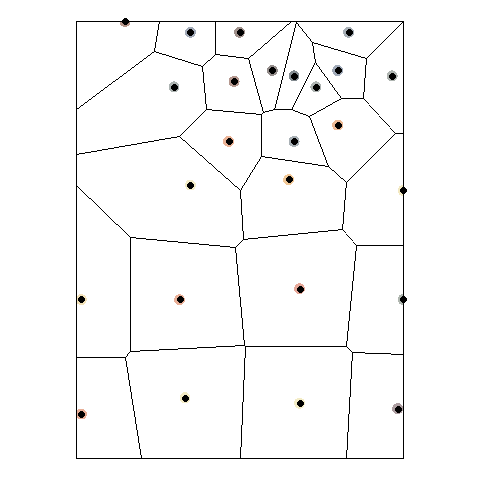

The Voronoi polygons for the sample data set can be obtained in `R` as follows.

First, we will convert the `Walker_Lake` dataframe to a simple features object using as follows:

``` r
# Function `st_as_sf()` takes a foreign object 
# (foreign to the `sf` package) and converts it 
# into a simple features object. If the foreign 
# object is points, the coordinates can be named 
# by means of the argument `coords`. 
Walker_Lake.sf <- Walker_Lake |> 
  st_as_sf(coords = c("X", "Y"))
```

Once we have an `sf` object of the points, the geometry can be used to create the Voronoi polygons:

``` r
# The function `do.call(what, arg)` applies a function
# `what` to the argument `arg`. In this case, we extract 
# the geometry of the `sf` object (i.e., the coordinates 
# of the points) and apply the function `c()` to concatenate 
# the coordinates to obtain a MULTIPOINT object.   
# The pipe operator passes the MuLTIPOINT object to function `st_voronoi()`
vpolygons <- do.call(c, st_geometry(Walker_Lake.sf)) |> 
  st_voronoi() |> 
  # The output of `st_voronoi()` is a collection of geometries, 
  # which we pass to the following function for extraction.
  st_collection_extract()
```

After the step above we already have the Voronoi polygons:

``` r
ggplot(vpolygons) + 
  geom_sf(fill = NA)
```


However, these polygons are just the geometry and lack other attributes that we originally had for the points. See:

``` r
head(vpolygons)
```

```
## Geometry set for 6 features 
## Geometry type: POLYGON
## Dimension:     XY
## Bounding box:  xmin: -275 ymin: -19.79545 xmax: 39.35 ymax: 232.9318
## CRS:           NA
## First 5 geometries:
```

```
## POLYGON ((-275 109.5, -180.5 109.5, 10.8913 99....
```

```
## POLYGON ((-275 91.88636, 4.207317 79.19512, 14....
```

```
## POLYGON ((-275 49, -171.5 49, 18.9248 38.42084,...
```

```
## POLYGON ((20.40385 52.61538, 18.36567 50.35075,...
```

```
## POLYGON ((18.36567 50.35075, 20.40385 52.61538,...
```

For this reason, we need to join the Voronoi polygons to the attributes of the points. To do this, we will first copy the `sf` object with the original points to a new dataframe, and then replace the geometry of the points with the geometry of the polygons:

``` r
Walker_Lake.v <- Walker_Lake.sf
Walker_Lake.v$geometry <- vpolygons[unlist(st_intersects(Walker_Lake.sf, vpolygons))] 
```

The new `Walker_Lake.v` object now includes the attributes of the original points as well as the geometry of the polygons:

``` r
head(Walker_Lake.v)
```

```
## Simple feature collection with 6 features and 4 fields
## Geometry type: POLYGON
## Dimension:     XY
## Bounding box:  xmin: -275 ymin: -275 xmax: 35.5 ymax: 120
## CRS:           NA
## # A tibble: 6 × 5
##   ID        V     U T                                                   geometry
##   <chr> <dbl> <dbl> <fct>                                              <POLYGON>
## 1 1        0     NA 2     ((-275 -275, -275 -19.79545, 18.05556 20.16667, 19.59…
## 2 2        0     NA 2     ((-275 49, -171.5 49, 18.9248 38.42084, 18.05556 20.1…
## 3 3      224.    NA 2     ((-171.5 49, 8.1875 57.98438, 18.36567 50.35075, 20.0…
## 4 4      434.    NA 2     ((-275 91.88636, 4.207317 79.19512, 14.18919 72.54054…
## 5 5      412.    NA 2     ((-275 109.5, -180.5 109.5, 10.8913 99.93043, 14.2857…
## 6 6      587.    NA 2     ((-180.5 109.5, 19 120, 20 119.1, 20 109.95, 10.8913 …
```

We can now plot the attributes as the polygons. The value of $z$ for a tile is the same as the value of the variable for its corresponding generating point, or $z_{p_g}$. This is the plot for the current example:

``` r
ggplot(Walker_Lake.v) + 
  geom_sf(aes(fill = V)) +
  scale_fill_distiller(palette = "OrRd", 
                       direction = 1)
```


We can see that the Voronoi polygons extend well beyond the extent of the original points, and in the plot add a large amount of unnecessary area. We can improve the plot in two ways, by limiting the extent for plotting, or by clipping the polygons. Here we will try the latter, with a bounding box that covers the region of interest:

``` r
# Function `st_polygon()` creates an `sf` object with a 
# polygon or polygons. In this case, we create a single 
# polygon, a rectangle with corners given by the coordinates 
# in the function. 
W.bbox <- st_polygon(list(rbind(c(0,0),
                                c(259,0),
                                c(259, 299),
                                c(0, 299),
                                c(0,0))))
```

The intersection of the polygons with the box clips the polygons:

``` r
Walker_Lake.v <- Walker_Lake.v |>
  st_intersection(W.bbox)
```

```
## Warning: attribute variables are assumed to be spatially constant throughout
## all geometries
```

This is the plot after fixing this issue:

``` r
ggplot(Walker_Lake.v) + 
  geom_sf(aes(fill = V)) + 
  geom_sf(data = Walker_Lake.sf,
          size = 0.1) +
  scale_fill_distiller(palette = "OrRd", 
                       direction = 1)
```


As you can see, the points in the sample have been converted to a surface from which the value of $z$ can be estimated at any point as desired, from the value of $z$ of the closest point used to generate the tiles. This can be expressed as follows:
$$
\hat{z}_p = z_{p_g}\text{ for } p_g\text{ with } d_{pp_g}<d_{pp_k}\forall{k}
$$

## Inverse distance weighting (IDW)

The tile-based approach above assumes that the field is flat within each polygon (see Figure 2). This is in most cases an unrealistic assumption. Other approaches to interpolate a spatial variable allow the estimated value of $z_p$ to vary with proximity to observations. Such is the case of IDW.

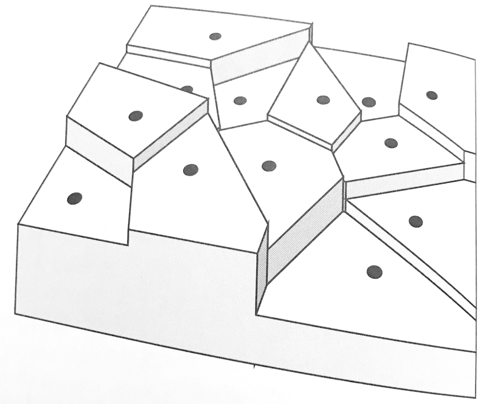

Inverse distance weighting takes the following form:
$$
\hat{z}_p = \frac{\sum_{i=1}^n{w_{pi}z_i}}{\sum_{i=1}^n{w_{pi}}}
$$

This will probably look familiar to you, because it is formally identical to the spatial moving average. The difference is in how the "spatial weights" $w_{pi}$ are defined. For IDW, the spatial weights are given by a function of the inverse power of distance, as follows:
$$
w_{pi} = \frac{1}{d_{pi}^\gamma}
$$
In the expression above, parameter $\gamma$ controls the steepness of the decay function, with smaller values giving greater weight to more distant locations. Large values of $\gamma$ converge to a 1-point average (so that the interpolated value is identical to the nearest observation; you can verify this).

We can see that inverse distance weighting is a weighted average of _all_ observations in the sample, but with greater weight given to more proximate observations. This approach is implemented in `R` in the package `spatstat` with the function `idw`. To use this function, the points must be converted into a `ppp` object. This necessitates that we define a window object, which we do based on the bounding box that we created for the Voronoi polygons:

``` r
# Function `as.owin()` takes the polygon with the bounding box
# we created above and converts it into an `owin` object for 
# use with the `spatstat` package. 
W.owin <- as.owin(W.bbox)

# We can create a `ppp` object with the coordinates of the points
Walker_Lake.ppp <- as.ppp(X = Walker_Lake[,2:4], W = W.owin)
```

The call to the function requires a `ppp` object and the argument for the power to use in the inverse distance function. In this call, the power is set to 1:

``` r
z_p.idw1 <- idw(Walker_Lake.ppp, power = 1)
```

The value (output) of this function is an `im` object. Objects of this type are used by the package `spatstat` to work with raster data. It can be simply plotted as follows:

``` r
plot(z_p.idw1)
```


Or the information can be extracted for greater control of the aspect of the plot in `ggplot2`:

``` r
data.frame(expand.grid(X= z_p.idw1$xcol,
                       Y = z_p.idw1$yrow),
           # transpose matrix
           V = as.vector(t(z_p.idw1$v))) |>
  ggplot(aes(x = X,
             y = Y, 
             fill = V)) + 
  geom_tile() +
  scale_fill_distiller(palette = "OrRd", 
                       direction = 1) +
  coord_equal()
```


Notice the dots where the observations are - the value of the field is known there. We can explore the effect of changing the parameter for the power, by using $\gamma = 0.5, 1, 2, \text{ and } 5$:

``` r
#Inverse distance weighting for Walker Lake 
# using three different gamma variables 

z_p.idw05 <- idw(Walker_Lake.ppp, power = 0.5)
z_p.idw2 <- idw(Walker_Lake.ppp, power = 2)
z_p.idw5 <- idw(Walker_Lake.ppp, power = 5)
```

For ease of comparison, we will collect the information into a single data frame:

``` r
z_p.idw05.df <- data.frame(expand.grid(X = z_p.idw05$xcol, 
                                       Y = z_p.idw05$yrow),
                           V = as.vector(t(z_p.idw05$v)),
                           Power = "P05")
z_p.idw1.df <- data.frame(expand.grid(X= z_p.idw1$xcol, 
                                      Y = z_p.idw1$yrow),
                          V = as.vector(t(z_p.idw1$v)),
                          Power = "P1")
z_p.idw2.df <- data.frame(expand.grid(X= z_p.idw2$xcol, 
                                      Y = z_p.idw2$yrow),
                          V = as.vector(t(z_p.idw2$v)), 
                          Power = "P2")
z_p.idw5.df <- data.frame(expand.grid(X= z_p.idw5$xcol, 
                                      Y = z_p.idw5$yrow),
                          V = as.vector(t(z_p.idw5$v)), 
                          Power = "P5")

# Bind the data frames
idw_df <- rbind(z_p.idw05.df, 
                z_p.idw1.df, 
                z_p.idw2.df, 
                z_p.idw5.df)
```

We can now plot using the `facet_wrap` function to compare the results side by side:

``` r
ggplot(data = idw_df, 
       aes(x = X, 
           y = Y, 
           fill = V)) + 
  geom_tile() +
  scale_fill_distiller(palette = "OrRd", 
                       direction = 1) +
  coord_equal() + 
  facet_wrap(~ Power,
             ncol = 2)
```


Notice how smaller values of $\gamma$ "flatten" the predictions, in the extreme tending towards to global average, as all observations are weighted equally. Larger values, on the other hand, tend to be the average of a single point, the closest one. In fact, this replicates the Voronoi polygons, as seen in the following plot that combines the Voronoi polygons (without filling!) and the predictions from the IDW algorithm with $\gamma = 5$:

``` r
ggplot() + 
  geom_tile(data = subset(idw_df, 
                          Power = "P5"), 
            aes(x = X, 
                y = Y, 
                fill = V)) +
  geom_sf(data = Walker_Lake.v, 
          color =  "white", 
          fill = NA) +
  scale_fill_distiller(palette = "OrRd", 
                       direction =  1)
```

```
## Warning: In subset.data.frame(idw_df, Power = "P5") :
##  extra argument 'Power' will be disregarded
```


Clearly, selection of a value for $\gamma$ is an important modeling decision when using IDW.

## $k$-point means

Another interpolation technique that is based on the idea of moving averages is $k$-point means. Again, this will look familiar to you, because it is also formally identical to the spatial moving average:
$$
\hat{z}_p = \frac{\sum_{i=1}^n{w_{pi}z_i}}{\sum_{i=1}^n{w_{pi}}}
$$

The spatial weights in this case, however, are defined in terms of $k$-nearest neighbors:
$$
w_{pi} = \bigg\{\begin{array}{ll}
1 & \text{if } i \text{ is one of } k \text{th nearest neighbors of } p \text{ for a given }k \\
0 & otherwise \\
\end{array}
$$

Clearly, the above becomes:
$$
\hat{z}_p = \sum_{i=1}^n {w_{pi}^{st}z_i}
$$

If row-standardized spatial weights are used.

We can calculate $k$-point means using the example. For this, we need to define a set of "target" coordinates, that is, the points where we wish to interpolate, which we also convert to simple features:

``` r
# Create a fine grid for prediction, i.e., our "target"
# points
target_xy <- expand.grid(x = seq(0.5, 
                                259.5, 
                                2.2), 
                        y = seq(0.5, 
                                299.5, 
                                2.2)) |>
  st_as_sf(coords = c("x", "y"))
```

The inputs to the function are a simple features object with the variable that we wish to interpolate, a simple features object with the point to which we wish to interpolate, the name of the variable to interpolate (which must be in the source table), and the number of points to use for interpolations (see below). The value (output) of the function is a simple features table with the target points, as well as estimated values of $\hat{z_p}$ at those points. Using the three nearest neighbors:

``` r
# Use the source and target points to interpolate
kpoint.3 <- kpointmean(source_xy = Walker_Lake.sf, 
                       target_xy = target_xy,
                       z = V,
                       k = 3) |> 
  # Rename the columns to match the names of columns in
  # our other data frame
  rename(V = z)
```

```
## projected points
```

We can plot the interpolated field now:

``` r
ggplot() +
  geom_sf(data = kpoint.3, 
            aes(color = V)) +
  scale_color_distiller(palette = "OrRd", 
                       direction = 1)
```


As with other spatially moving averages, the crucial aspect of implementing $k$-point means is the selection of $k$. A large value will tend towards the global average, whereas a value of 1 will tend to replicate the Voronoi polygons (see below):

``` r
# Calculate k-point means using only one point. Rename the variables to match 
kpoint.1 <- kpointmean(source_xy = Walker_Lake.sf, 
                       target_xy = target_xy,
                       z = V,
                       k = 1) |> 
  # Rename the columns to match the names of columns in
  # our other data frame
  rename(V = z)
```

```
## projected points
```

This is the plot with the Voronoi polygons:

``` r
# Plot and overlay the Voronoi polygons
ggplot() + 
  geom_sf(data = kpoint.1, 
          aes(color = V)) +
  geom_sf(data = Walker_Lake.v, 
          color =  "white", fill = NA) +
  scale_color_distiller(palette = "OrRd", 
                       direction =  1)
```


This shows that Voronoi polygons can be seen as a special case of IDW or $k$-point means depending on the way these two techniques are implemented.


<!--chapter:end:31-Spatially-Continuous-Data-I.Rmd-->

# Activity 15: Spatially Continuous Data I

*NOTE*: The source files for this book are available with companion package [{isdas}](https://paezha.github.io/isdas/). The source files are in Rmarkdown format and packed as templates. These files allow you execute code within the notebook, so that you can work interactively with the notes. 

## Practice questions

Answer the following questions:

1. What is the difference between spatially continuous data and a spatial point pattern?
2. What is the purpose of spatial interpolation?
3. In your own words describe the method of Inverse Distance Weighting. 
4. Consider the following spatial interpolation algorithms: Voronoi polygons and k-point means. How do they differ when the number of points used to calculate means is 1?


## Learning objectives

In this activity, you will:

1. Explore a dataset with area data using visualization as appropriate.
2. Discuss a process that might explain any pattern observed from the data.
3. Conduct a modeling exercise using appropriate techniques. Justify your modeling decisions.

## Suggested reading

- Bailey TC and Gatrell AC [-@Bailey1995] Interactive Spatial Data Analysis, Chapters 5 and 6. Longman: Essex.
- Bivand RS, Pebesma E, and Gomez-Rubio V [-@Bivand2008] Applied Spatial Data Analysis with R, Chapter 8. Springer: New York.
- Brunsdon C and Comber L [-@Brunsdon2015R] An Introduction to R for Spatial Analysis and Mapping, Chapter 6, Sections 6.7 and 6.8. Sage: Los Angeles.
- Isaaks EH and Srivastava RM  [-@Isaaks1989applied] An Introduction to Applied Geostatistics, Chapter 4. Oxford University Press: Oxford.
- O'Sullivan D and Unwin D [-@Osullivan2010] Geographic Information Analysis, 2nd Edition, Chapters 9 and 10. John Wiley & Sons: New Jersey.

## Preliminaries

Remember to begin your work with a clean session. At least, you need to clear the working space to make sure that you do not have extraneous items there when you begin your work. The command in `R` to clear the workspace is `rm` (for "remove"), followed by a list of items to be removed. To clear the workspace from _all_ objects, do the following:

``` r
rm(list = ls())
```

Note that `ls()` lists all objects currently on the workspace.

Load the libraries you will use in this activity (load other packages as appropriate). 

``` r
library(isdas)
library(tidyverse)
library(spatstat)
library(spdep)
library(plotly)
```

Load the data that you will use in this activity:

``` r
data("aquifer")
```

The data is a set of piezometric head (watertable pressure) observations of the Wolfcamp Aquifer in Texas (https://en.wikipedia.org/wiki/Hydraulic_head). Measures of pressure can be used to infer the flow of underground water, since water flows from high to low pressure areas.

These data were collected to evaluate potential flow of contamination related to a high level toxic waste repository in Texas. The Deaf Smith county site in Texas was one of three potential sites proposed for this repository. Beneath the site is a deep brine aquifer known as the Wolfcamp aquifer that may serve as a conduit of contamination leaking from the repository.

The data set consists of 85 georeferenced measurements of piezometric head. Possible applications of interpolation are to determine sites at risk and to quantify uncertainty of the interpolated surface, to evaluate the best locations for monitoring stations.

Create an a unique identifier variable:

``` r
aquifer$ID <- factor(c(1:nrow(aquifer)))
```

## Activity

**NOTE**: Activities include technical "how to" tasks/questions. Usually, these ask you to practice using the software to organize data, create plots, and so on in support of analysis and interpretation. The second type of questions ask you to activate your brainware and to think geographically and statistically.

::: {.infobox .software data-latex="{software}"}
**Activity Part I**
:::

1. Map the Wolfcamp Aquifer data.

2. Create a surface using Voronoi polygons.

3. Create a surface using IDW.

4. Create a surface using $k$-point means. 

::: {.infobox .brainware data-latex="{brainware}"}
**Activity Part II**
:::

5. What is the effect of changing the power of the inverse distance function?

6. What is the effect of changing the number of points used in this algorithm?

7. Discuss the limitations of these approaches. How can you calculate the uncertainty in the predictions?

<!--chapter:end:32-Activity-Spatially-Continuous-Data-I.Rmd-->

# Spatially Continuous Data II

*NOTE*: The source files for this book are available with companion package [{isdas}](https://paezha.github.io/isdas/). The source files are in Rmarkdown format and packed as templates. These files allow you execute code within the notebook, so that you can work interactively with the notes. 

Previously, you learned about the analysis of area data. Starting with this practice, you will be introduced to another type of spatial data: continuous data, also called fields. 

## Learning objectives

In the previous practice you were introduced to the concept of fields/spatially continuous data. Three different approaches were discussed that can be used to convert a set of observations of a field at discrete locations into a surface, namely tile-based approaches, inverse distance weighting (IDW), and $k$-point means. In this practice, you will learn:

1. About intervals of confidence for predictions.
2. Using trend surface analysis as an interpolation tool.
3. The difference between accuracy and precision in interpolation.

## Suggested readings

- Bailey TC and Gatrell AC [-@Bailey1995] Interactive Spatial Data Analysis, Chapters 5 and 6. Longman: Essex.
- Bivand RS, Pebesma E, and Gomez-Rubio V [-@Bivand2008] Applied Spatial Data Analysis with R, Chapter 8. Springer: New York.
- Brunsdon C and Comber L [-@Brunsdon2015R] An Introduction to R for Spatial Analysis and Mapping, Chapter 6, Sections 6.7 and 6.8. Sage: Los Angeles.
- Isaaks EH and Srivastava RM  [-@Isaaks1989applied] An Introduction to Applied Geostatistics, Chapter 4. Oxford University Press: Oxford.
- O'Sullivan D and Unwin D [-@Osullivan2010] Geographic Information Analysis, 2nd Edition, Chapters 9 and 10. John Wiley & Sons: New Jersey.

## Preliminaries

As usual, it is good practice to begin with a new session of `R` or at least to clear the working space to make sure that you do not have extraneous items there when you begin your work. The command in `R` to clear the workspace is `rm` (for "remove"), followed by a list of items to be removed. To clear the workspace from _all_ objects, do the following:

``` r
rm(list = ls())
```

Note that `ls()` lists all objects currently on the workspace.

Load the libraries you will use in this activity:

``` r
library(isdas)
library(plotly)
library(spatstat)
library(spdep)
library(tidyverse)
```

Begin by loading the data file that we will use in this chapter:

``` r
data("Walker_Lake")
```

You can verify the contents of the dataframe:

``` r
summary(Walker_Lake)
```

```
##          ID            X               Y               V         
##  Length   :470   Min.   :  8.0   Min.   :  8.0   Min.   :   0.0  
##  N.unique :470   1st Qu.: 51.0   1st Qu.: 80.0   1st Qu.: 182.0  
##  N.blank  :  0   Median : 89.0   Median :139.5   Median : 425.2  
##  Min.nchar:  1   Mean   :111.1   Mean   :141.3   Mean   : 435.4  
##  Max.nchar:  3   3rd Qu.:170.0   3rd Qu.:208.0   3rd Qu.: 644.4  
##                  Max.   :251.0   Max.   :291.0   Max.   :1528.1  
##                                                                  
##        U           T      
##  Min.   :   0.00   1: 45  
##  1st Qu.:  83.95   2:425  
##  Median : 335.00          
##  Mean   : 613.27          
##  3rd Qu.: 883.20          
##  Max.   :5190.10          
##  NAs    :195
```

We have already met this data set before: it contains a set of coordinates `X` and `Y` (units are meters; the origin is false), as well as two quantitative variables `V` and `U` (notice that there are missing observations in `U`), and a factor `T`.

## Uncertainty in the predictions

A common task in the analysis of spatially continuous data is to estimate the value of a variable at a location where it was not measured - or in other words, to spatially interpolate the variable. In Chapter \@ref(spatially-continuous-data-i), we introduced three methods for spatial interpolation based on a sample of observations.

The three algorithms that was saw before (i.e., Voronoi polygons, IDW, and $k$-point means) accomplish the task of providing spatial estimates. The values that we obtain with these methods are called _point estimates_. What is a point estimate? Recall the definition of a field that is the outcome of a purely spatial process:
$$
z_i = f(u_i, v_i) + \epsilon_i
$$

Accordingly, the prediction of the field at a new location is defined as a function of the estimated process and some random residual as follows:
$$
\hat{z}_p = \hat{f}(u_p, v_p) + \hat{\epsilon}_p
$$
The first part of the prediction ($\hat{f}(u_p, v_p)$) is the point estimate of the prediction, whereas the second part ($\hat{\epsilon}_p$) is the random part of the estimate.

The methods we saw in Chapter \@ref(spatially-continuous-data-i) can be used to estimate point estimates of the process. Unfortunately, they do not provide an estimate for the random element, so it is not possible to assess the uncertainty of the estimated values directly, since this depends on the distribution of the random term.

There are different ways in which at least some crude assessment of uncertainty can be attached to point estimates obtained from Voronoi polygons, IDW, or $k$-point means. For example, a very simple approach could be to use the sample variance to calculate intervals of confidence. This could be done as follows.

We know that the sample variance describes the inherent variability in the distribution of values of a variable in a sample. Consider for instance the distribution of the variable in the Walker Lake dataset:

``` r
ggplot(data = Walker_Lake, aes(V)) + 
  geom_histogram(binwidth = 60)
```


Clearly, there are no values of the variable less than zero, and values in excess of 1,000 are rare.

The standard deviation of the sample is:

``` r
sd(Walker_Lake$V)
```

```
## [1] 301.1554
```

The standard deviation is the average deviation from the mean. We could use this value to say that typical deviations from our point estimates are a function of this standard deviation (to what extent, it depends on the underlying distribution).

A problem with using this approach is that the distribution of the variable is not normal, and the distribution of $\hat{\epsilon}_p$ is unknown; the standard deviation is centered on the mean (meaning that it is a poor estimate for observations away from the mean); and in any case the standard deviation of the sample is too large for local point estimates if there is spatial pattern (since we know that the local mean will vary systematically).

There are other approaches to deal with non-normal variables, for instance Wilcox's test, but some of the other limitations remain.

``` r
wilcox.test(Walker_Lake$V, conf.int = TRUE, conf.level = 0.95)
```

```
## 
## 	Wilcoxon signed rank test with continuity correction
## 
## data:  Walker_Lake$V
## V = 100576, p-value < 2.2e-16
## alternative hypothesis: true location is not equal to 0
## 95 percent confidence interval:
##  397.35 454.05
## sample estimates:
## (pseudo)median 
##          424.6
```

As an alternative, the _local_ standard deviation could be used.

Consider the case of $k$-point means. The point estimate is based on the values of the $k$-nearest neighbors:
$$
\hat{z}_p = \frac{\sum_{i=1}^n{w_{pi}z_i}}{\sum_{i=1}^n{w_{pi}}}
$$

With:
$$
w_{pi} = \bigg\{\begin{array}{ll}
1 & \text{if } i \text{ is one of } kth \text{ nearest neighbors of } p \text{ for a given }k \\
0 & otherwise \\
\end{array}
$$

The standard deviation could be calculated also based in the values of the $k$-nearest neighbors, meaning that it would be based on the local mean. Here, we will interpolate the field using the Walker Lake data. First create a target grid for interpolation, and extract the coordinates of observations: 

``` r
# Create a prediction grid and convert to simple features:
target_xy = expand.grid(x = seq(0.5, 259.5, 2.2), 
                        y = seq(0.5, 299.5, 2.2)) |>
  st_as_sf(coords = c("x", "y"))

# Convert the `Walker_Lake` dataframe to a simple features object using as follows:
Walker_Lake.sf <- Walker_Lake |> 
  st_as_sf(coords = c("X", "Y"))
```

Interpolation using $k=5$ neighbors:

``` r
kpoint.5 <- kpointmean(source_xy = Walker_Lake.sf, 
                       target_xy = target_xy, 
                       z = V,  
                       k = 5) |>
  rename(V = z)
```

```
## projected points
```

We can plot the interpolated field now. These are the interpolated values:

``` r
ggplot() +
  geom_sf(data = kpoint.5, 
          aes(color = V)) +
  scale_color_distiller(palette = "OrRd", 
                       direction = 1)
```


In addition, we can plot the _local_ standard deviation:

``` r
ggplot() +
  geom_sf(data = kpoint.5, 
          aes(color = sd)) +
  scale_color_distiller(palette = "OrRd", 
                       direction = 1)
```


The local standard deviation indicates the typical deviation from the local mean. As expected, the local values of the standard deviation are usually lower than the standard deviation of the sample, and it tends to be larger for the tails, that is the locations where the values are rare - we have less information, hence greater uncertainty.

The local standard deviation is a crude estimator of the uncertainty because we do not know the underlying distribution. Other approaches based on bootstrapping (randomly sampling from the observed values of the variable) could be implemented, but they are beyond the scope of the present discussion.

The issue of assessing the level of uncertainty in the predictions with Voronoi polygons, IDW, and $k$-point means reflects the fact that these methods were not designed to deal explicitly with the random nature of predicting fields. Other methods deal with this issue more naturally. We will revisit two estimation methods that we covered before, and see how they can be applied to spatial interpolation.

## Trend surface analysis

Trend surface analysis is a form of multivariate regression that uses the coordinates of the observations to fit a surface to the data.

We can illustrate this technique by means of a simulated example. We will begin by simulating a set of observations, beginning with the coordinates in the square unit region:

``` r
# `n` is the number of observations to simulate
n <- 180

# Here we create a dataframe with these values: `u` and `v` will be the coordinates of our process
df <- data.frame(u = runif(n = n, min = 0, max = 1), 
                 v = runif(n = n, min = 0, max = 1))
```

Once we have simulated the coordinates for the example, we can plot their locations:

``` r
ggplot(data = df, aes(x = u, y = v)) + 
  geom_point() + 
  coord_equal()
```


We can now proceed to simulate a spatial process as follows:

``` r
# Use `mutate()` to create a new stochastic variable `z` that is a function of the coordinates and a random normal variable that we create with `rnorm()`; this random variable has a mean of zero and a standard deviation of 0.1.
df <- mutate(df, z = 0.5 + 0.3 * u + 0.7 * v + rnorm(n = n, mean = 0, sd = 0.1))
```

A 3D scatterplot can be useful to explore the data:

``` r
# Create a 3D scatterplot with the function `plot_ly()`. Notice that the way this function works is similar to `ggplot2`: the arguments are a dataframe, what should be plotted on the x-axis, the y-axis, the z-axis, and other aesthetics (aspects) of the plot. Here the color will be proportional to the values of `z`. The function `add_markers()` is similar to the family of `geom_` functions in `ggplot2`, but more general, since it will try to guess what you are trying to plot based on the inputs (in this case points). The function `layout()` is used to control other parts of the plot: here the `aspectratio` is selected so that the scale is identical for all three axes.
plot_ly(data = df, x = ~u, y = ~v, z = ~z, color = ~z) |> 
  add_markers() |> 
  layout(scene = list(
    aspectmode = "manual", aspectratio = list(x=1, y=1, z=1)))
```

```{=html}
<div class="plotly html-widget html-fill-item" id="htmlwidget-2cf2d55bfb38905e2fea" style="width:672px;height:480px;"></div>
<script type="application/json" data-for="htmlwidget-2cf2d55bfb38905e2fea">{"x":{"visdat":{"1388d51aeeb96":["function () ","plotlyVisDat"]},"cur_data":"1388d51aeeb96","attrs":{"1388d51aeeb96":{"x":{},"y":{},"z":{},"color":{},"alpha_stroke":1,"sizes":[10,100],"spans":[1,20],"type":"scatter3d","mode":"markers","inherit":true}},"layout":{"margin":{"b":40,"l":60,"t":25,"r":10},"scene":{"aspectmode":"manual","aspectratio":{"x":1,"y":1,"z":1},"xaxis":{"title":"u"},"yaxis":{"title":"v"},"zaxis":{"title":"z"}},"hovermode":"closest","showlegend":false,"legend":{"yanchor":"top","y":0.5}},"source":"A","config":{"modeBarButtonsToAdd":["hoverclosest","hovercompare"],"showSendToCloud":false},"data":[{"x":[0.89909481559880078,0.42654357315041125,0.76576361991465092,0.63553867163136601,0.55500668054446578,0.49750120053067803,0.65516186854802072,0.85512320697307587,0.30214477051049471,0.16580021078698337,0.72060087858699262,0.37493041018024087,0.074903060216456652,0.32673608721233904,0.40828234632499516,0.31048386823385954,0.53198805684223771,0.87514209840446711,0.63966682902537286,0.41955126821994781,0.64757849904708564,0.39661029842682183,0.37902113352902234,0.76322275493294001,0.59610231895931065,0.11596117937006056,0.84224849543534219,0.49004231719300151,0.53679136116988957,0.41000895202159882,0.94025488430634141,0.63976310170255601,0.97475608857348561,0.37260766769759357,0.95027027348987758,0.29415331827476621,0.21224218932911754,0.59989154222421348,0.10168094024993479,0.42686438304372132,0.12268477096222341,0.70875064539723098,0.089339274447411299,0.58220471884123981,0.65696923318319023,0.33521254942752421,0.24179823906160891,0.91880404995754361,0.54984819167293608,0.39804167137481272,0.21354507049545646,0.67710938677191734,0.85297538014128804,0.87401090865023434,0.87298295670188963,0.49589177058078349,0.65551934414543211,0.82921980763785541,0.063387684756889939,0.16736063547432423,0.68493978353217244,0.068618605379015207,0.95611536502838135,0.7082499866373837,0.25157548394054174,0.74915621406398714,0.089264449430629611,0.46420072391629219,0.86955401301383972,0.78485295129939914,0.69061063439585268,0.94107371545396745,0.17780894413590431,0.43202610383741558,0.86885045282542706,0.91071842354722321,0.21117882709950209,0.49690367514267564,0.71559652383439243,0.19262875313870609,0.066679170588031411,0.2533239561598748,0.43952751322649419,0.83820976526476443,0.55920730764046311,0.39415324269793928,0.69177648145705462,0.092349928803741932,0.089400785276666284,0.70948031498119235,0.078682714141905308,0.018878351431339979,0.71746892388910055,0.038109795656055212,0.68674817169085145,0.015104573685675859,0.947298314422369,0.40340139181353152,0.46642971108667552,0.88283124449662864,0.08559884037822485,0.13980846758931875,0.26206523668952286,0.10712647740729153,0.38502967311069369,0.23445392725989223,0.67892411584034562,0.53113589924760163,0.80385242821648717,0.48129739216528833,0.87150800880044699,0.27374981506727636,0.95153326960280538,0.78784094913862646,0.33306037704460323,0.68590813432820141,0.32055215514265001,0.38795793522149324,0.71754345367662609,0.2036130044143647,0.090817297110334039,0.091276988387107849,0.061528922989964485,0.10793099389411509,0.82187843439169228,0.70875955955125391,0.71128692105412483,0.016978455940261483,0.92243872187100351,0.70365794352255762,0.06256299396045506,0.47771340585313737,0.2058812458999455,0.47500737896189094,0.87037392822094262,0.81280685076490045,0.23175012762658298,0.27093748957850039,0.11220083199441433,0.43775991327129304,0.64597726217471063,0.45601060567423701,0.78450899943709373,0.69225402572192252,0.3790526872035116,0.84085746202617884,0.17663863650523126,0.036802125163376331,0.77499538450501859,0.60165911260992289,0.72382182581350207,0.062137170229107141,0.12319985823705792,0.66152790281921625,0.039579341886565089,0.56191492476500571,0.96166339167393744,0.9536261351313442,0.19440503977239132,0.49598122737370431,0.19392599817365408,0.77839436219073832,0.87301101488992572,0.50646673911251128,0.14071975159458816,0.041080989642068744,0.13678861642256379,0.97953317337669432,0.71432996913790703,0.59785961988382041,0.25144594861194491,0.030757933622226119,0.68924017646349967,0.55791833391413093,0.63762017176486552,0.049823583103716373,0.19256139080971479,0.17439594003371894,0.4591909209266305,0.40094641433097422],"y":[0.73915264871902764,0.42941837897524238,0.93774891039356589,0.13229835033416748,0.96356334607116878,0.59769383049570024,0.67804960650391877,0.31836304208263755,0.024875080212950706,0.43766564805991948,0.16045673610642552,0.1890982910990715,0.5727595032658428,0.61035130359232426,0.46088559762574732,0.41085072280839086,0.13383467402309179,0.44082599878311157,0.1970963547937572,0.91178170382045209,0.41190808732062578,0.35680125863291323,0.7280076565220952,0.75137808662839234,0.26399220782332122,0.15779230580665171,0.14837339241057634,0.89390241191722453,0.50197503017261624,0.20405565365217626,0.49761813296936452,0.69419812061823905,0.14924921025522053,0.066793316276744008,0.40789319691248238,0.31046845973469317,0.78600545530207455,0.52566658775322139,0.021259971661493182,0.57421482587233186,0.18012367794290185,0.051724313758313656,0.67864608578383923,0.01579447346739471,0.89042720152065158,0.67541774502024055,0.67219595750793815,0.75711265811696649,0.18399617075920105,0.14156843582168221,0.35762690613046288,0.79716596216894686,0.40455247322097421,0.26763576013036072,0.40674723661504686,0.79698934406042099,0.84967352566309273,0.85510809649713337,0.57013850938528776,0.79117481387220323,0.40265098493546247,0.057490550447255373,0.80593030084855855,0.50221846834756434,0.90970653854310513,0.069000279763713479,0.6052140099927783,0.2948362601455301,0.87385523947887123,0.76949572586454451,0.76198831642977893,0.63055997295305133,0.9626329152379185,0.83248258498497307,0.11602160497568548,0.91328657162375748,0.69251564354635775,0.94373171543702483,0.43432551203295588,0.50405776081606746,0.10157252242788672,0.69474015198647976,0.38406895799562335,0.20083182910457253,0.72768312273547053,0.63101647631265223,0.52317241323180497,0.78849341603927314,0.73457182245329022,0.91320206644013524,0.22291081654839218,0.49768889555707574,0.34883995307609439,0.77441622549667954,0.62672846321947873,0.0013733869418501854,0.86369936703704298,0.042260827263817191,0.77798662846907973,0.7644132652785629,0.24990645912475884,0.040349416900426149,0.096659836824983358,0.24861590494401753,0.99721458344720304,0.66003926750272512,0.55651310691609979,0.098327310755848885,0.44988064165227115,0.068917023250833154,0.3523575640283525,0.28549860627390444,0.89026026497595012,0.23549158894456923,0.094143115449696779,0.052844966761767864,0.50543555594049394,0.68060409929603338,0.93193298159167171,0.83389119943603873,0.90476139611564577,0.10088482778519392,0.2096043610945344,0.23120837844908237,0.056717257713899016,0.097299627028405666,0.47657894319854677,0.97188653238117695,0.70917510753497481,0.85114649683237076,0.31279013934545219,0.33346977736800909,0.57884050696156919,0.67447116109542549,0.93890653015114367,0.3647794290445745,0.041774941841140389,0.06334870052523911,0.84651108249090612,0.95408971863798797,0.75034911255352199,0.033967747120186687,0.89845112455077469,0.41547319781966507,0.92962685832753778,0.74571809894405305,0.98274681554175913,0.83013217337429523,0.99661525036208332,0.12899437453597784,0.32257770956493914,0.19402850139886141,0.48247849592007697,0.9892667680978775,0.11521638045087457,0.44436988071538508,0.18170714378356934,0.21738807228393853,0.075708891032263637,0.90180916618555784,0.48085779952816665,0.22369275568053126,0.3571398367639631,0.51642532483674586,0.257695481646806,0.7324901616666466,0.11133763892576098,0.35844048811122775,0.92620790307410061,0.16662180796265602,0.080408309586346149,0.74846762418746948,0.039065332850441337,0.68663507443852723,0.50289294961839914,0.50053673051297665,0.21421624347567558,0.49699650751426816,0.4175386824645102,0.69700423534959555],"z":[1.2431450546590854,0.90273683696773499,1.3228624485639153,0.84563940216763822,1.0484923285961458,0.93935012127306095,1.2132981244310646,0.98687753851181637,0.5313839803903404,0.86844637365534871,0.91818567522214567,0.67832809771011293,0.79497990849438838,1.1732742230045281,0.92550419583510168,0.93284958080600322,0.73925062468087965,1.0713636162999394,0.82222878719216652,1.2002338822781951,0.8338105141526293,0.89405571219845648,1.125989541869816,1.3215926571178549,0.99252466062236422,0.60878616940570074,0.83488895272161856,1.3345238341911549,1.2412633583641863,0.73087613385598438,1.0531173893717907,1.1656849561683083,0.91014101337065434,0.66616328733178376,1.0811883371615505,0.94740449013500538,1.2258666502300528,1.0618784873718536,0.44243303839073939,0.91894503975502517,0.73869297388396993,0.56604344920490302,1.1158540640099122,0.64408592174360224,1.479625730306281,1.0379719804141407,1.0258594517324202,1.4407111167163078,0.84307641654364907,0.74804417741184204,0.74383155351823871,1.3535283207623263,1.2247414648367192,0.91566360808524128,1.0295684481424006,1.2732350242725721,1.2639695057256015,1.5120374712310403,0.94154906276794725,0.93660160652588975,1.0075180047018741,0.64107288060568457,1.4779521525930464,0.95003449171605947,1.4248508890955123,0.80744688071765491,0.85378984658625223,0.93591681151981965,1.5394806865456709,1.2975115013871696,1.2457266490281727,1.2104845677132208,1.2804287090102344,1.2935686307881646,0.77441586427947662,1.5018551696400304,1.0514876741543926,1.4671730719892251,0.83682355930143471,0.81079107635137826,0.73815971429813665,1.0237953302598337,1.0379797466132783,1.0516669099261911,1.0748835921315434,1.1743301418144405,1.167597277009951,1.2456704851589471,1.0445468843575578,1.4931658353176616,0.76270848329722607,1.0378110527487008,0.98221386278280409,1.063718559385223,1.1896460756358722,0.49229868786373704,1.2371164806924346,0.67815728665467867,0.94015787408966611,1.2058163503455204,0.68572225189362923,0.6811729946956776,0.78820159292475944,0.78263330812168008,1.4275618187668129,1.180413213405936,1.0240852412671531,0.76634148893213527,1.354369643239953,0.64585628861424582,1.1953304670630642,0.85345207532814282,1.3437456410269557,1.1374786122909777,0.58604108029955815,0.78048323249601415,0.88020395924170458,1.0472025254868857,1.4094654042610613,1.2663511948201975,1.0825887495163036,0.59016035712766868,0.77001297162825988,0.6886352704533184,0.87822496692583651,0.77833895113014018,1.1059099421364087,1.1737744620157997,1.2017088174071719,1.0691584133614624,0.70280857973199984,0.92314693767351874,0.99816021099201524,1.0179075832107582,1.362952908293416,0.90943740589181632,0.57332621423987418,0.64654383234900636,1.1527733787831984,1.4428824835599778,1.255222418348789,0.64141022781152501,1.4953061790195072,0.84302254608078253,1.1873944480398526,1.1797281590557205,1.2899485335639107,1.1718260295865792,1.58947082181771,0.66956389126658511,0.93562719485115775,0.68610304526122645,0.89883180241575855,1.5032677646009251,0.8021797794900497,0.85544699111672284,0.96310930795309579,0.99599250095767655,0.60597532575570889,1.18942661696119,0.80022915833637087,0.91646676768185564,1.0656853699672562,1.1121222966521997,0.6268929059773678,0.94765905545649742,0.62894163830695304,1.017070042872068,1.3599819089397216,0.79164011741286611,0.62495668673838145,0.96674458061410318,0.72389604033107136,0.98882461372727326,1.1105303897529979,0.83871187266603686,0.88684068401781535,0.92585840265428743,0.88385684982818602,1.3216748774591509],"type":"scatter3d","mode":"markers","marker":{"colorbar":{"title":"z","ticklen":2},"cmin":0.44243303839073939,"cmax":1.58947082181771,"colorscale":[["0","rgba(68,1,84,1)"],["0.0416666666666666","rgba(70,19,97,1)"],["0.0833333333333333","rgba(72,32,111,1)"],["0.125","rgba(71,45,122,1)"],["0.166666666666667","rgba(68,58,128,1)"],["0.208333333333333","rgba(64,70,135,1)"],["0.25","rgba(60,82,138,1)"],["0.291666666666667","rgba(56,93,140,1)"],["0.333333333333333","rgba(49,104,142,1)"],["0.375","rgba(46,114,142,1)"],["0.416666666666667","rgba(42,123,142,1)"],["0.458333333333333","rgba(38,133,141,1)"],["0.5","rgba(37,144,140,1)"],["0.541666666666667","rgba(33,154,138,1)"],["0.583333333333333","rgba(39,164,133,1)"],["0.625","rgba(47,174,127,1)"],["0.666666666666667","rgba(53,183,121,1)"],["0.708333333333333","rgba(79,191,110,1)"],["0.75","rgba(98,199,98,1)"],["0.791666666666667","rgba(119,207,85,1)"],["0.833333333333333","rgba(147,214,70,1)"],["0.875","rgba(172,220,52,1)"],["0.916666666666667","rgba(199,225,42,1)"],["0.958333333333333","rgba(226,228,40,1)"],["1","rgba(253,231,37,1)"]],"showscale":false,"color":[1.2431450546590854,0.90273683696773499,1.3228624485639153,0.84563940216763822,1.0484923285961458,0.93935012127306095,1.2132981244310646,0.98687753851181637,0.5313839803903404,0.86844637365534871,0.91818567522214567,0.67832809771011293,0.79497990849438838,1.1732742230045281,0.92550419583510168,0.93284958080600322,0.73925062468087965,1.0713636162999394,0.82222878719216652,1.2002338822781951,0.8338105141526293,0.89405571219845648,1.125989541869816,1.3215926571178549,0.99252466062236422,0.60878616940570074,0.83488895272161856,1.3345238341911549,1.2412633583641863,0.73087613385598438,1.0531173893717907,1.1656849561683083,0.91014101337065434,0.66616328733178376,1.0811883371615505,0.94740449013500538,1.2258666502300528,1.0618784873718536,0.44243303839073939,0.91894503975502517,0.73869297388396993,0.56604344920490302,1.1158540640099122,0.64408592174360224,1.479625730306281,1.0379719804141407,1.0258594517324202,1.4407111167163078,0.84307641654364907,0.74804417741184204,0.74383155351823871,1.3535283207623263,1.2247414648367192,0.91566360808524128,1.0295684481424006,1.2732350242725721,1.2639695057256015,1.5120374712310403,0.94154906276794725,0.93660160652588975,1.0075180047018741,0.64107288060568457,1.4779521525930464,0.95003449171605947,1.4248508890955123,0.80744688071765491,0.85378984658625223,0.93591681151981965,1.5394806865456709,1.2975115013871696,1.2457266490281727,1.2104845677132208,1.2804287090102344,1.2935686307881646,0.77441586427947662,1.5018551696400304,1.0514876741543926,1.4671730719892251,0.83682355930143471,0.81079107635137826,0.73815971429813665,1.0237953302598337,1.0379797466132783,1.0516669099261911,1.0748835921315434,1.1743301418144405,1.167597277009951,1.2456704851589471,1.0445468843575578,1.4931658353176616,0.76270848329722607,1.0378110527487008,0.98221386278280409,1.063718559385223,1.1896460756358722,0.49229868786373704,1.2371164806924346,0.67815728665467867,0.94015787408966611,1.2058163503455204,0.68572225189362923,0.6811729946956776,0.78820159292475944,0.78263330812168008,1.4275618187668129,1.180413213405936,1.0240852412671531,0.76634148893213527,1.354369643239953,0.64585628861424582,1.1953304670630642,0.85345207532814282,1.3437456410269557,1.1374786122909777,0.58604108029955815,0.78048323249601415,0.88020395924170458,1.0472025254868857,1.4094654042610613,1.2663511948201975,1.0825887495163036,0.59016035712766868,0.77001297162825988,0.6886352704533184,0.87822496692583651,0.77833895113014018,1.1059099421364087,1.1737744620157997,1.2017088174071719,1.0691584133614624,0.70280857973199984,0.92314693767351874,0.99816021099201524,1.0179075832107582,1.362952908293416,0.90943740589181632,0.57332621423987418,0.64654383234900636,1.1527733787831984,1.4428824835599778,1.255222418348789,0.64141022781152501,1.4953061790195072,0.84302254608078253,1.1873944480398526,1.1797281590557205,1.2899485335639107,1.1718260295865792,1.58947082181771,0.66956389126658511,0.93562719485115775,0.68610304526122645,0.89883180241575855,1.5032677646009251,0.8021797794900497,0.85544699111672284,0.96310930795309579,0.99599250095767655,0.60597532575570889,1.18942661696119,0.80022915833637087,0.91646676768185564,1.0656853699672562,1.1121222966521997,0.6268929059773678,0.94765905545649742,0.62894163830695304,1.017070042872068,1.3599819089397216,0.79164011741286611,0.62495668673838145,0.96674458061410318,0.72389604033107136,0.98882461372727326,1.1105303897529979,0.83871187266603686,0.88684068401781535,0.92585840265428743,0.88385684982818602,1.3216748774591509],"line":{"colorbar":{"title":"","ticklen":2},"cmin":0.44243303839073939,"cmax":1.58947082181771,"colorscale":[["0","rgba(68,1,84,1)"],["0.0416666666666666","rgba(70,19,97,1)"],["0.0833333333333333","rgba(72,32,111,1)"],["0.125","rgba(71,45,122,1)"],["0.166666666666667","rgba(68,58,128,1)"],["0.208333333333333","rgba(64,70,135,1)"],["0.25","rgba(60,82,138,1)"],["0.291666666666667","rgba(56,93,140,1)"],["0.333333333333333","rgba(49,104,142,1)"],["0.375","rgba(46,114,142,1)"],["0.416666666666667","rgba(42,123,142,1)"],["0.458333333333333","rgba(38,133,141,1)"],["0.5","rgba(37,144,140,1)"],["0.541666666666667","rgba(33,154,138,1)"],["0.583333333333333","rgba(39,164,133,1)"],["0.625","rgba(47,174,127,1)"],["0.666666666666667","rgba(53,183,121,1)"],["0.708333333333333","rgba(79,191,110,1)"],["0.75","rgba(98,199,98,1)"],["0.791666666666667","rgba(119,207,85,1)"],["0.833333333333333","rgba(147,214,70,1)"],["0.875","rgba(172,220,52,1)"],["0.916666666666667","rgba(199,225,42,1)"],["0.958333333333333","rgba(226,228,40,1)"],["1","rgba(253,231,37,1)"]],"showscale":false,"color":[1.2431450546590854,0.90273683696773499,1.3228624485639153,0.84563940216763822,1.0484923285961458,0.93935012127306095,1.2132981244310646,0.98687753851181637,0.5313839803903404,0.86844637365534871,0.91818567522214567,0.67832809771011293,0.79497990849438838,1.1732742230045281,0.92550419583510168,0.93284958080600322,0.73925062468087965,1.0713636162999394,0.82222878719216652,1.2002338822781951,0.8338105141526293,0.89405571219845648,1.125989541869816,1.3215926571178549,0.99252466062236422,0.60878616940570074,0.83488895272161856,1.3345238341911549,1.2412633583641863,0.73087613385598438,1.0531173893717907,1.1656849561683083,0.91014101337065434,0.66616328733178376,1.0811883371615505,0.94740449013500538,1.2258666502300528,1.0618784873718536,0.44243303839073939,0.91894503975502517,0.73869297388396993,0.56604344920490302,1.1158540640099122,0.64408592174360224,1.479625730306281,1.0379719804141407,1.0258594517324202,1.4407111167163078,0.84307641654364907,0.74804417741184204,0.74383155351823871,1.3535283207623263,1.2247414648367192,0.91566360808524128,1.0295684481424006,1.2732350242725721,1.2639695057256015,1.5120374712310403,0.94154906276794725,0.93660160652588975,1.0075180047018741,0.64107288060568457,1.4779521525930464,0.95003449171605947,1.4248508890955123,0.80744688071765491,0.85378984658625223,0.93591681151981965,1.5394806865456709,1.2975115013871696,1.2457266490281727,1.2104845677132208,1.2804287090102344,1.2935686307881646,0.77441586427947662,1.5018551696400304,1.0514876741543926,1.4671730719892251,0.83682355930143471,0.81079107635137826,0.73815971429813665,1.0237953302598337,1.0379797466132783,1.0516669099261911,1.0748835921315434,1.1743301418144405,1.167597277009951,1.2456704851589471,1.0445468843575578,1.4931658353176616,0.76270848329722607,1.0378110527487008,0.98221386278280409,1.063718559385223,1.1896460756358722,0.49229868786373704,1.2371164806924346,0.67815728665467867,0.94015787408966611,1.2058163503455204,0.68572225189362923,0.6811729946956776,0.78820159292475944,0.78263330812168008,1.4275618187668129,1.180413213405936,1.0240852412671531,0.76634148893213527,1.354369643239953,0.64585628861424582,1.1953304670630642,0.85345207532814282,1.3437456410269557,1.1374786122909777,0.58604108029955815,0.78048323249601415,0.88020395924170458,1.0472025254868857,1.4094654042610613,1.2663511948201975,1.0825887495163036,0.59016035712766868,0.77001297162825988,0.6886352704533184,0.87822496692583651,0.77833895113014018,1.1059099421364087,1.1737744620157997,1.2017088174071719,1.0691584133614624,0.70280857973199984,0.92314693767351874,0.99816021099201524,1.0179075832107582,1.362952908293416,0.90943740589181632,0.57332621423987418,0.64654383234900636,1.1527733787831984,1.4428824835599778,1.255222418348789,0.64141022781152501,1.4953061790195072,0.84302254608078253,1.1873944480398526,1.1797281590557205,1.2899485335639107,1.1718260295865792,1.58947082181771,0.66956389126658511,0.93562719485115775,0.68610304526122645,0.89883180241575855,1.5032677646009251,0.8021797794900497,0.85544699111672284,0.96310930795309579,0.99599250095767655,0.60597532575570889,1.18942661696119,0.80022915833637087,0.91646676768185564,1.0656853699672562,1.1121222966521997,0.6268929059773678,0.94765905545649742,0.62894163830695304,1.017070042872068,1.3599819089397216,0.79164011741286611,0.62495668673838145,0.96674458061410318,0.72389604033107136,0.98882461372727326,1.1105303897529979,0.83871187266603686,0.88684068401781535,0.92585840265428743,0.88385684982818602,1.3216748774591509]}},"frame":null},{"x":[0.015104573685675859,0.97953317337669432],"y":[0.0013733869418501854,0.99721458344720304],"type":"scatter3d","mode":"markers","opacity":0,"hoverinfo":"none","showlegend":false,"marker":{"colorbar":{"title":"z","ticklen":2,"len":0.5,"lenmode":"fraction","y":1,"yanchor":"top"},"cmin":0.44243303839073939,"cmax":1.58947082181771,"colorscale":[["0","rgba(68,1,84,1)"],["0.0416666666666666","rgba(70,19,97,1)"],["0.0833333333333333","rgba(72,32,111,1)"],["0.125","rgba(71,45,122,1)"],["0.166666666666667","rgba(68,58,128,1)"],["0.208333333333333","rgba(64,70,135,1)"],["0.25","rgba(60,82,138,1)"],["0.291666666666667","rgba(56,93,140,1)"],["0.333333333333333","rgba(49,104,142,1)"],["0.375","rgba(46,114,142,1)"],["0.416666666666667","rgba(42,123,142,1)"],["0.458333333333333","rgba(38,133,141,1)"],["0.5","rgba(37,144,140,1)"],["0.541666666666667","rgba(33,154,138,1)"],["0.583333333333333","rgba(39,164,133,1)"],["0.625","rgba(47,174,127,1)"],["0.666666666666667","rgba(53,183,121,1)"],["0.708333333333333","rgba(79,191,110,1)"],["0.75","rgba(98,199,98,1)"],["0.791666666666667","rgba(119,207,85,1)"],["0.833333333333333","rgba(147,214,70,1)"],["0.875","rgba(172,220,52,1)"],["0.916666666666667","rgba(199,225,42,1)"],["0.958333333333333","rgba(226,228,40,1)"],["1","rgba(253,231,37,1)"]],"showscale":true,"color":[0.44243303839073939,1.58947082181771],"line":{"color":"rgba(255,127,14,1)"}},"z":[0.44243303839073939,1.58947082181771],"frame":null}],"highlight":{"on":"plotly_click","persistent":false,"dynamic":false,"selectize":false,"opacityDim":0.20000000000000001,"selected":{"opacity":1},"debounce":0},"shinyEvents":["plotly_hover","plotly_click","plotly_selected","plotly_relayout","plotly_brushed","plotly_brushing","plotly_clickannotation","plotly_doubleclick","plotly_deselect","plotly_afterplot","plotly_sunburstclick"],"base_url":"https://plot.ly"},"evals":[],"jsHooks":[]}</script>
```

We can fit a trend surface to the data as follows. This is a regression model that uses the coordinates of the observations as covariates. In this case, the trend is linear:

``` r
trend.l <- lm(formula = z ~ u + v, data = df)
summary(trend.l)
```

```
## 
## Call:
## lm(formula = z ~ u + v, data = df)
## 
## Residuals:
##       Min        1Q    Median        3Q       Max 
## -0.308937 -0.062252 -0.005719  0.064554  0.284212 
## 
## Coefficients:
##             Estimate Std. Error t value Pr(>|t|)    
## (Intercept)  0.51787    0.01835   28.22   <2e-16 ***
## u            0.29428    0.02602   11.31   <2e-16 ***
## v            0.70180    0.02513   27.93   <2e-16 ***
## ---
## Signif. codes:  0 '***' 0.001 '**' 0.01 '*' 0.05 '.' 0.1 ' ' 1
## 
## Residual standard error: 0.1007 on 177 degrees of freedom
## Multiple R-squared:  0.8465,	Adjusted R-squared:  0.8448 
## F-statistic: 488.2 on 2 and 177 DF,  p-value: < 2.2e-16
```

Given a trend surface model, we can estimate the value of the variable $z$ at locations where it was not measured. Typically this is done by interpolating on a fine grid that can be used for visualization or further analysis, as shown next.

We will begin by creating a grid for interpolation. We will call the coordinates `x.p` and `y.p`. We generate these by creating a sequence of values in the domain of the data, for instance in the [0,1] interval:

``` r
u.p <- seq(from = 0.0, to = 1.0, by = 0.05)
v.p <- seq(from = 0.0, to = 1.0, by = 0.05)
```

For prediction, we want all combinations of `x.p` and `y.p`, so we expand these two vectors into a grid, by means of the function `expand.grid()`:

``` r
# The function `expand.grid()` creates a grid with all the combination of values of the inputs.
df.p <- expand.grid(u = u.p, v = v.p)
```

Notice that while `u.p` and `v.p` are vectors of size 21, the dataframe `df.p` contains `{r}21 * 21` observations, that is, all the combinations of `u.p` and `v.p`.

Once we have the coordinates for interpolation, the `predict()` function can be used in conjunction with the results of the estimation. When invoking the function, we indicate that we wish to obtain as well the standard errors of the fitted values (`se.fit = TRUE`), as well as the interval of the predictions at a 95% level of confidence:

``` r
preds <- predict(trend.l, newdata = df.p, se.fit = TRUE, interval = "prediction", level = 0.95)
```

The interval of confidence _of the predictions_ at the 95% level of confidence is given in the form of the lower (`lwr`) and upper (`upr`) bounds:

``` r
summary(preds$fit)
```

```
##       fit              lwr              upr        
##  Min.   :0.5179   Min.   :0.3158   Min.   :0.7199  
##  1st Qu.:0.8325   1st Qu.:0.6318   1st Qu.:1.0345  
##  Median :1.0159   Median :0.8166   Median :1.2152  
##  Mean   :1.0159   Mean   :0.8154   Mean   :1.2164  
##  3rd Qu.:1.1993   3rd Qu.:0.9972   3rd Qu.:1.4001  
##  Max.   :1.5140   Max.   :1.3116   Max.   :1.7163
```

These values indicate that the predictions of $z_p$ are, with 95% of confidence, in the following interval:
$$
CI_{z_p} = [z_{p_{lwr}}, z_{p_{upr}}].
$$

A convenient way to visualize the results of the analysis above, that is, to inspect the trend surface and the interval of confidence of the predictions, is by means of a 3D plot as follows.

First create matrices with the point estimates of the trend surface (`z.p`), and the lower and upper bounds (`z.p_l`, `z.p_u`):

``` r
z.p <- matrix(data = preds$fit[,1], nrow = 21, ncol = 21, byrow = TRUE)
z.p_l <- matrix(data = preds$fit[,2], nrow = 21, ncol = 21, byrow = TRUE)
z.p_u <- matrix(data = preds$fit[,3], nrow = 21, ncol = 21, byrow = TRUE)
```

The plot is created using the coordinates used for interpolation (`x.p` and `y.p`) and the matrices with the point estimates `z.p` and the upper and lower bounds. The type of plot in the package `plotly` is a _surface_:

``` r
trend.plot <- plot_ly(x = ~u.p, y = ~v.p, z = ~z.p, 
        type = "surface", colors = "YlOrRd") |> 
  add_surface(x = ~u.p, y = ~v.p, z = ~z.p_l, 
              opacity = 0.5, showscale = FALSE) |>
  add_surface(x = ~u.p, y = ~v.p, z = ~z.p_u, 
              opacity = 0.5, showscale = FALSE) |> 
  layout(scene = list(
    aspectmode = "manual", aspectratio = list(x = 1, y = 1, z = 1)))

trend.plot
```

```{=html}
<div class="plotly html-widget html-fill-item" id="htmlwidget-3b25fa446ef800afa5db" style="width:672px;height:480px;"></div>
<script type="application/json" data-for="htmlwidget-3b25fa446ef800afa5db">{"x":{"visdat":{"1388d6583e481":["function () ","plotlyVisDat"]},"cur_data":"1388d6583e481","attrs":{"1388d6583e481":{"x":{},"y":{},"z":{},"colors":"YlOrRd","alpha_stroke":1,"sizes":[10,100],"spans":[1,20],"type":"surface"},"1388d6583e481.1":{"x":{},"y":{},"z":{},"colors":"YlOrRd","alpha_stroke":1,"sizes":[10,100],"spans":[1,20],"type":"surface","opacity":0.5,"showscale":false,"inherit":true},"1388d6583e481.2":{"x":{},"y":{},"z":{},"colors":"YlOrRd","alpha_stroke":1,"sizes":[10,100],"spans":[1,20],"type":"surface","opacity":0.5,"showscale":false,"inherit":true}},"layout":{"margin":{"b":40,"l":60,"t":25,"r":10},"scene":{"aspectmode":"manual","aspectratio":{"x":1,"y":1,"z":1},"xaxis":{"title":"u.p"},"yaxis":{"title":"v.p"},"zaxis":{"title":"z.p"}},"hovermode":"closest","showlegend":true,"legend":{"yanchor":"top","y":0.5}},"source":"A","config":{"modeBarButtonsToAdd":["hoverclosest","hovercompare"],"showSendToCloud":false},"data":[{"colorbar":{"title":"z.p<br />z.p_l<br />z.p_u","ticklen":2,"len":0.5,"lenmode":"fraction","y":1,"yanchor":"top"},"colorscale":[["0","rgba(255,255,204,1)"],["0.0416666666666667","rgba(255,249,189,1)"],["0.0833333333333333","rgba(255,243,175,1)"],["0.125","rgba(255,237,160,1)"],["0.166666666666667","rgba(255,230,146,1)"],["0.208333333333333","rgba(255,224,132,1)"],["0.25","rgba(254,217,118,1)"],["0.291666666666667","rgba(255,204,104,1)"],["0.333333333333333","rgba(255,191,90,1)"],["0.375","rgba(254,178,76,1)"],["0.416666666666667","rgba(254,166,71,1)"],["0.458333333333333","rgba(254,154,65,1)"],["0.5","rgba(253,141,60,1)"],["0.541666666666667","rgba(253,122,54,1)"],["0.583333333333333","rgba(253,102,48,1)"],["0.625","rgba(252,78,42,1)"],["0.666666666666667","rgba(244,64,37,1)"],["0.708333333333333","rgba(235,48,33,1)"],["0.75","rgba(227,26,28,1)"],["0.791666666666667","rgba(214,18,32,1)"],["0.833333333333333","rgba(202,9,35,1)"],["0.875","rgba(189,0,38,1)"],["0.916666666666667","rgba(168,0,38,1)"],["0.958333333333333","rgba(148,0,38,1)"],["1","rgba(128,0,38,1)"]],"showscale":true,"x":[0,0.050000000000000003,0.10000000000000001,0.15000000000000002,0.20000000000000001,0.25,0.30000000000000004,0.35000000000000003,0.40000000000000002,0.45000000000000001,0.5,0.55000000000000004,0.60000000000000009,0.65000000000000002,0.70000000000000007,0.75,0.80000000000000004,0.85000000000000009,0.90000000000000002,0.95000000000000007,1],"y":[0,0.050000000000000003,0.10000000000000001,0.15000000000000002,0.20000000000000001,0.25,0.30000000000000004,0.35000000000000003,0.40000000000000002,0.45000000000000001,0.5,0.55000000000000004,0.60000000000000009,0.65000000000000002,0.70000000000000007,0.75,0.80000000000000004,0.85000000000000009,0.90000000000000002,0.95000000000000007,1],"z":[[0.51786839889882597,0.5325826321429511,0.54729686538707623,0.56201109863120136,0.57672533187532649,0.59143956511945162,0.60615379836357675,0.62086803160770199,0.63558226485182701,0.65029649809595225,0.66501073134007727,0.67972496458420251,0.69443919782832764,0.70915343107245277,0.7238676643165779,0.73858189756070303,0.75329613080482816,0.76801036404895329,0.78272459729307842,0.79743883053720355,0.81215306378132868],[0.55295853602374534,0.56767276926787047,0.5823870025119956,0.59710123575612073,0.61181546900024586,0.62652970224437099,0.64124393548849612,0.65595816873262136,0.67067240197674638,0.68538663522087162,0.70010086846499664,0.71481510170912188,0.72952933495324701,0.74424356819737214,0.75895780144149727,0.7736720346856224,0.78838626792974753,0.80310050117387266,0.81781473441799779,0.83252896766212292,0.84724320090624805],[0.58804867314866482,0.60276290639278995,0.61747713963691508,0.63219137288104021,0.64690560612516534,0.66161983936929047,0.6763340726134156,0.69104830585754085,0.70576253910166586,0.72047677234579111,0.73519100558991612,0.74990523883404137,0.7646194720781665,0.77933370532229163,0.79404793856641676,0.80876217181054189,0.82347640505466702,0.83819063829879215,0.85290487154291728,0.86761910478704241,0.88233333803116754],[0.6231388102735842,0.63785304351770933,0.65256727676183446,0.66728151000595959,0.68199574325008472,0.69670997649420985,0.71142420973833498,0.72613844298246022,0.74085267622658524,0.75556690947071048,0.7702811427148355,0.78499537595896074,0.79970960920308587,0.814423842447211,0.82913807569133613,0.84385230893546126,0.85856654217958639,0.87328077542371152,0.88799500866783665,0.90270924191196178,0.91742347515608691],[0.65822894739850357,0.6729431806426287,0.68765741388675383,0.70237164713087896,0.71708588037500409,0.73180011361912922,0.74651434686325435,0.76122858010737959,0.77594281335150461,0.79065704659562985,0.80537127983975487,0.82008551308388011,0.83479974632800524,0.84951397957213037,0.8642282128162555,0.87894244606038063,0.89365667930450576,0.90837091254863089,0.92308514579275602,0.93779937903688115,0.95251361228100628],[0.69331908452342295,0.70803331776754819,0.72274755101167321,0.73746178425579845,0.75217601749992347,0.76689025074404871,0.78160448398817373,0.79631871723229897,0.81103295047642399,0.82574718372054923,0.84046141696467425,0.85517565020879949,0.86988988345292473,0.88460411669704975,0.89931834994117499,0.91403258318530001,0.92874681642942525,0.94346104967355027,0.95817528291767551,0.97288951616180053,0.98760374940592577],[0.72840922164834243,0.74312345489246756,0.75783768813659269,0.77255192138071782,0.78726615462484295,0.80198038786896808,0.81669462111309321,0.83140885435721845,0.84612308760134347,0.86083732084546871,0.87555155408959373,0.89026578733371897,0.9049800205778441,0.91969425382196923,0.93440848706609436,0.94912272031021949,0.96383695355434462,0.97855118679846975,0.99326542004259488,1.00797965328672,1.022693886530845],[0.7634993587732618,0.77821359201738693,0.79292782526151206,0.80764205850563719,0.82235629174976232,0.83707052499388745,0.85178475823801258,0.86649899148213783,0.88121322472626284,0.89592745797038809,0.9106416912145131,0.92535592445863835,0.94007015770276348,0.95478439094688861,0.96949862419101374,0.98421285743513887,0.998927090679264,1.0136413239233892,1.0283555571675143,1.0430697904116395,1.0577840236557645],[0.79858949589818118,0.81330372914230642,0.82801796238643144,0.84273219563055668,0.8574464288746817,0.87216066211880694,0.88687489536293196,0.9015891286070572,0.91630336185118222,0.93101759509530746,0.94573182833943248,0.96044606158355772,0.97516029482768296,0.98987452807180798,1.0045887613159332,1.0193029945600582,1.0340172278041835,1.0487314610483085,1.0634456942924337,1.0781599275365588,1.092874160780684],[0.83367963302310066,0.84839386626722579,0.86310809951135092,0.87782233275547605,0.89253656599960118,0.90725079924372631,0.92196503248785144,0.93667926573197668,0.9513934989761017,0.96610773222022694,0.98082196546435196,0.9955361987084772,1.0102504319526022,1.0249646651967275,1.0396788984408527,1.0543931316849777,1.0691073649291027,1.083821598173228,1.0985358314173532,1.1132500646614782,1.1279642979056033],[0.86876977014802004,0.88348400339214517,0.8981982366362703,0.91291246988039543,0.92762670312452056,0.94234093636864569,0.95705516961277082,0.97176940285689606,0.98648363610102108,1.0011978693451464,1.0159121025892714,1.0306263358333965,1.0453405690775217,1.0600548023216469,1.074769035565772,1.089483268809897,1.1041975020540222,1.1189117352981475,1.1336259685422725,1.1483402017863975,1.1630544350305227],[0.90385990727293941,0.91857414051706465,0.93328837376118967,0.94800260700531491,0.96271684024943993,0.97743107349356517,0.99214530673769019,1.0068595399818154,1.0215737732259405,1.0362880064700657,1.0510022397141907,1.065716472958316,1.0804307062024412,1.0951449394465662,1.1098591726906915,1.1245734059348165,1.1392876391789417,1.1540018724230667,1.168716105667192,1.183430338911317,1.1981445721554422],[0.9389500443978589,0.95366427764198403,0.96837851088610916,0.98309274413023429,0.99780697737435942,1.0125212106184844,1.0272354438626097,1.0419496771067349,1.0566639103508599,1.0713781435949852,1.0860923768391102,1.1008066100832354,1.1155208433273605,1.1302350765714857,1.1449493098156109,1.159663543059736,1.174377776303861,1.1890920095479862,1.2038062427921115,1.2185204760362365,1.2332347092803615],[0.97404018152277827,0.9887544147669034,1.0034686480110286,1.0181828812551537,1.0328971144992787,1.0476113477434039,1.0623255809875292,1.0770398142316542,1.0917540474757792,1.1064682807199047,1.1211825139640297,1.1358967472081547,1.1506109804522799,1.1653252136964052,1.1800394469405302,1.1947536801846552,1.2094679134287805,1.2241821466729057,1.2388963799170307,1.2536106131611557,1.268324846405281],[1.0091303186476976,1.0238445518918229,1.0385587851359479,1.0532730183800731,1.0679872516241982,1.0827014848683234,1.0974157181124484,1.1121299513565737,1.1268441846006987,1.1415584178448239,1.1562726510889489,1.1709868843330742,1.1857011175771994,1.2004153508213244,1.2151295840654497,1.2298438173095747,1.2445580505536999,1.259272283797825,1.2739865170419502,1.2887007502860752,1.3034149835302005],[1.0442204557726171,1.0589346890167421,1.0736489222608674,1.0883631555049926,1.1030773887491176,1.1177916219932427,1.1325058552373679,1.1472200884814931,1.1619343217256182,1.1766485549697434,1.1913627882138684,1.2060770214579937,1.2207912547021187,1.2355054879462439,1.2502197211903692,1.2649339544344942,1.2796481876786192,1.2943624209227444,1.3090766541668697,1.3237908874109947,1.3385051206551197],[1.0793105928975364,1.0940248261416616,1.1087390593857869,1.1234532926299119,1.1381675258740369,1.1528817591181622,1.1675959923622874,1.1823102256064124,1.1970244588505374,1.2117386920946629,1.2264529253387879,1.2411671585829129,1.2558813918270382,1.2705956250711634,1.2853098583152884,1.3000240915594135,1.3147383248035387,1.3294525580476639,1.344166791291789,1.358881024535914,1.3735952577800392],[1.1144007300224561,1.1291149632665811,1.1438291965107061,1.1585434297548314,1.1732576629989566,1.1879718962430816,1.2026861294872067,1.2174003627313321,1.2321145959754571,1.2468288292195822,1.2615430624637072,1.2762572957078326,1.2909715289519577,1.3056857621960827,1.3203999954402079,1.3351142286843332,1.3498284619284582,1.3645426951725832,1.3792569284167084,1.3939711616608337,1.4086853949049587],[1.1494908671473754,1.1642051003915004,1.1789193336356256,1.1936335668797509,1.2083478001238759,1.2230620333680009,1.2377762666121261,1.2524904998562514,1.2672047331003764,1.2819189663445016,1.2966331995886267,1.3113474328327519,1.3260616660768769,1.3407758993210022,1.3554901325651274,1.3702043658092524,1.3849185990533774,1.3996328322975027,1.4143470655416279,1.4290612987857529,1.443775532029878],[1.1845810042722946,1.1992952375164199,1.2140094707605451,1.2287237040046701,1.2434379372487951,1.2581521704929204,1.2728664037370456,1.2875806369811706,1.3022948702252957,1.3170091034694211,1.3317233367135461,1.3464375699576712,1.3611518032017964,1.3758660364459216,1.3905802696900467,1.4052945029341717,1.4200087361782969,1.4347229694224222,1.4494372026665472,1.4641514359106722,1.4788656691547974],[1.2196711413972141,1.2343853746413394,1.2490996078854644,1.2638138411295894,1.2785280743737146,1.2932423076178399,1.3079565408619649,1.3226707741060901,1.3373850073502151,1.3520992405943404,1.3668134738384654,1.3815277070825907,1.3962419403267159,1.4109561735708409,1.4256704068149659,1.4403846400590912,1.4550988733032164,1.4698131065473414,1.4845273397914664,1.4992415730355917,1.5139558062797169]],"type":"surface","frame":null},{"colorbar":{"title":"z.p<br />z.p_l<br />z.p_u","ticklen":2},"colorscale":[["0","rgba(255,255,204,1)"],["0.0416666666666667","rgba(255,249,189,1)"],["0.0833333333333333","rgba(255,243,175,1)"],["0.125","rgba(255,237,160,1)"],["0.166666666666667","rgba(255,230,146,1)"],["0.208333333333333","rgba(255,224,132,1)"],["0.25","rgba(254,217,118,1)"],["0.291666666666667","rgba(255,204,104,1)"],["0.333333333333333","rgba(255,191,90,1)"],["0.375","rgba(254,178,76,1)"],["0.416666666666667","rgba(254,166,71,1)"],["0.458333333333333","rgba(254,154,65,1)"],["0.5","rgba(253,141,60,1)"],["0.541666666666667","rgba(253,122,54,1)"],["0.583333333333333","rgba(253,102,48,1)"],["0.625","rgba(252,78,42,1)"],["0.666666666666667","rgba(244,64,37,1)"],["0.708333333333333","rgba(235,48,33,1)"],["0.75","rgba(227,26,28,1)"],["0.791666666666667","rgba(214,18,32,1)"],["0.833333333333333","rgba(202,9,35,1)"],["0.875","rgba(189,0,38,1)"],["0.916666666666667","rgba(168,0,38,1)"],["0.958333333333333","rgba(148,0,38,1)"],["1","rgba(128,0,38,1)"]],"showscale":false,"x":[0,0.050000000000000003,0.10000000000000001,0.15000000000000002,0.20000000000000001,0.25,0.30000000000000004,0.35000000000000003,0.40000000000000002,0.45000000000000001,0.5,0.55000000000000004,0.60000000000000009,0.65000000000000002,0.70000000000000007,0.75,0.80000000000000004,0.85000000000000009,0.90000000000000002,0.95000000000000007,1],"y":[0,0.050000000000000003,0.10000000000000001,0.15000000000000002,0.20000000000000001,0.25,0.30000000000000004,0.35000000000000003,0.40000000000000002,0.45000000000000001,0.5,0.55000000000000004,0.60000000000000009,0.65000000000000002,0.70000000000000007,0.75,0.80000000000000004,0.85000000000000009,0.90000000000000002,0.95000000000000007,1],"z":[[0.31583158206579443,0.33081638730192409,0.34576883528017266,0.36068881114026491,0.37557621524119367,0.39043096340028366,0.40525298709644253,0.42004223363646342,0.43479866628343983,0.4495222643465685,0.46421302323182312,0.47887095445321837,0.49349608560458952,0.50808846029205901,0.52264813802756727,0.5371751940840771,0.55166971931326869,0.56613181992675021,0.5805616172420035,0.59495924739446582,0.60932486101732253],[0.35117551707822608,0.36616364777080085,0.38111938832986192,0.39604262203636459,0.41093324742863324,0.42579117854630932,0.44061634513835879,0.45540869283397373,0.47016818327540233,0.48489479421195414,0.49958851955464118,0.51424936939114674,0.52887736996103052,0.54347256359131824,0.55803500859283861,0.57256477911790216,0.58706196498012808,0.60152667143743477,0.61595901893940863,0.63035914284044892,0.64472719308026416],[0.386489269287419,0.40148069230723926,0.41643969712991202,0.43136616521868987,0.446259993325408,0.46112109373917787,0.47594939449904095,0.49074483956938864,0.50550738897715408,0.52023701890999841,0.53493372177492526,0.54959750621699277,0.56422839709801009,0.57882643543534518,0.59339167830119266,0.60792419868287761,0.62242408530499127,0.63689144241436302,0.65132638952907684,0.66572906115292696,0.68009960645688161],[0.42177273814021066,0.43676741862316015,0.45172965769525097,0.46665933504583379,0.48155634567709504,0.49642060015734779,0.5112520248382102,0.52605056203445077,0.54081617016548078,0.55554882385768833,0.57024851400702525,0.58491524780149096,0.59954904870337888,0.61414995639139325,0.6287180266629645,0.64325333129732476,0.65775595788012597,0.67222600959059253,0.6866636049524093,0.70106887754973179,0.71544197570988555],[0.45702583634071103,0.47202373772415362,0.4869891793644438,0.50192203922349066,0.51682221059327593,0.53168960235358165,0.54652413919356091,0.56132576179590643,0.57609442698256985,0.59083010782120271,0.60553279369170399,0.62020249031249697,0.63483921972637758,0.64944302024602107,0.66401394635945787,0.67855206859606243,0.69305747335382217,0.70753026268886765,0.72197055406845134,0.73637848008875828,0.75075418815910666],[0.49224849004567506,0.50724957410910698,0.52221818500345807,0.53715419901223038,0.55205750775917939,0.56692801847030716,0.58176565419968218,0.59657035401781844,0.61134207316153788,0.6260807831444678,0.64078647182752912,0.65545914344901723,0.67009881861409659,0.6847055342437719,0.69927934348363063,0.7138203155728795,0.72832853567443034,0.74280410466699709,0.75724713890038686,0.77165776991534929,0.78603614412954603],[0.52744063903074845,0.5424448659405916,0.55741661118009644,0.57235574940587208,0.587262170617882,0.60213578042552007,0.61697650027752804,0.63178426765445916,0.64655903622259447,0.66130077594843251,0.67600947317309046,0.69068513064619275,0.70532776751904558,0.71993741929714172,0.7345141377522667,0.74905799079471436,0.76356906230634558,0.77804745193544289,0.79249327485452348,0.80690666148247114,0.82128775717253211],[0.56260223682672017,0.57760956518511575,0.5925844083081816,0.60752663927952177,0.62243614652210832,0.63731283406824857,0.65215662179343636,0.66696744561276899,0.68174525763881233,0.69649002630001466,0.71120173641898088,0.72588038925016352,0.74052600247674483,0.75513861016673312,0.76971826268852572,0.78426502658642439,0.79877898441682149,0.81326023454599261,0.82770889091064137,0.84212508274254927,0.85650895425885754],[0.59773325082506501,0.61274363772250684,0.62772154076073328,0.64266683150649095,0.65757939685482847,0.67245913930275647,0.68730597718685815,0.70211984488351797,0.71690069297062375,0.7316484883498241,0.74636321432862918,0.76104487066188875,0.77569347355240037,0.7903090556106489,0.80489166577390936,0.81944136918517729,0.83395824703263022,0.84844239635053065,0.86289392978271162,0.87731297530996932,0.89169967594289157],[0.63283366235221816,0.64784706342384135,0.66282798695153611,0.6777763030434738,0.6926918971180096,0.70757467018082321,0.72242453906611082,0.7372414366404707,0.7520253119683239,0.76677613043792503,0.78149387384723279,0.79617854044915304,0.81083014495588057,0.82544871850232759,0.84003430856883832,0.85458697886364565,0.86910680916574323,0.88359389512907316,0.89804834804914313,0.9124702945933939,0.92685987649681922],[0.66790346671218881,0.6829198361975104,0.69790373938466366,0.71285504498353047,0.72777363698904662,0.74265941496160637,0.75751229427164479,0.7723322063070226,0.78711909864203355,0.80187293516707214,0.81659369617820832,0.83128137842616168,0.84593599512438167,0.86055757591619364,0.87514616680119728,0.8897018300213474,0.90422464390736823,0.91871470268638511,0.93317211625186935,0.94759700989719564,0.96198952401430005],[0.70294267319728554,0.71796196400317325,0.73294880467169388,0.74790306257658967,0.76282462034457121,0.77771337613876423,0.79256924390648342,0.80739215358994887,0.82218205129874256,0.83693889944302557,0.85166267682674468,0.86635337870029572,0.88101101677233273,0.89563561918065981,0.91022723042237219,0.92478591124364817,0.93931173848983351,0.95380480491666941,0.9682652189637494,0.98269310449147595,0.99708860048299841],[0.7379513050668971,0.75297346883352556,0.7679632035165247,0.78292037521736157,0.79784486525150777,0.81273657043469294,0.8275954033336701,0.84242129248008424,0.85721418254623449,0.87197403448172717,0.88670082561022912,0.90139454968577248,0.91605521690827607,0.93068285389820027,0.94527750363047691,0.95983922532810095,0.97436809431599436,0.98886420183598001,1.0033276548239216,1.01775857565029,1.0321571018256062],[0.77292939949443973,0.78795438666397988,0.8029469706678688,0.81790701640072783,0.8328344039254274,0.84772902876191081,0.86259080214073791,0.87741965121992749,0.89221551926387099,0.9069783657832966,0.92170816663548172,0.93640491408413995,0.9510686168186302,0.96569929993237968,0.98029700486064808,0.99486178927798941,1.0093937269560018,1.0238929075821837,1.0383594365409257,1.0527934346578804,1.0671950379091359],[0.80787700748275537,0.82290476737052476,0.83790015483968372,0.85286303364484495,0.8677932826564233,0.88269079615179291,0.89755548407139218,0.91238727223835125,0.92718610254039491,0.94195193307299274,0.9566847382429301,0.9713845088317109,0.98605125201841948,1.0006849913619149,1.0152857667424573,1.0298536342631046,1.0443886661114481,1.0588909503824742,1.0733605908635713,1.0877977067828839,1.1022024325224353],[0.8427941937484078,0.85782467461620127,0.87282281859996247,0.88778848838237279,0.90272156170290119,0.91762193165104433,0.93248950692477584,0.94732421205276041,0.96212598757908485,0.97689479020945502,0.99163059291801969,1.0063333850142162,1.0210031721692427,1.0356399764020132,1.0502438360246691,1.0648148055479674,1.0793529555470853,1.0938583724886126,1.1083311585197126,1.1227714312206467,1.1371793233220453],[0.8776810365754858,0.89271418570679795,0.90771503822846999,0.92268345582040934,0.93761931515385721,0.95252250818646345,0.9673929424228529,0.98223054113923225,0.997035243570774,1.0118070050607182,1.0265457971703376,1.0412516077491427,1.0559244409649169,1.0705643172934103,1.0851712734677532,1.0997453623878799,1.1142866529904822,1.1287952300802346,1.1432711941232541,1.1577146610039597,1.1721257617466867],[0.9125376276396836,0.92757339141652007,0.94257690354418255,0.95754802476987155,0.97248663076037145,0.98739261239871134,1.0022658760466214,1.0171063437713272,1.03191395353541,1.0466886593486668,1.0614304313810976,1.0761392560363807,1.090815135985409,1.1054580901597015,1.120068153704721,1.1346453778933683,1.1491898300001513,1.163701593136746,1.1781807660498804,1.1926274628826827,1.2070418129008269],[0.94736407180356752,0.96240239578454789,0.97740851770333204,0.99238229744521811,1.0073236097372023,1.0222323444459724,1.0371084068420218,1.0519517178284243,1.0667622141329955,1.0815398484627528,1.0962845896197997,1.1109964225779767,1.1256753485198356,1.1403213848337297,1.1549345650710303,1.1695149388637227,1.1840625718028486,1.1985775452784844,1.2130599562821702,1.2275099171728938,1.2419275554079403],[0.98216048688409441,0.99720131588353733,1.0122099969691025,1.027186389235561,1.0421303665355273,1.057041817778531,1.071920647196557,1.086766774574595,1.1015801354449133,1.1163606812439626,1.1311083794310273,1.1458232135679489,1.1605051833594666,1.1751543046539388,1.1897706094044525,1.2043541455905331,1.2189049771009068,1.2334231835779779,1.2479088602249047,1.2623621175763584,1.2767830812342329],[1.0169270033935596,1.0319702815612442,1.0469814704541673,1.0619604284483464,1.0769070285879976,1.0918211588854323,1.1067027225877926,1.1215516384091631,1.1363678407267677,1.1511512797401602,1.1659019215925035,1.1806197484532595,1.1953047585618104,1.20995696623177,1.2245764018159573,1.2391631116322293,1.2537171578506019,1.2682386183422916,1.2827275864915375,1.2971841709712502,1.3116084954837386]],"type":"surface","opacity":0.5,"frame":null},{"colorbar":{"title":"z.p<br />z.p_l<br />z.p_u","ticklen":2},"colorscale":[["0","rgba(255,255,204,1)"],["0.0416666666666667","rgba(255,249,189,1)"],["0.0833333333333333","rgba(255,243,175,1)"],["0.125","rgba(255,237,160,1)"],["0.166666666666667","rgba(255,230,146,1)"],["0.208333333333333","rgba(255,224,132,1)"],["0.25","rgba(254,217,118,1)"],["0.291666666666667","rgba(255,204,104,1)"],["0.333333333333333","rgba(255,191,90,1)"],["0.375","rgba(254,178,76,1)"],["0.416666666666667","rgba(254,166,71,1)"],["0.458333333333333","rgba(254,154,65,1)"],["0.5","rgba(253,141,60,1)"],["0.541666666666667","rgba(253,122,54,1)"],["0.583333333333333","rgba(253,102,48,1)"],["0.625","rgba(252,78,42,1)"],["0.666666666666667","rgba(244,64,37,1)"],["0.708333333333333","rgba(235,48,33,1)"],["0.75","rgba(227,26,28,1)"],["0.791666666666667","rgba(214,18,32,1)"],["0.833333333333333","rgba(202,9,35,1)"],["0.875","rgba(189,0,38,1)"],["0.916666666666667","rgba(168,0,38,1)"],["0.958333333333333","rgba(148,0,38,1)"],["1","rgba(128,0,38,1)"]],"showscale":false,"x":[0,0.050000000000000003,0.10000000000000001,0.15000000000000002,0.20000000000000001,0.25,0.30000000000000004,0.35000000000000003,0.40000000000000002,0.45000000000000001,0.5,0.55000000000000004,0.60000000000000009,0.65000000000000002,0.70000000000000007,0.75,0.80000000000000004,0.85000000000000009,0.90000000000000002,0.95000000000000007,1],"y":[0,0.050000000000000003,0.10000000000000001,0.15000000000000002,0.20000000000000001,0.25,0.30000000000000004,0.35000000000000003,0.40000000000000002,0.45000000000000001,0.5,0.55000000000000004,0.60000000000000009,0.65000000000000002,0.70000000000000007,0.75,0.80000000000000004,0.85000000000000009,0.90000000000000002,0.95000000000000007,1],"z":[[0.71990521573185751,0.7343488769839781,0.74882489549397979,0.76333338612213786,0.7778744485094593,0.79244816683861963,0.80705460963071096,0.82169382957894055,0.83636586342021424,0.85107073184533599,0.86580843944833141,0.88057897471518665,0.8953823100520657,0.91021840185284653,0.92508719060558853,0.93998860103732895,0.95492254229638762,0.96988890817115636,0.98488757734415333,0.99991841367994128,1.0149812665453348],[0.75474155496926465,0.76918189076494015,0.78365461669412928,0.79815984947587681,0.81269769057185848,0.82726822594243266,0.84187152583863345,0.85650764463126894,0.87117662067809043,0.8858784762297891,0.90061321737535205,0.91538083402709702,0.9301812999454635,0.94501457280342605,0.95988059429015593,0.97477929025334265,0.98971057087936698,1.0046743309103106,1.019670449896587,1.0346987924837969,1.0497592087322318],[0.78960807700991065,0.80404512047834065,0.81851458214391815,0.83301658054339056,0.84755121892492269,0.86211858499940308,0.87671875072779026,0.89135177214569306,0.90601768922617765,0.92071652578158381,0.93544828940490699,0.95021297145108996,0.9650105470583229,0.97984097520923807,0.99470419883164085,1.0096001449382062,1.0245287248043429,1.0394898341832213,1.0544833535567577,1.0695091484211579,1.0845670696054535],[0.82450488240695774,0.8389386684122585,0.85340489582841794,0.86790368496608539,0.88243514082307439,0.89699935283107191,0.91159639463845976,0.92622632393046966,0.9408891822876897,0.95558499508373262,0.97031377142264574,0.98507550411643052,0.99987016970279285,1.0146977285030288,1.0295581247197076,1.0444512865735978,1.0593771264790468,1.0743355412568305,1.089326412383264,1.1043496062741918,1.1194049746022883],[0.85943205845629611,0.87386262356110378,0.88832564840906381,0.90282125503826727,0.91734955015673225,0.9319106248846768,0.94650455453294779,0.96113139841885276,0.97579119972043937,0.990483985370057,1.0052097659878056,1.0199685358552633,1.034760272929633,1.0495849388982397,1.0644424792730531,1.0793328235246988,1.0942558852551894,1.1092115624083942,1.1241997375170607,1.139220277985004,1.1542730364029059],[0.89438967900117083,0.90881706142598939,0.92327691701988834,0.93776936949936651,0.95229452724066754,0.96685248301779025,0.98144331377666527,0.9960670804467795,1.0107238277913102,1.0254135842966305,1.0401363621018194,1.0548921569685816,1.0696809482917529,1.0845026991503275,1.0993573563987193,1.1142448507977205,1.1291650971844203,1.1441179946801034,1.1591034269349643,1.1741212624082518,1.1891713546823055],[0.92937780426593641,0.94380204384434352,0.95825876509308894,0.97274809335556356,0.98727013863180391,1.0018249953124161,1.0164127419486584,1.0310334410599777,1.0456871389800924,1.0603738657425048,1.0750936350060969,1.0898464440212452,1.1046322736366427,1.1194510883467967,1.1343028363799221,1.1491874498257246,1.1641048448023437,1.1790549216614967,1.1940375652306663,1.2090526450909689,1.224100015889158],[0.96439648071980344,0.97881761884965812,0.99327124221484253,1.0077574777317526,1.0222764369774162,1.0368282159195263,1.0514128946825889,1.0660305373515067,1.0806811918137134,1.0953648896407615,1.1100816460100453,1.1248314596671132,1.1396143129287821,1.154430171727044,1.1692789856935017,1.1841606882838533,1.1990751969417064,1.214022413300786,1.2290022234243871,1.2440144980807297,1.2590590930526715],[0.99944574097129735,1.013863820562106,1.0283143840121296,1.0427975597546224,1.0573134608945349,1.0718621849348573,1.0864438135390058,1.1010584123305964,1.1157060307317408,1.1303867018407909,1.1451004423502358,1.1598472525052268,1.1746271161029656,1.1894400005329671,1.2042858568579571,1.2191646199349391,1.2340762085757366,1.2490205257460865,1.2639974588021559,1.2790068797631482,1.2940486456184763],[1.0345256036939832,1.0489406691106102,1.0633882120711657,1.0778683624674783,1.0923812348811928,1.1069269283066294,1.1215055259095921,1.1361170948234827,1.1507616859838796,1.1654393340025289,1.1801500570814711,1.1948938569678014,1.2096707189493239,1.2244806118911273,1.2393234883128672,1.2541992845063099,1.2691079206924623,1.2840493012173828,1.2990233147855632,1.3140298347295625,1.3290687193143873],[1.0696360735838513,1.0840481705867799,1.0984927338878769,1.1129698947772604,1.1274797692599945,1.142022457775685,1.1565980449538968,1.1712065994067695,1.1858481735600086,1.2005228035232207,1.2152305090003346,1.2299712932406313,1.2447451430306617,1.2595520287271003,1.2743919043303467,1.2892647075984465,1.3041703602006762,1.3191087679099098,1.3340798208326756,1.3490833936755995,1.3641193460467456],[1.1047771413485932,1.1191863170309562,1.1336279428506855,1.1481021514340402,1.1626090601543086,1.1771487708483661,1.1917213695688971,1.206326926373682,1.2209654951531383,1.2356371134971058,1.2503418026016369,1.2650795672163362,1.2798503956325495,1.2946542597124726,1.3094911149590107,1.3243609006259849,1.3392635398680499,1.3541989399294641,1.3691669923706347,1.384167573331158,1.3992005438278861],[1.1399487837288207,1.1543550864504424,1.1687938182556936,1.1832651130431069,1.1977690894972111,1.2123058508022759,1.2268754843915493,1.2414780617333856,1.2561136381554854,1.2707822527082433,1.2854839280679913,1.3002186704806984,1.3149864697464448,1.3297872992447712,1.3446211160007449,1.359487860791371,1.3743874582917277,1.3893198172599925,1.4042848307603013,1.4192823764221829,1.4343123167351168],[1.1751509635511168,1.189554442869827,1.2039903253541886,1.2184587461095795,1.23295982507313,1.247493666724897,1.2620603598343205,1.2766599772433809,1.2912925756876874,1.3059581956565127,1.3206568612925778,1.3353885803321695,1.3501533440859297,1.3649511274604307,1.3797818890204123,1.394645571091321,1.4095420999015591,1.4244713857636278,1.4394333232931358,1.454427791664431,1.469454654901426],[1.21038362981264,1.224784336413121,1.2392174154322122,1.2536830031153015,1.2681812205919729,1.2827121735848539,1.2972759521535047,1.3118726304747961,1.3265022666610025,1.3411649026166552,1.3558605639349679,1.3705892598344374,1.3853509831359794,1.400145710280734,1.4149734013884421,1.4298340003560448,1.4447274349959518,1.4596536172131758,1.4746124432203291,1.4896037937892666,1.5046275345379656],[1.2456467177968265,1.260044703417283,1.2744750259217723,1.2889378226276125,1.3034332157953341,1.317961312335441,1.33252220354996,1.347115964910226,1.3617426558721515,1.3764023197300319,1.3910949835097171,1.4058206579017711,1.4205793372349946,1.4353709994904746,1.4501956063560693,1.465053103321021,1.4799434198101531,1.4948664693568763,1.5098221498140267,1.5248103436013427,1.5398309179881942],[1.2809401492195871,1.2953354665765253,1.3097630805431038,1.3242231294394144,1.3387157365942166,1.3532410100498609,1.3677990423017219,1.3823899100735926,1.3970136741303008,1.4116703791286076,1.4263600535072383,1.4410827094166831,1.4558383426891595,1.4706269328489165,1.4854484431628237,1.500302820730947,1.5151899966165951,1.5301098860150932,1.5450623884603238,1.5600473880678682,1.5750647538133917],[1.3162638324052287,1.3306565351166422,1.3450814894772298,1.3595388347397912,1.3740286952375418,1.3885511800874519,1.4031063829277919,1.417694381691337,1.4323152384155042,1.4469689990904975,1.4616556935463167,1.4763753353792846,1.4911279219185063,1.5059134342324638,1.5207318371756948,1.535583079475298,1.5504670938567651,1.5653837972084204,1.5803330907835365,1.5953148604389846,1.6103289769090905],[1.3516176624911833,1.3660078049984528,1.3804301495679192,1.3948848363142836,1.4093719905105495,1.4238917222900294,1.4384441263822305,1.4530292818840784,1.4676472520677573,1.4822980842262505,1.4969818095574536,1.5116984430875271,1.5264479836339182,1.5412304138082746,1.5560457000592245,1.5708937927547821,1.5857746263039063,1.600688119316521,1.6156341748010856,1.6306126803986121,1.6456235086518156],[1.387001521660495,1.4013891591493024,1.4158089445519877,1.4302610187737792,1.444745507962063,1.4592625232073098,1.4738121602775343,1.4883944993877463,1.503009605005678,1.5176575256948797,1.532338293996065,1.5470519263473934,1.5617984230441262,1.5765777682379045,1.5913899299756409,1.6062348602778103,1.621112495255687,1.6360227552668665,1.6509655451081897,1.665940754244986,1.680948257075362],[1.4224152794008686,1.4368004677214345,1.4512177453167614,1.4656672538108324,1.4801491201594317,1.4946634563502474,1.5092103591361372,1.5237899098030172,1.5384021739736626,1.5530472014485206,1.5677250260844273,1.5824356657119218,1.5971791220916214,1.6119553809099119,1.6267644118139746,1.6416061684859531,1.6564805887558309,1.6713875947523913,1.6863270930913954,1.7012989750999332,1.7163031170756953]],"type":"surface","opacity":0.5,"frame":null}],"highlight":{"on":"plotly_click","persistent":false,"dynamic":false,"selectize":false,"opacityDim":0.20000000000000001,"selected":{"opacity":1},"debounce":0},"shinyEvents":["plotly_hover","plotly_click","plotly_selected","plotly_relayout","plotly_brushed","plotly_brushing","plotly_clickannotation","plotly_doubleclick","plotly_deselect","plotly_afterplot","plotly_sunburstclick"],"base_url":"https://plot.ly"},"evals":[],"jsHooks":[]}</script>
```

In this way, we have not only an estimate of the underlying field, but also a measure of uncertainty for our predictions, since our estimated values are bound, with 95% confidence, between the lower and upper surfaces.

It is important to note that, although the confidence interval provides a measure of uncertainty, it does not provide an estimate of the prediction error $\hat{\epsilon}_p$. This quantity cannot be calculated directly, because we _do not know the true value of the field at location $p$_. We will revisit this point later.

For the time being, we will apply trend surface analysis to the Walker Lake dataset.

We will first calculate the polynomial terms of the coordinates, for instance to the 3rd degree (this can be done to any arbitrary degree, however keeping in mind the caveats discussed previously with respect to trend surface analysis):

``` r
Walker_Lake <- mutate(Walker_Lake,
                        X3 = X^3, X2Y = X^2 * Y, X2 = X^2, 
                        XY = X * Y,
                        Y2 = Y^2, XY2 = X * Y^2, Y3 = Y^3)
```

We can proceed to estimate the following models.

Linear trend surface model:

``` r
WL.trend1 <- lm(formula = V ~ X + Y, data = Walker_Lake)
summary(WL.trend1)
```

```
## 
## Call:
## lm(formula = V ~ X + Y, data = Walker_Lake)
## 
## Residuals:
##     Min      1Q  Median      3Q     Max 
## -576.05 -241.79   -4.77  201.48 1055.98 
## 
## Coefficients:
##             Estimate Std. Error t value Pr(>|t|)    
## (Intercept) 589.5289    34.5547  17.061  < 2e-16 ***
## X            -1.0082     0.1903  -5.297 1.82e-07 ***
## Y            -0.2980     0.1727  -1.726   0.0851 .  
## ---
## Signif. codes:  0 '***' 0.001 '**' 0.01 '*' 0.05 '.' 0.1 ' ' 1
## 
## Residual standard error: 292.1 on 467 degrees of freedom
## Multiple R-squared:  0.06338,	Adjusted R-squared:  0.05937 
## F-statistic:  15.8 on 2 and 467 DF,  p-value: 2.29e-07
```

Quadratic trend surface model:

``` r
WL.trend2 <- lm(formula = V ~ X2 + X + XY + Y + Y2, data = Walker_Lake)
summary(WL.trend2)
```

```
## 
## Call:
## lm(formula = V ~ X2 + X + XY + Y + Y2, data = Walker_Lake)
## 
## Residuals:
##     Min      1Q  Median      3Q     Max 
## -579.37 -220.93    3.96  200.66  997.30 
## 
## Coefficients:
##               Estimate Std. Error t value Pr(>|t|)    
## (Intercept) 320.484250  70.904832   4.520 7.86e-06 ***
## X2            0.001145   0.003191   0.359  0.71994    
## X            -0.325993   0.910872  -0.358  0.72059    
## XY           -0.006281   0.002244  -2.799  0.00534 ** 
## Y             3.737955   0.722097   5.177 3.37e-07 ***
## Y2           -0.011409   0.002188  -5.215 2.77e-07 ***
## ---
## Signif. codes:  0 '***' 0.001 '**' 0.01 '*' 0.05 '.' 0.1 ' ' 1
## 
## Residual standard error: 283.1 on 464 degrees of freedom
## Multiple R-squared:  0.1258,	Adjusted R-squared:  0.1164 
## F-statistic: 13.35 on 5 and 464 DF,  p-value: 3.571e-12
```

Cubic trend surface model:

``` r
WL.trend3 <- lm(formula = V ~ X3 + X2Y + X2 + X + XY + Y + Y2 + XY2 + Y3, 
                data = Walker_Lake)
summary(WL.trend3)
```

```
## 
## Call:
## lm(formula = V ~ X3 + X2Y + X2 + X + XY + Y + Y2 + XY2 + Y3, 
##     data = Walker_Lake)
## 
## Residuals:
##     Min      1Q  Median      3Q     Max 
## -564.19 -197.41    7.91  194.25  929.72 
## 
## Coefficients:
##               Estimate Std. Error t value Pr(>|t|)    
## (Intercept) -8.620e+00  1.227e+02  -0.070 0.944035    
## X3           1.533e-04  4.806e-05   3.190 0.001522 ** 
## X2Y          6.139e-05  3.909e-05   1.570 0.117000    
## X2          -6.651e-02  1.838e-02  -3.618 0.000330 ***
## X            9.172e+00  2.386e+00   3.844 0.000138 ***
## XY          -4.420e-02  1.430e-02  -3.092 0.002110 ** 
## Y            4.794e+00  2.040e+00   2.350 0.019220 *  
## Y2          -1.806e-03  1.327e-02  -0.136 0.891822    
## XY2          7.679e-05  2.956e-05   2.598 0.009669 ** 
## Y3          -4.170e-05  2.819e-05  -1.479 0.139759    
## ---
## Signif. codes:  0 '***' 0.001 '**' 0.01 '*' 0.05 '.' 0.1 ' ' 1
## 
## Residual standard error: 276.7 on 460 degrees of freedom
## Multiple R-squared:  0.1719,	Adjusted R-squared:  0.1557 
## F-statistic: 10.61 on 9 and 460 DF,  p-value: 5.381e-15
```

Inspection of the results of the three models above suggests that the cubic trend surface provides the best fit, with the highest adjusted coefficient of determination, even if the value is relatively low at approximately 0.16. Also, the cubic trend yields the smallest standard error, which implies that the intervals of confidence are tighter, and hence the degree of uncertainty is smaller.

We will compare two of these models to see how well they fit the data.

First, we create an interpolation grid. Summarize the information to ascertain the domain of the data:

``` r
summary(Walker_Lake[,2:3])
```

```
##        X               Y        
##  Min.   :  8.0   Min.   :  8.0  
##  1st Qu.: 51.0   1st Qu.: 80.0  
##  Median : 89.0   Median :139.5  
##  Mean   :111.1   Mean   :141.3  
##  3rd Qu.:170.0   3rd Qu.:208.0  
##  Max.   :251.0   Max.   :291.0
```

We can see that the spatial domain is in the range of [8,251] in X, and [8,291] in Y. Based on this information, we will generate the following sequence that then is expanded into a grid for prediction:

``` r
X.p <- seq(from = 0.0, to = 255.0, by = 2.5)
Y.p <- seq(from = 0.0, to = 295.0, by = 2.5)
df.p <- expand.grid(X = X.p, Y = Y.p)
```

To this dataframe we add the polynomial terms:

``` r
df.p <- mutate(df.p, X3 = X^3, X2Y = X^2 * Y, X2 = X^2, 
               XY = X * Y, 
               Y2 = Y^2, XY2 = X * Y^2, Y3 = Y^3)
```

The interpolated quadratic surface is then obtained as:

``` r
WL.preds2 <- predict(WL.trend2, newdata = df.p, se.fit = TRUE, interval = "prediction", level = 0.95)
```

Whereas the interpolated cubic surface is obtained as:

``` r
WL.preds3 <- predict(WL.trend3, newdata = df.p, se.fit = TRUE, interval = "prediction", level = 0.95)
```

The predictions are transformed into matrices for plotting.

Quadratic trend surface and lower and upper bounds of the predictions:

``` r
z.p2 <- matrix(data = WL.preds2$fit[,1], nrow = 119, ncol = 103, byrow = TRUE)
z.p2_l <- matrix(data = WL.preds2$fit[,2], nrow = 119, ncol = 103, byrow = TRUE)
z.p2_u <- matrix(data = WL.preds2$fit[,3], nrow = 119, ncol = 103, byrow = TRUE)
```

Cubic trend surface and lower and upper bounds of the predictions:

``` r
z.p3 <- matrix(data = WL.preds3$fit[,1], nrow = 119, ncol = 103, byrow = TRUE)
z.p3_l <- matrix(data = WL.preds3$fit[,2], nrow = 119, ncol = 103, byrow = TRUE)
z.p3_u <- matrix(data = WL.preds3$fit[,3], nrow = 119, ncol = 103, byrow = TRUE)
```

This is the quadratic trend surface with its confidence interval of predictions:

``` r
WL.plot2 <- plot_ly(x = ~X.p, y = ~Y.p, z = ~z.p2, 
        type = "surface", colors = "YlOrRd") |> 
  add_surface(x = ~X.p, y = ~Y.p, z = ~z.p2_l, 
              opacity = 0.5, showscale = FALSE) |>
  add_surface(x = ~X.p, y = ~Y.p, z = ~z.p2_u, 
              opacity = 0.5, showscale = FALSE) |> 
  layout(scene = list(
    aspectmode = "manual", aspectratio = list(x = 1, y = 1, z = 1)))
WL.plot2
```

```{=html}
<div class="plotly html-widget html-fill-item" id="htmlwidget-6e100c8ec7ee9a406d97" style="width:672px;height:480px;"></div>
<script type="application/json" data-for="htmlwidget-6e100c8ec7ee9a406d97">{"x":{"visdat":{"1388d119905e9":["function () ","plotlyVisDat"]},"cur_data":"1388d119905e9","attrs":{"1388d119905e9":{"x":{},"y":{},"z":{},"colors":"YlOrRd","alpha_stroke":1,"sizes":[10,100],"spans":[1,20],"type":"surface"},"1388d119905e9.1":{"x":{},"y":{},"z":{},"colors":"YlOrRd","alpha_stroke":1,"sizes":[10,100],"spans":[1,20],"type":"surface","opacity":0.5,"showscale":false,"inherit":true},"1388d119905e9.2":{"x":{},"y":{},"z":{},"colors":"YlOrRd","alpha_stroke":1,"sizes":[10,100],"spans":[1,20],"type":"surface","opacity":0.5,"showscale":false,"inherit":true}},"layout":{"margin":{"b":40,"l":60,"t":25,"r":10},"scene":{"aspectmode":"manual","aspectratio":{"x":1,"y":1,"z":1},"xaxis":{"title":"X.p"},"yaxis":{"title":"Y.p"},"zaxis":{"title":"z.p2"}},"hovermode":"closest","showlegend":true,"legend":{"yanchor":"top","y":0.5}},"source":"A","config":{"modeBarButtonsToAdd":["hoverclosest","hovercompare"],"showSendToCloud":false},"data":[{"colorbar":{"title":"z.p2<br />z.p2_l<br />z.p2_u","ticklen":2,"len":0.5,"lenmode":"fraction","y":1,"yanchor":"top"},"colorscale":[["0","rgba(255,255,204,1)"],["0.0416666666666667","rgba(255,249,189,1)"],["0.0833333333333333","rgba(255,243,175,1)"],["0.125","rgba(255,237,160,1)"],["0.166666666666667","rgba(255,230,146,1)"],["0.208333333333333","rgba(255,224,132,1)"],["0.25","rgba(254,217,118,1)"],["0.291666666666667","rgba(255,204,104,1)"],["0.333333333333333","rgba(255,191,90,1)"],["0.375","rgba(254,178,76,1)"],["0.416666666666667","rgba(254,166,71,1)"],["0.458333333333333","rgba(254,154,65,1)"],["0.5","rgba(253,141,60,1)"],["0.541666666666667","rgba(253,122,54,1)"],["0.583333333333333","rgba(253,102,48,1)"],["0.625","rgba(252,78,42,1)"],["0.666666666666667","rgba(244,64,37,1)"],["0.708333333333333","rgba(235,48,33,1)"],["0.75","rgba(227,26,28,1)"],["0.791666666666667","rgba(214,18,32,1)"],["0.833333333333333","rgba(202,9,35,1)"],["0.875","rgba(189,0,38,1)"],["0.916666666666667","rgba(168,0,38,1)"],["0.958333333333333","rgba(148,0,38,1)"],["1","rgba(128,0,38,1)"]],"showscale":true,"x":[0,2.5,5,7.5,10,12.5,15,17.5,20,22.5,25,27.5,30,32.5,35,37.5,40,42.5,45,47.5,50,52.5,55,57.5,60,62.5,65,67.5,70,72.5,75,77.5,80,82.5,85,87.5,90,92.5,95,97.5,100,102.5,105,107.5,110,112.5,115,117.5,120,122.5,125,127.5,130,132.5,135,137.5,140,142.5,145,147.5,150,152.5,155,157.5,160,162.5,165,167.5,170,172.5,175,177.5,180,182.5,185,187.5,190,192.5,195,197.5,200,202.5,205,207.5,210,212.5,215,217.5,220,222.5,225,227.5,230,232.5,235,237.5,240,242.5,245,247.5,250,252.5,255],"y":[0,2.5,5,7.5,10,12.5,15,17.5,20,22.5,25,27.5,30,32.5,35,37.5,40,42.5,45,47.5,50,52.5,55,57.5,60,62.5,65,67.5,70,72.5,75,77.5,80,82.5,85,87.5,90,92.5,95,97.5,100,102.5,105,107.5,110,112.5,115,117.5,120,122.5,125,127.5,130,132.5,135,137.5,140,142.5,145,147.5,150,152.5,155,157.5,160,162.5,165,167.5,170,172.5,175,177.5,180,182.5,185,187.5,190,192.5,195,197.5,200,202.5,205,207.5,210,212.5,215,217.5,220,222.5,225,227.5,230,232.5,235,237.5,240,242.5,245,247.5,250,252.5,255,257.5,260,262.5,265,267.5,270,272.5,275,277.5,280,282.5,285,287.5,290,292.5,295],"z":[[320.4842501287423,319.67642380713323,318.88290946652893,318.10370710692951,317.33881672833496,316.58823833074524,315.85197191416034,315.13001747858027,314.42237502400502,313.72904455043459,313.05002605786905,312.38531954630832,311.73492501575242,311.0988424662014,310.47707189765521,309.86961331011378,309.27646670357723,308.6976320780455,308.13310943351865,307.58289876999658,307.04700008747938,306.52541338596706,306.0181386654595,305.52517592595683,305.04652516745892,304.5821863899659,304.1321595934777,303.69644477799437,303.27504194351582,302.86795109004214,302.47517221757334,302.09670532610932,301.73255041565011,301.38270748619578,301.04717653774628,300.7259575703016,300.41905058386175,300.12645557842677,299.84817255399668,299.58420151057129,299.33454244815084,299.09919536673516,298.87816026632436,298.67143714691832,298.47902600851722,298.30092685112089,298.13713967472944,297.98766447934281,297.85250126496101,297.73165003158402,297.62511077921187,297.53288350784459,297.45496821748213,297.3913649081245,297.34207357977175,297.30709423242382,297.28642686608066,297.28007148074238,297.28802807640892,297.31029665308034,297.34687721075653,297.3977697494376,297.46297426912349,297.54249076981426,297.63631925150986,297.74445971421022,297.86691215791546,298.00367658262553,298.15475298834042,298.32014137506019,298.49984174278478,298.69385409151425,298.90217842124849,299.12481473198756,299.3617630237315,299.61302329648026,299.87859555023385,300.15847978499227,300.45267600075556,300.76118419752368,301.08400437529662,301.42113653407444,301.77258067385702,302.13833679464449,302.51840489643672,302.91278497923383,303.32147704303583,303.74448108784259,304.18179711365428,304.63342512047075,305.09936510829203,305.57961707711814,306.07418102694913,306.58305695778495,307.10624486962558,307.64374476247104,308.19555663632138,308.76168049117655,309.34211632703654,309.93686414390135,310.54592394177098,311.16929572064549,311.80697948052483],[329.75783113238231,328.91074550284367,328.07797185430979,327.25951018678086,326.45536050025675,325.66552279473746,324.88999707022299,324.1287833267134,323.38188156420858,322.64929178270859,321.93101398221347,321.22704816272324,320.53739432423777,319.86205246675718,319.20102259028141,318.55430469481041,317.92189878034435,317.30380484688305,316.70002289442664,316.11055292297499,315.53539493252828,314.97454892308639,314.42801489464927,313.89579284721702,313.37788278078955,312.87428469536701,312.38499859094924,311.91002446753635,311.44936232512822,311.00301216372503,310.57097398332667,310.15324778393307,309.74983356554429,309.36073132816045,308.98594107178138,308.62546279640713,308.27929650203771,307.94744218867316,307.62989985631356,307.3266695049586,307.03775113460858,306.76314474526333,306.50285033692302,306.25686790958741,306.02519746325675,305.80783899793084,305.60479251360982,305.41605801029368,305.24163548798231,305.08152494667576,304.93572638637403,304.80423980707724,304.68706520878521,304.58420259149801,304.49565195521569,304.42141329993825,304.36148662566552,304.31587193239767,304.28456922013464,304.2675784888765,304.26489973862317,304.27653296937467,304.30247818113099,304.3427353738922,304.39730454765828,304.46618570242907,304.54937883820475,304.64688395498524,304.75870105277056,304.88483013156082,305.02527119135584,305.18002423215574,305.34908925396041,305.53246625676996,305.73015524058434,305.94215620540353,306.16846915122755,306.40909407805646,306.66403098589018,306.93327987472873,307.2168407445721,307.51471359542035,307.82689842727342,308.15339524013132,308.49420403399398,308.84932480886152,309.21875756473401,309.6025023016112,310.00055901949332,310.41292771838022,310.83960839827193,311.28060105916853,311.73590570106995,312.2055223239762,312.68945092788726,313.18769151280321,313.70024407872398,314.22710862564958,314.76828515358,315.32377366251529,315.89357415245536,316.4776866234003,317.07611107535007],[338.8888008432549,338.00245590578669,337.1304229493233,336.27270197386474,335.42929297941112,334.60019596596226,333.78541093351828,332.98493788207907,332.19877681164473,331.42692772221517,330.66939061379054,329.92616548637068,329.19725233995564,328.48265117454554,327.7823619901402,327.09638478673969,326.424719564344,325.76736632295319,325.12432506256721,324.49559578318605,323.88117848480971,323.28107316743831,322.69527983107162,322.1237984757098,321.56662910135282,321.02377170800065,320.49522629565337,319.98099286431091,319.48107141397327,318.99546194464045,318.52416445631258,318.06717894898941,317.62450542267112,317.19614387735766,316.78209431304901,316.38235672974525,315.99693112744626,315.6258175061522,315.26901586586297,314.9265262065785,314.59834852829891,314.28448283102415,313.98492911475421,313.69968737948909,313.42875762522885,313.17213985197338,312.92983405972285,312.70184024847708,312.4881584182362,312.28878856900008,312.10373070076884,311.93298481354242,311.77655090732088,311.63442898210411,311.50661903789228,311.39312107468521,311.29393509248291,311.20906109128555,311.13849907109295,311.08224903190529,311.04031097372234,311.01268489654433,310.99937080037108,311.00036868520277,311.01567855103923,311.04530039788051,311.08923422572661,311.1474800345776,311.22003782443335,311.30690759529398,311.40808934715949,311.52358308002982,311.65338879390498,311.7975064887849,311.95593616466977,312.12867782155939,312.3157314594539,312.51709707835317,312.73277467825739,312.96276425916636,313.20706582108016,313.4656793639989,313.73860488792235,314.02584239285073,314.32739187878383,314.64325334572186,314.97342679366471,315.31791222261239,315.67670963256495,316.04981902352233,316.43724039548448,316.83897374845145,317.25501908242336,317.68537639740003,318.13004569338159,318.58902697036791,319.06232022835917,319.54992546735519,320.0518426873561,320.56807188836177,321.09861307037232,321.6434662333877,322.2026313774079],[347.87715926136013,346.95155501596241,346.0402627515694,345.14328246818133,344.26061416579813,343.3922578444197,342.53821350404615,341.69848114467743,340.87306076631347,340.06195236895439,339.2651559526002,338.48267151725082,337.71449906290621,336.96063858956654,336.22109009723169,335.49585358590156,334.78492905557636,334.08831650625598,333.40601593794042,332.73802735062969,332.08435074432384,331.44498611902281,330.81993347472661,330.20919281143529,329.61276412914867,329.030647427867,328.46284270759014,327.90934996831811,327.3701692100509,326.84530043278858,326.33474363653107,325.83849882127839,325.35656598703054,324.88894513378756,324.43563626154935,323.99663937031602,323.57195446008751,323.16158153086383,322.76552058264508,322.38377161543104,322.01633462922189,321.66320962401755,321.3243965998181,320.99989555662336,320.68970649443361,320.39382941324862,320.11226431306847,319.84501119389319,319.59207005572273,319.35344089855704,319.12912372239623,318.9191185272403,318.72342531308919,318.54204407994285,318.37497482780145,318.22221755666487,318.083772266533,317.95963895740607,317.84981762928396,317.75430828216668,317.67311091605421,317.60622553094663,317.55365212684382,317.51539070374594,317.49144126165288,317.48180380056453,317.48647832048113,317.50546482140254,317.53876330332872,317.58637376625984,317.64829621019578,317.72453063513655,317.81507704108213,317.91993542803255,318.03910579598784,318.17258814494789,318.32038247491283,318.48248878588259,318.65890707785718,318.84963735083664,319.05467960482093,319.27403383981004,319.50770005580398,319.7556782528028,320.01796843080632,320.29457058981478,320.58548472982812,320.89071085084618,321.21024895286922,321.54409903589703,321.89226109992961,322.25473514496707,322.63152117100941,323.02261917805657,323.4280291661085,323.84775113516531,324.281785085227,324.73013101629346,325.19278892836479,325.66975882144095,326.16104069552188,326.66663455060774,327.18654038669843],[356.72290638669796,355.75804283337067,354.80749126104814,353.8712516697305,352.94932405941773,352.04170843010979,351.14840478180662,350.26941311450832,349.40473342821485,348.55436572292621,347.71830999864244,346.8965662553635,346.08913449308938,345.29601471182013,344.51720691155572,343.75271109229607,343.0025272540413,342.26665539679129,341.54509552054623,340.83784762530593,340.14491171107051,339.46628777783997,338.80197582561419,338.1519758543933,337.51628786417717,336.89491185496593,336.2878478267595,335.69509577955796,335.11665571336113,334.55252762816923,334.00271152398221,333.46720740079996,332.94601525862254,332.43913509744999,331.94656691728227,331.46831071811937,331.00436649996129,330.5547342628081,330.11941400665978,329.69840573151617,329.29170943737745,328.89932512424355,328.52125279211452,328.15749244099027,327.80804407087095,327.4729076817564,327.15208327364672,326.84557084654188,326.55337040044185,326.27548193534665,326.01190545125627,325.76264094817071,325.52768842609004,325.30704788501419,325.10071932494321,324.90870274587706,324.73099814781568,324.56760553075918,324.4185248947075,324.2837562396607,324.16329956561867,324.05715487258152,323.96532216054914,323.88780142952169,323.82459267949906,323.7756959104812,323.74111112246823,323.72083831546007,323.71487748945674,323.72322864445829,323.74589178046466,323.78286689747591,323.83415399549193,323.89975307451272,323.97966413453844,324.07388717556898,324.18242219760435,324.30526920064455,324.44242818468962,324.59389914973951,324.75968209579423,324.93977702285383,325.1341839309182,325.34290281998744,325.5659336900614,325.80327654114029,326.05493137322406,326.3208981863126,326.60117698040608,326.89576775550432,327.20467051160739,327.52788524871528,327.86541196682805,328.21725066594564,328.58340134606806,328.96386400719524,329.35863864932742,329.7677252724643,330.19112387660607,330.62883446175266,331.08085702790407,331.54719157506037,332.02783810322148],[365.42604221926842,364.42191935801156,363.43210847775947,362.45660957851226,361.49542266026998,360.54854772303247,359.61598476679978,358.69773379157192,357.79379479734888,356.90416778413066,356.02885275191733,355.16784970070887,354.32115863050518,353.48877954130637,352.67071243311239,351.86695730592317,351.07751415973883,350.30238299455931,349.54156381038467,348.79505660721486,348.06286138504987,347.34497814388976,346.64140688373442,345.95214760458396,345.27720030643826,344.61656498929744,343.97024165316151,343.3382302980304,342.72053092390405,342.11714353078258,341.528068118666,340.95330468755418,340.39285323744718,339.84671376834513,339.31488628024783,338.79737077315536,338.29416724706772,337.80527570198495,337.33069613790707,336.87042855483389,336.42447295276571,335.99282933170224,335.57549769164365,335.17247803258982,334.78377035454093,334.40937465749681,334.04929094145757,333.70351920642315,333.37205945239361,333.05491167936884,332.75207588734889,332.46355207633383,332.18934024632358,331.92944039731816,331.68385252931762,331.45257664232196,331.23561273633101,331.03296081134494,330.84462086736369,330.67059290438732,330.51087692241572,330.365472921449,330.23438090148716,330.11760086253014,330.01513280457795,329.92697672763052,329.85313263168797,329.79360051675025,329.74838038281734,329.71747222988938,329.70087605796618,329.69859186704787,329.71061965713432,329.73695942822559,329.77761118032174,329.83257491342272,329.90185062752852,329.9854383226392,330.0833379987547,330.19554965587503,330.32207329400018,330.46290891313021,330.618056513265,330.78751609440468,330.97128765654918,331.1693711996985,331.38176672385271,331.60847422901168,331.84949371517558,332.10482518234426,332.37446863051775,332.65842405969613,332.95669146987933,333.26927086106735,333.5961622332602,333.93736558645787,334.29288092066042,334.6627082358678,335.04684753208005,335.44529880929707,335.85806206751892,336.28513730674564,336.72652452697719],[373.98656675907154,372.94318458988511,371.9141144017035,370.89935619452672,369.89890996835481,368.91277572318779,367.94095345902554,366.98344317586816,366.04024487371555,365.11135855256776,364.19678421242492,363.29652185328683,362.41057147515357,361.53893307802525,360.6816066619017,359.83859222678291,359.00988977266906,358.19549929955997,357.39542080745582,356.60965429635638,355.83819976626182,355.0810572171722,354.33822664908729,353.60970806200726,352.89550145593205,352.19560683086166,351.51002418679616,350.83875352373548,350.18179484167956,349.53914814062858,348.91081342058243,348.29679068154104,347.69707992350453,347.11168114647285,346.54059435044599,345.983819535424,345.44135670140679,344.91320584839451,344.39936697638706,343.89984008538431,343.41462517538656,342.94372224639352,342.48713129840536,342.04485233142202,341.61688534544356,341.20323034046987,340.80388731650112,340.41885627353713,340.04813721157802,339.69173013062368,339.34963503067416,339.02185191172958,338.70838077378977,338.40922161685478,338.12437444092473,337.85383924599944,337.59761603207892,337.35570479916333,337.12810554725252,336.91481827634664,336.71584298644547,336.53117967754918,336.36082834965777,336.20478900277118,336.06306163688942,335.93564625201248,335.82254284814036,335.72375142527312,335.63927198341065,335.56910452255306,335.51324904270035,335.47170554385247,335.44447402600935,335.43155448917111,335.43294693333769,335.4486513585091,335.47866776468538,335.52299615186644,335.58163652005243,335.65458886924318,335.74185319943876,335.84342951063928,335.95931780284451,336.08951807605462,336.23403033026955,336.3928545654893,336.56599078171394,336.75343897894339,336.95519915717773,337.17127131641689,337.40165545666082,337.64635157790957,337.90535968016326,338.17867976342171,338.46631182768499,338.76825587295315,339.08451189922613,339.41507990650393,339.75995989478662,340.11915186407407,340.4926558143664,340.88047174566356,341.28259965796553],[382.40448000610724,381.32183852899129,380.25350903288006,379.19949151777377,378.15978598367229,377.1343924305757,376.12331085848393,375.12654126739693,374.14408365731481,373.17593802823745,372.22210438016504,371.28258271309744,370.35737302703461,369.44647532197672,368.5498895979236,367.66761585487529,366.79965409283182,365.94600431179322,365.1066665117595,364.28164069273049,363.47092685470642,362.67452499768717,361.89243512167275,361.1246572266632,360.37119131265837,359.63203737965847,358.90719542766334,358.19666545667314,357.50044746668772,356.81854145770711,356.15094742973145,355.49766538276049,354.85869531679441,354.23403723183321,353.62369112787678,353.02765700492523,352.44593486297845,351.8785247020366,351.32542652209963,350.78664032316732,350.26216610524,349.75200386831739,349.25615361239971,348.77461533748681,348.30738904357878,347.85447473067558,347.4158723987772,346.9915820478837,346.58160367799496,346.18593728911111,345.80458288123208,345.43754045435787,345.08481000848855,344.74639154362399,344.42228505976436,344.11249055690956,343.81700803505947,343.53583749421432,343.26897893437393,343.01643235553848,342.7781977577078,342.55427514088194,342.34466450506096,342.14936585024481,341.96837917643353,341.80170448362702,341.64934177182533,341.51129104102853,341.38755229123649,341.27812552244939,341.18301073466711,341.10220792788965,341.03571710211702,340.98353825734915,340.94567139358622,340.92211651082806,340.91287360907478,340.91794268832632,340.93732374858268,340.97101678984393,341.01902181210994,341.08133881538089,341.1579677996566,341.24890876493714,341.3541617112225,341.47372663851269,341.60760354680781,341.7557924361077,341.91829330641247,342.09510615772206,342.28623099003642,342.49166780335565,342.71141659767977,342.94547737300866,343.19385012934242,343.45653486668095,343.73353158502442,344.02484028437271,344.33046096472577,344.65039362608371,344.98463826844642,345.33319489181406,345.69606349618653],[390.67978196037558,389.55788117533007,388.45029237128932,387.3570155482534,386.27805070622242,385.21339784519625,384.16305696517492,383.1270280661584,382.10531114814671,381.09790621113979,380.1048132551378,379.12603228014063,378.16156328614829,377.21140627316083,376.27556124117814,375.35402819020027,374.44680712022728,373.55389803125911,372.67530092329582,371.8110157963373,370.9610426503836,370.12538148543484,369.30403230149085,368.49699509855174,367.70426987661739,366.92585663568792,366.16175537576322,365.41196609684346,364.67648879892846,363.95532348201834,363.24847014611311,362.55592879121258,361.87769941731693,361.21378202442617,360.56417661254022,359.9288831816591,359.30790173178281,358.70123226291133,358.1088747750448,357.53082926818297,356.96709574232608,356.41767419747396,355.88256463362666,355.36176705078418,354.85528144894664,354.36310782811387,353.88524618828598,353.42169652946291,352.9724588516446,352.53753315483118,352.11691943902258,351.71061770421886,351.31862795041997,350.94095017762589,350.57758438583664,350.22853057505228,349.89378874527267,349.57335889649795,349.26724102872805,348.97543514196298,348.69794123620272,348.43475931144735,348.1858893676968,347.95133140495113,347.73108542321029,347.52515142247415,347.33352940274295,347.15621936401658,346.99322130629503,346.84453522957836,346.71016113386645,346.59009901915948,346.48434888545728,346.3929107327599,346.3157845610674,346.25297037037973,346.20446816069682,346.17027793201879,346.15039968434564,346.14483341767732,346.15357913201382,346.17663682735514,346.21400650370128,346.26568816105231,346.3316817994081,346.41198741876877,346.50660501913433,346.61553460050459,346.73877616287984,346.87632970625987,347.02819523064471,347.19437273603438,347.37486222242893,347.56966368982825,347.77877713823244,348.00220256764146,348.23993997805536,348.49198936947408,348.75835074189757,349.03902409532594,349.33400942975913,349.64330674519721,349.9669160416401],[398.81247262187651,397.65131252890149,396.50446441693111,395.37192828596574,394.25370413600513,393.1497919670494,392.06019177909855,390.98490357215246,389.92392734621114,388.87726310127471,387.84491083734315,386.82687055441647,385.82314225249456,384.83372593157753,383.85862159166538,382.89782923275789,381.95134885485538,381.01918045795765,380.10132404206479,379.1977796071767,378.30854715329349,377.43362668041516,376.5730181885416,375.72672167767291,374.894737147809,374.07706459894996,373.27370403109569,372.48465544424641,371.70991883840179,370.94949421356216,370.2033815697273,369.47158090689732,368.7540922250721,368.05091552425176,367.36205080443631,366.68749806562562,366.0272573078197,365.38132853101877,364.7497117352226,364.13240692043121,363.52941408664481,362.94073323386306,362.3663643620863,361.8063074713142,361.26056256154709,360.72912963278475,360.21200868502729,359.7091997182747,359.22070273252689,358.74651772778384,358.28664470404567,357.84108366131238,357.40983459958397,356.99289751886033,356.59027241914157,356.20195930042769,355.82795816271846,355.46826900601422,355.12289183031476,354.79182663562017,354.47507342193035,354.17263218924541,353.88450293756523,353.61068566689005,353.35118037721963,353.10598706855399,352.87510574089322,352.65853639423722,352.4562790285861,352.26833364393985,352.09470024029849,351.9353788176619,351.79036937603018,351.65967191540324,351.54328643578117,351.44121293716398,351.35345141955156,351.28000188294391,351.22086432734125,351.17603875274335,351.14552515915022,351.12932354656209,351.12743391497861,351.13985626440012,351.16659059482629,351.20763690625745,351.26299519869337,351.33266547213418,351.41664772657987,351.51494196203032,351.62754817848554,351.75446637594564,351.89569655441062,352.05123871388048,352.22109285435511,352.40525897583461,352.60373707831889,352.81652716180804,353.04362922630207,353.28504327180087,353.54076929830444,353.810807305813,354.09515729432633],[406.80255199061014,405.60213258970543,404.41602516980561,403.24422973091066,402.08674627302048,400.94357479613518,399.81471530025476,398.70016778537911,397.59993225150833,396.51400869864233,395.4423971267812,394.38509753592496,393.34210992607348,392.31343429722688,391.29907064938516,390.29901898254809,389.31327929671602,388.34185159188871,387.38473586806629,386.44193212524863,385.51344036343596,384.59926058262806,383.69939278282493,382.81383696402668,381.94259312623319,381.08566126944459,380.24304139366086,379.4147334988819,378.60073758510782,377.80105365233862,377.01568170057419,376.24462172981464,375.48787374005985,374.74543773130995,374.01731370356492,373.30350165682466,372.60400159108929,371.91881350635867,371.24793740263306,370.59137327991209,369.94912113819612,369.3211809774848,368.70755279777848,368.10823659907692,367.52323238138024,366.95254014468833,366.3961598890013,365.85409161431915,365.32633532064176,364.81289100796926,364.31375867630152,363.82893832563866,363.35842995598057,362.90223356732747,362.46034915967914,362.03277673303558,361.61951628739689,361.22056782276309,360.83593133913405,360.46560683650989,360.1095943148905,359.76789377427599,359.44050521466636,359.1274286360615,358.82866403846162,358.54421142186641,358.27407078627607,358.01824213169061,357.77672545810992,357.54952076553411,357.33662805396307,357.13804732339702,356.95377857383573,356.78382180527922,356.62817701772758,356.48684421118082,356.35982338563883,356.24711454110161,356.14871767756938,356.06463279504192,355.99485989351933,355.93939897300152,355.89825003348858,355.87141307498052,355.85888809747712,355.86067510097871,355.87677408548518,355.9071850509963,355.95190799751242,356.01094292503342,356.08428983355907,356.1719487230896,356.27391959362501,356.3902024451653,356.52079727771036,356.6657040912603,356.82492288581511,356.9984536613747,357.18629641793905,357.38845115550828,357.60491787408239,357.83569657366138,358.08078725424514],[414.6500200665763,413.41034135774214,412.18497462991269,410.97391988308817,409.77717711726848,408.59474633245367,407.42662752864362,406.27282070583846,405.13332586403806,404.00814300324254,402.89727212345184,401.80071322466603,400.71846630688498,399.65053137010887,398.59690841433752,397.557597439571,396.5325984458093,395.52191143305248,394.52553640130049,393.54347335055331,392.57572228081096,391.62228319207355,390.68315608434085,389.75834095761309,388.84783781189003,387.95164664717191,387.06976746345856,386.20220026075015,385.34894503904644,384.51000179834767,383.68537053865373,382.87505125996461,382.07904396228025,381.29734864560083,380.52996530992618,379.77689395525641,379.03813458159141,378.31368718893134,377.6035517772761,376.90772834662562,376.22621689698002,375.55901742833925,374.90612994070329,374.26755443407217,373.64329090844592,373.0333393638245,372.43769980020789,371.85637221759617,371.28935661598922,370.73665299538715,370.19826135578984,369.67418169719747,369.16441401960986,368.66895832302714,368.18781460744924,367.72098287287622,367.26846311930791,366.83025534674454,366.40635955518593,365.99677574463226,365.6015039150833,365.22054406653928,364.85389619900002,364.5015603124657,364.16353640693615,363.83982448241142,363.53042453889151,363.23533657637648,362.95456059486622,362.6880965943609,362.43594457486034,362.19810453636472,361.97457647887381,361.76536040238778,361.57045630690658,361.38986419243025,361.22358405895869,361.07161590649201,360.93395973503016,360.81061554457318,360.70158333512097,360.6068631066737,360.52645485923114,360.46035859279351,360.4085743073606,360.37110200293262,360.34794167950946,360.33909333709113,360.34455697567768,360.36433259526905,360.39842019586519,360.4468197774662,360.50953134007204,360.58655488368277,360.67789040829825,360.78353791391862,360.90349740054381,361.03776886817388,361.18635231680872,361.34924774644844,361.52645515709293,361.71797454874235,361.92380592139654],[422.35487684977517,421.07593883301143,419.81131279725241,418.56099874249833,417.32499666874912,416.10330657600474,414.89592846426513,413.70286233353039,412.52410818380048,411.35966601507539,410.20953582735513,409.07371762063974,407.95221139492918,406.8450171502235,405.75213488652258,404.67356460382649,403.60930630213528,402.55935998144884,401.52372564176733,400.50240328309059,399.49539290541873,398.50269450875169,397.52430809308947,396.56023365843214,395.61047120477957,394.67502073213183,393.75388224048896,392.84705572985098,391.9545412002177,391.07633865158937,390.21244808396591,389.36286949734722,388.5276028917333,387.70664826712431,386.90000562352014,386.1076749609208,385.32965627932623,384.56594957873659,383.81655485915184,383.08147212057179,382.36070136299662,381.65424258642628,380.96209579086081,380.28426097630006,379.6207381427443,378.97152729019331,378.33662841864719,377.71604152810585,377.10976661856938,376.51780369003774,375.94015274251092,375.37681377598892,374.82778679047181,374.29307178595951,373.77266876245204,373.26657771994945,372.77479865845163,372.29733157795869,371.83417647847051,371.38533335998727,370.9508022225088,370.53058306603521,370.12467589056638,369.73308069610249,369.35579748264342,368.99282625018913,368.64416699873965,368.30981972829505,367.98978443885528,367.68406113042033,367.39264980299026,367.11555045656507,366.85276309114465,366.604287706729,366.37012430331828,366.15027288091238,365.94473343951131,365.753505979115,365.57659049972364,365.41398700133709,365.26569548395537,365.13171594757847,365.0120483922064,364.9066928178392,364.81564922447672,364.73891761211917,364.6764979807665,364.6283903304186,364.59459466107558,364.57511097273738,364.569939265404,364.57907953907545,364.60253179375172,364.64029602943288,364.69237224611885,364.75876044380959,364.83946062250527,364.93447278220577,365.0437969229111,365.16743304462119,365.30538114733616,365.45764123105602,365.62421329578069],[429.91712234020656,428.59892501551326,427.29503967182472,426.00546630914107,424.7302049274623,423.4692555267884,422.22261810711927,420.99029266845491,419.77227921079543,418.56857773414083,417.379188238491,416.20411072384604,415.04334519020597,413.89689163757066,412.76475006594023,411.64692047531457,410.54340286569379,409.45419723707778,408.37930358946676,407.31872192286039,406.27245223725902,405.24049453266241,404.22284880907068,403.21951506648372,402.23049330490164,401.25578352432433,400.2953857247519,399.34929990618434,398.41752606862156,397.50006421206365,396.59691433651062,395.70807644196236,394.83355052841898,393.97333659588037,393.12743464434664,392.29584467381778,391.4785666842937,390.67560067577438,389.88694664826005,389.11260460175049,388.35257453624581,387.6068564517459,386.87545034825087,386.1583562257606,385.45557408427521,384.76710392379471,384.09294574431897,383.43309954584811,382.78756532838213,382.15634309192092,381.53943283646447,380.93683456201302,380.34854826856633,379.77457395612441,379.21491162468749,378.66956127425533,378.13852290482794,377.62179651640542,377.11938210898768,376.63127968257493,376.15748923716683,375.69801077276361,375.25284428936527,374.82198978697181,374.40544726558323,374.00321672519931,373.61529816582038,373.24169158744621,372.88239699007681,372.53741437371241,372.20674373835277,371.89038508399801,371.58833841064802,371.3006037183028,371.02718100696256,370.7680702766271,370.5232715272964,370.29278475897058,370.07660997164965,369.87474716533359,369.6871963400223,369.51395749571589,369.35503063241424,369.21041575011748,369.08011284882548,368.96412192853836,368.86244298925601,368.77507603097854,368.70202105370606,368.64327805743824,368.59884704217529,368.56872800791723,368.55292095466393,368.55142588241551,368.56424279117198,368.59137168093321,368.63281255169932,368.68856540347019,368.75863023624595,368.84300705002659,368.94169584481199,369.05469662060227,369.18200937739732],[437.33675653787066,435.97929990524779,434.63615525362968,433.30732258301651,431.99280189340817,430.69259318480465,429.40669645720595,428.13511171061208,426.87783894502303,425.63487816043886,424.40622935685951,423.19189253428499,421.99186769271529,420.80615483215047,419.63475395259053,418.4776650540353,417.33488813648495,416.20642319993942,415.09227024439878,413.99242926986295,412.90690027633195,411.83568326380583,410.77877823228448,409.73618518176801,408.7079041122563,407.69393502374953,406.69427791624753,405.70893278975041,404.73789964425805,403.78117847977057,402.83876929628804,401.91067209381021,400.9968868723372,400.09741363186907,399.21225237240577,398.34140309394735,397.48486579649369,396.64264048004492,395.81472714460102,395.00112579016184,394.20183641672759,393.41685902429816,392.64619361287356,391.88984018245372,391.14779873303883,390.42006926462869,389.7066517772235,389.00754627082307,388.32275274542747,387.65227120103668,386.99610163765072,386.3542440552697,385.72669845389345,385.11346483352202,384.51454319415546,383.92993353579374,383.35963585843677,382.80365016208475,382.26197644673749,381.73461471239511,381.2215649590575,380.72282718672477,380.23840139539692,379.76828758507389,379.31248575575569,378.87099590744225,378.44381804013369,378.03095215383001,377.6323982485311,377.24815632423707,376.87822638094786,376.52260841866354,376.18130243738398,375.8543084371093,375.54162641783944,375.2432563795744,374.95919832231419,374.68945224605881,374.43401815080836,374.19289603656267,373.96608590332181,373.75358775108583,373.55540157985462,373.37152738962828,373.20196518040677,373.04671495219009,372.90577670497828,372.77915043877124,372.66683615356919,372.56883384937186,372.48514352617934,372.41576518399165,372.36069882280884,372.31994444263091,372.29350204345775,372.28137162528941,372.28355318812595,372.30004673196731,372.33085225681356,372.37596976266457,372.4353992495204,372.50914071738111,372.59719416624665],[444.61377944276734,443.2170635022149,441.83465954266728,440.46656756412449,439.11278756658663,437.77331955005354,436.44816351452528,435.13731946000189,433.84078738648327,432.55856729396953,431.29065918246062,430.03706305195658,428.79777890245731,427.57280673396292,426.36214654647341,425.16579833998861,423.98376211450875,422.81603787003365,421.66262560656344,420.52352532409805,419.39873702263748,418.28826070218184,417.19209636273092,416.11024400428494,415.04270362684366,413.98947523040727,412.95055881497575,411.92595438054906,410.91566192712719,409.91968145471014,408.93801296329798,407.97065645289064,407.01761192348806,406.07887937509042,405.15445880769755,404.2443502213095,403.34855361592633,402.46706899154799,401.59989634817458,400.74703568580583,399.90848700444207,399.08425030408301,398.27432558472884,397.47871284637949,396.69741208903503,395.93042331269538,395.17774651736056,394.43938170303056,393.71532886970544,393.00558801738509,392.31015914606962,391.62904225575897,390.96223734645321,390.30974441815221,389.67156347085609,389.04769450456484,388.43813751927831,387.84289251499672,387.26195949171989,386.69533844944795,386.14302938818082,385.60503230791852,385.0813472086611,384.5719740904085,384.07691295316079,383.59616379691778,383.12972662167965,382.6776014274464,382.23978821421792,381.81628698199438,381.4070977307756,381.01222046056171,380.63165517135263,380.26540186314833,379.91346053594896,379.57583118975435,379.25251382456463,378.94350844037967,378.64881503719965,378.3684336150244,378.10236417385397,377.85060671368848,377.61316123452769,377.39002773637185,377.18120621922071,376.98669668307446,376.80649912793314,376.64061355379653,376.48903996066491,376.35177834853801,376.22882871741598,376.12019106729872,376.02586539818634,375.94585171007884,375.88015000297611,375.82876027687826,375.79168253178523,375.76891676769702,375.7604629846137,375.76632118253514,375.78649136146146,375.8209735213926,375.86976766232863],[451.74819105489667,450.31221580641471,448.89055253893747,447.48320125246516,446.09016194699774,444.71143462253508,443.3470192790773,441.99691591662429,440.66112453517616,439.33964513473285,438.03247771529436,436.73962227686076,435.46107881943198,434.19684734300802,432.94692784758894,431.71132033317463,430.49002479976514,429.28304124736053,428.0903696759608,426.91201008556578,425.7479624761757,424.59822684779044,423.46280320041001,422.34169153403445,421.23489184866361,420.1424041442977,419.06422842093662,418.00036467858035,416.95081291722892,415.91557313688236,414.89464533754062,413.88802951920371,412.89572568187162,411.91773382554436,410.95405395022198,410.00468605590436,409.06963014259162,408.14888621028376,407.24245425898073,406.35033428868246,405.47252629938913,404.60903029110051,403.75984626381683,402.92497421753791,402.10441415226387,401.29816606799466,400.50622996473032,399.72860584247076,398.96529370121607,398.21629354096615,397.48160536172111,396.76122916348095,396.05516494624555,395.36341271001504,394.68597245478941,394.02284418056854,393.3740278873525,392.73952357514133,392.11933124393494,391.51345089373348,390.92188252453678,390.34462613634491,389.78168172915792,389.23304930297576,388.69872885779847,388.17872039362595,387.67302391045826,387.18163940829544,386.70456688713739,386.24180634698428,385.79335778783599,385.35922120969258,384.93939661255388,384.53388399642006,384.14268336129112,383.76579470716695,383.40321803404765,383.05495334193313,382.72100063082354,382.40135990071872,382.09603115161883,381.80501438352371,381.52830959643336,381.265916790348,381.0178359652673,380.78406712119147,380.56461025812058,380.35946537605446,380.16863247499327,379.9921115549368,379.8299026158852,379.68200565783843,379.54842068079648,379.42914768475941,379.32418666972717,379.23353763569969,379.15720058267709,379.09517551065937,379.04746241964648,379.01406130963835,378.9949721806351,378.99019503263673,378.99972986564319],[458.73999137425858,457.26475681784711,455.8038342424403,454.35722364803848,452.92492503464143,451.50693840224926,450.10326375086186,448.71390108047933,447.33885039110169,445.97811168272881,444.63168495536081,443.29957020899758,441.98176744363923,440.67827665928576,439.38909785593705,438.11423103359323,436.85367619225417,435.60743333191999,434.37550245259069,433.15788355426616,431.95457663694651,430.76558170063174,429.59089874532174,428.43052777101661,427.28446877771626,426.15272176542078,425.03528673413007,423.93216368384424,422.84335261456329,421.7688535262871,420.70866641901591,419.66279129274938,418.63122814748772,417.61397698323094,416.61103779997904,415.6224105977318,414.64809537648955,413.68809213625207,412.74240087701958,411.81102159879174,410.89395430156878,409.99119898535071,409.1027556501374,408.22862429592885,407.3688049227253,406.52329753052652,405.69210211933262,404.87521868914359,404.07264723995934,403.28438777177985,402.51044028460524,401.75080477843551,401.00548125327055,400.27446970911046,399.55777014595526,398.85538256380494,398.16730696265927,397.49354334251859,396.83409170338257,396.18895204525154,395.55812436812528,394.94160867200389,394.33940495688739,393.75151322277566,393.1779334696688,392.61866569756671,392.0737099064695,391.54306609637712,391.0267342672895,390.52471441920682,390.03700655212901,389.56361066605598,389.10452676098777,388.65975483692438,388.22929489386587,387.81314693181218,387.41131095076332,387.02378695071923,386.65057493168013,386.29167489364573,385.94708683661622,385.61681076059159,385.30084666557173,384.99919455155668,384.71185441854652,384.43882626654113,384.18011009554073,383.93570590554498,383.70561369655422,383.48983346856824,383.28836522158707,383.10120895561067,382.92836467063921,382.76983236667263,382.62561204371076,382.49570370175377,382.38010734080166,382.27882296085437,382.19185056191191,382.11919014397427,382.06084170704139,382.01680525111351,381.98708077619034],[465.58918040085314,464.0746865365121,462.57450465317572,461.08863475084434,459.61707682951771,458.15983088919597,456.71689692987911,455.28827495156702,453.8739649542598,452.47396693795736,451.08828090265979,449.71690684836699,448.35984477507907,447.01709468279603,445.68865657151787,444.37453044124436,443.07471629197585,441.7892141237121,440.51802393645323,439.26114573019913,438.01857950494991,436.79032526070557,435.576382997466,434.37675271523131,433.19143441400138,432.02042809377633,430.86373375455616,429.72135139634088,428.59328101913025,427.47952262292461,426.38007620772373,425.29494177352774,424.22411932033651,423.16760884815017,422.12541035696859,421.09752384679189,420.08394931762007,419.08468676945313,418.09973620229096,417.12909761613355,416.17277101098114,415.23075638683338,414.30305374369061,413.3896630815525,412.49058440041938,411.60581770029103,410.73536298116755,409.87922024304896,409.03738948593514,408.20987070982619,407.39666391472201,406.59776910062271,405.81318626752818,405.04291541543853,404.28695654435376,403.54530965427386,402.81797474519863,402.10495181712838,401.4062408700629,400.7218419040023,400.05175491894647,399.39597991489552,398.75451689184945,398.12736584980814,397.51452678877172,396.91599970874012,396.33178460971334,395.76188149169138,395.20629035467425,394.665011198662,394.13804402365463,393.62538882965202,393.1270456166543,392.64301438466134,392.17329513367326,391.71788786369001,391.27679257471158,390.85000926673797,390.43753793976924,390.03937859380534,389.65553122884626,389.28599584489211,388.93077244194262,388.58986101999812,388.26326157905828,387.95097411912343,387.6529986401934,387.36933514226814,387.09998362534782,386.84494408943226,386.60421653452153,386.37780096061567,386.16569736771464,385.96790575581838,385.78442612492699,385.61525847504049,385.46040280615881,385.31985911828195,385.19362741140992,385.08170768554271,384.98409994068032,384.90080417682282,384.83182039397013],[472.29575813468034,470.74200496240968,469.20256377114384,467.67743456088283,466.1666173316267,464.67011208337544,463.18791881612896,461.72003752988729,460.26646822465051,458.82721090041849,457.40226555719136,455.9916321949691,454.59531081375161,453.213301413539,451.84560399433127,450.49221855612825,449.15314509893011,447.82838362273685,446.51793412754841,445.22179661336475,443.93997108018596,442.6724575280121,441.41925595684296,440.1803663666787,438.95578875751926,437.74552312936464,436.54956948221485,435.36792781606999,434.20059813092985,433.04758042679458,431.90887470366425,430.78448096153863,429.67439920041784,428.57862942030198,427.49717162119089,426.43002580308462,425.37719196598323,424.33867010988666,423.31446023479498,422.30456234070806,421.30897642762602,420.32770249554875,419.36074054447641,418.40809057440879,417.4697525853461,416.54572657728824,415.63601255023519,414.74061050418698,413.85952043914364,412.99274235510507,412.14027625207132,411.30212213004251,410.47827998901846,409.66874982899924,408.87353164998495,408.09262545197544,407.32603123497069,406.57374899897081,405.83577874397582,405.11212046998565,404.40277417700031,403.70773986501979,403.02701753404409,402.36060718407327,401.70850881510734,401.07072242714611,400.44724802018982,399.83808559423829,399.24323514929159,398.66269668534983,398.09647020241277,397.54455570048071,397.00695317955342,396.48366263963089,395.97468408071325,395.48001750280048,394.99966290589248,394.5336202899893,394.081889655091,393.64447100119753,393.22136432830894,392.81256963642522,392.41808692554616,392.0379161956721,391.6720574468028,391.32051067893832,390.98327589207872,390.66035308622389,390.35174226137406,390.05744341752893,389.77745655468863,389.5117816728532,389.2604187720226,389.02336785219683,388.80062891337593,388.5922019555598,388.39808697874855,388.21828398294213,388.05279296814058,387.9016139343438,387.7647468815519,387.64219180976482,387.53394871898257],[478.85972457574019,477.26671209554002,475.6880115963445,474.12362307815397,472.57354654096832,471.03778198478744,469.51632940961144,468.00918881544021,466.51636020227386,465.03784357011227,463.57363891895568,462.12374624880374,460.6881655596568,459.26689685151462,457.85994012437732,456.46729537824467,455.08896261311702,453.72494182899413,452.37523302587624,451.039836203763,449.71875136265464,448.41197850255128,447.11951762345257,445.84136872535873,444.57753180826967,443.3280068721856,442.09279391710618,440.87189294303175,439.66530394996209,438.47302693789732,437.29506190683742,436.13140885678217,434.98206778773192,433.84703869968644,432.72632159264583,431.61991646660999,430.52782332157904,429.45004215755284,428.38657297453165,427.33741577251521,426.30257055150355,425.28203731149677,424.27581605249486,423.28390677449772,422.30630947750547,421.34302416151797,420.39405082653536,419.45938947255763,418.53904009958478,417.63300270761658,416.74127729665338,415.86386386669494,415.00076241774138,414.15197294979259,413.31749546284868,412.49732995690965,411.69147643197539,410.89993488804595,410.12270532512139,409.35978774320165,408.61118214228668,407.87688852237665,407.15690688347138,406.45123722557105,405.75987954867554,405.0828338527848,404.42010013789888,403.77167840401785,403.13756865114158,402.51777087927019,401.91228508840368,401.32111127854205,400.74424944968519,400.18169960183309,399.63346173498587,399.09953584914354,398.57992194430597,398.07462002047328,397.58363007764547,397.10695211582242,396.64458613500426,396.19653213519092,395.7627901163824,395.34336007857871,394.93824202177984,394.54743594598585,394.17094185119669,393.80875973741229,393.46088960463288,393.12733145285824,392.80808528208837,392.50315109232338,392.21252888356321,391.93621865580792,391.6742204090574,391.42653414331176,391.19315985857099,390.974097554835,390.76934723210388,390.57890889037753,390.40278252965606,390.24096814993948,390.09346575122765],[485.28107972403257,483.64880793590282,482.03084812877785,480.4272003026577,478.83786445754248,477.26284059343209,475.70212871032652,474.15572880822572,472.6236408871298,471.1058649470387,469.60240098795248,468.11324900987108,466.63840901279445,465.17788099672276,463.73166496165589,462.29976090759379,460.88216883453651,459.47888874248412,458.0899206314366,456.71526450139385,455.35492035235598,454.00888818432293,452.6771679972947,451.35975979127136,450.05666356625278,448.76787932223903,447.49340705923015,446.23324677722616,444.98739847622693,443.75586215623258,442.53863781724306,441.33572545925836,440.14712508227848,438.97283668630348,437.81286027133331,436.6671958373679,435.53584338440737,434.41880291245172,433.31607442150096,432.22765791155484,431.15355338261372,430.09376083467737,429.04828026774589,428.01711168181919,427.00025507689736,425.99771045298036,425.00947781006823,424.03555714816093,423.0759484672584,422.13065176736075,421.19966704846792,420.28299431057997,419.38063355369684,418.49258477781848,417.61884798294506,416.75942316907646,415.91431033621257,415.08350948435361,414.26702061349948,413.46484372365023,412.67697881480575,411.90342588696615,411.14418494013137,410.39925597430141,409.66863898947634,408.95233398565597,408.2503409628406,407.56265992102999,406.88929086022415,406.23023378042325,405.58548868162711,404.95505556383591,404.33893442704948,403.73712527126787,403.14962809649114,402.57644290271924,402.0175696899521,401.47300845818984,400.94275920743246,400.42682193767985,399.92519664893211,399.43788334118926,398.96488201445118,398.50619266871797,398.06181530398953,397.63174992026597,397.21599651754724,396.81455509583333,396.42742565512435,396.05460819542009,395.6961027167207,395.35190921902614,395.02202770233646,394.7064581666516,394.40520061197151,394.1182550382963,393.84562144562597,393.5872998339604,393.34329020329972,393.11359255364385,392.89820688499282,392.69713319734666,392.51037149070532],[491.55982357955759,489.88829248349828,488.23107336844373,486.58816623439407,484.95957108134928,483.34528790930938,481.74531671827424,480.15965750824387,478.58831027921838,477.03127503119777,475.48855176418192,473.96014047817096,472.44604117316487,470.94625384916355,469.46077850616712,467.98961514417545,466.53276376318865,465.09022436320674,463.6619969442296,462.24808150625734,460.84847804928984,459.46318657332733,458.09220707836948,456.73553956441663,455.39318403146842,454.06514047952521,452.75140890858677,451.4519893186532,450.16688170972441,448.89608608180049,447.63960243488145,446.39743076896718,445.16957108405768,443.95602338015317,442.75678765725343,441.57186391535845,440.40125215446835,439.24495237458314,438.1029645757028,436.97528875782723,435.86192492095654,434.76287306509062,433.67813319022957,432.6077052963733,431.5515893835219,430.50978545167538,429.48229350083363,428.46911353099676,427.47024554216478,426.48568953433755,425.51544550751515,424.55951346169763,423.61789339688494,422.69058531307707,421.77758921027407,420.8789050884759,419.9945329476825,419.12447278789398,418.26872460911028,417.42728841133146,416.60016419455741,415.78735195878824,414.98885170402389,414.20466343026442,413.43478713750977,412.67922282575989,411.93797049501489,411.21103014527472,410.49840177653937,409.8000853888089,409.11608098208325,408.44638855636248,407.79100811164648,407.1499396479353,406.523183165229,405.91073866352752,405.31260614283087,404.72878560313904,404.1592770444521,403.60408046676997,403.06319587009267,402.53662325442025,402.02436261975259,401.52641396608982,401.04277729343181,400.57345260177868,400.11843989113044,399.67773916148695,399.25135041284841,398.83927364521463,398.44150885858568,398.05805605296155,397.6889152283423,397.33408638472787,396.99356952211826,396.66736464051348,396.35547173991358,396.05789082031851,395.77462188172825,395.50566492414282,395.25101994756221,395.01068695198649,394.78466593741564],[497.69595614231525,495.98516573832637,494.28868731534226,492.60652087336314,490.93866641238878,489.2851239324192,487.64589343345449,486.02097491549466,484.4103683785396,482.81407382258942,481.23209124764401,479.66442065370359,478.11106204076782,476.57201540883705,475.04728075791104,473.5368580879898,472.04074739907344,470.55894869116196,469.09146196425525,467.63828721835341,466.19942445345646,464.77487366956427,463.36463486667697,461.96870804479443,460.58709320391677,459.21979034404399,457.86679946517597,456.52812056731284,455.20375365045447,453.89369871460099,452.59795575975238,451.31652478590854,450.04940579306958,448.7965987812355,447.55810375040619,446.33392070058164,445.12404963176198,443.92849054394731,442.7472434371374,441.58030831133215,440.42768516653189,439.28937400273651,438.1653748199459,437.05568761816005,435.96031239737908,434.879249157603,433.81249789883179,432.76005862106535,431.72193132430374,430.69811600854695,429.68861267379498,428.69342132004795,427.71254194730568,426.74597455556824,425.79371914483568,424.85577571510794,423.93214426638497,423.02282479866693,422.12781731195366,421.24712180624533,420.38073828154165,419.52866673784297,418.69090717514905,417.86745959346001,417.05832399277585,416.26350037309641,415.48298873442184,414.71678907675209,413.96490140008723,413.22732570442713,412.50406198977197,411.79511025612163,411.10047050347612,410.42014273183531,409.7541269411995,409.10242313156846,408.46503130294229,407.8419514553209,407.23318358870438,406.63872770309268,406.05858379848587,405.49275187488388,404.94123193228666,404.40402397069431,403.88112799010673,403.37254399052404,402.87827197194622,402.39831193437323,401.93266387780511,401.48132780224182,401.0443037076833,400.6215915941296,400.21319146158078,399.81910331003678,399.43932713949766,399.07386294996331,398.72271074143384,398.38587051390925,398.06334226738943,397.75512600187443,397.46122171736425,397.18162941385901,396.91634909135848],[503.68947741230556,501.93942770038711,500.20368996947354,498.48226421956474,496.77515045066082,495.08234866276177,493.4038588558675,491.7396810299781,490.08981518509347,488.45426132121372,486.83301943833885,485.22608953646875,483.63347161560353,482.05516567574307,480.49117171688749,478.9414897390368,477.40611974219087,475.88506172634982,474.37831569151354,472.88588163768213,471.40775956485561,469.94394947303397,468.49445136221698,467.05926523240498,465.63839108359775,464.2318289157954,462.83957872899782,461.46164052320512,460.09801429841718,458.74870005463413,457.41369779185607,456.09300751008266,454.78662920931413,453.49456288955037,452.2168085507916,450.95336619303748,449.70423581628836,448.469417420544,447.24891100580453,446.04271657206982,444.85083411933999,443.67326364761493,442.51000515689475,441.36105864717945,440.22642411846891,439.10610157076326,438.00009100406248,436.90839241836647,435.83100581367535,434.76793118998899,433.7191685473075,432.68471788563085,431.66457920495907,430.65875250529206,429.66723778662993,428.69003504897267,427.72714429232019,426.77856551667253,425.84429872202975,424.92434390839179,424.0187010757586,423.12737022413035,422.25035135350686,421.38764446388825,420.53924955527452,419.70516662766556,418.88539568106142,418.07993671546217,417.28878973086768,416.51195472727807,415.74943170469334,415.00122066311349,414.26732160253835,413.54773452296809,412.84245942440259,412.15149630684203,411.47484517028624,410.81250601473533,410.1644788401893,409.53076364664804,408.9113604341116,408.3062692025801,407.7154899520533,407.13902268253145,406.57686739401436,406.02902408650209,405.4954927599947,404.97627341449214,404.47136604999446,403.9807706665016,403.50448726401351,403.04251584253029,402.5948564020519,402.16150894257839,401.74247346410965,401.33774996664579,400.94733845018675,400.57123891473259,400.2094513602832,399.86197578683868,399.52881219439894,399.20996058296407,398.90542095253409],[509.54038738952852,507.7510783696805,505.97608133083725,504.21539627299899,502.46902319616549,500.73696210033688,499.01921298551304,497.31577585169407,495.62665069887998,493.95183752707055,492.29133633626611,490.64514712646655,489.01326989767165,487.39570464988174,485.7924513830967,484.20351009731633,482.62888079254083,481.06856346877021,479.52255812600447,477.9908647642435,476.47348338348741,474.97041398373608,473.48165656498963,472.00721112724807,470.54707767051127,469.10125619477935,467.6697467000522,466.25254918633004,464.84966365361254,463.46109010189991,462.08682853119228,460.7268789414893,459.38124133279121,458.04991570509799,456.73290205840954,455.43020039272596,454.14181070804716,452.86773300437335,451.6079672817043,450.36251354004003,449.13137177938063,447.914541999726,446.71202420107636,445.52381838343138,444.34992454679139,443.19034269115616,442.04507281652582,440.91411492290024,439.79746901027954,438.69513507866361,437.60711312805256,436.53340315844639,435.47400516984499,434.42891916224846,433.39814513565682,432.38168309006994,431.37953302548789,430.39169494191071,429.41816883933836,428.45895471777084,427.51405257720813,426.58346241765025,425.66718423909731,424.76521804154913,423.87756382500584,423.00422158946731,422.1451913349336,421.30047306140477,420.47006676888077,419.65397245736159,418.85219012684729,418.06471977733781,417.29156140883316,416.53271502133333,415.78818061483832,415.05795818934826,414.3420477448629,413.64044928138242,412.95316279890676,412.28018829743598,411.62152577696997,410.97717523750896,410.3471366790526,409.73141010160117,409.12999550515451,408.54289288971268,407.97010225527578,407.41162360184364,406.86745692941645,406.33760223799396,405.82205952757636,405.32082879816357,404.83391004975562,404.36130328235254,403.90300849595428,403.45902569056079,403.02935486617224,402.61399602278846,402.21294916040955,401.82621427903547,401.45379137866621,401.09568045930178,400.75188152094222],[515.248686073984,513.42011774620653,511.60586139943371,509.80591703366588,508.02028464890282,506.24896424514463,504.49195582239133,502.74925938064268,501.02087491989903,499.30680244016014,497.60704194142613,495.92159342369689,494.25045688697253,492.59363233125305,490.95111975653845,489.3229191628285,487.70903055012354,486.10945391842336,484.52418926772805,482.95323659803739,481.39659590935173,479.85426720167095,478.32625047499494,476.8125457293238,475.31315296465743,473.82807218099595,472.35730337833934,470.9008465566875,469.45870171604054,468.03086885639834,466.61734797776114,465.21813908012859,463.83324216350093,462.46265722787814,461.10638427326012,459.76442329964698,458.43677430703872,457.12343729543522,455.82441226483672,454.53969921524288,453.26929814665391,452.01320905906982,450.7714319524905,449.54396682691601,448.33081368234645,447.13197251878165,445.94744333622168,444.77722613466665,443.62132091411638,442.47972767457088,441.35244641603026,440.23947713849452,439.14081984196361,438.05647452643751,436.9864411919163,435.93071983839991,434.88931046588829,433.86221307438154,432.84942766387962,431.85095423438258,430.86679278589031,429.89694331840292,428.94140583192029,428.00018032644266,427.07326680196979,426.16066525850164,425.26237569603842,424.37839811458002,423.50873251412645,422.65337889467776,421.81233725623389,420.9856075987949,420.17318992236062,419.37508422693122,418.5912905125067,417.82180877908706,417.06663902667219,416.32578125526209,415.59923546485692,414.88700165545657,414.18907982706105,413.50546997967041,412.83617211328453,412.18118622790348,411.54051232352731,410.9141504001559,410.30210045778949,409.70436249642773,409.12093651607097,408.55182251671897,407.9970204983718,407.45653046102944,406.93035240469197,406.41848632935933,405.9209322350315,405.43769012170844,404.96875998939038,404.51414183807708,404.07383566776855,403.6478414784649,403.23615927016613,402.83878904287212,402.455730796583],[520.81437346567213,518.94654582996509,517.09303017526281,515.2538265015653,513.42893480887278,511.61835509718503,509.8220873665021,508.040131616824,506.27248784815072,504.51915606048226,502.78013625381868,501.05542842815998,499.34503258350605,497.648948719857,495.96717683721278,494.29971693557331,492.64656901493873,491.00773307530898,489.38320911668416,487.77299713906405,486.17709714244882,484.59550912683846,483.02823309223288,481.47526903863218,479.93661696603624,478.41227687444524,476.90224876385901,475.40653263427765,473.92512848570107,472.45803631812936,471.00525613156253,469.56678792600053,468.14263170144329,466.73278745789094,465.3372551953434,463.95603491380069,462.58912661326281,461.2365302937298,459.89824595520173,458.57427359767831,457.26461322115983,455.96926482564612,454.68822841113729,453.42150397763328,452.16909152513415,450.93099105363979,449.7072025631503,448.49772605366564,447.30256152518581,446.1217089777108,444.95516841124061,443.8029398257753,442.66502322131487,441.54141859785921,440.43212595540842,439.33714529396246,438.25647661352127,437.19011991408502,436.13807519565353,435.10034245822692,434.07692170180508,433.06781292638811,432.07301613197598,431.09253131856872,430.12635848616628,429.17449763476861,428.23694876437582,427.31371187498792,426.40478696660477,425.51017403922651,424.62987309285307,423.76388412748452,422.91220714312078,422.07484213976181,421.25178911740772,420.44304807605846,419.64861901571402,418.8685019363744,418.10269683803972,417.3512037207098,416.61402258438466,415.8911534290645,415.18259625474906,414.48835106143849,413.8084178491327,413.14279661783178,412.4914873675358,411.85449009824447,411.23180480995819,410.62343150267662,410.02937017639988,409.44962083112796,408.88418346686092,408.33305808359876,407.79624468134136,407.27374326008879,406.7655538198411,406.27167636059824,405.79211088236025,405.32685738512703,404.87591586889857,404.43928633367511,404.01696877945642],[526.23744956459291,524.33036262095629,522.43758765832445,520.55912467669737,518.69497367607528,516.84513465645796,515.00960761784552,513.18839256023784,511.38148948363505,509.58889838803702,507.81061927344393,506.04665213985561,504.29699698727211,502.56165381569355,500.84062262511975,499.13390341555078,497.44149618698663,495.7634009394273,494.09961767287291,492.45014638732323,490.81498708277843,489.19413975923857,487.58760441670341,485.9953810551732,484.41746967464769,482.85387027512706,481.30458285661132,479.7696074191004,478.24894396259424,476.74259248709302,475.25055299259662,473.77282547910505,472.30940994661825,470.86030639513632,469.42551482465927,468.00503523518699,466.59886762671954,465.20701199925702,463.82946835279932,462.4662366873464,461.11731700289835,459.78270929945506,458.46241357701672,457.15642983558308,455.86475807515444,454.58739829573051,453.32435049731146,452.07561467989728,450.84119084348788,449.62107898808335,448.4152791136836,447.22379122028872,446.04661530789872,444.88375137651349,443.73519942613314,442.60095945675766,441.4810314683869,440.37541546102102,439.28411143465996,438.20711938930384,437.14443932495249,436.09607124160596,435.06201513926425,434.04227101792742,433.03683887759547,432.04571871826829,431.06891053994593,430.1064143426284,429.15823012631574,428.22435789100791,427.3047976367049,426.39954936340678,425.50861307111347,424.63198875982494,423.76967642954128,422.9216760802625,422.08798771198849,421.26861132471936,420.46354691845505,419.67279449319562,418.89635404894096,418.13422558569118,417.38640910344623,416.65290460220609,415.93371208197073,415.22883154274029,414.53826298451469,413.86200640729385,413.200061811078,412.55242919586686,411.91910856166055,411.30009990845912,410.69540323626256,410.10501854507072,409.52894583488381,408.96718510570167,408.41973635752447,407.88659959035203,407.36777480418448,406.86326199902169,406.37306117486378,405.89717233171064,405.43559546956243],[531.51791437074644,529.57156811918026,527.63953384861873,525.72181155906219,523.81840125051053,521.92930292296364,520.05451657642163,518.19404221088439,516.34787982635203,514.51602942282443,512.69849100030183,510.89526455878394,509.10635009827087,507.33174761876273,505.57145712025937,503.82547860276082,502.09381206626716,500.37645751077827,498.67341493629431,496.98468434281506,495.31026573034075,493.65015909887131,492.00436444840659,490.37288177894681,488.75571109049173,487.15285238304159,485.56430565659628,483.99007091115578,482.43014814672011,480.88453736328927,479.35323856086336,477.83625173944222,476.33357689902584,474.8452140396144,473.37116316120773,471.91142426380594,470.46599734740897,469.03488241201683,467.61807945762962,466.21558848424706,464.8274094918695,463.45354248049671,462.09398745012874,460.74874440076559,459.41781333240738,458.10119424505388,456.79888713870525,455.51089201336151,454.2372088690226,452.97783770568844,451.73277852335917,450.50203132203478,449.28559610171516,448.08347286240041,446.89566160409049,445.72216232678545,444.56297503048518,443.41809971518973,442.28753638089916,441.17128502761341,440.06934565533248,438.98171826405644,437.90840285378522,436.84939942451882,435.8047079762573,434.7743285090005,433.75826102274857,432.75650551750152,431.7690619932593,430.79593045002196,429.83711088778938,428.89260330656168,427.96240770633881,427.04652408712076,426.14495244890759,425.25769279169918,424.38474511549566,423.52610942029696,422.68178570610308,421.85177397291409,421.03607422072986,420.23468644955051,419.44761065937598,418.67484685020634,417.91639502204146,417.1722551748814,416.44242730872622,415.72691142357587,415.02570751943045,414.33881559628981,413.66623565415392,413.00796769302292,412.36401171289674,411.73436771377544,411.11903569565891,410.51801565854726,409.93130760244048,409.35891152733848,408.80082743324135,408.25705532014899,407.72759518806151,407.21244703697892,406.71161086690108],[536.65576788413239,534.67016232463664,532.69886874614565,530.74188714865954,528.79921753217832,526.87085989670186,524.95681424223028,523.05708056876358,521.17165887630165,519.30054916484448,517.4437514343922,515.60126568494479,513.77309191650227,511.95923012906451,510.15968032263163,508.37444249720352,506.60351665278029,504.84690278936182,503.10460090694835,501.37661100553953,499.66293308513571,497.96356714573665,496.27851318734236,494.60777120995306,492.95134121356841,491.30922319818876,489.68141716381388,488.06792311044376,486.46874103807852,484.88387094671816,483.31331283636268,481.75706670701197,480.21513255866614,478.68751039132508,477.17420020498889,475.67520199965747,474.19051577533094,472.72014153200928,471.2640792696925,469.82232898838043,468.39489068807325,466.98176436877088,465.5829500304734,464.19844767318068,462.8282572968929,461.47237890160989,460.1308124873317,458.80355805405839,457.49061560178995,456.19198513052623,454.90766664026739,453.63766013101343,452.38196560276424,451.14058305551998,449.91351248928049,448.70075390404588,447.50230729981604,446.31817267659108,445.14835003437088,443.99283937315568,442.85164069294513,441.72475399373951,440.61217927553872,439.51391653834276,438.42996578215173,437.36032700696535,436.30500021278391,435.26398539960729,434.2372825674355,433.22489171626853,432.22681284610644,431.24304595694923,430.27359104879679,429.31844812164917,428.37761717550643,427.45109821036851,426.53889122623536,425.64099622310709,424.75741320098371,423.88814215986514,423.0331830997514,422.19253602064248,421.36620092253838,420.55417780543917,419.75646666934472,418.97306751425515,418.20398034017046,417.44920514709054,416.7087419350155,415.98259070394528,415.27075145387988,414.57322418481931,413.89000889676356,413.22110558971269,412.5665142636667,411.92623491862543,411.30026755458908,410.68861217155757,410.09126876953087,409.50823734850894,408.93951790849189,408.38511044947973,407.84501497147238],[541.65101010475109,539.62614523732577,537.61559235090522,535.61935144548954,533.63742252107875,531.66980557767272,529.71650061527157,527.7775076338753,525.8528266334838,523.94245761409718,522.04640057571532,520.16465551833835,518.29722244196626,516.44410134659893,514.60529223223648,512.7807950988788,510.970609946526,509.17473677517808,507.39317558483492,505.62592637549665,503.87298914716314,502.13436389983463,500.41005063351076,498.7000493481919,497.00436004387768,495.32298272056846,493.65591737826401,492.00316401696443,490.36472263666963,488.7405932373797,487.13077581909465,485.53527038181437,483.95407692553897,482.38719545026834,480.83462595600258,479.29636844274171,477.7724229104856,476.26278935923438,474.76746778898803,473.28645819974633,471.81976059150963,470.36737496427776,468.9293013180507,467.50553965282842,466.09608996861107,464.70095226539848,463.32012654319078,461.9536128019879,460.60141104178985,459.26352126259661,457.9399434644082,456.63067764722473,455.33572381104602,454.05508195587208,452.78875208170314,451.53673418853896,450.29902827637954,449.07563434522501,447.8665523950753,446.67178242593047,445.49132443779041,444.32517843065523,443.17334440452487,442.03582235939939,440.91261229527873,439.80371421216284,438.70912811005184,437.62885398894571,436.56289184884429,435.51124168974786,434.4739035116562,433.45087731456942,432.44216309848741,431.44776086341017,430.46767060933792,429.50189233627043,428.55042604420777,427.61327173314993,426.69042940309697,425.78189905404884,424.88768068600552,424.00777429896709,423.14217989293343,422.29089746790464,421.45392702388062,420.63126856086149,419.82292207884723,419.02888757783774,418.24916505783324,417.48375451883339,416.73265596083843,415.99586938384834,415.27339478786303,414.56523217288259,413.87138153890703,413.19184288593624,412.52661621397033,411.87570152300924,411.23909881305298,410.61680808410154,410.00882933615492,409.41516256921318,408.83580778327627],[546.50364103260233,544.43951685724744,542.38970466289743,540.35420444955207,538.33301621721171,536.32613996587622,534.33357569554551,532.35532340621967,530.3913830978986,528.44175477058241,526.50643842427098,524.58543405896444,522.67874167466277,520.78636127136599,518.90829284907397,517.04453640778672,515.19509194750435,513.35995946822686,511.53913896995419,509.73263045268629,507.94043391642333,506.16254936116519,504.39897678691182,502.64971619366338,500.91476758141965,499.19413095018081,497.48780629994678,495.7957936307177,494.11809294249332,492.45470423527382,490.80562750905926,489.17086276384941,487.55040999964439,485.94426921644424,484.35244041424897,482.77492359305847,481.2117187528728,479.662825893692,478.12824501551614,476.60797611834494,475.10201920217867,473.61037426701716,472.1330413128606,470.67002033970874,469.22131134756182,467.78691433641973,466.36682930628245,464.96105625715006,463.56959518902238,462.19244610189963,460.82960899578165,459.48108387066861,458.14687072656034,456.82696956345688,455.52138038135831,454.23010318026456,452.95313796017564,451.69048472109154,450.44214346301226,449.20811418593792,447.98839688986828,446.78299157480353,445.5918982407436,444.41511688768861,443.25264751563839,442.10449012459299,440.97064471455235,439.85111128551665,438.74588983748572,437.65498037045973,436.5783828844385,435.51609737942215,434.46812385541057,433.43446231240387,432.41511275040199,431.41007516940499,430.4193495694127,429.44293595042535,428.48083431244282,427.53304465546512,426.59956697949224,425.68040128452429,424.77554757056112,423.88500583760276,423.00877608564917,422.14685831470047,421.29925252475664,420.46595871581758,419.64697688788351,418.84230704095415,418.05194917502968,417.27590329010997,416.51416938619514,415.76674746328513,415.03363752138,414.31483956047964,413.61035358058416,412.92017958169356,412.24431756380773,411.58276752692672,410.93552947105059,410.30260339617928,409.6839893023128],[551.21366066768621,549.11027718440187,547.02120568212217,544.94644616084736,542.88599862057742,540.83986306131237,538.80803948305208,536.79052788579668,534.78732826954604,532.79844063430028,530.8238649800594,528.86360130682328,526.91764961459194,524.98600990336558,523.068682173144,521.16566642392729,519.27696265571535,517.40257086850829,515.542491062306,513.6967232371087,511.86526739291605,510.0481235297284,508.24529164754546,506.45677174636745,504.68256382619415,502.9226678870258,501.1770839288622,499.44581195170355,497.7288519555496,496.02620394040059,494.33786790625641,492.66384385311704,491.00413178098245,489.35873168985279,487.7276435797279,486.11086745060788,484.50840330249264,482.92025113538233,481.3464109492769,479.78688274417613,478.24166652008034,476.71076227698927,475.19417001490308,473.69188973382171,472.20392143374522,470.73026511467356,469.27092077660677,467.82588841954475,466.39516804348762,464.97875964843524,463.57666323438775,462.18887880134508,460.8154063493073,459.45624587827427,458.11139738824613,456.78086087922287,455.46463635120438,454.1627238041907,452.87512323818191,451.60183465317795,450.34285804917874,449.09819342618448,447.86784078419498,446.65180012321042,445.45007144323063,444.26265474425566,443.08955002628556,441.93075728932024,440.7862765333598,439.65610775840423,438.54025096445343,437.43870615150752,436.35147331956642,435.2785524686301,434.21994359869871,433.17564670977208,432.14566180185034,431.12998887493336,430.12862792902132,429.14157896411405,428.16884198021165,427.21041697731414,426.26630395542134,425.33650291453341,424.42101385465031,423.51983677577209,422.63297167789869,421.76041856103006,420.90217742516643,420.05824827030756,419.22863109645346,418.41332590360423,417.61233269175983,416.82565146092031,416.05328221108556,415.29522494225569,414.55147965443064,413.82204634761047,413.10692502179506,412.40611567698454,411.71961831317878,411.04743293037791,410.38955952858191],[555.78106901000274,553.63842621878871,551.51009540857945,549.39607657937518,547.29636973117567,545.21097486398105,543.13989197779119,541.08312107260622,539.04066214842612,537.01251520525079,534.99868024308023,532.99915726191466,531.01394626175386,529.04304724259794,527.08646020444678,525.14418514730039,523.216222071159,521.30257097602237,519.4032318618905,517.51820472876352,515.64748957664142,513.7910864055242,511.94899521541174,510.12121600630417,508.30774877820136,506.50859353110332,504.72375026501027,502.95321897992199,501.19699967583858,499.45509235275995,497.72749701068619,496.01421364961732,494.31524226955321,492.63058287049387,490.96023545243952,489.30420001538994,487.66247655934512,486.03506508430524,484.42196559027025,482.82317807723996,481.23870254521455,479.66853899419397,478.11268742417826,476.57114783516727,475.04392022716127,473.53100460016003,472.03240095416368,470.54810928917209,469.07812960518538,467.62246190220344,466.18110618022638,464.7540624392542,463.34133067928684,461.94291090032425,460.5588031023666,459.18900728541377,457.8335234494657,456.49235159452246,455.1654917205841,453.85294382765062,452.55470791572191,451.27078398479807,450.001172034879,448.74587206596487,447.50488407805557,446.27820807115097,445.06584404525131,443.86779200035647,442.6840519364664,441.51462385358127,440.35950775170096,439.21870363082553,438.09221149095492,436.98003133208908,435.88216315422801,434.79860695737187,433.7293627415205,432.67443050667407,431.6338102528324,430.60750197999562,429.5955056881636,428.59782137733657,427.6144490475142,426.64538869869676,425.69064033088409,424.75020394407625,423.82407953827334,422.9122671134752,422.01476666968199,421.13157820689355,420.26270172510988,419.40813722433109,418.56788470455717,417.74194416578803,416.93031560802376,416.13299903126426,415.34999443550976,414.58130182075996,413.82692118701505,413.08685253427495,412.36109586253963,411.64965117180924,410.95251846208367],[560.20586605955191,558.02396396040831,555.85637384226959,553.70309570513564,551.56412954900668,549.43947537388249,547.32913317976306,545.23310296664852,543.15138473453885,541.08397848343395,539.03088421333393,536.99210192423868,534.96763161614831,532.95747328906282,530.96162694298221,528.98009257790625,527.01287019383517,525.05995979076897,523.12136136870765,521.1970749276511,519.28710046759943,517.39143798855264,515.51008749051061,513.64304897347347,511.79032243744109,509.95190788241359,508.12780530839098,506.31801471537312,504.52253610336015,502.74136947235195,500.97451482234874,499.22197215335018,497.4837414653565,495.7598227583677,494.05021603238379,492.35492128740464,490.67393852343025,489.00726774046086,487.35490893849624,485.71686211753638,484.09312727758146,482.48370441863131,480.88859354068603,479.30779464374552,477.74130772780995,476.18913279287915,474.65126983895323,473.12771886603213,471.61847987411585,470.1235528632044,468.64293783329776,467.17663478439601,465.72464371649909,464.28696462960693,462.8635975237197,461.45454239883736,460.05979925495967,458.67936809208697,457.31324891021904,455.961441709356,454.62394648949771,453.30076325064431,451.99189199279567,450.69733271595203,449.41708542011315,448.15115010527904,446.89952677144981,445.66221541862535,444.43921604680577,443.23052865599107,442.03615324618119,440.85608981737619,439.69033836957595,438.53889890278055,437.40177141699002,436.27895591220431,435.17045238842343,434.07626084564737,432.99638128387619,431.93081370310983,430.8795581033483,429.84261448459165,428.81998284683976,427.81166319009276,426.81765551435046,425.83795981961316,424.87257610588063,423.92150437315297,422.9847446214302,422.06229685071219,421.15416106099894,420.26033725229058,419.3808254245871,418.5156255778885,417.66473771219466,416.8281618275056,416.00589792382152,415.19794600114221,414.40430605946767,413.62497809879801,412.85996211913317,412.10925812047321,411.37286610281808],[564.48805181633361,562.26689040926055,560.06004098319215,557.86750353812874,555.68927807407022,553.52536459101646,551.37576308896746,549.24047356792335,547.11949602788411,545.01283046884964,542.92047689082005,540.84243529379535,538.77870567777541,536.72928804276034,534.69418238875016,532.67338871574464,530.6669070237441,528.67473731274833,526.69687958275745,524.73333383377133,522.78410006579008,520.84917827881372,518.92856847284213,517.02227064787542,515.13028480391358,513.25261094095652,511.38924905900421,509.54019915805691,507.70546123811425,505.88503529917659,504.07892134124381,502.28711936431569,500.50962936839244,498.74645135347413,496.99758531956059,495.26303126665186,493.54278919474802,491.83685910384895,490.14524099395487,488.46793486506544,486.80494071718101,485.15625855030123,483.52188836442645,481.90183015955637,480.29608393569123,478.70464969283086,477.12752743097542,475.56471715012469,474.0162188502789,472.48203253143788,470.96215819360168,469.45659583677036,467.96534546094392,466.48840706612225,465.02578065230546,463.57746621949349,462.14346376768628,460.72377329688402,459.31839480708652,457.9273282982939,456.55057377050605,455.18813122372308,453.84000065794498,452.50618207317166,451.18667546940327,449.88148084663959,448.59059820488085,447.31402754412682,446.05176886437766,444.80382216563345,443.570187447894,442.35086471115949,441.14585395542963,439.95515518070465,438.77876838698461,437.61669357426933,436.46893074255888,435.33547989185331,434.21634102215251,433.11151413345664,432.02099922576554,430.94479629907931,429.88290535339786,428.83532638872134,427.80205940504953,426.78310440238261,425.77846138072056,424.78813034006328,423.81211128041093,422.85040420176341,421.90300910412066,420.96992598748272,420.05115485184967,419.1466956972215,418.2565485235981,417.38071333097952,416.51919011936582,415.67197888875694,414.83907963915294,414.02049237055371,413.2162170829593,412.42625377636978,411.65060245078507],[568.62762628034807,566.36720556534533,564.12109683134747,561.88930007835438,559.6718153063664,557.46864251538295,555.2797817054045,553.10523287643082,550.94499602846201,548.79907116149798,546.66745827553882,544.55015737058466,542.44716844663503,540.3584915036904,538.28412654175077,536.22407356081567,534.17833256088556,532.14690354196023,530.12978650403988,528.12698144712408,526.13848837121327,524.16430727630745,522.20443816240629,520.25888102951012,518.3276358776186,516.41070270673197,514.5080815168501,512.61977230797322,510.74577508010111,508.88608983323383,507.04071656737148,505.20965528251384,503.39290597866102,501.59046865581314,499.80234331397003,498.02852995313179,496.26902857329833,494.5238391744698,492.79296175664609,491.07639631982715,489.37414286401309,487.6862013892038,486.01257189539945,484.3532543825998,482.70824885080515,481.07755530001521,479.46117373023014,477.85910414144996,476.27134653367455,474.69790090690401,473.13876726113824,471.59394559637735,470.06343591262134,468.5472382098701,467.0453524881238,465.55777874738226,464.08451698764554,462.62556720891365,461.18092941118664,459.75060359446445,458.33458975874703,456.93288790403449,455.54549803032683,454.17242013762404,452.81365422592603,451.46920029523278,450.13905834554447,448.82322837686092,447.5217103891822,446.23450438250842,444.9616103568394,443.70302831217532,442.45875824851601,441.22880016586146,440.01315406421179,438.811819943567,437.62479780392698,436.45208764529184,435.29368946766152,434.14960327103609,433.01982905541536,431.90436682079962,430.80321656718866,429.71637829458251,428.64385200298113,427.58563769238469,426.54173536279313,425.51214501420623,424.49686664662437,423.49590026004728,422.50924585447495,421.53690342990751,420.57887298634489,419.63515452378709,418.70574804223418,417.79065354168603,416.88987102214276,416.00340048360437,415.13124192607074,414.273395349542,413.42986075401802,412.60063813949898,411.78572750598471],[572.62458945159506,570.32490942866275,568.03954138673532,565.76848532581278,563.51174124589511,561.26930914698221,559.04118902907419,556.82738089217105,554.62788473627256,552.44270056137907,550.27182836749034,548.11526815460638,545.97301992272742,543.84508367185322,541.7314594019839,539.63214711311934,537.54714680525967,535.47645847840477,533.42008213255485,531.37801776770948,529.35026538386921,527.33682498103371,525.3376965592031,523.35288011837724,521.38237565855616,519.42618317974006,517.48430268192874,515.55673416512218,513.6434776293205,511.7445330745237,509.85990050073173,507.98957990794457,506.13357129616224,504.29187466538474,502.46449001561211,500.65141734684426,498.85265665908128,497.06820795232318,495.29807122656996,493.54224648182139,491.80073371807782,490.07353293533902,488.36064413360509,486.66206731287588,484.97780247315166,483.30784961443214,481.65220873671757,480.01087984000776,478.38386292430283,476.77115798960273,475.17276503590745,473.58868406321699,472.01891507153141,470.4634580608506,468.92231303117472,467.39547998250362,465.88295891483733,464.38474982817593,462.90085272251929,461.43126759786765,459.97599445422065,458.53503329157854,457.10838410994131,455.69604690930896,454.29802168968138,452.91430845105862,451.54490719344074,450.18981791682768,448.84904062121939,447.52257530661603,446.21042197301745,444.9125806204238,443.62905124883491,442.35983385825079,441.10492844867161,439.8643350200972,438.63805357252772,437.42608410596296,436.22842662040307,435.04508111584812,433.87604759229788,432.72132604975252,431.58091648821198,430.45481890767633,429.34303330814544,428.24555968961937,427.16239805209824,426.09354839558182,425.03901072007039,423.99878502556373,422.9728713120619,421.96126957956483,420.96397982807264,419.98100205758533,419.01233626810284,418.05798245962512,417.11794063215234,416.19221078568438,415.28079292022119,414.38368703576293,413.50089313230939,412.63241120986072,411.77824126841693],[576.47894133007458,574.14000199921293,571.81537464935582,569.5050592805037,567.20905589265658,564.927364485814,562.65998505997641,560.4069176151437,558.16816215131576,555.94371866849269,553.7335871666744,551.53776764586098,549.35626010605233,547.18906454724856,545.03618096944979,542.89760937265555,540.77334975686631,538.66340212208195,536.56776646830235,534.48644279552764,532.41943110375769,530.36673139299273,528.32834366323243,526.30426791447712,524.29450414672647,522.29905235998081,520.31791255423991,518.35108472950378,516.39856888577265,514.46036502304617,512.53647314132468,510.62689324060796,508.73162532089606,506.85066938218904,504.98402542448684,503.13169344778942,501.29367345209687,499.4699654374092,497.66056940372641,495.86548535104833,494.08471327937519,492.31825318870682,490.56610507904333,488.82826895038454,487.10474480273081,485.39553263608173,483.70063245043764,482.02004424579826,480.35376802216376,478.70180377953409,477.06415151790924,475.44081123728927,473.83178293767412,472.23706661906374,470.65666228145835,469.09056992485768,467.53878954926182,466.00132115467085,464.4781647410847,462.96932030850337,461.47478785692692,459.99456738635524,458.52865889678844,457.07706238822652,455.63977786066943,454.2168053141171,452.80814474856965,451.41379616402702,450.03375956048922,448.66803493795624,447.31662229642814,445.97952163590492,444.65673295638646,443.34825625787283,442.05409154036408,440.77423880386016,439.508698048361,438.25746927386672,437.02055248037732,435.7979476678928,434.58965483641299,433.39567398593812,432.21600511646801,431.05064822800279,429.89960332054227,428.76287039408669,427.64044944863599,426.53234048419006,425.43854350074906,424.35905849831283,423.29388547688143,422.24302443645485,421.20647537703314,420.18423829861626,419.17631320120415,418.18270008479692,417.20339894939457,416.23840979499704,415.28773262160433,414.35136742921645,413.42931421783339,412.52157298745522,411.6281437380818],[580.19068191578685,577.81248327699552,575.44859661920896,573.09902194242727,570.76375924665047,568.44280853187854,566.13616979811138,563.8438430453491,561.56582827359148,559.30212548283885,557.05273467309098,554.81765584434811,552.59688899660989,550.39043412987667,548.19829124414809,546.02046033942452,543.85694141570571,541.70773447299166,539.57283951128261,537.45225653057832,535.34598553087881,533.25402651218428,531.17637947449441,529.11304441780953,527.06402134212931,525.02931024745408,523.00891113378361,521.00282400111803,519.01104884945721,517.03358567880127,515.07043448915022,513.12159528050393,511.18706805286251,509.26685280622587,507.36094954059411,505.46935825596722,503.5920789523451,501.72911162972787,499.88045628811551,498.04611292750786,496.22608154790515,494.42036214930727,492.6289547317142,490.85185929512591,489.08907583954249,487.34060436496395,485.60644487139024,483.88659735882135,482.18106182725728,480.48983827669804,478.81292670714362,477.15032711859408,475.50203951104936,473.86806388450952,472.24840023897445,470.64304857444432,469.0520088909189,467.47528118839836,465.91286546688264,464.3647617263718,462.83096996686572,461.31149018836459,459.80632239086822,458.31546657437673,456.83892273889001,455.37669088440816,453.92877101093114,452.49516311845895,451.07586720699157,449.67088327652908,448.28021132707147,446.90385135861868,445.54180337117066,444.1940673647274,442.86064333928914,441.54153129485564,440.23673123142697,438.94624314900312,437.67006704758415,436.40820292717001,435.16065078776069,433.92741062935625,432.70848245195657,431.50386625556177,430.3135620401718,429.13756980578665,427.97588955240639,426.82852128003088,425.69546498866032,424.57672067829458,423.4722883489336,422.38216800057739,421.30635963322618,420.24486324687973,419.19767884153811,418.16480641720131,417.14624597386938,416.14199751154229,415.15206103022001,414.17643652990262,413.21512401058999,412.26812347228224,411.33543491497926],[583.75981120873178,581.34235326201087,578.93920729629485,576.5503733115836,574.17585130787711,571.81564128517562,569.46974324347889,567.13815718278704,564.82088310309996,562.51792100441776,560.22927088674032,557.95493275006788,555.69490659440021,553.4491924197373,551.21779022607939,549.00070001342601,546.79792178177763,544.60945553113424,542.43530126149551,540.27545897286154,538.12992866523268,535.99871033860848,533.88180399298903,531.7792096283747,529.69092724476491,527.61695684216011,525.55729842056007,523.51195197996492,521.48091752037453,519.46419504178903,517.46178454420851,515.47368602763265,513.49989949206156,511.54042493749546,509.59526236393413,507.66441177137767,505.74787315982599,503.84564652927918,501.95773187973725,500.08412921120009,498.22483852366781,496.3798598171403,494.54919309161772,492.73283834709991,490.93079558358693,489.14306480107882,487.3696459995756,485.61053917907714,483.8657443395835,482.13526148109474,480.4190906036107,478.71723170713165,477.02968479165736,475.35644985718795,473.69752690372337,472.05291593126367,470.42261693980868,468.80662992935856,467.20495489991333,465.61759185147287,464.04454078403728,462.48580169760658,460.94137459218064,459.41125946775958,457.8954563243434,456.39396516193187,454.90678598052534,453.43391878012358,451.97536356072669,450.53112032233463,449.10118906494745,447.68556978856509,446.2842624931875,444.89726717881479,443.52458384544684,442.16621249308383,440.82215312172559,439.49240573137217,438.17697032202369,436.87584689367998,435.58903544634109,434.31653598000713,433.05834849467789,431.81447299035358,430.58490946703398,429.36965792471926,428.16871836340943,426.98209078310441,425.80977518380428,424.65177156550897,423.50807992821842,422.3787002719327,421.26363259665186,420.1628769023759,419.0764331891047,418.00430145683833,416.9464817055769,415.90297393532023,414.87377814606839,413.85889433782143,412.85832251057923,411.87206266434191,410.90011479910947],[587.18632920890923,584.72961195425887,582.28720668061305,579.85911338797234,577.4453320763364,575.04586274570534,572.66070539607904,570.28986002745762,567.93332663984097,565.5911052332292,563.26319580762231,560.94959836302019,558.65031289942294,556.36533941683047,554.09467791524298,551.83832839466015,549.59629085508232,547.36856529650913,545.15515171894094,542.95605012237752,540.77126050681886,538.6007828722652,536.4446172187163,534.30276354617229,532.17522185463304,530.06199214409867,527.96307441456906,525.87846866604434,523.80817489852438,521.75219311200931,519.71052330649923,517.6831654819938,515.67011963849325,513.67138577599758,511.68696389450668,509.71685399402065,507.7610560745394,505.81957013606302,503.89239617859164,501.97953420212485,500.08098420666306,498.19674619220598,496.32682015875378,494.4712061063064,492.6299040348639,490.80291394442622,488.99023583499343,487.1918697065654,485.40781555914225,483.63807339272387,481.88264320731037,480.14152500290174,478.41471877949789,476.70222453709891,475.00404227570476,473.32017199531549,471.65061369593093,469.9953673775513,468.35443304017645,466.72781068380652,465.11550030844137,463.51750191408104,461.93381550072559,460.36444106837496,458.80937861702921,457.26862814668823,455.74218965735207,454.23006314902079,452.73224862169428,451.24874607537265,449.7795555100559,448.32467692574403,446.88411032243687,445.45785570013459,444.04591305883719,442.64828239854455,441.2649637192568,439.89595702097381,438.5412623036957,437.20087956742248,435.87480881215407,434.56305003789055,433.26560324463173,431.9824684323778,430.71364560112869,429.45913475088446,428.21893588164505,426.99304899341041,425.78147408618076,424.58421115995588,423.40126021473577,422.23262125052054,421.07829426731018,419.9382792651046,418.81257624390389,417.70118520370795,416.60410614451689,415.52133906633071,414.45288396914935,413.39874085297276,412.35890971780105,411.33339056363423,410.32218339047216],[590.47023591631933,587.9742593537394,585.49259477216413,583.02524217159373,580.57220155202822,578.13347291346759,575.70905625591183,573.29895157936085,570.90315888381463,568.52167816927329,566.15450943573683,563.80165268320525,561.46310791167832,559.13887512115639,556.82895431163934,554.53334548312694,552.25204863561953,549.98506376911678,547.73239088361902,545.49402997912603,543.26998105563791,541.06024411315468,538.8648191516761,536.68370617120263,534.5169051717337,532.36441615326976,530.22623911581059,528.10237405935641,525.992820983907,523.89757988946235,521.81665077602258,519.7500336435877,517.69772849215747,515.65973532173234,513.63605413231187,511.62668492389628,509.63162769648545,507.65088245007956,505.68444918467856,503.73232790028226,501.79451859689084,499.8710212745043,497.96183593312253,496.06696257274558,494.18640119337351,492.32015179500627,490.4682143776439,488.63058894128636,486.80727548593364,484.99827401158575,483.20358451824268,481.42320700590443,479.65714147457106,477.90538792424252,476.16794635491885,474.44481676659996,472.73599915928588,471.04149353297669,469.36129988767232,467.69541822337283,466.04384854007805,464.4065908377882,462.78364511650318,461.17501137622298,459.58068961694767,458.00067983867712,456.43498204141144,454.8835962251506,453.34652238989452,451.82376053564337,450.31531066239705,448.82117277015561,447.34134685891888,445.87583292868703,444.42463097946006,442.98774101123792,441.56516302402059,440.15689701780809,438.76294299260041,437.38330094839762,436.01797088519965,434.66695280300655,433.33024670181817,432.00785258163478,430.69977044245604,429.40600028428224,428.12654210711332,426.86139591094911,425.6105616957899,424.37403946163545,423.15182920848582,421.94393093634096,420.75034464520104,419.57107033506594,418.40610800593566,417.25545765781021,416.11911929068958,414.99709290457383,413.88937849946291,412.7959760753568,411.71688563225553,410.65210717015907,409.60164068906749],[593.61153133096207,591.07629546045246,588.55537157094773,586.04875966244776,583.5564597349528,581.07847178846259,578.61479582297716,576.16543183849672,573.73037983502093,571.30963981255002,568.90321177108399,566.51109571062284,564.13329163116646,561.76979953271484,559.42061941526822,557.08575127882636,554.76519512338928,552.45895094895707,550.16701875552974,547.88939854310718,545.6260903116895,543.37709406127669,541.14240979186866,538.9220375034655,536.71597719606712,534.52422886967361,532.34679252428487,530.18366815990112,528.03485577652214,525.90035537414792,523.7801669527787,521.67429051241413,519.58272605305444,517.50547357469964,515.44253307734971,513.39390456100455,511.35958802566415,509.33958347132875,507.33389089799812,505.34251030567225,503.36544169435138,501.40268506403515,499.45424041472393,497.52010774641735,495.60028705911577,493.69477835281896,491.80358162752702,489.92669688323997,488.06412411995768,486.21586333768016,484.38191453640758,482.56227771613982,480.75695287687688,478.96594001861877,477.18923914136553,475.42685024511712,473.67877332987348,471.94500839563472,470.22555544240078,468.52041447017172,466.82958547894742,465.15306846872801,463.49086343951342,461.84297039130371,460.20938932409888,458.59012023789876,456.98516313270352,455.39451800851305,453.81818486532745,452.25616370314674,450.70845452197085,449.17505732179984,447.6559721026336,446.15119886447218,444.66073760731564,443.18458833116392,441.72275103601703,440.27522572187496,438.84201238873777,437.42311103660541,436.01852166547786,434.6282442753552,433.2522788662373,431.89062543812429,430.5432839910161,429.21025452491267,427.89153703981424,426.58713153572046,425.29703801263167,424.02125647054766,422.75978690946852,421.51262932939414,420.27978373032465,419.06125011225993,417.85702847520008,416.66711881914512,415.49152114409492,414.3302354500496,413.18326173700916,412.05060000497349,410.93225025394258,409.82821248391667,408.73848669489553],[596.61021545283745,594.03572027439827,591.47553707696397,588.92966586053456,586.3981066251099,583.88085937069013,581.37792409727524,578.88930080486512,576.41498949345987,573.95499016305939,571.50930281366379,569.07792744527308,566.66086405788712,564.25811265150605,561.86967322612986,559.49554578175844,557.13573031839178,554.79022683603,552.4590353346731,550.14215581432109,547.83958827497372,545.55133271663135,543.27738913929375,541.01775754296114,538.77243792763318,536.5414302933101,534.3247346399919,532.12235096767847,529.93427927636992,527.76051956606625,525.60107183676735,523.45593608847332,521.32511232118406,519.20860053489969,517.10640072962019,515.01851290534546,512.9449370620755,510.88567319981053,508.84072131855038,506.810081418295,504.79375349904444,502.79173756079877,500.80403360355791,498.83064162732182,496.87156163209067,494.92679361786435,492.99633758464284,491.08019353242616,489.17836146121431,487.29084137100733,485.41763326180512,483.55873713360779,481.71415298641534,479.88388082022766,478.06792063504486,476.26627243086693,474.47893620769366,472.70591196552539,470.94719970436188,469.20279942420325,467.47271112504939,465.75693480690046,464.0554704697563,462.36831811361708,460.69547773848262,459.03694934435293,457.39273293122812,455.7628284991082,454.14723604799303,452.54595557788275,450.95898708877729,449.38633058067671,447.82798605358096,446.28395350748997,444.75423294240386,443.23882435832257,441.73772775524617,440.25094313317447,438.77847049210777,437.32030983204584,435.87646115298878,434.44692445493649,433.03169973788908,431.6307870018465,430.24418624680868,428.8718974727758,427.51392067974774,426.17025586772445,424.8409030367061,423.52586218669251,422.2251333176838,420.93871642967986,419.6666115226808,418.40881859668661,417.1653376516972,415.93616868771261,414.7213117047329,413.52076670275801,412.334533681788,411.16261264182276,410.0050035828624,408.86170650490681,407.73272140795615],[599.46628828194548,596.85253379557673,594.25309129021286,591.66796076585388,589.09714222249977,586.54063566015043,583.99844107880585,581.47055847846627,578.95698785913146,576.45772922080141,573.97278256347624,571.50214788715584,569.04582519184044,566.6038144775298,564.17611574422403,561.76272899192304,559.36365422062681,556.97889143033558,554.60844062104911,552.25230179276741,549.91047494549059,547.58296007921876,545.26975719395159,542.9708662896893,540.68628736643177,538.41602042417912,536.16006546293136,533.91842248268847,531.69109148345024,529.478072465217,527.27936542798864,525.09497037176504,522.92488729654622,520.76911620233227,518.6276570891232,516.5005099569189,514.38767480571948,512.28915163552495,510.20494044633523,508.13504123815028,506.07945401097021,504.03817876479491,502.01121549962454,499.99856421545888,498.00022491229822,496.01619759014227,494.0464822489912,492.091078888845,490.14998750970358,488.22320811156703,486.31074069443525,484.41258525830841,482.52874180318634,480.65921032906914,478.80399083595682,476.96308332384928,475.13648779274649,473.32420424264865,471.52623267355557,469.74257308546737,467.97322547838399,466.2181898523055,464.47746620723177,462.75105454316292,461.03895486009895,459.34116715803975,457.65769143698537,455.98852769693588,454.33367593789114,452.69313615985129,451.06690836281632,449.45499254678623,447.85738871176085,446.27409685774035,444.70511698472467,443.15044909271387,441.61009318170784,440.08404925170663,438.5723173027103,437.07489733471886,435.59178934773217,434.12299334175043,432.66850931677345,431.2283372728013,429.80247720983391,428.39092912787146,426.99369302691389,425.61076890696103,424.24215676801316,422.88785661007,421.54786843313173,420.22219223719821,418.91082802226958,417.61377578834583,416.33103553542685,415.06260726351275,413.80849097260347,412.56868666269906,411.34319433379943,410.13201398590468,408.93514561901469,407.75258923312958,406.58434482824936],[602.17974981828604,599.52673602398784,596.88803421069429,594.26364437840584,591.65356652712217,589.05780065684326,586.47634676756911,583.90920485929996,581.35637493203558,578.81785698577596,576.29365102052134,573.78375703627148,571.28817503302639,568.80690501078618,566.33994696955085,563.88730090932017,561.44896683009461,559.02494473187369,556.61523461465777,554.2198364784465,551.83875032324011,549.47197614903871,547.11951395584197,544.7813637436501,542.45752551246301,540.14799926228079,537.85278499310357,535.57188270493111,533.30529239776331,531.0530140716005,528.81504772644257,526.59139336228941,524.38205097914101,522.18702057699761,520.00630215585886,517.83989571572511,515.687801256596,513.55001877847189,511.42654828135267,509.31738976523815,507.22254323012857,505.14200867602369,503.07578610292376,501.02387551082859,498.9862768997383,496.96299026965289,494.95401562057225,492.95935295249649,490.97900226542549,489.01296355935938,487.06123683429809,485.12382209024167,483.20071932719009,481.29192854514326,479.39744974410132,477.51728292406426,475.65142808503197,473.79988522700455,471.9626543499819,470.13973545396419,468.33112853895125,466.53683360494313,464.75685065193989,462.99117967994152,461.23982068894793,459.50277367895922,457.78003864997527,456.0716156019962,454.3775045350219,452.69770544905253,451.03221834408799,449.38104322012828,447.74418007717338,446.12162891522331,444.51338973427812,442.91946253433775,441.33984731540215,439.77454407747143,438.22355282054559,436.68687354462452,435.16450624970832,433.65645093579701,432.16270760289041,430.68327625098874,429.21815688009178,427.76734949019976,426.33085408131262,424.90867065343025,423.50079920655276,422.10723974068009,420.72799225581224,419.36305675194922,418.01243322909102,416.6761216872377,415.35412212638914,414.04643454654547,412.75305894770668,411.47399532987265,410.2092436930435,408.95880403721918,407.72267636239968,406.50086066858501,405.29335695577521],[604.75060006185925,602.05832695963147,599.38036583840847,596.71671669819034,594.06737953897709,591.43235436076861,588.81164116356513,586.20523994736618,583.61315071217223,581.03537345798316,578.47190818479885,575.92275489261942,573.38791358144488,570.8673842512751,568.3611669021102,565.86926153395007,563.39166814679493,560.92838674064444,558.47941731549895,556.04475987135811,553.62441440822226,551.21838092609119,548.82665942496487,546.44924990484355,544.08615236572689,541.73736680761522,539.4028932305082,537.08273163440617,534.77688201930891,532.48534438521665,530.20811873212915,527.94520506004631,525.69660336896845,523.46231365889537,521.24233592982716,519.03667018176384,516.84531641470528,514.66827462865149,512.5055448236028,510.35712699955866,508.22302115651951,506.10322729448512,503.99774541345562,501.90657551343088,499.82971759441102,497.76717165639604,495.71893769938583,493.6850157233805,491.66540572838005,489.66010771438437,487.66912168139345,485.69244762940747,483.73008555842631,481.78203546844998,479.84829735947852,477.92887123151189,476.02375708455003,474.13295491859304,472.25646473364088,470.39428652969355,468.54642030675109,466.7128660648134,464.89362380388059,463.08869352395266,461.29807522502955,459.52176890711121,457.75977457019775,456.01209221428911,454.2787218393853,452.55966344548636,450.85491703259225,449.16448260070297,447.4883601498185,445.82654967993892,444.1790511910641,442.54586468319417,440.92699015632911,439.32242761046882,437.73217704561335,436.15623846176277,434.59461185891701,433.04729723707612,431.51429459624001,429.99560393640877,428.4912252575823,427.00115855976071,425.525403842944,424.06396110713206,422.616830352325,421.18401157852281,419.7655047857254,418.36130997393275,416.97142714314504,415.59585629336215,414.23459742458408,412.88765053681084,411.55501563004248,410.23669270427894,408.93268175952022,407.64298279576633,406.36759581301726,405.10652081127307,403.85975779053365],[607.17883901266509,604.44730660250775,601.73008617335518,599.02717772520748,596.33858125806478,593.66429677192673,591.00432426679356,588.35866374266516,585.72731519954164,583.11027863742299,580.50755405630923,577.91914145620024,575.34504083709612,572.78525219899677,570.2397755419023,567.7086108658126,565.19175817072778,562.68921745664784,560.20098872357266,557.72707197150237,555.26746720043684,552.82217441037631,550.39119360132054,547.97452477326965,545.57216792622341,543.18412306018217,540.81039017514559,538.45096927111399,536.10586034808728,533.77506340606533,531.45857844504826,529.15640546503596,526.86854446602842,524.59499544802588,522.33575841102811,520.09083335503522,517.86022028004709,515.64391918606384,513.44193007308547,511.25425294111182,509.08088779014309,506.9218346201792,504.77709343122012,502.64666422326582,500.53054699631639,498.42874175037184,496.34124848543212,494.26806720149722,492.20919789856714,490.16464057664189,488.13439523572151,486.11846187580596,484.11684049689524,482.12953109898933,480.15653368208837,478.19784824619217,476.25347479130073,474.32341331741418,472.40766382453245,470.5062263126556,468.61910078178352,466.74628723191637,464.88778566305399,463.04359607519643,461.21371846834381,459.3981528424959,457.59689919765287,455.80995753381467,454.03732785098134,452.27901014915278,450.5350044283291,448.80531068851036,447.08992892969633,445.38885915188712,443.70210135508285,442.02965553928334,440.3715217044886,438.7276998506988,437.09818997791382,435.48299208613366,433.88210617535833,432.29553224558788,430.72327029682219,429.16532032906139,427.62168234230541,426.09235633655425,424.57734231180797,423.07664026806651,421.59025020532988,420.11817212359813,418.66040602287114,417.21695190314898,415.7878097644317,414.37297960671924,412.97246143001166,411.58625523430885,410.21436101961092,408.85677878591781,407.51350853322953,406.18455026154606,404.86990397086743,403.56956966119367,402.28354733252479],[609.46446667070359,606.69367495261668,603.93719521553453,601.19502745945738,598.46717168438499,595.75362789031738,593.05439607725475,590.36947624519689,587.6988683941438,585.04257252409548,582.40058863505215,579.77291672701358,577.1595567999799,574.56050885395098,571.97577288892694,569.40534890490778,566.84923690189339,564.30743687988388,561.77994883887914,559.26677277887927,556.76790869988429,554.28335660189418,551.81311648490873,549.35718834892828,546.91557219395258,544.48826801998166,542.07527582701573,539.67659561505457,537.29222738409817,534.92217113414665,532.56642686520001,530.22499457725826,527.89787427032115,525.58506594438904,523.2865695994617,521.00238523553924,518.73251285262154,516.47695245070872,514.23570402980079,512.00876758989762,509.79614313099933,507.5978306531058,505.41383015621722,503.2441416403334,501.08876510545446,498.94770055158028,496.82094797871105,494.70850738684658,492.61037877598699,490.52656214613216,488.45705749728216,486.40186482943705,484.36098414259681,482.33441543676133,480.3221587119308,478.32421396810503,476.34058120528402,474.3712604234679,472.41625162265666,470.4755548028503,468.54916996404864,466.63709710625187,464.73933622945992,462.85588733367291,460.98675041889067,459.13192548511324,457.29141253234064,455.46521156057293,453.65332256980997,451.8557455600519,450.07248053129865,448.30352748355034,446.54888641680679,444.80855733106802,443.08254022633412,441.37083510260504,439.67344195988085,437.99036079816142,436.32159161744687,434.6671344177372,433.0269891990323,431.40115596133234,429.78963470463708,428.19242542894676,426.60952813426115,425.04094282058043,423.48666948790458,421.94670813623355,420.42105876556741,418.90972137590609,417.41269596724953,415.92998253959786,414.46158109295101,413.00749162730904,411.56771414267183,410.14224863903945,408.73109511641201,407.33425357478933,405.95172401417148,404.5835064345585,403.22960083595029,401.89000721834702,400.56472558174852],[611.60748303597461,608.79743200995824,606.00169296494653,603.22026590093969,600.45315081793774,597.70034771594078,594.96185659494847,592.23767745496093,589.52781029597838,586.8322551180006,584.1510119210277,581.48408070505957,578.8314614700962,576.19315421613783,573.56915894318433,570.95947565123549,568.36410434029153,565.78304501035245,563.21629766141825,560.66386229348882,558.12573890656427,555.60192750064448,553.09242807572957,550.59724063181955,548.11636516891429,545.64980168701391,543.19755018611829,540.75961066622756,538.33598312734171,535.92666756946062,533.53166399258441,531.15097239671309,528.78459278184641,526.43252514798473,524.09476949512782,521.77132582327579,519.46219413242852,517.16737442258625,514.88686669374874,512.620670945916,510.36878717908814,508.13121539326511,505.90795558844695,503.69900776463351,501.50437192182505,499.32404806002137,497.15803617922251,495.00633627942852,492.86894836063931,490.74587242285497,488.63710846607546,486.54265649030077,484.46251649553096,482.39668848176592,480.34517244900582,478.30796839725053,476.28507632649996,474.27649623675427,472.28222812801346,470.30227200027753,468.33662785354636,466.38529568782002,464.44827550309856,462.52556729938192,460.61717107667016,458.72308683496317,456.843314574261,454.97785429456371,453.12670599587125,451.28986967818361,449.46734534150085,447.65913298582291,445.86523261114979,444.08564421748144,442.32036780481803,440.56940337315939,438.83275092250562,437.11041045285668,435.40238196421262,433.70866545657333,432.02926092993891,430.36416838430932,428.71338781968456,427.07691923606467,425.45476263344949,423.84691801183919,422.25338537123389,420.67416471163324,419.10925603303758,417.55865933544663,416.02237461886057,414.50040188327927,412.9927411287029,411.49939235513136,410.02035556256459,408.5556307510027,407.10521792044563,405.66911707089344,404.24732820234601,402.83985131480347,401.44668640826575,400.06783348273291,398.70329253820483],[613.60788810847839,610.75857777453234,607.92357942159117,605.10289304965477,602.29651865872324,599.50445624879671,596.72670581987484,593.96326737195784,591.21414090504572,588.47932641913826,585.75882391423579,583.05263339033809,580.36075484744538,577.68318828555743,575.01993370467426,572.37099110479585,569.73636048592243,567.11604184805378,564.5100351911899,561.91834051533101,559.34095782047689,556.77788710662753,554.22912837378306,551.69468162194346,549.17454685110863,546.66872406127868,544.1772132524535,541.70001442463331,539.23712757781777,536.78855271200723,534.35428982720146,531.93433892340045,529.52870000060443,527.13737305881307,524.7603580980267,522.3976551182451,520.04926411946826,517.71518510169631,515.39541806492934,513.08996300916704,510.79881993440961,508.52198884065706,506.25946972790928,504.01126259616632,501.7773674454283,499.55778427569498,497.35251308696661,495.16155387924312,492.98490665252433,490.82257140681043,488.67454814210134,486.54083685839714,484.42143755569771,482.31635023400315,480.22557489331348,478.14911153362863,476.08696015494854,474.03912075727328,472.0055933406029,469.9863779049374,467.98147445027666,465.99088297662081,464.01460348396978,462.05263597232363,460.1049804416823,458.17163689204574,456.252605323414,454.34788573578714,452.45747812916511,450.58138250354796,448.71959885893557,446.87212719532818,445.03896751272543,443.22011981112757,441.41558409053459,439.62536035094638,437.84944859236305,436.08784881478459,434.34056101821091,432.6075852026421,430.88892136807812,429.18456951451901,427.49452964196462,425.81880175041522,424.15738583987047,422.51028191033066,420.87748996179573,419.25900999426557,417.65484200774029,416.06498600221983,414.48944197770419,412.92820993419338,411.38128987168744,409.84868179018633,408.33038568969005,406.82640157019853,405.33672943171194,403.86136927423019,402.40032109775325,400.95358490228114,399.52116068781379,398.10304845435144,396.69924820189379],[615.4656818882147,612.57711224633908,609.70285458546834,606.84290890560237,603.99727520674139,601.16595348888518,598.34894375203385,595.54624599618728,592.75786022134548,589.98378642750868,587.22402461467664,584.47857478284936,581.74743693202697,579.03061106220946,576.32809717339683,573.63989526558885,570.96600533878586,568.30642739298764,565.66116142819419,563.03020744440573,560.41356544162204,557.81123541984311,555.22321737906918,552.64951131930002,550.09011724053562,547.5450351427761,545.01426502602135,542.49780689027159,539.9956607355266,537.50782656178637,535.03430436905114,532.57509415732056,530.13019592659487,527.69960967687405,525.28333540815811,522.88137312044682,520.49372281374053,518.12038448803912,515.76135814334248,513.4166437796506,511.08624139696371,508.77015099528148,506.46837257460425,504.18090613493166,501.90775167626413,499.6489091986013,497.40437870194336,495.17416018629024,492.95825365164194,490.75665909799847,488.56937652535981,486.39640593372604,484.2377473230971,482.09340069347297,479.96336604485373,477.84764337723936,475.74623269062965,473.65913398502494,471.58634726042499,469.52787251682992,467.48370975423961,465.45385897265419,463.43832017207359,461.43709335249787,459.45017851392697,457.47757565636084,455.51928477979959,453.57530588424322,451.64563896969162,449.73028403614489,447.82924108360294,445.94251011206597,444.07009112153366,442.21198411200623,440.36818908348368,438.53870603596602,436.72353496945311,434.92267588394503,433.13612877944183,431.36389365594346,429.6059705134499,427.86235935196123,426.13306017147733,424.4180729719983,422.71739775352404,421.03103451605466,419.35898325959022,417.70124398413043,416.05781668967563,414.42870137622566,412.81389804378045,411.21340669234007,409.62722732190457,408.05535993247389,406.49780452404804,404.954561096627,403.42562965021085,401.91101018479952,400.41070270039302,398.92470719699133,397.45302367459448,395.9956521332025,394.55259257281534],[617.18086437518366,614.25303542537858,611.33951845657816,608.44031346878273,605.55542046199207,602.6848394362064,599.8285703914255,596.98661332764937,594.158968244878,591.34563514311162,588.54661402235001,585.76190488259317,582.99150772384121,580.23542254609424,577.49364934935193,574.76618813361438,572.05303889888182,569.35420164515403,566.66967637243124,563.9994630807131,561.34356176999984,558.70197244029146,556.07469509158784,553.46172972388922,550.86307633719525,548.27873493150616,545.70870550682184,543.15298806314252,540.61158260046795,538.08448911879816,535.57170761813336,533.07323809847321,530.58908055981806,528.11923500216767,525.66370142552205,523.22247982988142,520.79557021524545,518.38297258161447,515.98468692898837,513.60071325736692,511.23105156675035,508.87570185713867,506.5346641285318,504.2079383809297,501.8955246143326,499.59742282874021,497.31363302415275,495.04415520057,492.78898935799219,490.54813549641915,488.32159361585093,486.10936371628765,483.91144579772913,481.72783986017544,479.55854590362662,477.40356392808269,475.26289393354352,473.13653592000912,471.02448988747972,468.92675583595502,466.8433337654352,464.77422367592021,462.71942556741004,460.67893943990475,458.65276529340429,456.64090312790864,454.64335294341782,452.66011473993183,450.69118851745071,448.73657427597442,446.79627201550295,444.87028173603642,442.9586034375746,441.06123712011765,439.17818278366553,437.30944042821824,435.45501005377577,433.61489166033812,431.7890852479054,429.97759081647746,428.18040836605439,426.39753789663609,424.62897940822268,422.87473290081408,421.13479837441025,419.40917582901136,417.69786526461729,416.00086668122799,414.31818007884368,412.64980545746408,410.99574281708931,409.35599215771936,407.73055347935434,406.11942678199409,404.52261206563867,402.94010933028812,401.3719185759424,399.8180398026015,398.27847301026543,396.75321819893423,395.24227536860781,393.74564451928632,392.26332565096959],[618.75343556938526,615.78634731165062,612.83357103492062,609.89510673919563,606.97095442447551,604.06111409076016,601.16558573804969,598.28436936634398,595.41746497564316,592.5648725659471,589.72659213725592,586.90262368956974,584.09296722288809,581.29762273721155,578.51659023253978,575.74986970887267,572.99746116621054,570.25936460455318,567.53558002390082,564.82610742425311,562.13094680561028,559.45009816797233,556.78356151133926,554.13133683571095,551.49342414108742,548.86982342746887,546.26053469485498,543.66555794324609,541.08489317264196,538.51854038304259,535.96649957444822,533.42877074685862,530.90535390027378,528.39624903469394,525.90145615011875,523.42097524654855,520.95480632398301,518.50294938242246,516.06540442186679,513.64217144231577,511.23325044376975,508.83864142622849,506.45834438969206,504.09235933416039,501.74068625963372,499.40332516611181,497.08027605359473,494.77153892208253,492.47711377157509,490.19700060207254,487.93119941357475,485.67971020608184,483.44253297959381,481.21966773411054,479.01111446963222,476.81687318615866,474.63694388368992,472.47132656222607,470.32002122176698,468.18302786231277,466.06034648386338,463.95197708641888,461.85791966997914,459.77817423454428,457.7127407801143,455.66161930668909,453.6248098142687,451.60231230285319,449.59412677244245,447.60025322303665,445.62069165463561,443.65544206723951,441.70450446084817,439.7678788354616,437.84556519107991,435.93756352770311,434.04387384533106,432.1644961439639,430.29943042360162,428.44867668424411,426.61223492589147,424.79010514854366,422.98228735220061,421.18878153686251,419.40958770252917,417.64470584920065,415.89413597687701,414.1578780855582,412.43593217524432,410.72829824593515,409.03497629763086,407.35596633033134,405.69126834403676,404.04088233874694,402.404808314462,400.78304627118183,399.1755962089066,397.58245812763613,396.00363202737054,394.43911790810972,392.88891576985378,391.35302561260266,389.83144743635643],[620.18339547081951,617.17704790515518,614.18501232049573,611.20728871684116,608.24387709419148,605.29477745254667,602.35998979190651,599.43951411227135,596.53335041364085,593.64149869601533,590.76395895939459,587.90073120377872,585.05181542916762,582.21721163556151,579.39691982296017,576.59093999136348,573.79927214077179,571.02191627118498,568.25887238260293,565.51014047502576,562.77572054845336,560.05561260288596,557.34981663832309,554.65833265476533,551.98116065221234,549.31830063066411,546.66975259012077,544.0355165305823,541.41559245204849,538.80998035451967,536.21868023799573,533.64169210247655,531.07901594796226,528.53065177445274,525.99659958194809,523.47685937044821,520.97143113995321,518.48031489046309,516.00351062197785,513.54101833449727,511.09283802802167,508.65896970255085,506.2394133580849,503.83416899462367,501.44323661216742,499.06661621071589,496.70430779026935,494.35631135082753,492.02262689239058,489.70325441495845,487.39819391853109,485.10744540310867,482.83100886869107,480.5688843152783,478.32107174287034,476.08757115146727,473.86838254106897,471.66350591167554,469.47294126328688,467.29668859590316,465.13474790952421,462.98711920415008,460.85380247978082,458.73479773641645,456.63010497405691,454.53972419270212,452.46365539235217,450.40189857300709,448.35445373466683,446.32132087733146,444.30250000100091,442.29799110567518,440.30779419135422,438.33190925803819,436.37033630572694,434.42307533442056,432.49012634411895,430.57148933482222,428.66716430653037,426.77715125924334,424.90145019296114,423.04006110768375,421.1929840034112,419.36021888014352,417.54176573788061,415.73762457662258,413.94779539636937,412.17227819712099,410.41107297887754,408.6641797416388,406.93159848540495,405.21332921017591,403.50937191595176,401.81972660273243,400.14439327051787,398.48337191930818,396.83666254910338,395.20426515990334,393.58617975170819,391.98240632451785,390.39294487833234,388.81779541315166,387.25695792897585],[621.47074407948628,618.4251372058925,615.39384231330348,612.37685940171934,609.37418847114009,606.38582952156571,603.4117825529961,600.45204756543126,597.50662455887129,594.5755135333161,591.6587144887659,588.75622742522046,585.8680523426799,582.99418924114411,580.1346381206132,577.28939898108706,574.4584718225658,571.6418566450493,568.8395534485378,566.05156223303106,563.27788299852909,560.518515745032,557.77346047253968,555.04271718105235,552.32628587056979,549.62416654109199,546.93635919261908,544.26286382515104,541.60368043868777,538.95880903322939,536.32824960877588,533.71200216532714,531.11006670288316,528.52244322144418,525.94913172100996,523.39013220158063,520.84544466315606,518.31506910573626,515.79900552932145,513.29725393391141,510.80981431950624,508.33668668610585,505.87787103371033,503.43336736231959,501.00317567193377,498.58729596255273,496.18572823417657,493.79847248680522,491.42552872043871,489.06689693507701,486.72257713072008,484.39256930736815,482.07687346502098,479.77548960367858,477.48841772334117,475.21565782400853,472.95720990568066,470.71307396835766,468.48325001203943,466.2677380367262,464.06653804241762,461.87965002911403,459.70707399681521,457.54880994552127,455.4048578752321,453.2752177859478,451.15988967766827,449.05887355039363,446.9721694041238,444.89977723885886,442.84169705459874,440.7979288513435,438.76847262909303,436.75332838784738,434.75249612760661,432.76597584837066,430.79376755013953,428.83587123291323,426.89228689669181,424.96301454147522,423.04805416726344,421.14740577405655,419.26106936185442,417.38904493065718,415.5313324804647,413.6879320112771,411.85884352309438,410.04406701591643,408.24360248974341,406.45744994457516,404.68560938041173,402.92808079725313,401.18486419509941,399.45595957395051,397.74136693380638,396.04108627466712,394.35511759653275,392.68346089940326,391.02611618327853,389.38308344815857,387.75436269404349,386.13995392093329,384.53985712882792],[622.6154813953857,619.53061521386235,616.46006101334376,613.40381879383017,610.36188855532123,607.33427029781728,604.3209640213181,601.32196972582369,598.33728741133427,595.36691707784962,592.41085872536974,589.46911235389473,586.54167796342449,583.62855555395936,580.72974512549877,577.84524667804317,574.97506021159234,572.11918572614627,569.2776232217052,566.45037269826889,563.63743415583735,560.83880759441081,558.05449301398892,555.28449041457202,552.52879979615977,549.78742115875252,547.06035450235004,544.34759982695243,541.64915713255959,538.96502641917164,536.29520768678867,533.63970093541036,530.99850616503682,528.37162337566826,525.75905256730448,523.16079373994557,520.57684689359144,518.00721202824218,515.4518891438978,512.91087824055808,510.3841793182234,507.8717923768935,505.37371741656841,502.88995443724809,500.42050343893271,497.9653644216221,495.52453738531642,493.09802233001551,490.68581925571937,488.28792816242816,485.90434905014172,483.53508191886021,481.18012676858348,478.83948359931151,476.51315241104453,474.20113320378232,471.90342597752488,469.62003073227231,467.35094746802463,465.09617618478177,462.85571688254367,460.62956956131052,458.41773422108213,456.22021086185862,454.03699948363993,451.86810008642601,449.71351267021703,447.57323723501281,445.44727378081336,443.33562230761891,441.23828281542922,439.15525530424441,437.08653977406436,435.0321362248892,432.99204465671886,430.96626506955334,428.95479746339265,426.95764183823678,424.97479819408585,423.00626653093968,421.05204684879834,419.11213914766188,417.18654342753018,415.27525968840342,413.37828793028137,411.4956281531642,409.62728035705192,407.77324454194445,405.93352070784186,404.10810885474405,402.29700898265105,400.50022109156288,398.71774518147959,396.94958125240117,395.19572930432753,393.45618933725871,391.73096135119476,390.0200453461357,388.32344132208141,386.64114927903194,384.97316921698729,383.31950113594752,381.68014503591257],[623.61760741851776,620.49348192906484,617.38366842061669,614.28816689317341,611.20697734673513,608.14009978130161,605.08753419687287,602.04928059344888,599.0253389710299,596.01570932961567,593.02039166920622,590.03938598980176,587.07269229140195,584.12031057400714,581.18224083761709,578.25848308223181,575.3490373078514,572.45390351447588,569.57308170210524,566.70657187073925,563.85437402037837,561.01648815102214,558.1929142626708,555.38365235532433,552.58870242898251,549.80806448364569,547.04173851931364,544.28972453598647,541.55202253366406,538.82863251234664,536.119554472034,533.42478841272612,530.74433433442312,528.07819223712499,525.42636212083164,522.78884398554305,520.16563783125946,517.55674365798063,514.96216146570669,512.38189125443751,509.81593302417321,507.26428677491367,504.72695250665907,502.20393021940924,499.69521991316429,497.20082158792411,494.72073524368886,492.25496088045838,489.80349849823278,487.36634809701195,484.943509676796,482.53498323758487,480.14076877937856,477.76086630217713,475.39527580598059,473.04399729078875,470.7070307566018,468.38437620341972,466.07603363124241,463.78200304006998,461.50228442990237,459.23687780073959,456.98578315258169,454.74900048542861,452.52652979928041,450.31837109413692,448.12452436999831,445.94498962686458,443.77976686473562,441.62885608361159,439.49225728349234,437.36997046437796,435.2619956262684,433.16833276916361,431.08898189306376,429.02394299796867,426.97321608387847,424.93680115079303,422.91469819871247,420.90690722763679,418.91342823756588,416.93426122849991,414.96940620043864,413.01886315338231,411.08263208733069,409.16071300228396,407.25310589824215,405.35981077520506,403.48082763317296,401.61615647214558,399.76579729212307,397.92975009310533,396.10801487509252,394.30059163808448,392.50748038208127,390.72868110708293,388.96419381308942,387.21401850010079,385.47815516811693,383.75660381713794,382.04936444716373,380.35643705819439,378.67782165022993],[624.47712214888247,621.31373735150009,618.16466453512226,615.02990369974953,611.90945484538156,608.80331797201848,605.71149307966016,602.63398016830683,599.57077923795805,596.52189028861426,593.48731332027546,590.4670483329412,587.46109532661194,584.46945430128767,581.49212525696794,578.5291081936532,575.58040311134323,572.64601001003814,569.72592888973793,566.82015975044237,563.92870259215192,561.05155741486624,558.18872421858521,555.34020300330917,552.5059937690379,549.68609651577151,546.88051124350989,544.08923795225314,541.31227664200128,538.54962731275418,535.80128996451197,533.06726459727463,530.34755121104195,527.64214980581426,524.95106038159145,522.27428293837329,519.61181747616013,516.96366399495173,514.32982249474821,511.71029297554946,509.10507543735571,506.51416988016661,503.93757630398238,501.37529470880298,498.82732509462852,496.29366746145877,493.77432180929395,491.26928813813396,488.77856644797873,486.30215673882839,483.84005901068286,481.39227326354217,478.95879949740635,476.53963771227535,474.13478790814918,471.74425008502789,469.36802424291136,467.00611038179966,464.65850850169284,462.32521860259089,460.00624068449372,457.70157474740137,455.41122079131389,453.13517881623125,450.87344882215348,448.62603080908048,446.39292477701235,444.174130725949,441.96964865589052,439.77947856683693,437.6036204587881,435.44207433174415,433.29484018570508,431.16191802067073,429.04330783664125,426.93900963361665,424.84902341159687,422.77334917058192,420.7119869105718,418.66493663156655,416.63219833356607,414.61377201657052,412.60965768057974,410.61985532559379,408.64436495161266,406.68318655863641,404.73632014666498,402.80376571569838,400.88552326573671,398.98159279677975,397.09197430882767,395.21666780188042,393.35567327593799,391.50899073100044,389.67662016706771,387.85856158413981,386.05481498221673,384.26538036129853,382.49025772138509,380.72944706247654,378.98294838457281,377.2507616876739,375.53288697177987],[625.19402558647982,621.99138148116776,618.80304935686058,615.62902921355817,612.46932105126075,609.3239248699681,606.19284066968021,603.0760684503972,599.97360821211896,596.8854599548456,593.81162367857723,590.75209938331352,587.70688706905469,584.67598673580073,581.65939838355155,578.65712201230713,575.6691576220677,572.69550521283304,569.73616478460326,566.79113633737825,563.86041987115811,560.94401538594286,558.04192288173238,555.15414235852677,552.28067381632582,549.42151725512986,546.57667267493878,543.74614007575246,540.92991945757103,538.12801082039437,535.34041416422269,532.56712948905567,529.80815679489353,527.06349608173628,524.3331473495839,521.61711059843628,518.91538582829344,516.22797303915547,513.5548722310225,510.89608340389418,508.25160655777074,505.62144169265218,503.00558880853839,500.40404790542942,497.81681898332539,495.24390204222613,492.68529708213168,490.14100410304218,487.61102310495744,485.09535408787747,482.59399705180238,480.10695199673216,477.63421892266678,475.17579782960621,472.73168871755053,470.30189158649966,467.88640643645351,465.48523326741235,463.09837207937596,460.72582287234439,458.36758564631765,456.02366040129579,453.69404713727874,451.37874585426653,449.07775655225919,446.79107923125662,444.51871389125893,442.26066053226612,440.01691915427801,437.78748975729485,435.57237234131651,433.37156690634305,431.18507345237435,429.01289197941048,426.85502248745149,424.71146497649727,422.58221944654792,420.4672858976034,418.36666432966376,416.28035474272895,414.20835713679895,412.15067151187384,410.10729786795343,408.07823620503802,406.06348652312727,404.06304882222145,402.07692310232051,400.10510936342433,398.1476076055331,396.20441782864663,394.27554003276498,392.36097421788816,390.46072038401621,388.57477853114904,386.70314865928674,384.84583076842927,383.00282485857667,381.1741309297289,379.35974898188596,377.55967901504778,375.77392102921453,374.00247502438606,372.24534100056246],[625.76831773130971,622.52641431806819,619.29882288583144,616.08554343459946,612.88657596437247,609.70192047515025,606.53157696693279,603.37554543972033,600.23382589351252,597.10641832830959,593.99332274411154,590.89453914091837,587.81006751872997,584.73990787754633,581.68406021736769,578.64252453819381,575.6153008400247,572.60238912286059,569.60378938670124,566.61950163154665,563.64952585739684,560.69386206425213,557.75251025211207,554.8254704209769,551.91274257084649,549.01432670172096,546.13022281360031,543.26043090648443,540.40495098037331,537.56378303526719,534.73692707116595,531.92438308806936,529.12615108597765,526.34223106489083,523.57262302480888,520.8173269657317,518.07634288765939,515.34967079059186,512.63731067452932,509.93926253947143,507.25552638541842,504.58610221237029,501.93099002032693,499.29018980928845,496.66370157925485,494.05152533022601,491.45366106220206,488.87010877518298,486.30086846916868,483.74594014415914,481.20532380015447,478.67901943715469,476.16702705515979,473.66934665416966,471.1859782341844,468.71692179520397,466.26217733722831,463.82174486025758,461.39562436429162,458.98381584933054,456.58631931537423,454.20313476242279,451.83426219047618,449.47970159953445,447.13945298959754,444.8135163606654,442.50189171273814,440.20457904581576,437.92157835989815,435.65288965498542,433.39851293107751,431.15844818817448,428.93269542627621,426.72125464538277,424.52412584549421,422.34130902661047,420.17280418873156,418.01861133185753,415.87873045598832,413.75316156112393,411.64190464726437,409.54495971440969,407.46232676255977,405.39400579171473,403.33999680187446,401.30029979303913,399.27491476520862,397.26384171838288,395.26708065256207,393.28463156774603,391.31649446393482,389.36266934112842,387.42315619932691,385.49795503853022,383.58706585873836,381.69048865995137,379.80822344216921,377.94027020539187,376.08662894961935,374.24729967485166,372.42228238108879,370.6115770683308,368.81518373657764],[626.19999858337223,622.91883586220115,619.65198512203483,616.39944636287328,613.16121958471672,609.93730478756493,606.7277019714179,603.53241113627587,600.3514322821386,597.1847654090061,594.03241051687837,590.89436760575563,587.77063667563766,584.66121772652468,581.56611075841647,578.48531577131291,575.41883276521435,572.36666174012055,569.32880269603163,566.30525563294748,563.29602055086821,560.30109744979382,557.3204863297243,554.35418719065956,551.40220003259958,548.46452485554448,545.54116165949426,542.63211044444893,539.73737121040824,536.85694395737255,533.99082868534174,531.13902539431558,528.30153408429442,525.47835475527791,522.66948740726639,519.87493204025964,517.09468865425777,514.32875724926078,511.57713782526861,508.83983038228121,506.11683492029863,503.40815143932093,500.71377993934811,498.03372042037995,495.36797288241684,492.71653732545849,490.07941374950497,487.45660215455626,484.84810254061244,482.25391490767333,479.67403925573916,477.10847558480987,474.55722389488528,472.02028418596564,469.49765645805087,466.98934071114081,464.49533694523564,462.01564516033534,459.55026535643981,457.09919753354916,454.66244169166328,452.23999783078227,449.83186595090615,447.43804605203491,445.05853813416843,442.69334219730672,440.34245824144989,438.00588626659794,435.68362627275076,433.37567825990845,431.08204222807103,428.80271817723843,426.5377061074106,424.28700601858765,422.05061791076952,419.82854178395621,417.62077763814779,415.42732547334413,413.2481852895454,411.08335708675145,408.93284086496232,406.79663662417806,404.67474436439863,402.56716408562403,400.47389578785419,398.39493947108929,396.33029513532921,394.2799627805739,392.24394240682358,390.22223401407797,388.21483760233718,386.22175317160128,384.2429807218702,382.27852025314394,380.32837176542256,378.39253525870595,376.47101073299427,374.56379818828736,372.67089762458528,370.79230904188807,368.92803244019564,367.07806781950808,365.2424151798254],[626.48906814266752,623.16864611356687,619.86253606547086,616.57073799837985,613.29325191229373,610.03007780721236,606.78121568313577,603.54666554006417,600.32642737799733,597.12050119693527,593.92888699687819,590.75158477782577,587.58859453977834,584.43991628273557,581.30555000669779,578.18549571166477,575.07975339763664,571.98832306461327,568.91120471259478,565.84839834158117,562.79990395157233,559.76572154256837,556.74585111456929,553.74029266757498,550.74904620158543,547.77211171660088,544.80948921262097,541.86117868964607,538.92718014767593,536.00749358671067,533.10211900675017,530.21105640779456,527.33430578984371,524.47186715289786,521.62374049695677,518.78992582202045,515.97042312808901,513.16523241516234,510.37435368324066,507.59778693232369,504.8355321624116,502.08758937350433,499.35395856560194,496.63463973870432,493.92963289281158,491.23893802792361,488.56255514404057,485.9004842411623,483.25272531928891,480.61927837842035,478.00014341855655,475.39532043969768,472.80480944184364,470.22861042499437,467.66672338914998,465.11914833431047,462.58588526047572,460.06693416764585,457.56229505582075,455.07196792500054,452.59595277518514,450.13424960637462,447.68685841856887,445.25377921176801,442.83501198597207,440.43055674118079,438.0404134773944,435.66458219461288,433.30306289283612,430.95585557206431,428.62296023229732,426.30437687353515,424.0001054957778,421.71014609902522,419.43449868327758,417.17316324853471,414.92613979479671,412.69342832206354,410.47502883033519,408.27094131961172,406.08116578989302,403.90570224117926,401.74455067347026,399.59771108676608,397.46518348106673,395.3469678563722,393.24306421268261,391.15347254999773,389.07819286831784,387.01722516764266,384.97056944797237,382.93822570930689,380.92019395164624,378.91647417499047,376.92706637933946,374.95197056469334,372.99118673105204,371.04471487841562,369.11255500678402,367.19470711615719,365.29117120653524,363.40194727791811,361.52703533030586],[626.63552640919534,623.27584507216511,619.93047571613965,616.59941834111896,613.28267294710326,609.98023953409233,606.6921181020864,603.41830865108511,600.15881118108859,596.91362569209707,593.68275218411031,590.46619065712844,587.26394111115144,584.07600354617921,580.90237796221186,577.74306435924927,574.59806273729157,571.46737309633863,568.35099543639058,565.2489297574474,562.16117605950899,559.08773434257557,556.02860460664681,552.98378685172304,549.95328107780392,546.93708728488969,543.93520547298033,540.94763564207585,537.97437779217614,535.01543192328131,532.07079803539136,529.14047612850618,526.22446620262576,523.32276825775034,520.43538229387968,517.56230831101379,514.70354630915278,511.85909628829666,509.02895824844535,506.21313218959881,503.41161811175721,500.62441601492037,497.85152589908841,495.09294776426117,492.34868161043892,489.61872743762143,486.90308524580882,484.20175503500104,481.51473680519803,478.84203055639989,476.18363628860652,473.53955400181815,470.90978369603454,468.2943253712557,465.69317902748179,463.10634466471265,460.53382228294834,457.9756118821889,455.43171346243429,452.90212702368456,450.38685256593953,447.88589008919951,445.39923959346424,442.92690107873381,440.46887454500825,438.0251599922874,435.59575742057154,433.1806668298604,430.77988822015413,428.39342159145275,426.02126694375619,423.66342427706445,421.31989359137754,418.99067488669544,416.67576816301823,414.37517342034585,412.08889065867822,409.81691987801548,407.55926107835762,405.31591425970458,403.08687942205631,400.87215656541298,398.67174568977441,396.48564679514072,394.3138598815118,392.15638494888776,390.01322199726854,387.88437102665415,385.76983203704469,383.66960502844,381.58369000084008,379.51208695424504,377.45479588865487,375.41181680406953,373.38314970048901,371.36879457791326,369.36875143634245,367.38302027577646,365.41160109621529,363.45449389765895,361.51169868010743,359.58321544356073,357.66904418801892],[626.63937338295568,623.24043273799589,619.85580407404086,616.48548739109071,613.12948268914545,609.78778996820506,606.46040922826933,603.14734046933859,599.84858369141261,596.56413889449141,593.29400607857519,590.03818524366375,586.79667638975707,583.56947951685538,580.35659462495846,577.15802171406631,573.97376078417903,570.80381183529653,567.64817486741902,564.50684988054627,561.37983687467829,558.2671358498153,555.16874680595697,552.08466974310363,549.01490466125495,545.95945156041125,542.91831044057233,539.89148130173828,536.878964143909,533.8807589670846,530.89686577126508,527.92728455645033,524.97201532264035,522.03105806983535,519.10441279803513,516.19207950723967,513.2940581974492,510.41034886866345,507.54095152088263,504.68586615410652,501.84509276833535,499.01863136356894,496.20648193980742,493.40864449705066,490.62511903529884,487.85590555455178,485.10100405480961,482.36041453607226,479.63413699833973,476.92217144161202,474.22451786588914,471.54117627117114,468.87214665745796,466.21742902474961,463.57702337304613,460.95092970234748,458.3391480126536,455.74167830396459,453.15852057628047,450.58967482960111,448.03514106392663,445.49491927925692,442.96900947559209,440.45741165293214,437.96012581127707,435.47715195062665,433.00849007098122,430.55414017234057,428.11410225470468,425.68837631807378,423.27696236244765,420.8798603878264,418.49707039420991,416.12859238159825,413.77442634999147,411.43457229938952,409.10903022979238,406.79780014120007,404.50088203361264,402.21827590703003,399.94998176145225,397.69599959687935,395.45632941331121,393.23097121074795,391.01992498918946,388.82319074863585,386.64076848908712,384.47265821054316,382.31885991300413,380.17937359646987,378.05419926094044,375.94333690641582,373.84678653289609,371.76454814038118,369.69662172887109,367.64300729836583,365.60370484886545,363.57871438036989,361.56803589287915,359.57166938639324,357.58961486091215,355.62187231643594,353.66844175296455],[626.50060906394879,623.06240911105942,619.63852113917483,616.22894514829511,612.83368113842027,609.45272910955032,606.08608906168513,602.73376099482471,599.39574490896916,596.0720408041185,592.76264868027272,589.4675685374317,586.18680037559557,582.9203441947642,579.66819999493782,576.4303677761161,573.20684753829914,569.99763928148718,566.8027430056801,563.62215871087778,560.45588639708023,557.30392606428768,554.16627771249978,551.04294134171687,547.93391695193873,544.83920454316535,541.75880411539686,538.69271566863335,535.64093920287451,532.60347471812054,529.58032221437145,526.57148169162713,523.57695314988769,520.59673658915301,517.63083200942322,514.6792394106983,511.74195879297815,508.81899015626288,505.9103335005525,503.01598882584688,500.13595613214613,497.27023541945016,494.41882668775906,491.58172993707279,488.7589451673914,485.95047237871484,483.15631157104303,480.37646274437617,477.61092589871407,474.8597010340568,472.1227881504044,469.40018724775683,466.69189832611409,463.99792138547616,461.31825642584317,458.65290344721495,456.0018624495915,453.36513343297293,450.74271639735923,448.13461134275036,445.54081826914626,442.96133717654709,440.39616806495269,437.84531093436317,435.30876578477847,432.78653261619854,430.27861142862355,427.78500222205332,425.30570499648792,422.8407197519274,420.39004648837169,417.95368520582093,415.53163590427488,413.12389858373365,410.73047324419736,408.35135988566583,405.98655850813913,403.63606911161725,401.2998916961003,398.97802626158813,396.67047280808077,394.3772313355783,392.09830184408065,389.83368433358783,387.58337880409977,385.34738525561659,383.12570368813829,380.91833410166481,378.72527649619622,376.54653087173239,374.38209722827344,372.23197556581925,370.09616588436995,367.97466818392547,365.86748246448587,363.77460872605104,361.69604696862109,359.63179719219596,357.58185939677571,355.54623358236023,353.52491974894957,351.51791789654379,349.52522802514284],[626.21923345217442,622.74177419135549,619.27862691154132,615.82979161273204,612.39526829492775,608.97505695812811,605.56915760233346,602.17757022754347,598.80029483375847,595.43733142097813,592.08867998920277,588.75434053843219,585.43431306866648,582.12859757990554,578.8371940721496,575.56010254539831,572.2973229996519,569.04885543491037,565.81469985117371,562.59485624844183,559.38932462671471,556.19810498599259,553.02119732627523,549.85860164756264,546.71031794985493,543.57634623315209,540.45668649745403,537.35133874276084,534.26030296907254,531.183579176389,528.12116736471035,525.07306753403645,522.03927968436744,519.01980381570331,516.01463992804395,513.02378802138946,510.04724809573975,507.08502015109491,504.13710418745501,501.20350020481976,498.28420820318951,495.37922818256402,492.48856014294336,489.61220408432746,486.75016000671656,483.90242791011042,481.0690077945091,478.24989965991267,475.445103506321,472.65461933373422,469.8784471421522,467.11658693157506,464.3690387020028,461.6358024534353,458.91687818587275,456.21226589931496,453.52196559376199,450.84597726921385,448.18430092567053,445.53693656313214,442.90388418159853,440.28514378106973,437.68071536154582,435.09059892302673,432.51479446551252,429.95330198900302,427.4061214934984,424.87325297899866,422.35469644550369,419.85045189301366,417.36051932152839,414.88489873104805,412.42359012157249,409.97659349310169,407.54390884563577,405.12553617917473,402.72147549371846,400.33172678926707,397.9562900658205,395.59516532337881,393.24835256194189,390.9158517815099,388.59766298208262,386.29378616366029,384.00422132624266,381.72896846982997,379.4680275944221,377.22139870001899,374.98908178662089,372.77107685422754,370.56738390283897,368.37800293245527,366.2029339430764,364.04217693470241,361.89573190733319,359.76359886096878,357.64577779560932,355.54226871125462,353.4530716079048,351.37818648555975,349.31761334421958,347.27135218388423,345.23940300455376],[625.7952465476327,622.27852797888431,618.77612139114058,615.28802678440172,611.81424415866786,608.35477351393865,604.90961485021444,601.47876816749499,598.06223346578031,594.66001074507039,591.27210000536547,587.89850124666543,584.53921446897016,581.19423967227976,577.86357685659414,574.54722602191327,571.24518716823741,567.95746029556631,564.68404540389997,561.42494249323852,558.18015156358194,554.94967261493025,551.73350564728332,548.53165066064116,545.34410765500388,542.17087663037148,539.01195758674396,535.86735052412121,532.73705544250333,529.62107234189023,526.519401222282,523.43204208367865,520.35899492607996,517.30025974948626,514.25583655389732,511.22572533931327,508.2099261057341,505.20843885315969,502.22126358159022,499.2484002910254,496.28984898146558,493.34560965291053,490.41568230536029,487.50006693881494,484.59876355327441,481.7117721487387,478.83909272520788,475.98072528268182,473.13666982116064,470.30692634064428,467.49149484113275,464.69037532262604,461.90356778512421,459.1310722286272,456.37288865313502,453.62901705864772,450.89945744516513,448.18420981268747,445.48327416121464,442.79665049074663,440.12433880128344,437.46633909282514,434.8226513653716,432.19327561892305,429.57821185347922,426.97746006904021,424.39102026560602,421.81889244317671,419.26107660175222,416.71757274133262,414.18838086191784,411.67350096350788,409.17293304610274,406.68667710970237,404.21473315430694,401.75710117991633,399.31378118653049,396.88477317414953,394.47007714277345,392.06969309240219,389.6836210230357,387.31186093467414,384.95441282731736,382.61127670096539,380.28245255561825,377.96794039127599,375.66774020793861,373.38185200560594,371.11027578427826,368.85301154395535,366.61005928463726,364.38141900632394,362.16709070901555,359.96707439271199,357.7813700574132,355.60997770311928,353.45289732983025,351.31012893754598,349.1816725262666,347.06752809599203,344.96769564672229,342.88217517845737,340.81096669119734],[625.22864835032362,621.67267047364567,618.13100457797236,614.60365066330405,611.09060872964051,607.59187877698184,604.10746080532795,600.63735481467893,597.18156080503468,593.74007877639542,590.31290872876093,586.90005066213121,583.50150457650636,580.1172704718864,576.74734834827132,573.39173820566089,570.05044004405545,566.72345386345478,563.41077966385888,560.11241744526785,556.82836720768171,553.55862895110045,550.30320267552395,547.06208838095233,543.83528606738548,540.62279573482351,537.42461738326642,534.2407510127141,531.07119662316654,527.91595421462398,524.77502378708618,521.64840534055327,518.53609887502512,515.43810439050185,512.35442188698335,509.28505136446972,506.22999282296098,503.189246262457,500.16281168295802,497.15068908446369,494.15287846697424,491.16937983048967,488.20019317500987,485.24531850053489,482.30475580706485,479.37850509459957,476.46656636313918,473.56893961268361,470.68562484323286,467.81662205478688,464.96193124734577,462.12155242090955,459.29548557547821,456.48373071105163,453.68628782762994,450.90315692521301,448.13433800380096,445.37983106339368,442.63963610399128,439.91375312559376,437.202182128201,434.50492311181313,431.82197607643008,429.1533410220519,426.49901794867856,423.85900685630997,421.23330774494627,418.62192061458734,416.02484546523328,413.44208229688411,410.87363110953976,408.31949190320029,405.77966467786558,403.2541494335357,400.7429461702107,398.24605488789052,395.76347558657517,393.29520826626464,390.84125292695899,388.40160956865816,385.97627819136216,383.56525879507103,381.16855137978462,378.7861559455032,376.41807249222643,374.0643010199546,371.72484152868765,369.39969401842546,367.08885848916822,364.79233494091574,362.51012337366808,360.24222378742525,357.98863618218729,355.74936055795416,353.52439691472586,351.31374525250237,349.11740557128377,346.93537787106993,344.76766215186103,342.61425841365684,340.47516665645753,338.3503868802631,336.2399190850735],[624.51943886024719,620.92420167563955,617.34327647203668,613.7766632494388,610.2243620078458,606.68637274725756,603.16269546767421,599.65333016909563,596.1582768515218,592.67753551495287,589.21110615938892,585.75898878482963,582.32118339127521,578.89768997872568,575.48850854718103,572.09363909664103,568.71308162710602,565.34683613857578,561.99490263105042,558.65728110452983,555.33397155901412,552.02497399450328,548.73028841099722,545.44991480849603,542.18385318699961,538.93210354650819,535.69466588702142,532.47154020853964,529.26272651106251,526.06822479459038,522.88803505912301,519.72215730466053,516.57059153120281,513.43333773874997,510.31039592730201,507.20176609685882,504.10744824742045,501.02744237898696,497.96174849155835,494.91036658513451,491.87329665971549,488.85053871530135,485.84209275189198,482.84795876948749,479.86813676808788,476.90262674769303,473.95142870830307,471.01454264991798,468.09196857253767,465.18370647616217,462.2897563607915,459.41011822642571,456.54479207306474,453.6937779007086,450.85707570935733,448.03468549901095,445.22660726966927,442.43284102133248,439.65338675400051,436.88824446767342,434.13741416235109,431.4008958380337,428.67868949472108,425.97079513241334,423.27721275111043,420.59794235081233,417.93298393151906,415.28233749323061,412.64600303594699,410.02398055966825,407.41627006439433,404.82287155012534,402.24378501686101,399.67901046460162,397.12854789334705,394.5923973030973,392.07055869385238,389.56303206561228,387.06981741837706,384.59091475214672,382.12632406692114,379.67604536270045,377.24007863948452,374.81842389727348,372.4110811360672,370.01805035586585,367.63933155666933,365.27492473847758,362.92482990129076,360.58904704510871,358.26757616993154,355.96041727575914,353.66757036259162,351.38903543042892,349.12481247927104,346.87490150911799,344.63930251996982,342.41801551182652,340.211040484688,338.0183774385543,335.84002637342542,333.67598728930142,331.52626018618224],[623.6676180774034,620.03312158486619,616.41293707333386,612.8070645428063,609.21550399328385,605.63825542476593,602.07531883725301,598.52669423074485,594.99238160524158,591.47238096074307,587.96669229724944,584.47531561476069,580.99825091327671,577.5354981927976,574.08705745332338,570.65292869485393,567.23311191738935,563.82760712092954,560.43641430547461,557.05953347102445,553.69696461757917,550.34870774513888,547.01476285370325,543.69512994327249,540.3898090138465,537.09880006542539,533.82210309800917,530.55971811159782,527.31164510619124,524.07788408178942,520.8584350383926,517.65329797600043,514.46247289461326,511.28595979423085,508.12375867485326,504.97586953648056,501.84229237911262,498.72302720274956,495.61807400739144,492.52743279303797,489.4511035596895,486.38908630734574,483.34138103600685,480.30798774567279,477.28890643634361,474.28413710801919,471.29367976069972,468.31753439438501,465.35570100907512,462.40817960477011,459.47497018146987,456.55607273917457,453.65148727788403,450.76121379759832,447.88525229831754,445.02360278004153,442.17626524277034,439.34323968650398,436.52452611124249,433.72012451698583,430.93003490373394,428.15425727148698,425.39279162024479,422.64563795000754,419.91279626077505,417.19426655254733,414.49004882532455,411.80014307910653,409.12454931389334,406.46326752968508,403.81629772648159,401.18363990428304,398.5652940630892,395.96126020290018,393.37153832371609,390.79612842553678,388.23503050836234,385.68824457219267,383.15577061702788,380.63760864286797,378.13375864971283,375.64422063756263,373.16899460641713,370.70808055627651,368.26147848714072,365.82918839900975,363.41121029188366,361.0075441657624,358.61819002064601,356.24314785653439,353.88241767342765,351.53599947132568,349.20389325022865,346.88609901013638,344.58261675104893,342.29344647296637,340.01858817588862,337.75804185981576,335.51180752474767,333.27988517068439,331.062274797626,328.85897640557243,326.66998999452375],[622.67318600179203,618.99943020132537,615.33998638186335,611.69485454340634,608.0640346859542,604.44752680950683,600.84533091406433,597.25744699962661,593.68387506619388,590.1246151137658,586.5796671423426,583.04903115192428,579.53270714251073,576.03069511410217,572.54299506669827,569.06960700029924,565.6105309149051,562.16576681051572,558.73531468713122,555.3191745447516,551.91734638337675,548.5298302030069,545.15662600364169,541.79773378528137,538.45315354792592,535.12288529157524,531.80692901622933,528.50528472188842,525.21795240855226,521.94493207622099,518.6862237248946,515.44182735457298,512.21174296525612,508.99597055694414,505.79451012963705,502.60736168333472,499.43452521803727,496.2760007337447,493.131788230457,490.00188770817397,486.88629916689592,483.78502260662265,480.69805802735419,477.62540542909051,474.56706481183181,471.52303617557789,468.49331952032878,465.47791484608456,462.4768221528451,459.49004144061053,456.51757270938077,453.5594159591559,450.61557118993579,447.68603840172057,444.77081759451016,441.86990876830464,438.98331192310388,436.11102705890795,433.2530541757169,430.40939327353067,427.58004435234926,424.76500741217274,421.96428245300098,419.17786947483415,416.40576847767215,413.64797946151486,410.90450242636251,408.17533737221493,405.46048429907222,402.75994320693439,400.07371409580134,397.40179696567321,394.7441918165498,392.10089864843127,389.47191746131762,386.85724825520873,384.25689103010473,381.67084578600554,379.09911252291118,376.54169124082171,373.99858193973699,371.46978461965722,368.95529928058215,366.45512592251202,363.96926454544666,361.49771514938612,359.04047773433052,356.59755230027969,354.16893884723373,351.7546373751926,349.35464788415624,346.96897037412475,344.59760484509815,342.24055129707631,339.89780973005935,337.56938014404716,335.2552625390399,332.95545691503747,330.66996327203981,328.39878161004702,326.14191192905906,323.89935422907593,321.67110851009767],[621.53614263341342,617.8231275250173,614.12442439762572,610.44003325123913,606.76995408585742,603.11418690148048,599.47273169810842,595.84558847574124,592.23275723437882,588.63423797402129,585.05003069466852,581.48013539632052,577.92455207897751,574.38328074263927,570.85632138730602,567.34367401297732,563.8453386196536,560.36131520733466,556.8916037760207,553.43620432571151,549.99511685640709,546.56834136810755,543.15587786081289,539.757726334523,536.37388678923799,533.00435922495774,529.64914364168237,526.30824003941188,522.98164841814616,519.66936877788532,516.37140111862936,513.08774544037806,509.81840174313174,506.56337002689025,503.32265029165353,500.09624253742174,496.88414676419472,493.68636297197253,490.50289116075527,487.33373133054272,484.17888348133505,481.0383476131322,477.91212372593424,474.80021181974109,471.70261189455277,468.61932395036928,465.55034798719066,462.49568400501687,459.45533200384784,456.4292919836837,453.41756394452437,450.42014788636993,447.43704380922031,444.46825171307546,441.5137715979356,438.57360346380051,435.64774731067013,432.73620313854468,429.83897094742406,426.95605073730832,424.08744250819734,421.23314626009119,418.39316199298992,415.56748970689353,412.75612940180196,409.95908107771515,407.17634473463323,404.40792037255608,401.6538079914838,398.91400759141641,396.18851917235384,393.47734273429614,390.78047827724322,388.09792580119506,385.4296853061519,382.77575679211344,380.13614025907987,377.51083570705111,374.89984313602724,372.3031625460082,369.72079393699391,367.15273730898457,364.59899266197999,362.05955999598029,359.53443931098536,357.02363060699531,354.52713388401014,352.04494914202968,349.57707638105421,347.12351560108351,344.68426680211763,342.25932998415658,339.84870514720041,337.452392291249,335.07039141630247,332.70270252236077,330.34932560942394,328.01026067749194,325.68550772656477,323.37506675664235,321.07893776772482,318.79712075981217,316.52961573290435],[620.25648797226745,616.50421355594176,612.76625112062061,609.04260066630445,605.33326219299329,601.63823570068678,597.95752118938515,594.2911186590884,590.63902810979641,587.0012495415092,583.37778295422697,579.76862834794952,576.17378572267694,572.59325507840913,569.0270364151462,565.47512973288804,561.93753503163475,558.41425231138624,554.90528157214271,551.41062281390396,547.93027603666997,544.46424124044097,541.01251842521663,537.57510759099728,534.15200873778258,530.74322186557288,527.34874697436794,523.96858406416789,520.6027331349726,517.25119418678219,513.91396721959666,510.59105223341589,507.28244922824001,503.9881582040689,500.70817916090266,497.4425120987413,494.19115701758471,490.95411391743301,487.73138279828618,484.52296366014406,481.32885650300688,478.14906132687446,474.98357813174692,471.83240691762416,468.69554768450632,465.57300043239326,462.46476516128507,459.37084187118171,456.29123056208323,453.22593123398951,450.17494388690056,447.13826852081661,444.11590513573742,441.10785373166306,438.11411430859357,435.13468686652891,432.16957140546901,429.218767925414,426.28227642636381,423.3600969083185,420.45222937127795,417.55867381524229,414.67943024021145,411.81449864618548,408.9638790331644,406.12757140114797,403.30557575013654,400.49789208012987,397.70452039112803,394.92546068313106,392.16071295613892,389.41027721015166,386.67415344516917,383.9523416611915,381.24484185821871,378.55165403625074,375.87277819528765,373.20821433532933,370.55796245637589,367.92202255842722,365.30039464148348,362.69307870554456,360.10007475061042,357.52138277668115,354.95700278375665,352.40693477183703,349.87117874092229,347.34973469101232,344.84260262210728,342.34978253420701,339.87127442731156,337.40707830142094,334.95719415653525,332.52162199265433,330.10036180977824,327.69341360790696,325.30077738704057,322.922453147179,320.55844088832225,318.20874061047033,315.87335231362323,313.55227599778101,311.24551166294361],[618.83422201835424,615.04268829409875,611.26546655084826,607.50255678860253,603.75395900736169,600.01967320712561,596.29969938789452,592.5940375496682,588.90268769244653,585.22564981622986,581.56292392101807,577.91451000681104,574.2804080736089,570.66061812141152,567.05514015021913,563.46397416003128,559.88712015084855,556.32457812267057,552.77634807549737,549.24243000932904,545.7228239241656,542.21752982000692,538.72654769685312,535.2498775547042,531.78751939355993,528.33947321342066,524.90573901428615,521.48631679615653,518.08120655903167,514.69040830291169,511.31392202779665,507.95174773368637,504.60388542058081,501.27033508848024,497.95109673738443,494.64617036729351,491.35555597820735,488.07925357012607,484.81726314304967,481.56958469697804,478.33621823191129,475.1171637478493,471.9124212447922,468.72199072273992,465.54587218169252,462.38406562164994,459.23657104261213,456.10338844457925,452.98451782755114,449.87995919152786,446.78971253650946,443.71377786249587,440.65215516948717,437.60484445748324,434.57184572648418,431.55315897648995,428.54878420750049,425.55872141951596,422.5829706125362,419.62153178656138,416.67440494159126,413.74159007762603,410.82308719466562,407.91889629271014,405.02901737175944,402.15345043181355,399.29219547287249,396.44525249493626,393.61262149800484,390.79430248207836,387.99029544715665,385.20060039323982,382.42521732032776,379.66414622842058,376.91738711751822,374.18493998762074,371.46680483872802,368.76298167084013,366.07347048395712,363.39827127807894,360.73738405320563,358.09080880933715,355.45854554647349,352.84059426461465,350.23695496376058,347.64762764391139,345.07261230506714,342.5119089472276,339.96551757039299,337.43343817456321,334.91567075973819,332.412215325918,329.92307187310269,327.44824040129225,324.98772091048659,322.54151340068574,320.10961787188984,317.6920343240987,315.28876275731238,312.89980317153095,310.52515556675428,308.16481994298249,305.81879630021552],[617.26934477167345,613.4385517394885,609.62207068830844,605.81990161813314,602.03204452896273,598.25849942079719,594.49926629363642,590.75434514748054,587.02373598232941,583.30743879818317,579.60545359504181,575.91778037290521,572.24441913177338,568.58536987164666,564.94063259252448,561.31020729440729,557.69409397729487,554.09229264118733,550.50480328608467,546.93162591198666,543.37276051889364,539.82820710680551,536.29796567572214,532.78203622564365,529.28041875656982,525.79311326850097,522.3201197614369,518.86143823537782,515.41706869032339,511.98701112627384,508.57126554322923,505.16983194118939,501.78271032015431,498.40990068012411,495.05140302109879,491.70721734307824,488.37734364606257,485.06178193005178,481.76053219504581,478.47359444104461,475.20096866804829,471.94265487605674,468.69865306507012,465.46896323508827,462.2535853861113,459.05251951813909,455.86576563117183,452.69332372520932,449.5351938002517,446.39137585629891,443.26186989335088,440.14667591140778,437.04579391046946,433.95922389053601,430.88696585160744,427.82901979368364,424.78538571676461,421.75606362085051,418.74105350594118,415.74035537203679,412.75396921913716,409.78189504724236,406.82413285635243,403.88068264646733,400.95154441758712,398.03671816971161,395.13620390284103,392.25000161697523,389.3781113121143,386.5205329882582,383.67726664540697,380.84831228356057,378.033669902719,375.23333950288225,372.44732108405032,369.67561464622327,366.91822018940098,364.17513771358358,361.446367218771,358.7319087049633,356.03176217216037,353.34592762036237,350.67440504956909,348.01719445978074,345.3742958509971,342.7457092232184,340.13143457644452,337.53147191067546,334.94582122591129,332.37448252215194,329.81745579939735,327.27474105764765,324.74633829690276,322.23224751716276,319.73246871842753,317.24700190069717,314.7758470639717,312.31900420825099,309.87647333353516,307.4482544398241,305.03434752711792,302.63475259541656,300.24946964472008],[615.5618562322253,611.69180389211078,607.83606353300115,603.99463515489629,600.16751875779642,596.35471434170131,592.55622190661097,588.7720414525254,585.00217297944482,581.24661648736901,577.50537197629808,573.77843944623191,570.06581889717063,566.36751032911422,562.68351374206259,559.01382913601583,555.35845651097384,551.71739586693673,548.0906472039045,544.47821052187703,540.88008582085445,537.29627310083674,533.72677236182369,530.17158360381563,526.63070682681234,523.10414203081393,519.59188921582029,516.09394838183164,512.61031952884764,509.14100265686858,505.6859977658944,502.24530485592493,498.81892392696034,495.40685497900063,492.00909801204568,488.62565302609562,485.25652002115038,481.90169899721002,478.56118995427448,475.23499289234371,471.92310781141788,468.62553471149681,465.34227359258057,462.0733244546692,458.81868729776266,455.57836212186095,452.35234892696405,449.1406477130721,445.94325848018485,442.76018122830249,439.59141595742494,436.43696266755228,433.29682135868438,430.17099203082137,427.05947468396323,423.96226931810986,420.87937593326131,417.81079452941765,414.75652510657881,411.71656766474484,408.69092220391559,405.67958872409127,402.68256722527178,399.69985770745711,396.73146017064732,393.7773746148423,390.83760104004216,387.91213944624678,385.00098983345629,382.10415220167067,379.22162655088988,376.35341288111397,373.49951119234277,370.65992148457644,367.834643757815,365.02367801205833,362.22702424730653,359.44468246355956,356.67665266081747,353.9229348390802,351.1835289983477,348.45843513862013,345.74765325989733,343.05118336217942,340.36902544546621,337.70117950975794,335.04764555505454,332.40842358135592,329.78351358866217,327.17291557697325,324.57662954628915,321.99465549660988,319.42699342793543,316.87364334026586,314.33460523360111,311.80987910794119,309.29946496328608,306.80336279963586,304.32157261699047,301.85409441534989,299.40092819471408,296.96207395508321,294.53753169645717],[613.71175640000979,609.80244475196582,605.90744508492651,602.02675739889219,598.16038169386263,594.30831796983796,590.47056622681816,586.64712646480302,582.83799868379288,579.04318288378749,575.26267906478699,571.49648722679126,567.74460736980041,564.00703949381455,560.28378359883334,556.5748396848569,552.88020775188545,549.19988779991877,545.53387982895697,541.88218383899994,538.24479983004778,534.62172780210051,531.012967755158,527.41851968922037,523.83838360428751,520.27255950035953,516.72104737743632,513.1838472355181,509.66095907460453,506.15238289469596,502.65811869579215,499.17816647789323,495.71252624099907,492.26119798510979,488.82418171022528,485.40147741634564,481.99308510347083,478.59900477160096,475.21923642073585,471.85378005087557,468.50263566202011,465.16580325416948,461.84328282732372,458.53507438148273,455.24117791664668,451.96159343281539,448.69632092998899,445.4453604081674,442.20871186735064,438.98637530753871,435.7783507287316,432.58463813092936,429.40523751413195,426.24014887833937,423.08937222355166,419.95290754976878,416.83075485699067,413.72291414521743,410.62938541444902,407.55016866468549,404.48526389592672,401.43467110817284,398.39839030142377,395.37642147567959,392.36876463094023,389.37541976720564,386.39638688447593,383.43166598275104,380.48125706203098,377.54516012231579,374.62337516360543,371.71590218589995,368.82274118919923,365.94389217350334,363.07935513881233,360.22913008512614,357.39321701244478,354.57161592076824,351.76432681009658,348.97134968042974,346.19268453176767,343.42833136411059,340.67829017745817,337.94256097181074,335.22114374716796,332.51403850353012,329.82124524089716,327.14276395926896,324.4785946586457,321.82873733902721,319.19319200041355,316.5719586428047,313.96503726620074,311.3724278706016,308.79413045600728,306.23014502241779,303.68047156983317,301.14511009825338,298.62406060767842,296.11732309810827,293.62489756954295,291.14678402198251,288.6829824554269],[611.71904527502693,607.77047431905339,603.83621534408451,599.91626835012062,596.01063333716161,592.11931030520736,588.24229925425789,584.37960018431329,580.53121309537357,576.69713798743862,572.87737486050855,569.07192371458336,565.28078454966294,561.5039573657474,557.74144216283662,553.99323894093072,550.25934770002959,546.53976844013346,542.83450116124209,539.14354586335548,535.46690254647376,531.80457121059692,528.15655185572484,524.52284448185765,520.90344908899533,517.29836567713778,513.707594246285,510.13113479643721,506.56898732759413,503.02115183975593,499.48762833292267,495.96841680709406,492.46351726227033,488.97292969845154,485.49665411563751,482.03469051382831,478.58703889302399,475.15369925322443,471.73467159442987,468.32995591663996,464.93955221985505,461.56346050407478,458.20168076929951,454.85421301552896,451.52105724276333,448.20221345100254,444.89768164024656,441.60746181049541,438.33155396174908,435.06995809400757,431.82267420727089,428.58970230153909,425.37104237681217,422.16669443309002,418.97665847037274,415.80093448866035,412.63952248795266,409.49242246824986,406.35963442955187,403.24115837185877,400.13699429517044,397.04714219948704,393.97160208480841,390.91037395113466,387.86345779846579,384.83085362680163,381.81256143614235,378.80858122648789,375.81891299783825,372.84355675019356,369.88251248355363,366.93578019791858,364.00335989328829,361.08525156966283,358.18145522704231,355.29197086542655,352.41679848481562,349.5559380852095,346.70938966660827,343.87715322901192,341.05922877242034,338.25561629683364,335.4663158022517,332.69132728867464,329.93065075610241,327.184286204535,324.45223363397247,321.73449304441471,319.03106443586188,316.34194780831388,313.66714316177064,311.00665049623223,308.36046981169869,305.72860110816998,303.11104438564615,300.50779964412709,297.91886688361291,295.34424610410355,292.78393730559907,290.23794048809935,287.70625565160447,285.18888279611446,282.68582192162927],[609.58372285727671,605.59589259337349,601.62237431047515,597.66316800858169,593.71827368769311,589.7876913478093,585.87142098893037,581.9694626110562,578.0818162141868,574.2084817983224,570.34945936346276,566.504748909608,562.674350436758,558.85826394491301,555.05648943407266,551.26902690423719,547.49587635540661,543.73703778758079,539.99251120075985,536.26229659494368,532.54639397013239,528.84480332632597,525.15752466352444,521.48455798172768,517.82590328093568,514.18156056114867,510.55152982236632,506.93581106458896,503.33440428781631,499.74730949204854,496.17452667728571,492.61605584352765,489.07189699077435,485.54205011902593,482.02651522828239,478.52529231854362,475.03838138980973,471.56578244208066,468.10749547535647,464.66352048963705,461.23385748492251,457.81850646121279,454.41746741850795,451.03074035680783,447.65832527611263,444.30022217642227,440.95643105773672,437.62695192005606,434.31178476338016,431.01092958770914,427.72438639304289,424.45215517938152,421.19423594672503,417.95062869507331,414.72133342442646,411.5063501347845,408.3056788261473,405.11931949851493,401.94727215188738,398.78953678626476,395.64611340164686,392.51700199803389,389.40220257542569,386.30171513382243,383.21553967322393,380.1436761936302,377.08612469504141,374.04288517745738,371.01395764087823,367.99934208530391,364.99903851073441,362.01304691716985,359.04136730461005,356.08399967305502,353.14094402250487,350.2122003529596,347.2977686644191,344.39764895688347,341.51184123035267,338.64034548482675,335.7831617203056,332.94028993678933,330.11173013427788,327.29748231277125,324.49754647226945,321.71192261277247,318.94061073428043,316.18361083679309,313.4409229203107,310.71254698483312,307.99848303036032,305.29873105689239,302.61329106442929,299.94216305297107,297.28534702251761,294.64284297306904,292.01465090462528,289.40077081718636,286.80120271075231,284.21594658532302,281.64500244089862,279.08837027747904,276.54605009506434],[607.30578914675914,603.27869957492646,599.26592198409844,595.26745637427553,591.28330274545738,587.31346109764399,583.35793143083538,579.41671374503176,575.4898080402329,571.57721431643881,567.67893257364972,563.79496281186528,559.92530503108583,556.06995923131115,552.22892541254123,548.40220357477619,544.58979371801615,540.79169584226076,537.00790994751026,533.23843603376451,529.48327410102377,525.74242414928779,522.01588617855657,518.30366018883035,514.60574618010878,510.92214415239209,507.25285410568029,503.59787603997336,499.9572099552712,496.33085585157392,492.71881372888146,489.12108358719377,485.53766542651101,481.96855924683302,478.41376504815992,474.87328283049158,471.34711259382811,467.83525433816953,464.33770806351578,460.85447376986679,457.38555145722273,453.93094112558339,450.49064277494898,447.06465640531928,443.65298201669458,440.25561960907464,436.87256918245953,433.5038307368493,430.14940427224388,426.80928978864324,423.48348728604748,420.17199676445659,416.87481822387053,413.59195166428924,410.32339708571288,407.06915448814129,403.82922387157453,400.60360523601264,397.39229858145552,394.19530390790334,391.01262121535592,387.84425050381333,384.69019177327561,381.55044502374278,378.42501025521472,375.31388746769147,372.21707666117311,369.13457783565957,366.0663909911508,363.01251612764696,359.97295324514789,356.94770234365376,353.93676342316439,350.94013648367979,347.95782152520013,344.98981854772529,342.03612755125528,339.09674853579003,336.17168150132972,333.26092644787423,330.3644833754235,327.48235228397772,324.61453317353664,321.7610260441005,318.92183089566913,316.09694772824264,313.28637654182097,310.49011733640413,307.70817011199222,304.94053486858502,302.1872116061827,299.44820032478515,296.72350102439253,294.01311370500474,291.31703836662172,288.63527500924357,285.96782363287031,283.31468423750181,280.67585682313819,278.0513413897794,275.44113793742537,272.84524646607628,270.26366697573201],[604.8852441434741,600.81889526371185,596.76685836495437,592.72913344720178,588.70572051045406,584.69661955471111,580.70183057997303,576.72135358623973,572.7551885735113,568.80333554178776,564.86579449106898,560.94256542135508,557.03364833264607,553.13904322494182,549.25875009824244,545.39276895254784,541.54109978785812,537.70374260417316,533.88069740149319,530.071964179818,526.27754293914757,522.49743367948201,518.73163640082134,514.98015110316544,511.24297778651442,507.52011645086816,503.81156709622678,500.11732972259028,496.43740432995855,492.7717909183317,489.12048948770973,485.48350003809253,481.86082256948009,478.25245708187265,474.65840357526997,471.07866204967206,467.51323250507903,463.96211494149088,460.42530935890761,456.90281575732905,453.39463413675537,449.90076449718651,446.42120683862254,442.95596116106333,439.50502746450911,436.06840574895955,432.64609601441492,429.23809826087512,425.84441248834014,422.46503869680998,419.09997688628459,415.7492270567642,412.41278920824857,409.09066334073771,405.78284945423178,402.48934754873068,399.21015762423434,395.94527968074289,392.69471371825625,389.4584597367745,386.23651773629751,383.02888771682535,379.83556967835807,376.65656362089567,373.49186954443809,370.34148744898528,367.20541733453734,364.08365920109424,360.97621304865595,357.88307887722249,354.80425668679391,351.7397464773702,348.68954824895127,345.65366200153716,342.63208773512793,339.62482544972352,336.63187514532393,333.65323682192917,330.68891047953929,327.73889611815423,324.80319373777394,321.88180333839858,318.974724920028,316.08195848266229,313.20350402630135,310.33936155094528,307.4895310565941,304.65401254324769,301.83280601090621,299.02591145956944,296.23332888923755,293.45505829991049,290.69109969158831,287.94145306427095,285.20611841795841,282.48509575265069,279.77838506834786,277.08598636504985,274.4078996427566,271.74412490146824,269.0946621411847,266.45951136190604,263.8386725636322],[602.3220878474217,598.21647965972988,594.12518345304284,590.04819922736067,585.98552698268338,581.93716671901097,577.90311843634333,573.88338213468046,569.87795781402247,565.88684547436935,561.910045115721,557.94755673807754,553.99938034143895,550.06551592580524,546.1459634911763,542.24072303755213,538.34979456493284,534.47317807331842,530.61087356270878,526.76288103310401,522.92920048450401,519.109831916909,515.30477533031865,511.51403072473329,507.73759810015264,503.97547745657687,500.22766879400592,496.49417211243986,492.77498741187856,489.07011469232214,485.3795539537706,481.70330519622382,478.04136841968193,474.39374362414492,470.76043080961267,467.14142997608519,463.53674112356259,459.94636425204487,456.37029936153203,452.80854645202396,449.26110552352077,445.72797657602234,442.2091596095288,438.70465462404002,435.21446161955623,431.7385805960771,428.27701155360296,424.82975449213359,421.39680941166898,417.97817631220931,414.57385519375441,411.18384605630439,407.80814889985919,404.44676372441882,401.09969052998338,397.76692931655271,394.4484800841268,391.14434283270577,387.85451756228957,384.57900427287825,381.3178029644717,378.07091363707002,374.83833629067317,371.6200709252812,368.41611754089411,365.22647613751172,362.05114671513422,358.89012927376154,355.74342381339369,352.61103033403072,349.49294883567256,346.38917931831929,343.29972178197085,340.22457622662716,337.16374265228836,334.11722105895439,331.08501144662523,328.0671138153009,325.06352816498145,322.07425449566688,319.09929280735707,316.13864310005215,313.19230537375199,310.26027962845671,307.3425658641662,304.43916408088057,301.55007427859982,298.67529645732384,295.81483061705285,292.96867675778657,290.13683487952511,287.31930498226848,284.51608706601672,281.72718113076979,278.95258717652769,276.1923052032904,273.446335211058,270.71467719983048,267.99733116960772,265.29429712038979,262.60557505217668,259.93116496496845,257.27106685876504],[599.61632025860195,595.47145276298056,591.34089724836394,587.22465371475232,583.12272216214546,579.03510259054337,574.96179499994628,570.90279939035383,566.85811576176638,562.82774411418359,558.81168444760578,554.80993676203275,550.82250105746448,546.8493773339012,542.89056559134269,538.94606582978895,535.0158780492402,531.10000224969622,527.198438431157,523.31118659362266,519.4382467370931,515.57961886156852,511.73530296704871,507.90529905353372,504.0896071210235,500.28822716951822,496.50115919901771,492.72840320952207,488.9699592010312,485.22582717354527,481.49600712706422,477.78049906158788,474.07930297711636,470.39241887364972,466.71984675118796,463.06158660973097,459.4176384492788,455.78800226983157,452.17267807138916,448.57166585395146,444.98496561751875,441.41257736209076,437.8545010876677,434.31073679424935,430.781284481836,427.26614415042729,423.76531580002359,420.27879943062464,416.80659504223058,413.34870263484129,409.90512220845687,406.47585376307728,403.06089729870251,399.66025281533257,396.27392031296756,392.90189979160732,389.54419125125185,386.20079469190131,382.87171011355554,379.5569375162147,376.25647689987858,372.97032826454733,369.69849161022091,366.44096693689943,363.19775424458271,359.96885353327082,356.75426480296375,353.5539880536615,350.36802328536407,347.19637049807159,344.03902969178387,340.89600086650108,337.76728402222301,334.65287915894976,331.55278627668145,328.4670053754179,325.39553645515917,322.33837951590533,319.29553455765631,316.26700158041211,313.2527805841728,310.2528715689383,307.26727453470858,304.29598948148379,301.33901640926371,298.39635531804856,295.46800620783824,292.55396907863269,289.65424393043213,286.76883076323628,283.89772957704525,281.04094037185911,278.19846314767778,275.37029790450129,272.55644464232967,269.75690336116281,266.97167406100084,264.20075674184375,261.44415140369142,258.70185804654392,255.9738766704013,253.2602072752635,250.56084986113055],[596.76794137701484,592.583814573464,588.41399975091781,584.2584969093765,580.11730604884008,575.99042716930853,571.87786027078175,567.77960535325985,563.69566241674283,559.62603146123047,555.5707124867231,551.52970549322049,547.50301048072276,543.49062744922981,539.49255639874184,535.50879732925864,531.5393502407801,527.58421513330654,523.64339200683787,519.71688086137397,515.80468169691494,511.90679451346074,508.0232193110113,504.1539560895668,500.29900484912707,496.45836558969222,492.63203831126214,488.82002301383693,485.02231969741655,481.23892836200105,477.46984900759037,473.71508163418451,469.97462624178343,466.24848283038727,462.53665139999589,458.83913195060939,455.15592448222765,451.4870289948509,447.83244548847892,444.19217396311171,440.56621441874938,436.95456685539182,433.35723127303919,429.77420767169133,426.2054960513484,422.65109641201019,419.11100875367686,415.5852330763484,412.07376938002471,408.57661766470591,405.09377793039187,401.62525017708276,398.17103440477848,394.73113061347897,391.30553880318439,387.89425897389458,384.49729112560959,381.11463525832949,377.74629137205415,374.39225946678374,371.05253954251805,367.72713159925729,364.41603563700136,361.11925165575025,357.83677965550402,354.5686196362625,351.31477159802591,348.0752355407941,344.85001146456716,341.6390993693451,338.44249925512781,335.26021112191546,332.09223496970782,328.93857079850505,325.79921860830711,322.67417839911406,319.56345017092582,316.46703392374235,313.38492965756382,310.31713737239005,307.26365706822116,304.22448874505716,301.19963240289786,298.1890880417435,295.19285566159385,292.21093526244914,289.24332684430925,286.29003040717419,283.35104595104406,280.42637347591864,277.5160129817981,274.61996446868233,271.73822793657149,268.87080338546542,266.01769081536423,263.17889022626787,260.35440161817633,257.54422499108966,254.7483603450078,251.96680767993075,249.19956699585853,246.44663829279119,243.70802157072868],[593.77695120266037,589.55356509117996,585.34449096070421,581.14972881123333,576.96927864276745,572.80314045530622,568.65131424884999,564.51380002339852,560.39059777895181,556.28170751550999,552.18712923307305,548.10686293164099,544.04090861121358,539.98926627179117,535.95193591337352,531.92891753596075,527.92021113955275,523.92581672414963,519.94573428975139,515.97996383635791,512.02850536396932,508.0913588725856,504.16852436220665,500.26000183283259,496.36579128446328,492.48589271709881,488.62030613073921,484.76903152538443,480.93206890103454,477.10941825768941,473.30107959534922,469.5070529140138,465.7273382136832,461.96193549435748,458.21084475603652,454.47406599872045,450.7515992224092,447.04344442710283,443.34960161280128,439.6700707795045,436.00485192721266,432.35394505592558,428.71735016564332,425.09506725636595,421.48709632809346,417.89343738082567,414.31409041456283,410.7490554293048,407.1983324250516,403.66192140180317,400.13982235955962,396.63203529832094,393.13856021808709,389.65939711885801,386.19454600063386,382.74400686341454,379.30777970719998,375.88586453199031,372.4782613377854,369.08497012458542,365.70599089239022,362.34132364119989,358.99096837101439,355.65492508183377,352.33319377365791,349.02577444648688,345.73266710032073,342.4538717351594,339.18938835100289,335.93921694785121,332.7033575257044,329.48181008456248,326.27457462442533,323.08165114529299,319.90303964716549,316.73874013004286,313.58875259392505,310.45307703881207,307.33171346470397,304.22466187160063,301.13192225950218,298.0534946284086,294.98937897831979,291.93957530923586,288.90408362115664,285.88290391408236,282.87603618801296,279.88348044294833,276.90523667888863,273.94130489583364,270.99168509378353,268.05637727273825,265.13538143269784,262.22869757366226,259.33632569563144,256.45826579860551,253.59451788258446,250.74508194756822,247.90995799355679,245.0891460205502,242.28264602854841,239.49045801755153,236.71258198755947],[590.64334973553832,586.38070431612834,582.13237087772313,577.89834942032269,573.67863994392724,569.47324244853644,565.28215693415063,561.1053834007696,556.94292184839333,552.79477227702205,548.66093468665554,544.54140907729379,540.43619544893693,536.34529380158494,532.26870413523784,528.20642644989539,524.15846074555793,520.12480702222524,516.10546527989743,512.10043551857439,508.10971773825622,504.13331193894294,500.17121812063442,496.22343628333078,492.28996642703191,488.37080855173792,484.46596265744876,480.57542874416447,476.69920681188495,472.83729686061031,468.98969889034055,465.15641290107556,461.33743889281538,457.53277686556009,453.74242681930963,449.96638875406398,446.20466266982316,442.45724856658723,438.72414644435617,435.00535630312982,431.3008781429084,427.61071196369176,423.93485776548005,420.27331554827299,416.62608531207093,412.99316705687363,409.37456078268121,405.77026648949368,402.18028417731091,398.60461384613291,395.04325549595978,391.49620912679154,387.96347473862818,384.44505233146958,380.94094190531587,377.45114346016697,373.97565699602285,370.5144825128836,367.06762001074918,363.63506948961964,360.21683094949486,356.81290439037497,353.4232898122599,350.0479872151497,346.68699659904433,343.34031796394373,340.00795130984801,336.68989663675711,333.38615394467104,330.09672323358984,326.82160450351347,323.56079775444198,320.31430298637525,317.08212019931335,313.86424939325633,310.66069056820413,307.47144372415676,304.29650886111421,301.13588597907653,297.98957507804369,294.85757615801566,291.73988921899252,288.6365142609742,285.54745128396064,282.47270028795197,279.41226127294811,276.36613423894914,273.33431918595494,270.31681611396567,267.31362502298117,264.32474591300149,261.35017878402664,258.38992363605666,255.44398046909151,252.51234928313119,249.59503007817568,246.69202285422506,243.80332761127926,240.92894434933828,238.06887306840213,235.2231137684708,232.39166644954435,229.57453111162272],[587.36713697564915,583.0652322483096,578.77763950197482,574.50435873664492,570.24538995231978,566.00073314899953,561.77038832668416,557.55435548537355,553.35263462506782,549.16522574576675,544.99212884747078,540.83334393017958,536.68887099389303,532.55871003861148,528.44286106433492,524.3413240710629,520.25409905879587,516.18118602753361,512.12258497727623,508.07829590802362,504.04831881977589,500.03265371253303,496.03130058629495,492.0442594410618,488.07153027683336,484.11311309360985,480.16900789139106,476.23921467017726,472.32373342996806,468.42256417076391,464.53570689256469,460.66316159537013,456.80492827918039,452.96100694399559,449.13139758981555,445.31610021664034,441.51511482446995,437.72844141330449,433.95607998314387,430.19803053398795,426.45429306583696,422.72486757869081,419.00975407254947,415.3089525474129,411.62246300328127,407.9502854401544,404.29241985803247,400.64886625691531,397.01962463680297,393.40469499769551,389.80407733959282,386.21777166249501,382.64577796640208,379.08809625131391,375.54472651723063,372.01566876415217,368.50092299207847,365.00048920100971,361.51436739094572,358.04255756188661,354.58505971383227,351.14187384678286,347.71299996073822,344.29843805569845,340.89818813166357,337.5122501886334,334.14062422660811,330.78331024558764,327.44030824557206,324.11161822656129,320.79724018855535,317.49717413155429,314.21142005555805,310.93997796056658,307.68284784657999,304.44002971359822,301.21152356162133,297.99732939064921,294.79744720068197,291.61187699171956,288.44061876376202,285.2836725168093,282.14103825086136,279.01271596591829,275.89870566198005,272.79900733904663,269.71362099711808,266.64254663619431,263.58578425627553,260.54333385736146,257.51519543945221,254.50136900254782,251.50185454664827,248.51665207175358,245.54576157786369,242.58918306497864,239.64691653309848,236.71896198222311,233.80531941235256,230.90598882348687,228.02097021562599,225.15026358876997,222.29386894291878],[583.9483129229925,579.60714888772338,575.28029683345903,570.96775676019956,566.66952866794486,562.38561255669515,558.11600842645021,553.86071627721003,549.61973610897462,545.3930679217442,541.18071171551856,536.98266749029767,532.79893524608178,528.62951498287066,524.47440670066442,520.33361039946294,516.20712607926635,512.09495374007452,507.99709338188757,503.91354500470538,499.84430860852808,495.78938419335572,491.74877175918812,487.72247130602534,483.71048283386733,479.71280634271426,475.72944183256595,471.76038930342258,467.80564875528398,463.8652201881502,459.93910360202131,456.02729899689723,452.12980637277792,448.24662572966355,444.37775706755394,440.52320038644922,436.68295568634926,432.85702296725424,429.0454022291641,425.24809347207861,421.46509669599811,417.69641190092233,413.94203908685142,410.20197825378534,406.47622940172414,402.76479253066776,399.06766764061626,395.38485473156953,391.71635380352768,388.0621648564906,384.42228789045834,380.79672290543101,377.18546990140845,373.58852887839078,370.00589983637792,366.43758277536995,362.88357769536668,359.34388459636835,355.81850347837479,352.30743434138617,348.81067718540226,345.32823201042322,341.86009881644907,338.40627760347979,334.96676837151529,331.54157112055555,328.13068585060074,324.7341125616507,321.35185125370555,317.98390192676527,314.63026458082976,311.29093921589913,307.96592583197332,304.65522442905228,301.35883500713618,298.07675756622484,294.80899210631839,291.55553862741669,288.31639712951994,285.09156761262795,281.88105007674085,278.68484452185857,275.50295094798111,272.33536935510847,269.18209974324066,266.04314211237767,262.91849646251961,259.80816279366627,256.71214110581792,253.63043139897428,250.56303367313549,247.50994792830153,244.47117416447244,241.44671238164818,238.43656257982875,235.44072475901413,232.4591989192044,229.49198506039949,226.5390831825994,223.60049328580413,220.67621537001369,217.76624943522813,214.8705954814474],[580.38687757756861,576.00645423436981,571.64034287217589,567.28854349098685,562.95105609080269,558.62788067162342,554.31901723344879,550.02446577627916,545.74422630011418,541.47829880495419,537.22668329079897,532.98937975764863,528.76638820550306,524.55770863436237,520.36334104422667,516.18328543509551,512.01754180696935,507.86611015984801,503.72899049373154,499.60618280861979,495.49768710451303,491.40350338141104,487.32363163931382,483.25807187822159,479.20682409813401,475.16988829905137,471.14726448097349,467.13895264390055,463.14495278783238,459.16526491276909,455.19988901871068,451.24882510565698,447.31207317360816,443.38963322256416,439.48150525252504,435.58768926349074,431.70818525546122,427.84299322843663,423.99211318241692,420.15554511740191,416.33328903339179,412.5253449303865,408.73171280838608,404.95239266739043,401.18738450739966,397.43668832841371,393.70030413043264,389.9782319134564,386.27047167748492,382.57702342251832,378.89788714855655,375.2330628555996,371.58255054364753,367.94635021270028,364.32446186275786,360.71688549382031,357.12362110588754,353.54466869895964,349.98002827303651,346.42969982811832,342.89368336420489,339.37197888129629,335.86458637939256,332.37150585849372,328.8927373185997,325.42828075971039,321.97813618182602,318.54230358494647,315.12078296907168,311.71357433420184,308.32067768033681,304.94209300747667,301.57782031562124,298.22785960477069,294.89221087492501,291.57087412608416,288.26384935824808,284.97113657141688,281.69273576559056,278.428646940769,275.17887009695232,271.94340523414053,268.72225235233344,265.51541145153129,262.32288253173391,259.14466559294141,255.98076063515376,252.83116765837087,249.69588666259295,246.57491764781977,243.46826061405142,240.37591556128791,237.29788248952926,234.23416139877546,231.18475228902645,228.14965516028229,225.12887001254299,222.12239684580851,219.13023566007888,216.15238645535405,213.18884923163404,210.23962398891894,207.30471072720866],[576.68283093937703,572.26314828824889,567.85777761812528,563.46671892900667,559.08997222089306,554.7275374937841,550.37941474768002,546.04560398258081,541.72610519848627,537.42091839539671,533.13004357331192,528.85348073223201,524.59122987215687,520.34329099308673,516.10966409502134,511.89034917796073,507.68534624190499,503.49465528685408,499.31827631280805,495.15620931976679,491.0084543077304,486.8750112766989,482.75588022667216,478.65106115765025,474.56055406963321,470.48435896262095,466.42247583661356,462.37490469161105,458.34164552761331,454.32269834462045,450.31806314263247,446.32773992164925,442.35172868167086,438.39002942269735,434.44264214472867,430.5095668477648,426.59080353180576,422.6863521968516,418.79621284290226,414.92038546995775,411.05887007801812,407.21166666708325,403.37877523715326,399.56019578822804,395.7559283203077,391.96597283339224,388.19032932748155,384.42899780257574,380.68197825867475,376.94927069577858,373.23087511388724,369.52679151300077,365.83701989311913,362.16156025424232,358.50041259637038,354.85357691950327,351.22105322364092,347.6028415087834,343.99894177493081,340.40935402208299,336.83407825024005,333.27311445940188,329.72646264956859,326.19412282074018,322.67609497291659,319.17237910609776,315.68297522028382,312.2078833154747,308.74710339167041,305.30063544887099,301.8684794870764,298.45063550628669,295.04710350650174,291.65788348772162,288.28297544994638,284.92237939317596,281.57609531741036,278.24412322264953,274.92646310889364,271.62311497614257,268.33407882439633,265.05935465365496,261.79894246391837,258.55284225518665,255.3210540274597,252.10357778073762,248.90041351502043,245.71156123030801,242.53702092660052,239.37679260389777,236.23087626219987,233.0992719015068,229.9819795218186,226.87899912313523,223.79033070545668,220.71597426878296,217.65592981311408,214.61019733845006,211.57877684479087,208.56166833213649,205.55887180048694,202.57038724984227,199.59621468020242],[572.83617300841831,568.37723104936049,563.93260107130743,559.50228307425937,555.08627705821607,550.68458302317754,546.29720096914389,541.92413089611512,537.56537280409111,533.22092669307199,528.89079256305763,524.57497041404815,520.27346024604356,515.98626205904372,511.71337585304877,507.45480162805865,503.21053938407334,498.98058912109286,494.76495083911732,490.56362453814643,486.37661021818053,482.20390787921946,478.04551752126315,473.90143914431178,469.77167274836506,465.65621833342334,461.55507589948638,457.46824544655431,453.395726974627,449.33752048370457,445.29362597378702,441.26404344487423,437.24877289696633,433.24781433006325,429.26116774416499,425.28883313927156,421.33081051538295,417.38709987249922,413.45770121062043,409.54261452974629,405.64183982987709,401.75537711101265,397.88322637315309,394.0253876162983,390.18186084044851,386.35264604560342,382.53774323176322,378.73715239892783,374.95087354709733,371.17890667627159,367.42125178645068,363.67790887763465,359.94887794982344,356.23415900301711,352.53375203721555,348.84765705241892,345.17587404862701,341.51840302583997,337.87524398405776,334.24639692328049,330.63186184350786,327.03163874474023,323.44572762697737,319.87412849021939,316.31684133446623,312.77386615971784,309.24520296597439,305.7308517532357,302.23081252150183,298.74508527077285,295.27367000104869,291.8165667123294,288.37377540461495,284.94529607790525,281.53112873220044,278.13127336750046,274.74572998380529,271.37449858111495,268.01757915942954,264.67497171874891,261.34667625907309,258.03269278040216,254.73302128273602,251.44766176607473,248.17661423041821,244.9198786757666,241.67745510211984,238.44934350947784,235.23554389784081,232.03605626720852,228.85088061758105,225.68001694895844,222.52346526134068,219.38122555472773,216.25329782911965,213.13968208451635,210.04037832091794,206.95538653832438,203.88470673673561,200.82833891615167,197.78628307657257,194.75853921799833,191.74510734042892],[568.84690378469213,564.34870251770474,559.86481323172222,555.39523592674448,550.93997060277161,546.49901725980362,542.0723758978404,537.66004651688206,533.26202911692849,528.87832369797979,524.50893026003587,520.15384880309682,515.81307932716265,511.48662183223337,507.17447631830885,502.87664278538909,498.59312123347428,494.32391166256423,490.06901407265912,485.82842846375871,481.60215483586319,477.3901931889726,473.19254352308673,469.0092058382059,464.84018013432961,460.68546641145826,456.54506466959174,452.41897490873009,448.30719712887321,444.20973133002127,440.12657751217421,436.05773567533186,432.00320581949433,427.96298794466168,423.93708205083391,419.92548813801091,415.92820620619278,411.94523625537948,407.97657828557112,404.02223229676741,400.0821982889687,396.15647626217469,392.24506621638557,388.34796815160121,384.46518206782184,380.59670796504724,376.74254584327741,372.90269570251252,369.07715754275239,365.26593136399714,361.46901716624666,357.68641494950111,353.91812471376033,350.16414645902444,346.42448018529336,342.69912589256711,338.98808358084568,335.29135325012908,331.60893490041735,327.94082853171045,324.28703414400832,320.64755173731112,317.02238131161869,313.41152286693114,309.81497640324847,306.2327419205705,302.66481941889748,299.11120889822922,295.57191035856579,292.04692379990729,288.53624922225356,285.03988662560477,281.55783600996068,278.09009737532142,274.6366707216871,271.19755604905754,267.77275335743286,264.36226264681295,260.96608391719792,257.58421716858777,254.21666240098239,250.86341961438191,247.5244888087862,244.19986998419537,240.88956314060931,237.5935682780281,234.3118853964518,231.04451449588026,227.79145557631367,224.55270863775183,221.3282736801948,218.11815070364261,214.92233970809531,211.74084069355283,208.57365366001517,205.4207786074823,202.28221553595435,199.15796444543122,196.04802533591288,192.95239820739943,189.87108305989074,186.80407989338696,183.751388707888],[564.71502326819859,560.17756269328174,555.65441409936943,551.14557748646223,546.65105285455979,542.17084020366224,537.70493953376945,533.25335084488154,528.8160741369984,524.39310941012013,519.98445666424675,515.59011589937813,511.2100871155144,506.84437031265554,502.49296549080151,498.15587264995224,493.8330917901078,489.52462291126824,485.2304660134335,480.95062109660358,476.68508816077849,472.43386720595834,468.19695823214295,463.97436123933244,459.76607622752664,455.57210319672572,451.39244214692968,447.22709307813852,443.07605599035207,438.93933088357056,434.81691775779393,430.70881661302201,426.61502744925497,422.53555026649281,418.47038506473541,414.4195318439829,410.38299060423515,406.36076134549234,402.3528440677544,398.35923877102118,394.37994545529284,390.41496412056927,386.46429476685063,382.52793739413676,378.60589200242782,374.6981585917236,370.80473716202431,366.92562771332979,363.06083024564015,359.21034475895533,355.37417125327528,351.55230972860016,347.74476018492987,343.95152262226435,340.17259704060376,336.40798343994794,332.65768182029694,328.92169218165077,325.20001452400948,321.49264884737306,317.79959515174141,314.12085343711459,310.45642370349265,306.80630595087553,303.17050017926329,299.54900638865581,295.94182457905316,292.34895475045539,288.77039690286239,285.20615103627432,281.65621715069108,278.12059524611266,274.59928532253906,271.09228737997023,267.59960141840634,264.12122743784727,260.65716543829296,257.20741541974354,253.77197738219897,250.35085132565922,246.94403725012432,243.55153515559428,240.173345042069,236.80946690954863,233.459900758033,230.12464658752225,226.80370439801638,223.49707418951527,220.20475596201914,216.92674971552773,213.66305545004116,210.41367316555943,207.17860286208256,203.95784453961051,200.75139819814328,197.55926383768087,194.38144145822338,191.21793105977068,188.0687326423228,184.93384620587977,181.81327175044154,178.70700927600819,175.61505878257967],[560.4405314589377,555.86381157609117,551.30140367424951,546.75330775341263,542.21952381358074,537.70005185475361,533.19489187693125,528.70404388011377,524.22750786430106,519.76528382949323,515.31737177569039,510.88377170289215,506.46448361109884,502.05950750031042,497.66884337052682,493.29249122174798,488.93045105397402,484.58272286720489,480.24930666144064,475.9302024366811,471.62541019292649,467.33492993017677,463.05876164843176,458.79690534769168,454.54936102795637,450.31612868922593,446.09720833150033,441.8925999547796,437.70230355906364,433.52631914435256,429.3646467106463,425.21728625794492,421.08423778624825,416.96550129555652,412.86107678586961,408.77096425718753,404.69516370951021,400.63367514283789,396.58649855717033,392.55363395250754,388.53508132884969,384.5308406861966,380.54091202454833,376.56529534390495,372.60399064426645,368.65699792563271,364.72431718800379,360.80594843137976,356.90189165576055,353.01214686114616,349.13671404753654,345.27559321493186,341.428784363332,337.59628749273696,333.77810260314681,329.97422969456147,326.18466876698091,322.40941982040522,318.6484828548343,314.90185787026832,311.1695448667071,307.45154384415076,303.74785480259925,300.05847774205262,296.38341266251075,292.72265956397371,289.07621844644154,285.4440893099142,281.82627215439169,278.22276697987405,274.63357378636124,271.05869257385325,267.49812334235008,263.95186609185174,260.41992082235828,256.90228753386964,253.3989662263858,249.9099568999068,246.43525955443269,242.97487418996337,239.52880080649891,236.09703940403932,232.6795899825845,229.27645254213454,225.88762708268936,222.51311360424907,219.15291210681363,215.80702259038299,212.47544505495728,209.15817950053633,205.85522592712019,202.56658433470889,199.29225472330245,196.03223709290086,192.78653144350409,189.55513777511214,186.33805608772508,183.13528638134281,179.94682865596539,176.77268291159277,173.612849148225,170.4673273658621,167.33611756450404],[556.02342835690945,551.40744916613335,546.80578195636213,542.21842672759567,537.64538347983421,533.08665221307751,528.54223292732559,524.01212562257865,519.49633029883637,514.99484695609897,510.50767559436645,506.03481621363881,501.57626881391593,497.13203339519794,492.70210995748471,488.28649850077636,483.88519902507284,479.49821153037414,475.12553601668031,470.76717248399126,466.42312093230709,462.09338136162779,457.77795377195326,453.47683816328367,449.19003453561879,444.91754288895879,440.65936322330356,436.41549553865332,432.18593983500773,427.97069611236714,423.76976437073137,419.58314461010036,415.41083683047418,411.25284103185288,407.1091572142364,402.97978537762481,398.86472552201792,394.76397764741603,390.6775417538189,386.60541784122654,382.54760590963917,378.50410595905646,374.47491798947874,370.46004200090573,366.45947799333766,362.47322596677435,358.50128592121592,354.54365785666232,350.60034177311354,346.67133767056959,342.75664554903051,338.85626540849626,334.97019724896677,331.09844107044222,327.24099687292249,323.39786465640759,319.56904442089746,315.7545361663922,311.95433989289177,308.16845560039621,304.39688328890543,300.63962295841952,296.89667460893844,293.16803824046224,289.45371385299086,285.7537014465243,282.06800102106257,278.39661257660566,274.73953611315358,271.09677163070637,267.46831912926399,263.85417860882649,260.25435006939375,256.66883351096584,253.09762893354284,249.54073633712463,245.99815572171124,242.46988708730268,238.955930433899,235.45628576150014,231.97095307010613,228.49993235971698,225.04322363033259,221.60082688195308,218.17274211457834,214.75896932820848,211.3595085228435,207.97435969848331,204.60352285512803,201.24699799277752,197.90478511143183,194.57688421109097,191.26329529175501,187.96401835342385,184.67905339609752,181.408400419776,178.15205942445937,174.91003041014756,171.68231337684057,168.4689083245384,165.26981525324106,162.08503416294863,158.91456505366099],[551.46371396211384,546.80847546340817,542.16754894570738,537.54093440901147,532.92863185332033,528.33064127863418,523.74696268495268,519.17759607227606,514.62254144060432,510.08179878993735,505.55536812027526,501.04324943161805,496.54544272396561,492.06194799731804,487.59276525167536,483.13789448703739,478.69733570340429,474.27108890077602,469.85915407915269,465.46153123853412,461.07822037892038,456.70922150031151,452.35453460270742,448.0141596861082,443.68809675051381,439.37634579592424,435.07890682233949,430.79577982975968,426.52696481818458,422.27246178761436,418.03227073804908,413.80639166948851,409.59482458193281,405.39756947538194,401.2146263498359,397.04599520529467,392.89167604175827,388.75166885922681,384.62597365770017,380.5145904371783,376.41751919766131,372.33475993914908,368.26631266164179,364.21217736513915,360.17235404964157,356.14684271514869,352.13564336166075,348.13875598917758,344.15618059769923,340.18791718722571,336.23396575775706,332.29432630929324,328.36899884183424,324.45798335538012,320.56127984993083,316.67888832548635,312.81080878204671,308.95704121961188,305.11758563818188,301.29244203775681,297.48161041833646,293.68509077992098,289.90288312251039,286.13498744610462,282.38140375070367,278.64213203630749,274.91717230291624,271.20652455052976,267.51018877914811,263.82816498877139,260.16045317939944,256.50705335103237,252.86796550367009,249.24318963731264,245.63272575196004,242.03657384761229,238.45473392426936,234.88720598193123,231.33399002059801,227.79508604026958,224.27049404094601,220.76021402262731,217.26424598531335,213.7825899290043,210.31524585369999,206.86221375940059,203.42349364610607,199.99908551381628,196.58898936253146,193.19320519225141,189.81173300297615,186.44457279470575,183.0917245674402,179.75318832117949,176.42896405592359,173.11905177167253,169.82345146842636,166.54216314618498,163.27518680494845,160.02252244471674,156.78417006548983,153.56012966726783,150.35040125005065],[546.76138827455077,542.06689046791564,537.38670464228517,532.72083079765969,528.06926893403909,523.43201905142325,518.8090811498123,514.20045522920611,509.60614128960481,505.02613933100827,500.46044935341661,495.90907135682983,491.37200534124781,486.84925130667079,482.34080925309843,477.84667918053094,473.36686108896834,468.9013549784105,464.45016084885754,460.01327870030934,455.59070853276614,451.18245034622771,446.7885041406941,442.40886991616537,438.04354767264135,433.69253741012227,429.35583912860795,425.03345282809858,420.72537850859396,416.43161617009417,412.15216581259926,407.88702743610918,403.63620104062386,399.39968662614348,395.17748419266786,390.96959374019713,386.77601526873116,382.59674877827013,378.43179426881397,374.28115174036247,370.14482119291597,366.02280262647423,361.91509604103732,357.82170143660517,353.74261881317801,349.67784817075562,345.62738950933806,341.59124282892537,337.56940812951746,333.56188541111442,329.56867467371615,325.58977591732281,321.62518914193424,317.67491434755055,313.73895153417169,309.81730070179771,305.90996185042843,302.01693498006409,298.13822009070452,294.27381718234989,290.42372625500002,286.58794730865498,282.76648034331481,278.95932535897947,275.16648235564901,271.38795133332326,267.62373229200244,263.8738252316864,260.13823015237523,256.41694705406888,252.70997593676742,249.01731680047081,245.33896964517896,241.67493447089194,238.0252112776098,234.38980006533248,230.76870083405998,227.16191358379231,223.56943831452952,219.99127502627155,216.42742371901841,212.87788439277017,209.34265704752667,205.82174168328805,202.3151383000542,198.82284689782523,195.34486747660114,191.88120003638181,188.43184457716742,184.9968010989578,181.57606960175301,178.16965008555303,174.77754255035794,171.39974699616766,168.03626342298224,164.68709183080159,161.35223221962588,158.03168458945493,154.72544894028886,151.43352527212755,148.15591358497113,144.89261387881956,141.64362615367281],[541.91645129422022,537.18269417965553,532.4632490460956,527.75811589354055,523.06729472199038,518.39078553144509,513.72858832190445,509.08070309336875,504.44712984583788,499.82786857931183,495.22291929379065,490.63228198927425,486.05595666576272,481.49394332325608,476.94624196175425,472.4128525812572,467.89377518176497,463.38900976327761,458.89855632579508,454.42241486931744,449.96058539384455,445.51306789937661,441.07986238591343,436.66096885345507,432.2563873020016,427.86611773155289,423.49016014210906,419.12851453367011,414.78118090623593,410.44815925980657,406.12944959438215,401.82505190996244,397.53496620654767,393.25919248413766,388.99773074273253,384.75058098233217,380.51774320293669,376.29921740454608,372.09500358716036,367.90510175077929,363.72951189540322,359.56823402103191,355.42126812766548,351.28861421530382,347.17027228394704,343.06624233359508,338.97652436424801,334.90111837590575,330.84002436856827,326.79324234223566,322.76077229690787,318.74261423258497,314.73876814926689,310.74923404695357,306.7740119256452,302.81310178534164,298.86650362604286,294.93421744774889,291.01624325045981,287.11258103417561,283.22323079889617,279.34819254462161,275.48746627135182,271.64105197908697,267.80894966782694,263.99115933757162,260.18768098832123,256.39851462007567,252.62366023283494,248.86311782659905,245.11688740136802,241.38496895714184,237.66736249392045,233.96406801170386,230.27508551049218,226.60041499028529,222.94005645108325,219.29400989288601,215.66227531569368,212.04485271950614,208.44174210432345,204.85294347014562,201.27845681697258,197.71828214480439,194.172419453641,190.64086874348249,187.12363001432882,183.62070326617993,180.132088499036,176.65778571289684,173.19779490776247,169.75211608363293,166.32074924050829,162.90369437838848,159.50095149727346,156.11252059716327,152.73840167805798,149.37859473995752,146.03309978286188,142.70191680677104,139.38504581168502,136.08248679760391,132.79423976452762],[536.92890302112255,532.15588659862829,527.39718215713879,522.65278969665405,517.92270921717432,513.20694071869946,508.50548420122936,503.8183396647641,499.14550710930365,494.48698653484803,489.84277794139729,485.21288132895137,480.59729669751027,475.99602404707406,471.40906337764267,466.83641468921604,462.2780779817943,457.73405325537738,453.20434050996533,448.68893974555806,444.18785096215566,439.70107415975815,435.2286093383654,430.77045649797753,426.32661563859438,421.89708676021621,417.48186986284281,413.0809649464743,408.69437201111054,404.32209105675167,399.96412208339768,395.62046509104846,391.291120079704,386.97608704936454,382.67536600002984,378.38895693169991,374.11685984437486,369.85907473805469,365.6156016127394,361.38644046842887,357.17159130512323,352.97105412282235,348.78482892152635,344.61291570123512,340.45531446194877,336.3120252036673,332.1830479263906,328.06838263011878,323.96802931485183,319.88198798058966,315.81025862733225,311.75284125507983,307.70973586383218,303.6809424535893,299.66646102435141,295.66629157611828,291.68043410888993,287.70888862266645,283.75165511744774,279.80873359323397,275.88012405002496,271.96582648782083,268.06584090662153,264.18016730642711,260.30880568723751,256.45175604905268,252.60901839187272,248.78059271569759,244.96647902052729,241.16667730636186,237.38118757320126,233.61000982104554,229.85314404989458,226.11059025974845,222.3823484506072,218.66841862247077,214.96880077533916,211.28349490921238,207.61250102409048,203.9558191199734,200.31344919686114,196.68539125475377,193.07164529365116,189.47221131355343,185.88708931446047,182.31627929637239,178.75978125928918,175.21759520321075,171.68972112813725,168.17615903406852,164.67690892100461,161.19197078894553,157.72134463789132,154.26503046784194,150.82302827879738,147.39533807075765,143.98195984372279,140.58289359769276,137.19813933266755,133.82769704864717,130.47156674563161,127.12974842362092,123.80224208261507],[531.79874345525729,526.98646772483346,522.18850397541439,517.40485220700032,512.63551241959101,507.88048461318647,503.13976878778681,498.41336494339203,493.70127308000201,489.00349319761688,484.32002529623651,479.65086937586102,474.99602543649041,470.35549347812469,465.72927350076372,461.11736550440753,456.51976948905622,451.93648545470973,447.36751340136811,442.81285332903133,438.27250523769936,433.74646912737228,429.23474499805002,424.73733284973252,420.25423268241991,415.78544449611212,411.33096829080915,406.89080406651112,402.4649518232178,398.05341156092936,393.6561832796458,389.27326697936701,384.90466266009309,380.55037032182395,376.21038996455974,371.88472158830029,367.57336519304567,363.27632077879593,358.99358834555107,354.72516789331098,350.47105942207577,346.23126293184532,342.00577842261976,337.79460589439901,333.59774534718315,329.41519678097205,325.24696019576584,321.0930355915645,316.95342296836793,312.82812232617619,308.71713366498926,304.62045698480722,300.53809228563006,296.47003956745766,292.41629883029015,288.37687007412751,284.35175329896958,280.34094850481654,276.34445569166832,272.36227485952497,268.39440600838645,264.44084913825276,260.50160424912389,256.57667134099989,252.66605041388075,248.76974146776635,244.88774450265686,241.02005951855216,237.16668651545228,233.32762549335732,229.50287645226715,225.69243939218188,221.89631431310136,218.11450121502568,214.34700009795486,210.59381096188889,206.85493380682772,203.13036863277136,199.42011543971992,195.72417422767327,192.04254499663148,188.37522774659453,184.72222247756235,181.08352918953508,177.45914788251258,173.84907855649493,170.25332121148216,166.67187584747418,163.10474246447112,159.55192106247284,156.01341164147937,152.48921420149071,148.97932874250696,145.48375526452804,142.00249376755391,138.53554425158461,135.08290671662019,131.64458116266061,128.22056758970587,124.81086599775591,121.41547638681079,118.03439875687056,114.66763310793513],[526.5259725966248,521.67443755827139,516.83721450092287,512.01430342457911,507.20570432924023,502.41141721490624,497.63144208157701,492.86577892925266,488.11442775793307,483.37738856761837,478.65466135830843,473.94624613000349,469.2521428827032,464.5723516164079,459.90687233111737,455.25570502683166,450.61884970355084,445.99630636127478,441.3880750000036,436.79415561973724,432.21454822047576,427.64925280221911,423.09826936496722,418.56159790872027,414.03923843347803,409.53119093924067,405.03745542600819,400.55803189378059,396.0929203425577,391.64212077233969,387.20563318312662,382.78345757491832,378.37559394771472,373.98204230151612,369.60280263632228,365.23787495213332,360.88725924894914,356.55095552676988,352.22896378559551,347.92128402542579,343.62791624626107,339.34886044810105,335.08411663094591,330.83368479479554,326.59756493965017,322.37575706550956,318.16826117237378,313.97507726024287,309.79620532911673,305.63164537899542,301.48139740987898,297.34546142176737,293.22383741466058,289.11652538855867,285.02352534346164,280.94483727936938,276.88046119628189,272.83039709419933,268.79464497312154,264.77320483304868,260.76607667398054,256.77326049591733,252.79475629885889,248.83056408280535,244.88068384775664,240.9451155937127,237.02385932067364,233.11691502863937,229.22428271760995,225.34596238758542,221.4819540385657,217.63225767055087,213.7968732835408,209.97580087753556,206.1690404525352,202.37659200853966,198.59845554554894,194.83463106356302,191.08511856258201,187.34991804260582,183.62902950363446,179.92245294566797,176.23018836870625,172.55223577274941,168.88859515779734,165.23926652385012,161.60424987090784,157.98354519897026,154.37715250803765,150.78507179810981,147.20730306918679,143.6438463212686,140.09470155435528,136.55986876844679,133.03934796354309,129.53313913964428,126.0412422967503,122.56365743486114,119.10038455397682,115.65142365409733,112.21677473522266,108.79643779735287,105.39041284048788],[521.11059044522483,516.21979609894197,511.34331373366376,506.48114334939044,501.6332849461221,496.79973852385842,491.98050408259974,487.17558162234582,482.38497114309666,477.60867264485239,472.846686127613,468.09901159137837,463.36564903614862,458.64659846192376,453.94185986870366,449.25143325648833,444.57531862527799,439.91351597507236,435.26602530587161,430.63284661767568,426.01397991048464,421.40942518429847,416.81918243911707,412.2432516749405,407.68163289176869,403.13432608960181,398.60133126843976,394.0826484282826,389.57827756913014,385.08821869098261,380.61247179383997,376.15103687770204,371.70391394256899,367.27110298844082,362.85260401531741,358.44841702319889,354.05854201208513,349.68297898197636,345.32172793287236,340.97478886477313,336.64216177767878,332.32384667158925,328.0198435465046,323.73015240242466,319.45477323934972,315.19370605727954,310.94695085621424,306.71450763615371,302.49637639709806,298.29255713904718,294.10304986200117,289.92785456596005,285.76697125092369,281.62039991689221,277.48814056386561,273.37019319184378,269.26655780082677,265.17723439081465,261.10222296180734,257.04152351380486,252.9951360468072,248.9630605608144,244.94529705582642,240.94184553184334,236.95270598886506,232.97787842689155,229.01736284592295,225.07115924595914,221.13926762700015,217.22168798904607,213.31842033209679,209.42946465615239,205.55482096121278,201.69448924727797,197.84846951434804,194.01676176242296,190.19936599150267,186.39628220158721,182.60751039267666,178.8330505647709,175.07290271786997,171.32706685197394,167.59554296708265,163.87833106319624,160.17543114031463,156.48684319843787,152.81256723756599,149.1526032576989,145.50695125883672,141.87561124097931,138.25858320412675,134.65586714827901,131.0674630734361,127.49337097959807,123.93359086676485,120.38812273493643,116.85696658411291,113.34012241429421,109.83759022548033,106.34937001767128,102.87546179086705,99.415865545067689,95.970581280273166],[515.55259700105751,510.62254334684502,505.7068016736373,500.80537198143446,495.9182542702365,491.04544854004331,486.186954790855,481.34277302267151,476.51290323549284,471.697345429319,466.89609960415004,462.1091657599859,457.33654389682658,452.57823401467215,447.83423611352248,443.10455019337769,438.38917625423767,433.68811429610253,429.00136431897226,424.32892632284677,419.67080030772615,415.02698627361042,410.39748422049945,405.78229414839336,401.18141605729204,396.5948499471956,392.02259581810392,387.46465367001724,382.92102350293521,378.39170531685812,373.87669911178591,369.37600488771847,364.88962264465584,360.41755238259805,355.95979410154519,351.51634780149709,347.08721348245376,342.67239114441543,338.27188078738186,333.88568241135306,329.5137960163292,325.1562216023101,320.81295916929588,316.48400871728643,312.16937024628191,307.86904375628217,303.5830292472873,299.3113267192972,295.05393617231198,290.81085760633158,286.58209102135601,282.36763641738531,278.16749379441944,273.9816631524584,269.81014449150223,265.65293781155083,261.51004311260431,257.38146039466255,253.26718965772568,249.16723090179369,245.08158412686646,241.01024933294411,236.95322652002659,232.91051568811392,228.8821168372061,224.86802996730304,220.86825507840487,216.88279217051149,212.91164124362297,208.95480229773932,205.0122753328605,201.08406034898655,197.17015734611738,193.270566324253,189.38528728339352,185.51432022353887,181.65766514468905,177.81532204684402,173.98729093000389,170.17357179416859,166.37416463933812,162.58906946551252,158.81828627269169,155.06181506087572,151.31965583006453,147.59180858025823,143.87827331145681,140.17905002366012,136.49413871686841,132.82353939108145,129.16725204629932,125.525276682522,121.89761329974958,118.28426189798198,114.68522247721918,111.10049503746123,107.53007957870814,103.97397610095989,100.43218460421646,96.90470508847784,93.391537553744058,89.892682000015142,86.408138427291064],[509.85199226412283,504.88267930198077,499.92767832084348,494.98698932071107,490.0606123015836,485.1485472634609,480.25079420634302,475.36735313022996,470.49822403512172,465.64340692101831,460.80290178791978,455.97670863582607,451.16482746473724,446.36725827465324,441.58400106557406,436.81505583749964,432.06042259043011,427.3201013243654,422.59409203930556,417.8823947352505,413.18500941220032,408.50193607015501,403.83317470911453,399.17872532907887,394.53858793004798,389.91276251202197,385.30124907500078,380.70404761898453,376.12115814397293,371.55258064996633,366.99831513696455,362.45836160496754,357.93272005397534,353.42139048398803,348.9243728950056,344.44166728702794,339.97327366005504,335.51919201408714,331.07942234912406,326.65396466516569,322.24281896221225,317.84598524026359,313.4634634993198,309.09525373938084,304.74135596044675,300.40177016251744,296.076496345593,291.76553450967339,287.4688846547586,283.18654678084863,278.91852088794349,274.66480697604322,270.42540504514784,266.20031509525722,261.98953712637149,257.79307113849057,253.61091713161443,249.44307510574316,245.28954506087675,241.15032699701518,237.02542091415839,232.9148268123065,228.81854469145941,224.7365745516172,220.66891639277981,216.61557021494718,212.57653601811947,208.55181380229655,204.54140356747845,200.54530531366527,196.56351904085687,192.59604474905336,188.64288243825462,184.70403210846072,180.77949375967168,176.86926739188746,172.97335300510807,169.09175059933352,165.22446017456383,161.37148173079896,157.53281526803892,153.70846078628375,149.89841828553338,146.10268776578786,142.32126922704711,138.55416266931127,134.80136809258028,131.06288549685405,127.33871488213278,123.62885624841626,119.93330959570457,116.2520749239977,112.58515223329572,108.93254152359854,105.29424279490621,101.67025604721869,98.060581280536056,94.465218494858235,90.884167690185251,87.317428866517076,83.765002023853739,80.226887162195268,76.703084281541635],[504.00877623442079,499.00020396434911,494.00594367528231,489.02599536722039,484.06035904016323,479.10903469411107,474.17202232906357,469.24932194502094,464.34093354198319,459.44685711995021,454.56709267892222,449.70164021889889,444.85049973988043,440.01367124186697,435.19115472485817,430.38295018885424,425.58905763385513,420.80947705986091,416.04420846687151,411.29325185488688,406.55660722390712,401.8342745739323,397.12625390496225,392.43254521699703,387.75314851003657,383.08806378408099,378.43729103913029,373.80083027518441,369.1786814922433,364.57084469030713,359.97731986937578,355.39810702944919,350.83320617052749,346.28261729261061,341.74634039569855,337.22437547979138,332.71672254488897,328.22338159099149,323.74435261809884,319.27963562621096,314.8292306153279,310.39313758544972,305.97135653657642,301.56388746870783,297.17073038184418,292.79188527598535,288.42735215113134,284.07713100728216,279.74122184443786,275.41962466259832,271.11233946176361,266.81936624193384,262.54070500310883,258.27635574528864,254.02631846847339,249.79059317266291,245.56917985785722,241.36207852405641,237.1692891712604,232.9908117994693,228.82664640868296,224.67679299890148,220.54125157012484,216.42002212235309,212.31310465558613,208.22049916982397,204.14220566506668,200.07822414131419,196.02855459856656,191.9931970368238,187.97215145608587,183.96541785635279,179.9729962376245,175.99488659990104,172.03108894318245,168.08160326746867,164.14642957275973,160.22556785905562,156.31901812635635,152.42678037466194,148.54885460397236,144.68524081428762,140.83593900560768,137.00094917793263,133.1802713312623,129.37390546559689,125.58185158093636,121.80410967728059,118.04067975462975,114.29156181298367,110.55675585234243,106.836261872706,103.13007987407447,99.438209856447742,95.760651819825839,92.097405764208773,88.448471689596573,84.813849595989211,81.193539483386658,77.587541351788943,73.995855201196036,70.41848103160801,66.855418843024822],[498.0229489119514,492.97511733395027,487.94159773695378,482.92239012096229,477.91749448597568,472.92691083199384,467.95063915901687,462.98867946704468,458.04103175607736,453.10769602611481,448.18867227715725,443.28396050920435,438.39356072225644,433.5174729163133,428.65569709137503,423.80823324744148,418.97508138451286,414.15624150258907,409.3517136016701,404.5614976817559,399.78559374284663,395.02400178494224,390.27672180804257,385.54375381214783,380.82509779725785,376.1207537633727,371.43072171049243,366.75500163861699,362.09359354774637,357.44649743788057,352.8137133090197,348.19524116116361,343.59108099431228,339.00123280846583,334.42569660362426,329.86447237978751,325.31756013695554,320.78495987512849,316.26667159430633,311.76269529448882,307.27303097567631,302.79767863786856,298.33663828106563,293.88990990526747,289.45749351047431,285.03938909668591,280.63559666390233,276.24611621212364,271.87094774134971,267.51009125158066,263.16354674281638,258.83131421505703,254.51339366830251,250.20978510255276,245.92048851780794,241.64550391406792,237.38483129133266,233.13847064960231,228.90642198887673,224.68868530915609,220.48526061044018,216.29614789272915,212.12134715602295,207.96085840032163,203.81468162562516,199.68281683193342,195.56526401924657,191.46202318756454,187.37309433688733,183.29847746721501,179.23817257854753,175.19217967088491,171.16049874422706,167.14312979857402,163.14007283392587,159.15132785028254,155.17689484764406,151.21677382601038,147.27096478538158,143.3394677257576,139.42228264713845,135.51940954952417,131.63084843291466,127.75659929731006,123.8966621427102,120.05103696911522,116.21972377652511,112.40272256493979,108.6000333343594,104.81165608478376,101.03759081621297,97.277837528646984,93.532396222085879,89.801266896529611,86.084449551978153,82.381944188431518,78.693750805889778,75.019869404352846,71.360299983820738,67.715042544293468,64.084097085771006,60.467463608253425,56.865142111740681],[491.89451029671454,486.80741941078384,481.7346405058579,476.67617358193672,471.63201863902054,466.60217567710924,461.58664469620271,456.58542569630094,451.59851867740406,446.62592363951205,441.66764058262481,436.72366950674245,431.79401041186486,426.8786632979922,421.97762816512437,417.09090501326125,412.21849384240306,407.36039465254976,402.51660744370122,397.6871322158575,392.87196896901867,388.07111770318465,383.28457841835552,378.51235111453116,373.75443579171161,369.01083244989695,364.28154108908711,359.56656170928215,354.86589431048191,350.17953889268659,345.50749545589616,340.84976400011044,336.20634452532965,331.57723703155364,326.9624415187825,322.36195798701618,317.77578643625463,313.20392686649802,308.64637927774629,304.10314366999927,299.57422004325718,295.05960839751987,290.55930873278737,286.0733210490597,281.60164534633697,277.144281624619,272.70122988390591,268.27249012419759,263.8580623454942,259.45794654779553,255.07214273110174,250.70065089541282,246.3434710407287,242.00060316704943,237.67204727437502,233.35780336270545,229.05787143204066,224.77225148238071,220.50094351372562,216.24394752607537,212.00126351942993,207.77289149378936,203.55883144915362,199.35908338552272,195.17364730289668,191.00252320127538,186.84571108065899,182.70321094104742,178.57502278244064,174.46114660483877,170.3615824082417,166.27633019264954,162.20538995806214,158.14876170447954,154.10644543190185,150.07844114032895,146.0647488297609,142.06536850019768,138.08030015163931,134.10954378408579,130.15309939753706,126.21096699199325,122.2831465674542,118.36963812392001,114.47044166139059,110.58555717986607,106.71498467934641,102.85872415983152,99.016775621321571,95.189139063816384,91.375814487316035,87.576801891820494,83.792101277329834,80.021712643843998,76.265635991362998,72.523871319886808,68.796418629415498,65.083277919949012,61.384449191487363,57.699932444030523,54.029727677578506,50.37383489213137,46.732254087689071],[485.62346038871027,480.49711019484999,475.38507198199449,470.28734575014386,465.20393149929811,460.13482922945718,455.08003894062108,450.0395606327898,445.01339430596335,440.00153996014171,435.00399759532496,430.02076721151303,425.05184880870593,420.09724238690376,415.15694794610636,410.23096548631372,405.31929500752597,400.42193650974298,395.53888999296498,390.67015545719164,385.81573290242329,380.97562232865977,376.14982373590101,371.33833712414713,366.54116249339802,361.75829984365379,356.98974917491438,352.23551048717985,347.49558378045009,342.76996905472521,338.05866631000521,333.36167554628997,328.67899676357956,324.01062996187403,319.35657514117338,314.71683230147744,310.09140144278638,305.4802825651002,300.8834756684189,296.30098075274236,291.73279781807071,287.17892686440382,282.63936789174181,278.11412090008457,273.60318588943227,269.10656285978473,264.62425181114207,260.15625274350424,255.70256565687123,251.26319055124304,246.83812742661968,242.42737628300119,238.03093712038753,233.6488099387787,229.28099473817474,224.92749151857561,220.58830027998124,216.26342102239175,211.95285374580709,207.65659845022731,203.37465513565229,199.10702380208215,194.85370444951687,190.61469707795644,186.39000168740083,182.17961827784998,177.98354684930402,173.80178740176288,169.63433993522656,165.48120444969513,161.34238094516851,157.21786942164678,153.10766987912982,149.0117823176177,144.93020673711044,140.862943137608,136.80999151911038,132.77135188161759,128.74702422512968,124.73700854964659,120.74130485516832,116.75991314169494,112.79283340922632,108.84006565776258,104.90160988730361,100.97746609784953,97.067634289400317,93.172114461955871,89.290906615516363,85.424010750081621,81.571426865651716,77.733154962226621,73.909195039806406,70.099547098391014,66.304211137980445,62.5231871585747,58.756475160173835,55.004075142777808,51.265987106386589,47.542211051000194,43.832746976618623,40.137594883241931,36.456754770870077],[479.2097991879387,474.04418968614885,468.89289216536383,463.75590662558363,458.63323306680832,453.52487148903782,448.43082189227221,443.35108427651136,438.28565864175533,433.23454498800413,428.19774331525787,423.17525362351637,418.16707591277969,413.1732101830479,408.19365643432093,403.22841466659878,398.27748487988146,393.34086707416895,388.41856124946139,383.51056740575854,378.61688554306056,373.73751566136752,368.8724577606792,364.02171184099575,359.18527790231713,354.36315594464327,349.55534596797435,344.76184797231025,339.98266195765098,335.21778792399653,330.46722587134695,325.73097579970215,321.00903770906223,316.30141159942713,311.60809747079685,306.9290953231714,302.26440515655077,297.61402697093507,292.9779607663242,288.35620654271804,283.74876430011682,279.15563403852042,274.57681575792884,270.01230945834209,265.46211513976021,260.92623280218311,256.40466244561088,251.89740407004351,247.40445767548096,242.9258232619232,238.46150082937027,234.01149037782224,229.57579190727904,225.15440541774063,220.74733090920714,216.35456838167843,211.97611783515453,207.61197926963547,203.26215268512126,198.92663808161191,194.60543545910735,190.29854481760765,186.00596615711279,181.72769947762279,177.46374477913764,173.21410206165723,168.97877132518173,164.75775256971104,160.55104579524516,156.35865100178418,152.180568189328,148.01679735787673,143.86733850743019,139.73219163798851,135.61135674955167,131.50483384211969,127.41262291569252,123.33472397027018,119.27113700585271,115.22186202244006,111.18689902003224,107.1662479986293,103.15990895823113,99.167881898837834,95.190166820449306,91.226763723065659,87.277672606686892,83.342893471312891,79.422426316943827,75.51627114357953,71.624427951220071,67.74689673986542,63.88367750951565,60.034770260170703,56.200174991830579,52.379891704495279,48.573920398164859,44.782261072839262,41.004913728518488,37.241878365202538,33.493154982891411,29.758743581585179,26.038644161283742],[472.65352669439972,467.4486578846803,462.25810105596577,457.081856208256,451.91992334155111,446.7723024558511,441.63899355115586,436.5199966274655,431.41531168477991,426.32493872309919,421.24887774242336,416.18712874275229,411.13969172408611,406.10656668642474,401.08775362976826,396.08325255411648,391.09306345946959,386.11718634582758,381.15562121319044,376.20836806155802,371.27542689093048,366.35679770130787,361.45248049269003,356.56247526507701,351.68678201846876,346.82540075286545,341.9783314682669,337.14557416467329,332.32712884208445,327.52299550050043,322.73317413992129,317.95766476034697,313.19646736177742,308.44958194421281,303.71700850765296,298.998747052098,294.2947975775478,289.60516008400248,284.9298345714621,280.26882103992637,275.62211948939563,270.98972991986966,266.37165233134851,261.76788672383219,257.17843309732075,252.60329145181413,248.04246178731233,243.49594410381542,238.96373840132327,234.445844679836,229.9422629393535,225.45299317987593,220.97803540140313,216.51738960393519,212.07105578747212,207.63903395201388,203.2213240975604,198.8179262241118,194.42884033166803,190.05406642022913,185.69360448979501,181.34745454036576,177.01561657194134,172.69809058452179,168.39487657810707,164.10597455269712,159.83138450829205,155.5711064448918,151.32514036249637,147.09348626110582,142.8761441407201,138.67311400133926,134.48439584296318,130.30998966559193,126.14989546922556,122.00411325386401,117.87264301950728,113.75548476615538,109.65263849380835,105.56410420246615,101.48988189212878,97.429971562796283,93.384373214468553,89.353086847145704,85.336112460827621,81.333450055514419,77.345099631206097,73.371061187902541,69.411334725603922,65.465920244310055,61.534817744021026,57.618027224736821,53.715548686457495,49.827382129182993,45.953527552913314,42.093984957648459,38.248754343388484,34.417835710133332,30.601229057883003,26.798934386637498,23.01095169639683,19.237280987161029,15.47792225893005],[465.95464290809343,460.71051479044456,455.48069865380035,450.26519449816101,445.06400232352667,439.87712212989709,434.70455391727228,429.54629768565235,424.40235343503718,419.2727211654269,414.1574008768215,409.05639256922086,403.9696962426251,398.89731189703423,393.83923953244812,388.79547914886689,383.76603074629043,378.75089432471884,373.75006988415214,368.76355742459015,363.79135694603309,358.83346844848086,353.88989193193345,348.96062739639092,344.04567484185316,339.14503426832027,334.25870567579216,329.38668906426898,324.52898443375057,319.68559178423698,314.85651111572832,310.04174242822444,305.24128572172538,300.45514099623119,295.68330825174178,290.92578748825724,286.18257870577747,281.45368190430264,276.73909708383269,272.03882424436745,267.35286338590709,262.68121450845155,258.02387761200089,253.38085269655497,248.75213976211398,244.1377388086778,239.53764983624649,234.95187284481995,230.38040783439828,225.82325480498145,221.2804137565694,216.75188468916224,212.23766760275993,207.73776249736244,203.2521693729698,198.78088822958199,194.32391906719897,189.88126188582081,185.45291668544746,181.03888346607903,176.63916222771536,172.25375297035654,167.88265569400255,163.52587039865347,159.18339708430918,154.85523575096968,150.54138639863504,146.24184902730525,141.95662363698025,137.68571022766014,133.42910879934487,129.18681935203446,124.95884188572884,120.74517640042802,116.54582289613209,112.36078137284099,108.19005183055471,104.03363426927325,99.891528688996672,95.763735089724918,91.650253471457972,87.551083834195936,83.466226177938637,79.395680502686233,75.339446808438595,71.297525095195837,67.26991536295796,63.256617611724849,59.257631841496675,55.272958052273268,51.302596244054669,47.346546416840908,43.404808570632028,39.477382705427971,35.564268821228737,31.665466918034326,27.780976995844796,23.910799054660089,20.054933094480191,16.213379115305145,12.386137117134894,8.5732070999695509,4.7745890638090032],[459.11314782901968,453.82976040344124,448.56068495886745,443.30592149529872,438.06547001273481,432.83933051117549,427.62750299062122,422.42998745107172,417.24678389252699,412.07789231498714,406.92331271845217,401.78304510292196,396.65708946839663,391.54544581487625,386.44811414236062,381.36509445084971,376.29638674034379,371.24199101084264,366.20190726234637,361.17613549485486,356.16467570836824,351.16752790288649,346.18469207840951,341.21616823493741,336.26195637247008,331.32205649100757,326.39646859054994,321.4851926710972,316.58822873264921,311.70557677520611,306.83723679876789,301.98320880333443,297.1434927889058,292.31808875548205,287.50699670306312,282.71021663164902,277.92774854123968,273.15959243183534,268.40574830343576,263.66621615604095,258.94099598965113,254.23008780426596,249.53349159988574,244.85120737651027,240.18323513413975,235.52957487277399,230.89022659241311,226.26519029305706,221.65446597470583,217.05805363735942,212.47595328101784,207.90816490568113,203.35468851134925,198.81552409802219,194.29067166570002,189.78013121438264,185.28390274407005,180.80198625476234,176.33438174645946,171.88108921916145,167.44210867286822,163.01744010757986,158.60708352329632,154.21103892001764,149.82930629774381,145.46188565647475,141.10877699621057,136.76998031695121,132.44549561869667,128.13532290144701,123.83946216520218,119.55791340996221,115.29067663572702,111.03775184249666,106.79913903027118,102.5748381990505,98.364849348834667,94.169172479623654,89.987807591417521,85.820754684216212,81.668013758019725,77.529584812828105,73.405467848641266,69.295662865459306,65.200169863282113,61.118988842109786,57.052119801942354,52.999562742779688,48.961317664621959,44.937384567468996,40.927763451320843,36.932454316177527,32.951457162039091,28.984771988905479,25.03239879677669,21.09433758565271,17.170588355533624,13.261151106419362,9.3660258383099233,5.4852125512053078,1.6187112451055157,-2.2334780799893963,-6.0713554240795133],[452.12904145717869,446.80639472367062,441.49805997116732,436.20403719966896,430.92432640917542,425.65892759968671,420.40784077120281,415.17106592372375,409.9486030572495,404.74045217178013,399.54661326731559,394.36708634385587,389.20187140140098,384.05096843995102,378.91437745950577,373.7920984600654,368.68413144162986,363.59047640419914,358.5111333477733,353.44610227235228,348.39538317793608,343.35897606452477,338.33688093211822,333.32909778071655,328.33562661031965,323.35646742092763,318.39162021254049,313.44108498515811,308.50486173878062,303.58295047340795,298.67535118904016,293.78206388567719,288.90308856331899,284.03842522196567,279.18807386161717,274.3520344822735,269.53030708393464,264.72289166660073,259.92978823027158,255.15099677494726,250.38651730062782,245.63634980731314,240.90049429500337,236.17895076369834,231.47171921339827,226.77879964410295,222.1001920558125,217.43589644852688,212.7859128222461,208.15024117697013,203.528881512699,198.92183382943273,194.32909812717128,189.75067440591468,185.18656266566293,180.63676290641601,176.10127512817388,171.5800993309366,167.07323551470415,162.58068367947661,158.1024438252538,153.6385159520359,149.1889000598228,144.75359614861458,140.33260421841118,135.92592426921257,131.53355630101882,127.1555003138299,122.79175630764581,118.44232428246659,114.1072042382922,109.78639617512269,105.47990009295793,101.18771599179802,96.909843871642977,92.646283732492748,88.39703557434737,84.162099397206788,79.9414752010711,75.735162985940235,71.54316275181418,67.365474498693018,63.202098226576624,59.053033935465095,54.918281625358347,50.797841296256479,46.691712948159477,42.599896581067256,38.522392194979972,34.459199789897454,30.410319365819745,26.375750922746874,22.355494460678884,18.349549979615702,14.357917479557358,10.380596960503837,6.4175884224551822,2.468891865411365,-1.4654927106276432,-5.3855653056617996,-9.2913259196911611,-13.182774552715614,-17.059911204735272],[445.00232379257022,439.64041775113259,434.29282369069978,428.95954161127179,423.64057151284874,418.33591339543045,413.04556725901699,407.76953310360841,402.5078109292046,397.26040073580566,392.02730252341155,386.80851629202226,381.60404204163785,376.41387977225827,371.23802948388357,366.07649117651357,360.92926485014846,355.79635050478822,350.67774814043287,345.57345775708222,340.48347935473646,335.40781293339558,330.34645849305952,325.29941603372833,320.26668555540186,315.24826705808027,310.24416054176356,305.25436600645168,300.27888345214456,295.31771287884237,290.37085428654501,285.43830767525242,280.5200730449647,275.61615039568187,270.72653972740375,265.85124104013056,260.99025433386214,256.14357960859866,251.31121686434,246.4931661010861,241.68942731883709,236.90000051759287,232.12488569735353,227.36408285811893,222.61759199988933,217.88541312266443,213.16754622644444,208.46399131122928,203.77474837701891,199.09981742381342,194.4391984516127,189.79289146041688,185.16089645022589,180.54321342103972,175.93984237285844,171.35078330568194,166.77603621951025,162.21560111434343,157.66947799018143,153.13766684702432,148.62016768487194,144.11698050372448,139.62810530358183,135.15354208444407,130.69329084631113,126.24735158918294,121.81572431305963,117.39840901794116,112.99540570382752,108.60671437071873,104.23233501861479,99.872267647515713,95.526512257421416,91.195068848331942,86.877937420247349,82.575117973167565,78.286610507092604,74.012415022022481,69.752531517957237,65.506959994896818,61.275700452841207,57.05875289179049,52.856117311744526,48.667793712703457,44.493782094667154,40.334082457635716,36.188694801609174,32.057619126587383,27.940855432570544,23.838403719558471,19.750263987551207,15.676436236548781,11.616920466551221,7.5717166775584985,3.5408248695705993,-0.47575495741249085,-4.4780228033907008,-8.4659786683640732,-12.439622552332622,-16.398954455296348,-20.34397437725525,-24.274682318209301,-28.1910782781585],[437.7329948351944,432.33182948582726,426.94497611746482,421.57243473010732,416.2142053237547,410.87028789840684,405.54068245406387,400.22538899072566,394.92440750839233,389.63773800706383,384.36538048674015,379.10733494742135,373.86360138910737,368.63417981179822,363.41907021549395,358.21827260019438,353.03178696589976,347.85961331260989,342.70175164032497,337.55820194904481,332.42896423876948,327.31403850949908,322.21342476123345,317.12712299397265,312.05513320771666,306.99745540246556,301.95408957821923,296.92503573497783,291.91029387274114,286.90986399150938,281.92374609128251,276.95194017206035,271.99444623384306,267.05126427663066,262.12239430042303,257.20783630522027,252.30759029102228,247.42165625782923,242.55003420564105,237.69272413445754,232.84972604427901,228.02103993510522,223.20666580693631,218.4066036597722,213.620853493613,208.84941530845856,204.09228910430903,199.3494748811643,194.62097263902439,189.90678237788933,185.20690409775904,180.52133779863368,175.85008348051312,171.19314114339738,166.55051078728656,161.92219241218052,157.30818601807925,152.7084916049829,148.12310917289133,143.55203872180465,138.99528025172273,134.4528337626457,129.92469925457351,125.41087672750618,120.91136618144368,116.42616761638594,111.95528103233309,107.49870642928505,103.05644380724185,98.628493166203512,94.214854506170013,89.815527827141381,85.430513129117529,81.0598104120985,76.703419676084337,72.361340921074998,68.033574147070496,63.72011935407081,59.420976542076005,55.136145711086023,50.865626861100864,46.609419992120579,42.367525104145074,38.139942197174435,33.926671271208576,29.727712326247598,25.543065362291486,21.372730379340155,17.216707377393746,13.074996356452118,8.9475973165152993,4.8345102575833181,0.73573517965620283,-3.3487279172660749,-7.4188790331835435,-11.474718168096175,-15.51624532200394,-19.543460494906881,-23.556363686804971,-27.554954897698266,-31.539234127586738,-35.50920137647033,-39.464856644349069],[430.32105458505112,424.8806299277544,419.45451725146245,414.04271655617538,408.64522784189307,403.26205110861576,397.89318635634322,392.53863358507544,387.19839279481255,381.87246398555453,376.56084715730128,371.26354231005291,365.98054944380931,360.7118685585707,355.45749965433686,350.21744273110778,344.99169778888353,339.78026482766415,334.58314384744966,329.40033484823994,324.23183783003503,319.07765279283512,313.93777973663987,308.81221866144955,303.700969567264,298.60403245408332,293.52140732190747,288.45309417073645,283.39909300057025,278.35940381140892,273.33402660325248,268.32296137610081,263.32620812995395,258.34376686481198,253.37563758067481,248.42182027754248,243.48231495541498,238.55712161429236,233.64624025417459,228.74967087506155,223.86741347695346,218.99946805985013,214.14583462375165,209.30651316865797,204.4815036945692,199.67080620148522,194.87442068940612,190.09234715833185,185.3245856082624,180.57113603919774,175.83199845113793,171.10717284408298,166.39665921803288,161.7004575729876,157.0185679089472,152.35099022591163,147.69772452388079,143.05877080285487,138.43412906283376,133.82379930381751,129.22778152580605,124.64607572879947,120.07868191279771,115.52560007780082,110.98683022380877,106.46237235082147,101.95222645883906,97.456392547861469,92.974870617888712,88.507660668920821,84.054762700957752,79.616176713999579,75.191902708046172,70.781940683097559,66.386290639153856,62.004952576214968,57.637926494280904,53.285212393351664,48.946810273427303,44.622720134507759,40.312941976593052,36.017475799683211,31.736321603778151,27.469479388877957,23.21694915498253,18.978730902091996,14.754824630206329,10.545230339325443,6.3499480294494788,2.1689777005782958,-1.9976806472880781,-6.1500270141496145,-10.288061400006285,-14.411783804858132,-18.521194228705156,-22.616292671547342,-26.697079133384648,-30.76355361421713,-34.815716114044818,-38.853566632867654,-42.877105170685667,-46.886331727498785,-50.881246303307151]],"type":"surface","frame":null},{"colorbar":{"title":"z.p2<br />z.p2_l<br />z.p2_u","ticklen":2},"colorscale":[["0","rgba(255,255,204,1)"],["0.0416666666666667","rgba(255,249,189,1)"],["0.0833333333333333","rgba(255,243,175,1)"],["0.125","rgba(255,237,160,1)"],["0.166666666666667","rgba(255,230,146,1)"],["0.208333333333333","rgba(255,224,132,1)"],["0.25","rgba(254,217,118,1)"],["0.291666666666667","rgba(255,204,104,1)"],["0.333333333333333","rgba(255,191,90,1)"],["0.375","rgba(254,178,76,1)"],["0.416666666666667","rgba(254,166,71,1)"],["0.458333333333333","rgba(254,154,65,1)"],["0.5","rgba(253,141,60,1)"],["0.541666666666667","rgba(253,122,54,1)"],["0.583333333333333","rgba(253,102,48,1)"],["0.625","rgba(252,78,42,1)"],["0.666666666666667","rgba(244,64,37,1)"],["0.708333333333333","rgba(235,48,33,1)"],["0.75","rgba(227,26,28,1)"],["0.791666666666667","rgba(214,18,32,1)"],["0.833333333333333","rgba(202,9,35,1)"],["0.875","rgba(189,0,38,1)"],["0.916666666666667","rgba(168,0,38,1)"],["0.958333333333333","rgba(148,0,38,1)"],["1","rgba(128,0,38,1)"]],"showscale":false,"x":[0,2.5,5,7.5,10,12.5,15,17.5,20,22.5,25,27.5,30,32.5,35,37.5,40,42.5,45,47.5,50,52.5,55,57.5,60,62.5,65,67.5,70,72.5,75,77.5,80,82.5,85,87.5,90,92.5,95,97.5,100,102.5,105,107.5,110,112.5,115,117.5,120,122.5,125,127.5,130,132.5,135,137.5,140,142.5,145,147.5,150,152.5,155,157.5,160,162.5,165,167.5,170,172.5,175,177.5,180,182.5,185,187.5,190,192.5,195,197.5,200,202.5,205,207.5,210,212.5,215,217.5,220,222.5,225,227.5,230,232.5,235,237.5,240,242.5,245,247.5,250,252.5,255],"y":[0,2.5,5,7.5,10,12.5,15,17.5,20,22.5,25,27.5,30,32.5,35,37.5,40,42.5,45,47.5,50,52.5,55,57.5,60,62.5,65,67.5,70,72.5,75,77.5,80,82.5,85,87.5,90,92.5,95,97.5,100,102.5,105,107.5,110,112.5,115,117.5,120,122.5,125,127.5,130,132.5,135,137.5,140,142.5,145,147.5,150,152.5,155,157.5,160,162.5,165,167.5,170,172.5,175,177.5,180,182.5,185,187.5,190,192.5,195,197.5,200,202.5,205,207.5,210,212.5,215,217.5,220,222.5,225,227.5,230,232.5,235,237.5,240,242.5,245,247.5,250,252.5,255,257.5,260,262.5,265,267.5,270,272.5,275,277.5,280,282.5,285,287.5,290,292.5,295],"z":[[-253.00180947897655,-253.06463225203959,-253.15476036127774,-253.27071520521042,-253.41103493225472,-253.57427554874715,-253.75901197925009,-253.96383907892277,-254.18737259794585,-254.42825009818438,-254.68513182246551,-254.95670151701052,-255.24166720772519,-255.53876193119447,-255.84674442135707,-256.16439975295623,-256.49053994296156,-256.82400451125335,-257.1636610019346,-257.50840546670446,-257.85716291178068,-258.20888770990126,-258.56256397897147,-258.91720592893836,-259.27185817849846,-259.62559604323957,-259.97752579682128,-260.32678490678626,-260.67254224657256,-261.01399828528309,-261.35038525673008,-261.6809673092402,-262.00504063767272,-262.32193359905006,-262.63100681316143,-262.93165324944675,-263.22329830141422,-263.50539984979162,-263.77744831555418,-264.03896670390947,-264.28951064026114,-264.52866839911457,-264.75606092681426,-264.97134185895203,-265.17419753320888,-265.3643469983362,-265.54154201990895,-265.70556708342679,-265.85623939526329,-265.9934088819021,-266.116958187835,-266.22680267242123,-266.32289040595401,-266.40520216509844,-266.47375142781254,-266.52858436778973,-266.56977984839125,-266.59744941598143,-266.61173729250123,-266.61282036705717,-266.60090818623149,-266.57624294275791,-266.5390994621373,-266.48978518670634,-266.42864015660228,-266.35603698700714,-266.27238084098343,-266.17810939715844,-266.07369281144031,-265.95963367189506,-265.83646694584814,-265.70475991821172,-265.56511211998492,-265.41815524581085,-265.26455305942278,-265.1050012857545,-264.94022748844213,-264.77099093139356,-264.59808242305587,-264.42232414197417,-264.2445694421919,-264.0657026370111,-263.88663875960805,-263.70832329896871,-263.53173190959927,-263.35787009345268,-263.18777285251377,-263.02250431048446,-262.86315730203205,-262.71085292807913,-262.5667400756509,-262.43199490083435,-262.30782027346009,-262.19544518217924,-262.09612409868475,-262.01113629991488,-261.94178514717589,-261.88939732123686,-261.85532201257189,-261.84093006606764,-261.84761307966608,-261.87678245657543,-261.92986841086503],[-243.14322195072327,-243.25086952008797,-243.38575830422587,-243.5464069312485,-243.73135086746726,-243.93914352631265,-244.16835732924483,-244.41758471844338,-244.68543912128371,-244.97055586679869,-245.27159305451528,-245.58723237622496,-245.91617989140639,-246.25716675716035,-246.60894991365348,-246.97031272617733,-247.34006558503859,-247.71704646458511,-248.10012144274583,-248.48818518253915,-248.88016137704466,-249.27500315938829,-249.67169347931446,-250.06924544794578,-250.4667026523436,-250.86313944148401,-251.25766118526411,-251.64940450813936,-252.0375374989755,-252.42125989867606,-252.79980326711245,-253.17243113085402,-253.53843911315045,-253.89715504757896,-254.24793907671955,-254.5901837371718,-254.92331403217167,-255.24678749301376,-255.56009423042377,-255.86275697696766,-256.15433112152277,-256.43440473677248,-256.70259860062509,-256.95856621238943,-257.20199380447809,-257.43260035034257,-257.6501375692776,-257.85438992866693,-258.04517464417654,-258.2223416783325,-258.38577373785887,-258.53538627007708,-258.67112745861044,-258.79297821856056,-258.90095219126687,-258.99509573868335,-259.07548793734895,-259.14224057185385,-259.19549812764495,-259.23543778294078,-259.26226939946548,-259.27623551163936,-259.27761131380595,-259.26670464499909,-259.24385597069949,-259.20943836095438,-259.16385746417774,-259.10755147587736,-259.04099110149753,-258.96467951249764,-258.87915229472878,-258.78497738810694,-258.68275501652488,-258.57311760688259,-258.45672969606352,-258.33428782462795,-258.20652041594315,-258.07418763942292,-257.93808125649906,-257.79902444791134,-257.65787162085871,-257.51550819452524,-257.37285036246254,-257.23084483028822,-257.09046852714738,-256.95272828936368,-256.81866051471627,-256.68933078577226,-256.56583346072517,-256.44929123020819,-256.34085463858378,-256.2417015682542,-256.15303668558778,-256.07609084712306,-256.01212046478452,-255.96240682893574,-255.92825538819267,-255.9109949850353,-255.91197704638228,-255.93257472842885,-255.97418201520929,-256.03821277050014,-256.12609974287096],[-233.45387589034704,-233.6062690113036,-233.78583881058813,-233.99110122865193,-234.22058913170429,-234.47285342141265,-234.74646409629884,-235.04001126464425,-235.3521061089167,-235.68138180193841,-236.02649437519682,-236.38612353987503,-236.75897346133286,-237.14377348792033,-237.53927883513029,-237.94427122621516,-238.35755949049934,-238.77798012070627,-239.204397790695,-239.63570583507152,-240.07082669218943,-240.50871231209703,-240.94834453102351,-241.38873541401244,-241.82892756732912,-242.26799442226974,-242.70504049199354,-243.13920160299142,-243.56964510278408,-243.99557004541629,-244.41620735628652,-244.83081997781301,-245.2387029973973,-245.63918375910458,-246.03162196042865,-246.41540973545972,-246.78997172572144,-247.15476513988233,-247.5092798034953,-247.85303819985131,-248.18559550297647,-248.50653960374035,-248.81549112997175,-249.11210346142457,-249.39606274036078,-249.66708787845801,-249.92493056068128,-250.16937524669186,-250.40023917029947,-250.61737233739643,-250.82065752274929,-251.01001026595048,-251.18537886677206,-251.34674438009114,-251.49412061049509,-251.62755410660333,-251.74712415507759,-251.85294277422815,-251.94515470705312,-252.02393741348288,-252.08950106153799,-252.14208851703734,-252.18197533143319,-252.20946972727796,-252.22491258076724,-252.22867740073457,-252.22117030340883,-252.20282998218272,-252.17412767157498,-252.13556710450507,-252.08768446193994,-252.03104831390698,-251.96625955081146,-251.8939513039349,-251.81478885393562,-251.72946952612182,-251.63872257120477,-251.54330903020633,-251.44402158213126,-251.34168437298916,-251.23715282469766,-251.13131342237443,-251.0250834784934,-250.91941087235324,-250.815273763297,-250.71368027610174,-250.61566815696136,-250.5223043984841,-250.43468483214298,-250.35393368663699,-250.2812031106526,-250.21767265855664,-250.16454873760574,-250.12306401531788,-250.09447678572906,-250.08007029334618,-250.08115201370646,-250.09905288956708,-250.13512652187586,-250.19074831481299,-250.26731457434533,-250.36624155990648,-250.48896448898654],[-223.93296904640761,-224.13002701092762,-224.35419676938687,-224.60399165633027,-224.87794201882645,-225.17459632682818,-225.49252223494892,-225.8303075954783,-226.18656142266451,-226.55991480849957,-226.94902179042327,-227.35256017153853,-227.76923229408493,-228.19776576706795,-228.63691414906589,-229.08545758735755,-229.54220341461377,-230.0059867044896,-230.47567078752638,-230.95014772884196,-231.42833876913778,-231.909194730595,-232.39169638926097,-232.87485481555063,-233.35771168449867,-233.83933955739923,-234.31884213646975,-234.79535449415698,-235.26804327868945,-235.73610689745101,-236.19877567972327,-236.65531202030189,-237.1050105054602,-237.54719802267954,-237.98123385552276,-238.40650976497494,-238.82245005851945,-239.22851164816188,-239.62418409855604,-240.00898966632434,-240.38248333160379,-240.74425282278594,-241.09391863535393,-241.43113404565662,-241.75558512039038,-242.06699072249972,-242.36510251413353,-242.64970495723395,-242.92061531226352,-243.17768363551028,-243.42079277534719,-243.64985836774844,-243.86482883130344,-244.0656853619019,-244.25244192719265,-244.42514526085756,-244.58387485666987,-244.72874296224262,-244.85989457230664,-244.97750742128699,-245.08179197488545,-245.1729914203064,-245.25138165469883,-245.31727127132052,-245.37100154286509,-245.41294640132685,-245.44351241371129,-245.46313875284017,-245.47229716242583,-245.47149191553706,-245.46125976550809,-245.4421698882856,-245.41482381514339,-245.3798553546427,-245.33793050265189,-245.28974733918972,-245.23603591079979,-245.17755809711826,-245.11510746024715,-245.04950907550204,-244.98161934206888,-244.91232577206256,-244.84254675645866,-244.77323130633715,-244.70535876786784,-244.63993850944718,-244.5780095794002,-244.52064033265867,-244.46892802484166,-244.42399837218693,-244.38700507581024,-244.35912930881102,-244.34157916479825,-244.33558906646743,-244.34241913294119,-244.36335450466942,-244.39970462478647,-244.45280247593615,-244.52400377170039,-244.61468610191082,-244.72624803126979,-244.86010815088122,-245.01770408246477],[-214.57970776376209,-214.82134845836475,-215.09003578121252,-215.38428054166246,-215.70261064751736,-216.04357221593386,-216.40573063547362,-216.78767157912876,-217.18800196837117,-217.60535088846842,-218.03837045550472,-218.48573663570937,-218.94615001786002,-219.41833653966955,-219.90104816919825,-220.39306354244582,-220.89318855838462,-221.40025693278449,-221.91313071225164,-222.43070074997695,-222.9518871447313,-223.47563964469862,-224.0009380177533,-224.52679238982694,-225.05224355300169,-225.5763632449864,-226.09825440161569,-226.61705138400271,-227.1319201819569,-227.64205859525026,-228.14669639428695,-228.64509546168932,-229.13654991627652,-229.62038622086703,-230.09596327528044,-230.56267249587233,-231.01993788287132,-231.46721607673749,-231.90399640469786,-232.32980091855546,-232.74418442480555,-233.14673450803105,-233.53707154847996,-233.91484873466925,-234.27975207178662,-234.63150038660206,-234.96984532952689,-235.2945713744005,-235.60549581650764,-235.9024687692712,-236.18537315999112,-236.45412472493916,-236.70867200404444,-236.94899633534703,-237.1751118493201,-237.38706546310317,-237.58493687461333,-237.76883855644195,-237.93891574937345,-238.09534645529612,-238.238341429211,-238.36814416997305,-238.48503090934048,-238.58931059883241,-238.68132489383669,-238.76144813434064,-238.83008732158947,-238.88768208991956,-238.93470467294173,-238.97165986318788,-238.99908496427696,-239.01754973458532,-239.02765632135373,-239.03003918409962,-239.02536500614849,-239.01433259304031,-238.9976727565184,-238.97614818275207,-238.95055328340271,-238.92171402809777,-238.89048775683455,-238.85776297080679,-238.82445910011074,-238.79152624676885,-238.75994490148361,-238.730725632531,-238.70490874519015,-238.68356391011542,-238.66778975906357,-238.65871344641465,-238.65749017495199,-238.66530268440795,-238.68336070133574,-238.7129003489294,-238.75518351548556,-238.81149718029616,-238.88315269585132,-238.97148502535367,-239.0778519346643,-239.2036331379465,-239.35022939642312,-239.51906156983154,-239.71156962034183],[-205.39330737731279,-205.67944734077912,-205.99256855159751,-206.33117937358122,-206.69380535401814,-207.07899033501963,-207.48529751574256,-207.91131046533297,-208.35563408665161,-208.81689553104331,-209.29374506459902,-209.78485688653257,-210.2889299004525,-210.80468843945482,-211.33088294609081,-211.86629060838516,-212.40971595317444,-212.95999139813529,-213.51597776393646,-214.07656474802502,-214.64067136159798,-215.20724633135853,-215.7752684676837,-216.34374700084948,-216.91172188697141,-217.47826408531978,-218.042475808662,-218.60349074827383,-219.16047427523421,-219.71262361960095,-220.25916802902265,-220.79936890831317,-221.33251994146781,-221.85794719755427,-222.37500922186939,-222.88309711368703,-223.38163459188098,-223.87007804964043,-224.34791659943772,-224.81467210935011,-225.26989923176831,-225.71318542546982,-226.14415097195916,-226.56244898692233,-226.96776542756925,-227.35981909657477,-227.7383616432603,-228.10317756259508,-228.45408419252078,-228.79093171004558,-229.11360312647827,-229.42201428211195,-229.71611384059463,-229.99588328315912,-230.26133690281893,-230.51252179856573,-230.74951786954142,-230.97243780908576,-231.18142709850019,-231.37666400029417,-231.5583595506198,-231.72675755053007,-231.88213455563073,-232.02479986362994,-232.15509549922257,-232.27339619568011,-232.38010937245298,-232.47567510802475,-232.5605661071944,-232.63528766189972,-232.70037760462776,-232.75640625340282,-232.8039763472741,-232.84372297117289,-232.87631346894466,-232.90244734331282,-232.9228561414705,-232.93830332495247,-232.94958412238839,-232.95752536369383,-232.9629852942208,-232.96685336734578,-232.9700500139524,-232.97352638723163,-232.97826408121114,-232.98527482140685,-232.99560012599022,-233.01031093586346,-233.03050721204721,-233.05731749880852,-233.09189845098024,-233.13543432397205,-233.18913642501656,-233.25424252426166,-233.33201622439287,-233.42374628755772,-233.53074591846052,-233.65435200261544,-233.79592429886532,-233.95684458541808,-234.13851575880443,-234.34236088532936,-234.56982220476675],[-196.37299259107505,-196.70354707191217,-197.06101726951795,-197.4439091806945,-197.85074606980788,-198.2800695804724,-198.73044079784756,-199.20044126140829,-199.68867392826485,-200.19376408730812,-200.71436022464405,-201.24913484095629,-201.79678522158974,-202.3560341602996,-202.92563063773378,-203.5043504558364,-204.09099682946231,-204.68440093658126,-205.28342242852341,-205.88694990178698,-206.49390133297288,-207.10322447846113,-207.71389724046213,-208.32492800110276,-208.93535592621765,-209.54425124051039,-210.15071547575099,-210.75388169365579,-211.35291468507637,-211.9470111470992,-212.53539983962122,-213.11734172293126,-213.6921300777837,-214.2590906094041,-214.81758153681881,-215.36699366884329,-215.90675046801357,-216.4363081036816,-216.95515549544137,-217.46281434798539,-217.95883917843008,-218.44281733708925,-218.91436902260051,-219.37314729225125,-219.81883806828188,-220.25116014087757,-220.66986516849045,-221.07473767607269,-221.4655950517257,-221.84228754220965,-222.20469824768821,-222.55274311601244,-222.88637093678773,-223.20556333539093,-223.51033476704629,-223.80073251099691,-224.07683666473986,-224.33876013823198,-224.58664864789932,-224.82068071022127,-225.0410676345918,-225.24805351509076,-225.44191522073908,-225.62296238373489,-225.79153738510945,-225.94801533717214,-226.09280406204772,-226.22634406554505,-226.34910850553143,-226.46160315392001,-226.56436635131951,-226.65796895332682,-226.74301426738788,-226.82013797908661,-226.89000806667082,-226.95332470256039,-227.01082014053429,-227.0632585872429,-227.11143605663796,-227.15618020587704,-227.19835015121112,-227.23883626233174,-227.27855993362556,-227.31847333075115,-227.35955911094254,-227.40283011542351,-227.44932903231688,-227.50012802843133,-227.5563283483209,-227.61905987903253,-227.68948067898475,-227.76877646946281,-227.85816008726493,-227.95887089709748,-228.07217416238893,-228.19936037328358,-228.34174453067152,-228.50066538522708,-228.67748463055142,-228.87358604965902,-229.09037461419695,-229.32927553595965,-229.59173327043277],[-187.5179978425702,-187.89288085613225,-188.29461397103773,-188.72170089446428,-189.17266268425823,-189.64603886085303,-190.14038846954827,-190.65429109302073,-191.18634781415892,-191.73518212951211,-192.29944081383263,-192.87779473636442,-193.4689396296879,-194.07159681207787,-194.68451386446151,-195.30646526317378,-195.93625296981998,-196.57270697963202,-197.21468582979037,-197.8610770692398,-198.51079769158031,-199.1627945326569,-199.8160446344948,-200.46955557725164,-201.12236578086316,-201.77354477806199,-202.42219346044072,-203.06744429921628,-203.70846154232896,-204.34444138948544,-204.97461214671637,-205.59823436198803,-206.21460094335555,-206.82303726110547,-207.42290123528448,-208.01358340995137,-208.59450701544108,-209.16512801986681,-209.72493517102782,-210.27345002982514,-210.81022699622906,-211.33485332877547,-211.84694915850019,-212.34616749816018,-212.83219424751854,-213.30474819540558,-213.76358101920243,-214.20847728232235,-214.63925443020162,-215.0557627852408,-215.45788554107122,-215.84553875645565,-216.21867134905875,-216.57726508926339,-216.92133459413526,-217.25092732157231,-217.56612356461295,-217.86703644579836,-218.15381191143439,-218.42662872551256,-218.68569846299698,-218.93126550210991,-219.1636070151838,-219.38303295758197,-219.58988605412065,-219.78454178236206,-219.9674083520797,-220.13892668013324,-220.29957035992572,-220.4498456245459,-220.59029130264577,-220.72147876602861,-220.84401186786954,-220.95852687042844,-221.0656923610548,-221.16620915523112,-221.26081018534506,-221.35026037382943,-221.43535648926161,-221.51692698397039,-221.59583181165476,-221.67296222348278,-221.74924054111261,-221.82561990504325,-221.90308399669021,-221.98264673256386,-222.06535192892318,-222.15227293528045,-222.24451223513972,-222.34320101237722,-222.44949868169283,-222.56459238160812,-222.68969642853517,-222.82605173049865,-222.97492515917361,-223.13760887898206,-223.3154196320973,-223.5096979783097,-223.72180748884381,-223.95313389334575,-224.20508417942432,-224.47908564428974,-224.77658489821772],[-178.82756765259143,-179.24669203777091,-179.69260088815321,-180.1637956975033,-180.6587953923289,-181.1761374439393,-181.71437893061574,-182.27209754978236,-182.8478925802799,-183.44038579505133,-184.04822232472924,-184.67007147279651,-185.30462748314415,-185.95061026099643,-186.60676604830678,-187.2718680548374,-187.94471704624164,-188.62414189055676,-189.30900006458478,-189.99817812170772,-190.69059212272833,-191.38518803137202,-192.08094207610935,-192.77686107997732,-193.47198276009107,-194.16537599852944,-194.85614108628027,-195.54340994190272,-196.22634630655801,-196.90414591701256,-197.57603665820301,-198.24127869689795,-198.89916459795501,-199.54901942462715,-200.19020082431302,-200.82209910109884,-201.44413727638226,-202.05577113880526,-202.65648928466862,-203.24581314993395,-203.82329703485613,-204.38852812222729,-204.94112649014244,-205.48074512013801,-206.00706990147916,-206.51981963231282,-207.01874601832873,-207.50363366951024,-207.97430009548117,-208.43059569989464,-208.87240377423677,-209.29964049135356,-209.71225489893976,-210.11022891316117,-210.49357731251644,-210.86234773197322,-211.21662065735006,-211.55650941984487,-211.88216019054636,-212.19375197469481,-212.49149660539445,-212.77563873640963,-213.04645583361213,-213.30425816458103,-213.54938878578434,-213.78222352671429,-214.00317097027215,-214.21267242864121,-214.41120191381515,-214.59926610188768,-214.77740429014432,-214.94618834593456,-215.10622264624192,-215.25814400680554,-215.40262159959457,-215.54035685737307,-215.6720833640444,-215.79856672940849,-215.92060444691947,-216.03902573298399,-216.15469134630183,-216.2684933857085,-216.38135506495576,-216.49423046283101,-216.60810424700196,-216.72399136995665,-216.84293673540378,-216.96601483349673,-217.09432934325901,-217.22901270060527,-217.3712256303773,-217.52215664086185,-217.6830214792995,-217.85506254695844,-218.03954827242086,-218.23777244181576,-218.45105348483099,-218.68073371544943,-218.92817852648199,-219.19477553710823,-219.48193369279272,-219.79108231710853,-220.12367011518455],[-170.30095696042781,-170.76423443583315,-171.25423078293579,-171.7694453570947,-172.30839502741458,-172.86961528885104,-173.45166132419035,-174.05310901580026,-174.67255590727393,-175.30862211528608,-175.95995119217002,-176.62521093989949,-177.30309417631327,-177.9923194545712,-178.69163173695426,-179.39980302424203,-180.11563294199425,-180.83794928516204,-181.5656085225171,-182.29749626245905,-183.03252768180391,-183.76964791919875,-184.50783243483511,-185.24608733814921,-185.9834496852086,-186.71898774748092,-187.45180125367347,-188.18102160631702,-188.90581207474213,-189.62536796607048,-190.33891677580527,-191.04571831956957,-191.74506484749361,-192.436281142707,-193.11872460533959,-193.79178532337983,-194.45488613168254,-195.10748266036126,-195.74906337373545,-196.37914960094326,-196.99729555926433,-197.60308837113644,-198.19614807577614,-198.77612763625666,-199.34271294281962,-199.89562281313999,-200.43460899018544,-200.95945613825222,-201.46998183768733,-201.96603657873868,-202.44750375491049,-202.91429965612872,-203.3663734619596,-203.803707235047,-204.22631591487982,-204.63424731192038,-205.0275821020673,-205.40643382134954,-205.77094886069324,-206.12130646052049,-206.4577187048867,-206.78043051478471,-207.08971964018474,-207.38589665030577,-207.66930492155382,-207.94032062248982,-208.19935269512587,-208.44684283178697,-208.68326544670026,-208.90912764141967,-209.12496916312114,-209.33136235474706,-209.52891209590985,-209.718255733413,-209.90006300017797,-210.07503592131911,-210.24390870604645,-210.40744762402744,-210.56645086478966,-210.72174837869966,-210.87420169801317,-211.02470373645269,-211.17417856573866,-211.32358116746934,-211.47389715873032,-211.62614248979185,-211.78136311225387,-211.94063461599171,-212.10506183327141,-212.27577840841673,-212.45394633144065,-212.64075543409524,-212.83742284683638,-213.04519241526896,-213.26533407470788,-213.49914318157187,-213.74793980043864,-214.01306794568541,-214.29589477678189,-214.5978097464299,-214.92022370090422,-215.2645679321181,-215.63229318111576],[-161.93743144466623,-162.44477266421222,-162.97876726710354,-163.53791254407201,-164.12072337948291,-164.72573336340361,-165.35149585330817,-165.99658498533745,-166.6595966352445,-167.33914932936329,-168.03388510612069,-168.74247032879168,-169.46359645035284,-170.19598073143163,-170.93836691248487,-171.68952584144699,-172.4482560581954,-173.21338433726567,-173.98376619032138,-174.75828632994887,-175.53585909639253,-176.31542884888734,-177.0959703232694,-177.87648895756547,-178.65602118726815,-179.43363471200178,-180.20842873527715,-180.97953417901351,-181.74611387448567,-182.50736273132316,-183.26250788615334,-184.0108088324406,-184.75155753302943,-185.48407851685056,-186.20772896119922,-186.92189876093641,-187.62601058590906,-188.3195199278282,-189.0019151377752,-189.67271745545236,-190.33148103122198,-190.97779294191923,-191.61127320135267,-192.23157476634333,-192.83838353908527,-193.43141836654058,-194.01043103751726,-194.57520627800966,-195.12556174531039,-195.66134802133922,-196.1824486055632,-196.68877990781448,-197.18029124124598,-197.65696481559701,-198.11881573087214,-198.56589197146866,-198.99827440072374,-199.41607675578018,-199.81944564260721,-200.20856053093894,-200.58363374883504,-200.94491047649024,-201.29266873886172,-201.62721939660901,-201.94890613477889,-202.25810544859974,-202.55522662568069,-202.84071172384938,-203.11503554379476,-203.378705595611,-203.6322620582863,-203.8762777311033,-204.11135797586633,-204.33814064880346,-204.55729602093425,-204.76952668563911,-204.97556745210591,-205.17618522328235,-205.3721788569087,-205.56437900816559,-205.75364795242012,-205.9408793865274,-206.12699820710077,-206.31296026414543,-206.49975208842295,-206.68839059090169,-206.87992273264274,-207.07542516346643,-207.27600382775677,-207.4827935357805,-207.69695749892128,-207.91968682726827,-208.15219998805412,-208.39574222348676,-208.65158492660464,-208.92102497385986,-209.20538401324188,-209.50600770685935,-209.82426492702859,-210.16154690505516,-210.51926633204857,-210.89885641128228,-211.30176986178697],[-153.73626782973031,-154.28758243756681,-154.86548510718961,-155.46847113722839,-156.09505349868391,-156.74376394687289,-157.41315408278444,-158.10179636377774,-158.80828506376804,-159.53123718325054,-160.26929330969921,-161.02111842905248,-161.78540268915668,-162.56086211618026,-163.34623928514253,-164.14030394581488,-164.94185360535391,-165.74971406911078,-166.56273994113536,-167.3798150859584,-168.19985305327521,-169.02179746720145,-169.84462238179236,-170.66733260453191,-171.48896398951319,-172.30858370201867,-173.12529045620886,-173.9382147276059,-174.74651894203333,-175.54939764264856,-176.34607763666372,-177.13581812331267,-177.91791080457745,-178.69167998013648,-179.45648262794714,-180.2117084718181,-180.95678003727164,-181.6911526969327,-182.41431470662422,-183.12578723327999,-183.82512437572706,-184.5119131793204,-185.18577364534644,-185.8463587360485,-186.49335437605509,-187.12647945092891,-187.74548580348215,-188.35015822843781,-188.94031446595153,-189.51580519443183,-190.07651402303981,-190.62235748417083,-191.1532850261612,-191.66927900638746,-192.17035468486631,-192.65656021838709,-193.12797665514796,-193.58471792979509,-194.02693085869959,-194.45479513523583,-194.86852332476337,-195.26836085893859,-195.65458602892477,-196.02750997699479,-196.38747668595613,-196.73486296576169,-197.07007843660318,-197.39356550771532,-197.70579935105644,-198.00728786896423,-198.29857165482036,-198.5802239456961,-198.85285056588532,-199.11708986017408,-199.3736126156345,-199.62312197067109,-199.86635330999678,-200.10407414415926,-200.33708397219073,-200.56621412590647,-200.79232759433683,-201.01631882673541,-201.23911351258056,-201.46166833694787,-201.68497070962326,-201.91003846629758,-202.13791954018819,-202.36969160242171,-202.60646166952853,-202.84936567641375,-203.09956801319737,-203.35826102435249,-203.62666446862306,-203.90602493825975,-204.1976152361857,-204.50273370979039,-204.82270354014923,-205.15887198557618,-205.51260957854271,-205.88530927514057,-206.27838555641569,-206.69327348106896,-207.1314276892071],[-145.69675417833861,-146.29195086305589,-146.91367051550287,-147.56040651346302,-148.23066998463685,-148.92299091838714,-149.63591922667285,-150.36802575412054,-151.117903237392,-151.88416721421174,-152.66545688260658,-153.4604359110831,-154.26779320062786,-155.08624359955843,-155.9145285723809,-156.7514168239274,-157.59570488014509,-158.44621762699177,-159.30180880897365,-160.16136148891366,-161.02378847059026,-161.88803268592585,-162.7530675484233,-163.61789727457301,-164.48155717495314,-165.3431139167447,-166.20166575937611,-167.05634276499035,-167.90630698540372,-168.75075262719588,-169.5889061965371,-170.42002662531036,-171.24340538004947,-172.05836655515708,-172.86426695182166,-173.6604961439906,-174.44647653270061,-175.22166339000881,-175.98554489370264,-176.73764215390474,-177.47750923262225,-178.20473315723092,-178.9189339288053,-179.61976452615409,-180.30691090633906,-180.98009200239835,-181.63905971891808,-182.28359892603589,-182.91352745238527,-183.52869607742622,-184.12898852353635,-184.71432144817038,-185.28464443632549,-185.83993999348689,-186.38022353915409,-186.90554340098498,-187.41598080952525,-187.91164989342377,-188.39269767496654,-188.85930406569514,-189.31168186180599,-189.75007673896266,-190.17476724608326,-190.58606479759845,-190.98431366361012,-191.36989095730945,-191.74320661895382,-192.10470339562579,-192.4548568159413,-192.79417515880084,-193.12319941521855,-193.44250324219513,-193.75269290754409,-194.05440722451169,-194.34831747497839,-194.63512731996872,-194.9155726961377,-195.19042169685582,-195.46047443645767,-195.72656289617737,-195.98955075024855,-196.25033317060758,-196.50983660860805,-196.76901855212469,-197.02886725639996,-197.29040144697535,-197.55466999303974,-197.82275154952356,-198.09575416627888,-198.37481486270264,-198.66109916618365,-198.95580061279486,-199.26014020870059,-199.57536585080493,-199.90275170524552,-200.2435975424163,-200.5992280273058,-200.97099196404628,-201.36026149369667,-201.76843124442217,-202.19691743338586,-202.64715691984014,-203.12060620908164],[-137.81819017010298,-138.45717671814941,-139.12262142711143,-139.81301582389244,-140.52686926163494,-141.26271003118688,-142.01908642154899,-142.79456772925755,-143.58774521687872,-144.3972330209923,-145.22166901023036,-146.05971559411103,-146.91006048356587,-147.77141740420336,-148.64252676347712,-149.52215627304679,-150.40910152771164,-151.30218654239218,-152.20026424869764,-153.10221695268729,-154.00695675547092,-154.91342593834031,-155.82059731413835,-156.72747454659975,-157.63309243938977,-158.53651719657682,-159.43684665625551,-160.33321049902156,-161.2247704329759,-162.11072035690165,-162.99028650322305,-163.86272756231301,-164.72733478967143,-165.58343209744442,-166.43037613170384,-167.26755633685025,-168.09439500844269,-168.91034733569916,-169.71490143484959,-170.50757837445985,-171.28793219377735,-172.05554991508677,-172.8100515509941,-173.55109010749459,-174.27835158360517,-174.9915549682828,-175.69045223527303,-176.37482833647209,-177.04450119431351,-177.69932169362187,-178.33917367331082,-178.96397391823029,-179.57367215140516,-180.16825102683208,-180.747726122941,-181.31214593675713,-181.86159187872647,-182.39617826811036,-182.91605232877782,-183.4213941851616,-183.91241685807518,-184.38936626001953,-184.85252118954304,-185.30219332414958,-185.73872721117959,-186.16250025603017,-186.57392270700052,-186.97343763599713,-187.36152091425436,-187.73868118216876,-188.10545981227585,-188.46243086433753,-188.81020103144147,-189.14940957595707,-189.48072825412737,-189.80486122802222,-190.12254496352011,-190.43454811293145,-190.74167138083055,-191.04474737160911,-191.34464041722742,-191.6422463835961,-191.93849245399076,-192.23433688786872,-192.53076875343993,-192.82880763232151,-193.12950329460432,-193.43393534264862,-193.74321282194705,-194.05847379739441,-194.38088489334132,-194.71164079584412,-195.05196371556463,-195.40310280984181,-195.76633356252444,-196.14295712023841,-196.5342995838638,-196.94171125410492,-197.3665658301652,-197.81025956067515,-198.27421034618214,-198.75985679266978,-199.26865721576928],[-130.09988736650575,-130.78257071476787,-131.49164776309965,-132.2256082561907,-132.9829598400292,-133.76222917302289,-134.56196298589271,-135.38072909031183,-136.21711733647629,-137.06974052000038,-137.93723523871711,-138.81826270013607,-139.71150948047244,-140.61568823630205,-141.52953837002525,-142.4518266504395,-143.38134778981515,-144.31692497895801,-145.25741038181235,-146.20168559121981,-147.14866204749285,-148.09728142150124,-149.04651596399208,-149.99536882287958,-150.94287433024704,-151.88809826079716,-152.83013806347935,-153.76812306799934,-154.70121466789601,-155.62860648183187,-156.54952449471529,-157.46322718022367,-158.36900560625077,-159.26618352475754,-160.15411744744625,-161.03219670862205,-161.89984351655238,-162.75651299456609,-163.60169321307973,-164.43490521366675,-165.25570302622589,-166.06367368023763,-166.85843721102486,-167.63964666187752,-168.40698808282161,-169.16018052675321,-169.89897604358367,-170.62315967298019,-171.33254943620909,-172.02699632752979,-172.70638430551259,-173.37063028458698,-174.01968412706145,-174.65352863578278,-175.27217954753991,-175.8756855272473,-176.46412816287221,-177.03762196101025,-177.5963143429363,-178.14038564089708,-178.6700490943436,-179.18555084572779,-179.68716993543018,-180.17521829530943,-180.65004074029935,-181.11201495741756,-181.56155149147264,-181.99909372669975,-182.42511786348246,-182.84013288925263,-183.24468054260302,-183.63933526956924,-184.02470417098806,-184.40142693976958,-184.77017578686218,-185.13165535463031,-185.48660261631215,-185.83578676016378,-186.18000905685335,-186.52010270861541,-186.85693267863547,-187.19139549909124,-187.52441905625102,-187.85696235098823,-188.19001523306042,-188.5245981074753,-188.86176161126139,-189.20258625895951,-189.54818205515528,-189.89968807239376,-190.25827199283657,-190.62512961206664,-191.00148430348548,-191.38858644181266,-191.7877127842674,-192.20016580809255,-192.6272730031879,-193.07038611872156,-193.53088036272101,-194.01015355378138,-194.50962522418354,-195.03073567388481,-195.57494497502563],[-122.54116946252924,-123.26745575001888,-124.02007168037903,-124.79750528343664,-125.59826256408411,-126.42086861298742,-127.26386866586779,-128.12582911134223,-129.00533844752579,-129.90100818779797,-130.81147371633057,-131.73539509414161,-132.67145781660412,-133.61837352347436,-134.57488066264119,-135.53974510890163,-136.51176073917611,-137.48974996565465,-138.47256422843952,-139.45908444931251,-140.44822144829192,-141.43891632469087,-142.43014080440582,-143.42089755517657,-144.41022047157372,-145.39717493145167,-146.38085802560676,-147.36039876234912,-148.3349582486801,-149.3037298497286,-150.26593932806509,-151.22084496447025,-152.16773766168524,-153.10594103262395,-154.03481147447189,-154.95373823003962,-155.86214343767926,-156.75948217101541,-157.64524246967011,-158.51894536210921,-159.38014488165942,-160.22842807669059,-161.06341501587991,-161.88475878941642,-162.69214550692953,-163.48529429285969,-164.26395727992133,-165.02791960123693,-165.77699938165802,-166.51104772871167,-167.22994872355275,-167.93361941222491,-168.62200979747229,-169.2951028312695,-169.95291440817527,-170.59549335954131,-171.22292144854754,-171.83531336595706,-172.43281672642883,-173.01561206514464,-173.58391283445292,-174.1379654001525,-174.67804903698072,-175.20447592279686,-175.7175911308874,-176.217772619752,-176.70543121966034,-177.18101061520605,-177.64498732301399,-178.09787066369415,-178.54020272706964,-178.97255832963867,-179.39554496317311,-179.80980273328851,-180.21600428676186,-180.61485472631648,-181.00709151153342,-181.39348434449823,-181.7748350387356,-182.15197736994662,-182.52577690700411,-182.89713082163786,-183.26696767519564,-183.63624718083906,-184.0059599395147,-184.37712714801432,-184.75080027743928,-185.12806072037284,-185.51001940507427,-185.89781637502972,-186.29262033220658,-186.69562814241158,-187.10806430118538,-187.53118035873263,-187.96625430245859,-188.41458989576051,-188.87751597183069,-189.35638568132714,-189.85257569290252,-190.36748534571785,-190.90253575322163,-191.45916885764518,-192.03884643484639],[-115.14137252521948,-115.91116714383082,-116.70722780835223,-117.52804089977815,-118.37211084661061,-119.23796123509169,-120.12413586781855,-121.02919977073782,-121.95174014873493,-122.89036729023627,-123.84371542143413,-124.81044351091253,-125.78923602561514,-126.77880363923578,-127.77788389424046,-128.78524181884552,-129.79967050037067,-130.81999161647241,-131.8450559258373,-132.87374371996503,-133.90496523772714,-134.93766104441397,-135.9708023770097,-137.00339145744863,-138.0344617756096,-139.06307834380056,-140.08833792447285,-141.10936923288659,-142.12533311641783,-143.13542271217102,-144.13886358451737,-145.1349138441405,-146.12286425012138,-147.10203829654381,-148.07179228505055,-149.03151538471866,-149.98062968056701,-150.91859021194443,-151.84488500198847,-152.75903507927285,-153.66059449270341,-154.5491503206519,-155.42432267524964,-156.28576470269553,-157.13316258036593,-157.96623551144512,-158.78473571772372,-159.58844843114764,-160.37719188462938,-161.15081730256622,-161.90920889143717,-162.65228383079113,-163.37999226485897,-164.09231729496378,-164.78927497282882,-165.47091429482157,-166.13731719709432,-166.78859855152609,-167.42490616229219,-168.04642076282772,-168.65335601287705,-169.24595849526156,-169.82450771192026,-170.38931607872092,-170.9407289184623,-171.47912445142816,-172.00491378278116,-172.51854088602141,-173.02048258166576,-173.51124851023769,-173.99138109859547,-174.46145551855693,-174.92207963671808,-175.37389395430239,-175.81757153581145,-176.25381792519659,-176.68337104820262,-177.10700109949539,-177.52551041311841,-177.93973331478844,-178.3505359544838,-178.75881611775117,-179.16550301410962,-179.57155704090928,-179.97796952097633,-180.38576241235069,-180.79598798842807,-181.20972848679889,-181.62809572509366,-182.0522306821577,-182.48330304289732,-182.92251070518455,-183.37107924724654,-183.83026135402793,-184.30133620108472,-184.78560879465203,-185.28440926662586,-185.79909212330824,-186.33103544689362,-186.88164004881048,-187.45232857418847,-188.0445445568912,-188.65975142473371],[-107.89984521950419,-108.71305286379493,-109.55246347275181,-110.4165618432379,-111.30385089071149,-112.21285275892581,-113.14210987782508,-114.09018596964813,-115.0556670034656,-116.03716209858715,-117.0333043774549,-118.04275176882118,-119.06418776216003,-120.09632211440771,-121.13789151025503,-122.18766017732321,-123.24442045766011,-124.30699333706764,-125.37422893385417,-126.44500694865064,-127.51823707698554,-128.59285938634025,-129.66784465943499,-130.74219470550258,-131.81494264131902,-132.8851531437449,-133.95192267552738,-135.01437968608707,-136.07168478898893,-137.12303091776096,-138.16764346168952,-139.20478038317572,-140.23373231818596,-141.25382266128508,-142.26440763668143,-143.26487635665637,-144.25465086869235,-145.23318619255315,-146.19997034850041,-147.15452437777697,-148.09640235640529,-149.02519140330196,-149.94051168362421,-150.84201640820731,-151.72939182987841,-152.60235723736685,-153.46066494745924,-154.30410029598011,-155.13248162811294,-155.94566028850068,-156.74352061150591,-157.52597991193329,-158.29298847645532,-159.04452955590887,-159.78061935856692,-160.50130704441847,-161.2066747204226,-161.89683743663375,-162.571943183033,-163.2321728868211,-163.8777404098754,-164.50889254599122,-165.12590901747274,-165.72910247056052,-166.31881846912222,-166.89543548596362,-167.45936489104645,-168.01105093583766,-168.55097073294587,-169.07963423013098,-169.59758417771502,-170.10539608835074,-170.60367818804201,-171.09307135725106,-171.574249060863,-172.04791726571943,-172.51481434437721,-172.97571096369154,-173.43140995677277,-173.88274617681867,-174.33058633127371,-174.7758287947342,-175.21940339897606,-175.6622711984553,-176.10542420960462,-176.54988512223383,-176.996706981329,-177.44697283754476,-177.9017953646844,-178.36231644248812,-178.8297067030598,-179.30516503931221,-179.78991807384489,-180.28521958673696,-180.79234990080096,-181.31261522292846,-181.84734694026116,-182.39790087002137,-182.96565646197007,-183.55201595259859,-184.15840347030678,-184.78626409100127,-185.43706284372189],[-100.81594902158429,-101.67247373755174,-102.5551389069899,-103.46242780599982,-104.39284189898285,-105.34490194775378,-106.3171490686708,-107.30814573780697,-108.3164767444016,-109.34075009304183,-110.37959785520343,-111.43167697096158,-112.4956700018339,-113.57028583586487,-114.65426034618326,-115.74635700438057,-116.84536745015259,-117.95011201873365,-119.05944022771905,-120.17223122493192,-121.28739419903195,-122.40386875460308,-123.52062525347185,-124.63666512402688,-125.75102114031199,-126.86275767265431,-127.97097091158503,-129.07478906677943,-130.17337254272263,-131.26591409276796,-132.35163895322432,-133.42980495905408,-134.4997026427252,-135.56065531770378,-136.61201914802132,-137.6531832052907,-138.68356951448777,-139.70263308975245,-140.70986196139711,-141.70477719524888,-142.68693290538442,-143.65591626124922,-144.61134749008249,-145.55287987550901,-146.48019975307852,-147.39302650347929,-148.29111254406712,-149.17424331929828,-150.04223729057378,-150.89494592594144,-151.73225369002841,-152.55407803451271,-153.36036938936968,-154.15111115506545,-154.92631969579691,-155.68604433381392,-156.43036734478801,-157.15940395412417,-157.87330233405112,-158.57224360124474,-159.25644181468488,-159.92614397336877,-160.5816300134419,-161.22321280423523,-161.85123814263454,-162.46608474513476,-163.06816423687081,-163.65792113684313,-164.23583283849359,-164.80240958472064,-165.35819443635319,-165.90376323304451,-166.4397245454735,-166.96671961769164,-167.48542229837619,-167.99653895970738,-168.50080840251559,-168.99900174629954,-169.49192230265982,-169.98040543064332,-170.46531837245095,-170.94756006791783,-171.42806094614218,-171.90778269260454,-172.38771799009749,-172.86889023176491,-173.35235320454245,-173.83919074128221,-174.33051633985474,-174.82747274753444,-175.33123150899581,-175.84299247628803,-176.36398327919574,-176.89545875445663,-177.43870033237306,-177.99501537943945,-178.56573649570493,-179.15222076569984,-179.7558489618782,-180.37802469967482,-181.02017354341655,-181.68374206251212,-182.37019683751555],[-93.889058420249057,-94.788803653068896,-95.714627451373929,-96.665011632539176,-97.638456270535869,-98.633480804408578,-99.648625094595161,-100.68245042712925,-101.73354046597541,-102.8005021539588,-103.88196656293479,-104.97658969401749,-106.0830532288474,-107.20006523301248,-108.32636081287325,-109.46070272714644,-110.60188195470295,-111.74871822011869,-112.90006047858355,-114.0547873618367,-115.2118075868317,-116.37006032887774,-117.52851556101933,-118.68617436142694,-119.84206919058272,-120.99526414002673,-122.14485515442715,-123.28997022870686,-124.42976958193753,-125.5634458096726,-126.69022401635851,-127.80936192941067,-128.92014999649996,-130.02191146753893,-131.11400246280505,-132.1958120285758,-133.26676218159628,-134.32630794363143,-135.373937367297,-136.40917155429241,-137.43156466709695,-138.44070393512169,-139.4362096562399,-140.41773519455546,-141.38496697519304,-142.33762447683279,-143.27546022263681,-144.19825977014966,-145.10584170068404,-145.99805760863842,-146.8747920911153,-147.73596273815264,-148.58152012380242,-149.41144779822741,-150.22576228091617,-151.02451305505178,-151.80778256299749,-152.57568620279835,-153.32837232552669,-154.06602223323506,-154.78885017720916,-155.49710335614679,-156.19106191382144,-156.87103893572134,-157.53738044408459,-158.19046539068819,-158.83070564667537,-159.45854598864372,-160.07446408014556,-160.67897044768927,-161.27260845025978,-161.85595424131543,-162.42961672215347,-162.99423748547042,-163.55049074788553,-164.09908327013602,-164.64075426359136,-165.17627528168072,-165.70645009477926,-166.23211454704051,-166.75413639362796,-167.27341511674661,-167.79088171884803,-168.30749849134509,-168.82425875715239,-169.3421865853424,-169.86233647620566,-170.38579301498982,-170.91367049260373,-171.44711249158559,-171.98729143565282,-172.53540810119466,-173.09269108910644,-173.6603962554239,-174.23980609928992,-174.83222910686078,-175.43899904986517,-176.06147423763002,-176.70103672151924,-177.35909145086794,-178.03706537964706,-178.73640652326543,-179.45858296509692],[-87.118561106469656,-88.061429747173634,-89.030315740554784,-90.02369950596551,-91.040079786216097,-92.077974755370406,-93.135923074216635,-94.212484893466581,-95.306242804947374,-96.415802741258858,-97.539794824553837,-98.676874165276672,-99.825721611844642,-100.98504445240985,-102.15357706995155,-103.33008155207472,-104.51334825697256,-105.70219633711099,-106.89547422224098,-108.09206006342265,-109.29086213977018,-110.49081922967275,-111.69090094826186,-112.89010805290388,-114.08747271850791,-115.28205878442327,-116.472961974692,-117.65931009339556,-118.84026319681209,-120.01501374405882,-121.18278672786164,-122.34283978704559,-123.49446330228818,-124.63698047663638,-125.76974740221749,-126.89215311452813,-128.0036196356192,-129.1036020074323,-130.19158831648258,-131.26709971101229,-132.32969041167655,-133.37894771675508,-134.41449200281374,-135.43597672167357,-136.44308839447467,-137.43554660355437,-138.41310398278813,-139.37554620697813,-140.32269198079689,-141.2543930277327,-142.17053407940887,-143.07103286558572,-143.95584010508094,-144.82493949777609,-145.67834771781463,-146.51611440802048,-147.33832217550389,-148.14508658835115,-148.93655617322804,-149.71291241365702,-150.47436974866275,-151.22117557141024,-151.95361022739473,-152.67198701167104,-153.3766521645461,-154.06798486508842,-154.74639722173936,-155.4123342592477,-156.0662739010794,-156.70872694638524,-157.34023704055005,-157.96138063827289,-158.57276695807366,-159.17503792704667,-159.76886811463044,-160.35496465409744,-160.93406715040953,-161.5069475730329,-162.07441013224843,-162.63729113745001,-163.19645883587077,-163.7528132301432,-164.3072858730531,-164.86083963782778,-165.41446846225938,-165.96919706495714,-166.52608063200393,-167.0862044722877,-167.65068363978975,-168.2206625211146,-168.79731438657979,-169.38184090321101,-169.97547160803731,-170.57946334013423,-171.19509962993709,-171.82369004442501,-172.46656948687269,-173.12509744998192,-173.80065722132133,-174.49465504014972,-175.20851920484768,-175.94369913035109,-176.70166435516796],[-80.503858151640429,-81.489752582713777,-82.501603879585332,-83.537891122959707,-84.59711178240326,-85.677782823416123,-86.778441762019156,-87.89764766692042,-89.033982109538783,-90.186050062371521,-91.352480746373203,-92.531928428193737,-93.72307316827596,-94.924621520954076,-96.135307187824367,-97.353891625763765,-98.57916461107618,-99.80994476132156,-101.04508001645604,-102.28344808096455,-103.52395682871315,-104.76554467227572,-106.00718089851722,-107.24786597222078,-108.48663180954958,-109.72254202312814,-110.95469214051178,-112.18220979778943,-113.40425491003799,-114.62001982031001,-115.82872942879953,-117.02964130377825,-118.22204577585711,-119.40526601706347,-120.57865810617727,-121.74161108170631,-122.89354698382124,-124.03392088650935,-125.16222092113856,-126.27796829256226,-127.38071728882221,-128.47005528544867,-129.54560274527728,-130.60701321464433,-131.65397331674535,-132.68620274287883,-133.70345424222296,-134.70551361072728,-135.69219967963159,-136.66336430405443,-137.61889235202597,-138.55870169427124,-139.48274319498103,-140.39100070373797,-141.2834910487008,-142.16026403107861,-143.02140242085795,-143.86702195368252,-144.69727132871225,-145.51233220722258,-146.31241921163775,-147.09777992462148,-147.86869488778552,-148.62547759949967,-149.36847451123106,-150.09806502175991,-150.81466146856201,-151.51870911557478,-152.21068613649607,-152.89110359270393,-153.56050540481147,-154.21946831681305,-154.8686018517069,-155.50854825742118,-156.1399824418055,-156.7636118953908,-157.38017660056187,-157.99044892573136,-158.59523350305119,-159.19536708814724,-159.79171840031631,-160.38518794158551,-160.97670779299187,-161.5672413864138,-162.15778325025531,-162.74935872726689,-163.34302366277535,-163.93986406158587,-164.54099571182951,-165.14756377403876,-165.76074233375539,-166.38173391601327,-167.01176896008064,-167.65210525289945,-168.30402731973766,-168.96884577064145,-169.64789660138115,-170.34254044768556,-171.0541617916881,-171.78416811964718,-172.5339890301554,-173.30507529222308,-174.09889785280234],[-74.044364174847829,-75.073186314729242,-76.127905608977699,-77.206999857700112,-78.308965313790964,-79.432317789240642,-80.575593708806537,-81.737351111121598,-82.91617059753014,-84.110656229149299,-85.319436372838595,-86.541164496932879,-87.774519917754446,-89.018208498056197,-90.270963298675269,-91.531545184788229,-92.798743388252774,-94.071376027604856,-95.348290587345787,-96.628364358210206,-97.910504840150679,-99.193650109799819,-100.47676915420288,-101.75886217260756,-103.03896084811674,-104.31612859098641,-105.5894607553488,-106.85808483110532,-108.12116061271695,-109.37788034657217,-110.62746885858428,-111.86918366361363,-113.10231505826812,-114.32618619857965,-115.54015316399943,-116.74360500909302,-117.93596380425936,-119.11668466673223,-120.28525578305903,-121.44119842418377,-122.58406695419887,-123.71344883375741,-124.82896461907342,-125.93026795736625,-127.01704557953826,-128.08901729080378,-129.14593595992119,-130.18758750760617,-131.21379089464142,-132.22439811012373,-133.21929416022152,-134.19839705775155,-135.16165781280904,-136.10906042462108,-137.04062187472221,-137.95639212148842,-138.85645409598794,-139.74092369905134,-140.60994979938386,-141.46371423248411,-142.30243180006056,-143.12635026956855,-143.9357503734276,-144.73094580740451,-145.51228322758556,-146.28014224528795,-147.03493541919698,-147.77710824394757,-148.50713913429752,-149.22553940397626,-149.93285323822971,-150.62965765900714,-151.31656248168082,-151.99421026211917,-152.66327623287594,-153.32446822719572,-153.97852658947659,-154.6262240707772,-155.26836570790215,-155.90578868454514,-156.53936217292954,-157.16998715433891,-157.79859621689405,-158.42615332890142,-159.05365358607031,-159.68212293087646,-160.31261784233931,-160.94622499446956,-161.58406088165361,-162.2272714092515,-162.87703144770347,-163.53454434848243,-164.20104142026474,-164.87778136375408,-165.56604966365921,-166.26715793640858,-166.98244323228209,-167.71326729074707,-168.46101574791186,-169.22709729514838,-170.01294278808825,-170.82000430536812,-171.64975415667982],[-67.739507499554975,-68.811158846027979,-69.908648459152801,-71.03045291517401,-72.175067305548851,-73.341006342458513,-74.526805411535179,-75.731021571889301,-76.95223450374192,-78.189047404168377,-79.440087831651454,-80.704008500309101,-81.979488024824377,-83.265231617238669,-84.559971736901616,-85.86246869497711,-87.1715112149991,-88.485916951058016,-89.804532965258545,-91.126236166150306,-92.449933709872425,-93.774563365784843,-95.099093848377379,-96.422525117261216,-97.743888647043605,-99.062247668881014,-100.37669738549039,-101.68636516137042,-102.9904106899636,-104.28802613944356,-105.57843627878003,-106.86089858568312,-108.1347033379808,-109.39917368993008,-110.6536657349053,-111.89756855584858,-113.13030426480577,-114.35132803280817,-115.56012811129619,-116.75622584621215,-117.93917568582685,-119.10856518329376,-120.26401499485792,-121.40517887457224,-122.53174366631799,-123.64342929383986,-124.73998874945221,-125.82120808199318,-126.88690638453983,-127.93693578232757,-128.97118142124714,-129.98956145722309,-130.99202704671427,-131.9785623384991,-132.94918446685119,-133.90394354613386,-134.84292266677926,-135.76623789254535,-136.67403825888323,-137.56650577217079,-138.44385540950623,-139.30633511868518,-140.1542258179195,-140.9878413947813,-141.8075287037974,-142.61366756204285,-143.4066707420186,-144.18698396103127,-144.95508586622168,-145.71148801432776,-146.45673484519369,-147.19140364797937,-147.91610451895235,-148.63148030968489,-149.33820656441537,-150.03699144527366,-150.72857564400692,-151.41373227879365,-152.0932667746722,-152.7680167260674,-153.4388517398437,-154.10667325727889,-154.7724143533095,-155.43703951136763,-156.10154437210247,-156.766955454259,-157.43432984597541,-158.10475486475008,-158.77934768433818,-159.45925492684648,-160.14565221831947,-160.83974370613743,-161.54276153660032,-162.25596529111772,-162.98064137950007,-163.71810238892306,-164.46968638723763,-165.23675617940387,-166.02069851594888,-166.82292325249415,-167.64486245954589,-168.48796948191068,-169.35371794728758],[-61.58873030009272,-62.703111972561032,-63.84327389468649,-65.007691474280705,-66.194858695273069,-67.403289222395642,-68.631517452940329,-69.878099515687609,-71.141614217320011,-72.420663936841493,-73.713875468710739,-75.019900815565279,-76.337417931573896,-77.665131417592079,-79.001773169421767,-80.346102980583964,-81.696909101111373,-83.053008753946301,-84.41324861059536,-85.776505227751841,-87.141685446631641,-88.507726756802413,-89.873597626308651,-91.238297799894553,-92.600858567140335,-93.960343002305876,-95.315846177667254,-96.666495352105358,-98.011450136677468,-99.349902638860613,-100.68107758712313,-102.00423243742853,-103.31865746322569,-104.62367583043181,-105.91864365884885,-107.20295007140442,-108.4760172325374,-109.73730037699318,-110.98628783022252,-112.22250102151452,-113.44549449092744,-114.65485589101127,-115.85020598424865,-117.03119863707195,-118.19752081124523,-119.34889255332826,-120.48506698287576,-121.60583027994892,-122.71100167245334,-123.80043342374506,-124.87401082087649,-125.93165216379208,-126.97330875570265,-127.99896489481438,-129.00863786750597,-130.00237794298977,-130.98026836941813,-131.94242537133061,-132.88899814827175,-133.82016887433639,-134.73615269833601,-135.63719774420849,-136.52358511122804,-137.39562887350223,-138.25367607817475,-139.0981067416883,-139.92933384338681,-140.74780331567683,-141.55399402989502,-142.34841777696147,-143.13161924183686,-143.90417597072917,-144.66669832993546,-145.41982945513837,-146.16424518991437,-146.90065401215082,-147.62979694701039,-148.35244746502059,-149.06941136381988,-149.78152663203576,-150.48966329372246,-151.19472323174705,-151.89763998847434,-152.59937854206049,-153.30093505665127,-154.00333660474541,-154.70764085998337,-155.41493575860687,-156.12633912783963,-156.84299827945642,-157.56608956681976,-158.29681790370557,-159.03641624327798,-159.78614501562686,-160.54729152235626,-161.32116928678568,-162.10911735842842,-162.912499570514,-163.73270374944821,-164.57114087524417,-165.42924419210885,-166.30846826853883,-167.21028800646332],[-55.591488738356361,-56.748501518999888,-57.931237448755155,-59.138170821135759,-60.367794565141367,-61.618621349087789,-62.889184631375997,-64.178039658303305,-65.483764409250853,-66.804960489773293,-68.140253973310109,-69.488296192412804,-70.847764480528667,-72.217362865529594,-73.595822716298471,-74.981903343789668,-76.374392558079194,-77.772107183000685,-79.173893530026248,-80.578627833109067,-81.98521664624252,-83.392597205523998,-84.799737757526941,-86.205637855795544,-87.609328627277591,-89.00987301049588,-90.406365967250849,-91.797934669614051,-93.18373866394677,-94.562970013639756,-95.934853422228571,-97.298646338495473,-98.653639045109912,-99.999154732318289,-101.33454955812692,-102.65921269636522,-103.97256637395697,-105.27406589865984,-106.56319967847242,-107.8394892338365,-109.10248920370077,-110.35178734643819,-111.58700453654694,-112.80779475798977,-114.01384509496063,-115.20487572079935,-116.38063988570173,-117.54092390380742,-118.68554714017489,-119.81436199808832,-120.92725390706664,-122.0241413118822,-123.10497566282345,-124.16974140736943,-125.21845598337688,-126.25116981380916,-127.26796630297241,-128.26896183415181,-129.2543057684785,-130.22418044478235,-131.17880118012539,-132.11841627063689,-133.04330699220566,-133.95378760051892,-134.85020532986186,-135.73294039003451,-136.60240596066416,-137.45904818213103,-138.30334614225558,-139.13581185782374,-139.95699024996816,-140.76745911235207,-141.56782907103542,-142.35874353484627,-143.14087863500924,-143.91494315272871,-144.68167843336056,-145.44185828575144,-146.19628886527141,-146.94580853901311,-147.69128773158434,-148.43362874987542,-149.17376558515161,-149.91266369077431,-150.65131973384246,-151.39076131901288,-152.13204668274903,-152.87626435624304,-153.62453279525471,-154.3779999751244,-155.13784294923664,-155.90526736924915,-156.68150696543393,-157.46782298554422,-158.26550359068062,-159.07586320671476,-159.90024182992119,-160.74000428558008,-161.59653943843222,-162.47125935401044,-163.36559841002338,-164.28101235713507,-165.21897732866807],[-49.747253091109428,-50.946797464918745,-52.172008848187716,-53.421360472985953,-54.693344264683446,-55.986471944904338,-57.299276081286166,-58.630311084166351,-59.978154150532305,-61.341406155781669,-62.718692494015841,-64.108663867774908,-65.509997028264934,-66.921395467277307,-68.341590062118257,-69.769339674980529,-71.203431708275389,-72.642682617535115,-74.085938383548523,-75.532074945457225,-76.979998596570795,-78.428646344700837,-79.876986238816926,-81.324017663849759,-82.768771605459051,-84.210310886573097,-85.64773037749535,-87.08015718134186,-88.50675079654718,-89.92670325813981,-91.339239259440319,-92.743616255797974,-94.139124551920645,-95.525087374308896,-96.900860930239332,-98.265834454686797,-99.619430246514185,-100.96110369519022,-102.29034329923422,-103.60667067751922,-104.90964057449537,-106.1988408603321,-107.47389252690186,-108.73444968046641,-109.98019953185207,-111.21086238483366,-112.42619162337587,-113.62597369831337,-114.81002811398025,-115.97820741522992,-117.13039717521963,-118.26651598426338,-119.38651543998986,-120.49038013897047,-121.57812766991941,-122.6498086084955,-123.70550651366779,-124.74533792554189,-125.76945236447182,-126.77803233121733,-127.7712933078385,-128.7494837589478,-129.71288513287732,-130.66181186224549,-131.59661136334387,-132.51766403369157,-133.4253832470435,-134.32021534506202,-135.2026396248051,-136.07316832110303,-136.93234658284388,-137.78075244210766,-138.61899677503652,-139.44772325325187,-140.26760828457896,-141.07936094176648,-141.8837228778383,-142.6814682266521,-143.47340348718825,-144.26036739003979,-145.04323074452702,-145.82289626481594,-146.60029837338425,-147.3764029801398,-148.15220723547282,-148.92873925549964,-149.70705781774211,-150.48825202548153,-151.27344093902332,-152.06377317212753,-152.86042645187257,-153.66460714025726,-154.47754971588819,-155.30051621415112,-156.13479562433542,-156.98170324226146,-157.84257997705163,-158.71879161080096,-159.61172801001737,-160.52280228784787,-161.45344991625768,-162.40512778749485,-163.37931322436145],[-44.05550786829383,-45.297484061989962,-46.56507212953602,-47.856744293147585,-49.170991524585247,-50.506324647212864,-51.86127538473346,-53.234397356739635,-54.624267021427272,-56.029484566022006,-57.448674745664903,-58.880487671662991,-60.323599550175459,-61.776713372539348,-63.238559558566237,-64.707896554245735,-66.18351138538975,-67.664220168828535,-69.148868582834098,-70.636332298502339,-72.12551737386184,-73.615360612511495,-75.104829888600875,-76.592924439979925,-78.078675131340447,-79.561144689164905,-81.039427910275663,-82.512651845757489,-83.979975961991613,-85.440592280504063,-86.893725498288518,-88.338633090215126,-89.774605395088201,-91.200965686861423,-92.617070232458047,-94.022308337587845,-95.416102381888663,-96.797907844654503,-98.167213322351643,-99.52354053905043,-100.86644435083849,-102.19551274521331,-103.5103668363754,-104.8106608572856,-106.09608214926936,-107.36635114989292,-108.62122137975268,-109.86047942876661,-111.08394494247165,-112.29147060877153,-113.48294214550799,-114.65827828915849,-115.81743078489649,-116.96038437818072,-118.08715680797275,-119.19779880161315,-120.2923940713199,-121.37105931220106,-122.43394420161155,-123.48123139961035,-124.5131365502084,-125.529908283032,-126.53182821495346,-127.51921095117689,-128.49240408519631,-129.45178819697594,-130.39777684863577,-131.33081657685329,-132.25138688113213,-133.16000020701017,-134.05720192322559,-134.9435702917807,-135.81971642978749,-136.68628426190844,-137.54395046214631,-138.39342438367424,-139.23544797533719,-140.07079568339941,-140.90027433705905,-141.724723016197,-142.54501289978066,-143.36204709330138,-144.17676043358159,-144.99011926925527,-145.80312121519916,-146.61679487916717,-147.4321995588673,-148.25042490771466,-149.07259056749211,-149.89984576616695,-150.73336887912387,-151.57436695211572,-152.4240751842683,-153.2837563695316,-154.15470029504206,-155.03822309493177,-155.93566655822235,-156.84839738954793,-157.77780642156927,-158.72530777808788,-159.69233798701362,-160.68035504251509,-161.6908374158611],[-38.515751922751747,-39.800059942593748,-41.109925746569047,-42.443820597380409,-43.800234561938396,-45.177677612505136,-46.574680674397769,-47.989796620397897,-49.421601212223663,-50.868693989633243,-52.329699107904673,-53.803266124619654,-55.288070736822419,-56.782815469772856,-58.286230318633102,-59.797073344530304,-61.314131226541406,-62.836219771213393,-64.362184381309248,-65.890900485510087,-67.421273930855023,-68.95224133972016,-70.482770433162443,-72.011860322454368,-73.538541770642723,-75.061877425943294,-76.580962028776639,-78.094922594215006,-79.602918571585974,-81.104141982933925,-82.597817542006567,-84.083202755375908,-85.559588007262107,-87.026296629566275,-88.482684958565244,-89.928142379657231,-91.362091361490002,-92.78398748073289,-94.193319438693209,-95.58960907090875,-96.972411350779623,-98.341314388236697,-99.695939424370181,-101.03594082288197,-102.36100605914146,-103.67085570757263,-104.96524342801263,-106.24395595162946,-107.50681306690285,-108.75366760611439,-109.98440543271624,-111.19894542988334,-112.39723949048505,-113.57927250864054,-114.74506237295896,-115.8946599614934,-117.02814913837091,-118.14564675199256,-119.24730263463152,-120.333299603184,-121.40385346076812,-122.45921299878671,-123.49965999901355,-124.52550923518606,-125.53710847352198,-126.53483847151074,-127.51911297425931,-128.49037870760679,-129.44911536715279,-130.39583560227754,-131.33108499416454,-132.25544202677054,-133.16951804962162,-134.07395723125001,-134.96943650202275,-135.85666548505208,-136.73638641381706,-137.60937403506989,-138.47643549554249,-139.33841021092326,-140.19616971551721,-141.05061749096694,-141.90268877236804,-142.75335033007758,-143.60360022549014,-144.45446753902741,-145.30701206857981,-146.1623239966251,-147.02152352425145,-147.88576047032899,-148.75621383408168,-149.6340913193556,-150.52062881891368,-151.41708985714229,-152.32476498962325,-153.2449711581055,-154.17905099950258,-155.1283721076486,-156.09432624667488,-157.07832851499859,-158.0818164590745,-159.10624913622632,-160.15310612605725],[-33.127498551757299,-34.454038220249572,-35.80608266959814,-37.182102252104869,-38.580586177347641,-40.000043612395302,-41.439004728470536,-42.896021694215165,-44.369669615925204,-45.858547425335132,-47.361278715705907,-48.876512527155057,-50.402924082308516,-51.93921547350385,-53.484116302890527,-55.036384276882643,-56.594805756512358,-58.158196265310664,-59.725400956407384,-61.295295040593373,-62.866784177125794,-64.43880482909185,-66.010324585152716,-67.5803424495071,-69.147889101904923,-70.71202712953334,-72.271851232578342,-73.826488405238536,-75.375098093938107,-76.916872334444633,-78.451035869556904,-79.976846248979768,-81.493593912950928,-83.000602261130609,-84.497227708205514,-85.982859727600442,-87.456920884626413,-88.918866860328876,-90.368186467237251,-91.804401658147412,-93.227067528999669,-94.635772316850876,-96.030137393865118,-97.409817258181022,-98.774499522445353,-100.12390490072812,-101.45778719447026,-102.77593327804368,-104.07816308443199,-105.36432959147464,-106.63431880904483,-107.8880497674669,-109.12547450740561,-110.34657807139524,-111.55137849710547,-112.73992681237587,-113.912307031978,-115.06863615600258,-116.20906416969399,-117.333774044493,-118.44298173997657,-119.53693620631486,-120.61591938680158,-121.68024621994203,-122.73026464051543,-123.76635557896134,-124.78893295836963,-125.79844368828992,-126.79536765449978,-127.78021770381406,-128.75353962294349,-129.71591211034422,-130.66794673994059,-131.6102879155298,-132.54361281462127,-133.46863132039829,-134.38608594042933,-135.29675171070062,-136.20143608348423,-137.10097879750708,-137.99625172883549,-138.88815872084422,-139.7776353916056,-140.66564891699079,-141.55319778775436,-142.44131153884581,-143.33105044917875,-144.22350521008059,-145.11979656064585,-146.02107488822628,-146.92851979231119,-147.84333961008133,-148.76677090196381,-149.70007789556496,-150.64455188642842,-151.60151059414261,-152.57229747241956,-153.55828097186816,-154.56085375431348,-155.58143185764925,-156.62145381036294,-157.68237969504219,-158.76569016035432],[-27.890275590756005,-29.258946582268891,-30.653070477038227,-32.071116764870567,-33.511573844308032,-34.972950121906024,-36.453775057850862,-37.952600158080372,-39.46799991328794,-40.998572685396311,-42.542941542268522,-44.099755041601156,-45.667687965090749,-47.245442004112419,-48.83174639826052,-50.425358528221523,-52.025064464529464,-53.629679473841065,-55.238048484427736,-56.849046512634231,-58.461579052090428,-60.074582427498399,-61.687024114819224,-63.297903029706049,-64.906249786016588,-66.511126926230418,-68.11162912558018,-69.706883371674508,-71.296049121361193,-72.878318436542941,-74.452916100607467,-76.019099717095173,-77.576159792168255,-79.123419802394437,-80.660236249298464,-82.185998702073221,-83.700129829782668,-85.202085424319648,-86.691354415319438,-88.167458878162108,-89.629954036125241,-91.078428257687051,-92.51250304990208,-93.931833048711155,-95.336106006969032,-96.7250427809131,-98.098397315714806,-99.455956630700371,-100.79754080474515,-102.12300296228574,-103.43222926031808,-104.72513887668896,-106.00168399991117,-107.26184982067173,-108.50565452512797,-109.7331492900239,-110.94441827958622,-112.13957864409497,-113.31878051995409,-114.48220703101856,-115.63007429086963,-116.76263140565703,-117.88016047706395,-118.98297660487742,-120.07142788858289,-121.14589542733131,-122.20679331755588,-123.25456864745598,-124.2897014874876,-125.31270487593895,-126.32412479860045,-127.32454016147256,-128.31456275538528,-129.2948372113454,-130.26604094535787,-131.22888409140808,-132.18410942123137,-133.13249224944082,-134.07484032252296,-135.01199369016609,-135.94482455733254,-136.87423711544307,-137.80116735100216,-138.72658282995565,-139.65148245604951,-140.57689620142401,-141.50388480767663,-142.43353945560671,-143.36698140186081,-144.30536158070998,-145.24986016920167,-146.20168611396889,-147.16207661801218,-148.13229658582941,-149.11363802533083,-150.10741940505847,-151.11498496532028,-152.13770398195993,-153.17696998160181,-154.23419990735044,-155.31083323407722,-156.40833103259456,-157.52817498219821],[-22.803625499707437,-24.21432737502289,-25.650431439602357,-27.110406367475889,-28.592739791250324,-30.095939400444081,-31.618533986056264,-33.159074431546856,-34.71613465061705,-36.288312472385087,-37.874230474736805,-39.472536766801227,-41.081905721656312,-42.701038660507834,-44.328664489702305,-45.963540292050311,-47.604451874019446,-49.250214270439642,-50.899672208425272,-52.551700532268796,-54.205204591102301,-55.859120591146279,-57.512415914383837,-59.164089405505138,-60.813171628961072,-62.45872509795629,-64.099844477192278,-65.735656761141058,-67.365321429603341,-68.988030582260876,-70.603009053891697,-72.209514511869656,-73.806837537515776,-75.394301692813315,-76.971263573943475,-78.537112853032227,-80.091272309442616,-81.633197851873547,-83.162378532470257,-84.678336554075145,-86.180627271684671,-87.66883918910861,-89.142593951758442,-90.601546336419631,-92.045384238799215,-93.473828659563821,-94.886633689515747,-96.283586494490237,-97.664507300477851,-99.029249379416513,-100.37769903602305,-101.7097755959652,-103.02543139561305,-104.32465177352958,-105.60745506380158,-106.87389259124086,-108.12404866841257,-109.35804059438976,-110.57601865505416,-111.77816612470519,-112.96469926866172,-114.1358673464822,-115.29195261535165,-116.43327033312494,-117.56016876043867,-118.6730291612414,-119.77226580102325,-120.85832594195301,-121.93168983407111,-122.99287070160949,-124.04241472345063,-125.08090100666493,-126.10894155200481,-127.12718121016439,-128.13629762755318,-129.13700118026998,-130.13003489489864,-131.11617435469799,-132.09622758969084,-133.07103494911883,-134.04146895466545,-135.00843413282007,-135.97286682470224,-136.93573497164118,-137.89803787476728,-138.86080592685539,-139.82510031464142,-140.79201268982536,-141.76266480697291,-142.73820812654242,-143.71982338127407,-144.70872010421874,-145.7061361167149,-146.7133369746831,-147.73161537166902,-148.76229049714482,-149.80670734867533,-150.86623599665955,-151.94227080048069,-153.03622957503603,-154.14955270677115,-155.28370221850901,-156.44016078255044],[-17.867105442418961,-19.31973768222224,-20.797722597525421,-22.299528092137621,-23.823641076659669,-25.368568565870532,-26.932838722249699,-28.515001845823008,-30.113631310729033,-31.727324449113098,-33.354703383134051,-34.994415806047073,-36.645135713472882,-38.305564086105733,-39.97442952523113,-41.650488842532695,-43.332527605757946,-45.019360641892945,-46.709832499552874,-48.402817872353467,-50.097221985060855,-51.791980944347245,-53.48606205599549,-55.178464110396476,-56.868217638190856,-58.554385137878967,-60.236061277220074,-61.912373070200886,-63.582480031330249,-65.245574308969879,-66.900880799377546,-68.547657243077424,-70.185194305132597,-71.812815640830763,-73.429877948240517,-75.035771009029645,-76.629917718880051,-78.211774108762143,-79.780829358271774,-81.336605802160761,-82.878658931125074,-84.40657738784796,-85.919982959223546,-87.418530565618141,-88.901908247956158,-90.369837153348499,-91.822071519911958,-93.258398661357546,-94.678638951856783,-96.08264581162581,-97.470305693600267,-98.841538071499258,-100.19629542951759,-101.5345632538054,-102.8563600258384,-104.16173721770292,-105.45077928925974,-106.72360368707831,-107.98036084496641,-109.22123418585295,-110.44644012471161,-111.65622807214811,-112.85088043820008,-114.03071263583996,-115.19607308358923,-116.34734320659891,-117.4849374354701,-118.60930320202982,-119.72092093120239,-120.82030402805253,-121.90799885900879,-122.98458472620712,-124.05067383382959,-125.10691124525067,-126.15397482973327,-127.19257519736186,-128.22345562083422,-129.24739194267892,-130.26519246640481,-131.27769783004453,-132.28578086049583,-133.2903464070244,-134.29233115225418,-135.29270339892582,-136.29246283068699,-137.29264024514339,-138.29429725739249,-139.29852597224476,-140.30644862334532,-141.31921717741153,-142.33801290182407,-143.36404589383852,-144.39855456972271,-145.44280511218369,-146.49809087450478,-147.56573173990182,-148.64707343469172,-149.74348679398213,-150.85636697870223,-151.98713264294457,-153.1372250507294,-154.30810714147719,-155.50126254365654],[-13.080287359254498,-14.574749396590846,-16.094515831203239,-17.638053841098099,-19.203849657654246,-20.790409662056618,-22.396261427779223,-24.019954709302624,-25.660062377481495,-27.315181302171936,-28.983933182918122,-30.664965328664834,-32.356951387618665,-34.058592028516273,-35.768615574678734,-37.485778592338534,-39.208866434817423,-40.936693744206082,-42.668104912267381,-44.401974502324265,-46.137207633944513,-47.872740332244348,-49.607539843667212,-51.340604920081717,-53.070966073051522,-54.797685800109662,-56.519858784857092,-58.236612072669743,-59.947105223771416,-61.65053044538854,-63.346112704659049,-65.033109823915936,-66.710812559920782,-68.378544668557083,-70.035662956444298,-71.681557320864044,-73.315650779331236,-74.937399490076984,-76.546292764643681,-78.141853073723667,-79.723636047307991,-81.291230470139567,-82.844258273396918,-84.38237452346624,-85.905267408588088,-87.412658224096731,-88.904301356898145,-90.379984269767306,-91.839527485971757,-93.282784574661264,-94.709642137395008,-96.120019796107897,-97.513870182749201,-98.891178930758372,-100.25196466847547,-101.59627901451478,-102.92420657506079,-104.23586494298252,-105.53140469858624,-106.81100941176823,-108.07489564525247,-109.3233129585343,-110.55654391208589,-111.77490407130136,-112.97874200960382,-114.16843931005633,-115.34441056475816,-116.50710337123826,-117.65699832498501,-118.79460900718959,-119.92048196670999,-121.03519669519403,-122.13936559423706,-123.23363393338491,-124.31867979772176,-125.39521402373384,-126.46398012206123,-127.52575418571132,-128.58134478223297,-129.63159282831384,-130.67737144520112,-131.71958579330874,-132.7591728843322,-133.79710136914969,-134.83437129977045,-135.87201386355559,-136.91109108792739,-137.95269551377214,-138.99794983573895,-140.0480065076531,-141.10404731126744,-142.16728288662136,-143.23895222230288,-144.32032210397119,-145.41268651955676,-146.51736601963876,-147.63570703158882,-148.76908112617843,-149.91888423547005,-151.08653582094598,-152.27347799098629,-153.48117456696764,-154.71111009744914],[-8.442758033594373,-9.978949285312865,-11.540397925629236,-13.125570450055648,-14.732952452412064,-16.361049720313872,-18.008389276616981,-19.673520367021865,-21.355015394256156,-23.051470799455728,-24.761507891553265,-26.483773625648041,-28.216941331489465,-29.959711393337102,-31.710811882587564,-33.468999144658483,-35.233058341715832,-37.001803952903174,-38.774080233795985,-40.548761636851737,-42.324753194670279,-44.100990867894211,-45.876441859603915,-47.6501048980615,-49.421010489654691,-51.188221143880924,-52.950831572188122,-54.707968862465691,-56.458792630939001,-58.202495153190625,-59.938301475975322,-61.665469511459946,-63.383290115455225,-65.091087151156671,-66.78821753985244,-68.474071299993284,-70.148071575954532,-71.809674657759444,-73.458369992964208,-75.093680191834551,-76.715161026882583,-78.322401427755437,-79.915023472405437,-81.49268237539502,-83.055066474125169,-84.601897213704888,-86.132929131105698,-87.647949839184321,-89.146780011076203,-90.629273365403606,-92.095316652666725,-93.544829643118533,-94.97776511635908,-96.394108852810518,-97.793879627172487,-99.177129203884022,-100.54394233455366,-101.89443675724874,-103.2287631974699,-104.54710537056644,-105.84967998528009,-107.13673674803874,-108.40855836755134,-109.66546055918792,-110.90779204856022,-112.13593457365016,-113.35030288476207,-114.55134474151492,-115.73954090600864,-116.91540513124551,-118.07948414380945,-119.23235761974263,-120.37463815249612,-121.50697121175722,-122.6300350919031,-123.74454084875828,-124.85123222327854,-125.95088555072198,-127.04430965381505,-128.13234571836551,-129.21586714972671,-130.29577940846991,-131.37301982358451,-132.44855738148334,-133.52339248906856,-134.59855670908075,-135.67511246594535,-136.75415272031444,-137.83680061050495,-138.92420905904441,-140.01756034254663,-141.11806562317747,-142.22696444000428,-143.34552415857809,-144.47503937716181,-145.61683128809557,-146.77224699288331,-147.94265876969229,-149.12946329207364,-150.33408079785841,-151.55795420732511,-152.80254818991108,-154.06934817891948],[-3.9541191524135684,-5.5319390496225651,-7.1349706289996675,-8.7616797457868643,-10.410551396819642,-12.080090815072708,-13.768824510077593,-15.475301254425517,-17.198093016783787,-18.935795842052471,-20.687030679480017,-22.45044415971995,-24.224709321966543,-26.00852629244298,-27.800622915635586,-29.599755339775811,-31.404708558155676,-33.214296907949119,-35.027364528259795,-36.842785779180417,-38.65946562367094,-40.476339974101052,-42.292376005309734,-44.10657243603805,-45.917959780595993,-47.725600572598296,-49.528589562596039,-51.32605389139303,-53.117153240808307,-54.901079963603479,-56.677059194249637,-58.444348942161355,-60.202240168967137,-61.950056851337081,-63.687156030821598,-65.412927852099301,-67.126795590965571,-68.828215673328486,-70.516677686414255,-72.191704383312299,-73.852851681926211,-75.499708659327098,-77.131897542431091,-78.749073695861853,-80.350925607781619,-81.93717487440847,-83.507576183867627,-85.061917299951517,-86.600019046300133,-88.121735291438313,-89.626952935040208,-91.115591895722787,-92.587605100601138,-94.042978476767985,-95.481730944796936,-96.903914414294377,-98.309613781461735,-99.698946928558939,-101.07206472509608,-102.42915103050416,-103.77042269797926,-105.09612957911463,-106.40655452887574,-107.70201341040081,-108.98285509904133,-110.24946148498998,-111.50224747377263,-112.74166098381738,-113.96818294023808,-115.18232726390852,-116.38464085483344,-117.57570356875294,-118.75612818585563,-119.92656037040427,-121.08767862002202,-122.24019420331342,-123.38485108444399,-124.52242583323783,-125.65372751929624,-126.77959758859231,-127.90090972093782,-129.01856966668413,-130.13351506096677,-131.24671521377536,-132.35917087409507,-133.47191396634469,-134.58600729731666,-135.70254423181689,-136.82264833520196,-137.94747298101527,-139.07820092194606,-140.21604382236274,-141.36224175071027,-142.51806263011463,-143.68480164560185,-144.86378060641766,-146.05634726202322,-147.26387457045541,-148.48775991785067,-149.7294242880796,-150.99031138158506,-152.27188668268366,-153.57563647478094],[0.38601263865768942,-1.2333353789027797,-2.8778507058536889,-4.5459985983346769,-6.2362634957113414,-7.9471501141833869,-9.6771844861867748,-11.424914945813043,-13.188913060677464,-14.967774510877348,-16.760119915860969,-18.564595610202559,-20.379874369423192,-22.204656087142553,-24.037668404960868,-25.877667296575737,-27.723437607731398,-29.573793553671862,-31.42757917583026,-33.283668759538159,-35.140967214571674,-36.998410420380765,-38.854965537858448,-40.709631289512117,-42.561438209895755,-44.40944886814782,-46.252758064454838,-48.090493002241374,-49.921813437842616,-51.745911809381482,-53.562013346530307,-55.369376162778622,-57.167291331783417,-58.955082949320342,-60.732108182291199,-62.497757306186145,-64.251453732331356,-65.992654026191531,-67.720847917925767,-69.435558306330677,-71.136341257234449,-72.822785997337633,-74.494514904425728,-76.151183494809686,-77.792480408780932,-79.4181273947965,-81.027879293040655,-82.621524018943205,-84.198882547155733,-85.759808896431878,-87.3041901157751,-88.83194627215903,-90.343030440048892,-91.837428692892786,-93.315160096672798,-94.776276705549492,-96.220863559554914,-97.649038684228685,-99.060953092019986,-100.45679078521096,-101.83676876005006,-103.2011370117151,-104.55017853965569,-105.8842093528018,-107.20357847404847,-108.50866794336702,-109.79989281881831,-111.07770117467885,-112.34257409581846,-113.59502566740531,-114.83560295894324,-116.06488600157638,-117.28348775753773,-118.49205408054365,-119.69126366587949,-120.88182798885407,-122.06449123023958,-123.24003018726069,-124.40925416863024,-125.57300487208562,-126.73215624282318,-127.88761431118456,-129.04031700790813,-130.19123395522058,-131.34136623201374,-132.49174611132787,-133.6434367683442,-134.79753195708122,-135.95515565398489,-137.11746166661629,-138.28563320565149,-139.46088241844041,-140.64444988241223,-141.83760405666305,-143.04164069012802,-144.2578821848179,-145.48767691269143,-146.73239848484195,-147.99344497179538,-149.27223807385735,-150.57022224059421,-151.88886373870719,-153.22964966773384],[4.5780056854457598,2.9172300003597229,1.2313300149019142,-0.47815896810993763,-2.2097208690551042,-3.9618599241917991,-5.7331017240578603,-7.521994197824597,-9.3271085440393335,-11.147040108411147,-12.980409209463346,-14.825861913057111,-16.682070756935786,-18.547735426576651,-20.421583383758502,-22.302370449358477,-24.188881341974366,-26.079930174057949,-27.974360907287632,-29.871047768977178,-31.76889563133409,-33.666840355423801,-35.563849101696405,-37.458920608941753,-39.351085443536817,-41.239406220828073,-43.12297780047777,-45.000927457568309,-46.872415031231412,-48.736633052519494,-50.592806853200671,-52.440194657104371,-54.278087655590753,-56.105810068662947,-57.922719193181933,-59.728205439576243,-61.521692358385508,-63.302636657899711,-65.070528214097919,-66.824890074017844,-68.56527845362001,-70.291282731143724,-72.002525436876226,-73.698662240196143,-75.379381934670391,-77.044406421927533,-78.693490694948082,-80.326422821352025,-81.943023927188847,-83.543148181669608,-85.126682783209617,-86.693547947081129,-88.243696894910954,-89.777115846183506,-91.293824011845743,-92.793873590043518,-94.277349763944699,-95.744370701544824,-97.195087557275315,-98.629684475172667,-100.04837859329393,-101.45142004899878,-102.83909198465005,-104.21171055321463,-105.56962492317894,-106.9132172821262,-108.24290283825127,-109.55912981902452,-110.86237946614142,-112.15316602583522,-113.43203673355345,-114.69957179193796,-115.95638434097987,-117.2031204191519,-118.44045891426333,-119.66911150271324,-120.8898225757589,-122.10336915135804,-123.31056077008606,-124.51223937357724,-125.70927916388473,-126.90258644211474,-128.09309942464279,-129.28178803518477,-130.46965367096755,-131.65772894121415,-132.8470773761461,-134.03879310469119,-135.23400049908565,-136.43385378456856,-137.63953661237866,-138.85226159429817,-140.07326979702486,-141.30383019470042,-142.54523907799773,-143.79881941823663,-145.06592018509627,-146.34791561659443,-147.64620444012837,-148.96220904350338,-150.2973745950344,-151.65316811196453,-153.03107747663853],[8.6222132801715361,6.9201102804183847,5.1929245967336328,3.4421920517429498,1.6694292065675427,-0.12386773094306136,-1.9362239436275104,-3.7661869883196459,-5.6123277254928325,-7.4732411958976854,-9.3475474450324327,-11.233892296448516,-13.13094807505388,-15.037414281705423,-16.952018220503646,-18.873515580309913,-20.800690972090479,-22.732358423770393,-24.667361834340795,-26.604575389010165,-28.542903937225219,-30.481283335417288,-32.418680756332833,-34.354094966822913,-36.286556575949817,-38.215128255263608,-40.13890493307531,-42.057013964523094,-43.968615279200435,-45.872901508065638,-47.769098091314788,-49.656463368843617,-51.534288654877287,-53.401898298282504,-55.258649730024217,-57.103933499162736,-58.93717329872311,-60.757825982705526,-62.565381575437073,-64.359363274396628,-66.139327447577102,-67.904863626381257,-69.655594494972775,-71.391175876942441,-73.111296720070072,-74.81567907990302,-76.504078102791084,-78.176282008960811,-79.832112076130386,-81.471422624106083,-83.094101000727505,-84.700067569464181,-86.289275698891174,-87.861711754210432,-89.417395090912294,-90.956378050602439,-92.478745958955756,-93.984617125687691,-95.474142846363975,-96.947507405809006,-98.404928082795436,-99.84665515563529,-101.27297190822594,-102.68419463603084,-104.0806726514096,-105.46278828764406,-106.83095690093683,-108.18562686959126,-109.52727958951198,-110.85642946509932,-112.17362389454195,-113.47944324844377,-114.77450084065549,-116.05944289011654,-117.33494847244611,-118.60172945996305,-119.86053044874564,-121.11212867129433,-122.3573338932905,-123.59698829290414,-124.83196632104153,-126.06317454088514,-127.29155144503261,-128.51806724850667,-129.74372365587465,-130.96955360069313,-132.19662095547466,-133.42602021036419,-134.65887611870784,-135.89634330770946,-137.13960585238181,-138.38987681103151,-139.64839772055211,-140.91643804985608,-142.19529460983307,-143.48629091830765,-144.79077651855209,-146.11012625002564,-147.44573947012202,-148.79903922585129,-150.17147137453156,-151.56450365273008,-152.97962469288376],[12.518973620887323,10.775643532576282,9.007270956659454,7.2153921973845172,5.4015242608523977,3.5671637641529514,1.7137858989134429,-0.15715655098438219,-2.0442341379762183,-3.9460416263367506,-5.8611988154983692,-7.7883513121760188,-9.7261712524689301,-11.673357975231738,-13.628638648141191,-15.590768847977529,-17.558533096733754,-19.530745355239446,-21.506249476048197,-23.483919617380479,-25.462660619955386,-27.441408348565687,-29.419130000264431,-31.394824381032549,-33.367522152796596,-35.336286052644368,-37.300211086071613,-39.258424696056522,-41.210086909731444,-43.154390464374728,-45.090560914401976,-47.017856720988675,-48.935569325896893,-50.843023211027685,-52.739575945157412,-54.624618219254558,-56.497573871711779,-58.357899904758483,-60.205086493256317,-62.038656987008324,-63.858167907646532,-65.663208941092591,-67.453402926515025,-69.228405842640086,-70.98790679219826,-72.731627985226169,-74.459324721864846,-76.170785375232583,-77.86583137487878,-79.544317191256596,-81.206130321580929,-82.851191277372777,-84.479453573923251,-86.090903721834707,-87.68556122074051,-89.263478555225163,-90.82474119290606,-92.36946758456628,-93.897809166164279,-95.409950362471704,-96.906108592028886,-98.386534273036773,-99.851510829734025,-101.3013546987446,-102.7364153348073,-104.15707521523336,-105.56374984236851,-106.95688774326965,-108.33697046573241,-109.70451256974548,-111.0600616133712,-112.40419813199264,-113.73753560979378,-115.06072044227852,-116.37443188856764,-117.67938201214963,-118.976315608699,-120.26601011952039,-121.54927552911363,-122.82695424530766,-124.09992096035529,-125.36908249133836,-126.63537759818706,-127.89977677758537,-129.1632820309959,-130.42692660501882,-131.69177470228033,-132.95892116102948,-134.22949110163046,-135.50463953813573,-136.78555095314584,-138.07343883419031,-139.36954516990102,-140.67513990430064,-141.99152034759311,-143.32001054192006,-144.66196058063872,-146.01874587978051,-147.39176640047259,-148.78244582124046,-150.19223065925917,-151.62258933979138,-153.07501121323219],[16.26860977509341,14.484152671641823,12.6746918305397,10.841764000397916,8.9868865967093825,7.1115566118691049,5.2172495796671683,3.3054185940055731,1.3774933813707548,-0.5651205736043039,-2.5210428503412459,-4.4889188632996593,-6.4674205829140874,-8.4552472077882612,-10.451125789577418,-12.45381181207722,-14.462089726147497,-16.474773442152241,-18.490706781674703,-20.508763890301907,-22.527849613315652,-24.546899836146281,-26.564881791462767,-28.580794334768711,-30.593668190378708,-32.602566169620559,-34.606583363102573,-36.604847308842636,-38.596518138027704,-40.58078870013162,-42.55688466906895,-44.524064632016803,-46.481620162481022,-48.42887587912594,-50.365189491826754,-52.289951836343448,-54.202586898947061,-56.102551832267523,-57.98933696356346,-59.862465796543972,-61.721495007808528,-63.566014438898378,-65.395647084882739,-67.210049080336034,-69.008909683489605,-70.791951259274811,-72.558929261900005,-74.309632217538422,-76.043881707633091,-77.761532353255689,-79.462471800886362,-81.146620709916419,-82.813932742101656,-84.464394553130319,-86.098025786402332,-87.71487906904207,-89.315040010106884,-90.89862720087973,-92.465792217070089,-94.016719622676817,-95.551626975201657,-97.070764831827887,-98.574416756120627,-100.06289932472453,-101.53656213347779,-102.99578780228319,-104.44099197801592,-105.87262333467442,-107.29116356991403,-108.69712739703408,-110.09106253142363,-111.4735496703986,-112.84520246530235,-114.20666748467113,-115.55862416720299,-116.90178476320727,-118.23689426314508,-119.56473031181832,-120.88610310670236,-122.20185527886713,-123.51286175487826,-124.8200295980248,-126.12429782717857,-127.42663721154781,-128.72805003956574,-130.02956986011901,-131.33226119430827,-132.63721921592463,-133.94556939881568,-135.25846712933048,-136.57709728204168,-137.90267375697726,-139.23643897662794,-140.57966334104924,-141.93364463944027,-143.29970741665824,-144.67920229321891,-146.07350523743844,-147.48401678849211,-148.9121612293028,-150.35938570832195,-151.82715930943596,-153.31697206940953],[19.871429647221817,18.045945424223987,16.195494742171491,14.321614757676798,12.425823260934408,10.509617586606737,8.5744735792392248,6.6218446129499853,4.6531606649162995,2.6698274419877635,0.67322555956536689,-1.3352902282774721,-3.3543917486102828,-5.3827780807071122,-7.4191761797846993,-9.4623414549525933,-11.511058302991387,-13.564140599662778,-15.620432150299848,-17.678807101481539,-19.738170315633511,-21.797457710411891,-23.855636564743236,-25.911705793400984,-27.964696191987173,-30.0136706541698,-32.057724363018679,-34.095984958232862,-36.127612681035998,-38.151800498461739,-40.167774208713013,-42.174792529226465,-44.172147169015261,-46.159162886815352,-48.135197536492456,-50.099642101105815,-52.051920716964446,-53.991490688940758,-55.917842498245705,-57.83049980379144,-59.729019438210798,-61.612991399523935,-63.482038839376685,-65.335818048706642,-67.174018441619296,-68.996362538189715,-70.802605946834888,-72.592537346831705,-74.365978471483857,-76.122784092379334,-77.862842005100788,-79.586073016691444,-81.292430935106495,-82.981902560809999,-84.654507680614699,-86.310299063788648,-87.949362460387761,-89.571816601705336,-91.17781320265874,-92.767536965871273,-94.341205587131185,-95.899069761852047,-97.441413192078471,-98.968552593523214,-100.48083770204789,-101.97865127893135,-103.46240911420182,-104.93256002724274,-106.38958586380807,-107.83400148851894,-109.26635477184652,-110.6872265705133,-112.09723070018288,-113.4970138992411,-114.88725578240496,-116.26866878283482,-117.641998081363,-119.0080215213892,-120.36754950794267,-121.7214248893506,-123.07052281990411,-124.41575060186784,-125.75804750513231,-127.09838456277669,-128.43776434077199,-129.777220680033,-131.11781840900903,-132.46065302498829,-133.80685034229361,-135.1575661055507,-136.51398556622712,-137.87732302066678,-139.24882130788683,-140.62975126544683,-142.02141114177221,-143.42512596338372,-144.84224685557894,-146.27415031521798,-147.72223743438144,-149.18793307380929,-150.67268498518047,-152.17796288145519,-153.70525745469342],[23.32772594969822,21.461314300564368,19.569971975886574,17.65523650478076,15.718626018314467,13.761638161241422,11.785749058314195,9.7924123349171168,7.7830581915353605,5.759092531384681,3.7218961403323192,1.6728239180812352,-0.38679584056455951,-2.4556621156739311,-4.5325017848307425,-6.6160701999880303,-8.7051517201557544,-10.798560201624696,-12.895139447482507,-14.993763618232492,-17.093337605350598,-19.192797369648929,-21.291110246319704,-23.387275218538775,-25.480323161500223,-27.569317058741717,-29.653352192591001,-31.731556310542601,-33.803089769330313,-35.867145658426693,-37.92294990465075,-39.969761359512745,-42.006871870878058,-44.033606340466235,-46.049322768648381,-48.053412287937135,-50.045299186505645,-52.024440923000839,-53.990328133850653,-55.942484634199275,-57.880467413530596,-59.803866626975719,-61.712305583227248,-63.605440729914505,-65.482961637223411,-67.344590980476255,-69.190084522314237,-71.019231095058331,-72.831852583753061,-74.627803910331295,-76.40697301926491,-78.169280865001383,-79.914681401416487,-81.643161573445013,-83.354741310982774,-85.049473525086455,-86.727444106429061,-88.388771925900699,-90.033608837178235,-91.662139681015447,-93.274582290943727,-94.871187499997006,-96.452239148014769,-98.018054089002931,-99.568982197964829,-101.10540637654935,-102.62774255678818,-104.13643970213423,-105.63197980493607,-107.11487787941974,-108.58568194918195,-110.04497302812661,-111.49336509371551,-112.93150505133212,-114.36007268849812,-115.77978061761462,-117.19137420584013,-118.59563149065787,-119.99336307962631,-121.38541203275554,-122.77265372589676,-124.15599569348888,-125.53637744896389,-126.91477028106931,-128.29217702434374,-129.66963180194591,-131.04819973902545,-132.42897664481109,-133.81308866158633,-135.20169187873455,-136.59597191004502,-137.99714343250571,-139.40644968483878,-140.82516192409423,-142.25457883867023,-143.69602591621447,-145.15085476494437,-146.62044238703425,-148.10619040283513,-149.6095242248274,-151.13189218036297,-152.67476458241572,-154.23963274774513],[26.637776177293972,24.730536569626338,22.798400552372868,20.84290599247754,18.865571328881401,16.867894485079546,14.851351836304843,12.817397231075461,10.767461066613237,8.702949417452146,6.6252432163626054,4.5356974865580924,2.4356406239943453,0.32637372844112633,-1.7908300181130699,-3.9147259272683641,-6.044098335857143,-8.1777610951348834,-10.314558019272226,-12.453363294966948,-14.59308185400937,-16.732649710677379,-18.871034265832805,-21.007234579601345,-23.140281614514493,-25.269238450963257,-27.393200476810307,-29.51129555295654,-31.622684156640958,-33.72655950419562,-35.822147654942796,-37.908707597865714,-39.985531322630095,-42.051943876474297,-44.10730340843611,-46.151001202301813,-48.182461699622536,-50.201142514056926,-52.206534438243693,-54.198161444334232,-56.175580679248469,-58.138382455648298,-60.086190239548614,-62.018660635424737,-63.93548336959509,-65.836381272595531,-67.721110261188414,-69.589459320580602,-71.441250487356626,-73.276338833559635,-75.094612452292154,-76.89599244512948,-78.680432911579487,-80.447920940749668,-82.198476605312862,-83.932152957799758,-85.649036029175761,-87.349244829589225,-89.032931351116531,-90.700280572256361,-92.351510463858915,-93.986871996107823,-95.606649146106292,-97.21115890554654,-98.80075128787621,-100.37580933430638,-101.93674911793607,-103.48401974520067,-105.01810335378218,-106.53951510605157,-108.04880317704482,-109.54654873590744,-111.03336591967479,-112.5099017981878,-113.97683632888254,-115.43488230012707,-116.88478526171178,-118.3273234410492,-119.76330764357624,-121.19358113579563,-122.61901950934686,-124.0405305244492,-125.45905393101191,-126.87556126567461,-128.29105562300686,-129.70657139906672,-131.12317400550637,-132.54195955239391,-133.9640544979211,-135.39061526317653,-136.82282781017119,-138.26190718133887,-139.70909699876495,-141.16566892145528,-142.63292205900842,-144.11218234014211,-145.60480183461004,-147.1121580271481,-148.63565304221441,-150.17671281841962,-151.73678623169656,-153.31734416642462,-154.91987853391061],[29.801842584495489,27.85387423716827,25.881042207437417,23.884884666193216,21.866920328040123,19.828647364652056,17.771542372801832,15.697059396789427,13.606629004774845,11.501657418327795,9.3835256943151535,7.2535889580857429,5.113175686760087,2.9635870413003431,0.80609624591329521,-1.3580519867584826,-3.5276419862881312,-5.7014876126700074,-7.8784327038428046,-10.057351484342576,-12.237148936930907,-14.416761139070786,-16.595155566126323,-18.771331363171839,-20.944319587284895,-23.113183422184534,-25.277018367050346,-27.434952401329951,-29.586146127307643,-31.729792892161868,-33.865118891194356,-35.991383253867298,-38.107878114220512,-40.213928667195887,-42.308893212323937,-44.392163186171729,-46.463163184887549,-48.521350978105147,-50.566217515410926,-52.597286926503102,-54.614116516104673,-56.616296754627911,-58.603451265505782,-60.575236810051365,-62.531343270622187,-64.471493632807437,-66.395443967278766,-68.302983411879268,-70.193934154456542,-72.068151416872979,-73.925523440561108,-75.765971473923798,-77.589449761804531,-79.395945537193029,-81.185479015256874,-82.958103389726773,-84.713904831590639,-86.453002489986318,-88.175548495117312,-89.881727962940943,-91.571759001318867,-93.245892717243976,-94.904413224696441,-96.547637652607648,-98.175916152344939,-99.789631904062503,-101.38920112119092,-102.97507305227577,-104.54772997929979,-106.10768721155966,-107.6554930740993,-109.19172888963271,-110.71700895282373,-112.23198049572198,-113.73732364309302,-115.23375135631204,-116.72200936443346,-118.20287608098425,-119.67716250497631,-121.14571210457359,-122.60940068180236,-124.06913621664501,-125.52585868881232,-126.98053987545472,-128.43418312303925,-129.88782309159149,-131.34252546948505,-132.79938665695045,-134.25953341646516,-135.72412248820501,-137.19434016873981,-138.67140185119274,-140.15655152511442,-141.65106123437647,-143.15623049144983,-144.67338564651141,-146.20387920990981,-147.74908912662909,-149.31041800150865,-150.88929227410995,-152.4871613422788,-154.10549663360928,-155.7457906242123],[32.820172165639406,30.831574026540238,28.81814337346259,26.781418648114709,24.722918809307316,22.644142247083892,20.546565751563321,18.431643536216825,16.300806315079967,14.155460433202393,11.996987049458312,9.8267413706645357,7.6460519358153078,5.4562199491011825,3.2585186602628937,1.0541927907305535,-1.1555419960864128,-3.369499582072649,-5.5865238410101483,-7.8054890463265565,-10.025300241837726,-12.244893577353992,-14.463236611037132,-16.679328580386141,-18.892200643735578,-21.100916094121771,-23.304570547360299,-25.502292106140203,-27.693241501906641,-29.876612216263993,-32.05163058358221,-34.217555876438269,-36.373680375472873,-38.519329425182264,-40.653861477105011,-42.7766681218028,-44.887174110964793,-46.984837370906348,-49.069149008660304,-51.139633311789339,-53.195847742984938,-55.237382930443459,-57.263862654943807,-59.274943834476858,-61.270316507212783,-63.249703813516533,-65.21286197765636,-67.159580289777068,-69.089681088644966,-71.003019745596362,-72.899484650058866,-74.778997196940168,-76.641511776116431,-78.487015764178523,-80.315529518531321,-82.127106373868969,-83.92183264098594,-85.69982760780897,-87.461243542476723,-89.206265698215589,-90.935112319700579,-92.648034650516422,-94.345316941270426,-96.027276457835796,-97.69426348913828,-99.346661353831223,-100.9848864051304,-102.60938803302031,-104.22064866296523,-105.81918375019416,-107.40554176856523,-108.9803041929373,-110.54408547391859,-112.09753300379111,-113.64132707234614,-115.17618081130246,-116.70284012591389,-118.22208361232094,-119.73472245913126,-121.24160033167254,-122.74359323729766,-124.24160937008651,-125.73658893323443,-127.2295039373883,-128.72135797315366,-130.21318595597086,-131.70605384154186,-133.20105830997386,-134.69932641680418,-136.20201520907858,-137.71031130466736,-139.22543043303381,-140.74861693570256,-142.28114322473118,-143.8243091975454,-145.37944160657736,-146.9478933822362,-148.53104290784495,-150.13029324529691,-151.74707131032051,-153.38282699639376,-155.03903224651731,-156.71718007223382],[35.692996637562146,33.663867361961707,31.609935163300634,29.5327387216945,27.433797209420277,25.314609205793772,23.176651666795124,21.021378949160862,18.850221888434817,16.664586930281075,14.465855314170199,12.255382308388334,10.034496495169947,7.8044991046153882,5.5666633959472165,3.3222340845463805,1.0724268131311874,-1.1815723346353479,-3.4386072798818077,-5.6975523554241363,-7.9573126756731654,-10.216824471427913,-12.475055391436172,-14.7310047726113,-16.9837038807824,-19.232216123840885,-21.475637239122761,-23.713095456835731,-25.943751641302583,-28.166799411753914,-30.381465244352285,-32.587008557082299,-34.782721779084227,-36.967930405951961,-39.141993042456875,-41.304301434093531,-43.454280488780569,-45.591388289983115,-47.715116102456875,-49.824988371742734,-51.920562718476106,-54.001429928501125,-56.067213939713838,-58.117571826484948,-60.152193782446261,-62.170803102353716,-64.17315616366659,-66.159042408420191,-68.128284325892878,-70.080737436503796,-72.016290277305643,-73.934864389371512,-75.836414307303357,-77.720927551022385,-79.588424619936063,-81.43895898950467,-83.272617110163424,-85.089518408491699,-86.889815290449519,-88.673693146432583,-90.441370357834501,-92.19309830473037,-93.929161374233047,-95.649876969000502,-97.35559551530838,-99.046700470029009,-100.72360832579352,-102.38676861354179,-104.03666390159867,-105.67380979034328,-107.29875490147435,-108.91208086080337,-110.51440227344148,-112.10636669017879,-113.68865456379183,-115.26197919394917,-116.8270866593233,-118.38475573545628,-119.93579779687275,-121.48105670187311,-123.02140865839351,-124.55776206926862,-126.09105735519256,-127.62226675363189,-129.15239409191463,-130.68247453269407,-132.21357428996112,-133.74679031377451,-135.28324994186846,-136.82411051630879,-138.37055896337813,-139.92381133490153,-141.48511230926078,-143.05573465039288,-144.63697862313268,-146.23017136333647,-147.83666620130958,-149.45784193717088,-151.09510206690339,-152.74987395797484,-154.42360797356849,-156.11777654462446,-157.83387318908268],[38.420532424536077,36.350970354045216,34.256633356379098,32.139060318329143,29.999770595576592,27.840262928287302,25.662014411489395,23.466479519942141,21.255089186989494,19.029249936692054,16.790343068347738,14.539723892343659,12.278721016138775,10.00863567903275,7.7307411342724208,5.4462820769330165,3.1564741159357936,0.86250328848132085,-1.4344743848706685,-3.7333333062993006,-6.0329786698473526,-8.3323467954513717,-10.630405429761481,-12.926154015636939,-15.218623932201012,-17.506878707314172,-19.790014204311547,-22.067158784808157,-24.337473449349773,-26.600151957637991,-28.854420930016204,-31.099539931848767,-33.334801542370087,-35.559531409528404,-37.773088292282296,-39.974864091745417,-42.164283872516648,-44.340805875457477,-46.50392152311781,-48.653155418941708,-50.788065341311096,-52.908242233422925,-55.013310189918684,-57.102926441122804,-59.176781335665851,-61.234598322210218,-63.276133930917695,-65.301177755232629,-67.309552434483294,-69.301113637737217,-71.275750049275473,-73.233383355981005,-75.173968236872724,-77.097492354942688,-79.003976351390861,-80.893473842280969,-82.766071417573471,-84.621888642424892,-86.461078060575801,-88.283825199576711,-90.090348577542159,-91.880899711044094,-93.655763123698989,-95.415256354923599,-97.159729968276451,-98.88956755872232,-100.60518575810056,-102.30703423799696,-103.9955957091604,-105.67138591653116,-107.33495362887987,-108.98688062199278,-110.6277816542646,-112.25830443350179,-113.87912957366757,-115.49097054023753,-117.09457358277791,-118.69071765328943,-120.28021430880779,-121.86390759669848,-123.44267392102563,-125.01742188833248,-126.58909213112798,-128.15865710732891,-129.72712087388527,-131.2955188327785,-132.86491744757257,-134.43641392867937,-136.01113588549833,-137.59024094359808,-139.1749163251198,-140.7663783906097,-142.36587214052702,-143.97467067471882,-145.59407460822104,-147.2254114418173,-148.8700348858772,-150.52932413610256,-152.20468309992623,-153.89753957244881,-155.60934436094357,-157.34157035713247,-159.09571155661507],[41.002980645274761,38.893083787351884,36.758438386797593,34.600583505989107,32.421038654589665,30.221302705829544,28.002852867602314,25.767143708073263,23.515606235296445,21.249647030122446,18.970647431507473,16.679962773163197,14.378921670338059,12.068825355389095,9.7509470606858031,7.4265314472860382,5.0967940777369449,2.762920931283702,0.4260679597100534,-1.9126393180133618,-4.252106184125978,-6.5912690553959692,-8.9290957832499771,-11.264585922600531,-13.5967709712545,-15.924714581763624,-18.247512747563633,-20.564293965204911,-22.874219374456175,-25.176482878007505,-27.470311242458706,-29.75496418222906,-32.029734427962012,-34.293947780952294,-36.546963155049866,-38.788172607440742,-41.017001359636083,-43.23290780993716,-45.43538353857241,-47.623953306639692,-49.79817504991081,-51.957639868495562,-54.101972013280601,-56.230828870000437,-58.343900941718516,-60.440911830431219,-62.521618218437652,-64.585809850046985,-66.633309514125585,-68.663973027919155,-70.677689222514459,-72.674379930237194,-74.6539999742144,-76.616537160261032,-78.562012271182937,-80.490479063520922,-82.402024266690717,-84.296767584408769,-86.174861698223594,-88.036492272906571,-89.881877963384909,-91.711270422835469,-93.524954311486681,-95.32324730561038,-97.106500106111355,-98.875096446061775,-100.62945309645255,-102.37001986936554,-104.09727961770727,-105.81174823056841,-107.51397462320978,-109.20454072060943,-110.88406143343218,-112.55318462522132,-114.21259106954699,-115.86299439577783,-117.50514102208604,-119.13981007422831,-120.76781328859676,-122.38999489796936,-124.00723149834528,-125.62043189519852,-127.2305369274419,-128.83851926735269,-130.44538319468336,-132.05216434314775,-133.65992941745799,-135.26977587907447,-136.88283159882667,-138.50025447456778,-140.12323201204504,-141.75298086718635,-143.39074634804916,-145.0378018747229,-146.695448395536,-148.36501375800128,-150.04785203301572,-151.74534279094172,-153.45889032831093,-155.18992284403157,-156.93989156412863,-158.71026981421608,-160.50255203907818],[43.440527101801649,41.290393109770889,39.115535333210346,36.917492979597114,34.697785683753864,32.457912424787082,30.199350497864771,27.923554540528585,25.631955613030982,23.325960331976376,21.006950056373171,18.676280125032008,16.335279144098308,13.985248323374321,11.627460859970142,9.263161367719249,6.8935653507120378,4.5198587192251125,2.1431973462675842,-0.23529333707563183,-2.6145187093671893,-4.993415291477163,-7.3709510460757883,-9.7461256458429943,-12.117970712280567,-14.485550026990268,-16.84795971726146,-19.204328417775969,-21.553817410208808,-23.895620742452365,-26.228965329151379,-28.553111035182496,-30.867350743656516,-33.171010409962946,-35.463449103320272,-37.744059037224929,-40.012265590134007,-42.267527317646454,-44.509335957381154,-46.737216427682313,-48.950726821211731,-51.149458394421117,-53.333035553822697,-55.501115839913723,-57.653389909531143,-59.789581517352985,-61.909447497183749,-64.012777743597383,-66.099395194442764,-68.169155814640476,-70.221948581640845,-72.257695472835792,-74.276351455153474,-76.277904476996355,-78.262375462612681,-80.229818308927861,-82.18031988478765,-84.114000032504578,-86.031011571528268,-87.931540303989777,-89.815805021805147,-91.684057514956578,-93.536582580497054,-95.373698031759204,-97.19575470717939,-99.003136478080876,-100.79626025468713,-102.57557598957305,-104.34156667769014,-106.09474835203082,-107.83567007393526,-109.56491391696835,-111.28309494323543,-112.99086117093009,-114.68889353184966,-116.37790581754757,-118.05864461272506,-119.73188921441255,-121.398451535427,-123.0591759905368,-124.7149393637186,-126.36665065483885,-128.015250904048,-129.66171299214284,-131.30704141511234,-132.95227203106157,-134.59847177768489,-136.24673835844806,-137.89819989563841,-139.55401454844059,-141.21537009421991,-142.88348347121149,-144.55960028085872,-146.24499424808903,-147.94096663787752,-149.64884562652833,-151.36998562618658,-153.10576656120696,-154.85759309511701,-156.62689380705183,-158.41512031668799,-160.22374635687254,-162.0542667933222],[45.7333422699935,43.543068423535146,41.328093910306848,39.089958052964107,36.830180583228412,34.550260559451431,32.251675339037547,29.935879605420382,27.604304449078541,25.258356501865023,22.899417123756848,20.528841640951214,18.147958634100178,15.758069275331195,13.360446712592534,10.956335499755937,8.5469510708279586,6.13347925654557,3.7170758415770706,1.2988661605020297,-1.1200552692882866,-3.5386250796473178,-5.9558113505797792,-8.3706138778849208,-10.782064411424017,-13.189226865874275,-15.591197505813284,-17.987105106945705,-20.37611109524471,-22.757409665742898,-25.130227882655959,-27.493825762472966,-29.847496341594137,-32.190565730031949,-34.522393152642849,-36.842370979278371,-39.149924745193289,-41.444513162974658,-43.725628127188543,-45.992794712876616,-48.245571168959827,-50.483548907542968,-52.706352490039251,-54.913639610966356,-57.10510108019497,-59.280460804360814,-61.439475768081252,-63.58193601554774,-65.707664632997307,-67.816517732496209,-69.908384437398752,-71.983186869779502,-74.040880140064644,-76.081452339022121,-78.104924532202858,-80.111350756855813,-82.100818021273199,-84.073446306451729,-86.029388569893854,-87.968830751298015,-89.891991779822945,-91.799123582541938,-93.690511093637724,-95.5664722638125,-97.427358069328989,-99.273552520021781,-101.10547266555358,-102.92356859912104,-104.72832345774719,-106.52025341822514,-108.29990768771484,-110.06786848792404,-111.8247510317351,-113.57120349107646,-115.30790695477197,-117.03557537503377,-118.75495550120604,-120.4668267993045,-122.17200135583823,-123.87132376434738,-125.56567099303732,-127.25595223183979,-128.94310871719364,-130.62811353279153,-132.31197138451535,-133.99571834774474,-135.68042158521632,-137.36717903358652,-139.05711905685678,-140.75140006482025,-142.45121009470211,-144.1577663542007,-145.87231472416107,-147.59612921917198,-149.33051140443507,-151.07678976732956,-152.83631904218907,-154.61047948690799,-156.40067611011779,-158.20833784780456,-160.03491668839553,-161.88188674550474,-163.75074327771478],[47.881581291623547,45.651264477696486,43.396268461711998,41.11813265210742,38.818376849765514,36.498500166169151,34.159979996432526,31.804271046903978,29.432804416814747,27.046986733253561,24.648199338563245,22.237797529089107,19.817109844063111,17.387437403270837,14.950053292038547,12.506201991968965,10.057098855776985,7.6039296244972547,5.1478499852837558,2.6899851679742142,0.23142957855941404,-2.226753532322391,-4.6835323677579481,-7.1379068516889674,-9.588908866683596,-12.035602464216367,-14.477084049298242,-16.912482541270265,-19.340959512532663,-21.761709306946045,-24.173959139585008,-26.576969179481694,-28.970032616935782,-31.352475716912068,-33.723657859987384,-36.082971572238193,-38.429842545407496,-40.763729648609456,-43.084124932776376,-45.390553628970906,-47.68257414162656,-49.959778037708759,-52.221790032712647,-54.468267974352557,-56.698902824719426,-58.913418641622002,-61.111572559746435,-63.293154772211665,-65.457988513018165,-67.60593004082466,-69.736868624417639,-71.850726530167719,-73.947459011700062,-76.027054301940609,-78.089533607624674,-80.134951106296057,-82.16339394574868,-84.174982245798105,-86.169869102207372,-88.148240592512934,-90.110315783439091,-92.056346739515163,-93.98661853244289,-95.901449250695691,-97.801190008754702,-99.686224955332818,-101.55697127984996,-103.4138792163717,-105.25743204414312,-107.0881460837864,-108.90657068815949,-110.71328822680869,-112.50891406287684,-114.29409652126492,-116.06951684677745,-117.83588915092264,-119.59396034596614,-121.34451006478974,-123.08835056503699,-124.82632661597876,-126.55931536647984,-128.28822619239531,-130.01400052168759,-131.73761163551262,-133.46006444349086,-135.18239523135298,-136.9056713791316,-138.63099104805349,-140.35948283428638,-142.0923053877022,-143.83064699382408,-145.57572511716199,-147.32878590417062,-149.09110364411413,-150.86398018618689,-152.64874431131318,-154.44675105713566,-156.25938099481243,-158.08803945635873,-159.93415571140281,-161.79918209238161,-163.68459306736418,-165.59188425987833],[49.885383967741859,47.615120661898686,45.320197954145215,43.002155309789373,40.662512571619004,38.302768878612369,35.924401639540406,33.528865561152998,31.117591730420145,28.691986750103069,26.253431926752228,23.803282510055624,21.342866982322334,18.873486396743374,16.396413762966176,13.912893478411092,11.424140803675186,8.93134138029734,6.4356507891033061,3.9381941472994413,1.4400657424565679,-1.0576712984977803,-3.5539853071699099,-6.0478763403679068,-8.5383764174292764,-11.024549730073659,-13.50549282662962,-15.980334772438823,-18.448237288221662,-20.908394868128653,-23.360034879169575,-25.802417643648027,-28.234836506185502,-30.656617886850654,-33.067121321856121,-35.465739493219758,-37.851898248717703,-40.225056613399488,-42.5847067938588,-44.93037417639141,-47.261617320096093,-49.578027945914414,-51.87923092252413,-54.164884249939121,-56.434679041596553,-58.688339505639192,-60.925622926035089,-63.146319644105688,-65.350253040963537,-67.537279521289861,-69.707288498821981,-71.860202383837418,-73.995976572869836,-76.114599440808888,-78.216092335478834,-80.30050957471866,-82.367938445915456,-84.41849920788286,-86.452345094901716,-88.469662322674367,-90.470670095878063,-92.455620616931355,-94.424799095522474,-96.3785237583769,-98.317145858676554,-100.2410496844717,-102.15065256535632,-104.04640487661595,-105.92879003997814,-107.7983245200362,-109.65555781534215,-111.5010724431005,-113.33548391632564,-115.15944071225886,-116.97362423077698,-118.77874874145834,-120.57556131791193,-122.36484175791225,-124.14740248782732,-125.92408844976865,-127.69577696984487,-129.4633776058472,-131.22783197265562,-132.99011354361346,-134.75122742608642,-136.51221010939281,-138.27412918327582,-140.03808302507281,-141.80520045373089,-143.57664034883192,-145.35359123279255,-147.13727081444102,-148.92892549220431,-150.72982981518805,-152.54128590049731,-154.36462280521584,-156.20119585155868,-158.05238590381003,-159.91959859578117,-161.80426350766106,-163.70783329127698,-165.63178274295569,-167.57760782335657],[51.744874753245881,49.434761001302945,47.100005972691861,44.7421491611276,42.362710424489023,39.963188904049957,37.54506199861703,35.10978439325504,32.658787142076108,30.193476804362831,27.715234633116438,25.225415814956591,22.725348760151746,20.216334441420486,17.699645780041124,15.176527077692299,12.648193492371547,10.115830556663923,7.5805937365749969,5.0436080291016196,2.5059675966761006,-0.031264563397257916,-2.5670569164039989,-5.1004096564770407,-7.6303549435289142,-10.155957112730334,-12.676312858377173,-15.190551393956866,-17.697834590191064,-20.197357092784728,-22.688346421569804,-25.170063052674323,-27.641800485296244,-30.102885294603084,-32.552677172215226,-34.990568955670938,-37.415986648200601,-39.828389430080051,-42.227269662755361,-44.612152886870149,-46.982597815253939,-49.338196321862029,-51.678573427585093,-54.003387283780739,-56.312329154303995,-58.605123396750116,-60.881527443545622,-63.141331783461737,-65.384359944050289,-67.610468475432924,-69.819546935809569,-72.011517878978623,-74.186336844098264,-76.343992347843368,-78.484505879053359,-80.607931895889237,-82.714357825458251,-84.803904065789766,-86.876723989985862,-88.933003952294143,-90.972963295788645,-92.996854361272995,-95.004962496954647,-96.997606068366395,-98.975136467948118,-100.93793812362821,-102.8864285056776,-104.82105813104261,-106.7423105642871,-108.65070241421586,-110.54678332517187,-112.43113596194235,-114.30437598713195,-116.1671520298022,-118.02014564410558,-119.86407125658297,-121.69967610072661,-123.52774013735126,-125.34907595926222,-127.16452867864575,-128.97497579556506,-130.78132704588722,-132.58452422693068,-134.38554099907958,-136.18538266157947,-137.98508590070105,-139.78571850844151,-141.58837906991619,-143.3941966175903,-145.20433025051187,-147.01996871670951,-148.84232995695697,-150.67266060813449,-152.51223546447096,-154.36235689500955,-156.22435421571777,-158.09958301474961,-159.98942442947526,-161.89528437400941,-163.81859271610756,-165.76080240244977,-167.7233885314987,-169.7078473733003],[53.460162752509859,51.110294152529946,48.735800717054872,46.33822194014806,43.91907766836664,41.479867020479901,39.022067362097914,36.54713333489849,34.05649593991825,31.551561674179538,29.033711719740609,26.504301184096107,23.964658390700947,21.416084218260721,18.859851487319929,16.297204392574258,13.729357979247879,11.157497661809657,8.5827787832415652,6.0063262130298654,3.4292339820154893,0.85256495222301965,-1.7226494802270054,-4.2954096510144382,-6.8647478642095621,-9.4297286014245856,-11.989448705370592,-14.543037539630404,-17.089657126425891,-19.628502264107283,-22.158800626053221,-24.67981284261441,-27.19083256767658,-29.69118653136718,-32.180234580360548,-34.657369707178077,-37.122018069819319,-39.573639002978666,-42.011725022055089,-44.435801821074847,-46.845428265589703,-49.240196381540841,-51.619731341005661,-53.983691445678119,-56.33176810886215,-58.663685836687876,-60.979202209187974,-63.278107861809872,-65.56022646785749,-67.825414722301275,-70.073562327314335,-72.304591979832878,-74.518459361365672,-76.715153130209728,-78.894694916165122,-81.057139317769952,-83.202573902007657,-85.331119206378503,-87.442928743149537,-89.5381890055383,-91.617119475508844,-93.679972632800173,-95.727033964729856,-97.758621976254744,-99.775088199695688,-101.77681720346919,-103.76422659909832,-105.73776704570605,-107.69792225112525,-109.64520896869334,-111.58017698872607,-113.50340912360332,-115.41552118532758,-117.31716195435013,-119.20901313839602,-121.09178931995433,-122.96623789103484,-124.83313897373728,-126.69330532511333,-128.54758222475709,-130.3968473434943,-132.24201059150607,-134.08401394416887,-135.92383124385827,-137.76246797593183,-139.60096101707393,-141.44037835417367,-143.28181877188513,-145.1264115070224,-146.97531586794508,-148.82972081709897,-150.69084451491426,-152.5599338232866,-154.43826376692664,-156.32713695091786,-158.2278829329033,-160.14185754840747,-162.07044218790674,-164.01504302437922,-165.97709019020198,-167.95803690241291,-169.95935853552351,-171.98255164125135],[55.031341715952408,52.641813400503565,50.227674998665861,47.790465977158419,45.331706145167345,42.85289457451006,40.35550857472083,37.841002722732583,35.310807946625459,32.766330662709606,30.208951965029769,27.640026866212906,25.060883588433285,22.472822903139786,19.877117518068189,17.275011509968294,14.66771980138742,12.056427679777471,9.4422903571443157,6.8264325684034475,4.2099482065852953,1.5938999929995816,-1.0206808195276835,-3.6327947122429123,-6.2414741367623492,-8.8457837239456012,-11.444820467191221,-14.037713881962873,-16.623626143324373,-19.2017522032138,-21.771319889142205,-24.331589985951723,-26.881856302205961,-29.421445722740145,-31.949718248822705,-34.466067027326858,-36.969918370244613,-39.460731765801938,-41.937999882377198,-44.401248566346794,-46.850036834917432,-49.283956864936727,-51.702633978596111,-54.10572662688071,-56.49292637154025,-58.863957866295664,-61.218578837914265,-63.556580067729328,-65.87778537410145,-68.1820515962537,-70.469268579844424,-72.73935916457026,-74.992279174027544,-77.228017407987863,-79.446595637178746,-81.64806860059241,-83.83252400527499,-86.000082528483176,-88.150897822030061,-90.285156518566055,-92.403078239482227,-94.504915604047596,-96.590954239331211,-98.661512790381607,-100.71694293007778,-102.75762936799197,-104.78398985753279,-106.79647520057779,-108.79556924872441,-110.78178890022849,-112.75568409162622,-114.71783778296867,-116.66886593553227,-118.60941748079722,-120.54017427942858,-122.46185106891983,-124.3751953985053,-126.28098754988434,-128.18004044223744,-130.0731995199684,-131.96134262154544,-133.84537982777107,-135.72625328776769,-137.60493702092072,-139.482436692997,-141.35978936462033,-143.23806321027064,-145.11835720596196,-147.00180078374427,-148.88955345118728,-150.78280437401082,-152.68277192005968,-154.5907031628501,-156.50787334297246,-158.43558528568713,-160.3751687731355,-162.32797986966881,-164.29540019890982,-166.27883617127503,-168.27971816082635,-170.29949963046653,-172.33965620466608,-174.40168468908718],[56.458490037441038,54.029396656090285,51.575706238554858,49.098958196843682,46.600672277040985,44.082347479883651,41.545461036258416,38.991467437298979,36.421797518544622,33.837857597432389,31.241028663203224,28.632665618148053,26.014096568961463,23.386622166849634,20.751514994913805,18.110019001237788,15.463348976021052,12.812690071021962,10.159197359532641,7.5039954350467042,4.8481780467603812,2.1928077700248423,-0.46108429014975627,-3.1124987644233215,-5.7604682551829001,-8.4040575451876975,-11.042363780648543,-13.674516630556241,-16.299678424029025,-18.917044267413416,-21.525842142825013,-24.125332989758249,-26.714810771346151,-29.293602526787708,-31.861068411401902,-34.416601725703686,-36.959628934831585,-39.489609679590785,-42.006036780308364,-44.508436234627425,-46.996367210296967,-49.469422033951105,-51.927226176789759,-54.369438238014425,-56.79574992679602,-59.205886043483588,-61.599604460693172,-63.976696104847008,-66.336984938661317,-68.680327945017325,-71.006615112574195,-73.315769423420363,-75.607746842989343,-77.882536312395018,-80.140159743277763,-82.380672015184587,-84.604160975434411,-86.810747441355943,-89.000585204718277,-91.173861038102302,-93.330794702897833,-95.471638958538279,-97.596679572523158,-99.706235330702157,-101.80065804723375,-103.88033257355653,-105.94567680564489,-107.99714168875505,-110.03521121879209,-112.06040243936491,-114.07326543352644,-116.07438330912618,-118.06437217663927,-120.04388111826472,-122.01359214702234,-123.97422015451502,-125.92651284595615,-127.871250661006,-129.8092466789011,-131.74134650630259,-133.66842814624198,-135.59140184649266,-137.51120992564893,-139.42882657516122,-141.34525763553802,-143.26154034489787,-145.17874305804054,-147.09796493418543,-149.02033559152756,-150.94701472676456,-152.87919169776046,-154.81808506754277,-156.76494210785972,-158.72103826058049,-160.68767655527552,-162.66618698139791,-164.65792581356834,-166.6642748885763,-168.68664083282647,-170.726454239097,-172.78516879162549,-174.86426033870725,-176.96522591217234],[57.741670752442587,55.273106454447202,52.779956465890564,50.263760116990511,47.726037065280138,45.168286216560205,42.591984700768535,39.998586902446959,37.389523545266002,34.76620082987597,32.129999624167567,29.482274704861311,26.824354049199428,24.157538175378932,21.483099530252844,18.802281922722386,16.116300001163268,13.426338773152452,10.733553165711214,8.0390676242294603,5.3439757482127561,2.6493399619633919,-0.043808781695133803,-2.7344712665440056,-5.4216802488327858,-8.1045006657454906,-10.782029818314186,-13.453397530591815,-16.117766286859023,-18.774331348595638,-21.422320852902658,-24.060995894006282,-26.689650589422854,-29.307612132300619,-31.914240831401798,-34.508930140113875,-37.091106675823426,-39.660230230916,-42.21579377659441,-44.757323460648195,-47.284378600225068,-49.796551670599115,-52.293468290850228,-54.774787207304712,-57.240200275515065,-59.689432441487043,-62.122241722794513,-64.538419190148318,-66.937788949921924,-69.320208128063655,-71.685566855757315,-74.033788257125593,-76.36482843920146,-78.678676484324683,-80.97535444505229,-83.254917341606983,-85.517453161813251,-87.763082863410773,-89.991960378561316,-92.204272620300799,-94.400239490617878,-96.580113889773202,-98.744181726407419,-100.89276192791237,-103.02620645047796,-105.14490028815226,-107.24926148018778,-109.339741115876,-111.41682333600482,-113.48102533000201,-115.53289732776489,-117.57302258509867,-119.60201736163253,-121.62053089000045,-123.6292453350203,-125.62887574153433,-127.62016996951212,-129.60390861495972,-131.58090491511513,-133.55200463636152,-135.51808594323074,-137.4800592468265,-139.43886703095143,-141.39548365418159,-143.35091512610074,-145.30619885587816,-147.2624033713563,-149.22062800679691,-151.18200255743619,-153.14768689899915,-155.11887057034266,-157.09677231741858,-159.08263959678607,-161.07774803695486,-163.08340085589657,-165.10092823314199,-167.1316866349697,-169.17705809129689,-171.23844942300047,-173.31729141853589,-175.41503795886729,-177.53316508989599,-179.67317004175339],[58.880931536846106,56.372989954002037,53.840472317113154,51.284917847770203,48.70784608974509,46.110755830281278,43.49512407629345,40.862405085161186,38.21402944957299,35.551403235688099,32.875907173700512,30.188895899722183,27.491697247756633,24.785611590407029,22.071911226836392,19.351839816412848,16.626611856372051,13.897412201772227,11.165395625950509,8.4316864196500774,5.6973780269571535,2.9635327161601026,0.23118128363887536,-2.4986772111062692,-5.2250756811771453,-7.947079220611954,-10.663785287181895,-13.374323861454855,-16.077857583904915,-18.773581871798001,-21.460725017536447,-24.138548270097317,-26.806345901139366,-29.463445257297053,-32.109206800123843,-34.743024135071323,-37.36432403084109,-39.97256643036917,-42.567244454636693,-45.147884400437079,-47.714045733154137,-50.265321075542261,-52.801336193422117,-55.321749979146034,-57.826254433604106,-60.314574647486893,-62.786468782435577,-65.241728052654594,-67.68017670748236,-70.101672015352449,-72.506104249508098,-74.893396675760641,-77.263505542519852,-79.616420073250765,-81.952162461448211,-84.270787868149228,-86.57238442193659,-88.857073221319297,-91.125008339309488,-93.376376829943126,-95.611398736429578,-97.830327100540785,-100.03344797278999,-102.22108042287266,-104.39357654978295,-106.55132149094129,-108.69473342960873,-110.82426359978626,-112.94039628773612,-115.04364882918651,-117.13457160121914,-119.21374800776471,-121.28179445757019,-123.33936033342889,-125.38712795140447,-127.42581250871086,-129.45616201885161,-131.47895723255851,-133.49501154301112,-135.50517087376954,-137.51031354778831,-139.51135013584553,-141.50922328266677,-143.50490750898877,-145.49940898777601,-147.49376529276975,-149.48904511754012,-151.4863479631847,-153.4868037928282,-155.49157265107033,-157.50184424655004,-159.51883749582038,-161.54380002676157,-163.57800763981066,-165.62276372534927,-167.67939863566471,-169.74926900998901,-171.8337570512291,-173.93426975311286,-176.05223807662111,-178.18911607471904,-180.34637996457224,-182.52552714661522],[59.876304706396922,57.329078936008273,54.75728503560515,52.162462091519842,49.546129508752756,46.909785932560794,44.254908224948622,41.58295049574383,38.89534318771382,36.193492214990897,33.478778153887674,30.752555485022867,28.016151885524323,25.270867569956181,22.517974678486667,19.758716710727072,16.994308003579022,14.225933251359265,11.45474706641653,8.6818735784062255,5.9084060703632986,3.1354066496854784,0.36390595213754295,-2.4050971230186633,-5.1706356486537288,-7.9317748780239299,-10.687612427496219,-13.437278435549501,-16.179935699831617,-18.914779794000992,-21.641039166036649,-24.35797521964821,-27.064882380363883,-29.761088147813325,-32.445953135664126,-35.118871100603769,-37.779268961698904,-40.426606811393412,-43.060377919337498,-45.680108730179882,-48.285358856374387,-50.875721066993265,-53.450821273460235,-56.010318513056973,-58.55390493097417,-61.081305761620911,-63.592279309825358,-66.086616932500078,-68.564143021267569,-71.024714986478898,-73.468223242984777,-75.894591197954981,-78.303775240968037,-80.695764736529952,-83.070582019110418,-85.428282390716276,-87.768954120956039,-90.092718449483641,-92.399729590633626,-94.690174740002249,-96.964274082654924,-99.222280802572243,-101.46448109288292,-103.69119416635806,-105.9027722655768,-108.09960067210255,-110.2820977139404,-112.45071477047799,-114.60593627404432,-116.74827970714648,-118.87829559438785,-120.99656748798554,-123.10371194575845,-125.20037850037011,-127.28724961855994,-129.36504064902601,-131.43449975755823,-133.496407847966,-135.55157846727832,-137.60085769364935,-139.64512400533829,-141.68528812909454,-143.72229286623059,-145.75711289462356,-147.79075454486167,-149.82425554871395,-151.85868475808974,-153.89514183263935,-155.93475689414021,-157.97869014582307,-160.02813145480383,-162.08429989581305,-164.14844325445324,-166.22183748826183,-168.30578614391965,-170.40161972902263,-172.51069503691929,-174.63439442322829,-176.77412503276173,-178.93131797572278,-181.10742745219363,-183.30392982409728,-185.52232263400356],[60.727807216697556,58.141389804627238,55.530410471851837,52.896408142977634,50.240902059381028,47.565390701056003,44.871350763356418,42.16023618830809,39.433477249951352,36.692479692982829,33.938623923771161,31.173264252670947,28.397728186406994,25.613315769162455,22.821298970900784,20.02292112134478,17.219396387951065,14.411909296152089,11.601614290076895,8.7896353319192713,5.9770655380930293,3.1649668502860777,0.35436973952766948,-2.4537270586313298,-5.2583567797053092,-8.0585848384948804,-10.853509011785945,-13.642259597335737,-16.423999550921735,-19.197924603181036,-21.963263357926053,-24.71927737356782,-27.465261229221369,-30.200542577011447,-32.92448218203981,-35.636473951400035,-38.33594495357454,-41.022355429475169,-43.695198796318664,-46.354001645467179,-48.998323735287499,-51.627757980018373,-54.241930435561244,-56.840500283044605,-59.42315981093617,-61.989634396413294,-64.539682486626475,-67.073095580427946,-69.589698211061204,-72.089347930242241,-74.571935293995182,-77.037383850534525,-79.485650130416218,-81.916723639118743,-84.330626852138039,-86.727415212619633,-89.107177131480171,-91.470033989903868,-93.816140144030328,-96.145682931584702,-98.458882680130046,-100.75599271655739,-103.03729937735625,-105.30312201914455,-107.55381302886542,-109.78975783298893,-112.0113749049915,-114.21911577031324,-116.41346500792588,-118.59494024757726,-120.76409216170487,-122.92150445094899,-125.06779382212289,-127.20360995743619,-129.32963547369593,-131.44658587015198,-133.5552094635853,-135.65628730918058,-137.75063310566509,-139.8390930831406,-141.92254587198272,-144.00190235113456,-146.07810547407712,-148.15213007072111,-150.22498262342884,-152.29770101535212,-154.37135424924725,-156.44704213492031,-158.52589494344699,-160.60907302632154,-162.69776639769844,-164.79319427792308,-166.89660459657659,-169.00927345331712,-171.13250453485483,-173.26762848648048,-175.41600223664955,-177.57900827323533,-179.75805387018136,-181.95457026341808,-184.17001177506171,-186.40585488508174,-188.66359724980458],[61.435440663743861,58.809923587508933,56.159849084063126,53.486755889942629,50.792163058164306,48.077568880295075,45.344449863401451,42.594259761556486,39.82842866136275,37.048362120757929,34.255440360183684,31.451017505038067,28.636420878182207,25.81295034114089,22.981877682521485,20.144446052078706,17.301869438762083,14.455332191018783,11.605988577564176,8.7549623867901119,5.9033465629470356,3.0522028772192016,0.2025616317987442,-2.6445786049313256,-5.4882512339922869,-8.3275218340460242,-11.161488344116378,-13.989281222605314,-16.810063584376053,-19.623031317634627,-22.427413182291843,-25.222470891437524,-28.007499177501131,-30.781825844618879,-33.544811808660484,-36.295851126312755,-39.034371014543808,-41.759831861713792,-44.471727231523914,-47.169583860930402,-49.852961653078296,-52.521453666245179,-55.174686099708083,-57.812318277383667,-60.434042630016904,-63.039584676626362,-65.628703005844386,-68.201189257716464,-70.756868106465163,-73.295597244641158,-75.817267369027377,-78.32180216858751,-80.809158314681383,-83.279325453706122,-85.732326202249681,-88.168216144777716,-90.587083833804854,-92.989050792439343,-95.374271519113222,-97.742933494250281,-100.09525718855281,-102.43149607251877,-104.75193662673701,-107.05689835243277,-109.3467337816769,-111.62182848659256,-113.88260108683141,-116.12950325452471,-118.3630197158339,-120.58366824817102,-122.7919996720824,-124.9885978367202,-127.17407959776608,-129.34909478659529,-131.51432616941236,-133.67048939502035,-135.81833292982185,-137.95863797859664,-140.09221838953351,-142.21992054194413,-144.34262321503428,-146.4612374360579,-148.57670630613654,-150.6900048019877,-152.80213955177339,-154.91414858325135,-157.02710104239236,-159.14209688061516,-161.26026650878515,-163.3827704161302,-165.51079875223741,-167.64557087032699,-169.78833483003189,-171.9403668579605,-174.10297076438462,-176.27747731447033,-178.46524355255735,-180.66765207809829,-182.88611027198937,-185.12204947215992,-187.37692409743909,-189.65221071888641,-191.9494070779557],[61.999191284981066,59.334665936855913,56.645585939241187,53.933489814343261,51.199896402161244,48.44630378273996,45.674188253287639,42.885003359832695,40.080178982878692,37.261120476329893,34.42920785875981,31.585795055950939,28.732209193471817,25.86974993793558,22.999688885463115,20.123268995776584,17.241704070266223,14.356178272300326,11.467845687989438,8.577829925580204,5.6872237516139421,2.7970887619661653,-0.091544914120049725,-2.9776788789019975,-5.8603467017888988,-8.7386141276421085,-11.611579259565588,-14.47837271799699,-17.338157777869696,-20.190130485577583,-23.033519757425665,-25.867587461192329,-28.691628482383976,-31.504970776696268,-34.306975410138079,-37.097036588211949,-39.874581675477316,-42.639071206760377,-45.389998891200889,-48.126891610265943,-50.849309410780847,-53.556845493969604,-56.249126201417425,-58.925810998804423,-61.586592458185919,-64.231196239527549,-66.859381072130873,-69.470938736518633,-72.065694047277134,-74.643504837285946,-77.204261943695087,-79.747889195942548,-82.274343406035769,-84.78361436125283,-87.275724819351581,-89.750730506307548,-92.208720116531026,-94.6498153154497,-97.074170744274511,-99.481974026693592,-101.87344577718045,-104.24883961052535,-106.60844215213609,-108.95257304858546,-111.28158497780896,-113.59586365829682,-115.89582785654591,-118.18192939197456,-120.45465313843295,-122.71451702137017,-124.9620720096554,-127.19790210097926,-129.4226242996927,-131.63688858588006,-133.84137787438971,-136.03680796248796,-138.22392746473395,-140.40351773361715,-142.57639276443962,-144.74339908286635,-146.90541561352097,-149.06335352795173,-151.21815607024985,-153.37079835856474,-155.52228716072602,-157.67366064215514,-159.82598808423126,-161.98036957126158,-164.13793564420314,-166.29984691928996,-168.46729366972903,-170.64149536866381,-172.82370019162948,-175.0151844767845,-177.21725214125695,-179.43123405202516,-181.65848734983837,-183.90039472479265,-186.15836364229233,-188.43382551826448,-190.72823484265092,-193.0430682503594,-195.37982353905204],[62.419029960876514,59.715587130966355,56.987590714694079,54.236578993718467,51.464070570398803,48.671563290194058,45.860533218906312,43.032433674443723,40.188694312564849,37.330720265870127,34.459891335125121,31.577561231833556,28.685056870833932,25.783677711561609,22.874695146500926,19.959351935255881,17.038861682580659,14.114408358639253,11.187145859714064,8.2581976075285866,5.3286561853281,2.3995830088347248,-0.52799196981459318,-3.4530705270354929,-6.3746864035545059,-9.2919055128202217,-12.203826123909835,-15.10957902073983,-18.008327639352046,-20.899268185002029,-23.781629730738018,-26.654674299092676,-29.517696928465966,-32.370025725718165,-35.211021906421593,-38.040079824172267,-40.856626990281029,-43.66012408510926,-46.450064962243175,-49.225976646627032,-51.98741932771793,-54.733986348641793,-57.465304192270537,-60.181032465067574,-62.880863879473452,-65.564524235545377,-68.231772402480829,-70.882400300596203,-73.516232884258784,-76.133128126200063,-78.732977003570511,-81.315703486030202,-83.881264526096629,-86.429650051905071,-88.960882962472965,-91.475019125482504,-93.972147377538818,-96.452389526784032,-98.915900357687178,-101.36286763775536,-103.79351212584947,-106.20808758171449,-108.60688077627231,-110.99021150214855,-113.35843258384364,-115.71192988688551,-118.05112232523368,-120.3764618661346,-122.68843353156296,-124.9875553953068,-127.27437857469715,-129.54948721590364,-131.81349847165859,-134.06706247019969,-136.31086227415955,-138.54561382806435,-140.77206589304177,-142.99099996727682,-145.2032301906986,-147.4096032323223,-149.61099815862218,-151.80832628126097,-154.0025309824573,-156.19458751623671,-158.38550278377443,-160.57631508101542,-162.76809381673371,-164.9619391991846,-167.15898188949365,-169.36038261993991,-171.56733177529611,-173.78104893542405,-176.00278237735296,-178.2338085351239,-180.47543141573914,-182.72898196964093,-184.99581741422196,-187.27732050898715,-189.57489878109715,-191.88998370016338,-194.22402980131966,-196.57851375575581,-198.95493338809109],[62.694912217024466,59.952642076274628,57.185817700007874,54.395977103121027,51.584638625707044,48.753299855564251,45.903436605524348,43.036501945278133,40.153925287161996,37.257111525170899,34.347440226282856,31.426264873016635,28.494912155994598,25.55468131515579,22.606843528143827,19.652641344299013,16.693288162598492,13.72996775181366,10.763833811105656,7.7960095692264986,4.8275874204675802,1.8596285954772611,-1.1068371349456356,-4.0708117249704401,-7.0313290896476701,-9.987455313479586,-12.938288833489082,-15.882960598594536,-18.820634207061744,-21.750506023761659,-24.671805278914348,-27.583794149948744,-30.485767828053667,-33.377054570932273,-36.257015743221814,-39.125045845961836,-41.980572536444924,-44.823056639708057,-47.65199215285611,-50.466906243344908,-53.267359242276029,-56.052944633692732,-58.823289040790087,-61.578052209887346,-64.316926992937169,-67.03963932928059,-69.745948227280508,-72.435645746405044,-75.108556980255969,-77.764540040971326,-80.403486045364787,-83.025319103089259,-85.629996307053602,-88.217507726242502,-90.78787640103053,-93.341158341008509,-95.877442525274773,-98.396850905073848,-100.89953840860085,-103.38569294771776,-105.85553542626491,-108.30931974957537,-110.74733283474194,-113.16989462110678,-115.57735808038399,-117.97010922575328,-120.34856711918974,-122.71318387623785,-125.06444466735229,-127.40286771487632,-129.72900428464533,-132.04343867114744,-134.34678817509541,-136.63970307220484,-138.92286657190454,-141.19699476464075,-143.46283655637518,-145.72117358881854,-147.97282014387645,-150.21862303073732,-152.4594614539759,-154.69624686099633,-156.92992276710049,-159.16146455642144,-161.39187925693722,-163.6222052877439,-165.85351217675657,-168.08690024698689,-170.32350026954566,-172.56447308152576,-174.81100916693163,-177.06432819885066,-179.32567854110033,-181.59633670762838,-183.87760677801549,-186.17081976749574,-188.47733295000739,-190.79852913289022,-193.13581588196308,-195.49062469585448,-197.86441012861025,-200.25864885977069,-202.67483871129099],[62.826778226806368,60.045770309911973,57.240205799507635,54.411622417475314,51.561538216972622,48.691450505010948,45.802834819830196,42.89714396274303,39.975807083919221,37.040228821371556,34.091788492233263,31.131839335248856,28.161707803252398,25.182692904277474,22.196065589828208,19.203068188739621,16.204913884972257,13.202786237614987,10.197838741312466,7.1911944252908597,4.1839454891245396,1.1771529733618991,-1.8281535368765844,-4.8309761772161437,-7.8303490401461886,-10.825338383796293,-13.815042815213701,-16.798593449947589,-19.775154049710181,-22.74392113984311,-25.704124108269411,-28.65502528755826,-31.595920021678694,-34.526136718954945,-37.445036892681401,-40.352015190783277,-43.246499415855055,-46.127950536833964,-48.995862693500669,-51.849763194933644,-54.689212512968425,-57.513804271653271,-60.323165233610098,-63.11695528415197,-65.894867413929205,-68.65662770081434,-71.401995291656931,-74.13076238448059,-76.842754211615784,-79.537829024199027,-82.215878078399214,-84.876825623659101,-87.520628893180401,-90.14727809680187,-92.756796416361965,-95.34924000356375,-97.924697980292649,-100.48329244127171,-103.02517845887252,-105.5505440898238,-108.05961038350506,-110.55263139143153,-113.02989417747744,-115.4917188283103,-117.93845846344595,-120.37049924425776,-122.78826038121292,-125.19219413853517,-127.58278583542096,-129.96055384287916,-132.32604957517998,-134.67985747484579,-137.02259499003776,-139.35491254313325,-141.67749348921757,-143.9910540631555,-146.2963433138392,-148.59414302415337,-150.88526761513845,-153.17056403277837,-155.45091161578603,-157.72722194271228,-160.00043865666385,-162.27153726587096,-164.5415249183161,-166.8114401486107,-169.08235259528141,-171.355362686619,-173.63160129324012,-175.91222934551485,-178.19843741402838,-180.49144525127525,-182.79250129281832,-185.10288211619331,-187.42389185590736,-189.75686157295183,-192.10314857734136,-194.46413570229714,-196.84123052881176,-199.23586455946986,-201.64949234055098,-204.0835905316074,-206.53965692189956],[62.814552814655599,59.994896002836185,57.150678535249654,54.283437814435501,51.394691581860002,48.485936840532077,45.558648832379504,42.614280070074528,39.654259422766131,36.679991254995002,33.692854617874332,30.69420249146367,27.685361077109974,24.66762913840455,21.642277389282185,18.610547927696871,15.573653713218619,12.532778086825942,9.4890743311134429,6.4436652690903884,3.3976428997101493,0.35206806825613057,-2.6920298303076606,-5.7336531169037244,-8.7718360647116924,-11.80564510819795,-14.83417902664803,-17.856569104003029,-20.87197926677436,-23.879606201759088,-26.878679455239421,-29.868461515291187,-32.848247878776419,-35.817367104534014,-38.775180854222185,-41.721083922203889,-44.654504255800816,-47.57490296717782,-50.481774338045341,-53.374645818309205,-56.253078019717805,-59.116664705495623,-61.965032776874182,-64.797842257371826,-67.614786275591371,-70.415591047247744,-73.200015857055689,-75.96785304104975,-78.718927969829338,-81.453099033160925,-84.170257626294472,-86.870328138286027,-89.553267942551656,-92.21906738980266,-94.867749803454558,-97.499371477524278,-100.11402167697031,-102.71182264035588,-105.29292958465419,-107.85753071194131,-110.40584721765629,-112.93813330004241,-115.45467617030897,-117.95579606299316,-120.44184624592469,-122.91321302913116,-125.37031577195444,-127.81360688757707,-130.243571844087,-132.66072916114751,-135.06563040126241,-137.4588601545621,-139.84103601597246,-142.21280855355207,-144.57486126673086,-146.92791053310634,-149.2727055424005,-151.61002821611493,-153.9406931113661,-156.26554730732562,-158.5854702726416,-160.90137371216531,-163.21420139126769,-165.52492893598912,-167.8345636072338,-170.14414404719389,-172.45473999616877,-174.76745197793196,-177.08341095179486,-179.40377792952461,-181.72974355528424,-184.06252764679294,-186.40337869594305,-188.75357332715419,-191.11441571181621,-193.48723693724065,-195.8733943286382,-198.27427072273963,-200.69127369180012,-203.12583471686668,-205.57940830933245,-208.05347107998062,-210.5495207548953],[62.65814545997614,59.799927963582036,56.917144050605998,54.011330777798321,51.084005550056986,48.136665043038988,45.170784180505052,42.187815166078849,39.189186568887749,36.176302462356944,33.150541615246993,30.113256733859998,27.065773754194765,24.009391182695367,20.945379484129489,17.874980515024049,14.799407001012014,11.71984205636204,8.6374387439133216,5.5533196735925685,2.468576637657975,-0.61572971920929831,-3.6985701968501417,-6.7789473054937162,-9.855895502427984,-12.928481401331283,-15.995803956101895,-19.056994620994146,-22.111217488827378,-25.157669408991183,-28.195580086933205,-31.224212166747861,-34.242861298444495,-37.250856191407024,-40.247558655497414,-43.232363631195881,-46.204699210100898,-49.164026647049127,-52.109840365048285,-55.041667954144259,-57.959070165278035,-60.861640900116868,-63.749007197775882,-66.620829219273617,-69.476800230497474,-72.31664658438649,-75.140127702963468,-77.94703605978674,-80.7371971633155,-83.510469541620182,-86.266744728793583,-89.005947253357306,-91.728034628883449,-94.432997346987349,-97.120858872778513,-99.791675642787027,-102.44553706531769,-105.08256552311377,-107.70291637814739,-110.30677797828292,-112.89437166549249,-115.46595178523478,-118.02180569654263,-120.56225378228987,-123.0876494590463,-125.59837918585731,-128.09486247121515,-130.5775518774235,-133.04693302148263,-135.50352457156112,-137.94787823804359,-140.38057875808209,-142.80224387250888,-145.2135242939006,-147.61510366452217,-150.00769850281029,-152.39205813699681,-154.76896462441044,-157.13923265493952,-159.50370943707986,-161.86327456494274,-164.21883986455174,-166.57134921770705,-168.92177836166684,-171.27113466285471,-173.62045686277906,-175.97081479433029,-178.32330906661201,-180.679070716453,-183.03926082475965,-185.40507009587873,-187.7777183981712,-190.15845426403109,-192.54855434763624,-194.94932283878279,-197.36209083122458,-199.78821564403756,-202.229080094631,-204.6860917221461,-207.16068196012435,-209.65430525747541,-212.16843814694556,-214.70457826047266],[62.357450301790209,59.460759642708808,56.539495114508554,53.595193401549864,50.629371547119149,47.643525876003537,44.639130971763052,41.617638708383083,38.580477335779392,35.529050618426027,32.464737026201988,29.388888976381054,26.302832125548434,23.207864710093418,20.105256933811233,16.996250401049565,13.882057593750346,10.763861390664715,7.6428146269630588,4.5200396924193456,1.396628166315395,-1.7263595128096085,-4.8478943444509923,-7.9669790323532652,-11.082648221527847,-14.193968707930935,-17.300039622639588,-20.399992592327862,-23.492991877812301,-26.578234492391402,-29.654950301656186,-32.722402106399613,-35.779885710195572,-38.826729973160582,-41.862296853352859,-44.88598143719571,-47.89721196025323,-50.895449819613759,-53.880189579076898,-56.850958968262603,-59.807318876698162,-62.748863343869857,-65.675219546149492,-68.586047781444336,-71.481041452344812,-74.35992704847456,-77.222464128678041,-80.068445303612862,-82.897696219244096,-85.710075541666356,-88.505474943616093,-91.283819092961039,-94.045065643392547,-96.78920522747319,-99.516261452126514,-102.22629089658801,-104.91938311276618,-107.59566062789912,-110.25527894931918,-112.89842657107488,-115.52532498208768,-118.13622867545513,-120.73142515844336,-123.31123496264229,-125.87601165369017,-128.42614183990332,-130.9620451790787,-133.48417438267046,-135.99301521646782,-138.4890864968379,-140.97294008152585,-143.44516085393644,-145.90636669975765,-148.35720847471401,-150.79836996217716,-153.23056781929762,-155.65455151025174,-158.07110322514762,-160.48103778307092,-162.88520251769222,-165.28447714381758,-167.67977360320253,-170.07203588791799,-172.46223983950978,-174.8513929221678,-177.24053396808677,-179.63073289319073,-182.02309038137139,-184.41873753539426,-186.8188354926325,-189.22457500379699,-191.63717597286825,-194.05788695646453,-196.48798462093657,-198.92877315553955,-201.38158364011048,-203.84777336577088,-206.32872510727981,-208.82584634578143,-211.34056844083233,-213.8743457507411,-216.4286547004267,-219.00499279618282],[61.912346144201592,58.977269138029669,56.017609126447496,53.034902394629057,50.030665599004465,47.006394689761805,43.963563888010412,40.903624717285084,37.828005088872715,34.738108440229325,31.635312925588096,28.520970657684074,25.396406999384908,22.262919903873808,19.121779301926267,15.974226534713921,12.821473830490959,9.6647038234405045,6.5050691129091547,3.3436918612069348,0.18166342812162384,-2.9799559597258849,-6.1401375065677257,-9.2978841141008388,-12.452230618899875,-15.602244002487851,-18.747023575902176,-21.88570114055517,-25.017441127158804,-28.141440714436158,-31.256929929296916,-34.363171730102522,-37.459462074592579,-40.545129973982398,-43.61953753468913,-46.682079989069848,-49.732185716500453,-52.769316256050843,-55.792966311950238,-58.802663752961053,-61.797969606719846,-64.778478050025683,-67.74381639599244,-70.693645078908276,-73.627657637579603,-76.545580697860657,-79.447173955008395,-82.332230156424714,-85.200575085284243,-88.052067545477485,-90.886599348224649,-93.704095300652114,-96.504513196554171,-99.287843809494916,-102.05411088833335,-104.80337115519239,-107.53571430582258,-110.25126301224003,-112.95017292745734,-115.63263269205049,-118.29886394224309,-120.94912131911826,-123.58369247849907,-126.20289810097199,-128.80709190146052,-131.39666063768146,-133.97202411675551,-136.53363519916837,-139.08197979921323,-141.61757688097492,-144.14097844885066,-146.6527695315292,-149.15356815828869,-151.64402532640281,-154.12482495838117,-156.59668384770583,-159.06035159166288,-161.51661050980891,-163.96627554655277,-166.41019415628023,-168.8492461693952,-171.28434363760545,-173.716430656738,-176.14648316532771,-178.57550871719337,-181.00454622619156,-183.43466568130947,-185.86696783026053,-188.30258382972983,-190.74267486043328,-193.18843170516277,-195.64107428802123,-198.1018511730868,-200.572039020798,-203.05294200041322,-205.54589115697433,-208.05224373130005,-210.57338243163315,-213.11071465569302,-215.66567166201907,-218.23970768964477,-220.83429902530793,-223.45094301759286],[61.32269646277166,58.349319200723585,55.351348122319223,52.330319086515942,49.287748337399535,46.225131426582379,43.143942190215512,40.0456317803106,36.931627749841823,33.803333190909257,30.662125925061446,27.509357744709291,24.346353704419016,21.174411460738497,17.994800659095517,14.80876236620918,11.617508546369095,8.4222215798628213,5.2240538217821495,2.0241271993884311,-1.1764671538137463,-4.376669229164122,-7.5754504409776473,-10.771813893600438,-13.964794619264694,-17.153459788598752,-20.336908895625925,-23.514273919053721,-26.684719461619579,-29.84744286921341,-33.001674331458048,-36.146676965366169,-39.281746883648907,-42.406213249184589,-45.519438317102754,-48.620817465866708,-51.709779218685298,-54.785785256505847,-57.848330423781476,-60.896942728136537,-63.931183334978186,-66.950646558044355,-69.954959846798261,-72.943783771513779,-75.916812006828707,-78.873771314468911,-81.814421525778073,-84.738555524619528,-87.645999231147016,-90.536611586870777,-93.410284541377564,-96.26694304099658,-99.106545019630744,-101.9290813919099,-104.73457604874784,-107.52308585532637,-110.29470065145085,-113.04954325416406,-115.78776946242999,-118.50956806363558,-121.21516084158804,-123.90480258561763,-126.57878110033022,-129.23741721547913,-131.88106479536589,-134.51011074710152,-137.1249750269983,-139.72611064429088,-142.31400366131288,-144.88917318919482,-147.452171378071,-150.00358340072444,-152.54402742852307,-155.07415459844179,-157.59464896989317,-160.10622747003026,-162.60963982611952,-165.10566848352397,-167.59512850777855,-170.0788674691828,-172.55776530828706,-175.03273418060144,-177.50471827880892,-179.97469363073276,-182.44366787127058,-184.9126799864826,-187.38280002800639,-189.8551287959512,-192.33079748843073,-194.81096731589417,-197.29682907843073,-199.78960270425591,-202.29053674761849,-204.80090784442376,-207.32202012392912,-209.85520457494601,-212.40181836507389,-214.96324411159696,-217.54088910279779,-220.13618446857635,-222.75058429941907,-225.38556471292776,-228.04262286730778],[60.588349411925719,57.576757242447911,54.540558781245636,51.481289433757638,48.400465005958267,45.299580626616489,42.180109724125714,39.04350305759931,35.891187801709748,32.724566684554702,29.545017177647651,26.353890736974222,23.152512093900555,19.94217859459161,16.724159586483438,13.499695850250646,10.269999075626743,7.0362513793630796,3.7996048635559418,0.5611812125259803,-2.6779286735971937,-5.9166650104558585,-9.1539994280877863,-12.388935238474119,-15.620507673882912,-18.847784097862586,-22.069864190720182,-25.285880111279994,-28.494996636691781,-31.69641128200567,-34.889354401193714,-38.073089271236995,-41.246912160851366,-44.410152385359879,-47.56217234916619,-50.70236757721409,-53.830166736757008,-56.945031650697047,-60.046457303680256,-63.133971842072242,-66.207136568866758,-69.265545934509305,-72.308827524552044,-75.33664204498109,-78.348683305994427,-81.344678204929892,-84.324386708982615,-87.287601838274895,-90.234149649775304,-93.163889222493879,-96.076712644312977,-98.972545000741491,-101.85134436581768,-104.71310179531008,-107.55784132230519,-110.38561995519728,-113.19652767803262,-115.99068745308762,-118.76825522549586,-121.52941992967135,-124.27440349720439,-127.00346086584108,-129.71687998908772,-132.41498184591279,-135.09812044995311,-137.76668285755648,-140.42108917393034,-143.06179255659475,-145.68927921526728,-148.30406840724044,-150.90671242724716,-153.49779659073363,-156.07793920940173,-158.64779155780701,-161.20803782974343,-163.75939508307022,-166.30261317158488,-168.83847466248068,-171.36779473786828,-173.89142107879212,-176.41023373011421,-178.92514494459539,-181.43709900445947,-183.94707201868613,-186.45607169425159,-188.96513707950101,-191.47533827782894,-193.98777612982178,-196.50358186202288,-199.02391670048212,-201.54997144726656,-204.08296601814516,-206.62414893968514,-209.17479680406319,-211.73621367994673,-214.30973047788405,-216.89670426873312,-219.49851755376255,-222.11657748518354,-224.7523150360044,-227.40718411825753,-230.08266064881406,-232.78024156218754],[59.709137833516934,56.659415343578189,53.58507243349311,50.487644027568876,47.368645467582382,44.229571434866216,41.071894926921914,37.897066288251153,34.706512294892605,31.501635291946172,28.283812383190025,25.05439467173187,21.814706550484289,18.566045041129428,15.309679180114131,12.046849450123887,8.7787672553953371,5.5066144391557827,2.2315428414208327,-1.0453261046606031,-4.3229017397618463,-7.6001245104997679,-10.875966268600678,-14.149430538984916,-17.419552758646432,-20.685400488175787,-23.946073597758414,-27.200704429447683,-30.448457937475496,-33.68853180831934,-36.920156562202351,-40.142595637648242,-43.355145460656786,-46.557135500015875,-49.747928310194482,-52.926919563207321,-56.093538070773718,-59.247245798025574,-62.387537869956191,-65.513942571730809,-68.626021343909429,-71.723368773568666,-74.805612582232698,-77.872413611458796,-80.923465806852278,-83.958496201212483,-86.977264897447242,-89.97956505181935,-92.965222858019729,-95.934097532498981,-98.886081301409376,-101.82109938945172,-104.73911001084696,-107.640104362584,-110.52410662003314,-113.39117393493837,-116.24139643573938,-119.0748972301065,-121.89183240950103,-124.6923910555056,-127.47679524760497,-130.24530007202526,-132.99819363117274,-135.73579705314603,-138.45846450072531,-141.1665831791737,-143.86057334211745,-146.54088829470425,-149.20801439316563,-151.86247103984675,-154.5048106726955,-157.13561874813081,-159.75551371615398,-162.36514698648892,-164.96520288447732,-167.55639859539298,-170.13948409577074,-172.71524207029546,-175.28448781272505,-177.84806910928472,-180.40686610289924,-182.96179113660025,-185.51378857438925,-188.06383459780761,-190.61293697643021,-193.16213481047163,-195.71249824367794,-198.26512814466605,-200.82115575486682,-203.38174230123946,-205.9480785719378,-208.5213844531379,-211.10290842527428,-213.69392701698803,-216.29574421514315,-218.90969082935794,-221.53712380958274,-224.17942551535998,-226.83800293553355,-229.51428685729985,-232.20973098365738,-234.92581099847405,-237.66402357857879],[58.684879266692519,55.597110262723049,52.484705069636561,49.349198102649098,46.192104212896083,43.01491760931674,39.819110835014726,36.60613379778988,33.377412854332306,30.134349947364171,26.878321794839621,23.610679130145058,20.332745992097216,17.045819063404679,13.751167056137433,10.450030142660808,7.1436194303886396,3.8331164786542331,0.51967285593059387,-2.7955902644098387,-6.1115824716388261,-9.4272444503818633,-12.741548280373763,-16.053497705127597,-19.362128371395329,-22.666508041263228,-25.965736778716291,-29.258947112465307,-32.545304176801437,-35.82400583219453,-39.094282767309778,-42.355398584064801,-45.606649867293072,-48.847366240523684,-52.076910409328775,-55.294678193621962,-58.500098550232792,-61.692633587012097,-64.871778569657408,-68.037061922380644,-71.188045223467157,-74.324323196713067,-77.44552369965146,-80.551307709410253,-83.64136930697822,-86.715435660581647,-89.773267008804964,-92.814656644020602,-95.839430896627732,-98.847449120519173,-101.8386036801416,-104.81281993943435,-107.77005625286921,-110.71030395874493,-113.63358737481963,-116.53996379630041,-119.42952349613722,-122.30238972750413,-125.15871872828029,-127.99869972727674,-130.82255495188662,-133.63053963676691,-136.42294203309467,-139.20008341786803,-141.96231810265783,-144.71003344114308,-147.44364983469808,-150.16362073522782,-152.87043264438108,-155.56460510820045,-158.24669070620115,-160.9172750338044,-163.57697667697994,-166.22644717788972,-168.86637099025745,-171.49746542312749,-174.12048057160962,-176.73619923315312,-179.34543680783014,-181.94904118105751,-184.54789258713396,-187.14290345192097,-189.73501821295861,-192.32521311525954,-194.9144959810061,-197.50390595133666,-200.09451319839849,-202.68741860582946,-205.28375341582711,-207.88467884097633,-210.4913856390163,-213.10509364876157,-215.72705128542731,-218.35853499366135,-221.00084865665025,-223.65532295974367,-226.32331470713473,-229.00620609023855,-231.70540390653662,-234.42233872778723,-237.15846401666437,-239.91525519104539,-242.69420863536362],[57.51537595921809,54.389643447670892,51.239257351131187,48.06575154738016,44.870640370073716,41.655417530398267,38.421555093144207,35.170502506904086,31.9036856878854,28.622506156629811,25.328340226752516,22.02253824464924,18.706423878970782,15.381293458533719,12.048415357220733,8.7090294243209883,5.3643464586806431,2.0155477249537626,-1.3362154898028393,-4.6898222810037851,-8.0441824947133682,-11.398237060993665,-14.750958294293355,-18.101350162750009,-21.448448528274639,-24.791321359264998,-28.129068917777431,-31.460823922951363,-34.785751692446638,-38.103050263612204,-41.411950496057102,-44.711716157245974,-48.001643992682034,-51.281063782191779,-54.549338383753593,-57.805863766260927,-61.050069032540591,-64.281416433879656,-67.499401377253264,-70.703552426370607,-73.893431297591462,-77.068632851698283,-80.228785082432807,-83.373549102643665,-86.502619128817059,-89.615722464692965,-92.712619484604033,-95.793103617099291,-98.857001329348918,-101.90417211275701,-104.93450847013918,-107.94793590475581,-110.94441291141982,-113.92393096983324,-116.88651454023704,-119.83222106139021,-122.76114095082841,-125.67339760728095,-128.56914741506307,-131.44857975018448,-134.31191698785392,-137.15941451098797,-139.99136071926512,-142.80807703819562,-145.60991792761382,-148.39727088892357,-151.17055647036688,-153.93022826950983,-156.67677293207527,-159.41071014618319,-162.13259263098928,-164.84300611864489,-167.54256932843759,-170.23193393190024,-172.91178450761572,-175.58283848437958,-178.24584607131885,-180.90159017350788,-183.55088629156603,-186.19458240366276,-188.83355882830972,-191.46872806627027,-194.10103461987478,-196.73145478799177,-199.36099643487478,-201.99069873107919,-204.62163186462328,-207.25489672056,-209.89162452711992,-212.53297646660002,-215.18014324917993,-217.83434464788525,-220.49682899295016,-223.16887262388684,-225.85177929763148,-228.54687955121636,-231.25553001750865,-233.97911269266535,-236.71903415407337,-239.47672472768511,-242.25363760380969,-245.05124790059506,-247.87105167461556],[56.200414880433755,53.036801047940457,49.848514622462176,46.637088915578147,43.404037716197081,40.150854211951923,36.879009964959209,33.589953941646286,30.285111596146521,26.96588400655753,23.633647063179296,20.289750707683083,16.935518222019368,13.572245565733283,10.201200760246707,6.8236233185609763,3.4407237187539295,0.053682919566085729,-3.3363480836800363,-6.7282486646337247,-10.120928934778817,-13.513330077464389,-16.904424648975692,-20.293216848512884,-23.678742758945532,-27.060070560186546,-30.43630071701466,-33.806566143136365,-37.170032343246476,-40.525897534805495,-43.873392751202459,-47.211781927922971,-50.5403619732881,-53.858462825272909,-57.165447495849662,-60.460712104244635,-63.743685900426044,-67.013831280080126,-70.270643792263172,-73.513652140849274,-76.742418180825041,-79.956536910413604,-83.155636459940581,-86.339378078284938,-89.507456117686615,-92.659598017617952,-95.795564288347009,-98.915148494763116,-102.01817724095656,-105.10451015597903,-108.17403988114324,-111.22669205914929,-114.26242532526192,-117.28123130068496,-120.2831345882247,-123.26819277025209,-126.2364964089179,-129.188169048497,-132.12336721967841,-135.04228044554327,-137.94513124890904,-140.83217516064747,-143.70370072851881,-146.56002952598965,-149.40151616044341,-152.22854828011282,-155.04154657900244,-157.84096479899893,-160.62728972829467,-163.40104119518662,-166.16277205624101,-168.91306817774785,-171.65254840932153,-174.3818645484385,-177.10170129463859,-179.8127761920498,-182.51583955883825,-185.21167440212525,-187.90109631685107,-190.58495336701856,-193.26412594769369,-195.93952662609371,-198.61209996005442,-201.28282229212624,-203.95270151752271,-206.6227768241144,-209.29411840264737,-211.96782712535304,-214.64503419111475,-217.32690073536338,-220.01461740289386,-222.70940388181975,-225.41250839692395,-228.12520716071708,-230.84880378057659,-233.58462862042148,-236.33403811546742,-239.09841403871621,-241.87916271795541,-244.67771420218133,-247.49552137651534,-250.33405902484884,-253.19482283964305],[54.739767736025897,51.538353929126515,48.312246925063846,45.062979439991295,41.792064690333746,38.500995313895942,35.1912423452751,31.864254245285679,28.52145598390257,25.164248176018987,21.794006269142528,18.412079781987131,15.019791592769366,11.618437275883934,8.2092844855231988,4.7935723846951532,1.3725111180219756,-2.0527186733879716,-5.4809662967412578,-8.911111413840672,-12.34206441067829,-15.77276673219626,-19.202191184084086,-22.629342203479496,-26.053256100436215,-29.47300127200208,-32.887678390733868,-36.296420569436464,-39.698393503887814,-43.092795595261919,-46.47885805391951,-49.855844986185616,-53.223053465676344,-56.579813590683784,-59.925488529065433,-63.259474552021061,-66.581201058079728,-69.8901305885488,-73.18575883561482,-76.467614644215359,-79.735260008730165,-82.988290065478282,-86.226333081927805,-89.449050443466092,-92.656136638498083,-95.847319242582103,-99.022358902229712,-102.18104931893953,-105.32321723395842,-108.4487224141933,-111.55745763963535,-114.64934869258269,-117.72435434888132,-120.78246637133901,-123.82370950539507,-126.84814147706049,-129.8558529930807,-132.84696774319747,-135.82164240432519,-138.78006664638451,-141.7224631394709,-144.64908756196542,-147.5602286091281,-150.45620800164596,-153.33738049353713,-156.20413387874669,-159.05688899569844,-161.89609972900013,-164.722253007429,-167.53586879725822,-170.33750008991592,-173.12773288289748,-175.90718615279252,-178.67651181921212,-181.43639469834721,-184.18755244481554,-186.93073548040132,-189.66672690822742,-192.39634241084281,-195.12043013065829,-197.83987053110735,-200.55557623686542,-203.26849185141987,-205.97959375024186,-208.68988984778503,-211.40041933650639,-214.11225239609081,-216.82648987104818,-219.54426291485038,-222.26673259878612,-224.99508948372522,-227.7305531530148,-230.47437170477053,-233.227821201876,-235.99220507807001,-238.76885349857878,-241.55912267384673,-244.36439412502125,-247.1860738999743,-250.0255917387816,-252.88440018773088,-255.76397366110689,-258.6658074501799],[53.133190984815542,49.894057689236661,46.630209013208628,43.343177047743438,40.034474408542337,36.705593156793952,33.358003774210488,29.993154192021848,26.612468873428611,23.217347948824568,19.809166402914002,16.389273312684168,12.958991135047881,9.5196150428379269,6.072412307715922,2.6186217284659961,-0.84054689695722118,-4.3039132573113648,-7.7703269736365428,-11.238668006310945,-14.707847025417664,-18.176805746282639,-21.644517232043199,-25.109986165114719,-28.572249089414981,-32.030374625189665,-35.483463658259438,-38.930649505478527,-42.371098058162033,-45.804007905191042,-49.228610437469399,-52.644169935344394,-56.04998364055524,-59.445381814216375,-62.82972778228185,-66.202417969873295,-69.562881925789441,-72.910582338456607,-76.245015044500633,-79.565709031063307,-82.872226432912726,-86.164162525329061,-89.441145713676462,-92.702837520506023,-95.948932570959812,-99.179158577179805,-102.39327632235518,-105.59107964497287,-108.77239542376333,-111.93708356377107,-115.0850369839045,-118.21618160625326,-121.33047634739614,-124.42791311184794,-127.5085167877312,-130.57234524468947,-133.61948933398787,-136.650072890682,-139.66425273767084,-142.6622186913695,-145.64419356868882,-148.61043319491995,-151.56122641207003,-154.49689508711685,-157.41779411958657,-160.32431144778701,-163.21686805296241,-166.09591796056662,-168.96194823778097,-171.81547898633721,-174.65706332963595,-177.48728739308541,-180.30677027651495,-183.11616401745812,-185.91615354402467,-188.70745661603223,-191.49082375299162,-194.26703814749123,-197.03691556246361,-199.80130421076694,-202.56108461545932,-205.3171694491013,-208.07050335037985,-210.82206271630616,-213.57285546821493,-216.32392078976108,-219.07632883510081,-221.83118040542365,-224.58960659201131,-227.3527683839996,-230.12185623904219,-232.89808961509954,-235.68271646162259,-238.47701266844746,-241.28228147078539,-244.09985280877146,-246.93108264012881,-249.7773522046121,-252.64006723901571,-255.52065714167696,-258.42057408554945,-261.34129207910189,-264.28430597447687],[51.380425857776459,48.103652677235345,44.802140372082931,41.477420377945009,38.131004681021295,34.764384738547278,31.379030453430914,27.976389202781661,24.557884919844355,21.124917228650247,17.678860630517306,14.221063741364446,10.752848578661542,7.2755098966969172,3.7903145687381539,0.29850101454985634,-3.1987213283456413,-6.7001724913565113,-10.204702421203592,-13.711191387794543,-17.218550355412845,-20.725721319074523,-24.231677607912729,-27.735424157454077,-31.235997752643243,-34.732467243455858,-38.223933734920593,-41.709530753335002,-45.188424390433966,-48.659813427216761,-52.122929439102677,-55.577036884030349,-59.021433175060906,-62.455448738991777,-65.87844706242538,-69.289824726674851,-72.689011432827158,-76.075470018214787,-79.448696465485,-82.808219905382316,-86.153602614296631,-89.484440007556827,-92.800360629381203,-96.101026140327349,-99.386131303013769,-102.65540396681553,-105.90860505216619,-109.14552853503221,-112.36600143205209,-115.56988378676624,-118.75706865729558,-121.92748210575553,-125.08108318962729,-128.21786395523498,-131.33784943341664,-134.44109763740016,-137.52769956283583,-140.59777918986208,-143.65149348701948,-146.68903241675366,-149.71061894218604,-152.71650903475739,-155.70699168228509,-158.68238889690451,-161.64305572229614,-164.58938023953306,-167.52178357081243,-170.44071988026792,-173.34667637099028,-176.24017327731508,-179.12176385136905,-181.99203434279832,-184.85160397053528,-187.70112488539439,-190.54128212222531,-193.37279354028328,-196.19640975041932,-199.01291402763439,-201.82312220747997,-204.62788256473834,-207.42807567276486,-210.22461424182558,-213.01844293472664,-215.81053815798867,-218.60190782679712,-221.39359110192549,-224.18665809682119,-226.98220955302452,-229.78137648209753,-232.58531977224533,-235.3952297578287,-238.21232574999976,-241.03785552673099,-243.87309478055943,-246.71934652243647,-249.57794044015185,-252.45023220989236,-255.33760275960634,-258.24145748296769,-261.16322540287024,-264.10435828354184,-267.06632969053368,-270.05063399803049],[49.481198379509124,46.166864014027169,42.827765238279881,39.465432801700899,36.081378031634927,32.677091753446575,29.254043264727898,25.813679363335837,22.357423428775974,18.886674556248749,15.402806742496296,11.907168122421695,8.4010802553052599,4.8858374593074814,1.3627061928359581,-2.1670755187517443,-5.7022986127215063,-9.2417834764975169,-12.784380394902882,-16.328969958896096,-19.874463437624172,-23.419803115644754,-26.963962597169939,-30.505947079193788,-34.044793595359806,-37.579571232402827,-41.109381320985335,-44.633357602711612,-48.150666375074252,-51.660506616038901,-55.162110089936277,-58.654741436273184,-62.137698243023237,-65.61031110590136,-69.071943675067473,-72.521992690638513,-75.959888008328619,-79.385092616470899,-82.797102645603843,-86.195447371742489,-89.579689214383734,-92.949423730225874,-96.30427960351301,-99.643918633847591,-102.96803572224138,-106.2763588561084,-109.56864909383143,-112.84470054946792,-116.10434037808579,-119.34742876215938,-122.5738588993774,-125.78355699215348,-128.97648223905958,-132.15262682833111,-135.31201593352966,-138.45470771137747,-141.58079330171086,-144.69039682943338,-147.78367540827941,-150.86081914613118,-153.92205115156645,-156.96762754124262,-159.99783744765625,-163.01300302675003,-166.01347946476682,-168.99965498368573,-171.97195084450374,-174.93082134756025,-177.87675382903024,-180.81026865264471,-183.73191919563175,-186.64229182780014,-189.54200588262194,-192.43171361910589,-195.31210017318773,-198.18388349730287,-201.04781428673778,-203.90467589130952,-206.75528421085653,-209.60048757297318,-212.4411665913716,-215.27823400320801,-218.11263448366878,-220.94534443607301,-223.77737175572463,-226.60975556571265,-229.44356592285214,-232.27990349194039,-235.11989918650778,-237.96471377424797,-240.81553744533358,-243.67358934185108,-246.54011704662821,-249.41639602978597,-252.30372905140513,-255.2034455187852,-258.11690079686031,-261.04547547045064,-263.99057455714922,-266.95362666978087,-269.93608312753082,-272.93941701500501,-275.96512218867542],[47.435219392410204,44.083401616114884,40.706792622951184,37.306922444757106,33.885301720063921,30.443420613828039,26.982747791188558,23.504729444986879,20.010788376568939,16.502323129195815,12.980707173203768,9.4472881418902261,5.90338711696063,2.3502979622254543,-1.210713295865844,-4.7784090423791667,-8.3515806043458269,-11.929048739186669,-15.509664082854556,-19.092307559474989,-22.675890754309762,-26.259356251885265,-29.841677941137277,-33.421861289434332,-36.998943587327631,-40.571994165863543,-44.140114588273605,-47.702438817825282,-51.258133363583909,-54.806397405792495,-58.346462902534199,-61.877594679289246,-65.399090502944659,-68.910281141762027,-72.410530412743583,-75.899235217778937,-79.375825569889571,-82.839764610822726,-86.29054862117971,-89.727707024196661,-93.150802384225926,-96.559430400899714,-99.953219899884061,-103.33183282106876,-106.6949642049596,-110.04234217797989,-113.37372793731038,-116.68891573583272,-119.98773286766999,-123.27003965474955,-126.53572943474319,-129.78472855067514,-133.01699634241493,-136.23252514020692,-139.43134026031998,-142.61350000283267,-145.77909565149986,-148.92825147558131,-152.06112473344285,-155.17790567767327,-158.27881756139368,-161.36411664536234,-164.43409220541889,-167.48906653973432,-170.52939497526893,-173.55546587277252,-176.56770062958981,-179.56655367946797,-182.55251248849191,-185.52609754620755,-188.48786235092319,-191.43839338811335,-194.37831010078122,-197.30826485057099,-200.22894286835799,-203.14106219297929,-206.04537359670729,-208.94266049601083,-211.83373884609097,-214.71945701762354,-217.60069565409691,-220.4783675080771,-223.35341725470408,-226.2268212806739,-229.09958744694325,-231.97275482335846,-234.84739339340229,-237.7246037272393,-240.60551662123834,-243.49129270216713,-246.3831219942611,-249.28222344741272,-252.18984442475443,-255.10726014797308,-258.03577309875476,-260.97671237483883,-263.93143299925538,-266.90131518143136,-269.88776352896826,-272.89220620904103,-275.91609405851784,-278.960899642073,-282.02811625775399],[45.24218458379346,41.852960222193474,38.43891633787598,35.00158221305162,31.542467766838172,28.063062474596109,24.56483434121526,21.049228928091111,17.517668433319614,13.971550824440442,10.412249022876836,6.8411101390569229,3.2594547570507757,-0.33142373257339841,-3.9302597530895582,-7.5358161166648188,-11.146884555726615,-14.762286212320532,-18.380872087192301,-22.001523450379864,-25.623152215126311,-29.244701276957471,-32.865144819770876,-36.483488590794309,-40.098770146260335,-43.71005906962796,-47.316457164166991,-50.917098621682044,-54.511150169128484,-58.097811194821929,-61.676313855905846,-65.245923168688364,-68.805937083402682,-72.355686544898049,-75.894535540697461,-79.421881137807304,-82.937153509590416,-86.439815953957748,-89.929364904061117,-93.405329932603024,-96.867273750815116,-100.31479220308233,-103.74751425812315,-107.16510199756948,-110.56725060271407,-113.95368834013073,-117.32417654679523,-120.67850961527574,-124.01651497948126,-127.33805310139508,-130.64301745915031,-133.93133453673329,-137.2029638155351,-140.45789776790161,-143.6961618527647,-146.91781451337067,-150.12294717705095,-153.31168425691504,-156.48418315527755,-159.64063426855967,-162.78126099334304,-165.90631973318006,-169.0160999057,-172.1109239494823,-175.19114733009462,-178.25715854463158,-181.30937912401811,-184.3482636322708,-187.37429966184601,-190.38800782413267,-193.3899417340823,-196.38068798789664,-199.36086613263444,-202.33112862652479,-205.29216078871639,-208.2446807371274,-211.18943931299782,-214.12721999068913,-217.05883877122045,-219.98514405797619,-222.90701651296962,-225.82536889200367,-228.74114585702739,-231.65532376395169,-234.5689104241564,-237.48294483790073,-240.3984968978275,-243.3166670607489,-246.23858598589487,-249.16541413782227,-252.09834135219495,-255.03858636267898,-257.98739628724093,-260.9460460721823,-263.91583789232277,-266.89810050581264,-269.89418856215838,-272.90548186215045,-275.93338456850591,-278.97932436618106,-282.04475157146209,-285.13113818911563,-288.23997691706387],[42.901774516225487,39.475219422943496,36.023815024715418,32.54908982143354,29.052552981527128,25.535693260889161,21.999977975670959,18.446852028693229,14.877736989006053,11.294030223937398,7.6971040827829711,4.0883051311268446,0.46895343463779682,-3.1596581089556821,-6.7962643911151872,-10.439628668480168,-14.088543095191994,-17.741829213225174,-21.3983384024516,-25.056952292223627,-28.716583136278359,-32.376174152805675,-36.03469983152263,-39.691166209607104,-43.344611118337298,-46.994104402261996,-50.638748112717053,-54.277676677461386,-57.910057048181784,-61.535088827568529,-65.152004377622973,-68.760068910804762,-72.358580565576631,-75.946870467847816,-79.524302779752588,-83.090274737148548,-86.644216677145323,-90.185592056917585,-93.713897464983631,-97.228662626066694,-100.72945040058778,-104.21585677976879,-107.68751087725383,-111.14407491809413,-114.58524422586169,-118.0107472085981,-121.4203453442276,-124.81383316599829,-128.19103824844461,-131.55182119429628,-134.89607562268787,-138.22372815895994,-141.5347384262659,-144.8290990391381,-148.10683559909631,-151.36800669231116,-154.61270388926926,-157.84105174632077,-161.0532078089177,-164.24936261628665,-167.42973970721062,-170.59459562652557,-173.74421993187002,-176.87893520015848,-179.99909703317667,-183.1050940616347,-186.19734794693898,-189.27631337988134,-192.34247807536747,-195.39636276224968,-198.43852116724952,-201.46953999189691,-204.49003888134223,-207.50067038383384,-210.50211989958774,-213.49510561771496,-216.48037843981058,-219.45872188875006,-222.43095200118165,-225.39791720215203,-228.36049816025303,-231.31960762162868,-234.27619022114709,-237.231222269,-240.18571151096762,-243.14069686056007,-246.09724810123322,-249.05646555686627,-252.01947972869061,-254.98745089686804,-257.96156868493495,-260.94305158536429,-263.9331464445317,-266.93312790543536,-269.94429780657578,-272.96798453549417,-276.00554233555175,-279.0583505646502,-282.12781290471304,-285.21535652088937,-288.32243116959836,-291.45050825470088,-294.60107983127637],[40.413654661355395,36.9498436943054,33.461152187736502,29.949107825837473,26.415218994370207,22.860973699172405,19.287838538441861,15.697257728562477,12.090652183005545,8.4694186436573773,4.8349288637276686,1.1885288412418049,-2.4684618980408004,-6.1347509695642657,-9.809073752173731,-13.490193965077992,-17.176904201167986,-20.868026418359591,-24.562412390683221,-28.25894412089508,-31.956534216414866,-35.65412623042323,-39.350694969961751,-43.045246772883502,-46.73681975549357,-50.424484032709074,-54.107341912543802,-57.784528066693952,-61.455209678967663,-65.118586573261723,-68.773891322741179,-72.420389341832674,-76.057378962582447,-79.684191496880658,-83.300191285992582,-86.904775738769672,-90.497375359860143,-94.077453769166937,-97.644507713733788,-101.1980670731794,-104.73769485972286,-108.26298721378259,-111.7735733960551,-115.26911577691737,-118.74930982391959,-122.21388408807354,-125.66260018956353,-129.09525280344764,-132.51166964583899,-135.91171146099111,-139.2952720096464,-142.66227805893061,-146.01268937401539,-149.34649871169665,-152.66373181597243,-155.96444741563499,-159.24873722382114,-162.51672593940253,-165.76857125002243,-169.00446383652519,-172.22462737844899,-175.42931856019027,-178.61882707737709,-181.79347564292016,-184.95361999214259,-188.09964888632067,-191.23198411389916,-194.35108048857666,-197.45742584338814,-200.55154101984135,-203.63397985110112,-206.70532913814395,-209.76620861773972,-212.81727092105456,-215.85920152160077,-218.89271867120351,-221.91857332258309,-224.93754903710493,-227.9504618761851,-230.95816027478941,-233.9615248954164,-236.96146846090602,-239.9589355643796,-242.95490245457671,-245.95037679482954,-248.94639739388964,-251.94403390680822,-254.94438650405954,-257.94858550710364,-260.95779098858907,-263.97319233541862,-266.99600777293364,-270.02748384851145,-273.06889487292699,-276.12154231789742,-279.18675416830996,-282.26588422772517,-285.36031137586224,-288.47143877689513,-291.60069303752732,-294.74952331397333,-297.91940036714095,-301.11181556550156],[37.777475437531621,34.276482434530635,30.750576230298179,27.201283659212095,23.630112291651471,20.03854935206175,16.428060690716507,12.800089808935809,9.156056937310268,5.4973581662799234,1.8253646282371392,-1.8585782698415869,-5.5531515643854163,-9.2570634051130583,-12.96904967821331,-16.687874584316774,-20.412331172848099,-24.141241834418338,-27.873458752976489,-31.607864319489295,-35.343371508951122,-39.078924222551223,-42.813497596838147,-46.546098281722834,-50.275764689163964,-54.001567214350985,-57.722608431196932,-61.43802326390778,-65.146979136374284,-68.848676101082106,-72.542346949198873,-76.227257303443139,-79.902705695286613,-83.568023627992261,-87.222575626920843,-90.865759278484802,-94.497005259064736,-98.115777355135037,-101.72157247578093,-105.31392065872387,-108.89238507089954,-112.45656200456858,-116.00608086986881,-119.54060418464803,-123.05982756234789,-126.563479698641,-130.05132235744998,-133.52315035691367,-136.97879155579164,-140.41810684073067,-143.84099011475109,-147.24736828723616,-150.63720126564664,-154.01048194910652,-157.36723622394618,-160.70752296121373,-164.03143401610214,-167.33909422916906,-170.63066142916153,-173.90632643718379,-177.1663130718876,-180.41087815528385,-183.64031151871973,-186.85493600848611,-190.05510749045663,-193.24121485309223,-196.41368000807063,-199.57295788774229,-202.71953643853163,-205.85393660935028,-208.97671233400649,-212.08845050653974,-215.18977094833707,-218.28132636582211,-221.36380229744822,-224.43791704866004,-227.50442161343096,-230.56409958092297,-233.61776702576083,-236.66627238036131,-239.71049628770652,-242.75135143290925,-245.78978235187424,-248.82676521532608,-251.86330758644738,-254.90044815034435,-257.93925641354394,-260.98083237172057,-264.02630614384498,-267.07683757097067,-270.13361577787686,-273.19785869583529,-276.2708125447985,-279.35375127336812,-282.44797595496868,-285.5548141387327,-288.67561915369959,-291.81176936504085,-294.96466738114725,-298.13573921055803,-301.32643336786469,-304.53821992789557,-307.77258952767465],[34.992872251504878,31.454770005309911,27.891720495408208,24.305249671507113,20.69686425512009,17.068050657186632,13.420273949295733,9.7549768882818171,6.0735789937506297,2.3774756778875599,-1.3319625732699478,-5.0533909680909801,-8.7854911282757939,-12.526971759719913,-16.276569276709552,-20.033048380938453,-23.795202596928107,-27.561854765507178,-31.331857497062174,-35.104093586323302,-38.877476390485413,-42.650950172481998,-46.423490411252374,-50.194104080837917,-53.961829900144721,-57.725738555191356,-61.484932895643396,-65.238548107403631,-68.985751862999905,-72.725744451462958,-76.45775888935259,-80.181061014534862,-83.894949564259662,-87.598756239038607,-91.291845753756718,-94.973615877395105,-98.643497462677487,-102.30095446688659,-105.94548396503461,-109.5766161564984,-113.19391436616917,-116.79697504109271,-120.38542774350799,-123.95893514112515,-127.51719299541196,-131.05993014858905,-134.58690850996516,-138.09792304217524,-141.59280174781225,-145.07140565687826,-148.53362881540818,-151.97939827555496,-155.40867408735215,-158.82144929230424,-162.21774991888708,-165.5976349799721,-168.96119647211901,-172.30855937661505,-175.63988166207241,-178.95535428832216,-182.25520121128153,-185.53967938839628,-188.80907878420135,-192.06372237546117,-195.30396615529503,-198.53019913561843,-201.74284334716248,-204.9423538362667,-208.12921865757403,-211.30395886168344,-214.46712847675394,-217.61931448298407,-220.76113677882466,-223.89324813771748,-227.01633415409083,-230.13111317727851,-233.23833623196816,-236.33878692372946,-239.43328132811382,-242.52266786176943,-245.60782713396134,-248.68967177684556,-251.76914625280858,-254.8472266371395,-257.92492037428696,-261.00326600591632,-264.08333286898142,-267.16622076200667,-270.25305957778255,-273.34500890068904,-276.44325756687778,-279.54902318558044,-282.66355161985098,-285.78811642510482,-288.9240182438889,-292.07258415539491,-295.23516697832554,-298.4131445258364,-301.60791881139539,-304.82091520454964,-308.05358153574093,-311.30738714948541,-314.58382190541965],[32.059465544533623,28.484325777297272,24.884203310667772,21.260623174041484,17.615091205788872,13.949092970420224,10.264092729261506,6.5615324644141992,2.8428309555624764,-0.89061709100599273,-4.6374418619849394,-8.3962992062209878,-12.165871354603155,-15.9448675919366,-19.732024882184191,-23.526108448561217,-27.325912310059493,-31.130259776045932,-34.938003900650529,-38.748027898695909,-42.559245524963103,-46.37060141861167,-50.181071414586199,-53.989662823841854,-57.795414684223033,-61.597397983809515,-65.39471585853039,-69.186503765808766,-72.971929635979507,-76.750194003169213,-80.520530117293106,-84.282204038770885,-88.034514717509296,-91.776794057649113,-95.508406969509679,-99.228751410104337,-102.93725841354274,-106.63339211256107,-110.31664975236538,-113.98656169789876,-117.64269143557965,-121.28463557048713,-124.912023819902,-128.52451900404344,-132.12181703476756,-135.70364690293246,-139.26977066505651,-142.81998342983451,-146.35411334500179,-149.87202158497104,-153.37360233959691,-156.85878280435372,-160.32752317214425,-163.77981662688978,-167.21568933898152,-170.63520046261033,-174.03844213491317,-177.42553947682256,-180.796650595421,-184.15196658754604,-187.49171154431826,-190.81614255619616,-194.12554971809681,-197.42025613404923,-200.70061792078189,-203.96702420957433,-207.21989714563745,-210.45969188421907,-213.68689658255562,-216.90203238673712,-220.10565341246968,-223.29834671866496,-226.48073227271294,-229.65346290623273,-232.81722426003171,-235.97273471694024,-239.12074532113144,-242.26203968247449,-245.39743386441728,-248.52777625384323,-251.65394741129251,-254.77685989990408,-257.89745809138418,-261.01671794728009,-264.13564677380896,-267.25528294846464,-270.37669561661772,-273.50098435631003,-276.62927880945438,-279.76273827765436,-282.90255128088529,-286.04993507730632,-289.20613514252028,-292.37242460665135,-295.55010364767867,-298.74049883955047,-301.94496245369339,-305.16487171264816,-308.40162799468533,-311.65665598839553,-314.93140279640863,-318.22733698756366,-321.54594759704378],[28.976860843217537,25.364754180356272,21.7276280379333,18.067006488585093,14.384394452436368,10.681276613808905,6.9591163913399896,3.2193549612935612,-0.53658966636430705,-4.3073235197537088,-8.0914774855419864,-11.8877080790528,-15.694698165146519,-19.511157631131027,-23.335824013080241,-27.167463077037382,-31.004869356674362,-34.846866649046888,-38.692308470151147,-42.540078472031951,-46.389090823231527,-50.238290554390346,-54.086653870828968,-57.933188433938767,-61.776933613212691,-65.616960710725436,-69.452373159859803,-73.282306700042795,-77.105929529224909,-80.922442435795006,-84.731078911579459,-88.531105247527194,-92.321820613627551,-96.102557124552959,-99.872679892463225,-103.63158706834088,-107.37870987317086,-111.11351262020901,-114.83549272951859,-118.54418073588852,-122.23914029117856,-125.91996816206643,-129.58629422410547,-133.2377814529317,-136.8741259133883,-140.49505674726782,-144.10033616030142,-147.68975940896041,-151.26315478755544,-154.82038361606305,-158.36134022902979,-161.88595196584254,-165.39417916258111,-168.88601514560185,-172.36148622693554,-175.82065170151083,-179.26360384614952,-182.69046792020862,-186.10140216768241,-189.49659782050117,-192.87627910270294,-196.24070323508147,-199.59016043984701,-202.92497394477016,-206.24549998620574,-209.55212781033077,-212.84527967185812,-216.12541082942266,-219.39300953676354,-222.64859702876555,-225.89272750134808,-229.12598808412889,-232.3489988047213,-235.56241254345855,-238.76691497727694,-241.96322451142839,-245.15209219762812,-248.33430163719282,-251.5106688676633,-254.68204223135905,-257.84930222425805,-261.01336132356056,-264.17516379224367,-267.33568545889244,-270.49593347105628,-273.65694602036081,-276.81979203759334,-279.98557085596951,-283.155411840792,-286.330473983731,-289.51194545996202,-292.70104314644766,-295.89901209968036,-299.10712499126515,-302.32668149978997,-305.55900765751227,-308.80545515049027,-312.06740057089337,-315.34624462035788,-318.64341126339116,-321.96034682998715,-325.29851906678653,-328.65941613630343],[25.744648815391088,22.095644758867252,18.421583128037469,14.723987001493356,11.004360345161444,7.2641869285500889,3.5049292943066348,-0.27197221913104386,-4.0651004022032566,-7.8730620468417101,-11.694488767826783,-15.52803777385509,-19.372392589434298,-23.226263728859067,-27.088389323631759,-30.957535704806787,-34.83249794181404,-38.712100339403491,-42.595196894403784,-46.480671714043751,-50.367439397616295,-54.254445383297252,-58.140666261935621,-62.02511005964584,-65.90681649102396,-69.784857184797488,-73.658335883698157,-77.526388620321768,-81.388183870702903,-85.242922687295504,-89.089838813006224,-92.928198777878379,-96.757301979972681,-100.57648075193526,-104.38510041468709,-108.18255931960363,-111.9682888804972,-115.74175359664383,-119.5024510680355,-123.24991200396835,-126.98370022601119,-130.70341266633159,-134.40867936228392,-138.09916344810085,-141.77456114445181,-145.43460174657423,-149.07904761160182,-152.70769414565405,-156.32036979117777,-159.91693601496365,-163.49728729719175,-167.06135112179243,-170.6090879683394,-174.14049130562285,-177.65558758698603,-181.15443624743597,-184.63712970247354,-188.10379334852047,-191.5545855647519,-194.98969771607477,-198.40935415692553,-201.8138122354913,-205.20336229789132,-208.5783276917868,-211.93906476881904,-215.28596288520549,-218.61944439976088,-221.93996466853389,-225.24801203518939,-228.54410781619413,-231.82880627979836,-235.1026946177393,-238.36639290852457,-241.62055407109466,-244.86586380759064,-248.1030405339036,-251.33283529661128,-254.55603167485793,-257.77344566567558,-260.98592555119239,-264.19435174612983,-267.39963662394166,-270.60272431991393,-273.80459050950753,-277.00624216019992,-280.20871725505918,-283.41308448627262,-286.62044291684327,-289.83192160867071,-293.04867921524925,-296.27190353723006,-299.50281103913483,-302.74264632554969,-305.99268157518355,-309.25421593124651,-312.52857484668789,-315.81710938292503,-319.12119546081436,-322.44223306273409,-325.78164538479314,-329.14087793834068,-332.5213976001171,-335.92469161058091],[22.362405331428249,18.676572232442027,14.965642180915324,11.231137223250471,7.4745603343435505,3.6973943333745183,-0.098899147204633664,-3.91288063968193,-7.7431337665109368,-11.58826611376287,-15.446910053394163,-19.317723515295256,-23.199390710221223,-27.09062280485432,-30.990158550356455,-34.896764865879959,-38.809237378585976,-42.726400921808477,-46.647109993046456,-50.570249173530328,-54.494733511136928,-58.419508868455978,-62.34355223782552,-66.265872025158217,-70.185508304377379,-74.101533044268876,-78.013050309535402,-81.919196437810001,-85.819140194361069,-89.712082906167723,-93.597258577018692,-97.473933985224505,-101.34140876548923,-105.19901547643053,-109.04611965518114,-112.88211986043683,-116.70644770526428,-120.51856788091004,-124.31797817278704,-128.10420946975165,-131.87682576771454,-135.63542416856012,-139.37963487527958,-143.10912118415831,-146.82357947478147,-150.52273919856145,-154.20636286641178,-157.8742460361334,-161.5262172999993,-165.16213827296485,-168.78190358185418,-172.38544085581111,-175.97271071822831,-179.54370678030625,-183.0984556363203,-186.63701686061057,-190.15948300623666,-193.66597960517731,-197.15666516987903,-200.63173119589817,-204.09140216530784,-207.53593555047217,-210.96562181772822,-214.38078443043827,-217.78177985081766,-221.16899753986411,-224.54285995465693,-227.90382254221657,-231.25237372905463,-234.58903490547277,-237.91436040360253,-241.22893746811314,-244.53338621844716,-247.82835960137993,-251.11454333263657,-254.39265582623688,-257.66344811018064,-260.92770372702881,-264.18623861788024,-267.43990098819279,-270.68957115385308,-273.9361613658503,-277.18061561187699,-280.42390939313992,-283.66704947464603,-286.91107360719627,-290.15705021931598,-293.40607807734182,-296.65928591188532,-299.91783200891308,-303.18290376369589,-306.45571719592306,-309.73751642431512,-313.02957309913063,-316.3331857910282,-319.64967933483115,-322.98040412683969,-326.32673537444595,-329.69007229693318,-333.07183727648612,-336.47347495859174,-339.89645130118714,-343.34225257209511],[18.829691531303069,15.10709656240158,11.359364011499451,7.5880148537783043,3.7945510353711143,-0.01954561130401089,-3.8528143991243269,-7.7038167649429852,-11.571137195779784,-15.45338410312138,-19.349190646118814,-23.257215504628448,-27.176143603201695,-31.104686787257265,-35.041584452787106,-38.9856041310602,-42.935542029864791,-46.890223532918867,-50.848503659127573,-54.809267483425401,-58.771430520972217,-62.733939076502168,-66.695770560634855,-70.655933774969412,-74.613469167772791,-78.567449062066714,-82.51697785789429,-86.461192210521972,-90.399261186302056,-94.330386397877248,-98.253802120372029,-102.16877539016309,-106.07460608776944,-109.97062700635212,-113.85620390725148,-117.73073556392916,-121.59365379562473,-125.44442349196595,-129.28254262971177,-133.10754228273697,-136.91898662630126,-140.71647293657742,-144.49963158634489,-148.26812603768371,-152.02165283243892,-155.75994158115208,-159.48275495108965,-163.18988865392924,-166.88117143359261,-170.55646505465148,-174.21566429165529,-177.85869691966855,-181.48552370623605,-185.09613840491886,-188.69056775048728,-192.26887145578041,-195.83114221017553,-199.37750567954566,-202.90812050751293,-206.42317831773732,-209.92290371691456,-213.40755429808496,-216.87742064379324,-220.33282632856253,-223.77412792008499,-227.2017149784607,-230.61601005274446,-234.01746867400129,-237.40657934399286,-240.78386351855613,-244.14987558466902,-247.50520283012747,-250.85046540469591,-254.18631627152888,-257.51344114759598,-260.83255843178472,-264.14441911929435,-267.44980670087682,-270.74953704542691,-274.04445826437654,-277.33545055629224,-280.62342603004339,-283.90932850485984,-287.19413328557198,-290.47884691129661,-293.76450687581058,-297.05218131784403,-300.34296867951855,-303.63799733115576,-306.93842516070396,-310.24543912604145,-313.56025476845861,-316.88411568566255,-320.21829296270431,-323.56408455930193,-326.9228146521138,-330.29583293061603,-333.68451384535098,-337.09025580743639,-340.51448033837249,-343.95863116933788,-347.42417328934062,-350.91259194177599],[15.146053897780007,11.386763024386369,7.6022927217478582,3.7941628538873147,-0.036125700485285961,-3.8870921330898227,-7.7572767382202983,-11.645241892098738,-15.54957297983492,-19.46887927058583,-23.401794741691447,-27.346978852727148,-31.303117270567782,-35.268922546688259,-39.243134748048192,-43.224522043011348,-47.211881243836956,-51.20403830736501,-55.199848795565913,-59.198198297689487,-63.198002815771474,-67.198209115295754,-71.197795042813141,-75.195769812333651,-79.191174262300478,-83.183081084941875,-87.170595029782476,-91.152853083063974,-95.129024624796102,-99.098311565119957,-103.05994846162071,-107.0132026191846,-110.95737417393514,-114.89179616273748,-118.81583457969737,-122.72888842102128,-126.6303897195429,-130.51980357015782,-134.39662814734106,-138.26039471585858,-142.1106676357108,-145.94704436228596,-149.76915544262567,-153.57666450864019,-157.36926826803926,-161.14669649367869,-164.90871201194818,-168.65511069076445,-172.38572142765622,-176.1004061383652,-179.79905974631669,-183.48161017324327,-187.14801833117775,-190.7982781159659,-194.43241640237545,-198.05049304081649,-201.65260085561511,-205.23886564471684,-208.80944618062961,-212.36453421234347,-215.90435446790138,-219.42916465722385,-222.9392554747244,-226.43495060118221,-229.91660670427274,-233.38461343708735,-236.83939343390216,-240.28140230239956,-243.71112861145787,-247.12909387358167,-250.53585252095678,-253.9319918740627,-257.31813210170242,-260.69492617124723,-264.06305978783348,-267.42325132118378,-270.77625171866885,-274.12284440316773,-277.46384515423301,-280.80010197101205,-284.13249491533566,-287.46193593333635,-290.78936865392251,-294.11576816240523,-297.44214074754547,-300.76952362026742,-304.09898460227532,-307.43162178280522,-310.76856314174444,-314.11096613736891,-317.46001725696925,-320.81693152867172,-324.18295199280669,-327.55934913123315,-330.94742025310182,-334.34848883561932,-337.76390381847921,-341.19503885073249,-344.64329148900362,-348.11008234609403,-351.5968541891786,-355.10507098697013,-358.63621690541584],[11.311024336095215,7.5151022874661066,3.6939577791837337,-0.15089047675758138,-4.0179427086799251,-7.9057191707811398,-11.812761175839114,-15.737632075236661,-19.678918186694773,-23.635229670296098,-27.605201353569782,-31.587493506567398,-35.58079256801625,-39.583811823767633,-43.595292038878711,-47.614002044769904,-51.6387392829904,-55.668330307201643,-59.701631245049043,-63.737528221641981,-67.77493774640277,-71.812807065069308,-75.850114478653609,-79.885869631161654,-83.919113767882664,-87.948919966038375,-91.974393339567769,-95.994671219797624,-100.00892331371119,-104.01635184149825,-108.01619165502007,-112.00771033877788,-115.99020829492298,-119.96301881379156,-123.92550813139007,-127.87707547519511,-131.81715309957411,-135.74520631206377,-139.66073349168289,-143.56326610038661,-147.45236868870302,-151.32763889652585,-155.18870744996502,-159.03523815509539,-162.86692788936455,-166.68350659136206,-170.48473724957501,-174.27041589069131,-178.04037156794055,-181.79446634989318,-185.53259531007188,-189.25468651765965,-192.96070102951938,-196.65063288367423,-200.32450909432765,-203.98238964843466,-207.62436750376895,-211.25056858836035,-214.86115180111108,-218.45630901333209,-222.0362650708679,-225.60127779641721,-229.15163799158324,-232.68766943812182,-236.20972889778699,-239.7182061101048,-243.21352378733826,-246.6961376058419,-250.16653619292902,-253.62524110831663,-257.07280681913898,-260.50982066746013,-263.93690282914673,-267.35470626290009,-270.76391664818624,-274.16525231073666,-277.55946413423851,-280.94733545677622,-284.32968195052712,-287.70735148317397,-291.08122395944042,-294.45221114111882,-297.82125644392215,-301.18933470945706,-304.55745195059171,-307.92664506847109,-311.29798153942056,-314.67255906997525,-318.0515052182746,-321.43597698008034,-324.82716033769361,-328.22626977008713,-331.63454772261287,-335.05326403470258,-338.48371532405133,-341.92722432585867,-345.38513918580168,-348.85883270552273,-352.34970153954856,-355.85916534269427,-359.38866586716836,-362.93966600876468,-366.5136488017169],[7.3241202605114495,3.4916305001354431,-0.36612589767264581,-4.2476314147672838,-8.151387427083705,-12.075915290624607,-16.019757374719461,-19.981478042716731,-23.959664580489402,-27.952928073327371,-31.959904231978044,-35.979254168755688,-40.009665124797266,-44.049851149674168,-48.098553734687925,-52.154542401287415,-56.216615246129379,-60.283599444384436,-64.35435171295444,-68.427758735311841,-72.502737549716471,-76.578235902588801,-80.653232568834483,-84.726737640922352,-88.797792788518564,-92.865471490461459,-96.928879240851188,-100.98715373099617,-105.03946500893119,-109.08501561818127,-113.12304071740573,-117.15280818250619,-121.17361869273611,-125.18480580229135,-129.185735998805,-133.17580875011174,-137.15445654058271,-141.12114489826922,-145.07537241402878,-149.01667075374155,-152.94460466465443,-156.85877197682771,-160.75880360058636,-164.64436352081043,-168.51514878883199,-172.37088951263439,-176.21134884598212,-180.03632297703996,-183.84564111697148,-187.63916548893917,-191.41679131785571,-195.17844682117391,-198.92409320092941,-202.65372463718325,-206.36736828294488,-210.06508426058571,-213.74696565968821,-217.41313853620392,-221.06376191273057,-224.6990277796458,-228.31916109677047,-231.924419795164,-235.51509477858906,-239.09150992411105,-242.6540220812347,-246.20302106890551,-249.73892966964263,-253.26220361999833,-256.7733315964702,-260.27283519593038,-263.76126890956346,-267.23922008924467,-270.70730890521992,-274.1661882938896,-277.61654389443203,-281.05909397294766,-284.49458933273866,-287.92381320928916,-291.3475811484563,-294.76674086633045,-298.18217208917804,-301.59478637184077,-305.0055268929234,-308.41536822507476,-311.82531607863893,-315.23640701693438,-318.64970814140833,-322.0663167449091,-325.48735993132436,-328.91399419984691,-332.34740499215627,-335.78880620083561,-339.2394396373968,-342.7005744583347,-346.17350654771849,-349.65955785489564,-353.16007568599889,-356.6764319480481,-360.21002234457279,-363.76226552182379,-367.33460216479739,-370.92849404247204,-374.54542300184357],[3.1848446881251675,-0.68415061642372166,-4.5784578465892309,-8.4965607208665688,-12.436961804373595,-16.398183595254523,-20.378769558481054,-24.377285107205694,-28.392318532037166,-32.422481878803296,-36.466411775550455,-40.522770209695409,-44.590245256393473,-48.66755175932667,-52.753431965230448,-56.846656113586732,-60.94602298299975,-65.050360395848315,-69.158525682869254,-73.269406109382714,-77.381919264901967,-81.495013417902555,-85.607667837542351,-89.718893084124204,-93.827731270103584,-97.933256293416775,-102.03457404490382,-106.13082259155988,-110.22117233732979,-114.30482616311366,-118.38101954761601,-122.44902067062105,-126.50813050022572,-130.5576828655104,-134.59704451606814,-138.62561516975438,-142.64282754995776,-146.64814741362915,-150.64107357123987,-154.62113789977701,-158.58790534981108,-162.5409739476122,-166.47997479321236,-170.40457205525161,-174.31446296337185,-178.20937779885583,-182.0890798841358,-185.95336557173442,-189.80206423312461,-193.63503824792946,-197.45218299381486,-201.25342683735892,-205.03873112611268,-208.80809018199989,-212.561531296135,-216.29911472506973,-220.02093368841247,-223.72711436769544,-227.4178159062958,-231.09323041015256,-234.75358294894806,-238.39913155735985,-242.03016723591657,-245.64701395092811,-249.25002863288569,-252.83960117266662,-256.41615441480639,-259.98014414703363,-263.5320590851976,-267.07242085264818,-270.60178395306696,-274.12073573567494,-277.62989635168543,-281.12991870080168,-284.62148836649908,-288.10532353877318,-291.58217492296922,-295.05282563326568,-298.51809106931728,-301.97881877452562,-305.43588827435053,-308.89021089304049,-312.34272954711815,-315.79441851393187,-319.24628317355223,-322.69935972227938,-326.15471485601415,-329.61344542174044,-333.07667803537481,-336.54556866425287,-340.02130217254796,-343.50509182795008,-346.99817876798517,-350.50183142441028,-354.01734490419489,-357.54604032568017,-361.08926410861397,-364.64838721686573,-368.22480435275787,-371.81993310209219,-375.43521302910955,-379.07210472079021,-382.73208878009717],[-1.1073136596818358,-5.012753667419247,-8.9435519612330836,-12.89819354003771,-16.875182200714789,-20.873041624913753,-24.890316413382038,-28.925573067969026,-32.977400921667481,-37.044413017243642,-41.125246935199016,-45.218565571967588,-49.323057869406057,-53.437439496767752,-57.560453486475296,-61.690870825104412,-65.827491001094018,-69.969142510761799,-74.114683324278928,-78.263001313301345,-82.413014641997165,-86.563672123238348,-90.713953541739443,-94.862869945934449,-99.009463910381385,-103.15280977047439,-107.29201383122466,-111.42621455184621,-115.55458270785118,-119.6763215323254,-123.79066683800897,-127.89688712176314,-131.99428365295216,-136.08219054721826,-140.1599748270678,-144.22703647062781,-148.28280844987523,-152.32675675956881,-156.3583804380587,-160.37721158107786,-164.38281534954854,-168.37478997238179,-172.35276674516371,-176.31641002556887,-180.2654172262595,-184.19951880597188,-188.11847825941135,-192.02209210651876,-195.910189881593,-199.78263412269439,-203.63932036167631,-207.48017711513165,-211.30516587646775,-215.11428110925789,-218.90755024194488,-222.68503366391263,-226.44682472286479,-230.1930497233858,-233.92386792649381,-237.63947154992218,-241.34008576880262,-245.02596871635211,-248.69741148410037,-252.35473812112434,-255.99830563169007,-259.62850397063335,-263.24575603574266,-266.85051765634125,-270.44327757719844,-274.02455743683043,-277.59491173918843,-281.154927817665,-284.7052257902821,-288.24645850486866,-291.77931147296363,-295.30450279112875,-298.82278304829413,-302.33493521770168,-305.84177453196605,-309.34414833971454,-312.84293594222879,-316.33904840846867,-319.8334283668184,-323.32704977187063,-326.82091764453344,-330.31606778373163,-333.81356644796017,-337.31451000494644,-340.82002454768121,-344.33126547509983,-347.84941703571144,-351.37569183251992,-354.91133028761965,-358.4576000649148,-362.01579544948038,-365.58723668217078,-369.17326924817888,-372.77526311836721,-376.39461194231336,-380.03273219216663,-383.69106225655787,-387.37106148398982,-391.07420917531704],[-5.5528802477577983,-9.4947054754721876,-13.461936382704948,-17.453059293574825,-21.466579280334713,-25.501021250548888,-29.554930981934717,-33.626876105007113,-37.715447033874739,-41.819257845734114,-45.936947109791959,-50.067178666511893,-54.208642358229383,-58.360054712323233,-62.520159578241419,-66.687728719792915,-70.861562364204929,-75.040489709521921,-79.22336939198874,-83.409089915110428,-87.596570042119595,-91.784759153613493,-95.972637572136591,-100.15921685549461,-104.34354006058481,-108.52468197951623,-112.70174934977462,-116.87388104016804,-121.04024821425122,-125.20005447289509,-129.35253597762392,-133.49696155629931,-137.63263279267477,-141.75888410129761,-145.8750827891746,-149.98062910555814,-154.07495628115112,-158.15753055796347,-162.22785121099105,-166.28545056281712,-170.3298939921761,-174.36077993744743,-178.37773989598077,-182.38043842008449,-186.36857311044196,-190.34187460765168,-194.30010658251484,-198.24306572563125,-202.17058173678868,-206.08251731456829,-209.97876814651568,-213.85926290016175,-217.72396321510786,-221.57286369632089,-225.40599190871768,-229.22340837305001,-233.02520656302994,-236.81151290357479,-240.58248676997397,-244.33832048771995,-248.07923933267438,-251.80550153116991,-255.51739825958782,-259.21525364287385,-262.89942475139685,-266.57030159547867,-270.22830711686015,-273.87389717630271,-277.50756053645108,-281.12981883902393,-284.74122657532746,-288.34237104902365,-291.93387233002255,-295.51638319830005,-299.0905890763874,-302.65720794921367,-306.21699026992451,-309.77071885025464,-313.31920873396245,-316.86330705180541,-320.40389285647393,-323.94187693586997,-327.47820160307947,-331.01384046135126,-334.54979814238175,-338.08711001617621,-341.62684187075348,-345.17008955995698,-348.71797861764242,-352.27166383652548,-355.83232881000197,-359.40118543528956,-362.97947337628455,-366.56845948459323,-370.1694371772648,-373.78372576984293,-377.41266976345145,-381.05763808474478,-384.72002327768098,-388.40124064621972,-392.10272734720763,-395.82594143288367,-399.57236084262928],[-10.152394609268299,-14.13054696318693,-18.134153382602108,-22.161701562641952,-26.211697895580869,-30.282668558370233,-34.373160547971452,-38.481742664624335,-42.607006443388741,-46.747567034493272,-50.902064033215765,-55.06916226017654,-59.247552493084413,-63.435952151108722,-67.633105933169304,-71.83778641154538,-76.048794582295216,-80.264960374052919,-84.485143116838969,-88.708231972566921,-92.933146328971077,-97.15883615871104,-101.38428234542135,-105.60849697848596,-109.83052361831938,-114.04943753391694,-118.26434591443262,-122.47438805650722,-126.67873552904678,-130.87659231711109,-135.06719494653288,-139.24981259084109,-143.42374716201232,-147.58833338652312,-151.74293886811535,-155.88696413863295,-160.01984269822401,-164.14104104613909,-168.25005870329562,-172.34642822770911,-176.42971522382561,-180.49951834672663,-184.55546930210085,-188.59723284282319,-192.6245067628933,-196.63702188943927,-200.63454207340175,-204.61686417946441,-208.58381807571209,-212.53526662343899,-216.47110566745857,-220.39126402719558,-224.29570348877644,-228.18441879826293,-232.05743765610845,-235.91482071284588,-239.75666156595076,-243.58308675775356,-247.39425577420798,-251.1903610442539,-254.97162793944744,-258.73831477345857,-262.49071280097627,-266.22914621548375,-269.95397214530817,-273.6655806472732,-277.36439469722239,-281.05087017660856,-284.72549585427953,-288.38879336252648,-292.04131716639,-295.68365452515809,-299.31642544492564,-302.94028262102069,-306.55591136904138,-310.16402954319142,-313.7653874405396,-317.3607676897775,-320.95098512299762,-324.53688662896229,-328.11935098629476,-331.69928867497805,-335.27764166451459,-338.85538317707011,-342.43351742390018,-346.01307931333946,-349.59513412862907,-353.18077717384961,-356.77113338623622,-360.36735691317313,-363.97063065218344,-367.58216575227391,-371.20320107504045,-374.83500261400081,-378.47886287069332,-382.13610018617084,-385.80805802661644,-389.49610422192075,-393.20163015619568,-396.92604990933404,-400.67079934889409,-404.43733517175087,-408.227133895154],[-14.906410218958285,-18.920833026870241,-22.960759237202183,-27.024677962928422,-31.111096962054035,-35.218543725466134,-39.345566512739538,-43.490735336008242,-47.652642892237282,-51.829905444417705,-56.021163652396012,-60.225083354212757,-64.440356298978713,-68.665700832450739,-72.899862536592082,-77.141614824508281,-81.389759492238909,-85.643127228967046,-89.900578087271981,-94.161001915099746,-98.423318751171337,-102.68647918557349,-106.94946468729677,-111.21128790049397,-115.4709929112326,-119.72765548650153,-123.98038328722259,-128.2283160569873,-132.47062578821254,-136.7065168673721,-140.93522620092074,-145.1560233234805,-149.36821048981244,-153.5711227520386,-157.76412802353133,-161.94662713081897,-166.11805385480454,-170.27787496252415,-174.42559023061523,-178.5607324615911,-182.68286749395833,-186.79159420714325,-190.88654452212711,-194.96738339861952,-199.03380882953269,-203.0855518334526,-207.12237644572815,-211.14407970873748,-215.15049166181797,-219.1414753312788,-223.11692672084627,-227.07677480282615,-231.02098151019334,-234.94954172975878,-238.86248329648782,-242.75986698898294,-246.64178652607188,-250.50836856437417,-254.35977269665585,-258.19619145070737,-262.01785028841925,-265.82500760465643,-269.61795472546771,-273.39701590509827,-277.1625483212045,-280.9149420676053,-284.65462014383206,-288.38203844068011,-292.09768572088586,-295.80208359400149,-299.49578648446158,-303.1793815917772,-306.85348884172936,-310.51876082736669,-314.17588273855733,-317.82557227877976,-321.46857956778683,-325.10568702871359,-328.73770925816029,-332.36549287772175,-335.98991636539824,-339.6118898652793,-343.23235497385872,-346.85228450130739,-350.47268220601137,-354.09458250066064,-357.71905012816865,-361.34717980570116,-364.98009583509736,-368.61895167798809,-372.26492949393759,-375.91923963997795,-379.58312012995088,-383.25783605213445,-386.94467894370581,-390.64496612067865,-394.36003996205363,-398.09126714703734,-401.84003784430934,-405.60776485246947,-409.39588269094742,-413.2058466408356,-417.03913173529457],[-19.815494357195121,-23.866132401001437,-27.942324092367699,-32.042560009998738,-36.165349324406975,-40.309220886057915,-44.47272426161669,-48.654430718404797,-52.852934157382947,-57.066851995178126,-61.294825995853103,-65.535523053284464,-69.787635925165318,-74.049883919786566,-78.321013536871533,-82.599799063843307,-86.88504312900011,-91.175577213147221,-95.470262121305723,-99.767988416162666,-104.06767681497524,-108.36827855166769,-112.66877570587752,-116.96818150071738,-121.26554057102089,-125.55992920382749,-129.85045555285126,-134.13625982864778,-138.41651446617038,-142.69042427136748,-146.95722654843462,-151.21619120928619,-155.46662086676736,-159.70785091306976,-163.93924958476339,-168.16021801579103,-172.37019027972281,-176.56863342249221,-180.75504748678406,-184.92896552916852,-189.08995363101712,-193.23761090416497,-197.37156949221759,-201.49149456833186,-205.59708433023258,-209.68806999315905,-213.76421578136285,-217.82531891871577,-221.87120961891242,-225.90175107568689,-229.91683945339469,-233.91640387823855,-237.90040643035616,-241.86884213691081,-245.82173896626597,-249.75915782325177,-253.68119254546514,-257.58796990047983,-261.47964958377008,-265.35642421708775,-269.21851934696565,-273.06619344294666,-276.89973789507758,-280.71947701013443,-284.52576800597956,-288.31900100338362,-292.09959901457643,-295.86801792772985,-299.62474648649828,-303.37030626368772,-307.10525162805078,-310.8301697031452,-314.5456803171254,-318.25243594227982,-321.95112162306015,-325.64245489129496,-329.32718566721945,-333.00609614490168,-336.68000066059221,-340.34974554248026,-344.01620894028883,-347.68030063311051,-351.34296181384423,-355.00516484856684,-358.66791300915133,-362.33224017742612,-365.99921051916181,-369.66991812617135,-373.34548662481427,-377.02706874922114,-380.71584587757104,-384.4130275298038,-388.11985082518834,-391.83757989824051,-395.5675052715489,-399.31094318416012,-403.06923487427457,-406.84374581511838,-410.6358649029886,-414.44700359661056,-418.2785950071052,-422.13209293804232,-426.00897087523686],[-24.880227964396795,-28.967027513050766,-33.079431818769422,-37.215932974927,-41.375041612402697,-45.555287987983888,-49.755223021027064,-53.973419278471226,-58.208471908512536,-62.458999523446437,-66.723645032365027,-71.001076424563962,-75.289987504667977,-79.589098580614404,-83.897157105763313,-88.212938276501063,-92.535245586805047,-96.862911341307495,-101.19479712847158,-105.52979425553406,-109.86682414692132,-114.20483870786876,-118.54282065499183,-122.87978381557184,-127.21477339731462,-131.54686623033547,-135.87517098310309,-140.19882835406156,-144.51701124060764,-148.82892488707608,-153.13380701334,-157.43092792559116,-161.71959061081213,-165.99913081640682,-170.26891711639269,-174.52835096550689,-178.77686674251015,-183.01393178392129,-187.23904640933881,-191.45174393945081,-195.65159070776167,-199.83818606700368,-204.01116239112571,-208.17018507369232,-212.31495252344996,-216.44519615775545,-220.56068039448826,-224.6612026430023,-228.74659329460371,-232.81671571297204,-236.87146622487586,-240.91077411146102,-244.93460160032885,-248.9429438585463,-252.93582898666665,-256.91331801376958,-260.87550489346387,-264.82251650072419,-268.75451262937048,-272.67168598992714,-276.57426220753479,-280.46249981951485,-284.33669027212653,-288.19715791598088,-292.04425999951616,-295.87838665986339,-299.69996091037314,-303.50943862399942,-307.30730851167402,-311.09409209474006,-314.8703436704435,-318.63665026942215,-322.39363160406447,-326.14194000655061,-329.88226035532557,-333.6153099887012,-337.34183860421683,-341.06262814234856,-344.7784926530918,-348.49027814390945,-352.19886240747871,-355.9051548276459,-359.61009616195361,-363.31465829907978,-367.01984398950918,-370.72668654773582,-374.43624952429172,-378.14962634589665,-381.86793992202587,-385.59234221622444,-389.3240137805069,-393.06416325123655,-396.81402680491652,-400.57486757239582,-404.34797501006051,-408.13466422667528,-411.93627526463575,-415.75417233451424,-419.58974300190368,-423.4443973257147,-427.31956694723829,-431.21670412945889,-435.13728074629142],[-30.101205485451487,-34.224114328255496,-38.372679857029198,-42.545395729820029,-46.74077408682308,-50.957346639006005,-55.19366570514967,-59.448305197390084,-63.719861555561408,-68.006954630832183,-72.308228519314355,-76.622352346489095,-80.948021003444182,-85.28395583605726,-89.628905288377894,-93.981645501570767,-98.340980869871885,-102.70574455509325,-107.07479896127262,-111.44703617112316,-115.82137834597205,-120.19677809091729,-124.57221878694116,-128.94671489173572,-133.31931221099421,-137.68908814191275,-142.05515189063374,-146.41664466533905,-150.77273984667102,-155.12264313712558,-159.46559269102352,-163.80085922661681,-168.12774612184421,-172.44558949519376,-176.75375827307721,-181.05165424506208,-185.33871210824725,-189.61439950200895,-193.87821703427346,-198.12969830041595,-202.36840989581299,-206.59395142301344,-210.80595549442216,-215.00408773132369,-219.18804676000786,-223.35756420568623,-227.51240468482297,-231.65236579643454,-235.77727811284353,-239.88700517030554,-243.9814434598544,-248.06052241865154,-252.12420442204962,-256.17248477651367,-260.20539171348071,-264.22298638416351,-268.22536285524257,-272.21264810531704,-276.18500202192479,-280.14261739886621,-284.08571993350597,-288.0145682236535,-291.92945376356062,-295.83070093850296,-299.71866701734632,-303.59374214243388,-307.45634931605798,-311.30694438271917,-315.14601600630414,-318.97408564125317,-322.79170749671755,-326.59946849264657,-330.39798820668022,-334.18791881066119,-337.96994499551931,-341.74478388322541,-345.51318492445199,-349.27592978052843,-353.03383218822677,-356.78773780586505,-360.53852403917688,-364.28709984535135,-368.03440551362178,-371.781412420744,-375.52912275969356,-379.27856923988543,-383.03081475722456,-386.78695203228142,-390.54810321490999,-394.31541945363358,-398.09008042815844,-401.87329384341211,-405.66629488355431,-409.47034562447141,-413.28673440334006,-417.11677514393426,-420.96180663645242,-424.82319177075499,-428.70231672203602,-432.60059008809361,-436.51944197752556,-440.46032304834824,-444.42470349672681],[-35.479034703746606,-39.638002183960566,-43.822679052388253,-48.031560582824909,-52.263160474829874,-56.516011942531009,-60.788668752008789,-65.079706207335903,-69.387722085559972,-73.711337521109954,-78.049197840300394,-82.399973346757747,-86.76236005876126,-91.135080399616754,-95.516883842307379,-99.906547509773077,-104.30287673226269,-108.70470556328172,-113.11089725572481,-117.52034469983846,-121.93197082469641,-126.34472896490433,-130.75760319427127,-135.16960862819076,-139.5797916964807,-143.98723038842087,-148.39103447171289,-152.79034568706516,-157.18433792007613,-161.57221735205542,-165.95322259138459,-170.32662478697057,-174.69172772530237,-179.0478679125664,-183.39441464321891,-187.73077005636389,-192.05636918121684,-196.37067997287659,-200.6732033395665,-204.96347316243464,-209.24105630894587,-213.50555264082334,-217.75659501743621,-221.99384929545971,-226.21701432556517,-230.42582194683138,-234.62003697949876,-238.79945721661971,-242.96391341509013,-247.1132692864802,-251.24742148801062,-255.36629961395647,-259.46986618769125,-263.55811665451472,-267.63107937533988,-271.68881562125171,-275.73141956887559,-279.75901829643021,-283.77177178027085,-287.76987289166266,-291.75354739345335,-295.72305393624987,-299.67868405363453,-303.62076215589087,-307.54964552163847,-311.46572428671357,-315.36942142955996,-319.26119275233617,-323.14152685686702,-327.01094511451447,-330.87000162897084,-334.71928319091137,-338.55940922338993,-342.39103171678801,-346.21483515207774,-350.03153641109458,-353.84188467246486,-357.6466612917751,-361.44667966452573,-365.24278507036161,-369.03585449702916,-372.8267964424756,-376.61655069346762,-380.40608807908313,-384.19641019740783,-387.98854911375162,-391.78356702869604,-395.58255591428258,-399.38663711666027,-403.19696092353604,-407.01470609479077,-410.84107935467324,-414.67731484402975,-418.52467353109256,-422.38444257942319,-426.25793467170013,-430.14648728813779,-434.05146193844325,-437.97424334634479,-441.91623858587189,-445.87887616872712,-449.86360508226085,-453.87189377774985],[-41.014336564417704,-45.209313613135578,-49.430053478509649,-53.675053102232482,-57.942827794379809,-62.231912322348421,-66.540861948545285,-70.868253416886546,-75.21268588839007,-79.572781826327628,-83.94718783159874,-88.334575429141864,-92.733641806363835,-97.143110504692572,-101.5617320654909,-105.98828463166802,-110.42157450642617,-114.86043667065366,-119.30373526054495,-123.75036400708314,-128.19924663906022,-132.64933725134273,-137.09962064011131,-141.54911260681251,-145.99686023256271,-150.44194212473712,-154.88346863746398,-159.32058206771796,-163.75245682868513,-168.1782996020296,-172.59734947066289,-177.00887803356352,-181.41218950415248,-185.80662079367835,-190.19154158100832,-194.56635437016655,-198.9304945369023,-203.28343036550501,-207.62466307702618,-211.95372684999649,-216.27018883466735,-220.57364916173674,-224.86374094644987,-229.14013028890372,-233.40251627130908,-237.65063095290327,-241.88423936313058,-246.10313949364672,-250.30716228962962,-254.49617164081332,-258.67006437259198,-262.8287702374771,-266.97225190711481,-271.10050496501231,-275.21355790004645,-279.31147210076517,-283.39434185042035,-287.4622943226089,-291.51548957732598,-295.55412055716829,-299.57841308336043,-303.58862585120772,-307.58505042450992,-311.56801122840773,-315.5378655400628,-319.49500347650542,-323.43984797891949,-327.37285479256775,-331.2945124414897,-335.20534219704729,-339.10589803931987,-342.99676661029571,-346.87856715773535,-350.75195146852764,-354.61760379029795,-358.47624073996894,-362.32861119792051,-366.17549618634303,-370.0177087303274,-373.85609370019085,-377.69152763349462,-381.52491853517029,-385.35720565414425,-389.18935923481649,-393.022380241733,-396.85730005577739,-400.69518014019746,-404.53711167478883,-408.3842151565608,-412.23763996524053,-416.09856389198592,-419.96819262973452,-423.84775922365338,-427.73852348022785,-431.64177133359755,-435.55881416784121,-439.4909880940113,-443.43965318083599,-447.40619263814028,-451.39201195217538,-455.39853797221383,-459.42721794793295,-463.47951851730124],[-46.707744986450166,-50.938684156696809,-55.195440250036654,-59.476511929288449,-63.780416167304452,-68.105689335994725,-72.450888244272733,-76.814591124980893,-81.195398571054284,-85.591934421390192,-90.002846597065741,-94.426807888713824,-98.862516696021771,-103.30869772045128,-107.7641026124038,-112.22751057415906,-116.6977289200114,-121.17359359510823,-125.65396965456023,-130.13775170444774,-134.62386430639253,-139.11126234739345,-143.59893137664574,-148.08588791107439,-152.57117971131572,-157.05388602987398,-161.53311783316354,-166.00801799912881,-170.47776149210665,-174.94155551655655,-179.39863965125596,-183.8482859655029,-188.28979911882845,-192.72251644566973,-197.14580802639387,-201.55907674601485,-205.96175834188148,-210.35332144154984,-214.73326759200017,-219.10113128128421,-223.4564799536281,-227.79891401895253,-232.12806685769704,-236.44360482177615,-240.74522723242137,-245.03266637559989,-249.30568749562588,-253.56408878752165,-257.80770138860771,-262.0363893697396,-266.25004972653937,-270.44861237089799,-274.63204012296478,-278.8003287037634,-282.95350672851271,-287.09163570066119,-291.21481000657235,-295.32315691074052,-299.41683655133704,-303.49604193582871,-307.56099893633922,-311.61196628435653,-315.64923556432501,-319.67313120558902,-323.68401047209306,-327.6822634491736,-331.66831302671011,-335.64261487784142,-339.60565743238175,-343.55796184401066,-347.50008195024316,-351.4326042241255,-355.35614771653746,-359.27136398792436,-363.17893702821743,-367.07958316365256,-370.97405094913074,-374.86312104472466,-378.74760607487462,-382.62835046878092,-386.50623028045163,-390.38215298683218,-394.2570572624079,-398.13191272864583,-402.00771967662337,-405.88550876117347,-409.76634066487611,-413.65130573022083,-417.54152355828319,-421.43814257227291,-425.34233954434382,-429.25531908409465,-433.17831308724806,-437.11258014304752,-441.05940489900269,-445.0200973816913,-448.99599227243357,-452.98844813677476,-456.99884660683301,-461.02859151572466,-465.07910798343204,-469.15184145365259,-473.24825668135855],[-52.559906663264996,-56.826762164259378,-61.119489323532548,-65.436588579339684,-69.776578620680425,-74.137997476357157,-78.519403553132861,-82.919376623035987,-87.336518760061779,-91.769455226723437,-96.216835311085731,-100.67733311508039,-105.14964829505425,-109.63250675563972,-114.12466129815914,-118.62489222487955,-123.1320079005352,-127.64484527260629,-132.16227035191935,-136.68317865518043,-141.20649561110338,-145.73117693182178,-150.25620895129532,-154.78060893243776,-159.30342534468696,-163.82373811374111,-168.34065884516406,-172.85333102354696,-177.36093018888289,-181.8626640917775,-186.35777282908589,-190.84552896151553,-195.32523761469218,-199.7962365651357,-204.25789631253451,-208.70962013965675,-213.15084416117043,-217.58103736259034,-221.99970163050216,-226.40637177515157,-230.80061554642117,-235.18203364415535,-239.55025972371612,-243.90496039760001,-248.24583523386605,-252.57261675206519,-256.88507041728724,-261.18299463287985,-265.4662207323197,-269.73461297065109,-273.98806851584067,-278.2265174403247,-282.44992271296155,-286.65828019153219,-290.85161861586346,-295.02999960158456,-299.19351763445491,-303.34230006513849,-307.47650710422931,-311.59633181726792,-315.7020001194187,-319.79377076941432,-323.87193536230228,-327.93681832046502,-331.98877688231664,-336.028201088012,-340.05551376143944,-344.07117048770135,-348.07565958521877,-352.06950207153864,-356.05325162184835,-360.0274945191461,-363.9928495949527,-367.94996815938748,-371.89953391937172,-375.84226288367302,-379.77890325343833,-383.71023529682157,-387.63707120625821,-391.56025493689555,-395.48066202464418,-399.39919938228428,-403.31680507202248,-407.2344480528767,-411.15312790123835,-415.07387450295687,-418.99774771527802,-422.92583699697832,-426.85926100503991,-430.79916715624165,-434.74673115206218,-438.70315646534056,-442.66967378718829,-446.64754043271193,-450.6380397041828,-454.64248021038111,-458.66219514094024,-462.69854149464271,-466.75289926073981,-470.82667055251784,-474.92127869249379,-479.03816724879186,-483.17879902244283],[-58.571480851437059,-62.874208582965537,-67.202863286443289,-71.555947230950494,-75.931980876115688,-80.329503961151715,-84.747076543174899,-89.183279984843125,-93.636717891552678,-98.106016998635198,-102.58982800917528,-107.08682638323637,-111.59571307943582,-116.11521524994663,-120.64408689012316,-125.18110944406288,-129.72509236750284,-134.27487364953595,-138.82932029469725,-143.38732876702443,-147.94782539774496,-152.50976675826792,-157.07214000018786,-161.63396316401071,-166.19428545832585,-170.75218751113226,-175.3067815950202,-179.857211827887,-184.40265435083916,-188.94231748489756,-193.47544186809233,-198.00130057447996,-202.51919921657907,-207.02847603266389,-211.52850196030545,-216.01868069748957,-220.49844875258646,-224.96727548438253,-229.42466313332619,-233.87014684507056,-238.30329468733544,-242.72370766104513,-247.13101970662683,-251.52489770629472,-255.90504148306968,-260.2711837972256,-264.62309034077384,-268.96055973054325,-273.28342350033216,-277.59154609254836,-281.88482484968483,-286.16319000590647,-290.42660467896133,-294.67506486255638,-298.90859941927647,-303.12727007405175,-307.33117140811441,-311.52043085331928,-315.69520868663369,-319.85569802453358,-324.002124816981,-328.13474784058292,-332.25385869047426,-336.3597817703901,-340.45287428033635,-344.53352620119165,-348.60216027551576,-352.65923198376663,-356.70522951506928,-360.74067373160801,-364.76611812565903,-368.78214876820584,-372.78938424803079,-376.78847560010331,-380.78010622204056,-384.76499177734399,-388.74388008407698,-392.71755098758638,-396.6868162158267,-400.65251921580096,-404.61553496959175,-408.57676978841909,-412.53716108313154,-416.49767710951028,-420.45931668675212,-424.42310888747272,-428.39011269758481,-432.36141664439106,-436.3381383912548,-440.32142429723069,-444.31244894006386,-448.31241460101694,-452.32255071002669,-456.34411324976821,-460.37838411727142,-464.42667044183327,-468.49030385806685,-472.57063973304815,-476.66905634665238,-480.78695402431458,-484.92575422161019,-489.08689856022346,-493.2718478150602],[-64.743139147206762,-69.081696734047114,-73.446237133733234,-77.83526450263571,-82.247301126602792,-86.680888509912506,-91.134588413700953,-95.606983843881039,-100.09667998879218,-104.60230510700171,-109.12251136587054,-113.65597563166011,-118.20140021210648,-122.75751355252908,-127.32307088666255,-131.89685484350719,-136.47767601159029,-141.06437346210919,-145.6558152325008,-150.25089877202481,-154.84855135101122,-159.44773043543483,-164.04742402851866,-168.64665098106889,-173.24446127225281,-177.83993626252743,-182.43218892040716,-187.0203640247467,-191.60363834418229,-196.18122079534658,-200.75235258143363,-205.31630731264647,-209.87239111001549,-214.41994269402591,-218.95833345943743,-223.48696753762516,-228.00528184771065,-232.51274613769272,-237.00886301672568,-241.49316797962808,-245.96522942463957,-250.4246486653816,-254.8710599379059,-259.30413040365335,-263.72356014907137,-268.12908218258065,-272.52046242950235,-276.89749972549947,-281.26002580900945,-285.60790531308629,-289.94103575699245,-294.25934753782167,-298.562803922363,-302.85140103934583,-307.1251678721427,-311.38416625193912,-315.62849085130676,-319.8582691780565,-324.07366156917715,-328.27486118459581,-332.46209400043512,-336.63561880136996,-340.79572717162341,-344.94274348407134,-349.07702488686186,-353.19896128688754,-357.30897532938212,-361.40752237285028,-365.49509045847049,-369.5722002730484,-373.63940510453619,-377.69729078906596,-381.74647564839114,-385.78761041656014,-389.8213781546018,-393.84849415192929,-397.8697058131329,-401.88579252876735,-405.89756552869949,-409.90586771653534,-413.91157348360639,-417.9155885009564,-421.91884948774623,-425.92232395446104,-429.92700991929411,-433.93393559606181,-437.9441590520056,-441.95876783384131,-445.97887856042041,-450.00563648040145,-454.04021499335181,-458.08381513274855,-462.13766500939676,-466.20301921385249,-470.28115817651269,-474.37338748412577,-478.48103715158084,-482.60546084795016,-486.74803507588933,-490.91015830364807,-495.09325004909817,-499.29874991536343,-503.52811657781967],[-71.075565250457998,-75.449912076790156,-79.850298031864213,-84.275229216878529,-88.723229800596414,-93.192843108152033,-97.682632659525211,-102.19118315769344,-106.71710142668076,-111.25901729992233,-115.81558445953954,-120.38548122729151,-124.96741130811961,-129.56010448733832,-134.16231728264927,-138.77283355226365,-143.39046506051278,-148.01405200241084,-152.64246348869324,-157.27459799292444,-161.909383762299,-166.54577919380154,-171.1827731774116,-175.81938540805101,-180.45466666797688,-185.08769908131796,-189.71759634243904,-194.34350391980098,-198.96459923695335,-203.58009183226989,-208.18922349899742,-212.79126840714628,-217.38553320870562,-221.97135712761713,-226.5481120358877,-231.1152025171653,-235.67206591904471,-240.21817239530878,-244.7530249392521,-249.27615940916507,-253.78714454699502,-258.28558199114104,-262.77110628425856,-267.24338487689909,-271.70211812773283,-276.1470393010394,-280.5779145620794,-284.99454297089937,-289.39675647504646,-293.78441990160832,-298.15743094892116,-302.51572017822315,-306.85925100546518,-311.18801969341695,-315.50205534414636,-319.80141989187962,-324.0862080961794,-328.35654753531713,-332.61259859964451,-336.85455448470179,-341.08264118373825,-345.29711747924551,-349.49827493304758,-353.68643787441431,-357.86196338560836,-362.02524128420282,-366.17669410144208,-370.31677705585753,-374.44597802127873,-378.56481748832061,-382.67384851836152,-386.77365668896812,-390.86486002965671,-394.9481089468261,-399.02408613663829,-403.09350648456405,-407.15711695026204,-411.21569643640771,-415.27005564003809,-419.32103688494249,-423.36951393357992,-427.41639177697596,-431.46260640102247,-435.50912452757115,-439.55694332870576,-443.60709011255517,-447.66062197901647,-451.71862544375182,-455.78221602884241,-459.85253781850417,-463.93076297829975,-468.01809123632574,-472.11574932491072,-476.22499038142024,-480.3470933068474,-484.48336208095708,-488.63512503285517,-492.80373406597226,-496.99056383658183,-501.1970108851188,-505.42449271972299,-509.67444685160172,-513.94832978199861],[-77.569454715858569,-81.979551959594573,-86.415745069802597,-90.876542151112744,-95.360469312997566,-99.866071758366388,-104.39191482202546,-108.93658495900274,-113.49869068294754,-118.07686345500872,-122.66975852377698,-127.27605571704407,-131.8944601862836,-136.52370310489476,-141.1625423213747,-145.80976296869108,-150.46417803122586,-155.12462887074014,-159.78998571287786,-164.45914809578431,-169.13104528245958,-173.80463663850105,-178.47891197691047,-183.15289187165672,-187.82562794168717,-192.49620310707871,-197.16373181900724,-201.82736026519251,-206.48626655245238,-211.13966086797035,-215.78678562083945,-220.42691556540797,-225.05935790790249,-229.68345239776238,-234.29857140505612,-238.90411998530493,-243.49953593297516,-248.08428982484179,-252.65788505436694,-257.21985785817043,-261.76977733560574,-266.30724546239395,-270.83189709919429,-275.34339999593203,-279.84145479262821,-284.32579501742066,-288.79618708238144,-293.25243027768761,-297.69435676461683,-302.12183156778445,-306.53475256696299,-310.93305048876374,-315.31668889838613,-319.68566419157889,-324.04000558688665,-328.37977511818883,-332.70506762747175,-337.01601075770589,-341.31276494563576,-345.5955234142196,-349.86451216439468,-354.11998996576932,-358.36224834578496,-362.5916115768199,-366.80843666063834,-371.0131133095307,-375.206063923415,-379.38774356211269,-383.55863991194224,-387.71927324571334,-391.87019637513822,-396.01199459461816,-400.14528561530085,-404.27071948824312,-408.3889785154613,-412.50077714759124,-416.60686186682915,-420.70801105377564,-424.80503483675659,-428.89877492215294,-432.9901044042291,-437.07992755292332,-441.16917957802218,-445.25882636812889,-449.34986420281143,-453.44331943630675,-457.54024815115696,-461.64173578015522,-465.74889669499282,-469.86287376002679,-473.98483784961161,-478.11598732749104,-482.25754748679446,-486.41076994925095,-490.5769320223132,-494.75733601297156,-498.95330849714776,-503.16619954366996,-507.39738189196549,-511.64825008275079,-515.92021954115933,-520.21472561191513,-524.53322254635327],[-84.225514690872785,-88.671325357833609,-93.143288996759395,-97.63991577537098,-102.15973380273653,-106.70129021758237,-111.26315222667245,-115.84390809324594,-120.44216807571098,-125.05656531698583,-129.68575668506224,-134.32842356553186,-138.98327260696647,-143.64903642018135,-148.32447423253848,-153.00837249854601,-157.69954546811414,-162.39683571390719,-167.09911461929653,-171.8052828284832,-176.5142706603948,-181.22503848800699,-185.93657708475143,-190.64790793969308,-195.35808354316396,-200.06618764453293,-204.77133548378532,-209.4726739985602,-214.16938200827616,-218.86067037693834,-223.54578215618864,-228.22399271011619,-232.89460982330218,-237.55697379352222,-242.21045751048121,-246.85446652189523,-251.48843908818014,-256.11184622694941,-260.72419174845697,-265.32501228306432,-269.91387730173881,-274.49038913053641,-279.054182959944,-283.60492684989981,-288.14232173123884,-292.66610140424359,-297.17603253491308,-301.67191464949741,-306.15358012777619,-310.62089419548965,-315.073754916268,-319.51209318333395,-323.93587271118736,-328.34509002741191,-332.73977446467995,-337.11998815296124,-341.48582601187513,-345.83741574306021,-350.17491782236715,-354.49852549161449,-358.80846474958031,-363.1049943418343,-367.38840574895301,-371.65902317258963,-375.9172035188069,-380.16333637801483,-384.39784400078804,-388.62118126877874,-392.83383565986639,-397.03632720663325,-401.22920844718294,-405.41306436726325,-409.58851233259122,-413.75620201022178,-417.91681527774074,-422.07106611901486,-426.21970050516944,-430.36349625942563,-434.50326290437278,-438.6398414902186,-442.77410440251049,-446.90695514779907,-451.03932811567711,-455.17218831560717,-459.30653108693878,-463.44338178049611,-467.58379541012562,-471.72885627259109,-475.87967753422066,-480.03740078273336,-484.20319554270679,-488.37825875319072,-492.56381420602747,-496.76111194350369,-500.97142761404211,-505.19606178472907,-509.43633920957757,-513.69360805254973,-517.96923906448251,-522.2646247132177,-526.58117826638716,-530.92033282647935,-535.28354031799813],[-91.044463640382389,-95.52595259824858,-100.03365194639036,-104.56607397632399,-109.12174885668117,-113.69922572115985,-118.29707370675487,-122.91388294224345,-127.54826548711247,-132.19885622130994,-136.86431368637909,-141.54332087870682,-146.23458599576253,-150.93684313634924,-155.64885295600232,-160.3694032787908,-165.0973096668626,-169.83141594916356,-174.57059471082471,-179.3137477447753,-184.05980646717546,-188.80773229830868,-193.55651701058702,-198.30518304534189,-203.05278380008019,-207.79840388787579,-212.54115937056275,-217.28019796737198,-222.01469924063383,-226.74387476013362,-231.46696824767673,-236.18325570337402,-240.89204551511568,-245.59267855265608,-250.28452824767425,-254.9670006611243,-259.63953453913302,-264.30160135863906,-268.95270536391212,-273.59238359502274,-278.22020590927309,-282.83577499653444,-287.4387263893687,-292.0287284687472,-296.60548246611421,-301.16872246247192,-305.71821538510295,-310.25376100246979,-314.77519191777418,-319.28237356158166,-323.77520418385598,-328.25361484567941,-332.71756941086483,-337.16706453760202,-341.60212967020993,-346.0228270310057,-350.42925161222439,-354.82153116786805,-359.19982620528731,-363.56432997623608,-367.91526846707251,-372.25290038771311,-376.57751715888105,-380.88944289712185,-385.18903439699704,-389.47668110979765,-393.75280511805499,-398.0178611050639,-402.27233631856689,-406.51675052768383,-410.75165597211435,-414.97763730256918,-419.19531151134072,-423.40532785184928,-427.60836774595793,-431.80514467778443,-435.99640407269681,-440.18292316011832,-444.36551081873466,-448.54500740264143,-452.72228454694459,-456.89824495128084,-461.07382213970794,-465.24998019538367,-469.42771346844307,-473.60804625546666,-477.79203244894029,-481.98075515510254,-486.17532627859822,-490.37688607237885,-494.58660265132147,-498.80567146808676,-503.03531474979013,-507.27678089412575,-511.53134382366392,-515.800302297136,-520.08497917662055,-524.38672064966806,-528.7068954055253,-533.04689376477688,-537.40812676186442,-541.7920251801313,-546.20003853921298],[-98.027031057673412,-102.54416506962934,-107.08756714720778,-111.65575176745813,-116.24725121961103,-120.86061669259357,-125.49441931303591,-130.14725113373572,-134.81772607275809,-139.50448080353658,-144.20617559652692,-148.92149511312823,-153.64914915273891,-158.38787335395278,-163.13642985102365,-167.89360788683564,-172.65822438371163,-177.42912447347817,-182.20518198826869,-186.98529991361062,-191.76841080538316,-196.55347717227096,-201.33949182536094,-206.12547819654236,-210.91049062738443,-215.693614630149,-220.47396712260138,-225.25069663824871,-230.02298351362549,-234.79004005420438,-239.55111068048291,-244.30547205575152,-249.05243319700787,-253.79133557042962,-258.52155317277197,-263.24249259999624,-267.95359310438482,-272.65432664133141,-277.34419790694375,-282.02274436752703,-286.6895362819518,-291.34417671785513,-295.98630156254558,-300.6155795294257,-305.23171216067806,-309.83443382688802,-314.4235117242194,-318.99874586968087,-323.55996909496474,-328.10704703926251,-332.63987814140233,-337.15839363158005,-341.66255752289436,-346.15236660282312,-350.62785042471592,-355.08907129931129,-359.53612428621324,-363.96913718520568,-368.38827052720859,-372.79371756461501,-377.18570426068572,-381.56448927760596,-385.93036396274749,-390.28365233261059,-394.62471105385612,-398.95392942077365,-403.2717293284615,-407.57856524093881,-411.87492415333821,-416.1613255472671,-420.43832133836707,-424.70649581503346,-428.96646556720282,-433.21887940405577,-437.46441825942787,-441.70379508366477,-445.93775472060969,-450.16707376835939,-454.39256042238401,-458.61505429955878,-462.83542624162385,-467.05457809655229,-471.27344247627929,-475.49298248922526,-479.71419144602874,-483.93809253689471,-488.1657384789674,-492.3982111321377,-496.63662108171496,-500.88210718641392,-505.13583609014739,-509.3990016961535,-513.67282460204785,-517.95855149445572,-522.25745450195939,-526.57083050518713,-530.90000040297809,-535.2463083336695,-539.61112085069044,-543.99582605178625,-548.40183266135705,-552.83056906556692,-557.28348230006259],[-105.1739571615725,-109.72670491956376,-114.30577861898234,-118.9096949851637,-123.53698849002922,-128.18621243908069,-132.85594000910532,-137.54476523654967,-142.25130395672261,-146.97419469418594,-151.71209950487048,-156.46370477061839,-161.22772194700872,-166.00288826545841,-170.78796739071254,-175.58175003495194,-180.3830545298365,-185.19072735788927,-190.00364364469488,-194.82070761344409,-199.6408530034002,-204.46304345390502,-209.28627285555558,-214.10956567021174,-218.93197722148716,-223.75259395738613,-228.57053368672894,-233.38494579099626,-238.19501141320075,-242.99994362535779,-247.79898757610005,-252.59142061993589,-257.37655242960921,-262.15372509297072,-266.92231319571954,-271.68172389131871,-276.43139695933496,-281.1708048533896,-285.89945273985279,-290.61687852834541,-295.32265289505449,-300.0163792998016,-304.69769399773713,-309.36626604647313,-314.02179730939201,-318.6640224558123,-323.29270895861669,-327.90765708988761,-332.5086999150227,-337.09570328574006,-341.66856583231379,-346.22721895531276,-350.7716268170505,-355.30178633288489,-359.817727162442,-364.31951170077008,-368.80723506936215,-373.28102510692224,-377.74104235968105,-382.18748007100146,-386.62056416994847,-391.04055325843035,-395.44773859645727,-399.84244408498756,-404.22502624577976,-408.59587419759089,-412.9554096280059,-417.30408676011524,-421.64239231319186,-425.97084545646203,-430.28999775499818,-434.60043310670108,-438.90276766928434,-443.19764977610942,-447.48575983967044,-451.76781024147147,-456.04454520698596,-460.31674066434522,-464.58520408535355,-468.85077430738795,-473.11432133470635,-477.37674611764902,-481.63898030820144,-485.90198599035466,-490.16675538369128,-494.43431051861694,-498.7057028816497,-502.98201302919796,-507.2643501682623,-511.55385170253015,-515.85168274236332,-520.15903557722345,-524.47712910914015,-528.80720824589082,-533.15054325264327,-537.50842906090202,-541.88218453370905,-546.27315168616065,-550.68269486044051,-555.11219985470734,-559.56307300533717,-564.03674022219082,-568.53464597675986],[-112.48599257954834,-117.07432473706672,-121.68904085493898,-126.32865997054074,-130.99171880161322,-135.67677283265061,-140.38239735222339,-145.1071884411848,-149.84976391190776,-154.60876419889894,-159.38285320131627,-164.17071907807872,-168.97107499641049,-173.78265983480043,-178.60423884147951,-183.43460424962768,-188.27257585061898,-193.11700152670028,-197.96675774455741,-202.82075001129806,-207.67791329441093,-212.53721240730681,-217.3976423620694,-222.25822869105627,-227.11802773900376,-231.9761269272787,-236.83164499192128,-241.68373219709434,-246.53157052554275,-251.37437384762751,-256.2113880704735,-261.04189126872285,-265.86519379834675,-270.68063839492248,-275.4876002577256,-280.28548712094027,-285.07373931323139,-289.85182980686261,-294.61926425748959,-299.37558103568858,-304.12035125122225,-308.8531787709843,-313.57370023148684,-318.28158504670557,-322.97653541201714,-327.65828630490785,-332.32660548305705,-336.98129348033927,-341.62218360121761,-346.24914191393441,-350.86206724284193,-355.46089116014321,-360.04557797725028,-364.61612473590031,-369.17256119910036,-373.71494984190906,-378.24338584199245,-382.75799706982946,-387.25894407837416,-391.74642009191143,-396.22065099378824,-400.68189531262203,-405.13044420653421,-409.56662144488467,-413.99078338692067,-418.40331895668709,-422.8046496134819,-427.19522931707672,-431.57554448685767,-435.94611395398158,-440.30748890558056,-444.66025281998463,-449.00502139188012,-453.34244244625614,-457.6731958399435,-461.99799334949205,-466.31757854408647,-470.6327266421473,-474.94424435022779,-479.25296968276791,-483.55977176123827,-487.86555059116841,-492.17123681553528,-496.47779144295833,-500.78620554914119,-505.09749994998543,-509.41272484480987,-513.73295942810728,-518.05931146829448,-522.39291685193643,-526.73493909195372,-531.08656879837974,-535.4490231102817,-539.82354508753133,-544.21140306119139,-548.61388994137724,-553.03232248155405,-557.46804049835305,-561.92240604611857,-566.3968025455431,-570.89263386590187,-575.41132336057603,-579.95431285572863],[-119.96389801661746,-124.58778722092467,-129.2381184895869,-133.91341323675408,-138.61221049013471,-143.33306797668746,-148.07456315947923,-152.8352942256422,-157.61388102557163,-162.40896596369441,-167.21921484132497,-172.04331765228193,-176.87998933209832,-181.72797046179198,-186.58602792728334,-191.45295553566348,-196.3275745896081,-201.20873442131443,-206.09531288741454,-210.98621682636906,-215.88038247990039,-220.7767758800544,-225.67439320350888,-230.57226109476073,-235.46943695983396,-240.36500923214419,-245.2580976121526,-250.14785328242078,-255.03345909965685,-259.9141297653162,-264.78911197628372,-269.65768455712725,-274.51915857536699,-279.37287744116225,-284.2182169927608,-289.05458556901095,-293.88142407017176,-298.69820600820583,-303.50443754767639,-308.29965753830851,-313.08343754021314,-317.85538184270973,-322.61512747761321,-327.3623442277941,-332.09673463174784,-336.81803398484715,-341.52601033788244,-346.22046449342946,-350.90123000051904,-355.56817314801106,-360.22119295701594,-364.86022117263173,-369.48522225520583,-374.09619337125798,-378.69316438413796,-383.27619784442436,-387.84538898000238,-392.40086568569563,-396.94278851225988,-401.47135065447685,-405.98677793802699,-410.48932880474985,-414.97929429583462,-419.45699803242286,-423.92279619303548,-428.37707748717412,-432.82026312438109,-437.25280677798315,-441.67519454267352,-446.08794488503287,-450.49160858602283,-454.88676867442905,-459.27404035017241,-463.65407089634601,-468.02753957878946,-472.39515753194871,-476.7576676297291,-481.11584433999667,-485.47049356134011,-489.82245244066911,-494.17258917018421,-498.52180276222606,-502.87102280048452,-507.22120916602933,-511.57335173660834,-515.92847005765327,-520.28761298343579,-524.65185828682081,-529.02231223608464,-533.40010913728986,-537.7864108407465,-542.1824062101341,-546.589310552916,-551.008365010749,-555.44083590866751,-559.88801406191726,-564.35121403941707,-568.83177338294672,-573.33105178128835,-577.85043019869249,-582.39130995720268,-586.9551117725307,-591.5432747433731],[-127.60844390993736,-132.26786483363691,-136.9537859520546,-141.66473112180608,-146.39924174571308,-151.15587785770595,-155.93321915912639,-160.72986600635386,-165.54444034988495,-170.37558662518484,-175.22197259581264,-180.08229014948466,-184.9552560478927,-189.83961263123194,-194.73412847851375,-199.63759902485225,-204.54884713700574,-209.466723648543,-214.39010785606922,-219.3179079780075,-224.24906157748273,-229.18253595088504,-234.117328483721,-239.05246697537336,-243.98700993440298,-248.92004684601761,-253.85069841333291,-258.77811677402821,-263.70148569397975,-268.62002073942642,-273.53296942918922,-278.43961136842677,-283.33925836536588,-288.23125453240232,-293.11497637291359,-297.98983285507558,-302.85526547391851,-307.71074830279815,-312.55578803540396,-317.38992401935741,-322.21272828239904,-327.02380555209265,-331.82279326991636,-336.60936160054172,-341.38321343703501,-346.1440844026564,-350.89174284985575,-355.62598985700788,-360.34665922335432,-365.0536174625588,-369.74676379521532,-374.42603014057624,-379.0913811077105,-383.74281398622679,-388.38035873663392,-393.00407798034735,-397.61406698927692,-402.21045367487335,-406.7933985764389,-411.36309484844412,-415.91976824652841,-420.46367711179278,-424.9951123529321,-429.51439742568652,-434.02188830902764,-438.51797347743047,-443.00307386852012,-447.4776428453157,-451.9421661522349,-456.39716186395736,-460.84318032618853,-465.2808040873017,-469.71064781978242,-474.13335823033879,-478.54961395749126,-482.96012545539935,-487.36563486263685,-491.76691585457803,-496.16477347801549,-500.56004396659142,-504.95359453558706,-509.34632315458771,-513.73915829651264,-518.13305866148119,-522.52901287397412,-526.92803915174034,-531.33118494490441,-535.7395265437325,-540.15416865354155,-544.57624393525498,-549.00691251014734,-553.44736142737145,-557.89880409291095,-562.36247965867778,-566.83965237055145,-571.33161087424833,-575.83966747801708,-580.36515737127525,-584.90943779842644,-589.47388718725233,-594.05990423141748,-598.66890692680784,-603.30233156159397],[-135.42041006899228,-140.11533944085591,-144.83682710483362,-149.58339942663196,-154.35360025030712,-159.14599198227921,-163.95915662698843,-168.79169677410431,-173.64223653740436,-178.50942244563259,-183.39192428582317,-188.28843589974451,-193.19767593426542,-198.11838854658464,-203.04934406538808,-207.98933960910745,-212.93719966254969,-217.89177661325391,-222.85195124899695,-227.81663321793621,-232.78476145291711,-237.7553045615179,-242.72726118342518,-247.69966031675165,-252.67156161491829,-257.64205565571979,-262.61026418418459,-267.5753403308259,-272.53646880685915,-277.49286607793192,-282.44378051787976,-287.38849254398502,-292.32631473517085,-297.25659193451935,-302.17870133745112,-307.0920525668509,-311.99608773637328,-316.89028150309787,-321.77414111065161,-326.64720642385043,-331.50904995585063,-336.35927688874244,-341.19752508844527,-346.0234651147079,-350.83680022694568,-355.63726638658579,-360.42463225652006,-365.19869919820428,-369.95930126687239,-374.7063052052693,-379.43961043624103,-384.15914905444947,-388.8648858174198,-393.55681813605543,-398.23497606469374,-402.89942229070925,-407.55025212360044,-412.18759348343781,-416.81160688847956,-421.42248544169541,-426.0204548158797,-430.60577323696157,-435.17873146506008,-439.73965277276704,-444.28889292007432,-448.82684012529791,-453.35391503129006,-457.87057066616643,-462.37729239771045,-466.87459788056265,-471.36303699523353,-475.84319177792622,-480.31567634009633,-484.78113677661702,-489.24025106136924,-493.69372892901868,-498.14231174170101,-502.58677233928074,-507.02791487181457,-511.46657461280842,-515.9036177518218,-520.3399411649458,-524.77647216165508,-529.21416820651416,-533.65401661420935,-538.09703421636948,-542.5442669986387,-546.99678970647926,-551.45570541819598,-555.92214508370216,-560.39726702758708,-564.88225641508723,-569.37832467962653,-573.88670891065578,-578.40867120060625,-582.94549794986131,-587.49849912876061,-592.06900749576312,-596.65837777102979,-601.26798576483213,-605.89922746034324,-610.55351805054192,-615.23229092914164],[-143.40058530132717,-148.13100193627884,-152.88803486787947,-157.67021303846036,-162.47608280038128,-167.30420899905698,-172.15317600787148,-177.02158871487768,-181.90807346139229,-186.81127893277903,-191.7298770018989,-196.66256352586345,-201.60805909688611,-206.56510974815399,-211.53248761577606,-216.50899155796412,-221.49344773270622,-226.48471013527387,-231.48166109697337,-236.48321174661544,-241.48830243622172,-246.49590313252452,-251.5050137758476,-256.51466460796331,-261.52391647054264,-266.53186107580319,-271.53762125095972,-276.54035115806471,-281.53923649080343,-286.5334946497851,-291.52237489783397,-296.50515849675082,-301.48115882697169,-306.44972149150408,-311.41022440547613,-316.36207787257524,-321.30472464960576,-326.23764000033259,-331.16033173972085,-336.07234026962414,-340.97323860690523,-345.86263240492013,-350.74015996922037,-355.60549226827777,-360.45833293995685,-365.29841829440841,-370.12551731397713,-374.93943165066531,-379.73999562161646,-384.52707620302215,-389.30057302279067,-394.06041835224136,-398.80657709703604,-403.53904678747779,-408.25785756825331,-412.96307218762178,-417.65478598599123,-422.33312688375486,-426.9982553681989,-431.65036447922057,-436.289679793537,-440.91645940699743,-445.53099391454577,-450.13360638731672,-454.72465234628612,-459.30451973182932,-463.87362886848098,-468.43243242412484,-472.98141536278234,-477.5210948901065,-482.05202039062624,-486.57477335573412,-491.08996730134174,-495.59824767408566,-500.10029174490222,-504.59680848874262,-509.0885384491545,-513.5762535864045,-518.06075710777952,-522.54288327866345,-527.02349721295423,-531.50349464135491,-535.98380165605022,-540.46537443026136,-544.9491989111591,-549.43629048461094,-553.92769361024273,-558.4244814252985,-562.92775531580969,-567.43864445360805,-571.95830529775162,-576.48792105898826,-581.02870112593359,-585.58188045170982,-590.14871889987762,-594.73050054858163,-599.32853295193831,-603.94414635781038,-608.57869288124709,-613.23354563300472,-617.91009780272941,-622.60976169653918,-627.33396772893593]],"type":"surface","opacity":0.5,"frame":null},{"colorbar":{"title":"z.p2<br />z.p2_l<br />z.p2_u","ticklen":2},"colorscale":[["0","rgba(255,255,204,1)"],["0.0416666666666667","rgba(255,249,189,1)"],["0.0833333333333333","rgba(255,243,175,1)"],["0.125","rgba(255,237,160,1)"],["0.166666666666667","rgba(255,230,146,1)"],["0.208333333333333","rgba(255,224,132,1)"],["0.25","rgba(254,217,118,1)"],["0.291666666666667","rgba(255,204,104,1)"],["0.333333333333333","rgba(255,191,90,1)"],["0.375","rgba(254,178,76,1)"],["0.416666666666667","rgba(254,166,71,1)"],["0.458333333333333","rgba(254,154,65,1)"],["0.5","rgba(253,141,60,1)"],["0.541666666666667","rgba(253,122,54,1)"],["0.583333333333333","rgba(253,102,48,1)"],["0.625","rgba(252,78,42,1)"],["0.666666666666667","rgba(244,64,37,1)"],["0.708333333333333","rgba(235,48,33,1)"],["0.75","rgba(227,26,28,1)"],["0.791666666666667","rgba(214,18,32,1)"],["0.833333333333333","rgba(202,9,35,1)"],["0.875","rgba(189,0,38,1)"],["0.916666666666667","rgba(168,0,38,1)"],["0.958333333333333","rgba(148,0,38,1)"],["1","rgba(128,0,38,1)"]],"showscale":false,"x":[0,2.5,5,7.5,10,12.5,15,17.5,20,22.5,25,27.5,30,32.5,35,37.5,40,42.5,45,47.5,50,52.5,55,57.5,60,62.5,65,67.5,70,72.5,75,77.5,80,82.5,85,87.5,90,92.5,95,97.5,100,102.5,105,107.5,110,112.5,115,117.5,120,122.5,125,127.5,130,132.5,135,137.5,140,142.5,145,147.5,150,152.5,155,157.5,160,162.5,165,167.5,170,172.5,175,177.5,180,182.5,185,187.5,190,192.5,195,197.5,200,202.5,205,207.5,210,212.5,215,217.5,220,222.5,225,227.5,230,232.5,235,237.5,240,242.5,245,247.5,250,252.5,255],"y":[0,2.5,5,7.5,10,12.5,15,17.5,20,22.5,25,27.5,30,32.5,35,37.5,40,42.5,45,47.5,50,52.5,55,57.5,60,62.5,65,67.5,70,72.5,75,77.5,80,82.5,85,87.5,90,92.5,95,97.5,100,102.5,105,107.5,110,112.5,115,117.5,120,122.5,125,127.5,130,132.5,135,137.5,140,142.5,145,147.5,150,152.5,155,157.5,160,162.5,165,167.5,170,172.5,175,177.5,180,182.5,185,187.5,190,192.5,195,197.5,200,202.5,205,207.5,210,212.5,215,217.5,220,222.5,225,227.5,230,232.5,235,237.5,240,242.5,245,247.5,250,252.5,255,257.5,260,262.5,265,267.5,270,272.5,275,277.5,280,282.5,285,287.5,290,292.5,295],"z":[[893.9703097364611,892.41747986630605,890.92057929433554,889.47812941906943,888.08866838892459,886.75075221023758,885.46295580757078,884.22387403608332,883.03212264595595,881.88633919905351,880.78518393820355,879.72734060962716,878.71151723923003,877.73644686359728,876.80088821666754,875.90362637318378,875.04347335011607,874.21926866734429,873.42987986897197,872.67420300669755,871.95116308673937,871.25971448183532,870.59884130989053,869.96755778085208,869.36490851341637,868.78996882317142,868.24184498377667,867.71967446277495,867.22262613360419,866.74990046536732,866.30072969187677,865.87437796145878,865.470141468973,865.08734857144168,864.725359888654,864.38356839004996,864.06139946913777,863.75831100664516,863.47379342354748,863.2073697250521,862.95859553656283,862.72705913258483,862.51238145946297,862.31421615278873,862.13224955024339,861.96620070057793,861.81582136936777,861.68089604211241,861.5612419251853,861.4567089450702,861.36717974625867,861.29256968811046,861.23282684091828,861.18793198134745,861.15789858735604,861.14277283263732,861.14263358055257,861.15759237746624,861.18779344531913,861.23341367321791,861.29466260774461,861.37178244163306,861.46504800038429,861.57476672633493,861.70127865962195,861.84495641542753,862.0062051568143,862.1854625624095,862.38319878812115,862.59991642201544,862.83615043141776,863.09246810124023,863.36946896248196,863.66778470978602,863.98807910688583,864.33104787871503,864.69741858890984,865.08795050137815,865.50343442456699,865.94469253702152,866.41257819278508,866.90797570515997,867.43180010732203,867.98499688825768,868.56854170247266,869.18344005192034,869.83072693858549,870.51146648616964,871.22675152934062,871.97770316902063,872.76547029223502,873.5912290550707,874.45618232735842,875.36155909774914,876.30861383793592,877.29862582485703,878.33289841981866,879.41275830358995,880.53955466664502,881.71465835387039,882.93946096320803,884.21537389786636,885.54382737191463],[902.65888421548789,901.07236052577537,899.54170201284546,898.06542730481021,896.6420718679808,895.27018911578762,893.94835146969081,892.67515137187024,891.44920224970087,890.26913943221587,889.13362101894222,888.04132870167143,886.99096853988192,885.9812716906747,885.01099509421624,884.07892211579815,883.18386314572729,882.32465615835122,881.50016723159911,880.70929102848913,879.95095124210116,879.22410100556112,878.52772326861304,877.86083114237977,877.22246821392264,876.61170883221803,876.02765836716253,875.46945344321205,874.93626214923188,874.42728422612618,873.94175123376579,873.47892669872022,873.03810624423909,872.61861770389987,872.21982122028226,871.84110932998601,871.48190703624709,871.14167187036014,870.81989394305083,870.51609598688492,870.22983339073994,869.9606942272992,869.70829927447107,869.47230203156425,869.25238873099158,869.04827834620426,868.85972259649725,868.6865059492543,868.52844562014116,868.38539157168407,868.25722651060687,868.14386588423156,868.04525787618081,867.96138340155653,867.89225610169819,867.83792233855979,867.79846118867999,867.77398443664924,867.76463656791429,867.77059476069371,867.79206887671182,867.8293014503887,867.88256767606799,867.95217539278349,868.03846506601599,868.14180976581247,868.26261514058729,868.40131938584784,868.55839320703865,868.73433977561922,868.92969467744047,869.14502585241848,869.38093352444571,869.63805012042258,869.91704017723214,870.21860023543502,870.54345871839826,870.89237579553583,871.26614322827936,871.66558419736884,872.09155311000291,872.54493538536599,873.02664721700944,873.53763531055085,874.0788765951354,874.65137790708673,875.25617564418428,875.8943353889947,876.56695149971188,877.27514666696857,878.02007143512765,878.80290368659121,879.62484808772774,880.48713549507545,881.39102232055905,882.33778985454217,883.32874354564069,884.3652122363344,885.44854735354227,886.58012205345949,887.76133032012001,888.99358601730069,890.27832189357105],[911.23147757685683,909.61118082287703,908.0466847092348,906.53650517638141,905.07917509052652,903.67324535333717,902.31728596333539,901.00988702880238,899.74965973220617,898.53523724636875,897.36527560277796,896.23845451261639,895.15347814124414,894.10907583701146,893.10400281541069,892.13704079969455,891.20699861918729,890.31271276661266,889.45304791582942,888.62689740144356,887.83318366180879,887.07085864697365,886.33890419316674,885.63633236543205,884.96218577003469,884.31553783827098,883.69549308330033,883.10118733161323,882.53178793073062,881.98649393469714,881.46453626891162,880.96517787579182,880.48771384273959,880.03147151381995,879.59581058652668,879.18012319495028,878.78383398061396,878.40640015218673,878.0473115352213,877.70609061300831,877.38229255957435,877.07550526578871,876.78534935948016,876.51147822040275,876.25357799081848,876.01136758240477,875.78459868012692,875.57305574364602,875.37655600677181,875.19494947539658,875.0281189242869,874.87597989303526,874.73848068141388,874.6156023442993,874.50735868627964,874.41379625597369,874.33499434004341,874.27106495679925,874.22215284923902,874.18843547729352,874.17012300898273,874.16745831012599,874.1807169321753,874.21020709768345,874.25626968284564,874.31927819649559,874.39963875486205,874.49779005133792,874.61420332044167,874.74938229509303,874.90386315625892,875.07821447396668,875.27303713862148,875.48896428150465,875.72666118327516,875.98682516924055,876.27018549011257,876.57750318691274,876.90957093864608,877.26721289132183,877.65128446685799,878.06267215037224,878.50229325433816,878.97109565805476,879.47005752086466,880.00018696754546,880.56252174429073,881.15812884370894,881.78810409727294,882.45357173368166,883.15568390162161,883.89562015545948,884.67458690245246,885.49381681011801,886.35456817249224,887.25812423408206,888.20579247042474,889.19890382427752,890.238811896588,891.32689209153659,892.46454071508992,893.65317402668188,894.89422724380233],[919.68728756912788,918.03313704285245,916.43472227252573,914.89055659269297,913.39917035042276,911.95911201566764,910.56894924304129,909.22726988483316,907.93268295529151,906.68381954640836,905.47933369562361,904.31790320604023,903.1982304198973,902.11904294620103,901.07909434352928,900.07716475916072,899.11206152576642,898.18261971700156,897.28770266340723,896.42620243010128,895.59704025778547,894.79916696864063,894.03156333871425,893.29324043842121,892.58323994279601,891.90063441313328,891.24452755164998,890.6140544307932,890.00838169879125,889.42670776302816,888.86826295278547,888.33230966285873,887.81814247952127,887.3250882902546,886.85250637862146,886.39978850560692,885.96635897869442,885.55167470988954,885.15522526384621,884.77653289718637,884.41515259004757,884.07067207082105,883.74271183499013,883.43092515890339,883.13499810925759,882.85464954899703,882.58963114027051,882.33972734502026,882.10475542370898,881.88456543262441,881.67904022013965,881.48809542222898,881.31167945748189,881.14977352178767,881.00239158279555,880.86958037418731,880.75141938973593,880.64802087705471,880.55952983087457,880.48612398562034,880.42801380699393,880.38544248219966,880.35868590838641,880.34805267881234,880.35388406617085,880.37655400245592,880.4164690546736,880.47406839564519,880.54982376908333,880.64423944805674,880.75785218589965,880.89123115855864,881.04497789730772,881.21972621070779,881.4161420946275,881.63492362908551,881.87680086062551,882.14253566888351,882.4329216159615,882.74878377717528,883.0909785517108,883.46039345168265,883.85794686806662,884.28458781194274,884.74129562948042,885.2290796890768,885.74897903905639,886.30206203435102,886.88942593058005,887.512196443981,888.1715272756694,888.86859959874516,889.60462150681701,890.38082742258052,891.19847746515825,892.05885677500009,892.96327479524052,893.91306450852312,894.90958162843003,895.95420374479272,897.0483294223136,898.19337725209675,899.39078485586163],[928.02552053715795,926.33743412510603,924.70501830330886,923.1267838811234,921.60125876635288,920.12698907615345,918.7025401990868,917.3264978081454,915.99746882480088,914.71408233432089,913.4749904527896,912.27886914643636,911.12441900403883,910.01036596330982,908.93546199230968,907.89848572703795,906.89824306646722,905.93356772636707,905.00332175334415,904.1063960005888,903.24171056687237,902.40821520037855,901.60488966898174,900.83074409861354,900.08481928135598,899.36618695491825,898.6739500551347,898.00724294311863,897.3652316086791,896.74711385158867,896.15211944225143,895.57951026328919,895.0285804335216,894.49865641576707,893.98909710984503,893.49929393211107,893.0286708827939,892.57668460235368,892.14282441801743,891.72661238158776,891.32760329956045,890.94538475651814,890.57957713270901,890.22983361664978,889.89584021352857,889.57731575011485,889.2740118768204,888.98571306748431,888.71223661739134,888.45343263996449,888.20918406250371,887.97940662128053,887.76404885622446,887.5630921053754,887.37655049920659,887.20447095485724,887.04693317024476,886.90404961796025,886.77596553878845,886.66285893461759,886.56494056044835,886.48245391513615,886.41567523043875,886.36491345787579,886.33051025283476,886.31283995530305,886.31230956652598,886.32935872083976,886.36445965185521,886.41811715210451,886.49086852520622,886.58328352953708,886.69596431233754,886.829545333125,886.98469327522537,887.16210694417828,887.36251715172716,887.58668658404122,887.83540965278189,888.10951232757679,888.40985194842301,888.73731701651445,889.09282696194714,889.47733188674374,889.89181228160646,890.33727871481165,890.81477149163834,891.32536028274058,891.87014371987573,892.45024895742336,893.06683119816671,893.72107318183851,894.4141846349919,895.14740168082062,895.92198620762167,896.7392251946867,897.60042999450616,898.50693557028228,899.46009968787644,900.46130206145176,901.51194345223121,902.61344471995221,903.7672458267848],[936.24539181584964,934.52328605680225,932.85678550711646,931.24439853060574,929.68465067455804,928.17608578108457,926.71726704934213,925.30677804847687,923.94322368134931,922.62523109930464,921.35145056843362,920.12055628795031,918.93124716146281,917.78224752206756,916.67230781231558,915.60020522023149,914.56474427265209,913.56475738725385,912.59910538470581,911.66667796245474,910.76639413169778,909.89720261913806,909.0580822351526,908.24804221001739,907.46612249984787,906.71139406391467,905.98295911498508,905.27995134433468,904.60153612304225,903.94691068116617,903.31530426635459,902.70597828342147,902.11822641636218,901.55137473424452,901.00478178236506,900.47783865999781,899.96996908601636,899.48062945361039,899.00930887525192,898.5555292190179,898.11884513729979,897.69884408887424,897.29514635524652,896.90740505210192,896.53530613665112,896.17856841156845,895.83694352617545,895.51021597544138,895.19820309730801,894.90075506878327,894.61775490117611,894.3491184347796,894.09479433324179,893.85476407779538,893.62904196145416,893.41767508320959,893.22074334220338,893.03835943177569,892.87066883322757,892.71784980906887,892.58011339545124,892.45770339342812,892.35089635860504,892.26000158869022,892.1853611083784,892.12734965094114,892.08637463582886,892.06287614152529,892.05732687282909,892.07023212167849,892.10212972056013,892.15358998749855,892.22521566154273,892.31764182762413,892.43153582958814,892.56759717015825,892.7265573965276,892.90917997023087,893.11626011989779,893.34862467544394,893.60713188222121,893.89267119360625,894.20616304048235,894.54855857604093,894.9208393943095,895.32401722080385,895.75913357369564,896.22725939388681,896.72949464239832,897.26696786349703,897.84083571201575,898.45228244336431,899.10251936477516,899.79278424639642,900.52434069091328,901.29847746047346,902.11650775978137,902.97976847435098,903.88961936302542,904.84744220401217,905.8546398938422,906.91263549882069,908.02287125872112],[944.34612610921818,942.58991625168233,940.88924607292495,939.24262156974794,937.64856600651751,936.10562102684798,934.61234771589864,933.16732761314461,931.76916367569595,930.4164811924436,929.10792864949394,927.84217854753001,926.61792817189689,925.4339003163501,924.28884396153717,923.18153490940222,922.11077637480048,921.07539953570119,920.07426404343505,919.1062584944998,918.17030086549653,917.26533891280553,916.39035053863677,915.54434412511728,914.72635883808175,913.93546490223366,913.1707638493433,912.43138874112674,911.71650436843549,911.02530742835643,910.35702668078602,909.71092308601328,909.08628992479271,908.48245290234979,907.89877023771078,907.3346327396913,906.78946387082715,906.26271980047068,905.75388944821543,905.26249451875401,904.78808952920326,904.33026182987624,903.88863161941117,903.46285195509529,903.05260875916906,902.65762082181732,902.27763980149268,901.91245022314695,901.56186947488175,901.22574780345701,900.9039683090366,900.59644693947166,900.30313248436732,900.02400656910049,899.75908364889574,899.50841100299579,899.27206872889769,899.0501697365587,898.84285974240436,898.65031726291454,898.47275360748267,898.31041287018911,898.16357192005466,898.0325403892773,897.91766065888828,897.81930784119709,897.73788975832849,897.67384691609129,897.62765247235279,897.59981219902613,897.59086443672027,897.60138004103169,897.63196231940651,897.68324695742876,897.75590193334619,897.85062741957859,897.96815566990506,898.10925089097577,898.27470909674275,898.4653579443634,898.68205655008865,898.92569528361037,899.19719553931463,899.49750948286032,899.82761977148164,900.18853924640212,900.58131059574475,901.00700598631806,901.46672666267636,901.96160251186632,902.49279159230639,903.06147962528189,903.66887944759151,904.31623042394085,905.00479781775891,905.73587211918993,906.51076832912372,907.33082519823495,908.19740442012471,909.11188977780716,910.07568624292981,911.09021902728682,912.15693258636384],[952.32695785478472,950.53655791411484,948.80163203679786,947.12068393001186,945.49223465160276,943.91482372200448,942.38701018651614,940.90737362781465,939.47451512878854,938.08705818598696,936.74364957416265,935.4429601625593,934.18368568375718,932.96454745603137,931.78429306030876,930.64169697292436,929.53556115548361,928.46471560321845,927.42801885330937,926.42435845470072,925.45265140099309,924.51184452803125,923.6009148778403,922.71887003057805,921.86474840617984,921.03761953737899,920.23658431576746,919.46077521256257,918.70935647570445,917.98152430489972,917.27650700617926,916.59356512750901,915.93199157694437,915.29111172477189,914.67028349103805,914.06889741980183,913.48637674139798,912.92217742393996,912.37578821522709,911.84673067615972,911.33455920670906,910.83886106541024,910.35925638329968,909.8953981731338,909.44697233467605,909.01369765675668,908.59532581675683,908.1916413780898,907.80246178619154,907.42763736346296,907.06705130353544,906.7206196651714,906.3882913660359,906.07004817651136,905.76590471366399,905.47590843539137,905.20013963473184,904.938711434227,904.69176978018231,904.45949343658958,904.24209397841264,904.03981578387379,903.85293602530578,903.68176465807164,903.52664440698777,903.38795074961604,903.26609189573037,903.16150876219035,903.0746749423987,903.00609666944467,902.95631277198004,902.92589462180786,902.91544607210358,902.92560338512681,902.95703514822731,903.01044217688718,903.08655740349468,903.18614575048207,903.31000398642698,903.45896056365825,903.63387543587464,903.83563985424462,904.06517614042582,904.32343743491754,904.61140741913528,904.9301000095893,905.2805590225388,905.66385780749579,906.08109884796465,906.53341332782134,907.02196066176566,907.54792798831943,908.11252962389472,908.71700647651596,909.36262541785845,910.05067861234397,910.78248280214621,911.55937854705508,912.38272941829541,913.25392114551323,914.1743607163171,915.14547542791786,916.16871189059077],[960.18713157334264,958.36245438843105,956.5931856307318,954.87782679401016,953.21489680477373,951.60293313433181,950.04049286096551,948.52615368209922,947.05851487657333,945.63619821733096,944.25784883500478,942.92213603307778,941.62775405544073,940.37342280731809,939.15788853066306,937.97992443523799,936.83833128669619,935.73193795307498,934.65960191117642,933.62020971438233,932.6126774234956,931.63595100224165,930.68900667909111,929.77085127708074,928.88052251332579,928.01708926990523,927.17965183780666,926.36734213558964,925.57932390441488,924.81479288104924,924.07297695042917,923.35313627932305,922.65456343258893,921.97658347347942,921.31855404939347,920.67986546441705,920.05994073994793,919.45823566462786,918.87423883475822,918.30747168629989,917.75748851950834,917.2238765171752,916.70625575739575,916.20427922170643,915.7176327993725,915.2460352885405,914.78923839490062,914.34702672843605,913.91921779877043,913.505662009557,913.10624265228194,912.72087589979128,912.34951079977964,911.99212926841301,911.64874608418972,911.31940888207782,911.00419814789541,910.70322721284083,910.41664224800252,910.14462225862076,909.88737907779989,909.64515735930433,909.41823456900579,909.2069209744833,909.01155963220492,908.83252637166265,908.67022977575812,908.52511115667437,908.3976445264052,908.28833656104439,908.19772655787722,908.12638638425346,908.07492041715648,908.04396547232534,908.03419072172937,908.04629759813247,908.08101968543804,908.13912259344602,908.22140381561076,908.32869256833862,908.46184961032941,908.62176704041872,908.80936807235832,909.02560678493569,909.27146784581817,909.54796620749426,909.85614677367244,910.19708403450591,910.57188166901869,910.981672113125,911.42761609166678,911.91090211293067,912.43274592415742,912.99438992661499,913.59710254888569,914.24217757709869,914.93093344094177,915.66471245439766,916.44488001027707,917.27282372776017,918.14995255231099,919.07769580750301,920.05750219846482],[967.92590220418083,966.06685949363612,964.26315961679802,962.51330192902617,960.81580329942483,959.16919922294983,957.57204488238744,956.02291616010518,954.52041059969622,953.0631483178355,951.64977286685632,950.27895204873244,948.94937868130239,947.65977131772627,946.40887492028503,945.1954614897578,944.01833065170501,942.87631020107733,941.76825660664667,940.69305547681245,939.64962198839089,938.63690128002906,937.6538688119183,936.69953069349503,935.77292398082659,934.87311694538084,933.99920931586485,933.15033249480985,932.32564975154571,931.52435639319481,930.74567991525987,929.9888801333642,929.25324929763781,928.53811219121053,927.84282621421221,927.16678145463106,926.50940074732193,925.87013972239879,925.24848684418066,924.64396344180568,924.05612373255394,923.48455483886255,922.92887679994874,922.38874257888506,921.8638380659138,921.35388207870949,920.85862636024001,920.37785557480163,919.9113873027411,919.45907203430636,919.02079316300183,918.59646697875348,918.18604266112754,917.78950227276766,917.40686075316296,917.03816591277575,916.68349842750422,916.34297183337799,916.01673252132275,915.70495973176082,915.4078655487474,915.12569489327552,914.8587255153152,914.60726798408587,914.37166567599309,914.15229475959779,913.9495641769123,913.7639156202614,913.59582350387245,913.44579492929938,913.31436964371812,913.20211999007086,913.10965084797022,913.03759956421948,912.9866358717403,912.95746179564708,912.95081154514958,912.96745138991525,913.00817951947215,913.07382588418636,913.16525201631362,913.28335082957688,913.42904639569588,913.60329369626959,913.8070783483829,914.04141630230674,914.30735350964062,914.60596556026007,914.93835728643114,915.30566233247737,915.70904268841173,916.14968818598652,916.62881595565761,917.14766984302992,917.70751978341809,918.30966113324109,918.95541395707642,919.64612226930149,920.38315322938604,921.16789629003165,922.0017622975131,922.8861825437441,923.82260776976841],[975.54253542588651,973.64903784362309,971.81081760671475,970.02637200589334,968.29421592552387,966.61288295567397,964.98092645381769,963.39692055609567,961.85946113826117,960.36716672664795,958.9186793596831,957.51266540064159,956.14781630249979,954.82284932588539,953.53650821125518,952.28756380654318,951.07481465162743,949.89708752104309,948.75323792645395,947.64215058044613,946.56273982326445,945.51395001414346,944.49475588891926,943.50416288561883,942.54120743973454,941.60495725089095,940.69451152259887,939.80900117677731,938.94758904470132,938.1094700360004,937.29387128730173,936.50005229206988,935.72730501314913,934.97495397947046,934.24235636832907,933.52890207458574,932.83401376808763,932.15714694054554,931.49778994304131,930.85546401527654,930.22972330761422,929.62015489688883,929.02637879690963,928.44804796449716,927.88484830184575,927.33649865591724,926.80275081551986,926.28338950664795,925.77823238659391,925.28713003727773,924.80996595816623,924.3466565590918,923.89715115320712,923.46143195025195,923.03951405023042,922.63144543753981,922.23730697551753,921.85721240130636,921.49130832087531,921.13977420395872,920.80282237861604,920.48069802504222,920.17367916819444,919.882076668732,919.60623421170214,919.34652829233255,919.10336819823283,918.87719598723061,918.66848646001461,918.47774712667922,918.30551816621244,918.15237237789734,918.01891512353779,917.90578425936189,917.81365005638941,917.74321510800075,917.69521422338357,917.67041430548556,917.66961421204746,917.69364459824942,917.74336773945879,917.81967733253043,917.92349827407793,918.05578641410648,918.21752828337719,918.40974079285911,918.6334709036131,918.88979526545904,919.17981982278161,919.50467938584734,919.86553716603942,920.26358427344746,920.70003917530414,921.17614711381736,921.69317948202536,922.25243315638045,922.85522978487211,923.50291502960874,924.19685776290669,924.93844921607172,925.72910208021335,926.57024955860504,927.46334437027724],[983.03630796288292,981.10826515305109,979.23543436701493,977.41631090340479,975.64940773322087,973.93325661178028,972.26640914007169,970.64743777545459,969.07493679184415,967.54752318973556,966.06383755660295,964.62254487838459,963.22233530292669,961.86192485639799,960.54005611381763,959.25549882495693,958.00705049697251,956.7935369352158,955.61381274373639,954.46676178706502,953.35129761489713,952.26636385134861,951.21093455047412,950.18401451975808,949.18463961329326,948.21187699636243,947.26482538312598,946.34261524910619,945.44440902012616,944.56940123934396,943.71681871397118,942.88592064324189,942.07599872913795,941.2863772713381,940.51641324779951,939.76549638233087,939.03304920045446,938.31852707479538,937.62141826117636,936.94124392653123,936.27755816968715,935.62994803599895,934.99803352675303,934.38146760419284,933.77993619294693,933.19315817857796,932.620885403898,932.06290266363021,931.51902769792991,930.98911118520618,930.47303673461943,929.97072087856577,929.48211306538087,929.00719565244174,928.54598389976479,928.09852596413953,927.66490289376384,927.24522862328422,926.83964996907139,926.44834662450035,926.07153115492997,925.70944899201709,925.36237842692481,925.03063060192619,924.71454949982842,924.41451193058447,924.13092751438626,923.86423866046835,923.61492054078894,923.38348105768603,923.17046080454111,922.9764330184255,922.80200352363295,922.6478106649497,922.5145252294476,922.40285035553165,922.31352142791411,922.24730595714323,922.20500344225104,922.18744521505278,922.19549426457877,922.23004504008281,922.29202323104278,922.38238552253483,922.50211932434445,922.65224247216281,922.83380289920706,923.04787827660402,923.29557562088394,923.57803086695185,923.8964084049278,924.25190057928489,924.64572714876715,925.07913470562528,925.5533960527822,926.06980953762763,926.62969834123692,927.23440972192395,927.88531421216021,928.58380476803745,929.33129587060148,930.12922257855371,930.97903953200012],[990.406507877889,988.4438285290787,986.5362961100077,984.68240399845968,982.88066332213509,981.12960407039668,979.42777615520311,977.77375042118138,976.1661196049929,974.60349924436252,973.08452853731683,971.60787115236258,970.17221599048617,968.77627790000543,967.41879834542601,966.09854603158033,964.8143174844156,963.5649375898895,962.3492600925083,961.16616805509489,960.01457428142771,958.89342170342923,957.80168373460219,956.73836459143729,955.70249958451222,954.69315538100841,953.7094302403541,952.75045422469225,951.81538938583913,950.90342993037461,950.01380236446892,949.14576562000479,948.29861116351606,947.47166308940564,946.66427819886189,945.87584606583221,945.10578909135302,944.35356254748194,943.61865461200637,942.90058639504832,942.19891195861555,941.51321833008342,940.84312551052699,940.18828647875421,939.54838719182771,938.92314658278497,938.31231655621241,937.71568198224759,937.13306068952397,936.56430345750164,936.00929400855819,935.46794900014822,934.9402180172691,934.42608356540586,933.92556106405823,933.43869884088394,932.96557812642845,932.50631304934109,932.06105063190762,931.62997078566968,931.21328630682365,930.81124287103307,930.42411902721597,930.05222618980338,929.69590862889697,929.35554345768765,929.03154061643318,928.72434285221584,928.43442569365186,928.1622974196415,927.90849902119908,927.67360415532528,927.45821908983339,927.26298263796969,927.088566081615,926.93567308179354,926.80503957516032,926.69743365508589,926.613655435905,926.55453689885155,926.52094171815929,926.51376506576457,926.53393339302079,926.58240418780315,926.66016570535339,926.76823667121369,926.90766595457274,927.07953221036075,927.28494348843003,927.52503680817745,927.80097769699159,928.11395969094576,928.46520379620404,928.85595790967068,929.28749619748328,929.76111843003548,930.27814927231634,930.83993752845777,931.44785533951881,932.10329733366461,932.80767972805825,933.56243938195212,934.36903280064303],[997.6524348505161,995.65502674917593,993.71270077076088,991.82394844217458,989.98727911655953,988.20122108476369,986.46432263578754,984.77515306616738,983.13230363846958,981.53438848927397,979.98004548721235,978.46793704180311,976.99675086397781,975.56520067934468,974.17202689535759,972.81599722367594,971.49590725909923,970.21058101654774,968.95887142763115,967.73966079840807,966.55186122998896,965.39441500366513,964.26629493227972,963.1665046795672,962.09407904919306,961.04808424522548,960.0276181057593,959.03181031139025,958.05982257021901,957.11084878102895,956.18411517624429,955.27888044623774,954.3944358465094,953.53010528920515,952.68524542039711,951.85924568448581,951.05152837703008,950.26154868724791,949.48879473136969,948.73278757796083,947.99308126626897,947.26926281857857,946.56095224749583,945.86780255901579,945.1894997521556,944.52576281587221,943.87634372391096,943.24102742816831,942.61963185107777,942.0120078774637,941.41803934623977,940.83764304225633,940.27076868853783,939.71739893908091,939.17754937231598,938.65126848526779,938.13863768838235,937.63977130092121,937.15481654675318,936.68395355031146,936.22739533240883,935.78538780554675,935.35820976827358,934.94617289809321,934.54962174234606,934.16893370642879,933.80451903864127,933.45682081088955,933.12631489440798,932.81350992959358,932.51894728898139,932.24320103233356,931.98687785273751,931.75061701256266,931.5350902680525,931.34100178127642,931.16908801811292,931.02011763087262,930.89489132412984,930.79424170227628,930.71903309727202,930.67016137502787,930.64855371881924,930.65516838810368,930.69099445109089,930.75705148939824,930.85438927311634,930.9840874046057,931.14725492935918,931.34502991227089,931.5785789776919,931.84909681167858,932.15780562489249,932.50595457467284,932.89481914486839,933.32570048210482,933.79992468726243,934.3188420610453,934.8838263026571,935.49627366072832,936.15760203580612,936.86925003387432,937.63267597056392],[1004.7734004422471,1002.7411705252634,1000.763958270359,998.84025342222367,996.96856362684548,995.14741554263219,993.37535590030461,991.65095251153593,989.97279522652229,988.33949684087816,986.74969395243613,985.20204776870605,983.69524486590308,982.22799790060299,980.79904627520636,979.40715675851015,978.05112406278499,976.72977137883686,975.44195087060984,974.18654413094578,972.96246260015675,971.76864794911285,970.60407242856104,969.46773918641566,968.35868255475964,967.27596830829623,966.21869389597441,965.18598864750015,964.17701395641211,963.19096344137301,962.2270630872913,961.28457136784414,960.36277935092517,959.46101078849574,958.57862219225785,957.71500289651681,956.86957510953971,956.04179395465599,955.23114750228183,954.43715679399043,953.65937585968106,952.89739172883401,952.15082443677193,951.41932702678491,950.70258554889926,950.00031905601054,949.31227959803073,948.63825221462639,947.97805492706402,947.33153872960315,946.69858758081409,946.07911839512644,945.47308103484829,944.88045830282681,944.30126593585078,943.73555259883483,943.18339987974582,942.64492228517975,942.12026723641134,941.60961506568731,941.11317901245866,940.63120521917733,940.16397272622407,939.71179346545728,939.27501225181072,938.854006772302,938.44918757174003,938.06099803435973,937.68991436054466,937.33644553772683,937.00113330449881,936.68455210689626,936.38730904575596,936.11004381398811,935.85342862254106,935.61816811377912,935.40499926094049,935.21469125228145,935.04804535847006,934.9058947817407,934.78910448527904,934.69857100126296,934.63522221596031,934.60001713024485,934.59394559387397,934.61802801185547,934.67331502121795,934.76088713650199,934.88185436229367,935.03735577113753,935.2285590451952,935.45665998004995,935.72288194910311,936.02847532707449,936.37471687118295,936.76290905867131,937.19437937943985,937.67047958265618,938.19258487634806,938.76209307911051,939.38042372322434,940.04901710864704,940.76933330751899],[1011.7687283480639,1009.7015827544487,1007.6893907657136,1005.7306404116856,1003.8238376972574,1001.9675077130945,1000.1601956949183,998.40046803134601,996.68691322049233,995.01814277573703,993.39279208125186,991.80952119805477,990.26701562151879,988.7639869914002,987.29917375558807,985.87134178887891,984.47928496819361,983.1218257057219,981.7978154415664,980.5061350975086,979.24569549356693,978.01543772905461,976.81433352986767,975.64138556374644,974.4956277252611,973.3761253922662,972.2819756555582,971.21230752344718,970.16628210293447,969.14309275914889,968.14196525466105,967.16215787025158,966.20296150866136,965.26369978280479,964.343729089867,963.44243867265868,962.55925066953193,961.69362015411139,960.84503516601922,960.01301673372086,959.19711889054361,958.39692868485668,957.61206618533765,956.84218448217541,956.08696968499953,955.34614091825051,954.61945031464245,953.90668300729806,953.20765712106891,952.52222376348186,951.850267015692,951.19170392374281,950.5464844903787,949.91459166757386,949.29604134988745,948.69088236867105,948.09919648710411,947.5210983959505,946.95673570986855,946.40628896404053,945.86997161081456,945.34803001598948,944.84074345430292,944.34842410361387,943.87141703720897,943.41010021358761,942.96488446301964,942.5362134700988,942.12456375144984,941.73044462768291,941.35439818862085,940.99699925076209,940.65885530587843,940.34060645958516,940.04292535865977,939.76651710582519,939.51211916066268,939.28050122525758,939.07246511313497,938.88884459999542,938.73050525471206,938.59834424901487,938.49329014425098,938.41630265358276,938.36837237795612,938.35052051416324,938.3637985333055,938.40928782796595,938.48809932640415,938.60137307210573,938.7502777670386,938.93601027700902,939.15979509755812,939.42288377889031,939.72655430841087,940.07211044951703,940.46088103540114,940.89421921672124,941.37350166212991,941.90012771078818,942.47551847614454,943.10111590043039,943.77838175950365],[1018.6377546350128,1016.5355987566602,1014.4883328862272,1012.4944434047085,1010.552434740606,1008.6608304801618,1006.8181744259732,1005.0230316039864,1003.2739892190873,1001.5696575597019,999.90867085202285,998.28968806463399,996.71139366447915,995.17249832525181,993.67173958941839,992.20788248519477,990.77972009990094,989.38607411119347,988.0257952777589,986.69776389109666,985.4008901900786,984.13411473999486,982.89640877782972,981.68677452551754,980.50424547293687,979.34788663239601,978.21679476634608,977.1100985900473,976.02695895087572,974.96656898593574,973.92815425959861,972.91097288254787,971.91431561386457,970.93750594763253,969.97990018549444,969.04088749652738,968.11988996575019,967.21636263251196,966.32979351994993,965.45970365663777,964.60564709148161,963.76721090285287,962.94401520288329,962.13571313777129,961.34199088489368,960.56256764743443,959.79719564718437,959.04566011608915,958.30777928706152,957.58340438449852,956.87241961487939,956.17474215775303,955.49032215735008,954.81914271499386,954.16121988240764,953.51660265595865,952.88537297179937,952.26764570180876,951.66356865016201,951.07332255029473,950.49712106195057,949.93521076795139,949.38787117023617,948.8554146846725,948.33818663405918,947.83656523868012,947.35096160369767,946.88181970261235,946.42961635594054,945.99486120420625,945.5780966742675,945.17989793794209,944.80087286182584,944.44166194714251,944.10293825839369,943.78540733953048,943.48980711629792,943.21690778336165,942.96751167476555,942.74245311622587,942.54259825772147,942.36884488479859,942.22212220697634,942.10339062160529,942.01364145151092,941.95389665473363,941.92520850466917,941.92865923890781,941.96536067508021,942.03645379203135,942.14310827466772,942.28652202086141,942.46792060883945,942.68855672354675,942.94970954053906,943.25268406605142,943.59881043198004,943.98944314462699,944.42596028618664,944.90976266808718,945.44227293545873,946.02493462216466,946.65921115602009],[1025.3798279680213,1023.2425664994892,1021.1601319576324,1019.1310091393149,1017.1537009599944,1015.2267295634243,1013.3486373795488,1011.5179881306068,1009.733367785669,1007.9933854640448,1006.2966742881765,1004.6418921868163,1003.0277226494385,1001.4528754329792,999.91608722212914,998.41612224450967,996.95177284216845,995.52186000090762,994.12523383903556,992.76077405718297,991.42739035087857,990.12402278760374,988.84964215007847,987.60325024753581,986.38388019675153,985.19059667458646,984.02249614378752,982.87870705377554,981.75839001811551,980.66073797033516,979.58497629972135,978.53036296867447,977.49618861316139,976.48177662774697,975.48648323663951,974.50969755211997,973.55084162167145,972.60937046505728,971.68477210253957,970.77656757536045,969.88431095954286,969.00758937400337,968.146022983899,967.29926500006502,966.46700167532902,965.64895229841989,964.84486918612447,964.05453767426729,963.27777610803162,962.51443583206037,961.76440118071639,961.02758946880431,960.30395098299641,959.59346897412979,958.89615965047744,958.21207217202834,957.54128864574113,956.88392412167093,956.24012658979814,955.61007697732418,954.99398914612595,954.39210988999901,953.80471893124752,953.23212891611183,952.67468540845982,952.13276688109704,951.60678470398545,951.09718312859195,950.60443926752487,950.12906306854461,949.67159728197305,949.2326174204627,948.81273171001749,948.41258103109976,948.03283884859479,947.6742111293438,947.33743624590386,947.02328486512999,946.73255982013302,946.46609596411008,946.22476000450615,946.00945031591732,945.82109673011951,945.66066030156867,945.52913304669767,945.42753765531609,945.35692717241045,945.31838464863472,945.31302275779285,945.34198337962459,945.40643714623388,945.50758295053356,945.64664741512331,945.82488432008222,946.04357398822253,946.30402262643599,946.60756162186453,946.95554679173006,947.34935758579388,947.79039624054712,948.28008688438956,948.81987459322829,949.41122439610263],[1031.9943098232907,1029.8218468105761,1027.7041482133413,1025.6396973076885,1023.6269955580183,1021.6645637261457,1019.750942928429,1017.884695640941,1016.0644066529212,1014.2886839689565,1012.556159660523,1010.8654906676956,1009.215359551992,1007.6044752014569,1006.031573489219,1004.4954178868693,1002.9948000341043,1001.5285402661578,1000.0954881006255,998.69452268533018,997.32455320893177,995.98451927601423,994.67339124840385,993.39017055448949,992.13388996831475,990.90361386020697,989.69843842069736,988.51749185946119,987.35993458098312,986.22495933861717,985.11179136867179,984.01968850610956,982.94794128339822,981.89587301400411,980.86283986195849,979.84823089887448,978.85146814972791,977.87200662865871,976.90933436597902,975.96297242751598,975.0324749273467,974.11742903491597,973.21745497746372,972.332206038614,971.46136855391728,970.60466190406135,969.76183850640223,968.93268380539621,968.11701626244405,967.31468734559382,966.52558151947244,965.74961623575814,964.98674192442604,964.23694198594251,963.50023278450442,962.77666364236165,962.06631683518526,961.36930758838093,960.68578407417692,960.01592740924934,959.35995165257782,958.71810380315981,958.09066379714079,957.47794450385152,956.88029172017798,956.29808416261494,955.73173345629743,955.1816841202259,954.6484135478421,954.13243198204464,953.63428248366245,953.15454089234856,952.6938157787821,952.25274838701432,951.83201256572272,951.43231468708746,951.0543935519388,950.69902027977548,950.36699818219836,950.05916261825405,949.77638083014347,949.51955175770206,949.28960583002743,949.08750473260079,948.91424114821405,948.77083847001177,948.65835048492931,948.57786102581849,948.53048359055038,948.51736092639896,948.53966457803881,948.59859439751938,948.69537801462502,948.83127026609338,949.00755258222705,949.22553232952043,949.4865421080226,949.79193900226369,950.14310378469804,950.54144007076025,950.98837342477714,951.48535041615776,952.03383762545582],[1038.4805746896097,1036.2728135778882,1034.1197549936617,1032.0198807543047,1029.9716909337892,1027.9737049711593,1026.024462726853,1024.1225254869039,1022.2664769152764,1020.4549239547957,1018.6864976773174,1016.9598540839556,1015.2736748563507,1013.6266680600904,1012.0175688015358,1010.4451398394029,1008.9081721525631,1007.4054854655924,1005.9359287336804,1004.4983805885662,1003.0917497472036,1001.7149753849019,1000.3670274747053,999.04690709478427,997.75364670562124,996.48631039875602,995.24399411885679,994.02582586084691,992.83096584379723,991.65860666326171,990.50797342368696,989.37832385248794,988.26894839733563,987.17917030814283,986.10834570518682,985.05586363474504,984.02114611356274,983.0036481634047,982.00285783688696,981.01829623570848,980.04951752234899,979.09610892621913,978.15769074519267,977.23391634337304,976.32447214588524,975.4290776314092,974.54748532310714,973.67948077852361,972.82488257897126,971.98354231884855,971.15534459525793,970.34020699823759,969.53808010183934,968.74894745622589,967.97282558088614,967.20976395900266,966.4598450329388,965.72318420073998,964.99992981347827,964.29026317320631,963.59439853120978,962.91258308618637,962.24509698190968,961.59225330386789,960.95439807429921,960.33191024498046,959.72520168705501,959.13471717712036,958.56093437872869,958.00436381838892,957.46554885508533,956.94506564227686,956.44352308126031,955.96156276473221,955.49985890931202,955.05911827573698,954.64008007537632,954.24351586165926,953.87022940496126,953.52105654943557,953.19686505024583,952.89855438959705,952.62705556994035,952.38333088268928,952.16837365075799,951.98320794321899,951.8288882603631,951.70649918743766,951.61715501535184,951.56199932664344,951.54220454503002,951.55897144690107,951.61352863315165,951.70713195981762,951.84106392604178,952.01663301798044,952.23517300736228,952.49804220351427,952.8066226578004,953.16231931955554,953.56655914275086,954.02079014279502,954.52648040306212],[1044.8380102579499,1042.5948539382537,1040.4063389332437,1038.2709456622733,1036.1871728681526,1034.1535387249453,1032.1685818934395,1030.230862524347,1028.338963209495,1026.4914898814834,1024.6870726624652,1022.9243666628842,1021.2020527311582,1019.5188381554391,1017.8734573187062,1016.2646723085641,1014.6912734832066,1013.1520799950993,1011.6459402739935,1010.1717324709487,1008.7283648650795,1007.3147762347753,1005.929936195167,1004.5728455036214,1003.2425363350472,1001.9380725287945,1000.6585498089044,999.40309597945907,998.17087109673628,996.96106761985345,995.77291054153648,994.60565750060994,993.45859887775202,992.33105787600925,991.22239058750915,990.13198604774811,989.05926627877727,988.00368632253799,986.96473426554587,985.94193125604272,984.93483151468365,983.94302233974861,982.96612410780347,982.00379027066901,981.0557073494856,980.12159492659032,979.20120563585886,978.29432515209339,977.40077217996645,976.52039844296587,975.65308867271563,974.7987605989756,973.95736494056371,973.12888539736127,972.313338643512,971.51077432183979,970.72127503945467,969.94495636444299,969.18196682347082,968.43248790006032,967.69673403323611,966.97495261616359,966.26742399433749,965.57446146281313,964.89641126189713,964.23365257065802,963.58659749753713,962.9556910672834,962.34141120336255,961.74426870492562,961.16480721735741,960.60360319535698,960.06126585744403,959.53843713071285,959.03579158460218,958.55403635238451,958.09391103902146,957.65618761397945,957.24167028753936,956.85119536909485,956.48563110587929,956.1458775005251,955.83286610581786,955.5475597949852,955.29095250581906,955.06406895692885,954.86796433439736,954.70372394711228,954.57246284905546,954.47532542683109,954.41348495075658,954.38814308785777,954.40052937516373,954.45190065175007,954.54354044805189,954.67675833104852,954.85288920401467,955.07329255965192,955.3393516855291,955.65247282090479,956.01408426415981,956.42563543023005,956.88859585762327],[1051.0660175997054,1048.7873684545193,1046.5633001371411,1044.392291728275,1042.2728406974882,1040.2034640102802,1038.1826991826722,1036.2091052833719,1034.2812638837984,1032.3977799564489,1030.5572827222782,1028.758426447936,1026.9998911938649,1025.2803835143995,1023.5986371111362,1021.9534134409514,1020.3435022801492,1018.7677222462898,1017.2249212793292,1015.7139770837523,1014.2337975334251,1012.7833210409216,1011.3615168931067,1009.9673855547635,1008.5999589420551,1007.2583006676061,1005.9415062589721,1004.6487033522417,1003.3790518624919,1002.1317441327751,1000.9060050632856,999.70109222229496,998.51629594041401,997.35093938967043,996.20437864884389,995.07600275644211,993.96523375263598,992.8715267114128,991.79436976414047,990.73328411567195,989.68782405404966,988.6575769548034,987.64216328076907,986.6412365782827,985.65448347054007,984.6816236488396,983.72240986235943,982.77662790704915,981.84409661414838,980.92466783877592,980.01822644896174,979.12469031543117,978.2440103023747,977.37617025937493,976.52118701459085,975.67911036923147,974.85002309328308,974.03404092238975,973.23131255571116,972.44201965452305,971.6663768412493,970.90463169855377,970.15706476804826,969.42398954810255,968.70575249018373,968.00273299307185,967.3153433942432,966.64402895763476,965.98926785694437,965.35157115355037,964.73148276806569,964.12957944448488,963.54647070580586,962.98279879995698,962.43923863478778,961.91649770082927,961.41531598046606,960.93646584211103,960.48075191791611,960.04901096350693,959.64211169818054,959.26095462396404,958.90647182189423,958.57962672384974,958.28141385823437,958.01285856779884,957.77501669786989,957.56897425325246,957.39584702207821,957.25678016487893,957.15294776719679,957.08555235406561,957.05582436475356,957.06502158620265,957.11442854368067,957.20535584723405,957.33913949263308,957.51714011560637,957.74074219828753,958.01135322693494,958.33040280014097,958.69934168691634,959.11964083421299],[1057.1640113339631,1054.8497712817257,1052.5900523458652,1050.3833323264882,1048.2281074764896,1046.1228936078594,1044.066227145355,1042.0566661276093,1040.092791155967,1038.1732062915448,1036.2965399012023,1034.4614454532748,1032.6666022640843,1030.9107161963834,1029.1925203110095,1027.5107754731391,1025.8642709146302,1024.2518247540183,1022.672284475805,1021.1245273707249,1019.6074609387304,1018.1200232564545,1016.6611833109419,1015.2299413014408,1013.8253289110536,1012.4464095500368,1011.0922785725223,1009.7620634684117,1008.4549240321658,1007.1700525101732,1005.9066737283472,1004.664045201548,1003.4414572263835,1002.238232958886,1001.0537284785063,999.88733283980991,998.73846811319606,997.6065894158985,996.49118493446463,995.39177593983823,994.30791679611195,993.23919496393864,992.18523099953256,991.14567855011285,990.12022434658206,989.10858819415455,988.11052296158846,987.1258145695997,986.15428197897097,985.19577717879883,984.25018517525177,983.31742398114682,982.39744460657892,981.49023105077526,980.59580029527035,979.71420229844023,978.84551999135294,977.98986927483929,977.14739901760436,976.31829105514703,975.50276018917543,974.70105418714502,973.91345378147537,973.14027266793335,972.38185750260504,971.63858789680773,970.91087640922683,970.19916853449695,969.50394268737625,968.8257101815941,968.16501520239626,967.52243477173215,966.89857870497372,966.29408955798976,965.709642563334,965.14594555425083,964.60373887513833,964.08379527705529,963.58691979680634,963.11394961808514,962.66575391311494,962.24323366317935,961.84732145639919,961.47898126108112,961.13920817293388,960.82902813443388,960.54949762460024,960.30170331744353,960.08676170735043,959.90581869968082,959.76004916487477,959.65065645440552,959.57887187694928,959.54595413320976,959.55318870789574,959.60188721743555,959.69338671210926,959.82904893138402,960.0102595113683,960.23842714343402,960.51498268321268,960.84137820934109,961.2190860315111],[1063.1314197841855,1060.7814903226808,1058.4860230898373,1056.2434946619003,1054.0524001303265,1051.9112542072969,1049.8185922784442,1047.7729714028787,1045.7729712608211,1043.8171950493472,1041.9042703269395,1040.0328498077163,1038.20161210636,1036.4092624349128,1034.6545332527237,1032.9361848709568,1031.253006013146,1029.6038143333819,1027.9874568937689,1026.4028106028572,1024.8487826167852,1023.3243107049134,1021.8283635817313,1020.3599412068501,1018.9180750548771,1017.501828356969,1016.1102963158423,1014.7426062959961,1013.3979179908725,1012.0754235686455,1010.7743477982848,1009.4939481575002,1008.23351492412,1006.9923712524011,1005.7698732357177,1004.5654099570119,1003.3784035283297,1002.2083091207028,1001.054614985571,999.91684246887644,998.79454601889063,997.68731318876678,996.59476463474971,995.51655411089234,994.45236846107616,993.40192760904586,992.3649845471158,991.34132532412389,990.33076903314736,989.33316779942152,988.34840676883709,987.37640409731898,986.41711094132563,985.47051144963552,984.53662275652255,983.61549497634974,982.70721119954919,981.81188748987915,980.92967288279056,980.06074938466145,979.20533197258953,978.36366859437112,977.5360401682176,976.72276058170132,975.92417668934911,975.14066830823572,974.37264821086228,973.62056211453546,972.88488866639614,972.16613942318202,971.46485882473758,970.78162416022269,970.11704552590459,969.47176577335551,968.84646044681438,968.24183770841057,967.65863824989151,967.09763518943544,966.55963395208096,966.04547213225283,965.55601933681544,965.09217700704664,964.65487821788281,964.24508745275625,963.86380035231593,963.51204343530708,963.19087378986785,962.90137873349659,962.6446754399484,962.42191053133013,962.23425963368607,962.08292689439668,961.96914445976188,961.89417191119128,961.8592956584954,961.86582828884968,961.91510787010532,962.00849720722238,962.14738305072774,962.33317525624307,962.56730589427434,962.85122830962871,963.18641613000455],[1068.9676851247038,1066.5819673733354,1064.2506538336336,1061.9722199134103,1059.7451595965947,1057.5679865479192,1055.4392351646752,1053.3574615756438,1051.321244587507,1049.3291865792689,1047.3799143453884,1045.4720798885028,1043.6043611627811,1041.7754627690783,1039.9841166031968,1038.2290824586576,1036.5091485854932,1034.8231322066458,1033.1698799936225,1031.5482685031161,1029.957204576343,1028.3956257028703,1026.8625003507427,1025.3568282647045,1023.8776407343358,1022.4240008338967,1020.9950036356629,1019.5897763985156,1018.2074787335118,1016.8473027481289,1015.5084731708353,1014.1902474575938,1012.8919158818539,1011.6128016095325,1010.352260760432,1009.1096824574794,1007.8844888651141,1006.6761352180812,1005.4841098418316,1004.3079341656542,1003.1471627296074,1002.0013831862411,1000.8702162980381,999.75331593143085,998.65036904818305,997.56109569485477,996.48524899100073,995.42261511668187,994.37301329980403,993.33629580372303,992.3123479154915,991.30108793505383,990.30246716562078,989.31646990539844,988.34311344076582,987.38244804093506,986.43455695405851,985.49955640467567,984.57759559233125,983.66885669112003,982.77355484985321,981.89193819246918,981.02428781824176,980.17091780127873,979.3321751887238,978.50843999701942,977.70012520550972,976.90767674660117,976.13157349163043,975.3723272315176,974.63048265122347,973.90661729695614,973.20134153501215,972.51529850107454,971.84916403871955,971.20364662583484,970.57948728758288,969.97745949449131,969.39836904419849,968.84305392533179,968.3123841619456,967.80726163690724,967.32861989258095,966.87742390712333,966.45466984467998,966.06138477774959,965.69862637997278,965.36748258759121,965.06907122782854,964.80453961245962,964.57506409484677,964.38184958876616,964.22612904738185,964.10916290078364,964.03223845057551,963.99666922007725,964.00379425880192,964.05497739997918,964.1516064700146,964.29509244892154,964.48686858090673,964.72838943446698,965.02112991153149],[1074.6722635174133,1072.250658258361,1069.8834001104296,1067.5689633671336,1065.3058409574724,1063.0925455497616,1060.9276106024022,1058.8095913616914,1056.7370658070108,1054.7086355439144,1052.7229266458423,1050.7785904453458,1048.874304275872,1047.0087721652931,1045.1807254824919,1043.3889235384222,1041.6321541431607,1039.909234120541,1038.2190097820353,1036.5603573615961,1034.9321834132174,1033.3334251729962,1031.7630508875063,1030.2200601102918,1028.7034839683001,1027.2123854000547,1025.7458593673553,1024.3030330422741,1022.8830659711718,1021.4851502174396,1020.1085104846131,1018.7524042214741,1017.4161217106923,1016.0989861425143,1014.800353674946,1013.5196134818171,1012.2561877900513,1011.0095319074065,1009.779134241881,1008.5645163139166,1007.365232762462,1006.1808713458902,1005.0110529386997,1003.8554315248525,1002.7136941885434,1001.5855611031117,1000.4707855187534,999.3691537496079,998.28048516073397,997.20463215541554,996.14148016317176,995.09094762877498,994.05298600251342,993.02757973186635,992.01474625469052,991.01453599394904,990.02703235394824,989.05235171797324,988.09064344715523,987.14208988032397,986.2069063345416,985.28534110593739,984.37767547040028,983.48422368361719,982.60533297987354,981.74138356896913,980.89278863053141,980.05999430494057,979.24347968001712,978.44375677254698,977.66137050366274,976.8968986670277,976.15095188870168,975.42417357751287,974.71723986468589,974.03085953142522,973.36577392308641,972.72275684851627,972.10261446308493,971.50618513388508,970.93433928552429,970.38797922489334,969.86803894325681,969.37548389397671,968.91131074415148,968.47654709843823,968.07225119330064,967.69951155993033,967.35944665408761,967.05320445111238,966.78196200438936,966.5469249655763,966.3493270649451,966.19042955024929,966.07152058258919,965.99391458783634,965.95895156226561,965.967996331157,966.02243775925126,966.12368791208132,966.2731811673558,966.47237327573862,966.72274037055251],[1080.2446252390773,1077.7870329573318,1075.3837316470551,1073.0331945403177,1070.7339135624891,1068.4844004351935,1066.2831877260687,1064.1288298454517,1062.0199039903305,1059.955011036102,1057.9327763768681,1055.9518507151688,1054.01091080221,1052.1086601297834,1050.2438295751952,1048.4151780006375,1046.6214928085224,1044.8615904543817,1043.1343169190045,1041.438548141532,1039.7731904152743,1038.1371807480427,1036.5294871888068,1034.9491091224972,1033.3950775347739,1031.866455248565,1030.3623371341741,1028.881850294717,1027.4241542286281,1025.9884409709366,1024.5739352149626,1023.1798944160552,1021.8056088789225,1020.4504018300652,1019.1136294767596,1017.7946810539808,1016.4929788605916,1015.2079782860607,1013.9391678289077,1012.686069108005,1011.4482368678032,1010.2252589784717,1009.0167564318829,1007.8223833342984,1006.6418268965449,1005.4748074223969,1004.3210782958192,1003.1804259676467,1002.052669942213,1000.9376627643717,999.83529000728015,998.74547026125242,997.66815512391713,996.60332919184543,995.55101005375195,994.51124828529532,993.4841274454443,992.46976407430498,991.46830769223106,990.4799407999825,989.50487887961913,988.54337039575364,987.5956967967179,986.66217251513081,985.74314496728346,984.83899455069491,983.95013463912028,983.07701157422207,982.220104653058,981.37992611045854,980.55702109531171,979.75196763969745,978.96537661975776,978.19789170711431,977.45018930959236,976.72297849994061,976.01700093118268,975.33303073717627,974.67187441690203,974.03437070095288,973.42139039864912,972.83383622415681,972.27264259995331,971.73877543594676,971.23323188252743,970.75704005581144,970.3112587333211,969.896977018337,969.51531397116526,969.16741820556547,968.85446744861611,968.57766806231621,968.33825452527208,968.13748887286977,967.97666009439843,967.85708348567834,967.78009995583238,967.74707528695512,967.75939934555447,967.81848524477766,967.92576845658994,968.08270587323909,968.29077481752745],[1085.684254799638,1083.1905757219201,1080.7511324800616,1078.3643972962782,1076.0288611423307,1073.7430348415828,1071.5054501177376,1069.3146605903876,1067.1692427177286,1065.0677966869866,1063.0089472533023,1060.9913445279831,1059.0136647171876,1057.0746108122535,1055.1729132329917,1053.3073304253924,1051.4766494152673,1049.6796863194465,1047.9152868162023,1046.1823265766304,1044.4797116587595,1042.8063788661884,1041.1612960730668,1039.5434625172443,1037.951909063413,1036.3856984380554,1034.8439254379937,1033.3257171143127,1031.8302329333937,1030.3566649167628,1028.9042377614137,1027.4722089422162,1026.0598687979748,1024.6665406026432,1023.2915806231449,1021.9343781651892,1020.5943556084143,1019.2709684321142,1017.963705232755,1016.6720877344071,1015.3956707931582,1014.1340423965055,1012.88682365865,1011.6536688125522,1010.4342651995377,1009.2283332571725,1008.0356265060533,1006.8559315360978,1005.6890679928433,1004.5348885641931,1003.3932789679892,1002.2641579407091,1001.1474772275262,1000.0432215738991,998.95140871878959,997.87208938953813,996.80534729836245,995.75129914037109,994.71009459291861,993.68191631606419,992.66697995381855,991.66553413580823,990.67786047890536,989.70427358831432,988.74512105752888,987.80078346651317,986.87167437738742,985.95824032682913,985.06096081434168,984.1803482854632,983.31694810893168,982.47133854674973,981.64413071602905,980.83596854143207,980.04752869696176,979.27952053579111,978.53268600676529,977.80779955614821,977.10566801313848,976.42713045761661,975.77305806854997,975.14435395143039,974.54195294307965,973.96682139213226,973.4199569134646,972.90238811483073,972.41517429393889,971.9594051042036,971.53620018740844,971.14670877152025,970.79210923192363,970.47360861437164,970.19244211799014,969.94987253672912,969.74718965772479,969.58570961510941,969.46677419790456,969.3917501107444,969.36202818628976,969.37902254834194,969.44416972481076,969.55892770986532,969.72477497477394],[1090.9906510519377,1088.4607851845062,1085.9851010632178,1083.5620699507751,1081.190181914089,1078.8679469254212,1076.5938959100888,1074.3665817408737,1072.1845801794939,1070.0464907657074,1067.9509376547926,1065.8965704043308,1063.8820647113666,1061.9061231011599,1059.9674755688725,1058.064880175632,1056.1971236005147,1054.363021650068,1052.5614197270552,1050.7911932601564,1049.0512480964119,1047.3405208581974,1045.6579792665693,1044.0026224328008,1042.3734811199381,1040.7696179761974,1039.1901277419993,1037.6341374324159,1036.1008064967746,1034.58932695712,1033.0989235271998,1031.6288537135861,1030.1784079004985,1028.7469094198389,1027.3337146078838,1025.9382128500313,1024.5598266149291,1023.1980114792469,1021.8522561442919,1020.5220824456015,1019.2070453565764,1017.9067329871468,1016.6207665784036,1015.3488004940482,1014.0905222094503,1012.8456522990336,1011.6139444226355,1010.395185311424,1009.1891947538786,1007.9958255822811,1006.8149636600834,1005.6465278704608,1004.4904701062825,1003.3467752616675,1002.2154612252252,1001.0965788750087,999.99021207514465,998.8964776740346,997.81552550395145,996.74753838179163,995.69273211067309,994.65135548199862,993.62369027754198,992.6100512710409,991.61078622871287,990.62627590804732,989.65693405415118,988.70320739286353,987.76557561978427,986.84455138429337,985.94068026757441,985.05454075358409,984.18674419184856,983.33793475089988,982.5087893611053,981.70001764557708,980.91236183779404,980.14659668450861,979.40352933245254,978.68399919731451,977.98887781339909,977.31906866234931,976.67550697926049,976.05915953448971,975.47102438943159,974.91213062450799,974.38353803760924,973.8863368112128,973.42164714640739,972.99061886206277,972.59443095740278,972.2342911362739,971.91143529143881,971.62712694728373,971.38265665939093,971.17934136950885,971.01852371455152,970.90157128835267,970.82987585504384,970.80485251304196,970.82793880880206,970.9005937996476,971.02429706518205],[1096.1633272932502,1093.59717445861,1091.0851503668355,1088.6257253702292,1086.2173886783687,1083.8586494583226,1081.5480378813138,1079.2841061159838,1077.0654292686293,1074.8906062709839,1072.7582607163095,1070.667041644723,1068.6156242788502,1066.6027107110294,1064.6270305434093,1062.6873414824042,1060.7824298890466,1058.9111112868673,1057.072230828996,1055.2646637262235,1053.4873156378073,1051.7391230268345,1050.0190534819658,1048.3261060074008,1046.6593112828884,1045.0177318956166,1043.400462545771,1041.8066302275502,1040.2353943873784,1038.6859470610232,1037.1575129912835,1035.6493497278643,1034.1607477110026,1032.6910303403595,1031.2395540306211,1029.8057082552123,1028.3889155794443,1026.9886316843626,1025.6043453824964,1024.2355786266417,1022.8818865127387,1021.5428572778443,1020.2181122941226,1018.9073060597123,1017.6101261872601,1016.3262933908359,1015.0555614718808,1013.7977173047667,1012.5525808224772,1011.3200050028515,1010.0998758557632,1008.8921124115365,1007.6966667108359,1006.5135237961961,1005.3427017052865,1004.1842514659468,1003.0382570929484,1001.904835586382,1000.7841369314923,999.67634409971981,998.58167305064148,997.50037273442774,996.43272509437202,995.37904506897962,994.33968059303004,993.31501259696233,992.30545500386677,991.31145472329297,990.33349164101833,989.37207860385797,988.42776139852231,987.50111872346758,986.59276215261821,985.70333608977126,984.83351771243645,983.9840169037966,983.15557617142065,982.34897055129454,981.56500749569045,980.80452674333526,980.06840017029526,979.35753161994523,978.67285671035756,978.01534261740346,977.38598783183727,976.78582188860855,976.21590506663119,975.67732805723233,975.17121159950671,974.69870608080589,974.26099110061909,973.85927499612717,973.49479432775729,973.16881332311584,972.88262327774623,972.63754191123712,972.43491267730053,972.27610402654511,972.16250862079619,972.09554249794724,972.07664418648596,972.10727376900002,972.18891189415649],[1101.2018113590207,1098.5992712315422,1096.0508079693295,1093.5548910621897,1091.1100089086647,1088.7146699153097,1086.3674035423114,1084.0667612956076,1081.8113176658912,1079.5996710150853,1077.430444411053,1075.3022864114907,1073.2138717980952,1071.1639022622414,1069.1511070435238,1067.1742435226286,1065.2320977700901,1063.3234850525646,1061.4472502983244,1059.6022685237133,1057.7874452223618,1056.0017167189717,1054.2440504895039,1052.5134454496122,1050.8089322131534,1049.1295733226079,1047.474463453208,1045.8427295925621,1044.2335311975182,1042.6460603299793,1041.0795417733329,1039.5332331311192,1038.0064249095005,1036.4984405850446,1035.0086366592764,1033.5364027013882,1032.0811613804444,1030.6423684883382,1029.2195129547044,1027.812116854923,1026.4197354122716,1025.0419569952287,1023.6784031108489,1022.3287283950725,1020.9926206007549,1019.6698005841329,1018.3600222903782,1017.0630727388171,1015.7787720083251,1014.5069732233383,1013.2475625408529,1012.0004591387158,1010.7656152054396,1009.5430159317117,1008.332679503689,1007.1346570981157,1005.9490328792183,1004.7759239972771,1003.6154805886958,1002.4678857773299,1001.3333556767599,1000.2121393931361,999.10451902814134,998.01080968156293,996.93135945288634,995.86654944126201,994.81679374312375,993.78253944667063,992.7642666223586,991.76248830847601,990.77775049081333,989.81063207537102,988.86174485297886,987.93173345464379,987.02127529637073,986.1310805121451,985.2618918737021,984.41448469565501,983.58966672449037,982.78827800989643,982.01119075683528,981.25930915672802,980.53356919607893,979.83493844083398,979.16441579473894,978.5230312299343,977.91184548801755,977.33194974978778,976.7844652718918,976.27054298860048,975.79136307696149,975.34813448360751,974.9420944115393,974.57450776525479,974.24666655266424,973.95988924230937,973.7155200744985,973.51492832507506,973.35950752066356,973.25067460436833,973.18986905106101,973.17855193155401,973.21820492514303],[1106.1056457092095,1103.4666178496745,1100.8816161414129,1098.349109258455,1095.8675848334078,1093.4355505557896,1091.0515352165994,1088.7140896992973,1086.4217879175847,1084.1732277005794,1081.9670316261675,1079.8018478034778,1077.6763506055888,1075.5892413537058,1073.5392489541753,1071.5251304898079,1069.5456717670713,1067.5996878207957,1065.6860233780951,1063.8035532832621,1061.9511828854286,1060.1278483908154,1058.3325171814054,1056.5641881018889,1054.8218917167164,1053.1046905390931,1051.4116792337204,1049.74198479507,1048.0947667029427,1046.4692170570202,1044.8645606920809,1043.2800552754984,1041.7149913885937,1040.16869259335,1038.6405154859485,1037.1298497385155,1035.6361181304137,1034.1587765703423,1032.6973141104463,1031.2512529535679,1029.8201484547039,1028.4035891176641,1027.0011965878598,1025.6126256420764,1024.2375641760214,1022.8757331903607,1021.5268867758973,1020.190812098466,1018.8673293840575,1017.5562919046097,1016.2575859648394,1014.9711308904147,1013.6968790177051,1012.4348156852737,1011.1849592272079,1009.9473609683188,1008.7221052211717,1007.5093092848398,1006.3091234452047,1005.1217309765661,1003.9473481442426,1002.7862242077927,1001.6386414244014,1000.5049150519237,999.38539335099608,998.28045758556709,997.19052202112698,996.11603391984443,995.05747353175968,994.01535408110522,992.99022174676304,991.98265563580378,990.99326774897963,990.02270293698473,989.07163884622901,988.14078585281084,987.23088698331412,986.3427178209979,985.47708639588473,984.6348330572165,983.8168303266765,983.02398273075426,982.25722661056909,981.51752990745047,980.80589192252853,980.12334304857836,979.47094447233587,978.84978784550083,978.26099492263938,977.7057171642092,977.18513530295093,976.70045887191543,976.25292569244095,975.84380132044828,975.47437844948308,975.1459762690173,974.85993977661599,974.61763904267809,974.42046842658669,974.2698457432391,974.16721137908098,974.11402735693537,974.11177634910291],[1110.8743875076236,1108.1987713967171,1105.5771319233204,1103.0079369912419,1100.4896735110831,1098.0208484976229,1095.5999901133407,1093.2256486582623,1090.8963975065262,1088.610833990278,1086.3675802316761,1084.1652839239759,1082.0026190627984,1079.8782866288377,1077.791015223379,1075.7395616581061,1073.7227115007668,1071.7392795783467,1069.7881104394612,1067.8680787777262,1065.9780898179074,1064.1170796666777,1062.2840156298191,1060.4778964977231,1058.6977528010302,1056.9426470382405,1055.2116738771138,1053.5039603316363,1051.8186659163168,1050.1549827795175,1048.5121358174961,1046.8893827707761,1045.2860143044213,1043.7013540737194,1042.1347587767384,1040.5856181951467,1039.0533552246256,1037.537425896146,1036.037319389304,1034.5525580388507,1033.0826973354824,1031.6273259218824,1030.1860655849448,1028.7585712450357,1027.3445309430799,1025.943665826188,1024.5557301324768,1023.1805111756577,1021.8178293299015,1020.4675380154251,1019.1295236851636,1017.8037058128365,1016.4900368826383,1015.1885023807192,1013.899120788555,1012.621943578232,1011.357055209611,1010.1045731292613,1008.8646477709909,1007.6374625577288,1006.4232339044481,1005.2222112217552,1004.0346769196873,1002.8609464112171,1001.701368114866,1000.5563234557849,999.4262268645748,998.31152577306307,997.21270060617383,996.13026476897198,995.06476462788578,994.01677948505142,992.98692154465073,991.9758358700584,990.98420033053731,990.01272553617184,989.06215475965962,988.13326384352968,987.2268610912904,986.34378714097477,985.48491481948031,984.65114897607305,983.84342629337641,983.06271507413135,982.31001500198533,981.58635687454432,980.89280230690576,980.23044340387992,979.60040239911234,979.0038312593199,978.44191125188343,977.91585247405851,977.42689334211298,976.97630003875395,976.56536591726478,976.1954108608611,975.86778059586004,975.58384595736925,975.34500210631768,975.15266769679806,975.00828399283057,974.91331393383575,974.86924114828207],[1115.5076086946269,1112.7953037653947,1110.1369271954477,1107.5309461627928,1104.9758468988091,1102.4701357846814,1100.0123403938833,1097.6010104808961,1095.2347189165735,1092.9120625707724,1090.6316631430368,1088.3921679423115,1086.1922506168025,1084.0306118352473,1081.9059799209667,1079.817111440193,1077.7627917462482,1075.7418354812226,1073.7530870368794,1071.7954209765417,1069.8677424197767,1067.9689873917011,1066.0981231387582,1064.2541484128167,1062.4360937254398,1060.6430215741611,1058.8740266425816,1057.1282359760769,1055.4048091348707,1053.7029383261897,1052.0218485171717,1050.36079753015,1048.7190761218858,1047.0960080482628,1045.4909501159,1043.9032922220799,1042.3324573843165,1040.7779017608416,1039.2391146631976,1037.7156185620759,1036.2069690874687,1034.712755024118,1033.2325983032031,1031.7661539911096,1030.3131102760785,1028.8731884534438,1027.4461429101116,1026.0317611088567,1024.629863572947,1023.2403038715318,1021.8629686061705,1020.497777398798,1019.1446828813638,1017.803670687307,1016.4747594449677,1015.1580007729606,1013.8534792774695,1012.5613125513639,1011.2816511749501,1010.0146787181241,1008.76061174361,1007.5196998109033,1006.2922254804758,1005.0785043177223,1003.8788848960651,1002.6937487985676,1001.5235106173293,1000.3686179498787,999.2295513917046,998.10682452399806,997.00098389561686,995.91260899820907,994.84231223336997,993.7907388706451,992.75856699511917,991.74650744327801,990.75530372576191,989.78573193557804,988.83860064027567,987.91475075654193,987.01505540562448,986.14041974793702,985.29178079517487,984.47010719821651,983.67639900907102,982.91168741509978,982.17703444372478,981.47353263583227,980.80230468607181,980.16450304826822,979.56130950417435,978.99393469382983,978.46361760582249,977.97162502581182,977.51925094172793,977.10781590415013,976.7386663404501,976.41317382139937,976.13273427906017,975.89876717491506,975.71271461734386,975.57604042772346,975.49022915461296],[1120.0048960535999,1117.2558017228903,1114.5605887427882,1111.917723608806,1109.3256919147634,1106.7829994482759,1104.2881732321994,1101.8397625122343,1099.4363396911085,1097.0765012099573,1094.7588683777137,1092.4820881494775,1090.2448338549971,1088.045805878533,1085.883732291481,1083.7573694392593,1081.6655024840338,1079.6069459049479,1077.580543957577,1075.5851710943789,1073.6197323479532,1071.6831636789425,1069.7744322904273,1067.8925369106698,1066.0365080460574,1064.2054082060877,1062.3983321022088,1060.6144068223098,1058.8527919826161,1057.1126798587106,1055.3932954973477,1053.6938968106947,1052.0137746545615,1050.3522528921444,1048.7086884447315,1047.0824713307732,1045.4730246946447,1043.87980482637,1042.3023011735047,1040.7400363463144,1039.1925661173118,1037.6594794161433,1036.140398320762,1034.6349780457294,1033.1429069284477,1031.663906414025,1030.1977310394332,1028.7441684175285,1027.3030392214469,1025.8741971698105,1024.4575290131195,1023.0529545216269,1021.6604264749328,1020.279930653459,1018.9114858319057,1017.5551437747115,1016.2109892334851,1014.8791399462937,1013.5597466386381,1012.2529930258677,1010.9590958167239,1009.6783047176349,1008.4109024373093,1007.1572046911176,1005.9175602046714,1004.6923507159521,1003.4819909752647,1002.2869287422279,1001.1076447789414,999.94465283840805,998.79849964721143,997.66976488139369,996.55906113440597,995.46703387593539,994.39436140035912,993.34175476350197,992.30995770631955,991.29974656407012,990.31193015947986,989.34734967835675,988.4068785260539,987.49142216314306,986.60191791861291,985.73933477887681,984.90467315083674,984.09896459723325,983.32327154249197,982.57868694726483,981.86633394986893,981.18736547283152,980.54296379276639,979.93434007183964,979.36273384911863,978.82941249015414,978.33567059320933,977.88282935062409,977.47223586390282,977.10526241121215,976.78330566610373,976.50778586640831,976.28014593240437,976.10185053352961,975.97438510308689],[1124.3658512715174,1121.5798669704391,1118.8477183135387,1116.167871156058,1113.5388104948329,1110.9590415628377,1108.4270908696037,1105.9415071877224,1103.5008624858615,1101.1037528089205,1098.748799106148,1096.4346480081972,1094.1599725542633,1091.9234728705687,1089.7238768016,1087.5599404955883,1085.4304489458259,1083.3342164894871,1081.2700872656751,1079.2369356344825,1077.2336665588698,1075.2592159512064,1073.312550986331,1071.392670382985,1069.4986046554782,1067.6294163374255,1065.7842001793779,1063.9620833221393,1062.1622254475287,1060.3838189083074,1058.626088838947,1056.8882932488618,1055.1697230996801,1053.4697023680724,1051.7875880955892,1050.1227704269086,1048.4746726378262,1046.8427511542502,1045.2264955634068,1043.6254286183851,1042.0391062370891,1040.4671174965897,1038.9090846238032,1037.3646629833529,1035.8335410634015,1034.3154404601669,1032.8101158617742,1031.3173550320157,1029.8369787945319,1028.368841017847,1026.9128286016357,1025.4688614645147,1024.0368925335993,1022.6169077359818,1021.2089259922363,1019.8129992119691,1018.4292122913811,1017.0576831127329,1015.6985625455342,1014.3520344492161,1013.0183156769747,1011.6976560804032,1010.3903385144671,1009.0966788423049,1007.8170259392676,1006.5517616955481,1005.3013010166723,1004.0660918210681,1002.8466150338496,1001.6433845758907,1000.4569473471959,999.28788320350532,998.13680492500748,997.00435817596531,995.89122145400211,994.79810602772204,993.72575586129085,992.67494752453263,991.64649008704862,990.64122499481198,989.66002592763448,988.70379863586743,987.77348075464624,986.87004159396088,985.994481902796,985.14783360557101,984.33115950907791,983.54555297812283,982.79213757806235,982.07206668243964,981.38652304394395,980.7367183269439,980.12389259988447,979.54931378589163,979.01427706999118,978.52010426142886,978.06814310966627,977.65976657273984,977.29637203678601,976.97938048567562,976.71023561985135,976.49040292363009,976.32136868041709],[1128.5900909940096,1125.767116197424,1122.997932672238,1120.2810056745921,1117.6148196438517,1114.9978792962163,1112.4287106641218,1109.9058620816597,1107.4279051164458,1104.9934354485767,1102.6010736975011,1100.2494661977933,1097.9372857249741,1095.6632321726634,1093.4260331824612,1091.224444728065,1089.0572516552197,1086.9232681791686,1084.8213383413452,1082.7503364270808,1080.7091673461518,1078.6967669780083,1076.7121024835428,1074.7541725852629,1072.8220078177228,1070.9146707500608,1069.0312561824633,1067.1708913183552,1065.3327359140712,1063.5159824077346,1061.719856029018,1059.9436148914101,1058.1865500685683,1056.4479856562687,1054.7272788214123,1053.02381983949,1051.3370321218274,1049.6663722338894,1048.0113299058355,1046.3714280364616,1044.7462226915964,1043.1353030979401,1041.5382916332787,1039.9548438139225,1038.3846482801634,1036.8274267804582,1035.2829341549914,1033.7509583191927,1032.2313202477135,1030.7238739593076,1029.2285065029785,1027.7451379456998,1026.2737213619366,1024.8142428251372,1023.3667214012837,1021.9312091445365,1020.5077910949275,1019.0965852779967,1017.697742706193,1016.3114473817988,1014.9379163010622,1013.5773994591613,1012.2301798555457,1010.8965734991451,1009.576929412855,1008.2716296366461,1006.98108922858,1005.7057562629325,1004.4461118245738,1003.2026699986723,1001.9759778547312,1000.7666154238954,999.57519566839699,998.40236444195295,997.24880043984876,996.11521513739274,995.00235271535735,993.91098997096731,992.84193621293525,991.79603313899884,990.77415469435425,989.77720690934325,988.80612771470385,987.86188673266327,986.94548504211275,986.05795491609308,985.20035952978537,984.37379263720777,983.57937821480675,982.81827007014317,982.09165141389281,981.40073439340586,980.74675958611158,980.13099545110606,979.55473773732422,979.01930884677699,978.52605715142306,978.07635626235583,977.67160425010127,977.31322281496477,977.00265640651287,976.74137129144674,976.53085456930398],[1132.6772468752504,1129.8171811303309,1127.010863647793,1124.2567591248187,1121.553351481788,1118.8991449549576,1116.2926651348669,1113.7324599506862,1111.2171006009635,1108.7451824314071,1106.3153257605409,1103.9261766542263,1101.576407650206,1099.2647184339576,1096.9898364672599,1094.7505175709898,1092.5455464637455,1090.3737372579785,1088.2339339153673,1086.1250106632253,1084.0458723737606,1081.9954549080387,1079.972725426509,1077.976682667962,1076.0063571987739,1074.0608116342919,1072.1391408341779,1070.2404720735149,1068.3639651914336,1066.5088127189872,1064.6742399879436,1062.8595052221322,1061.0638996129128,1059.2867473802892,1057.5274058211221,1055.7852653458399,1054.0597495049822,1052.3503150068393,1050.65645172739,1048.977682713672,1047.3135641816461,1045.6636855095512,1044.0276692276752,1042.4051710053957,1040.7958796362807,1039.1995170219579,1037.6158381554083,1036.0446311042519,1034.4857169945381,1032.9389499954777,1031.4042173054861,1029.8814391398359,1028.3705687201536,1026.8715922659237,1025.3845289880933,1023.909431084808,1022.4463837392358,1020.9955051193722,1019.5569463796486,1018.1308916641016,1016.717558110788,1015.3171958570678,1013.9300880453037,1012.5565508284627,1011.196933375031,1009.8516178725918,1008.5210195293403,1007.2055865727464,1005.9058002445058,1004.6221747908521,1003.3552574472322,1002.1056284162886,1000.8739008380119,999.66072075087482,998.46676704268691,997.29275138984724,996.13941818361286,995.00754444194172,993.89793970540904,992.81144591564941,991.74893727471544,990.71132008371399,989.6995325590201,988.71454462434986,987.75735767692981,986.82900432598353,985.93054810173237,985.06308313310365,984.22773379233445,983.42565430466311,982.65802832132863,981.92606845411319,981.23101576971465,980.57413924227467,979.95673516246609,979.38012650160863,978.84566222938179,978.35471658380311,977.90868829226986,977.50899974258732,977.15709610307044,976.8544443909625,976.60253248860795],[1136.6269656230186,1133.7297085769071,1130.8861581767369,1128.0947785998826,1125.3540532852226,1122.6624860249076,1120.0186020017759,1117.4209487726616,1114.868097198038,1112.3586423186557,1109.8912041800131,1107.4644286056614,1105.0769879205086,1102.7275816254119,1100.4149370244713,1098.1378098065486,1095.8949845826098,1093.6852753805799,1091.5075260994504,1089.3606109244292,1087.2434347049636,1085.1549332974846,1083.094073874739,1081.0598552035774,1079.0513078930621,1077.0674946147437,1075.1075102969328,1073.1704822947675,1071.2555705378413,1069.3619676571129,1067.4888990927782,1065.6356231847328,1063.8014312472019,1061.985647629052,1060.1876297612484,1058.4067681928514,1056.6424866168857,1054.8942418873519,1053.1615240285769,1051.4438562380394,1049.7407948837326,1048.0519294970593,1046.376882762183,1044.7153105026941,1043.0669016663733,1041.4313783087673,1039.8084955762263,1038.1980416889764,1036.599837924736,1035.0137386033116,1033.4396310725424,1031.8774356958982,1030.3271058419541,1028.7886278759115,1027.2620211532617,1025.7473380156098,1024.2446637886305,1022.7541167820395,1021.2758482914026,1019.8100426015443,1018.3569169912367,1016.9167217387924,1015.4897401281086,1014.0762884546488,1012.6767160307724,1011.2914051897612,1009.9207712878183,1008.5652627032466,1007.2253608319508,1005.9015800783313,1004.5944678405768,1003.3046044892914,1002.0326033383253,1000.7791106066181,999.5448053697894,998.33039950015745,997.13663759380108,995.96429688322019,994.81418713409664,993.68715052460038,992.58406150563724,991.50582664039018,990.45338442145658,989.42770506385932,988.42979027216552,987.46067297993181,986.52141705967119,985.61311700152783,984.73689755884857,983.89391335883693,983.0853484765056,982.31241597016117,981.57635737669739,980.87844216502674,980.2199671460387,979.60225583755789,979.02665778285677,978.49454782139446,978.0073253105644,977.56641329737715,977.17325763915028,976.82932607245152,976.53610722971757],[1140.4389090392619,1137.5043604658495,1134.6234783420523,1131.7947263636229,1129.0165875244606,1126.2875652074749,1123.6061842210393,1120.9709917812718,1118.3805584406077,1115.8334789633222,1113.3283731488473,1110.863886603898,1108.4386914645736,1106.0514870697289,1103.7010005870407,1101.3859875932885,1099.1052326104664,1096.8575495994032,1094.6417824126529,1092.4568052084358,1090.3015228274708,1088.1748711345513,1086.0758173267293,1084.0033602099868,1081.9565304462494,1079.9343907726061,1077.9360361945514,1075.960594155064,1074.0072246812767,1072.0751205104671,1070.1635071970513,1068.2716432022046,1066.398819967689,1064.5443619754058,1062.7076267941311,1060.8880051148335,1059.0849207759056,1057.297830779577,1055.526225300709,1053.7696276891049,1052.027594466397,1050.2997153185063,1048.5856130846016,1046.8849437434092,1045.1973963976598,1043.5226932573896,1041.86058962274,1040.2108738668292,1038.5733674192063,1036.9479247503248,1035.3344333573993,1033.7328137519512,1032.1430194492714,1030.5650369599621,1028.9988857836572,1027.4446184049405,1025.9023202914298,1024.3721098939079,1022.8541386483337,1021.3485909794784,1019.8556843058827,1018.3756690457473,1016.9088286233109,1015.4554794751976,1014.0159710561461,1012.5906858434676,1011.1800393395079,1009.7844800713237,1008.4044895867108,1007.0405824456579,1005.6933062062275,1004.3632414038025,1003.0510015225667,1001.7572329580241,1000.4826149692958,999.22785961986995,997.99371170542099,996.78094866725382,995.59038048986827,994.42284958109326,993.27923063318121,992.16043046321465,991.06738783112314,990.00107323359089,988.96248867208044,987.9526673931922,986.97267359955231,986.0236021294096,985.10657810312864,984.2227565347614,983.3733219069087,982.55948770710006,981.7824959239673,981.04361650153317,980.34414675000141,979.6854107115139,979.06875847942786,978.49556546977465,977.96723164368132,977.48518067967336,977.05085909492595,976.66573531470181,976.33129868939579],[1144.1127540564803,1141.1408138823492,1138.2225014078781,1135.3562798844566,1132.5406318965915,1129.7740604518881,1127.0550900165556,1124.3822674966927,1121.7541631658123,1119.1693715392821,1116.6265121965232,1114.1242305519959,1111.6611985761338,1109.2361154675416,1106.8477082778736,1104.4947324909263,1102.1759725575589,1099.8902423881354,1097.63638580424,1095.4132769514586,1093.2198206750732,1091.0549528605147,1088.9176407404516,1086.8068831703877,1084.7217108746372,1082.6611866645287,1080.6244056306698,1078.6104953110787,1076.6186158369421,1074.6479600577341,1072.6977536473694,1070.7672551930245,1068.8557562682061,1066.9625814915776,1065.0870885730151,1063.228668348278,1061.3867448036372,1059.5607750917234,1057.7502495397944,1055.9546916515596,1054.1736581036189,1052.406738737513,1050.6535565483111,1048.9137676705877,1047.1870613625747,1045.4731599892027,1043.7718190046805,1042.0828269351812,1040.4060053621477,1038.7412089066518,1037.0883252151737,1035.4472749471047,1033.8180117642005,1032.2005223221495,1030.5948262643512,1029.0009762179307,1027.4190577919446,1025.8491895776765,1024.2915231508355,1022.7462430754204,1021.2135669089331,1019.6937452085571,1018.1870615378571,1016.693832473478,1015.2144076112578,1013.7491695710995,1012.2985339998781,1010.8629495715923,1009.4428979838972,1008.0388939500922,1006.6514851855666,1005.281252387636,1003.9288092076437,1002.5948022141259,1001.2799108457813,999.98484735291856,998.71035672599896,997.45721660982463,996.22623720187062,995.01826113320715,993.83416333039963,992.67485085673729,991.54126273109171,990.43436972267136,989.35517411990941,988.30470947169238,987.28404029912099,986.29426177598634,985.33649937613632,984.41190848591964,983.52167397990888,982.66700975813205,981.8491582430803,981.0693898348087,980.32900232251654,979.62932025106079,978.97169424095773,978.35750026052301,977.78813884893214,977.26503428910803,976.78963372950193,976.36340625400044,975.98784189936805],[1147.6481927702416,1144.6387610997976,1141.6829198504183,1138.7791318654904,1135.9258793548197,1133.1216649837445,1130.3650129077187,1127.6544697526242,1124.9886055412835,1122.3660145668478,1119.7853162139154,1117.2451557284132,1114.7442049374108,1112.2811629201817,1109.8547566319435,1107.4637414818046,1105.1069018665467,1102.7830516619313,1100.4910346732909,1098.2297250472047,1095.9980276460988,1093.7948783876288,1091.6192445507213,1089.4701250501503,1087.3465506815169,1085.24758433849,1083.1723212041388,1081.1198889181628,1079.0894477217851,1077.0801905820399,1075.0913432971302,1073.1221645844917,1071.1719461531384,1069.2400127618062,1067.3257222643606,1065.4284656438613,1063.5476670366165,1061.6827837474991,1059.8333062577203,1057.9987582261915,1056.1786964855464,1054.3727110338045,1052.5804250226122,1050.8014947429065,1049.035609608793,1047.2824921403474,1045.541897945986,1043.813615704986,1042.0974671506508,1040.3933070545688,1038.7010232123221,1037.0205364309547,1035.3518005184212,1033.6948022751858,1032.0495614880615,1030.4161309263159,1028.7945963400052,1027.1850764604224,1025.5877230024853,1024.0027206688169,1022.4302871552057,1020.8706731570652,1019.3241623764397,1017.7910715290424,1016.2717503507347,1014.7665816027951,1013.2759810752525,1011.8003975874899,1010.3403129852614,1008.8962421331883,1007.4687329017414,1006.0583661476435,1004.6657556865579,1003.2915482568707,1001.9364234732986,1000.6010937690025,999.28630432481418,997.99283298413354,996.72149015199011,995.47311867671056,994.24859371258628,993.04882256188216,991.87474449448814,990.72733054348384,989.60758327483995,988.51653652947152,987.45525513582788,986.42483459119717,985.42640070990217,984.46110923656863,983.53014542266396,982.63472356453212,981.77608650119055,980.95550507019857,980.17427751998162,979.43372887706039,978.73521026673279,978.08009818585845,977.46979372651822,976.90572174945214,976.38933000633892,975.92208821013901,975.50548705291237],[1151.0449324681204,1147.9979096079533,1145.0044413853395,1142.0629902711639,1139.1720381343584,1136.3300873301691,1133.5356617338439,1130.7873077199981,1128.0835950881465,1125.4231179350736,1122.8044954749123,1120.2263728079593,1117.6874216394103,1115.1863409493349,1112.7218576153168,1110.2927269893084,1107.8977334303204,1105.535690794643,1103.2054428853644,1100.9058638629876,1098.6358586189883,1096.3943631141792,1094.1803446837523,1091.9928023108832,1089.8307668707662,1087.6933013469391,1085.5795010217291,1083.4884936426313,1081.419439566379,1079.3715318824452,1077.3439965176492,1075.3360923235005,1073.3471111478646,1071.3763778924613,1069.4232505576617,1067.4871202759784,1065.5674113355844,1063.6635811951269,1061.7751204910339,1059.901553038449,1058.0424358268567,1056.1973590113876,1054.3659459007349,1052.5478529425272,1050.7427697069511,1048.9504188693286,1047.1705561923011,1045.4029705081891,1043.6474837020376,1041.903950695779,1040.1722594338858,1038.4523308708049,1036.7441189604124,1035.0476106476428,1033.3628258623924,1031.6898175157176,1030.0286714982908,1028.3795066810032,1026.7424749175311,1025.1177610486284,1023.5055829078265,1021.9061913281591,1020.3198701494659,1018.7469362257528,1017.1877394320232,1015.6426626699258,1014.1121218714923,1012.5965660001758,1011.0964770483247,1009.612370030165,1008.1447929692938,1006.6943268796147,1005.2615857385892,1003.8472164516013,1002.4518988061725,1001.0763454147037,999.72130164435373,998.38754553260549,997.07588768701771,995.78717116760049,994.52227135020485,993.28209576926997,992.06758393822736,990.87970714582491,989.71946822660107,988.58790130371483,987.48607150231555,986.41507463163191,985.37603683394786,984.37011419864632,983.39849233951657,982.46238593354678,981.56303821945914,980.70172045430343,979.87973132647801,979.09839632363037,978.35906705397815,977.66312051969567,977.01195834113378,976.40700593077293,975.84971161596513,975.34154570968417,974.8839995286894],[1154.3026956553447,1151.2179821378525,1148.1867889919554,1145.2075783507098,1142.2788317751751,1139.3990513418557,1136.5667606755187,1133.7805059276461,1131.0388567010159,1128.3404069210944,1125.683775655111,1123.0676078798524,1120.4905751993624,1117.9513765138718,1115.4487386413916,1112.9814168935222,1110.5481956070962,1108.1478886333684,1105.7793397865103,1103.441423253219,1101.1330439652852,1098.8531379369867,1096.600672569185,1094.3746469220066,1092.174091957982,1089.9980707575028,1087.8456787084315,1085.7160436716695,1083.6083261244548,1081.5217192831203,1079.4554492069879,1077.4087748850411,1075.380988306945,1073.371414519939,1071.3794116730598,1069.4043710500944,1067.4457170925934,1065.502907414216,1063.5754328076009,1061.6628172448986,1059.7646178730301,1057.8804250046569,1056.0098621057937,1054.1525857809158,1052.3082857563422,1050.4766848626082,1048.6575390164762,1046.8506372031534,1045.0558014592239,1043.272886856731,1041.5017814887774,1039.7424064569384,1037.9947158607215,1036.2586967892348,1034.5343693151506,1032.8217864909998,1031.1210343477476,1029.4322318955426,1027.7555311264612,1026.091117019002,1024.4392075440151,1022.8000536716843,1021.1739393791127,1019.5611816579925,1017.9621305217715,1016.3771690116606,1014.806713200759,1013.2512121955019,1011.7111481335712,1010.1870361773383,1008.6794245018389,1007.1888942762187,1005.7160596375126,1004.2615676555619,1002.8260982878027,1001.4103643226028,1000.0151113097529,998.64111747666539,997.28919362877707,995.96018303259086,994.6549612797462,993.3744361304623,992.11954733464825,990.89126642894416,989.69059650791894,988.51857196763126,987.37625821973302,986.26475137429213,985.18517788950089,984.13869418644742,983.12648622714278,982.14976905402079,981.20978628916703,980.3078095915871,979.44513807087969,978.62309765576254,977.84304041598921,977.10634383629576,976.41441004114017,975.76866496913317,975.17055749620761,974.62155850674276,974.12315991204559],[1157.4212200774286,1154.2987166837365,1151.2297009344579,1148.2126346587024,1145.2459991418655,1142.328296212273,1139.4580492731525,1136.633804280204,1133.8541306652669,1131.1176222067722,1128.4228978478527,1125.7686024631598,1123.1534075755728,1120.5760120241293,1118.0351425846231,1115.5295545444112,1113.0580322330666,1110.6193895105841,1108.2124702149022,1105.8361485705568,1103.4893295603099,1101.1709492616242,1098.8799751498636,1096.6154063701028,1094.3762739794192,1092.1616411615319,1089.9706034156202,1087.8022887211323,1085.6558576803518,1083.5305036404577,1081.4254527967519,1079.3399642786956,1077.2733302203294,1075.2248758165952,1073.1939593670234,1071.1799723081808,1069.1823392362157,1067.2005179207626,1065.2339993114072,1063.2823075378476,1061.3449999048075,1059.4216668826982,1057.5119320949536,1055.6154523028861,1053.7319173888536,1051.8610503384452,1050.0026072223327,1048.1563771783592,1046.3221823943718,1044.4998780922333,1042.6893525133762,1040.8905269062034,1039.1033555155582,1037.3278255744306,1035.5639572979881,1033.811803879961,1032.0714514913375,1030.3430192812557,1028.6266593799189,1026.9225569032844,1025.2309299592137,1023.5520296546999,1021.8861401037233,1020.2335784352151,1018.5946948005427,1016.96987237986,1015.359527386598,1013.7641090693019,1012.1840997099547,1010.6200146178531,1009.0724021180411,1007.5418435332324,1006.0289531580909,1004.5343782246664,1003.0587988577242,1001.6029280186399,1000.1675114364675,998.75332752473423,997.36118728245185,995.9919341777844,994.64644401275814,993.32562476735541,992.03041642128687,990.7617907517033,989.52075110507144,988.30833214141683,987.12559954911353,985.97364972839136,984.85360944172851,983.76663542930032,982.71391398767685,981.69666050998103,980.71611898576373,979.77356145889632,978.87028744185,978.00762328480164,977.18692149809965,976.40956002672829,975.67694147552697,974.99049228405693,974.35166185016396,973.76192160144262,973.22276401400336],[1160.4002587400355,1157.2398665222563,1154.1329307804654,1151.0779130729543,1148.0732944409124,1145.1175764942964,1142.2092824429872,1139.3469580735134,1136.5291726718397,1133.7545198929165,1131.0216185778693,1128.3291135198815,1125.6756761799588,1123.060005353911,1120.4808277919969,1117.9368987727862,1115.42700263287,1112.9499532541327,1110.5045945103564,1108.0898006749687,1105.7044767917851,1103.3475590106168,1101.0180148896247,1098.7148436663083,1096.4370764990019,1094.1837766807421,1091.9540398273441,1089.7469940414971,1087.5618000546465,1085.3976513483965,1083.2537742571169,1081.1294280533848,1079.0239050178411,1076.9365304949815,1074.8666629363454,1072.8136939324936,1070.7770482351157,1068.7561837705275,1066.750591645761,1064.7597961483793,1062.7833547410737,1060.8208580520409,1058.8719298620597,1056.9362270891206,1055.0134397713941,1053.1032910492452,1051.2055371469421,1049.3199673546294,1047.4464040110736,1045.5847024876111,1043.7347511736691,1041.8964714641556,1040.0698177489471,1038.2547774046338,1036.451370788621,1034.6596512356027,1032.8797050563733,1031.1116515388599,1029.3556429512005,1027.6118645466222,1025.8805345697992,1024.1619042643174,1022.456257880783,1020.76391268507,1019.0852189661035,1017.4205600425371,1015.7703522675866,1014.1350450312367,1012.5151207589513,1010.9110949059597,1009.3235159461199,1007.7529653542907,1006.2000575810805,1004.6654400187711,1003.1497929571539,1001.6538295279477,1000.1782956364062,998.72396987866989,997.29166344334681,995.88221999576422,994.49651554327522,993.13545827995949,991.7999884090126,990.49107794108136,989.20973046677102,987.95698090152246,986.73389520103729,985.54157004542276,984.38113249021637,983.2537395824636,982.16057794003495,981.10286329239352,980.08183998106415,979.09878041810441,978.1549845009398,977.25177898200263,976.390516791702,975.57257631336097,974.79936060887292,974.07229659396603,973.39283416211856,972.76244525633092,972.18262288814617],[1163.2395799263288,1160.0412002291919,1156.8962474171251,1153.8031828100134,1150.7604872355791,1147.7666621145072,1144.8202304908166,1141.9197380077717,1139.0637538298281,1136.2508715113217,1133.4797098127824,1130.7489134659234,1128.057153888511,1125.4031298504442,1122.7855680925009,1120.2032238992997,1117.6548816281224,1115.1393551953065,1112.65548852198,1110.2021559409591,1107.7782625666543,1105.3827446298656,1103.0145697793394,1100.6727373519898,1098.3562786136458,1096.064256972199,1093.7957681649855,1091.5499404222128,1089.3259346082032,1087.122944342188,1084.9401961003296,1082.7769493006124,1080.6324963721768,1078.5061628106164,1076.3973072207032,1074.3053213479313,1072.2296301002195,1070.169691561033,1068.1249969951273,1066.0950708480432,1064.0794707404166,1062.0777874580908,1060.0896449389629,1058.1147002574028,1056.1526436070426,1054.2031982826384,1052.266120661649,1050.3412001861102,1048.4282593452999,1046.5271536596379,1044.6377716661761,1042.7600349059883,1040.893897913676,1039.0393482091606,1037.1964062918496,1035.3651256372032,1033.5455926956565,1031.7379268937889,1029.9422806375605,1028.1588393173674,1026.3878213146024,1024.6294780093413,1022.8840937886966,1021.1519860553263,1019.4335052355063,1017.7290347861085,1016.0389911997643,1014.3638240074135,1012.704015777381,1011.0600821100459,1009.432571627107,1007.8220659543758,1006.2291796969632,1004.6545604056595,1003.0988885332412,1001.5628773793769,1000.047273022739,998.55285423886949,997.08043240229335,995.63085137131088,994.20498735385786,992.80374875276948,991.42807598873947,990.07894129923443,988.75734851158245,987.46433278843699,986.20096034378889,984.96832812769662,983.76756347789478,982.5998237364488,981.46629582964158,980.36819580929796,979.30676835379995,978.28328622708455,977.29904969398638,976.35538589036196,975.45364814651657,974.59521526256901,973.78149073450231,973.0139019297842,972.29389921159782,971.62295501088363,971.00256284558145],[1165.938967212036,1162.7025016939306,1159.5194350650095,1156.3882284384827,1153.3073624586677,1150.2753383853992,1147.2906791236487,1144.3519301986578,1141.4576606770815,1138.60646403486,1135.7969589726949,1133.0277901801992,1130.2976290499141,1127.6051743425396,1124.9491528048293,1122.3283197417072,1119.7414595442533,1117.1873861752661,1114.6649436141861,1112.1730062631923,1109.7104793163276,1107.2762990935289,1104.8694333414455,1102.4888815029371,1100.1336749571269,1097.8028772318758,1095.4955841905187,1093.2109241946705,1090.9480582448764,1088.706180100839,1086.4845163829013,1084.2823266564276,1082.0989035006521,1079.9335725635237,1077.7856926039999,1075.6546555231957,1073.5398863857085,1071.4408434324014,1069.3570180858233,1067.2879349494181,1065.2331518015683,1063.1922595854703,1061.1648823957662,1059.1506774627801,1057.1493351351423,1055.1605788615161,1053.1841651720622,1051.2198836602256,1049.2675569653343,1047.327040756456,1045.3982237178716,1043.4810275364644,1041.5754068912529,1039.6813494452292,1037.7988758395936,1035.9280396904096,1034.0689275876375,1032.221659096434,1030.3863867605396,1028.563296107505,1026.7526056554448,1024.9545669209303,1023.1694644275788,1021.3976157148066,1019.6393713461723,1017.8951149166408,1016.1652630580511,1014.4502654419894,1012.7506047792042,1011.0667968146363,1009.3993903170558,1007.7489670622493,1006.1161418086114,1004.5015622639485,1002.9059090422238,1001.329895608913,999.77426821358222,998.23980580823229,996.72731994989897,995.23765468594752,993.77168642044228,992.3303237599265,990.91450733690885,989.52520960930633,988.16343463406884,986.83021781317802,985.52662561019781,984.25375523553987,983.01273429860385,981.8047204249583,980.63090083674433,979.49249189450813,978.39073859870905,977.32691404919422,976.30231886099932,975.31828053490824,974.37615278129056,973.47731479584786,972.62317048601324,971.81514764688723,971.05469708574287,970.34329169430248,969.68242546816555],[1168.4982194784438,1165.2235701319109,1162.0022932900192,1158.8328498903916,1155.7137204233645,1152.6434060157076,1149.6204294595279,1146.6433361866591,1143.710695189048,1140.821099885844,1137.9731689380901,1135.1655470120756,1132.3969054925517,1129.6659431471612,1126.9713867435346,1124.3119916206142,1121.686542215853,1119.0938525500051,1116.5327666712878,1114.0021590607296,1111.5009350005705,1109.0280309075783,1106.5824146331797,1104.1630857322875,1101.7690757027083,1099.3994481969939,1097.05329920858,1094.7297572340171,1092.4279834130739,1090.1471716484407,1087.8865487067169,1085.6453743023217,1083.4229411658989,1081.218575098743,1079.0316350147041,1076.8615129709683,1074.7076341890465,1072.5694570672401,1070.4464731857779,1068.3382073057569,1066.2442173629497,1064.1640944574658,1062.0974628401918,1060.0439798968623,1058.0033361305404,1055.9752551432234,1053.9594936172093,1051.9558412968081,1049.9641209708857,1047.9841884566879,1046.0159325853015,1044.0592751890522,1042.114171091067,1040.180608097161,1038.2586069901399,1036.3482215265446,1034.4495384357908,1032.5626774215948,1030.6877911655054,1028.8250653322937,1026.974718576887,1025.1370025524623,1023.3122019192479,1021.5006343535157,1019.7026505561705,1017.9186342602842,1016.149002236848,1014.3942042979438,1012.6547232964779,1010.9310751215412,1009.2238086883942,1007.5335059220154,1005.8607817330692,1004.2062839850992,1002.5706934516752,1000.9547237621662,999.35912133474426,997.78466529516595,996.23216737982352,994.7024718214949,993.19645521617929,991.71502636935077,990.25912611992192,988.82972714017023,987.42783370984796,986.05448146266917,984.71073710334599,983.39769809333859,982.11649230347666,980.86827763161341,979.65424158349583,978.47560081505185,977.33360063433929,976.22951446144725,975.16464324470417,974.14031483162296,973.15788329310067,972.21872819949954,971.32425384735143,970.47588843556423,969.67508319016315,968.92331143676222,968.22206762014548],[1170.9171509235284,1167.6042200952447,1164.3446370135,1161.136862470818,1157.9793768323757,1154.8706811190664,1151.8092980357223,1148.7937729448017,1145.8226747860522,1142.8945969428696,1140.0081580562453,1137.1620027873685,1134.3548025300938,1131.5852560746193,1128.8520902238345,1126.154060363906,1123.4899509907436,1120.8585761940706,1118.2587801008776,1115.6894372800803,1113.1494531102408,1110.6377641122299,1108.1533382487169,1105.6951751923823,1103.2623065647274,1100.8537961473546,1098.4687400675525,1096.1062669600039,1093.7655381063832,1091.445747554583,1089.1461222192479,1086.8659219652545,1084.6044396757134,1082.3610013060147,1080.1349659253765,1077.9257257472955,1075.7327061502283,1073.5553656897741,1071.3931961035521,1069.2457223099059,1067.112502401498,1064.9931276347795,1062.8872224162628,1060.7944442864455,1058.7144839021639,1056.6470650180968,1054.591944468048,1052.5489121465919,1050.5177909915769,1048.4984369679241,1046.4907390530839,1044.4946192244477,1042.510032448944,1040.536966674975,1038.5754428267894,1036.6255148013122,1034.6872694673891,1032.7608266673328,1030.8463392205931,1028.943992929301,1027.0540065853722,1025.1766319787894,1023.3121539066051,1021.4608901821521,1019.623191643867,1017.7994421630726,1015.9900586499929,1014.1954910572024,1012.4162223796528,1010.6527686503364,1008.9056789305935,1007.175535293989,1005.462952802628,1003.7685794747043,1002.0930962420153,1000.4372168961143,998.80168802170226,997.18728891581009,995.59483149125458,994.02516016280413,992.47915171443526,990.95771514601461,989.46179149769239,987.99235365026561,986.5504060997232,985.13698470417012,983.75315640130088,982.40001889458108,981.07870030629817,979.79035879563685,978.53618213996219,977.3173872775094,976.13521980972212,974.99095346152751,973.88588949790085,972.82135609514603,971.79870766540841,970.81932413304253,969.88461016157612,968.99599433014396,968.15492825842284,967.36288567925988,966.62136145837178],[1173.1955910714137,1169.8442814816981,1166.5462965207621,1163.3000968659508,1160.1041627855416,1156.9569952211832,1153.857116815472,1150.8030728849735,1147.7934323392092,1144.826788546326,1141.9017601463474,1139.0169918130759,1136.1711549658596,1133.3629484325706,1130.5910990652615,1127.8543623100595,1125.1515227329587,1122.4813945032222,1119.8428218361812,1117.2346793972565,1114.6558726690569,1112.1053382834357,1109.5820443203972,1107.0849905757414,1104.6132087993292,1102.1657629058377,1099.7417491598449,1097.340296337055,1094.9605658634409,1092.6017519340362,1090.2630816130559,1087.9438149169896,1085.6432448822366,1083.36069761881,1081.0955323515664,1078.847141450357,1076.6149504504365,1074.398418064392,1072.1970361867902,1070.010329892672,1067.8378574309586,1065.6792102137547,1063.5340128024736,1061.4019228916331,1059.2826312911038,1057.1758619075213,1055.0813717255032,1052.998950789241,1050.9284221849712,1048.8696420247607,1046.822499431963,1044.7869165286536,1042.7628484252582,1040.7502832125447,1038.7492419560645,1036.759778693066,1034.7819804318412,1032.8159671533876,1030.8618918152072,1028.9199403569987,1026.9903317079202,1025.0733177950456,1023.1691835525576,1021.2782469311583,1019.4008589071103,1017.5374034902483,1015.6882977302348,1013.8539917202669,1012.0349685973672,1010.2317445383289,1008.4448687503121,1006.6749234550248,1004.9225238653487,1003.1883181532125,1001.4729874074402,999.77724558024386,998.10183942096774,996.44754839562734,994.81518459073197,993.20559259982178,991.61964939110192,990.05826415450451,988.52237812646786,987.01296439068506,985.53102765303765,984.07760398890559,982.65376056102548,981.26059530605357,979.8992365879916,978.57084281663242,977.27660202920117,976.01773143339642,974.79547691006314,973.61111247379006,972.46593968977868,971.36128704540852,970.29850927501309,969.27898663648671,968.30412413846079,967.3753507169215,966.49411836029617,965.66190118219879,964.88019444121187],[1175.3333847803256,1171.94359954222,1168.6071174681811,1165.3223991497721,1162.0879247861099,1158.9021952657124,1155.7637331934643,1152.6710838630179,1149.6228161751419,1146.6175235027476,1143.6538245034922,1140.7303638810299,1137.8458130961294,1134.9988710290049,1132.1882645943301,1129.412749310502,1126.6711098248061,1123.9621603962078,1121.2847453375527,1118.6377394190035,1116.020048234569,1113.4306085336113,1110.8683885192172,1108.3323881153281,1105.8216392045122,1103.3352058382443,1100.8721844215347,1098.4317038737254,1096.0129257672161,1093.6150444458672,1091.2372871247539,1088.8789139729079,1086.5392181806287,1084.2175260128815,1081.9131968502429,1079.6256232187898,1077.3542308102647,1075.0984784937818,1072.8578583202739,1070.631895520803,1068.420148499803,1066.222208824239,1064.0377012096064,1061.8662835036196,1059.7076466683695,1057.5615147616647,1055.4276449181914,1053.3058273310687,1051.1958852342968,1049.0976748865346,1047.0110855565686,1044.9360395107692,1042.8724920027621,1040.8204312654725,1038.7798785056364,1036.7508879007971,1034.7335465987485,1032.7279747193065,1030.7343253582344,1028.7527845930681,1026.7835714905318,1024.8269381151551,1022.88316953864,1020.9525838494595,1019.035532162095,1017.1323986252592,1015.243600428372,1013.3695878054991,1011.5108440358856,1009.6678854401537,1007.8412613711612,1006.0315541984545,1004.2393792851765,1002.4653849562278,1000.7102524564135,998.97469589724142,997.25946219097739,995.56533097050306,993.89311449346224,992.24365752912536,990.61783722635766,989.01656296101396,987.44077616105665,985.89145010764196,984.36958971038985,982.87623125503137,981.41244212159938,979.97932047131997,978.57799490036155,977.20962405859541,975.87539623154521,974.57652888372058,973.31426816157636,972.08988835437685,970.90469131131613,969.76000581331857,968.65718689802691,967.5976151365993,966.58269586105075,965.61385834100975,964.69255490891305,963.82026003282999,962.99846933628805],[1177.330392249215,1173.9020348871659,1170.5269608890371,1167.20363078952,1163.9305247458274,1160.7061436189811,1157.5290100002094,1154.3976691827627,1151.3106900796713,1148.2666660881735,1145.2642159017194,1142.3019842706206,1139.3786427125683,1136.4928901743715,1133.6434536463823,1130.8290887311805,1128.0485801681698,1125.3007423158101,1122.5844195932764,1119.8984868833627,1117.2418498984971,1114.6134455117528,1112.0122420547359,1109.4372395842547,1106.8874701196464,1104.361997852631,1101.8599193315367,1099.3803636217053,1096.9224924438572,1094.4855002921431,1092.0686145335726,1089.6710954904488,1087.2922365073944,1084.9313640044768,1082.5878375179095,1080.2610497297101,1077.9504264876541,1075.655426816792,1073.3755429237176,1071.1103001947254,1068.8592571889153,1066.6220056272286,1064.3981703783427,1062.1874094422717,1059.9894139324531,1057.8039080570293,1055.6306490999682,1053.4694274025919,1051.3200663460123,1049.1824223349108,1047.0563847830247,1044.9418761006318,1042.8388516842651,1040.7472999088152,1038.6672421221058,1036.5987326419759,1034.5418587558124,1032.4967407224294,1030.4635317761076,1028.4424181325492,1026.4336189964315,1024.437386570173,1022.454006063462,1020.4837957030242,1018.5271067420412,1016.5843234685632,1014.6558632121844,1012.7421763481902,1010.8437462983084,1008.9610895271321,1007.0947555332133,1005.2453268337568,1003.4134189417765,1001.599680334514,999.80479241184617,998.0294694433511,996.27445850263803,994.54053938748143,992.82852452424913,991.13925885505284,989.47361970600105,987.83251663488522,986.21689125658486,984.6277170444439,983.06599910582736,981.53277393005419,980.02910910686728,978.55610301360389,977.11488446921146,975.70661235327157,974.33247518820099,972.99369068282772,971.69150523557914,970.42719339556072,969.20205727987741,968.0174259456129,966.87465471498263,965.77512445227035,964.72024079128767,963.71143331222333,962.75015466690456,961.83787965165857,960.97610422714411],[1179.1864890231836,1175.7194634913753,1172.3057031982448,1168.9436686500771,1165.6318399889938,1162.3687180737204,1159.1528255054507,1155.9827075991195,1152.8569333006149,1149.7740960506544,1146.7328145962369,1143.731733750742,1140.7695251039022,1137.8448876829984,1134.9565485667526,1132.1032634534854,1129.2838171852002,1126.4970242293114,1123.7417291198135,1121.01680685971,1118.321163286568,1115.6537354030834,1113.0134916745424,1110.3994322950771,1107.8105894246,1105.2460273982824,1102.7048429104198,1100.1861651745,1097.6891560612444,1095.2130102163574,1092.7569551596721,1090.3202513673154,1087.902192338486,1085.5021046483512,1083.1193479885314,1080.7533151965645,1078.4034322756816,1076.0691584061583,1073.7499859494403,1071.4454404461712,1069.1550806091814,1066.8784983124251,1064.6153185767935,1062.3651995536441,1060.1278325068322,1057.9029417939528,1055.6902848474324,1053.4896521560422,1051.3008672473343,1049.1237866714298,1046.9582999865293,1044.8043297464308,1042.6618314902926,1040.5307937347893,1038.4112379687608,1036.3032186503679,1034.2068232067177,1032.1221720358396,1030.0494185108359,1027.9887489859539,1025.9403828042678,1023.9045723065814,1021.8816028411018,1019.8717927733621,1017.8754934958021,1015.8930894363499,1013.9249980652768,1011.971669899529,1010.0335885036703,1008.1112704865056,1006.2052654923777,1004.3161561860743,1002.4445582301993,1000.5911202538147,998.75652381107295,996.94148332851501,995.14674603963283,993.37309190524138,991.62133351814589,989.89231599053267,988.18691682246481,986.50604574980969,984.85064456988539,983.22168694307618,981.62017816862749,980.04715493281037,978.50368502762194,976.99086703817704,975.50982999694156,974.06173300296314,972.64776480427042,971.26914334163712,969.92711525194363,968.6229553294188,967.35796594310568,966.13347640897177,964.95084231517126,963.81144479907425,962.71668977479544,961.66800711009023,960.66684975163867,959.71469279790369,958.81303251893098],[1180.9015659978575,1177.3957766982271,1173.9432361961015,1170.5424049974174,1167.1917632556174,1163.8898118519328,1160.6350734207531,1157.4260933204002,1154.2614405498377,1151.1397086120437,1148.0595163249595,1145.0195085810901,1142.0183570569816,1139.0547608739278,1136.1274472113839,1133.2351718746545,1130.3767198185158,1127.5509056284984,1124.7565739616209,1121.9925999483962,1119.2578895579841,1116.5513799283599,1113.8720396634026,1111.2188690987928,1108.5909005386002,1105.9871984644369,1103.4068597190144,1100.8490136659154,1098.3128223273618,1095.7974805017036,1093.3022158623198,1090.8262890395608,1088.3689936873127,1085.9296565357026,1083.5076374314046,1081.1023293669409,1078.7131585003103,1076.3395841662077,1073.9810988800318,1071.6372283358087,1069.3075313990903,1066.9916000958183,1064.6890595980692,1062.3995682075374,1060.1228173375273,1057.8585314941683,1055.6064682574934,1053.36641826295,1051.1382051838418,1048.9216857151396,1046.7167495590161,1044.5233194124082,1042.341350956824,1040.1708328505606,1038.0117867234185,1035.8642671739353,1033.7283617690946,1031.6041910463969,1029.4919085181091,1027.3917006774484,1025.3037870063793,1023.2284199846406,1021.16588509955,1019.1165008560642,1017.0806187865043,1015.0586234592865,1013.050932485934,1011.0579965255697,1009.0802992860267,1007.1183575206421,1005.172721019732,1003.2439725956762,1001.3327280604767,999.43963619458543,997.56537870572708,995.71067017639075,993.87625799858642,992.06292229441351,990.27147582092414,988.50276385771201,986.75766407560309,985.03708638477826,983.34197276061423,981.67329704548638,980.03206472475233,978.41931267509665,976.83610888340831,975.28355213434111,973.76277166470982,972.27492678287331,970.82120645127759,969.40282883035297,968.02104078199523,966.67711733091483,965.3723610821952,964.10810159347955,962.88569470029233,961.70652179310969,960.57198904491008,959.48352658807039,958.44258763962853,957.45064757409614,956.50920294319053],[1182.475529422818,1178.9308812227978,1175.4394670711754,1171.9997475012328,1168.6102027037837,1165.2693336070101,1161.9756629013787,1158.7277360099554,1155.524122004661,1152.3634144691846,1149.244232309482,1146.1652205129267,1143.125050857343,1140.1224225712833,1137.1560629470114,1134.2247279077769,1131.3272025310337,1128.4623015293289,1125.6288696906572,1122.8257822801029,1120.0519454046353,1117.3062963429452,1114.5878038422061,1111.8954683836648,1109.2283224189373,1106.5854305788835,1103.9658898569012,1101.368829768455,1098.7934124886083,1096.238832969299,1093.7043190380386,1091.189131479669,1088.6925641027535,1086.213943792128,1083.7526305490601,1081.3080175204241,1078.8795310182106,1076.4666305306469,1074.0688087261108,1071.6855914509783,1069.3165377224568,1066.9612397173937,1064.6193227579802,1062.2904452952016,1059.9742988908076,1057.6706081985194,1055.3791309451037,1053.0996579118944,1050.8320129172516,1048.5760528003989,1046.3316674069938,1044.0987795767339,1041.8773451332152,1039.667352876209,1037.4688245764432,1035.2818149729096,1033.1064117726548,1030.9427356529354,1028.7909402655641,1026.6512122431916,1024.5237712072089,1022.4088697768854,1020.3067935792894,1018.2178612594702,1016.1424244903064,1014.0808679813701,1012.0336094860702,1010.0010998062842,1007.9838227936093,1005.9822953463017,1003.9970674008974,1002.0287219174477,1000.0778748572286,998.14517515172042,996.23130466158841,994.33697812432604,992.46294308916742,990.60997983781215,988.77890128944068,986.97055288845661,985.18581247332838,983.42559012485845,981.69082799216892,979.98250009464573,978.30161209805533,976.64920106302156,975.02633516402466,973.43411337707835,971.87366513423285,970.34614994305753,968.8527569692726,967.39470458072242,965.97323985092362,964.58963802046628,963.24520191461113,961.9412613154991,960.67917228748206,959.46031645418202,958.28610022601606,957.15795397704574,956.07733117017415,955.04570742987141,954.06457956179997],[1183.9083009041979,1180.3246991542201,1176.7943184024366,1173.3156192368388,1169.887081911342,1166.5072074252098,1163.1745185475547,1159.8875607872437,1156.644903308737,1153.4451397945982,1150.2868892555859,1147.1687967894095,1144.0895342893737,1141.0478011042733,1138.0423246510065,1135.0718609814892,1132.1351953055225,1129.231142471348,1126.3585474056731,1123.5162855150047,1120.7032630501462,1117.918417435747,1115.1607175667959,1112.4291640739539,1109.7227895596075,1107.0406588065159,1104.3818689608902,1101.745549691721,1099.130863328126,1096.5370049764529,1093.9632026188165,1091.4087171947112,1088.8728426672706,1086.3549060756932,1083.8542675752981,1081.3703204666001,1078.9024912147379,1076.450239460517,1074.013058024264,1071.590472903622,1069.1820432663403,1066.7873614390528,1064.4060528929595,1062.0377762272617,1059.682223151131,1057.3391184649154,1055.0082200412319,1052.6893188065021,1050.3822387234425,1048.0868367749342,1045.8030029496363,1043.5306602296378,1041.2697645803714,1039.0203049429515,1036.7823032290185,1034.5558143181192,1032.3409260575722,1030.137759264707,1027.9464677312922,1025.7672382299086,1023.6002905219462,1021.4458773668384,1019.3042845320848,1017.1758308035351,1015.0608679953475,1012.9597809589608,1010.8729875903492,1008.8009388347692,1006.7441186881258,1004.7030441940278,1002.6782654355283,1000.6703655204765,998.67996055934771,996.70769963434111,994.75426475847621,992.82037082335614,990.90676553419405,989.01422933065044,987.14357529196184,985.29564902478933,983.47132853216431,981.67152406186017,979.89717793247132,978.14926433544827,976.42878911129924,974.73678949814303,973.07433385077934,971.44252132842735,969.84248154928264,968.27537421004217,966.74238866857036,965.24474348789454,963.78368593976325,962.36049146604535,960.97646309631125,959.63293082001428,958.3312509117751,957.07280520838299,955.85900033624284,954.69126688813276,953.57105854829024,952.49985116501057,951.47914177012399],[1185.19981740653,1181.5771679573377,1178.0077281607164,1174.4899586864481,1171.0223398769999,1167.6033728265711,1164.2315804052237,1160.9055082284156,1157.6237255724766,1154.3848262367562,1151.1874293533642,1148.0301801455796,1144.9117506361604,1141.8308403069093,1138.7861767109735,1135.7765160394517,1132.8006436439682,1129.857374516946,1126.9455537313643,1124.0640568418326,1121.2117902488453,1118.3876915281007,1115.5907297267745,1112.8199056286487,1110.0742519899723,1107.3528337479295,1104.6547482035523,1101.9791251808938,1099.3251271642346,1096.6919494150543,1094.0788200704544,1091.4850002246606,1088.9097839951892,1086.352498575189,1083.8125042734218,1081.2891945432752,1078.7819960021357,1076.2903684423886,1073.8138048352373,1071.351831328471,1068.9040072392377,1066.4699250428107,1064.049210358271,1061.6415219319438,1059.2465516193827,1056.8640243665925,1054.4936981911476,1052.1353641637588,1049.7888463907993,1047.4540019982178,1045.1307211171975,1042.818926871862,1040.5185753692435,1038.2296556916817,1035.9521898917346,1033.6862329896239,1031.4318729731744,1029.1892308001261,1026.9584604026402,1024.7397486937532,1022.5333155754531,1020.3394139480013,1018.1583297200378,1015.9903818189549,1013.8359222009422,1011.6953358600479,1009.5690408355243,1007.4574882166633,1005.3611621442524,1003.2805798077197,1001.2162914369624,999.16888028778567,997.13896261981859,995.12718766569515,993.13423759023351,991.16082743827565,989.20770506979125,987.27565108078625,985.36547870849881,983.47803371931195,981.61419427775763,979.7748707949396,977.96100575466028,976.17357351549595,974.41358008703014,972.68206287843236,970.98009041754506,969.30876203862977,967.66920753692307,966.06258678814947,964.49008933116613,962.9529339119249,961.45236798698488,959.98966718485588,958.56613472350932,957.18310078247623,955.8419218280352,954.5439798901034,953.29068178955754,952.08345831485303,950.92376334695427,949.81307293176258,948.75288429940929],[1186.3500312539254,1182.6882404737225,1179.0796497095744,1175.5227197398901,1172.0159310208974,1168.5577847653533,1165.1468039663428,1161.7815343664861,1158.4605453730956,1155.182430920011,1151.9458102770391,1148.7493288080673,1145.5916586790922,1142.4714995175118,1139.3875790241611,1136.3386535396735,1133.3235085668125,1130.3409592505204,1127.3898508174598,1124.4690589768877,1121.5774902847174,1118.7140824726616,1115.8778047443388,1113.0676580402503,1110.2826752734968,1107.5219215381171,1104.7844942918819,1102.0695235153598,1099.3761718490241,1096.7036347101412,1094.0511403911137,1091.417950140918,1088.803358231213,1086.2066920086336,1083.6273119347329,1081.0646116149624,1078.518017818024,1075.9869904868535,1073.4710227424323,1070.9696408815532,1068.482404369601,1066.0089058293293,1063.5487710265588,1061.1016588536422,1058.6672613114695,1056.2453034907312,1053.8355435530684,1051.4377727126857,1049.0518152189211,1046.6775283402087,1044.3148023497915,1041.9635605134811,1039.6237590796868,1037.2953872718738,1034.9784672835372,1032.6730542757139,1030.3792363769862,1028.0971346858639,1025.8269032753587,1023.5687291995066,1021.3228325015169,1019.0894662231618,1016.8689164149542,1014.6615021465899,1012.4675755170629,1010.2875216637933,1008.1217587700428,1005.9707380698119,1003.8349438493628,1001.7148934444243,999.61113723207757,997.52425861625352,995.45487400569891,993.40363278320729,991.37121726484224,989.35834264781761,987.36575694563692,985.39424090903208,983.44460793118287,981.51770393564891,979.614407245385,977.73562843116929,975.88231013772713,974.05542688579567,972.25598484833881,970.48502159909822,968.74360583164389,967.0328370470736,965.35384520851198,963.70779036055842,962.09586221185214,960.51927967894608,958.97929038972075,957.47717014461296,956.01422233400433,954.59177731018212,953.21119171237854,951.87384774350051,950.58115239727567,949.33453663468504,948.13545450869356,946.98538223646733,945.88581721844037],[1187.3589101306386,1183.6578849221214,1180.0100518056283,1176.4138716948269,1172.8678251847175,1169.3704136300425,1165.9201601687971,1162.5156106911541,1159.1553347543459,1155.8379264442406,1152.5620051845249,1149.3262164945806,1146.1292326972796,1142.9697535780581,1139.8465069967474,1136.7582494537364,1133.7037666121237,1130.6818737775925,1127.691416337794,1124.7312701630722,1121.8003419703934,1118.8975696523589,1116.0219225732039,1113.1724018336672,1110.3480405066189,1107.5479038453154,1104.7710894661236,1102.0167275075223,1099.2839807671598,1096.5720448186944,1093.8801481101045,1091.2075520451003,1088.55355104921,1085.9174726220633,1083.2986773773273,1080.69655907169,1078.1105446242177,1075.5400941273547,1072.9847008507509,1070.4438912390549,1067.9172249047208,1065.4042946168206,1062.9047262867784,1060.4181789518755,1057.9443447573028,1055.4829489374692,1053.0337497972032,1050.5965386934167,1048.1711400177333,1045.7574111805029,1043.3552425965768,1040.9645576731248,1038.5853127997252,1036.2174973408842,1033.8611336310717,1031.5162769722938,1029.1830156341596,1026.8614708563232,1024.5517968531185,1022.2541808201422,1019.9688429424597,1017.6960364040515,1015.4360473980463,1013.1891951372153,1010.9558318641376,1008.7363428603765,1006.531146453937,1004.3406940242071,1002.1654700035156,1000.0059918743697,997.86281016137252,995.73650841674146,993.62770319829519,991.53704403869733,989.46521340468746,987.41292664496336,985.38093192531517,983.37001014955206,981.38097486470326,979.41467214892293,977.47198048047005,975.55381058609441,973.66110526710781,971.79483920138819,969.95601871952306,968.14568155328186,966.36489655457399,964.61476338304942,962.89641216048608,961.21100309011422,959.55972603905002,957.9438000820237,956.36447300463828,954.82302076443079,953.32074690808213,951.8589819431885,950.43908266309813,949.06243142342987,947.73043536899559,946.44452560999866,945.20615634652108,944.01680394048606,942.87796593446342],[1188.2264370810674,1184.4860848983731,1180.7989185983927,1177.1633992565214,1173.5780076313822,1170.0412452429809,1166.5516353959638,1163.1077241483056,1159.7080812259646,1156.3513008842456,1153.0360027167799,1149.7608324132116,1146.5244624668169,1143.3255928334129,1140.162951543035,1137.0352952659616,1133.9414098347354,1130.8801107239242,1127.850243489399,1124.8506841689655,1121.8803396462108,1118.9381479794465,1116.0230786976426,1113.1341330652497,1110.2703443177811,1107.4307778700379,1104.6145314988057,1101.8207355018421,1099.0485528349243,1096.2971792286894,1093.56584328695,1090.8538065681171,1088.1603636513053,1085.48484218864,1082.8266029452227,1080.1850398281467,1077.5595799058947,1074.9496834193787,1072.3548437858151,1069.7745875965661,1067.208474609999,1064.6560977403515,1062.117083043526,1059.5910897006506,1057.0778100001933,1054.5769693193308,1052.0883261052145,1049.6116718566959,1047.1468311070187,1044.6936614078991,1042.2520533153609,1039.8219303776189,1037.403249125229,1034.9959990636694,1032.6002026684364,1030.2159153826753,1027.8432256173028,1025.4822547535032,1023.133157147416,1020.7961201367665,1018.4713640491175,1016.1591422113602,1013.859740959984,1011.573479651607,1009.3007106731724,1007.0418194511499,1004.7972244590162,1002.5673772222112,1000.3527623197069,998.15389738125111,995.97133307928107,993.80565311443729,991.65747419353306,989.52744599877769,987.41625114697842,985.32460513738533,983.25325628677911,981.20298565034443,979.17460692680868,977.16896634627369,975.18694253911485,973.22944638427566,971.29742083523661,969.39184072190869,967.51371252665422,965.66407413262493,963.84399454257721,962.054573566317,960.29694147492046,958.57225861988104,956.88171501535385,955.22652988168397,953.60795114845257,952.02725491531805,950.4857448689902,948.98475165476009,947.525632201083,946.10976899583238,944.73856931295154,943.41346438837115,942.13590854420727,940.9073782604296,939.72937119336439],[1188.9526105092159,1185.1728393748267,1181.446249629658,1177.7713025371736,1174.1464790443572,1170.5702808596411,1167.041231475959,1163.5578771392379,1160.1187877628752,1156.7225577889333,1153.3678069969708,1150.0531812615891,1146.7773532599272,1143.5390231304605,1140.3369190845815,1137.1697979725354,1134.0364458053732,1130.9356782346472,1127.8663409916423,1124.8273102879664,1121.8174931793692,1118.8358278946666,1115.881284131666,1112.9528633219848,1110.0495988666439,1107.1705563443056,1104.3148336939939,1101.4815613741102,1098.6699024995182,1095.8790529584235,1093.1082415107371,1090.3567298695489,1087.6238127672882,1084.9088180080914,1082.2111065078284,1079.5300723231853,1076.8651426711308,1074.2157779400247,1071.5814716935688,1068.9617506687187,1066.3561747686199,1063.7643370515495,1061.1858637167848,1058.6204140882426,1056.0676805966677,1053.5273887610786,1050.9992971701076,1048.4831974638009,1045.97891431638,1043.4863054203961,1041.0052614726321,1038.5357061620518,1036.077596160015,1033.6309211129185,1031.1957036373508,1028.771999317777,1026.3598967067119,1023.9595173272641,1021.5710156778651,1019.194579238939,1016.8304284811882,1014.4788168751104,1012.1400309012945,1009.8143900609658,1007.5022468861953,1005.2039869491058,1002.9200288693493,1000.6508243190569,998.39685802438999,996.15864776276067,993.93674435471542,991.73173164940636,989.54422650251479,987.37487874541625,985.22437114431534,983.09341934801489,980.9827718229177,978.89320977380339,976.82554704886104,974.78063002740203,972.75933748863213,970.76258045980558,968.79130204204341,966.84647721206375,964.92911259802793,963.0402462276943,961.18094724703337,959.35231560746388,957.55548171985129,955.79160607342351,954.06187881776737,952.3675193061033,950.70977559806431,949.08992392025857,947.5092680829581,945.96913885132881,944.4708932697107,943.01591393755609,941.60560823576134,940.24140750225547,938.92476615586816,937.65716076765852,936.44008907908062],[1189.5374441776385,1185.7181626992806,1181.9520598324216,1178.2375970548555,1174.5732555265836,1170.9575371675605,1167.3889656805779,1163.8660875196078,1160.3874728041465,1156.9517161802892,1153.5574376294633,1150.2032832258858,1146.8879258439881,1143.6100658171572,1140.3684315492724,1137.1617800806112,1133.9888976097832,1130.8485999734207,1127.739733085413,1124.661173337513,1121.6118279631796,1118.5906353665382,1115.5965654183442,1112.6286197208558,1109.685831843482,1106.7672675310841,1103.8720248867662,1100.9992345309659,1098.1480597386162,1095.317696556112,1092.5073738997576,1089.7163536373309,1086.9439306543393,1084.189432906478,1081.4522214597559,1078.7316905196753,1076.027267450796,1073.338412787944,1070.6646202402594,1068.0054166892087,1065.3603621816178,1062.7290499187102,1060.1111062420714,1057.5061906173814,1054.9139956166955,1052.3342468999795,1049.766703196535,1047.2111562868845,1044.6674309856144,1042.1353851256042,1039.6149095440041,1037.105928070252,1034.6083975163554,1032.1223076695921,1029.6476812877204,1027.1845740967156,1024.7330747909878,1022.2933050359649,1019.8654194728578,1017.4496057253547,1015.0460844079289,1012.6551091353709,1010.2769665330884,1007.9119762476544,1005.560490957004,1003.2228963796276,1000.8996112820222,998.59108748360609,996.29780985822924,994.020296331341,991.75909787181035,989.51479847732821,987.28801515224518,985.07939787664554,982.88962956537807,980.7194260157089,978.56953584219707,976.44074039733221,974.33385367641631,972.24972220511427,970.18922490804971,968.15327295677116,966.14280959536939,964.15880994199415,962.20228076447495,960.2742602282334,958.37581761464844,956.50805300802733,954.67209694932728,952.86911005478203,951.10028259759861,949.36683405092072,947.67001259028325,946.01109455384494,944.39138385873366,942.8122113719279,941.27493423417673,939.78093513557633,938.33162154153104,936.92842486796781,935.57279960482856,934.266222387021,933.01019101220731],[1189.980967205868,1186.1220845934358,1182.3163795293756,1178.5623137320281,1174.8583685990347,1171.2030462849357,1167.5948707239295,1164.0323885981079,1160.5141702517124,1157.038810552142,1153.6049296986316,1150.2111739796778,1146.8562164804414,1143.5387577414876,1140.257526370332,1137.0112796073699,1133.7988038478479,1130.6189151216017,1127.4704595323492,1124.3523136583663,1121.2633849164083,1118.2026118907529,1115.1689646292632,1112.1614449083545,1109.1790864687537,1106.2209552239092,1103.2861494428985,1100.3737999096377,1097.4830700601685,1094.6131560997471,1091.7632871014216,1088.9327250877238,1086.1207650970548,1083.3267352362741,1080.5499967209544,1077.7899439046914,1075.0460042987966,1072.3176385836309,1069.6043406127803,1066.9056374111894,1064.2210891683153,1061.5502892272837,1058.8928640709669,1056.2484733058275,1053.6168096443071,1050.9975988864624,1048.3905999014908,1045.7956046097088,1043.2124379654838,1040.6409579415467,1038.0810555150488,1035.5326546556498,1032.9957123158672,1030.4702184238363,1027.9561958785748,1025.4537005477641,1022.9628212680101,1020.4836798474547,1018.0164310705668,1015.5612627048537,1013.118395509176,1010.688083243279,1008.2706126780846,1005.8663036062184,1003.4755088521805,1001.098614281499,998.73603880813346,996.38823439933049,994.05568607706448,991.73891191512371,989.43846303083922,987.15492357038056,984.88891068647979,982.64107450737492,980.41209809569864,978.20269739597677,976.01362116933728,973.84565091396507,971.69960076978941,969.57631740582519,967.47667988854687,965.4015995296171,963.35201971125457,961.32891568748482,959.33329435948281,957.366194023194,955.42868408739218,953.52186476033239,951.64686670314086,949.80485064809591,947.99700697997048,946.22455527862667,944.48874382109329,942.79084904141178,941.1321749465842,939.51405248705282,937.93783888021051,936.40491688556187,934.91669403026776,933.47460178393953,932.08009468171099,930.73464939477196,929.43976374774184],[1190.2832240683106,1186.3846501508592,1182.5392544309339,1178.7454988936388,1175.0018651988803,1171.3068557588604,1167.6589947607472,1164.0568291348502,1160.4989294688326,1156.9838908686997,1153.5103337674736,1150.0769046826349,1146.6822769235621,1143.3251512503152,1140.0042564852517,1136.7183500790306,1133.4662186326748,1130.246678377413,1127.058575614084,1123.9007871139358,1120.7722204826771,1117.6718144896595,1114.5985393640842,1111.5513970601205,1108.5294214928185,1105.5316787466813,1102.5572672587309,1099.6053179778867,1096.6749945024135,1093.7654931971829,1090.8760432924146,1088.0059069655379,1085.1543794077411,1082.3207888767279,1079.5044967371355,1076.7048974900026,1073.9214187926229,1071.1535214700327,1068.4006995193374,1065.6624801079922,1062.9384235670991,1060.2281233807014,1057.531206171994,1054.847331687296,1052.1761927785603,1049.5175153851278,1046.8710585153617,1044.2366142287296,1041.6140076188337,1039.0030967978121,1036.4037728824778,1033.8159599824846,1031.239615190741,1028.6747285762312,1026.1213231793304,1023.5794550096294,1021.0492130462262,1018.5307192403656,1016.0241285202424,1013.5296287977188,1011.0474409766352,1008.5778189623246,1006.1210496718797,1003.6774530446428,1001.2473820523281,998.83122270811486,996.42939407397853,994.0423482654636,991.67057045302454,989.314578859005,986.97492474924002,984.65219241821774,982.34699916665102,980.05999527025529,977.79186393845976,975.54332126171016,973.31511614596866,971.10803023294557,968.92287780454683,966.76050566996082,964.62179303376195,962.50765134335484,960.41902411404101,958.35688672995366,956.32224621907062,954.3161410004883,952.33964060212179,950.39384534698229,948.47988600618135,946.59892341681109,944.75214806287636,942.94077961746439,941.16606644439275,939.42928505760938,937.73173953669448,936.07476089688248,934.45970641211147,932.8879588897214,931.36092589553118,929.88003892816891,928.44675254168078,927.06254341560691,925.72890937190277],[1190.4442745915844,1186.5059198344184,1182.6207456327716,1178.7872142647625,1175.0038076772339,1171.2690285631738,1167.5814013843426,1163.9394733394272,1160.3418152782579,1156.7870225628226,1153.2737158759874,1149.8005419790079,1146.3661744190504,1142.9693141880809,1139.6086903345954,1136.283060529759,1132.9912115896109,1129.7319599550624,1126.5041521314688,1123.3066650896039,1120.1384066298933,1116.9983157117892,1113.8853627501703,1110.7985498806622,1107.7369111957541,1104.6995129535758,1101.6854537611744,1098.6938647340994,1095.7239096340625,1092.7747849864058,1089.845720179052,1086.9359775445705,1084.0448524269302,1081.1716732344557,1078.3158014804408,1075.4766318128109,1072.6535920341607,1069.8461431134274,1067.0537791903914,1064.2760275741311,1061.5124487364828,1058.762636301494,1056.0262170317869,1053.3028508126743,1050.592230634807,1047.8940825760571,1045.2081657832746,1042.5342724544826,1039.8722278220118,1037.2218901369988,1034.5831506556124,1031.9559336272955,1029.3401962852495,1026.7359288393131,1024.1431544713255,1021.5619293329891,1018.9923425461893,1016.4345162056495,1013.8886053837412,1011.3547981371929,1008.8333155153841,1006.3244115698305,1003.8283733644059,1001.345520985778,998.87620755346245,996.42081922883256,993.97977522235601,991.55352779825603,989.14256227572923,986.74739702578472,984.36858346269241,982.00670602897469,979.66238217279283,977.3362623165242,975.02902981525403,972.74140090384719,970.47412463119565,968.22798278018433,966.00378977185369,963.80239255218748,961.62467045989865,959.47153507353823,957.34393003621267,955.24283085615241,953.16924468133971,951.12421004638622,949.10879658981844,947.12410473992736,945.17126536732951,943.25143940239491,941.36581741570853,939.51561915976527,937.70209307012806,935.92651572433238,934.19019125688533,932.49445072877836,930.84065145002626,929.23017625385,927.66443272124229,926.14485235478776,924.67288970076584,923.25002141872892,921.87774529793739],[1190.4641939512558,1186.4859694731556,1182.5609296128321,1178.6875369677459,1174.864273796431,1171.089643095878,1167.3621696241592,1163.6804008686026,1160.042907960059,1156.4482865339878,1152.8951575392762,1149.3821679958637,1145.9079917024042,1142.4713298953061,1139.0709118606346,1135.7054955004357,1132.3738678551395,1129.074845583767,1125.8072754037246,1122.5700344920022,1119.3620308496465,1116.1822036313745,1113.0295234422215,1109.902992603111,1106.8016453872215,1103.7245482290205,1100.6707999077926,1097.6395317074796,1094.6299075545924,1091.6411241359283,1088.6724109977695,1085.7230306281917,1082.7922785240571,1079.8794832442047,1076.9840064502923,1074.1052429366832,1071.2426206506993,1068.3956007045047,1065.5636773798105,1062.7463781265224,1059.9432635563885,1057.1539274326335,1054.3779966564889,1051.615131251473,1048.8650243461891,1046.1274021563513,1043.402023966675,1040.6886821131943,1037.9872019665088,1035.297441916385,1032.6192933580728,1029.9526806806284,1027.2975612574676,1024.6539254393019,1022.0217965495468,1019.4012308822192,1016.7923177022775,1014.1951792482851,1011.6099707372151,1009.0368803711435,1006.4761293455095,1003.9279718585562,1001.3926951214931,998.87061936885743,996.36209786847883,993.86751693038445,991.38729591391689,988.9218872322582,986.47177635349635,984.03748179729507,981.61955512615771,979.2185809302149,976.83517680439229,974.46999331674851,972.12371396671381,969.79705513188537,967.49076600198532,965.20562849851513,962.94245717859144,960.70209912138569,958.4854337955461,956.293372905924,954.12686021789011,951.98687135748503,949.87441358561273,947.79052554446559,945.73627697434301,943.71276839901827,941.72113077780318,939.76252512246435,937.83814207716512,935.94920145962465,934.09695176173523,932.28266960791655,930.50765916955834,928.77325153397237,927.08080402636915,925.43169948347941,923.82734547755842,922.26917348965321,920.75863803115681,919.29721571285245,917.88640426082441],[1190.3430726679214,1186.3248902585369,1182.3598982277435,1178.4465595187919,1174.5833567267837,1170.7687931760615,1167.0013939428652,1163.2797068235705,1159.6023032490507,1155.9677791458801,1152.3747557452984,1148.8218803410034,1145.3078269969965,1141.8312972068329,1138.3910205057462,1134.985755037208,1131.6142880755863,1128.2754365066123,1124.9680472674468,1121.690997748163,1118.4431961565024,1115.2235818477848,1112.0311256218497,1108.8648299889273,1105.7237294063054,1102.606890487662,1099.5134121868955,1096.4424259582609,1093.3930958945764,1090.3646188452321,1087.3562245156761,1084.3671755500022,1081.3967675982199,1078.4443293697132,1075.5092226743438,1072.5908424525924,1069.6886167960572,1066.802006959575,1063.9305073661533,1061.073645605838,1058.2309824295703,1055.4021117390171,1052.586660573294,1049.7842890934191,1046.9946905652803,1044.2175913418162,1041.4527508450496,1038.699961548539,1035.9590489607435,1033.2298716097339,1030.5123210296024,1027.8063217488709,1025.1118312811116,1022.4288401179397,1019.7573717244649,1017.0974825372169,1014.4492619645007,1011.8128323890596,1009.1883491728659,1006.5760006637836,1003.976008203785,1001.388626138329,998.81414182644801,996.25287565101621,993.70518102860319,991.1714444182544,988.65208532846225,986.14755632153015,983.65834301445852,981.18496407541591,978.72797121478698,976.28794916972402,973.8655156810587,971.4613214613679,969.07605015291688,966.71041827414194,964.365175153275,962.04110284764488,959.73901604714013,957.45976196025617,955.20422018110435,952.9733025357084,950.76795290586836,948.58914702884249,946.43789227105424,944.31522737401224,942.22222217060687,940.15997726994169,938.12962370884543,936.13232256822448,934.1692645524256,932.24166952980977,930.350786032771,928.49789071548719,926.68428776775454,924.91130828332666,923.18030958127974,921.49267447902298,919.84981051569753,918.25314912484487,916.7041447553745,915.20427394003309,913.75503431075833],[1190.0810166025585,1186.0227887400022,1182.0177587085741,1178.0643898239141,1174.1611650427362,1170.3065880402528,1166.4991842329039,1162.7375017467039,1159.0201123317374,1155.3456122235302,1151.7126229522037,1148.1197921004832,1144.5657940117844,1141.0493304497177,1137.569131210488,1134.1239546897471,1130.7125884055536,1127.333849479156,1123.9865850753845,1120.6696728044644,1117.382021087114,1114.1225694847949,1110.8902889970013,1107.6841823274785,1104.5032841212378,1101.3466611742351,1098.2134126175476,1095.1026700778496,1092.0135978159574,1088.9453928451694,1085.897285031077,1082.8685371744725,1079.8584450789303,1076.8663376045672,1073.8915767094409,1070.9335574799748,1067.9917081517328,1065.0654901218036,1062.154397953987,1059.2579593779021,1056.3757352830771,1053.5073197089978,1050.6523398320362,1047.8104559500994,1044.9813614657778,1042.1647828686955,1039.3604797176963,1036.5682446234382,1033.787903231886,1031.0193142091348,1028.2623692279205,1025.5169929561112,1022.7831430473982,1020.0608101343438,1017.350017823872,1014.6508226952179,1011.9633143002902,1009.2876151663268,1006.6238808006602,1003.9722996973392,1001.3330933452847,998.70651623759454,996.092855881535,993.49243280869575,990.90560058471522,988.33274581790943,985.77428816607551,983.23068034066773,980.70240810747521,978.18999028286521,975.69397872458262,973.21495831603261,970.75354694290263,968.31039546091733,965.8861876534487,963.48164017764702,961.09750249768865,958.7345568036817,956.39361791471197,954.07553316444978,951.7811822677013,949.51147716622233,947.26736185208324,945.04981216683041,942.85983557465306,940.6984709077467,938.56678808203492,936.46588778140938,934.39690110863603,932.36098920108759,930.35934280947492,928.3931818377788,926.46375484261739,924.57233849034139,922.72023697020586,920.9087813620481,919.13932895698952,917.41326252978911,915.73198956159104,914.09694141195178,912.50957243918026,910.97135906819517,909.48379880529035],[1189.6781469510638,1185.579786819739,1181.5346336558337,1177.5411511741745,1173.5978227183314,1169.7031523381156,1165.8556658124185,1162.0539116177049,1158.2964618426879,1154.5819130499115,1150.9088870851429,1147.2760318356468,1143.6820219385554,1140.1255594406857,1136.6053744112619,1133.1202255091125,1129.6689005059839,1126.2502167676921,1122.8630216948909,1119.5061931252701,1116.1786396990424,1112.8793011895864,1109.6071488011344,1106.361185435383,1103.1404459289076,1099.9439972632308,1096.7709387493901,1093.6204021887975,1090.4915520121654,1087.3835853982166,1084.295732373861,1081.2272558974598,1078.1774519267524,1075.145649472955,1072.1312106424839,1069.1335306676965,1066.1520379279686,1063.1861939623702,1060.2354934751306,1057.2994643350119,1054.3776675696511,1051.4696973558466,1048.5751810067131,1045.6937789565382,1042.8251847441284,1039.969124995338,1037.1253594054242,1034.2936807217884,1031.4739147276055,1028.665920226766,1025.8695890304903,1023.0848459459041,1020.3116487668026,1017.5499882667493,1014.7998881946035,1012.0614052724878,1009.3346291961528,1006.6196826376149,1003.9167212498867,1001.2259336735438,998.54754154480997,995.88179950476854,993.22899520924227,990.5894493388181,987.9635156084189,985.35158077576193,982.75406464796754,980.17142008552173,977.60413300271762,975.05272236364021,972.51774017268633,969.99977145854496,967.49943425049423,965.01737954580756,962.55429126699505,960.11088620753844,957.68791396472386,955.28615685810792,952.90642983209966,950.54958034108461,948.2164882154666,945.90806550695379,943.62525631137271,941.36903656725849,939.14041382842993,936.94042700874354,934.77014609718663,932.63067184147235,930.52313539828629,928.44869794834403,926.40855027443729,924.40391230066916,922.43603259111796,920.50618780622199,918.61568211523968,916.7658465632129,914.95803839096061,913.19364030672511,911.47405970822615,909.80072785400307,908.17509898308936,906.59864938222267,905.07287639998754],[1189.1346002378755,1184.9960217465677,1180.9106610336255,1176.8769822400923,1172.8934691218815,1168.9586261273812,1165.0709794204404,1161.2290778490474,1157.4314938602274,1153.6768243618817,1149.9636915324604,1146.2907435795532,1142.6566554485937,1139.0601294830344,1135.4998960374471,1131.9747140451127,1128.4833715417417,1125.0246861470469,1121.5975055059357,1118.2007076911473,1114.8332015691772,1111.4939271313651,1108.1818557920255,1104.8959906555051,1101.6353667540357,1098.3990512582459,1095.1861436621589,1091.9957759444819,1088.8271127079527,1085.6793512984614,1082.5517219056305,1079.4434876464727,1076.353944633699,1073.2824220301882,1070.2282820910696,1067.190920194806,1064.1697648646073,1061.16427778142,1058.1739537896974,1055.1983208970639,1052.2369402689267,1049.2894062190237,1046.3553461968181,1043.4344207725835,1040.5263236209585,1037.630781503668,1034.7475542520565,1031.8764347499869,1029.0172489176127,1026.1698556964445,1023.3341470360691,1020.5100478828157,1017.6975161705872,1014.8965428140132,1012.1071517040077,1009.3293997057524,1006.5633766590528,1003.8092053809514,1001.0670416704126,998.3370743148231,995.61952509799005,992.91464880924389,990.22273325319043,987.54409925958294,984.879100692723,982.22812445972147,979.59159051689085,976.96995187346556,974.36369459177945,971.77333778296304,969.19943359715057,966.64256720712501,964.10335678425417,961.58245346551325,959.08054131031463,956.59833724581131,954.13659099926986,951.6960850160533,949.27763436169653,946.88208660649912,944.51032169101131,942.1632517707435,939.84182103837816,937.54700552173915,935.27981285572343,933.04128202639185,930.83248308538168,928.65451683280207,926.50851446676711,924.39563719772559,922.31707582576689,920.2740502791064,918.26780911199307,916.29962896033203,914.37081395338078,912.48269507995076,910.63662950764137,908.83399985373683,907.07621340651986,905.36470129588997,903.70091761233414,902.08633847345391,900.52246103745483],[1188.4505283085687,1184.2716461088312,1180.1459941628277,1176.07203706512,1172.0482590097333,1168.0731648678986,1164.1452812112227,1160.2631572805919,1156.4253659013339,1152.630504345351,1148.8771951411302,1145.1640868326849,1141.4898546886498,1137.8532013628596,1134.2528575078786,1130.6875823430314,1127.1561641785852,1123.6574208977886,1120.1902003985449,1116.7533809965337,1113.3458717916255,1109.9666129994625,1106.6145762500823,1103.2887648554661,1099.9882140478821,1096.711991190879,1093.459195964763,1090.2289605283593,1087.0204496588167,1083.8328608711863,1080.6654245194397,1077.517403880558,1074.3880952232571,1071.2768278628598,1068.1829642037701,1065.1058997709317,1062.0450632315979,1058.999916408671,1055.969954286797,1052.9547050123413,1049.9537298882979,1046.9666233651119,1043.993013028336,1041.0325595839561,1038.0849568421702,1035.1499317003158,1032.2272441255886,1029.3166871381109,1026.4180867948508,1023.5313021748182,1020.656225365896,1017.7927814535929,1014.9409285119472,1012.1006575967273,1009.2719927410199,1006.4549909532192,1003.6497422173711,1000.8563694957526,998.07502873349688,995.30590886501818,992.54923182190657,989.80525254190843,987.07425897852988,984.35657211073953,981.65254595217402,978.96256755918114,976.28705703696846,973.62646754305592,970.9812852871612,968.35202952657687,965.73925255603581,963.14353969098431,960.56550924312376,958.00581248701019,955.46513361643747,952.94418968926482,950.44373055928963,947.96453879370529,945.50742957462239,943.07325058308561,940.6628818639565,938.27723566999634,935.91725628342851,933.58391981323302,931.27823396638598,929.00123779123271,926.75400139116755,924.53762560677694,922.35324166460441,920.20201079069955,918.08512378712965,916.00380056966344,913.95928966486838,911.95286766492109,909.98583863848876,908.05953349612003,906.17530930867269,904.3345485774156,902.53865845455948,900.78906991311305,899.08723686510837,897.43463522741695,895.83276193455208],[1187.6260983212899,1183.4068278261543,1179.2408017131747,1175.1264850580437,1171.0623625189853,1167.0469394146658,1163.0787427475841,1159.1563221732386,1155.2782509155904,1151.4431266295401,1147.6495722113089,1143.8962365577895,1140.1817952760691,1136.5049513444658,1132.8644357265325,1129.2590079395841,1125.6874565793833,1122.1485998027033,1118.6412857695284,1115.1643930467094,1111.7168309749202,1108.2975400007776,1104.9054919760072,1101.5396904255299,1098.1991707863394,1094.8830006190265,1091.5902797937767,1088.3201406526432,1085.071748149858,1081.8442999718982,1078.6370266389877,1075.4491915896492,1072.2800912498833,1069.1290550884776,1065.995445659901,1062.8786586361684,1059.7781228289989,1056.6933002035248,1053.6236858847392,1050.5688081578069,1047.5282284632885,1044.5015413882602,1041.4883746542464,1038.4883891028044,1035.5012786795396,1032.5267704172509,1029.5646244188467,1026.6146338405892,1023.67662487617,1020.7504567420392,1017.8360216643491,1014.9332448678008,1012.042084566615,1009.1625319577806,1006.2946112166683,1003.4383794950214,1000.5939269212801,997.76137660311451,994.94088463198602,992.13264008947726,989.33686505507285,986.55381461499928,983.78377687166233,981.02707295316111,978.28405702227542,975.55511628426837,972.84067099276649,970.14117445291731,967.45711302095231,964.78900609921698,962.13740612565869,959.50289855669689,956.88610184233244,954.28766739228922,951.70827953190951,949.14865544646659,946.60954511249543,944.09173121468075,941.59602904678081,939.12328639502061,936.67438340232491,934.25023241172551,931.85177778722345,929.47999571036064,927.13589395071165,924.82051160849119,922.53491882744527,920.28021647619084,918.05753579615885,915.86803801430824,913.71291391879311,911.59338339578926,909.51069492573151,907.46612503726078,905.46097771724101,903.49658377529067,901.57430016136004,899.6955092349915,897.86161798502894,896.0740571986687,894.33428057890933,892.64376380961892,891.00400356762634],[1186.6614927368914,1182.4017501399276,1178.19526769409,1174.0405109841636,1169.9359651590123,1165.8801360096968,1161.8715509931139,1157.9087602014633,1153.9903372780554,1150.1148802801674,1146.2810124898456,1142.4873831737036,1138.7326682929242,1135.0155711647997,1131.334823077259,1127.6891838579377,1124.0774423994217,1120.4984171423771,1116.9509565183319,1113.433939353913,1109.9462752383924,1106.4869048563955,1103.0548002876571,1099.6489652756904,1096.2684354672472,1092.9122786244138,1089.579594811175,1086.2695165562423,1082.981208993906,1079.7138699846364,1076.466730217099,1073.2390532932109,1070.0301357978053,1066.8393073544121,1063.6659306686029,1060.5094015602913,1057.3691489863072,1054.2446350545015,1051.1353550305714,1048.0408373387286,1044.9606435572591,1041.8943684099584,1038.8416397543599,1035.8021185675912,1032.7754989306418,1029.7615080117375,1026.7599060494626,1023.7704863361897,1020.7930752023179,1017.8275320017402,1014.8737490989031,1011.9316518577461,1009.0011986327409,1006.0823807621861,1003.17522256384,1000.2797813329097,997.39614734234499,994.52444384532009,991.66482707971409,988.81748627433808,985.9826436565852,983.16055446111238,980.35150693909668,977.55582236753639,974.77385505800214,972.00599236417281,969.25265468742305,966.51429547965768,963.79140124252558,961.08449152206924,958.39411889780376,955.72086896515088,953.06536031007954,950.42824447475232,947.81020591289268,945.2119619335449,942.63426263181907,940.0778908051642,937.54366185365257,935.03242366270092,932.545056466608,930.08247269123535,927.64561677412291,925.23546496028359,922.85302507189942,920.49933625010885,918.17546866705948,915.8825232063889,913.62163111029463,911.39395359136154,909.20068140732883,907.04303439701107,904.92226097562366,902.83963758781397,900.79646811676889,898.79408324783799,896.83383978521454,894.91711992031355,893.04533045061623,891.21990194788123,889.44228787478255,887.71396364919724,886.03642565555901],[1185.5569093076087,1181.2566116023636,1177.0095914441204,1172.8143149550981,1168.6692678016411,1164.5729562725628,1160.5239083030726,1156.5206744445784,1152.5618287808722,1148.6459697914129,1144.7717211625845,1140.9377325479918,1137.1426802789842,1133.3852680267448,1129.6642274173914,1125.9783186016336,1122.3263307806264,1118.7070826897157,1115.1194230418441,1111.5622309324267,1108.0344162075276,1104.5349197972087,1101.062714015919,1097.6168028317961,1094.1962221067506,1090.8000398091804,1087.4273562011422,1084.0773040017752,1080.749048528739,1077.4417878193829,1074.1547527333159,1070.8872070380021,1067.6384474789456,1064.4078038359723,1061.1946389670607,1057.9983488411044,1054.8183625609299,1051.6541423778247,1048.5051836987639,1045.371015087456,1042.2511982602616,1039.1453280779626,1036.0530325343013,1032.9739727421259,1029.9078429179226,1026.8543703654316,1023.8133154589854,1020.784471627133,1017.7676653370446,1014.7627560801244,1011.7696363591879,1008.7882316774957,1005.8185005298604,1002.8604343959842,999.91405773610825,996.97942798899123,994.05663557216872,991.14580388437025,988.24708930991119,985.36068122480106,982.4868020042486,979.62570703117035,976.77768470524495,973.94305645198267,971.12217673121768,968.31543304435388,965.5232459396334,962.74606901462198,959.98438891504293,957.23872532901601,954.50963097569695,951.79769158723718,949.10352588292403,946.42778553429036,943.77115511991951,941.1343520686064,938.51812658947858,935.92326158761011,933.35057256362052,930.80090749567921,928.27514670229755,925.77420268423941,923.29901994383476,920.85057477995235,918.4298750568455,916.03795994506982,913.67589963264356,911.3447950046193,909.04577728922834,906.78000766876698,904.54867685341515,902.3530046161984,900.19423928735091,898.07365720638484,895.99256213023637,893.95228459593795,891.95418123635659,889.99963404764924,888.0900496072029,886.22685824096982,884.41151313925934,882.64548942021941,880.93028314042431],[1184.3125610641011,1179.9716260639429,1175.6839876187792,1171.4481124170306,1167.2624866697895,1163.1256171894215,1159.036032413811,1154.9922833765304,1150.9929446234464,1147.0366150764607,1143.1219188452746,1139.2475059882158,1135.4120532233346,1131.614264591085,1127.8528720700456,1124.1266361472151,1120.4343463445157,1116.7748217032063,1113.1469112279656,1109.5494942924415,1105.9814810081189,1102.4418125583463,1098.9294614994089,1095.4434320305074,1091.9827602345108,1088.5465142913322,1085.1337946657504,1081.743734271472,1078.3754986131917,1075.02828590837,1071.7013271903957,1068.3938863947546,1065.1052604297681,1061.8347792334107,1058.5818058176551,1055.3457363017274,1052.1259999355955,1048.922059114946,1045.7334093888355,1042.5595794611374,1039.4001311868387,1036.2546595641625,1033.1227927234345,1030.0041919135333,1026.8985514866993,1023.8055988824044,1020.7250946109172,1017.6568322371265,1014.600638365123,1011.5563726239581,1008.5239276549444,1005.5032291007825,1002.4942355967368,999.49693876401102,996.51136320541184,993.5375665033099,990.57563921985593,987.625704899325,984.68792007240609,981.76247426218026,978.84958999146488,975.94952279113204,973.0625612089417,970.18902681836062,967.32927422677221,964.48369108240877,961.65269807927552,958.83674895925867,956.03633051055067,953.25196256144875,950.48419796851886,947.73362259805117,945.00085529965986,942.28654787082155,939.591385011076,936.91608426455127,934.26139594941355,931.62810307278392,929.01702122960285,926.42899848387299,923.8649152306607,921.32568403718278,918.81224946127531,916.3255878454886,913.86670708503607,911.4366463677884,909.03647588449189,906.66729650737761,904.3302394353293,902.02646580377746,899.75716625751693,897.52356048466163,895.32689670999446,893.16845114602575,891.049527400133,888.97145583623546,886.93559288954862,884.94332033307421,882.99604449459991,881.09519542312205,879.24222600376174,877.43861102041092,875.68584616553028],[1182.9286763006826,1178.547022659071,1174.2186861766327,1169.9421341372138,1165.7158533243896,1161.5383511003552,1157.4081564305138,1153.3238208540506,1149.2839194009905,1145.2870514564406,1141.3318415728936,1137.416940231635,1133.5410245544485,1129.7027989669391,1125.9009958149149,1122.1343759353674,1118.4017291836751,1114.7018749187291,1111.0336624477359,1107.3959714324988,1103.7877122590094,1100.2078263722101,1096.6552865777903,1093.129097312888,1089.628294887556,1086.1519476988433,1082.6991564193063,1079.2690541617494,1075.8608066219513,1072.4736122010854,1069.1067021095128,1065.7593404535583,1062.4308243068381,1059.1204837676441,1055.8276820038343,1052.551815286608,1049.2923130144945,1046.0486377288009,1042.8202851217143,1039.6067840381716,1036.4076964725527,1033.2226175611768,1030.0511755715122,1026.8930318889459,1023.7478810018831,1020.615450485882,1017.495500987454,1014.387826208098,1011.2922528890607,1008.208640797249,1005.1368827126543,1002.0769044175745,999.02866468785567,995.99215528630543,992.96740095836344,989.9544594300404,986.95342140808168,983.96441058222945,980.98758362939759,978.02313021950727,975.07127302265349,972.13226771721747,969.20640299845934,966.29400058706619,963.395415237056,960.51103474237379,957.64127994144337,954.7866047188727,951.94749600343869,949.12447376141495,946.31809098422923,943.52893366937712,940.75762079344804,938.00480427605328,935.27116893338371,932.55743242005701,929.86434515785731,927.19269024990763,924.543283378757,921.91697268681617,919.31463863751856,916.73719385553977,914.18558294436684,911.66078227947116,909.16379977530619,906.69567462432917,904.25747700622514,901.85030776550343,899.47529805563636,897.13360894791253,894.82643100320161,892.55498380485074,890.3205154509759,888.12430200446056,885.96764689904319,883.85188029995027,881.77835841762635,879.74846277321865,877.76359941459907,875.8251980818435,873.93471132123943,872.09361354707187,870.30340005061089],[1181.4054985585312,1176.9830457897403,1172.6139323634084,1168.2966261885229,1164.0296146493831,1159.8114056848003,1155.6405288130622,1151.5155361029392,1147.4350030912301,1143.3975296475419,1139.4017407871697,1135.4462874331261,1131.5298471284989,1127.6511247004555,1123.808852877333,1120.0017928603486,1116.228734851547,1112.4884985396861,1108.7799335458058,1105.1019198302843,1101.4533680632048,1097.8332199598935,1094.2404485834875,1090.6740586164019,1087.1330866025546,1083.6166011621917,1080.1237031811334,1076.6535259762341,1073.2052354388088,1069.7780301577386,1066.3711415239279,1062.9838338177233,1059.6154042808639,1056.2651831744647,1052.9325338244794,1049.6168526560298,1046.3175692179145,1043.0341461985602,1039.7660794345923,1036.5128979131525,1033.2741637690092,1030.0494722774424,1026.8384518438168,1023.6407639906826,1020.4561033431823,1017.284197613458,1014.1248075846988,1010.9777270953915,1007.8427830242667,1004.7198352763689,1001.6087767706063,998.50953342906882,995.42206416833506,992.34636089291996,989.28244849094608,986.23038483205676,983.19026076751709,980.16220013238308,977.1463597495532,974.14292943544308,971.15213200696314,968.17422328940461,965.2094921247749,962.25826038005152,959.3208829547608,956.39774778721016,953.48927585864453,950.59592119451713,947.71817086200963,944.8565449628536,942.01159662044984,939.18391196020661,936.37411008195295,933.58284302322261,930.81079571212535,928.05868590847876,925.32726413179353,922.6173135746584,919.92965000000561,917.26512162069355,914.62460895978006,912.00902468982599,909.41931344951809,906.85645163586764,904.32144717020913,901.81533923619781,899.33919798798979,896.89412422677458,894.48124904383394,892.10173342830353,889.75676783783683,887.44757173039488,885.17539305542812,882.94150770277292,880.74721890764044,878.59385661016586,876.4827767680722,874.41536062111413,872.39301390608603,870.4171660213251,868.48926913978528,866.61079726993501,864.78324526391702],[1179.7432866066742,1175.2799551069861,1170.8699866939194,1166.5118499318476,1162.2040328345715,1157.9450439448553,1153.733413359791,1149.567693702269,1145.4464610390453,1141.3683157460878,1137.3318833220787,1133.3358151510993,1129.3787892156797,1125.4595107615314,1121.5767129153869,1117.7291572574818,1113.9156343502932,1110.1349642252299,1106.3859968290126,1102.6676124315486,1098.9787219971217,1095.3182675207481,1091.68522233156,1088.0785913650852,1084.4974114062679,1080.9407513050837,1077.4077121665612,1073.8974275169983,1070.4090634481292,1066.941818740954,1063.4949249708916,1060.0676465958802,1056.6592810289817,1053.2691586969931,1049.8966430865166,1046.5411307788661,1043.202051475128,1039.8788680126349,1036.571076374034,1033.2782056900696,1029.9998182371323,1026.7355094305503,1023.4849078145423,1020.2476750496658,1017.023505898539,1013.8121282105374,1010.6133029060943,1007.4268239611764,1004.2525183924217,1001.0902462433712,997.93990057214546,994.80140744086009,991.67472590699606,988.55984801687771,985.4567988013431,982.36563627361988,979.28645142935852,976.21936824869738,973.16454370017709,970.12216774624335,967.09246335001717,964.07568648294,961.07212613282866,958.08210431181874,955.10597606359079,952.14412946921766,949.19698565089675,946.26499877276149,943.34865603790286,940.44847768065642,937.56501695314887,934.69886010502626,931.85062635522081,929.02096785454728,926.21056963785531,923.42014956439994,920.65045824503238,917.90227895475346,915.1764275291149,912.47375224289874,909.79513366946026,907.1414845190659,904.5137494545213,901.91290488234745,899.33995871772959,896.79595012144136,894.28194920693022,891.79905671573636,889.34840365942182,886.93115092619178,884.54848885040701,882.20163674321952,879.89184238260191,877.62038146109114,875.38855698963869,873.19769865603416,871.04916213646447,868.94432835887801,866.88460271694862,864.87141423357002,862.90621467297001,860.99047760070016,859.12569739094488],[1177.9423144205105,1173.4380254899045,1168.9871249315731,1164.5880819960835,1160.2393853560902,1155.9395441862293,1151.6870891889084,1147.4805735662703,1143.3185739388098,1139.1996912113264,1135.1225513870777,1131.0858063311607,1127.0881344842956,1123.1282415283217,1119.2048610048307,1115.3167548884655,1111.4627141164924,1107.6415590763349,1103.8521400528168,1100.093337636896,1096.3640630977197,1092.6632587198458,1088.9898981074859,1085.3429864576347,1081.7215608039348,1078.1246902331218,1074.5514760758579,1071.0010520737478,1067.4725845242833,1063.9652724054308,1060.4783474815206,1057.0110743920595,1053.5627507250215,1050.1327070761208,1046.7203070955179,1043.3249475233297,1039.9460582152703,1036.5831021596728,1033.2355754870755,1029.9030074734937,1026.584960538424,1023.2810302385649,1019.9908452581604,1016.7140673968131,1013.4503915555347,1010.1995457217392,1006.9612909538093,1003.7354213658027,1000.5217641127871,997.32017937723685,994.13056035684053,990.95283325401215,987.78695726732349,984.63292458500985,981.49076038063299,978.36052281091497,975.24230301569219,972.13622511986819,969.0424462371775,965.96115647550209,962.89257894341995,959.83696975758835,956.7946180505038,953.76584597810916,950.75100872664734,947.75049451809696,944.76472461345566,941.79415331306234,938.83926795309219,935.90058889727629,932.97866952284267,930.07409619960004,927.18748826102046,924.31949796611252,921.47081045081245,918.64214366755516,915.83424831162733,913.04790773284594,910.28393783104968,907.54318693383266,904.82653565490693,902.13489673142919,899.46921483858512,896.83046637969449,894.21965925006054,891.63783257277282,889.08605640464646,886.56543141047837,884.07708850379913,881.62218845230245,879.20192144616067,876.81750662746049,874.47019157902969,872.16125177098911,869.89198996341975,867.66373556362078,865.4778439365266,863.33569566695746,861.23869577250605,859.18827286599742,857.18587826661678,855.23298505897003,853.33108709952921],[1176.0028711576438,1171.457547021992,1166.9656380652177,1162.525614255484,1158.1359649542592,1153.7951999965867,1149.5018507173272,1145.2544709236397,1141.0516378141783,1136.8919528456813,1132.7740425478132,1128.6965592872766,1124.6581819823652,1120.6576167692692,1116.6935976215391,1112.7648869242407,1108.870276004405,1105.0085856194537,1101.1786664053388,1097.3793992861861,1093.6096958472572,1089.8684986730791,1086.154781652587,1082.4675502531495,1078.8058417653183,1075.1687255201391,1071.5553030808437,1067.9647084106996,1064.3961080187721,1060.8487010853044,1057.3217195683796,1053.8144282934772,1050.3261250274854,1046.8561405386652,1043.4038386440186,1039.9686162454354,1036.5499033559377,1033.1471631172717,1029.7598918100393,1026.3876188574766,1023.029906823936,1019.6863514090493,1016.3565814384831,1013.0402588521267,1009.7370786904862,1006.446769079985,1003.1690912178035,999.90383935682348,996.65084079116809,993.4099558427647,990.18107784928497,986.96413315375332,983.75908109603927,980.56591400638695,977.38465720106547,974.21536898015336,971.05814062740524,967.91309641208102,964.7803935925466,961.66022242139081,958.55280615173456,955.45840104433637,952.37729637503571,949.3098144420037,946.2563105722005,943.21717312637577,940.1928235018745,937.18371613244381,934.19033848416848,931.21321104659467,928.25288731803039,925.3099537839505,922.38502988735786,919.4787679898966,916.5918533224426,913.72500392383245,910.87897056633847,908.05453666642984,905.25251817930757,902.47376347564739,899.71915319893765,896.98960010174437,894.28604885920754,891.60947585802319,888.96088895914806,886.34132723242851,883.75186066134722,881.19358981606865,878.66764549296204,876.17518831879488,873.71740831780244,871.29552443987723,868.91078404815175,866.56446236431304,864.25786187004701,861.99231166309301,859.76916676648125,857.58980738963851,855.45563814016646,853.3680871852398,851.32860536172677,849.33866523430197,847.39976010101259],[1173.92526113076,1169.3388249645536,1164.8058322830743,1160.3247538041119,1155.8940796085481,1151.5123202210225,1147.1780076366454,1142.8896962940212,1138.645963995054,1134.4454127722042,1130.2866697040486,1126.168387680159,1122.0892461164653,1118.0479516223995,1114.0432386212349,1110.0738699251392,1106.1386372665397,1102.2363617874821,1098.365894488712,1094.5261166402672,1090.7159401553911,1086.9343079296095,1083.1801941468198,1079.4526045542498,1075.7505767081316,1072.0731801919253,1068.4195168088995,1064.78872075086,1061.1799587447611,1057.5924301789191,1054.0253672104773,1050.4780348557438,1046.9497310649513,1043.4397867829498,1039.9475659972622,1036.4724657748945,1033.0139162892099,1029.571380838119,1026.1443558547739,1022.7323709118771,1019.3349887206601,1015.9518051255079,1012.5824490951391,1009.2265827111851,1005.8839011549394,1002.5541326929753,999.23703866226867,995.93241345538786,992.64008450624158,989.35991227681336,986.0917902452361,982.83564489549633,979.59143570898516,976.35915515804822,973.13882870161763,969.93051478293967,966.73430482934555,963.55032325394495,960.37872745905224,957.21970784108919,954.07348779663675,950.94032372924789,947.82050505655138,944.71435421712715,941.62222667654248,938.54451093189198,935.48162851410098,932.43403398718556,929.40221494360253,926.38669199474043,923.38801875555112,920.40678182223633,917.44360074185454,914.49912797263482,911.57404883372612,908.66908144304659,905.78497664183601,902.92251790445607,900.08252123192574,897.26583502762969,894.47333995358076,891.70594876558232,888.96460612558315,886.25028838949424,883.56400336869524,880.90679006344567,878.27971836638835,875.68388873433514,873.12043182651632,870.59050810748852,868.09530741291564,865.63604847646377,863.21397841609951,860.83037217812443,858.486531937358,856.18378645195071,853.92349037140889,851.70702349652311,849.53578999001047,847.41121753682705,845.33475645325939,843.30787874407372,841.33207710719262],[1171.7098037772928,1167.0821797269095,1162.5080289434813,1157.9858229271176,1153.5140525093875,1149.0912289343987,1144.7158848859999,1140.3865754613703,1136.1018790914598,1131.8603984089402,1127.6607610645165,1123.5016204926037,1119.3816566275339,1115.299576571578,1111.2541152161975,1107.2440358180324,1103.2681305312244,1099.3252208977467,1095.4141582974721,1091.5338243597525,1087.6831313383259,1083.8610224513814,1080.0664721886358,1076.2984865872677,1072.5561034785549,1068.8383927070463,1065.1444563240775,1061.4734287574081,1057.8244769587241,1054.1968005307162,1050.5896318353859,1047.0022360851922,1043.4339114185987,1039.8839889615138,1036.3518328760724,1032.8368403981317,1029.3384418648016,1025.8561007332567,1022.3893135920152,1018.9376101658003,1015.5005533150332,1012.0777390309356,1008.6687964271518,1005.2733877287327,1001.8912082592508,998.52198642674739,995.16548370914666,991.82149463969688,988.48984679293244,985.17040077158276,981.86305019478277,978.56772168787313,975.28437487400697,972.01300236771658,968.75362977052214,965.50631566859374,962.27115163241831,959.04826221834605,955.83780497182875,952.63997043209338,949.45498213792246,946.28309663415223,943.12460347842125,939.97982524764404,936.8491175436061,933.7328689970177,930.6315012692852,927.54546905120048,924.47526005766906,921.42139501754355,918.3844276575453,915.36494467920443,912.36356572767102,909.38094335119342,906.41776294998795,903.4747427131656,900.55263354232113,897.65221896033017,894.77431500384114,891.91977009790048,889.08946491110009,886.28431218958417,883.50525656822037,880.75327435720101,878.02937330230588,875.33459231704535,872.67000118487522,870.03670022967458,867.43581995267505,864.86852063403808,862.33599189730035,859.83945223493458,857.38014849331671,854.95935531544478,852.57837453981915,850.23853455398125,847.94118960129231,845.68771903965376,843.47952655098948,841.31803930044816,839.20470704444915,837.14100118685337,835.12841378274038],[1169.3568336255928,1164.6879468331183,1160.0725645421721,1155.5091590685661,1150.9962220265379,1146.5322654102497,1142.1158226215043,1137.7454494439171,1133.419724964017,1129.137252439918,1124.8966601184102,1120.6966020014684,1116.5357585633328,1112.4128374194479,1108.3265739486587,1104.2757318701738,1100.2591037768843,1096.2755116267058,1092.3238071936696,1088.4028724805312,1084.51162009471,1080.6489935893874,1076.8139677716044,1073.0055489792144,1069.2227753285224,1065.4647169344453,1061.7304761049973,1058.0191875118744,1054.3300183388847,1050.662168409925,1047.0148702981605,1043.3873894180178,1039.7790241015427,1036.189105660626,1032.6169984365324,1029.0620998381137,1025.5238403700182,1022.0016836521487,1018.495126431549,1015.0036985878376,1011.5269631332336,1008.0645162081556,1004.6159870733002,1001.181038099044,997.75936475293781,994.35069558599264,990.95479221839332,987.57144932519782,984.20049462251927,980.84178885461108,977.49522578221558,974.16073217245901,970.83826779051253,967.52782539317207,964.22943072443604,960.94314251309629,957.66905247228988,954.40728530088836,951.15799868653494,947.92138331007413,944.69766285104402,941.48709399384097,938.28996643409323,935.10660288471149,931.93735908101871,928.78262378429122,925.64281878297379,922.51839889076518,919.40985194070004,916.31769877428633,913.24249322468893,910.18482209288436,907.14530511564226,904.12459492412881,901.12337699185662,898.14236957065054,895.18232361323089,892.24402268096333,889.32828283526374,886.43595251109787,883.56791237096422,880.72507513770324,877.90838540443565,875.11881941990123,872.35738484743229,869.62512049578027,866.92309601999636,864.25241159055486,861.61419752891607,859.00961390772795,856.43985011389373,853.90612437275468,851.40968323168806,848.95180100146888,846.53377915381429,844.15694567361129,841.82265436442094,839.53228410596193,837.28723806240828,835.0889428404638,832.93884759634273,830.83842309095303,828.78916069276602],[1166.8667002573118,1162.1564768849291,1157.4997906757876,1152.8951147955092,1148.3409416737154,1143.8357840859603,1139.37817618197,1134.9666744604251,1130.5998586907347,1126.2763327824587,1121.9947256032049,1117.7536917459965,1113.5519122472633,1109.3880952567235,1105.260976660566,1101.1693206594209,1097.1119203027138,1093.0875979810553,1089.0952058783942,1085.1336263856974,1081.2017724779591,1077.2985880563692,1073.4230482574753,1069.5741597311894,1065.7509608894693,1061.9525221275048,1058.1779460192088,1054.4263674887875,1050.6969539601314,1046.9889054857263,1043.3014548567401,1039.6338676958908,1035.9854425346505,1032.3555108762821,1028.7434372461462,1025.1486192306552,1021.5704875061899,1018.0085058592248,1014.462171198845,1010.9310135627718,1007.4145961179411,1003.9125151566133,1000.4244000889264,996.94991343272807,993.48875080146036,990.0406408907952,986.6053454646559,983.18265934118085,979.77241037912961,976.37445946514936,972.98870050225992,969.61506039984488,966.25349906536508,962.90400939794415,959.56661728391293,956.24138159431914,952.92839418435574,949.62777989458061,946.33969655374062,943.0643349829403,939.80191900083105,936.5527054294239,933.31698410006607,930.0950778590485,926.88734257224485,923.69416712811562,920.51597343833907,917.35321643526538,914.20638406531907,911.07599727741172,907.96261000535162,904.86680914317833,901.7892145122787,898.73047881907644,895.69128760202489,892.67235916656887,889.67444450668143,886.69832721152477,883.74482335572372,880.81478137169506,877.90908190242067,875.02863763301355,872.17439309937822,869.34732447223951,866.54843931477978,863.77877631210549,861.03940497074359,858.33142528636824,855.65596737795067,853.01419108654386,850.40728553692702,847.83646866037225,845.30298667683201,842.80811353490776,840.35315030802406,837.9394245453135,835.56828957581558,833.2411237647018,830.95932972036269,828.72433345133754,826.5375834722181,824.4005498578324,822.31472324520473],[1164.239768265699,1159.4881355206512,1154.7900740013197,1150.1440577579974,1145.5485800691708,1141.0021545239001,1136.5033160505968,1132.0506218924259,1127.642652529782,1123.2780125504796,1118.9553314684815,1114.6732644921565,1110.4304932432046,1106.2257264275222,1102.0577004593949,1097.9251800405164,1093.8269586954084,1089.7618592648996,1085.7287343593762,1081.7264667735685,1077.7539698646715,1073.810187895619,1069.8940963453497,1066.0047021879054,1062.1410441421917,1058.3021928942278,1054.4872512936788,1050.6953545264478,1046.9256702650623,1043.1773987985534,1039.449773143481,1035.7420591377106,1032.0535555184924,1028.3835939863379,1024.7315392561327,1021.096789096857,1017.4787743612351,1013.8769590065497,1010.290840107813,1006.7199478644013,1003.1638456012067,999.62212976527417,996.09442991884339,992.58040872962385,989.07976195908395,985.59221844944364,982.11754011001233,978.65552190342453,975.20599183227341,971.76881092656083,968.34387323232193,964.93110580170946,961.53046868475712,958.14195492296938,954.7655905448222,951.40143456318674,948.0495789746227,944.71014876041772,941.38330188918349,938.06922932075156,934.76815501103874,931.48033591749095,928.20606200464317,924.94565624926008,921.69947464446045,918.46790620216007,915.25137295308991,912.05032994358976,908.86526522830218,905.69669985782662,902.54518786032168,899.41131621598629,896.29570482327063,893.199006455617,890.12190670745372,887.0651239281143,884.02940914228657,881.01554595554012,878.02435044342644,875.05667102259372,872.11338830230693,869.19541491472216,866.30369532222574,863.43920560010702,860.60295319281431,857.79597664201344,855.0193452846579,852.27415891927205,849.56154743864681,846.88267042716166,844.23871672096834,841.63090392929871,839.06047791520655,836.52871223410739,834.03690752854823,831.58639087772053,829.17851510032722,826.8146580095239,824.49622161877824,822.22463129763742,820.00133487654352,817.8278017000124,815.70552162768081],[1161.476417209496,1156.6833033696307,1151.9437961911678,1147.2563706447115,1142.6195208918912,1138.0317613681968,1133.4916278123019,1128.9976782421054,1124.5484938779232,1120.1426800134668,1115.778866835431,1111.4557101926621,1107.1718923160488,1102.9261224903962,1098.7171376796678,1094.5437031070785,1090.4046127916197,1086.298690042659,1082.2247879143263,1078.1817896214438,1074.1686089187929,1070.1841904455332,1066.2275100366087,1062.2975750029755,1058.3934243824772,1054.514129163194,1050.6587924810547,1046.8265497934826,1043.0165690308127,1039.2280507271712,1035.4602281324737,1031.7123673071399,1027.9837672010763,1024.2737597184237,1020.5817097695015,1016.9070153113231,1013.249107377998,1009.6074501022629,1005.9815407293232,1002.3709096241222,998.77512027307841,995.19376928127076,991.62648636598033,988.0729343474261,984.53280913746437,981.0058397269529,977.49178817241022,973.99044958253126,970.50165210505122,967.02525691438291,963.56115820038065,960.10928315851925,956.66959198170116,953.24207785384772,949.8267669453503,946.42371841039949,943.03302438613241,939.65480999348154,936.28923333952935,932.93648552111358,929.59679062935436,926.27040575471074,922.95762099209946,919.65875944554978,916.37417723178987,913.10426348209933,909.84944034168927,906.61016296580726,903.38691951168994,900.18023112542733,896.99065192272531,893.81876896249582,890.66520221212863,887.53060450324278,884.41566147664594,881.32109151516829,878.24764566298313,875.19610752995914,872.16729317954491,869.16205099862327,866.18126154773483,863.22583739001834,860.29672289717996,857.39489403076709,854.52135809699666,851.67715347336298,848.86334930523617,846.0810451706584,843.33137071154249,840.6154852294917,837.93457724448149,835.28986401467091,832.68259101566332,830.11403137758225,827.58548527840708,825.0982792920862,822.65376569004604,820.25332169482749,817.89834868470086,815.59027134825703,813.33053678812564,811.1206135731461,808.96199073850107],[1158.5770415621032,1153.7423760020038,1148.9613538834751,1144.2324511338816,1139.5541628330984,1134.9250042968035,1130.3435121063599,1125.8082450855036,1121.3177852242679,1116.8707385507737,1112.4657359516882,1108.1014339423348,1103.7765153875737,1099.4896901747134,1095.2396958398272,1091.0252981489589,1086.8452916357799,1082.6985000973461,1078.5837770496539,1074.5000061447477,1070.4461015511702,1066.4210082995614,1062.4237025952423,1058.4531920996039,1054.5085161821394,1050.5887461449231,1046.6929854213381,1042.8203697508116,1038.9700673312941,1035.1412789511737,1031.3332381022778,1027.5452110755548,1023.7764970409939,1020.0264281132679,1016.2943694045363,1012.5797190657818,1008.8819083179892,1005.2004014744147,1001.5346959551212,997.88432229489752,994.24884414560393,990.62785827391758,987.02099455539212,983.4279159656636,979.84831856957521,976.28193150891912,972.72851698942713,969.18787026757002,965.65981963765864,962.14422641966939,958.64098494814903,955.15002256248442,951.67129959875524,948.20480938331787,944.75057822820327,941.30866542833996,937.87916326054949,934.46219698418918,931.0579248432532,927.66653806967201,924.28826088748337,920.92335051748125,917.57209718187573,914.23482410843769,910.91188753352162,907.60367670330447,904.31061387249952,901.03315429974145,897.77178623876932,894.52703092446791,891.29944255275689,888.0896082532538,884.89814805357196,881.72571483404454,878.57299427160797,875.44070477151411,872.32959738547822,869.24045571481702,866.17409579707123,863.13136597456037,860.1131467432624,857.12035058037782,854.15392174888325,851.21483607736423,848.30410071336951,845.42275384852553,842.57186441361932,839.75253174186616,836.96588519856925,834.21308377539822,831.49531564752908,828.81379769192415,826.16977496507604,823.56452013858961,820.99933289105286,818.47553925472334,815.99449091565918,813.55756446602982,811.1661606074714,808.82170330449151,806.52563888708391,804.27943510188959,802.08458011142238],[1155.5420506556857,1150.6657638733896,1145.8431586274087,1141.0727118391519,1136.3529195426931,1131.6822979685228,1127.0593845739945,1122.4827390206701,1117.95094409899,1113.4626066008859,1109.016358141138,1104.6108559284426,1100.2447834873083,1095.916851332029,1091.6257975941076,1087.3703886045976,1083.1494194329298,1078.9617143838541,1074.8061274541988,1070.6815427511924,1066.5868748741286,1062.5210692611831,1058.4831025032045,1054.4719826263074,1050.4867493450879,1046.5264742882732,1042.5902611985957,1038.6772461086507,1034.7865974944727,1030.9175164085161,1027.0692365936873,1023.2410245800295,1019.4321797656035,1015.6420344830555,1011.8699540533064,1008.1153368277317,1004.3776142201435,1000.6562507298183,996.95074395674783,993.26062461022798,989.58545651182794,985.9248365937151,982.27839489324401,978.64579454464683,975.02673176859366,971.42093586032149,967.82816917696425,964.2482271246414,960.68093814579959,957.12616370722947,953.58379828911131,950.05376937537551,946.53603744559575,943.03059596856201,939.53747139761776,936.05672316776986,932.58844369451924,929.13275837428773,925.68982558625021,922.25983669531411,918.84301605591531,915.43962101624129,912.04994192241111,908.67430212208615,905.31305796690776,901.96659881309301,898.63534701945696,895.31975794204811,892.02031992453146,888.73755428337381,885.47201528682535,882.22429012662326,878.99499888127502,875.78479446972142,872.59436259410336,869.42442167031186,866.27572274492479,863.1490493970864,860.04521762382865,856.96507570727977,853.9095040621612,850.87941506192669,847.87575284186232,844.89949307742882,841.95164273610385,839.03323980095547,836.14535296417091,833.2890812887531,830.46555383660211,827.67592926121165,824.92139536323305,822.2031686071881,819.52249359766301,816.88064251336664,814.27891449750882,811.71863500303925,809.20115509137509,806.72785068337294,804.30012176141065,801.91939152159739,799.58710547528221,797.30473049920579,795.07375383382634],[1152.3718686198699,1147.4538922641773,1142.5896368230342,1137.7775802500394,1133.016219570296,1128.3040719646247,1123.6396758005731,1119.0215916104289,1114.4484030166466,1109.9187176052965,1105.4311677483356,1100.9844113756544,1096.5771326980073,1092.2080428820773,1087.8758806790263,1083.5794130080058,1079.3174354961777,1075.0887729768756,1070.892279947599,1066.7268409895776,1062.5913711506887,1058.484816293522,1054.4061534104153,1050.3543909072819,1046.328568858044,1042.3277592314885,1038.3510660923175,1034.3976257781646,1030.4666070542971,1026.5572112476955,1022.6686723621481,1018.8002571759648,1014.9512653238501,1011.1210293644217,1007.3089148348122,1003.5143202937174,999.73667735420418,995.97545070751903,992.23013813907482,988.5002705377276,984.78541189938846,981.08515932594173,977.39914302037846,973.72702627898411,970.068505481344,966.42331007887026,962.79120258247667,959.17197854996402,955.56546657360525,951.97152826835588,948.39005826103983,944.82098418080113,941.26426665103247,937.71989928293408,934.18790867078155,930.66835438891485,927.1613289903936,923.66695800719674,920.18539995177048,916.71684631967139,913.26152159297237,909.81968324403783,906.39162173920465,902.97766054183512,899.5781561141448,896.19349791713091,892.82410840787315,889.4704430333918,886.13299022019874,882.81227135859535,879.50884078071317,876.22328573122172,872.95622632956326,869.70831552251309,866.48023902579655,863.27271525343326,860.08649523342331,856.9223625083273,853.78113301924418,850.6636549716319,847.57080868137712,844.50350639946896,841.4626921135997,838.44934132497656,835.46446079860607,832.50908828528952,829.58429221355209,826.69117134973044,823.83085442443644,821.00449972363594,818.21329464260032,815.45845520101864,812.74122551761161,810.0628772426378,807.42470894675557,804.82804546478849,802.2742371930367,799.76465933889222,797.3007111216383,794.88381492345979,792.51541538984372,790.19697847872703,787.92999045793272],[1149.0669343146819,1144.1072012130453,1139.2012296554185,1134.3474986666208,1129.5445063005186,1124.7907707246943,1120.0848312520247,1115.425249319363,1110.810609413729,1106.2395199466098,1101.7106140771559,1097.2225504852238,1092.7740140953651,1088.3637167529987,1083.9903978541161,1079.6528249299861,1075.3497941883975,1071.0801310130678,1066.8426904229027,1062.6363574928362,1058.4600477380284,1054.3127074632137,1050.1933140790111,1046.10087638702,1042.0344348355075,1037.9930617474952,1033.9758615230262,1029.9819708173673,1026.01055869687,1022.0608267741777,1018.1320093244146,1014.2233733839576,1010.3342188333253,1006.4638784656793,1002.6117180423594,998.77713633682765,994.95956516832325,991.15846942647443,987.37334708803996,983.60372922689419,979.84918001829749,976.10929673842202,972.38370976004774,968.6720825452544,964.9741116358872,961.28952664248754,957.61809023232217,953.95959811706825,950.31387904064798,946.68079476763273,943.06024007257201,939.45214273053057,935.8564635090529,932.27319616170041,928.70236742324312,925.14403700652031,921.59829760090884,918.06527487228232,914.54512746426258,911.03804700050966,907.54425808771907,904.0640183189314,900.59761827669138,897.14538153552212,893.70766466311557,890.28485721957179,886.87738175394588,883.4856937973027,880.1102818514039,876.75166737208667,873.4104047463286,870.08708126192573,866.78231706864256,863.49676512963345,860.23111116186828,856.9860735642344,853.76240333193118,850.56088395571021,847.38233130446679,844.22759348963245,841.09755070977394,837.99311507376046,834.91523040082211,831.86487199578892,828.84304639777793,825.85079110056586,822.8891742428832,819.95929426685109,817.06227954279166,814.19928795865258,811.37150647231238,808.58015062506161,805.8264640146075,803.11171772600073,800.43720971895948,797.80426417014201,795.21423076902477,792.66848396615001,790.16842217263513,787.71546690998071,785.31106190936521,782.95667215979688,780.65378290467072],[1145.6277012573573,1140.6261454443534,1135.6783930226038,1130.7829241280865,1125.9382378820906,1121.1428534763368,1116.3953112051179,1111.6941734446571,1107.0380255800633,1102.4254768804942,1097.8551613232894,1093.3257383680243,1088.8358936815739,1084.3843398154131,1079.9698168365016,1075.5910929132024,1071.2469648577758,1066.9362586270611,1062.657829783029,1058.4105639149291,1054.1933770247974,1050.0052158781177,1045.8450583214408,1041.7119135687767,1037.6048224585684,1033.5228576830445,1029.4651239917293,1025.4307583708651,1021.4189302004609,1017.4288413906581,1013.4597264990421,1009.5108528304986,1005.5815205211514,1001.6710626078658,997.77884508474745,993.90426694800271,990.04676023046534,986.20579002703107,982.38085451217489,978.57148495066235,974.77724570249438,970.99773422305896,967.23258105939783,963.48144984342105,959.74403728283858,956.02007315050605,952.30932027281347,948.61157451767724,944.92666478262606,941.25445298340185,937.59483404342973,933.94773588444241,930.31311941847275,926.69097854136646,923.08134012789117,919.48426402845712,915.89984306739018,912.32820304263612,908.76950272670263,905.22393386858016,901.69172119631116,898.17312241981642,894.66842823350953,891.17796231816965,887.70208134147219,884.24117495650808,880.79566579755419,877.36600947229249,873.95269454960123,870.55624254198528,867.17720788163047,863.81617788901599,860.47377273294489,857.15064538078855,853.84748153768351,850.56499957335211,847.30395043516501,844.06511754600149,840.84931668541412,837.65739585255005,834.4902351092403,831.3487464016174,828.23387335858934,825.14659106546787,822.08790581101334,819.05885480615029,816.06050587258278,813.09395709954697,810.1603364669304,807.26080143300851,804.39653848507214,801.56876265124754,798.77871697186515,796.027671928784,793.31692483115467,790.64779915618396,788.02164384356513,785.43983254234945,782.90376280916144,780.41485525680218,777.97455265244662,775.58431896480806,773.24563835983315],[1142.0546375426588,1137.0111942890317,1132.0215974570669,1127.0843283347708,1122.1978871504662,1117.3607941583493,1112.5715906711991,1107.8288400403983,1103.1311285836673,1098.4770664610896,1093.8652885001936,1089.2944549710314,1084.76325231233,1080.2703938099412,1075.8146202289213,1071.3947004006914,1067.0094317668004,1062.6576408809099,1058.338183870665,1054.0499468611756,1049.7918463618635,1045.562829618467,1041.361874931998,1037.1879919464623,1033.0402219071491,1028.9176378912803,1024.8193450127949,1020.7444806030197,1016.6922143689378,1012.6617485307391,1008.652317940285,1004.6631901820764,1000.6936656582648,996.74307765918627,992.81079242084741,988.89620917072466,984.99876016318558,981.11791070576692,977.25315917748742,973.40403704030211,969.57010884473925,965.75097223069235,961.94625792427155,958.15562973155147,954.37878452997995,950.61545225814655,946.8653959045381,943.12841149584278,939.40432808528999,935.6930077414504,931.99434553784636,928.30826954366125,924.6347408157576,920.97375339215887,917.32533428706847,913.68954348744114,910.06647395105074,906.45625160592715,902.8590353509727,899.27501705749808,895.70442157134801,892.14750671522097,888.60456329072042,885.07591507960217,881.56191884362011,878.06296432230033,874.57947422790585,871.11190423679136,867.66074297626983,864.22651200605856,860.80976579329172,857.41109168003345,854.03110984215027,850.67047323834333,847.32986754807894,844.01001109708864,840.71165476905924,837.43558190207523,834.18260816831435,830.95358143545911,827.74938160823308,824.57092044842875,821.41914137175888,818.29501921983035,815.1995600055111,812.13380062994634,809.09880856946143,806.09568153059126,803.12554707147569,800.18956218787594,797.28891286209341,794.42481357310066,791.59850676625013,788.8112622809731,786.06437673496464,783.35917286342453,780.69699881202985,778.07922738242291,775.50725522913035,772.98250200696725,770.50640946814224,768.08044050844921,765.70607816212168],[1138.3482257563251,1133.2628315985855,1128.2313280402875,1123.252197563286,1118.323941543516,1113.4450813369797,1108.6141593130073,1103.8297398349468,1099.0904101886717,1094.3947814594712,1089.7414893580933,1085.129194996852,1080.5565856168844,1076.0223752677616,1071.5253054407854,1067.0641456574047,1062.6376940142761,1058.2447776865702,1053.8842533911891,1049.5550078116048,1045.2559579860776,1040.9860516610277,1036.7442676113608,1032.5296159295458,1028.3411382852487,1024.1779081573081,1020.039031039824,1015.9236446241048,1011.8309189581852,1007.7600565855904,1003.7102926649798,999.68089507225466,995.67116448666877,991.68043446241791,987.70807148713493,983.75347502865486,979.81607757134861,975.89534464326766,971.99077483526958,968.10189981323413,964.22828432440861,960.36952619885301,956.52525634689255,952.69513875340704,948.87887046972901,945.07618160384118,941.28683530950855,937.51062777489562,933.74738821116614,929.99697884148236,926.25929489075702,922.53426457644321,918.82184910057629,915.12204264321747,911.43487235737598,907.7603983654235,904.09871375694229,900.44994458788392,896.81424988084609,893.19182162620677,889.5828847837862,885.98769728464447,882.40655003254381,878.83976690454983,875.28770475016722,871.7507533883412,868.2293356015914,864.72390712646973,861.23495663947392,857.76300573747608,854.30860891166083,850.87235351390348,847.45485971444987,844.05678044970011,840.67880135883297,837.32164070794852,833.98604930034924,830.67281037151906,827.38273946731533,824.11668430382827,820.87552460732422,817.66017193264508,814.47156945839538,811.31069175722416,808.1785445394753,805.07616436846752,802.00461834564794,798.96500376386484,795.95844772700593,792.98610673426401,790.04916622731844,787.14884009875254,784.28637016007815,781.46302556779017,778.68010220595784,775.9389220239284,773.24083232783482,770.58720502469691,767.97943581804407,765.41894335412712,762.90716831794248,760.44557247846865,758.03563768270146],[1134.5089628812591,1129.3815556518332,1124.3080843100338,1119.2870325743556,1114.3169030099168,1109.3962181148618,1104.5235213541619,1099.6973781409697,1094.9163767658943,1090.179129274763,1085.4842722956223,1080.8304678158891,1076.2164039107188,1071.6407954237934,1067.1023846018481,1062.5999416843649,1058.1322654499484,1053.6981837209769,1049.2965538281874,1044.9262630369001,1040.5862289366282,1036.2753997958478,1031.9927548837159,1027.7373047605361,1023.5080915387628,1019.3041891163333,1015.1247033840873,1010.9687724090201,1006.8355665950762,1002.7242888231563,998.63417457196442,994.56449202128476,990.51454213921443,986.48365875483375,982.47120861773601,978.47659144577619,974.49923996234338,970.53861992438806,966.59423014238212,962.66560249331178,958.75230192774848,954.85392647196159,950.9701072259835,947.10050835845402,943.24482709901554,939.40279372895031,935.57417157069062,931.75875697675951,927.95637931862939,924.16690097592368,920.39021732630817,916.62625673636114,912.87498055363335,909.13638310004876,905.41049166672178,901.69736651020389,897.99710085010383,894.30982086795359,890.63568570713051,886.97488747357352,883.3276512369647,879.69423503198209,876.07492985915394,872.47005968479039,868.87998143938262,865.30508501380768,861.74579325260129,858.20256194349213,854.67587980232918,851.16626845246276,847.67428239757407,844.20050898688442,840.74556837160685,837.31011345144452,833.89482980987327,830.50043563688826,827.12768163783494,823.77735092689159,820.45025890371312,817.14725311170116,813.8692130763153,810.61705012180425,807.39170716469062,804.19415848232268,801.02540945477085,797.88649627833558,794.77848564891769,791.70247441350102,788.65958918800209,785.65098593975654,782.67784953293756,779.74139323523536,776.84285818417584,773.98351281151599,771.16465222422516,768.38759754064472,765.65369518052273,762.96431610772811,760.32085502458358,757.7247295168911,755.17737914889108,752.68026450756417,750.23486619587311],[1130.5373601960791,1125.3678790539827,1120.2523801599718,1115.1893485129622,1110.1772879098344,1105.2147220322381,1100.300195480921,1095.4322747577321,1090.6095491956644,1085.8306318374839,1081.0941602636926,1076.398797370724,1071.7432321004349,1067.1261801220789,1062.5463844680783,1058.0026161250089,1053.4936745813097,1049.0183883332984,1044.5756153511459,1040.1642435065085,1035.7831909635543,1031.431406535155,1027.1078700060252,1022.8115924245993,1018.5416163654347,1014.2970161639258,1010.076898125084,1005.8804007081233,1001.7066946885553,997.55498329946658,993.42450235359684,989.31452034780716,985.2243385514621,981.15329108020387,977.10074495653862,973.0661001585936,969.04878965834553,965.04827945055354,961.06406857356751,957.09568912312022,953.14270626013422,949.20471821352032,945.28135627886491,941.37228481384238,937.47720123111515,933.59583598941913,929.72795258345991,925.87334753317828,922.03185037287335,918.20332364060505,914.38766286822693,910.58479657233192,906.7946862463275,903.01732635378653,899.25274432315246,895.50100054380846,891.76218836345868,888.03643408668734,884.32389697451276,880.6247692446683,876.93927607228545,873.26767559058135,869.61025889108566,865.96735002287539,862.33930599021664,858.72651674794497,855.12940519384892,851.54842715725204,847.98407138292328,844.43685950937902,840.90734604057059,837.39611830989031,833.90379643536016,830.43103326480912,826.9785143097763,823.54695766682335,820.13711392488005,816.74976605718871,813.38572929636405,810.04585099103292,806.73101044247744,803.44211871965717,800.18011845095634,796.9459835909679,793.74071916059938,790.56536095877618,787.42097524399298,784.30865838397699,781.22953647171948,778.18476490615535,775.17552793579375,772.20303816363878,769.26853601178482,766.37328914413581,763.51859184576699,760.70576435753253,757.93615216462558,755.2111252379085,752.53207722695902,749.90042460392624,747.31760575744102,744.78508003600621,742.30432674047643],[1126.4339431656331,1121.2223286276544,1116.0647437312041,1110.9596748004001,1105.9056269074963,1100.9011249600562,1095.9447147357973,1091.0349638652347,1086.1704627624767,1081.3498255047207,1076.5716906611729,1071.8347220722962,1067.1376095804271,1062.479069712944,1057.857846319295,1053.2727111632889,1048.722464472153,1044.2059354439316,1039.7219827148701,1035.2694947884727,1030.8473904279726,1026.454619013967,1022.0901608690001,1017.753027550878,1013.4422621164975,1009.1569393579681,1004.8961660127752,1000.6590809497272,996.44485533237844,992.2526927616002,988.08182939891651,983.93153407218915,979.80110836517133,975.68988669241071,971.59723636091383,967.5225576199332,963.46528370017154,959.42488084363924,955.40084832533171,951.3927184678322,947.40005664987552,943.42246130984063,939.45956394507743,935.51102910789439,931.57655439897485,927.65587045891709,923.74874095852238,919.85496258839078,915.97436504830978,912.10681103686056,908.25219624158876,904.41044933002547,900.5815319417718,896.76543868179488,892.96219711501135,889.17186776217295,885.39454409699169,881.63035254438523,877.87945247964262,874.14203622825653,870.41832906608852,866.70858921947138,863.01310786478632,859.33220912697902,855.66625007641835,852.01562072342608,848.38074400974324,844.76207579613106,841.1601048452344,837.57535279877197,834.00837414804994,830.45975619673015,826.93011901472278,823.42011538200359,819.9304307211039,816.46178301695295,813.01492272269616,809.59063265006819,806.18972784282789,802.81305543173221,799.46149446947175,796.13595574394867,792.83738156824847,789.56674554562028,786.32505230776053,783.1133372246743,779.9326660843808,776.78413474072295,773.66886872755697,770.58802283759815,767.54278066424229,764.53435410470729,761.56398282288944,758.632933670395,755.74250006427292,752.89400132006722,750.08878193890155,747.32821084743034,744.61368058961182,741.9466064694052,739.32842564365762,736.76059616460793,734.24459597163741],[1122.1992513230871,1116.9454452954537,1111.7457172953264,1106.5985550178334,1101.5024648552494,1096.4559729845253,1091.4576264026227,1086.5059939097816,1081.5996670410614,1076.7372609466911,1071.9174152219487,1067.1387946874543,1062.4000901209163,1057.7000189415046,1053.0373258481386,1048.4107834130982,1043.8191926324409,1039.2613834348012,1034.7362151501995,1030.2425769405495,1025.7793881935852,1021.3455988819667,1016.9401898893279,1012.5621733050533,1008.210592689557,1003.8845233118345,999.58307236103974,995.30537913381386,991.05061519906224,986.81798454184536,982.60672368799555,978.41610181104181,974.24542082296068,970.09401545022888,965.96125329658821,961.84653489388256,957.74929374225985,953.66899634097115,949.60514221093342,945.55726391016219,941.52492704310396,937.50773026483955,933.50530528105833,929.51731684463471,925.54346274956856,921.58347382298803,917.63711391583365,913.70417989278906,909.78450162193917,905.87794196457821,901.98439676551959,898.10379484418809,894.23609798670998,890.38130093914742,886.53943140195338,882.71055002566106,878.89475040774573,875.09215909053796,871.30293555999151,867.52727224504633,863.7653945172583,860.01756069029761,856.28406201885309,852.56522269640823,848.86139985128989,845.17298354032187,841.50039673934748,837.84409532981988,834.20456808058668,830.58233662393923,826.97795542491804,823.39201174281106,819.82512558371309,816.27794964295231,812.75116923612711,809.24550221744062,805.76169888396203,802.30054186438292,798.86284599079556,795.44945815196252,792.06125712650703,788.69915339441195,785.36408892517977,782.05703694097633,778.77900165305687,775.53101796975648,772.31415117431607,769.12949657081629,765.97817909649234,762.86135289872823,759.78020087504706,756.73593417445579,753.72979165855054,750.76303932084852,747.83696966288835,744.95290102572289,742.11217687553517,739.31616504221586,736.56625690987676,733.86386655841079,731.21042985537622,728.60740349764819,726.05626400247604],[1117.8338381431859,1112.5377839536866,1107.2958571286169,1102.1065467809512,1096.9683606686947,1091.8798262827345,1086.8394918826448,1081.8459274805605,1076.8977257734459,1071.9935030242923,1067.1318998929464,1062.3115822174489,1057.5312417469099,1052.7895968270868,1048.0853930399428,1043.4174037985831,1038.7844308990475,1034.185305030519,1029.6188862455774,1025.0840643921679,1020.5797595090121,1016.1049221861965,1011.6585338927116,1007.2396072727104,1002.8471864122603,998.48034707834995,994.13819693190158,989.81987571650666,985.52455542458165,981.25144044260082,976.99976767701889,972.76880666245756,968.55785965367807,964.36626170280249,960.19338072320306,956.03861754140826,951.90140593832109,947.78121268097777,943.67753754601563,939.5899133359477,935.51790588928088,931.46111408544141,927.41916984541069,923.39173812889783,919.37851692881577,915.37923726374993,911.39366316904966,907.42159168709259,903.46285285721638,899.51730970573021,895.58485823636033,891.66542742141269,887.75897919386182,883.86550844051908,879.98504299634942,876.11764363995565,872.2634040901653,868.42245100359787,864.59494397301955,860.781075526221,856.98107112509217,853.1951891644984,849.42372097048849,845.66699079730756,841.92535582261189,838.19920614022021,834.48896474966455,830.79508754173958,827.11806327918202,823.45841357154427,819.8166928432604,816.19348829384194,812.5894198490696,809.00514010199197,805.44133424247741,801.89871997400439,798.37804741632556,794.88009899257599,791.40568929935625,787.95566495826085,784.53090444729025,781.13231791053397,777.76084694448537,774.417464359316,771.10317391341141,767.81901001946176,764.56603742038078,761.34535083333367,758.15807456016034,755.00536206249092,751.88839549988984,748.8083852293895,745.76656926483133,742.76421269449338,739.80260705555293,736.88306966402365,734.00694289890635,731.17559343940729,728.39041145420629,725.65280974190296,722.96422282192702,720.32610597537121,717.73993423539582],[1113.3382709062967,1107.9999133368328,1102.715733376938,1097.484221605318,1092.303887192485,1087.1732589889043,1082.0908865612414,1077.0553411768169,1072.0652167365924,1067.1191306571945,1062.2157247026862,1057.3536657669442,1052.5316466076611,1047.7483865331283,1043.0026320430684,1038.2931574249051,1033.6187653069369,1028.9782871699681,1024.3705838190208,1019.7945458167814,1015.2490938805075,1010.7331792441231,1006.2457839872657,1001.7859213330481,997.3526359163036,992.94500402407198,988.56213381006717,984.20316548484493,979.86727148335831,975.55365661155588,971.26155817363315,966.99024608150455,962.73902294801508,958.50722416535677,954.29421797009911,950.09940549618523,945.92222081718512,941.76213097903246,937.61863602441201,933.49126900989347,929.37959601684906,925.28321615711343,921.20176157429228,917.13489744154219,913.08232195658866,909.04376633467029,905.01899480003897,901.00780457656651,897.01002587794733,893.02552189791572,889.05418880082698,885.09595571288423,881.15078471422464,877.21867083201187,873.29964203460941,869.39375922684712,865.501116246322,861.62183986060802,857.75608976517913,853.90405858178747,850.06597185696569,846.24208806025661,842.4326985817072,838.63812772809342,834.85873271727758,831.09490367003013,827.34706359858137,823.61566839110264,819.9012067912488,816.20420037182544,812.52520350158557,808.86480330408676,805.22361960748333,801.60230488406364,798.0015441782798,794.42205502195986,790.86458733533937,787.32992331248624,783.81887728965125,780.33229559502331,776.87105637832565,773.43606941865085,770.02827590889763,766.64864821514288,763.29818960925968,759.97793397307657,756.68894547236414,753.43231819893504,750.20917577914918,747.02067094713675,743.86798508107711,740.75232770090986,737.67493592590415,734.63707389057583,731.64003211751333,728.68512684576331,725.77369931352632,722.90711499402823,720.08676278356631,717.31405414086566,714.59042217704746,711.9173206956815,709.29622318258248],[1108.7131305528374,1103.3324158723617,1098.0059299109607,1092.7321647620081,1087.5096310563836,1082.336859050874,1077.2123996648361,1072.1348254652087,1067.1027316001882,1062.1147366820701,1057.1694836199463,1052.2656404031125,1047.4019008361934,1042.5769852271264,1037.7896410292719,1033.0386434390155,1028.3227959503349,1023.6409308678627,1018.9919097800617,1014.3746239941689,1009.7879949346104,1005.230974506622,1000.7025454268187,996.20172152248199,991.72754800131781,987.27910169344125,982.85549126732121,978.45585742140179,974.07937305307951,969.72524340668929,965.39270620210436,961.08103174551604,956.78952302390746,952.51751578468213,948.26437860185774,944.02951293017122,939.81235314838352,935.61236659301346,931.42905358365954,927.2619474410094,923.11061449856811,918.9746541090675,914.85369864645668,910.74741350429997,906.65549709134405,902.57768082494567,898.51372912298427,894.4634393948138,890.42664203174024,886.40320039744336,882.39301081869166,878.39600257663096,874.41213789886262,870.44141195245345,866.4838528379571,862.53952158445281,858.60851214554964,854.69095139622198,850.78699913029004,846.89684805827835,843.02072380532718,839.15888490875807,835.31162281483012,831.47926187415487,827.66215933517003,823.86070533500663,820.07532288701555,816.30646786415082,812.5546289773439,808.82032774793811,805.10411847317948,801.40658818370582,797.72835659190537,794.07007602995827,790.43243137630998,786.81613996927172,783.22195150638333,779.65064792812063,776.10304328447921,772.57998358292173,769.08234661612562,765.61104176793719,762.16700979589882,758.75122258868851,755.36468289679124,752.00842403470074,748.68350955294932,745.39103287825651,742.13211692009781,738.90791364201812,735.7196035960319,732.5683954185024,729.45552528593316,726.38225632917283,723.34987800460749,720.35970542100176,717.41307862075178,714.51136181442928,711.65594256762745,708.84823093925672,706.08965857060832,703.3816777246667,700.7257602753466],[1103.9590115276965,1098.535887525512,1093.1670441713068,1087.8509751231281,1082.5861925211716,1077.3712280764048,1072.2046341076084,1067.0849845269183,1062.0108757741687,1056.9809277005284,1051.993784402109,1047.0481150043918,1042.1426143984647,1037.2760039302054,1032.4470320436633,1027.6544748800029,1022.8971368334605,1018.173851065848,1013.4834799812033,1008.8249156622393,1004.1970802702833,999.59892641043359,995.02943746367191,990.48762788769079,985.97254348818296,981.48326166234517,977.01889161631937,972.57857455828764,968.16148386889211,963.76682525062893,959.39383685781888,955.04178940871373,950.70998628125221,946.39776359392283,942.10449027313689,937.8295681084619,933.57243179699697,929.33254897811833,925.10942025975226,920.9025792372737,916.71159250605945,912.53605966865814,908.37561333747487,904.22991913379394,900.09867568390541,895.98161461302084,891.87850053760417,887.78913105667209,883.7133367425472,879.65098113148485,875.6019607145189,871.5662049288112,867.54367614971397,863.53436968369226,859.53831376218352,855.55556953640007,851.58623107302242,847.63042535064994,843.68831225682027,839.7600845853342,835.84596803355589,831.94622119929522,828.06113557680374,824.19103555135712,820.33627839182134,816.49725424053918,812.67438609980343,808.86812981411435,805.07897404735877,801.30744025397689,797.55408264312007,793.81948813473764,790.10427630646939,786.40909933015814,782.73464189673371,779.08162112816694,775.45078647513037,771.84291959895313,768.25883423640767,764.69937604581185,761.16542243289916,757.65788235485888,754.17769610092409,750.72583504785086,747.3033013886145,743.9111278326302,740.55037727580293,737.22214243870292,733.92754547118443,730.66773752177062,727.44389827016767,724.25723542130322,721.10898415933696,718.00040656015528,714.93279096093488,711.9074512854495,708.92572632389806,705.98897896614051,703.09859538737112,700.25598418538789,697.46257546878883,694.71981989559004,692.02918766195694],[1099.0765216142613,1093.6109376336276,1088.1996870032172,1082.8412649968254,1077.5341853140119,1072.2769811689041,1067.0682063275824,1061.90643609412,1056.790268245564,1051.7183239163437,1046.6892484327734,1041.7017120984797,1036.7544109317421,1031.8460673558661,1026.9754308438348,1022.1412785185881,1017.3424157103751,1012.5776764727011,1007.845924058461,1003.1460513579011,998.47698130009508,993.83766721964889,989.22709319037131,984.64427432765581,980.08825706132052,975.55811938064517,971.05297105333125,966.5719538200874,962.11424156651174,957.67904047391414,953.26558915067619,948.87315874570459,944.50105304548856,940.1486085562143,935.81519457233844,931.50021323296448,927.20309956730819,922.92332153046846,918.66038003066865,914.4138089490566,910.18317515309741,905.96807850451398,901.76815186267572,897.58306108425768,893.41250501993147,889.25621550877554,885.11395737103044,880.98552839974877,876.870759351826,872.76951393883257,868.6816888179892,864.60721358357091,860.54605075895142,856.49819578943004,852.46367703592023,848.44255576950673,844.43492616681476,840.44091530606329,836.46068316360743,832.4944226107126,828.54235941022625,824.60475221275533,820.68189255188236,816.77410483789072,812.88174634939992,809.00520722224633,805.14491043487374,801.30131178944043,797.47489988777158,793.66619610122916,789.87575453350519,786.10416197527513,782.35203784959265,778.62003414683943,774.90883534798741,771.21915833487242,767.55175228612029,763.90739855731783,760.28691054396552,756.69113352570821,753.12094449029212,749.57725193566466,746.06099564859232,742.57314645815325,739.11470596243294,735.68670622674153,732.2902094516603,728.926307609231,725.59612204560244,722.30080304848173,719.0415293777495,715.81950775765472,712.63597232904362,709.4921840601487,706.38943011453102,703.32902317486935,700.31230072137816,697.34062426376454,694.41537852575652,691.53797058138366,688.70982894234874,685.93240259600202,683.20715999362005],[1094.0662817576672,1088.5581887296785,1083.1044824803553,1077.7036599513908,1072.3542364528603,1067.054746752161,1061.8037461116992,1056.5998112753919,1051.4415414042562,1046.3275589615644,1041.2565105482156,1036.227067689149,1031.2379275717703,1026.2878137375083,1021.3754767277256,1016.4996946853314,1011.6592739135278,1006.8530493932033,1002.0798852605521,997.33867524655761,992.62834308001175,987.94784285578089,983.29615937004576,978.67230842425306,974.07533709951872,969.50432400321847,964.95837948948042,960.43664585527915,955.93829751380053,951.46254114670899,947.00861583691608,942.57579318340015,938.16337739958192,933.77070539671058,929.39714685365288,925.0421042744332,920.70501303480057,916.38534141904483,912.08259064821721,907.79629490084812,903.52602132718948,899.27137005793884,895.03197420834169,890.80749987849481,886.59764615060942,882.40214508392239,878.22076170787818,874.05329401413246,869.89957294786313,865.75946239880409,861.63285919235,857.51969308101184,853.41992673643597,849.33355574212965,845.26060858696974,841.20114665950393,837.15526424298412,833.12308851100761,829.10477952356905,825.10053022326565,821.11056643132156,817.13514684304232,813.17456302222763,809.22913939401849,805.29923323557614,801.38523466393076,797.48756662026676,793.60668484984649,789.74307787670966,785.89726697221818,782.06980611645133,778.26128195139745,774.4723137248169,770.70355322359876,766.9556846953684,763.22942475704826,759.52552228901845,755.84475831346913,752.18794585549142,748.55592978540255,744.94958664076353,741.36982442650617,737.8175823915567,734.29383078031537,730.79957055732768,727.33583310347763,723.90367988201319,720.50420207272941,717.13852017263605,713.80778356146016,710.51317003035945,707.25588527227171,704.03716233236401,700.85826101712144,697.72046726068379,694.62509244712976,691.57347268751187,688.56696805055833,685.60696174609393,682.69485926037009,679.83208744265914,677.02009354263862,674.26034419827704],[1088.9289258768999,1083.3782763545807,1077.8820677173642,1072.4387986280694,1067.0469860595485,1061.7051663837115,1056.4118964094723,1051.1657543696724,1045.9653408572476,1040.8092797110949,1035.6962188522916,1030.6248310714705,1025.5938147683191,1020.6018946442988,1015.6478223498111,1010.7303770871357,1005.8483661705674,1001.0006255452529,996.18602026630344,991.4034449397991,986.65182412736181,981.93011271599039,977.23729625487988,972.57239126095533,967.93444549485309,963.32253820907761,958.73578037004313,954.173314855694,949.63431663036692,945.11799289852183,940.62358323893591,936.15035972090698,931.69762700396643,927.26472242255136,922.85101605702869,918.45591079241262,914.07884236605173,909.71927940550256,905.3767234577449,901.05070901083047,896.74080350898566,892.44660736213109,888.16775395070624,883.90390962662548,879.65477371112081,875.42007849015897,871.19958920805436,866.99310405982908,862.80045418280383,858.62150364783395,854.45614945054172,850.30432150281808,846.16598262481216,842.04112853754782,837.92978785624393,833.83202208434875,829.74792560822584,825.67762569236982,821.62128247495173,817.57908896343838,813.55127102995357,809.53808740598527,805.5398296759779,801.5568222692757,797.58942244982325,793.63802030295665,789.70303871855594,785.78493336975976,781.88419268638199,778.00133782210287,774.1369226144368,770.29153353643028,766.46578963896309,762.66034248248025,758.87587605691351,755.11310668849842,751.37278293213603,747.65568544789903,743.96262686022794,740.29445159832278,736.65203571619156,733.03628669078012,729.44814319657326,725.88857485503831,722.35858195725268,718.85919515804926,715.39147514000808,711.95651224561857,708.55542607595658,705.18936505423153,701.85950595259737,698.56705338065262,695.31323923412026,692.0993221022436,688.92658663253235,685.79634285156419,682.70992544065939,679.66869296536322,676.67402705779364,673.72733155106721,670.83003156516611,667.983572543788,665.18941924190494],[1083.6651006653801,1078.0718488579494,1072.533092670807,1067.0473325422086,1061.6130871611535,1056.2288945564437,1050.8933131348429,1045.604922668379,1040.3623252310474,1035.1641460853614,1030.0090345193858,1024.8956646350521,1019.8227360887074,1014.788974784984,1009.7931335252041,1004.8339926116349,999.91036040901054,995.02107386481134,990.16499898986388,985.34103130087396,980.54809622655569,975.78514947904262,971.05117739229422,966.34519722922448,961.66625745927104,957.01343800813231,952.3858504813719,947.78263836358144,943.20297719475332,938.64607472549369,934.11117105265771,929.5975387369524,925.10448290400382,920.63134133033179,916.17748451562488,911.74231574265093,907.32527112607795,902.92581965142119,898.54346320526588,894.17773659785769,889.82820757907962,885.49447684877555,881.17617806230783,876.87297783217286,872.58457572642988,868.31070426462952,864.05112891186184,859.80564807147425,855.57409307694365,851.35632818331419,847.15225055855262,842.96179027509538,838.78491030180044,834.62160649644898,830.47190759886792,826.33587522468622,822.21360385966352,818.1052208544636,814.01088641968067,809.9307936208553,805.86516837315162,801.81426943530255,797.7783884023554,793.75784969669292,789.7530105567289,785.76426102261814,781.79202391824924,777.83675482872434,773.89894207246471,769.97910666701728,766.07780228756928,762.19561521711921,758.3331642871874,754.49110080789342,750.67010848615871,746.87090333075082,743.09423354281648,739.3408793905096,735.61165306626594,731.90739852523279,728.22899130332041,724.57733831330938,720.95337761740586,717.35807817462808,713.79243956136747,710.25749166347327,706.7542943381917,703.28393704429857,699.84753843877672,696.44624593840456,693.08123524466077,689.75370983038454,686.46490038668742,683.21606422867592,680.00848465862123,676.84347028530351,673.72235429835655,670.64649369656252,667.6172684691727,664.63608072947352,661.70435379998185,658.82353124882218,655.99507587702499],[1078.2754653796828,1072.639567186927,1067.0582199281303,1061.5299258723726,1056.053205479283,1050.6265984880736,1045.2486649558609,1039.9179862453029,1034.6331659617961,1029.3928308406719,1024.1956315850148,1019.0402436548885,1013.9253680089103,1008.849731799253,1003.8120890212713,998.81122111906211,993.84593754836305,988.91507629826674,984.01750437330838,979.15211823752543,974.3178442221456,969.51363889857794,964.73848941841698,959.9914138221684,955.27146131842187,950.57771253517626,945.90927974502176,941.26530706585606,936.64497063878503,932.04747878483022,927.47207214202149,922.91802378441503,918.38463932452976,913.87125700063996,909.37724775031666,904.90201527154545,900.44499607269654,896.0056595125568,891.58350783157425,887.17807617540188,882.78893261175995,878.41567814157224,874.05794670526643,869.7154051850564,865.38775340396319,861.07472412226048,856.77608303195984,852.49162874988997,848.2211928098493,843.96463965424562,839.72186662557181,835.49280395799292,831.27741476925701,827.07569505307083,822.88767367201945,818.71341235103296,814.55300567134327,810.40658106480555,806.27429880838724,802.15635201856401,798.05296664529783,793.96440146519592,789.89094807339302,785.83293087362449,781.79070706589596,777.76466663108602,773.75523231175464,769.76285958835979,765.78803665002624,761.83128435893855,757.89315620737284,753.97423826631257,750.07514912454008,746.19653981702481,742.33909374138398,738.50352656111886,734.69058609429305,730.90105218625342,727.13573656495441,723.39548267739883,719.68116550566958,715.99369136098653,712.33399765419824,708.70305264108606,705.10185514084628,701.53143422609526,697.99284888274542,694.48718763809916,691.01556815552033,687.57913679406317,684.17906813147306,680.81656444901239,677.49285517661815,674.20919629696527,670.96686970708379,667.76718253627064,664.61146641913899,661.50107672276465,658.43739172702283,655.42181175734868,652.4557582693177,649.54067288461397,646.67801637814341],[1072.7606916160485,1067.0821046627452,1061.458124484298,1055.8872552370765,1050.3680192069291,1044.8989578981345,1039.478633071828,1034.105627733923,1028.7785470727586,1023.4960193469021,1018.256696723715,1013.0592560694579,1007.9023996918673,1002.784856036263,997.70538033637888,992.66275522121566,987.6557912793005,982.68332758183101,977.74423216624382,972.83740248179856,967.96176579882547,963.1162795832995,958.29993183844317,953.51174141506294,948.75075829232594,944.0160638306894,939.30677099866773,934.62202457511557,929.96100132866889,925.32291017596083,920.70699232018524,916.11252137154486,911.53880345107041,906.98517727924718,902.45101425083453,897.93571849720797,893.43872693748858,888.9595093196757,884.49756825292343,880.05243923205001,875.62369065529538,871.21092383628104,866.81377301105874,862.43190534106907,858.06502091275979,853.71285273455135,849.37516673176503,845.05176174006374,840.74246949788517,836.44715463828288,832.16571468051961,827.89808002168934,823.64421392858071,819.40411252992317,815.17780480908948,810.96535259726488,806.76685056702115,802.58242622616933,798.41223991169795,794.25648478353435,790.11538681780098,785.98920479917297,781.87823031187304,777.78278772877752,773.70323419803412,769.63995962653541,765.59338665951555,761.56397065547867,757.55219965560354,753.55859434669605,749.58370801670787,745.62812650177159,741.69246812364008,737.77738361636227,733.88355604096671,730.01170068686656,726.16256495865241,722.33692824687864,718.5356017814122,714.75942846585917,711.00928269155111,707.28607012953171,703.59072749896154,699.92422231032629,696.28755258181877,692.68174652725554,689.10786221387832,685.56698718840255,682.06023806967994,678.5887601063688,675.15372669803673,671.75633887816059,668.39782475754566,665.07943892674803,661.8024618161644,658.56819901254335,655.37798053077393,652.23316003992863,649.13511404266262,646.08524100722593,643.08496045149025,640.13571197857948,637.23895426386935],[1067.1214630743607,1061.4001467446906,1055.7334935057718,1050.120009458803,1044.5582187725477,1039.0466647721396,1033.5839109775588,1028.1685420917829,1022.7991649388355,1017.474409352152,1012.192929013854,1006.9534022457002,1001.7545327526325,996.59505031996491,991.47371146539933,986.38930004714666,981.34062782953856,976.32653500758897,971.34589069203344,966.39759335643623,961.4805712479922,956.59378276368602,951.73621679349674,946.90689303234672,942.10486226249259,937.32920660806337,932.57903976342391,927.85350719703501,923.15178633244614,918.47308670803102,913.81665011703683,909.18175072947349,904.56769519733018,899.97382274454878,895.39950524313622,890.84414727674039,886.30718619295578,881.78809214556577,877.28636812786476,872.80154999814272,868.33320649834764,863.88093926687816,859.44438284638977,855.02320468743403,850.6171051486815,846.22581749441122,841.84910788988407,837.48677539514665,833.13865195774588,828.80460240476964,824.48452443455392,820.17834860833727,815.88603834207015,811.60758989852252,807.34303237976223,803.09242772001551,798.85587067884467,794.63348883452181,790.42544257739792,786.23192510301396,782.05316240461855,777.88941326470376,773.74096924509342,769.60815467505756,765.49132663685873,761.39087494806972,757.30722213993522,753.24082343098667,749.1921666950534,745.16177242275057,741.15019367545653,737.15801603073794,733.18585751811088,729.23436854397414,725.30423180448997,721.39616218512913,717.51090664555022,713.64924408842842,709.81198521080125,705.99997233645763,702.21407922785681,698.45521087602435,694.72430326685185,691.02232312219121,687.3502676141261,683.7091640507856,680.10006953206675,676.52407057363143,672.98228269756123,669.47584998807167,666.00594461072569,662.57376629361966,659.18054176908254,655.82752417447944,652.51599241080373,649.24725045782009,646.02262664463467,642.8434728746779,639.71116380422325,636.62709597370576,633.59268689126498,630.60937406810854,627.67861400547986],[1061.3584753092878,1055.5943907811622,1049.8850260815184,1044.2288893149862,1038.6245065910387,1033.0704231125849,1027.5652042144309,1022.1074363516046,1016.6957280377557,1011.3287107340328,1006.0050396890266,1000.723394730529,995.48248101001332,990.28102970087912,985.11779865162339,979.99157299521357,974.90116571603198,969.84541817583965,964.8232006002803,959.83341252749938,954.87498322049692,949.94687204487036,945.04806881362151,940.17759410071903,935.33449952511046,930.51786800687262,925.72681399718147,920.96048368375682,916.21805517341613,911.49873865334348,906.80177653263172,902.12644356562885,897.4720469585618,892.83792646086965,888.22345444262112,883.62803595933724,879.05110880548443,874.49214355783784,869.95064360985953,865.42614519816902,860.91821742212005,856.42646225743374,851.95051456476904,847.49004209405143,843.0447454853022,838.61435826665866,834.1986468501932,829.79741052608279,825.41048145560524,821.03772466337546,816.67903802916646,812.33435227958944,808.00363097984348,803.68687052567782,799.38410013563669,795.09538184359974,790.82081049155306,786.56051372246736,782.31465197308694,778.0834184663704,773.86703920325454,769.6657729533481,765.47991124409214,761.30977834786529,757.15573126643176,753.01815971208146,748.89748608473292,744.79416544420747,740.70868547682358,736.64156645539083,732.59336119162163,728.56465497991724,724.55606553142513,720.56824289720214,716.60186937926505,712.65765942824919,708.73635952635095,704.83874805417099,700.96563514003526,697.11786249032446,693.29630319930322,689.50186153690981,685.73547271293057,681.99810261596895,678.29074752559268,674.61443379603895,670.97021750984982,667.35918409981832,663.78244793763599,660.2411518876595,656.73646682424362,653.26959111113206,649.84175004145413,646.45419523693897,643.10820400503917,639.80507865274512,636.54614575597873,633.33275538356793,630.16628027494016,627.04811497081187,623.9796748963164,620.96239539617795,617.99773072173139],[1055.4724354682933,1049.6655457475335,1043.9134329607484,1038.2146072756586,1032.5675968013327,1026.9709486764968,1021.4232301079146,1015.9230293588255,1010.4689566876377,1005.0596452372693,999.69375187571222,994.36995798855787,989.08697022437832,983.84352119398886,978.63837012475119,973.47030347117345,968.33813548316607,963.24070873339315,958.17689460522649,953.14559374286648,948.14573646524138,943.17628314532658,938.23622455655345,933.32458218798729,928.44040852996,923.58278733184056,918.75083383361402,913.94369497291996,909.16054956917628,904.40060848638882,899.66311477619911,894.9473438026962,890.2526033504613,885.57823371727022,880.92360779282797,876.28813112485011,871.6712419737529,867.0724113571498,862.49114308529477,857.92697378854905,853.37947293788022,848.84824285934405,844.33291874342763,839.83316865006896,835.34869351010343,830.87922712381305,826.42453615719728,821.98442013650583,817.55871144151865,813.14727529797574,808.75000976950741,804.36684574933633,799.99774695196243,795.64270990496925,791.30176394102944,786.97497119011246,782.66242657183761,778.36425778784371,774.08062531398127,769.8117223920691,765.55777502088495,761.31904194599861,757.09581464798669,752.88841732850244,748.69720689360861,744.52257293371474,740.36493769939614,736.22475607230456,732.10251553031947,727.99873610602356,723.91397033752003,719.84880321055687,715.80385209085091,711.77976664545713,707.77722875196162,703.79695239423086,699.83968354339027,695.90620002266087,691.99731135463207,688.11385858951178,684.25671411284713,680.42678143118894,676.62499493412975,672.85231963113233,669.10975086154599,665.39831397619514,661.71906398892622,658.0730851965028,654.46149076525342,650.88542228289657,647.34604927401017,643.84456867764402,640.38220428564023,636.96020614028566,633.57984989000306,630.24243610187852,626.9492895299253,623.70175833810526,620.5012132772556,617.34904681521812,614.24667221962443,611.19552259296324,608.1970498597384],[1049.4640620162597,1043.6143319705463,1037.819436277118,1032.0778872274914,1026.3882149902979,1020.7489686992355,1015.1587174912993,1009.6160514952662,1004.1195827706231,998.6679461973182,993.25980031689483,987.89382812573956,982.56873782132197,977.28326350244504,972.03616582464417,966.82623261198842,961.65227942662546,956.51315009750147,951.40771720974749,946.33488255629231,941.29357755329659,936.28276362104373,931.30143253194547,926.34860672733339,921.42333960471444,916.52471577716233,911.65185130651139,906.80389391199242,901.98002315593578,897.17945060812667,892.40141999037064,887.64520730277832,882.91012093324014,878.19550175151039,873.500723189268,868.82519130746709,864.16834485223455,859.52965530050915,854.90862689656046,850.30479668045882,845.71773450950673,841.14704307357533,836.59235790522644,832.05334738543138,827.5297127456347,823.02118806683814,818.52754027632477,814.04856914255686,809.58410726873603,805.13402008542812,800.69820584259651,796.27659560132395,791.86915322542291,787.47587537308323,783.09679148862415,778.73196379436251,774.3814872825335,770.04548970713904,765.72413157552978,761.41760613945996,757.12613938528716,752.84999002292841,748.58944947310658,744.34484185236738,740.11652395527233,735.90488523311205,731.71034776841839,727.53336624448593,723.3744279090572,719.23405253125225,715.11279235077041,711.01123201832263,706.9299885262011,702.86971112782635,698.83108124506123,694.81481236202376,690.82164990408182,686.85237110065862,682.90778483044005,678.98873144752156,675.09608258700905,671.23074094853939,667.39364005617017,663.5857439930594,659.80804710934171,656.06157370159804,652.3473776623141,648.66654209772832,645.0201789124859,641.40942835953786,637.83545855376155,634.29946494781757,630.80266976882149,627.34632141446718,623.93169380732502,620.56008570612664,617.23281997295032,613.9512427953465,610.71672286256239,607.53065049518193,604.39443672764719,601.30951234330178,598.27732686178047],[1043.3340844464728,1037.4414808389899,1031.6037692591394,1025.81946418397,1020.0870979027133,1014.4052216042958,1008.7724064153476,1003.1872443886667,997.64834944231791,992.15435824973497,986.70393108137364,981.29575259863282,975.92853260091113,970.60100672680232,965.31193711056017,960.06011299506861,954.84435130265081,949.66349716513332,944.51642441464958,939.40203603672671,934.31926458724411,929.2670725748867,924.244452810741,919.25042872669633,914.28405466432196,909.3444161358799,904.43063005913518,899.54184496759535,894.67724119779439,889.83603105520524,885.01745896032548,880.22080157644541,875.44536792056272,870.69049945885524,865.9555701880779,861.23998670419223,856.54318825948042,851.86464680933636,847.20386704986799,842.56038644737976,837.933775260743,833.32363655759445,828.72960622524261,824.15135297709003,819.58857835531956,815.04101673051628,810.50843529884401,805.99063407731171,801.48744589761122,796.99873639893451,792.52440402010939,788.06437999133186,783.61862832570068,779.18714581069344,774.76996199966015,770.36713920333898,765.97877248133409,761.60498963342934,757.2459511905447,752.90185040507322,748.57291324027574,744.25939835833753,739.96159710663017,735.67983350165412,731.41446421007026,727.16587852616794,722.93449834504554,718.72077813072246,714.5252048783309,710.34829806947869,706.19060961980722,702.05272381771204,697.93525725312918,693.83885873523968,689.76420919787893,685.71202159139284,681.68304075962419,677.6780433006702,673.69783741000072,669.74326270449114,665.81519002588141,661.9145212221448,658.04218890521634,654.19915618351672,650.38641636768398,646.6049926479235,642.85593774137965,639.14033350794284,635.45929053292275,631.813947675034,628.20547157818942,624.63505614562712,621.10392197496287,617.61331575282168,614.16450960778604,610.75880042048402,607.39750908975498,604.08197975393614,600.81357896645636,597.59369482506122,594.42373605415082,591.30513103988903,588.2393268179228],[1037.0832429777593,1031.1477345004528,1025.2671759265831,1019.4400839814857,1013.6649931370825,1007.9404566988749,1002.2650478436499,996.63736060785436,991.05601082679698,985.51963702503974,980.02690125851348,974.57648990906011,969.16711443225893,963.79751205952687,958.46644645560878,953.17270833268572,947.91511602241735,942.69251600732696,937.50378341299916,932.34782246262444,927.22356689546632,922.12998035086673,917.06605671942248,912.03082046299357,907.02332690519347,902.04266249402667,897.08794503831325,892.15832391953427,887.25298028070188,882.37112719383174,877.51200980755675,872.67490547638477,867.85912387305996,863.0640070854331,858.28892969920309,853.5332988678332,848.79655437088991,844.07816866199482,839.37764690751817,834.6945270170803,830.02837966686866,825.37880831670464,820.74544922173891,816.12797143958301,811.52607683361998,806.93950007316789,802.36800863110966,797.8114027795275,793.26951558381927,788.74221289570301,784.22939334545254,779.73098833363724,775.24696202257041,770.77731132760982,766.32206590838155,761.881288159934,757.45507320376009,753.0435488785638,748.64687573057597,744.26524700315952,739.89888862537919,735.54805919914349,731.21304998446237,726.89418488229444,722.59182041439806,718.3063456995302,714.03818242527598,709.78778481472568,705.55563958715231,701.34226591178231,697.14821535368787,692.97407181077006,688.82045144074198,684.68800257696546,680.57740563193465,676.48937298715339,672.42464886809535,668.38400920289178,664.36826146334693,660.37824448683784,656.41482827762229,652.47891378604095,648.57143266407877,644.6933469957271,640.84564900056853,637.02936070900864,633.24553360756556,629.49524825264768,625.77961385125559,622.09976780707666,618.45687523047275,614.85212841090538,611.28674625040412,607.76197365674682,604.27908089510083,600.83936289697067,597.44413852539856,594.09474979548077,590.792561049401,587.53895808531752,584.33534723960702,581.18315442212986,578.08382410437787],[1030.7122882375877,1024.7338455439492,1018.8104107726739,1012.9405029611382,1007.1226588270829,1001.3554338550016,995.63740333346584,989.96716334332825,984.34333169696174,978.76454882887322,973.2294786382206,967.73680928392264,962.28525393320376,956.87355146455297,951.50046712620076,946.1647931513271,940.86534933130656,935.60098354838556,930.37057226925015,925.17302100100778,920.0072647111474,914.87226821307979,909.76702651888843,904.6905651609311,899.64194048394393,894.62023990929379,889.62458217302117,884.65411753928879,879.70802799084117,874.78552739803968,869.88586166800928,865.00830887539178,860.1521793761583,855.31681590588664,850.50159366385185,845.70592038423831,840.92923639571075,836.17101467053328,831.4307608643611,826.70801334777047,822.0023432305245,817.31335437951623,812.64068343125837,807.98399979972612,803.34300568029664,798.71743605045583,794.10705866788328,789.51167406645345,784.93111555062933,780.36524918865325,775.81397380487761,771.27722097150547,766.75495499994872,762.24717293194476,757.75390453050045,753.27521227067439,748.81119133013249,744.3619695793542,739.92770757129313,735.50859853023439,731.10486833952473,726.71677552778181,722.3446112531268,717.9886992849199,713.64939598240835,709.32709026963653,705.02220360590309,700.73518995097913,696.466535724251,692.2167597568756,687.98641323598486,683.77607963990909,679.58637466333414,675.41794613124944,671.27147390048583,667.14766974759311,663.04727724175586,658.97107160139456,654.91985953306289,650.89447905120039,646.89579927727766,642.92472021682465,638.98217251281778,635.06911717387698,631.18654527570538,627.33547763420506,623.51696444869458,619.73208491366654,615.98194679753851,612.26768598687454,608.59046599459543,604.95147743073483,601.35193743435991,597.7930890653422,594.27620065474468,590.80256511268271,587.37349919262124,583.99034271119172,580.65445772273847,577.36722764795377,574.13005635611285,570.9443672005973,567.81160200756972],[1024.221980930975,1018.200576668266,1012.2342384319215,1006.321487636092,1000.4608633084856,994.65092317606081,988.89024470188485,983.17742607308969,977.51108714007069,971.88987030725468,966.31244137595615,960.77749033999362,955.28373213490022,949.82990734169402,944.41478284629488,939.03715245579428,933.69583747286788,928.38968722971276,923.11757958296107,917.87842137107361,912.67114883577256,907.49472800910394,902.34815506774532,897.23045665619384,892.14069018047326,887.07794407399945,882.04133803723357,877.03002325273701,872.04318257721809,867.08003071213216,862.13981435436403,857.22181232848163,852.32533570200496,847.44972788509358,842.5943647159952,837.758654533558,832.94203823804105,828.14398934140729,823.36401400821956,818.60165108820297,813.85647214146877,809.12808145733607,804.4161160676199,799.72024575519083,795.04017305854438,790.37563327305304,785.72639444950744,781.09225739048316,776.4730556450113,771.86865550195125,767.27895598241389,762.70388883149712,758.14341850954838,753.59754218308728,749.06628971546377,744.54972365725644,740.0479392363502,735.56106434756884,731.08925954166818,726.63271801343001,722.19166558853453,717.76636070882159,713.35709441548022,708.96419032965196,704.58800462985778,700.22892602559932,695.88737572641878,691.56380740564293,687.25870715796509,682.9725934499661,678.7060170626072,674.45956102467449,670.23384053608822,666.02950287994202,661.84722732207547,657.68772499693421,653.55173877842378,649.4400431344103,645.35344396348228,641.29277841254952,637.25891467381257,633.25275175961212,629.27521925363772,625.32727703695957,621.40991498732501,617.52415265016623,613.67103887975463,609.85165144895529,606.06709662604453,602.31850871708468,598.60704957238602,594.93390805562785,591.30029947427374,587.70746496998049,584.15667086778228,580.64920798292485,577.18639088432747,573.76955711376945,570.40006636003295,567.07929958736895,563.8086581178203,560.58956266709947,557.42345233390256],[1017.6130914950778,1011.5487003359021,1005.5394333334541,999.58381434434966,993.68038477141056,987.82770464856685,982.02435367716043,976.26893221357068,970.56006220829408,964.89638809679616,959.27657764263574,953.69932273352924,948.16334013116841,942.66737217574848,937.21018744628088,931.79058137787933,926.40737683730265,921.0594246581195,915.74560413693496,910.46482349217194,905.21602028695565,899.99816181767619,894.81024546984008,889.65129904283003,884.5203810452067,879.41658096217816,874.33901949686003,869.28684878693161,864.25925259826886,859.25544649711117,854.27467800227919,849.3162267189316,844.37940445529534,839.46355532376606,834.56805582772108,829.69231493533675,824.83577414164279,819.99790751999547,815.1782217640839,810.37625622152962,805.59158292007328,800.82380658727834,796.07256466462343,791.33752731677964,786.61839743681367,781.91491064798527,777.22683530274458,772.55397247946644,767.89615597739214,763.25325231018564,758.62516069844071,754.01181306140995,749.41317400816229,744.82924082830618,740.26004348235074,735.70564459171123,731.16613942829747,726.64165590356015,722.13235455680183,717.63842854249276,713.16010361627229,708.69763811924167,704.25132296009576,699.82148159457472,695.4084700016499,691.01267665579633,686.63452249463933,682.27446088119802,677.93297755988988,673.6105906053948,669.30785036341808,665.02533938233319,660.7636723346252,656.52349592700273,652.30548879798596,648.11036140173451,643.93885587682212,639.79174589862305,635.66983651392991,631.57396395638511,627.50499544126944,623.46382893816872,619.45139292000181,615.46864608688804,611.51657706330843,607.59620406701185,603.70857454812267,599.85476479690726,596.03587951868258,592.25305137437181,588.50744048524973,584.80023390046892,581.13264502601328,577.50591301379472,573.92130210969253,570.38010095942332,566.88362187123573,563.4332000345471,560.03019269376125,556.67597827665963,553.37195547690703,550.11954229038918,546.92017500527709],[1010.8863997393811,1004.7789984125104,998.7267793397632,992.72826888684654,986.78201089781646,980.88656777909296,975.04052153511611,969.24247475555558,963.49105155418897,957.78489845976026,952.12268525930347,946.50310579458721,940.92487871248022,935.38674817018114,929.88748449637592,924.42588480949621,919.0007735943492,913.6110032384737,908.25545452964684,902.93303711602584,897.64268993045607,892.38338158051602,887.15411070589209,881.95390630469694,876.78182803035156,871.63696646065091,866.51844334062298,861.4254118007816,856.35705655234142,851.31259406095069,846.29127270044478,841.29237288810577,836.31520720285698,831.35912048778073,826.42348993829717,821.50772517729138,816.61126831841784,811.73359401875632,806.87420952193372,802.0326546927655,797.20850204440865,792.40135675895294,787.61085670231796,782.83667243425225,778.07850721417174,773.33609700350291,768.60921046513818,763.89764896053282,759.2012465449211,754.51986996104802,749.85341863175904,745.20182465171683,740.5650527784461,735.94310042285019,731.33599763926691,726.74380711507024,722.16662415975895,717.6045766934036,713.05782523426217,708.52656288530466,704.01101531932522,699.51144076225296,695.0281299742071,690.56140622777946,686.11162528296165,681.67917535806976,677.26447709595629,672.86798352473647,668.49018001219417,664.13158421296964,659.79274600757356,655.47424743220904,651.17670259833142,646.90075760081402,642.64709041353785,638.41641077116867,634.20946003584197,630.02701104742232,625.86986795596658,621.73886603498045,617.6348714740235,613.55878114918698,609.51152236994528,605.49405260086314,601.50735915662642,597.55245886886462,593.63039772322168,589.7422504651596,585.88912017298344,582.07213779660628,578.29246166061762,574.55127693025395,570.84979503893896,567.18925307612369,563.57091313423916,559.99606161366899,556.46600848475282,552.98208650594938,549.54565039741988,546.15807596943557,542.82075920516979,539.53511529760135,536.30257764044347],[1004.0426944714294,997.89226179178763,991.79706937080437,985.75564615081112,979.76653848416743,973.82831121628851,967.93954872055792,962.09885588502857,956.30485905101739,950.5562069038881,944.85157131650146,939.18964814596927,933.56915798450473,927.98884686529539,922.44748692444978,916.94387702017968,911.47684331047321,906.04523979060218,900.64794879187275,895.28388144309531,889.95197809629178,884.65120871819477,879.38057324912734,874.13910193086235,868.92585560507064,863.7399259839699,858.58043589477461,853.44653949953761,848.33742249194393,843.25230227260295,838.19042810433893,833.15108124895244,828.13357508687955,823.13725522112804,818.1614995668258,813.20571842766014,808.26935456043566,803.35188322891725,798.45281224807002,793.57168201974719,788.7080655608122,783.86156852462045,779.03182921672362,774.21851860559366,769.4213403290953,764.64003069737885,759.87435869278943,755.12412596732906,750.38916683814125,745.66934828141768,740.96456992506648,736.27476404040726,731.59989553310174,726.93996193345299,722.29499338614778,717.66505263944509,713.05023503375276,708.45066848946453,703.86651349386648,699.29796308685559,694.74524284514905,690.20861086459638,685.68835774014121,681.18480654291841,676.6983127939036,672.22926443347228,667.77808178615908,663.34521751984778,658.93115659855971,654.53641622794817,650.1615457925418,645.80712678373334,641.47377271743414,637.16212904028077,632.87287302320988,628.60671364117252,624.36439143771634,620.14667837310787,615.95437765463419,611.78832354767894,607.6493811661403,603.53844624072133,599.45644486360652,595.40433320801731,591.38309722112422,587.39375228879499,583.43734287065547,579.51494210394947,575.62765137470865,571.77659985476475,567.96294400317538,564.18786703068906,560.45257832592097,556.75831284199353,553.1063304424672,549.49791520548683,545.9343746851689,542.41703912937612,538.94726065315751,535.52641236726936,532.15588746135802,528.83709824154153,525.57147512232154]],"type":"surface","opacity":0.5,"frame":null}],"highlight":{"on":"plotly_click","persistent":false,"dynamic":false,"selectize":false,"opacityDim":0.20000000000000001,"selected":{"opacity":1},"debounce":0},"shinyEvents":["plotly_hover","plotly_click","plotly_selected","plotly_relayout","plotly_brushed","plotly_brushing","plotly_clickannotation","plotly_doubleclick","plotly_deselect","plotly_afterplot","plotly_sunburstclick"],"base_url":"https://plot.ly"},"evals":[],"jsHooks":[]}</script>
```

And, this is the cubic trend surface with its confidence interval of predictions:

``` r
WL.plot3 <- plot_ly(x = ~X.p, y = ~Y.p, z = ~z.p3, 
        type = "surface", colors = "YlOrRd") |> 
  add_surface(x = ~X.p, y = ~Y.p, z = ~z.p3_l, 
              opacity = 0.5, showscale = FALSE) |>
  add_surface(x = ~X.p, y = ~Y.p, z = ~z.p3_u, 
              opacity = 0.5, showscale = FALSE) |> 
  layout(scene = list(
    aspectmode = "manual", aspectratio = list(x = 1, y = 1, z = 1)))
WL.plot3
```

```{=html}
<div class="plotly html-widget html-fill-item" id="htmlwidget-fc1b2775b61acf45b43c" style="width:672px;height:480px;"></div>
<script type="application/json" data-for="htmlwidget-fc1b2775b61acf45b43c">{"x":{"visdat":{"1388d81d5fb3":["function () ","plotlyVisDat"]},"cur_data":"1388d81d5fb3","attrs":{"1388d81d5fb3":{"x":{},"y":{},"z":{},"colors":"YlOrRd","alpha_stroke":1,"sizes":[10,100],"spans":[1,20],"type":"surface"},"1388d81d5fb3.1":{"x":{},"y":{},"z":{},"colors":"YlOrRd","alpha_stroke":1,"sizes":[10,100],"spans":[1,20],"type":"surface","opacity":0.5,"showscale":false,"inherit":true},"1388d81d5fb3.2":{"x":{},"y":{},"z":{},"colors":"YlOrRd","alpha_stroke":1,"sizes":[10,100],"spans":[1,20],"type":"surface","opacity":0.5,"showscale":false,"inherit":true}},"layout":{"margin":{"b":40,"l":60,"t":25,"r":10},"scene":{"aspectmode":"manual","aspectratio":{"x":1,"y":1,"z":1},"xaxis":{"title":"X.p"},"yaxis":{"title":"Y.p"},"zaxis":{"title":"z.p3"}},"hovermode":"closest","showlegend":true,"legend":{"yanchor":"top","y":0.5}},"source":"A","config":{"modeBarButtonsToAdd":["hoverclosest","hovercompare"],"showSendToCloud":false},"data":[{"colorbar":{"title":"z.p3<br />z.p3_l<br />z.p3_u","ticklen":2,"len":0.5,"lenmode":"fraction","y":1,"yanchor":"top"},"colorscale":[["0","rgba(255,255,204,1)"],["0.0416666666666666","rgba(255,249,189,1)"],["0.0833333333333333","rgba(255,243,175,1)"],["0.125","rgba(255,237,160,1)"],["0.166666666666667","rgba(255,230,146,1)"],["0.208333333333333","rgba(255,224,132,1)"],["0.25","rgba(254,217,118,1)"],["0.291666666666667","rgba(255,204,104,1)"],["0.333333333333333","rgba(255,191,90,1)"],["0.375","rgba(254,178,76,1)"],["0.416666666666667","rgba(254,166,71,1)"],["0.458333333333333","rgba(254,154,65,1)"],["0.5","rgba(253,141,60,1)"],["0.541666666666667","rgba(253,122,54,1)"],["0.583333333333333","rgba(253,102,48,1)"],["0.625","rgba(252,78,42,1)"],["0.666666666666667","rgba(244,64,37,1)"],["0.708333333333333","rgba(235,48,33,1)"],["0.75","rgba(227,26,28,1)"],["0.791666666666667","rgba(214,18,32,1)"],["0.833333333333333","rgba(202,9,35,1)"],["0.875","rgba(189,0,38,1)"],["0.916666666666667","rgba(168,0,38,1)"],["0.958333333333333","rgba(148,0,38,1)"],["1","rgba(128,0,38,1)"]],"showscale":true,"x":[0,2.5,5,7.5,10,12.5,15,17.5,20,22.5,25,27.5,30,32.5,35,37.5,40,42.5,45,47.5,50,52.5,55,57.5,60,62.5,65,67.5,70,72.5,75,77.5,80,82.5,85,87.5,90,92.5,95,97.5,100,102.5,105,107.5,110,112.5,115,117.5,120,122.5,125,127.5,130,132.5,135,137.5,140,142.5,145,147.5,150,152.5,155,157.5,160,162.5,165,167.5,170,172.5,175,177.5,180,182.5,185,187.5,190,192.5,195,197.5,200,202.5,205,207.5,210,212.5,215,217.5,220,222.5,225,227.5,230,232.5,235,237.5,240,242.5,245,247.5,250,252.5,255],"y":[0,2.5,5,7.5,10,12.5,15,17.5,20,22.5,25,27.5,30,32.5,35,37.5,40,42.5,45,47.5,50,52.5,55,57.5,60,62.5,65,67.5,70,72.5,75,77.5,80,82.5,85,87.5,90,92.5,95,97.5,100,102.5,105,107.5,110,112.5,115,117.5,120,122.5,125,127.5,130,132.5,135,137.5,140,142.5,145,147.5,150,152.5,155,157.5,160,162.5,165,167.5,170,172.5,175,177.5,180,182.5,185,187.5,190,192.5,195,197.5,200,202.5,205,207.5,210,212.5,215,217.5,220,222.5,225,227.5,230,232.5,235,237.5,240,242.5,245,247.5,250,252.5,255,257.5,260,262.5,265,267.5,270,272.5,275,277.5,280,282.5,285,287.5,290,292.5,295],"z":[[-8.620053625101157,13.897374954980286,35.597773660335179,56.495514031787145,76.604967610159818,95.940505936276821,114.51650055096177,132.3473229950383,149.44734480933002,165.83093753466056,181.51247271185355,196.50632188173265,210.82685658512139,224.48844836284349,237.50546875572249,249.89228930458214,261.66328155024587,272.83281703353748,283.41526729528061,293.42500387629866,302.87639831741552,311.78382215945464,320.16164694323976,328.02424420959437,335.38598549934215,342.26124235330678,348.66438631231199,354.60978891718111,360.11182170873792,365.18485622780605,369.84326401520923,374.10141661177084,377.97368555831468,381.47444239566431,384.61805866464334,387.41890590607557,389.89135566078437,392.04977946959349,393.90854887332654,395.48203541280725,396.78461062885901,397.83064606230562,398.63451325397068,399.21058374467771,399.57322907525065,399.73682078651257,399.71573041928764,399.52432951439926,399.17698961267081,398.68808225492648,398.07197898198933,397.34305133468342,396.51567085383226,395.60420908025912,394.62303755478808,393.58652781824264,392.50905141144608,391.40497987522269,390.28868475039542,389.17453757778833,388.07690989822504,387.01017325252872,385.98869918152354,385.02685922603291,384.13902492688044,383.33956782488985,382.64285946088444,382.06327137568815,381.61517511012448,381.31294220501741,381.17094420118997,381.20355263946612,381.42513906066938,381.85007500562347,382.49273201515211,383.36748163007883,384.48869539122666,385.87074483942047,387.52800151548286,389.47483696023778,391.72562271450875,394.29473031911971,397.19653131489417,400.44539724265564,404.0556996432274,408.04181005743385,412.41810002609782,417.19894109004372,422.39870479009483,428.03176266707419,434.112486261806,440.65524711511443,447.67441676782209,455.18436676075316,463.19946863473115,471.73409393057977,480.80261418912187,490.41940095118275,500.59882575758456,511.35526014915126,522.70307566670635,534.65664385107448,547.23033624307777],[3.3529647374971367,25.596303031820742,47.024529982496148,67.652017130347005,87.493136016196914,106.56225818086951,124.87375516518844,142.44199850997728,159.28135975605969,175.40621044425927,190.83092211539966,205.56986631030449,219.63741456979741,233.04793843470193,245.81580944584184,257.9553991440406,269.48107907012201,280.40722076490954,290.74819576922692,300.51837562389767,309.7321318697455,318.40383604759398,326.54785969826679,334.17857436258748,341.31035158137979,347.95756289546728,354.1345798456735,359.85577397282213,365.13551681773691,369.98817992124134,374.42813482415897,378.4697530673136,382.12740619152885,385.41546573762815,388.34830324643536,390.94029025877381,393.20579831546746,395.15919895733975,396.81486372521437,398.1871641599148,399.29047180226473,400.13915819308801,400.74759487320802,401.13015338344849,401.30120526463281,401.27512205758484,401.06627530312829,400.68903654208657,400.15777731528351,399.48686916354251,398.69068362768741,397.78359224854159,396.77996656692869,395.69417812367277,394.54059845959677,393.33359911552486,392.08755163228057,390.81682755068726,389.53579841156892,388.25883575574892,387.00031112405077,385.77459605729854,384.59606209631539,383.4790807819254,382.43802365495173,381.48726225621823,380.64116812654851,379.91411280676618,379.32046783769511,378.87460476015843,378.59089511498001,378.48371044298369,378.56742228499263,378.85640218183113,379.36502167432212,380.10765230328923,381.0986656095568,382.35243313394784,383.88332641728596,385.70571700039545,387.83397642409903,390.28247622922123,393.06558795658475,396.19768314701389,399.69313334133204,403.5663100803626,407.83158490492985,412.50332935585652,417.59591497396713,423.1237133000846,429.1010958750328,435.54243423963533,442.46209993471604,449.87446450109854,457.79389947960578,466.23477641106274,475.21146683629166,484.73834229611685,494.82977433136193,505.50013448284983,516.76379429140547,528.63512529785135,541.12849904301117],[15.299497632205378,37.271145455276184,58.429600465777192,78.789234204531965,98.364418212364171,117.16952403009743,135.21892319855533,152.52698725856158,169.10808775093972,184.97659621651337,200.14688419610627,214.63332323054192,228.45028486064399,241.61214062723613,254.1332620711419,266.02802073318497,277.31078815418897,287.99593587497753,298.09783543637417,307.63085837920261,316.60937624428658,325.04776057244948,332.96038290451503,340.36161478130697,347.26582774364869,353.68739333236414,359.64068308827655,365.14006855220975,370.19992126498755,374.83461276743321,379.05851460037053,382.88599830462329,386.33143542101482,389.40919749036891,392.13365605350924,394.5191826512592,396.58014882444263,398.33092611388315,399.78588606040421,400.95940020482959,401.86584008798297,402.5195772506878,402.93498323376764,403.12642957804655,403.10828782434771,402.89492951349473,402.50072618631157,401.94004938362161,401.2272706462486,400.37676151501614,399.40289353074797,398.32003823426743,397.14256716639824,395.88485186796407,394.56126387978844,393.1861747426953,391.77395599750804,390.33897918505028,388.89561584614552,387.4582375216176,386.04121575229004,384.65892207898645,383.3257280425309,382.05600518374632,380.86412504345634,379.76445916248537,378.77137908165622,377.89925634179309,377.16246248371925,376.57536904825827,376.15234757623398,375.90776960846995,375.85600668578991,376.01143034901759,376.38841213897604,377.00132359648921,377.86453626238062,378.99242167747445,380.39935138259375,382.09969691856247,384.10782982620367,386.43812164634198,389.10494391980001,392.12266818740193,395.50566598997102,399.26830886833147,403.42496836330611,407.99001601571939,412.97782336639449,418.40276195615473,424.27920332582431,430.62151901622696,437.44408056818571,444.76125952252477,452.58742742006672,460.93695580163666,469.8242162080565,479.26358018015202,489.2694192587449,499.85610498466048,511.03800889872042,522.82950254174943,535.24495745457136],[27.215635881776258,48.917993048099341,69.809075932930952,89.903256077094724,109.21490502141428,127.75839430671327,145.54809547381529,162.59838006354391,178.92361961672285,194.53818567417571,209.45644977672606,223.69278346519758,237.26155828041388,250.17714576319858,262.4539174543753,274.10624489476771,285.14849962519941,295.59505318649394,305.46027711947505,314.75854296496624,323.50422226379123,331.71168655677371,339.39530738473712,346.56945628850519,353.2485048089016,359.44682448674985,365.17878686287361,370.45876347809639,375.30112587324214,379.72024558913427,383.73049416659632,387.34624314645208,390.58186406952512,393.451728476639,395.97020790861745,398.15167390628397,400.01049801046236,401.5610517619761,402.81770670164872,403.79483437030416,404.50680630876576,404.96799405785731,405.19276915840237,405.19550315122456,404.99056757714749,404.59233397699472,404.01517389159005,403.27345886175698,402.38156042831918,401.35385013210032,400.20469951392403,398.94848011461369,397.59956347499326,396.17232113588619,394.68112463811582,393.14034552250632,391.56435532988115,389.96752560106376,388.36422787687798,386.7688336981472,385.19571460569529,383.65924214034567,382.17378784292202,380.7537232542482,379.41341991514741,378.1672493664438,377.02958314896028,376.01479280352117,375.13724987094963,374.41132589206978,373.85139240770462,373.47182095867799,373.28698308581374,373.31125032993549,373.55899423186668,374.04458633243075,374.78239817245156,375.78680129275324,377.07216723415831,378.65286753749155,380.54327374357541,382.75775739323467,385.31069002729231,388.21644318657201,391.48938841189738,395.14389724409233,399.19434122398008,403.65509189238446,408.54052079012934,413.86499945803763,419.64289943693348,425.88859226764055,432.61644949098246,439.84084264778289,447.57614327886483,455.83672292505281,464.63695312716953,473.99120542603953,483.91385136248624,494.41926247733267,505.52181031140287,517.23586640552048,529.57580230050871],[39.097470308962471,60.532936633042873,81.159047206710184,100.990173570788,120.04068726609995,138.32495983346971,155.85736281372078,172.65226774767692,188.72404617616172,204.08706963999876,218.75570968001179,232.74433783702423,246.06732565185979,258.73904466534219,270.77386641829492,282.18616245154163,292.99030430590602,303.2006635222117,312.83161164128228,321.89752020394133,330.41276075101251,338.39170482331946,345.84872396168583,352.7981897069352,359.25447359989113,365.23194718137739,370.74498199221745,375.80794957323519,380.43522146525385,384.64116920909743,388.44016434558921,391.84657841555321,394.87478295981265,397.53914951919137,399.85404963451305,401.83385484660113,403.49293669627951,404.84566672437148,405.90641647170094,406.68955747909126,407.20946128736642,407.48049943734958,407.51704346986475,407.33346492573531,406.94413534578524,406.36342627083764,405.60570924171657,404.68535579924549,403.61673748424778,402.41422583754769,401.09219239996838,399.6650087123333,398.14704631546653,396.55267675019155,394.89627155733194,393.19220227771109,391.45484045215301,389.69855762148131,387.93772532651946,386.18671510809071,384.45989850701943,382.77164706412879,381.13633232024262,379.56832581618437,378.08199909277755,376.6917236908464,375.41187115121352,374.2568130147036,373.24092082213957,372.37856611434546,371.68412043214431,371.17195531636054,370.85644230781725,370.75195294733828,370.87285877574698,371.23353133386729,371.84834216252256,372.73166280253685,373.89786479473304,375.36131967993555,377.13639899896742,379.23747429265268,381.67891710181493,384.47509896727752,387.64039142986417,391.18916603039867,395.13579430970418,399.49464780860518,404.28009806792471,409.50651662848583,415.18827503111322,421.33974481663029,427.97529752586013,435.10930469962693,442.7561378787538,450.93016860406482,459.64576841638382,468.91730885653317,478.75916146533825,489.18569778362098,500.21128935220599,511.85030771191737,524.11712440357678],[50.941091736516704,72.112067032859485,92.47560510986753,112.04607750836446,130.83785576917387,148.86531143311942,166.14281604102476,182.68474113371343,198.50545825200913,213.61933893673543,228.040754728716,241.78407716877444,254.86367779773443,267.2939281564195,279.08919978565331,290.2638642262595,300.83229301906169,310.80885770488345,320.2079298245485,329.04388091888046,337.33108252870284,345.08390619483936,352.31672345811364,359.04390585934925,365.27982493937003,371.03885223899931,376.33535929906083,381.18371766037819,385.59829886377503,389.59347445007501,393.18361596010169,396.38309493467881,399.20628291462987,401.6675514407786,403.7812720539485,405.56181629496325,407.02355570464653,408.18086182382189,409.04810619331306,409.6396603539435,409.96989584653699,410.05318421191703,409.90389699090741,409.53640572433147,408.96508195301317,408.20429721777572,407.26842305944331,406.17183101883899,404.92889263678694,403.55397945411028,402.06146301163307,400.46571485017841,398.78110651057051,397.02200953363251,395.20279546018838,393.33783583106151,391.44150218707568,389.52816606905429,387.61219901782135,385.70797257420014,383.8298582790145,381.99222767308771,380.20945229724401,378.49590369230634,376.86595339909883,375.33397295844497,373.91433391116806,372.62140779809226,371.46956616004087,370.47318053783755,369.64662247230569,369.00426350426966,368.56047517455227,368.3296290239777,368.32609659336902,368.56424942355056,369.05845905534483,369.82309702957707,370.87253488706943,372.22114416864656,373.88329641513127,375.87336316734797,378.20571596611944,380.8947263522702,383.95476586662301,387.40020605000228,391.24541844323085,395.50477458713311,400.1926460225323,405.3234042902518,410.91142093111552,416.9710674859474,423.51671549557051,430.56273650080902,438.12350204248577,446.21338366142533,454.84675289845063,464.03798129438513,473.80144039005324,484.15150172627847,495.1025368438834,506.66891728369308,518.86501458652981],[62.742590987191669,83.651475070301899,103.75484046515572,123.0670587125768,141.60250135338873,159.37553992841518,176.4005459784797,192.69189104440602,208.26394666701765,223.13108438713826,237.30767574559155,250.80809228320101,263.64670554079032,275.83788705918317,287.39600837920312,298.33544104167385,308.67055658741884,318.41572655726185,327.58532249202648,336.19371593253641,344.25527841961502,351.78438149408629,358.79539669677348,365.30269556850061,371.3206496500909,376.86363048236831,381.94600960615617,386.58215856227844,390.78644889155851,394.57325213481994,397.95693983288658,400.95188352658187,403.5724547567296,405.83302506415333,407.74796598967652,409.33164907412305,410.59844585831627,411.56272788308019,412.23886668923808,412.64123381761368,412.78420080903061,412.68213920431259,412.34942054428308,411.80041636976591,411.04949822158437,410.11103764056264,408.99940616752366,407.72897534329149,406.31411670868954,404.76920180454198,403.10860217167163,401.34668935090258,399.49783488305832,397.57641030896281,395.59678716943898,393.57333700531115,391.52043135740257,389.45244176653699,387.3837397735378,385.32869691922917,383.30168474443406,381.3170747899764,379.38923859667995,377.5325477053683,375.76137365686486,374.09008799199358,372.53306225157763,371.10466797644085,369.81927670740708,368.6912599852995,367.73498935094239,366.96483634515869,366.39517250877225,366.04036938260737,365.91479850748652,366.03283142423379,366.40883967367301,367.05719479662781,367.99226833392157,369.22843182637791,370.78005681482068,372.66151484007372,374.88717744295997,377.47141616430372,380.42860254492791,383.77310812565662,387.51930444731369,391.68156305072227,396.27425547670623,401.31175326608872,406.80842795969426,412.77865109834579,419.23679422286716,426.19722887408267,433.67432659281388,441.68245891988715,450.23599739612314,459.34931356234864,469.03677895938523,479.31276512805653,490.19164360918683,501.68778594359952,513.81556367211851],[74.498058883740015,95.147251568122741,114.99284409532743,134.04920800617771,152.33071484149724,169.85173614210959,186.62664344883845,202.66980830250739,217.99560224394006,232.61839681396003,246.55256355339102,259.81247400305665,272.41249970378038,284.36701219638604,295.69038302169719,306.39698372053743,316.50118583373029,326.01736090209954,334.95988046646886,343.34311606766164,351.18143924650172,358.48922154381268,365.280834500418,371.57064965714147,377.37303855480673,382.7023727342372,387.57302373625663,391.99936310168869,395.99576237135693,399.5765930860851,402.75622678669663,405.54903501401532,407.96938930886466,410.03166121206834,411.75022226444992,413.13944400683312,414.21369798004173,414.98735572489898,415.4747887822287,415.69036869285446,415.64846699759994,415.3634552372888,414.84970495274467,414.12158768479111,413.19347497425167,412.07973836194975,410.79474938870965,409.35287959535452,407.76850052270839,406.05598371159442,404.22970070283628,402.30402303725782,400.29332225568243,398.211969898934,396.07433750783593,393.8947966232119,391.68771878588564,389.46747553668064,387.24843841642087,385.04497896592943,382.87146872603017,380.74227923754665,378.67178204130272,376.67434867812187,374.76435068882768,372.95615961424375,371.26414699519364,369.70268437250132,368.28614328699007,367.02889527948383,365.94531189080573,365.04976466178005,364.3566251332299,363.88026484597901,363.63505534085112,363.63536815866973,363.8955748402584,364.43004692644121,365.25315595804102,366.37927347588226,367.82277102078774,369.59802013358194,371.71939235508802,374.20125922612976,377.05799228753068,380.30396308011427,383.95354314470404,388.02110402212423,392.52101725319824,397.46765437874893,402.87538693960096,408.75858647657736,415.13162453050217,422.00887264219875,429.40470235249046,437.33348520220147,445.80959273215507,454.84739648317475,464.46126799608544,474.66557881170826,485.47470047086904,496.90300451439015,508.964862483096],[86.20358624891449,106.59548734907477,126.18570682313536,144.98861621191992,163.01858705625207,180.28999089695543,196.81719927485364,212.61458373077025,227.69651580552903,242.07736703995346,255.77150897486726,268.79331315109397,281.15715110945723,292.87739439078081,303.96841453588814,314.44458308560303,324.32027158074885,333.60985156214946,342.32769457062835,350.48817214700921,358.1056558321157,365.19451716677122,371.76912769179978,377.84385894802472,383.4330824762697,388.55116981735841,393.21249251211447,397.43142210136131,401.22233012592289,404.59958812662268,407.57756764428427,410.17064021973124,412.39317739378737,414.25955070727616,415.78413170102118,416.98129191584627,417.86540289257488,418.45083617203068,418.75196329503729,418.78315580241838,418.55878523499752,418.09322313359826,417.40084103904445,416.4960104921596,415.39310303376715,414.10649020469106,412.65054354575466,411.0396345977818,409.28813490159598,407.41041599802082,405.42084942788006,403.33380673199719,401.16365945119583,398.92477912629965,396.63153729813206,394.29830550751717,391.93945529527826,389.56935820223919,387.20238576922333,384.8529095370543,382.53530104655596,380.26393183855157,378.05317345386516,375.9173974333201,373.87097531774032,371.92827864794907,370.1036789647701,368.41154780902713,366.86625672154344,365.48217724314321,364.27368091464973,363.25513927688667,362.44092387067764,361.84540623684632,361.48295791621621,361.36795044961104,361.5147553778541,361.93774424177002,362.65128858218117,363.66975993991218,365.00752985578583,366.67896987062642,368.69845152525716,371.08034636050201,373.83902591718402,376.9888617361276,380.54422535815581,384.51948832409261,388.92902217476143,393.78719845098522,399.10838869358878,404.9069644433954,411.19729724122857,417.99375862791203,425.31072014426883,433.16255333112383,441.56362972929873,450.52832087961855,460.07099832290737,470.20603359998819,480.94779825168359,492.31066381881823,504.3090018422165],[97.855263905467766,117.99227323591063,137.32951947133219,155.88137415255608,173.66220882040591,190.68639501570533,206.96830427927793,222.52230815194733,237.36277817453725,251.50408588787116,264.96060283277279,277.74670055006573,289.87675058057363,301.36512446512006,312.2261937445287,322.47432995962311,332.12390465122706,341.18928936016408,349.68485562725766,357.62497499333165,365.02401899920949,371.89635918571503,378.25636709367166,384.11841426390305,389.49687223723305,394.40611255448505,398.86050675648261,402.87442638404963,406.4622429780095,409.6383280791859,412.41705322840249,414.81278996648297,416.83990983425088,418.51278437252978,419.84578512214341,420.85328362391527,421.5496514186691,421.94926004722845,422.06648105041711,421.91568596905842,421.51124634397621,420.867533715994,419.99891962593557,418.91977561462437,417.64447322288419,416.18738399153835,414.56287946141094,412.78533117332501,410.86911066810484,408.82858948657366,406.67813916955492,404.4321312578727,402.10493729235014,399.71092881381145,397.26447736307983,394.77995448097886,392.27173170833248,389.75418058596392,387.2416726546972,384.74857945535592,382.28927252876315,379.87812341574329,377.52950365711956,375.25778479371542,373.0773383663547,371.00253591586142,369.04774898305834,367.22734910876977,365.5557078338191,364.04719669902971,362.71618724522574,361.5770510132304,360.64415954386754,359.93188437796107,359.45459705633374,359.22666911980986,359.26247210921281,359.57637756536644,360.1827570290942,361.09598204121977,362.3304241425663,363.90045487395855,365.820445776219,368.10476839017201,370.7677942566408,373.82389491644921,377.28744191042068,381.1728067793789,385.49436106414771,390.26647630555027,395.50352404441043,401.21987582155185,407.42990317779874,414.14797765397378,421.38847079090118,429.16575412940409,437.49419921030579,446.38817757443132,455.86206076260385,465.9302203156459,476.60702777438183,487.9068546796355,499.84407257223035],[109.44918267615253,129.33370005138309,148.42037286267063,166.72357265083892,184.25767095671148,201.03703932111202,217.07604928486404,232.38907238879128,246.99048017371729,260.89464418046578,274.11593594986039,286.66872702272451,298.56738893988199,309.82629324215651,320.45981147037151,330.48231516535066,339.90817586791763,348.751765118896,357.02745445910944,364.74961542938155,371.93261957053602,378.59083842339624,384.73864352878616,390.39040642752923,395.56049866044907,400.2632917683693,404.5131572921137,408.32446677250567,411.711591750369,414.68890376652712,417.27077436180383,419.47157507702281,421.30567745300749,422.78745303058167,423.9312733505688,424.75150995379266,425.2625343810767,425.47871817324472,425.41443287112031,425.08405001552705,424.50194114728856,423.68247780722862,422.64003153617045,421.38897387493802,419.94367636435499,418.31851054524498,416.52784795843127,414.58606014473781,412.50751864498795,410.3065950000057,407.99766075061456,405.59508743763774,403.11324660189962,400.56650978422311,397.96924852543231,395.33583436635058,392.68063884780162,390.01803351060909,387.36238989559638,384.72807954358768,382.12947399540593,379.58094479187537,377.09686347381921,374.69160158206131,372.37953065742477,370.17502224073405,368.09244787281222,366.14617909448287,364.35058744657033,362.720044469897,361.26892170528782,360.01159069356527,358.96242297555364,358.13579009207655,357.54606358395733,357.20761499202001,357.13481585708752,357.34203771998409,357.8436521215333,358.65403060255852,359.78754470388361,361.25856596633218,363.0814659307278,365.2706161378938,367.84038812865401,370.80515344383252,374.17928362425204,377.97715021073725,382.21312474411081,386.9015787651968,392.05688381481878,397.69341143380052,403.82553316296566,410.46762054313757,417.63404511513966,425.33917841979661,433.59739199792995,442.42305739036624,451.83054613792706,461.83422978143579,472.44847986171737,483.68766791959513,495.56616549589108],[120.98143338372148,140.61585861824472,159.45435781990338,177.51130252952109,194.80106428792146,211.33801463592812,227.1365251143647,242.2109672640548,256.57571262582212,270.24513274049019,283.23359914888266,295.5554833918232,307.22515701013543,318.25699154464291,328.66535853616926,338.46462952553821,347.66917605357327,356.29336966109815,364.35158188893649,371.85818427791173,378.82754836884772,385.274045702568,391.21204781989616,396.65592626165585,401.62005256867076,406.11879828176433,410.1665349417604,413.77763408948243,416.96646726575415,419.74740601139922,422.1348218672411,424.14308637410363,425.78657107281015,427.07964750418449,428.03668720905029,428.67206172823109,429.00014260255062,429.03530137283229,428.79190957989982,428.28433876457706,427.52696046768727,426.53414623005449,425.32026759250186,423.8996960958533,422.28680328093253,420.49596068856295,418.54153985956816,416.43791233477197,414.19944965499809,411.84052336106976,409.37550499381092,406.81876609404497,404.18467820259593,401.48761286028696,398.74194160794184,395.96203598638419,393.16226753643775,390.35700779892602,387.56062831467301,384.78750062450166,382.05199626923599,379.3684867896996,376.75134372671636,374.21493862110941,371.77364301370244,369.44182844531952,367.23386645678374,365.16412858891908,363.24698638254904,361.49681137849734,359.92797511758732,358.55484914064283,357.39180498848788,356.45321420194529,355.75344832183924,355.30687888899308,355.12787744423019,355.23081552837527,355.63006468225092,356.33999644668108,357.37498236248905,358.74939397049928,360.47760281153472,362.57398042641915,365.05289835597608,367.92872814102924,371.21584132240241,374.92860944091922,379.08140403740299,383.68859665267746,388.76455882756613,394.32366210289297,400.38027801948175,406.94877811815564,414.04353393973776,421.67891702505318,429.86929891492429,438.62905115017503,447.97254527162966,457.9141528201111,468.46824533644246,479.64919436144885,491.47137143595285],[132.4481068509273,151.83483975924833,170.42756516578308,188.24065461135527,205.28847963678851,221.58541178290639,237.14582259053256,251.98408360049064,266.11456635360423,279.551642390697,292.30968325259249,304.40306048011439,315.84614561408625,326.65331019533181,336.83892576467463,346.41736386293843,355.40299603094667,363.81019380952307,371.65332873949131,378.94677236167485,385.70489621689745,391.94207184598275,397.67267078975425,402.91106458903567,407.67162478465053,411.96872291742267,415.81673052817547,419.23001915773273,422.22296034691794,424.80992563655485,427.00528656746695,428.82341468047798,430.27868151641155,431.38545861609123,432.15811752034068,432.61102976998347,432.75856690584334,432.61510046874383,432.19500199950858,431.51264303896119,430.58239512792534,429.41862980722459,428.03571861768256,426.44803310012304,424.66994479536942,422.71582524424531,420.60004598757467,418.33697856618079,415.94099452088727,413.42646539251808,410.80776272189672,408.09925804984658,405.31532291719151,402.47032886475512,399.57864743336091,396.65465016383263,393.71270859699376,390.76719427366817,387.83247873467923,384.92293352085068,382.05293017300602,379.2368402319691,376.48903523856342,373.82388673361271,371.25576625794025,368.79904535237023,366.46809555772558,364.27728841483048,362.24099546450844,360.37358824758297,358.6894383048778,357.20291717721642,355.92839640542235,354.88024753031976,354.07284209273172,353.52055163348217,353.23774769339417,353.23880181329235,353.53808553399932,354.14997039633948,355.08882794113566,356.3690297092125,358.00494724139304,360.01095207850079,362.40141576135949,365.19070983079285,368.39320582762417,372.02327529267785,376.09528976677672,380.6236207907445,385.62263990540538,391.10671865158218,397.09022857009955,403.58754120178008,410.61302808744796,418.18106076792668,426.30601078403953,435.00224967661114,444.2841489864648,454.16608025442309,464.66241502131021,475.78752482795034,487.55578121516652],[143.84529390052268,162.98673429714651,181.33608572306252,198.90771971909425,215.71600782606538,231.77532158479954,247.10003253612032,261.70451222085137,275.60313217981633,288.81026395383873,301.34027908374236,313.20754911035061,324.42644557448733,335.01134001697608,344.97660397864047,354.33660900030407,363.1057266227906,371.29832838692357,378.92878583352666,386.01147050342365,392.56075393743799,398.59100767639325,404.1166032611132,409.15191223242124,413.71130613114133,417.80915649809685,421.45983487411161,424.67771280000892,427.47716181661281,429.87255346474649,431.87825928523398,433.50865081889862,434.77809960656424,435.70097718905424,436.29165510719247,436.56450490180242,436.53389811370761,436.21420628373198,435.61980095269882,434.76505366143203,433.66433595075495,432.33201936149152,430.78247543446508,429.03007571049955,427.08919173041824,424.97419503504511,422.69945716520323,420.27934966171688,417.72824406540929,415.06051191710441,412.29052475762523,409.43265412779607,406.5012715684403,403.51074862038155,400.47545682444309,397.40976772144916,394.32805285222304,391.2446837575884,388.17403197836865,385.13046905538795,382.12836652946947,379.18209594143701,376.30602883211407,373.51453674232454,370.8219912128917,368.24276378463964,365.79122599839116,363.48174939497062,361.32870551520165,359.34646589990746,357.54940208991201,355.95188562603857,354.56828804911112,353.41298089995331,352.50033571938832,351.84472404824004,351.46051742733221,351.36208739748855,351.56380549953212,352.08004327428705,352.92517226257672,354.11356400522527,355.65959004305574,357.5776219168921,359.88203116755716,362.58718933587579,365.70746796267076,369.25723858876614,373.25087275498515,377.70274200215175,382.62721787108921,388.03867190262173,393.95147563757229,400.38000061676519,407.3386183810232,414.84170047117118,422.90361842803105,431.53874379242791,440.76144810518474,450.58610290712585,461.02707973907332,472.09875014185224,483.81548565628566],[155.16908535526039,174.0676330546921,192.17601031449433,209.50858867549067,226.07973967850472,241.90383486436022,256.9952457738807,271.3683439478898,285.03750092721111,298.01708825266826,310.32147746508502,321.96504010528486,332.96214771409137,343.3271718323283,353.07448400081933,362.21845576038788,370.7734586518576,378.75386421605231,386.17404399379546,393.04836952591063,399.39121235322165,405.21694401655202,410.53993605672537,415.3745600145653,419.73518743089551,423.63618984653971,427.09193880232124,430.11680583906394,432.72516249759133,434.93138031872712,436.74983084329483,438.19488561211824,439.28091616602086,440.02229404582624,440.43339079235818,440.52857794644024,440.32222704889608,439.82870964054916,439.06239726222339,438.03766145474214,436.76887375892903,435.27040571560792,433.55662886560214,431.64191474973552,429.54063490883163,427.2671608837141,424.8358642152067,422.26111644413254,419.55728911131592,416.73875375757996,413.81988192374871,410.81504515064552,407.73861497909377,404.60496294991771,401.42846060394044,398.22347948198581,395.00439112487737,391.78556707343876,388.58137886849363,385.4061980508655,382.27439616137838,379.20034474085514,376.19841533012033,373.28297946999692,370.46840870130876,367.76907456487942,365.19934860153239,362.77360235209181,360.50620735738045,358.41153515822305,356.50395729544192,354.79784530986194,353.30757074230587,352.04750513359778,351.03202002456112,350.27548695601956,349.7922774687965,349.59676310371606,349.70331540160151,350.12630590327632,350.88010614956454,351.97908768128963,353.43762203927525,355.27008076434481,357.49083539732197,360.11425747903047,363.15471855029421,366.62659015193657,370.54424382478072,374.92205110965085,379.77438354737058,385.11561267876311,390.96011004465248,397.32224718586252,404.21639564321572,411.65692695753734,419.65821266964946,428.23462432037707,437.4005334505427,447.17031160097076,457.55833031248403,468.57896112590726,480.24657558206297],[166.41557203789299,185.07362685463764,202.94342976283119,220.03935230329716,236.37576601685927,251.96704244434108,266.82755312656633,280.97166960435851,294.41376341854129,307.16820610993835,319.24936921937325,330.67162428766954,341.44934285565108,351.59689646414131,361.12865665396379,370.05899496594242,378.40228294090048,386.17289211966187,393.38519404305015,400.05356025188877,406.19236228700157,411.81597168921201,416.93875999934392,421.57509875822086,425.73935950666629,429.44591378550393,432.70913313555752,435.54338909765039,437.96305321260655,439.98249702124934,441.61609206440255,442.87820988288962,443.7832220175344,444.34550000916039,444.5794153985911,444.49933972665036,444.11964453416175,443.45470136194871,442.51888175083519,441.32655724164465,439.89209937520047,438.22987969232673,436.35426973384665,434.27964104058412,432.02036515336283,429.59081361300599,427.00535796033768,424.27836973618128,421.42422048136041,418.45728173669875,415.39192504302008,412.24252194114769,409.02344397190535,405.74906267611698,402.43374959460573,399.09187626819534,395.73781423770964,392.38593504397232,389.0506102278066,385.74621133003632,382.48710989148549,379.28767745297688,376.16228555533479,373.12530573938284,370.19110954594407,367.37406851584285,364.6885541899025,362.14893810894642,359.76959181379823,357.56488684528222,355.54919474422115,353.73688705143894,352.14233530775965,350.77991105400645,349.66398583100295,348.80893117957305,348.22911864053998,347.93891975472781,347.95270606295998,348.28484910606016,348.94972042485153,349.96169156015861,351.33513405280411,353.08441944361215,355.22391927340618,357.76800508301028,360.73104841324721,364.12742080494155,367.97149379891624,372.2776389359949,377.06022775700137,382.33363180275956,388.11222261409267,394.4103717318248,401.24245069677863,408.62283104977917,416.5658843316487,425.0859820832116,434.19749584529126,443.91479715871105,454.25225756429552,465.22424860286719,476.8451418152502],[177.58084477117328,196.00080651973593,213.63443489082579,230.49610142526652,246.60017766388168,261.96103514749501,276.59304541692995,290.51058001301038,303.72801047655963,316.25970834840155,328.12004516935968,339.32339248025767,349.88412182191911,359.81660473516757,369.13521276082679,377.85431743972043,385.98829031267201,393.55150292050507,400.55832680404342,407.02313350411055,412.9602945615303,418.38418151712597,423.30916591172144,427.74961928614016,431.71991318120587,435.23441913774235,438.30750869657277,440.95355339852114,443.18692478441091,445.0219943950658,446.47313377130945,447.5547144539654,448.28110798385723,448.66668590180871,448.7258197486434,448.47288106518494,447.92224139225692,447.08827227068292,445.98534524128667,444.62783184489177,443.03010362232175,441.20653211440032,439.1714888619511,436.93934540579767,434.52447328676385,431.94124404567299,429.20402922334875,426.32720036061488,423.32512899829499,420.21218667721291,417.00274493819171,413.71117532205534,410.35184936962742,406.93913862173167,403.4874146191915,400.01104890283074,396.52441301347284,393.04187849194159,389.57781687906049,386.14659971565317,382.76259854254357,379.44018490055464,376.19373033051068,373.03760637323484,369.98618456955097,367.0538364602827,364.25493358625351,361.60384748828722,359.11494970720747,356.8026117838379,354.68120525900167,352.76510167352308,351.06867256822505,349.6062894839319,348.39232396146656,347.44114754165332,346.76713176531536,346.38464817327673,346.30806830636061,346.55176370539084,347.13010591119064,348.05746646458459,349.34821690639541,351.01672877744693,353.077373618563,355.54452297056702,358.43254837428282,361.75582137053402,365.52871350014425,369.76559630393672,374.48084132273533,379.68882009736393,385.40390416864568,391.64046507740511,398.41287436446424,405.73550357064852,413.62272423677996,422.08890790368378,431.14842611218245,440.81565040310028,451.10495231725974,462.0307033954856,473.60727517860062],[188.66099437785391,206.8452628727396,224.24511652123087,240.87492686415135,256.74906544232465,271.88190379657442,286.28781346772428,299.98116599659784,312.97633292401872,325.2876857908106,336.92959613779698,347.91643550580159,358.26257543564805,367.98238746815997,377.09024314416092,385.60051400447458,393.52757158992461,400.88578744133457,407.68953309952815,413.9531801053289,419.69109999956038,424.91766432304638,429.64724461661046,433.8942124210763,437.67293927726735,440.99779672600727,443.88315630811991,446.34338956442872,448.39286803575732,450.04596326292943,451.3170467867684,452.22049014809829,452.77066488774238,452.98194254652452,452.86869466526804,452.44529278479689,451.72610844593453,450.72551318950462,449.45787855633074,447.93757608723649,446.17897732304561,444.19645380458172,442.00437707266832,439.61711866812914,437.04905013178779,434.31454300446779,431.42796882699287,428.40369914018663,425.25610548487271,421.99955940187459,418.64843243201625,415.21709611612107,411.71992199501256,408.17128160951466,404.58554650045068,400.97708820864455,397.36027827491955,393.74948824009954,390.15908964500801,386.60345403046858,383.0969529373051,379.65395790634096,376.2888404784,373.01597219430573,369.84972459488165,366.8044692209516,363.89457761333898,361.13442131286752,358.53837186036083,356.12080079664253,353.89607966253647,351.87857999886603,350.08267334645484,348.52273124612674,347.21312523870489,346.16822686501337,345.40240766587533,344.93003918211508,344.76549295455555,344.92314052402105,345.4173534313345,346.26250321732022,347.47296142280135,349.06309958860174,351.0472892555448,353.43990196445435,356.25530925615334,359.50788267146697,363.21199375121728,367.38201403622855,372.03231506732419,377.17726838532849,382.83124553106438,389.00861804535572,395.72375746902566,402.99103534289918,410.82482320779786,419.23949260454691,428.24941507396971,437.86896215688967,448.11250539413015,458.99441632651502,470.52906649486766],[199.65211168068754,217.60308673640137,234.77156547679908,251.17191944270442,266.81852017494094,281.72573921433229,295.907948101702,309.37951837787386,322.15482158367138,334.24822925991816,345.67411294743795,356.4468441870543,366.58079451959077,376.09033548587115,384.98983862671889,393.29367548295772,401.01621759541121,408.17183650490301,414.77490375225671,420.83979087829613,426.38086942384456,431.41251092972584,435.94908693676365,440.00496898578137,443.59452861760286,446.73213737305167,449.43216679295142,451.70898841812561,453.5769737893981,455.05049444759231,456.14392193353194,456.87162778804071,457.24798355194213,457.28736076605975,457.00413097121748,456.41266570823859,455.52733651794694,454.36251494116618,452.93257251871972,451.25188079143129,449.33481130012467,447.19573558562325,444.84902518875072,442.30905165033084,439.59018651118703,436.706801312143,433.67326759402272,430.503956897649,427.21324076384627,423.8154907334378,420.32507834724709,416.75637514609798,413.12375267081421,409.44158246221883,405.72423606113614,401.98608500838964,398.24150084480232,394.50485511119876,390.79051934840197,387.11286509723573,383.48626389852348,379.92508729308912,376.44370682175628,373.05649402534834,369.77782044468916,366.62205762060233,363.60357709391093,360.73675040543958,358.03594909601122,355.5155447064497,353.18990877757841,351.07341285022142,349.18042846520166,347.52532716334366,346.12248048547036,344.98625997240561,344.13103716497278,343.57118360399619,343.32107083029854,343.39507038470413,343.80755380803635,344.57289264111881,345.70545842477537,347.21962269982942,349.1297570071041,351.45023288742419,354.19542188161239,357.37969553049254,361.01742537488872,365.12298295562385,369.71073981352157,374.79506748940639,380.39033752410126,386.51092145842949,393.17119083321535,400.38551718928272,408.16827206745393,416.53382700855389,425.49655355340593,435.07082324283277,445.27100761765894,456.11147821870827,467.60660658680371],[210.55028750242693,228.27036893347386,245.2098725802831,261.38316998367833,276.80463268448312,291.48863222352099,305.44954014161578,318.70172797959088,331.25956727827008,343.13742957847694,354.34968642103513,364.91070934676821,374.83486989649992,384.13653961105365,392.83009003125335,400.92989269792236,408.45031915188446,415.40574093396322,421.81052958498231,427.67905664576512,433.02569365713566,437.86481215991734,442.21078369493387,446.0779798030087,449.48077202496569,452.43353190162827,454.95063097382018,457.04644078236498,458.73533286808635,460.03167877180772,460.94985003435301,461.50421819654571,461.7091547992095,461.57903138316789,461.1282194892446,460.3710906582632,459.32201643104736,457.99536834842053,456.40551795120666,454.5668367802291,452.49369637631168,450.20046828027785,447.70152403295128,445.0112351751556,442.14397324771465,439.1141097914516,435.9360163471905,432.62406445575476,429.19262565796799,425.65607149465382,422.02877350663618,418.32510323473804,414.5594322197839,410.74613200259648,406.8995741240002,403.03413012481798,399.16417154587401,395.30406992799158,391.4681968119944,387.67092373870634,383.92662224895054,380.24966388355097,376.65442018333124,373.15526268911475,369.76656294172545,366.50269248198674,363.37802285072235,360.40692558875566,357.60377223691074,354.98293433601077,352.55878342687981,350.3456910503408,348.35802874721827,346.61016805833515,345.11648052451528,343.89133768658252,342.94911108535956,342.30417226167162,341.97089275634096,341.96364411019209,342.29679786404751,342.98472555873241,344.04179873506905,345.48238893388196,347.32086769599408,349.57160656222919,352.24897707341137,355.36735077036366,358.94109919391036,362.98459388487413,367.51220638407949,372.53830823234961,378.07727097050849,384.14346613937948,390.7512652797858,397.91503993255225,405.64916163850057,413.96800193845661,422.88593237324221,432.41732448368242,442.57654981059898,453.37797989481749,464.83598627716049],[221.35161266582475,238.84320028670996,255.55612865443578,271.50476930982586,286.7034937937039,301.16667364689351,314.90868041021821,327.94388562450177,340.28666083056766,351.9513775692397,362.95240738134129,373.30412180769622,383.02089238912805,392.11709066646046,400.607088180517,408.50525647212123,415.82596708209701,422.58359155126777,428.79250142045714,434.46706823048885,439.6216635221864,444.27065883637351,448.42842571387376,452.10933569551082,455.32776032210825,458.0980711344896,460.43463967347878,462.35183747989919,463.86403609457449,464.9856070583283,465.73092191198424,466.1143521963661,466.15026945229715,465.8530452206013,465.23705104210211,464.31665845762313,463.10623900798817,461.62016423402059,459.87280567654426,457.87853487638267,455.65172337435951,453.20674271129826,450.55796442802284,447.71976006535641,444.70650116412315,441.53255926514623,438.21230590924938,434.76011263725633,431.19035098999069,427.51739250827609,423.75560873293614,419.91937120479469,416.02305146467489,412.08102105340049,408.10765151179532,404.11731438068318,400.12438120088706,396.14322351323113,392.18821285853858,388.2737207776338,384.41411881133951,380.62377850047966,376.91707138587833,373.30836900835857,369.81204290874399,366.44246462785867,363.21400570652554,360.14103768556936,357.23793210581266,354.51906050807935,351.99879443319327,349.69150542197826,347.61156501525727,345.77334475385413,344.19121617859292,342.87955083029681,341.85272024978963,341.12509597789523,340.71104955543632,340.62495252323765,340.88117642212217,341.49409279291399,342.47807317643611,343.84748911351261,345.61671214496687,347.80011381162274,350.41206565430338,353.46693921383309,356.97910603103549,360.96293764673328,365.43280560175083,370.40308143691158,375.88813669303954,381.90234291095783,388.46007163148988,395.57569439546029,403.2635827436913,411.5381082170079,420.41364235623325,429.90455670219052,440.02522279570331,450.7900121775964,462.21329638869156],[232.05217799363371,249.31767161886211,265.80642452200965,281.53280824389975,296.51119432535614,310.75595430720244,324.28145973026227,337.10208213535924,349.23219306331697,360.68616405495908,371.47836665110924,381.62317239259107,391.13495282022808,400.02807947484405,408.31692389726248,416.01585762830712,423.13925220880157,429.70147917956928,435.71691008143409,441.19991645521952,446.16486984174918,450.6261417818468,454.59810381633588,458.0951274860401,461.13158433178313,463.72184589438848,465.88028371467993,467.62126933348094,468.95917429161523,469.90837012990642,470.48322838917807,470.69812061025391,470.56741833395751,470.10549310111247,469.32671645254243,468.24545992907099,466.87609507152189,465.23299342071863,463.33052651748488,461.18306590264427,458.80498311702036,456.21064970143692,453.41443719671736,450.43071714368551,447.273861083165,443.95824055597916,440.49822710295228,436.90819226490686,433.20250758266775,429.39554459705761,425.50167484890056,421.53526987902046,417.51070122824012,413.44234043738408,409.34455904727531,405.23172859873773,401.11822063259473,397.01840668967009,392.94665831078771,388.91734703677088,384.9448444084432,381.0435219666283,377.22775125215003,373.51190380583199,369.91035116849753,366.43746488097042,363.1076164840743,359.93517751863271,356.93451952546968,354.12001404540814,351.50603261927239,349.10694678788559,346.93712809207136,345.01094807265378,343.34277827045628,341.94699022630209,340.83795548101506,340.03004557541931,339.53763205033761,339.37508644659425,339.55678030501241,340.09708516641615,341.01037257162892,342.31101406147417,344.01338117677574,346.13184545835702,348.68077844704186,351.67455168365393,355.12753670901668,359.0541050639535,363.46862828928852,368.38547792584495,373.81902551444711,379.78364259591791,386.29370071108053,393.36357140075995,401.0076262057791,409.24023666696144,418.07577432513085,427.52861072111051,437.61311739572454,448.34366588979685,459.73462774415015],[242.64807430860643,259.68987375268318,275.95685100575741,291.46337760865254,306.22382510219234,320.25256502720043,333.56396892450039,346.17240833491576,358.09225479927039,369.33787985838774,379.92365505309147,389.8639519242052,399.17314201255255,407.86559685895713,415.95568800424263,423.45778698923272,430.38626535475078,436.75549464162066,442.57984639066586,447.87369214271018,452.65140343857706,456.92735181909018,460.7159088250732,464.03144599734964,466.88833487674327,469.30094700407761,471.28365392017645,472.85082716586317,474.01683828196144,474.79605880929512,475.20286028868759,475.25161426096253,474.95669226694372,474.33246584745444,473.39330654331866,472.15358589535992,470.62767544440169,468.82994673126774,466.77477129678175,464.47652068176711,461.94956642704761,459.20828007344682,456.26703316178845,453.14019723289607,449.8421438275933,446.38724448670376,442.78987075105101,439.06439416145895,435.22518625875063,431.2866185837504,427.26306267728137,423.16889008016739,419.01847233323213,414.82618097729892,410.60638755319138,406.37346360173376,402.14178066374899,397.92571028006085,393.7396239914932,389.5978933388696,385.51488986301359,381.50498510474847,377.5825506048987,373.76195790428733,370.0575785437378,366.48378406407431,363.05494600611962,359.78543591069831,356.68962531863366,353.78188577074934,351.07658880786857,348.58810597081543,346.33080880041314,344.31906883748582,342.56725762285686,341.08974669734994,339.90090760178811,339.01511187699595,338.44673106379639,338.21013670301357,338.31970033547049,338.78979350199143,339.63478774339984,340.86905460051901,342.50696561417283,344.56289232518492,347.0512062743785,349.9862790025777,353.38248205060637,357.25418695928727,361.61576526944452,366.48158852190176,371.86602825748287,377.7834560170113,384.24824334131,391.27476177120377,398.87738284751475,407.07047811106844,415.86841910268708,425.28557736319505,435.33632443341469,446.03503185417128,457.39607116628707],[253.13539243349567,269.95589751092581,286.00349892843178,301.29256822683698,315.83747694696524,329.65259662964013,342.75229881568532,355.15095504592432,366.8629368611808,377.90261580227838,388.28436341004073,398.02255122529147,407.13155078885421,415.62573364155253,423.51947132421003,430.82713537765051,437.5630973426974,443.7417287601744,449.37740117090527,454.48448611571337,459.07735513542247,463.17037977085619,466.77793156283809,469.91438205219191,472.59410277974132,474.83146528630976,476.64084111272081,478.03660179979829,479.03311888836578,479.64476391924683,479.88590843326512,479.77092397124443,479.31418207400799,478.53005428237975,477.43291213718322,476.03712717924202,474.35707094937999,472.40711498842035,470.20163083718694,467.75499003650344,465.08156412719336,462.19572465008048,459.11184314598836,455.84429115574034,452.40744022016059,448.81566188007224,445.08332767629889,441.22480914966485,437.25447784099299,433.18670529110727,429.03586304083149,424.81632263098879,420.54245560240327,416.22863349589807,411.88922785229732,407.53861021242443,403.19115211710272,398.86122510715649,394.56320072340867,390.31145050668346,386.12034599780384,382.00425873759411,377.97756026687762,374.05462212647785,370.24981585721855,366.57751299992344,363.05208509541575,359.68790368451965,356.49934030805838,353.50076650685588,350.70655382173521,348.13107379352073,345.78869796303582,343.6937978711037,341.86074505854833,340.30391106619322,339.0376674348621,338.07638570537864,337.43443741856646,337.12619411524923,337.16602733624978,337.5683086223932,338.34740951450181,339.51770155340012,341.09355627991113,343.0893452348588,345.5194399590664,348.39821199335836,351.74003287855771,355.55927415548746,359.87030736497235,364.6875040478356,370.02523574490073,375.89787399699168,382.31979034493122,389.30535632954434,396.86894349165334,405.02492337208287,413.78766751165597,423.17154745119615,433.19093473152731,443.86020089347284,455.19371747785664],[263.51022319105419,280.11183371634274,295.94245911278551,311.01647092120589,325.34824068242767,338.95213993727441,351.84254022656978,364.0338130911374,375.54033007180084,386.37646270938382,396.55658254470984,406.09506111860264,415.00626997188573,423.30458064538277,431.00436467991744,438.11999361631331,444.6658389953941,450.65627235798331,456.10566524490469,461.02838919698172,465.43881575503815,469.35131645989748,472.78026285238343,475.74002647331969,478.24497886352964,480.30949156383718,481.94793611506577,483.17468405803913,484.00410693358072,484.45057628251436,484.52846364566358,484.25214056385204,483.63597857790324,482.69434922864104,481.44162405688877,479.89217460347032,478.06037240920921,475.9605890149291,473.60719596145344,471.01456478960608,468.19706704021058,465.16907425409045,461.94495797206946,458.5390897349713,454.96584108361935,451.23958355883724,447.37468870144897,443.38552805227795,439.28647315214738,435.09189554188146,430.81616676230379,426.47365835423756,422.0787418585067,417.64578881593496,413.18917076734562,408.72325925356273,404.26242581540936,399.82104199370946,395.41347932928687,391.05410936296488,386.7573036355671,382.53743368791748,378.4088710608392,374.38598729515655,370.48315393169224,366.71474251127046,363.09512457471504,359.63867166284894,356.35975531649632,353.2727470764807,350.39201848362558,347.73194107875491,345.30688640269153,343.13122599625984,341.21933140028358,339.58557415558556,338.24432580298975,337.20995788332033,336.49684193740012,336.11934950605331,336.09185213010323,336.42872135037379,337.14432870768803,338.25304574287031,339.76924399674351,341.70729501013182,344.08157032385895,346.90644147874798,350.1962800156233,353.96545747530729,358.22834539862458,362.99931532639869,368.29273879945333,374.12298735861179,380.50443254469735,387.45144589853487,394.97839896094627,403.09966327275708,411.82961037478947,421.18261180786715,431.17303911281476,441.81526383045468,453.12365750161177],[273.76865740403451,290.15377319168658,305.76982238157115,320.63117651451176,334.75220713133217,348.14728577285587,360.83078397990653,372.81707329330783,384.12052525388327,394.75551140245659,404.73640327985134,414.07757242689127,422.79339038439986,430.89822869320074,438.40645889411763,445.332452527974,451.69058113559362,457.49521625780017,462.76072943541715,467.50149220926818,471.73187612017688,475.46625270896703,478.71899351646204,481.50447008348567,483.8370539508615,485.73111665941315,487.20102974996422,488.26116476333834,488.9258932403593,489.20958672185048,489.12661674863563,488.69135486153834,487.91817260138237,486.82144150899109,485.41553312518823,483.7148189907976,481.73367064664262,479.48645963354687,476.98755749233425,474.25133576382802,471.29216598885199,468.12441970822982,464.76246846278525,461.22068379334149,457.51343724072251,453.65510034575192,449.66004464925322,445.54264169205015,441.3172630149661,436.99828015882508,432.60006466445037,428.13698807266564,423.62342192429475,419.07373776016129,414.50230712108856,409.92350154790051,405.35169258142048,400.80125176247242,396.28655063187966,391.82196073046606,387.42185359905534,383.10060077847066,378.87257380953599,374.75214423307489,370.75368358991085,366.89156342086778,363.18015526676896,359.63383066843835,356.2669611666995,353.09391830237604,350.12907361629107,347.386798649269,344.88146494213288,342.62744403570667,340.63910747081388,338.9308267882783,337.51697352892307,336.41191923357269,335.63003544304974,335.1856936981784,335.09326553978218,335.36712250868504,336.02163614571009,337.07117799168162,338.53011958742229,340.41283247375651,342.73368819150733,345.50705828149916,348.74731428455505,352.46882774149833,356.68597019315331,361.41311318034332,366.66462824389208,372.45488692462334,378.79826076335996,385.70912130092671,393.20184007814646,401.29078863584272,409.99033851483966,419.31486125596081,429.27872840002874,439.89631148786907,451.18198206030337],[283.90678589518939,300.07780675971003,315.48167955754155,330.13277582950741,344.04546711643138,357.23412495913715,369.71312089844815,381.49682647518813,392.59961323018069,403.03585270424941,412.819916438218,421.96617597291004,430.48900284914907,438.4027686077589,445.72184478956297,452.460602935385,458.63341458604867,464.25465128237749,469.33868456519508,473.89988597532516,477.9526270535913,481.51127934081717,484.59021437782633,487.2038037054424,489.36641886448899,491.0924313957899,492.39621284016857,493.29213473844868,493.79456863145384,493.91788606000773,493.67645856493391,493.08465768705594,492.15685496719766,490.90742194618252,489.35073016483415,487.5011511639762,485.37305648443237,482.9808176670262,480.33880625258138,477.46139378192146,474.36295179587006,471.05785183525086,467.56046544088747,463.88516415360357,460.04631951422272,456.05830306356847,451.93548634246474,447.69224089173457,443.34293825220209,438.90194996469086,434.38364757002449,429.80240260902644,425.1725866225205,420.50857115133016,415.8247277362791,411.13542791819111,406.45504323788958,401.7979452361983,397.17850545394072,392.61109543194033,388.11008671102155,383.68985083200687,379.36475933572075,375.14918376298664,371.05749565462793,367.10406655146852,363.30326799433186,359.66947152404157,356.21704868142126,352.96037100729478,349.91381004248524,347.09173732781687,344.50852440411307,342.17854281219741,340.11616409289365,338.33575978702521,336.85170143541541,335.67836057888894,334.8301087582683,334.32131751437771,334.16635838804052,334.37960292008057,334.97542265132165,335.96818912258732,337.37227387470028,339.2020484484853,341.47188438476553,344.19615322436476,347.38922650810679,351.06547577681431,355.23927257131203,359.92498843242305,365.13699490097122,370.88966351778038,377.19736582367256,384.07447335947404,391.53535766600589,399.59439028409378,408.26594275456034,417.56438661822915,427.50409341592359,438.09943468846836,449.36478197668566],[293.92069948727158,309.88002524316585,325.07412146344933,339.51735968894553,353.22411146047818,366.20874831887096,378.48564180494742,390.06916345953118,400.97368482344586,411.21357743751503,420.80321284256246,429.75696257941172,438.08919818888643,445.81429121181009,452.94661318900648,459.50053566129924,465.49043016951185,470.93066825446812,475.83562145699142,480.2196613179056,484.09715937803418,487.48248717820081,490.39001625922924,492.83411816194285,494.82916442716544,496.3895265957205,497.52957620843176,498.26368480612285,498.60622392961739,498.57156511973892,498.17407991731119,497.4281398631577,496.34811649810217,494.94838136296812,493.24330599857939,491.24726194575925,488.97462074533161,486.43975393812008,483.65703306494817,480.64082966663966,477.40551528401784,473.96546145790671,470.33503972912968,466.52862163851051,462.56057872687279,458.44528253503995,454.19710460383595,449.8304164740843,445.35958968660839,440.79899578223194,436.16300630177881,431.46599278607255,426.72232677593638,421.94637981219449,417.15252343567033,412.35512918718712,407.56856860756903,402.80721323763959,398.08543461822205,393.4176042901405,388.81809379421833,384.3012746712792,379.88151846214657,375.5731967076444,371.39068094859607,367.34834272582509,363.46055358015559,359.74168505241056,356.2061086834143,352.86819601398986,349.74231858496086,346.84284793715142,344.18415561138454,341.78061314848452,339.64659208927475,337.79646397457861,336.24460034521951,335.00537274202196,334.09315270580873,333.52231177740418,333.30722149763079,333.4622534073136,334.00177904727514,334.94016995833971,336.29179768133071,338.07103375707175,340.29224972638599,342.96981713009797,346.11810750903089,349.75149240400776,353.88434335585288,358.53103190539014,363.70592959344299,369.42340796083437,375.69783854838812,382.543592896929,389.97504254727903,398.00655904026297,406.65251391670427,415.92727871742545,425.84522498325151,436.42072425500584,447.66814807351159],[303.80648900303379,319.55651946480668,334.54323892204718,348.78101891557884,362.28423098622523,375.06724667481006,387.14443752215692,398.53017506908952,409.23883085643138,419.28477642500616,428.68238331563748,437.44602306914896,445.59006722636423,453.128887328107,460.07685491520073,466.4483415284692,472.25771870873592,477.51935799682451,482.24763093355864,486.45690905976198,490.1615639162581,493.37596704387062,496.11448998342325,498.39150427573946,500.22138146164298,501.61849308195735,502.59721067750633,503.17190578911345,503.35694995760241,503.16671472379676,502.61557162852012,501.71789221259604,500.48804801684838,498.94041058210058,497.08935144917632,494.94924215889921,492.53445425209287,489.85935926958098,486.93832875218703,483.78573424073477,480.4159472760478,476.84333939894964,473.08228215026423,469.14714707081475,465.05230570142527,460.81212958291889,456.44099025611979,451.9532592618512,447.36330814093674,442.68550843420059,437.93423168246557,433.12384942655598,428.26873320729493,423.38325456550649,418.48178504201388,413.57869617764118,408.68835951321142,403.82514658954892,399.00342894747644,394.23757812781861,389.5419656713982,384.9309631190394,380.41894201156549,376.02027388980042,371.74933029456724,367.62048276669032,363.64810284699269,359.84656207629826,356.23023199543064,352.81348414521335,349.61069006647011,346.6362213000242,343.90444938669998,341.42974586732038,339.22648228270953,337.3090301736907,335.69176108108741,334.38904654572383,333.41525810842325,332.7847673100091,332.51194569130524,332.61116479313534,333.09679615632291,333.98321132169167,335.28478183006513,337.01587922226702,339.19087503912056,341.82414082145027,344.93004811007938,348.52296844583071,352.61727336952845,357.22733442199677,362.36752314405896,368.05221107653824,374.29576976025822,381.11257073604395,388.51698554471665,396.5233857271021,405.14614282402243,414.39962837630253,424.29821392476447,434.85627101023346,446.08817117353203],[313.56024526522862,329.1033802473853,343.88512275608781,357.91984433215987,371.2219165164251,383.80571084970705,395.68559887282947,406.87595212661591,417.39114215189005,427.24554048947545,436.45351868019571,445.02944826487453,452.98770078433557,460.34264777940223,467.10866079089845,473.30011135964759,478.93137102647347,484.01681133219955,488.57080381764956,492.607720023647,496.14193149101578,499.18780976057917,501.75972637316113,503.87205286958493,505.53916079067449,506.77542167725323,507.59520707014497,508.01288851017307,508.04283753816151,507.69942569493372,506.99702452131322,505.95000555812379,504.57274034618888,502.87960042633227,500.88495733937765,498.60318262614862,496.04864782746859,493.23572448416138,490.17878413705046,486.89219832695966,483.39033859471243,479.68757648113245,475.7982835270434,471.73683127326905,467.51759126063251,463.15493502995793,458.66323412206856,454.0568600777886,449.35018443794087,444.5575787433495,439.69341453483798,434.77206335323024,429.8078967393493,424.81528623401914,419.80860337806337,414.80221971230594,409.81050677756969,404.84783611467896,399.92857926445714,395.06710776772769,390.27779316531434,385.57500699804069,380.97312080673072,376.48650613220764,372.12953451529495,367.91657749681667,363.86200661759619,359.98019341845736,356.28550944022345,352.79232622371853,349.51501530976589,346.4679482391893,343.66549655281216,341.12203179145826,338.85192549595155,336.86954920711509,335.18927446577271,333.82547281274816,332.79251578886465,332.10477493494659,331.77662179181664,331.82242790029954,332.25656480121791,333.09340403539613,334.34731714365705,336.0326756668249,338.1638511457233,340.75521512117558,343.82113913400525,347.37599472503649,351.43415343509218,356.00998680499663,361.11786637557316,366.77216368764573,372.98725028203671,379.77749769957165,387.15727748107247,395.14096116736403,403.7429202992696,412.9775264176123,422.85915106321596,433.40216577690461,444.62094209950129],[323.17805909660882,338.51669841365424,353.09586378832392,366.92992676144144,380.0332588738305,392.42023166631475,404.10521667971767,415.10258545486317,425.42670953257453,435.0919604536756,444.11270975898987,452.50332898934113,460.27818968555289,467.45166338844871,474.03812163885232,480.05193597758733,485.50747794547732,490.41911908334595,494.80123093201684,498.6681850323136,502.03435292506003,504.91410615107947,507.32181625119568,509.27185476623225,510.77859323701284,511.85640320436107,512.5196562091005,512.78272379205487,512.65997749404767,512.16578885590275,511.31452941844356,510.12057072249371,508.59828430887677,506.76204171841658,504.62621449193654,502.20517417026048,499.51329229421179,496.56494040461445,493.3744900422916,489.95631274806738,486.32478006276494,482.49426352720809,478.47913468222077,474.29376506862604,469.95252622724803,465.46978969891001,460.85992702443571,456.13730974464875,451.31630940037275,446.41129753243155,441.43664568164854,436.40672538884735,431.3359081948517,426.23856564048509,421.12906926657126,416.02179061393383,410.93110122339635,405.87137263578262,400.85697639191591,395.90228403262017,391.02166709871915,386.22949713103577,381.54014567039468,376.9679842576187,372.52738443353155,368.23271773895721,364.09835571471893,360.13866990164058,356.36803184054565,352.80081307225794,349.45138513760099,346.33411957739821,343.46338793247367,340.85356174365052,338.51901255175284,336.47411189760379,334.733231322027,333.31074236584675,332.22101656988616,331.47842547496879,331.09734062191831,331.09213355155862,331.47717580471306,332.26683892220564,333.47549444485929,335.11751391349833,337.20726886894568,339.75913085202586,342.78747140356182,346.30666206437741,350.331074375296,354.87507987714162,359.95305011073759,365.57935661690806,371.76837093647555,378.53446461026545,385.89200917909903,393.85537618380221,402.43893716519744,411.65706366410791,421.52412722135836,432.05449937777217,443.26255167417207],[332.65602131992705,347.79256478636631,362.17155284150817,375.80735702617631,388.71434888119421,400.90689994738574,412.39938176557439,423.20616587658373,433.34162382123753,442.82012714035932,451.6560473747727,459.86375606530123,467.45762475276877,474.45202497799886,480.86132828181491,486.6999062050408,491.98213028850006,496.72237207301629,500.93500309941322,504.63439490851437,507.83491904114322,510.55094703812375,512.7968504402794,514.58700078843367,515.93576962341047,516.85752848603306,517.36664891712542,517.47750245751104,517.20446064801354,516.56189502945631,515.56417714266343,514.22567852845827,512.56077072766425,510.58382528110548,508.30921372960529,505.75130761398714,502.92447847507492,499.84309785369231,496.52153729066282,492.97416832681,489.21536250295742,485.25949135992897,481.12092643854805,476.81403927963845,472.35320142402372,467.75278441252738,463.02715978597331,458.19069908518503,453.25777385098587,448.24275562419967,443.16001594565012,438.02392635616081,432.84885839655544,427.64918360765751,422.43927353029051,417.2334997052784,412.04623367344453,406.89184697561285,401.78471115260669,396.73919774524956,391.76967829436541,386.89052434077769,382.11610742531025,377.46079908878653,372.93897087203004,368.56499431586428,364.35324096111339,360.31808234860074,356.47389001914991,352.8350355135845,349.41589037272803,346.23082613740462,343.29421434843721,340.62042654664992,338.2238342728665,336.11880906790998,334.3197224726041,332.84094602777299,331.69685127424003,330.90180975282868,330.47019300436244,330.41637256966544,330.75471998956107,331.499606804873,332.66540455642428,334.26648478503932,336.31721903154141,338.83197883675422,341.82513574150158,345.31106128660673,349.30412701289316,353.81870446118501,358.86916517230588,364.46988068707901,370.63522254632812,377.3795622908774,384.71727146154967,392.66272159916889,401.23028424455873,410.43433093854304,420.28923322194458,430.80936263558817,442.00909072029606],[341.99022275793607,356.92707018827412,371.10828073839332,384.54822594911701,397.26127736126898,409.26180651567279,420.56418495315211,431.18278421453056,441.1319758406317,450.4261313722792,459.0796223502968,467.10682031550789,474.52209680873625,481.33982337080545,487.57437154253927,493.24011286476099,498.35141887829451,502.92266112396339,506.96821114259126,510.50244047500189,513.53972066201857,516.09442324446513,518.18091976316521,519.81358175894229,521.00678077262023,521.77488834502242,522.13227601697258,522.09331532929457,521.67237782281154,520.88383503834746,519.74205851672582,518.26141979877025,516.45629042530459,514.341041937152,511.93004587513661,509.23767378008165,506.27829719281107,503.06628765414831,499.61601670491683,495.9418558859407,492.05817673804324,487.97935080204797,483.71974961877885,479.29374472905909,474.71570767371281,470.00000999356325,465.16102322943402,460.21311892214925,455.17066861253176,450.0480438414059,444.85961614959507,439.61975707792254,434.34283816721245,429.04323095828818,423.73530699197318,418.43343780909152,413.15199495046625,407.90534995692167,402.70787436928089,397.57393972836763,392.5179175750057,387.55417945001835,382.69709689422979,377.96104144846345,373.36038465354227,368.90949805029084,364.62275317953208,360.51452158209008,356.59917479878845,352.89108437045013,349.4046218378997,346.15415874196032,343.15406662345555,340.4187170232089,337.96248148204461,335.79973154078584,333.9448387402557,332.41217462127906,331.21611072467874,330.37101859127824,329.8912697619013,329.79123577737215,330.08528817851396,330.7877985061503,331.91313830110442,333.47567910420076,335.48979245626219,337.96984989811301,340.93022297057655,344.38528321447609,348.34940217063559,352.83695137987877,357.86230238302915,363.43982672091096,369.583895934346,376.30888156416012,383.62915515117544,391.55908823621644,400.11305236010628,409.3054190636683,419.1505598877269,429.66284637310514,440.85665006062629],[351.17675423338852,365.91630544213058,379.90213830173195,393.14862435301637,405.67013513680735,417.48104219392854,428.59571706520359,439.02853129145609,448.79385641350973,457.90606397218806,466.37952550831483,474.22861256271341,481.46769667620765,488.11114938962123,494.17334224377754,499.66864677950036,504.61143453761315,509.0160770589398,512.89694588430382,516.26841255452871,519.14484861043809,521.54062559285592,523.47011504260547,524.94768850051059,525.98771750739479,526.60457360408145,526.81262833139465,526.62625323015789,526.05981984119467,525.1276997053285,523.84426436338322,522.22388535618256,520.28093422454981,518.0297825093088,515.48480175128316,512.66036349129649,509.57083927017243,506.23060062873452,502.65401910780645,498.855466248212,494.84931359077433,490.64993267631758,486.27169504566518,481.72897223964054,477.03613579906761,472.20755726476989,467.257608177571,462.20066007829445,457.05108450776407,451.82325300680344,446.531537116236,441.1903083768857,435.81393832957571,430.41679851512998,425.01326047437226,419.61769574812593,414.24447587721465,408.90797240246201,403.6225568646916,398.4026008047274,393.26247576339256,388.21655328151087,383.27920489990635,378.46480215940204,373.7877166008218,369.26231976498923,364.90298319272785,360.72407842486172,356.73997700221378,352.96505046560856,349.4136703558687,346.10020821381858,343.03903558028134,340.2445239960806,337.73104500204022,335.51297013898431,333.6046709477352,332.02051896911786,330.77488574395522,329.88214281307091,329.35666171728838,329.21281399743197,329.46497119432485,330.12750484879041,331.21478650165272,332.74118769373518,334.72107996586118,337.16883485885501,340.09882391353983,343.52541867073933,347.46299067127671,351.92591145597652,356.92855256566168,362.48528554115603,368.61048192328303,375.31851325286704,382.62375107073029,390.54056691769756,399.08333233459268,408.2664188622382,418.10419804145778,428.61104141307612,439.80132051791634],[360.21170656903712,374.75636137068813,388.54921635427689,401.60464306062698,413.93701303056201,425.56069780490571,436.49006892448153,446.7394979301132,456.32335636262439,465.25601576283862,473.55184767157959,481.22522362967084,488.29051517793602,494.76209385719892,500.65433120828288,505.98159877201169,510.75826808920908,514.99871070069844,518.71729814730361,521.92840196984787,524.64639370915529,526.88564490604915,528.66052710135341,529.98541183589134,530.87467065048668,531.34267508596315,531.40379668314438,531.07240698285386,530.36287752591534,529.2895798531523,527.86688550538861,526.10916602344764,524.03079294815313,521.6461378203287,518.96957218079797,516.01546757038454,512.79819552991216,509.33212760020416,505.63163532208443,501.71109023637649,497.58486388390406,493.26732780549065,488.77285354195988,484.11581263413552,479.31057662284115,474.37151704890016,469.31300545313661,464.14941337637367,458.89511235943507,453.56447394314466,448.17186966832594,442.73167107580252,437.25824970639826,431.76597710093631,426.26922480024052,420.78236434513462,415.31976727644212,409.89580513498674,404.52484946159211,399.22127179708173,393.99944368227909,388.87373665800806,383.85852226509257,378.96817204435558,374.21705753662104,369.61955028271257,365.19002182345366,360.94284369966817,356.89238745217949,353.05302462181146,349.43912674938747,346.06506537573171,342.94521204166705,340.09393828801757,337.52561565560666,335.25461568525782,333.29530991779507,331.66206989404225,330.36926715482196,329.43127324095906,328.86245969327615,328.67719805259765,328.88985985974659,329.51481665554672,330.56643998082177,332.05910137639546,334.0071723830913,336.42502454173325,339.32702939314436,342.72755847814835,346.64098333756897,351.08167551222994,356.0640065429555,361.60234797056813,367.71107133589118,374.40454817974995,381.6971500429666,389.60324846636576,398.13721499077047,407.31342115700448,417.14623850589084,427.65003857825417,438.83919291491753],[369.09117058763451,383.44332879669957,397.04560571878079,409.91237289470166,422.0580018652858,433.49686417135695,444.24333135373865,454.3117749532546,463.71656651072828,472.4720775669835,480.59267966284369,488.09274433913265,494.98664313667388,501.28874759629099,507.01342925880772,512.17505966504768,516.78801035583456,520.86665287199162,524.42535875434294,527.47849954371191,530.04044678092214,532.12557200679737,533.74824676216122,534.92284258783718,535.66373102464888,535.98528361341994,535.90187189497431,535.42786741013526,534.57764169972643,533.36556630457164,531.80601276549442,529.91335262331825,527.7019574188671,525.18619869296413,522.3804479864333,519.29907684009822,515.95645679478241,512.36695939130948,508.54495617050321,504.50481867318712,500.26091844018475,495.82762701231979,491.21931593041597,486.45035673529674,481.53512096778593,476.487980168707,471.32330587888345,466.05546963913912,460.69884299029763,455.26779747318261,449.77670462861767,444.23993599742641,438.67186312043236,433.08685753845924,427.49929079233073,421.92353442287038,416.37395997090147,410.86493897724841,405.41084298273449,400.02604352818287,394.72491215441761,389.52182040226234,384.43113981254066,379.46724192607621,374.64449828369237,369.97728042621304,365.47995989446179,361.16690822926216,357.05249697143773,353.15109766181229,349.4770818412095,346.04482105045264,342.86868683036579,339.96305072177211,337.34228426549566,335.02075900235963,333.01284647318806,331.33291821880459,329.99534578003215,329.01450069769527,328.40475451261682,328.18047876562105,328.3560449975314,328.94582474917132,329.96418956136438,331.42551097493458,333.3441605307051,335.73450976949977,338.61093023214244,341.98779345945627,345.87947099226511,350.30033437139252,355.26475513766252,360.78710483189855,366.88175499492314,373.56307716756214,380.84544289063729,388.74322370497265,397.27079115139253,406.44251677071964,416.27277210377804,426.77592869139136,437.96635807438321],[377.81123711193345,391.97329854291758,405.38739721799624,418.06790467799294,430.02919246373131,441.285632116035,451.85159517572765,461.74145318363276,470.9695776805741,479.55034020737526,487.49811230485989,494.82726551385144,501.55217137517388,507.68720142965037,513.24672721810498,518.2451202813611,522.69675216024245,526.61599439557244,530.01721852817502,532.91479609887347,535.32309864849174,537.25649771785322,538.72936484778177,539.75607157910065,540.35098945263383,540.5284900092048,540.30294478963708,539.68872533475451,538.70020318538059,537.35174988233905,535.65773696645329,533.63253597854714,531.29051845944412,528.64605594996783,525.71351999094213,522.50728212319029,519.04171388753628,515.33118682480347,511.39007247581566,507.23274238139624,502.8735680823691,498.32692111955771,493.60717303378578,488.72869536587677,483.70585965665464,478.55303744694254,473.28460027756444,467.91491968934417,462.45836722310457,456.92931441967005,451.34213281986388,445.71119396450979,440.05086939443106,434.37553065045188,428.69954927339563,423.03729680408588,417.40314478334602,411.81146475200029,406.27662825087174,400.81300682078444,395.43497200256144,390.15689533702692,384.99314836500452,379.95810262731749,375.06612966478934,370.33160101824427,365.76888822850532,361.39236283639667,357.21639638274161,353.25536040836397,349.52362645408664,346.03556606073425,342.80555076913026,339.84795212009772,337.17714165446057,334.80749091304256,332.75337143666695,331.02915476615794,329.64921244233835,328.62791600603282,327.97963699806394,327.71874695925612,327.85961743043288,328.41661995241748,329.40412606603365,330.83650731210491,332.72813523145521,335.09338136490828,337.9466172532874,341.30221443741584,345.17454445811802,349.57797885621676,354.5268891725371,360.03564694790083,366.11862372313254,372.7901910390562,380.06472043649438,387.9565834562722,396.48015163921224,405.64979652613778,415.47988965787277,425.98480257524164,437.17890681906698],[386.3679969646866,400.34236143209495,413.57068167467611,426.06732923325364,437.84667564865128,448.92309246169259,459.31095121320118,469.02462344400072,478.07848069491473,486.48689450676693,494.26423642038094,501.42487797658032,507.98319071618874,513.95354618002989,519.3503159089272,524.18787144370458,528.48058432518542,532.24282609419345,535.48896829155217,538.23338245808543,540.49044013461651,542.27451286196947,543.59997218096771,544.48118963243473,544.93253675719438,544.96838509607016,544.60310618988569,543.85107157946459,542.72665280563058,541.24422140920728,539.41814893101821,537.26280691188697,534.7925668926373,532.02180041409281,528.96487901707712,525.63617424241374,522.0500576309264,518.22090072343883,514.16307506077442,509.89095218375695,505.41890363320999,500.76130094995716,495.93251567482218,490.94691934862851,485.81888351219993,480.56277970635989,475.19297947193218,469.72385434974058,464.16977588060831,458.54511560535906,452.8642450648166,447.14153579980473,441.3913593511466,435.62808725966642,429.86609106618744,424.11974231153329,418.40341253652736,412.731473281994,407.11829608875632,401.57825249763789,396.1257140494626,390.77505228505368,385.54063874523547,380.4368449708308,375.47804250266387,370.67860288155782,366.05289764833651,361.61529834382389,357.38017650884308,353.36190368421796,349.57485141077223,346.03339122932886,342.75189468071255,339.74473330574619,337.02627864525363,334.61090224005846,332.51297563098387,330.74687035885438,329.32695796449315,328.26760998872351,327.58319797236948,327.28809345625473,327.39666798120271,327.92329308803721,328.88234031758111,330.28818121065939,332.1551873080943,334.49773015071037,337.33018127933099,340.66691223477955,344.5222945578796,348.91069978945563,353.84649947033017,359.34406514132803,365.41776834327095,372.08198061698522,379.35107350329173,387.23941854301614,395.76138727698071,404.93135124601019,414.76368199092707,425.27275105255603,436.47292997171974],[394.75754096864659,408.54660828698417,421.59154991157288,433.90673738323642,445.50654224279833,456.4053360310823,466.61749028891182,476.15737655711075,485.03936637650258,493.27783128791089,500.88714283215938,507.88167255007147,514.27579198247122,520.08387267018179,525.32028615402714,529.99940397483078,534.1355976734161,537.74323879060717,540.83669886722737,543.43034944410022,545.53856206204955,547.17570826189876,548.35615958447181,549.09428757059197,549.40446376108309,549.30105969676879,548.79844691847256,547.91099696701815,546.65308138322905,545.039071707929,543.08333948194161,540.80025624609038,538.20419354119929,535.30952290809137,532.13061588759081,528.68184402052088,524.97757884770556,521.03219190996799,516.86005474813226,512.47553890302174,507.89301591546007,503.12685732627085,498.19143467627794,493.1011195063046,487.87028335717469,482.51329776971176,477.04453428473954,471.47836444308149,465.82915978556122,460.1112918530028,454.33913218622928,448.52705232606439,442.68942381333198,436.84061818885579,430.99500699345896,425.16696176796546,419.37085405319891,413.62105538998293,407.93193731914101,402.31787138149679,396.79322911787375,391.37238206909586,386.06970177598674,380.89955977936978,375.87632762006848,371.01437683890691,366.32807897670824,361.83180557429665,357.53992817249519,353.46681831212794,349.62684753401805,346.03438737898949,342.70380938786599,339.64948510147059,336.88578606062748,334.42708380616017,332.28774987889216,330.4821558196474,329.02467316924873,327.92967346852055,327.21152825828636,326.88460907936968,326.963287472594,327.46193497878329,328.39492313876036,329.77662349334986,331.62140758337461,333.94364694965924,336.75771313302636,340.07797767429969,343.91881211430319,348.2945879938606,353.21967685379565,358.70845023493138,364.77527967809152,371.4345367241005,378.70059291378067,386.58781978795668,395.11058888745202,404.28327175308954,414.12023992569385,424.63586494608779,435.84451835509509],[402.97595994656615,416.58212993033806,429.44609275143944,441.58221995069391,453.00488306892527,463.72845364695689,473.76730322561264,483.13580334571589,491.84832554809043,499.91924137356,507.36292236294793,514.193740057078,520.4260659967739,526.07427172285918,531.15272877615746,535.67580869749224,539.65788302768749,543.11332330756659,546.05650107795304,548.50178787967081,550.46355525354306,551.95617474039398,552.99401788104683,553.59145621632535,553.76286128705283,553.52260463405344,552.88505779815057,551.86459232016773,550.47557974092865,548.73239160125706,546.64939944197636,544.24097480391026,541.52148922788251,538.5053142547165,535.20682142523606,531.64038228026482,527.82036836062628,523.76115120714405,519.47710236064188,514.98259336194326,510.29199575187192,505.41968107125149,500.3800208609054,495.18738666165757,489.85615001433155,484.40068245975078,478.83535553873907,473.17454079212001,467.4326097607169,461.62393398535391,455.76288500685439,449.86383436604189,443.94115360374013,438.00921426077275,432.08238787796347,426.17504599613568,420.30156015611311,414.4763018987195,408.71364276477857,403.02795429511355,397.4336080305481,391.94497551190614,386.57642828001121,381.34233787568689,376.25707583975662,371.33501371304436,366.59052303637361,362.0379753505681,357.69174219645095,353.56619511484644,349.6757056465778,346.0346453324687,342.65738571334305,339.55829833002389,336.75175472333552,334.25212643410111,332.07378500314428,330.23110197128915,328.73844887935849,327.61019726817705,326.86071867856708,326.5043846513538,326.55556672735969,327.02863644740836,327.93796535232389,329.29792498292989,331.1228868800498,333.42722258450755,336.2253036371265,339.53150157872983,343.36018795014184,347.72573429218596,352.64251214568566,358.12489305146539,364.18724855034691,370.84395018315638,378.10936949071476,385.99787801384764,394.52384729337814,403.7016488701297,413.54565428492583,424.07023507858997,435.28976279194637],[411.01934472119814,424.44501718490932,437.13040101702836,449.089867758379,460.33778894978462,470.88853613206908,480.75648084605592,489.95599463256877,498.50144903243114,506.40721558646675,513.68766583549939,520.35717132035245,526.43010358184961,531.92083416081448,536.8437345980708,541.21317643444195,545.04353121075189,548.34917046782402,551.14446574648207,553.44378858754953,555.26151053185026,556.61200312020753,557.5096378934453,557.96878639238696,558.00382015785624,557.62911073067687,556.85902965167224,555.70794846166609,554.19023870148214,552.32027191194391,550.11241963387488,547.58105340809902,544.74054477543973,541.60526527672073,538.18958645276552,534.50787984439785,530.5745169924412,526.40386943771921,522.01030872105582,517.40820638327432,512.61193396519832,507.63586300765155,502.49436505145769,497.20181163744036,491.77257430642311,486.22102459922957,480.56153405668323,474.80847421960806,468.97621662882722,463.07913282516495,457.13159434944453,451.14797274248917,445.14263954512319,439.12996629816996,433.12432454245311,427.14008581879625,421.19162166802278,415.2933036309567,409.45950324842153,403.70459206124059,398.04294161023796,392.48892343623692,387.05690908006136,381.76127008253479,376.61637798448066,371.63660432672259,366.83632065008464,362.22989849538999,357.83170940346247,353.65612491512593,349.71751657120348,346.03025591251895,342.60871447989615,339.46726381415834,336.62027545612949,334.08212094663338,331.86717182649272,329.98979963653244,328.46437591757513,327.30527221044474,326.52686005596502,326.14351099495946,326.16959656825202,326.61948831666581,327.50755778102467,328.8481765021524,330.65571602087226,332.94454787800822,335.72904361438384,339.02357477082205,342.84251288814755,347.20022950718362,352.11109616875353,357.58948441368148,363.64976578278981,370.30631181690455,377.57349405684647,385.46568404344163,393.99725331751227,403.18257341988243,413.0360158913752,423.57195227281511,434.80475410502504],[418.88378611529504,432.1313608734506,444.64056553109242,456.42577162904411,467.50135070812922,477.88167430917144,487.58111397299456,496.6140412404219,504.99482765227719,512.73784474938418,519.85746407256636,526.36805716264735,532.28399556045088,537.61965080680045,542.3893944425198,546.60759800843255,550.2886330453623,553.44687109413258,556.09668369556709,558.25244239048936,559.92851871972334,561.13928422409208,561.89911044441976,562.22236892152989,562.12343119624586,561.61666880939151,560.71645330179024,559.437156214266,557.79314908764206,555.7988034627424,553.46849088039016,550.81658288140954,547.85745100662382,544.6054667968566,541.07500179293174,537.28042753567263,533.23611556590311,528.95643742444656,524.45576465212685,519.74846878976734,514.84892137819179,509.77149395822391,504.53055807068722,499.14048525640533,493.61564705620196,487.97041501090064,482.21916066132502,476.37625554829896,470.45607121264578,464.472979195189,458.44135103675251,452.3755582781597,446.28997246023459,440.19896512380058,434.11690780968104,428.05817205870011,422.03712941168072,416.06815140944735,410.16560959282299,404.34387550263136,398.61732067969649,393.00031666484153,387.50723499889034,382.15244722266641,376.95032487699342,371.91523950269487,367.06156264059479,362.40366583151638,357.95592061628327,353.73269853571958,349.74837113064814,346.01730994189336,342.55388651027874,339.37247237662729,336.48743908176328,333.91315816650973,331.66400117169076,329.7543396381302,328.19854510665107,327.0109891180773,326.20604321323242,325.79807893294031,325.80146781802415,326.23058140930806,327.09979124761509,328.42346887376937,330.21598582859428,332.49171365291352,335.26502388755102,338.55028807332963,342.36187775107328,346.71416446160612,351.62151974575175,357.0983151443329,363.1589221981734,369.81771244809806,377.08905743492926,384.98732869949117,393.52689778260731,402.72213622510071,412.58741556779574,423.13710735151648,434.38558311708471],[426.56537495160967,439.63725181871462,451.9726771163842,463.58602238544216,474.49165916671183,484.70395900101698,494.23729342918114,503.10603399202807,511.32455223038147,518.90721968506477,525.86840789690166,532.22248840671568,537.98383275533058,543.16681248357008,547.78579913225747,551.85516424221669,555.38927935427125,558.40251600924466,560.90924574796088,562.92384011124307,564.46067063991518,565.53410887480084,566.15852635672354,566.34829462650691,566.11778522497457,565.48136969295024,564.45341957125754,563.04830640071998,561.2804017221614,559.16407707640519,556.71370400427486,553.94365404659447,550.86829874418743,547.50200963787734,543.8591582684877,539.95411617684226,535.80125490376474,531.41494599007865,526.8095609766076,521.99947140417532,516.99904881360533,511.82266474572134,506.48469074134675,500.99949834130553,495.38145908642105,489.64494451751705,483.80432617541732,477.87397560094502,471.86826433492399,465.8015639181782,459.6882458915307,453.54268179580566,447.37924317182626,441.21230156041634,435.05622850239934,428.92539553859916,422.83417420983932,416.79693605694354,410.82805262073521,404.941895442038,399.1528360616756,393.47524602047173,387.92349685924989,382.51196011883394,377.25500734004686,372.16701006371301,367.26233983065583,362.55536818169878,358.06046665766519,353.79200679937941,349.76436014766438,345.99189824334439,342.48899262724274,339.27001484018251,336.34933642298819,333.74132891648316,331.46036386149058,329.52081279883475,327.93704726933879,326.72343881382648,325.89435897312148,325.46417928804772,325.44727129942851,325.85800654808719,326.71075657484738,328.01989292053361,329.79978712596858,332.06481073197654,334.82933527938059,338.10773230900412,341.91437336167189,346.26362997820638,351.16987369943183,356.64747606617203,362.71080861924929,369.37424289948956,376.65215044771412,384.55890280474785,393.10887151141429,402.31642810853714,412.19594413693915,422.76179113744524,434.02834065087779],[434.06020205289462,446.95878084345406,459.12282659565665,470.56671085032565,481.30480514828486,491.351481030358,500.72111003736853,509.42806371014018,517.4867135894965,524.91143121626112,531.71658813125782,537.91655587530988,543.52570598924137,548.55841001387557,553.0290394900361,556.95196595854691,560.34156096023139,563.21219603591317,565.57824272641585,567.45407257256318,568.85405711517853,569.79256789508588,570.28397645310872,570.34265433007045,569.98297306679501,569.21930420410581,568.06601928282657,566.53748984378092,564.64808742779257,562.41218357568505,559.84414982828173,556.95835772640658,553.7691788108832,550.29098462253501,546.53814670218571,542.52503659065917,538.26602582877865,533.77548595736812,529.06778851725096,524.15730504925079,519.05840709419135,513.78546619289625,508.352853886189,502.77494171489343,497.066101219833,491.24070394183144,485.31312142171208,479.297725200299,473.20888681841569,467.06097781688544,460.8683697365322,454.64543411817948,448.40654250265106,442.16606643077057,435.93837744336122,429.73784708124697,423.57884688525132,417.47574839619813,411.442923154911,405.49474270221322,399.64557857892862,393.90980232588072,388.30178548389335,382.83589959379037,377.52651619639465,372.38800683253027,367.43474304302089,362.68109636868991,358.14143835036117,353.83014052885852,349.7615744450049,345.95011163962454,342.41012365354072,339.15598202757724,336.20205830255782,333.56272401930596,331.25235071864472,329.28530994139896,327.67597322839106,326.43871212044564,325.58789815838554,325.13790288303517,325.10309783521734,325.49785455575625,326.33654458547494,327.63353946519811,329.40321073574802,331.65992993794936,334.4180686126254,337.69199830059944,341.49609054269547,345.84471687973689,350.75224885254795,356.23305800195169,362.30151586877116,368.97199399383146,376.25886391795495,384.17649718196583,392.73926532668804,401.96153989294442,411.85769242155868,422.44209445335525,433.7291175291565],[441.36435824190261,454.0920387704216,466.087104791662,477.36392784644733,487.93687947560124,497.82033121994738,507.02865462030923,515.57622121751058,523.477402552375,530.7465701657261,537.3980955983875,543.44635039118282,548.90570608493579,553.79053422046991,558.1152063386088,561.89409398017608,565.14156868599548,567.87200199689062,570.099765453685,571.83923059720235,573.10476896826617,573.9107521077002,574.27155155632806,574.20153885497336,573.71508554445973,572.82656316561076,571.55034325925021,569.90079736620135,567.89229702728824,565.53921378333428,562.85591917516297,559.85678474359827,556.55618202946357,552.96848257358261,549.10805791677888,544.989279599876,540.62651916369782,536.03414814906773,531.22653809680946,526.21806054774652,521.02308704270274,515.65598912250164,510.13113832796671,504.4629061999218,498.66566427919042,492.75378410659624,486.74163722296271,480.64359516911384,474.47402948587279,468.24731171406358,461.97781339450961,455.67990606803448,449.36796127546199,443.05635055761564,436.759445455319,430.49161750939589,424.26723826066961,418.10067924996406,412.00631201810296,405.99850810590976,400.09163905420809,394.30007640382121,388.63819169557371,383.1203564702883,377.76094226878894,372.57432063189913,367.57486310044277,362.77694121524337,358.19492651712432,353.84319054690945,349.73610484542229,345.88804095348689,342.31337041192637,339.02646476156428,336.04169554322459,333.37343429773097,331.03605256590663,329.04392188857548,327.4114138065612,326.15289986068728,325.28275159177741,324.81534054065503,324.76503824814426,325.14621625506834,325.97324610225053,327.26049933051542,329.02234748068554,331.27316209358548,334.02731471003847,337.29917687086754,341.10312011689729,345.45351598895093,350.3647360278519,355.85115177442481,361.92713476949154,368.60705655387716,375.90528866840418,383.83620265389743,392.41417005118035,401.65356240107508,411.56875124440688,422.17410812199898,433.48400457467415],[448.47393434138644,461.03311642236997,472.86160252715348,483.97376419656001,494.38397297141364,504.10660039253776,513.15601800075603,521.54659733689221,529.29270994176977,536.40872735621224,542.90902112104345,548.80796277708714,554.11992386516658,558.85927592610551,563.04039050072788,566.67763912985674,569.78539335431617,572.37802471492967,574.46990475252085,576.07540500791333,577.20889702193051,577.88475233539646,578.11734248913456,577.92103902396843,577.31021348072159,576.29923740021798,574.90248232328088,573.13431979073414,571.00912134340126,568.54125852210609,565.7451028676719,562.63502592092266,559.22539922268174,555.53059431377278,551.56498273501961,547.34293602724551,542.87882573127456,538.18702338793003,533.28190053803576,528.17782872241514,522.88917948189214,517.43032435728992,511.81563488943249,506.0594826191433,500.17623908724607,494.18027583456444,488.08596440192173,481.9076763301419,475.65978316004845,469.35665643246523,463.01266768821529,456.64218846812292,450.25959031301147,443.87924476370449,437.51552336102554,431.18279764579842,424.89543915884667,418.66781944099409,412.51431003306408,406.44928247588012,400.48710831026642,394.64215907704602,388.92880631704298,383.36142157108037,377.95437637998236,372.72204228457247,367.67879082567396,362.83899354411119,358.2170219807067,353.8272476762852,349.68404217166955,345.80177700768377,342.19482372515142,338.8775538648959,335.86433896774128,333.16955057451071,330.80756022602804,328.79273946311713,327.13945982660118,325.86209285730388,324.975010096049,324.49258308366035,324.42918336096136,324.79918246877548,325.61695194792628,326.896863339238,328.65328818353362,330.90059802163682,333.65316439437214,336.92535884256165,340.73155290702994,345.08611812860079,350.00342604809708,355.49784820634341,361.58375614416252,368.27552140237844,375.58751552181474,383.53411004329507,392.1296765076429,401.38858645568223,411.32521142823617,421.95392296612886,433.2890926101835],[455.38502117409871,467.77810462205201,479.44241062488334,490.39231072341647,500.64217645847469,510.2063793708819,519.09929100146189,527.33528289103765,534.92872658043348,541.89399361047265,548.24545552197867,553.9974838557755,559.16445015268664,563.7607259535356,567.80068279914622,571.298692230342,574.26912578794634,576.7263550127833,578.68475144567628,580.1586866274489,581.16253209892477,581.7106594009274,581.81744007428074,581.49724565980819,580.76444769833336,579.63341773067998,578.11852729767168,576.23414794013183,573.99465119888441,571.41440861475303,568.50779172856085,565.28917208113216,561.77292121329015,557.97341066585818,553.90501197966069,549.5820966955207,545.01903635426186,540.2302024967081,535.22996666368272,530.03270039600955,524.65277523451221,519.1045627200142,513.40243439333915,507.56076179531061,501.59391646675255,495.51626994848846,489.34219378134168,483.08605950613634,476.76223866369537,470.38510279484291,463.96902344040245,457.52837214119756,451.0775204380522,444.6308398717897,438.2027019832334,431.8074783132077,425.45954040253514,419.17325979204054,412.9630080225466,406.84315663487757,400.82807716985656,394.93214116830751,389.16972017105411,383.55518571891963,378.10290935272809,372.82726261330276,367.74261704146733,362.86334417804574,358.20381556386144,353.77840273973794,349.6014772464988,345.68741062496827,342.05057441596892,338.70534016032525,335.66607939886057,332.94716367239829,330.56296452176218,328.5278534877765,326.85620211126371,325.56238193304853,324.66076449395382,324.16572133480361,324.09162399642162,324.45284401963079,325.26375294525542,326.53872231411879,328.29212366704445,330.53832854485665,333.29170848837873,336.56663503843384,340.37747973584578,344.73861412143856,349.66440973603557,355.16923812046059,361.26747081553719,367.97347936208899,375.30163530093841,383.26631017291174,391.8818755188301,401.16270287951841,411.1231637958,421.77762980849775,433.14047245843653],[462.09370956279201,474.32309419222014,485.82561990760462,496.61565824976896,506.70758075953711,516.11575897773264,524.85456444517877,532.93836870269968,540.38154329111865,547.19845975125941,553.40348962394546,559.01100445000066,564.03537577024838,568.49097512551259,572.39217405661634,575.75334410438393,578.58885680963863,580.91308371320383,582.74039635590373,584.08516627856147,584.96176502200092,585.38456412704556,585.36793513451926,584.92624958524516,584.07387902004757,582.82519497974954,581.19456900517491,579.19637263714742,576.84497741649022,574.15475488402762,571.14007658058279,567.81531404697955,564.19483882404131,560.29302245259191,556.12423647345474,551.70285242745376,547.04324185541236,542.15977629815416,537.06682729650288,531.77876639128226,526.30996512331546,520.67479503342668,514.88762766243906,508.96283455117668,502.91478724046283,496.75785727112105,490.50641618397538,484.17483551984918,477.77748681956587,471.32874162394938,464.84297147382358,458.33454791001139,451.81784247333701,445.30722670462404,438.81707214469566,432.3617503343761,425.95563281448824,419.61309112585639,413.34849680930398,407.17622140565436,401.11063645573137,395.16611350035851,389.35702408035996,383.69773973655856,378.20263200977848,372.8860724408429,367.76243257057575,362.84608393980079,358.15139808934123,353.69274656002096,349.48450089266339,345.54103262809264,341.87671330713181,338.50591447060486,335.44300765933508,332.70236441414642,330.29835627586215,328.24535478530652,326.55773148330218,325.249857910674,324.33610560824411,323.83084611683762,323.74845097727734,324.10329173038679,324.90973991698996,326.18216707791066,327.93494475397193,330.18244448599773,332.9390378148118,336.2190962812374,340.03699142609833,344.40709479021814,349.3437779144208,354.86141233952981,360.97436960636821,367.69702125576049,375.04373882852929,383.02889386549924,391.66685790749386,400.97200249533597,410.95869916984975,421.64131947185899,433.03423494218657],[468.59609033021928,480.66417595562706,492.00732119806958,502.63989759837057,512.57627669735359,521.83083003584227,530.4179291546601,538.35194559463082,545.64725089657804,552.3182166013255,558.3792142496967,563.84461538251526,568.72879154060467,573.04611426478903,576.81095509589136,580.03768557473563,582.74067724214547,584.93430163894436,586.63293030595605,587.85093478400404,588.60268661391206,588.90255733650372,588.76491849260276,588.20414162303257,587.23459826861688,585.87065997017919,584.12669826854346,582.01708470453298,579.55619081897157,576.75838815268264,573.63804824649003,570.20954264121747,566.48724287768823,562.48552049672605,558.21874703915466,553.70129404579768,548.94753305747872,543.9718356150214,538.78857325924912,533.41211753098582,527.85683997105502,522.13711212028034,516.26730551948538,510.26179170949376,504.13494223112912,497.90112862521528,491.57472243257541,485.17009519403371,478.70161845041321,472.18366374253799,465.63060261123155,459.05680659731729,452.47664724161905,445.90449608496044,439.35472466816492,432.84170453205644,426.37980721745822,419.98340426519434,413.66686721608829,407.44456761096347,401.33087699064362,395.34016689595222,389.48680886771319,383.78517444675003,378.24963517388619,372.89456258994562,367.73432823575172,362.78330365212832,358.05586037989872,353.56636995988686,349.3292039329159,345.35873383981004,341.66933122139278,338.27536761848739,335.19121457191761,332.4312436225074,330.00982631108019,327.94133417845961,326.24013876546888,324.92061161293219,323.99712426167304,323.48404825251509,323.39575512628176,323.7466164237967,324.55100368588342,325.8232884533661,327.57784226706804,329.82903666781226,332.59124319642365,335.87883339372456,339.70617880053942,344.08765095769149,349.03762140600497,354.57046168630268,360.7005433394088,367.4422379061466,374.80991692733954,382.81795194381169,391.48071449638695,400.8125761258886,410.82790837313945,421.54108277896455,432.96647088418615],[474.88825429913294,486.79744073502565,497.98360531903148,508.4611195919739,518.24435509467673,527.34768336796367,535.7854759526582,543.57210438958407,550.72194021956454,557.2493549834237,563.16872022198493,568.49440747607196,573.24078828650829,577.42223419411755,581.05311673972346,584.14780746414976,586.72067790821984,588.7860996127572,590.35844411858579,591.45208296652925,592.08138769741106,592.26072985205462,592.00448097128401,591.32701259592261,590.24269626679404,588.76590352472192,586.91100591052987,584.69237496504161,582.12438222908077,579.22139924347096,575.99779754903557,572.46794868659867,568.64622419698333,564.54699562101348,560.18463449951298,555.57351237330488,550.72800078321336,545.66247127006193,540.39129537467386,534.92884463787323,529.28949060048319,523.48760480332771,517.5375587872303,511.45372409301484,505.25047226150468,498.94217483352327,492.54320334989455,486.06792935144216,479.53072437898953,472.94595997336017,466.32800767537844,459.69123902586693,453.05002556565,446.41873883555104,439.81175037639355,433.24343172900143,426.72815443419796,420.2802900328071,413.91421006565224,407.64428607355717,401.48488959734527,395.45039217784029,389.55516535586622,383.81358067224636,378.24000966780415,372.84882388336348,367.65439485974787,362.67109413778098,357.91329325828644,353.39536376208775,349.13167719000859,345.1366050828729,341.42451898150381,338.0097904267252,334.90679095936093,332.12989212023422,329.69346545016856,327.61188248998815,325.89951478051643,324.57073386257656,323.63991127699239,323.12141856458845,323.02962726618705,323.3789089226126,324.18363507468791,325.45817726323787,327.21690702908501,329.47419591305339,332.24441545596687,335.54193719864838,339.38113268192183,343.77637344661161,348.74203103354034,354.2924769835322,360.44208283741062,367.20522013599901,374.59626042012144,382.62957523060106,391.31953610826201,400.6805145939278,410.72688222842123,421.47301055256719,432.9332711071882],[480.96629229228597,492.71897935316855,503.75056309324248,514.07541505333165,523.70790677425941,532.66240979684972,540.95329566192595,548.59493591031173,555.6017020828308,561.98796572030665,567.76809836356301,572.9564715534234,577.56745683071165,581.61542573625115,585.11474981086565,588.07980059537886,590.52494963061406,592.46456845739522,593.91302861654606,594.88470164888975,595.39395909525024,595.45517249645115,595.08271339331588,594.29095332666827,593.09426383733182,591.50701646613027,589.54358275388711,587.21833424142619,584.54564246957091,581.5398789791451,578.21541531097193,574.58662300587571,570.66787360467947,566.47353864820707,562.01798967728234,557.31559823272846,552.38073585536949,547.22777408602872,541.87108446553009,536.32503853469689,530.60400783435296,524.7223639053218,518.69447828842704,512.53472252449251,506.25746815434155,499.87708671879818,493.40794975868562,486.8644288148277,480.26089542804766,473.61172113916984,466.9312774890173,460.23393601841394,453.53406826818332,446.84604577914882,440.18424009213436,433.56302274796371,426.99676528745971,420.49983925144699,414.08661618074871,407.77146761618826,401.56876509858972,395.4928801687762,389.55818436757204,383.77904923580041,378.16984631428488,372.744947143849,367.51872326531674,362.50554621951164,357.71978754725683,353.17581878937676,348.88801148669421,344.87073718003376,341.13836741021828,337.70527371807162,334.58582764441724,331.79440073007902,329.34536451588059,327.25309054264562,325.53195035119711,324.19631548235952,323.26055747695602,322.73904787581034,322.64615821974633,322.99626004958708,323.8037249061565,325.0829243302785,326.84822986277601,329.11401304447338,331.89464541619384,335.20449851876123,339.05794389299899,343.46935307973035,348.45309761978046,354.02354905397135,360.19507892312697,366.98205876807162,374.39886012962728,382.45985454862011,391.17941356587176,400.57190872220627,410.6517115584478,421.43319361541933,432.93072643394493],[486.82629513243091,498.42488263280842,509.30428534345577,519.4788748051966,528.9630225588545,537.77110014525294,545.91747910521599,553.4165309795668,560.28262730912934,566.53013963472699,572.17343949718361,577.22689843732269,581.70488799596774,585.62177971394249,588.99194513207067,591.82975579117567,594.14958323208134,595.96579899561129,597.29277462258904,598.1448816538383,598.53649163018247,598.48197609244539,597.9957065814508,597.09205463802198,595.78539180298299,594.09008961715699,592.02051962136784,589.59105335643915,586.81606236319453,583.70991818245773,580.28699235505212,576.56165642180156,572.54828192352943,568.26124040105958,563.71490339521563,558.92364244682096,553.90182909669943,548.66383488567476,543.22403135457023,537.5967900442098,531.79648249541674,525.83748024901502,519.73415484582813,513.50087782667947,507.15202073239317,500.7019551037925,494.16505248170097,487.55568440694265,480.88822242034058,474.17703806271885,467.43650287490107,460.68098839771051,453.92486617197125,447.1825077385065,440.46828463814018,433.7965684116956,427.18173059999657,420.63814274386709,414.18017638413028,407.82220306160968,401.57859431712922,395.46372169151255,389.49195672558312,383.67767096016485,378.03523593608082,372.57902319415496,367.32340427521115,362.28275072007273,357.47143406956326,352.90382586450653,348.5942976457261,344.55722095404542,340.80696733028873,337.35790831527879,334.22441544983974,331.42086027479536,328.96161433096876,326.86104915918384,325.1335363002645,323.79344729503362,322.85515368431544,322.33302700893387,322.24143880971167,322.59476062747314,323.40736400304149,324.69362047724042,326.46790159089369,328.7445788848251,331.5380238998581,334.86260817681591,338.73270325652254,343.16268067980201,348.16691198747685,353.75976872037211,359.95562241931043,366.76884462511561,374.21380687861108,382.30488072062076,391.05643769196843,400.48284933347787,410.59848718597163,421.4177227902743,432.95492768720896],[492.46435364232036,503.91124139669796,514.64086289242357,524.66758967032115,534.00579327121409,542.66984523592623,550.67411710528086,558.03298042010192,564.76080672121293,570.87196754943761,576.38083444559925,581.30177895052191,585.64917260502898,589.43738694994408,592.68079352609095,595.39376387429309,597.59066953537422,599.28588205015785,600.49377295946772,601.22871380412744,601.50507612496062,601.33723146279067,600.73955135844164,599.72640735273683,598.31217098649995,596.51121380055451,594.33790733572448,591.80662313283324,588.93173273270418,585.72760767616148,582.20861950402832,578.38913975712865,574.28353997628562,569.90619170232333,565.27146647606526,560.39373583833492,555.28737132995616,549.96674449175225,544.44622686454727,538.74018998916438,532.86300540642742,526.82904465716013,520.65267928218589,514.34828082232866,507.93022081841173,501.41287081125876,494.8106023416936,488.13778695053975,481.40879617862072,474.63800156676024,467.83977465578221,461.02848698650973,454.21851009976666,447.42421553637672,440.65997483716353,433.9401595429506,427.2791411945613,420.69129133281979,414.19098149854938,407.79258323257403,401.51046807571691,395.35900756880176,389.35257325265252,383.50553666809247,377.83226935594507,372.34714285703444,367.06452871218391,361.99879846221739,357.16432364795799,352.57547581022982,348.24662648985606,344.19214722766094,340.42640956446758,336.96378504109987,333.81864519838103,331.00536157713532,328.5383057181856,326.43184916235646,324.7003634504706,323.358220123352,322.41979072182426,321.89944678671151,321.81155985883663,322.17050147902364,322.99064318809553,324.28635652687711,326.07201303619127,328.36198425686132,331.1706417297118,334.51235699556514,338.40150159524626,342.85244706957815,347.8795649593838,353.49722680548837,359.71980414871382,366.56166852988468,374.03719148982475,382.16074456935689,390.94669930930593,400.40942725049439,410.56329993374584,421.42268889988497,433.00196568973382],[497.87655864470725,509.17414646758976,519.75638656289891,529.63765047145819,538.83230973409127,547.35473589162177,555.21930048487343,562.44037505466963,569.03233114183422,575.00954028719082,580.38637403156292,585.17720391577416,589.39640148064825,593.05833826700882,596.17738581567926,598.76791566748352,600.84429936324511,602.42090844378754,603.51211444993464,604.13228892250982,604.2958034023369,604.01702943023929,603.31033854704083,602.19010229356502,600.67069221063537,598.76647983907583,596.4918367197098,593.861134393361,590.88874440085283,587.58903828300924,583.97638758065364,580.06516383460973,575.86973858570116,571.40448337475141,566.68376974258422,561.72196923002309,556.5334533778921,551.13259372701418,545.53376181821352,539.75132919231339,533.79966739013764,527.69314795250978,521.44614242025352,515.07302233419239,508.58815923514999,502.00592466395005,495.34069016141603,488.606827268372,481.818707525641,474.990702474047,468.13718365441326,461.27252260756381,454.41109087432255,447.56725999551242,440.75540151195719,433.98988696448066,427.28508789390634,420.65537584105834,414.11512234675956,407.67869895183412,401.36047719710501,395.17482862339682,389.13612477153254,383.25873718233589,377.55703739663034,372.04539695523965,366.73818739898758,361.64978026869801,356.79454710519383,352.18685944929939,347.84108884183718,343.77160682363251,339.99278493550798,336.51899471828682,333.36460771279371,330.54399545985154,328.07152950028416,325.96158137491534,324.22852262456797,322.88672479006703,321.95055941223472,321.43439803189574,321.3526121898733,321.71957342699062,322.54965328407195,323.85722330194085,325.65665502142048,327.96231998333485,330.78858972850753,334.14983579776191,338.06042973192177,342.53474307181091,347.58714735825322,353.23201413207141,359.48371493408968,366.35662130513185,373.86510478602048,382.02353691758094,390.84628924063588,400.3477332960087,410.54224062452295,421.44418276700287,433.06793126427146],[503.05900096234404,514.20968866823671,524.64694717763416,534.38514803136036,543.43866277023858,551.82186293509278,559.54912006674635,566.6348057060228,573.09329139374609,578.93894867073948,584.18614907782705,588.84926415583197,592.94266544557809,596.48072448788912,599.47781282358835,601.94830199349997,603.90656353844702,605.36696899925323,606.34388991674257,606.85169783173831,606.9047642850644,606.51746081754425,605.70415897000134,604.47923028325954,602.85704629814234,600.85197855547358,598.47839859607666,595.75067796077531,592.68318819039303,589.29030082575355,585.58638740768049,581.58581947699759,577.30296857452822,572.75220624109613,567.94790401752493,562.90443344463836,557.63616606325979,552.1574734142132,546.48272703832197,540.62629847640972,534.60255926930006,528.42588095781673,522.11063508278335,515.67119318502341,509.12192680536072,502.4772074846187,495.75140676362111,488.9588961831916,482.11404728415368,475.23123160733098,468.32482069354728,461.40918608362608,454.49869931839106,447.60773193866584,440.75065548527402,433.9418414990389,427.19566152078454,420.52648709133467,413.94868975151263,407.47664104214232,401.12471250404667,394.90727567805004,388.83870210497588,382.93336332564769,377.2056308808892,371.66987631152369,366.34047115837529,361.23178696226728,356.35819526402355,351.73406760446778,347.37377552442274,343.29169056471301,339.50218426616232,336.01962816959332,332.85839381583077,330.03285274569737,327.55737650001674,325.44633661961359,323.71410464531027,322.37505211793149,321.44355057830001,320.93397156723972,320.86068662557466,321.23806729412763,322.08048511372311,323.40231162518432,325.21791836933448,327.54167688699806,330.38795871899811,333.77113540615841,337.70557848930258,342.20565950925447,347.28575000683725,352.96022152287469,359.24344559819076,366.14979377360902,373.69363758995223,381.88934858804544,390.75129830871083,400.29385829277328,410.53140008105521,421.4782952143816,433.14891523357471],[508.00777141798346,519.01395882139138,529.30863555938242,538.90617317278043,547.82094320240901,556.06731718909168,563.65966667365205,570.61236319691398,576.93977829970095,582.65628352283659,587.7762504071444,592.31405049344812,596.28405532257136,599.70063643533786,602.57816537257099,604.93101367509473,606.77355288373235,608.12015453930758,608.98519018264415,609.38303135456567,609.32804959589566,608.83461644745773,607.91710345007573,606.58988214457304,604.8673240717734,602.7638007725003,600.29368378757761,597.47134465782869,594.3111549240773,590.82748612714727,587.03470980786187,582.94719750704485,578.57932076551981,573.94545112411038,569.05996012364051,563.93721930493325,558.59160020881257,553.03747437610184,547.28921334762515,541.36118866420566,535.26777186666732,529.02333449583352,522.64224809252812,516.13888419757461,509.52761435179656,502.82281009601758,496.03884297106129,489.19008451775164,482.29090627691176,475.35567978936552,468.39877659593679,461.43456823744884,454.47742625472517,447.54172218858969,440.64182757986617,433.79211396937802,427.00695289794862,420.30071590640216,413.68777453556163,407.18250032625122,400.79926481929436,394.55243955551435,388.45639607573537,382.5255059207808,376.77414063147387,371.21667174863893,365.86747081309909,360.74090936567814,355.85135894719963,351.2131910984873,346.8407773603646,342.74848927365559,338.95069837918322,335.46177621777179,332.29609433024393,329.46802425742453,326.99193754013646,324.88220571920363,323.15320033544947,321.81929292969778,320.89485504277184,320.39425821549588,320.33187398869291,320.72207390318704,321.57922949980116,322.91771231935991,324.75189390268616,327.09614579060383,329.96483952393658,333.37234664350751,337.33303869014105,341.8612872046603,346.97146372788933,352.67793980065153,358.99508696377006,365.93727675806917,373.51888072437197,381.75427040350229,390.65781733628467,400.24389306354135,410.52686912609613,421.5211170647737,433.24100842039655],[512.71896083437844,523.5830477498065,533.73754253089601,543.19681671847104,551.97524185335499,560.08718947637124,567.54703112834375,574.36913835009602,580.56788268245168,586.15763566623434,591.15276884226773,595.56765375137536,599.41666193438061,602.71416493210768,605.47453428537983,607.71214153502069,609.44135822185399,610.67655588670334,611.43210607039225,611.72238031374445,611.56175015758345,610.96458714273308,609.94526281001686,608.51814870025817,606.69761635428108,604.49803731290899,601.93378311696551,599.01922530727416,595.76873542465887,592.19668500994294,588.3174456039502,584.14538874750417,579.69488598142868,574.98030884654713,570.01602888368302,564.81641763366019,559.3958466373025,553.76868743543309,547.94931156887594,541.95209057845443,535.79139600499241,529.48159938931326,523.03707227224083,516.47218619459841,509.80131269721022,503.03882332089938,496.19908960648962,489.29648309480456,482.34537532666798,475.36013784290327,468.3551421843344,461.34475989178452,454.34336250607782,447.36532156803736,440.42500861848691,433.53679519825039,426.71505284815117,419.974153109013,413.32846752165949,406.79236762691414,400.38022496560058,394.10641107854269,387.98529750656382,382.03125579048759,376.25865747113789,370.68187408933807,365.31527718591212,360.17323830168306,355.27012897747477,350.62032075411139,346.23818517241551,342.13809377321184,338.33441809732369,334.84152968557407,331.67380007878734,328.84560081778659,326.37130344339585,324.26527949643895,322.54190051773833,321.21553804811913,320.30056362840389,319.81134879941692,319.76226510198148,320.16768407692098,321.04197726505976,322.3995162072207,324.25467244422759,326.6218175169048,329.51532296607502,332.94956033256199,336.93890115718978,341.49771698078183,346.64037934416172,352.38125978815299,358.73472985357949,365.7151610812648,373.33692501203177,381.61439318670546,390.56193714610885,400.19392843106527,410.52473858239807,421.56873914093131,433.34030164748907],[517.18866003428138,527.9130462762347,537.92975891492802,547.25316949118496,555.89764954582915,563.87757061968421,571.20730425357374,577.90122198832148,583.97369536475094,589.43909592368584,594.31179520594958,598.60616475236611,602.33657610375894,605.51740080095135,608.16301038476752,610.28777639603072,611.9060703755647,613.03226386419294,613.68072840273931,613.8658355320274,613.6019567928804,612.90346372612248,611.78472787257704,610.26012077306791,608.34401396841815,606.05077899945195,603.3947874069928,600.39041073186422,597.05202051488982,593.39398829689321,589.43068561869825,585.17648402112854,580.64575504500715,575.85287023115859,570.8122011204058,565.53811925357252,560.04499617148247,554.34720341495938,548.45911252482688,542.39509504190835,536.16952250702752,529.79676646100813,523.29119844467368,516.66718999884802,509.93911266435441,503.12133798201671,496.22823749265854,489.27418273710344,482.27354525617477,475.24069659069687,468.19000828149296,461.1358518693865,454.09259889520115,447.07462089976082,440.09628942388883,433.1719760084091,426.31605219414485,419.54288952192019,412.86685953255829,406.30233376688346,399.86368376571841,393.56528106988731,387.42149722021367,381.44670375752145,375.65527222263358,370.06157415637415,364.67998109956665,359.52486459303441,354.61059617760191,349.95154739409236,345.56208978332864,341.45659488613558,337.64943424333626,334.15497939575391,330.98760188421267,328.16167324953608,325.69156503254726,323.59164877407125,321.87629601492966,320.5598782959479,319.65676715794837,319.18133414175566,319.14795078819253,319.57098863808301,320.46481923225065,321.84381411151958,323.72234481671234,326.11478288865385,329.03549986816654,332.49886729607476,336.5192567132022,341.11103966037126,346.28858767840779,352.06627230813365,358.45846509037273,365.47953756594927,373.14386127568571,381.46580776040724,390.45974856093659,400.14005521809759,410.52109927271363,421.6172522656081,433.44288573760554],[521.41295984044518,532.00004522342874,541.88137553423064,551.07132231367473,559.58425710258439,567.43455144178324,574.63657687209502,581.20470493434323,587.15330716935136,592.49675511794339,597.24942032094293,601.42567431917337,605.03988865345832,608.10643486462163,610.6396844934867,612.65400908087724,614.16378016761689,615.18336929452948,615.72714800243818,615.80948783216706,615.4447603245394,614.64733702037893,613.43158946050937,611.81188918575435,609.80260773693749,607.41811665488228,604.67278748041224,601.58099175435143,598.15710101752313,594.41548681075108,590.37052067485888,586.03657415067016,581.42801877900854,576.55922610069751,571.44456765656105,566.09841498742242,560.53513963410546,554.76911313743358,548.81470703823072,542.68629287732017,536.398242195526,529.96492653367125,523.40071743258,516.71998643307563,509.93710507598183,503.0664449021225,496.12237745232062,489.1192742674005,482.07150688818541,474.99344685549886,467.8994657101648,460.80393499300675,453.72122624484825,446.66571100651299,439.65176081882458,432.69374722260653,425.80604175868257,419.00301596787642,412.2990413910116,405.70848956891177,399.24573204240016,392.9251403523013,386.76108603943788,380.76794064463411,374.96007570871325,369.35186277249937,363.95767337681571,358.79187906248592,353.86885137033369,349.20296184118274,344.8085820158567,340.70008343517884,336.89183763997318,333.39821617106361,330.23359056927291,327.41233237542531,324.94881313034421,322.85740437485333,321.15247764977607,319.84840449593645,318.95955645415813,318.50030506526434,318.48502187007892,318.92807840942555,319.84384622412722,321.24669685500862,323.15100184289287,325.57113272860317,328.5214610529639,332.01635835679798,336.07019618092954,340.69734606618204,345.91217955337879,351.72906818334474,358.16238349690173,365.22649703487411,372.93578033808575,381.30460494736002,390.34734240352077,400.07836424739145,410.51204201979527,421.66274726155677,433.54485151349866],[525.38795107562237,535.84013541414129,545.5884832115571,554.6473660086931,563.03115534637334,570.75422276542088,577.8309398066599,584.27567801091368,590.10280891900584,595.32670407176022,599.96173501000021,604.02227327454955,607.52269040623207,610.47735794587095,612.90064743429014,614.80693041231314,616.21057842076368,617.12596300046528,617.56745569224165,617.5494280369162,617.08625157531276,616.19229784825518,614.88193839656651,613.16954476107071,611.06948848259151,608.5961411019523,605.76387415997681,602.58705919748866,599.08006775531146,595.25727137426895,591.13304159518452,586.7217499588819,582.03776800618493,577.0954672779169,571.90921931490163,566.49339565796276,560.86236784792379,555.03050742560822,549.01218593184012,542.82177490744277,536.47364589323979,529.98217043005491,523.36172005871197,516.62666632003413,509.79138075484531,502.87023490396894,495.87760030822886,488.82784850844882,481.73535104545192,474.61447946006211,467.47960529310319,460.34510008539849,453.22533537777173,446.13468271104665,439.0875136260467,432.09819966359561,425.18111236451671,418.35062326963424,411.62110391977137,405.00692585575177,398.52246061839895,392.18207974853692,386.0001547869889,379.99105727457919,374.16915875213033,368.54883076046679,363.14444484041184,357.97037253278927,353.04098537842265,348.37065491813559,343.97375269275165,339.8646502430945,336.05771910998823,332.56733083425581,329.40785695672071,326.59366901820721,324.13913855953831,322.05863712153837,320.3665362450306,319.07720747083852,318.2050223397855,317.76435239269631,317.76956917039331,318.23504421370109,319.17514906344218,320.60425526044116,322.53673434552121,324.98695785950622,327.96929734321941,331.49812433748463,335.58781038312554,340.25272702096629,345.50724579182935,351.3657382365393,357.84257589591959,364.95213031079362,372.7087730219846,381.12687557031694,390.22080949661409,400.00494634169945,410.49365764639623,421.70131495152901,433.64228979792051],[529.10972456256559,539.42940767112509,549.0471727696596,557.97739139899295,566.23443509994854,573.8326754133501,580.78648388002125,587.11023204078572,592.81829143646689,597.92503360788851,602.44483009587429,606.39205244124776,609.78107218483251,612.62626086745217,614.94199002993048,616.74263121309104,618.04255595775737,618.85613580475319,619.19774229490213,619.08174696902768,618.52252136795357,617.53443703250332,616.13186550350099,614.32917832176952,612.14074702813309,609.58094316341487,606.66413826843882,603.40470388402844,599.81701155100745,595.91543281019949,591.71433920242794,587.22810226851675,582.47109354928932,577.45768458556938,572.20224691818044,566.7191520879461,561.02277163569022,555.1274771022363,549.04764002840784,542.79763195502858,536.39182442292213,529.84458897291211,523.17029714582225,516.38332048247617,509.49803052369725,502.52879881030924,495.48999688313575,488.39599628300073,481.26116855072723,474.09988522713917,466.92651785306049,459.75543796931419,452.60101711672434,445.47762683611433,438.39963866830794,431.38142415412869,424.43735483440025,417.58180224994624,410.82913794159015,404.19373345015606,397.68996031646725,391.33219008134711,385.13479428561953,379.11214447010849,373.27861217563708,367.64856894302892,362.23638631310803,357.05643582669734,352.12308902462144,347.45071744770348,343.05369263676687,338.94638613263555,335.14316947613327,331.65841420808283,328.50649186930889,325.70177400063426,323.25863214288285,321.19143783687917,319.5145626234451,318.24237804340589,317.3892556375838,316.96956694680387,316.99768351188868,317.48797687366198,318.45481857294772,319.91258015056962,321.87563314735053,324.35834910411506,327.37509956168628,330.94025606088763,335.06819014254319,339.77327334747616,345.0698772165112,350.97237329047061,357.49513311017847,364.6525282164589,372.45893015013428,380.92871045202992,390.07624066296819,399.91589232377351,410.46203697526886,421.72904615827787,433.73129141362443],[532.57437112402795,542.7639528171328,552.25353503129134,561.0574893073267,569.19018718606299,576.66600020832345,583.49929991493195,589.70445784671188,595.29584554448718,600.28783454908125,604.69479640131772,608.53110264202019,611.81112481201251,614.54923445211807,616.75980310316049,618.45720230596362,619.65580360135084,620.369978530146,620.61409863317238,620.40253545125404,619.74966052521427,618.66984539587691,617.17746160406534,615.28688069060343,613.01247419631477,610.36861366202277,607.36967062855126,604.03001663672376,600.36402322736399,596.38606194129557,592.110504319342,587.55172190232713,582.72408623107435,577.64196884640739,572.31974128914976,566.77177510012541,561.01244182015762,555.05611299007001,548.91716015068641,542.60995484283046,536.14886860732565,529.54827298499561,522.82253951666394,515.98603974315438,509.05314520529038,502.03822744389595,494.9556579997942,487.81980841380903,480.64505022676406,473.4457549794829,466.23629421278918,459.03103946750662,451.8443622844585,444.69063420446878,437.58422676836108,430.5395115169589,423.57085999108563,416.69264373156534,409.91923427922154,403.26500317487779,396.74432195935748,390.37156217348473,384.16109535808255,378.12729305397534,372.28452680198586,366.64716814293848,361.22958861765659,356.04615976696351,351.11125313168299,346.43924025263908,342.04449267065485,337.94138192655413,334.14427956116066,330.66755711529817,327.5255861297897,324.73273814545968,322.30338470313092,320.2518973436276,318.59264760777324,317.34000703639157,316.5083471703054,316.11203955033983,316.16545571731723,316.68296721206178,317.67894557539699,319.16776234814637,321.16378907113364,323.6813972851823,326.73495853111632,330.33884434975897,334.50742628193422,339.25507586846555,344.59616465017626,350.54506416789076,357.11614596243163,364.32378157462307,372.1823425452888,380.70620041525211,389.90972672533741,399.80729301636728,410.41327082916524,421.74203170455638,433.80794718336307],[535.77798158276164,545.83986167491707,555.2036608192044,563.88375055644724,571.89450242746921,579.25028797309369,585.96547873414454,592.05444625144514,597.53156206581946,602.41119771809099,606.70772474908324,610.43551469961994,613.6089391105246,616.24236952262106,618.35017747673282,619.94673451368351,621.04641217429685,621.66358199939611,621.81261552980538,621.50788430634805,620.7637598698476,619.59461376112802,618.01481752101256,616.03874269032508,613.68076080988931,610.95524342052852,607.87656206306656,604.45908827832704,600.71719360713359,596.66524959030983,592.31762776867924,587.68869968306569,582.79283687429268,577.64441088318381,572.25779325056283,566.647355517253,560.82746922407841,554.81250591186244,548.61683712142872,542.25483439360107,535.74086926920279,529.08931328905783,522.31453799398935,515.43091492482154,508.45281562237778,501.39461162748154,494.27067448095659,487.09537572362683,479.88308689631532,472.64817953984596,465.40502519504247,458.16799540272825,450.9514617037272,443.76979563886283,436.63736874895892,429.56855257483863,422.57771865732582,415.67923853724415,408.88748375541735,402.21682585266922,395.6816363698228,389.29628684770182,383.07514882713076,377.03259384893232,371.18299345393018,365.54071918294846,360.12014257681028,354.93563517633959,350.00156852236017,345.33231415569503,340.94224361716806,336.84572844760322,333.05714018782407,329.59085037865412,326.46123056091642,323.68265227543566,321.26948706303432,319.2361064645371,317.59688202076711,316.36618527254768,315.558387760703,315.1878610260564,315.26897660943189,315.81610605165258,316.84362089354181,318.36589267592444,320.3972929396229,322.95219322546143,326.04496507426359,329.68998002685231,333.9016096240523,338.69422540668637,344.08219891557872,350.07990169155244,356.70170527543183,363.96198120803979,371.87510103020026,380.4554362827368,389.71735850647372,399.67523924223343,410.34345003083945,421.73636241311709,433.86834792988856],[538.71664676151977,548.65322506723078,557.89364095615213,566.45226596910732,574.34347164691974,581.58162953041324,588.18111116041155,594.15628807773805,599.52153182321649,604.29121393767048,608.47970596192351,612.10137943679956,615.1706059031219,617.70175690171413,619.70920397340035,621.20731865900359,622.21047249934782,622.73303703525664,622.78938380755358,622.39388435706223,621.56091022460623,620.30483295100953,618.6400240770954,616.58085514368747,614.14169769160935,611.336923261685,608.1809033947377,604.68800963159106,600.87261351306904,596.74908657999492,592.33180037319255,587.6351264334852,582.67343630169717,577.46110151865139,572.01249362517171,566.34198416208187,560.46394467020571,554.39274669036627,548.1427617633874,541.72836143009306,535.16391723130641,528.46380070785153,521.64238340055158,514.71403685023051,507.69313259771172,500.59404218381894,493.43113714937601,486.21878903520621,478.97136938213333,471.70324973098087,464.42880162257268,457.16239659773237,449.91840619728322,442.71120196204924,435.55515543285367,428.46463815052061,421.45402165587331,414.53767748973564,407.72997719293107,401.04529230628322,394.49799437061557,388.1024549267521,381.87304551551642,375.82413767773193,369.97010295422228,364.32531288581094,358.90413901332204,353.72095287757878,348.79012601940485,344.12602997962415,339.74303629905984,335.65551651853571,331.87784217887599,328.42438482090301,325.30951598544181,322.54760721331502,320.15303004534621,318.14015602236043,316.52335668517952,315.31700357462819,314.53546823152931,314.19312219670718,314.30433701098559,314.8834842151872,315.94493535013635,317.50306195665672,319.57223557557143,322.16682774770447,325.30121001387926,328.98975391491962,333.24683099164918,338.08681278489155,343.52407083547013,349.57297668420898,356.24790187193105,363.56321793946063,371.53329642762066,380.17250887723606,389.4952268291288,399.51582182412363,410.24866540304373,421.70812910671293,433.90858447595417],[541.38645748305464,551.20013381682634,560.3195662648867,568.75912636805924,576.53318566716757,583.6561157030352,590.14228801648585,596.00607414834326,601.26184563943093,605.92397403057237,610.00683086259141,613.52478767631158,616.49221601255658,618.92348741215005,620.83297341591538,622.23504556467628,623.14407539925662,623.57443446047989,623.5404942891696,623.05662642614948,622.13720241224314,620.79659378827432,619.0491720950663,616.90930887344291,614.39137566422801,611.50974400824487,608.27878544631722,604.71287151926879,600.82637376792297,596.63366373310362,592.14911295563434,587.38709297633864,582.36197533604013,577.08813157556267,571.57993323572964,565.85175185736477,559.9179589812918,553.79292614833389,547.49102489931522,541.02662677505907,534.4141033163894,527.66782606412949,520.80216655910294,513.83149634213373,506.77018695404507,499.63260993566098,492.43313682780484,485.18613917130023,477.90598850697086,470.60705637564058,463.30371431813273,456.01033387527104,448.74128658787885,441.51094399678038,434.33367764279876,427.22385906675771,420.19585980948068,413.26405141179191,406.44280541451457,399.74649335847221,393.18948678448879,386.78615723338771,380.55087624599253,374.49801536312708,368.64194612561494,362.99704007427931,357.57766874994451,352.39820369343363,347.47301644557058,342.81647854717875,338.44296153908203,334.36683696210412,330.60247635706816,327.16425126479828,324.06653322611794,321.32369378185058,318.9501044728197,316.96013683984967,315.36816242376324,314.18855276538477,313.43567940553697,313.12391388504466,313.26762774473036,313.88119252541861,314.9789797679324,316.5753610130954,318.68470780173146,321.32139167466448,324.49978417271751,328.234256836714,332.53918120747801,337.42892882583391,342.91787123260377,349.02037996861236,355.75082657468289,363.12358259163909,371.15301956030396,379.85350902150225,389.23942251605718,399.32513158479173,410.12500776853022,421.65342260809609,433.92474764431262],[543.78350457011913,553.47667874645674,562.47752756816112,570.80042257605612,578.45973531096513,585.46983731371199,591.8451001251201,597.59989528601341,602.74859433721531,607.30556881954942,611.28519027383936,614.70183024090898,617.56986026158165,619.90365187668112,621.71757662703078,623.02600605345469,623.84331169677603,624.18386509781885,624.06203779740633,623.49220133636243,622.48872725551064,621.0659870956747,619.23835239767789,617.02019470234438,614.42588555049724,611.46979648296065,608.16629904055765,604.52976476411231,600.57456519444804,596.31507187238856,591.76565633875737,586.9406901343782,581.85454480007468,576.52159187667041,570.95620290498903,565.17274942585414,559.18560298008936,553.00913510851842,546.65771735196472,540.1457212512521,533.48751834720395,526.69748018064422,519.78997829239631,512.77938422328384,505.68006951413048,498.5064057057599,491.27276433899567,483.99351695466152,476.68303509358088,469.35569029657756,462.02585410447512,454.70789805809699,447.41619369826697,440.16511256580878,432.96902620154606,425.84230614630252,418.7993239409011,411.85445112616611,405.02205924292082,398.31651983198941,391.75220443419494,385.34348459036084,379.1047318413116,373.05031772787038,367.19461379086033,361.55199157110599,356.13682260942983,350.96347844665672,346.04633062360972,341.39975068111232,337.03811015998792,332.97578060106071,329.2271335451544,325.80654053309229,322.72837310569764,320.00700280379488,317.65680116820658,315.69213973975786,314.12739005927097,312.97692366756996,312.2551121054787,311.9763269138208,312.15493963341976,312.80532180509931,313.94184496968228,315.57888066799353,317.73080044085611,320.41197582909348,323.63677837352952,327.41957961498753,331.7747510942919,336.71666435226547,342.25969092973196,348.41820236751579,355.2065702064391,362.63916598732698,370.73036125100225,379.49452753828842,388.94603639000991,399.09925934698998,409.96856795005169,421.56833374001945,433.91292825771586],[545.90387884546612,555.47895067887441,564.3636156887278,572.57224541585038,580.11921140106529,587.01888518519638,593.28563830906717,598.93384231350126,603.9778687393225,608.4320891273544,612.31087501842035,615.62859795334418,618.39962947294964,620.63834111806011,622.35910442949944,623.57629094809101,624.30427221465857,624.55741977002606,624.35010515501642,623.69669991045373,622.6115755771616,621.10910369596354,619.20365580768316,616.90960345314431,614.24131817317038,611.21317150858499,607.83953500021198,604.13478018887474,600.11327861539689,595.78940182060228,591.17752134531452,586.292008730357,581.14723551655334,575.75757324472738,570.13739345570252,564.30106769030283,558.26296748935147,552.03746439367217,545.63892994408855,539.08173568142445,532.38025314650326,525.54885388014873,518.60190942318434,511.55379131643372,504.41887110072071,497.21152031686876,489.94611050570154,482.63701320804279,475.29859996471583,467.94524231654458,460.59131180435247,453.25117996896347,445.93921835120068,438.66979849188795,431.45729193184906,424.3160702119074,417.26050487288671,410.30496745561095,403.46382950090288,396.75146254958713,390.1822381424866,383.77052782042512,377.53070312422676,371.47713559471424,365.62419677271203,359.98625819904305,354.57769141453161,349.41286796000094,344.50615937627452,339.87193720417679,335.5245729845301,331.47843825815892,327.74790456588698,324.34734344853734,321.29112644693402,318.59362510190067,316.26921095426007,314.33225554483761,312.7971304144553,311.67820710393721,310.98985715410726,310.74645210578893,310.96236349980586,311.65196287698143,312.82962177813965,314.50971174410404,316.70660431569769,319.43467103374513,322.70828343906925,326.54181307249382,330.9496314748427,335.94611018693968,341.54562074960785,347.76253470367152,354.61122358995334,362.10605894927801,370.26141232246755,379.0916552503478,388.61115927374118,398.83429593347086,409.7754367703613,421.44895332523532,433.86921713891741],[547.74367113184803,557.20304043683211,565.97392144933985,574.07068571019477,581.50770476022069,588.29935014024102,594.45999339107948,600.00400605355958,604.94575966850505,609.29962577673973,613.07997591908679,616.30118163637007,618.97761446941331,621.12364595904,622.75364764607377,623.88199107133823,624.52304777565723,624.69118929985393,624.4007871847524,623.66621297117615,622.50183819994868,620.92203441189361,618.94117314783477,616.57362594859558,613.83376435499974,610.73595990787101,607.29458414803264,603.52400861630872,599.43860485352252,595.05274440049777,590.38079879805809,585.43713958702733,580.23613830822876,574.792166502486,569.11959571062323,563.23279747346339,557.14614333183033,550.874004826548,544.43075349843957,537.83076088832911,531.08839853703967,524.21803798539531,517.23405077421967,510.15080844433606,502.98268253656846,495.74404459174013,488.44926615067487,481.11271875419652,473.74877394312841,466.37180325829428,458.99617824051779,451.6362704306224,444.30645136943195,437.02109259776989,429.79456565645989,422.64124208632569,415.57549342819073,408.61169122287856,401.76420701121339,395.04741233401819,388.47567873211665,382.06337774633295,375.82488091748996,369.77455978641183,363.92678589392227,358.29593078084417,352.89636598800189,347.74246305621887,342.84859352631861,338.22912893912485,333.89844083546109,329.87090075615117,326.16088024201838,322.78275083388655,319.75088407257954,317.07965149892061,314.78342465373316,312.87657507784172,311.37347431206899,310.28849389723905,309.636005374175,309.43038028370165,309.68599016664166,310.41720656381864,311.63840101605649,313.36394506417867,315.60821024900901,318.38556811137164,321.71039019208865,325.5970480319848,330.05991317188398,335.11335715260873,340.77175151498403,347.0494677998322,353.96087754797759,361.52035230024381,369.74226359745387,378.64098298043257,388.23088199000239,398.52633216698746,409.54170505221146,421.29137218649731,433.78970511067007],[549.29897225201762,558.6450388430826,567.30453567274958,575.29183428184228,582.62130621118399,589.30732300159866,595.3642561939098,600.80647732894113,605.64835794751593,609.90426959045817,613.58858379859157,616.71567211273941,619.29990607372542,621.35565722237345,622.89729709950666,623.93919724594912,624.49572920252433,624.5812645100558,624.21017470936727,623.39683134128234,622.15560594662463,620.50087006621766,618.44699524088526,616.00835301145094,613.19931491873831,610.034252503571,606.52753730677273,602.6935408691669,598.54663473157734,594.10119043482757,589.3715795197412,584.37217352714208,579.11734399785371,573.62146247269959,567.89890049250323,561.96402959808859,555.83122133027939,549.51484722989869,543.02927883777056,536.38888769471839,529.60804534156614,522.7011233191372,515.68249316825506,508.56652642974348,501.36759464442628,494.10006935312668,486.77832209666872,479.41672441587571,472.02964785157144,464.63146394457954,457.23654423572361,449.85926026582695,442.51398357571406,435.21508570620745,427.97693819813151,420.81391259230975,413.74038042956522,406.77071325072245,399.91928259660449,393.20046000803507,386.62861702583791,380.2181251908363,373.98335604385466,367.9386811257159,362.09847197724343,356.47710013926167,351.08893715259376,345.94835455806322,341.06972389649411,336.46741670870972,332.15580453553355,328.14925891779001,324.46215139630169,321.10885351189279,318.1037368053868,315.46117281760746,313.19553308937805,311.32118916152251,309.8525125748647,308.8038748702279,308.18964758843543,308.0242022703116,308.3219104566794,309.09714368836302,310.36427350618573,312.13767145097125,314.43170906354311,317.26075788472502,320.63918945534118,324.58137531621372,329.10168700816752,334.21449607202607,339.93417404861242,346.27509247875122,353.25162290326483,360.87813686297812,369.16900589871324,378.13860155129481,387.80129536154681,398.1714588702925,409.26346361835425,421.09168114655807,433.67048299572542],[550.56587302872765,559.80103672037853,568.35154918170997,576.23178195354524,583.45610657670807,590.03889459202207,595.99451754031088,601.33734696239821,606.08175439910769,610.24211139126271,613.83278947968711,616.8681602052045,619.36259510863852,621.33046573081276,622.78614361255075,623.74400029467608,624.21840731801262,624.22373622338387,623.77435855161343,622.88464584352505,621.568969639942,619.84170148168823,617.71721290958737,615.20987546446281,612.3340606871385,609.10414011843761,605.53448529918455,601.63946777020203,597.43345907231412,592.93083074634433,588.14595433311638,583.09320137345412,577.78694340818072,572.24155197812013,566.47139862409563,560.49085488693129,554.3142923074505,547.95608242647677,541.43059678483405,534.7522069233454,527.93528438283511,520.99420070412657,513.94332742804318,506.79703609540871,499.56969824704686,492.27568542378117,484.92936916643532,477.54512101583293,470.13731251279751,462.72031519815278,455.30850061272253,447.91624029732992,440.55790579279926,433.24786863995337,426.00050037961648,418.83017255261205,411.75125669976364,404.77812436189481,397.92514707982912,391.2066963943908,384.63714384640269,378.23086097668897,372.00221932607303,365.96559043537843,360.13534584542896,354.52585709704823,349.15149573105964,344.0266332882868,339.16564130955339,334.58289133568388,330.29275490750081,326.30960356582784,322.64780885148946,319.32174230530825,316.34577546810868,313.73427988071398,311.50162708394737,309.66218861863354,308.23033602559497,307.22044084565613,306.64687461964036,306.52400888837121,306.86621519267248,307.68786507336739,309.00333007128,310.82698172723394,313.17319158205214,316.0563311765593,319.49077205157806,323.49088574793251,328.07104380644648,333.24561776794314,339.02897917324702,345.4354995631806,352.47955047856766,360.17550346023268,368.53773004899813,377.58060178568854,387.31849021112731,397.76576686613777,408.9368032915437,420.84597102816917,433.50764161683691],[551.54046428473066,560.66712489147267,569.11105279897345,576.88661954805627,584.00819667954534,590.49015573426368,596.3468682530355,601.59270577668383,606.24203984603287,610.30924200190589,613.8086837851265,616.75473673651857,619.16177239690546,621.04416230711104,622.41627800795868,623.29249104027213,623.6871729448751,623.614695262591,623.08942953424378,622.12574730065671,620.73802010265365,618.94061948105809,616.74791697669377,614.17428413038419,611.2340924829532,607.94171357522396,604.31151894802065,600.35788014216655,596.09516869848539,591.53775615780091,586.70001406093638,581.59631394871587,576.24102736196267,570.6485258415006,564.83318092815307,558.80936416274392,552.59144708609665,546.19380123903511,539.63079816238269,532.91680939696278,526.06620648359956,519.09336096311631,512.01264437633677,504.83842826408448,497.58508416718314,490.26698362645629,482.89849818272762,475.49399937682085,468.06785874955949,460.63444784176698,453.20813819426718,445.80330134788397,438.43430884344042,431.11553222176036,423.8613430236677,416.6861127899856,409.60421306153785,402.63001537914829,395.77789128364054,389.06221231583788,382.49735001656416,376.09767592664309,369.87756158689785,363.8513785381528,358.03349832123109,352.43829247695606,347.08013254615207,341.97339006964228,337.13243658825002,332.57164364279993,328.30538277411449,324.34802552301812,320.7139434303341,317.41750803688615,314.47309088349778,311.89506351099243,309.69779746019418,307.89566427192693,306.50303548701316,305.53428264627723,305.00377729054287,304.92589096063364,305.31499519737304,306.18546154158469,307.55166153409209,309.42796671571898,311.82874862728931,314.76837880962631,318.26122880355382,322.32167014989483,326.96407438947398,332.20281306311409,338.05225771163936,344.52677987587344,351.64075109663884,359.40854291476103,367.84452687106125,376.9630745063655,386.77855736149638,397.30534697727711,408.55781489453176,420.55033265408423,433.2972717967578],[552.21883684277964,561.23939417911765,569.57913734729277,577.2524378881285,584.27366734244856,590.65719725107647,596.41739915483606,601.56864459455073,606.12530511104433,610.10175224514023,613.51235753766218,616.37149252943379,618.69352876127891,620.4928377740207,621.78379110848311,622.58076030548978,622.89811690586407,622.75023245042996,622.15147848001072,621.1162265354302,619.65884815751212,617.79371488707977,615.53519826495722,612.89766983196762,609.89550112893482,606.54306369668245,602.85472907603412,598.84486880781355,594.52785443284415,589.91805749194975,585.02984952595386,579.8776020756801,574.4756866819522,568.83847488559366,562.98033822742821,556.91564824827935,550.65877648897083,544.22409449032614,537.62597379316901,530.87878593832306,523.9969024666118,516.99469491885918,509.88653483588843,502.68679375852332,495.40984322758754,488.0700547839046,480.68179996829838,473.25945032159211,465.81737738460964,458.3699526981747,450.93154780311062,443.5165342402413,436.13928355039013,428.81416727438125,421.55555695303735,414.37782412718315,407.29534033764111,400.32247712523605,393.47360603079073,386.76309859512878,380.20532635907466,373.81466086345085,367.60547364908217,361.59213625679143,355.78902022740226,350.21049710173861,344.87093842062427,339.78471572488195,334.9662005553364,330.42976445281039,326.1897789581281,322.26061561211316,318.65664595558849,315.39224152937857,312.48177387430644,309.9396145311963,307.78013504087102,306.01770694415495,304.66670178187121,303.74149109484381,303.25644642389568,303.22593930985158,303.66434129353394,304.58602391576738,306.0053587173748,307.93671723918021,310.394471022007,313.39299160667895,316.94665053401985,321.06981934485265,325.7768695800018,331.08217278029082,337.00010048654281,343.54502423958183,350.73131558023124,358.57334604931481,367.08548718765593,376.28211053607862,386.17758763540638,396.78629002646301,408.12258925007097,420.20085684705566,433.03546435823949],[552.59708152562689,561.51393540606603,569.75189364942071,577.32532779651422,584.24860938817051,590.53610996521297,596.20220106846534,601.26125423875135,605.72764101689449,609.61573294371851,612.93990156004679,615.71451840670318,617.95395502451129,619.67258295429451,620.8847737368767,621.60489891308146,621.84733002373241,621.62643860965306,620.95659621166726,619.85217437059839,618.32754462727007,616.39707852250626,614.07514759713013,611.37612339196573,608.31437744783625,604.90428130556575,601.16020650597761,597.09652458989535,592.72760709814293,588.06782557154372,583.13155155092147,577.93315657709945,572.48701219090185,566.80748993315183,560.90896134467357,554.80579796629002,548.51237133882523,542.04305300310261,535.412214499946,528.63422737017891,521.72346315462505,514.6942933941076,507.56108962945086,500.33822340147799,493.04006625101295,485.68098971887889,478.27536534589996,470.83756467289936,463.38195924070106,455.9229205901284,448.47482026200527,441.05202979715489,433.66892073640156,426.33986462056805,419.07923299047866,411.90139738695711,404.82072935082601,397.85160042291005,391.00838214403217,384.30544605501694,377.75716369668692,371.37790660986593,365.18204633537812,359.18395441404698,353.39800238669568,347.83856179414829,342.52000417722803,337.45670107675897,332.66302403356474,328.15334458846849,323.942034282294,320.04346465586502,316.47200725000573,313.24203360553884,310.36791526328807,307.86402376407767,305.74473064873035,304.02440745807087,302.71742573292204,301.83815701410754,301.40097284245144,301.4202447587769,301.91034430390789,302.88564301866796,304.36051244388028,306.3493241203692,308.86644958895778,311.92626039046968,315.54312806572966,319.73142415555935,324.50552020078362,329.87978774222574,335.86859832070962,342.4863234770591,349.74733475209695,357.66600368664757,366.25670182153442,375.53380069758089,385.51167185561064,396.20468683644719,407.62721718091473,419.79363442983623,432.71831012403533],[552.67128915602552,561.48683939507077,569.62541252810979,577.10138009596631,583.92911363946382,590.12298469942596,595.69736481667633,600.66662553203878,605.04513838633659,608.84727492039349,612.08740667503321,614.77990519107925,616.93914200935569,618.57948867068535,619.71531671589253,620.3609976858005,620.53090312123288,620.23940456301352,619.50087355196592,618.32968162891382,616.74020033468059,614.74680121008998,612.36385579596561,609.6057356331313,606.48681226241035,603.02145722462683,599.22404206060355,595.10893831116493,590.69051751713448,585.98315121933547,581.00121095859174,575.75906827572692,570.27109471156473,564.55166180692856,558.61514110264204,552.47590413952901,546.14832245841296,539.64676760011764,532.98561110546632,526.17922451528318,519.24197937039139,512.18824721161479,505.03239957977689,497.78880801570131,490.47184406021182,483.09587925413189,475.67528513828546,468.22443325349565,460.75769514058641,453.28944234038124,445.83404639370394,438.40587884137778,431.01931122422678,423.68871508307433,416.42846195874421,409.25292339206021,402.17647092384527,395.21347609492386,388.37831044611869,381.68534551825434,375.14895285215363,368.78350398864075,362.6033704685392,356.6229238326722,350.85653562186394,345.31857737693758,340.0234206387172,334.98543694802612,330.21899784568774,325.73847487252658,321.5582395693649,317.69266347702762,314.1561181363378,310.96297508811892,308.12760587319502,305.66438203238926,303.58767510652535,301.91185663642739,300.65129816291847,299.82037122682232,299.43344736896285,299.50489813016333,300.04909505124778,301.08040967303924,302.61321353636185,304.66187818203935,307.24077515089448,310.36427598375195,314.0467522214347,318.30257540476674,323.14611707457112,328.59174877167209,334.65384203689325,341.34676841105818,348.68489943498952,356.68260664951248,365.3542615954488,374.71423581362427,384.77690084486176,395.55662822998397,407.06778950981493,419.32475622517842,432.34189991689851],[552.43755055672796,561.15419696888443,569.19578480611312,576.57668560923742,583.31127091908127,589.41391227646807,594.89898122222155,599.78084929716533,604.07388804212292,607.79246899791792,610.95096370537408,613.56374370531512,615.64518053856455,617.20964574594586,618.27151086828269,618.8451474463991,618.94492702111813,618.58522113326376,617.78040132365959,616.54483913312913,614.892906102496,612.83897377258393,610.39741368421619,607.58259737821697,604.40889639540967,600.89068227661778,597.04232656266504,592.87820079437506,588.41267651257135,583.66012525807776,578.63491857171778,573.35142799431503,567.82402506669314,562.0670813296756,556.09496832408615,549.92205759074886,543.56272067048656,537.03132910412342,530.34225443248272,523.50986819638842,516.54854193666381,509.47264719413289,502.29655550961905,495.03463842394598,487.70126747793728,480.31081421241646,472.8776501682072,465.41614688613322,457.94067590701809,450.46560877168565,443.00531702095918,435.5741721956623,428.18654583661896,420.8568094846525,413.59933468058688,406.42849296524508,399.35865587945142,392.40419496402916,385.57948175980209,378.89888780759361,372.37678464822773,366.02754382252749,359.86553687131698,353.90513533541991,348.16071075565947,342.64663467285965,337.37727862784374,332.36701416143552,327.63021281445879,323.18124612773704,319.03448564209395,315.20430289835281,311.70506943733778,308.55115679987216,305.7569365267799,303.33678015888404,301.30505923700827,299.67614530197687,298.46440989461297,297.68422455574023,297.3499608261825,297.4759902467631,298.07668435830567,299.16641470163415,300.75955281757217,302.87047024694289,305.51353853057032,308.70312920927762,312.45361382388938,316.7793639152282,321.69475102411758,327.21414669138233,333.35192245784538,340.12244986433041,347.54010045166092,355.61924576066065,364.37425733215309,373.81950670696216,383.96936542591123,394.83820502982445,406.4403970595244,418.7903130558355,431.90232455958096],[551.89195655048684,560.51209895025966,568.4591013061829,575.74733515908042,582.39117204977561,588.40498351909207,593.80314110785366,598.60001635688366,602.80998080700624,606.44740599904446,609.52666347382205,612.06212477216297,614.0681614348905,615.5591450028287,616.54944701680063,617.05343901763001,617.08549254614093,616.65997914315653,615.79127034950079,614.49373770599709,612.78175275346894,610.6696870327404,608.17191208463464,605.30279944997551,602.07672066958696,598.50804728429193,594.6111508349145,590.40040286227804,585.89017490720641,581.09483851052323,576.02876521305188,570.70632655561622,565.14189407903973,559.34983932414616,553.34453383175901,547.14034914270201,540.75165679779866,534.19282833787281,527.47823530374797,520.62224923624751,513.6392416761953,506.54358416441499,499.34964824173034,492.07180544896454,484.72442732694162,477.3218854164848,469.87855125841816,462.40879639356513,454.92699236274927,447.44751070679428,439.98472296652363,432.55300068276119,425.16671539633069,417.84023864805511,410.58794197875875,403.42419692926484,396.36337504039722,389.41984785297973,382.60798690783531,375.94216374578798,369.43674990766152,363.10611693427927,356.96463636646536,351.02667974504266,345.30661861083513,339.81882450466657,334.57766896736047,329.59752353974068,324.89275976263025,320.47774917685319,316.36686332323302,312.57447374259374,309.11495197575857,306.00266956355119,303.25199804679517,300.87730896631444,298.89297386293191,297.31336427747237,296.15285175075871,295.42580782361426,295.14660403686315,295.32961193132911,295.98920304783502,297.13974892720535,298.79562111026337,300.97119113783253,303.68083055073686,306.93891088979973,310.75980369584488,315.15788050969547,320.14751287217575,325.74307232410928,331.95893040631898,338.80945865962957,346.30902862486369,354.47201184284609,363.31277985439903,372.8457042003468,383.08515642151343,394.04550805872202,405.74113065279528,418.18639574455932,431.39567487483527],[551.03059796005516,559.55663616194931,567.41145285107234,574.60941956824774,581.16490785429937,587.09228925005073,592.40593529632531,597.12021753394686,601.2495075037391,604.80817674652565,607.8105968031299,610.27113921437569,612.20417552108665,613.62407726408628,614.54521598419831,614.98196322224624,614.9486905190538,614.45976941544461,613.52957145224218,612.17246817027024,610.40283111035251,608.23503181331239,605.68344181997361,602.7624326711599,599.48637590769465,595.86964307040182,591.92660570010457,587.67163533762698,583.11910352379243,578.28338179942466,573.17884170534705,567.81985478238346,562.22079257135761,556.39602661309289,550.3599284484128,544.12686961814143,537.71122166310215,531.12735612411848,524.38964454201414,517.51245845761287,510.51016941173822,503.3971489452137,496.18776859886299,488.89639991350975,481.53741442997762,474.12518368909014,466.67407923167104,459.1984725985439,451.71273533053233,444.23123896845988,436.76835505315063,429.33845512542734,421.95591072611421,414.63509339603502,407.39037467601293,400.23612610687201,393.18671922943554,386.25652558452725,379.45991671297088,372.81126415559004,366.32493945320789,360.01531414664885,353.89675977673608,347.98364788429296,342.29035001014381,336.83123769511144,331.62068248002015,326.67305590569356,322.00272951295449,317.62407484262769,313.55146343553554,309.79926683250267,306.38185657435258,303.31360420190833,300.60888125599411,298.2820592774334,296.34750980704928,294.81960438566659,293.71271455410761,293.04121185319673,292.81946782375758,293.06185400661332,293.78274194258813,294.9965031725053,296.71750923718866,298.96013167746185,301.73874203414766,305.06771184807087,308.96141266005463,313.4342160109228,318.50049344149812,324.17461649260514,330.47095670506775,337.40388561970843,344.9877747773516,353.23699571882088,362.16591998493953,371.78891911653153,382.12036465442037,393.17462813942956,404.96608111238237,417.50909511410299,430.81804168541493],[549.84956560818523,558.28389942670572,566.04893026353341,573.15902965949203,579.6285691554051,585.47192029209623,590.70345461038903,595.33754365110735,599.38855895507436,602.87087206311412,605.79885451605014,608.18687785470593,610.04931361990509,611.40053335247148,612.25490859322872,612.62681088299996,612.5306117626094,611.9806827728803,610.99139545463652,609.57712134870133,607.75223199589868,605.53109893705232,602.9280937129854,599.957587864522,596.63395293248561,592.97156045769975,588.98478198098803,584.68798904317396,580.09555318508171,575.22184594753423,570.08123887135559,564.6881034973693,559.05681136639896,553.20173401926809,547.13724299680064,540.87770983981977,534.43750608914945,527.83100328561306,521.07257297003468,514.17658668323747,507.15741596604511,500.02943235928132,492.80700740376989,485.50451264033404,478.13631960979791,470.71679985298476,463.26032491071823,455.78126632382197,448.29399563311978,440.8128843794351,433.35230410359168,425.926626346413,418.55022264872275,411.2374645513446,404.00272359510205,396.8603713208189,389.8247792693187,382.91031898142529,376.13136199796162,369.50227985975198,363.03744410761965,356.75122628238847,350.6579979248819,344.77213057592405,339.10799577633787,333.67996506694703,328.50240998857555,323.58970208204653,318.95621288818433,314.61631394781239,310.58437680175371,306.87477299083258,303.50187405587224,300.48005153769657,297.82367697712891,295.54712191499311,293.6647578921129,292.19095644931144,291.14008912741286,290.52652746724061,290.36464300961802,290.66880729536928,291.45339186531777,292.73276826028689,294.52130802110042,296.83338268858193,299.68336380355527,303.08562290684381,307.0545315392713,311.60446124166174,316.74978355483768,322.50487001962352,328.8840921768429,335.90182156731942,343.57242973187647,351.91028821133813,360.92976854652716,370.64524227826814,381.07108094738402,392.22165609469931,404.11133926103651,416.7545019872195,430.16551581407276],[548.34495031762992,556.68997956728197,564.36762436631955,571.39225625556628,577.7782467758459,583.5399674679818,588.69178987279793,593.24808553111779,597.22322598376491,600.63158277156288,603.48752743533555,605.80543151590632,607.59966655409926,608.88460409073718,609.67461566664451,609.98407282264441,609.82734709956048,609.2188100382167,608.17283317943634,606.70378806404324,604.8260462328609,602.55397922671318,599.90195858642346,596.88435585281547,593.51554256671272,589.80989026893883,585.78177050031752,581.44555480167242,576.81561471382713,571.9063217776054,566.73204753383061,561.30716352332661,555.6460412869169,549.7630523654251,543.67256829967471,537.38896063048958,530.92660089869332,524.29986064510956,517.5231114105618,510.61072473587382,503.57707216186901,496.43652522937117,489.20345547920385,481.89223445219068,474.51723368915538,467.09282473092151,459.6333791183128,452.1532683921526,444.66686409326468,437.18853776247283,429.73266094060045,422.31360516847133,414.94574198690896,407.64344293673673,400.4210795587789,393.29302339385862,386.27364598279968,379.37731886642575,372.61841358556023,366.01130168102691,359.57035469364951,353.30994416425131,347.24444163365638,341.38821864268806,335.75564673216985,330.36109744292594,325.21894231577915,320.34355289155371,315.74930071107292,311.45055731516061,307.46169424464051,303.79708304033574,300.47109524307081,297.49810239366843,294.89247603295269,292.66858770174713,290.84080894087504,289.42351129116082,288.43106629342742,287.87784548849839,287.77822041719816,288.1465626203497,288.99724363877652,290.34463501330265,292.20310828475135,294.58703499394699,297.51078668171237,300.98873488887131,305.03525115624751,309.66470702466489,314.89147403494661,320.72992372791668,327.19442764439816,334.29935732521562,342.05908431119121,350.48798014315025,359.60041636191517,369.4107645083098,379.93339612315884,391.18268274728422,403.17299592151073,415.91870718666132,429.43418808356012],[546.51284291114212,554.77096740643071,562.36362598218307,569.30519017922302,575.61003153837419,581.29252160046019,586.36703190630453,590.84793399673094,594.74959941256316,598.08639969462456,600.872706383739,603.12289102072987,604.851325146421,606.07238030163603,606.80042802719845,607.04983986393188,606.83498735265994,606.17024203420635,605.06997544939475,603.54855913904862,601.62036464399171,599.29976350504751,596.60112726303987,593.5388274587923,590.12723563312829,586.3807233268717,582.31366208084592,577.94042343587489,573.27537893278168,568.33290011239046,563.12735851552463,557.67312568300804,551.98457315566395,546.07607247431611,539.96199517978823,533.65671281290383,527.17459691448687,520.5300190253605,513.73735068634858,506.8109634382746,499.76522882196235,492.61451837823557,485.37320364791748,478.05565617183197,470.67624749080272,463.24934914565324,455.7893326772072,448.31056962628816,440.82743153371956,433.35428994032566,425.90551638692943,418.49548241435463,411.13855956342513,403.84911937496446,396.64153338979634,389.53017314874393,382.52941019263119,375.65361606228208,368.91716229851954,362.33442044216764,355.91976203405,349.68755861498994,343.65218172581137,337.82800290733803,332.22939370039319,326.87072564580035,321.76637028438375,316.93069915696663,312.37808380437281,308.12289576742558,304.17950658694861,300.56228780376591,297.28561095870054,294.36384759257669,291.81136924621785,289.64254746044776,287.87175377608878,286.51335973396664,285.5817368749033,285.09125673972318,285.05629086924966,285.4912108043066,286.4103880857175,287.8281942543054,289.75900085089478,292.21717941630914,295.21710149137147,298.77313861690573,302.89966233373644,307.61104418268587,312.92165570457786,318.84586844023659,325.39805393048556,332.59258371614862,340.44382933804894,348.9661623370103,358.17395425385541,368.08157662940999,378.70340100449607,390.05379891993715,402.14714191655798,414.99780153518128,428.62014931663032],[544.34933421147423,552.52295376690427,560.03302593387662,566.8939222532149,573.12001426574261,578.72567351228349,583.7252715336615,588.13317987069956,591.96377006422176,595.23141365505171,597.95048218401291,600.1353471919291,601.80038021962378,602.95995280792056,603.62843649764307,603.82020282961525,603.54962334466029,602.83106958360202,601.67891308726394,600.10752539647001,598.13127805204351,595.76454259480806,593.02169056558762,589.91709350520534,586.4651229544852,582.68015045425091,578.57654754532575,574.16868576853335,569.47093666469777,564.4976717746423,559.26326263919043,553.78208079916612,548.06849779539266,542.13688516869388,536.00161445989363,529.67705720981519,523.17758495928217,516.51756924911831,509.71138162014739,502.77339361319275,495.71797676907806,488.55950262862717,481.31234273266347,473.99086862201074,466.60945183749254,459.18246391993239,451.72427641015406,444.24926084898101,436.7717887772373,429.306231735746,421.8669612653311,414.46834890681583,407.1247662010245,399.85058468877992,392.66017591090639,385.56791140822713,378.58816272156594,371.7353013917463,365.02369895959202,358.46772696592654,352.08175695157371,345.88016045735685,339.87730902409999,334.08757419262633,328.5253275037598,323.20494049832371,318.1407847171422,313.34723170103831,308.83865299083595,304.62942012735891,300.73390465143046,297.16647810387451,293.94151202551461,291.0733779571741,288.57644743967705,286.46509201384686,284.75368322050713,283.45659260048154,282.58819169459389,282.16285204366727,282.19494518852576,282.69884266999316,283.68891602889266,285.17953680604768,287.18507654228284,289.71990677842052,292.79839905528576,296.4349249137004,300.64385589448955,305.43956353847648,310.83641938648469,316.84879497933719,323.49106185785854,330.77759156287181,338.72275563520117,347.34092561567036,356.64647304510123,366.65376946431996,377.37718641414801,388.83109543541087,401.02986806893074,413.98787585553157,427.71949033603698],[541.85051504137914,549.94202947145573,557.37191504415307,564.15454330029479,570.30428578070416,575.83551402620515,580.76259957762136,585.0999139757763,588.86182876149371,592.06271547559709,594.71694565891016,596.83889085225655,598.44292259645977,599.54341243234342,600.15473190073146,600.29125254244718,599.96734589831419,599.19738350915634,597.99573691579712,596.37677765906017,594.35487727976908,591.94440731874761,589.15973931681913,586.01524481480772,582.52529535353642,578.7042624738292,574.56651771650957,570.12643262240158,565.39837873232807,560.39672758711322,555.13585072758053,549.63011969455351,543.89390602885612,537.94158127131152,531.78751696274355,525.44608464397595,518.93165585583233,512.25860213913597,505.44129503471095,498.4941060833807,491.43140682596874,484.2675688032989,477.01696355619453,469.69396262547957,462.31293755197737,454.88825987651171,447.43430113990644,439.9654328829846,432.4960266465701,425.04045397148701,417.61308639855838,410.22829546860777,402.90045272245919,395.64392970093627,388.47309794486227,381.40232899506117,374.4459943923564,367.61846567757175,360.93411439153039,354.40731207505655,348.05243026897369,341.88384051410497,335.91591435127464,330.16302332130601,324.63953896502284,319.35983282324855,314.33827643680684,309.58924134652165,305.12709909321597,300.96622121771406,297.12097926083896,293.60574476341492,290.43488926626526,287.62278431021326,285.18380143608317,283.13231218469843,281.48268809688199,280.24930071345864,279.44652157525138,279.08872222308349,279.1902741977791,279.76554904016166,280.82891829105534,282.39475349128259,284.47742618166808,287.0913079030351,290.25077019620676,293.97018460200763,298.26392266126078,303.14635591478998,308.63185590341845,314.73479416797016,321.46954224926935,328.85047168813867,336.89195402540184,345.60836080188324,355.01406355840516,365.12343383579292,375.95084317486931,387.51066311645741,399.81726520138164,412.88502097046523,426.72830196453151],[539.01247622360938,547.02428534283774,554.37638413576519,561.08314414321501,567.15893690601115,572.61813396497746,577.4751068609371,581.74422713471381,585.43986632713154,588.57639597901334,591.16818763118329,593.22961282446499,594.77504309968185,595.81884999765759,596.37540505921584,596.45907982518031,596.08424583637452,595.26527463362208,594.01653775774662,592.35240674957186,590.2872531499213,587.83544849961868,585.0113643394875,581.82937221035149,578.30384365303428,574.44915020835947,570.27966341715057,565.80975482023132,561.05379595842533,556.0261583725561,550.7412136034477,545.21333319192331,539.45688867880654,533.48625160492122,527.31579351109087,520.95988593813934,514.43290042688977,507.74920851816614,500.923181752792,493.96919167159137,486.90160981538708,479.73480772500324,472.48315694126336,465.16102900499106,457.78279545701025,450.36282783814409,442.91549768921664,435.45517655105112,427.99623596447145,420.55304747030112,413.13998260936376,405.77141292248297,398.46170995048237,391.22524523418582,384.0763903144167,377.02951673199863,370.09899602775522,363.2991997425105,356.6444994170875,350.14926659231014,343.82787280900203,337.69468960798702,331.76408853008837,326.05044111612983,320.56811890693479,315.3314934433273,310.35493626613072,305.65281891616894,301.23951293426512,297.12938986124323,293.33682123792676,289.87617860513961,286.76183350370513,284.00815747444693,281.62952205818874,279.64029879575435,278.05485922796674,276.88757489565035,276.15281733962871,275.86495810072449,276.03836871976233,276.68742073756562,277.82648569495774,279.46993513276243,281.63214059180331,284.32747361290433,287.57030573688854,291.37500850458002,295.75595345680199,300.72751213437863,306.30405607813282,312.4999568288892,319.32958592747025,326.8073149147005,334.94751533140322,343.76455871840204,353.27281661652012,363.48666056658186,374.42046210941095,386.0885927858302,398.50542413666329,411.68532770273487,425.64267502486729],[535.83130858091772,543.76581220380274,551.04252403146518,557.67581560472865,563.68005846441667,569.06962415135285,573.85888420636115,578.06221017026496,581.69397358388778,584.76854598805312,587.30029892358516,589.30360393130718,590.79283255204268,591.7823563266154,592.28654679584918,592.3197755005674,591.8964139815937,591.03083377975179,589.73740643586507,588.03050349075761,585.92449648525258,583.43375696017404,580.57265645634504,577.35556651458978,573.79685867573153,569.91090448059413,565.71207547000085,561.21474318477567,556.43327916574231,551.38205495372404,546.07544208954448,540.5278121140276,534.75353656799689,528.76698699227575,522.58253492768813,516.21455191505743,509.67740949520726,502.98547920896146,496.15313259714355,489.19474120057686,482.12467656008545,474.95731021649283,467.70701371062268,460.38815858329821,453.01511637534355,445.60225862758205,438.16395688083747,430.71458267593312,423.2685075536931,415.84010305494076,408.44374072049993,401.09379209119402,393.80462870784663,386.59062211128128,379.46614384232203,372.44556544179227,365.54325845051551,358.77359440931565,352.15094485901596,345.68968134044025,339.40417539441211,333.30879856175528,327.41792238329322,321.74591839984976,316.30715815224835,311.11601318131272,306.18685502786627,301.53405523273273,297.17198533673604,293.11501688069973,289.37752140544683,285.97387045180142,282.91843556058723,280.22558827262776,277.90970012874686,275.98514266976775,274.46628743651394,273.36750596980977,272.70316981047796,272.48765049934281,272.73531957722793,273.46054858495677,274.67770906335295,276.40117255324003,278.64531059544163,281.42449473078148,284.75309650008307,288.64548744416993,293.11603910386668,298.17912301999559,303.84911073338077,310.14037378484608,317.06728371521484,324.64421206531114,332.88553037595733,341.80561018797863,351.41882304219763,361.73954047943931,372.78213404052565,384.56097526628105,397.09043569752885,410.38488687509323,424.45870033979725],[532.30310293605703,540.16270087710382,547.36642555400636,553.92864850758815,559.86374127867316,565.18607540808466,569.9100224366465,574.04995390518206,577.62024135451531,580.63525632546953,583.10937035886855,585.05695499553576,586.49238177629502,587.43002224197005,587.88424793338413,587.86943039136122,587.39994115672471,586.49015177029833,585.15443377290558,583.40715870537019,581.26269810851602,578.73542352316622,575.83970649014475,572.58991855027512,569.00043124438093,565.08561611328582,560.85984469781351,556.33748853878774,551.53291917703166,546.46050815336912,541.13462700862397,535.5696472836197,529.77994051917983,523.77987825612809,517.5838320352882,511.20617339748327,504.66127388353783,497.96350503427465,491.12723839051773,484.16684549309059,477.09669788281735,469.93116710052084,462.68462468702495,455.37144218315353,448.00599112973021,440.60264306757836,433.17576953752183,425.73974208038385,418.30893223698848,410.89771154815929,403.52045155471984,396.1915237974938,388.92529981730434,381.7361511549758,374.63844935133159,367.64656594719492,360.77487248338974,354.03774050073957,347.44954154006837,341.02464714219957,334.77742884795634,328.72225819816299,322.87350673364261,317.24554599521935,311.8527475237164,306.70948285995746,301.83012354476637,297.22904111896662,292.92060712338156,288.91919309883559,285.23917058615109,281.89491112615303,278.90078625966453,276.27116752750862,274.02042647050962,272.16293462949096,270.71306354527582,269.68518475868905,269.0936698105528,268.95289024169176,269.27721759292911,270.0810234050885,271.37867921899357,273.18455657546809,275.51302701533518,278.37846207941925,281.7952333085434,285.77771224353108,290.3402704252066,295.49727939439305,301.26311069191399,307.65213585859362,314.67872643525493,322.35725396272187,330.70208998181801,339.72760603336741,349.44817365819239,359.87816439711833,371.03194979096713,382.92390138056339,395.56839070673101,408.97978931029303,423.17246873207324],[528.42395011177973,536.2110421854934,543.34417952614103,549.8377336745466,555.70607617153337,560.9635785579253,565.62461237454568,569.70354916221822,573.21476046176667,576.17261781401476,578.59149275978575,580.48575683990362,581.86978159519151,582.75793856647374,583.16459929457324,583.10413532031419,582.59091818452021,581.63931942801423,580.26371059162057,578.4784632161626,576.29794884246394,573.73653901134821,570.80860526363915,567.52851914016014,563.91065218173526,559.96937592918778,555.71906192334131,551.17408170501949,546.34880681504592,541.25760879424467,535.91485918343869,530.33492952345205,524.53219135510835,518.52101621923089,512.31577565664361,505.93084120816997,499.38058441463369,492.67937681685851,485.84158995566793,478.88159537188523,471.81376460633459,464.6524691998394,457.41208069322323,450.10697062730992,442.75151054292292,435.36007198088555,427.94702648202195,420.52674558715563,413.11360083711008,405.72196377270916,398.36620593477602,391.06069886413462,383.81981410160881,376.65792318802175,369.58939766419729,362.62860907095899,355.78992894913029,349.08772883953566,342.53638028299753,336.15025482034048,329.94372399238739,323.93115933996262,318.12693240388916,312.54541472499091,307.20097784409154,302.10799330201451,297.28083263958399,292.73386739762259,288.48146911695449,284.53800933840381,280.91785960279344,277.63539145094728,274.70497642368878,272.14098606184172,269.95779190623,268.16976549767696,266.79127837700599,265.83670208504105,265.32040816260564,265.25676815052338,265.66015358961812,266.54493602071312,267.92548698463236,269.81617802219898,272.2313806742373,275.18546648157013,278.69280698502212,282.76777372541551,287.4247382435754,292.67807208032411,298.54214677648633,305.03133387288511,312.16000491034362,319.94253142968682,328.39328497173756,337.52663707731944,347.35695928725539,357.89862314237087,369.16600018348811,381.17346195143028,393.93537998702215,407.46612583108742,421.78007102444803],[524.18994093083859,531.90692695172413,538.97187677062198,545.39916192835608,551.20315396574995,556.3982244236272,560.99874484281122,565.01908676412586,568.47362172839462,571.37672127644157,573.74275694908977,575.58610028716294,576.92112283148504,577.76219612287923,578.12369170216948,578.01998111017929,577.46543588773227,576.47442757565204,575.06132771476246,573.24050784588701,571.02633950984898,568.43319424747244,565.47544359958079,562.16745910699774,558.52361231054704,554.55827475105195,550.28581796933634,545.7206135062238,540.87703290253808,535.76944769910267,530.41222943674109,524.81974965627694,519.00637989853453,512.98649170433646,506.7744566145069,500.38464616986948,493.83143191124771,487.12918537946547,480.29227811534594,473.33508165971296,466.27196755339025,459.11730733720151,451.88547255196994,444.59083473851956,437.24776543767388,429.87063619025633,422.47381853709095,415.07168401900122,407.67860417681044,400.30895055134249,392.97709468342111,385.69740811386964,378.48426238351209,371.35202903317173,364.31507960367219,357.3877856358373,350.58451867049041,343.91965024845553,337.40755191055615,331.06259519761568,324.89915165045795,318.93159280990642,313.17429021678487,307.6416154119172,302.34793993612641,297.30763533023639,292.53507313507066,288.04462489145322,283.85066214020731,279.96755642215703,276.40967927812528,273.19140224893613,270.32709687541336,267.83113469838031,265.71788725866088,264.00172609707829,262.69702275445587,261.81814877161838,261.3794756893887,261.39537504859038,261.8802183900475,262.84837725458334,264.31422318302162,266.29212771618569,268.79646239489978,271.84159875998716,275.44190835227101,279.61176271257574,284.36553338172456,289.71759190054149,295.68230980984913,302.27405865047223,309.50720996323361,317.39613528895831,325.95520616846829,335.19879414258776,345.14127075214043,355.79700753794947,367.18037604083958,379.30574780163363,392.1874943611549,405.83998726022816,420.27759803967541],[519.59716621598625,527.24644599854878,534.24560811020228,540.60902409176981,546.35106548407566,551.48610382794311,556.02851066419612,559.99265753365808,563.39291597715226,566.24365753550285,568.55925374953313,570.35407616006705,571.64249630792779,572.43888573393951,572.7576159789254,572.61305858370906,572.01958508911457,570.9915670359652,569.54337596508435,567.68938341729654,565.44396093342425,562.8214800542919,559.83631232072275,556.50282927354056,552.83540245356903,548.84840340163146,544.55620365855202,539.97317476515377,535.11368826226067,529.99211569069632,524.62282859128413,519.02019850484794,513.19859697221136,507.17239553419785,500.95596573163118,494.56367910533504,488.00990719613281,481.30902154484829,474.47539369230509,467.52339517932683,460.46739754673729,453.3217723353597,446.10089108601801,438.81912533953556,431.49084663673642,424.13042651844376,416.75223652548152,409.37064819867311,402.00003307884231,394.65476270681279,387.34920862340795,380.09774236945157,372.9147354857671,365.81455951317861,358.81158599250909,351.92018646458263,345.15473247022254,338.52959555025291,332.05914724549694,325.75775909677839,319.63980264492079,313.71964943074789,308.01167099508336,302.53023887875088,297.28972462257371,292.30449976737566,287.58893585398062,283.15740442321197,279.02427701589318,275.20392517284824,271.71072043489988,268.55903434287302,265.7632384375911,263.33770425987677,261.29680335055434,259.65490725044742,258.42638750037935,257.62561564117436,257.26696321365529,257.36480175864585,257.93350281697042,258.98743792945214,260.54097863691459,262.6084964801812,265.20436300007594,268.34294973742283,272.03862823304405,276.30577002776471,281.15874666240802,286.61192967779738,292.67969061475611,299.37640101410898,306.71643241667806,314.71415636328862,323.38394439476281,332.74016805192554,342.79719887559878,353.56940840660832,365.071168185776,377.31684975392614,390.32082465188239,404.09746442046838,418.661140600507],[514.64171678997559,522.2256901487201,529.1614643676337,535.4634109875401,541.14590154926327,546.22330759362603,550.71000066145268,554.62035229356684,557.96873403079167,560.76951741395089,563.03707398386859,564.78577528136805,566.02999284727309,566.78409822240678,567.06246294759342,566.87945856365627,566.24945661141919,565.18682863170545,563.70594616533913,561.82118075314327,559.54690393594205,556.89748725455888,553.88730224981737,550.53072046254101,546.84211343355389,542.83585270367905,538.52630981374045,533.9278563045616,529.05486371696634,523.92170359177794,518.54274746982037,512.9323668919169,507.10493339889149,501.07481853156764,494.85639383076887,488.46403083731877,481.91210109204127,475.2149761357598,468.38702750929809,461.44262675347943,454.39614540912783,447.26195501706667,440.05442711811986,432.78793325311062,425.47684496286297,418.13553378820023,410.77837126994598,403.41972894892433,396.07397836595857,388.75549106187231,381.47863857748894,374.25779245363259,367.10732423112665,360.04160545079492,353.07500765346032,346.22190237994744,339.49666117107932,332.9136555676796,326.48725711057216,320.23183734058063,314.16176779852844,308.29142002523906,302.6351655615365,297.20737594824436,292.02242272618588,287.09467743618495,282.43851161906525,278.06829681565023,273.99840456676372,270.24320641322919,266.81707389587029,263.73437855551083,261.00949193297407,258.65678556908381,256.69063100466394,255.12539978053761,253.97546343752856,253.25519351646068,252.97896155815738,253.16113910344251,253.81609769313951,254.95820886807178,256.60184416906333,258.76137513693777,261.45117331251851,264.68561023662932,268.47905745009359,272.84588649373489,277.80046890837787,283.35717623484481,289.53038001396027,296.33445178654665,303.78376309342906,311.89268547543099,320.67559047337454,330.14684962808491,340.32083448038475,351.21191657109858,362.83446744104987,375.20285863106096,388.33146168195668,402.23464813456064,416.92678952969578],[509.31968347555926,516.84075022499076,523.71553636566978,529.95841343842017,535.58375298406509,540.60592654342872,545.03930565733413,548.89826186660525,552.19716671206584,554.95039173453915,557.17230847484905,558.87728847381914,560.07970327227292,560.79392441103437,561.03432343092675,560.81527187277379,560.15114127739889,559.05630318562612,557.54512913827875,555.63199067618052,553.33125934015538,550.6573066710265,547.62450420961761,544.24722349675233,540.53983607325438,536.51671347994727,532.19222725765474,527.58074894720039,522.69665008940785,517.55430222510063,512.16807689510256,506.55234564023715,500.7214800013279,494.68985151919856,488.47183173467272,482.08179218857413,475.53410442172628,468.84313997495269,462.02327038907731,455.08886720492347,448.05430196331503,440.93394620507542,433.74217147102826,426.4933493019974,419.20185123880617,411.88204882227853,404.54831359323759,397.21501709250754,389.89653086091153,382.60722643927375,375.3614753684173,368.17364918916604,361.0581194423433,354.02925766877337,347.10143540927908,340.28902420468472,333.6063955958133,327.06792112348921,320.68797232853547,314.48092075177567,308.46113793403379,302.64299541613309,297.04086473889765,291.66911744315092,286.54212506971629,281.67425915941743,277.07989125307836,272.77339289152201,268.76913561557285,265.08149096605382,261.72483048378876,258.71352570960141,256.06194818431561,253.78446944875421,251.89546104374168,250.40929451010112,249.34034138865599,248.70297322023106,248.51156154564859,248.78047790573265,249.52409384130692,250.7567808931957,252.4929106022214,254.74685450920833,257.53298415497989,260.86567108035996,264.75928682617251,269.22820293323997,274.28679094238697,279.94942239443645,286.23046883021306,293.14430179053943,300.70529281623931,308.92781344813704,317.8262352270558,327.41492969381909,337.70826838925018,348.72062285417411,360.46636462941257,372.95986525579036,386.21549627413111,400.24762922525809,415.07063564999504],[503.62715709548991,511.08771705011361,517.90391492706294,524.09012226716197,529.66071061123444,534.63005150010326,539.01251647459276,542.82247707552619,546.0743048437273,548.78237132001982,550.96104804522702,552.62470656017297,553.78771840568095,554.46445512257446,554.66928825167759,554.4165893338137,553.72072990980655,552.59608152047963,551.05701570665656,549.11790400916107,546.79311796881689,544.09702912644707,541.04400902287603,537.64842919892692,533.92466119542337,529.88707655318888,525.5500468130474,520.92794351582279,516.03513820233786,510.88600241341703,505.49490768988335,499.87622557256077,494.04432760227297,488.01358531984323,481.79837026609545,475.41305398185324,468.87200800794,462.18960388517974,455.38021315439562,448.45820735641178,441.43795803205137,434.3338367221383,427.16021496749607,419.93146430894836,412.66195628731907,405.36606244343108,398.05815431810862,390.75260345217504,383.46378138645451,376.20605966176987,368.99380981894518,361.84140339880423,354.76321194217007,347.77360698986683,340.88696008271802,334.11764276154702,327.48002656717756,320.98848304043383,314.6573837221386,308.50110015311583,302.53400387418918,296.77046642618262,291.2248593499192,285.91155418622282,280.84492247591709,276.03933575982546,271.50916557877167,267.26878347357967,263.33256098507252,259.71486965407428,256.43008102140823,253.49256662789824,250.916698014368,248.71684672164071,246.90738429054051,245.50268226189104,244.5171121765149,243.9650455752373,243.86085399888077,244.21890898826894,245.05358208422626,246.37924482757546,248.2102687591406,250.56102541974542,253.44588635021324,256.87922309136781,260.87540718403255,265.44881016903122,270.61380358718787,276.38475897932557,282.77604788626815,289.80204184883905,297.47711240786191,305.81563110416062,314.8319694785589,324.54049907188084,334.95559142494778,346.09161807858595,357.96295057361823,370.5839604508671,383.96901925115748,398.13249851531344,413.08876978415651],[497.5602284725199,504.96268144684075,511.7226908745659,517.85462829651874,523.3728652535234,528.29177328640299,532.62572393598134,536.38908874308208,539.59623924852895,542.26154699314543,544.39938351775504,546.02412036318174,547.15012907024879,547.79178117977995,547.96344823259892,547.67950176952934,546.95431333139481,545.80225445901874,544.23769669322508,542.27501157483721,539.92857064467876,537.21274544357357,534.14190751234514,530.73042839181699,526.99267962281283,522.94303274615652,518.59585930267144,513.96553083318088,509.06641887850913,503.91289497947923,498.51933067691539,492.90009751164092,487.0695670244794,481.04211075625443,474.83210024778964,468.45390703990881,461.92190267343528,455.25045868919335,448.45394662800578,441.5467380306967,434.5432044380895,427.4577173910082,420.30464843027596,413.09836909671651,405.85325093115364,398.58366547441074,391.30398426731182,384.02857885068005,376.77182076533933,369.54808155211333,362.3717327518255,355.25714590529981,348.21869255335918,341.27074423682791,334.42767249652917,327.70384887328703,321.11364490792459,314.67143214126605,308.39158211413451,302.28846636735403,296.37645644174779,290.6699238781398,285.18324021735373,279.93077700021297,274.92690576754097,270.18599806016164,265.72242541889858,261.55055938457531,257.68477149801572,254.13943330004307,250.92891633148088,248.06759213315325,245.56983224588373,243.45000821049595,241.72249156781336,240.40165385865939,239.50186662385778,239.03750140423244,239.02292974060691,239.47252317380446,240.40065324464928,241.82169149396458,243.75000946257455,246.19997869130185,249.18597072097066,252.72235709240437,256.82350934642739,261.50379902386197,266.77759766553339,272.65927681226367,279.16320800487739,286.30376278419794,294.09531269104883,302.55222926625447,311.68888405063717,321.51964858502157,332.05889441023044,343.32099306708841,355.32031609641831,368.07123503904432,381.58812143578956,395.8853468274782,410.97728275493319],[491.11498842940256,498.4617342379255,505.1679550309313,511.24802234924317,516.71630773368508,521.58718272508031,525.87501886425275,529.5941876920258,532.75906074922364,535.38400957666897,537.48340571518634,539.07162070559855,540.16302608873002,540.77199340540358,540.91289419644363,540.60010000267312,539.84798236491633,538.6709128239961,537.08326292073684,535.09940419596171,532.73370819049455,530.00054644515865,526.91429050077795,523.48931189817597,519.73998217817655,515.68067288160285,511.32575554927882,506.68960172202816,501.78658294067441,496.63107074604102,491.23743667895155,485.6200522802302,479.79328909069994,473.77151865118469,467.56911250250812,461.2004421854939,454.67987924096542,448.02179520974624,441.24056163266039,434.35055005053113,427.36613200418242,420.30167903443771,413.17156268212045,405.9901544880542,398.7718259930632,391.53094873797045,384.28189426359995,377.03903411077505,369.81673982031958,362.62938293305712,355.49133498981121,348.41696753140536,341.42065209866342,334.51676023240918,327.71966347346591,321.04373336265746,314.50334144080716,308.11285924873897,301.88665832727611,295.83911021724276,289.98458645946209,284.337458594758,278.91209816395411,273.72287670787387,268.78416576734088,264.11033688317889,259.71576159621145,255.61481144726227,251.82185797715476,248.35127272671303,245.21742723676016,242.43469304812012,240.01744170161649,237.98004473807259,236.33687369831222,235.10230012315935,234.29069555343682,233.91643152996966,233.99387959358,234.53741128509199,235.56139814532924,237.08021171511592,239.10822353527487,241.65980514662999,244.74932809000501,248.39116390622314,252.59968413610869,257.38926032048494,262.77426400017566,268.76906671600415,275.38804000879418,282.64555541936971,290.55598448855369,299.13369875717046,308.39306976604308,318.34846905599557,329.01426816785118,340.40483864243402,352.53455202056728,365.4177798430747,379.06889365077996,393.50226498450638,408.73226538507799],[484.2875277888902,491.58096624612051,498.23579821891173,504.26639524808758,509.68712887447197,514.51237063888789,518.75649208215941,522.43386474510999,525.55886016856346,528.1458498933431,530.20920546027264,531.76329841017628,532.82250028387671,533.40118262219789,533.51371696596379,533.17447485599791,532.39782783312353,531.1981474381646,529.58980521194462,527.58717269528711,525.20462142901624,522.45652295395485,519.3572488109271,515.92117054075641,512.16265968426626,508.09608778228062,503.73582637562311,499.09624700511694,494.19172121158607,489.03662053585401,483.64531651874438,478.03218070108119,472.21158462368737,466.197899827387,460.00549785300348,453.6487502413608,447.14202853328214,440.49970426959146,433.73614899111215,426.86573423866798,419.90283155308248,412.86181247517936,405.75704854578214,398.6029113057146,391.41377229580036,384.20400305686258,376.98797512972556,369.78006005521274,362.5946293741473,355.44605462735348,348.34870735565454,341.31695909987405,334.36518140083587,327.5077457993637,320.75902383628056,314.13338705241085,307.64520698857757,301.3088551856049,295.13870318431611,289.14912252553478,283.35448475008485,277.76916139878966,272.40752401247289,267.28394413195826,262.41279329806935,257.80844305162964,253.48526493346301,249.45763048439306,245.73991124524281,242.34647875683683,239.29170455999824,236.58996019555059,234.2556172043179,232.30304712712328,230.74662150479074,229.60071187814384,228.87968978800546,228.59792677520073,228.76979438055218,229.40966414488355,230.53190760901873,232.15089631378146,234.28100179999507,236.93659560848306,240.13204928006888,243.88173435557718,248.2000223758306,253.10128488165321,258.59989341386881,264.71021951329965,271.44663472077133,278.82351057710611,286.85521862312868,295.55613039966164,304.94061744752935,315.02305130755474,325.81780352056137,337.33924562737457,349.6017491688163,362.61968568570995,376.40742671888052,390.97934380915012,406.34980849734359],[477.07393737373536,484.31646829417787,490.92231126125989,496.90583781580511,502.28141949863669,507.06342785057848,511.26623441245408,514.90421072508718,517.9917283293014,520.54315876592045,522.57287357576752,524.09524429966689,525.12464247844173,525.67543965291566,525.76200736391252,525.39871715225604,524.59994055876928,523.38004912427652,521.75341438960095,519.73440789556639,517.33740118299647,514.5767657927147,511.46687326554485,508.02209514231038,504.25680296383518,500.1853682709426,495.82216260445597,491.18155750519958,486.27792451399682,481.12563517167155,475.73906101904674,470.13257359694649,464.32054444619422,458.31734510761368,452.13734712202847,445.79492203026223,439.30444137313873,432.68027669148125,425.93679952611359,419.08838141785947,412.14939390754228,405.13420853598615,398.0571968440139,390.9327303724499,383.77518066211735,376.59891925383977,369.41831768844156,362.24774750674533,355.10158024957542,347.99418745775512,340.93994067210832,333.95321143345819,327.04837128262852,320.2397917604435,313.54184440772588,306.96890076530013,300.53533237398898,294.25551077461688,288.14380750800683,282.21459411498302,276.48224213636854,270.96112311298708,265.66560858566282,260.61007009521882,255.80887918247899,251.27640738826676,247.02702625340604,243.07510731871972,239.43502212503239,236.12114221316742,233.14783912394773,230.52948439819772,228.28044957674072,226.41510620040077,224.94782581000067,223.89297994636453,223.26494015031608,223.07807796267878,223.34676492427661,224.08537257593247,225.30827245847019,227.02983611271389,229.26443507948727,232.02644089961279,235.33022511391545,239.19015926321805,243.62061488834496,248.63596353011815,254.2505767293635,260.47882602690311,267.33508296356064,274.83371908016073,282.98910591752605,291.81561501648105,301.32761791784787,311.53948616245191,322.46559129111557,334.12030484466328,346.5179983639178,359.67304338970382,373.59981146284429,388.31267412416219,403.82600291448227],[469.47030800669097,476.66433120485124,483.2235849807289,489.16244087514815,494.49527042893214,499.23644518290479,503.4003366778897,507.00131645471038,510.05375605419056,512.57202701715369,514.57050088442361,516.06354919682383,517.06554349517796,517.59085532030986,517.6538562130429,517.26891771420048,516.45041136460668,515.21270870508511,513.57018127645915,511.53720061955255,509.12813827518886,506.35736578419159,503.23925468738469,499.78817652559161,496.01850283963591,491.94460517034133,487.58085505853126,482.94162404502976,478.04128367066011,472.89420547624604,467.51476100261118,461.91732179057891,456.11625938097359,450.12594531461787,443.9607511323361,437.63504837495151,431.16320858328777,424.55960329816878,417.83860406041788,411.01458241085885,404.10190989031526,397.11495803961071,390.06809839956873,382.9757025110132,375.85214191476751,368.71178815165558,361.56901276250062,354.43818728812641,347.33368326935687,340.2698722470152,333.26112576192548,326.32181535491077,319.46631256679507,312.708988938402,306.06421601055519,299.54636532407801,293.16980841979409,286.94891683852751,280.89806212110147,275.03161580834001,269.36394944106615,263.90943456010376,258.6824427062769,253.69734542040862,248.96851424332289,244.51032071584316,240.33713637879305,236.46333277299615,232.90328143927633,229.67135391845719,226.78192175136178,224.24935647881441,222.08802964163857,220.31231278065789,218.93657743669564,217.97519515057564,217.44253746312125,217.35297591515689,217.72088204750582,218.56062740099111,219.88658351643733,221.7131219346669,224.05461419650482,226.92543184277332,230.33994641429717,234.31252945189988,238.85755249640425,243.98938708863437,249.72240476941374,256.07097707956689,263.04947555991663,270.67227175128556,278.95373719449958,287.90824343038042,297.5501619997529,307.89386444344041,318.95372230226519,330.74410711705292,343.27939042862607,356.57394377780849,370.64213870542426,385.49834675229556,401.15693945924795],[461.4727305105099,468.62064580089248,475.135710200071,481.03229524886933,486.32477248811085,491.02751345861952,495.15488970121851,498.72127275673182,501.74103416598308,504.22854546979545,506.19817820899311,507.66430392439929,508.641294156838,509.14352044713263,509.18535433610657,508.78116736458389,507.94533107338793,506.69221700334248,505.03619669527126,502.99164168999732,500.57292352834509,497.79441375113765,494.67048389919859,491.21550551335196,487.44385013442081,483.36988930322946,479.00799456060111,474.37253744735921,469.47788950432783,464.33842227233015,458.96850729219022,453.38251610473151,447.59482025077733,441.61979127115188,435.47180070667832,429.1652200981805,422.71442098648197,416.13377491240618,409.43765341677721,402.64042804041821,395.75647032415316,388.80015180880559,381.78584403519886,374.72791854415686,367.64074687650316,360.53870057306136,353.43615117465532,346.34747022210814,339.2870292562439,332.26919981788603,325.30835344785828,318.4188616869842,311.61509607608735,304.91142815599147,298.32222946751995,291.86187155149685,285.54472594874539,279.38516420008938,273.3975578463523,267.59627842835812,261.99569748693,256.61018656289184,251.45411719706732,246.54186093027994,241.88778930335334,237.50627385711118,233.41168613237696,229.61839766997429,226.14078001072693,222.99320469545879,220.19004326499271,217.74566726015323,215.67444822176353,213.99075769064672,212.70896720762747,211.84344831352871,211.40857254917387,211.41871145538761,211.88823657299241,212.83151944281212,214.26293160567104,216.19684460239216,218.64762997379972,221.62965926071632,225.15730400396683,229.24493574437372,233.9069260227617,239.15764637995295,245.0114683567727,251.4827634940433,258.58590333258951,266.33525941323376,274.74520327680074,283.83010646411373,293.60434051599589,304.08227697327129,315.2782873767635,327.20674326729596,339.88201618569298,353.31847767277691,367.53049926937274,382.53245251630278,398.33870895439168],[453.07729570794447,460.1815029050548,466.65477774203919,472.51149175972159,477.76601649892575,482.43272350047516,486.52598430519367,490.06017045390468,493.0496534874319,495.50880494659867,497.45199637222902,498.89359930514655,499.84798528617449,500.3295258561368,500.35259255585726,499.93155692615903,499.08079050786614,497.81466484180186,496.14755146878997,494.09382192965444,491.66784776521826,488.8840005163056,485.75665172373971,482.3001729283443,478.52893567094333,474.45731149235991,470.09967193341788,465.47038853494104,460.58383283775277,455.45437638267697,450.09639071053681,444.5242473621563,438.75231787835912,432.79497379996849,426.66658666780847,420.3815280227023,413.95416940547386,407.39888235694673,400.73003841794457,393.96200912929066,387.10916603180925,380.18588066632356,373.20652457365725,366.18546929463366,359.13708637007704,352.07574734081078,345.01582374765837,337.9716871314431,330.95770903298938,323.98826099312055,317.07771455265987,310.24044125243137,303.4908126332582,296.84320023596462,290.31197560137389,283.91151027030969,277.6561757835953,271.56034368205508,265.63838550651229,259.90467279779045,254.37357709671323,249.05946994410402,243.97672288078695,239.13970744758564,234.56279518532321,230.26035763482344,226.24676633691007,222.53639283240693,219.14360866213738,216.08278536692509,213.3682944875934,211.01450756496655,209.03579613986787,207.44653175312092,206.26108594554904,205.4938302579767,205.15913623122646,205.27137540612307,205.84491932348897,206.89413952414878,208.4334075489254,210.47709493864289,213.03957323412527,216.13521397619502,219.77838870567672,223.98346896339376,228.76482629016903,234.13683222682772,240.1138583141917,246.71027609308618,253.9404571043334,261.81877288875808,270.35959498718336,279.57729494043269,289.4862442893297,300.1008145746992,311.4353773373623,323.50430411814574,336.32196645787042,349.90273589736137,364.26098397744227,379.41108223893627,395.3674022226669],[444.28009442174778,451.34299334009029,457.77687842938576,463.5961212304577,468.8150932841296,473.44816613122498,477.50971131256767,481.0141003689813,483.97570484128971,486.40889627031601,488.3280461968842,489.74752616181758,490.6817077059402,491.14496237007535,491.15166169504687,490.71617722167849,489.8528804907935,488.57614304321561,486.90033641976845,484.83983216127569,482.40900180856096,479.62221690244792,476.49384898376042,473.03826959332162,469.26985027195525,465.20296256048505,460.85197799973497,456.23126813052795,451.35520449368795,446.23815863003858,440.89450208040358,435.33860638560668,429.58484308647104,423.64758372382062,417.5411998384788,411.28006297126956,404.87854466301627,398.35101645454256,391.71184988667227,384.97541650022902,378.15608783603585,371.26823543491719,364.32623083769619,357.34444558519658,350.3372512182421,343.31901927765597,336.30412130426237,329.30692883888446,322.34181342234626,315.423146595471,308.56529989908262,301.78264487400463,295.08955306106071,288.50039600107448,282.0295452348692,275.69137230326908,269.5002487470972,263.47054610717782,257.61663592433376,251.95288973938941,246.49367909316788,241.25337552649324,236.24635058018885,231.48697579507808,226.98962271198491,222.76866287173272,218.8384678151458,215.21340908304677,211.90785821625991,208.93618675560862,206.31276624191651,204.05196821600754,202.16816421870487,200.67572579083247,199.58902447321361,198.92243180667236,198.69031933203155,198.90705859011592,199.58702112174865,200.74457846775289,202.39410216895271,204.54996376617208,207.22653480023359,210.43818681196143,214.19929134217978,218.52421993171157,223.42734412138043,228.92303545200986,235.02566546442483,241.74960569944705,249.10922769790125,257.11890300061037,265.79300314839901,275.14589968209032,285.19196414250763,295.94556807047491,307.42108300681565,319.63288049235382,332.5953320679123,346.32280927431532,360.82968365238617,376.13032674294868,392.23911008682649],[435.07721747467212,442.10120792875239,448.49810308486371,454.28227448382984,459.46809366647449,464.06993217362105,468.10216154609304,471.57915332471441,474.51527905030878,476.92491026369964,478.82241850571074,480.22217531716547,481.13855223888777,481.58592081170099,481.57865257642885,481.13111907389504,480.25769184492304,478.9727424303365,477.29064237095918,475.22576320761459,472.79247648112641,470.00515373231826,466.87816650201376,463.42588633103657,459.66268476020997,455.60293333035833,451.26100358230457,446.65126705687243,441.78809529488592,436.68585983716832,431.35893222454331,425.82168399783473,420.08848669786596,414.17371186546063,408.09173104144253,401.85691576663504,395.48363758186207,388.98626802794718,382.37917864571375,375.67674097598558,368.89332655958628,362.04330693733971,355.1410536500689,348.20093823859816,341.23733224375064,334.26460720634998,327.2971346672204,320.34928616718469,313.43543324706684,306.56994744769077,299.76720030987963,293.04156337445716,286.40740818224731,279.87910627407331,273.47102919075877,267.19754847312794,261.07303566200341,255.11186229820962,249.32839992257013,243.73702007590828,238.35209429904762,233.18799413281215,228.25909111802517,223.57975679551058,219.16436270609182,215.02728039059235,211.18288138983604,207.64553724464665,204.4296194958475,201.54949968426251,199.01954935071501,196.85414003602853,195.06764328102739,193.67443062653436,192.68887361337357,192.1253437823687,191.9982126743426,192.32185183012001,193.11063279052394,194.37892709637765,196.14110628850597,198.41154190773136,201.20460549487814,204.53466859076917,208.41610273622877,212.86327947208036,217.89057033914804,223.51234687825416,229.74298063022343,236.59684313587911,244.08830593604489,252.23174057154461,261.04151858320176,270.53201151183993,280.71759089828214,291.61262828335333,303.23149520787541,315.58856321267336,328.69820383857132,342.57478862639107,357.23268911695709,372.68627685109323,388.94992336962287],[425.46475568947051,432.45223749379329,438.81454253122558,444.56604234259123,449.72110846871351,454.29411245041604,458.29942582852277,461.75142014385733,464.66446693724254,467.05293774950303,468.93120412146197,470.31363759394299,471.21460970776974,471.64849200376614,471.62965602275528,471.17247330556103,470.2913153930071,469.00055382591722,467.31456014511468,465.24770589142332,462.81436260566653,460.02890182866838,456.90569510125181,453.45911396424151,449.70352995845991,445.65331462473142,441.32283950387921,436.72647613672734,431.87859606409921,426.79357082681844,421.48577196570852,415.96957102159342,410.25933953529653,404.36944904764147,398.31427109945173,392.10817723155128,385.76553898476357,379.30072789991237,372.72811551782092,366.06207337931323,359.31697302521263,352.50718599634297,345.64708383352774,338.75103807759081,331.83342026935543,324.90860194964534,317.99095465928463,311.09484993909621,304.23465932990416,297.42475437253188,290.67950660780303,284.01328757654136,277.44046881957047,270.97542187771387,264.63251829179518,258.42612960263847,252.37062735106653,246.48038307790375,240.76976832397318,235.25315463009889,229.94491353710424,224.85941658581305,220.01103531704871,215.4141412716354,211.08310599039584,207.03230101415417,203.27609788373422,199.82886813995904,196.7049833236527,193.91881497563881,191.48473463674077,189.41711384778253,187.73032414958749,186.43873708297915,185.55672418878143,185.09865700781756,185.07890708091173,185.51184594888724,186.41184515256737,187.79327623277629,189.67051073033724,192.05792018607423,194.96987614081064,198.4207501353701,202.42491371057622,206.99673840725319,212.1505957662236,217.90085732831153,224.26189463434093,231.24807922513497,238.87378264151783,247.15337642431206,256.10123211434325,265.73172125243298,276.05921537940566,287.09808603608514,298.86270476329412,311.36744310185782,324.62667259259865,338.6547647763407,353.46609119390723,369.07502338612198,385.4959328938088],[415.43879988889523,422.3921728579661,428.72228759122447,434.44351562949453,439.57022851359943,444.11679778436337,448.09759498260928,451.52699164916157,454.4193593248433,456.78906955047853,458.65049386689032,460.01800381490284,460.90597093533916,461.32876676902356,461.30076285677899,460.83633073942963,459.94984195779875,458.65566805271033,456.96818056498756,454.90175103545442,452.47075100493424,449.68955201425098,446.57252560422808,443.13404331568904,439.38847668945755,435.3501972663575,431.03357658721228,426.45298619284534,421.62279762408053,416.55738242174164,411.27111212665193,405.77835827963531,400.09349242151541,394.23088609311554,388.20491083525945,382.02993818877104,375.72033969447375,369.29048689319097,362.75475132574661,356.12750453296439,349.4231180556676,342.65596343468019,335.8404122108256,328.99083592492741,322.12160611780939,315.24709433029494,308.38167210320773,301.53971097737178,294.73558249361031,287.98365819274716,281.29830961560577,274.69390830301001,268.18482579578313,261.7854336347491,255.51010336073125,249.37320651455352,243.389114637039,237.57219926901217,231.93683195129603,226.49738422471435,221.26822763009082,216.26373370824899,211.49827400001254,206.98622004620503,202.74194338764988,198.77981556517119,195.11420811959206,191.75949259173663,188.73004052242823,186.04022345249075,183.70441292274731,181.73698047402192,180.15229764713814,178.96473598291954,178.18866702218955,177.83846230577231,177.92849337449081,178.47313176916964,179.48674903063147,180.9837166997001,182.97840631719947,185.48518942395305,188.51843756078455,192.0925222685172,196.2218150879753,200.92068755998173,206.20351122536101,212.08465762493569,218.57849829952994,225.69940478996767,233.46174863707222,241.87990138166663,250.96823456457548,260.74111972662274,271.21292840863038,282.39803215142382,294.3108024958247,306.96561098265875,320.37682915274843,334.5588285469172,349.52598070598947,365.2926571707884,381.87322948213739],[404.99544089569929,411.91710484402279,418.21742908761246,423.91078516729181,429.01154462388479,433.53407899821468,437.49275983110567,440.90195866338058,443.7760470358636,446.12939648937845,447.97637856474842,449.33136480279711,450.20872674434827,450.62283593022585,450.58806390125289,450.11878219825331,449.22936236205095,447.93417593346891,446.24759445333103,444.18398946246106,441.75773250168271,438.98319511181938,435.87474883369458,432.44676520813226,428.71361577595616,424.68967207798931,420.38930565505569,415.82688804797925,411.01679079758304,405.97338544469102,400.71104353012657,395.2441365947135,389.5870361792754,383.75411382463597,377.75974107161869,371.61828946104708,365.3441305337451,358.95163583053625,352.45517689224414,345.8691252596924,339.20785247370441,332.48573007510424,325.71712960471513,318.91642260336067,312.09798061186495,305.27617517105136,298.46537782174317,291.67996010476452,284.9342935609389,278.24274973108959,271.61970015604084,265.07951637661574,258.63656993363793,252.3052323679315,246.09987522031977,240.0348700316263,234.12458834267449,228.38340169428858,222.82568162729177,217.46579968250779,212.31812740076026,207.39703632287279,202.71689798966889,198.29208394197263,194.13696572060718,190.26591486639614,186.69330292016349,183.43350142273263,180.50088191492713,177.90981593757087,175.674675031487,173.80983073749948,172.32965459643239,171.24851814910832,170.58079293635157,170.34085049898587,170.5430623778343,171.20180011372133,172.3314352474697,173.94633931990279,176.06088387184536,178.68944044412081,181.84638057755228,185.54607581296352,189.80289769117803,194.63121775301943,200.04540753931178,206.05983859087837,212.68888244854338,219.94691065312929,227.84829474546063,236.40740626636125,245.63861675665333,255.5562977571621,266.17482080871031,277.50855745212237,289.57187922822067,302.37915767783011,315.94476434177307,330.28307076087424,345.40844847595679,361.33526902784445,378.0779039573606],[394.13076953263555,401.02312427471679,407.29605784314253,412.96394177873651,418.04114762232257,422.54204691472364,426.48101119676414,429.87241200926724,432.73062089305688,435.07000938895601,436.90494903778915,438.24981138037936,439.11896795755035,439.5267903101261,439.48764997892977,439.01591850478496,438.12596742851565,436.83216829094533,435.14889263289746,433.09051199519581,430.67139791866407,427.90592194412574,424.80845561240454,421.39337046432399,417.67503804070765,413.66782988237952,409.38611753016278,404.84427252488155,400.05666640735893,395.03767071841878,389.80165699888471,384.36299678958022,378.73606163132911,372.93522306495504,366.97485263128152,360.86932187113206,354.63300232533084,348.28026553470056,341.82548304006571,335.2830263822492,328.66726710207536,321.99257674036716,315.27332683794862,308.52388893564353,301.75863457427499,294.99193529466709,288.23816263764303,281.51168814402689,274.82688335464184,268.19811981031205,261.63976905186053,255.16620262011139,248.79179205588787,242.53090890001405,236.39792469331297,230.4072109766087,224.5731392907247,218.91008117648477,213.43240817471249,208.15449182623115,203.09070367186479,198.25541525243676,193.66299810877092,189.32782378169063,185.26426381201981,181.48668974058171,178.00947310820035,174.8469854556991,172.01359832390156,169.52368325363156,167.39161178571254,165.63175546096821,164.2584858202224,163.28617440429795,162.72919275401969,162.60191241021062,162.91870491369397,163.6939418052936,164.94199462583356,166.67723491613731,168.91403421702836,171.66676406933004,174.9497960138666,178.7775015914612,183.16425234293746,188.12441980911933,193.67237553083004,199.8224910488936,206.58913790413305,213.98668763737288,222.02951178943653,230.73198190114681,240.10846951332758,250.17334616680347,260.94098340239736,272.42575276093294,284.64202578323324,297.60417401012273,311.3265689824251,325.82358224096322,341.1095853265615,357.19894978004299,374.10604714223132],[382.84087662245634,389.70632197280054,395.95426468056758,401.59907628658141,406.65512833166531,411.1367923566429,415.05843990233768,418.43444250957396,421.279171719175,423.60699907196408,425.4322961087654,426.76943437040211,427.63278539769806,428.03672073147658,427.99561191256174,427.52383048177705,426.63574797994613,425.34573594789242,423.66816592643954,421.61740945641117,419.20783807863137,416.45382333392303,413.36973676311032,409.9699499070166,406.26883430646569,402.28076150228094,398.0201030352863,393.50123044630487,388.73851527616097,383.7463290656778,378.5390433556791,373.13102968698843,367.5366596004294,361.77030463682559,355.84633633700105,349.77912624177867,343.58304589198275,337.27246682843662,330.86176059196362,324.36529872338815,317.79745276353299,311.17259425322243,304.50509473327952,297.80932574452845,291.09965882779233,284.39046552389505,277.69611737366017,271.03098591791127,264.40944269747234,257.84585925316651,251.35460712581767,244.95005785624934,238.64658298528531,232.45855405374897,226.40034260246404,220.4863201722541,214.73085830394302,209.14832853835412,203.75310241631095,198.55955147863764,193.58204726615753,188.83496131969395,184.33266518007093,180.08953038811197,176.11992848464081,172.43823101048076,169.05880950645553,165.99603551338893,163.26428057210461,160.87791622342598,158.85131400817664,157.19884546718052,155.93488214126128,155.0737955712417,154.62995729794659,154.61773886219916,155.05151180482184,155.94564766664047,157.31451798847735,159.17249431115562,161.53394817549997,164.41325112233324,167.8247746924801,171.7828904267634,176.30196986600612,181.39638455103312,187.08050602266798,193.36870582173304,200.27535548905337,207.81482656545109,216.00149059175169,224.84971910877778,234.37388365735222,244.58835577830035,255.50750701244402,267.14570890060867,279.51733298361603,292.63675080229109,306.51833389745741,321.17645380993793,336.62548208055625,352.87979025013703,369.95374985950252],[371.12185298791439,377.96278876102667,384.18814042263989,389.81227951357823,394.8495775746652,399.31440614672408,403.22113677057905,406.58414098705316,409.41779033697071,411.73645636115464,413.5545106004289,414.88632459561722,415.74626988754324,416.14871801703009,416.10804052490198,415.63860895198241,414.75479483909453,413.47096972706265,411.80150515670994,409.76077266886023,407.36314380433697,404.62299010396384,401.55468310856469,398.1725943589629,394.49109539598214,390.52455776044604,386.28735299317816,381.79385263500234,377.05842822674208,372.09545130922089,366.91929342326262,361.54432610969081,355.98492090932899,350.25544936300059,344.37028301152981,338.34379339573968,332.19035205645429,325.92433053449713,319.56010037069154,313.11203310586143,306.59450028083052,300.02187343642214,293.40852411346003,286.76882385276804,280.11714419516943,273.46785668148789,266.83533285254725,260.23394424917103,253.67806241218284,247.1820588824063,240.76030520066496,234.42717290778259,228.19703354458295,222.08425865188934,216.10321977052536,210.26828844131495,204.5938362050814,199.09423460264881,193.78385517484028,188.67706946247992,183.78824900639091,179.13176534739705,174.72199002632198,170.57329458398931,166.7000505612227,163.1166294988457,159.83740293768187,156.87674241855501,154.24901948228876,151.96860566970673,150.04987252163212,148.50719157888906,147.35493438230142,146.60747247269182,146.27917739088508,146.3844206777037,146.9375738739721,147.95300852051366,149.44509615815201,151.42820832771105,153.91671657001359,156.92499242588411,160.46740743614566,164.55833314162243,169.212141083137,174.44320280151464,180.2658898375775,186.69457373215005,193.74362602605498,201.42741826011707,209.76032197515957,218.75670871200555,228.4309500114789,238.79741741440426,249.87048246160361,261.66451669390193,274.19389165212147,287.4729788770876,301.51614990962241,316.33777629055044,331.95222956069415,348.37388126087887,365.61710293192687],[358.96978945176272,365.78861546214785,371.99377589211269,377.59964228248043,382.62058617407547,387.07097910772097,390.96519262424067,394.31759826445818,397.14256756919701,399.45447207928078,401.26768333553366,402.59657287877849,403.45551224983922,403.85887298953958,403.82102663870296,403.35634473815344,402.47919882871406,401.2039604512089,399.54500114646123,397.51669245529513,395.1334059185337,392.40951307700078,389.35938547152028,385.99739464291531,382.33791213200993,378.39530947962743,374.18395822659176,369.71822991372619,365.01249608185458,360.08112827180065,354.93849802438768,349.59897688043969,344.0769363807799,338.38674806623214,332.54278347762028,326.55941415576746,320.45101164149776,314.23194747563446,307.91659319900157,301.51932035242197,295.05450047671991,288.53650511271917,281.97970580124286,275.39847408311493,268.80718149915896,262.22019959019815,255.65189989705675,249.11665396055818,242.628833321526,236.20280952078389,229.85295409915503,223.59363859746378,217.43923455653348,211.40411351718768,205.50264702024998,199.74920660654379,194.15816381689319,188.74389019212182,183.52075727305288,178.50313660051032,173.7053997153173,169.14191815829815,164.82706347027607,160.7752071920749,157.00072086451783,153.51797602842873,150.34134422463168,147.48519699394961,144.96390587720637,142.79184241522603,140.98337814883132,139.55288461884683,138.5147333660953,137.88329593140091,137.67294385558739,137.89804867947791,138.57298194389642,139.71211518966635,141.32981995761122,143.44046778855522,146.05843022332118,149.19807880273385,152.87378506761553,157.09992055879059,161.89085681708275,167.26096538331518,173.22461779831218,179.79618560289589,186.99004033789231,194.8205535441225,203.30209676241196,212.44904153358385,222.27575939846099,232.79662189786825,244.02600057262833,255.97826696356543,268.66779261150259,282.10894905726389,296.31610784167287,311.30364050555295,327.08591858972761,343.67731363502128,361.09219718225665],[346.38077683675351,353.17989289891705,359.36726191173796,364.95725541604088,369.96424495264887,374.40260206238588,378.28669828607542,381.63090516454122,384.44959423860655,386.75713704909538,388.56790513683143,389.89627004263798,390.75660330733876,391.16327647175751,391.13066107671762,390.67312866304314,389.80505077155738,388.54079894308404,386.89474471844653,384.8812596384688,382.51471524397436,379.80948307578677,376.7799346747297,373.44044158162677,369.8053753373016,365.88910748257791,361.70600955827933,357.27045310522925,352.5968096642514,347.69945077616956,342.59274798180712,337.29107282198788,331.80879683753568,326.16029156927357,320.3599285580255,314.42207934461521,308.36111546986587,302.19140847460187,295.92732989964605,289.58325128582237,283.17354417395472,276.71258010486611,270.21473061938082,263.69436725832185,257.16586156251344,250.64358507277871,244.14190932994165,237.67520587482568,231.25784624825434,224.90420199105154,218.62864464404066,212.4455457480455,206.36927684388962,200.41420947239646,194.59471517439005,188.92516549069353,183.41993196213076,178.09338612952558,172.95989953370116,168.03384371548168,163.32959021569008,158.86151057515053,154.64397633468644,150.69135903512176,147.01803021727955,143.63836142198363,140.5667241900581,137.81749006232565,135.40503057961081,133.34371728273697,131.64792171252731,130.33201540980579,129.41036991539622,128.89735677012166,128.80734751480665,129.15471369027401,129.95382683734701,131.21905849685106,132.9647802096078,135.20536351644148,137.95517995817676,141.22860107563588,145.03999840964292,149.40374350102115,154.33420789059556,159.84576311918835,165.95278072762358,172.66963225672538,180.01068924731646,187.99032324022068,196.6229057762622,205.92280839626454,215.90440264105109,226.58206005144524,237.97015216827117,250.08305053235205,262.93512668451103,276.54075216557385,290.91429851636155,306.07013727769868,322.02263999040952,338.78617819531758,356.37512343324499],[333.35090596563987,340.13271189408613,346.30468930426889,351.88120973701143,356.87664473313782,361.30536583347134,365.18174457883583,368.5201525100548,371.33496116795186,373.64054209335075,375.45126682707507,376.78150690994835,377.64563388279419,378.05801928643643,378.03303466169848,377.58505154940406,376.72844149037678,375.47757602544027,373.84682669541814,371.85056504113402,369.50316260341162,366.81899092307435,363.81242154094571,360.4978259978501,356.88957583461047,353.00204259205026,348.84959781099377,344.44661303226439,339.80745979668552,334.94650964508065,329.87813411827386,324.61670475708854,319.17659310234865,313.572170694877,307.81780907549802,301.92787978503497,295.9167543643116,289.79880435415174,283.58840129537822,277.29991672881545,270.94772219528693,264.546189235616,258.10968939062656,251.65259420114197,245.18927520798604,238.73410395198246,232.30145197395456,225.9056908147262,219.56119201512118,213.28232711596269,207.08346765807454,200.9789851822805,194.98325122940412,189.11063734026908,183.3755150556986,177.79225591651664,172.37523146354704,167.13881323761308,162.09737277953823,157.26528163014677,152.65691133026164,148.28663342070701,144.16881944230605,140.3178409358826,136.74806944226032,133.47387650226261,130.50963365671345,127.86971244643634,125.56848441225449,123.62032109499222,122.03959403547267,120.84067477451936,120.03793485295657,119.64574581160713,119.67847919129568,120.15050653284459,121.07619937707815,122.46992926482011,124.34606773689399,126.71898633412343,129.60305659733183,133.01265006734269,136.9621382849802,141.46589279106729,146.53828512642906,152.19368683188708,158.4464694482661,165.31100451638963,172.8016635770814,180.93281817116468,189.71883983946378,199.17410012280118,209.31297056200128,220.14982269788783,231.69902807128415,243.97495822301488,256.9919846939012,270.76447902476883,285.30681275644116,300.63335742974101,316.75848458549245,333.69656576451956,351.46197250764493],[319.87626766117455,326.64316327040899,332.80214889245815,338.36759606814553,343.35387633829532,347.77536124373034,351.64642232527478,354.98143112375215,357.79475917998587,360.10077803479993,361.91385922901748,363.24837430346247,364.11869479895859,364.53919225632933,364.5242382163982,364.08820421998894,363.24546180792538,362.01038252103081,360.39733790012883,358.42069948604342,356.09483881959807,353.43412744161617,350.45293689292168,347.16563871433777,343.58660444668863,339.73020563079757,335.61081380748828,331.24280051758404,326.64053730190915,321.81839570128676,316.79074725654061,311.57196350849421,306.1764159979715,300.61847626579578,294.91251585279099,289.07290629978007,283.11401914758767,277.0502259370366,270.89589820895105,264.66540750415408,258.37312536346963,252.03342332772132,245.66067293773267,239.2692457343274,232.87351325832941,226.48784705056175,220.12661865184833,213.80419960301276,207.53496144487866,201.3332757182697,195.21351396400973,189.1900477229218,183.27724853582981,177.48948794355755,171.84113748692846,166.34656870676628,161.02015314389439,155.87626233913699,150.929267833317,146.1935411672585,141.68345388178489,137.41337751771977,133.3976836158871,129.65074371711029,126.18692936221294,123.02061209201855,120.16616344735098,117.63795496903361,115.4503581978903,113.61774467474464,112.15448594041982,111.07495353574024,110.39351900152906,110.12455387861002,110.28242970780695,110.88151802994292,111.93619038584177,113.46081831632745,115.46977336222301,117.97742706435241,120.99815096353939,124.54631660060755,128.63629551638053,133.28245925168136,138.49917934733458,144.30082734416345,150.70177478299127,157.71639320464209,165.35905414993954,173.64412915970701,182.58598977476777,192.19900753594624,202.49755398406529,213.49600065994935,225.20871910442116,237.65008085830527,250.83445746242438,264.77622045760285,279.489741384664,294.98939178443146,311.28954319772953,328.40456716538034,346.34883522820832],[305.95295274610953,312.70733785063737,318.85573149905827,324.4125052321956,329.39203059087356,333.80867911591531,337.67682234814481,341.01083182838522,343.82507909746096,346.13393569619495,347.95177316541117,349.29296304593299,350.17187687858438,350.60288620418851,350.60036256356943,350.17867749755055,349.35220254695537,348.13530925260795,346.54236915533136,344.58775379594977,342.28583471528611,339.65098345416482,336.69757155340915,333.43997055384261,329.89255199628894,326.06968742157164,321.98574837051433,317.65510638394113,313.09213300267487,308.31119976753985,303.32667821935956,298.15293989895719,292.8043563471569,287.2952991047818,281.64013971265615,275.8532497116031,269.94900064244626,263.94176404600938,257.84591146311629,251.67581443459017,245.44584450125518,239.17037320393456,232.86377208345192,226.54041268063111,220.21466653629565,213.90090519126915,207.61350018637526,201.3668230624375,195.1752453602796,189.05313862072518,183.01487438459802,177.07482419272134,171.2473595859189,165.54685210501458,159.98767329083199,154.58419468419447,149.35078782592564,144.30182425684956,139.4516755177894,134.81471314956914,130.40530869301199,126.23783368894178,122.32665967818235,118.68615820155722,115.33070079988966,112.27465901400362,109.53240438472238,107.11830845287002,105.0467427592704,103.33207884474663,101.98868825012215,101.03094251622102,100.47321318386676,100.32987179388272,100.61528988709264,101.3438390043205,102.52989068638945,104.18781647412391,106.33198790834643,108.97677652988131,112.1365538795522,115.82569149818244,120.05856092659576,124.84953370561556,130.21298137606578,136.16327547877052,142.71478755455223,149.88188914423489,157.67895178864313,166.12034702859933,175.22044640492771,184.99362145845134,195.45424372999457,206.61668476038113,218.49531609043396,231.10450926097752,244.45863581283362,258.57206728682837,273.4591752237838,289.13433116452364,305.61190664987242,322.90627322065239,341.03180241768797],[291.57705204319859,298.32132645752483,304.461527946822,310.01202805191451,314.98719831362564,319.40141027277934,323.26903547019867,326.60444544670781,329.42201174313027,331.73610590028954,333.56109945900937,334.91136396011302,335.80127094442457,336.24519195276719,336.25749852596527,335.85256220484155,335.04475453022019,333.8484470429247,332.2780112837786,330.3478187936056,328.07224111322955,325.4656497834734,322.54241634516143,319.31691233911738,315.80350930616407,312.01657878712581,307.97049232282598,303.67962145408825,299.15833772173613,294.42101266659336,289.48201782948382,284.35572475123058,279.05650497265782,273.59873003458858,267.99677147784683,262.26500084325619,256.41778967164049,250.46950950382291,244.43453188062728,238.3272283428775,232.16197043139675,225.95312968700864,219.71507765053718,213.46218586280588,207.20882586463807,200.96936919685766,194.75818740028831,188.58965201575361,182.47813458407674,176.43800664608202,170.4836397425926,164.62940541443211,158.88967520242477,153.27882064739356,147.81121329016202,142.50122467155438,137.36322633239371,132.41158981350418,127.66068665570874,123.12488839983158,118.81856658669605,114.75609275712569,110.95183845194455,107.42017521197606,104.17547457804358,101.23210809097071,98.604447291581664,96.306863720699141,94.353728919147684,92.75941442775067,91.53829178733136,90.704732538713841,90.273108222721618,90.257790380177852,90.673150551906275,91.533560278731329,92.853391101475665,94.647014560963726,96.928802198018559,99.713125553463669,103.01435616812347,106.84686558282044,111.22502533837934,116.16320697562304,121.67578203537573,127.77712205846052,134.48159858570159,141.80358315792165,149.75744731594477,158.35756260059526,167.61830055269593,177.55403271307074,188.17913062254308,199.50796582193681,211.5549098520757,224.3343342537828,237.86061056788174,252.14811033519754,267.21120509655225,283.06426639276992,299.72166576467407,317.19777475308831,335.50696489883705],[276.74465637519381,283.48121991382322,289.61562905850235,295.16225535005469,300.13547032930433,304.54964553707475,308.41915251418959,311.75836280147212,314.58164793974629,316.90337946983584,318.73792893256393,320.09966786875475,321.00296781923146,321.46220032481801,321.49173692633792,321.10594916461491,320.31920858047215,319.14588671473371,317.60035510822308,315.6969853017639,313.45014883617989,310.87421725229456,307.9835620909314,304.79255489291415,301.31556719906666,297.56697055021255,293.56113648717508,289.31243655077805,284.83524228184507,280.14392522119982,275.25285690966575,270.1764088880667,264.92895269722635,259.52485987796803,253.97850197111592,248.30425051749268,242.516477057923,236.62955313322948,230.65785028423682,224.61574005176789,218.51759397664654,212.37778359969633,206.21068046174105,200.03065610360392,193.85208206610923,187.68932989007996,181.5567711163402,175.46877728571314,169.43971993902286,163.48397061709264,157.61590086074636,151.84988221080735,146.20028620809958,140.68148439344628,135.30784830767158,130.09374949159849,125.05355948605109,120.20164983185292,115.5523920698275,111.12015774079856,106.91931838558973,102.9642455450244,99.269310759926611,95.848885571119567,92.717341519427094,89.889050145672911,87.378382990680436,85.199711595273385,83.36740750027549,81.895842246510469,80.799387374800943,80.092414425971867,79.78929494084656,79.904400460248354,80.452102525000328,81.446772675927377,82.902782453852382,84.834503399599129,87.256307053990611,90.182564957851525,93.627648652004837,97.60592967727473,102.13177957448363,107.21956988445635,112.88367214801616,119.13845790598651,125.99829869919108,133.47756606845405,141.59063155459853,150.3518666984474,159.7756430408254,169.87633212255599,180.66830548446251,192.1659346673689,204.38359121209839,217.33564665947506,231.03647255032206,245.50044042546278,260.74192182572199,276.77528829192249,293.61491136488792,311.27516258544199,329.77041349440799],[261.45185656484773,268.18310904228542,274.31412565685116,279.8592779493689,284.83293746066204,289.24947573155418,293.12326430286907,296.46867471543032,299.30007851006155,301.63184722758626,303.47835240882796,304.8539655946106,305.7730583257578,306.25000214309296,306.29916858744002,305.93492919962239,305.17165552046345,304.02371909078704,302.50549145141736,300.63134414317676,298.41564870689001,295.87277668338038,293.01709961347126,289.86298903798661,286.42481649774982,282.7169535335845,278.75377168631428,274.54964249676323,270.11893750575416,265.4760282541115,260.63528628265846,255.6110831322186,250.41779034361576,245.06977945767363,239.58142201521525,233.96708955706521,228.24115362404638,222.41798575698238,216.51195749669711,210.53744038401442,204.50880595975741,198.44042576475005,192.346671339816,186.24191422577866,180.14052596346164,174.05687809368857,168.00534215728348,162.00028969506957,156.05609224787042,150.18712135650989,144.4077485618117,138.73234540459913,133.17528342569611,127.75093416592622,122.4736691661127,117.35785996707962,112.41787810965027,107.66809513464896,103.1228825828984,98.796611995222662,94.703654912445558,90.858382875390419,87.27516742488082,83.968380101740507,80.952392446793226,78.241576000862551,75.850302304771816,73.792942899345164,72.083869325405431,70.737453123777257,69.768065835283466,69.190079000747915,69.01786416099452,69.26579285684673,69.948236629127564,71.079567018661635,72.67415556627148,74.746373812782139,77.310593299016489,80.381185565797296,83.97252215394974,88.098974604296643,92.774914457661453,98.014713254868127,103.83274253674057,110.24337384410148,117.26097871777512,124.89992869858469,133.17459532735506,142.09935014490878,151.68856469206912,161.95661050966055,172.91785913850634,184.58668211942995,196.97745099325562,210.10453730080678,223.98231258290593,238.62514838037828,254.04741623404641,270.2634876847344,287.28773427326621,305.13452754046455,323.81823902715337],[245.69474343491322,252.42308466566442,258.55310856462222,264.09918667260979,269.07569053045165,273.49699167897074,277.37746165899068,280.73147201133565,283.57339427682894,285.9175999962938,287.77846071055444,289.17034796043413,290.10763328675682,290.6046882303458,290.67588433202502,290.33559313261753,289.59818617294752,288.47803499383861,286.98951113611395,285.14698614059773,282.96483154811335,280.45741889948408,277.63911973553411,274.52430559708671,271.1273480249655,267.46261855999444,263.54448874299692,259.38733011479633,255.00551421621674,250.41341258808131,245.62539677121424,240.6558383064388,235.51910873457871,230.22957959645726,224.80162243289851,219.24960878472609,213.58791019276305,207.83089819783379,201.99294434076148,196.08842016236963,190.13169720348225,184.13714700492278,178.11914110751474,172.0920510520819,166.07024837944789,160.06810463043655,154.09999134587099,148.18028006657505,142.32334233337241,136.54354968708668,130.85527366854154,125.27288581856044,119.81075767796719,114.48326078758535,109.30476668823863,104.28964692075047,99.452273025944379,94.80701654464454,90.368249017674003,86.150341985856826,82.167666990016201,78.434595570976072,74.965499269560041,71.77474962659187,68.876718182894592,66.285776479292281,64.016296056608553,62.082648455666899,60.499205217291077,59.280337882304579,58.44041799153112,57.993817085794802,57.954906705918205,58.338058392725628,59.157643687040348,60.428034129686779,62.163601261487145,64.378716623266826,67.087751755847705,70.305078200054652,74.045067496710715,78.322091186639966,83.150520810665341,88.544727909611311,94.519084024300469,101.08796069555751,108.26572946420526,116.0667618710678,124.50542945696822,133.59610376273139,143.35315632917963,153.79095869713643,164.92388240742702,176.7662990008734,189.33258001829978,202.63709700052976,216.69422148838697,231.51832502269536,247.12377914427856,263.52495539395903,280.73622531256171,298.77196044090954,317.64653231982663],[229.46940780814305,236.19723760671263,242.32866860456727,247.87807234253012,252.85982036142559,257.28828420207662,261.17783540530718,264.54284551194053,267.39768606280074,269.75672859871111,271.63434466049546,273.0449057889773,274.00278352498037,274.52234940932829,274.61797498284432,274.30403178635277,273.59489136067668,272.50492524663991,271.04850498506607,269.2400021167789,267.09378818260166,264.6242347233582,261.84571327987237,258.77259539296722,255.41925260346716,251.80005645219501,247.92937847997518,243.82159022763051,239.49106323598494,234.95216904586243,230.21927919808616,225.30676523348006,220.22899869286738,215.00035111707228,209.63519404691789,204.14789902322786,198.5528375868264,192.86438127853631,187.09690163918202,181.26477020958663,175.3823585305737,169.46403814296701,163.52418058759037,157.5771574052672,151.63734013682125,145.71910032307608,139.8368095048553,134.00483922298227,128.2375610182811,122.54934643157532,116.95456700368837,111.4675942754439,106.10279978766553,100.87455508117671,95.797231696801703,90.885201175363619,86.152835057685934,81.614504884592733,77.284582196907493,73.177438535453405,69.307445441054625,65.688974454534673,62.336397116717286,59.264084968425848,56.486409550483749,54.017742403714834,51.872455068943403,50.064919086992049,48.609505998684497,47.52058734484541,46.812534666297125,46.499719503864412,46.596513398369865,47.117287890638039,48.076414521491699,49.488264831754606,51.367210362251285,53.72762265380436,56.583873247238188,59.950333683375163,63.841375503040865,68.271370247057007,73.254689456248286,78.805704671438207,84.938787433449647,91.668309283107874,99.008641761234742,106.97415640865444,115.57922476619137,124.83821837466814,134.76550877490934,145.37546750773703,156.68246611397655,168.70087613445077,181.44506910998291,194.92941658139802,209.16829008951748,224.17606117516749,239.96710137916938,256.5557822423479,273.95647530552702,292.18355210952933,311.25138419517936],[212.77194050729008,219.50165868818328,225.63689659943975,231.19202578188299,236.18141777633707,240.61944412362504,244.52047636457075,247.89888603999793,250.76904469073031,253.14532385759117,255.04209508140434,256.47372990299334,257.45459986318178,257.99907650279363,258.12153136265215,257.83633598358108,257.15786190640381,256.10048067194464,254.67856382102639,252.90648289447313,250.79860943310825,248.36931497775561,245.63297106923892,242.60394924838158,239.2966210560071,235.7253580329392,231.90453172000184,227.84851365801819,223.57167538781198,219.08838845020693,214.41302438602679,209.55995473609516,204.54355104123533,199.37818484227114,194.07822768002609,188.65805109532431,183.13202662898874,177.51452582184328,171.81992021471183,166.06258134841744,160.25688076378424,154.41719000163567,148.55788060279536,142.69332410808704,136.83789205833398,131.00595599436025,125.21188745698907,119.47005798704453,113.79483912534991,108.20060241272876,102.70171939000508,97.312561598002191,92.047500577543758,86.920907869453515,81.947155014554852,77.140613553671812,72.515655027627602,68.08665097724608,63.867972943350864,59.873992466765571,56.119081088313486,52.617610348818779,49.383951789104742,46.432476949995205,43.777557372313566,41.433564596883336,39.414870164528352,37.735845616072794,36.410862492339263,35.454292334151944,34.880506682334357,34.703877077710075,34.938775061102888,35.599572173336611,36.700639955234038,38.256349947619412,40.281073691316521,42.789182727148699,45.79504859593942,49.313042838512388,53.35753699569176,57.942902608300642,63.083511217162481,68.793734363101748,75.08794358694098,81.980510429504477,89.485806431616027,97.618203134098394,106.39207207777554,115.82178480347227,125.92171285201056,136.7062277642147,148.18970108090815,160.3865043429152,173.31100909105874,186.97758686616277,201.40060920905086,216.59444766054662,232.57347376147311,249.35205905265514,266.94457507491495,285.36539336907674,304.62888547596481],[195.5984323551063,202.33243873282822,208.47388337199163,214.03713781342026,219.03657359793783,223.48656226636786,227.40147535953406,230.79568441826018,233.68356098336949,236.07947659568595,237.99780279603283,239.45291112523432,240.45917312411325,241.03096033349425,241.18264429419969,240.92859654705444,240.28318863288155,239.26079209250452,237.87577846674685,236.14251929643274,234.07538612238568,231.68875048542884,228.99698392638618,226.01445798608108,222.75554420533763,219.23461412497943,215.46603928582954,211.46419122871191,207.24344149444994,202.81816162386792,198.2027231577888,193.4114976370364,188.45885660243448,183.35917159480624,178.1268141549761,172.77615582376694,167.32156814200238,161.77742265050682,156.15809089010321,150.47794440161528,144.75135472586675,138.99269340368113,133.21633197588233,127.4366419832935,121.66799496673883,115.92476246704149,110.2213160250252,104.57202718151382,98.991267477330638,93.493408453299679,88.09282165024419,82.803878608987731,77.640950870354487,72.618409975167452,67.750627464250869,63.051974878427814,58.536823758521891,54.219545645357343,50.114512079757205,46.23609460254545,42.598664754545318,39.216594076580691,36.104254109475505,33.276016394052704,30.746252471136589,28.529333881550091,26.639632166117288,25.091518865661676,23.899365521007454,23.0775436729772,22.64042486239488,22.602380630084568,22.977782516869553,23.781002063573652,25.026410811020156,26.728380300033024,28.901282071435418,31.559487666051524,34.717368624705074,38.389296488218832,42.589642797417127,47.332779093123236,52.633076916161031,58.504907807354698,64.962643307526264,72.020654957500597,79.693314298101427,87.994992870151009,96.940062214475233,106.54289387189567,116.81785938323651,127.77933028932171,139.44167813097465,151.8192744490201,164.92649078427951,178.77769867757831,193.38726966973832,208.76957530158529,224.93898711394195,241.90987664763168,259.69661544347809,278.31357504230493,297.77512698493547],[177.94497417434536,184.68566856340112,190.83571974497636,196.40949925989526,201.42137864898177,205.88572945305907,209.81692321295077,213.22933146948071,216.13732576347195,218.55527763574912,220.49755862713505,221.97854027845358,223.01259413052856,223.61409172418303,223.79740460024107,223.57690429952652,222.96696236286243,221.98195033107277,220.63623974498148,218.94420214541117,216.92020907318658,214.57863206913066,211.93384267406725,209.00021242881985,205.79211287421242,202.32391555106835,198.60999200021092,194.66471376246466,190.50245237865204,186.13757938959759,181.58446633612471,176.85748475905677,171.97100619921787,166.93940219743081,161.77704429451995,156.49830403130858,151.11755294862087,145.64916258727993,140.10750448810916,134.50695019193262,128.86187123957387,123.18663917185626,117.49562552960396,111.80320185364013,106.12373968478846,100.47161056387256,94.861186031716215,89.306837629143274,83.822936896976785,78.423855376040621,73.123964607158285,67.937636131153738,62.879241488850425,57.963152221072079,53.203739868642089,48.615375972384129,44.212432073121704,40.009279711678957,36.020290428879292,32.259835765545986,28.742287262502785,25.482016460573497,22.49339490058189,19.790794123351446,17.388585669705449,15.301141080467747,13.542831896461955,12.128029658512027,11.071105907441023,10.386432184073115,10.088380029231359,10.191320983740056,10.709626588422708,11.657668384102266,13.049817911602872,14.900446711748089,17.223926325361248,20.034628293266593,23.346924156287088,27.175185455246549,31.533783730969162,36.437090524277835,41.89947737599681,47.935315826949022,54.558977417958943,61.784833689849165,69.627256183443876,78.100616439566636,87.219285999041176,96.997636402691285,107.45003919134024,118.59086590581148,130.43448808692898,142.99527727551651,156.28760501239782,170.325842838396,185.12436229433439,200.69753492103763,217.05973225932854,234.22532585003108,252.20868723396865,271.02418795196559,290.68619954484438]],"type":"surface","frame":null},{"colorbar":{"title":"z.p3<br />z.p3_l<br />z.p3_u","ticklen":2},"colorscale":[["0","rgba(255,255,204,1)"],["0.0416666666666666","rgba(255,249,189,1)"],["0.0833333333333333","rgba(255,243,175,1)"],["0.125","rgba(255,237,160,1)"],["0.166666666666667","rgba(255,230,146,1)"],["0.208333333333333","rgba(255,224,132,1)"],["0.25","rgba(254,217,118,1)"],["0.291666666666667","rgba(255,204,104,1)"],["0.333333333333333","rgba(255,191,90,1)"],["0.375","rgba(254,178,76,1)"],["0.416666666666667","rgba(254,166,71,1)"],["0.458333333333333","rgba(254,154,65,1)"],["0.5","rgba(253,141,60,1)"],["0.541666666666667","rgba(253,122,54,1)"],["0.583333333333333","rgba(253,102,48,1)"],["0.625","rgba(252,78,42,1)"],["0.666666666666667","rgba(244,64,37,1)"],["0.708333333333333","rgba(235,48,33,1)"],["0.75","rgba(227,26,28,1)"],["0.791666666666667","rgba(214,18,32,1)"],["0.833333333333333","rgba(202,9,35,1)"],["0.875","rgba(189,0,38,1)"],["0.916666666666667","rgba(168,0,38,1)"],["0.958333333333333","rgba(148,0,38,1)"],["1","rgba(128,0,38,1)"]],"showscale":false,"x":[0,2.5,5,7.5,10,12.5,15,17.5,20,22.5,25,27.5,30,32.5,35,37.5,40,42.5,45,47.5,50,52.5,55,57.5,60,62.5,65,67.5,70,72.5,75,77.5,80,82.5,85,87.5,90,92.5,95,97.5,100,102.5,105,107.5,110,112.5,115,117.5,120,122.5,125,127.5,130,132.5,135,137.5,140,142.5,145,147.5,150,152.5,155,157.5,160,162.5,165,167.5,170,172.5,175,177.5,180,182.5,185,187.5,190,192.5,195,197.5,200,202.5,205,207.5,210,212.5,215,217.5,220,222.5,225,227.5,230,232.5,235,237.5,240,242.5,245,247.5,250,252.5,255],"y":[0,2.5,5,7.5,10,12.5,15,17.5,20,22.5,25,27.5,30,32.5,35,37.5,40,42.5,45,47.5,50,52.5,55,57.5,60,62.5,65,67.5,70,72.5,75,77.5,80,82.5,85,87.5,90,92.5,95,97.5,100,102.5,105,107.5,110,112.5,115,117.5,120,122.5,125,127.5,130,132.5,135,137.5,140,142.5,145,147.5,150,152.5,155,157.5,160,162.5,165,167.5,170,172.5,175,177.5,180,182.5,185,187.5,190,192.5,195,197.5,200,202.5,205,207.5,210,212.5,215,217.5,220,222.5,225,227.5,230,232.5,235,237.5,240,242.5,245,247.5,250,252.5,255,257.5,260,262.5,265,267.5,270,272.5,275,277.5,280,282.5,285,287.5,290,292.5,295],"z":[[-603.49475756394168,-577.57466602291458,-552.74672050666834,-528.97869350612859,-506.2390433040494,-484.49694327886414,-463.72230405877457,-443.88578883258981,-424.95882220607564,-406.9135930548743,-389.72305186864583,-373.36090310767486,-357.80159310486795,-343.02029404503384,-328.99288454186649,-315.69592731329533,-303.10664442989003,-291.20289058060951,-279.96312476700245,-269.36638080232899,-259.39223695712502,-250.02078505836414,-241.23259931626097,-233.0087051214266,-225.330548025859,-218.17996309435193,-211.53914478841659,-205.39061752276285,-199.7172070146986,-194.50201252940036,-189.72838010870385,-185.37987685773027,-181.44026635209588,-177.89348521848018,-174.72362093276212,-171.91489087260118,-169.45162265507872,-167.31823578465941,-165.49922463217371,-163.97914276159668,-162.7425886180456,-161.77419258750365,-161.05860543627023,-160.58048813593189,-160.32450307773263,-160.27530667854944,-160.41754337920293,-160.73584103459655,-161.21480769408663,-161.83902976963736,-162.59307158863476,-163.46147632776263,-164.42876832410946,-165.4794567596341,-166.59804071533972,-167.7690155919513,-168.97688089457495,-170.20614937975461,-171.4413575644877,-172.66707759811652,-173.86793049956452,-175.02860076404124,-176.13385234511554,-177.16854601983221,-178.11765814625062,-178.9663008243449,-179.69974347245648,-180.30343583232229,-180.76303241594167,-181.06441840697823,-181.19373702783525,-181.13741838068893,-180.88220976638536,-180.41520747881577,-179.72389006387232,-178.79615302093055,-177.62034491056727,-176.18530481446044,-174.4804010716291,-172.49557118882819,-170.22136279157019,-167.64897544534506,-164.77030313377304,-161.57797713126104,-158.06540895204034,-154.22683299519815,-150.05734843668677,-145.5529598448453,-140.71061591668865,-135.52824564951925,-130.00479117844304,-124.14023642783218,-117.93563064723378,-111.39310583399572,-104.51588699114723,-97.308294135654705,-89.775734965605011,-81.924687121908164,-73.762669047571762,-65.298198561657159,-56.540738430911688,-47.500628442928928,-38.189003761344793],[-588.66038839856003,-563.08423784915465,-538.59679594234376,-515.16571072257523,-492.75932986440296,-471.34672995001864,-450.8977384314959,-431.3829486071408,-412.7737280239229,-395.04222077977909,-378.16134424206155,-362.10478072340686,-346.84696466606783,-332.36306588260288,-318.62896938715107,-305.62125232959602,-293.31715851683094,-281.69457097300312,-270.73198295562776,-260.40846780825143,-250.70364799399573,-241.59766361877047,-233.07114071883763,-225.10515955527069,-217.68122312798346,-210.78122609461093,-204.38742425467575,-198.48240473717226,-193.04905700986734,-188.07054481112607,-183.53027908976605,-179.41189202514465,-175.69921218820332,-172.37624089432694,-169.42712979044137,-166.83615971159173,-164.58772083612399,-162.66629416340697,-161.05643433360916,-159.74275380528184,-158.70990840327556,-157.94258424674359,-157.4254860645861,-157.14332690359697,-157.08081923275381,-157.22266744549137,-157.55356176040897,-158.05817351965288,-158.72115188320049,-159.52712191643428,-160.46068406774094,-161.5064150324298,-162.64886999901239,-163.87258627386876,-165.16208828053374,-166.50189393026642,-167.87652236126996,-169.27050304482447,-170.66838625775785,-172.05475492203379,-173.41423781377,-174.73152414568841,-175.99137952877896,-177.17866332075221,-178.27834737062028,-179.27553617032589,-180.15548842567711,-180.90364005974072,-181.50562866217842,-181.94731939756485,-182.21483238427453,-182.29457155283865,-182.17325498843513,-181.83794675607936,-181.27609019877008,-180.47554268789224,-179.4246117911951,-178.11209280613099,-176.52730758479811,-174.66014455066681,-172.50109977615153,-170.04131895342954,-167.27264004828669,-164.18763637774646,-160.77965979666652,-157.04288361621224,-152.97234480839325,-148.56398497617329,-143.81468948893536,-138.72232409980501,-133.28576827647066,-127.50494439349166,-121.38084185512429,-114.91553514775279,-108.11219476525605,-100.97508991493078,-93.509581902516913,-85.722107119212126,-77.620148618340068,-69.212195380809248,-60.507688532065799,-51.516953992360527,-42.251121317714592],[-574.06020963360697,-548.82372508232891,-524.67249177777796,-501.57403891186726,-479.49660906706981,-458.40918741770469,-438.28152345586739,-419.08414559473852,-400.78836908467406,-383.36629773863763,-366.79082000472101,-351.03559994678653,-336.075063701994,-321.884381978649,-308.43944914189581,-295.71685941064055,-283.69388065891741,-272.34842628060977,-261.65902553970597,-251.60479279049474,-242.16539591441637,-233.32102428359707,-225.052356526045,-217.34052833458958,-210.16710053117703,-203.51402757028467,-197.36362664005867,-191.69854749724698,-186.50174315205697,-181.75644150151743,-177.44611799463809,-173.55446939942192,-170.06538873040154,-166.96294138562268,-164.23134253372103,-161.8549357846926,-159.81817317201433,-158.10559646873378,-156.7018198558917,-155.59151395801911,-154.75939125737546,-154.19019289594974,-153.86867687196332,-153.77960763563237,-153.90774708722154,-154.23784697889005,-154.75464272051966,-155.44284858855985,-156.28715433593982,-157.27222320030637,-158.38269130720619,-159.60316846440281,-160.91824034327368,-162.31247204321613,-163.77041303518621,-165.2766034809278,-166.81558192512665,-168.37189435862234,-169.93010465195931,-171.47480635990206,-172.99063589908206,-174.46228710262727,-175.87452715742228,-177.21221393146931,-178.46031470059546,-179.60392628540905,-180.62829661077268,-181.51884770104294,-182.26120012475377,-182.84119890205932,-183.24494088694939,-183.45880363368769,-183.46947575285913,-183.26398875649818,-182.82975038365555,-182.15457938704026,-181.22674174762199,-180.03498826680777,-178.5685934645395,-176.81739568585783,-174.77183828765214,-172.42301174091574,-169.76269644145043,-166.78340597315457,-163.47843051260793,-159.84188000147276,-155.86872664448651,-151.55484621596742,-146.89705757773794,-141.89315972752462,-136.54196561130067,-130.84333184834298,-124.79818343748133,-118.40853244143005,-111.67748958836017,-104.60926769186659,-97.209175778852284,-89.483602836418584,-81.439990150776737,-73.08679131979892,-64.433419181847228,-55.490179120379025,-46.268188477959939],[-559.686295848236,-534.78514594336593,-510.96577537215575,-488.19560002685705,-466.44276283844084,-445.67616285448639,-425.86547668745089,-406.98117270971886,-388.99451845439683,-371.87758174110854,-355.60322608579412,-340.14510097494389,-325.47762759031684,-311.57598056260372,-298.41606631430943,-285.97449852576693,-274.22857122593007,-263.156229973368,-252.73604155441973,-242.94716258618377,-233.76930737301996,-225.18271532746456,-217.16811823051461,-209.70670757261723,-202.78010218568699,-196.37031634821028,-190.45972852004263,-185.0310508408059,-180.06729950573691,-175.55176611528157,-171.46799007946623,-167.79973214492287,-164.53094910116812,-161.64576971313352,-159.12847191880599,-156.96346132396576,-155.13525102022095,-153.62844274767275,-152.42770941944002,-151.51777902181408,-150.88341990087525,-150.50942744388709,-150.38061216163089,-150.48178917596033,-150.79776911521986,-151.31335041873137,-152.01331305029726,-152.88241361956574,-153.90538190917357,-155.06691880479934,-156.35169562466223,-157.74435484456143,-159.22951221432891,-160.79176026153328,-162.41567317846699,-164.08581308886914,-165.7867376914989,-167.50300927856091,-169.2192051281163,-170.91992927095384,-172.58982563392266,-174.21359256342714,-175.77599873457473,-177.26190045331765,-178.65626036073559,-179.94416755028544,-181.1108591102913,-182.14174310497361,-183.02242300784292,-183.73872360102138,-184.2767183528718,-184.62275828389534,-184.76350232695665,-184.6859491821653,-184.37747065883218,-183.82584648643183,-183.01930056298971,-181.94653859232051,-180.59678704055648,-178.95983331689416,-177.02606705297859,-174.78652231922342,-172.23292057429381,-169.35771409541161,-166.15412958193804,-162.61621156263226,-158.73886516829026,-154.51789775653526,-149.95005879527025,-145.03307732703837,-139.76569625026127,-134.14770256770396,-128.17995267096632,-121.86439165664444,-115.20406561013169,-108.20312575276927,-100.86682333382208,-93.201494167490523,-85.214531774057548,-76.914348189872896,-68.310321668934421,-59.41273071321109,-50.232674140960512],[-545.53107823702135,-520.96088350139564,-497.46898711765891,-475.02269715880516,-453.59006223964633,-433.13990042724959,-413.64182037355317,-395.06623507046118,-377.38436870996651,-360.56825719109145,-344.59074285360589,-329.42546403794506,-315.04684007415693,-301.43005229282886,-288.5510216304408,-276.38638337301751,-264.91345954759942,-254.1102294329354,-243.95529862065155,-234.42786701738214,-225.5076961381173,-217.17507600218397,-209.41079190649754,-202.19609131642608,-195.51265108308581,-189.34254516725326,-183.6682130243766,-178.47242878231339,-173.73827132330592,-169.44909536413815,-165.58850361322368,-162.1403200702951,-159.08856452323204,-156.41742828709221,-154.11125122244476,-152.15450006339319,-150.53174808005855,-149.2276560955973,-148.22695487388341,-147.51442889068119,-147.07490149833637,-146.89322149163667,-146.95425108044725,-147.24285527296007,-147.74389267184398,-148.4422076842277,-149.32262414524484,-150.36994035383623,-151.56892551859528,-152.90431761070209,-154.36082262040321,-155.92311521306573,-157.57584078061103,-159.30361888409669,-161.09104808339225,-162.92271215030576,-164.78318766215966,-166.65705297369175,-168.52889856626524,-170.3833387747016,-172.20502489357551,-173.9786596665005,-175.68901316372927,-177.32094005526051,-178.85939828847143,-180.28946918101508,-181.59637894120897,-182.76552162924412,-183.78248357314482,-184.63306925324281,-185.30332866787757,-185.77958619073894,-186.04847092654506,-186.09694856618341,-185.91235473475888,-185.48242981572332,-184.79535522101452,-183.83979106040596,-182.60491514258882,-181.08046321530782,-179.25677032168238,-177.12481311406009,-174.67625292498678,-171.90347934662225,-168.7996540149677,-165.35875423343595,-161.575616001691,-157.44597594076907,-152.96651152506644,-148.13487894716746,-142.94974785464922,-137.41083211151806,-131.51891565422989,-125.27587243758444,-118.68467940424108,-111.74942136909743,-104.47528669293092,-96.868552635551396,-88.936559334431195,-80.687671457202327,-72.13122673124667,-63.277470765147427,-54.13747784648649],[-531.58736307648064,-507.34370398738861,-484.17485856156043,-462.04803243158625,-440.93118509911756,-420.79305863713961,-401.60319847249411,-383.33196667297221,-365.95054824502631,-349.43095100619576,-333.74599963278774,-318.86932450075045,-304.77534593882467,-291.43925450082702,-278.83698784110794,-266.94520474643144,-255.74125684111721,-245.20315844231044,-235.30955500044524,-226.03969051778716,-217.37337429649517,-209.29094732782443,-201.77324859650605,-194.80158153942489,-188.35768086572551,-182.42367991651258,-176.98207871638562,-172.01571284607962,-167.50772324531778,-163.44152703744186,-159.8007894522554,-156.56939691055544,-153.73143132281638,-151.27114564518848,-149.1729407281635,-147.42134348672153,-146.00098641533879,-144.89658846669585,-144.09293730915499,-143.57487297492042,-143.32727290814233,-143.33503841997879,-143.58308255570142,-144.05631937727156,-144.73965466334414,-145.61797802739062,-146.6761564534778,-147.89902924826634,-149.27140440691414,-150.77805638986138,-152.40372530689109,-154.13311750445303,-155.95090755199618,-157.84174162302395,-159.79024226674113,-161.781014566566,-163.79865368239041,-165.82775377433887,-167.85291830686413,-169.8587717333325,-171.82997256275928,-173.75122781204465,-175.60730884885726,-177.38306863218702,-179.06346035943449,-180.63355753066821,-182.07857544219627,-183.38389412278275,-184.53508272649964,-185.51792539614991,-186.3184486102474,-186.92295002439522,-187.31802881432588,-187.49061752249719,-187.42801540265646,-187.11792324675218,-186.54847966558674,-185.70829877815822,-184.58650924427849,-183.17279455016546,-181.45743442688109,-179.43134724604056,-177.08613319581309,-174.41411799230815,-171.40839682680348,-168.06287818765526,-164.37232712734567,-160.33240747023552,-155.93972237611712,-151.19185258977961,-146.08739161947432,-140.6259769999341,-134.80831671182983,-128.636209753446,-122.11255979701849,-115.24138081745053,-108.02779356169822,-100.47801173999125,-92.599316872568579,-84.400020824607338,-75.889415213489769,-67.077707080862297,-57.975940488947572],[-517.84834712616805,-493.92677197389014,-471.07652732969433,-449.26472163655956,-428.45923032928152,-408.62872429142737,-389.74269025701176,-371.77144360525529,-354.68613407781083,-338.4587450045359,-323.06208665849778,-308.46978437615309,-294.65626207746254,-281.59672180611602,-269.26711988489961,-257.64414024825345,-246.70516547563483,-236.42824600750276,-226.7920679823572,-217.77592008969873,-209.35965979119806,-201.52367922159073,-194.2488710424895,-187.5165944868067,-181.30864179907121,-175.60720524765031,-170.39484485879746,-165.65445699936106,-161.36924391482353,-157.52268431183001,-154.09850505932565,-151.08065406958332,-148.45327440953372,-146.20067968367715,-144.30733072221068,-142.75781360165143,-141.53681901996958,-140.62912304387754,-140.01956924231979,-139.69305221719713,-139.63450253985752,-139.82887309976167,-140.26112686992786,-140.91622609219166,-141.77912288395316,-142.83475126686818,-144.06802061687785,-145.46381053401012,-147.00696712957983,-148.68230072769796,-150.47458497745589,-152.36855737172959,-154.34892116832248,-156.40034870910239,-158.50748613294871,-160.65495947869204,-162.82738217483472,-165.00936391367105,-167.1855209085017,-169.34048753392517,-171.45892935069548,-173.52555751829487,-175.52514460018625,-177.44254176857623,-179.26269741739111,-180.97067719395267,-182.55168546140823,-183.99108820520064,-185.27443739760281,-186.38749683438363,-187.31626945682143,-188.04702617028966,-188.56633616719762,-188.86109875690573,-188.91857669794484,-188.72643101807546,-188.27275729500752,-187.54612335444591,-186.53560832206819,-185.23084294152375,-183.62205104104089,-181.70009199619409,-179.45650399532502,-176.88354786657897,-173.97425117121497,-170.72245220654355,-167.12284349368537,-163.17101425060832,-158.86349127039978,-154.19777753970237,-149.17238784449006,-143.78688052248094,-138.04188443670409,-131.93912016732082,-125.48141435368638,-118.6727060717642,-111.51804411000262,-104.023574016645,-96.196513840709315,-88.045117584253262,-79.578625531485955,-70.807200825065308,-61.741851923833792],[-504.30763003601089,-480.70366250228761,-458.16754894275914,-436.66630570973183,-416.16772903930104,-396.64042322952849,-378.05382063429181,-360.37819394512599,-343.58466131352066,-327.64518492135113,-312.53256363978574,-298.2204204300499,-284.68318513590037,-271.8960733006798,-259.8350616143868,-248.47686056103345,-237.79888479614095,-227.77922174066464,-218.39659883269957,-209.63034983344801,-201.46038054024854,-193.86713421781548,-186.83155701980206,-180.33506363678072,-174.3595033739291,-168.88712683219046,-163.90055334041227,-159.38273926283637,-155.31694728613309,-151.6867167727284,-148.47583525223229,-145.66831111006854,-143.2483475216971,-141.20031767184753,-139.50874129072099,-138.1582625329392,-137.13362921992621,-136.41967346222327,-136.00129367478206,-135.86343799544011,-135.99108911440999,-136.36925052062384,-136.98293416908473,-137.81714957190599,-138.85689431444644,-140.08714599680508,-141.49285559993007,-143.05894227469793,-144.77028955151985,-146.61174296736726,-148.5681091065515,-150.62415605119111,-152.76461523705865,-154.97418471042675,-157.23753378167851,-159.53930907178727,-161.86414194835766,-164.19665734872439,-166.52148398865336,-168.82326595646646,-171.08667569388166,-173.29642836653284,-175.43729762891979,-177.49413279042199,-179.45187739089147,-181.29558919615039,-183.01046162531907,-184.58184662319678,-185.99527899171619,-187.23650219462326,-188.29149564880964,-189.14650351383466,-189.78806498792352,-190.20304611371444,-190.37867308996277,-190.30256707585761,-189.96278046213934,-189.3478345673638,-188.4467586979215,-187.24913048624677,-185.74511739254012,-183.9255192206673,-181.78181145826255,-179.30618920392408,-176.49161139046527,-173.331844952251,-169.82150851674754,-165.95611512589829,-161.73211341249691,-157.14692657159191,-152.19898837890469,-146.88777541976782,-141.21383460642113,-135.17880498281204,-128.78543274926386,-122.03757839039702,-114.9402147650971,-107.49941502424542,-99.722329267749728,-91.617148944235112,-83.193058140812809,-74.460171111493707,-65.429455653227137],[-490.95922386450059,-467.66837027200586,-445.4419056497315,-424.24675918544955,-404.05065258803688,-384.82212795721733,-366.53056734641933,-349.14620451483984,-332.64012944394489,-316.98428624721618,-302.15146513261152,-288.11528908797249,-274.85019595369488,-262.33141652762851,-250.53494931743757,-239.43753251835363,-229.01661375190002,-219.25031805587793,-210.11741456948215,-201.59728231128429,-193.66987540310123,-186.31568805027473,-179.5157195492078,-173.25143955649253,-167.50475382080521,-162.25797054900966,-157.49376755150894,-153.19516028871436,-149.345470920342,-145.92829844187935,-142.92748997773072,-140.32711328799007,-138.11143053523904,-136.26487334896831,-134.77201921793966,-133.61756923480601,-132.78632721239438,-132.26318018703591,-132.03308032104155,-132.08102821372665,-132.3920576281559,-132.95122163891847,-133.74358020466121,-134.75418916774345,-135.96809068217908,-137.37030506996263,-138.94582410492978,-140.67960572243084,-142.55657015235363,-144.56159747236092,-146.67952657768228,-148.89515556338864,-151.19324351482646,-153.55851370181415,-155.97565817231504,-158.4293437416303,-160.90421937370655,-163.38492495193566,-165.85610143784714,-168.30240241733907,-170.70850703555499,-173.05913432316004,-175.33905891855102,-177.53312819242541,-179.62628078301429,-181.60356655212269,-183.45016797375627,-185.15142296845744,-186.69284919733889,-188.06016983002297,-189.23934080006961,-190.21657955972353,-190.97839534270219,-191.51162093892162,-191.80344597819732,-191.84145171063346,-191.61364725923119,-191.10850730468565,-190.31501114295241,-189.22268303233113,-187.82163371811578,-186.10260298858663,-184.05700307592895,-181.67696266893716,-178.95537125087253,-175.88592341528255,-172.46316274504602,-168.68252476561969,-164.54037840317886,-160.03406529316214,-155.16193619645065,-149.92338369143192,-144.31887022371876,-138.34995051541557,-132.01928726744353,-125.33065903740146,-118.2889591483268,-110.900184487638,-103.17141309798205,-95.110769549752547,-86.727377225204464,-78.031296841245933,-69.03345079475514],[-477.7975598396244,-454.81531603303347,-432.89401242935458,-412.00049578708433,-392.10241774710119,-373.16826236816587,-355.16736523941881,-338.06992468948965,-321.8470056897965,-306.47053710148225,-291.91330294399904,-278.14892837180707,-265.15186103734794,-252.89734849672641,-241.36141228254644,-230.52081922894615,-220.35305058963962,-210.83626944281508,-201.94928682889235,-193.67152701980558,-185.98299227277721,-178.86422737826865,-172.29628427150976,-166.26068694004897,-160.73939682630106,-155.71477889413245,-151.1695685020257,-147.08683920217453,-143.44997156473539,-140.24262310918533,-137.44869941002497,-135.05232643165363,-133.0378241368594,-131.38968140474555,-130.09253228681087,-129.1311336240895,-128.4903440435105,-128.15510434779628,-128.1104193100872,-128.34134088193451,-128.83295282121281,-129.57035674476231,-130.53865960909894,-131.72296262126662,-133.10835158078152,-134.6798886526326,-136.42260557039015,-138.32149826766971,-140.36152293545723,-142.52759350218258,-144.8045805328768,-147.17731154336116,-149.63057272514862,-152.1491120766371,-154.71764393628581,-157.32085491374869,-159.94341121547268,-162.56996736202825,-165.18517629541572,-167.77370087583171,-170.32022676880251,-172.80947672522029,-175.2262262586064,-177.55532072578154,-179.7816938190395,-181.89038747976025,-183.86657324507416,-185.69557504056615,-187.36289343295897,-188.85423135699585,-190.15552133022805,-191.25295416779215,-192.13300920628876,-192.7824860412419,-193.1885377759524,-193.33870577047418,-193.22095586753767,-192.82371605697085,-192.13591552111882,-191.14702498031733,-189.84709822913538,-188.22681472029808,-186.27752301342059,-183.99128485942651,-181.36091963848395,-178.38004880915065,-175.04313995926185,-171.34554997511555,-167.28356676540773,-162.85444889124216,-158.05646236508613,-152.8889137921463,-147.35217894043257,-141.44772574479299,-135.17813068029074,-128.5470873872884,-121.55940640097646,-114.22100483906479,-106.53888494033515,-98.521100430986735,-90.176709831816254,-81.515716012282439,-72.548991550305743],[-464.81749251611245,-442.13935034444592,-420.51872033137215,-399.92237133527476,-380.31788916328077,-361.67370375056146,-343.95910780686603,-327.14426747307562,-311.20022560724669,-296.09889836966795,-281.8130658028806,-268.31635710872524,-255.58323131378438,-243.58895399051602,-232.30957066715348,-221.72187751801027,-211.80338987974562,-202.53230909059158,-193.88748810032121,-185.84839625025569,-178.3950835759801,-171.50814494142014,-165.16868427209147,-159.3582791179623,-154.05894574262982,-149.25310490540642,-144.92354847633914,-141.05340700098958,-137.626118311732,-134.6253972651532,-132.03520667055267,-129.83972946229329,-128.02334215853097,-126.57058964041471,-125.46616127892554,-124.69486843088742,-124.24162332112047,-124.09141932402736,-124.22931265493173,-124.64040547909497,-125.30983044437119,-126.22273664184951,-127.36427699746446,-128.71959709638276,-130.27382544093933,-132.01206514196292,-133.91938704248366,-135.98082427203968,-138.18136822910355,-140.5059659885211,-142.93951913033999,-145.46688398599088,-148.07287329751478,-150.74225928542654,-153.45977812085579,-156.21013579790701,-158.9780154026534,-161.74808577591483,-164.5050115679287,-167.23346468421278,-169.91813712333845,-172.54375520892415,-175.0950952199421,-177.55700042527877,-179.91439953041174,-182.15232654591466,-184.25594208921297,-186.2105561324309,-188.00165221017176,-189.61491310145385,-191.03624799957817,-192.25182118224075,-193.24808219134025,-194.01179752750585,-194.53008385788064,-194.79044272687077,-194.78079674791087,-194.48952723934565,-193.90551324880596,-193.01817188738704,-191.81749986700282,-190.2941161009295,-188.43930518821543,-186.2450615568726,-183.70413398817823,-180.81007018475236,-177.55726097832832,-173.9409836995053,-169.95744415193496,-165.60381654834424,-160.87828067727685,-155.78005547967325,-150.30942812656968,-144.46777760717265,-138.25759176522399,-131.68247666661961,-124.74715714921291,-117.45746740373079,-109.82033047031064,-101.84372561549634,-93.536642686505729,-84.909022728274749,-75.971684397398747],[-452.01430149896265,-429.63575487737114,-408.31131734429459,-388.00768416865355,-368.6923793231573,-350.33378228926955,-332.90114622584582,-316.36460806700086,-300.69519119003007,-285.86480134240645,-271.8462165411002,-258.61307166123885,-246.13983841805469,-234.40180141966584,-223.3750309318475,-213.03635295251144,-203.36331714575573,-194.33416313524845,-185.92778560617455,-178.12369861541004,-170.90199946207622,-164.2433324259336,-158.12885263970463,-152.54019032368387,-147.45941557700326,-142.86900388967643,-138.75180251292096,-135.09099780207242,-131.87008362640535,-129.07283092310934,-126.68325845822659,-124.68560484526142,-123.06430186213424,-121.80394909888315,-120.88928996178862,-120.3051890541272,-120.03661094938269,-120.06860036922052,-120.38626377572319,-120.97475238512612,-121.81924660847216,-122.90494192309347,-124.21703617758567,-125.74071833183848,-127.46115863274622,-129.36350022533793,-131.43285219828078,-133.65428406197094,-136.01282165674724,-138.49344448816345,-141.08108448573199,-143.76062618114616,-146.51690830169241,-149.3347267744515,-152.19883913691228,-155.09397034989036,-158.00482000908892,-160.91607095234065,-163.81239926049517,-166.67848565108028,-169.49902826524368,-172.2587568500764,-174.94244834015234,-177.5349438439892,-180.02116704303376,-182.38614401265386,-184.61502447634382,-186.69310450581304,-188.60585068068553,-190.33892572198556,-191.87821561325273,-193.20985822175402,-194.32027342957991,-195.19619478012311,-195.8247026391669,-196.19325886122431,-196.28974294035447,-196.10248961006187,-195.62032783848338,-194.83262114238119,-193.72930911594574,-192.30095003748244,-190.53876437821287,-188.43467899213061,-185.98137171378056,-183.17231603164788,-180.00182543854919,-176.46509698719785,-172.55825349955717,-168.27838379372974,-163.62358020356658,-158.59297257615924,-153.1867578439564,-147.40622418528454,-141.25376871433735,-134.73290758489276,-127.8482773576157,-120.60562647588455,-113.01179572721264,-105.07468664381054,-96.803216923509126,-88.207262136556551,-79.297583228038775],[-439.3836909146479,-417.3002414515687,-396.26752698643247,-376.25217328110909,-357.22164623101088,-339.14427828133296,-321.98928610943096,-305.72678016118221,-290.32776670294982,-275.76414309703625,-262.00868703052123,-249.03504042881082,-236.81768876978674,-225.33193648577509,-214.55387910202467,-204.46037271501513,-195.02900136434624,-186.23804280037473,-178.06643309798204,-170.49373051626316,-163.50007895558628,-157.06617131814295,-151.17321303626289,-145.80288599469731,-140.93731303887415,-136.55902323076174,-132.65091798732686,-129.19623821340463,-126.17853252089446,-123.58162660923102,-121.38959386779499,-119.5867272489877,-118.15751245083266,-117.08660243988402,-116.35879333865927,-115.95900169654317,-115.87224315888233,-116.08361254564778,-116.57826534837466,-117.34140065197937,-118.3582454863564,-119.61404061126888,-121.09402773689618,-122.78343818140337,-124.66748296601423,-126.73134434726256,-128.96016878535187,-131.33906134684861,-133.85308153928401,-136.48724057465159,-139.22650005826966,-142.05577209905863,-144.95992083698906,-147.92376538330285,-150.93208416913495,-153.96962069837065,-157.02109070101397,-160.0711906839918,-163.10460787721905,-166.10603157387339,-169.06016586519075,-171.95174377164182,-174.76554277408724,-177.48640175034876,-180.09923932454552,-182.58907363841939,-184.9410435556336,-187.14043131151419,-189.1726866218284,-191.02345226470146,-192.67859114954086,-194.1242148855743,-195.34671386006556,-196.33278883215115,-197.0694840421807,-197.54422182805848,-197.74483872897503,-197.65962304256192,-197.27735378347228,-196.58734096906079,-195.5794671307587,-194.24422991724663,-192.57278561717959,-190.55699338443179,-188.18945989727291,-185.46358412422268,-182.37360180352533,-178.91462917039092,-175.08270538695268,-170.87483304522192,-166.28901602480738,-161.32429389693681,-155.98077197739138,-150.25964604715142,-144.1632206855258,-137.69492010197081,-130.8592903160648,-123.66199152735356,-116.10977954546723,-108.21047522348982,-99.972920960928661,-91.406923522387103,-82.523182657713335],[-426.92178681835532,-405.12894900096444,-384.38350482226713,-364.65201438409355,-345.90188901464012,-328.10141728523735,-311.21978220153426,-295.2270701786889,-280.0942724823804,-265.79327986173797,-252.29687112007304,-239.57869636839786,-227.61325568894841,-216.37587390502904,-205.84267211288966,-195.99053658410685,-186.79708559571452,-178.24063469233056,-170.30016083154857,-162.95526581229637,-156.18613933675226,-149.97352201047579,-144.29866854313747,-139.14331137385153,-134.48962491072609,-130.32019054379373,-126.61796256380148,-123.36623509623058,-120.54861014008702,-118.14896678417551,-116.15143165942322,-114.54035067405488,-113.30026206872509,-112.4158708208173,-111.87202442073135,-111.65369003788811,-111.74593309011885,-112.13389722692546,-112.80278573458099,-113.73784436906396,-114.92434562125226,-116.34757441752384,-117.99281525786131,-119.84534079264017,-121.89040183847914,-124.11321883277265,-126.49897472583444,-129.03280930890503,-131.69981497565846,-134.48503391425157,-137.37345672645927,-140.35002246999994,-143.39962011985949,-146.50709144423155,-149.6572352907009,-152.83481327847176,-156.02455689284426,-159.21117597875991,-162.37936863109888,-165.51383248050524,-168.59927737484389,-171.62043945791646,-174.56209664877701,-177.40908552682305,-180.14631962973567,-182.75880917322735,-185.23168220333787,-187.55020719353422,-189.69981710004589,-191.66613488944461,-193.43500055232693,-194.99249961581711,-196.32499316519221,-197.4191493809837,-198.26197659203353,-198.84085783684048,-199.1435869146718,-199.15840589387614,-198.87404402712457,-198.27975800138427,-197.36537342374532,-196.12132741220819,-194.5387121226691,-192.60931899908246,-190.32568348275373,-187.68112985858465,-184.6698158508126,-181.28677650844662,-177.52796684179987,-173.39030258711915,-168.87169838787815,-163.97110259094012,-158.68852776644934,-153.02507597568137,-146.98295773587967,-140.5655035707872,-133.7771669966474,-126.62351778283266,-119.11122435160712,-111.24802425016532,-103.04268174714241,-94.504931780878849,-85.645409721747797],[-414.62513272859934,-393.11843866563038,-372.65583310751947,-353.20381410289696,-334.72974167324043,-317.20186342294653,-300.58933123765223,-284.86220970157046,-269.99147693520013,-255.94901859705408,-242.70761581061373,-230.24092777450846,-218.52346979386283,-207.53058743767781,-197.2384274844926,-187.62390626951878,-178.66467599363068,-170.33908950024068,-162.62616397197638,-155.50554394658877,-148.95746400168576,-142.9627114113988,-137.50258903541049,-132.55887866212584,-128.11380499321024,-124.15000042619516,-120.65047076516407,-117.5985619664736,-114.97792800674119,-112.77249994361915,-110.96645622589324,-109.54419429783286,-108.49030353321115,-107.78953952668292,-107.42679976400677,-107.38710068766989,-107.65555617058209,-108.21735740747783,-109.05775423129455,-110.16203785995839,-111.51552507755144,-113.10354385267919,-114.91142039589187,-116.92446765718466,-119.12797526386737,-121.50720089839461,-124.04736311509907,-126.73363559413019,-129.55114283029337,-132.48495725392524,-135.52009778041003,-138.64152978452847,-141.83416649548496,-145.0828718082758,-148.3724645070219,-151.687723896036,-155.0133968347688,-158.33420617334605,-161.63486058624608,-164.90006580271717,-168.11453723382658,-171.26301399754095,-174.33027434491072,-177.30115249226765,-180.16055686621991,-182.89348977013475,-185.48506848258057,-187.92054779976189,-190.18534403519055,-192.26506049047953,-194.14551441110194,-195.81276543988042,-197.25314557874526,-198.45329066545997,-199.40017336636981,-200.08113767828684,-200.48393492203303,-200.59676119642404,-200.40829624410702,-199.90774365911983,-199.08487233978144,-197.93005905897468,-196.43433198650229,-194.58941495448084,-192.38777220624689,-189.82265331168412,-186.88813786712501,-183.57917952616009,-179.89164882928861,-175.8223742162678,-171.36918051672524,-166.53092412416242,-161.30752396875727,-155.69998731905372,-149.71042936624849,-143.34208548286648,-136.59931500649083,-129.48759538584932,-122.01350554856339,-114.18469741460603,-106.00985459420644,-97.498637479336423,-88.661614168126107],[-402.4906834800762,-381.26568720640773,-361.08151376412616,-341.90460251277386,-323.70226517757169,-306.44271104893409,-290.09506318935968,-274.6293662990094,-260.01658696021616,-246.22860702143481,-233.23821089650215,-221.01906754958185,-209.54570791388772,-198.79349845706872,-188.73861156157403,-179.35799333752283,-170.62932943126862,-162.53100933719844,-155.04208966512675,-148.14225676228392,-141.81178903838321,-136.0315192952562,-130.78279731948919,-126.04745295761279,-121.80775985868803,-118.04640003855542,-114.74642939333637,-111.89124426678376,-109.46454915644716,-107.450325627057,-105.83280248568701,-104.59642726181909,-103.72583902609631,-103.20584257399327,-103.02138399460773,-103.15752764001132,-103.59943450687985,-104.33234203923172,-105.341545358887,-106.61237992854603,-108.13020565105194,-109.88039240734776,-111.84830703477155,-114.01930174657969,-116.37870399292228,-118.91180776285518,-121.60386632635522,-124.44008641471032,-127.40562383705765,-130.48558053028967,-133.66500303903496,-136.92888242197199,-140.26215558039274,-143.64970800471372,-147.07637793456661,-150.52696192821753,-153.98622183739286,-157.43889318413295,-160.86969493707738,-164.26334068561107,-167.60455121155633,-170.87806845956942,-174.06867090904933,-177.16119035219072,-180.14053008467545,-182.9916845174007,-185.69976021944939,-188.24999840408356,-190.62779887080376,-192.81874541722505,-194.80863273454452,-196.58349479942245,-198.12963477297711,-199.43365641394109,-200.48249700753979,-201.26346180395672,-201.76425994990547,-201.97304188338506,-201.87843814466629,-201.46959953539192,-200.73623853183449,-199.66867182727145,-198.25786384157203,-196.49547099288674,-194.37388647642797,-191.88628523830835,-189.02666876822877,-185.78990926349121,-182.17179263889892,-178.16905977334659,-173.77944529582828,-169.00171312312261,-163.83568787139978,-158.28228117801945,-152.34351189235917,-146.02251903102922,-139.32356634960411,-132.25203736695306,-124.81441969695828,-117.0182776032899,-108.87221180321751,-100.38580571212412,-91.56955754566917],[-390.51579758227513,-369.56807893418403,-349.65795988131595,-330.75182421497288,-312.81693812596859,-295.82147499292768,-279.73453110208993,-264.52613296981752,-250.16723700625329,-236.6297222968152,-223.88637729140208,-211.91088118344533,-200.67778073648157,-190.16246327865366,-180.3411265390979,-171.19074594770683,-162.68903996396455,-154.81443394367477,-147.54602299619467,-140.86353423062269,-134.74728873822187,-129.17816361089956,-124.13755425216635,-119.6073371978963,-115.56983362938087,-112.00777373054945,-108.90426201457228,-106.24274372213875,-104.00697237418859,-102.18097854543271,-100.74903991132214,-99.695652609847798,-99.005503950383684,-98.663446494406912,-98.654473527069058,-98.963695933993847,-99.576320494111144,-100.47762959660002,-101.65296238793309,-103.08769735342145,-104.76723633645219,-106.6769899976436,-108.80236471537927,-111.12875092849913,-113.64151292132453,-116.32598005060936,-119.16743941343117,-122.15112995446606,-125.26223801052015,-128.48589428963282,-131.80717228155976,-135.21108809598235,-138.68260172443195,-142.20661972166829,-145.76799930216333,-149.35155384741773,-152.94205982013301,-156.52426508176075,-160.08289861070455,-163.60268161942435,-167.0683400699225,-170.4646185885274,-173.77629578251936,-176.9882009629402,-180.08523227978668,-183.05237627769156,-185.87472888200489,-188.53751782680456,-191.02612653765419,-193.32611948270261,-195.42326900580974,-197.30358365455004,-198.95333801393423,-200.35910405318742,-201.50778398764385,-202.38664465030524,-202.98335335754945,-203.28601524030529,-203.28321199532888,-202.96404199041899,-202.31816163200153,-201.33582787288645,-200.00794170164698,-198.32609241240516,-196.28260240447298,-193.87057220486707,-191.0839253430982,-187.91745263689631,-184.36685537007088,-180.42878676037083,-176.10089102733428,-171.38183927970857,-166.27136135175272,-160.77027263117975,-154.88049484308323,-148.60506968921328,-141.94816419673475,-134.91506661191534,-127.5121716896785,-119.74695428699232,-111.62793027404075,-103.16460393802231,-94.367401274776853],[-378.6982282656241,-358.02339633931854,-338.38298593167224,-319.74332814461332,-302.07164615087765,-285.33607957345703,-269.50569972537846,-254.55051640022032,-240.44147696930941,-227.15045857779063,-214.65025424278764,-202.91455364695605,-191.91791939414509,-181.63575945462804,-172.04429647909592,-163.1205346065326,-154.8422243339113,-147.18782595759882,-140.13647203918777,-133.66792929353448,-127.7625602450305,-122.40128495021924,-117.56554304117526,-113.2372563047519,-109.39879197788298,-106.03292690846246,-103.12281270470754,-100.6519419730634,-98.60411572529398,-96.963412019114628,-95.714155883180638,-94.840890566141411,-94.328350140470377,-94.161433484557563,-94.325179660872493,-94.804744703556423,-95.585379825394511,-96.65241105152478,-97.991220285291377,-99.58722781018173,-101.42587623068994,-103.492615854083,-105.77289151436236,-108.25213083911331,-110.9157339593911,-113.74906466225679,-116.73744298504033,-119.86613924986216,-123.12036953638801,-126.4852925902498,-129.94600816404062,-133.4875567873346,-137.09492096178894,-140.75302777712733,-144.44675294367249,-148.16092623713894,-151.88033835166118,-155.58974915748166,-159.27389736044353,-162.9175115613649,-166.50532271456598,-170.02207798622152,-173.45255601481728,-176.78158357775612,-179.99405367001759,-183.07494500266381,-186.00934293081417,-188.78246182234022,-191.3796688798659,-193.78650942948838,-195.98873368979997,-197.97232503405849,-199.7235297564556,-201.22888835009775,-202.4752682991961,-203.44989838067829,-204.14040446061483,-204.53484675797716,-204.62175853189279,-204.39018612813743,-203.82973029562459,-202.93058865348263,-201.68359915346451,-200.08028434032383,-198.1128961640137,-195.77446104173833,-193.05882480486122,-189.96069709548794,-186.47569470061592,-182.60038322879399,-178.3323164466762,-173.67007250248719,-168.61328617299034,-163.16267618346734,-157.32006657087931,-151.08840099401198,-144.47174884720425,-137.47530201304068,-130.10536110170341,-122.36931007794055,-114.27557827823262,-105.83358897690408,-97.053693875232682],[-367.03611338932967,-346.62980959835011,-327.25479688198027,-308.87735629255576,-291.46467026009617,-274.98484656810001,-259.40693312288431,-244.70092422537391,-230.83775911808357,-217.78931361430091,-205.52838562540478,-194.02867539020377,-183.26476118154142,-173.21207122423425,-163.8468525084063,-155.14613712666085,-147.08770670503446,-139.6500554385035,-132.81235218374468,-126.55440200617539,-120.85660752600069,-115.69993035965865,-111.06585290908953,-106.93634071175336,-103.29380552931917,-100.12106932226567,-97.401329231052387,-95.118123661751838,-93.255299554736496,-91.796980898857669,-90.727538540160936,-90.031561323245739,-89.693828594529748,-89.699284089632954,-90.033011221563925,-90.680209782112229,-91.626174065575412,-92.856272421507015,-94.355928241346476,-96.110602382440106,-98.105777031977027,-100.32694101259204,-102.75957653078274,-105.38914736876882,-108.2010885199274,-111.18079726745833,-114.31362570542865,-117.58487470083253,-120.97978929474795,-124.48355554015205,-128.08129877341435,-131.75808331602116,-135.49891360267731,-139.28873673163929,-143.11244643296664,-146.95488845040961,-150.80086733284111,-154.63515463157677,-158.44249850060066,-162.20763469759436,-165.91529898483896,-169.55024093041715,-173.09723911172404,-176.54111772503882,-179.86676460675028,-183.05915067372399,-186.10335079212035,-188.98456608563629,-191.68814769550818,-194.19962200548827,-196.50471734525917,-198.5893921850984,-200.43986483283834,-202.04264464096246,-203.38456472675415,-204.45281620132641,-205.23498389379279,-205.71908354424801,-205.89360042320556,-205.74752931507692,-205.27041577872637,-204.4523985684196,-203.28425306314642,-201.75743551074061,-199.86412784500953,-197.59728277886705,-194.95066881404097,-191.91891473831504,-188.49755310487603,-184.68306210585507,-180.4729051648647,-175.86556748313035,-170.8605886832371,-165.45859060697444,-159.6612992435733,-153.47155969693574,-146.89334305136254,-139.93174397162068,-132.59296788238379,-124.88430662163177,-116.81410155991898,-108.39169332883705,-99.627357512251194],[-355.52796437603376,-335.38586512541019,-316.27197636827361,-298.15253151237852,-280.99467428522911,-264.76648231406466,-249.43698143666609,-234.97615146967831,-221.3549242232732,-208.54517458332111,-196.51970548908832,-185.25222762038067,-174.71733457742033,-164.89047429371828,-155.74791737052658,-147.26672296436857,-139.42470279937896,-132.20038381596305,-125.57296990834618,-119.52230314723334,-114.02882483097392,-109.07353665991974,-104.63796228441959,-100.7041094372571,-97.254432826239793,-94.271797931967171,-91.739445829261115,-89.640959128059933,-87.96022911039239,-86.68142412402392,-85.788959280127131,-85.267467491544835,-85.101771879525245,-85.276859569926216,-85.777856894509398,-86.590006008808643,-87.698642934938789,-89.089177035391515,-90.747071922165446,-92.657827804352678,-94.806965276401172,-97.180010548610994,-99.76248212089115,-102.53987890034813,-105.49766976285144,-108.62128455827894,-111.89610655867773,-115.30746634808582,-118.84063715222732,-122.4808316057597,-126.21319995422596,-130.02282968737273,-133.89474660006448,-137.81391727671974,-141.76525299498053,-145.73361504433007,-149.70382145551758,-153.66065513705917,-157.58887341568516,-161.47321897848332,-165.29843221558696,-169.04926496359451,-172.71049565146359,-176.26694585232502,-179.70349824650822,-183.00511600294158,-186.15686358792607,-189.1439290119651,-191.95164752671502,-194.56552678507614,-196.97127347772823,-199.15482145888683,-201.10236137237524,-202.80037178607881,-204.23565183805147,-205.39535539071034,-206.26702668018612,-206.83863743561062,-207.09862542741712,-207.03593438403044,-206.6400551921933,-205.9010682669109,-204.80968694218018,-203.35730169262882,-201.53602494859825,-199.33873621255515,-196.75912712292183,-193.79174604240922,-190.4320416720754,-186.67640511034745,-182.52220968928521,-177.96784783034235,-173.01276407119235,-167.65748332728936,-161.90363337081806,-155.75396044075313,-149.21233684686183,-142.28375940440583,-134.97433754248891,-127.29126997486316,-119.24280891512058,-110.83821096482814,-102.08767400842362],[-344.17265432835882,-324.29047332509276,-305.43347409323707,-287.56784457173433,-270.66069159748673,-254.68006409981638,-239.59496696677644,-225.37536632705854,-211.99218705171364,-199.41730331033642,-187.62352302123082,-176.58456701896807,-166.27504373021446,-156.67042010389781,-147.74698948851193,-139.481837090863,-131.85280358960176,-124.83844741565713,-118.41800615193267,-112.5713574476448,-107.2789797893555,-102.52191342170022,-98.281721666324472,-94.540452847762481,-91.280602999825874,-88.485079495385776,-86.13716571594108,-84.220486854758917,-82.718976928306745,-81.616847054800644,-80.898555045602222,-80.548776344558746,-80.552376341853233,-80.894384082200077,-81.559967381995818,-82.534409366046589,-83.803086431508291,-85.351447644492566,-87.164995573206909,-89.229268560384071,-91.529824436955039,-94.052225678343234,-96.78202600430609,-99.704758422862312,-102.80592471846631,-106.07098638420064,-109.48535699731929,-113.03439603700423,-116.70340414268338,-120.4776198107237,-124.34221752678195,-128.28230733058768,-132.28293580949338,-136.32908851676825,-140.40569381040211,-144.4976281081166,-148.58972255441194,-152.66677109582571,-156.71353996115874,-160.7147785442429,-164.6552316878977,-168.51965336901964,-172.2928217862717,-175.95955585352783,-179.50473310403908,-182.91330901216969,-186.17033774138349,-189.26099432885121,-192.17059831848883,-194.88463885519803,-197.38880125348061,-199.66899505311073,-201.7113835730197,-203.50241497161886,-205.02885481719858,-206.27782016537128,-207.23681513141639,-207.8937679333722,-208.23706936631874,-208.25561264897988,-207.93883456003539,-207.27675775273531,-206.26003410208267,-204.87998889837723,-203.12866565387503,-200.99887123530243,-198.48422097376596,-195.57918333520928,-192.2791236592866,-188.58034639300229,-184.48013515891341,-179.97678990784419,-175.06966031534887,-169.75917449291182,-164.04686200313131,-157.93537009801338,-151.42847204688798,-144.53106639207806,-137.24916597367758,-129.5898756070963,-121.5613573859211,-113.17278272461488,-104.43427045574379],[-332.96940547170971,-313.34289569229526,-294.7385925923474,-277.12264059509238,-260.46211123820405,-244.72502599527837,-229.88036971361731,-215.89809542838935,-202.74912137207463,-190.40532102668811,-178.83950706921109,-168.02541004263867,-157.93765255066984,-148.55171972756932,-139.84392667992751,-131.79138353721976,-124.37195868595694,-117.56424070005158,-111.34749941949508,-105.70164657185592,-100.60719627732846,-96.045225728673188,-91.997336292691898,-88.445615239953725,-85.37259827428403,-82.761233002833137,-80.594843461104858,-78.857095784804585,-77.53196510140674,-76.603703698577647,-76.056810513638425,-75.876001977758165,-76.046184240196965,-76.552426791326354,-77.379937498081745,-78.514039061649555,-79.940146904341361,-81.643748490545079,-83.610384085181011,-85.825628952076215,-88.275076993970742,-90.944325835375764,-93.818963349126307,-96.8845556271487,-100.12663639563743,-103.53069787448783,-107.08218308042336,-110.7664795728146,-114.56891464066462,-118.47475192873691,-122.46918950022172,-126.53735933285702,-130.66432824492415,-134.83510024717492,-139.03462031649633,-143.24777958700338,-147.45942195436402,-151.65435208944143,-155.81734485789127,-159.93315614312536,-163.98653507107878,-167.96223763649186,-171.84504173189362,-175.61976358214559,-179.27127558920097,-182.78452559359107,-186.14455756100352,-189.3365337040126,-192.34575805048212,-195.1577014711898,-197.75802817965558,-200.13262371678547,-202.26762443148993,-204.14944846566999,-205.76482824751906,-207.10084449062072,-208.14496168745069,-208.88506507414331,-209.30949902829332,-209.40710684260961,-209.1672717939021,-208.57995939853606,-207.63576071166261,-206.32593648759956,-204.64246197227953,-202.57807204527944,-200.12630636836155,-197.28155412969386,-194.03909789819807,-190.39515602148907,-186.34692291470003,-181.89260649786991,-177.03146194887751,-171.76382085034817,-166.09111472655661,-160.01589189510435,-153.54182650389652,-146.67371859332025,-139.41748402387407,-131.78013314831691,-123.76973719213424,-115.39538144346602,-106.66710454875948],[-321.9177760566613,-302.54273139301586,-284.18697350316933,-266.81660503247235,-250.39866359866357,-234.90114425495364,-220.29301251699553,-206.54420872940022,-193.62564460470122,-181.50919279448408,-170.16767035346402,-159.57481693743483,-149.70526853986843,-140.53452752382577,-132.03892964958169,-124.19560873726886,-116.98245954066022,-110.37809934512995,-104.36182874159971,-98.913591970096377,-94.01393717236158,-89.643976843238079,-85.785348725665756,-82.420177354071541,-79.531036415677306,-77.100912068571745,-75.113167328994223,-73.551507617852053,-72.399947537631988,-71.642778935233764,-71.264540293433583,-71.249987483336042,-71.58406590194204,-72.251884012518701,-73.238688300513218,-74.529839654045645,-76.110791175286181,-77.967067427082782,-80.08424511785438,-82.447935226848301,-85.04376657126096,-87.857370816299806,-90.874368928966135,-94.080359076070977,-97.460905966729115,-101.00153163925853,-104.68770769204446,-108.50484895749526,-112.43830861772398,-116.47337476005748,-120.59526836993973,-124.78914275824121,-129.04008441952158,-133.33311531737047,-137.65319659266896,-141.98523369048291,-146.31408290134465,-150.6245593129384,-154.90144616870543,-159.12950563061901,-163.29349094436458,-167.378160006396,-171.36829033378166,-175.24869543940542,-179.00424261684998,-182.61987214115589,-186.08061789348744,-189.37162941944734,-192.47819543227837,-195.38576877324681,-198.07999284201071,-200.54672950947037,-202.77208852427361,-204.74245842148616,-206.44453893767292,-207.86537493034871,-208.99239179111754,-209.81343233032948,-210.31679509631226,-210.49127407362715,-210.32619968185674,-209.8114809685427,-208.93764885655088,-207.69590026675007,-206.07814289100577,-204.0770403377017,-201.68605731204082,-198.89950442622671,-195.71258216051882,-192.12142341567449,-188.12313401155609,-183.71583039732815,-178.89867374800735,-173.67189953333138,-168.03684156189848,-161.99594943122304,-155.55279825853194,-148.71208953434092,-141.47964193842927,-133.8623709931789,-125.86825650996923,-117.50629691701693,-108.7864497472147],[-311.01764684314412,-291.88990344858252,-273.77858346031087,-256.64974927650866,-240.47040577119867,-225.2085224154099,-210.83304591261412,-197.31390413895883,-184.62200223452311,-172.72921171691922,-161.60835348785173,-151.23317558161494,-141.57832646669186,-132.61932466194651,-124.33252537126543,-116.69508477819704,-109.68492257792224,-103.28068325996867,-97.461696593147281,-92.2079377054921,-87.499987097369115,-83.318990875945417,-79.646621454097897,-76.465038916699939,-73.756853221914866,-71.505087374451648,-69.693141681399709,-68.304759178899303,-67.323992299167742,-66.735170831867265,-66.522871221126195,-66.671887229306094,-67.167201990512865,-67.993961470546651,-69.137449345180187,-70.583063305065252,-72.316292792972774,-74.322698177240511,-76.587891364054713,-79.097517850386737,-81.837240218877241,-84.792723075631102,-87.94961943165174,-91.293558528434971,-94.810135108020916,-98.484900127533763,-102.30335291788487,-106.25093478591037,-110.31302405873635,-114.47493256861662,-118.72190357595923,-123.03911112768981,-127.4116608475947,-131.82459215486108,-136.26288190669464,-140.7114494607427,-145.15516315303927,-149.57884818742281,-153.96729593282424,-158.30527462550805,-162.57754147431717,-166.76885616813865,-170.86399578624946,-174.84777111379242,-178.70504436640499,-182.42074832985782,-185.97990692240063,-189.36765718924352,-192.5692727401086,-195.57018864189484,-198.35602777906155,-200.91262869410548,-203.22607491929034,-205.28272580824421,-207.06924887193338,-208.57265361742748,-209.78032687944255,-210.68006962342548,-211.2601351844707,-211.50926888810142,-211.41674897639274,-210.97242873546799,-210.16677968755471,-208.99093567190516,-207.43673759361297,-205.49677856713447,-203.16444912201746,-200.43398207180064,-197.30049657353754,-193.76004082546427,-189.809632765034,-185.44729804047489,-180.67210443844232,-175.48419186133623,-169.88479686428695,-163.87627068850395,-157.46208967036819,-150.64685687078656,-143.43629376419165,-135.83722085858437,-127.85752619474641,-119.50612080093271,-110.79288036453437],[-300.26920727766509,-281.38464463445587,-263.51369972690907,-246.62239603825316,-230.6777066813579,-215.64757619612976,-201.50093281408897,-188.2076919947865,-175.73875209294619,-164.0659830386798,-153.16220891070395,-143.00118525917173,-133.55757199532133,-124.80690261399968,-116.72555045616753,-109.29069265504017,-102.48027234433266,-96.272959642351907,-90.648111863089071,-85.585733346272718,-81.066435243336059,-77.071395546010763,-73.582319598966478,-70.58140129767304,-68.05128513730898,-65.975029247879036,-64.336069524411187,-63.118184938826516,-62.305464101426878,-61.882273124540916,-61.833224828307721,-62.14314931849043,-62.797065958255473,-63.780156749670596,-65.077741136006296,-66.675252232451214,-68.558214490384557,-70.712222798612459,-73.122923023846454,-75.775993991975724,-78.657130911254001,-81.752030238256907,-85.046375987302554,-88.52582748387988,-92.176008562444849,-95.982498208717516,-99.930822646288391,-104.00644886695699,-108.19477960373928,-112.48114974496292,-116.85082418730627,-121.28899712506342,-125.780792772393,-130.31126751484777,-134.86541348612189,-139.42816356574536,-143.98439779342795,-148.5189511959224,-153.01662302269557,-157.46218738733859,-161.84040531255806,-166.13603817774532,-170.33386256950104,-174.41868653707553,-178.37536725642866,-182.18883010843052,-185.84408917857291,-189.32626918729312,-192.62062886153882,-195.71258575936275,-198.5877425599337,-201.23191483121724,-203.63116028643896,-205.77180953804287,-207.64049835389159,-209.22420141454194,-210.51026756221876,-211.48645652115368,-212.14097705475905,-212.46252650720004,-212.44033165476003,-212.06419076537901,-211.32451673237404,-210.21238111001833,-208.71955883392695,-206.83857335759171,-204.56274187772578,-201.88622025515474,-198.80404716509327,-195.31218693127255,-191.4075704135181,-187.08813322964807,-182.35285050207312,-177.20176723031682,-171.63602330659569,-165.65787211737143,-159.2706916150288,-152.47898670697066,-145.28838180168486,-137.70560238005817,-129.73844453307072,-121.39573153071353,-112.68725666724049],[-289.67294146413434,-271.02748319381283,-253.39289566230178,-236.73516458067746,-221.02123209925355,-206.21901830088154,-192.2974331165708,-179.22637948150617,-166.97674860236799,-155.52040822875529,-144.83018481747325,-134.87984045354074,-125.64404535083355,-117.0983467027487,-109.2191345930716,-101.98360561269823,-95.36972476174725,-89.356186151117527,-83.922372954342904,-79.048317000911595,-74.714658346872341,-70.902605108025739,-67.593893795560518,-64.770750353631342,-62.415852063005843,-60.512290444238602,-59.043535267595246,-57.993399754739471,-57.346007038647826,-57.085757932916806,-57.197300049182616,-57.665498291420477,-58.475406748040996,-59.61224199666259,-61.061357831874432,-62.80822142296455,-64.838390906214045,-67.137494414743458,-69.691210547856087,-72.485250281192066,-75.505340318648621,-78.737207886843805,-82.166566972787336,-85.779106005334654,-89.560476980858766,-93.496286033385047,-97.572085449133169,-101.77336712503705,-106.08555747035064,-110.49401374990941,-114.98402186706261,-119.54079558368915,-124.1494771741788,-128.79513950975138,-133.46278956911175,-138.13737337118164,-142.8037823255886,-147.44686099671429,-152.05141627748071,-156.6022279696511,-161.08406076829897,-165.48167764920521,-169.77985465929248,-173.96339711177075,-178.0171571893697,-181.92605296085696,-185.67508881787336,-189.2493773408587,-192.6341626043959,-195.81484493348563,-198.77700712292665,-201.50644213190577,-203.98918226486705,-206.2115298474377,-208.16008940237384,-209.82180132475617,-211.18397704766898,-212.23433567887116,-212.96104207508898,-213.35274630296169,-213.39862441389704,-213.08842043349921,-212.41248943433743,-211.36184152301342,-209.92818652831909,-208.10397912626894,-205.88246407973224,-203.25772120508799,-200.22470960604858,-196.77931063595634,-192.9183689654995,-188.63973104436127,-183.9422801549826,-178.82596716732894,-173.29183601900957,-167.34204286999255,-160.9798678210434,-154.2097180462344,-147.03712117957275,-139.46870782138325,-131.51218209907961,-123.1762793363074,-114.47071005988488],[-279.22961401865768,-260.81922845566351,-243.41702611490024,-226.98895589800645,-211.50192961722848,-196.92384320564486,-183.22358830680793,-170.37105507459381,-158.33712706555934,-147.09366912651188,-136.61350917443531,-126.87041473948955,-117.83906509942824,-109.49501977992708,-101.81468413393816,-94.775272647615964,-88.35477055338896,-82.53189426453423,-77.286051081835353,-72.597298562765275,-68.446303887941554,-64.814303508844546,-61.683063315174991,-59.034839519785805,-56.852340423701435,-55.118689193091598,-53.817387753859293,-52.93228188737362,-52.447527592409585,-52.347558763166603,-52.61705622089994,-53.240918126862425,-54.2042317965238,-55.492246929118267,-57.090350262111599,-58.984041656963257,-61.158911620280833,-63.600620262958444,-66.294877698934272,-69.22742588466366,-72.384021900121809,-75.750422672036848,-79.312371140011123,-83.055583866137681,-86.965740088639848,-91.028472219884861,-95.229357788862899,-99.553912827859392,-103.98758670258701,-108.51575838452186,-113.12373416359907,-117.79674679883601,-122.51995610386837,-127.27845096387006,-132.05725277990359,-136.8413203364687,-141.61555608789951,-146.3648138593569,-151.07390795848164,-155.72762369434207,-160.31072930113254,-164.80798926516206,-169.20417905497021,-173.48410125595723,-177.63260311258693,-181.63459548303064,-185.47507321294876,-189.13913693685618,-192.61201631708946,-195.87909473161034,-198.92593542260101,-201.73830911779498,-204.30222313555515,-206.60395198252581,-208.63006944901917,-210.36748220173405,-211.80346486561541,-212.92569657618299,-213.72229897006088,-214.18187556416433,-214.29355245260604,-214.04702022420332,-213.43257697204103,-212.44117222925433,-211.06445162157746,-209.29480197679749,-207.12539657380785,-204.55024014927557,-201.56421320826945,-198.16311510693004,-194.34370529136385,-190.10374198888582,-185.44201755754557,-180.3583896104991,-174.85380694683107,-168.9303292445004,-162.59113940968643,-155.84054743615405,-148.68398461554659,-141.12798696196376,-133.18016677949873,-124.84917141643109,-116.14462842044418],[-268.94025588898205,-250.7609564374161,-233.58721281926734,-217.38493791887578,-202.12101367071773,-187.76331200876683,-174.28070615406472,-161.64307308332207,-149.82128807162508,-138.78721222134368,-128.51367388233012,-118.97444484064124,-110.14421210929271,-101.99854609945839,-94.513865888023474,-87.667402230880668,-81.437158903539,-75.801872883731846,-70.740973826373704,-66.234543220644298,-62.263273562967754,-58.808427828648178,-55.851799479171291,-53.375673201637539,-51.362786541334231,-49.796292557820777,-48.659723608720697,-47.936956343358645,-47.612177969988466,-47.669853845264925,-48.094696422379059,-48.871635584549438,-49.985790382944515,-51.422442192299513,-53.167009293152944,-55.205022886504196,-57.522104544526826,-60.103945099557279,-62.936284972711803,-66.004895943025417,-69.295564357805006,-72.794075784832557,-76.486201107078728,-80.357684060578947,-84.394230216088999,-88.581497404994025,-92.905087589705261,-97.350540178433619,-101.90332678377399,-106.54884742400725,-111.27242816543691,-116.05932020346825,-120.89470037953288,-125.76367313042118,-130.65127386613199,-135.5424737720225,-140.42218603089515,-145.27527346070684,-150.08655756386304,-154.84082898458439,-159.52285937161929,-164.11741464460772,-168.60926966368709,-172.98322430342176,-177.22412093381485,-181.31686331293531,-185.24643689752253,-188.99793057969242,-192.55655985943963,-195.9076914639046,-199.03686942511689,-201.92984262800746,-204.57259383961571,-206.9513702283619,-209.05271537871982,-210.86350280123168,-212.3709709302168,-213.56275959129192,-214.42694790748908,-214.95209359581349,-215.12727358504623,-214.94212585982632,-214.38689240509746,-213.45246308818975,-212.13042027277021,-210.41308390905624,-208.2935567878493,-205.76576958190827,-202.82452522710753,-199.46554211812463,-195.68549551001371,-191.48205642930327,-186.85392730827425,-181.80087346662816,-176.32374947942532,-170.42451939349132,-164.10626969182601,-157.37321386315563,-150.2306874186545,-142.68513221733406,-134.74406902326081,-126.41605732859131,-117.7106416423577],[-258.80615021022822,-240.85399550260365,-223.90482986710072,-207.92453080190222,-192.87995066971132,-178.73893740950433,-165.47034554673922,-153.04403835618893,-141.43088208066501,-130.60273312662093,-120.53241914925309,-111.19371491053596,-102.5613137486182,-94.610795440741867,-87.318591178294753,-80.661946305157358,-74.618881401923829,-69.168152231027534,-64.289208992952467,-59.962155282727963,-56.167707079572267,-52.887152051337864,-50.102309409489521,-47.795490509726449,-45.949460357858584,-44.547400149908526,-43.572870949279434,-43.00977858181011,-42.842339811241345,-43.0550498425971,-43.632651188862042,-44.560103926697309,-45.822557359435734,-47.405323099884811,-49.293849581230234,-51.473698001310026,-53.930519703461584,-56.650034995809847,-59.618013410094989,-62.820255400747328,-66.242575484789256,-69.870786823156095,-73.690687244095955,-77.68804670936413,-81.848596223916559,-86.158018189706183,-90.60193820395989,-95.165918301992917,-99.835451644158411,-104.59595864600971,-109.43278455015206,-114.33119843762682,-119.27639367606326,-124.25348980124568,-129.24753582826867,-134.24351498808699,-139.22635088508508,-144.18091507128861,-149.09203603308947,-153.94450958682154,-158.72311068028841,-163.4126065983159,-167.99777157167296,-172.4634027901522,-176.79433782226033,-180.97547344572263,-184.99178589483898,-188.82835253247276,-192.47037495607293,-195.90320354839594,-199.11236348441952,-202.08358220605999,-204.80281837553446,-207.25629231626846,-209.43051794682856,-211.31233620815789,-212.88894997697423,-214.14796044820213,-215.07740495624546,-215.66579618827734,-215.90216272203855,-215.77609079528565,-215.27776718350452,-214.39802302622115,-213.12837839971866,-211.46108738472537,-209.38918332140065,-206.90652388052723,-204.00783550934932,-200.68875673337124,-196.945879712536,-192.77678936286253,-188.18009926485263,-183.15548349048549,-177.7037033949735,-171.82662834203359,-165.52724926760908,-158.80968394286413,-151.6791727798871,-144.14206404007371,-136.20578736331629,-127.87881464277581,-119.170607431402],[-248.82881826014756,-231.09991213600586,-214.37148931325731,-198.60939238363278,-183.7804442995461,-169.85246887239992,-156.79430153081194,-144.57579120362112,-133.16779424056045,-122.54216129999276,-112.67171812348721,-103.53024108656348,-95.092428368743356,-87.333867528668634,-80.231000205507655,-73.761084599565777,-67.902156315680031,-62.632988084829265,-57.933048814033782,-53.782462353246899,-50.161966311308959,-47.05287120160358,-44.437020151986871,-42.29674937285364,-40.614849541658032,-39.374528231569229,-38.55937348583052,-38.153318617435616,-38.140608295489756,-38.505765964699378,-39.233562632389919,-40.308987047912126,-41.717217291895849,-43.443593787184966,-45.473593739163618,-47.792807010241631,-50.386913431295966,-53.241661551616914,-56.342848828216233,-59.676303255038135,-63.227866432555686,-66.98337807830336,-70.92866197902606,-75.04951338521613,-79.331687848846457,-83.760891505022585,-88.322772798098356,-93.002915652455556,-97.786834087733098,-102.65996827773949,-107.6076820516904,-112.61526183575995,-117.66791703229796,-122.7507818334584,-127.84891846547771,-132.94732185943167,-138.03092574408799,-143.08461015641916,-148.09321036555679,-153.04152720638734,-157.9143388197021,-162.69641379677518,-167.37252572744404,-171.92746915221483,-176.34607692052555,-180.61323895905934,-184.71392245580682,-188.63319346733601,-192.35623995835329,-195.86839628394159,-199.15516912572605,-202.20226489339899,-204.99561860235627,-207.52142423634626,-209.76616660076428,-211.71665466715871,-213.36005640230752,-214.6839350654547,-215.67628694448774,-216.3255804855313,-216.62079675008204,-216.5514711088548,-216.10773605144391,-215.28036495508763,-214.06081661385338,-212.44128028086953,-210.41472092061025,-207.97492430541473,-205.11654152056639,-201.83513236571031,-198.12720705798552,-193.99026555529406,-189.42283372859617,-184.42449552261814,-178.99592015841665,-173.13888335314516,-166.85628146745717,-160.1521374452077,-153.03159739053285,-145.50091664110511,-137.56743425103667,-129.23953489956722,-120.52659739847689],[-239.01000556942557,-221.50049689061382,-204.98902697012255,-189.44140383097744,-174.82442104189329,-161.10587802707528,-148.25459059840313,-136.24039258491109,-125.03412948151646,-114.60764505435213,-104.93376182926858,-95.986256358459116,-87.739830112857476,-80.170076789539337,-73.253446757903703,-66.967209299271701,-61.289413224523685,-56.198846385649119,-51.674994531263621,-47.697999894387692,-44.248619843873144,-41.308185879213795,-38.858563202264975,-36.882111058598014,-35.361644005629842,-34.280394234010487,-33.621975042675899,-33.370345546045542,-33.509776673675447,-34.024818507809528,-34.900268992325607,-36.121144037106944,-37.672649034566405,-39.540151799517446,-41.709156939545039,-44.16528166018378,-46.894233007321589,-49.881786548077514,-53.113766490791647,-56.576027244514194,-60.254436418392856,-64.134859261477345,-68.203144543645067,-72.445111878485477,-76.846540489049573,-81.393159417328718,-86.070639178141732,-90.864584857813725,-95.760530657587822,-100.74393588118477,-105.80018236530145,-110.9145733511881,-116.07233379477822,-121.25861211221508,-126.45848335707205,-131.65695382513343,-136.83896708233601,-141.98941141139477,-147.0931286727934,-152.13492457621157,-157.09958035913223,-161.9718658702804,-166.73655405672883,-171.37843685491544,-175.88234248739832,-180.23315416892814,-184.41583022720414,-188.41542564545125,-192.21711503558527,-195.80621705207091,-199.16822025747678,-202.28881045097836,-205.15389947045492,-207.74965547708587,-210.06253472819532,-212.07931483920214,-213.78712952849457,-215.1735048295053,-216.22639674172092,-216.93423027633634,-217.28593983226745,-217.27101081367437,-216.87952237049399,-216.10219110817269,-214.93041557131727,-213.35632125787617,-211.37280586541317,-208.97358440883039,-206.15323377964359,-202.90723624091981,-199.23202127010859,-195.12500507543723,-190.58462702223852,-185.61038211610889,-180.20284860357788,-174.3637096722556,-168.09576816644034,-161.40295318684383,-154.29031742137613,-146.76402406489694,-138.83132223718138,-130.50050990705921,-121.78088348304072],[-229.35166823552458,-212.05775055381986,-195.75948843655135,-180.42265554314633,-166.01401595971919,-152.5013443459614,-139.85343626768542,-128.04010959934857,-117.03219792705062,-106.80153689688598,-97.320944441662391,-88.564195786316645,-80.505994084003419,-73.12193747547002,-66.388483297979121,-60.282910100152378,-54.783278048426098,-49.86838824150658,-45.517741382940756,-41.711496199799683,-38.430427938282094,-35.655887215184691,-33.369759457842633,-31.554425124234854,-30.192720859326528,-29.267901713046513,-28.763604519230057,-28.663812512975142,-28.952821245732139,-29.615205842659066,-30.635789634880553,-31.999614189930298,-33.691910756408447,-35.69807313345342,-38.003631971669734,-40.594230509381759,-43.45560174627974,-46.573547055434972,-49.933916234112132,-53.522588993633065,-57.325457888609549,-61.328412686050854,-65.51732617506957,-69.878041418099542,-74.396360444634183,-79.058034388478973,-83.848755069356628,-88.754148019404795,-93.759766954684721,-98.851089691278446,-104.01351550493155,-109.2323639325225,-114.4928750129576,-119.78021096443319,-125.07945929442985,-130.3756373383344,-135.65369822228985,-140.89853824574271,-146.09500567928711,-151.22791097374881,-156.28203837707787,-161.24215895650241,-166.09304502453335,-170.81948596878965,-175.40630548718048,-179.83838023170279,-184.1006598658999,-188.17818854279807,-192.05612781177177,-195.71978096416154,-199.15461882840151,-202.34630702572156,-205.28073469696051,-207.94404470937775,-210.3226653493341,-212.40334350195167,-214.17317931201944,-215.61966231107937,-216.73070898333248,-217.49470172728269,-217.90052915036159,-217.93762760960658,-217.59602388222993,-216.86637881508079,-215.74003176104668,-214.20904556288122,-212.26625179048938,-209.90529587607881,-207.12068172293681,-203.90781528817394,-200.26304655838675,-196.18370925105182,-191.66815748540762,-186.71579857715324,-181.32712102484095,-175.50371667654952,-169.24829599841519,-162.56469531780533,-155.45787489010326,-147.93390664643783,-139.99995052772914,-131.66421840529517,-122.93592473630008],[-219.85595948219316,-202.77387057384863,-186.68511540123052,-171.5554333417553,-157.35155878367289,-144.04124113619378,-131.59325498914984,-119.97740131532805,-109.16450065399084,-99.126379227578809,-89.835848930740838,-81.266682097156718,-73.393581900313734,-66.192149184124105,-59.638846452117207,-53.710959673317745,-48.386558491616427,-43.644455355620266,-39.464164019246937,-35.825857800876179,-32.710327931397728,-30.098942269441409,-27.973604615577869,-26.316714816279841,-25.111129812754029,-24.34012575905831,-23.987361307860397,-24.03684214033467,-24.472886798617765,-25.280093864499008,-26.443310516214183,-27.947602485898869,-29.778225433107309,-31.920597744439192,-34.360274765426368,-37.082924468163355,-40.074304556405139,-43.320241008862752,-46.806608060931069,-50.519309624980394,-54.444262149464862,-58.567378917334395,-62.874555784511074,-67.35165835941325,-71.984510624644372,-76.758885001972772,-81.660493861590112,-86.67498247635541,-91.787923421315611,-96.984812418239073,-102.25106562428999,-107.57201836326141,-112.93292529709254,-118.31896203471308,-123.71522817464518,-129.10675177729399,-134.47849526252355,-139.81536272794335,-145.10220868342805,-150.32384819767964,-155.46506845324819,-160.51064170725266,-165.44533965616228,-170.25394920433791,-174.92128963758057,-179.43223120463188,-183.77171511136294,-187.92477493413298,-191.87655946047835,-195.61235696665847,-199.11762094257239,-202.37799727492774,-205.37935289906926,-208.10780592834573,-210.54975726697603,-212.69192370777375,-214.52137250941689,-216.02555743882397,-217.19235625216027,-218.01010957254084,-218.46766110317049,-218.55439909084447,-218.26029892592436,-217.5759667305262,-216.49268374620584,-215.00245128541638,-213.09803595711924,-210.77301481590905,-208.02182001594679,-204.83978247614243,-201.22317398214898,-197.16924706500015,-192.67627190743167,-187.74356943956167,-182.37153969895138,-176.56168445021962,-170.31662299144767,-163.640100024346,-156.53698443938902,-149.01325787289852,-141.07599193794044,-132.73331312202458,-123.99435448835061],[-210.5252165010732,-193.65123778174564,-177.7683322546452,-162.8422049821159,-148.83956033174974,-135.72812187634617,-123.47664240772923,-112.0549049657721,-101.43371582868019,-91.584890423243621,-82.481233100038139,-74.09651168396914,-66.405427660355372,-59.38358279565557,-53.007442924012651,-47.254299559496644,-42.102229922032507,-37.530055894669772,-33.517302362727037,-30.044155322539609,-27.091420089812573,-24.640479885319564,-22.673255029046231,-21.172162932775791,-20.120079045378702,-19.50029887434232,-19.296501181013127,-19.492712425192963,-20.073272516679367,-21.022801916650678,-22.326170120045958,-23.968465540837428,-25.934966815019834,-28.21111553083108,-30.782490391927013,-33.634782816604115,-36.753773974501428,-40.125313261266967,-43.735298211255213,-47.569655848270827,-51.614325474553027,-55.855242898480583,-60.278326101795642,-64.869462347401907,-69.614496728962138,-74.499222163556283,-79.509370828534998,-84.630607043442922,-89.848521597465663,-95.14862752231312,-100.51635730981297,-105.93706157278723,-111.39600914705892,-116.87838863172732,-122.36931136421788,-127.85381582607192,-133.31687347506841,-138.74339599907529,-144.11824398705841,-149.42623701295531,-154.65216512865891,-159.7808017631628,-164.7969180259982,-169.68529841440051,-174.43075792516458,-179.01816057383996,-183.43243932567162,-187.65861744446994,-191.68183126725387,-195.48735441391239,-199.06062344216252,-202.38726495847169,-205.45312419525584,-208.24429506318074,-210.7471516846291,-212.94838140991237,-214.83501931132247,-216.39448414117754,-217.61461572823919,-218.4837137716811,-218.99057797279102,-219.12454942112998,-218.87555312347325,-218.23414152992939,-217.19153887167647,-215.73968607828334,-213.8712859892392,-211.57984851389494,-208.85973532652133,-205.70620360889973,-202.11544827249605,-198.08464200693874,-193.61197241302159,-188.69667538915223,-183.33906385334171,-177.54055080248321,-171.30366564180127,-164.63206266573684,-157.53052054384943,-150.00493166860599,-142.06228026373304,-133.71060823928758,-124.95896791919927],[-201.36194760674141,-184.69240343917937,-169.01173303880017,-154.28560701375153,-140.48069928914566,-127.5647069238052,-115.50636000547377,-104.27542253347383,-93.842685241923277,-84.179951328568677,-75.260016039762718,-67.056641026713351,-59.544524337127257,-52.699266844494673,-46.497335848637817,-40.916026509206063,-35.933421701350539,-31.528350812006352,-27.680347927680259,-24.369609801520483,-21.57695392944413,-19.28377701265515,-17.472014037069812,-16.124098158989341,-15.222921550528554,-14.751797327570443,-14.694422656932375,-15.03484311760667,-15.757418372920142,-16.846789195811198,-18.287845877703262,-20.065698042283088,-22.165645878453574,-24.573152801511014,-27.273819547845392,-30.253359705917205,-33.497576684659066,-36.992342119565876,-40.723575716380765,-44.677226532290604,-48.83925569477185,-53.195620558566304,-57.73226030162084,-62.435082961124635,-67.289953910979648,-72.282685782086901,-77.399029826744822,-82.62466872818959,-87.945210855897244,-93.346185966727262,-98.8130423513403,-104.33114542460362,-109.88577775795534,-115.46214055097187,-121.04535653870676,-126.62047433081136,-132.17247417803151,-137.6862751614392,-143.14674379975622,-148.53870407036254,-153.84694884007934,-159.05625270259395,-164.15138622042821,-169.11713157063662,-173.9382995949145,-178.59974825646748,-183.0864025077434,-187.38327557489686,-191.47549166652971,-195.34831011567542,-198.98715096505271,-202.37762200607369,-205.50554728177934,-208.35699706250472,-210.91831930040701,-213.17617256464962,-215.11756045271727,-216.72986746460458,-218.00089631504738,-218.91890664407538,-219.47265506745725,-219.65143648550008,-219.44512654068228,-218.84422508109628,-217.83990044721372,-216.42403435353174,-214.58926708387173,-212.32904265925367,-209.63765357034197,-206.51028459272879,-202.94305512346091,-198.93305939229788,-194.47840381297436,-189.5782406505453,-184.23279709389118,-178.44339874166479,-172.21248644022097,-165.54362535913782,-158.44150516041674,-150.91193011833701,-142.96179808576886,-134.5990672866505,-125.832710049897],[-192.36881973202929,-175.90007663785264,-160.41806875943206,-145.88843201380951,-132.27780937091853,-119.55387061434669,-107.68532214530626,-96.641907745871436,-86.394401261193707,-76.914592171741731,-68.175265011386614,-60.150173551009061,-52.814010615571931,-46.142374340009553,-40.111731600006578,-34.699379281202596,-29.883403977377952,-25.64264063691769,-21.956630608936166,-18.805579477003334,-16.170315010160493,-14.032245508258256,-12.373318771700497,-11.175981884367502,-10.423141962609293,-10.098127992399441,-10.184653850646782,-10.666782584840348,-11.528892007197101,-12.755641644872412,-14.331941076115754,-16.24291967312206,-18.473897765357378,-21.010359231966731,-23.837925528176811,-26.942331148134485,-30.309400525060141,-33.92502636878055,-37.775149440398479,-41.845739763922154,-46.122779274946595,-50.592245906869152,-55.240099115515363,-60.052266843383904,-65.014633924950658,-70.11303193454961,-75.333230478269741,-80.660929931058149,-86.081755619815794,-91.581253452726571,-97.144886994406363,-102.75803598573179,-108.40599630644272,-114.07398137785998,-119.74712500236387,-125.41048563568222,-131.04905208758493,-136.64775064631561,-142.19145362205177,-147.66498930486705,-153.05315333314769,-158.34072146914519,-163.51246377934808,-168.55316021861177,-173.44761761845842,-178.18068808160297,-182.7372887865065,-187.10242320752286,-191.26120375788304,-195.19887586421044,-198.9008434823478,-202.35269606478624,-205.54023698973873,-208.44951346062624,-211.06684788216205,-213.37887071504514,-215.37255480508321,-217.03525117405434,-218.35472624825115,-219.31920048603166,-219.91738834729711,-220.13853952504962,-219.97248133159121,-219.40966209885261,-218.44119541335215,-217.05890496084101,-215.25536970345325,-213.02396905287941,-210.3589276367386,-207.25535918213427,-203.70930896101146,-199.7177941574563,-195.27884142912876,-190.3915208459515,-185.05597530204278,-179.27344441563355,-173.04628186117384,-166.37796502361704,-159.27309583359573,-151.73739164076812,-143.77766501853091,-135.40179147376517,-126.61866416685228],[-183.54864628651296,-167.27711207241288,-151.99023508159718,-137.65361621325167,-124.23386688634184,-111.69862877182084,-100.01658353279856,-89.157453495259233,-79.091994215193552,-69.791979918851098,-61.230182776968718,-53.380346937049694,-46.217158185356652,-39.716210047052755,-33.853967063025038,-28.607725908841189,-23.95557494779905,-19.876352738345645,-16.349605947847749,-13.355547060950812,-10.875012212247498,-8.889419420131162,-7.3807274515917243,-6.3313955062964169,-5.7243438723234021,-5.5429156750747097,-5.7708398147626667,-6.392195166041347,-7.3913760953629435,-8.7530593370337328,-10.462172257320162,-12.503862526849389,-14.863469214631891,-17.526495311903432,-20.47858169035726,-23.705482496902164,-27.193041985586206,-30.92717278656562,-34.893835611735483,-39.079020396762132,-43.468728879568005,-48.048958615757897,-52.805688431900535,-57.724865317954254,-62.792392760378561,-67.994120517580427,-73.315835839274996,-78.743256131111821,-84.262023065511471,-89.857698139112244,-95.515759676572657,-101.22160127972575,-106.96053172030315,-112.71777627367271,-118.47847949030779,-124.2277094010779,-129.95046315196868,-135.63167406353301,-141.25622011029822,-146.80893381550192,-152.27461355697011,-157.63803628063437,-162.88397161917277,-167.99719741446467,-172.96251664401103,-177.7647757530911,-182.38888439616375,-186.81983659277608,-191.04273330493783,-195.04280644437785,-198.80544431922431,-202.31621853020022,-205.56091232625511,-208.52555042834285,-211.19643032759734,-213.56015506009999,-215.60366745440945,-217.31428583968489,-218.67974119110897,-219.68821567493796,-220.32838253740147,-220.58944725924869,-220.46118987052012,-219.93400828747463,-218.99896249507708,-217.64781935351004,-215.87309775545918,-213.66811380219485,-211.02702560065825,-207.94487721113467,-204.41764119621746,-200.44225913770902,-196.01667940044587,-191.13989133310309,-185.81195500876407,-180.03402552641984,-173.80837082320562,-167.13838189181018,-160.02857426447571,-152.48457962134131,-144.51312641400483,-136.12200847226615,-127.3200406897393],[-174.90437539761075,-158.82649820535488,-143.73126042618293,-129.58422753243315,-116.35197872063293,-104.00212664271851,-92.503327109856855,-81.825279697453368,-71.938720222952441,-62.815406078453975,-54.428095383824711,-46.750520888615256,-39.757359498095354,-33.424198234898881,-27.727497377311806,-22.644551441621388,-18.153448601994796,-14.233029069247323,-10.862842881209076,-8.023107493347311,-5.6946654995429071,-3.8589427598512884,-2.497907164821072,-1.5940282243867614,-1.1302376333020447,-1.0898909341677836,-1.4567303729462537,-2.2148490200112292,-3.3486562117876701,-4.842844353453188,-6.6823571115603499,-8.8523590163780455,-11.338206486859235,-14.125420286070835,-17.19965941132682,-20.546696420890385,-24.152394197661806,-28.00268414955417,-32.083545846051379,-36.380988090605513,-40.881031428894289,-45.569692093427591,-50.432967385463371,-55.456822495595702,-60.627178764658424,-65.929903386718195,-71.350800555879232,-76.875604058403383,-82.489971311245995,-88.179478847570238,-93.929619249129246,-99.725799524657759,-105.55334093261223,-111.3974802457995,-117.24337245469223,-123.07609490556058,-128.88065286904163,-134.64198653442497,-140.34497942481835,-145.97446822846734,-151.51525404190949,-156.95211502129371,-162.26982043913711,-167.45314614499063,-172.48689142989616,-177.3558972961398,-182.04506613551166,-186.53938282105418,-190.82393721896267,-194.88394812879028,-198.70478866125779,-202.27201306357432,-205.57138500204212,-208.5889073106232,-211.31085321175595,-213.72379901179585,-215.81465826758131,-217.57071741246182,-218.9796728192228,-220.02966926320471,-220.70933973109948,-221.00784649881814,-220.91492337495441,-220.42091897415742,-219.51684084663532,-218.19440024556451,-216.44605726300216,-214.26506600667824,-211.64551942482467,-208.58239331406543,-205.07158896702981,-201.10997383269842,-196.69541947514813,-191.82683602753156,-186.50420225081825,-180.72859022475257,-174.50218362647166,-167.82828849562162,-160.71133535021738,-153.15687151161535,-145.17154252740369,-136.76306165480196,-127.94016649115702],[-166.43907855074053,-150.55134583947785,-135.64429448202327,-121.68345403987541,-108.63537074700787,-96.467627267736077,-85.148852391616686,-74.648721599436726,-64.937949477226766,-55.988274965341816,-47.772440412879746,-40.264165369861075,-33.438115996058968,-27.269870901026025,-21.735884158874342,-16.81344616728552,-12.480642945809109,-8.716314396016287,-5.5000119770754736,-2.8119561859547275,-0.63299417245571021,1.0554422339887424,2.2713778562606421,3.0323346724181874,3.3553713378099701,3.2571216057561969,2.7538315523132724,1.8613955325182587,0.59539081350658307,-1.0288891555239843,-2.9964028649337706,-5.2923302772341003,-7.9020437831949266,-10.811080588959612,-14.005116538115317,-17.469941370335505,-21.19143541680171,-25.155547731946626,-29.348275660895069,-33.75564584219137,-38.363696645795699,-43.158462046851469,-48.125956936221655,-53.252163869232959,-58.523021254367563,-63.924412983800437,-69.442159507641747,-75.062010353534845,-80.769638092866273,-86.550633754303078,-92.390503684700263,-98.274667856647568,-104.18845962112385,-110.11712690289806,-116.04583483554717,-121.95966983226702,-127.84364508811626,-133.68270750894777,-139.46174606213316,-145.16560154427231,-150.77907776143201,-156.28695411808332,-161.67399961182088,-166.92498823210252,-172.02471576265208,-176.95801798875419,-181.70979031237999,-186.26500877983182,-190.60875252829925,-194.72622765920943,-198.60279254744449,-202.22398459612913,-205.57554844664554,-208.64346565247928,-211.41398582324467,-213.87365924141972,-216.009370948607,-217.80837629014724,-219.25833789621498,-220.34736406363737,-221.06404848513813,-221.39751125093727,-221.33744102113468,-220.87413823548735,-219.99855918955205,-218.70236076218379,-216.97794552872227,-214.81850693651,-212.21807415469465,-209.17155613866822,-205.67478437162384,-201.72455366246362,-197.31866029225711,-192.45593671276805,-187.13628191316076,-181.36068648861414,-175.13125137181027,-168.45119913060302,-161.32487669896335,-153.75774840036405,-145.75637815052863,-137.32839979713293,-128.4824746743256],[-158.15593964241191,-142.4548771109454,-127.73259714584572,-113.95459284566368,-101.08737667970632,-89.098500300214994,-77.956564255689955,-67.631218544400667,-58.093154989940558,-49.314092430592268,-41.266755697173437,-33.924849315757683,-27.263026817697778,-21.256856474536676,-15.882784203951587,-11.118094318319663,-6.9408687126810946,-3.3299450159822754,-0.26487416014992959,2.2741222431063761,4.3061943871205131,5.8499063395707935,6.9232774666961632,7.5438230246926423,7.7285937668071938,7.4942144457144195,6.8569211170145081,5.8325971716107006,4.4368080427348104,2.6848345479778573,0.59170483827358566,-1.8277750651997167,-4.5589921584019066,-7.5874987732894397,-10.898986331830315,-14.479260536556922,-18.31421799767827,-22.389824296140205,-26.692093481908046,-31.207069006984398,-35.920806093122678,-40.819355534742499,-45.888748938086053,-51.114985398123849,-56.484019615048396,-61.981751452368826,-67.594016938597122,-73.30658071432623,-79.105129926101654,-84.975269567955365,-90.902519270786115,-96.872311538995234,-102.86999143296288,-108.88081769510291,-114.88996531644295,-120.88252953995828,-126.84353129630671,-132.75792406721234,-138.61060217155023,-144.38641046923692,-150.07015547834834,-155.64661790148762,-161.10056655828828,-166.41677372208426,-171.58003186014577,-176.57517177845119,-181.38708217366081,-186.00073059670808,-190.40118583412129,-194.5736417147084,-198.50344235044275,-202.17610882106635,-205.57736731193131,-208.69317871363324,-211.50976968981405,-214.01366521582577,-216.19172258536662,-218.0311668743883,-219.51962784107405,-220.64517822703471,-221.3963734076101,-221.76229231768514,-221.73257955330854,-221.29748851793937,-220.44792544496488,-219.17549408461878,-217.47254079324875,-215.33219970574163,-212.74843760772552,-209.71609805310936,-206.23094419510312,-202.28969971605432,-197.89008715468339,-193.03086284078699,-187.7118475600106,-181.93395198856138,-175.69919586434895,-169.01071980227698,-161.87278862372261,-154.29078506025803,-146.27119271690219,-137.82156724775604,-128.9504948136057],[-150.05824445792456,-134.54041491385834,-119.9995279002153,-106.40103943889062,-93.711427376694985,-81.898211279474197,-70.929962191108359,-60.776303200899463,-51.407901805762037,-42.796455063419842,-34.914668515475341,-27.736229820625113,-21.235777983918865,-15.388869002711431,-10.171938678080778,-5.5622632655129109,-1.537918563436051,1.9222620350567468,4.8387300716383379,7.2312647426015246,9.1190154779229715,10.520544102020835,11.453866346469567,11.936492526894313,11.985467232647807,11.617407909018539,10.848542238048253,9.6947442459921831,8.1715690835006853,6.2942864392022102,4.0779125589559726,1.537240852055902,-1.3131289275229392,-4.4587629317502433,-7.8853669044782464,-11.578761303862279,-15.52485786110833,-19.709637574799444,-24.119130139974231,-28.739394811407465,-33.556502701025352,-38.556520509968777,-43.725495696383121,-49.049443080509207,-54.514332889008244,-60.106080240639756,-65.810536075422476,-71.613479529204881,-77.500611755204034,-83.457551193518952,-89.469830288950561,-95.522893656665474,-101.60209769440655,-107.69271163909377,-113.77992006482918,-119.84882681859017,-125.88446038927691,-131.87178070534918,-137.79568735606011,-143.64102923131082,-149.39261557543563,-155.03522845079027,-160.55363660785235,-165.9326107596579,-171.15694025974142,-176.21145118430002,-181.08102582098343,-185.7506235684599,-190.20530325260029,-194.43024686666945,-198.4107847441299,-202.13242217339376,-205.58086746390921,-208.74206147207661,-211.60220859340535,-214.14780922374598,-216.3656936869985,-218.24305761903986,-219.7674987873263,-220.92705531218542,-221.71024523882807,-222.10610738794048,-222.10424338691189,-221.69486075271203,-220.86881686062685,-219.61766359004088,-217.93369238873612,-215.80997944055804,-213.2404305576265,-210.21982534771212,-206.7438601304616,-202.80918899375479,-198.41346229502949,-193.55536182405297,-188.23463175611039,-182.45210444154782,-176.20972000358836,-169.51053865657076,-162.35874461761756,-154.75964047279484,-146.71963088161374,-138.24619456827804,-129.34784366136944],[-142.14937058347914,-126.81137276544428,-112.44853563788558,-99.026277476898144,-86.511040599148316,-74.870311365510815,-64.07263001284241,-54.087591261413081,-44.885836688578138,-36.439039869066278,-28.719885264766162,-21.702041808052968,-15.360132067993959,-9.6696978231577759,-4.6071627924867471,-0.14979320033251042,3.7243432238333298,7.0364192841293516,9.8068909384749077,12.055540108614423,13.801517348030075,15.063384089731471,15.859154243886223,16.206334957351601,16.121966383688914,15.622660343478287,14.724637781154343,13.44376494660321,11.795588247834303,9.7953677356708795,7.458109192999018,4.7985948101257918,1.831412434598974,-1.4290166111835561,-4.9684111477960187,-8.7726051930155791,-12.827524452146235,-17.119164243559453,-21.633568858530111,-26.35681235475829,-31.274980783483102,-36.374155850710054,-41.640400013662429,-47.059743014099809,-52.618169850516665,-58.301610191457371,-64.095929232189917,-69.98691999680517,-75.960297087440665,-82.001691881773525,-88.096649179253859,-94.230625295748155,-100.38898760540883,-106.5570155277112,-112.71990295675096,-118.86276212913498,-124.97062892615833,-131.02846960548874,-137.02118895733247,-142.93363988002534,-148.75063437025699,-154.4569559236611,-160.03737334230505,-165.47665594671264,-170.75959019136116,-175.87099768413412,-180.795754611875,-185.51881257593618,-190.02522084330337,-194.30015002044718,-198.32891715827918,-202.09701229737107,-205.59012646269412,-208.79418111630679,-211.69535907443577,-214.28013689192181,-216.53531871169878,-218.44807156949116,-220.00596213379697,-221.19699484802607,-222.00965142492271,-222.43293162252991,-222.45639520548156,-222.07020496473075,-221.26517063244825,-220.03279348621254,-218.36531138741498,-216.25574394264322,-213.69793741366232,-210.68660893154629,-207.21738949404244,-203.28686514325381,-198.8926156345928,-194.03324981975663,-188.70843687893296,-182.91893245415361,-176.66659866106102,-169.95441689566007,-162.7864923120336,-155.16804883323118,-147.10541357788537,-138.60598964681679,-129.6782163237699],[-134.43277776091622,-119.27124511944714,-105.08314893952758,-91.833869032674272,-79.489811233491025,-68.01842754028894,-57.388226046580712,-47.568771614501429,-38.530678284556814,-30.245594425976151,-22.686181614401448,-15.826088184626883,-9.6399183511355204,-4.103197723259882,0.80766403082657234,5.1154126927950756,8.8419905729650736,12.008578630625721,14.635639177562894,16.742958772001089,18.349690970192455,19.474398657012443,20.135095725094857,20.349287914302522,20.134012659971518,19.505877829725364,18.48109925513802,17.075536986607403,15.304730217929205,13.183930841712595,10.72813560840325,7.9521168706887693,4.8704519018650672,1.4975507817055131,-2.1523171531913476,-6.0649982953798371,-10.226431188405854,-14.622624383514335,-19.239635730210352,-24.063553100012541,-29.080476543279019,-34.276501879625812,-39.63770572309113,-45.150131943735687,-50.799779567786686,-56.572592118651528,-62.454448401167099,-68.431154731281879,-74.488438612993491,-80.611943863838974,-86.787227189530256,-92.999756207535427,-99.234908918538395,-105.47797462380947,-111.71415628566535,-117.92857432739635,-124.10627186838354,-130.23222138962399,-136.29133282459884,-142.2684630703659,-148.14842691398218,-153.91600936985668,-159.55597942441091,-165.05310518548572,-170.39217043523058,-175.55799258671567,-180.5354420461814,-185.30946298455297,-189.8650955235679,-194.18749934341525,-198.26197872006384,-202.07400900125151,-205.60926453026605,-208.8536480258864,-211.79332142495008,-214.41473819065305,-216.70467708450622,-218.65027739255061,-220.23907558649978,-221.45904338749671,-222.29862718367463,-222.74678873213691,-222.79304705081165,-222.4275213753312,-221.64097502009514,-220.42485994052151,-218.77136174473151,-216.67344484725118,-214.1248973946694,-211.12037552359772,-207.65544643528551,-203.72662968963323,-199.33143603551753,-194.46840300632795,-189.13712642203882,-183.33828685557796,-177.07367004607465,-170.34618017990169,-163.15984491853004,-155.51981103659841,-147.43232955166343,-138.90472928597012,-129.94537790721768],[-126.91199869198294,-111.92359813403777,-97.906966810590461,-84.8274453056315,-72.651401980699177,-61.346253279824225,-50.880473787503604,-41.223596993833496,-32.346207764666133,-24.2199275247184,-16.817393144050698,-10.112230479210098,-4.0790234651773289,1.3067204119356575,6.0686075044102381,10.229397573680103,13.811044937614497,16.834740663884077,19.320955349575001,21.289482093016659,22.759479324069275,23.74951321347919,24.277599430272744,24.361244058603006,24.017483522245357,23.262923396413271,22.113776013148822,20.585896788696346,18.694819219452143,16.455788507780426,13.883793790630079,10.993598952913885,7.7997720144203413,4.3167130839848369,0.55868087806913991,-3.4601821968951754,-7.7258263978039849,-12.224272432707494,-16.941590682080118,-21.86388185280839,-26.977259064752502,-32.267831370408885,-37.721688708848887,-43.32488829568365,-49.063442451235403,-54.923307869337407,-60.890376329240496,-66.950466852941815,-73.08931930989371,-79.292589470514542,-85.545845509227263,-91.834565956951963,-98.144139102089639,-104.45986383813442,-110.76695195516356,-117.05053187164015,-123.29565380228121,-129.48729635720611,-135.61037456727365,-141.6497493304272,-147.59023827406065,-153.41662802888357,-159.11368791051098,-164.66618500603818,-170.05890066413104,-175.27664838865593,-180.30429313752524,-185.12677203014727,-189.72911646858682,-194.09647567910923,-198.21414168207372,-202.06757569897559,-205.64243600564544,-208.92460723990632,-211.90023117018472,-214.55573892829284,-216.87788470456621,-218.85378089635049,-220.4709346910912,-221.71728605249189,-222.58124706197088,-223.05174254732697,-223.11825190570323,-222.77085199795897,-222.00026095598332,-220.79788270272428,-219.15585193642499,-217.06707927535552,-214.5252961971741,-211.52509933793857,-208.06199364023985,-204.13243375871991,-199.73386304571693,-194.86474935192462,-189.524616789383,-183.71407252031361,-177.43482755958507,-170.68971051606354,-163.48267315488624,-155.8187866453593,-147.704227374987,-139.146251266322,-130.15315563675836],[-119.59063029791406,-104.77206089951915,-90.923649882077598,-78.010697800056903,-65.999534516697054,-54.857539700457153,-44.55315303603129,-35.055875106680105,-26.336259948867564,-18.36590029053616,-11.11740646697092,-4.5643799690432161,1.3186174766512977,6.5560984626592926,11.171687330620784,15.188159792728129,18.627484137699867,21.510863488862242,23.858778652837714,25.691031163425123,27.026786185792048,27.884615000703548,28.282536837075668,28.238059863765784,27.768221188451093,26.889625743047191,25.618483961809716,23.97064818049887,21.961647703241852,19.606722498467661,16.920855496974696,13.918803474239667,10.615126505892249,7.0242159902419417,3.1603212351585626,-0.96242539119475623,-5.3299847450606421,-9.9283886260044483,-14.743718928880298,-19.762088228071548,-24.969621793834676,-30.352441041269572,-35.896648413119806,-41.588313698200182,-47.413461787700385,-53.358061871877283,-59.408018079717976,-65.549161564001452,-71.767244033845543,-78.047932736280018,-84.37680688770439,-90.739355555268389,-97.120976987328731,-103.50697939120977,-109.88258315559654,-116.23292451405331,-122.54306064544687,-128.79797620649765,-134.9825912913422,-141.08177081287113,-147.08033530077199,-152.96307311163878,-158.71475404723469,-164.3201443779962,-169.76402327011652,-175.03120061602624,-180.10653626971629,-184.97496069006615,-189.6214969970502,-194.03128444727463,-198.1896033366084,-202.081901338546,-205.69382128717621,-209.01123041300821,-212.0202510381589,-214.70729273424405,-217.05908594139112,-219.06271703975256,-220.70566485532527,-221.97583856931431,-222.86161698424775,-223.35188908003386,-223.43609576860331,-223.10427272617164,-222.34709414692861,-221.15591722063965,-219.52282708878158,-217.44068197911156,-214.90315815686961,-211.90479426218599,-208.44103452814414,-204.50827029314428,-200.10387913597947,-195.22626087437095,-189.87486958014085,-184.05024068015888,-177.75401213598764,-170.98893863175647,-163.75889765534282,-156.06888633891208,-147.92500793852474,-139.33444688607381,-130.30543144714215],[-112.47232543919381,-97.820317130234571,-84.136912079194929,-71.387369974780825,-59.537981126990417,-48.55608718207543,-38.410091512941108,-29.069460243924823,-20.504714913721614,-12.687417790965583,-5.5901508397887483,0.81351070641653678,6.5490292601666624,11.640939447691039,16.112885566483897,19.987661246331982,23.287250704426583,26.032871060047114,28.24501524551124,29.943495116455438,31.147484425303901,31.875561376634664,32.145750531919703,31.975563873945816,31.382040878308203,30.381787471119424,28.991013778878596,27.225570598781815,25.100984536079864,22.632491769894727,19.835070420625584,16.723471501164681,13.31224844096846,9.6157851770025218,5.6483228089972499,1.4239848186321069,-3.0431991465139845,-7.7392709229459342,-12.650322913920377,-17.762478603972454,-23.061874505101628,-28.534643535137889,-34.166899829506576,-39.944724988239045,-45.854155760532592,-51.8811731694625,-58.011693079517727,-64.231558209501088,-70.526531592995696,-76.882291488058513,-83.284427737122655,-89.718439577255765,-96.169734900043409,-102.62363095941259,-109.06535652480295,-115.48005547623831,-121.85279183710941,-128.16855623990182,-134.4122738197305,-140.56881353040075,-146.62299887784718,-152.55962006620734,-158.36344755248086,-164.01924700670628,-169.51179567580959,-174.82590015074641,-179.94641553816194,-184.85826603951523,-189.54646694232349,-193.99614802975248,-198.1925784161437,-202.12119281693163,-205.76761926172185,-209.11770825871332,-212.15756341698687,-214.87357353011373,-217.25244611972596,-219.2812424308035,-220.94741386101509,-222.23883979408038,-223.14386679132906,-223.65134907586088,-223.7506902194724,-223.43188591322939,-222.68556766771189,-221.50304724803158,-219.87636160128727,-217.79831797985412,-215.26253890266167,-212.26350652845406,-208.79660594031941,-204.85816676037382,-200.44550242854513,-195.55694639190517,-190.19188436346303,-184.35078172507167,-178.03520507240233,-171.24783683576072,-163.9924818648426,-156.27406484490552,-148.09861742339916,-139.47325397708732,-130.40613504706891],[-105.56078509960707,-91.072097324381787,-77.550512761197297,-64.961249367003461,-53.270556818124135,-42.445737470540053,-32.455156955799566,-23.268245373248305,-14.855490084792223,-7.1884211296573994,-0.2395902596894075,6.0174554432221612,11.608204461378591,16.557215407640115,20.888154497994265,24.623835241253687,27.78625973396413,30.396661023776801,32.475546076029104,34.04273894493906,35.117423811872754,35.718187608239646,35.863061989575385,35.569564470374758,34.85473856652527,33.735192824069713,32.227138639966938,30.346426802953374,28.108582701027217,25.52884015693769,22.622173864847809,19.403330410451645,15.88685786368535,12.087133938161173,8.0183927148682415,3.6947499298728417,-0.86977317304501867,-5.6612274234263396,-10.665714737523103,-15.869368563159924,-21.258335755842836,-26.818759886624093,-32.536765982959309,-38.398446704437276,-44.389849955743955,-50.496967939538081,-56.705727651996256,-63.001982823672449,-69.371507307984416,-75.7999899190973,-82.273030720306792,-88.77613876318037,-95.294731276823484,-101.81413430568625,-108.31958479339335,-114.79623410920254,-121.22915301295143,-127.60333805372522,-133.90371939710877,-140.11517007568671,-146.22251665758824,-152.21055132822352,-158.06404538105198,-163.76776411415477,-169.30648313060107,-174.6650060420385,-179.82818357652849,-184.78093409336577,-189.50826550931879,-193.99529864232676,-198.22729198003958,-202.18966788151579,-205.86804022072278,-209.24824347996207,-212.31636329976675,-215.05876848881672,-217.46214449274214,-219.51352831391989,-221.20034486511616,-222.51044472764806,-223.43214326917212,-223.9542610566715,-224.06616547628653,-223.75781344264988,-223.01979504589599,-221.84337794398562,-220.22055226095341,-218.14407569787056,-215.60751850251859,-212.60530787604233,-209.13277132060057,-205.18617835197006,-200.76277991644344,-195.86084476404073,-190.47969194252403,-184.61971849228104,-178.28242134496668,-171.47041236384689,-164.18742541698731,-156.43831435219738,-148.22904075226006,-139.56665039745701,-130.45923745689265],[-98.859751038051627,-84.53117139485488,-71.168249335204109,-58.736160192746468,-47.201111908125085,-36.530366261190125,-26.692249698318051,-17.656154716845094,-9.3925328149745155,-1.8728800273229353,4.9302839502535107,11.043442081675607,16.492110847950812,21.300874797965548,25.493424023710986,29.092593867961227,32.120406249833195,34.59811206911138,36.546234221997906,37.984610827881625,38.932438328058879,39.408314172678274,39.430278861413399,39.015857146594499,38.182098244981944,36.945614936413449,35.322621454636078,33.328970098175319,30.980186507606504,28.291503570547547,25.277893927509126,21.954101060925609,18.334668956560563,14.433970331500291,10.266233426370036,5.8455673616081185,1.1859860588176616,-3.6985692713191156,-8.7942090731846747,-14.087075821491226,-19.563325827409358,-25.209112476053292,-31.010570896578429,-36.953804066785324,-43.024870354657082,-49.209772499557687,-55.494448035943151,-61.864761162321372,-68.306496057866866,-74.805351648585372,-81.346937824224142,-87.916773106305925,-94.500283766747657,-101.08280439557421,-107.64957991528536,-114.18576903854364,-120.67644916507845,-127.10662271306205,-133.46122487980568,-139.72513282641512,-145.88317628112969,-151.92014955641707,-157.82082497553716,-163.56996770522085,-169.1523519922842,-174.55277880343647,-179.75609486910577,-184.74721313382781,-189.5111346174258,-194.03297169282871,-198.29797278773492,-202.29154851828304,-205.99929926326467,-209.40704418694662,-212.50085171705621,-215.26707148158135,-217.6923677034647,-219.76375404563169,-221.46862988970838,-222.79481801977806,-223.73060366717982,-224.26477485305725,-224.38666394172287,-224.08619028922124,-223.35390383734335,-222.18102946317947,-220.55951184767986,-218.48206057329958,-215.94219510044474,-212.93428920515498,-209.45361438661064,-205.49638167336695,-201.05978117289737,-196.14201862189236,-190.74234810724897,-184.86110004310052,-178.49970341162123,-171.66070120966384,-164.34775799537238,-156.5656584052137,-148.32029551950177,-139.61864800063802,-130.46874501995478],[-92.372998911065281,-78.201341773757179,-64.99395034635063,-52.715956426004936,-41.333525097748861,-30.813876265004524,-21.125295733977168,-12.237136814814107,-4.1198134497043384,3.2552141094212175,9.9154600669909314,15.887439325597597,21.196698290614222,25.867849391494588,29.924608547497996,33.389834882852142,36.28557207399956,38.6330907873039,40.452931737651284,41.764948965594499,42.588352992303157,42.941753567177784,42.843201772465932,42.310231292650315,41.359898694034655,40.008822592170759,38.273221611987879,36.168951068161618,33.711538311877575,30.916216705167244,27.797958195907427,24.371504475781308,20.651396710440736,16.652003836129438,12.387549420486721,7.8721370874388867,3.1197745072926182,-1.8556040464180796,-7.0401165718764105,-12.419913644732674,-17.981160154368467,-23.71001847114826,-29.592633045914226,-35.61511644364964,-41.763536813765995,-48.023906799812153,-54.382173891523848,-60.824212222031406,-67.335815812741771,-73.902693267874042,-80.510463919963172,-87.144655426803183,-93.790702819395392,-100.43394899949897,-107.05964668441669,-113.65296179575199,-120.19897828806569,-126.68270441271881,-133.0890804117401,-139.40298763633569,-145.60925908470853,-151.69269135418398,-157.63805800325019,-163.43012432002854,-169.05366349485416,-174.4934741960451,-179.73439954951812,-184.76134752459393,-189.55931273003853,-194.11339962599891,-198.40884715887148,-202.43105482711917,-206.16561018646621,-209.59831780248442,-212.71522965712995,-215.5026770129864,-217.9473037344863,-220.03610105888419,-221.75644380080638,-223.09612796239168,-224.04340970587469,-224.5870456264322,-224.71633423971116,-224.42115857010128,-223.69202969200933,-222.52013103658749,-220.89736323016098,-218.81638917760733,-216.27067904400985,-213.25455472106751,-209.76323329127126,-205.79286892357095,-201.34059255019713,-196.40454858737132,-190.98392787514763,-185.07899592689932,-178.6911155009231,-171.82276244027406,-164.47753367795741,-156.66014627947476,-148.37642640047517,-139.63328708111169,-130.4386938876695],[-86.104331868585575,-72.0864369928467,-59.031469046273912,-46.904515358376443,-35.671697024088303,-25.300190758769304,-15.7582402650944,-7.0151580752171867,0.95868112012237816,8.1918546306121698,14.711912404084273,20.545403171672319,25.717905184179358,30.254060690165147,34.177613380206822,37.511448099219592,40.277632206584826,42.497458039816024,44.191486009828509,45.379587923376675,46.080990190115358,46.314316627604057,46.097630627295985,45.448476488217011,44.383919762898699,42.920586492526468,41.074701235639623,38.862123817531142,36.298384746224883,33.398719256027789,30.178099951642253,26.651268035092698,22.832763104703872,18.736951520430694,14.378053333307776,9.7701677790038275,4.927297336665788,-0.13662964532602473,-5.4077377551656127,-10.87218475395639,-16.516143242241128,-22.32578375717992,-28.287259301626477,-34.386691307043122,-40.61015703274461,-46.943678404314255,-53.373212294178472,-59.884642247239583,-66.46377165416078,-73.096318374389682,-79.767910810322178,-86.46408543318887,-93.170285760311685,-99.871862782426433,-106.55407683877615,-113.2021009367723,-119.80102551220233,-126.33586462529183,-132.79156358746434,-139.15300801339686,-145.40503429299451,-151.53244147820874,-157.5200045802174,-163.35248927336323,-169.01466800339318,-174.49133749892235,-179.76733768661063,-184.82757201221898,-189.65702917140868,-194.24080625576971,-198.56413332095116,-202.61239938477814,-206.37117986367508,-209.82626545535879,-212.96369247437428,-215.76977464431491,-218.23113634619347,-220.33474731605043,-222.06795877608539,-223.41854097195409,-224.37472207390613,-224.92522838065247,-225.05932574169549,-224.76686208579076,-224.03831090974609,-222.86481554229124,-221.23823395194989,-219.15118381523388,-216.59708750198809,-213.57021656826532,-210.06573527405976,-206.07974256427224,-201.60931186753726,-196.65252798075721,-191.20852021978948,-185.27749093180847,-178.8607383864753,-171.9606729960019,-164.5808257641977,-156.72584783808372,-148.40150003960173,-139.61463129658171,-130.37314497847041],[-80.057574625087,-66.190305741837562,-53.284677441662325,-41.305731640691761,-30.219544297883658,-19.99324762042977,-10.595041738345344,-1.994196811684219,5.8389534167583861,12.933025596264201,19.315607258424052,25.013282848415543,30.051664377764155,34.455425845676587,38.248340650041428,41.453321286739765,44.092460713995479,46.187074834707232,47.757745622321522,48.824364483588852,49.40617551371588,49.521818355558139,49.189370424486697,48.426388304456509,47.249948158872826,45.676685032449427,43.722830947787429,41.404251723365064,38.736482458476871,35.734761645889421,32.41406388504447,28.789131177989589,24.874502797238392,20.684543719876274,16.23347162571747,11.535382459555194,6.6042745587552645,1.4540713478844509,-3.9013573980356568,-9.4481757205663826,-15.17256307479272,-21.060697356606283,-27.098739361562366,-33.272818677258329,-39.569021011753136,-45.973376960906535,-52.471852217685637,-59.050339226402741,-65.694650284565228,-72.390512094505084,-79.12356176629163,-85.879344272591425,-92.643311355229571,-99.400821882221237,-106.13714365305964,-112.83745664912578,-119.48685772523783,-126.07036673768317,-132.57293410358818,-138.9794497862033,-145.27475370069618,-151.44364753531715,-157.47090798336615,-163.34130138226175,-169.03959975711723,-174.55059826761351,-179.85913405849288,-184.95010651567611,-189.80849893170046,-194.41940158578961,-198.76803624529049,-202.83978209621193,-206.62020311110723,-210.09507686219735,-213.25042478632645,-216.07254390567414,-218.54804000388089,-220.66386225096653,-222.40733926177063,-223.76621656116117,-224.72869541449256,-225.28347296320669,-225.41978358258768,-225.12744135090298,-224.39688348598543,-223.2192145662259,-221.58625130747345,-219.49056761515328,-216.92553957181008,-213.88538995423067,-210.36523180166262,-206.36111047801091,-201.87004358744628,-196.89005801627911,-191.42022328655196,-185.46068032180347,-179.01266464667202,-172.07852297431964,-164.66172208472938,-156.76684886903587,-148.3996004173174,-139.56676306674331,-130.27617941076602],[-74.236568007938672,-60.516811406213662,-47.757460824340853,-35.923511807968339,-24.980994025709833,-14.896993850661829,-5.6396663676583785,2.821762230633567,10.517000845048983,17.474707239844406,23.722508366543479,29.287026264292081,34.193908613824647,38.467863088673766,42.13269472125944,45.211345579166164,47.725936125179828,49.697807711107771,51.147565728298218,52.095123005832193,52.559743109823671,52.56008325367884,52.114236579407134,51.239773614226692,49.953782745002286,48.272909585836487,46.213395141870933,43.791112695448533,41.021603359782716,37.920110260616298,34.501611318505752,30.780850613795565,26.77236832343192,22.490529223908993,17.949549758190074,13.163523666678202,8.1464461835516886,2.9122368002174426,-2.5252394024670366,-8.1521518520549989,-13.954686012031743,-19.919026339391735,-26.031340673490604,-32.277766058119028,-38.644395999328879,-45.117269161929528,-51.682359507742717,-58.325567878646098,-65.032715027156371,-71.789536096800532,-78.581676553866828,-85.394689571289291,-92.214034864505322,-99.025078978142915,-105.81309702139765,-112.56327584902897,-119.26071868404546,-125.89045117745889,-132.43742889997088,-138.88654626016751,-145.2226468437886,-151.43053516887983,-157.49498985219066,-163.40077818301415,-169.13267210177167,-174.67546558198705,-180.01399341583931,-185.13315140513532,-190.01791796124093,-194.65337711913355,-199.02474297215485,-203.1173855350886,-206.91685804369894,-210.40892569859295,-213.57959585999356,-216.41514969744287,-218.90217529426155,-221.02760220043126,-222.77873741905694,-224.14330280023353,-225.10947380155636,-225.66591955616479,-225.80184416654276,-225.5070291148017,-224.771876647319,-223.58745395281971,-221.94553790790383,-219.83866011220715,-217.26015187666042,-214.20418876267649,-210.66583419780738,-206.64108161514577,-202.12689448056051,-197.12124348545126,-191.62314009540535,-185.63266555995443,-179.15099440955623,-172.18041139761681,-164.7243207934946,-156.78724690330085,-148.37482469587383,-139.49377944872151,-130.15189441009761],[-68.645163984537248,-55.069827085966153,-42.453712784176446,-30.761769288832625,-19.959978818068407,-10.015380581581212,-0.89608314530210009,7.4287328600255478,14.988820672045335,21.812880941304911,27.928581869991149,33.362584964490793,38.140575475532387,42.287296666042494,45.826587120813201,48.781420389839695,51.173946335620144,53.025533631389976,54.356812930414549,55.187720294817723,55.537540535160929,55.424950168702367,54.868059754777164,53.884455410137434,52.491239345631016,50.705069298589933,48.542196763217703,46.018503944529584,43.149539380537476,39.950552192822215,36.436524937895456,32.62220504126617,28.522134803270092,24.150679970930469,19.522056873686324,14.65035812310623,9.5495768779463788,4.2336296763694463,-1.2836221629628426,-6.9883525697214282,-12.866752180182743,-18.905011225309522,-25.089303849826592,-31.405773864231605,-37.840521932279216,-44.379594196877122,-51.008972347522729,-57.714565132363418,-64.482201317692102,-71.29762409720837,-78.146486952706482,-85.014350967040968,-91.886683589282427,-98.748858851009857,-105.5861590316739,-112.38377777002131,-119.12682461771288,-125.80033103054211,-132.38925779214799,-138.87850386479516,-145.25291666176764,-151.49730373614125,-157.5964458812407,-163.53511163888999,-169.29807321265343,-174.87012378459826,-180.23609623562959,-185.38088327109443,-190.28945895505183,-194.94690165821919,-199.33841842604505,-203.44937077441011,-207.26530192101313,-210.77196546024811,-213.95535548818253,-216.80173818172273,-219.29768483196926,-221.43010632570065,-223.18628906054812,-224.55393226823901,-225.52118670589107,-226.07669465718033,-226.20963116278779,-225.90974637228976,-225.16740887709966,-223.97364984560653,-222.32020773692636,-220.19957331821638,-217.60503465218363,-214.53072165615731,-210.97164976216311,-206.92376212952774,-202.38396977860674,-197.35018892802975,-191.821374730603,-185.79755051771446,-179.2798315827082,-172.2704424647917,-164.77272664228906,-156.79114751371793,-148.33127954409588,-139.39978848936096,-130.00439969076018],[-63.287221169537645,-49.853231096457478,-37.377330705885356,-25.82441990040013,-15.160432284278727,-5.3523585734102426,3.6317406580926672,11.822731933421778,19.250414516167552,25.943533709096755,31.929800789225283,37.23591859585656,41.887611842015531,45.909661285847392,49.325940972466356,52.159457834557088,54.432393018607968,56.166144380568539,57.381369668126013,58.098029975430904,58.335433119150935,58.112276641718609,57.446690198444344,56.356277129829891,54.858155059193223,52.968995388941494,50.705061596931614,48.0822462578152,45.116106733533229,41.82189949272265,38.214613031161321,34.308999374972359,30.119604155541197,25.660795250350361,20.946789987563307,15.991680914493145,10.809460131357469,5.4140421921946427,-0.18071442528537318,-5.9609872796519312,-11.912971354971205,-18.022861879605671,-24.276838575756415,-30.661051341668099,-37.161607369029525,-43.764559698529183,-50.455897216716323,-57.221536097299975,-64.047312689751493,-70.918977857604773,-77.822192768198249,-84.742526134776313,-91.66545291095872,-98.57635443659143,-105.46052003299269,-112.30315004465558,-119.08936032358832,-125.80418815174824,-132.43259959648492,-138.95949829357494,-145.36973565238412,-151.64812247788961,-157.77944200481818,-163.74846433992974,-169.53996230956091,-175.13872871084584,-180.52959496654324,-185.69745118503829,-190.62726762877651,-195.30411759600452,-199.71320172214485,-203.83987370819227,-207.66966748411255,-211.18832581500243,-214.38183035662814,-217.23643316451489,-219.73868965673404,-221.87549302460627,-223.63411007725733,-225.00221849494022,-225.96794545182036,-226.51990755093004,-226.64725199184522,-226.33969886462734,-225.58758443130046,-224.38190521800504,-222.71436269654527,-220.57740828297051,-217.96428832286051,-214.86908866809648,-211.28677837834334,-207.21325200285753,-202.64536981559718,-197.58099529058507,-192.01902901726578,-185.95943817025841,-179.40328056816935,-172.35272228671556,-164.81104773782465,-156.78266109482314,-148.27307794128285,-139.28890605461515,-129.83781431221996],[-58.166600813274158,-44.870902952412052,-32.532211750670626,-21.115377829461863,-10.586285014953091,-0.91187419981474704,7.9398435039070137,15.999783361211939,23.29779234533521,29.862662170616318,35.722149005499432,40.902998879460597,45.430977850965292,49.330906069418006,52.626694937896218,55.341386661302863,57.497195543287376,59.115550472407904,60.217138111658528,60.821946374418758,60.949307833220132,60.617942765014163,59.84600158772389,58.651106487798415,57.050392077517131,55.060544954254169,52.697842062224368,49.978187780864914,46.917149683451271,43.529992925266356,39.831713233135019,35.837068477819685,31.560608818089918,27.016705410597524,22.219577683354601,17.183319172964957,11.921921927043968,6.4492994737578329,0.77930836031032413,-5.0742317382885176,-11.097519339580344,-17.276753903408917,-23.598120012179947,-30.047772983525988,-36.611825917898102,-43.276338184045244,-50.027305345558091,-56.850650531635495,-63.73221725499593,-70.657763679382469,-77.612958338472481,-84.583377307189835,-91.554502825498673,-98.511723373772327,-105.44033519783,-112.32554528076264,-119.15247575779182,-125.90616976966652,-132.57159874953942,-139.13367113792606,-145.57724252027617,-151.88712718186798,-158.04811107524102,-164.04496619613457,-169.86246636496548,-175.48540441216983,-180.89861076722218,-186.08697345278745,-191.03545948712957,-195.7291376995372,-200.15320296496373,-204.29300186517787,-208.1340597843224,-211.66210944660446,-214.86312090273856,-217.72333296939348,-220.22928612193516,-222.36785683493952,-224.12629335678071,-225.49225289371469,-226.45384016482944,-226.9996472714372,-227.1187948025372,-226.8009740712281,-226.03649034493702,-224.81630689451583,-223.13208964314856,-220.97625214528648,-218.34200056822226,-215.22337828436599,-211.6153096111081,-207.51364215783428,-202.9151871573049,-197.81775707275494,-192.22019968494578,-186.12242777796024,-179.52544346252353,-172.43135610570607,-164.84339278146842,-156.76590012384008,-148.20433646052214,-139.16525313636265,-129.65626401072086],[-53.287163272251632,-40.126719835854601,-27.922249323443225,-16.638552100679931,-6.241461052708928,3.302134077464757,12.024273105724888,19.955921621124617,27.126975983531111,33.566276070564982,39.301624750242581,44.359813090321722,48.766650368114369,52.546998010089283,55.724806664274183,58.323155686321911,60.364294398937318,61.869684561680288,62.860043562066608,63.355387908108696,63.375076666073141,62.937854544837137,62.061894379612113,60.764838813030678,59.063841010886904,56.97560428351926,54.516420512361947,51.702207305014554,48.548543821794624,45.070705232606088,41.28369577557271,37.202280398680273,32.841014973068468,28.214275072004398,23.336283313295326,18.22113526528517,12.882823917905171,7.3352627207490286,1.5923071900743935,-4.3322249138805091,-10.42453483860163,-16.670825520237941,-23.057285694839265,-29.570075441757012,-36.195313161707134,-42.919063992452323,-49.727329665288153,-56.606039805520709,-63.541044679894981,-70.518109393475072,-77.52290953784842,-84.541028291722796,-91.557954974065979,-98.55908504895956,-105.529721580331,-112.4550781337561,-119.32028312163538,-126.11038558729945,-132.81036242302469,-139.40512701658349,-145.87953932086242,-152.21841734125184,-158.40655003597976,-164.42871162532151,-170.26967730663978,-175.91424037349719,-181.34723073856514,-186.55353486166302,-191.51811708594778,-196.22604238689576,-200.66250054016365,-204.81283171553679,-208.66255350478048,-212.1973893910889,-215.40329866676552,-218.26650780343255,-220.7735432752433,-222.91126582977165,-224.66690619325834,-226.02810218611683,-226.98293721070218,-227.51998005576121,-227.62832594021563,-227.29763869243413,-226.51819392940433,-225.28092306266797,-223.57745791412611,-221.40017567439145,-218.74224387912761,-215.59766501462059,-211.96132029296609,-207.82901206027788,-203.19750421920043,-198.06455996136299,-192.42897601834204,-186.29061255419128,-179.65041774234038,-172.51044599923358,-164.87386879192263,-156.74497690312046,-148.12917303175868,-139.03295363706042,-129.46387900654696],[-48.652764962387778,-35.624553548629819,-23.551330026229834,-12.397843532360639,-2.1298748516609294,7.2857387441769106,15.881089458843917,23.687194780689424,30.734002125330903,37.050401276760567,42.664243601464364,47.60236704380543,51.890625963112598,55.553924938109617,58.616255737833058,61.100736736031308,63.0296541249661,64.424504362034895,65.306037356807792,65.69429997555892,65.608679504325096,65.067946769442301,64.09029866619619,62.693399891756485,60.894423718122653,58.710091674765181,56.156712039417016,53.250217059488477,50.006198846381153,46.439943900993967,42.566466241474814,38.400539114161916,33.956725276168299,29.249405843513955,24.292807702510686,19.10102948452743,13.688066105625353,8.0678318730892897,2.2541821608076589,-3.7390663450336206,-9.8981168292176562,-16.20917495986555,-22.658432930919957,-29.232054936566215,-35.916164080051146,-42.696830719854347,-49.560062256385834,-56.491794362423889,-63.477883660273278,-70.504101848201287,-77.556131278067426,-84.619561985286055,-91.679890171338911,-98.722518138085036,-105.73275567209907,-112.69582287630476,-119.59685444527116,-126.42090537977816,-133.15295813567502,-139.77793120169144,-146.28068910074063,-152.6460538094201,-158.85881759086146,-164.90375723681569,-170.76564971588004,-176.42928922603471,-181.87950565112021,-187.10118442250354,-192.0792877888415,-196.79887749848206,-201.24513890049337,-205.40340647143353,-209.25919077562139,-212.79820686656012,-216.00640413615491,-218.86999761610184,-221.37550073203283,-223.50975950534661,-225.2599881897155,-226.6138063186396,-227.55927712667585,-228.08494728952792,-228.17988790665663,-227.83373662377517,-227.03674076110991,-225.77980127605497,-224.05451734535995,-221.85323130193115,-219.16907360438506,-215.99600745365433,-212.32887260041889,-208.1634278104479,-203.49639137308486,-198.3254789526319,-192.64943799541078,-186.46807781969835,-179.78229443524128,-172.59408906815827,-164.90657931117818,-156.72400178440466,-148.05170518503041,-138.89613263267864,-129.26479228745274],[-44.267255795483834,-31.368267949962615,-19.423331098202425,-8.3971421802277746,1.7445712739013288,11.035025778914701,19.506367378706159,27.189667027887253,34.11492485799954,40.311082293001391,45.806040986783273,50.62668758829227,54.798923391379617,58.347697991283894,61.297046142964746,63.670127094292411,65.48926574612301,66.775995068956831,67.551099280293897,67.834657356580806,67.646086517899562,67.004185381792809,65.927176534614318,64.432748314635091,62.538095640974007,60.25995975665387,57.614666783068969,54.618165007412472,51.286060844579652,47.6336534312602,43.675967822821917,39.427786773612752,34.903681088906183,30.118038542257977,25.085091355894633,19.81894224424957,14.333589022143315,8.6429477796802985,2.7608746258754309,-3.2988139974549995,-9.5223224307335386,-15.895858340670429,-22.405616694266769,-29.037765164536836,-35.778430970384079,-42.613689153542168,-49.529552295765143,-56.51196167947495,-63.546779894875613,-70.619784896122042,-77.716665508518759,-84.823018387930176,-91.924346432701554,-99.006058647396003,-106.05347145665928,-113.05181146654337,-119.98621966972632,-126.84175709029023,-133.6034118631357,-140.25610774271883,-146.78471403568369,-153.17405695209118,-159.40893237039194,-165.47412001199933,-171.35439902232633,-177.03456495638625,-182.49944816852695,-187.73393360744933,-192.72298201933495,-197.45165256352584,-201.90512684665265,-206.06873438224954,-209.92797948355189,-213.46856959709805,-216.67644508378152,-219.53781045179517,-222.03916704218375,-224.16734716213648,-225.90954965334271,-227.25337687220292,-228.18687304511502,-228.6985639447704,-228.77749781206063,-228.41328742211874,-227.59615316179088,-226.3169669488276,-224.56729677991956,-222.33945164492127,-219.62652648801918,-216.42244683306842,-212.72201262013283,-208.52094072385535,-203.81590554269224,-198.60457696276717,-192.88565491315916,-186.65889964386474,-179.92515677691938,-172.68637610985212,-164.94562309410361,-156.70708187531068,-147.976048774319,-138.75891511442393,-129.06313836881276],[-40.134477099208311,-27.361716879336427,-15.542118342610934,-4.6403252694730099,5.3779892113645928,14.546096707979586,22.896198547966151,30.459420709689653,37.265817690852373,43.344384278664052,48.723074192749323,53.428824603770408,57.487585581568851,60.924353590970327,63.763208226455959,66.027351454631685,67.739148712496217,68.920171287365747,69.59123947894625,69.772466114133181,69.483300049670902,68.742569356382546,67.568523931002915,65.978877327786563,63.990847642216863,61.621197313625657,58.886271742789972,55.802036645040516,52.384114079585856,48.647817112140274,44.608183080962704,40.280005446580276,35.677864213167481,30.816154915187894,25.709116166829631,20.370855774309916,14.815375412561025,9.0565938684031835,3.1083688522842294,-3.0154826198095179,-9.3011652733860046,-15.734888051424832,-22.302848020171723,-28.991215706456046,-35.786121868913199,-42.673645705993408,-49.639804503921141,-56.670544727807339,-63.751734558947817,-70.869157880913804,-78.00850971645491,-85.155393116456423,-92.295317501300815,-99.413698454013797,-106.4958589635757,-113.52703211580098,-120.49236522828892,-127.3769254251763,-134.16570664681552,-140.84363808911598,-147.39559406714557,-153.80640529771046,-160.0608715960646,-166.14377598257852,-172.03990019620653,-177.73404161280286,-183.21103156778895,-188.45575508425384,-193.45317200923091,-198.18833956250648,-202.64643630377827,-206.81278752513003,-210.67289207645155,-214.21245063141203,-217.41739540063122,-220.27392129654436,-222.76851855080542,-224.88800677956044,-226.61957048420084,-227.95079596482077,-228.86970961013139,-229.364817510492,-229.42514631954538,-229.04028526409661,-228.20042917086232,-226.89642234198277,-225.11980306830623,-222.86284851996675,-220.11861969750089,-216.88100606355982,-213.14476940535008,-208.90558640186316,-204.16008928858275,-198.90590392724965,-193.14168450146235,-186.8671439732027,-180.08307935448585,-172.79139077658766,-164.9950932821065,-156.69832022850898,-147.90631718251308,-138.62542520978832,-128.86305253107776],[-36.258260020679245,-23.608742564790305,-11.91154454072489,-1.1312556152076922,8.7665066220382641,17.815070169600176,26.046693072021412,33.492557878304638,40.182775091677172,46.14639457482042,51.411423880221264,56.004852506094267,59.952681128377094,63.279954923141304,66.010800166547597,68.168463377080911,69.775352343945201,70.853078463480415,71.422499880361329,71.503765000680346,71.116356008923503,70.279132079724377,69.01037202795726,67.327816187187182,65.248707346943092,62.789830614064385,59.967552092873802,56.797856303637104,53.296382279151317,49.478458295855148,45.359135209049555,40.953218372106676,36.275298127360657,31.339778862099024,26.160906627086888,20.752795317645337,15.12945141880175,9.3047973166568454,3.292693178102013,-2.8930425994241205,-9.2386143671777745,-15.730231633263429,-22.354092900493697,-29.096370935591267,-35.943199472053436,-42.880661349523962,-49.89477809279748,-56.971500933662696,-64.096703278607606,-71.256174625023448,-78.435615927961635,-85.620636418728964,-92.796751875733037,-99.949384347021635,-107.0638633229683,-114.12542835657581,-121.11923312797569,-128.03035094891453,-134.84378170241871,-141.54446021241665,-148.11726603795699,-154.54703468676996,-160.81857024332237,-166.91665940720105,-172.82608693863688,-178.53165250917948,-184.01818895698301,-189.27058194771553,-194.27379104376871,-199.01287218604665,-203.47300159407973,-207.63950109136215,-211.49786486349393,-215.03378765670516,-218.23319442341256,-221.08227141936294,-223.56749875331684,-225.67568438478895,-227.39399955774115,-228.71001564783626,-229.61174238752506,-230.08766741630438,-230.12679708248163,-229.71869839712809,-228.85354201013286,-227.5221460417639,-225.71602056054479,-223.42741244904801,-220.6493503432431,-217.37568926813373,-213.60115452283401,-209.3213842923991,-204.53297038263446,-199.23349638915079,-193.42157252524169,-187.09686624743978,-180.26012773651951,-172.9132092196125,-165.0590770613,-156.70181551405642,-147.84662100798874,-138.49978588346852,-128.66867053512146],[-32.64242441353872,-20.113174516551226,-8.5354483527355569,2.1262194687124065,11.906268023798816,20.838082987486587,28.953980542966065,36.285201345063115,42.861913530127936,48.71322373675514,53.867195105669111,58.350871256762389,62.190305290517472,65.410592924315893,68.03590894660806,70.089546249405771,71.593956778718507,72.570793820689687,73.040955116309306,73.024626368215991,72.541324768316144,71.609942234179584,70.248788095170084,68.475631016063744,66.307739986680076,63.761924241109,60.854571999912423,57.601687953608234,54.018929426359364,50.121641175523109,45.924888796081746,41.443490709405978,36.692048723734047,31.684977159588925,26.4365305374331,20.960829827531711,15.271887263534836,9.3836297219534117,3.3099206697304453,-2.9354193183299913,-9.3385934712268863,-15.885811162335926,-22.563271679606373,-29.357149426932324,-36.253580558958333,-43.238651052100863,-50.298386214884999,-57.418741640772055,-64.585595606504398,-71.784742918616701,-79.001890210192016,-86.22265268919756,-93.43255233885651,-100.61701756957308,-107.76138432092182,-114.85089861125243,-121.87072053155737,-128.80592967946563,-135.64153202861428,-142.36246822823989,-148.95362332767024,-155.39983792049736,-161.68592070360086,-167.79666244686786,-173.71685137040112,-179.43128992720966,-184.92481299079509,-190.18230744860364,-195.18873320395107,-199.92914559064593,-204.38871920598069,-208.55277316893705,-212.40679781113693,-215.93648280809157,-219.12774675740457,-221.96676820853645,-224.44001814517577,-226.53429391592402,-228.23675460143869,-229.53495779600632,-230.41689776832129,-230.87104494942196,-230.88638667493808,-230.45246908331728,-229.55944004114883,-228.19809293044727,-226.35991109039844,-224.0371126571614,-221.22269548964061,-217.9104818065328,-214.09516209066436,-209.77233774108032,-204.93856187247678,-199.59137757682208,-193.72935287537018,-187.35211150358816,-180.46035859022891,-173.05590021933699,-165.14165580563144,-156.72166217537244,-147.80106823332875,-138.38611911870242,-128.48412881606868],[-29.290778208218626,-16.878828905744058,-5.4176537053864422,5.1282687726782115,14.79343538428634,23.611290753841786,31.614210612056354,38.833495242003778,45.299372028124708,51.041006072902292,56.086517848385142,60.463006878169267,64.196580493806323,67.312386772283048,69.834650833324986,71.786713752608648,73.191073426133812,74.069426799280905,74.442712949408815,74.331156581785763,73.75431156416937,72.731104184943092,71.279875873046649,69.418425165090866,67.164048746120784,64.533581425883767,61.543434942501108,58.209635510652788,54.547860052205579,50.573471064159321,46.301550092319189,41.746929789684827,36.924224546605842,31.847859685700428,26.532099218693475,20.991072165080823,15.238797434113621,9.2892072723141155,3.1561692787768152,-3.146493009896858,-9.6049809638880106,-16.205503133393904,-22.934258951427523,-29.777423867642028,-36.721135915365664,-43.75148371456487,-50.854495913790515,-58.016132074248617,-65.222274999014871,-72.458724510046068,-79.711192675087773,-86.965300485848047,-94.206575987951965,-101.42045386223981,-108.59227645600163,-115.7072962617649,-122.75067984035752,-129.7075131841865,-136.56280851605095,-143.30151251839658,-149.90851598774321,-156.36866490911149,-162.66677294564863,-168.78763533930771,-174.71604421938343,-180.436805316875,-185.93475608406897,-191.19478522026606,-196.20185360621628,-200.94101665142438,-205.39744805994673,-209.55646502146618,-213.40355483513707,-216.92440297372644,-220.10492259471931,-222.9312855030243,-225.38995456644039,-227.46771757973085,-229.15172256570378,-230.42951449161188,-231.28907336609024,-231.71885366519342,-231.7078250154338,-231.24551403642198,-230.32204721537568,-228.92819464972564,-227.05541445193734,-224.69589756203749,-221.84261265791093,-218.48935079114307,-214.63076930714686,-210.26243453304818,-205.38086263615793,-199.98355797128733,-194.06904814864794,-187.63691496834991,-180.68782028611491,-173.22352580204716,-165.24690570541219,-156.76195106932693,-147.77376487667749,-138.28854657956668,-128.31356515617307],[-26.20711726491129,-13.909508427735318,-2.5619696659524607,7.8710773064808564,17.424188224954719,26.130867922092989,34.023553070913067,41.133605091353274,47.491312217423001,53.125899690323081,58.065547043708762,62.337411474420833,65.967656339416521,68.981483881660665,71.403171359439511,73.256109830718628,74.562844923311332,75.345119000018144,75.623914203453523,75.419495936479507,74.751456400045186,73.638757870136033,72.099775449255503,70.152339075338659,67.81377461242505,65.100943883107107,62.030283533118563,58.617842643887684,54.879319029945691,50.830094175228396,46.485266776025469,41.859684869073362,36.967976531480417,31.824579145228881,26.443767223258646,20.839678796955241,15.026340366522959,9.0176904164702592,2.8276014985308393,-3.5300991160498825,-10.041610213629156,-16.69313884429107,-23.470883957506317,-30.361021468685522,-37.349690758728457,-44.422982609215126,-51.56692857623193,-58.767491805945269,-66.010559294913662,-73.281935597790266,-80.567337984534163,-87.852393048529848,-95.122634766171473,-102.36350400753787,-109.56034949681396,-116.69843022014942,-123.76291927775401,-130.73890917624749,-137.61141855665647,-144.36540035303506,-150.98575137650488,-157.45732331958618,-163.76493517606457,-169.8933870722762,-175.8274755066119,-181.55200999522719,-187.05183112332088,-192.31183000288081,-197.31696913942613,-202.05230471185484,-206.50301027097203,-210.65440186343909,-214.49196458859683,-218.00138059566467,-221.1685585279871,-223.97966441900485,-226.4211540411938,-228.47980670396373,-230.14276048914314,-231.39754890266863,-232.23213890812656,-232.63497029127103,-232.5949962841031,-232.10172535202184,-231.14526401736134,-229.71636055684746,-227.80644936862865,-225.40769575613865,-222.51304082093429,-219.11624609460176,-215.211937471086,-210.79564792578668,-205.8638584273416,-200.414036363641,-194.4446707171889,-187.95530313923268,-180.94655399052516,-173.42014234355673,-165.37889888169366,-156.8267705909056,-147.76881612621276,-138.21119075473172,-128.16111983726825],[-23.395225708568546,-11.209002649506829,0.027809197998521995,10.350845927123942,19.794723236428013,28.393007409745451,36.17819744182566,43.181717383219961,49.433917904635564,54.964086046990019,59.800462122496128,63.970262757912906,67.499709117489829,70.41405940445668,72.737644811174277,74.493908165007497,75.705444596096186,76.394043631693648,76.580732197512361,76.28581807800856,75.528933453730019,74.329078194132194,72.70466263832941,70.673549644097989,68.253095727211985,65.460191149209322,62.31129884232837,58.822492086098123,55.00949087136587,50.887696904912559,46.4722272217208,41.777946382853202,36.819497245248272,31.611330295897119,26.167731547244443,20.502848993536759,14.630717629573041,8.5652830341103936,2.3204235203049848,-4.0900291447970858,-10.652270450382161,-17.352505281107028,-24.176931485864088,-31.111724877331881,-38.143025664315701,-45.256926319441504,-52.439460885135418,-59.676595720948626,-66.954221695191052,-74.258147823521256,-81.574096356609857,-88.887699318310524,-96.184496494931238,-103.44993487528882,-110.66936954026664,-117.82806599963953,-124.91120397304888,-131.90388261121677,-138.79112715288136,-145.55789701249961,-152.18909529358353,-158.669579722604,-164.98417499875268,-171.11768655547866,-177.05491573063046,-182.78067634319154,-188.27981267596522,-193.53721886509896,-198.5378596989342,-203.26679283026351,-207.70919240752659,-211.85037413163809,-215.67582174587255,-219.17121496628545,-222.322458859336,-225.11571467143699,-227.5374321117273,-229.57438308421399,-231.2136968580989,-232.44289665519398,-233.24993762047882,-233.62324612541858,-233.55176033330395,-233.02497193093063,-232.03296890094521,-230.56647917360971,-228.61691495506795,-226.17641748107621,-223.23790189027369,-219.79510184930706,-215.84261349364544,-211.37593817315212,-206.39152341130665,-200.88680140274886,-194.86022428752369,-188.31129535470484,-181.24059524644434,-173.64980216017364,-165.54170498687211,-156.92020828286155,-147.79032795818165,-138.15817658313563,-128.03093727327041],[-20.858876745087287,-8.7810888402754017,2.3479019737592353,12.563790479946533,21.901253405752868,30.393919711902072,38.074352077648427,44.974038661955092,51.12339414412304,56.551769011250713,61.287466057183792,65.357763082002407,68.788940826406247,71.606315235919624,73.834273220633918,75.496311152898329,76.615075424429278,77.212404462902896,77.309371684059215,76.926328927124814,76.082949987885513,74.798273924376417,73.090747864596096,70.978269093862309,68.478226241544348,65.607539423266076,62.38269922561858,58.819804446445687,54.934598525325328,50.742504616464544,46.258659270324642,41.497944701378856,36.475019627882716,31.204348675833444,25.70023034376527,19.976823528007799,14.048172609820654,7.928231106679732,1.6308838901519493,-4.8300320275424156,-11.440708136829926,-18.187346503344202,-25.056143270032067,-32.033273589956821,-39.104877991697037,-46.257050179811699,-53.475826273234873,-60.747175484596539,-68.056992243400373,-75.39108976568798,-82.735195072308329,-90.074945457244439,-97.395886406631291,-104.6834709681973,-111.92306056991538,-119.09992728569802,-126.19925754510268,-133.20615728322059,-140.10565852631436,-146.88272740833099,-153.52227361323497,-160.00916123816455,-166.32822107275501,-172.46426429059676,-178.40209754968998,-184.1265394999009,-189.62243869678235,-194.87469292263995,-199.86826991730879,-204.58822952269696,-209.01974724658567,-213.14813925235319,-216.95888878200645,-220.4376740199807,-223.5703974043804,-226.34321639039501,-228.74257566726885,-230.75524082507724,-232.36833346030505,-233.56936769940171,-234.34628810671251,-234.68750892688456,-234.5819545916188,-234.01910139583487,-232.98902021853621,-231.48242012824016,-229.49069267142494,-227.00595659453904,-224.02110269548285,-220.52983843897124,-216.52673190196424,-212.00725454083084,-206.9678221919641,-201.40583363350549,-195.3197059496984,-188.70890585368227,-181.5739760428487,-173.9165555873181,-165.73939329188681,-157.04635293072897,-147.8424092388745,-138.13363356197237,-127.92716812313796],[-18.601833957658982,-6.6295332844285895,4.3945400744224798,14.506140453846569,23.740006656271021,32.129831526110706,39.708242771903201,46.506794121748726,52.555965819282392,57.885173428970234,62.522783914912225,66.496137980210733,69.831577698136925,72.554478526085177,74.68928486357072,76.25954839195424,77.287968512546968,77.796434278435981,77.806067291514523,77.337265108275005,76.409744764763218,75.042586092110241,73.25427454886028,71.062743344911382,68.48541467435598,65.539239911223262,62.240738653375956,58.606036526147363,54.650901679107733,50.390779927199446,45.840828501768101,41.015948388295556,35.930815236261083,30.599908832997357,25.037541137976064,19.257882877037446,13.274988697930553,7.1028208894568934,0.75527166670644874,-5.7538159754190019,-12.410628838845355,-19.201365528396195,-26.112219887465358,-33.129365864312717,-40.23894381077406,-47.427048215759555,-54.679716876311545,-61.982921509161258,-69.322559805667879,-76.684448932739656,-84.054320481859463,-91.417816867675185,-98.760489176824763,-106.06779646677791,-113.32510651353971,-120.51769800613084,-127.63076418488765,-134.6494179198416,-141.55869822483749,-148.34357820259999,-154.98897441578129,-161.47975767906087,-167.80076526771757,-173.93681453869499,-179.87271796105949,-185.59329955388841,-191.08341273097426,-196.32795955320739,-201.31191139111695,-206.02033100158292,-210.43839602419507,-214.55142390388789,-218.34489824721061,-221.8044966196702,-224.91611979081244,-227.66592243179889,-230.04034526691248,-232.02614867534066,-233.61044773239644,-234.78074866958241,-235.5249867202192,-235.83156530117776,-235.68939646112506,-235.08794250107712,-234.01725864339471,-232.46803659015472,-230.43164877061588,-227.9001930297963,-224.86653745581054,-221.32436498234682,-217.26821733468546,-212.69353781339765,-207.59671233010863,-201.97510802586936,-195.82710871662471,-189.15214632463079,-181.95072737291343,-174.22445354609403,-165.97603526033004,-157.20929714352116,-147.92917431086198,-138.14169833731063,-127.85397188460104],[-16.627853082121987,-4.7580930756971611,6.1639654265925401,16.174137151518153,25.307224000965562,33.596983889330204,41.076110879819112,47.776225712140217,53.727875732864845,58.960543198943924,63.502660918273364,67.381634212497033,70.623868230197445,73.254799697523822,75.298932263008737,76.779874669434776,77.720381064501339,78.142392840768139,78.067081471702522,77.514891882998882,76.505585965513546,75.058285897546511,73.19151699939539,70.92324989207043,68.270941774930179,65.251576674038006,61.881704544643071,58.177479137805562,54.154694563281737,49.828820498856089,45.215036010831909,40.328261961838848,35.183191990916384,29.794322057389991,24.175978544756731,18.342344923962969,12.307486977389544,6.0853765858455517,-0.31008591888428327,-6.8650508336542089,-13.565699594073749,-20.398226714263728,-27.348823156296476,-34.403661130213663,-41.548880326287417,-48.770575581795413,-56.054785984984733,-63.387485419094503,-70.754574549261349,-78.14187425488268,-85.535120509541798,-92.919960709969587,-100.28195145474149,-107.60655777253362,-114.87915379884947,-122.08502489920619,-129.20937123589965,-136.23731277471154,-143.15389572729771,-149.94410042456605,-156.59285061616964,-163.08502419126631,-169.40546531604332,-175.53899798408895,-181.47044097656783,-187.18462423027756,-192.6664066129855,-197.90069510694065,-202.872465403013,-207.56678390948014,-211.96883118090818,-216.0639267737231,-219.83755553581409,-223.27539533758284,-226.36334625108924,-229.08756118207373,-231.43447795632198,-233.39085285680983,-234.94379560092591,-236.08080573738107,-236.78981042981644,-237.05920357803421,-236.87788620777144,-236.2353080354502,-235.12151008483909,-233.52716819754335,-231.44363723819873,-228.86299574778678,-225.77809074433225,-222.18258230920105,-218.07098752951254,-213.43872329311421,-208.28214735306295,-202.59859699487191,-196.38642455387645,-189.64502894448742,-182.37488228129519,-174.57755059805254,-166.25570760968725,-157.41314042034338,-148.05474606372951,-138.18651777757321,-127.81551996886526],[-14.940684260002286,-3.1705183913508108,7.6524281759924406,17.56403137574182,26.599157210229009,34.791629827895349,42.174210951130931,48.778589754208383,54.635382207047769,59.774138857268326,64.223360014332684,68.010517319228256,71.16208072480481,73.703549969880441,75.659489699312189,77.053567458004636,77.908593865583725,78.246564357245688,78.088701952819747,77.455500588684458,76.366768614709144,74.841672120137105,72.898777807915735,70.556095186342873,67.8311178901414,64.740863980484619,61.301915105435228,57.530454429192559,53.44230326091315,49.052956332201802,44.377615687113689,39.431223160149784,34.228491426694291,28.783933617054345,23.111891490069524,17.22656216553014,11.142023416667598,4.8722575250097861,-1.568826299792704,-8.1673709327951656,-14.909551777469119,-21.781558639301466,-28.769579029187867,-35.859782897381308,-43.038308799529602,-50.291251496957216,-57.604650993765347,-64.964483013536892,-72.35665091841247,-79.766979073067716,-87.18120765568267,-94.58498891738202,-101.9638848908657,-109.30336654810367,-116.58881440606001,-123.80552057851258,-130.93869227117432,-137.97345671656706,-144.89486754448654,-151.6879125834738,-158.33752308849739,-164.82858439010835,-171.14594796064137,-177.27444489361415,-183.19890079335636,-188.90415207298258,-194.37506366014611,-199.59654811149198,-204.553586138264,-209.2312485470801,-213.61471960130552,-217.68932180960428,-221.44054214897483,-224.85405972966623,-227.91577490861664,-230.61183985619095,-232.92869057771634,-234.85308038632184,-236.37211481649194,-237.47328795812098,-238.14452017833156,-238.37419718232422,-238.15121034463925,-237.46499821783476,-236.30558909625563,-234.66364447770025,-232.53050322493999,-229.89822618180165,-226.75964094456231,-223.10838642861421,-218.93895680287653,-214.24674429059235,-209.02808025585779,-203.28027391174999,-197.00164790011252,-190.19156990759535,-182.85047940067193,-174.97990848832467,-166.58249585990296,-157.66199270307754,-148.22325948944263,-138.27225252997329,-127.8159992563717],[-13.544074767804545,-1.8705552450941241,8.8561839121894081,18.67208063285716,27.612065995106605,35.710031521456926,42.998807875542866,49.51015406829265,55.274756194055158,60.322234671418755,64.681158952644068,68.379068683534342,71.44250033591095,73.8970183918575,75.767250227343084,77.076923918233206,77.848908270294146,78.105254453617022,77.867238698583492,77.155405583361471,75.989611510794248,74.389068034661705,72.372384751283676,69.957611522197908,67.162279837282881,64.003443165471481,60.497716172504511,56.661312712411586,52.510082522081348,48.059546566867652,43.324931000158358,38.321199711674694,33.063085448413403,27.565119498999024,21.841659937158283,15.906918423396974,9.7749855660657659,3.4598548441138064,-3.0245549058122378,-9.6643784354718036,-16.4457844624269,-23.354957477621383,-30.378080982892016,-37.501322159037159,-44.710817965838146,-51.992662676062366,-59.332896845915116,-66.717497724635336,-74.132371105930247,-81.563344623738089,-88.996162494380201,-96.416481706583909,-103.80986966011358,-111.16180325293033,-118.45766941589295,-125.68276709315307,-132.82231066552822,-139.86143481339934,-146.78520081508282,-153.57860427617823,-160.226584285218,-166.71403399096948,-173.02581259705244,-179.14675877012155,-185.06170545869759,-190.75549612082989,-196.21300236007528,-201.41914297072537,-206.35890439476339,-211.01736259456322,-215.37970634674411,-219.4312619637459,-223.15751945041018,-226.54416010292721,-229.57708555678857,-232.24244828850215,-234.52668357259699,-236.41654289046664,-237.89912878054952,-238.96193110979016,-239.59286473384572,-239.78030849761598,-239.5131455078718,-238.78080458551,-237.57330277576619,-235.88128875999979,-233.69608697200493,-231.00974217473021,-227.81506419954457,-224.10567248963213,-219.87604002179665,-215.12153610740171,-209.83846749405046,-204.02411710631912,-197.67677967823528,-190.79579344475047,-183.38156697765822,-175.43560017721342,-166.96049836932235,-157.95997841519085,-148.43886572235209,-138.40308105988998,-127.8596161335276],[-12.441772221008478,-0.86194871723103006,9.7714904137582153,19.49454585463161,28.342214707135895,36.348456981932031,43.54617354181994,49.967194614140112,55.642277898169368,60.601115244833977,64.87234687301418,68.483582102776722,71.461425624815774,73.831508381339745,75.618522201392352,76.846257408572001,77.5376426975497,77.714786654605973,77.399020374269071,76.610940697266074,75.370453663206717,73.69681783392025,71.608687199759061,69.124153431354671,66.260787283348577,63.035678994782302,59.465477563492186,55.56642879941819,51.354412084726846,46.844975787484145,42.053371290847508,36.994585611792672,31.683372592715727,26.134282656269875,20.361691118858062,14.379825061701126,8.2027887605784144,1.8445876765385947,-4.6808489897223353,-11.359647177263696,-18.17796827606071,-25.121990868672015,-32.177893902014034,-39.331841289718511,-46.569967946324255,-53.878367255200942,-61.243079972551413,-68.650084570091963,-76.085289019029233,-83.534524017766103,-90.983537665373149,-98.417991582296565,-105.82345847905844,-113.1854211729061,-120.48927305148527,-127.7203199817547,-134.86378366152189,-141.90480641024146,-148.82845739512641,-155.61974028819219,-162.26360234966279,-168.74494493319037,-175.04863540866734,-181.15952049895122,-187.06244102768284,-192.74224807643833,-198.18382055075244,-203.37208415598309,-208.29203178552154,-212.92874532536172,-217.26741888044489,-221.29338342931783,-224.99213291436752,-228.34935177498062,-231.35094393021535,-233.98306321575717,-236.23214527666823,-238.08494091251839,-239.52855086446232,-240.55046202431373,-241.13858503327276,-241.2812932221243,-240.96746282503614,-240.18651437494367,-238.92845515942662,-237.18392258143729,-234.94422822871525,-232.20140240885382,-228.94823885344005,-225.17833923431539,-220.88615706796998,-216.06704051069607,-210.71727346824872,-204.83411436066075,-198.41583179735727,-191.46173633243177,-183.97220738811563,-175.94871436025363,-167.39383085799278,-158.31124098658182,-148.70573656370561,-138.58320417297523,-127.95060101013263],[-11.637528251123285,-0.14844666058445455,10.394603915273137,20.027687639810097,28.7858685559587,36.703176248555224,43.812583011514562,50.145991644418473,55.734232910011656,60.607071632827797,64.793220403803275,68.320359869883305,71.215164625086004,73.503333774363,75.209625308582531,76.357893503502851,76.971128633825288,77.071498372237329,76.680390320361539,75.818455191917224,74.505650236943779,72.761282558819858,70.60405203261837,68.052093583921874,65.12301863167113,61.833955537177303,58.201588934452161,54.242197844922771,49.971692502891301,45.405649837220722,40.559347570206796,35.447796906861072,30.085773797340948,24.487848762449403,18.668415277324129,12.64171671204565,6.4218718301760873,0.022898847504393416,-6.5412619462567818,-13.256727000180149,-20.109649747097592,-27.086202279441522,-34.172558455403077,-41.35487843572497,-48.619294652232611,-55.951899209854218,-63.338732724360625,-70.765774598307985,-78.218934737728091,-85.684046711930421,-93.146862358420378,-100.59304783439364,-108.00818111557595,-115.37775094239311,-122.68715721261185,-129.92171281873561,-137.06664692762263,-144.10710969907404,-151.02817843954529,-157.81486518671784,-164.45212572046898,-170.92486999581763,-177.21797399371405,-183.31629298610807,-189.20467621255767,-194.86798296669195,-200.29110009212718,-205.45896088885593,-210.35656543263019,-214.96900231137272,-219.28147178402935,-223.27931036838072,-226.94801686506173,-230.27327982509189,-233.24100646749264,-235.83735305171962,-238.04875670642053,-239.86196871111378,-241.26408922038632,-242.24260341075183,-242.78541901796075,-242.88090521678885,-242.51793277572119,-241.68591539491172,-240.37485210683667,-238.57537058464084,-236.27877116281911,-233.47707132817135,-230.16305038560239,-226.3302939431963,-221.97323779413324,-217.08721069987911,-211.66847550038489,-205.7142678941384,-199.22283214557478,-192.19345289217165,-184.62648214180183,-176.52336047663391,-167.8866314181505,-158.7199478642321,-149.02806949036398,-138.81685001959823,-128.09321331702409],[-11.135102654068078,0.26619611941521271,10.721774897582236,20.267762016671895,28.939289345928159,36.770457100146245,43.79431020835591,50.042825372538914,55.54690785397031,60.336396970654505,64.440079271529726,67.885708365278447,70.700030417487937,72.908814383616004,74.536886111417743,75.608165520528814,76.145706144903784,76.171736402598185,75.707702034519798,74.774309227425874,73.391568005314298,71.578835536632482,69.354859061949128,66.737818197737283,63.7453664167939,60.394671544772336,56.702455145706608,52.685030697682464,48.358340483403026,43.737991139825454,38.839287826766395,33.677266986872155,28.26672767905643,22.622261474855236,16.758280912504915,10.689046507264379,4.4286923188924447,-2.0087499214672562,-8.6093281222063069,-15.35914857724913,-22.244356144862309,-29.251115857729928,-36.365595963591488,-43.573952396594677,-50.862314680307577,-58.216773263999755,-65.623368294279658,-73.068079824471056,-80.53681946416981,-88.015423471287761,-95.489647288542244,-102.94516152583367,-110.36754938929164,-117.74230555700581,-125.05483650063809,-132.29046225126336,-139.4344196070129,-146.47186677935093,-153.38788947426701,-160.16750840422355,-166.79568822653073,-173.25734790383672,-179.53737248271403,-185.62062628689586,-191.49196752249975,-197.13626429365399,-202.53841202818342,-207.68335231442506,-212.55609315173126,-217.14173061871628,-221.42547196464437,-225.39266013048712,-229.02879970685126,-232.31958433605701,-235.25092556490779,-237.80898315283241,-239.98019683689535,-241.75131955024381,-243.10945208361829,-244.04207917011206,-244.53710696106305,-244.58290184527164,-244.16833054419584,-243.28280139182067,-241.91630667906969,-240.05946590830195,-237.70356976325627,-234.84062455323613,-231.463396837164,-227.56545787316549,-223.14122747270147,-218.18601676532984,-212.69606930170505,-206.66859983970926,-200.10183007346927,-192.99502047995549,-185.34849737617316,-177.16367420571436,-168.44306601156171,-159.19029600824945,-149.4100931471869,-139.10827958099946,-128.29174698316791],[-10.938268008079149,0.37821321212004477,10.749243402865659,20.211015727960671,28.798730732948798,36.546560285724468,43.487623124334277,49.653971155736258,55.07658554964371,59.785381614530479,63.80922142253678,67.175933160126533,69.912336215607183,72.044271067128307,73.59663310011797,74.593409556637312,75.057718896864117,75.011851931668843,74.477314162501102,73.474868838702605,72.024580311568229,70.145857328141688,67.857495965370958,65.177721956692722,62.124232208405942,58.714235342569737,54.964491136944389,50.891348761133145,46.510783732006871,41.838433531213923,36.889631843571351,31.679441387854808,26.222685321429822,20.533977207669295,14.627749540630475,8.5182808252806126,2.2197212140822558,-4.2538832978547134,-10.888568116221563,-17.670428726750174,-24.585600807851961,-31.620241774964938,-38.760513755736838,-45.992567996040066,-53.302530697586803,-60.676490288607965,-68.100486129538183,-75.560498655973902,-83.042440961242789,-90.532151820823913,-98.015390160522941,-105.47783096983085,-112.90506266124362,-120.28258587559822,-127.59581373265871,-134.83007352539164,-141.97060985557573,-149.00258920769312,-155.91110595749359,-162.68118981119727,-169.29781467113264,-175.74590892361323,-182.01036714517488,-188.07606322381741,-193.92786489271077,-199.55064967485544,-204.92932223844065,-210.04883316401532,-214.89419912608525,-219.45052449319587,-223.7030243519157,-227.63704896122806,-231.23810964450649,-234.49190612632083,-237.38435532055325,-239.90162157447509,-242.03014837022266,-243.75669148021211,-245.06835356610623,-245.95262020152938,-246.39739728647669,-246.39104980571847,-245.92244186401945,-244.98097790714729,-243.55664500887389,-241.64005607000416,-239.22249373539358,-236.29595478851229,-232.85319473010986,-228.88777218776795,-224.39409273665774,-219.3674516391219,-213.80407493240767,-207.70115821139035,-201.05690236815104,-193.87054546538099,-186.1423898390093,-177.87382345122933,-169.06733445318753,-159.72651787264397,-149.85607332231552,-139.4617926362202,-128.55053639111628],[-11.050814759262039,0.18382147823547257,10.473233876016366,19.853681039583989,28.360433002809486,36.027734274604541,42.888778543500848,48.975694194330572,54.319539688139798,58.950307796374091,62.896937657417993,66.187333631530123,68.848389962769488,70.906020307721406,72.385191255294217,73.309959034782196,73.703508686851023,73.588195050772697,72.985584998604281,71.916500421139517,70.401061540002729,68.458730184303477,66.108352728342993,63.368202438739559,60.256021025067867,56.789059227908865,52.984116312379001,48.857578364228516,44.425455309847507,39.703416601559525,34.706825525841737,29.45077210507111,23.950104573535555,18.219459416139216,12.273289963897128,6.1258935442848497,-0.20856281288854461,-6.7160181119011213,-13.382494566983723,-20.194076214724191,-27.136888960507463,-34.197082057137095,-41.360811014613432,-48.614221940877087,-55.943437314131245,-63.334543188031603,-70.773577831551336,-78.246521805651412,-85.739289478996625,-93.237721984872906,-100.72758162116179,-108.19454769476852,-115.62421381128894,-123.00208660998902,-130.31358594339014,-137.54404649996252,-144.6787208676667,-151.70278403539817,-158.60133932883843,-165.35942577680856,-171.96202690404988,-178.39408094636815,-184.64049248438641,-190.68614549267193,-196.51591780180536,-202.11469697198618,-207.46739757798161,-212.55897990661862,-217.37447006945814,-221.89898153474439,-226.11773808405417,-230.01609820012527,-233.57958089302826,-236.79389297186492,-239.64495776843268,-242.11894531743627,-244.20230399461855,-245.88179360930485,-247.14451994091678,-247.97797069964395,-248.37005287922358,-248.30913145419191,-247.7840693545449,-246.78426862696944,-245.29971266312953,-243.32100934143261,-240.83943488874138,-237.84697822224115,-234.33638547884351,-230.30120437988211,-225.73582801263154,-220.63553753762869,-214.99654325274639,-208.81602336265041,-202.09215971751979,-194.82416970017454,-187.01233335932835,-178.6580148125193,-169.76367688039181,-160.33288786990488,-150.37031940425641,-139.88173420853633,-128.87396280937247],[-11.476556772858771,-0.32078454267866618,9.8899495339228451,19.191970074489859,27.620617372269066,35.210209527098414,41.994016284484928,48.004243748057888,53.272029024021208,57.827443792977874,61.699505778843218,64.916197090270316,67.50448844078835,69.490368303719606,70.898876121434341,71.754138760833371,72.079409484066446,71.89710878208507,71.228866496080741,70.095564726228531,68.517381097021257,66.513832012925491,64.10381559658606,61.305654054136085,58.13713525833316,54.615553380476285,50.757748436648626,46.580144643207746,42.098787501074526,37.329379548700445,32.287314740145462,26.98771141791542,21.445443860549858,15.675172392841887,9.6913720523930351,3.5083598103145732,-2.8596796533972793,-9.39866961767882,-16.094618428537615,-22.933598044524615,-29.90172401691018,-36.985136902564534,-44.169985108343383,-51.442409166611526,-58.788527442343877,-66.194423272923643,-73.646133542294933,-81.129638691461651,-88.630854167470034,-96.135623312934854,-103.62971169791615,-111.09880289550563,-118.52849570190847,-125.90430280111804,-133.2116508735208,-140.43588214701236,-147.56225738844449,-154.57596033258102,-161.462103545167,-168.20573571635646,-174.79185038053902,-181.20539605865383,-187.43128781935366,-193.45442025592229,-199.25968187662465,-204.83197090717846,-210.15621250525913,-215.21737738828523,-220.00050187718546,-224.49070936026556,-228.6732331825981,-232.53344096741364,-236.05686037660575,-239.22920631750105,-242.03640960225198,-244.46464706436484,-246.5003731336505,-248.13035286601161,-249.34169641754835,-250.12189494311281,-250.45885788723217,-250.34095161976938,-249.75703934931676,-248.6965222235998,-247.14938149758416,-245.10622161599861,-242.55831401715153,-239.49764141880729,-235.9169422941772,-231.80975518667577,-227.17046244600141,-221.9943328957977,-216.27756286530587,-210.0173149353235,-203.21175366424575,-195.86007747542806,-187.96254580582786,-179.52050054186788,-170.5363807065948,-161.01372931810687,-150.95719131927325,-140.37250148969673,-129.26646129972505],[-12.219337348202885,-1.1394386919587305,8.9955662642697689,18.222068673162994,26.575479814168034,34.090192286941942,40.799552962711005,46.735846870331329,51.930291083648285,56.413037610262336,60.213184253352779,63.3587924215783,65.876910890985187,67.793604571313494,69.133987391558435,69.922258491330012,70.18174098130055,69.934922614508082,69.203497787819174,68.008410367428837,66.369896902480377,64.307529855715302,61.840260538998791,58.986461494347964,55.763968107703477,52.190119283358854,48.281797041972595,44.055464934850079,39.527205192174051,34.712754543511096,29.62753866576918,24.286705227250536,18.705155507013956,12.897574576845727,6.8784600391286403,0.6621493181447704,-5.7371544948158544,-12.305358240468536,-19.028455731776262,-25.892506232362393,-32.883614370335295,-39.987911485380039,-47.191538407738619,-54.480629668538484,-61.841299141718991,-69.259627118514743,-76.721648815980529,-84.213344321423619,-91.720629974750636,-99.229351190709565,-106.72527672276198,-114.19409436991259,-121.62140812727739,-128.99273678050281,-136.29351394342359,-143.50908953761046,-150.62473271171979,-157.62563619792434,-164.49692210216449,-171.22364912458318,-177.79082120633615,-184.18339759899754,-190.38630435306482,-196.38444722259715,-202.16272598378407,-207.70605016625103,-212.99935619709066,-218.02762595895399,-222.77590676494344,-227.22933275445928,-231.37314771543015,-235.1927293393872,-238.67361491645886,-241.80152847737043,-244.56240938873907,-246.94244240607463,-248.92808918568204,-250.50612125175746,-251.66365440807078,-252.38818457425498,-252.66762501455236,-252.49034491133858,-251.84520921641143,-250.72161968936996,-249.10955700389923,-246.99962376887447,-244.38308827147847,-241.25192870352674,-237.59887757964214,-233.41746599666021,-228.70206731776318,-223.44793979271725,-217.65126754796228,-211.30919929843759,-204.4198840487112,-196.98250296664582,-188.99729653177491,-180.46558598667542,-171.38978805788389,-161.77342186881924,-151.62110694714465,-140.93855123975203,-129.73252809706099],[-13.283035695256899,-2.2760097169608571,7.786226055532893,16.940129782211784,25.221184407855958,32.663857896565901,39.301575273279809,45.166701661256752,50.29053539061772,54.703310183198141,58.434205387610632,61.511363239359753,63.961912147820954,65.811995058859338,67.086802003277057,67.810606012236917,68.006801657179949,67.697945550079112,66.905798217463825,65.651366836446641,63.954948391489324,61.836172875880493,59.314046221269564,56.406992691823916,53.132896526674585,49.50914265541951,45.552656346892377,41.279941681582386,36.707118763423296,31.849959607679466,26.723922658781476,21.344185905711242,15.725678573335017,9.8831113763689018,3.8310053288242898,-2.41628089382084,-8.8445250395304811,-15.439616809692552,-22.187534831273979,-29.074325068016719,-36.086080667800218,-43.208923243865399,-50.428985588353214,-57.732395817432121,-65.10526294807994,-72.533663907297523,-80.003631975079543,-87.501146662858503,-95.012125029308834,-102.52241443539441,-110.01778674032363,-117.48393393970719,-124.90646524667568,-132.27090561610066,-139.56269571134919,-146.76719331227923,-153.86967616250013,-160.85534625326795,-167.70933554089027,-174.41671309413755,-180.9624936679902,-187.33164770008693,-193.50911272652729,-199.47980621418628,-205.22863980747604,-210.74053498846831,-216.00044015045887,-220.99334908639173,-225.70432089493568,-230.11850130838991,-234.22114544786677,-237.99764201217681,-241.43353890746062,-244.51457032458006,-247.22668527046233,-249.5560775577103,-251.4892172535391,-253.01288358420516,-254.11419928417604,-254.78066636992639,-255.00020330609038,-254.76118351618118,-254.05247517079488,-252.86348216260967,-251.184186149016,-249.00518950941887,-246.31775902460834,-243.11387003971538,-239.38625081986197,-235.1284267484948,-230.33476395270799,-225.00051186791001,-219.12184417681584,-212.69589747608615,-205.72080693985839,-198.19573816535245,-190.12091430485549,-181.49763751474899,-172.32830369062839,-162.61640941359195,-152.36655001274738,-141.58440765963331,-130.27672845850185],[-14.67157387050031,-3.7344082595658392,6.2580299599183036,15.342266372585982,23.553856216265331,30.927343636356568,37.496232795482229,43.292970040211571,48.348936208966052,52.694448091946583,56.358768019551576,59.370120554196433,61.755715285387168,63.541774773296993,64.753566746382489,65.415439728782985,65.550861349177126,65.182458660925931,64.332059880968018,63.020737029919019,61.268849026654834,59.096084856280299,56.521506490197794,53.563591290683803,50.240273679930624,46.568985895088304,42.566697686709745,38.24995484858357,33.634916492660182,28.73739100411467,23.572870629040949,18.15656466126984,12.503431205863876,6.6282075053213703,0.54543882087273232,-5.7304941342051734,-12.185349209241281,-18.804998276876404,-25.575404136914813,-32.482598860125449,-39.512663568996629,-46.651709652992565,-53.885861416586579,-61.201240159156782,-68.583949686624521,-76.020063255427885,-83.495611949986767,-90.996574495222546,-98.508868505896714,-106.01834317454245,-113.51077339958647,-120.9718553549057,-128.38720350157075,-135.74234904192565,-143.02273981547984,-150.21374163539338,-157.30064106365967,-164.26864962247629,-171.10290943879937,-177.78850031871264,-184.31044824809578,-190.65373531609458,-196.80331105819778,-202.7441052162186,-208.46104191324633,-213.93905524259333,-219.16310627092901,-224.11820145708623,-228.78941248939105,-233.1618975457327,-237.22092398180803,-240.95189245395733,-244.34036248357756,-247.37207947004492,-250.03300315824583,-252.30933756488935,-254.18756236452407,-255.65446573126064,-256.69717862526414,-257.30321050374391,-257.46048642397784,-257.15738549042925,-256.38278057874487,-255.12607924582983,-253.37726570679996,-251.12694372586753,-248.36638022866191,-245.08754939771961,-241.28317696058349,-236.94678432100454,-232.07273211821223,-226.65626272747789,-220.69354113804587,-214.18169356308022,-207.11884305247202,-199.50414129553411,-191.33779572001492,-182.62109092045421,-173.35640338751904,-163.5472084661273,-153.19807845025218,-142.31467073290179,-130.90370497790133],[-16.388924169769439,-5.5185943059378815,4.4070305911261585,13.424543889053666,21.569573691041569,28.876741089101415,35.379630319952412,41.110770038817691,46.101624804805169,50.382595794733788,53.983029724813946,56.931234955409423,59.254503776943807,60.979139918779197,62.130490381990626,62.732980766348305,62.81015333729556,62.384707156653235,61.478539678435027,60.112789286339193,58.30787832060696,56.08355620795794,53.458942368560542,50.452568628164613,47.082420911545569,43.36598003544691,39.320261455529021,34.961853852826266,30.306956471327112,25.371415139980058,20.170756930184893,14.720223414135035,9.0348025006500166,3.1292588338627638,-2.9818372533576394,-9.2840822346556706,-15.763213334305419,-22.405083918372611,-29.195640330025753,-36.120900165735918,-43.166931989261059,-50.319836480804668,-57.565729019453443,-64.890723697787735,-72.280918768354979,-79.722383522406972,-87.201146601890798,-94.703185746093197,-102.21441897457208,-109.72069720804438,-117.20779832874598,-124.6614226814637,-132.06719001597003,-139.41063787102587,-146.67722139946358,-153.85231463320525,-160.92121318640142,-167.86913839430088,-174.68124288496688,-181.34261758061803,-187.83830012521651,-194.15328473496891,-200.27253346868054,-206.18098891541985,-211.86358829768068,-217.3052789891949,-222.4910354476873,-227.40587756413424,-232.03489043144418,-236.36324553679219,-240.37622338305641,-244.05923754573945,-247.39786017229557,-250.37784893071989,-252.9851754133623,-255.2060550000067,-257.02697818095976,-258.43474333595384,-259.41649095773028,-259.95973929979328,-260.05242141565788,-259.68292354143404,-258.84012475431501,-257.51343781600769,-255.69285108176405,-253.36897132199067,-250.53306726394987,-247.1771136153738,-243.29383527966451,-238.8767514135339,-233.92021891259179,-228.41947483885224,-222.3706772271936,-215.77094362664968,-208.61838664888046,-200.91214571262378,-192.65241409267452,-183.84046030877704,-174.47864282873633,-164.57041701645772,-154.12033323583762,-143.13402503217412,-131.61818636078158],[-18.439116975434217,-7.6325850952131304,2.2292241589789228,11.182972232725319,19.264360607262574,26.508088030924569,32.947819699544766,38.616167615198492,43.54468122709784,47.763847378001742,51.30309853885035,54.19082830744469,56.45441316763845,58.120239547556707,59.213735273192697,59.759404582277284,59.780865938254692,59.30089196192796,58.341450875979717,56.923748932924354,55.068273368475957,52.794835488720992,50.122613560180071,47.070195226479427,43.655619223864619,39.896416210290568,35.80964855960633,31.411949003770701,26.719558032539226,21.748359982124043,16.513917762397227,11.031506186810589,5.3161438807352397,-0.61737624713362038,-6.7544579789484942,-13.080674211228256,-19.581740828139914,-26.243492022835881,-33.051857063965031,-39.992838504047882,-47.052491826497373,-54.216906528529933,-61.472188637892202,-68.80444466210804,-76.199766969740779,-83.644220603883241,-91.123831528681194,-98.62457631013524,-106.13237323267521,-113.63307485305938,-121.11246199304355,-128.55623917195402,-135.95003147988461,-143.27938289168713,-150.52975602130948,-157.68653331539616,-164.73501968443418,-171.66044656915921,-178.44797743947117,-185.0827147227738,-191.54970815851323,-197.83396457573565,-203.92045909075534,-209.79414772253688,-215.43998142411976,-220.84292152935677,-225.98795661536127,-230.86012078231602,-235.44451335360128,-239.72632000051931,-243.69083529704767,-247.32348671097498,-250.60986003827429,-253.53572628745474,-256.08707001973892,-258.25011914891923,-260.0113762014505,-261.35765103235309,-262.27609498555148,-262.75423647786062,-262.78001797368154,-262.34183430194997,-261.42857224765294,-260.02965132668209,-258.13506562446338,-255.73542654518076,-252.822006278983,-249.38678174900235,-245.42247874794458,-240.9226159153593,-235.88154814149829,-230.29450891236559,-224.157651033837,-217.46808509184905,-210.22391492241326,-202.42426928200695,-194.06932882894091,-185.16034745352084,-175.69966693406252,-165.69072385249996,-155.13804768385069,-144.04724898465867,-132.42499665364198],[-20.826249054994378,-10.080463484511597,-0.27945795677590013,8.6134972786371691,16.634177529490103,23.817359850193384,30.196791225181187,35.805167990533278,40.674125608385225,44.834237824466641,48.315024195172782,51.144964960882248,53.351522260585853,54.961166723164865,55.999408527154628,56.490832088470029,56.459133609939158,55.927160803966899,54.916954177258162,53.449789342034592,51.546219889902545,49.226120431319146,46.508729464737485,43.412691794630177,39.956100266590965,36.156536630694291,32.031111381539063,27.596502455265409,22.86899269073524,17.864505984494826,12.598642087560734,7.0867100069440312,1.3437599866391565,-4.615385948027324,-10.7761048918901,-17.123945411432942,-23.644601346931267,-30.323887063668167,-37.147714149372803,-44.102069554525087,-51.172995172200899,-58.346568854560417,-65.608886863728173,-72.946047755574739,-80.344137695703239,-87.789217207654815,-95.267309353959376,-102.76438935111076,-110.26637561981539,-117.75912227195965,-125.22841303563888,-132.65995661934386,-140.03938351598629,-147.35224424694934,-154.58400904574438,-161.72006898026234,-168.74573851198511,-175.64625948998702,-182.40680657709925,-189.01249410530227,-195.44838435726507,-201.69949727101084,-207.75082156495603,-213.58732728107532,-219.19397974465647,-224.55575494004995,-229.65765630290457,-234.48473293062631,-239.02209921407723,-243.25495589480988,-247.16861255326745,-250.74851153425766,-253.9802533164742,-256.84962333269846,-259.34262024636314,-261.44548568815287,-263.14473545296232,-264.42719215254073,-265.28001931213805,-265.69075689008162,-265.64735818698369,-265.13822809580324,-264.15226262472015,-262.67888960126055,-260.70811043780401,-258.23054280501765,-255.23746402039461,-251.72085491360934,-247.67344387841229,-243.08875076231004,-237.96113018021975,-232.28581376719922,-226.05895080886307,-219.27764660751831,-211.93999785909494,-204.04512423312724,-195.59319526844052,-186.58545162482591,-177.0242196706248,-166.91291834319173,-156.2560572000902,-145.05922458995042,-133.32906492024483],[-23.554492307779583,-12.866386767299787,-3.1231580908500973,5.7119919307218652,13.674912811180889,20.800460496146343,27.122464528144405,32.673706509147564,37.485908986471486,41.589733799870601,45.014788880332844,47.789642478493192,49.941843816557935,51.497949196032778,52.48355264866143,52.923320284633064,52.841027565904255,52.259598809634667,51.201148304303388,49.68702249671594,47.737842780105325,45.373548480709132,42.613439701780862,39.476219739597127,35.980036835498709,32.142525071502405,27.98084425471086,23.511718668070444,18.751474592343925,13.716076526971165,8.4211620562452936,2.8820753224304099,-2.886100920479862,-8.8685146892687499,-15.050515600042445,-21.417627147390021,-27.955520435078711,-34.649989356844344,-41.486927224467991,-48.452304839747796,-55.532150006940753,-62.71252848263282,-69.979526360612397,-77.319233890068745,-84.717730726214199,-92.161072613152669,-99.635279499433295,-107.12632508720037,-114.62012781613936,-122.10254328354841,-129.55935810178778,-136.97628519413723,-144.33896052972301,-151.63294129769815,-158.84370552029748,-165.95665310381042,-172.95710832593454,-179.83032375744153,-186.5614856156663,-193.13572054701899,-199.53810383560005,-205.75366903504874,-211.76741902103095,-217.5643384622723,-223.1294077087403,-228.44761809650186,-233.50398866986018,-238.28358432258273,-242.7715353612947,-246.95305849534964,-250.81347925859944,-254.33825586931277,-257.51300453493388,-260.32352620817409,-262.75583479994953,-264.7961868526254,-266.43111267363093,-267.64744892447686,-268.43237265317202,-268.77343674859031,-268.65860678311367,-268.0762991943617,-267.01542073754825,-265.46540911649254,-263.41627467300668,-260.85864298084294,-257.78379815106041,-254.18372661027138,-250.05116106137342,-245.37962427798266,-240.16347231894827,-234.39793667840962,-228.07916481065024,-221.20425838869471,-213.77130857300068,-205.77942748414841,-197.22877499425931,-188.12057987994427,-178.45715431968028,-168.2419006760382,-157.47930948445077,-146.17494758170631,-134.33543535586909],[-26.628102955926806,-15.994595941641705,-6.3061016318725933,2.4742467169386373,10.382373129900998,17.45321295936867,23.720679010662252,29.217639023701054,33.97590364837049,38.026223959499362,41.398297506481754,44.120781876992055,46.221314767759964,47.726539591815254,48.662135705254059,49.052852402210306,48.922545899839861,48.294218611947485,47.190060087372444,45.631489065004303,43.639196169575939,41.233186839920108,38.432824143405696,35.256871186348462,31.723532880178595,27.85049686712523,23.654973447366615,19.153734382361563,14.363150476821602,9.2992278649758191,3.977642945896946,-1.5862240718504381,-7.3772570436013893,-13.380573197766353,-19.581493891185573,-25.965516815667911,-32.518289656932097,-39.225585204658842,-46.073277910913419,-53.047321893505568,-60.133730380785721,-67.318556594682093,-74.587876069393815,-81.927770403865225,-89.324312446940553,-96.763552914825368,-104.23150844110228,-111.71415106004241,-119.19739912426405,-126.66710965793806,-134.10907214670317,-141.50900376525777,-148.85254604325871,-156.12526296970776,-163.3126405354858,-170.40008771313416,-177.37293887243391,-184.21645762982587,-190.91584212931235,-197.45623175217986,-203.82271525278139,-210.00034031766302,-215.97412454560407,-221.72906784662086,-227.25016625868835,-232.52242718182436,-237.53088603025185,-242.26062430452259,-246.69678908673302,-250.82461396315637,-254.62944137969146,-258.09674643631837,-261.21216212714694,-263.96150603240079,-266.33080846766086,-268.3063420935822,-269.87465298586744,-271.0225931601949,-271.73735453972375,-272.00650434332067,-271.81802186037834,-271.16033656257355,-270.02236748360525,-268.3935637744413,-266.26394631331158,-263.62415021614515,-260.46546805390363,-256.77989353789962,-252.56016538245956,-247.79981099601315,-242.49318958704555,-236.63553420062618,-230.22299212530186,-223.25266303013171,-215.72263410943822,-207.6320114307843,-198.98094660300933,-189.77065780972231,-180.00344419426409,-169.68269254023517,-158.81287517343623,-147.39953802303557,-135.44927782866415],[-30.051431175132052,-19.469425424225506,-9.832606813193479,-1.1040400720775096,6.7522735613507621,13.771349286786858,19.987183807120118,25.432731807512369,30.139892998268579,34.139508775950276,37.461367502753433,40.134217385492889,42.185785946488636,43.642805113055601,44.531041004401118,44.875327559274524,44.699603220128211,44.026949966003144,42.879634063715912,41.279147982794598,39.246252992122322,36.801022024175381,33.962882455194062,30.750658506209561,27.182613020319536,23.276488416105849,19.049546655750191,14.518608099645007,9.7000891474647233,4.6100385892619897,-0.73582739038033651,-6.3220915962792787,-12.133603623163026,-18.155449091364972,-24.372920328756209,-30.771488504392323,-37.336777215392772,-44.054537525951673,-50.910624455798938,-57.89097491467038,-64.98158707919373,-72.168501208874659,-79.437781898414585,-86.775501764306512,-94.167726564401562,-101.60050174987862,-109.05984044966959,-116.53171288790861,-124.00203723530194,-131.45667189549442,-138.88140922749335,-146.26197070505361,-153.58400351361797,-160.83307858499302,-167.99469006944889,-175.05425624440579,-181.99712185833584,-188.80856190804099,-195.47378684706945,-201.97794922276017,-208.30615173930158,-214.44345674425284,-220.3748971362528,-226.08548869211984,-231.56024381223995,-236.7841866840098,-241.74236986415519,-246.41989228188402,-250.80191866605117,-254.87370040066776,-258.62059781412324,-262.02810390824266,-265.08186953363895,-267.76773001754748,-270.07173324923656,-271.98016922594985,-273.4796010588405,-274.55689743322631,-275.19926651037196,-275.39429124846839,-275.12996610819158,-274.39473509262643,-273.17753105203951,-271.4678161604437,-269.25562344260129,-266.53159919659583,-263.28704611788783,-259.5139668854772,-255.20510791914558,-250.35400295863371,-244.9550160510932,-239.00338346270684,-232.49525395467111,-225.42772678409295,-217.79888670852478,-209.60783519125874,-200.85471692634786,-191.54074073142391,-181.66819379762376,-171.24044824460611,-160.26195891102748,-148.73825132333195,-136.67589883507662],[-33.828931159839954,-23.295313205242564,-13.707094950513579,-5.0272726967311883,2.7802271959322979,9.7505001345500659,15.917627278922851,21.314650996700493,25.973560951871036,29.925289890221507,33.199718127260553,35.825685722209982,37.831011329972853,39.242516755263864,40.08605628358157,40.386549927078477,40.168019795038617,39.453628874718447,38.265721585520623,36.625865545417582,34.554894061300615,32.072948923205672,29.199523145277681,25.95350335337821,22.353211570251574,18.416446194143873,14.160522005951634,9.6023090736767927,4.7582704515796195,-0.35550140456848567,-5.7232495649079738,-11.329518938186993,-17.159123999404187,-23.197117951914834,-29.428763335745884,-35.839504088092383,-42.414939057848812,-49.140796973275485,-56.002912860194897,-62.987205907285215,-70.079658774795121,-77.266298343238873,-84.533177899137684,-91.866360755567882,-99.251905306010713,-106.67585151072842,-114.12420881553606,-121.58294550335336,-129.0379794792803,-136.47517049014158,-143.88031377945987,-151.23913517868993,-158.53728763527488,-165.76034917769516,-172.89382231723289,-179.92313488566214,-186.83364230758701,-193.61063130569153,-200.239325036791,-206.70488965632273,-212.99244230881004,-219.0870605419077,-224.97379314191681,-230.63767238911839,-236.06372773196688,-241.23700088003363,-246.1425623166175,-250.76552923306281,-255.09108488799103,-259.10449939578558,-262.79115194966494,-266.13655448536417,-269.12637679177101,-271.74647307449709,-273.98290997724939,-275.82199606365776,-277.25031275866291,-278.25474674338432,-278.82252379020906,-278.94124401525028,-278.59891851299199,-277.78400732228823,-276.48545865356238,-274.69274928346664,-272.39592599497814,-269.58564790737705,-266.25322950138798,-262.39068409951511,-257.99076751005447,-253.0470214852723,-247.55381657991143,-241.50639392595554,-234.90090536419132,-227.73445129380525,-220.00511551985966,-211.71199629738277,-202.85523269320282,-193.43602531640613,-183.45665041019151,-172.92046625726721,-161.83191083402102,-150.19648966182723,-138.02075285378459],[-37.965171616477619,-27.476811438164532,-17.934101120821765,-9.2999687294368414,-1.538265697445695,5.3861838630838292,11.507546046911898,16.858951565691882,21.472480860326527,25.379158988991207,28.608959302267522,31.190814891674108,33.152636803403084,34.521338039164107,35.322862414809265,35.582217409583563,35.323510209676328,34.569986225330354,33.344069437818007,31.667404008569406,29.560896655747001,27.04475937216796,24.138552121827729,20.861225209811437,17.231161071897532,13.266215275647255,8.9837565644760389,4.4007058103617283,-0.46642623006687245,-5.6015024369158937,-10.988724186516947,-16.612597593149871,-22.457901163899578,-28.509654887115971,-34.753090766952482,-41.173624810487865,-47.756830469641102,-54.488413537198539,-61.354188494458185,-68.340056307056386,-75.431983665244672,-82.615983665052795,-89.878097927245847,-97.204380151645978,-104.58088110512244,-111.99363504226903,-119.4286475584459,-126.87188487539396,-134.30926456000327,-141.72664767704703,-149.10983237674151,-156.44454891788786,-163.71645612711575,-170.91113929440132,-178.01410950459052,-185.01080440421117,-191.88659040236598,-198.62676630408146,-205.21656837413269,-211.64117682911217,-217.88572375544572,-223.93530245110912,-229.77497818909507,-235.3898004011304,-240.76481628082388,-245.88508580625466,-250.73569818301553,-255.30178970981945,-259.56856306990471,-263.5213080525802,-267.14542371018263,-270.4264419563799,-273.35005261199797,-275.90212990415688,-278.06876042331191,-279.83627254051851,-281.19126728364398,-282.12065066599013,-282.6116674535474,-282.65193634746299,-282.22948654589419,-281.33279563374282,-279.95082872937883,-278.07307879386337,-275.68960797985682,-272.79108986389605,-269.36885236655041,-265.4149211198071,-260.92206298954085,-255.88382940309623,-250.29459906783393,-244.14961959653357,-237.44504748042817,-230.17798577175449,-222.34651875674558,-213.94974281942353,-204.98779261956571,-195.46186163864979,-185.37421609022215,-174.72820115128724,-163.5282384551835,-151.77981380031326,-139.48945407966767],[-42.464846677040441,-32.018597457183773,-22.518285275854851,-13.926770256525856,-6.2078289544397194,0.67379517978497461,6.7523535663880239,12.061065840737911,16.632103968004799,20.496586212000807,23.6845799761129,26.22511250571381,28.14618844409938,29.474813261786039,30.237021626011824,30.457909838140154,30.161671536643894,29.371635938407621,28.110307967926246,26.399409699993043,24.25992261466763,21.712130232275399,18.775660759962193,15.469529439356506,11.812180336908,7.8215273645040497,3.5149943581519665,-1.09044592281532,-5.9782339840180612,-11.132187054966948,-16.536463881225586,-22.175530895516658,-28.034129799943912,-34.097246580812111,-40.350081969280268,-46.778023354918446,-53.36661815476748,-60.101548637457142,-66.968608200015694,-73.953679093953042,-81.042711596836284,-88.221704625678967,-95.476687788899255,-102.793704874235,-110.15879877072513,-117.55799782357423,-124.97730362138662,-132.40268021579215,-139.82004477389142,-147.21525966418994,-154.57412597677921,-161.88237847844482,-169.12568200317668,-176.2896292782446,-183.35974018559614,-190.32146245790602,-197.16017380815856,-203.86118549123393,-210.40974729564795,-216.79105396335854,-222.99025303548149,-228.99245412183927,-234.78273959253607,-240.3461766902185,-245.66783106232879,-250.73278171348284,-255.52613737908121,-260.03305432231406,-264.23875555783445,-268.12855150640985,-271.68786208576864,-274.90224024345639,-277.75739693771123,-280.23922757190905,-282.33383988687604,-284.02758331303528,-285.30707978067238,-286.15925598129087,-286.57137706571081,-286.53108175485511,-286.02641882669786,-285.04588492711372,-283.57846363292396,-281.61366567179999,-279.14157017533671,-276.15286680809538,-272.6388985762672,-268.59170507448613,-264.00406587794083,-258.86954372919877,-253.18252710522142,-246.93827168028798,-240.13294012580758,-232.763639609466,-224.82845627571953,-216.32648590964038,-207.25785990981882,-197.62376562720368,-187.4264600702092,-176.6692759374796,-165.35661892439828,-153.49395526421659,-141.08778851601522],[-47.332787223767014,-36.925485213525917,-27.464443781769091,-18.912455513235386,-11.233222237839982,-4.3914066637208862,1.6473282512201877,6.9162915575021771,11.447747409767999,15.272908094790409,18.421936016753193,20.923953632731241,22.807060331009666,24.098355270275079,24.823965242847407,25.009076684629122,24.677971023475607,23.854062632202954,22.559938729038663,20.817400644331997,18.647505945714215,16.070610983214465,13.106413479996036,9.7739948529195999,6.0918619996584766,2.0779883356472055,-2.2501460951410763,-6.8755155764421261,-11.781510853806253,-16.951902532149347,-22.37080580131385,-28.022646537014225,-33.892128810669533,-39.964203830656572,-46.224040329031027,-52.656996401377569,-59.248592802810606,-65.984487699943884,-72.850452876603015,-79.832351389904147,-86.916116672872704,-94.087733079822783,-101.33321787110367,-108.63860463442967,-115.98992814069896,-123.37321063293155,-130.77444954761063,-138.17960666827008,-145.5745987115954,-152.94528934656944,-160.27748264730945,-167.55691798019973,-174.76926632575078,-181.90012803533028,-188.93503202255249,-195.85943638869327,-202.65873048109944,-209.31823838316507,-215.8232238341414,-222.15889657683999,-228.31042013121692,-234.26292099191579,-240.0014992481199,-245.5112406245114,-250.77722994278594,-255.78456600395941,-260.51837789266597,-264.96384270566244,-269.10620470782465,-272.93079591992205,-276.42305814330695,-279.5685664271989,-282.35305398438481,-284.7624385606232,-286.78285026172659,-288.40066083989734,-289.60251443712644,-290.37535977808272,-290.7064837975268,-290.58354667749393,-289.99461825696062,-288.92821576089267,-287.37334277607852,-285.3195293774703,-282.75687328036696,-279.67608186025552,-276.0685148429933,-271.92622742292616,-267.24201351526779,-262.00944879144919,-256.2229330824162,-249.87773166536533,-242.97001487500728,-235.49689540234277,-227.45646256405018,-218.84781274617984,-209.6710751502988,-199.92743190220176,-189.61913152769165,-178.74949476189386,-167.32291164430467,-155.34482886746542,-142.82172639937039],[-52.573972613731939,-42.202437119955675,-32.777521374834691,-24.261950942091858,-16.619353190428001,-9.8143101110345015,-3.8123988447058537,1.4197794705107754,5.9145817550897846,9.7033150537131405,12.816237643453633,15.28256818139505,17.130501885301783,18.387232763839052,19.078980956052192,19.231024297855924,18.867733301339626,18.012608806578442,16.688321641949528,14.916753704916005,12.719039948808927,10.11561083071706,7.1262348402249245,3.7700607877125094,0.065659583997671689,-3.9689347098299095,-8.3161847422909432,-12.959010785367241,-17.880752816084623,-23.065133853893258,-28.496224620493422,-34.158409571197467,-40.036354332715291,-46.114974571004382,-52.379406304079453,-58.814977668073084,-65.407182140021916,-72.141653217485214,-79.004140552928959,-85.980487539558567,-93.056610344742808,-100.21847838715934,-107.45209625412679,-114.74348705616922,-122.07867721652872,-129.44368269405908,-136.82449663859143,-144.20707847843471,-151.57734444011277,-158.9211595007302,-166.22433077350502,-173.47260232698653,-180.65165143834952,-187.74708628088661,-194.74444504550644,-201.62919649565424,-208.38674195469576,-215.00241872443871,-221.46150493317953,-227.74922581147217,-233.85076139375201,-239.75125564404425,-245.43582700425679,-250.88958036400152,-256.09762045151268,-261.04506664601331,-265.71706921280327,-270.09882696333102,-274.17560634353993,-277.93276195473578,-281.35575851200974,-284.43019424575959,-287.14182575189676,-289.47659429575583,-291.4206535733249,-292.96039893092677,-294.08249804066008,-294.77392302343031,-295.02198400392206,-294.81436407201085,-294.13915561248058,-292.98489794903378,-291.34061622902647,-289.19586145160963,-286.54075151354249,-283.36601311339865,-279.6630243157723,-275.42385753204843,-270.64132262310454,-265.30900977187071,-259.42133171011352,-252.97356481464283,-245.96188851406129,-238.38342236959966,-230.23626011418708,-221.51949985524783,-212.23326957190784,-202.37874697018339,-191.95817270506831,-180.97485594147759,-169.43317121277056,-157.33854555236371,-144.69743492708193],[-58.193542789930575,-47.854576290536215,-38.462623520711418,-29.980343662753512,-22.37129000670302,-15.599963966235123,-9.6318567782764148,-4.4334794756006204,0.027618108482329262,3.7828384222312934,6.8625364051797533,9.2960278268957381,11.111604749779872,12.336557131185032,12.997199621308141,13.118902669842441,12.726127121349123,11.842461552546524,10.490661680671224,8.6926912479846123,6.4697638611771708,3.8423853343274459,0.83039614908727799,-2.5469862947759339,-6.2711259117675127,-10.323926871674075,-14.687793433110755,-19.345590817355628,-24.280607239256028,-29.476517185834609,-34.917346011401037,-40.587435900039395,-46.471413231810061,-52.554157377454885,-58.820770937399857,-65.256551434017183,-71.84696446109831,-78.577618290963414,-85.43423993732722,-92.402652670674058,-99.468754982274788,-106.61850099289023,-113.83788230250121,-121.11291127793953,-128.42960577595545,-135.77397529995699,-143.13200858932339,-150.48966264076978,-157.83285316170452,-165.14744645583073,-172.41925274141369,-179.63402090265419,-186.77743467450335,-193.835110261029,-200.79259538715115,-207.63536978320923,-214.34884710147696,-220.91837826339122,-227.32925623601022,-233.56672223601902,-239.61597335956719,-245.46217163631707,-251.09045450634051,-256.48594671895313,-261.6337736531728,-266.51907606025514,-271.12702622964946,-275.44284558067545,-279.45182368319831,-283.13933871150073,-286.49087933626947,-289.49206806006646,-292.12868600163313,-294.38669913373371,-296.25228597775913,-297.7118667557574,-298.75213399663625,-299.36008458772352,-299.52305325530864,-299.22874744782786,-298.46528358266039,-297.22122460152673,-295.48561875985808,-293.2480395516817,-290.498626643129,-287.22812765408486,-283.42794058839758,-279.09015666807699,-274.20760327579131,-268.77388665269581,-262.78343393528093,-256.23153404605296,-249.11437687918817,-241.42909014520546,-233.17377315994111,-224.34752678516531,-214.95047865421895,-204.98380274992491,-194.44973234841831,-183.35156530671185,-171.69366065978551,-159.48142551086625,-146.72129125281168],[-64.196810762748555,-53.887199160031287,-44.525029162211013,-36.072894338731885,-28.494274409411446,-21.753590471385905,-15.81624788716158,-10.648667400536056,-6.2183052217667409,-2.4936629499935634,0.55571171673489062,2.9592324903427425,4.7452892172821066,5.9412688331730124,6.5735816009629389,6.6676917409761245,6.2481516270783004,5.3386387956828685,3.9619950899078731,2.1402673370055254,-0.10525096901801589,-2.7539774374946546,-5.7859983963919603,-9.182026685382084,-12.923359905147777,-16.991839353263686,-21.369809834685952,-26.040080498200155,-30.985886818718768,-36.190853818702976,-41.638960599757183,-47.314506237102933,-53.202077074787724,-59.286515447623572,-65.552889846583014,-71.986466537334593,-78.572682636373258,-85.297120645526661,-92.145484443157102,-99.103576728908592,-106.15727791813526,-113.29252648198434,-120.49530072935335,-127.75160202744013,-135.04743945823702,-142.3688159090197,-149.70171559553529,-157.03209301719522,-164.34586334404258,-171.62889423560972,-178.86699909196562,-186.04593173731928,-193.15138253645193,-200.16897594407169,-207.08426948692079,-213.88275417814089,-220.54985636307481,-227.07094099537812,-233.43131634205798,-239.61624011589373,-245.61092703366552,-251.40055779870448,-256.97028950655607,-262.30526747296324,-267.39063848398303,-272.21156546877705,-276.75324359647959,-281.00091779946797,-284.93990172630117,-288.55559812843387,-291.83352068551585,-294.75931727443276,-297.3187946871808,-299.49794480193378,-301.2829722100974,-302.66032329950491,-303.616716789897,-304.13917571116639,-304.21506080720417,-303.83210533811587,-302.9784512407889,-301.64268659173695,-299.81388429642277,-297.48164190540126,-294.63612242910091,-291.2680959894729,-287.36898210763258,-282.9308923816713,-277.9466732578075,-272.40994854090883,-266.3151612273212,-259.6576141743792,-252.43350904772353,-244.63998291098824,-236.27514174431246,-227.33809010098105,-217.82895603844952,-207.74891039491331,-197.10017943015265,-185.88604981475447,-174.11086494105217,-161.7800115482799,-148.89989570979435],[-70.589275442593987,-60.30578846420542,-50.970203837293013,-42.545050423257635,-34.993735013686319,-28.280598779631987,-22.370961362918933,-17.231153152895445,-12.828536471481698,-9.1315165206680149,-6.1095430333153899,-3.7331036151425678,-1.9737097788759002,-0.80387665668342834,-0.19709734020000269,-0.12781274420024147,-0.57137782532549863,-1.504024915555533,-2.9028248549539057,-4.745646532559249,-7.0111153703988975,-9.6785712151736334,-12.728026036374899,-16.140121769193684,-19.896088585984671,-23.977703831374356,-28.367251813272446,-33.047484604826877,-38.001583980419355,-43.213124581720876,-48.666038387145591,-54.34458053934992,-60.233296570188372,-66.31699105038723,-72.58069768165285,-79.009650841645566,-85.589258586826531,-92.305077114329038,-99.142786681417135,-106.08816897948168,-113.12708595874125,-120.2454600995589,-127.42925612648946,-134.6644641616183,-141.93708431437972,-149.23311270570889,-156.53852892505262,-163.83928491936211,-171.1212953136698,-178.37042916323082,-185.57250313741116,-192.71327613559561,-199.77844533534352,-206.7536436728542,-213.62443875558682,-220.37633320657505,-226.99476643968626,-233.46511786478226,-239.77271152151752,-245.90282214035091,-251.84068262933238,-257.57149298531829,-263.08043062854142,-268.35266215986837,-273.37335654066436,-278.12769969588908,-282.60091054188086,-286.77825844116273,-290.64508208749908,-294.18680982522881,-297.38898140751962,-300.23727119849428,-302.71751282401567,-304.81572527511764,-306.51814046641243,-307.81123224906878,-308.68174687385277,-309.11673489396219,-309.10358448962171,-308.63005618626551,-307.68431892521261,-306.25498742961469,-304.33116078863384,-301.90246215887311,-298.95907945350496,-295.49180685593359,-291.49208695571144,-286.95205325954822,-281.86457277932419,-276.22328834208054,-270.02266020407848,-263.258006482832,-255.92554184820125,-248.02241383765033,-239.54673608337578,-230.49761766269086,-220.87518771100713,-210.68061437276691,-199.91611711447808,-188.58497139071818,-176.69150464456646,-164.24108264439974,-151.24008521561211],[-77.376634800836598,-67.116026558621456,-57.80381314538846,-49.402459762901174,-41.875301057922229,-35.186598803567563,-29.301587207416105,-24.186506365608579,-19.808624566434787,-16.136250282955871,-13.138734785330712,-10.786466354552203,-9.0508570958126029,-7.9043233377802835,-7.3202605695258853,-7.2730138153907546,-7.7378442846870712,-8.6908930622765865,-10.109142531370821,-11.970376144446277,-14.253137084194123,-16.936686285786436,-20.000960225566587,-23.426528820434896,-27.194553727084553,-31.28674728104204,-35.685332272091387,-40.373002714928305,-45.332885741431596,-50.548504713391594,-56.003743631430666,-61.682812896742234,-67.570216466707109,-73.650720432951402,-79.909323040612776,-86.331226160031747,-92.90180821646652,-99.606598579389527,-106.43125341018288,-113.36153296533251,-120.38328035130746,-127.48240172701367,-134.64484794982343,-141.85659766161388,-149.10364181182399,-156.37196961521477,-163.64755594266262,-170.91635014393984,-178.16426630191967,-185.37717491804068,-192.54089602910096,-199.64119375556345,-206.66377228154244,-213.59427326651462,-220.41827468859486,-227.12129111896081,-233.68877542673488,-240.10612191337094,-246.35867087538338,-252.43171459412036,-258.31050475127131,-263.98026126889317,-269.42618257301257,-274.63345728025388,-279.58727730750996,-284.27285240535548,-288.67542611669626,-292.78029316298796,-296.57281826119799,-300.03845637542946,-303.16277440767942,-305.93147433243155,-308.33041777954838,-310.34565206903824,-311.96343769952176,-313.17027728939377,-313.95294596546449,-314.29852318799834,-314.19442599320485,-313.62844362396351,-312.58877350656803,-311.06405851501523,-309.04342544447513,-306.51652459154081,-303.47357031024893,-299.90538237919009,-295.80342797594056,-291.15986401020893,-285.96757951627706,-280.22023774854421,-273.91231756139939,-267.039153586792,-259.59697465057059,-251.58293979326788,-242.99517118438104,-233.83278314378128,-224.0959064128885,-213.78570675547769,-202.90439691808228,-191.45524094811782,-179.44254985987106,-166.87166766043549,-153.74894680559339],[-84.564799332038206,-74.323809049339047,-65.0317365359071,-56.650984533288863,-49.144816476256608,-42.477415414270695,-36.61393054852374,-31.520511878761567,-27.164333643205509,-23.51360737573043,-20.537585500089222,-18.206556436082224,-16.491832212645363,-15.365729573846806,-14.801545531680176,-14.773528269915687,-15.256844241250519,-16.22754223004597,-17.662515078800766,-19.539459701254373,-21.836835931052633,-24.53382468403845,-27.610285845720227,-31.046716234191194,-34.824207933151229,-38.924407239953325,-43.329474429686002,-48.022044498028151,-52.985189012657486,-58.202379174963198,-63.657450170263701,-69.334566865220836,-75.218190895208068,-81.293049171573102,-87.544103828650577,-93.956523622578914,-100.51565678814808,-107.20700535567335,-114.01620092700375,-120.92898190792118,-127.93117219317946,-135.00866130004204,-142.14738594624214,-149.33331306866052,-156.55242427958041,-163.79070175801894,-171.03411557429467,-178.26861244660552,-185.48010592889455,-192.65446802969433,-199.77752226190722,-206.83503812360931,-213.81272700999074,-220.69623955644676,-227.47116441266508,-234.12302844731994,-240.63729838274969,-246.9993838587377,-253.1946419243435,-259.20838295660002,-265.02587800488624,-270.63236755989698,-276.01307174637361,-281.15320193916796,-286.03797380273704,-290.65262175483394,-294.98241485590972,-299.01267412654676,-302.72879129602478,-306.11624898580533,-309.16064233221573,-311.84770205275095,-314.16331896010627,-316.09356992706455,-317.62474530351813,-318.74337778397222,-319.43627271955421,-319.69053986257637,-319.49362652371929,-318.83335211151814,-317.6979440107159,-316.07607473968892,-313.95690030715372,-311.33009966425351,-308.18591511943993,-304.51519354987255,-300.30942820398093,-295.56080084502969,-290.26222393486785,-284.40738250044058,-277.99077526335572,-271.00775454535284,-263.45456439070932,-255.32837627193152,-246.62732166921421,-237.35052073974998,-227.4981062230645,-217.07124166709673,-206.07213301124176,-194.50403253223345,-182.37123415233998,-169.67905913278651,-156.43383123463275],[-92.159905785684487,-81.935258704092689,-72.660081387924038,-64.29671547637048,-56.8083542825986,-50.159102961476037,-44.314026286093167,-39.239184501391037,-34.901657917207331,-31.2695610487051,-28.312047212374182,-25.999304545046698,-24.302544437112601,-23.193983365198392,-22.646819079974762,-22.635202057079255,-23.134203058556068,-24.119777583236555,-25.568727910951338,-27.458663370471186,-29.767959387145766,-32.475715795140559,-35.561714832354767,-39.006379174375184,-42.790730307723152,-46.896347492382006,-51.3053275191441,-56.000245428512073,-60.964116324423344,-66.180358387536671,-71.632757168838452,-77.30543122439633,-83.182799135781295,-89.249547947539725,-95.490603042704834,-101.89109946929455,-108.43635472468168,-115.11184300031493,-121.90317088620617,-128.7960545326369,-135.77629826540476,-142.82977465046253,-149.94240600380863,-157.10014734279707,-164.28897077558452,-171.49485132603877,-178.70375419209995,-185.90162343619227,-193.07437210680399,-200.20787379079428,-207.2879555962499,-214.30039256590698,-221.23090352117561,-228.06514833675794,-234.78872664570531,-241.38717797454757,-247.84598330793432,-254.15056808197829,-260.28630660534986,-266.23852790704484,-271.99252300975718,-277.53355362788847,-282.8468622894805,-287.91768388173784,-292.73125862031259,-297.27284644317228,-301.52774283057101,-305.48129605341421,-309.11892585301922,-312.42614355592036,-315.38857362775582,-317.99197667036537,-320.22227386581517,-322.06557286998219,-323.50819515639733,-324.53670480798201,-325.13793874990108,-325.29903841064265,-325.0074827903295,-324.25112290478359,-323.01821756059491,-321.29747039999887,-319.07806813425691,-316.34971986003666,-313.1026973245377,-309.32787597140492,-305.01677656036469,-300.1616071088315,-294.75530485314357,-288.79157787076099,-282.26494594272782,-275.17078016871488,-267.50534077571587,-259.26581248744537,-250.45033674655372,-241.05804000834416,-231.08905725604649,-220.54454982754481,-209.42671659650995,-197.73879752212883,-185.48506857686482,-172.6708270867224,-159.30236657929606],[-100.16833113025109,-89.956739607064605,-80.695197344518078,-72.345986403120037,-64.872231230544116,-58.237960079712082,-52.408154033568451,-47.34878407814233,-43.026836864347842,-39.410329949487846,-36.468317414292869,-34.170886814826304,-32.489148456059866,-31.3952179711913,-30.862193163764346,-30.864126024008783,-31.375990771753663,-32.373648710348903,-33.833810603134452,-35.733997209351742,-38.052498542502065,-40.768332342950373,-43.861202189442679,-47.311455612069437,-51.100042512621201,-55.208474147491302,-59.618782883294443,-64.31348289602937,-69.275531950627908,-74.488294368719266,-79.935505267997883,-85.601236136235173,-91.469861786288789,-97.526028724993012,-103.75462495810598,-110.14075124520792,-116.66969381213096,-123.32689852391889,-130.0979465180817,-136.96853129580444,-143.92443726753731,-150.95151974883282,-158.03568640222704,-165.16288012123698,-172.31906335304296,-179.49020385702386,-186.66226189696874,-193.82117886538856,-200.95286733890117,-208.04320256409244,-215.07801537357278,-222.04308653214446,-228.92414251305593,-235.7068527043055,-242.37682804482648,-248.91962109022609,-255.32072750755003,-261.56558899835437,-267.63959764921128,-273.52810170867849,-279.21641278977694,-284.6898144971139,-289.93357247804602,-294.93294589763275,-299.67320033762229,-304.13962212032368,-308.3175340588798,-312.19231263617553,-315.74940661527938,-318.97435708487967,-321.85281894350953,-324.37058382634666,-326.51360447787971,-328.26802057254486,-329.62018598339216,-330.55669749567136,-331.06442495768198,-331.13054285500584,-330.74256328600416,-329.88837030584119,-328.55625559291536,-326.73495537500457,-324.41368853220644,-321.58219576949324,-318.23077972285375,-314.35034582928483,-309.9324437517933,-304.9693091059475,-299.45390518410056,-293.37996431726663,-286.74202845300346,-279.53548846106156,-271.75662160796355,-263.40262656841952,-254.47165526741998,-244.96284077461451,-234.87632040514859,-224.21325312249957,-212.97583029346089,-201.16727881836744,-188.79185565663465,-175.85483279441712,-162.36247176351162],[-108.59670670637013,-98.394871514225088,-89.143690858993409,-80.805388919232882,-73.343022707137379,-66.720544738813601,-60.902853314133154,-55.855830820217363,-51.546370676299205,-47.942393693103782,-45.012854729447668,-42.727740596583203,-41.05806019210462,-39.975827845788842,-39.454040835407227,-39.466651987044088,-39.988538216991515,-40.995465805491961,-42.464053120436631,-44.371731434860408,-46.696704408268147,-49.417906730532877,-52.514962359666754,-55.968142722255891,-59.758325188282356,-63.86695208074309,-68.275990434970481,-72.967892682658828,-77.925558401115666,-83.132297238744286,-88.571793102850052,-94.228069675109282,-100.08545730295344,-106.12856130130928,-112.34223168813446,-118.71153436860811,-125.22172377632717,-131.85821697504463,-138.6065692211003,-145.45245098444809,-152.3816264248253,-159.37993331896917,-166.43326443463496,-173.5275503473971,-180.64874369667223,-187.78280487798332,-194.91568916911984,-202.033335288464,-209.12165538429002,-216.16652645431407,-223.15378319508818,-230.06921228106137,-236.89854807322803,-243.62746975727742,-250.24159991108149,-256.72650450120568,-263.06769430796612,-269.25062777837655,-275.26071530619976,-281.08332493822968,-286.70378950594807,-292.1074151817968,-297.2794914595525,-302.20530255862701,-306.87014025259555,-311.2593181228159,-315.35818723863986,-319.15215326636809,-322.62669500971975,-325.76738438507027,-328.5599078349702,-330.99008918336062,-333.04391393531216,-334.70755502281594,-335.96739999600243,-336.81007965587889,-337.22249811998995,-337.19186430606163,-336.70572481032076,-335.75199814641064,-334.31901029733876,-332.3955315161669,-329.97081429084091,-327.03463236418617,-323.57732067119991,-319.58981602202095,-315.06369831988411,-309.9912320588349,-304.36540779570163,-298.17998323497011,-291.42952350390385,-284.10944012920527,-276.21602815651812,-267.74650078165467,-258.69902078936491,-249.07272802437888,-238.86776205342744,-228.08527911982554,-216.72746244849174,-204.79752493404408,-192.2997032433608,-179.23924239253347,-165.62236992202679],[-117.4519325191028,-107.25654435930755,-98.012439903228028,-89.681787324311927,-82.227577811284277,-75.613689489993021,-69.804938963012773,-64.767120852715379,-60.467035941999256,-56.872508667165505,-53.952394831716333,-51.676580482073348,-50.015972921419632,-48.94248484178047,-48.429012532929335,-48.449409085411617,-48.978453449199037,-49.991816143911308,-51.466022345149668,-53.37841299765995,-55.707104532393089,-58.430947693132794,-61.529485910699975,-64.982913599831136,-68.772034696313597,-72.878221700144934,-77.283375444419789,-81.969885769253835,-86.920593245006899,-92.118752059078702,-97.547994155171352,-103.19229469271443,-109.03593887668933,-115.06349019391132,-121.25976008051623,-127.60977903655777,-134.09876919684837,-140.71211836218174,-147.43535549150056,-154.25412765318129,-161.15417843213646,-168.12132778869511,-175.14145336498962,-182.20047323475944,-189.28433009288921,-196.37897688156244,-203.47036385052672,-210.54442704958319,-217.58707825196171,-224.58419630771868,-231.52161992663395,-238.38514189034078,-245.16050469354002,-251.83339761417568,-258.38945521239805,-264.81425725801648,-271.09333008600248,-277.21214937945228,-283.1561443792985,-288.91070351998667,-294.46118149034908,-299.79290771901793,-304.89119628393325,-309.74135724584556,-314.32870940614112,-318.63859448986204,-322.65639275537757,-326.36754003276462,-329.75754619350721,-332.81201505453544,-335.51666571980581,-337.85735536243266,-339.82010344968512,-341.39111741176737,-342.55681975302201,-343.30387660077861,-343.61922768227504,-343.49011771356777,-342.90412917586377,-341.84921644378556,-340.31374121646593,-338.28650918550505,-335.75680785341814,-332.71444539171341,-329.14979039880353,-325.05381238416453,-320.41812276613211,-315.23501612626143,-309.49751141312106,-303.19939273275662,-296.33524930223518,-288.90051407708688,-280.89150049424444,-272.30543670046052,-263.14049656423282,-253.3958266994095,-243.07156866407536,-232.16887544281298,-220.68992127854426,-208.63790389671897,-196.01703816535621,-182.83254026473594,-169.09060150612174],[-126.74119161185149,-116.54893285288699,-107.30860878063402,-98.982333627151093,-91.533034559642715,-84.924516850588475,-79.121516679411002,-74.089741922266626,-69.795901499760021,-66.207724017575799,-63.293966554074586,-61.024414525573604,-59.369873599235234,-58.302154630858979,-57.794052586216708,-57.81932036560687,-58.352638397292594,-59.369580801191262,-60.846578853666074,-62.760882410920544,-65.090519875054781,-67.814257215399152,-70.911556489856196,-74.362534247727808,-78.147920137531457,-82.249015991008946,-86.647655607937452,-91.326165425420754,-96.267326219770723,-101.45433595861039,-106.87077389496272,-112.50056597346952,-118.32795160102131,-124.33745181954248,-130.51383890705739,-136.84210742401854,-143.30744671488623,-149.89521486972012,-156.59091414680489,-163.38016785478385,-170.24869869117907,-177.18230853332864,-184.16685967748509,-191.18825752190742,-198.23243469017092,-205.28533659143903,-212.33290841504834,-219.36108355737213,-226.35577347946992,-233.30285899453162,-240.18818298447621,-246.99754454534798,-253.7166945612891,-260.33133270693168,-266.82710587801461,-273.18960804994333,-279.40438156389132,-285.45691983989741,-291.33267151632947,-297.0170460150008,-302.4954205312647,-307.75314844849828,-312.77556917661116,-317.54801941451677,-322.05584583692462,-326.28441920630615,-330.21914991142648,-333.84550493438468,-337.14902624857848,-340.11535065036509,-342.73023102725972,-344.97955906524504,-346.84938939695292,-348.32596519097336,-349.39574518014388,-350.04543212312166,-350.26200268861101,-350.03273874496568,-349.34526002925622,-348.18755815883384,-346.54803193464909,-344.41552386862401,-341.77935784681983,-338.62937781558486,-334.95598734887437,-330.75018992110978,-326.00362967097647,-320.70863239720967,-314.85824647754021,-308.44628334669056,-301.4673571088457,-293.91692279510499,-285.79131270785928,-277.08777022342531,-267.80448035339595,-257.94059629666697,-247.49626115105303,-236.47262389962782,-224.87184874685965,-212.69711685819652,-199.95261955940987,-186.64354208422412,-172.77603702601903],[-136.47196445623558,-126.279511108615,-117.03966297765726,-108.71448261102012,-101.26683515397599,-94.660454761652773,-88.85999866250711,-83.83108919972517,-79.540344395151351,-75.955397750391853,-73.044908123596088,-70.778560601589334,-69.127059330306679,-68.062113277393166,-67.556415885161357,-67.58361953553441,-68.118305696466166,-69.135951556396492,-70.612893883712445,-72.526290775397115,-74.854081885851201,-77.574947655436176,-80.668267990211007,-84.114080780753568,-87.893040589567079,-91.986377783774003,-96.375858342702429,-101.04374452849009,-105.97275657176704,-111.14603549347078,-116.54710715752424,-122.1598476270409,-127.96844987845589,-133.95739191308496,-140.11140629365985,-146.41545112397426,-152.85468248251044,-159.41442831549512,-166.08016379088872,-172.83748811211808,-179.67210278864366,-186.56979135949075,-193.51640056550582,-200.4978229661308,-207.49998099683114,-214.50881246379572,-221.51025747313003,-228.49024679235629,-235.43469164259329,-242.32947492028745,-249.16044384775012,-255.91340405204028,-262.5741150719125,-269.12828729262486,-275.56158030839589,-281.85960271223729,-288.00791331278623,-293.99202377764459,-299.79740270265324,-305.40948110646241,-310.81365934979044,-315.9953154788567,-320.93981499267488,-325.63252203417937,-330.05881200554978,-334.20408560854486,-338.05378431115724,-341.59340724238598,-344.80852951733232,-347.68482199508867,-350.20807247188725,-352.36420831159387,-354.13932051471238,-355.51968922545029,-356.49181067384171,-357.04242554627109,-357.15854877263286,-356.82750071159325,-356.03693970662141,-354.77489597425722,-353.02980677217363,-350.79055277749046,-348.04649558512244,-344.78751621132125,-341.00405445848372,-336.68714896350724,-331.82847771303301,-326.42039876470545,-320.45599086392042,-313.92909359059138,-306.83434661048159,-299.1672275413257,-290.92408787624902,-282.10218633733604,-272.6997189625568,-262.71584516215631,-252.15070891919169,-241.00545425691206,-229.28223405758797,-216.98421129800113,-204.1155517714983,-190.68140740071544,-176.68788931399524],[-146.65204328332607,-136.45606722154628,-127.21338397840373,-118.88600687333451,-111.43674123427024,-104.82925204272021,-99.028119255988713,-93.998881102622363,-89.708065869672737,-86.123212875245031,-83.212883448463117,-80.94666282468188,-79.295153911207251,-78.229963893318313,-77.72368463778696,-77.749867817021652,-78.282995626790751,-79.298447908992216,-80.77246642236048,-82.682116931830194,-85.005249714394324,-87.720459007893169,-90.807041860957156,-94.244956778432993,-98.014782497846738,-102.09767717916287,-106.47533824252287,-111.12996304661817,-116.04421056378425,-121.20116417638377,-126.58429569225336,-132.17743065447507,-137.964715002064,-143.93058312289196,-150.05972732789257,-156.33706876587462,-162.74772979076465,-169.27700778743809,-175.91035045818114,-182.63333256896112,-189.43163415283414,-196.29102016674608,-203.19732159753175,-210.13641801288225,-217.09422155333539,-224.05666236181048,-231.00967544777018,-237.93918898369566,-244.83111403210557,-251.67133570186934,-258.44570573295181,-265.14003650904095,-271.74009649770824,-278.23160711784533,-284.60024103415373,-290.83162187840816,-296.91132539714556,-302.82488202532568,-308.55778088544412,-314.09547521151893,-319.42338919740979,-324.52692626900193,-329.39147877998789,-334.00243913123421,-338.34521231408615,-342.40522987835891,-346.16796532622607,-349.61895093362455,-352.74379600113929,-355.52820653651315,-357.95800637082505,-360.01915970989467,-361.69779512144595,-362.98023095680412,-363.85300220323859,-364.30288875924566,-364.31694511982477,-363.88253145188349,-362.98734603093146,-361.61945899890657,-359.76734738889752,-357.41993134528883,-354.56661144710216,-351.19730701754474,-347.3024952736929,-342.87325113640935,-337.90128748175192,-332.37899557103731,-326.29948534735649,-319.65662523172563,-312.4450809926156,-304.66035319895121,-296.29881269979978,-287.35773350540501,-277.83532237581534,-267.73074435778454,-257.04414345087093,-245.7766575335861,-233.93042664437678,-221.5085936949389,-208.51529670019852,-194.9556516454287,-180.83572518166272],[-157.28954627201756,-147.08671771358752,-137.83788395686508,-129.50501175376826,-122.05084903140016,-115.43899375738374,-109.63395051473412,-104.60117505109065,-100.30710729411157,-96.719193504492068,-93.805898371517628,-91.536707946349566,-89.882124359861223,-88.813653290075081,-88.303785134822306,-88.325970813762069,-88.854593075776165,-89.864934127802712,-91.33314033368589,-93.236184660135962,-95.551827474374761,-98.25857622674215,-101.33564448321602,-104.76291070863215,-108.52087714223626,-112.59062905346804,-116.95379461777446,-121.59250560973891,-126.48935907370009,-131.62738010003773,-136.98998580801435,-142.5609506131093,-148.32437283769968,-154.26464270830257,-160.36641176996926,-166.61456373842185,-172.99418680274482,-179.49054738555571,-186.0890653632722,-192.77529074605991,-199.53488181505452,-206.35358471327595,-213.21721448609998,-220.11163756705662,-227.02275570494919,-233.93649132872537,-240.83877434706437,-247.71553038023603,-254.55267042234027,-261.33608193254599,-268.05162135436336,-274.68510806230648,-281.22231973552607,-287.64898915810761,-293.95080244578651,-300.11339869879862,-306.1223710805333,-311.96326932156677,-317.62160364860546,-323.08285013780335,-328.33245749196487,-333.35585524120916,-338.1384633668473,-342.6657033484662,-346.923010634528,-350.89584853716525,-354.56972355224059,-357.93020210608927,-360.96292873064294,-363.6536456687038,-365.98821391096226,-367.95263566574306,-369.53307826132271,-370.71589947878061,-371.48767431053841,-371.8352231357776,-371.74564129854821,-371.20633006727678,-370.20502894529113,-368.72984929046623,-366.76930918789714,-364.31236950213264,-361.34847101461736,-357.86757252717575,-353.86018978322488,-349.31743502460438,-344.23105696313996,-338.59348090216309,-332.39784869407964,-325.63805816592225,-318.30880158590276,-310.40560268107163,-301.9248516502447,-292.86383754891415,-283.22077735582212,-272.99484096684961,-262.18617130394676,-250.79589867869174,-238.82614851614437,-226.28004152954361,-213.16168544540017,-199.47615741670597,-185.22947633436434],[-168.39293150003869,-158.1799217505627,-148.92162025038112,-140.57995005376483,-133.11760432178778,-126.49811639178483,-120.68591759552464,-115.64638305904612,-111.34586594841778,-107.75172081007292,-104.83231679256789,-102.55704163150938,-100.89629733525169,-99.821488530982151,-99.305004424612548,-99.320195299105364,-99.841344429872322,-100.84363623756309,-102.30312143222858,-104.19667983214123,-106.50198146844713,-109.19744651568811,-112.26220451982789,-115.67605333103751,-119.41941808897087,-123.47331055410842,-127.81928903015074,-132.4394190794423,-137.31623519577005,-142.43270356638453,-147.77218602733961,-153.31840529283113,-159.0554115197267,-164.96755025245591,-171.03943178047507,-177.25590193020275,-183.60201430529094,-190.06300398297196,-196.62426266970954,-203.27131531618352,-209.98979818950613,-216.76543839927001,-223.58403487338734,-230.43144077950029,-237.29354738792449,-244.15626937247214,-251.00553154601874,-257.82725702824416,-264.60735684354432,-271.331720947603,-277.98621068155978,-284.55665265303799,-291.02883404353634,-297.38849934183588,-303.62134850314123,-309.71303653366567,-315.64917450033619,-321.41533196522522,-326.99704084426475,-332.37980068975349,-337.54908539619788,-342.49035132909279,-347.18904687640025,-351.63062342269774,-355.80054774625495,-359.6843158396079,-363.26746815454106,-366.53560627267302,-369.47441100302115,-372.06966190792957,-374.30725825844229,-376.17324141949598,-377.65381866403709,-378.73538841315644,-379.40456689637506,-379.64821622212037,-379.4534738428722,-378.80778339221661,-377.69892686178127,-376.11505807436197,-374.04473739520358,-371.47696760589474,-368.40123084434072,-364.80752648938869,-360.68640983950968,-356.02903140116291,-350.82717656381249,-345.07330539485872,-338.7605922389406,-331.88296475234358,-324.43514194493798,-316.41267073995652,-307.81196049694728,-298.63031487698612,-288.86596036366467,-278.51807069095099,-267.58678637298971,-256.07322848483398,-243.97950581134512,-231.30871446865478,-218.06492911378746,-204.25318489823599,-189.87944939539921],[-179.97101055227222,-169.74449502418986,-160.47340950647788,-152.11963643862305,-144.64581707444574,-138.01542273578559,-132.19281386112891,-127.14328704969478,-122.83311053700265,-119.22954872696005,-116.30087654842896,-114.01638450374151,-112.34637533674572,-111.26215327384318,-110.73600678858531,-110.74118581438256,-111.25187428611252,-112.24315883481404,-113.69099439456039,-115.57216741074603,-117.86425726740651,-120.54559648025946,-123.59523013373433,-126.99287497568059,-130.71887852360288,-134.75417848170508,-139.08026271897245,-143.67913001500727,-148.53325174221703,-153.62553461994457,-158.93928464791236,-164.45817230248309,-170.16619905933464,-176.04766528974687,-182.08713956439129,-188.26942938789824,-194.57955337916121,-201.00271490599005,-207.52427717799071,-214.12973979819662,-220.80471677167372,-227.53491596792975,-234.30612003318583,-241.10416874834857,-247.91494282861242,-254.72434916097677,-261.51830747645585,-268.28273845429993,-275.00355325610644,-281.66664448820518,-288.25787859114473,-294.76308965545326,-301.16807466311218,-307.45859015433371,-313.62035031933323,-319.63902651478634,-325.50024820465808,-331.18960532501677,-336.69265207241506,-341.99491211537816,-347.08188522855625,-351.93905534916229,-356.55190005543841,-360.90590146708757,-364.98655856784268,-368.77940095062377,-372.27000398599478,-375.44400541485851,-378.28712336642263,-380.78517580237963,-382.92410138784129,-384.68998178873881,-386.06906539400586,-387.047792458711,-387.61282166119895,-387.75105806305612,-387.44968245498387,-386.69618206427839,-385.47838259016544,-383.78448152144506,-381.60308267637907,-378.92323188713806,-375.73445373002778,-372.02678917775285,-367.79083402078589,-363.01777787118476,-357.6994435236706,-351.82832640529085,-345.3976337965496,-338.40132345362821,-330.83414120370247,-322.69165702404462,-313.97029905171348,-304.66738490565189,-294.78114963892608,-284.31076957819505,-273.25638125339555,-261.61909457670379,-249.40099940033019,-236.60516457217955,-223.23562862183712,-209.29738125160861,-194.79633488311015],[-192.03296166975542,-181.78962318061474,-172.50244138320193,-164.13326140096819,-156.6446756681155,-150.00009634364062,-144.16381557384659,-139.10105377090781,-134.77799631464597,-131.16181927815876,-128.22070492556509,-125.92384783420835,-124.24145255808992,-123.14472377906912,-122.60584989286502,-122.59798095374185,-123.09520186030352,-124.07250161001991,-125.5057393863608,-127.37160817345301,-129.64759652213621,-132.31194902062219,-135.34362595456861,-138.72226257666171,-142.42812834565893,-146.44208643989975,-150.74555380079096,-155.32046191778676,-160.14921852775757,-165.21467036816836,-170.50006709476583,-175.98902645018279,-181.66550074953125,-187.51374473227054,-193.51828481599227,-199.66388977682601,-205.93554287258161,-212.31841541815476,-218.79784181778086,-225.35929605517742,-231.98836964018767,-238.67075100897989,-245.39220637403093,-252.1385620197733,-258.89568803985054,-265.64948351221256,-272.38586310875303,-279.09074513670953,-285.75004100959876,-292.34964614596663,-298.8754322946736,-305.3132412858123,-311.64888020660857,-317.8681180018562,-323.95668349852502,-329.90026485422732,-335.68451042920674,-341.29503108148674,-346.71740388475655,-351.93717726855903,-356.93987758034183,-361.71101706898077,-366.23610328949547,-370.50064992883051,-374.49018905276989,-378.19028477428049,-381.58654834377637,-384.66465466194859,-387.41036021581448,-389.80952243844814,-391.84812049234466,-393.51227747542225,-394.78828404713749,-395.66262346989436,-396.12199805767727,-396.15335701942763,-395.74392567879624,-394.88123604434321,-393.5531586946625,-391.74793593092721,-389.45421613471217,-386.66108925120341,-383.35812329669216,-379.53540176425997,-375.18356177234836,-370.29383276725792,-364.85807555224341,-358.86882137263473,-352.31931073835426,-345.20353161250227,-337.51625653772498,-329.25307821172817,-320.41044296047636,-310.98568149401632,-300.97703626736353,-290.38368471004168,-279.20575753583068,-267.44435130252452,-255.10153436435291,-242.18034535153197,-228.68478332711049,-214.61978881557525,-199.99121497510487],[-204.58834231112496,-194.32487466509792,-185.01829167062886,-176.63040465159725,-169.12376054302933,-162.46171543746027,-156.60849604078976,-151.52924917191547,-147.19007968381163,-143.55807738160331,-140.60133366537764,-138.28894873412003,-136.59103025591469,-135.47868444323785,-134.92400047613592,-134.9000291958605,-135.38075695247164,-136.34107543701282,-137.75674826653494,-139.60437502226807,-141.86135337084801,-144.50583982815215,-147.51670965700254,-150.87351632515652,-154.55645088962171,-158.54630161802953,-162.82441410788056,-167.37265212001779,-172.17335930359025,-177.20932195579456,-182.46373293051499,-187.92015678522591,-193.56249623477453,-199.37495996349139,-205.3420318330754,-211.44844151245286,-217.67913654693763,-224.01925587718313,-230.45410481326428,-236.96913146549764,-243.54990463101683,-250.18209313345136,-256.85144661209523,-263.54377775654882,-270.24494598278841,-276.9408425468755,-283.61737709294027,-290.26046563257682,-296.85601995332513,-303.38993845441621,-309.84809840841291,-316.21634964774648,-322.48050967543759,-328.6263601994861,-334.63964509053267,-340.50606976244836,-346.21130197550667,-351.74097406176111,-357.08068657222259,-362.21601334538309,-367.13250799665167,-371.81571182827736,-376.25116315943666,-380.42440807626849,-384.32101260179968,-387.92657628587062,-391.22674721530439,-394.20723844463311,-396.85384584761846,-399.15246738950731,-401.08912381934158,-402.64998078056726,-403.82137233652315,-404.589825904951,-404.94208859226075,-404.86515491371631,-404.34629587964668,-403.37308942008019,-401.93345211039986,-400.01567214853259,-397.60844351936407,-394.70090126420922,-391.28265775189811,-387.34383982295839,-382.87512664921678,-377.86778811755073,-372.31372350834505,-366.20550019624147,-359.53639205316853,-352.30041718147424,-344.49237454885775,-336.10787903733865,-327.14339435693171,-317.59626321248612,-307.46473405131212,-296.74798366228862,-285.44613484720026,-273.56026834558918,-261.09242816963604,-248.04561949977847,-234.42379830977336,-220.23185193619236,-205.47556988637132],[-217.64710098654109,-207.360212840278,-198.0309346886005,-189.62104779064043,-182.0930571383816,-175.41026610292579,-169.53683905898163,-164.43785208824863,-160.07933210936562,-156.4282849841818,-153.45271330680396,-151.12162469502186,-149.40503147677748,-148.27394270201262,-147.70034941768995,-147.65720412657527,-148.11839531379883,-149.0587178742752,-150.4538402132348,-152.28026872523037,-154.51531028728476,-157.13703333189625,-160.12422799746452,-163.45636578880271,-167.11355911980434,-171.07652105471806,-175.32652551415259,-179.84536816704554,-184.61532819025706,-189.61913104301692,-194.83991237381002,-200.26118315209357,-205.86679609607586,-211.64091345022609,-217.56797615183342,-223.63267441436909,-229.81991974624441,-236.11481841647549,-242.50264637339012,-248.96882561859746,-255.49890203568486,-262.07852467130749,-268.69342646526536,-275.32940642565529,-281.97231324511137,-288.60803035432696,-295.22246240944833,-301.80152321040907,-308.33112504778637,-314.79716947626838,-321.18553951326999,-327.48209326161424,-333.67265895549815,-339.74303142916125,-345.67897000782017,-351.46619782048742,-357.09040253430908,-362.53723851003326,-367.79233037818318,-372.84127803547551,-377.66966306101676,-382.26305655181295,-386.60702837719936,-390.68715785185947,-394.48904582722957,-397.99832820117581,-401.20069084591239,-404.08188595410621,-406.62774980294387,-408.82422193554441,-410.65736575835547,-412.11339055196299,-413.17867489095687,-413.83979146588115,-414.08353329676606,-413.89694132296836,-413.26733334785246,-412.18233430894276,-410.6299078342355,-408.59838903310163,-406.07651845526419,-403.05347713335635,-399.5189226032175,-395.46302577097663,-390.87650846685165,-385.75068149211307,-380.07748292767661,-373.84951643019269,-367.06008919431088,-359.70324920834048,-351.77382137513661,-343.26744201171488,-334.18059118070551,-324.51062224608961,-314.2557879865704,-303.41526254495972,-291.9891584442081,-279.97853786358871,-267.38541734618491,-254.21276510546716,-240.46449011898198,-226.14542224547279,-211.26128268224181],[-231.21958821251508,-220.90600722332022,-211.55075480315895,-203.11558609893791,-195.56296795309822,-188.85615461281873,-182.95925149404161,-177.83726706716459,-173.45615318163243,-169.7828343527658,-166.78522669524511,-164.4322473052448,-162.69381497058635,-161.54084312991677,-160.94522601294773,-160.87981887965327,-161.31841324231948,-162.23570790546228,-163.60727659938743,-165.40953291744393,-167.61969319810157,-170.21573792350551,-173.17637213820637,-176.48098532686419,-180.10961112896121,-184.04288721265362,-188.26201557919796,-192.74872352407277,-197.48522544089917,-202.45418561936458,-207.63868215826614,-213.02217208914897,-218.58845778444396,-224.32165470606481,-230.20616053570876,-236.22662571623243,-242.36792542402083,-248.61513298492264,-254.95349474075005,-261.36840636920056,-267.84539065717217,-274.37007672547952,-280.92818070180044,-287.50548783809728,-294.08783606857469,-300.66110100439926,-307.21118236172663,-313.72399182005358,-320.18544230839547,-326.58143871729669,-332.89787003512532,-339.12060290748394,-345.23547661888364,-351.22829949604193,-357.0848467323105,-362.79085963281773,-368.33204627992467,-373.69408361858325,-378.86262096114734,-383.82328491114254,-388.56168570548806,-393.0634249746397,-397.31410492016795,-401.29933890930772,-405.00476348609294,-408.41605179871829,-411.51892844277876,-414.29918571993392,-416.74270131126906,-418.83545736413794,-420.56356099038516,-421.91326617252957,-422.87099707253765,-423.42337273507189,-423.55723317337913,-423.25966682107992,-422.51803932672851,-421.32002365995663,-419.65363148791681,-417.50724576830498,-414.86965449020005,-411.73008547585232,-408.07824213513567,-403.90434003928488,-399.19914415144029,-393.95400651820904,-388.16090418868782,-381.81247708518089,-374.90206550317566,-367.42374686733655,-359.37237131583515,-350.7435956280305,-341.53391495151845,-331.74069172544495,-321.36218113970415,-310.39755241675272,-298.84690515722298,-286.71127995583379,-273.99266247418655,-260.69398015608033,-246.81909079351487,-232.37276220172635,-217.36064234350886],[-245.31656642483608,-234.9730436755209,-225.58855689188863,-217.12483927676999,-209.54432355426025,-202.81021870020936,-196.88657481209702,-191.73833615124431,-187.33138264379102,-183.63256033680034,-180.60970147115859,-178.23163495486801,-176.4681881019668,-175.29018054792198,-174.66941126697884,-174.57863960593295,-174.99156121743033,-175.88277972916637,-177.22777492778584,-179.00286817180313,-181.18518567980709,-183.75262027127974,-186.68379206966108,-189.95800861245084,-193.55522475225973,-197.45600267655317,-201.64147232282124,-206.09329242018657,-210.79361234801468,-215.72503496674739,-220.87058054565097,-226.21365188609843,-231.73800071701748,-237.42769542081334,-243.2670901330053,-249.2407952466167,-255.33364934261863,-261.53069256012662,-267.81714141423885,-274.17836506508229,-280.59986303856613,-287.06724439723553,-293.56620835833354,-300.08252635547774,-306.60202554011641,-313.11057371901541,-319.59406572431629,-326.03841121313155,-332.42952389411994,-338.75331217896797,-344.99567125714617,-351.14247659270114,-357.17957884215059,-363.09280019278009,-368.86793212079436,-374.49073456885685,-379.94693654258276,-385.22223812553335,-390.30231391222048,-395.1728178585895,-399.81938954940358,-404.22766188191923,-408.38327016524647,-412.27186263477449,-415.87911238106085,-419.19073069255438,-422.19248181144627,-424.8701991017565,-427.2098026283968,-429.19731814532639,-430.81889748993831,-432.06084037933852,-432.90961760208506,-433.35189559607016,-433.37456239932385,-432.96475495546395,-432.1098877489452,-430.79768273704718,-429.016200535265,-426.75387280021448,-423.99953573896551,-420.74246465553443,-416.97240942380751,-412.67963075106172,-407.85493706723662,-402.48972184197493,-396.57600109394542,-390.10645081518487,-383.07444398706593,-375.47408681446274,-367.30025375117162,-358.54862083352361,-349.21569678152252,-339.29885126938399,-328.79633971195778,-317.70732386274614,-306.03188747601013,-293.7710462531781,-280.92675127639046,-267.5018851334649,-253.50024996331416,-238.92654670290045,-223.78634489998518],[-259.94921867633673,-249.57253336691701,-240.1555755768353,-231.66006094500665,-224.04839234495353,-217.28373759008753,-211.33009537099758,-206.15234942383495,-201.71631118516001,-197.98875140215085,-194.93742133643116,-192.53106432595177,-190.73941855519467,-189.53321193355214,-188.88414999998474,-188.76489776423637,-189.14905636621575,-190.01113539065307,-191.32652161831754,-193.07144493193539,-195.22294202783326,-197.75881851600423,-200.65760992394326,-203.8985420548629,-207.46149108994189,-211.32694376791522,-215.47595792397203,-219.89012362385853,-224.5515250882213,-229.44270356646263,-234.54662128840005,-239.84662659554994,-245.32642033144816,-250.97002355172168,-256.76174659920139,-262.68615957684318,-268.72806424119267,-274.87246733127887,-281.10455534175617,-287.40967074462679,-293.77328966059986,-300.18100097892028,-306.61848692307376,-313.07150505897499,-319.52587174193121,-325.96744699868157,-332.38212084106198,-338.7558010082347,-345.07440213487104,-351.32383634314266,-357.49000525682243,-363.5587934361746,-369.51606323262968,-375.34765106248,-381.03936509898665,-386.57698438237827,-391.9462593472565,-397.13291376690819,-402.12264811398393,-406.90114433693935,-411.45407205158892,-415.76709614705413,-419.82588580535491,-423.61612493384501,-427.12352400964141,-430.33383333511262,-433.23285770333155,-435.80647247212352,-438.04064104486179,-439.92143375544043,-441.4350481537258,-442.56783068619148,-443.30629976419652,-443.63717020930625,-443.54737906102002,-443.02411272700971,-442.05483544926824,-440.62731905115817,-438.72967391994405,-436.35038116668142,-433.47832589003224,-430.10283145231693,-426.21369465460543,-421.80122167258804,-416.85626458605213,-411.37025830184876,-405.33525763306989,-398.74397425579451,-391.58981321929707,-383.86690863634266,-375.57015812771101,-366.69525554018952,-357.23872140118084,-347.19793051728675,-336.5711360708579,-325.35748951986488,-313.55705556561685,-301.17082142304997,-288.20069961340999,-274.64952350305174,-260.52103483896934,-245.81986258549767,-230.55149245093429],[-275.12915593687057,-264.71612032857126,-255.26348303321618,-246.73294671276494,-239.08688889179712,-232.28844058616551,-226.30155326435977,-221.09105410696975,-216.62268978841144,-212.86315922194706,-209.7801358822403,-207.34228044999327,-205.51924461314866,-204.28166691268007,-203.60116154286095,-203.45030101130328,-203.80259353815018,-204.63245603160112,-205.91518342297138,-207.6269150827377,-209.74459897294776,-212.24595412372275,-215.10943195465109,-218.31417689728676,-221.83998671402276,-225.66727285208162,-229.77702111978499,-234.15075292584066,-238.77048728116137,-243.61870372652606,-248.67830631804418,-253.9325887754556,-259.36520087551759,-264.96011615365427,-270.70160096125835,-276.57418491320266,-282.56263274978375,-288.65191762921057,-294.82719586046505,-301.07378308164823,-307.37713188549236,-313.72281089133844,-320.0964852613219,-326.48389865761055,-332.87085663713344,-339.24321148018083,-345.58684844945299,-351.88767347648235,-358.13160227277979,-364.30455086350156,-370.39242754186978,-376.38112624295439,-382.2565213357413,-388.00446383265393,-393.61077901585207,-399.06126547973417,-404.34169558909014,-409.43781735235217,-414.33535770932821,-419.02002723273984,-423.47752624280974,-427.69355233405361,-431.65380931336011,-435.34401754834244,-438.74992572484371,-441.85732401231132,-444.65205863553314,-447.12004785083172,-449.24729932426158,-451.0199289084818,-452.4241808137387,-453.44644916664936,-454.0733009480773,-454.29150029817924,-454.08803417249408,-453.4501393275238,-452.36533060738202,-450.8214304945086,-448.80659987690484,-446.30936997148609,-443.31867532775715,-439.82388781767452,-435.81485149605203,-431.28191819084378,-426.21598365386654,-420.60852406980871,-414.45163268457554,-407.73805627315329,-400.46123112238575,-392.61531815565502,-384.19523677502974,-375.19669694288643,-365.61622897041036,-355.45121042645548,-344.6998895288354,-333.36140433377983,-321.43579700083075,-308.92402238317123,-295.8279501809904,-282.15035990174209,-267.89492790018886,-253.06620582657405,-237.66958989658445],[-290.86842280510598,-280.41588739685801,-270.92439517328785,-262.35564060624347,-254.67198060244687,-247.83651399909718,-241.81314950094952,-236.56666199085475,-232.06273740670713,-228.26800659763364,-225.15006874913672,-222.67750510114467,-220.81988377688845,-219.54775659795371,-218.83264878634395,-218.64704245304176,-218.96435474945122,-219.75891151829001,-221.00591722840534,-222.68142191776371,-224.76228580387249,-227.22614215403428,-230.05135894135867,-233.21699974814123,-236.70278431729184,-240.48904909587895,-244.55670806305397,-248.88721408789144,-253.46252102110299,-258.26504668800737,-263.27763691836736,-268.48353072139821,-273.86632669107127,-279.40995070739348,-285.09862498321178,-290.91683849293372,-296.84931880893652,-302.88100536305751,-308.99702414403436,-315.18266383685824,-321.42335340637828,-327.70464112495904,-334.01217504231477,-340.33168489463321,-346.6489654495935,-352.94986128377423,-359.22025298907067,-365.44604480505416,-371.61315367459338,-377.70749972049077,-383.71499814130607,-389.62155252490322,-395.41304957857858,-401.075355274868,-406.59431241228168,-411.95573959033106,-417.14543159822682,-422.14916121661281,-426.95268243164747,-431.54173506065035,-435.90205078844065,-440.01936061337028,-443.87940370193974,-447.46793765074602,-450.77075015432831,-453.77367207726496,-456.46259192853745,-458.82347173571401,-460.84236431581519,-462.50543193875785,-463.79896637788545,-464.70941034020666,-465.22338026642569,-465.32769048745774,-465.00937871976498,-464.25573287624832,-463.05431916240587,-461.39301141871454,-459.26002165952292,-456.64393174575821,-453.53372611325193,-449.91882546013005,-445.78912127517543,-441.13501106415907,-435.94743410249998,-430.21790751019336,-423.93856240853313,-417.10217987786069,-409.70222639147721,-401.73288835341049,-393.18910531742881,-384.06660141248568,-374.36191444684516,-364.07242211101897,-353.19636465037246,-341.73286333418343,-329.68193401192389,-317.04449502278942,-303.82236871457371,-290.01827583660111,-275.63582210247796,-260.67947627539399,-245.1545392148779],[-307.17950143604378,-296.68436034789465,-287.15087599798551,-278.54073964613508,-270.81629253556105,-263.94060619399932,-257.8775512930182,-252.59185496460623,-248.04914673682765,-244.21599347300594,-241.05992387914455,-238.54944328231306,-236.65403948060384,-235.34418052649119,-234.59130533453958,-234.36780800628492,-234.64701674490777,-235.4031681948826,-236.61137799172798,-238.24760824829946,-240.28863264028553,-242.71199968754684,-245.49599476203105,-248.61960128897249,-252.06246154728319,-255.80483741836292,-259.82757138058059,-264.11204799969829,-268.64015612359896,-273.39425195275504,-278.35712312571184,-283.51195393118201,-288.84229173478434,-294.33201468865178,-299.96530077566541,-305.7265982265954,-311.60059733750973,-317.57220370618666,-323.62651289948701,-329.7487865585444,-335.92442994480854,-342.1389709273007,-348.37804040961123,-354.62735419405095,-360.87269627977309,-367.09990359148674,-373.29485213545081,-379.44344457970601,-385.53159925585021,-391.54524058008167,-397.47029089161322,-403.29266370694791,-408.99825838879372,-414.57295622864325,-420.00261794220097,-425.27308257693994,-430.37016783108629,-435.27967178332005,-439.98737603239147,-444.47905024576568,-448.74045811627235,-452.75736472559299,-456.5155453132528,-460.00079544959362,-463.19894261096272,-466.09585915505335,-468.67747669391855,-470.92980186160855,-472.83893347258743,-474.39108106598781,-475.57258482924499,-476.36993689261845,-476.76980398341942,-476.75905142520674,-476.32476846269878,-475.45429488738023,-474.13524893159547,-472.35555639002371,-470.1034809166128,-467.36765543196174,-464.13711456057831,-460.40132799901312,-456.15023469441371,-451.37427768817787,-446.06443945101051,-440.21227750351562,-433.80996008053989,-426.85030155775564,-419.32679731569101,-411.23365766991736,-402.56584044703919,-393.31908173536084,-383.48992428782879,-373.07574300467786,-362.07476687606936,-350.48609672326643,-338.30971804335479,-325.54650824027703,-312.19823751748743,-298.2675627184525,-283.75801343414048,-268.67396975504914,-253.02063113211079],[-324.07531348502494,-313.53451001664769,-303.95593990489624,-295.30129635645551,-287.5329101206388,-280.61383052956398,-274.50789522108437,-269.17978841124341,-264.59508784715581,-260.72030079628189,-257.52288961144848,-254.97128755254971,-253.03490564748051,-251.6841314398315,-250.89032050352455,-250.62578160973044,-250.86375641406607,-251.57839449713947,-252.74472454349257,-254.33862238697566,-256.33677658805937,-258.71665214352925,-261.45645286370279,-264.53508288868545,-267.93210775454713,-271.62771536362322,-275.60267716105295,-279.83830977245941,-284.31643731549207,-289.01935456067497,-293.92979108451522,-299.0308765297558,-304.30610706374642,-309.73931310573874,-315.31462837711467,-321.0164603147511,-326.82946187654926,-332.73850475921711,-338.72865404143357,-344.7851442601675,-350.893356923949,-357.03879946403032,-363.20708562242532,-369.3839172745682,-375.55506768364648,-381.70636618338204,-387.82368428604798,-393.89292321271421,-399.90000284303483,-405.83085208226987,-411.67140064361251,-417.40757224423834,-423.02527921379635,-428.51041851429079,-433.84886917046015,-439.02649110984549,-444.02912541176977,-448.84259596439972,-453.45271252899244,-457.84527521028929,-462.00608033187996,-465.92092771516769,-469.57562936035413,-472.95601952762217,-476.0479662163828,-478.83738404007681,-481.31024849351286,-483.45261160905551,-485.25061899707146,-486.69052826480112,-487.75872880620011,-488.44176295308625,-488.72634847509568,-488.59940241224831,-488.04806621922341,-487.05973219453136,-485.62207116042055,-483.72306135031397,-481.35101844963862,-478.49462672270897,-475.14297114270732,-471.28557042339122,-466.91241082971112,-462.01398061983838,-456.58130494292226,-450.6059809851123,-444.08021312092018,-436.99684778796035,-429.34940776063286,-421.13212545289554,-412.33997483243866,-402.96870147933168,-393.01485027268501,-382.47579014065514,-371.34973526418935,-359.63576208552945,-347.33382144142297,-334.44474512126567,-320.97024614537293,-306.91291207165125,-292.27619067372268,-277.06436739313926,-261.28253405558371],[-341.56921986905741,-330.97975219493583,-321.35305174036523,-312.65081898643268,-304.83537956347243,-297.86976595890167,-291.7177880399862,-286.34409222679346,-281.71420941571841,-277.7945919810843,-274.55264036854487,-271.95671993892461,-269.97616882632144,-268.58129764291527,-267.74338189905427,-267.43464801560549,-267.62825379111621,-268.29826415393586,-269.41962298354133,-270.96812173002274,-272.92036549952957,-275.25373720939069,-277.94636035206747,-280.97706084391143,-284.32532837429926,-287.97127761412139,-291.89560959042797,-296.07957348666116,-300.50492908546039,-305.15391003347406,-310.0091880747575,-315.05383837095769,-320.27130600220062,-325.64537372210282,-331.16013102319778,-336.79994455496364,-342.54942992515919,-348.39342490599745,-354.31696405947309,-360.30525479059293,-366.3436548331062,-372.41765116930185,-378.51284038334524,-384.6149104462674,-390.70962392992908,-396.78280264691489,-402.8203137132632,-408.80805703108069,-414.73195418838344,-420.5779387738358,-426.33194810442177,-431.97991636441964,-437.50776915432471,-442.9014194485992,-448.14676496127095,-453.22968691848621,-458.13605023712967,-462.85170510858029,-467.36248998656583,-471.6542359779304,-475.7127726349504,-479.52393514760274,-483.07357293393909,-486.34755962640747,-489.33180445158882,-492.01226500035648,-494.37496138487052,-496.40599177804188,-498.09154933007358,-499.41794045533845,-500.37160448106476,-500.93913464697425,-501.10730044201182,-500.86307126044653,-500.19364135478202,-499.08645605681795,-497.52923923072711,-495.51002191281981,-493.01717208163547,-490.0394254886981,-486.56591746463988,-482.58621559695604,-478.09035315433886,-473.06886310797699,-467.51281257232995,-461.41383745647056,-454.76417708220401,-447.55670848679938,-439.78498008663604,-431.4432443337127,-422.52648895051408,-413.03046628099202,-402.95172024773996,-392.287610359241,-381.03633216834231,-369.19693354615828,-356.76932610698253,-343.75429110256624,-330.15347910143026,-315.96940278409483,-301.20542222152085,-285.86572206473363,-269.95528016106937],[-359.67501815004891,-349.03394510602311,-339.35612438672456,-330.6032692299126,-322.73770571539046,-315.72245506425406,-309.52130489260935,-304.09886922444741,-299.42063733407406,-295.45301171730057,-292.16333567931929,-289.51991117517923,-287.49200764735519,-286.04986267699917,-285.16467530502257,-284.80859289076602,-284.95469236451004,-285.57695670021269,-286.65024739116063,-288.15027365771755,-290.05355905662225,-292.33740609831057,-294.97985941496336,-297.9596679593235,-301.25624665424743,-304.84963785648449,-308.72047294598644,-312.8499343045678,-317.21971790506711,-321.81199669435819,-326.60938492040361,-331.59490352482874,-336.75194669790193,-342.0642496719633,-347.51585781191585,-353.09109704697016,-358.77454567608902,-364.55100757013491,-370.40548678626482,-376.32316360435999,-382.28937199091342,-388.28957849261752,-394.30936255965236,-400.33439829718958,-406.3504376427299,-412.34329496644841,-418.29883309158299,-424.20295073200759,-430.04157134435468,-435.80063339237228,-441.4660820215114,-447.02386214206985,-452.45991291947871,-457.76016367052694,-462.91053116446227,-467.89691832797644,-472.70521435307478,-477.32129620677222,-481.73103154143422,-485.92028300440194,-489.87491394532685,-493.58079551937828,-497.02381518417076,-500.18988658789459,-503.06496084568533,-505.63503920072617,-507.88618706588068,-509.80454944078087,-511.37636769813781,-512.58799773157693,-513.42592945537115,-513.87680764396373,-513.92745409603128,-513.56489110380664,-512.77636620339649,-511.54937817556834,-509.87170425887052,-507.73142852764715,-505.11697137632348,-502.01712003805,-498.4210600500482,-494.31840755968858,-489.69924234403658,-484.55414139132449,-478.87421286517588,-472.65113024147161,-465.87716637343755,-458.54522720291374,-450.64888479520516,-442.18240933171444,-433.14079964947052,-423.51981187060773,-413.31598561894947,-402.52666727678837,-391.15002969445106,-379.18508773067975,-366.63170897574054,-353.49061899433167,-339.76340042503278,-325.45248529017516,-310.56113990800912,-295.0934418605446,-279.05424855794405],[-378.40693735259663,-367.71138426143136,-357.97951368334748,-349.17305723423749,-341.25434719166037,-334.18639930458619,-327.93298470416892,-322.45869069079538,-317.72897043850958,-313.71018188800554,-310.36961629026621,-307.67551701371065,-305.59708933944808,-304.10450204467611,-303.16888161712995,-302.76229995825838,-302.85775642420413,-303.42915502638414,-304.45127757199293,-305.89975347309871,-307.75102689480025,-309.98232185108247,-312.57160579412653,-315.49755218077075,-318.73950244012985,-322.27742771010173,-326.09189065835517,-330.1640076558233,-334.47541152791291,-339.00821507060118,-343.74497548516911,-348.66865985631421,-353.76261177347624,-359.01051917406164,-364.39638346951733,-369.90449000048994,-375.51937985528872,-381.22582307616102,-387.00879327021721,-392.8534436358525,-398.7450844109685,-404.66916174595343,-410.61123800197953,-416.55697347357454,-422.4921095334206,-428.40245319678144,-434.27386310277461,-440.09223690971481,-445.84350010196317,-451.51359620596207,-457.08847841345084,-462.55410261013651,-467.89642180834466,-473.10138198237365,-478.15491930539542,-483.04295878680369,-487.75141430889624,-492.26619006168198,-496.57318337447839,-500.65828894273886,-504.50740444831229,-508.1064375710194,-511.44131438907294,-514.49798916542977,-517.26245551665158,-519.72075896021488,-521.85901083542592,-523.66340359210869,-525.12022743997011,-526.2158883499319,-526.93692739667392,-527.27004142900012,-527.20210505133161,-526.7201938954812,-525.81160915668806,-524.46390336152331,-522.6649073275114,-520.40275826489847,-517.66592895974418,-514.44325796414887,-510.72398070372054,-506.49776139409107,-501.75472563718949,-496.48549354388945,-490.68121320240715,-484.33359428134617,-477.4349415226223,-469.97818784271442,-461.95692672109681,-453.36544351276734,-444.19874527813687,-434.45258867912179,-424.12350544634916,-413.20882488034368,-401.70669281141397,-389.61608641074093,-376.93682422151318,-363.66957076651784,-349.81583509041468,-335.37796261399251,-320.35911971701591,-304.76327052845056,-288.59514549016308],[-397.77963004187768,-387.02679451853066,-377.23801049315523,-368.37503370335332,-360.40020853708154,-353.27655126751199,-346.96782254211462,-341.43858887305043,-336.65427314153544,-332.58119435977926,-329.18659712681426,-326.43867136776441,-324.30656306080209,-322.76037673459928,-321.77117056517159,-321.31094491885074,-321.35262518242723,-321.87003969679313,-322.8378935712218,-324.2317391056946,-326.02794349203521,-328.20365440406295,-330.73676402501485,-333.60587199915028,-336.79024773518927,-340.26979243324718,-344.02500115489011,-348.03692520835193,-352.28713507803889,-356.75768408920169,-361.43107296502342,-366.29021540407439,-371.31840478091078,-376.49928205113889,-381.8168049242451,-387.25521835250521,-392.79902637197875,-398.43296532166522,-404.14197845896882,-409.91119198342648,-415.72589247593356,-421.57150575716474,-427.43357716635956,-433.29775325990147,-439.1497649280015,-444.97541192716545,-450.76054882583708,-456.49107236058239,-462.15291020030463,-467.73201111620847,-473.21433655549583,-478.58585361702887,-483.83252942743275,-488.94032691628161,-493.89520198911168,-498.68310209705771,-503.2899662018566,-507.70172613486989,-511.90430934859728,-515.88364305891776,-519.6256597760098,-523.11630422153485,-526.34154162926097,-529.28736742579736,-531.93981828751748,-534.28498456903628,-536.3090240977142,-537.99817732756787,-539.33878384458569,-540.31730021370856,-540.92031915553503,-541.13459003805792,-540.94704066527504,-540.34480034020828,-539.31522417456586,-537.84591861076274,-535.92476811413189,-533.53996298364302,-530.68002821812865,-527.33385336161552,-523.4907232356752,-519.14034944851517,-514.27290254959473,-508.87904467473413,-502.94996249983683,-496.47740029139209,-489.45369280895943,-481.8717977789014,-473.72532762011144,-465.00858006182682,-455.71656725142554,-445.84504290746304,-435.39052703114362,-424.35032764955179,-412.72255902808422,-400.50615575968993,-387.70088211728967,-374.3073360455827,-360.3269471724218,-345.76196824068563,-330.61545940210044,-314.89126487711223,-298.59398157172859],[-417.80816150537373,-406.99531917588445,-397.14682974476739,-388.22447891857792,-380.19062925547462,-373.00830373563497,-366.64125874524893,-361.05404619450178,-356.21206475475992,-352.08160043156875,-348.62985688419474,-345.82497605783283,-343.63604981196056,-342.03312330983204,-340.98719098323556,-340.47018590750758,-340.45496341890669,-340.91527978436352,-341.82576669670516,-343.16190232070221,-344.89997956027469,-347.01707215798035,-349.49099917696935,-352.30028835501889,-355.42413876154615,-358.84238313283447,-362.53545020885406,-366.48432734751293,-370.67052364919903,-375.07603378608565,-379.68330269684964,-384.47519127791657,-389.4349431769017,-394.54615277221308,-399.79273440445769,-405.1588929100605,-410.62909549492713,-416.18804497581147,-421.82065440888448,-427.51202311861897,-433.24741413517569,-439.01223304477918,-444.79200825489289,-450.57237267413444,-456.33904680562932,-462.07782325178528,-467.77455262809269,-473.41513088345857,-478.98548802465552,-484.47157824264195,-489.8593714387406,-495.13484614888154,-500.28398386432843,-505.29276474744802,-510.14716474117574,-514.8331540708466,-519.33669713700067,-523.6437537976409,-527.74028203822695,-531.61224202740971,-535.24560155618053,-538.62634285771173,-541.74047080467449,-544.57402248026483,-547.11307811849315,-549.34377340848368,-551.25231315655435,-552.82498629862971,-554.04818225405222,-554.9084086099748,-555.3923101232092,-555.48668902347515,-555.1785265984214,-554.4550060363199,-553.30353649690051,-551.71177837415644,-549.66766970694334,-547.15945368360917,-544.17570717551075,-540.70537022086796,-536.73777636478349,-532.26268374316214,-527.27030677754965,-521.75134832440835,-515.69703209590966,-509.09913513998686,-501.95002013510765,-494.24266722026158,-485.9707050432188,-477.12844067078441,-467.71088796414938,-457.71379398151851,-447.13366293012172,-435.96777715198641,-424.21421459423215,-411.87186218719529,-398.94042453476283,-385.42042731341945,-371.31321478240392,-356.62094082974323,-341.34655302043683,-325.49376917595146,-309.06704610032421]],"type":"surface","opacity":0.5,"frame":null},{"colorbar":{"title":"z.p3<br />z.p3_l<br />z.p3_u","ticklen":2},"colorscale":[["0","rgba(255,255,204,1)"],["0.0416666666666666","rgba(255,249,189,1)"],["0.0833333333333333","rgba(255,243,175,1)"],["0.125","rgba(255,237,160,1)"],["0.166666666666667","rgba(255,230,146,1)"],["0.208333333333333","rgba(255,224,132,1)"],["0.25","rgba(254,217,118,1)"],["0.291666666666667","rgba(255,204,104,1)"],["0.333333333333333","rgba(255,191,90,1)"],["0.375","rgba(254,178,76,1)"],["0.416666666666667","rgba(254,166,71,1)"],["0.458333333333333","rgba(254,154,65,1)"],["0.5","rgba(253,141,60,1)"],["0.541666666666667","rgba(253,122,54,1)"],["0.583333333333333","rgba(253,102,48,1)"],["0.625","rgba(252,78,42,1)"],["0.666666666666667","rgba(244,64,37,1)"],["0.708333333333333","rgba(235,48,33,1)"],["0.75","rgba(227,26,28,1)"],["0.791666666666667","rgba(214,18,32,1)"],["0.833333333333333","rgba(202,9,35,1)"],["0.875","rgba(189,0,38,1)"],["0.916666666666667","rgba(168,0,38,1)"],["0.958333333333333","rgba(148,0,38,1)"],["1","rgba(128,0,38,1)"]],"showscale":false,"x":[0,2.5,5,7.5,10,12.5,15,17.5,20,22.5,25,27.5,30,32.5,35,37.5,40,42.5,45,47.5,50,52.5,55,57.5,60,62.5,65,67.5,70,72.5,75,77.5,80,82.5,85,87.5,90,92.5,95,97.5,100,102.5,105,107.5,110,112.5,115,117.5,120,122.5,125,127.5,130,132.5,135,137.5,140,142.5,145,147.5,150,152.5,155,157.5,160,162.5,165,167.5,170,172.5,175,177.5,180,182.5,185,187.5,190,192.5,195,197.5,200,202.5,205,207.5,210,212.5,215,217.5,220,222.5,225,227.5,230,232.5,235,237.5,240,242.5,245,247.5,250,252.5,255],"y":[0,2.5,5,7.5,10,12.5,15,17.5,20,22.5,25,27.5,30,32.5,35,37.5,40,42.5,45,47.5,50,52.5,55,57.5,60,62.5,65,67.5,70,72.5,75,77.5,80,82.5,85,87.5,90,92.5,95,97.5,100,102.5,105,107.5,110,112.5,115,117.5,120,122.5,125,127.5,130,132.5,135,137.5,140,142.5,145,147.5,150,152.5,155,157.5,160,162.5,165,167.5,170,172.5,175,177.5,180,182.5,185,187.5,190,192.5,195,197.5,200,202.5,205,207.5,210,212.5,215,217.5,220,222.5,225,227.5,230,232.5,235,237.5,240,242.5,245,247.5,250,252.5,255,257.5,260,262.5,265,267.5,270,272.5,275,277.5,280,282.5,285,287.5,290,292.5,295],"z":[[586.25465031373938,605.36941593287509,623.9422678273387,641.96972156970287,659.44897852436907,676.37795515141784,692.75530516069807,708.58043482266646,723.85351182473573,738.57546812419537,752.74799729235292,766.37354687114021,779.45530627511073,791.99719077072086,804.00382205331152,815.48050592245966,826.43320753038176,836.86852464768447,846.79365935756368,856.21638855492631,865.14503359195601,873.58842937727343,881.55589320274044,889.05719354061534,896.10251902454331,902.7024478009655,908.86791741304057,914.61019535712512,919.94085043217444,924.87172498501241,929.4149081391223,933.5827100812719,937.38763746872519,940.84237000980875,943.95973826204886,946.75270268475231,949.23433397664746,951.41779472384633,953.31632237882673,954.94321358721118,956.31180987576363,957.43548471211489,958.32763194421159,959.0016556252873,959.47096122823393,959.74894825157457,959.8490042177782,959.78450006339506,959.56878691942825,959.21519427949033,958.73702955261342,958.14757899712947,957.46011003177398,956.68787492015235,955.84411582491589,954.94207122843659,953.99498371746711,953.01610913019999,952.01872706527854,951.01615275369318,950.0217502960146,949.04894726909868,948.11125070816263,947.22226447189803,946.3957080000115,945.64543647412461,944.98546239422535,944.42997858369858,943.99338263619063,943.69030281701305,943.53562543021519,943.54452365962118,943.73248788772412,944.11535749006271,944.70935409417655,945.5311162810882,946.59773569302058,947.92679449330137,949.53640410259482,951.44524510930376,953.67260822058768,956.23843608358447,959.16336576356139,962.46877161657233,966.17680823849514,970.31045311006585,974.8935484888824,979.95084202493274,985.5080254968783,991.59177098366763,998.22976370205504,1005.450730658061,1013.284464182878,1021.761839355502,1030.9148242606095,1040.7764819968143,1051.3809633438486,1062.7634890242737,1074.9603205627409,1088.0087188599596,1101.9468897643244,1116.8139161450779,1132.6496762475003],[595.36631787355429,614.27684391279615,632.645855907336,650.46974498326915,667.74560189679676,684.47124631175768,700.64524876187272,716.26694562709531,731.33644753604233,745.85464166829763,759.82318847286081,773.2445133440159,786.12179380566272,798.45894275200669,810.2605882788348,821.53205061767721,832.27931665707501,842.5090125028222,852.22837449408166,861.44521905604677,870.16791173348679,878.40533571395849,886.16686011537126,893.46230828044565,900.30192629074304,906.69635188554548,912.65658394602269,918.19395268281653,923.32009064534122,928.04690465360875,932.386548738084,936.35139815977186,939.95402457126102,943.2071723695833,946.12373628331216,948.7167402291393,950.99931746705897,952.98469207808648,954.68616178403795,956.11708212511144,957.29085200780503,958.22090063291967,958.92067581100218,959.40363367049395,959.68322976201944,959.77291156066099,959.68611236666561,959.43624660382602,959.03670651376751,958.50086024351936,957.84205132311581,957.07359952951299,956.20880313286978,955.26094252121425,954.24328519972732,953.16909216131614,952.05162562583109,950.90415814619905,949.73998308089563,948.57242643353163,947.41486006187154,946.28071626028554,945.18350372140981,944.13682488460302,943.15439468052375,942.2500606827623,941.43782467877418,940.73186567327309,940.14656433756863,939.69652891788178,939.3966226142345,939.26199243880603,939.30809955842039,939.55075111974156,940.00613354741427,940.6908472944707,941.62194301030877,942.81695907402673,944.29396041937002,946.07157855145772,948.16905262434966,950.60627141187206,953.40381596145619,956.58300267177424,960.16592647933066,964.17550377693738,968.63551461825296,973.57064368788633,979.00651943686967,984.96975069997416,991.48796002653626,998.58981287276231,1006.3050417245563,1014.6644641499499,1023.6999937244676,1033.4446427370563,1043.9325155751003,1055.1987917114459,1067.2796972810638,1080.212464346509,1094.0352771148769,1108.7872045880631,1124.5081194037371],[604.65920489801783,623.36601599288122,641.53169270933233,659.15250732093114,676.22544549179815,692.74823547789958,708.71936985297805,724.13812011186167,739.00454458655349,753.31949017166437,767.08458839693355,780.30224640787037,792.97563342328203,805.10866323312132,816.70597328417955,827.77290087701044,838.3154569672954,848.34029803056478,857.85469641245436,866.86650954890001,875.38414840298947,883.41654542849597,890.973122335075,898.06375789720346,904.69875601847434,910.88881423501289,916.64499281661176,921.97868460166649,926.90158568203208,931.42566703638386,935.56314719537909,939.32646600866849,942.72825957243117,945.78133636636051,948.49865464073946,950.89330108721106,952.97847082089959,954.76744869650008,956.27359197670012,957.51031436767835,958.4910714333414,959.22934739732534,959.73864333949859,960.03246679172548,960.12432273591696,960.02770600587951,959.75609509314279,959.32294735580308,958.74169562843701,958.02574623033865,957.18847836870214,956.24324493293761,955.2033746760701,954.08217577914434,952.89294079476304,951.64895296631835,950.36349392014267,949.04985272872295,947.7213363442504,946.39128140313733,945.07306740366221,943.78013126060023,942.52598324248402,941.32422429896201,940.18856478750808,939.13284461037983,938.17105477408518,937.31736038462918,936.58612509219233,935.99193699857585,935.54963603941735,935.27434285062759,935.18148912443894,935.28684945453335,935.60657466160762,936.15722658001869,936.95581427238324,938.01983162175668,939.367296229727,941.01678952298278,942.98749794005948,945.29925503359971,947.97258428105044,951.02874234795843,954.48976249254997,958.37849773813571,962.71866337109873,967.53487824740614,972.85270431052686,978.69868363983414,985.10037226294935,992.08636988079684,999.68634457385269,1007.9310514864796,1016.8523444284936,1026.48317929514,1036.8576081949652,1048.0107631967226,1059.9788286682665,1072.7990012891198,1086.509436979288,1101.1491842038779,1116.7581033871027],[614.11756761178856,632.6211320395646,650.58392723801762,668.00211218104653,684.87257288126943,701.19295146791296,716.96166763508154,732.17793283680669,746.84175768784246,760.9539530894599,774.51612563924618,787.53066790533899,800.00074415114454,811.93027208900094,823.32390122306003,834.18698831530241,844.52557047632888,854.34633634635588,863.65659579336989,872.46424851611619,880.77775190060242,888.60608844101193,895.9587329999888,902.84562014962762,909.27711180349024,915.26396532170997,920.81730224578985,925.94857779699873,930.66955125222125,934.9922572935501,938.92897841265881,942.49221843782698,945.69467724021843,948.54922666641153,951.06888773604089,953.26680913653377,955.15624704114566,956.7505462716249,958.06312282273745,959.10744776242245,959.89703251840683,960.44541555960177,960.76615047843563,960.87279547840944,960.7789042695149,960.49801837272082,960.04366083347736,959.42933134307964,958.66850276581192,957.77461906899998,956.76109465251034,955.64131507378875,954.42863916431543,953.13640253330573,951.77792245469868,950.36650413388179,948.91544835126115,947.43806048068836,945.94766088187225,944.45759666724825,942.98125484531329,941.53207684411848,940.12357442041878,938.76934696181411,937.48310019103042,936.27866628317304,935.17002540821181,934.17132871201602,933.29692274974218,932.561375385161,931.9795031682811,931.56640020125133,931.33746849858414,931.30844984203623,931.49545912256553,931.91501915129334,932.5840969078929,933.52014117782699,934.74112150887311,936.2655683918772,938.11261454012947,940.30203710569276,942.85430062887849,945.79060046855557,949.1329064057328,952.90400605081686,957.12754761625047,961.82808154130419,967.03110037552892,972.76307624311357,979.05149512412822,985.92488710298505,993.41285165293129,1001.5460769522102,1010.3563521678614,1019.8765716028749,1030.1407295881611,1041.1839050195695,1053.04223449903,1065.7528731445382,1079.3539422917402,1093.8844635242522,1109.3842787419781],[623.72601885494623,642.02675676748129,659.78708153107925,677.00304430038113,693.67143677184617,709.78982009418905,725.35654600099474,740.37077056581495,754.83246106228989,768.74239647108891,782.10216221362953,794.91413971199347,807.18149137787645,818.9081416235133,830.09875446703063,840.75870827610083,850.89406815941152,860.51155647735879,869.61852190321611,878.22290742526479,886.33321764014227,893.95848564882294,901.10823982986926,907.79247073029649,914.02159828286813,919.80643953000799,925.15817700881144,930.08832792878377,934.60871425381356,938.73143378233294,942.4688323044021,945.83347690140158,948.83813044285739,951.49572732547495,953.81935049147091,955.82220975659538,957.51762147261752,958.91898954434032,960.03978781728529,960.89354384886371,961.49382407306916,961.85422036633577,961.9883380201768,961.90978512443075,961.63216336341452,961.16906022590297,960.53404262867798,959.7406519523272,958.80240048709084,957.73276928579753,956.54520742033992,955.25313263773228,953.86993341154403,952.40897238447974,950.88359119805614,949.30711670572794,947.69286856646568,946.05416821665438,944.40434921930409,942.75676899088307,941.12482190761443,939.52195379475802,937.96167780421456,936.45759168762925,935.02339647402653,933.67291656270788,932.420121243636,931.27914765865125,930.2643252174239,929.39020148193367,928.67156953216613,928.12349682346007,927.76135554217956,927.60085446085998,927.65807228625283,927.9494924834579,928.49203954605969,929.30311666547959,930.40064473205484,931.80310257517885,933.52956831961728,935.59976169936544,938.03408712861665,940.85367728117728,944.08043687469603,947.73708629423322,951.84720462109931,956.43527155797938,961.52670766091592,967.14791220413917,973.32629791687566,980.09032174477863,987.46951070595014,995.4944818368383,1004.1969551617487,1013.609758577227,1023.7668235256986,1034.7031703486177,1046.4548822651077,1059.0590670244442,1072.5538054356587,1086.9780861889822,1102.3717266536401],[633.46954654951401,651.56783805310761,669.12606878129543,686.14018744831515,702.6068966374653,718.52368150337838,733.88883055454357,748.70144894039913,762.96146474904458,776.66962887966656,789.82750909021979,802.43747883829928,814.50270153429358,826.02711081366601,837.01538741241461,847.47293319895039,857.40584287924059,866.82087385207728,875.72541464954224,884.12745235554803,892.03553935390084,899.4587597175032,906.40669551273334,912.88939325812339,918.91733074446552,924.50138439451121,929.65279731450732,934.38314816683601,938.70432097286789,942.62847593759193,946.16802137245872,949.335586779913,952.14399715207605,954.60624852674573,956.73548483606055,958.54497607664803,960.0480978246319,961.25831211433956,962.18914969578111,962.85419368280736,963.26706460121636,963.44140684381284,963.39087653751631,963.12913082593445,962.66981856937048,962.02657246294211,961.21300257236442,960.24269128594437,959.12918968048803,957.88601529808193,956.52665133015716,955.06454720480986,953.51312057313726,951.88576069028898,950.19583318711784,948.45668622868902,946.68165805654178,944.88408591244752,943.07731634250683,941.27471688173273,939.48968912078828,937.73568315822013,936.02621344334534,934.3748760167997,932.7953671576322,931.30150344755816,929.90724326453233,928.62670971896728,927.47421504658132,926.46428647182506,925.61169355485879,924.93147703293448,924.43897916343042,924.14987557045265,924.08020858939449,924.24642209385331,924.66539777627645,925.35449283731236,926.33157901841741,927.61508288745858,929.22402725714369,931.17807358073651,933.49756512805197,936.2035706968486,939.31792856004949,942.86329028765977,946.86316401380736,951.34195664450181,956.32501442118178,961.83866117028322,967.91023348170529,974.5681119718289,981.84174770297091,989.76168275506404,998.35956388198997,1007.6681481403011,1017.7212993585995,1028.5539743287616,1040.2021976526751,1052.7030242771643,1066.0944889012567,1080.4155416482486,1095.7059696620072],[643.33352910055135,661.22972211449394,678.58620826000583,695.39883906171315,711.66423303605893,727.37980414825768,742.54378221397121,757.15522569406733,771.21402741184613,784.72091377881236,797.67743814968094,810.08596894255516,821.94967315904319,833.27249592448243,844.05913664330592,854.31502233160109,864.04627865047246,873.2596991220264,881.96271296641021,890.16335195477154,897.8702166304281,905.09244220976325,911.8396644360364,918.12198562380786,923.94994109925301,929.33446621238693,934.28686407110979,938.81877412391793,942.94214169794054,946.66918858146983,950.01238472509885,952.98442112274711,955.59818392299292,957.86672981198376,959.80326270156365,961.42111174989759,962.73371073660212,963.75457881003786,964.49730262079595,964.97551985242444,965.20290415791874,965.19315150838679,964.95996795849396,964.51705883172349,963.87811932712191,963.05682654799352,962.06683295192511,960.92176122059311,959.63520054695891,958.22070433678186,956.69178932079922,955.06193607353475,953.34459093443911,951.55316932702794,949.70106047182662,947.80163348931433,945.86824488963987,943.91424744674509,941.95300045557724,939.99788137238352,938.0622988395636,936.15970709824774,934.3036217935462,932.50763717931284,930.78544473112083,929.15085317793978,927.61780996456355,926.20042415808234,924.91299081241698,923.77001680498256,922.78624815870626,921.97669886060703,921.35668118474211,920.94183752212052,920.74817371291783,920.79209386654304,921.09043664235355,921.66051294770159,922.52014498991139,923.68770659427958,925.18216467068225,927.02312167634159,929.23085888124501,931.8263801951864,934.8314562610708,938.26866845785685,942.16145238831268,946.53414035205287,951.41200222381224,956.82128407187975,962.78924376387863,969.34418271917252,976.51547288243842,984.3335779154861,992.83006753931409,1002.0376239115385,1011.9900389022489,1022.7222011413423,1034.2700717594798,1046.6706478403662,1059.9619127498595,1074.1827727122643,1089.3729792680708],[653.30374780349086,670.99816563853312,688.153237133414,704.76472172208719,720.82915872229546,736.34389551374761,751.30710753196865,765.71781055014071,779.57586580140082,792.88197854927125,805.63769074656773,817.8453684361632,829.50818454346108,840.63009769345194,851.21582765778112,861.27082800210837,870.80125646360148,879.81394354486372,888.31635976563734,896.31658196877129,903.82325903325204,910.84557730544088,917.39322602063805,923.47636295106372,929.10558048354255,934.29187230066486,939.04660081292559,943.38146546621374,947.30847202884695,950.83990294489854,953.98828882562555,956.76638113809918,959.18712613942648,961.26364009598421,963.00918581962082,964.43715054660538,965.56102518000966,966.39438491202122,966.9508712392394,967.24417538114903,967.28802310960987,967.09616099520144,966.68234407457408,966.06032494148826,965.24384426294978,964.24662272070464,963.08235437734936,961.76470146540692,960.30729059693658,958.72371039055611,957.02751051222413,955.23220212570675,953.35125974842344,951.39812450829481,949.38620879735038,947.32890231821102,945.23957952012893,943.13160842208572,941.01836082149509,938.91322388832532,936.82961314594195,934.78098684162615,932.78086171152518,930.84283014666573,928.98057876854682,927.20790842463794,925.53875561570635,923.98721536819949,922.56756556569633,921.29429275359098,920.18211943042115,919.24603283739475,918.50131525438337,917.96357580567246,917.64878377166497,917.57330339319708,917.75393014265615,918.20792842024616,918.95307061400354,920.00767743801134,921.39065943411561,923.12155948783118,925.22059616843853,927.70870765618361,930.60759596552657,933.93977111247955,937.72859480615557,941.9983231701467,946.77414791889339,952.08223532908983,957.9497622581066,964.40494837292249,971.4770836674254,979.19655026720955,987.59483745424473,996.70454879479996,1006.5594002294072,1017.1942079905949,1028.6448652599206,1040.9483065676516,1054.1424590825509,1068.2661801402739,1083.359180619419],[663.36639636232951,680.85934497015546,697.81331929600219,714.22399160928944,730.08782670054097,745.40210975112814,760.16496589612666,774.37537197638039,788.03316105500289,801.13902032712303,813.6944830823461,825.70191539016037,837.16449817260934,848.08620530919006,858.4717783892138,868.32669868955963,877.65715691339778,886.4700211801769,894.7728037107388,902.57362660530271,909.88118706733258,916.70472238381717,923.05397493280736,928.93915745254196,934.37091877334456,939.36031018372648,943.91875257573793,948.05800449143703,951.79013117218778,955.12747469512465,958.08262526629926,960.66839372745255,962.89778532281377,964.78397476352063,966.34028261998196,967.5801530664985,968.51713299754419,969.16485253109727,969.53700691111612,969.64733981856341,969.50962809815087,969.13766790611498,968.54526228275017,967.74621015206264,966.75429674971338,965.5832854793448,964.2469111964391,962.75887491799449,961.13283995554559,959.38242946840251,957.5212254334424,955.56276902738296,953.52056241721812,951.40807195441346,949.23873276857921,947.02595475666465,944.78312996426303,942.52364135641403,940.26087297629374,938.00822149144767,935.77910912866696,933.58699800026318,931.44540582628133,929.36792305906556,927.36823141849493,925.46012384802088,923.65752590329646,921.97451858651175,920.42536264042576,919.02452431630945,917.78670262936907,916.72685811349686,915.8602430840574,915.20243341261425,914.76936181062979,914.57735260985555,914.64315801493944,914.98399578822568,915.61758830731469,916.5622029121555,917.83669342968744,919.46054272983952,921.45390612644326,923.83765538994112,926.63342308524057,929.8636468875377,933.55161346135765,937.72150141380484,942.39842275270166,947.60846219513257,953.37871358362827,959.73731257822271,966.71346470617596,974.33746777123963,982.64072755598113,991.65576569964912,1001.4162186069243,1011.9568262468752,1023.3134097437968,1035.5228367497289,1048.6229737285717,1062.6526244788824,1077.651454479188],[673.5080876505599,690.79986250485467,707.55305137201901,723.76324409219649,739.426835387913,754.54105239957653,769.10397379797473,783.11454099338425,796.57256203887096,809.47870887722456,821.83450860954463,833.64232947193852,844.90536219849514,855.62759742696653,865.81379977160384,875.46947914819236,884.60085989209369,893.21484816314319,901.31899808340768,908.92147700646888,916.03103027119619,922.65694574969871,928.80901845885307,934.49751546785501,939.7331413007671,944.52700400310255,948.89058201499097,952.83569197027373,956.37445752075439,959.51927926755707,962.2828058668299,964.6779063646195,966.71764380536115,968.41525014980516,969.78410253109769,970.83770087192011,971.5896468808487,972.05362444225318,972.24338141092142,972.1727128200514,971.85544550916529,971.30542417675031,970.53649886097014,969.56251385051542,968.39729802654983,967.05465663570931,965.54836449321203,963.89216061431966,962.09974427166685,960.18477247532996,958.16085887198665,956.04157405910655,953.84044730984897,951.57096970426005,949.24659866244542,946.88076387570641,944.48687463213764,942.0783285339561,939.66852160481017,937.2708597865435,934.89877182632881,932.56572355670687,930.28523357284553,928.07089031321243,925.93637055174895,923.89545931148314,921.96207121119085,920.1502732581057,918.47430910059711,916.94862475505533,915.58789582067948,914.40705619425296,913.42132829402385,912.64625479716403,912.09773188861982,911.79204401009383,911.74590008596329,911.97647118770374,912.50142957930723,913.33898906275681,914.50794651426804,916.02772446821518,917.9184145658586,920.20082163977054,922.8965081517656,926.02783864204912,929.61802378010316,933.69116353387335,938.27228889370315,943.38740150234275,949.06351045390693,955.32866543525006,962.21198529602998,969.74368105274061,977.95507226209315,986.87859564609653,996.54780482158799,1006.9973599879274,1018.2630064655428,1030.3815410622785,1043.39076538058,1057.3294253715535,1072.2371366947664],[683.71585786841752,700.80675044721204,717.35946605671347,733.36951663695265,748.83323107670367,763.74778239278555,778.11120637659405,791.92241225065823,805.18118595468127,817.8881867305995,830.04493770260137,841.65381115417426,852.71800919354837,863.24154047482898,873.22919360789649,882.68650784871159,891.61974161558089,900.03583932838364,907.94239701854008,915.34762710901873,922.26032271705208,928.68982178821261,934.64597132966378,940.13909197302075,945.17994306352796,949.77968844214502,953.94986306056649,957.70234054600087,961.04930181247005,964.00320479820743,966.57675539416027,968.78287961633896,970.63469706454589,972.14549570157806,973.3287079800632,974.19788833847269,974.76669208327394,975.04885567051679,975.05817839717236,974.80850551014908,974.31371273894831,973.58769225630681,972.64434006980537,971.49754484625873,970.16117816964925,968.64908623245287,966.9750829593462,965.15294456151537,963.19640551907946,961.1191559885325,958.93484063156916,956.65705886126636,954.29936650131401,951.87527885387271,949.39827517172034,946.88180453060818,944.33929309825658,941.78415279713295,939.22979135912146,936.68962377138814,934.17708511415026,931.70564479267489,929.28882216758052,926.94020358940134,924.67346084526127,922.50237102738276,920.44083783483734,918.5029143213967,916.70282710331242,915.05500204124792,913.57409141015387,912.27500256937128,911.17292814244752,910.28337771165889,909.62221102579531,909.20567271091079,909.05042846208585,909.17360267931383,909.59281749187255,910.32623309250403,911.39258927476999,912.81124803359387,914.60223704967098,916.78629383266025,919.38491024548625,922.42037707241741,925.91582822683245,929.8952841209798,934.38369364015659,939.4069740787379,944.9920483069144,951.16687834727429,957.96049445250105,965.40301869344785,973.52568199550331,982.36083350621288,991.94194114507286,1002.3035821844633,1013.4814227461648,1025.5121851783679,1038.4336024099405,1052.284358567465,1067.1040153891809],[693.97716826640567,710.86747211386057,727.22003298410141,743.03028922769579,758.29450789900022,773.00981156112584,787.17419645457517,800.78654259511052,813.84661644167431,826.35506682338678,838.31341483886558,849.72403844488531,860.5901524383255,870.91578450895167,880.70574800418603,889.96561200358792,898.70166925290232,906.92090245744475,914.63094938404754,921.8400671712335,928.55709619977165,934.79142383106955,940.55294827949695,945.85204284699557,950.69952071434477,955.10660045320515,959.08487239644182,962.64626598103723,965.80301815791358,968.56764294590778,970.95290219270873,972.97177759346869,974.63744400775454,975.96324410725219,976.96266437988925,977.64931251058943,978.03689615448388,978.13920311488505,977.9700829355229,977.5434299142803,976.87316754384665,975.97323438320245,974.8575713625894,973.54011052354508,972.03476519461128,970.35542160246382,968.51593191741711,966.53010873151493,964.41172096674336,962.1744912103029,959.83209447335389,957.39815836923617,954.88626470688428,952.30995249502541,949.68272235279596,947.01804232265874,944.32935508196442,941.63008655019269,938.93365588984125,936.25348690008354,933.60302080371571,930.99573042947554,928.445135793585,925.96482108620808,923.56845307043864,921.26980090329289,919.08275738991131,917.02136168365121,915.09982344578361,913.33254847898024,911.73416584842744,910.31955650303962,909.10388340655572,908.10262318401374,907.33159928284545,906.80701663921047,906.54549782881486,906.56412066681241,906.88045720298521,907.51261403574335,908.47927384092384,909.79973797848106,911.49397000128238,913.58263984496898,916.08716842573267,919.02977231370642,922.43350808335401,926.32231586903629,930.72106157436315,935.65557709908467,941.15269785869884,947.24029678194518,953.94731388291984,961.30378042159577,969.34083659381281,978.09074163499918,987.58687518746433,997.86372877623467,1008.956886270472,1020.9029922840327,1033.7397075963941,1047.5056508594544,1062.2403260999445],[704.27990461650245,720.96992097006535,737.12265731799869,752.73348250381957,767.79860550458784,782.31510184714568,796.28093129049614,809.69494736216348,822.55689941015828,834.86742787843025,846.62805353570616,857.8411613890396,868.50997999795925,878.63855687643877,888.23173063137392,897.29510044089193,905.83499342623963,913.85843041942087,921.37309057696461,928.38727523961279,934.90987138938112,940.9503150101084,946.51855461577134,951.6250151727686,956.28056260817516,960.49646906560702,964.28437904367775,967.65627652887008,970.62445321473035,973.20147788234067,975.40016700272895,977.23355660994366,978.71487548365576,979.85751967206647,980.67502837934057,981.18106123651012,981.38937697056895,981.31381348313539,980.96826934739181,980.36668672990174,979.52303574220707,978.45130022571811,977.16546497226136,975.67950438164939,974.00737255675313,972.16299483575312,970.16026076050116,968.01301847921013,965.73507058105861,963.3401713596877,960.84202550206305,958.25428819875174,955.59056667137202,952.86442311281303,950.08937903585684,947.27892102603596,944.44650789500156,941.60557923132819,938.76956534657756,935.95189861557469,933.16602621120273,930.42542423558007,927.74361325121413,925.13417521757424,922.61077184042597,920.18716434315979,917.87723467108481,915.69500814117509,913.65467755084524,911.77062875986735,910.05746775929651,908.5300492400072,907.2035066709102,906.09328389279062,905.2151682276442,904.58532509502288,904.22033411576331,904.13722666914668,904.35352485147087,904.88728176173981,905.75712301302997,906.98228933567157,908.58268009996573,910.57889754143343,912.99229141999194,915.84500378580833,919.16001345877362,922.96117975574657,927.27328492050606,932.12207462671086,937.5342958356182,943.53773120010123,950.16122911759044,957.43472845071165,965.38927686042166,974.05704163782411,983.47131188414392,993.66649088057579,1004.6780775183968,1016.5426357323361,1029.2977510035491,1042.9819731782877,1057.6347450880464],[714.61237461940073,731.10241759525752,747.05567626839218,762.4674538222821,777.33390466677088,791.65206045483637,805.41984727377496,818.63609462039165,831.30053684201312,843.41380776941537,854.9774292875577,865.99379458909902,876.46614683792313,886.39855393898119,895.7958800701706,904.66375458471498,913.00853884129572,920.8372914661777,928.15773249860194,934.97820681914368,941.30764721162825,947.15553736326228,952.53187506536392,957.44713583869407,961.91223717300875,965.93850353998744,969.5376323120247,972.72166069624836,975.50293377331263,977.89407371366849,979.90795022989118,981.55765231185205,982.85646128185363,983.81782519892579,984.45533463511629,984.78269984149301,984.81372931753413,984.56230979438942,984.04238763997864,983.26795169192803,982.25301752276209,981.01161314050682,979.55776612679142,977.90549221363926,976.06878529931555,974.06160890286287,971.89788905624096,969.59150863233879,967.15630310647703,964.60605774846044,961.95450624170974,959.21533072559214,956.4021632567401,953.5285886849947,950.60814893958707,947.65434872137007,944.68066259729039,941.70054349393672,938.72743258783612,935.77477059128114,932.85601043378279,929.98463134079043,927.17415431300515,924.43815901147218,921.79030205551908,919.24433674250668,916.81413420012018,914.51370598347546,912.35722813044913,910.35906668925952,908.53380473215088,906.89627086789426,905.4615692634145,904.24511118089026,903.26264803081017,902.53030593332051,902.06462176933621,901.8825806888533,902.00165502618881,902.43984454995837,903.21571794889883,904.34845542265873,905.85789220878064,907.76456283286666,910.08974581786811,912.85550853033624,916.08475177615412,919.80125368597896,924.02971235177017,928.79578659142271,934.12613413005658,940.04844639618364,946.59147904159386,953.78507720921175,961.66019449792611,970.24890451312956,979.58440385270956,989.70100536768848,1000.6341205619766,1012.420230064417,1025.0968412252892,1038.7024320645833,1053.276381034319],[724.96330343912018,741.25370477501463,757.00785373650808,772.22099145387824,786.88922103024993,801.00953315166691,814.57982278541363,827.59889759735006,840.06647878962235,851.9831951023906,863.35057074078372,874.17100798507818,884.44776522204552,894.18493110233442,903.38739548613125,912.06081779029455,920.21159329734587,927.84681793234529,934.97425195956725,941.60228299841003,947.739888708129,953.39659944450284,958.58246114886128,963.30799869125644,967.58417985500125,971.42238011927452,974.83434836980655,977.83217364460143,980.42825300192385,982.63526058107345,984.4661179124829,985.93396552206934,987.05213586525292,987.8341276183354,988.29358134872314,988.44425658055036,988.30001026837431,987.87477668857616,987.18254875574132,986.2373607694426,985.05327259540945,983.64435528389504,982.02467812709619,980.2082971566557,978.20924508153064,976.04152266582287,973.71909154551247,971.25586848239527,968.66572105292516,965.96246476908516,963.1598616279075,960.27162008581945,957.3113964536725,954.29279770811127,951.22938571490272,948.13468286000762,945.02217908452349,941.90534032022356,938.79761832323334,935.71246190444822,932.66332955658334,929.66370347925124,926.72710500515132,923.86711143226148,921.09737426883748,918.43163889989364,915.88376568564536,913.46775250394558,911.19775874995139,909.08813080692562,907.15342900198584,905.4084560596043,903.868287063357,902.54830093265559,901.46421341549205,900.63211159032596,900.06848985962597,899.79028740385615,899.81492704730999,900.16035546567241,900.84508463891052,901.88823442155399,903.30957606505285,905.12957648317047,907.3694430008909,910.05116826974506,913.19757496771342,916.83235983003328,920.98013647885,925.66647643556951,930.91794761146639,936.76214948168865,943.22774405806217,950.34448169077882,958.14322065267993,966.65593939794121,975.9157403457898,985.95684402660345,996.81457244964872,1008.5253206165476,1021.1265152191745,1034.656559731151,1049.1547653322521],[735.32182755586211,751.41294091568295,766.96837328978859,781.98330711936819,796.45379721129029,810.37679593761618,823.75016944249228,836.57270550772637,848.84411379729875,860.56501924131157,871.73694933524871,882.36231612492088,892.44439362518983,901.98729138535134,910.99592486950155,919.47598326940761,927.43389531306957,934.87679357652223,941.81247775122711,948.2493772660614,954.1965136123863,959.66346267368021,964.66031731817702,969.19765047405451,973.28647887202055,976.93822760956323,980.16469566445141,982.97802246208448,985.39065558166021,987.41531966955563,989.06498661449211,990.35284702759827,991.29228306116511,991.89684259231399,992.18021479178992,992.1562070933121,991.8387235752034,991.24174476312919,990.37930886055733,989.26549441183533,987.91440440145288,986.34015179200128,984.55684650246485,982.57858382774793,980.41943429964795,978.0934349888671,975.61458224703051,972.99682588707287,970.25406479977846,967.40014400368716,964.44885312507517,961.41392630426731,958.30904352420339,955.14783335694767,951.94387712377807,948.71071446460815,945.4618503128122,942.21076327207766,938.97091539269059,935.7557633456837,932.5787709945273,929.45342336552312,926.39324201971885,923.41180183095639,920.52274917656359,917.7398215490864,915.07686859925434,912.54787462197646,910.16698249840022,907.94851910778948,905.90702222298682,904.05726890230039,902.41430538849636,900.99347852195399,899.81046866954568,898.88132416310282,898.22249723098548,897.85088139284062,897.7838502705863,898.03929774751225,898.63567938153756,899.59205494758862,900.92813194718019,902.66430988011098,904.82172502324033,907.42229540432891,910.48876559472319,914.04475087337437,918.11478023673135,922.72433764533639,927.89990080983102,933.66897672864172,940.06013309958507,947.10302464166898,954.82841328591644,963.26818113058755,972.45533501290151,982.42400153337621,993.20941138754074,1004.847871920712,1017.3767269318085,1030.8343029178586,1045.2598411761696],[745.67748712462162,761.56969197365584,776.92682966296752,791.74402706550586,806.01729345373201,819.74354528791764,832.92062193594984,845.54729299583823,857.62325795937249,869.14913899361829,880.1264676301214,890.55766614396066,900.44602438031984,909.79567274898886,918.61155206075148,926.89938082714775,934.66562058930856,941.91743978468492,948.6626766042815,954.90980123884378,960.66787786128248,965.94652664515149,970.75588607560917,975.10657577017662,979.00965999179266,982.4766120060342,985.51927940771782,988.14985051918097,990.38082194301046,992.22496733556432,993.69530745394104,994.8050815177786,995.56771991809819,995.99681829802432,996.10611302435586,995.90945806436366,995.42080327862504,994.65417413796581,993.62365287050648,992.34336104320505,990.82744358109562,989.09005422644418,987.14534243928142,985.00744174009446,982.69045949485223,980.20846814195534,977.57549786012873,974.80553067569576,971.91249600711012,968.91026764405865,965.81266215794312,962.63343874009297,959.38630046368678,956.08489696513163,952.74282854054627,949.37365165307915,945.99088584707874,942.60802206564392,939.23853236882553,935.89588105073062,932.5935371550097,929.34498838963668,926.16375644354071,923.06341370940982,920.05760141888868,917.16004919825696,914.38459605451192,911.74521280337899,909.25602595206919,906.93134305037847,904.78567952381309,902.83378700159619,901.09068315038439,899.57168302105129,898.29243191057697,897.26893973361189,896.5176168881801,896.05531158685881,895.8993486080501,896.06756940120067,896.57837345438281,897.45076080205558,898.70437551443774,900.35954996729902,902.43734964159898,904.95961814600105,907.94902209166389,911.42909537796436,915.42428237035938,919.95997936824426,925.062573672805,930.75947947443638,937.07916968904408,944.05120278598997,951.70624357201177,960.07607683051037,969.19361267029467,979.09288241928289,989.80902391404334,1001.3782550931928,1013.8378349085602,1027.2260107289935,1041.581951631978],[756.02021702133197,771.71392208479767,786.87321897413403,801.49318187291601,815.56977703552695,829.09988716660587,842.08132666082702,854.51284839341599,866.39414281734685,877.72583015941177,888.50944651838154,898.74742465855923,908.44307026544118,917.60053439094804,926.22478276741776,934.32156261548175,941.89736751376051,948.95940084026802,955.51553823824406,961.57428950419228,967.14476024415126,972.23661359631205,976.86003227439619,981.0256811469045,984.74467053241767,988.02852036047693,990.88912532094741,993.33872110192078,995.38985179680867,997.05533854497344,998.34824945671744,999.281870862338,999.8696799159552,1000.1253185776065,1000.0625689914086,999.69533027315015,999.03759671726357,998.10343743053409,996.90697739795291,995.46237998465472,993.78383087678117,991.8855234632465,989.78164565969905,987.48636817537158,985.01383422296669,982.37815067119232,979.59338063902601,976.67353753023542,973.63258050613342,970.48441139399893,967.24287302807306,963.92174901957674,960.53476495181405,957.09559099615672,953.6178459445739,950.11510265442803,946.60089490150028,943.08872563768068,939.5920766504596,936.12441962230207,932.69922858917619,929.32999379890339,926.03023697161734,922.81352796636759,919.69350285978089,916.68388344456707,913.79849815749208,911.05130444807526,908.45641260058756,906.02811102277337,903.78089301487285,901.72948503179055,899.88887644936528,898.27435084235117,896.90151877660583,895.78635211070502,894.94521979236549,894.39492512220727,894.15274444100396,894.23646717617953,894.66443715829359,895.45559508812312,896.62952199906726,898.20648351752732,900.2074746751033,902.65426497064709,905.56944331716795,908.97646243842189,912.89968220305047,917.36441130125104,922.39694658132453,928.02460927314416,934.27577723511911,941.17991227417883,948.76758150893056,957.07047167981034,966.12139526279998,975.95428722213455,986.60419124964278,998.10723439171989,1010.5005890664929,1023.8224216299341,1038.111826864968],[766.34033675070475,781.83598307115278,796.79792783557843,811.22119517796455,825.101710609978,838.4363249967646,851.22282932628832,863.45996098112164,875.14740228542632,886.28577213413723,896.87661152028068,906.92236376431242,916.42635022072295,925.39274219597655,933.82652976184409,941.73348809257629,949.12014189585693,955.99372844830953,962.36215968825809,968.23398376276759,973.61834637368975,978.52495221911033,982.96402678261688,986.94627868331611,990.48286276452495,993.58534406836907,996.26566281695523,998.53610049800307,1000.4092471335327,1001.8979697940423,1003.0153824072248,1003.7748168993271,1004.1897956984139,1004.2740056217524,1004.0412731639989,1003.5055411985894,1002.6808471014692,1001.5813023038394,1000.221073278786,998.61436396530269,996.77539963222637,994.71841218383861,992.45762690828417,990.0072506694305,987.38146154230139,984.59439989174439,981.66016089347409,978.59278849613054,975.40627082244055,972.11453700702759,968.73145546790852,965.27083360821712,961.74641894430579,958.1719016560769,954.56091855523891,950.92705846718889,947.28386902244574,943.64486485397424,940.02353719740461,936.43336489206581,932.88782678188591,929.40041551659533,925.98465275523654,922.6541057757355,919.42240549612859,916.30326591492872,913.31050497994215,910.45806689651545,907.76004588753062,905.23071141838773,902.88453490041593,900.73621788554124,898.80072176324165,897.09329896764984,895.62952569769482,894.42533614613762,893.49705822373835,892.86145075224044,892.53574208380269,892.53767008448517,892.88552339479907,893.59818385065728,894.69516991269711,896.19668091039944,898.12364185921774,900.49774855371538,903.3415125772658,906.67830579930012,910.53240385465347,914.92902801710284,919.8943847919079,925.45570246194313,931.64126373143961,938.48043352383343,946.00368091000405,954.24259407550119,963.22988718627039,972.99939798872845,983.58607498919559,995.02595310729725,1007.3561167952369,1020.6146497662536,1034.8405706858587],[776.62853938088767,791.92660299235786,806.69172152883982,820.91887147973512,834.6039396541953,847.74374676110665,860.33606171989766,872.37960742886003,883.87405877981337,894.82003374027499,905.21907833115858,915.07364631391715,924.38707437042012,933.16355351582558,941.40809743303328,949.12650836021328,956.32534110314782,963.01186568388948,969.19402907831079,974.88041643876363,980.08021214524524,984.80316097975447,989.05952967428732,992.86006904327451,996.21597687617123,999.13886173522371,1001.6407077769015,1003.73384069279,1005.430894846565,1006.7447816676394,1007.6886593488332,1008.2759038846363,1008.5200814779442,1008.4349223362619,1008.0342958729987,1007.3321873253351,1006.3426757970335,1005.0799137322326,1003.5581078245788,1001.7915013648109,999.79435802902458,997.58094710916669,995.16553018679372,992.56234925065928,989.7856162582807,986.84950414118214,983.76813925305873,980.55559525959529,977.22588846816325,973.79297459506734,970.27074696749833,966.67303615684887,963.01361103963222,959.3061812819127,955.56440124298092,951.80187529396608,948.03216454726567,944.26879499304232,940.52526703967396,936.81506645589593,933.15167671348809,929.54859273069644,926.01933601812607,922.57747123055447,919.23662412995918,916.01050096691506,912.91290928937076,909.95778018947635,907.15919200053645,904.53139545709769,902.08884033148786,899.84620355956849,897.81841886681173,896.02070790274911,894.46861288708203,893.17803076387531,892.1652488509053,891.44698195895387,891.04041094009904,890.96322260441457,891.23365092028826,891.87051938437571,892.89328441231828,894.32207956039269,896.17776034058647,898.48194933701348,901.2570812697445,904.52644758313659,908.31424005989606,912.64559288009571,917.54662245744419,923.04446429504151,929.16730601220934,935.94441560604832,943.40616393038965,951.58404030585757,960.51066012386298,970.21976328131905,980.74620228897334,992.12591894222805,1004.3959085363185,1017.5941707544631,1031.7596465627446],[786.87587966000831,801.97687389851262,816.54573140210869,830.57738319138605,844.06767918489459,857.01341139360341,869.41232778721292,881.26313757606204,892.5655087128489,903.32005844881587,913.52833778391346,923.19281063436051,932.31682850847051,940.90460143681867,948.96116584954598,956.49235003510546,963.50473775379578,970.00563051819267,976.00300899284696,981.5054939086225,986.52230683372829,991.06323109444725,995.13857309407194,998.75912423878412,1001.9361236440424,1004.681221764365,1007.0064450628986,1008.9241618145572,1010.4470491174557,1011.5880611714572,1012.3603988695706,1012.7774807372909,1012.8529152464475,1012.6004745234027,1012.0340694662,1011.1677262812929,1010.0155644474846,1008.5917761125338,1006.9106069262955,1004.9863383131494,1002.833271185674,1000.4657111009398,997.89795486035177,995.14427855357508,992.21892704671268,989.1361049144931,985.90996881581805,982.55462131151694,979.08410612266471,975.51240482727587,971.85343499265423,968.12104974017711,964.32903873884311,960.49113062356923,956.62099683399276,952.73225686948297,948.83848495618599,944.95321812228804,941.0899656782359,937.2622200995105,933.48346931057677,929.76721036997901,926.12696455802836,922.57629387024497,919.128818921527,915.79823826788697,912.59834915443457,909.54306969998993,906.64646253011415,903.92275987135667,901.3863901198672,899.05200589706726,896.93451360353424,895.04910447932707,893.41128717438437,892.0369218259649,890.94225563099565,890.14395988916272,889.65916847719132,889.50551769545518,889.70118740427972,890.26494333856328,891.21618045495484,892.57496712540251,894.36208994380877,896.5990988585479,899.30835228237265,902.5130617628754,906.23733572135757,910.50622168646885,915.34574636241507,920.78295278166729,926.84593370142795,933.56386031482748,940.96700526611107,949.0867588889339,957.95563753427064,967.60728282609386,978.07645068614409,989.3989890114774,1001.6118029773277,1014.7528070798077,1028.860863233127],[797.07376145897706,811.97823893001942,826.35144163636664,840.18825708289182,853.48449988891639,866.2369346096832,878.44328917414191,890.10225969910789,901.21350749870862,911.77764913660621,921.79624037142958,931.27175482782081,940.20755819112605,948.60787867725742,956.47777447445242,963.82309879383399,970.65046310356001,976.96719905919008,982.78131958236327,988.10147948229496,992.93693596082676,997.29750929236684,1001.1935439253637,1004.635870212034,1007.6357669378503,1010.2049247916101,1012.3554108904648,1014.0996344517664,1015.4503136846372,1016.4204439583905,1017.0232672919946,1017.272243198266,1017.181020908112,1016.7634129935514,1016.0333704031666,1015.0049589197915,1013.6923370473851,1012.1097353319824,1010.2714371201507,1008.1917607573648,1005.8850432280115,1003.3656252382495,1000.647837742561,997.74598991451967,994.67435856196744,991.44717898644615,988.07863728632788,984.58286410262826,980.97392980600011,977.26584112285218,973.47253919802279,969.60789909089794,965.6857307014044,961.71978112194302,957.72373841104695,953.71123678447884,949.69586321955353,945.69116546878161,941.71066147946669,937.76785021666706,933.87622388796512,930.04928156974847,926.30054423619367,922.64357119380952,919.09197792619602,915.65945535553192,912.35979052915218,909.20688874127802,906.21479710142148,903.39772956200613,900.7700934182003,898.34651729255665,896.14188061563266,894.17134461097748,892.45038478843162,890.9948249432249,889.82087264948086,888.94515622498193,888.38476312896853,888.15727973579806,888.28083240392698,888.77412973136836,889.6565058549204,890.94796461054784,892.66922432583101,894.84176296199348,897.48786326244522,900.63065749700172,904.29417131623143,908.50336614939602,913.28417949327707,918.66356234955981,924.66951297777177,931.33110604218405,938.67851614871768,946.74303469662425,955.55707891545467,965.15419192724312,975.56903267413577,986.83735459053787,998.99597198358333,1012.0827132230597,1026.1363600370598],[807.21392467387409,821.92247889838222,836.1006755146841,849.74336024977742,862.84631380304825,875.40627430935456,887.4209503659963,898.88902539923174,909.81015420324206,920.18495251125955,930.01498045964695,939.30272078584517,948.05155256497346,956.26572124174004,963.95030565806701,971.11118271573423,977.75499025016177,983.88908862837127,989.52152152293138,994.66097625551674,999.31674404951571,1003.4986804814184,1007.2171663758122,1010.4830693487709,1013.3077061691638,1015.702806076727,1017.6804751693471,1019.2531619495784,1020.4336241015549,1021.234896553824,1021.6702608708088,1021.753216005261,1021.4974504358295,1020.9168157074275,1020.0253013871505,1018.8370114447655,1017.3661420640896,1015.6269608896182,1013.6337877114179,1011.4009765903825,1008.9428994253562,1006.2739309631934,1003.4084352525431,1000.3607535418631,997.14519362191572,993.77602061266612,990.26744919414648,986.63363728041315,982.88868113522517,979.04661192755827,975.12139372450247,971.12692291857593,967.07702908598583,962.98547727196831,958.86597169905167,954.73216089395044,950.59764422884268,946.47597987306017,942.38069415169184,938.32529230835826,934.32327067039182,930.38813021589294,926.533391543579,922.77261124798008,919.11939970432559,915.58744026930458,912.19050990572669,908.94250124084397,905.85744606954563,902.94954031474549,900.23317045774786,897.72294145110118,895.43370612509989,893.38059609645779,891.57905418338669,890.04486832504858,888.7942069946937,887.84365608432131,887.21025722390505,886.91154747965425,886.96560035279776,887.39106797252555,888.20722434335062,889.43400946778809,891.09207411935142,893.2028249880716,895.78846986079782,898.87206243138212,902.4775462617315,906.62979733424902,911.35466455044514,916.67900744113172,922.63073026297309,929.23881156735399,936.53332824451854,944.54547297363058,953.30756395356138,962.85304575647774,973.21648014380344,984.43352571956893,996.54090537679861,1009.5763606253595,1023.5785920797889],[817.28843171013546,831.80169847043408,845.78558131717443,859.23488573018267,872.14535966512915,884.51371567469016,896.33764354398477,907.61581423080747,918.34787595688476,928.53444332147592,938.17708030793324,947.27827803219793,955.84142804440035,963.87079194505156,971.37146801968549,978.34935553349806,984.8111172633171,990.76414078031746,996.21649893495783,1001.1769099369188,1005.6546973682141,1009.6597504176577,1013.2024845797741,1016.2938030210837,1018.9450587813975,1021.1680179470711,1022.9748239068413,1024.3779627784959,1025.3902300758994,1026.024698670361,1026.2946880876564,1026.213735171795,1025.7955661385288,1025.0540700353063,1024.0032736195467,1022.6573176635493,1021.0304346917328,1019.1369281540813,1016.9911530384286,1014.6074979233936,1012.000368473264,1009.1841723757921,1006.1733057236285,1002.9821408399157,999.62501554834216,996.11622388767819,992.47000827048259,988.70055308524002,984.82197974072233,980.84834315083117,976.7936296576222,972.67175638966739,968.49657205240123,964.28185914665721,960.04133761128924,955.78866988559162,951.53746738724476,947.30129840173572,943.09369737964153,938.92817563887502,934.81823346992485,930.77737364332688,926.8191163200047,922.95701536674812,919.20467608084209,915.5757743297047,912.08407711323207,908.74346455828277,905.56795335622542,902.57172165560655,899.76913542253192,897.17477628114693,894.80347084536197,892.6703215504516,890.79073898903005,889.18047574981392,887.85566174916676,886.83284103418282,886.12901002160356,885.76165711859994,885.74880364889236,886.10904598025445,886.86159871655832,888.02633877870539,889.62385015343523,891.67546903685206,894.20332904015027,897.23040605851736,900.78056233065297,904.87858913643913,909.55024749497875,914.82230613614615,920.72257592824371,927.27993985531953,934.5243775541494,942.48698334759263,951.19997665367487,960.6967036149523,971.01162878750358,982.18031576097667,994.23939565780097,1007.2265225878784,1021.1803153202477],[827.28965365977342,841.60831206714136,855.39861795248009,868.655337880665,881.37418804621325,893.55185607067858,905.18601326722853,916.27531817706131,926.81941223654781,936.81890845744738,946.27537400012363,955.19130749637702,963.57011193909284,971.41606390476522,978.73427981600241,985.53067988766679,991.81195033512086,997.58550435831853,1002.8594423528984,1007.6425117402362,1011.9440667534124,1015.7740284658057,1019.1428453037333,1022.0614542443125,1024.5412428643683,1026.5940123755533,1028.2319417545427,1029.4675530549048,1030.3136779685883,1030.7834256895696,1030.8901521196349,1030.6474304461944,1030.069023114062,1029.1688552069527,1027.9609892497838,1026.4596014393919,1024.6789593088029,1022.6334008284707,1020.3373149467534,1017.8051235711879,1015.0512649916752,1012.0901787464378,1008.9362919314415,1005.6040069538225,1002.1076907296836,998.46166532639199,994.6802000491864,990.77750497151283,986.76772590803398,982.66494082872578,978.48315771191392,974.23631383353859,969.93827648940646,965.60284514671775,961.24375502081307,956.87468207287088,952.50924942424672,948.16103518334126,943.84358168126937,939.57040611326829,935.35501258369231,931.21090555358023,927.1516046911795,923.19066112738869,919.34167511981309,915.6183151309715,912.03433832800306,908.60361251299105,905.34013949453151,902.25807991232409,899.3717795271848,896.69579698872712,894.24493309182208,892.03426153056262,890.07916115445869,888.395349725713,886.9989191681982,885.90637228779428,885.13466092955923,884.70122551930672,884.6240359149665,884.92163346612665,885.6131741477501,886.71847259575895,888.25804682741398,890.25316337785534,892.72588252544369,895.6991032126507,899.19660719633987,903.24310188188713,907.86426121076727,913.08676388244544,918.93832810097979,925.44774194754041,932.64488839599039,940.56076391444117,949.22748953692133,958.67831325248483,968.9476025512638,980.07082599579246,992.08452275870025,1005.0262591916229,1018.934571670464],[837.21025627220342,851.33502957718599,864.93254042544413,877.99751760970094,890.52564636191789,902.51358984659328,913.95900107638386,924.86052606812177,935.21779911013459,945.03143103366847,954.30299137717589,963.03498530732327,971.23082611963332,978.89480408915017,986.03205238130681,992.64851066864617,998.75088703293454,1004.3466186667179,1009.4438318251772,1014.051301419448,1018.1784105872262,1021.8351105259599,1025.0318808284846,1027.7796905206028,1030.0899599647289,1031.974523763065,1033.4455947675237,1034.515729281416,1035.1977935193663,1035.5049313766178,1035.4505335464539,1035.048208014497,1034.3117519508057,1033.2551250146448,1031.892424082251,1030.2378594045597,1028.3057321994993,1026.1104136818371,1023.6663255325245,1020.9879218088481,1018.0896722963525,1014.9860473033034,1011.6915038983578,1008.2204735920177,1004.5873514623038,1000.8064867248888,996.89217474763961,992.85865050913731,988.72008350028284,984.49057406755958,980.1841511959633,975.81477172902044,971.39632102276823,966.94261503007397,962.46740381128893,957.98437646698267,953.50716748842956,949.04936452165907,944.62451754124004,940.24614943058327,935.92776796640965,931.68287920614648,927.52500227836447,923.46768557792052,919.52452436919134,915.70917980259253,912.03539935141134,908.5170386777354,905.1680849377949,902.00268153823777,899.03515435550878,896.28003943044382,893.75211214913281,891.46641791885099,889.43830434400161,887.68345490131276,886.21792410551507,885.05817414601654,884.22111296118851,883.72413369931849,883.58515549346134,883.82266545086929,884.45576172575761,885.50419750637661,886.98842570316367,888.9296440737819,891.3498404627469,894.27183776808624,897.71933817515867,901.716966118953,906.29030935180617,911.4659574050479,917.2715366427667,923.73574101657562,930.88835754572949,938.76028547184592,947.38354797733632,956.79129531791978,967.01779820925208,978.0984303333048,990.06963889913709,1002.9689023120455,1016.8346741804917],[847.04318580903646,860.97484197508356,874.3803852299834,887.25450755702127,899.59286385009125,911.39209312391915,922.64983010370429,933.36470802497001,943.53635352592073,953.16537453501064,962.25334205087131,970.80276668530962,978.81707079772639,986.30055699544482,993.25837371306409,999.6964785183859,1005.6215997254862,1011.0411968292892,1015.9634202122255,1020.3970705134157,1024.351557995124,1027.8368621904788,1030.8634920708278,1033.4424469306705,1035.5851781526794,1037.3035519846715,1038.6098134341964,1039.516551364271,1040.0366648553172,1040.183330883182,1039.9699733507678,1039.4102335009743,1038.5179417309191,1037.3070908214834,1035.7918105917799,1033.9863439849157,1031.9050245891456,1029.5622555970108,1026.9724902040971,1024.1502134485065,1021.109925491862,1017.8661263425386,1014.4333020217861,1010.8259121733448,1007.0583791170852,1003.1450783470218,999.10033047379238,994.93839461132848,990.67346320699119,986.31965831390357,981.89102930364811,977.4015520168889,972.86512934890936,968.29559326653043,963.70670825246179,959.11217617285092,954.52564256367873,949.9607043317535,945.43091886636307,940.94981455822267,936.53090272317559,932.1876909291758,927.93369772641176,923.78246878193045,919.74759442184279,915.84272858596773,912.08160920161254,908.47807998493931,905.04611367993198,901.79983674619984,898.75355550757149,895.92178377342873,893.31927194378136,890.96103760692063,888.86239763480648,887.03900177578453,885.50686773644622,884.28241773396087,883.38251648659752,882.82451059291975,882.62626922868708,882.80622606436441,883.38342227468434,884.37755047442897,885.80899937097797,887.69889887376803,890.06916534333891,892.94254659800504,896.34266622448308,900.29406666055866,904.82225043398785,909.95371885373197,915.716007359488,922.13771664605986,929.24853859417613,937.07927596344848,945.66185474169822,955.02932800434155,965.21587012466728,976.25676019842206,988.18835361134597,1001.0480407933678,1014.8741923738155],[856.7816548635252,870.52100692374779,883.73545574616605,896.4196572967669,908.5692365916741,920.18080864650869,931.2519897639595,941.78140000238443,951.76865771851681,961.21436709637373,970.1200995674551,978.48836999946468,986.32260848706551,993.62712852307857,1000.4070922660364,1006.6684735534791,1012.4180192425627,1017.663209392668,1022.4122167403566,1026.6738658564554,1030.4575923190362,1033.7734021850497,1036.6318319976299,1039.0439095255233,1041.0211153956652,1042.5753457492617,1043.7188760255842,1044.4643259556044,1044.8246258292234,1044.8129840847428,1044.4428562570015,1043.7279153108648,1042.6820233791489,1041.3192049182358,1039.6536212903118,1037.6995467780228,1035.47134603519,1032.9834529757975,1030.2503511026082,1027.2865552763046,1024.1065949258407,1020.724998700646,1017.1562805653381,1013.4149273375999,1009.5153876698346,1005.4720624750739,1001.2992967973771,997.01137312660217,992.62250615699077,988.14683898847113,983.59844076899458,978.99130577561334,974.33935393140564,969.65643275481011,964.95632073747265,960.25273214639674,955.55932324603327,950.88969993598607,946.25742680030714,941.6760375648654,937.159046960056,932.71996398716612,928.37230658798023,924.12961771871051,920.00548283100693,916.01354876458549,912.16754405783377,908.4813006845136,904.96877722626823,901.64408349188432,898.52150659503855,895.6155385023103,892.94090506238479,890.51259652533099,888.34589955726938,886.4564307503889,884.86017162065582,883.57350507533579,882.61325331910655,881.99671715062186,881.74171658030787,881.86663267445351,882.39045049964773,883.33280300486922,884.71401563543168,886.55515142319973,888.87805624062128,891.70540384210426,895.06074024516931,898.96852692614016,903.45418222171952,908.54412024008354,914.26578649516023,920.64768938829684,927.71942657620161,935.51170518734932,944.05635478638408,953.38633194368163,963.53571525206303,974.53968965218496,986.43451898976377,999.25750583860304,1013.0469377893809],[866.4191282162958,879.96703443221702,892.99130771119508,905.48656863305996,917.44841264216177,928.8734307591244,939.75922059105301,950.10438849436798,959.90854379352777,969.17228597663325,977.89718578052805,986.08576104883389,993.74144820134666,1000.8685700969559,1007.4723010086961,1013.5586293620958,1019.1343188193957,1024.2068682246766,1028.7844708600696,1032.8759734022519,1036.4908349120885,1039.6390861390792,1042.3312893763359,1044.5784990612053,1046.3922232811447,1047.7843863138232,1048.7672923042921,1049.3535901600371,1049.5562397264462,1049.3884792901906,1048.8637944459024,1047.9958883518893,1046.7986533931326,1045.286144264086,1043.4725524795829,1041.3721823191086,1038.9994282076473,1036.3687535349718,1033.494670914469,1030.3917238822169,1027.0744700368848,1023.5574656210554,1019.8552515446245,1015.9823408509936,1011.9532076267672,1007.782277355544,1003.4839187161995,999.07243682569538,994.56206792603189,989.96697551441093,985.3012479150832,980.57889729073872,975.81386009065318,971.01999893225866,966.21110591229649,961.40090734336934,956.60306991150787,951.83120825038645,947.09889392804234,942.4196658424587,937.80704202308482,933.27453283639466,928.83565559480394,924.50395056975299,920.29299841139482,916.21643897910326,912.2879915888243,908.52147668506927,904.93083894693427,901.53017183882264,898.33374361735969,895.35602480610839,892.61171714893442,890.11578405090927,887.88348251224761,885.93039655553935,884.27247213914904,882.92605353964973,881.90792117309195,881.23533080829554,880.92605410464898,880.99842038155634,881.4713594961504,882.36444566960449,883.69794205984886,885.49284582925941,887.77093339964176,890.55480552342783,893.86793172950809,897.73469362503261,902.18042645159289,907.23145820685613,912.91514555297056,919.25990564356198,926.29524291549001,934.05176981412149,942.56122035704243,951.85645539706832,961.97145842793202,972.94132079267877,984.80221521284523,997.59135666324278,1011.3469497784661],[875.94930879060485,889.30667263077646,902.14173482543288,914.44908104795252,926.22427733239624,937.46389057181409,948.16549927647088,958.32769545685301,967.95007854434061,977.03324227894359,985.57875548387869,993.58913761631254,1001.0678299374144,1008.0191630874731,1014.4483217873046,1020.361307318861,1025.764898368627,1030.6666107492283,1035.0746564493329,1038.9979024005409,1042.4458292933405,1045.428490722762,1047.9564728983091,1050.0408551120236,1051.693171123007,1052.9253715860757,1053.7497876261205,1054.1790956377818,1054.2262833718128,1053.9046173545669,1053.2276116750163,1052.2089981641598,1050.8626979842736,1049.2027946398496,1047.243508417919,1044.9991722625389,1042.484209086233,1039.7131105199396,1036.7004171023173,1033.4606999089574,1030.0085436219806,1026.3585310405683,1022.5252290331129,1018.5231759317542,1014.3668703701114,1010.0707615649385,1005.6492410422354,1001.1166358080327,996.48720296361489,991.77512576443849,986.99451112136637,982.15938854222043,977.28371051099657,972.38135430149669,967.46612522160444,962.55176128404355,957.65193929922737,952.78028238577713,947.95036889447101,943.17574274184267,938.46992515033071,933.8464277928565,929.31876734090542,924.9004814166301,920.60514595111545,916.44639395269269,912.43793569099921,908.59358030425074,904.92725883880019,901.45304873137866,898.18519974525782,895.13816137177764,892.32661170798065,889.76548781926272,887.47001759266732,885.45575308138882,883.738605333853,882.33488069095097,881.26131852221704,880.53513035542449,880.17404033371531,880.19632690945389,880.62086565387972,881.4671730258799,882.75545090116748,884.50663161451939,886.74242321205679,889.48535454776584,892.75881978857683,896.58712181578335,900.99551392816988,906.01023916528732,911.65856647974249,917.9688228979096,924.97042072249008,932.69387875228847,941.1708364296021,950.43405977993575,960.51743798907205,971.45596947632976,983.28573637746854,996.04386645337649,1009.7684815974794],[885.36612376264316,898.5338937179223,911.18075454677046,923.30125735386036,934.8909387895543,945.94634135970477,956.46502395783841,966.44556349463744,975.88754854666558,984.79156596170333,993.15918134724825,1000.9929143371414,1008.2962094839633,1015.0734035664368,1021.3296900356083,1027.0710812544464,1032.3043691154783,1037.037084552341,1041.2774563952973,1045.0343699590148,1048.3173256939931,1051.1363981813727,1053.5021957046563,1055.4258205910626,1056.9188304796555,1057.9932006427325,1058.6612874608768,1058.9357931301552,1058.8297316617709,1058.3563962196149,1057.5293278292127,1056.3622854820944,1054.86921765232,1053.0642352363507,1050.9615859234182,1048.5756300007047,1045.9208175957451,1043.0116673573064,1039.8627465753748,1036.4886527406488,1032.9039965439229,1029.1233863158936,1025.1614139080866,1021.0326420157376,1016.7515929435456,1012.3327388151488,1007.7904932270131,1003.1392043471112,998.39314945833326,993.56653094604781,988.67347372859854,983.72802412888279,978.74415018448167,973.7357433931852,968.71662189021458,963.70053505300109,958.70116952912872,953.73215668296007,948.80708145662516,943.93949264145192,939.14291455657053,934.43086013235188,929.81684539751814,925.31440537015283,920.93711135446142,916.69858964684249,912.61254165664195,908.69276544873242,904.95317871667658,901.40784319658678,898.07099053267871,894.95704960577473,892.08067533540225,889.4567789643869,887.10055983170105,885.02753863440967,883.25359217254857,881.7949895611988,880.66842988149324,879.89108122627385,879.48062107610406,879.4552779167916,879.8338739799201,880.63586895258391,881.8814044610358,883.59134908487283,885.78734360330452,888.49184611288206,891.72817658676718,895.52056036967463,899.89417002070059,904.87516482972046,910.49072724371376,916.76909534992501,923.73959047652897,931.43263889278649,939.87978652463835,949.11370555444819,959.16819175177102,970.07815139311276,981.87957667989804,994.6095086626035,1008.3059868313849],[894.66371087537868,907.64288012655243,920.1025941195677,932.03736959549894,943.44271372210756,954.31514424073293,964.6521997988342,974.45244135251596,983.71544556952563,992.44179117760461,1000.6330391912078,1008.2917079169191,1015.4212435895409,1022.0259874314677,1028.111139861609,1033.682722510234,1038.7475386254262,1043.3131323875391,1047.3877475817671,1050.9802860168284,1054.1002660205686,1056.7577812914321,1058.9634603384015,1060.7284267011023,1062.0642601061475,1062.9829586851126,1063.4969023534809,1063.6188174279973,1063.3617425417592,1062.7389959015718,1061.7641439202075,1060.4509712468468,1058.8134522117371,1056.8657236956644,1054.6220594308802,1052.096845737356,1049.3045586964295,1046.2597427628195,1042.9769908154378,1039.4709256472531,1035.7561828945245,1031.8473954059089,1027.7591790521656,1023.5061199773764,1019.1027632926816,1014.5636032135337,1009.9030746413032,1005.1355461897749,1000.2753146566565,995.33660093967774,990.33354739623178,985.28021664484413,980.19059180606848,975.07857817974821,969.95800635501087,964.84263674889121,959.74616556917886,954.68223219696847,949.66442798450043,944.70630646424797,939.82139496580862,935.02320763805778,930.32525987515385,925.74108414636271,921.28424723124056,916.96836886343135,912.80714178812673,908.81435323999949,905.00390785007153,901.38985199133049,897.98639957385763,894.8079593005308,891.86916339383492,889.1848978026776,886.7703338950671,884.64096163777162,882.81262425722764,881.3015543666254,880.12441153181248,879.29832123294,878.84091515908653,878.77037274893746,879.10546386135206,879.86559242482679,881.07084087389524,882.74201513295986,884.9006898535722,887.5692535495873,890.77095320594003,894.52993786138745,898.87130058417301,903.82111817342184,909.40648783001939,915.65555995131126,922.59756611749719,930.26284125830432,938.68283892151453,947.89013851614311,957.91844337922066,968.80256852352386,980.57841697161825,993.28294367647152,1006.9541061768922],[903.83640499806529,916.62801095039686,928.90167687801716,940.65188523998927,951.87411350621085,962.56485416753935,972.72162489545406,982.34296974438917,991.42845233525418,999.97864197213721,1007.9950936313344,1015.4803227281725,1022.4377755177862,1028.8717959257351,1034.7875895371958,1040.1911854028397,1045.0893962482055,1049.4897776035471,1053.4005863044295,1056.8307387508798,1059.7897692554347,1062.2877887583718,1064.3354441419083,1065.9438783341643,1067.1246913579944,1067.8899024491031,1068.2519133418054,1068.2234727989239,1067.8176424442408,1067.0477639411938,1065.9274275496659,1064.4704420834394,1062.6908062837165,1060.6026816187432,1058.2203665156997,1055.5582720283267,1052.6308989420272,1049.4528163171594,1046.0386414707648,1042.4030213968617,1038.5606156255512,1034.5260805214302,1030.3140550220687,1025.9391478175314,1021.41592597207,1016.7589049890993,1011.9825403204582,1007.101220320654,1002.1292606463792,997.08090010105093,991.97029792348008,986.81153251910655,981.61860163151744,976.40542395128944,971.18584215859153,965.97362739547702,960.78248516345604,955.62606264178669,950.51795742198988,945.47172765441496,940.50090360325953,935.61900060728931,930.83953344462179,926.17603210126481,921.64205894466511,917.25122730521355,913.0172214704271,908.95381809831315,905.07490905805525,901.39452570755873,897.92686461837184,894.68631475884831,891.6874861459803,888.94523997476358,886.47472023106525,884.29138678934544,882.4110499899283,880.84990668138209,879.62457770151775,878.75214675509733,878.25020062697308,878.13687064558871,878.43087528295223,879.15156374282674,880.31896034841475,881.95380949381797,884.07762086964362,886.71271461213507,889.88226595709989,893.61034890509461,897.92197832342015,902.84314982475769,908.40087667348996,914.62322288138353,921.53933156764333,929.17944757853979,937.57493329379849,946.75827649677888,956.76308915960158,967.62409600023511,979.37711171339424,992.05900586823486,1005.7076546096032],[912.8787249678503,925.48384866600679,937.57260885810911,949.13945368814871,960.17983060536449,970.6902062642032,980.66807653813635,990.11196754868433,999.02142865569965,1007.3970183676197,1015.2402841166678,1022.553736809396,1029.3408210127707,1035.6058815748979,1041.3541274115678,1046.5915931184973,1051.3250989972589,1055.5622100125493,1059.3111941313346,1062.580980431597,1065.3811173106888,1067.7217310710314,1069.6134851142572,1071.067539933797,1072.0955140601682,1072.7094460825051,1072.9217578438024,1072.7452188855086,1072.1929121990688,1071.2782013273077,1070.0146988468123,1068.4162362532024,1066.4968352641195,1064.2706805494486,1061.7520938944933,1058.955509799197,1055.8954525148463,1052.5865145187361,1049.0433364268681,1045.2805883446949,1041.3129526561017,1037.1551082511157,1032.8217161931261,1028.327406826683,1023.6867683270973,1018.9143366930961,1014.024587183677,1009.0319272000318,1003.9506906129939,998.79513353592006,993.57943154228496,988.31767832655862,983.02388580621027,977.71198566198723,972.3958323129624,967.08920732232377,961.80582522949771,956.55934080399925,951.36335771644167,946.23143862241011,941.17711665544402,936.21390832618454,931.35532782581095,926.61490273320464,922.00619112680818,917.54280010381842,913.23840571112737,909.10677429419343,905.16178527168142,901.4174553451295,897.88796415389993,894.5876813861089,891.53119535581845,888.73334305534195,886.20924168870954,883.974321687881,882.04436120679293,880.4355220794132,879.16438721614963,878.24799939782292,877.70390140736777,877.55017741599386,877.80549551212289,878.48915122751021,879.62111187498192,881.22206146575377,883.31344592096161,885.91751823160496,889.05738315360099,892.75704095037838,897.04142961504954,901.93646491889172,907.46907754434494,913.6672464714643,920.56002769990778,928.17757730821722,936.55116778326192,945.71319650113196,955.6971852130348,966.53776939308239,978.27067634664854,990.93269106543983,1004.5616089550319],[921.78536074481565,934.20512618055568,946.1101657473539,957.49489313500544,968.35472535026975,978.68610253361658,988.48649785443683,997.75441839370023,1006.4893979671721,1014.6919828542459,1022.3637113829219,1029.507088286055,1036.1255546929992,1042.2234545588926,1047.8059982652035,1052.8792240532293,1057.4499578797686,1061.5257722134033,1065.1149442222875,1068.2264137412162,1070.8697413477548,1073.0550668247533,1074.7930682397766,1076.0949218307719,1076.9722628515019,1077.4371474994969,1077.5020160232211,1077.1796570833144,1076.4831734247509,1075.4259489021158,1074.0216168884804,1072.2840300891785,1070.2272317747597,1067.8654284421684,1065.2129639094414,1062.2842948466864,1059.0939677444835,1055.6565973199743,1051.9868463605496,1048.0994070050435,1044.0089834625801,1039.7302761695476,1035.2779673855407,1030.6667082293957,1025.911107156662,1021.0257198798872,1016.025040733018,1010.9234954809369,1005.7354355747674,1000.4751338530166,995.15678168799218,989.79448757620867,984.40227717075186,978.99409475284449,973.5838061391878,968.18520302108061,962.81200873091575,957.47788543141269,952.19644272294045,946.98124766452599,941.84583620463752,936.80372601861006,931.86843075061336,927.05347565934778,922.37241466815658,917.83884882189261,913.46644615465073,909.2689629742332,905.26026657088869,901.45435935929834,897.86540446382764,894.50775275753711,891.39597136511338,888.54487363853991,885.96955061162032,883.68540393516525,881.7081802883074,880.05400725268908,878.73943062469129,877.78145312599349,877.19757445400955,877.00583259069538,877.22484626017547,877.87385839218973,878.97278040885726,880.54223710632266,882.60361185005434,885.17909174272017,888.29171235663068,891.9654015490255,896.22502179859885,901.09641041675775,906.6064168988853,912.78293659168162,919.65493976567359,927.25249510116464,935.60678652615411,944.75012229186927,954.71593514195774,965.53877243234592,977.25427509755059,989.89914444315878,1003.511095879732],[930.55116090729825,942.78673423125178,954.50928019699359,965.71317780321283,976.3938131014902,986.54759895706059,996.17198485278357,1005.2654576523806,1013.8275342826503,1021.8587473057087,1029.3606243370741,1036.3356622292745,1042.7872968889196,1048.7198695325915,1054.138590117622,1059.0494986112981,1063.459424689047,1067.375946380901,1070.807348117622,1073.7625785644273,1076.2512085720048,1078.283389521853,1079.8698122960229,1081.0216670600419,1081.7506040119069,1082.0686952192393,1081.9883976405954,1081.5225174051109,1080.68417540665,1079.4867742540157,1077.9439666071046,1076.0696249197586,1073.8778126030916,1071.382756617895,1068.5988215010434,1065.540484828331,1062.2223141146251,1058.6589451513996,1054.8650617814048,1050.8553771102963,1046.644616155316,1042.2474999315086,1037.6787309763472,1032.9529803139774,1028.0848758605225,1023.0889922719637,1017.9798422360366,1012.7718692093364,1007.4794416004111,1002.1168483990919,996.69829625164175,991.23790798058462,985.74972254730744,980.24769645477841,974.74570658702532,969.25755448142297,963.79697202938792,958.37762860081239,953.01313958752075,947.71707636123278,942.50297764198285,937.38436227366992,932.37474340442941,927.48764407076419,922.73661418584311,918.13524893402905,913.69720857543007,909.43623966604719,905.36619770075845,901.50107118783501,897.85500716476679,894.44233816569158,891.27761065047025,888.37561490417045,885.75141641315338,883.42038871976433,881.39824775145939,879.70108761166352,878.34541780831546,877.34820188142226,876.72689737253074,876.49949705629172,876.68457132665401,877.30131159719531,878.3695745360809,879.90992691071017,881.9436907648635,884.49298859187888,887.58078810102347,891.23094610104681,895.46825094554174,900.31846290024134,905.8083517044538,911.9657305097486,918.81948529188912,926.39959875075783,934.73716764244841,943.86441243356239,953.81467813638073,964.62242518220739,976.32320922608699,988.95364885654794,1002.5513803156186],[939.17112051037986,951.22370915824808,962.76502951758971,973.78942556923755,984.29225181380446,994.26989300389084,1003.7197738842539,1012.6403598625247,1021.0311495763417,1028.8926603336017,1036.2264073866886,1043.0348779647525,1049.3215009357045,1055.0906129063535,1060.347421499235,1065.0979664715633,1069.349079268284,1073.1083415294906,1076.3840430041978,1079.1851392586977,1081.5212095092311,1083.4024148558376,1084.8394571471554,1085.8435386644978,1086.4263227775909,1086.5998956934843,1086.3767293940368,1085.7696458355504,1084.791782466124,1083.4565591017117,1081.7776461902267,1079.7689344839437,1077.44450613352,1074.8186072118392,1071.9056216722415,1068.7200467432826,1065.2764697606588,1061.5895464361724,1057.6739805633667,1053.5445051595545,1049.2158650443062,1044.7028008548732,1040.0200344994721,1035.1822560497078,1030.2041120736878,1025.1001954114654,1019.8850363944039,1014.5730955098002,1009.1787575117206,1003.7163269784523,998.20002531630041,992.64398920874532,987.06227050916527,981.46883757457647,975.87757803709906,970.30230300924973,964.75675271866066,959.25460356753365,953.80947661204164,948.43494745707085,943.14455756209304,937.95182695468816,932.87026834918174,927.9134026690997,923.09477597358978,918.4279777895797,913.92666085317433,909.60456226556948,905.47552607042098,901.55352726110573,897.85269722739758,894.38735065166873,891.17201386451563,888.22145466853829,885.55071363651848,883.1751368861851,881.11041032774335,879.37259537200077,877.97816607578568,876.9440476870036,876.28765653352934,876.02694117776093,876.18042473138587,876.76724819230958,877.80721462714439,879.32083397771987,881.32936821836961,883.85487653201142,886.92026010723305,890.54930608596635,894.7667301124535,899.59821685014253,905.07045774552012,911.2111852289047,918.04920245502922,925.61440760453229,933.93781169619433,943.05154880435452,952.98887754290013,963.78417267361692,975.47290572975044,988.09161362274949,1001.6778543278733],[947.640369326984,959.51122106954472,970.8726237755352,981.71888599894044,992.0453300179355,1001.8483115661037,1011.1252295362592,1019.8745265854548,1028.0956816127818,1035.7891950919879,1042.9565682245866,1049.6002768417759,1055.7237409304728,1061.3312905949588,1066.4281291951661,1071.0202943290305,1075.1146172523656,1078.7186812576342,1081.8407794643135,1084.4898724095183,1086.6755457687759,1088.4079684837902,1089.6978515267565,1090.5564074892563,1090.9953111476907,1091.0266611263082,1090.6629427527178,1089.9169921789403,1088.8019618230487,1087.3312871718676,1085.5186549735968,1083.3779728401519,1080.9233402721338,1078.1690211142563,1075.1294174454811,1071.8190449057179,1068.2525094595146,1064.4444855964318,1060.4096959676003,1056.1628924581194,1051.7188386953144,1047.0922939933419,1042.2979987351077,1037.3506611928528,1032.2649457890584,1027.0554627994379,1021.7367594997436,1016.3233127578845,1010.8295230724626,1005.2697100582884,999.65810937876245,994.00887112426722,988.3360596349055,982.65365476513239,976.97555458706711,971.31557952862715,965.68747794209639,960.10493309841297,954.581571602331,949.13097322374313,943.76668214083475,938.50221959140106,933.35109792960804,928.32683608665229,923.44297643522395,918.71310305925545,914.15086143218468,909.76997950870191,905.58429023664883,901.60775549722621,897.85449148280225,894.33879552223198,891.07517436346723,888.07837392211559,885.36341050226315,882.94560349191283,880.84060952954906,879.06445813017058,877.63358874820915,876.56488924065172,875.87573567583843,875.5840334113276,875.70825933735978,876.26750515023184,877.28152148179754,878.77076266688323,880.75643187919081,883.26052630809897,886.30588198348664,889.91621778362446,894.11617808278902,898.93137341160968,904.38841841580847,910.51496631018767,917.33973893736015,924.89255145872301,933.20433063305518,942.30712558165396,952.23410990417881,963.01957400363574,974.69890650925777,987.30856375991402,1000.8860264345965],[955.95416048803372,967.64456241344624,978.82739430516904,989.49692880634825,999.64845523260453,1009.2782993299006,1018.3838329694404,1026.9634747136583,1035.0166822302319,1042.5439375411636,1049.5467260771984,1056.027510470004,1061.9896999610014,1067.4376162413896,1072.3764564669286,1076.8122541169471,1080.7518382926414,1084.2027919772306,1087.1734097115302,1089.672655074155,1091.7101182965548,1093.2959742898088,1094.440941312683,1095.1562404687656,1095.4535561843563,1095.3449977877813,1094.8430622846317,1093.9605984015179,1092.7107719529515,1091.107032571382,1089.163081828817,1086.892842769415,1084.3104308655934,1081.4301264051423,1078.2663483132969,1074.8336294113774,1071.1465931122129,1067.2199315518826,1063.0683851571596,1058.7067236482349,1054.1497284767158,1049.4121766993931,1044.5088262887775,1039.4544028818423,1034.2635879687168,1028.9510085232239,1023.5312280771209,1018.0187392396979,1012.4279576639888,1006.7732174603086,1001.0687680571589,995.32877250877641,989.56730724778777,983.79836328060969,978.03584882246514,972.29359336819789,966.58535319451403,960.92481828891368,955.32562070041513,949.80134430726594,944.36553599717945,939.0317182562751,933.81340316379442,928.72410779084203,923.7773710027891,918.98677166656807,914.36594826579653,909.92861992842518,905.6886088732897,901.65986428346537,897.85648761548055,894.29275935410806,890.98316722237746,887.9424358554204,885.18555794449958,882.72782685374,880.58487070639126,878.7726879294421,877.3076842347125,876.20671100067852,875.48710500171092,875.16672940967669,875.26401596632263,875.79800819305387,876.78840546707283,878.25560774888345,880.22076069547143,882.70580083582854,885.7335004207473,889.32751148726766,893.51240860023017,898.31372965018477,903.75801399984834,909.87283718263075,916.68684126934386,924.22975993681507,932.53243719937154,941.62683870651631,951.54605447386734,962.32429190654307,973.99685800191628,986.60012968930846,1000.1715113845157],[964.10785953554421,975.61913697162151,986.62478264872459,997.11903274705151,1007.0971428175569,1016.5554075941288,1025.4911707069152,1033.9028252358326,1041.7898060861214,1049.1525751777122,1055.9926004230692,1062.3123294299137,1068.1151588112457,1073.4053999202551,1078.1882417562665,1082.4697117133042,1086.2566347680561,1089.5565916311155,1092.377876316056,1094.7294535162353,1096.6209161199656,1098.062443141217,1099.0647582953975,1099.6390894079582,1099.7971288072986,1099.5509948223926,1098.9131944792866,1097.8965874687246,1096.5143514391225,1094.7799486545364,1092.7070940456792,1090.3097246730204,1087.6019706141669,1084.5981272827225,1081.3126291823023,1077.7600250970866,1073.9549547189308,1069.9121267104283,1065.6462982031917,1061.1722557308708,1056.5047975968664,1051.6587176772455,1046.6487906598968,1041.4897587214391,1036.1963196437114,1030.7831163718704,1025.2647280160752,1019.6556622985663,1013.9703494475355,1008.2231375386632,1002.4282892844949,996.59998027107895,990.75229864044309,984.89924621664841,979.05474107236989,973.23262153222959,967.44665160853287,961.71052786465134,956.03788770110737,950.44231905946401,944.93737153944448,939.53656892529989,934.25342311831071,929.10144947345805,924.09418353965907,919.24519920453986,914.56812824640804,910.07668129784429,905.78467022702318,901.70603194440127,897.85485364359829,894.24539948600375,890.8921387386174,887.80977537368108,885.01327913648515,882.517918084028,880.33929259165518,878.4933708169666,876.99652559979108,875.86557276338885,875.11781076474426,874.77106162039274,874.84371300802786,875.35476141275603,876.32385614961265,877.77134405047855,879.71831455334836,882.18664487475667,885.19904488197858,888.77910121056902,892.95132009538679,897.74116830042624,903.17511144605464,909.28064894371778,916.08634466070441,923.62185235487414,931.91793484577852,941.00647582997226,950.92048321047889,961.69408280051744,973.36250128675385,985.96203740493593,999.53002039749845],[972.09693390032089,983.43044928367704,994.26032993427202,1004.5807749556486,1014.3870052762643,1023.6752835436123,1032.4429238832201,1040.688292466037,1048.4107998706243,1055.6108862363533,1062.2900001864741,1068.45057246133,1074.0959851476182,1079.2305373243403,1083.8594078742224,1087.9886161343968,1091.6249809849398,1094.7760789005913,1097.4502014213258,1099.6563124324975,1101.4040055857777,1102.7034621383941,1103.565409440421,1104.0010802578795,1104.0221730830647,1103.6408135523352,1102.8695170652963,1101.7211526773399,1100.2089083194637,1098.3462573846855,1096.1469267087937,1093.6248659641421,1090.7942184784024,1087.6692934851917,1084.2645398100094,1080.5945209926581,1076.6738918459907,1072.5173764502379,1068.1397475820859,1063.5558075779561,1058.7803706314221,1053.8282465252719,1048.7142257992984,1043.4530663553899,1038.0594815018544,1032.5481294390988,1026.9336041887889,1021.2304279684211,1015.4530450128584,1009.6158168438488,1003.7330189878396,997.81883914164382,991.88737678465293,985.9526442354337,980.0285691497354,974.12899845618267,968.26770372532246,962.45838796726252,956.71469385290311,951.05021335379206,945.47849879591149,940.01307532326405,934.66745476797507,929.45515092472749,924.38969622870275,919.4846598377452,914.75366712115272,910.21042055923988,905.86872205952523,901.74249669692131,897.84581788653691,894.19293399843173,890.79829642370146,887.67658910039336,884.84275950566439,882.31205111701274,880.10003733998394,878.22265689210474,876.69625062247655,875.5375997330749,874.7639653507581,874.3931293778594,874.44343652341593,874.93383738604371,875.88393242267625,877.31401659434573,879.2451244304807,881.69907519657454,884.69851778639418,888.26697488935622,892.4288859067567,897.20964800812203,902.63565463253656,908.73433065141592,915.53416332169002,923.06472807535692,931.3567081172813,940.44190674345396,950.35325125264217,961.12478731255965,972.79166266436414,985.39009911390826,998.95735187141952],[979.91694281406922,991.07409451234548,1001.7296667000704,1011.8778207349864,1021.5137420154067,1030.6336599838537,1039.2348579588315,1047.3156737422569,1054.8754919931325,1061.9147293678348,1068.4348134098989,1074.4381561333475,1079.9281231888958,1084.9089994367587,1089.3859516775265,1093.3649892171975,1096.8529228668913,1099.8573229041358,1102.3864764526593,1104.4493446723643,1106.0555200914166,1107.2151843584527,1107.9390666449533,1108.2384028857082,1108.1248960088028,1107.6106772753046,1106.7082688224261,1105.4305474819289,1103.7907099274498,1101.8022391898139,1099.4788725677813,1096.8345709526934,1093.8834895786486,1090.6399502048966,1087.1184147336594,1083.3334602643608,1079.2997555839524,1075.0320390924526,1070.5450981627837,1065.8537499342929,1060.9728235398666,1055.917143767158,1050.7015161550369,1045.3407135269103,1039.8494639629207,1034.2424402132588,1028.5342505548399,1022.739431093403,1016.8724395127322,1010.9476502721516,1004.9793512527589,998.98174185206756,992.96893252587802,986.95494577531235,980.95371857611303,974.97910624653514,969.04488774951983,963.1647724243835,957.35240814297845,951.62139088528806,945.98527572964997,940.45758925334417,935.05184334008572,929.78155039204546,924.66023994534794,919.70147668952382,914.91887989306451,910.32614423896894,905.9370620758699,901.76554709188633,897.82565941957546,894.13163218115778,890.6978994832516,887.5391258695613,884.67023723796228,882.10645322494133,879.86332105508029,877.95675084575157,876.40305234709911,875.21897308418067,874.42173785138755,874.02908948841059,874.0593308415298,874.53136778334692,875.46475312767848,876.87973123375127,878.79728304460355,881.23917124847026,884.22798518876436,887.78718507820554,891.941144996189,896.71519406646598,902.13565512609625,908.22988010842244,915.02628127527976,922.55435735034973,930.84471353091953,939.92907429464242,949.84028787724822,960.61232128343261,972.2802447134768,984.88020434984969,998.44938255793932],[987.56352766413556,998.54574875687638,1009.028503172296,1019.0059138035585,1028.4731295669146,1037.4263455423229,1045.862812904943,1053.7808395985576,1061.1797827453197,1068.0600337961057,1074.4229974082048,1080.2710649980581,1085.6075838617967,1090.4368226904,1094.7639342336884,1098.5949157916384,1101.9365681355775,1104.7964533878635,1107.182852318359,1109.1047214504852,1110.5716503096378,1111.5938190925892,1112.1819569883523,1112.3473013387113,1112.1015577899775,1111.4568615561752,1110.4257398873769,1109.0210758148326,1107.2560732263937,1105.1442233110979,1102.6992724001466,1099.9351912225002,1096.8661455865099,1093.5064684940492,1089.8706336901669,1085.9732306490644,1081.8289409959352,1077.4525163636717,1072.8587576834257,1068.0624959083632,1063.0785741704897,1057.9218313710685,1052.6070872057846,1047.1491286263467,1041.5626977406287,1035.8624811536856,1030.0631007520017,1024.179105933172,1018.2249672828415,1012.2150717001954,1006.1637189725916,1000.0851197991467,993.99339526219092,987.90257774464214,981.82661329046402,975.77936540459473,969.77462028806212,963.82609350351106,957.94743806606925,952.1522539544419,946.45409903733344,940.86650141080008,935.4029731429107,930.0770254231536,924.9021851153243,919.89201271414163,915.06012170749307,910.42019934795053,905.98602883889828,901.77151294217401,897.79069901539265,894.0578054879403,890.58724978475152,887.39367770625142,884.4919942709264,881.89739602361942,879.62540480748737,877.69190299022011,876.11317012517736,874.90592101514972,874.08734512991759,873.67514730823234,873.68758964966867,874.14353447150552,875.06248816978996,876.46464578158873,878.37093599666866,880.80306631120425,883.78356795343052,887.33584014160601,891.4841931586293,896.25388964604599,901.67118343438119,907.76335513867207,914.5587436605374,922.08677265455708,930.37797094150289,939.46398578939738,949.37758794135857,960.15266725367269,971.82421782554172,984.42831156086061,998.00205920897326],[995.03240279777219,1005.8411598209459,1016.1526200019038,1025.9608670062828,1035.2610122772689,1044.0492153405403,1052.3226938622406,1060.0797244141138,1067.3196349436591,1074.0427899572405,1080.2505694065662,1085.9453422298297,1091.1304354436602,1095.8100996158155,1099.989471475662,1103.6745343434136,1106.8720769828483,1109.5896514079423,1111.8355301032566,1113.6186630521097,1114.9486349062877,1115.8356225766925,1116.2903534759448,1116.3240646015379,1115.9484626113447,1115.1756850117984,1114.0182625525044,1112.4890828988655,1110.6013556361331,1108.3685786435897,1105.8045058659334,1102.9231164998992,1099.7385856073461,1096.2652561610853,1092.5176125263024,1088.5102553782135,1084.2578780553613,1079.7752443474437,1075.0771677165822,1070.17849195131,1065.0940732531353,1059.8387637562014,1054.4273964812269,1048.8747717254705,1043.1956448909013,1037.4047157530003,1031.5166191726646,1025.5459172535398,1019.5070929467252,1013.4145451042855,1007.2825849822916,1001.1254341933109,994.95722410739177,988.79199669967556,982.643706841886,976.52622603413408,970.45334757278385,964.43879314960236,958.49622087709565,952.63923473485363,946.88139543191789,941.236232680645,935.71725887829768,930.33798419361892,925.11193305692041,920.0526620537164,915.17377922356695,910.48896476752702,906.01199316930911,901.75675673682622,897.73729057208357,893.96779897822466,890.46268331272688,887.2365712950608,884.30434777530036,881.68118696690476,879.38258614185565,877.42440077914841,875.82288114787332,874.59471029338317,873.75704337874197,873.3275483133973,873.32444757613791,873.76656110947147,874.6733501269332,876.06496163312045,877.96227340792097,880.38693915125418,883.36143342242485,886.90909593913739,891.05417472563079,895.8218675181937,901.23836075081283,907.330865355828,914.12764852692533,921.65806050797653,929.95255539549498,939.0427048799952,948.96120380826233,959.74186643124813,971.41961221810436,984.0304401730325,997.61139069507135],[1002.3193467817193,1012.9561384403623,1023.0978594654016,1032.7385534929515,1041.8732934678997,1050.4982021403519,1058.6104622766497,1066.2083175417013,1073.2910650536176,1079.8590406219882,1085.9135976637458,1091.4570807514087,1096.4927946932203,1101.0249699782805,1105.0587253465969,1108.600028167624,1111.6556532342911,1114.233140504919,1116.3407522545322,1117.9874300309796,1119.1827517507404,1119.9368892146967,1120.2605662755805,1120.1650178461809,1119.6619499004682,1118.7635005881743,1117.4822025566907,1115.8309465519037,1113.8229463513346,1111.4717050682009,1108.7909828533511,1105.7947660129569,1102.4972375530349,1098.9127491569234,1095.0557945983992,1090.9409845909468,1086.5830230724564,1081.99668492414,1077.1967951224992,1072.1982093235647,1067.0157958792402,1061.6644192862727,1056.1589250690531,1050.5141260980438,1044.7447903460811,1038.8656300850698,1032.8912925256434,1026.8363519022291,1020.7153030055911,1014.5425561644072,1008.3324336767237,1002.0991676913374,995.85689953825272,989.619680506441,983.40147406623453,977.21615953284504,971.0775371667861,964.99933470642577,958.99521532754807,953.07878702469066,947.26361340918811,941.56322591928119,935.99113743838211,930.56085731857274,925.28590780769446,920.17984187982449,915.25626247060177,910.52884312055289,906.01135003129889,901.71766554109354,897.66181302745304,893.85798324551979,890.32056211102895,887.06415993613678,884.10364212460809,881.45416132970604,879.13119107320438,877.15056081690352,875.52849246844767,874.28163829068887,873.42712016780251,872.98257016134392,872.96617226489184,873.39670523630832,874.29358635142967,875.67691588167054,877.56752205015266,879.98700616628253,882.95778757694654,886.50314800392107,890.64727476193866,895.41530227104613,900.83335119168328,906.92856442322056,913.72913911912394,921.26435378791325,929.564589472796,938.66134393955133,948.58723775770352,959.37601114106224,971.06251042733857,983.68266313007177,997.27344059649045],[1009.4201941219667,1019.8865499749745,1029.8601171335019,1039.3348983679009,1048.3059270698177,1056.7692879671508,1064.7221275144532,1072.1626549177092,1079.0901347972613,1085.5048725033901,1091.4081930818757,1096.8024148477577,1101.6908184701665,1106.0776124045201,1109.967895434972,1113.3676170133815,1116.2835360042059,1118.7231783698121,1120.6947942595305,1122.2073148993713,1123.2703096185571,1123.8939432941584,1124.0889344463494,1123.8665141739912,1123.2383860831351,1122.2166873293165,1120.8139508676832,1119.0430689826865,1116.9172581507228,1114.4500252743173,1111.6551353147183,1108.5465803406805,1105.138550004395,1101.4454034505429,1097.4816426610419,1093.2618872358589,1088.8008506090632,1084.113317698806,1079.214123989992,1074.1181360488026,1068.8402334688858,1063.3952922497178,1057.7981696083716,1052.0636902265255,1046.2066339350247,1040.2417248385914,1034.1836218833612,1028.0469108697848,1021.8460979130925,1015.595604352989,1009.3097631135532,1003.0028165135016,996.68891552606635,990.38212048682158,984.09640324685404,977.8456507678352,971.64367015480275,965.50419512189001,959.44089388585871,953.46737848216094,947.59721549838002,941.84393822029938,936.22106018656677,930.74209014886696,925.42054843577432,920.26998471989134,915.3039971895098,910.53625312773761,905.9805109037369,901.65064338232287,897.56066275948274,893.72474683229916,890.15726671202469,886.87281598850518,883.88624135246937,881.21267467913515,878.86756657178205,876.8667213570377,875.22633351421746,873.96302550868813,873.09388698342707,872.63651524318152,872.60905694139512,873.03025085078036,873.91947156356446,875.29677392650751,877.18293796835451,879.59951402312777,882.56886769140601,886.11422421357736,890.25971175437928,895.0304030175754,900.45235452473935,906.55264280459198,913.35939665178807,920.90182452982856,929.21023611603187,938.31605692235087,948.2518348801284,959.05123775626998,970.74904027987145,983.38109990934504,996.98432026743592],[1016.3308274478045,1026.6283065684859,1036.435334010964,1045.7458708138365,1054.5549097350736,1062.8584962123039,1070.6537389587234,1077.9388111553235,1084.7129432456591,1090.9764083506027,1096.7305013036466,1101.9775122683288,1106.7206958439947,1110.9642364994311,1114.7132111002982,1117.9735492194304,1120.7519918419284,1123.0560490017897,1124.8939568153235,1126.2746343099589,1127.2076403859769,1127.7031311936153,1127.7718181589862,1127.4249268492417,1126.6741568301413,1125.5316426372901,1124.0099159553765,1122.1218690773103,1119.8807196967416,1117.2999770725683,1114.3934095922739,1111.1750137518127,1107.6589845628951,1103.8596873935553,1099.7916312444531,1095.4694434611686,1090.9078458815688,1086.1216324168427,1081.1256480648885,1075.934769355179,1070.5638862248672,1065.0278853266525,1059.3416347696375,1053.5199702950586,1047.577682889249,1041.529507836515,1035.3901152146796,1029.1741018359451,1022.8959846353752,1016.5701955087832,1010.2110776011117,1003.8328830455755,997.44977215292784,991.07581404926566,984.72498875986014,978.41119073561799,972.14823381802171,965.9498576378063,959.82973544220204,953.80148334544185,947.87867099730136,942.07483366483848,936.4034857231602,930.87813555199409,925.5123018360573,920.31953126864403,915.31341765946308,910.50762244945724,905.91589663704167,901.55210412180259,897.43024647303719,893.56448913145232,889.96918905266057,886.65892380061257,883.6485220974879,880.95309583361336,878.58807353626651,876.56923528947289,874.91274908764353,873.63520859374512,872.75367225707976,872.28570372627871,872.24941346912976,872.66350148191145,873.54730093640683,874.92082257222319,876.80479959504237,879.22073278758387,882.19093547927605,885.73857795290996,889.88773079229213,894.66340659484717,900.09159938851462,906.19932100496192,913.01463357359842,920.56667721645908,928.88569194684351,938.00303270967038,947.95117645464757,958.76372011123419,970.47536834386005,983.12191001445251,996.74018237376572],[1023.0471701636357,1033.1773597792951,1042.8194891504133,1051.9674766922844,1060.6162734271993,1068.7618842166553,1076.4013785886755,1083.5328921222444,1090.1556193972119,1096.2697995298417,1101.8766952976375,1106.9785668183258,1111.5786406925458,1115.6810754530597,1119.2909240895217,1122.4140943408065,1125.0573073694441,1127.2280553572964,1128.9345584898097,1130.1857217292413,1130.991091715943,1131.3608140814129,1131.3055914076251,1130.8366420238958,1129.9656597951132,1128.7047750230856,1127.0665165557139,1125.0637751761196,1122.7097683253739,1120.0180061975077,1117.0022592336563,1113.6765270330334,1110.0550086915221,1106.1520745736834,1101.9822395205395,1097.5601374932994,1092.9004976520071,1088.0181218676275,1082.9278636661904,1077.6446086040557,1072.1832560740404,1066.5587025429068,1060.7858262214565,1054.8794731691387,1048.8544448355829,1042.7254870417999,1036.5072804038939,1030.2144322020197,1023.8614696969986,1017.4628348964841,1011.0328807718713,1004.5858689263287,998.13596871342168,991.69725780482236,985.28372420467667,978.90926970729583,972.58771479405493,966.33280496477482,960.15821849841359,954.07757563772384,948.10444919259248,942.25237655713408,936.53487313625715,930.96544717833797,925.55761601184122,920.32492368512226,915.28096001025733,910.4393810134294,905.81393079610825,901.41846481287064,897.2669745730617,893.37361377446837,889.75272587752829,886.41887312815629,883.38686703572637,880.67180030987424,878.28908025518899,876.25446361624472,874.58409285631274,873.29453384112605,872.40281488366804,871.92646708673249,871.88356589627756,872.29277374999481,873.17338367132334,874.5453636190008,876.42940135562367,878.84694954529505,881.82027073006839,885.37248176762978,889.52759723880729,894.31057125380323,899.74733700173897,905.86484330095197,912.6910873199854,920.25514255462144,928.5871810686798,937.71848894066238,947.6814738103601,958.50966339588558,970.23769385920127,982.901286944356,996.53721490432793],[1029.5651795715039,1039.5296936850114,1049.0085927424898,1057.995751622746,1066.486078492456,1074.4755363366889,1081.9611540432975,1088.9410280040756,1095.4143152428605,1101.3812190932299,1106.8429684324024,1111.8017914394329,1116.2608847905951,1120.2243791380833,1123.6973016442848,1126.6855362666192,1129.1957824102915,1131.2355124905848,1132.8129288742607,1133.9369206024135,1134.6170202355211,1134.8633611058297,1134.6866352127395,1134.0980519534148,1133.1092978431991,1131.7324973481877,1129.9801749250992,1127.8652183409044,1125.4008433260656,1122.600559600198,1119.4781382970727,1116.0475808066535,1112.3230890449358,1108.3190371573228,1104.0499446578226,1099.5304510041565,1094.7752916076647,1089.7992752764608,1084.6172630903748,1079.2441487067044,1073.6948400964784,1067.9842427117089,1062.127244084885,1056.1386998626372,1050.0334212760242,1043.8261640502428,1037.5316187566746,1031.1644026100989,1024.7390527135681,1018.27002075295,1011.7716691424263,1005.2582686214378,998.74399730263349,992.24294116941985,985.76909602074647,979.33637085986493,972.95859272298208,966.64951294310754,960.42281484391674,954.2921228582627,948.2710130659957,942.37302514608837,936.61167573867658,931.00047321352861,925.55293384262654,920.28259937593634,915.20305602102155,910.32795482885058,905.67103348983596,901.24613954577262,897.06725502470329,893.14852250673925,889.50427262925177,886.1490530394592,883.09765880096518,880.36516425800119,877.96695635664673,875.91876941580335,874.23672133174409,872.93735118825612,872.03765822922082,871.55514213146239,871.50784449227467,871.91439141769467,872.79403706377616,874.16670794331969,876.05304776429705,878.47446251323186,881.45316543685715,885.01222150851663,889.1755908923501,893.96817083895394,899.41583536220708,905.54547195997668,912.38501455396522,919.96347173919253,928.31094935560213,937.45866632789739,947.43896267073137,958.28529853125201,970.03224314675413,982.71545263904079,996.3716356560418],[1035.8808404668514,1045.6813184628979,1054.9986796843368,1063.8267545423241,1072.1604072134419,1079.9955574946966,1087.3291921704108,1094.1593668543853,1100.4851993190068,1106.3068553362352,1111.6255280398855,1116.4434117804717,1120.7636713888373,1124.5904076980701,1127.9286200992401,1130.7841668290798,1133.163723609855,1135.0747411856983,1136.525402227343,1137.5245780096818,1138.0817852047066,1138.2071430765052,1137.911331315272,1137.2055487036282,1136.1014727706893,1134.6112205569175,1132.7473105854201,1130.5226261125522,1127.9503797119366,1125.0440792309141,1121.8174951464289,1118.2846293381047,1114.4596852892628,1110.3570397215963,1105.9912156657183,1101.3768569676058,1096.5287042297609,1091.4615721854498,1086.1903285045132,1080.7298740297028,1075.0951244432076,1069.3009933638355,1063.3623768760872,1057.2941394930729,1051.111101555754,1044.8280280713607,1038.4596189939675,1032.020500950124,1025.5252204121398,1018.98823832111,1012.4239261610791,1005.8465634849227,999.27033689161169,992.70934045352851,986.17757759156325,979.68896439477521,973.25733438059819,966.89644469090604,960.61998371876882,954.44158016051119,948.37481348768506,942.43322583388931,936.6303352919499,930.9796506178559,925.49468733900153,920.18898526564931,915.07612740610637,910.16976028778095,905.48361568798157,901.03153377994522,896.82748770096828,892.8856095505239,889.22021782668276,885.8458463088092,882.77727439309615,880.02955888478334,877.61806724653059,875.55851229602672,873.8669883371183,872.56000869710715,871.65454462789091,871.16806550982938,871.11858027406959,871.52467993101595,872.40558105912191,873.78117006876698,875.67204801011985,878.09957564134061,881.08591841392183,884.65409096556209,888.82800063790341,893.63248945749547,899.09337393461794,905.23748194782161,912.09268589461067,919.68793120380656,928.05325922671818,937.21982345720403,947.21989798072173,958.08687702593932,969.85526449644419,982.56065240171608,996.23968719284676],[1041.9901592096589,1051.6282644481746,1060.7858036281473,1069.456561747355,1077.6353578464025,1085.3180672141293,1092.5016330621972,1099.1840686323076,1105.3644507489032,1111.0429058443492,1116.220589468702,1120.8996602584311,1125.0832492836591,1128.7754256268258,1131.9811589716899,1134.7062799040179,1136.9574385472326,1138.7420620800831,1140.0683116107707,1140.9450388141906,1141.3817426767846,1141.3885266373441,1140.9760563621451,1140.1555183488799,1138.9385795157909,1137.337347899811,1135.3643345599867,1133.0324167594872,1130.3548024806651,1127.3449963124008,1124.0167667368994,1120.3841148337619,1116.4612444121205,1112.2625335765379,1107.8025077288471,1103.0958140059017,1098.1571971519838,1093.0014768241731,1087.6435263290959,1082.09825278996,1076.3805787434985,1070.50542516725,1064.4876959384164,1058.3422637262433,1052.0839573204362,1045.7275503985029,1039.2877517350569,1032.7791968560582,1026.2164411406607,1019.6139543728448,1012.9861167443262,1006.3472163094193,999.71144789159621,993.09291344051894,986.50562383732836,979.96350214505321,973.4803883001573,967.0700452405772,960.74616646508559,954.52238501857983,948.41228389787557,942.42940787286955,936.58727671851022,930.89939985386263,925.37929238568699,920.04049255531152,914.89658058912642,909.9611989546994,905.24807402621411,900.77103916454314,896.54405921867897,892.58125645627945,888.89693793154379,885.50562429834054,882.42208007516092,879.66134536583218,877.23876903564201,875.17004333625778,873.47123996416485,872.15884752588022,871.24981036840461,870.76156871482738,870.71210002208034,871.1199614500772,872.00433329829843,873.3850632267829,875.28271103302541,877.71859370410004,880.71483040419776,884.29438699175307,888.4811195876606,893.29981663747162,898.77623882700721,904.93715612422181,911.8103811328059,919.42479785794671,927.81038490592664,936.99823207155987,947.02054921647289,957.91066631344847,969.703023534213,982.43315029758196,996.13763227865593],[1047.8891582728006,1057.3665766718304,1066.3660315112525,1074.8812614183616,1082.9070391434188,1090.4391941411677,1097.4746245780902,1104.0112997285,1110.0482537732096,1115.5855720296095,1120.6243706278237,1125.1667706103533,1129.2158673781109,1132.7756963392112,1135.8511955428819,1138.4481660031852,1140.5732303389827,1142.2337902801148,1143.4379835168797,1144.1946403018444,1144.5132401505412,1144.4038689312119,1143.8771765834945,1142.9443356618171,1141.6170008609638,1139.9072696484775,1137.8276441008647,1135.3909940174299,1132.6105213666065,1129.499726104299,1126.0723733915984,1122.3424622298076,1118.3241955236269,1114.0319515782103,1109.4802570322413,1104.6837612269637,1099.6572120098472,1094.4154329711321,1088.9733021116076,1083.3457319404747,1077.5476510028652,1071.5939868374217,1065.4996503651469,1059.2795217114781,1052.9484374641152,1046.5211793695146,1040.0124644711445,1033.4369366925314,1026.8091598678375,1020.1436122222383,1013.454682303669,1006.7566663667103,1000.0637672084479,993.39009445515592,986.749666297678,980.15641267242017,973.62417988403854,967.16673666519307,960.79778166823144,954.53095238338688,948.37983547804697,942.35797855190492,936.4789033033569,930.75612010334385,925.20314397393327,919.83351197029697,914.6608019662616,909.69865284528078,904.96078610036739,900.46102884814661,896.21333826360706,892.23182744317944,888.53079270427634,885.12474232915054,882.02842675967304,879.25687024703359,876.82540395619912,874.74970051879893,873.04581001958593,871.73019739030076,870.8197811701873,870.33197357403253,870.2847217859661,870.69655036974791,871.58660465340199,872.97469490730055,874.8813410896912,877.3278178818573,880.33619967637662,883.92940511630832,888.13124071085247,892.96644297474973,898.46071845551421,904.64078092619548,911.53438493402621,919.1703548101857,927.57860816677839,936.79017283885833,946.83719617743145,957.75294557025654,969.5717990678171,982.32922502927011,996.06174978451554],[1053.573871269178,1062.8923098793621,1071.7354385690237,1080.0969486294748,1087.9715653604967,1095.3550710534337,1102.2443173558638,1108.6372279801783,1114.5327927703806,1119.9310541575703,1124.8330870212073,1129.2409729365531,1133.1577697345256,1136.5874772338457,1139.5349999313687,1142.0061073587465,1144.0073927351282,1145.5462304689258,1146.6307329885208,1147.2697073134373,1147.4726117147602,1147.2495127568791,1146.6110429621062,1145.5683592953362,1144.1331026273688,1142.3173583025191,1140.1336179082314,1137.5947423211369,1134.7139260848708,1131.5046631595008,1127.9807140701612,1124.1560744729911,1120.0449451493012,1115.6617034337162,1111.0208760784442,1106.1371135535637,1101.0251657819658,1095.6998593071351,1090.1760758920573,1084.4687325480502,1078.5927629930375,1072.5631005396299,1066.3946624141984,1060.1023355088889,1053.7009635691027,1047.2053358193946,1040.6301770309099,1033.990139033443,1027.2997936749334,1020.5736272307288,1013.8260362642709,1007.0713249400604,1000.3237037888157,993.59728992376336,986.90610870600096,980.2640968559225,973.68510700683555,967.18291369618169,960.77122078924674,954.46367032994317,948.27385281320153,942.21531887374476,936.30159238654574,930.54618497507499,924.96261192454358,919.56440949866715,914.36515365999742,909.37848019552916,904.6181062509678,900.09785327867883,895.83167140575711,891.83366522973199,888.11812104994829,884.69953554244785,881.59264588494466,878.81246133599336,876.37429626834046,874.29380465041356,872.58701596148933,871.27037251494301,870.36076814953958,869.8755882306034,869.83275088046105,870.25074933033704,871.14869525329073,872.5463628993607,874.46423380930889,876.92354183193902,879.9463181116073,883.5554356472876,887.77465295265563,892.62865626868404,898.14309969737428,904.34464253900649,911.26098302803064,918.92088757748388,927.3542145623577,936.59193160350549,946.66612526090091,957.61000201470665,969.45787941158756,982.24516628913091,996.00833107022777],[1059.0403384589522,1068.2015240316371,1076.8901038316831,1085.0997208433164,1092.8250517524611,1100.0618303566539,1106.8068603116542,1113.0580181759174,1118.814247767501,1124.0755468652849,1128.8429472739006,1133.1184892356919,1136.905191119281,1140.2070152481701,1143.0288306588923,1145.37637350041,1147.2562057078821,1148.6756725070065,1149.6428592317434,1150.1665478695886,1150.2561736855228,1149.92178221876,1149.1739868956374,1148.0239274573,1146.4832293620775,1144.5639642892102,1142.2786118424879,1139.6400225289067,1136.6613820681723,1133.3561770732958,1129.7381621301461,1125.821328294247,1121.6198730158612,1117.1481714991523,1112.4207494976051,1107.452257545553,1102.2574466244268,1096.8511452618336,1091.2482380617125,1085.4636456642788,1079.5123061352465,1073.4091577846252,1067.1691234162636,1060.8070960100529,1054.3379258393295,1047.7764090264293,1041.1372775395484,1034.4351906340439,1027.6847277410334,1020.9003828056988,1014.0965600770248,1007.2875713499039,1000.4876346596038,993.71087442761632,986.97132305690707,980.2829239736169,973.65953611140094,967.11493983386492,960.66284429000405,954.31689619724318,948.09069004659409,941.99777972468326,936.05169154788325,930.26593870460147,924.65403710282158,919.22952262132515,914.00596976451834,908.99701172243431,904.21636183916416,899.6778364946033,895.3953794058192,891.38308735545729,887.65523735512852,884.22631525157612,881.11104578221557,878.32442408421798,875.8817486573023,873.79865577443695,872.09115532639328,870.77566807507424,869.86906427628981,869.38870361472152,869.35247637159182,869.77884571860864,870.68689099944436,872.09635182188674,874.02767273938616,876.50204824964021,879.54146777987557,883.16876026362024,887.40763784218689,892.28273814647935,897.81966453210362,904.04502355472789,910.98645888544513,918.67268078052211,927.13349014021037,936.39979612187744,946.50362621909642,957.47812768684048,969.35755919032874,982.1772715886209,995.97367684076289],[1064.2846027379624,1073.2902802888855,1081.8261061059388,1089.8856738921827,1097.4636105554303,1104.5556000700003,1111.1583966295857,1117.2698280508337,1122.888790442157,1128.0152351708625,1132.6501491501547,1136.7955294322032,1140.4543530401909,1143.6305429063602,1146.3289307092805,1148.555217325697,1150.3159315336065,1151.6183875260986,1152.4706417218267,1152.8814492890579,1152.8602207369086,1152.4169788700742,1151.5623163522787,1150.3073540787207,1148.6637005187677,1146.6434121566931,1144.2589551299288,1141.5231681406858,1138.4492266973348,1135.0506087262406,1131.3410615822258,1127.3345704761755,1123.0453283309666,1118.4877070715947,1113.6762303516953,1108.6255477163118,1103.3504101994756,1097.8656473546685,1092.1861457163336,1086.3268286911079,1080.3026378781806,1074.1285158190424,1067.8193901777468,1061.3901593535729,1054.8556795286195,1048.2307531532826,1041.5301188728004,1034.7684428980187,1027.9603118233033,1021.1202268940444,1014.262599725567,1007.401749474442,1000.5519014622807,993.72718725110394,986.94164616837804,980.20922827884044,973.54379879936096,966.95914395233581,960.46897825256474,954.0869532222107,947.82666752836951,941.70167853796806,935.72551528519284,929.91169284743,924.27372812674389,918.82515703521722,913.57955308397277,908.550547377322,903.75185001517661,899.19727290847277,894.90075401380921,890.87638299460389,887.13842831664704,883.70136578579104,880.57990853440015,877.78903846078822,875.34403912196865,873.2605300741667,871.55450264740125,870.24235712957761,869.34094132142945,868.86759040591664,868.84016805368651,869.27710865948336,870.19746057238331,871.62093014488448,873.56792638181753,876.0596059192826,879.11791800621847,882.76564909668286,887.02646658971321,891.92496117634323,897.48668717097939,903.73820011850432,910.7070908813273,918.42201532517834,926.91271864242799,936.21005328179695,946.34598939889008,957.35361670938664,969.26713662263251,982.1218435651258,995.95409447787029],[1069.3027061082184,1078.1546374786374,1086.539520442208,1094.4508984462409,1101.883347457527,1108.8325003007185,1115.2950602415792,1121.2688047727033,1126.7525806158708,1131.7462909751082,1136.2508760640462,1140.2682878965745,1143.8014602770284,1146.8542748605864,1149.4315240808678,1151.5388716638677,1153.1828113685274,1154.3706245169349,1155.1103368032218,1155.4106748010227,1155.2810225257181,1154.7313783500783,1153.7723125205393,1152.4149254761155,1150.6708071326598,1148.5519972614813,1146.0709470627933,1143.2404820106428,1140.0737660263599,1136.5842670216884,1132.7857238401511,1128.6921146154095,1124.3176265579712,1119.6766271762162,1114.7836369339857,1109.6533033445812,1104.30037649972,1098.7396860314548,1092.9861195051758,1087.0546022422918,1080.9600785719363,1074.717494511905,1068.3417818798955,1061.8478438369061,1055.2505418653002,1048.5646841844875,1041.8050156074107,1034.9862088410241,1028.1228572337186,1021.2294689722062,1014.3204627297221,1007.4101647666205,1000.5128074835163,993.64252942613894,986.8133767400634,980.03930607251209,973.33418891753263,966.71181740010377,960.18591149414794,953.77012766908592,947.47806895945109,941.3232964522806,935.3193421874505,929.47972346688312,923.81795856958752,918.347583870775,913.08217236476332,908.03535359301929,903.22083498034704,898.65242458387036,894.3440552608929,890.30981026284803,886.56395026314692,883.12094182663247,879.99548732725339,877.20255631828161,874.75741835551617,872.6756772681789,870.97330686415728,869.66668804551239,868.77264729624585,868.30849648675303,868.29207391760144,868.74178649880821,869.67665292900665,871.11634770138778,873.08124571949838,875.5924672555991,878.67192292700076,882.34235830163561,886.6273976732482,891.55158646959853,897.14043167497903,903.42043956266605,910.41914994588217,918.16516607032963,926.68817919108437,936.01898680623822,946.18950346449196,957.23276303020316,969.18291128395094,982.07518776660777,995.94589584734013],[1074.0906866311448,1082.7906490482428,1091.0264150880218,1098.7914769693027,1106.0803585583708,1112.8886402085654,1119.2129727978436,1125.0510819195026,1130.4017632395726,1135.2648700557081,1139.641294083071,1143.5329404589452,1146.9426979056486,1149.8744049261059,1152.3328128329267,1154.3235463340102,1155.8530623187419,1156.9286074113718,1157.5581747839767,1157.7504606519301,1157.5148208108417,1156.861227516024,1155.8002269538374,1154.34289750876,1152.5008089904395,1150.2859829510528,1147.710854194514,1144.7882335550598,1141.5312720029365,1137.9534261188919,1134.0684249664255,1129.8902383808463,1125.4330466866891,1120.7112118495802,1115.7392500648552,1110.5318057827931,1105.1036271689795,1099.4695429977769,1093.6444409769442,1087.6432475019424,1081.4809088392026,1075.1723737384921,1068.7325774754017,1062.1764273257631,1055.5187894744715,1048.7744773616532,1041.958241469365,1035.084760552033,1028.1686343136093,1021.2243775340078,1014.2664156467363,1007.3090817688551,1000.3666151834946,993.45316127415981,986.5827729090729,979.76941327280554,973.02696014157345,966.36921159780422,959.809893178994,953.36266645551973,947.04113903194184,940.85887596650548,934.82941260398911,928.96626881779093,923.28296465815583,917.79303740471084,912.51006002294446,907.44766102586959,902.61954574379104,898.03951900670484,893.72150924532434,889.6795940178572,885.92802697026877,882.48126623770827,879.35400429372953,876.56119925167502,874.11810761882452,872.04031849822445,870.34378922519215,869.04488241487786,868.16040438348364,867.70764488836176,867.7044181106196,868.16910477761712,869.12069529122937,870.57883369049637,872.56386223381514,875.09686633574074,878.1997195365351,881.8951281187783,886.20667491479844,891.15886177201151,896.77715006140829,903.08799852893787,910.11889770256971,917.89839998222794,926.45614445930482,935.82287544156918,946.03045360339593,957.11185864653521,969.10118234982656,982.03361091454121,995.94539558243082],[1078.6445758640466,1087.1943605024321,1095.2828489280585,1102.9034811625977,1110.050727817757,1116.7201154604536,1122.9082411284412,1128.6127769487557,1133.8324658715023,1138.5671095543703,1142.8175494251159,1146.58564191644,1149.8742288161384,1152.6871036106188,1155.0289746265703,1156.905425697769,1158.3228750050064,1159.2885326594292,1159.8103575251848,1159.8970137074739,1159.5578270678611,1158.802742070452,1157.6422792105398,1156.0874932315007,1154.1499322958623,1151.84159824225,1149.1749080309166,1146.162656456316,1142.8179801852,1139.1543231625262,1135.1854034145745,1130.9251812686443,1126.387829001108,1121.5877019200593,1116.5393108849171,1111.2572962628956,1105.7564033208216,1100.0514590502385,1094.1573504237783,1088.0890040812717,1081.8613674447886,1075.4893912626867,1068.9880135836142,1062.3721451622328,1055.6566562990929,1048.8563651175755,1041.9860272810822,1035.0603271536818,1028.093870407225,1021.1011780775158,1014.0966820715047,1007.0947221267031,1000.1095442231039,993.15530044691764,986.24605030443695,979.39576348336163,972.61832405801601,965.92753613413061,959.33713092825224,952.86077527648581,946.5120815671205,940.30461909186579,934.25192681081921,928.36752752704228,922.6649434675935,917.15771326913455,911.8594103676603,906.78366279351815,901.94417437453876,897.35474735171056,893.02930641331,888.9819241545207,885.22684797022441,881.77852838860588,878.65164885220679,875.86115695086733,873.42229710727827,871.35064471027897,869.66214168320198,868.37313346409871,867.50040736101175,867.06123222828171,867.07339938844575,867.55526469828476,868.52579162629218,870.00459517186675,872.01198641334418,874.56901742222897,877.69752622435226,881.42018142521795,885.76052604653728,890.74302004459787,896.39308089950782,902.73712157903446,909.80258509390455,917.61797477576329,926.2128793282908,935.61799163066667,945.86512021597673,956.98719231150585,969.01824731974625,981.99341964564019,995.94890984402377],[1082.9603967800986,1091.3618073261939,1099.3048694110721,1106.7829698968226,1113.7905249938042,1120.3230061755869,1126.3769551962239,1131.9499891589967,1137.0407966478504,1141.6491259572226,1145.7757664491364,1149.4225240345763,1152.5921917253477,1155.2885161382728,1157.5161607605173,1159.2806667071227,1160.5884116227376,1161.4465673016932,1161.86305652593,1161.8465095502011,1161.4062205994078,1160.5521046843753,1159.2946549900157,1157.6449010437223,1155.614367831658,1153.2150359961388,1150.4593032180346,1147.3599468636623,1143.9300879554603,1140.1831565093619,1136.1328582687552,1131.7931428547599,1127.1781733448497,1122.3022972862072,1117.1800191462926,1111.8259742005348,1106.2549038556499,1100.4816324064641,1094.5210452241772,1088.3880683744499,1082.097649664438,1075.6647411187673,1069.1042828853317,1062.4311885726074,1055.6603320208769,1048.8065355102385,1041.8845594085624,1034.9090932626084,1027.8947483353186,1020.8560515919115,1013.8074411367845,1006.7632631024699,999.73776999099732,992.74512046703978,985.79938060122481,978.9145265610141,972.10444874565405,965.38295736092914,958.76378942883866,952.26061722693953,945.88705815194589,939.65668600231311,933.58304367494043,927.67965727184674,921.96005161363303,916.43776715780155,911.12637832142036,906.03951320922567,901.19087474989828,896.59426324487197,892.26360033549167,888.21295439548771,884.45656735639795,881.00888297353924,877.88457653917703,875.09858604739497,872.66614481149384,870.6028155292671,868.92452578375298,867.64760495669361,866.78882251844766,866.36542764102069,866.39519005970328,866.89644208294771,867.88812161911676,869.38981605200001,871.4218067540919,874.0051139771731,877.16154180342869,880.91372277715573,885.28516176720916,890.30027853422723,895.98444839534034,902.36404029393907,909.4664514952658,917.32013804295093,925.9546400306574,935.40060067130776,945.68977808914804,956.85504872329193,968.93040122210368,981.95091973290187,995.95275555807507],[1087.034162171924,1095.2890133930728,1103.0885109638391,1110.4259876325939,1117.2958040707085,1123.6933753612416,1129.6151865412985,1135.0587981435228,1140.0228427463344,1144.5070135687001,1148.5120461397792,1152.0396940430048,1155.0926996840872,1157.6747609686006,1159.7904947020327,1161.4453974475455,1162.645804497582,1163.3988475374501,1163.712411504122,1163.5950910731522,1163.056147141702,1162.105463616786,1160.7535047651759,1159.0112733349542,1156.8902696182399,1154.4024515898402,1151.5601962270798,1148.3762620913403,1144.8637532314715,1141.0360844526826,1136.9069479813195,1132.4902815456571,1127.8002378850092,1122.8511556937347,1117.6575320027164,1112.2339959982801,1106.5952842770457,1100.7562175345597,1094.7316786855781,1088.5365924143098,1082.1859061536575,1075.6945724933732,1069.0775330179176,1062.3497035756595,1055.525960981744,1048.6211311574618,1041.6499787092553,1034.6271979505605,1027.5674053695116,1020.4851335451476,1013.394826514168,1006.3108365895259,999.24742263127655,992.21874976911499,985.23889057506176,978.32182768376697,971.4814578570091,964.73159748818307,958.08598954196145,951.5583119239202,945.16218727475484,938.9111941838438,932.81887981730017,926.89877395635949,921.16440444289753,915.62931403011305,910.30707863780663,905.21132701329407,900.355761800614,895.75418202231776,891.42050697958302,887.36880157755115,883.61330308347033,880.16844932521678,877.04890833685397,874.2696094557773,871.84577587239346,869.79295862786569,868.12707204780236,866.86443058951329,866.02178706709606,865.616372201697,865.66593542326825,866.18878682453033,867.20384013701721,868.73065656264623,870.78948925158716,873.40132816806045,876.58794502968192,880.37193794310292,884.77677528908509,889.82683833433168,895.54746196629321,901.96497286222939,909.10672431708088,917.00112686902708,925.6776737804887,935.16696036024632,945.50069605452813,956.71170819745532,968.83393630078126,981.90241578652649,995.95325013096249],[1090.8618735386699,1098.9719898588014,1106.6297938920547,1113.8285633292735,1120.5626021760982,1126.8272678392136,1132.6189872170764,1137.9352627365083,1142.7746693428057,1147.136843479022,1151.0224650860796,1154.433233625733,1157.3718390791475,1159.8419288105883,1161.8480711132529,1163.3957161767762,1164.4911551367964,1165.1414777888167,1165.3545294734949,1165.1388675698395,1164.503717967591,1163.4589318308272,1162.0149429118319,1160.1827256274753,1157.973754069586,1155.3999620857207,1152.4737045369652,1149.2077198144486,1145.6150936756555,1141.7092244448759,1137.5037896087742,1133.0127138276275,1128.2501383748445,1123.2303920115498,1117.9679632989278,1112.4774743483604,1106.7736560078456,1100.8713244825192,1094.7853593870852,1088.5306832283873,1082.1222423170711,1075.57498910816,1068.903865971251,1062.1237903918845,1055.2496416063527,1048.2962486727192,1041.2783799811564,1034.2107342067734,1027.1079327079588,1019.984513372895,1012.8549259163131,1005.733528627826,998.63458657230512,991.57227124180167,984.56066165753771,977.61374691950982,970.74543020035787,963.96953417935811,957.29980791179457,950.74993512855201,944.33354396060474,938.06421808319158,931.95550927483987,926.02095138708478,920.27407572167522,914.72842781326744,909.39758561701115,904.29517910199831,899.43491125319395,894.8305804860529,890.49610447951443,886.44554543420816,882.69313676340346,879.25331122425723,876.14073049602234,873.37031620980497,870.9572824309414,868.91716958968232,867.26587984832895,866.01971388281811,865.19540904348889,864.81017884302969,864.88175369871544,865.42842283064124,866.46907718704426,868.02325323158652,870.1111773850995,872.75381086539153,875.97289461301318,879.79099392830813,884.23154237575068,889.3188844360327,895.07831630549913,901.53612415776331,908.71961909572713,916.65716793650597,925.37821889049746,934.91332112339683,945.29413713156782,956.55344682291945,968.72514218386641,981.8442114352581,995.94671164331749],[1094.4395204562745,1102.4067345400097,1109.9247237679692,1116.9867098419752,1123.5869389878396,1129.7207096628051,1135.3843892178074,1140.5754204514201,1145.2923190608496,1149.5346630252602,1153.3030749542504,1156.599198405871,1159.4256691302187,1161.7860821319532,1163.684955372996,1165.1276908593186,1166.1205337765678,1166.6705302610112,1166.7854843169359,1166.4739143207223,1165.7450094862593,1164.6085866068106,1163.075047335084,1161.155336216116,1158.8608996465086,1156.2036458981618,1153.1959063146014,1149.8503977627947,1146.1801864025224,1142.1986528184318,1137.9194585463647,1133.3565140149694,1128.523947915543,1123.4360780071142,1118.107383359606,1112.55247803517,1106.7860862062016,1100.8230187078259,1094.678151022596,1088.3664026955578,1081.9027181785393,1075.3020491033851,1068.5793379847555,1061.7495033539508,1054.8274263259464,1047.8279386023569,1040.7658119133789,1033.6557489018667,1026.512375452543,1019.3502344690119,1012.1837811006661,1005.0273794208613,997.89530055686896,990.80172227117737,983.76072999272378,976.78631929568269,969.89239982252877,963.09280064731718,956.40127707449403,949.83151886815222,943.39715990645823,937.11178925608101,930.98896366181373,925.04222144725838,919.28509782335516,913.7311416027519,908.39393331938209,903.28710475419302,898.4243598695823,893.81949715670248,889.48643340125636,885.43922887457438,881.69211395745833,878.25951720432272,875.15609485429877,872.3967617939436,869.99672397270228,867.97151226698611,866.33701778125032,865.10952856439508,864.30576770670109,863.94293276587314,864.0387364500682,864.61144846054549,865.67993836616961,867.26371934601843,869.38299259420455,872.05869213240203,875.31252972014363,879.16703949066095,883.64562187101524,888.77258626997923,894.57319193651051,901.07368630706878,908.30134007351126,916.28447811759611,925.05250537669258,934.63592663255145,945.06635915608695,956.37653710206155,968.60030653500803,981.77260998867951,995.92945952289915],[1097.7630804304345,1105.5892317775695,1112.9692913043614,1119.8964238064136,1126.3648166299836,1132.3697080240945,1137.907404397376,1142.975287411537,1147.5718119142159,1151.696495745859,1155.3499024544576,1158.5336179248191,1161.2502218816326,1163.5032551635813,1165.2971835940261,1166.6373591966485,1167.5299794252824,1167.9820449987742,1168.0013168561572,1167.5962726762166,1166.7760633396501,1165.55046965212,1163.9298595927696,1161.9251463053115,1159.5477470073536,1156.8095429579498,1153.7228405930146,1150.3003339127663,1146.5550681843215,1142.5004050053913,1138.1499887613331,1133.517714497058,1128.6176972171049,1123.4642426211387,1118.071819277867,1112.4550322375508,1106.6285980816338,1100.6073214072546,1094.4060727443266,1088.0397679032521,1081.5233487520347,1074.8717654224067,1068.0999599454849,1061.2228513183286,1054.255322003484,1047.2122058641783,1040.1082775381451,1032.9582432531988,1025.7767330875442,1018.5782946774822,1011.3773883746192,1004.1883838539864,997.02555817362588,989.90309528526359,982.8350869947318,975.83553536982663,968.91835659240564,962.09738625073578,955.38638606749123,948.79905205837349,942.34902411615053,936.04989701498982,929.91523283032609,923.95857477014079,918.19346241447226,912.63344836112412,907.29211627694144,902.18310035555999,897.32010618414643,892.71693302324491,888.38749750530815,884.34585875864559,880.60624496424498,877.18308135297298,874.09101964981994,871.34496896987616,868.96012816726238,866.95201963303793,865.33652453067737,864.129919447764,863.34891442953256,863.01069234338388,863.13294950296688,863.73393745532701,864.83250580444496,866.44814590869635,868.60103524787451,871.31208220706151,874.60297096946147,878.49620614830633,883.0151567191906,888.18409873915948,894.02825625849903,900.57383974674588,907.84808126805251,915.87926555531226,924.69675605092561,934.33101490903027,944.81361589464109,956.1772490753724,968.45571618789165,981.68391558096596,995.89781569704542],[1100.828519231608,1108.5154527839684,1115.7594727143057,1122.5536860110906,1128.8922200574116,1134.770251651081,1140.1840248789974,1145.130858772256,1149.6091457417974,1153.6183418283508,1157.1589498013509,1160.2324961156862,1162.841502688754,1164.9894543989717,1166.6807631356264,1167.9207291529997,1168.7155004025994,1169.0720304388196,1168.9980354175948,1168.5019506361159,1167.5928869954823,1166.2805877078868,1164.5753855158614,1162.4881606432768,1160.0302996560067,1157.2136553741607,1154.050507947147,1150.5535271770841,1146.7357361547722,1142.6104762550772,1138.1913735246644,1133.4923064841173,1128.5273753581459,1123.3108727414055,1117.8572557030989,1112.1811193306271,1106.2971717108385,1100.220210346622,1093.9651000064698,1087.5467520049833,1080.9801049129951,1074.28010669681,1067.4616982869672,1060.5397985777929,1053.5292908597391,1046.4450106870795,1039.3017351838876,1032.1141737913611,1024.8969604594577,1017.6646472854829,1010.4316996017552,1003.2124925137753,996.02130888949773,988.87233879938731,981.77968040597398,974.75734230068076,967.81924728479544,960.97923759068806,954.25108153874351,947.6484816250661,941.18508403481474,934.8744895761082,928.73026602978553,922.76596191094245,916.99512163907502,911.43130211481343,906.08809070260929,900.97912462025647,896.1181117377439,891.51885278951181,887.19526500564621,883.1614071687095,879.43150610362454,876.01998460809148,872.94149083021966,870.21092909806703,867.84349220241972,865.85469512893485,864.26041022845789,863.07690380445035,862.32087408353743,862.00949051883299,862.16043435527513,862.79194036130502,863.9228396012179,865.57260308692321,867.76138610621081,870.51007297648516,873.84032191803226,877.77460967914635,882.3362754769438,887.54956374293522,893.43966508224685,900.03275477116676,907.35602803138579,915.4377312336261,924.3071881016856,933.99481991464575,944.5321586451297,955.95185193110888,968.28765876426905,981.57443479656149,995.84810622517875],[1103.6317917111965,1111.1813564739282,1118.2912305560142,1124.9544622561721,1131.1651179285823,1136.9183116941683,1142.2102239553233,1147.0381096347314,1151.4002971347388,1155.2961790498939,1158.726195667999,1161.6918122706206,1164.1954911987068,1166.2406595883804,1167.8316736111969,1168.9737799764544,1169.673075374084,1169.9364644580569,1169.77161689428,1169.1869239251741,1168.1914548366008,1166.7949136521722,1165.0075963255365,1162.8403486530235,1160.3045250869118,1157.4119485932238,1154.1748716670159,1150.6059385920919,1146.7181490105206,1142.5248228497426,1138.039566640944,1133.2762412512984,1128.2489310441974,1122.9719144752919,1117.459636127694,1111.7266801867218,1105.7877453527631,1099.657621189988,1093.3511659084784,1086.8832855776604,1080.2689147696087,1073.5229986316031,1066.6604763882378,1059.6962662742244,1052.6452518997871,1045.5222700511335,1038.3420999288446,1031.119453827197,1023.8689692573421,1016.6052025169691,1009.3426237085738,1002.0956132077865,994.87845958238904,987.70535896175807,980.5904158555129,973.5476454192135,966.59097716406404,959.73426010680441,952.99126935534355,946.37571412527541,939.9012471822125,933.58147570493998,927.42997356474007,921.46029501685098,915.68598980091986,910.12061964845952,904.77777619667131,899.67110030950721,894.81430280844995,890.2211866170544,885.90567032474974,881.88181317656142,878.16384149614282,874.76617654957727,871.70346385661628,868.99060395409617,866.64278461290826,864.67551450477663,863.10465830783153,861.94647323017125,861.2176469177864,860.93533669697388,861.11721008107952,861.78148644667203,862.94697975440101,864.63314215443097,866.86010827488781,869.64873994386801,873.02067104091793,876.99835211239929,881.60509431692026,886.8651121924986,892.80356465717159,899.44659357073022,906.82135909906424,914.95607103696045,923.88001516345662,933.62357363032265,944.21823832400116,955.69661610031244,968.09242477593489,981.44047877816456,995.77666341176314],[1106.1688430978973,1113.5828907773421,1120.5605150618999,1127.0947046982656,1133.1794639656591,1138.8098431013132,1143.9819574783369,1148.6929964502781,1152.9412228551482,1156.7259642101285,1160.0475966327665,1162.9075225016072,1165.3081428250264,1167.2528252272771,1168.7458683904908,1169.7924637149551,1170.3986548810051,1170.5712959172017,1170.318008303298,1169.6471375644498,1168.5677097462581,1167.0893880992392,1165.2224302464956,1162.9776460597773,1160.3663564266385,1157.4003530546979,1154.0918594277393,1150.4534930020773,1146.4982287097882,1142.2393638175777,1137.6904841757466,1132.8654318804608,1127.7782743638882,1122.4432749203434,1116.8748646720019,1111.0876159746708,1105.096217262248,1098.9154493275801,1092.560163037223,1086.0452584779232,1079.3856655332534,1072.5963258896845,1065.6921764722579,1058.6881343108803,1051.599082839035,1044.4398596272795,1037.225245554303,1029.9699554184842,1022.6886299928296,1015.3958295258948,1008.1060286908097,1000.8336129838692,993.59287657335869,986.39802159839542,979.26315891663182,972.20231029873594,965.22941206668986,958.35832017217376,951.60281671067912,944.97661786657886,938.49338328417116,932.16672685978256,926.01022895034077,920.03744999443575,914.26194554278015,908.69728269610039,903.35705794983392,898.25491644652084,893.40457263833639,888.81983236380756,884.51461634417092,880.50298510600931,876.79916533751941,873.41757768585478,870.37286600220773,867.67992803938864,865.35394760332565,863.41042815485639,861.86522785093837,860.73459600472233,860.03521093117661,859.78421912881936,859.99927572796457,860.69858611127574,861.90094858275927,863.62579792614179,865.89324965232811,868.7241446879832,872.14009420286959,876.16352421232182,880.81771952326926,886.12686651792865,892.11609418957255,898.811512760901,906.2402491295029,914.43047829928469,923.41144987491793,933.21350862267082,943.86810804034985,955.40781583750118,967.86631021096537,981.2783658173496,995.67982840003276],[1108.4356107730541,1115.715994433446,1122.5632659508631,1128.9703536801826,1134.931198801165,1140.4407864810626,1145.4951657383153,1150.0914589148624,1154.22786174578,1157.9036350557649,1161.1190891185674,1163.8755616941912,1166.1753907157017,1168.0218825385964,1169.4192765959901,1170.3727072267473,1170.8881633648157,1170.9724466992839,1170.6331288383303,1169.8785079379086,1168.7175651888097,1167.1599214943806,1165.2157946159709,1162.8959570142183,1160.2116945714106,1157.174766343132,1153.7973654557809,1150.092081239944,1146.0718626675121,1141.7499831423484,1137.1400066797971,1132.2557554988753,1127.1112790421903,1121.7208244320648,1116.0988083666484,1110.2597904566428,1104.2184480013134,1097.9895522014988,1091.5879458070613,1085.0285221965032,1078.3262058870803,1071.4959344745612,1064.5526420026652,1057.511243763081,1050.3866225277288,1043.193616215533,1035.9470069963877,1028.6615118351801,1021.351774478693,1014.0323588879719,1006.7177441182467,999.42232064789653,992.16038815714285,984.94615475630951,977.79373766254753,970.71716532302094,963.73038098167308,956.84724768593344,950.08155472910346,943.44702552374031,936.95732690114278,930.6260798321166,924.46687156449684,918.49326917351743,912.71883452199188,907.15714062836366,901.82178944204873,896.72643102694246,891.8847841555621,887.31065831783371,883.01797714996837,879.02080329004093,875.33336466758806,871.97008223465753,868.94559914495721,866.27481138587507,863.97289986484213,862.05536394648504,860.5380564298365,859.43721994525549,858.7695247380309,858.55210778961214,858.80261320738316,859.53923378941306,860.78075364111839,862.54659168575142,864.85684586959405,867.73233781527711,871.19465762247069,875.2662084541887,879.97025047919794,885.33094366699356,891.37338885227859,898.12366640221489,905.60887173378319,913.85714684304344,922.89770692623028,932.76086109874814,943.47802615716955,955.08173228728515,967.60561960445216,981.0844244280438,995.55395424670007],[1110.4280265236985,1117.5765992650149,1124.2954147226874,1130.5773400446478,1136.4162523102123,1141.8070704525867,1146.7457758310279,1151.2294223529107,1155.2561371299623,1158.8251126962111,1161.9365918238409,1164.5918459535119,1166.7931482140218,1168.5437419481996,1169.8478055928354,1170.7104146846718,1171.1375016857307,1171.1358142424622,1170.7128724166851,1169.876925353668,1168.6369077851882,1167.00239670365,1164.9835684877539,1162.5911567108483,1159.836410819858,1156.7310558352574,1153.2872531906301,1149.5175628034249,1145.4349064461319,1141.0525324687937,1136.3839819090026,1131.4430560139049,1126.2437851897632,1120.8003993879177,1115.1272999311768,1109.2390327813966,1103.1502632469931,1096.8757521280863,1090.430333296672,1083.8288927094534,1077.0863488515483,1070.2176346100921,1063.2376805776271,1056.1613997860534,1049.0036738726665,1041.7793406804376,1034.5031832951152,1027.1899205219299,1019.8541988046693,1012.5105855896563,1005.1735641367183,997.85752977862683,990.57678762972955,983.34555174364345,976.1779457189798,969.08800475116391,962.08967912755577,955.19683916232418,948.42328156691337,941.78273725151018,935.28888055273069,928.9553398827743,922.79570979562129,916.8235644664378,911.05247258120085,905.49601363467093,900.16779563614989,895.08147422392972,890.25077319090121,885.6895064253298,881.4116012722277,877.43112332190663,873.76230263301159,870.41956139743934,867.41754305377572,864.77114285403218,862.49553988518267,860.60623054200528,859.11906344062993,858.05027575259908,857.41653092668162,857.23495774972753,857.52319067792257,858.29941134547198,859.58239112836861,861.39153460605758,863.74692372295794,866.66936240454493,870.18042132873961,874.30248249258375,879.05878314664449,884.4734585958098,890.57158328582591,897.37920951141439,904.92340299606769,913.23227450808304,922.33500659557967,932.2618744491898,943.04425983990768,954.71465703705246,967.30666959386554,980.85499690296797,995.39540947771184],[1112.1420192718397,1119.1606329312594,1125.7528874333098,1131.9115879308274,1137.6305464272614,1142.9046144817403,1147.7297045122768,1152.1028005895896,1156.0219597009768,1159.4863045094976,1162.496008644539,1165.0522755419445,1167.1573118115398,1168.8142960528894,1170.0273439716702,1170.801470573665,1171.1425501347544,1171.0572745664945,1170.5531107201509,1169.6382570992032,1168.321600382455,1166.6126720977736,1164.521605730487,1162.0590945007038,1159.2363500001939,1156.0650618416705,1152.5573584410408,1148.7257690259221,1144.5831869410733,1140.1428343027874,1135.418228039324,1130.4231473426094,1125.171602547294,1119.6778054464003,1113.9561410478482,1108.0211407727802,1101.8874570944931,1095.5698396156836,1089.0831125813534,1082.4421538249085,1075.6618751455592,1068.7572041158958,1061.7430673194021,1054.6343750185242,1047.4460072546908,1040.1928013823158,1032.8895410392524,1025.5509465563869,1018.1916668090731,1010.8262725128972,1003.4692509658274,996.1350022382378,988.83783681154171,981.59197466534522,974.41154581215596,967.31059227777257,960.30307152465866,953.40286131484424,946.6237660082918,939.97952429224836,933.48381833689382,927.15028437264209,920.99252468476175,915.02412102155336,909.25864941318446,903.70969639935322,898.39087666526279,893.31585208685181,888.49835218775161,883.95219601198266,879.69131541781121,875.72977979932591,872.08182224301356,868.76186712671279,865.78455916756218,863.16479392371707,860.91774975135309,859.05892121351167,857.60415393027893,856.56968085024596,855.97215991071653,855.82871303823913,856.15696642123066,856.97509196223609,858.30184978813759,860.15663166194236,862.55950509909121,865.5312579441802,869.09344311022687,873.26842312205963,878.07941403813174,883.5505282514539,889.70681559127524,896.57430206382151,904.18002548476488,912.55206717070678,921.71957877508476,931.71280327980298,942.56308909241602,954.3028961557759,966.96579295906054,980.58644335300619,995.20058212497838],[1113.5735182784638,1120.464022157988,1126.9316079496616,1132.969018052459,1138.5699984462804,1143.7293322021121,1148.4428615388019,1152.7074993106562,1156.521230900046,1159.8831075376916,1162.7932320863601,1165.2527383076322,1167.2637645924613,1168.8294230802858,1169.9537650237091,1170.6417431807802,1170.8991719384755,1170.7326857921616,1170.1496967289577,1169.1583509897841,1167.7674856166773,1165.9865851294562,1163.8257386194157,1161.295597497571,1158.4073340909285,1155.1726012420929,1151.6034930348769,1147.7125067409859,1143.5125060599014,1139.0166857052045,1134.2385373753852,1129.1918171351156,1123.8905142236458,1118.3488212999705,1112.5811061293332,1106.6018847121613,1100.4257958543226,1094.0675771764149,1087.5420425593904,1080.8640610239545,1074.0485370417309,1067.1103922769253,1060.0645487581005,1052.9259134805359,1045.7093644404181,1038.4297381027632,1031.1018183054221,1023.7403266017578,1016.3599140446242,1008.9751544140717,1001.6005388908181,994.25047217695646,986.93927006465697,979.68115845281284,972.49027381071824,965.38066508697875,958.36629706104918,951.46105513403108,944.67875155478464,938.03313307697385,931.53789004246823,925.20666688656831,919.0530740608134,913.09070136970809,907.33313271854081,901.79396227053485,896.48681201287172,891.42535073255669,886.62331440462833,882.09452799672954,877.85292869544651,873.91259056097351,870.28775061734643,866.99283638559712,864.04249486643266,861.45162297718514,859.23539944456297,857.40931814978546,855.98922291565225,854.99134371562604,854.43233427255348,854.32931099886673,854.69989321038111,855.56224452167839,856.93511530198657,858.83788603590517,861.29061139281953,864.31406476197242,867.92978295659623,872.16011073018035,877.02824468086294,882.55827604658236,888.77523181474271,895.70511348702189,903.37493275449265,911.81274325289712,921.04766748611189,931.10991793163066,942.03081128024746,953.8427747188573,966.57934314679301,980.27514622931358,994.96588424380639],[1114.7184568205846,1121.4826964435297,1127.8275016826738,1133.7455514563026,1139.2305248031321,1144.277135219972,1148.8811534945564,1153.0394199089492,1156.7498467820542,1160.0114123709841,1162.8241471664496,1165.1891136031538,1167.108380168725,1168.5849908398591,1169.6229307073349,1170.2270885770413,1170.403217255925,1170.1578921529447,1169.498468748126,1168.4330394093963,1166.9703899683636,1165.1199564032963,1162.8917819207691,1160.2964746768466,1157.3451663342353,1154.0494716132707,1150.4214489615892,1146.4735624394102,1142.2186448940795,1137.6698624783812,1132.8406805516661,1127.7448309905708,1122.3962809265845,1116.8092029205518,1110.997946578982,1104.9770116134423,1098.7610223420172,1092.3647036305658,1085.8028582710222,1079.0903457941058,1072.2420627142967,1065.2729242056741,1058.1978472080766,1051.031734963894,1043.7894629865989,1036.4858664627668,1029.1357290898159,1021.7537733519497,1014.3546522368471,1006.9529423954643,999.56313874695479,992.19965053016153,984.87679880245673,977.60881538591389,970.40984325994725,963.29393839870681,956.27507305069832,949.36714045737062,942.58396100682637,935.9392898183936,929.4468257535973,923.12022184910381,916.97309716750976,911.01905006241373,905.27167285501992,899.74456792060414,894.45136518443132,889.40574102814048,884.62143860913022,880.11228959697257,875.89223733225833,871.97536141441697,868.37590372572993,865.10829589886418,862.18718823448819,859.62748007370442,857.44435162680884,855.65329725496758,854.27016019441271,853.31116870330629,852.79297359904649,852.73268713805612,853.14792317046727,854.05683847808109,855.47817517502085,857.4313040160788,859.93626841739774,863.01382894742392,866.68550799270997,870.97363424298601,875.90138657308125,881.49283682610735,887.77299092366366,894.76782764588529,902.50433433885246,911.01053872169371,920.31553588392433,930.44950948936491,941.44374614114327,953.33064181878626,966.14369927942744,979.91751532776675,994.68775691053975],[1115.5727763396274,1122.21259223882,1128.4364997970033,1134.2371137595851,1139.6080453389691,1144.5439374020066,1149.0404881013162,1153.0944638165624,1156.7037023681182,1159.867107519626,1162.5846358037948,1164.857276693589,1166.6870271050698,1168.0768611644253,1169.0306961055485,1169.5533550904506,1169.6505276668245,1169.3287284982616,1168.5952549255016,1167.4581438434345,1165.9261283097098,1164.0085942375272,1161.7155374679653,1159.0575214661981,1156.0456358410756,1152.6914558485926,1149.0070030063616,1145.0047069179445,1140.6973683822853,1136.0981238440741,1131.2204112251413,1126.077937164488,1120.684645684848,1115.0546882963322,1109.2023955423515,1103.1422499892942,1096.8888606590492,1090.4569389021194,1083.8612757085443,1077.1167204538951,1070.2381610780858,1063.2405056954483,1056.1386656353684,1048.9475399136413,1041.6820011354826,1034.3568828318089,1026.9869682308763,1019.5869804676553,1012.171574233389,1004.7553288676372,997.35274289476342,989.97823000631627,982.6461164900719,975.3706401057683,968.1659504067128,961.04611050562971,954.02510028229517,947.11682102982309,940.33510153584848,933.69370559448112,927.20634094468005,920.88666963073842,914.74831978087832,908.80489880047867,903.07000797730427,897.55725849713122,892.28028886943196,887.25278376418896,882.48849426240406,878.001259524337,873.80502988090052,869.91389135471343,866.34209161802823,863.10406739481414,860.21447331352067,857.68821221522501,855.54046691863732,853.78673343855371,852.44285564736072,851.52506135979968,851.04999980885441,851.0347804649748,851.49701313126366,852.4548492233555,853.92702411381924,855.93290038666237,858.49251180727026,861.62660776659402,865.35669790520365,869.70509656287072,874.69496663270502,880.35036232591142,886.69627027479066,893.75864831887293,901.56446123393175,910.14171257858516,919.51947175148507,929.72789527787154,940.79824128237442,952.76287606117546,965.65527164732885,979.50999327511079,994.36267569964684],[1116.1324310593329,1122.649657600012,1128.7545438959758,1134.4396398650679,1139.6984880433922,1144.5256596447016,1148.9167790125964,1152.8685373217663,1156.3786964841452,1159.4460842729065,1162.0705816975569,1164.2531036532798,1165.9955738334154,1167.3008948414608,1168.1729143736354,1168.6163882695255,1168.6369411506007,1168.2410252876373,1167.4358782608333,1166.2294799024942,1164.630508942972,1162.648299716871,1160.2927992288892,1157.5745248272387,1154.5045226872667,1151.0943272685618,1147.3559218750108,1143.3017004186577,1138.9444304642789,1134.2972176118735,1129.3734712582716,1124.1868717663442,1118.751339060374,1113.0810026586344,1107.1901731487167,1101.0933151072995,1094.8050214635682,1088.3399893040601,1081.7129971161135,1074.9388834671081,1068.0325271171021,1061.00882856318,1053.8826930146386,1046.6690147989962,1039.3826631996126,1032.0384697263657,1024.651216821338,1017.2356280017726,1009.8063594426449,1002.3779930010808,994.96503068453353,987.58189056414062,980.24290413404674,972.96231511673432,965.75427971361603,958.63286829930587,951.61206855722776,944.70579005351328,937.92787024555787,931.2920819212311,924.81214206450647,918.50172214334509,912.37445981593112,906.44397205191137,900.72386966610213,895.22777326315202,889.96933059289677,884.96223531753321,880.22024719321473,875.75721367013284,871.58709291650371,867.72397827295811,864.18212414451796,860.9759733373985,858.12018584712939,855.62966910263049,853.51960966768343,851.80550639635385,850.5032050319503,849.62893422974446,849.19934297137956,849.23153932327227,849.74313047183523,850.75226394448327,852.27766989663451,854.33870431074251,856.9553929133092,860.14847556945165,863.93945086156918,868.35062049888666,873.40513313822498,879.12702712357338,885.54127157382686,892.67380516550861,900.55157187234499,909.20255283867618,918.65579348207814,928.9414248463911,940.09067816440881,952.13589154553836,965.11050768414498,979.0490614958926,993.98715663918688],[1116.3933930713131,1122.789857311906,1128.7775911802032,1134.3490791523486,1139.4977942761182,1144.2182351242473,1148.5059510898518,1152.357556869747,1155.7707370845333,1158.7442420444129,1161.2778756926484,1163.3724767506283,1165.0298940559419,1166.2529570336492,1167.0454421764907,1167.4120363368188,1167.3582975556146,1166.8906140752542,1166.0161621053276,1164.7428628366881,1163.0793391293585,1161.0348722358765,1158.6193588635883,1155.8432688275229,1152.7176034997528,1149.2538552213448,1145.4639678088281,1141.3602982581015,1136.9555797244216,1132.2628858371113,1127.2955963913419,1122.0673644463827,1116.5920848495939,1110.8838641977179,1104.9569922413871,1098.8259147347731,1092.5052077297146,1086.0095533121364,1079.3537167779164,1072.5525252452906,1065.6208477012901,1058.5735764803667,1051.4256101741671,1044.1918379722797,1036.8871254345549,1029.5263016962954,1022.1241481081222,1014.6953883126428,1007.2546797601694,999.81660666563539,992.39567440856968,985.00630537752409,977.66283625974256,970.37951677613773,963.17050986087861,956.04989328408294,949.03166271535724,942.12973622524589,935.35796022107581,928.73011681331718,922.25993260835708,915.96108892364964,909.84723342146481,903.93199315801633,898.22898904553324,892.75185172586134,887.51423885541601,882.52985380267091,877.81246576083367,873.37593127979756,869.23421722278397,865.40142515418052,861.89181716570386,858.71984314810277,855.90016951482266,853.44770938221473,851.37765420766925,849.70550688215963,848.44711626675371,847.61871315328858,847.23694761714933,847.31892771451862,847.88225945704039,848.94508797304798,850.52613973585323,852.6447657055113,855.32098519053034,858.575530189745,862.42988992171286,866.90635518941554,872.02806216177373,877.81903508097287,884.3042273265329,891.50956018476677,899.46195858749888,908.18938299919955,917.72085655022602,928.0864864397679,939.31747857011533,951.44614432987282,964.50589842388626,978.53124665889322,993.55776264316955],[1116.3516578863146,1122.6291784804475,1128.5016200783034,1133.9614011439849,1139.0019244658934,1143.6176150258377,1147.8039461599583,1151.5574548462728,1154.8757470602245,1157.757494202858,1160.2024216319051,1162.2112903203599,1163.7858726363406,1164.9289231881721,1165.644145615131,1165.9361561319647,1165.8104445581698,1165.2733334844424,1164.3319361512386,1162.9941135400297,1161.2684311079706,1159.1641155322422,1156.6910117718462,1153.8595407022979,1150.6806575324863,1147.1658111727593,1143.3269046886815,1139.1762569455423,1134.7265655240681,1129.9908709674551,1124.9825224032902,1119.7151445707145,1114.2026062728364,1108.4589902665093,1102.4985645957793,1096.335755371183,1089.9851209943704,1083.4613278259258,1076.7791272935031,1069.9533344373015,1062.9988078902379,1055.9304312908303,1048.7630961275815,1041.5116860145035,1034.1910623982185,1026.8160516977566,1019.4014338787093,1011.9619324637281,1004.5122059815062,997.06684085630616,989.64034573983452,982.24714728683023,974.90158737514639,967.61792177042298,960.41032023469461,953.29286807750259,946.27956914734727,939.38435026063939,932.62106706477118,926.00351133154368,919.54541967699447,913.26048370370881,907.16236156198761,901.26469092676211,895.58110338794359,890.12524025289781,884.91076976094655,879.95140571115621,875.26092750610303,870.85320161573964,866.74220446678601,862.94204676411925,859.46699925128132,856.33151991724537,853.55028265581177,851.13820738213292,849.11049160766697,847.4826434699653,846.27051620677435,845.49034405459327,845.15877953959716,845.29293211329559,845.9104080659281,847.02935162686811,848.6684871327285,850.84716210988438,853.5853910782921,856.90389983736259,860.82416994195592,865.36848301713212,870.55996449423651,876.42262627856235,882.98140778099662,890.26221466398431,898.29195456756759,907.09856899674935,916.71106047013404,927.15951395579214,938.47511155841721,950.69013937775571,963.83798543832199,977.95312760136767,993.07111041888697],[1116.0032504491764,1122.163636592478,1127.9226363480961,1133.2726016449978,1138.2068642853833,1142.7197747512423,1146.8067292529963,1150.4641858434361,1153.6896705303643,1156.4817743878266,1158.8401426942914,1160.7654571227476,1162.2594119787959,1163.3246854343438,1163.9649066420429,1164.18461954393,1163.9892441109814,1163.3850356718049,1162.3790429111823,1160.9790650445652,1159.1936086044575,1157.0318442097655,1154.5035636302705,1151.6191374056029,1148.3894732314704,1144.825975285225,1140.9405046278564,1136.745340789706,1132.2531446222388,1127.4769224775355,1122.4299917603346,1117.125947883982,1111.5786326510656,1105.8021040714466,1099.8106076243894,1093.6185489672594,1087.2404680904133,1080.691014916214,1073.9849263392721,1067.1370047048574,1060.1620977227258,1053.0750798142101,1045.8908348911993,1038.6242405664675,1031.2901537956022,1023.9033979514843,1016.4787513328168,1009.0309371085539,1001.5746147002492,994.12437260429806,986.6947226558093,979.30009573543498,971.95483891993877,964.67321407661302,957.46939790094109,950.3574833961402,943.35148279251416,936.46533190388379,929.71289591783511,923.10797661615914,916.66432102165913,910.39563146755609,904.31557708599553,898.43780671268246,892.77596320545433,887.34369917558411,882.15469413181154,877.22267303843535,872.56142629020394,868.18483110816567,864.10687436189619,860.34167682457473,856.903518867976,853.80686760447281,851.0664054823294,848.69706033870352,846.71403691154592,845.13284980670221,843.96935790958821,843.23980022148351,842.9608330882786,843.14956877399686,843.82361531208153,845.00111754378065,846.70079922442596,848.94200604453954,851.74474937295213,855.12975048312614,859.1184849713319,863.73322701605116,868.99709306211469,874.93408444093575,881.56912836060019,888.92811661769679,897.03794129843857,905.926526652338,915.6228562405729,926.15699438736897,937.56010090091081,949.86443798626328,963.10336825273521,977.31134272887061,992.52387784673147],[1115.3442316153673,1121.3892820408596,1127.0366796466119,1132.2787093542838,1137.1086313007427,1141.5207206035357,1145.5102953193709,1149.0737334066371,1152.2084796168606,1154.913043309853,1157.1869882186493,1159.0309151893916,1160.4464388943525,1161.4361594693132,1162.0036299651197,1162.1533204322554,1161.8905793809276,1161.2215932808101,1160.1533446870205,1158.6935695040938,1156.8507138292157,1154.6338907507443,1152.0528374186777,1149.1178726504959,1145.8398552887147,1142.2301434853841,1138.3005550533167,1134.0633289936716,1129.5310882841616,1124.7168039911699,1119.6337607519126,1114.2955236590556,1108.7159065693802,1102.908941849817,1096.8888515680014,1090.6700201301037,1084.2669683657348,1077.6943290579295,1070.9668239153023,1064.0992419832423,1057.1064194912767,1050.0032211342927,1042.8045227860791,1035.5251956444517,1028.1800918080353,1020.7840312854778,1013.3517904384216,1005.8980918599464,998.43759569037343,990.98489237231411,983.55449684662494,976.16084419056187,968.8182866989041,961.5410924081707,954.34344506337504,947.23944552602325,940.24311462137121,933.36839742232246,926.62916896683203,920.03924140531763,913.61237257440598,907.36227599338463,901.30263227999944,895.44710198277221,889.80933982776367,884.40301037869119,879.24180511049917,874.33946089777885,869.70977992084465,865.36665099364529,861.32407231893785,857.59617567718215,854.19725205616578,851.14177872839673,848.44444778245054,846.1201961125771,844.18423686763765,842.65209235553834,841.53962839239125,840.86309007631985,840.63913895360554,840.88489152940781,841.61795905597114,842.85648850762027,844.61920462339333,846.92545286434256,849.79524309290366,853.24929373585712,857.30907613997124,861.9968587703404,867.33575083570418,873.34974485312023,880.0637575869514,887.50366871550295,895.69635649456154,904.66972960299427,914.45275427473462,925.07547574781211,936.56903299946907,948.96566569245101,962.29871223751206,976.60259788783924,991.91281182933176],[1114.3707050868707,1120.3022071129772,1125.8398305671485,1130.9757929463981,1135.7032820945449,1140.016496947836,1143.9106764252958,1147.3821172620032,1150.4281817011827,1153.0472960342818,1155.2389410125488,1157.0036351552153,1158.342911954423,1159.259291931646,1159.7562504400748,1159.8381820372169,1159.5103621760418,1158.7789068848347,1157.650731028305,1156.1335056674836,1154.2356149651425,1151.9661130178242,1149.3346809357731,1146.3515844383601,1143.0276321850406,1139.3741350203113,1135.4028662752662,1131.1260232377645,1126.5561898775031,1121.7063008909538,1116.5896071136704,1111.2196423334688,1105.6101915269342,1099.7752605332148,1093.7290471727285,1087.4859138138447,1081.0603613875401,1074.4670048481025,1067.7205500769842,1060.8357722266005,1053.8274955010868,1046.7105743715551,1039.4998762241264,1032.210265439825,1024.8565889062204,1017.4536629613974,1010.0162617714232,1002.5591071428664,995.09685977213621,987.64411193341266,980.21538160676982,972.82510804773165,965.48764879901626,958.21727814461485,951.028187005684,943.93448427703117,936.95019960229706,930.08928758532693,923.36563343472267,916.79306003821659,910.38533646333508,904.15618788087158,898.11930690796157,892.2883663680667,886.67703346592202,881.29898537648739,876.16792624808011,871.29760562117929,866.70183826575976,862.39452544135747,858.38967758531544,854.70143843562255,851.34411059532204,848.33218254543806,845.68035711250366,843.40358139487557,841.51707814874987,840.03637862988353,838.97735688008993,838.35626543822514,838.18977244321388,838.49500008116775,839.28956430938047,840.59161576640361,842.41988174900075,844.79370910303146,847.73310783577244,851.25879521140723,855.39224003912614,860.15570680432802,865.57229922788758,871.66600276672489,878.46172549173161,885.98533669771905,894.26370251622495,903.32471771821042,913.19733281306924,923.91157547699049,935.49856528228702,947.99052065552587,961.42075697232519,975.82367470734084,991.23473660604691],[1113.0788248050294,1118.8985534405019,1124.3282181415129,1129.3599686220789,1133.9869198606502,1138.2031938468622,1142.0039494256434,1145.3854010234179,1148.3448271627246,1150.880569748392,1152.992025145857,1154.6796280764033,1155.9448293312548,1156.7900682626951,1157.2187409512985,1157.2351648789404,1156.8445408618254,1156.0529129197803,1154.8671266804377,1153.2947868417473,1151.3442141451148,1149.0244022454685,1146.3449748042863,1143.3161430774662,1139.9486642218799,1136.2538005024307,1132.2432795451059,1127.9292557505187,1123.3242729563271,1118.4412284152309,1113.2933381374764,1107.8941036325182,1102.2572800731837,1096.3968458969875,1090.3269738527069,1084.0620034956348,1077.6164151316921,1071.0048052085917,1064.2418631511493,1057.3423496374835,1050.3210763129991,1043.192886939547,1035.972639977861,1028.6751926021691,1021.3153861466658,1013.90803298425,1006.4679048385165,999.00972253039845,991.5481471611015,984.09777273299005,976.67312020994689,969.28863301840636,961.95867398978794,954.69752374449934,947.51938051702132,940.43836142092255,933.46850515200072,926.62377612715238,919.91807005608734,913.36522094267184,906.97900951251552,900.77317306347152,894.76141673599329,888.95742620079591,883.37488176202032,878.02747387504678,872.92892007924559,868.09298334724167,863.53349185359002,859.26436016711341,855.29961187233744,851.65340362641086,848.34005065843712,845.37405371805676,842.77012747926767,840.54323040350096,838.70859606270983,837.28176591827548,836.27862354458512,835.71543027679013,835.60886225005424,835.97604878213338,836.83461203186812,838.20270784261299,840.09906765126675,842.54304130988464,845.55464062737462,849.15458339311635,853.36433759215947,858.20616546286374,863.70316698248507,869.87932229468561,876.75953251598992,884.36965827708093,892.73655527126289,901.88810599892429,911.85324681650491,922.66198932539669,934.34543507505396,946.93578251102622,960.46632507885909,974.97143940549677,990.48656252790181],[1111.4648027977184,1117.1745199080747,1122.4980278053872,1127.4274081257208,1131.9557024694859,1136.0769551699959,1139.7862441130642,1143.0797003782634,1145.9545175980284,1148.4089520112475,1150.4423142286278,1152.054953734015,1153.2482371252036,1154.0245210557155,1154.3871207812042,1154.3402751455865,1153.8891087670652,1153.0395921064846,1151.7985000228098,1150.1733693451729,1148.1724559195075,1145.804691521374,1143.0796409658997,1140.0074596911052,1136.5988520423921,1132.8650304434527,1128.8176756020855,1124.4688978679792,1119.8311998330241,1114.917440242657,1109.7407992686522,1104.3147451792056,1098.6530024305926,1092.7695211957657,1086.678448338525,1080.3940998370358,1073.9309346571135,1067.3035300735569,1060.5265584366621,1053.614765380597,1046.5829494704221,1039.445943285001,1032.2185959337271,1024.9157570057719,1017.5522619513463,1010.1429188951897,1002.7024968830956,995.24571556271155,987.78723630011427,980.3416547337107,972.92349476690242,965.54720400066321,958.22715060673488,950.977621641616,943.81282280090215,936.74687961288396,929.79384006969656,922.96767869372343,916.28230203651026,909.75155560710914,903.38923222661322,897.20908180571553,891.22482254237809,885.45015353721294,879.89876882490614,874.58437282095747,869.52069718412872,864.72151909624927,860.20068096234695,855.97211153537046,852.04984847094488,848.4480623185068,845.18108195567538,842.26342147260812,839.70980851217462,837.53521406981474,835.75488375362806,834.38437050028642,833.43956873535808,832.93674995730703,832.89259971218087,833.32425591056312,834.24934841908794,835.68603983529283,837.65306732625299,840.16978537779903,843.25620926172587,846.9330589828138,851.22180341541753,856.14470428073105,861.72485955065395,867.98624579283876,874.95375889480806,882.6532525241463,891.11157359851109,900.35659395602761,910.41723733665174,921.32350071234077,933.10646894305467,945.7983216923742,959.43233151696666,974.04285205502129,989.66529528690262],[1109.5249174779428,1115.1263710183202,1120.345509824529,1125.1743472277926,1129.6058510019952,1133.6339871743735,1137.2537518421418,1140.461191750866,1143.2534145200584,1145.6285894856369,1147.585940172853,1149.1257294229758,1150.2492381786617,1150.9587388926761,1151.2574644681315,1151.1495735707604,1150.6401130793815,1149.7349783632371,1148.4408719972698,1146.7652614509054,1144.7163362141846,1142.3029647582971,1139.5346516664376,1136.4214952157804,1132.9741456423794,1129.2037642778075,1125.1219837091126,1120.7408690818013,1116.0728806386603,1111.1308375647898,1105.92788319082,1100.4774515913882,1094.793235604146,1088.8891562854151,1082.7793338116774,1076.4780598310633,1069.9997712654956,1063.3590255619047,1056.5704773896675,1049.6488567809106,1042.608948710357,1035.4655741118147,1028.2335723290551,1020.9277849995963,1013.5630413706883,1006.1541450475196,998.7158621742675,991.26291104907273,983.80995317429006,976.37158574345165,968.96233556630114,961.59665443297558,954.28891591803529,947.05341362450918,939.90436086755722,932.85589179671661,925.92206395511698,919.11686227347968,912.4542044962833,905.94794803715536,899.61189826041254,893.45981818572454,887.505439613156,881.76247566632799,876.24463475217613,870.96563593669737,865.93922573718896,861.17919633270299,856.69940519574914,852.51379614952771,848.63642185612844,845.08146774200668,841.86327736750343,838.99637924704666,836.49551512571725,834.37566971584658,832.65210189397658,831.34037735350375,830.45640270132583,830.01646097741616,830.03724856403528,830.53591343578955,831.53009468250548,833.03796321335585,835.07826352236975,837.67035636185869,840.83426213096618,844.59070474101009,848.96115566739138,853.967877839263,859.6339689531892,865.98340372587359,873.04107452458015,880.83282973326186,889.38550912949722,898.72697546446796,908.88614135864304,919.89299055346578,931.77859249892083,944.57510921401354,958.31579333795162,973.03497630101356,988.7680455923188],[1107.2555223905379,1112.7504457102114,1117.8669881791561,1122.5970946698676,1126.9336587502276,1130.8705675562639,1134.4027346270982,1137.5261214424049,1140.2377485365159,1142.5356971513236,1144.4191024374875,1145.88813922602,1146.9440013763615,1147.5888756686541,1147.8259111528014,1147.6591848002613,1147.0936642307242,1146.1351682086779,1144.7903255272909,1143.0665328214045,1140.971911779433,1138.5152661567861,1135.7060389318574,1132.5542698900183,1129.0705538715742,1125.265999876156,1121.1521911783084,1116.7411465767327,1112.0452828723123,1107.0773786472553,1101.8505393989158,1096.3781640666766,1090.6739129781922,1084.7516772318918,1078.6255495255296,1072.3097964353419,1065.8188321467433,1059.1671936351163,1052.3695172938899,1045.4405170065093,1038.3949636588782,1031.2476660892307,1024.0134534730014,1016.7071591410279,1009.3436058301689,1001.9375923661761,994.50388177924617,987.05719085316957,979.61218110927962,972.18345122652249,964.78553089890454,957.43287613135271,950.13986597464145,942.92080069957069,935.78990141002203,928.76131109393282,921.84909711064734,915.06725511258503,908.42971439872713,901.9503446971321,895.64296437354744,889.52135006325875,883.59924772358022,877.89038510488433,872.40848563878603,867.16728374299896,862.18054154347385,857.46206701562596,853.02573354772665,848.88550093077777,845.05543778027732,841.54974539614261,838.3827830674644,835.56909482860056,833.12343767211587,831.06081122202227,829.39648886739496,828.14605035139414,827.32541580367479,826.95088119475736,827.03915517867188,827.60739727468501,828.67325731965889,830.25491609905771,832.37112703634284,835.0412587869132,838.28533854347393,842.12409581428665,846.57900638389492,851.67233610756261,857.42718412578517,863.86752501434989,871.01824930918895,878.90520176497205,887.55521662380443,896.99614908791489,907.25690211106962,918.36744755153018,930.3588406694189,943.26322690895302,957.113839887214,971.94498952263677,987.79203928493212],[1104.6530554031456,1110.0431666273171,1115.0588699034029,1119.6920415694913,1123.9355006821213,1127.7830549705864,1131.229534711212,1134.2708152457267,1136.9038290058925,1139.1265679985272,1140.9380777558849,1142.3384437719378,1143.3287714316039,1143.9111604034999,1144.0886744131776,1143.8653072481502,1143.2459457729092,1142.2363306552966,1140.8430154281209,1139.0733244341395,1136.9353101302668,1134.4377101593172,1131.5899045355693,1128.4018732343545,1124.8841544258898,1121.0478035495937,1116.9043533869344,1112.4657752581011,1107.744441440029,1102.7530888801364,1097.5047842609983,1092.0128904556971,1086.2910344012143,1080.3530764076088,1074.2130809133673,1067.8852886919467,1061.3840905107118,1054.724002240991,1047.9196414164974,1040.9857052366883,1033.9369500115599,1026.7881720446885,1019.5541899519205,1012.2498284138474,1004.8899033609611,997.48920859111354,990.06250381953555,982.6245041621446,975.18987105320696,967.77320459854036,960.38903736543068,953.05182961022365,945.77596594422346,938.57575343807935,931.4654211643192,924.45912117713146,917.57093092794435,910.81485711484686,904.20484096348741,897.75476493680014,891.47846087078551,885.38971953363705,879.50230160578076,873.82995007888053,868.38640407255798,863.18541406847896,858.24075856251329,853.56626213686047,849.17581495526326,845.08339368564282,841.30308385554497,837.84910364659754,834.73582913455721,831.9778209812946,829.58985258403834,827.5869396850909,825.98437144180093,824.79774295149559,824.04298921898112,823.73642054476966,823.89475929990294,824.53517803770478,825.67533887352079,827.33343403996616,829.52822749691813,832.27909744195381,835.60607952768078,839.52991054705967,844.07207229606354,849.25483526477046,855.10130174331118,861.63544785840463,868.88216398024235,876.86729285953265,885.61766477224467,895.16112886758833,905.52657983604956,916.74397894288609,928.84436841308593,941.85987811189557,955.82372344676287,970.77019342850531,986.73462787839867],[1101.7140483369676,1107.0010498318311,1111.9176548761238,1116.4556712815347,1120.6078433674825,1124.3678990159187,1127.7305846056022,1130.6916885330174,1133.248054169507,1135.3975832001561,1137.1392303444168,1138.4729904771216,1139.3998791575968,1139.9219075401752,1140.0420525872973,1139.7642234418604,1139.0932247430592,1138.0347175935003,1136.5951788080142,1134.7818589987205,1132.6027399783829,1130.0664918961727,1127.1824304574961,1123.9604745229699,1120.4111043311436,1116.5453205450824,1112.3746042842515,1107.9108782699063,1103.1664691840199,1098.1540713181862,1092.8867115694693,1087.3777158243345,1081.6406767591568,1075.6894230759165,1069.5379901841325,1063.2005923345073,1056.6915962058074,1050.0254959438746,1043.2168896500862,1036.2804573158242,1029.2309401993646,1022.0831216418603,1014.8518093196599,1007.551818930903,1000.1979593150886,992.80501900504271,985.3877542113446,977.96087823977484,970.53905234268814,963.13687800537593,955.76889066849321,948.44955488744165,941.19326092931124,934.01432280755557,926.92697775409295,919.94538712799033,913.08363875936686,906.35575072667234,899.77567656510132,893.35731190364072,887.11450252812574,881.06105386776335,875.21074190283923,869.57732549181935,864.17456011673664,859.01621304663524,854.11607991988774,849.48800274734947,845.14588933952325,841.10373416206721,837.3756406250169,833.97584481184549,830.9187406548134,828.218906562803,825.89113350673028,823.95045456548542,822.41217593186843,821.29190937284579,820.60560613132793,820.36959224715406,820.60060526264738,821.31583226253997,822.53294917874541,824.27016126692376,826.54624463348455,829.38058865815879,832.79323911805398,836.80494177381706,841.43718612687894,846.71224899862489,852.65323751785468,859.28413103239905,866.62982138510074,874.71615091471517,883.56994746043938,893.21905556721595,903.69236301074307,915.01982169030248,927.23246187867505,940.36239877716821,954.44283030608517,969.50802507351841,985.59329951467112],[1098.4351370319541,1103.6207149594502,1108.4399460585264,1112.8845697119075,1116.9472553614141,1120.6216506816193,1123.90241759437,1126.7852568136636,1129.2669217571597,1131.3452227607177,1133.0190225904767,1134.2882242688615,1135.1537522226172,1135.6175277286761,1135.6824395831868,1135.352310855644,1134.6318625184108,1133.5266746658781,1132.0431459602905,1130.1884518653228,1127.9705021557315,1125.3978981231267,1122.4798898350118,1119.226333747172,1115.6476509185104,1111.7547860324278,1107.5591673896754,1103.0726680038988,1098.3075679024837,1093.2765177113067,1087.9925035821559,1082.4688135054264,1076.719005037764,1070.756874464171,1064.5964274063222,1058.251850883059,1051.7374868249244,1045.0678070418248,1038.2573896412305,1031.3208968934664,1024.2730545404297,1017.1286325442805,1009.9024272731876,1002.6092451218749,995.26388756547112,987.88113764588513,980.47574789057967,973.06242966412105,965.65584395325732,958.27059358646011,950.92121688889961,943.62218277367754,936.38788726988355,929.23265148764676,922.17072101989606,915.21626678005191,908.38338727436644,901.68611230717067,895.13840811692774,888.75418394072187,882.54730000472273,876.53157693823368,870.7208066092021,865.12876437955708,859.76922277939968,854.65596659994856,849.80280940615023,845.22361147099605,840.9322991347542,836.94288559345682,833.26949312196712,829.92637673767024,826.92794931110006,824.28880812951434,822.02376291826863,820.14786532263975,818.6764398492146,817.62511626076241,817.00986341131465,816.8470244986338,817.1533536988502,817.94605413246518,819.24281709154957,821.06186243440288,823.42198002564851,826.34257206621555,829.84369611847478,833.94610858657734,838.67130836046772,844.04158027405833,850.08003796373941,856.81066564314278,864.25835823470118,872.44895921924899,881.40929548349573,891.16720836411764,901.75158000958754,913.19235411064278,925.52054999212578,938.76826901839399,952.96869224748298,968.15606828241334,984.36569031793101],[1094.8130718400371,1099.8988958091513,1104.6224601731037,1108.97543607853,1112.9504180405124,1116.5409732527669,1119.7416787021793,1122.5481467587447,1124.9570400632069,1126.9660766390384,1128.574026217304,1129.7806987881331,1130.5869263869799,1130.9945390937833,1131.0063361743373,1130.6260532310448,1129.858326159364,1128.708652630698,1127.1833517454231,1125.2895224237559,1123.0350010291809,1120.4283186505286,1117.4786584054505,1114.1958130705088,1110.590143291573,1106.6725365827283,1102.4543672822065,1097.9474575996774,1093.1640398601587,1088.1167200254054,1082.8184425533943,1077.2824566400541,1071.5222838741163,1065.5516873255779,1059.3846420802397,1053.0353072268279,1046.5179992989085,1039.8471671709156,1033.037368405794,1026.1032470508269,1019.0595128779139,1011.9209220647316,1004.7022593136924,997.41832140626582,990.08390219096827,982.71377900404013,975.32270052248987,967.92537604970516,960.53646623422344,953.17057522246535,945.8422442462936,938.56594664615704,931.35608433033337,924.22698567044483,917.19290483298505,910.26802254612915,903.46644830062655,896.80222398315277,890.28932894012769,883.94168646979313,877.7731717402205,871.79762113103436,866.02884299687344,860.48062985111221,855.16677196900696,850.10107241028368,845.29736346218351,840.76952450506462,836.53150130381368,832.59732672938776,828.98114291576951,825.69722485827447,822.76000545937552,820.18410202784025,817.98434423577191,816.17580353587243,814.77382403765591,813.79405483607229,813.25248377875869,813.16547264850976,813.54979372513048,814.42266767516912,815.80180269864354,817.70543483826134,820.15236932833136,823.16202282703625,826.75446633659465,830.95046857063812,835.77153947669171,841.23997356374446,847.3788926208066,854.21228734230385,861.76505730111535,870.06304863112814,879.1330887002207,889.00301697406235,899.70171119407655,911.25910792339153,923.70621645719837,937.07512505414775,951.39899842922773,966.71206546248811,983.04959612856373],[1090.8447285387176,1095.8324513606321,1100.4620388170988,1104.7250941132379,1108.6141368859396,1112.1226536674694,1115.2451361192343,1117.9771076875138,1120.3151394887846,1122.2568563408822,1123.8009339220666,1124.9470880686122,1125.6960572188707,1126.0495789839724,1126.010361778327,1125.5820523822185,1124.7692002388208,1123.5772192128966,1122.0123474615987,1120.0816059917811,1117.7927564050303,1115.1542582626694,1112.1752264391994,1108.8653887746391,1105.2350442841862,1101.2950221376,1097.0566415805206,1092.531672935263,1087.7322997890942,1082.6710824531724,1077.3609227547076,1071.8150302080705,1066.046889597013,1060.0702299894851,1053.898995198294,1047.5473156946573,1041.029481977263,1034.359919396388,1027.5531644307075,1020.623842413379,1013.5866467036168,1006.456319300082,999.24763289283919,991.97537435127413,984.65432964607294,977.29927020408695,969.92494069556847,962.54604825379465,955.17725312751236,947.83316076687493,940.52831534362144,933.2771947061841,926.0942067702008,918.99368734458812,911.98989939294052,905.09703372958063,898.32921114913938,891.70048598814492,885.22485111676019,878.91624435858989,872.78855633639739,866.85563974165211,861.13132002610587,855.6294075140529,850.3637109345816,845.34805237395562,840.59628364922253,836.12230410522056,831.94007983824906,828.06366435072391,824.50722064201921,821.28504474132865,818.4115906885379,815.90149696866968,813.7696144041978,812.03103550719186,810.70112528958407,809.79555352452758,809.33032844448826,809.32183185203587,809.78685560679287,810.74263943628034,812.20690999896715,814.19792110417143,816.73449496513626,819.83606432806971,823.52271528080928,827.81523049963766,832.73513264139001,838.30472753028175,844.54714672491968,851.48638898123249,859.14736005227473,867.55591018738255,876.73886861265612,886.7240741948159,897.54040141409973,909.21778070310256,921.7872121518883,935.28077154074685,949.73160764670808,965.17392978467296,981.64298459536599],[1086.5271196557396,1091.4183772106235,1095.9556600021738,1100.1305036967751,1103.9353532059913,1107.3636143196072,1110.4096930771721,1113.0690235098141,1115.3380845445365,1117.2144069762153,1118.6965714823132,1119.7841986874027,1120.4779322848458,1120.779416197604,1120.6912667150034,1120.2170404827889,1119.3611991547536,1118.1290714397273,1116.5268132011302,1114.5613661902612,1112.2404159211342,1109.5723491253693,1106.5662111614495,1103.2316636941614,1099.5789429074796,1095.6188184676157,1091.3625534122452,1086.8218651067496,1082.0088873783275,1076.9361339135421,1071.6164629838822,1066.0630435467101,1060.2893227550921,1054.3089948990523,1048.1359717922933,1041.7843546120475,1035.2684071950762,1028.6025307896405,1021.8012402612133,1014.8791417485578,1007.8509117663473,1000.7312777505422,993.53500004313969,986.27685531350085,978.97162141417175,971.63406366981906,964.27892259857367,956.92090306561636,949.57466486928001,942.25481476019502,934.9758998941254,927.75240271910286,920.59873729728497,913.52924706168756,906.55820400757068,899.69980931785858,892.96819542154458,886.37742948367088,879.94151832513535,873.67441477039677,867.5900254210585,861.70221985341163,856.02484123828663,850.57171838201316,845.35667918793342,840.39356553871073,835.6962496006272,831.27865155208633,827.154758739611,823.33864626561854,819.84449901310677,816.68663511294494,813.87953085956701,811.43784708037674,809.37645696283528,807.71047534079219,806.45528943788509,805.62659106043145,805.24041022483743,805.31315019478563,805.86162389090146,806.9030916197969,808.45530004990769,810.53652233783271,813.16559928051879,816.36198133510118,820.1457713090814,824.53776747845563,829.55950684008383,835.233308147044,841.58231431192849,848.63053369358329,856.40287970836334,864.92520812892008,874.2243513535758,884.32814885003086,895.26547290149642,907.0662487154184,919.7614678992436,933.38319426974613,947.96456094806945,963.53975770840225,980.14400760038438],[1081.8574061936831,1086.6538174173959,1091.100450110102,1095.1887729171722,1098.9111562889545,1102.2609252982866,1105.2324001676111,1107.8209251166229,1110.0228863064935,1111.8357197741886,1113.2579103242836,1114.2889823813412,1114.9294838092444,1115.1809636809744,1115.0459449391346,1114.5278928294565,1113.6311799214986,1112.3610484568326,1110.7235706887286,1108.7256078013706,1106.3747679230751,1103.6793636784007,1100.6483696594098,1097.2913801373695,1093.6185672831102,1089.640640117188,1085.3688043697719,1080.8147233944906,1075.9904802500173,1070.9085410374491,1065.5817195601342,1060.0231433550312,1054.2462211304983,1048.2646116341398,1042.0921939656173,1035.7430393427107,1029.2313843241045,1022.5716054890048,1015.7781955715252,1008.8657410465174,1001.8489011629985,994.74238842129262,987.56095049036651,980.31935356239046,973.03236714225466,965.71475027045949,958.38123917848338,951.04653637628337,943.72530117202996,936.43214162447475,929.18160792848289,921.98818723425165,914.86629990060283,907.83029718247644,900.89446035242713,894.07300125554912,887.38006429685447,880.82972985979791,874.43601915432384,868.21290049263348,862.1742969908089,856.33409569452238,850.70615812732979,845.30433226049024,840.14246590388439,835.23442151838321,830.59409245093377,826.23542059463148,822.17241547706737,818.41917478119422,814.98990630375033,811.89895135678125,809.16080961784496,806.79016543392345,804.80191558265278,803.21119849200193,802.03342491571721,801.28431005635161,800.97990712023682,801.13664227889581,801.77135099875954,802.90131568517734,804.54430456715318,806.71861172548518,809.44309813857944,812.73723358665734,816.62113921595949,821.11563051951816,826.24226043986027,832.02336224156033,838.48209173803411,845.64246838773613,853.52941470091946,862.16879332046165,871.58744106093616,881.81319911141759,892.87493853267733,904.80258011238061,917.62710758716798,931.38057320359951,946.09609457668398,961.807841821485,978.55101398647344],[1076.8329097410492,1081.5360767405177,1085.8936962520511,1089.8971705395938,1093.5387959748332,1096.8118170530925,1099.7104680929447,1102.230003208811,1104.3667153156493,1106.1179450468471,1107.4820805445183,1108.4585491207426,1109.047801794766,1109.2512916908836,1109.0714472405452,1108.511641075705,1107.5761554334485,1106.2701448187058,1104.5995965958864,1102.5712901043764,1100.1927548191336,1097.4722280077256,1094.4186122701481,1091.0414332882806,1087.3507980582763,1083.3573538315686,1079.0722479484202,1074.5070887117563,1069.6739074180718,1064.5851216360359,1059.2534998016063,1053.6921271805136,1047.914373234466,1041.933860415852,1035.7644344067453,1029.4201358111654,1022.9151733045509,1016.2638982408688,1009.4807807154818,1002.5803870805209,995.5773589089049,988.48639340304112,981.32222524455779,974.09960988193438,966.83330825356779,959.53807294451406,952.22863577579858,944.91969682578485,937.62591488352757,930.36189933437822,923.14220347824835,915.98131928098633,908.89367355918989,901.89362559857568,894.99546620570936,888.21341819257873,881.56163829310356,875.05422051036965,868.70520089308116,862.52856373957036,856.53824922763476,850.74816246858325,845.17218398413581,839.82418160525503,834.71802379260544,829.86759437908995,825.28680873580618,820.98963136371947,816.99009491434401,813.30232064360837,809.940540303847,806.91911947926928,804.25258237026435,801.95563803124207,800.04320806524242,798.53045577595958,797.43281677394816,796.76603102818558,796.54617634660576,796.78970325929322,797.51347126527423,798.73478638791812,800.47143996430088,802.74174857009837,805.56459495308877,808.95946981480483,812.94651424074254,817.54656253455687,822.7811851605652,828.67273144156866,835.24437159570698,842.52013762713182,850.52496251166679,859.28471704147955,868.82624361405271,879.17738617280349,890.36701543271931,902.42504845827307,915.38246160724339,929.27129581829263,944.12465320804768,959.97668396138238,976.86256255280182],[1071.4511249537284,1076.0626332602585,1080.3328590163369,1084.2531388730558,1087.8156956318803,1091.0136934715924,1093.8412808363471,1096.2936215515883,1098.3669149092214,1100.0584055900331,1101.366384373719,1102.2901806300033,1102.8301475940798,1102.9876414119758,1102.7649949023921,1102.1654869266513,1101.1933081925349,1099.8535242452763,1098.1520363234054,1096.0955406813166,1093.6914869066518,1090.9480356903887,1087.874016442144,1084.478885083236,1080.7726822959944,1076.7659924596414,1072.4699034607806,1067.8959675298456,1063.0561632233944,1057.9628586455369,1052.6287759795239,1047.0669573822245,1041.2907322793337,1035.3136860873101,1029.149630378774,1022.8125745010411,1016.3166986522533,1009.6763284158861,1002.9059107519483,996.01999144173215,989.033193982238,981.96019992626088,974.81573066434544,967.6145306453368,960.37135203287517,953.1009407958818,945.81802423175259,938.53729992154535,931.27342611695167,924.04101355914941,916.85461872985593,909.72873853492774,902.67780642079208,895.71618992380536,888.85818965235683,882.11803970123492,875.50990949742993,869.04790707624579,862.74608378633525,856.61844042212533,850.67893478204383,844.94149065106967,839.42000820639441,834.12837584540887,829.0804834358172,824.29023698842798,819.77157475402294,815.53848474662732,811.60502369644621,807.98533743658243,804.69368272833231,801.74445053022919,799.15219071591673,796.93163824521525,795.09774079117847,793.66568782328704,792.65094114292674,792.06926686164093,791.93676880496571,792.26992331465374,793.08561540924143,794.40117624688787,796.23442181470398,798.6036927448921,801.52789512952745,805.02654217220856,809.11979647569774,813.82851271973368,819.1742804321832,825.17946649956002,831.86725699985755,839.26169787205731,847.38773386344735,856.27124511930947,865.93908070143027,876.41908824474274,887.74013888834509,899.93214655208521,913.02608057738917,927.05397071648872,942.04890344336718,958.04500857890685,975.07743527810737],[1065.7097323876337,1070.231151357887,1074.4155855864249,1078.2543070162951,1081.7394655207331,1084.8641453524378,1087.6224092348816,1090.0093306390595,1092.0210149685395,1093.6546105069588,1094.9083100688254,1095.7813443415062,1096.2739679193735,1096.3874390162432,1096.1239938053977,1095.486816283259,1094.4800044881151,1093.1085338335929,1091.3782182414041,1089.2956696822337,1086.8682566597563,1084.1040621023208,1081.0118410610653,1077.6009785528277,1073.8814478316103,1069.8637693236874,1065.5589704186154,1060.9785462711886,1056.1344217374376,1051.0389145406793,1045.7046997409764,1040.1447755626318,1034.3724306191471,1028.401212562896,1022.2448981772321,1015.9174649214632,1009.4330639336971,1002.8059944927157,996.05067993742864,989.18164504087508,982.21349483492031,975.16089488157536,968.03855298704138,960.86120235505132,953.64358617668699,946.40044365453036,939.14649745967631,931.89644262072215,924.6649368443484,917.46659226745749,910.31596864106223,903.22756794619522,896.21583044206182,889.29513214651001,882.4797837486451,875.78403095314911,869.22205625553545,862.80798214731431,856.55587574978654,850.47975487505892,844.59359551282796,838.91134074159788,833.44691106324888,828.21421616029431,823.22716807574625,818.49969581621235,814.04576137967797,809.87937721031335,806.01462508353052,802.46567642531488,799.24681407048138,796.37245546480085,793.85717731578313,791.7157416961096,789.9631236020391,788.61453996638761,787.68548012156839,787.19173770242708,787.14944397083559,787.57510253387443,788.48562541451111,789.8983704175439,791.83117971378294,794.30241954147687,797.33102089544627,800.93652104074226,805.13910564856621,809.95965130727222,815.41976811039103,821.54184196660788,828.34907621383331,835.86553205122789,844.11616723029897,853.12687237015928,862.92450418465012,873.53691483273406,884.992976531468,897.32260050694367,910.5567493073147,924.72744146880677,939.86774751614553,956.01177629935614,973.19465072547848],[1059.6066116596417,1064.0394950344726,1068.1397232072511,1071.8985044613876,1075.3079165252925,1078.3609642537281,1081.0516249359216,1083.3748817496603,1085.3267460648822,1086.9042694362938,1088.1055462157033,1088.9297077657493,1089.3769092732728,1089.4483101485876,1089.1460489624133,1088.4732138207369,1087.4338090145197,1086.0327187102689,1084.2756683728444,1082.1691845363698,1079.7205534651832,1076.9377791761037,1073.8295412271225,1070.4051526167868,1066.6745180834378,1062.6480930442476,1058.3368433706491,1053.7522061589846,1048.9060516227805,1043.8106462054736,1038.4786169893337,1032.9229174572026,1027.1567946481071,1021.1937577353208,1015.047548045629,1008.7321105310195,1002.2615666983974,995.65018899888196,988.91237667550365,982.06263306639471,975.1155443596723,968.08575979588909,960.98797331406433,953.83690663772222,946.6472937979504,939.43386709115566,932.21134446986252,924.99441836548999,917.79774594255878,910.63594078415485,903.52356600872338,896.47512881837417,889.50507647886934,882.62779373133299,875.85760163552663,869.20875784427574,862.6954583083492,856.33184041084883,850.1319875299356,844.10993502860583,838.2796776701955,832.65517845840918,827.25037890092085,822.07921069600161,817.15560884219167,812.49352617171326,808.10694930911916,804.00991605751244,800.21653421550752,796.74100182885559,793.59762888119974,790.80086042867185,788.36530118278131,786.30574154518342,784.63718509614614,783.37487753571247,782.53433707233808,782.1313862479376,782.18218518036485,782.70326619414755,783.7115697972265,785.22448194524713,787.25987251502488,789.8361348848008,792.97222649025889,796.68771019163637,801.00279624815789,805.93838465117881,811.51610751662838,817.75837118055256,824.68839757898775,832.33026442553137,840.70894362767797,849.85033730760881,859.78131071646726,870.52972125577242,882.12444274859081,894.59538404034572,907.97350095921684,922.29080063426727,937.58033716143098,953.87619762944826,971.21347757574938],[1053.1398549098185,1057.48574154158,1061.5033329737305,1065.183775029464,1068.5190742252005,1071.5021566920464,1074.1269147128426,1076.3882413689817,1078.2820539803324,1079.8053071624167,1080.9559964206346,1081.7331532564349,1082.1368327803989,1082.1680948182425,1081.8289794636078,1081.1224779819115,1080.0524999074976,1078.623837106375,1076.8421255026901,1074.7138050918286,1072.246078789085,1069.446870591948,1066.3247834675744,1062.8890573157041,1059.1495273016837,1055.1165828045146,1050.8011271809323,1046.214538508262,1041.3686314358297,1036.2756202466712,1030.9480832077525,1025.3989282673833,1019.6413601425828,1013.6888488263471,1007.5550995346575,1001.2540241053005,994.79971385471231,988.20641389485627,981.48849890922804,974.66045038525715,967.73683529934442,960.73228625040076,953.66148303780642,946.53913568008966,939.37996887118106,932.19870787174409,925.01006583374578,917.828732557031,910.66936467718915,903.54657728440134,896.47493697321624,889.46895632335736,882.54308981166241,875.71173115517422,868.9892120852262,862.38980255214165,855.92771235990483,849.6170942299475,843.47204829297573,837.50662800766963,831.734847505056,826.17069035747636,820.82811977131939,815.72109020308449,810.86356039887573,806.26950785809322,801.9529447228357,797.92793509533294,794.20861378651034,790.80920649947905,787.74405145221226,785.02762244385212,782.67455336874207,780.69966418131105,779.11798831309954,777.94480154025996,777.1956522955652,776.8863934129779,777.03321528482365,777.65268040128524,778.76175922875336,780.37786736725184,782.51890390714379,785.20329088121957,788.45001367957775,792.27866226102697,796.70947295564213,801.76337060833612,807.46201076260547,813.82782152703987,820.88404470489832,828.65477569956511,837.16500163696674,846.44063707125474,856.50855656427291,867.39662335485946,879.13371326418724,891.74973292184586,905.27563134887441,919.74340390365342,935.18608759010101,951.63774675108675,969.13344822931992],[1046.3077805331552,1050.5681952924483,1054.5047039104438,1058.1083911079807,1061.3711932798719,1064.285958662633,1066.8464951110013,1069.0476059515654,1070.8851145758101,1072.355878580546,1073.4577943639092,1074.1897931443805,1074.5518293939961,1074.5448626710297,1074.1708338077997,1073.4326363615914,1072.3340841760946,1070.8798758317896,1069.0755566901532,1066.927479161604,1064.4427617531387,1061.62924738057,1058.4954613634445,1055.0505694589961,1051.3043362353935,1047.2670840342671,1042.949652728056,1038.3633604389113,1033.5199653524169,1028.4316287308798,1023.1108792069319,1017.5705784182893,1011.8238880281697,1005.8842381627671,999.76529728676178,993.480943529819,987.04523747095914,980.47239638327744,973.77676993843329,966.97281736835589,960.07508608048931,953.09819172243488,946.05679969183643,938.96560808769686,931.83933209981922,924.6926898337183,917.54038956898307,910.39711844968292,903.27753260595478,896.19624870630446,889.16783694046649,882.2068154328233,875.32764608643265,868.54473185764493,861.87241546115706,855.32497950514789,848.91664805591222,842.66158963121211,836.57392162136352,830.66771613701087,824.95700728249426,819.45579985386257,814.1780794608062,809.13782407217548,804.34901698527062,799.82566121970581,795.58179533738303,791.63151069085359,787.98897010308406,784.66842798225525,781.68425187565128,779.05094546676082,776.78317301929656,774.89578527078379,773.40384677639872,772.32266470071113,771.66781905053324,771.4551943360002,771.70101263888273,772.42186805664846,773.63476247753533,775.3571426254266,777.60693829323145,780.40260165926225,783.76314755236854,787.70819449784108,792.25800633705467,797.4335341690678,803.25645831187057,809.7492299245672,816.93511186984915,824.83821832903641,833.4835526107679,842.89704252040747,853.10557258224947,864.13701233324798,876.02023983827758,888.78515951687132,902.46271332434549,917.08488430153648,932.68469150255339,949.29617533504677,966.95437240826061],[1039.108947143633,1043.285402016767,1047.1423673059758,1050.6708681534164,1053.8627720884083,1056.7108504455216,1059.2088273893478,1061.351416987563,1063.134348972729,1064.5543839837951,1065.6093191831401,1066.2979852084741,1066.6202354464158,1066.5769286118111,1066.1699055898503,1065.4019614524098,1064.2768135009669,1062.799066120519,1060.9741731560528,1058.808398448457,1056.3087750928798,1053.4830639113336,1050.3397115642119,1046.8878086632526,1043.137048191893,1039.0976844881739,1034.780493000357,1030.1967309860888,1025.3580992919481,1020.2767053212114,1014.9650272732202,1009.4358797173929,1003.702380548236,997.77791935422874,991.67612722277818,985.410847995111,978.9961109787065,972.44610512025645,965.77515463891746,958.99769611752208,952.12825704816782,945.18143582805419,938.17188320136449,931.11428514326337,924.02334718257794,916.91378016033502,909.80028742196998,902.69755344164139,895.62023387761496,888.58294705812284,881.60026689742381,874.68671724196599,867.85676764664606,861.12483058110956,854.50526006593691,848.01235173838211,841.66034434713822,835.46342267540945,829.43572189141423,823.59133332535851,817.94431167190919,812.50868361732137,807.29845789059982,802.32763673845,797.61022882426801,793.16026355200995,788.9918068164659,785.11897818216789,781.55596949383198,778.31706492179399,775.41666244623309,772.86929678397553,770.68966376115691,768.89264613386058,767.49334085678345,766.50708779682259,765.94949988392455,765.83649468531962,766.18432738101581,767.00962510782347,768.32942262579002,770.16119924433838,772.52291692521612,775.43305945503994,778.9106725514481,782.97540473308459,787.64754874460186,792.94808328321619,798.89871472292805,805.5219184764004,812.84097957283666,820.88003196363275,829.66409599696271,839.21911342918042,849.57197926692584,860.75056966149532,872.78376500967897,885.70146735660546,899.53461115071309,914.31516637398443,930.07613306748317,946.85152629900824,964.67635068200752],[1031.5421677273898,1035.63616311601,1039.4151112591353,1042.8699794169715,1045.9925676833591,1048.7755716560528,1051.2126327165702,1053.2983763336811,1055.0284390082654,1056.3994846326946,1057.4092111474338,1058.0563484453819,1058.3406485057806,1058.262868740054,1057.8247495076203,1057.0289867162119,1055.8792003637673,1054.379899812177,1052.5364465109792,1050.3550148148552,1047.8425514649584,1045.0067342328082,1041.855930158064,1038.3991537489599,1034.6460254571239,1030.6067306872019,1026.2919795561727,1021.7129675773772,1016.8813374097713,1011.8091417834046,1006.5088076872305,1000.9931018845723,995.27509780450805,989.3681438436131,983.28583310149111,977.04197456496911,970.6505657492911,964.12576679985705,957.48187605465478,950.73330706528452,943.89456707313161,936.98023693658035,930.00495250503263,922.98338743571082,915.93023744967854,908.86020602410599,901.78799151843054,894.72827573268023,887.69571389677776,880.70492609008613,873.77049009080474,866.90693565502977,860.12874022540268,853.45032606926043,846.88605884612139,840.45024760419938,834.15714620545691,828.02095617855525,822.05583099890441,816.27588179494592,810.69518447980806,805.32778830758048,800.1877258536872,795.28902441918694,790.64571885930218,786.27186583703826,782.18155950339383,778.38894860631672,774.90825503117367,771.75379377598779,768.93999436495562,766.48142370366713,764.39281037883927,762.68907040410932,761.3853344112573,760.49697628293632,760.03964321833769,760.02928721683679,760.48219795630553,761.41503703203489,762.84487350868085,764.78922072095122,767.2660742384403,770.29395088561887,773.89192867913357,778.07968751076839,782.8775503654075,788.30652481874085,794.38834450924696,801.1455102230567,808.60133016908287,816.77995895567278,825.70643471011954,835.40671370988207,845.90770182135668,857.23728197092146,869.42433680695444,882.49876565441741,896.49149481987774,911.43448027959789,927.36070178210628,944.30414742513904,962.29978783081015],[1023.6065239349917,1027.6195501694172,1031.3219953873063,1034.7047708437551,1037.7596108091357,1040.4791364909433,1042.8569075734001,1044.8874617605247,1046.5663429168631,1047.8901185603629,1048.8563875761743,1049.4637790923664,1049.7119434937686,1049.6015365540541,1049.1341976446438,1048.3125229377297,1047.1400344649314,1045.621145827515,1043.7611252827296,1041.5660568569688,1039.0428000628297,1036.198948725744,1033.0427893581793,1029.5832594565197,1025.8299060382003,1021.7928446848648,1017.4827193112556,1012.910662839136,1008.0882589205124,1003.0275048244326,997.74077557624491,992.24078941702703,986.54057463340757,980.6534377938483,974.59293341613318,968.37283508196242,962.00710800779609,955.5098830760752,948.8954323273897,942.17814591176261,935.37251049575502,928.49308912134222,921.55450251230411,914.57141182402677,907.55850283304335,900.53047156318394,893.50201134584347,886.4878013124694,879.50249631794054,872.56071829395978,865.67704903195363,858.86602439520357,852.14212996005642,845.51979808610486,839.01340641514582,832.63727779863586,826.40568165319314,820.33283674356244,814.43291539232314,808.72004911556758,803.20833568377554,797.91184760722604,792.84464204550716,788.02077214101678,783.45429977678759,779.15930975950891,775.14992542919776,771.44032569757849,768.04476351778192,764.97758578838568,762.25325469499262,759.88637049236581,757.89169572942092,756.28418091800916,755.07899164412015,754.291537116732,753.93750014472789,754.03286852581391,754.59396782284171,755.63749549208319,757.18055631431673,759.24069906279078,761.83595432166862,764.98487334410345,768.70656781015691,773.02075031095205,777.94777534647017,783.50868057991693,789.72522804150447,796.61994491892892,804.21616351090199,812.53805985460303,821.61069046861121,831.46002658132591,842.11298514289228,853.59745584880784,865.94232333879995,879.1774836791044,893.3338541942851,908.4433756914417,924.53900612024074,941.65470474260849,959.82540595145554],[1015.301380455347,1019.2349195330676,1022.8623656394055,1026.1745760880665,1029.163221127902,1031.8208491130385,1034.1409393045465,1036.1179426602293,1037.7473111823394,1039.0255165582078,1039.950058947843,1040.5194668492088,1040.7332890111156,1040.5920793710097,1040.0973759763106,1039.2516748089638,1038.0583993788796,1036.5218668876225,1034.6472516932031,1032.4405467334718,1029.9085234921768,1027.0586910202951,1023.8992544573771,1020.439073434371,1016.687620681442,1012.654941111979,1008.3516116074074,1003.7887016864767,998.97773520714668,993.93065321868755,988.65977805576995,983.17777874468288,977.49763777396333,971.63261926718371,965.59623858401505,959.40223336655765,953.06453604091871,946.59724777880524,940.01461392014949,933.33100085524188,926.56087436325083,919.71877940316301,912.81932135287752,905.87714869230058,898.90693712665507,891.92337514675091,884.94115102357307,877.97494123514105,871.03940032416244,864.14915218547367,857.31878278264139,850.56283429335724,843.89580068341047,837.33212470908063,830.88619634775296,824.57235265648148,818.40487905808573,812.39801205425306,806.565943364997,800.92282549377967,795.48277871760047,790.25989950148482,785.26827033698885,780.52197100467288,776.03509126089443,771.82174494977153,767.89608554171809,764.27232310047816,760.9647426810983,757.98772416158226,755.35576351109273,753.08349549726017,751.18571783436266,749.67741677263825,748.5737941265711,747.89029573646644,747.6426413526741,747.84685592519759,748.51930227275352,749.67671509433967,751.33623627255452,753.51545140096823,756.23242744728702,759.50575143950778,763.35457003323393,767.79862978453298,772.85831791373732,778.55470330122944,784.90957740638987,791.94549474558471,799.6858125046482,808.1547287963258,817.37731900465724,827.37956958760594,838.18840863841115,849.83173243761678,862.33842716468439,875.73838488433546,890.06251288268425,905.34273540682716,921.6119868641822,938.90419557012149,957.254257199672],[1006.6263994055798,1010.4819269661198,1014.0358691473847,1017.2790315786798,1020.203022486925,1022.8003191088949,1025.0643217546931,1026.9893958491539,1028.5709024957689,1029.805218277791,1030.6897451350176,1031.2229112359203,1031.4041638080821,1031.2339549007952,1030.713721038019,1029.8458576833245,1028.6336893863122,1027.0814364170694,1025.1941786256307,1022.9778171906263,1020.439034848104,1017.5852551200727,1014.4246009942385,1010.9658534428268,1007.218410109987,1003.1922444444906,998.89786550731151,994.34627864223489,989.54894716153888,984.51775516780742,979.26497160661086,973.80321562271035,968.14542327418781,962.30481564400623,956.29486837654485,950.1292826572444,943.82195764623452,937.38696437138947,930.83852108231622,924.19097006408924,917.45875590781623,910.65640523417017,903.79850786564361,896.89969944332711,889.97464548433243,883.03802687649568,876.10452680757089,869.18881912672566,862.30555813672697,855.46936981566898,848.69484446750937,841.99653080095459,835.38893143640712,828.88649984077142,822.50363868991349,816.25469965849311,810.15398463679298,804.21574837406388,798.45420254779356,792.88352125827896,787.51784794788568,782.371303744481,777.45799722872516,772.79203562520047,768.38753741773348,764.25864638972962,760.41954709082938,756.88448173167933,753.66776850902738,750.7838213636137,748.24717117331727,746.07248838365092,744.2746070767671,742.86855047851896,741.86955790058892,741.29311311100855,741.15497412131799,741.47120437183321,742.25820528766928,743.53275016701252,745.31201934918556,747.61363659295318,750.45570657487872,753.85685339285965,757.8362599309412,762.41370790766791,767.60961839132915,773.44509252121384,779.94195212436728,787.1227798623496,795.01095848257137,803.63070868441491,813.00712504265255,823.16620936101594,834.13490075912114,845.94110172886303,858.61369933494257,872.18258068225873,886.6786417347306,902.13378855078327,918.58093000541248,936.05396110290189,954.58773605324097],[997.58155466226708,1001.3605422091329,1004.8424690408549,1008.018091558517,1010.8789581716973,1013.4174769435523,1015.6269709130343,1017.501721390337,1019.0369997441578,1020.2290883742511,1021.0752916913871,1021.5739380125679,1021.7243733267467,1021.5269479008506,1020.9829966832975,1020.0948144281438,1018.8656264128049,1017.2995555608267,1015.4015867125898,1013.1775287146768,1010.6339749257274,1007.7782626652299,1004.6184320634608,1001.163184706916,997.42184241476662,993.40430642862566,989.12101725028128,984.58291532007286,979.80140269198273,974.78830583002059,969.55583962367041,964.11657269766192,958.48339407265712,952.66948121817495,946.68826952679603,940.55342322897718,934.27880776029178,927.87846358726279,921.36658149382299,914.75747932758759,908.0655802032594,901.30539215943202,894.49148926458724,887.63849416806386,880.76106209204625,873.87386626110117,866.99158476633943,860.12888886188807,853.3004326919139,846.5208444469331,839.80471894855782,833.16661166212361,826.62103413684918,820.18245087327307,813.86527761774414,807.68388108368504,801.65258009927868,795.78564818113318,790.09731753339042,784.60178447171666,779.31321627161833,774.24575944062804,769.41354941408531,764.83072167450496,760.51142429487777,756.46983190666731,752.72016109369451,749.27668721354257,746.15376264844463,743.36583648779083,740.92747564430658,738.85338740545967,737.15844342062087,735.85770512276247,734.96645058080151,734.50020277488079,734.47475928164818,734.90622334965792,735.81103633606619,737.20601146445915,739.108368849572,741.53577171743723,744.5063637287235,748.03880728828494,752.15232269484534,756.86672795091567,762.20247901419907,768.18071022766037,774.82327461603836,782.15278368199552,790.19264627565121,798.96710604757527,808.50127692848628,818.82117601027096,829.9537531346266,841.92691642995487,854.76955297745917,868.51154373730174,883.18377182957408,898.81812324762029,915.44747908801298,933.10569841767267,951.82759096928032],[988.16714604980803,991.87106342951972,995.28245913931403,998.39204301275731,1001.191306058599,1003.6725893261105,1005.8291404799527,1007.6551583494138,1009.1458259437982,1010.2973326054491,1011.1068861052983,1011.5727155761552,1011.6940662305395,1011.4711868281222,1010.9053108483803,1009.9986322926213,1008.7542769913737,1007.1762702332234,1005.2695014636611,1003.0396867310449,1000.4933294842433,997.63768025524405,994.48069569167217,991.03099734001023,987.29783052115135,983.29102358618297,979.02094779219897,974.49847799542954,969.7349543218611,964.742144943521,959.53221006131821,954.11766717237992,948.5113576807305,942.72641489453372,936.77623344048811,930.67444011596399,924.43486619169232,918.07152117193766,911.59856801476542,905.0302998119887,898.38111792638972,891.66551158263633,884.89803890775124,878.09330941691144,871.26596794056798,864.43067998931519,857.60211855347984,850.7949523349796,844.02383540956089,837.30339831804031,830.64824058557497,824.07292466832655,817.59197132709232,811.21985642760581,804.97100916724901,798.85981172790571,792.90060035461136,787.10766785959117,781.49526755119746,776.077618587232,770.86891275214646,765.88332265770714,761.13501136687239,756.63814344087632,752.40689740982771,748.45547966750769,744.79813979142466,741.44918728956247,738.42300977549939,735.7340925736853,733.39703975645693,731.42659661378696,729.83767355559894,728.64537144461974,727.86500835491745,727.51214774732216,727.60262804752983,728.15259360561606,729.17852700655408,730.69728268986637,732.72612182229614,735.28274835003867,738.3853461361864,742.05261706421015,746.30381995917548,751.15881014456784,756.63807941386199,762.76279615203453,769.55484529313958,777.03686774585753,785.23229886004719,794.16540544440488,803.86132077939567,814.34607700215963,825.64663417308293,837.7909052696973,850.80777629559611,864.72712064400923,879.57980682164123,895.39769862337801,912.2136468573791,930.06147175828278,948.97593529863911],[978.38381329143726,982.01413143860827,985.35647842560604,988.40152038834844,991.14069356955736,993.5662743882142,995.67143725773599,997.45030038580728,998.89796002014498,1000.0105137888298,1000.7850739220647,1001.2197712371036,1001.3137508239482,1001.0671603914338,1000.4811322271183,999.55775969561205,998.30006915397416,996.71198810450096,994.79831033889059,992.5646587570634,990.01744647181249,987.16383673932683,984.011702187217,980.56958374730198,976.84664964088324,972.85265471008711,968.59790034026219,964.09319517540075,959.34981679093607,954.37947445576651,949.19427308759282,943.80667848225812,938.22948387827751,932.47577790172784,926.55891392371245,920.49248085229692,914.29027537278114,907.96627564404446,901.53461645419782,895.00956583556831,888.40550313691494,881.7368985494785,875.01829408281765,868.26428598622169,861.4895086116544,854.70861971457487,847.93628718950504,841.1871772377732,834.47594396542218,827.81722040978218,821.22561099364145,814.71568540626947,808.30197391081219,801.99896407769882,795.82109894378073,789.78277659691821,783.89835118568521,778.18213535380232,772.64840409884823,767.31140005476914,762.18534019771846,757.28442397483832,752.6228428557381,748.21479130664306,744.07447918746925,740.21614557240014,736.65407399486799,733.40260911813834,730.47617483287547,727.88929378307137,725.65660832141634,723.792902894495,722.31312785690193,721.23242471137314,720.56615276907826,720.32991722009217,720.53959859854081,721.21138361965927,722.36179735672067,724.00773671416755,726.16650513889431,728.85584849413635,732.09399199944528,735.89967811531574,740.29220522186574,745.29146690720177,750.91799164243605,757.19298257661546,764.13835713602737,771.77678605860217,780.13173143585925,789.22748327267902,799.089194010254,809.74291039131026,821.21560198108523,833.5351855951958,846.73054482943098,860.83154384049419,875.86903449489125,891.87485599040326,908.88182606570103,926.92372295392488,946.03525731012041],[968.23254961754333,971.79074357362344,975.06552519276295,978.04751999609607,980.72811231909088,983.09951656523288,985.1548362546572,986.88811106822925,988.29435232311641,989.36956750487207,990.11077462400726,990.51600726450022,990.58431125184643,990.31573389409539,989.71130674644485,988.77302282395249,987.50380914314383,985.90749541670471,983.98877966035525,981.75319140113766,979.20705310473465,976.35744036851088,973.21214135854348,969.77961590432858,966.06895460501823,962.08983824646407,957.85249777929801,953.36767506477031,948.64658455693484,943.70087605678214,938.54259864568178,933.18416588164359,927.63832232199286,921.91811141965695,916.03684482695439,910.0080731301623,903.84555802982288,897.56324597539117,891.17524325812212,884.69579256269503,878.13925097582444,871.52006944866412,864.85277370908307,858.15194661963562,851.43221197716241,844.70821975031095,837.99463275174185,831.30611474235366,824.65731996539012,818.06288410882928,811.53741669486578,805.09549489567598,798.75165877488791,792.52040795436187,786.41619970595912,780.45344846800367,774.64652678610753,769.00976767798625,763.55746842183999,758.30389576784046,753.26329257228576,748.44988585403576,743.87789627298025,739.56154903046888,735.51508619188235,731.75278043178719,728.28895020239554,725.13797632625665,722.3143200142257,719.8325423096428,717.70732495926632,715.95349271067516,714.58603703445067,713.62014126730696,713.07120716923828,712.95488288347735,713.28709228237187,714.08406567486554,715.36237184183256,717.13895135371968,719.43115111043585,722.25676002579814,725.63404575776099,729.58179236067531,734.11933870666076,739.26661748942342,745.04419458533062,751.47330850307799,758.57590960481571,766.37469872837391,774.89316478257547,784.15562082633824,794.18723807836864,805.01407723925877,816.66311644372081,829.16227510006092,842.54043281986196,856.82744259694925,872.0541373651804,888.25232905410599,905.45479927496012,923.6952808116946,943.00842916757279],[957.71471491466809,961.20226712621582,964.41097074433708,967.33141397413101,969.95493233144612,972.27368105692642,974.28069537852195,975.96993879005572,977.33633975299597,978.37581742208693,979.08529714309589,979.46271657501256,979.50702335348603,979.21816524202222,978.59707371798845,977.64564191729596,976.36669782019578,974.76397350580476,972.84207123923989,970.60642708627529,968.06327267939901,965.21959568846819,962.08309948078931,958.6621623906949,954.96579695859032,951.00360944446163,946.78575987136355,942.32292281039645,937.62624908007956,932.70732849952401,927.57815380612396,922.25108582415965,916.73881995039005,911.05435400592171,905.21095748999437,899.22214226038341,893.10163465654705,886.86334907502805,880.5213630017081,874.08989350195372,867.58327516725365,861.01593951542475,854.40239584058997,847.7572135088302,841.09500569543525,834.43041456000265,827.77809785607337,821.15271697253206,814.56892640454339,808.04136465229965,801.58464654630893,795.21335699831104,788.94204617717924,782.7852261093542,776.75736870345304,770.87290519873545,765.14622703709279,759.59168815819498,754.22360871737851,749.05628022583437,744.10397211265695,739.38093970836871,734.90143364963728,730.67971070505439,726.73004602205151,723.06674679524201,719.70416735668744,716.65672568872651,713.93892136002364,711.56535488530017,709.55074850869801,707.90996840978323,706.65804832966001,705.81021461237776,705.38191265357045,705.38883474382601,705.84694928843999,706.77253137762409,708.18219467161725,710.09292455323839,712.52211248571211,715.48759149586988,719.00767268165237,723.10118261778678,727.78750150436053,733.08660186932411,739.0190875975793,745.60623301610076,752.870021716461,760.83318474340444,769.51923772122836,778.95251642928372,789.15821027518086,800.16239305061708,811.99205029225163,824.67510251125896,838.24042350306274,852.7178529071067,868.13820215926773,884.53325297140782,901.935747488223,920.37936931584932,939.89871469410991],[946.83204828695375,950.25045218715127,953.39457251590864,956.25496367875371,958.82291569235974,961.09052773090843,963.05076958194786,964.69753114602179,966.02566035775305,967.03099010391259,967.71035486623543,968.06159792535448,968.08357003100116,967.77612047729804,967.14008152593988,966.17724709982531,964.8903466306607,963.28301489113812,961.35975857995481,959.12592035998853,956.58764097952189,953.75182003607983,950.62607587413186,947.21870504308231,943.538641681586,939.59541713892168,935.39912009423688,930.96035739002241,926.29021575707441,921.40022457423629,916.30231977704022,911.00880900460754,905.53233805343257,899.88585868949258,894.08259785613495,888.13602830393222,882.05984065984626,875.86791694617739,869.57430555464737,863.1931976772205,856.73890519267786,850.22584000629558,843.66849483901524,837.08142546208489,830.47923437312727,823.87655590985128,817.28804279803478,810.72835413091889,804.21214477769081,797.7540562192288,791.36870880974288,785.07069546331172,778.87457676460349,772.79487750326484,766.84608463158338,761.04264664507832,755.39897438566948,749.92944326705879,744.6483969219031,739.57015227034299,734.70900600943355,730.07924252307146,725.69514321208067,721.57099724424711,717.72111372424513,714.15983528356196,710.90155309066813,707.96072328174318,705.35188481219598,703.08967872892072,701.18886886260577,699.66436393834545,698.53124110112594,697.80477085033465,697.50044337403097,697.63399626912371,698.22144362759082,699.27910646110752,700.82364442670382,702.87208880395474,705.44187665939126,708.55088611597739,712.21747262418944,716.46050610620318,721.29940881549078,726.75419372058002,732.84550318350011,739.59464766054157,747.02364410527844,755.15525370170838,764.01301849917695,773.62129646134974,784.00529437988951,795.19109804129471,807.20569897451935,820.07701705009254,833.83391815144319,848.50622609976438,864.12472798888086,880.72117208087934,898.32825743116166,916.97961445795011,936.70977575022505],[935.58667989006653,938.93744376457369,942.01848647282588,944.82033235560129,947.33422948653254,949.55222431836773,951.46722430746297,953.073048617165,954.36446724775965,955.33722914274335,955.98807997787128,956.31477045257884,956.31605597645591,955.99168868109177,955.34240269509587,954.36989360288214,953.07679297122695,951.466638776693,949.54384250615726,947.31365363582063,944.7821221243521,941.95605948589787,938.84299894050514,935.45115507463333,931.7893833838242,927.86714001397286,923.69444196733616,919.28182799449792,914.64032035396622,909.78138758661817,904.71690842258545,899.45913691297301,894.02066885763566,888.41440958269038,882.65354310707403,876.75150272590395,870.72194302923992,864.5787133677444,858.33583277139326,852.00746632344135,845.60790298912468,839.15153489674583,832.65283806775108,826.12635459188516,819.58667624342934,813.04842953472325,806.52626220356183,800.03483113152549,793.58879169083843,787.2027885178361,780.89144771157999,774.66937045654186,768.55112806856516,762.55125846353667,756.68426404832007,750.96461103357501,745.40673016809546,740.02501889427697,734.833844924289,729.84755123649609,725.08046249165136,720.54689286840926,716.26115531775145,712.23757223600933,708.49048755626518,705.03428025803328,701.88337929517581,699.0522799420055,696.55556155735655,694.40790676599647,692.62412205601811,691.21915978965671,690.20814162314741,689.60638332868291,689.42942100794085,689.69303868192424,690.41329723564536,691.60656468827551,693.28954774945794,695.47932461021207,698.1933789019065,701.44963473882399,705.26649273844851,709.6628668885578,714.65822210101715,720.27261225874349,726.52671852430103,733.44188763598447,741.0401698700955,749.34435629658549,758.37801489996059,768.16552507888264,778.73210997762749,790.10386604182611,802.30778913182712,815.37179647209064,829.32474366721328,844.19643597811648,860.01763302953066,876.82004611657305,894.63632729843721,913.50004951551534,933.44567704675512],[923.9811418860221,927.26579302115431,930.28527862663486,933.03009693101967,935.49145785839596,937.66135873759049,939.53264806619245,941.09907739624703,942.35534165884553,943.29710845095656,943.92103696890797,944.22478739052076,944.20702158526387,943.86739607343179,943.20654816638296,942.22607620573956,940.92851478543423,939.31730579163036,937.3967660362805,935.17205219438154,932.6491236860503,929.83470407507912,926.73624148766578,923.36186849011779,919.7203618035644,915.82110217780951,911.67403469575663,907.28962973453122,902.67884476940196,897.85308717170369,892.82417812188032,887.60431773312473,882.20605145951527,876.64223784461194,870.92601765175982,865.07078440546286,859.09015636375261,852.99794993412638,846.8081545400421,840.5349089408453,834.19247900508162,827.79523693521173,821.35764194056208,814.89422235474103,808.41955919360157,801.94827114995667,795.49500102160994,789.07440356970494,782.70113480490409,776.38984269939976,770.15515932320659,764.01169440357489,757.97403030666283,752.05671844083486,746.27427708109053,740.64119061420479,735.17191020418613,729.88085587763442,724.78242002854972,719.8909723421059,715.22086613686815,710.78644612494077,706.60205758954089,702.68205697955125,699.04082392065197,695.69277464268555,692.65237682289489,689.93416584458521,687.55276247049073,685.52289192961189,683.85940441543971,682.5772969921411,681.69173690333014,681.21808627531516,681.17192820299249,681.56909420162788,682.42569300142259,683.75814065365876,685.58319190713246,687.91797280118794,690.78001440655362,694.18728762712408,698.15823895442145,702.71182704132718,707.86755993263137,713.64553275658568,720.06646564393498,727.15174159863159,734.92344399780859,743.40439334777784,752.61818286835955,762.58921242055953,773.34272023362064,784.90481182833537,797.30248547624649,810.56365348145687,824.71715852624504,839.79278428698149,855.82125950690966,872.83425471147768,890.86437077433391,909.9451185923615,930.11088920999885],[912.01837835611582,915.23846746369315,918.19793550042641,920.88725875079285,923.29761302053589,925.42095036715205,927.25006396976869,928.77864117135391,930.00130497969474,930.91364452350183,931.51223512530873,931.79464877476471,931.75945586755518,931.40621912079484,930.7354805903758,929.74874270474106,928.44844419818389,926.83793178004692,924.92142831862213,922.70399825407117,920.19151088663034,917.39060211742844,914.30863515155249,910.95366060815104,907.33437642148067,903.46008786065363,899.34066794480873,894.98651848471536,890.40853194138572,885.61805425690864,880.62684878219875,875.44706140027552,870.09118692171478,864.5720368105674,858.90270828400139,853.09655481668665,847.16715807124183,841.12830126843005,834.99394400499523,828.77819852271318,822.49530742913998,816.15962286846752,809.7855871395866,803.38771475776161,796.9805759560885,790.57878162298027,784.19696967222535,777.84979284258395,771.55190792436224,765.3179664108934,759.16260657329531,753.10044695726219,747.14608130095883,741.3140748733183,735.61896223219151,730.07524640189013,724.69739946967684,719.49986460075957,714.49705947129689,709.70338111888304,705.13321220992691,700.8009287233333,696.72090904985851,692.90754450653969,689.37525126558148,686.13848369707966,683.21174912487322,680.60962399462915,678.34677145290584,676.43796033531089,674.8980855608836,673.74218992837723,672.98548730799826,672.64338721928448,672.73152078191515,673.26576802115312,674.26228650310156,675.73754126668746,677.70833600905303,680.19184546846134,683.20564893362916,686.76776479021987,690.89668599376796,695.6114163331963,700.93150732009474,706.87709550574914,713.46893999047757,720.72845984796413,728.67777114122873,737.33972315679216,746.73793343009925,756.89682107912597,767.84163790552509,779.5984966651597,792.19439585452608,805.65724030877595,820.01585686381259,835.30000430271571,851.54037678927284,868.76859999294697,887.01721913429901,906.31967823193963,926.7102899152751],[899.70175399868583,902.858859907735,905.7598733617516,908.39525308129771,910.75614502154417,912.83446007754821,914.62294002154715,916.11521167133924,917.3058295451317,918.19030747175066,918.76513979446611,919.02781293287671,918.97680815311185,918.6115964462108,917.93262643278115,916.94130620421424,915.63997998206651,914.03190043271468,912.12119741857521,909.91284390402222,907.41261966702939,904.62707339923656,901.56348370978662,898.22981948353845,894.63469998331914,890.78735502951031,886.6975855389486,882.37572465902667,877.83259969203959,873.0794949690362,868.12811580148127,862.99055361253841,857.67925232739117,852.20697608331329,846.58677830478337,840.83197217640327,834.95610253636801,828.97291920535213,822.89635175965827,816.740485752935,810.51954038753911,804.24784763436287,797.9398327985391,791.60999652762985,785.27289825858998,778.94314109980508,772.63535814475858,766.36420021426022,760.14432502462842,753.99038777968212,747.9170331848419,741.9388888820182,736.0705603042893,730.32662694959504,724.72164007284357,719.27012179591088,713.98656563504528,708.88543844518222,703.98118378061793,699.28822667145641,694.82097981515869,690.59385118249361,686.62125303712912,682.91761236806565,679.49738273406729,676.37505751914978,673.56518459803351,671.0823824101908,668.94135744064238,667.15692310492977,665.74402003456544,664.71773775767201,664.09333776725464,663.88627796652622,664.11223847663393,664.78714878689561,665.92721622095178,667.54895568381312,669.66922064439007,672.30523529538618,675.47462781711101,679.1954646535321,683.48628568736649,688.3661401759507,693.85462328072128,699.97191299017572,706.73880719905242,714.17676066507875,722.30792151917615,731.15516695575661,740.74213767724655,751.09327061208205,762.23382936931148,774.18993183718544,786.98857427970029,800.65765123647543,815.22597049046567,830.72326233825561,847.18018238273794,864.62830707191461,883.10012123442834,902.6289969162583,923.24916290735086],[887.03506142908964,890.13079602984601,892.97494603133271,895.55795717715614,897.87095007354424,899.90579881799613,901.65519796064939,903.11271776374019,904.27284798333335,905.13103061433696,905.68368221306264,905.92820654185925,905.86299837031743,905.48743932105708,904.80188666999982,903.80765600640439,902.50699863206091,900.90307453681703,898.9999217336341,896.80242267463723,894.31626840351998,891.54792103205239,888.50457506146938,885.19411800497198,881.62509070660064,877.80664769522491,873.74851786081365,869.46096569372298,864.95475328651105,860.24110326160576,855.33166275676331,850.23846857337003,844.97391356983144,839.55071436321782,833.98188038657065,828.28068433640885,822.46063403467633,816.53544572122928,810.51901878669764,804.42541195082856,798.26882088800267,792.06355729920756,785.82402942822569,779.56472401887277,773.3001897097248,767.04502186271907,760.81384882220357,754.6213196013573,748.48209299333905,742.41082810495186,736.42217631106575,730.53077462839701,724.75124050757904,719.09816804268303,713.586125597516,708.22965484812312,703.04327124094141,698.04146586605134,693.23870874490694,688.64945353187807,684.28814362883372,680.16921971193722,676.30712866972476,672.71633395145682,669.41132732462302,666.40664204031862,663.71686740497785,661.35666475657172,659.34078484280235,657.68408659797512,656.40155731398295,655.50833419909134,655.01972731581077,654.95124388594468,655.31861394667942,656.13781733616474,657.42511198016086,659.19706344275642,661.47057569359777,664.26292303124865,667.5917830868616,671.47527081403939,675.93197334924355,680.98098560207495,686.64194640599817,692.93507502734974,699.88120779368001,707.50183456162313,715.81913469967208,724.85601221285367,734.63612958488511,745.18393985978912,756.52471643039951,768.6845799472178,781.69052170970326,795.57042285573493,810.35306862649804,826.06815695682803,842.74630062855795,860.41902223078932,879.11874119993377,898.87875226787878,919.73319473196034],[874.02252689150316,877.05854031190768,879.84745106693185,882.37969671007249,884.64637722969815,886.63933454465587,888.35122044134687,889.77555288427038,890.90676089296767,891.74021839821273,892.27226766715546,892.50023302137072,892.42242566573759,892.03814050348808,891.3476458382745,890.35216686272486,889.0538638098916,887.45580560413941,885.56193979596253,883.37705950497491,880.90676803033159,878.15744172098107,875.13619163168153,871.85082442637599,868.30980292961999,864.52220667013057,860.49769270870593,856.24645699606799,851.77919646457531,847.10707202119409,842.24167257733507,837.19498022385937,831.97933663638696,826.60741077657065,821.0921679389055,815.4468401794461,809.68489815221756,803.82002437070332,797.86608790528885,791.8371205226133,785.74729426917179,779.61090049897632,773.44233034338913,767.25605662024498,761.06661717886959,754.88859967748954,748.73662778964729,742.62534883656133,736.56942284274692,730.58351301265486,724.68227762649121,718.88036335376739,713.19239998342812,707.63299656965512,702.21673899260577,696.95818893343983,691.87188426301418,686.97234084362117,682.27405574306499,677.79151186031345,673.5391839618328,669.5315461276216,665.7830806058289,662.30828807469811,659.12169931041547,656.23788825920633,653.67148651170078,651.43719917711223,649.54982215411053,648.02426079425925,646.87554995254811,646.1188754176344,645.76959671186887,645.8432712478135,646.35567982357747,647.32285343371097,648.76110136535726,650.68704054064199,653.11762605556009,656.07018285268555,659.56243844949881,663.61255662577094,668.23917195193417,673.46142501540521,679.29899817325145,685.77215162711445,692.90175957993631,700.70934619370405,709.21712102336676,718.44801355460095,728.42570642282067,739.17466683862722,750.72017569193133,763.08835375489252,776.30618435452379,790.40153184174903,805.40315514768736,821.34071569318451,838.24477890767821,856.14680862214095,875.0791536318261,895.07502578157062,916.16846901255201],[860.6688141864314,863.6468001755411,866.38213411499021,868.86525034624447,871.0872331941697,873.03989726814882,874.71585632139738,876.10858056755046,877.21244261632023,878.02275241267762,878.53578174427241,878.74877901982256,878.65997511906676,878.26858117612721,877.57477918721543,876.57970633551474,875.28543390585207,873.69494162435001,871.81208820817415,869.64157885182726,867.18893031264531,864.46043419213595,861.46311894389385,858.2047110748008,854.69359594541652,850.93877851878801,846.94984435493075,842.73692110125444,838.31064068728915,833.68210239515474,828.86283694504334,823.86477170731541,818.70019712923704,813.38173444458789,807.9223047178973,802.33509926158081,796.63355145335572,790.83130997264561,784.94221346796064,778.98026666208011,772.95961789810167,766.89453812669331,760.79940133309333,754.68866640125884,748.57686041199156,742.47856337164671,736.40839436813121,730.3809991511323,724.411039133896,718.51318181426689,712.70209261310595,706.99242812856255,701.39883080499283,695.93592501553576,690.61831455754418,685.46058156013692,680.47728680318846,675.68297144702592,671.09216017204653,666.71936572736286,662.57909488745179,658.68585581564173,655.05416683310602,651.69856659183279,648.63362564981696,645.87395944639911,643.43424267527939,641.32922505215527,639.57374847313838,638.18276555900877,637.17135957884693,636.55476574456225,636.34839386511248,636.56785234570339,637.22897351269944,638.34784023923498,639.94081383930029,642.02456318922202,644.61609502459396,647.73278534766473,651.39241186458798,655.61318735356258,660.41379384338097,665.81341745709051,671.83178374704289,678.48919331548859,685.80655747892206,693.80543369466375,702.50806042488807,711.9373910668121,722.11712652869005,733.07174598047277,744.8265352567538,757.40761233941566,770.84194930026615,785.15739004221655,800.38266314399891,816.5473890912026,833.6820811689314,851.81813930229748,870.98783616391631,891.22429492593312,912.56145812092677],[846.9790266147204,849.90072810121853,852.58419121859856,855.01985225519331,857.19878504196288,859.11278199267235,860.75442382682252,862.11713784210406,863.19524486727892,863.98399525145442,864.4795944291044,864.67921874177091,864.58102229899612,864.18413572601742,863.48865767840459,862.49564000897522,861.20706745499297,859.62583267871355,857.75570744632728,855.60131067332918,853.16807400183939,850.46220551029,847.49065209064531,844.26106096465867,840.78174075004677,837.06162243079223,833.11022053368151,828.93759476598586,824.55431232700039,819.97141106889796,815.20036364983207,810.25304279419299,805.14168775097801,799.87887202108595,794.47747240754518,788.95063942888146,783.31176912464207,777.57447627318186,771.75256903482773,765.86002502819633,759.91096884346382,753.91965099353047,747.90042830205732,741.86774572612558,735.83611961056977,729.82012237075924,723.83436860061499,717.89350260285335,712.01218733877568,706.20509479528971,700.48689776723586,694.87226305343665,689.37584606518851,684.01228684614318,678.79620750268555,673.74221104400476,668.86488163107026,664.17878623369768,659.69847769478929,655.43849920073455,651.41339015677113,647.63769346594859,644.12596421011574,640.89277973110325,637.95275110996931,635.32053604180192,633.01085310305655,631.03849740774581,629.41835764788232,628.16543451235566,627.29486047676698,626.82192095458208,626.76207679708477,627.13098812594171,627.94453947747854,629.21886623185469,630.97038229296345,633.2158089758783,635.97220504767165,639.25699785430356,643.0880154506068,647.48351963198456,652.46223974503403,658.04340712957469,664.24679001640334,671.09272867331526,678.60217055647036,686.79670518512967,695.69859841534299,705.33082574271316,715.7171042165769,726.88192249865278,738.85056854969775,751.64915437951504,765.30463725070058,779.84483668714302,795.29844660723484,811.69504188202222,829.06507861346574,847.43988744112005,866.8516592202551,887.33342247406836,908.91901210989045],[832.95870673888385,835.82592152626466,838.45926886960967,840.84919233165226,842.98676062437573,844.86374931684315,846.47271135796757,847.80703624946477,848.86099796937629,849.6297919736719,850.10956178965375,850.29741585979286,850.19143539983509,849.79067410360688,849.09515056310431,848.10583428084055,846.82462613701125,845.25433414161307,843.39864525576922,841.26209401121821,838.85002859575627,836.16857500835886,833.22459982313569,830.02567203808485,826.58002442423026,822.89651473411027,818.9845870764218,814.85423371625382,810.51595751789387,805.98073520963669,801.25998161718599,796.36551498383528,791.30952347135803,786.10453291501733,780.7633758889948,775.29916212441583,769.72525031068528,764.05522130166503,758.30285274099606,752.48209511533219,746.60704924007064,740.69194517914741,734.75112259837465,728.79901255043114,722.85012068882486,716.91901190778799,711.02029640500518,705.1686171642308,699.3786388551282,693.66503814800922,688.0424954415048,682.52568800154052,677.12928451025914,671.86794102376984,666.75629833774815,661.80898075998709,657.04059628901837,652.46573819786931,648.09898802191378,643.95491994964402,640.04810661498277,636.39312628955486,633.00457147305917,629.89705887959121,627.08524081737801,624.58381795894104,622.40755349808762,620.57128868937571,619.08995976465576,617.97861621994764,617.25244046412706,616.92676881856391,617.01711385384829,617.53918804589784,618.50892872886277,619.94252431619157,621.85644175370135,624.2674551593534,627.19267559333093,630.64958188880746,634.65605245806137,639.23039797023603,644.3913947756696,650.15831892719962,656.55098062093089,663.58975884758559,671.29563601061454,679.69023222893497,688.79583900057241,698.63545185917542,709.23280160887339,720.61238367526494,732.79948506259393,745.82020836098786,759.70149220494181,774.47112754721775,790.15776908375642,806.79094114795703,824.40103738998732,843.01931357201283,862.67787284664428,883.40964294655271,905.24834480072263],[818.61383376633501,821.42842031944838,824.0134615958591,826.35941391497283,828.45734643824164,830.29902346840731,831.87697570322371,833.18456024832847,834.21600945967555,834.96646891472278,835.4320250003102,835.60972275313384,835.49757469731594,835.09456149565574,834.4006252707112,833.41665646347155,832.14447508586341,830.58680719349252,828.74725736129278,826.63027789127534,824.24113542182556,821.58587554502697,818.6712859747081,815.50485874525793,812.09475186118175,808.44975076087451,804.57922990593681,800.49311475982881,796.20184437703699,791.71633478608305,787.04794331657592,782.20843399178887,777.20994408363663,772.06495190610781,766.78624590575168,761.38689509342589,755.88022084974182,750.27977012720748,744.5992900646288,738.85270402353331,733.05408905206082,727.2176547785516,721.35772373483314,715.48871310772392,709.62511791637235,703.78149561260057,697.97245210129358,692.21262917797208,686.51669338091688,680.89932625552296,675.37521602888808,669.95905069295759,664.66551249480972,659.50927383288035,654.50499455806562,649.66732067870362,645.01088446844665,640.55030597595771,636.30019593524923,632.2751600753088,628.48980482743605,624.95874442844763,621.69660941760537,618.71805652474632,616.03777994665279,613.67052400815578,611.63109720376747,609.934387614765,608.59537969550684,607.62917242126764,607.05099878796534,606.87624665169255,607.12048089277107,607.79946688508278,608.92919524638,610.52590783907749,612.60612498337309,615.18667383525587,618.28471787079991,621.91778740480026,626.10381105612987,630.86114805380259,636.20862125653321,642.16555073420091,648.75178773207517,655.98774880768735,663.89444989590697,672.49354002022255,681.80733432758791,691.85884608105073,702.67181719928919,714.27074688608172,726.6809178469025,739.92841954568985,754.04016791441688,769.04392089347584,784.96828915477545,801.84274134466659,819.69760318337148,838.56404977487091,858.47409051906311,879.46054607960332,901.55701694830282],[803.95081836717679,806.71470163779793,809.25330688222698,811.55710879800347,813.61718274433451,815.42528755183628,816.97393743331043,818.25646277079125,819.2670598199702,820.00082960318787,820.45380645307489,820.62297681969733,820.50628906581164,820.10265505026337,819.41194434243425,818.43497192542054,817.17348023701174,815.63011637027341,813.80840521404571,811.71271926204497,809.34824576101676,806.72095180659369,803.83754793260437,800.70545067753392,797.33274455214405,793.72814377598013,789.90095409835885,785.86103497185968,781.61876230353687,777.18499197101505,772.57102425722269,767.78856932850454,762.8497138559469,757.76688885860392,752.55283882956951,747.22059219113862,741.78343311326626,736.25487471984752,730.64863369964087,724.97860633268738,719.25884593853698,713.50354174922472,707.72699920757032,701.94362168974862,696.16789365008856,690.41436518550199,684.69763801675276,679.03235288380392,673.43317835266294,667.91480103141953,662.49191719346106,657.17922580614083,651.99142296343211,646.94319772128074,642.04922933450507,637.32418589414738,632.78272436415148,628.4394920161742,624.30912926118015,620.40627387627001,616.74556662493922,613.34165826865694,610.20921796728248,607.36294306542027,604.81757026127877,602.58788815398157,600.6887511644826,599.13509482425422,597.94195242464855,597.12447301823568,596.69794076134269,596.67779558442032,597.07965517353739,597.91933824215437,599.21288906715608,600.97660325676202,603.22705471014433,605.98112371919592,609.25602615162302,613.06934364117365,617.43905469510401,622.38356661069236,627.92174807151446,634.07296227009294,640.85710037628905,648.29461514035506,656.40655438585441,665.21459411091121,674.74107087664788,685.00901311971188,696.04217098215804,707.86504420755114,720.50290760816551,733.98183356617415,748.32871099353144,763.57126014306641,779.73804263961483,796.85846608761108,814.9627826133609,834.08208071930278,854.24826986684582,875.49405726660405,897.85291644209269],[788.97649475209028,791.69167198418711,794.1857772371385,796.44930933019384,798.4733557329572,800.2496758002477,801.77077326118274,803.02995770957079,804.02139510827442,804.74014755115115,805.18220271887992,805.34449361823306,805.22490930902859,804.82229740158778,804.13645915357097,803.16813801295962,801.91900244819033,800.39162388180216,798.5894505047155,796.51677769856008,794.17871573680657,791.58115537492063,788.73073187778721,785.63478797131245,782.30133614586452,778.73902068320604,774.95707972654918,770.96530766577575,766.77401806693877,762.39400733693753,757.83651928060101,753.1132106781472,748.23611798577974,743.21762524075143,738.07043323419725,732.80753000003915,727.44216265598357,721.98781062267881,716.45816023917519,710.86708078665697,705.22860192766711,699.55689256452706,693.86624111812421,688.17103722648847,682.48575486147911,676.82493686124849,671.20318087588748,665.63512672361003,660.13544515496596,654.71882802280788,649.39997985598427,644.19361083500428,639.11443116814166,634.17714686661645,629.39645691761348,624.78705185391334,620.36361371890041,616.1408174255846,612.13333350811172,608.35583226400865,604.82298928510045,601.54949237469623,598.55004984821198,595.83940021390276,593.43232322979065,591.34365233213646,589.58828842994876,588.18121505889121,587.13751488660057,586.47238755966293,586.20116888032476,586.33935129822703,586.90260569901409,587.90680446735553,589.36804579660611,591.30267921082873,593.72733225700267,596.65893831574601,600.11476546753875,604.11244633805325,608.67000883050946,613.80590763476164,619.53905638191679,625.88886028944353,632.87524911488936,640.51871020639328,648.84032140516229,657.86178351920341,667.60545204906191,678.09436780561816,689.35228601789856,701.40370348610645,714.27388329309292,727.98887654759199,742.57554059664324,758.06155311484656,774.4754214567663,791.84648664875328,810.20492140030569,829.58172153594899,850.00869028905663,871.5184149617221,894.14423554159953],[773.69810985406446,776.36665630268669,778.81826923472011,781.04347743836843,783.03338655343816,784.77976264175311,786.27510517115047,787.5127091334632,788.48671628170382,789.19215570306699,789.62497413846484,789.78205661473999,789.66123807301767,789.26130675819809,788.5820001837177,787.62399450656062,786.38888814463155,784.87918044650905,783.09824618666812,781.05030661152455,778.74039770664785,776.17433629624168,773.35868452510385,770.30071321265859,767.00836450997099,763.49021423497118,759.7554342092759,755.81375487244225,751.6754284065031,747.35119256528083,742.85223536909905,738.19016079603011,733.37695557533743,728.42495716707469,723.34682299349765,718.1555009726776,712.86420139216887,707.48637015037139,702.03566338510279,696.52592350248415,690.97115661432349,685.38551138849175,679.78325931410086,674.17877638141476,668.58652617520625,663.02104437953039,657.49692469152512,652.02880614174512,646.63136181860909,641.31928899472314,636.10730065305722,631.01011841118907,626.04246684202928,621.21906918959212,616.55464447845986,612.06390601561498,607.76156128324408,603.66231322099873,599.78086289598559,596.13191355850165,592.73017608118619,589.59037577885874,586.72726060583818,584.15561072696778,581.89024945790402,579.94605556941929,578.33797694947827,577.08104561565369,576.19039406893432,575.681272978121,575.5690701816718,575.86933099095529,576.59777977526676,577.77034280452449,579.40317232010625,581.5126717976525,584.1155223576659,587.2287102701423,590.86955548808487,595.05574113136117,599.80534382672181,605.1368647917177,611.06926152954338,617.6219799783064,624.81498693182766,632.66880251968519,641.20453250199535,650.4439000993948,660.40927704130115,671.12371347616704,682.61096634682985,694.89552579314147,708.00263910397962,721.95833170301944,736.78942461902784,752.52354786398723,769.18914912343166,786.81549715549477,805.43267930106094,825.07159252980546,845.76392748837407,867.54214507988263,890.43944519001298]],"type":"surface","opacity":0.5,"frame":null}],"highlight":{"on":"plotly_click","persistent":false,"dynamic":false,"selectize":false,"opacityDim":0.20000000000000001,"selected":{"opacity":1},"debounce":0},"shinyEvents":["plotly_hover","plotly_click","plotly_selected","plotly_relayout","plotly_brushed","plotly_brushing","plotly_clickannotation","plotly_doubleclick","plotly_deselect","plotly_afterplot","plotly_sunburstclick"],"base_url":"https://plot.ly"},"evals":[],"jsHooks":[]}</script>
```

Alas, these models are not very reliable estimates of the underlying field. As can be seen from the plots, the confidence intervals are extremely wide, and in both cases include negative numbers in the lower bound. The uncertainty associated with these predictions is quite substantial.

Another question, however, is whether the point estimates are accurate. To get a sense of whether this is the case we can add the observations to the plot:

``` r
WL.plot3 |>
  add_markers(data = Walker_Lake, x = ~X, y = ~Y, z = ~V, 
              color = ~V, opacity = 0.7, showlegend = FALSE)
```

```{=html}
<div class="plotly html-widget html-fill-item" id="htmlwidget-f82759886c40738f17a0" style="width:672px;height:480px;"></div>
<script type="application/json" data-for="htmlwidget-f82759886c40738f17a0">{"x":{"visdat":{"1388d81d5fb3":["function () ","plotlyVisDat"],"1388d6da14434":["function () ","data"]},"cur_data":"1388d6da14434","attrs":{"1388d81d5fb3":{"x":{},"y":{},"z":{},"colors":"YlOrRd","alpha_stroke":1,"sizes":[10,100],"spans":[1,20],"type":"surface"},"1388d81d5fb3.1":{"x":{},"y":{},"z":{},"colors":"YlOrRd","alpha_stroke":1,"sizes":[10,100],"spans":[1,20],"type":"surface","opacity":0.5,"showscale":false,"inherit":true},"1388d81d5fb3.2":{"x":{},"y":{},"z":{},"colors":"YlOrRd","alpha_stroke":1,"sizes":[10,100],"spans":[1,20],"type":"surface","opacity":0.5,"showscale":false,"inherit":true},"1388d6da14434":{"x":{},"y":{},"z":{},"colors":"YlOrRd","alpha_stroke":1,"sizes":[10,100],"spans":[1,20],"type":"scatter3d","mode":"markers","color":{},"opacity":0.69999999999999996,"showlegend":false,"inherit":true}},"layout":{"margin":{"b":40,"l":60,"t":25,"r":10},"scene":{"aspectmode":"manual","aspectratio":{"x":1,"y":1,"z":1},"xaxis":{"title":"X.p"},"yaxis":{"title":"Y.p"},"zaxis":{"title":"z.p3"}},"hovermode":"closest","showlegend":true,"legend":{"yanchor":"top","y":0.5}},"source":"A","config":{"modeBarButtonsToAdd":["hoverclosest","hovercompare"],"showSendToCloud":false},"data":[{"colorbar":{"title":"z.p3<br />z.p3_l<br />z.p3_u<br />V","ticklen":2,"len":0.5,"lenmode":"fraction","y":1,"yanchor":"top"},"colorscale":[["0","rgba(255,255,204,1)"],["0.0416666666666667","rgba(255,249,189,1)"],["0.0833333333333334","rgba(255,243,175,1)"],["0.125","rgba(255,237,160,1)"],["0.166666666666667","rgba(255,230,146,1)"],["0.208333333333333","rgba(255,224,132,1)"],["0.25","rgba(254,217,118,1)"],["0.291666666666667","rgba(255,204,104,1)"],["0.333333333333333","rgba(255,191,90,1)"],["0.375","rgba(254,178,76,1)"],["0.416666666666667","rgba(254,166,71,1)"],["0.458333333333333","rgba(254,154,65,1)"],["0.5","rgba(253,141,60,1)"],["0.541666666666667","rgba(253,122,54,1)"],["0.583333333333333","rgba(253,102,48,1)"],["0.625","rgba(252,78,42,1)"],["0.666666666666667","rgba(244,64,37,1)"],["0.708333333333333","rgba(235,48,33,1)"],["0.75","rgba(227,26,28,1)"],["0.791666666666667","rgba(214,18,32,1)"],["0.833333333333333","rgba(202,9,35,1)"],["0.875","rgba(189,0,38,1)"],["0.916666666666667","rgba(168,0,38,1)"],["0.958333333333333","rgba(148,0,38,1)"],["1","rgba(128,0,38,1)"]],"showscale":true,"x":[0,2.5,5,7.5,10,12.5,15,17.5,20,22.5,25,27.5,30,32.5,35,37.5,40,42.5,45,47.5,50,52.5,55,57.5,60,62.5,65,67.5,70,72.5,75,77.5,80,82.5,85,87.5,90,92.5,95,97.5,100,102.5,105,107.5,110,112.5,115,117.5,120,122.5,125,127.5,130,132.5,135,137.5,140,142.5,145,147.5,150,152.5,155,157.5,160,162.5,165,167.5,170,172.5,175,177.5,180,182.5,185,187.5,190,192.5,195,197.5,200,202.5,205,207.5,210,212.5,215,217.5,220,222.5,225,227.5,230,232.5,235,237.5,240,242.5,245,247.5,250,252.5,255],"y":[0,2.5,5,7.5,10,12.5,15,17.5,20,22.5,25,27.5,30,32.5,35,37.5,40,42.5,45,47.5,50,52.5,55,57.5,60,62.5,65,67.5,70,72.5,75,77.5,80,82.5,85,87.5,90,92.5,95,97.5,100,102.5,105,107.5,110,112.5,115,117.5,120,122.5,125,127.5,130,132.5,135,137.5,140,142.5,145,147.5,150,152.5,155,157.5,160,162.5,165,167.5,170,172.5,175,177.5,180,182.5,185,187.5,190,192.5,195,197.5,200,202.5,205,207.5,210,212.5,215,217.5,220,222.5,225,227.5,230,232.5,235,237.5,240,242.5,245,247.5,250,252.5,255,257.5,260,262.5,265,267.5,270,272.5,275,277.5,280,282.5,285,287.5,290,292.5,295],"z":[[-8.620053625101157,13.897374954980286,35.597773660335179,56.495514031787145,76.604967610159818,95.940505936276821,114.51650055096177,132.3473229950383,149.44734480933002,165.83093753466056,181.51247271185355,196.50632188173265,210.82685658512139,224.48844836284349,237.50546875572249,249.89228930458214,261.66328155024587,272.83281703353748,283.41526729528061,293.42500387629866,302.87639831741552,311.78382215945464,320.16164694323976,328.02424420959437,335.38598549934215,342.26124235330678,348.66438631231199,354.60978891718111,360.11182170873792,365.18485622780605,369.84326401520923,374.10141661177084,377.97368555831468,381.47444239566431,384.61805866464334,387.41890590607557,389.89135566078437,392.04977946959349,393.90854887332654,395.48203541280725,396.78461062885901,397.83064606230562,398.63451325397068,399.21058374467771,399.57322907525065,399.73682078651257,399.71573041928764,399.52432951439926,399.17698961267081,398.68808225492648,398.07197898198933,397.34305133468342,396.51567085383226,395.60420908025912,394.62303755478808,393.58652781824264,392.50905141144608,391.40497987522269,390.28868475039542,389.17453757778833,388.07690989822504,387.01017325252872,385.98869918152354,385.02685922603291,384.13902492688044,383.33956782488985,382.64285946088444,382.06327137568815,381.61517511012448,381.31294220501741,381.17094420118997,381.20355263946612,381.42513906066938,381.85007500562347,382.49273201515211,383.36748163007883,384.48869539122666,385.87074483942047,387.52800151548286,389.47483696023778,391.72562271450875,394.29473031911971,397.19653131489417,400.44539724265564,404.0556996432274,408.04181005743385,412.41810002609782,417.19894109004372,422.39870479009483,428.03176266707419,434.112486261806,440.65524711511443,447.67441676782209,455.18436676075316,463.19946863473115,471.73409393057977,480.80261418912187,490.41940095118275,500.59882575758456,511.35526014915126,522.70307566670635,534.65664385107448,547.23033624307777],[3.3529647374971367,25.596303031820742,47.024529982496148,67.652017130347005,87.493136016196914,106.56225818086951,124.87375516518844,142.44199850997728,159.28135975605969,175.40621044425927,190.83092211539966,205.56986631030449,219.63741456979741,233.04793843470193,245.81580944584184,257.9553991440406,269.48107907012201,280.40722076490954,290.74819576922692,300.51837562389767,309.7321318697455,318.40383604759398,326.54785969826679,334.17857436258748,341.31035158137979,347.95756289546728,354.1345798456735,359.85577397282213,365.13551681773691,369.98817992124134,374.42813482415897,378.4697530673136,382.12740619152885,385.41546573762815,388.34830324643536,390.94029025877381,393.20579831546746,395.15919895733975,396.81486372521437,398.1871641599148,399.29047180226473,400.13915819308801,400.74759487320802,401.13015338344849,401.30120526463281,401.27512205758484,401.06627530312829,400.68903654208657,400.15777731528351,399.48686916354251,398.69068362768741,397.78359224854159,396.77996656692869,395.69417812367277,394.54059845959677,393.33359911552486,392.08755163228057,390.81682755068726,389.53579841156892,388.25883575574892,387.00031112405077,385.77459605729854,384.59606209631539,383.4790807819254,382.43802365495173,381.48726225621823,380.64116812654851,379.91411280676618,379.32046783769511,378.87460476015843,378.59089511498001,378.48371044298369,378.56742228499263,378.85640218183113,379.36502167432212,380.10765230328923,381.0986656095568,382.35243313394784,383.88332641728596,385.70571700039545,387.83397642409903,390.28247622922123,393.06558795658475,396.19768314701389,399.69313334133204,403.5663100803626,407.83158490492985,412.50332935585652,417.59591497396713,423.1237133000846,429.1010958750328,435.54243423963533,442.46209993471604,449.87446450109854,457.79389947960578,466.23477641106274,475.21146683629166,484.73834229611685,494.82977433136193,505.50013448284983,516.76379429140547,528.63512529785135,541.12849904301117],[15.299497632205378,37.271145455276184,58.429600465777192,78.789234204531965,98.364418212364171,117.16952403009743,135.21892319855533,152.52698725856158,169.10808775093972,184.97659621651337,200.14688419610627,214.63332323054192,228.45028486064399,241.61214062723613,254.1332620711419,266.02802073318497,277.31078815418897,287.99593587497753,298.09783543637417,307.63085837920261,316.60937624428658,325.04776057244948,332.96038290451503,340.36161478130697,347.26582774364869,353.68739333236414,359.64068308827655,365.14006855220975,370.19992126498755,374.83461276743321,379.05851460037053,382.88599830462329,386.33143542101482,389.40919749036891,392.13365605350924,394.5191826512592,396.58014882444263,398.33092611388315,399.78588606040421,400.95940020482959,401.86584008798297,402.5195772506878,402.93498323376764,403.12642957804655,403.10828782434771,402.89492951349473,402.50072618631157,401.94004938362161,401.2272706462486,400.37676151501614,399.40289353074797,398.32003823426743,397.14256716639824,395.88485186796407,394.56126387978844,393.1861747426953,391.77395599750804,390.33897918505028,388.89561584614552,387.4582375216176,386.04121575229004,384.65892207898645,383.3257280425309,382.05600518374632,380.86412504345634,379.76445916248537,378.77137908165622,377.89925634179309,377.16246248371925,376.57536904825827,376.15234757623398,375.90776960846995,375.85600668578991,376.01143034901759,376.38841213897604,377.00132359648921,377.86453626238062,378.99242167747445,380.39935138259375,382.09969691856247,384.10782982620367,386.43812164634198,389.10494391980001,392.12266818740193,395.50566598997102,399.26830886833147,403.42496836330611,407.99001601571939,412.97782336639449,418.40276195615473,424.27920332582431,430.62151901622696,437.44408056818571,444.76125952252477,452.58742742006672,460.93695580163666,469.8242162080565,479.26358018015202,489.2694192587449,499.85610498466048,511.03800889872042,522.82950254174943,535.24495745457136],[27.215635881776258,48.917993048099341,69.809075932930952,89.903256077094724,109.21490502141428,127.75839430671327,145.54809547381529,162.59838006354391,178.92361961672285,194.53818567417571,209.45644977672606,223.69278346519758,237.26155828041388,250.17714576319858,262.4539174543753,274.10624489476771,285.14849962519941,295.59505318649394,305.46027711947505,314.75854296496624,323.50422226379123,331.71168655677371,339.39530738473712,346.56945628850519,353.2485048089016,359.44682448674985,365.17878686287361,370.45876347809639,375.30112587324214,379.72024558913427,383.73049416659632,387.34624314645208,390.58186406952512,393.451728476639,395.97020790861745,398.15167390628397,400.01049801046236,401.5610517619761,402.81770670164872,403.79483437030416,404.50680630876576,404.96799405785731,405.19276915840237,405.19550315122456,404.99056757714749,404.59233397699472,404.01517389159005,403.27345886175698,402.38156042831918,401.35385013210032,400.20469951392403,398.94848011461369,397.59956347499326,396.17232113588619,394.68112463811582,393.14034552250632,391.56435532988115,389.96752560106376,388.36422787687798,386.7688336981472,385.19571460569529,383.65924214034567,382.17378784292202,380.7537232542482,379.41341991514741,378.1672493664438,377.02958314896028,376.01479280352117,375.13724987094963,374.41132589206978,373.85139240770462,373.47182095867799,373.28698308581374,373.31125032993549,373.55899423186668,374.04458633243075,374.78239817245156,375.78680129275324,377.07216723415831,378.65286753749155,380.54327374357541,382.75775739323467,385.31069002729231,388.21644318657201,391.48938841189738,395.14389724409233,399.19434122398008,403.65509189238446,408.54052079012934,413.86499945803763,419.64289943693348,425.88859226764055,432.61644949098246,439.84084264778289,447.57614327886483,455.83672292505281,464.63695312716953,473.99120542603953,483.91385136248624,494.41926247733267,505.52181031140287,517.23586640552048,529.57580230050871],[39.097470308962471,60.532936633042873,81.159047206710184,100.990173570788,120.04068726609995,138.32495983346971,155.85736281372078,172.65226774767692,188.72404617616172,204.08706963999876,218.75570968001179,232.74433783702423,246.06732565185979,258.73904466534219,270.77386641829492,282.18616245154163,292.99030430590602,303.2006635222117,312.83161164128228,321.89752020394133,330.41276075101251,338.39170482331946,345.84872396168583,352.7981897069352,359.25447359989113,365.23194718137739,370.74498199221745,375.80794957323519,380.43522146525385,384.64116920909743,388.44016434558921,391.84657841555321,394.87478295981265,397.53914951919137,399.85404963451305,401.83385484660113,403.49293669627951,404.84566672437148,405.90641647170094,406.68955747909126,407.20946128736642,407.48049943734958,407.51704346986475,407.33346492573531,406.94413534578524,406.36342627083764,405.60570924171657,404.68535579924549,403.61673748424778,402.41422583754769,401.09219239996838,399.6650087123333,398.14704631546653,396.55267675019155,394.89627155733194,393.19220227771109,391.45484045215301,389.69855762148131,387.93772532651946,386.18671510809071,384.45989850701943,382.77164706412879,381.13633232024262,379.56832581618437,378.08199909277755,376.6917236908464,375.41187115121352,374.2568130147036,373.24092082213957,372.37856611434546,371.68412043214431,371.17195531636054,370.85644230781725,370.75195294733828,370.87285877574698,371.23353133386729,371.84834216252256,372.73166280253685,373.89786479473304,375.36131967993555,377.13639899896742,379.23747429265268,381.67891710181493,384.47509896727752,387.64039142986417,391.18916603039867,395.13579430970418,399.49464780860518,404.28009806792471,409.50651662848583,415.18827503111322,421.33974481663029,427.97529752586013,435.10930469962693,442.7561378787538,450.93016860406482,459.64576841638382,468.91730885653317,478.75916146533825,489.18569778362098,500.21128935220599,511.85030771191737,524.11712440357678],[50.941091736516704,72.112067032859485,92.47560510986753,112.04607750836446,130.83785576917387,148.86531143311942,166.14281604102476,182.68474113371343,198.50545825200913,213.61933893673543,228.040754728716,241.78407716877444,254.86367779773443,267.2939281564195,279.08919978565331,290.2638642262595,300.83229301906169,310.80885770488345,320.2079298245485,329.04388091888046,337.33108252870284,345.08390619483936,352.31672345811364,359.04390585934925,365.27982493937003,371.03885223899931,376.33535929906083,381.18371766037819,385.59829886377503,389.59347445007501,393.18361596010169,396.38309493467881,399.20628291462987,401.6675514407786,403.7812720539485,405.56181629496325,407.02355570464653,408.18086182382189,409.04810619331306,409.6396603539435,409.96989584653699,410.05318421191703,409.90389699090741,409.53640572433147,408.96508195301317,408.20429721777572,407.26842305944331,406.17183101883899,404.92889263678694,403.55397945411028,402.06146301163307,400.46571485017841,398.78110651057051,397.02200953363251,395.20279546018838,393.33783583106151,391.44150218707568,389.52816606905429,387.61219901782135,385.70797257420014,383.8298582790145,381.99222767308771,380.20945229724401,378.49590369230634,376.86595339909883,375.33397295844497,373.91433391116806,372.62140779809226,371.46956616004087,370.47318053783755,369.64662247230569,369.00426350426966,368.56047517455227,368.3296290239777,368.32609659336902,368.56424942355056,369.05845905534483,369.82309702957707,370.87253488706943,372.22114416864656,373.88329641513127,375.87336316734797,378.20571596611944,380.8947263522702,383.95476586662301,387.40020605000228,391.24541844323085,395.50477458713311,400.1926460225323,405.3234042902518,410.91142093111552,416.9710674859474,423.51671549557051,430.56273650080902,438.12350204248577,446.21338366142533,454.84675289845063,464.03798129438513,473.80144039005324,484.15150172627847,495.1025368438834,506.66891728369308,518.86501458652981],[62.742590987191669,83.651475070301899,103.75484046515572,123.0670587125768,141.60250135338873,159.37553992841518,176.4005459784797,192.69189104440602,208.26394666701765,223.13108438713826,237.30767574559155,250.80809228320101,263.64670554079032,275.83788705918317,287.39600837920312,298.33544104167385,308.67055658741884,318.41572655726185,327.58532249202648,336.19371593253641,344.25527841961502,351.78438149408629,358.79539669677348,365.30269556850061,371.3206496500909,376.86363048236831,381.94600960615617,386.58215856227844,390.78644889155851,394.57325213481994,397.95693983288658,400.95188352658187,403.5724547567296,405.83302506415333,407.74796598967652,409.33164907412305,410.59844585831627,411.56272788308019,412.23886668923808,412.64123381761368,412.78420080903061,412.68213920431259,412.34942054428308,411.80041636976591,411.04949822158437,410.11103764056264,408.99940616752366,407.72897534329149,406.31411670868954,404.76920180454198,403.10860217167163,401.34668935090258,399.49783488305832,397.57641030896281,395.59678716943898,393.57333700531115,391.52043135740257,389.45244176653699,387.3837397735378,385.32869691922917,383.30168474443406,381.3170747899764,379.38923859667995,377.5325477053683,375.76137365686486,374.09008799199358,372.53306225157763,371.10466797644085,369.81927670740708,368.6912599852995,367.73498935094239,366.96483634515869,366.39517250877225,366.04036938260737,365.91479850748652,366.03283142423379,366.40883967367301,367.05719479662781,367.99226833392157,369.22843182637791,370.78005681482068,372.66151484007372,374.88717744295997,377.47141616430372,380.42860254492791,383.77310812565662,387.51930444731369,391.68156305072227,396.27425547670623,401.31175326608872,406.80842795969426,412.77865109834579,419.23679422286716,426.19722887408267,433.67432659281388,441.68245891988715,450.23599739612314,459.34931356234864,469.03677895938523,479.31276512805653,490.19164360918683,501.68778594359952,513.81556367211851],[74.498058883740015,95.147251568122741,114.99284409532743,134.04920800617771,152.33071484149724,169.85173614210959,186.62664344883845,202.66980830250739,217.99560224394006,232.61839681396003,246.55256355339102,259.81247400305665,272.41249970378038,284.36701219638604,295.69038302169719,306.39698372053743,316.50118583373029,326.01736090209954,334.95988046646886,343.34311606766164,351.18143924650172,358.48922154381268,365.280834500418,371.57064965714147,377.37303855480673,382.7023727342372,387.57302373625663,391.99936310168869,395.99576237135693,399.5765930860851,402.75622678669663,405.54903501401532,407.96938930886466,410.03166121206834,411.75022226444992,413.13944400683312,414.21369798004173,414.98735572489898,415.4747887822287,415.69036869285446,415.64846699759994,415.3634552372888,414.84970495274467,414.12158768479111,413.19347497425167,412.07973836194975,410.79474938870965,409.35287959535452,407.76850052270839,406.05598371159442,404.22970070283628,402.30402303725782,400.29332225568243,398.211969898934,396.07433750783593,393.8947966232119,391.68771878588564,389.46747553668064,387.24843841642087,385.04497896592943,382.87146872603017,380.74227923754665,378.67178204130272,376.67434867812187,374.76435068882768,372.95615961424375,371.26414699519364,369.70268437250132,368.28614328699007,367.02889527948383,365.94531189080573,365.04976466178005,364.3566251332299,363.88026484597901,363.63505534085112,363.63536815866973,363.8955748402584,364.43004692644121,365.25315595804102,366.37927347588226,367.82277102078774,369.59802013358194,371.71939235508802,374.20125922612976,377.05799228753068,380.30396308011427,383.95354314470404,388.02110402212423,392.52101725319824,397.46765437874893,402.87538693960096,408.75858647657736,415.13162453050217,422.00887264219875,429.40470235249046,437.33348520220147,445.80959273215507,454.84739648317475,464.46126799608544,474.66557881170826,485.47470047086904,496.90300451439015,508.964862483096],[86.20358624891449,106.59548734907477,126.18570682313536,144.98861621191992,163.01858705625207,180.28999089695543,196.81719927485364,212.61458373077025,227.69651580552903,242.07736703995346,255.77150897486726,268.79331315109397,281.15715110945723,292.87739439078081,303.96841453588814,314.44458308560303,324.32027158074885,333.60985156214946,342.32769457062835,350.48817214700921,358.1056558321157,365.19451716677122,371.76912769179978,377.84385894802472,383.4330824762697,388.55116981735841,393.21249251211447,397.43142210136131,401.22233012592289,404.59958812662268,407.57756764428427,410.17064021973124,412.39317739378737,414.25955070727616,415.78413170102118,416.98129191584627,417.86540289257488,418.45083617203068,418.75196329503729,418.78315580241838,418.55878523499752,418.09322313359826,417.40084103904445,416.4960104921596,415.39310303376715,414.10649020469106,412.65054354575466,411.0396345977818,409.28813490159598,407.41041599802082,405.42084942788006,403.33380673199719,401.16365945119583,398.92477912629965,396.63153729813206,394.29830550751717,391.93945529527826,389.56935820223919,387.20238576922333,384.8529095370543,382.53530104655596,380.26393183855157,378.05317345386516,375.9173974333201,373.87097531774032,371.92827864794907,370.1036789647701,368.41154780902713,366.86625672154344,365.48217724314321,364.27368091464973,363.25513927688667,362.44092387067764,361.84540623684632,361.48295791621621,361.36795044961104,361.5147553778541,361.93774424177002,362.65128858218117,363.66975993991218,365.00752985578583,366.67896987062642,368.69845152525716,371.08034636050201,373.83902591718402,376.9888617361276,380.54422535815581,384.51948832409261,388.92902217476143,393.78719845098522,399.10838869358878,404.9069644433954,411.19729724122857,417.99375862791203,425.31072014426883,433.16255333112383,441.56362972929873,450.52832087961855,460.07099832290737,470.20603359998819,480.94779825168359,492.31066381881823,504.3090018422165],[97.855263905467766,117.99227323591063,137.32951947133219,155.88137415255608,173.66220882040591,190.68639501570533,206.96830427927793,222.52230815194733,237.36277817453725,251.50408588787116,264.96060283277279,277.74670055006573,289.87675058057363,301.36512446512006,312.2261937445287,322.47432995962311,332.12390465122706,341.18928936016408,349.68485562725766,357.62497499333165,365.02401899920949,371.89635918571503,378.25636709367166,384.11841426390305,389.49687223723305,394.40611255448505,398.86050675648261,402.87442638404963,406.4622429780095,409.6383280791859,412.41705322840249,414.81278996648297,416.83990983425088,418.51278437252978,419.84578512214341,420.85328362391527,421.5496514186691,421.94926004722845,422.06648105041711,421.91568596905842,421.51124634397621,420.867533715994,419.99891962593557,418.91977561462437,417.64447322288419,416.18738399153835,414.56287946141094,412.78533117332501,410.86911066810484,408.82858948657366,406.67813916955492,404.4321312578727,402.10493729235014,399.71092881381145,397.26447736307983,394.77995448097886,392.27173170833248,389.75418058596392,387.2416726546972,384.74857945535592,382.28927252876315,379.87812341574329,377.52950365711956,375.25778479371542,373.0773383663547,371.00253591586142,369.04774898305834,367.22734910876977,365.5557078338191,364.04719669902971,362.71618724522574,361.5770510132304,360.64415954386754,359.93188437796107,359.45459705633374,359.22666911980986,359.26247210921281,359.57637756536644,360.1827570290942,361.09598204121977,362.3304241425663,363.90045487395855,365.820445776219,368.10476839017201,370.7677942566408,373.82389491644921,377.28744191042068,381.1728067793789,385.49436106414771,390.26647630555027,395.50352404441043,401.21987582155185,407.42990317779874,414.14797765397378,421.38847079090118,429.16575412940409,437.49419921030579,446.38817757443132,455.86206076260385,465.9302203156459,476.60702777438183,487.9068546796355,499.84407257223035],[109.44918267615253,129.33370005138309,148.42037286267063,166.72357265083892,184.25767095671148,201.03703932111202,217.07604928486404,232.38907238879128,246.99048017371729,260.89464418046578,274.11593594986039,286.66872702272451,298.56738893988199,309.82629324215651,320.45981147037151,330.48231516535066,339.90817586791763,348.751765118896,357.02745445910944,364.74961542938155,371.93261957053602,378.59083842339624,384.73864352878616,390.39040642752923,395.56049866044907,400.2632917683693,404.5131572921137,408.32446677250567,411.711591750369,414.68890376652712,417.27077436180383,419.47157507702281,421.30567745300749,422.78745303058167,423.9312733505688,424.75150995379266,425.2625343810767,425.47871817324472,425.41443287112031,425.08405001552705,424.50194114728856,423.68247780722862,422.64003153617045,421.38897387493802,419.94367636435499,418.31851054524498,416.52784795843127,414.58606014473781,412.50751864498795,410.3065950000057,407.99766075061456,405.59508743763774,403.11324660189962,400.56650978422311,397.96924852543231,395.33583436635058,392.68063884780162,390.01803351060909,387.36238989559638,384.72807954358768,382.12947399540593,379.58094479187537,377.09686347381921,374.69160158206131,372.37953065742477,370.17502224073405,368.09244787281222,366.14617909448287,364.35058744657033,362.720044469897,361.26892170528782,360.01159069356527,358.96242297555364,358.13579009207655,357.54606358395733,357.20761499202001,357.13481585708752,357.34203771998409,357.8436521215333,358.65403060255852,359.78754470388361,361.25856596633218,363.0814659307278,365.2706161378938,367.84038812865401,370.80515344383252,374.17928362425204,377.97715021073725,382.21312474411081,386.9015787651968,392.05688381481878,397.69341143380052,403.82553316296566,410.46762054313757,417.63404511513966,425.33917841979661,433.59739199792995,442.42305739036624,451.83054613792706,461.83422978143579,472.44847986171737,483.68766791959513,495.56616549589108],[120.98143338372148,140.61585861824472,159.45435781990338,177.51130252952109,194.80106428792146,211.33801463592812,227.1365251143647,242.2109672640548,256.57571262582212,270.24513274049019,283.23359914888266,295.5554833918232,307.22515701013543,318.25699154464291,328.66535853616926,338.46462952553821,347.66917605357327,356.29336966109815,364.35158188893649,371.85818427791173,378.82754836884772,385.274045702568,391.21204781989616,396.65592626165585,401.62005256867076,406.11879828176433,410.1665349417604,413.77763408948243,416.96646726575415,419.74740601139922,422.1348218672411,424.14308637410363,425.78657107281015,427.07964750418449,428.03668720905029,428.67206172823109,429.00014260255062,429.03530137283229,428.79190957989982,428.28433876457706,427.52696046768727,426.53414623005449,425.32026759250186,423.8996960958533,422.28680328093253,420.49596068856295,418.54153985956816,416.43791233477197,414.19944965499809,411.84052336106976,409.37550499381092,406.81876609404497,404.18467820259593,401.48761286028696,398.74194160794184,395.96203598638419,393.16226753643775,390.35700779892602,387.56062831467301,384.78750062450166,382.05199626923599,379.3684867896996,376.75134372671636,374.21493862110941,371.77364301370244,369.44182844531952,367.23386645678374,365.16412858891908,363.24698638254904,361.49681137849734,359.92797511758732,358.55484914064283,357.39180498848788,356.45321420194529,355.75344832183924,355.30687888899308,355.12787744423019,355.23081552837527,355.63006468225092,356.33999644668108,357.37498236248905,358.74939397049928,360.47760281153472,362.57398042641915,365.05289835597608,367.92872814102924,371.21584132240241,374.92860944091922,379.08140403740299,383.68859665267746,388.76455882756613,394.32366210289297,400.38027801948175,406.94877811815564,414.04353393973776,421.67891702505318,429.86929891492429,438.62905115017503,447.97254527162966,457.9141528201111,468.46824533644246,479.64919436144885,491.47137143595285],[132.4481068509273,151.83483975924833,170.42756516578308,188.24065461135527,205.28847963678851,221.58541178290639,237.14582259053256,251.98408360049064,266.11456635360423,279.551642390697,292.30968325259249,304.40306048011439,315.84614561408625,326.65331019533181,336.83892576467463,346.41736386293843,355.40299603094667,363.81019380952307,371.65332873949131,378.94677236167485,385.70489621689745,391.94207184598275,397.67267078975425,402.91106458903567,407.67162478465053,411.96872291742267,415.81673052817547,419.23001915773273,422.22296034691794,424.80992563655485,427.00528656746695,428.82341468047798,430.27868151641155,431.38545861609123,432.15811752034068,432.61102976998347,432.75856690584334,432.61510046874383,432.19500199950858,431.51264303896119,430.58239512792534,429.41862980722459,428.03571861768256,426.44803310012304,424.66994479536942,422.71582524424531,420.60004598757467,418.33697856618079,415.94099452088727,413.42646539251808,410.80776272189672,408.09925804984658,405.31532291719151,402.47032886475512,399.57864743336091,396.65465016383263,393.71270859699376,390.76719427366817,387.83247873467923,384.92293352085068,382.05293017300602,379.2368402319691,376.48903523856342,373.82388673361271,371.25576625794025,368.79904535237023,366.46809555772558,364.27728841483048,362.24099546450844,360.37358824758297,358.6894383048778,357.20291717721642,355.92839640542235,354.88024753031976,354.07284209273172,353.52055163348217,353.23774769339417,353.23880181329235,353.53808553399932,354.14997039633948,355.08882794113566,356.3690297092125,358.00494724139304,360.01095207850079,362.40141576135949,365.19070983079285,368.39320582762417,372.02327529267785,376.09528976677672,380.6236207907445,385.62263990540538,391.10671865158218,397.09022857009955,403.58754120178008,410.61302808744796,418.18106076792668,426.30601078403953,435.00224967661114,444.2841489864648,454.16608025442309,464.66241502131021,475.78752482795034,487.55578121516652],[143.84529390052268,162.98673429714651,181.33608572306252,198.90771971909425,215.71600782606538,231.77532158479954,247.10003253612032,261.70451222085137,275.60313217981633,288.81026395383873,301.34027908374236,313.20754911035061,324.42644557448733,335.01134001697608,344.97660397864047,354.33660900030407,363.1057266227906,371.29832838692357,378.92878583352666,386.01147050342365,392.56075393743799,398.59100767639325,404.1166032611132,409.15191223242124,413.71130613114133,417.80915649809685,421.45983487411161,424.67771280000892,427.47716181661281,429.87255346474649,431.87825928523398,433.50865081889862,434.77809960656424,435.70097718905424,436.29165510719247,436.56450490180242,436.53389811370761,436.21420628373198,435.61980095269882,434.76505366143203,433.66433595075495,432.33201936149152,430.78247543446508,429.03007571049955,427.08919173041824,424.97419503504511,422.69945716520323,420.27934966171688,417.72824406540929,415.06051191710441,412.29052475762523,409.43265412779607,406.5012715684403,403.51074862038155,400.47545682444309,397.40976772144916,394.32805285222304,391.2446837575884,388.17403197836865,385.13046905538795,382.12836652946947,379.18209594143701,376.30602883211407,373.51453674232454,370.8219912128917,368.24276378463964,365.79122599839116,363.48174939497062,361.32870551520165,359.34646589990746,357.54940208991201,355.95188562603857,354.56828804911112,353.41298089995331,352.50033571938832,351.84472404824004,351.46051742733221,351.36208739748855,351.56380549953212,352.08004327428705,352.92517226257672,354.11356400522527,355.65959004305574,357.5776219168921,359.88203116755716,362.58718933587579,365.70746796267076,369.25723858876614,373.25087275498515,377.70274200215175,382.62721787108921,388.03867190262173,393.95147563757229,400.38000061676519,407.3386183810232,414.84170047117118,422.90361842803105,431.53874379242791,440.76144810518474,450.58610290712585,461.02707973907332,472.09875014185224,483.81548565628566],[155.16908535526039,174.0676330546921,192.17601031449433,209.50858867549067,226.07973967850472,241.90383486436022,256.9952457738807,271.3683439478898,285.03750092721111,298.01708825266826,310.32147746508502,321.96504010528486,332.96214771409137,343.3271718323283,353.07448400081933,362.21845576038788,370.7734586518576,378.75386421605231,386.17404399379546,393.04836952591063,399.39121235322165,405.21694401655202,410.53993605672537,415.3745600145653,419.73518743089551,423.63618984653971,427.09193880232124,430.11680583906394,432.72516249759133,434.93138031872712,436.74983084329483,438.19488561211824,439.28091616602086,440.02229404582624,440.43339079235818,440.52857794644024,440.32222704889608,439.82870964054916,439.06239726222339,438.03766145474214,436.76887375892903,435.27040571560792,433.55662886560214,431.64191474973552,429.54063490883163,427.2671608837141,424.8358642152067,422.26111644413254,419.55728911131592,416.73875375757996,413.81988192374871,410.81504515064552,407.73861497909377,404.60496294991771,401.42846060394044,398.22347948198581,395.00439112487737,391.78556707343876,388.58137886849363,385.4061980508655,382.27439616137838,379.20034474085514,376.19841533012033,373.28297946999692,370.46840870130876,367.76907456487942,365.19934860153239,362.77360235209181,360.50620735738045,358.41153515822305,356.50395729544192,354.79784530986194,353.30757074230587,352.04750513359778,351.03202002456112,350.27548695601956,349.7922774687965,349.59676310371606,349.70331540160151,350.12630590327632,350.88010614956454,351.97908768128963,353.43762203927525,355.27008076434481,357.49083539732197,360.11425747903047,363.15471855029421,366.62659015193657,370.54424382478072,374.92205110965085,379.77438354737058,385.11561267876311,390.96011004465248,397.32224718586252,404.21639564321572,411.65692695753734,419.65821266964946,428.23462432037707,437.4005334505427,447.17031160097076,457.55833031248403,468.57896112590726,480.24657558206297],[166.41557203789299,185.07362685463764,202.94342976283119,220.03935230329716,236.37576601685927,251.96704244434108,266.82755312656633,280.97166960435851,294.41376341854129,307.16820610993835,319.24936921937325,330.67162428766954,341.44934285565108,351.59689646414131,361.12865665396379,370.05899496594242,378.40228294090048,386.17289211966187,393.38519404305015,400.05356025188877,406.19236228700157,411.81597168921201,416.93875999934392,421.57509875822086,425.73935950666629,429.44591378550393,432.70913313555752,435.54338909765039,437.96305321260655,439.98249702124934,441.61609206440255,442.87820988288962,443.7832220175344,444.34550000916039,444.5794153985911,444.49933972665036,444.11964453416175,443.45470136194871,442.51888175083519,441.32655724164465,439.89209937520047,438.22987969232673,436.35426973384665,434.27964104058412,432.02036515336283,429.59081361300599,427.00535796033768,424.27836973618128,421.42422048136041,418.45728173669875,415.39192504302008,412.24252194114769,409.02344397190535,405.74906267611698,402.43374959460573,399.09187626819534,395.73781423770964,392.38593504397232,389.0506102278066,385.74621133003632,382.48710989148549,379.28767745297688,376.16228555533479,373.12530573938284,370.19110954594407,367.37406851584285,364.6885541899025,362.14893810894642,359.76959181379823,357.56488684528222,355.54919474422115,353.73688705143894,352.14233530775965,350.77991105400645,349.66398583100295,348.80893117957305,348.22911864053998,347.93891975472781,347.95270606295998,348.28484910606016,348.94972042485153,349.96169156015861,351.33513405280411,353.08441944361215,355.22391927340618,357.76800508301028,360.73104841324721,364.12742080494155,367.97149379891624,372.2776389359949,377.06022775700137,382.33363180275956,388.11222261409267,394.4103717318248,401.24245069677863,408.62283104977917,416.5658843316487,425.0859820832116,434.19749584529126,443.91479715871105,454.25225756429552,465.22424860286719,476.8451418152502],[177.58084477117328,196.00080651973593,213.63443489082579,230.49610142526652,246.60017766388168,261.96103514749501,276.59304541692995,290.51058001301038,303.72801047655963,316.25970834840155,328.12004516935968,339.32339248025767,349.88412182191911,359.81660473516757,369.13521276082679,377.85431743972043,385.98829031267201,393.55150292050507,400.55832680404342,407.02313350411055,412.9602945615303,418.38418151712597,423.30916591172144,427.74961928614016,431.71991318120587,435.23441913774235,438.30750869657277,440.95355339852114,443.18692478441091,445.0219943950658,446.47313377130945,447.5547144539654,448.28110798385723,448.66668590180871,448.7258197486434,448.47288106518494,447.92224139225692,447.08827227068292,445.98534524128667,444.62783184489177,443.03010362232175,441.20653211440032,439.1714888619511,436.93934540579767,434.52447328676385,431.94124404567299,429.20402922334875,426.32720036061488,423.32512899829499,420.21218667721291,417.00274493819171,413.71117532205534,410.35184936962742,406.93913862173167,403.4874146191915,400.01104890283074,396.52441301347284,393.04187849194159,389.57781687906049,386.14659971565317,382.76259854254357,379.44018490055464,376.19373033051068,373.03760637323484,369.98618456955097,367.0538364602827,364.25493358625351,361.60384748828722,359.11494970720747,356.8026117838379,354.68120525900167,352.76510167352308,351.06867256822505,349.6062894839319,348.39232396146656,347.44114754165332,346.76713176531536,346.38464817327673,346.30806830636061,346.55176370539084,347.13010591119064,348.05746646458459,349.34821690639541,351.01672877744693,353.077373618563,355.54452297056702,358.43254837428282,361.75582137053402,365.52871350014425,369.76559630393672,374.48084132273533,379.68882009736393,385.40390416864568,391.64046507740511,398.41287436446424,405.73550357064852,413.62272423677996,422.08890790368378,431.14842611218245,440.81565040310028,451.10495231725974,462.0307033954856,473.60727517860062],[188.66099437785391,206.8452628727396,224.24511652123087,240.87492686415135,256.74906544232465,271.88190379657442,286.28781346772428,299.98116599659784,312.97633292401872,325.2876857908106,336.92959613779698,347.91643550580159,358.26257543564805,367.98238746815997,377.09024314416092,385.60051400447458,393.52757158992461,400.88578744133457,407.68953309952815,413.9531801053289,419.69109999956038,424.91766432304638,429.64724461661046,433.8942124210763,437.67293927726735,440.99779672600727,443.88315630811991,446.34338956442872,448.39286803575732,450.04596326292943,451.3170467867684,452.22049014809829,452.77066488774238,452.98194254652452,452.86869466526804,452.44529278479689,451.72610844593453,450.72551318950462,449.45787855633074,447.93757608723649,446.17897732304561,444.19645380458172,442.00437707266832,439.61711866812914,437.04905013178779,434.31454300446779,431.42796882699287,428.40369914018663,425.25610548487271,421.99955940187459,418.64843243201625,415.21709611612107,411.71992199501256,408.17128160951466,404.58554650045068,400.97708820864455,397.36027827491955,393.74948824009954,390.15908964500801,386.60345403046858,383.0969529373051,379.65395790634096,376.2888404784,373.01597219430573,369.84972459488165,366.8044692209516,363.89457761333898,361.13442131286752,358.53837186036083,356.12080079664253,353.89607966253647,351.87857999886603,350.08267334645484,348.52273124612674,347.21312523870489,346.16822686501337,345.40240766587533,344.93003918211508,344.76549295455555,344.92314052402105,345.4173534313345,346.26250321732022,347.47296142280135,349.06309958860174,351.0472892555448,353.43990196445435,356.25530925615334,359.50788267146697,363.21199375121728,367.38201403622855,372.03231506732419,377.17726838532849,382.83124553106438,389.00861804535572,395.72375746902566,402.99103534289918,410.82482320779786,419.23949260454691,428.24941507396971,437.86896215688967,448.11250539413015,458.99441632651502,470.52906649486766],[199.65211168068754,217.60308673640137,234.77156547679908,251.17191944270442,266.81852017494094,281.72573921433229,295.907948101702,309.37951837787386,322.15482158367138,334.24822925991816,345.67411294743795,356.4468441870543,366.58079451959077,376.09033548587115,384.98983862671889,393.29367548295772,401.01621759541121,408.17183650490301,414.77490375225671,420.83979087829613,426.38086942384456,431.41251092972584,435.94908693676365,440.00496898578137,443.59452861760286,446.73213737305167,449.43216679295142,451.70898841812561,453.5769737893981,455.05049444759231,456.14392193353194,456.87162778804071,457.24798355194213,457.28736076605975,457.00413097121748,456.41266570823859,455.52733651794694,454.36251494116618,452.93257251871972,451.25188079143129,449.33481130012467,447.19573558562325,444.84902518875072,442.30905165033084,439.59018651118703,436.706801312143,433.67326759402272,430.503956897649,427.21324076384627,423.8154907334378,420.32507834724709,416.75637514609798,413.12375267081421,409.44158246221883,405.72423606113614,401.98608500838964,398.24150084480232,394.50485511119876,390.79051934840197,387.11286509723573,383.48626389852348,379.92508729308912,376.44370682175628,373.05649402534834,369.77782044468916,366.62205762060233,363.60357709391093,360.73675040543958,358.03594909601122,355.5155447064497,353.18990877757841,351.07341285022142,349.18042846520166,347.52532716334366,346.12248048547036,344.98625997240561,344.13103716497278,343.57118360399619,343.32107083029854,343.39507038470413,343.80755380803635,344.57289264111881,345.70545842477537,347.21962269982942,349.1297570071041,351.45023288742419,354.19542188161239,357.37969553049254,361.01742537488872,365.12298295562385,369.71073981352157,374.79506748940639,380.39033752410126,386.51092145842949,393.17119083321535,400.38551718928272,408.16827206745393,416.53382700855389,425.49655355340593,435.07082324283277,445.27100761765894,456.11147821870827,467.60660658680371],[210.55028750242693,228.27036893347386,245.2098725802831,261.38316998367833,276.80463268448312,291.48863222352099,305.44954014161578,318.70172797959088,331.25956727827008,343.13742957847694,354.34968642103513,364.91070934676821,374.83486989649992,384.13653961105365,392.83009003125335,400.92989269792236,408.45031915188446,415.40574093396322,421.81052958498231,427.67905664576512,433.02569365713566,437.86481215991734,442.21078369493387,446.0779798030087,449.48077202496569,452.43353190162827,454.95063097382018,457.04644078236498,458.73533286808635,460.03167877180772,460.94985003435301,461.50421819654571,461.7091547992095,461.57903138316789,461.1282194892446,460.3710906582632,459.32201643104736,457.99536834842053,456.40551795120666,454.5668367802291,452.49369637631168,450.20046828027785,447.70152403295128,445.0112351751556,442.14397324771465,439.1141097914516,435.9360163471905,432.62406445575476,429.19262565796799,425.65607149465382,422.02877350663618,418.32510323473804,414.5594322197839,410.74613200259648,406.8995741240002,403.03413012481798,399.16417154587401,395.30406992799158,391.4681968119944,387.67092373870634,383.92662224895054,380.24966388355097,376.65442018333124,373.15526268911475,369.76656294172545,366.50269248198674,363.37802285072235,360.40692558875566,357.60377223691074,354.98293433601077,352.55878342687981,350.3456910503408,348.35802874721827,346.61016805833515,345.11648052451528,343.89133768658252,342.94911108535956,342.30417226167162,341.97089275634096,341.96364411019209,342.29679786404751,342.98472555873241,344.04179873506905,345.48238893388196,347.32086769599408,349.57160656222919,352.24897707341137,355.36735077036366,358.94109919391036,362.98459388487413,367.51220638407949,372.53830823234961,378.07727097050849,384.14346613937948,390.7512652797858,397.91503993255225,405.64916163850057,413.96800193845661,422.88593237324221,432.41732448368242,442.57654981059898,453.37797989481749,464.83598627716049],[221.35161266582475,238.84320028670996,255.55612865443578,271.50476930982586,286.7034937937039,301.16667364689351,314.90868041021821,327.94388562450177,340.28666083056766,351.9513775692397,362.95240738134129,373.30412180769622,383.02089238912805,392.11709066646046,400.607088180517,408.50525647212123,415.82596708209701,422.58359155126777,428.79250142045714,434.46706823048885,439.6216635221864,444.27065883637351,448.42842571387376,452.10933569551082,455.32776032210825,458.0980711344896,460.43463967347878,462.35183747989919,463.86403609457449,464.9856070583283,465.73092191198424,466.1143521963661,466.15026945229715,465.8530452206013,465.23705104210211,464.31665845762313,463.10623900798817,461.62016423402059,459.87280567654426,457.87853487638267,455.65172337435951,453.20674271129826,450.55796442802284,447.71976006535641,444.70650116412315,441.53255926514623,438.21230590924938,434.76011263725633,431.19035098999069,427.51739250827609,423.75560873293614,419.91937120479469,416.02305146467489,412.08102105340049,408.10765151179532,404.11731438068318,400.12438120088706,396.14322351323113,392.18821285853858,388.2737207776338,384.41411881133951,380.62377850047966,376.91707138587833,373.30836900835857,369.81204290874399,366.44246462785867,363.21400570652554,360.14103768556936,357.23793210581266,354.51906050807935,351.99879443319327,349.69150542197826,347.61156501525727,345.77334475385413,344.19121617859292,342.87955083029681,341.85272024978963,341.12509597789523,340.71104955543632,340.62495252323765,340.88117642212217,341.49409279291399,342.47807317643611,343.84748911351261,345.61671214496687,347.80011381162274,350.41206565430338,353.46693921383309,356.97910603103549,360.96293764673328,365.43280560175083,370.40308143691158,375.88813669303954,381.90234291095783,388.46007163148988,395.57569439546029,403.2635827436913,411.5381082170079,420.41364235623325,429.90455670219052,440.02522279570331,450.7900121775964,462.21329638869156],[232.05217799363371,249.31767161886211,265.80642452200965,281.53280824389975,296.51119432535614,310.75595430720244,324.28145973026227,337.10208213535924,349.23219306331697,360.68616405495908,371.47836665110924,381.62317239259107,391.13495282022808,400.02807947484405,408.31692389726248,416.01585762830712,423.13925220880157,429.70147917956928,435.71691008143409,441.19991645521952,446.16486984174918,450.6261417818468,454.59810381633588,458.0951274860401,461.13158433178313,463.72184589438848,465.88028371467993,467.62126933348094,468.95917429161523,469.90837012990642,470.48322838917807,470.69812061025391,470.56741833395751,470.10549310111247,469.32671645254243,468.24545992907099,466.87609507152189,465.23299342071863,463.33052651748488,461.18306590264427,458.80498311702036,456.21064970143692,453.41443719671736,450.43071714368551,447.273861083165,443.95824055597916,440.49822710295228,436.90819226490686,433.20250758266775,429.39554459705761,425.50167484890056,421.53526987902046,417.51070122824012,413.44234043738408,409.34455904727531,405.23172859873773,401.11822063259473,397.01840668967009,392.94665831078771,388.91734703677088,384.9448444084432,381.0435219666283,377.22775125215003,373.51190380583199,369.91035116849753,366.43746488097042,363.1076164840743,359.93517751863271,356.93451952546968,354.12001404540814,351.50603261927239,349.10694678788559,346.93712809207136,345.01094807265378,343.34277827045628,341.94699022630209,340.83795548101506,340.03004557541931,339.53763205033761,339.37508644659425,339.55678030501241,340.09708516641615,341.01037257162892,342.31101406147417,344.01338117677574,346.13184545835702,348.68077844704186,351.67455168365393,355.12753670901668,359.0541050639535,363.46862828928852,368.38547792584495,373.81902551444711,379.78364259591791,386.29370071108053,393.36357140075995,401.0076262057791,409.24023666696144,418.07577432513085,427.52861072111051,437.61311739572454,448.34366588979685,459.73462774415015],[242.64807430860643,259.68987375268318,275.95685100575741,291.46337760865254,306.22382510219234,320.25256502720043,333.56396892450039,346.17240833491576,358.09225479927039,369.33787985838774,379.92365505309147,389.8639519242052,399.17314201255255,407.86559685895713,415.95568800424263,423.45778698923272,430.38626535475078,436.75549464162066,442.57984639066586,447.87369214271018,452.65140343857706,456.92735181909018,460.7159088250732,464.03144599734964,466.88833487674327,469.30094700407761,471.28365392017645,472.85082716586317,474.01683828196144,474.79605880929512,475.20286028868759,475.25161426096253,474.95669226694372,474.33246584745444,473.39330654331866,472.15358589535992,470.62767544440169,468.82994673126774,466.77477129678175,464.47652068176711,461.94956642704761,459.20828007344682,456.26703316178845,453.14019723289607,449.8421438275933,446.38724448670376,442.78987075105101,439.06439416145895,435.22518625875063,431.2866185837504,427.26306267728137,423.16889008016739,419.01847233323213,414.82618097729892,410.60638755319138,406.37346360173376,402.14178066374899,397.92571028006085,393.7396239914932,389.5978933388696,385.51488986301359,381.50498510474847,377.5825506048987,373.76195790428733,370.0575785437378,366.48378406407431,363.05494600611962,359.78543591069831,356.68962531863366,353.78188577074934,351.07658880786857,348.58810597081543,346.33080880041314,344.31906883748582,342.56725762285686,341.08974669734994,339.90090760178811,339.01511187699595,338.44673106379639,338.21013670301357,338.31970033547049,338.78979350199143,339.63478774339984,340.86905460051901,342.50696561417283,344.56289232518492,347.0512062743785,349.9862790025777,353.38248205060637,357.25418695928727,361.61576526944452,366.48158852190176,371.86602825748287,377.7834560170113,384.24824334131,391.27476177120377,398.87738284751475,407.07047811106844,415.86841910268708,425.28557736319505,435.33632443341469,446.03503185417128,457.39607116628707],[253.13539243349567,269.95589751092581,286.00349892843178,301.29256822683698,315.83747694696524,329.65259662964013,342.75229881568532,355.15095504592432,366.8629368611808,377.90261580227838,388.28436341004073,398.02255122529147,407.13155078885421,415.62573364155253,423.51947132421003,430.82713537765051,437.5630973426974,443.7417287601744,449.37740117090527,454.48448611571337,459.07735513542247,463.17037977085619,466.77793156283809,469.91438205219191,472.59410277974132,474.83146528630976,476.64084111272081,478.03660179979829,479.03311888836578,479.64476391924683,479.88590843326512,479.77092397124443,479.31418207400799,478.53005428237975,477.43291213718322,476.03712717924202,474.35707094937999,472.40711498842035,470.20163083718694,467.75499003650344,465.08156412719336,462.19572465008048,459.11184314598836,455.84429115574034,452.40744022016059,448.81566188007224,445.08332767629889,441.22480914966485,437.25447784099299,433.18670529110727,429.03586304083149,424.81632263098879,420.54245560240327,416.22863349589807,411.88922785229732,407.53861021242443,403.19115211710272,398.86122510715649,394.56320072340867,390.31145050668346,386.12034599780384,382.00425873759411,377.97756026687762,374.05462212647785,370.24981585721855,366.57751299992344,363.05208509541575,359.68790368451965,356.49934030805838,353.50076650685588,350.70655382173521,348.13107379352073,345.78869796303582,343.6937978711037,341.86074505854833,340.30391106619322,339.0376674348621,338.07638570537864,337.43443741856646,337.12619411524923,337.16602733624978,337.5683086223932,338.34740951450181,339.51770155340012,341.09355627991113,343.0893452348588,345.5194399590664,348.39821199335836,351.74003287855771,355.55927415548746,359.87030736497235,364.6875040478356,370.02523574490073,375.89787399699168,382.31979034493122,389.30535632954434,396.86894349165334,405.02492337208287,413.78766751165597,423.17154745119615,433.19093473152731,443.86020089347284,455.19371747785664],[263.51022319105419,280.11183371634274,295.94245911278551,311.01647092120589,325.34824068242767,338.95213993727441,351.84254022656978,364.0338130911374,375.54033007180084,386.37646270938382,396.55658254470984,406.09506111860264,415.00626997188573,423.30458064538277,431.00436467991744,438.11999361631331,444.6658389953941,450.65627235798331,456.10566524490469,461.02838919698172,465.43881575503815,469.35131645989748,472.78026285238343,475.74002647331969,478.24497886352964,480.30949156383718,481.94793611506577,483.17468405803913,484.00410693358072,484.45057628251436,484.52846364566358,484.25214056385204,483.63597857790324,482.69434922864104,481.44162405688877,479.89217460347032,478.06037240920921,475.9605890149291,473.60719596145344,471.01456478960608,468.19706704021058,465.16907425409045,461.94495797206946,458.5390897349713,454.96584108361935,451.23958355883724,447.37468870144897,443.38552805227795,439.28647315214738,435.09189554188146,430.81616676230379,426.47365835423756,422.0787418585067,417.64578881593496,413.18917076734562,408.72325925356273,404.26242581540936,399.82104199370946,395.41347932928687,391.05410936296488,386.7573036355671,382.53743368791748,378.4088710608392,374.38598729515655,370.48315393169224,366.71474251127046,363.09512457471504,359.63867166284894,356.35975531649632,353.2727470764807,350.39201848362558,347.73194107875491,345.30688640269153,343.13122599625984,341.21933140028358,339.58557415558556,338.24432580298975,337.20995788332033,336.49684193740012,336.11934950605331,336.09185213010323,336.42872135037379,337.14432870768803,338.25304574287031,339.76924399674351,341.70729501013182,344.08157032385895,346.90644147874798,350.1962800156233,353.96545747530729,358.22834539862458,362.99931532639869,368.29273879945333,374.12298735861179,380.50443254469735,387.45144589853487,394.97839896094627,403.09966327275708,411.82961037478947,421.18261180786715,431.17303911281476,441.81526383045468,453.12365750161177],[273.76865740403451,290.15377319168658,305.76982238157115,320.63117651451176,334.75220713133217,348.14728577285587,360.83078397990653,372.81707329330783,384.12052525388327,394.75551140245659,404.73640327985134,414.07757242689127,422.79339038439986,430.89822869320074,438.40645889411763,445.332452527974,451.69058113559362,457.49521625780017,462.76072943541715,467.50149220926818,471.73187612017688,475.46625270896703,478.71899351646204,481.50447008348567,483.8370539508615,485.73111665941315,487.20102974996422,488.26116476333834,488.9258932403593,489.20958672185048,489.12661674863563,488.69135486153834,487.91817260138237,486.82144150899109,485.41553312518823,483.7148189907976,481.73367064664262,479.48645963354687,476.98755749233425,474.25133576382802,471.29216598885199,468.12441970822982,464.76246846278525,461.22068379334149,457.51343724072251,453.65510034575192,449.66004464925322,445.54264169205015,441.3172630149661,436.99828015882508,432.60006466445037,428.13698807266564,423.62342192429475,419.07373776016129,414.50230712108856,409.92350154790051,405.35169258142048,400.80125176247242,396.28655063187966,391.82196073046606,387.42185359905534,383.10060077847066,378.87257380953599,374.75214423307489,370.75368358991085,366.89156342086778,363.18015526676896,359.63383066843835,356.2669611666995,353.09391830237604,350.12907361629107,347.386798649269,344.88146494213288,342.62744403570667,340.63910747081388,338.9308267882783,337.51697352892307,336.41191923357269,335.63003544304974,335.1856936981784,335.09326553978218,335.36712250868504,336.02163614571009,337.07117799168162,338.53011958742229,340.41283247375651,342.73368819150733,345.50705828149916,348.74731428455505,352.46882774149833,356.68597019315331,361.41311318034332,366.66462824389208,372.45488692462334,378.79826076335996,385.70912130092671,393.20184007814646,401.29078863584272,409.99033851483966,419.31486125596081,429.27872840002874,439.89631148786907,451.18198206030337],[283.90678589518939,300.07780675971003,315.48167955754155,330.13277582950741,344.04546711643138,357.23412495913715,369.71312089844815,381.49682647518813,392.59961323018069,403.03585270424941,412.819916438218,421.96617597291004,430.48900284914907,438.4027686077589,445.72184478956297,452.460602935385,458.63341458604867,464.25465128237749,469.33868456519508,473.89988597532516,477.9526270535913,481.51127934081717,484.59021437782633,487.2038037054424,489.36641886448899,491.0924313957899,492.39621284016857,493.29213473844868,493.79456863145384,493.91788606000773,493.67645856493391,493.08465768705594,492.15685496719766,490.90742194618252,489.35073016483415,487.5011511639762,485.37305648443237,482.9808176670262,480.33880625258138,477.46139378192146,474.36295179587006,471.05785183525086,467.56046544088747,463.88516415360357,460.04631951422272,456.05830306356847,451.93548634246474,447.69224089173457,443.34293825220209,438.90194996469086,434.38364757002449,429.80240260902644,425.1725866225205,420.50857115133016,415.8247277362791,411.13542791819111,406.45504323788958,401.7979452361983,397.17850545394072,392.61109543194033,388.11008671102155,383.68985083200687,379.36475933572075,375.14918376298664,371.05749565462793,367.10406655146852,363.30326799433186,359.66947152404157,356.21704868142126,352.96037100729478,349.91381004248524,347.09173732781687,344.50852440411307,342.17854281219741,340.11616409289365,338.33575978702521,336.85170143541541,335.67836057888894,334.8301087582683,334.32131751437771,334.16635838804052,334.37960292008057,334.97542265132165,335.96818912258732,337.37227387470028,339.2020484484853,341.47188438476553,344.19615322436476,347.38922650810679,351.06547577681431,355.23927257131203,359.92498843242305,365.13699490097122,370.88966351778038,377.19736582367256,384.07447335947404,391.53535766600589,399.59439028409378,408.26594275456034,417.56438661822915,427.50409341592359,438.09943468846836,449.36478197668566],[293.92069948727158,309.88002524316585,325.07412146344933,339.51735968894553,353.22411146047818,366.20874831887096,378.48564180494742,390.06916345953118,400.97368482344586,411.21357743751503,420.80321284256246,429.75696257941172,438.08919818888643,445.81429121181009,452.94661318900648,459.50053566129924,465.49043016951185,470.93066825446812,475.83562145699142,480.2196613179056,484.09715937803418,487.48248717820081,490.39001625922924,492.83411816194285,494.82916442716544,496.3895265957205,497.52957620843176,498.26368480612285,498.60622392961739,498.57156511973892,498.17407991731119,497.4281398631577,496.34811649810217,494.94838136296812,493.24330599857939,491.24726194575925,488.97462074533161,486.43975393812008,483.65703306494817,480.64082966663966,477.40551528401784,473.96546145790671,470.33503972912968,466.52862163851051,462.56057872687279,458.44528253503995,454.19710460383595,449.8304164740843,445.35958968660839,440.79899578223194,436.16300630177881,431.46599278607255,426.72232677593638,421.94637981219449,417.15252343567033,412.35512918718712,407.56856860756903,402.80721323763959,398.08543461822205,393.4176042901405,388.81809379421833,384.3012746712792,379.88151846214657,375.5731967076444,371.39068094859607,367.34834272582509,363.46055358015559,359.74168505241056,356.2061086834143,352.86819601398986,349.74231858496086,346.84284793715142,344.18415561138454,341.78061314848452,339.64659208927475,337.79646397457861,336.24460034521951,335.00537274202196,334.09315270580873,333.52231177740418,333.30722149763079,333.4622534073136,334.00177904727514,334.94016995833971,336.29179768133071,338.07103375707175,340.29224972638599,342.96981713009797,346.11810750903089,349.75149240400776,353.88434335585288,358.53103190539014,363.70592959344299,369.42340796083437,375.69783854838812,382.543592896929,389.97504254727903,398.00655904026297,406.65251391670427,415.92727871742545,425.84522498325151,436.42072425500584,447.66814807351159],[303.80648900303379,319.55651946480668,334.54323892204718,348.78101891557884,362.28423098622523,375.06724667481006,387.14443752215692,398.53017506908952,409.23883085643138,419.28477642500616,428.68238331563748,437.44602306914896,445.59006722636423,453.128887328107,460.07685491520073,466.4483415284692,472.25771870873592,477.51935799682451,482.24763093355864,486.45690905976198,490.1615639162581,493.37596704387062,496.11448998342325,498.39150427573946,500.22138146164298,501.61849308195735,502.59721067750633,503.17190578911345,503.35694995760241,503.16671472379676,502.61557162852012,501.71789221259604,500.48804801684838,498.94041058210058,497.08935144917632,494.94924215889921,492.53445425209287,489.85935926958098,486.93832875218703,483.78573424073477,480.4159472760478,476.84333939894964,473.08228215026423,469.14714707081475,465.05230570142527,460.81212958291889,456.44099025611979,451.9532592618512,447.36330814093674,442.68550843420059,437.93423168246557,433.12384942655598,428.26873320729493,423.38325456550649,418.48178504201388,413.57869617764118,408.68835951321142,403.82514658954892,399.00342894747644,394.23757812781861,389.5419656713982,384.9309631190394,380.41894201156549,376.02027388980042,371.74933029456724,367.62048276669032,363.64810284699269,359.84656207629826,356.23023199543064,352.81348414521335,349.61069006647011,346.6362213000242,343.90444938669998,341.42974586732038,339.22648228270953,337.3090301736907,335.69176108108741,334.38904654572383,333.41525810842325,332.7847673100091,332.51194569130524,332.61116479313534,333.09679615632291,333.98321132169167,335.28478183006513,337.01587922226702,339.19087503912056,341.82414082145027,344.93004811007938,348.52296844583071,352.61727336952845,357.22733442199677,362.36752314405896,368.05221107653824,374.29576976025822,381.11257073604395,388.51698554471665,396.5233857271021,405.14614282402243,414.39962837630253,424.29821392476447,434.85627101023346,446.08817117353203],[313.56024526522862,329.1033802473853,343.88512275608781,357.91984433215987,371.2219165164251,383.80571084970705,395.68559887282947,406.87595212661591,417.39114215189005,427.24554048947545,436.45351868019571,445.02944826487453,452.98770078433557,460.34264777940223,467.10866079089845,473.30011135964759,478.93137102647347,484.01681133219955,488.57080381764956,492.607720023647,496.14193149101578,499.18780976057917,501.75972637316113,503.87205286958493,505.53916079067449,506.77542167725323,507.59520707014497,508.01288851017307,508.04283753816151,507.69942569493372,506.99702452131322,505.95000555812379,504.57274034618888,502.87960042633227,500.88495733937765,498.60318262614862,496.04864782746859,493.23572448416138,490.17878413705046,486.89219832695966,483.39033859471243,479.68757648113245,475.7982835270434,471.73683127326905,467.51759126063251,463.15493502995793,458.66323412206856,454.0568600777886,449.35018443794087,444.5575787433495,439.69341453483798,434.77206335323024,429.8078967393493,424.81528623401914,419.80860337806337,414.80221971230594,409.81050677756969,404.84783611467896,399.92857926445714,395.06710776772769,390.27779316531434,385.57500699804069,380.97312080673072,376.48650613220764,372.12953451529495,367.91657749681667,363.86200661759619,359.98019341845736,356.28550944022345,352.79232622371853,349.51501530976589,346.4679482391893,343.66549655281216,341.12203179145826,338.85192549595155,336.86954920711509,335.18927446577271,333.82547281274816,332.79251578886465,332.10477493494659,331.77662179181664,331.82242790029954,332.25656480121791,333.09340403539613,334.34731714365705,336.0326756668249,338.1638511457233,340.75521512117558,343.82113913400525,347.37599472503649,351.43415343509218,356.00998680499663,361.11786637557316,366.77216368764573,372.98725028203671,379.77749769957165,387.15727748107247,395.14096116736403,403.7429202992696,412.9775264176123,422.85915106321596,433.40216577690461,444.62094209950129],[323.17805909660882,338.51669841365424,353.09586378832392,366.92992676144144,380.0332588738305,392.42023166631475,404.10521667971767,415.10258545486317,425.42670953257453,435.0919604536756,444.11270975898987,452.50332898934113,460.27818968555289,467.45166338844871,474.03812163885232,480.05193597758733,485.50747794547732,490.41911908334595,494.80123093201684,498.6681850323136,502.03435292506003,504.91410615107947,507.32181625119568,509.27185476623225,510.77859323701284,511.85640320436107,512.5196562091005,512.78272379205487,512.65997749404767,512.16578885590275,511.31452941844356,510.12057072249371,508.59828430887677,506.76204171841658,504.62621449193654,502.20517417026048,499.51329229421179,496.56494040461445,493.3744900422916,489.95631274806738,486.32478006276494,482.49426352720809,478.47913468222077,474.29376506862604,469.95252622724803,465.46978969891001,460.85992702443571,456.13730974464875,451.31630940037275,446.41129753243155,441.43664568164854,436.40672538884735,431.3359081948517,426.23856564048509,421.12906926657126,416.02179061393383,410.93110122339635,405.87137263578262,400.85697639191591,395.90228403262017,391.02166709871915,386.22949713103577,381.54014567039468,376.9679842576187,372.52738443353155,368.23271773895721,364.09835571471893,360.13866990164058,356.36803184054565,352.80081307225794,349.45138513760099,346.33411957739821,343.46338793247367,340.85356174365052,338.51901255175284,336.47411189760379,334.733231322027,333.31074236584675,332.22101656988616,331.47842547496879,331.09734062191831,331.09213355155862,331.47717580471306,332.26683892220564,333.47549444485929,335.11751391349833,337.20726886894568,339.75913085202586,342.78747140356182,346.30666206437741,350.331074375296,354.87507987714162,359.95305011073759,365.57935661690806,371.76837093647555,378.53446461026545,385.89200917909903,393.85537618380221,402.43893716519744,411.65706366410791,421.52412722135836,432.05449937777217,443.26255167417207],[332.65602131992705,347.79256478636631,362.17155284150817,375.80735702617631,388.71434888119421,400.90689994738574,412.39938176557439,423.20616587658373,433.34162382123753,442.82012714035932,451.6560473747727,459.86375606530123,467.45762475276877,474.45202497799886,480.86132828181491,486.6999062050408,491.98213028850006,496.72237207301629,500.93500309941322,504.63439490851437,507.83491904114322,510.55094703812375,512.7968504402794,514.58700078843367,515.93576962341047,516.85752848603306,517.36664891712542,517.47750245751104,517.20446064801354,516.56189502945631,515.56417714266343,514.22567852845827,512.56077072766425,510.58382528110548,508.30921372960529,505.75130761398714,502.92447847507492,499.84309785369231,496.52153729066282,492.97416832681,489.21536250295742,485.25949135992897,481.12092643854805,476.81403927963845,472.35320142402372,467.75278441252738,463.02715978597331,458.19069908518503,453.25777385098587,448.24275562419967,443.16001594565012,438.02392635616081,432.84885839655544,427.64918360765751,422.43927353029051,417.2334997052784,412.04623367344453,406.89184697561285,401.78471115260669,396.73919774524956,391.76967829436541,386.89052434077769,382.11610742531025,377.46079908878653,372.93897087203004,368.56499431586428,364.35324096111339,360.31808234860074,356.47389001914991,352.8350355135845,349.41589037272803,346.23082613740462,343.29421434843721,340.62042654664992,338.2238342728665,336.11880906790998,334.3197224726041,332.84094602777299,331.69685127424003,330.90180975282868,330.47019300436244,330.41637256966544,330.75471998956107,331.499606804873,332.66540455642428,334.26648478503932,336.31721903154141,338.83197883675422,341.82513574150158,345.31106128660673,349.30412701289316,353.81870446118501,358.86916517230588,364.46988068707901,370.63522254632812,377.3795622908774,384.71727146154967,392.66272159916889,401.23028424455873,410.43433093854304,420.28923322194458,430.80936263558817,442.00909072029606],[341.99022275793607,356.92707018827412,371.10828073839332,384.54822594911701,397.26127736126898,409.26180651567279,420.56418495315211,431.18278421453056,441.1319758406317,450.4261313722792,459.0796223502968,467.10682031550789,474.52209680873625,481.33982337080545,487.57437154253927,493.24011286476099,498.35141887829451,502.92266112396339,506.96821114259126,510.50244047500189,513.53972066201857,516.09442324446513,518.18091976316521,519.81358175894229,521.00678077262023,521.77488834502242,522.13227601697258,522.09331532929457,521.67237782281154,520.88383503834746,519.74205851672582,518.26141979877025,516.45629042530459,514.341041937152,511.93004587513661,509.23767378008165,506.27829719281107,503.06628765414831,499.61601670491683,495.9418558859407,492.05817673804324,487.97935080204797,483.71974961877885,479.29374472905909,474.71570767371281,470.00000999356325,465.16102322943402,460.21311892214925,455.17066861253176,450.0480438414059,444.85961614959507,439.61975707792254,434.34283816721245,429.04323095828818,423.73530699197318,418.43343780909152,413.15199495046625,407.90534995692167,402.70787436928089,397.57393972836763,392.5179175750057,387.55417945001835,382.69709689422979,377.96104144846345,373.36038465354227,368.90949805029084,364.62275317953208,360.51452158209008,356.59917479878845,352.89108437045013,349.4046218378997,346.15415874196032,343.15406662345555,340.4187170232089,337.96248148204461,335.79973154078584,333.9448387402557,332.41217462127906,331.21611072467874,330.37101859127824,329.8912697619013,329.79123577737215,330.08528817851396,330.7877985061503,331.91313830110442,333.47567910420076,335.48979245626219,337.96984989811301,340.93022297057655,344.38528321447609,348.34940217063559,352.83695137987877,357.86230238302915,363.43982672091096,369.583895934346,376.30888156416012,383.62915515117544,391.55908823621644,400.11305236010628,409.3054190636683,419.1505598877269,429.66284637310514,440.85665006062629],[351.17675423338852,365.91630544213058,379.90213830173195,393.14862435301637,405.67013513680735,417.48104219392854,428.59571706520359,439.02853129145609,448.79385641350973,457.90606397218806,466.37952550831483,474.22861256271341,481.46769667620765,488.11114938962123,494.17334224377754,499.66864677950036,504.61143453761315,509.0160770589398,512.89694588430382,516.26841255452871,519.14484861043809,521.54062559285592,523.47011504260547,524.94768850051059,525.98771750739479,526.60457360408145,526.81262833139465,526.62625323015789,526.05981984119467,525.1276997053285,523.84426436338322,522.22388535618256,520.28093422454981,518.0297825093088,515.48480175128316,512.66036349129649,509.57083927017243,506.23060062873452,502.65401910780645,498.855466248212,494.84931359077433,490.64993267631758,486.27169504566518,481.72897223964054,477.03613579906761,472.20755726476989,467.257608177571,462.20066007829445,457.05108450776407,451.82325300680344,446.531537116236,441.1903083768857,435.81393832957571,430.41679851512998,425.01326047437226,419.61769574812593,414.24447587721465,408.90797240246201,403.6225568646916,398.4026008047274,393.26247576339256,388.21655328151087,383.27920489990635,378.46480215940204,373.7877166008218,369.26231976498923,364.90298319272785,360.72407842486172,356.73997700221378,352.96505046560856,349.4136703558687,346.10020821381858,343.03903558028134,340.2445239960806,337.73104500204022,335.51297013898431,333.6046709477352,332.02051896911786,330.77488574395522,329.88214281307091,329.35666171728838,329.21281399743197,329.46497119432485,330.12750484879041,331.21478650165272,332.74118769373518,334.72107996586118,337.16883485885501,340.09882391353983,343.52541867073933,347.46299067127671,351.92591145597652,356.92855256566168,362.48528554115603,368.61048192328303,375.31851325286704,382.62375107073029,390.54056691769756,399.08333233459268,408.2664188622382,418.10419804145778,428.61104141307612,439.80132051791634],[360.21170656903712,374.75636137068813,388.54921635427689,401.60464306062698,413.93701303056201,425.56069780490571,436.49006892448153,446.7394979301132,456.32335636262439,465.25601576283862,473.55184767157959,481.22522362967084,488.29051517793602,494.76209385719892,500.65433120828288,505.98159877201169,510.75826808920908,514.99871070069844,518.71729814730361,521.92840196984787,524.64639370915529,526.88564490604915,528.66052710135341,529.98541183589134,530.87467065048668,531.34267508596315,531.40379668314438,531.07240698285386,530.36287752591534,529.2895798531523,527.86688550538861,526.10916602344764,524.03079294815313,521.6461378203287,518.96957218079797,516.01546757038454,512.79819552991216,509.33212760020416,505.63163532208443,501.71109023637649,497.58486388390406,493.26732780549065,488.77285354195988,484.11581263413552,479.31057662284115,474.37151704890016,469.31300545313661,464.14941337637367,458.89511235943507,453.56447394314466,448.17186966832594,442.73167107580252,437.25824970639826,431.76597710093631,426.26922480024052,420.78236434513462,415.31976727644212,409.89580513498674,404.52484946159211,399.22127179708173,393.99944368227909,388.87373665800806,383.85852226509257,378.96817204435558,374.21705753662104,369.61955028271257,365.19002182345366,360.94284369966817,356.89238745217949,353.05302462181146,349.43912674938747,346.06506537573171,342.94521204166705,340.09393828801757,337.52561565560666,335.25461568525782,333.29530991779507,331.66206989404225,330.36926715482196,329.43127324095906,328.86245969327615,328.67719805259765,328.88985985974659,329.51481665554672,330.56643998082177,332.05910137639546,334.0071723830913,336.42502454173325,339.32702939314436,342.72755847814835,346.64098333756897,351.08167551222994,356.0640065429555,361.60234797056813,367.71107133589118,374.40454817974995,381.6971500429666,389.60324846636576,398.13721499077047,407.31342115700448,417.14623850589084,427.65003857825417,438.83919291491753],[369.09117058763451,383.44332879669957,397.04560571878079,409.91237289470166,422.0580018652858,433.49686417135695,444.24333135373865,454.3117749532546,463.71656651072828,472.4720775669835,480.59267966284369,488.09274433913265,494.98664313667388,501.28874759629099,507.01342925880772,512.17505966504768,516.78801035583456,520.86665287199162,524.42535875434294,527.47849954371191,530.04044678092214,532.12557200679737,533.74824676216122,534.92284258783718,535.66373102464888,535.98528361341994,535.90187189497431,535.42786741013526,534.57764169972643,533.36556630457164,531.80601276549442,529.91335262331825,527.7019574188671,525.18619869296413,522.3804479864333,519.29907684009822,515.95645679478241,512.36695939130948,508.54495617050321,504.50481867318712,500.26091844018475,495.82762701231979,491.21931593041597,486.45035673529674,481.53512096778593,476.487980168707,471.32330587888345,466.05546963913912,460.69884299029763,455.26779747318261,449.77670462861767,444.23993599742641,438.67186312043236,433.08685753845924,427.49929079233073,421.92353442287038,416.37395997090147,410.86493897724841,405.41084298273449,400.02604352818287,394.72491215441761,389.52182040226234,384.43113981254066,379.46724192607621,374.64449828369237,369.97728042621304,365.47995989446179,361.16690822926216,357.05249697143773,353.15109766181229,349.4770818412095,346.04482105045264,342.86868683036579,339.96305072177211,337.34228426549566,335.02075900235963,333.01284647318806,331.33291821880459,329.99534578003215,329.01450069769527,328.40475451261682,328.18047876562105,328.3560449975314,328.94582474917132,329.96418956136438,331.42551097493458,333.3441605307051,335.73450976949977,338.61093023214244,341.98779345945627,345.87947099226511,350.30033437139252,355.26475513766252,360.78710483189855,366.88175499492314,373.56307716756214,380.84544289063729,388.74322370497265,397.27079115139253,406.44251677071964,416.27277210377804,426.77592869139136,437.96635807438321],[377.81123711193345,391.97329854291758,405.38739721799624,418.06790467799294,430.02919246373131,441.285632116035,451.85159517572765,461.74145318363276,470.9695776805741,479.55034020737526,487.49811230485989,494.82726551385144,501.55217137517388,507.68720142965037,513.24672721810498,518.2451202813611,522.69675216024245,526.61599439557244,530.01721852817502,532.91479609887347,535.32309864849174,537.25649771785322,538.72936484778177,539.75607157910065,540.35098945263383,540.5284900092048,540.30294478963708,539.68872533475451,538.70020318538059,537.35174988233905,535.65773696645329,533.63253597854714,531.29051845944412,528.64605594996783,525.71351999094213,522.50728212319029,519.04171388753628,515.33118682480347,511.39007247581566,507.23274238139624,502.8735680823691,498.32692111955771,493.60717303378578,488.72869536587677,483.70585965665464,478.55303744694254,473.28460027756444,467.91491968934417,462.45836722310457,456.92931441967005,451.34213281986388,445.71119396450979,440.05086939443106,434.37553065045188,428.69954927339563,423.03729680408588,417.40314478334602,411.81146475200029,406.27662825087174,400.81300682078444,395.43497200256144,390.15689533702692,384.99314836500452,379.95810262731749,375.06612966478934,370.33160101824427,365.76888822850532,361.39236283639667,357.21639638274161,353.25536040836397,349.52362645408664,346.03556606073425,342.80555076913026,339.84795212009772,337.17714165446057,334.80749091304256,332.75337143666695,331.02915476615794,329.64921244233835,328.62791600603282,327.97963699806394,327.71874695925612,327.85961743043288,328.41661995241748,329.40412606603365,330.83650731210491,332.72813523145521,335.09338136490828,337.9466172532874,341.30221443741584,345.17454445811802,349.57797885621676,354.5268891725371,360.03564694790083,366.11862372313254,372.7901910390562,380.06472043649438,387.9565834562722,396.48015163921224,405.64979652613778,415.47988965787277,425.98480257524164,437.17890681906698],[386.3679969646866,400.34236143209495,413.57068167467611,426.06732923325364,437.84667564865128,448.92309246169259,459.31095121320118,469.02462344400072,478.07848069491473,486.48689450676693,494.26423642038094,501.42487797658032,507.98319071618874,513.95354618002989,519.3503159089272,524.18787144370458,528.48058432518542,532.24282609419345,535.48896829155217,538.23338245808543,540.49044013461651,542.27451286196947,543.59997218096771,544.48118963243473,544.93253675719438,544.96838509607016,544.60310618988569,543.85107157946459,542.72665280563058,541.24422140920728,539.41814893101821,537.26280691188697,534.7925668926373,532.02180041409281,528.96487901707712,525.63617424241374,522.0500576309264,518.22090072343883,514.16307506077442,509.89095218375695,505.41890363320999,500.76130094995716,495.93251567482218,490.94691934862851,485.81888351219993,480.56277970635989,475.19297947193218,469.72385434974058,464.16977588060831,458.54511560535906,452.8642450648166,447.14153579980473,441.3913593511466,435.62808725966642,429.86609106618744,424.11974231153329,418.40341253652736,412.731473281994,407.11829608875632,401.57825249763789,396.1257140494626,390.77505228505368,385.54063874523547,380.4368449708308,375.47804250266387,370.67860288155782,366.05289764833651,361.61529834382389,357.38017650884308,353.36190368421796,349.57485141077223,346.03339122932886,342.75189468071255,339.74473330574619,337.02627864525363,334.61090224005846,332.51297563098387,330.74687035885438,329.32695796449315,328.26760998872351,327.58319797236948,327.28809345625473,327.39666798120271,327.92329308803721,328.88234031758111,330.28818121065939,332.1551873080943,334.49773015071037,337.33018127933099,340.66691223477955,344.5222945578796,348.91069978945563,353.84649947033017,359.34406514132803,365.41776834327095,372.08198061698522,379.35107350329173,387.23941854301614,395.76138727698071,404.93135124601019,414.76368199092707,425.27275105255603,436.47292997171974],[394.75754096864659,408.54660828698417,421.59154991157288,433.90673738323642,445.50654224279833,456.4053360310823,466.61749028891182,476.15737655711075,485.03936637650258,493.27783128791089,500.88714283215938,507.88167255007147,514.27579198247122,520.08387267018179,525.32028615402714,529.99940397483078,534.1355976734161,537.74323879060717,540.83669886722737,543.43034944410022,545.53856206204955,547.17570826189876,548.35615958447181,549.09428757059197,549.40446376108309,549.30105969676879,548.79844691847256,547.91099696701815,546.65308138322905,545.039071707929,543.08333948194161,540.80025624609038,538.20419354119929,535.30952290809137,532.13061588759081,528.68184402052088,524.97757884770556,521.03219190996799,516.86005474813226,512.47553890302174,507.89301591546007,503.12685732627085,498.19143467627794,493.1011195063046,487.87028335717469,482.51329776971176,477.04453428473954,471.47836444308149,465.82915978556122,460.1112918530028,454.33913218622928,448.52705232606439,442.68942381333198,436.84061818885579,430.99500699345896,425.16696176796546,419.37085405319891,413.62105538998293,407.93193731914101,402.31787138149679,396.79322911787375,391.37238206909586,386.06970177598674,380.89955977936978,375.87632762006848,371.01437683890691,366.32807897670824,361.83180557429665,357.53992817249519,353.46681831212794,349.62684753401805,346.03438737898949,342.70380938786599,339.64948510147059,336.88578606062748,334.42708380616017,332.28774987889216,330.4821558196474,329.02467316924873,327.92967346852055,327.21152825828636,326.88460907936968,326.963287472594,327.46193497878329,328.39492313876036,329.77662349334986,331.62140758337461,333.94364694965924,336.75771313302636,340.07797767429969,343.91881211430319,348.2945879938606,353.21967685379565,358.70845023493138,364.77527967809152,371.4345367241005,378.70059291378067,386.58781978795668,395.11058888745202,404.28327175308954,414.12023992569385,424.63586494608779,435.84451835509509],[402.97595994656615,416.58212993033806,429.44609275143944,441.58221995069391,453.00488306892527,463.72845364695689,473.76730322561264,483.13580334571589,491.84832554809043,499.91924137356,507.36292236294793,514.193740057078,520.4260659967739,526.07427172285918,531.15272877615746,535.67580869749224,539.65788302768749,543.11332330756659,546.05650107795304,548.50178787967081,550.46355525354306,551.95617474039398,552.99401788104683,553.59145621632535,553.76286128705283,553.52260463405344,552.88505779815057,551.86459232016773,550.47557974092865,548.73239160125706,546.64939944197636,544.24097480391026,541.52148922788251,538.5053142547165,535.20682142523606,531.64038228026482,527.82036836062628,523.76115120714405,519.47710236064188,514.98259336194326,510.29199575187192,505.41968107125149,500.3800208609054,495.18738666165757,489.85615001433155,484.40068245975078,478.83535553873907,473.17454079212001,467.4326097607169,461.62393398535391,455.76288500685439,449.86383436604189,443.94115360374013,438.00921426077275,432.08238787796347,426.17504599613568,420.30156015611311,414.4763018987195,408.71364276477857,403.02795429511355,397.4336080305481,391.94497551190614,386.57642828001121,381.34233787568689,376.25707583975662,371.33501371304436,366.59052303637361,362.0379753505681,357.69174219645095,353.56619511484644,349.6757056465778,346.0346453324687,342.65738571334305,339.55829833002389,336.75175472333552,334.25212643410111,332.07378500314428,330.23110197128915,328.73844887935849,327.61019726817705,326.86071867856708,326.5043846513538,326.55556672735969,327.02863644740836,327.93796535232389,329.29792498292989,331.1228868800498,333.42722258450755,336.2253036371265,339.53150157872983,343.36018795014184,347.72573429218596,352.64251214568566,358.12489305146539,364.18724855034691,370.84395018315638,378.10936949071476,385.99787801384764,394.52384729337814,403.7016488701297,413.54565428492583,424.07023507858997,435.28976279194637],[411.01934472119814,424.44501718490932,437.13040101702836,449.089867758379,460.33778894978462,470.88853613206908,480.75648084605592,489.95599463256877,498.50144903243114,506.40721558646675,513.68766583549939,520.35717132035245,526.43010358184961,531.92083416081448,536.8437345980708,541.21317643444195,545.04353121075189,548.34917046782402,551.14446574648207,553.44378858754953,555.26151053185026,556.61200312020753,557.5096378934453,557.96878639238696,558.00382015785624,557.62911073067687,556.85902965167224,555.70794846166609,554.19023870148214,552.32027191194391,550.11241963387488,547.58105340809902,544.74054477543973,541.60526527672073,538.18958645276552,534.50787984439785,530.5745169924412,526.40386943771921,522.01030872105582,517.40820638327432,512.61193396519832,507.63586300765155,502.49436505145769,497.20181163744036,491.77257430642311,486.22102459922957,480.56153405668323,474.80847421960806,468.97621662882722,463.07913282516495,457.13159434944453,451.14797274248917,445.14263954512319,439.12996629816996,433.12432454245311,427.14008581879625,421.19162166802278,415.2933036309567,409.45950324842153,403.70459206124059,398.04294161023796,392.48892343623692,387.05690908006136,381.76127008253479,376.61637798448066,371.63660432672259,366.83632065008464,362.22989849538999,357.83170940346247,353.65612491512593,349.71751657120348,346.03025591251895,342.60871447989615,339.46726381415834,336.62027545612949,334.08212094663338,331.86717182649272,329.98979963653244,328.46437591757513,327.30527221044474,326.52686005596502,326.14351099495946,326.16959656825202,326.61948831666581,327.50755778102467,328.8481765021524,330.65571602087226,332.94454787800822,335.72904361438384,339.02357477082205,342.84251288814755,347.20022950718362,352.11109616875353,357.58948441368148,363.64976578278981,370.30631181690455,377.57349405684647,385.46568404344163,393.99725331751227,403.18257341988243,413.0360158913752,423.57195227281511,434.80475410502504],[418.88378611529504,432.1313608734506,444.64056553109242,456.42577162904411,467.50135070812922,477.88167430917144,487.58111397299456,496.6140412404219,504.99482765227719,512.73784474938418,519.85746407256636,526.36805716264735,532.28399556045088,537.61965080680045,542.3893944425198,546.60759800843255,550.2886330453623,553.44687109413258,556.09668369556709,558.25244239048936,559.92851871972334,561.13928422409208,561.89911044441976,562.22236892152989,562.12343119624586,561.61666880939151,560.71645330179024,559.437156214266,557.79314908764206,555.7988034627424,553.46849088039016,550.81658288140954,547.85745100662382,544.6054667968566,541.07500179293174,537.28042753567263,533.23611556590311,528.95643742444656,524.45576465212685,519.74846878976734,514.84892137819179,509.77149395822391,504.53055807068722,499.14048525640533,493.61564705620196,487.97041501090064,482.21916066132502,476.37625554829896,470.45607121264578,464.472979195189,458.44135103675251,452.3755582781597,446.28997246023459,440.19896512380058,434.11690780968104,428.05817205870011,422.03712941168072,416.06815140944735,410.16560959282299,404.34387550263136,398.61732067969649,393.00031666484153,387.50723499889034,382.15244722266641,376.95032487699342,371.91523950269487,367.06156264059479,362.40366583151638,357.95592061628327,353.73269853571958,349.74837113064814,346.01730994189336,342.55388651027874,339.37247237662729,336.48743908176328,333.91315816650973,331.66400117169076,329.7543396381302,328.19854510665107,327.0109891180773,326.20604321323242,325.79807893294031,325.80146781802415,326.23058140930806,327.09979124761509,328.42346887376937,330.21598582859428,332.49171365291352,335.26502388755102,338.55028807332963,342.36187775107328,346.71416446160612,351.62151974575175,357.0983151443329,363.1589221981734,369.81771244809806,377.08905743492926,384.98732869949117,393.52689778260731,402.72213622510071,412.58741556779574,423.13710735151648,434.38558311708471],[426.56537495160967,439.63725181871462,451.9726771163842,463.58602238544216,474.49165916671183,484.70395900101698,494.23729342918114,503.10603399202807,511.32455223038147,518.90721968506477,525.86840789690166,532.22248840671568,537.98383275533058,543.16681248357008,547.78579913225747,551.85516424221669,555.38927935427125,558.40251600924466,560.90924574796088,562.92384011124307,564.46067063991518,565.53410887480084,566.15852635672354,566.34829462650691,566.11778522497457,565.48136969295024,564.45341957125754,563.04830640071998,561.2804017221614,559.16407707640519,556.71370400427486,553.94365404659447,550.86829874418743,547.50200963787734,543.8591582684877,539.95411617684226,535.80125490376474,531.41494599007865,526.8095609766076,521.99947140417532,516.99904881360533,511.82266474572134,506.48469074134675,500.99949834130553,495.38145908642105,489.64494451751705,483.80432617541732,477.87397560094502,471.86826433492399,465.8015639181782,459.6882458915307,453.54268179580566,447.37924317182626,441.21230156041634,435.05622850239934,428.92539553859916,422.83417420983932,416.79693605694354,410.82805262073521,404.941895442038,399.1528360616756,393.47524602047173,387.92349685924989,382.51196011883394,377.25500734004686,372.16701006371301,367.26233983065583,362.55536818169878,358.06046665766519,353.79200679937941,349.76436014766438,345.99189824334439,342.48899262724274,339.27001484018251,336.34933642298819,333.74132891648316,331.46036386149058,329.52081279883475,327.93704726933879,326.72343881382648,325.89435897312148,325.46417928804772,325.44727129942851,325.85800654808719,326.71075657484738,328.01989292053361,329.79978712596858,332.06481073197654,334.82933527938059,338.10773230900412,341.91437336167189,346.26362997820638,351.16987369943183,356.64747606617203,362.71080861924929,369.37424289948956,376.65215044771412,384.55890280474785,393.10887151141429,402.31642810853714,412.19594413693915,422.76179113744524,434.02834065087779],[434.06020205289462,446.95878084345406,459.12282659565665,470.56671085032565,481.30480514828486,491.351481030358,500.72111003736853,509.42806371014018,517.4867135894965,524.91143121626112,531.71658813125782,537.91655587530988,543.52570598924137,548.55841001387557,553.0290394900361,556.95196595854691,560.34156096023139,563.21219603591317,565.57824272641585,567.45407257256318,568.85405711517853,569.79256789508588,570.28397645310872,570.34265433007045,569.98297306679501,569.21930420410581,568.06601928282657,566.53748984378092,564.64808742779257,562.41218357568505,559.84414982828173,556.95835772640658,553.7691788108832,550.29098462253501,546.53814670218571,542.52503659065917,538.26602582877865,533.77548595736812,529.06778851725096,524.15730504925079,519.05840709419135,513.78546619289625,508.352853886189,502.77494171489343,497.066101219833,491.24070394183144,485.31312142171208,479.297725200299,473.20888681841569,467.06097781688544,460.8683697365322,454.64543411817948,448.40654250265106,442.16606643077057,435.93837744336122,429.73784708124697,423.57884688525132,417.47574839619813,411.442923154911,405.49474270221322,399.64557857892862,393.90980232588072,388.30178548389335,382.83589959379037,377.52651619639465,372.38800683253027,367.43474304302089,362.68109636868991,358.14143835036117,353.83014052885852,349.7615744450049,345.95011163962454,342.41012365354072,339.15598202757724,336.20205830255782,333.56272401930596,331.25235071864472,329.28530994139896,327.67597322839106,326.43871212044564,325.58789815838554,325.13790288303517,325.10309783521734,325.49785455575625,326.33654458547494,327.63353946519811,329.40321073574802,331.65992993794936,334.4180686126254,337.69199830059944,341.49609054269547,345.84471687973689,350.75224885254795,356.23305800195169,362.30151586877116,368.97199399383146,376.25886391795495,384.17649718196583,392.73926532668804,401.96153989294442,411.85769242155868,422.44209445335525,433.7291175291565],[441.36435824190261,454.0920387704216,466.087104791662,477.36392784644733,487.93687947560124,497.82033121994738,507.02865462030923,515.57622121751058,523.477402552375,530.7465701657261,537.3980955983875,543.44635039118282,548.90570608493579,553.79053422046991,558.1152063386088,561.89409398017608,565.14156868599548,567.87200199689062,570.099765453685,571.83923059720235,573.10476896826617,573.9107521077002,574.27155155632806,574.20153885497336,573.71508554445973,572.82656316561076,571.55034325925021,569.90079736620135,567.89229702728824,565.53921378333428,562.85591917516297,559.85678474359827,556.55618202946357,552.96848257358261,549.10805791677888,544.989279599876,540.62651916369782,536.03414814906773,531.22653809680946,526.21806054774652,521.02308704270274,515.65598912250164,510.13113832796671,504.4629061999218,498.66566427919042,492.75378410659624,486.74163722296271,480.64359516911384,474.47402948587279,468.24731171406358,461.97781339450961,455.67990606803448,449.36796127546199,443.05635055761564,436.759445455319,430.49161750939589,424.26723826066961,418.10067924996406,412.00631201810296,405.99850810590976,400.09163905420809,394.30007640382121,388.63819169557371,383.1203564702883,377.76094226878894,372.57432063189913,367.57486310044277,362.77694121524337,358.19492651712432,353.84319054690945,349.73610484542229,345.88804095348689,342.31337041192637,339.02646476156428,336.04169554322459,333.37343429773097,331.03605256590663,329.04392188857548,327.4114138065612,326.15289986068728,325.28275159177741,324.81534054065503,324.76503824814426,325.14621625506834,325.97324610225053,327.26049933051542,329.02234748068554,331.27316209358548,334.02731471003847,337.29917687086754,341.10312011689729,345.45351598895093,350.3647360278519,355.85115177442481,361.92713476949154,368.60705655387716,375.90528866840418,383.83620265389743,392.41417005118035,401.65356240107508,411.56875124440688,422.17410812199898,433.48400457467415],[448.47393434138644,461.03311642236997,472.86160252715348,483.97376419656001,494.38397297141364,504.10660039253776,513.15601800075603,521.54659733689221,529.29270994176977,536.40872735621224,542.90902112104345,548.80796277708714,554.11992386516658,558.85927592610551,563.04039050072788,566.67763912985674,569.78539335431617,572.37802471492967,574.46990475252085,576.07540500791333,577.20889702193051,577.88475233539646,578.11734248913456,577.92103902396843,577.31021348072159,576.29923740021798,574.90248232328088,573.13431979073414,571.00912134340126,568.54125852210609,565.7451028676719,562.63502592092266,559.22539922268174,555.53059431377278,551.56498273501961,547.34293602724551,542.87882573127456,538.18702338793003,533.28190053803576,528.17782872241514,522.88917948189214,517.43032435728992,511.81563488943249,506.0594826191433,500.17623908724607,494.18027583456444,488.08596440192173,481.9076763301419,475.65978316004845,469.35665643246523,463.01266768821529,456.64218846812292,450.25959031301147,443.87924476370449,437.51552336102554,431.18279764579842,424.89543915884667,418.66781944099409,412.51431003306408,406.44928247588012,400.48710831026642,394.64215907704602,388.92880631704298,383.36142157108037,377.95437637998236,372.72204228457247,367.67879082567396,362.83899354411119,358.2170219807067,353.8272476762852,349.68404217166955,345.80177700768377,342.19482372515142,338.8775538648959,335.86433896774128,333.16955057451071,330.80756022602804,328.79273946311713,327.13945982660118,325.86209285730388,324.975010096049,324.49258308366035,324.42918336096136,324.79918246877548,325.61695194792628,326.896863339238,328.65328818353362,330.90059802163682,333.65316439437214,336.92535884256165,340.73155290702994,345.08611812860079,350.00342604809708,355.49784820634341,361.58375614416252,368.27552140237844,375.58751552181474,383.53411004329507,392.1296765076429,401.38858645568223,411.32521142823617,421.95392296612886,433.2890926101835],[455.38502117409871,467.77810462205201,479.44241062488334,490.39231072341647,500.64217645847469,510.2063793708819,519.09929100146189,527.33528289103765,534.92872658043348,541.89399361047265,548.24545552197867,553.9974838557755,559.16445015268664,563.7607259535356,567.80068279914622,571.298692230342,574.26912578794634,576.7263550127833,578.68475144567628,580.1586866274489,581.16253209892477,581.7106594009274,581.81744007428074,581.49724565980819,580.76444769833336,579.63341773067998,578.11852729767168,576.23414794013183,573.99465119888441,571.41440861475303,568.50779172856085,565.28917208113216,561.77292121329015,557.97341066585818,553.90501197966069,549.5820966955207,545.01903635426186,540.2302024967081,535.22996666368272,530.03270039600955,524.65277523451221,519.1045627200142,513.40243439333915,507.56076179531061,501.59391646675255,495.51626994848846,489.34219378134168,483.08605950613634,476.76223866369537,470.38510279484291,463.96902344040245,457.52837214119756,451.0775204380522,444.6308398717897,438.2027019832334,431.8074783132077,425.45954040253514,419.17325979204054,412.9630080225466,406.84315663487757,400.82807716985656,394.93214116830751,389.16972017105411,383.55518571891963,378.10290935272809,372.82726261330276,367.74261704146733,362.86334417804574,358.20381556386144,353.77840273973794,349.6014772464988,345.68741062496827,342.05057441596892,338.70534016032525,335.66607939886057,332.94716367239829,330.56296452176218,328.5278534877765,326.85620211126371,325.56238193304853,324.66076449395382,324.16572133480361,324.09162399642162,324.45284401963079,325.26375294525542,326.53872231411879,328.29212366704445,330.53832854485665,333.29170848837873,336.56663503843384,340.37747973584578,344.73861412143856,349.66440973603557,355.16923812046059,361.26747081553719,367.97347936208899,375.30163530093841,383.26631017291174,391.8818755188301,401.16270287951841,411.1231637958,421.77762980849775,433.14047245843653],[462.09370956279201,474.32309419222014,485.82561990760462,496.61565824976896,506.70758075953711,516.11575897773264,524.85456444517877,532.93836870269968,540.38154329111865,547.19845975125941,553.40348962394546,559.01100445000066,564.03537577024838,568.49097512551259,572.39217405661634,575.75334410438393,578.58885680963863,580.91308371320383,582.74039635590373,584.08516627856147,584.96176502200092,585.38456412704556,585.36793513451926,584.92624958524516,584.07387902004757,582.82519497974954,581.19456900517491,579.19637263714742,576.84497741649022,574.15475488402762,571.14007658058279,567.81531404697955,564.19483882404131,560.29302245259191,556.12423647345474,551.70285242745376,547.04324185541236,542.15977629815416,537.06682729650288,531.77876639128226,526.30996512331546,520.67479503342668,514.88762766243906,508.96283455117668,502.91478724046283,496.75785727112105,490.50641618397538,484.17483551984918,477.77748681956587,471.32874162394938,464.84297147382358,458.33454791001139,451.81784247333701,445.30722670462404,438.81707214469566,432.3617503343761,425.95563281448824,419.61309112585639,413.34849680930398,407.17622140565436,401.11063645573137,395.16611350035851,389.35702408035996,383.69773973655856,378.20263200977848,372.8860724408429,367.76243257057575,362.84608393980079,358.15139808934123,353.69274656002096,349.48450089266339,345.54103262809264,341.87671330713181,338.50591447060486,335.44300765933508,332.70236441414642,330.29835627586215,328.24535478530652,326.55773148330218,325.249857910674,324.33610560824411,323.83084611683762,323.74845097727734,324.10329173038679,324.90973991698996,326.18216707791066,327.93494475397193,330.18244448599773,332.9390378148118,336.2190962812374,340.03699142609833,344.40709479021814,349.3437779144208,354.86141233952981,360.97436960636821,367.69702125576049,375.04373882852929,383.02889386549924,391.66685790749386,400.97200249533597,410.95869916984975,421.64131947185899,433.03423494218657],[468.59609033021928,480.66417595562706,492.00732119806958,502.63989759837057,512.57627669735359,521.83083003584227,530.4179291546601,538.35194559463082,545.64725089657804,552.3182166013255,558.3792142496967,563.84461538251526,568.72879154060467,573.04611426478903,576.81095509589136,580.03768557473563,582.74067724214547,584.93430163894436,586.63293030595605,587.85093478400404,588.60268661391206,588.90255733650372,588.76491849260276,588.20414162303257,587.23459826861688,585.87065997017919,584.12669826854346,582.01708470453298,579.55619081897157,576.75838815268264,573.63804824649003,570.20954264121747,566.48724287768823,562.48552049672605,558.21874703915466,553.70129404579768,548.94753305747872,543.9718356150214,538.78857325924912,533.41211753098582,527.85683997105502,522.13711212028034,516.26730551948538,510.26179170949376,504.13494223112912,497.90112862521528,491.57472243257541,485.17009519403371,478.70161845041321,472.18366374253799,465.63060261123155,459.05680659731729,452.47664724161905,445.90449608496044,439.35472466816492,432.84170453205644,426.37980721745822,419.98340426519434,413.66686721608829,407.44456761096347,401.33087699064362,395.34016689595222,389.48680886771319,383.78517444675003,378.24963517388619,372.89456258994562,367.73432823575172,362.78330365212832,358.05586037989872,353.56636995988686,349.3292039329159,345.35873383981004,341.66933122139278,338.27536761848739,335.19121457191761,332.4312436225074,330.00982631108019,327.94133417845961,326.24013876546888,324.92061161293219,323.99712426167304,323.48404825251509,323.39575512628176,323.7466164237967,324.55100368588342,325.8232884533661,327.57784226706804,329.82903666781226,332.59124319642365,335.87883339372456,339.70617880053942,344.08765095769149,349.03762140600497,354.57046168630268,360.7005433394088,367.4422379061466,374.80991692733954,382.81795194381169,391.48071449638695,400.8125761258886,410.82790837313945,421.54108277896455,432.96647088418615],[474.88825429913294,486.79744073502565,497.98360531903148,508.4611195919739,518.24435509467673,527.34768336796367,535.7854759526582,543.57210438958407,550.72194021956454,557.2493549834237,563.16872022198493,568.49440747607196,573.24078828650829,577.42223419411755,581.05311673972346,584.14780746414976,586.72067790821984,588.7860996127572,590.35844411858579,591.45208296652925,592.08138769741106,592.26072985205462,592.00448097128401,591.32701259592261,590.24269626679404,588.76590352472192,586.91100591052987,584.69237496504161,582.12438222908077,579.22139924347096,575.99779754903557,572.46794868659867,568.64622419698333,564.54699562101348,560.18463449951298,555.57351237330488,550.72800078321336,545.66247127006193,540.39129537467386,534.92884463787323,529.28949060048319,523.48760480332771,517.5375587872303,511.45372409301484,505.25047226150468,498.94217483352327,492.54320334989455,486.06792935144216,479.53072437898953,472.94595997336017,466.32800767537844,459.69123902586693,453.05002556565,446.41873883555104,439.81175037639355,433.24343172900143,426.72815443419796,420.2802900328071,413.91421006565224,407.64428607355717,401.48488959734527,395.45039217784029,389.55516535586622,383.81358067224636,378.24000966780415,372.84882388336348,367.65439485974787,362.67109413778098,357.91329325828644,353.39536376208775,349.13167719000859,345.1366050828729,341.42451898150381,338.0097904267252,334.90679095936093,332.12989212023422,329.69346545016856,327.61188248998815,325.89951478051643,324.57073386257656,323.63991127699239,323.12141856458845,323.02962726618705,323.3789089226126,324.18363507468791,325.45817726323787,327.21690702908501,329.47419591305339,332.24441545596687,335.54193719864838,339.38113268192183,343.77637344661161,348.74203103354034,354.2924769835322,360.44208283741062,367.20522013599901,374.59626042012144,382.62957523060106,391.31953610826201,400.6805145939278,410.72688222842123,421.47301055256719,432.9332711071882],[480.96629229228597,492.71897935316855,503.75056309324248,514.07541505333165,523.70790677425941,532.66240979684972,540.95329566192595,548.59493591031173,555.6017020828308,561.98796572030665,567.76809836356301,572.9564715534234,577.56745683071165,581.61542573625115,585.11474981086565,588.07980059537886,590.52494963061406,592.46456845739522,593.91302861654606,594.88470164888975,595.39395909525024,595.45517249645115,595.08271339331588,594.29095332666827,593.09426383733182,591.50701646613027,589.54358275388711,587.21833424142619,584.54564246957091,581.5398789791451,578.21541531097193,574.58662300587571,570.66787360467947,566.47353864820707,562.01798967728234,557.31559823272846,552.38073585536949,547.22777408602872,541.87108446553009,536.32503853469689,530.60400783435296,524.7223639053218,518.69447828842704,512.53472252449251,506.25746815434155,499.87708671879818,493.40794975868562,486.8644288148277,480.26089542804766,473.61172113916984,466.9312774890173,460.23393601841394,453.53406826818332,446.84604577914882,440.18424009213436,433.56302274796371,426.99676528745971,420.49983925144699,414.08661618074871,407.77146761618826,401.56876509858972,395.4928801687762,389.55818436757204,383.77904923580041,378.16984631428488,372.744947143849,367.51872326531674,362.50554621951164,357.71978754725683,353.17581878937676,348.88801148669421,344.87073718003376,341.13836741021828,337.70527371807162,334.58582764441724,331.79440073007902,329.34536451588059,327.25309054264562,325.53195035119711,324.19631548235952,323.26055747695602,322.73904787581034,322.64615821974633,322.99626004958708,323.8037249061565,325.0829243302785,326.84822986277601,329.11401304447338,331.89464541619384,335.20449851876123,339.05794389299899,343.46935307973035,348.45309761978046,354.02354905397135,360.19507892312697,366.98205876807162,374.39886012962728,382.45985454862011,391.17941356587176,400.57190872220627,410.6517115584478,421.43319361541933,432.93072643394493],[486.82629513243091,498.42488263280842,509.30428534345577,519.4788748051966,528.9630225588545,537.77110014525294,545.91747910521599,553.4165309795668,560.28262730912934,566.53013963472699,572.17343949718361,577.22689843732269,581.70488799596774,585.62177971394249,588.99194513207067,591.82975579117567,594.14958323208134,595.96579899561129,597.29277462258904,598.1448816538383,598.53649163018247,598.48197609244539,597.9957065814508,597.09205463802198,595.78539180298299,594.09008961715699,592.02051962136784,589.59105335643915,586.81606236319453,583.70991818245773,580.28699235505212,576.56165642180156,572.54828192352943,568.26124040105958,563.71490339521563,558.92364244682096,553.90182909669943,548.66383488567476,543.22403135457023,537.5967900442098,531.79648249541674,525.83748024901502,519.73415484582813,513.50087782667947,507.15202073239317,500.7019551037925,494.16505248170097,487.55568440694265,480.88822242034058,474.17703806271885,467.43650287490107,460.68098839771051,453.92486617197125,447.1825077385065,440.46828463814018,433.7965684116956,427.18173059999657,420.63814274386709,414.18017638413028,407.82220306160968,401.57859431712922,395.46372169151255,389.49195672558312,383.67767096016485,378.03523593608082,372.57902319415496,367.32340427521115,362.28275072007273,357.47143406956326,352.90382586450653,348.5942976457261,344.55722095404542,340.80696733028873,337.35790831527879,334.22441544983974,331.42086027479536,328.96161433096876,326.86104915918384,325.1335363002645,323.79344729503362,322.85515368431544,322.33302700893387,322.24143880971167,322.59476062747314,323.40736400304149,324.69362047724042,326.46790159089369,328.7445788848251,331.5380238998581,334.86260817681591,338.73270325652254,343.16268067980201,348.16691198747685,353.75976872037211,359.95562241931043,366.76884462511561,374.21380687861108,382.30488072062076,391.05643769196843,400.48284933347787,410.59848718597163,421.4177227902743,432.95492768720896],[492.46435364232036,503.91124139669796,514.64086289242357,524.66758967032115,534.00579327121409,542.66984523592623,550.67411710528086,558.03298042010192,564.76080672121293,570.87196754943761,576.38083444559925,581.30177895052191,585.64917260502898,589.43738694994408,592.68079352609095,595.39376387429309,597.59066953537422,599.28588205015785,600.49377295946772,601.22871380412744,601.50507612496062,601.33723146279067,600.73955135844164,599.72640735273683,598.31217098649995,596.51121380055451,594.33790733572448,591.80662313283324,588.93173273270418,585.72760767616148,582.20861950402832,578.38913975712865,574.28353997628562,569.90619170232333,565.27146647606526,560.39373583833492,555.28737132995616,549.96674449175225,544.44622686454727,538.74018998916438,532.86300540642742,526.82904465716013,520.65267928218589,514.34828082232866,507.93022081841173,501.41287081125876,494.8106023416936,488.13778695053975,481.40879617862072,474.63800156676024,467.83977465578221,461.02848698650973,454.21851009976666,447.42421553637672,440.65997483716353,433.9401595429506,427.2791411945613,420.69129133281979,414.19098149854938,407.79258323257403,401.51046807571691,395.35900756880176,389.35257325265252,383.50553666809247,377.83226935594507,372.34714285703444,367.06452871218391,361.99879846221739,357.16432364795799,352.57547581022982,348.24662648985606,344.19214722766094,340.42640956446758,336.96378504109987,333.81864519838103,331.00536157713532,328.5383057181856,326.43184916235646,324.7003634504706,323.358220123352,322.41979072182426,321.89944678671151,321.81155985883663,322.17050147902364,322.99064318809553,324.28635652687711,326.07201303619127,328.36198425686132,331.1706417297118,334.51235699556514,338.40150159524626,342.85244706957815,347.8795649593838,353.49722680548837,359.71980414871382,366.56166852988468,374.03719148982475,382.16074456935689,390.94669930930593,400.40942725049439,410.56329993374584,421.42268889988497,433.00196568973382],[497.87655864470725,509.17414646758976,519.75638656289891,529.63765047145819,538.83230973409127,547.35473589162177,555.21930048487343,562.44037505466963,569.03233114183422,575.00954028719082,580.38637403156292,585.17720391577416,589.39640148064825,593.05833826700882,596.17738581567926,598.76791566748352,600.84429936324511,602.42090844378754,603.51211444993464,604.13228892250982,604.2958034023369,604.01702943023929,603.31033854704083,602.19010229356502,600.67069221063537,598.76647983907583,596.4918367197098,593.861134393361,590.88874440085283,587.58903828300924,583.97638758065364,580.06516383460973,575.86973858570116,571.40448337475141,566.68376974258422,561.72196923002309,556.5334533778921,551.13259372701418,545.53376181821352,539.75132919231339,533.79966739013764,527.69314795250978,521.44614242025352,515.07302233419239,508.58815923514999,502.00592466395005,495.34069016141603,488.606827268372,481.818707525641,474.990702474047,468.13718365441326,461.27252260756381,454.41109087432255,447.56725999551242,440.75540151195719,433.98988696448066,427.28508789390634,420.65537584105834,414.11512234675956,407.67869895183412,401.36047719710501,395.17482862339682,389.13612477153254,383.25873718233589,377.55703739663034,372.04539695523965,366.73818739898758,361.64978026869801,356.79454710519383,352.18685944929939,347.84108884183718,343.77160682363251,339.99278493550798,336.51899471828682,333.36460771279371,330.54399545985154,328.07152950028416,325.96158137491534,324.22852262456797,322.88672479006703,321.95055941223472,321.43439803189574,321.3526121898733,321.71957342699062,322.54965328407195,323.85722330194085,325.65665502142048,327.96231998333485,330.78858972850753,334.14983579776191,338.06042973192177,342.53474307181091,347.58714735825322,353.23201413207141,359.48371493408968,366.35662130513185,373.86510478602048,382.02353691758094,390.84628924063588,400.3477332960087,410.54224062452295,421.44418276700287,433.06793126427146],[503.05900096234404,514.20968866823671,524.64694717763416,534.38514803136036,543.43866277023858,551.82186293509278,559.54912006674635,566.6348057060228,573.09329139374609,578.93894867073948,584.18614907782705,588.84926415583197,592.94266544557809,596.48072448788912,599.47781282358835,601.94830199349997,603.90656353844702,605.36696899925323,606.34388991674257,606.85169783173831,606.9047642850644,606.51746081754425,605.70415897000134,604.47923028325954,602.85704629814234,600.85197855547358,598.47839859607666,595.75067796077531,592.68318819039303,589.29030082575355,585.58638740768049,581.58581947699759,577.30296857452822,572.75220624109613,567.94790401752493,562.90443344463836,557.63616606325979,552.1574734142132,546.48272703832197,540.62629847640972,534.60255926930006,528.42588095781673,522.11063508278335,515.67119318502341,509.12192680536072,502.4772074846187,495.75140676362111,488.9588961831916,482.11404728415368,475.23123160733098,468.32482069354728,461.40918608362608,454.49869931839106,447.60773193866584,440.75065548527402,433.9418414990389,427.19566152078454,420.52648709133467,413.94868975151263,407.47664104214232,401.12471250404667,394.90727567805004,388.83870210497588,382.93336332564769,377.2056308808892,371.66987631152369,366.34047115837529,361.23178696226728,356.35819526402355,351.73406760446778,347.37377552442274,343.29169056471301,339.50218426616232,336.01962816959332,332.85839381583077,330.03285274569737,327.55737650001674,325.44633661961359,323.71410464531027,322.37505211793149,321.44355057830001,320.93397156723972,320.86068662557466,321.23806729412763,322.08048511372311,323.40231162518432,325.21791836933448,327.54167688699806,330.38795871899811,333.77113540615841,337.70557848930258,342.20565950925447,347.28575000683725,352.96022152287469,359.24344559819076,366.14979377360902,373.69363758995223,381.88934858804544,390.75129830871083,400.29385829277328,410.53140008105521,421.4782952143816,433.14891523357471],[508.00777141798346,519.01395882139138,529.30863555938242,538.90617317278043,547.82094320240901,556.06731718909168,563.65966667365205,570.61236319691398,576.93977829970095,582.65628352283659,587.7762504071444,592.31405049344812,596.28405532257136,599.70063643533786,602.57816537257099,604.93101367509473,606.77355288373235,608.12015453930758,608.98519018264415,609.38303135456567,609.32804959589566,608.83461644745773,607.91710345007573,606.58988214457304,604.8673240717734,602.7638007725003,600.29368378757761,597.47134465782869,594.3111549240773,590.82748612714727,587.03470980786187,582.94719750704485,578.57932076551981,573.94545112411038,569.05996012364051,563.93721930493325,558.59160020881257,553.03747437610184,547.28921334762515,541.36118866420566,535.26777186666732,529.02333449583352,522.64224809252812,516.13888419757461,509.52761435179656,502.82281009601758,496.03884297106129,489.19008451775164,482.29090627691176,475.35567978936552,468.39877659593679,461.43456823744884,454.47742625472517,447.54172218858969,440.64182757986617,433.79211396937802,427.00695289794862,420.30071590640216,413.68777453556163,407.18250032625122,400.79926481929436,394.55243955551435,388.45639607573537,382.5255059207808,376.77414063147387,371.21667174863893,365.86747081309909,360.74090936567814,355.85135894719963,351.2131910984873,346.8407773603646,342.74848927365559,338.95069837918322,335.46177621777179,332.29609433024393,329.46802425742453,326.99193754013646,324.88220571920363,323.15320033544947,321.81929292969778,320.89485504277184,320.39425821549588,320.33187398869291,320.72207390318704,321.57922949980116,322.91771231935991,324.75189390268616,327.09614579060383,329.96483952393658,333.37234664350751,337.33303869014105,341.8612872046603,346.97146372788933,352.67793980065153,358.99508696377006,365.93727675806917,373.51888072437197,381.75427040350229,390.65781733628467,400.24389306354135,410.52686912609613,421.5211170647737,433.24100842039655],[512.71896083437844,523.5830477498065,533.73754253089601,543.19681671847104,551.97524185335499,560.08718947637124,567.54703112834375,574.36913835009602,580.56788268245168,586.15763566623434,591.15276884226773,595.56765375137536,599.41666193438061,602.71416493210768,605.47453428537983,607.71214153502069,609.44135822185399,610.67655588670334,611.43210607039225,611.72238031374445,611.56175015758345,610.96458714273308,609.94526281001686,608.51814870025817,606.69761635428108,604.49803731290899,601.93378311696551,599.01922530727416,595.76873542465887,592.19668500994294,588.3174456039502,584.14538874750417,579.69488598142868,574.98030884654713,570.01602888368302,564.81641763366019,559.3958466373025,553.76868743543309,547.94931156887594,541.95209057845443,535.79139600499241,529.48159938931326,523.03707227224083,516.47218619459841,509.80131269721022,503.03882332089938,496.19908960648962,489.29648309480456,482.34537532666798,475.36013784290327,468.3551421843344,461.34475989178452,454.34336250607782,447.36532156803736,440.42500861848691,433.53679519825039,426.71505284815117,419.974153109013,413.32846752165949,406.79236762691414,400.38022496560058,394.10641107854269,387.98529750656382,382.03125579048759,376.25865747113789,370.68187408933807,365.31527718591212,360.17323830168306,355.27012897747477,350.62032075411139,346.23818517241551,342.13809377321184,338.33441809732369,334.84152968557407,331.67380007878734,328.84560081778659,326.37130344339585,324.26527949643895,322.54190051773833,321.21553804811913,320.30056362840389,319.81134879941692,319.76226510198148,320.16768407692098,321.04197726505976,322.3995162072207,324.25467244422759,326.6218175169048,329.51532296607502,332.94956033256199,336.93890115718978,341.49771698078183,346.64037934416172,352.38125978815299,358.73472985357949,365.7151610812648,373.33692501203177,381.61439318670546,390.56193714610885,400.19392843106527,410.52473858239807,421.56873914093131,433.34030164748907],[517.18866003428138,527.9130462762347,537.92975891492802,547.25316949118496,555.89764954582915,563.87757061968421,571.20730425357374,577.90122198832148,583.97369536475094,589.43909592368584,594.31179520594958,598.60616475236611,602.33657610375894,605.51740080095135,608.16301038476752,610.28777639603072,611.9060703755647,613.03226386419294,613.68072840273931,613.8658355320274,613.6019567928804,612.90346372612248,611.78472787257704,610.26012077306791,608.34401396841815,606.05077899945195,603.3947874069928,600.39041073186422,597.05202051488982,593.39398829689321,589.43068561869825,585.17648402112854,580.64575504500715,575.85287023115859,570.8122011204058,565.53811925357252,560.04499617148247,554.34720341495938,548.45911252482688,542.39509504190835,536.16952250702752,529.79676646100813,523.29119844467368,516.66718999884802,509.93911266435441,503.12133798201671,496.22823749265854,489.27418273710344,482.27354525617477,475.24069659069687,468.19000828149296,461.1358518693865,454.09259889520115,447.07462089976082,440.09628942388883,433.1719760084091,426.31605219414485,419.54288952192019,412.86685953255829,406.30233376688346,399.86368376571841,393.56528106988731,387.42149722021367,381.44670375752145,375.65527222263358,370.06157415637415,364.67998109956665,359.52486459303441,354.61059617760191,349.95154739409236,345.56208978332864,341.45659488613558,337.64943424333626,334.15497939575391,330.98760188421267,328.16167324953608,325.69156503254726,323.59164877407125,321.87629601492966,320.5598782959479,319.65676715794837,319.18133414175566,319.14795078819253,319.57098863808301,320.46481923225065,321.84381411151958,323.72234481671234,326.11478288865385,329.03549986816654,332.49886729607476,336.5192567132022,341.11103966037126,346.28858767840779,352.06627230813365,358.45846509037273,365.47953756594927,373.14386127568571,381.46580776040724,390.45974856093659,400.14005521809759,410.52109927271363,421.6172522656081,433.44288573760554],[521.41295984044518,532.00004522342874,541.88137553423064,551.07132231367473,559.58425710258439,567.43455144178324,574.63657687209502,581.20470493434323,587.15330716935136,592.49675511794339,597.24942032094293,601.42567431917337,605.03988865345832,608.10643486462163,610.6396844934867,612.65400908087724,614.16378016761689,615.18336929452948,615.72714800243818,615.80948783216706,615.4447603245394,614.64733702037893,613.43158946050937,611.81188918575435,609.80260773693749,607.41811665488228,604.67278748041224,601.58099175435143,598.15710101752313,594.41548681075108,590.37052067485888,586.03657415067016,581.42801877900854,576.55922610069751,571.44456765656105,566.09841498742242,560.53513963410546,554.76911313743358,548.81470703823072,542.68629287732017,536.398242195526,529.96492653367125,523.40071743258,516.71998643307563,509.93710507598183,503.0664449021225,496.12237745232062,489.1192742674005,482.07150688818541,474.99344685549886,467.8994657101648,460.80393499300675,453.72122624484825,446.66571100651299,439.65176081882458,432.69374722260653,425.80604175868257,419.00301596787642,412.2990413910116,405.70848956891177,399.24573204240016,392.9251403523013,386.76108603943788,380.76794064463411,374.96007570871325,369.35186277249937,363.95767337681571,358.79187906248592,353.86885137033369,349.20296184118274,344.8085820158567,340.70008343517884,336.89183763997318,333.39821617106361,330.23359056927291,327.41233237542531,324.94881313034421,322.85740437485333,321.15247764977607,319.84840449593645,318.95955645415813,318.50030506526434,318.48502187007892,318.92807840942555,319.84384622412722,321.24669685500862,323.15100184289287,325.57113272860317,328.5214610529639,332.01635835679798,336.07019618092954,340.69734606618204,345.91217955337879,351.72906818334474,358.16238349690173,365.22649703487411,372.93578033808575,381.30460494736002,390.34734240352077,400.07836424739145,410.51204201979527,421.66274726155677,433.54485151349866],[525.38795107562237,535.84013541414129,545.5884832115571,554.6473660086931,563.03115534637334,570.75422276542088,577.8309398066599,584.27567801091368,590.10280891900584,595.32670407176022,599.96173501000021,604.02227327454955,607.52269040623207,610.47735794587095,612.90064743429014,614.80693041231314,616.21057842076368,617.12596300046528,617.56745569224165,617.5494280369162,617.08625157531276,616.19229784825518,614.88193839656651,613.16954476107071,611.06948848259151,608.5961411019523,605.76387415997681,602.58705919748866,599.08006775531146,595.25727137426895,591.13304159518452,586.7217499588819,582.03776800618493,577.0954672779169,571.90921931490163,566.49339565796276,560.86236784792379,555.03050742560822,549.01218593184012,542.82177490744277,536.47364589323979,529.98217043005491,523.36172005871197,516.62666632003413,509.79138075484531,502.87023490396894,495.87760030822886,488.82784850844882,481.73535104545192,474.61447946006211,467.47960529310319,460.34510008539849,453.22533537777173,446.13468271104665,439.0875136260467,432.09819966359561,425.18111236451671,418.35062326963424,411.62110391977137,405.00692585575177,398.52246061839895,392.18207974853692,386.0001547869889,379.99105727457919,374.16915875213033,368.54883076046679,363.14444484041184,357.97037253278927,353.04098537842265,348.37065491813559,343.97375269275165,339.8646502430945,336.05771910998823,332.56733083425581,329.40785695672071,326.59366901820721,324.13913855953831,322.05863712153837,320.3665362450306,319.07720747083852,318.2050223397855,317.76435239269631,317.76956917039331,318.23504421370109,319.17514906344218,320.60425526044116,322.53673434552121,324.98695785950622,327.96929734321941,331.49812433748463,335.58781038312554,340.25272702096629,345.50724579182935,351.3657382365393,357.84257589591959,364.95213031079362,372.7087730219846,381.12687557031694,390.22080949661409,400.00494634169945,410.49365764639623,421.70131495152901,433.64228979792051],[529.10972456256559,539.42940767112509,549.0471727696596,557.97739139899295,566.23443509994854,573.8326754133501,580.78648388002125,587.11023204078572,592.81829143646689,597.92503360788851,602.44483009587429,606.39205244124776,609.78107218483251,612.62626086745217,614.94199002993048,616.74263121309104,618.04255595775737,618.85613580475319,619.19774229490213,619.08174696902768,618.52252136795357,617.53443703250332,616.13186550350099,614.32917832176952,612.14074702813309,609.58094316341487,606.66413826843882,603.40470388402844,599.81701155100745,595.91543281019949,591.71433920242794,587.22810226851675,582.47109354928932,577.45768458556938,572.20224691818044,566.7191520879461,561.02277163569022,555.1274771022363,549.04764002840784,542.79763195502858,536.39182442292213,529.84458897291211,523.17029714582225,516.38332048247617,509.49803052369725,502.52879881030924,495.48999688313575,488.39599628300073,481.26116855072723,474.09988522713917,466.92651785306049,459.75543796931419,452.60101711672434,445.47762683611433,438.39963866830794,431.38142415412869,424.43735483440025,417.58180224994624,410.82913794159015,404.19373345015606,397.68996031646725,391.33219008134711,385.13479428561953,379.11214447010849,373.27861217563708,367.64856894302892,362.23638631310803,357.05643582669734,352.12308902462144,347.45071744770348,343.05369263676687,338.94638613263555,335.14316947613327,331.65841420808283,328.50649186930889,325.70177400063426,323.25863214288285,321.19143783687917,319.5145626234451,318.24237804340589,317.3892556375838,316.96956694680387,316.99768351188868,317.48797687366198,318.45481857294772,319.91258015056962,321.87563314735053,324.35834910411506,327.37509956168628,330.94025606088763,335.06819014254319,339.77327334747616,345.0698772165112,350.97237329047061,357.49513311017847,364.6525282164589,372.45893015013428,380.92871045202992,390.07624066296819,399.91589232377351,410.46203697526886,421.72904615827787,433.73129141362443],[532.57437112402795,542.7639528171328,552.25353503129134,561.0574893073267,569.19018718606299,576.66600020832345,583.49929991493195,589.70445784671188,595.29584554448718,600.28783454908125,604.69479640131772,608.53110264202019,611.81112481201251,614.54923445211807,616.75980310316049,618.45720230596362,619.65580360135084,620.369978530146,620.61409863317238,620.40253545125404,619.74966052521427,618.66984539587691,617.17746160406534,615.28688069060343,613.01247419631477,610.36861366202277,607.36967062855126,604.03001663672376,600.36402322736399,596.38606194129557,592.110504319342,587.55172190232713,582.72408623107435,577.64196884640739,572.31974128914976,566.77177510012541,561.01244182015762,555.05611299007001,548.91716015068641,542.60995484283046,536.14886860732565,529.54827298499561,522.82253951666394,515.98603974315438,509.05314520529038,502.03822744389595,494.9556579997942,487.81980841380903,480.64505022676406,473.4457549794829,466.23629421278918,459.03103946750662,451.8443622844585,444.69063420446878,437.58422676836108,430.5395115169589,423.57085999108563,416.69264373156534,409.91923427922154,403.26500317487779,396.74432195935748,390.37156217348473,384.16109535808255,378.12729305397534,372.28452680198586,366.64716814293848,361.22958861765659,356.04615976696351,351.11125313168299,346.43924025263908,342.04449267065485,337.94138192655413,334.14427956116066,330.66755711529817,327.5255861297897,324.73273814545968,322.30338470313092,320.2518973436276,318.59264760777324,317.34000703639157,316.5083471703054,316.11203955033983,316.16545571731723,316.68296721206178,317.67894557539699,319.16776234814637,321.16378907113364,323.6813972851823,326.73495853111632,330.33884434975897,334.50742628193422,339.25507586846555,344.59616465017626,350.54506416789076,357.11614596243163,364.32378157462307,372.1823425452888,380.70620041525211,389.90972672533741,399.80729301636728,410.41327082916524,421.74203170455638,433.80794718336307],[535.77798158276164,545.83986167491707,555.2036608192044,563.88375055644724,571.89450242746921,579.25028797309369,585.96547873414454,592.05444625144514,597.53156206581946,602.41119771809099,606.70772474908324,610.43551469961994,613.6089391105246,616.24236952262106,618.35017747673282,619.94673451368351,621.04641217429685,621.66358199939611,621.81261552980538,621.50788430634805,620.7637598698476,619.59461376112802,618.01481752101256,616.03874269032508,613.68076080988931,610.95524342052852,607.87656206306656,604.45908827832704,600.71719360713359,596.66524959030983,592.31762776867924,587.68869968306569,582.79283687429268,577.64441088318381,572.25779325056283,566.647355517253,560.82746922407841,554.81250591186244,548.61683712142872,542.25483439360107,535.74086926920279,529.08931328905783,522.31453799398935,515.43091492482154,508.45281562237778,501.39461162748154,494.27067448095659,487.09537572362683,479.88308689631532,472.64817953984596,465.40502519504247,458.16799540272825,450.9514617037272,443.76979563886283,436.63736874895892,429.56855257483863,422.57771865732582,415.67923853724415,408.88748375541735,402.21682585266922,395.6816363698228,389.29628684770182,383.07514882713076,377.03259384893232,371.18299345393018,365.54071918294846,360.12014257681028,354.93563517633959,350.00156852236017,345.33231415569503,340.94224361716806,336.84572844760322,333.05714018782407,329.59085037865412,326.46123056091642,323.68265227543566,321.26948706303432,319.2361064645371,317.59688202076711,316.36618527254768,315.558387760703,315.1878610260564,315.26897660943189,315.81610605165258,316.84362089354181,318.36589267592444,320.3972929396229,322.95219322546143,326.04496507426359,329.68998002685231,333.9016096240523,338.69422540668637,344.08219891557872,350.07990169155244,356.70170527543183,363.96198120803979,371.87510103020026,380.4554362827368,389.71735850647372,399.67523924223343,410.34345003083945,421.73636241311709,433.86834792988856],[538.71664676151977,548.65322506723078,557.89364095615213,566.45226596910732,574.34347164691974,581.58162953041324,588.18111116041155,594.15628807773805,599.52153182321649,604.29121393767048,608.47970596192351,612.10137943679956,615.1706059031219,617.70175690171413,619.70920397340035,621.20731865900359,622.21047249934782,622.73303703525664,622.78938380755358,622.39388435706223,621.56091022460623,620.30483295100953,618.6400240770954,616.58085514368747,614.14169769160935,611.336923261685,608.1809033947377,604.68800963159106,600.87261351306904,596.74908657999492,592.33180037319255,587.6351264334852,582.67343630169717,577.46110151865139,572.01249362517171,566.34198416208187,560.46394467020571,554.39274669036627,548.1427617633874,541.72836143009306,535.16391723130641,528.46380070785153,521.64238340055158,514.71403685023051,507.69313259771172,500.59404218381894,493.43113714937601,486.21878903520621,478.97136938213333,471.70324973098087,464.42880162257268,457.16239659773237,449.91840619728322,442.71120196204924,435.55515543285367,428.46463815052061,421.45402165587331,414.53767748973564,407.72997719293107,401.04529230628322,394.49799437061557,388.1024549267521,381.87304551551642,375.82413767773193,369.97010295422228,364.32531288581094,358.90413901332204,353.72095287757878,348.79012601940485,344.12602997962415,339.74303629905984,335.65551651853571,331.87784217887599,328.42438482090301,325.30951598544181,322.54760721331502,320.15303004534621,318.14015602236043,316.52335668517952,315.31700357462819,314.53546823152931,314.19312219670718,314.30433701098559,314.8834842151872,315.94493535013635,317.50306195665672,319.57223557557143,322.16682774770447,325.30121001387926,328.98975391491962,333.24683099164918,338.08681278489155,343.52407083547013,349.57297668420898,356.24790187193105,363.56321793946063,371.53329642762066,380.17250887723606,389.4952268291288,399.51582182412363,410.24866540304373,421.70812910671293,433.90858447595417],[541.38645748305464,551.20013381682634,560.3195662648867,568.75912636805924,576.53318566716757,583.6561157030352,590.14228801648585,596.00607414834326,601.26184563943093,605.92397403057237,610.00683086259141,613.52478767631158,616.49221601255658,618.92348741215005,620.83297341591538,622.23504556467628,623.14407539925662,623.57443446047989,623.5404942891696,623.05662642614948,622.13720241224314,620.79659378827432,619.0491720950663,616.90930887344291,614.39137566422801,611.50974400824487,608.27878544631722,604.71287151926879,600.82637376792297,596.63366373310362,592.14911295563434,587.38709297633864,582.36197533604013,577.08813157556267,571.57993323572964,565.85175185736477,559.9179589812918,553.79292614833389,547.49102489931522,541.02662677505907,534.4141033163894,527.66782606412949,520.80216655910294,513.83149634213373,506.77018695404507,499.63260993566098,492.43313682780484,485.18613917130023,477.90598850697086,470.60705637564058,463.30371431813273,456.01033387527104,448.74128658787885,441.51094399678038,434.33367764279876,427.22385906675771,420.19585980948068,413.26405141179191,406.44280541451457,399.74649335847221,393.18948678448879,386.78615723338771,380.55087624599253,374.49801536312708,368.64194612561494,362.99704007427931,357.57766874994451,352.39820369343363,347.47301644557058,342.81647854717875,338.44296153908203,334.36683696210412,330.60247635706816,327.16425126479828,324.06653322611794,321.32369378185058,318.9501044728197,316.96013683984967,315.36816242376324,314.18855276538477,313.43567940553697,313.12391388504466,313.26762774473036,313.88119252541861,314.9789797679324,316.5753610130954,318.68470780173146,321.32139167466448,324.49978417271751,328.234256836714,332.53918120747801,337.42892882583391,342.91787123260377,349.02037996861236,355.75082657468289,363.12358259163909,371.15301956030396,379.85350902150225,389.23942251605718,399.32513158479173,410.12500776853022,421.65342260809609,433.92474764431262],[543.78350457011913,553.47667874645674,562.47752756816112,570.80042257605612,578.45973531096513,585.46983731371199,591.8451001251201,597.59989528601341,602.74859433721531,607.30556881954942,611.28519027383936,614.70183024090898,617.56986026158165,619.90365187668112,621.71757662703078,623.02600605345469,623.84331169677603,624.18386509781885,624.06203779740633,623.49220133636243,622.48872725551064,621.0659870956747,619.23835239767789,617.02019470234438,614.42588555049724,611.46979648296065,608.16629904055765,604.52976476411231,600.57456519444804,596.31507187238856,591.76565633875737,586.9406901343782,581.85454480007468,576.52159187667041,570.95620290498903,565.17274942585414,559.18560298008936,553.00913510851842,546.65771735196472,540.1457212512521,533.48751834720395,526.69748018064422,519.78997829239631,512.77938422328384,505.68006951413048,498.5064057057599,491.27276433899567,483.99351695466152,476.68303509358088,469.35569029657756,462.02585410447512,454.70789805809699,447.41619369826697,440.16511256580878,432.96902620154606,425.84230614630252,418.7993239409011,411.85445112616611,405.02205924292082,398.31651983198941,391.75220443419494,385.34348459036084,379.1047318413116,373.05031772787038,367.19461379086033,361.55199157110599,356.13682260942983,350.96347844665672,346.04633062360972,341.39975068111232,337.03811015998792,332.97578060106071,329.2271335451544,325.80654053309229,322.72837310569764,320.00700280379488,317.65680116820658,315.69213973975786,314.12739005927097,312.97692366756996,312.2551121054787,311.9763269138208,312.15493963341976,312.80532180509931,313.94184496968228,315.57888066799353,317.73080044085611,320.41197582909348,323.63677837352952,327.41957961498753,331.7747510942919,336.71666435226547,342.25969092973196,348.41820236751579,355.2065702064391,362.63916598732698,370.73036125100225,379.49452753828842,388.94603639000991,399.09925934698998,409.96856795005169,421.56833374001945,433.91292825771586],[545.90387884546612,555.47895067887441,564.3636156887278,572.57224541585038,580.11921140106529,587.01888518519638,593.28563830906717,598.93384231350126,603.9778687393225,608.4320891273544,612.31087501842035,615.62859795334418,618.39962947294964,620.63834111806011,622.35910442949944,623.57629094809101,624.30427221465857,624.55741977002606,624.35010515501642,623.69669991045373,622.6115755771616,621.10910369596354,619.20365580768316,616.90960345314431,614.24131817317038,611.21317150858499,607.83953500021198,604.13478018887474,600.11327861539689,595.78940182060228,591.17752134531452,586.292008730357,581.14723551655334,575.75757324472738,570.13739345570252,564.30106769030283,558.26296748935147,552.03746439367217,545.63892994408855,539.08173568142445,532.38025314650326,525.54885388014873,518.60190942318434,511.55379131643372,504.41887110072071,497.21152031686876,489.94611050570154,482.63701320804279,475.29859996471583,467.94524231654458,460.59131180435247,453.25117996896347,445.93921835120068,438.66979849188795,431.45729193184906,424.3160702119074,417.26050487288671,410.30496745561095,403.46382950090288,396.75146254958713,390.1822381424866,383.77052782042512,377.53070312422676,371.47713559471424,365.62419677271203,359.98625819904305,354.57769141453161,349.41286796000094,344.50615937627452,339.87193720417679,335.5245729845301,331.47843825815892,327.74790456588698,324.34734344853734,321.29112644693402,318.59362510190067,316.26921095426007,314.33225554483761,312.7971304144553,311.67820710393721,310.98985715410726,310.74645210578893,310.96236349980586,311.65196287698143,312.82962177813965,314.50971174410404,316.70660431569769,319.43467103374513,322.70828343906925,326.54181307249382,330.9496314748427,335.94611018693968,341.54562074960785,347.76253470367152,354.61122358995334,362.10605894927801,370.26141232246755,379.0916552503478,388.61115927374118,398.83429593347086,409.7754367703613,421.44895332523532,433.86921713891741],[547.74367113184803,557.20304043683211,565.97392144933985,574.07068571019477,581.50770476022069,588.29935014024102,594.45999339107948,600.00400605355958,604.94575966850505,609.29962577673973,613.07997591908679,616.30118163637007,618.97761446941331,621.12364595904,622.75364764607377,623.88199107133823,624.52304777565723,624.69118929985393,624.4007871847524,623.66621297117615,622.50183819994868,620.92203441189361,618.94117314783477,616.57362594859558,613.83376435499974,610.73595990787101,607.29458414803264,603.52400861630872,599.43860485352252,595.05274440049777,590.38079879805809,585.43713958702733,580.23613830822876,574.792166502486,569.11959571062323,563.23279747346339,557.14614333183033,550.874004826548,544.43075349843957,537.83076088832911,531.08839853703967,524.21803798539531,517.23405077421967,510.15080844433606,502.98268253656846,495.74404459174013,488.44926615067487,481.11271875419652,473.74877394312841,466.37180325829428,458.99617824051779,451.6362704306224,444.30645136943195,437.02109259776989,429.79456565645989,422.64124208632569,415.57549342819073,408.61169122287856,401.76420701121339,395.04741233401819,388.47567873211665,382.06337774633295,375.82488091748996,369.77455978641183,363.92678589392227,358.29593078084417,352.89636598800189,347.74246305621887,342.84859352631861,338.22912893912485,333.89844083546109,329.87090075615117,326.16088024201838,322.78275083388655,319.75088407257954,317.07965149892061,314.78342465373316,312.87657507784172,311.37347431206899,310.28849389723905,309.636005374175,309.43038028370165,309.68599016664166,310.41720656381864,311.63840101605649,313.36394506417867,315.60821024900901,318.38556811137164,321.71039019208865,325.5970480319848,330.05991317188398,335.11335715260873,340.77175151498403,347.0494677998322,353.96087754797759,361.52035230024381,369.74226359745387,378.64098298043257,388.23088199000239,398.52633216698746,409.54170505221146,421.29137218649731,433.78970511067007],[549.29897225201762,558.6450388430826,567.30453567274958,575.29183428184228,582.62130621118399,589.30732300159866,595.3642561939098,600.80647732894113,605.64835794751593,609.90426959045817,613.58858379859157,616.71567211273941,619.29990607372542,621.35565722237345,622.89729709950666,623.93919724594912,624.49572920252433,624.5812645100558,624.21017470936727,623.39683134128234,622.15560594662463,620.50087006621766,618.44699524088526,616.00835301145094,613.19931491873831,610.034252503571,606.52753730677273,602.6935408691669,598.54663473157734,594.10119043482757,589.3715795197412,584.37217352714208,579.11734399785371,573.62146247269959,567.89890049250323,561.96402959808859,555.83122133027939,549.51484722989869,543.02927883777056,536.38888769471839,529.60804534156614,522.7011233191372,515.68249316825506,508.56652642974348,501.36759464442628,494.10006935312668,486.77832209666872,479.41672441587571,472.02964785157144,464.63146394457954,457.23654423572361,449.85926026582695,442.51398357571406,435.21508570620745,427.97693819813151,420.81391259230975,413.74038042956522,406.77071325072245,399.91928259660449,393.20046000803507,386.62861702583791,380.2181251908363,373.98335604385466,367.9386811257159,362.09847197724343,356.47710013926167,351.08893715259376,345.94835455806322,341.06972389649411,336.46741670870972,332.15580453553355,328.14925891779001,324.46215139630169,321.10885351189279,318.1037368053868,315.46117281760746,313.19553308937805,311.32118916152251,309.8525125748647,308.8038748702279,308.18964758843543,308.0242022703116,308.3219104566794,309.09714368836302,310.36427350618573,312.13767145097125,314.43170906354311,317.26075788472502,320.63918945534118,324.58137531621372,329.10168700816752,334.21449607202607,339.93417404861242,346.27509247875122,353.25162290326483,360.87813686297812,369.16900589871324,378.13860155129481,387.80129536154681,398.1714588702925,409.26346361835425,421.09168114655807,433.67048299572542],[550.56587302872765,559.80103672037853,568.35154918170997,576.23178195354524,583.45610657670807,590.03889459202207,595.99451754031088,601.33734696239821,606.08175439910769,610.24211139126271,613.83278947968711,616.8681602052045,619.36259510863852,621.33046573081276,622.78614361255075,623.74400029467608,624.21840731801262,624.22373622338387,623.77435855161343,622.88464584352505,621.568969639942,619.84170148168823,617.71721290958737,615.20987546446281,612.3340606871385,609.10414011843761,605.53448529918455,601.63946777020203,597.43345907231412,592.93083074634433,588.14595433311638,583.09320137345412,577.78694340818072,572.24155197812013,566.47139862409563,560.49085488693129,554.3142923074505,547.95608242647677,541.43059678483405,534.7522069233454,527.93528438283511,520.99420070412657,513.94332742804318,506.79703609540871,499.56969824704686,492.27568542378117,484.92936916643532,477.54512101583293,470.13731251279751,462.72031519815278,455.30850061272253,447.91624029732992,440.55790579279926,433.24786863995337,426.00050037961648,418.83017255261205,411.75125669976364,404.77812436189481,397.92514707982912,391.2066963943908,384.63714384640269,378.23086097668897,372.00221932607303,365.96559043537843,360.13534584542896,354.52585709704823,349.15149573105964,344.0266332882868,339.16564130955339,334.58289133568388,330.29275490750081,326.30960356582784,322.64780885148946,319.32174230530825,316.34577546810868,313.73427988071398,311.50162708394737,309.66218861863354,308.23033602559497,307.22044084565613,306.64687461964036,306.52400888837121,306.86621519267248,307.68786507336739,309.00333007128,310.82698172723394,313.17319158205214,316.0563311765593,319.49077205157806,323.49088574793251,328.07104380644648,333.24561776794314,339.02897917324702,345.4354995631806,352.47955047856766,360.17550346023268,368.53773004899813,377.58060178568854,387.31849021112731,397.76576686613777,408.9368032915437,420.84597102816917,433.50764161683691],[551.54046428473066,560.66712489147267,569.11105279897345,576.88661954805627,584.00819667954534,590.49015573426368,596.3468682530355,601.59270577668383,606.24203984603287,610.30924200190589,613.8086837851265,616.75473673651857,619.16177239690546,621.04416230711104,622.41627800795868,623.29249104027213,623.6871729448751,623.614695262591,623.08942953424378,622.12574730065671,620.73802010265365,618.94061948105809,616.74791697669377,614.17428413038419,611.2340924829532,607.94171357522396,604.31151894802065,600.35788014216655,596.09516869848539,591.53775615780091,586.70001406093638,581.59631394871587,576.24102736196267,570.6485258415006,564.83318092815307,558.80936416274392,552.59144708609665,546.19380123903511,539.63079816238269,532.91680939696278,526.06620648359956,519.09336096311631,512.01264437633677,504.83842826408448,497.58508416718314,490.26698362645629,482.89849818272762,475.49399937682085,468.06785874955949,460.63444784176698,453.20813819426718,445.80330134788397,438.43430884344042,431.11553222176036,423.8613430236677,416.6861127899856,409.60421306153785,402.63001537914829,395.77789128364054,389.06221231583788,382.49735001656416,376.09767592664309,369.87756158689785,363.8513785381528,358.03349832123109,352.43829247695606,347.08013254615207,341.97339006964228,337.13243658825002,332.57164364279993,328.30538277411449,324.34802552301812,320.7139434303341,317.41750803688615,314.47309088349778,311.89506351099243,309.69779746019418,307.89566427192693,306.50303548701316,305.53428264627723,305.00377729054287,304.92589096063364,305.31499519737304,306.18546154158469,307.55166153409209,309.42796671571898,311.82874862728931,314.76837880962631,318.26122880355382,322.32167014989483,326.96407438947398,332.20281306311409,338.05225771163936,344.52677987587344,351.64075109663884,359.40854291476103,367.84452687106125,376.9630745063655,386.77855736149638,397.30534697727711,408.55781489453176,420.55033265408423,433.2972717967578],[552.21883684277964,561.23939417911765,569.57913734729277,577.2524378881285,584.27366734244856,590.65719725107647,596.41739915483606,601.56864459455073,606.12530511104433,610.10175224514023,613.51235753766218,616.37149252943379,618.69352876127891,620.4928377740207,621.78379110848311,622.58076030548978,622.89811690586407,622.75023245042996,622.15147848001072,621.1162265354302,619.65884815751212,617.79371488707977,615.53519826495722,612.89766983196762,609.89550112893482,606.54306369668245,602.85472907603412,598.84486880781355,594.52785443284415,589.91805749194975,585.02984952595386,579.8776020756801,574.4756866819522,568.83847488559366,562.98033822742821,556.91564824827935,550.65877648897083,544.22409449032614,537.62597379316901,530.87878593832306,523.9969024666118,516.99469491885918,509.88653483588843,502.68679375852332,495.40984322758754,488.0700547839046,480.68179996829838,473.25945032159211,465.81737738460964,458.3699526981747,450.93154780311062,443.5165342402413,436.13928355039013,428.81416727438125,421.55555695303735,414.37782412718315,407.29534033764111,400.32247712523605,393.47360603079073,386.76309859512878,380.20532635907466,373.81466086345085,367.60547364908217,361.59213625679143,355.78902022740226,350.21049710173861,344.87093842062427,339.78471572488195,334.9662005553364,330.42976445281039,326.1897789581281,322.26061561211316,318.65664595558849,315.39224152937857,312.48177387430644,309.9396145311963,307.78013504087102,306.01770694415495,304.66670178187121,303.74149109484381,303.25644642389568,303.22593930985158,303.66434129353394,304.58602391576738,306.0053587173748,307.93671723918021,310.394471022007,313.39299160667895,316.94665053401985,321.06981934485265,325.7768695800018,331.08217278029082,337.00010048654281,343.54502423958183,350.73131558023124,358.57334604931481,367.08548718765593,376.28211053607862,386.17758763540638,396.78629002646301,408.12258925007097,420.20085684705566,433.03546435823949],[552.59708152562689,561.51393540606603,569.75189364942071,577.32532779651422,584.24860938817051,590.53610996521297,596.20220106846534,601.26125423875135,605.72764101689449,609.61573294371851,612.93990156004679,615.71451840670318,617.95395502451129,619.67258295429451,620.8847737368767,621.60489891308146,621.84733002373241,621.62643860965306,620.95659621166726,619.85217437059839,618.32754462727007,616.39707852250626,614.07514759713013,611.37612339196573,608.31437744783625,604.90428130556575,601.16020650597761,597.09652458989535,592.72760709814293,588.06782557154372,583.13155155092147,577.93315657709945,572.48701219090185,566.80748993315183,560.90896134467357,554.80579796629002,548.51237133882523,542.04305300310261,535.412214499946,528.63422737017891,521.72346315462505,514.6942933941076,507.56108962945086,500.33822340147799,493.04006625101295,485.68098971887889,478.27536534589996,470.83756467289936,463.38195924070106,455.9229205901284,448.47482026200527,441.05202979715489,433.66892073640156,426.33986462056805,419.07923299047866,411.90139738695711,404.82072935082601,397.85160042291005,391.00838214403217,384.30544605501694,377.75716369668692,371.37790660986593,365.18204633537812,359.18395441404698,353.39800238669568,347.83856179414829,342.52000417722803,337.45670107675897,332.66302403356474,328.15334458846849,323.942034282294,320.04346465586502,316.47200725000573,313.24203360553884,310.36791526328807,307.86402376407767,305.74473064873035,304.02440745807087,302.71742573292204,301.83815701410754,301.40097284245144,301.4202447587769,301.91034430390789,302.88564301866796,304.36051244388028,306.3493241203692,308.86644958895778,311.92626039046968,315.54312806572966,319.73142415555935,324.50552020078362,329.87978774222574,335.86859832070962,342.4863234770591,349.74733475209695,357.66600368664757,366.25670182153442,375.53380069758089,385.51167185561064,396.20468683644719,407.62721718091473,419.79363442983623,432.71831012403533],[552.67128915602552,561.48683939507077,569.62541252810979,577.10138009596631,583.92911363946382,590.12298469942596,595.69736481667633,600.66662553203878,605.04513838633659,608.84727492039349,612.08740667503321,614.77990519107925,616.93914200935569,618.57948867068535,619.71531671589253,620.3609976858005,620.53090312123288,620.23940456301352,619.50087355196592,618.32968162891382,616.74020033468059,614.74680121008998,612.36385579596561,609.6057356331313,606.48681226241035,603.02145722462683,599.22404206060355,595.10893831116493,590.69051751713448,585.98315121933547,581.00121095859174,575.75906827572692,570.27109471156473,564.55166180692856,558.61514110264204,552.47590413952901,546.14832245841296,539.64676760011764,532.98561110546632,526.17922451528318,519.24197937039139,512.18824721161479,505.03239957977689,497.78880801570131,490.47184406021182,483.09587925413189,475.67528513828546,468.22443325349565,460.75769514058641,453.28944234038124,445.83404639370394,438.40587884137778,431.01931122422678,423.68871508307433,416.42846195874421,409.25292339206021,402.17647092384527,395.21347609492386,388.37831044611869,381.68534551825434,375.14895285215363,368.78350398864075,362.6033704685392,356.6229238326722,350.85653562186394,345.31857737693758,340.0234206387172,334.98543694802612,330.21899784568774,325.73847487252658,321.5582395693649,317.69266347702762,314.1561181363378,310.96297508811892,308.12760587319502,305.66438203238926,303.58767510652535,301.91185663642739,300.65129816291847,299.82037122682232,299.43344736896285,299.50489813016333,300.04909505124778,301.08040967303924,302.61321353636185,304.66187818203935,307.24077515089448,310.36427598375195,314.0467522214347,318.30257540476674,323.14611707457112,328.59174877167209,334.65384203689325,341.34676841105818,348.68489943498952,356.68260664951248,365.3542615954488,374.71423581362427,384.77690084486176,395.55662822998397,407.06778950981493,419.32475622517842,432.34189991689851],[552.43755055672796,561.15419696888443,569.19578480611312,576.57668560923742,583.31127091908127,589.41391227646807,594.89898122222155,599.78084929716533,604.07388804212292,607.79246899791792,610.95096370537408,613.56374370531512,615.64518053856455,617.20964574594586,618.27151086828269,618.8451474463991,618.94492702111813,618.58522113326376,617.78040132365959,616.54483913312913,614.892906102496,612.83897377258393,610.39741368421619,607.58259737821697,604.40889639540967,600.89068227661778,597.04232656266504,592.87820079437506,588.41267651257135,583.66012525807776,578.63491857171778,573.35142799431503,567.82402506669314,562.0670813296756,556.09496832408615,549.92205759074886,543.56272067048656,537.03132910412342,530.34225443248272,523.50986819638842,516.54854193666381,509.47264719413289,502.29655550961905,495.03463842394598,487.70126747793728,480.31081421241646,472.8776501682072,465.41614688613322,457.94067590701809,450.46560877168565,443.00531702095918,435.5741721956623,428.18654583661896,420.8568094846525,413.59933468058688,406.42849296524508,399.35865587945142,392.40419496402916,385.57948175980209,378.89888780759361,372.37678464822773,366.02754382252749,359.86553687131698,353.90513533541991,348.16071075565947,342.64663467285965,337.37727862784374,332.36701416143552,327.63021281445879,323.18124612773704,319.03448564209395,315.20430289835281,311.70506943733778,308.55115679987216,305.7569365267799,303.33678015888404,301.30505923700827,299.67614530197687,298.46440989461297,297.68422455574023,297.3499608261825,297.4759902467631,298.07668435830567,299.16641470163415,300.75955281757217,302.87047024694289,305.51353853057032,308.70312920927762,312.45361382388938,316.7793639152282,321.69475102411758,327.21414669138233,333.35192245784538,340.12244986433041,347.54010045166092,355.61924576066065,364.37425733215309,373.81950670696216,383.96936542591123,394.83820502982445,406.4403970595244,418.7903130558355,431.90232455958096],[551.89195655048684,560.51209895025966,568.4591013061829,575.74733515908042,582.39117204977561,588.40498351909207,593.80314110785366,598.60001635688366,602.80998080700624,606.44740599904446,609.52666347382205,612.06212477216297,614.0681614348905,615.5591450028287,616.54944701680063,617.05343901763001,617.08549254614093,616.65997914315653,615.79127034950079,614.49373770599709,612.78175275346894,610.6696870327404,608.17191208463464,605.30279944997551,602.07672066958696,598.50804728429193,594.6111508349145,590.40040286227804,585.89017490720641,581.09483851052323,576.02876521305188,570.70632655561622,565.14189407903973,559.34983932414616,553.34453383175901,547.14034914270201,540.75165679779866,534.19282833787281,527.47823530374797,520.62224923624751,513.6392416761953,506.54358416441499,499.34964824173034,492.07180544896454,484.72442732694162,477.3218854164848,469.87855125841816,462.40879639356513,454.92699236274927,447.44751070679428,439.98472296652363,432.55300068276119,425.16671539633069,417.84023864805511,410.58794197875875,403.42419692926484,396.36337504039722,389.41984785297973,382.60798690783531,375.94216374578798,369.43674990766152,363.10611693427927,356.96463636646536,351.02667974504266,345.30661861083513,339.81882450466657,334.57766896736047,329.59752353974068,324.89275976263025,320.47774917685319,316.36686332323302,312.57447374259374,309.11495197575857,306.00266956355119,303.25199804679517,300.87730896631444,298.89297386293191,297.31336427747237,296.15285175075871,295.42580782361426,295.14660403686315,295.32961193132911,295.98920304783502,297.13974892720535,298.79562111026337,300.97119113783253,303.68083055073686,306.93891088979973,310.75980369584488,315.15788050969547,320.14751287217575,325.74307232410928,331.95893040631898,338.80945865962957,346.30902862486369,354.47201184284609,363.31277985439903,372.8457042003468,383.08515642151343,394.04550805872202,405.74113065279528,418.18639574455932,431.39567487483527],[551.03059796005516,559.55663616194931,567.41145285107234,574.60941956824774,581.16490785429937,587.09228925005073,592.40593529632531,597.12021753394686,601.2495075037391,604.80817674652565,607.8105968031299,610.27113921437569,612.20417552108665,613.62407726408628,614.54521598419831,614.98196322224624,614.9486905190538,614.45976941544461,613.52957145224218,612.17246817027024,610.40283111035251,608.23503181331239,605.68344181997361,602.7624326711599,599.48637590769465,595.86964307040182,591.92660570010457,587.67163533762698,583.11910352379243,578.28338179942466,573.17884170534705,567.81985478238346,562.22079257135761,556.39602661309289,550.3599284484128,544.12686961814143,537.71122166310215,531.12735612411848,524.38964454201414,517.51245845761287,510.51016941173822,503.3971489452137,496.18776859886299,488.89639991350975,481.53741442997762,474.12518368909014,466.67407923167104,459.1984725985439,451.71273533053233,444.23123896845988,436.76835505315063,429.33845512542734,421.95591072611421,414.63509339603502,407.39037467601293,400.23612610687201,393.18671922943554,386.25652558452725,379.45991671297088,372.81126415559004,366.32493945320789,360.01531414664885,353.89675977673608,347.98364788429296,342.29035001014381,336.83123769511144,331.62068248002015,326.67305590569356,322.00272951295449,317.62407484262769,313.55146343553554,309.79926683250267,306.38185657435258,303.31360420190833,300.60888125599411,298.2820592774334,296.34750980704928,294.81960438566659,293.71271455410761,293.04121185319673,292.81946782375758,293.06185400661332,293.78274194258813,294.9965031725053,296.71750923718866,298.96013167746185,301.73874203414766,305.06771184807087,308.96141266005463,313.4342160109228,318.50049344149812,324.17461649260514,330.47095670506775,337.40388561970843,344.9877747773516,353.23699571882088,362.16591998493953,371.78891911653153,382.12036465442037,393.17462813942956,404.96608111238237,417.50909511410299,430.81804168541493],[549.84956560818523,558.28389942670572,566.04893026353341,573.15902965949203,579.6285691554051,585.47192029209623,590.70345461038903,595.33754365110735,599.38855895507436,602.87087206311412,605.79885451605014,608.18687785470593,610.04931361990509,611.40053335247148,612.25490859322872,612.62681088299996,612.5306117626094,611.9806827728803,610.99139545463652,609.57712134870133,607.75223199589868,605.53109893705232,602.9280937129854,599.957587864522,596.63395293248561,592.97156045769975,588.98478198098803,584.68798904317396,580.09555318508171,575.22184594753423,570.08123887135559,564.6881034973693,559.05681136639896,553.20173401926809,547.13724299680064,540.87770983981977,534.43750608914945,527.83100328561306,521.07257297003468,514.17658668323747,507.15741596604511,500.02943235928132,492.80700740376989,485.50451264033404,478.13631960979791,470.71679985298476,463.26032491071823,455.78126632382197,448.29399563311978,440.8128843794351,433.35230410359168,425.926626346413,418.55022264872275,411.2374645513446,404.00272359510205,396.8603713208189,389.8247792693187,382.91031898142529,376.13136199796162,369.50227985975198,363.03744410761965,356.75122628238847,350.6579979248819,344.77213057592405,339.10799577633787,333.67996506694703,328.50240998857555,323.58970208204653,318.95621288818433,314.61631394781239,310.58437680175371,306.87477299083258,303.50187405587224,300.48005153769657,297.82367697712891,295.54712191499311,293.6647578921129,292.19095644931144,291.14008912741286,290.52652746724061,290.36464300961802,290.66880729536928,291.45339186531777,292.73276826028689,294.52130802110042,296.83338268858193,299.68336380355527,303.08562290684381,307.0545315392713,311.60446124166174,316.74978355483768,322.50487001962352,328.8840921768429,335.90182156731942,343.57242973187647,351.91028821133813,360.92976854652716,370.64524227826814,381.07108094738402,392.22165609469931,404.11133926103651,416.7545019872195,430.16551581407276],[548.34495031762992,556.68997956728197,564.36762436631955,571.39225625556628,577.7782467758459,583.5399674679818,588.69178987279793,593.24808553111779,597.22322598376491,600.63158277156288,603.48752743533555,605.80543151590632,607.59966655409926,608.88460409073718,609.67461566664451,609.98407282264441,609.82734709956048,609.2188100382167,608.17283317943634,606.70378806404324,604.8260462328609,602.55397922671318,599.90195858642346,596.88435585281547,593.51554256671272,589.80989026893883,585.78177050031752,581.44555480167242,576.81561471382713,571.9063217776054,566.73204753383061,561.30716352332661,555.6460412869169,549.7630523654251,543.67256829967471,537.38896063048958,530.92660089869332,524.29986064510956,517.5231114105618,510.61072473587382,503.57707216186901,496.43652522937117,489.20345547920385,481.89223445219068,474.51723368915538,467.09282473092151,459.6333791183128,452.1532683921526,444.66686409326468,437.18853776247283,429.73266094060045,422.31360516847133,414.94574198690896,407.64344293673673,400.4210795587789,393.29302339385862,386.27364598279968,379.37731886642575,372.61841358556023,366.01130168102691,359.57035469364951,353.30994416425131,347.24444163365638,341.38821864268806,335.75564673216985,330.36109744292594,325.21894231577915,320.34355289155371,315.74930071107292,311.45055731516061,307.46169424464051,303.79708304033574,300.47109524307081,297.49810239366843,294.89247603295269,292.66858770174713,290.84080894087504,289.42351129116082,288.43106629342742,287.87784548849839,287.77822041719816,288.1465626203497,288.99724363877652,290.34463501330265,292.20310828475135,294.58703499394699,297.51078668171237,300.98873488887131,305.03525115624751,309.66470702466489,314.89147403494661,320.72992372791668,327.19442764439816,334.29935732521562,342.05908431119121,350.48798014315025,359.60041636191517,369.4107645083098,379.93339612315884,391.18268274728422,403.17299592151073,415.91870718666132,429.43418808356012],[546.51284291114212,554.77096740643071,562.36362598218307,569.30519017922302,575.61003153837419,581.29252160046019,586.36703190630453,590.84793399673094,594.74959941256316,598.08639969462456,600.872706383739,603.12289102072987,604.851325146421,606.07238030163603,606.80042802719845,607.04983986393188,606.83498735265994,606.17024203420635,605.06997544939475,603.54855913904862,601.62036464399171,599.29976350504751,596.60112726303987,593.5388274587923,590.12723563312829,586.3807233268717,582.31366208084592,577.94042343587489,573.27537893278168,568.33290011239046,563.12735851552463,557.67312568300804,551.98457315566395,546.07607247431611,539.96199517978823,533.65671281290383,527.17459691448687,520.5300190253605,513.73735068634858,506.8109634382746,499.76522882196235,492.61451837823557,485.37320364791748,478.05565617183197,470.67624749080272,463.24934914565324,455.7893326772072,448.31056962628816,440.82743153371956,433.35428994032566,425.90551638692943,418.49548241435463,411.13855956342513,403.84911937496446,396.64153338979634,389.53017314874393,382.52941019263119,375.65361606228208,368.91716229851954,362.33442044216764,355.91976203405,349.68755861498994,343.65218172581137,337.82800290733803,332.22939370039319,326.87072564580035,321.76637028438375,316.93069915696663,312.37808380437281,308.12289576742558,304.17950658694861,300.56228780376591,297.28561095870054,294.36384759257669,291.81136924621785,289.64254746044776,287.87175377608878,286.51335973396664,285.5817368749033,285.09125673972318,285.05629086924966,285.4912108043066,286.4103880857175,287.8281942543054,289.75900085089478,292.21717941630914,295.21710149137147,298.77313861690573,302.89966233373644,307.61104418268587,312.92165570457786,318.84586844023659,325.39805393048556,332.59258371614862,340.44382933804894,348.9661623370103,358.17395425385541,368.08157662940999,378.70340100449607,390.05379891993715,402.14714191655798,414.99780153518128,428.62014931663032],[544.34933421147423,552.52295376690427,560.03302593387662,566.8939222532149,573.12001426574261,578.72567351228349,583.7252715336615,588.13317987069956,591.96377006422176,595.23141365505171,597.95048218401291,600.1353471919291,601.80038021962378,602.95995280792056,603.62843649764307,603.82020282961525,603.54962334466029,602.83106958360202,601.67891308726394,600.10752539647001,598.13127805204351,595.76454259480806,593.02169056558762,589.91709350520534,586.4651229544852,582.68015045425091,578.57654754532575,574.16868576853335,569.47093666469777,564.4976717746423,559.26326263919043,553.78208079916612,548.06849779539266,542.13688516869388,536.00161445989363,529.67705720981519,523.17758495928217,516.51756924911831,509.71138162014739,502.77339361319275,495.71797676907806,488.55950262862717,481.31234273266347,473.99086862201074,466.60945183749254,459.18246391993239,451.72427641015406,444.24926084898101,436.7717887772373,429.306231735746,421.8669612653311,414.46834890681583,407.1247662010245,399.85058468877992,392.66017591090639,385.56791140822713,378.58816272156594,371.7353013917463,365.02369895959202,358.46772696592654,352.08175695157371,345.88016045735685,339.87730902409999,334.08757419262633,328.5253275037598,323.20494049832371,318.1407847171422,313.34723170103831,308.83865299083595,304.62942012735891,300.73390465143046,297.16647810387451,293.94151202551461,291.0733779571741,288.57644743967705,286.46509201384686,284.75368322050713,283.45659260048154,282.58819169459389,282.16285204366727,282.19494518852576,282.69884266999316,283.68891602889266,285.17953680604768,287.18507654228284,289.71990677842052,292.79839905528576,296.4349249137004,300.64385589448955,305.43956353847648,310.83641938648469,316.84879497933719,323.49106185785854,330.77759156287181,338.72275563520117,347.34092561567036,356.64647304510123,366.65376946431996,377.37718641414801,388.83109543541087,401.02986806893074,413.98787585553157,427.71949033603698],[541.85051504137914,549.94202947145573,557.37191504415307,564.15454330029479,570.30428578070416,575.83551402620515,580.76259957762136,585.0999139757763,588.86182876149371,592.06271547559709,594.71694565891016,596.83889085225655,598.44292259645977,599.54341243234342,600.15473190073146,600.29125254244718,599.96734589831419,599.19738350915634,597.99573691579712,596.37677765906017,594.35487727976908,591.94440731874761,589.15973931681913,586.01524481480772,582.52529535353642,578.7042624738292,574.56651771650957,570.12643262240158,565.39837873232807,560.39672758711322,555.13585072758053,549.63011969455351,543.89390602885612,537.94158127131152,531.78751696274355,525.44608464397595,518.93165585583233,512.25860213913597,505.44129503471095,498.4941060833807,491.43140682596874,484.2675688032989,477.01696355619453,469.69396262547957,462.31293755197737,454.88825987651171,447.43430113990644,439.9654328829846,432.4960266465701,425.04045397148701,417.61308639855838,410.22829546860777,402.90045272245919,395.64392970093627,388.47309794486227,381.40232899506117,374.4459943923564,367.61846567757175,360.93411439153039,354.40731207505655,348.05243026897369,341.88384051410497,335.91591435127464,330.16302332130601,324.63953896502284,319.35983282324855,314.33827643680684,309.58924134652165,305.12709909321597,300.96622121771406,297.12097926083896,293.60574476341492,290.43488926626526,287.62278431021326,285.18380143608317,283.13231218469843,281.48268809688199,280.24930071345864,279.44652157525138,279.08872222308349,279.1902741977791,279.76554904016166,280.82891829105534,282.39475349128259,284.47742618166808,287.0913079030351,290.25077019620676,293.97018460200763,298.26392266126078,303.14635591478998,308.63185590341845,314.73479416797016,321.46954224926935,328.85047168813867,336.89195402540184,345.60836080188324,355.01406355840516,365.12343383579292,375.95084317486931,387.51066311645741,399.81726520138164,412.88502097046523,426.72830196453151],[539.01247622360938,547.02428534283774,554.37638413576519,561.08314414321501,567.15893690601115,572.61813396497746,577.4751068609371,581.74422713471381,585.43986632713154,588.57639597901334,591.16818763118329,593.22961282446499,594.77504309968185,595.81884999765759,596.37540505921584,596.45907982518031,596.08424583637452,595.26527463362208,594.01653775774662,592.35240674957186,590.2872531499213,587.83544849961868,585.0113643394875,581.82937221035149,578.30384365303428,574.44915020835947,570.27966341715057,565.80975482023132,561.05379595842533,556.0261583725561,550.7412136034477,545.21333319192331,539.45688867880654,533.48625160492122,527.31579351109087,520.95988593813934,514.43290042688977,507.74920851816614,500.923181752792,493.96919167159137,486.90160981538708,479.73480772500324,472.48315694126336,465.16102900499106,457.78279545701025,450.36282783814409,442.91549768921664,435.45517655105112,427.99623596447145,420.55304747030112,413.13998260936376,405.77141292248297,398.46170995048237,391.22524523418582,384.0763903144167,377.02951673199863,370.09899602775522,363.2991997425105,356.6444994170875,350.14926659231014,343.82787280900203,337.69468960798702,331.76408853008837,326.05044111612983,320.56811890693479,315.3314934433273,310.35493626613072,305.65281891616894,301.23951293426512,297.12938986124323,293.33682123792676,289.87617860513961,286.76183350370513,284.00815747444693,281.62952205818874,279.64029879575435,278.05485922796674,276.88757489565035,276.15281733962871,275.86495810072449,276.03836871976233,276.68742073756562,277.82648569495774,279.46993513276243,281.63214059180331,284.32747361290433,287.57030573688854,291.37500850458002,295.75595345680199,300.72751213437863,306.30405607813282,312.4999568288892,319.32958592747025,326.8073149147005,334.94751533140322,343.76455871840204,353.27281661652012,363.48666056658186,374.42046210941095,386.0885927858302,398.50542413666329,411.68532770273487,425.64267502486729],[535.83130858091772,543.76581220380274,551.04252403146518,557.67581560472865,563.68005846441667,569.06962415135285,573.85888420636115,578.06221017026496,581.69397358388778,584.76854598805312,587.30029892358516,589.30360393130718,590.79283255204268,591.7823563266154,592.28654679584918,592.3197755005674,591.8964139815937,591.03083377975179,589.73740643586507,588.03050349075761,585.92449648525258,583.43375696017404,580.57265645634504,577.35556651458978,573.79685867573153,569.91090448059413,565.71207547000085,561.21474318477567,556.43327916574231,551.38205495372404,546.07544208954448,540.5278121140276,534.75353656799689,528.76698699227575,522.58253492768813,516.21455191505743,509.67740949520726,502.98547920896146,496.15313259714355,489.19474120057686,482.12467656008545,474.95731021649283,467.70701371062268,460.38815858329821,453.01511637534355,445.60225862758205,438.16395688083747,430.71458267593312,423.2685075536931,415.84010305494076,408.44374072049993,401.09379209119402,393.80462870784663,386.59062211128128,379.46614384232203,372.44556544179227,365.54325845051551,358.77359440931565,352.15094485901596,345.68968134044025,339.40417539441211,333.30879856175528,327.41792238329322,321.74591839984976,316.30715815224835,311.11601318131272,306.18685502786627,301.53405523273273,297.17198533673604,293.11501688069973,289.37752140544683,285.97387045180142,282.91843556058723,280.22558827262776,277.90970012874686,275.98514266976775,274.46628743651394,273.36750596980977,272.70316981047796,272.48765049934281,272.73531957722793,273.46054858495677,274.67770906335295,276.40117255324003,278.64531059544163,281.42449473078148,284.75309650008307,288.64548744416993,293.11603910386668,298.17912301999559,303.84911073338077,310.14037378484608,317.06728371521484,324.64421206531114,332.88553037595733,341.80561018797863,351.41882304219763,361.73954047943931,372.78213404052565,384.56097526628105,397.09043569752885,410.38488687509323,424.45870033979725],[532.30310293605703,540.16270087710382,547.36642555400636,553.92864850758815,559.86374127867316,565.18607540808466,569.9100224366465,574.04995390518206,577.62024135451531,580.63525632546953,583.10937035886855,585.05695499553576,586.49238177629502,587.43002224197005,587.88424793338413,587.86943039136122,587.39994115672471,586.49015177029833,585.15443377290558,583.40715870537019,581.26269810851602,578.73542352316622,575.83970649014475,572.58991855027512,569.00043124438093,565.08561611328582,560.85984469781351,556.33748853878774,551.53291917703166,546.46050815336912,541.13462700862397,535.5696472836197,529.77994051917983,523.77987825612809,517.5838320352882,511.20617339748327,504.66127388353783,497.96350503427465,491.12723839051773,484.16684549309059,477.09669788281735,469.93116710052084,462.68462468702495,455.37144218315353,448.00599112973021,440.60264306757836,433.17576953752183,425.73974208038385,418.30893223698848,410.89771154815929,403.52045155471984,396.1915237974938,388.92529981730434,381.7361511549758,374.63844935133159,367.64656594719492,360.77487248338974,354.03774050073957,347.44954154006837,341.02464714219957,334.77742884795634,328.72225819816299,322.87350673364261,317.24554599521935,311.8527475237164,306.70948285995746,301.83012354476637,297.22904111896662,292.92060712338156,288.91919309883559,285.23917058615109,281.89491112615303,278.90078625966453,276.27116752750862,274.02042647050962,272.16293462949096,270.71306354527582,269.68518475868905,269.0936698105528,268.95289024169176,269.27721759292911,270.0810234050885,271.37867921899357,273.18455657546809,275.51302701533518,278.37846207941925,281.7952333085434,285.77771224353108,290.3402704252066,295.49727939439305,301.26311069191399,307.65213585859362,314.67872643525493,322.35725396272187,330.70208998181801,339.72760603336741,349.44817365819239,359.87816439711833,371.03194979096713,382.92390138056339,395.56839070673101,408.97978931029303,423.17246873207324],[528.42395011177973,536.2110421854934,543.34417952614103,549.8377336745466,555.70607617153337,560.9635785579253,565.62461237454568,569.70354916221822,573.21476046176667,576.17261781401476,578.59149275978575,580.48575683990362,581.86978159519151,582.75793856647374,583.16459929457324,583.10413532031419,582.59091818452021,581.63931942801423,580.26371059162057,578.4784632161626,576.29794884246394,573.73653901134821,570.80860526363915,567.52851914016014,563.91065218173526,559.96937592918778,555.71906192334131,551.17408170501949,546.34880681504592,541.25760879424467,535.91485918343869,530.33492952345205,524.53219135510835,518.52101621923089,512.31577565664361,505.93084120816997,499.38058441463369,492.67937681685851,485.84158995566793,478.88159537188523,471.81376460633459,464.6524691998394,457.41208069322323,450.10697062730992,442.75151054292292,435.36007198088555,427.94702648202195,420.52674558715563,413.11360083711008,405.72196377270916,398.36620593477602,391.06069886413462,383.81981410160881,376.65792318802175,369.58939766419729,362.62860907095899,355.78992894913029,349.08772883953566,342.53638028299753,336.15025482034048,329.94372399238739,323.93115933996262,318.12693240388916,312.54541472499091,307.20097784409154,302.10799330201451,297.28083263958399,292.73386739762259,288.48146911695449,284.53800933840381,280.91785960279344,277.63539145094728,274.70497642368878,272.14098606184172,269.95779190623,268.16976549767696,266.79127837700599,265.83670208504105,265.32040816260564,265.25676815052338,265.66015358961812,266.54493602071312,267.92548698463236,269.81617802219898,272.2313806742373,275.18546648157013,278.69280698502212,282.76777372541551,287.4247382435754,292.67807208032411,298.54214677648633,305.03133387288511,312.16000491034362,319.94253142968682,328.39328497173756,337.52663707731944,347.35695928725539,357.89862314237087,369.16600018348811,381.17346195143028,393.93537998702215,407.46612583108742,421.78007102444803],[524.18994093083859,531.90692695172413,538.97187677062198,545.39916192835608,551.20315396574995,556.3982244236272,560.99874484281122,565.01908676412586,568.47362172839462,571.37672127644157,573.74275694908977,575.58610028716294,576.92112283148504,577.76219612287923,578.12369170216948,578.01998111017929,577.46543588773227,576.47442757565204,575.06132771476246,573.24050784588701,571.02633950984898,568.43319424747244,565.47544359958079,562.16745910699774,558.52361231054704,554.55827475105195,550.28581796933634,545.7206135062238,540.87703290253808,535.76944769910267,530.41222943674109,524.81974965627694,519.00637989853453,512.98649170433646,506.7744566145069,500.38464616986948,493.83143191124771,487.12918537946547,480.29227811534594,473.33508165971296,466.27196755339025,459.11730733720151,451.88547255196994,444.59083473851956,437.24776543767388,429.87063619025633,422.47381853709095,415.07168401900122,407.67860417681044,400.30895055134249,392.97709468342111,385.69740811386964,378.48426238351209,371.35202903317173,364.31507960367219,357.3877856358373,350.58451867049041,343.91965024845553,337.40755191055615,331.06259519761568,324.89915165045795,318.93159280990642,313.17429021678487,307.6416154119172,302.34793993612641,297.30763533023639,292.53507313507066,288.04462489145322,283.85066214020731,279.96755642215703,276.40967927812528,273.19140224893613,270.32709687541336,267.83113469838031,265.71788725866088,264.00172609707829,262.69702275445587,261.81814877161838,261.3794756893887,261.39537504859038,261.8802183900475,262.84837725458334,264.31422318302162,266.29212771618569,268.79646239489978,271.84159875998716,275.44190835227101,279.61176271257574,284.36553338172456,289.71759190054149,295.68230980984913,302.27405865047223,309.50720996323361,317.39613528895831,325.95520616846829,335.19879414258776,345.14127075214043,355.79700753794947,367.18037604083958,379.30574780163363,392.1874943611549,405.83998726022816,420.27759803967541],[519.59716621598625,527.24644599854878,534.24560811020228,540.60902409176981,546.35106548407566,551.48610382794311,556.02851066419612,559.99265753365808,563.39291597715226,566.24365753550285,568.55925374953313,570.35407616006705,571.64249630792779,572.43888573393951,572.7576159789254,572.61305858370906,572.01958508911457,570.9915670359652,569.54337596508435,567.68938341729654,565.44396093342425,562.8214800542919,559.83631232072275,556.50282927354056,552.83540245356903,548.84840340163146,544.55620365855202,539.97317476515377,535.11368826226067,529.99211569069632,524.62282859128413,519.02019850484794,513.19859697221136,507.17239553419785,500.95596573163118,494.56367910533504,488.00990719613281,481.30902154484829,474.47539369230509,467.52339517932683,460.46739754673729,453.3217723353597,446.10089108601801,438.81912533953556,431.49084663673642,424.13042651844376,416.75223652548152,409.37064819867311,402.00003307884231,394.65476270681279,387.34920862340795,380.09774236945157,372.9147354857671,365.81455951317861,358.81158599250909,351.92018646458263,345.15473247022254,338.52959555025291,332.05914724549694,325.75775909677839,319.63980264492079,313.71964943074789,308.01167099508336,302.53023887875088,297.28972462257371,292.30449976737566,287.58893585398062,283.15740442321197,279.02427701589318,275.20392517284824,271.71072043489988,268.55903434287302,265.7632384375911,263.33770425987677,261.29680335055434,259.65490725044742,258.42638750037935,257.62561564117436,257.26696321365529,257.36480175864585,257.93350281697042,258.98743792945214,260.54097863691459,262.6084964801812,265.20436300007594,268.34294973742283,272.03862823304405,276.30577002776471,281.15874666240802,286.61192967779738,292.67969061475611,299.37640101410898,306.71643241667806,314.71415636328862,323.38394439476281,332.74016805192554,342.79719887559878,353.56940840660832,365.071168185776,377.31684975392614,390.32082465188239,404.09746442046838,418.661140600507],[514.64171678997559,522.2256901487201,529.1614643676337,535.4634109875401,541.14590154926327,546.22330759362603,550.71000066145268,554.62035229356684,557.96873403079167,560.76951741395089,563.03707398386859,564.78577528136805,566.02999284727309,566.78409822240678,567.06246294759342,566.87945856365627,566.24945661141919,565.18682863170545,563.70594616533913,561.82118075314327,559.54690393594205,556.89748725455888,553.88730224981737,550.53072046254101,546.84211343355389,542.83585270367905,538.52630981374045,533.9278563045616,529.05486371696634,523.92170359177794,518.54274746982037,512.9323668919169,507.10493339889149,501.07481853156764,494.85639383076887,488.46403083731877,481.91210109204127,475.2149761357598,468.38702750929809,461.44262675347943,454.39614540912783,447.26195501706667,440.05442711811986,432.78793325311062,425.47684496286297,418.13553378820023,410.77837126994598,403.41972894892433,396.07397836595857,388.75549106187231,381.47863857748894,374.25779245363259,367.10732423112665,360.04160545079492,353.07500765346032,346.22190237994744,339.49666117107932,332.9136555676796,326.48725711057216,320.23183734058063,314.16176779852844,308.29142002523906,302.6351655615365,297.20737594824436,292.02242272618588,287.09467743618495,282.43851161906525,278.06829681565023,273.99840456676372,270.24320641322919,266.81707389587029,263.73437855551083,261.00949193297407,258.65678556908381,256.69063100466394,255.12539978053761,253.97546343752856,253.25519351646068,252.97896155815738,253.16113910344251,253.81609769313951,254.95820886807178,256.60184416906333,258.76137513693777,261.45117331251851,264.68561023662932,268.47905745009359,272.84588649373489,277.80046890837787,283.35717623484481,289.53038001396027,296.33445178654665,303.78376309342906,311.89268547543099,320.67559047337454,330.14684962808491,340.32083448038475,351.21191657109858,362.83446744104987,375.20285863106096,388.33146168195668,402.23464813456064,416.92678952969578],[509.31968347555926,516.84075022499076,523.71553636566978,529.95841343842017,535.58375298406509,540.60592654342872,545.03930565733413,548.89826186660525,552.19716671206584,554.95039173453915,557.17230847484905,558.87728847381914,560.07970327227292,560.79392441103437,561.03432343092675,560.81527187277379,560.15114127739889,559.05630318562612,557.54512913827875,555.63199067618052,553.33125934015538,550.6573066710265,547.62450420961761,544.24722349675233,540.53983607325438,536.51671347994727,532.19222725765474,527.58074894720039,522.69665008940785,517.55430222510063,512.16807689510256,506.55234564023715,500.7214800013279,494.68985151919856,488.47183173467272,482.08179218857413,475.53410442172628,468.84313997495269,462.02327038907731,455.08886720492347,448.05430196331503,440.93394620507542,433.74217147102826,426.4933493019974,419.20185123880617,411.88204882227853,404.54831359323759,397.21501709250754,389.89653086091153,382.60722643927375,375.3614753684173,368.17364918916604,361.0581194423433,354.02925766877337,347.10143540927908,340.28902420468472,333.6063955958133,327.06792112348921,320.68797232853547,314.48092075177567,308.46113793403379,302.64299541613309,297.04086473889765,291.66911744315092,286.54212506971629,281.67425915941743,277.07989125307836,272.77339289152201,268.76913561557285,265.08149096605382,261.72483048378876,258.71352570960141,256.06194818431561,253.78446944875421,251.89546104374168,250.40929451010112,249.34034138865599,248.70297322023106,248.51156154564859,248.78047790573265,249.52409384130692,250.7567808931957,252.4929106022214,254.74685450920833,257.53298415497989,260.86567108035996,264.75928682617251,269.22820293323997,274.28679094238697,279.94942239443645,286.23046883021306,293.14430179053943,300.70529281623931,308.92781344813704,317.8262352270558,327.41492969381909,337.70826838925018,348.72062285417411,360.46636462941257,372.95986525579036,386.21549627413111,400.24762922525809,415.07063564999504],[503.62715709548991,511.08771705011361,517.90391492706294,524.09012226716197,529.66071061123444,534.63005150010326,539.01251647459276,542.82247707552619,546.0743048437273,548.78237132001982,550.96104804522702,552.62470656017297,553.78771840568095,554.46445512257446,554.66928825167759,554.4165893338137,553.72072990980655,552.59608152047963,551.05701570665656,549.11790400916107,546.79311796881689,544.09702912644707,541.04400902287603,537.64842919892692,533.92466119542337,529.88707655318888,525.5500468130474,520.92794351582279,516.03513820233786,510.88600241341703,505.49490768988335,499.87622557256077,494.04432760227297,488.01358531984323,481.79837026609545,475.41305398185324,468.87200800794,462.18960388517974,455.38021315439562,448.45820735641178,441.43795803205137,434.3338367221383,427.16021496749607,419.93146430894836,412.66195628731907,405.36606244343108,398.05815431810862,390.75260345217504,383.46378138645451,376.20605966176987,368.99380981894518,361.84140339880423,354.76321194217007,347.77360698986683,340.88696008271802,334.11764276154702,327.48002656717756,320.98848304043383,314.6573837221386,308.50110015311583,302.53400387418918,296.77046642618262,291.2248593499192,285.91155418622282,280.84492247591709,276.03933575982546,271.50916557877167,267.26878347357967,263.33256098507252,259.71486965407428,256.43008102140823,253.49256662789824,250.916698014368,248.71684672164071,246.90738429054051,245.50268226189104,244.5171121765149,243.9650455752373,243.86085399888077,244.21890898826894,245.05358208422626,246.37924482757546,248.2102687591406,250.56102541974542,253.44588635021324,256.87922309136781,260.87540718403255,265.44881016903122,270.61380358718787,276.38475897932557,282.77604788626815,289.80204184883905,297.47711240786191,305.81563110416062,314.8319694785589,324.54049907188084,334.95559142494778,346.09161807858595,357.96295057361823,370.5839604508671,383.96901925115748,398.13249851531344,413.08876978415651],[497.5602284725199,504.96268144684075,511.7226908745659,517.85462829651874,523.3728652535234,528.29177328640299,532.62572393598134,536.38908874308208,539.59623924852895,542.26154699314543,544.39938351775504,546.02412036318174,547.15012907024879,547.79178117977995,547.96344823259892,547.67950176952934,546.95431333139481,545.80225445901874,544.23769669322508,542.27501157483721,539.92857064467876,537.21274544357357,534.14190751234514,530.73042839181699,526.99267962281283,522.94303274615652,518.59585930267144,513.96553083318088,509.06641887850913,503.91289497947923,498.51933067691539,492.90009751164092,487.0695670244794,481.04211075625443,474.83210024778964,468.45390703990881,461.92190267343528,455.25045868919335,448.45394662800578,441.5467380306967,434.5432044380895,427.4577173910082,420.30464843027596,413.09836909671651,405.85325093115364,398.58366547441074,391.30398426731182,384.02857885068005,376.77182076533933,369.54808155211333,362.3717327518255,355.25714590529981,348.21869255335918,341.27074423682791,334.42767249652917,327.70384887328703,321.11364490792459,314.67143214126605,308.39158211413451,302.28846636735403,296.37645644174779,290.6699238781398,285.18324021735373,279.93077700021297,274.92690576754097,270.18599806016164,265.72242541889858,261.55055938457531,257.68477149801572,254.13943330004307,250.92891633148088,248.06759213315325,245.56983224588373,243.45000821049595,241.72249156781336,240.40165385865939,239.50186662385778,239.03750140423244,239.02292974060691,239.47252317380446,240.40065324464928,241.82169149396458,243.75000946257455,246.19997869130185,249.18597072097066,252.72235709240437,256.82350934642739,261.50379902386197,266.77759766553339,272.65927681226367,279.16320800487739,286.30376278419794,294.09531269104883,302.55222926625447,311.68888405063717,321.51964858502157,332.05889441023044,343.32099306708841,355.32031609641831,368.07123503904432,381.58812143578956,395.8853468274782,410.97728275493319],[491.11498842940256,498.4617342379255,505.1679550309313,511.24802234924317,516.71630773368508,521.58718272508031,525.87501886425275,529.5941876920258,532.75906074922364,535.38400957666897,537.48340571518634,539.07162070559855,540.16302608873002,540.77199340540358,540.91289419644363,540.60010000267312,539.84798236491633,538.6709128239961,537.08326292073684,535.09940419596171,532.73370819049455,530.00054644515865,526.91429050077795,523.48931189817597,519.73998217817655,515.68067288160285,511.32575554927882,506.68960172202816,501.78658294067441,496.63107074604102,491.23743667895155,485.6200522802302,479.79328909069994,473.77151865118469,467.56911250250812,461.2004421854939,454.67987924096542,448.02179520974624,441.24056163266039,434.35055005053113,427.36613200418242,420.30167903443771,413.17156268212045,405.9901544880542,398.7718259930632,391.53094873797045,384.28189426359995,377.03903411077505,369.81673982031958,362.62938293305712,355.49133498981121,348.41696753140536,341.42065209866342,334.51676023240918,327.71966347346591,321.04373336265746,314.50334144080716,308.11285924873897,301.88665832727611,295.83911021724276,289.98458645946209,284.337458594758,278.91209816395411,273.72287670787387,268.78416576734088,264.11033688317889,259.71576159621145,255.61481144726227,251.82185797715476,248.35127272671303,245.21742723676016,242.43469304812012,240.01744170161649,237.98004473807259,236.33687369831222,235.10230012315935,234.29069555343682,233.91643152996966,233.99387959358,234.53741128509199,235.56139814532924,237.08021171511592,239.10822353527487,241.65980514662999,244.74932809000501,248.39116390622314,252.59968413610869,257.38926032048494,262.77426400017566,268.76906671600415,275.38804000879418,282.64555541936971,290.55598448855369,299.13369875717046,308.39306976604308,318.34846905599557,329.01426816785118,340.40483864243402,352.53455202056728,365.4177798430747,379.06889365077996,393.50226498450638,408.73226538507799],[484.2875277888902,491.58096624612051,498.23579821891173,504.26639524808758,509.68712887447197,514.51237063888789,518.75649208215941,522.43386474510999,525.55886016856346,528.1458498933431,530.20920546027264,531.76329841017628,532.82250028387671,533.40118262219789,533.51371696596379,533.17447485599791,532.39782783312353,531.1981474381646,529.58980521194462,527.58717269528711,525.20462142901624,522.45652295395485,519.3572488109271,515.92117054075641,512.16265968426626,508.09608778228062,503.73582637562311,499.09624700511694,494.19172121158607,489.03662053585401,483.64531651874438,478.03218070108119,472.21158462368737,466.197899827387,460.00549785300348,453.6487502413608,447.14202853328214,440.49970426959146,433.73614899111215,426.86573423866798,419.90283155308248,412.86181247517936,405.75704854578214,398.6029113057146,391.41377229580036,384.20400305686258,376.98797512972556,369.78006005521274,362.5946293741473,355.44605462735348,348.34870735565454,341.31695909987405,334.36518140083587,327.5077457993637,320.75902383628056,314.13338705241085,307.64520698857757,301.3088551856049,295.13870318431611,289.14912252553478,283.35448475008485,277.76916139878966,272.40752401247289,267.28394413195826,262.41279329806935,257.80844305162964,253.48526493346301,249.45763048439306,245.73991124524281,242.34647875683683,239.29170455999824,236.58996019555059,234.2556172043179,232.30304712712328,230.74662150479074,229.60071187814384,228.87968978800546,228.59792677520073,228.76979438055218,229.40966414488355,230.53190760901873,232.15089631378146,234.28100179999507,236.93659560848306,240.13204928006888,243.88173435557718,248.2000223758306,253.10128488165321,258.59989341386881,264.71021951329965,271.44663472077133,278.82351057710611,286.85521862312868,295.55613039966164,304.94061744752935,315.02305130755474,325.81780352056137,337.33924562737457,349.6017491688163,362.61968568570995,376.40742671888052,390.97934380915012,406.34980849734359],[477.07393737373536,484.31646829417787,490.92231126125989,496.90583781580511,502.28141949863669,507.06342785057848,511.26623441245408,514.90421072508718,517.9917283293014,520.54315876592045,522.57287357576752,524.09524429966689,525.12464247844173,525.67543965291566,525.76200736391252,525.39871715225604,524.59994055876928,523.38004912427652,521.75341438960095,519.73440789556639,517.33740118299647,514.5767657927147,511.46687326554485,508.02209514231038,504.25680296383518,500.1853682709426,495.82216260445597,491.18155750519958,486.27792451399682,481.12563517167155,475.73906101904674,470.13257359694649,464.32054444619422,458.31734510761368,452.13734712202847,445.79492203026223,439.30444137313873,432.68027669148125,425.93679952611359,419.08838141785947,412.14939390754228,405.13420853598615,398.0571968440139,390.9327303724499,383.77518066211735,376.59891925383977,369.41831768844156,362.24774750674533,355.10158024957542,347.99418745775512,340.93994067210832,333.95321143345819,327.04837128262852,320.2397917604435,313.54184440772588,306.96890076530013,300.53533237398898,294.25551077461688,288.14380750800683,282.21459411498302,276.48224213636854,270.96112311298708,265.66560858566282,260.61007009521882,255.80887918247899,251.27640738826676,247.02702625340604,243.07510731871972,239.43502212503239,236.12114221316742,233.14783912394773,230.52948439819772,228.28044957674072,226.41510620040077,224.94782581000067,223.89297994636453,223.26494015031608,223.07807796267878,223.34676492427661,224.08537257593247,225.30827245847019,227.02983611271389,229.26443507948727,232.02644089961279,235.33022511391545,239.19015926321805,243.62061488834496,248.63596353011815,254.2505767293635,260.47882602690311,267.33508296356064,274.83371908016073,282.98910591752605,291.81561501648105,301.32761791784787,311.53948616245191,322.46559129111557,334.12030484466328,346.5179983639178,359.67304338970382,373.59981146284429,388.31267412416219,403.82600291448227],[469.47030800669097,476.66433120485124,483.2235849807289,489.16244087514815,494.49527042893214,499.23644518290479,503.4003366778897,507.00131645471038,510.05375605419056,512.57202701715369,514.57050088442361,516.06354919682383,517.06554349517796,517.59085532030986,517.6538562130429,517.26891771420048,516.45041136460668,515.21270870508511,513.57018127645915,511.53720061955255,509.12813827518886,506.35736578419159,503.23925468738469,499.78817652559161,496.01850283963591,491.94460517034133,487.58085505853126,482.94162404502976,478.04128367066011,472.89420547624604,467.51476100261118,461.91732179057891,456.11625938097359,450.12594531461787,443.9607511323361,437.63504837495151,431.16320858328777,424.55960329816878,417.83860406041788,411.01458241085885,404.10190989031526,397.11495803961071,390.06809839956873,382.9757025110132,375.85214191476751,368.71178815165558,361.56901276250062,354.43818728812641,347.33368326935687,340.2698722470152,333.26112576192548,326.32181535491077,319.46631256679507,312.708988938402,306.06421601055519,299.54636532407801,293.16980841979409,286.94891683852751,280.89806212110147,275.03161580834001,269.36394944106615,263.90943456010376,258.6824427062769,253.69734542040862,248.96851424332289,244.51032071584316,240.33713637879305,236.46333277299615,232.90328143927633,229.67135391845719,226.78192175136178,224.24935647881441,222.08802964163857,220.31231278065789,218.93657743669564,217.97519515057564,217.44253746312125,217.35297591515689,217.72088204750582,218.56062740099111,219.88658351643733,221.7131219346669,224.05461419650482,226.92543184277332,230.33994641429717,234.31252945189988,238.85755249640425,243.98938708863437,249.72240476941374,256.07097707956689,263.04947555991663,270.67227175128556,278.95373719449958,287.90824343038042,297.5501619997529,307.89386444344041,318.95372230226519,330.74410711705292,343.27939042862607,356.57394377780849,370.64213870542426,385.49834675229556,401.15693945924795],[461.4727305105099,468.62064580089248,475.135710200071,481.03229524886933,486.32477248811085,491.02751345861952,495.15488970121851,498.72127275673182,501.74103416598308,504.22854546979545,506.19817820899311,507.66430392439929,508.641294156838,509.14352044713263,509.18535433610657,508.78116736458389,507.94533107338793,506.69221700334248,505.03619669527126,502.99164168999732,500.57292352834509,497.79441375113765,494.67048389919859,491.21550551335196,487.44385013442081,483.36988930322946,479.00799456060111,474.37253744735921,469.47788950432783,464.33842227233015,458.96850729219022,453.38251610473151,447.59482025077733,441.61979127115188,435.47180070667832,429.1652200981805,422.71442098648197,416.13377491240618,409.43765341677721,402.64042804041821,395.75647032415316,388.80015180880559,381.78584403519886,374.72791854415686,367.64074687650316,360.53870057306136,353.43615117465532,346.34747022210814,339.2870292562439,332.26919981788603,325.30835344785828,318.4188616869842,311.61509607608735,304.91142815599147,298.32222946751995,291.86187155149685,285.54472594874539,279.38516420008938,273.3975578463523,267.59627842835812,261.99569748693,256.61018656289184,251.45411719706732,246.54186093027994,241.88778930335334,237.50627385711118,233.41168613237696,229.61839766997429,226.14078001072693,222.99320469545879,220.19004326499271,217.74566726015323,215.67444822176353,213.99075769064672,212.70896720762747,211.84344831352871,211.40857254917387,211.41871145538761,211.88823657299241,212.83151944281212,214.26293160567104,216.19684460239216,218.64762997379972,221.62965926071632,225.15730400396683,229.24493574437372,233.9069260227617,239.15764637995295,245.0114683567727,251.4827634940433,258.58590333258951,266.33525941323376,274.74520327680074,283.83010646411373,293.60434051599589,304.08227697327129,315.2782873767635,327.20674326729596,339.88201618569298,353.31847767277691,367.53049926937274,382.53245251630278,398.33870895439168],[453.07729570794447,460.1815029050548,466.65477774203919,472.51149175972159,477.76601649892575,482.43272350047516,486.52598430519367,490.06017045390468,493.0496534874319,495.50880494659867,497.45199637222902,498.89359930514655,499.84798528617449,500.3295258561368,500.35259255585726,499.93155692615903,499.08079050786614,497.81466484180186,496.14755146878997,494.09382192965444,491.66784776521826,488.8840005163056,485.75665172373971,482.3001729283443,478.52893567094333,474.45731149235991,470.09967193341788,465.47038853494104,460.58383283775277,455.45437638267697,450.09639071053681,444.5242473621563,438.75231787835912,432.79497379996849,426.66658666780847,420.3815280227023,413.95416940547386,407.39888235694673,400.73003841794457,393.96200912929066,387.10916603180925,380.18588066632356,373.20652457365725,366.18546929463366,359.13708637007704,352.07574734081078,345.01582374765837,337.9716871314431,330.95770903298938,323.98826099312055,317.07771455265987,310.24044125243137,303.4908126332582,296.84320023596462,290.31197560137389,283.91151027030969,277.6561757835953,271.56034368205508,265.63838550651229,259.90467279779045,254.37357709671323,249.05946994410402,243.97672288078695,239.13970744758564,234.56279518532321,230.26035763482344,226.24676633691007,222.53639283240693,219.14360866213738,216.08278536692509,213.3682944875934,211.01450756496655,209.03579613986787,207.44653175312092,206.26108594554904,205.4938302579767,205.15913623122646,205.27137540612307,205.84491932348897,206.89413952414878,208.4334075489254,210.47709493864289,213.03957323412527,216.13521397619502,219.77838870567672,223.98346896339376,228.76482629016903,234.13683222682772,240.1138583141917,246.71027609308618,253.9404571043334,261.81877288875808,270.35959498718336,279.57729494043269,289.4862442893297,300.1008145746992,311.4353773373623,323.50430411814574,336.32196645787042,349.90273589736137,364.26098397744227,379.41108223893627,395.3674022226669],[444.28009442174778,451.34299334009029,457.77687842938576,463.5961212304577,468.8150932841296,473.44816613122498,477.50971131256767,481.0141003689813,483.97570484128971,486.40889627031601,488.3280461968842,489.74752616181758,490.6817077059402,491.14496237007535,491.15166169504687,490.71617722167849,489.8528804907935,488.57614304321561,486.90033641976845,484.83983216127569,482.40900180856096,479.62221690244792,476.49384898376042,473.03826959332162,469.26985027195525,465.20296256048505,460.85197799973497,456.23126813052795,451.35520449368795,446.23815863003858,440.89450208040358,435.33860638560668,429.58484308647104,423.64758372382062,417.5411998384788,411.28006297126956,404.87854466301627,398.35101645454256,391.71184988667227,384.97541650022902,378.15608783603585,371.26823543491719,364.32623083769619,357.34444558519658,350.3372512182421,343.31901927765597,336.30412130426237,329.30692883888446,322.34181342234626,315.423146595471,308.56529989908262,301.78264487400463,295.08955306106071,288.50039600107448,282.0295452348692,275.69137230326908,269.5002487470972,263.47054610717782,257.61663592433376,251.95288973938941,246.49367909316788,241.25337552649324,236.24635058018885,231.48697579507808,226.98962271198491,222.76866287173272,218.8384678151458,215.21340908304677,211.90785821625991,208.93618675560862,206.31276624191651,204.05196821600754,202.16816421870487,200.67572579083247,199.58902447321361,198.92243180667236,198.69031933203155,198.90705859011592,199.58702112174865,200.74457846775289,202.39410216895271,204.54996376617208,207.22653480023359,210.43818681196143,214.19929134217978,218.52421993171157,223.42734412138043,228.92303545200986,235.02566546442483,241.74960569944705,249.10922769790125,257.11890300061037,265.79300314839901,275.14589968209032,285.19196414250763,295.94556807047491,307.42108300681565,319.63288049235382,332.5953320679123,346.32280927431532,360.82968365238617,376.13032674294868,392.23911008682649],[435.07721747467212,442.10120792875239,448.49810308486371,454.28227448382984,459.46809366647449,464.06993217362105,468.10216154609304,471.57915332471441,474.51527905030878,476.92491026369964,478.82241850571074,480.22217531716547,481.13855223888777,481.58592081170099,481.57865257642885,481.13111907389504,480.25769184492304,478.9727424303365,477.29064237095918,475.22576320761459,472.79247648112641,470.00515373231826,466.87816650201376,463.42588633103657,459.66268476020997,455.60293333035833,451.26100358230457,446.65126705687243,441.78809529488592,436.68585983716832,431.35893222454331,425.82168399783473,420.08848669786596,414.17371186546063,408.09173104144253,401.85691576663504,395.48363758186207,388.98626802794718,382.37917864571375,375.67674097598558,368.89332655958628,362.04330693733971,355.1410536500689,348.20093823859816,341.23733224375064,334.26460720634998,327.2971346672204,320.34928616718469,313.43543324706684,306.56994744769077,299.76720030987963,293.04156337445716,286.40740818224731,279.87910627407331,273.47102919075877,267.19754847312794,261.07303566200341,255.11186229820962,249.32839992257013,243.73702007590828,238.35209429904762,233.18799413281215,228.25909111802517,223.57975679551058,219.16436270609182,215.02728039059235,211.18288138983604,207.64553724464665,204.4296194958475,201.54949968426251,199.01954935071501,196.85414003602853,195.06764328102739,193.67443062653436,192.68887361337357,192.1253437823687,191.9982126743426,192.32185183012001,193.11063279052394,194.37892709637765,196.14110628850597,198.41154190773136,201.20460549487814,204.53466859076917,208.41610273622877,212.86327947208036,217.89057033914804,223.51234687825416,229.74298063022343,236.59684313587911,244.08830593604489,252.23174057154461,261.04151858320176,270.53201151183993,280.71759089828214,291.61262828335333,303.23149520787541,315.58856321267336,328.69820383857132,342.57478862639107,357.23268911695709,372.68627685109323,388.94992336962287],[425.46475568947051,432.45223749379329,438.81454253122558,444.56604234259123,449.72110846871351,454.29411245041604,458.29942582852277,461.75142014385733,464.66446693724254,467.05293774950303,468.93120412146197,470.31363759394299,471.21460970776974,471.64849200376614,471.62965602275528,471.17247330556103,470.2913153930071,469.00055382591722,467.31456014511468,465.24770589142332,462.81436260566653,460.02890182866838,456.90569510125181,453.45911396424151,449.70352995845991,445.65331462473142,441.32283950387921,436.72647613672734,431.87859606409921,426.79357082681844,421.48577196570852,415.96957102159342,410.25933953529653,404.36944904764147,398.31427109945173,392.10817723155128,385.76553898476357,379.30072789991237,372.72811551782092,366.06207337931323,359.31697302521263,352.50718599634297,345.64708383352774,338.75103807759081,331.83342026935543,324.90860194964534,317.99095465928463,311.09484993909621,304.23465932990416,297.42475437253188,290.67950660780303,284.01328757654136,277.44046881957047,270.97542187771387,264.63251829179518,258.42612960263847,252.37062735106653,246.48038307790375,240.76976832397318,235.25315463009889,229.94491353710424,224.85941658581305,220.01103531704871,215.4141412716354,211.08310599039584,207.03230101415417,203.27609788373422,199.82886813995904,196.7049833236527,193.91881497563881,191.48473463674077,189.41711384778253,187.73032414958749,186.43873708297915,185.55672418878143,185.09865700781756,185.07890708091173,185.51184594888724,186.41184515256737,187.79327623277629,189.67051073033724,192.05792018607423,194.96987614081064,198.4207501353701,202.42491371057622,206.99673840725319,212.1505957662236,217.90085732831153,224.26189463434093,231.24807922513497,238.87378264151783,247.15337642431206,256.10123211434325,265.73172125243298,276.05921537940566,287.09808603608514,298.86270476329412,311.36744310185782,324.62667259259865,338.6547647763407,353.46609119390723,369.07502338612198,385.4959328938088],[415.43879988889523,422.3921728579661,428.72228759122447,434.44351562949453,439.57022851359943,444.11679778436337,448.09759498260928,451.52699164916157,454.4193593248433,456.78906955047853,458.65049386689032,460.01800381490284,460.90597093533916,461.32876676902356,461.30076285677899,460.83633073942963,459.94984195779875,458.65566805271033,456.96818056498756,454.90175103545442,452.47075100493424,449.68955201425098,446.57252560422808,443.13404331568904,439.38847668945755,435.3501972663575,431.03357658721228,426.45298619284534,421.62279762408053,416.55738242174164,411.27111212665193,405.77835827963531,400.09349242151541,394.23088609311554,388.20491083525945,382.02993818877104,375.72033969447375,369.29048689319097,362.75475132574661,356.12750453296439,349.4231180556676,342.65596343468019,335.8404122108256,328.99083592492741,322.12160611780939,315.24709433029494,308.38167210320773,301.53971097737178,294.73558249361031,287.98365819274716,281.29830961560577,274.69390830301001,268.18482579578313,261.7854336347491,255.51010336073125,249.37320651455352,243.389114637039,237.57219926901217,231.93683195129603,226.49738422471435,221.26822763009082,216.26373370824899,211.49827400001254,206.98622004620503,202.74194338764988,198.77981556517119,195.11420811959206,191.75949259173663,188.73004052242823,186.04022345249075,183.70441292274731,181.73698047402192,180.15229764713814,178.96473598291954,178.18866702218955,177.83846230577231,177.92849337449081,178.47313176916964,179.48674903063147,180.9837166997001,182.97840631719947,185.48518942395305,188.51843756078455,192.0925222685172,196.2218150879753,200.92068755998173,206.20351122536101,212.08465762493569,218.57849829952994,225.69940478996767,233.46174863707222,241.87990138166663,250.96823456457548,260.74111972662274,271.21292840863038,282.39803215142382,294.3108024958247,306.96561098265875,320.37682915274843,334.5588285469172,349.52598070598947,365.2926571707884,381.87322948213739],[404.99544089569929,411.91710484402279,418.21742908761246,423.91078516729181,429.01154462388479,433.53407899821468,437.49275983110567,440.90195866338058,443.7760470358636,446.12939648937845,447.97637856474842,449.33136480279711,450.20872674434827,450.62283593022585,450.58806390125289,450.11878219825331,449.22936236205095,447.93417593346891,446.24759445333103,444.18398946246106,441.75773250168271,438.98319511181938,435.87474883369458,432.44676520813226,428.71361577595616,424.68967207798931,420.38930565505569,415.82688804797925,411.01679079758304,405.97338544469102,400.71104353012657,395.2441365947135,389.5870361792754,383.75411382463597,377.75974107161869,371.61828946104708,365.3441305337451,358.95163583053625,352.45517689224414,345.8691252596924,339.20785247370441,332.48573007510424,325.71712960471513,318.91642260336067,312.09798061186495,305.27617517105136,298.46537782174317,291.67996010476452,284.9342935609389,278.24274973108959,271.61970015604084,265.07951637661574,258.63656993363793,252.3052323679315,246.09987522031977,240.0348700316263,234.12458834267449,228.38340169428858,222.82568162729177,217.46579968250779,212.31812740076026,207.39703632287279,202.71689798966889,198.29208394197263,194.13696572060718,190.26591486639614,186.69330292016349,183.43350142273263,180.50088191492713,177.90981593757087,175.674675031487,173.80983073749948,172.32965459643239,171.24851814910832,170.58079293635157,170.34085049898587,170.5430623778343,171.20180011372133,172.3314352474697,173.94633931990279,176.06088387184536,178.68944044412081,181.84638057755228,185.54607581296352,189.80289769117803,194.63121775301943,200.04540753931178,206.05983859087837,212.68888244854338,219.94691065312929,227.84829474546063,236.40740626636125,245.63861675665333,255.5562977571621,266.17482080871031,277.50855745212237,289.57187922822067,302.37915767783011,315.94476434177307,330.28307076087424,345.40844847595679,361.33526902784445,378.0779039573606],[394.13076953263555,401.02312427471679,407.29605784314253,412.96394177873651,418.04114762232257,422.54204691472364,426.48101119676414,429.87241200926724,432.73062089305688,435.07000938895601,436.90494903778915,438.24981138037936,439.11896795755035,439.5267903101261,439.48764997892977,439.01591850478496,438.12596742851565,436.83216829094533,435.14889263289746,433.09051199519581,430.67139791866407,427.90592194412574,424.80845561240454,421.39337046432399,417.67503804070765,413.66782988237952,409.38611753016278,404.84427252488155,400.05666640735893,395.03767071841878,389.80165699888471,384.36299678958022,378.73606163132911,372.93522306495504,366.97485263128152,360.86932187113206,354.63300232533084,348.28026553470056,341.82548304006571,335.2830263822492,328.66726710207536,321.99257674036716,315.27332683794862,308.52388893564353,301.75863457427499,294.99193529466709,288.23816263764303,281.51168814402689,274.82688335464184,268.19811981031205,261.63976905186053,255.16620262011139,248.79179205588787,242.53090890001405,236.39792469331297,230.4072109766087,224.5731392907247,218.91008117648477,213.43240817471249,208.15449182623115,203.09070367186479,198.25541525243676,193.66299810877092,189.32782378169063,185.26426381201981,181.48668974058171,178.00947310820035,174.8469854556991,172.01359832390156,169.52368325363156,167.39161178571254,165.63175546096821,164.2584858202224,163.28617440429795,162.72919275401969,162.60191241021062,162.91870491369397,163.6939418052936,164.94199462583356,166.67723491613731,168.91403421702836,171.66676406933004,174.9497960138666,178.7775015914612,183.16425234293746,188.12441980911933,193.67237553083004,199.8224910488936,206.58913790413305,213.98668763737288,222.02951178943653,230.73198190114681,240.10846951332758,250.17334616680347,260.94098340239736,272.42575276093294,284.64202578323324,297.60417401012273,311.3265689824251,325.82358224096322,341.1095853265615,357.19894978004299,374.10604714223132],[382.84087662245634,389.70632197280054,395.95426468056758,401.59907628658141,406.65512833166531,411.1367923566429,415.05843990233768,418.43444250957396,421.279171719175,423.60699907196408,425.4322961087654,426.76943437040211,427.63278539769806,428.03672073147658,427.99561191256174,427.52383048177705,426.63574797994613,425.34573594789242,423.66816592643954,421.61740945641117,419.20783807863137,416.45382333392303,413.36973676311032,409.9699499070166,406.26883430646569,402.28076150228094,398.0201030352863,393.50123044630487,388.73851527616097,383.7463290656778,378.5390433556791,373.13102968698843,367.5366596004294,361.77030463682559,355.84633633700105,349.77912624177867,343.58304589198275,337.27246682843662,330.86176059196362,324.36529872338815,317.79745276353299,311.17259425322243,304.50509473327952,297.80932574452845,291.09965882779233,284.39046552389505,277.69611737366017,271.03098591791127,264.40944269747234,257.84585925316651,251.35460712581767,244.95005785624934,238.64658298528531,232.45855405374897,226.40034260246404,220.4863201722541,214.73085830394302,209.14832853835412,203.75310241631095,198.55955147863764,193.58204726615753,188.83496131969395,184.33266518007093,180.08953038811197,176.11992848464081,172.43823101048076,169.05880950645553,165.99603551338893,163.26428057210461,160.87791622342598,158.85131400817664,157.19884546718052,155.93488214126128,155.0737955712417,154.62995729794659,154.61773886219916,155.05151180482184,155.94564766664047,157.31451798847735,159.17249431115562,161.53394817549997,164.41325112233324,167.8247746924801,171.7828904267634,176.30196986600612,181.39638455103312,187.08050602266798,193.36870582173304,200.27535548905337,207.81482656545109,216.00149059175169,224.84971910877778,234.37388365735222,244.58835577830035,255.50750701244402,267.14570890060867,279.51733298361603,292.63675080229109,306.51833389745741,321.17645380993793,336.62548208055625,352.87979025013703,369.95374985950252],[371.12185298791439,377.96278876102667,384.18814042263989,389.81227951357823,394.8495775746652,399.31440614672408,403.22113677057905,406.58414098705316,409.41779033697071,411.73645636115464,413.5545106004289,414.88632459561722,415.74626988754324,416.14871801703009,416.10804052490198,415.63860895198241,414.75479483909453,413.47096972706265,411.80150515670994,409.76077266886023,407.36314380433697,404.62299010396384,401.55468310856469,398.1725943589629,394.49109539598214,390.52455776044604,386.28735299317816,381.79385263500234,377.05842822674208,372.09545130922089,366.91929342326262,361.54432610969081,355.98492090932899,350.25544936300059,344.37028301152981,338.34379339573968,332.19035205645429,325.92433053449713,319.56010037069154,313.11203310586143,306.59450028083052,300.02187343642214,293.40852411346003,286.76882385276804,280.11714419516943,273.46785668148789,266.83533285254725,260.23394424917103,253.67806241218284,247.1820588824063,240.76030520066496,234.42717290778259,228.19703354458295,222.08425865188934,216.10321977052536,210.26828844131495,204.5938362050814,199.09423460264881,193.78385517484028,188.67706946247992,183.78824900639091,179.13176534739705,174.72199002632198,170.57329458398931,166.7000505612227,163.1166294988457,159.83740293768187,156.87674241855501,154.24901948228876,151.96860566970673,150.04987252163212,148.50719157888906,147.35493438230142,146.60747247269182,146.27917739088508,146.3844206777037,146.9375738739721,147.95300852051366,149.44509615815201,151.42820832771105,153.91671657001359,156.92499242588411,160.46740743614566,164.55833314162243,169.212141083137,174.44320280151464,180.2658898375775,186.69457373215005,193.74362602605498,201.42741826011707,209.76032197515957,218.75670871200555,228.4309500114789,238.79741741440426,249.87048246160361,261.66451669390193,274.19389165212147,287.4729788770876,301.51614990962241,316.33777629055044,331.95222956069415,348.37388126087887,365.61710293192687],[358.96978945176272,365.78861546214785,371.99377589211269,377.59964228248043,382.62058617407547,387.07097910772097,390.96519262424067,394.31759826445818,397.14256756919701,399.45447207928078,401.26768333553366,402.59657287877849,403.45551224983922,403.85887298953958,403.82102663870296,403.35634473815344,402.47919882871406,401.2039604512089,399.54500114646123,397.51669245529513,395.1334059185337,392.40951307700078,389.35938547152028,385.99739464291531,382.33791213200993,378.39530947962743,374.18395822659176,369.71822991372619,365.01249608185458,360.08112827180065,354.93849802438768,349.59897688043969,344.0769363807799,338.38674806623214,332.54278347762028,326.55941415576746,320.45101164149776,314.23194747563446,307.91659319900157,301.51932035242197,295.05450047671991,288.53650511271917,281.97970580124286,275.39847408311493,268.80718149915896,262.22019959019815,255.65189989705675,249.11665396055818,242.628833321526,236.20280952078389,229.85295409915503,223.59363859746378,217.43923455653348,211.40411351718768,205.50264702024998,199.74920660654379,194.15816381689319,188.74389019212182,183.52075727305288,178.50313660051032,173.7053997153173,169.14191815829815,164.82706347027607,160.7752071920749,157.00072086451783,153.51797602842873,150.34134422463168,147.48519699394961,144.96390587720637,142.79184241522603,140.98337814883132,139.55288461884683,138.5147333660953,137.88329593140091,137.67294385558739,137.89804867947791,138.57298194389642,139.71211518966635,141.32981995761122,143.44046778855522,146.05843022332118,149.19807880273385,152.87378506761553,157.09992055879059,161.89085681708275,167.26096538331518,173.22461779831218,179.79618560289589,186.99004033789231,194.8205535441225,203.30209676241196,212.44904153358385,222.27575939846099,232.79662189786825,244.02600057262833,255.97826696356543,268.66779261150259,282.10894905726389,296.31610784167287,311.30364050555295,327.08591858972761,343.67731363502128,361.09219718225665],[346.38077683675351,353.17989289891705,359.36726191173796,364.95725541604088,369.96424495264887,374.40260206238588,378.28669828607542,381.63090516454122,384.44959423860655,386.75713704909538,388.56790513683143,389.89627004263798,390.75660330733876,391.16327647175751,391.13066107671762,390.67312866304314,389.80505077155738,388.54079894308404,386.89474471844653,384.8812596384688,382.51471524397436,379.80948307578677,376.7799346747297,373.44044158162677,369.8053753373016,365.88910748257791,361.70600955827933,357.27045310522925,352.5968096642514,347.69945077616956,342.59274798180712,337.29107282198788,331.80879683753568,326.16029156927357,320.3599285580255,314.42207934461521,308.36111546986587,302.19140847460187,295.92732989964605,289.58325128582237,283.17354417395472,276.71258010486611,270.21473061938082,263.69436725832185,257.16586156251344,250.64358507277871,244.14190932994165,237.67520587482568,231.25784624825434,224.90420199105154,218.62864464404066,212.4455457480455,206.36927684388962,200.41420947239646,194.59471517439005,188.92516549069353,183.41993196213076,178.09338612952558,172.95989953370116,168.03384371548168,163.32959021569008,158.86151057515053,154.64397633468644,150.69135903512176,147.01803021727955,143.63836142198363,140.5667241900581,137.81749006232565,135.40503057961081,133.34371728273697,131.64792171252731,130.33201540980579,129.41036991539622,128.89735677012166,128.80734751480665,129.15471369027401,129.95382683734701,131.21905849685106,132.9647802096078,135.20536351644148,137.95517995817676,141.22860107563588,145.03999840964292,149.40374350102115,154.33420789059556,159.84576311918835,165.95278072762358,172.66963225672538,180.01068924731646,187.99032324022068,196.6229057762622,205.92280839626454,215.90440264105109,226.58206005144524,237.97015216827117,250.08305053235205,262.93512668451103,276.54075216557385,290.91429851636155,306.07013727769868,322.02263999040952,338.78617819531758,356.37512343324499],[333.35090596563987,340.13271189408613,346.30468930426889,351.88120973701143,356.87664473313782,361.30536583347134,365.18174457883583,368.5201525100548,371.33496116795186,373.64054209335075,375.45126682707507,376.78150690994835,377.64563388279419,378.05801928643643,378.03303466169848,377.58505154940406,376.72844149037678,375.47757602544027,373.84682669541814,371.85056504113402,369.50316260341162,366.81899092307435,363.81242154094571,360.4978259978501,356.88957583461047,353.00204259205026,348.84959781099377,344.44661303226439,339.80745979668552,334.94650964508065,329.87813411827386,324.61670475708854,319.17659310234865,313.572170694877,307.81780907549802,301.92787978503497,295.9167543643116,289.79880435415174,283.58840129537822,277.29991672881545,270.94772219528693,264.546189235616,258.10968939062656,251.65259420114197,245.18927520798604,238.73410395198246,232.30145197395456,225.9056908147262,219.56119201512118,213.28232711596269,207.08346765807454,200.9789851822805,194.98325122940412,189.11063734026908,183.3755150556986,177.79225591651664,172.37523146354704,167.13881323761308,162.09737277953823,157.26528163014677,152.65691133026164,148.28663342070701,144.16881944230605,140.3178409358826,136.74806944226032,133.47387650226261,130.50963365671345,127.86971244643634,125.56848441225449,123.62032109499222,122.03959403547267,120.84067477451936,120.03793485295657,119.64574581160713,119.67847919129568,120.15050653284459,121.07619937707815,122.46992926482011,124.34606773689399,126.71898633412343,129.60305659733183,133.01265006734269,136.9621382849802,141.46589279106729,146.53828512642906,152.19368683188708,158.4464694482661,165.31100451638963,172.8016635770814,180.93281817116468,189.71883983946378,199.17410012280118,209.31297056200128,220.14982269788783,231.69902807128415,243.97495822301488,256.9919846939012,270.76447902476883,285.30681275644116,300.63335742974101,316.75848458549245,333.69656576451956,351.46197250764493],[319.87626766117455,326.64316327040899,332.80214889245815,338.36759606814553,343.35387633829532,347.77536124373034,351.64642232527478,354.98143112375215,357.79475917998587,360.10077803479993,361.91385922901748,363.24837430346247,364.11869479895859,364.53919225632933,364.5242382163982,364.08820421998894,363.24546180792538,362.01038252103081,360.39733790012883,358.42069948604342,356.09483881959807,353.43412744161617,350.45293689292168,347.16563871433777,343.58660444668863,339.73020563079757,335.61081380748828,331.24280051758404,326.64053730190915,321.81839570128676,316.79074725654061,311.57196350849421,306.1764159979715,300.61847626579578,294.91251585279099,289.07290629978007,283.11401914758767,277.0502259370366,270.89589820895105,264.66540750415408,258.37312536346963,252.03342332772132,245.66067293773267,239.2692457343274,232.87351325832941,226.48784705056175,220.12661865184833,213.80419960301276,207.53496144487866,201.3332757182697,195.21351396400973,189.1900477229218,183.27724853582981,177.48948794355755,171.84113748692846,166.34656870676628,161.02015314389439,155.87626233913699,150.929267833317,146.1935411672585,141.68345388178489,137.41337751771977,133.3976836158871,129.65074371711029,126.18692936221294,123.02061209201855,120.16616344735098,117.63795496903361,115.4503581978903,113.61774467474464,112.15448594041982,111.07495353574024,110.39351900152906,110.12455387861002,110.28242970780695,110.88151802994292,111.93619038584177,113.46081831632745,115.46977336222301,117.97742706435241,120.99815096353939,124.54631660060755,128.63629551638053,133.28245925168136,138.49917934733458,144.30082734416345,150.70177478299127,157.71639320464209,165.35905414993954,173.64412915970701,182.58598977476777,192.19900753594624,202.49755398406529,213.49600065994935,225.20871910442116,237.65008085830527,250.83445746242438,264.77622045760285,279.489741384664,294.98939178443146,311.28954319772953,328.40456716538034,346.34883522820832],[305.95295274610953,312.70733785063737,318.85573149905827,324.4125052321956,329.39203059087356,333.80867911591531,337.67682234814481,341.01083182838522,343.82507909746096,346.13393569619495,347.95177316541117,349.29296304593299,350.17187687858438,350.60288620418851,350.60036256356943,350.17867749755055,349.35220254695537,348.13530925260795,346.54236915533136,344.58775379594977,342.28583471528611,339.65098345416482,336.69757155340915,333.43997055384261,329.89255199628894,326.06968742157164,321.98574837051433,317.65510638394113,313.09213300267487,308.31119976753985,303.32667821935956,298.15293989895719,292.8043563471569,287.2952991047818,281.64013971265615,275.8532497116031,269.94900064244626,263.94176404600938,257.84591146311629,251.67581443459017,245.44584450125518,239.17037320393456,232.86377208345192,226.54041268063111,220.21466653629565,213.90090519126915,207.61350018637526,201.3668230624375,195.1752453602796,189.05313862072518,183.01487438459802,177.07482419272134,171.2473595859189,165.54685210501458,159.98767329083199,154.58419468419447,149.35078782592564,144.30182425684956,139.4516755177894,134.81471314956914,130.40530869301199,126.23783368894178,122.32665967818235,118.68615820155722,115.33070079988966,112.27465901400362,109.53240438472238,107.11830845287002,105.0467427592704,103.33207884474663,101.98868825012215,101.03094251622102,100.47321318386676,100.32987179388272,100.61528988709264,101.3438390043205,102.52989068638945,104.18781647412391,106.33198790834643,108.97677652988131,112.1365538795522,115.82569149818244,120.05856092659576,124.84953370561556,130.21298137606578,136.16327547877052,142.71478755455223,149.88188914423489,157.67895178864313,166.12034702859933,175.22044640492771,184.99362145845134,195.45424372999457,206.61668476038113,218.49531609043396,231.10450926097752,244.45863581283362,258.57206728682837,273.4591752237838,289.13433116452364,305.61190664987242,322.90627322065239,341.03180241768797],[291.57705204319859,298.32132645752483,304.461527946822,310.01202805191451,314.98719831362564,319.40141027277934,323.26903547019867,326.60444544670781,329.42201174313027,331.73610590028954,333.56109945900937,334.91136396011302,335.80127094442457,336.24519195276719,336.25749852596527,335.85256220484155,335.04475453022019,333.8484470429247,332.2780112837786,330.3478187936056,328.07224111322955,325.4656497834734,322.54241634516143,319.31691233911738,315.80350930616407,312.01657878712581,307.97049232282598,303.67962145408825,299.15833772173613,294.42101266659336,289.48201782948382,284.35572475123058,279.05650497265782,273.59873003458858,267.99677147784683,262.26500084325619,256.41778967164049,250.46950950382291,244.43453188062728,238.3272283428775,232.16197043139675,225.95312968700864,219.71507765053718,213.46218586280588,207.20882586463807,200.96936919685766,194.75818740028831,188.58965201575361,182.47813458407674,176.43800664608202,170.4836397425926,164.62940541443211,158.88967520242477,153.27882064739356,147.81121329016202,142.50122467155438,137.36322633239371,132.41158981350418,127.66068665570874,123.12488839983158,118.81856658669605,114.75609275712569,110.95183845194455,107.42017521197606,104.17547457804358,101.23210809097071,98.604447291581664,96.306863720699141,94.353728919147684,92.75941442775067,91.53829178733136,90.704732538713841,90.273108222721618,90.257790380177852,90.673150551906275,91.533560278731329,92.853391101475665,94.647014560963726,96.928802198018559,99.713125553463669,103.01435616812347,106.84686558282044,111.22502533837934,116.16320697562304,121.67578203537573,127.77712205846052,134.48159858570159,141.80358315792165,149.75744731594477,158.35756260059526,167.61830055269593,177.55403271307074,188.17913062254308,199.50796582193681,211.5549098520757,224.3343342537828,237.86061056788174,252.14811033519754,267.21120509655225,283.06426639276992,299.72166576467407,317.19777475308831,335.50696489883705],[276.74465637519381,283.48121991382322,289.61562905850235,295.16225535005469,300.13547032930433,304.54964553707475,308.41915251418959,311.75836280147212,314.58164793974629,316.90337946983584,318.73792893256393,320.09966786875475,321.00296781923146,321.46220032481801,321.49173692633792,321.10594916461491,320.31920858047215,319.14588671473371,317.60035510822308,315.6969853017639,313.45014883617989,310.87421725229456,307.9835620909314,304.79255489291415,301.31556719906666,297.56697055021255,293.56113648717508,289.31243655077805,284.83524228184507,280.14392522119982,275.25285690966575,270.1764088880667,264.92895269722635,259.52485987796803,253.97850197111592,248.30425051749268,242.516477057923,236.62955313322948,230.65785028423682,224.61574005176789,218.51759397664654,212.37778359969633,206.21068046174105,200.03065610360392,193.85208206610923,187.68932989007996,181.5567711163402,175.46877728571314,169.43971993902286,163.48397061709264,157.61590086074636,151.84988221080735,146.20028620809958,140.68148439344628,135.30784830767158,130.09374949159849,125.05355948605109,120.20164983185292,115.5523920698275,111.12015774079856,106.91931838558973,102.9642455450244,99.269310759926611,95.848885571119567,92.717341519427094,89.889050145672911,87.378382990680436,85.199711595273385,83.36740750027549,81.895842246510469,80.799387374800943,80.092414425971867,79.78929494084656,79.904400460248354,80.452102525000328,81.446772675927377,82.902782453852382,84.834503399599129,87.256307053990611,90.182564957851525,93.627648652004837,97.60592967727473,102.13177957448363,107.21956988445635,112.88367214801616,119.13845790598651,125.99829869919108,133.47756606845405,141.59063155459853,150.3518666984474,159.7756430408254,169.87633212255599,180.66830548446251,192.1659346673689,204.38359121209839,217.33564665947506,231.03647255032206,245.50044042546278,260.74192182572199,276.77528829192249,293.61491136488792,311.27516258544199,329.77041349440799],[261.45185656484773,268.18310904228542,274.31412565685116,279.8592779493689,284.83293746066204,289.24947573155418,293.12326430286907,296.46867471543032,299.30007851006155,301.63184722758626,303.47835240882796,304.8539655946106,305.7730583257578,306.25000214309296,306.29916858744002,305.93492919962239,305.17165552046345,304.02371909078704,302.50549145141736,300.63134414317676,298.41564870689001,295.87277668338038,293.01709961347126,289.86298903798661,286.42481649774982,282.7169535335845,278.75377168631428,274.54964249676323,270.11893750575416,265.4760282541115,260.63528628265846,255.6110831322186,250.41779034361576,245.06977945767363,239.58142201521525,233.96708955706521,228.24115362404638,222.41798575698238,216.51195749669711,210.53744038401442,204.50880595975741,198.44042576475005,192.346671339816,186.24191422577866,180.14052596346164,174.05687809368857,168.00534215728348,162.00028969506957,156.05609224787042,150.18712135650989,144.4077485618117,138.73234540459913,133.17528342569611,127.75093416592622,122.4736691661127,117.35785996707962,112.41787810965027,107.66809513464896,103.1228825828984,98.796611995222662,94.703654912445558,90.858382875390419,87.27516742488082,83.968380101740507,80.952392446793226,78.241576000862551,75.850302304771816,73.792942899345164,72.083869325405431,70.737453123777257,69.768065835283466,69.190079000747915,69.01786416099452,69.26579285684673,69.948236629127564,71.079567018661635,72.67415556627148,74.746373812782139,77.310593299016489,80.381185565797296,83.97252215394974,88.098974604296643,92.774914457661453,98.014713254868127,103.83274253674057,110.24337384410148,117.26097871777512,124.89992869858469,133.17459532735506,142.09935014490878,151.68856469206912,161.95661050966055,172.91785913850634,184.58668211942995,196.97745099325562,210.10453730080678,223.98231258290593,238.62514838037828,254.04741623404641,270.2634876847344,287.28773427326621,305.13452754046455,323.81823902715337],[245.69474343491322,252.42308466566442,258.55310856462222,264.09918667260979,269.07569053045165,273.49699167897074,277.37746165899068,280.73147201133565,283.57339427682894,285.9175999962938,287.77846071055444,289.17034796043413,290.10763328675682,290.6046882303458,290.67588433202502,290.33559313261753,289.59818617294752,288.47803499383861,286.98951113611395,285.14698614059773,282.96483154811335,280.45741889948408,277.63911973553411,274.52430559708671,271.1273480249655,267.46261855999444,263.54448874299692,259.38733011479633,255.00551421621674,250.41341258808131,245.62539677121424,240.6558383064388,235.51910873457871,230.22957959645726,224.80162243289851,219.24960878472609,213.58791019276305,207.83089819783379,201.99294434076148,196.08842016236963,190.13169720348225,184.13714700492278,178.11914110751474,172.0920510520819,166.07024837944789,160.06810463043655,154.09999134587099,148.18028006657505,142.32334233337241,136.54354968708668,130.85527366854154,125.27288581856044,119.81075767796719,114.48326078758535,109.30476668823863,104.28964692075047,99.452273025944379,94.80701654464454,90.368249017674003,86.150341985856826,82.167666990016201,78.434595570976072,74.965499269560041,71.77474962659187,68.876718182894592,66.285776479292281,64.016296056608553,62.082648455666899,60.499205217291077,59.280337882304579,58.44041799153112,57.993817085794802,57.954906705918205,58.338058392725628,59.157643687040348,60.428034129686779,62.163601261487145,64.378716623266826,67.087751755847705,70.305078200054652,74.045067496710715,78.322091186639966,83.150520810665341,88.544727909611311,94.519084024300469,101.08796069555751,108.26572946420526,116.0667618710678,124.50542945696822,133.59610376273139,143.35315632917963,153.79095869713643,164.92388240742702,176.7662990008734,189.33258001829978,202.63709700052976,216.69422148838697,231.51832502269536,247.12377914427856,263.52495539395903,280.73622531256171,298.77196044090954,317.64653231982663],[229.46940780814305,236.19723760671263,242.32866860456727,247.87807234253012,252.85982036142559,257.28828420207662,261.17783540530718,264.54284551194053,267.39768606280074,269.75672859871111,271.63434466049546,273.0449057889773,274.00278352498037,274.52234940932829,274.61797498284432,274.30403178635277,273.59489136067668,272.50492524663991,271.04850498506607,269.2400021167789,267.09378818260166,264.6242347233582,261.84571327987237,258.77259539296722,255.41925260346716,251.80005645219501,247.92937847997518,243.82159022763051,239.49106323598494,234.95216904586243,230.21927919808616,225.30676523348006,220.22899869286738,215.00035111707228,209.63519404691789,204.14789902322786,198.5528375868264,192.86438127853631,187.09690163918202,181.26477020958663,175.3823585305737,169.46403814296701,163.52418058759037,157.5771574052672,151.63734013682125,145.71910032307608,139.8368095048553,134.00483922298227,128.2375610182811,122.54934643157532,116.95456700368837,111.4675942754439,106.10279978766553,100.87455508117671,95.797231696801703,90.885201175363619,86.152835057685934,81.614504884592733,77.284582196907493,73.177438535453405,69.307445441054625,65.688974454534673,62.336397116717286,59.264084968425848,56.486409550483749,54.017742403714834,51.872455068943403,50.064919086992049,48.609505998684497,47.52058734484541,46.812534666297125,46.499719503864412,46.596513398369865,47.117287890638039,48.076414521491699,49.488264831754606,51.367210362251285,53.72762265380436,56.583873247238188,59.950333683375163,63.841375503040865,68.271370247057007,73.254689456248286,78.805704671438207,84.938787433449647,91.668309283107874,99.008641761234742,106.97415640865444,115.57922476619137,124.83821837466814,134.76550877490934,145.37546750773703,156.68246611397655,168.70087613445077,181.44506910998291,194.92941658139802,209.16829008951748,224.17606117516749,239.96710137916938,256.5557822423479,273.95647530552702,292.18355210952933,311.25138419517936],[212.77194050729008,219.50165868818328,225.63689659943975,231.19202578188299,236.18141777633707,240.61944412362504,244.52047636457075,247.89888603999793,250.76904469073031,253.14532385759117,255.04209508140434,256.47372990299334,257.45459986318178,257.99907650279363,258.12153136265215,257.83633598358108,257.15786190640381,256.10048067194464,254.67856382102639,252.90648289447313,250.79860943310825,248.36931497775561,245.63297106923892,242.60394924838158,239.2966210560071,235.7253580329392,231.90453172000184,227.84851365801819,223.57167538781198,219.08838845020693,214.41302438602679,209.55995473609516,204.54355104123533,199.37818484227114,194.07822768002609,188.65805109532431,183.13202662898874,177.51452582184328,171.81992021471183,166.06258134841744,160.25688076378424,154.41719000163567,148.55788060279536,142.69332410808704,136.83789205833398,131.00595599436025,125.21188745698907,119.47005798704453,113.79483912534991,108.20060241272876,102.70171939000508,97.312561598002191,92.047500577543758,86.920907869453515,81.947155014554852,77.140613553671812,72.515655027627602,68.08665097724608,63.867972943350864,59.873992466765571,56.119081088313486,52.617610348818779,49.383951789104742,46.432476949995205,43.777557372313566,41.433564596883336,39.414870164528352,37.735845616072794,36.410862492339263,35.454292334151944,34.880506682334357,34.703877077710075,34.938775061102888,35.599572173336611,36.700639955234038,38.256349947619412,40.281073691316521,42.789182727148699,45.79504859593942,49.313042838512388,53.35753699569176,57.942902608300642,63.083511217162481,68.793734363101748,75.08794358694098,81.980510429504477,89.485806431616027,97.618203134098394,106.39207207777554,115.82178480347227,125.92171285201056,136.7062277642147,148.18970108090815,160.3865043429152,173.31100909105874,186.97758686616277,201.40060920905086,216.59444766054662,232.57347376147311,249.35205905265514,266.94457507491495,285.36539336907674,304.62888547596481],[195.5984323551063,202.33243873282822,208.47388337199163,214.03713781342026,219.03657359793783,223.48656226636786,227.40147535953406,230.79568441826018,233.68356098336949,236.07947659568595,237.99780279603283,239.45291112523432,240.45917312411325,241.03096033349425,241.18264429419969,240.92859654705444,240.28318863288155,239.26079209250452,237.87577846674685,236.14251929643274,234.07538612238568,231.68875048542884,228.99698392638618,226.01445798608108,222.75554420533763,219.23461412497943,215.46603928582954,211.46419122871191,207.24344149444994,202.81816162386792,198.2027231577888,193.4114976370364,188.45885660243448,183.35917159480624,178.1268141549761,172.77615582376694,167.32156814200238,161.77742265050682,156.15809089010321,150.47794440161528,144.75135472586675,138.99269340368113,133.21633197588233,127.4366419832935,121.66799496673883,115.92476246704149,110.2213160250252,104.57202718151382,98.991267477330638,93.493408453299679,88.09282165024419,82.803878608987731,77.640950870354487,72.618409975167452,67.750627464250869,63.051974878427814,58.536823758521891,54.219545645357343,50.114512079757205,46.23609460254545,42.598664754545318,39.216594076580691,36.104254109475505,33.276016394052704,30.746252471136589,28.529333881550091,26.639632166117288,25.091518865661676,23.899365521007454,23.0775436729772,22.64042486239488,22.602380630084568,22.977782516869553,23.781002063573652,25.026410811020156,26.728380300033024,28.901282071435418,31.559487666051524,34.717368624705074,38.389296488218832,42.589642797417127,47.332779093123236,52.633076916161031,58.504907807354698,64.962643307526264,72.020654957500597,79.693314298101427,87.994992870151009,96.940062214475233,106.54289387189567,116.81785938323651,127.77933028932171,139.44167813097465,151.8192744490201,164.92649078427951,178.77769867757831,193.38726966973832,208.76957530158529,224.93898711394195,241.90987664763168,259.69661544347809,278.31357504230493,297.77512698493547],[177.94497417434536,184.68566856340112,190.83571974497636,196.40949925989526,201.42137864898177,205.88572945305907,209.81692321295077,213.22933146948071,216.13732576347195,218.55527763574912,220.49755862713505,221.97854027845358,223.01259413052856,223.61409172418303,223.79740460024107,223.57690429952652,222.96696236286243,221.98195033107277,220.63623974498148,218.94420214541117,216.92020907318658,214.57863206913066,211.93384267406725,209.00021242881985,205.79211287421242,202.32391555106835,198.60999200021092,194.66471376246466,190.50245237865204,186.13757938959759,181.58446633612471,176.85748475905677,171.97100619921787,166.93940219743081,161.77704429451995,156.49830403130858,151.11755294862087,145.64916258727993,140.10750448810916,134.50695019193262,128.86187123957387,123.18663917185626,117.49562552960396,111.80320185364013,106.12373968478846,100.47161056387256,94.861186031716215,89.306837629143274,83.822936896976785,78.423855376040621,73.123964607158285,67.937636131153738,62.879241488850425,57.963152221072079,53.203739868642089,48.615375972384129,44.212432073121704,40.009279711678957,36.020290428879292,32.259835765545986,28.742287262502785,25.482016460573497,22.49339490058189,19.790794123351446,17.388585669705449,15.301141080467747,13.542831896461955,12.128029658512027,11.071105907441023,10.386432184073115,10.088380029231359,10.191320983740056,10.709626588422708,11.657668384102266,13.049817911602872,14.900446711748089,17.223926325361248,20.034628293266593,23.346924156287088,27.175185455246549,31.533783730969162,36.437090524277835,41.89947737599681,47.935315826949022,54.558977417958943,61.784833689849165,69.627256183443876,78.100616439566636,87.219285999041176,96.997636402691285,107.45003919134024,118.59086590581148,130.43448808692898,142.99527727551651,156.28760501239782,170.325842838396,185.12436229433439,200.69753492103763,217.05973225932854,234.22532585003108,252.20868723396865,271.02418795196559,290.68619954484438]],"type":"surface","frame":null},{"colorbar":{"title":"z.p3<br />z.p3_l<br />z.p3_u<br />V","ticklen":2},"colorscale":[["0","rgba(255,255,204,1)"],["0.0416666666666667","rgba(255,249,189,1)"],["0.0833333333333334","rgba(255,243,175,1)"],["0.125","rgba(255,237,160,1)"],["0.166666666666667","rgba(255,230,146,1)"],["0.208333333333333","rgba(255,224,132,1)"],["0.25","rgba(254,217,118,1)"],["0.291666666666667","rgba(255,204,104,1)"],["0.333333333333333","rgba(255,191,90,1)"],["0.375","rgba(254,178,76,1)"],["0.416666666666667","rgba(254,166,71,1)"],["0.458333333333333","rgba(254,154,65,1)"],["0.5","rgba(253,141,60,1)"],["0.541666666666667","rgba(253,122,54,1)"],["0.583333333333333","rgba(253,102,48,1)"],["0.625","rgba(252,78,42,1)"],["0.666666666666667","rgba(244,64,37,1)"],["0.708333333333333","rgba(235,48,33,1)"],["0.75","rgba(227,26,28,1)"],["0.791666666666667","rgba(214,18,32,1)"],["0.833333333333333","rgba(202,9,35,1)"],["0.875","rgba(189,0,38,1)"],["0.916666666666667","rgba(168,0,38,1)"],["0.958333333333333","rgba(148,0,38,1)"],["1","rgba(128,0,38,1)"]],"showscale":false,"x":[0,2.5,5,7.5,10,12.5,15,17.5,20,22.5,25,27.5,30,32.5,35,37.5,40,42.5,45,47.5,50,52.5,55,57.5,60,62.5,65,67.5,70,72.5,75,77.5,80,82.5,85,87.5,90,92.5,95,97.5,100,102.5,105,107.5,110,112.5,115,117.5,120,122.5,125,127.5,130,132.5,135,137.5,140,142.5,145,147.5,150,152.5,155,157.5,160,162.5,165,167.5,170,172.5,175,177.5,180,182.5,185,187.5,190,192.5,195,197.5,200,202.5,205,207.5,210,212.5,215,217.5,220,222.5,225,227.5,230,232.5,235,237.5,240,242.5,245,247.5,250,252.5,255],"y":[0,2.5,5,7.5,10,12.5,15,17.5,20,22.5,25,27.5,30,32.5,35,37.5,40,42.5,45,47.5,50,52.5,55,57.5,60,62.5,65,67.5,70,72.5,75,77.5,80,82.5,85,87.5,90,92.5,95,97.5,100,102.5,105,107.5,110,112.5,115,117.5,120,122.5,125,127.5,130,132.5,135,137.5,140,142.5,145,147.5,150,152.5,155,157.5,160,162.5,165,167.5,170,172.5,175,177.5,180,182.5,185,187.5,190,192.5,195,197.5,200,202.5,205,207.5,210,212.5,215,217.5,220,222.5,225,227.5,230,232.5,235,237.5,240,242.5,245,247.5,250,252.5,255,257.5,260,262.5,265,267.5,270,272.5,275,277.5,280,282.5,285,287.5,290,292.5,295],"z":[[-603.49475756394168,-577.57466602291458,-552.74672050666834,-528.97869350612859,-506.2390433040494,-484.49694327886414,-463.72230405877457,-443.88578883258981,-424.95882220607564,-406.9135930548743,-389.72305186864583,-373.36090310767486,-357.80159310486795,-343.02029404503384,-328.99288454186649,-315.69592731329533,-303.10664442989003,-291.20289058060951,-279.96312476700245,-269.36638080232899,-259.39223695712502,-250.02078505836414,-241.23259931626097,-233.0087051214266,-225.330548025859,-218.17996309435193,-211.53914478841659,-205.39061752276285,-199.7172070146986,-194.50201252940036,-189.72838010870385,-185.37987685773027,-181.44026635209588,-177.89348521848018,-174.72362093276212,-171.91489087260118,-169.45162265507872,-167.31823578465941,-165.49922463217371,-163.97914276159668,-162.7425886180456,-161.77419258750365,-161.05860543627023,-160.58048813593189,-160.32450307773263,-160.27530667854944,-160.41754337920293,-160.73584103459655,-161.21480769408663,-161.83902976963736,-162.59307158863476,-163.46147632776263,-164.42876832410946,-165.4794567596341,-166.59804071533972,-167.7690155919513,-168.97688089457495,-170.20614937975461,-171.4413575644877,-172.66707759811652,-173.86793049956452,-175.02860076404124,-176.13385234511554,-177.16854601983221,-178.11765814625062,-178.9663008243449,-179.69974347245648,-180.30343583232229,-180.76303241594167,-181.06441840697823,-181.19373702783525,-181.13741838068893,-180.88220976638536,-180.41520747881577,-179.72389006387232,-178.79615302093055,-177.62034491056727,-176.18530481446044,-174.4804010716291,-172.49557118882819,-170.22136279157019,-167.64897544534506,-164.77030313377304,-161.57797713126104,-158.06540895204034,-154.22683299519815,-150.05734843668677,-145.5529598448453,-140.71061591668865,-135.52824564951925,-130.00479117844304,-124.14023642783218,-117.93563064723378,-111.39310583399572,-104.51588699114723,-97.308294135654705,-89.775734965605011,-81.924687121908164,-73.762669047571762,-65.298198561657159,-56.540738430911688,-47.500628442928928,-38.189003761344793],[-588.66038839856003,-563.08423784915465,-538.59679594234376,-515.16571072257523,-492.75932986440296,-471.34672995001864,-450.8977384314959,-431.3829486071408,-412.7737280239229,-395.04222077977909,-378.16134424206155,-362.10478072340686,-346.84696466606783,-332.36306588260288,-318.62896938715107,-305.62125232959602,-293.31715851683094,-281.69457097300312,-270.73198295562776,-260.40846780825143,-250.70364799399573,-241.59766361877047,-233.07114071883763,-225.10515955527069,-217.68122312798346,-210.78122609461093,-204.38742425467575,-198.48240473717226,-193.04905700986734,-188.07054481112607,-183.53027908976605,-179.41189202514465,-175.69921218820332,-172.37624089432694,-169.42712979044137,-166.83615971159173,-164.58772083612399,-162.66629416340697,-161.05643433360916,-159.74275380528184,-158.70990840327556,-157.94258424674359,-157.4254860645861,-157.14332690359697,-157.08081923275381,-157.22266744549137,-157.55356176040897,-158.05817351965288,-158.72115188320049,-159.52712191643428,-160.46068406774094,-161.5064150324298,-162.64886999901239,-163.87258627386876,-165.16208828053374,-166.50189393026642,-167.87652236126996,-169.27050304482447,-170.66838625775785,-172.05475492203379,-173.41423781377,-174.73152414568841,-175.99137952877896,-177.17866332075221,-178.27834737062028,-179.27553617032589,-180.15548842567711,-180.90364005974072,-181.50562866217842,-181.94731939756485,-182.21483238427453,-182.29457155283865,-182.17325498843513,-181.83794675607936,-181.27609019877008,-180.47554268789224,-179.4246117911951,-178.11209280613099,-176.52730758479811,-174.66014455066681,-172.50109977615153,-170.04131895342954,-167.27264004828669,-164.18763637774646,-160.77965979666652,-157.04288361621224,-152.97234480839325,-148.56398497617329,-143.81468948893536,-138.72232409980501,-133.28576827647066,-127.50494439349166,-121.38084185512429,-114.91553514775279,-108.11219476525605,-100.97508991493078,-93.509581902516913,-85.722107119212126,-77.620148618340068,-69.212195380809248,-60.507688532065799,-51.516953992360527,-42.251121317714592],[-574.06020963360697,-548.82372508232891,-524.67249177777796,-501.57403891186726,-479.49660906706981,-458.40918741770469,-438.28152345586739,-419.08414559473852,-400.78836908467406,-383.36629773863763,-366.79082000472101,-351.03559994678653,-336.075063701994,-321.884381978649,-308.43944914189581,-295.71685941064055,-283.69388065891741,-272.34842628060977,-261.65902553970597,-251.60479279049474,-242.16539591441637,-233.32102428359707,-225.052356526045,-217.34052833458958,-210.16710053117703,-203.51402757028467,-197.36362664005867,-191.69854749724698,-186.50174315205697,-181.75644150151743,-177.44611799463809,-173.55446939942192,-170.06538873040154,-166.96294138562268,-164.23134253372103,-161.8549357846926,-159.81817317201433,-158.10559646873378,-156.7018198558917,-155.59151395801911,-154.75939125737546,-154.19019289594974,-153.86867687196332,-153.77960763563237,-153.90774708722154,-154.23784697889005,-154.75464272051966,-155.44284858855985,-156.28715433593982,-157.27222320030637,-158.38269130720619,-159.60316846440281,-160.91824034327368,-162.31247204321613,-163.77041303518621,-165.2766034809278,-166.81558192512665,-168.37189435862234,-169.93010465195931,-171.47480635990206,-172.99063589908206,-174.46228710262727,-175.87452715742228,-177.21221393146931,-178.46031470059546,-179.60392628540905,-180.62829661077268,-181.51884770104294,-182.26120012475377,-182.84119890205932,-183.24494088694939,-183.45880363368769,-183.46947575285913,-183.26398875649818,-182.82975038365555,-182.15457938704026,-181.22674174762199,-180.03498826680777,-178.5685934645395,-176.81739568585783,-174.77183828765214,-172.42301174091574,-169.76269644145043,-166.78340597315457,-163.47843051260793,-159.84188000147276,-155.86872664448651,-151.55484621596742,-146.89705757773794,-141.89315972752462,-136.54196561130067,-130.84333184834298,-124.79818343748133,-118.40853244143005,-111.67748958836017,-104.60926769186659,-97.209175778852284,-89.483602836418584,-81.439990150776737,-73.08679131979892,-64.433419181847228,-55.490179120379025,-46.268188477959939],[-559.686295848236,-534.78514594336593,-510.96577537215575,-488.19560002685705,-466.44276283844084,-445.67616285448639,-425.86547668745089,-406.98117270971886,-388.99451845439683,-371.87758174110854,-355.60322608579412,-340.14510097494389,-325.47762759031684,-311.57598056260372,-298.41606631430943,-285.97449852576693,-274.22857122593007,-263.156229973368,-252.73604155441973,-242.94716258618377,-233.76930737301996,-225.18271532746456,-217.16811823051461,-209.70670757261723,-202.78010218568699,-196.37031634821028,-190.45972852004263,-185.0310508408059,-180.06729950573691,-175.55176611528157,-171.46799007946623,-167.79973214492287,-164.53094910116812,-161.64576971313352,-159.12847191880599,-156.96346132396576,-155.13525102022095,-153.62844274767275,-152.42770941944002,-151.51777902181408,-150.88341990087525,-150.50942744388709,-150.38061216163089,-150.48178917596033,-150.79776911521986,-151.31335041873137,-152.01331305029726,-152.88241361956574,-153.90538190917357,-155.06691880479934,-156.35169562466223,-157.74435484456143,-159.22951221432891,-160.79176026153328,-162.41567317846699,-164.08581308886914,-165.7867376914989,-167.50300927856091,-169.2192051281163,-170.91992927095384,-172.58982563392266,-174.21359256342714,-175.77599873457473,-177.26190045331765,-178.65626036073559,-179.94416755028544,-181.1108591102913,-182.14174310497361,-183.02242300784292,-183.73872360102138,-184.2767183528718,-184.62275828389534,-184.76350232695665,-184.6859491821653,-184.37747065883218,-183.82584648643183,-183.01930056298971,-181.94653859232051,-180.59678704055648,-178.95983331689416,-177.02606705297859,-174.78652231922342,-172.23292057429381,-169.35771409541161,-166.15412958193804,-162.61621156263226,-158.73886516829026,-154.51789775653526,-149.95005879527025,-145.03307732703837,-139.76569625026127,-134.14770256770396,-128.17995267096632,-121.86439165664444,-115.20406561013169,-108.20312575276927,-100.86682333382208,-93.201494167490523,-85.214531774057548,-76.914348189872896,-68.310321668934421,-59.41273071321109,-50.232674140960512],[-545.53107823702135,-520.96088350139564,-497.46898711765891,-475.02269715880516,-453.59006223964633,-433.13990042724959,-413.64182037355317,-395.06623507046118,-377.38436870996651,-360.56825719109145,-344.59074285360589,-329.42546403794506,-315.04684007415693,-301.43005229282886,-288.5510216304408,-276.38638337301751,-264.91345954759942,-254.1102294329354,-243.95529862065155,-234.42786701738214,-225.5076961381173,-217.17507600218397,-209.41079190649754,-202.19609131642608,-195.51265108308581,-189.34254516725326,-183.6682130243766,-178.47242878231339,-173.73827132330592,-169.44909536413815,-165.58850361322368,-162.1403200702951,-159.08856452323204,-156.41742828709221,-154.11125122244476,-152.15450006339319,-150.53174808005855,-149.2276560955973,-148.22695487388341,-147.51442889068119,-147.07490149833637,-146.89322149163667,-146.95425108044725,-147.24285527296007,-147.74389267184398,-148.4422076842277,-149.32262414524484,-150.36994035383623,-151.56892551859528,-152.90431761070209,-154.36082262040321,-155.92311521306573,-157.57584078061103,-159.30361888409669,-161.09104808339225,-162.92271215030576,-164.78318766215966,-166.65705297369175,-168.52889856626524,-170.3833387747016,-172.20502489357551,-173.9786596665005,-175.68901316372927,-177.32094005526051,-178.85939828847143,-180.28946918101508,-181.59637894120897,-182.76552162924412,-183.78248357314482,-184.63306925324281,-185.30332866787757,-185.77958619073894,-186.04847092654506,-186.09694856618341,-185.91235473475888,-185.48242981572332,-184.79535522101452,-183.83979106040596,-182.60491514258882,-181.08046321530782,-179.25677032168238,-177.12481311406009,-174.67625292498678,-171.90347934662225,-168.7996540149677,-165.35875423343595,-161.575616001691,-157.44597594076907,-152.96651152506644,-148.13487894716746,-142.94974785464922,-137.41083211151806,-131.51891565422989,-125.27587243758444,-118.68467940424108,-111.74942136909743,-104.47528669293092,-96.868552635551396,-88.936559334431195,-80.687671457202327,-72.13122673124667,-63.277470765147427,-54.13747784648649],[-531.58736307648064,-507.34370398738861,-484.17485856156043,-462.04803243158625,-440.93118509911756,-420.79305863713961,-401.60319847249411,-383.33196667297221,-365.95054824502631,-349.43095100619576,-333.74599963278774,-318.86932450075045,-304.77534593882467,-291.43925450082702,-278.83698784110794,-266.94520474643144,-255.74125684111721,-245.20315844231044,-235.30955500044524,-226.03969051778716,-217.37337429649517,-209.29094732782443,-201.77324859650605,-194.80158153942489,-188.35768086572551,-182.42367991651258,-176.98207871638562,-172.01571284607962,-167.50772324531778,-163.44152703744186,-159.8007894522554,-156.56939691055544,-153.73143132281638,-151.27114564518848,-149.1729407281635,-147.42134348672153,-146.00098641533879,-144.89658846669585,-144.09293730915499,-143.57487297492042,-143.32727290814233,-143.33503841997879,-143.58308255570142,-144.05631937727156,-144.73965466334414,-145.61797802739062,-146.6761564534778,-147.89902924826634,-149.27140440691414,-150.77805638986138,-152.40372530689109,-154.13311750445303,-155.95090755199618,-157.84174162302395,-159.79024226674113,-161.781014566566,-163.79865368239041,-165.82775377433887,-167.85291830686413,-169.8587717333325,-171.82997256275928,-173.75122781204465,-175.60730884885726,-177.38306863218702,-179.06346035943449,-180.63355753066821,-182.07857544219627,-183.38389412278275,-184.53508272649964,-185.51792539614991,-186.3184486102474,-186.92295002439522,-187.31802881432588,-187.49061752249719,-187.42801540265646,-187.11792324675218,-186.54847966558674,-185.70829877815822,-184.58650924427849,-183.17279455016546,-181.45743442688109,-179.43134724604056,-177.08613319581309,-174.41411799230815,-171.40839682680348,-168.06287818765526,-164.37232712734567,-160.33240747023552,-155.93972237611712,-151.19185258977961,-146.08739161947432,-140.6259769999341,-134.80831671182983,-128.636209753446,-122.11255979701849,-115.24138081745053,-108.02779356169822,-100.47801173999125,-92.599316872568579,-84.400020824607338,-75.889415213489769,-67.077707080862297,-57.975940488947572],[-517.84834712616805,-493.92677197389014,-471.07652732969433,-449.26472163655956,-428.45923032928152,-408.62872429142737,-389.74269025701176,-371.77144360525529,-354.68613407781083,-338.4587450045359,-323.06208665849778,-308.46978437615309,-294.65626207746254,-281.59672180611602,-269.26711988489961,-257.64414024825345,-246.70516547563483,-236.42824600750276,-226.7920679823572,-217.77592008969873,-209.35965979119806,-201.52367922159073,-194.2488710424895,-187.5165944868067,-181.30864179907121,-175.60720524765031,-170.39484485879746,-165.65445699936106,-161.36924391482353,-157.52268431183001,-154.09850505932565,-151.08065406958332,-148.45327440953372,-146.20067968367715,-144.30733072221068,-142.75781360165143,-141.53681901996958,-140.62912304387754,-140.01956924231979,-139.69305221719713,-139.63450253985752,-139.82887309976167,-140.26112686992786,-140.91622609219166,-141.77912288395316,-142.83475126686818,-144.06802061687785,-145.46381053401012,-147.00696712957983,-148.68230072769796,-150.47458497745589,-152.36855737172959,-154.34892116832248,-156.40034870910239,-158.50748613294871,-160.65495947869204,-162.82738217483472,-165.00936391367105,-167.1855209085017,-169.34048753392517,-171.45892935069548,-173.52555751829487,-175.52514460018625,-177.44254176857623,-179.26269741739111,-180.97067719395267,-182.55168546140823,-183.99108820520064,-185.27443739760281,-186.38749683438363,-187.31626945682143,-188.04702617028966,-188.56633616719762,-188.86109875690573,-188.91857669794484,-188.72643101807546,-188.27275729500752,-187.54612335444591,-186.53560832206819,-185.23084294152375,-183.62205104104089,-181.70009199619409,-179.45650399532502,-176.88354786657897,-173.97425117121497,-170.72245220654355,-167.12284349368537,-163.17101425060832,-158.86349127039978,-154.19777753970237,-149.17238784449006,-143.78688052248094,-138.04188443670409,-131.93912016732082,-125.48141435368638,-118.6727060717642,-111.51804411000262,-104.023574016645,-96.196513840709315,-88.045117584253262,-79.578625531485955,-70.807200825065308,-61.741851923833792],[-504.30763003601089,-480.70366250228761,-458.16754894275914,-436.66630570973183,-416.16772903930104,-396.64042322952849,-378.05382063429181,-360.37819394512599,-343.58466131352066,-327.64518492135113,-312.53256363978574,-298.2204204300499,-284.68318513590037,-271.8960733006798,-259.8350616143868,-248.47686056103345,-237.79888479614095,-227.77922174066464,-218.39659883269957,-209.63034983344801,-201.46038054024854,-193.86713421781548,-186.83155701980206,-180.33506363678072,-174.3595033739291,-168.88712683219046,-163.90055334041227,-159.38273926283637,-155.31694728613309,-151.6867167727284,-148.47583525223229,-145.66831111006854,-143.2483475216971,-141.20031767184753,-139.50874129072099,-138.1582625329392,-137.13362921992621,-136.41967346222327,-136.00129367478206,-135.86343799544011,-135.99108911440999,-136.36925052062384,-136.98293416908473,-137.81714957190599,-138.85689431444644,-140.08714599680508,-141.49285559993007,-143.05894227469793,-144.77028955151985,-146.61174296736726,-148.5681091065515,-150.62415605119111,-152.76461523705865,-154.97418471042675,-157.23753378167851,-159.53930907178727,-161.86414194835766,-164.19665734872439,-166.52148398865336,-168.82326595646646,-171.08667569388166,-173.29642836653284,-175.43729762891979,-177.49413279042199,-179.45187739089147,-181.29558919615039,-183.01046162531907,-184.58184662319678,-185.99527899171619,-187.23650219462326,-188.29149564880964,-189.14650351383466,-189.78806498792352,-190.20304611371444,-190.37867308996277,-190.30256707585761,-189.96278046213934,-189.3478345673638,-188.4467586979215,-187.24913048624677,-185.74511739254012,-183.9255192206673,-181.78181145826255,-179.30618920392408,-176.49161139046527,-173.331844952251,-169.82150851674754,-165.95611512589829,-161.73211341249691,-157.14692657159191,-152.19898837890469,-146.88777541976782,-141.21383460642113,-135.17880498281204,-128.78543274926386,-122.03757839039702,-114.9402147650971,-107.49941502424542,-99.722329267749728,-91.617148944235112,-83.193058140812809,-74.460171111493707,-65.429455653227137],[-490.95922386450059,-467.66837027200586,-445.4419056497315,-424.24675918544955,-404.05065258803688,-384.82212795721733,-366.53056734641933,-349.14620451483984,-332.64012944394489,-316.98428624721618,-302.15146513261152,-288.11528908797249,-274.85019595369488,-262.33141652762851,-250.53494931743757,-239.43753251835363,-229.01661375190002,-219.25031805587793,-210.11741456948215,-201.59728231128429,-193.66987540310123,-186.31568805027473,-179.5157195492078,-173.25143955649253,-167.50475382080521,-162.25797054900966,-157.49376755150894,-153.19516028871436,-149.345470920342,-145.92829844187935,-142.92748997773072,-140.32711328799007,-138.11143053523904,-136.26487334896831,-134.77201921793966,-133.61756923480601,-132.78632721239438,-132.26318018703591,-132.03308032104155,-132.08102821372665,-132.3920576281559,-132.95122163891847,-133.74358020466121,-134.75418916774345,-135.96809068217908,-137.37030506996263,-138.94582410492978,-140.67960572243084,-142.55657015235363,-144.56159747236092,-146.67952657768228,-148.89515556338864,-151.19324351482646,-153.55851370181415,-155.97565817231504,-158.4293437416303,-160.90421937370655,-163.38492495193566,-165.85610143784714,-168.30240241733907,-170.70850703555499,-173.05913432316004,-175.33905891855102,-177.53312819242541,-179.62628078301429,-181.60356655212269,-183.45016797375627,-185.15142296845744,-186.69284919733889,-188.06016983002297,-189.23934080006961,-190.21657955972353,-190.97839534270219,-191.51162093892162,-191.80344597819732,-191.84145171063346,-191.61364725923119,-191.10850730468565,-190.31501114295241,-189.22268303233113,-187.82163371811578,-186.10260298858663,-184.05700307592895,-181.67696266893716,-178.95537125087253,-175.88592341528255,-172.46316274504602,-168.68252476561969,-164.54037840317886,-160.03406529316214,-155.16193619645065,-149.92338369143192,-144.31887022371876,-138.34995051541557,-132.01928726744353,-125.33065903740146,-118.2889591483268,-110.900184487638,-103.17141309798205,-95.110769549752547,-86.727377225204464,-78.031296841245933,-69.03345079475514],[-477.7975598396244,-454.81531603303347,-432.89401242935458,-412.00049578708433,-392.10241774710119,-373.16826236816587,-355.16736523941881,-338.06992468948965,-321.8470056897965,-306.47053710148225,-291.91330294399904,-278.14892837180707,-265.15186103734794,-252.89734849672641,-241.36141228254644,-230.52081922894615,-220.35305058963962,-210.83626944281508,-201.94928682889235,-193.67152701980558,-185.98299227277721,-178.86422737826865,-172.29628427150976,-166.26068694004897,-160.73939682630106,-155.71477889413245,-151.1695685020257,-147.08683920217453,-143.44997156473539,-140.24262310918533,-137.44869941002497,-135.05232643165363,-133.0378241368594,-131.38968140474555,-130.09253228681087,-129.1311336240895,-128.4903440435105,-128.15510434779628,-128.1104193100872,-128.34134088193451,-128.83295282121281,-129.57035674476231,-130.53865960909894,-131.72296262126662,-133.10835158078152,-134.6798886526326,-136.42260557039015,-138.32149826766971,-140.36152293545723,-142.52759350218258,-144.8045805328768,-147.17731154336116,-149.63057272514862,-152.1491120766371,-154.71764393628581,-157.32085491374869,-159.94341121547268,-162.56996736202825,-165.18517629541572,-167.77370087583171,-170.32022676880251,-172.80947672522029,-175.2262262586064,-177.55532072578154,-179.7816938190395,-181.89038747976025,-183.86657324507416,-185.69557504056615,-187.36289343295897,-188.85423135699585,-190.15552133022805,-191.25295416779215,-192.13300920628876,-192.7824860412419,-193.1885377759524,-193.33870577047418,-193.22095586753767,-192.82371605697085,-192.13591552111882,-191.14702498031733,-189.84709822913538,-188.22681472029808,-186.27752301342059,-183.99128485942651,-181.36091963848395,-178.38004880915065,-175.04313995926185,-171.34554997511555,-167.28356676540773,-162.85444889124216,-158.05646236508613,-152.8889137921463,-147.35217894043257,-141.44772574479299,-135.17813068029074,-128.5470873872884,-121.55940640097646,-114.22100483906479,-106.53888494033515,-98.521100430986735,-90.176709831816254,-81.515716012282439,-72.548991550305743],[-464.81749251611245,-442.13935034444592,-420.51872033137215,-399.92237133527476,-380.31788916328077,-361.67370375056146,-343.95910780686603,-327.14426747307562,-311.20022560724669,-296.09889836966795,-281.8130658028806,-268.31635710872524,-255.58323131378438,-243.58895399051602,-232.30957066715348,-221.72187751801027,-211.80338987974562,-202.53230909059158,-193.88748810032121,-185.84839625025569,-178.3950835759801,-171.50814494142014,-165.16868427209147,-159.3582791179623,-154.05894574262982,-149.25310490540642,-144.92354847633914,-141.05340700098958,-137.626118311732,-134.6253972651532,-132.03520667055267,-129.83972946229329,-128.02334215853097,-126.57058964041471,-125.46616127892554,-124.69486843088742,-124.24162332112047,-124.09141932402736,-124.22931265493173,-124.64040547909497,-125.30983044437119,-126.22273664184951,-127.36427699746446,-128.71959709638276,-130.27382544093933,-132.01206514196292,-133.91938704248366,-135.98082427203968,-138.18136822910355,-140.5059659885211,-142.93951913033999,-145.46688398599088,-148.07287329751478,-150.74225928542654,-153.45977812085579,-156.21013579790701,-158.9780154026534,-161.74808577591483,-164.5050115679287,-167.23346468421278,-169.91813712333845,-172.54375520892415,-175.0950952199421,-177.55700042527877,-179.91439953041174,-182.15232654591466,-184.25594208921297,-186.2105561324309,-188.00165221017176,-189.61491310145385,-191.03624799957817,-192.25182118224075,-193.24808219134025,-194.01179752750585,-194.53008385788064,-194.79044272687077,-194.78079674791087,-194.48952723934565,-193.90551324880596,-193.01817188738704,-191.81749986700282,-190.2941161009295,-188.43930518821543,-186.2450615568726,-183.70413398817823,-180.81007018475236,-177.55726097832832,-173.9409836995053,-169.95744415193496,-165.60381654834424,-160.87828067727685,-155.78005547967325,-150.30942812656968,-144.46777760717265,-138.25759176522399,-131.68247666661961,-124.74715714921291,-117.45746740373079,-109.82033047031064,-101.84372561549634,-93.536642686505729,-84.909022728274749,-75.971684397398747],[-452.01430149896265,-429.63575487737114,-408.31131734429459,-388.00768416865355,-368.6923793231573,-350.33378228926955,-332.90114622584582,-316.36460806700086,-300.69519119003007,-285.86480134240645,-271.8462165411002,-258.61307166123885,-246.13983841805469,-234.40180141966584,-223.3750309318475,-213.03635295251144,-203.36331714575573,-194.33416313524845,-185.92778560617455,-178.12369861541004,-170.90199946207622,-164.2433324259336,-158.12885263970463,-152.54019032368387,-147.45941557700326,-142.86900388967643,-138.75180251292096,-135.09099780207242,-131.87008362640535,-129.07283092310934,-126.68325845822659,-124.68560484526142,-123.06430186213424,-121.80394909888315,-120.88928996178862,-120.3051890541272,-120.03661094938269,-120.06860036922052,-120.38626377572319,-120.97475238512612,-121.81924660847216,-122.90494192309347,-124.21703617758567,-125.74071833183848,-127.46115863274622,-129.36350022533793,-131.43285219828078,-133.65428406197094,-136.01282165674724,-138.49344448816345,-141.08108448573199,-143.76062618114616,-146.51690830169241,-149.3347267744515,-152.19883913691228,-155.09397034989036,-158.00482000908892,-160.91607095234065,-163.81239926049517,-166.67848565108028,-169.49902826524368,-172.2587568500764,-174.94244834015234,-177.5349438439892,-180.02116704303376,-182.38614401265386,-184.61502447634382,-186.69310450581304,-188.60585068068553,-190.33892572198556,-191.87821561325273,-193.20985822175402,-194.32027342957991,-195.19619478012311,-195.8247026391669,-196.19325886122431,-196.28974294035447,-196.10248961006187,-195.62032783848338,-194.83262114238119,-193.72930911594574,-192.30095003748244,-190.53876437821287,-188.43467899213061,-185.98137171378056,-183.17231603164788,-180.00182543854919,-176.46509698719785,-172.55825349955717,-168.27838379372974,-163.62358020356658,-158.59297257615924,-153.1867578439564,-147.40622418528454,-141.25376871433735,-134.73290758489276,-127.8482773576157,-120.60562647588455,-113.01179572721264,-105.07468664381054,-96.803216923509126,-88.207262136556551,-79.297583228038775],[-439.3836909146479,-417.3002414515687,-396.26752698643247,-376.25217328110909,-357.22164623101088,-339.14427828133296,-321.98928610943096,-305.72678016118221,-290.32776670294982,-275.76414309703625,-262.00868703052123,-249.03504042881082,-236.81768876978674,-225.33193648577509,-214.55387910202467,-204.46037271501513,-195.02900136434624,-186.23804280037473,-178.06643309798204,-170.49373051626316,-163.50007895558628,-157.06617131814295,-151.17321303626289,-145.80288599469731,-140.93731303887415,-136.55902323076174,-132.65091798732686,-129.19623821340463,-126.17853252089446,-123.58162660923102,-121.38959386779499,-119.5867272489877,-118.15751245083266,-117.08660243988402,-116.35879333865927,-115.95900169654317,-115.87224315888233,-116.08361254564778,-116.57826534837466,-117.34140065197937,-118.3582454863564,-119.61404061126888,-121.09402773689618,-122.78343818140337,-124.66748296601423,-126.73134434726256,-128.96016878535187,-131.33906134684861,-133.85308153928401,-136.48724057465159,-139.22650005826966,-142.05577209905863,-144.95992083698906,-147.92376538330285,-150.93208416913495,-153.96962069837065,-157.02109070101397,-160.0711906839918,-163.10460787721905,-166.10603157387339,-169.06016586519075,-171.95174377164182,-174.76554277408724,-177.48640175034876,-180.09923932454552,-182.58907363841939,-184.9410435556336,-187.14043131151419,-189.1726866218284,-191.02345226470146,-192.67859114954086,-194.1242148855743,-195.34671386006556,-196.33278883215115,-197.0694840421807,-197.54422182805848,-197.74483872897503,-197.65962304256192,-197.27735378347228,-196.58734096906079,-195.5794671307587,-194.24422991724663,-192.57278561717959,-190.55699338443179,-188.18945989727291,-185.46358412422268,-182.37360180352533,-178.91462917039092,-175.08270538695268,-170.87483304522192,-166.28901602480738,-161.32429389693681,-155.98077197739138,-150.25964604715142,-144.1632206855258,-137.69492010197081,-130.8592903160648,-123.66199152735356,-116.10977954546723,-108.21047522348982,-99.972920960928661,-91.406923522387103,-82.523182657713335],[-426.92178681835532,-405.12894900096444,-384.38350482226713,-364.65201438409355,-345.90188901464012,-328.10141728523735,-311.21978220153426,-295.2270701786889,-280.0942724823804,-265.79327986173797,-252.29687112007304,-239.57869636839786,-227.61325568894841,-216.37587390502904,-205.84267211288966,-195.99053658410685,-186.79708559571452,-178.24063469233056,-170.30016083154857,-162.95526581229637,-156.18613933675226,-149.97352201047579,-144.29866854313747,-139.14331137385153,-134.48962491072609,-130.32019054379373,-126.61796256380148,-123.36623509623058,-120.54861014008702,-118.14896678417551,-116.15143165942322,-114.54035067405488,-113.30026206872509,-112.4158708208173,-111.87202442073135,-111.65369003788811,-111.74593309011885,-112.13389722692546,-112.80278573458099,-113.73784436906396,-114.92434562125226,-116.34757441752384,-117.99281525786131,-119.84534079264017,-121.89040183847914,-124.11321883277265,-126.49897472583444,-129.03280930890503,-131.69981497565846,-134.48503391425157,-137.37345672645927,-140.35002246999994,-143.39962011985949,-146.50709144423155,-149.6572352907009,-152.83481327847176,-156.02455689284426,-159.21117597875991,-162.37936863109888,-165.51383248050524,-168.59927737484389,-171.62043945791646,-174.56209664877701,-177.40908552682305,-180.14631962973567,-182.75880917322735,-185.23168220333787,-187.55020719353422,-189.69981710004589,-191.66613488944461,-193.43500055232693,-194.99249961581711,-196.32499316519221,-197.4191493809837,-198.26197659203353,-198.84085783684048,-199.1435869146718,-199.15840589387614,-198.87404402712457,-198.27975800138427,-197.36537342374532,-196.12132741220819,-194.5387121226691,-192.60931899908246,-190.32568348275373,-187.68112985858465,-184.6698158508126,-181.28677650844662,-177.52796684179987,-173.39030258711915,-168.87169838787815,-163.97110259094012,-158.68852776644934,-153.02507597568137,-146.98295773587967,-140.5655035707872,-133.7771669966474,-126.62351778283266,-119.11122435160712,-111.24802425016532,-103.04268174714241,-94.504931780878849,-85.645409721747797],[-414.62513272859934,-393.11843866563038,-372.65583310751947,-353.20381410289696,-334.72974167324043,-317.20186342294653,-300.58933123765223,-284.86220970157046,-269.99147693520013,-255.94901859705408,-242.70761581061373,-230.24092777450846,-218.52346979386283,-207.53058743767781,-197.2384274844926,-187.62390626951878,-178.66467599363068,-170.33908950024068,-162.62616397197638,-155.50554394658877,-148.95746400168576,-142.9627114113988,-137.50258903541049,-132.55887866212584,-128.11380499321024,-124.15000042619516,-120.65047076516407,-117.5985619664736,-114.97792800674119,-112.77249994361915,-110.96645622589324,-109.54419429783286,-108.49030353321115,-107.78953952668292,-107.42679976400677,-107.38710068766989,-107.65555617058209,-108.21735740747783,-109.05775423129455,-110.16203785995839,-111.51552507755144,-113.10354385267919,-114.91142039589187,-116.92446765718466,-119.12797526386737,-121.50720089839461,-124.04736311509907,-126.73363559413019,-129.55114283029337,-132.48495725392524,-135.52009778041003,-138.64152978452847,-141.83416649548496,-145.0828718082758,-148.3724645070219,-151.687723896036,-155.0133968347688,-158.33420617334605,-161.63486058624608,-164.90006580271717,-168.11453723382658,-171.26301399754095,-174.33027434491072,-177.30115249226765,-180.16055686621991,-182.89348977013475,-185.48506848258057,-187.92054779976189,-190.18534403519055,-192.26506049047953,-194.14551441110194,-195.81276543988042,-197.25314557874526,-198.45329066545997,-199.40017336636981,-200.08113767828684,-200.48393492203303,-200.59676119642404,-200.40829624410702,-199.90774365911983,-199.08487233978144,-197.93005905897468,-196.43433198650229,-194.58941495448084,-192.38777220624689,-189.82265331168412,-186.88813786712501,-183.57917952616009,-179.89164882928861,-175.8223742162678,-171.36918051672524,-166.53092412416242,-161.30752396875727,-155.69998731905372,-149.71042936624849,-143.34208548286648,-136.59931500649083,-129.48759538584932,-122.01350554856339,-114.18469741460603,-106.00985459420644,-97.498637479336423,-88.661614168126107],[-402.4906834800762,-381.26568720640773,-361.08151376412616,-341.90460251277386,-323.70226517757169,-306.44271104893409,-290.09506318935968,-274.6293662990094,-260.01658696021616,-246.22860702143481,-233.23821089650215,-221.01906754958185,-209.54570791388772,-198.79349845706872,-188.73861156157403,-179.35799333752283,-170.62932943126862,-162.53100933719844,-155.04208966512675,-148.14225676228392,-141.81178903838321,-136.0315192952562,-130.78279731948919,-126.04745295761279,-121.80775985868803,-118.04640003855542,-114.74642939333637,-111.89124426678376,-109.46454915644716,-107.450325627057,-105.83280248568701,-104.59642726181909,-103.72583902609631,-103.20584257399327,-103.02138399460773,-103.15752764001132,-103.59943450687985,-104.33234203923172,-105.341545358887,-106.61237992854603,-108.13020565105194,-109.88039240734776,-111.84830703477155,-114.01930174657969,-116.37870399292228,-118.91180776285518,-121.60386632635522,-124.44008641471032,-127.40562383705765,-130.48558053028967,-133.66500303903496,-136.92888242197199,-140.26215558039274,-143.64970800471372,-147.07637793456661,-150.52696192821753,-153.98622183739286,-157.43889318413295,-160.86969493707738,-164.26334068561107,-167.60455121155633,-170.87806845956942,-174.06867090904933,-177.16119035219072,-180.14053008467545,-182.9916845174007,-185.69976021944939,-188.24999840408356,-190.62779887080376,-192.81874541722505,-194.80863273454452,-196.58349479942245,-198.12963477297711,-199.43365641394109,-200.48249700753979,-201.26346180395672,-201.76425994990547,-201.97304188338506,-201.87843814466629,-201.46959953539192,-200.73623853183449,-199.66867182727145,-198.25786384157203,-196.49547099288674,-194.37388647642797,-191.88628523830835,-189.02666876822877,-185.78990926349121,-182.17179263889892,-178.16905977334659,-173.77944529582828,-169.00171312312261,-163.83568787139978,-158.28228117801945,-152.34351189235917,-146.02251903102922,-139.32356634960411,-132.25203736695306,-124.81441969695828,-117.0182776032899,-108.87221180321751,-100.38580571212412,-91.56955754566917],[-390.51579758227513,-369.56807893418403,-349.65795988131595,-330.75182421497288,-312.81693812596859,-295.82147499292768,-279.73453110208993,-264.52613296981752,-250.16723700625329,-236.6297222968152,-223.88637729140208,-211.91088118344533,-200.67778073648157,-190.16246327865366,-180.3411265390979,-171.19074594770683,-162.68903996396455,-154.81443394367477,-147.54602299619467,-140.86353423062269,-134.74728873822187,-129.17816361089956,-124.13755425216635,-119.6073371978963,-115.56983362938087,-112.00777373054945,-108.90426201457228,-106.24274372213875,-104.00697237418859,-102.18097854543271,-100.74903991132214,-99.695652609847798,-99.005503950383684,-98.663446494406912,-98.654473527069058,-98.963695933993847,-99.576320494111144,-100.47762959660002,-101.65296238793309,-103.08769735342145,-104.76723633645219,-106.6769899976436,-108.80236471537927,-111.12875092849913,-113.64151292132453,-116.32598005060936,-119.16743941343117,-122.15112995446606,-125.26223801052015,-128.48589428963282,-131.80717228155976,-135.21108809598235,-138.68260172443195,-142.20661972166829,-145.76799930216333,-149.35155384741773,-152.94205982013301,-156.52426508176075,-160.08289861070455,-163.60268161942435,-167.0683400699225,-170.4646185885274,-173.77629578251936,-176.9882009629402,-180.08523227978668,-183.05237627769156,-185.87472888200489,-188.53751782680456,-191.02612653765419,-193.32611948270261,-195.42326900580974,-197.30358365455004,-198.95333801393423,-200.35910405318742,-201.50778398764385,-202.38664465030524,-202.98335335754945,-203.28601524030529,-203.28321199532888,-202.96404199041899,-202.31816163200153,-201.33582787288645,-200.00794170164698,-198.32609241240516,-196.28260240447298,-193.87057220486707,-191.0839253430982,-187.91745263689631,-184.36685537007088,-180.42878676037083,-176.10089102733428,-171.38183927970857,-166.27136135175272,-160.77027263117975,-154.88049484308323,-148.60506968921328,-141.94816419673475,-134.91506661191534,-127.5121716896785,-119.74695428699232,-111.62793027404075,-103.16460393802231,-94.367401274776853],[-378.6982282656241,-358.02339633931854,-338.38298593167224,-319.74332814461332,-302.07164615087765,-285.33607957345703,-269.50569972537846,-254.55051640022032,-240.44147696930941,-227.15045857779063,-214.65025424278764,-202.91455364695605,-191.91791939414509,-181.63575945462804,-172.04429647909592,-163.1205346065326,-154.8422243339113,-147.18782595759882,-140.13647203918777,-133.66792929353448,-127.7625602450305,-122.40128495021924,-117.56554304117526,-113.2372563047519,-109.39879197788298,-106.03292690846246,-103.12281270470754,-100.6519419730634,-98.60411572529398,-96.963412019114628,-95.714155883180638,-94.840890566141411,-94.328350140470377,-94.161433484557563,-94.325179660872493,-94.804744703556423,-95.585379825394511,-96.65241105152478,-97.991220285291377,-99.58722781018173,-101.42587623068994,-103.492615854083,-105.77289151436236,-108.25213083911331,-110.9157339593911,-113.74906466225679,-116.73744298504033,-119.86613924986216,-123.12036953638801,-126.4852925902498,-129.94600816404062,-133.4875567873346,-137.09492096178894,-140.75302777712733,-144.44675294367249,-148.16092623713894,-151.88033835166118,-155.58974915748166,-159.27389736044353,-162.9175115613649,-166.50532271456598,-170.02207798622152,-173.45255601481728,-176.78158357775612,-179.99405367001759,-183.07494500266381,-186.00934293081417,-188.78246182234022,-191.3796688798659,-193.78650942948838,-195.98873368979997,-197.97232503405849,-199.7235297564556,-201.22888835009775,-202.4752682991961,-203.44989838067829,-204.14040446061483,-204.53484675797716,-204.62175853189279,-204.39018612813743,-203.82973029562459,-202.93058865348263,-201.68359915346451,-200.08028434032383,-198.1128961640137,-195.77446104173833,-193.05882480486122,-189.96069709548794,-186.47569470061592,-182.60038322879399,-178.3323164466762,-173.67007250248719,-168.61328617299034,-163.16267618346734,-157.32006657087931,-151.08840099401198,-144.47174884720425,-137.47530201304068,-130.10536110170341,-122.36931007794055,-114.27557827823262,-105.83358897690408,-97.053693875232682],[-367.03611338932967,-346.62980959835011,-327.25479688198027,-308.87735629255576,-291.46467026009617,-274.98484656810001,-259.40693312288431,-244.70092422537391,-230.83775911808357,-217.78931361430091,-205.52838562540478,-194.02867539020377,-183.26476118154142,-173.21207122423425,-163.8468525084063,-155.14613712666085,-147.08770670503446,-139.6500554385035,-132.81235218374468,-126.55440200617539,-120.85660752600069,-115.69993035965865,-111.06585290908953,-106.93634071175336,-103.29380552931917,-100.12106932226567,-97.401329231052387,-95.118123661751838,-93.255299554736496,-91.796980898857669,-90.727538540160936,-90.031561323245739,-89.693828594529748,-89.699284089632954,-90.033011221563925,-90.680209782112229,-91.626174065575412,-92.856272421507015,-94.355928241346476,-96.110602382440106,-98.105777031977027,-100.32694101259204,-102.75957653078274,-105.38914736876882,-108.2010885199274,-111.18079726745833,-114.31362570542865,-117.58487470083253,-120.97978929474795,-124.48355554015205,-128.08129877341435,-131.75808331602116,-135.49891360267731,-139.28873673163929,-143.11244643296664,-146.95488845040961,-150.80086733284111,-154.63515463157677,-158.44249850060066,-162.20763469759436,-165.91529898483896,-169.55024093041715,-173.09723911172404,-176.54111772503882,-179.86676460675028,-183.05915067372399,-186.10335079212035,-188.98456608563629,-191.68814769550818,-194.19962200548827,-196.50471734525917,-198.5893921850984,-200.43986483283834,-202.04264464096246,-203.38456472675415,-204.45281620132641,-205.23498389379279,-205.71908354424801,-205.89360042320556,-205.74752931507692,-205.27041577872637,-204.4523985684196,-203.28425306314642,-201.75743551074061,-199.86412784500953,-197.59728277886705,-194.95066881404097,-191.91891473831504,-188.49755310487603,-184.68306210585507,-180.4729051648647,-175.86556748313035,-170.8605886832371,-165.45859060697444,-159.6612992435733,-153.47155969693574,-146.89334305136254,-139.93174397162068,-132.59296788238379,-124.88430662163177,-116.81410155991898,-108.39169332883705,-99.627357512251194],[-355.52796437603376,-335.38586512541019,-316.27197636827361,-298.15253151237852,-280.99467428522911,-264.76648231406466,-249.43698143666609,-234.97615146967831,-221.3549242232732,-208.54517458332111,-196.51970548908832,-185.25222762038067,-174.71733457742033,-164.89047429371828,-155.74791737052658,-147.26672296436857,-139.42470279937896,-132.20038381596305,-125.57296990834618,-119.52230314723334,-114.02882483097392,-109.07353665991974,-104.63796228441959,-100.7041094372571,-97.254432826239793,-94.271797931967171,-91.739445829261115,-89.640959128059933,-87.96022911039239,-86.68142412402392,-85.788959280127131,-85.267467491544835,-85.101771879525245,-85.276859569926216,-85.777856894509398,-86.590006008808643,-87.698642934938789,-89.089177035391515,-90.747071922165446,-92.657827804352678,-94.806965276401172,-97.180010548610994,-99.76248212089115,-102.53987890034813,-105.49766976285144,-108.62128455827894,-111.89610655867773,-115.30746634808582,-118.84063715222732,-122.4808316057597,-126.21319995422596,-130.02282968737273,-133.89474660006448,-137.81391727671974,-141.76525299498053,-145.73361504433007,-149.70382145551758,-153.66065513705917,-157.58887341568516,-161.47321897848332,-165.29843221558696,-169.04926496359451,-172.71049565146359,-176.26694585232502,-179.70349824650822,-183.00511600294158,-186.15686358792607,-189.1439290119651,-191.95164752671502,-194.56552678507614,-196.97127347772823,-199.15482145888683,-201.10236137237524,-202.80037178607881,-204.23565183805147,-205.39535539071034,-206.26702668018612,-206.83863743561062,-207.09862542741712,-207.03593438403044,-206.6400551921933,-205.9010682669109,-204.80968694218018,-203.35730169262882,-201.53602494859825,-199.33873621255515,-196.75912712292183,-193.79174604240922,-190.4320416720754,-186.67640511034745,-182.52220968928521,-177.96784783034235,-173.01276407119235,-167.65748332728936,-161.90363337081806,-155.75396044075313,-149.21233684686183,-142.28375940440583,-134.97433754248891,-127.29126997486316,-119.24280891512058,-110.83821096482814,-102.08767400842362],[-344.17265432835882,-324.29047332509276,-305.43347409323707,-287.56784457173433,-270.66069159748673,-254.68006409981638,-239.59496696677644,-225.37536632705854,-211.99218705171364,-199.41730331033642,-187.62352302123082,-176.58456701896807,-166.27504373021446,-156.67042010389781,-147.74698948851193,-139.481837090863,-131.85280358960176,-124.83844741565713,-118.41800615193267,-112.5713574476448,-107.2789797893555,-102.52191342170022,-98.281721666324472,-94.540452847762481,-91.280602999825874,-88.485079495385776,-86.13716571594108,-84.220486854758917,-82.718976928306745,-81.616847054800644,-80.898555045602222,-80.548776344558746,-80.552376341853233,-80.894384082200077,-81.559967381995818,-82.534409366046589,-83.803086431508291,-85.351447644492566,-87.164995573206909,-89.229268560384071,-91.529824436955039,-94.052225678343234,-96.78202600430609,-99.704758422862312,-102.80592471846631,-106.07098638420064,-109.48535699731929,-113.03439603700423,-116.70340414268338,-120.4776198107237,-124.34221752678195,-128.28230733058768,-132.28293580949338,-136.32908851676825,-140.40569381040211,-144.4976281081166,-148.58972255441194,-152.66677109582571,-156.71353996115874,-160.7147785442429,-164.6552316878977,-168.51965336901964,-172.2928217862717,-175.95955585352783,-179.50473310403908,-182.91330901216969,-186.17033774138349,-189.26099432885121,-192.17059831848883,-194.88463885519803,-197.38880125348061,-199.66899505311073,-201.7113835730197,-203.50241497161886,-205.02885481719858,-206.27782016537128,-207.23681513141639,-207.8937679333722,-208.23706936631874,-208.25561264897988,-207.93883456003539,-207.27675775273531,-206.26003410208267,-204.87998889837723,-203.12866565387503,-200.99887123530243,-198.48422097376596,-195.57918333520928,-192.2791236592866,-188.58034639300229,-184.48013515891341,-179.97678990784419,-175.06966031534887,-169.75917449291182,-164.04686200313131,-157.93537009801338,-151.42847204688798,-144.53106639207806,-137.24916597367758,-129.5898756070963,-121.5613573859211,-113.17278272461488,-104.43427045574379],[-332.96940547170971,-313.34289569229526,-294.7385925923474,-277.12264059509238,-260.46211123820405,-244.72502599527837,-229.88036971361731,-215.89809542838935,-202.74912137207463,-190.40532102668811,-178.83950706921109,-168.02541004263867,-157.93765255066984,-148.55171972756932,-139.84392667992751,-131.79138353721976,-124.37195868595694,-117.56424070005158,-111.34749941949508,-105.70164657185592,-100.60719627732846,-96.045225728673188,-91.997336292691898,-88.445615239953725,-85.37259827428403,-82.761233002833137,-80.594843461104858,-78.857095784804585,-77.53196510140674,-76.603703698577647,-76.056810513638425,-75.876001977758165,-76.046184240196965,-76.552426791326354,-77.379937498081745,-78.514039061649555,-79.940146904341361,-81.643748490545079,-83.610384085181011,-85.825628952076215,-88.275076993970742,-90.944325835375764,-93.818963349126307,-96.8845556271487,-100.12663639563743,-103.53069787448783,-107.08218308042336,-110.7664795728146,-114.56891464066462,-118.47475192873691,-122.46918950022172,-126.53735933285702,-130.66432824492415,-134.83510024717492,-139.03462031649633,-143.24777958700338,-147.45942195436402,-151.65435208944143,-155.81734485789127,-159.93315614312536,-163.98653507107878,-167.96223763649186,-171.84504173189362,-175.61976358214559,-179.27127558920097,-182.78452559359107,-186.14455756100352,-189.3365337040126,-192.34575805048212,-195.1577014711898,-197.75802817965558,-200.13262371678547,-202.26762443148993,-204.14944846566999,-205.76482824751906,-207.10084449062072,-208.14496168745069,-208.88506507414331,-209.30949902829332,-209.40710684260961,-209.1672717939021,-208.57995939853606,-207.63576071166261,-206.32593648759956,-204.64246197227953,-202.57807204527944,-200.12630636836155,-197.28155412969386,-194.03909789819807,-190.39515602148907,-186.34692291470003,-181.89260649786991,-177.03146194887751,-171.76382085034817,-166.09111472655661,-160.01589189510435,-153.54182650389652,-146.67371859332025,-139.41748402387407,-131.78013314831691,-123.76973719213424,-115.39538144346602,-106.66710454875948],[-321.9177760566613,-302.54273139301586,-284.18697350316933,-266.81660503247235,-250.39866359866357,-234.90114425495364,-220.29301251699553,-206.54420872940022,-193.62564460470122,-181.50919279448408,-170.16767035346402,-159.57481693743483,-149.70526853986843,-140.53452752382577,-132.03892964958169,-124.19560873726886,-116.98245954066022,-110.37809934512995,-104.36182874159971,-98.913591970096377,-94.01393717236158,-89.643976843238079,-85.785348725665756,-82.420177354071541,-79.531036415677306,-77.100912068571745,-75.113167328994223,-73.551507617852053,-72.399947537631988,-71.642778935233764,-71.264540293433583,-71.249987483336042,-71.58406590194204,-72.251884012518701,-73.238688300513218,-74.529839654045645,-76.110791175286181,-77.967067427082782,-80.08424511785438,-82.447935226848301,-85.04376657126096,-87.857370816299806,-90.874368928966135,-94.080359076070977,-97.460905966729115,-101.00153163925853,-104.68770769204446,-108.50484895749526,-112.43830861772398,-116.47337476005748,-120.59526836993973,-124.78914275824121,-129.04008441952158,-133.33311531737047,-137.65319659266896,-141.98523369048291,-146.31408290134465,-150.6245593129384,-154.90144616870543,-159.12950563061901,-163.29349094436458,-167.378160006396,-171.36829033378166,-175.24869543940542,-179.00424261684998,-182.61987214115589,-186.08061789348744,-189.37162941944734,-192.47819543227837,-195.38576877324681,-198.07999284201071,-200.54672950947037,-202.77208852427361,-204.74245842148616,-206.44453893767292,-207.86537493034871,-208.99239179111754,-209.81343233032948,-210.31679509631226,-210.49127407362715,-210.32619968185674,-209.8114809685427,-208.93764885655088,-207.69590026675007,-206.07814289100577,-204.0770403377017,-201.68605731204082,-198.89950442622671,-195.71258216051882,-192.12142341567449,-188.12313401155609,-183.71583039732815,-178.89867374800735,-173.67189953333138,-168.03684156189848,-161.99594943122304,-155.55279825853194,-148.71208953434092,-141.47964193842927,-133.8623709931789,-125.86825650996923,-117.50629691701693,-108.7864497472147],[-311.01764684314412,-291.88990344858252,-273.77858346031087,-256.64974927650866,-240.47040577119867,-225.2085224154099,-210.83304591261412,-197.31390413895883,-184.62200223452311,-172.72921171691922,-161.60835348785173,-151.23317558161494,-141.57832646669186,-132.61932466194651,-124.33252537126543,-116.69508477819704,-109.68492257792224,-103.28068325996867,-97.461696593147281,-92.2079377054921,-87.499987097369115,-83.318990875945417,-79.646621454097897,-76.465038916699939,-73.756853221914866,-71.505087374451648,-69.693141681399709,-68.304759178899303,-67.323992299167742,-66.735170831867265,-66.522871221126195,-66.671887229306094,-67.167201990512865,-67.993961470546651,-69.137449345180187,-70.583063305065252,-72.316292792972774,-74.322698177240511,-76.587891364054713,-79.097517850386737,-81.837240218877241,-84.792723075631102,-87.94961943165174,-91.293558528434971,-94.810135108020916,-98.484900127533763,-102.30335291788487,-106.25093478591037,-110.31302405873635,-114.47493256861662,-118.72190357595923,-123.03911112768981,-127.4116608475947,-131.82459215486108,-136.26288190669464,-140.7114494607427,-145.15516315303927,-149.57884818742281,-153.96729593282424,-158.30527462550805,-162.57754147431717,-166.76885616813865,-170.86399578624946,-174.84777111379242,-178.70504436640499,-182.42074832985782,-185.97990692240063,-189.36765718924352,-192.5692727401086,-195.57018864189484,-198.35602777906155,-200.91262869410548,-203.22607491929034,-205.28272580824421,-207.06924887193338,-208.57265361742748,-209.78032687944255,-210.68006962342548,-211.2601351844707,-211.50926888810142,-211.41674897639274,-210.97242873546799,-210.16677968755471,-208.99093567190516,-207.43673759361297,-205.49677856713447,-203.16444912201746,-200.43398207180064,-197.30049657353754,-193.76004082546427,-189.809632765034,-185.44729804047489,-180.67210443844232,-175.48419186133623,-169.88479686428695,-163.87627068850395,-157.46208967036819,-150.64685687078656,-143.43629376419165,-135.83722085858437,-127.85752619474641,-119.50612080093271,-110.79288036453437],[-300.26920727766509,-281.38464463445587,-263.51369972690907,-246.62239603825316,-230.6777066813579,-215.64757619612976,-201.50093281408897,-188.2076919947865,-175.73875209294619,-164.0659830386798,-153.16220891070395,-143.00118525917173,-133.55757199532133,-124.80690261399968,-116.72555045616753,-109.29069265504017,-102.48027234433266,-96.272959642351907,-90.648111863089071,-85.585733346272718,-81.066435243336059,-77.071395546010763,-73.582319598966478,-70.58140129767304,-68.05128513730898,-65.975029247879036,-64.336069524411187,-63.118184938826516,-62.305464101426878,-61.882273124540916,-61.833224828307721,-62.14314931849043,-62.797065958255473,-63.780156749670596,-65.077741136006296,-66.675252232451214,-68.558214490384557,-70.712222798612459,-73.122923023846454,-75.775993991975724,-78.657130911254001,-81.752030238256907,-85.046375987302554,-88.52582748387988,-92.176008562444849,-95.982498208717516,-99.930822646288391,-104.00644886695699,-108.19477960373928,-112.48114974496292,-116.85082418730627,-121.28899712506342,-125.780792772393,-130.31126751484777,-134.86541348612189,-139.42816356574536,-143.98439779342795,-148.5189511959224,-153.01662302269557,-157.46218738733859,-161.84040531255806,-166.13603817774532,-170.33386256950104,-174.41868653707553,-178.37536725642866,-182.18883010843052,-185.84408917857291,-189.32626918729312,-192.62062886153882,-195.71258575936275,-198.5877425599337,-201.23191483121724,-203.63116028643896,-205.77180953804287,-207.64049835389159,-209.22420141454194,-210.51026756221876,-211.48645652115368,-212.14097705475905,-212.46252650720004,-212.44033165476003,-212.06419076537901,-211.32451673237404,-210.21238111001833,-208.71955883392695,-206.83857335759171,-204.56274187772578,-201.88622025515474,-198.80404716509327,-195.31218693127255,-191.4075704135181,-187.08813322964807,-182.35285050207312,-177.20176723031682,-171.63602330659569,-165.65787211737143,-159.2706916150288,-152.47898670697066,-145.28838180168486,-137.70560238005817,-129.73844453307072,-121.39573153071353,-112.68725666724049],[-289.67294146413434,-271.02748319381283,-253.39289566230178,-236.73516458067746,-221.02123209925355,-206.21901830088154,-192.2974331165708,-179.22637948150617,-166.97674860236799,-155.52040822875529,-144.83018481747325,-134.87984045354074,-125.64404535083355,-117.0983467027487,-109.2191345930716,-101.98360561269823,-95.36972476174725,-89.356186151117527,-83.922372954342904,-79.048317000911595,-74.714658346872341,-70.902605108025739,-67.593893795560518,-64.770750353631342,-62.415852063005843,-60.512290444238602,-59.043535267595246,-57.993399754739471,-57.346007038647826,-57.085757932916806,-57.197300049182616,-57.665498291420477,-58.475406748040996,-59.61224199666259,-61.061357831874432,-62.80822142296455,-64.838390906214045,-67.137494414743458,-69.691210547856087,-72.485250281192066,-75.505340318648621,-78.737207886843805,-82.166566972787336,-85.779106005334654,-89.560476980858766,-93.496286033385047,-97.572085449133169,-101.77336712503705,-106.08555747035064,-110.49401374990941,-114.98402186706261,-119.54079558368915,-124.1494771741788,-128.79513950975138,-133.46278956911175,-138.13737337118164,-142.8037823255886,-147.44686099671429,-152.05141627748071,-156.6022279696511,-161.08406076829897,-165.48167764920521,-169.77985465929248,-173.96339711177075,-178.0171571893697,-181.92605296085696,-185.67508881787336,-189.2493773408587,-192.6341626043959,-195.81484493348563,-198.77700712292665,-201.50644213190577,-203.98918226486705,-206.2115298474377,-208.16008940237384,-209.82180132475617,-211.18397704766898,-212.23433567887116,-212.96104207508898,-213.35274630296169,-213.39862441389704,-213.08842043349921,-212.41248943433743,-211.36184152301342,-209.92818652831909,-208.10397912626894,-205.88246407973224,-203.25772120508799,-200.22470960604858,-196.77931063595634,-192.9183689654995,-188.63973104436127,-183.9422801549826,-178.82596716732894,-173.29183601900957,-167.34204286999255,-160.9798678210434,-154.2097180462344,-147.03712117957275,-139.46870782138325,-131.51218209907961,-123.1762793363074,-114.47071005988488],[-279.22961401865768,-260.81922845566351,-243.41702611490024,-226.98895589800645,-211.50192961722848,-196.92384320564486,-183.22358830680793,-170.37105507459381,-158.33712706555934,-147.09366912651188,-136.61350917443531,-126.87041473948955,-117.83906509942824,-109.49501977992708,-101.81468413393816,-94.775272647615964,-88.35477055338896,-82.53189426453423,-77.286051081835353,-72.597298562765275,-68.446303887941554,-64.814303508844546,-61.683063315174991,-59.034839519785805,-56.852340423701435,-55.118689193091598,-53.817387753859293,-52.93228188737362,-52.447527592409585,-52.347558763166603,-52.61705622089994,-53.240918126862425,-54.2042317965238,-55.492246929118267,-57.090350262111599,-58.984041656963257,-61.158911620280833,-63.600620262958444,-66.294877698934272,-69.22742588466366,-72.384021900121809,-75.750422672036848,-79.312371140011123,-83.055583866137681,-86.965740088639848,-91.028472219884861,-95.229357788862899,-99.553912827859392,-103.98758670258701,-108.51575838452186,-113.12373416359907,-117.79674679883601,-122.51995610386837,-127.27845096387006,-132.05725277990359,-136.8413203364687,-141.61555608789951,-146.3648138593569,-151.07390795848164,-155.72762369434207,-160.31072930113254,-164.80798926516206,-169.20417905497021,-173.48410125595723,-177.63260311258693,-181.63459548303064,-185.47507321294876,-189.13913693685618,-192.61201631708946,-195.87909473161034,-198.92593542260101,-201.73830911779498,-204.30222313555515,-206.60395198252581,-208.63006944901917,-210.36748220173405,-211.80346486561541,-212.92569657618299,-213.72229897006088,-214.18187556416433,-214.29355245260604,-214.04702022420332,-213.43257697204103,-212.44117222925433,-211.06445162157746,-209.29480197679749,-207.12539657380785,-204.55024014927557,-201.56421320826945,-198.16311510693004,-194.34370529136385,-190.10374198888582,-185.44201755754557,-180.3583896104991,-174.85380694683107,-168.9303292445004,-162.59113940968643,-155.84054743615405,-148.68398461554659,-141.12798696196376,-133.18016677949873,-124.84917141643109,-116.14462842044418],[-268.94025588898205,-250.7609564374161,-233.58721281926734,-217.38493791887578,-202.12101367071773,-187.76331200876683,-174.28070615406472,-161.64307308332207,-149.82128807162508,-138.78721222134368,-128.51367388233012,-118.97444484064124,-110.14421210929271,-101.99854609945839,-94.513865888023474,-87.667402230880668,-81.437158903539,-75.801872883731846,-70.740973826373704,-66.234543220644298,-62.263273562967754,-58.808427828648178,-55.851799479171291,-53.375673201637539,-51.362786541334231,-49.796292557820777,-48.659723608720697,-47.936956343358645,-47.612177969988466,-47.669853845264925,-48.094696422379059,-48.871635584549438,-49.985790382944515,-51.422442192299513,-53.167009293152944,-55.205022886504196,-57.522104544526826,-60.103945099557279,-62.936284972711803,-66.004895943025417,-69.295564357805006,-72.794075784832557,-76.486201107078728,-80.357684060578947,-84.394230216088999,-88.581497404994025,-92.905087589705261,-97.350540178433619,-101.90332678377399,-106.54884742400725,-111.27242816543691,-116.05932020346825,-120.89470037953288,-125.76367313042118,-130.65127386613199,-135.5424737720225,-140.42218603089515,-145.27527346070684,-150.08655756386304,-154.84082898458439,-159.52285937161929,-164.11741464460772,-168.60926966368709,-172.98322430342176,-177.22412093381485,-181.31686331293531,-185.24643689752253,-188.99793057969242,-192.55655985943963,-195.9076914639046,-199.03686942511689,-201.92984262800746,-204.57259383961571,-206.9513702283619,-209.05271537871982,-210.86350280123168,-212.3709709302168,-213.56275959129192,-214.42694790748908,-214.95209359581349,-215.12727358504623,-214.94212585982632,-214.38689240509746,-213.45246308818975,-212.13042027277021,-210.41308390905624,-208.2935567878493,-205.76576958190827,-202.82452522710753,-199.46554211812463,-195.68549551001371,-191.48205642930327,-186.85392730827425,-181.80087346662816,-176.32374947942532,-170.42451939349132,-164.10626969182601,-157.37321386315563,-150.2306874186545,-142.68513221733406,-134.74406902326081,-126.41605732859131,-117.7106416423577],[-258.80615021022822,-240.85399550260365,-223.90482986710072,-207.92453080190222,-192.87995066971132,-178.73893740950433,-165.47034554673922,-153.04403835618893,-141.43088208066501,-130.60273312662093,-120.53241914925309,-111.19371491053596,-102.5613137486182,-94.610795440741867,-87.318591178294753,-80.661946305157358,-74.618881401923829,-69.168152231027534,-64.289208992952467,-59.962155282727963,-56.167707079572267,-52.887152051337864,-50.102309409489521,-47.795490509726449,-45.949460357858584,-44.547400149908526,-43.572870949279434,-43.00977858181011,-42.842339811241345,-43.0550498425971,-43.632651188862042,-44.560103926697309,-45.822557359435734,-47.405323099884811,-49.293849581230234,-51.473698001310026,-53.930519703461584,-56.650034995809847,-59.618013410094989,-62.820255400747328,-66.242575484789256,-69.870786823156095,-73.690687244095955,-77.68804670936413,-81.848596223916559,-86.158018189706183,-90.60193820395989,-95.165918301992917,-99.835451644158411,-104.59595864600971,-109.43278455015206,-114.33119843762682,-119.27639367606326,-124.25348980124568,-129.24753582826867,-134.24351498808699,-139.22635088508508,-144.18091507128861,-149.09203603308947,-153.94450958682154,-158.72311068028841,-163.4126065983159,-167.99777157167296,-172.4634027901522,-176.79433782226033,-180.97547344572263,-184.99178589483898,-188.82835253247276,-192.47037495607293,-195.90320354839594,-199.11236348441952,-202.08358220605999,-204.80281837553446,-207.25629231626846,-209.43051794682856,-211.31233620815789,-212.88894997697423,-214.14796044820213,-215.07740495624546,-215.66579618827734,-215.90216272203855,-215.77609079528565,-215.27776718350452,-214.39802302622115,-213.12837839971866,-211.46108738472537,-209.38918332140065,-206.90652388052723,-204.00783550934932,-200.68875673337124,-196.945879712536,-192.77678936286253,-188.18009926485263,-183.15548349048549,-177.7037033949735,-171.82662834203359,-165.52724926760908,-158.80968394286413,-151.6791727798871,-144.14206404007371,-136.20578736331629,-127.87881464277581,-119.170607431402],[-248.82881826014756,-231.09991213600586,-214.37148931325731,-198.60939238363278,-183.7804442995461,-169.85246887239992,-156.79430153081194,-144.57579120362112,-133.16779424056045,-122.54216129999276,-112.67171812348721,-103.53024108656348,-95.092428368743356,-87.333867528668634,-80.231000205507655,-73.761084599565777,-67.902156315680031,-62.632988084829265,-57.933048814033782,-53.782462353246899,-50.161966311308959,-47.05287120160358,-44.437020151986871,-42.29674937285364,-40.614849541658032,-39.374528231569229,-38.55937348583052,-38.153318617435616,-38.140608295489756,-38.505765964699378,-39.233562632389919,-40.308987047912126,-41.717217291895849,-43.443593787184966,-45.473593739163618,-47.792807010241631,-50.386913431295966,-53.241661551616914,-56.342848828216233,-59.676303255038135,-63.227866432555686,-66.98337807830336,-70.92866197902606,-75.04951338521613,-79.331687848846457,-83.760891505022585,-88.322772798098356,-93.002915652455556,-97.786834087733098,-102.65996827773949,-107.6076820516904,-112.61526183575995,-117.66791703229796,-122.7507818334584,-127.84891846547771,-132.94732185943167,-138.03092574408799,-143.08461015641916,-148.09321036555679,-153.04152720638734,-157.9143388197021,-162.69641379677518,-167.37252572744404,-171.92746915221483,-176.34607692052555,-180.61323895905934,-184.71392245580682,-188.63319346733601,-192.35623995835329,-195.86839628394159,-199.15516912572605,-202.20226489339899,-204.99561860235627,-207.52142423634626,-209.76616660076428,-211.71665466715871,-213.36005640230752,-214.6839350654547,-215.67628694448774,-216.3255804855313,-216.62079675008204,-216.5514711088548,-216.10773605144391,-215.28036495508763,-214.06081661385338,-212.44128028086953,-210.41472092061025,-207.97492430541473,-205.11654152056639,-201.83513236571031,-198.12720705798552,-193.99026555529406,-189.42283372859617,-184.42449552261814,-178.99592015841665,-173.13888335314516,-166.85628146745717,-160.1521374452077,-153.03159739053285,-145.50091664110511,-137.56743425103667,-129.23953489956722,-120.52659739847689],[-239.01000556942557,-221.50049689061382,-204.98902697012255,-189.44140383097744,-174.82442104189329,-161.10587802707528,-148.25459059840313,-136.24039258491109,-125.03412948151646,-114.60764505435213,-104.93376182926858,-95.986256358459116,-87.739830112857476,-80.170076789539337,-73.253446757903703,-66.967209299271701,-61.289413224523685,-56.198846385649119,-51.674994531263621,-47.697999894387692,-44.248619843873144,-41.308185879213795,-38.858563202264975,-36.882111058598014,-35.361644005629842,-34.280394234010487,-33.621975042675899,-33.370345546045542,-33.509776673675447,-34.024818507809528,-34.900268992325607,-36.121144037106944,-37.672649034566405,-39.540151799517446,-41.709156939545039,-44.16528166018378,-46.894233007321589,-49.881786548077514,-53.113766490791647,-56.576027244514194,-60.254436418392856,-64.134859261477345,-68.203144543645067,-72.445111878485477,-76.846540489049573,-81.393159417328718,-86.070639178141732,-90.864584857813725,-95.760530657587822,-100.74393588118477,-105.80018236530145,-110.9145733511881,-116.07233379477822,-121.25861211221508,-126.45848335707205,-131.65695382513343,-136.83896708233601,-141.98941141139477,-147.0931286727934,-152.13492457621157,-157.09958035913223,-161.9718658702804,-166.73655405672883,-171.37843685491544,-175.88234248739832,-180.23315416892814,-184.41583022720414,-188.41542564545125,-192.21711503558527,-195.80621705207091,-199.16822025747678,-202.28881045097836,-205.15389947045492,-207.74965547708587,-210.06253472819532,-212.07931483920214,-213.78712952849457,-215.1735048295053,-216.22639674172092,-216.93423027633634,-217.28593983226745,-217.27101081367437,-216.87952237049399,-216.10219110817269,-214.93041557131727,-213.35632125787617,-211.37280586541317,-208.97358440883039,-206.15323377964359,-202.90723624091981,-199.23202127010859,-195.12500507543723,-190.58462702223852,-185.61038211610889,-180.20284860357788,-174.3637096722556,-168.09576816644034,-161.40295318684383,-154.29031742137613,-146.76402406489694,-138.83132223718138,-130.50050990705921,-121.78088348304072],[-229.35166823552458,-212.05775055381986,-195.75948843655135,-180.42265554314633,-166.01401595971919,-152.5013443459614,-139.85343626768542,-128.04010959934857,-117.03219792705062,-106.80153689688598,-97.320944441662391,-88.564195786316645,-80.505994084003419,-73.12193747547002,-66.388483297979121,-60.282910100152378,-54.783278048426098,-49.86838824150658,-45.517741382940756,-41.711496199799683,-38.430427938282094,-35.655887215184691,-33.369759457842633,-31.554425124234854,-30.192720859326528,-29.267901713046513,-28.763604519230057,-28.663812512975142,-28.952821245732139,-29.615205842659066,-30.635789634880553,-31.999614189930298,-33.691910756408447,-35.69807313345342,-38.003631971669734,-40.594230509381759,-43.45560174627974,-46.573547055434972,-49.933916234112132,-53.522588993633065,-57.325457888609549,-61.328412686050854,-65.51732617506957,-69.878041418099542,-74.396360444634183,-79.058034388478973,-83.848755069356628,-88.754148019404795,-93.759766954684721,-98.851089691278446,-104.01351550493155,-109.2323639325225,-114.4928750129576,-119.78021096443319,-125.07945929442985,-130.3756373383344,-135.65369822228985,-140.89853824574271,-146.09500567928711,-151.22791097374881,-156.28203837707787,-161.24215895650241,-166.09304502453335,-170.81948596878965,-175.40630548718048,-179.83838023170279,-184.1006598658999,-188.17818854279807,-192.05612781177177,-195.71978096416154,-199.15461882840151,-202.34630702572156,-205.28073469696051,-207.94404470937775,-210.3226653493341,-212.40334350195167,-214.17317931201944,-215.61966231107937,-216.73070898333248,-217.49470172728269,-217.90052915036159,-217.93762760960658,-217.59602388222993,-216.86637881508079,-215.74003176104668,-214.20904556288122,-212.26625179048938,-209.90529587607881,-207.12068172293681,-203.90781528817394,-200.26304655838675,-196.18370925105182,-191.66815748540762,-186.71579857715324,-181.32712102484095,-175.50371667654952,-169.24829599841519,-162.56469531780533,-155.45787489010326,-147.93390664643783,-139.99995052772914,-131.66421840529517,-122.93592473630008],[-219.85595948219316,-202.77387057384863,-186.68511540123052,-171.5554333417553,-157.35155878367289,-144.04124113619378,-131.59325498914984,-119.97740131532805,-109.16450065399084,-99.126379227578809,-89.835848930740838,-81.266682097156718,-73.393581900313734,-66.192149184124105,-59.638846452117207,-53.710959673317745,-48.386558491616427,-43.644455355620266,-39.464164019246937,-35.825857800876179,-32.710327931397728,-30.098942269441409,-27.973604615577869,-26.316714816279841,-25.111129812754029,-24.34012575905831,-23.987361307860397,-24.03684214033467,-24.472886798617765,-25.280093864499008,-26.443310516214183,-27.947602485898869,-29.778225433107309,-31.920597744439192,-34.360274765426368,-37.082924468163355,-40.074304556405139,-43.320241008862752,-46.806608060931069,-50.519309624980394,-54.444262149464862,-58.567378917334395,-62.874555784511074,-67.35165835941325,-71.984510624644372,-76.758885001972772,-81.660493861590112,-86.67498247635541,-91.787923421315611,-96.984812418239073,-102.25106562428999,-107.57201836326141,-112.93292529709254,-118.31896203471308,-123.71522817464518,-129.10675177729399,-134.47849526252355,-139.81536272794335,-145.10220868342805,-150.32384819767964,-155.46506845324819,-160.51064170725266,-165.44533965616228,-170.25394920433791,-174.92128963758057,-179.43223120463188,-183.77171511136294,-187.92477493413298,-191.87655946047835,-195.61235696665847,-199.11762094257239,-202.37799727492774,-205.37935289906926,-208.10780592834573,-210.54975726697603,-212.69192370777375,-214.52137250941689,-216.02555743882397,-217.19235625216027,-218.01010957254084,-218.46766110317049,-218.55439909084447,-218.26029892592436,-217.5759667305262,-216.49268374620584,-215.00245128541638,-213.09803595711924,-210.77301481590905,-208.02182001594679,-204.83978247614243,-201.22317398214898,-197.16924706500015,-192.67627190743167,-187.74356943956167,-182.37153969895138,-176.56168445021962,-170.31662299144767,-163.640100024346,-156.53698443938902,-149.01325787289852,-141.07599193794044,-132.73331312202458,-123.99435448835061],[-210.5252165010732,-193.65123778174564,-177.7683322546452,-162.8422049821159,-148.83956033174974,-135.72812187634617,-123.47664240772923,-112.0549049657721,-101.43371582868019,-91.584890423243621,-82.481233100038139,-74.09651168396914,-66.405427660355372,-59.38358279565557,-53.007442924012651,-47.254299559496644,-42.102229922032507,-37.530055894669772,-33.517302362727037,-30.044155322539609,-27.091420089812573,-24.640479885319564,-22.673255029046231,-21.172162932775791,-20.120079045378702,-19.50029887434232,-19.296501181013127,-19.492712425192963,-20.073272516679367,-21.022801916650678,-22.326170120045958,-23.968465540837428,-25.934966815019834,-28.21111553083108,-30.782490391927013,-33.634782816604115,-36.753773974501428,-40.125313261266967,-43.735298211255213,-47.569655848270827,-51.614325474553027,-55.855242898480583,-60.278326101795642,-64.869462347401907,-69.614496728962138,-74.499222163556283,-79.509370828534998,-84.630607043442922,-89.848521597465663,-95.14862752231312,-100.51635730981297,-105.93706157278723,-111.39600914705892,-116.87838863172732,-122.36931136421788,-127.85381582607192,-133.31687347506841,-138.74339599907529,-144.11824398705841,-149.42623701295531,-154.65216512865891,-159.7808017631628,-164.7969180259982,-169.68529841440051,-174.43075792516458,-179.01816057383996,-183.43243932567162,-187.65861744446994,-191.68183126725387,-195.48735441391239,-199.06062344216252,-202.38726495847169,-205.45312419525584,-208.24429506318074,-210.7471516846291,-212.94838140991237,-214.83501931132247,-216.39448414117754,-217.61461572823919,-218.4837137716811,-218.99057797279102,-219.12454942112998,-218.87555312347325,-218.23414152992939,-217.19153887167647,-215.73968607828334,-213.8712859892392,-211.57984851389494,-208.85973532652133,-205.70620360889973,-202.11544827249605,-198.08464200693874,-193.61197241302159,-188.69667538915223,-183.33906385334171,-177.54055080248321,-171.30366564180127,-164.63206266573684,-157.53052054384943,-150.00493166860599,-142.06228026373304,-133.71060823928758,-124.95896791919927],[-201.36194760674141,-184.69240343917937,-169.01173303880017,-154.28560701375153,-140.48069928914566,-127.5647069238052,-115.50636000547377,-104.27542253347383,-93.842685241923277,-84.179951328568677,-75.260016039762718,-67.056641026713351,-59.544524337127257,-52.699266844494673,-46.497335848637817,-40.916026509206063,-35.933421701350539,-31.528350812006352,-27.680347927680259,-24.369609801520483,-21.57695392944413,-19.28377701265515,-17.472014037069812,-16.124098158989341,-15.222921550528554,-14.751797327570443,-14.694422656932375,-15.03484311760667,-15.757418372920142,-16.846789195811198,-18.287845877703262,-20.065698042283088,-22.165645878453574,-24.573152801511014,-27.273819547845392,-30.253359705917205,-33.497576684659066,-36.992342119565876,-40.723575716380765,-44.677226532290604,-48.83925569477185,-53.195620558566304,-57.73226030162084,-62.435082961124635,-67.289953910979648,-72.282685782086901,-77.399029826744822,-82.62466872818959,-87.945210855897244,-93.346185966727262,-98.8130423513403,-104.33114542460362,-109.88577775795534,-115.46214055097187,-121.04535653870676,-126.62047433081136,-132.17247417803151,-137.6862751614392,-143.14674379975622,-148.53870407036254,-153.84694884007934,-159.05625270259395,-164.15138622042821,-169.11713157063662,-173.9382995949145,-178.59974825646748,-183.0864025077434,-187.38327557489686,-191.47549166652971,-195.34831011567542,-198.98715096505271,-202.37762200607369,-205.50554728177934,-208.35699706250472,-210.91831930040701,-213.17617256464962,-215.11756045271727,-216.72986746460458,-218.00089631504738,-218.91890664407538,-219.47265506745725,-219.65143648550008,-219.44512654068228,-218.84422508109628,-217.83990044721372,-216.42403435353174,-214.58926708387173,-212.32904265925367,-209.63765357034197,-206.51028459272879,-202.94305512346091,-198.93305939229788,-194.47840381297436,-189.5782406505453,-184.23279709389118,-178.44339874166479,-172.21248644022097,-165.54362535913782,-158.44150516041674,-150.91193011833701,-142.96179808576886,-134.5990672866505,-125.832710049897],[-192.36881973202929,-175.90007663785264,-160.41806875943206,-145.88843201380951,-132.27780937091853,-119.55387061434669,-107.68532214530626,-96.641907745871436,-86.394401261193707,-76.914592171741731,-68.175265011386614,-60.150173551009061,-52.814010615571931,-46.142374340009553,-40.111731600006578,-34.699379281202596,-29.883403977377952,-25.64264063691769,-21.956630608936166,-18.805579477003334,-16.170315010160493,-14.032245508258256,-12.373318771700497,-11.175981884367502,-10.423141962609293,-10.098127992399441,-10.184653850646782,-10.666782584840348,-11.528892007197101,-12.755641644872412,-14.331941076115754,-16.24291967312206,-18.473897765357378,-21.010359231966731,-23.837925528176811,-26.942331148134485,-30.309400525060141,-33.92502636878055,-37.775149440398479,-41.845739763922154,-46.122779274946595,-50.592245906869152,-55.240099115515363,-60.052266843383904,-65.014633924950658,-70.11303193454961,-75.333230478269741,-80.660929931058149,-86.081755619815794,-91.581253452726571,-97.144886994406363,-102.75803598573179,-108.40599630644272,-114.07398137785998,-119.74712500236387,-125.41048563568222,-131.04905208758493,-136.64775064631561,-142.19145362205177,-147.66498930486705,-153.05315333314769,-158.34072146914519,-163.51246377934808,-168.55316021861177,-173.44761761845842,-178.18068808160297,-182.7372887865065,-187.10242320752286,-191.26120375788304,-195.19887586421044,-198.9008434823478,-202.35269606478624,-205.54023698973873,-208.44951346062624,-211.06684788216205,-213.37887071504514,-215.37255480508321,-217.03525117405434,-218.35472624825115,-219.31920048603166,-219.91738834729711,-220.13853952504962,-219.97248133159121,-219.40966209885261,-218.44119541335215,-217.05890496084101,-215.25536970345325,-213.02396905287941,-210.3589276367386,-207.25535918213427,-203.70930896101146,-199.7177941574563,-195.27884142912876,-190.3915208459515,-185.05597530204278,-179.27344441563355,-173.04628186117384,-166.37796502361704,-159.27309583359573,-151.73739164076812,-143.77766501853091,-135.40179147376517,-126.61866416685228],[-183.54864628651296,-167.27711207241288,-151.99023508159718,-137.65361621325167,-124.23386688634184,-111.69862877182084,-100.01658353279856,-89.157453495259233,-79.091994215193552,-69.791979918851098,-61.230182776968718,-53.380346937049694,-46.217158185356652,-39.716210047052755,-33.853967063025038,-28.607725908841189,-23.95557494779905,-19.876352738345645,-16.349605947847749,-13.355547060950812,-10.875012212247498,-8.889419420131162,-7.3807274515917243,-6.3313955062964169,-5.7243438723234021,-5.5429156750747097,-5.7708398147626667,-6.392195166041347,-7.3913760953629435,-8.7530593370337328,-10.462172257320162,-12.503862526849389,-14.863469214631891,-17.526495311903432,-20.47858169035726,-23.705482496902164,-27.193041985586206,-30.92717278656562,-34.893835611735483,-39.079020396762132,-43.468728879568005,-48.048958615757897,-52.805688431900535,-57.724865317954254,-62.792392760378561,-67.994120517580427,-73.315835839274996,-78.743256131111821,-84.262023065511471,-89.857698139112244,-95.515759676572657,-101.22160127972575,-106.96053172030315,-112.71777627367271,-118.47847949030779,-124.2277094010779,-129.95046315196868,-135.63167406353301,-141.25622011029822,-146.80893381550192,-152.27461355697011,-157.63803628063437,-162.88397161917277,-167.99719741446467,-172.96251664401103,-177.7647757530911,-182.38888439616375,-186.81983659277608,-191.04273330493783,-195.04280644437785,-198.80544431922431,-202.31621853020022,-205.56091232625511,-208.52555042834285,-211.19643032759734,-213.56015506009999,-215.60366745440945,-217.31428583968489,-218.67974119110897,-219.68821567493796,-220.32838253740147,-220.58944725924869,-220.46118987052012,-219.93400828747463,-218.99896249507708,-217.64781935351004,-215.87309775545918,-213.66811380219485,-211.02702560065825,-207.94487721113467,-204.41764119621746,-200.44225913770902,-196.01667940044587,-191.13989133310309,-185.81195500876407,-180.03402552641984,-173.80837082320562,-167.13838189181018,-160.02857426447571,-152.48457962134131,-144.51312641400483,-136.12200847226615,-127.3200406897393],[-174.90437539761075,-158.82649820535488,-143.73126042618293,-129.58422753243315,-116.35197872063293,-104.00212664271851,-92.503327109856855,-81.825279697453368,-71.938720222952441,-62.815406078453975,-54.428095383824711,-46.750520888615256,-39.757359498095354,-33.424198234898881,-27.727497377311806,-22.644551441621388,-18.153448601994796,-14.233029069247323,-10.862842881209076,-8.023107493347311,-5.6946654995429071,-3.8589427598512884,-2.497907164821072,-1.5940282243867614,-1.1302376333020447,-1.0898909341677836,-1.4567303729462537,-2.2148490200112292,-3.3486562117876701,-4.842844353453188,-6.6823571115603499,-8.8523590163780455,-11.338206486859235,-14.125420286070835,-17.19965941132682,-20.546696420890385,-24.152394197661806,-28.00268414955417,-32.083545846051379,-36.380988090605513,-40.881031428894289,-45.569692093427591,-50.432967385463371,-55.456822495595702,-60.627178764658424,-65.929903386718195,-71.350800555879232,-76.875604058403383,-82.489971311245995,-88.179478847570238,-93.929619249129246,-99.725799524657759,-105.55334093261223,-111.3974802457995,-117.24337245469223,-123.07609490556058,-128.88065286904163,-134.64198653442497,-140.34497942481835,-145.97446822846734,-151.51525404190949,-156.95211502129371,-162.26982043913711,-167.45314614499063,-172.48689142989616,-177.3558972961398,-182.04506613551166,-186.53938282105418,-190.82393721896267,-194.88394812879028,-198.70478866125779,-202.27201306357432,-205.57138500204212,-208.5889073106232,-211.31085321175595,-213.72379901179585,-215.81465826758131,-217.57071741246182,-218.9796728192228,-220.02966926320471,-220.70933973109948,-221.00784649881814,-220.91492337495441,-220.42091897415742,-219.51684084663532,-218.19440024556451,-216.44605726300216,-214.26506600667824,-211.64551942482467,-208.58239331406543,-205.07158896702981,-201.10997383269842,-196.69541947514813,-191.82683602753156,-186.50420225081825,-180.72859022475257,-174.50218362647166,-167.82828849562162,-160.71133535021738,-153.15687151161535,-145.17154252740369,-136.76306165480196,-127.94016649115702],[-166.43907855074053,-150.55134583947785,-135.64429448202327,-121.68345403987541,-108.63537074700787,-96.467627267736077,-85.148852391616686,-74.648721599436726,-64.937949477226766,-55.988274965341816,-47.772440412879746,-40.264165369861075,-33.438115996058968,-27.269870901026025,-21.735884158874342,-16.81344616728552,-12.480642945809109,-8.716314396016287,-5.5000119770754736,-2.8119561859547275,-0.63299417245571021,1.0554422339887424,2.2713778562606421,3.0323346724181874,3.3553713378099701,3.2571216057561969,2.7538315523132724,1.8613955325182587,0.59539081350658307,-1.0288891555239843,-2.9964028649337706,-5.2923302772341003,-7.9020437831949266,-10.811080588959612,-14.005116538115317,-17.469941370335505,-21.19143541680171,-25.155547731946626,-29.348275660895069,-33.75564584219137,-38.363696645795699,-43.158462046851469,-48.125956936221655,-53.252163869232959,-58.523021254367563,-63.924412983800437,-69.442159507641747,-75.062010353534845,-80.769638092866273,-86.550633754303078,-92.390503684700263,-98.274667856647568,-104.18845962112385,-110.11712690289806,-116.04583483554717,-121.95966983226702,-127.84364508811626,-133.68270750894777,-139.46174606213316,-145.16560154427231,-150.77907776143201,-156.28695411808332,-161.67399961182088,-166.92498823210252,-172.02471576265208,-176.95801798875419,-181.70979031237999,-186.26500877983182,-190.60875252829925,-194.72622765920943,-198.60279254744449,-202.22398459612913,-205.57554844664554,-208.64346565247928,-211.41398582324467,-213.87365924141972,-216.009370948607,-217.80837629014724,-219.25833789621498,-220.34736406363737,-221.06404848513813,-221.39751125093727,-221.33744102113468,-220.87413823548735,-219.99855918955205,-218.70236076218379,-216.97794552872227,-214.81850693651,-212.21807415469465,-209.17155613866822,-205.67478437162384,-201.72455366246362,-197.31866029225711,-192.45593671276805,-187.13628191316076,-181.36068648861414,-175.13125137181027,-168.45119913060302,-161.32487669896335,-153.75774840036405,-145.75637815052863,-137.32839979713293,-128.4824746743256],[-158.15593964241191,-142.4548771109454,-127.73259714584572,-113.95459284566368,-101.08737667970632,-89.098500300214994,-77.956564255689955,-67.631218544400667,-58.093154989940558,-49.314092430592268,-41.266755697173437,-33.924849315757683,-27.263026817697778,-21.256856474536676,-15.882784203951587,-11.118094318319663,-6.9408687126810946,-3.3299450159822754,-0.26487416014992959,2.2741222431063761,4.3061943871205131,5.8499063395707935,6.9232774666961632,7.5438230246926423,7.7285937668071938,7.4942144457144195,6.8569211170145081,5.8325971716107006,4.4368080427348104,2.6848345479778573,0.59170483827358566,-1.8277750651997167,-4.5589921584019066,-7.5874987732894397,-10.898986331830315,-14.479260536556922,-18.31421799767827,-22.389824296140205,-26.692093481908046,-31.207069006984398,-35.920806093122678,-40.819355534742499,-45.888748938086053,-51.114985398123849,-56.484019615048396,-61.981751452368826,-67.594016938597122,-73.30658071432623,-79.105129926101654,-84.975269567955365,-90.902519270786115,-96.872311538995234,-102.86999143296288,-108.88081769510291,-114.88996531644295,-120.88252953995828,-126.84353129630671,-132.75792406721234,-138.61060217155023,-144.38641046923692,-150.07015547834834,-155.64661790148762,-161.10056655828828,-166.41677372208426,-171.58003186014577,-176.57517177845119,-181.38708217366081,-186.00073059670808,-190.40118583412129,-194.5736417147084,-198.50344235044275,-202.17610882106635,-205.57736731193131,-208.69317871363324,-211.50976968981405,-214.01366521582577,-216.19172258536662,-218.0311668743883,-219.51962784107405,-220.64517822703471,-221.3963734076101,-221.76229231768514,-221.73257955330854,-221.29748851793937,-220.44792544496488,-219.17549408461878,-217.47254079324875,-215.33219970574163,-212.74843760772552,-209.71609805310936,-206.23094419510312,-202.28969971605432,-197.89008715468339,-193.03086284078699,-187.7118475600106,-181.93395198856138,-175.69919586434895,-169.01071980227698,-161.87278862372261,-154.29078506025803,-146.27119271690219,-137.82156724775604,-128.9504948136057],[-150.05824445792456,-134.54041491385834,-119.9995279002153,-106.40103943889062,-93.711427376694985,-81.898211279474197,-70.929962191108359,-60.776303200899463,-51.407901805762037,-42.796455063419842,-34.914668515475341,-27.736229820625113,-21.235777983918865,-15.388869002711431,-10.171938678080778,-5.5622632655129109,-1.537918563436051,1.9222620350567468,4.8387300716383379,7.2312647426015246,9.1190154779229715,10.520544102020835,11.453866346469567,11.936492526894313,11.985467232647807,11.617407909018539,10.848542238048253,9.6947442459921831,8.1715690835006853,6.2942864392022102,4.0779125589559726,1.537240852055902,-1.3131289275229392,-4.4587629317502433,-7.8853669044782464,-11.578761303862279,-15.52485786110833,-19.709637574799444,-24.119130139974231,-28.739394811407465,-33.556502701025352,-38.556520509968777,-43.725495696383121,-49.049443080509207,-54.514332889008244,-60.106080240639756,-65.810536075422476,-71.613479529204881,-77.500611755204034,-83.457551193518952,-89.469830288950561,-95.522893656665474,-101.60209769440655,-107.69271163909377,-113.77992006482918,-119.84882681859017,-125.88446038927691,-131.87178070534918,-137.79568735606011,-143.64102923131082,-149.39261557543563,-155.03522845079027,-160.55363660785235,-165.9326107596579,-171.15694025974142,-176.21145118430002,-181.08102582098343,-185.7506235684599,-190.20530325260029,-194.43024686666945,-198.4107847441299,-202.13242217339376,-205.58086746390921,-208.74206147207661,-211.60220859340535,-214.14780922374598,-216.3656936869985,-218.24305761903986,-219.7674987873263,-220.92705531218542,-221.71024523882807,-222.10610738794048,-222.10424338691189,-221.69486075271203,-220.86881686062685,-219.61766359004088,-217.93369238873612,-215.80997944055804,-213.2404305576265,-210.21982534771212,-206.7438601304616,-202.80918899375479,-198.41346229502949,-193.55536182405297,-188.23463175611039,-182.45210444154782,-176.20972000358836,-169.51053865657076,-162.35874461761756,-154.75964047279484,-146.71963088161374,-138.24619456827804,-129.34784366136944],[-142.14937058347914,-126.81137276544428,-112.44853563788558,-99.026277476898144,-86.511040599148316,-74.870311365510815,-64.07263001284241,-54.087591261413081,-44.885836688578138,-36.439039869066278,-28.719885264766162,-21.702041808052968,-15.360132067993959,-9.6696978231577759,-4.6071627924867471,-0.14979320033251042,3.7243432238333298,7.0364192841293516,9.8068909384749077,12.055540108614423,13.801517348030075,15.063384089731471,15.859154243886223,16.206334957351601,16.121966383688914,15.622660343478287,14.724637781154343,13.44376494660321,11.795588247834303,9.7953677356708795,7.458109192999018,4.7985948101257918,1.831412434598974,-1.4290166111835561,-4.9684111477960187,-8.7726051930155791,-12.827524452146235,-17.119164243559453,-21.633568858530111,-26.35681235475829,-31.274980783483102,-36.374155850710054,-41.640400013662429,-47.059743014099809,-52.618169850516665,-58.301610191457371,-64.095929232189917,-69.98691999680517,-75.960297087440665,-82.001691881773525,-88.096649179253859,-94.230625295748155,-100.38898760540883,-106.5570155277112,-112.71990295675096,-118.86276212913498,-124.97062892615833,-131.02846960548874,-137.02118895733247,-142.93363988002534,-148.75063437025699,-154.4569559236611,-160.03737334230505,-165.47665594671264,-170.75959019136116,-175.87099768413412,-180.795754611875,-185.51881257593618,-190.02522084330337,-194.30015002044718,-198.32891715827918,-202.09701229737107,-205.59012646269412,-208.79418111630679,-211.69535907443577,-214.28013689192181,-216.53531871169878,-218.44807156949116,-220.00596213379697,-221.19699484802607,-222.00965142492271,-222.43293162252991,-222.45639520548156,-222.07020496473075,-221.26517063244825,-220.03279348621254,-218.36531138741498,-216.25574394264322,-213.69793741366232,-210.68660893154629,-207.21738949404244,-203.28686514325381,-198.8926156345928,-194.03324981975663,-188.70843687893296,-182.91893245415361,-176.66659866106102,-169.95441689566007,-162.7864923120336,-155.16804883323118,-147.10541357788537,-138.60598964681679,-129.6782163237699],[-134.43277776091622,-119.27124511944714,-105.08314893952758,-91.833869032674272,-79.489811233491025,-68.01842754028894,-57.388226046580712,-47.568771614501429,-38.530678284556814,-30.245594425976151,-22.686181614401448,-15.826088184626883,-9.6399183511355204,-4.103197723259882,0.80766403082657234,5.1154126927950756,8.8419905729650736,12.008578630625721,14.635639177562894,16.742958772001089,18.349690970192455,19.474398657012443,20.135095725094857,20.349287914302522,20.134012659971518,19.505877829725364,18.48109925513802,17.075536986607403,15.304730217929205,13.183930841712595,10.72813560840325,7.9521168706887693,4.8704519018650672,1.4975507817055131,-2.1523171531913476,-6.0649982953798371,-10.226431188405854,-14.622624383514335,-19.239635730210352,-24.063553100012541,-29.080476543279019,-34.276501879625812,-39.63770572309113,-45.150131943735687,-50.799779567786686,-56.572592118651528,-62.454448401167099,-68.431154731281879,-74.488438612993491,-80.611943863838974,-86.787227189530256,-92.999756207535427,-99.234908918538395,-105.47797462380947,-111.71415628566535,-117.92857432739635,-124.10627186838354,-130.23222138962399,-136.29133282459884,-142.2684630703659,-148.14842691398218,-153.91600936985668,-159.55597942441091,-165.05310518548572,-170.39217043523058,-175.55799258671567,-180.5354420461814,-185.30946298455297,-189.8650955235679,-194.18749934341525,-198.26197872006384,-202.07400900125151,-205.60926453026605,-208.8536480258864,-211.79332142495008,-214.41473819065305,-216.70467708450622,-218.65027739255061,-220.23907558649978,-221.45904338749671,-222.29862718367463,-222.74678873213691,-222.79304705081165,-222.4275213753312,-221.64097502009514,-220.42485994052151,-218.77136174473151,-216.67344484725118,-214.1248973946694,-211.12037552359772,-207.65544643528551,-203.72662968963323,-199.33143603551753,-194.46840300632795,-189.13712642203882,-183.33828685557796,-177.07367004607465,-170.34618017990169,-163.15984491853004,-155.51981103659841,-147.43232955166343,-138.90472928597012,-129.94537790721768],[-126.91199869198294,-111.92359813403777,-97.906966810590461,-84.8274453056315,-72.651401980699177,-61.346253279824225,-50.880473787503604,-41.223596993833496,-32.346207764666133,-24.2199275247184,-16.817393144050698,-10.112230479210098,-4.0790234651773289,1.3067204119356575,6.0686075044102381,10.229397573680103,13.811044937614497,16.834740663884077,19.320955349575001,21.289482093016659,22.759479324069275,23.74951321347919,24.277599430272744,24.361244058603006,24.017483522245357,23.262923396413271,22.113776013148822,20.585896788696346,18.694819219452143,16.455788507780426,13.883793790630079,10.993598952913885,7.7997720144203413,4.3167130839848369,0.55868087806913991,-3.4601821968951754,-7.7258263978039849,-12.224272432707494,-16.941590682080118,-21.86388185280839,-26.977259064752502,-32.267831370408885,-37.721688708848887,-43.32488829568365,-49.063442451235403,-54.923307869337407,-60.890376329240496,-66.950466852941815,-73.08931930989371,-79.292589470514542,-85.545845509227263,-91.834565956951963,-98.144139102089639,-104.45986383813442,-110.76695195516356,-117.05053187164015,-123.29565380228121,-129.48729635720611,-135.61037456727365,-141.6497493304272,-147.59023827406065,-153.41662802888357,-159.11368791051098,-164.66618500603818,-170.05890066413104,-175.27664838865593,-180.30429313752524,-185.12677203014727,-189.72911646858682,-194.09647567910923,-198.21414168207372,-202.06757569897559,-205.64243600564544,-208.92460723990632,-211.90023117018472,-214.55573892829284,-216.87788470456621,-218.85378089635049,-220.4709346910912,-221.71728605249189,-222.58124706197088,-223.05174254732697,-223.11825190570323,-222.77085199795897,-222.00026095598332,-220.79788270272428,-219.15585193642499,-217.06707927535552,-214.5252961971741,-211.52509933793857,-208.06199364023985,-204.13243375871991,-199.73386304571693,-194.86474935192462,-189.524616789383,-183.71407252031361,-177.43482755958507,-170.68971051606354,-163.48267315488624,-155.8187866453593,-147.704227374987,-139.146251266322,-130.15315563675836],[-119.59063029791406,-104.77206089951915,-90.923649882077598,-78.010697800056903,-65.999534516697054,-54.857539700457153,-44.55315303603129,-35.055875106680105,-26.336259948867564,-18.36590029053616,-11.11740646697092,-4.5643799690432161,1.3186174766512977,6.5560984626592926,11.171687330620784,15.188159792728129,18.627484137699867,21.510863488862242,23.858778652837714,25.691031163425123,27.026786185792048,27.884615000703548,28.282536837075668,28.238059863765784,27.768221188451093,26.889625743047191,25.618483961809716,23.97064818049887,21.961647703241852,19.606722498467661,16.920855496974696,13.918803474239667,10.615126505892249,7.0242159902419417,3.1603212351585626,-0.96242539119475623,-5.3299847450606421,-9.9283886260044483,-14.743718928880298,-19.762088228071548,-24.969621793834676,-30.352441041269572,-35.896648413119806,-41.588313698200182,-47.413461787700385,-53.358061871877283,-59.408018079717976,-65.549161564001452,-71.767244033845543,-78.047932736280018,-84.37680688770439,-90.739355555268389,-97.120976987328731,-103.50697939120977,-109.88258315559654,-116.23292451405331,-122.54306064544687,-128.79797620649765,-134.9825912913422,-141.08177081287113,-147.08033530077199,-152.96307311163878,-158.71475404723469,-164.3201443779962,-169.76402327011652,-175.03120061602624,-180.10653626971629,-184.97496069006615,-189.6214969970502,-194.03128444727463,-198.1896033366084,-202.081901338546,-205.69382128717621,-209.01123041300821,-212.0202510381589,-214.70729273424405,-217.05908594139112,-219.06271703975256,-220.70566485532527,-221.97583856931431,-222.86161698424775,-223.35188908003386,-223.43609576860331,-223.10427272617164,-222.34709414692861,-221.15591722063965,-219.52282708878158,-217.44068197911156,-214.90315815686961,-211.90479426218599,-208.44103452814414,-204.50827029314428,-200.10387913597947,-195.22626087437095,-189.87486958014085,-184.05024068015888,-177.75401213598764,-170.98893863175647,-163.75889765534282,-156.06888633891208,-147.92500793852474,-139.33444688607381,-130.30543144714215],[-112.47232543919381,-97.820317130234571,-84.136912079194929,-71.387369974780825,-59.537981126990417,-48.55608718207543,-38.410091512941108,-29.069460243924823,-20.504714913721614,-12.687417790965583,-5.5901508397887483,0.81351070641653678,6.5490292601666624,11.640939447691039,16.112885566483897,19.987661246331982,23.287250704426583,26.032871060047114,28.24501524551124,29.943495116455438,31.147484425303901,31.875561376634664,32.145750531919703,31.975563873945816,31.382040878308203,30.381787471119424,28.991013778878596,27.225570598781815,25.100984536079864,22.632491769894727,19.835070420625584,16.723471501164681,13.31224844096846,9.6157851770025218,5.6483228089972499,1.4239848186321069,-3.0431991465139845,-7.7392709229459342,-12.650322913920377,-17.762478603972454,-23.061874505101628,-28.534643535137889,-34.166899829506576,-39.944724988239045,-45.854155760532592,-51.8811731694625,-58.011693079517727,-64.231558209501088,-70.526531592995696,-76.882291488058513,-83.284427737122655,-89.718439577255765,-96.169734900043409,-102.62363095941259,-109.06535652480295,-115.48005547623831,-121.85279183710941,-128.16855623990182,-134.4122738197305,-140.56881353040075,-146.62299887784718,-152.55962006620734,-158.36344755248086,-164.01924700670628,-169.51179567580959,-174.82590015074641,-179.94641553816194,-184.85826603951523,-189.54646694232349,-193.99614802975248,-198.1925784161437,-202.12119281693163,-205.76761926172185,-209.11770825871332,-212.15756341698687,-214.87357353011373,-217.25244611972596,-219.2812424308035,-220.94741386101509,-222.23883979408038,-223.14386679132906,-223.65134907586088,-223.7506902194724,-223.43188591322939,-222.68556766771189,-221.50304724803158,-219.87636160128727,-217.79831797985412,-215.26253890266167,-212.26350652845406,-208.79660594031941,-204.85816676037382,-200.44550242854513,-195.55694639190517,-190.19188436346303,-184.35078172507167,-178.03520507240233,-171.24783683576072,-163.9924818648426,-156.27406484490552,-148.09861742339916,-139.47325397708732,-130.40613504706891],[-105.56078509960707,-91.072097324381787,-77.550512761197297,-64.961249367003461,-53.270556818124135,-42.445737470540053,-32.455156955799566,-23.268245373248305,-14.855490084792223,-7.1884211296573994,-0.2395902596894075,6.0174554432221612,11.608204461378591,16.557215407640115,20.888154497994265,24.623835241253687,27.78625973396413,30.396661023776801,32.475546076029104,34.04273894493906,35.117423811872754,35.718187608239646,35.863061989575385,35.569564470374758,34.85473856652527,33.735192824069713,32.227138639966938,30.346426802953374,28.108582701027217,25.52884015693769,22.622173864847809,19.403330410451645,15.88685786368535,12.087133938161173,8.0183927148682415,3.6947499298728417,-0.86977317304501867,-5.6612274234263396,-10.665714737523103,-15.869368563159924,-21.258335755842836,-26.818759886624093,-32.536765982959309,-38.398446704437276,-44.389849955743955,-50.496967939538081,-56.705727651996256,-63.001982823672449,-69.371507307984416,-75.7999899190973,-82.273030720306792,-88.77613876318037,-95.294731276823484,-101.81413430568625,-108.31958479339335,-114.79623410920254,-121.22915301295143,-127.60333805372522,-133.90371939710877,-140.11517007568671,-146.22251665758824,-152.21055132822352,-158.06404538105198,-163.76776411415477,-169.30648313060107,-174.6650060420385,-179.82818357652849,-184.78093409336577,-189.50826550931879,-193.99529864232676,-198.22729198003958,-202.18966788151579,-205.86804022072278,-209.24824347996207,-212.31636329976675,-215.05876848881672,-217.46214449274214,-219.51352831391989,-221.20034486511616,-222.51044472764806,-223.43214326917212,-223.9542610566715,-224.06616547628653,-223.75781344264988,-223.01979504589599,-221.84337794398562,-220.22055226095341,-218.14407569787056,-215.60751850251859,-212.60530787604233,-209.13277132060057,-205.18617835197006,-200.76277991644344,-195.86084476404073,-190.47969194252403,-184.61971849228104,-178.28242134496668,-171.47041236384689,-164.18742541698731,-156.43831435219738,-148.22904075226006,-139.56665039745701,-130.45923745689265],[-98.859751038051627,-84.53117139485488,-71.168249335204109,-58.736160192746468,-47.201111908125085,-36.530366261190125,-26.692249698318051,-17.656154716845094,-9.3925328149745155,-1.8728800273229353,4.9302839502535107,11.043442081675607,16.492110847950812,21.300874797965548,25.493424023710986,29.092593867961227,32.120406249833195,34.59811206911138,36.546234221997906,37.984610827881625,38.932438328058879,39.408314172678274,39.430278861413399,39.015857146594499,38.182098244981944,36.945614936413449,35.322621454636078,33.328970098175319,30.980186507606504,28.291503570547547,25.277893927509126,21.954101060925609,18.334668956560563,14.433970331500291,10.266233426370036,5.8455673616081185,1.1859860588176616,-3.6985692713191156,-8.7942090731846747,-14.087075821491226,-19.563325827409358,-25.209112476053292,-31.010570896578429,-36.953804066785324,-43.024870354657082,-49.209772499557687,-55.494448035943151,-61.864761162321372,-68.306496057866866,-74.805351648585372,-81.346937824224142,-87.916773106305925,-94.500283766747657,-101.08280439557421,-107.64957991528536,-114.18576903854364,-120.67644916507845,-127.10662271306205,-133.46122487980568,-139.72513282641512,-145.88317628112969,-151.92014955641707,-157.82082497553716,-163.56996770522085,-169.1523519922842,-174.55277880343647,-179.75609486910577,-184.74721313382781,-189.5111346174258,-194.03297169282871,-198.29797278773492,-202.29154851828304,-205.99929926326467,-209.40704418694662,-212.50085171705621,-215.26707148158135,-217.6923677034647,-219.76375404563169,-221.46862988970838,-222.79481801977806,-223.73060366717982,-224.26477485305725,-224.38666394172287,-224.08619028922124,-223.35390383734335,-222.18102946317947,-220.55951184767986,-218.48206057329958,-215.94219510044474,-212.93428920515498,-209.45361438661064,-205.49638167336695,-201.05978117289737,-196.14201862189236,-190.74234810724897,-184.86110004310052,-178.49970341162123,-171.66070120966384,-164.34775799537238,-156.5656584052137,-148.32029551950177,-139.61864800063802,-130.46874501995478],[-92.372998911065281,-78.201341773757179,-64.99395034635063,-52.715956426004936,-41.333525097748861,-30.813876265004524,-21.125295733977168,-12.237136814814107,-4.1198134497043384,3.2552141094212175,9.9154600669909314,15.887439325597597,21.196698290614222,25.867849391494588,29.924608547497996,33.389834882852142,36.28557207399956,38.6330907873039,40.452931737651284,41.764948965594499,42.588352992303157,42.941753567177784,42.843201772465932,42.310231292650315,41.359898694034655,40.008822592170759,38.273221611987879,36.168951068161618,33.711538311877575,30.916216705167244,27.797958195907427,24.371504475781308,20.651396710440736,16.652003836129438,12.387549420486721,7.8721370874388867,3.1197745072926182,-1.8556040464180796,-7.0401165718764105,-12.419913644732674,-17.981160154368467,-23.71001847114826,-29.592633045914226,-35.61511644364964,-41.763536813765995,-48.023906799812153,-54.382173891523848,-60.824212222031406,-67.335815812741771,-73.902693267874042,-80.510463919963172,-87.144655426803183,-93.790702819395392,-100.43394899949897,-107.05964668441669,-113.65296179575199,-120.19897828806569,-126.68270441271881,-133.0890804117401,-139.40298763633569,-145.60925908470853,-151.69269135418398,-157.63805800325019,-163.43012432002854,-169.05366349485416,-174.4934741960451,-179.73439954951812,-184.76134752459393,-189.55931273003853,-194.11339962599891,-198.40884715887148,-202.43105482711917,-206.16561018646621,-209.59831780248442,-212.71522965712995,-215.5026770129864,-217.9473037344863,-220.03610105888419,-221.75644380080638,-223.09612796239168,-224.04340970587469,-224.5870456264322,-224.71633423971116,-224.42115857010128,-223.69202969200933,-222.52013103658749,-220.89736323016098,-218.81638917760733,-216.27067904400985,-213.25455472106751,-209.76323329127126,-205.79286892357095,-201.34059255019713,-196.40454858737132,-190.98392787514763,-185.07899592689932,-178.6911155009231,-171.82276244027406,-164.47753367795741,-156.66014627947476,-148.37642640047517,-139.63328708111169,-130.4386938876695],[-86.104331868585575,-72.0864369928467,-59.031469046273912,-46.904515358376443,-35.671697024088303,-25.300190758769304,-15.7582402650944,-7.0151580752171867,0.95868112012237816,8.1918546306121698,14.711912404084273,20.545403171672319,25.717905184179358,30.254060690165147,34.177613380206822,37.511448099219592,40.277632206584826,42.497458039816024,44.191486009828509,45.379587923376675,46.080990190115358,46.314316627604057,46.097630627295985,45.448476488217011,44.383919762898699,42.920586492526468,41.074701235639623,38.862123817531142,36.298384746224883,33.398719256027789,30.178099951642253,26.651268035092698,22.832763104703872,18.736951520430694,14.378053333307776,9.7701677790038275,4.927297336665788,-0.13662964532602473,-5.4077377551656127,-10.87218475395639,-16.516143242241128,-22.32578375717992,-28.287259301626477,-34.386691307043122,-40.61015703274461,-46.943678404314255,-53.373212294178472,-59.884642247239583,-66.46377165416078,-73.096318374389682,-79.767910810322178,-86.46408543318887,-93.170285760311685,-99.871862782426433,-106.55407683877615,-113.2021009367723,-119.80102551220233,-126.33586462529183,-132.79156358746434,-139.15300801339686,-145.40503429299451,-151.53244147820874,-157.5200045802174,-163.35248927336323,-169.01466800339318,-174.49133749892235,-179.76733768661063,-184.82757201221898,-189.65702917140868,-194.24080625576971,-198.56413332095116,-202.61239938477814,-206.37117986367508,-209.82626545535879,-212.96369247437428,-215.76977464431491,-218.23113634619347,-220.33474731605043,-222.06795877608539,-223.41854097195409,-224.37472207390613,-224.92522838065247,-225.05932574169549,-224.76686208579076,-224.03831090974609,-222.86481554229124,-221.23823395194989,-219.15118381523388,-216.59708750198809,-213.57021656826532,-210.06573527405976,-206.07974256427224,-201.60931186753726,-196.65252798075721,-191.20852021978948,-185.27749093180847,-178.8607383864753,-171.9606729960019,-164.5808257641977,-156.72584783808372,-148.40150003960173,-139.61463129658171,-130.37314497847041],[-80.057574625087,-66.190305741837562,-53.284677441662325,-41.305731640691761,-30.219544297883658,-19.99324762042977,-10.595041738345344,-1.994196811684219,5.8389534167583861,12.933025596264201,19.315607258424052,25.013282848415543,30.051664377764155,34.455425845676587,38.248340650041428,41.453321286739765,44.092460713995479,46.187074834707232,47.757745622321522,48.824364483588852,49.40617551371588,49.521818355558139,49.189370424486697,48.426388304456509,47.249948158872826,45.676685032449427,43.722830947787429,41.404251723365064,38.736482458476871,35.734761645889421,32.41406388504447,28.789131177989589,24.874502797238392,20.684543719876274,16.23347162571747,11.535382459555194,6.6042745587552645,1.4540713478844509,-3.9013573980356568,-9.4481757205663826,-15.17256307479272,-21.060697356606283,-27.098739361562366,-33.272818677258329,-39.569021011753136,-45.973376960906535,-52.471852217685637,-59.050339226402741,-65.694650284565228,-72.390512094505084,-79.12356176629163,-85.879344272591425,-92.643311355229571,-99.400821882221237,-106.13714365305964,-112.83745664912578,-119.48685772523783,-126.07036673768317,-132.57293410358818,-138.9794497862033,-145.27475370069618,-151.44364753531715,-157.47090798336615,-163.34130138226175,-169.03959975711723,-174.55059826761351,-179.85913405849288,-184.95010651567611,-189.80849893170046,-194.41940158578961,-198.76803624529049,-202.83978209621193,-206.62020311110723,-210.09507686219735,-213.25042478632645,-216.07254390567414,-218.54804000388089,-220.66386225096653,-222.40733926177063,-223.76621656116117,-224.72869541449256,-225.28347296320669,-225.41978358258768,-225.12744135090298,-224.39688348598543,-223.2192145662259,-221.58625130747345,-219.49056761515328,-216.92553957181008,-213.88538995423067,-210.36523180166262,-206.36111047801091,-201.87004358744628,-196.89005801627911,-191.42022328655196,-185.46068032180347,-179.01266464667202,-172.07852297431964,-164.66172208472938,-156.76684886903587,-148.3996004173174,-139.56676306674331,-130.27617941076602],[-74.236568007938672,-60.516811406213662,-47.757460824340853,-35.923511807968339,-24.980994025709833,-14.896993850661829,-5.6396663676583785,2.821762230633567,10.517000845048983,17.474707239844406,23.722508366543479,29.287026264292081,34.193908613824647,38.467863088673766,42.13269472125944,45.211345579166164,47.725936125179828,49.697807711107771,51.147565728298218,52.095123005832193,52.559743109823671,52.56008325367884,52.114236579407134,51.239773614226692,49.953782745002286,48.272909585836487,46.213395141870933,43.791112695448533,41.021603359782716,37.920110260616298,34.501611318505752,30.780850613795565,26.77236832343192,22.490529223908993,17.949549758190074,13.163523666678202,8.1464461835516886,2.9122368002174426,-2.5252394024670366,-8.1521518520549989,-13.954686012031743,-19.919026339391735,-26.031340673490604,-32.277766058119028,-38.644395999328879,-45.117269161929528,-51.682359507742717,-58.325567878646098,-65.032715027156371,-71.789536096800532,-78.581676553866828,-85.394689571289291,-92.214034864505322,-99.025078978142915,-105.81309702139765,-112.56327584902897,-119.26071868404546,-125.89045117745889,-132.43742889997088,-138.88654626016751,-145.2226468437886,-151.43053516887983,-157.49498985219066,-163.40077818301415,-169.13267210177167,-174.67546558198705,-180.01399341583931,-185.13315140513532,-190.01791796124093,-194.65337711913355,-199.02474297215485,-203.1173855350886,-206.91685804369894,-210.40892569859295,-213.57959585999356,-216.41514969744287,-218.90217529426155,-221.02760220043126,-222.77873741905694,-224.14330280023353,-225.10947380155636,-225.66591955616479,-225.80184416654276,-225.5070291148017,-224.771876647319,-223.58745395281971,-221.94553790790383,-219.83866011220715,-217.26015187666042,-214.20418876267649,-210.66583419780738,-206.64108161514577,-202.12689448056051,-197.12124348545126,-191.62314009540535,-185.63266555995443,-179.15099440955623,-172.18041139761681,-164.7243207934946,-156.78724690330085,-148.37482469587383,-139.49377944872151,-130.15189441009761],[-68.645163984537248,-55.069827085966153,-42.453712784176446,-30.761769288832625,-19.959978818068407,-10.015380581581212,-0.89608314530210009,7.4287328600255478,14.988820672045335,21.812880941304911,27.928581869991149,33.362584964490793,38.140575475532387,42.287296666042494,45.826587120813201,48.781420389839695,51.173946335620144,53.025533631389976,54.356812930414549,55.187720294817723,55.537540535160929,55.424950168702367,54.868059754777164,53.884455410137434,52.491239345631016,50.705069298589933,48.542196763217703,46.018503944529584,43.149539380537476,39.950552192822215,36.436524937895456,32.62220504126617,28.522134803270092,24.150679970930469,19.522056873686324,14.65035812310623,9.5495768779463788,4.2336296763694463,-1.2836221629628426,-6.9883525697214282,-12.866752180182743,-18.905011225309522,-25.089303849826592,-31.405773864231605,-37.840521932279216,-44.379594196877122,-51.008972347522729,-57.714565132363418,-64.482201317692102,-71.29762409720837,-78.146486952706482,-85.014350967040968,-91.886683589282427,-98.748858851009857,-105.5861590316739,-112.38377777002131,-119.12682461771288,-125.80033103054211,-132.38925779214799,-138.87850386479516,-145.25291666176764,-151.49730373614125,-157.5964458812407,-163.53511163888999,-169.29807321265343,-174.87012378459826,-180.23609623562959,-185.38088327109443,-190.28945895505183,-194.94690165821919,-199.33841842604505,-203.44937077441011,-207.26530192101313,-210.77196546024811,-213.95535548818253,-216.80173818172273,-219.29768483196926,-221.43010632570065,-223.18628906054812,-224.55393226823901,-225.52118670589107,-226.07669465718033,-226.20963116278779,-225.90974637228976,-225.16740887709966,-223.97364984560653,-222.32020773692636,-220.19957331821638,-217.60503465218363,-214.53072165615731,-210.97164976216311,-206.92376212952774,-202.38396977860674,-197.35018892802975,-191.821374730603,-185.79755051771446,-179.2798315827082,-172.2704424647917,-164.77272664228906,-156.79114751371793,-148.33127954409588,-139.39978848936096,-130.00439969076018],[-63.287221169537645,-49.853231096457478,-37.377330705885356,-25.82441990040013,-15.160432284278727,-5.3523585734102426,3.6317406580926672,11.822731933421778,19.250414516167552,25.943533709096755,31.929800789225283,37.23591859585656,41.887611842015531,45.909661285847392,49.325940972466356,52.159457834557088,54.432393018607968,56.166144380568539,57.381369668126013,58.098029975430904,58.335433119150935,58.112276641718609,57.446690198444344,56.356277129829891,54.858155059193223,52.968995388941494,50.705061596931614,48.0822462578152,45.116106733533229,41.82189949272265,38.214613031161321,34.308999374972359,30.119604155541197,25.660795250350361,20.946789987563307,15.991680914493145,10.809460131357469,5.4140421921946427,-0.18071442528537318,-5.9609872796519312,-11.912971354971205,-18.022861879605671,-24.276838575756415,-30.661051341668099,-37.161607369029525,-43.764559698529183,-50.455897216716323,-57.221536097299975,-64.047312689751493,-70.918977857604773,-77.822192768198249,-84.742526134776313,-91.66545291095872,-98.57635443659143,-105.46052003299269,-112.30315004465558,-119.08936032358832,-125.80418815174824,-132.43259959648492,-138.95949829357494,-145.36973565238412,-151.64812247788961,-157.77944200481818,-163.74846433992974,-169.53996230956091,-175.13872871084584,-180.52959496654324,-185.69745118503829,-190.62726762877651,-195.30411759600452,-199.71320172214485,-203.83987370819227,-207.66966748411255,-211.18832581500243,-214.38183035662814,-217.23643316451489,-219.73868965673404,-221.87549302460627,-223.63411007725733,-225.00221849494022,-225.96794545182036,-226.51990755093004,-226.64725199184522,-226.33969886462734,-225.58758443130046,-224.38190521800504,-222.71436269654527,-220.57740828297051,-217.96428832286051,-214.86908866809648,-211.28677837834334,-207.21325200285753,-202.64536981559718,-197.58099529058507,-192.01902901726578,-185.95943817025841,-179.40328056816935,-172.35272228671556,-164.81104773782465,-156.78266109482314,-148.27307794128285,-139.28890605461515,-129.83781431221996],[-58.166600813274158,-44.870902952412052,-32.532211750670626,-21.115377829461863,-10.586285014953091,-0.91187419981474704,7.9398435039070137,15.999783361211939,23.29779234533521,29.862662170616318,35.722149005499432,40.902998879460597,45.430977850965292,49.330906069418006,52.626694937896218,55.341386661302863,57.497195543287376,59.115550472407904,60.217138111658528,60.821946374418758,60.949307833220132,60.617942765014163,59.84600158772389,58.651106487798415,57.050392077517131,55.060544954254169,52.697842062224368,49.978187780864914,46.917149683451271,43.529992925266356,39.831713233135019,35.837068477819685,31.560608818089918,27.016705410597524,22.219577683354601,17.183319172964957,11.921921927043968,6.4492994737578329,0.77930836031032413,-5.0742317382885176,-11.097519339580344,-17.276753903408917,-23.598120012179947,-30.047772983525988,-36.611825917898102,-43.276338184045244,-50.027305345558091,-56.850650531635495,-63.73221725499593,-70.657763679382469,-77.612958338472481,-84.583377307189835,-91.554502825498673,-98.511723373772327,-105.44033519783,-112.32554528076264,-119.15247575779182,-125.90616976966652,-132.57159874953942,-139.13367113792606,-145.57724252027617,-151.88712718186798,-158.04811107524102,-164.04496619613457,-169.86246636496548,-175.48540441216983,-180.89861076722218,-186.08697345278745,-191.03545948712957,-195.7291376995372,-200.15320296496373,-204.29300186517787,-208.1340597843224,-211.66210944660446,-214.86312090273856,-217.72333296939348,-220.22928612193516,-222.36785683493952,-224.12629335678071,-225.49225289371469,-226.45384016482944,-226.9996472714372,-227.1187948025372,-226.8009740712281,-226.03649034493702,-224.81630689451583,-223.13208964314856,-220.97625214528648,-218.34200056822226,-215.22337828436599,-211.6153096111081,-207.51364215783428,-202.9151871573049,-197.81775707275494,-192.22019968494578,-186.12242777796024,-179.52544346252353,-172.43135610570607,-164.84339278146842,-156.76590012384008,-148.20433646052214,-139.16525313636265,-129.65626401072086],[-53.287163272251632,-40.126719835854601,-27.922249323443225,-16.638552100679931,-6.241461052708928,3.302134077464757,12.024273105724888,19.955921621124617,27.126975983531111,33.566276070564982,39.301624750242581,44.359813090321722,48.766650368114369,52.546998010089283,55.724806664274183,58.323155686321911,60.364294398937318,61.869684561680288,62.860043562066608,63.355387908108696,63.375076666073141,62.937854544837137,62.061894379612113,60.764838813030678,59.063841010886904,56.97560428351926,54.516420512361947,51.702207305014554,48.548543821794624,45.070705232606088,41.28369577557271,37.202280398680273,32.841014973068468,28.214275072004398,23.336283313295326,18.22113526528517,12.882823917905171,7.3352627207490286,1.5923071900743935,-4.3322249138805091,-10.42453483860163,-16.670825520237941,-23.057285694839265,-29.570075441757012,-36.195313161707134,-42.919063992452323,-49.727329665288153,-56.606039805520709,-63.541044679894981,-70.518109393475072,-77.52290953784842,-84.541028291722796,-91.557954974065979,-98.55908504895956,-105.529721580331,-112.4550781337561,-119.32028312163538,-126.11038558729945,-132.81036242302469,-139.40512701658349,-145.87953932086242,-152.21841734125184,-158.40655003597976,-164.42871162532151,-170.26967730663978,-175.91424037349719,-181.34723073856514,-186.55353486166302,-191.51811708594778,-196.22604238689576,-200.66250054016365,-204.81283171553679,-208.66255350478048,-212.1973893910889,-215.40329866676552,-218.26650780343255,-220.7735432752433,-222.91126582977165,-224.66690619325834,-226.02810218611683,-226.98293721070218,-227.51998005576121,-227.62832594021563,-227.29763869243413,-226.51819392940433,-225.28092306266797,-223.57745791412611,-221.40017567439145,-218.74224387912761,-215.59766501462059,-211.96132029296609,-207.82901206027788,-203.19750421920043,-198.06455996136299,-192.42897601834204,-186.29061255419128,-179.65041774234038,-172.51044599923358,-164.87386879192263,-156.74497690312046,-148.12917303175868,-139.03295363706042,-129.46387900654696],[-48.652764962387778,-35.624553548629819,-23.551330026229834,-12.397843532360639,-2.1298748516609294,7.2857387441769106,15.881089458843917,23.687194780689424,30.734002125330903,37.050401276760567,42.664243601464364,47.60236704380543,51.890625963112598,55.553924938109617,58.616255737833058,61.100736736031308,63.0296541249661,64.424504362034895,65.306037356807792,65.69429997555892,65.608679504325096,65.067946769442301,64.09029866619619,62.693399891756485,60.894423718122653,58.710091674765181,56.156712039417016,53.250217059488477,50.006198846381153,46.439943900993967,42.566466241474814,38.400539114161916,33.956725276168299,29.249405843513955,24.292807702510686,19.10102948452743,13.688066105625353,8.0678318730892897,2.2541821608076589,-3.7390663450336206,-9.8981168292176562,-16.20917495986555,-22.658432930919957,-29.232054936566215,-35.916164080051146,-42.696830719854347,-49.560062256385834,-56.491794362423889,-63.477883660273278,-70.504101848201287,-77.556131278067426,-84.619561985286055,-91.679890171338911,-98.722518138085036,-105.73275567209907,-112.69582287630476,-119.59685444527116,-126.42090537977816,-133.15295813567502,-139.77793120169144,-146.28068910074063,-152.6460538094201,-158.85881759086146,-164.90375723681569,-170.76564971588004,-176.42928922603471,-181.87950565112021,-187.10118442250354,-192.0792877888415,-196.79887749848206,-201.24513890049337,-205.40340647143353,-209.25919077562139,-212.79820686656012,-216.00640413615491,-218.86999761610184,-221.37550073203283,-223.50975950534661,-225.2599881897155,-226.6138063186396,-227.55927712667585,-228.08494728952792,-228.17988790665663,-227.83373662377517,-227.03674076110991,-225.77980127605497,-224.05451734535995,-221.85323130193115,-219.16907360438506,-215.99600745365433,-212.32887260041889,-208.1634278104479,-203.49639137308486,-198.3254789526319,-192.64943799541078,-186.46807781969835,-179.78229443524128,-172.59408906815827,-164.90657931117818,-156.72400178440466,-148.05170518503041,-138.89613263267864,-129.26479228745274],[-44.267255795483834,-31.368267949962615,-19.423331098202425,-8.3971421802277746,1.7445712739013288,11.035025778914701,19.506367378706159,27.189667027887253,34.11492485799954,40.311082293001391,45.806040986783273,50.62668758829227,54.798923391379617,58.347697991283894,61.297046142964746,63.670127094292411,65.48926574612301,66.775995068956831,67.551099280293897,67.834657356580806,67.646086517899562,67.004185381792809,65.927176534614318,64.432748314635091,62.538095640974007,60.25995975665387,57.614666783068969,54.618165007412472,51.286060844579652,47.6336534312602,43.675967822821917,39.427786773612752,34.903681088906183,30.118038542257977,25.085091355894633,19.81894224424957,14.333589022143315,8.6429477796802985,2.7608746258754309,-3.2988139974549995,-9.5223224307335386,-15.895858340670429,-22.405616694266769,-29.037765164536836,-35.778430970384079,-42.613689153542168,-49.529552295765143,-56.51196167947495,-63.546779894875613,-70.619784896122042,-77.716665508518759,-84.823018387930176,-91.924346432701554,-99.006058647396003,-106.05347145665928,-113.05181146654337,-119.98621966972632,-126.84175709029023,-133.6034118631357,-140.25610774271883,-146.78471403568369,-153.17405695209118,-159.40893237039194,-165.47412001199933,-171.35439902232633,-177.03456495638625,-182.49944816852695,-187.73393360744933,-192.72298201933495,-197.45165256352584,-201.90512684665265,-206.06873438224954,-209.92797948355189,-213.46856959709805,-216.67644508378152,-219.53781045179517,-222.03916704218375,-224.16734716213648,-225.90954965334271,-227.25337687220292,-228.18687304511502,-228.6985639447704,-228.77749781206063,-228.41328742211874,-227.59615316179088,-226.3169669488276,-224.56729677991956,-222.33945164492127,-219.62652648801918,-216.42244683306842,-212.72201262013283,-208.52094072385535,-203.81590554269224,-198.60457696276717,-192.88565491315916,-186.65889964386474,-179.92515677691938,-172.68637610985212,-164.94562309410361,-156.70708187531068,-147.976048774319,-138.75891511442393,-129.06313836881276],[-40.134477099208311,-27.361716879336427,-15.542118342610934,-4.6403252694730099,5.3779892113645928,14.546096707979586,22.896198547966151,30.459420709689653,37.265817690852373,43.344384278664052,48.723074192749323,53.428824603770408,57.487585581568851,60.924353590970327,63.763208226455959,66.027351454631685,67.739148712496217,68.920171287365747,69.59123947894625,69.772466114133181,69.483300049670902,68.742569356382546,67.568523931002915,65.978877327786563,63.990847642216863,61.621197313625657,58.886271742789972,55.802036645040516,52.384114079585856,48.647817112140274,44.608183080962704,40.280005446580276,35.677864213167481,30.816154915187894,25.709116166829631,20.370855774309916,14.815375412561025,9.0565938684031835,3.1083688522842294,-3.0154826198095179,-9.3011652733860046,-15.734888051424832,-22.302848020171723,-28.991215706456046,-35.786121868913199,-42.673645705993408,-49.639804503921141,-56.670544727807339,-63.751734558947817,-70.869157880913804,-78.00850971645491,-85.155393116456423,-92.295317501300815,-99.413698454013797,-106.4958589635757,-113.52703211580098,-120.49236522828892,-127.3769254251763,-134.16570664681552,-140.84363808911598,-147.39559406714557,-153.80640529771046,-160.0608715960646,-166.14377598257852,-172.03990019620653,-177.73404161280286,-183.21103156778895,-188.45575508425384,-193.45317200923091,-198.18833956250648,-202.64643630377827,-206.81278752513003,-210.67289207645155,-214.21245063141203,-217.41739540063122,-220.27392129654436,-222.76851855080542,-224.88800677956044,-226.61957048420084,-227.95079596482077,-228.86970961013139,-229.364817510492,-229.42514631954538,-229.04028526409661,-228.20042917086232,-226.89642234198277,-225.11980306830623,-222.86284851996675,-220.11861969750089,-216.88100606355982,-213.14476940535008,-208.90558640186316,-204.16008928858275,-198.90590392724965,-193.14168450146235,-186.8671439732027,-180.08307935448585,-172.79139077658766,-164.9950932821065,-156.69832022850898,-147.90631718251308,-138.62542520978832,-128.86305253107776],[-36.258260020679245,-23.608742564790305,-11.91154454072489,-1.1312556152076922,8.7665066220382641,17.815070169600176,26.046693072021412,33.492557878304638,40.182775091677172,46.14639457482042,51.411423880221264,56.004852506094267,59.952681128377094,63.279954923141304,66.010800166547597,68.168463377080911,69.775352343945201,70.853078463480415,71.422499880361329,71.503765000680346,71.116356008923503,70.279132079724377,69.01037202795726,67.327816187187182,65.248707346943092,62.789830614064385,59.967552092873802,56.797856303637104,53.296382279151317,49.478458295855148,45.359135209049555,40.953218372106676,36.275298127360657,31.339778862099024,26.160906627086888,20.752795317645337,15.12945141880175,9.3047973166568454,3.292693178102013,-2.8930425994241205,-9.2386143671777745,-15.730231633263429,-22.354092900493697,-29.096370935591267,-35.943199472053436,-42.880661349523962,-49.89477809279748,-56.971500933662696,-64.096703278607606,-71.256174625023448,-78.435615927961635,-85.620636418728964,-92.796751875733037,-99.949384347021635,-107.0638633229683,-114.12542835657581,-121.11923312797569,-128.03035094891453,-134.84378170241871,-141.54446021241665,-148.11726603795699,-154.54703468676996,-160.81857024332237,-166.91665940720105,-172.82608693863688,-178.53165250917948,-184.01818895698301,-189.27058194771553,-194.27379104376871,-199.01287218604665,-203.47300159407973,-207.63950109136215,-211.49786486349393,-215.03378765670516,-218.23319442341256,-221.08227141936294,-223.56749875331684,-225.67568438478895,-227.39399955774115,-228.71001564783626,-229.61174238752506,-230.08766741630438,-230.12679708248163,-229.71869839712809,-228.85354201013286,-227.5221460417639,-225.71602056054479,-223.42741244904801,-220.6493503432431,-217.37568926813373,-213.60115452283401,-209.3213842923991,-204.53297038263446,-199.23349638915079,-193.42157252524169,-187.09686624743978,-180.26012773651951,-172.9132092196125,-165.0590770613,-156.70181551405642,-147.84662100798874,-138.49978588346852,-128.66867053512146],[-32.64242441353872,-20.113174516551226,-8.5354483527355569,2.1262194687124065,11.906268023798816,20.838082987486587,28.953980542966065,36.285201345063115,42.861913530127936,48.71322373675514,53.867195105669111,58.350871256762389,62.190305290517472,65.410592924315893,68.03590894660806,70.089546249405771,71.593956778718507,72.570793820689687,73.040955116309306,73.024626368215991,72.541324768316144,71.609942234179584,70.248788095170084,68.475631016063744,66.307739986680076,63.761924241109,60.854571999912423,57.601687953608234,54.018929426359364,50.121641175523109,45.924888796081746,41.443490709405978,36.692048723734047,31.684977159588925,26.4365305374331,20.960829827531711,15.271887263534836,9.3836297219534117,3.3099206697304453,-2.9354193183299913,-9.3385934712268863,-15.885811162335926,-22.563271679606373,-29.357149426932324,-36.253580558958333,-43.238651052100863,-50.298386214884999,-57.418741640772055,-64.585595606504398,-71.784742918616701,-79.001890210192016,-86.22265268919756,-93.43255233885651,-100.61701756957308,-107.76138432092182,-114.85089861125243,-121.87072053155737,-128.80592967946563,-135.64153202861428,-142.36246822823989,-148.95362332767024,-155.39983792049736,-161.68592070360086,-167.79666244686786,-173.71685137040112,-179.43128992720966,-184.92481299079509,-190.18230744860364,-195.18873320395107,-199.92914559064593,-204.38871920598069,-208.55277316893705,-212.40679781113693,-215.93648280809157,-219.12774675740457,-221.96676820853645,-224.44001814517577,-226.53429391592402,-228.23675460143869,-229.53495779600632,-230.41689776832129,-230.87104494942196,-230.88638667493808,-230.45246908331728,-229.55944004114883,-228.19809293044727,-226.35991109039844,-224.0371126571614,-221.22269548964061,-217.9104818065328,-214.09516209066436,-209.77233774108032,-204.93856187247678,-199.59137757682208,-193.72935287537018,-187.35211150358816,-180.46035859022891,-173.05590021933699,-165.14165580563144,-156.72166217537244,-147.80106823332875,-138.38611911870242,-128.48412881606868],[-29.290778208218626,-16.878828905744058,-5.4176537053864422,5.1282687726782115,14.79343538428634,23.611290753841786,31.614210612056354,38.833495242003778,45.299372028124708,51.041006072902292,56.086517848385142,60.463006878169267,64.196580493806323,67.312386772283048,69.834650833324986,71.786713752608648,73.191073426133812,74.069426799280905,74.442712949408815,74.331156581785763,73.75431156416937,72.731104184943092,71.279875873046649,69.418425165090866,67.164048746120784,64.533581425883767,61.543434942501108,58.209635510652788,54.547860052205579,50.573471064159321,46.301550092319189,41.746929789684827,36.924224546605842,31.847859685700428,26.532099218693475,20.991072165080823,15.238797434113621,9.2892072723141155,3.1561692787768152,-3.146493009896858,-9.6049809638880106,-16.205503133393904,-22.934258951427523,-29.777423867642028,-36.721135915365664,-43.75148371456487,-50.854495913790515,-58.016132074248617,-65.222274999014871,-72.458724510046068,-79.711192675087773,-86.965300485848047,-94.206575987951965,-101.42045386223981,-108.59227645600163,-115.7072962617649,-122.75067984035752,-129.7075131841865,-136.56280851605095,-143.30151251839658,-149.90851598774321,-156.36866490911149,-162.66677294564863,-168.78763533930771,-174.71604421938343,-180.436805316875,-185.93475608406897,-191.19478522026606,-196.20185360621628,-200.94101665142438,-205.39744805994673,-209.55646502146618,-213.40355483513707,-216.92440297372644,-220.10492259471931,-222.9312855030243,-225.38995456644039,-227.46771757973085,-229.15172256570378,-230.42951449161188,-231.28907336609024,-231.71885366519342,-231.7078250154338,-231.24551403642198,-230.32204721537568,-228.92819464972564,-227.05541445193734,-224.69589756203749,-221.84261265791093,-218.48935079114307,-214.63076930714686,-210.26243453304818,-205.38086263615793,-199.98355797128733,-194.06904814864794,-187.63691496834991,-180.68782028611491,-173.22352580204716,-165.24690570541219,-156.76195106932693,-147.77376487667749,-138.28854657956668,-128.31356515617307],[-26.20711726491129,-13.909508427735318,-2.5619696659524607,7.8710773064808564,17.424188224954719,26.130867922092989,34.023553070913067,41.133605091353274,47.491312217423001,53.125899690323081,58.065547043708762,62.337411474420833,65.967656339416521,68.981483881660665,71.403171359439511,73.256109830718628,74.562844923311332,75.345119000018144,75.623914203453523,75.419495936479507,74.751456400045186,73.638757870136033,72.099775449255503,70.152339075338659,67.81377461242505,65.100943883107107,62.030283533118563,58.617842643887684,54.879319029945691,50.830094175228396,46.485266776025469,41.859684869073362,36.967976531480417,31.824579145228881,26.443767223258646,20.839678796955241,15.026340366522959,9.0176904164702592,2.8276014985308393,-3.5300991160498825,-10.041610213629156,-16.69313884429107,-23.470883957506317,-30.361021468685522,-37.349690758728457,-44.422982609215126,-51.56692857623193,-58.767491805945269,-66.010559294913662,-73.281935597790266,-80.567337984534163,-87.852393048529848,-95.122634766171473,-102.36350400753787,-109.56034949681396,-116.69843022014942,-123.76291927775401,-130.73890917624749,-137.61141855665647,-144.36540035303506,-150.98575137650488,-157.45732331958618,-163.76493517606457,-169.8933870722762,-175.8274755066119,-181.55200999522719,-187.05183112332088,-192.31183000288081,-197.31696913942613,-202.05230471185484,-206.50301027097203,-210.65440186343909,-214.49196458859683,-218.00138059566467,-221.1685585279871,-223.97966441900485,-226.4211540411938,-228.47980670396373,-230.14276048914314,-231.39754890266863,-232.23213890812656,-232.63497029127103,-232.5949962841031,-232.10172535202184,-231.14526401736134,-229.71636055684746,-227.80644936862865,-225.40769575613865,-222.51304082093429,-219.11624609460176,-215.211937471086,-210.79564792578668,-205.8638584273416,-200.414036363641,-194.4446707171889,-187.95530313923268,-180.94655399052516,-173.42014234355673,-165.37889888169366,-156.8267705909056,-147.76881612621276,-138.21119075473172,-128.16111983726825],[-23.395225708568546,-11.209002649506829,0.027809197998521995,10.350845927123942,19.794723236428013,28.393007409745451,36.17819744182566,43.181717383219961,49.433917904635564,54.964086046990019,59.800462122496128,63.970262757912906,67.499709117489829,70.41405940445668,72.737644811174277,74.493908165007497,75.705444596096186,76.394043631693648,76.580732197512361,76.28581807800856,75.528933453730019,74.329078194132194,72.70466263832941,70.673549644097989,68.253095727211985,65.460191149209322,62.31129884232837,58.822492086098123,55.00949087136587,50.887696904912559,46.4722272217208,41.777946382853202,36.819497245248272,31.611330295897119,26.167731547244443,20.502848993536759,14.630717629573041,8.5652830341103936,2.3204235203049848,-4.0900291447970858,-10.652270450382161,-17.352505281107028,-24.176931485864088,-31.111724877331881,-38.143025664315701,-45.256926319441504,-52.439460885135418,-59.676595720948626,-66.954221695191052,-74.258147823521256,-81.574096356609857,-88.887699318310524,-96.184496494931238,-103.44993487528882,-110.66936954026664,-117.82806599963953,-124.91120397304888,-131.90388261121677,-138.79112715288136,-145.55789701249961,-152.18909529358353,-158.669579722604,-164.98417499875268,-171.11768655547866,-177.05491573063046,-182.78067634319154,-188.27981267596522,-193.53721886509896,-198.5378596989342,-203.26679283026351,-207.70919240752659,-211.85037413163809,-215.67582174587255,-219.17121496628545,-222.322458859336,-225.11571467143699,-227.5374321117273,-229.57438308421399,-231.2136968580989,-232.44289665519398,-233.24993762047882,-233.62324612541858,-233.55176033330395,-233.02497193093063,-232.03296890094521,-230.56647917360971,-228.61691495506795,-226.17641748107621,-223.23790189027369,-219.79510184930706,-215.84261349364544,-211.37593817315212,-206.39152341130665,-200.88680140274886,-194.86022428752369,-188.31129535470484,-181.24059524644434,-173.64980216017364,-165.54170498687211,-156.92020828286155,-147.79032795818165,-138.15817658313563,-128.03093727327041],[-20.858876745087287,-8.7810888402754017,2.3479019737592353,12.563790479946533,21.901253405752868,30.393919711902072,38.074352077648427,44.974038661955092,51.12339414412304,56.551769011250713,61.287466057183792,65.357763082002407,68.788940826406247,71.606315235919624,73.834273220633918,75.496311152898329,76.615075424429278,77.212404462902896,77.309371684059215,76.926328927124814,76.082949987885513,74.798273924376417,73.090747864596096,70.978269093862309,68.478226241544348,65.607539423266076,62.38269922561858,58.819804446445687,54.934598525325328,50.742504616464544,46.258659270324642,41.497944701378856,36.475019627882716,31.204348675833444,25.70023034376527,19.976823528007799,14.048172609820654,7.928231106679732,1.6308838901519493,-4.8300320275424156,-11.440708136829926,-18.187346503344202,-25.056143270032067,-32.033273589956821,-39.104877991697037,-46.257050179811699,-53.475826273234873,-60.747175484596539,-68.056992243400373,-75.39108976568798,-82.735195072308329,-90.074945457244439,-97.395886406631291,-104.6834709681973,-111.92306056991538,-119.09992728569802,-126.19925754510268,-133.20615728322059,-140.10565852631436,-146.88272740833099,-153.52227361323497,-160.00916123816455,-166.32822107275501,-172.46426429059676,-178.40209754968998,-184.1265394999009,-189.62243869678235,-194.87469292263995,-199.86826991730879,-204.58822952269696,-209.01974724658567,-213.14813925235319,-216.95888878200645,-220.4376740199807,-223.5703974043804,-226.34321639039501,-228.74257566726885,-230.75524082507724,-232.36833346030505,-233.56936769940171,-234.34628810671251,-234.68750892688456,-234.5819545916188,-234.01910139583487,-232.98902021853621,-231.48242012824016,-229.49069267142494,-227.00595659453904,-224.02110269548285,-220.52983843897124,-216.52673190196424,-212.00725454083084,-206.9678221919641,-201.40583363350549,-195.3197059496984,-188.70890585368227,-181.5739760428487,-173.9165555873181,-165.73939329188681,-157.04635293072897,-147.8424092388745,-138.13363356197237,-127.92716812313796],[-18.601833957658982,-6.6295332844285895,4.3945400744224798,14.506140453846569,23.740006656271021,32.129831526110706,39.708242771903201,46.506794121748726,52.555965819282392,57.885173428970234,62.522783914912225,66.496137980210733,69.831577698136925,72.554478526085177,74.68928486357072,76.25954839195424,77.287968512546968,77.796434278435981,77.806067291514523,77.337265108275005,76.409744764763218,75.042586092110241,73.25427454886028,71.062743344911382,68.48541467435598,65.539239911223262,62.240738653375956,58.606036526147363,54.650901679107733,50.390779927199446,45.840828501768101,41.015948388295556,35.930815236261083,30.599908832997357,25.037541137976064,19.257882877037446,13.274988697930553,7.1028208894568934,0.75527166670644874,-5.7538159754190019,-12.410628838845355,-19.201365528396195,-26.112219887465358,-33.129365864312717,-40.23894381077406,-47.427048215759555,-54.679716876311545,-61.982921509161258,-69.322559805667879,-76.684448932739656,-84.054320481859463,-91.417816867675185,-98.760489176824763,-106.06779646677791,-113.32510651353971,-120.51769800613084,-127.63076418488765,-134.6494179198416,-141.55869822483749,-148.34357820259999,-154.98897441578129,-161.47975767906087,-167.80076526771757,-173.93681453869499,-179.87271796105949,-185.59329955388841,-191.08341273097426,-196.32795955320739,-201.31191139111695,-206.02033100158292,-210.43839602419507,-214.55142390388789,-218.34489824721061,-221.8044966196702,-224.91611979081244,-227.66592243179889,-230.04034526691248,-232.02614867534066,-233.61044773239644,-234.78074866958241,-235.5249867202192,-235.83156530117776,-235.68939646112506,-235.08794250107712,-234.01725864339471,-232.46803659015472,-230.43164877061588,-227.9001930297963,-224.86653745581054,-221.32436498234682,-217.26821733468546,-212.69353781339765,-207.59671233010863,-201.97510802586936,-195.82710871662471,-189.15214632463079,-181.95072737291343,-174.22445354609403,-165.97603526033004,-157.20929714352116,-147.92917431086198,-138.14169833731063,-127.85397188460104],[-16.627853082121987,-4.7580930756971611,6.1639654265925401,16.174137151518153,25.307224000965562,33.596983889330204,41.076110879819112,47.776225712140217,53.727875732864845,58.960543198943924,63.502660918273364,67.381634212497033,70.623868230197445,73.254799697523822,75.298932263008737,76.779874669434776,77.720381064501339,78.142392840768139,78.067081471702522,77.514891882998882,76.505585965513546,75.058285897546511,73.19151699939539,70.92324989207043,68.270941774930179,65.251576674038006,61.881704544643071,58.177479137805562,54.154694563281737,49.828820498856089,45.215036010831909,40.328261961838848,35.183191990916384,29.794322057389991,24.175978544756731,18.342344923962969,12.307486977389544,6.0853765858455517,-0.31008591888428327,-6.8650508336542089,-13.565699594073749,-20.398226714263728,-27.348823156296476,-34.403661130213663,-41.548880326287417,-48.770575581795413,-56.054785984984733,-63.387485419094503,-70.754574549261349,-78.14187425488268,-85.535120509541798,-92.919960709969587,-100.28195145474149,-107.60655777253362,-114.87915379884947,-122.08502489920619,-129.20937123589965,-136.23731277471154,-143.15389572729771,-149.94410042456605,-156.59285061616964,-163.08502419126631,-169.40546531604332,-175.53899798408895,-181.47044097656783,-187.18462423027756,-192.6664066129855,-197.90069510694065,-202.872465403013,-207.56678390948014,-211.96883118090818,-216.0639267737231,-219.83755553581409,-223.27539533758284,-226.36334625108924,-229.08756118207373,-231.43447795632198,-233.39085285680983,-234.94379560092591,-236.08080573738107,-236.78981042981644,-237.05920357803421,-236.87788620777144,-236.2353080354502,-235.12151008483909,-233.52716819754335,-231.44363723819873,-228.86299574778678,-225.77809074433225,-222.18258230920105,-218.07098752951254,-213.43872329311421,-208.28214735306295,-202.59859699487191,-196.38642455387645,-189.64502894448742,-182.37488228129519,-174.57755059805254,-166.25570760968725,-157.41314042034338,-148.05474606372951,-138.18651777757321,-127.81551996886526],[-14.940684260002286,-3.1705183913508108,7.6524281759924406,17.56403137574182,26.599157210229009,34.791629827895349,42.174210951130931,48.778589754208383,54.635382207047769,59.774138857268326,64.223360014332684,68.010517319228256,71.16208072480481,73.703549969880441,75.659489699312189,77.053567458004636,77.908593865583725,78.246564357245688,78.088701952819747,77.455500588684458,76.366768614709144,74.841672120137105,72.898777807915735,70.556095186342873,67.8311178901414,64.740863980484619,61.301915105435228,57.530454429192559,53.44230326091315,49.052956332201802,44.377615687113689,39.431223160149784,34.228491426694291,28.783933617054345,23.111891490069524,17.22656216553014,11.142023416667598,4.8722575250097861,-1.568826299792704,-8.1673709327951656,-14.909551777469119,-21.781558639301466,-28.769579029187867,-35.859782897381308,-43.038308799529602,-50.291251496957216,-57.604650993765347,-64.964483013536892,-72.35665091841247,-79.766979073067716,-87.18120765568267,-94.58498891738202,-101.9638848908657,-109.30336654810367,-116.58881440606001,-123.80552057851258,-130.93869227117432,-137.97345671656706,-144.89486754448654,-151.6879125834738,-158.33752308849739,-164.82858439010835,-171.14594796064137,-177.27444489361415,-183.19890079335636,-188.90415207298258,-194.37506366014611,-199.59654811149198,-204.553586138264,-209.2312485470801,-213.61471960130552,-217.68932180960428,-221.44054214897483,-224.85405972966623,-227.91577490861664,-230.61183985619095,-232.92869057771634,-234.85308038632184,-236.37211481649194,-237.47328795812098,-238.14452017833156,-238.37419718232422,-238.15121034463925,-237.46499821783476,-236.30558909625563,-234.66364447770025,-232.53050322493999,-229.89822618180165,-226.75964094456231,-223.10838642861421,-218.93895680287653,-214.24674429059235,-209.02808025585779,-203.28027391174999,-197.00164790011252,-190.19156990759535,-182.85047940067193,-174.97990848832467,-166.58249585990296,-157.66199270307754,-148.22325948944263,-138.27225252997329,-127.8159992563717],[-13.544074767804545,-1.8705552450941241,8.8561839121894081,18.67208063285716,27.612065995106605,35.710031521456926,42.998807875542866,49.51015406829265,55.274756194055158,60.322234671418755,64.681158952644068,68.379068683534342,71.44250033591095,73.8970183918575,75.767250227343084,77.076923918233206,77.848908270294146,78.105254453617022,77.867238698583492,77.155405583361471,75.989611510794248,74.389068034661705,72.372384751283676,69.957611522197908,67.162279837282881,64.003443165471481,60.497716172504511,56.661312712411586,52.510082522081348,48.059546566867652,43.324931000158358,38.321199711674694,33.063085448413403,27.565119498999024,21.841659937158283,15.906918423396974,9.7749855660657659,3.4598548441138064,-3.0245549058122378,-9.6643784354718036,-16.4457844624269,-23.354957477621383,-30.378080982892016,-37.501322159037159,-44.710817965838146,-51.992662676062366,-59.332896845915116,-66.717497724635336,-74.132371105930247,-81.563344623738089,-88.996162494380201,-96.416481706583909,-103.80986966011358,-111.16180325293033,-118.45766941589295,-125.68276709315307,-132.82231066552822,-139.86143481339934,-146.78520081508282,-153.57860427617823,-160.226584285218,-166.71403399096948,-173.02581259705244,-179.14675877012155,-185.06170545869759,-190.75549612082989,-196.21300236007528,-201.41914297072537,-206.35890439476339,-211.01736259456322,-215.37970634674411,-219.4312619637459,-223.15751945041018,-226.54416010292721,-229.57708555678857,-232.24244828850215,-234.52668357259699,-236.41654289046664,-237.89912878054952,-238.96193110979016,-239.59286473384572,-239.78030849761598,-239.5131455078718,-238.78080458551,-237.57330277576619,-235.88128875999979,-233.69608697200493,-231.00974217473021,-227.81506419954457,-224.10567248963213,-219.87604002179665,-215.12153610740171,-209.83846749405046,-204.02411710631912,-197.67677967823528,-190.79579344475047,-183.38156697765822,-175.43560017721342,-166.96049836932235,-157.95997841519085,-148.43886572235209,-138.40308105988998,-127.8596161335276],[-12.441772221008478,-0.86194871723103006,9.7714904137582153,19.49454585463161,28.342214707135895,36.348456981932031,43.54617354181994,49.967194614140112,55.642277898169368,60.601115244833977,64.87234687301418,68.483582102776722,71.461425624815774,73.831508381339745,75.618522201392352,76.846257408572001,77.5376426975497,77.714786654605973,77.399020374269071,76.610940697266074,75.370453663206717,73.69681783392025,71.608687199759061,69.124153431354671,66.260787283348577,63.035678994782302,59.465477563492186,55.56642879941819,51.354412084726846,46.844975787484145,42.053371290847508,36.994585611792672,31.683372592715727,26.134282656269875,20.361691118858062,14.379825061701126,8.2027887605784144,1.8445876765385947,-4.6808489897223353,-11.359647177263696,-18.17796827606071,-25.121990868672015,-32.177893902014034,-39.331841289718511,-46.569967946324255,-53.878367255200942,-61.243079972551413,-68.650084570091963,-76.085289019029233,-83.534524017766103,-90.983537665373149,-98.417991582296565,-105.82345847905844,-113.1854211729061,-120.48927305148527,-127.7203199817547,-134.86378366152189,-141.90480641024146,-148.82845739512641,-155.61974028819219,-162.26360234966279,-168.74494493319037,-175.04863540866734,-181.15952049895122,-187.06244102768284,-192.74224807643833,-198.18382055075244,-203.37208415598309,-208.29203178552154,-212.92874532536172,-217.26741888044489,-221.29338342931783,-224.99213291436752,-228.34935177498062,-231.35094393021535,-233.98306321575717,-236.23214527666823,-238.08494091251839,-239.52855086446232,-240.55046202431373,-241.13858503327276,-241.2812932221243,-240.96746282503614,-240.18651437494367,-238.92845515942662,-237.18392258143729,-234.94422822871525,-232.20140240885382,-228.94823885344005,-225.17833923431539,-220.88615706796998,-216.06704051069607,-210.71727346824872,-204.83411436066075,-198.41583179735727,-191.46173633243177,-183.97220738811563,-175.94871436025363,-167.39383085799278,-158.31124098658182,-148.70573656370561,-138.58320417297523,-127.95060101013263],[-11.637528251123285,-0.14844666058445455,10.394603915273137,20.027687639810097,28.7858685559587,36.703176248555224,43.812583011514562,50.145991644418473,55.734232910011656,60.607071632827797,64.793220403803275,68.320359869883305,71.215164625086004,73.503333774363,75.209625308582531,76.357893503502851,76.971128633825288,77.071498372237329,76.680390320361539,75.818455191917224,74.505650236943779,72.761282558819858,70.60405203261837,68.052093583921874,65.12301863167113,61.833955537177303,58.201588934452161,54.242197844922771,49.971692502891301,45.405649837220722,40.559347570206796,35.447796906861072,30.085773797340948,24.487848762449403,18.668415277324129,12.64171671204565,6.4218718301760873,0.022898847504393416,-6.5412619462567818,-13.256727000180149,-20.109649747097592,-27.086202279441522,-34.172558455403077,-41.35487843572497,-48.619294652232611,-55.951899209854218,-63.338732724360625,-70.765774598307985,-78.218934737728091,-85.684046711930421,-93.146862358420378,-100.59304783439364,-108.00818111557595,-115.37775094239311,-122.68715721261185,-129.92171281873561,-137.06664692762263,-144.10710969907404,-151.02817843954529,-157.81486518671784,-164.45212572046898,-170.92486999581763,-177.21797399371405,-183.31629298610807,-189.20467621255767,-194.86798296669195,-200.29110009212718,-205.45896088885593,-210.35656543263019,-214.96900231137272,-219.28147178402935,-223.27931036838072,-226.94801686506173,-230.27327982509189,-233.24100646749264,-235.83735305171962,-238.04875670642053,-239.86196871111378,-241.26408922038632,-242.24260341075183,-242.78541901796075,-242.88090521678885,-242.51793277572119,-241.68591539491172,-240.37485210683667,-238.57537058464084,-236.27877116281911,-233.47707132817135,-230.16305038560239,-226.3302939431963,-221.97323779413324,-217.08721069987911,-211.66847550038489,-205.7142678941384,-199.22283214557478,-192.19345289217165,-184.62648214180183,-176.52336047663391,-167.8866314181505,-158.7199478642321,-149.02806949036398,-138.81685001959823,-128.09321331702409],[-11.135102654068078,0.26619611941521271,10.721774897582236,20.267762016671895,28.939289345928159,36.770457100146245,43.79431020835591,50.042825372538914,55.54690785397031,60.336396970654505,64.440079271529726,67.885708365278447,70.700030417487937,72.908814383616004,74.536886111417743,75.608165520528814,76.145706144903784,76.171736402598185,75.707702034519798,74.774309227425874,73.391568005314298,71.578835536632482,69.354859061949128,66.737818197737283,63.7453664167939,60.394671544772336,56.702455145706608,52.685030697682464,48.358340483403026,43.737991139825454,38.839287826766395,33.677266986872155,28.26672767905643,22.622261474855236,16.758280912504915,10.689046507264379,4.4286923188924447,-2.0087499214672562,-8.6093281222063069,-15.35914857724913,-22.244356144862309,-29.251115857729928,-36.365595963591488,-43.573952396594677,-50.862314680307577,-58.216773263999755,-65.623368294279658,-73.068079824471056,-80.53681946416981,-88.015423471287761,-95.489647288542244,-102.94516152583367,-110.36754938929164,-117.74230555700581,-125.05483650063809,-132.29046225126336,-139.4344196070129,-146.47186677935093,-153.38788947426701,-160.16750840422355,-166.79568822653073,-173.25734790383672,-179.53737248271403,-185.62062628689586,-191.49196752249975,-197.13626429365399,-202.53841202818342,-207.68335231442506,-212.55609315173126,-217.14173061871628,-221.42547196464437,-225.39266013048712,-229.02879970685126,-232.31958433605701,-235.25092556490779,-237.80898315283241,-239.98019683689535,-241.75131955024381,-243.10945208361829,-244.04207917011206,-244.53710696106305,-244.58290184527164,-244.16833054419584,-243.28280139182067,-241.91630667906969,-240.05946590830195,-237.70356976325627,-234.84062455323613,-231.463396837164,-227.56545787316549,-223.14122747270147,-218.18601676532984,-212.69606930170505,-206.66859983970926,-200.10183007346927,-192.99502047995549,-185.34849737617316,-177.16367420571436,-168.44306601156171,-159.19029600824945,-149.4100931471869,-139.10827958099946,-128.29174698316791],[-10.938268008079149,0.37821321212004477,10.749243402865659,20.211015727960671,28.798730732948798,36.546560285724468,43.487623124334277,49.653971155736258,55.07658554964371,59.785381614530479,63.80922142253678,67.175933160126533,69.912336215607183,72.044271067128307,73.59663310011797,74.593409556637312,75.057718896864117,75.011851931668843,74.477314162501102,73.474868838702605,72.024580311568229,70.145857328141688,67.857495965370958,65.177721956692722,62.124232208405942,58.714235342569737,54.964491136944389,50.891348761133145,46.510783732006871,41.838433531213923,36.889631843571351,31.679441387854808,26.222685321429822,20.533977207669295,14.627749540630475,8.5182808252806126,2.2197212140822558,-4.2538832978547134,-10.888568116221563,-17.670428726750174,-24.585600807851961,-31.620241774964938,-38.760513755736838,-45.992567996040066,-53.302530697586803,-60.676490288607965,-68.100486129538183,-75.560498655973902,-83.042440961242789,-90.532151820823913,-98.015390160522941,-105.47783096983085,-112.90506266124362,-120.28258587559822,-127.59581373265871,-134.83007352539164,-141.97060985557573,-149.00258920769312,-155.91110595749359,-162.68118981119727,-169.29781467113264,-175.74590892361323,-182.01036714517488,-188.07606322381741,-193.92786489271077,-199.55064967485544,-204.92932223844065,-210.04883316401532,-214.89419912608525,-219.45052449319587,-223.7030243519157,-227.63704896122806,-231.23810964450649,-234.49190612632083,-237.38435532055325,-239.90162157447509,-242.03014837022266,-243.75669148021211,-245.06835356610623,-245.95262020152938,-246.39739728647669,-246.39104980571847,-245.92244186401945,-244.98097790714729,-243.55664500887389,-241.64005607000416,-239.22249373539358,-236.29595478851229,-232.85319473010986,-228.88777218776795,-224.39409273665774,-219.3674516391219,-213.80407493240767,-207.70115821139035,-201.05690236815104,-193.87054546538099,-186.1423898390093,-177.87382345122933,-169.06733445318753,-159.72651787264397,-149.85607332231552,-139.4617926362202,-128.55053639111628],[-11.050814759262039,0.18382147823547257,10.473233876016366,19.853681039583989,28.360433002809486,36.027734274604541,42.888778543500848,48.975694194330572,54.319539688139798,58.950307796374091,62.896937657417993,66.187333631530123,68.848389962769488,70.906020307721406,72.385191255294217,73.309959034782196,73.703508686851023,73.588195050772697,72.985584998604281,71.916500421139517,70.401061540002729,68.458730184303477,66.108352728342993,63.368202438739559,60.256021025067867,56.789059227908865,52.984116312379001,48.857578364228516,44.425455309847507,39.703416601559525,34.706825525841737,29.45077210507111,23.950104573535555,18.219459416139216,12.273289963897128,6.1258935442848497,-0.20856281288854461,-6.7160181119011213,-13.382494566983723,-20.194076214724191,-27.136888960507463,-34.197082057137095,-41.360811014613432,-48.614221940877087,-55.943437314131245,-63.334543188031603,-70.773577831551336,-78.246521805651412,-85.739289478996625,-93.237721984872906,-100.72758162116179,-108.19454769476852,-115.62421381128894,-123.00208660998902,-130.31358594339014,-137.54404649996252,-144.6787208676667,-151.70278403539817,-158.60133932883843,-165.35942577680856,-171.96202690404988,-178.39408094636815,-184.64049248438641,-190.68614549267193,-196.51591780180536,-202.11469697198618,-207.46739757798161,-212.55897990661862,-217.37447006945814,-221.89898153474439,-226.11773808405417,-230.01609820012527,-233.57958089302826,-236.79389297186492,-239.64495776843268,-242.11894531743627,-244.20230399461855,-245.88179360930485,-247.14451994091678,-247.97797069964395,-248.37005287922358,-248.30913145419191,-247.7840693545449,-246.78426862696944,-245.29971266312953,-243.32100934143261,-240.83943488874138,-237.84697822224115,-234.33638547884351,-230.30120437988211,-225.73582801263154,-220.63553753762869,-214.99654325274639,-208.81602336265041,-202.09215971751979,-194.82416970017454,-187.01233335932835,-178.6580148125193,-169.76367688039181,-160.33288786990488,-150.37031940425641,-139.88173420853633,-128.87396280937247],[-11.476556772858771,-0.32078454267866618,9.8899495339228451,19.191970074489859,27.620617372269066,35.210209527098414,41.994016284484928,48.004243748057888,53.272029024021208,57.827443792977874,61.699505778843218,64.916197090270316,67.50448844078835,69.490368303719606,70.898876121434341,71.754138760833371,72.079409484066446,71.89710878208507,71.228866496080741,70.095564726228531,68.517381097021257,66.513832012925491,64.10381559658606,61.305654054136085,58.13713525833316,54.615553380476285,50.757748436648626,46.580144643207746,42.098787501074526,37.329379548700445,32.287314740145462,26.98771141791542,21.445443860549858,15.675172392841887,9.6913720523930351,3.5083598103145732,-2.8596796533972793,-9.39866961767882,-16.094618428537615,-22.933598044524615,-29.90172401691018,-36.985136902564534,-44.169985108343383,-51.442409166611526,-58.788527442343877,-66.194423272923643,-73.646133542294933,-81.129638691461651,-88.630854167470034,-96.135623312934854,-103.62971169791615,-111.09880289550563,-118.52849570190847,-125.90430280111804,-133.2116508735208,-140.43588214701236,-147.56225738844449,-154.57596033258102,-161.462103545167,-168.20573571635646,-174.79185038053902,-181.20539605865383,-187.43128781935366,-193.45442025592229,-199.25968187662465,-204.83197090717846,-210.15621250525913,-215.21737738828523,-220.00050187718546,-224.49070936026556,-228.6732331825981,-232.53344096741364,-236.05686037660575,-239.22920631750105,-242.03640960225198,-244.46464706436484,-246.5003731336505,-248.13035286601161,-249.34169641754835,-250.12189494311281,-250.45885788723217,-250.34095161976938,-249.75703934931676,-248.6965222235998,-247.14938149758416,-245.10622161599861,-242.55831401715153,-239.49764141880729,-235.9169422941772,-231.80975518667577,-227.17046244600141,-221.9943328957977,-216.27756286530587,-210.0173149353235,-203.21175366424575,-195.86007747542806,-187.96254580582786,-179.52050054186788,-170.5363807065948,-161.01372931810687,-150.95719131927325,-140.37250148969673,-129.26646129972505],[-12.219337348202885,-1.1394386919587305,8.9955662642697689,18.222068673162994,26.575479814168034,34.090192286941942,40.799552962711005,46.735846870331329,51.930291083648285,56.413037610262336,60.213184253352779,63.3587924215783,65.876910890985187,67.793604571313494,69.133987391558435,69.922258491330012,70.18174098130055,69.934922614508082,69.203497787819174,68.008410367428837,66.369896902480377,64.307529855715302,61.840260538998791,58.986461494347964,55.763968107703477,52.190119283358854,48.281797041972595,44.055464934850079,39.527205192174051,34.712754543511096,29.62753866576918,24.286705227250536,18.705155507013956,12.897574576845727,6.8784600391286403,0.6621493181447704,-5.7371544948158544,-12.305358240468536,-19.028455731776262,-25.892506232362393,-32.883614370335295,-39.987911485380039,-47.191538407738619,-54.480629668538484,-61.841299141718991,-69.259627118514743,-76.721648815980529,-84.213344321423619,-91.720629974750636,-99.229351190709565,-106.72527672276198,-114.19409436991259,-121.62140812727739,-128.99273678050281,-136.29351394342359,-143.50908953761046,-150.62473271171979,-157.62563619792434,-164.49692210216449,-171.22364912458318,-177.79082120633615,-184.18339759899754,-190.38630435306482,-196.38444722259715,-202.16272598378407,-207.70605016625103,-212.99935619709066,-218.02762595895399,-222.77590676494344,-227.22933275445928,-231.37314771543015,-235.1927293393872,-238.67361491645886,-241.80152847737043,-244.56240938873907,-246.94244240607463,-248.92808918568204,-250.50612125175746,-251.66365440807078,-252.38818457425498,-252.66762501455236,-252.49034491133858,-251.84520921641143,-250.72161968936996,-249.10955700389923,-246.99962376887447,-244.38308827147847,-241.25192870352674,-237.59887757964214,-233.41746599666021,-228.70206731776318,-223.44793979271725,-217.65126754796228,-211.30919929843759,-204.4198840487112,-196.98250296664582,-188.99729653177491,-180.46558598667542,-171.38978805788389,-161.77342186881924,-151.62110694714465,-140.93855123975203,-129.73252809706099],[-13.283035695256899,-2.2760097169608571,7.786226055532893,16.940129782211784,25.221184407855958,32.663857896565901,39.301575273279809,45.166701661256752,50.29053539061772,54.703310183198141,58.434205387610632,61.511363239359753,63.961912147820954,65.811995058859338,67.086802003277057,67.810606012236917,68.006801657179949,67.697945550079112,66.905798217463825,65.651366836446641,63.954948391489324,61.836172875880493,59.314046221269564,56.406992691823916,53.132896526674585,49.50914265541951,45.552656346892377,41.279941681582386,36.707118763423296,31.849959607679466,26.723922658781476,21.344185905711242,15.725678573335017,9.8831113763689018,3.8310053288242898,-2.41628089382084,-8.8445250395304811,-15.439616809692552,-22.187534831273979,-29.074325068016719,-36.086080667800218,-43.208923243865399,-50.428985588353214,-57.732395817432121,-65.10526294807994,-72.533663907297523,-80.003631975079543,-87.501146662858503,-95.012125029308834,-102.52241443539441,-110.01778674032363,-117.48393393970719,-124.90646524667568,-132.27090561610066,-139.56269571134919,-146.76719331227923,-153.86967616250013,-160.85534625326795,-167.70933554089027,-174.41671309413755,-180.9624936679902,-187.33164770008693,-193.50911272652729,-199.47980621418628,-205.22863980747604,-210.74053498846831,-216.00044015045887,-220.99334908639173,-225.70432089493568,-230.11850130838991,-234.22114544786677,-237.99764201217681,-241.43353890746062,-244.51457032458006,-247.22668527046233,-249.5560775577103,-251.4892172535391,-253.01288358420516,-254.11419928417604,-254.78066636992639,-255.00020330609038,-254.76118351618118,-254.05247517079488,-252.86348216260967,-251.184186149016,-249.00518950941887,-246.31775902460834,-243.11387003971538,-239.38625081986197,-235.1284267484948,-230.33476395270799,-225.00051186791001,-219.12184417681584,-212.69589747608615,-205.72080693985839,-198.19573816535245,-190.12091430485549,-181.49763751474899,-172.32830369062839,-162.61640941359195,-152.36655001274738,-141.58440765963331,-130.27672845850185],[-14.67157387050031,-3.7344082595658392,6.2580299599183036,15.342266372585982,23.553856216265331,30.927343636356568,37.496232795482229,43.292970040211571,48.348936208966052,52.694448091946583,56.358768019551576,59.370120554196433,61.755715285387168,63.541774773296993,64.753566746382489,65.415439728782985,65.550861349177126,65.182458660925931,64.332059880968018,63.020737029919019,61.268849026654834,59.096084856280299,56.521506490197794,53.563591290683803,50.240273679930624,46.568985895088304,42.566697686709745,38.24995484858357,33.634916492660182,28.73739100411467,23.572870629040949,18.15656466126984,12.503431205863876,6.6282075053213703,0.54543882087273232,-5.7304941342051734,-12.185349209241281,-18.804998276876404,-25.575404136914813,-32.482598860125449,-39.512663568996629,-46.651709652992565,-53.885861416586579,-61.201240159156782,-68.583949686624521,-76.020063255427885,-83.495611949986767,-90.996574495222546,-98.508868505896714,-106.01834317454245,-113.51077339958647,-120.9718553549057,-128.38720350157075,-135.74234904192565,-143.02273981547984,-150.21374163539338,-157.30064106365967,-164.26864962247629,-171.10290943879937,-177.78850031871264,-184.31044824809578,-190.65373531609458,-196.80331105819778,-202.7441052162186,-208.46104191324633,-213.93905524259333,-219.16310627092901,-224.11820145708623,-228.78941248939105,-233.1618975457327,-237.22092398180803,-240.95189245395733,-244.34036248357756,-247.37207947004492,-250.03300315824583,-252.30933756488935,-254.18756236452407,-255.65446573126064,-256.69717862526414,-257.30321050374391,-257.46048642397784,-257.15738549042925,-256.38278057874487,-255.12607924582983,-253.37726570679996,-251.12694372586753,-248.36638022866191,-245.08754939771961,-241.28317696058349,-236.94678432100454,-232.07273211821223,-226.65626272747789,-220.69354113804587,-214.18169356308022,-207.11884305247202,-199.50414129553411,-191.33779572001492,-182.62109092045421,-173.35640338751904,-163.5472084661273,-153.19807845025218,-142.31467073290179,-130.90370497790133],[-16.388924169769439,-5.5185943059378815,4.4070305911261585,13.424543889053666,21.569573691041569,28.876741089101415,35.379630319952412,41.110770038817691,46.101624804805169,50.382595794733788,53.983029724813946,56.931234955409423,59.254503776943807,60.979139918779197,62.130490381990626,62.732980766348305,62.81015333729556,62.384707156653235,61.478539678435027,60.112789286339193,58.30787832060696,56.08355620795794,53.458942368560542,50.452568628164613,47.082420911545569,43.36598003544691,39.320261455529021,34.961853852826266,30.306956471327112,25.371415139980058,20.170756930184893,14.720223414135035,9.0348025006500166,3.1292588338627638,-2.9818372533576394,-9.2840822346556706,-15.763213334305419,-22.405083918372611,-29.195640330025753,-36.120900165735918,-43.166931989261059,-50.319836480804668,-57.565729019453443,-64.890723697787735,-72.280918768354979,-79.722383522406972,-87.201146601890798,-94.703185746093197,-102.21441897457208,-109.72069720804438,-117.20779832874598,-124.6614226814637,-132.06719001597003,-139.41063787102587,-146.67722139946358,-153.85231463320525,-160.92121318640142,-167.86913839430088,-174.68124288496688,-181.34261758061803,-187.83830012521651,-194.15328473496891,-200.27253346868054,-206.18098891541985,-211.86358829768068,-217.3052789891949,-222.4910354476873,-227.40587756413424,-232.03489043144418,-236.36324553679219,-240.37622338305641,-244.05923754573945,-247.39786017229557,-250.37784893071989,-252.9851754133623,-255.2060550000067,-257.02697818095976,-258.43474333595384,-259.41649095773028,-259.95973929979328,-260.05242141565788,-259.68292354143404,-258.84012475431501,-257.51343781600769,-255.69285108176405,-253.36897132199067,-250.53306726394987,-247.1771136153738,-243.29383527966451,-238.8767514135339,-233.92021891259179,-228.41947483885224,-222.3706772271936,-215.77094362664968,-208.61838664888046,-200.91214571262378,-192.65241409267452,-183.84046030877704,-174.47864282873633,-164.57041701645772,-154.12033323583762,-143.13402503217412,-131.61818636078158],[-18.439116975434217,-7.6325850952131304,2.2292241589789228,11.182972232725319,19.264360607262574,26.508088030924569,32.947819699544766,38.616167615198492,43.54468122709784,47.763847378001742,51.30309853885035,54.19082830744469,56.45441316763845,58.120239547556707,59.213735273192697,59.759404582277284,59.780865938254692,59.30089196192796,58.341450875979717,56.923748932924354,55.068273368475957,52.794835488720992,50.122613560180071,47.070195226479427,43.655619223864619,39.896416210290568,35.80964855960633,31.411949003770701,26.719558032539226,21.748359982124043,16.513917762397227,11.031506186810589,5.3161438807352397,-0.61737624713362038,-6.7544579789484942,-13.080674211228256,-19.581740828139914,-26.243492022835881,-33.051857063965031,-39.992838504047882,-47.052491826497373,-54.216906528529933,-61.472188637892202,-68.80444466210804,-76.199766969740779,-83.644220603883241,-91.123831528681194,-98.62457631013524,-106.13237323267521,-113.63307485305938,-121.11246199304355,-128.55623917195402,-135.95003147988461,-143.27938289168713,-150.52975602130948,-157.68653331539616,-164.73501968443418,-171.66044656915921,-178.44797743947117,-185.0827147227738,-191.54970815851323,-197.83396457573565,-203.92045909075534,-209.79414772253688,-215.43998142411976,-220.84292152935677,-225.98795661536127,-230.86012078231602,-235.44451335360128,-239.72632000051931,-243.69083529704767,-247.32348671097498,-250.60986003827429,-253.53572628745474,-256.08707001973892,-258.25011914891923,-260.0113762014505,-261.35765103235309,-262.27609498555148,-262.75423647786062,-262.78001797368154,-262.34183430194997,-261.42857224765294,-260.02965132668209,-258.13506562446338,-255.73542654518076,-252.822006278983,-249.38678174900235,-245.42247874794458,-240.9226159153593,-235.88154814149829,-230.29450891236559,-224.157651033837,-217.46808509184905,-210.22391492241326,-202.42426928200695,-194.06932882894091,-185.16034745352084,-175.69966693406252,-165.69072385249996,-155.13804768385069,-144.04724898465867,-132.42499665364198],[-20.826249054994378,-10.080463484511597,-0.27945795677590013,8.6134972786371691,16.634177529490103,23.817359850193384,30.196791225181187,35.805167990533278,40.674125608385225,44.834237824466641,48.315024195172782,51.144964960882248,53.351522260585853,54.961166723164865,55.999408527154628,56.490832088470029,56.459133609939158,55.927160803966899,54.916954177258162,53.449789342034592,51.546219889902545,49.226120431319146,46.508729464737485,43.412691794630177,39.956100266590965,36.156536630694291,32.031111381539063,27.596502455265409,22.86899269073524,17.864505984494826,12.598642087560734,7.0867100069440312,1.3437599866391565,-4.615385948027324,-10.7761048918901,-17.123945411432942,-23.644601346931267,-30.323887063668167,-37.147714149372803,-44.102069554525087,-51.172995172200899,-58.346568854560417,-65.608886863728173,-72.946047755574739,-80.344137695703239,-87.789217207654815,-95.267309353959376,-102.76438935111076,-110.26637561981539,-117.75912227195965,-125.22841303563888,-132.65995661934386,-140.03938351598629,-147.35224424694934,-154.58400904574438,-161.72006898026234,-168.74573851198511,-175.64625948998702,-182.40680657709925,-189.01249410530227,-195.44838435726507,-201.69949727101084,-207.75082156495603,-213.58732728107532,-219.19397974465647,-224.55575494004995,-229.65765630290457,-234.48473293062631,-239.02209921407723,-243.25495589480988,-247.16861255326745,-250.74851153425766,-253.9802533164742,-256.84962333269846,-259.34262024636314,-261.44548568815287,-263.14473545296232,-264.42719215254073,-265.28001931213805,-265.69075689008162,-265.64735818698369,-265.13822809580324,-264.15226262472015,-262.67888960126055,-260.70811043780401,-258.23054280501765,-255.23746402039461,-251.72085491360934,-247.67344387841229,-243.08875076231004,-237.96113018021975,-232.28581376719922,-226.05895080886307,-219.27764660751831,-211.93999785909494,-204.04512423312724,-195.59319526844052,-186.58545162482591,-177.0242196706248,-166.91291834319173,-156.2560572000902,-145.05922458995042,-133.32906492024483],[-23.554492307779583,-12.866386767299787,-3.1231580908500973,5.7119919307218652,13.674912811180889,20.800460496146343,27.122464528144405,32.673706509147564,37.485908986471486,41.589733799870601,45.014788880332844,47.789642478493192,49.941843816557935,51.497949196032778,52.48355264866143,52.923320284633064,52.841027565904255,52.259598809634667,51.201148304303388,49.68702249671594,47.737842780105325,45.373548480709132,42.613439701780862,39.476219739597127,35.980036835498709,32.142525071502405,27.98084425471086,23.511718668070444,18.751474592343925,13.716076526971165,8.4211620562452936,2.8820753224304099,-2.886100920479862,-8.8685146892687499,-15.050515600042445,-21.417627147390021,-27.955520435078711,-34.649989356844344,-41.486927224467991,-48.452304839747796,-55.532150006940753,-62.71252848263282,-69.979526360612397,-77.319233890068745,-84.717730726214199,-92.161072613152669,-99.635279499433295,-107.12632508720037,-114.62012781613936,-122.10254328354841,-129.55935810178778,-136.97628519413723,-144.33896052972301,-151.63294129769815,-158.84370552029748,-165.95665310381042,-172.95710832593454,-179.83032375744153,-186.5614856156663,-193.13572054701899,-199.53810383560005,-205.75366903504874,-211.76741902103095,-217.5643384622723,-223.1294077087403,-228.44761809650186,-233.50398866986018,-238.28358432258273,-242.7715353612947,-246.95305849534964,-250.81347925859944,-254.33825586931277,-257.51300453493388,-260.32352620817409,-262.75583479994953,-264.7961868526254,-266.43111267363093,-267.64744892447686,-268.43237265317202,-268.77343674859031,-268.65860678311367,-268.0762991943617,-267.01542073754825,-265.46540911649254,-263.41627467300668,-260.85864298084294,-257.78379815106041,-254.18372661027138,-250.05116106137342,-245.37962427798266,-240.16347231894827,-234.39793667840962,-228.07916481065024,-221.20425838869471,-213.77130857300068,-205.77942748414841,-197.22877499425931,-188.12057987994427,-178.45715431968028,-168.2419006760382,-157.47930948445077,-146.17494758170631,-134.33543535586909],[-26.628102955926806,-15.994595941641705,-6.3061016318725933,2.4742467169386373,10.382373129900998,17.45321295936867,23.720679010662252,29.217639023701054,33.97590364837049,38.026223959499362,41.398297506481754,44.120781876992055,46.221314767759964,47.726539591815254,48.662135705254059,49.052852402210306,48.922545899839861,48.294218611947485,47.190060087372444,45.631489065004303,43.639196169575939,41.233186839920108,38.432824143405696,35.256871186348462,31.723532880178595,27.85049686712523,23.654973447366615,19.153734382361563,14.363150476821602,9.2992278649758191,3.977642945896946,-1.5862240718504381,-7.3772570436013893,-13.380573197766353,-19.581493891185573,-25.965516815667911,-32.518289656932097,-39.225585204658842,-46.073277910913419,-53.047321893505568,-60.133730380785721,-67.318556594682093,-74.587876069393815,-81.927770403865225,-89.324312446940553,-96.763552914825368,-104.23150844110228,-111.71415106004241,-119.19739912426405,-126.66710965793806,-134.10907214670317,-141.50900376525777,-148.85254604325871,-156.12526296970776,-163.3126405354858,-170.40008771313416,-177.37293887243391,-184.21645762982587,-190.91584212931235,-197.45623175217986,-203.82271525278139,-210.00034031766302,-215.97412454560407,-221.72906784662086,-227.25016625868835,-232.52242718182436,-237.53088603025185,-242.26062430452259,-246.69678908673302,-250.82461396315637,-254.62944137969146,-258.09674643631837,-261.21216212714694,-263.96150603240079,-266.33080846766086,-268.3063420935822,-269.87465298586744,-271.0225931601949,-271.73735453972375,-272.00650434332067,-271.81802186037834,-271.16033656257355,-270.02236748360525,-268.3935637744413,-266.26394631331158,-263.62415021614515,-260.46546805390363,-256.77989353789962,-252.56016538245956,-247.79981099601315,-242.49318958704555,-236.63553420062618,-230.22299212530186,-223.25266303013171,-215.72263410943822,-207.6320114307843,-198.98094660300933,-189.77065780972231,-180.00344419426409,-169.68269254023517,-158.81287517343623,-147.39953802303557,-135.44927782866415],[-30.051431175132052,-19.469425424225506,-9.832606813193479,-1.1040400720775096,6.7522735613507621,13.771349286786858,19.987183807120118,25.432731807512369,30.139892998268579,34.139508775950276,37.461367502753433,40.134217385492889,42.185785946488636,43.642805113055601,44.531041004401118,44.875327559274524,44.699603220128211,44.026949966003144,42.879634063715912,41.279147982794598,39.246252992122322,36.801022024175381,33.962882455194062,30.750658506209561,27.182613020319536,23.276488416105849,19.049546655750191,14.518608099645007,9.7000891474647233,4.6100385892619897,-0.73582739038033651,-6.3220915962792787,-12.133603623163026,-18.155449091364972,-24.372920328756209,-30.771488504392323,-37.336777215392772,-44.054537525951673,-50.910624455798938,-57.89097491467038,-64.98158707919373,-72.168501208874659,-79.437781898414585,-86.775501764306512,-94.167726564401562,-101.60050174987862,-109.05984044966959,-116.53171288790861,-124.00203723530194,-131.45667189549442,-138.88140922749335,-146.26197070505361,-153.58400351361797,-160.83307858499302,-167.99469006944889,-175.05425624440579,-181.99712185833584,-188.80856190804099,-195.47378684706945,-201.97794922276017,-208.30615173930158,-214.44345674425284,-220.3748971362528,-226.08548869211984,-231.56024381223995,-236.7841866840098,-241.74236986415519,-246.41989228188402,-250.80191866605117,-254.87370040066776,-258.62059781412324,-262.02810390824266,-265.08186953363895,-267.76773001754748,-270.07173324923656,-271.98016922594985,-273.4796010588405,-274.55689743322631,-275.19926651037196,-275.39429124846839,-275.12996610819158,-274.39473509262643,-273.17753105203951,-271.4678161604437,-269.25562344260129,-266.53159919659583,-263.28704611788783,-259.5139668854772,-255.20510791914558,-250.35400295863371,-244.9550160510932,-239.00338346270684,-232.49525395467111,-225.42772678409295,-217.79888670852478,-209.60783519125874,-200.85471692634786,-191.54074073142391,-181.66819379762376,-171.24044824460611,-160.26195891102748,-148.73825132333195,-136.67589883507662],[-33.828931159839954,-23.295313205242564,-13.707094950513579,-5.0272726967311883,2.7802271959322979,9.7505001345500659,15.917627278922851,21.314650996700493,25.973560951871036,29.925289890221507,33.199718127260553,35.825685722209982,37.831011329972853,39.242516755263864,40.08605628358157,40.386549927078477,40.168019795038617,39.453628874718447,38.265721585520623,36.625865545417582,34.554894061300615,32.072948923205672,29.199523145277681,25.95350335337821,22.353211570251574,18.416446194143873,14.160522005951634,9.6023090736767927,4.7582704515796195,-0.35550140456848567,-5.7232495649079738,-11.329518938186993,-17.159123999404187,-23.197117951914834,-29.428763335745884,-35.839504088092383,-42.414939057848812,-49.140796973275485,-56.002912860194897,-62.987205907285215,-70.079658774795121,-77.266298343238873,-84.533177899137684,-91.866360755567882,-99.251905306010713,-106.67585151072842,-114.12420881553606,-121.58294550335336,-129.0379794792803,-136.47517049014158,-143.88031377945987,-151.23913517868993,-158.53728763527488,-165.76034917769516,-172.89382231723289,-179.92313488566214,-186.83364230758701,-193.61063130569153,-200.239325036791,-206.70488965632273,-212.99244230881004,-219.0870605419077,-224.97379314191681,-230.63767238911839,-236.06372773196688,-241.23700088003363,-246.1425623166175,-250.76552923306281,-255.09108488799103,-259.10449939578558,-262.79115194966494,-266.13655448536417,-269.12637679177101,-271.74647307449709,-273.98290997724939,-275.82199606365776,-277.25031275866291,-278.25474674338432,-278.82252379020906,-278.94124401525028,-278.59891851299199,-277.78400732228823,-276.48545865356238,-274.69274928346664,-272.39592599497814,-269.58564790737705,-266.25322950138798,-262.39068409951511,-257.99076751005447,-253.0470214852723,-247.55381657991143,-241.50639392595554,-234.90090536419132,-227.73445129380525,-220.00511551985966,-211.71199629738277,-202.85523269320282,-193.43602531640613,-183.45665041019151,-172.92046625726721,-161.83191083402102,-150.19648966182723,-138.02075285378459],[-37.965171616477619,-27.476811438164532,-17.934101120821765,-9.2999687294368414,-1.538265697445695,5.3861838630838292,11.507546046911898,16.858951565691882,21.472480860326527,25.379158988991207,28.608959302267522,31.190814891674108,33.152636803403084,34.521338039164107,35.322862414809265,35.582217409583563,35.323510209676328,34.569986225330354,33.344069437818007,31.667404008569406,29.560896655747001,27.04475937216796,24.138552121827729,20.861225209811437,17.231161071897532,13.266215275647255,8.9837565644760389,4.4007058103617283,-0.46642623006687245,-5.6015024369158937,-10.988724186516947,-16.612597593149871,-22.457901163899578,-28.509654887115971,-34.753090766952482,-41.173624810487865,-47.756830469641102,-54.488413537198539,-61.354188494458185,-68.340056307056386,-75.431983665244672,-82.615983665052795,-89.878097927245847,-97.204380151645978,-104.58088110512244,-111.99363504226903,-119.4286475584459,-126.87188487539396,-134.30926456000327,-141.72664767704703,-149.10983237674151,-156.44454891788786,-163.71645612711575,-170.91113929440132,-178.01410950459052,-185.01080440421117,-191.88659040236598,-198.62676630408146,-205.21656837413269,-211.64117682911217,-217.88572375544572,-223.93530245110912,-229.77497818909507,-235.3898004011304,-240.76481628082388,-245.88508580625466,-250.73569818301553,-255.30178970981945,-259.56856306990471,-263.5213080525802,-267.14542371018263,-270.4264419563799,-273.35005261199797,-275.90212990415688,-278.06876042331191,-279.83627254051851,-281.19126728364398,-282.12065066599013,-282.6116674535474,-282.65193634746299,-282.22948654589419,-281.33279563374282,-279.95082872937883,-278.07307879386337,-275.68960797985682,-272.79108986389605,-269.36885236655041,-265.4149211198071,-260.92206298954085,-255.88382940309623,-250.29459906783393,-244.14961959653357,-237.44504748042817,-230.17798577175449,-222.34651875674558,-213.94974281942353,-204.98779261956571,-195.46186163864979,-185.37421609022215,-174.72820115128724,-163.5282384551835,-151.77981380031326,-139.48945407966767],[-42.464846677040441,-32.018597457183773,-22.518285275854851,-13.926770256525856,-6.2078289544397194,0.67379517978497461,6.7523535663880239,12.061065840737911,16.632103968004799,20.496586212000807,23.6845799761129,26.22511250571381,28.14618844409938,29.474813261786039,30.237021626011824,30.457909838140154,30.161671536643894,29.371635938407621,28.110307967926246,26.399409699993043,24.25992261466763,21.712130232275399,18.775660759962193,15.469529439356506,11.812180336908,7.8215273645040497,3.5149943581519665,-1.09044592281532,-5.9782339840180612,-11.132187054966948,-16.536463881225586,-22.175530895516658,-28.034129799943912,-34.097246580812111,-40.350081969280268,-46.778023354918446,-53.36661815476748,-60.101548637457142,-66.968608200015694,-73.953679093953042,-81.042711596836284,-88.221704625678967,-95.476687788899255,-102.793704874235,-110.15879877072513,-117.55799782357423,-124.97730362138662,-132.40268021579215,-139.82004477389142,-147.21525966418994,-154.57412597677921,-161.88237847844482,-169.12568200317668,-176.2896292782446,-183.35974018559614,-190.32146245790602,-197.16017380815856,-203.86118549123393,-210.40974729564795,-216.79105396335854,-222.99025303548149,-228.99245412183927,-234.78273959253607,-240.3461766902185,-245.66783106232879,-250.73278171348284,-255.52613737908121,-260.03305432231406,-264.23875555783445,-268.12855150640985,-271.68786208576864,-274.90224024345639,-277.75739693771123,-280.23922757190905,-282.33383988687604,-284.02758331303528,-285.30707978067238,-286.15925598129087,-286.57137706571081,-286.53108175485511,-286.02641882669786,-285.04588492711372,-283.57846363292396,-281.61366567179999,-279.14157017533671,-276.15286680809538,-272.6388985762672,-268.59170507448613,-264.00406587794083,-258.86954372919877,-253.18252710522142,-246.93827168028798,-240.13294012580758,-232.763639609466,-224.82845627571953,-216.32648590964038,-207.25785990981882,-197.62376562720368,-187.4264600702092,-176.6692759374796,-165.35661892439828,-153.49395526421659,-141.08778851601522],[-47.332787223767014,-36.925485213525917,-27.464443781769091,-18.912455513235386,-11.233222237839982,-4.3914066637208862,1.6473282512201877,6.9162915575021771,11.447747409767999,15.272908094790409,18.421936016753193,20.923953632731241,22.807060331009666,24.098355270275079,24.823965242847407,25.009076684629122,24.677971023475607,23.854062632202954,22.559938729038663,20.817400644331997,18.647505945714215,16.070610983214465,13.106413479996036,9.7739948529195999,6.0918619996584766,2.0779883356472055,-2.2501460951410763,-6.8755155764421261,-11.781510853806253,-16.951902532149347,-22.37080580131385,-28.022646537014225,-33.892128810669533,-39.964203830656572,-46.224040329031027,-52.656996401377569,-59.248592802810606,-65.984487699943884,-72.850452876603015,-79.832351389904147,-86.916116672872704,-94.087733079822783,-101.33321787110367,-108.63860463442967,-115.98992814069896,-123.37321063293155,-130.77444954761063,-138.17960666827008,-145.5745987115954,-152.94528934656944,-160.27748264730945,-167.55691798019973,-174.76926632575078,-181.90012803533028,-188.93503202255249,-195.85943638869327,-202.65873048109944,-209.31823838316507,-215.8232238341414,-222.15889657683999,-228.31042013121692,-234.26292099191579,-240.0014992481199,-245.5112406245114,-250.77722994278594,-255.78456600395941,-260.51837789266597,-264.96384270566244,-269.10620470782465,-272.93079591992205,-276.42305814330695,-279.5685664271989,-282.35305398438481,-284.7624385606232,-286.78285026172659,-288.40066083989734,-289.60251443712644,-290.37535977808272,-290.7064837975268,-290.58354667749393,-289.99461825696062,-288.92821576089267,-287.37334277607852,-285.3195293774703,-282.75687328036696,-279.67608186025552,-276.0685148429933,-271.92622742292616,-267.24201351526779,-262.00944879144919,-256.2229330824162,-249.87773166536533,-242.97001487500728,-235.49689540234277,-227.45646256405018,-218.84781274617984,-209.6710751502988,-199.92743190220176,-189.61913152769165,-178.74949476189386,-167.32291164430467,-155.34482886746542,-142.82172639937039],[-52.573972613731939,-42.202437119955675,-32.777521374834691,-24.261950942091858,-16.619353190428001,-9.8143101110345015,-3.8123988447058537,1.4197794705107754,5.9145817550897846,9.7033150537131405,12.816237643453633,15.28256818139505,17.130501885301783,18.387232763839052,19.078980956052192,19.231024297855924,18.867733301339626,18.012608806578442,16.688321641949528,14.916753704916005,12.719039948808927,10.11561083071706,7.1262348402249245,3.7700607877125094,0.065659583997671689,-3.9689347098299095,-8.3161847422909432,-12.959010785367241,-17.880752816084623,-23.065133853893258,-28.496224620493422,-34.158409571197467,-40.036354332715291,-46.114974571004382,-52.379406304079453,-58.814977668073084,-65.407182140021916,-72.141653217485214,-79.004140552928959,-85.980487539558567,-93.056610344742808,-100.21847838715934,-107.45209625412679,-114.74348705616922,-122.07867721652872,-129.44368269405908,-136.82449663859143,-144.20707847843471,-151.57734444011277,-158.9211595007302,-166.22433077350502,-173.47260232698653,-180.65165143834952,-187.74708628088661,-194.74444504550644,-201.62919649565424,-208.38674195469576,-215.00241872443871,-221.46150493317953,-227.74922581147217,-233.85076139375201,-239.75125564404425,-245.43582700425679,-250.88958036400152,-256.09762045151268,-261.04506664601331,-265.71706921280327,-270.09882696333102,-274.17560634353993,-277.93276195473578,-281.35575851200974,-284.43019424575959,-287.14182575189676,-289.47659429575583,-291.4206535733249,-292.96039893092677,-294.08249804066008,-294.77392302343031,-295.02198400392206,-294.81436407201085,-294.13915561248058,-292.98489794903378,-291.34061622902647,-289.19586145160963,-286.54075151354249,-283.36601311339865,-279.6630243157723,-275.42385753204843,-270.64132262310454,-265.30900977187071,-259.42133171011352,-252.97356481464283,-245.96188851406129,-238.38342236959966,-230.23626011418708,-221.51949985524783,-212.23326957190784,-202.37874697018339,-191.95817270506831,-180.97485594147759,-169.43317121277056,-157.33854555236371,-144.69743492708193],[-58.193542789930575,-47.854576290536215,-38.462623520711418,-29.980343662753512,-22.37129000670302,-15.599963966235123,-9.6318567782764148,-4.4334794756006204,0.027618108482329262,3.7828384222312934,6.8625364051797533,9.2960278268957381,11.111604749779872,12.336557131185032,12.997199621308141,13.118902669842441,12.726127121349123,11.842461552546524,10.490661680671224,8.6926912479846123,6.4697638611771708,3.8423853343274459,0.83039614908727799,-2.5469862947759339,-6.2711259117675127,-10.323926871674075,-14.687793433110755,-19.345590817355628,-24.280607239256028,-29.476517185834609,-34.917346011401037,-40.587435900039395,-46.471413231810061,-52.554157377454885,-58.820770937399857,-65.256551434017183,-71.84696446109831,-78.577618290963414,-85.43423993732722,-92.402652670674058,-99.468754982274788,-106.61850099289023,-113.83788230250121,-121.11291127793953,-128.42960577595545,-135.77397529995699,-143.13200858932339,-150.48966264076978,-157.83285316170452,-165.14744645583073,-172.41925274141369,-179.63402090265419,-186.77743467450335,-193.835110261029,-200.79259538715115,-207.63536978320923,-214.34884710147696,-220.91837826339122,-227.32925623601022,-233.56672223601902,-239.61597335956719,-245.46217163631707,-251.09045450634051,-256.48594671895313,-261.6337736531728,-266.51907606025514,-271.12702622964946,-275.44284558067545,-279.45182368319831,-283.13933871150073,-286.49087933626947,-289.49206806006646,-292.12868600163313,-294.38669913373371,-296.25228597775913,-297.7118667557574,-298.75213399663625,-299.36008458772352,-299.52305325530864,-299.22874744782786,-298.46528358266039,-297.22122460152673,-295.48561875985808,-293.2480395516817,-290.498626643129,-287.22812765408486,-283.42794058839758,-279.09015666807699,-274.20760327579131,-268.77388665269581,-262.78343393528093,-256.23153404605296,-249.11437687918817,-241.42909014520546,-233.17377315994111,-224.34752678516531,-214.95047865421895,-204.98380274992491,-194.44973234841831,-183.35156530671185,-171.69366065978551,-159.48142551086625,-146.72129125281168],[-64.196810762748555,-53.887199160031287,-44.525029162211013,-36.072894338731885,-28.494274409411446,-21.753590471385905,-15.81624788716158,-10.648667400536056,-6.2183052217667409,-2.4936629499935634,0.55571171673489062,2.9592324903427425,4.7452892172821066,5.9412688331730124,6.5735816009629389,6.6676917409761245,6.2481516270783004,5.3386387956828685,3.9619950899078731,2.1402673370055254,-0.10525096901801589,-2.7539774374946546,-5.7859983963919603,-9.182026685382084,-12.923359905147777,-16.991839353263686,-21.369809834685952,-26.040080498200155,-30.985886818718768,-36.190853818702976,-41.638960599757183,-47.314506237102933,-53.202077074787724,-59.286515447623572,-65.552889846583014,-71.986466537334593,-78.572682636373258,-85.297120645526661,-92.145484443157102,-99.103576728908592,-106.15727791813526,-113.29252648198434,-120.49530072935335,-127.75160202744013,-135.04743945823702,-142.3688159090197,-149.70171559553529,-157.03209301719522,-164.34586334404258,-171.62889423560972,-178.86699909196562,-186.04593173731928,-193.15138253645193,-200.16897594407169,-207.08426948692079,-213.88275417814089,-220.54985636307481,-227.07094099537812,-233.43131634205798,-239.61624011589373,-245.61092703366552,-251.40055779870448,-256.97028950655607,-262.30526747296324,-267.39063848398303,-272.21156546877705,-276.75324359647959,-281.00091779946797,-284.93990172630117,-288.55559812843387,-291.83352068551585,-294.75931727443276,-297.3187946871808,-299.49794480193378,-301.2829722100974,-302.66032329950491,-303.616716789897,-304.13917571116639,-304.21506080720417,-303.83210533811587,-302.9784512407889,-301.64268659173695,-299.81388429642277,-297.48164190540126,-294.63612242910091,-291.2680959894729,-287.36898210763258,-282.9308923816713,-277.9466732578075,-272.40994854090883,-266.3151612273212,-259.6576141743792,-252.43350904772353,-244.63998291098824,-236.27514174431246,-227.33809010098105,-217.82895603844952,-207.74891039491331,-197.10017943015265,-185.88604981475447,-174.11086494105217,-161.7800115482799,-148.89989570979435],[-70.589275442593987,-60.30578846420542,-50.970203837293013,-42.545050423257635,-34.993735013686319,-28.280598779631987,-22.370961362918933,-17.231153152895445,-12.828536471481698,-9.1315165206680149,-6.1095430333153899,-3.7331036151425678,-1.9737097788759002,-0.80387665668342834,-0.19709734020000269,-0.12781274420024147,-0.57137782532549863,-1.504024915555533,-2.9028248549539057,-4.745646532559249,-7.0111153703988975,-9.6785712151736334,-12.728026036374899,-16.140121769193684,-19.896088585984671,-23.977703831374356,-28.367251813272446,-33.047484604826877,-38.001583980419355,-43.213124581720876,-48.666038387145591,-54.34458053934992,-60.233296570188372,-66.31699105038723,-72.58069768165285,-79.009650841645566,-85.589258586826531,-92.305077114329038,-99.142786681417135,-106.08816897948168,-113.12708595874125,-120.2454600995589,-127.42925612648946,-134.6644641616183,-141.93708431437972,-149.23311270570889,-156.53852892505262,-163.83928491936211,-171.1212953136698,-178.37042916323082,-185.57250313741116,-192.71327613559561,-199.77844533534352,-206.7536436728542,-213.62443875558682,-220.37633320657505,-226.99476643968626,-233.46511786478226,-239.77271152151752,-245.90282214035091,-251.84068262933238,-257.57149298531829,-263.08043062854142,-268.35266215986837,-273.37335654066436,-278.12769969588908,-282.60091054188086,-286.77825844116273,-290.64508208749908,-294.18680982522881,-297.38898140751962,-300.23727119849428,-302.71751282401567,-304.81572527511764,-306.51814046641243,-307.81123224906878,-308.68174687385277,-309.11673489396219,-309.10358448962171,-308.63005618626551,-307.68431892521261,-306.25498742961469,-304.33116078863384,-301.90246215887311,-298.95907945350496,-295.49180685593359,-291.49208695571144,-286.95205325954822,-281.86457277932419,-276.22328834208054,-270.02266020407848,-263.258006482832,-255.92554184820125,-248.02241383765033,-239.54673608337578,-230.49761766269086,-220.87518771100713,-210.68061437276691,-199.91611711447808,-188.58497139071818,-176.69150464456646,-164.24108264439974,-151.24008521561211],[-77.376634800836598,-67.116026558621456,-57.80381314538846,-49.402459762901174,-41.875301057922229,-35.186598803567563,-29.301587207416105,-24.186506365608579,-19.808624566434787,-16.136250282955871,-13.138734785330712,-10.786466354552203,-9.0508570958126029,-7.9043233377802835,-7.3202605695258853,-7.2730138153907546,-7.7378442846870712,-8.6908930622765865,-10.109142531370821,-11.970376144446277,-14.253137084194123,-16.936686285786436,-20.000960225566587,-23.426528820434896,-27.194553727084553,-31.28674728104204,-35.685332272091387,-40.373002714928305,-45.332885741431596,-50.548504713391594,-56.003743631430666,-61.682812896742234,-67.570216466707109,-73.650720432951402,-79.909323040612776,-86.331226160031747,-92.90180821646652,-99.606598579389527,-106.43125341018288,-113.36153296533251,-120.38328035130746,-127.48240172701367,-134.64484794982343,-141.85659766161388,-149.10364181182399,-156.37196961521477,-163.64755594266262,-170.91635014393984,-178.16426630191967,-185.37717491804068,-192.54089602910096,-199.64119375556345,-206.66377228154244,-213.59427326651462,-220.41827468859486,-227.12129111896081,-233.68877542673488,-240.10612191337094,-246.35867087538338,-252.43171459412036,-258.31050475127131,-263.98026126889317,-269.42618257301257,-274.63345728025388,-279.58727730750996,-284.27285240535548,-288.67542611669626,-292.78029316298796,-296.57281826119799,-300.03845637542946,-303.16277440767942,-305.93147433243155,-308.33041777954838,-310.34565206903824,-311.96343769952176,-313.17027728939377,-313.95294596546449,-314.29852318799834,-314.19442599320485,-313.62844362396351,-312.58877350656803,-311.06405851501523,-309.04342544447513,-306.51652459154081,-303.47357031024893,-299.90538237919009,-295.80342797594056,-291.15986401020893,-285.96757951627706,-280.22023774854421,-273.91231756139939,-267.039153586792,-259.59697465057059,-251.58293979326788,-242.99517118438104,-233.83278314378128,-224.0959064128885,-213.78570675547769,-202.90439691808228,-191.45524094811782,-179.44254985987106,-166.87166766043549,-153.74894680559339],[-84.564799332038206,-74.323809049339047,-65.0317365359071,-56.650984533288863,-49.144816476256608,-42.477415414270695,-36.61393054852374,-31.520511878761567,-27.164333643205509,-23.51360737573043,-20.537585500089222,-18.206556436082224,-16.491832212645363,-15.365729573846806,-14.801545531680176,-14.773528269915687,-15.256844241250519,-16.22754223004597,-17.662515078800766,-19.539459701254373,-21.836835931052633,-24.53382468403845,-27.610285845720227,-31.046716234191194,-34.824207933151229,-38.924407239953325,-43.329474429686002,-48.022044498028151,-52.985189012657486,-58.202379174963198,-63.657450170263701,-69.334566865220836,-75.218190895208068,-81.293049171573102,-87.544103828650577,-93.956523622578914,-100.51565678814808,-107.20700535567335,-114.01620092700375,-120.92898190792118,-127.93117219317946,-135.00866130004204,-142.14738594624214,-149.33331306866052,-156.55242427958041,-163.79070175801894,-171.03411557429467,-178.26861244660552,-185.48010592889455,-192.65446802969433,-199.77752226190722,-206.83503812360931,-213.81272700999074,-220.69623955644676,-227.47116441266508,-234.12302844731994,-240.63729838274969,-246.9993838587377,-253.1946419243435,-259.20838295660002,-265.02587800488624,-270.63236755989698,-276.01307174637361,-281.15320193916796,-286.03797380273704,-290.65262175483394,-294.98241485590972,-299.01267412654676,-302.72879129602478,-306.11624898580533,-309.16064233221573,-311.84770205275095,-314.16331896010627,-316.09356992706455,-317.62474530351813,-318.74337778397222,-319.43627271955421,-319.69053986257637,-319.49362652371929,-318.83335211151814,-317.6979440107159,-316.07607473968892,-313.95690030715372,-311.33009966425351,-308.18591511943993,-304.51519354987255,-300.30942820398093,-295.56080084502969,-290.26222393486785,-284.40738250044058,-277.99077526335572,-271.00775454535284,-263.45456439070932,-255.32837627193152,-246.62732166921421,-237.35052073974998,-227.4981062230645,-217.07124166709673,-206.07213301124176,-194.50403253223345,-182.37123415233998,-169.67905913278651,-156.43383123463275],[-92.159905785684487,-81.935258704092689,-72.660081387924038,-64.29671547637048,-56.8083542825986,-50.159102961476037,-44.314026286093167,-39.239184501391037,-34.901657917207331,-31.2695610487051,-28.312047212374182,-25.999304545046698,-24.302544437112601,-23.193983365198392,-22.646819079974762,-22.635202057079255,-23.134203058556068,-24.119777583236555,-25.568727910951338,-27.458663370471186,-29.767959387145766,-32.475715795140559,-35.561714832354767,-39.006379174375184,-42.790730307723152,-46.896347492382006,-51.3053275191441,-56.000245428512073,-60.964116324423344,-66.180358387536671,-71.632757168838452,-77.30543122439633,-83.182799135781295,-89.249547947539725,-95.490603042704834,-101.89109946929455,-108.43635472468168,-115.11184300031493,-121.90317088620617,-128.7960545326369,-135.77629826540476,-142.82977465046253,-149.94240600380863,-157.10014734279707,-164.28897077558452,-171.49485132603877,-178.70375419209995,-185.90162343619227,-193.07437210680399,-200.20787379079428,-207.2879555962499,-214.30039256590698,-221.23090352117561,-228.06514833675794,-234.78872664570531,-241.38717797454757,-247.84598330793432,-254.15056808197829,-260.28630660534986,-266.23852790704484,-271.99252300975718,-277.53355362788847,-282.8468622894805,-287.91768388173784,-292.73125862031259,-297.27284644317228,-301.52774283057101,-305.48129605341421,-309.11892585301922,-312.42614355592036,-315.38857362775582,-317.99197667036537,-320.22227386581517,-322.06557286998219,-323.50819515639733,-324.53670480798201,-325.13793874990108,-325.29903841064265,-325.0074827903295,-324.25112290478359,-323.01821756059491,-321.29747039999887,-319.07806813425691,-316.34971986003666,-313.1026973245377,-309.32787597140492,-305.01677656036469,-300.1616071088315,-294.75530485314357,-288.79157787076099,-282.26494594272782,-275.17078016871488,-267.50534077571587,-259.26581248744537,-250.45033674655372,-241.05804000834416,-231.08905725604649,-220.54454982754481,-209.42671659650995,-197.73879752212883,-185.48506857686482,-172.6708270867224,-159.30236657929606],[-100.16833113025109,-89.956739607064605,-80.695197344518078,-72.345986403120037,-64.872231230544116,-58.237960079712082,-52.408154033568451,-47.34878407814233,-43.026836864347842,-39.410329949487846,-36.468317414292869,-34.170886814826304,-32.489148456059866,-31.3952179711913,-30.862193163764346,-30.864126024008783,-31.375990771753663,-32.373648710348903,-33.833810603134452,-35.733997209351742,-38.052498542502065,-40.768332342950373,-43.861202189442679,-47.311455612069437,-51.100042512621201,-55.208474147491302,-59.618782883294443,-64.31348289602937,-69.275531950627908,-74.488294368719266,-79.935505267997883,-85.601236136235173,-91.469861786288789,-97.526028724993012,-103.75462495810598,-110.14075124520792,-116.66969381213096,-123.32689852391889,-130.0979465180817,-136.96853129580444,-143.92443726753731,-150.95151974883282,-158.03568640222704,-165.16288012123698,-172.31906335304296,-179.49020385702386,-186.66226189696874,-193.82117886538856,-200.95286733890117,-208.04320256409244,-215.07801537357278,-222.04308653214446,-228.92414251305593,-235.7068527043055,-242.37682804482648,-248.91962109022609,-255.32072750755003,-261.56558899835437,-267.63959764921128,-273.52810170867849,-279.21641278977694,-284.6898144971139,-289.93357247804602,-294.93294589763275,-299.67320033762229,-304.13962212032368,-308.3175340588798,-312.19231263617553,-315.74940661527938,-318.97435708487967,-321.85281894350953,-324.37058382634666,-326.51360447787971,-328.26802057254486,-329.62018598339216,-330.55669749567136,-331.06442495768198,-331.13054285500584,-330.74256328600416,-329.88837030584119,-328.55625559291536,-326.73495537500457,-324.41368853220644,-321.58219576949324,-318.23077972285375,-314.35034582928483,-309.9324437517933,-304.9693091059475,-299.45390518410056,-293.37996431726663,-286.74202845300346,-279.53548846106156,-271.75662160796355,-263.40262656841952,-254.47165526741998,-244.96284077461451,-234.87632040514859,-224.21325312249957,-212.97583029346089,-201.16727881836744,-188.79185565663465,-175.85483279441712,-162.36247176351162],[-108.59670670637013,-98.394871514225088,-89.143690858993409,-80.805388919232882,-73.343022707137379,-66.720544738813601,-60.902853314133154,-55.855830820217363,-51.546370676299205,-47.942393693103782,-45.012854729447668,-42.727740596583203,-41.05806019210462,-39.975827845788842,-39.454040835407227,-39.466651987044088,-39.988538216991515,-40.995465805491961,-42.464053120436631,-44.371731434860408,-46.696704408268147,-49.417906730532877,-52.514962359666754,-55.968142722255891,-59.758325188282356,-63.86695208074309,-68.275990434970481,-72.967892682658828,-77.925558401115666,-83.132297238744286,-88.571793102850052,-94.228069675109282,-100.08545730295344,-106.12856130130928,-112.34223168813446,-118.71153436860811,-125.22172377632717,-131.85821697504463,-138.6065692211003,-145.45245098444809,-152.3816264248253,-159.37993331896917,-166.43326443463496,-173.5275503473971,-180.64874369667223,-187.78280487798332,-194.91568916911984,-202.033335288464,-209.12165538429002,-216.16652645431407,-223.15378319508818,-230.06921228106137,-236.89854807322803,-243.62746975727742,-250.24159991108149,-256.72650450120568,-263.06769430796612,-269.25062777837655,-275.26071530619976,-281.08332493822968,-286.70378950594807,-292.1074151817968,-297.2794914595525,-302.20530255862701,-306.87014025259555,-311.2593181228159,-315.35818723863986,-319.15215326636809,-322.62669500971975,-325.76738438507027,-328.5599078349702,-330.99008918336062,-333.04391393531216,-334.70755502281594,-335.96739999600243,-336.81007965587889,-337.22249811998995,-337.19186430606163,-336.70572481032076,-335.75199814641064,-334.31901029733876,-332.3955315161669,-329.97081429084091,-327.03463236418617,-323.57732067119991,-319.58981602202095,-315.06369831988411,-309.9912320588349,-304.36540779570163,-298.17998323497011,-291.42952350390385,-284.10944012920527,-276.21602815651812,-267.74650078165467,-258.69902078936491,-249.07272802437888,-238.86776205342744,-228.08527911982554,-216.72746244849174,-204.79752493404408,-192.2997032433608,-179.23924239253347,-165.62236992202679],[-117.4519325191028,-107.25654435930755,-98.012439903228028,-89.681787324311927,-82.227577811284277,-75.613689489993021,-69.804938963012773,-64.767120852715379,-60.467035941999256,-56.872508667165505,-53.952394831716333,-51.676580482073348,-50.015972921419632,-48.94248484178047,-48.429012532929335,-48.449409085411617,-48.978453449199037,-49.991816143911308,-51.466022345149668,-53.37841299765995,-55.707104532393089,-58.430947693132794,-61.529485910699975,-64.982913599831136,-68.772034696313597,-72.878221700144934,-77.283375444419789,-81.969885769253835,-86.920593245006899,-92.118752059078702,-97.547994155171352,-103.19229469271443,-109.03593887668933,-115.06349019391132,-121.25976008051623,-127.60977903655777,-134.09876919684837,-140.71211836218174,-147.43535549150056,-154.25412765318129,-161.15417843213646,-168.12132778869511,-175.14145336498962,-182.20047323475944,-189.28433009288921,-196.37897688156244,-203.47036385052672,-210.54442704958319,-217.58707825196171,-224.58419630771868,-231.52161992663395,-238.38514189034078,-245.16050469354002,-251.83339761417568,-258.38945521239805,-264.81425725801648,-271.09333008600248,-277.21214937945228,-283.1561443792985,-288.91070351998667,-294.46118149034908,-299.79290771901793,-304.89119628393325,-309.74135724584556,-314.32870940614112,-318.63859448986204,-322.65639275537757,-326.36754003276462,-329.75754619350721,-332.81201505453544,-335.51666571980581,-337.85735536243266,-339.82010344968512,-341.39111741176737,-342.55681975302201,-343.30387660077861,-343.61922768227504,-343.49011771356777,-342.90412917586377,-341.84921644378556,-340.31374121646593,-338.28650918550505,-335.75680785341814,-332.71444539171341,-329.14979039880353,-325.05381238416453,-320.41812276613211,-315.23501612626143,-309.49751141312106,-303.19939273275662,-296.33524930223518,-288.90051407708688,-280.89150049424444,-272.30543670046052,-263.14049656423282,-253.3958266994095,-243.07156866407536,-232.16887544281298,-220.68992127854426,-208.63790389671897,-196.01703816535621,-182.83254026473594,-169.09060150612174],[-126.74119161185149,-116.54893285288699,-107.30860878063402,-98.982333627151093,-91.533034559642715,-84.924516850588475,-79.121516679411002,-74.089741922266626,-69.795901499760021,-66.207724017575799,-63.293966554074586,-61.024414525573604,-59.369873599235234,-58.302154630858979,-57.794052586216708,-57.81932036560687,-58.352638397292594,-59.369580801191262,-60.846578853666074,-62.760882410920544,-65.090519875054781,-67.814257215399152,-70.911556489856196,-74.362534247727808,-78.147920137531457,-82.249015991008946,-86.647655607937452,-91.326165425420754,-96.267326219770723,-101.45433595861039,-106.87077389496272,-112.50056597346952,-118.32795160102131,-124.33745181954248,-130.51383890705739,-136.84210742401854,-143.30744671488623,-149.89521486972012,-156.59091414680489,-163.38016785478385,-170.24869869117907,-177.18230853332864,-184.16685967748509,-191.18825752190742,-198.23243469017092,-205.28533659143903,-212.33290841504834,-219.36108355737213,-226.35577347946992,-233.30285899453162,-240.18818298447621,-246.99754454534798,-253.7166945612891,-260.33133270693168,-266.82710587801461,-273.18960804994333,-279.40438156389132,-285.45691983989741,-291.33267151632947,-297.0170460150008,-302.4954205312647,-307.75314844849828,-312.77556917661116,-317.54801941451677,-322.05584583692462,-326.28441920630615,-330.21914991142648,-333.84550493438468,-337.14902624857848,-340.11535065036509,-342.73023102725972,-344.97955906524504,-346.84938939695292,-348.32596519097336,-349.39574518014388,-350.04543212312166,-350.26200268861101,-350.03273874496568,-349.34526002925622,-348.18755815883384,-346.54803193464909,-344.41552386862401,-341.77935784681983,-338.62937781558486,-334.95598734887437,-330.75018992110978,-326.00362967097647,-320.70863239720967,-314.85824647754021,-308.44628334669056,-301.4673571088457,-293.91692279510499,-285.79131270785928,-277.08777022342531,-267.80448035339595,-257.94059629666697,-247.49626115105303,-236.47262389962782,-224.87184874685965,-212.69711685819652,-199.95261955940987,-186.64354208422412,-172.77603702601903],[-136.47196445623558,-126.279511108615,-117.03966297765726,-108.71448261102012,-101.26683515397599,-94.660454761652773,-88.85999866250711,-83.83108919972517,-79.540344395151351,-75.955397750391853,-73.044908123596088,-70.778560601589334,-69.127059330306679,-68.062113277393166,-67.556415885161357,-67.58361953553441,-68.118305696466166,-69.135951556396492,-70.612893883712445,-72.526290775397115,-74.854081885851201,-77.574947655436176,-80.668267990211007,-84.114080780753568,-87.893040589567079,-91.986377783774003,-96.375858342702429,-101.04374452849009,-105.97275657176704,-111.14603549347078,-116.54710715752424,-122.1598476270409,-127.96844987845589,-133.95739191308496,-140.11140629365985,-146.41545112397426,-152.85468248251044,-159.41442831549512,-166.08016379088872,-172.83748811211808,-179.67210278864366,-186.56979135949075,-193.51640056550582,-200.4978229661308,-207.49998099683114,-214.50881246379572,-221.51025747313003,-228.49024679235629,-235.43469164259329,-242.32947492028745,-249.16044384775012,-255.91340405204028,-262.5741150719125,-269.12828729262486,-275.56158030839589,-281.85960271223729,-288.00791331278623,-293.99202377764459,-299.79740270265324,-305.40948110646241,-310.81365934979044,-315.9953154788567,-320.93981499267488,-325.63252203417937,-330.05881200554978,-334.20408560854486,-338.05378431115724,-341.59340724238598,-344.80852951733232,-347.68482199508867,-350.20807247188725,-352.36420831159387,-354.13932051471238,-355.51968922545029,-356.49181067384171,-357.04242554627109,-357.15854877263286,-356.82750071159325,-356.03693970662141,-354.77489597425722,-353.02980677217363,-350.79055277749046,-348.04649558512244,-344.78751621132125,-341.00405445848372,-336.68714896350724,-331.82847771303301,-326.42039876470545,-320.45599086392042,-313.92909359059138,-306.83434661048159,-299.1672275413257,-290.92408787624902,-282.10218633733604,-272.6997189625568,-262.71584516215631,-252.15070891919169,-241.00545425691206,-229.28223405758797,-216.98421129800113,-204.1155517714983,-190.68140740071544,-176.68788931399524],[-146.65204328332607,-136.45606722154628,-127.21338397840373,-118.88600687333451,-111.43674123427024,-104.82925204272021,-99.028119255988713,-93.998881102622363,-89.708065869672737,-86.123212875245031,-83.212883448463117,-80.94666282468188,-79.295153911207251,-78.229963893318313,-77.72368463778696,-77.749867817021652,-78.282995626790751,-79.298447908992216,-80.77246642236048,-82.682116931830194,-85.005249714394324,-87.720459007893169,-90.807041860957156,-94.244956778432993,-98.014782497846738,-102.09767717916287,-106.47533824252287,-111.12996304661817,-116.04421056378425,-121.20116417638377,-126.58429569225336,-132.17743065447507,-137.964715002064,-143.93058312289196,-150.05972732789257,-156.33706876587462,-162.74772979076465,-169.27700778743809,-175.91035045818114,-182.63333256896112,-189.43163415283414,-196.29102016674608,-203.19732159753175,-210.13641801288225,-217.09422155333539,-224.05666236181048,-231.00967544777018,-237.93918898369566,-244.83111403210557,-251.67133570186934,-258.44570573295181,-265.14003650904095,-271.74009649770824,-278.23160711784533,-284.60024103415373,-290.83162187840816,-296.91132539714556,-302.82488202532568,-308.55778088544412,-314.09547521151893,-319.42338919740979,-324.52692626900193,-329.39147877998789,-334.00243913123421,-338.34521231408615,-342.40522987835891,-346.16796532622607,-349.61895093362455,-352.74379600113929,-355.52820653651315,-357.95800637082505,-360.01915970989467,-361.69779512144595,-362.98023095680412,-363.85300220323859,-364.30288875924566,-364.31694511982477,-363.88253145188349,-362.98734603093146,-361.61945899890657,-359.76734738889752,-357.41993134528883,-354.56661144710216,-351.19730701754474,-347.3024952736929,-342.87325113640935,-337.90128748175192,-332.37899557103731,-326.29948534735649,-319.65662523172563,-312.4450809926156,-304.66035319895121,-296.29881269979978,-287.35773350540501,-277.83532237581534,-267.73074435778454,-257.04414345087093,-245.7766575335861,-233.93042664437678,-221.5085936949389,-208.51529670019852,-194.9556516454287,-180.83572518166272],[-157.28954627201756,-147.08671771358752,-137.83788395686508,-129.50501175376826,-122.05084903140016,-115.43899375738374,-109.63395051473412,-104.60117505109065,-100.30710729411157,-96.719193504492068,-93.805898371517628,-91.536707946349566,-89.882124359861223,-88.813653290075081,-88.303785134822306,-88.325970813762069,-88.854593075776165,-89.864934127802712,-91.33314033368589,-93.236184660135962,-95.551827474374761,-98.25857622674215,-101.33564448321602,-104.76291070863215,-108.52087714223626,-112.59062905346804,-116.95379461777446,-121.59250560973891,-126.48935907370009,-131.62738010003773,-136.98998580801435,-142.5609506131093,-148.32437283769968,-154.26464270830257,-160.36641176996926,-166.61456373842185,-172.99418680274482,-179.49054738555571,-186.0890653632722,-192.77529074605991,-199.53488181505452,-206.35358471327595,-213.21721448609998,-220.11163756705662,-227.02275570494919,-233.93649132872537,-240.83877434706437,-247.71553038023603,-254.55267042234027,-261.33608193254599,-268.05162135436336,-274.68510806230648,-281.22231973552607,-287.64898915810761,-293.95080244578651,-300.11339869879862,-306.1223710805333,-311.96326932156677,-317.62160364860546,-323.08285013780335,-328.33245749196487,-333.35585524120916,-338.1384633668473,-342.6657033484662,-346.923010634528,-350.89584853716525,-354.56972355224059,-357.93020210608927,-360.96292873064294,-363.6536456687038,-365.98821391096226,-367.95263566574306,-369.53307826132271,-370.71589947878061,-371.48767431053841,-371.8352231357776,-371.74564129854821,-371.20633006727678,-370.20502894529113,-368.72984929046623,-366.76930918789714,-364.31236950213264,-361.34847101461736,-357.86757252717575,-353.86018978322488,-349.31743502460438,-344.23105696313996,-338.59348090216309,-332.39784869407964,-325.63805816592225,-318.30880158590276,-310.40560268107163,-301.9248516502447,-292.86383754891415,-283.22077735582212,-272.99484096684961,-262.18617130394676,-250.79589867869174,-238.82614851614437,-226.28004152954361,-213.16168544540017,-199.47615741670597,-185.22947633436434],[-168.39293150003869,-158.1799217505627,-148.92162025038112,-140.57995005376483,-133.11760432178778,-126.49811639178483,-120.68591759552464,-115.64638305904612,-111.34586594841778,-107.75172081007292,-104.83231679256789,-102.55704163150938,-100.89629733525169,-99.821488530982151,-99.305004424612548,-99.320195299105364,-99.841344429872322,-100.84363623756309,-102.30312143222858,-104.19667983214123,-106.50198146844713,-109.19744651568811,-112.26220451982789,-115.67605333103751,-119.41941808897087,-123.47331055410842,-127.81928903015074,-132.4394190794423,-137.31623519577005,-142.43270356638453,-147.77218602733961,-153.31840529283113,-159.0554115197267,-164.96755025245591,-171.03943178047507,-177.25590193020275,-183.60201430529094,-190.06300398297196,-196.62426266970954,-203.27131531618352,-209.98979818950613,-216.76543839927001,-223.58403487338734,-230.43144077950029,-237.29354738792449,-244.15626937247214,-251.00553154601874,-257.82725702824416,-264.60735684354432,-271.331720947603,-277.98621068155978,-284.55665265303799,-291.02883404353634,-297.38849934183588,-303.62134850314123,-309.71303653366567,-315.64917450033619,-321.41533196522522,-326.99704084426475,-332.37980068975349,-337.54908539619788,-342.49035132909279,-347.18904687640025,-351.63062342269774,-355.80054774625495,-359.6843158396079,-363.26746815454106,-366.53560627267302,-369.47441100302115,-372.06966190792957,-374.30725825844229,-376.17324141949598,-377.65381866403709,-378.73538841315644,-379.40456689637506,-379.64821622212037,-379.4534738428722,-378.80778339221661,-377.69892686178127,-376.11505807436197,-374.04473739520358,-371.47696760589474,-368.40123084434072,-364.80752648938869,-360.68640983950968,-356.02903140116291,-350.82717656381249,-345.07330539485872,-338.7605922389406,-331.88296475234358,-324.43514194493798,-316.41267073995652,-307.81196049694728,-298.63031487698612,-288.86596036366467,-278.51807069095099,-267.58678637298971,-256.07322848483398,-243.97950581134512,-231.30871446865478,-218.06492911378746,-204.25318489823599,-189.87944939539921],[-179.97101055227222,-169.74449502418986,-160.47340950647788,-152.11963643862305,-144.64581707444574,-138.01542273578559,-132.19281386112891,-127.14328704969478,-122.83311053700265,-119.22954872696005,-116.30087654842896,-114.01638450374151,-112.34637533674572,-111.26215327384318,-110.73600678858531,-110.74118581438256,-111.25187428611252,-112.24315883481404,-113.69099439456039,-115.57216741074603,-117.86425726740651,-120.54559648025946,-123.59523013373433,-126.99287497568059,-130.71887852360288,-134.75417848170508,-139.08026271897245,-143.67913001500727,-148.53325174221703,-153.62553461994457,-158.93928464791236,-164.45817230248309,-170.16619905933464,-176.04766528974687,-182.08713956439129,-188.26942938789824,-194.57955337916121,-201.00271490599005,-207.52427717799071,-214.12973979819662,-220.80471677167372,-227.53491596792975,-234.30612003318583,-241.10416874834857,-247.91494282861242,-254.72434916097677,-261.51830747645585,-268.28273845429993,-275.00355325610644,-281.66664448820518,-288.25787859114473,-294.76308965545326,-301.16807466311218,-307.45859015433371,-313.62035031933323,-319.63902651478634,-325.50024820465808,-331.18960532501677,-336.69265207241506,-341.99491211537816,-347.08188522855625,-351.93905534916229,-356.55190005543841,-360.90590146708757,-364.98655856784268,-368.77940095062377,-372.27000398599478,-375.44400541485851,-378.28712336642263,-380.78517580237963,-382.92410138784129,-384.68998178873881,-386.06906539400586,-387.047792458711,-387.61282166119895,-387.75105806305612,-387.44968245498387,-386.69618206427839,-385.47838259016544,-383.78448152144506,-381.60308267637907,-378.92323188713806,-375.73445373002778,-372.02678917775285,-367.79083402078589,-363.01777787118476,-357.6994435236706,-351.82832640529085,-345.3976337965496,-338.40132345362821,-330.83414120370247,-322.69165702404462,-313.97029905171348,-304.66738490565189,-294.78114963892608,-284.31076957819505,-273.25638125339555,-261.61909457670379,-249.40099940033019,-236.60516457217955,-223.23562862183712,-209.29738125160861,-194.79633488311015],[-192.03296166975542,-181.78962318061474,-172.50244138320193,-164.13326140096819,-156.6446756681155,-150.00009634364062,-144.16381557384659,-139.10105377090781,-134.77799631464597,-131.16181927815876,-128.22070492556509,-125.92384783420835,-124.24145255808992,-123.14472377906912,-122.60584989286502,-122.59798095374185,-123.09520186030352,-124.07250161001991,-125.5057393863608,-127.37160817345301,-129.64759652213621,-132.31194902062219,-135.34362595456861,-138.72226257666171,-142.42812834565893,-146.44208643989975,-150.74555380079096,-155.32046191778676,-160.14921852775757,-165.21467036816836,-170.50006709476583,-175.98902645018279,-181.66550074953125,-187.51374473227054,-193.51828481599227,-199.66388977682601,-205.93554287258161,-212.31841541815476,-218.79784181778086,-225.35929605517742,-231.98836964018767,-238.67075100897989,-245.39220637403093,-252.1385620197733,-258.89568803985054,-265.64948351221256,-272.38586310875303,-279.09074513670953,-285.75004100959876,-292.34964614596663,-298.8754322946736,-305.3132412858123,-311.64888020660857,-317.8681180018562,-323.95668349852502,-329.90026485422732,-335.68451042920674,-341.29503108148674,-346.71740388475655,-351.93717726855903,-356.93987758034183,-361.71101706898077,-366.23610328949547,-370.50064992883051,-374.49018905276989,-378.19028477428049,-381.58654834377637,-384.66465466194859,-387.41036021581448,-389.80952243844814,-391.84812049234466,-393.51227747542225,-394.78828404713749,-395.66262346989436,-396.12199805767727,-396.15335701942763,-395.74392567879624,-394.88123604434321,-393.5531586946625,-391.74793593092721,-389.45421613471217,-386.66108925120341,-383.35812329669216,-379.53540176425997,-375.18356177234836,-370.29383276725792,-364.85807555224341,-358.86882137263473,-352.31931073835426,-345.20353161250227,-337.51625653772498,-329.25307821172817,-320.41044296047636,-310.98568149401632,-300.97703626736353,-290.38368471004168,-279.20575753583068,-267.44435130252452,-255.10153436435291,-242.18034535153197,-228.68478332711049,-214.61978881557525,-199.99121497510487],[-204.58834231112496,-194.32487466509792,-185.01829167062886,-176.63040465159725,-169.12376054302933,-162.46171543746027,-156.60849604078976,-151.52924917191547,-147.19007968381163,-143.55807738160331,-140.60133366537764,-138.28894873412003,-136.59103025591469,-135.47868444323785,-134.92400047613592,-134.9000291958605,-135.38075695247164,-136.34107543701282,-137.75674826653494,-139.60437502226807,-141.86135337084801,-144.50583982815215,-147.51670965700254,-150.87351632515652,-154.55645088962171,-158.54630161802953,-162.82441410788056,-167.37265212001779,-172.17335930359025,-177.20932195579456,-182.46373293051499,-187.92015678522591,-193.56249623477453,-199.37495996349139,-205.3420318330754,-211.44844151245286,-217.67913654693763,-224.01925587718313,-230.45410481326428,-236.96913146549764,-243.54990463101683,-250.18209313345136,-256.85144661209523,-263.54377775654882,-270.24494598278841,-276.9408425468755,-283.61737709294027,-290.26046563257682,-296.85601995332513,-303.38993845441621,-309.84809840841291,-316.21634964774648,-322.48050967543759,-328.6263601994861,-334.63964509053267,-340.50606976244836,-346.21130197550667,-351.74097406176111,-357.08068657222259,-362.21601334538309,-367.13250799665167,-371.81571182827736,-376.25116315943666,-380.42440807626849,-384.32101260179968,-387.92657628587062,-391.22674721530439,-394.20723844463311,-396.85384584761846,-399.15246738950731,-401.08912381934158,-402.64998078056726,-403.82137233652315,-404.589825904951,-404.94208859226075,-404.86515491371631,-404.34629587964668,-403.37308942008019,-401.93345211039986,-400.01567214853259,-397.60844351936407,-394.70090126420922,-391.28265775189811,-387.34383982295839,-382.87512664921678,-377.86778811755073,-372.31372350834505,-366.20550019624147,-359.53639205316853,-352.30041718147424,-344.49237454885775,-336.10787903733865,-327.14339435693171,-317.59626321248612,-307.46473405131212,-296.74798366228862,-285.44613484720026,-273.56026834558918,-261.09242816963604,-248.04561949977847,-234.42379830977336,-220.23185193619236,-205.47556988637132],[-217.64710098654109,-207.360212840278,-198.0309346886005,-189.62104779064043,-182.0930571383816,-175.41026610292579,-169.53683905898163,-164.43785208824863,-160.07933210936562,-156.4282849841818,-153.45271330680396,-151.12162469502186,-149.40503147677748,-148.27394270201262,-147.70034941768995,-147.65720412657527,-148.11839531379883,-149.0587178742752,-150.4538402132348,-152.28026872523037,-154.51531028728476,-157.13703333189625,-160.12422799746452,-163.45636578880271,-167.11355911980434,-171.07652105471806,-175.32652551415259,-179.84536816704554,-184.61532819025706,-189.61913104301692,-194.83991237381002,-200.26118315209357,-205.86679609607586,-211.64091345022609,-217.56797615183342,-223.63267441436909,-229.81991974624441,-236.11481841647549,-242.50264637339012,-248.96882561859746,-255.49890203568486,-262.07852467130749,-268.69342646526536,-275.32940642565529,-281.97231324511137,-288.60803035432696,-295.22246240944833,-301.80152321040907,-308.33112504778637,-314.79716947626838,-321.18553951326999,-327.48209326161424,-333.67265895549815,-339.74303142916125,-345.67897000782017,-351.46619782048742,-357.09040253430908,-362.53723851003326,-367.79233037818318,-372.84127803547551,-377.66966306101676,-382.26305655181295,-386.60702837719936,-390.68715785185947,-394.48904582722957,-397.99832820117581,-401.20069084591239,-404.08188595410621,-406.62774980294387,-408.82422193554441,-410.65736575835547,-412.11339055196299,-413.17867489095687,-413.83979146588115,-414.08353329676606,-413.89694132296836,-413.26733334785246,-412.18233430894276,-410.6299078342355,-408.59838903310163,-406.07651845526419,-403.05347713335635,-399.5189226032175,-395.46302577097663,-390.87650846685165,-385.75068149211307,-380.07748292767661,-373.84951643019269,-367.06008919431088,-359.70324920834048,-351.77382137513661,-343.26744201171488,-334.18059118070551,-324.51062224608961,-314.2557879865704,-303.41526254495972,-291.9891584442081,-279.97853786358871,-267.38541734618491,-254.21276510546716,-240.46449011898198,-226.14542224547279,-211.26128268224181],[-231.21958821251508,-220.90600722332022,-211.55075480315895,-203.11558609893791,-195.56296795309822,-188.85615461281873,-182.95925149404161,-177.83726706716459,-173.45615318163243,-169.7828343527658,-166.78522669524511,-164.4322473052448,-162.69381497058635,-161.54084312991677,-160.94522601294773,-160.87981887965327,-161.31841324231948,-162.23570790546228,-163.60727659938743,-165.40953291744393,-167.61969319810157,-170.21573792350551,-173.17637213820637,-176.48098532686419,-180.10961112896121,-184.04288721265362,-188.26201557919796,-192.74872352407277,-197.48522544089917,-202.45418561936458,-207.63868215826614,-213.02217208914897,-218.58845778444396,-224.32165470606481,-230.20616053570876,-236.22662571623243,-242.36792542402083,-248.61513298492264,-254.95349474075005,-261.36840636920056,-267.84539065717217,-274.37007672547952,-280.92818070180044,-287.50548783809728,-294.08783606857469,-300.66110100439926,-307.21118236172663,-313.72399182005358,-320.18544230839547,-326.58143871729669,-332.89787003512532,-339.12060290748394,-345.23547661888364,-351.22829949604193,-357.0848467323105,-362.79085963281773,-368.33204627992467,-373.69408361858325,-378.86262096114734,-383.82328491114254,-388.56168570548806,-393.0634249746397,-397.31410492016795,-401.29933890930772,-405.00476348609294,-408.41605179871829,-411.51892844277876,-414.29918571993392,-416.74270131126906,-418.83545736413794,-420.56356099038516,-421.91326617252957,-422.87099707253765,-423.42337273507189,-423.55723317337913,-423.25966682107992,-422.51803932672851,-421.32002365995663,-419.65363148791681,-417.50724576830498,-414.86965449020005,-411.73008547585232,-408.07824213513567,-403.90434003928488,-399.19914415144029,-393.95400651820904,-388.16090418868782,-381.81247708518089,-374.90206550317566,-367.42374686733655,-359.37237131583515,-350.7435956280305,-341.53391495151845,-331.74069172544495,-321.36218113970415,-310.39755241675272,-298.84690515722298,-286.71127995583379,-273.99266247418655,-260.69398015608033,-246.81909079351487,-232.37276220172635,-217.36064234350886],[-245.31656642483608,-234.9730436755209,-225.58855689188863,-217.12483927676999,-209.54432355426025,-202.81021870020936,-196.88657481209702,-191.73833615124431,-187.33138264379102,-183.63256033680034,-180.60970147115859,-178.23163495486801,-176.4681881019668,-175.29018054792198,-174.66941126697884,-174.57863960593295,-174.99156121743033,-175.88277972916637,-177.22777492778584,-179.00286817180313,-181.18518567980709,-183.75262027127974,-186.68379206966108,-189.95800861245084,-193.55522475225973,-197.45600267655317,-201.64147232282124,-206.09329242018657,-210.79361234801468,-215.72503496674739,-220.87058054565097,-226.21365188609843,-231.73800071701748,-237.42769542081334,-243.2670901330053,-249.2407952466167,-255.33364934261863,-261.53069256012662,-267.81714141423885,-274.17836506508229,-280.59986303856613,-287.06724439723553,-293.56620835833354,-300.08252635547774,-306.60202554011641,-313.11057371901541,-319.59406572431629,-326.03841121313155,-332.42952389411994,-338.75331217896797,-344.99567125714617,-351.14247659270114,-357.17957884215059,-363.09280019278009,-368.86793212079436,-374.49073456885685,-379.94693654258276,-385.22223812553335,-390.30231391222048,-395.1728178585895,-399.81938954940358,-404.22766188191923,-408.38327016524647,-412.27186263477449,-415.87911238106085,-419.19073069255438,-422.19248181144627,-424.8701991017565,-427.2098026283968,-429.19731814532639,-430.81889748993831,-432.06084037933852,-432.90961760208506,-433.35189559607016,-433.37456239932385,-432.96475495546395,-432.1098877489452,-430.79768273704718,-429.016200535265,-426.75387280021448,-423.99953573896551,-420.74246465553443,-416.97240942380751,-412.67963075106172,-407.85493706723662,-402.48972184197493,-396.57600109394542,-390.10645081518487,-383.07444398706593,-375.47408681446274,-367.30025375117162,-358.54862083352361,-349.21569678152252,-339.29885126938399,-328.79633971195778,-317.70732386274614,-306.03188747601013,-293.7710462531781,-280.92675127639046,-267.5018851334649,-253.50024996331416,-238.92654670290045,-223.78634489998518],[-259.94921867633673,-249.57253336691701,-240.1555755768353,-231.66006094500665,-224.04839234495353,-217.28373759008753,-211.33009537099758,-206.15234942383495,-201.71631118516001,-197.98875140215085,-194.93742133643116,-192.53106432595177,-190.73941855519467,-189.53321193355214,-188.88414999998474,-188.76489776423637,-189.14905636621575,-190.01113539065307,-191.32652161831754,-193.07144493193539,-195.22294202783326,-197.75881851600423,-200.65760992394326,-203.8985420548629,-207.46149108994189,-211.32694376791522,-215.47595792397203,-219.89012362385853,-224.5515250882213,-229.44270356646263,-234.54662128840005,-239.84662659554994,-245.32642033144816,-250.97002355172168,-256.76174659920139,-262.68615957684318,-268.72806424119267,-274.87246733127887,-281.10455534175617,-287.40967074462679,-293.77328966059986,-300.18100097892028,-306.61848692307376,-313.07150505897499,-319.52587174193121,-325.96744699868157,-332.38212084106198,-338.7558010082347,-345.07440213487104,-351.32383634314266,-357.49000525682243,-363.5587934361746,-369.51606323262968,-375.34765106248,-381.03936509898665,-386.57698438237827,-391.9462593472565,-397.13291376690819,-402.12264811398393,-406.90114433693935,-411.45407205158892,-415.76709614705413,-419.82588580535491,-423.61612493384501,-427.12352400964141,-430.33383333511262,-433.23285770333155,-435.80647247212352,-438.04064104486179,-439.92143375544043,-441.4350481537258,-442.56783068619148,-443.30629976419652,-443.63717020930625,-443.54737906102002,-443.02411272700971,-442.05483544926824,-440.62731905115817,-438.72967391994405,-436.35038116668142,-433.47832589003224,-430.10283145231693,-426.21369465460543,-421.80122167258804,-416.85626458605213,-411.37025830184876,-405.33525763306989,-398.74397425579451,-391.58981321929707,-383.86690863634266,-375.57015812771101,-366.69525554018952,-357.23872140118084,-347.19793051728675,-336.5711360708579,-325.35748951986488,-313.55705556561685,-301.17082142304997,-288.20069961340999,-274.64952350305174,-260.52103483896934,-245.81986258549767,-230.55149245093429],[-275.12915593687057,-264.71612032857126,-255.26348303321618,-246.73294671276494,-239.08688889179712,-232.28844058616551,-226.30155326435977,-221.09105410696975,-216.62268978841144,-212.86315922194706,-209.7801358822403,-207.34228044999327,-205.51924461314866,-204.28166691268007,-203.60116154286095,-203.45030101130328,-203.80259353815018,-204.63245603160112,-205.91518342297138,-207.6269150827377,-209.74459897294776,-212.24595412372275,-215.10943195465109,-218.31417689728676,-221.83998671402276,-225.66727285208162,-229.77702111978499,-234.15075292584066,-238.77048728116137,-243.61870372652606,-248.67830631804418,-253.9325887754556,-259.36520087551759,-264.96011615365427,-270.70160096125835,-276.57418491320266,-282.56263274978375,-288.65191762921057,-294.82719586046505,-301.07378308164823,-307.37713188549236,-313.72281089133844,-320.0964852613219,-326.48389865761055,-332.87085663713344,-339.24321148018083,-345.58684844945299,-351.88767347648235,-358.13160227277979,-364.30455086350156,-370.39242754186978,-376.38112624295439,-382.2565213357413,-388.00446383265393,-393.61077901585207,-399.06126547973417,-404.34169558909014,-409.43781735235217,-414.33535770932821,-419.02002723273984,-423.47752624280974,-427.69355233405361,-431.65380931336011,-435.34401754834244,-438.74992572484371,-441.85732401231132,-444.65205863553314,-447.12004785083172,-449.24729932426158,-451.0199289084818,-452.4241808137387,-453.44644916664936,-454.0733009480773,-454.29150029817924,-454.08803417249408,-453.4501393275238,-452.36533060738202,-450.8214304945086,-448.80659987690484,-446.30936997148609,-443.31867532775715,-439.82388781767452,-435.81485149605203,-431.28191819084378,-426.21598365386654,-420.60852406980871,-414.45163268457554,-407.73805627315329,-400.46123112238575,-392.61531815565502,-384.19523677502974,-375.19669694288643,-365.61622897041036,-355.45121042645548,-344.6998895288354,-333.36140433377983,-321.43579700083075,-308.92402238317123,-295.8279501809904,-282.15035990174209,-267.89492790018886,-253.06620582657405,-237.66958989658445],[-290.86842280510598,-280.41588739685801,-270.92439517328785,-262.35564060624347,-254.67198060244687,-247.83651399909718,-241.81314950094952,-236.56666199085475,-232.06273740670713,-228.26800659763364,-225.15006874913672,-222.67750510114467,-220.81988377688845,-219.54775659795371,-218.83264878634395,-218.64704245304176,-218.96435474945122,-219.75891151829001,-221.00591722840534,-222.68142191776371,-224.76228580387249,-227.22614215403428,-230.05135894135867,-233.21699974814123,-236.70278431729184,-240.48904909587895,-244.55670806305397,-248.88721408789144,-253.46252102110299,-258.26504668800737,-263.27763691836736,-268.48353072139821,-273.86632669107127,-279.40995070739348,-285.09862498321178,-290.91683849293372,-296.84931880893652,-302.88100536305751,-308.99702414403436,-315.18266383685824,-321.42335340637828,-327.70464112495904,-334.01217504231477,-340.33168489463321,-346.6489654495935,-352.94986128377423,-359.22025298907067,-365.44604480505416,-371.61315367459338,-377.70749972049077,-383.71499814130607,-389.62155252490322,-395.41304957857858,-401.075355274868,-406.59431241228168,-411.95573959033106,-417.14543159822682,-422.14916121661281,-426.95268243164747,-431.54173506065035,-435.90205078844065,-440.01936061337028,-443.87940370193974,-447.46793765074602,-450.77075015432831,-453.77367207726496,-456.46259192853745,-458.82347173571401,-460.84236431581519,-462.50543193875785,-463.79896637788545,-464.70941034020666,-465.22338026642569,-465.32769048745774,-465.00937871976498,-464.25573287624832,-463.05431916240587,-461.39301141871454,-459.26002165952292,-456.64393174575821,-453.53372611325193,-449.91882546013005,-445.78912127517543,-441.13501106415907,-435.94743410249998,-430.21790751019336,-423.93856240853313,-417.10217987786069,-409.70222639147721,-401.73288835341049,-393.18910531742881,-384.06660141248568,-374.36191444684516,-364.07242211101897,-353.19636465037246,-341.73286333418343,-329.68193401192389,-317.04449502278942,-303.82236871457371,-290.01827583660111,-275.63582210247796,-260.67947627539399,-245.1545392148779],[-307.17950143604378,-296.68436034789465,-287.15087599798551,-278.54073964613508,-270.81629253556105,-263.94060619399932,-257.8775512930182,-252.59185496460623,-248.04914673682765,-244.21599347300594,-241.05992387914455,-238.54944328231306,-236.65403948060384,-235.34418052649119,-234.59130533453958,-234.36780800628492,-234.64701674490777,-235.4031681948826,-236.61137799172798,-238.24760824829946,-240.28863264028553,-242.71199968754684,-245.49599476203105,-248.61960128897249,-252.06246154728319,-255.80483741836292,-259.82757138058059,-264.11204799969829,-268.64015612359896,-273.39425195275504,-278.35712312571184,-283.51195393118201,-288.84229173478434,-294.33201468865178,-299.96530077566541,-305.7265982265954,-311.60059733750973,-317.57220370618666,-323.62651289948701,-329.7487865585444,-335.92442994480854,-342.1389709273007,-348.37804040961123,-354.62735419405095,-360.87269627977309,-367.09990359148674,-373.29485213545081,-379.44344457970601,-385.53159925585021,-391.54524058008167,-397.47029089161322,-403.29266370694791,-408.99825838879372,-414.57295622864325,-420.00261794220097,-425.27308257693994,-430.37016783108629,-435.27967178332005,-439.98737603239147,-444.47905024576568,-448.74045811627235,-452.75736472559299,-456.5155453132528,-460.00079544959362,-463.19894261096272,-466.09585915505335,-468.67747669391855,-470.92980186160855,-472.83893347258743,-474.39108106598781,-475.57258482924499,-476.36993689261845,-476.76980398341942,-476.75905142520674,-476.32476846269878,-475.45429488738023,-474.13524893159547,-472.35555639002371,-470.1034809166128,-467.36765543196174,-464.13711456057831,-460.40132799901312,-456.15023469441371,-451.37427768817787,-446.06443945101051,-440.21227750351562,-433.80996008053989,-426.85030155775564,-419.32679731569101,-411.23365766991736,-402.56584044703919,-393.31908173536084,-383.48992428782879,-373.07574300467786,-362.07476687606936,-350.48609672326643,-338.30971804335479,-325.54650824027703,-312.19823751748743,-298.2675627184525,-283.75801343414048,-268.67396975504914,-253.02063113211079],[-324.07531348502494,-313.53451001664769,-303.95593990489624,-295.30129635645551,-287.5329101206388,-280.61383052956398,-274.50789522108437,-269.17978841124341,-264.59508784715581,-260.72030079628189,-257.52288961144848,-254.97128755254971,-253.03490564748051,-251.6841314398315,-250.89032050352455,-250.62578160973044,-250.86375641406607,-251.57839449713947,-252.74472454349257,-254.33862238697566,-256.33677658805937,-258.71665214352925,-261.45645286370279,-264.53508288868545,-267.93210775454713,-271.62771536362322,-275.60267716105295,-279.83830977245941,-284.31643731549207,-289.01935456067497,-293.92979108451522,-299.0308765297558,-304.30610706374642,-309.73931310573874,-315.31462837711467,-321.0164603147511,-326.82946187654926,-332.73850475921711,-338.72865404143357,-344.7851442601675,-350.893356923949,-357.03879946403032,-363.20708562242532,-369.3839172745682,-375.55506768364648,-381.70636618338204,-387.82368428604798,-393.89292321271421,-399.90000284303483,-405.83085208226987,-411.67140064361251,-417.40757224423834,-423.02527921379635,-428.51041851429079,-433.84886917046015,-439.02649110984549,-444.02912541176977,-448.84259596439972,-453.45271252899244,-457.84527521028929,-462.00608033187996,-465.92092771516769,-469.57562936035413,-472.95601952762217,-476.0479662163828,-478.83738404007681,-481.31024849351286,-483.45261160905551,-485.25061899707146,-486.69052826480112,-487.75872880620011,-488.44176295308625,-488.72634847509568,-488.59940241224831,-488.04806621922341,-487.05973219453136,-485.62207116042055,-483.72306135031397,-481.35101844963862,-478.49462672270897,-475.14297114270732,-471.28557042339122,-466.91241082971112,-462.01398061983838,-456.58130494292226,-450.6059809851123,-444.08021312092018,-436.99684778796035,-429.34940776063286,-421.13212545289554,-412.33997483243866,-402.96870147933168,-393.01485027268501,-382.47579014065514,-371.34973526418935,-359.63576208552945,-347.33382144142297,-334.44474512126567,-320.97024614537293,-306.91291207165125,-292.27619067372268,-277.06436739313926,-261.28253405558371],[-341.56921986905741,-330.97975219493583,-321.35305174036523,-312.65081898643268,-304.83537956347243,-297.86976595890167,-291.7177880399862,-286.34409222679346,-281.71420941571841,-277.7945919810843,-274.55264036854487,-271.95671993892461,-269.97616882632144,-268.58129764291527,-267.74338189905427,-267.43464801560549,-267.62825379111621,-268.29826415393586,-269.41962298354133,-270.96812173002274,-272.92036549952957,-275.25373720939069,-277.94636035206747,-280.97706084391143,-284.32532837429926,-287.97127761412139,-291.89560959042797,-296.07957348666116,-300.50492908546039,-305.15391003347406,-310.0091880747575,-315.05383837095769,-320.27130600220062,-325.64537372210282,-331.16013102319778,-336.79994455496364,-342.54942992515919,-348.39342490599745,-354.31696405947309,-360.30525479059293,-366.3436548331062,-372.41765116930185,-378.51284038334524,-384.6149104462674,-390.70962392992908,-396.78280264691489,-402.8203137132632,-408.80805703108069,-414.73195418838344,-420.5779387738358,-426.33194810442177,-431.97991636441964,-437.50776915432471,-442.9014194485992,-448.14676496127095,-453.22968691848621,-458.13605023712967,-462.85170510858029,-467.36248998656583,-471.6542359779304,-475.7127726349504,-479.52393514760274,-483.07357293393909,-486.34755962640747,-489.33180445158882,-492.01226500035648,-494.37496138487052,-496.40599177804188,-498.09154933007358,-499.41794045533845,-500.37160448106476,-500.93913464697425,-501.10730044201182,-500.86307126044653,-500.19364135478202,-499.08645605681795,-497.52923923072711,-495.51002191281981,-493.01717208163547,-490.0394254886981,-486.56591746463988,-482.58621559695604,-478.09035315433886,-473.06886310797699,-467.51281257232995,-461.41383745647056,-454.76417708220401,-447.55670848679938,-439.78498008663604,-431.4432443337127,-422.52648895051408,-413.03046628099202,-402.95172024773996,-392.287610359241,-381.03633216834231,-369.19693354615828,-356.76932610698253,-343.75429110256624,-330.15347910143026,-315.96940278409483,-301.20542222152085,-285.86572206473363,-269.95528016106937],[-359.67501815004891,-349.03394510602311,-339.35612438672456,-330.6032692299126,-322.73770571539046,-315.72245506425406,-309.52130489260935,-304.09886922444741,-299.42063733407406,-295.45301171730057,-292.16333567931929,-289.51991117517923,-287.49200764735519,-286.04986267699917,-285.16467530502257,-284.80859289076602,-284.95469236451004,-285.57695670021269,-286.65024739116063,-288.15027365771755,-290.05355905662225,-292.33740609831057,-294.97985941496336,-297.9596679593235,-301.25624665424743,-304.84963785648449,-308.72047294598644,-312.8499343045678,-317.21971790506711,-321.81199669435819,-326.60938492040361,-331.59490352482874,-336.75194669790193,-342.0642496719633,-347.51585781191585,-353.09109704697016,-358.77454567608902,-364.55100757013491,-370.40548678626482,-376.32316360435999,-382.28937199091342,-388.28957849261752,-394.30936255965236,-400.33439829718958,-406.3504376427299,-412.34329496644841,-418.29883309158299,-424.20295073200759,-430.04157134435468,-435.80063339237228,-441.4660820215114,-447.02386214206985,-452.45991291947871,-457.76016367052694,-462.91053116446227,-467.89691832797644,-472.70521435307478,-477.32129620677222,-481.73103154143422,-485.92028300440194,-489.87491394532685,-493.58079551937828,-497.02381518417076,-500.18988658789459,-503.06496084568533,-505.63503920072617,-507.88618706588068,-509.80454944078087,-511.37636769813781,-512.58799773157693,-513.42592945537115,-513.87680764396373,-513.92745409603128,-513.56489110380664,-512.77636620339649,-511.54937817556834,-509.87170425887052,-507.73142852764715,-505.11697137632348,-502.01712003805,-498.4210600500482,-494.31840755968858,-489.69924234403658,-484.55414139132449,-478.87421286517588,-472.65113024147161,-465.87716637343755,-458.54522720291374,-450.64888479520516,-442.18240933171444,-433.14079964947052,-423.51981187060773,-413.31598561894947,-402.52666727678837,-391.15002969445106,-379.18508773067975,-366.63170897574054,-353.49061899433167,-339.76340042503278,-325.45248529017516,-310.56113990800912,-295.0934418605446,-279.05424855794405],[-378.40693735259663,-367.71138426143136,-357.97951368334748,-349.17305723423749,-341.25434719166037,-334.18639930458619,-327.93298470416892,-322.45869069079538,-317.72897043850958,-313.71018188800554,-310.36961629026621,-307.67551701371065,-305.59708933944808,-304.10450204467611,-303.16888161712995,-302.76229995825838,-302.85775642420413,-303.42915502638414,-304.45127757199293,-305.89975347309871,-307.75102689480025,-309.98232185108247,-312.57160579412653,-315.49755218077075,-318.73950244012985,-322.27742771010173,-326.09189065835517,-330.1640076558233,-334.47541152791291,-339.00821507060118,-343.74497548516911,-348.66865985631421,-353.76261177347624,-359.01051917406164,-364.39638346951733,-369.90449000048994,-375.51937985528872,-381.22582307616102,-387.00879327021721,-392.8534436358525,-398.7450844109685,-404.66916174595343,-410.61123800197953,-416.55697347357454,-422.4921095334206,-428.40245319678144,-434.27386310277461,-440.09223690971481,-445.84350010196317,-451.51359620596207,-457.08847841345084,-462.55410261013651,-467.89642180834466,-473.10138198237365,-478.15491930539542,-483.04295878680369,-487.75141430889624,-492.26619006168198,-496.57318337447839,-500.65828894273886,-504.50740444831229,-508.1064375710194,-511.44131438907294,-514.49798916542977,-517.26245551665158,-519.72075896021488,-521.85901083542592,-523.66340359210869,-525.12022743997011,-526.2158883499319,-526.93692739667392,-527.27004142900012,-527.20210505133161,-526.7201938954812,-525.81160915668806,-524.46390336152331,-522.6649073275114,-520.40275826489847,-517.66592895974418,-514.44325796414887,-510.72398070372054,-506.49776139409107,-501.75472563718949,-496.48549354388945,-490.68121320240715,-484.33359428134617,-477.4349415226223,-469.97818784271442,-461.95692672109681,-453.36544351276734,-444.19874527813687,-434.45258867912179,-424.12350544634916,-413.20882488034368,-401.70669281141397,-389.61608641074093,-376.93682422151318,-363.66957076651784,-349.81583509041468,-335.37796261399251,-320.35911971701591,-304.76327052845056,-288.59514549016308],[-397.77963004187768,-387.02679451853066,-377.23801049315523,-368.37503370335332,-360.40020853708154,-353.27655126751199,-346.96782254211462,-341.43858887305043,-336.65427314153544,-332.58119435977926,-329.18659712681426,-326.43867136776441,-324.30656306080209,-322.76037673459928,-321.77117056517159,-321.31094491885074,-321.35262518242723,-321.87003969679313,-322.8378935712218,-324.2317391056946,-326.02794349203521,-328.20365440406295,-330.73676402501485,-333.60587199915028,-336.79024773518927,-340.26979243324718,-344.02500115489011,-348.03692520835193,-352.28713507803889,-356.75768408920169,-361.43107296502342,-366.29021540407439,-371.31840478091078,-376.49928205113889,-381.8168049242451,-387.25521835250521,-392.79902637197875,-398.43296532166522,-404.14197845896882,-409.91119198342648,-415.72589247593356,-421.57150575716474,-427.43357716635956,-433.29775325990147,-439.1497649280015,-444.97541192716545,-450.76054882583708,-456.49107236058239,-462.15291020030463,-467.73201111620847,-473.21433655549583,-478.58585361702887,-483.83252942743275,-488.94032691628161,-493.89520198911168,-498.68310209705771,-503.2899662018566,-507.70172613486989,-511.90430934859728,-515.88364305891776,-519.6256597760098,-523.11630422153485,-526.34154162926097,-529.28736742579736,-531.93981828751748,-534.28498456903628,-536.3090240977142,-537.99817732756787,-539.33878384458569,-540.31730021370856,-540.92031915553503,-541.13459003805792,-540.94704066527504,-540.34480034020828,-539.31522417456586,-537.84591861076274,-535.92476811413189,-533.53996298364302,-530.68002821812865,-527.33385336161552,-523.4907232356752,-519.14034944851517,-514.27290254959473,-508.87904467473413,-502.94996249983683,-496.47740029139209,-489.45369280895943,-481.8717977789014,-473.72532762011144,-465.00858006182682,-455.71656725142554,-445.84504290746304,-435.39052703114362,-424.35032764955179,-412.72255902808422,-400.50615575968993,-387.70088211728967,-374.3073360455827,-360.3269471724218,-345.76196824068563,-330.61545940210044,-314.89126487711223,-298.59398157172859],[-417.80816150537373,-406.99531917588445,-397.14682974476739,-388.22447891857792,-380.19062925547462,-373.00830373563497,-366.64125874524893,-361.05404619450178,-356.21206475475992,-352.08160043156875,-348.62985688419474,-345.82497605783283,-343.63604981196056,-342.03312330983204,-340.98719098323556,-340.47018590750758,-340.45496341890669,-340.91527978436352,-341.82576669670516,-343.16190232070221,-344.89997956027469,-347.01707215798035,-349.49099917696935,-352.30028835501889,-355.42413876154615,-358.84238313283447,-362.53545020885406,-366.48432734751293,-370.67052364919903,-375.07603378608565,-379.68330269684964,-384.47519127791657,-389.4349431769017,-394.54615277221308,-399.79273440445769,-405.1588929100605,-410.62909549492713,-416.18804497581147,-421.82065440888448,-427.51202311861897,-433.24741413517569,-439.01223304477918,-444.79200825489289,-450.57237267413444,-456.33904680562932,-462.07782325178528,-467.77455262809269,-473.41513088345857,-478.98548802465552,-484.47157824264195,-489.8593714387406,-495.13484614888154,-500.28398386432843,-505.29276474744802,-510.14716474117574,-514.8331540708466,-519.33669713700067,-523.6437537976409,-527.74028203822695,-531.61224202740971,-535.24560155618053,-538.62634285771173,-541.74047080467449,-544.57402248026483,-547.11307811849315,-549.34377340848368,-551.25231315655435,-552.82498629862971,-554.04818225405222,-554.9084086099748,-555.3923101232092,-555.48668902347515,-555.1785265984214,-554.4550060363199,-553.30353649690051,-551.71177837415644,-549.66766970694334,-547.15945368360917,-544.17570717551075,-540.70537022086796,-536.73777636478349,-532.26268374316214,-527.27030677754965,-521.75134832440835,-515.69703209590966,-509.09913513998686,-501.95002013510765,-494.24266722026158,-485.9707050432188,-477.12844067078441,-467.71088796414938,-457.71379398151851,-447.13366293012172,-435.96777715198641,-424.21421459423215,-411.87186218719529,-398.94042453476283,-385.42042731341945,-371.31321478240392,-356.62094082974323,-341.34655302043683,-325.49376917595146,-309.06704610032421]],"type":"surface","opacity":0.5,"frame":null},{"colorbar":{"title":"z.p3<br />z.p3_l<br />z.p3_u<br />V","ticklen":2},"colorscale":[["0","rgba(255,255,204,1)"],["0.0416666666666667","rgba(255,249,189,1)"],["0.0833333333333334","rgba(255,243,175,1)"],["0.125","rgba(255,237,160,1)"],["0.166666666666667","rgba(255,230,146,1)"],["0.208333333333333","rgba(255,224,132,1)"],["0.25","rgba(254,217,118,1)"],["0.291666666666667","rgba(255,204,104,1)"],["0.333333333333333","rgba(255,191,90,1)"],["0.375","rgba(254,178,76,1)"],["0.416666666666667","rgba(254,166,71,1)"],["0.458333333333333","rgba(254,154,65,1)"],["0.5","rgba(253,141,60,1)"],["0.541666666666667","rgba(253,122,54,1)"],["0.583333333333333","rgba(253,102,48,1)"],["0.625","rgba(252,78,42,1)"],["0.666666666666667","rgba(244,64,37,1)"],["0.708333333333333","rgba(235,48,33,1)"],["0.75","rgba(227,26,28,1)"],["0.791666666666667","rgba(214,18,32,1)"],["0.833333333333333","rgba(202,9,35,1)"],["0.875","rgba(189,0,38,1)"],["0.916666666666667","rgba(168,0,38,1)"],["0.958333333333333","rgba(148,0,38,1)"],["1","rgba(128,0,38,1)"]],"showscale":false,"x":[0,2.5,5,7.5,10,12.5,15,17.5,20,22.5,25,27.5,30,32.5,35,37.5,40,42.5,45,47.5,50,52.5,55,57.5,60,62.5,65,67.5,70,72.5,75,77.5,80,82.5,85,87.5,90,92.5,95,97.5,100,102.5,105,107.5,110,112.5,115,117.5,120,122.5,125,127.5,130,132.5,135,137.5,140,142.5,145,147.5,150,152.5,155,157.5,160,162.5,165,167.5,170,172.5,175,177.5,180,182.5,185,187.5,190,192.5,195,197.5,200,202.5,205,207.5,210,212.5,215,217.5,220,222.5,225,227.5,230,232.5,235,237.5,240,242.5,245,247.5,250,252.5,255],"y":[0,2.5,5,7.5,10,12.5,15,17.5,20,22.5,25,27.5,30,32.5,35,37.5,40,42.5,45,47.5,50,52.5,55,57.5,60,62.5,65,67.5,70,72.5,75,77.5,80,82.5,85,87.5,90,92.5,95,97.5,100,102.5,105,107.5,110,112.5,115,117.5,120,122.5,125,127.5,130,132.5,135,137.5,140,142.5,145,147.5,150,152.5,155,157.5,160,162.5,165,167.5,170,172.5,175,177.5,180,182.5,185,187.5,190,192.5,195,197.5,200,202.5,205,207.5,210,212.5,215,217.5,220,222.5,225,227.5,230,232.5,235,237.5,240,242.5,245,247.5,250,252.5,255,257.5,260,262.5,265,267.5,270,272.5,275,277.5,280,282.5,285,287.5,290,292.5,295],"z":[[586.25465031373938,605.36941593287509,623.9422678273387,641.96972156970287,659.44897852436907,676.37795515141784,692.75530516069807,708.58043482266646,723.85351182473573,738.57546812419537,752.74799729235292,766.37354687114021,779.45530627511073,791.99719077072086,804.00382205331152,815.48050592245966,826.43320753038176,836.86852464768447,846.79365935756368,856.21638855492631,865.14503359195601,873.58842937727343,881.55589320274044,889.05719354061534,896.10251902454331,902.7024478009655,908.86791741304057,914.61019535712512,919.94085043217444,924.87172498501241,929.4149081391223,933.5827100812719,937.38763746872519,940.84237000980875,943.95973826204886,946.75270268475231,949.23433397664746,951.41779472384633,953.31632237882673,954.94321358721118,956.31180987576363,957.43548471211489,958.32763194421159,959.0016556252873,959.47096122823393,959.74894825157457,959.8490042177782,959.78450006339506,959.56878691942825,959.21519427949033,958.73702955261342,958.14757899712947,957.46011003177398,956.68787492015235,955.84411582491589,954.94207122843659,953.99498371746711,953.01610913019999,952.01872706527854,951.01615275369318,950.0217502960146,949.04894726909868,948.11125070816263,947.22226447189803,946.3957080000115,945.64543647412461,944.98546239422535,944.42997858369858,943.99338263619063,943.69030281701305,943.53562543021519,943.54452365962118,943.73248788772412,944.11535749006271,944.70935409417655,945.5311162810882,946.59773569302058,947.92679449330137,949.53640410259482,951.44524510930376,953.67260822058768,956.23843608358447,959.16336576356139,962.46877161657233,966.17680823849514,970.31045311006585,974.8935484888824,979.95084202493274,985.5080254968783,991.59177098366763,998.22976370205504,1005.450730658061,1013.284464182878,1021.761839355502,1030.9148242606095,1040.7764819968143,1051.3809633438486,1062.7634890242737,1074.9603205627409,1088.0087188599596,1101.9468897643244,1116.8139161450779,1132.6496762475003],[595.36631787355429,614.27684391279615,632.645855907336,650.46974498326915,667.74560189679676,684.47124631175768,700.64524876187272,716.26694562709531,731.33644753604233,745.85464166829763,759.82318847286081,773.2445133440159,786.12179380566272,798.45894275200669,810.2605882788348,821.53205061767721,832.27931665707501,842.5090125028222,852.22837449408166,861.44521905604677,870.16791173348679,878.40533571395849,886.16686011537126,893.46230828044565,900.30192629074304,906.69635188554548,912.65658394602269,918.19395268281653,923.32009064534122,928.04690465360875,932.386548738084,936.35139815977186,939.95402457126102,943.2071723695833,946.12373628331216,948.7167402291393,950.99931746705897,952.98469207808648,954.68616178403795,956.11708212511144,957.29085200780503,958.22090063291967,958.92067581100218,959.40363367049395,959.68322976201944,959.77291156066099,959.68611236666561,959.43624660382602,959.03670651376751,958.50086024351936,957.84205132311581,957.07359952951299,956.20880313286978,955.26094252121425,954.24328519972732,953.16909216131614,952.05162562583109,950.90415814619905,949.73998308089563,948.57242643353163,947.41486006187154,946.28071626028554,945.18350372140981,944.13682488460302,943.15439468052375,942.2500606827623,941.43782467877418,940.73186567327309,940.14656433756863,939.69652891788178,939.3966226142345,939.26199243880603,939.30809955842039,939.55075111974156,940.00613354741427,940.6908472944707,941.62194301030877,942.81695907402673,944.29396041937002,946.07157855145772,948.16905262434966,950.60627141187206,953.40381596145619,956.58300267177424,960.16592647933066,964.17550377693738,968.63551461825296,973.57064368788633,979.00651943686967,984.96975069997416,991.48796002653626,998.58981287276231,1006.3050417245563,1014.6644641499499,1023.6999937244676,1033.4446427370563,1043.9325155751003,1055.1987917114459,1067.2796972810638,1080.212464346509,1094.0352771148769,1108.7872045880631,1124.5081194037371],[604.65920489801783,623.36601599288122,641.53169270933233,659.15250732093114,676.22544549179815,692.74823547789958,708.71936985297805,724.13812011186167,739.00454458655349,753.31949017166437,767.08458839693355,780.30224640787037,792.97563342328203,805.10866323312132,816.70597328417955,827.77290087701044,838.3154569672954,848.34029803056478,857.85469641245436,866.86650954890001,875.38414840298947,883.41654542849597,890.973122335075,898.06375789720346,904.69875601847434,910.88881423501289,916.64499281661176,921.97868460166649,926.90158568203208,931.42566703638386,935.56314719537909,939.32646600866849,942.72825957243117,945.78133636636051,948.49865464073946,950.89330108721106,952.97847082089959,954.76744869650008,956.27359197670012,957.51031436767835,958.4910714333414,959.22934739732534,959.73864333949859,960.03246679172548,960.12432273591696,960.02770600587951,959.75609509314279,959.32294735580308,958.74169562843701,958.02574623033865,957.18847836870214,956.24324493293761,955.2033746760701,954.08217577914434,952.89294079476304,951.64895296631835,950.36349392014267,949.04985272872295,947.7213363442504,946.39128140313733,945.07306740366221,943.78013126060023,942.52598324248402,941.32422429896201,940.18856478750808,939.13284461037983,938.17105477408518,937.31736038462918,936.58612509219233,935.99193699857585,935.54963603941735,935.27434285062759,935.18148912443894,935.28684945453335,935.60657466160762,936.15722658001869,936.95581427238324,938.01983162175668,939.367296229727,941.01678952298278,942.98749794005948,945.29925503359971,947.97258428105044,951.02874234795843,954.48976249254997,958.37849773813571,962.71866337109873,967.53487824740614,972.85270431052686,978.69868363983414,985.10037226294935,992.08636988079684,999.68634457385269,1007.9310514864796,1016.8523444284936,1026.48317929514,1036.8576081949652,1048.0107631967226,1059.9788286682665,1072.7990012891198,1086.509436979288,1101.1491842038779,1116.7581033871027],[614.11756761178856,632.6211320395646,650.58392723801762,668.00211218104653,684.87257288126943,701.19295146791296,716.96166763508154,732.17793283680669,746.84175768784246,760.9539530894599,774.51612563924618,787.53066790533899,800.00074415114454,811.93027208900094,823.32390122306003,834.18698831530241,844.52557047632888,854.34633634635588,863.65659579336989,872.46424851611619,880.77775190060242,888.60608844101193,895.9587329999888,902.84562014962762,909.27711180349024,915.26396532170997,920.81730224578985,925.94857779699873,930.66955125222125,934.9922572935501,938.92897841265881,942.49221843782698,945.69467724021843,948.54922666641153,951.06888773604089,953.26680913653377,955.15624704114566,956.7505462716249,958.06312282273745,959.10744776242245,959.89703251840683,960.44541555960177,960.76615047843563,960.87279547840944,960.7789042695149,960.49801837272082,960.04366083347736,959.42933134307964,958.66850276581192,957.77461906899998,956.76109465251034,955.64131507378875,954.42863916431543,953.13640253330573,951.77792245469868,950.36650413388179,948.91544835126115,947.43806048068836,945.94766088187225,944.45759666724825,942.98125484531329,941.53207684411848,940.12357442041878,938.76934696181411,937.48310019103042,936.27866628317304,935.17002540821181,934.17132871201602,933.29692274974218,932.561375385161,931.9795031682811,931.56640020125133,931.33746849858414,931.30844984203623,931.49545912256553,931.91501915129334,932.5840969078929,933.52014117782699,934.74112150887311,936.2655683918772,938.11261454012947,940.30203710569276,942.85430062887849,945.79060046855557,949.1329064057328,952.90400605081686,957.12754761625047,961.82808154130419,967.03110037552892,972.76307624311357,979.05149512412822,985.92488710298505,993.41285165293129,1001.5460769522102,1010.3563521678614,1019.8765716028749,1030.1407295881611,1041.1839050195695,1053.04223449903,1065.7528731445382,1079.3539422917402,1093.8844635242522,1109.3842787419781],[623.72601885494623,642.02675676748129,659.78708153107925,677.00304430038113,693.67143677184617,709.78982009418905,725.35654600099474,740.37077056581495,754.83246106228989,768.74239647108891,782.10216221362953,794.91413971199347,807.18149137787645,818.9081416235133,830.09875446703063,840.75870827610083,850.89406815941152,860.51155647735879,869.61852190321611,878.22290742526479,886.33321764014227,893.95848564882294,901.10823982986926,907.79247073029649,914.02159828286813,919.80643953000799,925.15817700881144,930.08832792878377,934.60871425381356,938.73143378233294,942.4688323044021,945.83347690140158,948.83813044285739,951.49572732547495,953.81935049147091,955.82220975659538,957.51762147261752,958.91898954434032,960.03978781728529,960.89354384886371,961.49382407306916,961.85422036633577,961.9883380201768,961.90978512443075,961.63216336341452,961.16906022590297,960.53404262867798,959.7406519523272,958.80240048709084,957.73276928579753,956.54520742033992,955.25313263773228,953.86993341154403,952.40897238447974,950.88359119805614,949.30711670572794,947.69286856646568,946.05416821665438,944.40434921930409,942.75676899088307,941.12482190761443,939.52195379475802,937.96167780421456,936.45759168762925,935.02339647402653,933.67291656270788,932.420121243636,931.27914765865125,930.2643252174239,929.39020148193367,928.67156953216613,928.12349682346007,927.76135554217956,927.60085446085998,927.65807228625283,927.9494924834579,928.49203954605969,929.30311666547959,930.40064473205484,931.80310257517885,933.52956831961728,935.59976169936544,938.03408712861665,940.85367728117728,944.08043687469603,947.73708629423322,951.84720462109931,956.43527155797938,961.52670766091592,967.14791220413917,973.32629791687566,980.09032174477863,987.46951070595014,995.4944818368383,1004.1969551617487,1013.609758577227,1023.7668235256986,1034.7031703486177,1046.4548822651077,1059.0590670244442,1072.5538054356587,1086.9780861889822,1102.3717266536401],[633.46954654951401,651.56783805310761,669.12606878129543,686.14018744831515,702.6068966374653,718.52368150337838,733.88883055454357,748.70144894039913,762.96146474904458,776.66962887966656,789.82750909021979,802.43747883829928,814.50270153429358,826.02711081366601,837.01538741241461,847.47293319895039,857.40584287924059,866.82087385207728,875.72541464954224,884.12745235554803,892.03553935390084,899.4587597175032,906.40669551273334,912.88939325812339,918.91733074446552,924.50138439451121,929.65279731450732,934.38314816683601,938.70432097286789,942.62847593759193,946.16802137245872,949.335586779913,952.14399715207605,954.60624852674573,956.73548483606055,958.54497607664803,960.0480978246319,961.25831211433956,962.18914969578111,962.85419368280736,963.26706460121636,963.44140684381284,963.39087653751631,963.12913082593445,962.66981856937048,962.02657246294211,961.21300257236442,960.24269128594437,959.12918968048803,957.88601529808193,956.52665133015716,955.06454720480986,953.51312057313726,951.88576069028898,950.19583318711784,948.45668622868902,946.68165805654178,944.88408591244752,943.07731634250683,941.27471688173273,939.48968912078828,937.73568315822013,936.02621344334534,934.3748760167997,932.7953671576322,931.30150344755816,929.90724326453233,928.62670971896728,927.47421504658132,926.46428647182506,925.61169355485879,924.93147703293448,924.43897916343042,924.14987557045265,924.08020858939449,924.24642209385331,924.66539777627645,925.35449283731236,926.33157901841741,927.61508288745858,929.22402725714369,931.17807358073651,933.49756512805197,936.2035706968486,939.31792856004949,942.86329028765977,946.86316401380736,951.34195664450181,956.32501442118178,961.83866117028322,967.91023348170529,974.5681119718289,981.84174770297091,989.76168275506404,998.35956388198997,1007.6681481403011,1017.7212993585995,1028.5539743287616,1040.2021976526751,1052.7030242771643,1066.0944889012567,1080.4155416482486,1095.7059696620072],[643.33352910055135,661.22972211449394,678.58620826000583,695.39883906171315,711.66423303605893,727.37980414825768,742.54378221397121,757.15522569406733,771.21402741184613,784.72091377881236,797.67743814968094,810.08596894255516,821.94967315904319,833.27249592448243,844.05913664330592,854.31502233160109,864.04627865047246,873.2596991220264,881.96271296641021,890.16335195477154,897.8702166304281,905.09244220976325,911.8396644360364,918.12198562380786,923.94994109925301,929.33446621238693,934.28686407110979,938.81877412391793,942.94214169794054,946.66918858146983,950.01238472509885,952.98442112274711,955.59818392299292,957.86672981198376,959.80326270156365,961.42111174989759,962.73371073660212,963.75457881003786,964.49730262079595,964.97551985242444,965.20290415791874,965.19315150838679,964.95996795849396,964.51705883172349,963.87811932712191,963.05682654799352,962.06683295192511,960.92176122059311,959.63520054695891,958.22070433678186,956.69178932079922,955.06193607353475,953.34459093443911,951.55316932702794,949.70106047182662,947.80163348931433,945.86824488963987,943.91424744674509,941.95300045557724,939.99788137238352,938.0622988395636,936.15970709824774,934.3036217935462,932.50763717931284,930.78544473112083,929.15085317793978,927.61780996456355,926.20042415808234,924.91299081241698,923.77001680498256,922.78624815870626,921.97669886060703,921.35668118474211,920.94183752212052,920.74817371291783,920.79209386654304,921.09043664235355,921.66051294770159,922.52014498991139,923.68770659427958,925.18216467068225,927.02312167634159,929.23085888124501,931.8263801951864,934.8314562610708,938.26866845785685,942.16145238831268,946.53414035205287,951.41200222381224,956.82128407187975,962.78924376387863,969.34418271917252,976.51547288243842,984.3335779154861,992.83006753931409,1002.0376239115385,1011.9900389022489,1022.7222011413423,1034.2700717594798,1046.6706478403662,1059.9619127498595,1074.1827727122643,1089.3729792680708],[653.30374780349086,670.99816563853312,688.153237133414,704.76472172208719,720.82915872229546,736.34389551374761,751.30710753196865,765.71781055014071,779.57586580140082,792.88197854927125,805.63769074656773,817.8453684361632,829.50818454346108,840.63009769345194,851.21582765778112,861.27082800210837,870.80125646360148,879.81394354486372,888.31635976563734,896.31658196877129,903.82325903325204,910.84557730544088,917.39322602063805,923.47636295106372,929.10558048354255,934.29187230066486,939.04660081292559,943.38146546621374,947.30847202884695,950.83990294489854,953.98828882562555,956.76638113809918,959.18712613942648,961.26364009598421,963.00918581962082,964.43715054660538,965.56102518000966,966.39438491202122,966.9508712392394,967.24417538114903,967.28802310960987,967.09616099520144,966.68234407457408,966.06032494148826,965.24384426294978,964.24662272070464,963.08235437734936,961.76470146540692,960.30729059693658,958.72371039055611,957.02751051222413,955.23220212570675,953.35125974842344,951.39812450829481,949.38620879735038,947.32890231821102,945.23957952012893,943.13160842208572,941.01836082149509,938.91322388832532,936.82961314594195,934.78098684162615,932.78086171152518,930.84283014666573,928.98057876854682,927.20790842463794,925.53875561570635,923.98721536819949,922.56756556569633,921.29429275359098,920.18211943042115,919.24603283739475,918.50131525438337,917.96357580567246,917.64878377166497,917.57330339319708,917.75393014265615,918.20792842024616,918.95307061400354,920.00767743801134,921.39065943411561,923.12155948783118,925.22059616843853,927.70870765618361,930.60759596552657,933.93977111247955,937.72859480615557,941.9983231701467,946.77414791889339,952.08223532908983,957.9497622581066,964.40494837292249,971.4770836674254,979.19655026720955,987.59483745424473,996.70454879479996,1006.5594002294072,1017.1942079905949,1028.6448652599206,1040.9483065676516,1054.1424590825509,1068.2661801402739,1083.359180619419],[663.36639636232951,680.85934497015546,697.81331929600219,714.22399160928944,730.08782670054097,745.40210975112814,760.16496589612666,774.37537197638039,788.03316105500289,801.13902032712303,813.6944830823461,825.70191539016037,837.16449817260934,848.08620530919006,858.4717783892138,868.32669868955963,877.65715691339778,886.4700211801769,894.7728037107388,902.57362660530271,909.88118706733258,916.70472238381717,923.05397493280736,928.93915745254196,934.37091877334456,939.36031018372648,943.91875257573793,948.05800449143703,951.79013117218778,955.12747469512465,958.08262526629926,960.66839372745255,962.89778532281377,964.78397476352063,966.34028261998196,967.5801530664985,968.51713299754419,969.16485253109727,969.53700691111612,969.64733981856341,969.50962809815087,969.13766790611498,968.54526228275017,967.74621015206264,966.75429674971338,965.5832854793448,964.2469111964391,962.75887491799449,961.13283995554559,959.38242946840251,957.5212254334424,955.56276902738296,953.52056241721812,951.40807195441346,949.23873276857921,947.02595475666465,944.78312996426303,942.52364135641403,940.26087297629374,938.00822149144767,935.77910912866696,933.58699800026318,931.44540582628133,929.36792305906556,927.36823141849493,925.46012384802088,923.65752590329646,921.97451858651175,920.42536264042576,919.02452431630945,917.78670262936907,916.72685811349686,915.8602430840574,915.20243341261425,914.76936181062979,914.57735260985555,914.64315801493944,914.98399578822568,915.61758830731469,916.5622029121555,917.83669342968744,919.46054272983952,921.45390612644326,923.83765538994112,926.63342308524057,929.8636468875377,933.55161346135765,937.72150141380484,942.39842275270166,947.60846219513257,953.37871358362827,959.73731257822271,966.71346470617596,974.33746777123963,982.64072755598113,991.65576569964912,1001.4162186069243,1011.9568262468752,1023.3134097437968,1035.5228367497289,1048.6229737285717,1062.6526244788824,1077.651454479188],[673.5080876505599,690.79986250485467,707.55305137201901,723.76324409219649,739.426835387913,754.54105239957653,769.10397379797473,783.11454099338425,796.57256203887096,809.47870887722456,821.83450860954463,833.64232947193852,844.90536219849514,855.62759742696653,865.81379977160384,875.46947914819236,884.60085989209369,893.21484816314319,901.31899808340768,908.92147700646888,916.03103027119619,922.65694574969871,928.80901845885307,934.49751546785501,939.7331413007671,944.52700400310255,948.89058201499097,952.83569197027373,956.37445752075439,959.51927926755707,962.2828058668299,964.6779063646195,966.71764380536115,968.41525014980516,969.78410253109769,970.83770087192011,971.5896468808487,972.05362444225318,972.24338141092142,972.1727128200514,971.85544550916529,971.30542417675031,970.53649886097014,969.56251385051542,968.39729802654983,967.05465663570931,965.54836449321203,963.89216061431966,962.09974427166685,960.18477247532996,958.16085887198665,956.04157405910655,953.84044730984897,951.57096970426005,949.24659866244542,946.88076387570641,944.48687463213764,942.0783285339561,939.66852160481017,937.2708597865435,934.89877182632881,932.56572355670687,930.28523357284553,928.07089031321243,925.93637055174895,923.89545931148314,921.96207121119085,920.1502732581057,918.47430910059711,916.94862475505533,915.58789582067948,914.40705619425296,913.42132829402385,912.64625479716403,912.09773188861982,911.79204401009383,911.74590008596329,911.97647118770374,912.50142957930723,913.33898906275681,914.50794651426804,916.02772446821518,917.9184145658586,920.20082163977054,922.8965081517656,926.02783864204912,929.61802378010316,933.69116353387335,938.27228889370315,943.38740150234275,949.06351045390693,955.32866543525006,962.21198529602998,969.74368105274061,977.95507226209315,986.87859564609653,996.54780482158799,1006.9973599879274,1018.2630064655428,1030.3815410622785,1043.39076538058,1057.3294253715535,1072.2371366947664],[683.71585786841752,700.80675044721204,717.35946605671347,733.36951663695265,748.83323107670367,763.74778239278555,778.11120637659405,791.92241225065823,805.18118595468127,817.8881867305995,830.04493770260137,841.65381115417426,852.71800919354837,863.24154047482898,873.22919360789649,882.68650784871159,891.61974161558089,900.03583932838364,907.94239701854008,915.34762710901873,922.26032271705208,928.68982178821261,934.64597132966378,940.13909197302075,945.17994306352796,949.77968844214502,953.94986306056649,957.70234054600087,961.04930181247005,964.00320479820743,966.57675539416027,968.78287961633896,970.63469706454589,972.14549570157806,973.3287079800632,974.19788833847269,974.76669208327394,975.04885567051679,975.05817839717236,974.80850551014908,974.31371273894831,973.58769225630681,972.64434006980537,971.49754484625873,970.16117816964925,968.64908623245287,966.9750829593462,965.15294456151537,963.19640551907946,961.1191559885325,958.93484063156916,956.65705886126636,954.29936650131401,951.87527885387271,949.39827517172034,946.88180453060818,944.33929309825658,941.78415279713295,939.22979135912146,936.68962377138814,934.17708511415026,931.70564479267489,929.28882216758052,926.94020358940134,924.67346084526127,922.50237102738276,920.44083783483734,918.5029143213967,916.70282710331242,915.05500204124792,913.57409141015387,912.27500256937128,911.17292814244752,910.28337771165889,909.62221102579531,909.20567271091079,909.05042846208585,909.17360267931383,909.59281749187255,910.32623309250403,911.39258927476999,912.81124803359387,914.60223704967098,916.78629383266025,919.38491024548625,922.42037707241741,925.91582822683245,929.8952841209798,934.38369364015659,939.4069740787379,944.9920483069144,951.16687834727429,957.96049445250105,965.40301869344785,973.52568199550331,982.36083350621288,991.94194114507286,1002.3035821844633,1013.4814227461648,1025.5121851783679,1038.4336024099405,1052.284358567465,1067.1040153891809],[693.97716826640567,710.86747211386057,727.22003298410141,743.03028922769579,758.29450789900022,773.00981156112584,787.17419645457517,800.78654259511052,813.84661644167431,826.35506682338678,838.31341483886558,849.72403844488531,860.5901524383255,870.91578450895167,880.70574800418603,889.96561200358792,898.70166925290232,906.92090245744475,914.63094938404754,921.8400671712335,928.55709619977165,934.79142383106955,940.55294827949695,945.85204284699557,950.69952071434477,955.10660045320515,959.08487239644182,962.64626598103723,965.80301815791358,968.56764294590778,970.95290219270873,972.97177759346869,974.63744400775454,975.96324410725219,976.96266437988925,977.64931251058943,978.03689615448388,978.13920311488505,977.9700829355229,977.5434299142803,976.87316754384665,975.97323438320245,974.8575713625894,973.54011052354508,972.03476519461128,970.35542160246382,968.51593191741711,966.53010873151493,964.41172096674336,962.1744912103029,959.83209447335389,957.39815836923617,954.88626470688428,952.30995249502541,949.68272235279596,947.01804232265874,944.32935508196442,941.63008655019269,938.93365588984125,936.25348690008354,933.60302080371571,930.99573042947554,928.445135793585,925.96482108620808,923.56845307043864,921.26980090329289,919.08275738991131,917.02136168365121,915.09982344578361,913.33254847898024,911.73416584842744,910.31955650303962,909.10388340655572,908.10262318401374,907.33159928284545,906.80701663921047,906.54549782881486,906.56412066681241,906.88045720298521,907.51261403574335,908.47927384092384,909.79973797848106,911.49397000128238,913.58263984496898,916.08716842573267,919.02977231370642,922.43350808335401,926.32231586903629,930.72106157436315,935.65557709908467,941.15269785869884,947.24029678194518,953.94731388291984,961.30378042159577,969.34083659381281,978.09074163499918,987.58687518746433,997.86372877623467,1008.956886270472,1020.9029922840327,1033.7397075963941,1047.5056508594544,1062.2403260999445],[704.27990461650245,720.96992097006535,737.12265731799869,752.73348250381957,767.79860550458784,782.31510184714568,796.28093129049614,809.69494736216348,822.55689941015828,834.86742787843025,846.62805353570616,857.8411613890396,868.50997999795925,878.63855687643877,888.23173063137392,897.29510044089193,905.83499342623963,913.85843041942087,921.37309057696461,928.38727523961279,934.90987138938112,940.9503150101084,946.51855461577134,951.6250151727686,956.28056260817516,960.49646906560702,964.28437904367775,967.65627652887008,970.62445321473035,973.20147788234067,975.40016700272895,977.23355660994366,978.71487548365576,979.85751967206647,980.67502837934057,981.18106123651012,981.38937697056895,981.31381348313539,980.96826934739181,980.36668672990174,979.52303574220707,978.45130022571811,977.16546497226136,975.67950438164939,974.00737255675313,972.16299483575312,970.16026076050116,968.01301847921013,965.73507058105861,963.3401713596877,960.84202550206305,958.25428819875174,955.59056667137202,952.86442311281303,950.08937903585684,947.27892102603596,944.44650789500156,941.60557923132819,938.76956534657756,935.95189861557469,933.16602621120273,930.42542423558007,927.74361325121413,925.13417521757424,922.61077184042597,920.18716434315979,917.87723467108481,915.69500814117509,913.65467755084524,911.77062875986735,910.05746775929651,908.5300492400072,907.2035066709102,906.09328389279062,905.2151682276442,904.58532509502288,904.22033411576331,904.13722666914668,904.35352485147087,904.88728176173981,905.75712301302997,906.98228933567157,908.58268009996573,910.57889754143343,912.99229141999194,915.84500378580833,919.16001345877362,922.96117975574657,927.27328492050606,932.12207462671086,937.5342958356182,943.53773120010123,950.16122911759044,957.43472845071165,965.38927686042166,974.05704163782411,983.47131188414392,993.66649088057579,1004.6780775183968,1016.5426357323361,1029.2977510035491,1042.9819731782877,1057.6347450880464],[714.61237461940073,731.10241759525752,747.05567626839218,762.4674538222821,777.33390466677088,791.65206045483637,805.41984727377496,818.63609462039165,831.30053684201312,843.41380776941537,854.9774292875577,865.99379458909902,876.46614683792313,886.39855393898119,895.7958800701706,904.66375458471498,913.00853884129572,920.8372914661777,928.15773249860194,934.97820681914368,941.30764721162825,947.15553736326228,952.53187506536392,957.44713583869407,961.91223717300875,965.93850353998744,969.5376323120247,972.72166069624836,975.50293377331263,977.89407371366849,979.90795022989118,981.55765231185205,982.85646128185363,983.81782519892579,984.45533463511629,984.78269984149301,984.81372931753413,984.56230979438942,984.04238763997864,983.26795169192803,982.25301752276209,981.01161314050682,979.55776612679142,977.90549221363926,976.06878529931555,974.06160890286287,971.89788905624096,969.59150863233879,967.15630310647703,964.60605774846044,961.95450624170974,959.21533072559214,956.4021632567401,953.5285886849947,950.60814893958707,947.65434872137007,944.68066259729039,941.70054349393672,938.72743258783612,935.77477059128114,932.85601043378279,929.98463134079043,927.17415431300515,924.43815901147218,921.79030205551908,919.24433674250668,916.81413420012018,914.51370598347546,912.35722813044913,910.35906668925952,908.53380473215088,906.89627086789426,905.4615692634145,904.24511118089026,903.26264803081017,902.53030593332051,902.06462176933621,901.8825806888533,902.00165502618881,902.43984454995837,903.21571794889883,904.34845542265873,905.85789220878064,907.76456283286666,910.08974581786811,912.85550853033624,916.08475177615412,919.80125368597896,924.02971235177017,928.79578659142271,934.12613413005658,940.04844639618364,946.59147904159386,953.78507720921175,961.66019449792611,970.24890451312956,979.58440385270956,989.70100536768848,1000.6341205619766,1012.420230064417,1025.0968412252892,1038.7024320645833,1053.276381034319],[724.96330343912018,741.25370477501463,757.00785373650808,772.22099145387824,786.88922103024993,801.00953315166691,814.57982278541363,827.59889759735006,840.06647878962235,851.9831951023906,863.35057074078372,874.17100798507818,884.44776522204552,894.18493110233442,903.38739548613125,912.06081779029455,920.21159329734587,927.84681793234529,934.97425195956725,941.60228299841003,947.739888708129,953.39659944450284,958.58246114886128,963.30799869125644,967.58417985500125,971.42238011927452,974.83434836980655,977.83217364460143,980.42825300192385,982.63526058107345,984.4661179124829,985.93396552206934,987.05213586525292,987.8341276183354,988.29358134872314,988.44425658055036,988.30001026837431,987.87477668857616,987.18254875574132,986.2373607694426,985.05327259540945,983.64435528389504,982.02467812709619,980.2082971566557,978.20924508153064,976.04152266582287,973.71909154551247,971.25586848239527,968.66572105292516,965.96246476908516,963.1598616279075,960.27162008581945,957.3113964536725,954.29279770811127,951.22938571490272,948.13468286000762,945.02217908452349,941.90534032022356,938.79761832323334,935.71246190444822,932.66332955658334,929.66370347925124,926.72710500515132,923.86711143226148,921.09737426883748,918.43163889989364,915.88376568564536,913.46775250394558,911.19775874995139,909.08813080692562,907.15342900198584,905.4084560596043,903.868287063357,902.54830093265559,901.46421341549205,900.63211159032596,900.06848985962597,899.79028740385615,899.81492704730999,900.16035546567241,900.84508463891052,901.88823442155399,903.30957606505285,905.12957648317047,907.3694430008909,910.05116826974506,913.19757496771342,916.83235983003328,920.98013647885,925.66647643556951,930.91794761146639,936.76214948168865,943.22774405806217,950.34448169077882,958.14322065267993,966.65593939794121,975.9157403457898,985.95684402660345,996.81457244964872,1008.5253206165476,1021.1265152191745,1034.656559731151,1049.1547653322521],[735.32182755586211,751.41294091568295,766.96837328978859,781.98330711936819,796.45379721129029,810.37679593761618,823.75016944249228,836.57270550772637,848.84411379729875,860.56501924131157,871.73694933524871,882.36231612492088,892.44439362518983,901.98729138535134,910.99592486950155,919.47598326940761,927.43389531306957,934.87679357652223,941.81247775122711,948.2493772660614,954.1965136123863,959.66346267368021,964.66031731817702,969.19765047405451,973.28647887202055,976.93822760956323,980.16469566445141,982.97802246208448,985.39065558166021,987.41531966955563,989.06498661449211,990.35284702759827,991.29228306116511,991.89684259231399,992.18021479178992,992.1562070933121,991.8387235752034,991.24174476312919,990.37930886055733,989.26549441183533,987.91440440145288,986.34015179200128,984.55684650246485,982.57858382774793,980.41943429964795,978.0934349888671,975.61458224703051,972.99682588707287,970.25406479977846,967.40014400368716,964.44885312507517,961.41392630426731,958.30904352420339,955.14783335694767,951.94387712377807,948.71071446460815,945.4618503128122,942.21076327207766,938.97091539269059,935.7557633456837,932.5787709945273,929.45342336552312,926.39324201971885,923.41180183095639,920.52274917656359,917.7398215490864,915.07686859925434,912.54787462197646,910.16698249840022,907.94851910778948,905.90702222298682,904.05726890230039,902.41430538849636,900.99347852195399,899.81046866954568,898.88132416310282,898.22249723098548,897.85088139284062,897.7838502705863,898.03929774751225,898.63567938153756,899.59205494758862,900.92813194718019,902.66430988011098,904.82172502324033,907.42229540432891,910.48876559472319,914.04475087337437,918.11478023673135,922.72433764533639,927.89990080983102,933.66897672864172,940.06013309958507,947.10302464166898,954.82841328591644,963.26818113058755,972.45533501290151,982.42400153337621,993.20941138754074,1004.847871920712,1017.3767269318085,1030.8343029178586,1045.2598411761696],[745.67748712462162,761.56969197365584,776.92682966296752,791.74402706550586,806.01729345373201,819.74354528791764,832.92062193594984,845.54729299583823,857.62325795937249,869.14913899361829,880.1264676301214,890.55766614396066,900.44602438031984,909.79567274898886,918.61155206075148,926.89938082714775,934.66562058930856,941.91743978468492,948.6626766042815,954.90980123884378,960.66787786128248,965.94652664515149,970.75588607560917,975.10657577017662,979.00965999179266,982.4766120060342,985.51927940771782,988.14985051918097,990.38082194301046,992.22496733556432,993.69530745394104,994.8050815177786,995.56771991809819,995.99681829802432,996.10611302435586,995.90945806436366,995.42080327862504,994.65417413796581,993.62365287050648,992.34336104320505,990.82744358109562,989.09005422644418,987.14534243928142,985.00744174009446,982.69045949485223,980.20846814195534,977.57549786012873,974.80553067569576,971.91249600711012,968.91026764405865,965.81266215794312,962.63343874009297,959.38630046368678,956.08489696513163,952.74282854054627,949.37365165307915,945.99088584707874,942.60802206564392,939.23853236882553,935.89588105073062,932.5935371550097,929.34498838963668,926.16375644354071,923.06341370940982,920.05760141888868,917.16004919825696,914.38459605451192,911.74521280337899,909.25602595206919,906.93134305037847,904.78567952381309,902.83378700159619,901.09068315038439,899.57168302105129,898.29243191057697,897.26893973361189,896.5176168881801,896.05531158685881,895.8993486080501,896.06756940120067,896.57837345438281,897.45076080205558,898.70437551443774,900.35954996729902,902.43734964159898,904.95961814600105,907.94902209166389,911.42909537796436,915.42428237035938,919.95997936824426,925.062573672805,930.75947947443638,937.07916968904408,944.05120278598997,951.70624357201177,960.07607683051037,969.19361267029467,979.09288241928289,989.80902391404334,1001.3782550931928,1013.8378349085602,1027.2260107289935,1041.581951631978],[756.02021702133197,771.71392208479767,786.87321897413403,801.49318187291601,815.56977703552695,829.09988716660587,842.08132666082702,854.51284839341599,866.39414281734685,877.72583015941177,888.50944651838154,898.74742465855923,908.44307026544118,917.60053439094804,926.22478276741776,934.32156261548175,941.89736751376051,948.95940084026802,955.51553823824406,961.57428950419228,967.14476024415126,972.23661359631205,976.86003227439619,981.0256811469045,984.74467053241767,988.02852036047693,990.88912532094741,993.33872110192078,995.38985179680867,997.05533854497344,998.34824945671744,999.281870862338,999.8696799159552,1000.1253185776065,1000.0625689914086,999.69533027315015,999.03759671726357,998.10343743053409,996.90697739795291,995.46237998465472,993.78383087678117,991.8855234632465,989.78164565969905,987.48636817537158,985.01383422296669,982.37815067119232,979.59338063902601,976.67353753023542,973.63258050613342,970.48441139399893,967.24287302807306,963.92174901957674,960.53476495181405,957.09559099615672,953.6178459445739,950.11510265442803,946.60089490150028,943.08872563768068,939.5920766504596,936.12441962230207,932.69922858917619,929.32999379890339,926.03023697161734,922.81352796636759,919.69350285978089,916.68388344456707,913.79849815749208,911.05130444807526,908.45641260058756,906.02811102277337,903.78089301487285,901.72948503179055,899.88887644936528,898.27435084235117,896.90151877660583,895.78635211070502,894.94521979236549,894.39492512220727,894.15274444100396,894.23646717617953,894.66443715829359,895.45559508812312,896.62952199906726,898.20648351752732,900.2074746751033,902.65426497064709,905.56944331716795,908.97646243842189,912.89968220305047,917.36441130125104,922.39694658132453,928.02460927314416,934.27577723511911,941.17991227417883,948.76758150893056,957.07047167981034,966.12139526279998,975.95428722213455,986.60419124964278,998.10723439171989,1010.5005890664929,1023.8224216299341,1038.111826864968],[766.34033675070475,781.83598307115278,796.79792783557843,811.22119517796455,825.101710609978,838.4363249967646,851.22282932628832,863.45996098112164,875.14740228542632,886.28577213413723,896.87661152028068,906.92236376431242,916.42635022072295,925.39274219597655,933.82652976184409,941.73348809257629,949.12014189585693,955.99372844830953,962.36215968825809,968.23398376276759,973.61834637368975,978.52495221911033,982.96402678261688,986.94627868331611,990.48286276452495,993.58534406836907,996.26566281695523,998.53610049800307,1000.4092471335327,1001.8979697940423,1003.0153824072248,1003.7748168993271,1004.1897956984139,1004.2740056217524,1004.0412731639989,1003.5055411985894,1002.6808471014692,1001.5813023038394,1000.221073278786,998.61436396530269,996.77539963222637,994.71841218383861,992.45762690828417,990.0072506694305,987.38146154230139,984.59439989174439,981.66016089347409,978.59278849613054,975.40627082244055,972.11453700702759,968.73145546790852,965.27083360821712,961.74641894430579,958.1719016560769,954.56091855523891,950.92705846718889,947.28386902244574,943.64486485397424,940.02353719740461,936.43336489206581,932.88782678188591,929.40041551659533,925.98465275523654,922.6541057757355,919.42240549612859,916.30326591492872,913.31050497994215,910.45806689651545,907.76004588753062,905.23071141838773,902.88453490041593,900.73621788554124,898.80072176324165,897.09329896764984,895.62952569769482,894.42533614613762,893.49705822373835,892.86145075224044,892.53574208380269,892.53767008448517,892.88552339479907,893.59818385065728,894.69516991269711,896.19668091039944,898.12364185921774,900.49774855371538,903.3415125772658,906.67830579930012,910.53240385465347,914.92902801710284,919.8943847919079,925.45570246194313,931.64126373143961,938.48043352383343,946.00368091000405,954.24259407550119,963.22988718627039,972.99939798872845,983.58607498919559,995.02595310729725,1007.3561167952369,1020.6146497662536,1034.8405706858587],[776.62853938088767,791.92660299235786,806.69172152883982,820.91887147973512,834.6039396541953,847.74374676110665,860.33606171989766,872.37960742886003,883.87405877981337,894.82003374027499,905.21907833115858,915.07364631391715,924.38707437042012,933.16355351582558,941.40809743303328,949.12650836021328,956.32534110314782,963.01186568388948,969.19402907831079,974.88041643876363,980.08021214524524,984.80316097975447,989.05952967428732,992.86006904327451,996.21597687617123,999.13886173522371,1001.6407077769015,1003.73384069279,1005.430894846565,1006.7447816676394,1007.6886593488332,1008.2759038846363,1008.5200814779442,1008.4349223362619,1008.0342958729987,1007.3321873253351,1006.3426757970335,1005.0799137322326,1003.5581078245788,1001.7915013648109,999.79435802902458,997.58094710916669,995.16553018679372,992.56234925065928,989.7856162582807,986.84950414118214,983.76813925305873,980.55559525959529,977.22588846816325,973.79297459506734,970.27074696749833,966.67303615684887,963.01361103963222,959.3061812819127,955.56440124298092,951.80187529396608,948.03216454726567,944.26879499304232,940.52526703967396,936.81506645589593,933.15167671348809,929.54859273069644,926.01933601812607,922.57747123055447,919.23662412995918,916.01050096691506,912.91290928937076,909.95778018947635,907.15919200053645,904.53139545709769,902.08884033148786,899.84620355956849,897.81841886681173,896.02070790274911,894.46861288708203,893.17803076387531,892.1652488509053,891.44698195895387,891.04041094009904,890.96322260441457,891.23365092028826,891.87051938437571,892.89328441231828,894.32207956039269,896.17776034058647,898.48194933701348,901.2570812697445,904.52644758313659,908.31424005989606,912.64559288009571,917.54662245744419,923.04446429504151,929.16730601220934,935.94441560604832,943.40616393038965,951.58404030585757,960.51066012386298,970.21976328131905,980.74620228897334,992.12591894222805,1004.3959085363185,1017.5941707544631,1031.7596465627446],[786.87587966000831,801.97687389851262,816.54573140210869,830.57738319138605,844.06767918489459,857.01341139360341,869.41232778721292,881.26313757606204,892.5655087128489,903.32005844881587,913.52833778391346,923.19281063436051,932.31682850847051,940.90460143681867,948.96116584954598,956.49235003510546,963.50473775379578,970.00563051819267,976.00300899284696,981.5054939086225,986.52230683372829,991.06323109444725,995.13857309407194,998.75912423878412,1001.9361236440424,1004.681221764365,1007.0064450628986,1008.9241618145572,1010.4470491174557,1011.5880611714572,1012.3603988695706,1012.7774807372909,1012.8529152464475,1012.6004745234027,1012.0340694662,1011.1677262812929,1010.0155644474846,1008.5917761125338,1006.9106069262955,1004.9863383131494,1002.833271185674,1000.4657111009398,997.89795486035177,995.14427855357508,992.21892704671268,989.1361049144931,985.90996881581805,982.55462131151694,979.08410612266471,975.51240482727587,971.85343499265423,968.12104974017711,964.32903873884311,960.49113062356923,956.62099683399276,952.73225686948297,948.83848495618599,944.95321812228804,941.0899656782359,937.2622200995105,933.48346931057677,929.76721036997901,926.12696455802836,922.57629387024497,919.128818921527,915.79823826788697,912.59834915443457,909.54306969998993,906.64646253011415,903.92275987135667,901.3863901198672,899.05200589706726,896.93451360353424,895.04910447932707,893.41128717438437,892.0369218259649,890.94225563099565,890.14395988916272,889.65916847719132,889.50551769545518,889.70118740427972,890.26494333856328,891.21618045495484,892.57496712540251,894.36208994380877,896.5990988585479,899.30835228237265,902.5130617628754,906.23733572135757,910.50622168646885,915.34574636241507,920.78295278166729,926.84593370142795,933.56386031482748,940.96700526611107,949.0867588889339,957.95563753427064,967.60728282609386,978.07645068614409,989.3989890114774,1001.6118029773277,1014.7528070798077,1028.860863233127],[797.07376145897706,811.97823893001942,826.35144163636664,840.18825708289182,853.48449988891639,866.2369346096832,878.44328917414191,890.10225969910789,901.21350749870862,911.77764913660621,921.79624037142958,931.27175482782081,940.20755819112605,948.60787867725742,956.47777447445242,963.82309879383399,970.65046310356001,976.96719905919008,982.78131958236327,988.10147948229496,992.93693596082676,997.29750929236684,1001.1935439253637,1004.635870212034,1007.6357669378503,1010.2049247916101,1012.3554108904648,1014.0996344517664,1015.4503136846372,1016.4204439583905,1017.0232672919946,1017.272243198266,1017.181020908112,1016.7634129935514,1016.0333704031666,1015.0049589197915,1013.6923370473851,1012.1097353319824,1010.2714371201507,1008.1917607573648,1005.8850432280115,1003.3656252382495,1000.647837742561,997.74598991451967,994.67435856196744,991.44717898644615,988.07863728632788,984.58286410262826,980.97392980600011,977.26584112285218,973.47253919802279,969.60789909089794,965.6857307014044,961.71978112194302,957.72373841104695,953.71123678447884,949.69586321955353,945.69116546878161,941.71066147946669,937.76785021666706,933.87622388796512,930.04928156974847,926.30054423619367,922.64357119380952,919.09197792619602,915.65945535553192,912.35979052915218,909.20688874127802,906.21479710142148,903.39772956200613,900.7700934182003,898.34651729255665,896.14188061563266,894.17134461097748,892.45038478843162,890.9948249432249,889.82087264948086,888.94515622498193,888.38476312896853,888.15727973579806,888.28083240392698,888.77412973136836,889.6565058549204,890.94796461054784,892.66922432583101,894.84176296199348,897.48786326244522,900.63065749700172,904.29417131623143,908.50336614939602,913.28417949327707,918.66356234955981,924.66951297777177,931.33110604218405,938.67851614871768,946.74303469662425,955.55707891545467,965.15419192724312,975.56903267413577,986.83735459053787,998.99597198358333,1012.0827132230597,1026.1363600370598],[807.21392467387409,821.92247889838222,836.1006755146841,849.74336024977742,862.84631380304825,875.40627430935456,887.4209503659963,898.88902539923174,909.81015420324206,920.18495251125955,930.01498045964695,939.30272078584517,948.05155256497346,956.26572124174004,963.95030565806701,971.11118271573423,977.75499025016177,983.88908862837127,989.52152152293138,994.66097625551674,999.31674404951571,1003.4986804814184,1007.2171663758122,1010.4830693487709,1013.3077061691638,1015.702806076727,1017.6804751693471,1019.2531619495784,1020.4336241015549,1021.234896553824,1021.6702608708088,1021.753216005261,1021.4974504358295,1020.9168157074275,1020.0253013871505,1018.8370114447655,1017.3661420640896,1015.6269608896182,1013.6337877114179,1011.4009765903825,1008.9428994253562,1006.2739309631934,1003.4084352525431,1000.3607535418631,997.14519362191572,993.77602061266612,990.26744919414648,986.63363728041315,982.88868113522517,979.04661192755827,975.12139372450247,971.12692291857593,967.07702908598583,962.98547727196831,958.86597169905167,954.73216089395044,950.59764422884268,946.47597987306017,942.38069415169184,938.32529230835826,934.32327067039182,930.38813021589294,926.533391543579,922.77261124798008,919.11939970432559,915.58744026930458,912.19050990572669,908.94250124084397,905.85744606954563,902.94954031474549,900.23317045774786,897.72294145110118,895.43370612509989,893.38059609645779,891.57905418338669,890.04486832504858,888.7942069946937,887.84365608432131,887.21025722390505,886.91154747965425,886.96560035279776,887.39106797252555,888.20722434335062,889.43400946778809,891.09207411935142,893.2028249880716,895.78846986079782,898.87206243138212,902.4775462617315,906.62979733424902,911.35466455044514,916.67900744113172,922.63073026297309,929.23881156735399,936.53332824451854,944.54547297363058,953.30756395356138,962.85304575647774,973.21648014380344,984.43352571956893,996.54090537679861,1009.5763606253595,1023.5785920797889],[817.28843171013546,831.80169847043408,845.78558131717443,859.23488573018267,872.14535966512915,884.51371567469016,896.33764354398477,907.61581423080747,918.34787595688476,928.53444332147592,938.17708030793324,947.27827803219793,955.84142804440035,963.87079194505156,971.37146801968549,978.34935553349806,984.8111172633171,990.76414078031746,996.21649893495783,1001.1769099369188,1005.6546973682141,1009.6597504176577,1013.2024845797741,1016.2938030210837,1018.9450587813975,1021.1680179470711,1022.9748239068413,1024.3779627784959,1025.3902300758994,1026.024698670361,1026.2946880876564,1026.213735171795,1025.7955661385288,1025.0540700353063,1024.0032736195467,1022.6573176635493,1021.0304346917328,1019.1369281540813,1016.9911530384286,1014.6074979233936,1012.000368473264,1009.1841723757921,1006.1733057236285,1002.9821408399157,999.62501554834216,996.11622388767819,992.47000827048259,988.70055308524002,984.82197974072233,980.84834315083117,976.7936296576222,972.67175638966739,968.49657205240123,964.28185914665721,960.04133761128924,955.78866988559162,951.53746738724476,947.30129840173572,943.09369737964153,938.92817563887502,934.81823346992485,930.77737364332688,926.8191163200047,922.95701536674812,919.20467608084209,915.5757743297047,912.08407711323207,908.74346455828277,905.56795335622542,902.57172165560655,899.76913542253192,897.17477628114693,894.80347084536197,892.6703215504516,890.79073898903005,889.18047574981392,887.85566174916676,886.83284103418282,886.12901002160356,885.76165711859994,885.74880364889236,886.10904598025445,886.86159871655832,888.02633877870539,889.62385015343523,891.67546903685206,894.20332904015027,897.23040605851736,900.78056233065297,904.87858913643913,909.55024749497875,914.82230613614615,920.72257592824371,927.27993985531953,934.5243775541494,942.48698334759263,951.19997665367487,960.6967036149523,971.01162878750358,982.18031576097667,994.23939565780097,1007.2265225878784,1021.1803153202477],[827.28965365977342,841.60831206714136,855.39861795248009,868.655337880665,881.37418804621325,893.55185607067858,905.18601326722853,916.27531817706131,926.81941223654781,936.81890845744738,946.27537400012363,955.19130749637702,963.57011193909284,971.41606390476522,978.73427981600241,985.53067988766679,991.81195033512086,997.58550435831853,1002.8594423528984,1007.6425117402362,1011.9440667534124,1015.7740284658057,1019.1428453037333,1022.0614542443125,1024.5412428643683,1026.5940123755533,1028.2319417545427,1029.4675530549048,1030.3136779685883,1030.7834256895696,1030.8901521196349,1030.6474304461944,1030.069023114062,1029.1688552069527,1027.9609892497838,1026.4596014393919,1024.6789593088029,1022.6334008284707,1020.3373149467534,1017.8051235711879,1015.0512649916752,1012.0901787464378,1008.9362919314415,1005.6040069538225,1002.1076907296836,998.46166532639199,994.6802000491864,990.77750497151283,986.76772590803398,982.66494082872578,978.48315771191392,974.23631383353859,969.93827648940646,965.60284514671775,961.24375502081307,956.87468207287088,952.50924942424672,948.16103518334126,943.84358168126937,939.57040611326829,935.35501258369231,931.21090555358023,927.1516046911795,923.19066112738869,919.34167511981309,915.6183151309715,912.03433832800306,908.60361251299105,905.34013949453151,902.25807991232409,899.3717795271848,896.69579698872712,894.24493309182208,892.03426153056262,890.07916115445869,888.395349725713,886.9989191681982,885.90637228779428,885.13466092955923,884.70122551930672,884.6240359149665,884.92163346612665,885.6131741477501,886.71847259575895,888.25804682741398,890.25316337785534,892.72588252544369,895.6991032126507,899.19660719633987,903.24310188188713,907.86426121076727,913.08676388244544,918.93832810097979,925.44774194754041,932.64488839599039,940.56076391444117,949.22748953692133,958.67831325248483,968.9476025512638,980.07082599579246,992.08452275870025,1005.0262591916229,1018.934571670464],[837.21025627220342,851.33502957718599,864.93254042544413,877.99751760970094,890.52564636191789,902.51358984659328,913.95900107638386,924.86052606812177,935.21779911013459,945.03143103366847,954.30299137717589,963.03498530732327,971.23082611963332,978.89480408915017,986.03205238130681,992.64851066864617,998.75088703293454,1004.3466186667179,1009.4438318251772,1014.051301419448,1018.1784105872262,1021.8351105259599,1025.0318808284846,1027.7796905206028,1030.0899599647289,1031.974523763065,1033.4455947675237,1034.515729281416,1035.1977935193663,1035.5049313766178,1035.4505335464539,1035.048208014497,1034.3117519508057,1033.2551250146448,1031.892424082251,1030.2378594045597,1028.3057321994993,1026.1104136818371,1023.6663255325245,1020.9879218088481,1018.0896722963525,1014.9860473033034,1011.6915038983578,1008.2204735920177,1004.5873514623038,1000.8064867248888,996.89217474763961,992.85865050913731,988.72008350028284,984.49057406755958,980.1841511959633,975.81477172902044,971.39632102276823,966.94261503007397,962.46740381128893,957.98437646698267,953.50716748842956,949.04936452165907,944.62451754124004,940.24614943058327,935.92776796640965,931.68287920614648,927.52500227836447,923.46768557792052,919.52452436919134,915.70917980259253,912.03539935141134,908.5170386777354,905.1680849377949,902.00268153823777,899.03515435550878,896.28003943044382,893.75211214913281,891.46641791885099,889.43830434400161,887.68345490131276,886.21792410551507,885.05817414601654,884.22111296118851,883.72413369931849,883.58515549346134,883.82266545086929,884.45576172575761,885.50419750637661,886.98842570316367,888.9296440737819,891.3498404627469,894.27183776808624,897.71933817515867,901.716966118953,906.29030935180617,911.4659574050479,917.2715366427667,923.73574101657562,930.88835754572949,938.76028547184592,947.38354797733632,956.79129531791978,967.01779820925208,978.0984303333048,990.06963889913709,1002.9689023120455,1016.8346741804917],[847.04318580903646,860.97484197508356,874.3803852299834,887.25450755702127,899.59286385009125,911.39209312391915,922.64983010370429,933.36470802497001,943.53635352592073,953.16537453501064,962.25334205087131,970.80276668530962,978.81707079772639,986.30055699544482,993.25837371306409,999.6964785183859,1005.6215997254862,1011.0411968292892,1015.9634202122255,1020.3970705134157,1024.351557995124,1027.8368621904788,1030.8634920708278,1033.4424469306705,1035.5851781526794,1037.3035519846715,1038.6098134341964,1039.516551364271,1040.0366648553172,1040.183330883182,1039.9699733507678,1039.4102335009743,1038.5179417309191,1037.3070908214834,1035.7918105917799,1033.9863439849157,1031.9050245891456,1029.5622555970108,1026.9724902040971,1024.1502134485065,1021.109925491862,1017.8661263425386,1014.4333020217861,1010.8259121733448,1007.0583791170852,1003.1450783470218,999.10033047379238,994.93839461132848,990.67346320699119,986.31965831390357,981.89102930364811,977.4015520168889,972.86512934890936,968.29559326653043,963.70670825246179,959.11217617285092,954.52564256367873,949.9607043317535,945.43091886636307,940.94981455822267,936.53090272317559,932.1876909291758,927.93369772641176,923.78246878193045,919.74759442184279,915.84272858596773,912.08160920161254,908.47807998493931,905.04611367993198,901.79983674619984,898.75355550757149,895.92178377342873,893.31927194378136,890.96103760692063,888.86239763480648,887.03900177578453,885.50686773644622,884.28241773396087,883.38251648659752,882.82451059291975,882.62626922868708,882.80622606436441,883.38342227468434,884.37755047442897,885.80899937097797,887.69889887376803,890.06916534333891,892.94254659800504,896.34266622448308,900.29406666055866,904.82225043398785,909.95371885373197,915.716007359488,922.13771664605986,929.24853859417613,937.07927596344848,945.66185474169822,955.02932800434155,965.21587012466728,976.25676019842206,988.18835361134597,1001.0480407933678,1014.8741923738155],[856.7816548635252,870.52100692374779,883.73545574616605,896.4196572967669,908.5692365916741,920.18080864650869,931.2519897639595,941.78140000238443,951.76865771851681,961.21436709637373,970.1200995674551,978.48836999946468,986.32260848706551,993.62712852307857,1000.4070922660364,1006.6684735534791,1012.4180192425627,1017.663209392668,1022.4122167403566,1026.6738658564554,1030.4575923190362,1033.7734021850497,1036.6318319976299,1039.0439095255233,1041.0211153956652,1042.5753457492617,1043.7188760255842,1044.4643259556044,1044.8246258292234,1044.8129840847428,1044.4428562570015,1043.7279153108648,1042.6820233791489,1041.3192049182358,1039.6536212903118,1037.6995467780228,1035.47134603519,1032.9834529757975,1030.2503511026082,1027.2865552763046,1024.1065949258407,1020.724998700646,1017.1562805653381,1013.4149273375999,1009.5153876698346,1005.4720624750739,1001.2992967973771,997.01137312660217,992.62250615699077,988.14683898847113,983.59844076899458,978.99130577561334,974.33935393140564,969.65643275481011,964.95632073747265,960.25273214639674,955.55932324603327,950.88969993598607,946.25742680030714,941.6760375648654,937.159046960056,932.71996398716612,928.37230658798023,924.12961771871051,920.00548283100693,916.01354876458549,912.16754405783377,908.4813006845136,904.96877722626823,901.64408349188432,898.52150659503855,895.6155385023103,892.94090506238479,890.51259652533099,888.34589955726938,886.4564307503889,884.86017162065582,883.57350507533579,882.61325331910655,881.99671715062186,881.74171658030787,881.86663267445351,882.39045049964773,883.33280300486922,884.71401563543168,886.55515142319973,888.87805624062128,891.70540384210426,895.06074024516931,898.96852692614016,903.45418222171952,908.54412024008354,914.26578649516023,920.64768938829684,927.71942657620161,935.51170518734932,944.05635478638408,953.38633194368163,963.53571525206303,974.53968965218496,986.43451898976377,999.25750583860304,1013.0469377893809],[866.4191282162958,879.96703443221702,892.99130771119508,905.48656863305996,917.44841264216177,928.8734307591244,939.75922059105301,950.10438849436798,959.90854379352777,969.17228597663325,977.89718578052805,986.08576104883389,993.74144820134666,1000.8685700969559,1007.4723010086961,1013.5586293620958,1019.1343188193957,1024.2068682246766,1028.7844708600696,1032.8759734022519,1036.4908349120885,1039.6390861390792,1042.3312893763359,1044.5784990612053,1046.3922232811447,1047.7843863138232,1048.7672923042921,1049.3535901600371,1049.5562397264462,1049.3884792901906,1048.8637944459024,1047.9958883518893,1046.7986533931326,1045.286144264086,1043.4725524795829,1041.3721823191086,1038.9994282076473,1036.3687535349718,1033.494670914469,1030.3917238822169,1027.0744700368848,1023.5574656210554,1019.8552515446245,1015.9823408509936,1011.9532076267672,1007.782277355544,1003.4839187161995,999.07243682569538,994.56206792603189,989.96697551441093,985.3012479150832,980.57889729073872,975.81386009065318,971.01999893225866,966.21110591229649,961.40090734336934,956.60306991150787,951.83120825038645,947.09889392804234,942.4196658424587,937.80704202308482,933.27453283639466,928.83565559480394,924.50395056975299,920.29299841139482,916.21643897910326,912.2879915888243,908.52147668506927,904.93083894693427,901.53017183882264,898.33374361735969,895.35602480610839,892.61171714893442,890.11578405090927,887.88348251224761,885.93039655553935,884.27247213914904,882.92605353964973,881.90792117309195,881.23533080829554,880.92605410464898,880.99842038155634,881.4713594961504,882.36444566960449,883.69794205984886,885.49284582925941,887.77093339964176,890.55480552342783,893.86793172950809,897.73469362503261,902.18042645159289,907.23145820685613,912.91514555297056,919.25990564356198,926.29524291549001,934.05176981412149,942.56122035704243,951.85645539706832,961.97145842793202,972.94132079267877,984.80221521284523,997.59135666324278,1011.3469497784661],[875.94930879060485,889.30667263077646,902.14173482543288,914.44908104795252,926.22427733239624,937.46389057181409,948.16549927647088,958.32769545685301,967.95007854434061,977.03324227894359,985.57875548387869,993.58913761631254,1001.0678299374144,1008.0191630874731,1014.4483217873046,1020.361307318861,1025.764898368627,1030.6666107492283,1035.0746564493329,1038.9979024005409,1042.4458292933405,1045.428490722762,1047.9564728983091,1050.0408551120236,1051.693171123007,1052.9253715860757,1053.7497876261205,1054.1790956377818,1054.2262833718128,1053.9046173545669,1053.2276116750163,1052.2089981641598,1050.8626979842736,1049.2027946398496,1047.243508417919,1044.9991722625389,1042.484209086233,1039.7131105199396,1036.7004171023173,1033.4606999089574,1030.0085436219806,1026.3585310405683,1022.5252290331129,1018.5231759317542,1014.3668703701114,1010.0707615649385,1005.6492410422354,1001.1166358080327,996.48720296361489,991.77512576443849,986.99451112136637,982.15938854222043,977.28371051099657,972.38135430149669,967.46612522160444,962.55176128404355,957.65193929922737,952.78028238577713,947.95036889447101,943.17574274184267,938.46992515033071,933.8464277928565,929.31876734090542,924.9004814166301,920.60514595111545,916.44639395269269,912.43793569099921,908.59358030425074,904.92725883880019,901.45304873137866,898.18519974525782,895.13816137177764,892.32661170798065,889.76548781926272,887.47001759266732,885.45575308138882,883.738605333853,882.33488069095097,881.26131852221704,880.53513035542449,880.17404033371531,880.19632690945389,880.62086565387972,881.4671730258799,882.75545090116748,884.50663161451939,886.74242321205679,889.48535454776584,892.75881978857683,896.58712181578335,900.99551392816988,906.01023916528732,911.65856647974249,917.9688228979096,924.97042072249008,932.69387875228847,941.1708364296021,950.43405977993575,960.51743798907205,971.45596947632976,983.28573637746854,996.04386645337649,1009.7684815974794],[885.36612376264316,898.5338937179223,911.18075454677046,923.30125735386036,934.8909387895543,945.94634135970477,956.46502395783841,966.44556349463744,975.88754854666558,984.79156596170333,993.15918134724825,1000.9929143371414,1008.2962094839633,1015.0734035664368,1021.3296900356083,1027.0710812544464,1032.3043691154783,1037.037084552341,1041.2774563952973,1045.0343699590148,1048.3173256939931,1051.1363981813727,1053.5021957046563,1055.4258205910626,1056.9188304796555,1057.9932006427325,1058.6612874608768,1058.9357931301552,1058.8297316617709,1058.3563962196149,1057.5293278292127,1056.3622854820944,1054.86921765232,1053.0642352363507,1050.9615859234182,1048.5756300007047,1045.9208175957451,1043.0116673573064,1039.8627465753748,1036.4886527406488,1032.9039965439229,1029.1233863158936,1025.1614139080866,1021.0326420157376,1016.7515929435456,1012.3327388151488,1007.7904932270131,1003.1392043471112,998.39314945833326,993.56653094604781,988.67347372859854,983.72802412888279,978.74415018448167,973.7357433931852,968.71662189021458,963.70053505300109,958.70116952912872,953.73215668296007,948.80708145662516,943.93949264145192,939.14291455657053,934.43086013235188,929.81684539751814,925.31440537015283,920.93711135446142,916.69858964684249,912.61254165664195,908.69276544873242,904.95317871667658,901.40784319658678,898.07099053267871,894.95704960577473,892.08067533540225,889.4567789643869,887.10055983170105,885.02753863440967,883.25359217254857,881.7949895611988,880.66842988149324,879.89108122627385,879.48062107610406,879.4552779167916,879.8338739799201,880.63586895258391,881.8814044610358,883.59134908487283,885.78734360330452,888.49184611288206,891.72817658676718,895.52056036967463,899.89417002070059,904.87516482972046,910.49072724371376,916.76909534992501,923.73959047652897,931.43263889278649,939.87978652463835,949.11370555444819,959.16819175177102,970.07815139311276,981.87957667989804,994.6095086626035,1008.3059868313849],[894.66371087537868,907.64288012655243,920.1025941195677,932.03736959549894,943.44271372210756,954.31514424073293,964.6521997988342,974.45244135251596,983.71544556952563,992.44179117760461,1000.6330391912078,1008.2917079169191,1015.4212435895409,1022.0259874314677,1028.111139861609,1033.682722510234,1038.7475386254262,1043.3131323875391,1047.3877475817671,1050.9802860168284,1054.1002660205686,1056.7577812914321,1058.9634603384015,1060.7284267011023,1062.0642601061475,1062.9829586851126,1063.4969023534809,1063.6188174279973,1063.3617425417592,1062.7389959015718,1061.7641439202075,1060.4509712468468,1058.8134522117371,1056.8657236956644,1054.6220594308802,1052.096845737356,1049.3045586964295,1046.2597427628195,1042.9769908154378,1039.4709256472531,1035.7561828945245,1031.8473954059089,1027.7591790521656,1023.5061199773764,1019.1027632926816,1014.5636032135337,1009.9030746413032,1005.1355461897749,1000.2753146566565,995.33660093967774,990.33354739623178,985.28021664484413,980.19059180606848,975.07857817974821,969.95800635501087,964.84263674889121,959.74616556917886,954.68223219696847,949.66442798450043,944.70630646424797,939.82139496580862,935.02320763805778,930.32525987515385,925.74108414636271,921.28424723124056,916.96836886343135,912.80714178812673,908.81435323999949,905.00390785007153,901.38985199133049,897.98639957385763,894.8079593005308,891.86916339383492,889.1848978026776,886.7703338950671,884.64096163777162,882.81262425722764,881.3015543666254,880.12441153181248,879.29832123294,878.84091515908653,878.77037274893746,879.10546386135206,879.86559242482679,881.07084087389524,882.74201513295986,884.9006898535722,887.5692535495873,890.77095320594003,894.52993786138745,898.87130058417301,903.82111817342184,909.40648783001939,915.65555995131126,922.59756611749719,930.26284125830432,938.68283892151453,947.89013851614311,957.91844337922066,968.80256852352386,980.57841697161825,993.28294367647152,1006.9541061768922],[903.83640499806529,916.62801095039686,928.90167687801716,940.65188523998927,951.87411350621085,962.56485416753935,972.72162489545406,982.34296974438917,991.42845233525418,999.97864197213721,1007.9950936313344,1015.4803227281725,1022.4377755177862,1028.8717959257351,1034.7875895371958,1040.1911854028397,1045.0893962482055,1049.4897776035471,1053.4005863044295,1056.8307387508798,1059.7897692554347,1062.2877887583718,1064.3354441419083,1065.9438783341643,1067.1246913579944,1067.8899024491031,1068.2519133418054,1068.2234727989239,1067.8176424442408,1067.0477639411938,1065.9274275496659,1064.4704420834394,1062.6908062837165,1060.6026816187432,1058.2203665156997,1055.5582720283267,1052.6308989420272,1049.4528163171594,1046.0386414707648,1042.4030213968617,1038.5606156255512,1034.5260805214302,1030.3140550220687,1025.9391478175314,1021.41592597207,1016.7589049890993,1011.9825403204582,1007.101220320654,1002.1292606463792,997.08090010105093,991.97029792348008,986.81153251910655,981.61860163151744,976.40542395128944,971.18584215859153,965.97362739547702,960.78248516345604,955.62606264178669,950.51795742198988,945.47172765441496,940.50090360325953,935.61900060728931,930.83953344462179,926.17603210126481,921.64205894466511,917.25122730521355,913.0172214704271,908.95381809831315,905.07490905805525,901.39452570755873,897.92686461837184,894.68631475884831,891.6874861459803,888.94523997476358,886.47472023106525,884.29138678934544,882.4110499899283,880.84990668138209,879.62457770151775,878.75214675509733,878.25020062697308,878.13687064558871,878.43087528295223,879.15156374282674,880.31896034841475,881.95380949381797,884.07762086964362,886.71271461213507,889.88226595709989,893.61034890509461,897.92197832342015,902.84314982475769,908.40087667348996,914.62322288138353,921.53933156764333,929.17944757853979,937.57493329379849,946.75827649677888,956.76308915960158,967.62409600023511,979.37711171339424,992.05900586823486,1005.7076546096032],[912.8787249678503,925.48384866600679,937.57260885810911,949.13945368814871,960.17983060536449,970.6902062642032,980.66807653813635,990.11196754868433,999.02142865569965,1007.3970183676197,1015.2402841166678,1022.553736809396,1029.3408210127707,1035.6058815748979,1041.3541274115678,1046.5915931184973,1051.3250989972589,1055.5622100125493,1059.3111941313346,1062.580980431597,1065.3811173106888,1067.7217310710314,1069.6134851142572,1071.067539933797,1072.0955140601682,1072.7094460825051,1072.9217578438024,1072.7452188855086,1072.1929121990688,1071.2782013273077,1070.0146988468123,1068.4162362532024,1066.4968352641195,1064.2706805494486,1061.7520938944933,1058.955509799197,1055.8954525148463,1052.5865145187361,1049.0433364268681,1045.2805883446949,1041.3129526561017,1037.1551082511157,1032.8217161931261,1028.327406826683,1023.6867683270973,1018.9143366930961,1014.024587183677,1009.0319272000318,1003.9506906129939,998.79513353592006,993.57943154228496,988.31767832655862,983.02388580621027,977.71198566198723,972.3958323129624,967.08920732232377,961.80582522949771,956.55934080399925,951.36335771644167,946.23143862241011,941.17711665544402,936.21390832618454,931.35532782581095,926.61490273320464,922.00619112680818,917.54280010381842,913.23840571112737,909.10677429419343,905.16178527168142,901.4174553451295,897.88796415389993,894.5876813861089,891.53119535581845,888.73334305534195,886.20924168870954,883.974321687881,882.04436120679293,880.4355220794132,879.16438721614963,878.24799939782292,877.70390140736777,877.55017741599386,877.80549551212289,878.48915122751021,879.62111187498192,881.22206146575377,883.31344592096161,885.91751823160496,889.05738315360099,892.75704095037838,897.04142961504954,901.93646491889172,907.46907754434494,913.6672464714643,920.56002769990778,928.17757730821722,936.55116778326192,945.71319650113196,955.6971852130348,966.53776939308239,978.27067634664854,990.93269106543983,1004.5616089550319],[921.78536074481565,934.20512618055568,946.1101657473539,957.49489313500544,968.35472535026975,978.68610253361658,988.48649785443683,997.75441839370023,1006.4893979671721,1014.6919828542459,1022.3637113829219,1029.507088286055,1036.1255546929992,1042.2234545588926,1047.8059982652035,1052.8792240532293,1057.4499578797686,1061.5257722134033,1065.1149442222875,1068.2264137412162,1070.8697413477548,1073.0550668247533,1074.7930682397766,1076.0949218307719,1076.9722628515019,1077.4371474994969,1077.5020160232211,1077.1796570833144,1076.4831734247509,1075.4259489021158,1074.0216168884804,1072.2840300891785,1070.2272317747597,1067.8654284421684,1065.2129639094414,1062.2842948466864,1059.0939677444835,1055.6565973199743,1051.9868463605496,1048.0994070050435,1044.0089834625801,1039.7302761695476,1035.2779673855407,1030.6667082293957,1025.911107156662,1021.0257198798872,1016.025040733018,1010.9234954809369,1005.7354355747674,1000.4751338530166,995.15678168799218,989.79448757620867,984.40227717075186,978.99409475284449,973.5838061391878,968.18520302108061,962.81200873091575,957.47788543141269,952.19644272294045,946.98124766452599,941.84583620463752,936.80372601861006,931.86843075061336,927.05347565934778,922.37241466815658,917.83884882189261,913.46644615465073,909.2689629742332,905.26026657088869,901.45435935929834,897.86540446382764,894.50775275753711,891.39597136511338,888.54487363853991,885.96955061162032,883.68540393516525,881.7081802883074,880.05400725268908,878.73943062469129,877.78145312599349,877.19757445400955,877.00583259069538,877.22484626017547,877.87385839218973,878.97278040885726,880.54223710632266,882.60361185005434,885.17909174272017,888.29171235663068,891.9654015490255,896.22502179859885,901.09641041675775,906.6064168988853,912.78293659168162,919.65493976567359,927.25249510116464,935.60678652615411,944.75012229186927,954.71593514195774,965.53877243234592,977.25427509755059,989.89914444315878,1003.511095879732],[930.55116090729825,942.78673423125178,954.50928019699359,965.71317780321283,976.3938131014902,986.54759895706059,996.17198485278357,1005.2654576523806,1013.8275342826503,1021.8587473057087,1029.3606243370741,1036.3356622292745,1042.7872968889196,1048.7198695325915,1054.138590117622,1059.0494986112981,1063.459424689047,1067.375946380901,1070.807348117622,1073.7625785644273,1076.2512085720048,1078.283389521853,1079.8698122960229,1081.0216670600419,1081.7506040119069,1082.0686952192393,1081.9883976405954,1081.5225174051109,1080.68417540665,1079.4867742540157,1077.9439666071046,1076.0696249197586,1073.8778126030916,1071.382756617895,1068.5988215010434,1065.540484828331,1062.2223141146251,1058.6589451513996,1054.8650617814048,1050.8553771102963,1046.644616155316,1042.2474999315086,1037.6787309763472,1032.9529803139774,1028.0848758605225,1023.0889922719637,1017.9798422360366,1012.7718692093364,1007.4794416004111,1002.1168483990919,996.69829625164175,991.23790798058462,985.74972254730744,980.24769645477841,974.74570658702532,969.25755448142297,963.79697202938792,958.37762860081239,953.01313958752075,947.71707636123278,942.50297764198285,937.38436227366992,932.37474340442941,927.48764407076419,922.73661418584311,918.13524893402905,913.69720857543007,909.43623966604719,905.36619770075845,901.50107118783501,897.85500716476679,894.44233816569158,891.27761065047025,888.37561490417045,885.75141641315338,883.42038871976433,881.39824775145939,879.70108761166352,878.34541780831546,877.34820188142226,876.72689737253074,876.49949705629172,876.68457132665401,877.30131159719531,878.3695745360809,879.90992691071017,881.9436907648635,884.49298859187888,887.58078810102347,891.23094610104681,895.46825094554174,900.31846290024134,905.8083517044538,911.9657305097486,918.81948529188912,926.39959875075783,934.73716764244841,943.86441243356239,953.81467813638073,964.62242518220739,976.32320922608699,988.95364885654794,1002.5513803156186],[939.17112051037986,951.22370915824808,962.76502951758971,973.78942556923755,984.29225181380446,994.26989300389084,1003.7197738842539,1012.6403598625247,1021.0311495763417,1028.8926603336017,1036.2264073866886,1043.0348779647525,1049.3215009357045,1055.0906129063535,1060.347421499235,1065.0979664715633,1069.349079268284,1073.1083415294906,1076.3840430041978,1079.1851392586977,1081.5212095092311,1083.4024148558376,1084.8394571471554,1085.8435386644978,1086.4263227775909,1086.5998956934843,1086.3767293940368,1085.7696458355504,1084.791782466124,1083.4565591017117,1081.7776461902267,1079.7689344839437,1077.44450613352,1074.8186072118392,1071.9056216722415,1068.7200467432826,1065.2764697606588,1061.5895464361724,1057.6739805633667,1053.5445051595545,1049.2158650443062,1044.7028008548732,1040.0200344994721,1035.1822560497078,1030.2041120736878,1025.1001954114654,1019.8850363944039,1014.5730955098002,1009.1787575117206,1003.7163269784523,998.20002531630041,992.64398920874532,987.06227050916527,981.46883757457647,975.87757803709906,970.30230300924973,964.75675271866066,959.25460356753365,953.80947661204164,948.43494745707085,943.14455756209304,937.95182695468816,932.87026834918174,927.9134026690997,923.09477597358978,918.4279777895797,913.92666085317433,909.60456226556948,905.47552607042098,901.55352726110573,897.85269722739758,894.38735065166873,891.17201386451563,888.22145466853829,885.55071363651848,883.1751368861851,881.11041032774335,879.37259537200077,877.97816607578568,876.9440476870036,876.28765653352934,876.02694117776093,876.18042473138587,876.76724819230958,877.80721462714439,879.32083397771987,881.32936821836961,883.85487653201142,886.92026010723305,890.54930608596635,894.7667301124535,899.59821685014253,905.07045774552012,911.2111852289047,918.04920245502922,925.61440760453229,933.93781169619433,943.05154880435452,952.98887754290013,963.78417267361692,975.47290572975044,988.09161362274949,1001.6778543278733],[947.640369326984,959.51122106954472,970.8726237755352,981.71888599894044,992.0453300179355,1001.8483115661037,1011.1252295362592,1019.8745265854548,1028.0956816127818,1035.7891950919879,1042.9565682245866,1049.6002768417759,1055.7237409304728,1061.3312905949588,1066.4281291951661,1071.0202943290305,1075.1146172523656,1078.7186812576342,1081.8407794643135,1084.4898724095183,1086.6755457687759,1088.4079684837902,1089.6978515267565,1090.5564074892563,1090.9953111476907,1091.0266611263082,1090.6629427527178,1089.9169921789403,1088.8019618230487,1087.3312871718676,1085.5186549735968,1083.3779728401519,1080.9233402721338,1078.1690211142563,1075.1294174454811,1071.8190449057179,1068.2525094595146,1064.4444855964318,1060.4096959676003,1056.1628924581194,1051.7188386953144,1047.0922939933419,1042.2979987351077,1037.3506611928528,1032.2649457890584,1027.0554627994379,1021.7367594997436,1016.3233127578845,1010.8295230724626,1005.2697100582884,999.65810937876245,994.00887112426722,988.3360596349055,982.65365476513239,976.97555458706711,971.31557952862715,965.68747794209639,960.10493309841297,954.581571602331,949.13097322374313,943.76668214083475,938.50221959140106,933.35109792960804,928.32683608665229,923.44297643522395,918.71310305925545,914.15086143218468,909.76997950870191,905.58429023664883,901.60775549722621,897.85449148280225,894.33879552223198,891.07517436346723,888.07837392211559,885.36341050226315,882.94560349191283,880.84060952954906,879.06445813017058,877.63358874820915,876.56488924065172,875.87573567583843,875.5840334113276,875.70825933735978,876.26750515023184,877.28152148179754,878.77076266688323,880.75643187919081,883.26052630809897,886.30588198348664,889.91621778362446,894.11617808278902,898.93137341160968,904.38841841580847,910.51496631018767,917.33973893736015,924.89255145872301,933.20433063305518,942.30712558165396,952.23410990417881,963.01957400363574,974.69890650925777,987.30856375991402,1000.8860264345965],[955.95416048803372,967.64456241344624,978.82739430516904,989.49692880634825,999.64845523260453,1009.2782993299006,1018.3838329694404,1026.9634747136583,1035.0166822302319,1042.5439375411636,1049.5467260771984,1056.027510470004,1061.9896999610014,1067.4376162413896,1072.3764564669286,1076.8122541169471,1080.7518382926414,1084.2027919772306,1087.1734097115302,1089.672655074155,1091.7101182965548,1093.2959742898088,1094.440941312683,1095.1562404687656,1095.4535561843563,1095.3449977877813,1094.8430622846317,1093.9605984015179,1092.7107719529515,1091.107032571382,1089.163081828817,1086.892842769415,1084.3104308655934,1081.4301264051423,1078.2663483132969,1074.8336294113774,1071.1465931122129,1067.2199315518826,1063.0683851571596,1058.7067236482349,1054.1497284767158,1049.4121766993931,1044.5088262887775,1039.4544028818423,1034.2635879687168,1028.9510085232239,1023.5312280771209,1018.0187392396979,1012.4279576639888,1006.7732174603086,1001.0687680571589,995.32877250877641,989.56730724778777,983.79836328060969,978.03584882246514,972.29359336819789,966.58535319451403,960.92481828891368,955.32562070041513,949.80134430726594,944.36553599717945,939.0317182562751,933.81340316379442,928.72410779084203,923.7773710027891,918.98677166656807,914.36594826579653,909.92861992842518,905.6886088732897,901.65986428346537,897.85648761548055,894.29275935410806,890.98316722237746,887.9424358554204,885.18555794449958,882.72782685374,880.58487070639126,878.7726879294421,877.3076842347125,876.20671100067852,875.48710500171092,875.16672940967669,875.26401596632263,875.79800819305387,876.78840546707283,878.25560774888345,880.22076069547143,882.70580083582854,885.7335004207473,889.32751148726766,893.51240860023017,898.31372965018477,903.75801399984834,909.87283718263075,916.68684126934386,924.22975993681507,932.53243719937154,941.62683870651631,951.54605447386734,962.32429190654307,973.99685800191628,986.60012968930846,1000.1715113845157],[964.10785953554421,975.61913697162151,986.62478264872459,997.11903274705151,1007.0971428175569,1016.5554075941288,1025.4911707069152,1033.9028252358326,1041.7898060861214,1049.1525751777122,1055.9926004230692,1062.3123294299137,1068.1151588112457,1073.4053999202551,1078.1882417562665,1082.4697117133042,1086.2566347680561,1089.5565916311155,1092.377876316056,1094.7294535162353,1096.6209161199656,1098.062443141217,1099.0647582953975,1099.6390894079582,1099.7971288072986,1099.5509948223926,1098.9131944792866,1097.8965874687246,1096.5143514391225,1094.7799486545364,1092.7070940456792,1090.3097246730204,1087.6019706141669,1084.5981272827225,1081.3126291823023,1077.7600250970866,1073.9549547189308,1069.9121267104283,1065.6462982031917,1061.1722557308708,1056.5047975968664,1051.6587176772455,1046.6487906598968,1041.4897587214391,1036.1963196437114,1030.7831163718704,1025.2647280160752,1019.6556622985663,1013.9703494475355,1008.2231375386632,1002.4282892844949,996.59998027107895,990.75229864044309,984.89924621664841,979.05474107236989,973.23262153222959,967.44665160853287,961.71052786465134,956.03788770110737,950.44231905946401,944.93737153944448,939.53656892529989,934.25342311831071,929.10144947345805,924.09418353965907,919.24519920453986,914.56812824640804,910.07668129784429,905.78467022702318,901.70603194440127,897.85485364359829,894.24539948600375,890.8921387386174,887.80977537368108,885.01327913648515,882.517918084028,880.33929259165518,878.4933708169666,876.99652559979108,875.86557276338885,875.11781076474426,874.77106162039274,874.84371300802786,875.35476141275603,876.32385614961265,877.77134405047855,879.71831455334836,882.18664487475667,885.19904488197858,888.77910121056902,892.95132009538679,897.74116830042624,903.17511144605464,909.28064894371778,916.08634466070441,923.62185235487414,931.91793484577852,941.00647582997226,950.92048321047889,961.69408280051744,973.36250128675385,985.96203740493593,999.53002039749845],[972.09693390032089,983.43044928367704,994.26032993427202,1004.5807749556486,1014.3870052762643,1023.6752835436123,1032.4429238832201,1040.688292466037,1048.4107998706243,1055.6108862363533,1062.2900001864741,1068.45057246133,1074.0959851476182,1079.2305373243403,1083.8594078742224,1087.9886161343968,1091.6249809849398,1094.7760789005913,1097.4502014213258,1099.6563124324975,1101.4040055857777,1102.7034621383941,1103.565409440421,1104.0010802578795,1104.0221730830647,1103.6408135523352,1102.8695170652963,1101.7211526773399,1100.2089083194637,1098.3462573846855,1096.1469267087937,1093.6248659641421,1090.7942184784024,1087.6692934851917,1084.2645398100094,1080.5945209926581,1076.6738918459907,1072.5173764502379,1068.1397475820859,1063.5558075779561,1058.7803706314221,1053.8282465252719,1048.7142257992984,1043.4530663553899,1038.0594815018544,1032.5481294390988,1026.9336041887889,1021.2304279684211,1015.4530450128584,1009.6158168438488,1003.7330189878396,997.81883914164382,991.88737678465293,985.9526442354337,980.0285691497354,974.12899845618267,968.26770372532246,962.45838796726252,956.71469385290311,951.05021335379206,945.47849879591149,940.01307532326405,934.66745476797507,929.45515092472749,924.38969622870275,919.4846598377452,914.75366712115272,910.21042055923988,905.86872205952523,901.74249669692131,897.84581788653691,894.19293399843173,890.79829642370146,887.67658910039336,884.84275950566439,882.31205111701274,880.10003733998394,878.22265689210474,876.69625062247655,875.5375997330749,874.7639653507581,874.3931293778594,874.44343652341593,874.93383738604371,875.88393242267625,877.31401659434573,879.2451244304807,881.69907519657454,884.69851778639418,888.26697488935622,892.4288859067567,897.20964800812203,902.63565463253656,908.73433065141592,915.53416332169002,923.06472807535692,931.3567081172813,940.44190674345396,950.35325125264217,961.12478731255965,972.79166266436414,985.39009911390826,998.95735187141952],[979.91694281406922,991.07409451234548,1001.7296667000704,1011.8778207349864,1021.5137420154067,1030.6336599838537,1039.2348579588315,1047.3156737422569,1054.8754919931325,1061.9147293678348,1068.4348134098989,1074.4381561333475,1079.9281231888958,1084.9089994367587,1089.3859516775265,1093.3649892171975,1096.8529228668913,1099.8573229041358,1102.3864764526593,1104.4493446723643,1106.0555200914166,1107.2151843584527,1107.9390666449533,1108.2384028857082,1108.1248960088028,1107.6106772753046,1106.7082688224261,1105.4305474819289,1103.7907099274498,1101.8022391898139,1099.4788725677813,1096.8345709526934,1093.8834895786486,1090.6399502048966,1087.1184147336594,1083.3334602643608,1079.2997555839524,1075.0320390924526,1070.5450981627837,1065.8537499342929,1060.9728235398666,1055.917143767158,1050.7015161550369,1045.3407135269103,1039.8494639629207,1034.2424402132588,1028.5342505548399,1022.739431093403,1016.8724395127322,1010.9476502721516,1004.9793512527589,998.98174185206756,992.96893252587802,986.95494577531235,980.95371857611303,974.97910624653514,969.04488774951983,963.1647724243835,957.35240814297845,951.62139088528806,945.98527572964997,940.45758925334417,935.05184334008572,929.78155039204546,924.66023994534794,919.70147668952382,914.91887989306451,910.32614423896894,905.9370620758699,901.76554709188633,897.82565941957546,894.13163218115778,890.6978994832516,887.5391258695613,884.67023723796228,882.10645322494133,879.86332105508029,877.95675084575157,876.40305234709911,875.21897308418067,874.42173785138755,874.02908948841059,874.0593308415298,874.53136778334692,875.46475312767848,876.87973123375127,878.79728304460355,881.23917124847026,884.22798518876436,887.78718507820554,891.941144996189,896.71519406646598,902.13565512609625,908.22988010842244,915.02628127527976,922.55435735034973,930.84471353091953,939.92907429464242,949.84028787724822,960.61232128343261,972.2802447134768,984.88020434984969,998.44938255793932],[987.56352766413556,998.54574875687638,1009.028503172296,1019.0059138035585,1028.4731295669146,1037.4263455423229,1045.862812904943,1053.7808395985576,1061.1797827453197,1068.0600337961057,1074.4229974082048,1080.2710649980581,1085.6075838617967,1090.4368226904,1094.7639342336884,1098.5949157916384,1101.9365681355775,1104.7964533878635,1107.182852318359,1109.1047214504852,1110.5716503096378,1111.5938190925892,1112.1819569883523,1112.3473013387113,1112.1015577899775,1111.4568615561752,1110.4257398873769,1109.0210758148326,1107.2560732263937,1105.1442233110979,1102.6992724001466,1099.9351912225002,1096.8661455865099,1093.5064684940492,1089.8706336901669,1085.9732306490644,1081.8289409959352,1077.4525163636717,1072.8587576834257,1068.0624959083632,1063.0785741704897,1057.9218313710685,1052.6070872057846,1047.1491286263467,1041.5626977406287,1035.8624811536856,1030.0631007520017,1024.179105933172,1018.2249672828415,1012.2150717001954,1006.1637189725916,1000.0851197991467,993.99339526219092,987.90257774464214,981.82661329046402,975.77936540459473,969.77462028806212,963.82609350351106,957.94743806606925,952.1522539544419,946.45409903733344,940.86650141080008,935.4029731429107,930.0770254231536,924.9021851153243,919.89201271414163,915.06012170749307,910.42019934795053,905.98602883889828,901.77151294217401,897.79069901539265,894.0578054879403,890.58724978475152,887.39367770625142,884.4919942709264,881.89739602361942,879.62540480748737,877.69190299022011,876.11317012517736,874.90592101514972,874.08734512991759,873.67514730823234,873.68758964966867,874.14353447150552,875.06248816978996,876.46464578158873,878.37093599666866,880.80306631120425,883.78356795343052,887.33584014160601,891.4841931586293,896.25388964604599,901.67118343438119,907.76335513867207,914.5587436605374,922.08677265455708,930.37797094150289,939.46398578939738,949.37758794135857,960.15266725367269,971.82421782554172,984.42831156086061,998.00205920897326],[995.03240279777219,1005.8411598209459,1016.1526200019038,1025.9608670062828,1035.2610122772689,1044.0492153405403,1052.3226938622406,1060.0797244141138,1067.3196349436591,1074.0427899572405,1080.2505694065662,1085.9453422298297,1091.1304354436602,1095.8100996158155,1099.989471475662,1103.6745343434136,1106.8720769828483,1109.5896514079423,1111.8355301032566,1113.6186630521097,1114.9486349062877,1115.8356225766925,1116.2903534759448,1116.3240646015379,1115.9484626113447,1115.1756850117984,1114.0182625525044,1112.4890828988655,1110.6013556361331,1108.3685786435897,1105.8045058659334,1102.9231164998992,1099.7385856073461,1096.2652561610853,1092.5176125263024,1088.5102553782135,1084.2578780553613,1079.7752443474437,1075.0771677165822,1070.17849195131,1065.0940732531353,1059.8387637562014,1054.4273964812269,1048.8747717254705,1043.1956448909013,1037.4047157530003,1031.5166191726646,1025.5459172535398,1019.5070929467252,1013.4145451042855,1007.2825849822916,1001.1254341933109,994.95722410739177,988.79199669967556,982.643706841886,976.52622603413408,970.45334757278385,964.43879314960236,958.49622087709565,952.63923473485363,946.88139543191789,941.236232680645,935.71725887829768,930.33798419361892,925.11193305692041,920.0526620537164,915.17377922356695,910.48896476752702,906.01199316930911,901.75675673682622,897.73729057208357,893.96779897822466,890.46268331272688,887.2365712950608,884.30434777530036,881.68118696690476,879.38258614185565,877.42440077914841,875.82288114787332,874.59471029338317,873.75704337874197,873.3275483133973,873.32444757613791,873.76656110947147,874.6733501269332,876.06496163312045,877.96227340792097,880.38693915125418,883.36143342242485,886.90909593913739,891.05417472563079,895.8218675181937,901.23836075081283,907.330865355828,914.12764852692533,921.65806050797653,929.95255539549498,939.0427048799952,948.96120380826233,959.74186643124813,971.41961221810436,984.0304401730325,997.61139069507135],[1002.3193467817193,1012.9561384403623,1023.0978594654016,1032.7385534929515,1041.8732934678997,1050.4982021403519,1058.6104622766497,1066.2083175417013,1073.2910650536176,1079.8590406219882,1085.9135976637458,1091.4570807514087,1096.4927946932203,1101.0249699782805,1105.0587253465969,1108.600028167624,1111.6556532342911,1114.233140504919,1116.3407522545322,1117.9874300309796,1119.1827517507404,1119.9368892146967,1120.2605662755805,1120.1650178461809,1119.6619499004682,1118.7635005881743,1117.4822025566907,1115.8309465519037,1113.8229463513346,1111.4717050682009,1108.7909828533511,1105.7947660129569,1102.4972375530349,1098.9127491569234,1095.0557945983992,1090.9409845909468,1086.5830230724564,1081.99668492414,1077.1967951224992,1072.1982093235647,1067.0157958792402,1061.6644192862727,1056.1589250690531,1050.5141260980438,1044.7447903460811,1038.8656300850698,1032.8912925256434,1026.8363519022291,1020.7153030055911,1014.5425561644072,1008.3324336767237,1002.0991676913374,995.85689953825272,989.619680506441,983.40147406623453,977.21615953284504,971.0775371667861,964.99933470642577,958.99521532754807,953.07878702469066,947.26361340918811,941.56322591928119,935.99113743838211,930.56085731857274,925.28590780769446,920.17984187982449,915.25626247060177,910.52884312055289,906.01135003129889,901.71766554109354,897.66181302745304,893.85798324551979,890.32056211102895,887.06415993613678,884.10364212460809,881.45416132970604,879.13119107320438,877.15056081690352,875.52849246844767,874.28163829068887,873.42712016780251,872.98257016134392,872.96617226489184,873.39670523630832,874.29358635142967,875.67691588167054,877.56752205015266,879.98700616628253,882.95778757694654,886.50314800392107,890.64727476193866,895.41530227104613,900.83335119168328,906.92856442322056,913.72913911912394,921.26435378791325,929.564589472796,938.66134393955133,948.58723775770352,959.37601114106224,971.06251042733857,983.68266313007177,997.27344059649045],[1009.4201941219667,1019.8865499749745,1029.8601171335019,1039.3348983679009,1048.3059270698177,1056.7692879671508,1064.7221275144532,1072.1626549177092,1079.0901347972613,1085.5048725033901,1091.4081930818757,1096.8024148477577,1101.6908184701665,1106.0776124045201,1109.967895434972,1113.3676170133815,1116.2835360042059,1118.7231783698121,1120.6947942595305,1122.2073148993713,1123.2703096185571,1123.8939432941584,1124.0889344463494,1123.8665141739912,1123.2383860831351,1122.2166873293165,1120.8139508676832,1119.0430689826865,1116.9172581507228,1114.4500252743173,1111.6551353147183,1108.5465803406805,1105.138550004395,1101.4454034505429,1097.4816426610419,1093.2618872358589,1088.8008506090632,1084.113317698806,1079.214123989992,1074.1181360488026,1068.8402334688858,1063.3952922497178,1057.7981696083716,1052.0636902265255,1046.2066339350247,1040.2417248385914,1034.1836218833612,1028.0469108697848,1021.8460979130925,1015.595604352989,1009.3097631135532,1003.0028165135016,996.68891552606635,990.38212048682158,984.09640324685404,977.8456507678352,971.64367015480275,965.50419512189001,959.44089388585871,953.46737848216094,947.59721549838002,941.84393822029938,936.22106018656677,930.74209014886696,925.42054843577432,920.26998471989134,915.3039971895098,910.53625312773761,905.9805109037369,901.65064338232287,897.56066275948274,893.72474683229916,890.15726671202469,886.87281598850518,883.88624135246937,881.21267467913515,878.86756657178205,876.8667213570377,875.22633351421746,873.96302550868813,873.09388698342707,872.63651524318152,872.60905694139512,873.03025085078036,873.91947156356446,875.29677392650751,877.18293796835451,879.59951402312777,882.56886769140601,886.11422421357736,890.25971175437928,895.0304030175754,900.45235452473935,906.55264280459198,913.35939665178807,920.90182452982856,929.21023611603187,938.31605692235087,948.2518348801284,959.05123775626998,970.74904027987145,983.38109990934504,996.98432026743592],[1016.3308274478045,1026.6283065684859,1036.435334010964,1045.7458708138365,1054.5549097350736,1062.8584962123039,1070.6537389587234,1077.9388111553235,1084.7129432456591,1090.9764083506027,1096.7305013036466,1101.9775122683288,1106.7206958439947,1110.9642364994311,1114.7132111002982,1117.9735492194304,1120.7519918419284,1123.0560490017897,1124.8939568153235,1126.2746343099589,1127.2076403859769,1127.7031311936153,1127.7718181589862,1127.4249268492417,1126.6741568301413,1125.5316426372901,1124.0099159553765,1122.1218690773103,1119.8807196967416,1117.2999770725683,1114.3934095922739,1111.1750137518127,1107.6589845628951,1103.8596873935553,1099.7916312444531,1095.4694434611686,1090.9078458815688,1086.1216324168427,1081.1256480648885,1075.934769355179,1070.5638862248672,1065.0278853266525,1059.3416347696375,1053.5199702950586,1047.577682889249,1041.529507836515,1035.3901152146796,1029.1741018359451,1022.8959846353752,1016.5701955087832,1010.2110776011117,1003.8328830455755,997.44977215292784,991.07581404926566,984.72498875986014,978.41119073561799,972.14823381802171,965.9498576378063,959.82973544220204,953.80148334544185,947.87867099730136,942.07483366483848,936.4034857231602,930.87813555199409,925.5123018360573,920.31953126864403,915.31341765946308,910.50762244945724,905.91589663704167,901.55210412180259,897.43024647303719,893.56448913145232,889.96918905266057,886.65892380061257,883.6485220974879,880.95309583361336,878.58807353626651,876.56923528947289,874.91274908764353,873.63520859374512,872.75367225707976,872.28570372627871,872.24941346912976,872.66350148191145,873.54730093640683,874.92082257222319,876.80479959504237,879.22073278758387,882.19093547927605,885.73857795290996,889.88773079229213,894.66340659484717,900.09159938851462,906.19932100496192,913.01463357359842,920.56667721645908,928.88569194684351,938.00303270967038,947.95117645464757,958.76372011123419,970.47536834386005,983.12191001445251,996.74018237376572],[1023.0471701636357,1033.1773597792951,1042.8194891504133,1051.9674766922844,1060.6162734271993,1068.7618842166553,1076.4013785886755,1083.5328921222444,1090.1556193972119,1096.2697995298417,1101.8766952976375,1106.9785668183258,1111.5786406925458,1115.6810754530597,1119.2909240895217,1122.4140943408065,1125.0573073694441,1127.2280553572964,1128.9345584898097,1130.1857217292413,1130.991091715943,1131.3608140814129,1131.3055914076251,1130.8366420238958,1129.9656597951132,1128.7047750230856,1127.0665165557139,1125.0637751761196,1122.7097683253739,1120.0180061975077,1117.0022592336563,1113.6765270330334,1110.0550086915221,1106.1520745736834,1101.9822395205395,1097.5601374932994,1092.9004976520071,1088.0181218676275,1082.9278636661904,1077.6446086040557,1072.1832560740404,1066.5587025429068,1060.7858262214565,1054.8794731691387,1048.8544448355829,1042.7254870417999,1036.5072804038939,1030.2144322020197,1023.8614696969986,1017.4628348964841,1011.0328807718713,1004.5858689263287,998.13596871342168,991.69725780482236,985.28372420467667,978.90926970729583,972.58771479405493,966.33280496477482,960.15821849841359,954.07757563772384,948.10444919259248,942.25237655713408,936.53487313625715,930.96544717833797,925.55761601184122,920.32492368512226,915.28096001025733,910.4393810134294,905.81393079610825,901.41846481287064,897.2669745730617,893.37361377446837,889.75272587752829,886.41887312815629,883.38686703572637,880.67180030987424,878.28908025518899,876.25446361624472,874.58409285631274,873.29453384112605,872.40281488366804,871.92646708673249,871.88356589627756,872.29277374999481,873.17338367132334,874.5453636190008,876.42940135562367,878.84694954529505,881.82027073006839,885.37248176762978,889.52759723880729,894.31057125380323,899.74733700173897,905.86484330095197,912.6910873199854,920.25514255462144,928.5871810686798,937.71848894066238,947.6814738103601,958.50966339588558,970.23769385920127,982.901286944356,996.53721490432793],[1029.5651795715039,1039.5296936850114,1049.0085927424898,1057.995751622746,1066.486078492456,1074.4755363366889,1081.9611540432975,1088.9410280040756,1095.4143152428605,1101.3812190932299,1106.8429684324024,1111.8017914394329,1116.2608847905951,1120.2243791380833,1123.6973016442848,1126.6855362666192,1129.1957824102915,1131.2355124905848,1132.8129288742607,1133.9369206024135,1134.6170202355211,1134.8633611058297,1134.6866352127395,1134.0980519534148,1133.1092978431991,1131.7324973481877,1129.9801749250992,1127.8652183409044,1125.4008433260656,1122.600559600198,1119.4781382970727,1116.0475808066535,1112.3230890449358,1108.3190371573228,1104.0499446578226,1099.5304510041565,1094.7752916076647,1089.7992752764608,1084.6172630903748,1079.2441487067044,1073.6948400964784,1067.9842427117089,1062.127244084885,1056.1386998626372,1050.0334212760242,1043.8261640502428,1037.5316187566746,1031.1644026100989,1024.7390527135681,1018.27002075295,1011.7716691424263,1005.2582686214378,998.74399730263349,992.24294116941985,985.76909602074647,979.33637085986493,972.95859272298208,966.64951294310754,960.42281484391674,954.2921228582627,948.2710130659957,942.37302514608837,936.61167573867658,931.00047321352861,925.55293384262654,920.28259937593634,915.20305602102155,910.32795482885058,905.67103348983596,901.24613954577262,897.06725502470329,893.14852250673925,889.50427262925177,886.1490530394592,883.09765880096518,880.36516425800119,877.96695635664673,875.91876941580335,874.23672133174409,872.93735118825612,872.03765822922082,871.55514213146239,871.50784449227467,871.91439141769467,872.79403706377616,874.16670794331969,876.05304776429705,878.47446251323186,881.45316543685715,885.01222150851663,889.1755908923501,893.96817083895394,899.41583536220708,905.54547195997668,912.38501455396522,919.96347173919253,928.31094935560213,937.45866632789739,947.43896267073137,958.28529853125201,970.03224314675413,982.71545263904079,996.3716356560418],[1035.8808404668514,1045.6813184628979,1054.9986796843368,1063.8267545423241,1072.1604072134419,1079.9955574946966,1087.3291921704108,1094.1593668543853,1100.4851993190068,1106.3068553362352,1111.6255280398855,1116.4434117804717,1120.7636713888373,1124.5904076980701,1127.9286200992401,1130.7841668290798,1133.163723609855,1135.0747411856983,1136.525402227343,1137.5245780096818,1138.0817852047066,1138.2071430765052,1137.911331315272,1137.2055487036282,1136.1014727706893,1134.6112205569175,1132.7473105854201,1130.5226261125522,1127.9503797119366,1125.0440792309141,1121.8174951464289,1118.2846293381047,1114.4596852892628,1110.3570397215963,1105.9912156657183,1101.3768569676058,1096.5287042297609,1091.4615721854498,1086.1903285045132,1080.7298740297028,1075.0951244432076,1069.3009933638355,1063.3623768760872,1057.2941394930729,1051.111101555754,1044.8280280713607,1038.4596189939675,1032.020500950124,1025.5252204121398,1018.98823832111,1012.4239261610791,1005.8465634849227,999.27033689161169,992.70934045352851,986.17757759156325,979.68896439477521,973.25733438059819,966.89644469090604,960.61998371876882,954.44158016051119,948.37481348768506,942.43322583388931,936.6303352919499,930.9796506178559,925.49468733900153,920.18898526564931,915.07612740610637,910.16976028778095,905.48361568798157,901.03153377994522,896.82748770096828,892.8856095505239,889.22021782668276,885.8458463088092,882.77727439309615,880.02955888478334,877.61806724653059,875.55851229602672,873.8669883371183,872.56000869710715,871.65454462789091,871.16806550982938,871.11858027406959,871.52467993101595,872.40558105912191,873.78117006876698,875.67204801011985,878.09957564134061,881.08591841392183,884.65409096556209,888.82800063790341,893.63248945749547,899.09337393461794,905.23748194782161,912.09268589461067,919.68793120380656,928.05325922671818,937.21982345720403,947.21989798072173,958.08687702593932,969.85526449644419,982.56065240171608,996.23968719284676],[1041.9901592096589,1051.6282644481746,1060.7858036281473,1069.456561747355,1077.6353578464025,1085.3180672141293,1092.5016330621972,1099.1840686323076,1105.3644507489032,1111.0429058443492,1116.220589468702,1120.8996602584311,1125.0832492836591,1128.7754256268258,1131.9811589716899,1134.7062799040179,1136.9574385472326,1138.7420620800831,1140.0683116107707,1140.9450388141906,1141.3817426767846,1141.3885266373441,1140.9760563621451,1140.1555183488799,1138.9385795157909,1137.337347899811,1135.3643345599867,1133.0324167594872,1130.3548024806651,1127.3449963124008,1124.0167667368994,1120.3841148337619,1116.4612444121205,1112.2625335765379,1107.8025077288471,1103.0958140059017,1098.1571971519838,1093.0014768241731,1087.6435263290959,1082.09825278996,1076.3805787434985,1070.50542516725,1064.4876959384164,1058.3422637262433,1052.0839573204362,1045.7275503985029,1039.2877517350569,1032.7791968560582,1026.2164411406607,1019.6139543728448,1012.9861167443262,1006.3472163094193,999.71144789159621,993.09291344051894,986.50562383732836,979.96350214505321,973.4803883001573,967.0700452405772,960.74616646508559,954.52238501857983,948.41228389787557,942.42940787286955,936.58727671851022,930.89939985386263,925.37929238568699,920.04049255531152,914.89658058912642,909.9611989546994,905.24807402621411,900.77103916454314,896.54405921867897,892.58125645627945,888.89693793154379,885.50562429834054,882.42208007516092,879.66134536583218,877.23876903564201,875.17004333625778,873.47123996416485,872.15884752588022,871.24981036840461,870.76156871482738,870.71210002208034,871.1199614500772,872.00433329829843,873.3850632267829,875.28271103302541,877.71859370410004,880.71483040419776,884.29438699175307,888.4811195876606,893.29981663747162,898.77623882700721,904.93715612422181,911.8103811328059,919.42479785794671,927.81038490592664,936.99823207155987,947.02054921647289,957.91066631344847,969.703023534213,982.43315029758196,996.13763227865593],[1047.8891582728006,1057.3665766718304,1066.3660315112525,1074.8812614183616,1082.9070391434188,1090.4391941411677,1097.4746245780902,1104.0112997285,1110.0482537732096,1115.5855720296095,1120.6243706278237,1125.1667706103533,1129.2158673781109,1132.7756963392112,1135.8511955428819,1138.4481660031852,1140.5732303389827,1142.2337902801148,1143.4379835168797,1144.1946403018444,1144.5132401505412,1144.4038689312119,1143.8771765834945,1142.9443356618171,1141.6170008609638,1139.9072696484775,1137.8276441008647,1135.3909940174299,1132.6105213666065,1129.499726104299,1126.0723733915984,1122.3424622298076,1118.3241955236269,1114.0319515782103,1109.4802570322413,1104.6837612269637,1099.6572120098472,1094.4154329711321,1088.9733021116076,1083.3457319404747,1077.5476510028652,1071.5939868374217,1065.4996503651469,1059.2795217114781,1052.9484374641152,1046.5211793695146,1040.0124644711445,1033.4369366925314,1026.8091598678375,1020.1436122222383,1013.454682303669,1006.7566663667103,1000.0637672084479,993.39009445515592,986.749666297678,980.15641267242017,973.62417988403854,967.16673666519307,960.79778166823144,954.53095238338688,948.37983547804697,942.35797855190492,936.4789033033569,930.75612010334385,925.20314397393327,919.83351197029697,914.6608019662616,909.69865284528078,904.96078610036739,900.46102884814661,896.21333826360706,892.23182744317944,888.53079270427634,885.12474232915054,882.02842675967304,879.25687024703359,876.82540395619912,874.74970051879893,873.04581001958593,871.73019739030076,870.8197811701873,870.33197357403253,870.2847217859661,870.69655036974791,871.58660465340199,872.97469490730055,874.8813410896912,877.3278178818573,880.33619967637662,883.92940511630832,888.13124071085247,892.96644297474973,898.46071845551421,904.64078092619548,911.53438493402621,919.1703548101857,927.57860816677839,936.79017283885833,946.83719617743145,957.75294557025654,969.5717990678171,982.32922502927011,996.06174978451554],[1053.573871269178,1062.8923098793621,1071.7354385690237,1080.0969486294748,1087.9715653604967,1095.3550710534337,1102.2443173558638,1108.6372279801783,1114.5327927703806,1119.9310541575703,1124.8330870212073,1129.2409729365531,1133.1577697345256,1136.5874772338457,1139.5349999313687,1142.0061073587465,1144.0073927351282,1145.5462304689258,1146.6307329885208,1147.2697073134373,1147.4726117147602,1147.2495127568791,1146.6110429621062,1145.5683592953362,1144.1331026273688,1142.3173583025191,1140.1336179082314,1137.5947423211369,1134.7139260848708,1131.5046631595008,1127.9807140701612,1124.1560744729911,1120.0449451493012,1115.6617034337162,1111.0208760784442,1106.1371135535637,1101.0251657819658,1095.6998593071351,1090.1760758920573,1084.4687325480502,1078.5927629930375,1072.5631005396299,1066.3946624141984,1060.1023355088889,1053.7009635691027,1047.2053358193946,1040.6301770309099,1033.990139033443,1027.2997936749334,1020.5736272307288,1013.8260362642709,1007.0713249400604,1000.3237037888157,993.59728992376336,986.90610870600096,980.2640968559225,973.68510700683555,967.18291369618169,960.77122078924674,954.46367032994317,948.27385281320153,942.21531887374476,936.30159238654574,930.54618497507499,924.96261192454358,919.56440949866715,914.36515365999742,909.37848019552916,904.6181062509678,900.09785327867883,895.83167140575711,891.83366522973199,888.11812104994829,884.69953554244785,881.59264588494466,878.81246133599336,876.37429626834046,874.29380465041356,872.58701596148933,871.27037251494301,870.36076814953958,869.8755882306034,869.83275088046105,870.25074933033704,871.14869525329073,872.5463628993607,874.46423380930889,876.92354183193902,879.9463181116073,883.5554356472876,887.77465295265563,892.62865626868404,898.14309969737428,904.34464253900649,911.26098302803064,918.92088757748388,927.3542145623577,936.59193160350549,946.66612526090091,957.61000201470665,969.45787941158756,982.24516628913091,996.00833107022777],[1059.0403384589522,1068.2015240316371,1076.8901038316831,1085.0997208433164,1092.8250517524611,1100.0618303566539,1106.8068603116542,1113.0580181759174,1118.814247767501,1124.0755468652849,1128.8429472739006,1133.1184892356919,1136.905191119281,1140.2070152481701,1143.0288306588923,1145.37637350041,1147.2562057078821,1148.6756725070065,1149.6428592317434,1150.1665478695886,1150.2561736855228,1149.92178221876,1149.1739868956374,1148.0239274573,1146.4832293620775,1144.5639642892102,1142.2786118424879,1139.6400225289067,1136.6613820681723,1133.3561770732958,1129.7381621301461,1125.821328294247,1121.6198730158612,1117.1481714991523,1112.4207494976051,1107.452257545553,1102.2574466244268,1096.8511452618336,1091.2482380617125,1085.4636456642788,1079.5123061352465,1073.4091577846252,1067.1691234162636,1060.8070960100529,1054.3379258393295,1047.7764090264293,1041.1372775395484,1034.4351906340439,1027.6847277410334,1020.9003828056988,1014.0965600770248,1007.2875713499039,1000.4876346596038,993.71087442761632,986.97132305690707,980.2829239736169,973.65953611140094,967.11493983386492,960.66284429000405,954.31689619724318,948.09069004659409,941.99777972468326,936.05169154788325,930.26593870460147,924.65403710282158,919.22952262132515,914.00596976451834,908.99701172243431,904.21636183916416,899.6778364946033,895.3953794058192,891.38308735545729,887.65523735512852,884.22631525157612,881.11104578221557,878.32442408421798,875.8817486573023,873.79865577443695,872.09115532639328,870.77566807507424,869.86906427628981,869.38870361472152,869.35247637159182,869.77884571860864,870.68689099944436,872.09635182188674,874.02767273938616,876.50204824964021,879.54146777987557,883.16876026362024,887.40763784218689,892.28273814647935,897.81966453210362,904.04502355472789,910.98645888544513,918.67268078052211,927.13349014021037,936.39979612187744,946.50362621909642,957.47812768684048,969.35755919032874,982.1772715886209,995.97367684076289],[1064.2846027379624,1073.2902802888855,1081.8261061059388,1089.8856738921827,1097.4636105554303,1104.5556000700003,1111.1583966295857,1117.2698280508337,1122.888790442157,1128.0152351708625,1132.6501491501547,1136.7955294322032,1140.4543530401909,1143.6305429063602,1146.3289307092805,1148.555217325697,1150.3159315336065,1151.6183875260986,1152.4706417218267,1152.8814492890579,1152.8602207369086,1152.4169788700742,1151.5623163522787,1150.3073540787207,1148.6637005187677,1146.6434121566931,1144.2589551299288,1141.5231681406858,1138.4492266973348,1135.0506087262406,1131.3410615822258,1127.3345704761755,1123.0453283309666,1118.4877070715947,1113.6762303516953,1108.6255477163118,1103.3504101994756,1097.8656473546685,1092.1861457163336,1086.3268286911079,1080.3026378781806,1074.1285158190424,1067.8193901777468,1061.3901593535729,1054.8556795286195,1048.2307531532826,1041.5301188728004,1034.7684428980187,1027.9603118233033,1021.1202268940444,1014.262599725567,1007.401749474442,1000.5519014622807,993.72718725110394,986.94164616837804,980.20922827884044,973.54379879936096,966.95914395233581,960.46897825256474,954.0869532222107,947.82666752836951,941.70167853796806,935.72551528519284,929.91169284743,924.27372812674389,918.82515703521722,913.57955308397277,908.550547377322,903.75185001517661,899.19727290847277,894.90075401380921,890.87638299460389,887.13842831664704,883.70136578579104,880.57990853440015,877.78903846078822,875.34403912196865,873.2605300741667,871.55450264740125,870.24235712957761,869.34094132142945,868.86759040591664,868.84016805368651,869.27710865948336,870.19746057238331,871.62093014488448,873.56792638181753,876.0596059192826,879.11791800621847,882.76564909668286,887.02646658971321,891.92496117634323,897.48668717097939,903.73820011850432,910.7070908813273,918.42201532517834,926.91271864242799,936.21005328179695,946.34598939889008,957.35361670938664,969.26713662263251,982.1218435651258,995.95409447787029],[1069.3027061082184,1078.1546374786374,1086.539520442208,1094.4508984462409,1101.883347457527,1108.8325003007185,1115.2950602415792,1121.2688047727033,1126.7525806158708,1131.7462909751082,1136.2508760640462,1140.2682878965745,1143.8014602770284,1146.8542748605864,1149.4315240808678,1151.5388716638677,1153.1828113685274,1154.3706245169349,1155.1103368032218,1155.4106748010227,1155.2810225257181,1154.7313783500783,1153.7723125205393,1152.4149254761155,1150.6708071326598,1148.5519972614813,1146.0709470627933,1143.2404820106428,1140.0737660263599,1136.5842670216884,1132.7857238401511,1128.6921146154095,1124.3176265579712,1119.6766271762162,1114.7836369339857,1109.6533033445812,1104.30037649972,1098.7396860314548,1092.9861195051758,1087.0546022422918,1080.9600785719363,1074.717494511905,1068.3417818798955,1061.8478438369061,1055.2505418653002,1048.5646841844875,1041.8050156074107,1034.9862088410241,1028.1228572337186,1021.2294689722062,1014.3204627297221,1007.4101647666205,1000.5128074835163,993.64252942613894,986.8133767400634,980.03930607251209,973.33418891753263,966.71181740010377,960.18591149414794,953.77012766908592,947.47806895945109,941.3232964522806,935.3193421874505,929.47972346688312,923.81795856958752,918.347583870775,913.08217236476332,908.03535359301929,903.22083498034704,898.65242458387036,894.3440552608929,890.30981026284803,886.56395026314692,883.12094182663247,879.99548732725339,877.20255631828161,874.75741835551617,872.6756772681789,870.97330686415728,869.66668804551239,868.77264729624585,868.30849648675303,868.29207391760144,868.74178649880821,869.67665292900665,871.11634770138778,873.08124571949838,875.5924672555991,878.67192292700076,882.34235830163561,886.6273976732482,891.55158646959853,897.14043167497903,903.42043956266605,910.41914994588217,918.16516607032963,926.68817919108437,936.01898680623822,946.18950346449196,957.23276303020316,969.18291128395094,982.07518776660777,995.94589584734013],[1074.0906866311448,1082.7906490482428,1091.0264150880218,1098.7914769693027,1106.0803585583708,1112.8886402085654,1119.2129727978436,1125.0510819195026,1130.4017632395726,1135.2648700557081,1139.641294083071,1143.5329404589452,1146.9426979056486,1149.8744049261059,1152.3328128329267,1154.3235463340102,1155.8530623187419,1156.9286074113718,1157.5581747839767,1157.7504606519301,1157.5148208108417,1156.861227516024,1155.8002269538374,1154.34289750876,1152.5008089904395,1150.2859829510528,1147.710854194514,1144.7882335550598,1141.5312720029365,1137.9534261188919,1134.0684249664255,1129.8902383808463,1125.4330466866891,1120.7112118495802,1115.7392500648552,1110.5318057827931,1105.1036271689795,1099.4695429977769,1093.6444409769442,1087.6432475019424,1081.4809088392026,1075.1723737384921,1068.7325774754017,1062.1764273257631,1055.5187894744715,1048.7744773616532,1041.958241469365,1035.084760552033,1028.1686343136093,1021.2243775340078,1014.2664156467363,1007.3090817688551,1000.3666151834946,993.45316127415981,986.5827729090729,979.76941327280554,973.02696014157345,966.36921159780422,959.809893178994,953.36266645551973,947.04113903194184,940.85887596650548,934.82941260398911,928.96626881779093,923.28296465815583,917.79303740471084,912.51006002294446,907.44766102586959,902.61954574379104,898.03951900670484,893.72150924532434,889.6795940178572,885.92802697026877,882.48126623770827,879.35400429372953,876.56119925167502,874.11810761882452,872.04031849822445,870.34378922519215,869.04488241487786,868.16040438348364,867.70764488836176,867.7044181106196,868.16910477761712,869.12069529122937,870.57883369049637,872.56386223381514,875.09686633574074,878.1997195365351,881.8951281187783,886.20667491479844,891.15886177201151,896.77715006140829,903.08799852893787,910.11889770256971,917.89839998222794,926.45614445930482,935.82287544156918,946.03045360339593,957.11185864653521,969.10118234982656,982.03361091454121,995.94539558243082],[1078.6445758640466,1087.1943605024321,1095.2828489280585,1102.9034811625977,1110.050727817757,1116.7201154604536,1122.9082411284412,1128.6127769487557,1133.8324658715023,1138.5671095543703,1142.8175494251159,1146.58564191644,1149.8742288161384,1152.6871036106188,1155.0289746265703,1156.905425697769,1158.3228750050064,1159.2885326594292,1159.8103575251848,1159.8970137074739,1159.5578270678611,1158.802742070452,1157.6422792105398,1156.0874932315007,1154.1499322958623,1151.84159824225,1149.1749080309166,1146.162656456316,1142.8179801852,1139.1543231625262,1135.1854034145745,1130.9251812686443,1126.387829001108,1121.5877019200593,1116.5393108849171,1111.2572962628956,1105.7564033208216,1100.0514590502385,1094.1573504237783,1088.0890040812717,1081.8613674447886,1075.4893912626867,1068.9880135836142,1062.3721451622328,1055.6566562990929,1048.8563651175755,1041.9860272810822,1035.0603271536818,1028.093870407225,1021.1011780775158,1014.0966820715047,1007.0947221267031,1000.1095442231039,993.15530044691764,986.24605030443695,979.39576348336163,972.61832405801601,965.92753613413061,959.33713092825224,952.86077527648581,946.5120815671205,940.30461909186579,934.25192681081921,928.36752752704228,922.6649434675935,917.15771326913455,911.8594103676603,906.78366279351815,901.94417437453876,897.35474735171056,893.02930641331,888.9819241545207,885.22684797022441,881.77852838860588,878.65164885220679,875.86115695086733,873.42229710727827,871.35064471027897,869.66214168320198,868.37313346409871,867.50040736101175,867.06123222828171,867.07339938844575,867.55526469828476,868.52579162629218,870.00459517186675,872.01198641334418,874.56901742222897,877.69752622435226,881.42018142521795,885.76052604653728,890.74302004459787,896.39308089950782,902.73712157903446,909.80258509390455,917.61797477576329,926.2128793282908,935.61799163066667,945.86512021597673,956.98719231150585,969.01824731974625,981.99341964564019,995.94890984402377],[1082.9603967800986,1091.3618073261939,1099.3048694110721,1106.7829698968226,1113.7905249938042,1120.3230061755869,1126.3769551962239,1131.9499891589967,1137.0407966478504,1141.6491259572226,1145.7757664491364,1149.4225240345763,1152.5921917253477,1155.2885161382728,1157.5161607605173,1159.2806667071227,1160.5884116227376,1161.4465673016932,1161.86305652593,1161.8465095502011,1161.4062205994078,1160.5521046843753,1159.2946549900157,1157.6449010437223,1155.614367831658,1153.2150359961388,1150.4593032180346,1147.3599468636623,1143.9300879554603,1140.1831565093619,1136.1328582687552,1131.7931428547599,1127.1781733448497,1122.3022972862072,1117.1800191462926,1111.8259742005348,1106.2549038556499,1100.4816324064641,1094.5210452241772,1088.3880683744499,1082.097649664438,1075.6647411187673,1069.1042828853317,1062.4311885726074,1055.6603320208769,1048.8065355102385,1041.8845594085624,1034.9090932626084,1027.8947483353186,1020.8560515919115,1013.8074411367845,1006.7632631024699,999.73776999099732,992.74512046703978,985.79938060122481,978.9145265610141,972.10444874565405,965.38295736092914,958.76378942883866,952.26061722693953,945.88705815194589,939.65668600231311,933.58304367494043,927.67965727184674,921.96005161363303,916.43776715780155,911.12637832142036,906.03951320922567,901.19087474989828,896.59426324487197,892.26360033549167,888.21295439548771,884.45656735639795,881.00888297353924,877.88457653917703,875.09858604739497,872.66614481149384,870.6028155292671,868.92452578375298,867.64760495669361,866.78882251844766,866.36542764102069,866.39519005970328,866.89644208294771,867.88812161911676,869.38981605200001,871.4218067540919,874.0051139771731,877.16154180342869,880.91372277715573,885.28516176720916,890.30027853422723,895.98444839534034,902.36404029393907,909.4664514952658,917.32013804295093,925.9546400306574,935.40060067130776,945.68977808914804,956.85504872329193,968.93040122210368,981.95091973290187,995.95275555807507],[1087.034162171924,1095.2890133930728,1103.0885109638391,1110.4259876325939,1117.2958040707085,1123.6933753612416,1129.6151865412985,1135.0587981435228,1140.0228427463344,1144.5070135687001,1148.5120461397792,1152.0396940430048,1155.0926996840872,1157.6747609686006,1159.7904947020327,1161.4453974475455,1162.645804497582,1163.3988475374501,1163.712411504122,1163.5950910731522,1163.056147141702,1162.105463616786,1160.7535047651759,1159.0112733349542,1156.8902696182399,1154.4024515898402,1151.5601962270798,1148.3762620913403,1144.8637532314715,1141.0360844526826,1136.9069479813195,1132.4902815456571,1127.8002378850092,1122.8511556937347,1117.6575320027164,1112.2339959982801,1106.5952842770457,1100.7562175345597,1094.7316786855781,1088.5365924143098,1082.1859061536575,1075.6945724933732,1069.0775330179176,1062.3497035756595,1055.525960981744,1048.6211311574618,1041.6499787092553,1034.6271979505605,1027.5674053695116,1020.4851335451476,1013.394826514168,1006.3108365895259,999.24742263127655,992.21874976911499,985.23889057506176,978.32182768376697,971.4814578570091,964.73159748818307,958.08598954196145,951.5583119239202,945.16218727475484,938.9111941838438,932.81887981730017,926.89877395635949,921.16440444289753,915.62931403011305,910.30707863780663,905.21132701329407,900.355761800614,895.75418202231776,891.42050697958302,887.36880157755115,883.61330308347033,880.16844932521678,877.04890833685397,874.2696094557773,871.84577587239346,869.79295862786569,868.12707204780236,866.86443058951329,866.02178706709606,865.616372201697,865.66593542326825,866.18878682453033,867.20384013701721,868.73065656264623,870.78948925158716,873.40132816806045,876.58794502968192,880.37193794310292,884.77677528908509,889.82683833433168,895.54746196629321,901.96497286222939,909.10672431708088,917.00112686902708,925.6776737804887,935.16696036024632,945.50069605452813,956.71170819745532,968.83393630078126,981.90241578652649,995.95325013096249],[1090.8618735386699,1098.9719898588014,1106.6297938920547,1113.8285633292735,1120.5626021760982,1126.8272678392136,1132.6189872170764,1137.9352627365083,1142.7746693428057,1147.136843479022,1151.0224650860796,1154.433233625733,1157.3718390791475,1159.8419288105883,1161.8480711132529,1163.3957161767762,1164.4911551367964,1165.1414777888167,1165.3545294734949,1165.1388675698395,1164.503717967591,1163.4589318308272,1162.0149429118319,1160.1827256274753,1157.973754069586,1155.3999620857207,1152.4737045369652,1149.2077198144486,1145.6150936756555,1141.7092244448759,1137.5037896087742,1133.0127138276275,1128.2501383748445,1123.2303920115498,1117.9679632989278,1112.4774743483604,1106.7736560078456,1100.8713244825192,1094.7853593870852,1088.5306832283873,1082.1222423170711,1075.57498910816,1068.903865971251,1062.1237903918845,1055.2496416063527,1048.2962486727192,1041.2783799811564,1034.2107342067734,1027.1079327079588,1019.984513372895,1012.8549259163131,1005.733528627826,998.63458657230512,991.57227124180167,984.56066165753771,977.61374691950982,970.74543020035787,963.96953417935811,957.29980791179457,950.74993512855201,944.33354396060474,938.06421808319158,931.95550927483987,926.02095138708478,920.27407572167522,914.72842781326744,909.39758561701115,904.29517910199831,899.43491125319395,894.8305804860529,890.49610447951443,886.44554543420816,882.69313676340346,879.25331122425723,876.14073049602234,873.37031620980497,870.9572824309414,868.91716958968232,867.26587984832895,866.01971388281811,865.19540904348889,864.81017884302969,864.88175369871544,865.42842283064124,866.46907718704426,868.02325323158652,870.1111773850995,872.75381086539153,875.97289461301318,879.79099392830813,884.23154237575068,889.3188844360327,895.07831630549913,901.53612415776331,908.71961909572713,916.65716793650597,925.37821889049746,934.91332112339683,945.29413713156782,956.55344682291945,968.72514218386641,981.8442114352581,995.94671164331749],[1094.4395204562745,1102.4067345400097,1109.9247237679692,1116.9867098419752,1123.5869389878396,1129.7207096628051,1135.3843892178074,1140.5754204514201,1145.2923190608496,1149.5346630252602,1153.3030749542504,1156.599198405871,1159.4256691302187,1161.7860821319532,1163.684955372996,1165.1276908593186,1166.1205337765678,1166.6705302610112,1166.7854843169359,1166.4739143207223,1165.7450094862593,1164.6085866068106,1163.075047335084,1161.155336216116,1158.8608996465086,1156.2036458981618,1153.1959063146014,1149.8503977627947,1146.1801864025224,1142.1986528184318,1137.9194585463647,1133.3565140149694,1128.523947915543,1123.4360780071142,1118.107383359606,1112.55247803517,1106.7860862062016,1100.8230187078259,1094.678151022596,1088.3664026955578,1081.9027181785393,1075.3020491033851,1068.5793379847555,1061.7495033539508,1054.8274263259464,1047.8279386023569,1040.7658119133789,1033.6557489018667,1026.512375452543,1019.3502344690119,1012.1837811006661,1005.0273794208613,997.89530055686896,990.80172227117737,983.76072999272378,976.78631929568269,969.89239982252877,963.09280064731718,956.40127707449403,949.83151886815222,943.39715990645823,937.11178925608101,930.98896366181373,925.04222144725838,919.28509782335516,913.7311416027519,908.39393331938209,903.28710475419302,898.4243598695823,893.81949715670248,889.48643340125636,885.43922887457438,881.69211395745833,878.25951720432272,875.15609485429877,872.3967617939436,869.99672397270228,867.97151226698611,866.33701778125032,865.10952856439508,864.30576770670109,863.94293276587314,864.0387364500682,864.61144846054549,865.67993836616961,867.26371934601843,869.38299259420455,872.05869213240203,875.31252972014363,879.16703949066095,883.64562187101524,888.77258626997923,894.57319193651051,901.07368630706878,908.30134007351126,916.28447811759611,925.05250537669258,934.63592663255145,945.06635915608695,956.37653710206155,968.60030653500803,981.77260998867951,995.92945952289915],[1097.7630804304345,1105.5892317775695,1112.9692913043614,1119.8964238064136,1126.3648166299836,1132.3697080240945,1137.907404397376,1142.975287411537,1147.5718119142159,1151.696495745859,1155.3499024544576,1158.5336179248191,1161.2502218816326,1163.5032551635813,1165.2971835940261,1166.6373591966485,1167.5299794252824,1167.9820449987742,1168.0013168561572,1167.5962726762166,1166.7760633396501,1165.55046965212,1163.9298595927696,1161.9251463053115,1159.5477470073536,1156.8095429579498,1153.7228405930146,1150.3003339127663,1146.5550681843215,1142.5004050053913,1138.1499887613331,1133.517714497058,1128.6176972171049,1123.4642426211387,1118.071819277867,1112.4550322375508,1106.6285980816338,1100.6073214072546,1094.4060727443266,1088.0397679032521,1081.5233487520347,1074.8717654224067,1068.0999599454849,1061.2228513183286,1054.255322003484,1047.2122058641783,1040.1082775381451,1032.9582432531988,1025.7767330875442,1018.5782946774822,1011.3773883746192,1004.1883838539864,997.02555817362588,989.90309528526359,982.8350869947318,975.83553536982663,968.91835659240564,962.09738625073578,955.38638606749123,948.79905205837349,942.34902411615053,936.04989701498982,929.91523283032609,923.95857477014079,918.19346241447226,912.63344836112412,907.29211627694144,902.18310035555999,897.32010618414643,892.71693302324491,888.38749750530815,884.34585875864559,880.60624496424498,877.18308135297298,874.09101964981994,871.34496896987616,868.96012816726238,866.95201963303793,865.33652453067737,864.129919447764,863.34891442953256,863.01069234338388,863.13294950296688,863.73393745532701,864.83250580444496,866.44814590869635,868.60103524787451,871.31208220706151,874.60297096946147,878.49620614830633,883.0151567191906,888.18409873915948,894.02825625849903,900.57383974674588,907.84808126805251,915.87926555531226,924.69675605092561,934.33101490903027,944.81361589464109,956.1772490753724,968.45571618789165,981.68391558096596,995.89781569704542],[1100.828519231608,1108.5154527839684,1115.7594727143057,1122.5536860110906,1128.8922200574116,1134.770251651081,1140.1840248789974,1145.130858772256,1149.6091457417974,1153.6183418283508,1157.1589498013509,1160.2324961156862,1162.841502688754,1164.9894543989717,1166.6807631356264,1167.9207291529997,1168.7155004025994,1169.0720304388196,1168.9980354175948,1168.5019506361159,1167.5928869954823,1166.2805877078868,1164.5753855158614,1162.4881606432768,1160.0302996560067,1157.2136553741607,1154.050507947147,1150.5535271770841,1146.7357361547722,1142.6104762550772,1138.1913735246644,1133.4923064841173,1128.5273753581459,1123.3108727414055,1117.8572557030989,1112.1811193306271,1106.2971717108385,1100.220210346622,1093.9651000064698,1087.5467520049833,1080.9801049129951,1074.28010669681,1067.4616982869672,1060.5397985777929,1053.5292908597391,1046.4450106870795,1039.3017351838876,1032.1141737913611,1024.8969604594577,1017.6646472854829,1010.4316996017552,1003.2124925137753,996.02130888949773,988.87233879938731,981.77968040597398,974.75734230068076,967.81924728479544,960.97923759068806,954.25108153874351,947.6484816250661,941.18508403481474,934.8744895761082,928.73026602978553,922.76596191094245,916.99512163907502,911.43130211481343,906.08809070260929,900.97912462025647,896.1181117377439,891.51885278951181,887.19526500564621,883.1614071687095,879.43150610362454,876.01998460809148,872.94149083021966,870.21092909806703,867.84349220241972,865.85469512893485,864.26041022845789,863.07690380445035,862.32087408353743,862.00949051883299,862.16043435527513,862.79194036130502,863.9228396012179,865.57260308692321,867.76138610621081,870.51007297648516,873.84032191803226,877.77460967914635,882.3362754769438,887.54956374293522,893.43966508224685,900.03275477116676,907.35602803138579,915.4377312336261,924.3071881016856,933.99481991464575,944.5321586451297,955.95185193110888,968.28765876426905,981.57443479656149,995.84810622517875],[1103.6317917111965,1111.1813564739282,1118.2912305560142,1124.9544622561721,1131.1651179285823,1136.9183116941683,1142.2102239553233,1147.0381096347314,1151.4002971347388,1155.2961790498939,1158.726195667999,1161.6918122706206,1164.1954911987068,1166.2406595883804,1167.8316736111969,1168.9737799764544,1169.673075374084,1169.9364644580569,1169.77161689428,1169.1869239251741,1168.1914548366008,1166.7949136521722,1165.0075963255365,1162.8403486530235,1160.3045250869118,1157.4119485932238,1154.1748716670159,1150.6059385920919,1146.7181490105206,1142.5248228497426,1138.039566640944,1133.2762412512984,1128.2489310441974,1122.9719144752919,1117.459636127694,1111.7266801867218,1105.7877453527631,1099.657621189988,1093.3511659084784,1086.8832855776604,1080.2689147696087,1073.5229986316031,1066.6604763882378,1059.6962662742244,1052.6452518997871,1045.5222700511335,1038.3420999288446,1031.119453827197,1023.8689692573421,1016.6052025169691,1009.3426237085738,1002.0956132077865,994.87845958238904,987.70535896175807,980.5904158555129,973.5476454192135,966.59097716406404,959.73426010680441,952.99126935534355,946.37571412527541,939.9012471822125,933.58147570493998,927.42997356474007,921.46029501685098,915.68598980091986,910.12061964845952,904.77777619667131,899.67110030950721,894.81430280844995,890.2211866170544,885.90567032474974,881.88181317656142,878.16384149614282,874.76617654957727,871.70346385661628,868.99060395409617,866.64278461290826,864.67551450477663,863.10465830783153,861.94647323017125,861.2176469177864,860.93533669697388,861.11721008107952,861.78148644667203,862.94697975440101,864.63314215443097,866.86010827488781,869.64873994386801,873.02067104091793,876.99835211239929,881.60509431692026,886.8651121924986,892.80356465717159,899.44659357073022,906.82135909906424,914.95607103696045,923.88001516345662,933.62357363032265,944.21823832400116,955.69661610031244,968.09242477593489,981.44047877816456,995.77666341176314],[1106.1688430978973,1113.5828907773421,1120.5605150618999,1127.0947046982656,1133.1794639656591,1138.8098431013132,1143.9819574783369,1148.6929964502781,1152.9412228551482,1156.7259642101285,1160.0475966327665,1162.9075225016072,1165.3081428250264,1167.2528252272771,1168.7458683904908,1169.7924637149551,1170.3986548810051,1170.5712959172017,1170.318008303298,1169.6471375644498,1168.5677097462581,1167.0893880992392,1165.2224302464956,1162.9776460597773,1160.3663564266385,1157.4003530546979,1154.0918594277393,1150.4534930020773,1146.4982287097882,1142.2393638175777,1137.6904841757466,1132.8654318804608,1127.7782743638882,1122.4432749203434,1116.8748646720019,1111.0876159746708,1105.096217262248,1098.9154493275801,1092.560163037223,1086.0452584779232,1079.3856655332534,1072.5963258896845,1065.6921764722579,1058.6881343108803,1051.599082839035,1044.4398596272795,1037.225245554303,1029.9699554184842,1022.6886299928296,1015.3958295258948,1008.1060286908097,1000.8336129838692,993.59287657335869,986.39802159839542,979.26315891663182,972.20231029873594,965.22941206668986,958.35832017217376,951.60281671067912,944.97661786657886,938.49338328417116,932.16672685978256,926.01022895034077,920.03744999443575,914.26194554278015,908.69728269610039,903.35705794983392,898.25491644652084,893.40457263833639,888.81983236380756,884.51461634417092,880.50298510600931,876.79916533751941,873.41757768585478,870.37286600220773,867.67992803938864,865.35394760332565,863.41042815485639,861.86522785093837,860.73459600472233,860.03521093117661,859.78421912881936,859.99927572796457,860.69858611127574,861.90094858275927,863.62579792614179,865.89324965232811,868.7241446879832,872.14009420286959,876.16352421232182,880.81771952326926,886.12686651792865,892.11609418957255,898.811512760901,906.2402491295029,914.43047829928469,923.41144987491793,933.21350862267082,943.86810804034985,955.40781583750118,967.86631021096537,981.2783658173496,995.67982840003276],[1108.4356107730541,1115.715994433446,1122.5632659508631,1128.9703536801826,1134.931198801165,1140.4407864810626,1145.4951657383153,1150.0914589148624,1154.22786174578,1157.9036350557649,1161.1190891185674,1163.8755616941912,1166.1753907157017,1168.0218825385964,1169.4192765959901,1170.3727072267473,1170.8881633648157,1170.9724466992839,1170.6331288383303,1169.8785079379086,1168.7175651888097,1167.1599214943806,1165.2157946159709,1162.8959570142183,1160.2116945714106,1157.174766343132,1153.7973654557809,1150.092081239944,1146.0718626675121,1141.7499831423484,1137.1400066797971,1132.2557554988753,1127.1112790421903,1121.7208244320648,1116.0988083666484,1110.2597904566428,1104.2184480013134,1097.9895522014988,1091.5879458070613,1085.0285221965032,1078.3262058870803,1071.4959344745612,1064.5526420026652,1057.511243763081,1050.3866225277288,1043.193616215533,1035.9470069963877,1028.6615118351801,1021.351774478693,1014.0323588879719,1006.7177441182467,999.42232064789653,992.16038815714285,984.94615475630951,977.79373766254753,970.71716532302094,963.73038098167308,956.84724768593344,950.08155472910346,943.44702552374031,936.95732690114278,930.6260798321166,924.46687156449684,918.49326917351743,912.71883452199188,907.15714062836366,901.82178944204873,896.72643102694246,891.8847841555621,887.31065831783371,883.01797714996837,879.02080329004093,875.33336466758806,871.97008223465753,868.94559914495721,866.27481138587507,863.97289986484213,862.05536394648504,860.5380564298365,859.43721994525549,858.7695247380309,858.55210778961214,858.80261320738316,859.53923378941306,860.78075364111839,862.54659168575142,864.85684586959405,867.73233781527711,871.19465762247069,875.2662084541887,879.97025047919794,885.33094366699356,891.37338885227859,898.12366640221489,905.60887173378319,913.85714684304344,922.89770692623028,932.76086109874814,943.47802615716955,955.08173228728515,967.60561960445216,981.0844244280438,995.55395424670007],[1110.4280265236985,1117.5765992650149,1124.2954147226874,1130.5773400446478,1136.4162523102123,1141.8070704525867,1146.7457758310279,1151.2294223529107,1155.2561371299623,1158.8251126962111,1161.9365918238409,1164.5918459535119,1166.7931482140218,1168.5437419481996,1169.8478055928354,1170.7104146846718,1171.1375016857307,1171.1358142424622,1170.7128724166851,1169.876925353668,1168.6369077851882,1167.00239670365,1164.9835684877539,1162.5911567108483,1159.836410819858,1156.7310558352574,1153.2872531906301,1149.5175628034249,1145.4349064461319,1141.0525324687937,1136.3839819090026,1131.4430560139049,1126.2437851897632,1120.8003993879177,1115.1272999311768,1109.2390327813966,1103.1502632469931,1096.8757521280863,1090.430333296672,1083.8288927094534,1077.0863488515483,1070.2176346100921,1063.2376805776271,1056.1613997860534,1049.0036738726665,1041.7793406804376,1034.5031832951152,1027.1899205219299,1019.8541988046693,1012.5105855896563,1005.1735641367183,997.85752977862683,990.57678762972955,983.34555174364345,976.1779457189798,969.08800475116391,962.08967912755577,955.19683916232418,948.42328156691337,941.78273725151018,935.28888055273069,928.9553398827743,922.79570979562129,916.8235644664378,911.05247258120085,905.49601363467093,900.16779563614989,895.08147422392972,890.25077319090121,885.6895064253298,881.4116012722277,877.43112332190663,873.76230263301159,870.41956139743934,867.41754305377572,864.77114285403218,862.49553988518267,860.60623054200528,859.11906344062993,858.05027575259908,857.41653092668162,857.23495774972753,857.52319067792257,858.29941134547198,859.58239112836861,861.39153460605758,863.74692372295794,866.66936240454493,870.18042132873961,874.30248249258375,879.05878314664449,884.4734585958098,890.57158328582591,897.37920951141439,904.92340299606769,913.23227450808304,922.33500659557967,932.2618744491898,943.04425983990768,954.71465703705246,967.30666959386554,980.85499690296797,995.39540947771184],[1112.1420192718397,1119.1606329312594,1125.7528874333098,1131.9115879308274,1137.6305464272614,1142.9046144817403,1147.7297045122768,1152.1028005895896,1156.0219597009768,1159.4863045094976,1162.496008644539,1165.0522755419445,1167.1573118115398,1168.8142960528894,1170.0273439716702,1170.801470573665,1171.1425501347544,1171.0572745664945,1170.5531107201509,1169.6382570992032,1168.321600382455,1166.6126720977736,1164.521605730487,1162.0590945007038,1159.2363500001939,1156.0650618416705,1152.5573584410408,1148.7257690259221,1144.5831869410733,1140.1428343027874,1135.418228039324,1130.4231473426094,1125.171602547294,1119.6778054464003,1113.9561410478482,1108.0211407727802,1101.8874570944931,1095.5698396156836,1089.0831125813534,1082.4421538249085,1075.6618751455592,1068.7572041158958,1061.7430673194021,1054.6343750185242,1047.4460072546908,1040.1928013823158,1032.8895410392524,1025.5509465563869,1018.1916668090731,1010.8262725128972,1003.4692509658274,996.1350022382378,988.83783681154171,981.59197466534522,974.41154581215596,967.31059227777257,960.30307152465866,953.40286131484424,946.6237660082918,939.97952429224836,933.48381833689382,927.15028437264209,920.99252468476175,915.02412102155336,909.25864941318446,903.70969639935322,898.39087666526279,893.31585208685181,888.49835218775161,883.95219601198266,879.69131541781121,875.72977979932591,872.08182224301356,868.76186712671279,865.78455916756218,863.16479392371707,860.91774975135309,859.05892121351167,857.60415393027893,856.56968085024596,855.97215991071653,855.82871303823913,856.15696642123066,856.97509196223609,858.30184978813759,860.15663166194236,862.55950509909121,865.5312579441802,869.09344311022687,873.26842312205963,878.07941403813174,883.5505282514539,889.70681559127524,896.57430206382151,904.18002548476488,912.55206717070678,921.71957877508476,931.71280327980298,942.56308909241602,954.3028961557759,966.96579295906054,980.58644335300619,995.20058212497838],[1113.5735182784638,1120.464022157988,1126.9316079496616,1132.969018052459,1138.5699984462804,1143.7293322021121,1148.4428615388019,1152.7074993106562,1156.521230900046,1159.8831075376916,1162.7932320863601,1165.2527383076322,1167.2637645924613,1168.8294230802858,1169.9537650237091,1170.6417431807802,1170.8991719384755,1170.7326857921616,1170.1496967289577,1169.1583509897841,1167.7674856166773,1165.9865851294562,1163.8257386194157,1161.295597497571,1158.4073340909285,1155.1726012420929,1151.6034930348769,1147.7125067409859,1143.5125060599014,1139.0166857052045,1134.2385373753852,1129.1918171351156,1123.8905142236458,1118.3488212999705,1112.5811061293332,1106.6018847121613,1100.4257958543226,1094.0675771764149,1087.5420425593904,1080.8640610239545,1074.0485370417309,1067.1103922769253,1060.0645487581005,1052.9259134805359,1045.7093644404181,1038.4297381027632,1031.1018183054221,1023.7403266017578,1016.3599140446242,1008.9751544140717,1001.6005388908181,994.25047217695646,986.93927006465697,979.68115845281284,972.49027381071824,965.38066508697875,958.36629706104918,951.46105513403108,944.67875155478464,938.03313307697385,931.53789004246823,925.20666688656831,919.0530740608134,913.09070136970809,907.33313271854081,901.79396227053485,896.48681201287172,891.42535073255669,886.62331440462833,882.09452799672954,877.85292869544651,873.91259056097351,870.28775061734643,866.99283638559712,864.04249486643266,861.45162297718514,859.23539944456297,857.40931814978546,855.98922291565225,854.99134371562604,854.43233427255348,854.32931099886673,854.69989321038111,855.56224452167839,856.93511530198657,858.83788603590517,861.29061139281953,864.31406476197242,867.92978295659623,872.16011073018035,877.02824468086294,882.55827604658236,888.77523181474271,895.70511348702189,903.37493275449265,911.81274325289712,921.04766748611189,931.10991793163066,942.03081128024746,953.8427747188573,966.57934314679301,980.27514622931358,994.96588424380639],[1114.7184568205846,1121.4826964435297,1127.8275016826738,1133.7455514563026,1139.2305248031321,1144.277135219972,1148.8811534945564,1153.0394199089492,1156.7498467820542,1160.0114123709841,1162.8241471664496,1165.1891136031538,1167.108380168725,1168.5849908398591,1169.6229307073349,1170.2270885770413,1170.403217255925,1170.1578921529447,1169.498468748126,1168.4330394093963,1166.9703899683636,1165.1199564032963,1162.8917819207691,1160.2964746768466,1157.3451663342353,1154.0494716132707,1150.4214489615892,1146.4735624394102,1142.2186448940795,1137.6698624783812,1132.8406805516661,1127.7448309905708,1122.3962809265845,1116.8092029205518,1110.997946578982,1104.9770116134423,1098.7610223420172,1092.3647036305658,1085.8028582710222,1079.0903457941058,1072.2420627142967,1065.2729242056741,1058.1978472080766,1051.031734963894,1043.7894629865989,1036.4858664627668,1029.1357290898159,1021.7537733519497,1014.3546522368471,1006.9529423954643,999.56313874695479,992.19965053016153,984.87679880245673,977.60881538591389,970.40984325994725,963.29393839870681,956.27507305069832,949.36714045737062,942.58396100682637,935.9392898183936,929.4468257535973,923.12022184910381,916.97309716750976,911.01905006241373,905.27167285501992,899.74456792060414,894.45136518443132,889.40574102814048,884.62143860913022,880.11228959697257,875.89223733225833,871.97536141441697,868.37590372572993,865.10829589886418,862.18718823448819,859.62748007370442,857.44435162680884,855.65329725496758,854.27016019441271,853.31116870330629,852.79297359904649,852.73268713805612,853.14792317046727,854.05683847808109,855.47817517502085,857.4313040160788,859.93626841739774,863.01382894742392,866.68550799270997,870.97363424298601,875.90138657308125,881.49283682610735,887.77299092366366,894.76782764588529,902.50433433885246,911.01053872169371,920.31553588392433,930.44950948936491,941.44374614114327,953.33064181878626,966.14369927942744,979.91751532776675,994.68775691053975],[1115.5727763396274,1122.21259223882,1128.4364997970033,1134.2371137595851,1139.6080453389691,1144.5439374020066,1149.0404881013162,1153.0944638165624,1156.7037023681182,1159.867107519626,1162.5846358037948,1164.857276693589,1166.6870271050698,1168.0768611644253,1169.0306961055485,1169.5533550904506,1169.6505276668245,1169.3287284982616,1168.5952549255016,1167.4581438434345,1165.9261283097098,1164.0085942375272,1161.7155374679653,1159.0575214661981,1156.0456358410756,1152.6914558485926,1149.0070030063616,1145.0047069179445,1140.6973683822853,1136.0981238440741,1131.2204112251413,1126.077937164488,1120.684645684848,1115.0546882963322,1109.2023955423515,1103.1422499892942,1096.8888606590492,1090.4569389021194,1083.8612757085443,1077.1167204538951,1070.2381610780858,1063.2405056954483,1056.1386656353684,1048.9475399136413,1041.6820011354826,1034.3568828318089,1026.9869682308763,1019.5869804676553,1012.171574233389,1004.7553288676372,997.35274289476342,989.97823000631627,982.6461164900719,975.3706401057683,968.1659504067128,961.04611050562971,954.02510028229517,947.11682102982309,940.33510153584848,933.69370559448112,927.20634094468005,920.88666963073842,914.74831978087832,908.80489880047867,903.07000797730427,897.55725849713122,892.28028886943196,887.25278376418896,882.48849426240406,878.001259524337,873.80502988090052,869.91389135471343,866.34209161802823,863.10406739481414,860.21447331352067,857.68821221522501,855.54046691863732,853.78673343855371,852.44285564736072,851.52506135979968,851.04999980885441,851.0347804649748,851.49701313126366,852.4548492233555,853.92702411381924,855.93290038666237,858.49251180727026,861.62660776659402,865.35669790520365,869.70509656287072,874.69496663270502,880.35036232591142,886.69627027479066,893.75864831887293,901.56446123393175,910.14171257858516,919.51947175148507,929.72789527787154,940.79824128237442,952.76287606117546,965.65527164732885,979.50999327511079,994.36267569964684],[1116.1324310593329,1122.649657600012,1128.7545438959758,1134.4396398650679,1139.6984880433922,1144.5256596447016,1148.9167790125964,1152.8685373217663,1156.3786964841452,1159.4460842729065,1162.0705816975569,1164.2531036532798,1165.9955738334154,1167.3008948414608,1168.1729143736354,1168.6163882695255,1168.6369411506007,1168.2410252876373,1167.4358782608333,1166.2294799024942,1164.630508942972,1162.648299716871,1160.2927992288892,1157.5745248272387,1154.5045226872667,1151.0943272685618,1147.3559218750108,1143.3017004186577,1138.9444304642789,1134.2972176118735,1129.3734712582716,1124.1868717663442,1118.751339060374,1113.0810026586344,1107.1901731487167,1101.0933151072995,1094.8050214635682,1088.3399893040601,1081.7129971161135,1074.9388834671081,1068.0325271171021,1061.00882856318,1053.8826930146386,1046.6690147989962,1039.3826631996126,1032.0384697263657,1024.651216821338,1017.2356280017726,1009.8063594426449,1002.3779930010808,994.96503068453353,987.58189056414062,980.24290413404674,972.96231511673432,965.75427971361603,958.63286829930587,951.61206855722776,944.70579005351328,937.92787024555787,931.2920819212311,924.81214206450647,918.50172214334509,912.37445981593112,906.44397205191137,900.72386966610213,895.22777326315202,889.96933059289677,884.96223531753321,880.22024719321473,875.75721367013284,871.58709291650371,867.72397827295811,864.18212414451796,860.9759733373985,858.12018584712939,855.62966910263049,853.51960966768343,851.80550639635385,850.5032050319503,849.62893422974446,849.19934297137956,849.23153932327227,849.74313047183523,850.75226394448327,852.27766989663451,854.33870431074251,856.9553929133092,860.14847556945165,863.93945086156918,868.35062049888666,873.40513313822498,879.12702712357338,885.54127157382686,892.67380516550861,900.55157187234499,909.20255283867618,918.65579348207814,928.9414248463911,940.09067816440881,952.13589154553836,965.11050768414498,979.0490614958926,993.98715663918688],[1116.3933930713131,1122.789857311906,1128.7775911802032,1134.3490791523486,1139.4977942761182,1144.2182351242473,1148.5059510898518,1152.357556869747,1155.7707370845333,1158.7442420444129,1161.2778756926484,1163.3724767506283,1165.0298940559419,1166.2529570336492,1167.0454421764907,1167.4120363368188,1167.3582975556146,1166.8906140752542,1166.0161621053276,1164.7428628366881,1163.0793391293585,1161.0348722358765,1158.6193588635883,1155.8432688275229,1152.7176034997528,1149.2538552213448,1145.4639678088281,1141.3602982581015,1136.9555797244216,1132.2628858371113,1127.2955963913419,1122.0673644463827,1116.5920848495939,1110.8838641977179,1104.9569922413871,1098.8259147347731,1092.5052077297146,1086.0095533121364,1079.3537167779164,1072.5525252452906,1065.6208477012901,1058.5735764803667,1051.4256101741671,1044.1918379722797,1036.8871254345549,1029.5263016962954,1022.1241481081222,1014.6953883126428,1007.2546797601694,999.81660666563539,992.39567440856968,985.00630537752409,977.66283625974256,970.37951677613773,963.17050986087861,956.04989328408294,949.03166271535724,942.12973622524589,935.35796022107581,928.73011681331718,922.25993260835708,915.96108892364964,909.84723342146481,903.93199315801633,898.22898904553324,892.75185172586134,887.51423885541601,882.52985380267091,877.81246576083367,873.37593127979756,869.23421722278397,865.40142515418052,861.89181716570386,858.71984314810277,855.90016951482266,853.44770938221473,851.37765420766925,849.70550688215963,848.44711626675371,847.61871315328858,847.23694761714933,847.31892771451862,847.88225945704039,848.94508797304798,850.52613973585323,852.6447657055113,855.32098519053034,858.575530189745,862.42988992171286,866.90635518941554,872.02806216177373,877.81903508097287,884.3042273265329,891.50956018476677,899.46195858749888,908.18938299919955,917.72085655022602,928.0864864397679,939.31747857011533,951.44614432987282,964.50589842388626,978.53124665889322,993.55776264316955],[1116.3516578863146,1122.6291784804475,1128.5016200783034,1133.9614011439849,1139.0019244658934,1143.6176150258377,1147.8039461599583,1151.5574548462728,1154.8757470602245,1157.757494202858,1160.2024216319051,1162.2112903203599,1163.7858726363406,1164.9289231881721,1165.644145615131,1165.9361561319647,1165.8104445581698,1165.2733334844424,1164.3319361512386,1162.9941135400297,1161.2684311079706,1159.1641155322422,1156.6910117718462,1153.8595407022979,1150.6806575324863,1147.1658111727593,1143.3269046886815,1139.1762569455423,1134.7265655240681,1129.9908709674551,1124.9825224032902,1119.7151445707145,1114.2026062728364,1108.4589902665093,1102.4985645957793,1096.335755371183,1089.9851209943704,1083.4613278259258,1076.7791272935031,1069.9533344373015,1062.9988078902379,1055.9304312908303,1048.7630961275815,1041.5116860145035,1034.1910623982185,1026.8160516977566,1019.4014338787093,1011.9619324637281,1004.5122059815062,997.06684085630616,989.64034573983452,982.24714728683023,974.90158737514639,967.61792177042298,960.41032023469461,953.29286807750259,946.27956914734727,939.38435026063939,932.62106706477118,926.00351133154368,919.54541967699447,913.26048370370881,907.16236156198761,901.26469092676211,895.58110338794359,890.12524025289781,884.91076976094655,879.95140571115621,875.26092750610303,870.85320161573964,866.74220446678601,862.94204676411925,859.46699925128132,856.33151991724537,853.55028265581177,851.13820738213292,849.11049160766697,847.4826434699653,846.27051620677435,845.49034405459327,845.15877953959716,845.29293211329559,845.9104080659281,847.02935162686811,848.6684871327285,850.84716210988438,853.5853910782921,856.90389983736259,860.82416994195592,865.36848301713212,870.55996449423651,876.42262627856235,882.98140778099662,890.26221466398431,898.29195456756759,907.09856899674935,916.71106047013404,927.15951395579214,938.47511155841721,950.69013937775571,963.83798543832199,977.95312760136767,993.07111041888697],[1116.0032504491764,1122.163636592478,1127.9226363480961,1133.2726016449978,1138.2068642853833,1142.7197747512423,1146.8067292529963,1150.4641858434361,1153.6896705303643,1156.4817743878266,1158.8401426942914,1160.7654571227476,1162.2594119787959,1163.3246854343438,1163.9649066420429,1164.18461954393,1163.9892441109814,1163.3850356718049,1162.3790429111823,1160.9790650445652,1159.1936086044575,1157.0318442097655,1154.5035636302705,1151.6191374056029,1148.3894732314704,1144.825975285225,1140.9405046278564,1136.745340789706,1132.2531446222388,1127.4769224775355,1122.4299917603346,1117.125947883982,1111.5786326510656,1105.8021040714466,1099.8106076243894,1093.6185489672594,1087.2404680904133,1080.691014916214,1073.9849263392721,1067.1370047048574,1060.1620977227258,1053.0750798142101,1045.8908348911993,1038.6242405664675,1031.2901537956022,1023.9033979514843,1016.4787513328168,1009.0309371085539,1001.5746147002492,994.12437260429806,986.6947226558093,979.30009573543498,971.95483891993877,964.67321407661302,957.46939790094109,950.3574833961402,943.35148279251416,936.46533190388379,929.71289591783511,923.10797661615914,916.66432102165913,910.39563146755609,904.31557708599553,898.43780671268246,892.77596320545433,887.34369917558411,882.15469413181154,877.22267303843535,872.56142629020394,868.18483110816567,864.10687436189619,860.34167682457473,856.903518867976,853.80686760447281,851.0664054823294,848.69706033870352,846.71403691154592,845.13284980670221,843.96935790958821,843.23980022148351,842.9608330882786,843.14956877399686,843.82361531208153,845.00111754378065,846.70079922442596,848.94200604453954,851.74474937295213,855.12975048312614,859.1184849713319,863.73322701605116,868.99709306211469,874.93408444093575,881.56912836060019,888.92811661769679,897.03794129843857,905.926526652338,915.6228562405729,926.15699438736897,937.56010090091081,949.86443798626328,963.10336825273521,977.31134272887061,992.52387784673147],[1115.3442316153673,1121.3892820408596,1127.0366796466119,1132.2787093542838,1137.1086313007427,1141.5207206035357,1145.5102953193709,1149.0737334066371,1152.2084796168606,1154.913043309853,1157.1869882186493,1159.0309151893916,1160.4464388943525,1161.4361594693132,1162.0036299651197,1162.1533204322554,1161.8905793809276,1161.2215932808101,1160.1533446870205,1158.6935695040938,1156.8507138292157,1154.6338907507443,1152.0528374186777,1149.1178726504959,1145.8398552887147,1142.2301434853841,1138.3005550533167,1134.0633289936716,1129.5310882841616,1124.7168039911699,1119.6337607519126,1114.2955236590556,1108.7159065693802,1102.908941849817,1096.8888515680014,1090.6700201301037,1084.2669683657348,1077.6943290579295,1070.9668239153023,1064.0992419832423,1057.1064194912767,1050.0032211342927,1042.8045227860791,1035.5251956444517,1028.1800918080353,1020.7840312854778,1013.3517904384216,1005.8980918599464,998.43759569037343,990.98489237231411,983.55449684662494,976.16084419056187,968.8182866989041,961.5410924081707,954.34344506337504,947.23944552602325,940.24311462137121,933.36839742232246,926.62916896683203,920.03924140531763,913.61237257440598,907.36227599338463,901.30263227999944,895.44710198277221,889.80933982776367,884.40301037869119,879.24180511049917,874.33946089777885,869.70977992084465,865.36665099364529,861.32407231893785,857.59617567718215,854.19725205616578,851.14177872839673,848.44444778245054,846.1201961125771,844.18423686763765,842.65209235553834,841.53962839239125,840.86309007631985,840.63913895360554,840.88489152940781,841.61795905597114,842.85648850762027,844.61920462339333,846.92545286434256,849.79524309290366,853.24929373585712,857.30907613997124,861.9968587703404,867.33575083570418,873.34974485312023,880.0637575869514,887.50366871550295,895.69635649456154,904.66972960299427,914.45275427473462,925.07547574781211,936.56903299946907,948.96566569245101,962.29871223751206,976.60259788783924,991.91281182933176],[1114.3707050868707,1120.3022071129772,1125.8398305671485,1130.9757929463981,1135.7032820945449,1140.016496947836,1143.9106764252958,1147.3821172620032,1150.4281817011827,1153.0472960342818,1155.2389410125488,1157.0036351552153,1158.342911954423,1159.259291931646,1159.7562504400748,1159.8381820372169,1159.5103621760418,1158.7789068848347,1157.650731028305,1156.1335056674836,1154.2356149651425,1151.9661130178242,1149.3346809357731,1146.3515844383601,1143.0276321850406,1139.3741350203113,1135.4028662752662,1131.1260232377645,1126.5561898775031,1121.7063008909538,1116.5896071136704,1111.2196423334688,1105.6101915269342,1099.7752605332148,1093.7290471727285,1087.4859138138447,1081.0603613875401,1074.4670048481025,1067.7205500769842,1060.8357722266005,1053.8274955010868,1046.7105743715551,1039.4998762241264,1032.210265439825,1024.8565889062204,1017.4536629613974,1010.0162617714232,1002.5591071428664,995.09685977213621,987.64411193341266,980.21538160676982,972.82510804773165,965.48764879901626,958.21727814461485,951.028187005684,943.93448427703117,936.95019960229706,930.08928758532693,923.36563343472267,916.79306003821659,910.38533646333508,904.15618788087158,898.11930690796157,892.2883663680667,886.67703346592202,881.29898537648739,876.16792624808011,871.29760562117929,866.70183826575976,862.39452544135747,858.38967758531544,854.70143843562255,851.34411059532204,848.33218254543806,845.68035711250366,843.40358139487557,841.51707814874987,840.03637862988353,838.97735688008993,838.35626543822514,838.18977244321388,838.49500008116775,839.28956430938047,840.59161576640361,842.41988174900075,844.79370910303146,847.73310783577244,851.25879521140723,855.39224003912614,860.15570680432802,865.57229922788758,871.66600276672489,878.46172549173161,885.98533669771905,894.26370251622495,903.32471771821042,913.19733281306924,923.91157547699049,935.49856528228702,947.99052065552587,961.42075697232519,975.82367470734084,991.23473660604691],[1113.0788248050294,1118.8985534405019,1124.3282181415129,1129.3599686220789,1133.9869198606502,1138.2031938468622,1142.0039494256434,1145.3854010234179,1148.3448271627246,1150.880569748392,1152.992025145857,1154.6796280764033,1155.9448293312548,1156.7900682626951,1157.2187409512985,1157.2351648789404,1156.8445408618254,1156.0529129197803,1154.8671266804377,1153.2947868417473,1151.3442141451148,1149.0244022454685,1146.3449748042863,1143.3161430774662,1139.9486642218799,1136.2538005024307,1132.2432795451059,1127.9292557505187,1123.3242729563271,1118.4412284152309,1113.2933381374764,1107.8941036325182,1102.2572800731837,1096.3968458969875,1090.3269738527069,1084.0620034956348,1077.6164151316921,1071.0048052085917,1064.2418631511493,1057.3423496374835,1050.3210763129991,1043.192886939547,1035.972639977861,1028.6751926021691,1021.3153861466658,1013.90803298425,1006.4679048385165,999.00972253039845,991.5481471611015,984.09777273299005,976.67312020994689,969.28863301840636,961.95867398978794,954.69752374449934,947.51938051702132,940.43836142092255,933.46850515200072,926.62377612715238,919.91807005608734,913.36522094267184,906.97900951251552,900.77317306347152,894.76141673599329,888.95742620079591,883.37488176202032,878.02747387504678,872.92892007924559,868.09298334724167,863.53349185359002,859.26436016711341,855.29961187233744,851.65340362641086,848.34005065843712,845.37405371805676,842.77012747926767,840.54323040350096,838.70859606270983,837.28176591827548,836.27862354458512,835.71543027679013,835.60886225005424,835.97604878213338,836.83461203186812,838.20270784261299,840.09906765126675,842.54304130988464,845.55464062737462,849.15458339311635,853.36433759215947,858.20616546286374,863.70316698248507,869.87932229468561,876.75953251598992,884.36965827708093,892.73655527126289,901.88810599892429,911.85324681650491,922.66198932539669,934.34543507505396,946.93578251102622,960.46632507885909,974.97143940549677,990.48656252790181],[1111.4648027977184,1117.1745199080747,1122.4980278053872,1127.4274081257208,1131.9557024694859,1136.0769551699959,1139.7862441130642,1143.0797003782634,1145.9545175980284,1148.4089520112475,1150.4423142286278,1152.054953734015,1153.2482371252036,1154.0245210557155,1154.3871207812042,1154.3402751455865,1153.8891087670652,1153.0395921064846,1151.7985000228098,1150.1733693451729,1148.1724559195075,1145.804691521374,1143.0796409658997,1140.0074596911052,1136.5988520423921,1132.8650304434527,1128.8176756020855,1124.4688978679792,1119.8311998330241,1114.917440242657,1109.7407992686522,1104.3147451792056,1098.6530024305926,1092.7695211957657,1086.678448338525,1080.3940998370358,1073.9309346571135,1067.3035300735569,1060.5265584366621,1053.614765380597,1046.5829494704221,1039.445943285001,1032.2185959337271,1024.9157570057719,1017.5522619513463,1010.1429188951897,1002.7024968830956,995.24571556271155,987.78723630011427,980.3416547337107,972.92349476690242,965.54720400066321,958.22715060673488,950.977621641616,943.81282280090215,936.74687961288396,929.79384006969656,922.96767869372343,916.28230203651026,909.75155560710914,903.38923222661322,897.20908180571553,891.22482254237809,885.45015353721294,879.89876882490614,874.58437282095747,869.52069718412872,864.72151909624927,860.20068096234695,855.97211153537046,852.04984847094488,848.4480623185068,845.18108195567538,842.26342147260812,839.70980851217462,837.53521406981474,835.75488375362806,834.38437050028642,833.43956873535808,832.93674995730703,832.89259971218087,833.32425591056312,834.24934841908794,835.68603983529283,837.65306732625299,840.16978537779903,843.25620926172587,846.9330589828138,851.22180341541753,856.14470428073105,861.72485955065395,867.98624579283876,874.95375889480806,882.6532525241463,891.11157359851109,900.35659395602761,910.41723733665174,921.32350071234077,933.10646894305467,945.7983216923742,959.43233151696666,974.04285205502129,989.66529528690262],[1109.5249174779428,1115.1263710183202,1120.345509824529,1125.1743472277926,1129.6058510019952,1133.6339871743735,1137.2537518421418,1140.461191750866,1143.2534145200584,1145.6285894856369,1147.585940172853,1149.1257294229758,1150.2492381786617,1150.9587388926761,1151.2574644681315,1151.1495735707604,1150.6401130793815,1149.7349783632371,1148.4408719972698,1146.7652614509054,1144.7163362141846,1142.3029647582971,1139.5346516664376,1136.4214952157804,1132.9741456423794,1129.2037642778075,1125.1219837091126,1120.7408690818013,1116.0728806386603,1111.1308375647898,1105.92788319082,1100.4774515913882,1094.793235604146,1088.8891562854151,1082.7793338116774,1076.4780598310633,1069.9997712654956,1063.3590255619047,1056.5704773896675,1049.6488567809106,1042.608948710357,1035.4655741118147,1028.2335723290551,1020.9277849995963,1013.5630413706883,1006.1541450475196,998.7158621742675,991.26291104907273,983.80995317429006,976.37158574345165,968.96233556630114,961.59665443297558,954.28891591803529,947.05341362450918,939.90436086755722,932.85589179671661,925.92206395511698,919.11686227347968,912.4542044962833,905.94794803715536,899.61189826041254,893.45981818572454,887.505439613156,881.76247566632799,876.24463475217613,870.96563593669737,865.93922573718896,861.17919633270299,856.69940519574914,852.51379614952771,848.63642185612844,845.08146774200668,841.86327736750343,838.99637924704666,836.49551512571725,834.37566971584658,832.65210189397658,831.34037735350375,830.45640270132583,830.01646097741616,830.03724856403528,830.53591343578955,831.53009468250548,833.03796321335585,835.07826352236975,837.67035636185869,840.83426213096618,844.59070474101009,848.96115566739138,853.967877839263,859.6339689531892,865.98340372587359,873.04107452458015,880.83282973326186,889.38550912949722,898.72697546446796,908.88614135864304,919.89299055346578,931.77859249892083,944.57510921401354,958.31579333795162,973.03497630101356,988.7680455923188],[1107.2555223905379,1112.7504457102114,1117.8669881791561,1122.5970946698676,1126.9336587502276,1130.8705675562639,1134.4027346270982,1137.5261214424049,1140.2377485365159,1142.5356971513236,1144.4191024374875,1145.88813922602,1146.9440013763615,1147.5888756686541,1147.8259111528014,1147.6591848002613,1147.0936642307242,1146.1351682086779,1144.7903255272909,1143.0665328214045,1140.971911779433,1138.5152661567861,1135.7060389318574,1132.5542698900183,1129.0705538715742,1125.265999876156,1121.1521911783084,1116.7411465767327,1112.0452828723123,1107.0773786472553,1101.8505393989158,1096.3781640666766,1090.6739129781922,1084.7516772318918,1078.6255495255296,1072.3097964353419,1065.8188321467433,1059.1671936351163,1052.3695172938899,1045.4405170065093,1038.3949636588782,1031.2476660892307,1024.0134534730014,1016.7071591410279,1009.3436058301689,1001.9375923661761,994.50388177924617,987.05719085316957,979.61218110927962,972.18345122652249,964.78553089890454,957.43287613135271,950.13986597464145,942.92080069957069,935.78990141002203,928.76131109393282,921.84909711064734,915.06725511258503,908.42971439872713,901.9503446971321,895.64296437354744,889.52135006325875,883.59924772358022,877.89038510488433,872.40848563878603,867.16728374299896,862.18054154347385,857.46206701562596,853.02573354772665,848.88550093077777,845.05543778027732,841.54974539614261,838.3827830674644,835.56909482860056,833.12343767211587,831.06081122202227,829.39648886739496,828.14605035139414,827.32541580367479,826.95088119475736,827.03915517867188,827.60739727468501,828.67325731965889,830.25491609905771,832.37112703634284,835.0412587869132,838.28533854347393,842.12409581428665,846.57900638389492,851.67233610756261,857.42718412578517,863.86752501434989,871.01824930918895,878.90520176497205,887.55521662380443,896.99614908791489,907.25690211106962,918.36744755153018,930.3588406694189,943.26322690895302,957.113839887214,971.94498952263677,987.79203928493212],[1104.6530554031456,1110.0431666273171,1115.0588699034029,1119.6920415694913,1123.9355006821213,1127.7830549705864,1131.229534711212,1134.2708152457267,1136.9038290058925,1139.1265679985272,1140.9380777558849,1142.3384437719378,1143.3287714316039,1143.9111604034999,1144.0886744131776,1143.8653072481502,1143.2459457729092,1142.2363306552966,1140.8430154281209,1139.0733244341395,1136.9353101302668,1134.4377101593172,1131.5899045355693,1128.4018732343545,1124.8841544258898,1121.0478035495937,1116.9043533869344,1112.4657752581011,1107.744441440029,1102.7530888801364,1097.5047842609983,1092.0128904556971,1086.2910344012143,1080.3530764076088,1074.2130809133673,1067.8852886919467,1061.3840905107118,1054.724002240991,1047.9196414164974,1040.9857052366883,1033.9369500115599,1026.7881720446885,1019.5541899519205,1012.2498284138474,1004.8899033609611,997.48920859111354,990.06250381953555,982.6245041621446,975.18987105320696,967.77320459854036,960.38903736543068,953.05182961022365,945.77596594422346,938.57575343807935,931.4654211643192,924.45912117713146,917.57093092794435,910.81485711484686,904.20484096348741,897.75476493680014,891.47846087078551,885.38971953363705,879.50230160578076,873.82995007888053,868.38640407255798,863.18541406847896,858.24075856251329,853.56626213686047,849.17581495526326,845.08339368564282,841.30308385554497,837.84910364659754,834.73582913455721,831.9778209812946,829.58985258403834,827.5869396850909,825.98437144180093,824.79774295149559,824.04298921898112,823.73642054476966,823.89475929990294,824.53517803770478,825.67533887352079,827.33343403996616,829.52822749691813,832.27909744195381,835.60607952768078,839.52991054705967,844.07207229606354,849.25483526477046,855.10130174331118,861.63544785840463,868.88216398024235,876.86729285953265,885.61766477224467,895.16112886758833,905.52657983604956,916.74397894288609,928.84436841308593,941.85987811189557,955.82372344676287,970.77019342850531,986.73462787839867],[1101.7140483369676,1107.0010498318311,1111.9176548761238,1116.4556712815347,1120.6078433674825,1124.3678990159187,1127.7305846056022,1130.6916885330174,1133.248054169507,1135.3975832001561,1137.1392303444168,1138.4729904771216,1139.3998791575968,1139.9219075401752,1140.0420525872973,1139.7642234418604,1139.0932247430592,1138.0347175935003,1136.5951788080142,1134.7818589987205,1132.6027399783829,1130.0664918961727,1127.1824304574961,1123.9604745229699,1120.4111043311436,1116.5453205450824,1112.3746042842515,1107.9108782699063,1103.1664691840199,1098.1540713181862,1092.8867115694693,1087.3777158243345,1081.6406767591568,1075.6894230759165,1069.5379901841325,1063.2005923345073,1056.6915962058074,1050.0254959438746,1043.2168896500862,1036.2804573158242,1029.2309401993646,1022.0831216418603,1014.8518093196599,1007.551818930903,1000.1979593150886,992.80501900504271,985.3877542113446,977.96087823977484,970.53905234268814,963.13687800537593,955.76889066849321,948.44955488744165,941.19326092931124,934.01432280755557,926.92697775409295,919.94538712799033,913.08363875936686,906.35575072667234,899.77567656510132,893.35731190364072,887.11450252812574,881.06105386776335,875.21074190283923,869.57732549181935,864.17456011673664,859.01621304663524,854.11607991988774,849.48800274734947,845.14588933952325,841.10373416206721,837.3756406250169,833.97584481184549,830.9187406548134,828.218906562803,825.89113350673028,823.95045456548542,822.41217593186843,821.29190937284579,820.60560613132793,820.36959224715406,820.60060526264738,821.31583226253997,822.53294917874541,824.27016126692376,826.54624463348455,829.38058865815879,832.79323911805398,836.80494177381706,841.43718612687894,846.71224899862489,852.65323751785468,859.28413103239905,866.62982138510074,874.71615091471517,883.56994746043938,893.21905556721595,903.69236301074307,915.01982169030248,927.23246187867505,940.36239877716821,954.44283030608517,969.50802507351841,985.59329951467112],[1098.4351370319541,1103.6207149594502,1108.4399460585264,1112.8845697119075,1116.9472553614141,1120.6216506816193,1123.90241759437,1126.7852568136636,1129.2669217571597,1131.3452227607177,1133.0190225904767,1134.2882242688615,1135.1537522226172,1135.6175277286761,1135.6824395831868,1135.352310855644,1134.6318625184108,1133.5266746658781,1132.0431459602905,1130.1884518653228,1127.9705021557315,1125.3978981231267,1122.4798898350118,1119.226333747172,1115.6476509185104,1111.7547860324278,1107.5591673896754,1103.0726680038988,1098.3075679024837,1093.2765177113067,1087.9925035821559,1082.4688135054264,1076.719005037764,1070.756874464171,1064.5964274063222,1058.251850883059,1051.7374868249244,1045.0678070418248,1038.2573896412305,1031.3208968934664,1024.2730545404297,1017.1286325442805,1009.9024272731876,1002.6092451218749,995.26388756547112,987.88113764588513,980.47574789057967,973.06242966412105,965.65584395325732,958.27059358646011,950.92121688889961,943.62218277367754,936.38788726988355,929.23265148764676,922.17072101989606,915.21626678005191,908.38338727436644,901.68611230717067,895.13840811692774,888.75418394072187,882.54730000472273,876.53157693823368,870.7208066092021,865.12876437955708,859.76922277939968,854.65596659994856,849.80280940615023,845.22361147099605,840.9322991347542,836.94288559345682,833.26949312196712,829.92637673767024,826.92794931110006,824.28880812951434,822.02376291826863,820.14786532263975,818.6764398492146,817.62511626076241,817.00986341131465,816.8470244986338,817.1533536988502,817.94605413246518,819.24281709154957,821.06186243440288,823.42198002564851,826.34257206621555,829.84369611847478,833.94610858657734,838.67130836046772,844.04158027405833,850.08003796373941,856.81066564314278,864.25835823470118,872.44895921924899,881.40929548349573,891.16720836411764,901.75158000958754,913.19235411064278,925.52054999212578,938.76826901839399,952.96869224748298,968.15606828241334,984.36569031793101],[1094.8130718400371,1099.8988958091513,1104.6224601731037,1108.97543607853,1112.9504180405124,1116.5409732527669,1119.7416787021793,1122.5481467587447,1124.9570400632069,1126.9660766390384,1128.574026217304,1129.7806987881331,1130.5869263869799,1130.9945390937833,1131.0063361743373,1130.6260532310448,1129.858326159364,1128.708652630698,1127.1833517454231,1125.2895224237559,1123.0350010291809,1120.4283186505286,1117.4786584054505,1114.1958130705088,1110.590143291573,1106.6725365827283,1102.4543672822065,1097.9474575996774,1093.1640398601587,1088.1167200254054,1082.8184425533943,1077.2824566400541,1071.5222838741163,1065.5516873255779,1059.3846420802397,1053.0353072268279,1046.5179992989085,1039.8471671709156,1033.037368405794,1026.1032470508269,1019.0595128779139,1011.9209220647316,1004.7022593136924,997.41832140626582,990.08390219096827,982.71377900404013,975.32270052248987,967.92537604970516,960.53646623422344,953.17057522246535,945.8422442462936,938.56594664615704,931.35608433033337,924.22698567044483,917.19290483298505,910.26802254612915,903.46644830062655,896.80222398315277,890.28932894012769,883.94168646979313,877.7731717402205,871.79762113103436,866.02884299687344,860.48062985111221,855.16677196900696,850.10107241028368,845.29736346218351,840.76952450506462,836.53150130381368,832.59732672938776,828.98114291576951,825.69722485827447,822.76000545937552,820.18410202784025,817.98434423577191,816.17580353587243,814.77382403765591,813.79405483607229,813.25248377875869,813.16547264850976,813.54979372513048,814.42266767516912,815.80180269864354,817.70543483826134,820.15236932833136,823.16202282703625,826.75446633659465,830.95046857063812,835.77153947669171,841.23997356374446,847.3788926208066,854.21228734230385,861.76505730111535,870.06304863112814,879.1330887002207,889.00301697406235,899.70171119407655,911.25910792339153,923.70621645719837,937.07512505414775,951.39899842922773,966.71206546248811,983.04959612856373],[1090.8447285387176,1095.8324513606321,1100.4620388170988,1104.7250941132379,1108.6141368859396,1112.1226536674694,1115.2451361192343,1117.9771076875138,1120.3151394887846,1122.2568563408822,1123.8009339220666,1124.9470880686122,1125.6960572188707,1126.0495789839724,1126.010361778327,1125.5820523822185,1124.7692002388208,1123.5772192128966,1122.0123474615987,1120.0816059917811,1117.7927564050303,1115.1542582626694,1112.1752264391994,1108.8653887746391,1105.2350442841862,1101.2950221376,1097.0566415805206,1092.531672935263,1087.7322997890942,1082.6710824531724,1077.3609227547076,1071.8150302080705,1066.046889597013,1060.0702299894851,1053.898995198294,1047.5473156946573,1041.029481977263,1034.359919396388,1027.5531644307075,1020.623842413379,1013.5866467036168,1006.456319300082,999.24763289283919,991.97537435127413,984.65432964607294,977.29927020408695,969.92494069556847,962.54604825379465,955.17725312751236,947.83316076687493,940.52831534362144,933.2771947061841,926.0942067702008,918.99368734458812,911.98989939294052,905.09703372958063,898.32921114913938,891.70048598814492,885.22485111676019,878.91624435858989,872.78855633639739,866.85563974165211,861.13132002610587,855.6294075140529,850.3637109345816,845.34805237395562,840.59628364922253,836.12230410522056,831.94007983824906,828.06366435072391,824.50722064201921,821.28504474132865,818.4115906885379,815.90149696866968,813.7696144041978,812.03103550719186,810.70112528958407,809.79555352452758,809.33032844448826,809.32183185203587,809.78685560679287,810.74263943628034,812.20690999896715,814.19792110417143,816.73449496513626,819.83606432806971,823.52271528080928,827.81523049963766,832.73513264139001,838.30472753028175,844.54714672491968,851.48638898123249,859.14736005227473,867.55591018738255,876.73886861265612,886.7240741948159,897.54040141409973,909.21778070310256,921.7872121518883,935.28077154074685,949.73160764670808,965.17392978467296,981.64298459536599],[1086.5271196557396,1091.4183772106235,1095.9556600021738,1100.1305036967751,1103.9353532059913,1107.3636143196072,1110.4096930771721,1113.0690235098141,1115.3380845445365,1117.2144069762153,1118.6965714823132,1119.7841986874027,1120.4779322848458,1120.779416197604,1120.6912667150034,1120.2170404827889,1119.3611991547536,1118.1290714397273,1116.5268132011302,1114.5613661902612,1112.2404159211342,1109.5723491253693,1106.5662111614495,1103.2316636941614,1099.5789429074796,1095.6188184676157,1091.3625534122452,1086.8218651067496,1082.0088873783275,1076.9361339135421,1071.6164629838822,1066.0630435467101,1060.2893227550921,1054.3089948990523,1048.1359717922933,1041.7843546120475,1035.2684071950762,1028.6025307896405,1021.8012402612133,1014.8791417485578,1007.8509117663473,1000.7312777505422,993.53500004313969,986.27685531350085,978.97162141417175,971.63406366981906,964.27892259857367,956.92090306561636,949.57466486928001,942.25481476019502,934.9758998941254,927.75240271910286,920.59873729728497,913.52924706168756,906.55820400757068,899.69980931785858,892.96819542154458,886.37742948367088,879.94151832513535,873.67441477039677,867.5900254210585,861.70221985341163,856.02484123828663,850.57171838201316,845.35667918793342,840.39356553871073,835.6962496006272,831.27865155208633,827.154758739611,823.33864626561854,819.84449901310677,816.68663511294494,813.87953085956701,811.43784708037674,809.37645696283528,807.71047534079219,806.45528943788509,805.62659106043145,805.24041022483743,805.31315019478563,805.86162389090146,806.9030916197969,808.45530004990769,810.53652233783271,813.16559928051879,816.36198133510118,820.1457713090814,824.53776747845563,829.55950684008383,835.233308147044,841.58231431192849,848.63053369358329,856.40287970836334,864.92520812892008,874.2243513535758,884.32814885003086,895.26547290149642,907.0662487154184,919.7614678992436,933.38319426974613,947.96456094806945,963.53975770840225,980.14400760038438],[1081.8574061936831,1086.6538174173959,1091.100450110102,1095.1887729171722,1098.9111562889545,1102.2609252982866,1105.2324001676111,1107.8209251166229,1110.0228863064935,1111.8357197741886,1113.2579103242836,1114.2889823813412,1114.9294838092444,1115.1809636809744,1115.0459449391346,1114.5278928294565,1113.6311799214986,1112.3610484568326,1110.7235706887286,1108.7256078013706,1106.3747679230751,1103.6793636784007,1100.6483696594098,1097.2913801373695,1093.6185672831102,1089.640640117188,1085.3688043697719,1080.8147233944906,1075.9904802500173,1070.9085410374491,1065.5817195601342,1060.0231433550312,1054.2462211304983,1048.2646116341398,1042.0921939656173,1035.7430393427107,1029.2313843241045,1022.5716054890048,1015.7781955715252,1008.8657410465174,1001.8489011629985,994.74238842129262,987.56095049036651,980.31935356239046,973.03236714225466,965.71475027045949,958.38123917848338,951.04653637628337,943.72530117202996,936.43214162447475,929.18160792848289,921.98818723425165,914.86629990060283,907.83029718247644,900.89446035242713,894.07300125554912,887.38006429685447,880.82972985979791,874.43601915432384,868.21290049263348,862.1742969908089,856.33409569452238,850.70615812732979,845.30433226049024,840.14246590388439,835.23442151838321,830.59409245093377,826.23542059463148,822.17241547706737,818.41917478119422,814.98990630375033,811.89895135678125,809.16080961784496,806.79016543392345,804.80191558265278,803.21119849200193,802.03342491571721,801.28431005635161,800.97990712023682,801.13664227889581,801.77135099875954,802.90131568517734,804.54430456715318,806.71861172548518,809.44309813857944,812.73723358665734,816.62113921595949,821.11563051951816,826.24226043986027,832.02336224156033,838.48209173803411,845.64246838773613,853.52941470091946,862.16879332046165,871.58744106093616,881.81319911141759,892.87493853267733,904.80258011238061,917.62710758716798,931.38057320359951,946.09609457668398,961.807841821485,978.55101398647344],[1076.8329097410492,1081.5360767405177,1085.8936962520511,1089.8971705395938,1093.5387959748332,1096.8118170530925,1099.7104680929447,1102.230003208811,1104.3667153156493,1106.1179450468471,1107.4820805445183,1108.4585491207426,1109.047801794766,1109.2512916908836,1109.0714472405452,1108.511641075705,1107.5761554334485,1106.2701448187058,1104.5995965958864,1102.5712901043764,1100.1927548191336,1097.4722280077256,1094.4186122701481,1091.0414332882806,1087.3507980582763,1083.3573538315686,1079.0722479484202,1074.5070887117563,1069.6739074180718,1064.5851216360359,1059.2534998016063,1053.6921271805136,1047.914373234466,1041.933860415852,1035.7644344067453,1029.4201358111654,1022.9151733045509,1016.2638982408688,1009.4807807154818,1002.5803870805209,995.5773589089049,988.48639340304112,981.32222524455779,974.09960988193438,966.83330825356779,959.53807294451406,952.22863577579858,944.91969682578485,937.62591488352757,930.36189933437822,923.14220347824835,915.98131928098633,908.89367355918989,901.89362559857568,894.99546620570936,888.21341819257873,881.56163829310356,875.05422051036965,868.70520089308116,862.52856373957036,856.53824922763476,850.74816246858325,845.17218398413581,839.82418160525503,834.71802379260544,829.86759437908995,825.28680873580618,820.98963136371947,816.99009491434401,813.30232064360837,809.940540303847,806.91911947926928,804.25258237026435,801.95563803124207,800.04320806524242,798.53045577595958,797.43281677394816,796.76603102818558,796.54617634660576,796.78970325929322,797.51347126527423,798.73478638791812,800.47143996430088,802.74174857009837,805.56459495308877,808.95946981480483,812.94651424074254,817.54656253455687,822.7811851605652,828.67273144156866,835.24437159570698,842.52013762713182,850.52496251166679,859.28471704147955,868.82624361405271,879.17738617280349,890.36701543271931,902.42504845827307,915.38246160724339,929.27129581829263,944.12465320804768,959.97668396138238,976.86256255280182],[1071.4511249537284,1076.0626332602585,1080.3328590163369,1084.2531388730558,1087.8156956318803,1091.0136934715924,1093.8412808363471,1096.2936215515883,1098.3669149092214,1100.0584055900331,1101.366384373719,1102.2901806300033,1102.8301475940798,1102.9876414119758,1102.7649949023921,1102.1654869266513,1101.1933081925349,1099.8535242452763,1098.1520363234054,1096.0955406813166,1093.6914869066518,1090.9480356903887,1087.874016442144,1084.478885083236,1080.7726822959944,1076.7659924596414,1072.4699034607806,1067.8959675298456,1063.0561632233944,1057.9628586455369,1052.6287759795239,1047.0669573822245,1041.2907322793337,1035.3136860873101,1029.149630378774,1022.8125745010411,1016.3166986522533,1009.6763284158861,1002.9059107519483,996.01999144173215,989.033193982238,981.96019992626088,974.81573066434544,967.6145306453368,960.37135203287517,953.1009407958818,945.81802423175259,938.53729992154535,931.27342611695167,924.04101355914941,916.85461872985593,909.72873853492774,902.67780642079208,895.71618992380536,888.85818965235683,882.11803970123492,875.50990949742993,869.04790707624579,862.74608378633525,856.61844042212533,850.67893478204383,844.94149065106967,839.42000820639441,834.12837584540887,829.0804834358172,824.29023698842798,819.77157475402294,815.53848474662732,811.60502369644621,807.98533743658243,804.69368272833231,801.74445053022919,799.15219071591673,796.93163824521525,795.09774079117847,793.66568782328704,792.65094114292674,792.06926686164093,791.93676880496571,792.26992331465374,793.08561540924143,794.40117624688787,796.23442181470398,798.6036927448921,801.52789512952745,805.02654217220856,809.11979647569774,813.82851271973368,819.1742804321832,825.17946649956002,831.86725699985755,839.26169787205731,847.38773386344735,856.27124511930947,865.93908070143027,876.41908824474274,887.74013888834509,899.93214655208521,913.02608057738917,927.05397071648872,942.04890344336718,958.04500857890685,975.07743527810737],[1065.7097323876337,1070.231151357887,1074.4155855864249,1078.2543070162951,1081.7394655207331,1084.8641453524378,1087.6224092348816,1090.0093306390595,1092.0210149685395,1093.6546105069588,1094.9083100688254,1095.7813443415062,1096.2739679193735,1096.3874390162432,1096.1239938053977,1095.486816283259,1094.4800044881151,1093.1085338335929,1091.3782182414041,1089.2956696822337,1086.8682566597563,1084.1040621023208,1081.0118410610653,1077.6009785528277,1073.8814478316103,1069.8637693236874,1065.5589704186154,1060.9785462711886,1056.1344217374376,1051.0389145406793,1045.7046997409764,1040.1447755626318,1034.3724306191471,1028.401212562896,1022.2448981772321,1015.9174649214632,1009.4330639336971,1002.8059944927157,996.05067993742864,989.18164504087508,982.21349483492031,975.16089488157536,968.03855298704138,960.86120235505132,953.64358617668699,946.40044365453036,939.14649745967631,931.89644262072215,924.6649368443484,917.46659226745749,910.31596864106223,903.22756794619522,896.21583044206182,889.29513214651001,882.4797837486451,875.78403095314911,869.22205625553545,862.80798214731431,856.55587574978654,850.47975487505892,844.59359551282796,838.91134074159788,833.44691106324888,828.21421616029431,823.22716807574625,818.49969581621235,814.04576137967797,809.87937721031335,806.01462508353052,802.46567642531488,799.24681407048138,796.37245546480085,793.85717731578313,791.7157416961096,789.9631236020391,788.61453996638761,787.68548012156839,787.19173770242708,787.14944397083559,787.57510253387443,788.48562541451111,789.8983704175439,791.83117971378294,794.30241954147687,797.33102089544627,800.93652104074226,805.13910564856621,809.95965130727222,815.41976811039103,821.54184196660788,828.34907621383331,835.86553205122789,844.11616723029897,853.12687237015928,862.92450418465012,873.53691483273406,884.992976531468,897.32260050694367,910.5567493073147,924.72744146880677,939.86774751614553,956.01177629935614,973.19465072547848],[1059.6066116596417,1064.0394950344726,1068.1397232072511,1071.8985044613876,1075.3079165252925,1078.3609642537281,1081.0516249359216,1083.3748817496603,1085.3267460648822,1086.9042694362938,1088.1055462157033,1088.9297077657493,1089.3769092732728,1089.4483101485876,1089.1460489624133,1088.4732138207369,1087.4338090145197,1086.0327187102689,1084.2756683728444,1082.1691845363698,1079.7205534651832,1076.9377791761037,1073.8295412271225,1070.4051526167868,1066.6745180834378,1062.6480930442476,1058.3368433706491,1053.7522061589846,1048.9060516227805,1043.8106462054736,1038.4786169893337,1032.9229174572026,1027.1567946481071,1021.1937577353208,1015.047548045629,1008.7321105310195,1002.2615666983974,995.65018899888196,988.91237667550365,982.06263306639471,975.1155443596723,968.08575979588909,960.98797331406433,953.83690663772222,946.6472937979504,939.43386709115566,932.21134446986252,924.99441836548999,917.79774594255878,910.63594078415485,903.52356600872338,896.47512881837417,889.50507647886934,882.62779373133299,875.85760163552663,869.20875784427574,862.6954583083492,856.33184041084883,850.1319875299356,844.10993502860583,838.2796776701955,832.65517845840918,827.25037890092085,822.07921069600161,817.15560884219167,812.49352617171326,808.10694930911916,804.00991605751244,800.21653421550752,796.74100182885559,793.59762888119974,790.80086042867185,788.36530118278131,786.30574154518342,784.63718509614614,783.37487753571247,782.53433707233808,782.1313862479376,782.18218518036485,782.70326619414755,783.7115697972265,785.22448194524713,787.25987251502488,789.8361348848008,792.97222649025889,796.68771019163637,801.00279624815789,805.93838465117881,811.51610751662838,817.75837118055256,824.68839757898775,832.33026442553137,840.70894362767797,849.85033730760881,859.78131071646726,870.52972125577242,882.12444274859081,894.59538404034572,907.97350095921684,922.29080063426727,937.58033716143098,953.87619762944826,971.21347757574938],[1053.1398549098185,1057.48574154158,1061.5033329737305,1065.183775029464,1068.5190742252005,1071.5021566920464,1074.1269147128426,1076.3882413689817,1078.2820539803324,1079.8053071624167,1080.9559964206346,1081.7331532564349,1082.1368327803989,1082.1680948182425,1081.8289794636078,1081.1224779819115,1080.0524999074976,1078.623837106375,1076.8421255026901,1074.7138050918286,1072.246078789085,1069.446870591948,1066.3247834675744,1062.8890573157041,1059.1495273016837,1055.1165828045146,1050.8011271809323,1046.214538508262,1041.3686314358297,1036.2756202466712,1030.9480832077525,1025.3989282673833,1019.6413601425828,1013.6888488263471,1007.5550995346575,1001.2540241053005,994.79971385471231,988.20641389485627,981.48849890922804,974.66045038525715,967.73683529934442,960.73228625040076,953.66148303780642,946.53913568008966,939.37996887118106,932.19870787174409,925.01006583374578,917.828732557031,910.66936467718915,903.54657728440134,896.47493697321624,889.46895632335736,882.54308981166241,875.71173115517422,868.9892120852262,862.38980255214165,855.92771235990483,849.6170942299475,843.47204829297573,837.50662800766963,831.734847505056,826.17069035747636,820.82811977131939,815.72109020308449,810.86356039887573,806.26950785809322,801.9529447228357,797.92793509533294,794.20861378651034,790.80920649947905,787.74405145221226,785.02762244385212,782.67455336874207,780.69966418131105,779.11798831309954,777.94480154025996,777.1956522955652,776.8863934129779,777.03321528482365,777.65268040128524,778.76175922875336,780.37786736725184,782.51890390714379,785.20329088121957,788.45001367957775,792.27866226102697,796.70947295564213,801.76337060833612,807.46201076260547,813.82782152703987,820.88404470489832,828.65477569956511,837.16500163696674,846.44063707125474,856.50855656427291,867.39662335485946,879.13371326418724,891.74973292184586,905.27563134887441,919.74340390365342,935.18608759010101,951.63774675108675,969.13344822931992],[1046.3077805331552,1050.5681952924483,1054.5047039104438,1058.1083911079807,1061.3711932798719,1064.285958662633,1066.8464951110013,1069.0476059515654,1070.8851145758101,1072.355878580546,1073.4577943639092,1074.1897931443805,1074.5518293939961,1074.5448626710297,1074.1708338077997,1073.4326363615914,1072.3340841760946,1070.8798758317896,1069.0755566901532,1066.927479161604,1064.4427617531387,1061.62924738057,1058.4954613634445,1055.0505694589961,1051.3043362353935,1047.2670840342671,1042.949652728056,1038.3633604389113,1033.5199653524169,1028.4316287308798,1023.1108792069319,1017.5705784182893,1011.8238880281697,1005.8842381627671,999.76529728676178,993.480943529819,987.04523747095914,980.47239638327744,973.77676993843329,966.97281736835589,960.07508608048931,953.09819172243488,946.05679969183643,938.96560808769686,931.83933209981922,924.6926898337183,917.54038956898307,910.39711844968292,903.27753260595478,896.19624870630446,889.16783694046649,882.2068154328233,875.32764608643265,868.54473185764493,861.87241546115706,855.32497950514789,848.91664805591222,842.66158963121211,836.57392162136352,830.66771613701087,824.95700728249426,819.45579985386257,814.1780794608062,809.13782407217548,804.34901698527062,799.82566121970581,795.58179533738303,791.63151069085359,787.98897010308406,784.66842798225525,781.68425187565128,779.05094546676082,776.78317301929656,774.89578527078379,773.40384677639872,772.32266470071113,771.66781905053324,771.4551943360002,771.70101263888273,772.42186805664846,773.63476247753533,775.3571426254266,777.60693829323145,780.40260165926225,783.76314755236854,787.70819449784108,792.25800633705467,797.4335341690678,803.25645831187057,809.7492299245672,816.93511186984915,824.83821832903641,833.4835526107679,842.89704252040747,853.10557258224947,864.13701233324798,876.02023983827758,888.78515951687132,902.46271332434549,917.08488430153648,932.68469150255339,949.29617533504677,966.95437240826061],[1039.108947143633,1043.285402016767,1047.1423673059758,1050.6708681534164,1053.8627720884083,1056.7108504455216,1059.2088273893478,1061.351416987563,1063.134348972729,1064.5543839837951,1065.6093191831401,1066.2979852084741,1066.6202354464158,1066.5769286118111,1066.1699055898503,1065.4019614524098,1064.2768135009669,1062.799066120519,1060.9741731560528,1058.808398448457,1056.3087750928798,1053.4830639113336,1050.3397115642119,1046.8878086632526,1043.137048191893,1039.0976844881739,1034.780493000357,1030.1967309860888,1025.3580992919481,1020.2767053212114,1014.9650272732202,1009.4358797173929,1003.702380548236,997.77791935422874,991.67612722277818,985.410847995111,978.9961109787065,972.44610512025645,965.77515463891746,958.99769611752208,952.12825704816782,945.18143582805419,938.17188320136449,931.11428514326337,924.02334718257794,916.91378016033502,909.80028742196998,902.69755344164139,895.62023387761496,888.58294705812284,881.60026689742381,874.68671724196599,867.85676764664606,861.12483058110956,854.50526006593691,848.01235173838211,841.66034434713822,835.46342267540945,829.43572189141423,823.59133332535851,817.94431167190919,812.50868361732137,807.29845789059982,802.32763673845,797.61022882426801,793.16026355200995,788.9918068164659,785.11897818216789,781.55596949383198,778.31706492179399,775.41666244623309,772.86929678397553,770.68966376115691,768.89264613386058,767.49334085678345,766.50708779682259,765.94949988392455,765.83649468531962,766.18432738101581,767.00962510782347,768.32942262579002,770.16119924433838,772.52291692521612,775.43305945503994,778.9106725514481,782.97540473308459,787.64754874460186,792.94808328321619,798.89871472292805,805.5219184764004,812.84097957283666,820.88003196363275,829.66409599696271,839.21911342918042,849.57197926692584,860.75056966149532,872.78376500967897,885.70146735660546,899.53461115071309,914.31516637398443,930.07613306748317,946.85152629900824,964.67635068200752],[1031.5421677273898,1035.63616311601,1039.4151112591353,1042.8699794169715,1045.9925676833591,1048.7755716560528,1051.2126327165702,1053.2983763336811,1055.0284390082654,1056.3994846326946,1057.4092111474338,1058.0563484453819,1058.3406485057806,1058.262868740054,1057.8247495076203,1057.0289867162119,1055.8792003637673,1054.379899812177,1052.5364465109792,1050.3550148148552,1047.8425514649584,1045.0067342328082,1041.855930158064,1038.3991537489599,1034.6460254571239,1030.6067306872019,1026.2919795561727,1021.7129675773772,1016.8813374097713,1011.8091417834046,1006.5088076872305,1000.9931018845723,995.27509780450805,989.3681438436131,983.28583310149111,977.04197456496911,970.6505657492911,964.12576679985705,957.48187605465478,950.73330706528452,943.89456707313161,936.98023693658035,930.00495250503263,922.98338743571082,915.93023744967854,908.86020602410599,901.78799151843054,894.72827573268023,887.69571389677776,880.70492609008613,873.77049009080474,866.90693565502977,860.12874022540268,853.45032606926043,846.88605884612139,840.45024760419938,834.15714620545691,828.02095617855525,822.05583099890441,816.27588179494592,810.69518447980806,805.32778830758048,800.1877258536872,795.28902441918694,790.64571885930218,786.27186583703826,782.18155950339383,778.38894860631672,774.90825503117367,771.75379377598779,768.93999436495562,766.48142370366713,764.39281037883927,762.68907040410932,761.3853344112573,760.49697628293632,760.03964321833769,760.02928721683679,760.48219795630553,761.41503703203489,762.84487350868085,764.78922072095122,767.2660742384403,770.29395088561887,773.89192867913357,778.07968751076839,782.8775503654075,788.30652481874085,794.38834450924696,801.1455102230567,808.60133016908287,816.77995895567278,825.70643471011954,835.40671370988207,845.90770182135668,857.23728197092146,869.42433680695444,882.49876565441741,896.49149481987774,911.43448027959789,927.36070178210628,944.30414742513904,962.29978783081015],[1023.6065239349917,1027.6195501694172,1031.3219953873063,1034.7047708437551,1037.7596108091357,1040.4791364909433,1042.8569075734001,1044.8874617605247,1046.5663429168631,1047.8901185603629,1048.8563875761743,1049.4637790923664,1049.7119434937686,1049.6015365540541,1049.1341976446438,1048.3125229377297,1047.1400344649314,1045.621145827515,1043.7611252827296,1041.5660568569688,1039.0428000628297,1036.198948725744,1033.0427893581793,1029.5832594565197,1025.8299060382003,1021.7928446848648,1017.4827193112556,1012.910662839136,1008.0882589205124,1003.0275048244326,997.74077557624491,992.24078941702703,986.54057463340757,980.6534377938483,974.59293341613318,968.37283508196242,962.00710800779609,955.5098830760752,948.8954323273897,942.17814591176261,935.37251049575502,928.49308912134222,921.55450251230411,914.57141182402677,907.55850283304335,900.53047156318394,893.50201134584347,886.4878013124694,879.50249631794054,872.56071829395978,865.67704903195363,858.86602439520357,852.14212996005642,845.51979808610486,839.01340641514582,832.63727779863586,826.40568165319314,820.33283674356244,814.43291539232314,808.72004911556758,803.20833568377554,797.91184760722604,792.84464204550716,788.02077214101678,783.45429977678759,779.15930975950891,775.14992542919776,771.44032569757849,768.04476351778192,764.97758578838568,762.25325469499262,759.88637049236581,757.89169572942092,756.28418091800916,755.07899164412015,754.291537116732,753.93750014472789,754.03286852581391,754.59396782284171,755.63749549208319,757.18055631431673,759.24069906279078,761.83595432166862,764.98487334410345,768.70656781015691,773.02075031095205,777.94777534647017,783.50868057991693,789.72522804150447,796.61994491892892,804.21616351090199,812.53805985460303,821.61069046861121,831.46002658132591,842.11298514289228,853.59745584880784,865.94232333879995,879.1774836791044,893.3338541942851,908.4433756914417,924.53900612024074,941.65470474260849,959.82540595145554],[1015.301380455347,1019.2349195330676,1022.8623656394055,1026.1745760880665,1029.163221127902,1031.8208491130385,1034.1409393045465,1036.1179426602293,1037.7473111823394,1039.0255165582078,1039.950058947843,1040.5194668492088,1040.7332890111156,1040.5920793710097,1040.0973759763106,1039.2516748089638,1038.0583993788796,1036.5218668876225,1034.6472516932031,1032.4405467334718,1029.9085234921768,1027.0586910202951,1023.8992544573771,1020.439073434371,1016.687620681442,1012.654941111979,1008.3516116074074,1003.7887016864767,998.97773520714668,993.93065321868755,988.65977805576995,983.17777874468288,977.49763777396333,971.63261926718371,965.59623858401505,959.40223336655765,953.06453604091871,946.59724777880524,940.01461392014949,933.33100085524188,926.56087436325083,919.71877940316301,912.81932135287752,905.87714869230058,898.90693712665507,891.92337514675091,884.94115102357307,877.97494123514105,871.03940032416244,864.14915218547367,857.31878278264139,850.56283429335724,843.89580068341047,837.33212470908063,830.88619634775296,824.57235265648148,818.40487905808573,812.39801205425306,806.565943364997,800.92282549377967,795.48277871760047,790.25989950148482,785.26827033698885,780.52197100467288,776.03509126089443,771.82174494977153,767.89608554171809,764.27232310047816,760.9647426810983,757.98772416158226,755.35576351109273,753.08349549726017,751.18571783436266,749.67741677263825,748.5737941265711,747.89029573646644,747.6426413526741,747.84685592519759,748.51930227275352,749.67671509433967,751.33623627255452,753.51545140096823,756.23242744728702,759.50575143950778,763.35457003323393,767.79862978453298,772.85831791373732,778.55470330122944,784.90957740638987,791.94549474558471,799.6858125046482,808.1547287963258,817.37731900465724,827.37956958760594,838.18840863841115,849.83173243761678,862.33842716468439,875.73838488433546,890.06251288268425,905.34273540682716,921.6119868641822,938.90419557012149,957.254257199672],[1006.6263994055798,1010.4819269661198,1014.0358691473847,1017.2790315786798,1020.203022486925,1022.8003191088949,1025.0643217546931,1026.9893958491539,1028.5709024957689,1029.805218277791,1030.6897451350176,1031.2229112359203,1031.4041638080821,1031.2339549007952,1030.713721038019,1029.8458576833245,1028.6336893863122,1027.0814364170694,1025.1941786256307,1022.9778171906263,1020.439034848104,1017.5852551200727,1014.4246009942385,1010.9658534428268,1007.218410109987,1003.1922444444906,998.89786550731151,994.34627864223489,989.54894716153888,984.51775516780742,979.26497160661086,973.80321562271035,968.14542327418781,962.30481564400623,956.29486837654485,950.1292826572444,943.82195764623452,937.38696437138947,930.83852108231622,924.19097006408924,917.45875590781623,910.65640523417017,903.79850786564361,896.89969944332711,889.97464548433243,883.03802687649568,876.10452680757089,869.18881912672566,862.30555813672697,855.46936981566898,848.69484446750937,841.99653080095459,835.38893143640712,828.88649984077142,822.50363868991349,816.25469965849311,810.15398463679298,804.21574837406388,798.45420254779356,792.88352125827896,787.51784794788568,782.371303744481,777.45799722872516,772.79203562520047,768.38753741773348,764.25864638972962,760.41954709082938,756.88448173167933,753.66776850902738,750.7838213636137,748.24717117331727,746.07248838365092,744.2746070767671,742.86855047851896,741.86955790058892,741.29311311100855,741.15497412131799,741.47120437183321,742.25820528766928,743.53275016701252,745.31201934918556,747.61363659295318,750.45570657487872,753.85685339285965,757.8362599309412,762.41370790766791,767.60961839132915,773.44509252121384,779.94195212436728,787.1227798623496,795.01095848257137,803.63070868441491,813.00712504265255,823.16620936101594,834.13490075912114,845.94110172886303,858.61369933494257,872.18258068225873,886.6786417347306,902.13378855078327,918.58093000541248,936.05396110290189,954.58773605324097],[997.58155466226708,1001.3605422091329,1004.8424690408549,1008.018091558517,1010.8789581716973,1013.4174769435523,1015.6269709130343,1017.501721390337,1019.0369997441578,1020.2290883742511,1021.0752916913871,1021.5739380125679,1021.7243733267467,1021.5269479008506,1020.9829966832975,1020.0948144281438,1018.8656264128049,1017.2995555608267,1015.4015867125898,1013.1775287146768,1010.6339749257274,1007.7782626652299,1004.6184320634608,1001.163184706916,997.42184241476662,993.40430642862566,989.12101725028128,984.58291532007286,979.80140269198273,974.78830583002059,969.55583962367041,964.11657269766192,958.48339407265712,952.66948121817495,946.68826952679603,940.55342322897718,934.27880776029178,927.87846358726279,921.36658149382299,914.75747932758759,908.0655802032594,901.30539215943202,894.49148926458724,887.63849416806386,880.76106209204625,873.87386626110117,866.99158476633943,860.12888886188807,853.3004326919139,846.5208444469331,839.80471894855782,833.16661166212361,826.62103413684918,820.18245087327307,813.86527761774414,807.68388108368504,801.65258009927868,795.78564818113318,790.09731753339042,784.60178447171666,779.31321627161833,774.24575944062804,769.41354941408531,764.83072167450496,760.51142429487777,756.46983190666731,752.72016109369451,749.27668721354257,746.15376264844463,743.36583648779083,740.92747564430658,738.85338740545967,737.15844342062087,735.85770512276247,734.96645058080151,734.50020277488079,734.47475928164818,734.90622334965792,735.81103633606619,737.20601146445915,739.108368849572,741.53577171743723,744.5063637287235,748.03880728828494,752.15232269484534,756.86672795091567,762.20247901419907,768.18071022766037,774.82327461603836,782.15278368199552,790.19264627565121,798.96710604757527,808.50127692848628,818.82117601027096,829.9537531346266,841.92691642995487,854.76955297745917,868.51154373730174,883.18377182957408,898.81812324762029,915.44747908801298,933.10569841767267,951.82759096928032],[988.16714604980803,991.87106342951972,995.28245913931403,998.39204301275731,1001.191306058599,1003.6725893261105,1005.8291404799527,1007.6551583494138,1009.1458259437982,1010.2973326054491,1011.1068861052983,1011.5727155761552,1011.6940662305395,1011.4711868281222,1010.9053108483803,1009.9986322926213,1008.7542769913737,1007.1762702332234,1005.2695014636611,1003.0396867310449,1000.4933294842433,997.63768025524405,994.48069569167217,991.03099734001023,987.29783052115135,983.29102358618297,979.02094779219897,974.49847799542954,969.7349543218611,964.742144943521,959.53221006131821,954.11766717237992,948.5113576807305,942.72641489453372,936.77623344048811,930.67444011596399,924.43486619169232,918.07152117193766,911.59856801476542,905.0302998119887,898.38111792638972,891.66551158263633,884.89803890775124,878.09330941691144,871.26596794056798,864.43067998931519,857.60211855347984,850.7949523349796,844.02383540956089,837.30339831804031,830.64824058557497,824.07292466832655,817.59197132709232,811.21985642760581,804.97100916724901,798.85981172790571,792.90060035461136,787.10766785959117,781.49526755119746,776.077618587232,770.86891275214646,765.88332265770714,761.13501136687239,756.63814344087632,752.40689740982771,748.45547966750769,744.79813979142466,741.44918728956247,738.42300977549939,735.7340925736853,733.39703975645693,731.42659661378696,729.83767355559894,728.64537144461974,727.86500835491745,727.51214774732216,727.60262804752983,728.15259360561606,729.17852700655408,730.69728268986637,732.72612182229614,735.28274835003867,738.3853461361864,742.05261706421015,746.30381995917548,751.15881014456784,756.63807941386199,762.76279615203453,769.55484529313958,777.03686774585753,785.23229886004719,794.16540544440488,803.86132077939567,814.34607700215963,825.64663417308293,837.7909052696973,850.80777629559611,864.72712064400923,879.57980682164123,895.39769862337801,912.2136468573791,930.06147175828278,948.97593529863911],[978.38381329143726,982.01413143860827,985.35647842560604,988.40152038834844,991.14069356955736,993.5662743882142,995.67143725773599,997.45030038580728,998.89796002014498,1000.0105137888298,1000.7850739220647,1001.2197712371036,1001.3137508239482,1001.0671603914338,1000.4811322271183,999.55775969561205,998.30006915397416,996.71198810450096,994.79831033889059,992.5646587570634,990.01744647181249,987.16383673932683,984.011702187217,980.56958374730198,976.84664964088324,972.85265471008711,968.59790034026219,964.09319517540075,959.34981679093607,954.37947445576651,949.19427308759282,943.80667848225812,938.22948387827751,932.47577790172784,926.55891392371245,920.49248085229692,914.29027537278114,907.96627564404446,901.53461645419782,895.00956583556831,888.40550313691494,881.7368985494785,875.01829408281765,868.26428598622169,861.4895086116544,854.70861971457487,847.93628718950504,841.1871772377732,834.47594396542218,827.81722040978218,821.22561099364145,814.71568540626947,808.30197391081219,801.99896407769882,795.82109894378073,789.78277659691821,783.89835118568521,778.18213535380232,772.64840409884823,767.31140005476914,762.18534019771846,757.28442397483832,752.6228428557381,748.21479130664306,744.07447918746925,740.21614557240014,736.65407399486799,733.40260911813834,730.47617483287547,727.88929378307137,725.65660832141634,723.792902894495,722.31312785690193,721.23242471137314,720.56615276907826,720.32991722009217,720.53959859854081,721.21138361965927,722.36179735672067,724.00773671416755,726.16650513889431,728.85584849413635,732.09399199944528,735.89967811531574,740.29220522186574,745.29146690720177,750.91799164243605,757.19298257661546,764.13835713602737,771.77678605860217,780.13173143585925,789.22748327267902,799.089194010254,809.74291039131026,821.21560198108523,833.5351855951958,846.73054482943098,860.83154384049419,875.86903449489125,891.87485599040326,908.88182606570103,926.92372295392488,946.03525731012041],[968.23254961754333,971.79074357362344,975.06552519276295,978.04751999609607,980.72811231909088,983.09951656523288,985.1548362546572,986.88811106822925,988.29435232311641,989.36956750487207,990.11077462400726,990.51600726450022,990.58431125184643,990.31573389409539,989.71130674644485,988.77302282395249,987.50380914314383,985.90749541670471,983.98877966035525,981.75319140113766,979.20705310473465,976.35744036851088,973.21214135854348,969.77961590432858,966.06895460501823,962.08983824646407,957.85249777929801,953.36767506477031,948.64658455693484,943.70087605678214,938.54259864568178,933.18416588164359,927.63832232199286,921.91811141965695,916.03684482695439,910.0080731301623,903.84555802982288,897.56324597539117,891.17524325812212,884.69579256269503,878.13925097582444,871.52006944866412,864.85277370908307,858.15194661963562,851.43221197716241,844.70821975031095,837.99463275174185,831.30611474235366,824.65731996539012,818.06288410882928,811.53741669486578,805.09549489567598,798.75165877488791,792.52040795436187,786.41619970595912,780.45344846800367,774.64652678610753,769.00976767798625,763.55746842183999,758.30389576784046,753.26329257228576,748.44988585403576,743.87789627298025,739.56154903046888,735.51508619188235,731.75278043178719,728.28895020239554,725.13797632625665,722.3143200142257,719.8325423096428,717.70732495926632,715.95349271067516,714.58603703445067,713.62014126730696,713.07120716923828,712.95488288347735,713.28709228237187,714.08406567486554,715.36237184183256,717.13895135371968,719.43115111043585,722.25676002579814,725.63404575776099,729.58179236067531,734.11933870666076,739.26661748942342,745.04419458533062,751.47330850307799,758.57590960481571,766.37469872837391,774.89316478257547,784.15562082633824,794.18723807836864,805.01407723925877,816.66311644372081,829.16227510006092,842.54043281986196,856.82744259694925,872.0541373651804,888.25232905410599,905.45479927496012,923.6952808116946,943.00842916757279],[957.71471491466809,961.20226712621582,964.41097074433708,967.33141397413101,969.95493233144612,972.27368105692642,974.28069537852195,975.96993879005572,977.33633975299597,978.37581742208693,979.08529714309589,979.46271657501256,979.50702335348603,979.21816524202222,978.59707371798845,977.64564191729596,976.36669782019578,974.76397350580476,972.84207123923989,970.60642708627529,968.06327267939901,965.21959568846819,962.08309948078931,958.6621623906949,954.96579695859032,951.00360944446163,946.78575987136355,942.32292281039645,937.62624908007956,932.70732849952401,927.57815380612396,922.25108582415965,916.73881995039005,911.05435400592171,905.21095748999437,899.22214226038341,893.10163465654705,886.86334907502805,880.5213630017081,874.08989350195372,867.58327516725365,861.01593951542475,854.40239584058997,847.7572135088302,841.09500569543525,834.43041456000265,827.77809785607337,821.15271697253206,814.56892640454339,808.04136465229965,801.58464654630893,795.21335699831104,788.94204617717924,782.7852261093542,776.75736870345304,770.87290519873545,765.14622703709279,759.59168815819498,754.22360871737851,749.05628022583437,744.10397211265695,739.38093970836871,734.90143364963728,730.67971070505439,726.73004602205151,723.06674679524201,719.70416735668744,716.65672568872651,713.93892136002364,711.56535488530017,709.55074850869801,707.90996840978323,706.65804832966001,705.81021461237776,705.38191265357045,705.38883474382601,705.84694928843999,706.77253137762409,708.18219467161725,710.09292455323839,712.52211248571211,715.48759149586988,719.00767268165237,723.10118261778678,727.78750150436053,733.08660186932411,739.0190875975793,745.60623301610076,752.870021716461,760.83318474340444,769.51923772122836,778.95251642928372,789.15821027518086,800.16239305061708,811.99205029225163,824.67510251125896,838.24042350306274,852.7178529071067,868.13820215926773,884.53325297140782,901.935747488223,920.37936931584932,939.89871469410991],[946.83204828695375,950.25045218715127,953.39457251590864,956.25496367875371,958.82291569235974,961.09052773090843,963.05076958194786,964.69753114602179,966.02566035775305,967.03099010391259,967.71035486623543,968.06159792535448,968.08357003100116,967.77612047729804,967.14008152593988,966.17724709982531,964.8903466306607,963.28301489113812,961.35975857995481,959.12592035998853,956.58764097952189,953.75182003607983,950.62607587413186,947.21870504308231,943.538641681586,939.59541713892168,935.39912009423688,930.96035739002241,926.29021575707441,921.40022457423629,916.30231977704022,911.00880900460754,905.53233805343257,899.88585868949258,894.08259785613495,888.13602830393222,882.05984065984626,875.86791694617739,869.57430555464737,863.1931976772205,856.73890519267786,850.22584000629558,843.66849483901524,837.08142546208489,830.47923437312727,823.87655590985128,817.28804279803478,810.72835413091889,804.21214477769081,797.7540562192288,791.36870880974288,785.07069546331172,778.87457676460349,772.79487750326484,766.84608463158338,761.04264664507832,755.39897438566948,749.92944326705879,744.6483969219031,739.57015227034299,734.70900600943355,730.07924252307146,725.69514321208067,721.57099724424711,717.72111372424513,714.15983528356196,710.90155309066813,707.96072328174318,705.35188481219598,703.08967872892072,701.18886886260577,699.66436393834545,698.53124110112594,697.80477085033465,697.50044337403097,697.63399626912371,698.22144362759082,699.27910646110752,700.82364442670382,702.87208880395474,705.44187665939126,708.55088611597739,712.21747262418944,716.46050610620318,721.29940881549078,726.75419372058002,732.84550318350011,739.59464766054157,747.02364410527844,755.15525370170838,764.01301849917695,773.62129646134974,784.00529437988951,795.19109804129471,807.20569897451935,820.07701705009254,833.83391815144319,848.50622609976438,864.12472798888086,880.72117208087934,898.32825743116166,916.97961445795011,936.70977575022505],[935.58667989006653,938.93744376457369,942.01848647282588,944.82033235560129,947.33422948653254,949.55222431836773,951.46722430746297,953.073048617165,954.36446724775965,955.33722914274335,955.98807997787128,956.31477045257884,956.31605597645591,955.99168868109177,955.34240269509587,954.36989360288214,953.07679297122695,951.466638776693,949.54384250615726,947.31365363582063,944.7821221243521,941.95605948589787,938.84299894050514,935.45115507463333,931.7893833838242,927.86714001397286,923.69444196733616,919.28182799449792,914.64032035396622,909.78138758661817,904.71690842258545,899.45913691297301,894.02066885763566,888.41440958269038,882.65354310707403,876.75150272590395,870.72194302923992,864.5787133677444,858.33583277139326,852.00746632344135,845.60790298912468,839.15153489674583,832.65283806775108,826.12635459188516,819.58667624342934,813.04842953472325,806.52626220356183,800.03483113152549,793.58879169083843,787.2027885178361,780.89144771157999,774.66937045654186,768.55112806856516,762.55125846353667,756.68426404832007,750.96461103357501,745.40673016809546,740.02501889427697,734.833844924289,729.84755123649609,725.08046249165136,720.54689286840926,716.26115531775145,712.23757223600933,708.49048755626518,705.03428025803328,701.88337929517581,699.0522799420055,696.55556155735655,694.40790676599647,692.62412205601811,691.21915978965671,690.20814162314741,689.60638332868291,689.42942100794085,689.69303868192424,690.41329723564536,691.60656468827551,693.28954774945794,695.47932461021207,698.1933789019065,701.44963473882399,705.26649273844851,709.6628668885578,714.65822210101715,720.27261225874349,726.52671852430103,733.44188763598447,741.0401698700955,749.34435629658549,758.37801489996059,768.16552507888264,778.73210997762749,790.10386604182611,802.30778913182712,815.37179647209064,829.32474366721328,844.19643597811648,860.01763302953066,876.82004611657305,894.63632729843721,913.50004951551534,933.44567704675512],[923.9811418860221,927.26579302115431,930.28527862663486,933.03009693101967,935.49145785839596,937.66135873759049,939.53264806619245,941.09907739624703,942.35534165884553,943.29710845095656,943.92103696890797,944.22478739052076,944.20702158526387,943.86739607343179,943.20654816638296,942.22607620573956,940.92851478543423,939.31730579163036,937.3967660362805,935.17205219438154,932.6491236860503,929.83470407507912,926.73624148766578,923.36186849011779,919.7203618035644,915.82110217780951,911.67403469575663,907.28962973453122,902.67884476940196,897.85308717170369,892.82417812188032,887.60431773312473,882.20605145951527,876.64223784461194,870.92601765175982,865.07078440546286,859.09015636375261,852.99794993412638,846.8081545400421,840.5349089408453,834.19247900508162,827.79523693521173,821.35764194056208,814.89422235474103,808.41955919360157,801.94827114995667,795.49500102160994,789.07440356970494,782.70113480490409,776.38984269939976,770.15515932320659,764.01169440357489,757.97403030666283,752.05671844083486,746.27427708109053,740.64119061420479,735.17191020418613,729.88085587763442,724.78242002854972,719.8909723421059,715.22086613686815,710.78644612494077,706.60205758954089,702.68205697955125,699.04082392065197,695.69277464268555,692.65237682289489,689.93416584458521,687.55276247049073,685.52289192961189,683.85940441543971,682.5772969921411,681.69173690333014,681.21808627531516,681.17192820299249,681.56909420162788,682.42569300142259,683.75814065365876,685.58319190713246,687.91797280118794,690.78001440655362,694.18728762712408,698.15823895442145,702.71182704132718,707.86755993263137,713.64553275658568,720.06646564393498,727.15174159863159,734.92344399780859,743.40439334777784,752.61818286835955,762.58921242055953,773.34272023362064,784.90481182833537,797.30248547624649,810.56365348145687,824.71715852624504,839.79278428698149,855.82125950690966,872.83425471147768,890.86437077433391,909.9451185923615,930.11088920999885],[912.01837835611582,915.23846746369315,918.19793550042641,920.88725875079285,923.29761302053589,925.42095036715205,927.25006396976869,928.77864117135391,930.00130497969474,930.91364452350183,931.51223512530873,931.79464877476471,931.75945586755518,931.40621912079484,930.7354805903758,929.74874270474106,928.44844419818389,926.83793178004692,924.92142831862213,922.70399825407117,920.19151088663034,917.39060211742844,914.30863515155249,910.95366060815104,907.33437642148067,903.46008786065363,899.34066794480873,894.98651848471536,890.40853194138572,885.61805425690864,880.62684878219875,875.44706140027552,870.09118692171478,864.5720368105674,858.90270828400139,853.09655481668665,847.16715807124183,841.12830126843005,834.99394400499523,828.77819852271318,822.49530742913998,816.15962286846752,809.7855871395866,803.38771475776161,796.9805759560885,790.57878162298027,784.19696967222535,777.84979284258395,771.55190792436224,765.3179664108934,759.16260657329531,753.10044695726219,747.14608130095883,741.3140748733183,735.61896223219151,730.07524640189013,724.69739946967684,719.49986460075957,714.49705947129689,709.70338111888304,705.13321220992691,700.8009287233333,696.72090904985851,692.90754450653969,689.37525126558148,686.13848369707966,683.21174912487322,680.60962399462915,678.34677145290584,676.43796033531089,674.8980855608836,673.74218992837723,672.98548730799826,672.64338721928448,672.73152078191515,673.26576802115312,674.26228650310156,675.73754126668746,677.70833600905303,680.19184546846134,683.20564893362916,686.76776479021987,690.89668599376796,695.6114163331963,700.93150732009474,706.87709550574914,713.46893999047757,720.72845984796413,728.67777114122873,737.33972315679216,746.73793343009925,756.89682107912597,767.84163790552509,779.5984966651597,792.19439585452608,805.65724030877595,820.01585686381259,835.30000430271571,851.54037678927284,868.76859999294697,887.01721913429901,906.31967823193963,926.7102899152751],[899.70175399868583,902.858859907735,905.7598733617516,908.39525308129771,910.75614502154417,912.83446007754821,914.62294002154715,916.11521167133924,917.3058295451317,918.19030747175066,918.76513979446611,919.02781293287671,918.97680815311185,918.6115964462108,917.93262643278115,916.94130620421424,915.63997998206651,914.03190043271468,912.12119741857521,909.91284390402222,907.41261966702939,904.62707339923656,901.56348370978662,898.22981948353845,894.63469998331914,890.78735502951031,886.6975855389486,882.37572465902667,877.83259969203959,873.0794949690362,868.12811580148127,862.99055361253841,857.67925232739117,852.20697608331329,846.58677830478337,840.83197217640327,834.95610253636801,828.97291920535213,822.89635175965827,816.740485752935,810.51954038753911,804.24784763436287,797.9398327985391,791.60999652762985,785.27289825858998,778.94314109980508,772.63535814475858,766.36420021426022,760.14432502462842,753.99038777968212,747.9170331848419,741.9388888820182,736.0705603042893,730.32662694959504,724.72164007284357,719.27012179591088,713.98656563504528,708.88543844518222,703.98118378061793,699.28822667145641,694.82097981515869,690.59385118249361,686.62125303712912,682.91761236806565,679.49738273406729,676.37505751914978,673.56518459803351,671.0823824101908,668.94135744064238,667.15692310492977,665.74402003456544,664.71773775767201,664.09333776725464,663.88627796652622,664.11223847663393,664.78714878689561,665.92721622095178,667.54895568381312,669.66922064439007,672.30523529538618,675.47462781711101,679.1954646535321,683.48628568736649,688.3661401759507,693.85462328072128,699.97191299017572,706.73880719905242,714.17676066507875,722.30792151917615,731.15516695575661,740.74213767724655,751.09327061208205,762.23382936931148,774.18993183718544,786.98857427970029,800.65765123647543,815.22597049046567,830.72326233825561,847.18018238273794,864.62830707191461,883.10012123442834,902.6289969162583,923.24916290735086],[887.03506142908964,890.13079602984601,892.97494603133271,895.55795717715614,897.87095007354424,899.90579881799613,901.65519796064939,903.11271776374019,904.27284798333335,905.13103061433696,905.68368221306264,905.92820654185925,905.86299837031743,905.48743932105708,904.80188666999982,903.80765600640439,902.50699863206091,900.90307453681703,898.9999217336341,896.80242267463723,894.31626840351998,891.54792103205239,888.50457506146938,885.19411800497198,881.62509070660064,877.80664769522491,873.74851786081365,869.46096569372298,864.95475328651105,860.24110326160576,855.33166275676331,850.23846857337003,844.97391356983144,839.55071436321782,833.98188038657065,828.28068433640885,822.46063403467633,816.53544572122928,810.51901878669764,804.42541195082856,798.26882088800267,792.06355729920756,785.82402942822569,779.56472401887277,773.3001897097248,767.04502186271907,760.81384882220357,754.6213196013573,748.48209299333905,742.41082810495186,736.42217631106575,730.53077462839701,724.75124050757904,719.09816804268303,713.586125597516,708.22965484812312,703.04327124094141,698.04146586605134,693.23870874490694,688.64945353187807,684.28814362883372,680.16921971193722,676.30712866972476,672.71633395145682,669.41132732462302,666.40664204031862,663.71686740497785,661.35666475657172,659.34078484280235,657.68408659797512,656.40155731398295,655.50833419909134,655.01972731581077,654.95124388594468,655.31861394667942,656.13781733616474,657.42511198016086,659.19706344275642,661.47057569359777,664.26292303124865,667.5917830868616,671.47527081403939,675.93197334924355,680.98098560207495,686.64194640599817,692.93507502734974,699.88120779368001,707.50183456162313,715.81913469967208,724.85601221285367,734.63612958488511,745.18393985978912,756.52471643039951,768.6845799472178,781.69052170970326,795.57042285573493,810.35306862649804,826.06815695682803,842.74630062855795,860.41902223078932,879.11874119993377,898.87875226787878,919.73319473196034],[874.02252689150316,877.05854031190768,879.84745106693185,882.37969671007249,884.64637722969815,886.63933454465587,888.35122044134687,889.77555288427038,890.90676089296767,891.74021839821273,892.27226766715546,892.50023302137072,892.42242566573759,892.03814050348808,891.3476458382745,890.35216686272486,889.0538638098916,887.45580560413941,885.56193979596253,883.37705950497491,880.90676803033159,878.15744172098107,875.13619163168153,871.85082442637599,868.30980292961999,864.52220667013057,860.49769270870593,856.24645699606799,851.77919646457531,847.10707202119409,842.24167257733507,837.19498022385937,831.97933663638696,826.60741077657065,821.0921679389055,815.4468401794461,809.68489815221756,803.82002437070332,797.86608790528885,791.8371205226133,785.74729426917179,779.61090049897632,773.44233034338913,767.25605662024498,761.06661717886959,754.88859967748954,748.73662778964729,742.62534883656133,736.56942284274692,730.58351301265486,724.68227762649121,718.88036335376739,713.19239998342812,707.63299656965512,702.21673899260577,696.95818893343983,691.87188426301418,686.97234084362117,682.27405574306499,677.79151186031345,673.5391839618328,669.5315461276216,665.7830806058289,662.30828807469811,659.12169931041547,656.23788825920633,653.67148651170078,651.43719917711223,649.54982215411053,648.02426079425925,646.87554995254811,646.1188754176344,645.76959671186887,645.8432712478135,646.35567982357747,647.32285343371097,648.76110136535726,650.68704054064199,653.11762605556009,656.07018285268555,659.56243844949881,663.61255662577094,668.23917195193417,673.46142501540521,679.29899817325145,685.77215162711445,692.90175957993631,700.70934619370405,709.21712102336676,718.44801355460095,728.42570642282067,739.17466683862722,750.72017569193133,763.08835375489252,776.30618435452379,790.40153184174903,805.40315514768736,821.34071569318451,838.24477890767821,856.14680862214095,875.0791536318261,895.07502578157062,916.16846901255201],[860.6688141864314,863.6468001755411,866.38213411499021,868.86525034624447,871.0872331941697,873.03989726814882,874.71585632139738,876.10858056755046,877.21244261632023,878.02275241267762,878.53578174427241,878.74877901982256,878.65997511906676,878.26858117612721,877.57477918721543,876.57970633551474,875.28543390585207,873.69494162435001,871.81208820817415,869.64157885182726,867.18893031264531,864.46043419213595,861.46311894389385,858.2047110748008,854.69359594541652,850.93877851878801,846.94984435493075,842.73692110125444,838.31064068728915,833.68210239515474,828.86283694504334,823.86477170731541,818.70019712923704,813.38173444458789,807.9223047178973,802.33509926158081,796.63355145335572,790.83130997264561,784.94221346796064,778.98026666208011,772.95961789810167,766.89453812669331,760.79940133309333,754.68866640125884,748.57686041199156,742.47856337164671,736.40839436813121,730.3809991511323,724.411039133896,718.51318181426689,712.70209261310595,706.99242812856255,701.39883080499283,695.93592501553576,690.61831455754418,685.46058156013692,680.47728680318846,675.68297144702592,671.09216017204653,666.71936572736286,662.57909488745179,658.68585581564173,655.05416683310602,651.69856659183279,648.63362564981696,645.87395944639911,643.43424267527939,641.32922505215527,639.57374847313838,638.18276555900877,637.17135957884693,636.55476574456225,636.34839386511248,636.56785234570339,637.22897351269944,638.34784023923498,639.94081383930029,642.02456318922202,644.61609502459396,647.73278534766473,651.39241186458798,655.61318735356258,660.41379384338097,665.81341745709051,671.83178374704289,678.48919331548859,685.80655747892206,693.80543369466375,702.50806042488807,711.9373910668121,722.11712652869005,733.07174598047277,744.8265352567538,757.40761233941566,770.84194930026615,785.15739004221655,800.38266314399891,816.5473890912026,833.6820811689314,851.81813930229748,870.98783616391631,891.22429492593312,912.56145812092677],[846.9790266147204,849.90072810121853,852.58419121859856,855.01985225519331,857.19878504196288,859.11278199267235,860.75442382682252,862.11713784210406,863.19524486727892,863.98399525145442,864.4795944291044,864.67921874177091,864.58102229899612,864.18413572601742,863.48865767840459,862.49564000897522,861.20706745499297,859.62583267871355,857.75570744632728,855.60131067332918,853.16807400183939,850.46220551029,847.49065209064531,844.26106096465867,840.78174075004677,837.06162243079223,833.11022053368151,828.93759476598586,824.55431232700039,819.97141106889796,815.20036364983207,810.25304279419299,805.14168775097801,799.87887202108595,794.47747240754518,788.95063942888146,783.31176912464207,777.57447627318186,771.75256903482773,765.86002502819633,759.91096884346382,753.91965099353047,747.90042830205732,741.86774572612558,735.83611961056977,729.82012237075924,723.83436860061499,717.89350260285335,712.01218733877568,706.20509479528971,700.48689776723586,694.87226305343665,689.37584606518851,684.01228684614318,678.79620750268555,673.74221104400476,668.86488163107026,664.17878623369768,659.69847769478929,655.43849920073455,651.41339015677113,647.63769346594859,644.12596421011574,640.89277973110325,637.95275110996931,635.32053604180192,633.01085310305655,631.03849740774581,629.41835764788232,628.16543451235566,627.29486047676698,626.82192095458208,626.76207679708477,627.13098812594171,627.94453947747854,629.21886623185469,630.97038229296345,633.2158089758783,635.97220504767165,639.25699785430356,643.0880154506068,647.48351963198456,652.46223974503403,658.04340712957469,664.24679001640334,671.09272867331526,678.60217055647036,686.79670518512967,695.69859841534299,705.33082574271316,715.7171042165769,726.88192249865278,738.85056854969775,751.64915437951504,765.30463725070058,779.84483668714302,795.29844660723484,811.69504188202222,829.06507861346574,847.43988744112005,866.8516592202551,887.33342247406836,908.91901210989045],[832.95870673888385,835.82592152626466,838.45926886960967,840.84919233165226,842.98676062437573,844.86374931684315,846.47271135796757,847.80703624946477,848.86099796937629,849.6297919736719,850.10956178965375,850.29741585979286,850.19143539983509,849.79067410360688,849.09515056310431,848.10583428084055,846.82462613701125,845.25433414161307,843.39864525576922,841.26209401121821,838.85002859575627,836.16857500835886,833.22459982313569,830.02567203808485,826.58002442423026,822.89651473411027,818.9845870764218,814.85423371625382,810.51595751789387,805.98073520963669,801.25998161718599,796.36551498383528,791.30952347135803,786.10453291501733,780.7633758889948,775.29916212441583,769.72525031068528,764.05522130166503,758.30285274099606,752.48209511533219,746.60704924007064,740.69194517914741,734.75112259837465,728.79901255043114,722.85012068882486,716.91901190778799,711.02029640500518,705.1686171642308,699.3786388551282,693.66503814800922,688.0424954415048,682.52568800154052,677.12928451025914,671.86794102376984,666.75629833774815,661.80898075998709,657.04059628901837,652.46573819786931,648.09898802191378,643.95491994964402,640.04810661498277,636.39312628955486,633.00457147305917,629.89705887959121,627.08524081737801,624.58381795894104,622.40755349808762,620.57128868937571,619.08995976465576,617.97861621994764,617.25244046412706,616.92676881856391,617.01711385384829,617.53918804589784,618.50892872886277,619.94252431619157,621.85644175370135,624.2674551593534,627.19267559333093,630.64958188880746,634.65605245806137,639.23039797023603,644.3913947756696,650.15831892719962,656.55098062093089,663.58975884758559,671.29563601061454,679.69023222893497,688.79583900057241,698.63545185917542,709.23280160887339,720.61238367526494,732.79948506259393,745.82020836098786,759.70149220494181,774.47112754721775,790.15776908375642,806.79094114795703,824.40103738998732,843.01931357201283,862.67787284664428,883.40964294655271,905.24834480072263],[818.61383376633501,821.42842031944838,824.0134615958591,826.35941391497283,828.45734643824164,830.29902346840731,831.87697570322371,833.18456024832847,834.21600945967555,834.96646891472278,835.4320250003102,835.60972275313384,835.49757469731594,835.09456149565574,834.4006252707112,833.41665646347155,832.14447508586341,830.58680719349252,828.74725736129278,826.63027789127534,824.24113542182556,821.58587554502697,818.6712859747081,815.50485874525793,812.09475186118175,808.44975076087451,804.57922990593681,800.49311475982881,796.20184437703699,791.71633478608305,787.04794331657592,782.20843399178887,777.20994408363663,772.06495190610781,766.78624590575168,761.38689509342589,755.88022084974182,750.27977012720748,744.5992900646288,738.85270402353331,733.05408905206082,727.2176547785516,721.35772373483314,715.48871310772392,709.62511791637235,703.78149561260057,697.97245210129358,692.21262917797208,686.51669338091688,680.89932625552296,675.37521602888808,669.95905069295759,664.66551249480972,659.50927383288035,654.50499455806562,649.66732067870362,645.01088446844665,640.55030597595771,636.30019593524923,632.2751600753088,628.48980482743605,624.95874442844763,621.69660941760537,618.71805652474632,616.03777994665279,613.67052400815578,611.63109720376747,609.934387614765,608.59537969550684,607.62917242126764,607.05099878796534,606.87624665169255,607.12048089277107,607.79946688508278,608.92919524638,610.52590783907749,612.60612498337309,615.18667383525587,618.28471787079991,621.91778740480026,626.10381105612987,630.86114805380259,636.20862125653321,642.16555073420091,648.75178773207517,655.98774880768735,663.89444989590697,672.49354002022255,681.80733432758791,691.85884608105073,702.67181719928919,714.27074688608172,726.6809178469025,739.92841954568985,754.04016791441688,769.04392089347584,784.96828915477545,801.84274134466659,819.69760318337148,838.56404977487091,858.47409051906311,879.46054607960332,901.55701694830282],[803.95081836717679,806.71470163779793,809.25330688222698,811.55710879800347,813.61718274433451,815.42528755183628,816.97393743331043,818.25646277079125,819.2670598199702,820.00082960318787,820.45380645307489,820.62297681969733,820.50628906581164,820.10265505026337,819.41194434243425,818.43497192542054,817.17348023701174,815.63011637027341,813.80840521404571,811.71271926204497,809.34824576101676,806.72095180659369,803.83754793260437,800.70545067753392,797.33274455214405,793.72814377598013,789.90095409835885,785.86103497185968,781.61876230353687,777.18499197101505,772.57102425722269,767.78856932850454,762.8497138559469,757.76688885860392,752.55283882956951,747.22059219113862,741.78343311326626,736.25487471984752,730.64863369964087,724.97860633268738,719.25884593853698,713.50354174922472,707.72699920757032,701.94362168974862,696.16789365008856,690.41436518550199,684.69763801675276,679.03235288380392,673.43317835266294,667.91480103141953,662.49191719346106,657.17922580614083,651.99142296343211,646.94319772128074,642.04922933450507,637.32418589414738,632.78272436415148,628.4394920161742,624.30912926118015,620.40627387627001,616.74556662493922,613.34165826865694,610.20921796728248,607.36294306542027,604.81757026127877,602.58788815398157,600.6887511644826,599.13509482425422,597.94195242464855,597.12447301823568,596.69794076134269,596.67779558442032,597.07965517353739,597.91933824215437,599.21288906715608,600.97660325676202,603.22705471014433,605.98112371919592,609.25602615162302,613.06934364117365,617.43905469510401,622.38356661069236,627.92174807151446,634.07296227009294,640.85710037628905,648.29461514035506,656.40655438585441,665.21459411091121,674.74107087664788,685.00901311971188,696.04217098215804,707.86504420755114,720.50290760816551,733.98183356617415,748.32871099353144,763.57126014306641,779.73804263961483,796.85846608761108,814.9627826133609,834.08208071930278,854.24826986684582,875.49405726660405,897.85291644209269],[788.97649475209028,791.69167198418711,794.1857772371385,796.44930933019384,798.4733557329572,800.2496758002477,801.77077326118274,803.02995770957079,804.02139510827442,804.74014755115115,805.18220271887992,805.34449361823306,805.22490930902859,804.82229740158778,804.13645915357097,803.16813801295962,801.91900244819033,800.39162388180216,798.5894505047155,796.51677769856008,794.17871573680657,791.58115537492063,788.73073187778721,785.63478797131245,782.30133614586452,778.73902068320604,774.95707972654918,770.96530766577575,766.77401806693877,762.39400733693753,757.83651928060101,753.1132106781472,748.23611798577974,743.21762524075143,738.07043323419725,732.80753000003915,727.44216265598357,721.98781062267881,716.45816023917519,710.86708078665697,705.22860192766711,699.55689256452706,693.86624111812421,688.17103722648847,682.48575486147911,676.82493686124849,671.20318087588748,665.63512672361003,660.13544515496596,654.71882802280788,649.39997985598427,644.19361083500428,639.11443116814166,634.17714686661645,629.39645691761348,624.78705185391334,620.36361371890041,616.1408174255846,612.13333350811172,608.35583226400865,604.82298928510045,601.54949237469623,598.55004984821198,595.83940021390276,593.43232322979065,591.34365233213646,589.58828842994876,588.18121505889121,587.13751488660057,586.47238755966293,586.20116888032476,586.33935129822703,586.90260569901409,587.90680446735553,589.36804579660611,591.30267921082873,593.72733225700267,596.65893831574601,600.11476546753875,604.11244633805325,608.67000883050946,613.80590763476164,619.53905638191679,625.88886028944353,632.87524911488936,640.51871020639328,648.84032140516229,657.86178351920341,667.60545204906191,678.09436780561816,689.35228601789856,701.40370348610645,714.27388329309292,727.98887654759199,742.57554059664324,758.06155311484656,774.4754214567663,791.84648664875328,810.20492140030569,829.58172153594899,850.00869028905663,871.5184149617221,894.14423554159953],[773.69810985406446,776.36665630268669,778.81826923472011,781.04347743836843,783.03338655343816,784.77976264175311,786.27510517115047,787.5127091334632,788.48671628170382,789.19215570306699,789.62497413846484,789.78205661473999,789.66123807301767,789.26130675819809,788.5820001837177,787.62399450656062,786.38888814463155,784.87918044650905,783.09824618666812,781.05030661152455,778.74039770664785,776.17433629624168,773.35868452510385,770.30071321265859,767.00836450997099,763.49021423497118,759.7554342092759,755.81375487244225,751.6754284065031,747.35119256528083,742.85223536909905,738.19016079603011,733.37695557533743,728.42495716707469,723.34682299349765,718.1555009726776,712.86420139216887,707.48637015037139,702.03566338510279,696.52592350248415,690.97115661432349,685.38551138849175,679.78325931410086,674.17877638141476,668.58652617520625,663.02104437953039,657.49692469152512,652.02880614174512,646.63136181860909,641.31928899472314,636.10730065305722,631.01011841118907,626.04246684202928,621.21906918959212,616.55464447845986,612.06390601561498,607.76156128324408,603.66231322099873,599.78086289598559,596.13191355850165,592.73017608118619,589.59037577885874,586.72726060583818,584.15561072696778,581.89024945790402,579.94605556941929,578.33797694947827,577.08104561565369,576.19039406893432,575.681272978121,575.5690701816718,575.86933099095529,576.59777977526676,577.77034280452449,579.40317232010625,581.5126717976525,584.1155223576659,587.2287102701423,590.86955548808487,595.05574113136117,599.80534382672181,605.1368647917177,611.06926152954338,617.6219799783064,624.81498693182766,632.66880251968519,641.20453250199535,650.4439000993948,660.40927704130115,671.12371347616704,682.61096634682985,694.89552579314147,708.00263910397962,721.95833170301944,736.78942461902784,752.52354786398723,769.18914912343166,786.81549715549477,805.43267930106094,825.07159252980546,845.76392748837407,867.54214507988263,890.43944519001298]],"type":"surface","opacity":0.5,"frame":null},{"x":[11,8,9,8,9,10,9,11,10,8,9,10,11,10,8,31,29,28,31,28,30,28,28,30,28,31,28,30,31,31,49,49,51,49,50,51,48,49,51,48,50,49,51,50,51,71,71,70,68,69,68,68,69,69,70,69,69,68,71,71,91,91,90,91,91,91,89,88,89,89,90,90,88,88,88,109,111,108,109,108,110,109,110,111,111,110,109,109,109,111,130,131,130,128,129,131,129,131,131,129,128,130,131,128,131,148,149,150,151,150,150,150,150,149,151,148,150,149,149,148,168,171,169,168,168,171,168,171,171,169,170,170,169,168,168,190,191,191,190,190,188,191,189,190,190,188,191,190,189,189,211,209,211,210,209,210,211,208,209,208,210,211,211,208,208,231,231,230,230,229,229,230,228,229,231,231,229,231,231,230,249,250,249,251,251,248,249,248,250,250,251,251,249,248,250,40,21,28,29,41,18,39,18,41,21,31,41,21,60,40,51,59,41,59,51,50,59,60,60,38,50,50,61,39,61,38,61,39,49,58,39,60,40,51,60,40,58,38,50,61,39,59,41,49,51,59,39,59,38,78,60,70,70,78,61,78,80,58,71,70,79,80,61,79,71,78,80,69,79,80,70,81,100,80,90,88,100,80,101,101,79,90,100,81,100,80,91,101,81,98,81,90,100,98,90,99,121,111,108,120,119,158,140,150,151,161,141,160,139,178,159,169,170,180,178,158,219,198,211,208,221,199,220,198,220,200,208,210,221,198,219,200,239,218,229,239,218,238,218,231,230,240,221,239,218,35,24,34,23,54,46,55,45,53,46,55,43,55,44,55,46,54,43,73,64,75,64,73,64,75,63,73,64,93,86,93,84,93,86,96,85,93,86,114,106,155,145,174,166,215,205,215,204,236,223,236,226,35,24,36,26,16,43,15,46,36,54,46,54,43,65,33,36,53,44,65,34,33,55,46,63,34,65,35,46,36,35,53,46,45,35,35,84,84,75,73,63,84,76,84,86,73,76,94,85,104,93,75,94,85,104,75,95,83,94,103,114,104,196,215,204,196,195,216,225,214,245,233,226,213],"y":[8,30,48,68,90,110,129,150,170,188,209,231,250,269,288,11,29,51,68,88,110,130,150,171,190,209,229,250,269,289,11,29,48,68,88,109,129,151,168,190,211,231,250,268,290,9,29,51,70,90,110,128,148,169,191,208,229,250,268,288,11,29,49,68,91,111,130,149,170,188,211,230,249,269,288,11,31,49,68,88,109,129,148,169,191,208,230,249,268,291,9,31,48,70,90,109,128,148,169,191,209,231,248,269,288,8,29,49,69,89,109,129,151,169,190,208,228,251,271,291,8,29,49,69,91,109,131,150,171,191,210,230,249,271,290,11,28,48,69,89,111,129,149,169,189,210,231,248,270,290,11,30,49,70,90,111,130,151,168,191,211,228,250,268,289,10,28,50,71,91,110,131,148,169,191,208,228,249,268,291,9,30,48,69,91,109,130,150,169,190,208,229,251,270,291,71,69,80,59,81,80,60,60,90,90,101,100,100,8,11,18,20,21,90,101,81,101,81,151,148,160,138,158,160,139,140,170,170,179,179,181,191,190,198,198,200,208,209,221,220,221,268,271,278,260,281,279,258,260,28,29,41,21,41,41,20,131,128,140,121,138,119,121,149,160,159,168,181,181,188,198,200,48,49,58,39,60,59,38,68,70,79,78,81,91,89,99,100,98,111,108,120,118,130,140,138,131,140,121,141,118,228,229,241,218,241,240,218,220,211,209,221,198,218,201,198,88,90,100,80,99,98,81,78,150,150,159,140,160,161,139,139,8,8,19,18,18,229,228,239,221,239,241,220,218,71,71,88,91,10,11,89,89,150,148,168,170,191,191,211,211,269,271,29,31,129,129,149,151,171,168,188,191,48,48,70,69,90,89,111,108,131,131,131,130,229,230,208,211,89,89,148,151,9,9,229,230,80,79,61,58,80,60,88,99,99,80,81,161,161,160,160,170,179,180,181,180,191,199,198,201,201,210,208,220,219,271,258,260,281,278,259,30,41,40,141,140,138,159,161,169,199,51,61,60,38,41,90,101,100,109,110,121,119,140,139,120,118,91,101,101,101,149,11,19,19,231,220,221,218],"z":[0,0,224.40000000000001,434.39999999999998,412.10000000000002,587.20000000000005,192.30000000000001,31.300000000000001,388.5,174.59999999999999,187.80000000000001,82.099999999999994,81.099999999999994,124.3,188,28.699999999999999,78.099999999999994,292.10000000000002,895.20000000000005,702.60000000000002,490.30000000000001,136.09999999999999,335,277,206.09999999999999,24.5,198.09999999999999,60.299999999999997,312.60000000000002,240.90000000000001,653.29999999999995,96.400000000000006,105,37.799999999999997,820.79999999999995,450.69999999999999,190.40000000000001,773.29999999999995,971.89999999999998,762.39999999999998,968.29999999999995,394.69999999999999,343,863.79999999999995,159.59999999999999,445.80000000000001,673.29999999999995,252.59999999999999,537.5,0,329.10000000000002,646.29999999999995,616.20000000000005,761.29999999999995,918,97.400000000000006,0,0,0,2.3999999999999999,368.30000000000001,91.599999999999994,654.70000000000005,645.5,907.20000000000005,826.29999999999995,975.29999999999995,551.10000000000002,155.5,10.699999999999999,0,0,0,12.1,62.200000000000003,399.60000000000002,176.59999999999999,402,260.60000000000002,192,237.59999999999999,702,38.5,22.100000000000001,2.7000000000000002,17.899999999999999,174.19999999999999,12.9,187.80000000000001,268.80000000000001,572.5,29.100000000000001,75.200000000000003,399.89999999999998,243.09999999999999,0,244.69999999999999,185.19999999999999,26,0,100.3,530.29999999999995,107.40000000000001,159.30000000000001,70.700000000000003,260.19999999999999,326,332.69999999999999,531.29999999999995,547.20000000000005,482.69999999999999,84.099999999999994,4.7000000000000002,180.59999999999999,0,342.39999999999998,602.29999999999995,209.09999999999999,79.400000000000006,104.09999999999999,446,189.90000000000001,280.39999999999998,0,499.30000000000001,457.30000000000001,341.19999999999999,0,208.30000000000001,99.700000000000003,636.60000000000002,173.09999999999999,17,283.10000000000002,30.899999999999999,348.5,22.399999999999999,59.100000000000001,0,326,325.10000000000002,114.7,481.60000000000002,324.10000000000002,10.9,332.89999999999998,184.40000000000001,146.59999999999999,92,2.5,358.10000000000002,473.30000000000001,308.80000000000001,406.80000000000001,812.10000000000002,339.69999999999999,223.90000000000001,673.5,141,61.799999999999997,258.30000000000001,590.29999999999995,166.90000000000001,125.2,29.300000000000001,617.60000000000002,425.89999999999998,295.69999999999999,224.90000000000001,31.699999999999999,377.39999999999998,333.30000000000001,351,0,137.59999999999999,451.19999999999999,639.5,119.90000000000001,27.199999999999999,2.1000000000000001,167.69999999999999,147.80000000000001,442.69999999999999,487.69999999999999,0,28.199999999999999,0,18.300000000000001,266.30000000000001,502.30000000000001,0,240.90000000000001,234.40000000000001,22.399999999999999,45.600000000000001,76.200000000000003,284.30000000000001,606.79999999999995,772.70000000000005,269.5,1036.7,783.79999999999995,519.39999999999998,414.89999999999998,601.39999999999998,579.20000000000005,601.39999999999998,594.60000000000002,550.10000000000002,99.400000000000006,233.59999999999999,14.4,115.90000000000001,506.19999999999999,502.39999999999998,608,363.89999999999998,385.60000000000002,1521.0999999999999,340.89999999999998,879.10000000000002,413.39999999999998,868.89999999999998,657.39999999999998,477,268.5,806.39999999999998,914.39999999999998,811.5,1113.5999999999999,1008,1528.0999999999999,970.89999999999998,1109,1203.9000000000001,641.29999999999995,720.60000000000002,665.29999999999995,543.29999999999995,101.09999999999999,615.89999999999998,543.10000000000002,868.79999999999995,583,670.70000000000005,148.80000000000001,798,194.90000000000001,635.20000000000005,781.60000000000002,238.59999999999999,472,58.100000000000001,600.29999999999995,64.900000000000006,505.89999999999998,801.60000000000002,158.80000000000001,606.29999999999995,30.699999999999999,730.10000000000002,421.19999999999999,104.8,44.100000000000001,801.10000000000002,742,689.10000000000002,424.60000000000002,184.30000000000001,245.19999999999999,630,0,48.700000000000003,757.39999999999998,739.79999999999995,520.70000000000005,0,0,730.5,383.10000000000002,508.80000000000001,573.29999999999995,372.39999999999998,585.79999999999995,397.19999999999999,614.5,734.89999999999998,599.29999999999995,181.19999999999999,744.79999999999995,1022.3,899.29999999999995,363.69999999999999,513.20000000000005,648.79999999999995,645.39999999999998,13,190.30000000000001,893,104.7,150.40000000000001,558.39999999999998,558,318.5,394.30000000000001,141.90000000000001,112.5,580.39999999999998,535.89999999999998,398.19999999999999,517.29999999999995,427.19999999999999,367.60000000000002,374.69999999999999,144.80000000000001,169.80000000000001,235.09999999999999,611.70000000000005,746.39999999999998,436.60000000000002,540.89999999999998,801,272.10000000000002,204.09999999999999,543.89999999999998,606.20000000000005,356,440.89999999999998,301.80000000000001,369.39999999999998,166.80000000000001,230.90000000000001,240.30000000000001,737.10000000000002,518.60000000000002,390.69999999999999,797.39999999999998,602.60000000000002,430.80000000000001,354.10000000000002,602.39999999999998,172.59999999999999,324.80000000000001,420.10000000000002,763.5,687.79999999999995,735.79999999999995,86.900000000000006,817,637.89999999999998,512.29999999999995,423.39999999999998,569.60000000000002,858,234,876,1082.8,1392.5999999999999,646.60000000000002,889.70000000000005,509.19999999999999,613.10000000000002,767.79999999999995,649.39999999999998,235.40000000000001,782.79999999999995,227.30000000000001,722.89999999999998,974.5,512.20000000000005,1215.8,687.10000000000002,1259.9000000000001,684.5,471.89999999999998,512.10000000000002,963.89999999999998,874,582.39999999999998,553.20000000000005,937.29999999999995,883.60000000000002,879,268.39999999999998,651.5,386.39999999999998,33.200000000000003,339.19999999999999,600.29999999999995,595.20000000000005,809.60000000000002,293.30000000000001,697.29999999999995,515.89999999999998,613.20000000000005,665.29999999999995,813.60000000000002,174.80000000000001,891.79999999999995,699.60000000000002,39.5,915.60000000000002,584,610,566.79999999999995,38.100000000000001,483,542.60000000000002,959.29999999999995,631.89999999999998,928.29999999999995,431,672.29999999999995,1003.4,876.39999999999998,734.10000000000002,366,296.5,1069.2,804.29999999999995,731.10000000000002,318.10000000000002,238.59999999999999,428.89999999999998,737.39999999999998,429.10000000000002,597.39999999999998,442.60000000000002,765.20000000000005,605.5,795.89999999999998,235,562,411.39999999999998,696.70000000000005,790.89999999999998,696.5,687.29999999999995,597.5,437.39999999999998,317.39999999999998,470.69999999999999,498.69999999999999,778.70000000000005,523.29999999999995,617.10000000000002,395.30000000000001,518.89999999999998,383.69999999999999,704.10000000000002,562.29999999999995,655.29999999999995,823.60000000000002,847.70000000000005,607.5,491.19999999999999,319.5,594,433.5,209.59999999999999,533.79999999999995,592.39999999999998,478.69999999999999,660.20000000000005,832.20000000000005,242.5,161.19999999999999,626,800.10000000000002,482.60000000000002],"type":"scatter3d","mode":"markers","opacity":0.69999999999999996,"showlegend":false,"marker":{"colorbar":{"title":"z.p3<br />z.p3_l<br />z.p3_u<br />V","ticklen":2},"colorscale":[["0","rgba(255,255,204,1)"],["0.0416666666666667","rgba(255,249,189,1)"],["0.0833333333333334","rgba(255,243,175,1)"],["0.125","rgba(255,237,160,1)"],["0.166666666666667","rgba(255,230,146,1)"],["0.208333333333333","rgba(255,224,132,1)"],["0.25","rgba(254,217,118,1)"],["0.291666666666667","rgba(255,204,104,1)"],["0.333333333333333","rgba(255,191,90,1)"],["0.375","rgba(254,178,76,1)"],["0.416666666666667","rgba(254,166,71,1)"],["0.458333333333333","rgba(254,154,65,1)"],["0.5","rgba(253,141,60,1)"],["0.541666666666667","rgba(253,122,54,1)"],["0.583333333333333","rgba(253,102,48,1)"],["0.625","rgba(252,78,42,1)"],["0.666666666666667","rgba(244,64,37,1)"],["0.708333333333333","rgba(235,48,33,1)"],["0.75","rgba(227,26,28,1)"],["0.791666666666667","rgba(214,18,32,1)"],["0.833333333333333","rgba(202,9,35,1)"],["0.875","rgba(189,0,38,1)"],["0.916666666666667","rgba(168,0,38,1)"],["0.958333333333333","rgba(148,0,38,1)"],["1","rgba(128,0,38,1)"]],"showscale":true,"color":[0,0,224.40000000000001,434.39999999999998,412.10000000000002,587.20000000000005,192.30000000000001,31.300000000000001,388.5,174.59999999999999,187.80000000000001,82.099999999999994,81.099999999999994,124.3,188,28.699999999999999,78.099999999999994,292.10000000000002,895.20000000000005,702.60000000000002,490.30000000000001,136.09999999999999,335,277,206.09999999999999,24.5,198.09999999999999,60.299999999999997,312.60000000000002,240.90000000000001,653.29999999999995,96.400000000000006,105,37.799999999999997,820.79999999999995,450.69999999999999,190.40000000000001,773.29999999999995,971.89999999999998,762.39999999999998,968.29999999999995,394.69999999999999,343,863.79999999999995,159.59999999999999,445.80000000000001,673.29999999999995,252.59999999999999,537.5,0,329.10000000000002,646.29999999999995,616.20000000000005,761.29999999999995,918,97.400000000000006,0,0,0,2.3999999999999999,368.30000000000001,91.599999999999994,654.70000000000005,645.5,907.20000000000005,826.29999999999995,975.29999999999995,551.10000000000002,155.5,10.699999999999999,0,0,0,12.1,62.200000000000003,399.60000000000002,176.59999999999999,402,260.60000000000002,192,237.59999999999999,702,38.5,22.100000000000001,2.7000000000000002,17.899999999999999,174.19999999999999,12.9,187.80000000000001,268.80000000000001,572.5,29.100000000000001,75.200000000000003,399.89999999999998,243.09999999999999,0,244.69999999999999,185.19999999999999,26,0,100.3,530.29999999999995,107.40000000000001,159.30000000000001,70.700000000000003,260.19999999999999,326,332.69999999999999,531.29999999999995,547.20000000000005,482.69999999999999,84.099999999999994,4.7000000000000002,180.59999999999999,0,342.39999999999998,602.29999999999995,209.09999999999999,79.400000000000006,104.09999999999999,446,189.90000000000001,280.39999999999998,0,499.30000000000001,457.30000000000001,341.19999999999999,0,208.30000000000001,99.700000000000003,636.60000000000002,173.09999999999999,17,283.10000000000002,30.899999999999999,348.5,22.399999999999999,59.100000000000001,0,326,325.10000000000002,114.7,481.60000000000002,324.10000000000002,10.9,332.89999999999998,184.40000000000001,146.59999999999999,92,2.5,358.10000000000002,473.30000000000001,308.80000000000001,406.80000000000001,812.10000000000002,339.69999999999999,223.90000000000001,673.5,141,61.799999999999997,258.30000000000001,590.29999999999995,166.90000000000001,125.2,29.300000000000001,617.60000000000002,425.89999999999998,295.69999999999999,224.90000000000001,31.699999999999999,377.39999999999998,333.30000000000001,351,0,137.59999999999999,451.19999999999999,639.5,119.90000000000001,27.199999999999999,2.1000000000000001,167.69999999999999,147.80000000000001,442.69999999999999,487.69999999999999,0,28.199999999999999,0,18.300000000000001,266.30000000000001,502.30000000000001,0,240.90000000000001,234.40000000000001,22.399999999999999,45.600000000000001,76.200000000000003,284.30000000000001,606.79999999999995,772.70000000000005,269.5,1036.7,783.79999999999995,519.39999999999998,414.89999999999998,601.39999999999998,579.20000000000005,601.39999999999998,594.60000000000002,550.10000000000002,99.400000000000006,233.59999999999999,14.4,115.90000000000001,506.19999999999999,502.39999999999998,608,363.89999999999998,385.60000000000002,1521.0999999999999,340.89999999999998,879.10000000000002,413.39999999999998,868.89999999999998,657.39999999999998,477,268.5,806.39999999999998,914.39999999999998,811.5,1113.5999999999999,1008,1528.0999999999999,970.89999999999998,1109,1203.9000000000001,641.29999999999995,720.60000000000002,665.29999999999995,543.29999999999995,101.09999999999999,615.89999999999998,543.10000000000002,868.79999999999995,583,670.70000000000005,148.80000000000001,798,194.90000000000001,635.20000000000005,781.60000000000002,238.59999999999999,472,58.100000000000001,600.29999999999995,64.900000000000006,505.89999999999998,801.60000000000002,158.80000000000001,606.29999999999995,30.699999999999999,730.10000000000002,421.19999999999999,104.8,44.100000000000001,801.10000000000002,742,689.10000000000002,424.60000000000002,184.30000000000001,245.19999999999999,630,0,48.700000000000003,757.39999999999998,739.79999999999995,520.70000000000005,0,0,730.5,383.10000000000002,508.80000000000001,573.29999999999995,372.39999999999998,585.79999999999995,397.19999999999999,614.5,734.89999999999998,599.29999999999995,181.19999999999999,744.79999999999995,1022.3,899.29999999999995,363.69999999999999,513.20000000000005,648.79999999999995,645.39999999999998,13,190.30000000000001,893,104.7,150.40000000000001,558.39999999999998,558,318.5,394.30000000000001,141.90000000000001,112.5,580.39999999999998,535.89999999999998,398.19999999999999,517.29999999999995,427.19999999999999,367.60000000000002,374.69999999999999,144.80000000000001,169.80000000000001,235.09999999999999,611.70000000000005,746.39999999999998,436.60000000000002,540.89999999999998,801,272.10000000000002,204.09999999999999,543.89999999999998,606.20000000000005,356,440.89999999999998,301.80000000000001,369.39999999999998,166.80000000000001,230.90000000000001,240.30000000000001,737.10000000000002,518.60000000000002,390.69999999999999,797.39999999999998,602.60000000000002,430.80000000000001,354.10000000000002,602.39999999999998,172.59999999999999,324.80000000000001,420.10000000000002,763.5,687.79999999999995,735.79999999999995,86.900000000000006,817,637.89999999999998,512.29999999999995,423.39999999999998,569.60000000000002,858,234,876,1082.8,1392.5999999999999,646.60000000000002,889.70000000000005,509.19999999999999,613.10000000000002,767.79999999999995,649.39999999999998,235.40000000000001,782.79999999999995,227.30000000000001,722.89999999999998,974.5,512.20000000000005,1215.8,687.10000000000002,1259.9000000000001,684.5,471.89999999999998,512.10000000000002,963.89999999999998,874,582.39999999999998,553.20000000000005,937.29999999999995,883.60000000000002,879,268.39999999999998,651.5,386.39999999999998,33.200000000000003,339.19999999999999,600.29999999999995,595.20000000000005,809.60000000000002,293.30000000000001,697.29999999999995,515.89999999999998,613.20000000000005,665.29999999999995,813.60000000000002,174.80000000000001,891.79999999999995,699.60000000000002,39.5,915.60000000000002,584,610,566.79999999999995,38.100000000000001,483,542.60000000000002,959.29999999999995,631.89999999999998,928.29999999999995,431,672.29999999999995,1003.4,876.39999999999998,734.10000000000002,366,296.5,1069.2,804.29999999999995,731.10000000000002,318.10000000000002,238.59999999999999,428.89999999999998,737.39999999999998,429.10000000000002,597.39999999999998,442.60000000000002,765.20000000000005,605.5,795.89999999999998,235,562,411.39999999999998,696.70000000000005,790.89999999999998,696.5,687.29999999999995,597.5,437.39999999999998,317.39999999999998,470.69999999999999,498.69999999999999,778.70000000000005,523.29999999999995,617.10000000000002,395.30000000000001,518.89999999999998,383.69999999999999,704.10000000000002,562.29999999999995,655.29999999999995,823.60000000000002,847.70000000000005,607.5,491.19999999999999,319.5,594,433.5,209.59999999999999,533.79999999999995,592.39999999999998,478.69999999999999,660.20000000000005,832.20000000000005,242.5,161.19999999999999,626,800.10000000000002,482.60000000000002],"line":{"colorbar":{"title":"","ticklen":2},"cmin":0,"cmax":1528.0999999999999,"colorscale":[["0","rgba(255,255,204,1)"],["0.0416666666666667","rgba(255,249,189,1)"],["0.0833333333333333","rgba(255,243,175,1)"],["0.125","rgba(255,237,160,1)"],["0.166666666666667","rgba(255,230,146,1)"],["0.208333333333333","rgba(255,224,132,1)"],["0.25","rgba(254,217,118,1)"],["0.291666666666667","rgba(255,204,104,1)"],["0.333333333333333","rgba(255,191,90,1)"],["0.375","rgba(254,178,76,1)"],["0.416666666666667","rgba(254,166,71,1)"],["0.458333333333333","rgba(254,154,65,1)"],["0.5","rgba(253,141,60,1)"],["0.541666666666667","rgba(253,122,54,1)"],["0.583333333333333","rgba(253,102,48,1)"],["0.625","rgba(252,78,42,1)"],["0.666666666666667","rgba(244,64,37,1)"],["0.708333333333333","rgba(235,48,33,1)"],["0.75","rgba(227,26,28,1)"],["0.791666666666667","rgba(214,18,32,1)"],["0.833333333333333","rgba(202,9,35,1)"],["0.875","rgba(189,0,38,1)"],["0.916666666666667","rgba(168,0,38,1)"],["0.958333333333333","rgba(148,0,38,1)"],["1","rgba(128,0,38,1)"]],"showscale":false,"color":[0,0,224.40000000000001,434.39999999999998,412.10000000000002,587.20000000000005,192.30000000000001,31.300000000000001,388.5,174.59999999999999,187.80000000000001,82.099999999999994,81.099999999999994,124.3,188,28.699999999999999,78.099999999999994,292.10000000000002,895.20000000000005,702.60000000000002,490.30000000000001,136.09999999999999,335,277,206.09999999999999,24.5,198.09999999999999,60.299999999999997,312.60000000000002,240.90000000000001,653.29999999999995,96.400000000000006,105,37.799999999999997,820.79999999999995,450.69999999999999,190.40000000000001,773.29999999999995,971.89999999999998,762.39999999999998,968.29999999999995,394.69999999999999,343,863.79999999999995,159.59999999999999,445.80000000000001,673.29999999999995,252.59999999999999,537.5,0,329.10000000000002,646.29999999999995,616.20000000000005,761.29999999999995,918,97.400000000000006,0,0,0,2.3999999999999999,368.30000000000001,91.599999999999994,654.70000000000005,645.5,907.20000000000005,826.29999999999995,975.29999999999995,551.10000000000002,155.5,10.699999999999999,0,0,0,12.1,62.200000000000003,399.60000000000002,176.59999999999999,402,260.60000000000002,192,237.59999999999999,702,38.5,22.100000000000001,2.7000000000000002,17.899999999999999,174.19999999999999,12.9,187.80000000000001,268.80000000000001,572.5,29.100000000000001,75.200000000000003,399.89999999999998,243.09999999999999,0,244.69999999999999,185.19999999999999,26,0,100.3,530.29999999999995,107.40000000000001,159.30000000000001,70.700000000000003,260.19999999999999,326,332.69999999999999,531.29999999999995,547.20000000000005,482.69999999999999,84.099999999999994,4.7000000000000002,180.59999999999999,0,342.39999999999998,602.29999999999995,209.09999999999999,79.400000000000006,104.09999999999999,446,189.90000000000001,280.39999999999998,0,499.30000000000001,457.30000000000001,341.19999999999999,0,208.30000000000001,99.700000000000003,636.60000000000002,173.09999999999999,17,283.10000000000002,30.899999999999999,348.5,22.399999999999999,59.100000000000001,0,326,325.10000000000002,114.7,481.60000000000002,324.10000000000002,10.9,332.89999999999998,184.40000000000001,146.59999999999999,92,2.5,358.10000000000002,473.30000000000001,308.80000000000001,406.80000000000001,812.10000000000002,339.69999999999999,223.90000000000001,673.5,141,61.799999999999997,258.30000000000001,590.29999999999995,166.90000000000001,125.2,29.300000000000001,617.60000000000002,425.89999999999998,295.69999999999999,224.90000000000001,31.699999999999999,377.39999999999998,333.30000000000001,351,0,137.59999999999999,451.19999999999999,639.5,119.90000000000001,27.199999999999999,2.1000000000000001,167.69999999999999,147.80000000000001,442.69999999999999,487.69999999999999,0,28.199999999999999,0,18.300000000000001,266.30000000000001,502.30000000000001,0,240.90000000000001,234.40000000000001,22.399999999999999,45.600000000000001,76.200000000000003,284.30000000000001,606.79999999999995,772.70000000000005,269.5,1036.7,783.79999999999995,519.39999999999998,414.89999999999998,601.39999999999998,579.20000000000005,601.39999999999998,594.60000000000002,550.10000000000002,99.400000000000006,233.59999999999999,14.4,115.90000000000001,506.19999999999999,502.39999999999998,608,363.89999999999998,385.60000000000002,1521.0999999999999,340.89999999999998,879.10000000000002,413.39999999999998,868.89999999999998,657.39999999999998,477,268.5,806.39999999999998,914.39999999999998,811.5,1113.5999999999999,1008,1528.0999999999999,970.89999999999998,1109,1203.9000000000001,641.29999999999995,720.60000000000002,665.29999999999995,543.29999999999995,101.09999999999999,615.89999999999998,543.10000000000002,868.79999999999995,583,670.70000000000005,148.80000000000001,798,194.90000000000001,635.20000000000005,781.60000000000002,238.59999999999999,472,58.100000000000001,600.29999999999995,64.900000000000006,505.89999999999998,801.60000000000002,158.80000000000001,606.29999999999995,30.699999999999999,730.10000000000002,421.19999999999999,104.8,44.100000000000001,801.10000000000002,742,689.10000000000002,424.60000000000002,184.30000000000001,245.19999999999999,630,0,48.700000000000003,757.39999999999998,739.79999999999995,520.70000000000005,0,0,730.5,383.10000000000002,508.80000000000001,573.29999999999995,372.39999999999998,585.79999999999995,397.19999999999999,614.5,734.89999999999998,599.29999999999995,181.19999999999999,744.79999999999995,1022.3,899.29999999999995,363.69999999999999,513.20000000000005,648.79999999999995,645.39999999999998,13,190.30000000000001,893,104.7,150.40000000000001,558.39999999999998,558,318.5,394.30000000000001,141.90000000000001,112.5,580.39999999999998,535.89999999999998,398.19999999999999,517.29999999999995,427.19999999999999,367.60000000000002,374.69999999999999,144.80000000000001,169.80000000000001,235.09999999999999,611.70000000000005,746.39999999999998,436.60000000000002,540.89999999999998,801,272.10000000000002,204.09999999999999,543.89999999999998,606.20000000000005,356,440.89999999999998,301.80000000000001,369.39999999999998,166.80000000000001,230.90000000000001,240.30000000000001,737.10000000000002,518.60000000000002,390.69999999999999,797.39999999999998,602.60000000000002,430.80000000000001,354.10000000000002,602.39999999999998,172.59999999999999,324.80000000000001,420.10000000000002,763.5,687.79999999999995,735.79999999999995,86.900000000000006,817,637.89999999999998,512.29999999999995,423.39999999999998,569.60000000000002,858,234,876,1082.8,1392.5999999999999,646.60000000000002,889.70000000000005,509.19999999999999,613.10000000000002,767.79999999999995,649.39999999999998,235.40000000000001,782.79999999999995,227.30000000000001,722.89999999999998,974.5,512.20000000000005,1215.8,687.10000000000002,1259.9000000000001,684.5,471.89999999999998,512.10000000000002,963.89999999999998,874,582.39999999999998,553.20000000000005,937.29999999999995,883.60000000000002,879,268.39999999999998,651.5,386.39999999999998,33.200000000000003,339.19999999999999,600.29999999999995,595.20000000000005,809.60000000000002,293.30000000000001,697.29999999999995,515.89999999999998,613.20000000000005,665.29999999999995,813.60000000000002,174.80000000000001,891.79999999999995,699.60000000000002,39.5,915.60000000000002,584,610,566.79999999999995,38.100000000000001,483,542.60000000000002,959.29999999999995,631.89999999999998,928.29999999999995,431,672.29999999999995,1003.4,876.39999999999998,734.10000000000002,366,296.5,1069.2,804.29999999999995,731.10000000000002,318.10000000000002,238.59999999999999,428.89999999999998,737.39999999999998,429.10000000000002,597.39999999999998,442.60000000000002,765.20000000000005,605.5,795.89999999999998,235,562,411.39999999999998,696.70000000000005,790.89999999999998,696.5,687.29999999999995,597.5,437.39999999999998,317.39999999999998,470.69999999999999,498.69999999999999,778.70000000000005,523.29999999999995,617.10000000000002,395.30000000000001,518.89999999999998,383.69999999999999,704.10000000000002,562.29999999999995,655.29999999999995,823.60000000000002,847.70000000000005,607.5,491.19999999999999,319.5,594,433.5,209.59999999999999,533.79999999999995,592.39999999999998,478.69999999999999,660.20000000000005,832.20000000000005,242.5,161.19999999999999,626,800.10000000000002,482.60000000000002]}},"frame":null}],"highlight":{"on":"plotly_click","persistent":false,"dynamic":false,"selectize":false,"opacityDim":0.20000000000000001,"selected":{"opacity":1},"debounce":0},"shinyEvents":["plotly_hover","plotly_click","plotly_selected","plotly_relayout","plotly_brushed","plotly_brushing","plotly_clickannotation","plotly_doubleclick","plotly_deselect","plotly_afterplot","plotly_sunburstclick"],"base_url":"https://plot.ly"},"evals":[],"jsHooks":[]}</script>
```

Alas, the trend surface does a mediocre job with the point estimates as well.

A possible reason for this is that the model failed to capture all or even most of the systematic spatial variability of this field. To explore this, we will plot the residuals of the model, after labeling them as "positive" or "negative":

``` r
Walker_Lake$residual3 <- ifelse(WL.trend3$residuals > 0, "Positive", "Negative")
```

Plot the residuals:

``` r
ggplot(data = Walker_Lake, 
       aes(x = X, y = Y, color = residual3)) +
  geom_point() +
  coord_equal()
```


Visual inspection of the distribution of the residuals strongly suggests that they are not random. We can check this by means of Moran's $I$ coefficient, if we create a list of spatial weights as follows:

``` r
# Create a set of spatial weights with the 5 nearest neighbors.
WL.listw <- Walker_Lake[,2:3] |> 
  as.matrix() |>
  knearneigh(k = 5) |>
  knn2nb() |>
  nb2listw()
```

The results of the autocorrelation analysis of the residuals are:

``` r
moran.test(x = WL.trend3$residuals, listw = WL.listw)
```

```
## 
## 	Moran I test under randomisation
## 
## data:  WL.trend3$residuals  
## weights: WL.listw    
## 
## Moran I statistic standard deviate = 17.199, p-value < 2.2e-16
## alternative hypothesis: greater
## sample estimates:
## Moran I statistic       Expectation          Variance 
##      0.4633803457     -0.0021321962      0.0007325452
```

Given the low $p$-value, we fail to reject the null hypothesis, and conclude, with a high level of confidence, that the residuals are not independent. This has important implications for spatial interpolation, as we will discuss in the following chapter.

## Accuracy and precision

Before concluding this chapter, it is worthwhile to make the following distinction between accuracy and precision of the estimates.

Accuracy refers to how close the predicted values $\hat{z}_p$ are to the true values of the field. Precision refers to how much uncertainty is associated with such predictions. Narrow intervals of confidence imply greater precision, whereas the opposite is true when the intervals of confidence are wide.

An example of these two properties is as shown in Figure \@ref{fig:accuracy-precision}.

<div class="figure">

<p class="caption">(\#fig:accuracy-and-precision)\label{fig:accuracy-precision}Accuracy and precision</p>
</div>

Panel a) in the figure represents a set of accurate points, since they are on average close to the mark. However, they are imprecise, given their variability. This is akin to a good point estimate that has wide confidence intervals.

Panel b) is a set of inaccurate and imprecise points.

Panel c) is a set of precise but inaccurate points.

Finally, Panel d) is a set of accurate and precise points.

Accuracy and precision are important criteria when assessing the quality of a predictive model.

This concludes the chapter.

<!--chapter:end:33-Spatially-Continuous-Data-II.Rmd-->

# Activity 16: Spatially Continuous Data II

*NOTE*: The source files for this book are available with companion package [{isdas}](https://paezha.github.io/isdas/). The source files are in Rmarkdown format and packed as templates. These files allow you execute code within the notebook, so that you can work interactively with the notes. 

## Practice questions

Answer the following questions:

1. What is a confidence interval?
2. How does a confidence interval vary with the level of significance?
3. Residuals of trend surface analysis are always spatially independent, true or false.
4. Estimates of the prediction error $\hat{\epsilon}_p$ can be obtained from trend surface analysis, true or false. Explain.
5. In your own words describe the concepts of accuracy and precision in spatial interpolation.

## Learning objectives

In this activity, you will:

1. Use trend surface analysis to interpolate a field.
2. Calculate the degree of uncertainty.
3. Think about the role of residual autocorrelation in interpolation.

## Suggested reading

- Bailey TC and Gatrell AC [-@Bailey1995] Interactive Spatial Data Analysis, Chapters 5 and 6. Longman: Essex.
- Bivand RS, Pebesma E, and Gomez-Rubio V [-@Bivand2008] Applied Spatial Data Analysis with R, Chapter 8. Springer: New York.
- Brunsdon C and Comber L [-@Brunsdon2015R] An Introduction to R for Spatial Analysis and Mapping, Chapter 6, Sections 6.7 and 6.8. Sage: Los Angeles.
- Isaaks EH and Srivastava RM  [-@Isaaks1989applied] An Introduction to Applied Geostatistics, Chapter 4. Oxford University Press: Oxford.
- O'Sullivan D and Unwin D [-@Osullivan2010] Geographic Information Analysis, 2nd Edition, Chapters 9 and 10. John Wiley & Sons: New Jersey.

## Preliminaries

Before you begin your work, it is good practice to restart your session of `R`; a weaker alternative is to clear the working space to make sure that you do not have extraneous items there when you begin your work. The command in R to clear the workspace is `rm` (for "remove"), followed by a list of items to be removed. To clear the workspace from _all_ objects, do the following:

``` r
rm(list = ls())
```

Note that `ls()` lists all objects currently on the workspace.

Load the libraries you will use in this activity (load other packages as appropriate). 

``` r
library(isdas)
library(tidyverse)
library(spatstat)
library(spdep)
library(plotly)
```

Load the data that you will use in this activity:

``` r
data("aquifer")
```

The data is a set of piezometric head (watertable pressure) observations of the Wolfcamp Aquifer in Texas (https://en.wikipedia.org/wiki/Hydraulic_head). Measures of pressure can be used to infer the flow of underground water, since water flows from high to low pressure areas.

These data were collected to evaluate potential flow of contamination related to a high level toxic waste repository in Texas. The Deaf Smith county site in Texas was one of three potential sites proposed for this repository. Beneath the site is a deep brine aquifer known as the Wolfcamp aquifer that may serve as a conduit of contamination leaking from the repository.

The data set consists of 85 georeferenced measurements of piezometric head. Possible applications of interpolation are to determine sites at risk and to quantify uncertainty of the interpolated surface, to evaluate the best locations for monitoring stations.

## Activity

**NOTE**: Activities include technical "how to" tasks/questions. Usually, these ask you to practice using the software to organize data, create plots, and so on in support of analysis and interpretation. The second type of questions ask you to activate your brainware and to think geographically and statistically.

::: {.infobox .software data-latex="{software}"}
**Activity Part I**
:::

1. Estimate a trend surface for the dataset experimenting with different polynomials.

2. Create an interpolation grid, and use the function `predict` to interpolate the field using your chosen model. Plot the interpolated field using a method of your choice (e.g., `ggplot2`, `plot_ly()` for 3D plotting, etc.)

::: {.infobox .brainware data-latex="{brainware}"}
**Activity Part II**
:::

3. Which polynomial in your experiments provides the best fit (hint: consider the coefficient of multiple determination $R^2$ and the standard error, in addition to the significance of the parameters). Justify your choice of a polynomial.

3. Inspect the confidence intervals of your chosen model (these are an output of `predict`).

4. Inspect the residuals of the model. Are they spatially random? If not, what would be the implications for spatial interpolation?

<!--chapter:end:34-Activity-Spatially-Continuous-Data-II.Rmd-->

# Spatially Continuous Data III {#spatially-continuous-data-iii}

*NOTE*: The source files for this book are available with companion package [{isdas}](https://paezha.github.io/isdas/). The source files are in Rmarkdown format and packed as templates. These files allow you execute code within the notebook, so that you can work interactively with the notes. 

In the previous practice you were introduced to the concept of fields/spatially continuous data.

## Learning objectives

Previously, in Chapter \@ref(spatially-continuous-data-ii), we discussed some limitations of tile-based approaches, inverse distance weighting, and $k$-points mean. Particularly, these methods do not provide estimates of the uncertainty of point estimates when doing spatial interpolation. Trend surface analysis was introduced as a method for spatial interpolation that also provides estimates of the standard error. However, we saw that it is possible for the residuals of a trend surface model to be autocorrelated: this is an indication that there is still systematic variation in the residuals that was not fully captured by the model. To more fully exploit that residual pattern we need some additional tools. In this practice, you will learn some of said tools, as follows:

1. About the implications of residual spatial pattern for predictions.
2. The measurement of spatial dependence in fields.
3. Variographic analysis.

## Suggested reading

- Bailey TC and Gatrell AC [-@Bailey1995] Interactive Spatial Data Analysis, Chapters 5 and 6. Longman: Essex.
- Bivand RS, Pebesma E, and Gomez-Rubio V [-@Bivand2008] Applied Spatial Data Analysis with R, Chapter 8. Springer: New York.
- Brunsdon C and Comber L [-@Brunsdon2015R] An Introduction to R for Spatial Analysis and Mapping, Chapter 6, Sections 6.7 and 6.8. Sage: Los Angeles.
- Isaaks EH and Srivastava RM  [-@Isaaks1989applied] An Introduction to Applied Geostatistics, Chapter 7. Oxford University Press: Oxford.
- O'Sullivan D and Unwin D [-@Osullivan2010] Geographic Information Analysis, 2nd Edition, Chapters 9 and 10. John Wiley & Sons: New Jersey.

## Preliminaries

Begin by restarting `R` or at least clearing the working space to make sure that you do not have extraneous items there when you begin your work. The command in `R` to clear the workspace is `rm` (for "remove"), followed by a list of items to be removed. To clear the workspace from _all_ objects, do the following:

``` r
rm(list = ls())
```

Note that `ls()` lists all objects currently on the workspace.

Load the libraries you will use in this activity:

``` r
library(isdas)
library(gstat)
library(spdep)
library(tidyverse)
```

Begin by loading the data file:

``` r
# We have been working with the Walker Lake dataset for the last few chapters.
data("Walker_Lake")  
```

You can verify the contents of the dataframe:

``` r
summary(Walker_Lake)
```

```
##          ID            X               Y               V         
##  Length   :470   Min.   :  8.0   Min.   :  8.0   Min.   :   0.0  
##  N.unique :470   1st Qu.: 51.0   1st Qu.: 80.0   1st Qu.: 182.0  
##  N.blank  :  0   Median : 89.0   Median :139.5   Median : 425.2  
##  Min.nchar:  1   Mean   :111.1   Mean   :141.3   Mean   : 435.4  
##  Max.nchar:  3   3rd Qu.:170.0   3rd Qu.:208.0   3rd Qu.: 644.4  
##                  Max.   :251.0   Max.   :291.0   Max.   :1528.1  
##                                                                  
##        U           T      
##  Min.   :   0.00   1: 45  
##  1st Qu.:  83.95   2:425  
##  Median : 335.00          
##  Mean   : 613.27          
##  3rd Qu.: 883.20          
##  Max.   :5190.10          
##  NAs    :195
```

## Residual spatial pattern

In Chapter \@ref{spatially-continuous-data-i} we used trend surface analysis for spatial interpolation. Trend surface analysis improves on methods such as Voronoi polygons, IDW, and $k$-point means by providing a built-in mechanism for estimating the uncertainty in the predictions. Let us quickly revisit this idea.

The objective of interpolation is to provide the following estimates:
$$
\hat{z}_p + \hat{\epsilon}_p
$$

Trend surface analysis provides interpolated values by generating a trend surface as follows:
$$
\hat{z} = f(x, y)
$$
from which estimates of $\hat{z}_p$ can be obtained by using suitable prediction coordinates $(x_p, y_p)$.

Next, although trend surface analysis does not provide an estimate of the prediction error $\hat{\epsilon}_p$ (since we do _not_ know the true value of the field at $p$), it provides confidence intervals for the prediction. In this way we can at the very least bound the prediction error as follows:
$$
CI_{z_p} = [z_{p_{lwr}}, z_{p_{upr}}].
$$

As previously seen, however, use of trend surface analysis does not guarantee that the residuals of the model will be independent.

Let us revisit the model for Walker Lake.

As before, we first calculate the polynomial terms of the coordinates:

``` r
# Here we use `mutate()` to calculate the polynomial terms of the coordinates.
Walker_Lake <- mutate(Walker_Lake,
                        X3 = X^3, X2Y = X^2 * Y, X2 = X^2, 
                        XY = X * Y,
                        Y2 = Y^2, XY2 = X * Y^2, Y3 = Y^3)
```

And proceed to estimate the following cubic trend surface model, which provided the best fit to the data:

``` r
# Recall use of the linear model for walker lake
WL.trend3 <- lm(formula = V ~ X3 + X2Y + X2 + X + XY + Y + Y2 + XY2 + Y3, 
                data = Walker_Lake) 
summary(WL.trend3)
```

```
## 
## Call:
## lm(formula = V ~ X3 + X2Y + X2 + X + XY + Y + Y2 + XY2 + Y3, 
##     data = Walker_Lake)
## 
## Residuals:
##     Min      1Q  Median      3Q     Max 
## -564.19 -197.41    7.91  194.25  929.72 
## 
## Coefficients:
##               Estimate Std. Error t value Pr(>|t|)    
## (Intercept) -8.620e+00  1.227e+02  -0.070 0.944035    
## X3           1.533e-04  4.806e-05   3.190 0.001522 ** 
## X2Y          6.139e-05  3.909e-05   1.570 0.117000    
## X2          -6.651e-02  1.838e-02  -3.618 0.000330 ***
## X            9.172e+00  2.386e+00   3.844 0.000138 ***
## XY          -4.420e-02  1.430e-02  -3.092 0.002110 ** 
## Y            4.794e+00  2.040e+00   2.350 0.019220 *  
## Y2          -1.806e-03  1.327e-02  -0.136 0.891822    
## XY2          7.679e-05  2.956e-05   2.598 0.009669 ** 
## Y3          -4.170e-05  2.819e-05  -1.479 0.139759    
## ---
## Signif. codes:  0 '***' 0.001 '**' 0.01 '*' 0.05 '.' 0.1 ' ' 1
## 
## Residual standard error: 276.7 on 460 degrees of freedom
## Multiple R-squared:  0.1719,	Adjusted R-squared:  0.1557 
## F-statistic: 10.61 on 9 and 460 DF,  p-value: 5.381e-15
```

To examine the residuals, first we label them as "positive" or "negative":

``` r
# The function `ifelse()` is used to label the residuals as "Positive" if they are 
# greater than zero, or "Negative" if they are zero or less.
Walker_Lake <- Walker_Lake |>
  mutate(residual3 = ifelse(WL.trend3$residuals > 0, 
                            "Positive", 
                            "Negative"))
```

Once the residuals have been labeled we can be plotted as follows:

``` r
ggplot(data = Walker_Lake, 
       # Note color is only applied to results of positive or negative residuals
       aes(x = X, y = Y, color = residual3)) + 
  geom_point() +
  coord_equal() # Ensures equal scales for both axes
```


As seen before, there is considerable spatial autocorrelation as confirmed by Moran's $I$ coefficient:

``` r
# Take the coordinates of Walker Lake and convert to matrix.
WL.listw <- as.matrix(Walker_Lake[,2:3]) |> 
  # Find the 5 nearest neighbors of each observations.
  knearneigh(k = 5) |> 
  # Convert the nearest neighbors to `nb` object.
  knn2nb() |> 
  # Convert the `nb` object into spatial weights. 
  nb2listw() 

# Use Moran's test on the residuals of the trend surface model 
moran.test(x = WL.trend3$residuals, listw = WL.listw)
```

```
## 
## 	Moran I test under randomisation
## 
## data:  WL.trend3$residuals  
## weights: WL.listw    
## 
## Moran I statistic standard deviate = 17.199, p-value < 2.2e-16
## alternative hypothesis: greater
## sample estimates:
## Moran I statistic       Expectation          Variance 
##      0.4633803457     -0.0021321962      0.0007325452
```

The fact that the residuals are not independent has important implications for prediction. Consider the following thought experiment.

Imagine that you were asked to guess whether the residual was positive or negative at the locations indicated with triangles in the figure. These are locations where an observation was not made, and we only have the interpolated value of the variable according to the trend surface model:

``` r
ggplot(data = Walker_Lake, 
       aes(x = X, y = Y)) +
  geom_point(aes(color = residual3)) +
  # Here we add coordinates for the triangles in the figure
  geom_point(data = data.frame(x = c(55, 25, 210, 227), y = c(200, 90, 90, 230)), 
             aes(x = x, y = y), shape = 17, size = 3) +
  coord_equal()
```


What would your guess be, and why? Would you say that your guess has a better than 50% chance of being right?

Now imagine that you were asked to guess whether the residual was positive or negative at the locations indicated with squares in the figure:

``` r
ggplot(data = Walker_Lake, 
       aes(x = X, y = Y)) +
  geom_point(aes(color = residual3)) +
  # Here we adding coordinates for the squares in the figure
  geom_point(data = data.frame(x = c(160, 240, 12, 120), y = c(38, 280, 240, 180)), 
             aes(x = x, y = y), shape = 15, size = 3) +
  coord_equal()
```


Again, what would your guess be, and why? Would you be able to guess this way if the residuals were random?

The fact that you can guess and be fairly sure about the quality of your guess is a consequence of the strong residual pattern. If the residuals were random, there would be no information left to use: the odds of a residual being positive or negative would essentially be 50%. However, when there is residual pattern, this information can be used to enhance the quality of your guesses about the residuals, or in other words, of the $\hat{\epsilon}_p$ terms. At the very least you can guess whether they are positive or negative (therefore reducing their confidence intervals), but possibly you can learn even more from them, as will be seen later.

Before learning how to do this, however, we need to think more about the way in which we measure spatial pattern in spatially continuous data.

## Measuring spatial dependence in spatially continuous data

In the preceding sections we used Moran's $I$ coefficient to measure spatial pattern. Moran's $I$ is, by design, a single-scale statistic, not unlike the case of nearest neighbor analysis in point patterns. The reason for this is that Moran's $I$ is limited to detecting pattern at the scale at which the spatial weights are defined: for instance, at the level of adjacency, contiguity, or $k$-nearest neighbors. 

While this makes sense (mostly) in the case of area data, since the areas inherently introduce spatial discontinuities, it makes less sense in the case of fields, where the underlying process is typically smooth. In fact, more often we are interested in exploring the properties of the pattern over the field, not just the nearest neighbors.

One way of extending Moran's $I$ analysis to multiple scales is by means of the _correlogram_. The correlogram is simply a sequence of Moran's $I$ coefficients computed at different scales.

Consider for example the following sequence of coefficients, computed for $k$=10 neighbors to $k$=30 neighbors. Notice how the `for` loop calculates spatial weights using the designated number of neighbors, before calculating Moran's $I$.

``` r
# Initialize the values of k
k <- c(10:30)

# Initialize an empty vector to store the results of calculating Moran's I 
moranI <- numeric(length = length(k)) 

# Initialize an empty dataframe to store the values of k and moranI
correlogram <- data.frame(k, moranI) 

# A `for` loop is a way of repeating instructions a defined number of times, 
# here from 1 to the length of vector `k`.
for(i in 1:length(k)){
  listwk <- Walker_Lake[,2:3] |>
    as.matrix() |>
     # Use the ith element of vector `k` to find the nearest neighbors
    knearneigh(k = k[i]) |>
    knn2nb() |>
    nb2listw()
  
  # Moran test for residuals
  m <- moran.test(x = WL.trend3$residuals, listw = listwk)
  
  # Assign the value of Moran's I statistic to the ith element of vector correlogram
  correlogram$moranI[i] <- m$estimate[1] 
}
```

Given the values of Moran's $I$ at different scales (i.e., values of $k$), the correlogram can be plotted as:

``` r
ggplot(data = correlogram,
       aes(x = k, 
           y = moranI)) + 
  geom_point()
```


As can be seen in the plot, spatial autocorrelation tends to decline as the number of nearest neighbors used in the test grows - in other words, as the scale of the test increases. This is a common occurrence: when autocorrelation is present, observations tend to be more similar to their closest neighbors than to their more distant neighbors. 

The use of $k$-nearest neighbors points to a problem, however. The scale of the process does not depend on distance, which would be a more natural metric for a continuous process. In this case, $k$-nearest neighbors were used to ensure that each sum in the coefficient had the same number of observations. However, this means that "neighborhoods" will be geographically smaller where the observations are more dense, and larger where they are sparse.

While this issue is not insurmountable (for instance, instead of $k$-nearst neighbors we could have used the neighbors found at a certain distance), it points out to the fact that Moran's $I$ is not by design well suited for the analysis of spatially continuous data.

A different approach, known as variographic analysis, is introduced next.

## Variographic analyisis

To introduce variographic analysis it is worthwhile to recall the definition of the covariance between two variables, say $X$ and $Y$:
$$
C(X,Y) = E[{(X_i^2 - \bar{X})(Y_i^2 - \bar{Y})}]
$$
Where $\bar{X}$ and $\bar{Y}$ are the means of $X$ and $Y$ respectively.

The expectation operator $E[]$ turns out to be the mean:
$$
C(X,Y) = \frac{1}{n}\sum_{i=1}^{n}{(X_i^2 - \bar{X})(Y_j^2 - \bar{Y})}
$$

The observations $X_i$ and $Y_i$ in the covariance formula can be seen as a points in a scatterplot, with the axes shifted to the means of $X$ and $Y$, as shown in Figure \@ref{fig:covariance-as-scatterplot}.

<div class="figure">
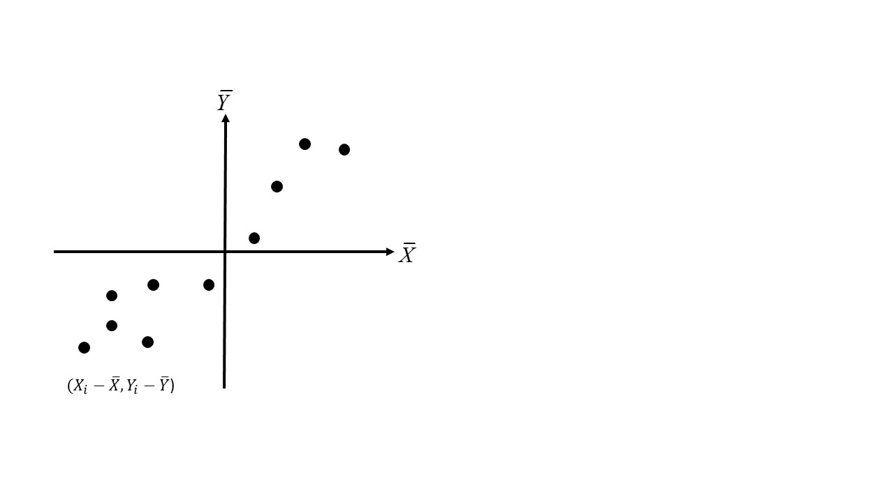
<p class="caption">(\#fig:covariance-as-a-scatterplot)\label{fig:covariance-as-scatterplot}Observations of the covariance as a scatterplot</p>
</div>

The autocovariance of variable $z$ can be defined in a similar way, the difference being that instead of two variables, it is the covariance of a variable with _itself_ but at a different location (i.e., between locations $i$ and $j$):
$$
C(z_i,z_j) = E[{(z_i^2 - \bar{z})(z_j^2 - \bar{z})}]
$$

To implement the spatial autocovariance we need some criterion to explicitly define the spatial relationship between locations $i$ and $j$. A useful criterion in this case is as follows:

$$
w_{ij}(h)=\bigg\{\begin{array}{l l}
1\text{ if } d_{ij} = h\\
0\text{ otherwise}\\
\end{array}
$$
In other words, $i$ and $j$ are considered to be spatially related for the purposes of calculating the autocovariance, if the distance between the two locations is equal to some predefined spatial lag $h$.

The above criterion makes explicit the assumption that the autocovariance is a function of the separation $h$ between two observations, but not of other factors, such as the angle between observations. This assumption is called _isotropy_.

Further, if we assume that the variance of $z$ is constant, and the correlation between observations does not depend on location (an assumption called _intrinsic stationarity_), we can _pool_ observations from across the map to create a scatterplot to form the basis of the autocovariance calculations.

Consider the (regular) arrangement of observations spaced at $h$ in Figure \@ref{fig:autocovariance}. Each observation generally has four neighbors, with the exception of those in the edges, which have fewer neighbors at spatial lag $h$. This means that most observations will contribute four points to the scatterplot ($z_i$ and $z_j$, $z_k$, $z_l$, and $z_m$), and others will contribute three or at least two (those in the corners).

<div class="figure">
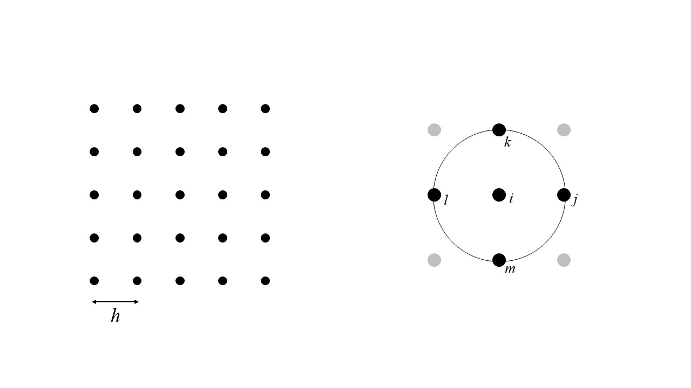
<p class="caption">(\#fig:autocovariance)\label{fig:autocovariance}Finding spatial pairs for the calculation of the autocovariance</p>
</div>

Given those pairs of observations, the autocovariance at lag $h$ can be calculated as:
$$
C_{z}(h) = \frac{\sum_{i=1}^{n}{w_{ij}(h)(z_i^2 - \bar{z})(z_j^2 - \bar{z})}}{\sum_{i=1}^n{w_{ij}(h)}}
$$

Changing the spatial lag $h$ allows us to calculate the autocovariance at different scales. The plot of the autocovariance at different scales is called a _covariogram_.

A related quantity that is more commonly used (mainly for historical reasons) is the _semivariance_.

The semivariance is defined as follows, calculated based on the difference between $z_i$ and $z_j$:
$$
\hat{\gamma}_{z}(h) = \frac{\sum_{i=1}^{n}{w_{ij}(h)(z_i - z_j)^2}}{2\sum_{i=1}^n{w_{ij}(h)}}
$$

The plot of the semivariance at different lags $h$ is called a _semivariogram_.

The covariogram and semivariogram are related by the following formula:
$$
C_{z}(h) =\sigma^2 - \hat{\gamma}_{z}(h)
$$
where $\sigma^2$ is the sample variance.

The condition that $d_{ij} = h$ is, with the exception of gridded data, too strict, and is often relaxed in the following way:

$$
w_{ij}(\tilde{h})=\bigg\{\begin{array}{l l}
1\text{ if } d_{ij}\simeq h\\
0\text{ otherwise}\\
\end{array}
$$

In this way, the distance between observations $i$ and $j$ does not need to be _exactly_, but can be an approximation. The approximation can be defined explicitly as follows:

$$
w_{ij}(\tilde{h})=\bigg\{\begin{array}{l l}
1\text{ if } h - \Delta h < d_{ij} < h + \Delta h\\
0\text{ otherwise}\\
\end{array}
$$

Instead of forming pairs with observations that are at exactly a distance $h$ (which would lead in many cases to too few pairs), pairs are formed with observations at approximately lag $h$ (or $\tilde{h}$), with a tolerance given by $\Delta h$.

Analysis based on the semivariogram (called _variographic analysis_) is implemented in `R` in the `gstat` package.

We will illustrate the use of the semivariogram by means of the Walker Lake data. The package `gstat` accepts simple features objects of the `sf` package, so we convert our dataframe into such an object:

``` r
Walker_Lake.sf <- st_as_sf(Walker_Lake, coords = c("X", "Y"))
class(Walker_Lake.sf)
```

```
## [1] "sf"         "tbl_df"     "tbl"        "data.frame"
```

The empirical semivariogram is calculated by means of the `gstat::variogram` function, as follows:

``` r
# `variogram()` calculates the sample semivariogram from data, 
# or if a linear model is given, for the residuals; in this case, 
# the formula `V ~ 1` means that we are not using a model
variogram_z <- variogram(V ~ 1, data = Walker_Lake.sf) 

#Note we are plotting the data of `variogram_z`
ggplot(data = variogram_z,
       aes(x = dist, 
           y = gamma)) + 
  geom_point() + 
  # Add labels to indicate the number of pairs of observations used 
  # in the calculation of each point in the variogram
  geom_text(aes(label = np), 
            nudge_y = -1500) + 
  # Add labels to axes
  xlab("Distance") +
  ylab("Semivariance")
```


The numbers indicate the number of pairs of observations used to calculate the semivariance at the corresponding lag.

Since the sample variance is: 

``` r
# We are calculating the variance of X
s2 <- var(Walker_Lake$V) 
s2
```

```
## [1] 90694.59
```

It follows that the covariogram in this case is:

``` r
ggplot(data = variogram_z, 
       aes(x = dist, 
           y = s2 - gamma)) +
  geom_point() + 
  geom_text(aes(label = np), 
            nudge_y = -1500) +
  xlab("Distance") + 
  ylab("Autocovariance")
```


As expected, the autocovariance (and hence, the autocorrelation) is stronger at short spatial lags, and declines at larger spatial lags.

The above plots are the _empirical_ semivariogram and covariogram. These plots are used to model a theoretical semivariogram, a function that can be used to estimate spatial dependence at any lag within the domain of the  - and not just at the distances for which we have points in the empirical variogram.

Since the semivariogram is the expectation of the square, the function selected for modeling the theoretical semivariogram must be non-negative. Several functions satisfy this condition, a list of which are available in `gstat` as shown below:

``` r
# This function generates a variogram mode. Here, we are able to view 
# the list of possible models for a semivariogram
vgm() 
```

```
##    short                                      long
## 1    Nug                              Nug (nugget)
## 2    Exp                         Exp (exponential)
## 3    Sph                           Sph (spherical)
## 4    Gau                            Gau (gaussian)
## 5    Exc        Exclass (Exponential class/stable)
## 6    Mat                              Mat (Matern)
## 7    Ste Mat (Matern, M. Stein's parameterization)
## 8    Cir                            Cir (circular)
## 9    Lin                              Lin (linear)
## 10   Bes                              Bes (bessel)
## 11   Pen                      Pen (pentaspherical)
## 12   Per                            Per (periodic)
## 13   Wav                                Wav (wave)
## 14   Hol                                Hol (hole)
## 15   Log                         Log (logarithmic)
## 16   Pow                               Pow (power)
## 17   Spl                              Spl (spline)
## 18   Leg                            Leg (Legendre)
## 19   Err                   Err (Measurement error)
## 20   Int                           Int (Intercept)
```

The anatomy of a semivariogram includes a range, a sill, and possibly a nugget. These elements are shown in Figure \@ref{fig:semivariogram}.

<div class="figure">

<p class="caption">(\#fig:anatomy-semivariogram)\label{fig:semivarigoram}Anatomy of a semivariogram</p>
</div>

Since the semivariogram is calculated based on the square of the differences $z_i - z_j$, the smaller the semivariance is, the more similar observations tend to be. In principle, the semivariogram begins at zero, because at distance zero an observation is identical to itself (i.e., $z_i - z_i$). The range is the distance at which the sill is reached. The sill, on the other hand, is the point at which the semivariance becomes simply the variance, meaning that there is no more or less similarity between observations than would be implied by the variance of the sample.

An additional element is the nugget. While the semivariogram in principle begins at zero, sometime discontinuities near the origin can be observed. The terminology is from mining, and reflects the fact that a nugget could be very different from the material around it, hence the jump in the semivariogram.

Some theoretical functions are shown next.

Exponential semivariogram:

``` r
# We use "exp" to denote the use of an exponential semivariogram. 
# Refer to the list on line 297 and explore the different outcomes 
# of the listed variogram models! 
plot(variogramLine(vgm(1, 
                       "Exp",
                       1), 
                   10),
     type = 'l') 
```


Spherical semivariogram:

``` r
plot(variogramLine(vgm(1, 
                       "Sph",
                       1), 
                   10), 
     type = 'l')
```


Gaussian semivariogram:

``` r
plot(variogramLine(vgm(1, 
                       "Gau", 
                       1), 
                   10), 
     type = 'l')
```


These plots illustrate some differences in the behavior of the models. For identical parameters, the Gaussian model provides smoother changes near the origin. The spherical model reaches the sill more rapidly than the other models.

To fit a theoretical semivariogram to the empirical one, the function `fit.variogram` is used:

``` r
# `fit_variogram` selects the type of model that will fit 
# the empirical semivariogram best
variogram_z.t <- fit.variogram(variogram_z, model = vgm("Exp")) 
```

The results of which can be plotted after passing the model the the function `variogramLine`:

``` r
# Notice how 'maxdist' is 130, and the model does not exceed that value.
gamma.t <- variogramLine(variogram_z.t, 
                         maxdist = 130) 

# Plot
ggplot(data = variogram_z, 
       aes(x = dist, 
           y = gamma)) +
  geom_point(size = 3) + 
  geom_line(data = gamma.t,
            aes(x = dist, 
                y = gamma)) +
  xlab("Distance") + 
  ylab("Semivariance")
```


A set of models can be passed as an argument to `fit.variogram`, in which case the value (output) of the function is the model that provides the best fit to the empirical semivariogram:

``` r
variogram_z.t <- fit.variogram(variogram_z, 
                               # Models to choosing the best fit
                               model = vgm("Exp", 
                                           "Sph", 
                                           "Gau")) 
variogram_z.t
```

```
##   model     psill    range
## 1   Nug  4045.567  0.00000
## 2   Exp 90703.773 12.52591
```

In this case, it can be seen that the best fitting model is the exponential, as follows:

``` r
gamma.t <- variogramLine(variogram_z.t, 
                         maxdist = 130)

# Plot 
ggplot(data = variogram_z, 
       aes(x = dist, 
           y = gamma)) +
  geom_point(size = 3) + 
  geom_line(data = gamma.t,
            aes(x = dist, 
                y = gamma)) +
  xlab("Distance") + 
  ylab("Semivariance")
```


For comparison, we will do the variographic analysis of a simulated random dataset.

Generate coordinates for observations and expand on a grid:

``` r
#We are generating a regular sequence of coordinates by means of 'seq' 
x <- seq(from = 0, 
         to = 250, 
         by = 10)
y <- seq(from = 0, 
         to = 290, 
         by = 10)

# Create a data frame `df` to store these values
df <- expand.grid(x = x, 
                  y = y)  
```

Then, create a random variable for this coordinates:

``` r
# `set.seed()` is used for replicability: it uses the seed 
# in the argument for generating random numbers
set.seed(100) 
df$z <- rnorm(n = 780, mean = 500, sd = 300)
```

Finally, convert to a simple features object:

``` r
df <- st_as_sf(df, coords = c("x", "y")) 
```

The empirical variogram is:

``` r
# Calculate the variogram
variogram_df <- variogram(z ~ 1, data = df)

# Plot
ggplot(data = variogram_df, aes(x = dist, y = gamma)) +
  geom_point() + 
  geom_text(aes(label = np), nudge_y = -1500) + 
  ylim(c(0, 98100)) +
  xlab("Distance") + 
  ylab("Semivariance")  
```


The range of the semivariogram appears to be zero, or alternatively, there seems to be a pure nugget effect. This is as expected. Since the data are spatially random, they are not more similar at shorter distances than they would be at longer distances.

<!--chapter:end:35-Spatially-Continuous-Data-III.Rmd-->

# Activity 17: Spatially Continuous Data III

*NOTE*: The source files for this book are available with companion package [{isdas}](https://paezha.github.io/isdas/). The source files are in Rmarkdown format and packed as templates. These files allow you execute code within the notebook, so that you can work interactively with the notes. 

## Practice questions

Answer the following questions:

1. What is a correlogram?
2. What is the relationship between the autocovariance and the semivariance?
3. Describe the elements of a semivariogram.
4. Why is it important to consider the number of pairs used in the calculation of the semivariance?

## Learning objectives

In this activity, you will:

1. Calculate and plot empirical semivariograms.
2. Estimate and plot theoretical semivariograms.
3. Discuss the results of variographic analysis.

## Suggested reading

- Bailey TC and Gatrell AC [-@Bailey1995] Interactive Spatial Data Analysis, Chapters 5 and 6. Longman: Essex.
- Bivand RS, Pebesma E, and Gomez-Rubio V [-@Bivand2008] Applied Spatial Data Analysis with R, Chapter 8. Springer: New York.
- Brunsdon C and Comber L [-@Brunsdon2015R] An Introduction to R for Spatial Analysis and Mapping, Chapter 6, Sections 6.7 and 6.8. Sage: Los Angeles.
- Isaaks EH and Srivastava RM  [-@Isaaks1989applied] An Introduction to Applied Geostatistics, Chapter 7. Oxford University Press: Oxford.
- O'Sullivan D and Unwin D [-@Osullivan2010] Geographic Information Analysis, 2nd Edition, Chapters 9 and 10. John Wiley & Sons: New Jersey.

## Preliminaries

As usual, please remember to start with a new session of `R` or at least use the command `rm` (for "remove") to clear the workspace, followed by a list of items to be removed. To clear the workspace from _all_ objects, do the following:

``` r
rm(list = ls())
```

Note that `ls()` lists all objects currently on the workspace.

Load the libraries you will use in this activity (load other packages as appropriate). 

``` r
library(isdas)
library(gstat)
library(sf)
library(spdep)
library(tidyverse)
```

Load dataset:

``` r
data("aquifer")
```

Convert to a simple features object:

``` r
aquifer.sf <- st_as_sf(aquifer, coords = c("X", "Y"))
```

The data is a set of piezometric head (watertable pressure) observations of the Wolfcamp Aquifer in Texas (https://en.wikipedia.org/wiki/Hydraulic_head). Measures of pressure can be used to infer the flow of underground water, since water flows from high to low pressure areas.

These data were collected to evaluate potential flow of contamination related to a high level toxic waste repository in Texas. The Deaf Smith county site in Texas was one of three potential sites proposed for this repository. Beneath the site is a deep brine aquifer known as the Wolfcamp aquifer that may serve as a conduit of contamination leaking from the repository.

The data set consists of 85 georeferenced measurements of piezometric head. Possible applications of interpolation are to determine sites at risk and to quantify uncertainty of the interpolated surface, to evaluate the best locations for monitoring stations.

## Activity

**NOTE**: Activities include technical "how to" tasks/questions. Usually, these ask you to practice using the software to organize data, create plots, and so on in support of analysis and interpretation. The second type of questions ask you to activate your brainware and to think geographically and statistically.

::: {.infobox .software data-latex="{software}"}
**Activity Part I**
:::

1. Obtain and plot the empirical semivariogram for the head in the Wolfcamp Aquifer dataset.

2. Fit a trend surface of your choice to the Aquifer data set (i.e., polynomial). Then, estimate the residuals and plot an empirical semivariogram using these residuals. How would you interpret this empirical semivariogram of residuals?

3. From the residual semivariogram estimated in Question 2, fit and plot a theoretical semivariogram model for the residual semivariogram. 

::: {.infobox .brainware data-latex="{brainware}"}
**Activity Part II**
:::

4. What is your interpretation of the semivariograms above?

5. How would you use the information provided by the variographic analysis above to improve your predictions (spatially interpolated values) of the field?

<!--chapter:end:36-Activity-Spatially-Continuous-Data-III.Rmd-->

# Spatially Continuous Data IV

*NOTE*: The source files for this book are available with companion package [{isdas}](https://paezha.github.io/isdas/). The source files are in Rmarkdown format and packed as templates. These files allow you execute code within the notebook, so that you can work interactively with the notes. 

## Learning objectives

In the previous practice you were introduced to the concept of variographic analysis for fields/spatially continuous data. In this practice, we will learn:

1. How to use residual spatial pattern to estimate prediction errors.
2. Kriging: a method for optimal predictions.

## Suggested reading

- Bailey TC and Gatrell AC [-@Bailey1995] Interactive Spatial Data Analysis, Chapters 5 and 6. Longman: Essex.
- Bivand RS, Pebesma E, and Gomez-Rubio V [-@Bivand2008] Applied Spatial Data Analysis with R, Chapter 8. Springer: New York.
- Brunsdon C and Comber L [-@Brunsdon2015R] An Introduction to R for Spatial Analysis and Mapping, Chapter 6, Sections 6.7 and 6.8. Sage: Los Angeles.
- Isaaks EH and Srivastava RM  [-@Isaaks1989applied] An Introduction to Applied Geostatistics, Chapter 12. Oxford University Press: Oxford.
- O'Sullivan D and Unwin D [-@Osullivan2010] Geographic Information Analysis, 2nd Edition, Chapters 9 and 10. John Wiley & Sons: New Jersey.

## Preliminaries

As usual, remember to begin work with a new session of `R`. At least, remembert to clear the working space to make sure that you do not have extraneous items there when you begin your work. The command in `R` to clear the workspace is `rm` (for "remove"), followed by a list of items to be removed. To clear the workspace from _all_ objects, do the following:

``` r
rm(list = ls())
```

Note that `ls()` lists all objects currently on the workspace.

Load the libraries you will use in this activity:

``` r
library(isdas)
library(gstat)
library(plotly)
library(spdep)
library(tidyverse)
library(stars)
```

Begin by loading the data file:

``` r
data("Walker_Lake")
```

You can verify the contents of the dataframe:

``` r
summary(Walker_Lake)
```

```
##          ID            X               Y               V         
##  Length   :470   Min.   :  8.0   Min.   :  8.0   Min.   :   0.0  
##  N.unique :470   1st Qu.: 51.0   1st Qu.: 80.0   1st Qu.: 182.0  
##  N.blank  :  0   Median : 89.0   Median :139.5   Median : 425.2  
##  Min.nchar:  1   Mean   :111.1   Mean   :141.3   Mean   : 435.4  
##  Max.nchar:  3   3rd Qu.:170.0   3rd Qu.:208.0   3rd Qu.: 644.4  
##                  Max.   :251.0   Max.   :291.0   Max.   :1528.1  
##                                                                  
##        U           T      
##  Min.   :   0.00   1: 45  
##  1st Qu.:  83.95   2:425  
##  Median : 335.00          
##  Mean   : 613.27          
##  3rd Qu.: 883.20          
##  Max.   :5190.10          
##  NAs    :195
```

## Using residual spatial pattern to estimate prediction errors

Previously, in Chapter \@ref{spatially-continuous-data-ii} we discussed how to interpolate a field using trend surface analysis; we also saw how that method may lead to residuals that are not spatially independent. 

The implication of non-random residuals is that there is systematic residual pattern that the model did not capture; This, in turn, means that there is at least _some_ information that can still be extracted from the residuals. Again, we will use the case of Walker Lake to explore one way to do this.

As before, we first calculate the polynomial terms of the coordinates to fit a trend surface to the data:

``` r
Walker_Lake <- mutate(Walker_Lake,
                      X3 = X^3, X2Y = X^2 * Y, X2 = X^2, 
                      XY = X * Y,
                      Y2 = Y^2, XY2 = X * Y^2, Y3 = Y^3)
```

Given the polynomial expansion, we can proceed to estimate the following cubic trend surface model, which we already know provided the best fit to the data:

``` r
WL.trend3 <- lm(formula = V ~ X3 + X2Y + X2 + X + XY + Y + Y2 + XY2 + Y3, 
                data = Walker_Lake)
summary(WL.trend3)
```

```
## 
## Call:
## lm(formula = V ~ X3 + X2Y + X2 + X + XY + Y + Y2 + XY2 + Y3, 
##     data = Walker_Lake)
## 
## Residuals:
##     Min      1Q  Median      3Q     Max 
## -564.19 -197.41    7.91  194.25  929.72 
## 
## Coefficients:
##               Estimate Std. Error t value Pr(>|t|)    
## (Intercept) -8.620e+00  1.227e+02  -0.070 0.944035    
## X3           1.533e-04  4.806e-05   3.190 0.001522 ** 
## X2Y          6.139e-05  3.909e-05   1.570 0.117000    
## X2          -6.651e-02  1.838e-02  -3.618 0.000330 ***
## X            9.172e+00  2.386e+00   3.844 0.000138 ***
## XY          -4.420e-02  1.430e-02  -3.092 0.002110 ** 
## Y            4.794e+00  2.040e+00   2.350 0.019220 *  
## Y2          -1.806e-03  1.327e-02  -0.136 0.891822    
## XY2          7.679e-05  2.956e-05   2.598 0.009669 ** 
## Y3          -4.170e-05  2.819e-05  -1.479 0.139759    
## ---
## Signif. codes:  0 '***' 0.001 '**' 0.01 '*' 0.05 '.' 0.1 ' ' 1
## 
## Residual standard error: 276.7 on 460 degrees of freedom
## Multiple R-squared:  0.1719,	Adjusted R-squared:  0.1557 
## F-statistic: 10.61 on 9 and 460 DF,  p-value: 5.381e-15
```

We can next visualize the residuals which, as you can see, do not appear to be random 

``` r
plot_ly(x = ~Walker_Lake$X, 
        y = ~Walker_Lake$Y, 
        z = ~WL.trend3$residuals, 
        color = ~WL.trend3$residuals < 0, 
        colors = c("blue", "red"), 
        type = "scatter3d")
```

```
## No scatter3d mode specifed:
##   Setting the mode to markers
##   Read more about this attribute -> https://plotly.com/r/reference/#scatter-mode
```

```{=html}
<div class="plotly html-widget html-fill-item" id="htmlwidget-b9caac16c54e2ad93e46" style="width:672px;height:480px;"></div>
<script type="application/json" data-for="htmlwidget-b9caac16c54e2ad93e46">{"x":{"visdat":{"13b357da5aecd":["function () ","plotlyVisDat"]},"cur_data":"13b357da5aecd","attrs":{"13b357da5aecd":{"x":{},"y":{},"z":{},"color":{},"colors":["blue","red"],"alpha_stroke":1,"sizes":[10,100],"spans":[1,20],"type":"scatter3d"}},"layout":{"margin":{"b":40,"l":60,"t":25,"r":10},"scene":{"xaxis":{"title":"Walker_Lake$X"},"yaxis":{"title":"Walker_Lake$Y"},"zaxis":{"title":"WL.trend3$residuals"}},"hovermode":"closest","showlegend":true},"source":"A","config":{"modeBarButtonsToAdd":["hoverclosest","hovercompare"],"showSendToCloud":false},"data":[{"x":[8,10,31,28,49,50,49,51,48,50,50,71,71,68,68,69,69,70,90,91,91,91,89,109,111,130,130,151,150,150,150,148,168,168,171,170,168,189,190,188,209,210,209,210,208,211,231,231,229,228,231,229,249,251,250,28,29,18,39,18,21,31,41,21,60,50,60,50,61,39,61,39,49,58,39,60,40,51,60,40,58,38,39,59,41,49,51,39,38,78,70,78,78,80,71,79,71,78,80,70,80,90,88,101,79,90,81,80,91,101,98,81,90,90,99,108,158,140,150,151,160,139,178,159,169,170,180,198,211,208,221,199,220,200,208,210,198,218,229,218,238,218,231,230,221,239,218,35,24,23,54,46,45,53,55,43,55,44,55,54,43,73,75,73,64,63,73,64,93,86,93,84,93,86,96,85,93,86,106,155,174,166,215,205,204,236,223,236,226,24,36,16,43,15,46,46,54,43,65,36,53,44,65,55,46,63,46,35,53,46,45,35,84,75,73,63,84,76,76,94,85,104,85,104,75,95,83,94,104,196,204,196,195,216,225,233,226,213],"y":[68,110,68,88,11,88,151,168,190,211,268,9,29,70,128,148,169,191,49,68,91,111,130,129,291,9,231,69,89,109,228,291,8,91,109,210,271,149,169,210,30,70,90,111,151,228,10,28,110,148,208,228,48,69,190,80,59,80,60,60,90,101,100,100,8,81,151,160,158,160,170,170,179,179,181,191,190,198,198,200,208,209,221,268,271,278,260,279,260,28,41,41,20,131,140,138,160,159,168,198,49,58,39,38,70,79,81,89,99,100,111,108,120,140,138,121,228,229,241,218,218,220,211,209,221,198,218,90,100,80,99,98,150,150,159,140,161,8,19,18,229,228,239,221,241,220,218,71,71,91,10,11,89,150,168,170,191,191,211,269,271,29,129,149,151,168,188,191,48,48,70,69,90,89,111,108,131,131,130,229,208,211,89,89,151,9,9,229,230,79,61,80,60,88,99,81,161,161,160,170,179,180,181,199,198,201,220,271,258,260,281,278,30,40,141,140,138,159,51,61,60,38,100,109,110,121,119,140,118,91,101,101,149,11,19,220,221,218],"z":[90.228510701678459,99.263120524399937,452.4554919650007,211.72960203994882,323.42529212284825,289.69398565555622,153.97034329053062,350.03735581264226,150.548916428784,388.98662857726094,483.85604123318598,65.65589589930218,252.06586973722594,34.260373191045709,56.785016827015312,15.509551760103317,160.68449272805168,336.05980022313059,193.10594495510526,156.80457454850392,388.42030872713678,286.58567311917085,417.94356658082734,191.79776830631971,140.30780744327828,174.5825550172045,191.67042563736598,143.88954943602235,152.04695271447287,82.780933103523267,307.18304665704989,50.402101708487031,70.539348093306018,138.67449106890442,100.88560617865653,343.67939287661852,159.76752348494773,157.04543798169743,10.256807465876919,61.060109137203071,111.90182455188715,71.515218169935125,483.14345658902187,13.869893165021516,356.16985847033419,340.63107901336514,186.83171894666435,23.630671937088277,29.067970666343491,9.8353618451766334,131.64023282292516,349.30496431724964,4.7818753694480307,58.650105257738083,97.333918887618594,138.16163055739418,364.35489494930016,603.47428473873322,341.68504490797312,153.01056293132385,126.9212386785747,48.169770946610015,54.972052030396853,92.860286610741582,195.65203967728752,92.206048403993066,908.58639942538468,256.96279758775682,255.77645286527579,34.561291235486436,194.42479193492014,290.06955917593456,191.96062385396496,502.1646373499803,386.67608674626439,929.7229249828647,355.95130948094635,508.9404252293503,614.48315734932339,37.750376655339736,144.86026290063748,75.667146469586442,51.740063790519365,174.36053749283028,497.86728885617822,256.87088338601188,252.55323942150673,471.37468229152415,207.82094182221195,356.17160660464594,26.728327602669665,150.71845159209178,95.255669402652501,226.66387453282147,11.922302283661541,149.49806265745525,201.91476957827408,155.46946583490947,109.07087969201027,57.464247908200001,293.02351943029259,264.70005614137034,73.889711218736949,290.63274921844919,7.7810743098864883,68.356096011364272,68.636769737971051,84.63474335782648,207.03903926845754,88.657723399369999,218.81784275081858,469.33046921297876,350.3524669425214,89.404153362697471,107.55434416978326,383.47072755850019,280.71109229251914,240.82301636805849,59.522467542901325,78.126925247434428,284.14688373640558,193.72950581174356,118.60932841954583,201.50648274994393,153.68815659920645,55.916220152116267,109.87219472431741,283.23204107913477,418.41130544762314,105.62141978155132,203.71889313605107,473.95151969970033,216.52490043831432,288.81074436241636,41.53182355784255,119.85802273494066,55.868706075067571,333.35224684103503,108.43831204798548,409.2305511903852,280.89902197816417,169.09422318860484,74.119078409460315,299.82990998904882,79.191527099301908,83.93400632285973,486.94650652933279,224.89839151853477,307.64777761151316,333.03183379673862,294.97237248020053,192.86187732083394,41.805331094029142,240.71337818711922,257.13900172011506,458.25688333073049,787.98645316781653,33.6187127526021,315.83673693529488,242.80947591568722,397.95552764990248,226.13000527478272,201.34178718080582,128.03611131928051,366.30825455701591,605.85022882229498,107.54125750307222,667.49655805140208,226.08264598257722,10.228750794620046,22.80563188041388,467.5904685417803,359.43904895139997,59.240622317899948,23.134285645706406,390.23901978369537,334.24520593841686,315.08247699824426,133.35452093785725,104.95165207684238,49.184525019688458,302.13244630723807,262.23084284787774,481.54604783079816,380.69767550573533,68.019194718757404,200.86419388517629,351.69216001650591,535.38638368739669,439.08960375955758,262.73964637244126,490.70712664745071,132.21102571588517,164.22329089961016,16.672877273770773,31.799543148135569,339.38881709477005,8.0309922999489682,320.0212145536828,48.926778880519549,386.84250087887472,255.12251248968201,133.68504333320806,474.71285192319937,200.44800947139865,150.77548838586611,174.40029885232576,224.72092459886207,17.547314479010954,342.30815909402867,293.88730654282341,462.56169689532652,130.11177163652019,250.22686622869057,198.9621239913711,92.486099403220337,116.04641699202088,7.1158229164055466,30.89566465009738,302.74324092353874,41.858375943111071,179.39601115696161,165.91041354723455,50.655739810375891,92.444080824836846,284.15583611897682,286.90074258344259,57.200791863351427,76.489041708298416,104.44099231226819,207.83640857930672,264.55589088714845,158.83647387455636,264.96317493916092,431.60448695355262,312.40511202356316,509.20881922267739,214.2777477064659],"type":"scatter3d","mode":"markers","name":"FALSE","marker":{"color":"rgba(0,0,255,1)","line":{"color":"rgba(0,0,255,1)"}},"textfont":{"color":"rgba(0,0,255,1)"},"error_y":{"color":"rgba(0,0,255,1)"},"error_x":{"color":"rgba(0,0,255,1)"},"line":{"color":"rgba(0,0,255,1)"},"frame":null},{"x":[11,8,9,9,9,11,10,8,9,10,11,10,8,31,29,28,30,28,28,30,28,31,28,30,31,31,49,51,49,51,48,49,51,51,70,69,68,69,69,68,71,71,91,91,88,89,89,90,90,88,88,88,109,111,108,109,108,110,110,111,111,110,109,109,109,131,130,128,129,131,129,131,131,129,128,131,128,131,148,149,150,150,150,149,151,148,149,149,171,169,168,168,171,171,169,170,169,168,190,191,191,190,190,188,191,190,191,190,189,189,211,211,211,209,208,210,211,208,208,230,230,229,230,229,231,231,231,230,249,250,251,248,249,248,250,251,251,249,248,250,40,21,41,41,40,51,59,41,59,51,59,60,38,50,61,38,50,61,59,59,60,70,61,58,70,80,61,79,69,79,80,81,100,100,80,101,100,100,81,100,98,121,111,120,119,161,141,178,158,219,220,198,221,219,200,239,239,240,34,55,46,46,64,64,75,114,145,215,35,26,36,54,33,34,33,34,65,35,36,35,84,84,86,73,93,75,94,103,114,215,214,245],"y":[8,30,48,90,129,150,170,188,209,231,250,269,288,11,29,51,110,130,150,171,190,209,229,250,269,289,29,48,68,109,129,231,250,290,51,90,110,208,229,250,268,288,11,29,149,170,188,211,230,249,269,288,11,31,49,68,88,109,148,169,191,208,230,249,268,31,48,70,90,109,128,148,169,191,209,248,269,288,8,29,49,129,151,169,190,208,251,271,29,49,69,131,150,171,191,230,249,290,11,28,48,69,89,111,129,189,231,248,270,290,11,49,130,168,191,211,250,268,289,50,71,91,131,169,191,249,268,291,9,30,91,109,130,150,169,208,229,251,270,291,71,69,81,90,11,18,20,21,90,101,101,81,148,138,139,140,221,220,281,258,29,21,41,128,121,119,121,149,181,181,188,200,48,60,59,68,78,91,98,118,130,131,140,141,118,241,240,201,198,88,81,78,160,139,139,8,18,239,88,89,148,211,31,129,171,131,230,148,80,58,99,80,160,180,191,201,210,208,219,259,41,161,169,199,41,90,101,139,120,101,19,231],"z":[-118.87007281984174,-191.71098088075124,-48.330075224075557,-13.230063931734382,-336.03769436069888,-538.05198282552942,-194.12130621118402,-402.32081855393375,-371.3204529908769,-431.84956966465074,-370.51935271243894,-237.8636860880564,-57.6197215400095,-225.99440804111759,-229.76624823792409,-86.518055914431656,-58.605706084935612,-446.11668186015015,-272.11405270880135,-342.35635290994435,-404.59948707477429,-564.19326506692403,-344.05543839051029,-410.91460970777001,-70.557140381396081,-23.492667808828866,-283.88279487326025,-331.32933319523659,-446.0392998212875,-121.11977176719043,-409.71731534056829,-136.05629835729465,-118.74162758753019,-90.26465736396014,-213.3063380908504,-539.13960858985638,-240.4273537647816,-460.02336053114823,-506.72799521357291,-435.77656156933369,-348.13884521264902,-232.15267303233114,-37.145195892372463,-339.65823542125747,-14.431965490991297,-402.80717734359763,-532.0409298416713,-502.58096347277018,-454.67987924096542,-394.78648240663711,-293.6716610041164,-137.77294710633544,-8.3532917918605811,-248.24625333200214,-44.058415581656952,-204.07671878500585,-293.934467984516,-260.43629873167777,-471.24464587508845,-477.04036307972854,-474.54220405172282,-434.13273211300861,-227.4626680485579,-325.50799578784904,-69.603766091697011,-375.52831755844392,-339.65004598676012,-32.255945010465446,-199.21760572961654,-446.47741888000121,-211.99743353298894,-265.06756984494655,-414.32659871946777,-423.56269632499249,-296.41908665549329,-174.61703855694782,-45.089330161521019,-30.519173003323896,-126.12086954656175,-57.164421381631456,-51.513713788292392,-317.44732341481978,-392.62550045417044,-209.3949218124443,-363.77908059679925,-1.1030762383999071,-19.491540233977819,-70.703720351061534,-171.982628872942,-78.100711822703403,-359.0688631683546,-19.67958306751779,-350.22201856054892,-130.1513707058815,-222.93118404845984,-78.721857977154556,-184.04942098048863,-6.5420657880415192,-22.215307085247048,-332.3388960227262,-283.32192264866205,-335.90663555495638,-6.8546530296487802,-7.6973567279258592,-213.12688653683725,-286.48195105856286,-47.562093924485623,-44.032652564187366,-28.650562600449479,-36.913982765067082,-29.402701938279201,-38.319661775991321,-99.551055121756619,-169.8384941415332,-232.61413226444236,-15.91851092414047,-37.28471944838379,-23.581535813932003,-44.730303071928653,-80.188136693038771,-136.95722938888196,-320.50423484197762,-14.463425301621033,-337.92549763040097,-194.95763361779396,-141.94730545773444,-191.60319066187122,-142.62134176488394,-330.11591784988104,-316.86241502130986,-419.30506422042316,-375.49836935047267,-406.41789371278401,-383.6681419255097,-143.08035154512504,-402.02912604762474,-144.85030092023467,-111.46673994971441,-281.39403637298739,-218.47393726436368,-398.73863489633516,-125.77420077088497,-233.23439331524733,-109.42753100531444,-196.72729662120025,-121.93489969919763,-366.85473421371682,-215.29307972779227,-33.963917187542165,-55.317142509521254,-195.82386425036887,-137.41018331018799,-274.6278357944621,-196.39008158183671,-128.16754288530049,-339.59819622810556,-13.79909552335001,-444.17692277942444,-148.02582849922501,-222.04478873482216,-166.65220388867149,-345.21691276898093,-370.63378693009037,-438.59846654260542,-549.90084893602591,-144.38607307042574,-483.13905420791258,-540.14208368273955,-169.13263036636002,-389.54211694711756,-319.3769165127776,-545.7212114931782,-404.42549551584432,-468.19706704021047,-481.91179336006923,-93.547312529384214,-117.38787190005503,-106.69999890759254,-359.79196137344553,-162.9282903898204,-24.3779849998988,-465.87279197952296,-316.80650604587026,-377.63201810682654,-330.14136042003372,-95.313650327699719,-170.56118638050535,-150.29355443392456,-166.1576174039923,-102.16611884019906,-68.490260616020663,-126.57425905174193,-24.126038812116075,-161.6812394117608,-89.644001886955451,-219.74418626340659,-50.79508138000341,-144.16833944670523,-419.16201946291324,-113.34995998989972,-383.94960611419901,-73.378682641777857,-181.22040594822442,-367.02704250202737,-76.707517068014113,-229.29698731992318,-268.68665832727584,-29.108385895622519,-312.77437154253914,-354.4016093852257,-498.32250082503339,-34.401586104722014,-188.34666755526308,-254.45975010289533,-316.48770458376691,-283.9751659312322,-322.25984469781355,-162.53128736495603,-140.26774977426533,-197.63967222373827,-39.025816310516852,-136.19325611985855,-248.67016889307041,-94.339293121557645,-53.030122891522147,-16.757736966453301,-141.09965517692626,-36.84173843854802,-174.61547624142568,-120.87674997785865,-137.90283352417538,-190.17929444689926],"type":"scatter3d","mode":"markers","name":"TRUE","marker":{"color":"rgba(255,0,0,1)","line":{"color":"rgba(255,0,0,1)"}},"textfont":{"color":"rgba(255,0,0,1)"},"error_y":{"color":"rgba(255,0,0,1)"},"error_x":{"color":"rgba(255,0,0,1)"},"line":{"color":"rgba(255,0,0,1)"},"frame":null}],"highlight":{"on":"plotly_click","persistent":false,"dynamic":false,"selectize":false,"opacityDim":0.20000000000000001,"selected":{"opacity":1},"debounce":0},"shinyEvents":["plotly_hover","plotly_click","plotly_selected","plotly_relayout","plotly_brushed","plotly_brushing","plotly_clickannotation","plotly_doubleclick","plotly_deselect","plotly_afterplot","plotly_sunburstclick"],"base_url":"https://plot.ly"},"evals":[],"jsHooks":[]}</script>
```

Now we will create an interpolation grid:

``` r
# The function `sequence()` create a sequence of values from - to 
# using by as the step increment. In this case, we generate a grid
# with points that are 2.5 m apart.
X.p <- seq(from = 0.1, to = 255.1, by = 2.5)
Y.p <- seq(from = 0.1, to = 295.1, by = 2.5)
df.p <- expand.grid(X = X.p, Y = Y.p)
```

WE can add the polynomial terms to this grid. Since our trend surface model was estimated using the cubic polynomial, we add those terms to the dataframe:

``` r
df.p <- mutate(df.p, X3 = X^3, X2Y = X^2 * Y, X2 = X^2, 
               XY = X * Y, 
               Y2 = Y^2, XY2 = X * Y^2, Y3 = Y^3)
```

The interpolated cubic surface is obtained by using the model and the interpolation grid as `newdata`:

``` r
# The function `predict()` is used to make predictions given a model 
# and a possibly new dataset, different from the one used for estimation 
# of the model.
WL.preds3 <- predict(WL.trend3, 
                     newdata = df.p, 
                     se.fit = TRUE, 
                     interval = "prediction", 
                     level = 0.95)
```

The surface is converted into a matrix for 3D plotting:

``` r
z.p3 <- matrix(data = WL.preds3$fit[,1], 
               nrow = length(Y.p), 
               ncol = length(X.p), 
               byrow = TRUE)
```

And plot:

``` r
WL.plot3 <- plot_ly(x = ~X.p, 
                    y = ~Y.p, 
                    z = ~z.p3, 
                    type = "surface", 
                    colors = "YlOrRd") |> 
  layout(scene = list(aspectmode = "manual",
                      aspectratio = list(x = 1, 
                                         y = 1,
                                         
                                         z = 1)))
WL.plot3
```

```{=html}
<div class="plotly html-widget html-fill-item" id="htmlwidget-31db4a811ffae22a271b" style="width:672px;height:480px;"></div>
<script type="application/json" data-for="htmlwidget-31db4a811ffae22a271b">{"x":{"visdat":{"13b35788af0dd":["function () ","plotlyVisDat"]},"cur_data":"13b35788af0dd","attrs":{"13b35788af0dd":{"x":{},"y":{},"z":{},"colors":"YlOrRd","alpha_stroke":1,"sizes":[10,100],"spans":[1,20],"type":"surface"}},"layout":{"margin":{"b":40,"l":60,"t":25,"r":10},"scene":{"aspectmode":"manual","aspectratio":{"x":1,"y":1,"z":1},"xaxis":{"title":"X.p"},"yaxis":{"title":"Y.p"},"zaxis":{"title":"z.p3"}},"hovermode":"closest","showlegend":false,"legend":{"yanchor":"top","y":0.5}},"source":"A","config":{"modeBarButtonsToAdd":["hoverclosest","hovercompare"],"showSendToCloud":false},"data":[{"colorbar":{"title":"z.p3","ticklen":2,"len":0.5,"lenmode":"fraction","y":1,"yanchor":"top"},"colorscale":[["0","rgba(255,255,204,1)"],["0.0416666666666667","rgba(255,249,189,1)"],["0.0833333333333333","rgba(255,243,175,1)"],["0.125","rgba(255,237,160,1)"],["0.166666666666667","rgba(255,230,146,1)"],["0.208333333333333","rgba(255,224,132,1)"],["0.25","rgba(254,217,118,1)"],["0.291666666666667","rgba(255,204,104,1)"],["0.333333333333333","rgba(255,191,90,1)"],["0.375","rgba(254,178,76,1)"],["0.416666666666667","rgba(254,166,71,1)"],["0.458333333333333","rgba(254,154,65,1)"],["0.5","rgba(253,141,60,1)"],["0.541666666666667","rgba(253,122,54,1)"],["0.583333333333333","rgba(253,102,48,1)"],["0.625","rgba(252,78,42,1)"],["0.666666666666667","rgba(244,64,37,1)"],["0.708333333333333","rgba(235,48,33,1)"],["0.75","rgba(227,26,28,1)"],["0.791666666666667","rgba(214,18,32,1)"],["0.833333333333333","rgba(202,9,35,1)"],["0.875","rgba(189,0,38,1)"],["0.916666666666667","rgba(168,0,38,1)"],["0.958333333333333","rgba(148,0,38,1)"],["1","rgba(128,0,38,1)"]],"showscale":true,"x":[0.10000000000000001,2.6000000000000001,5.0999999999999996,7.5999999999999996,10.1,12.6,15.1,17.600000000000001,20.100000000000001,22.600000000000001,25.100000000000001,27.600000000000001,30.100000000000001,32.600000000000001,35.100000000000001,37.600000000000001,40.100000000000001,42.600000000000001,45.100000000000001,47.600000000000001,50.100000000000001,52.600000000000001,55.100000000000001,57.600000000000001,60.100000000000001,62.600000000000001,65.099999999999994,67.599999999999994,70.099999999999994,72.599999999999994,75.099999999999994,77.599999999999994,80.099999999999994,82.599999999999994,85.099999999999994,87.599999999999994,90.099999999999994,92.599999999999994,95.099999999999994,97.599999999999994,100.09999999999999,102.59999999999999,105.09999999999999,107.59999999999999,110.09999999999999,112.59999999999999,115.09999999999999,117.59999999999999,120.09999999999999,122.59999999999999,125.09999999999999,127.59999999999999,130.09999999999999,132.59999999999999,135.09999999999999,137.59999999999999,140.09999999999999,142.59999999999999,145.09999999999999,147.59999999999999,150.09999999999999,152.59999999999999,155.09999999999999,157.59999999999999,160.09999999999999,162.59999999999999,165.09999999999999,167.59999999999999,170.09999999999999,172.59999999999999,175.09999999999999,177.59999999999999,180.09999999999999,182.59999999999999,185.09999999999999,187.59999999999999,190.09999999999999,192.59999999999999,195.09999999999999,197.59999999999999,200.09999999999999,202.59999999999999,205.09999999999999,207.59999999999999,210.09999999999999,212.59999999999999,215.09999999999999,217.59999999999999,220.09999999999999,222.59999999999999,225.09999999999999,227.59999999999999,230.09999999999999,232.59999999999999,235.09999999999999,237.59999999999999,240.09999999999999,242.59999999999999,245.09999999999999,247.59999999999999,250.09999999999999,252.59999999999999,255.09999999999999],"y":[0.10000000000000001,2.6000000000000001,5.0999999999999996,7.5999999999999996,10.1,12.6,15.1,17.600000000000001,20.100000000000001,22.600000000000001,25.100000000000001,27.600000000000001,30.100000000000001,32.600000000000001,35.100000000000001,37.600000000000001,40.100000000000001,42.600000000000001,45.100000000000001,47.600000000000001,50.100000000000001,52.600000000000001,55.100000000000001,57.600000000000001,60.100000000000001,62.600000000000001,65.099999999999994,67.599999999999994,70.099999999999994,72.599999999999994,75.099999999999994,77.599999999999994,80.099999999999994,82.599999999999994,85.099999999999994,87.599999999999994,90.099999999999994,92.599999999999994,95.099999999999994,97.599999999999994,100.09999999999999,102.59999999999999,105.09999999999999,107.59999999999999,110.09999999999999,112.59999999999999,115.09999999999999,117.59999999999999,120.09999999999999,122.59999999999999,125.09999999999999,127.59999999999999,130.09999999999999,132.59999999999999,135.09999999999999,137.59999999999999,140.09999999999999,142.59999999999999,145.09999999999999,147.59999999999999,150.09999999999999,152.59999999999999,155.09999999999999,157.59999999999999,160.09999999999999,162.59999999999999,165.09999999999999,167.59999999999999,170.09999999999999,172.59999999999999,175.09999999999999,177.59999999999999,180.09999999999999,182.59999999999999,185.09999999999999,187.59999999999999,190.09999999999999,192.59999999999999,195.09999999999999,197.59999999999999,200.09999999999999,202.59999999999999,205.09999999999999,207.59999999999999,210.09999999999999,212.59999999999999,215.09999999999999,217.59999999999999,220.09999999999999,222.59999999999999,225.09999999999999,227.59999999999999,230.09999999999999,232.59999999999999,235.09999999999999,237.59999999999999,240.09999999999999,242.59999999999999,245.09999999999999,247.59999999999999,250.09999999999999,252.59999999999999,255.09999999999999,257.60000000000002,260.10000000000002,262.60000000000002,265.10000000000002,267.60000000000002,270.10000000000002,272.60000000000002,275.10000000000002,277.60000000000002,280.10000000000002,282.60000000000002,285.10000000000002,287.60000000000002,290.10000000000002,292.60000000000002,295.10000000000002],"z":[[-7.2245508738736488,15.248913959415836,36.906000520854846,57.761080351267005,77.828524991475959,97.12270598230532,115.65799486457871,133.44876317911974,150.50938246675204,166.85422426829928,182.49766012458502,197.45406157643293,211.7378001646666,225.36324743010971,238.34477491358581,250.69675415591857,262.43355669793152,273.56955408044854,284.11911784429293,294.09661953028854,303.51643067925886,312.39292283202764,320.74046752941854,328.5734363122549,335.90620072136068,342.75313229755926,349.12860258167439,355.04698311452955,360.52264543694855,365.56996108975505,370.20330161377245,374.43703854982459,378.28554343873481,381.76318782132711,384.88434323842483,387.66338123085171,390.11467333943131,392.2525911049874,394.09150606834351,395.64578977032323,396.92981375175009,397.95794955344792,398.74456871624028,399.30404278095079,399.65074328840291,399.79904177942052,399.76330979482702,399.55791887544626,399.19724056210174,398.69564639561725,398.06750791681611,397.32719666652218,396.48908418555897,395.56754201475019,394.5769416949193,393.53165476688997,392.44605277148605,391.33450724953093,390.21138974184845,389.09107178926195,387.98792493259543,386.91632071267207,385.8906306703156,384.92522634634986,384.03447928159841,383.23276101688469,382.53444309303279,381.95389705086586,381.50549443120752,381.20360677488168,381.062605622712,381.09686251552142,381.32074899413448,381.74863659937478,382.39489687206509,383.27390135302954,384.40002158309176,385.78762910307535,387.45109545380416,389.40479217610113,391.66309081079032,394.24036289869565,397.15097998064056,400.40931359744866,404.02973528994312,408.02661659894801,412.41432906528746,417.20724422978356,422.41973363326173,428.06616881654423,434.16092132045515,440.71836268581882,447.75286445345756,455.27879816419613,463.31053535885769,471.86244757826518,480.94890636324385,490.5842832546158,500.78294979320555,511.5592775198358,522.92763797533132,534.90240270051459,547.4979432362104],[4.7364865186883804,26.936033800043361,48.32112134062622,68.906120681260617,88.705403362770141,107.73334092597844,126.0043049117091,143.53266686078581,160.33279831403215,176.41907081227174,191.80585589632824,206.50752510702526,220.53844998518642,233.91300207163533,246.64555290719557,258.75047403269087,270.24213698894482,281.13491331678097,291.44317455702304,301.18129225049461,310.36363793801934,319.00458316042079,327.11849945852265,334.71975837314841,341.82273144512197,348.44179021526668,354.59130622440631,360.28565101336443,365.53919612296471,370.36631309403066,374.78137346738606,378.79874878385448,382.43281058425947,385.69793040942471,388.60847980017382,391.17883029733053,393.42335344171823,395.35642077416077,396.99240383548175,398.34567416650458,399.43060330805298,400.26156280095086,400.85292418602143,401.21905900408854,401.3743387959758,401.33313510250684,401.10981946450528,400.7187634227945,400.17433851819845,399.49091629154077,398.68286828364467,397.76456603533433,396.75038108743297,395.65468498076433,394.49184925615202,393.27624545442001,392.02224511639122,390.74421978288984,389.45654099473938,388.17358029276312,386.90970921778546,385.67929931062935,384.49672211211822,383.3763491630765,382.33255200432728,381.37970217669408,380.53217122100108,379.80433067807155,379.21055208872878,378.76520699379694,378.48266693409954,378.37730345045986,378.46348808370209,378.75559237464967,379.26798786412576,380.01504609295449,381.01113860195915,382.27063693196345,383.80791262379159,385.6373372182664,387.77328225621159,390.23011927845135,393.02221982580897,396.16395543910772,399.66969765917173,403.55381802682439,407.83068808288982,412.51467936819063,417.62016342355167,423.16151178979533,429.153096007746,435.60928761822765,442.54445816206288,449.97297918007564,457.90922221309035,466.36755880192908,475.3623604874175,484.90799881037793,495.01884531163364,505.70927153200881,516.99364901232718,528.8863492934131,541.40174391608866],[16.670978068850662,38.599007612776191,59.714495947007975,80.031814612369629,99.565335149684799,118.32942909977707,136.33846800347013,153.60682340158752,170.14886683495297,185.97896984438998,201.11150397072228,215.56084075477335,229.34135173736703,242.4674084593268,254.95338246147637,266.81364528463922,278.06256846963913,288.71452355729963,298.78388208844439,308.28501560389702,317.23229564448116,325.64009375102034,333.52278146433832,340.89473032525865,347.770311874605,354.16389765320099,360.08985920187013,365.56256806143614,370.59639577272276,375.20571387655338,379.40489391375178,383.20830742514153,386.63032595154618,389.68532103378959,392.38766421269514,394.75172702908657,396.7918810237876,398.52249773762168,399.95794871141243,401.11260548598358,402.00083960215863,402.63702260076138,403.03552602261527,403.21072140854403,403.17698029937145,402.94867423592069,402.540174759016,401.9658534094803,401.24008172813785,400.37723125581181,399.39167353332618,398.29778010150426,397.10992250116993,395.8424722731466,394.50980095825781,393.12628009732776,391.70628123117956,390.26417590063693,388.81433564652343,387.37113200966292,385.94893653087883,384.56212075099489,383.22505621083457,381.95211445122146,380.7576670129796,379.65608543693213,378.66174126390308,377.78900603471573,377.05225129019385,376.46584857116085,376.04416941844119,375.80158537285723,375.75246797523346,375.91118876639371,376.29211928716063,376.90963107835864,377.77809568081062,378.91188463534132,380.3253694827734,382.0329217639308,384.04891301963733,386.38771479071636,389.06369861799146,392.0912360422866,395.48469860442532,399.25845784523057,403.42688530552749,408.00435252613755,413.00523104788681,418.44389241159661,424.33470815809164,430.69204982819662,437.53028896273287,444.86379710252578,452.70694578839863,461.07410656117361,469.97965096167661,479.43795053073006,489.46337680915724,500.07030133778284,511.27309565742956,523.08613130892195,535.52377983308224],[28.575014599365904,50.233926220367032,71.082215162752775,91.134252967346754,110.40441117497259,128.90706132645394,146.65657496261437,163.66732362427757,179.9536788522671,195.53001218740664,210.41069517051977,224.61009934243015,238.14259624396138,251.02255741593711,263.26435439918089,274.88235873451646,285.89094196276739,296.30447562475723,306.13733126130967,315.40388041324849,324.11849462139702,332.29554542657905,339.94940436961815,347.09444299133804,353.74503283256234,359.91554543411451,365.62035233681826,370.87382508149739,375.69033520897523,380.08425426007562,384.06995377562203,387.66180529643827,390.87418036334776,393.72145051717416,396.21798729874132,398.37816224887263,400.21634690839181,401.74691281812244,402.98423151888818,403.94267455151265,404.63661345681942,405.08041977563221,405.28846504877441,405.27512081707005,405.05475862134233,404.64175000241522,404.05046650111211,403.29527965825673,402.39056101467287,401.35068211118374,400.19001448861331,398.92292968778503,397.56379924952256,396.12699471464987,394.62688762398977,393.07784951836669,391.49425193860395,389.89046642552512,388.28086451995392,386.67981776271364,385.10169769462857,383.5608758565217,382.07172378921706,380.64861303353814,379.30591513030839,378.05800162035149,376.91924404449173,375.9040139435516,375.0266828583554,374.3016223297268,373.74320389848924,373.36579910546658,373.18377949148203,373.21151659735949,373.46338196392259,373.9537471319947,374.69698364239969,375.70746303596098,376.99955685350272,378.58763663584784,380.48607392382024,382.70924025824382,385.27150717994175,388.18724622973809,391.47082894845624,395.13662687691965,399.19901155595244,403.67235452637732,408.57102732901956,413.90940150470078,419.70184859424552,425.96274013847807,432.70644767822114,439.94734275429886,447.6997969075349,455.97818167875198,464.79686860877422,474.1702292384262,484.11263510852996,494.63845775991047,505.76206873339066,517.497839569794,529.86014180994459],[40.444686932986777,61.836880445568568,82.420369810613337,102.2095265689447,121.2187222613863,139.46232842876174,156.95471661189464,173.71025835160867,189.7433251887274,205.06828866407446,219.6995203184735,233.65139169274812,246.93827432772198,259.57453976421868,271.57455954306187,282.95270520507512,293.72334829108206,303.90086034190642,313.49961289837165,322.53397750130154,331.01832569151964,338.96702900984951,346.39445899711484,353.31498719413935,359.74298514174654,365.69282438076004,371.17887645200346,376.21551289630054,380.81710525447477,384.99802506734989,388.77264387574945,392.15533322049708,395.16046464241657,397.80240968233119,400.09553988106495,402.05422677944114,403.69284191828359,405.02575683841587,406.0673430806616,406.83197218584445,407.33401569478792,407.58784514831575,407.60783208725161,407.40834805241889,407.00376458464143,406.40845322474308,405.6367855135469,404.70313299187666,403.62186720055621,402.40735968040912,401.07398197225911,399.63610561692957,398.10810215524413,396.50434312802673,394.83920007610044,393.12704454028955,391.38224806141722,389.61918218030718,387.85221843778316,386.09572837466857,384.36408353178746,382.67165544996288,381.03281567001881,379.46193573277895,377.97338717906661,376.58154154970561,375.30077038551968,374.14544522733212,373.12993761596687,372.26861909224743,371.57586119699732,371.06603547104027,370.75351345520022,370.65266669030046,370.77786671716427,371.14348507661606,371.76389330947865,372.65346295657599,373.82656555873228,375.29757265677011,377.08085579151367,379.19078650378691,381.64173633441266,384.44807682421532,387.62417951401795,391.18441594464429,395.1431576569185,399.51477619166297,404.31364308970302,409.55412989186078,415.25060813896044,421.41744937182597,428.06902513128068,435.21970695814798,442.88386639325188,451.0758749774152,459.81010425146314,469.10092575621809,478.9627110325041,489.40983162114412,500.45665906296188,512.11756489878303,524.40692066942813],[52.276085892465993,73.403961111133498,93.725050713342341,113.25372623991615,132.00435923167856,149.99132122945315,167.22898377406358,183.73171840633344,199.51389666708641,214.58989009714611,228.97407023733606,242.68080862848004,255.72447681140156,268.11944632692428,279.88008871587186,291.02077551906785,301.55587827733598,311.4997685314998,320.86681782238293,329.67139769080899,337.92787967760165,345.65063532358454,352.85403616958126,359.55245375641533,365.76025962491059,371.49182531589054,376.76152237017874,381.58372232859887,385.9727967319746,389.94311712112949,393.50905503688728,396.68498202007135,399.48526961150571,401.92428935201372,404.01641278241891,405.77601144354509,407.21745687621586,408.35512062125491,409.20337421948562,409.77658921173196,410.08913713881731,410.15538954156517,409.98971796079951,409.60649393734366,409.02008901202146,408.24487472565619,407.29522261907204,406.18550423309227,404.93009110854052,403.54335478624063,402.03966680701586,400.4333987116899,398.73892204108665,396.97060833602973,395.1428291373424,393.26995598584875,391.36636042237183,389.4464139877357,387.52448822276409,385.61495466828018,383.73218486510797,381.89055035407068,380.10442267599228,378.38817337169661,376.75617398200671,375.22279604774644,373.80241110973964,372.50939070880969,371.35810638578022,370.36292968147501,369.53823213671762,368.89838529233145,368.45776068914057,368.23072986796859,368.23166436963868,368.47493573497422,368.97491550479975,369.74597521993843,370.8024864212141,372.15882064944992,373.82934944546946,375.82844435009719,378.17047690415603,380.86981864847007,383.94084112386201,387.39791587115639,391.25541443117703,395.52770834474643,400.22916915268979,405.37416839582863,410.9770776149881,417.05226835099205,423.61411214466295,430.67698053682534,438.2552450683026,446.36327727991721,455.01544871249484,464.2261309068582,474.00969540383062,484.38051374423634,495.35295746889761,506.94139811863988,519.16020723428585],[64.065302300556226,84.93125903981452,104.99234869369249,124.26294280301379,142.75741290860202,160.49013055128086,177.47546727187384,193.72779461120467,209.26148411009694,224.09090730937427,238.23043574986031,251.6944409723786,264.49729451775295,276.65336792680677,288.17703274036376,299.08266049924765,309.3846227442819,319.09729101629023,328.23503685609626,336.81223180452361,344.84324740239589,352.34245519053667,359.32422670976979,365.80293350091864,371.79294710480679,377.30863906225812,382.36438091409616,386.97454420114445,391.15350046422668,394.91562124416646,398.27527808178741,401.24684251791319,403.8446860933675,406.08318034897377,407.97669682555562,409.53960706393684,410.78628260494099,411.73109498939175,412.38841575811267,412.77261645192749,412.89806861165954,412.77914377813278,412.43021349217059,411.86564929459672,411.09982272623472,410.14710532790821,409.02186864044108,407.73848420465674,406.31132356137857,404.75475825143053,403.08315981563635,401.31089979481942,399.45234972980325,397.5218811614119,395.53386563046814,393.50267467779685,391.44267984422055,389.36825267056344,387.29376469764912,385.23358746630078,383.20209251734281,381.21365139159792,379.28263562989031,377.42341677304358,375.6503663618812,373.97785593722688,372.4202570399043,370.99194121073697,369.70727999054839,368.58064492016251,367.62640754040262,366.85893939209268,366.29261201605618,365.94179695311686,365.820865744098,365.94418992982304,366.32614105111651,366.98109064880117,367.92341026370121,369.16747143663991,370.727645708441,372.61830461992844,374.85381971192504,377.44856252525545,380.41690460074227,383.77321747920962,387.53187270148157,391.70724180838067,396.31369634073224,401.36560783935772,406.877347845082,412.86328789872903,419.33779954112163,426.31525431308398,433.8100237554396,441.83647940901125,450.40899281462367,459.54193551310078,469.24967904526494,479.54659495194034,490.4470547739507,501.96543005211953,514.11609232727051],[75.808426980010211,96.414865054364313,116.21835457441649,135.23326708099032,153.47397411490948,170.95484721699756,187.69025792807818,203.69457778897501,218.98217834051161,233.56743112351171,247.46470767879879,260.68837954719658,273.25281826952863,285.17239538661869,296.46148243929019,307.13445096836688,317.20567251467241,326.68951861903031,335.60036082226441,343.95257066519798,351.76051968865494,359.03857943345872,365.80112144043318,372.06251725040181,377.83713840418807,383.13935644261602,387.98354290650877,392.38406933669029,396.35530727398407,399.91162825921378,403.06740383320306,405.83700553677545,408.23480491075463,410.2751734959644,411.9724828332279,413.34110446336922,414.39540992721197,415.14977076557955,415.6185585192955,415.81614472918386,415.75690093606784,415.45519868077128,414.92540950411768,414.18190494693084,413.23905655003409,412.11123585425173,410.81281440040647,409.35816372932237,407.76165538182323,406.03766089873238,404.20055182087356,402.26469968907054,400.24447604414655,398.15425242692555,396.00840037823116,393.82129143888687,391.60729714971637,389.38078905154333,387.15613868519125,384.94771759148364,382.76989731124479,380.63704938529736,378.56354535446548,376.56375675957321,374.65205514144321,372.84281204089973,371.1503989987666,369.58918755586677,368.17354925302431,366.91785563106254,365.83647823080548,364.94378859307676,364.25415825869948,363.78195876849787,363.54156166329534,363.54733848391504,363.81366077118105,364.35490006591715,365.18542790894691,366.31961584109325,367.77183540318094,369.55645813603269,371.6878555804725,374.18039927732417,377.04846076741086,380.30641159155635,383.9686232905849,388.04946740531875,392.56331547658357,397.52453904520047,402.94750965199461,408.84659883779022,415.23617814340935,422.13061910967673,429.54429327741553,437.49157218744909,445.98682738060188,455.04443039769683,464.67875277955727,474.90416606700791,485.73504180087144,497.18575152197286,509.27066677113442],[87.501550753580574,107.85086997753558,127.39915917826697,146.16078989659843,164.15013367335357,181.38156204935592,197.86944656542926,213.62815876239716,228.6720701810832,243.01555236231101,256.67297684690425,269.6587151756865,281.9871388894814,293.67261952911258,304.72952863540377,315.17223774917835,325.01511841126018,334.27254216247275,342.95888054363979,351.08850509558482,358.6757873591315,365.73509887510346,372.28081118432436,378.32729582761772,383.88892434580737,388.9800682797167,393.61509917016946,397.80838855798919,401.57430798399969,404.9272289890244,407.88152311388694,410.45156189941099,412.65171688642039,414.49635961573841,415.99986162818885,417.17659446459527,418.0409296657815,418.60723877257089,418.88989332578717,418.90326486625401,418.66172493479496,418.17964507223365,417.47139681939376,416.55135171709884,415.43388130617274,414.13335712743861,412.66415072172066,411.04063362984203,409.27717739262658,407.38815355089787,405.38793364547985,403.29088921719563,401.11139180686894,398.86381295532374,396.56252420338308,394.22189709187126,391.85630316161144,389.48011395342735,387.1077010081429,384.75343586658113,382.43169006956629,380.15683515792153,377.94324267247049,375.80528415403734,373.75733114344501,371.81375518151759,369.98892780907858,368.29722056695164,366.75300499595994,365.37065263692784,364.16453503067862,363.14902371803578,362.33849023982327,361.74730613686461,361.38984294998306,361.28047222000237,361.43356548774619,361.86349429403862,362.58463017970286,363.61134468556241,364.95800935244148,366.6389957211631,368.668675332551,371.06141972742893,373.83160044662037,376.99358903094901,380.56175702123915,384.55047595831286,388.97411738299593,393.84705283610958,399.18365385847869,404.99829199092744,411.30533877427843,418.11916574935583,425.45414445698293,433.32464643798295,441.74504323318109,450.72970638339945,460.29300742946219,470.44931791219307,481.21300937241534,492.59845335095343,504.62002138862971],[99.140764444020064,119.23536463208099,138.53085332799668,157.04160207259085,174.78198240668695,191.76636587110875,208.00912400667983,223.52462835422378,238.32725045456428,252.43136184852494,265.85133407692928,278.60153868060115,290.69634720036396,302.15013117704143,312.97726215145718,323.19211166443478,332.809051256798,341.84245246937024,350.30668684297535,358.21612591843677,365.58514123657835,372.42810433822348,378.75938676419588,384.59336005531907,389.94439575241688,394.82686539631283,399.25514052783046,403.24359268779358,406.80659341702568,409.95851425635044,412.71372674659136,415.08660242857223,417.09151284311667,418.74282953104824,420.05492403319056,421.04216789036718,421.71893264340179,422.09958983311822,422.19851100033975,422.03006768589029,421.60863143059322,420.94857377527228,420.06426626075108,418.9700804278533,417.68038781740262,416.20955997022241,414.57196842713665,412.78198472896861,410.85398041654213,408.80232703068071,406.64139611220816,404.3855592019479,402.04918784072368,399.6466535693591,397.19232792867768,394.70058245950327,392.18578870265901,389.66231819896905,387.14454248925705,384.64683311434618,382.18356161506063,379.76909953222332,377.41781840665845,375.14408977918953,372.96228519063988,370.8867761818334,368.93193429359349,367.11213106674421,365.44173804210897,363.93512676051114,362.6066687627748,361.47073558972306,360.54169878218016,359.83392988096927,359.36180042691399,359.13968196083795,359.18194602356499,359.50296415591873,360.11710789872251,361.03874879280033,362.28225837897537,363.86200819807192,365.79236979091314,368.08771469832266,370.76241446112408,373.83084062014098,377.30736471619758,381.20635829011638,385.54219288272259,390.32924003483777,395.58187128728707,401.31445818089406,407.54137225648191,414.27698505487439,421.53566811689495,429.33179298336694,437.67973119511504,446.59385429296225,456.0885338177319,466.17814131024807,476.87704831133368,488.19962636181396,500.16024700251091],[110.72215887408134,130.56443984075327,149.60952784635836,167.87179443172016,185.3656111376624,202.1053495050086,218.10538107458248,233.38007738720759,247.94380998370761,261.81095040490612,274.99587019162681,287.51294088469314,299.37653402492896,310.60102115315777,321.2007738102032,331.1901635368888,340.58356187403842,349.39534036247551,357.63987054302368,365.3315239565066,372.48467214374796,379.11368664557136,385.23293900280026,390.85680075625839,395.9996434467696,400.67583861515709,404.89975780224484,408.68577254885639,412.04825439581515,415.00157488394495,417.56010555406948,419.73821794701212,421.55028360359671,423.01067406464676,424.13376087098601,424.93391556343789,425.42550968282615,425.62291476997456,425.5405023657064,425.19264401084558,424.59371124621566,423.75807561264014,422.70010865094275,421.43418190194711,419.97466690647684,418.33593520535555,416.5323583394071,414.5783078494544,412.48815527632189,410.27627216083283,407.95703004381073,405.54480046607966,403.05395496846279,400.49886509178384,397.89390237686655,395.25343836453465,392.59184459561129,389.92349261092056,387.26275395128607,384.62400015753099,382.02160277047972,379.4699333309552,376.98336337978128,374.57626445778146,372.2630081057797,370.0579658645994,367.97550927506393,366.03000987799749,364.23583921422335,362.60736882456501,361.15897024984645,359.90501503089115,358.85987470852285,358.03792082356483,357.45352491684082,357.12105852917455,357.05489320138952,357.26940047430969,357.77895188875857,358.5979189855592,359.74067330553578,361.22158638951225,363.05502977831145,365.25537501275755,367.83699363367384,370.81425718188427,374.20153719821235,378.01320522348112,382.26363279851569,386.96719146413773,392.13825276117211,397.79118823044257,403.94036941277193,410.60016784898482,417.78495507990408,425.50910264635297,433.78698208915591,442.63296494913709,452.06142276711864,462.08672708392521,472.72324944038007,483.98536137730673,495.88743443552892],[122.24182486651711,141.83418642630511,160.63127355610459,178.64745779673922,195.89711068903253,212.39460377380826,228.15430859188999,243.19059668410134,257.51783959126595,271.1504088542074,284.10267601374937,296.38901261071533,308.02379018592916,319.02138028021437,329.39615443439453,339.16248418929331,348.33474108573432,356.92729666454125,364.95452246653764,372.43079003254712,379.37047090339325,385.78793661989982,391.69755872289045,397.11370875318863,402.05075825161805,406.52307875900237,410.54504181616517,414.1310189639301,417.29538174312057,420.05250169456059,422.41675035907355,424.40249927748312,426.02411999061292,427.29598403928657,428.23246296432774,428.84792830655988,429.15675160680689,429.17330440589234,428.91195824463961,428.38708466387254,427.61305520441465,426.60424140708972,425.37501481272119,423.93974696213269,422.31280939614783,420.50857365559045,418.54141128128407,416.42569381405229,414.17579279471863,411.8060797641071,409.33092626304068,406.76470383234368,404.12178401283927,401.41653834535117,398.66333837070317,395.8765556297185,393.07056166322121,390.25972801203471,387.45842621698273,384.68102781888877,381.94190435857666,379.25542737686999,376.63596841459184,374.09789901256676,371.65559071161755,369.32341505256829,367.11574357624255,365.046947823464,363.13139933505579,361.38346965184223,359.81753031464672,358.44795286429263,357.28910884160359,356.35536978740373,355.66110724251627,355.22069274776459,355.04849784397277,355.1588940719642,355.56625297256301,356.28494608659173,357.32934495487513,358.71382111823613,360.4527461174988,362.56049149348655,365.05142878702299,367.93992953893132,371.24036529003638,374.96710758116018,379.13452795312816,383.75699794676211,388.84888910288663,394.42457296232561,400.49842106590199,407.08480495443985,414.19809616876279,421.8526662496933,430.0628867380575,438.84312917467656,448.20776510037552,458.17116605597755,468.74770358230535,479.95174922018481,491.79767451043779],[133.6958532440801,153.04069521148918,171.59218127998815,189.36468299040058,206.37257188355011,222.63021950026038,238.15199738135502,252.95227706765766,267.04543009999185,280.44582801918131,293.16784236604957,305.22584468142037,316.63420650611727,327.40729938096388,337.55949484678382,347.10516444440071,356.05867971463829,364.43441219832005,372.24673343626966,379.51001496931082,386.23862833826689,392.44694508396196,398.14933674721908,403.36017486886237,408.09383098971512,412.36467665060127,416.18708339234416,419.57542275576748,422.544066281695,425.10738551095011,427.27975198435666,429.07553724273811,430.50911282691823,431.59485027772052,432.34712113596868,432.78029694248619,432.90874923809702,432.74684956362438,432.30896945989218,431.60948046772398,430.66275412794323,429.48316198137366,428.0850755688391,426.48286643116285,424.69090610916874,422.72356614368056,420.59521807552147,418.32023344551527,415.91298379448568,413.38784066325633,410.7591755926511,408.04136012349295,405.24876579660588,402.39576415281397,399.49672673293992,396.56602507780798,393.61803072824188,390.66711522506449,387.72765010910013,384.81400692117205,381.94055720210451,379.12167249272045,376.37172433384353,373.70508426629772,371.13612383090663,368.67921456849348,366.34872801988223,364.15903572589644,362.12450922735985,360.25952006509573,358.57843977992809,357.09563991268033,355.82549200417623,354.78236759523952,353.98063822669326,353.43467543936146,353.15885077406773,353.16753577163587,353.47510197288915,354.0959209186513,355.04436414974634,356.33480320699744,357.98160963122814,359.99915496326264,362.40181074392399,365.20394851403597,368.41993981442266,372.06415618590648,376.15096916931299,380.69475030546386,385.70987113518333,391.21070319929595,397.21161803862435,403.7269871939925,410.7711822062239,418.35857461614165,426.50353596457097,435.22043779233405,444.5236516402544,454.42754904915694,464.94650155986415,476.09488071320004,487.88705804998835],[145.08033482952297,164.18005701905821,182.48834184076168,200.01956083545701,216.78808554396778,232.80828750711765,248.09453826573022,262.66120936062919,276.52267233263808,289.69329872258055,302.18746007128027,314.01952791956086,325.20387380824582,335.75486927815894,345.68688587012377,355.01429512496389,363.75146858350303,371.91277778656467,379.51259427497268,386.56528958955045,393.08523527112163,399.08680286050986,404.58436389853887,409.59228992603221,414.1249524838135,418.19672311270637,421.82197335353447,425.01507474712133,427.79039883429067,430.16231715586611,432.14520125267126,433.75342266552974,435.00135293526512,435.90336360270112,436.47382620866142,436.72711229396941,436.67759339944894,436.3396410659235,435.72762683421678,434.85592224515233,433.73889883955383,432.39092815824495,430.82638174204925,429.05963113179041,427.10504786829193,424.97700349237732,422.6898695448707,420.25801756659547,417.69581909837507,415.01764568103323,412.23786885539334,409.37086016227983,406.43099114251538,403.4326333369238,400.39015828632915,397.31793753155489,394.23034261342474,391.14174507276164,388.06651645039034,385.01902828713338,382.01365212381518,379.06475950125883,376.18672196028808,373.39391104172688,370.70069828639851,368.12145523512669,365.67055342873499,363.36236440804726,361.2112597138867,359.2316108870773,357.43778946844276,355.84416699880637,354.46511501899204,353.31500506982337,352.40820869212359,351.75909742671666,351.38204281442631,351.29141639607582,351.50158971248936,352.02693430448971,352.88182171290117,354.08062347854741,355.63771114225148,357.56745624483756,359.88423032712916,362.60240492994978,365.73635159412311,369.30044186047229,373.30904726982214,377.77653936299481,382.7172896808147,388.145669764106,394.07605115369131,400.52280539039475,407.50030401503994,415.02291856844988,423.1050205914492,431.76098162486096,441.00517320950979,450.85196688621733,461.31573419580855,472.41084667910644,484.15167587693566],[156.39136044559839,175.24836267176485,193.31584606117792,210.60818215466116,227.13974249303826,242.92489861713281,257.97802206776845,272.31348438576873,285.94565711195742,298.88891178715795,311.15761995219412,322.7661531478895,333.72888291506774,344.06018079455231,353.77441832716704,362.88596705373544,371.40919851508119,379.35848425202795,386.74819580539912,393.5927047160186,399.9063825247099,405.70360077229668,410.99873099960234,415.8061447474509,420.14021355666563,424.01530896807037,427.44580252248863,430.4460657607442,433.03047022366042,435.21338745206123,437.00918898677008,438.43224636861055,439.49693113840635,440.21761483698111,440.60866900515839,440.68446518376197,440.45937491361519,439.94776973554207,439.16402119036593,438.1225008189104,436.83758016199926,435.32363076045601,433.59502415510423,431.66613188676769,429.55132549627012,427.26497652443481,424.82145651208572,422.23513700004588,419.52038952913972,416.6915856401904,413.76309687402176,410.74929477145719,407.6645508733202,404.52323672043497,401.33972385362466,398.12838381371313,394.90358814152387,391.67970837788016,388.47111606360642,385.29218273952574,382.15727994646204,379.08077922523859,376.07705211667889,373.16047016160735,370.34540490084692,367.64622787522131,365.0773106255545,362.65302469266987,360.38774161739059,358.29583294054095,356.39167020294457,354.68962494542461,353.20406870880515,351.94937303390958,350.93990946156129,350.19004953258434,349.71416478780213,349.52662676803851,349.64180701411692,350.07407706686058,350.83780846709379,351.94737275563995,353.41714147332266,355.26148616096555,357.494778359392,360.13138960942587,363.18569145189144,366.67205542761076,370.60485307740919,374.99845594210905,379.86723556253418,385.22556347950888,391.08781123385614,397.46835036640022,404.38155241796426,411.84178892937121,419.86343144144627,428.46085149501175,437.64842063089179,447.44051038991068,457.85149231289,468.89573794065586,480.58761881403052],[167.62502091505905,186.24170299236184,204.07078476398951,221.12663777076577,237.42363355351421,252.97614365305844,267.79853961022218,281.90519296582892,295.31047526070239,308.0287580356661,320.07441283154378,331.46181118915911,342.20532464933547,352.31932475289676,361.81818304066638,370.71627105346806,379.02796033212553,386.76762241746229,393.94962885030196,400.58835117146816,406.69816092178456,412.29342964207473,417.38852887316244,421.9978301558711,426.13570503102449,429.81652503944611,433.05466172195975,435.86448661938886,438.26037127255722,440.25668722228835,441.86780600940585,443.10809917473341,443.99193825909475,444.53369480331338,444.74774034821286,444.6484464346168,444.250184603349,443.56732639523301,442.61424335109257,441.40530701175106,439.95488891803217,438.27736061075962,436.38709363075691,434.29845951884789,432.0258298158559,429.58357606260478,426.98606979991808,424.24768256861944,421.38278590953252,418.40575136348059,415.33095047128796,412.17275477377751,408.94553581177342,405.66366512609915,402.34151425757818,398.99345474703443,395.6338581352914,392.2770959631722,388.93753977150135,385.62956110110156,382.36753149279764,379.16582248741207,376.03880562576865,373.00085244869177,370.06633449700422,367.24962331153006,364.56509043309273,362.02710740251598,359.65004576062358,357.44827704823848,355.43617280618537,353.62810457528707,352.03844389636731,350.68156231025011,349.57183135775841,348.72362257971645,348.1513075169475,347.86925771027535,347.89184470052385,348.23344002851587,348.90841523507606,349.9311418610273,351.31599144719343,353.07733553439823,355.22954566346499,357.78699337521743,360.76405021047958,364.17508771007437,368.03447741482648,372.35659086555808,377.15579960309384,382.44647516825717,388.24298910187161,394.55971294476115,401.41101823774886,408.81127652165793,416.77485933731373,425.31613822553817,434.44948472715544,444.18927038298932,454.54986673386344,465.54564532060135,477.19097768402656],[178.77740706065777,197.15616880360184,214.7492487719492,231.5710185065235,247.63584954814834,262.95811343764734,277.55218171584414,291.43242592356245,304.61321760162571,317.1089282908577,328.93392953208195,340.10259286612217,350.62928983380186,360.52839197594477,369.81427083337445,378.50129794691458,386.60384485738871,394.13628310562058,401.11298423243375,407.54831977865166,413.45666128509833,418.85238029259705,423.74984834197164,428.16343697404545,432.10751772964244,435.59646214958616,438.64464177470001,441.26642814580794,443.47619280373334,445.28830728929989,446.71714314333127,447.77707190665092,448.48246512008274,448.84769432445023,448.88713106057685,448.61514686928649,448.04611329140272,447.19440186774909,446.07438413914923,444.70043164642669,443.08691593040521,441.24820853190852,439.19868099175989,436.95270485078322,434.52465164980214,431.92889292964026,429.17980023112108,426.29174509506811,423.27909906230548,420.15623367365635,416.93752046994439,413.63733099199368,410.27003678062715,406.85000937666911,403.39162032094248,399.90924115427134,396.41724341747954,392.92999865138989,389.46187839682671,386.02725419461359,382.64049758557394,379.31598011053126,376.06807331030939,372.91114872573206,369.85957789762278,366.92773236680495,364.12998367410239,361.48070336033885,358.9942629663376,356.68503403292283,354.56738810091758,352.65569671114577,350.96433140443099,349.50766372159717,348.30006520346711,347.35590739086524,346.6895618246146,346.31540004553915,346.24779359446285,346.50111401220829,347.08973283960012,348.0280216174616,349.33035188661626,351.01109518788803,353.08462306209998,355.56530705007629,358.46751869264045,361.80562953061531,365.59401110482617,369.84703495609494,374.57907262524583,379.80449565310346,385.53767558048975,391.79298394822979,398.58479229714641,405.92747216806265,413.83539510180378,422.32293263919206,431.40445632105184,441.09433768820662,451.40694828147969,462.35665964169522,473.95784330967604],[189.84460970514706,207.98785092823752,225.34732890780961,241.93741518468707,257.77248129969331,272.86689879365224,287.23503920738727,300.89127408172209,313.84997495748024,326.12551337548553,337.73226087656144,348.68458900153155,358.99686929121964,368.68347328644927,377.75877252804406,386.23713855682757,394.13294291362354,401.46055713925546,408.23435277454706,414.46870136032197,420.17797443740375,425.37654354661623,430.07878022878265,434.29905602472684,438.05174247527259,441.35121112124324,444.21183350346263,446.64798116275421,448.67402563994182,450.30433847584874,451.55329121129893,452.43525538711583,452.96460254412318,453.15570422314454,453.02293196500352,452.58065731052375,451.843251800529,450.82508697584268,449.54053437728862,448.00396554569016,446.22975202187109,444.23226534665508,442.02587706086587,439.62495870532666,437.04388182086143,434.29701794829384,431.3987386284474,428.36341540214545,425.20541981021228,421.93912339347088,418.57889769274504,415.1391142488585,411.63414460263482,408.07836029489783,404.48613286647088,400.87183385817769,397.24983481084183,393.63450726528686,390.04022276233673,386.48135284281466,382.97226904754473,379.52734291735004,376.16094599305478,372.88744981548217,369.72122592545577,366.67664586379931,363.7680811713368,361.0099033888913,358.41648405728671,356.00219471734687,353.781406909895,351.76849217575455,349.97782205574981,348.42376809070424,347.12070182144112,346.08299478878411,345.32501853355706,344.86114459658342,344.70574451868708,344.87318984069123,345.37785210341997,346.23410284769682,347.45631361434499,349.05885594418856,351.05610137805076,353.46242145675546,356.29218772112677,359.55977171198742,363.27954497016208,367.46587903647281,372.13314545174416,377.29571575680046,382.96796149246404,389.16425419955942,395.89896541891028,403.18646669133898,411.04112955767033,419.47732555872796,428.50942623533507,438.15180312831558,448.41882777849241,459.32487172669062,470.8843065137321],[200.82271967127971,218.73284018902163,235.86111599432354,252.22191862800912,267.82961963090196,282.69859054382573,296.84320290760394,310.27782826306037,323.01683815101853,335.07460411230215,346.46549768773468,357.20389041813991,367.30415384434139,376.7806595071628,385.64777894742764,393.91988370595971,401.6113453235825,408.73653534111969,415.30982529939484,421.34558673923175,426.85819120145385,431.86201022688482,436.37141535634828,440.40077813066796,443.96447009066731,447.07686277717011,449.75232773099981,452.00523649298032,453.84996060393496,455.30087160468759,456.37234103606164,457.07874043888091,457.43444135396885,457.45381532214924,457.15123388424553,456.54106858108156,455.63769095348079,454.45547254226688,453.00878488826345,451.31199953229429,449.37948801518274,447.22562187775264,444.8647726608275,442.31131190523104,439.57961115178676,436.6840419413183,433.63897581464937,430.45878431260371,427.1578389760046,423.75051134567599,420.25117296244139,416.67419536712441,413.03395010054822,409.34480870353769,405.62114271691496,401.87732368150478,398.12772313813019,394.38671262761494,390.66866369078286,386.98794786845713,383.35893670146203,379.7960017306205,376.3135144967564,372.92584654069367,369.64736940325548,366.49245462526568,363.47547374754799,360.61079831092582,357.91279985622276,355.39584992426268,353.07432005586918,350.96258179186566,349.07500667307596,347.4259662403237,346.02983203443227,344.90097559622529,344.05376846652661,343.50258218616005,343.2617882959488,343.3457583367167,343.76886384928713,344.54547637448417,345.6899674531312,347.21670862605185,349.14007143406951,351.47442741800802,354.23414811869145,357.43360507694229,361.08716983358573,365.20921392944359,369.81410890534062,374.91622630210065,380.52993766054686,386.66961452150264,393.34962842579228,400.58435091423803,408.38815352766579,416.77540780689736,425.76048529275681,435.35775752606799,445.5815960476541,456.44637239833952,467.96645811894712],[211.70782778180842,229.38722740870682,246.28670085424358,262.42061965924239,277.80335536452679,292.44927951092052,306.37276363924707,319.58817929033012,332.10989800499334,343.95229132406024,355.12973078835455,365.65658793869989,375.54723431591981,384.81604146083805,393.47738091427817,401.54562421706373,409.03514291001841,415.96030853396599,422.3354926297298,428.17506673813358,433.49340240000106,438.30487115615574,442.62384454742136,446.46469411462135,449.84179139857969,452.76950794011952,455.26221528006482,457.3342849592392,459.00008851846604,460.27399749856914,461.17038344037229,461.7036178846987,461.88807237237239,461.73811844421675,461.26812764105546,460.49247150371218,459.42552157301049,458.08164938977421,456.47522649482659,454.62062442899162,452.53221473309264,450.22436894795339,447.71145861439754,445.00785527324871,442.12793046533039,439.08605573146639,435.89660261248036,432.57394264919571,429.13244738243611,425.58648835302512,421.95043710178669,418.23866516954428,414.46554409712121,410.64544542534168,406.79274069502878,402.92180144700649,399.04699922209824,395.18270556112765,391.34329200491862,387.54313009429438,383.79659137007911,380.11804737309546,376.52186964416802,373.02242972412017,369.63409915377503,366.37124947395694,363.24825222548918,360.27947894919532,357.47930118589869,354.86209047642382,352.44221836159358,350.23405638223198,348.2519760791622,346.51034899320848,345.02354666519386,343.80594063594214,342.87190244627692,342.23580363702223,341.9120157490014,341.91491032303759,342.25885889995527,342.95823302057778,344.02740422572805,345.480744056231,347.33262405290913,349.59741575658626,352.28949070808665,355.42322044823328,359.01297651785063,363.07313045776056,367.6180538087882,372.66211811175742,378.21969490749063,384.30515573681225,390.93287214054607,398.11721565951433,405.87255783454265,414.21327020645299,423.15372431607034,432.70829170421734,442.89134391171757,453.71725247939531,465.20038894807413],[222.49602485948589,239.94710341004583,256.62017431032245,272.52960910113956,287.68977932332058,302.11505651768925,315.81981222506914,328.81841798628398,341.12524534215726,352.75466583351266,363.72105100117375,374.03877238596419,383.72220152870767,392.7857099702278,401.24366925134814,409.1104509128923,416.40042649568403,423.12796754054682,429.30744558830429,434.95323217978023,440.07969885579803,444.70121715718147,448.83215862475424,452.48689479933978,455.67979722176182,458.42523743284397,460.73758697340975,462.63121738428293,464.12050020628715,465.21980698024601,465.94350924698301,466.3059785473219,466.32158642208623,466.00470441209973,465.3697040581859,464.43095690116849,463.20283448187104,461.69970834111717,459.93595001973046,457.92593105853473,455.68402299835333,453.22459738001015,450.56202574432859,447.71067963213238,444.68493058424519,441.49915014149065,438.16770984469224,434.7049812346736,431.12533585225862,427.44314523827046,423.67278093353337,419.82861447887029,415.9250174151054,411.97636128306198,407.99701762356392,404.00135797743451,400.00375388549787,396.01857688857683,392.06019852749603,388.14299034307805,384.28132387614761,380.48957066752729,376.78210225804133,373.17329018851325,369.67750599976654,366.30912123262482,363.08250742791228,360.01203612645168,357.11207886906709,354.39700719658185,351.88119264982038,349.57900676960526,347.50482109676091,345.6730071721106,344.0979365364779,342.7939807306862,341.77551129555997,341.05689977192202,340.65251770059655,340.57673662240643,340.84392807817619,341.46846360872871,342.46471475488818,343.84705305747786,345.62985005732173,347.8274772952426,350.45430631206563,353.52470864861237,357.05305584570868,361.05371944417601,365.54107098483945,370.52948200852228,376.03332405604806,382.06696866824041,388.64478738592334,395.78115174991899,403.49043330105292,411.78700358014771,420.68523412802756,430.19949648551534,440.34416219343467,451.13360279261047,462.58218982386467],[233.18340172706476,250.40855901579124,266.85762718531294,282.54497777645332,297.48498233003608,311.69201238688481,325.18043948782309,337.96463517367471,350.0589709852631,361.47781846341195,372.23554914894493,382.34653458268559,391.82514630545762,400.68575585808463,408.9427347813903,416.61045461619813,423.7032869033319,430.23560318361496,436.22177499787125,441.67617388692418,446.61317139159758,451.04713905271484,454.9924484110997,458.46347100757589,461.47457838296674,464.04014207809621,466.17453363378769,467.89212459086491,469.20728649015143,470.13439087247099,470.68780927864714,470.88191324950338,470.73107432586357,470.24966404855115,469.45205395838985,468.35261559620318,466.96572050281503,465.30574021904869,463.38704628572805,461.22401024367662,458.83100363371784,456.22239799667574,453.41256487337347,450.41587580463511,447.24670233128398,443.91941599414383,440.44838833403838,436.84799089179103,433.13259520822538,429.31657282416518,425.41429528043437,421.44013411785613,417.40846087725396,413.33364709945226,409.23006432527364,405.1120840955424,400.99407795108192,396.89041743271605,392.81547408126818,388.78361943756181,384.8092250424213,380.90666243666919,377.09030316112978,373.37451875662697,369.77368076398352,366.30216072402351,362.97433017757055,359.80456066544861,356.80722372848072,353.99669090749086,351.38733374330275,348.99352377673944,346.82963254862511,344.91003159978351,343.2490924710379,341.86118670321156,340.76068583712868,339.96196141361298,339.47938497348775,339.32732805757649,339.52016220670316,340.07225896169149,340.99798986336452,342.31172645254645,344.02784027006078,346.16070285673078,348.72468575338064,351.73416050083341,355.20349863991351,359.14707171144329,363.57925125624718,368.51440881514935,373.96691592897241,379.95114413854054,386.4814649846777,393.57225000820608,401.23787074995039,409.49269875073475,418.35110555138147,427.82746269271593,437.93614171555947,448.69151416073771,460.10795156907318],[243.7660492072977,260.76768504869591,276.99515030196761,292.4628165079364,307.18505520742588,321.17623794125973,334.45073625026151,347.02292167525485,358.90716575706352,370.11784003651093,380.66931605442079,390.57596535161673,399.85215946892242,408.51226994716143,416.57066832715736,424.04172614973396,430.93981495571478,437.27930628592333,443.07457168118339,448.33998268231846,453.08991083015229,457.33872766550849,461.10080472921067,464.39051356208233,467.22222570494722,469.61031269862889,471.56914608395113,473.11309740173732,474.25653819281126,475.01383999799657,475.39937435811675,475.42751281399552,475.11262690645651,474.46908817632334,473.51126816441962,472.25353841156891,470.71027045859506,468.8958358463214,466.82460611557167,464.51095280716959,461.96924746193861,459.21386162070246,456.25916682428482,453.11953461350913,449.80933652919936,446.34294411217866,442.7347289032711,438.99906244329998,435.150316273089,431.20286193346192,427.17107096524217,423.06931490925359,418.91196530631964,414.71339369726405,410.48797162291032,406.2500706240823,402.01406224160337,397.79431801629715,393.60520948898784,389.46110820049802,385.37638569165233,381.3654135032736,377.44256317618579,373.62220625121267,369.91871426917766,366.34645877090452,362.91981129721677,359.65314338893813,356.56082658689201,353.65723243190257,350.95673246479288,348.47369822638666,346.22250125750764,344.21751309897979,342.4731052916257,341.00364937627,339.8235168937357,338.94707938484714,338.38870839042715,338.16277545129986,338.28365210828849,338.76570990221745,339.62332037390934,340.87085506418856,342.5226855138784,344.59318326380259,347.09671985478485,350.04766682764802,353.46039572321718,357.34927808231441,361.72868544576403,366.61298935439038,372.01656134901583,377.9537729704648,384.43899575956101,391.48660125712661,399.1109610039876,407.32644654096566,416.14742940888544,425.58828114857045,435.66337330084394,446.38707740652967,457.7737650064513],[254.24005812293754,271.02057233151248,287.0288344830393,302.27921611834148,316.7860887782428,330.56382400356682,343.62679333513705,355.98936831377733,367.66592048031117,378.67082137556224,389.01844254035404,398.72315551551031,407.79933184185472,416.26134306021072,424.12356071140215,431.40035633625246,438.10610147558538,444.25516767022441,449.86192646099335,454.94074938871563,459.50600799421511,463.57207381831512,467.15331840183956,470.26411328561198,472.91883001045579,475.13184011719488,476.91751514665276,478.2902266396531,479.26434613701957,479.85424517957563,480.07429530814505,479.93886806355141,479.46233498661832,478.65906761816933,477.54343749902824,476.12981617001856,474.43257517196389,472.46608604568803,470.24472033201437,467.78284957176675,465.0948453057685,462.19507907484359,459.09792241981546,455.81774688150762,452.3689240007439,448.76582531834788,445.02282237514328,441.15428671195332,437.17458986960207,433.09810338891305,428.93919881070985,424.712247675816,420.43162152505494,416.11169189925096,411.76683033922706,407.41140838580731,403.05979757981498,398.72636946207371,394.42549557340737,390.17154745463915,385.9788966465934,381.86191469009316,377.83497312596205,373.91244349502415,370.10869733810262,366.43810619602112,362.91504160960352,359.55387511967348,356.36897826705439,353.37472259256998,350.58547963704376,348.0156209412994,345.67951804616075,343.59154249245148,341.76606582099464,340.21745957261442,338.96009528813408,338.00834450837715,337.37657877416797,337.07916962632925,337.13048860568534,337.54490725305976,338.33679710927578,339.52052971515712,341.11047661152747,343.12100933921045,345.56649943903017,348.46131845180923,351.81983791837251,355.65642937954215,359.98546437614277,364.82131444899807,370.17835113893096,376.07094598676605,382.5134705333266,389.52029631943498,397.10579488591668,405.28433777359419,414.07029652329163,423.47804267583251,433.52194777204011,444.21638335273929,455.57572095875196],[264.60151929673685,281.16331168699355,296.95477055128049,311.99026743042117,326.28417386523938,339.85086139655851,352.70470156520241,364.8600659119947,376.33132597775881,387.13285330331854,397.27901942949728,406.78419589711899,415.66275424700711,423.92906601998533,431.59750275687713,438.68243599850621,445.19823728569634,451.15927815927097,456.57993016005378,461.47456482886844,465.8575537065384,469.74326833388744,473.14608025173919,476.08036100091732,478.56048212224533,480.60081515654679,482.21573164464547,483.41960312736495,484.22680114552895,484.65169723996092,484.70866295148448,484.41206982092336,483.77628938910118,482.81569319684161,481.54465278496821,479.97753969430448,478.12872546567422,476.01258163990104,473.64347975780862,471.0357913602204,468.20388798796,465.16214118185121,461.9249224827177,458.50660343138287,454.92155556867039,451.18415043540392,447.30875957240733,443.30975452050382,439.20150682051735,434.99838801327144,430.71476963958941,426.36502324029556,421.96352035621265,417.52463252816523,413.06273129697632,408.5921882034695,404.12737478846896,399.68266259279744,395.2724231572796,390.91102802273826,386.61284872999755,382.39225681988052,378.2636238332114,374.24132131081336,370.33972079351031,366.57319382212575,362.95611193748346,359.50284668040706,356.22776959171961,353.14525221224551,350.26966608280799,347.61538274423089,345.19677373733765,343.02821060295202,341.1240648818972,339.49870811499727,338.16651184307568,337.14184760695639,336.43908694746244,336.0726014054178,336.05676252164648,336.40594183697124,337.13451089221633,338.25684122820502,339.78730438576099,341.74027190570803,344.13011532887026,346.97120619606983,350.27791604813228,354.06461642587931,358.34567887013571,363.13547492172557,368.44837612147097,374.298754010197,380.70098012872688,387.66942601788287,395.21846321849046,403.36246327137269,412.11579771735285,421.49283809725483,431.50795595190181,442.17552282211858,453.50991024872752],[274.84652355144846,291.19199393789188,306.76904932944404,321.59206126692834,335.67540129116838,349.0334409429878,361.68055176321036,373.63110529265953,384.89947307215908,395.50002664253242,405.44713754460338,414.75517731919552,423.43851750713236,431.51152964923773,438.98858528633508,445.88405595924809,452.21231320880031,457.98772857581559,463.22467360111739,467.93751982552931,472.14063878987503,475.84840203497811,479.07518110166228,481.83534753075105,484.1432728630682,486.01332863943725,487.45988640068174,488.49731768762547,489.13999404109194,489.40228700190488,489.2985681108878,488.84320890886443,488.05058093665809,486.93505573509293,485.5110048449921,483.79279980717956,481.79481216247888,479.53141345171349,477.01697521570719,474.26586899528354,471.29246633126598,468.11113876447848,464.73625783574448,461.18219508588771,457.46332205573162,453.59401028609983,449.58863131781624,445.46155669170435,441.22715794858749,436.89980662928974,432.49387427463432,428.02373242544508,423.50375262254579,418.94830640675974,414.37176531891078,409.78850089982234,405.21288469031816,400.65928823122204,396.14208306335735,391.67564072754783,387.27433276461716,382.9525307153886,378.7246061206863,374.60493052133347,370.60787545815407,366.74781247197143,363.03911310360951,359.49614889389159,356.13329138364145,352.96491211368249,350.0053826248386,347.26907445793353,344.77035915379076,342.52360825323399,340.54319329708636,338.84348582617179,337.43885738131422,336.34367950333689,335.57232373306385,335.13916161131812,335.05856467892386,335.34490447670436,336.01255254548329,337.07588042608472,338.54925965933143,340.44706178604781,342.7836583470571,345.57342088318268,348.83072093524936,352.56993004407906,356.80541975049641,361.55156159532532,366.8227271193885,372.63328786351053,378.99761536851446,385.93008117522334,393.44505682446243,401.55691385705353,410.28002381382191,419.62875823559011,429.61748866318175,440.26058663742094,451.57242369913098],[284.97116170982474,301.10270990696023,316.46776164028256,331.08068845061541,344.95586187878246,358.10765346560726,370.55043475191349,382.29857727852476,393.3664525862647,403.76843221595681,413.51888770842487,422.63219060449251,431.12271244498328,439.00482477072075,446.29289912252875,453.00130704123063,459.14442006765023,464.73660974261117,469.79224760693694,474.32570520145129,478.35135406697771,481.88356574433982,484.93671177436158,487.52516369786611,489.66329305567746,491.36547138861897,492.64607023751444,493.51946114318736,494.00001564646152,494.10210528816032,493.84010160910771,493.22837615012691,492.28130045204182,491.01324605567606,489.43858450185309,487.57168733139673,485.42692608513045,483.01867230387796,480.36129752846284,477.4691732997087,474.35667115843927,471.038162645478,467.52801930164861,463.84061266777485,459.99031428468021,455.9914956931882,451.85852843412249,447.60578404830693,443.24763407656519,438.79845005972044,434.27260353859674,429.68446605401732,425.04840914680614,420.37880435778698,415.69002322778289,410.99643729761794,406.31241810811548,401.65233720009923,397.03056611439331,392.46147639182033,387.95943957320486,383.53882719936985,379.21401081113953,374.99936194933707,370.90925215478603,366.95805296831037,363.16013593073365,359.52987258287925,356.08163446557114,352.82979311963277,349.78872008588797,346.97278690515975,344.39636511827229,342.07382626604954,340.01954188931404,338.24788352889033,336.77322272560139,335.6099310202714,334.77237995372411,334.27494106678228,334.13198590027042,334.35788599501177,334.96701289182954,335.97373813154826,337.39243325499092,339.23746980298148,341.52321931634367,344.26405333590003,347.47434340247577,351.16846105689319,355.36077783997672,360.06566529254985,365.29749495543581,371.07063836945866,377.39946707544209,384.29835261420891,391.78166652658399,399.86378035338987,408.55906563545085,417.88189391359015,427.84663672863121,438.46766562139862,449.75935213271521],[294.97152459461876,310.89155041695113,326.0469983065488,340.45223980423526,354.12164645083436,367.06958978716949,379.31044135406449,390.85857269234282,401.72835534282819,411.93416084634418,421.49036074371446,430.41132657576264,438.71142988331229,446.40504220718714,453.50653508821063,460.0302800672066,465.99064868499858,471.40201248241021,476.27874300026508,480.63521177938679,484.48579036059897,487.8448502847254,490.72676309258958,493.14590032501508,495.11663352282557,496.65333422684466,497.77037397789604,498.48212431680338,498.80295678439012,498.74724292148005,498.32935426889668,497.56366236746373,496.46453875800478,495.04635498134348,493.32348257830341,491.31029308970818,489.02115805638147,486.47044901914694,483.67253751882811,480.6417950962487,477.39259329223222,473.93930364760229,470.29629770318269,466.47794699979687,462.49862307826874,458.37269747942156,454.11454174407919,449.73852741306519,445.25902602720316,440.69040912731668,436.04704825422959,431.3433149487654,426.59358075174742,421.81221720399986,417.01359584634582,412.21208821960937,407.42206586461378,402.65790032218263,397.93396313313997,393.26462583830903,388.66425997851377,384.14723709457746,379.72792872732384,375.4207064175767,371.23994170615941,367.2000061338959,363.31527124160931,359.60010857012395,356.06888966026281,352.73598605284997,349.61576928870886,346.722610908663,344.07088245353611,341.67495546415216,339.54920148133374,337.70799204590566,336.16569869869107,334.93669298051344,334.03534643219649,333.47603059456372,333.2731170084395,333.44097721464652,333.99398275400847,334.94650516734976,336.31291599549343,338.10758677926293,340.34488905948257,343.0391943769751,346.20487427256518,349.85630028707533,354.00784396132963,358.6738768361522,363.86877045236611,369.60689635079507,375.90262607226282,382.77033115759264,390.22438314760865,398.27915358313447,406.94901400499288,416.24833595400895,426.19149097100461,436.79285059680512,448.06678637223297],[304.84370302858304,320.55460629061741,335.50285015099541,349.70280615054065,363.1688458300768,375.91534073042743,387.95666239241621,399.30718235686669,409.98127216460256,419.99330335644748,429.35764747322497,438.0886760557587,446.20076064487233,453.70827278138961,460.62558400613375,466.96706585992882,472.74708988359811,477.98002761796556,482.68025060385446,486.86213038208871,490.54003849349175,493.72834647888737,496.44142587909903,498.69364823495056,500.4993850872653,501.87300797686714,502.8288884445796,503.38139803122613,503.54490827763067,503.33379072461662,502.76241691300783,501.84515838362762,500.5963866772999,499.03047333484807,497.16178989709579,495.0047079048669,492.57359889898481,489.88283442027318,486.94678600955575,483.77982520765596,480.3963235553976,476.81065259360412,473.03718386309941,469.09028890470671,464.98433925924996,460.73370646755268,456.35276207043853,451.85587760873113,447.25742462325411,442.57177465483107,437.81329924428542,432.99636993244121,428.13535826012185,423.244635768151,418.33857399735183,413.43154448854881,408.53791878256521,403.67206842022409,398.84836494235009,394.08117988976596,389.38488480329613,384.77385122376347,380.2624506919916,375.86505474880494,371.59603493502641,367.46976279147998,363.50060985898892,359.7029476783772,356.09114779046843,352.67958173608582,349.48262105605346,346.51463729119524,343.79000198233376,341.32308667029389,339.12826289589799,337.21990219997025,335.61237612333463,334.32005620681457,333.35731399123347,332.73852101741477,332.47804882618266,332.59026895836087,333.08955295477222,333.99027235624089,335.3067987035904,337.05350353764425,339.24475839922678,341.89493482916004,345.0184043682695,348.62953855737754,352.7427089373079,357.37228704888497,362.53264443293159,368.23815263027166,374.50318318172901,381.34210762812643,388.76929751028877,396.79912436903908,405.44595974520087,414.72417517959786,424.64814221305357,435.23223238639196,446.49081724043651],[314.58378783447034,330.08796835071172,344.83140799637516,358.82847831228418,372.09355083926243,384.64099711813355,396.4851886897211,407.64049709484891,418.12129387434032,427.94195056901918,437.11683871970894,445.66032986723343,453.58679555241611,460.91060731608064,467.6461366990506,473.80775524214971,479.40983448620153,484.46674597202968,488.99286124045784,493.00255183230956,496.51018928840858,499.53014514957852,502.07679095664287,504.16449825042525,505.80763857174946,507.02058346143895,507.81770446031732,508.21337310920853,508.22196094893582,507.85783952032295,507.13538036419357,506.06895502137127,504.67293503267973,502.96169193894252,500.94959728098326,498.65102259962555,496.08033943569319,493.25191933000974,490.18013382339859,486.87935445668364,483.36395277068829,479.64830030623637,475.74676860415138,471.67372920525696,467.44355365037677,463.07061348033443,458.56928023595356,453.95392545805788,449.23892068747068,444.43863746501603,439.56744733151709,434.63972182779804,429.66983249468194,424.67215087299297,419.66104850355407,414.65089692718965,409.65606768472264,404.69093231697713,399.76986236477649,394.90722936894446,390.11740487030499,385.41476040968081,380.81366752789631,376.3284977657749,371.97362266414018,367.76341376381566,363.71224260562542,359.83448073039233,356.14449967894075,352.65667099209372,349.38536621067544,346.34495687550896,343.54981452741862,341.01431070722742,338.7528169557591,336.77970481383716,335.10934582228572,333.75611152192783,332.73437345358764,332.05850315808823,331.74287217625368,331.80185204890768,332.24981431687326,333.10113052097461,334.37017220203523,336.07131090087842,338.21891815832834,340.82736551520804,343.91102451234195,347.48426669055243,351.56146359066389,356.15698675350075,361.28520771988514,366.96049803064147,373.19722922659349,380.00977284856378,387.4125004373779,395.41978353385753,404.04599367882707,413.3055024131105,423.21268127753086,433.78190181291234,445.02753556007815],[324.18786983503321,339.48772741998681,354.02876266544064,367.82534711221848,380.89185230114401,393.24264977304068,404.89211106873216,415.85460772904219,426.14451129479426,435.7761933068121,444.76402530591929,453.12237883293938,460.86562542869626,468.00813663401311,474.56428398971394,480.54843903662209,485.9749733155615,490.85825836735557,495.21266573282804,499.05256695280229,502.39233356810229,505.24633711955141,507.6289491479734,509.55454119419198,511.03748479903049,512.09215150331272,512.73291284786239,512.97414037350291,512.83020562105798,512.31548013135136,511.44433544520666,510.23114310344732,508.69027464689697,506.83610161637938,504.68299555271818,502.24532799673699,499.53747048925925,496.57379457110881,493.36867178310905,489.93647366608394,486.29157176085681,482.44833760825139,478.4211427490913,474.22435872420021,469.87235707440169,465.37950934051923,460.76018706337669,456.02876178379768,451.19960504260564,446.2870883806242,441.30558333867714,436.26946145758831,431.19309427818064,426.09085334127866,420.97711018770497,415.86623635828397,410.77260339383895,405.71058283519375,400.69454622317187,395.73886509859676,390.85791100229261,386.06605547508229,381.37767005778966,376.80712629123877,372.36879571625292,368.07704987365571,363.94626030427099,359.99079854892193,356.22503614843231,352.66334464362637,349.32009557532672,346.20966048435781,343.34641091154299,340.74471839770621,338.41895448367006,336.38349071025897,334.65269861829665,333.24094974860617,332.16261564201193,331.43206783933675,331.06367788140483,331.07181730903972,331.47085766306452,332.27517048430389,333.49912731358023,335.15709969171803,337.26345915954079,339.83257725787132,342.87882552753473,346.41657550935292,350.46019874415077,355.02406677275201,360.12255113597905,365.77002337465711,371.98085502960862,378.7694176416573,386.15008275162734,394.13722190034201,402.7452066286246,411.98840847729952,421.88119898718958,432.43794969911943,443.67303215391166],[333.65203985302452,348.74997432119523,363.0910049809446,376.68950337309644,389.55984103847408,401.71638951790135,413.17352035220188,423.94560508219922,434.047015248717,443.49212239257884,452.29529805460845,460.4709137756293,468.03334109646511,474.99695155793955,481.37611670087625,487.18520806609865,492.4385971944306,497.15065562669554,501.3357549037172,505.00826656631921,508.18256215532523,510.87301321155883,513.09399127584356,514.85986788900311,516.18501459186109,517.08380292524123,517.57060442996692,517.65979064686212,517.36573311675011,516.70280338045472,515.68537297879948,514.32781345260832,512.64449634270431,510.64979318991135,508.35807553505327,505.78371491895336,502.94108288243547,499.84455096632314,496.50849071144,492.94727365860979,489.17527134865583,485.20685532240202,481.05639712067182,476.73826828428912,472.26684035407709,467.6564848708598,462.92157337546081,458.07647740870351,453.13556851141158,448.11321822440863,443.02379808851856,437.88167964456466,432.70123443337059,427.49683399576054,422.28284987255722,417.07365360458499,411.88361673266701,406.72711079762695,401.61850734028877,396.57217790147581,391.60249402201202,386.7238272427204,381.95054910442502,377.29703114794978,372.77764491411784,368.40676194375288,364.19875377767863,360.16799195671865,356.32884802169644,352.6956935134358,349.28289997276045,346.10483894049395,343.17588195746015,340.51040056448215,338.1227663023837,336.02735071198828,334.23852533412014,332.77066170960245,331.63813137925899,330.85530588391305,330.43655676438902,330.3962555615098,330.74877381609923,331.50848306898115,332.6897548609785,334.30696073291551,336.37447222561616,338.9066608799028,341.91789823660099,345.42255583653224,349.4350052205213,353.9696179293922,359.04076550396735,364.66281948507151,370.85015141352778,377.61713283015945,384.97813527579069,392.94753029124502,401.53968941734621,410.76898419491766,420.64978616478271,431.19646686776559,442.42339784468925],[342.97238871119686,357.87079987708978,372.01422576563982,385.41703791767048,398.0936078740055,410.05830717546849,421.32550736288295,431.90957997707272,441.82489655886121,451.0858286490722,459.70674778852913,467.70202551805585,475.08603337847597,481.87314291061296,488.07772565529046,493.71415315333218,498.79679694556171,503.34002857280279,507.35821957587871,510.86574149561352,513.87696587283051,516.40626424835341,518.46800816300595,520.07656915761186,521.2463187729943,521.99162854997735,522.32687002938428,522.26641475203894,521.82463425876506,521.01590009038591,519.85458378772546,518.35505689160709,516.53169094285454,514.39885748229142,511.97092805074141,509.26227418902801,506.28726743797506,503.06027933840596,499.59568143114427,495.90784525701395,492.01114235683832,487.91994427144124,483.64862254164609,479.21154870827644,474.62309431215635,469.89763089410917,465.0495299949585,460.09316315552775,455.04290191664126,449.91311781912168,444.71818240379343,439.47246721147991,434.19034378300461,428.88618365919137,423.57435838086337,418.26923948884473,412.98519852395879,407.73660702702915,402.5378365388799,397.40325860033397,392.34724475221572,387.38416653534813,382.52839549055506,377.79430315866011,373.19626108048715,368.74864079685926,364.46581384860082,360.36215177653474,356.45202612148501,352.74980842427533,349.26987022572916,346.02658306667007,343.03431848792144,340.30744803030802,337.86034323465185,335.70737564177762,333.86291679250866,332.34133822766859,331.15701148808103,330.32430811456959,329.8575996479583,329.77125762907002,330.07965359872884,330.79715909775859,331.93814566698222,333.51698484722374,335.54804817930739,338.04570720405496,341.02433346229282,344.49829849484206,348.4819738425274,352.98973104617306,358.03594164660115,363.63497718463668,369.80120920110278,376.54900923682226,383.89274883262004,391.84679952931958,400.42553286774387,409.64332038871669,419.51453363306132,430.05354414160269,441.27472345516333],[352.14500723230293,366.84629491042318,380.79451584227871,394.00404156869342,406.48924363049088,418.26449356849446,429.34416292352807,439.74262323641523,449.47424604797959,458.55340289904478,466.99446533043425,474.81180488297184,482.01979309748123,488.63280151478574,494.66520167570928,500.13136512107536,505.04566339170759,509.42246802842959,513.27615057206515,516.62108256343754,519.47163554337067,521.84218105268815,523.7470906322136,525.20073582277053,526.21748816518254,526.8117192002735,526.99780046886679,526.79010351178613,526.20299986985515,525.25086108389746,523.94805869473669,522.30896424319633,520.34794927010034,518.07938531627212,515.51764392253517,512.67709662971333,509.57211497863022,506.21707051010935,502.62633476497433,498.81427928404906,494.79527560815666,490.58369527812118,486.1939098347662,481.64029081891505,476.93720977139179,472.09903823301966,467.14014774462248,462.07490984702383,456.91769608104738,451.68287798751675,446.38482710725521,441.03791498108706,435.6565131498354,430.25499315432415,424.84772653537647,419.44908483381664,414.07343959046773,408.73516234615374,403.44862464169842,398.22819801792451,393.08825401565679,388.04316417571818,383.10730003893218,378.2950331461231,373.62073503811399,369.09877725572875,364.74353133979071,360.56936883112394,356.59066127055155,352.82178019889744,349.27709715698558,345.97098368563866,342.91781132568144,340.13195161793692,337.62777610322854,335.41965632238038,333.52196381621559,331.94907012555825,330.71534679123204,329.83516535405971,329.32289735486603,329.19291433447393,329.45958783370725,330.13728939338966,331.2403905543444,332.78326285739598,334.78027784336712,337.24580705308165,340.19422202736371,343.63989430703606,347.59719543292277,352.0804969458477,357.10417038663422,362.68258729610602,368.830119215087,375.56113768439985,382.89001424486958,390.83112043731819,399.39882780257074,408.60750788145066,418.47153221478021,429.00527234338506,440.22309980808677],[361.16598623909545,375.67255024394802,389.42796603361438,402.44660514891808,414.74283913068285,426.33103951973231,437.22557785689003,447.44082568297972,456.9911545388249,465.8909359652493,474.15454150307642,481.79634269312987,488.83071107623351,495.27201819321073,501.1346355848853,506.43293479208074,511.18128735562067,515.39406481632875,519.08563871502872,522.27038059254403,524.96266198969829,527.17685444731535,528.92732950621871,530.22845870723188,531.0946135911787,531.54016569888256,531.57948657116719,531.22694774885622,530.49692077277325,529.40377718374202,527.96188852258604,526.18562633012903,524.08936214719449,521.68746751460594,518.99431397318733,516.02427306376205,512.79171632715384,509.31101530418636,505.59654153568306,501.66266656246785,497.52376192536383,493.19419916519519,488.6883498227852,484.0205854389576,479.205277554536,474.25679771034424,469.18951744720562,464.01780830594373,458.75604182738266,453.4185895523454,448.01982302165601,442.57411377613818,437.09583335661506,431.59935330391107,426.09904515884881,420.60928046225285,415.14443075494614,409.71886757775246,404.346962471496,399.04308697699946,393.82161263508738,388.69691098658251,383.68335357230916,378.79531193309055,374.04715760975063,369.45326214311268,365.02799707400038,360.7857339432378,356.74084429164782,352.90769966005485,349.30067158928182,345.93413162015293,342.82245129349138,339.98000215012132,337.42115573086556,335.16028357654824,333.21175722799302,331.58994822602341,330.30922811146314,329.38396842513544,328.82854070786436,328.6573165004736,328.88466734378665,329.52496477862678,330.59258034581796,332.1018855861837,334.06725204054834,336.50305124973369,339.42365475456569,342.84343409586603,346.77676081445912,351.23800645116933,356.24154254681866,361.80174064223195,367.93297227823291,374.64960899564414,381.96602233529006,389.89658383799394,398.45566504457975,407.65763749587114,417.51687273269107,428.04774229586388,439.26461772621263],[370.03141655432722,384.34565670041712,397.91066716239919,410.74081948109705,422.85048519733425,434.25403585193453,444.96584298572145,455.00027813951868,464.37171285414973,473.09451867043845,481.18306712920821,488.65172977128282,495.51487813748565,501.78688376864068,507.48211820557128,512.61495298910108,517.19975966005381,521.2509097592532,524.78277482752264,527.80972640568575,530.34613603456626,532.40637525498801,534.00481560777416,535.1558286337488,535.87378587373507,536.17305886855706,536.06801915903804,535.57303828600197,534.70248779027224,533.47073921267236,531.89216409402638,529.98113397515726,527.75202039688941,525.21919490004586,522.39702902545059,519.29989431392687,515.94216230629877,512.33820454338957,508.50239256602305,504.44909791502278,500.19269213121225,495.74754675541539,491.12803332845556,486.34852339115662,481.42338848434184,476.36700014883513,471.19372992546033,465.91794935504038,460.55402997839946,455.11634333636096,449.61926096974884,444.07715441938626,438.50439522609707,432.91535493070489,427.32440507403328,421.7459171969063,416.19426284014685,410.68381354457875,405.2289408510261,399.84401630031181,394.54341143326053,389.34149779069475,384.25264691343853,379.29123034231577,374.47161961814993,369.80818628176451,365.31530187398317,361.00733793562961,356.8986660075272,353.00365763050002,349.33668434537157,345.91211769296501,342.74432921410454,339.84769044961388,337.23657294031591,334.92534822703448,332.92838785059359,331.26006335181677,329.93474627152773,328.96680815054975,328.37062052970657,328.16055494982214,328.35098295171929,328.95627607622271,329.99080586415505,331.46894385634067,333.40506159360302,335.81353061676498,338.70872246665175,342.10500868408508,346.01676080988983,350.45835038488951,355.4441489499074,360.98852804576723,367.10585921329317,373.81051399330715,381.11686392663501,389.03928055409915,397.59213541652309,406.78980005473107,416.64664600954598,427.17704482179244,438.39536803229328],[378.73738900075062,392.86170510258307,406.23871005138591,418.88277538798286,430.80827265319772,442.02957338785382,452.561049132775,462.41707142878488,471.61201181670697,480.16024183736482,488.0761330315824,495.37405694018298,502.06838510399035,508.17348906382801,513.70374036051987,518.67351053488903,523.09717112775979,526.98909367995532,530.36364973229934,533.23521082561524,535.61814850072722,537.52683429845843,538.97563975963271,539.97893642507358,540.55109583560477,540.70648953204977,540.45948905523232,539.82446594597604,538.81579174510432,537.44783799344111,535.73497623180992,533.69157800103426,531.33201484193785,528.67065829534431,525.72187990207726,522.50005120296044,519.01954373881733,515.29472905047169,511.33997867874695,507.16966416446678,502.7981570484547,498.23982887153471,493.5090511745301,488.62019549826471,483.58763338356204,478.42573637124553,473.14887600213956,467.77142381706648,462.30775135685121,456.7722301623163,451.17923177428617,445.54312773358436,439.87828958103398,434.19908885745889,428.51989710368275,422.85508586052981,417.21902666882255,411.62609106938527,406.09065060304135,400.62707681061448,395.24974123292901,389.97301541080731,384.81127088507344,379.77887919655149,374.89021188606489,370.15964049443699,365.60153656249162,361.23027163105201,357.06021724094239,353.10574493298628,349.38122624800701,345.90103272682836,342.67953591027373,339.73110733916741,337.07011855433234,334.71094109659214,332.66794650677065,330.95550632569143,329.58799209417896,328.57977535305503,327.94522764314502,327.69872050527158,327.85462548025856,328.42731410892998,329.43115793210893,330.88052849061927,332.78979732528461,335.17333597692789,338.04551598637448,341.42070889444614,345.3132862419676,349.73761956976205,354.70808041865308,360.2390403294645,366.34487084302054,373.03994350014278,380.33862984165751,388.25530140838623,396.80432974115394,406.00008638078373,415.85694286809871,426.38927074392393,437.61144154908141],[387.2799944011187,401.21678627319858,414.40818552332729,426.86856369232851,438.61229232102585,449.65374295024299,460.00728712080354,469.68729637353084,478.70814224924897,487.08419628878124,494.82983003295146,501.95941502258319,508.48732279850003,514.42792490152556,519.79559287248355,524.60469825219741,528.86961258149097,532.60470740118774,535.82435425211133,538.54292467508537,540.7747902109337,542.5343224004796,543.8358927845469,544.69387290395923,545.12263429954021,545.13654851211334,544.74998708250257,543.97732155153085,542.83292346002247,541.33116434880105,539.48641575868965,537.31304923051232,534.82543630509269,532.03794852325427,528.96495742582056,525.6208345536154,522.01995144746252,518.17667964818509,514.10539069660729,509.8204561335524,505.33624749984392,500.66713633630582,495.82749418376159,490.83169258303479,485.69410307494911,480.42909720032799,475.05104649999538,469.57432251477474,464.01329678548973,458.38234085296386,452.69582625802082,446.96812454148426,441.21360724417781,435.44664590692526,429.68161207054959,423.93287727587534,418.21481306372561,412.54179097492403,406.92818255029425,401.38835933065991,395.9366928568449,390.58755466967244,385.35531630996627,380.25434931855006,375.2990252362477,370.50371560388214,365.88279196227785,361.45062585225782,357.22158881464566,353.21005239026528,349.43038811994046,345.89696754449471,342.62416220475126,339.62634364153428,336.91788339566676,334.51315300797302,332.42652401927626,330.67236797039993,329.26505640216834,328.21896085540448,327.54845287093224,327.26790398957547,327.39168575215717,327.93416969950147,328.90972737243175,330.33273031177168,332.21755005834541,334.57855815297563,337.43012613648671,340.78662554970163,344.66242793344446,349.07190482853889,354.02942777580836,359.54936831607648,365.64609799016739,372.3339883389034,379.62741090310971,387.54073722360863,396.08833884122475,405.28458729678124,415.14385413110176,425.68051088501005,436.90892909932984],[395.65532357818392,409.4069910350164,422.41518440097605,434.69427521688652,446.25863502357157,457.12263536185463,467.30064777255939,476.80704379650956,485.65619497452872,493.86247284744047,501.44024895606861,508.40389484123637,514.76778204376762,520.54628210448618,525.75376656421531,530.40460696377875,534.51317484400033,538.09384174570346,541.16097920971185,543.72895877684891,545.81215198793859,547.42493038380428,548.58166550526983,549.2967288931585,549.58449208829438,549.45932663150074,548.93560406360132,548.02769592541983,546.7499737577798,545.11680910150471,543.14257349741843,540.84163848634444,538.22837560910648,535.31715640652806,532.12235241943301,528.65833518864463,524.93947625498686,520.98014715928309,516.79471944235718,512.3975646450325,507.80305430813269,503.02555997248157,498.07945317890261,492.97910546821942,487.73888838125572,482.3731734588352,476.89633224178135,471.32273627091791,465.66675708706862,459.9427662310564,454.16513524370555,448.3482356658397,442.50643903828234,436.65411690185687,430.80564079738713,424.97538226569696,419.17771284760943,413.42700408394859,407.73762751553795,402.12395468320113,396.60035712776187,391.18120639004366,385.88087401086977,380.71373153106475,375.69415049145152,370.83650243285371,366.15515889609537,361.66449142199946,357.37887155139026,353.31267082509123,349.4802607839257,345.89601296871751,342.57429892029018,339.52949017946781,336.77595828707319,334.32807478393079,332.2002112108633,330.40673910869521,328.96203001824995,327.88045548035075,327.17638703582156,326.8641962254859,326.95825459016754,327.47293367069005,328.42260500787694,329.8216401425517,331.68441061553852,334.02528796766001,336.85864373974124,340.19884947260459,344.06027670707402,348.45729698397349,353.4042818441265,358.9156028283561,365.00563147748716,371.68873933234158,378.97929793374448,386.89167882251888,395.44025353948854,404.63939362547694,414.50347062130783,425.04685606780424,436.28392150579083],[403.85946735469906,417.42841021078908,430.25579750708471,442.35600078440962,453.74339158358725,464.43234144544147,474.43722191079559,483.77240452047363,492.45226081529893,500.49116233609516,507.90348062368599,514.70358721889522,520.90585366254606,526.52465149546231,531.5743522584678,536.06932749238604,540.02394873804053,543.45258753625501,546.36961542785309,548.78940395365828,550.72632465449442,552.19474907118513,553.20904874455368,553.78359521542393,553.93276002461971,553.6709147129643,553.01243082128155,551.97167989039508,550.56303346112827,548.80086307430497,546.69954027074868,544.27343659128326,541.53692357673208,538.50437276791888,535.19015570566728,531.60864393080078,527.77420898414323,523.70122240651801,519.40405573874898,514.89708052165963,510.19466829607347,505.31119060281441,500.26101898270576,495.05852497657145,489.71808012523491,484.25405596951987,478.6808240502499,473.01275590824838,467.26422308433962,461.44959711934644,455.58324955409284,449.67955192940275,443.75287578609908,437.81759266500615,431.8880741069471,425.97869165274585,420.10381684322607,414.27782121921081,408.51507632152448,402.8299536909899,397.23682486843177,391.75006139467263,386.38403481053678,381.15311665684749,376.07167847442861,371.15409180410347,366.41472818669598,361.86795916302964,357.52815627392812,353.40969106021504,349.52693506271419,345.89425982224884,342.52603687964285,339.43663777571993,336.64043405130349,334.1517972472169,331.9850989042842,330.15471056332939,328.6750037651754,327.56035005064587,326.82512096056485,326.48368803575568,326.55042281704192,327.03969684524765,327.96588166119602,329.34334880571089,331.18646981961604,333.50961624373389,336.32715961889011,339.65347148590695,343.5029233856078,347.88988685881787,352.82873344635897,358.33383468905538,364.41956212773164,371.10028730320926,378.39038175631407,386.30421702786879,394.85616465869703,404.0605961896224,413.93188316146825,424.48439711505921,435.73250959121748],[411.88851655341688,425.2771346232696,437.92611566440615,449.84983121765043,461.06265282382583,471.57895202375607,481.41310035826484,490.57946936817564,499.09243059431213,506.96635557749789,514.2156158585567,520.85458297831201,526.89762847758766,532.35912389720693,537.25344077799377,541.59495066077159,545.39802508636421,548.67703559559516,551.44635372928792,553.72035102826646,555.51339903335395,556.83986928537456,557.71413332515135,558.15056269350828,558.16352893126907,557.76740357925689,556.97655817829593,555.80536426920935,554.26819339282088,552.37941708995447,550.15340690143341,547.60453436808143,544.74717103072203,541.59568843017905,538.164458107276,534.46785160283639,530.52024045768417,526.33599621264261,521.92949040853557,517.31509458618655,512.50718028641927,507.52011905005719,502.36828241792404,497.0660419308436,491.62776912963915,486.06783555513459,480.40061274815349,474.64047224951958,468.80178560005606,462.89892434058692,456.94626001193569,450.95816415492612,444.9490083103816,438.93316401912602,432.92500282198267,426.9388962597759,420.98921587332842,415.09033320346407,409.25661979100687,403.50244717678009,397.84218690160765,392.29021050631292,386.86088953171952,381.56859551865125,376.42770000793183,371.45257454038449,366.65759065683312,362.0571198981014,357.66553380501261,353.49720391839054,349.56650177905919,345.8877989278418,342.47546690556214,339.34387725304418,336.50740151111046,333.98041122058532,331.77727792229223,329.9123731570553,328.40006846569804,327.25473538904322,326.49074546791519,326.12247024313763,326.16428125553392,326.63055004592775,327.53564815514261,328.89394712400224,330.71981849333076,333.02763380395044,335.83176459668698,339.14658241236185,342.98645879179969,347.3657652758244,352.29887340525892,357.80015472092759,363.88398076365394,370.56472307426054,377.85675319357222,385.77444266241213,394.33216302160349,403.54428581197135,413.42518257433755,423.98922484952698,435.25078417836261],[419.73856199708985,432.94925509521033,445.42222969569309,457.17185733936174,468.21250956703994,478.55855791955139,488.22437393771963,497.22432916236841,505.5727951343211,513.28414339440144,520.37274548343316,526.85297294223994,532.73919731164517,538.04579013247258,542.78712294554578,546.97756729168839,550.63149471172403,553.76327674647644,556.38728493676933,558.51789082342589,560.16946594727006,561.35638184912546,562.09301006981559,562.39372215016419,562.27288963099488,561.74488405313116,560.82407695739687,559.5248398846154,557.86154437561061,555.84856197120587,553.50026421222492,550.83102263949138,547.85520879382898,544.58719421606122,541.04135044701184,537.23204902750433,533.17366149836232,528.88055940040954,524.36711427446949,519.6476976613659,514.73668110192239,509.64843613696257,504.39733430730985,498.99774715378817,493.4640462172211,487.81060303843213,482.05178915824496,476.20197611748318,470.27553545697054,464.28683871753049,458.25025743998651,452.18016316516287,446.0909274338826,439.99692178696932,433.91251776524683,427.85208690953897,421.83000076066907,415.86063085946074,409.95834874673801,404.13752596332381,398.4125340500425,392.797744547717,387.3075289971714,381.95625893922909,376.75830591471413,371.72804146444952,366.87983712925933,362.22806444996701,357.78709496739623,353.5713002223705,349.59505175571394,345.87272110824949,342.41867982080112,339.24729943419237,336.37295148924687,333.81000752678818,331.57283908764003,329.67581771262616,328.13331494257011,326.95970231829529,326.16935138062547,325.77663367038463,325.79592072839586,326.24158409548301,327.12799531246964,328.46952592017902,330.28054745943604,332.57543147106264,335.36854949588405,338.67427307472224,342.50697374840183,346.88102305774703,351.81079254358002,357.31065374672556,363.39497820800722,370.07813746824735,377.37450306827083,385.29844654890144,393.86433945096144,403.08655331527621,412.97945968266811,423.55743009396087,434.83483608997892],[427.4056945084709,440.44086244936403,452.74023042369794,464.31816997229612,475.18905263598219,485.36724995557984,494.86713347191261,503.7030747258043,511.88944525807824,519.44061660955845,526.3709603210682,532.69484793343122,538.42665098747125,543.58074102401179,548.17148958387645,552.21326820788897,555.72044843687286,558.70740181165183,561.1884998730493,563.17811416188931,564.69061621899516,565.74037758519034,566.34176980129905,566.50916440814422,566.25693294654991,565.59944695733975,564.55107798133713,563.12619755936589,561.33917723224954,559.20438854081181,556.73620302587597,553.94899222826632,550.85712768880569,547.47498094831815,543.81692354762754,539.89732702755691,535.73056292893045,531.33100279257144,526.7130181593036,521.89098056995044,516.8792615653357,511.69223268628303,506.34426547361596,500.84973146815827,495.22300221073328,489.47844924216503,483.63044410327694,477.69335833489231,471.68156347783548,465.60943107292945,459.49133266099807,453.34163978286512,447.17472397935398,441.00495679128824,434.84670975949166,428.71435442478821,422.62226232800094,416.58480500995336,410.61635401146998,404.73128087337329,398.94395713648834,393.26875434163713,387.72004402964433,382.31219774133325,377.05958701752758,371.97658339905104,367.07755842672719,362.37688364137927,357.88893058383144,353.62807079490699,349.60867581542988,345.84511718622343,342.35176644811168,339.14299514191782,336.23317480846515,333.63667698857796,331.36787322307958,329.44113505279392,327.87083401854466,326.67134166115471,325.857029521448,325.4422691402487,325.4414320583798,325.86888981666539,326.73901395592861,328.06617601699361,329.86474754068365,332.14910006782191,334.93360513923375,338.23263429574035,342.06055907816682,346.43175102733687,351.36058168407374,356.86142258920097,362.94864528354327,369.63662130792181,376.93972220316255,384.87231951008818,393.44878476952238,402.68348952228882,412.59080530921113,423.18510367111344,434.48075614881805],[434.88600491031264,447.74804750848369,459.87620867117374,471.28485993920646,481.98837285340551,492.0011189545944,501.33746978359693,510.01179688123648,518.03847178833689,525.43186604572156,532.20635119421445,538.37629877463894,543.95608032781865,548.96006739457732,553.40263151573868,557.29814423212599,560.66097708456323,563.50550161387366,565.84608936088125,567.6971118664095,569.07294067128203,569.98794731632245,570.45650334235438,570.49298029020144,570.11174970068726,569.32718311463555,568.1536520728697,566.60552811621369,564.6971827854909,562.44298762152505,559.85731416513977,556.95453395715867,553.74901853840493,550.25513944970294,546.48726823187587,542.45977642574746,538.18703557214133,533.68341721188119,528.96329288579045,524.04103413469284,518.93101249941208,513.64759952077156,508.20516673959514,502.61808569670643,496.90072793292876,491.06746498908632,485.13266840600221,479.11070972450005,473.01596048540398,466.86279222953692,460.66557649772324,454.43868483078597,448.19648876954909,441.95335985483609,435.72366962747049,429.52178962827611,423.36209139807664,417.25894647769513,411.22672640795594,405.27980272968222,399.43254698369816,393.69933071082664,388.0945254518914,382.63250274771679,377.32763413912573,372.19429116694187,367.24684537198914,362.49966829509117,357.96713147707112,353.66360645875307,349.60346478096062,345.80107798451746,342.27081761024675,339.02705519897273,336.08416229151845,333.45651042870787,331.15847115136427,329.20441600031182,327.6087165163741,326.38574424037427,325.54987071313587,325.11546747548311,325.09690606823926,325.50855803222851,326.36479490827344,327.67998823719802,329.46850955982688,331.74473041698195,334.52302234948911,337.81775689816936,341.64330560384769,346.01404000734829,350.94433164949373,356.44855207110777,362.54107281301526,369.23626541603767,376.54850142100031,384.49215236872669,393.08158980003964,402.33118525576339,412.2553102767211,422.86833640373703,434.18463517763422],[442.17558402536775,454.86690109532162,466.82625526087298,478.06801806284534,488.60656104206225,498.45625573934745,507.63147369552473,516.14658645141731,524.01596554784908,531.25398252564378,537.87500892562468,543.89341628861564,549.32357615544038,554.17986006692229,558.47663956388499,562.22828618715232,565.44917147754779,568.15366697589491,570.35614422301762,572.07097475973922,573.31253012688342,574.09518186527396,574.43330151573434,574.3412606190883,573.83343071615923,572.92418334777108,571.62789005474724,569.95892237791156,567.93165185808732,565.56045003609836,562.8596884527683,559.84373864892086,556.52697216537945,552.92376054296778,549.04847532250949,544.91548804482829,540.5391702507477,535.93389348109133,531.11402927668291,526.09394917834584,520.88802472690406,515.51062746318087,509.97612892800009,504.29890066218536,498.49331420656029,492.57374110194837,486.55455288917329,480.45012110905884,474.27481730242852,468.04301301010577,461.76907977291444,455.46738913167843,449.15231262722062,442.8382218003652,436.53948819193545,430.27048334275565,424.04557879364882,417.87914608543849,411.78555675894887,405.77918235500294,399.87439441442484,394.08556447803772,388.42706408666572,382.91326478113217,377.55853810226063,372.37725559087482,367.38378878779849,362.5925092338552,358.01778846986826,353.67399803666171,349.57550947505899,345.73669432588383,342.17192412995962,338.8955704281106,335.92200476115949,333.26559866993034,330.94072369524685,328.9617513779325,327.34305325881144,326.09900087870631,325.24396577844158,324.7923194988407,324.75843358072689,325.15667956492445,326.00142899225614,327.30705340354609,329.08792433961867,331.35841334129555,334.13289194940262,337.42573170476186,341.25130414819671,345.62398082053312,350.55813326259221,356.06813301519833,362.16835161917629,368.87316061534739,376.19693154453745,384.15403594756924,392.75884536526604,402.02573133845181,411.96906540795044,422.60321911458482,433.9425639991797],[449.27052267638885,461.7935140326307,473.58646101554831,484.66373516596531,495.03970802470536,504.72875113259198,513.74523603044884,522.10353425909966,529.8180173593679,536.90305687207729,543.37302433805144,549.24229129811397,554.52522929308861,559.23620986379876,563.38960455106815,566.99978489572038,570.08112243857931,572.64798872046822,574.71475528221083,576.29579366463088,577.40547540855187,578.05817205479752,578.26825514419147,578.05009621755721,577.41806681571848,576.38653847949888,574.96988274972205,573.18247116721147,571.03867527279112,568.55286660728439,565.73941671151465,562.61269712630587,559.18707939248156,555.47693505086545,551.49663564228092,547.26055270755182,542.78305778750189,538.07852242295439,533.16131815473329,528.04581652366187,522.74638907056408,517.27740733626342,511.65324286158324,505.88826718734765,499.99685185438,493.99336840350395,487.89218837554313,481.70768331132092,475.45422475166151,469.14618423738813,462.79793330932449,456.4238435082944,450.03828637512106,443.65563345062844,437.29025627563954,430.95652639097921,424.66881533747005,418.44149465593603,412.28893588720075,406.22551057208767,400.26559025142086,394.42354646602342,388.71375075671909,383.15057466433194,377.74838972968502,372.52156749360233,367.48447949690728,362.65149728042365,358.03699238497484,353.65533635138468,349.52090072047696,345.64805703307496,342.05117683000236,338.74463165208311,335.74279304014033,333.06003253499784,330.71072167747923,328.70923200840843,327.0699350686092,325.80720239890411,324.93540554011759,324.46891603307336,324.4221054185947,324.80934523750602,325.64500703062959,326.94346233879003,328.71908270281051,330.98623966351477,333.75930476172721,337.05264953826997,340.88064553396748,345.25766428964323,350.19807734612141,355.71625624422484,361.82657252477816,368.54339772860334,375.88110339652565,383.85406106936739,392.47664228795327,401.76321859310656,411.72816152565031,422.38584262640916,433.75063343620639],[456.1669116861288,468.52397714316362,480.15291675795265,491.0681020713194,501.28390462408743,510.81469595708052,519.67484761112235,527.87873112703619,535.44071804564589,542.37517990777519,548.69648825424758,554.4190146258868,559.55713056351624,564.12520760795985,568.13761730004103,571.60873118058328,574.55292079041044,576.98455767034613,578.91801336121387,580.36765940383748,581.34786733904036,581.87300870764625,581.95745505047887,581.61557790836139,580.86174882211799,579.71033933257206,578.17572098054723,576.2722653068671,574.01434385235541,571.41632815783566,568.49258976413148,565.25750021206659,561.72543104246438,557.91075379614858,553.82784001394327,549.49106123667138,544.9147890051571,540.11339486022359,535.1012503426947,529.89272699339404,524.50219635314522,518.94402996277199,513.23259936309762,507.38227609494618,501.40743169914089,495.32243771650599,489.1416656878643,482.87948715403979,476.55027365585636,470.16839673413716,463.74822792970622,457.30413878338697,450.85050083600282,444.401685628378,437.97206470133563,431.57600959569959,425.22789185229328,418.94208301194038,412.73295461546456,406.61487820368939,400.60222531743892,394.70936749753616,388.95067628480496,383.34052322006886,377.89327984415183,372.62331769787716,367.54500832206884,362.67272325754993,358.02083404514411,353.60371222567551,349.43572933996757,345.53125692884379,341.90466653312808,338.57032969364371,335.5426179512142,332.8359028466632,330.46455592081475,328.44294871449245,326.7854527685198,325.50643962372004,324.62028082091706,324.14134790093476,324.08401240459636,324.46264587272583,325.29161984614638,326.58530586568213,328.35807547215654,330.6243002063926,333.39835160921541,336.69460122144653,340.52742058391158,344.91118123743308,349.86025472283472,355.3890125809404,361.51182635257362,368.24306757855805,375.59710779971761,383.58831855687527,392.23107139085539,401.53973784248058,411.52868945257535,422.21229776196327,433.60493431146733],[462.86084187734031,475.05438124967316,486.52171331083855,497.27720960166005,507.33524166296115,516.71018103556582,525.41639926029734,533.46826787797954,540.88015842943594,547.66644245549014,553.84149149696577,559.41967709468668,564.41537078947613,568.84294412215809,572.71676863355594,576.05121586449332,578.86065735579405,581.15946464828153,582.96200928277949,584.28266280011167,585.13579674110144,585.53578264657256,585.49699205734862,585.03379651425337,584.16056755811019,582.89167672974304,581.24149556997531,579.22439561963063,576.8547484195326,574.14692551050507,571.11529843337144,567.77423872895531,564.13811793808043,560.2213076015704,556.03817926024885,551.60310445493928,546.93045472646565,542.03460161565124,536.92991666331977,531.63077141029487,526.15153739740026,520.50658616545945,514.71028925529583,508.77701820773359,502.72114456359594,496.55703986370668,490.29907564888936,483.96162345996777,477.55905483776502,471.10574132310541,464.61605445681232,458.10436577970904,451.58504683261958,445.07246915636733,438.58100429177603,432.12502377966968,425.7188991608711,419.3770019762045,413.11370376649336,406.94337607256125,400.88039043523207,394.93911839532888,389.13393149367579,383.47920127109626,377.9892992684139,372.67859702645239,367.5614660860353,362.65227798798634,357.96540427312885,353.5152164822868,349.31608615628386,345.38238483594318,341.72848406208925,338.36875537554482,335.31757031713363,332.58930042767975,330.19831724800633,328.15899231893741,326.48569718129647,325.19280337590681,324.29468244359225,323.80570592517699,323.74024536148374,324.11267229333691,324.93735826155955,326.22867480697545,328.00099347040873,330.26868579268194,333.04612331461999,336.34767757704526,340.18772012078193,344.58062248665402,349.54075621548492,355.08249284809801,361.2202039253167,367.96826098796475,375.34103557686683,383.35289923284535,392.01822349672369,401.35137990932702,411.3667400114773,422.07867534399929,433.5015574477161],[469.34840407277574,481.38081717491161,492.68894149695853,503.28714857973989,513.18980996407936,522.41129719080038,530.96598180072692,538.86823533468237,546.13242933349034,552.77293533797456,558.80412488895865,564.24036952726624,569.09604079372082,573.38551022914623,577.12314937436577,580.32332977020337,583.00042295748256,585.16880047702693,586.84283386966013,588.03689467620575,588.76535443748764,589.04258469432898,588.88295698755383,588.30084285798557,587.31061384644806,585.92664149376446,584.16329734075885,582.0349529282546,579.55597979707557,576.74074948804525,573.60363354198705,570.1590034997248,566.42123090208236,562.4046872898831,558.12374420395042,553.59277318510817,548.82614577418019,543.83823351198998,538.64340793936094,533.25604059711691,527.6905030260815,521.96116676707811,516.08240336093058,510.06858434846248,503.93408127049747,497.69326566785924,491.36050908137133,484.95018305185732,478.47665912014077,471.95430882704528,465.39750371339505,458.82061532001291,452.23801518772302,445.66407485734868,439.1131658697135,432.59965976564177,426.13792808595622,419.7423423714809,413.42727416303944,407.20709500145523,401.09617642755256,395.1088899821541,389.25960720608396,383.56269964016599,378.03253882522347,372.68349630208024,367.52994361155964,362.58625229448546,357.86679389168154,353.38593994397093,349.15806199217815,345.1975315771258,341.51872023963818,338.13599952053914,335.06374096065139,332.3163161007991,329.90809648180596,327.8534536444954,326.16675912969123,324.86238447821722,323.95470123089615,323.45808092855304,323.38689511201005,323.75551532209181,324.5783130996216,325.86965998542286,327.64392752031995,329.91548724513501,332.6987107006936,336.00796942781784,339.85763496733171,344.26207886005938,349.23567264682413,354.79278786844941,360.94779606575889,367.71506877957609,375.10897755072517,383.1438939200292,391.83418942831207,401.19423561639792,411.23840402510848,421.98106619526982,433.43659366770447],[475.62568909518802,487.49937574163238,498.65069213906571,509.09400982831187,518.84370035019458,527.91413524553741,536.31968605516386,544.07472431989754,551.19362158056219,557.69074937798155,563.58047925297899,568.87718274637825,573.59523139900307,577.74899675167694,581.35285034522337,584.42116372046621,586.96830841822896,589.00865597933523,590.55657794460876,591.62644585487317,592.23263125095195,592.38950567366874,592.11144066384736,591.41280776231122,590.30797850988392,588.81132444738921,586.93721711565092,584.70002805549234,582.11412880773696,579.19389091320875,575.95368591273132,572.40788534712817,568.57086075722293,564.45698368383933,560.08062566780086,555.45615824993115,550.59795297105393,545.52038137199281,540.23781499357119,534.76462537661314,529.11518406194182,523.30386259038107,517.34503250275441,511.25306533988578,505.04233264259847,498.72720595171609,492.32205680806254,485.84125675246128,479.29917732573574,472.71019006871012,466.08866652220735,459.4489782270515,452.80549672406596,446.17259355407469,439.56464025790103,432.99600837636865,426.48106945030116,420.03419502052225,413.66975662785546,407.40212581312426,401.24567411715316,395.21477308076453,389.32379424478262,383.58710915003104,378.01908933733341,372.63410634751324,367.44653172139436,362.47073699980024,357.7210937235543,353.21197343348069,348.95774767040274,344.972787975144,341.27146588852816,337.86815295137916,334.77722070452012,332.01304068877448,329.58998444496655,327.52242351391976,325.8247294364578,324.51127375340332,323.59642800558146,323.09456373381477,323.0200524789276,323.38726578174311,324.21057518308476,325.50435222377666,327.28296844464222,329.56079538650488,332.35220459018899,335.67156759651675,339.53325594631303,343.95164118040162,348.94109483960506,354.51598846474798,360.69069359665292,367.47958177614396,374.89702454404585,382.95739344118067,391.67506000837284,401.06439578644529,411.13977231622266,421.91556113852829,433.40613379418517],[481.68878776732981,493.40614777258736,504.40305605991233,514.69388417012851,524.29300364405947,533.21478602252887,541.47360284636034,549.0838256563776,556.05982599340393,562.4159753982633,568.16664541177931,573.32620757477537,577.9090334280753,581.92949451250263,585.40196236888107,588.34080853803425,590.76040456078545,592.67512197795884,594.09933233037782,595.04740715886578,595.53371800424668,595.57263640734391,595.17853390898131,594.36578204998227,593.14875237117064,591.54181641336982,589.55934571740363,587.21571182409559,584.52528627426932,581.50244060874843,578.16154636835665,574.51697509391761,570.58309832625469,566.37428760619184,561.90491447455247,557.18935047216019,552.24196713983895,547.07713601841181,541.70922864870295,536.15261657153576,530.42167132773375,524.53076445812064,518.49426750352006,512.32655200475585,506.04198950265106,499.65495153802993,493.1798096517158,486.63093538453245,480.02270027730316,473.36947587085194,466.68563370600231,459.98554532357775,453.28358226440196,446.59411606929831,439.93151827909116,433.31016043460352,426.74441407665887,420.24865074608135,413.83724198369441,407.52455933032155,401.32497432678667,395.25285851391294,389.3225834325242,383.54852062344435,377.94504162749666,372.52651798550482,367.30732123829273,362.3018229266836,357.52439459150094,352.98940777356916,348.71123401371142,344.70424485275066,340.98281183151192,337.56130649081797,334.45410037149247,331.67556501435882,329.24007196024104,327.16199274996285,325.45569892434776,324.1355620242191,323.21595359040077,322.7112451637164,322.63580828498925,323.00401449504375,323.83023533470271,325.12884234478975,326.91420706612962,329.20070103954424,332.00269580585876,335.33456290589606,339.21067388047925,343.6454002704333,348.65311361658087,354.2481854597462,360.44498734075194,367.25789080042227,374.70126737958128,382.78948861905235,391.53692605965853,400.95795124222383,411.06693570757182,421.87825099652673,433.40626864991106],[487.5337909119541,499.09722409052983,509.94212408225138,520.08286242794259,529.53381066842701,538.3093403445281,546.42382299706969,553.8916301668753,560.72713339476854,566.94470422157292,572.55871418811239,577.58353483521046,582.03353770369063,585.92309433437663,589.26657626809197,592.07835504566049,594.37280220790547,596.16428929565086,597.46718784972006,598.29586941093703,598.66470552012493,598.58806771810782,598.08032754570888,597.15585654375207,595.82902625306099,594.11420821445915,592.0257739687703,589.57809505681803,586.78554301942563,583.66248939741718,580.22330573161616,576.4823635628461,572.45403443193084,568.15268987969364,563.59270144695847,558.78844067454872,553.75427910328835,548.50458827400053,543.0537397275092,537.41610500463787,531.60605564621039,525.63796319305004,519.52619918598043,513.28513516582541,506.92914267340871,500.47259324955371,493.9298584350841,487.31530977082355,480.64331879759533,473.92825705622374,467.18449608753195,460.42640743234358,453.66836263148247,446.92473322577223,440.20989075603615,433.53820676309817,426.92405278778193,420.38180037091092,413.92582105330888,407.57048637579896,401.33016787920565,395.21923710435192,389.25206559206157,383.44302488315816,377.80648651846548,372.35682203880708,367.10840298500671,362.07560089788751,357.27278731827357,352.71433378698839,348.41461184485559,344.38799303269872,340.64884889134191,337.2115509616084,334.09047078432116,331.29997990030455,328.85444985038225,326.7682521753776,325.05575841611437,323.73134011341625,322.80936880810646,322.30421604100911,322.2302533529479,322.60185228474614,323.43338437722718,324.73922117121469,326.53373420753371,328.83129502700552,331.64627517045574,334.99304617870666,338.88597959258243,343.33944695290768,348.36781980050404,353.98546967619677,360.20676812080853,367.04608667516288,374.51779688008463,382.63627027639609,391.41587840492173,400.87099280648465,411.01598502190853,421.86522659201773,433.43308905763507],[493.15678935181319,504.56869551821222,515.26398702883546,525.25703542450674,534.56221224604951,543.19388903428739,551.16643733004412,558.49422867414319,565.19163460740822,571.27302667066306,576.75277640473109,581.64525535043606,585.96483504860157,589.72588704005125,592.94278286560848,595.62989406609734,597.80159218234121,599.47224875516372,600.65623532538848,601.36792343383911,601.62168462133923,601.43189042871256,600.81291239678274,599.77912206637313,598.3448909783076,596.52459067340976,594.33259269250311,591.78326857641161,588.89098986595843,585.67012810196729,582.13505482526216,578.30014157666631,574.17975989700346,569.78828132709702,565.14007740777129,560.24951967984919,555.13097968415468,549.79882896151116,544.2674390527427,538.55118149867235,532.66442784012406,526.62154961792146,520.43691837288804,514.12490564584766,507.69988297762364,501.17622190903984,494.56829398091969,487.89047073408699,481.15712370936535,474.38262444757822,467.58134448954956,460.76765537610237,453.95592864806105,447.16053584624876,440.39584851148913,433.67623818460618,427.01607640642305,420.42973471776332,413.93158465945129,407.53599777230983,401.25734559716295,395.10999967483406,389.10833154614704,383.26671275192535,377.59951483299284,372.12110933017271,366.84586778428911,361.78816173616508,356.96236272662475,352.38284229649139,348.06397198658885,344.02012333774047,340.2656678907706,336.81497718650223,333.6824227657587,330.88237616936442,328.42920893814221,326.3372926129162,324.62099873451041,323.29469884374726,322.37276448145155,321.86956718844658,321.79947850555561,322.17686997360278,323.01611313341118,324.33157952580467,326.13764069160698,328.44866817164132,331.27903350673273,334.64310823770262,338.55526390537568,343.02987205057622,348.08130421412704,353.72393193685252,359.97212675957496,366.84026022311895,374.34270386830792,382.49382923596539,391.30800786691543,400.79961130198092,410.98301108198598,421.87257874775497,433.48268584010953],[498.55387390965979,509.81665287838723,520.36473572241732,530.21249398257373,539.37429919967974,547.86452291455964,555.69753666803649,562.88771200093402,569.44942045407618,575.39703356828613,580.74492288438796,585.50745994320482,589.69901628556067,593.33396345227902,596.42667298418337,598.99151642209767,601.04286530684533,602.59509117925006,603.66256558013527,604.25966005032478,604.40074613064223,604.10019536191112,603.37237928495517,602.2316694405979,600.69243736966314,598.7690546129744,596.47589271135519,593.82732320562934,590.83771763662025,587.52144754515166,583.8928844720474,579.96639995813064,575.75636554422533,571.27715277115499,566.54313317974345,561.56867831081388,556.36815970519046,550.95594890369648,545.34641744715555,539.55393687639128,533.59287873222763,527.47761455548778,521.22251588699555,514.84195426757458,508.35030123804847,501.76192833924102,495.09120711197551,488.35250909707577,481.56020583536554,474.72866886766809,467.87226973480733,461.00537997760694,454.14237113689035,447.29761475348124,440.48548236820295,433.72034552187972,427.01657575533505,420.388544609392,413.85062362487463,407.41718434260633,401.10259830341153,394.92123704811263,388.88747211753378,383.0156750524992,377.32021739383157,371.81547068235511,366.51580645889317,361.43559626426935,356.58921163930751,351.99102412483103,347.65540526166376,343.5967265906292,339.82935965255115,336.36767598825293,333.22604713855844,330.41884464429103,327.96044004627413,325.86520488533245,324.14751070228874,322.82172903796595,321.90223143318917,321.40338942878134,321.33957456556584,321.72515838436709,322.5745124260078,323.90200823131192,325.72201734110354,328.04891129620523,330.89706163744216,334.28083990563613,338.21461764161188,342.71276638619327,347.78965768020322,353.45966306446621,359.73715407980444,366.63650226704249,374.17207916700454,382.35825632051308,391.20940526839252,400.73989755146573,410.96410471055702,421.89639828649001,433.55114982008763],[503.72113540824682,514.83718699380768,525.24046098574956,534.9453289248961,543.96616235207091,552.31733280809749,560.01321183379969,567.06817097000089,573.49658175752484,579.31281573719525,584.53124444983553,589.16623943626962,593.23217223732081,596.74341439381294,599.71433744656952,602.15931293641438,604.09271240417081,605.52890739066265,606.48226943671341,606.96717008314704,606.99798087078671,606.58907334045625,605.7548190329793,604.50958948917946,602.86775624988047,600.84369085590572,598.45176484807916,595.70634976722397,592.62181715416409,589.21253854972304,585.49288549472453,581.47722952999209,577.17994219634943,572.61539503462006,567.79795958562795,562.74200739019602,557.46190998914869,551.97203892330913,546.28676573350083,540.42046196054787,534.38749914527364,528.20224882850175,521.87908255105572,515.43237185375938,508.87648827743612,502.22580336291003,495.49468865100425,488.69751568254264,481.84865599834859,474.96248113924594,468.05336264605836,461.13567205960936,454.2237809207225,447.33206077022163,440.47488314892991,433.66661959767168,426.92164165727013,420.2543208685488,413.67902877233143,407.21013690944153,400.86201682070322,394.64904004693966,388.58557812897436,382.68600260763139,376.96468502373398,371.43599691810584,366.11430983157084,361.01399530495235,356.14942487907399,351.53497009475967,347.18500249283267,343.11389361411705,339.33601499943563,335.8657381896129,332.71743472547234,329.90547614783668,327.44423399753094,325.34807981537739,323.63138514220094,322.30852151882419,321.39386048607111,320.90177358476569,320.84663235573089,321.24280833979094,322.10467307776912,323.44659811048871,325.28295497877457,327.6281152234489,330.49645038533652,333.90233200525972,337.86013162404276,342.38422078251028,347.48897102148464,353.18875388179003,359.49794090424956,366.43090362968655,374.00201359892617,382.22564235279111,391.11616143210472,400.68794237769117,410.9553567303733,421.93277603097556,433.63457182032153],[508.65466467032684,519.62638868722615,529.88725364158483,539.45163107422661,548.33389252597499,556.54840953765358,564.1095536500859,571.0316964040959,577.32920934050696,583.01646400014261,588.10783192382678,592.61768465238288,596.56039372663452,599.95033068740554,602.80186707551934,605.12937443179953,606.94722429706997,608.26978821215414,609.11143771787556,609.48654435505796,609.40947966452507,608.89461518710038,607.95632246360753,606.60897303487013,604.86693844171191,602.74459022495626,600.25629992542713,597.41643908394792,594.23937924134236,590.73949193843384,586.93114871604632,582.82872111500319,578.44658067612818,573.79909894024502,568.9006474481771,563.76559774074803,558.40832135878179,552.84318984310153,547.08457473453143,541.14684757389455,535.04437990201484,528.79154325971581,522.40270918782119,515.89224922715448,509.27453491853942,502.56393780279944,495.77482942075841,488.92158131323987,482.01856502106722,475.08015208506441,468.12071404605507,461.15462244486258,454.19624882231068,447.25996471922292,440.36014167642298,433.51115123473465,426.72736493498138,420.02315431798678,413.41289092457441,406.91094629556824,400.53169197179147,394.28949949406791,388.19874040322117,382.27378624007503,376.52900854545283,370.97877886017852,365.63746872507522,360.51944968096711,355.63909326867747,351.01077102903002,346.64885450284851,342.56771523095608,338.7817247541775,335.30525461333514,332.15267634925317,329.33836150275499,326.87668161466422,324.78200822580527,323.06871287700096,321.75116710907457,320.84374246285051,320.36081047915229,320.31674269880341,320.7259106626276,321.60268591144791,322.96143998608875,324.81654442737363,327.18237077612514,330.07329057316883,333.50367535932639,337.48789667542201,342.04032606228031,347.17533506072397,352.90729521157698,359.25057805566263,366.21955513380442,373.82859798682694,382.09207815555249,391.02436718080548,400.63983660340995,410.95285796418807,421.9778028039654,433.7290426635634],[513.35055251865253,524.18034878139542,534.30120451267612,543.72749125331814,552.47358054414508,560.55384392598057,567.98265293964846,574.77437912597213,580.94339402577509,586.5040691798813,591.47077612911437,595.85788641429758,599.67977157625478,602.95080315580958,605.68535269378572,607.89779173100646,609.60249180829589,610.8138244664774,611.5461612463746,611.81387368881099,611.63133333461053,611.01291172459662,609.97298039959287,608.52591090042301,606.68607476791044,604.46784354287911,601.88558876615252,598.9536819785543,595.68649472090794,592.09839853403719,588.20376495876565,584.01696553591694,579.55237180631468,574.82435531078249,569.84728759014411,564.63554018522279,559.20348463684275,553.56549248582724,547.73593527299977,541.72918453918419,535.55961182520423,529.24158867188316,522.78948662004484,516.21767721051265,509.54053198411066,502.77242248166226,495.92772024399096,489.02079681192055,482.06602372627452,475.0777725278765,468.0704147575504,461.05832195611936,454.05586566440735,447.0774174232381,440.13734877343461,433.2500312558214,426.42983641122157,419.69113578045875,413.04830090435655,406.51570332373859,400.10771457942872,393.83870621225037,387.72304976302735,381.77511677258292,376.0092787817411,370.43990733132512,365.08137396215915,359.94805021506636,355.05430763087037,350.41451775039491,346.04305211446388,341.95428226390044,338.16257973952884,334.68231608217195,331.5278628326538,328.71359153179816,326.25387372042792,324.16308093936772,322.45558472944083,321.14575663147002,320.24796818628027,319.77659093469435,319.74599641753628,320.1705561756296,321.06464174979732,322.44262468086401,324.31887650965291,326.70776877698722,329.62367302369182,333.08096079058834,337.09400361850226,341.67717304825635,346.84484062067429,352.61137787658004,358.99115635679686,365.99854760214782,373.64792315345818,381.95365455155024,390.93011333724769,400.59167105137487,410.95269923475439,422.02756942821105,433.83065317256745],[517.80488977597656,528.49515809906814,538.47840442177574,547.76900028492298,556.38131722933372,564.32972679583122,571.62860052523956,578.29230995838191,584.33522663608221,589.77172209916387,594.6161678884506,598.88293554476616,602.58639660893402,605.74092262177783,608.36088512412118,610.46065565678759,612.05460576060102,613.15710697638485,613.78253084496271,613.94524890715832,613.65963270379518,612.94005377569704,611.80088366368761,610.2564939085903,608.3212560512286,606.0095416324267,603.33572219300765,600.31416927379541,596.95925441561349,593.28534915928537,589.30682504563504,585.03805361548564,580.49340640966113,575.68725496898514,570.63397083428117,565.34792554637295,559.84349064608398,554.13503767423788,548.23693817165872,542.16356367916933,535.92928573759389,529.54847588775601,523.03550567047887,516.40474662658676,509.67057029690284,502.84734822225084,495.94945194345445,488.99125300133721,481.98712293672259,474.95143329043458,467.8985556032967,460.84286141613262,453.79872226976556,446.78050970501954,439.80259526271817,432.87935048368479,426.02514690874352,419.25435607871731,412.58134953443027,406.02049881670598,399.5861754663681,393.29275102423981,387.15459703114533,381.18608502790823,375.40158655535151,369.8154731542993,364.44211636557543,359.29588773000285,354.39115878840556,349.74230108160748,345.36368615043187,341.26968553570248,337.47467077824285,333.99301341887661,330.83908499842744,328.02725705771871,325.57190113757474,323.48738877881829,321.78809152227336,320.48838090876382,319.60262847911292,319.14520577414481,319.13048433468225,319.57283570154965,320.48663141557023,321.88624301756738,323.78604204836608,326.20040004878797,329.14368855965813,332.6302791217995,336.67454327603571,341.29085256319092,346.4935785240886,352.29709269955197,358.71576663040491,365.76397185747044,373.45607992157318,381.80646236353658,390.82949072418381,400.53953654433872,410.95097136482451,422.07816672646578,433.93549417008575],[522.0137672650518,532.56690746299694,542.41494419163666,551.57224899179437,560.05319340429367,567.87214896995852,575.04348722961208,581.58157972407844,587.50079799418086,592.81551358074307,597.54009802458881,601.68892286654147,605.27635964742501,608.31677990806281,610.8245551892785,612.81405703189569,614.29965697673811,615.29572656462938,615.81663733639323,615.87676083285294,615.49046859483235,614.67213216315508,613.43612307864487,611.7968128821251,609.76857311441961,607.3657753163518,604.60279102874551,601.49399179242425,598.05374914821164,594.29643463693139,590.23641979940714,585.88807617646216,581.26577530892064,576.38388873760584,571.25678800334151,565.89884464695103,560.32443020925848,554.54791623108713,548.58367425326071,542.44607581660284,536.14949246193714,529.70829573008723,523.13685716187672,516.44954829812923,509.66074067966855,502.78480584731818,495.83611534190157,488.82904070424257,481.77795347516474,474.69722519549168,467.60122740604709,460.5043316476544,453.42090946113768,446.36533238732017,439.35197196702529,432.39519974107714,425.50938725029931,418.70890603551516,412.0081276375484,405.42142359722243,398.96316545536149,392.64772475278869,386.48947303032782,380.5027818288026,374.70202268903597,369.10156715185281,363.71578675807621,358.55905304852894,353.64573756403581,348.99021184541931,344.60684743350453,340.51001586911377,336.71408869307174,333.23343744620126,330.08243366932578,327.27544890326965,324.82685468885609,322.75102256690877,321.06232407825189,319.77513076370775,318.90381416410105,318.46274582025518,318.46629727299364,318.92884006314011,319.86474573151844,321.28838581895178,323.21413186626449,325.65635541427912,328.62942800382064,332.14772117571107,336.22560647077518,340.87745542983686,346.11763959371865,351.96053050324485,358.42049969923909,365.51191872252406,373.2491591139252,381.64659241426455,390.71859016436645,400.47952390505412,410.94376517715142,422.12568552148286,434.03965647887048],[525.97327580863066,536.39168769593459,546.10691464501133,555.13332819668449,563.48529989177769,571.17720127111465,578.2234038755189,584.63827924581392,590.43619892282356,595.63153444737145,600.23865736028108,604.27193920237619,607.74575151448028,610.67446583741719,613.07245371201032,614.95408667908339,616.33373627946003,617.22577405396362,617.64457154341824,617.60450028864727,617.11993183047434,616.20523770972295,614.87478946721694,613.14295864377982,611.0241167802352,608.53263541740682,605.68288609611841,602.48924035719313,598.96606974145516,595.12774578972756,590.98864004283439,586.56312404159917,581.8655693268455,576.91034743939701,571.71182992007721,566.28438830970981,560.64239414911856,554.80021897912695,548.77223434055861,542.57281177423704,536.21632282098631,529.71713902162946,523.08963191699047,516.34817304789283,509.50713395516033,502.58088617961664,495.58380126208499,488.53025074338922,481.434606164353,474.31123906580001,467.17452098855392,460.03882347343807,452.91851806127636,445.82797629289212,438.78156970910925,431.79366985075137,424.87864825864193,418.0508764736046,411.32472603646318,404.71456848804092,398.23477536916181,391.89971822064962,385.72376858332734,379.72129799801905,373.90667800554837,368.29428014673863,362.89847596241384,357.73363699339768,352.81413478051309,348.15434086458419,343.76862678643511,339.67136408688805,335.87692430676839,332.39967898689849,329.25399966810221,326.45425789120361,324.01482519702552,321.95007312639251,320.27437322012798,319.0020970190547,318.14761606399702,317.72530189577901,317.74952605522338,318.23466008315444,319.19507552039516,320.64514390776947,322.59923678610141,325.07172569621366,328.0769821789313,331.62937777507659,335.74328402547349,340.43307247094572,345.71311465231713,351.59778211041169,358.1014463860518,365.23847902006156,373.02325155326577,381.4701355264865,390.5935024805483,400.40772395627386,410.92717149448771,422.16621663601376,434.13923092167408],[529.67950622946603,539.96558962063364,549.55040660465261,558.4483287223461,566.67372751453831,574.2409745220524,581.1644412857122,587.45849934634134,593.13752024476332,598.21587552180176,602.70793671828051,606.62807537502295,609.99066303285292,612.81007123259371,615.10067151506939,616.87683542110312,618.15293449151909,618.94334026714034,619.26242428879073,619.1245580972942,618.54411323347381,617.5354612381534,616.11297365215671,614.29102201630735,612.08397787142894,609.50621275834487,606.57209821787922,603.29600579085525,599.69230701809659,595.77537344042707,591.55957659866999,587.0592880336493,582.28887928618872,577.26272189711142,571.99518740724136,566.50064735740204,560.79347328841709,554.88803674111023,548.79870925630496,542.53986237482513,536.12586763749403,529.57109658513536,522.88992075857311,516.09671169863043,509.20584094613116,502.23168004189881,495.18860052675734,488.09097394153008,480.95317182704048,473.78956572411255,466.61452717356985,459.44242771623595,452.28763889293413,445.16453224448867,438.08747931172263,431.07085163546009,424.12902075652431,417.27635821573881,410.52723555392777,403.89602431191423,397.39709603052256,391.04482225057529,384.85357451289678,378.83772435831088,373.01164332764063,367.38970296170976,361.98627480134223,356.81573038736127,351.89244126059106,347.23077896185441,342.84511503197564,338.74982101177801,334.95926844208554,331.48782886372123,328.34987381750932,325.55977484427297,323.1319034848359,321.08063128002209,319.42032977065469,318.16537049755772,317.33012500155411,316.92896482346862,316.97626150412401,317.48638658434436,318.473711604953,319.95260810677337,321.93744763062978,324.44260171734493,327.48244190774392,331.07133974264832,335.22366676288277,339.95379450927197,345.27609452263772,351.204938343805,357.7546975135968,364.93974357283588,372.77444806234791,381.2731825229551,390.45031849548138,400.32022752075085,410.89728113958557,422.19585089281145,434.2303083212505],[533.12854935031055,543.28470405984717,552.74151089331326,561.51334139153244,569.61456709532854,577.05955954552485,583.86269028294532,590.03833084841335,595.60085278275278,600.564627626787,604.94402692133963,608.75342220723462,612.00718502529526,614.71968691634549,616.90529942120861,618.57839408070822,619.75334243566829,620.44451602691231,620.66628639526368,620.43302508154625,619.75910362658351,618.65889357119931,617.14676645621705,615.23709382246034,612.94424721075302,610.2825981619186,607.2665182167807,603.91037891616304,600.22855180088891,596.23540841178215,591.94532028966671,587.37265897536554,582.53179600970282,577.43710293350205,572.10295128758662,566.5437126127805,560.77375844990706,554.80746033979005,548.65918982325286,542.34331844111944,535.87421773421318,529.26625924335804,522.53381450937729,515.69125507309457,508.75295247533359,501.73327825691808,494.64660395867162,487.50730112141775,480.32974128598005,473.12829599318241,465.91733678384804,458.71123519880086,451.52436277886443,444.37109106486253,437.26579159761837,430.22283591795605,423.25659556669905,416.38144208467054,409.61174701269471,402.96188189159506,396.4462182621952,390.07912766531865,383.87498164178891,377.84815173243015,372.01300947806544,366.38392641951862,360.97527409761346,355.80142405317321,350.87674782702186,346.21561695998241,341.83240299287945,337.74147746653603,333.95721192177587,330.4939778994227,327.36614694029925,324.58809058523059,322.17418037503961,320.13878785054987,318.49628455258539,317.2610420219691,316.44743179952513,316.06982542607739,316.14259444244851,316.68011038946338,317.69674480794487,319.20686923871619,321.22485522260217,323.76507430042528,326.84189801301,330.46969790117919,334.66284550575676,339.43571236756725,344.80267002743261,350.77809002617784,357.37634390462608,364.61180320360006,372.49883946392498,381.05182422642383,390.28512903191955,400.21312542123724,410.85018493519863,422.21067911462961,434.30897950035182],[536.31649599391699,546.34512183632728,555.67631833374571,564.32445702699567,572.30390945690056,579.62904716428432,586.31424168997034,592.37386457478249,597.82228735954436,602.67388158507924,606.94301879221121,610.64407052176375,613.79140831456016,616.3994037114245,618.48242825318016,620.05485348065088,621.13105093466015,621.72539215603172,621.85224868558919,621.52599206415618,620.76099383255621,619.57162553161311,617.97225870215027,615.97726488499154,613.60101562096031,610.85788245088031,607.7622369155755,604.32845055586881,600.57089491258444,596.50394152654587,592.14196193857663,587.49932768950009,582.59041032014056,577.42958137132121,572.03121238386575,566.40967489859747,560.57934045634045,554.5545805979184,548.34976686415439,541.97927079587282,535.45746393389652,528.79871781904967,522.01740399215544,515.12789399403778,508.14455936552037,501.08177164742654,493.95390238058025,486.77532310580477,479.56040536392391,472.32352069576143,465.07904064214057,457.84133674388556,450.62478054181929,443.44374357676594,436.31259738954896,429.2457135209919,422.25746351191856,415.36221890315227,408.57435123551721,401.9082320498361,395.37823288693369,388.9987252876324,382.78408079275681,376.74867094313026,370.90686727957586,365.2730413429183,359.86156467398024,354.6868088135858,349.76314530255831,345.10494568172129,340.72658149189948,336.64242427391468,332.86684556859223,329.41421691675487,326.298909859226,323.5352959368297,321.13774669038941,319.1206336607292,317.49832838867229,316.28520241504191,315.49562728066257,315.14397452635694,315.24461569294965,315.81192232126409,316.86026595212303,318.40401812635099,320.45755038477159,323.03523426820709,326.15144131748355,329.82054307342219,334.05691107684783,338.87491686858397,344.2889319894544,350.31332798028291,356.9624763818922,364.25074873510641,372.19251658074967,380.80215145964468,390.09402491261551,400.08250848048624,410.78197370407963,422.20679212421999,434.37133528173058],[539.2394369830381,549.14293377282752,558.35091974870295,566.87776645148847,574.73784542200747,581.94552820108379,588.51518632954048,594.46119134820174,599.79791479789105,604.53972821943171,608.70100315364789,612.29611114136299,615.33942372340039,617.84531244058405,619.82814883373715,621.30230444368385,622.28215081124767,622.78205947725201,622.81640198252035,622.39954986787677,621.54587467414467,620.26974794214777,618.58554121270947,616.5076260266535,614.05037392480369,611.22815644798334,608.05534513701627,604.54631153272612,600.71542717593638,596.57706360747079,592.14559236815273,587.43538499880628,582.46081304025472,577.23624803332189,571.77606151883106,566.09462503760619,560.20631013047091,554.1254883382486,547.866531201763,541.44381026183794,534.87169705929671,528.16456313496315,521.33678002966076,514.40271928421316,507.37675243944415,500.2732510361771,493.10658661523593,485.89113071744413,478.64125488362515,471.37133065460284,464.09572957120071,456.82882317424242,449.58498300455165,442.37858060295196,435.22398751026714,428.13557526732052,421.12771541493589,414.21477949393676,407.41113904514697,400.73116560938979,394.18923072748953,387.79970594026889,381.57696278855212,375.53537281316284,369.68930755492454,364.05313855466056,358.64123735319521,353.46797549135113,348.54772450995301,343.89485594982358,339.52374135178724,335.44875225666686,331.68426020528716,328.24463673847038,325.14425339704098,322.39748172182215,320.01869325363811,318.02225953331231,316.42255210166786,315.23394249952867,314.47080226771857,314.14750294706118,314.27841607837996,314.87791320249852,315.96036586024047,317.54014559242944,319.63162393988978,322.24917244344351,325.4071626439158,329.11996608212939,333.40195429890775,338.26749883507603,343.7309712314559,349.80674302887235,356.50918576814837,363.8526709901069,371.85157023557338,380.52025504537028,389.87309696032105,399.9244675212496,410.68873826897999,422.18028074433511,434.41346648813959],[541.89346314042609,551.67423069209951,560.76140596093751,569.16936048776381,576.91246581340181,584.00509347867535,590.46161502440816,596.29640199142352,601.52382592054516,606.15825835259693,610.21407082840233,613.70563488878497,616.64732207456836,619.05350392657624,620.93855198563233,622.31683779256002,623.20273288818316,623.61060881332514,623.55483710880981,623.04978931546066,622.10983697410154,620.74935162555573,618.98270481064696,616.82426807019897,614.28841294503547,611.38951097597965,608.14193370385567,604.56005266948694,600.65823941369695,596.45086547730932,591.95230240114779,587.1769217260362,582.13909499279782,576.85319374225639,571.33358951523553,565.59465385255919,559.65075829505031,553.51627438353296,547.20557365883076,540.73302766176744,534.11300793316627,527.35988601385111,520.48803344464545,513.51182176637303,506.44562251985752,499.30380724592248,492.10074748539137,484.85081477908813,477.56838066783621,470.26781669245918,462.96349439378082,455.66978531262447,448.40106098981414,441.17169296617328,433.99605278252534,426.8885119796941,419.86344209850358,412.93521467977644,406.1182012643373,399.42677339300917,392.87530260661606,386.47816044598125,380.24971845192829,374.20434816528154,368.35642112686355,362.72030887749884,357.31038295801113,352.14101490922292,347.22657627195861,342.58143858704182,338.21997339529639,334.15655223754538,330.40554665461264,326.98132818732222,323.89826837649719,321.17073876296126,318.81311088753819,316.83975629105157,315.26504651432515,314.1033530981822,313.36904758344633,313.07650151094185,313.24008642149181,313.87417385592028,314.99313535505007,316.61134245970504,318.74316671071017,321.40297964888663,324.60515281506071,328.36405775005392,332.69406599469033,337.60954908979477,343.12487857618953,349.25442599469915,356.01256288614701,363.41366079135537,371.47209125114995,380.20222580635351,389.61843599778945,399.73509336628138,410.56656945265291,422.1272357977291,434.43146394233111],[544.27466528883417,553.93510341689671,562.90386779320215,571.19532995857412,578.82386145383634,585.80383381981244,592.14961859732591,597.87558732720072,602.99611155026003,607.52556280732756,611.4783126392274,614.86873258678258,617.71119419081697,620.02006899215417,621.80972853161802,623.09454435003181,623.88888798821927,624.20713098700435,624.0636448872101,623.47280122966072,622.44897155517924,621.00652740458963,619.15984031871562,616.92328183838072,614.31122350440842,611.33803685762234,608.01809343884656,604.36576478890413,600.395422448619,596.12143795881468,591.55818286031467,586.72002869394271,581.62134700052252,576.27650932087795,570.69988719583216,564.90585216620877,558.90877577283175,552.72302955652447,546.36298505811078,539.84301381841397,533.17748737825787,526.38077727846621,519.46725505986251,512.45129226327037,505.34726042951337,498.16953109941517,490.93247581379944,483.65046611348981,476.33787353930984,469.00906963208308,461.67842593263339,454.36031398178443,447.0691053203592,439.81917148918222,432.62488402907661,425.50061448086615,418.46073438537411,411.51961528342451,404.69162871584069,397.99114622344661,391.43253934706593,385.03017962752165,378.79843860563795,372.75168782223852,366.90429881814634,361.27064313418578,355.86509231118021,350.7020178899532,345.79579141132825,341.16078441612899,336.81136844517937,332.76191503930266,329.02679573932289,325.6203820860635,322.55704562034771,319.8511578829993,317.51709041484219,315.56921475670038,314.02190244939675,312.88952503375447,312.1864540505984,311.92706104075205,312.1257175450383,312.79679510428105,313.95466525930385,315.61369955093062,317.78826951998525,320.49274670728977,323.74150265367007,327.548908899948,331.9293369869477,336.89715845549392,342.46674484640846,348.6524677005163,355.46869855864048,362.92980896160429,371.05017045023249,379.84415456534691,389.32613284777329,399.51047683833349,410.41155807785208,422.04374810715291,434.42141846705846],[546.3791342510151,555.92164276997164,564.77439606824953,572.95176568667239,580.46812316606383,587.33784004724748,593.57528787104707,599.19483817828586,604.21086250978783,608.63773240637647,612.48981940887541,615.78149505810848,618.52713089489896,620.74109846007082,622.43776929444732,623.63151493885232,624.3367069341092,624.56771682104204,624.33891614047411,623.66467643322926,622.55936924013088,621.03736610200269,619.11303855966833,616.80075815395139,614.11489642567562,611.0698249156643,607.67991516474149,603.95953871373058,599.92306710345531,595.58487187473918,590.9593245684058,586.06079672527881,580.90365988618203,575.50228559193897,569.87104538337303,564.02431080130805,557.97645338656787,551.74184467997566,545.33485622235537,538.76985955453051,532.06122621732447,525.22332775156156,518.27053569806469,511.21722159765761,504.07775699116422,496.86651341940802,489.59786242321275,482.28617554340178,474.94582432079892,467.59118029622761,460.23661501051168,452.89650000447477,445.58520681894032,438.31710699473217,431.10657207267354,423.96797359358845,416.91568309830058,409.96407212763347,403.12751222241042,396.42037492345509,389.85703177159166,383.4518543076432,377.21921407243372,371.17348260678659,365.32903145152557,359.70023214747391,354.30145623545587,349.1470752562949,344.25146075081398,339.62898425983764,335.29401732418916,331.26093148469147,327.54409828216944,324.15788925744585,321.11667595134463,318.43482990468942,316.12672265830332,314.2067257530108,312.68921072963485,311.58854912899926,310.91911249192816,310.69527235924409,310.93140027177185,311.64186777033416,312.84104639575537,314.54330768885825,316.76302319046755,319.51456444140541,322.81230298249739,326.67061035456481,331.10385809843291,336.1264177549258,341.75266086486545,347.99695896907627,354.87368360838212,362.39720632360547,370.58189865557205,379.44213214510381,388.99227833302496,399.24670876015864,410.21979496732916,421.92590849535969,434.37942088507441],[548.20296084972119,557.62993957407684,566.36908160883229,574.43475849481104,581.8413417728367,588.60320298373301,594.73471366832337,600.25024536743149,605.16416962188134,609.49085797249597,613.24468196009946,616.44001312551518,619.09122300956676,621.21268315307805,622.81876509687254,623.92384038177374,624.54228054860539,624.6884571381911,624.37674169135448,623.62150574891928,622.43712085170887,620.83795854054711,618.83839035625738,616.45278783966364,613.69552253158918,610.58096597285794,607.12348970429309,603.33746526671871,599.23726420095841,594.83725804783535,590.15181834817372,585.1953166427968,579.98212447252831,574.526613378192,568.84315490061113,562.94612058060966,556.8498819590111,550.56881057663918,544.11727797431729,537.50965569286939,530.76031527311864,523.88362825588922,516.89396618200419,509.80570059228762,502.6332030275629,495.39084502865364,488.09299813638376,480.75403389157651,473.38832383505576,466.010239507645,458.63415245016819,451.27443420344832,443.9454563083093,436.66159030557492,429.43720773606867,422.28668014061452,415.22437906003552,408.2646760351555,401.42194260679821,394.71055031578726,388.14487070294615,381.73927530909867,375.50813567506805,369.46582334167852,363.62670984975335,358.00516674011601,352.61556555359067,347.47227783100044,342.58967511316894,337.98212894092018,333.66401085507738,329.6496923964645,325.95354510590556,322.58994052422304,319.57325019224118,316.9178456507837,314.63809844067396,312.74838010273618,311.26306217779296,310.196516206669,309.56311373018684,309.3772262891714,309.65322542444551,310.40548267683238,311.64836958715659,313.39625769624081,315.66351854491012,318.46452367398615,321.81364462429423,325.72525293665734,330.21372015189854,335.29341781084253,340.97871745431252,347.28399062313144,354.22360885812435,361.81194370011275,370.06336668992242,378.99224936837635,388.61296327629736,398.93987995450988,409.98737094383699,421.76980778510267,434.30156201913127],[549.74223590770521,559.05608465196519,567.68401523770319,575.64039920574282,582.93960809690782,589.59601345202168,595.62398681190814,601.03789971739081,605.85212370929321,610.08103032843906,613.73899111565197,616.84037761175557,619.39956135757348,621.43091389392919,622.94880676164644,623.96761150154896,624.50169965446048,624.56544276120394,624.17321236260375,623.33937999948307,622.07831721266587,620.40439554297552,618.33198653123566,615.87546171827012,613.04919264490206,609.86755085195557,606.34490788025437,602.49563527062139,598.33410456388106,593.87468730085652,589.13175502237141,584.11967926924945,578.85283158231437,573.3455835023899,567.6123065702991,561.66737232686603,555.52515231291443,549.20001806926757,542.70634113674942,536.05849305618347,529.27084536839288,522.35776961420197,515.33363733443423,508.21282006991294,501.00968936146188,493.73861674990479,486.41397377606535,479.05013198076699,471.66146290483346,464.26233808908813,456.86712907435492,449.49020740145744,442.14594461121908,434.8487122444638,427.61288184201487,420.45282494469649,413.38291309333135,406.41751782874377,399.57101069175764,392.85776322319538,386.29214696388215,379.8885334546402,373.66129423629388,367.62480084966728,361.79342483558275,356.18153773486495,350.80351108833725,345.67371643682304,340.8065253211463,336.21630928212983,331.91743986059828,327.92428859737493,324.2512270332835,320.91262670914745,317.92285916578999,315.29629594403519,313.04730858470691,311.19026862862853,309.73954761662401,308.70951708951594,308.11454858812874,307.96901365328603,308.28728382581153,309.08373064652858,310.37272565626074,312.16864039583174,314.48584640606555,317.33871522778497,320.741618401815,324.70892746897744,329.25501397009737,334.39424944599807,340.14100543750277,346.50965348543542,353.51456513061981,361.17011191387854,369.49066537603647,378.49059705791689,388.1842785003434,398.58608124413962,409.71037683012855,421.571536799135,434.18393269198134],[550.99305024772002,560.19616882638923,568.71528777761489,576.56477864222052,583.75901296102984,590.31236227486659,596.23919812455415,601.55389205091615,606.27081559477642,610.40434029695848,613.96883769828582,616.9786793395823,619.44823676167152,621.39188150537689,622.82398511152212,623.75891912093095,624.21105507442689,624.19476451283367,623.72441897697479,622.81439000767398,621.47904914575474,619.73276793204093,617.58991790735604,615.06487061252346,612.17199758836716,608.92567037571064,605.34026051537762,601.43013954819151,597.2096790149759,592.69325045655489,587.89522541375152,582.82997542738963,577.51187203829318,571.95528678728533,566.17459121518971,560.18415686283049,553.99835527103062,547.63155798061393,541.0981365324044,534.41246246722528,527.58890732590032,520.64184264925314,513.58563997810734,506.43467085328632,499.20330681561427,491.90591940591435,484.55688016501051,477.17056063372581,469.76133235288438,462.34356686330989,454.93163570582561,447.53991042125534,440.18276255042269,432.87456363415157,425.62968521326502,418.46249882858706,411.3873760209413,404.4186883311512,397.57080730004054,390.85810446843277,384.29495137715219,377.89571956702116,371.6747805788641,365.64650595350474,359.82526723176647,354.22543595447337,348.86138366244813,343.74748189651496,338.89810219749722,334.3276161062189,330.05039516350377,326.08081091017482,322.43323488705613,319.12203863497126,316.16159369474366,313.56627160719688,311.35044391315483,309.52848215344113,308.11475786887956,307.12364260029284,306.56950788850577,306.466725274341,306.82966629862267,307.67270250217462,309.01020542582012,310.85654661038268,313.2260975966866,316.13322992555396,319.59231513781106,323.61772477427843,328.22383037578169,333.42500348314377,339.23561563718846,345.67003837874,352.74264324862105,360.46780178765465,368.85988553666692,377.93326603647898,387.7023148279157,398.18140345180041,409.38490344895649,421.32718636020803,434.02262372637836],[551.95149469251839,561.04628292010193,569.45899005132014,577.20398762699688,584.29564718795586,590.74834027502015,596.57643842901382,601.79431319076048,606.41633610108352,610.45687870080667,613.93031253075378,616.85100913174801,619.23334004461356,621.09167681017357,622.44039096925189,623.29385406267215,623.66643763125785,623.57251321583271,623.02645235722025,622.0426265962443,620.63540747372849,618.81916653049609,616.60827530737106,614.01710534517679,611.06002818473712,607.75141536687556,604.10563843241573,600.13706892218147,595.86007837699594,591.28903833768334,586.4383203450667,581.32229593997022,575.95533666321705,570.35181405563094,564.52609965803583,558.49256501125501,552.26558165611209,545.85952113343092,539.28875498403499,532.56765474874805,525.71059196839326,518.7319381837948,511.64606493577611,504.46734376516088,497.21014621277249,489.88884381943478,482.51780812597127,475.11141067320563,467.68402300196169,460.25001665306269,452.82376316733252,445.41963408559457,438.05200094867257,430.73523529739043,423.48370867257125,416.31179261503922,409.23385866561773,402.26427836513011,395.41742325440049,388.70766487425203,382.1493747655087,375.75692446899393,369.54468552553124,363.52702947594469,357.71832786105745,352.13295222169324,346.7852740986761,341.68966503282877,336.86049656497585,332.31214023594038,328.05896758654609,324.11535015761694,320.49565948997628,317.21426712444747,314.28554460185455,311.72386346302108,309.54359524877032,307.75911149992669,306.38478375731273,305.43498356175269,304.92408245407023,304.86645197508909,305.27646366563221,306.16848906652388,307.55689971858743,309.45606716264655,311.88036293952553,314.84415859004656,318.36182565503475,322.44773567531257,327.11626019170393,332.38177074503335,338.25863887612309,344.76123612579789,351.90393403488122,359.70110414419514,368.16711799456556,377.31634712681489,387.16316308176664,397.72193740024539,409.00704162307306,421.03284729107503,433.8137259450744],[552.61366006485264,561.60251775585562,569.91121288157171,577.55411698282455,584.54560160043775,590.90003827523515,596.6317985480398,601.75525395967611,606.28477605096703,610.2347363627365,613.61950643580826,616.45345781100559,618.75096202915233,620.5263906310721,621.79411515758852,622.56850714952509,622.86393814770565,622.69477969295372,622.0754033260929,621.0201805879467,619.54348301933908,617.65968216109331,615.38314955403314,612.7282567389824,609.70937525676425,606.34087664820277,602.63713245412146,598.61251421534371,594.28139347269371,589.65814176699428,584.75713063906971,579.5927316297433,574.17931627983876,568.53125613017971,562.66292272158978,556.58868759489246,550.32292229091172,543.87999835047094,537.27428731439363,530.52016072350375,523.63199011862446,516.62414704058006,509.51100303019336,502.30692962828857,495.02629837568907,487.68348081321864,480.29284848170084,472.86877292195925,465.42562567481741,457.97777828109912,450.53960228162805,443.12546921722765,435.74975062872159,428.4268180569336,421.1710430426869,413.99679712680563,406.91845185011312,399.95037875343337,393.10694937758944,386.40253526340524,379.85150795170478,373.46823898331081,367.26709989904759,361.26246223973885,355.46869754620752,349.90017735927813,344.5712732197735,339.49635666851765,334.6897992463343,330.16597249404651,325.93924795247869,322.02399716245407,318.43459166479641,315.18540300032936,312.29080270987583,309.76516233426059,307.62285341430618,305.87824749083705,304.54571610467661,303.63963079664802,303.174363107575,303.16428457828221,303.62376674959199,304.56718116232906,306.00889935731584,307.96329287537662,310.44473325733571,313.46759204401479,317.04624077624015,321.19505099483274,325.92839424061776,331.26064205441907,337.20616597705873,343.77933754936225,350.99452831215217,358.86610980625153,367.4084535724856,376.63593115167669,386.56291408464938,397.20377391222621,408.57288217523137,420.68461041448921,433.55333017082228],[552.97563718747574,561.86096415640304,570.06804709112203,577.61125753245597,584.50496702122882,590.76354709826387,596.40136930438507,601.43280518041593,605.87222626717971,609.73400410550062,613.03251023620203,615.78211620010745,617.99719353804062,619.69211379082515,620.88124849928477,621.57896920424287,621.79964744652318,621.55765476694944,620.86736270634526,619.74314280553403,618.19936660533961,616.25040564658548,613.91063147009538,611.19441561669294,608.11612962720164,604.69014504244535,600.93083340324745,596.85256625043166,592.46971512482151,587.7966515672407,582.8477471185131,577.63737331946186,572.17990171091094,566.48970383368385,560.58115122860431,554.46861543649584,548.16646799818204,541.68908045448666,535.05082434623318,528.26607121424536,521.34919259934668,514.31456004236111,507.17654508411175,499.94951926542257,492.64785412711706,485.2859212100189,477.87809205495182,470.4387382027391,462.98223119420481,455.52294257017229,448.07524387146526,440.65350663890723,433.2721024133221,425.94540273553298,418.68777914636411,411.51360318663905,404.43724639718062,397.47308031881352,390.63547649236057,383.93880645864584,377.39744175849296,371.02575393272519,364.83811452216639,358.84889506764034,353.07246710997026,347.52320218998045,342.21547184849356,337.16364762633418,332.38210106432518,327.88520370329059,323.68732708405412,319.80284274743894,316.24612223426936,313.03153708536888,310.17345884156009,307.68625904366775,305.58430923251478,303.88198094892573,302.59364573372341,301.73367512773132,301.31644067177353,301.3563139066739,301.86766637325525,302.8648696123422,304.36229516475748,306.3743145713251,308.91529937286907,311.99962111021199,315.64165132417872,319.85576155559187,324.65632334527521,330.05770823405339,336.0742877627485,342.72043347218562,350.01051690318712,357.95890959657748,366.57998309317981,375.88810893381827,385.89765865931611,396.62300381049675,408.07851592818429,420.27856655320232,433.23752722637386],[553.03351688314024,561.8177129444972,569.92558350272395,577.37150009864411,584.16983427308151,590.33495756685966,595.88124152080206,600.82305767573246,605.17477757247434,608.95077275185167,612.16541475468784,614.83307512180636,616.96812539403106,618.58493711218534,619.69788181709316,620.32133104957768,620.46965635046308,620.15722926057265,619.39842132072988,618.20760407175885,616.59914905448261,614.58742780972534,612.18681187831044,609.4116728010614,606.27638211880185,602.79531137235551,598.98283210254613,594.85331585019719,590.42113415613244,585.70065856117526,580.70626060614961,575.45231183187866,569.95318377918636,564.22324798889645,558.27687600183219,552.12843935881756,545.79230960067594,539.28285826823105,532.6144569023063,525.80147704372575,518.85829023331269,511.79926801189083,504.63878192028398,497.39120349931528,490.07090428980882,482.69225583258805,475.26962966847668,467.81739733829818,460.34993038287621,452.88160034303451,445.42677875959657,437.99983717338637,430.61514712522694,423.28708015594219,416.0300078063558,408.85830161729154,401.78633312957277,394.82847388402291,387.99909542146651,381.31256928272603,374.78326700862578,368.42556013998933,362.25382021763988,356.28241878240169,350.52572737509797,344.99811753655246,339.71396080758882,334.68762872903073,329.93349284170142,325.46592468642473,321.29929580402444,317.44797773532446,313.92634202114823,310.74876020231864,307.92960381965992,305.48324441399529,303.42405352614935,301.76640269694514,300.52466346720576,299.71320737775551,299.34640596941773,299.43863078301632,300.00425335937479,301.05764523931646,302.61317796366524,304.6852230732444,307.28815210887893,310.43633661139,314.14414812160396,318.42595818034209,323.29613832842927,328.76906010668932,334.85909505594503,341.58061471702041,348.94799063073918,356.97559433792446,365.67779737940123,375.06897129599167,385.16348762851936,395.9757179178095,407.5200337046839,419.81080652996735,432.86240793448297],[552.78338997459923,561.46885494289063,569.47991293913026,576.83093550414185,583.53629417874879,589.61036050377493,595.06750602004377,599.92210226837869,604.1885207896039,607.88113312454254,611.01431081401847,613.60242539885519,615.65984841987643,617.20095141790557,618.2401059337667,618.79168350828297,618.87005568227812,618.48959399657599,617.66466999200009,616.40965520937402,614.73892118952131,612.66683947326567,610.20778160143072,607.37611911484021,604.18622355431762,600.6524664606867,596.78921937477082,592.61085383739373,588.13174138937927,583.36625357155083,578.32876192473202,573.03363798974658,567.49525330741812,561.72797941857016,555.74618786402652,549.5642501846105,543.19653792114616,536.65742261445666,529.96127580536597,523.12246903469759,516.15537384327524,509.07436177192221,501.89380436146257,494.62807315271976,487.2915396865173,479.89857550367907,472.46355214502853,465.00084115138907,457.52481406358464,450.04984242243887,442.5902977687752,435.16055164341742,427.77497558718892,420.44794114091354,413.19381984541496,406.02698324151675,398.96180287004233,392.01265027181529,385.19389698765974,378.51991455839857,372.00507452485647,365.66374842785609,359.5103078082214,353.55912420677612,347.82456916434353,342.32101422174776,337.0628309198122,332.06439079936013,327.34006540121561,322.90422626620199,318.7712449351435,314.95549294886325,311.47134184818458,308.33316317393184,305.55532846692824,303.15220926799691,301.13817711796241,299.52760355764781,298.3348601278775,297.57431836947364,297.26034982326092,297.40732603006296,298.02961853070269,299.14159886600476,300.75763857679203,302.8921092038882,305.55938228811755,308.77382937030234,312.54982199126806,316.90173169183691,321.84393001283217,327.39078849507951,333.5566786794007,340.35597210661984,347.80304031756077,355.91225485304642,364.69798725390183,374.17460906094931,384.35649181501299,395.25800705691688,406.89352632748341,419.2774211675378,432.42406311790262],[552.22134728460469,560.81048097433586,568.72712622309359,575.98565457170139,582.6004375609831,588.5858467317621,593.95625362486237,598.72602978110729,602.90954674132047,606.52117604632565,609.57528923694645,612.08625785400636,614.06845343832913,615.53624753073836,616.50401167205769,616.9861174031106,616.99693626472094,616.55083979771211,615.66219954290796,614.34538704113174,612.61477383320778,610.48473145995888,607.96963146220924,605.08384538078212,601.8417447565015,598.25770113019075,594.34608604267362,590.1212710347736,585.59762764731443,580.78952742111971,575.71134189701297,570.37744261581793,564.8022011183582,558.99998894545752,552.98517763793927,546.7721387366272,540.37524378234491,533.80886431591614,527.0873718781645,520.22513800991351,513.23653425198665,506.13593214520785,498.93770323040059,491.65621904838855,484.30585113999518,476.90097104604428,469.45595030735956,461.98516046476442,454.50297305908259,447.02375963113758,439.56189172175334,432.13174087175304,424.7476786219608,417.42407651319968,410.17530608629357,403.01573888206644,395.95974644134145,389.02170030494256,382.21597201369309,375.55693310841673,369.05895512993743,362.73640961907802,356.6036681166629,350.67510216351548,344.96508330045947,339.48798306831839,334.25817300791573,329.29002466007535,324.5979095656204,320.19619926537484,316.09926530016321,312.32147921080752,308.87721253813231,305.78083682296108,303.04672360611687,300.6892444284245,298.72277083070628,297.16167435378719,296.02032653848983,295.31309892563769,295.05436305605508,295.25849047056539,295.93985270999241,297.11282131515964,298.79176782689041,300.99106378600857,303.72508073333785,307.00819020970124,310.85476375592435,315.27917291282796,320.29578922123738,325.91898422197681,332.16312945586822,339.04259646373629,346.57175678640431,354.76498196469555,363.6366435394346,373.20111305144451,383.47276204154895,394.46596205057148,406.19508461933543,418.67450128866562,431.91858359938408],[551.34347963590994,559.83868186158566,567.66331417736637,574.8317481240756,581.35835524253707,587.25750707357429,592.54357515801098,597.23093103667077,601.33394625037727,604.86699233995387,607.84444084622453,610.28066331001276,612.19003127214228,613.58691627343649,614.48568985471911,614.90072355681377,614.84638892054409,614.33705748673367,613.38710079620637,612.01089038978535,610.22279780829479,608.03719459255785,605.46845228339851,602.53094242164002,599.23903654810636,595.60710620362102,591.64952292900739,587.38065826508955,582.81488375269078,577.9665709326348,572.85009134574511,567.47981653284558,561.87011803475968,556.03536739231117,549.98993614632354,543.74819583762041,537.32451800702552,530.73327419536247,523.98883594345466,517.10557479212605,510.09786228219991,502.98006995450032,495.76656934985044,488.47173200907417,481.10992947299496,473.6955332824366,466.24291497822281,458.76644610117694,451.28049819212265,443.79944279188373,436.33765144128364,428.90949568114632,421.52934705229495,414.21157709555325,406.97055735174501,399.82065936169397,392.77625466622362,385.85171480615742,379.06141132231909,372.41971575553237,365.94099964662098,359.63963453640804,353.52999196571761,347.62644347537343,341.9433606061985,336.4951148990171,331.29607789465274,326.3606211339287,321.70311615766877,317.33793450669657,313.27944772183594,309.54202734391004,306.1400449137434,303.08787197215872,300.39988005997975,298.09044071803055,296.17392548713417,294.66470590811491,293.57715352179594,292.92563986900092,292.72453649055359,292.9882149272774,293.7310467199963,294.9674034095334,296.71165653671289,298.97817764235811,301.78133826729294,305.13550995234027,309.05506423832452,313.5543726660689,318.64780677639732,324.34973811013367,330.67453820810067,337.63657861112222,345.2502308600225,353.52986649562479,362.48985705875259,372.14457409022975,382.50838913087955,393.59567372152651,405.42079940299254,417.9981377161028,431.34206020168091],[550.14587785126741,558.54954842739289,566.28456762470159,573.36530698401725,579.8061380461636,585.6214323519639,590.82556144224213,595.43289685782179,599.45781013952637,602.91467282817973,605.81785646460537,608.1817325896269,610.02067274406818,611.34904846875224,612.1812313045034,612.53159279214492,612.41450447250043,611.84433788639353,610.83546457464809,609.40225607808725,607.55908393753521,605.32031969381524,602.70033488775107,599.71350106016632,596.37418975188461,592.69677250372956,588.6956208565249,584.38510635109412,579.77960052826074,574.89347492884849,569.7411010936811,564.33685056358206,558.69509487937512,552.83020558188389,546.75655421193187,540.48851231034268,534.04045141794018,527.42674307554773,520.66175882398909,513.75987020408786,506.73544875666767,499.60286602255212,492.37649354256467,485.07070285752923,477.69986550826951,470.27835303560875,462.82053698037083,455.34078888337928,447.85348028545752,440.37298272742964,432.9136677501192,425.48990689434936,418.11607170094391,410.80653371072719,403.57566446452165,396.43783550315192,389.40741836744098,382.49878459821264,375.72630573629084,369.10435332249841,362.64729889766011,356.36951400259858,350.2853701781379,344.40923896510162,338.75549190431332,333.33850053659671,328.17263640277542,323.2722710436729,318.65177600011282,314.32552281291885,310.30788302291518,306.61322817092434,303.2559297977707,300.25035944427788,297.61088865126885,295.35188895956787,293.48773190999856,292.03278904338413,291.00143190054871,290.40803202231569,290.26696094950842,290.59259022295095,291.39929138346628,292.70143597187905,294.51339552901226,296.84954159568946,299.72424571273473,303.15187942097049,307.14681426122235,311.72342177431233,316.89607350106434,322.67914098230267,329.08699575885032,336.13400937153074,343.83455336116862,352.20299926858564,361.25371863460811,371.00108300005735,381.45946390575807,392.64323289253389,404.56676150120757,417.2444212726042,430.6905837475461],[548.62463275342975,556.93917149450999,564.5869773878519,571.58242197427899,577.9398767946152,583.67371338968383,588.79830330030859,593.32801806731322,597.27722923152123,600.66030833375623,603.49162691484196,605.78555651560191,607.55646867685959,608.81873493943908,609.58672684416365,609.8748159318568,609.6973737433425,609.06877181944424,608.00338170098564,606.51557492879033,604.61972304368169,602.33019758648391,599.66137009802003,596.62761211911402,593.24329519058927,589.52279085326961,585.48047064797879,581.13070611554008,576.48786879677721,571.56633023251402,566.38046196357402,560.94463553078037,555.27322247495738,549.38059433692865,543.28112265751713,536.98917897754711,530.51913483784199,523.88536177922515,517.10223134252078,510.18411506855199,503.14538449814256,496.00041117211617,488.76356663129661,481.44922241650698,474.0717500685713,466.64552112831325,459.18490713655632,451.7042796341243,444.2180101618402,436.74047026052858,429.28603147101228,421.86906533411525,414.50394339066133,407.20503718147398,399.9867182473763,392.86335812919259,385.84932836774652,378.95900050386109,372.2067460783606,365.60693663206808,359.17394370580757,352.92213884040257,346.86589357667663,341.0195794554536,335.39756801755675,330.01423080380994,324.88393935503666,320.02106521206088,315.43997991570609,311.15505500679535,307.18066202615313,303.53117251460225,300.22095801296712,297.26439006207085,294.67584020273722,292.46967997578975,290.66028092205192,289.26201458234789,288.28925249750114,287.7563662083345,287.67772725567272,288.06770718033908,288.94067752315635,290.31100982494945,292.19307562654132,294.60124646875562,297.54989389241626,301.05338943834607,305.12610464736969,309.78241106030993,315.03668021799143,320.90328366123703,327.39659293086999,334.53097956771444,342.32081511259446,350.7804711063327,359.92431908975379,369.76673060368057,380.32207718893704,391.6047303863466,403.62906173673315,416.4094427809207,429.96024505973162],[546.7758351651496,555.00364188568983,562.56663428956995,569.47918391761368,575.75566231064477,581.4104410094867,586.45789155496323,590.91238548789761,594.78829434911404,598.09998967943579,600.8618430196866,603.08822591068997,604.79350989326952,605.99206650824908,606.69826729645206,606.92648379870241,606.69108755582317,606.00645010863866,604.8869429979718,603.34693776464678,601.40080594948699,599.06291909331605,596.34764873695781,593.26936642123553,589.84244368697318,586.08125207499393,582.00016312612172,577.61354838118029,572.93577938099304,567.98122766638369,562.76426477817586,557.29926225719316,551.60059164425923,545.68262448019755,539.55973230583197,533.24628666198601,526.75665908948338,520.10522112914748,513.30634432180204,506.37440020827091,499.32376032937736,492.16879622594536,484.92387943879817,477.6033815087597,470.22167397665339,462.7931283833031,455.33211626953221,447.85300917616422,440.37017864402321,432.89799621393252,425.45083342671592,418.04306182319687,410.68905294419898,403.40317833054598,396.1998095230615,389.09331806256927,382.09807548989261,375.22845334585531,368.49882317128112,361.92355650699346,355.51702489381626,349.29359987257254,343.2676529840864,337.45355576918143,331.86567976868128,326.51839652340948,321.42607757418955,316.60309446184544,312.0638187272005,307.82262191107827,303.89387555430255,300.29195119769673,297.03122038208511,294.12605464829073,291.59082553713722,289.43990458944836,287.68766334604732,286.34847334775861,285.43670613540525,284.96673324981083,284.95292623179932,285.40965662219429,286.35129596181855,287.79221579149691,289.74678765205272,292.22938308430906,295.25437362908974,298.83613082721871,302.98902621951976,307.72743134681576,313.06571774993097,319.01825696968814,325.59942054691192,332.8235800224262,340.70510693705319,349.25837283161758,358.49774924694202,368.43760772385184,379.09231980316923,390.47625702571787,402.6037909323216,415.48929306380461,429.14713496099046],[544.59557590918007,552.73905042368506,560.21962915260849,567.05168363677399,573.24958541700482,578.82770603412519,583.80041702895824,588.18208994232793,591.98709631505767,595.22980768797106,597.92459560189207,600.08583159764396,601.72788721605048,602.86513399793523,603.51194348412173,603.68268721543382,603.39173673269522,602.65346357672911,601.48223928835944,599.89243540840994,597.89842347770377,595.51457503706501,592.75526162731717,589.63485478928374,586.16772606378845,582.36824699165481,578.25078911370656,573.82972397076742,569.11942310366067,564.13425805321037,558.88860036023993,553.39682156557285,547.67329321003308,541.73238683444379,535.58847397962916,529.25592618641224,522.74911499561699,516.08241194806692,509.27018858458587,502.32681644599728,495.26666707312472,488.10411200679192,480.85352278782256,473.52927095704001,466.14572805526819,458.71726562333049,451.2582552020508,443.78306833225236,436.30607655475939,428.84165141039483,421.40416443998282,414.00798718434646,406.66749118431005,399.39704798069687,392.21102911433024,385.1238061260342,378.14975055663228,371.30323394694824,364.59862783780557,358.05030377002731,351.67263328443835,345.47998792186138,339.48673922312014,333.70725872903853,328.15591798043971,322.84708851814787,317.79514188298668,313.01444961577891,308.51938325734886,304.32431434852003,300.44361443011616,296.89165504296056,293.68280772787739,290.83144402568985,288.35193547722145,286.25865362329603,284.5659700047371,283.28825616236884,282.43988363701408,282.03522396949688,282.08864870064036,282.61452937126916,283.62723752220597,285.14114469427483,287.17062242829905,289.73004226510244,292.83377574550951,296.4961944103423,300.73166980042544,305.55457345658158,310.97927691963571,317.02015173041093,323.69156942973001,331.00790155841838,338.98351965729796,347.63279526719214,356.97009992892686,367.00980518332358,377.7662825712066,389.25390363340006,401.48703991072665,414.48006294401085,428.24734427407532],[542.07994580827358,550.14148793124855,557.54205279972018,564.29601195451221,570.41773693644836,575.92159928635203,580.82197054504672,585.13322225335673,588.86972595210477,592.04585318211525,594.67597548421145,596.77446439921664,598.35569146795513,599.43402823125007,600.02384622992543,600.13951700480447,599.79541209671117,599.00590304646892,597.78536139490132,596.14815868283199,594.10866645108467,591.68125624048321,588.88029959185076,585.72016804601117,582.21523314378817,578.37986642600526,574.22843943348596,569.77532370705399,565.03489078753319,560.02151221574695,554.74955953251867,549.23340427867242,543.48741799503171,537.52597222242002,531.36343850166111,525.01418837357846,518.49259337899582,511.81302505873686,504.98985495362496,498.03745460448403,490.9701955521374,483.80244933740903,476.54858750112237,469.22298158410092,461.84000312716853,454.41402367114858,446.95941475686533,439.4905479251413,432.02179471680114,424.56752667266767,417.14211533356541,409.75993224031714,402.43534893374704,395.18273695467849,388.01646784393483,380.9509131423406,374.00044439071837,367.17943312989229,360.50225090068602,353.9832692439229,347.63685970042701,341.47739381102161,335.51924311653011,329.7767791577769,324.2643734755851,318.99639761077833,313.98722310418003,309.25122149661433,304.80276432890412,300.65622314187402,296.8259694763471,293.32637487314651,290.17181087309689,287.37664901702141,284.95526084574317,282.9220179000863,281.2912917208746,280.07745384893121,279.29487582508062,278.95792919014531,279.08098548494939,279.6784162503169,280.76459302707053,282.35388735603522,284.4606707780332,287.0993148338892,290.28419106442635,294.02967101046789,298.35012621283846,303.25992821236042,308.77344854985893,314.905058766156,321.66913040207612,329.08003499844347,337.15214409608063,345.89982923581141,355.33746195845964,365.47941380484889,376.340056315803,387.93376103214598,400.27489949470009,413.37784324428969,427.25696382173862],[539.22503568518277,547.20704523113272,554.52999605365778,561.20825969358157,567.2562076917277,572.68821158891978,577.51864292598157,581.76187324373655,585.43227408300822,588.54421698462033,591.11207348939661,593.15021513816077,594.67301347173611,595.69484003094658,596.23006635661545,596.29306398956658,595.89820447062368,595.05985934061005,593.79240014034963,592.11019841066593,590.02762569238257,587.55905352632317,584.71885345331145,581.52139701417082,577.98105574972499,574.11220120079759,569.92920490821245,565.44643841279287,560.6782732553628,555.63908097674562,550.34323311776484,544.80510121924453,539.03905682200786,533.05947146687868,526.8807166946807,520.51716404623744,513.98318506237229,507.2931512839092,500.46143425167173,493.50240550648351,486.4304365891681,479.25989904054916,472.00516440145014,464.68060421269485,457.30059001510716,449.87949334951003,442.4316857567278,434.97153877758348,427.51342395290129,420.07171282350436,412.6607769302164,405.2949878138615,397.98871701526252,390.75633607524378,383.61221653462849,376.57072993424038,369.64624781490306,362.85314171744022,356.20578318267553,349.71854375143232,343.40579496453489,337.28190836280595,331.36125548706946,325.65820787814982,320.18713707686959,314.96241462405271,309.99841206052315,305.30950092710418,300.91005276461931,296.81443911389221,293.03703151574729,289.5922015110072,286.49432064049608,283.75776044503755,281.39689246545458,279.4260882425715,277.85971931721178,276.71215723019907,275.99777352235685,275.73093973450835,275.92602740747833,276.59740808208954,277.75945329916561,279.42653459953084,281.61302352400793,284.3332916134209,287.60171040859382,291.43265145034957,295.84048627951256,300.83958643690539,306.44432346335242,312.66906889967726,319.52819428670335,327.0360711652549,335.20707107615425,344.055565560226,353.59592615829365,363.84252441118065,374.80973185971061,386.51192004470778,398.96346050699441,412.17872478739531,426.1720844267341],[536.02693636266019,543.93181314609024,551.17954973717372,557.78451767673437,563.76108850559558,569.12363376458109,573.88652499451473,578.06413373621979,581.67083153052022,584.72098991823941,587.2289804402011,589.20917463722878,590.6759440501462,591.64366021977696,592.12669468694457,592.13941899247288,591.69620467718539,590.81142328190572,589.49944634745736,587.77464541466429,585.65139202434966,583.14405771733766,580.26701403445156,577.03463251651488,573.46128470435133,569.56134213878477,565.34917636063869,560.8391589107365,556.04566132990215,550.98305515895913,545.66571193873108,540.10800321004137,534.32430051371398,528.32897539057262,522.13639938144058,515.76094402714148,509.21698086849915,502.5188814463371,495.68101730147896,488.71775997474867,481.64348100696924,474.47255193896467,467.21934431155853,459.89822966557472,452.52357954183634,445.10976548116724,437.67115902439122,430.22213171233165,422.77705508581226,415.35030068565675,407.95624005268877,400.60924472773172,393.32368625160939,386.11393616514528,378.99436600916306,371.97934732448647,365.08325165193929,358.32045053234458,351.70531550652646,345.25221811530844,338.97552989951413,332.88962239996698,327.00886715749073,321.34763571290915,315.92029960704588,310.74123038072412,305.82479957476795,301.18537873000082,296.83733938724606,292.79505308732786,289.07289137106955,285.68522577929497,282.64642785282763,279.97086913249098,277.67292115910851,275.76695547350403,274.26734361650136,273.18845712892426,272.54466755159564,272.35034642533969,272.6198652909801,273.36759568934048,274.60790916124375,276.35517724751406,278.62377148897542,281.42806342645099,284.78242460076422,288.701226552739,293.19884082319942,298.28963895296812,303.98799248286934,310.30827295372671,317.26485190636362,324.87210088160435,333.1443914202718,342.0960950631893,351.74158335118102,362.09522782507054,373.17140002568198,384.98447149383816,397.5488137703627,410.8787983960799,424.98879691181298],[532.48173866345883,540.31188249887407,547.48680467302097,554.02087672672337,559.9284702008049,565.22395663608904,569.92170757339943,574.03609455355991,577.58148911739397,580.57226280572513,583.022787159377,584.94743371917355,586.36057402593804,587.2765796204942,587.70982204366578,587.67467283627616,587.18550353914918,586.25668569310835,584.9025908389774,583.13759051757984,580.97605626973927,578.43235963627944,575.52087215802396,572.25596537579645,568.65201083042052,564.72338006271957,560.48444461351755,555.94957602363797,551.13314583390456,546.0495255851406,540.71308681817004,535.13820107381639,529.33923989290338,523.3305748162544,517.12657738469352,510.74161913904379,504.19007162012923,497.48630636877328,490.64469492579951,483.67960883203187,476.60541962829382,469.4364988554089,462.18721805420074,454.87194876549285,447.50506253010911,440.10093088887311,432.67392538260839,425.23841755213851,417.80877893828728,410.39938108187818,403.02459552373506,395.69879380468103,388.43634746554028,381.25162804713608,374.15900709029194,367.17285613583209,360.30754672457965,353.57745039735835,346.99693869499191,340.58038315830396,334.34215532811805,328.29662674525764,322.45816895054645,316.84115348480844,311.4599518888669,306.32893570354543,301.46247646966776,296.8749457280577,292.58071501953845,288.59415588493363,284.92963986506732,281.60153850076279,278.62422333284405,276.01206590213462,273.77943774945783,271.94071041563711,270.51025544149661,269.50244436786005,268.93164873555071,268.81224008539158,269.15858995820741,269.98506989482144,271.30605143605737,273.13590612273862,275.48900549568901,278.37972109573178,281.82242446369128,285.8314871403901,290.42128066665282,295.60617658330256,301.4005464311627,307.81876175105788,314.87519408381058,322.58421497024517,330.96019595118537,340.0175085674536,349.77052435987537,360.23361486927251,371.42115163646997,383.34750620229067,396.02705010755813,409.47415489309628,423.70319209972877],[528.58553341033144,536.34334411223676,543.44785168395219,549.91342766630146,555.75444360010806,560.98527102619596,565.62028148538855,569.67384651850921,573.16033766638191,576.09412646983003,578.48958446967754,580.36108320674794,581.72299422186438,582.58968905585107,582.97553924953149,582.89491634372905,582.3621918792677,581.39173739697083,579.99792443766205,578.19512454216522,575.99770925130383,573.42005010590128,570.47651864678141,567.18148641476807,563.54932495068465,559.59440579535453,555.33110048960179,550.7737805742496,545.93681759012202,540.83458307804244,535.48144857883472,529.891785633322,524.07996578232814,518.06036056667722,511.8473415271921,505.45528020469675,498.89854814001507,492.19151687397022,485.3485579473861,478.38404290108645,471.31234327589448,464.14783061263404,456.9048764521288,449.59785233520233,442.24112980267836,434.84908039538038,427.4360756541322,420.0164871197569,412.60468633307892,405.21504483492129,397.86193416610763,390.55972586746202,383.32279147980779,376.16550254396844,369.10223060076777,362.14734719102967,355.31522385557702,348.62023213523423,342.07674357082465,335.69912970317137,329.50176207309897,323.49901222143046,317.70525168898968,312.13485201660012,306.80218474508519,301.72162141526906,296.90753356797518,292.37429274402666,288.1362704842478,284.20783832946188,280.60336782049256,277.33723049816365,274.42379790329875,271.87744157672103,269.71253305925472,267.94344389172323,266.58454561494977,265.65020976975859,265.1548078969733,265.11271153741649,265.53829223191315,266.44592152128649,267.84997094635918,269.76481204795641,272.20481636690067,275.18435544401581,278.71780082012629,282.81952403605425,287.5038966326245,292.78529015066016,298.67807613098478,305.19662611442249,312.35531164179656,320.16850425393045,328.650575491648,337.81589689577282,347.67884000712843,358.25377636653872,369.55507751482725,381.59711499281707,394.39426034133203,407.96088510119711,422.31136081323405],[524.33441142603033,532.02228880893085,539.05878159271992,545.45826131822128,551.23509952625818,556.4036677576546,560.97833755323404,564.97348045382023,568.40346800023667,571.28267173330698,573.6254631938549,575.44621392270392,576.75929546067778,577.57907934860009,577.91993712729436,577.79624033758421,577.22236052029348,576.21266921624556,574.7815379662643,572.94333831117297,570.71244179179564,568.10321994895571,565.1300443234768,561.8072864561824,558.14931788789636,554.1705101594423,549.88523481164373,545.30786338532425,540.45276742130761,535.33431846041731,529.96688804347718,524.36484771131063,518.54256900474115,512.51442346459294,506.29478263168897,499.89801804685305,493.33850125090913,486.6306037846806,479.78869718899114,472.82715300466424,465.76034277252359,458.60263803339291,451.36841032809582,444.07203119745566,436.72787218229638,429.35030482344126,421.95370066171472,414.55243123793929,407.16086809293944,399.79338276753811,392.46434680255976,385.18813173882728,377.9791091171644,370.85165047839536,363.82012736334275,356.8989113128315,350.10237386768409,343.44488656872454,336.94082095677663,330.60454857266365,324.45044095720982,318.4928696512381,312.74620619557254,307.22482213103649,301.94308899845367,296.91537833864771,292.15606169244245,287.6795106006611,283.50009660412735,279.63219124366526,276.09016606009834,272.88839259424981,270.04124238694351,267.5630869790034,265.46829791125242,263.77124672451487,262.48630495961362,261.62784415737315,261.21023585861661,261.24785160416724,261.75506293484978,262.74624139148705,264.23575851490227,266.23798584592021,268.76729492536373,271.83805729405645,275.46464449282263,279.66142806248484,284.44277954386791,289.8230704777942,295.81667240508835,302.43795686657353,309.70129540307352,317.62105955541182,326.21162086441268,335.48735087089835,345.46262111569308,356.15180313962117,367.56926848350639,379.72938868817079,392.64653529443882,406.33507984313491,420.80939387508135],[519.72446353330838,527.34480741170921,534.31568522207704,540.65146850523524,546.36652880200768,551.47523765321785,555.99196659968948,559.93108718224596,563.30697094171114,566.13398941890864,568.42651415466207,570.19891668979517,571.46556856513121,572.24084132149392,572.53910649970726,572.37473564059451,571.7621002849794,570.71557197368566,569.24952224753667,567.3783226473563,565.11634471396815,562.47795998819561,559.47754001086241,556.12945632279229,552.44808046480898,548.44778397773575,544.14293840239645,539.5479152796147,534.677086150214,529.54482255501819,524.16549603485055,518.55347813053515,512.72314038289528,506.68885433275477,500.46499152093696,494.06592348826581,487.50602177556482,480.79965792365755,473.9612034733675,467.00502996551882,459.94550894093447,452.79701194043855,445.57391050485433,438.29057617500553,430.961380491716,423.60069499580936,416.22289122810906,408.84234072943849,401.47341504062172,394.13048570248247,386.8279242558437,379.58010224152952,372.40139120036349,365.30616267316935,358.30878820077044,351.42363932399053,344.66508758365342,338.04750452058232,331.58526167560137,325.29273058953356,319.18428280320308,313.27428985743347,307.57712329304786,302.10715465087094,296.8787554717249,291.90629729643422,287.20415166582268,282.78669012071356,278.66828420193053,274.86330545029693,271.38612540663706,268.2511156117742,265.47264760653195,263.06509293173377,261.04282312820351,259.42020973676443,258.21162429824108,257.43143835345614,257.09402344323382,257.21375110839682,257.80499288977001,258.88212032817643,260.45950496443925,262.55151833938299,265.17253199383083,268.33691746860603,272.0590463045329,276.35329004243448,281.23402022313508,286.71560838745751,292.81242607622619,299.5388448302644,306.9092361903954,314.93797169744317,323.63942289223144,333.02796131558301,343.11795850832266,353.92378601127388,365.45981536525983,377.74041811110425,390.77996578963052,404.59282994166273,419.19338210802414],[514.75178055491824,522.3069907433246,529.21465339477606,535.48914005009624,541.14482225010909,546.19607153563811,550.6572594475067,554.54275752653894,557.86693731355797,560.64417034938776,562.88882817485182,564.61528233077365,565.8379043579771,566.57106579728566,566.82913818952284,566.62649307551249,565.97750199607799,564.89653649204331,563.39796810423195,561.4961683734673,559.2055088405732,556.5403610463735,553.51509653169114,550.14408683735041,546.44170350417448,542.42231807298731,538.10030208461239,533.49002707987347,528.60586459959382,523.4621861845975,518.07336337570769,512.45376771374833,506.61777073954295,500.57974399391537,494.35405901768894,487.95508735168733,481.39720053673403,474.69477011365314,467.86216762326796,460.91376460640208,453.86393260387916,446.72704315652294,439.51746780515691,432.24957809060476,424.93774555369009,417.59634173523648,410.2397381760677,402.88230641700727,395.53841799887886,388.2224444625059,380.94875734871226,373.73172819832155,366.58572855215738,359.52512995104314,352.56430393580257,345.71762204725957,338.99945582623764,332.42417681356005,326.00615655005095,319.75976657653342,313.69937843383184,307.83936366276902,302.1940938041688,296.77794039885532,291.60527498765146,286.69046911138139,282.04789431086851,277.69192212693645,273.63692410040875,269.89727177210932,266.48733668286161,263.42149037348906,260.71410438481593,258.37955025766507,256.43219953286052,254.88642375122566,253.7565944535844,253.05708318076034,252.80226147357683,253.0065008728576,253.68417291942654,254.84964915410688,256.51730111772247,258.70150035109702,261.41661839505394,264.67702679041713,268.4970970780102,272.89120079865609,277.87370949317938,283.45899470240255,289.66142796715087,296.4953808282462,303.97522482651328,312.11533150277603,320.9300723978572,330.43381905258019,340.64094300776969,351.5658158042487,363.22280898284049,375.62629408436976,388.79064264965911,402.73022621953248,417.45941633481391],[509.41245331361307,516.90492962652968,523.75177693356977,529.96736677555737,535.56607069331562,540.56226022766828,544.97030691943928,548.8045823094518,552.07945793852991,554.80930534749689,557.00849607717646,558.69140166839247,559.8723936619682,560.5658435987275,560.78612301949386,560.54760346509102,559.86465647634236,558.75165359407174,557.22296635910288,555.29296631225907,552.97602499436448,550.28651394624217,547.23880470871597,543.84726882260929,540.1262778287462,536.09020326795019,531.75341668104454,527.13028960885322,522.23519359219983,517.0825001719079,511.6865808888009,506.06180728370288,500.22255089743703,494.18318327082733,487.95807594469727,481.56160045987014,475.00812835717022,468.31203117742058,461.48768046144522,454.54944775006737,447.51170458411087,440.38882250439957,433.19517305175657,425.945127767006,418.65305819097125,411.33333586447611,404.00033232834375,396.66841912339822,389.35196779046316,382.06534987036207,374.82293690391856,367.63910043195608,360.52821199529859,353.50464313476971,346.58276539119271,339.77695030539172,333.10156941818963,326.57099427041067,320.19959640287851,314.00174735641644,307.99181867184842,302.1841818899976,296.59320855168789,291.23327019774297,286.11873836898633,281.26398460624159,276.68338045033272,272.39129744208293,268.40210712231601,264.73018103185501,261.3898907115248,258.3956077021478,255.76170354454865,253.50254977955029,251.63251794797637,250.16597959065064,249.11730624839657,248.50086946203834,248.33104077239932,248.62219172030245,249.38869384657204,250.64491869203187,252.40523779750515,254.68402270381586,257.49564495178714,260.85447608224302,264.77488763600638,269.27125115390169,274.35793817675284,280.04932024538266,286.35976890061477,293.30365568327369,300.89535213418191,309.14922979416417,318.07966020404342,327.7010149046427,338.02766543678626,349.07398334129823,360.85434015900177,373.38310743072083,386.6746566972779,400.74335949949796,415.60358737820405],[503.70257263214478,511.13471488407703,517.92314666121092,524.08223950437036,529.62636495437914,534.56989455206087,538.92719983823918,542.71265235373744,545.94062363937951,548.62548523598878,550.78160868438908,552.42336552540405,553.56512729985718,554.22126554857232,554.40615181237274,554.13415763208218,553.41965454852448,552.27701410252348,550.72060783490201,548.76480728648414,546.42398399809372,543.7125095105539,540.64475536468899,537.23509310132181,533.49789426127631,529.44753038537624,525.09837301444509,520.46479368930659,515.56116395078448,510.40185533970202,505.00123939688319,499.37368766315137,493.53357167933018,487.49526298624346,481.2731331247146,474.88155363556729,468.33489605962541,461.64753193771219,454.83383281065142,447.90817021926682,440.88491570438185,433.77844080682036,426.60311706740572,419.37331602696173,412.10340922631184,404.80776820627995,397.5007645076895,390.19676967136394,382.91015523812746,375.65529274880282,368.44655374421444,361.29830976518542,354.22493235253984,347.24079304710131,340.36026338969259,333.59771492113862,326.96751918226187,320.4840477138867,314.16167205683661,308.01476375193477,302.05769434000536,296.3048353618716,290.7705583583575,285.4692348702863,280.41523643848194,275.62293460376759,271.10670090696772,266.88090688890509,262.9599240904036,259.35812405228694,256.08987831537871,253.1695584205028,250.61153590848232,248.43018232014157,246.63986919630304,245.25496807779163,244.28985050543037,243.75888802004295,243.67645216245313,244.05691447348363,244.91464649395937,246.26401976470373,248.11940582653926,250.49517622029089,253.40570248678137,256.86535616683523,260.88850880127512,265.48953193092518,270.68279709660874,276.48267583914941,282.90353969937166,289.95976021809832,297.66570893615227,306.03575739435917,315.08427713354143,324.8256396945219,335.27421661812582,346.44437944517568,358.35049971649562,371.00694897290947,384.42809875523983,398.62832060431163,413.62198606094705],[497.61822933326658,504.99243733871918,511.72485340045199,517.82984905928879,523.3217958560532,528.21506533156889,532.52402902665926,536.26305848214838,539.44652523885929,542.08880083761608,544.20425681924223,545.80726472456126,546.9121960943969,547.53342246957277,547.68531539091236,547.38224639923953,546.6385870353779,545.46870884015084,543.88698335438198,541.90778211889528,539.54547667451413,536.81443856206226,533.72903932236295,530.30365049624038,526.55264362451783,522.49039024801891,518.13126190756748,513.48963014398691,508.57986649810084,503.41634251073276,498.01342972270709,492.38549967484653,486.54692390797493,480.5120739629163,474.29532138049393,467.91103770153131,461.37359446685241,454.69736321728095,447.8967154936401,440.98602283675376,433.97965678744515,426.89198888653863,419.73739067485724,412.530233693225,405.28488948246508,398.01572958340137,390.73712553685795,383.46344888365741,376.20907116462411,368.98836392058155,361.81569869235324,354.70544702076319,347.67198044663428,340.7296705107907,333.89288875405583,327.17600671725364,320.59339594120746,314.15942796674085,307.88847433467788,301.79490658584137,295.89309626105609,290.19741490114427,284.72223404693034,279.48192523923831,274.490860018891,269.76340992671248,265.31394650352649,261.15684129015585,257.30646582742497,253.77719165615744,250.58339031717685,247.73943335130627,245.25969229937024,243.15853870219186,241.45034410059463,240.14948003540212,239.27031804743831,238.8272296775267,238.83458646649103,239.30675995515435,240.25812168434118,241.70304319487457,243.65589602757791,246.13105172327596,249.14288182279108,252.70575786694684,256.83405139656821,261.54213395247757,266.84437707549961,272.75515230645664,279.28883118617324,286.45978525547224,294.28238605517828,302.77100512611486,311.94001400910435,321.80378424497184,332.37668737454061,343.6730949386336,355.70737847807499,368.49390953368828,382.04705964629699,396.38120035672489,411.51070320579618],[491.15551423973119,498.47418781320931,505.15298797404614,511.20628626306529,516.64845422109011,521.49386338894487,525.75688530745276,529.4518915174375,532.59325355972237,535.19534297513155,537.27253130448855,538.83919008861687,539.90969086833979,540.49840518448173,540.6197045778656,540.28796058931539,539.51754475965458,538.32282862970692,536.7181837402959,534.71798163224526,532.33659384637826,529.58839192351911,526.48774740449119,523.04903183011811,519.28661674122327,515.21487367863062,510.84817418316374,506.20088979564605,501.28739205690124,496.1220525077531,490.71924268902518,485.09333414154105,479.25869840612438,473.22970702359868,467.02073153478779,460.64614348051509,454.12031440160445,447.45761583887929,440.67241933316342,433.77909642528016,426.79201865605336,419.7255575663068,412.59408469686383,405.41197158854823,398.19358978218349,390.95331081859331,383.7055062386014,376.46454758303105,369.24480639270632,362.06065420845061,354.92646257108777,347.85660302144095,340.86544710033405,333.96736634859082,327.17673230703468,320.50791651648944,313.9752905177786,307.59322585172583,301.37609405915498,295.33826668088915,289.49411525775241,283.85801133056799,278.44432644015967,273.26743212735141,268.34169993296643,263.68150139782836,259.30120806276148,255.21519146858844,251.43782315613345,247.98347466621982,244.86651753967126,242.10132331731168,239.70226353996489,237.68370974845416,236.06003348360267,234.84560628623433,234.05479969717317,233.70198525724265,233.80153450726618,234.36781898806726,235.41521024046983,236.95807980529787,239.01079922337431,241.58774003552276,244.70327378256752,248.37177200533159,252.60760624463916,257.42514804131321,262.83876893617759,268.86284047005603,275.51173418377198,282.79982161814974,290.74147431401207,299.35106381218293,308.6429616534864,318.63153937874472,329.33116852878322,340.75622064442416,352.92106726649251,365.84007993581071,379.52763019320236,393.99808957949233,409.26582963550322],[484.31051817429102,491.57605713029977,498.2036412047454,504.20764193845184,509.60243087224256,514.40237954694135,518.62185950337152,522.275242282357,525.37689942472139,527.94120247128797,529.98252296288058,531.51523244032319,532.55370244443907,533.11230451605161,533.20541019598488,532.84739102506217,532.05261854410764,530.83546429394414,529.21029981539596,527.19149664928614,524.79342633643898,522.03046041767789,518.91697043382578,515.4673279257072,511.69590443414546,507.61707149996408,503.24520066398668,498.59466346703709,493.67983144993866,488.51507615351522,483.11476911859029,477.49328188598764,471.66498599653096,465.64425299104317,459.44545441034882,453.08296179527105,446.57114668663348,439.92438062526014,433.15703515197407,426.28348180759929,419.31809213295941,412.27523766887771,405.16928995617792,398.01462053568406,390.82560094821952,383.61660273460768,376.40199743567268,369.19615659223763,362.01345174512647,354.86825443516273,347.77493620316994,340.74786858997186,333.8014231363922,326.94997138325436,320.20788487138196,313.58953514159856,307.10929373472823,300.78153219159452,294.62062205302061,288.64093485983022,282.85684215284732,277.28271547289518,271.93292636079764,266.82184635737843,261.9638470034605,257.3732998398682,253.06457640742536,249.05204824695477,245.35008689928031,241.97306390522584,238.93535080561526,236.25131914127158,233.93534045301894,232.00178628168032,230.46502816807998,229.33943765304124,228.63938627738753,228.37924558194283,228.57338710753072,229.23618239497472,230.38200298509884,232.02522041872589,234.18020623668036,236.86133197978489,240.08296918886401,243.85948940474117,248.20526416823975,253.13466502018338,258.66206350139606,264.80183115270108,271.56833951492155,278.97596012888221,287.03906453540571,295.77202427531694,305.1892108894383,315.30499591859319,326.13375090360631,337.68984738530071,349.98765690450028,363.04155100202854,376.86590121870904,391.47507909536546,406.88345617282164],[477.07933195969895,484.29413611274356,490.87290391530314,496.83000690820182,502.17981663226351,506.9367046283113,511.11504243716888,514.72920159966009,517.79355365660876,520.32247014883797,522.33032261717153,523.83148260243343,524.84032164544669,525.37121128703529,525.43852306802307,525.05662852923319,524.23989921148939,523.00270665561561,521.35942240243503,519.32441799277171,516.91206496744871,514.13673486729056,511.01279923311984,507.55462960576074,503.77659752603699,499.69307453477194,495.31843217278947,490.6670419809127,485.75327549996575,480.59150427077196,475.1960998341554,469.58143373093901,463.76187750194697,457.75180268800273,451.56558082993001,445.21758346855199,438.72218214469285,432.09374839917609,425.34665377282522,418.49526980646357,411.55396804091527,404.53712001700387,397.45909727555284,390.33427135738549,383.17701380332613,376.00169615419804,368.82268995082472,361.65436673403002,354.51109804463749,347.4072554234707,340.35721041135332,333.37533454910891,326.47599937756127,319.6735764375336,312.98243726985004,306.41695341533426,299.99149641480943,293.72043780909922,287.61814913902771,281.69900194541776,275.97736776909397,270.46761815087922,265.18412463159694,260.14125875207174,255.35339205312658,250.83489607558508,246.60014236027109,242.66350244800802,239.03934787961961,235.74205019592932,232.78598093776117,230.18551164593833,227.95501386128478,226.10885912462416,224.66141897677954,223.62706495857537,223.02016861083416,222.85510147438077,223.14623509003843,223.9079409986299,225.15459074098015,226.90055585791168,229.16020789024867,231.94791837881513,235.27805886443366,239.1650008879285,243.62311599012372,248.66677571184192,254.3103515939074,260.56821517714383,267.45473800237426,274.98429161042282,283.17124754211335,292.02997733826879,301.57485253971345,311.82024468727002,322.78052532176292,334.4700659840156,346.90323821485208,360.0944135550954,374.05796354556946,388.80825972709727,404.35967364050293],[469.45804641870745,476.62451558329269,483.15686692847135,489.06947199506794,494.37670232390531,499.09292945580728,503.23252493159754,506.80986029209964,509.83930707813732,512.33523683053431,514.31202109011383,515.78403139769989,516.76563929411589,517.27121632018566,517.31513401673283,516.91176392458078,516.07547758455325,514.82064653747375,513.16164232416622,511.11283648545384,508.68860056216073,505.90330609511011,502.77132462512589,499.30702769303156,495.52478683965069,491.43897360580701,487.06395953232419,482.41411616002569,477.50381502973528,472.3474276822763,466.95932565847272,461.35388049914809,455.54546374512586,449.5484469372301,443.37720161628374,437.04609932311087,430.56951159853509,423.96180998337979,417.23736601846895,410.41055124462582,403.4957372026746,396.50729543343812,389.45959747774054,382.36701487640516,375.24391917025616,368.10468190011647,360.96367460681034,353.8352688311607,346.73383611399203,339.67374799612713,332.66937601839032,325.73509172160442,318.88526664659395,312.13427233418196,305.49648032519207,298.98626216044835,292.61798938077408,286.40603352699299,280.36476613992858,274.50855876040458,268.85178292924451,263.40881018727208,258.19401207531081,253.22176013418482,248.50642590471679,244.06238092773111,239.9039967440512,236.04564489450084,232.50169691990334,229.28652436108197,226.4144987588615,223.89999165406451,221.7573745875159,220.00101910003752,218.64529673245403,217.70457902558886,217.19323752026605,217.12564375730858,217.51616927754071,218.37918562178487,219.72906433086615,221.58017694560772,223.94689500683262,226.84359005536515,230.28463363202815,234.28439727764669,238.85725253304281,244.01757093904075,249.77972403646476,256.15808336613713,263.16702046888258,270.82090688552478,279.13411415688626,288.121013823792,297.79597742706449,308.17337650752802,319.26758260600616,331.09296726332246,343.66390202030004,356.99475841776348,371.09990799653531,385.99372229744017,401.69057286130169],[461.44275237406941,468.56328636470028,475.05162106700334,480.92212802180211,486.18917876992043,490.86714485218158,494.97039780940929,498.51330918242758,501.51025051205954,503.97559333912915,505.9237092044599,507.36896964887529,508.32574621319924,508.80841043825512,508.83133386486662,508.40888803385712,507.55544448605082,506.28537476227098,504.61305040334133,502.55284295008539,500.11912394332688,497.32626492388943,494.18863743259629,490.7206130102719,486.93656319773896,482.85085953582183,478.47787356534371,473.83197682712841,468.92754086199938,463.77893721078044,458.40053741429523,452.80671301336719,447.01183554881965,441.03027656147714,434.87640759216265,428.5646001816998,422.10922587091238,415.52465620062389,408.82526271165818,402.02541694483875,395.13949044098888,388.18185474093275,381.16688138549392,374.10894191549556,367.02240787176152,359.9216507951158,352.82104222638145,345.73495370638238,338.67775677594216,331.66382297588461,324.70752384703297,317.8232309302112,311.02531576624273,304.32814989595153,297.74610486016041,291.29355219969403,284.98486345537532,278.834410168028,272.85656387847609,267.06569612754259,261.4761784560518,256.10238240482693,250.95867951469126,246.05944132646917,241.4190393809838,237.05184521905926,232.97223038151853,229.19456640918534,225.73322484288371,222.60257722343724,219.81699509166944,217.39084998840343,215.33851345446351,213.67435703067346,212.41275225785597,211.56807067683548,211.15468382843505,211.18696325347912,211.67928049279061,212.64600708719291,214.10151457751022,216.06017450456636,218.5363584091844,221.54443783218841,225.0987843144012,229.21376939664765,233.90376461975035,239.18314152453291,245.06627165181976,251.56752654243394,258.7012777371994,266.48189677693938,274.92375520247788,284.0412245546388,293.84867637424423,304.3604822021195,315.5910135790873,327.5546420459724,340.26573914359693,353.73867641278548,367.98782539436081,383.02755762914762,398.87224465796896],[453.02954064853759,460.10653927971953,466.55325715365154,472.38406581115805,477.6133367930621,482.25544164018743,486.32475189335798,489.83563909339728,492.80247478112852,495.23963049737591,497.16147778296278,498.58238817871251,499.51673322544929,499.97888446399639,499.98321343517722,499.54409167981595,498.67589073873586,497.39298215276062,495.70973746271397,493.64052820941936,491.19972593370039,488.40170217638092,485.26082847828457,481.79147638023449,478.00801742305498,473.9248231475691,469.55626509460086,464.91671480497376,460.02054381951132,454.88212367903736,449.51582592437541,443.93602209634912,438.15708373578173,432.19338238349758,426.05928958031973,419.76917686707191,413.33741578457807,406.7783778736615,400.10643467514581,393.33595772985495,386.48131857861222,379.55688876224133,372.57703982156585,365.55614329740956,358.50857073059609,351.44869366194877,344.3908836322916,337.34951218244782,330.3389508532415,323.37357118549608,316.467744720035,309.635842997682,302.89223755926076,296.25129994559489,289.72740169750818,283.33491435582397,277.08820946136598,271.0016585549576,265.08963317742314,259.36650486958536,253.84664517226867,248.544425626296,243.47421777249127,238.65039315167883,234.08732330468095,229.79937977232206,225.80093409542559,222.10635781481525,218.73002247131492,215.68629960574737,212.9895607589371,210.65417747170736,208.69452128488217,207.1249637392846,205.9598763757385,205.21363073506731,204.90059835809473,205.03515078564499,205.63165955854123,206.70449621760656,208.26803230366511,210.33663935754078,212.92468892005689,216.04655253203708,219.71660173430519,223.94920806768391,228.75874307299858,234.159578291071,240.16608526272648,246.79263552878683,254.05360063007686,261.96335210742069,270.53626150164075,279.78670035356106,289.72904020400529,300.37765259379756,311.74690906376082,323.8511811547188,336.70484040749545,350.32225836291411,364.71780656179828,379.90585654497181,395.90077985325854],[444.21450206486486,451.25036515110241,457.65786601116895,463.45137618588774,468.64526721608297,473.25391064257769,477.29167800619598,480.77294084776099,483.71207070809692,486.12343912802692,488.02141764837472,489.42037780996418,490.33469115361856,490.77872922016195,490.7668635504175,490.31346568520917,489.43290716536023,488.13955953169466,486.44779432503606,484.37198308620771,481.92649735603379,479.12570867533731,475.98398858494244,472.51570862567229,468.73524033835093,464.65695526380165,460.29522494284828,455.66442091631444,450.77891472502381,445.65307790979966,440.30128201146596,434.73789857084637,428.97729912876417,423.03385522604344,416.92193840350734,410.65592020197971,404.25017216228423,397.71906582524468,391.07697273168424,384.3382644224269,377.51731243829602,370.62848832011554,363.68616360870885,356.70470984489958,349.69849856951146,342.68190132336775,335.66928964729277,328.67503508210962,321.71350916864219,314.79908344771394,307.94612946014848,301.16901874676921,294.48212284840042,287.89981330586534,281.43646165998757,275.10643945159052,268.92411822149825,262.90386951053421,257.06006485952213,251.40707580928515,245.95927390064764,240.73103067443236,235.73671767146374,230.9907064325651,226.50736849856003,222.30107541027203,218.386198708525,214.77710993414243,211.4881806279478,208.53378233076489,205.92828658341756,203.68606492672913,201.82148890152314,200.3489300486234,199.28275990885348,198.63735002303719,198.42707193199749,198.66629717655894,199.36939729754454,200.55074383577818,202.22470833208331,204.40566232728384,207.10797736220292,210.34602497766451,214.13417671449241,218.48680411350972,223.41827871554068,228.94297206140794,235.07525569193621,241.8295011479488,249.22007997026867,257.26136369972056,265.96772387712707,275.35353204331307,285.43315973910092,296.22097850531458,307.73135988277824,319.97867541231443,332.97729663474809,346.74159509090168,361.28594232159901,376.62470986766471,392.77226926992159],[434.9937274458033,441.9908548016017,448.36153846230741,454.12014996874427,459.28106086173523,463.85864268210446,467.86726697067547,471.32130526827189,474.23512911571709,476.62311005383492,478.49961962344889,479.87902936538308,480.77571082046046,481.20403552950495,481.17837503334016,480.71310087278971,479.82258458867744,478.52119772182652,476.82331181306097,474.74329840320399,472.29552903307967,469.49437524351168,466.35420857532313,462.88940056933785,459.1143227663797,455.04334670727229,450.69084393283879,446.07118598390326,441.1987444012891,436.08789072582005,430.75299649831993,425.20843325961192,419.46857255051987,413.54778591186755,407.46044488447853,401.2209210091761,394.84358582678419,388.34281087812656,381.73296770402658,375.02842784530765,368.24356284279395,361.39274423730865,354.49034356967576,347.55073238071861,340.58828221126078,333.6173646021262,326.65235109413828,319.70761322812069,312.79752254489716,305.93645058529091,299.13876889012619,292.41884900022609,285.79106245641447,279.2697807995151,272.86937557035117,266.60421830974713,260.48868055852546,254.53713385751033,248.76394974752554,243.18349976939476,237.81015546394153,232.65828837198879,227.74227003436101,223.07647199188182,218.67526578537428,214.55302295566258,210.72411504356967,207.20291358991992,204.00379013553658,201.14111622124295,198.62926338786363,196.48260317622098,194.71550712713992,193.34234678144315,192.37749367995448,191.83531936349755,191.73019537289605,192.07649324897426,192.88858453255409,194.18084076446064,195.96763348551747,198.26333423654779,201.08231455837506,204.43894599182295,208.34760007771553,212.8226483568763,217.87846237012866,223.52941365829633,229.78987376220294,236.67421422267188,244.19680658052687,252.37202237659255,261.21423315169085,270.73781044664685,280.9571258022828,291.88655075942347,303.54045685889213,315.93321564151239,329.07919864810731,342.99277741950129,357.6883234965178,373.18020841998066,389.48280373071282],[425.36330761410602,432.32409905397049,438.66036532982071,444.38647798248019,449.5168085527722,454.06572858152094,458.0476096095498,461.47682317768215,464.36774082674197,466.73473409755275,468.59217453093811,469.95443366772156,470.83588304872706,471.25089421477793,471.21383870669786,470.73908806531045,469.84101383143951,468.53398754590842,466.83238074954096,464.75056498316064,462.3029117875912,459.50379270365613,456.36757927217923,452.90864303398411,449.14135552989421,445.08008830073328,440.73921288732487,436.13310083049271,431.27612367106042,426.18265294985144,420.86706020768975,415.3437169853986,409.62699482380174,403.73126526372312,397.67089984598567,391.46027011141371,385.11374760083049,378.64570385505954,372.07051041492502,365.40253882124989,358.65616061485821,351.84574733657354,344.98567052721921,338.09030172761913,331.17401247859709,324.25117432097625,317.33615879558067,310.44333744323353,303.58708180475878,296.78176342098027,290.04175383272093,283.38142458080506,276.81514720605577,270.35729324929719,264.02223425135247,257.82434175304547,251.77798729519972,245.89754241863915,240.19737866418694,234.69186757266678,229.39538068490276,224.32228954171779,219.48696568393626,214.90378065238139,210.58710598787627,206.55131323124576,202.81077392331241,199.37985960490056,196.27294181683331,193.50439209993405,191.08858199502751,189.0398830429362,187.37266678448478,186.10130476049611,185.2401685117936,184.80362957920119,184.80605950354283,185.26182982564239,186.18531208632237,187.59087782640682,189.49289858672017,191.90574590808541,194.84379133132563,198.3214063972656,202.35296264672792,206.95283162053676,212.13538485951619,217.91499390448882,224.30603029627844,231.32286557570905,238.97987128360495,247.29141896078841,256.27188014808348,265.93562638631494,276.29702921630457,287.3704601788769,299.17029081485566,311.71089266506442,325.00663727032656,339.07189617146594,353.92104090930638,369.56844302467073,386.02847405838361],[415.31933339252555,422.24618873096119,428.55043743646092,434.24645104984791,439.34860111194632,443.87125916357957,447.82879674557114,451.23558539874455,454.10599666392397,456.45440208193281,458.29517319359456,459.64268153973273,460.51129866117139,460.91539609873337,460.86934539324318,460.38751808552388,459.4842857163992,458.17401982669298,456.47109195722874,454.38987364883013,451.94473644232056,449.1500518785237,446.02019149826344,442.5695268423633,438.81242945164684,434.76327086693772,430.43642262905939,425.84625627883554,421.00714335709006,415.93345540464639,410.63956396232794,405.13984057095894,399.44865677136221,393.58038410436211,387.5493941107818,381.37005833144508,375.05674830717544,368.62383557879662,362.08569168713234,355.45668817300611,348.7511965772415,341.98358844066229,335.16823530409192,328.31950870835402,321.45178019427226,314.57942130267065,307.71680357437231,300.87829855020095,294.07827777098021,287.33111277753375,280.65117511068547,274.0528363112586,267.55046792007704,261.158441477964,254.8911285257434,248.76290060423892,242.78812925427425,236.98118601667261,231.35644243225821,225.92827004185409,220.71104038628437,215.71912500637228,210.96689544294139,206.46872323681578,202.23897992881908,198.29203705977426,194.64226617050576,191.30403880183644,188.29172649459025,185.61970078959118,183.30233322766256,181.3539953496275,179.78905869631032,178.62189480853453,177.86687522712356,177.53837149290152,177.6507551466907,178.21839772931656,179.25567078160185,180.77694584436949,182.79659445844442,185.32898816464899,188.38849850380791,191.98949701674411,196.14635524428155,200.87344472724442,206.18513700645491,212.09580362273738,218.61981611691601,225.77154602981369,233.56536490225443,242.01564427506105,251.1367556890583,260.94307068506981,271.44896080391811,282.66879758642705,294.6169525734212,307.30779730572397,320.75570332415793,334.97504216954826,349.98018538271651,365.78550450448847,382.40537107568719],[404.85789560381477,411.7532146553267,418.0278456049806,423.69615999360065,428.77252936201,433.27132525103286,437.20691920149227,440.59368275421252,443.44598745001667,445.77820482972811,447.60470643417102,448.93986380416914,449.79804848054562,450.19363200412431,450.14098591572895,449.65448175618292,448.74849106630961,447.43738538693316,445.73553625887718,443.65731522296522,441.21709382002047,438.42924359086715,435.30813607632865,431.86814281722837,428.12363535439016,424.0889852286378,419.77856398079479,415.20674315168446,410.38789428213084,405.3363889129572,400.06659858498756,394.59289483904513,388.92964921595404,383.09123325653735,377.09201850161912,370.94637649202286,364.66867876857191,358.27329687209027,351.77460234340128,345.18696672332896,338.52476155269648,331.80235837232789,325.03412872304636,318.23444414567587,311.41767618103984,304.59819636996195,297.79037625326612,291.00858737177532,284.26720126631375,277.58058947770485,270.96312354677218,264.42917501433942,257.99311542123013,251.66931630826821,245.47214921627693,239.41598568608015,233.51519725850119,227.78415547436401,222.23723187449218,216.8887979997092,211.75322539083874,206.84488558870441,202.17815013412979,197.76739056793883,193.62697843095467,189.77128526400116,186.21468260790209,182.97154200348089,180.05623499156101,177.48313311296639,175.26660790852057,173.42103091904707,171.9607736853699,170.90020774831211,170.25370464869775,170.03563592734966,170.26037312509283,170.94228778274999,172.09575144114507,173.73513564110078,175.87481192344239,178.52915182899204,181.71252689857454,185.43930867301225,189.72386869312982,194.58057849975069,200.02380963369791,206.06793363579607,212.72732204686764,220.0163464077371,227.94937825922784,236.54078914216399,245.80495059736768,255.7562341656643,266.40901138787621,277.77765380482788,289.87653295734236,302.72002038624373,316.32248763235464,330.69830623650023,345.86184773950254,361.82748368218711,378.60958560537574],[393.9750850707261,400.84126764981897,407.0886806581326,412.7316956364906,417.78468412571624,422.2620176666336,426.17806780006617,429.54720606683748,432.38380400777112,434.70223316369083,436.51686507542047,437.84207128378318,438.69222332960283,439.08169275370301,439.02485109690724,438.53606990003937,437.62972070392306,436.32017504938165,434.62180447723892,432.54898052831857,430.11607474344402,427.33745866343884,424.22750382912716,420.80058178133208,417.07106406087763,413.05332220858691,408.76172776528398,404.2106522717923,399.41446726893554,394.38754429753737,389.14425489842097,383.69897061241085,378.06606298032995,372.25990354300205,366.29486384125067,360.18531541589977,353.94562980777289,347.59017855769343,341.13333320648508,334.58946529497138,327.97294636397629,321.29814795432321,314.57944160683587,307.83119886233737,301.06779126165213,294.30359034560331,287.55296765501481,280.83029473070974,274.14994311351239,267.52628434424594,260.97368996373388,254.50653151280039,248.13918053226894,241.88600856296284,235.76138714570547,229.7796878213214,223.95528213063378,218.30254161446598,212.83583781364175,207.56954226898466,202.51802652131886,197.69566211146747,193.11682058025377,188.79587346850241,184.74719231703619,180.9851486666787,177.52411405825436,174.37846003258622,171.56255813049771,169.09077989281255,166.97749686035479,165.23708057394788,163.8839025744154,162.93233440258086,162.396747599268,162.29151370529993,162.63100426150103,163.42959080869485,164.70164488770473,166.4615380393538,168.72364180446726,171.50232772386693,174.8119673383772,178.66693218882239,183.08159381602485,188.07032376080912,193.64749356399864,199.827474766416,206.62463890888716,214.05335753223335,222.12800217727909,230.8629443848489,240.27255569576448,250.37120765085206,261.1732717909324,272.69311965683073,284.945122789371,297.94365272937591,311.70308101766898,326.23777919507529,341.56211880241653,357.69047138051769,374.63720847020193],[382.66699261601252,389.5064385371918,395.72903341866981,401.34914880127064,406.38115622581779,410.83942723313464,414.73833336404539,418.09224615937308,420.91553715994144,423.22257790657443,425.02773994009522,426.34539480132798,427.18991403109578,427.57566917022268,427.51703175953185,427.02837333984724,426.12406545199224,424.81847963679081,423.12598743506686,421.06096038764304,418.63777003534358,415.87078791899205,412.7743855794119,409.36293455742708,405.65080639386088,401.65237262953713,397.38200480527956,392.85407446191147,388.08295314025662,383.0830123811387,377.86862372538133,372.45415871380806,366.85398888724245,361.08248578650847,355.15402095242928,349.08296592582889,342.88369224753097,336.57057145835836,330.1579750991358,323.66027471068605,317.09184183383326,310.46704800940074,303.80026477821229,297.10586368109131,290.39821625886191,283.69169405234703,277.00066860237109,270.33951144975674,263.72259413532856,257.16428819990949,250.67896518432383,244.28099662939434,237.98475407594529,231.8046090648001,225.75493313678254,219.85009783271602,214.10447469342441,208.53243525973068,203.14835107245943,197.96659367243359,193.00153460047736,188.2675453974135,183.77899760406632,179.55026276125963,175.59571240981617,171.9297180905603,168.56665134431546,165.52088371190519,162.80678673415298,160.4387319518828,158.43109090591827,156.7982351370828,155.55453618620029,154.71436559409369,154.29209490158715,154.30209564950408,154.75873937866882,155.67639762990422,157.06944194403377,158.9522438618813,161.3391749242715,164.24460667202624,167.68291064597025,171.6684583869266,176.21562143571958,181.33877133317213,187.05227962010866,193.37051783735166,200.30785752572638,207.878670226054,216.09732747916024,224.97820082586827,234.53566180700182,244.78408196338421,255.73783283583828,267.41128596518934,279.81881289225987,292.97478515787316,306.89357430285384,321.58955186802575,337.07708939421093,353.37055842223424,370.48433049291907],[370.92970906242635,377.7448181401968,383.94499470934477,389.54461031069354,394.55803648506696,398.99964477328888,402.88380671618256,406.22489385457175,409.03727772927994,411.33532988113109,413.13342185094825,414.44592517955596,415.28721140777702,415.67165207643529,415.61361872635462,415.12748289835838,414.22761613327032,412.9283899719137,411.24417595511284,409.18934562369094,406.77827051847163,404.02532218027852,400.94487214993541,397.55129196826579,393.85895317609328,389.8822273142415,385.63548592353402,381.13310054479462,376.38944271884691,371.41888398651446,366.23579588862077,360.85454996598952,355.28951775944444,349.55507080980931,343.66558065790736,337.6354188445622,331.47895691059824,325.21056639683809,318.84461884410609,312.39548579322536,305.87753878501974,299.30514936031295,292.69268905992863,286.05452942469026,279.40504199542136,272.75859831294599,266.12956991808721,259.53232835166898,252.98124515451508,246.49069186744865,240.07504003129347,233.74866118687351,227.52592687501232,221.42120863653318,215.4488780122598,209.62330654301621,203.95886576962562,198.46992723291154,193.17086247369826,188.07604303280846,183.19984045106645,178.55662626929578,174.16077202831991,170.02664926896267,166.16862953204728,162.60108435839788,159.33838528883774,156.39490386419038,153.78501162527979,151.52308011292945,149.62348086796305,148.10058543120368,146.96876534347601,146.24239214560268,145.93583737840839,146.06347258271549,146.6396692993479,147.67879906913009,149.19523343288472,151.20334393143588,153.71750210560771,156.7520794962229,160.32144764410515,164.43997809007863,169.12204237496678,174.38201203959267,180.23425862478086,186.69315367135454,193.77306872013747,201.48837531195284,209.85344498762419,218.88264928797622,228.59035975383119,238.99094792601403,250.09878534534755,261.92824355265509,274.49369408876146,287.80950849448891,301.89005831066174,316.74971507810403,332.4028503376378,348.86383563008883,366.14704249627948],[358.75932523272104,365.55249728158788,371.73265535291046,377.31417098751228,382.31141572621709,386.73876110984884,390.61057867923046,393.94123997518602,396.74511653853949,399.03657991011369,400.83000163073257,402.13975324122009,402.98020628239954,403.36573229509452,403.31070282012877,402.82948939832579,401.93646357050955,400.64599687750342,398.9724608601307,396.93022705921567,394.53366701558156,391.79715227005192,388.73505436345073,385.36174483660136,381.69159523032755,377.73897708545263,373.51826194280085,369.04382134319491,364.33002682745933,359.39124993641718,354.24186221089241,348.89623519170823,343.36874041968883,337.67374943565721,331.82563378043767,325.83876499485336,319.72751461972803,313.50625419588533,307.18935526414896,300.79118936534258,294.32612804028923,287.80854282981329,281.25280527473797,274.67328691588699,268.08435929408409,261.50039395015267,254.93576242491653,248.4048362591993,241.9219869938245,235.50158616961579,229.15800532739678,222.90561600799134,216.75878975222287,210.73189810091469,204.83931259489074,199.09540477497484,193.51454618199051,188.11110835676109,182.89946284011032,177.89398117286186,173.10903489583976,168.55899554986706,164.25823467576743,160.2211238143646,156.46203450648264,152.99533829294455,149.8354067145743,146.99661131219517,144.49332362663102,142.33991519870517,140.55075756924211,139.14022227906463,138.12268086899692,137.51250487986204,137.32406585248356,137.57173532768576,138.26988484629183,139.43288594912576,141.07511017701086,143.21092907077031,145.85471417122847,149.02083701920901,152.72366915553488,156.97758212103071,161.79694745651915,167.19613670282376,173.1895214007688,179.79147309117792,187.01636331487452,194.87856361268166,203.39244552542351,212.57238059392415,222.43274035900674,232.98789636149513,244.25222014221214,256.24008324198189,268.96585720162864,282.44391356197559,296.68862386384569,311.7143596480629,327.53549245545116,344.16639382683491,361.62143530303661],[346.15193194964866,352.92556678411677,359.08810617211896,364.65392165447918,369.63738477202048,374.05286706556694,377.91474007594184,381.23737534396901,384.03514441047218,386.32241881627465,388.11357010220047,389.4229698090727,390.26498947771563,390.65400064895232,390.60437486360649,390.13048366250223,389.24669858646268,387.96739117631171,386.3069329728728,384.27969551696947,381.90005034942556,379.18236901106474,376.14102304271029,372.79038398518639,369.14482337931599,365.2187127659235,361.0264236858319,356.58232767986482,351.90079628884638,346.99620105359975,341.88291351494888,336.57530521371677,331.08774769072789,325.43461248680535,319.6302711427731,313.6890951994543,307.6254561976732,301.45372567825279,295.18827518201709,288.84347624978949,282.43370042239394,275.97331924065384,269.47670424539268,262.95822697743432,256.43225897760226,249.91317178672031,243.41533694561167,236.95312599510032,230.54091047600994,224.19306192916397,217.92395189538621,211.74795191549987,205.67943353032908,199.73276828069709,193.92232770742777,188.26248335134483,182.76760675327151,177.45206945403169,172.33024299444912,167.41649891534718,162.72520875754944,158.27074406187955,154.0674763691614,150.12977722021876,146.47201815587462,143.1085707169529,140.0538064442776,137.32209687867137,134.92781356095904,132.88532803196324,131.20901183250845,129.91323650341758,129.01237358551464,128.52079461962325,128.45287114656685,128.82297470716904,129.64547684225371,130.93474909264421,132.70516299916409,134.97109010263722,137.74690194388734,141.046970063738,144.88566600301249,149.27736130253516,154.2364275031286,159.77723614561728,165.91415877082471,172.66156691957372,180.03383213268899,188.0453259509938,196.71041991531104,206.04348556646573,216.05889444528003,226.77101809257886,238.19422804918486,250.34289585592239,263.2313930536144,276.87409118308489,291.28536178515759,306.47957640065562,322.47110657040361,339.27432383522404,356.90359973594155],[333.10362003596197,339.86011747053669,346.00743798972383,351.55995313434687,356.53203444522967,360.9380534631963,364.79238172906935,368.10939078367323,370.90345216783123,373.18893742236719,374.98021808810461,376.2916657058671,377.13765181647818,377.5325479607618,377.49072567954113,377.02655651364034,376.15441200388261,374.88866369109178,373.24368311609123,371.23384181970516,368.87351134275661,366.17706322606909,363.15886901046679,359.83330023677325,356.21472844581172,352.31752517840607,348.15606197538,343.74471037755683,339.09784192576063,334.22982816081458,329.15504062354245,323.88785085476781,318.4426303953145,312.83375078600596,307.075583567666,301.18250028111811,295.16887246718591,289.04907166669301,282.83746942046309,276.54843726931961,270.19634675408662,263.79556941558724,257.36047679464536,250.9054404320847,244.44483186872847,237.99302264540071,231.56438430292505,225.17328838212475,218.83410642382367,212.5612099688453,206.36897055801356,200.27175973215199,194.28394903208402,188.41990999863339,182.69401417262347,177.12063309487829,171.71413830622154,166.48890134747643,161.45929375946662,156.63968708301584,152.04445285894812,147.6879626280865,143.58458793125476,139.74870030927656,136.19467130297559,132.93687245317557,129.98967530070001,127.36745138637247,125.08457225101654,123.15540943545574,121.59433448051411,120.41571892701512,119.63393431578231,119.26335218763899,119.31834408340944,119.81328154391673,120.76253610998481,122.18047932243741,124.08148272209814,126.47991784978916,129.39015624633635,132.82656945256241,136.80352900929051,141.33540645734519,146.43657333754868,152.12140119072632,158.40426155770058,165.29952597929542,172.8215659963347,180.98475314964134,189.80345898003884,199.29205502835219,209.46491283540411,220.33640394201927,231.92089988901921,244.23277221722805,257.28639246747173,271.09613218057132,285.67636289735083,301.04145615863524,317.20578350524715,334.18371647801064,351.9896266177484],[319.61048031441328,326.3522401635995,332.48674162847647,338.0283562498679,342.9914555685973,347.39041112548864,351.23959446136519,354.55337711705067,357.34613063336883,359.63222655114328,361.42603641119717,362.74193175435482,363.59428412143961,363.99746505327471,363.96584609068441,363.51379877449233,362.65569464552152,361.40590524459571,359.77880211253921,357.78875679017494,355.45014081832664,352.77732573781805,349.78468308947299,346.48658441411487,342.89740125256708,339.03150514565363,334.90326763419796,330.52706025902381,325.91725456095463,321.08822208081415,316.05433435942604,310.82996293761386,305.42947935620123,299.86725515601194,294.15766187786915,288.31507106259699,282.35385425101907,276.28838298395863,270.13302880223944,263.90216324668546,257.61015785811981,251.27138417736649,244.90021374524881,238.51101810259075,232.11816879021561,225.73603734894712,219.37899531960917,213.0614142430249,206.79766566001845,200.60212111141294,194.48915213803238,188.47313028070033,182.56842708024004,176.78941407747578,171.15046281323052,165.66594482832852,160.35023166359284,155.21769485984717,150.28270595791577,145.55963649862139,141.0628580227885,136.80674207123991,132.80566018479965,129.07398390429148,125.62608477053872,122.4763343243654,119.63910410659466,117.1287656580505,114.95969051955615,113.14625023193517,111.70281633601203,110.64376037260973,109.98345388255186,109.73626840666245,109.91657548576472,110.53874666068239,111.61715347223847,113.166167461258,115.20016016856397,117.73350313497878,120.78056790132814,124.35572600843443,128.47334899712104,133.14780840821305,138.39347578253199,144.22472266090364,150.65592058414961,157.7014410930949,165.37565572856357,173.69293603137652,182.66765354236071,192.31417980233812,202.64688635213213,213.68014473256721,225.4283264844666,237.90580314865343,251.12694626595226,265.10612737718532,279.85771802317799,295.39608974475345,311.73561408273429,328.89066257794514,346.87560677120916],[305.66860360775627,312.39802568605899,318.52210791113089,324.0552218237957,329.01173896487671,333.40603087519787,337.25246909558291,340.56542516685522,343.35927062983853,345.64837702535624,347.44711589423207,348.76985877728976,349.63097721535303,350.04484274924505,350.02582691979012,349.5883012678114,348.74663733413263,347.51520665957742,345.90838078496938,343.94053125113203,341.62602959888932,338.97924736906452,336.01455610248161,332.74632733996384,329.18893262233485,325.35674349041864,321.26413148503855,316.92546814701859,312.35512501718159,307.56747363635179,302.5768855453527,297.39773228500781,292.04438539614097,286.5312164195758,280.87259689613558,275.08289836664403,269.17649237192524,263.16775045280235,257.071044150099,250.90074500463948,244.67122455724638,238.396854348744,232.09200591995574,225.77105081170524,219.44836056481648,213.13830672011235,206.85526081841712,200.61359440055412,194.42767900734708,188.31188617961948,182.28058745819516,176.34815438389757,170.52895849755041,164.83737133997727,159.28776445200191,153.89450937444764,148.67197764813852,143.63454081389779,138.79657041254924,134.17243798491666,129.7765150718233,125.62317321409303,121.72678395254923,118.10171882801596,114.76234938131674,111.72304715327458,108.99818368471395,106.60213051645799,104.54925918933077,102.85394124415498,101.53054822175542,100.59345166295472,100.05702310857706,99.93563409944619,100.24365617638512,100.99546088021808,102.20541975176803,103.88790433185929,106.05728616131557,108.72793678095928,111.91422773161571,115.63053055410739,119.89121678925773,124.71065797789174,130.10322566083141,136.08329137890127,142.6652266729252,149.86340308372587,157.69219215212803,166.16596541895382,175.29909442502861,185.10595071117461,195.60090581821618,206.79833128697743,218.71259865828051,231.35807947295001,244.74914527180914,258.90016759568203,273.8255179853922,289.53956798176358,306.05668912561833,323.39125295778177,341.55763101907684],[291.27408073874301,297.99356486066756,304.10962766043917,309.63664067888226,314.58897545682021,318.98100353507652,322.82709645447494,326.14162575583873,328.9389629799922,331.23347966775839,333.03954735996115,334.37153759742421,335.24382192097107,335.67077187142525,335.66675898961034,335.24615481635033,334.4233308924687,333.21265875878873,331.62850995613439,329.68525602532918,327.39726850719694,324.77891894256095,321.84457887224528,318.60861983707287,315.08541337786801,311.2893310354541,307.23474435065486,302.93602486429342,298.40754411719405,293.66367365017987,288.7187850040749,283.58724971970264,278.28343933788642,272.82172539945014,267.21647944521743,261.48207301601201,255.6328776526575,249.68326489597712,243.647606286795,237.5402733659343,231.37563767421915,225.16807075247277,218.9319441415189,212.68162938218126,206.43149801528341,200.19592158164892,193.9892716221016,187.82591967746464,181.7202372885622,175.68659599621753,169.73936734125448,163.89292286449663,158.16163410676765,152.55987260889077,147.10200991168989,141.80241755598894,136.67546708261133,131.73553003238041,126.99697794612001,122.47418236465371,118.18151482880542,114.13334687939854,110.34405005725634,106.82799590320298,103.59955595806191,100.67310176265673,98.063004857811137,95.783636784348431,93.849369083092924,92.274573294867167,91.073620960496186,90.260883620802218,89.850732816610247,89.857540088742439,90.295676978023579,91.179515025276459,92.523425771325577,94.34178075699387,96.648951523105438,99.459309610482876,102.78722655995125,106.64707391233321,111.05322320845301,116.02004598913356,121.56191379519942,127.69319816747281,134.42827064677931,141.78150277394025,149.7672660897814,158.39993213512469,167.69387245079531,177.66345857761519,188.32306205640953,199.68705442800115,211.76980723321367,224.58569201287014,238.14908030779543,252.47434365881281,267.57585360674557,283.46798169241731,300.16509945665223,317.68157844027303,336.03179018410401],[276.42300253012627,283.13494851017742,289.24539169915442,294.76870363788078,299.71925586718044,304.11141992787668,307.95956736079347,311.27806970675454,314.08129850658293,316.3836253011026,318.19942163113751,319.54305903751072,320.42890906104617,320.87134324256738,320.88473312289784,320.48345024286175,319.68186614328192,318.49435236498243,316.93528044878713,315.01902193551905,312.75994836600216,310.17243128106031,307.27084222151655,304.06955272819516,300.5829343419191,296.82535860351243,292.81119705379876,288.5548212336015,284.07060268374443,279.37291294505121,274.47612355834536,269.3946060644505,264.14273200418995,258.73487291838813,253.18540034786804,247.50868583345357,241.71910091596817,235.8310171362358,229.85880603507945,223.81683915332326,217.71948803179089,211.58112421130562,205.41611923269107,199.23884463677126,193.06367196436958,186.90497275630969,180.77711855341502,174.6944808965095,168.67143132641669,162.72234138396016,156.86158260996319,151.10352654524999,145.46254473064403,139.95300870696889,134.58929001504788,129.38576019570496,124.35679078976362,119.51675333804758,114.88001938138066,110.46096046058581,106.27394811648752,102.33335388990871,98.653549321673395,95.248905952605043,92.133795323527409,89.322588975264097,86.829658448638369,84.669375284474441,82.856111023595233,81.404237206825044,80.328125374987707,79.642147068905615,79.360673829403595,79.498077197304752,80.068728713432563,81.086999918611326,82.567262353663637,84.523887559414334,86.971247076686211,89.923712446302545,93.39565520908809,97.401446905865669,101.9554590774585,107.0720632646923,112.76563100838797,119.05053384937116,125.94114332846431,133.45183098649119,141.59696836427656,150.39092700264234,159.84807844241323,169.98279422441277,180.8094458894638,192.34240497839198,204.59604303201786,217.58473159116755,231.322842196664,245.82474638933076,261.10481570999099,277.17742169946877,294.05693589858771,311.75772984817144,330.29417508904311],[261.11145980465881,267.81826745734134,273.9254908500285,279.44750152354345,284.39867101870993,288.79337087635133,292.64597263729161,295.97084784235437,298.78236803236314,301.09490474814152,302.92282953051324,304.28051392030216,305.18232945833097,305.64264768542432,305.67584014240538,305.29627837009775,304.51833390932507,303.35637830091139,301.82478308567977,299.93791980445405,297.71015999805775,295.15587520731458,292.28943697304817,289.12521683608213,285.67758633724031,281.96091701734622,277.98958041722312,273.77794807769521,269.3403915395856,264.69128234371811,259.84499203091644,254.81589214200397,249.61835421780467,244.26674979914168,238.77545042683948,233.1588276417209,227.43125298460984,221.60709799633014,215.70073421770485,209.72653318955821,203.69886645271339,197.63210554799446,191.54062201622446,185.43878739822753,179.34097323482717,173.26155106684669,167.21489243511027,161.21536888044099,155.27735194366278,149.41521316559908,143.64332408707389,137.97605624891028,132.4277811919325,127.01287045696361,121.74569558482733,116.6406281163479,111.71203959234821,106.97430155365213,102.44178554108325,98.128863095465078,94.04990575762173,90.219285068376564,86.651372568552731,83.360539798974671,80.361158300465263,77.667599613848665,75.294235279948452,73.255436839587901,71.565575833590728,70.239023802781034,69.290152287981584,68.73333283001665,68.58293696970992,68.853336247885352,69.5589022053652,70.714006382973821,72.333020321535059,74.430315561872817,77.020263644810257,80.117236111170428,83.735604501778255,87.88974035745656,92.594015219028449,97.862800627318904,103.71046812315086,110.15138924734765,117.19993554073329,124.87047854413129,133.17738979836554,142.1350408442587,151.75780322263512,162.06004847431916,173.05614814013308,184.76047376090128,197.18739687744738,210.3512890305941,224.26652176116659,238.9474666099876,254.40849511788088,270.6639788256698,287.72828927417765,305.61579800422965,324.34087655664774],[245.33554338509293,252.03961252491229,258.1460159358146,263.66912515862293,268.62331173416135,273.02294720325324,276.88240310672222,280.21605098539192,283.03826238008583,285.36340883162791,287.20586188084167,288.57999306855061,289.50017393557846,289.98077602274896,290.03617087088537,289.68073002081167,288.92882501335134,287.79482738932813,286.29310868956543,284.43804045488685,282.24399422611623,279.72534154407697,276.89645394959325,273.77170298348824,270.36546018658521,266.69209709970835,262.76598526368139,258.60149621932749,254.21300150747027,249.61487266893357,244.82148124454142,239.84719877511657,234.70639680148309,229.4134468644649,223.98272050488504,218.4285892635674,212.76542468133613,207.00759829901369,201.16948165742474,195.26544629739277,189.30986375974067,183.31710558529278,177.30154331487239,171.27754848930346,165.25949264940925,159.26174733601351,153.29868408994008,147.38467445201209,141.53408996305359,135.76130216388825,130.08068259533937,124.50660279823069,119.05343431338599,113.73554868162864,108.56731744378229,103.56311214067108,98.737304313117946,94.104265501946614,89.678367247981413,85.473981092045051,81.505478574961685,77.787231237554835,74.333610620647761,71.158988265064679,68.277735711629191,65.704224501164362,63.452826174494135,61.537912272442227,59.973854335832243,58.775023905487643,57.955792522232102,57.530531726889137,57.513613060282836,57.919408063236318,58.762288276573486,60.056625241118013,61.816790497693233,64.057155587122963,66.792092050230877,70.035971427839911,73.803165260774733,78.108045089859047,82.964982455915333,88.388348899768005,94.392515962240054,100.99185518415618,108.2007381063388,116.03353626961325,124.5046212148012,133.62836448272702,143.41913761421455,153.89131215008763,165.05925963116908,176.93735159828339,189.53995959225369,202.88145515390335,216.97620982405664,231.83859514353736,247.48298265316765,263.92374389377295,281.17525040617539,299.25187373120053,318.16798540966971],[229.09134409418198,235.79507453564338,241.90305777926574,247.42966536587267,252.3892688362879,256.79623973133505,260.66494959183751,264.00976995861924,266.84507237250386,269.18522837431431,271.04460950487544,272.43758730500997,273.37853331554152,273.88181907729404,273.96181613109115,273.63289601775637,272.90943027811306,271.80579045298543,270.33634808319664,268.51547470957041,266.3575418729306,263.8769211141007,261.0879839739041,258.00510199316454,254.64264671270598,251.01498967335147,247.13650241592541,243.0215564812504,238.6845234101512,234.13977474345029,229.40168202197231,224.48461678654007,219.40295057797783,214.17105493710875,208.80330140475684,203.31406152174549,197.7177068288982,192.028608867039,186.26113917699121,180.42966929957839,174.5485707756244,168.63221514595284,162.6949739513874,156.75121873275123,150.81532103086829,144.90165238656232,139.02458434065687,133.1984884339754,127.43773620734174,121.75669920157921,116.16974895751196,110.69125701596334,105.33559491775685,100.11713420371612,95.05024641466494,90.149303091426631,85.428675774825237,80.902736005684091,76.585855324827051,72.492405273077395,68.636757391259522,65.033283220195941,61.69635430071083,58.640342173628028,55.879618379770918,53.428554459962989,51.30152195502825,49.512892405789827,48.077037353071916,47.008328337697463,46.321136900490743,46.029834582274901,46.148792923874083,46.692383466111409,47.674977749810921,49.110947315795613,51.0146637048895,53.400498457916683,56.282823115700012,59.676009219063417,63.594428308830629,68.052451925824869,73.064451610870321,78.644798904791003,84.807865348409109,91.568022482549395,98.939641848034853,106.93709498568921,115.57475343633683,124.86698874080008,134.82817243990354,145.47267607447043,156.81487118532476,168.86912931329005,181.64982199918984,195.17132078384691,209.44799720808669,224.49422281273166,240.32436913860562,256.95280772653217,274.39391011733386,292.66204785183635,311.77159247086234],[212.37495275467825,219.0807443122867,225.19270720313409,230.72521296804484,235.692633147842,240.10933928334941,243.98970291539058,247.34809558478912,250.19888883236922,252.5564541989537,254.43516322536675,255.84938745243164,256.81349842097234,257.34186767181211,257.44886674577469,257.14886718368382,256.4562405263631,255.38535831463594,253.95059208932628,252.1663133912574,250.04689376125339,247.60670474013727,244.86011786873337,241.82150468786472,238.50523673835528,234.92568556102833,231.09722269670817,227.03421968621763,222.75104807038076,218.2620793900212,213.58168518596221,208.72423699902799,203.70410637004176,198.53566483982706,193.2332839492081,187.81133523900746,182.28419025004996,176.66622052315859,170.9717975991569,165.21529301886903,159.41107832311809,153.57352505272775,147.71700474852162,141.85588895132378,136.00454920195716,130.1773570412459,124.38868401001366,118.65290164908362,112.98438149927986,107.3974951014257,101.90661399634493,96.526109724861186,91.270353827798033,86.153717845978747,81.190573320227315,76.395291791367725,71.782244800223211,67.36580388761719,63.160340594373565,59.180226461315684,55.439833029267938,51.953531839053028,48.735694431494565,45.800692347416948,43.162897127643504,40.836680312997586,38.836413444303169,37.17646806238352,35.871215708062593,34.935027922163641,34.382276245510809,34.227332218926989,34.484567383236907,35.168353279263215,36.293061447829587,37.873063429760123,39.92273076587756,42.456434997007079,45.48854766397136,49.033440307593594,53.10548446869808,57.719051688108436,62.888513506647882,68.628241465140434,74.952607104409537,81.875981965278811,89.412737588572099,97.577245515112509,106.38387728572422,115.84700444123018,125.98099852245485,136.80023107022095,148.31907362535333,160.5518977286747,173.51307492100869,187.21697674317903,201.67797473600984,216.91044044032407,232.92874539694543,249.74726114669755,267.38035923040462,285.8424111888898,305.14778856297704],[195.18246018933451,201.89271267759455,208.01105503017277,213.55185878789177,218.52949549157597,222.95833668204875,226.85275390013396,230.22711868665488,233.09580258243511,235.47317712829863,237.37361386506882,238.81148433356941,239.80116007462402,240.35701262905559,240.49341353768921,240.22473434134713,239.56534658085377,238.52962179703252,237.13193153070688,235.38664732270036,233.30814071383702,230.91078324494049,228.20894645683393,225.21700189034118,221.94932108628564,218.42027558549171,214.64423692878211,210.63557665698113,206.40866631091183,201.97787743139827,197.35758155926396,192.5621502353323,187.60595500042712,182.50336739537209,177.26875896099074,171.9165012381066,166.46096576754371,160.91652409012511,155.29754774667492,149.61840827801666,143.8934772249732,138.13712612836952,132.36372652902833,126.58764996777325,120.8232679854284,115.08495212281701,109.38707392076276,103.74400492008937,98.170116661620568,92.679780686179583,87.287368534590371,82.007251747676605,76.853801866261506,71.841390431169316,66.984388983223283,62.297169063246855,57.794102212063919,53.489559970498064,49.397913879372851,45.53353547951204,41.910796311739446,38.544067916877772,35.447721835751594,32.636129609184501,30.123662777999769,27.924692883021013,26.053591465071371,24.524730064975543,23.352480223556668,22.551213481638342,22.135301380044439,22.119115459597978,22.517027261122905,23.343408325443022,24.612630193382017,26.339064405763025,28.537082503410289,31.221056027146801,34.405356517796434,38.104355516182835,42.332424563129791,47.103935199461318,52.433258965999755,58.334767403570311,64.822832052994499,71.911824455097985,79.616116150703988,87.950078680635272,96.928083585716877,106.5645024067706,116.87370668462034,127.87006796009183,139.56795777400612,151.98174766718893,165.12580918046251,179.01451385465083,193.66223323057767,209.08333884906659,225.29220225094065,242.30319497702448,260.13068856814101,278.78905456511478,298.29266450876793],[177.50995722090306,184.22707045432026,190.35419208313351,195.90569364816668,200.89594669024291,205.33932275018617,209.25019336881996,212.64293008696802,215.53190444545407,217.9314879851014,219.85605224673373,221.31996877117501,222.33760909924843,222.92334477177769,223.09154732958677,222.85658831349861,222.23283926433771,221.23467172292726,219.87645723009075,218.17256732665192,216.13737355343449,213.78524745126197,211.13056056095786,208.18768442334613,204.97099057925016,201.49485056949379,197.77363593490065,193.8217182162939,189.65346895449727,185.28325969033494,180.72546196462997,175.99444731820608,171.10458729188724,166.07025342649672,160.90581726285808,155.62565034179551,150.24412420413205,144.77561039069161,139.23448044229764,133.63510589977363,127.99185830394396,122.31910919563137,116.63123011566006,110.94259260485313,105.26756820403483,99.620528454028204,94.015844895657438,88.467889069745581,82.991032517116651,77.599646778594007,72.308103395001297,67.13077390716262,62.082029855901197,57.176242782040788,52.427784226404299,47.851025729816882,43.460338833100764,39.270095077080114,35.294666002578566,31.548423150419495,28.04573806142713,24.800982276424257,21.828527336235069,19.142744781683412,16.758006153591854,14.688682992785088,12.949146840086705,11.553769236319752,10.516921722307515,9.8529758388749684,9.5763031268446639,9.7012751270401907,10.242263380286147,11.213639427405582,12.629774809221857,14.50504106655805,16.853809740239285,19.690452371088526,23.029340499929361,26.8848456675845,31.27133941487898,36.203193282636278,41.694778811678418,47.76046754283135,54.414631016917383,61.671640774760363,69.545868357183451,78.051685305011176,87.203463159066359,97.015573460172789,107.50238774915425,118.67827756683459,130.55761445403709,143.1547699515865,156.48411560030422,170.56002294101484,185.39686351454338,201.00900886171178,217.41083052334432,234.61670004026462,252.64098895329562,271.4980688032623,291.20231113098714]],"type":"surface","frame":null}],"highlight":{"on":"plotly_click","persistent":false,"dynamic":false,"selectize":false,"opacityDim":0.20000000000000001,"selected":{"opacity":1},"debounce":0},"shinyEvents":["plotly_hover","plotly_click","plotly_selected","plotly_relayout","plotly_brushed","plotly_brushing","plotly_clickannotation","plotly_doubleclick","plotly_deselect","plotly_afterplot","plotly_sunburstclick"],"base_url":"https://plot.ly"},"evals":[],"jsHooks":[]}</script>
```

The trend surface provides a smooth estimate of the field. However, it is not sufficient to capture all systematic variation, and fails to produce random residuals.

A possible way of enhancing this approach to interpolation is to _exploit_ the information that remains in the residuals, for instance by the use of $k$-point means.

We  can illustrate this as follows. To interpolate the _residuals_, we first need the set of _target_ points (the points for the interpolation), as well as the _source_ (the observations):

``` r
# We will use the prediction grid we used above to interpolate the residuals 
target_xy = expand.grid(x = X.p, 
                        y = Y.p) |>
  st_as_sf(coords = c("x", "y"))

# Convert the `Walker_Lake` dataframe to a simple features object using as follows:
Walker_Lake.sf <- Walker_Lake |> 
  st_as_sf(coords = c("X", "Y"))

# Append the residuals to the table
Walker_Lake.sf$residuals <- WL.trend3$residuals
```

It is possible now to use the `kpointmean` function to interpolate the residuals, for instance using $k=5$ neighbors:

``` r
kpoint.5 <- kpointmean(source_xy = Walker_Lake.sf, 
                       target_xy = target_xy, 
                       z = residuals, 
                       k = 5)
```

```
## projected points
```

Given the interpolated residuals, we can join them to the cubic trend surface, as follows:

``` r
z.p3 <- matrix(data = WL.preds3$fit[,1] + kpoint.5$z,
               nrow = length(Y.p), 
               ncol = length(X.p), 
               byrow = TRUE)
```

This is now the interpolated field that combines the trend surface and the estimated residuals:

``` r
WL.plot3 <- plot_ly(x = ~X.p, 
                    y = ~Y.p, 
                    z = ~z.p3,
                    type = "surface", 
                    colors = "YlOrRd") |> 
  layout(scene = list(aspectmode = "manual",
                      aspectratio = list(x = 1, 
                                         y = 1, 
                                         z = 1)))
WL.plot3
```

```{=html}
<div class="plotly html-widget html-fill-item" id="htmlwidget-cda760944470e40aea50" style="width:672px;height:480px;"></div>
<script type="application/json" data-for="htmlwidget-cda760944470e40aea50">{"x":{"visdat":{"13b3555d7444c":["function () ","plotlyVisDat"]},"cur_data":"13b3555d7444c","attrs":{"13b3555d7444c":{"x":{},"y":{},"z":{},"colors":"YlOrRd","alpha_stroke":1,"sizes":[10,100],"spans":[1,20],"type":"surface"}},"layout":{"margin":{"b":40,"l":60,"t":25,"r":10},"scene":{"aspectmode":"manual","aspectratio":{"x":1,"y":1,"z":1},"xaxis":{"title":"X.p"},"yaxis":{"title":"Y.p"},"zaxis":{"title":"z.p3"}},"hovermode":"closest","showlegend":false,"legend":{"yanchor":"top","y":0.5}},"source":"A","config":{"modeBarButtonsToAdd":["hoverclosest","hovercompare"],"showSendToCloud":false},"data":[{"colorbar":{"title":"z.p3","ticklen":2,"len":0.5,"lenmode":"fraction","y":1,"yanchor":"top"},"colorscale":[["0","rgba(255,255,204,1)"],["0.0416666666666667","rgba(255,249,189,1)"],["0.0833333333333333","rgba(255,243,175,1)"],["0.125","rgba(255,237,160,1)"],["0.166666666666667","rgba(255,230,146,1)"],["0.208333333333333","rgba(255,224,132,1)"],["0.25","rgba(254,217,118,1)"],["0.291666666666667","rgba(255,204,104,1)"],["0.333333333333333","rgba(255,191,90,1)"],["0.375","rgba(254,178,76,1)"],["0.416666666666667","rgba(254,166,71,1)"],["0.458333333333333","rgba(254,154,65,1)"],["0.5","rgba(253,141,60,1)"],["0.541666666666667","rgba(253,122,54,1)"],["0.583333333333333","rgba(253,102,48,1)"],["0.625","rgba(252,78,42,1)"],["0.666666666666667","rgba(244,64,37,1)"],["0.708333333333333","rgba(235,48,33,1)"],["0.75","rgba(227,26,28,1)"],["0.791666666666667","rgba(214,18,32,1)"],["0.833333333333333","rgba(202,9,35,1)"],["0.875","rgba(189,0,38,1)"],["0.916666666666667","rgba(168,0,38,1)"],["0.958333333333333","rgba(148,0,38,1)"],["1","rgba(128,0,38,1)"]],"showscale":true,"x":[0.10000000000000001,2.6000000000000001,5.0999999999999996,7.5999999999999996,10.1,12.6,15.1,17.600000000000001,20.100000000000001,22.600000000000001,25.100000000000001,27.600000000000001,30.100000000000001,32.600000000000001,35.100000000000001,37.600000000000001,40.100000000000001,42.600000000000001,45.100000000000001,47.600000000000001,50.100000000000001,52.600000000000001,55.100000000000001,57.600000000000001,60.100000000000001,62.600000000000001,65.099999999999994,67.599999999999994,70.099999999999994,72.599999999999994,75.099999999999994,77.599999999999994,80.099999999999994,82.599999999999994,85.099999999999994,87.599999999999994,90.099999999999994,92.599999999999994,95.099999999999994,97.599999999999994,100.09999999999999,102.59999999999999,105.09999999999999,107.59999999999999,110.09999999999999,112.59999999999999,115.09999999999999,117.59999999999999,120.09999999999999,122.59999999999999,125.09999999999999,127.59999999999999,130.09999999999999,132.59999999999999,135.09999999999999,137.59999999999999,140.09999999999999,142.59999999999999,145.09999999999999,147.59999999999999,150.09999999999999,152.59999999999999,155.09999999999999,157.59999999999999,160.09999999999999,162.59999999999999,165.09999999999999,167.59999999999999,170.09999999999999,172.59999999999999,175.09999999999999,177.59999999999999,180.09999999999999,182.59999999999999,185.09999999999999,187.59999999999999,190.09999999999999,192.59999999999999,195.09999999999999,197.59999999999999,200.09999999999999,202.59999999999999,205.09999999999999,207.59999999999999,210.09999999999999,212.59999999999999,215.09999999999999,217.59999999999999,220.09999999999999,222.59999999999999,225.09999999999999,227.59999999999999,230.09999999999999,232.59999999999999,235.09999999999999,237.59999999999999,240.09999999999999,242.59999999999999,245.09999999999999,247.59999999999999,250.09999999999999,252.59999999999999,255.09999999999999],"y":[0.10000000000000001,2.6000000000000001,5.0999999999999996,7.5999999999999996,10.1,12.6,15.1,17.600000000000001,20.100000000000001,22.600000000000001,25.100000000000001,27.600000000000001,30.100000000000001,32.600000000000001,35.100000000000001,37.600000000000001,40.100000000000001,42.600000000000001,45.100000000000001,47.600000000000001,50.100000000000001,52.600000000000001,55.100000000000001,57.600000000000001,60.100000000000001,62.600000000000001,65.099999999999994,67.599999999999994,70.099999999999994,72.599999999999994,75.099999999999994,77.599999999999994,80.099999999999994,82.599999999999994,85.099999999999994,87.599999999999994,90.099999999999994,92.599999999999994,95.099999999999994,97.599999999999994,100.09999999999999,102.59999999999999,105.09999999999999,107.59999999999999,110.09999999999999,112.59999999999999,115.09999999999999,117.59999999999999,120.09999999999999,122.59999999999999,125.09999999999999,127.59999999999999,130.09999999999999,132.59999999999999,135.09999999999999,137.59999999999999,140.09999999999999,142.59999999999999,145.09999999999999,147.59999999999999,150.09999999999999,152.59999999999999,155.09999999999999,157.59999999999999,160.09999999999999,162.59999999999999,165.09999999999999,167.59999999999999,170.09999999999999,172.59999999999999,175.09999999999999,177.59999999999999,180.09999999999999,182.59999999999999,185.09999999999999,187.59999999999999,190.09999999999999,192.59999999999999,195.09999999999999,197.59999999999999,200.09999999999999,202.59999999999999,205.09999999999999,207.59999999999999,210.09999999999999,212.59999999999999,215.09999999999999,217.59999999999999,220.09999999999999,222.59999999999999,225.09999999999999,227.59999999999999,230.09999999999999,232.59999999999999,235.09999999999999,237.59999999999999,240.09999999999999,242.59999999999999,245.09999999999999,247.59999999999999,250.09999999999999,252.59999999999999,255.09999999999999,257.60000000000002,260.10000000000002,262.60000000000002,265.10000000000002,267.60000000000002,270.10000000000002,272.60000000000002,275.10000000000002,277.60000000000002,280.10000000000002,282.60000000000002,285.10000000000002,287.60000000000002,290.10000000000002,292.60000000000002,295.10000000000002],"z":[[-199.83835219404062,-177.36488736075114,-155.70780079931211,-134.85272096889997,-114.78527632869101,-95.491095337861651,-76.955806455588259,17.749533499269788,37.704786488928463,54.049628290475695,69.693064146761444,192.39313996873744,206.6768785569711,201.01772444082411,316.05234236589877,328.40432160823156,340.14112415024448,351.2771215327615,446.15597484028694,456.13347652628249,465.55328767525282,474.42977982802165,535.25396302951299,543.08693181234935,550.41969622145518,557.26662779765377,451.69877577485875,461.94472059666106,421.78645837504092,426.83377402784743,365.04360087735023,369.27733781340237,373.12584270231258,376.60348708490488,338.92357620817296,341.70261420059984,345.26564177872416,347.40355954428026,349.24247450763636,350.79675820961609,352.08078219104294,374.89424981632123,306.98048443218266,307.53995849689318,307.88665900434529,300.86094106792558,350.70669868570855,350.50130776632778,350.14062945298326,281.96241095328446,281.33427247448333,280.5939612241894,317.97221513330032,317.05067296249155,316.06007264266066,404.22831884498135,329.70771169626073,328.59616617430561,327.47304866662313,326.35273071403662,365.95872159447049,364.88711737454713,363.86142733219066,362.89602300822492,362.00527594347346,321.84398525826947,321.14566733441757,320.56512129225064,265.08182374437331,264.77993608804746,264.63893493587778,264.67319182868721,284.24071182895682,284.66859943419706,285.31485970688743,373.58302495027243,374.70914518033464,509.2349812730705,469.21001130030299,471.16370802259996,473.42200665728922,475.99927874519449,546.66330130900974,526.78412963803225,530.4045513305266,643.82810958244363,648.21582204878314,608.52897076453507,613.74146016801319,619.3878953512957,644.9670271866139,554.58299631146406,561.61749807910292,569.14343178984143,444.48153604631977,453.03344826572726,411.78805199766998,421.42342888904193,431.62209542763168,442.39842315426193,453.76678360975745,465.74154833494072,478.33708887063653],[-187.87731480147858,-165.67776752012361,-144.29267997954076,-123.70768063890635,-103.90839795739683,-84.880460394188532,-66.609496408457872,-49.081134459381161,47.528202336208565,63.61447483444816,79.001259918504658,93.702929129201678,215.47752837749093,209.56747908234973,222.30002991790997,336.45804148500383,347.94970444125778,358.84248076909392,453.48003155301706,463.21814924648857,472.4004949340133,481.04144015641475,504.11383583891717,549.23325387324292,556.33622694521648,451.01196340845104,457.16147941759061,329.12738322818291,426.80300906105708,431.63012603212303,369.62167273096384,373.63904804743225,377.27310984783725,380.53822967300249,342.64771276992195,345.21806326707866,348.57432188101109,350.50738921345362,352.14337227477461,353.49664260579743,354.58157174734583,308.49747851689324,309.08883990196381,309.45497472003092,309.61025451191819,302.3950343910119,302.17171875301034,351.66215231367602,351.11772740907998,282.75768084920799,281.94963284131188,281.03133059300154,318.23351203517433,317.13781592850569,315.97498020389338,314.75937640216137,329.2839040411659,328.00587870766452,326.71819991951406,325.4352392175378,364.88050587966052,363.6500959725044,362.46751877399328,361.34714582495155,360.30334866620234,319.99092641807886,319.14339546238585,318.41555491945633,262.78688140189456,262.34153630696272,262.05899624726533,261.95363276362565,281.38345091852443,281.67555520947201,282.18795069894804,370.32416969019738,371.32026219920203,372.57976052920634,465.56682847029049,467.39625306476523,469.53219810271048,471.98903512495019,474.78113567230787,522.53877147969126,526.04451369975527,639.35531101032007,643.63218106638544,603.83640590294215,608.94188995830314,614.48323832454685,639.95920187390482,549.47392124387295,556.40909178770812,563.83761280572094,439.08022290055243,397.20670443635521,406.20150612184364,415.74714444480406,425.85799094605977,436.54841716643494,447.83279464675331,459.72549492783924,472.24088955051479],[-175.9428232513163,-154.01479370739077,-132.899305373159,-112.58198670779734,-93.048466170482172,-74.284372220389898,-56.275333316696845,-39.006977918579452,-27.181354254622221,73.174373866566398,88.306907992898701,102.75624477694977,116.53675575954345,218.12188547004121,230.60785947219077,242.46812229535362,355.77013592195209,366.42209100961259,397.30335120914134,470.32187259989098,479.26915264047511,502.63543013141486,510.51811784473284,555.40822582535316,450.34048506778936,456.73407084638529,328.9315914166886,334.40430027625462,431.86020871081513,436.46952681464575,374.24519317732955,378.0486066887193,381.47062521512396,384.52562029736737,419.3318768617446,348.79095999883469,351.94284946308045,353.67346617691453,355.10891715070528,356.26357392527643,294.37137819519057,310.87293831670377,311.27144173855766,311.44663712448641,311.41289601531383,304.01057352442575,303.60207404752106,303.02775269798536,284.50684628580507,283.64399581347902,282.6584380909934,281.56454465917147,318.59305344891129,317.32560322088796,315.99293190599917,314.60941104506912,328.96794015595424,327.52583482541161,326.07599457129811,324.63279093443759,363.91973319275388,362.53291741286995,361.19585287270962,359.92291111309652,358.72846367485465,318.26730967831691,317.27296550528786,316.4002302761005,260.62858060335964,260.04217788432663,259.62049873160697,259.37791468602302,278.67243081005574,278.83115160121599,279.21208212198292,367.21875467560153,368.08721927805351,369.22100823258421,423.1970728295621,463.79183761042964,465.80782886613622,468.14663063721525,470.82261446449036,518.46605208287019,521.85951464500886,525.63327388581411,639.22837828902311,643.80584550963317,604.32695758263833,609.76561894634813,635.1408140242504,544.55668345384197,551.39492258837822,513.74564376956118,489.74211376983624,391.91325219559974,400.81879659610274,410.27709616515619,420.30252244358337,430.90944697220897,442.1122412918557,453.92527694334808,466.36292546750838],[-164.03878672080106,-142.37987509979993,-121.5315861574142,-101.47954835282022,-82.209390145194376,-63.706739993713029,-45.957226357552599,-28.946477695889399,-17.376542237308087,-1.8002089021685492,97.606099192696192,111.80550336460657,125.3380002661378,226.67703442665152,238.91883140989529,250.53683574523086,261.54541897348179,374.01204307707019,404.65680038200662,413.92334953394544,501.11383100179154,509.29088180697357,516.94474075001267,524.08977937173256,456.31520602574665,462.48571862729887,334.46208455163674,339.71555729631586,436.9541481470676,308.98264585938455,378.9102530391998,382.50210456001605,385.71447962692554,420.66566316622362,423.16219994779078,353.52913068816548,355.36731534768467,356.89788125741529,358.13519995818103,371.98481813824907,297.00715204985136,313.31633549157459,313.5243807647168,313.51103653301243,313.29067433728471,305.70364929092028,305.11236578961717,304.35717894676179,285.65732557234008,284.61744666885096,283.45677904628053,282.18969424545224,319.04693019726392,317.61012566239123,316.11001857173113,314.56098046610805,328.75591086337863,327.1521253502998,325.5425234447286,323.94147668748832,363.07249435650363,361.53167251839676,360.04252045109212,358.6194096954132,317.91713937169317,316.66922586173627,315.53046828587651,314.51523818493638,258.60301217152119,257.87795164289258,257.31953321165503,256.94212841863236,276.10374232630431,276.13147943218178,276.38334479874493,276.87370996681705,365.00610723964257,324.32815030970761,325.62024412724935,460.34655248234674,462.24498977031908,464.46815610474266,467.03042302644064,556.23533373136343,517.84564498903978,521.51144291750325,635.00050453944812,639.47384750987294,644.37252031251523,692.95777866518506,630.50795446040433,539.82737376412342,501.58829434525654,508.82918942133426,484.73496488897251,386.81732731317811,395.63601424320035,405.00937487285233,414.95178074295609,425.4776033943366,436.60121436781679,448.33698520422013,359.96046065077587],[-122.48967010775527,-130.7769208745984,-110.19343150955363,-90.404274751222275,-71.395079058780667,-53.151472891405234,-35.659084708272331,-18.903542968558298,-2.8704761314395739,7.7380675744992686,22.369299228898313,120.84679571492454,222.59275133843639,235.22901677493309,247.22903655377627,258.60718221578952,269.37782530179646,383.74869345688444,412.01908201906861,421.05344662199849,508.01366207191415,515.96236539024403,523.38979537750936,418.36700126762372,462.3131583349309,334.53455659557852,340.02060866682194,345.05724511111902,309.71549685378363,313.89641666665875,383.61294313932723,386.99563248407486,422.10467729146603,424.74662233138065,427.03975253011441,384.89820790441013,358.84381035757644,360.17672527770873,374.10948666739802,374.87411577258086,299.70455428781986,299.95838374134769,315.84374780319399,315.64426376836127,315.23968030058381,307.47035251324814,306.69868480205196,305.76503228038172,286.88863175822343,285.67412423807633,284.34074652992632,282.90287017459679,319.59123310298548,317.98747407576809,316.3223310238418,314.6101754880309,328.64390698619189,326.88084110508186,325.11387736255784,323.35738729944325,362.33488019366251,360.64245211183794,359.00361233189386,357.43273239465401,316.58461142045138,315.19276579109038,313.91199462690446,312.75666946871689,256.70626692913265,255.84494840541322,255.15219051016311,254.64236478420605,273.67347629002256,273.57262952512281,273.69782955198662,274.0634479114384,281.49981521405425,321.27415023032262,322.44725283247891,323.91825993051674,458.83977163801251,460.94970235028575,463.40065218091149,552.4961643258406,555.67226701564323,559.23250344626956,630.94465064041412,635.3162691751586,640.11513607319864,688.60250705234512,698.77377245207822,620.56903068225324,496.95087179831609,504.10155362518339,461.43385800725133,381.91502061184133,390.64924988588928,399.94007139064422,409.80185666693023,420.24897725557025,431.29580469738801,342.21788373961431,354.50723951025941],[-110.65827114827604,-89.530395929608545,-98.88875060682463,-79.360075080250823,-60.609442088488407,-42.622480090713822,-25.384817546103392,-8.8820829138335284,6.9000953469194428,17.25966900757092,31.643849147760875,45.350587538904847,120.74064574996152,243.77392333763868,255.53456572658627,266.67525252978226,277.21035528805038,307.96614721059819,419.38628694307988,428.19086681150594,436.44734879829861,522.64597170397906,417.90605024306564,424.6044678298997,430.81227369839496,340.33355753070902,345.60325458499722,310.48211392790779,314.87118833128352,318.84150872043836,467.01271479986872,423.62919466912081,426.42948226055518,428.86850200106318,430.96062543146837,388.61999256851408,375.25960046295228,376.39726420799133,377.24551780622204,377.81873279846837,302.4596757318493,319.35399648545899,318.22563367674189,317.84240965328604,317.25600472796384,309.30677401416125,308.3571219075771,307.24740352159733,288.19685566620774,286.81011934390784,285.30643136468308,283.70016326935712,320.22205298882801,318.45373928377109,316.62596008508376,314.75308693359011,328.62801934714651,326.70807291251037,324.78614714753877,322.87661359305486,320.99384378988265,359.86134701594574,358.07521933786734,356.35897003357167,315.36739822339149,313.83402028913122,312.41363535112441,311.12061495019447,254.934435698946,253.9392589946408,253.11456144988341,252.47471460549724,271.37772352396291,271.15069270279093,271.15162720446097,271.39489856979651,278.71083740937536,318.36666249368506,319.42317369496072,320.77950792319655,322.45003671921609,457.58736019659602,546.21856440578131,548.9179061500954,551.98892862548735,555.44600337278166,559.30350193280231,631.32920132824211,728.23209991455178,733.37709915769062,663.19526934987084,616.20384966141933,622.76569345509017,449.22697215082479,456.80523668230205,464.91326889391667,385.85459434692098,395.06527654128433,404.84884103825675,415.21965937866247,325.45327630972895,337.04171695947116,349.26052607511713],[-98.869054740185817,-78.003098000927523,-57.942008347049551,-68.350858517153185,-49.85638841156495,-32.123670768886115,-15.138334048293132,1.1139932910377013,16.647682789929974,26.760686219799084,40.900214660285116,54.364219882803411,129.51346345631291,141.66953686536672,263.83150975107816,274.73713750996205,285.0390997549963,315.56366969538863,324.70141553519466,435.33170092522056,409.33722900458952,416.8364367927303,424.37624078325416,430.85494757440301,303.11652019992533,346.1503712770766,351.20611312891464,315.87293580045332,320.05189206353555,474.51487412664693,477.87453096426788,428.19105516696266,430.78889874241696,433.02739299802323,448.92382009159337,450.48673032997459,451.73340587097874,379.77323857612816,380.43055934484909,380.81476003866391,312.23982765146502,321.9777507220266,321.62882043606442,321.06425623849054,319.3357384421771,311.20900461641327,310.08376792894614,352.10862490302861,350.68146425975044,288.02152280909775,286.34992437330357,284.57766435248664,320.9354806775446,319.00501210915326,317.0169965782095,314.98580562553821,328.70433876899523,326.62991159533811,324.5554236224238,322.49524639107545,320.46375144211748,359.18444805347298,357.25343229176536,355.39421343491864,314.26159060326597,312.58908017861165,311.03148128128908,309.60316545212174,253.28360930371417,252.1569742333283,251.20273685356841,250.43526870525847,269.21257485087847,268.86175978793915,268.74082857892029,268.86415276464538,269.24610388593885,284.98950784509304,285.93182745999309,287.17588863293179,319.34833298218763,469.55288133629733,542.90190721355032,545.49665002688073,548.46499210236755,551.82130498083495,555.57996020310691,559.755329310006,630.0656110295522,684.38575164260988,674.27120044983485,680.25714050348188,618.48938085154884,575.13498057047525,452.36001536943905,460.3864710230107,381.2481384490498,390.38108114752691,400.08882467969107,309.64691379277167,320.54737361478203,332.06574889295086,344.21641116810179],[-87.125930060731832,-66.51949198637773,-46.716002466325548,-27.701089959751727,-9.4603829258325618,-21.658954103169407,-4.9235433920887886,11.08077646880804,26.368377020344639,36.23721003393652,50.134486589223599,63.358158457621386,138.26898720808859,150.18856432517865,161.47765137785015,282.78892797908128,313.67205119377081,323.15589729812871,332.0667395013628,438.75888316457656,416.25450129084857,423.53256103565241,430.85313551391755,437.11453132388618,309.16071149930661,314.46292953773457,264.50035984755289,332.56522694798684,336.53646488528062,458.68973376821026,482.66665671568353,485.43625841925592,435.17901755980409,450.11056129245742,452.91960609926565,454.28822772940697,455.34253319324972,383.19191435231596,383.66070210603192,315.1579037689894,315.09865997587337,324.6538056246651,324.1240164480115,323.38051189082466,425.28582158162027,424.15800088583791,355.18295509877834,353.72830442769424,352.1317960801951,289.3044254563996,287.46731637854077,285.53146424673776,321.72760699188791,319.63738337466691,317.49153132597252,315.30442238662823,328.86895607449105,326.64244797631801,324.41779760996593,322.20937651625832,320.03155623601947,358.60784604717242,356.53434201634053,354.53455342144827,313.26327938282799,311.45403628228451,309.76162324015138,308.20041179725155,265.54116819917618,264.28547457721442,263.20409717695736,262.31140753922864,295.43502639155508,266.70192160332022,266.46152449811768,266.46730131873733,275.0061188977196,282.36331726220902,283.19384510523878,284.32803303738513,285.78025259947282,407.02528952470198,495.44585862426823,497.9384023211199,545.09654826903613,548.35449909318163,571.66715881471373,575.74800292944758,607.83005379796532,599.97148115578534,670.3413622567474,676.24045144254296,564.05590440080061,570.95034536706805,578.36401953480686,456.04156380144855,464.53681899460133,370.20489465238722,294.77907162038855,305.00448490783924,315.83536064170278,327.28607036280414,339.37098561196569],[-75.432806287161469,-55.083487063206462,-35.535197862475073,-16.773567144143612,1.2157766326115222,18.447205008613878,1.542488623943882,17.301200820911788,32.345112239597825,46.688594420825638,59.342755757329058,134.67488411424645,147.00330782804136,158.68878846767254,169.74569757396372,180.18840668773831,200.01987969113688,209.27730344234945,321.99415957232623,330.12378412427125,225.76774408090776,334.8801460384783,243.41035914539523,345.36381069879815,147.51309304204909,152.60423697595843,232.0394217536959,370.08436804438185,373.85028747039235,521.80847663908958,524.76277076395218,527.33280954947622,505.14214491634448,455.44348288177616,456.9469848942266,458.12371773063302,458.98805293181925,459.55436203860864,386.93203691252359,318.24502390605949,350.10767949098624,327.37825201612748,326.67000376328758,325.74995866099266,390.18807727223088,491.73571118118912,357.03429142009253,355.4107743282139,353.64731809099845,351.75829424926974,302.4459878361331,300.34894340784888,274.61593044658196,272.36835159503676,270.0670628430961,267.72643573158427,247.08008327037288,326.74177287820203,324.36935993291758,322.01509479135581,250.38031221631167,248.10545730466691,245.89186481921587,243.75390630078272,301.19147443733851,310.42497942290237,308.60015205046335,306.90844480833641,264.12062394211182,262.73827158307972,261.5321539768305,260.51664266418766,214.47460893256903,292.92817426972022,292.57071108283867,292.46134035285797,272.62602361428475,279.87191149033049,280.59304737599473,281.61976188185429,282.96642654873335,284.64741291745497,492.42667837634673,494.81942277122465,497.5896034904161,500.75159207474474,568.26029254536797,572.24901148244169,604.24085570437774,596.2939949466944,566.18389157944591,636.94544020606259,551.24736047533588,558.06118745041329,565.39616615804039,500.54960969208139,427.65482544526532,280.83002522423078,290.39332627029353,300.5496367530244,311.31332821324668,322.69877219178477,334.72034022946104],[-63.793592596721979,-43.698992408661056,-24.403503712745362,-5.8927549681511948,11.847625365944907,28.832008830366703,11.682166065194451,27.197670412738404,42.000292513078904,56.104403907039568,53.952931375172199,66.703135978844074,155.71251613892392,71.817365676782543,82.644496651198295,92.859346164175889,123.28818742492311,216.84721374924695,329.34196587166178,225.30808264021303,232.67709795835461,141.50456185769579,154.65037903958176,160.48435233070495,153.56856444865861,233.25118797983927,237.67946311135691,320.22435710401089,523.68784106709086,526.83976190641567,529.59497439665665,531.96785007863741,509.58194087304076,512.344993030517,461.00204729922831,461.98929115640493,462.66605590943954,463.04671309915597,450.03786278913816,381.16903492775776,353.05458598678456,395.70276974133037,394.81846222680917,393.7242763939114,392.43458378346077,383.78973950884324,358.94210912550852,357.15212542734048,355.224121114914,353.17246772905258,303.69945030286146,301.44361339260115,275.55372648043669,273.15119220907218,270.69686656839076,249.92436256826471,247.40956881142046,302.51336474742402,275.90180602078215,273.40409664587128,250.132183761806,247.7177216789687,245.36644055340383,307.89563267996522,300.39642848453337,298.3209194757269,245.5184407474824,243.69863752063313,262.80935698826084,261.30274570666302,259.97428770892668,254.65109644766054,212.67781747492592,211.97004857371502,290.5426685597696,290.32055009369356,270.37440415010354,277.51138135221061,278.12552509501438,279.04716598909221,280.29067557526724,368.15959704949023,370.08995864233145,491.84571774211838,494.52041750491981,497.5888436639367,593.26680553835968,597.16579911227848,552.54243060368981,557.32947775580499,562.58210900825429,585.73624633069574,547.48339395753942,554.21900675593179,561.47768981795241,545.51130983884298,404.16586765561863,333.45296823973814,277.31114810222937,287.40075559474553,306.97736715216502,318.29994520264529,330.26056584334219],[-52.212198166660698,-32.369917199988777,-13.324829194383682,4.9374373909781184,22.431254096920355,39.170992464266561,55.171024033840439,37.053119445722217,51.616852042222234,65.483992463420748,63.097467489869729,75.614538182936059,69.043768524670071,80.268255652898887,90.868008309944315,121.66929970501391,131.06269804216353,139.87447653060062,336.67514957171011,134.40798147597891,141.56112966322027,148.19014416504368,161.12393127818615,166.74779303164428,159.62381214301132,239.10016119868354,243.32408038577128,365.70704303008273,473.63428697570498,531.88282253401019,534.44135320413466,631.68520247817764,633.49726813476218,516.61283756411558,517.73592437045477,488.08802025169751,488.57961437108577,462.2968463992292,449.1066625177217,427.63985266257987,399.34790721227375,398.51227157869823,397.45430461700084,396.1883778680052,394.72886287253493,385.91611474397638,384.11253787802792,358.94844854782627,356.85829597469376,354.6464128592047,248.51795931343827,236.34350381775303,233.85265832013616,274.00340373149686,253.11768248562799,250.47721847329609,247.81562470437274,302.77453915937554,300.11380049974105,273.38126368905603,225.55961254090542,247.41855547770058,309.73490628055697,307.32780735855715,299.6971513996732,297.49210915849289,295.40965256895743,252.22054787665809,250.42637721288395,259.97498777071689,254.33933110778392,253.08537588882862,210.99599340126861,210.17403951631059,209.58964360958657,217.52967251363651,217.46350718585148,246.76183228366898,275.78736908505044,276.60633618185108,277.74909050182765,365.51917524093056,367.35261862972976,489.01337805655328,491.59499667746957,527.90052262855829,590.16097802037439,562.66767346740812,549.26387051948291,553.96742918510495,559.13849048213933,582.21297638024419,588.36215756257354,550.54218955004228,557.72697678096154,464.71229755381557,472.99017699661852,329.49207889591298,338.92053671389453,283.30934136842268,293.94586372487754,305.2079756618042,313.34028940649836],[-40.692532174224937,-21.100170614436934,-2.3030834846374546,15.713100755997175,32.962753648290487,49.460246733066214,65.219951551147943,80.256239643359294,61.190881649780579,74.823450912722024,72.204273311992296,84.490609908958248,77.691024685670271,88.688614779955486,99.063388934135645,129.64162035741842,138.81387725385943,147.40643283266635,134.03097998600995,141.50724755201944,148.44692842286557,161.67892889528571,167.58855099827633,173.00470102857452,252.74190441428863,244.94740134252882,367.56631229739151,371.15228944515644,478.8814143230104,481.63853427445042,539.29799800913884,636.34948380864853,637.97110452177844,520.89814753875532,491.38656765258736,492.0020329948195,462.65369783623157,449.56247915807768,449.30113299682495,430.83429331560683,393.43188495054045,392.42307115321552,400.12921077877934,398.69394292819084,397.06700536220592,388.08875319421128,386.1215908199049,384.00587335267312,358.5459334930905,356.17622046247897,249.89185553266822,237.56340718401705,234.92048736451264,232.21524169702454,253.88711847946462,251.10033573847994,248.29434177198266,303.11077456048974,300.3094727654377,228.21903758931447,225.47991412900237,222.79343714729569,309.38751131536753,306.84944191334245,299.08973400551105,296.75755834646179,253.30628157490315,251.2374858221246,249.32193733371639,247.57400765050284,252.99789117258419,251.6283137222301,209.42522753434935,208.49148848014948,216.06972122697823,215.62930673222655,215.45711182843473,215.56750805642616,222.79082602677829,274.2933632828836,275.337762151167,363.01140996965444,364.75033496891712,366.85808034490486,522.13769423369706,525.02619498560534,538.93330551178394,542.66004780290768,546.82746817487578,550.75723566772933,555.84912682385391,578.84636111212728,584.92020921570361,591.50659310424146,453.40129107622539,461.0558611571559,469.2660816455201,478.04632408213917,335.06687904715142,324.29899266704592,334.87553019337372,346.07957583125324,357.92550112150616],[46.562490397826338,18.00160859608431,36.553094664583284,54.325596374995712,71.333485268145239,87.591132884855512,103.11291076595015,90.017920026915618,110.58147644033181,90.589273458777939,103.3112878056462,115.369290121017,108.34328914721209,97.07453388070499,107.22672934652493,137.58430061252582,146.5378158827634,160.92856691295088,168.7408881509005,148.58647248878313,155.31508585773921,168.33793735934785,124.30055157642641,129.51138969806971,241.43477874101967,365.05838284288046,373.2083538735705,376.59669323699381,484.13009886158483,486.69341809083994,670.22097588072972,641.02252177390358,642.45609735808375,520.92382214040617,468.64492868159442,469.07810448811193,466.4056954675217,453.13602431580972,452.69814421207752,461.85550312399761,396.48158387406903,395.30199172749946,393.9039053149649,392.30169617728865,392.30407731726757,390.30374568230138,388.1753976141423,385.9004129841361,317.2338124941266,291.49863052264834,288.86996545204306,238.84006347516632,236.04746914827925,233.19446750448733,269.64193799335521,266.71123633822333,263.76324198865723,200.67164157272657,197.7321764567622,228.35201669159775,225.47856697253022,222.65968226314615,279.39525525141732,276.72861518387151,313.49169827645397,311.03478901404083,308.70430246542958,250.34957372455705,248.31504722602045,246.45005806375633,199.53747752518257,179.50374662222418,178.23359871372008,177.19047430478338,214.38925221115522,213.84328942382342,213.5674647585297,213.57614975609783,220.69967502710443,221.32049397286659,222.26893720396163,358.84900009087335,360.49580651510405,362.51335184713855,517.70468422305566,532.89688873578348,536.11288003617028,539.75709640765399,543.84390939106061,597.65591964164355,552.71010885615055,575.63249134909756,581.63340618842597,442.9301821014551,449.9743771136865,457.56176952360426,465.70673087203357,389.05911038297575,398.36232423089609,320.55537566022531,331.07432817093252,342.22270732426841,354.01488466105673],[57.946971983269208,29.140970403653341,47.449255225356808,64.980474220052145,81.748998928562912,97.769200891712785,113.05545165032535,106.19725570096915,122.1989843356431,135.36961072558557,147.86377207428529,112.58529599272896,116.91295644934064,127.46395191925376,158.20787017960259,118.57302397828173,127.31019743682086,135.47150663988251,155.69413199814105,162.74682731271881,168.2204170032328,125.2380176897172,130.7355787277462,135.74350475523954,264.06028810320936,370.13461876171084,373.75986900253895,456.42539330267783,542.57653141331957,610.83710553529022,679.20776114015871,676.6946465619028,657.67309320261143,472.20117114832686,472.77163375428717,391.18457394036153,391.13505504584106,456.72881581810884,465.9736494904904,465.10194490142595,399.55772858567963,398.20975790437075,396.64521148817505,453.99842484583633,381.76476705747342,385.41615827303889,383.12902432553227,380.69717234725704,319.01664779801598,249.40024142065292,246.62046459501303,240.16956351395319,237.22969449418875,234.23133668859717,270.5353695467445,267.46314879197018,264.37555387384009,201.14627142042372,198.07104279805242,185.8512027695194,225.55166189424088,232.20680081645619,229.32876327548544,276.41744195930067,313.05627273194585,310.47702968067404,308.02612787428234,225.14229003038815,247.40179771254731,174.64989473734428,198.39682721369724,178.25227370835023,176.8732217285359,175.72311177936723,174.81631540166745,212.16771141117863,211.79065679888828,211.70003038053778,238.64279711634146,216.03063642055616,216.88552382896762,218.08432559461386,358.15190802612739,360.08165312871347,362.39842721100507,517.90527840908146,533.42929181587067,536.9933820822198,541.00198749156971,594.73770869917462,599.67845901699445,566.68884685130058,480.61410172680814,487.06085596351159,446.70349892250255,454.22611347591248,376.9436931820909,385.59965421550265,394.84384580015148,404.69063947685902,327.44356080687692,338.53867329017487,350.27950248800403],[69.257997599344634,88.114999825511092,58.276759445773052,129.94522268948941,146.47678302786653,162.26193915196109,177.3150626025967,90.168090457287093,103.80026318347578,116.74351785867631,156.83393195519915,121.3319212210576,132.29465098823584,114.70227840482335,124.41651593743808,133.52806466400648,142.05129612535222,133.973752267451,113.1899560823889,120.03446499300838,133.16267755761328,138.95989580520006,144.25502603250573,220.67397193993554,332.19777367124749,336.07286908265223,339.5033626370705,421.0600677080169,547.81660280268932,616.38729153915335,684.07174887425754,661.10398663595674,609.1375070886927,574.59075978527676,435.81584554827333,395.14192683015409,394.91683656000731,460.33694448772741,469.41004384663955,468.36852347518402,402.65640990812506,401.14246050658181,386.46040188231268,386.32585107594917,384.21104468545161,381.9246957136163,385.26061129274729,382.67429178070745,253.90298526875941,251.07418137981008,248.14569261364144,242.51068935108199,193.2440004638942,190.10268631100897,186.91917344419866,183.70783340428713,265.04879940193916,201.68423472554224,189.30329054599244,186.12435722191177,235.2993212616594,232.22282054043595,229.21909343187625,226.30251147680471,312.70097934639426,310.00180232076866,226.8572362478954,224.43295031501077,222.16766723973149,173.71411679080794,171.80995405321156,177.09773165496847,175.61217541834901,174.35747974345344,200.17144249853197,199.42158256955503,210.1227787722641,206.71436981435161,236.78301441796901,214.07777918292703,214.84151058316024,215.9510748717064,217.42084358938911,357.77568304484146,360.00897524326791,433.83950008526466,436.89380192773024,440.38016590344955,448.78775070588148,494.07588770160402,498.94466732202915,504.30299523900385,477.62586180697298,430.79293421125578,341.22622259610858,327.95517177180807,335.97681428388313,344.57423433744862,353.76180347332865,363.55389323234755,373.96487515532687,335.02356455172423,346.71544542509889],[86.962061449887315,105.5787435271901,123.40782529881777,140.46367830559404,156.76067408834245,172.31318418788669,187.13558014505043,99.759799037347278,113.16508133222075,125.88336410718446,137.92901890306214,149.31641726067747,108.23296702160866,122.9614223631678,132.46028065093742,141.3583686637391,149.67005794239657,100.5865738246016,120.39138912729175,133.84464620437154,139.95445595468794,145.54972467497811,150.64482390606582,155.25412518877448,221.51422455911384,341.87408515402797,344.74442113483451,431.29786075744312,537.96419311504792,621.43059130938047,623.04171009649804,592.07198631824963,557.17613513219931,557.71789167641793,497.28053939727482,399.10590808100892,398.70764624974112,430.12898355801093,472.86026600736619,458.69787764910734,457.24745955538845,391.14273833796807,391.0468128199384,388.95817870802938,386.68554900503739,384.24329525178626,387.42522458057965,258.6302783082391,255.7653816491522,252.78834710310028,249.71354621090765,199.24326400567858,194.52498540234743,191.24311471667315,187.92096384815218,184.57290433760843,181.21330772586541,211.88565385560594,208.54609766393509,205.23811899353529,235.509572807995,232.30786380260943,229.18084694096601,226.14289376388913,223.20837581220158,229.02954893387096,226.34501605543363,223.80703302485688,221.42997138296448,172.86656089850547,170.85445665645236,176.03621128483093,174.44655060591117,199.9130953472208,198.8033643947291,197.95515561668714,205.3390505632606,205.05700075658845,205.07958774683695,212.23714214458232,212.91211735114251,213.93484397709375,215.31969356325988,217.08103765046468,357.7437425473409,431.49510385105623,336.5884231096336,339.99946060922838,457.76031440952607,462.08242786025767,466.88163659779343,501.52390692775214,421.56757294672718,342.5197744727958,349.37107976578352,324.92465936409479,332.88824217975059,341.42952106797503,350.5628675695923,360.30265322542618,370.6632495763003,381.65902816303822,393.30436052646343],[162.11339938340654,180.49216112635062,134.08628930677747,150.90805904135175,166.97289008297662,182.29515397247559,196.88922225067239,109.28703199508081,122.46782367314407,134.96353436237607,258.00171076961055,269.17037410365083,341.91101539063385,242.48562928363646,256.38596337906398,149.14339555718561,157.24594246765975,133.710239275432,127.55474450942353,140.80461481155504,146.71295631800172,152.10867532550043,157.00614337487502,223.54195650213481,227.48603725773179,347.28622156246092,341.00357434713902,416.43031865483539,412.22289688423558,533.38776981077672,583.05141285197681,584.11134161529651,594.24901155194175,538.05528702917468,477.44332594125882,485.64884042257114,491.67514705018175,546.90423531129397,589.46858307618982,492.43158923655102,490.81807352052954,434.951153809186,393.85840018094137,391.61242403996471,389.18437083898363,386.58861211882174,396.79460932611937,260.67434083468777,257.66169480192514,254.53882941327603,251.32011620956408,248.01992673161337,195.84948637120115,192.42945896724311,188.97106991151648,185.48869074484534,216.02580130991328,212.53855654382363,209.07043628926044,205.63581208704733,202.24905547800768,232.45802142572862,229.21011462550675,226.05319004092942,226.29351009083803,223.36166456002019,235.71330397125612,233.06402365749258,230.57758326349133,173.23345940185763,171.11581346985238,169.20412208008057,110.634172420033,198.73919675856786,197.5315982404378,196.58744042783593,203.8773048709277,203.50314309185225,203.43553664077595,210.50481612827474,211.09343495566657,212.03172373352805,213.33405400268271,215.01479730395448,267.51847704410392,331.3896799492303,334.29189159179447,337.63000242976932,455.31984809952576,459.57287195079454,464.30490961994542,404.8970976666896,389.20628775758809,339.75304547626445,346.54485382518101,322.04085501049951,329.94877794424065,338.43631548162892,347.5178391634887,357.20772053064348,367.52033112391655,378.47004248413208,390.0712261521129],[173.18060202789584,191.3238432509863,208.68332123055839,136.34738349005499,152.18244960506127,167.27686709902019,181.64500751275523,195.30124238709004,131.7045810289986,255.19329461301416,266.80004211409005,277.75237023906016,350.27859484805163,375.75427855038765,389.44403302998023,268.27486109425166,276.17066545104763,355.89373446744139,305.84438389960127,210.41128272604726,153.43426947030713,158.63283857951961,163.33507526168603,229.67757555281619,224.09943516292617,343.71014369368226,346.57076607590164,415.39468524325645,417.42072972044406,499.35693287238854,601.87185711206735,588.76952509576142,585.99895689115874,550.92262756818945,530.80634041501094,489.6143508638084,532.04772439140504,540.88047298774609,476.17043197976801,495.73512313581449,493.96090961199542,437.93521062393256,435.72882233814335,394.28467789450815,391.70360101004292,388.95673713747533,399.0135477234457,395.97822449714374,259.58801554983199,256.3217191330906,252.96149343236473,203.33976499942739,199.8347953532037,193.65780988547183,190.06558245704488,186.4512834487517,261.2564449550207,213.24306515772059,209.64878065477046,206.0899107352484,202.58082693997846,239.84503854688415,236.4786416225889,329.91306452957281,226.15515811867101,223.11057805701455,235.35140146849054,232.59322368604504,229.99980435444044,172.55062008628167,170.3298322788298,106.80588766867689,109.64766307135181,108.09360910630625,166.30793759283611,165.2702305601791,221.28914498991787,220.82527105294423,220.6698709750479,169.27613155060146,209.38155421948642,210.23780496376327,211.46001573041144,224.60549742648232,265.48995536005469,300.2029765310121,332.11656062028078,335.38414461114144,453.00538196486167,457.1917160311724,461.85898244644375,381.65703043467914,301.57642825570332,307.7727209627987,343.85902694694494,319.29984953377584,327.15451240010719,335.59070840116482,344.62280907777193,354.26518597075244,386.42124794847757,397.32729189667577,408.88672668371726],[184.15871199402849,202.06883251177041,219.19710831707232,146.63188693337707,162.23958793626991,177.10855884919368,191.25317121297189,204.68779656842833,328.63998162239676,340.69774758368038,352.08864115911291,326.5397992867484,358.58587940117337,482.35264369317423,491.21976313343907,457.677549283286,465.36901090090873,472.49420091844593,312.91985642444905,318.95561786428595,324.46822232650806,227.80459159261011,222.41910804400186,226.44847081832154,230.01216277832089,319.41400990020668,394.53447442310318,396.78738318508368,502.90255500047476,504.35346600122739,606.69090693683006,594.24647755701199,546.60255538528588,555.22073866719415,563.39565590189318,549.39731590918609,545.69307696538431,544.51085855417034,503.48192923801651,501.78514388204735,497.11064560530707,496.75112092985,494.39027171292486,396.97103109441252,394.23933034096825,391.34376113049979,262.24213596278901,259.06194446074335,261.54043471562431,258.13310708529571,254.63376870206108,204.87484611769329,201.23460085111711,235.76182584418072,234.39865397179631,230.65483493638612,262.13433328230906,258.39332277179381,210.2772215832166,206.59650576089086,202.96749459389576,303.28813302194749,333.33912921084703,329.95146125478431,226.08130159647072,222.92638681848092,219.90940594076324,171.81323025073493,169.11523179603188,166.59828186407179,108.11171554879152,105.999977284788,108.74484768867796,107.09580725592571,105.69967305003428,164.08821136762029,130.45620290151874,219.46670864252087,167.66473000585904,167.74870004662694,168.17180555919737,250.43278882937273,251.57727990801976,222.76335010834561,305.45753575489556,307.79189173883407,300.97470319294808,375.14158831491835,450.81300682828532,454.93505092414318,374.1754235832193,379.27754097997934,299.13840442378614,305.27808128474192,311.95809518903155,319.19281767747731,346.39057369765095,354.77782797688252,363.76290546274197,373.36017769605314,383.58401621763926,394.44879256832468,405.96887828893227],[141.46710941039839,159.14650903729677,229.62269317699236,245.75661198199117,172.21332366989475,186.85924781628847,311.9959071106253,325.21132276170835,337.73304147637157,349.57543479543847,360.75287425973278,433.49367572938149,481.11921850193124,490.38802564684948,499.04936510028961,465.30328979439003,472.7928084873447,479.71797411129228,429.27001200392431,435.10958611232809,331.10343352505527,350.03019363769192,291.35782356789684,232.51238680227493,278.31269820589762,281.24041474743746,400.04436197216819,402.11643165134257,536.51369648264597,537.78760546274907,563.48201620243663,564.01525064676309,551.05618640368937,559.38373114813646,597.95113661147116,597.17548047412788,549.48090758491389,452.47399405476142,450.86757115981379,505.09376877874467,455.57248697549323,499.74986800005075,497.2369576664949,355.67741172078854,352.79748691287023,393.74577492064788,372.27556327071022,261.17710279733535,263.51504312205577,259.96908409264483,214.00264160792096,249.63737758442051,245.86425651199744,242.04415784021791,235.57025194991013,231.69931270188783,263.0536093662771,259.18931570530651,255.34990214909752,311.03526138562137,307.2887226614061,303.61017866442245,333.54748435825866,330.04804443821081,226.06803134699027,222.80518166717218,219.68218441870442,171.48191088900444,168.68173312570781,166.06452241623293,163.64465030140269,105.27145187515433,107.92181709476421,106.18019000881048,104.69338768079587,130.20837507093427,129.27433688126905,128.63823807201436,166.31495745891164,166.31785203294783,166.66180060986551,248.84554547546634,249.91471668061661,301.79820837705705,303.65008837373517,305.91488007741231,308.60695502891269,373.13120368620935,376.7209597558267,339.08662418397324,371.97936848666689,327.25162200148225,332.80919879721546,338.89465962653708,289.81382538120721,296.99816890017547,343.8749780045278,352.21569037643815,361.1561444860555,370.7107118742025,380.89376408170273,391.71967264938047,403.20280911805929],[152.25530648807586,169.7063850386358,186.37945593891243,202.28889072972953,238.48764594517445,252.91292313954312,321.44295569644737,334.4415614576622,346.74838881353548,358.37780930489089,431.5581387918553,441.8758601766458,489.29418571471911,498.35769415623923,506.81565343735957,612.00496211912593,480.15809207301027,486.88563311787311,493.06511116563058,441.88775155397474,447.01421822999254,356.42653963871766,297.56613764522973,301.22087381981527,284.15070402907975,286.8961442401619,405.51973366551312,415.97269471670671,541.63410817046713,542.73341494442593,568.2551420090474,520.61798822257219,466.91250504349273,563.65031711601944,616.03700922072437,661.85914036196164,591.42028947830113,519.63808881268289,454.32829468471766,356.63311215655585,356.18554555834748,350.98413318037558,348.32156154469402,358.38023607967216,355.35448703178497,352.16870658903042,222.78070725119019,272.14204829221251,268.56240290979747,305.0238026421975,215.72498543966765,251.22732689374652,247.32372982998163,243.37507369793821,276.98532304197602,272.98966339584661,264.01036402967679,260.02518703275575,256.06680867167495,311.63512163440504,307.77345516747459,303.98170195885427,296.39047011304945,292.78165804352136,266.32223235651253,262.95384758937081,259.72723378465827,171.21446806626079,168.31451080887621,165.59943913639097,106.2050402362967,103.90285435608158,101.82866868323723,67.92560132863008,103.76777755207991,129.19641516567833,128.1779457305521,127.45933420691415,165.05545941050678,164.97967833231667,246.0176926266187,246.64222815717122,247.63847930333068,300.16451737830391,301.94731437814778,304.14494161606865,306.77177063289167,339.11511162139442,342.64345881849073,328.98989189399828,320.13057487456433,325.11898589824716,330.62282794577288,336.65647255796523,343.23429127564816,369.76460904638975,309.375273205844,317.67184348493879,326.57007403281864,336.08433639030648,346.22900209822581,357.01844269740161,368.4670297286558],[162.94268335565471,180.16784064438122,196.61690881390291,233.34284439830719,248.28284895188995,262.48987900873868,330.80358295920132,343.58777864505294,355.68211445664133,367.10096193479018,440.07263693962648,450.18362237336714,497.39713049146906,506.25774004409607,514.51471896740168,619.5049658224317,487.46095248065819,493.99326876094119,428.07519179382632,433.52959068287925,311.79190152704632,316.22586918816364,209.17290194678375,307.19745002805138,289.94548519028467,292.51104888541414,294.64544044110562,421.23360192328869,400.29316253657942,401.22026691889897,398.4737699634652,398.66787393432145,449.54997781747397,449.06856754016155,630.03538341128979,615.54777035955999,614.16087526617184,664.67786797849101,579.82832478307751,431.08586410470991,381.25998538739867,378.65137975035657,375.8415466270543,348.17541160500053,258.97436517813276,255.64707884099263,148.36683975214282,144.76644230989547,228.23927103227885,224.42324864821865,226.30040669596792,252.83884653273236,248.80717329213019,282.32195251786436,278.21836974368574,274.1003895139545,269.98238336949402,329.55150208649064,316.30760537259516,312.2757507288888,308.30135633374829,244.01790537065156,296.69867101613789,292.98288661163508,266.41840712072951,262.9468870807695,259.61905653431654,256.4492870221946,168.00965566828984,165.19912284729998,105.71118132977907,103.31737136321576,101.15348013510143,67.162625756302987,65.501686627557376,128.26362113820369,127.16312027212081,207.13521868713738,155.8050054070076,244.501092606019,244.69392675514567,245.24602351013399,246.17175441180703,298.6291907733725,300.34530459088683,302.47816717755683,334.31508872616268,337.32456347361546,340.79390161269555,327.08324416126555,327.74566439254141,332.68082195144359,328.55641981869724,341.54453469239536,348.07485553853252,367.55570730467684,307.12271065474147,315.37753865552588,324.23594545617254,333.712302597507,343.82098162035061,354.57635406552879,365.99279147386426],[186.71268685786092,203.71432269925913,219.94178795253083,235.40945415849961,250.13169285798909,271.9741045631136,340.07387972163974,352.64606514663308,364.53030922844175,360.25215839852729,448.50640384510234,458.41305314229828,505.42414365493386,514.08425413317286,619.46517953339094,626.93623735596759,633.83432616194841,591.21156203599594,434.92798847713846,440.19339947827353,444.94332762610736,322.51745780095723,215.28125826489472,218.57096709776638,297.19954162994037,299.58762862362204,373.15799416852553,404.1989734481653,405.34241423923925,409.12572571251286,409.51126007263304,409.53939852851181,453.93153039806691,453.28799166793374,479.10753505924714,477.84980530639643,676.40832324773555,572.58280003879759,570.51157030804791,448.6916289054559,384.39822921561944,381.64284337438329,292.65627562444905,210.25853272308876,206.94833463877899,203.48194222175829,150.65318032137554,221.3514239624802,217.50267779226922,213.55522345264214,228.05718238077571,288.75834707881745,250.31067772119587,283.70169911567615,279.47627704132242,275.23837604249439,271.00236766001547,266.78262343470925,322.07903605454806,317.93493476605823,248.4876286256347,244.47665643725597,240.55380611016815,293.23057410622079,266.56344062592365,262.99118512765051,259.56453765396276,234.03001099054012,230.93769418849399,132.07486303530879,129.3743630681991,102.79754581286298,100.54634884398396,107.62303464969611,105.87862684234202,122.06009038213645,167.3788787229247,196.42562721256382,195.86725621814384,195.64132327901655,195.76219993600517,196.24425772993413,197.10186820162602,207.62662736364587,209.27845781333571,251.13883679647478,253.64237338745704,299.5596527668485,302.97238166241766,306.8612640215149,325.89509858205827,330.77940249068462,336.18297448531007,339.54716352431961,346.03238631341583,353.07999181098143,304.99580090877873,313.21128644575674,322.03226931367658,331.47312105336152,341.54821320563508,352.27191731132075,363.65860491124238],[197.18669577350076,213.9672099820757,229.97547213360252,245.2258537689047,259.73272642880602,273.51046165413004,286.57343098570027,346.12368667579369,357.80023884232753,368.8051397375786,456.85553033103565,466.56024330619186,513.37131602786621,521.8333272462221,573.44136122347697,580.71815684832723,578.55649688543826,436.10858446617948,441.71534325694842,446.7941661846707,451.35942479017018,455.42549061427019,363.7975383051363,305.42339884552325,207.50915304117194,305.10915604218803,284.63922978565017,410.8825118037563,411.85663130112277,413.96613089409192,414.18618102266134,414.0507537780677,509.17549954757874,508.37223217912975,505.06716358754244,540.22898109062976,680.13062796110444,539.30819623027105,573.93168452449061,451.96352567005306,385.3495297016625,320.69806912613217,216.23692052939509,212.95674499108725,209.50792211032353,205.90482342792751,215.11691039053974,223.50664823113354,219.52695138878229,215.45046490809327,211.29156032989007,290.40127984537986,286.1206536946188,319.39031707235068,280.75513575763915,276.3997138042194,272.04810299822708,327.20019602763392,322.89932213896759,318.64537402019937,249.09013958057577,244.97315762407553,240.94621605994442,237.02368642900652,266.75342369484861,230.29803121636425,226.77496662994665,223.4138001400166,220.22890328739751,131.7923531959762,129.00311024044998,111.42114249201572,109.08503959687707,106.9970640431678,105.17158737171096,103.62298112333073,166.51545711732308,195.48689233609383,194.85512660188465,194.55771745404593,194.60903643340203,195.02345508077644,195.81534493699246,243.43821330953244,296.17185997828631,327.45533135792533,329.90082145774505,297.97330439100972,301.331823857573,305.16841531874263,309.49745031534326,328.9877275852923,334.3447642752252,337.66433654062087,344.10686108718141,351.11368687328979,302.99063479070776,311.16917767838527,319.95513642808271,329.36288258062359,339.40678767683119,350.10122325753036,361.46056086354304],[376.56990415383535,224.10994933755677,239.90140820184371,254.93690508098439,269.2308115158026,282.79749904712173,295.65133921576563,390.34369759723307,445.29881104496411,377.2671716653349,387.41333779151364,534.51026949453592,629.02944800890509,637.29575978188325,742.28672353899719,749.37165678062627,585.64863269554928,429.53083461500637,434.95148661578918,453.32798162482351,457.71097050249347,461.59668512984251,419.30364241141518,311.23964656082859,313.7197676821566,295.4970285033005,357.75952778466745,358.96339926738693,359.77059728555093,360.19549337998291,361.77205964191955,497.65482783788457,497.01904740606238,542.81932951205738,600.54072242291443,536.81643053359539,537.7105615689369,535.59441774316372,506.14417816657226,503.53648976898404,428.52832773002172,363.73488657930744,360.49766788017394,357.0793488288391,212.06055367825002,208.32314854498355,278.88166778306277,225.66211603968404,221.55386833969757,217.35074953245166,213.06713115876963,292.05405540985942,325.24214552931238,320.80325770126495,316.34135647007605,311.87081337656923,276.4075710848989,271.96285888922739,267.55261945370955,263.19122431916821,249.72409166397992,245.50349975386288,241.37486676719377,335.69196398504232,331.79036346773927,230.43311884246887,226.81603695782658,223.36277170075019,220.08769461206273,170.6435354605147,167.76794933107718,111.0209042949472,108.60229528805397,106.43373215366833,104.52958643261351,102.90422966571359,195.64505967079236,194.62039543467307,193.91763477517912,193.55114923313448,193.53531034936316,193.88448966468792,194.61305871993301,273.5240575419644,275.05452069952037,326.07459392442291,328.46443734758515,296.48319213527031,299.78990198733277,303.57660236507979,307.8576648093362,312.64746086092606,332.61478925776521,335.89214456405182,336.26025091457581,343.22869680373179,350.77773400433938,358.92173405722161,318.00063762214393,327.37767800204597,337.39279585669294,348.06036272690972,359.39475015351866],[386.81490840854696,403.16037879499038,418.73743418654254,396.94857631683931,411.03191634107935,363.17564916066874,375.82275998089131,387.77331351034047,453.86695813936439,464.46751170973772,503.37616548250617,621.31441762180145,636.80521126903022,644.87822341113565,749.67780606845508,603.95457077224114,564.7714079325001,436.359285031551,441.59623005685279,446.30907628126471,450.51219524561043,335.40616257717795,425.23274326133827,316.99463309066232,319.30255842297947,270.79304995322445,363.00368254070372,364.04111382764745,364.68379018111392,364.94608314192686,503.21426783603869,502.08596692582563,548.05421725187387,546.93869205030876,575.31934120793142,730.53214302684046,639.57718804986644,535.30270074243674,532.78826250643044,458.3876825518559,383.23802122113642,380.05669365434892,363.30900323320071,359.75494048334394,356.03606745318785,285.16691849675522,281.16153952847162,277.03446490235979,298.50947036993296,294.18211905063527,289.77618669597985,332.79341723987187,326.78237779564552,322.22693157985947,317.6503904920105,314.03894868399993,379.7162441633136,272.93948452765198,268.4222793597873,263.95583702397778,311.86439589385844,307.54259384462989,340.17524879491526,336.05557319556243,332.05851813238303,230.60773749231456,226.89903812395264,223.35607391423471,219.99321640398458,170.46319536195168,167.50366587310779,110.67459600864984,108.17588070450708,105.9291298039503,103.94871484780268,102.2490073768881,130.76756493055825,193.82222733105357,193.05087156078054,192.6177094390348,192.53711250664054,270.61212079046373,271.27976885924267,272.3430967398441,327.29975096087793,327.12095902016631,329.4575555811756,295.08540682238316,298.34270687444985,302.08191598327954,306.3174056896969,311.06354753452581,335.72866646533487,328.19255864935946,334.55688615436338,341.48935196107226,349.00432761031135,357.11618464290245,295.67633387879039,305.02506830055859,315.01379872815016,325.65689670238942,336.9687337640994],[396.93954656692324,413.07109476405873,428.43614649738106,443.04907330771391,528.11981730299863,372.2498616832882,384.69264296959443,396.44078549620571,462.33393765347,472.73591728316211,542.37535858236561,551.48866147843319,621.13207552899348,768.23151871337075,622.90088709605175,629.60929501475357,571.70351479135002,443.10816619834657,448.16380406267234,452.69726165718669,456.72291052271311,400.82687570464253,342.39508739127882,397.24922963201277,330.28388622847706,340.42259664434027,272.80287348325942,369.06325728320934,456.88277256482007,508.0178050133112,507.75580133425859,507.14407587527779,530.70584044868428,529.43778605231853,527.86312449849561,678.32350874243264,643.20930197251801,613.71991049676649,464.4831110850352,461.59098685628106,386.30222604830971,382.98371753534843,379.47357419151905,347.74746680155147,274.53683711741769,287.56440390384364,283.43143664477793,279.17869225896231,300.52994649791071,296.0807624810659,291.55491595994226,303.42231283885224,298.78625593164099,323.6574295308867,319.94047101196043,315.24688508179554,380.81577758111092,376.15569667309467,269.31076241082326,363.0810724284969,358.57903560988143,344.98946987359881,340.66465348536849,336.45000462356603,332.35989482901499,325.73420331342567,227.02006095107677,223.38979760322238,219.94155948591427,170.32807636790196,167.28700333415716,110.37830845587607,107.8018866689886,105.47934781676585,103.42506344003036,131.57659107813436,130.10193027484542,221.87669515949662,221.03914409294933,220.54170520600749,220.39875003949564,269.62510230877115,270.23422920558892,271.24095444530764,326.14292455653742,325.91136703709998,328.19711655046217,330.93795057001853,296.98632934167625,300.68044699609368,304.87276377917721,309.57765123175034,334.20343430138217,339.97657771540503,332.95873786129101,339.85762340005783,347.34093731243291,285.26009041835835,293.95537570041927,303.27820397855862,313.24294679359969,323.8639756863671,335.15566219768368],[406.93990945171726,553.22080726661136,568.37625515620903,582.78149665389549,537.28560187505059,550.23354521138572,562.47439677828072,596.57595973481557,488.31595981317361,498.5217653166896,550.3468316176552,675.12779763045546,761.1306703666703,616.20557672141808,630.11452306173351,636.6382680407296,578.54974340869842,442.20531796736429,447.08204848521916,451.43851726434087,353.53330102010568,356.89236094423211,400.45082902673624,394.86897079678334,396.83970399459383,381.4914098797916,382.60844963084298,476.54411219129446,461.68571370274867,512.66294264663088,512.24505399404757,511.47936209261462,534.88907875464724,533.47089497798595,632.69150762304253,630.6783181344473,687.38161642385103,657.74976969211752,467.79435107540047,464.76360865282106,389.33814818210266,301.85863597275397,298.21563002833432,294.3972793249485,290.41795540342036,275.27971442639739,271.02155869105502,266.64554436004096,217.71360815683795,266.94088351907021,262.29752264598312,305.08116173360031,300.33142753658228,295.55006398883472,321.26404363052336,316.46253600378691,381.92542533760923,377.16125979517807,368.55355916981654,363.8842218749856,359.28385601519034,354.76683313125403,341.1785714015528,336.87134909180566,332.69058438038837,325.97615647901119,322.09142158672461,261.49767456190642,257.96645565204528,254.63355204463244,251.51333528049133,110.12813245937932,107.47640400425243,119.3296887734794,117.20393479066098,115.3627253552329,199.93724827567627,221.20345711973866,220.30211057142171,219.74279473378894,268.54033332219888,268.7081935284059,269.26119906776785,264.17960171310324,325.06340729703993,307.1305645582313,327.01878629360107,329.7130916110936,324.50507652327417,328.15650253778432,332.30804621203862,295.41657136251115,332.77470979831247,338.51283569674143,331.46189685811174,338.32960194344156,345.78365393345757,283.67546364810289,292.34532406996129,301.64464601897737,311.58780103597303,322.1891606617736,333.46309643720144],[547.17295987824332,562.88386314027764,577.8321070006557,592.03206300020088,605.49810267973703,649.17204051612555,661.21336217811427,672.56388214256481,685.47087781865116,755.37189481723135,689.02106028996923,697.75208887250301,538.29852573043809,623.5088072956205,506.34168868955425,643.57505383345176,491.81020891126894,448.78333310291964,391.50645573684102,369.14986689216693,339.50525263944854,342.69356062484417,398.1644963508673,400.41671870671883,402.22245555903356,386.71108362981408,387.66696409752655,481.44338590571721,481.60689615212175,522.60516920873943,522.03379539713069,521.11653686775048,544.3766054329144,638.39849837958718,636.52981494183496,639.67227696325665,696.23360128010506,661.16215509324365,541.23043859415918,538.06347779225939,433.31598419829214,304.7299849187558,300.95651618825104,297.00962122985834,292.90367158440165,277.64072341452845,273.2597790174143,268.76289455570691,299.01696138136879,277.96536464703343,264.06377363603895,306.73421671727613,301.87320504495676,296.98248255298586,363.30115508208246,358.39412557327944,411.12776630698937,406.26191594464825,369.46796097902666,364.70077592644253,360.0044808399727,355.39344726044004,385.06813394454213,380.67073800135546,371.08431858069474,366.95804643714831,362.98889350465726,261.60051367015967,257.9887137822509,254.57714772786829,221.2313465547017,165.21361276571423,162.48897745685275,118.97781997962113,116.78299620522523,114.87463550929749,277.17259418636252,275.88027426984246,274.91753205426136,332.31607790219937,371.7184070612999,371.83062719347811,262.3226495005257,263.22336890199438,384.16739092991071,306.07648131661261,313.14936422050374,315.799540650437,318.92301018954646,322.5341443786545,326.64731475858486,294.11498157524392,331.43858377887796,258.74020137383548,265.00523192529283,271.84415637169025,259.51118037816343,282.19543443400755,290.84226981016934,300.12048524456634,310.04445227802205,320.62854245136043,331.88712730540499],[523.66491931151893,539.16909982776031,553.91253947342375,601.1577351619444,645.35025062496061,657.89769690383173,669.74188847541927,750.66941549212288,761.15021227161424,700.46176974828177,679.43289934422501,687.9763904917495,766.03737463481616,481.71110883649169,488.44663821946165,420.32905198803246,246.23217287482666,320.20386729878976,298.19151394430958,341.96776597826636,345.47540343436538,400.76104961276474,403.30769541982909,405.88756872219352,407.53070904351773,408.74365393320721,392.65578011326426,495.98666267400716,596.39366144303494,596.02954001442208,526.40675884831649,525.34033350549407,658.50673166258093,656.79548856884367,645.61716633937306,643.31859165801529,615.71411925209463,612.88569914641118,497.58635742556714,494.2855780588522,436.28361341358283,432.56796094913091,303.66610092930307,299.59306153040859,232.01486600254245,314.83015023844911,310.32881699406823,305.71346221617256,284.63251067967303,279.83222745721844,274.96103732371944,308.3775686126329,303.40767927951686,396.74939739807445,364.6236295882847,359.61347801192028,412.2459152091468,407.28077984140128,340.84868001318819,365.52682540562103,360.73700090698156,390.22044366223133,385.61935078044684,381.13418101832542,371.46190630980851,367.251697409484,363.20052625129375,261.7320467221748,258.04206567072322,254.55423698387619,211.43938226351599,208.39897292834951,205.60383058025917,196.22162700874071,193.96013325727239,191.98702111535044,318.77684297329688,275.31632958495572,274.29459151661553,331.63606004287283,370.98323041137093,371.04221028402492,371.4901725519905,425.82476374387898,383.23076442835554,384.93190312719872,312.1235239796053,314.731971336485,317.81563033361891,321.38887251182939,325.46606941194085,244.8364616500719,249.96468261645629,253.06695034477323,259.30368154072528,202.68843608665071,210.09116367546483,218.09844677194445,241.37908411400775,250.63859284829118,260.54577171271154,271.11499224809302,282.36062599525883],[591.26849964618077,606.56835723113443,621.10939247658825,612.39714955553598,625.46365474446156,692.78771478834767,747.92102946600608,758.88352612631616,769.17342969206811,708.29601248607469,717.28384448518193,765.57295791533943,649.23177468028587,488.80863815442416,421.08558073559669,427.06973578250484,348.36508029807123,353.24836534986531,304.41131843667978,348.01778109875909,384.45839603027662,406.47724158273763,408.85985361115962,411.27761166596025,412.76055527079876,496.23029850183002,378.95092674709554,500.74742993830154,399.65589068882974,600.48718062545049,644.0250212729087,639.55609946185689,662.52407127679817,660.66989824628058,658.51679218261938,659.08403614074371,619.17125030566069,616.20757438751025,500.7748953852776,497.34269726825249,421.52153669632344,417.67830254371802,341.19299488538184,336.99621086049081,332.64420921069222,317.13904609863391,312.51972382149137,307.78829854191235,281.8250831606739,281.68067837282661,276.69917333087949,319.15042384287199,403.27034080326212,398.16809986636014,393.05435671278644,360.8288174430146,413.36245091826311,346.7894004836055,341.77336387158357,336.81768274700846,399.51514801040855,394.72329248319824,386.18335331034018,381.6128095437893,371.85707936192125,367.56533351932404,311.87335920348875,307.91789744813968,272.37181389882574,268.8101223940198,211.37411162816727,208.26367653719836,205.40042696438354,195.9520346992195,193.62627078518335,320.05098786127013,318.32019576930782,317.14453239347398,316.06619828687974,331.00962472412135,370.30403611652207,370.31217554415696,534.52123432697749,424.99880370720825,382.35971953990054,388.89931996034693,391.00567942816969,313.73718307914828,316.78343134881169,320.32118133062988,239.13967364072192,243.70354166932316,286.94515096813871,251.87647568878887,258.08730734374035,201.44808087974423,208.82874598971426,216.81588513842894,225.42386986671153,249.32149891248019,259.21428942237026,269.77104013430011,281.00612258909234],[600.73266966417214,615.83060413234284,630.17163479209216,643.77013318424406,656.64047084962169,759.26095286730742,727.51754140709522,766.97452347947319,829.86309991164671,839.30820705550855,848.11138271753816,695.59069880056109,627.43794747735728,526.22512375347958,365.03864116523772,349.57531504860839,354.82870417694033,333.00229398629693,392.86195035088201,387.07432902849359,390.24862461749956,412.10391767474505,414.32489573902978,482.62864031846686,500.32316159037839,501.22194992375853,375.43962002971432,383.87780454609526,404.19141818452186,427.65897771697342,627.98756274164555,646.90849928031037,652.04432673447002,650.049623581677,635.3920836313365,662.62242306296002,542.78412293807514,539.68759102196282,503.91471431360856,500.35349726077834,406.43368644422043,347.97870745869261,343.82824925696241,313.6089942629784,309.13756633276637,319.41602162897448,314.68111013357549,288.70195552677171,283.76104662947978,278.73869634247683,273.64927620658682,320.76264202984839,404.77848095845206,399.57408052084202,394.3600963976387,389.15090012966647,352.96243438107876,347.80592844603871,342.69732498870053,337.65099554988751,400.25973103012797,395.38106425083635,390.60778611254096,382.1027144005003,372.26592855978618,316.33386084297064,312.12585267689639,308.09509085593641,272.47562577208987,268.84247126382922,211.336916025601,208.1588549933345,205.2298980103007,195.71771686599544,321.79026345339486,319.69484786299944,317.9060224851313,316.43815886061361,315.5417140241268,337.01801759716426,493.50465032632451,493.46434912344529,533.79915048001214,534.55885973289401,381.5503470872988,388.04918100154441,390.11669249424506,392.6488811485317,353.96562899346645,350.6490462710745,276.25760505268101,280.79221776155191,285.863365336127,250.76927179920327,256.95660372765951,200.29579606824637,207.65679851387762,215.62619352933194,224.21835265543314,233.44764743300459,257.98287659996339,268.52955730294627,279.75648827986993],[610.05301852234447,624.95142968823734,639.0948555767875,652.4976677288181,665.17423768515312,746.91115559819195,786.20861630766819,799.04076729762187,808.95608387941036,846.90191331200197,836.33919733714606,683.6381754286748,486.49492244876564,404.28923290986336,367.65557320633633,227.29217793955229,334.6484353051631,427.30046013047706,486.99320822111639,540.07846105315662,543.08968543037361,564.78382580690834,486.2367805924697,474.69264951994012,475.86239913532256,465.01857386971614,380.19588562913168,383.66420017944012,403.74255707126889,447.3428082364926,440.8856321576003,559.06215144303326,574.26155208984414,572.12871862928102,661.66266804410975,698.08084333818238,593.94420046169114,647.38692207245799,643.92232416519619,541.21042646412002,383.36843129480161,379.27723320940453,320.51934852033537,316.08227468696572,311.49382029084563,306.76835687279845,295.67500811302671,290.71864127359595,285.66838003470946,280.53859593718994,275.34366052186169,323.98491025245369,388.29604046818406,382.99188034437083,377.68005506604283,341.86634599492714,453.61268701982232,448.36409552289268,443.16532503474343,438.0307470961975,367.61214961650143,362.64907139963384,357.79330035484077,409.45891578957378,404.86087371140081,382.48613620113849,378.20330925288005,374.09964718081397,370.18952152576423,268.89658617466876,211.32388627856972,208.08059911951062,205.08833454076199,295.06343517927314,321.52784038566301,319.37487279278878,317.53041394351982,316.00883537867975,314.82450863909219,499.97755650497169,499.51084803836039,575.16499887482291,533.13003026264175,533.84753576167145,502.74228102145531,387.25920511585264,389.29026844793628,391.78792747268386,353.07206421915828,271.32089832700171,275.30457367468705,279.81233087833277,284.8585414787608,290.45757701679634,160.31662761960229,199.22767247490918,206.57141207070697,214.52546276740651,223.10419610583079,232.32198362680361,180.79157512425786,191.33058563279923,202.55176494635987],[619.22563704345055,633.9269247215708,647.87514565342633,661.08467137984098,680.90841903701778,692.68366897502142,703.76333833005492,804.62573218120042,814.35735499276484,818.2241797753868,770.86973728527596,486.2206939532615,493.42868216777089,365.57689117011438,371.60929133103792,291.57161068549965,388.67937906752036,474.0522676935488,557.73025356935852,545.83380212098064,572.66124176598328,575.03178727530076,543.09475156316148,479.81681618509879,480.83356852751081,355.15866816383186,355.34474943242515,388.1878889391873,418.19579671571512,417.24365792975743,455.27101666621422,453.63192221467386,573.17004816182202,570.9014842079938,649.37535195297482,701.49566577886776,698.39068412778465,657.83071133165856,621.05185134142505,617.23979586049973,476.74983684227681,472.53825651224133,413.66190810961234,318.51101679760433,313.80793575008107,287.83570557166246,282.87681508326529,292.70038796509209,287.54317419911558,282.30835610558495,277.01030522532346,325.55035802206089,389.76220983501486,384.36068983950361,348.44483304145888,343.04619133989905,337.67054609655014,449.36265084201727,444.07611313756195,438.85568651378804,368.3531588799425,363.30806904000389,414.77191266984585,409.95964577703677,405.28534766902766,404.38432450166908,378.48102674406994,374.30686423540317,370.32815667483078,270.60003860498097,257.53416348262817,254.22805001128123,251.17487765132401,294.88793876690204,321.2952732542397,319.08715347339154,317.18946096722675,315.61656727656941,477.87338061939408,476.99319918222182,498.97614574526813,574.58665558022676,574.85332907946008,571.33079099289102,584.05069184099011,468.85113080984223,470.84814579581337,473.3136750055279,315.53255169361006,270.46249413919577,274.41979526508248,278.90309677800735,283.92677021879388,289.50518712826567,159.3455376335865,198.23980092248678,205.5686774829565,213.50978367540512,222.07749104065766,169.8845493726472,179.74857370597675,190.2823138345816,201.50014129928331],[628.24661605024312,642.75318005509564,663.84714144014129,676.86578055544499,689.16201453720976,700.75021492625922,711.64475326341699,791.11238063520113,800.66270949104637,808.74024856795995,723.94132326951922,622.36647283127513,500.23960014652317,372.21610784853937,328.56089292767223,299.87433794568375,373.53747344735859,519.52145193176057,563.5397417123221,566.7244835898374,578.1522682123109,580.36646066992796,523.04099731885958,524.34212651987275,359.44156255473706,359.88711466244092,363.45520536237927,402.69960720961353,422.48971761863322,421.39657402960199,459.28484649406357,457.50858430160656,576.91146103891617,574.50956640632762,652.8520220036271,704.84284221291648,701.61028547630826,663.06223072422802,624.02205811213378,620.08818313891857,543.49116570263845,539.16160294246981,534.65575360005982,470.03547215067886,352.51701071897611,289.99346504898705,284.92618478584842,314.11863039949458,291.51909454394342,286.1816422689061,212.82739174373501,278.60641679811295,273.12813637858983,355.19645980999348,349.69615166493122,344.20638696833527,338.74153726102855,439.16764448053976,444.97445096735953,462.67795109566072,457.45647675374863,420.36152361749618,415.34796620322282,410.45992456400421,405.71177024066429,404.73880938905302,400.31354431994072,374.52322934751703,361.87755104445392,270.68595806613837,257.55773791492436,254.19119794579549,379.53969846863185,418.56372462590468,321.08865288187673,318.8277807275594,480.36979105615512,478.74798205418551,477.46726193962525,476.54200225329748,498.48178909826646,574.05105774622643,574.27840858953948,652.67972640430355,576.66770998762797,468.16975353862995,470.13511999299459,472.57091920217994,390.26639178230613,337.80125843301232,341.73458515160542,278.06060628332898,283.06414237897832,288.6243404743916,158.44839069673242,165.16502741414365,204.64468557337699,212.57524707608087,159.73270653577629,168.93467898706768,178.79391422388761,189.32478378706043,200.54165921740918],[644.45059196085413,658.76483210694403,672.3298425689261,685.15999488762395,697.26966060386121,708.67321125846138,719.38501839224841,798.67183309174015,752.24776288487078,728.09363250532442,730.96984889565101,566.78818689323145,485.71221321521148,403.4923458859559,334.90837554835821,306.05635614270409,379.5559457517918,525.37829687468502,528.91016194295446,597.02520186496565,598.77712569692915,572.44328941046513,528.11848342041503,529.26949644638967,364.22073483729343,364.52000783211543,367.94373795025012,407.04569774675929,406.17514725102956,380.98718044588082,463.21512206550392,461.3040919466348,494.94450781164915,642.05413633492208,714.47132764389744,711.31805818705243,707.96032617942433,666.08941996343128,662.25360798606471,550.4165016922974,546.16009590848694,541.71495053269007,477.14292004017682,472.36341010287788,467.4382751960631,350.65055592435311,345.47728570097831,316.01877144859122,310.65485207195036,239.3992560339226,285.65156399172361,280.10945744136097,274.53669824807184,268.94765795267961,350.92151158011569,345.34302370298872,339.79136934622926,440.13259044736606,468.86380496968735,463.47888041897306,458.17827555192179,452.976361909356,415.91725954435219,410.95584297322944,406.1362322490636,405.09373352770484,400.60084911992351,366.14404468843571,362.0353727603333,358.14036438330612,344.95219901773675,377.99691934542579,421.32805168988784,418.43141292539724,440.99657537974804,480.564476428977,478.56751605253612,476.89919155375929,477.09278009968978,476.12484197871186,573.52827628160276,619.75734646837702,619.94777447027423,652.11103770189948,576.06593550596506,577.54407349815074,544.65785515589869,491.50089324011117,389.55145949439219,337.06283302123137,340.97458514703612,345.41617472203581,350.40197328705369,276.10873793556158,157.62127763179268,164.32593241180666,171.63228234513451,150.31632204529569,158.86917690771963,168.06684154592762,177.92368750074252,188.45408631298898,199.67240952348982],[653.15656440727753,667.28088050910992,680.65788545791281,693.30195079450982,705.22744805972457,662.36025860598181,672.89173435090299,705.30118826516934,657.36526222182977,665.91349224248756,571.42492222197416,573.51051406213162,580.20484222593893,411.74336597251329,359.02831672866324,275.0052878319932,279.42894842486396,440.92416827317737,584.4724909655348,558.31415143124366,590.8964460959545,592.80513189368571,568.93241045311697,534.09260423771445,433.71715915121877,336.76898286647872,372.3352078464444,411.29712540673336,365.81209559321013,384.96427922664958,383.25141746501839,379.32878975022851,498.52450225669759,559.81985350793718,632.11043229824077,742.25480372750462,700.50734781027768,696.78253312193203,692.82778275020723,594.34618700162639,589.97467988561436,585.41635170869438,479.52393788625136,474.63508220998597,469.6025200952833,352.70929214676352,347.43243177765754,313.44529422625988,307.98162176604467,241.05514285987795,204.71488450703077,281.57543075555907,275.91059260300869,270.23139187943366,339.89528034326531,334.23046910011237,328.59440990840517,358.2305731982654,469.72551472170261,464.26194092927574,458.88460535159027,453.60787952946856,508.46677738538932,503.43438569686737,397.95403586550538,393.22346447387747,388.6653605419321,366.36697838385811,362.1969239937485,358.24245168579239,344.99674092037219,469.97672824869142,499.48928837383517,496.54085980272885,560.935276744053,558.57609928631268,556.53310469649125,554.82066451541209,596.85118167262954,595.84296493150555,693.20803914532962,692.9615320074563,650.77330161207874,651.58207573460675,638.06426470713336,639.51363526564364,544.04259088758022,490.86069860027408,333.00334032352077,336.37853323159243,340.27111057911389,344.69544390690834,349.66590475579937,355.19686466661079,224.99551376650666,231.6905864236289,177.58765101825321,149.53234289958277,158.08137123235048,167.27712787198027,177.13398435929525,187.66631223512047,198.88848304027795],[560.85693696477892,574.7937288368588,586.70456130425578,599.16493947325705,579.37360953181201,590.41506016102915,600.7686043315897,610.44861358431694,664.46139265437171,672.83744669390398,563.90601836556959,562.09750022237495,443.5766600975702,361.02538924018512,366.39305721114312,338.57776461843036,342.84267894772393,591.34805041087543,594.56769726179903,563.62186528071379,576.67580851572075,568.30798181300406,522.08371312819179,522.94169324760412,426.60596142711802,341.19904184654229,364.94296968567846,403.76724482425197,369.82922730812828,368.32746819690686,385.1236275078839,382.95026097970657,521.47265248170515,518.68516469986673,596.64778274115099,761.63072111604117,758.02983800988829,699.66448371964543,655.5251392691024,627.56394153223005,592.51277033700353,587.84365917346543,477.10002424010861,472.10422263938182,443.09930442034585,326.10296760952144,320.72491690918878,315.24819292396819,202.66013873880894,197.02918280628307,206.23147899076542,283.00042756345897,277.24591026615258,346.82202914650782,341.05699531013215,335.30826051545796,329.59019630330818,359.14627310380416,352.48965300575082,346.94982978611648,459.57155697550616,454.2224187883337,509.01082281028215,503.90985581886594,398.36284921568819,393.56753958332263,388.94661594171833,366.58733260506392,362.35829556745176,451.04873023919595,415.32020408039136,466.23743302796049,499.4339146683127,496.43609610509566,560.78304158538731,558.37831119769362,556.29168220899692,554.53752616012048,553.13021459188894,595.48215043385494,637.74985477117389,692.53071549176013,713.3335805077495,698.56778195842696,633.80070791992421,638.965837086796,520.36609727163841,479.78862290395421,321.91065260126538,325.2671520144803,339.62025227059075,344.02972916568518,348.98725211295465,307.87461821691591,243.80838717012634,250.49627751886234,203.12324998101391,211.03657630151284,190.57042034346637,199.76666879902285,209.62593563334337,220.16259238725166,231.39101060157145],[489.66289813450231,503.41456559133479,516.42275895729449,528.70184977320491,587.01995223435767,597.88395257264074,608.06196498334555,617.56836100729572,671.40944537965152,656.40501926196316,663.98279537059136,670.94644125575905,449.85711934283779,400.02366305028801,340.99972090096446,345.6505613005279,435.65322055757014,439.23388745927326,530.90209658638412,613.29437948569523,581.71317029272564,568.17209903227706,526.82948584891471,527.54454923680339,362.06559358285671,361.94042812606307,369.12858666677721,318.9322782518866,373.74627760588561,412.08797909656585,410.11374349247956,407.81280848140557,524.87559178571894,521.96437258314052,624.28603691688966,620.82201968610127,720.8813073184474,662.3998957317782,658.21446801485229,593.86479615197425,589.27028581507443,484.2980900288286,479.35198323524963,388.62764498541134,383.38742789844764,378.02171297602712,322.57020265097481,316.99660668011131,243.38514350178031,237.66115264576808,148.1237048945365,238.74446794357198,301.54611768305483,348.02950014143948,342.18102403696969,336.35076550527958,330.55309608719199,358.98847453940516,353.29909797099452,347.68542513865771,342.16182758321844,446.21528185723179,509.53638051118565,504.36923803138063,398.75797447089201,393.90032641229419,459.66182490327702,455.17115742918111,432.78987959228209,428.72367886598306,415.3700767443766,411.78582892916842,462.91476440375595,496.33924264302925,560.64111647679374,558.19323297365145,556.0653694005839,554.27189729841575,552.82718820797049,594.68382599186248,593.97975754733329,637.06559812572755,739.93600221945758,740.45068129998003,633.3135855553694,579.14718975109474,581.00996022408162,466.28892249035886,321.33917020451992,324.67937593738327,328.5408031718527,332.93782344875217,291.25223387259837,296.76355485682797,243.1679206574461,195.18457841024579,202.47513701164868,210.38751790042309,218.93609261739275,199.12147512771855,208.98555212354944,219.52893757004585,230.76600300803244],[497.86704191101745,511.43598476710747,524.26337206340315,536.36357534072806,547.7509661399057,605.19365865622763,615.19853912158169,624.53372173125979,645.493545001754,663.03370875061796,670.44602703820874,552.19738573269638,558.39965217634722,406.00203244126413,346.82030659521695,438.48226117647198,442.43688242212647,444.59263324982481,536.11073280452536,618.3548246625046,572.76590629446116,475.83834773847286,476.85264741184142,477.42719388271166,366.41386151918203,366.15201620752663,347.78993466948111,346.74918373859464,280.17492847214714,401.07876652488659,413.67071026580982,612.93862214691148,528.18413975334454,569.91094419151352,627.35384020312392,583.70427292929219,723.71604004760377,719.64305346997855,699.89534877263657,596.36431202860138,591.66189980301522,424.82705883095662,419.77688721084797,390.70706449376337,385.36661964242683,379.90259548671179,355.82584220303704,250.73114232296007,244.98260949905131,155.40816677017739,149.5418192049238,143.6381215802337,309.49218828143921,289.61589282267505,283.68637426461601,277.77699181041476,365.66528729868264,359.83929167466738,354.07654677698105,348.39142414644647,342.79829532388834,397.33217423178382,391.96614764764797,386.73522949395868,399.13550245386909,464.66075781128512,459.92139419387763,455.37462517021129,432.93916431481995,451.32248673564197,447.43973073814112,443.80705549767578,440.43883255506978,438.06051067786922,502.31971267961194,558.01695543693745,555.85025709400475,554.01986875304999,595.47837427668708,594.3637205621576,593.62849147207658,656.08112117433836,739.52817044633196,619.53288491280637,578.1149343583902,578.66889841425393,580.51201942815908,465.77325076643274,468.59079414158896,324.13399795068563,281.35087541407967,285.73783888728974,290.67668547483083,296.18178671752725,187.91540120563585,194.59612638111346,201.88622083421828,209.800056105773,218.35200373660123,227.55643526752661,208.41396466370986,218.96647861730082,230.21459109345909],[505.89609110973527,519.28470917958805,531.93369022072454,543.85740577396882,555.07022738014427,565.58652658007452,609.18238349400895,653.83942347018865,652.13371478076715,615.44184036704371,534.747741700083,504.28131986713623,454.71240901314354,460.17390443276281,449.83073944615552,444.00788434485753,447.81095877045016,430.39258658845483,430.82345656977242,541.12302025256349,495.39022918877134,463.05229703673268,479.80376963698097,454.23563155260376,430.38708139084633,344.83302631884283,373.59442558475348,375.86446771988471,305.72045196209774,339.64490111601447,620.38045995046366,617.83158741711168,719.29256711850621,716.14108451796324,712.70985419506019,586.92722281263957,582.61586945617557,668.12156216569713,663.71505636159009,570.65808485301204,532.21774996515614,433.73562112876704,428.58378449663388,392.71458144803552,387.27630864683107,381.71637507232651,357.54563090094064,244.75846194643245,162.76035525088702,156.85749399141787,150.90482966276664,144.91673380575708,214.2506581788204,290.73146417679493,284.72330297965163,278.73719641744481,272.78751603099738,360.65180365892064,354.81809024646344,349.06391763223667,403.42429973871884,397.87232334342411,392.44300236883072,387.15070835576245,469.76582527545804,464.79069980791076,459.99571592435939,455.39524516562767,419.22333792371455,451.40999959381747,447.47929745448613,443.80059460326873,440.38826258098908,430.40997317714391,502.18668013941891,499.65968984889378,497.45655655060068,538.69840484681026,595.20343897720977,594.05810590055489,593.29411597942681,655.71990338172031,574.93995618271788,619.12373811348641,528.01251091576546,567.34060987883106,524.98395849993074,465.29126832664929,468.09539911938583,381.11001929839813,280.83441082027156,285.21371730429627,290.14682543373078,240.98165664734472,187.37981984155815,194.06056215216475,201.35259227147642,209.27028174031634,217.8280020995077,227.04012488987556,236.92102165224176,125.45770655766421,136.71926588649984],[513.74613655340829,526.95682965152878,539.42980425201154,551.17943189568018,562.22008412335833,572.56613247586984,615.99365707346374,637.27357927378137,608.51665629303204,621.75962818394726,503.79948237225739,510.27970983106417,460.55397784720105,465.86057066802846,455.36442161370752,459.55486595985013,463.8665060949686,433.14037958696093,435.76438777725383,498.39472097884328,500.04629610268745,501.23321200454285,484.18264638164521,484.48335846199382,432.94247973511403,432.41447415725031,377.44194436385442,310.97709845389227,511.00781850545451,581.34169166057052,578.99339390158957,702.45742703855137,699.48161319288897,719.13259030384529,715.58674653479602,589.69142023730751,714.90855960668875,650.29919823187083,603.67696145195475,598.95754483885116,562.76986838779135,500.96750654735467,495.71640471770195,490.31681756418027,454.21615406609521,338.77087025313585,333.01205637294868,296.65365315308986,233.15214666677988,182.10920671697949,176.07262543943551,170.00253116461187,215.3925773023214,291.79522194463823,285.71081792291579,279.65038706720793,273.62830091833803,270.19773841817243,355.51981920219458,349.69899641878038,403.99464688715369,398.3798573848282,392.8896418342826,387.53837177634028,408.14643784486157,465.06616673197573,460.21796239678554,455.56618971749322,419.34489908609817,451.48409589779743,447.50784743114087,443.78551678367643,440.33147549622805,504.21550083577847,501.34115289083297,499.48928615509664,497.25211771594849,538.29330866272574,536.75080589266963,593.76307282980702,620.00857476583485,601.50163722614468,601.52092428415585,524.88005947824161,471.71994538249839,473.06147599020778,474.87249752946479,441.41369395849875,444.20681198332016,380.63770996075851,384.47041063443811,388.84445994378331,289.65874457205189,240.49215567314269,186.89081728591142,193.57397654615156,200.87034214617503,208.79428562680565,217.36017852886565,226.58239239318041,114.44794139080534,125.02591180209811,136.30331779811615],[428.82148245693458,534.44843700568242,546.74780498001633,558.32574452861456,569.19662719230064,579.37482451189828,613.56128817701642,606.64693588451519,614.83330641678913,622.38447776826933,509.79769720989242,460.5096284689871,466.24143152302713,471.39552155956767,460.7487882520382,464.79056687605072,468.2977471050346,438.08450465213633,440.56560271353379,503.05494431730671,504.56744637441255,505.61720774060774,447.13871879768078,447.30611340452595,436.92652305066906,461.55063666393471,460.50226768793209,480.40294224592765,514.4854513620935,629.56323947746853,627.09505396253269,705.57539662732631,702.48353208786568,699.10138534737814,734.27164640555429,843.71825001386435,717.46546103725689,650.22643991401685,645.60845528074901,569.92416785581941,564.91244885120466,535.85809126120171,530.51012404853464,525.01559004307694,530.05981199817029,364.30251480548679,358.45450966659871,245.4903954423398,239.47860058528298,183.43179907237845,177.31370066044707,171.16400778231412,216.47637384779279,210.30660665972704,286.64500991716056,280.51265458245712,274.42056248566985,270.92191256866511,264.95346157018173,342.73497435078025,404.52606997359953,398.85086717874833,393.30215686675552,413.70032967148069,408.44771894767501,465.3147086665773,460.4156836942534,455.71500890890547,419.44673470253338,415.18587491360893,447.52147149085681,443.75791286165037,440.26456212353861,504.11119654350398,501.20137621005131,499.31595561688641,539.98536417317916,538.05862600289356,536.48832496864429,517.17461278180497,601.58203307720805,601.16727269600869,601.1664356141398,524.50736519942393,471.33096402595737,472.65812608702237,474.45669761071241,440.98736255525802,443.77186762666986,447.07089678317647,384.0239959642031,388.39518791337315,234.54208361049086,240.0429245156181,246.1301472099604,193.13246038582602,200.43556128106675,208.36815858799238,216.94462384742658,104.15197123042606,114.05928701734837,124.65358537925067,135.94923785695528],[436.30179285877631,449.16383545694737,461.29199661963742,472.70064788767013,538.89055845702183,541.44289411400359,604.28133094230782,612.95565803994737,620.98233294704778,462.10486028007807,468.87934542857096,466.19107931019482,471.77086086337454,476.77484793013321,465.97993018390042,469.87544290028774,439.3803672099649,442.88260445435816,445.22319220136575,507.57394202182689,508.94977082669942,509.86477747173984,451.25345233873611,351.32754299024646,350.94631240073227,465.2783728212305,378.54045943978639,481.73002473354154,479.82167940281875,632.80183855818177,630.21616510179649,627.3133848938154,705.37542293746492,831.15707074728618,827.38919952945912,809.49974868750473,693.7224687966343,689.21885043637417,616.58207011561956,611.65981136452194,566.96419978528104,537.81345809569018,532.37102531451376,537.45489548414344,531.73753772036582,363.45779421419377,418.91933480115,246.90774683194755,240.81299759285147,234.65982933698442,178.48794449717224,172.26105283023497,217.49813863798789,220.94278276301267,214.71309253564706,208.51121253645269,298.78917693315452,271.59605403640683,265.56383396666763,319.63755267004854,313.79029692406448,308.05708065119296,419.48265738203884,414.02063467786422,408.71576606927317,463.13597116654972,426.23966348311728,421.49248640621931,416.95994958819927,412.65642456988121,447.51626045638756,443.7138736599444,440.18361328567369,503.99525660055883,501.05236369310455,541.36292415208504,539.77596210146385,537.8219069504114,518.1119876370243,516.88901536102446,516.05314183378607,600.84047103124317,600.82190962399932,524.14703341498716,470.9567449783022,472.27193830722678,474.06045962985564,440.58299290441806,443.36128483692522,446.65601938560548,450.4815680912838,307.06919443686422,234.12583357591086,239.6300539975249,245.72257473943239,192.73210449394188,200.04434049890452,207.9879914466309,94.55007150817687,103.79966696390062,113.72379198485834,124.33681811187427,135.65311688577145],[443.59137197383143,456.2826890437853,468.24204320933666,434.91800661439987,445.45654959361678,455.30624429090199,476.76142922274812,619.09044761012819,626.95982670655997,467.92697676000029,474.54800315998119,471.70819682417152,477.13835669099626,481.99464060247817,471.05393823204673,447.24705504712182,444.16856160294947,535.47412876439898,449.73324706350212,511.94780491515661,513.18936028230087,406.3497907730295,355.26786421577935,355.17582331913331,354.66799341620424,383.31099071468776,296.2584819878968,294.58951431106112,493.3437067114038,490.97250488941484,676.29971705002902,673.28376724618158,775.43262003228506,858.02375764779265,868.84173897181392,836.15352611382707,818.16062835322168,691.46932670558431,618.73280650651202,609.34699936559605,562.12174863197981,537.24274969988517,531.70825116470439,598.09831128144845,513.60606102737449,364.96407032705577,420.34121928432108,248.24715821650634,242.07185440987601,302.40304766717816,177.03548221168899,170.73379157045298,233.06216143303536,221.82764470854178,215.52891110011203,209.25990625093223,179.38905816478473,269.66028808347573,263.56669875698611,320.13693229536926,314.23214435479116,308.44331441840404,419.81519601681316,414.30139671127961,374.60136287600994,369.42008036462414,426.37660689892664,421.58532734498328,417.01060658099641,412.66681614778986,444.92331914291213,441.08450399373697,465.88567883010808,462.60932512825906,459.63575946130794,541.17201239330757,476.04463887552532,519.4650224985827,517.84632437946163,516.6022719993565,515.74723689909183,600.51732305460075,481.51778320097515,481.91602918517265,470.5933790622849,471.89900347357485,437.92618682705478,440.19667582873166,442.97115443683873,446.26399419219797,450.08956663563282,306.67913525004906,233.73963518900933,239.24963494161545,266.63251848084093,273.33732747701202,182.5100388482804,85.622517655706474,94.227327073403274,103.49421304658904,113.43754711608767,124.07170082272205,135.41104570731693],[450.68631062485252,418.64350258418523,430.43644956710284,441.51372371751984,451.88969657625989,473.85870665981537,482.87519155767222,491.23348978632305,476.93217538670103,484.01721489941042,480.04601857240795,376.83932505556049,482.3400098286445,487.05099039935465,448.40837341103764,452.01855375568988,455.09989129854881,539.9684505089723,542.03521707071491,458.70958582853956,409.6600843163074,410.31278096255306,359.10281784423648,358.88465891760222,259.33588823046261,258.30435989424302,299.60047468287161,308.10062133634966,496.4507301261076,493.96492146060086,491.15147156483113,781.51834499321149,778.09272725938717,774.38258291777106,809.23060196805329,903.94222703591367,796.60891543588446,770.68774333839315,663.11438760370379,611.29886671091208,563.98011297563983,558.51113124133917,496.17284989118218,523.33845117848296,515.10959867519421,427.78003479865174,421.67885477069092,316.06771796839325,309.81425940873385,184.41258667616268,178.06433574809904,171.69024594706895,233.94813518093579,227.56548225644318,192.63373564677545,186.30000576211512,180.01229470860596,173.78497402707194,264.07007788523799,320.58326051245399,314.62334019178718,308.78129640638974,388.43106785958213,380.19339943808126,374.79121450343433,369.56439226735165,364.5273042706566,421.6443153915518,417.02981049610298,412.64815446251282,349.33215490353297,370.63559117977979,367.03871097670719,462.45838635223157,459.45654774028878,456.7737872351463,475.81463685775771,473.81314718868691,517.57320618925939,516.31047351955431,515.43867666076778,514.97218715372355,481.18145503884296,481.56869485775428,409.58296744909683,471.53541240881879,437.55734519024662,439.82450215095088,442.59756724916332,445.89091202570609,449.71890802140359,367.52098062723053,294.58774118060984,300.10592007871327,249.10800761228154,255.82483281610672,263.16253848402903,146.53070468557593,155.15328590416181,164.43986220931509,174.40480514185884,185.06248624261769,196.42727705241492],[413.01690023768333,425.37396569471815,437.00290530950718,447.91809062287393,371.55656958995883,381.08736092295192,389.94751257699374,398.15139609290759,405.71338301151729,489.48933793510832,495.81064628158072,382.01604838333333,387.15416432096276,384.14459444933743,388.15700414141861,456.62750004055277,367.99427239294425,459.02698093598241,460.96043662685014,369.84357809355311,279.76951726548077,280.29465863408666,286.13575294390711,214.9784788646582,214.2246497784148,319.28174976235732,353.32808912917363,351.42463345549351,308.9324940214936,496.82838301115214,457.41869929154075,596.13517433502784,780.63107890936999,828.39807888659107,787.76620588562423,783.42942710835223,791.14058988712077,772.72261577566246,665.05431979166519,617.82647016018996,565.73592025822097,560.17775386784774,530.68278335423292,522.49502291576039,516.52017851995515,434.27576449123831,428.09499246259657,421.83281392877211,310.91030831292869,185.43479917291171,179.01463036848077,131.48324257259247,125.02960462520832,228.31153443419274,193.31554407247154,186.9194889668355,180.5713712234292,174.2855623830763,168.07643398660048,248.16375089456335,280.61466810140712,274.72181028150436,268.96311906877315,380.38334799381818,374.93610461790115,369.66614247162647,335.3134635364521,330.4411784719332,417.0136521562722,342.23625481565529,349.24698352302357,370.51879107554862,366.89220067983291,363.55786384034855,459.25637265136265,456.54965754681166,475.56847110109322,381.53053858783517,379.87304264186253,378.59402949706276,377.70787069425978,399.9441040572936,485.108500996065,408.40060629119307,409.22958026461356,410.52326628414937,376.54234830803114,335.87009057995277,338.64414198277558,358.95791755903383,362.79073692149888,367.17449757502038,321.1992471858992,242.67044766844379,248.793261440077,255.52450266606144,262.87854288722099,146.2649621730838,154.90771500706393,164.21638145868911,174.20533306878389,184.88894137817181,196.28157792767587],[342.20863527385194,354.40217464618479,356.79437827670995,367.54987456753145,377.60790662883255,386.98284600143722,395.68906422616874,403.74093284385094,411.15282339530734,417.93910742136154,500.95564952429891,506.53383512201981,392.01240454692265,295.92445748934261,375.23882781230907,378.57327504324644,382.74317275130454,386.54562310730091,280.72594649413702,282.70431272655208,283.55744666754185,221.61545257451172,221.57666198528779,218.39669747055018,168.34201436743962,167.07312353907247,264.49963905322886,354.37676376825704,311.77289858867078,463.07303503791434,460.0414079607807,598.65191285191668,775.06645523675115,830.70863269201288,789.9765451319297,764.32483359367643,793.15625560842932,698.29459590296221,679.63634487696027,619.56451457709079,614.08528056419618,680.50761771481416,549.32463774448149,481.17295898850853,441.6744713383282,435.510366638439,429.25240242362167,422.91495023470009,308.04001487493304,145.2848451123109,138.79515824601782,132.28346956891454,125.76415062182508,119.25157294557283,193.92448366291194,187.46850315080559,181.06237853200702,174.72048134734041,168.45718313762927,224.37921091420037,280.89283321920027,274.95156117929707,269.14637427764399,263.49164405506446,375.03212404216322,340.44705224083566,335.32992130041856,330.4207332023696,325.73385948751212,342.14775907226658,337.94862874626364,370.36991898264802,366.71601820879408,363.35628952224965,360.30510446383846,456.3030551278282,361.89574664121903,381.24658219228013,379.5732870546392,378.28039324924953,304.56088311515396,304.0719065967387,304.00644603304545,408.05063271180416,408.87531868002679,374.41294764285004,376.18526630628332,291.87801247870766,294.65545000064571,297.95700426307098,366.71617542958961,371.1090777954617,320.87974867854939,242.3639279356014,248.50163901282008,255.24969607546814,262.62247066437021,146.02954284905388,154.69486711293223,164.02802352553556,174.04338362768584,184.75531896020783,196.17820106392463],[348.69619746928737,351.65348214078301,362.96160646282988,373.55981354561129,383.46247492995076,392.68396215667178,401.23864676659832,409.14090030055377,416.40509429936174,423.04560030384596,420.13868672200374,425.57493136031133,327.92241508029088,332.21188451571629,379.64520855311889,305.29179551401336,288.16883463839258,290.33721215793696,284.60677108101765,258.24395678818308,224.84502436542681,225.12225462226814,224.96262691549299,196.34380606683322,230.93453477413686,229.55056242145326,267.42144082401239,265.29309641150815,395.69614535576693,507.99754205328651,550.88357125851383,547.43894121625158,595.282845842146,769.32738488720383,797.1170520350189,766.31450232384532,874.01380284316792,752.85151918684824,652.88407594449745,686.6334200232759,687.69153457543621,681.96219831643282,578.92515754930503,572.91133853683687,533.3342214528293,527.09340585019106,459.60344345805879,321.65900537137622,318.64539219704653,189.5694989282664,139.57660750260055,132.9997191092184,126.41711897692852,119.84317864655418,84.725900224240149,187.94313913677769,181.48140745709213,175.08582174261682,230.86310900467856,224.64292984309435,218.53201126919168,275.12133276612229,269.27204999005215,263.57514242413419,345.80099403960673,340.45195151646351,335.29839882594291,330.35470750886873,266.45368517799272,261.97283123028211,257.74495327848933,370.18506572383063,366.50625438634302,363.12353366724398,360.05127510735622,357.30385024750393,323.49960426189625,321.4449614245857,317.7768562628213,245.6325030565265,244.72481980920543,244.22819950686232,303.65309578357176,329.53279188622679,348.80561697555231,258.03542384942062,289.25325420634567,283.36391604438035,286.14713949993893,289.45639822706318,293.30606376657704,297.71050765930471,175.86311808276596,168.99419644639042,175.1492046436999,181.9164773575171,189.31038612866618,270.42532900753258,154.51083304452061,163.87087923260646,173.91504764131702,184.65770981147836,196.11323728391301],[250.00909871294064,261.88278535938503,368.92335710493705,379.36667479418327,389.11636531606598,398.18680021140881,406.59235102103526,414.34738928576894,421.46628654643359,427.96341434385295,347.36144765108094,250.86206397148658,332.42160568557313,336.575371038247,306.32131608903336,309.3896294642762,311.93677416203894,266.62019256086501,260.7636400565861,261.8335079668505,228.31230117889112,228.4691756016079,263.77206831062767,263.07343540909153,233.93189943757272,232.43524537507801,230.56113804333972,356.31199972786339,353.72610048010802,418.55645881307714,546.1018108296937,576.53178180525185,572.69475721534661,771.37968128116017,805.25926167472289,794.44946608099963,885.31751660389091,790.27413841017722,696.52726171561039,639.50283925262863,640.47705006115302,666.21222977714353,641.78178612698548,633.35238179379576,627.14164909650844,466.97014032840355,460.56499118475,322.55007907198024,196.91436742695686,190.32538016993124,183.70385662342846,133.628082016257,126.98460051327146,91.785327908601346,85.177374612427684,161.19320143560674,154.67826250953925,148.23138807976034,231.10559146949458,224.83796065476338,218.68150895879228,322.12321293413515,316.2322340981533,310.49554900340172,277.28261218519208,340.4025615618965,335.21498693577763,330.2391922141835,266.30798500986549,261.79886471979188,257.54463895671392,299.12034356702804,295.4190214804122,292.0157085432632,288.92477629640416,286.16059628065852,300.49730256770118,248.29254209222904,246.59484801476708,245.2813923317126,244.36654658389074,243.86468231212405,269.30124694981015,269.66846025262566,280.7808990789826,297.11079143674141,298.88940765760697,283.00922418575021,285.80063338943432,289.11999639576209,292.98168474555837,297.40006997964696,218.33196626328927,168.71739704268899,174.89210217459393,181.68099035408497,189.09843312198686,152.76142151637188,161.47908808356405,170.8684238616365,180.94380039141387,191.7195892137195,203.21016186937638],[256.0721973850824,267.78955739033995,248.49326713852952,258.7840952487457,268.38321472267666,277.30499710114606,285.56381392497752,332.86479405447955,339.84079439150588,346.19694379636525,351.94761380988126,255.31108879988369,259.89391465318363,291.84389829338335,295.31636614976179,298.25521231891497,224.67625625013221,226.5909736673056,220.61070955017209,265.25446927084312,216.55932596925663,216.59824437235386,266.83916155576162,266.02640969676258,236.77267329885944,235.16573734105862,233.18326664509243,358.82768349646665,356.13725794664037,495.07499802926628,536.26229767519487,578.64087155204129,747.70365997123236,786.8152051311738,881.2935400021239,898.09424228085072,892.59787765563624,819.54095413458049,814.17304676487174,692.44206329357496,591.7602960028164,676.67757916033599,670.64108220573542,634.42586845866583,566.98410015091667,560.5970621862956,461.42274402840326,285.00516585361527,197.63789037852428,190.98466597207306,184.30082380722342,177.60073542479887,127.46268605360746,92.20685042382496,85.544252633617816,78.922894789130169,154.94160713589696,148.44584380531944,231.27307682533353,224.96039417196067,218.76080916842579,322.16129836728362,316.23102328589482,274.33134709257871,277.20856447535533,271.79004083336349,266.5708440861514,288.98437217928461,266.11128587781212,261.57629905988034,250.74318627087678,246.73619710991602,295.13036742339597,291.70886208270201,288.60165596337652,285.82312060624287,243.30029529204245,247.93211132827213,246.22581750265704,244.90568060252838,269.49714806128333,268.99243963459895,268.91700275587181,269.2852089659263,280.40055923060055,296.73528155775449,298.52064627909436,300.80714025250899,285.4511246051041,288.7829917051414,292.65910267972458,213.03627169411752,218.04398504026508,223.63905688343041,174.64639591869295,181.45929937836328,188.90267595752229,152.59351669424356,161.34095413484974,170.76197931741504,180.87096378276303,191.68227907171794,203.21029672510227],[261.91720052970675,243.18743516914702,254.03233516086857,264.17307350655977,273.6240217470442,282.39955142314528,290.51403407568688,297.98184124549249,344.50810179287049,350.72567261967487,282.0642479395741,259.56841606031878,264.01841892879895,295.83749811525735,299.18098004897269,301.99275882654121,228.28865389725223,230.08014098499763,223.97856506951433,224.8072466307313,219.69031348513488,219.61367568311778,219.10593551071884,268.81648419053238,323.79960839089489,237.73812914214795,235.6496948964591,361.19006672918908,500.35810043994348,497.23504681793503,538.32405703845438,707.57978005653831,749.57459607690851,857.7391794549219,879.75987477370904,887.64595887311498,894.11018961908576,813.91440840131384,815.51755784367788,766.48033391987383,715.4411249065447,677.78477789526539,610.51580808255142,604.27474406239639,567.87125332167432,561.41470389781932,385.00326517574513,285.68954023990636,198.25850889881644,191.54344715744486,184.79968618875307,137.43828916048449,130.68024435962337,106.30654773493382,85.822625110562797,79.150941117624825,155.12124584702002,148.57899343014901,231.361655894948,235.77670490260422,229.53638640601091,223.42545563115718,280.03489206119593,274.22585135229252,277.07000936632414,271.62034488666575,266.37192583286537,202.15755981767407,197.35474623806013,192.79629270677495,250.44656410202094,246.41994528986407,294.79640448322596,291.35910655349244,299.46999273681337,296.67950185279676,278.25967739202667,268.73599666767069,267.02350290840747,265.69908460570934,269.09056327898901,268.58541051189167,268.51144782383045,233.77282024027227,280.00370827312503,281.30954506711254,298.14017342049846,300.43773423997027,303.25271438342048,309.63910089193581,313.53203430581158,295.98096948818403,217.75869122418825,245.25362449326764,251.4749229378794,181.24749525310389,223.02252570941312,152.4402983515873,161.21990648011294,170.67502088167586,180.82001309709975,191.66925466720895,203.23711713282628],[194.54533110565723,205.95723727205626,216.6525287826795,226.64557717835078,235.95075399989355,244.58243078813143,252.55497908388816,259.88277042798723,178.80791301075112,280.77856042212477,286.25831015619281,291.15078910189777,237.53001866218409,256.43586487902667,259.6527607045839,262.33987190507275,231.71744387168798,233.38810044451048,234.57208701473525,298.87360291815583,293.64159485087157,293.45180065824491,292.83282262631508,234.44923777069027,326.3154731161415,324.49517281124366,459.19934310808071,372.30335778184411,502.46354728647628,499.24268552248515,599.01263327767651,768.17438521593476,775.906283569273,825.20390578404101,847.13638561623748,842.24582788831538,781.59046326021212,815.20864908882447,768.17163261436383,732.29511202406957,681.17919871061974,600.91893161302414,527.36403407004946,605.11451454241865,540.20378766500039,363.81142268881194,385.64170072158072,276.76656966581129,262.55683118277693,151.39450617571913,144.59322621769047,137.77953710424327,130.96781037620195,119.55710847042781,112.79242113566818,106.07281080878522,99.412649030602097,89.827610872473599,193.0602058307708,235.74221629911509,229.46356412396821,223.31621820163932,189.66963306744032,183.82801427321863,178.16081635428611,176.30334546649263,171.02810392060903,201.87012065595164,197.0443216464113,192.46480121627795,250.09592424375421,257.284041955514,305.64518984326281,302.19449913899444,299.06194471825091,296.26189812185663,329.51194227904926,309.04928627505711,299.89550934729994,298.56920945653678,297.64727509424108,233.0405351439727,232.97044646108174,233.3478379291289,270.99078121718026,275.23523972837404,277.04130089417635,291.45945157247724,294.28981690756865,305.44264118669838,309.35479685437144,295.67139458585257,213.62565387357787,244.99208675392339,251.24028157664583,258.10841504018981,140.30021017926578,148.45133554692325,157.26551417787329,166.75711761293877,176.94051739294383,187.83008505871283,199.44019215106738],[199.94241566350382,211.20519463223127,221.75327747626136,231.60103573641777,240.76284095352378,249.25306466840368,257.08607842188053,176.50399040427692,183.06569885741908,189.01331197162904,247.04603069394437,251.80856775276123,241.26419989914319,244.89914706586154,263.13665082315879,265.70149426107309,267.75284314582075,247.44071495427812,250.01183241867227,301.7653395346415,301.90642561495895,296.12010559144346,295.39228951448752,394.69226261888798,443.78805022972358,441.86466747303484,439.57150557141563,592.92895584416442,611.23455519278559,716.76365624150355,713.13509316839929,781.69292363040017,777.48288921649487,816.32403232342881,848.53944138820964,843.56498651928007,810.91252367963182,770.9747601798847,723.85960215765158,627.11006058301223,636.37974825374977,601.77499655059046,595.51989788209823,463.28336575554169,456.79171272601559,364.39712911901313,357.72640789174761,248.79040206791112,262.95991330877712,154.40752147064171,144.88415146294824,151.0320198207653,144.16901098004871,119.69418737766028,112.882054992382,106.11691814605877,96.414451910045329,89.786420764102274,172.48714156198594,166.05370227971764,229.30881683021678,223.12745557491789,189.44877363882705,183.57697657379248,177.88151891512484,175.99770681867503,170.69804259521308,201.51755518405591,196.67117055909407,203.30494940522576,282.63591646075378,240.47131617659682,236.70394923851876,335.05396406124157,331.91233521154709,329.10513271727967,388.34479360524961,308.57719854747336,299.42202131507827,298.09623965075548,297.1767420459787,322.67275413914285,232.51054252109196,232.89612633989321,270.54918050977687,271.876676315081,288.73280074193946,291.05969469704115,293.90784503827808,305.08037285463189,309.01415059060764,332.84567487586378,213.33400733965405,282.21920383593124,168.45808637850465,175.35743456574269,182.89301146570475,148.31576263147093,157.16691157935037,166.69740386242358,176.92161102151488,187.85390459744787,199.50865613104548],[205.10967716209086,216.22572874765171,226.6290027395936,236.33387067874014,245.35470410591495,253.70587456194153,173.62949023714259,180.6844493733438,187.11286016086774,192.92909414053815,250.83235225939194,255.46734724582603,244.79735585090333,248.30859800739546,266.42431528554494,268.8692907753898,270.80269024314623,284.67230037882831,252.83153627525041,253.31643692168404,304.50366035510342,390.51161195103816,389.67735764356121,396.97018266746954,395.32834942817055,443.93930371596616,531.65153147339299,528.9061163925378,613.01865471032943,712.91439713778482,743.17051562394761,759.97968260088703,778.90646586861897,817.66227458689389,812.84483913790177,817.28637136463738,800.2371489378562,753.24165130632446,659.09206780037084,627.97658566716882,581.76548585178261,602.49963082360443,537.6907603369641,463.87378334172649,457.31789976540324,364.86100414268213,255.9325816218396,249.13540865337799,161.52750860132221,154.64133374221956,158.08000248921672,151.16231190276773,144.25042076388087,119.72863339440067,112.87145577310895,106.06319222185073,96.319517811980404,89.652197023259077,172.31554670944274,165.84665484655284,159.49853475781453,136.25466824093047,189.14687965026764,183.24730412892467,177.52598654502725,175.61823305442576,107.49404742479203,102.39373289817354,207.46335015946872,202.8488953751544,293.75568723110263,289.68457835238701,236.21060458540325,334.55202626260154,331.40372279846099,390.28982970681216,387.82858755650642,385.73243337435287,350.22519437568127,297.58303213161372,296.66837109886063,322.17113829512721,232.01760031125701,269.21747642356002,270.0793411615382,271.42126619425778,288.29373837961049,290.63889862428482,293.50723378617243,304.70186495425548,327.99304011371328,332.5171292721808,276.24851179294967,281.94829465325506,168.21887320294977,175.15183592838676,182.72294589762637,190.94657465149132,157.07366774306257,166.64544868864903,176.91286304133115,187.89028234193341,199.59207813127938],[210.04320642417088,221.01493044107019,231.27579539542887,240.84017282807065,249.72243427981903,170.16468794099649,177.7258320534288,184.6479748074388,190.94548774384987,196.63274240348551,254.40893973338319,258.91879246193929,253.27911918549086,256.66905614626188,297.03249744084815,276.99289411604883,286.09061728523562,287.4131812003198,288.25483070604122,317.92199592505597,317.84493123452307,392.81715379768229,391.87886107418944,399.06956621316021,397.32753162000199,436.86766017634596,561.89148798361214,559.05162714213293,659.17958833142393,721.58156704173666,744.6087788452694,723.44727720646927,779.6971717105107,753.13809584889282,748.23964435682501,762.90107890017634,761.37634830624461,754.11280222611686,657.39712611367167,579.73476076537168,582.42236660852382,501.36807038438047,538.21438697372957,531.70392701306287,457.71594640650653,348.80804148182978,256.21272239159373,249.35947428407522,161.69741762404084,154.75900468803803,158.14735388921343,151.18126228802095,144.22288866546904,119.65653734340196,112.75671430060203,105.9077238589137,96.125241089691656,89.421030472697055,172.04940886168572,165.54746423267954,159.16820990890278,125.2811004256672,119.19034133482046,113.26538717167432,177.0903100667461,186.39298135710663,181.05167122200334,175.93365217789523,206.9530185490722,202.32469630942475,293.21953924111847,289.13839996922604,285.35240949244746,281.8759393516051,330.83896442224182,389.72271506173047,387.2610351736397,385.16636178478075,383.45306643597644,374.69803761869872,373.79061297247466,440.39508759802834,440.35101981767946,268.70057874639667,269.57735399521698,270.93610806985782,334.02499297619664,336.39081932494815,293.08407397400475,367.51839942033632,341.70933901031935,346.26176839717766,351.39677739562131,281.66683598304201,167.97151035436283,174.94048743250463,182.54953028552714,190.81301045425269,199.74529947950569,166.5973429143678,176.91036427514592,187.93530911492326,199.68654897452126],[156.06220892537976,166.89200518812265,177.01286091940335,186.43914766004536,166.08985894748798,174.17012232932348,181.59893134299136,188.39065752931504,194.559672429118,212.4023192964716,217.36902624570467,221.75613653088789,256.39849703511112,259.66952861466592,262.40407815264206,314.56183724552551,288.74588479646155,289.95721745464306,290.68955423454025,376.67690249397521,548.86663151387324,535.95136112639727,793.41863090931031,791.97156141014045,744.37351009693634,642.61035045349024,640.02809567676366,637.09618888916543,689.36212274007028,692.88402893641148,709.09676840752354,571.27432998427082,566.80973625466856,583.11844008323362,715.29366796489796,644.17903206212952,630.35823281621515,694.45567495108116,658.04848665214001,580.31709773066132,574.14752501668136,518.13387116919785,405.99268156967162,399.42087216013942,223.17615282685938,216.40804332441098,123.75713037854467,116.85020694647426,109.89543386082823,144.14259786845861,140.59515085551936,151.08496179927772,144.08250550756571,104.43835463954701,97.498285989743522,120.29606218507098,113.47586734047115,106.73716670970833,171.68481884146786,165.1522212608499,131.09931551102801,124.83030714384967,118.71465069462664,112.76671770418221,107.0008797133404,185.85410982825323,180.49557645908726,175.36225271199447,170.46851012779848,296.98520248866487,292.61373685273384,288.5249670021704,284.7332644777988,281.25300082044191,264.10566380703625,389.09794509077364,386.6382272794034,384.54743449834319,382.83993828841631,448.12709204480109,491.95975110441896,491.48837385283298,530.92445625483049,371.71544383581767,269.03930983356639,359.58006483609097,333.52732505847592,335.91621732581024,360.70940496590146,337.30240312548568,341.3154459533996,345.8986153831537,351.06628295557164,285.92086900549992,167.71208865549707,174.71947990084803,182.36885545215839,190.67458685025045,199.6510456359479,209.31260335007508,223.39380910678176,234.46867930023842,246.27176304459482],[160.51654618270379,171.20681450579536,181.19006082850296,190.48065669165021,199.09297363606095,177.94600519917412,185.24487892858247,191.90858836172481,197.95150503942511,215.66997221575417,220.51441800504091,224.78118566135646,259.30512206779036,262.45964808063417,265.07961058297752,317.12470117130664,403.93553047498648,405.03803169077031,405.66345555934817,508.89441641786004,550.8949308830579,550.17535195495975,795.24653417340505,793.70214441830774,904.30657378871661,677.62127465616686,641.47822910361879,638.45667618440655,686.34249216714079,694.07097956165967,578.96212835944084,574.69335692929144,567.75077085801502,535.76217173667374,530.70888760196976,644.89141742327968,630.99823882545638,625.28978585361028,588.81405526491733,582.74068077242794,516.03149471987672,397.52092502248161,391.00795480520446,297.41063376727675,290.67645743759283,216.48296906499957,209.58507278620317,116.82066313589092,102.66241656627165,95.626726919983639,140.42329170126567,133.36759751410159,126.32345836773453,104.14144692132845,97.163532479027083,119.92538141293437,113.0711778379931,106.30038700796689,99.627380463679856,164.65701675381729,130.5777763979674,124.2843519558391,118.14619796274462,112.17768595950753,117.52771709345126,185.22967565122741,179.85631886250354,174.71009022693096,169.80536128533367,296.31298581987744,291.93437088870184,287.84037027397244,284.04535551651281,266.57081439325907,263.41688597280989,388.41161061669419,385.95625469655022,383.87174233779376,500.93735748976337,499.63764687625383,491.31441139725155,490.85698869228349,530.30894417197646,467.16746948723608,453.6738176962956,422.23887428480856,424.13867331560726,357.2861319909976,360.22942050186776,363.71601106400914,340.89598561093305,345.51229489808827,350.71502085898595,285.60658382847186,292.0252577593248,174.48490415617064,182.17701222027338,266.16862263225181,275.19165099289904,212.98064641636608,223.39208123685188,234.51927659849315,246.37660404211312],[164.72542367177903,175.27856386972417,185.12660059836389,194.2839053985216,202.76484981102089,210.58380537668575,201.65383771968368,208.19193021415003,213.39904811077116,218.71376369733338,223.43834814117912,297.52823603718502,301.11567281806856,316.5895082278966,319.09728350911229,389.55018752088824,406.18058169112356,407.17665127901483,407.69756205077869,523.82000043028336,760.07655523623214,759.25821880455487,809.17862236582437,907.7821306196131,905.7538908519075,858.31032776843654,676.21452405248567,690.87722954395167,742.20141793049811,557.15403577126676,553.09402093374251,575.54337949026797,591.74590156439831,536.45880550529444,531.3317047710301,507.51430725581884,631.47917838863077,625.70266441045942,589.16079134651932,583.02319290986145,485.36407347837627,397.68074486481282,391.10930629660231,297.45543543881922,290.66662782035854,216.4204266900669,209.4717361846503,109.50433433379163,102.4532471047138,95.372518825040743,88.276521035596147,133.02906774562337,125.94564555910665,103.72626960362908,96.712909183334204,119.44123067032672,112.55541817954889,105.75493696476474,132.70157782567441,98.469956779836423,129.95476638696078,123.63932568438798,117.48107396192711,122.62891236690234,116.82815322713572,184.51576964878092,179.12998925500432,173.97325554545705,264.31669951883913,259.66117380022263,291.17753217177449,287.08070060738373,283.2847734313417,341.50218767045806,363.04776082355892,387.65980246224512,503.9761206563461,501.90028853439878,500.2115900457419,498.92439673119776,537.87796422931842,537.4368958854725,529.64475711028786,542.21442309870099,453.05193201224381,421.64101708619296,423.56676313350567,356.74208735648875,359.71515994603027,363.2334531179207,340.44704880567252,345.0988977647342,350.339081928616,285.27002163216474,291.72999082815898,249.87407899123929,257.61131938264043,266.00875268297978,203.15970003639382,212.92063377708149,223.38487504917879,234.56679539351023,246.48076635089785],[168.68493221535789,179.10334410266182,188.81857105173856,197.84498460341172,206.19695629850492,213.88885767784188,222.08998801343034,240.78683509697271,246.58475477398235,273.08378742493915,277.69091033784878,281.72419217994388,399.72065930425117,318.94719415725098,321.3451820318441,391.69021716807595,393.06986676845258,496.52739072214024,496.94618821159486,525.54773988607769,761.70601847187413,760.79132435112274,872.00054333638718,921.42512515872977,907.00943451772309,859.47718786949156,907.86816938911943,888.56176422628232,743.11373852374163,557.98534692406292,553.84624117716976,576.93587725069324,566.25001908572074,544.71165579840215,531.7867466877658,507.89985091857761,502.25785675798636,625.95496715849936,589.34935143381722,583.14992886749565,464.66368006668768,397.68958815635506,391.06208105171606,297.35406018858282,290.51302109585032,283.58677332030663,202.065305599829,195.01175508113323,102.10989979390206,94.986532695349069,87.849814618102982,80.714117102987132,94.555626193401679,103.18891350920103,96.142506925418161,118.83970078000095,111.92467918789151,105.61740974696306,132.01817622458918,97.763101670654919,91.283308551775804,84.948251403263612,127.84989912142709,121.8474285361188,116.03280854364812,126.26912090615093,178.31267845934195,210.60703003211344,205.68752781922885,258.8253028193875,306.93441469089623,386.62957500500875,382.83513522488909,365.36500614113163,362.21932682233535,505.60352385869362,503.16409116451553,501.09933909388252,499.42363918761799,498.15136298654471,537.12176612921439,536.69945196099638,541.0351090907842,541.52024311871526,528.02348977113559,529.47355815850983,422.95186805334259,403.41982478550204,330.3659018117296,333.91829740787489,338.03220365827178,342.72199210374401,348.00203428511543,284.90727323933157,291.41093751497169,298.54797014898145,257.38541182198099,193.91124539851387,203.03461235257566,212.84883382830122,223.36828136651508,234.60732650804113,246.58034079370145],[223.94516549717071,234.23124888833831,243.81606587235729,252.71398799005078,260.93938678224299,268.50663378975707,275.43010055341688,294.00613032729336,270.58977322233102,275.66812849936946,280.1601896958482,398.60298316479384,401.96557082262382,404.78497902236461,407.07557930484029,369.73115549908681,456.22413376936913,573.0768544280354,617.87623972013989,617.73837352864325,853.80077570879234,852.79212371347194,873.23872752132706,999.36198768137263,969.46278523040871,966.88502011732464,941.41545220329124,950.98831211394872,633.42709860710283,629.51016502943332,553.45588185955421,540.25706166324119,529.49834946556166,495.81037626923154,482.81645018804488,457.66817534389395,451.96100127490899,494.80508478553048,589.37582634956357,470.9872196205265,464.57322488319539,397.54354571986096,390.86236989329871,297.10259883932042,290.21172808682115,283.2375671825888,201.67010486450135,194.57247827927409,101.62846545658954,94.464859353661609,87.289820803118914,90.426959997796018,68.10837229283419,62.059636423501843,105.7576551800426,99.261529847888994,92.319698968953219,97.503975366569023,90.75485270475798,96.944557494528226,90.445629213136556,84.093355433189288,126.97970505099653,120.96385489641062,115.13777386574037,146.97502404159718,214.85966784005799,209.68912342607703,204.76583429930682,310.39656686631554,306.01090293643676,301.91560891623914,397.02713718872332,393.555697610359,390.41774256414709,533.81158240416755,531.38371104473049,529.33243883991668,527.67213733054928,586.47740853650566,536.30427506677142,562.13827997764554,524.59660470426525,525.10672978448554,511.63688602027378,513.11578252209415,530.76586188137014,430.30174092656222,329.77136154054222,333.36025937544662,337.51258639568107,342.24271414207027,347.56501415543602,282.58190677062589,289.13166594041769,325.76027482168473,307.87159406249594,239.91195754296953,202.89142836750875,212.76133739277822,223.33839101161294,234.63696076483882,246.67141819327787],[227.39420861801523,237.55036332755185,247.00717016101794,255.77900065923711,263.88022636303322,271.32521881322953,290.41032126389734,296.58596182936537,302.1484837637048,352.84877809707314,357.22817739162576,400.72832999700552,403.98209281506615,476.2204324117273,478.40604491659042,401.68301989326039,527.35037941912924,528.04155301037326,569.49374076905121,675.57860613177752,741.17624963577907,853.91555604651785,996.83384462883305,1000.3080594875256,1031.2253871284488,983.52297279421111,980.50689284907321,951.60268523925652,744.00545382710482,558.72224279004695,545.1430939192586,540.57043260495743,529.74126618907576,471.80069962504717,466.46654797913175,477.36497539358402,451.94128643639897,445.97498832628196,569.36600338024937,470.7906756868208,464.32157497991454,382.91215690721509,390.50626364410289,276.81547321920414,172.8398981661212,165.8202239477057,113.08838336817956,105.9490805309257,98.771520695487993,104.11282827474247,96.901869065408107,89.695767480360928,67.345096178764493,60.19182446476259,105.45646981004728,98.413514130384954,91.447273779127954,96.609059235500752,89.83936416352492,76.63456001327944,89.494751444809197,83.127660847932646,103.90675465221591,157.43347281231758,151.59833055795286,145.96924749940604,140.56059517750089,208.67481709188897,203.75014086573762,199.08900999869817,310.98546900401954,306.89454347767611,340.31429328910576,392.56184664606047,389.43401568693702,532.83989814512518,530.42598793493426,528.39059541044446,526.74809211247998,525.51284958186375,564.52412345714708,561.27914058025431,561.35190959662543,524.30045358960456,510.85991922326565,512.37004365403698,433.42328677435268,429.62421350964257,432.70103722222728,332.75861753397749,336.95176513855506,341.72463200036555,311.84273801650289,246.90620680927066,253.5044606877189,260.73991998669288,244.83609370041603,253.38907846291488,138.03382443819095,147.96182082750863,158.59888034147002,169.95937452090101,182.05767490662322],[230.58215526162166,240.61078110403196,249.94197760145039,258.59011629470035,265.30583701475609,272.63097472213985,279.31616924782588,285.37579213263803,290.8242149173999,354.95803205536538,359.22716926249734,402.06734697516686,475.29215380994196,477.9001492068063,479.98317374856197,481.55559897603268,460.26468574896239,529.32242913949267,635.76741234549399,676.67157311438746,742.17813984175177,999.49597264872546,1018.2578277342116,1038.1319253109045,1051.6172433201862,984.09825708317283,1018.2836551115022,836.23449921873919,735.09038893813363,698.11308580834043,582.62077913180269,577.97814488272616,505.44762237374005,471.79317806286633,466.39480907541088,460.7732715901426,403.78573878599036,458.9351710788527,466.98427611847467,446.92628634389496,463.90482117959789,265.52567403300435,258.74436020611012,179.21483968482539,172.23150505630798,165.16871733821415,112.39568179008819,105.21710251531272,98.00218477343185,71.261281570549841,64.016801516928979,56.779097618673973,66.445513941719355,111.63442178919485,104.50327560197786,97.436391733420805,90.448141724347465,83.552897115581175,82.247029357201598,75.580910171520486,69.050911008618073,119.50644901203407,113.29180451715848,156.33399202301769,150.49218835946328,144.85836242280573,139.44688575386766,169.61713410331626,202.63653834127408,203.96561682711598,309.87964750303956,305.79549028505477,302.01991157973231,335.77129828408476,332.6559912265559,457.69892988875262,455.30138064231232,527.37244122062384,525.75013594856694,524.5370099749365,500.64471195578619,539.75973612063615,539.86037728722886,523.43226552140527,510.02344036744381,511.56719254167177,432.6559819365221,435.23366581995759,369.0829735442025,372.75207530014114,301.09697906591811,305.91498485765425,311.32899997852468,246.44144476337573,253.09059316498502,260.37886551819923,196.39958296715463,205.00921784604964,214.30109129902047,147.83120388675763,158.53066911035103,169.95548753049138,182.12003068800198],[190.7102660510086,243.4085930405322,251.35284730655849,259.87969400934401,267.73977297986301,274.94745575893933,281.51711388739602,287.46311890605728,292.79984235574659,343.27817526662136,347.43945020083754,403.71938759476609,476.84016921878219,479.34605793596586,481.32889432911895,482.80304993906566,589.59826636594107,675.81781084894396,781.39925028421897,780.98239816957539,821.35914036616987,869.63210574723826,1018.8711102447708,1032.6547623320275,1052.0666016240295,1021.7495746439099,1018.5767633329428,834.77361442685697,810.88133266399393,759.08854044798125,582.6244095613788,525.06832870420453,520.09375674565297,471.59984472486701,466.13965821037618,518.75260468708518,430.8796897279492,424.79886793572689,418.53991079924128,286.7743675173167,234.52821547744384,247.69138508937237,258.06373624361544,178.48966497500078,171.46369813023176,118.71503044568504,111.54836602474387,84.828891592232537,77.579015758413561,70.309091529391253,63.033490445989116,55.766584049030826,117.77566121698055,110.56925881538086,103.41466572269604,96.326253479749425,89.318393627364799,82.405457706365667,81.083817166831352,74.403843731074176,67.861908849173915,118.30742966467056,112.08468651295379,106.04309653756451,149.27462863481196,143.63845963454798,173.57156264292567,168.39830078108159,207.4083956553477,202.75552709521827,308.67680736292732,304.60181826780695,300.83732621642724,334.60171810580027,331.50133476437088,456.56111567374506,454.18232720556102,452.18589348523523,524.67435966156245,500.38302717465228,499.61988694284219,538.76326454134039,538.89417767265923,447.76382709598784,431.85086135959176,429.73857714417994,431.83005549164028,434.44760399519402,368.33869487063475,296.16003407119968,300.44202228797803,305.30756682414631,310.77103922052618,245.93485981196517,252.63730255124119,188.05973737651186,196.05863662197834,204.72732143177524,214.08016334672601,224.13153390765456,158.43743367525138,169.9289761506065,182.16216189441099],[192.10056049854751,201.88132805022093,253.76333351879305,262.17128804561935,269.91439337125735,277.00702103653089,283.4635425822637,289.29832954927906,294.5257534784007,299.16018591045247,466.34827021680178,469.83983427718442,472.78152146296782,545.26517235695428,659.58694279295764,660.96522859988534,703.45832743695587,737.50366819305702,821.35108791493076,820.84604012158161,843.78789819123131,912.61023664166771,910.84358982675894,902.68192483451912,1100.2130354973172,955.97980755883918,958.11611777916437,793.66260319782486,769.69939253596169,765.49201859957407,659.42783878149589,654.6524581063843,649.61463137314604,554.2117424283357,548.69213820131483,460.96860248663779,430.3241378925286,424.18965398101125,408.59923602772926,284.90444147631814,233.7695263513134,227.01640443199824,184.02190187759021,172.56373560980643,170.53256821064514,87.893780880526151,91.038508360179776,83.788575653876535,76.506141542624619,69.205577567247587,61.90125526856923,54.607546187412879,99.708766677131393,109.36237117860219,102.18673099495425,95.079190192123008,88.05412031093249,81.125892892205343,79.790879386021686,73.099451514693556,66.547980728300445,87.134078395478639,80.905636401425681,74.860266114778938,147.94174220675097,177.6506341672293,172.24070824774159,137.71361409578927,206.0872474173533,201.44210973243651,307.37303940643648,282.7160646887877,278.96505910585495,275.54084063856453,330.25534974382708,455.33437271488418,452.97674483946111,451.00339024297449,449.42868046624807,499.25243777330581,432.78313865535205,432.49059258284757,446.12600031498107,446.76008774940954,431.88010027110261,351.53709509548605,402.79557661327851,328.39974067826364,297.98451314666414,295.4041257391242,299.73413398376061,304.64961707886505,310.16494656525981,245.38254277779197,180.21962927255197,187.62072717776033,195.67915763755491,204.40929219275847,213.82550238419441,223.94215975268634,234.77363583905787,270.62629372408099,282.930521868683],[194.48176264695559,204.14220077501813,213.11096515132357,221.40242731669554,271.82578901169188,278.80576137766798,285.15154615518145,290.87751488505626,295.99803910811556,417.9232427063929,467.61251202762685,471.00293197518204,586.28211595616358,588.59099075750078,660.45811933894333,661.74293515735712,744.40329968558672,833.7834357129758,845.63350894052314,906.00817045483041,864.76076445822582,912.86741242070161,911.0207253348276,972.5584248496084,969.9463665156361,954.43033791181108,916.86752514836235,913.21519649842003,769.43657557088375,765.16259108107943,670.93086705103178,654.19556507429093,558.97989568660182,553.63505800695725,466.07383582991076,460.27980080028738,454.28272440691035,414.11669192542297,407.75664742700928,284.01442763296467,185.98636511598914,179.18965501619749,172.27613279759379,129.13752001579934,88.902202216762817,86.759504734018833,89.870236688587852,82.588226988278223,75.275634414098249,67.946830506871493,60.616186807421798,86.945494115449321,95.378114538207683,88.128180707030708,80.933893246925095,73.809623698714631,89.422000099808429,82.480880997858833,122.37843640845858,115.6779539160645,109.11934703968382,85.686097577019041,79.454356555135348,73.407605771735916,77.669720392177453,146.84324232075213,141.43769149774656,136.27461707651955,131.3683905978946,236.66757128986893,285.37088089642168,281.32142749054498,277.58630819056521,274.17989453730581,372.92825655861105,454.01479183492222,451.68072436676511,449.73284870862329,425.0828135165487,358.21544249768851,375.88975774319624,444.81297493424131,445.01163143852762,445.68270899777031,365.87583628922289,432.50066446698315,401.84067942255359,265.7260853897111,268.9748413360914,272.78224758236934,270.82338332683582,303.9372264445642,286.71241970557821,292.89814255968605,179.67576494504544,187.13687534800926,195.25723683663745,204.05122095175187,213.53319923417826,223.71754322473845,258.91061600420397,270.5428060335048,282.92047639341035],[196.58623160913652,206.12874012809306,214.98149342637095,223.1588630447938,230.67522052418525,280.33976760510302,286.5772154289026,292.1967657361414,414.60854240885317,419.03541230544181,581.06074117422202,584.35241682345509,587.09805266024557,589.31202022541743,591.00869105979393,662.27990574617763,792.30580791863326,792.53681780556599,897.01043378187671,906.20004565839895,864.87116214317757,900.62791893204349,898.70359138970912,966.16879723089983,940.75723440493334,918.4212610965094,904.2590146881862,900.53863823717529,842.27570482631313,676.00056144408472,670.3320087591228,597.81187577636933,558.26220857226133,470.87623422601757,465.24499401745163,459.39825943538665,453.35040202064647,447.11579331405426,314.20683907350639,307.64184240568153,184.87010395505575,178.03220548929283,171.07941343579597,108.39943081546704,101.25996620897365,90.769242446842213,88.535623298001155,81.223936418190192,73.88358519558733,66.528941171016015,92.821795144176576,85.481680138139666,93.894216036788805,86.626116212580655,79.415581290522027,72.276982811436937,87.876948812734895,80.92533784206779,74.088777936844735,114.10718261607298,87.801537313838992,84.107772257140596,77.875132021931108,81.938904180817701,76.094453025556675,98.635233031172902,139.87405542202222,134.71967444286125,129.82405993738033,235.13577113357758,283.85352977543147,279.82044393593378,276.10361073341176,272.71740170868816,371.48788688960798,368.80604084295277,450.29035661022624,398.91457554401899,358.0151281935689,356.91446659293331,374.622416184526,374.39857605184193,443.81731416526111,363.56303880025314,364.76221742567441,366.46447871877729,289.92535347929282,264.74790312382675,268.04564166491872,271.90394903698615,269.99790443832103,275.02046409481392,285.9983357240352,292.24263382824603,179.08074999478708,186.60427271001043,194.78896504197701,203.64919853150877,213.19934471942992,247.74576668651054,258.71885289368106,270.42496642171159,282.87847881142631],[198.41005820784261,207.83703693219826,216.57617896695371,241.39533288364009,248.80191616166576,255.56377737256207,351.9448075440431,357.46033924315122,419.09271004212792,532.32526024850847,524.01139545776971,585.01093489086179,587.66214477491337,589.78360491842466,676.128805281268,721.8154723243191,792.51138153312945,792.65755812271505,897.04825933275708,889.70691189915806,954.79409196091183,900.42851137058801,968.20642943320581,965.82082691661208,925.19298899161959,918.2049119246708,903.7025892277378,844.19210746090585,841.58990192381634,675.25294761718078,670.56750791751915,605.16474710157422,540.57600516172363,423.46516543168593,417.78170695410506,458.32006921468826,452.2238305930897,445.94275921071778,312.98926082546831,306.3816385440204,299.63229812426965,176.6925059936205,169.70284391973547,106.98790981009705,54.641005213641847,47.398647214732591,67.648721822192954,60.30975757738571,63.139949066210988,55.761864738800227,100.75572249385226,93.396004247132396,86.067026351993377,78.783160349258992,77.746216953917155,81.291222709410192,86.185644774469836,79.225941749589822,72.38320832123253,92.655055858034586,86.089376245193478,79.683780851346,86.273557249099156,80.231244915709624,74.392131423784463,96.940167623815,91.55056643728966,166.98374029870891,162.10113758087741,157.49359140862865,282.22352330631969,278.20920484770681,274.51305755714787,271.14945297546535,369.94446113050452,367.28905658904705,357.07188469180699,332.07944346909824,356.58897964172701,355.52243367060305,373.26641742278468,373.08052998176925,373.35652911704335,362.32665370675136,363.56954061707563,226.49835750601278,288.82584883373539,263.69786235640748,267.04698330671556,270.95859161907867,275.44705883431988,274.18746415073065,285.22439231348227,291.5296654823012,178.43067524452931,186.01901008651771,194.27043307632738,220.6990271632697,230.31974107119072,240.64665774940323,258.48642887018889,270.26886571145457,282.80061994548316],[173.45224639263205,226.01665904079425,234.64458962653225,242.60097359457188,249.90018248573688,256.55658784085074,262.5845612007372,414.96644013763739,419.78066412953979,424.00957074868563,524.50570461332222,527.60709110942582,530.16627485524373,532.19762739159944,663.03623043651544,721.85924344409432,717.08727180989831,855.62975666115904,855.23752626255896,932.83206477816054,950.92559033193129,925.97088903123995,977.19076236500507,997.79866484626064,957.10182315597444,953.92018136302795,847.1995500744415,843.35027746480853,796.99867978573366,794.03725805137992,618.39024622982174,495.08679317162142,427.7913836358083,422.28413555588384,416.55085862379303,410.60592438035997,404.46370436640836,335.57165014694078,311.57832398790043,304.93047590733448,298.1428282195439,163.00739055861669,100.47272548579264,93.351908221271344,53.017491547540828,45.746418935983741,34.270672165865335,26.906830370566979,19.518161294633444,53.354451684916512,98.988699118038994,91.611777445141513,84.267514654903152,76.970282288147871,69.734451885698945,79.457367513492159,52.645153511756519,45.679758247168934,97.515516234004963,90.802268765442705,84.236652506129474,77.833038996887524,71.605799778541211,103.84838932611621,98.017013312031679,95.116538618563936,89.738511972036235,165.18517890453151,160.31798778885477,155.7277717498383,136.01149647908304,200.48847664258577,184.10526167647373,282.22015266078694,279.23038511742948,276.60382189567468,208.9780481117003,241.45764700836673,240.00692599636221,372.41282078211378,371.81785228072658,371.67231734588387,291.02584465483909,291.82229147555614,223.47482546603271,225.27074020560372,227.58794621583752,262.57205391020631,265.97495708423634,269.94226615139877,274.4883526525187,232.32969669329208,166.15540228810892,208.45882153338354,215.46373317856794,144.41857920768939,211.19744317092983,220.19737485281024,195.72473733410118,206.1265400778974,217.25083566388633,229.11199563289279,241.72439152573912],[174.70306073264686,183.90617931131607,192.42529826254173,200.27478912714736,207.46902344595668,244.05032015416919,367.37290834506655,372.68760227142855,420.199356015023,424.33288071720506,524.73555119595608,527.74539283725255,645.21950111964725,647.16314586335261,662.91140878639112,663.84634279579996,912.02141919905307,873.06203605899998,932.81380590956564,951.25836528085279,950.32632226502028,957.36159185515635,955.71157544666255,1004.3491027537605,1001.4562297296043,928.28750920940161,790.44264580580057,744.45401275837003,740.23355222515443,519.56787206426895,514.76984702146558,493.7970893297616,375.78065192633528,370.22406667532744,364.44337110323181,346.5557889405037,340.36998734870383,305.5034274793764,309.97011938355541,175.06208341164,168.23852827031504,93.621674007294985,86.565471336149187,102.9573684357689,95.726004398096848,53.450111502012476,32.413578554810499,25.027259023525801,17.618030742684368,51.435680459138268,55.158278908154443,47.766553623584173,82.304332594106768,74.996133677835644,48.008953106578531,57.724739247012224,50.649616439366469,43.680928749576367,36.833047718465707,88.802610010680098,82.239456919399515,75.840225109268488,107.89836905531303,101.87009442995367,96.048855708215399,98.929720809646597,93.565668517621361,163.25894436422342,158.40956466520569,153.83907857392737,134.14445178198852,211.39301245578287,207.74543643266418,204.43424018057931,277.46911964638315,209.49701113419027,207.28118344014823,239.79586053317934,238.38213624861777,237.39102098003104,236.83688626824397,247.50766741290329,247.87060843718496,290.41126333120218,243.17457830878379,223.95864642015465,168.6316297385566,171.53876206742396,182.52914700901073,186.5545566454781,191.16066224698136,159.43940033374992,165.25001248779461,171.68443522934615,232.19152270505757,239.91668124409117,248.30876499310344,185.47372487023677,195.24277366167348,205.72186228555819,216.92536228271427,228.86764519396581,241.56308256013614],[175.66150517744524,184.75629340502877,193.16900053624698,200.91399811192372,264.72410421740949,271.17679730447378,277.00489545846744,282.2227702202141,377.09431261742782,381.13485521715097,639.70157688872951,642.62227348972374,645.00460440258928,646.86294116814929,648.21165532722762,809.18776566878284,911.47680175588403,939.989646335148,939.44358547653553,950.48660186942311,908.8558064247843,956.44799045361151,923.11458645494213,1003.3013374864138,975.65346864859271,861.14982958168423,789.20802372283867,785.23945421260441,726.73600186683211,523.08649267363694,513.31294195278076,426.32598522345984,374.22411655125916,368.62059394367304,362.79487954607794,265.6946623445657,259.46767898942278,253.06161846674161,228.99120309082349,222.27010285553655,98.690423326435109,91.711769541836645,84.625896293817959,77.447175123202726,58.754338308870615,51.433035915532912,44.0620002220694,22.968109063005613,15.540721391761679,60.476659855391517,53.050406369661346,45.646277287923397,38.278644151001401,53.114503190703942,45.862976565884765,55.574033033464389,48.496099084042896,41.526518783555275,34.679663672825654,86.652170416499359,80.093880307756024,107.64029329238338,151.0618506120158,145.04419456242925,139.23549294754201,133.65011730817781,172.71720669638236,167.62159763053504,237.59960677521735,217.63384459695817,213.38067194756388,209.43705451863474,205.80786103558432,202.52646867005552,199.5977461474626,207.65460299001447,205.47433477576371,203.68985102692008,181.82297097259396,180.87317077703392,180.36226966935146,245.90739411365138,246.31740580419449,247.20943120508616,241.72127260155111,164.86159930451655,167.28589508139552,170.24969073191656,126.46946636177745,130.55537638205527,135.22390089844663,158.3961675956395,164.27303572672923,224.21011558223441,231.35281349131773,239.14998360063166,247.61599745100207,184.85680596057267,194.70362191552442,205.26239623400318,216.54750045683085,228.57330612483281,241.35418477883218],[176.32367054977948,185.31252824078246,193.62122336649855,257.98257401227818,264.97405862989137,271.32849530468877,277.06025557749342,282.18371098912974,286.71323308042065,380.9127128790808,500.45696154364225,503.29091291883958,644.52222638712806,646.29765498904783,647.56537951556425,767.83554458742606,849.99699647564887,939.111912812269,957.84712478599613,956.79190204785004,956.76900909636788,954.88520823812223,921.88946070160409,894.54377620917205,819.30624388288891,859.73929086301143,767.0023994500815,708.75131941071686,526.07884780864731,521.45559610294788,511.32582780899617,410.4550713892915,389.13414833404488,366.80003601822182,269.86502005490047,263.79078492820315,257.52501962422241,251.08209568378163,244.47638464770432,120.50000950246664,96.611821476666307,89.603978398621905,82.490834388235214,75.286760986330421,56.570490471787195,49.227672909316766,41.837040577798973,34.412965018057378,65.652268877146241,58.20442148342795,50.76624548395688,43.352112419556477,35.976393831050416,50.806085950247109,43.550310936000415,36.376065020119142,91.474268878573866,84.506195781894121,77.662766406050196,70.958352291865992,123.08959010398775,154.98540406979538,148.78426498553216,142.77962732622342,136.98586263269209,131.4173424457627,170.50320581747977,165.42828926622391,204.55207769970482,215.48767685506431,211.26095231349649,207.34570152347186,203.75629602581421,200.49760454593741,197.60300425548388,195.07736387986864,203.55359294129957,181.31643470611829,179.98390331995785,179.07781801192925,178.61255032285624,178.60247179356344,244.66470888815428,245.60812330089135,240.17327224027952,163.36882501724662,165.85026539920571,121.57523275075749,125.15388148298285,129.30269170157544,134.03603494736046,139.36828276116177,163.22056282766488,223.22821700579877,230.44340776858868,238.31498926268804,246.85733302892211,256.08481060811323,194.10337291840716,204.74423274598399,216.11334100898915,228.225069248247,241.09378900458006],[210.0319536393331,218.9172806082604,250.49650412057565,258.03971456190959,264.93342405068245,271.1920041277175,276.8298263338387,281.86126220986955,286.30068329663334,307.32908392898764,426.78706865117874,429.53667461508417,431.75175195301733,524.15192539686063,639.66310352001005,828.25091276222929,808.84980394011563,829.06892603049869,956.63908416624849,893.97327088504812,915.52720480559674,913.57824384684272,1014.4384831868642,893.00993508688259,817.7129982533263,814.28701366857001,866.65851346387763,778.9161878590379,513.63852241577922,508.96545885819842,413.40416244027369,408.19378864122245,402.73631703267154,253.22217398115367,182.09368932095742,175.98115352884895,169.67900609053515,163.20161854683977,156.5633624385863,101.24590257228721,94.329023957388529,87.294391400402958,80.156376442153601,37.950845137080023,30.649179998774514,20.983362806502328,13.575533651435251,25.717819344955046,18.261312336420758,55.749585772501121,48.301887073794092,40.880149841236062,33.498745615650932,48.824302434447645,41.566678845278773,96.069420215099797,88.993063425641367,82.028897347274267,75.191293520821318,68.494623487106594,102.0795612422603,152.54291901920976,146.35527960865096,140.36606015412491,134.58963219645483,129.04036727646502,176.79486532789025,171.74304110573087,166.96149454372187,213.20690806430838,209.00903144507191,205.12454710845674,201.56782659528716,157.11128652917853,154.25320828536974,192.99846058927579,188.95992113492633,179.32016816420696,178.03183294900464,177.17186234301255,176.75462788705477,176.79450112195514,177.30585358853648,175.43568032417841,107.29664485733812,127.61352775205953,117.02294007961177,120.10726181695469,123.74929203092142,127.96340226233457,132.76396405201791,138.16534894079609,215.52316721918501,222.16931292862213,229.45939635962364,237.407789053014,246.02886254961632,179.75637094315306,189.76592066865089,200.49126581983154,211.94677793751907,224.14682856253711,237.10578923570864],[210.08983333499759,218.87402939635456,226.98189995458131,234.42781655050146,264.59829130253513,270.76341459631328,276.30969855025569,281.25151470518608,261.1299549274114,264.90595010678874,425.91997316966456,428.58763353678307,430.72268380900778,572.00102800534023,705.05837262313923,705.68182185562375,775.85143062378302,864.82307832526465,822.98379177498941,892.43773215127294,913.92698725473974,1018.4880541456095,1171.9222399250107,1157.4919847436104,962.93287735451543,1015.5826180425745,847.33380527680663,809.98332159908773,594.14340490531913,589.42292931036195,493.81613938613913,488.56219061186817,309.44291654621549,303.71298075592557,251.0316993734138,173.64097745117067,167.30484769302905,160.79539636058416,154.12699499465941,130.31399771515783,91.838121591354536,84.77909936993268,77.618613278325824,35.392529370972738,28.07223016146628,18.389697429071475,30.548710810692626,23.096478480514122,15.629011525092153,35.703410576753527,28.248588993315593,7.349648618844185,53.494046824141606,46.165979854856857,38.908907505270463,93.414118645752296,86.342150158033519,79.384290912483664,72.554912449927258,65.868386311186782,97.618166971288133,149.9427252264739,143.77098530412445,137.79958386888626,132.04289246158254,179.57751101594914,174.2933542869855,169.26702220842742,207.20999155367304,178.67755666748224,174.51092778508195,202.76968209634225,199.24804638216602,154.82850964612828,152.00935326346956,149.56299385780494,145.56721332676247,177.20458991222637,175.96285068248699,175.15139459303674,174.78459318469896,174.87681799829755,175.44244057465602,173.62845595115266,58.249636221118578,60.321681330697743,115.39579281562163,118.5439773181327,122.25178882834666,126.53359888708479,131.40377903517197,190.31118341926236,172.6103558219163,221.02949417345692,259.55012441418393,267.5777281213692,276.27993116284597,178.93723330532646,189.03174963785415,199.84397992714429,211.38829571401868,223.67906853930214,236.73066994381776],[209.83970642645659,218.52517139474799,231.70995905622306,239.06098162123465,245.76634029584159,275.21254719846405,280.66969271473289,285.52428896306782,260.14369814454096,263.83631047947961,424.76886922899519,567.01851629201008,569.07593931303131,570.61704231106046,571.65619682692159,704.15217431432905,774.25182995559805,854.87310157623176,815.10508499319599,820.02830849015561,969.23112255334581,1016.5674658091498,1169.943209648131,1155.4564310573892,1208.3973469313719,1013.4397731309057,976.35555861961984,807.74085958628439,803.26174713826981,496.47613235154034,491.43864070472154,486.1435167697361,408.02347219234537,402.2561983034974,219.91820440569205,242.31907355619211,164.70907601349927,158.16996070680977,106.2994068659886,99.460600095320217,74.993855677375677,67.912843606022648,37.781123075516803,26.364288070495036,19.027754604292568,11.634790421454341,27.742633287244473,20.279922293605011,12.803895205800586,32.871652656157892,25.412108002494222,17.982361877136441,33.249042317493775,43.326840839828208,36.07271954432963,90.582800269977497,83.517619898503085,76.568467300276041,69.749714016120492,101.35481452106092,94.839974487518816,184.39443168594022,178.24099106630553,172.28980746486025,182.40396264374021,176.90040770114445,171.64222439920889,166.64378427875681,204.61656411318722,176.1158582472595,171.98287691620101,168.16712492992076,164.68297382924209,189.62643078934104,186.84859608233745,126.73940640009437,124.72537425005987,133.73333867113061,132.54059524136031,173.01250558475488,172.69853703854216,172.84551324534419,173.46780574598392,124.41451814271366,56.394096834245374,58.528567461341538,61.195840545570888,116.88147007704504,120.65746269801076,156.16262672558784,161.1048250465831,220.0861661346608,226.252056318982,250.95810589006459,258.40517410100551,266.51438863649116,275.30012103734657,178.04287107028409,188.22475382434777,199.12626906625167,210.7617883368182,223.14568317687258,236.2923251272374],[214.45139340169749,223.04052709142866,230.95717234018639,238.21570068879419,244.83048367807589,250.8158928488549,279.55844031955149,284.32821647579641,270.54096149199995,402.13788587944089,562.99138013010133,565.50234874716125,567.48454433148402,568.95233842389325,569.92010256521257,658.04584826174073,739.05840042968691,852.93434737736789,852.04570712256373,930.99096790509793,922.80621524961623,1068.2286331021473,1159.4227180238731,1259.9264602669698,1206.0528681335559,1169.2478570818753,973.91242528752264,805.25127678366425,800.72763339620496,493.89940620110923,488.82122067700249,483.48732139580744,405.33042000328544,223.17200548712304,217.1571941796048,210.94415527829273,204.54726032401044,95.911193888247681,103.42550293878713,96.563269070536137,72.075016086087089,42.023250859262077,34.825021944454818,23.392433966163821,16.042066057770455,8.6371859638195474,24.735031449575501,17.264241606980363,9.7820542012985356,29.8455698648566,22.383701955472361,37.605807602057894,30.221745352265657,22.898143243504535,68.67882926445418,87.571555910527195,80.515563469802203,156.2222218296169,149.41649353836743,142.75745463309107,176.3857791099183,181.46709287716214,175.33435137474703,169.4057854215996,179.54447677985615,174.06737654771507,168.83756648731242,163.86941813947203,201.87440827759201,173.40783124643235,169.31089728122072,165.53311119186503,162.08884451918982,187.07410443837028,184.33999122152608,181.98251204383371,122.30996796280374,177.54713012301724,176.40578230771987,129.51883403912049,156.13510687149468,156.339234286005,157.02059652543201,117.15067691386506,118.82962342559583,121.02891938471399,113.47422701767564,146.26908524345217,150.11565878967528,154.54006794657889,212.99116686081868,218.61436186155811,224.85850709544951,231.73797410331758,257.17389056984905,265.36711574814029,274.23877732287934,177.06937506077929,187.34102405088373,292.2473701505715,303.97649271933545,316.45590938866565,329.6999916993841],[213.57352575300274,222.06872797867845,229.89336029445917,237.0617942411684,243.58840135962987,249.48755319066709,254.77362127510378,264.86234578735025,268.96536100105675,272.49840709063335,427.13028120388003,429.56650366766826,431.47587162979778,432.87275663109199,625.51747331897343,625.93250702106809,736.90785308551006,699.15290619672646,863.28857546882261,917.72157065009492,946.53130121828508,1090.2006811048414,1175.8507666298015,1297.4113315165612,1266.3888153030139,1262.7568849585284,1026.5506397477429,1007.0376159988234,782.70073041657974,747.80356036724027,590.3199105457586,495.5483627617956,226.04213457642521,220.2073839339767,214.16195268798907,207.92021237928594,201.49653454869105,78.488598426068961,71.744160174161152,64.860899022832541,48.935063479728228,55.553440834718572,27.502784267625714,20.207946926849445,12.846144390770235,5.4317482002118709,45.103498533233676,37.627029656187801,30.141081747133512,35.202779218946716,27.740987868346622,34.38356241145118,27.003413782599807,19.685643825858108,107.13244964471448,149.61634791775853,142.57194322228818,153.05223633083176,146.26193284699343,139.62023728020671,255.44810453907951,220.02868690930103,213.9190443386106,248.53740764593519,242.85432477676025,167.04607163280517,161.84703462844081,156.91157786771677,234.84679401475438,163.34831714813191,202.35825884800744,198.62083847008154,195.2188560399149,192.16668309833022,191.85380800965419,189.54436866770499,176.55938125636422,175.05016167734496,173.96260929102598,173.31109563823097,199.98500096174047,154.068958742717,113.76890231870172,115.00525900823882,116.74951213541831,119.01603324106352,205.44363064229597,208.79780232734331,179.09995591555401,183.59926434329839,211.34318441597861,217.04511574971497,223.36991584768197,230.33195625070351,204.06260974296731,212.3422453785696,260.27126515875261,269.92598219022977,280.28979723087957,291.37708182152653,303.20220750299256,315.77954581610283,329.12346830168093],[212.37592396836021,220.77959454448569,228.51461374179439,235.59535310111005,242.03618416325639,247.8514784690567,235.08483561532535,239.692171030905,267.08922489020586,270.54608757885921,425.10369682226087,427.46757294728241,487.74853845337071,489.07691417805478,489.90909701380593,577.90309846692276,674.67064522780436,767.50780284420773,860.73693924726433,945.71075948807754,943.8675873475255,1175.7026340402181,1265.869497418262,1294.5938901550876,1291.2545788468058,1259.846551258637,1109.7409585595092,1004.0420640848281,794.62411464111017,592.36329412886198,587.21092029369458,461.1695778833199,281.90767618615263,276.0427868886614,210.9285707535974,204.66052885200821,198.2124679596057,75.182067306254226,45.809313749565092,52.597071401616176,45.572649954195981,1.7992578280819203,19.004588381731594,16.806917775304498,9.4360804260447821,49.138936590619608,41.681120535381694,34.201372438390138,26.714063840468384,31.776319154492626,24.317004177182184,27.002746945946058,106.23484292746235,98.925304937245642,153.37135302058621,146.23352405921648,139.20310692350554,132.2944731542772,225.10710817344284,218.48515575965041,252.15440379011864,245.87661889505711,251.19633434869965,245.32020313566338,239.66645607487507,234.24946470715847,158.72359313656349,236.41594890075851,231.79545385719842,227.46920067000445,199.38669414908668,195.69203929709585,192.33474092394221,189.32917057044938,189.06481660094329,186.80581690924231,183.00507021647647,181.55012734986204,166.15182399177527,165.55842411354226,165.41735304073498,161.83399437265578,162.64069553317111,112.73929157058447,114.55125112771768,177.18314258728657,203.38653808773776,338.17117193014673,177.19170593845183,181.76831345154181,186.94096517829382,215.37451862188396,221.78237339843162,194.94638825447555,202.64693224411343,211.01537815153046,259.03512673460813,268.78249110005737,279.24087200575809,290.42464099253391,302.34816960120759,315.02582937260422,328.47199184754612],[210.85467887052255,219.16921761160279,226.8170235049447,233.81246809137178,222.19915096769842,227.93298756276704,233.0575774733918,237.58729224039644,202.96194098939498,206.34502009162998,297.1905777145704,483.51342222490445,485.28433438616213,486.54660064874162,487.31459255346618,575.24632160663464,671.95351449864643,764.73223677725844,794.26466980848056,880.16935808985727,1029.1470542877914,1026.8575288305938,1262.8305326285308,1259.7967746496249,1288.1236842855105,1073.5112661888008,950.73632103156319,804.62206640494833,791.33238290962663,786.41084434536344,538.58142216750741,402.05825238753209,396.3868393317091,272.59317564370616,266.49370396429464,138.17731608915614,131.70727194945101,49.032916704801153,42.249786268096784,12.380506874081789,5.3417763036723613,-1.803197022354027,15.391661470463532,8.0773172556739041,41.932220271193614,34.505991330935558,38.045490691567181,30.564863189135167,23.07859371685106,28.143806687591564,103.33407239428885,23.381905385711946,102.62271461717978,95.323808407992431,149.78240680344086,142.65904668525715,135.64501692381108,128.75468905992565,221.58754851551259,214.98773906922008,248.6810485982661,242.4292437328611,236.37299846913515,241.93054362601535,236.30853218811851,230.92519497437169,155.43489608882473,233.16474306914648,228.5836577727917,224.29873286388096,322.29174193936092,192.60998364077375,189.29976913913862,186.34320118824235,186.12976815241166,252.23171041906528,192.71624088201577,191.31797454231173,163.4396445887277,162.90675829956106,162.82811934689929,236.13235969964376,237.00533004246103,187.17211379325471,189.05417959484657,275.08678721335849,278.03543463701914,336.07268194752231,340.14539715654593,344.80170356948616,350.05597272716767,278.00005864207043,207.2712448870065,323.40948038145206,331.19931592633208,293.96475077992966,303.10859876335076,312.95101027727753,323.50635686253401,289.38613848634662,301.41046983673317,314.19085088092072,327.74165315973164],[159.46476918561098,167.69257590615121,175.25556831003132,157.69483826355849,163.97131665658958,169.62609535543152,230.71716572804644,235.17165966098082,200.47300610698778,251.74260767510509,254.5044610153559,296.78717671041841,298.49246069299795,483.71993221755162,484.42613300575459,605.66384881723957,675.44973604163408,833.34821682656604,791.14823110546672,877.00072092571372,1025.9281371935967,1116.3770985215338,1259.5168112674687,1128.9963359953563,1157.2806398255043,1070.069727410525,861.17619484076852,801.10490867058854,796.42713967040129,540.18218787031708,534.96522498210925,444.11658765795659,392.71420850101094,258.87980386800058,140.747869417441,134.43442377359503,127.9447962010924,45.252776054723483,38.453899247378047,8.5707920138007125,1.5201521349071641,-5.6348119685248435,-12.879728755672033,4.2314763479266162,38.082144179275701,30.653598585925408,23.192586472154517,26.713592731175083,153.38473597732849,106.94603713720909,99.498874349992491,92.091102746473439,98.807824170717424,91.521949557064431,217.97292272227324,138.88900661863383,131.89376404595717,125.02414190191988,217.87962560843312,211.30435894414546,300.79361062638998,294.57018560514632,288.54423871666017,238.36451993974319,232.77664393924303,360.61166607477873,363.82873643943486,229.74677231893105,225.2074965842861,322.93370182428606,319.00495546751034,270.38901821948997,186.11003150825661,240.0031244115948,251.35285598041276,247.85559600623836,189.74362330601116,188.40443330772246,160.58709822663181,160.11712534103739,160.10331832302589,233.47430914149896,234.41594848112322,321.03414778922752,322.98871964978332,343.77617857019345,275.73991437369261,333.85542333639495,338.008318728696,342.746723855992,348.08501025910721,354.03754947886438,348.36092011728601,321.70208083616382,329.5836077507908,292.44265250521454,301.68202892053898,311.6218873974488,322.27659947676619,333.66053669931483,345.78807060591856,358.67357273740157,372.33141463458742],[157.28450992964144,165.42798444414643,154.93779122906028,161.76984571322578,167.96774749345661,173.54586811057698,178.51857910541003,182.90025201877972,203.8718811855428,248.87242568364036,251.56721359756136,253.72844959331326,343.84047795774256,344.97772473962732,473.59661653311593,577.15450307546109,576.8635525927225,702.00993521222085,852.57631449473752,850.9865106147879,965.1653876034261,1112.8287544652826,971.50969878499245,968.38929194695902,1049.0786631721667,870.82744868510008,631.92283711184325,627.50177196890411,567.10679967655881,422.82229465029968,417.57663695732924,412.08485816266216,434.4906186107965,260.82155949602708,136.77661109123818,130.44406329802126,123.93725210722602,49.311861261385729,11.466580390115666,4.5232082515270804,-2.5369411213454782,-9.6994961876782781,-16.950085406647645,25.586087730106783,39.898191531670705,32.469729099733001,25.010718678453316,156.79762566555763,149.32063388806466,141.85620874370011,95.452205363259395,88.056028107623035,80.715532107586625,221.1701611799086,213.98414231354198,206.89691932524593,127.94543911269685,121.0989225030128,213.97943027495756,307.76903052166472,301.39136003607575,339.99981888545949,284.76332495569386,278.98384446161231,362.24918753180896,356.94035806951712,351.88841143435593,324.95271693497313,323.63046317055665,319.43539426172782,315.55469434332394,380.31083744976945,320.57813338680319,317.72676968461565,246.76762689401144,244.67434504008602,242.98166142152709,185.34421612233268,157.59027572824064,157.18561606072345,230.15330121994504,230.67918189057383,231.69189004151065,318.38307669200543,404.03699120232727,406.59641103913066,409.70014451953773,331.51548691951854,335.75096230960168,340.57386596575782,345.99856942881195,461.04329309718827,535.31685751781413,319.886402372156,327.86202047103558,290.8170749407891,300.15437960252382,310.19408485692054,320.95056224480356,332.43818330699702,344.67131958432361,357.66434261760782,371.43162394767228],[107.22322713804164,115.28476926101661,122.68533412948824,159.014174030964,165.13589901290015,170.63976136280382,175.54013262149851,179.85138432980852,231.54579426635206,234.72192149636254,248.31859347988075,328.84805260555663,418.89925242031791,419.97758918361285,420.56740718228821,420.68307795716726,573.26722795673845,590.30823985113182,747.67081643168081,825.8427548103341,894.05051296297097,980.37019761526506,967.63473674952616,964.47460520368645,794.72961631603073,603.94700710737834,582.31637711637154,436.0987712957633,431.3583383762425,381.65268644538332,376.38073376215505,407.92144087576173,234.44730185294088,228.4858560803292,132.55157561327013,126.20232548518749,119.68073049060484,45.042474372055665,7.1862467591547556,0.23384641001382533,-6.833412642332803,-14.001158857061171,28.605404274189141,21.279798357167692,35.59246660357104,28.166487147551095,20.711878233267839,152.50510525844658,145.03635205010642,137.58208400597294,130.15667266687069,122.77448957362242,210.1377318297169,216.95585015389022,209.78958104314657,202.72402634155233,195.77355758993011,217.31304600044223,310.22097765232343,303.70199599556031,297.35558645206436,291.19612056265896,330.03907408012822,408.23567027115814,471.67975841197,466.41178254716323,461.40260804056493,429.37502748096171,424.92657031325149,384.07540554868291,380.24515188315598,376.74555727995539,317.06713653202269,314.27197467594721,243.37095226253317,241.3377093168763,239.70698313766459,182.13341380889506,154.44526791630719,154.10832128137187,227.14563800425407,227.74306876962157,383.51493706395433,385.10423139291902,401.32703955206142,403.96568360791741,407.15055983845457,410.89603978449611,333.3694187220147,427.65759671571834,492.15733135645911,563.95366616229694,533.2944184901603,455.65036050656403,323.35066239686648,289.08410890940837,298.5217416320566,308.66369347844585,319.52433598939996,331.11804070574294,343.45917916829706,356.56212291788665,380.46271003484742],[104.36831701495083,112.35032656090078,119.67327738342584,126.35154102334963,161.97436976817949,167.40637366537158,172.23680500243336,224.43794155798383,228.10834239725551,327.27361200773981,323.1856616957366,413.69377609052356,415.21657442409889,416.23840098330936,416.77362730897823,416.83662494192936,514.60468190801566,610.65097185852824,719.68709584671126,804.65954986898032,913.04721769704815,954.22643463947179,951.38623456646008,921.65509651303501,758.72021592438659,599.67934188217066,484.0925637013608,431.76988600150219,427.00172084407211,282.6631885896461,277.36734073066532,271.82920883214501,229.99894067991704,224.01935532478785,217.84060055258988,121.70530115784646,115.17132217398131,85.530125275472017,2.6578260572015324,-4.301202687986688,-11.373171605302105,-18.543709153921043,24.061981174516916,77.653073344384268,31.053053491509672,23.631956825912539,71.207808317972763,147.98609611088875,140.52798128620657,133.08627015680963,125.67533426352168,212.99737070983136,205.69109991123239,300.91065044330225,293.76653090268695,286.72504430229884,279.80056218296153,398.02129190048595,417.42622721602146,299.43727050306973,293.12452171617224,420.18294049525082,414.26228761951427,449.7632317083889,467.60252201325449,462.37779956043761,500.48222548164421,495.79331434822524,421.03385874896668,380.23362152070109,376.45621392255617,373.01138391781609,370.94228084432234,321.44428101840361,319.08341303882065,317.11260881593756,236.27541073400178,247.26538258791484,221.39285775038104,150.88133182573492,223.990679926783,379.34775211897335,380.50979733604942,382.17687863641464,398.47939229803615,401.19966038744911,404.46807918262203,408.29902022437778,561.07144535096472,566.07054550835755,489.8282062699526,561.71767629581814,531.15348237478747,453.60639667337546,321.4055893769401,330.25408386101185,339.7944444590795,408.49935321304901,419.46656066157897,431.16874884657614,443.62028930886277,365.38447100050411,379.3778306398429],[101.17021769242825,109.07509447585829,116.32283106694177,122.92779900650243,153.02923406407206,212.25543578299653,217.01832701293017,220.74020205046708,320.4002265536397,323.45038494135889,372.16891610664288,374.14911030367057,411.21950500250898,412.18722117213974,412.67025563930736,412.68297994483567,510.40268211457743,644.11025962099632,715.394142053819,769.28661317701687,842.70046622450286,833.34761725626061,830.47057357337451,712.67448693676408,539.29914130291866,535.39919873735209,531.18703295920602,475.00251770388485,422.36910891861146,278.00716277185961,272.68981955163156,267.13211082294185,225.28418437162316,219.2888592484818,213.09628323934976,88.819792335076386,87.45395486006197,80.755855437899925,1.8498740691601938,-9.0858482197215267,-16.160127187500962,37.584596103117121,80.191813443247952,72.87069879726414,65.496048673525763,58.082234612856666,66.447281585636176,58.998254273576606,135.79161241911754,128.36485801896202,120.97079738599405,208.31162762370158,201.02606914757925,296.26825053320374,289.14868037722152,282.13366169254493,400.25140183498502,393.48860071539031,412.92575953987239,406.47266214865436,418.2794495177925,412.19354201824535,409.90989928993554,445.45265954314823,508.98181726028861,503.80274803396685,496.30861299588901,491.66919215112188,470.74172194228748,425.45748072516113,421.73531900890282,370.13318598312122,367.09438805665388,317.65738970585704,315.35944173247458,313.45347604687009,311.95386418986743,297.85437051352449,297.21058093619592,301.4332548402661,375.3702093278639,376.11793972622428,377.35825319812756,379.10552128439787,437.28830950109159,398.29443220047921,550.01338367221638,553.93218562419111,558.42979989465152,563.52059802442022,651.99410860037881,658.31438907123618,584.66846798257848,592.27571695781921,418.30041844242623,427.25212208534373,436.89761037333545,447.25125484722497,417.82822882755033,429.64130029570651,442.20564257223106,364.0845446091887,378.19454312492178],[109.73382973007966,117.5639735654949,124.7388957396418,167.57779799845508,173.48539147253661,178.78087790782075,207.14775936967146,312.76548957667939,316.31088414051345,319.30165782884461,367.96272282581879,369.88736938561533,371.30050969237982,372.21651528693599,372.64975771010756,414.7339051606088,414.24473586348182,639.55552203219895,761.20501647751541,759.44001615611785,771.11710519448752,730.93352968589249,666.32989237274433,588.90533756298748,534.48986742898785,530.5612366612869,526.32230121208488,369.78470067926145,417.45659342261388,273.07363319804108,267.73719443107052,150.1532664105228,144.35430522960979,214.29045867416357,208.0864612426027,99.272677567119842,97.899255731833193,3.6551631364545187,-3.186448306519253,50.764117958335817,39.717463792446267,50.75680947000393,75.159687185890164,67.844417897182268,60.477531661798537,53.073400020562531,61.450047943853349,54.014540113383475,130.82333627159255,256.65646435300118,249.2816787948581,203.40117670065089,196.13873036151014,291.40594241519454,417.1904639969606,410.20431304250076,403.33900363124832,388.74560058040407,498.27828295641746,491.8617274197295,413.64607494639642,407.60054636353595,495.42010131107088,489.80308584533287,553.37837807239498,542.45888184152432,537.59242260764665,499.89738080266466,486.03948486399793,421.2565835227669,469.62521733454901,375.81191582201188,316.31074390621012,313.69858647550069,311.46595832282389,309.62723098900318,308.19677601486268,294.16835775246034,293.597562120151,366.39241389806995,371.90893399509122,487.38445618726672,488.70543772850266,431.80044413485484,434.15354350780524,585.40884940527189,547.05338353514344,551.06244621184226,555.65223973810498,560.83713565475477,649.4066625486721,655.82487786856734,582.27881016002539,589.98783104646009,598.36381202740017,425.17353558960804,434.9265513820298,445.38964189142695,456.5771786586244,379.56749104258841,392.24703494785587,362.67990110620508,312.54503285887267],[105.83762447695227,113.5954351788576,120.69994275057303,127.16551873292229,133.0065346667289,186.19526833061235,190.83027878980494,253.2002078010027,268.70275344073099,343.56500472434288,363.42952013611932,365.30101887318972,366.66292988830617,434.67267066664317,435.0585208603236,434.97789795452115,532.608089975089,662.02055817545863,690.37318358447112,736.60430178211595,734.40688649125457,725.92122015551433,636.90212324517961,583.83085860195911,410.39669931619392,406.4417801608638,402.17847485511106,364.60890522987307,359.77194224574549,288.1675484336937,150.49651391554113,144.90685097002842,139.09503111903456,133.07542590338363,100.37839995526815,93.986338632772799,19.47091876980096,85.900700985674177,52.43306707369004,45.468552027390388,38.396852402198419,45.468141227229069,38.225187066723834,62.570321466891755,55.213598934367781,47.821549527069806,179.25882260784886,171.83923407347356,298.08177525948884,290.69213376133121,244.11901743723067,369.69395167719523,449.06294846446275,441.9056595286234,412.13368750743643,405.17880409769833,398.34668076224568,391.6516890419029,493.35808783225013,486.98047396459685,480.78310633452452,496.46094458195489,490.66718404951411,485.09678437712455,548.72061092861327,558.75229386915157,553.9382060218577,502.41249345456572,481.59504032870723,477.6666081739213,465.2989452899742,413.81834053363832,410.90490793877342,309.56396215008709,307.39905363262079,305.6299644650893,304.27106618831584,310.86241525624666,362.73498170965166,329.45860088128853,482.93767852435843,483.84530781373178,485.24935723880446,508.77102115068203,511.21102546962629,582.21348375355592,551.43955796471437,548.05048310750635,552.73485570407661,621.16593340475015,646.68419224849424,653.20274223193201,579.75892771801136,587.57212033014525,596.05419156786286,422.97192391792726,432.83486702928286,443.40980338869315,454.71110453698168,377.81709983311481,326.25033972766488,339.81696448752996,311.15320157237795],[101.58650249265116,109.27437987555169,116.31087265934076,122.71035238484211,176.44509683067457,181.61366506207099,186.18833485765043,190.18347775823662,251.92982928273017,254.80903301580048,346.54934436844104,427.52919553349602,428.84227707146988,429.66206095939219,430.00291873808646,429.87922194837631,594.85457585957113,593.84488455552321,680.37138057725997,731.3525155511237,729.12161903174638,726.51239718890645,643.47156634556052,578.45665864337343,574.79869007508739,401.01788452495157,396.73260917715299,392.15523775083352,222.78719535704329,169.82883519171395,82.813070704531299,56.902172629614029,133.55763434144757,55.461371577417822,94.825841059765025,88.429076474929104,13.910871880695026,53.715112910984544,46.873206315295079,39.911662130968182,32.844851898827528,39.922948647987937,68.313344421936733,61.016965291296572,49.700341313985803,175.56529989294847,307.43078958812464,300.02952016434926,292.63795701934941,285.27047169394802,371.59857261229297,364.32235754856049,443.71926610181936,436.59180746305032,406.85158427001141,399.93036821950017,393.13383077435276,507.19677013790181,500.6927045259539,481.88589283408919,475.73178521863531,492.46492208172492,485.70813855609697,480.18675449156092,505.86326792649936,553.94605079253029,549.18673414632497,514.24579150849252,476.95886644858683,473.09096108812469,431.0968855879737,427.89511212212517,406.52235242241818,404.04419701447807,303.15481848461849,322.00405939976872,320.71911763486747,306.84004964386122,306.42244134510463,325.59374094803928,479.15444922729506,480.14562768393233,481.63514480734756,505.24419494864583,507.77350402808941,510.84426639678213,548.18640163741065,552.38318520707298,583.31167404854477,618.20371373188414,643.82278852259788,650.44407298408305,577.10491147928838,585.02467563162668,593.61523694062748,602.89096694711316,430.61864813784752,441.3078301617756,393.64101115485192,311.58546807450364,324.50261468077167,331.88994122038798,346.36425525233437],[96.976554599929216,104.59689847833005,111.56777628869787,170.31417332778977,176.02923362456221,181.13794247577238,185.65467142224401,189.59379200480049,192.96967576426567,249.66035070140214,336.56497879343482,338.33738132856791,339.60403320390395,424.32382293228602,424.62208811049936,572.17643003523654,589.39431562425705,570.45453891437603,674.83936485853235,672.96816525835197,723.52552195391888,646.72748920061701,643.72706922328382,634.47097834487602,488.54030783187784,395.29515834324502,226.47736633813213,221.88234321535037,217.01151408594967,211.87925049075386,77.011678695904664,71.39966079158927,63.468731751641201,12.742172342427807,6.5183095306099972,0.11924149793884453,54.59053090186876,47.884167049961491,41.045712599671447,34.089539091822758,27.030018067238416,69.741946034279465,62.518844598695239,55.23551026884644,47.906314585556913,169.81569006531657,301.69998015451904,294.31942965584847,286.95050396703164,279.60757462889239,365.96215006557691,358.71432805126273,384.62483176724328,377.52960324004914,370.53222876765022,394.45509623065919,393.24303015596558,386.62544709289449,393.43521030571179,497.7093876323803,491.60093984604976,487.24634228792024,497.46573051367693,531.43192071757915,500.79893439977059,548.93696975031673,544.23482411970519,509.35297102854497,517.37209905068778,480.45960923568219,426.39284493451237,423.2578351396495,363.95551038652422,361.54795571172599,319.27563580345736,317.65302241201829,316.44443697349493,302.64364383994416,321.43991278710587,367.71141731007845,368.30265909145157,476.28150662062171,499.46571406716487,501.55772744210867,504.17874109655645,507.34312657133171,511.06525540725852,549.07504718702262,617.10546155036104,651.24922748167512,684.35148849260054,647.54496094777392,574.31285226661021,582.34158777365803,591.04303896844635,598.78000338161132,608.87000057435102,468.9315708644761,297.31589475159268,309.5964974974371,316.33482716688354,330.1476913189158,344.74824348527716],[98.364164789838071,105.91937497824443,112.82703762969589,165.15184487265077,170.80752707266362,175.85877635819264,180.31996427006123,184.20546234909347,187.5296421361125,274.91897852822154,331.02729281362457,332.7537469695464,333.97636899674984,334.7095304360584,530.32600237905399,566.42818747015451,565.71646893676836,564.63550343273369,563.13693504492232,667.08601098446297,717.61468608052394,640.78989025879491,637.76462574411255,634.39361604977182,482.53393087124334,348.19689381721412,254.63002482727956,215.82445501560915,210.94029253532949,205.79661412033317,70.919546036761801,63.199359082494254,57.363362108288868,6.6330620035884067,0.40737702736197434,-5.9915946386396399,33.962657042925116,41.779279239957077,34.946676749571907,27.998273732706025,20.948441730183106,63.671977250363852,56.462401898997825,49.194512184445671,41.882679647531006,163.81133680474369,295.71682710247762,288.35939534341719,281.01550692528883,273.69953338891582,401.41699597133561,385.95516876520134,378.80916911903716,371.74857051792293,364.78774450268236,432.85026499472491,449.23462297763973,442.65934396496215,436.24132370145304,402.82066086969229,507.32698113972697,518.86328366481928,513.21801380621912,507.80186040090564,471.93021697813305,531.12748144844409,470.43923850251144,478.67692643539925,439.76699060645393,399.32271470061607,395.91277961136836,333.9479597306098,359.19696716480814,337.5130892488225,335.56573852401795,313.11923642647952,311.98940712883825,298.26928866724836,342.41881707882874,363.50416707453917,364.18183912110817,450.52459483421444,495.52351022044809,497.70770945382264,500.42282749777962,503.68323589314275,507.50330618073588,616.92287593074525,613.74515082040534,619.33043602962857,681.20049038352522,688.03444324462055,614.91178720159303,623.05189387785572,632.34407391278819,596.1858611186085,606.39298507379806,519.31601698308748,431.66451797433115,301.18115546162278,314.34550402691218,328.2850875967855,343.01427771206693],[93.024837548532901,100.51731386144951,107.3641611684896,113.5797510104772,165.22877551587015,170.22496505022281,174.63301174199381,178.46728713200633,181.74216276108444,269.08411352633067,271.28330425601024,326.82986630716522,328.01085830074095,396.09062548095659,524.28298720902501,506.15121925603489,547.06810027392942,545.9550973916588,544.42641015668994,555.87422353634361,479.39763419091969,529.52745777175244,526.47974853422625,523.08821264811957,345.90085357297301,341.864779012177,182.35597293198271,243.66001235152038,204.56962152793551,79.508899679323008,74.112980396216017,32.423983036126629,26.584726649860784,44.928774639573248,-5.9886060456296946,34.127056966061218,27.573584863361305,43.195183559645557,28.572189587749165,21.633956876371315,58.638856851480625,51.515974771769322,147.75800960416933,140.50796431941876,174.4482701068394,167.12854778034426,289.47742125475372,282.1455080498082,274.82905671687308,402.53358849298542,395.29117552654191,379.86254099883587,372.75165256217838,365.7280837016495,358.8062059580725,472.72081753478017,443.33673656959172,436.80616142181276,430.43476355428061,397.06264164957531,408.44903026116242,513.20810189204792,507.61712855373821,502.25719019979329,466.44368035946792,430.21916995180538,465.07472464197565,460.78264163372586,422.62567180031863,394.15562396036171,390.81533364003155,387.82105063065455,306.93884911283453,332.63608877070772,330.76605693913382,329.29951858180806,328.250845239554,365.02299293602749,383.9868481037725,359.11985792198402,359.88636004825366,446.31986437213942,491.41144690023077,493.69023180654153,496.50185405451282,499.8606851849687,608.80656276809555,613.30292628599091,657.34067424364844,680.14248876879469,687.58680674860193,694.53069353126079,702.12238998216912,620.08579216924386,583.83170227007179,593.45305697067101,505.77786661562504,516.82418452013701,437.15345874908093,449.68222602079999,312.22951807453092,326.29822087675097,341.15844875545713],[87.314956867064609,94.747099118996857,101.53553089613075,107.69462373929019,113.23874918929897,164.2325993746154,168.58990466079371,172.37535717629197,260.21543181821329,262.90029341482256,265.05641686322286,266.69817370423783,389.08990918208627,389.74604743080141,475.55832703652771,475.28633285623715,540.62309834611153,539.48045790011054,537.92405163248907,535.9682510840712,472.84559319464893,470.13411870710911,519.88569919019926,351.96309049705854,376.51317927360685,244.84349907108515,240.494341700154,171.06734994024475,77.987563458199588,72.828254847117137,67.427638904298306,25.735863415575125,19.895747431753932,13.857438738667213,17.513396951695825,57.633955959066554,51.087298383124676,44.399934261211456,52.1052877542636,45.179625162879006,52.012067971751605,44.905593074190108,37.730269334775471,133.93615257937449,162.08083931570883,160.6029801221481,282.97785343409942,275.67385859777391,268.38724416453738,396.12353137142617,388.91479236683779,373.52175033206521,366.44837291941963,359.46423361398109,473.30413061908098,466.54158215052701,459.91138641165026,430.71921486528879,424.3968392082387,400.49436015635661,402.51490592931935,396.7620469511856,501.79447836040777,496.49315487233662,506.55140271088663,424.57811994933138,420.06188625253151,415.83609223446888,412.89921796546241,409.29741792734575,385.51532124388541,304.3467039887887,301.7886814767682,299.60732788842745,279.29140527218829,277.90650415367685,276.94138658131561,360.2810114940321,379.33225949382631,354.5545806751652,377.01913550592133,378.36850877666569,487.12561492926488,489.50138532301651,492.41191158950699,600.8970312989245,604.92018393336434,609.52120706301434,680.67097648566096,686.47085522820169,655.46839978036712,691.18679806608543,698.89274678413949,624.86199105926551,580.83631919956974,590.57768176055026,503.0244177969646,422.74349803525485,434.64961830657478,447.30606756298863,460.72721734531899,474.92743919439079,339.17684743820007],[81.230613568186413,88.604821573639015,95.337237635371821,186.22733635274034,191.71928314950475,196.61255262502044,200.92151632011081,289.11242907619157,253.72133341769307,256.36360901644986,258.47906499807601,260.08207290339504,382.436977976626,468.68559769372774,468.83749061506734,468.53442162339451,533.84203083296495,532.6721526377379,531.09042715196904,529.11122591648234,465.96708587106934,463.23604775861747,348.45703671809969,345.03164789197712,341.28064102025456,237.88635893372782,233.52723059327639,228.88559882969582,71.006266005515954,65.842742018147874,60.4398292301222,18.747675427270281,12.909099660398681,19.921625340242315,57.047723703993199,50.663440025030582,44.125996790351678,37.44976554078022,45.168170437252286,38.257477780365946,45.106809054814903,38.019141153908379,30.86454294222699,162.50766378262199,155.26231957186207,147.99315967279836,172.36671414334938,278.35923992133036,396.67730978724745,389.45660254320489,382.28393731497658,392.10046764264058,385.06700106851167,378.12469113266809,371.28790937593322,460.11987394664209,453.53726317059591,429.75954048402457,423.4885868519616,394.27450299026327,396.35030785037009,390.65462649045827,385.17944563624434,490.50584524128863,454.14502337602346,418.71859527227627,414.26913184909029,410.11202663571964,407.24575970248378,403.71648553121622,301.76053588546273,298.91657891959215,296.43683786765615,294.33568427047777,281.11764581241198,272.80101611128737,239.3934579265769,322.82095695476926,374.49039379786421,374.96256728652753,372.36261069630314,474.38053569753117,476.33338853023452,485.13726082600158,598.41006984782416,601.97294589197986,606.10123942160135,610.80932197751065,647.56947096135832,645.32001238745215,651.85369126716864,695.54423270204791,703.36683350175394,666.1934931237879,630.76624767401063,496.93395588254788,500.12688855337933,419.97221352871276,432.00649706815415,444.79302812376744,458.34617823637615,472.68031894680405,388.63772190323311],[105.42362954648183,112.74230311995996,119.42110328079679,125.47440156981594,130.91656952784075,189.89135068239642,194.15437260090431,197.84937881088905,285.60284420945322,280.12588222579615,282.20307055515315,283.76972933928147,461.06186609249477,461.6505804086367,461.77187980202058,461.44013581347036,460.66971998380956,525.52627242729397,523.92162753788296,521.92142542983231,458.75820304293347,456.01000112007432,341.21574480022792,337.77702922585485,334.01461413696001,329.94287107436736,226.24414286887264,198.89351510705092,68.563151356679214,63.39781180753107,57.995001988803153,37.863765899554323,18.668249783450392,12.639258400924689,49.773133858287053,43.398545804014361,36.872716725103714,30.21001816237856,59.668821541807517,52.775498633924258,45.788420864697457,30.852709833676556,23.721236964233583,155.38940167794522,148.17101987158048,140.9307409079903,189.69550446480193,317.44569550544497,414.07345463503879,406.88930245078308,400.56628124870872,385.25162364331834,378.26046772221144,371.36238697046821,364.57175292891208,357.90293713836684,374.06101930871722,368.09077067753998,344.11806813798887,428.334696494328,422.49054507119126,380.59433137897537,375.18064648856705,449.60323701437483,372.10375647727784,336.74457993057109,332.36428659550421,328.27827000133118,324.50090168887618,322.03066172845757,328.46401588255185,293.27846888559759,290.8794091082508,256.33245911999342,254.70878285514192,234.96874616537292,234.17793957631176,317.69571253448521,317.79526178450874,360.84947967201981,361.89687092442239,469.63557230795448,471.68829172603091,474.26523253817936,502.73149048998164,597.63896003036461,520.32379838366603,552.14678350249687,643.5638628220363,597.30002397310204,648.07659426476744,691.88426906472546,609.02179599576743,617.6313854939383,626.92328333524176,448.14124186240775,405.76667941356828,371.43487008059037,383.59971670265872,396.51872937197686,410.20627962936851,424.67673901565854,386.39284833294016],[98.578633481041663,105.84417243705042,112.47175651149604,118.47575724520249,123.87054617899321,128.67049485369199,132.88997481012217,182.75389823242995,185.85555537479433,272.87174172195256,274.91306221354517,276.44577169098778,336.64289595657488,337.20149802818742,454.35758542013986,453.99956624921714,453.20479376826262,477.28137036828218,516.41374361298301,518.70016488422016,451.21503553299419,336.75845781341462,333.64496782956252,330.19532532144393,326.4239018298822,200.30969681136895,195.93782597539155,191.28728877844196,98.19630001782042,41.285507911528498,35.885200876603562,30.263713644000916,24.435417754544233,6.7338766103873127,42.197856733848084,35.835364118770315,29.323549010132751,58.920782833904241,52.15343736061817,45.279884016243386,38.314494341603506,31.271639877521807,163.01596998684923,147.99205062508105,140.80303103761651,185.49717153521684,182.39199566187321,310.17730451465155,302.9945996675404,326.83876423904542,319.74544600705264,396.95681316591481,371.1964437582696,364.34499200513176,357.60290549325936,350.98455576347595,367.19502252566684,334.43766936364023,328.27675922506631,377.39963972334544,379.5931622012547,374.01903552130256,403.34384800912028,398.23276800570102,365.72590354777191,330.43637837261093,326.1276549401681,322.1151267796975,318.41316543202305,316.0202509674636,247.32790062445204,226.8967148295506,252.58408982455819,250.65053565321958,249.11377753961924,247.9881870245805,284.67672013175854,284.41657943631384,343.21064209862584,355.71784307892733,356.86366366905145,359.8564677258392,385.30670285333076,387.98782859643529,507.79916132789089,511.57568154376804,542.92689962942336,547.85630048136704,553.38369896257973,506.22106649310376,512.98757485532428,574.89532205272576,605.31938621716108,614.05234595707225,487.55858794437324,389.77752122069836,400.60627620571148,368.36849682146692,380.66630634066644,393.72020043819475,407.54455065487525,422.15372853153167,344.93032561574375],[91.347447266449592,98.562251419494203,105.14101922205379,111.09812221495247,116.44793193901415,121.20481993506195,171.59369838724183,175.20785754973303,178.27220960668171,180.80112609891091,267.26086186783613,268.76202185309802,328.9295151575825,329.4604047991711,329.52771658015888,329.145822041369,445.39207443564436,469.44861272995365,512.86809063736905,510.83308622770579,508.42073320238279,406.46200578823584,267.11241134088539,263.65424171352629,196.46922283744186,171.39719343334076,167.02255107135829,162.37116087948152,90.269744067847512,33.361936028785237,27.966531592168678,22.351865488952285,16.532309259960243,-1.1585736926531354,47.678863534116601,27.969985792051261,56.889178005176404,51.090150607820192,44.34305598146932,37.491672015107667,30.550370249559364,23.533522225647971,155.30577730622414,148.1809513880568,185.05758260393529,177.8822649548072,170.70325875143388,302.63551465644395,295.49224596705142,319.37776522735339,312.32772021523601,297.10104629724799,290.20171112570034,283.39928818567267,276.70814901798911,316.97056638344316,310.54510938291833,327.37657498114493,321.27428631107341,288.18086625922024,282.45923208289645,367.2039381992866,396.59504627991953,391.55218040039438,309.58333277460827,305.06483679706679,252.11570537707482,248.17906546481174,254.30221180089615,251.00491411720586,182.39420761563676,220.83090733421733,179.05624771688503,177.2100929802244,175.76265283237979,174.72829881417562,279.05750246520518,278.89243532875179,287.47099665016356,300.07710825161257,301.32375799396277,303.0697231108943,329.97421107592913,332.76192156449565,452.6817575724906,456.56869959598544,461.02681469818071,543.38841117302559,549.03198705509112,501.98745051754651,508.87397334277694,552.92311431640564,601.45156922386877,610.3102990200241,483.94422959464839,386.29276998937519,397.25305062386809,365.14871542018182,377.58188765101829,390.77306299126155,404.73661298173568,326.85512917001938,342.40654308342505],[83.726161725458098,90.892630890043336,97.424982235221989,103.33758730181859,108.64481763065595,113.36104476255792,163.71118088167049,167.28851624217259,170.31796302821027,172.81389278060726,174.79067704018678,260.71457064836449,320.85483280625169,321.36040983232147,321.40432752886863,325.30618187406367,324.46989553403614,323.21506448695663,504.6703105591003,502.62150472038792,500.19726879709481,385.71836252922571,260.55100897490956,171.01114659160038,167.22890573821951,163.14309250437583,158.76807843089301,154.11823505859451,30.274246787748552,25.117859440289578,19.729757416485995,14.124312257161364,8.3158955031391315,45.661729641416684,39.49048432047033,33.159382027297454,48.73650745901864,42.128805843863347,36.233768227113046,29.406953453269921,22.492139411318703,154.35397546410942,147.30627750841185,140.21369490707647,177.12448797086532,169.98525070072563,219.66798197951152,212.53957620386188,205.43814348669321,198.37805536882831,304.63988582227302,289.4608034697435,282.61097839473302,275.85998408232103,269.22219207333114,262.71197390858742,303.17160234888297,320.06217069903869,314.02090331197428,280.99042307420706,275.33364724304698,284.94018171163566,389.60493372363339,384.63268178250746,302.7363666261985,298.29232164921279,245.41955976085492,241.56120791130456,247.76456084117987,244.54938828235851,176.02272543673709,133.96405649926135,131.82143943271274,171.10225295563777,169.74653058805427,168.8058128811891,273.23057137463707,281.45040531743371,281.84093083766584,294.54835287476749,295.89823158384877,297.74934419859039,324.76089819251308,327.65759324104567,447.68833234008514,451.68809598570363,456.26095124109975,483.70202921866655,491.19895937686744,497.57731870653981,504.58625580928526,450.03183649665959,457.90083697022692,507.70667475275638,480.16535448199943,382.64590180963319,393.74010790811133,405.56549256542763,374.34255145646625,295.04162786068559,309.14677743945742,324.04059174036229,339.7374423042238],[102.40222106138413,109.52275505201499,116.01108975431805,121.88159670911682,127.14864745723514,131.82661353949629,143.97466926958765,147.51758064260594,150.5145219722379,152.97986479930751,154.92798066463826,156.37324110905365,300.94055523544046,301.42321946049634,267.34980461149792,266.92735878048848,315.94986243553365,314.67979271175386,372.22018706395454,520.80453337105837,500.41983042979547,318.31187256989551,258.2376037828522,206.85115871776117,203.06710890522822,198.98140524331109,194.60841927283298,189.96252253461768,133.31204975962015,60.975795777714211,55.597395981228999,50.003571580300957,44.208694115753417,17.534493717805503,11.380624748491016,5.0688173380281683,40.276221731395935,33.691652061107447,26.992258572141736,21.021819153482852,100.73133212584759,93.773696425791456,139.01356141616523,131.95562194616687,168.90297667237067,161.80221959572495,211.52534959908263,204.43926107908356,197.38206414864334,190.36813034858579,277.06896810305744,281.54894267835027,274.7510275143818,268.0538616440906,261.47181660829949,320.66108912186854,222.28098358462148,247.15562996186816,241.17778367231625,248.65892197918103,162.57006491074031,231.92393094033909,317.03468378480829,312.13544559658624,274.58346750179868,233.48157132907477,238.48779339832225,234.71012942598907,231.24878785968744,198.32127931203502,129.88105993686628,127.45491483360026,125.40257829966033,123.73842187587029,163.51398611345621,162.66930453243572,132.82453484949508,237.79291427330989,287.84844774577323,270.83463512231498,272.29014261263228,274.24880253968843,276.72498644430647,322.35844101786893,442.50248302245814,446.61746810470459,451.30746332780734,403.28444011180892,409.16757023909577,394.73630792783979,437.91220734833422,445.6928263880742,355.44002406082171,327.81864867880449,377.96759947418241,388.47940530205767,390.06353888119247,309.39538735483353,278.31260858651905,291.7855458557076,306.03469483728293,321.07442707206974,336.91911410089108],[93.989009335852302,101.06600796703424,107.51272584096625,113.34353449847276,118.57280548037681,123.21491032750214,135.32902335353634,138.83991055357563,141.80674624130688,144.24390195755427,146.16574924314114,275.5207619362634,276.45510698300018,327.27280324652907,327.27713221770989,258.06256242644724,367.5696375279116,474.27629520548976,434.53832504680292,565.16268561936363,449.8512937778745,309.38730982238701,306.24643612429065,302.77708402624057,194.13856313054424,190.05536885505836,216.40753336935126,211.76798307972416,124.40505271713209,52.078982245971133,46.712684491309176,41.13288066328289,35.353942302715495,15.064866496572449,2.5635067366480939,-3.7266059765997284,45.694698373909432,39.13566046299286,60.884697377520638,98.927799414713661,92.073160263470925,85.148730447100036,78.168881506424555,50.145330489218111,172.36781889807091,165.30794182942358,203.09519100499278,196.053819555149,189.04325822594268,182.07787855819726,268.82918897605947,261.99728725370647,266.61794930739984,325.6188368677694,319.09493861968269,312.70245127799848,162.32141827020487,156.2348673637965,233.4108529712633,160.46039132427387,154.94053162695718,224.36597416180817,219.29576630800344,211.77429476719433,207.21122492019646,226.22910588233756,222.2306602054411,218.53608392483076,215.15974858133043,191.40500169434515,123.05362560413393,120.71824231690418,118.758586130079,117.18902858448142,116.02394122093533,126.88348175612732,126.57044937915474,210.57558920480892,263.82028759366329,264.89312425272863,266.45666033878717,268.52526739266284,271.11331695517896,317.56644398977721,437.12030044236212,441.35290677574085,353.90898072546827,262.79413904932079,342.05907812073463,348.68562838679497,433.26453024121167,342.47962096576452,351.05253035998459,323.56412447772675,373.8479633039434,384.49657569373574,209.01838888544222,221.1226609764002,233.3957211366768,288.36912780583623,302.7646760047204,317.95272598789393,333.94764929618066],[85.173970752179571,92.209833838417126,98.61733469848366,104.41084487320245,109.60473590339768,114.2133793298924,126.29594946637434,129.77721230793935,132.71634216827528,135.12771058820528,264.95979140592561,266.35875156751507,267.27306491116946,318.07264800269456,318.06078233295011,454.88010396464961,453.99954544480067,465.02287258442379,425.27638190912501,555.89414049615198,553.44865476597806,437.77727651951147,296.96959623094847,371.22322382743863,367.44275554011728,211.50822353855204,207.14649321759867,202.51568919106484,115.16342362264459,110.03758680742044,37.498140578399727,31.934757137780139,0.95534640013255512,5.9053393391183135,-0.2065774834177887,29.771404200199356,23.365656160503875,58.497328527619516,51.855235434059068,89.93010610728561,83.109154123154724,76.220330004974244,69.27800529356756,62.29655152975829,111.30290839117367,221.5776927538306,214.56508107775562,187.3793424548108,180.41781654134337,173.50339082041512,260.30757371617295,253.53046300279368,308.04685821519911,301.46454867266402,258.74108726175484,252.41106505335779,154.15732703033714,148.1370783193731,142.29327366836102,152.50096226397366,147.05316035533616,216.55257920994453,153.7580515955097,204.11460804808061,199.63127011407553,158.69027501498815,154.77539831324111,151.16630953885854,142.969157766622,184.25248441936267,115.99235142861438,113.75012977192596,111.88555374671996,110.41299489382023,109.3468247540503,120.3072010440972,130.1111820283985,204.20673559572288,235.98960739271632,258.73937187090024,260.41333636720537,262.5942903624059,265.29660539732498,311.86591643540464,315.65406817223254,300.42376499254044,252.05283947379044,257.57753281965773,336.96824854994435,343.72249400595695,351.11307282827681,337.7776325580644,346.48399273547091,319.13095616747876,236.57880387002254,193.49245832699597,205.00283970445963,217.25015523399583,230.24877645642948,200.21919904664406,214.76354627734139,314.67157931058682,330.81913871284371],[75.953196133118013,82.95032348891641,89.321007149622119,95.079618656058983,100.24052954904994,104.81811136941917,108.82673565799018,120.32557672845024,123.23940057589544,253.56148381138581,255.43799338099979,256.81740312293397,257.71408457801135,445.77067380894539,445.7450133127806,445.27973915223015,444.38922286811788,443.08783600126696,617.12091725890662,529.06775773764275,526.61998836751843,523.8188345779505,365.06172377708947,361.59691577110419,357.82183796814604,353.75086190903863,349.39835913460513,192.92245425865366,105.58325329890988,54.592956098417062,49.258061870916947,43.713498632208939,-8.5533801781117518,-3.5807299750575794,26.575928882698179,20.33640500739574,13.959069825003837,49.121073580501388,42.51123040640141,80.620269530166354,73.835404527652656,66.984585922167355,60.082185254534465,109.15514220238083,102.19269203292299,212.51315603258905,205.54814252460113,198.60340465858354,171.50182991759834,201.11542553539948,194.31774384023475,187.59782395033466,263.09568805818174,256.57440640128237,250.17400117211844,243.9088439115144,145.72188936736435,139.77034266634922,168.67176015627967,163.09131017814889,138.90404191863004,150.67962229603475,145.76360395840697,141.09780591592778,191.79916740088979,150.9422225603787,147.11331464828578,143.59211319463603,135.48476727421078,132.62209335991716,108.69332823306046,106.5466680214178,104.77957197233674,103.40641162663998,115.77417607060136,123.51942945989857,123.41430546929708,123.76060334537529,156.66627166226644,231.81485621693591,181.31373855518009,183.60943930621042,264.06705421560787,267.42368564905576,271.33233973494828,275.76458028007812,246.51302312837842,325.42240651630448,331.68286662021109,338.56720708068002,210.17885481171461,218.3540706077803,341.73050201003468,221.88345457756847,232.10276993320443,243.0321948903451,200.81193668057352,213.20469546319379,226.3506784697887,240.26425724118269,211.16592745226018,226.65781237572304,215.07106150340462],[66.322776301420731,73.283567741285196,79.619834017135418,114.62909990314932,119.75943047344134,124.30835050219008,128.29023153021893,131.71944509835129,262.54446504478364,298.37276745692645,300.23020789031182,301.59246702709527,445.03941876939433,435.81753249421837,435.7804769861383,435.30572634475089,434.40765211087995,433.10062582534886,607.12998619538655,605.04817042900629,516.62737112203001,513.82825203809489,355.07509447394557,351.61615823575045,347.84887073166055,343.78760350249962,339.44672808909121,214.70219910542789,154.6362509821742,149.54278026096523,39.372125580286763,76.460049199886953,24.216308937061399,18.320579376982778,12.260213959245334,10.575754109633351,4.2292315990501379,70.995746948806527,64.420553508672015,57.752581914996881,96.449645947086708,57.437589021432245,50.57751221207792,99.694711549281351,92.778422300259308,155.7950145916617,148.87999906626612,141.98717771391898,218.95754081262902,191.96073837108884,185.2207287828295,178.56039953091363,233.19741326693855,226.73955931017997,241.32685985311974,235.12896735481274,137.01119610403862,131.13075122747804,160.10518907294107,154.59967798142091,147.41671460894872,142.34362346576376,137.50829960798222,132.92511457642735,128.60843991192223,142.94051283596187,139.19997352802852,135.76905920961667,147.8029301439168,145.03438042701754,142.618570322111,102.88625415294024,107.45099070502262,106.17962868103395,108.63685090244047,116.48773967560221,116.49016959994385,149.03951695535474,149.96299921603472,151.36856495611917,153.27058571643252,177.25185097774803,257.82853098855844,261.30614605449841,168.82202540974077,197.05224057827917,202.23479381725861,208.01440286223124,326.19902315428658,187.81794356386359,204.9619195147927,213.27346719197615,191.39023413657375,217.08127051723656,227.44267334722619,238.51610430979852,196.44177063653706,208.98237248674582,222.27811709200796,165.24075303665779,180.08989777449824,195.15670079736253,211.61673183107541],[110.97846168166313,117.90531702009878,98.793059357130062,104.48907297051704,109.59122303261546,114.1138810842487,118.07141866624028,193.73669317606459,252.28272088196564,288.09243544130652,289.93320655296827,291.28071489910644,434.71483438183867,435.11893181940064,425.43598367268362,424.95415636496432,424.05092399583964,555.43422793198874,596.76869740307438,594.68747909467572,506.26919577675937,503.47451121296251,500.34465083270226,341.27704204412964,337.51994465341318,333.47078606870406,329.14393783082573,204.41535455377073,144.36727066820384,139.29358271576018,71.755896176816293,66.256172785447291,60.564988985850562,8.1696982176217716,2.1387082240414657,21.793749135328028,-5.8277676946049155,60.973878672543606,54.435734780879329,47.806731266753104,86.54468190947,79.777073772890787,72.961720636320422,89.923918530016238,83.056190015934476,146.1232615733561,139.26064384505776,132.4221388208864,209.44873677885045,130.25524938182969,175.83015006079404,126.99941808709841,120.49704969591684,191.11111591995387,184.84380296773327,178.71557504622879,172.74080369626412,161.81098242075439,156.18623883633995,145.83608045060822,161.40151443621573,133.74045893041824,128.98822936698735,144.46155036675049,186.32605582595565,182.37911295691083,178.72934206764234,175.39111469897301,151.66777837030909,137.14968911667467,144.84658063008706,142.898242752052,141.33330609873482,149.71645349160187,148.96143391019089,109.22248158930255,109.33486524309173,141.99608485902891,143.0333579113142,144.55463297408184,146.57428158815677,174.45739949911885,177.51690983827777,158.45855977975697,162.61541800729441,190.97285368498683,196.28454596419732,202.19521258047979,175.11489410507056,182.26662401796824,190.06044289040898,198.5107222632156,186.25510967754857,196.06142467356008,168.43566138260513,179.65549816511407,191.60365315210822,186.33632874218773,199.7842347606217,214.00357360601203,176.14904224790837,191.95436136968033,207.99362884837899],[103.10450766122966,107.41234294446429,113.68697389411818,119.35528828273823,124.43165765114759,175.77243302835291,179.70802697881231,183.09479053153257,185.94709522733672,277.41623818910182,279.24273979354473,280.57789716354284,424.00158420121289,424.39716772479159,424.34452163639622,488.48009343743075,487.57410274755745,544.69759349222898,586.03314170472277,583.95492066881081,495.54155315445928,492.75370292530596,489.63259541076746,330.57565801899472,326.8311505561565,322.79650043040414,256.9680952718021,252.39627444269175,247.57742557313813,160.05916082683487,61.182930799475912,55.709227053533482,50.045981430442396,44.207565471025703,17.515709305502071,11.370067295905812,60.799385396645278,54.40400350016364,44.124645437148274,37.537009817075955,76.318246884924974,69.595843704556387,62.827614055274864,66.597055376226393,109.49675358010944,102.67727376903156,129.33421652395157,122.55242764246077,127.19133787060969,120.50472608200079,113.88726015106812,117.37575679017922,110.93969719706993,181.62199075025808,175.4248236582668,169.36866012807002,158.34499366258297,152.61395187844579,147.06702827857396,141.71859440379097,152.4436994407701,144.83771271863912,140.1709772640645,135.76021769787354,177.71405432809124,173.85836116113774,170.30175850503866,167.05861790061746,143.43228686727986,139.02738051539089,136.81085531094507,134.96527832147157,133.5050210877944,141.99476643137945,141.34826333176508,106.5158576458614,106.74059484360457,134.71997491246233,135.87343857085742,137.51282277081313,165.00322325791225,167.6575631634619,170.8409382330444,174.56772000748211,156.19293145614267,131.53553364322678,136.97876477717401,143.02288877927217,149.68227719034374,176.51142439589165,184.44445624738239,193.03586713031854,180.92330458585795,152.74293474435132,163.39571196656323,174.7643543835149,115.76061057953982,128.60409800844118,142.20656525455209,156.58238385869768,171.74592536169999,187.71156130438456,204.7784424705676],[92.221697128140988,96.500395938956558,102.74780894727019,108.39082392562818,160.28579190303628,164.76312544395364,168.67917557738622,172.04831384415752,174.88491178509116,266.34026652306454,268.15489843479418,388.5281601054171,389.37831215123674,389.76778157533693,413.22838681757452,412.73960562070664,476.45533238517089,560.83817156798568,574.91940992308457,572.84658597416421,484.44053407788283,481.66191799787765,478.55196316356597,441.53551679553118,374.39901227871604,370.38127042642532,245.95125905629126,241.40018356279958,236.60399855994282,149.11031621141504,50.26058711290932,44.815302826899199,39.182395194818298,33.376235757490406,6.7185546451336222,0.60900621978271374,67.603879707183182,61.248428457103728,54.79158310589537,48.247715194381669,65.766431696204791,95.5663008639591,88.847594516471759,82.099351771973261,99.146868660721736,92.382667744672915,119.09680792570026,112.37413500139519,117.07407971780833,110.45042094854188,103.89782656802981,97.430668117096332,101.08576230810874,145.79344542616013,139.66882400890276,133.68712468451869,127.86271899383107,143.13233801854773,137.66563421772349,132.39933867306644,143.20850057125023,135.68848924140218,131.10964771018848,146.8377117868464,142.78903063538019,139.02698698502269,135.56595237659837,132.42029835093024,134.93861000621655,130.63502729523705,128.52174426277929,126.78132797637238,125.4281499768399,124.47658180500537,138.28741790444604,138.18218401047798,99.111225980012776,99.909812527206597,128.47933201741708,130.23922516906615,157.85205313893712,160.63073905833679,163.94037867284706,167.79534352329225,149.55065657903771,125.02527890428522,130.60244870747474,136.7824299098921,143.57959405236326,151.00831267570945,178.62308016543363,187.35802237300345,181.93122958365291,119.91276884428262,130.71483298436297,98.577197279028184,110.82920041156845,123.82773035157336,137.58715863986643,152.12185681727274,167.44619642461399,183.57454900271514,200.52128609239938],[80.913604673427415,160.0115364512576,166.23413133273561,143.85025657859069,148.88226400313783,153.34053501045469,157.23944114136543,160.59335393669312,163.41664493726148,254.86061126594817,375.71382876172913,377.0314836229619,377.8760028527297,378.2617579918566,528.84767434152548,528.35901592184086,646.7060568460297,549.33647615539485,683.94312664505571,681.87809959763194,593.4817631339256,590.71478101757407,505.81954129425452,502.4080902722697,498.6959621087035,238.84190392054441,234.57153609628685,230.04360575291875,225.2724844312639,158.0287485755205,38.984955939869678,33.570490928296408,27.970321101730804,22.198818000996823,46.758557695542606,40.687502668942216,56.541942146941267,50.228821357768652,43.81622499854609,37.318524610096347,91.359994743469144,84.735200919036629,78.068417687848182,71.374016590727194,108.70025793843564,101.99373573192076,95.302710281944826,113.26364805405268,106.6467307396245,100.08842480420543,123.81703101792529,117.4190624629958,162.08367499690425,135.71204592799739,129.66236999997983,123.75753469591331,118.0119115566217,112.43987212292797,153.07251872033805,122.79639007651535,182.01059649294157,177.27660728987772,172.78805949653054,137.59210107960365,133.63755072816019,129.97155640890429,126.60848966265947,123.56272203024919,129.25925660261939,121.9829793543073,119.97533830834277,118.3424825395073,117.0987835886248,130.60503589927174,130.1827652067652,130.19276595468213,91.238961097180564,92.156619348415958,93.549663662545512,122.72993099159365,150.46758625874136,153.3730180064961,156.81132198044011,160.79686972139646,135.82992515065266,118.29372647664823,124.00723476358476,130.32547298082775,137.26281266920248,144.8336253695301,153.05228262263634,161.93315596934437,104.07722300043238,114.32564315681478,125.27939402926884,93.295363587386788,105.70289051445732,118.85886278007061,132.77765192505129,147.4736294902232,162.96116701640838,179.25463604443169,196.36840811511652],[141.43480697649215,148.2499160542626,154.45009262341057,160.04970822475934,137.05914426238701,141.50075255060892,145.38491449350261,148.72600163189179,151.53838550659998,272.88449312071134,363.81951067258217,365.13201400118987,365.97330022941094,548.11412061085889,548.05608726077821,630.14301132786693,663.89006517298697,662.59083901163035,748.14295779928,677.00419165237486,674.59311654715555,671.8401682089625,493.99002786477803,490.59644768310841,486.9041088909359,362.78896610225297,267.87744950187653,263.37506412313712,258.63140629718941,146.36462018089625,141.18153208300257,21.970882180477872,16.405849973932789,10.671403024297661,35.270117401020684,29.239955587675524,45.137206810008536,38.868816296248383,32.502868743516387,26.053735692635655,61.608968305692741,73.57330226994884,66.960841969564513,60.322682334326146,97.70708367499509,91.060639992519725,84.431611597660947,130.46486763140123,123.91378443424733,117.4232311471809,102.97066984147818,96.644290997058221,151.62484779597128,125.32864549973047,119.35631487545709,113.5307434062135,107.86630263282291,102.37736409610883,143.09503012157688,204.8771230890662,200.0009205073242,167.56568816175999,163.16983392078413,128.06848758730666,124.21046785039128,120.64292267674189,117.38022360718175,114.43674218253439,109.99504547032947,113.06732751535395,111.16772827038756,109.64483283362819,122.85943564865406,122.13306245078073,121.82650768358644,121.95414288789354,151.88327991094692,152.92240968072912,115.10254279448077,115.54738923165962,118.06154740583145,121.09612479644665,95.290915426340376,99.409445872313853,128.73634608989985,111.33696718306877,117.18921376825696,123.64810881483064,130.72802386361357,138.44333045542894,146.80840013110029,83.720491736994461,78.591798102583311,108.5325091194446,119.64034653877812,87.812321174852542,100.37777171095891,113.69358611668636,127.7741359328592,142.63379270030148,158.28692795983525,174.74791325228628,192.03112011847693],[129.26442314678684,136.05759519565368,142.23775326697626,147.81926890157808,152.81651364028289,213.71198825168898,260.23879331787691,263.56945461383248,266.37333117718595,384.33285345569033,386.12627517630921,534.58222177564369,535.42267481682313,535.80820082951811,535.75317135455236,535.27195793274939,736.07103197474623,786.60758860860483,793.88051211109109,740.82671572207789,662.34851304426547,626.02247397849612,622.96037607189498,571.66864590227897,474.73675094517017,350.6457158734641,346.42500073081231,251.28578492153741,246.57199040580184,134.33698613079898,129.1875984052742,89.293632651727023,83.766137879707628,15.644449975842861,9.7963343206233162,77.044024630566355,70.932774255441018,27.164504095295626,62.920784784821961,56.522618886015579,50.057557560962238,62.076695739449178,55.520958184373853,48.941439825522878,149.37137017370304,79.802435629726403,160.03369779396922,119.33737553893155,112.85452627355676,106.43412544934804,100.09054460712903,144.79901037508108,138.65218411931261,142.64773763954827,136.75515213352432,131.01124431360842,125.43038572062409,92.018545219958384,152.87264167639822,147.86716000914976,189.9101149520975,157.56805744233128,153.26729656823164,118.26296213270861,114.50387282482664,111.03717661128856,121.20986257836836,118.37106717598923,118.45767437961234,108.80614859645732,119.84932187959825,118.43878658942077,111.34686178394796,113.40317518504008,113.2147361576616,113.46240563286381,143.5876427945542,105.34019531072181,106.98241953860691,107.55497437099405,110.19875947145221,113.36488231943275,117.06771445575862,91.807519801717675,96.626885137206116,102.02607438351073,110.1444765442449,116.74642823465402,123.97131845835062,131.83351875615776,68.230287974441751,77.410223042942391,72.434178707758861,82.989334710247249,70.445697300773872,82.124160864179345,94.849934823826089,108.32799118417304,107.71158192251147,122.73731770672867,138.55845051411694,155.18935188550068,172.64439336170238],[116.65702986371446,123.43066469818257,256.72031094751117,262.28612642987139,267.26958954741269,271.68507184095915,275.54694485133405,250.86558998261549,420.27956897067173,422.5668433764742,513.49492024445374,514.80431995132597,522.70745801213923,523.09646918337592,642.16588337275823,641.69199217165396,640.80820709561442,777.3089794627432,779.26623152266939,777.23899406676605,725.79653901228778,613.40769071950899,610.36634475115454,559.097285050864,435.31330751816245,431.38719690476995,300.81853387819615,296.37443787222907,291.69290648121063,121.94193724798154,116.82864970933068,111.52104140809857,71.485145150746689,3.4053130269909957,70.835530778486088,64.894354835167292,58.830715833386193,52.658985313965786,50.919704702690098,44.574905770462493,38.165129943066944,87.320899671249578,150.76371512501163,144.24523785705327,137.71926985722121,131.20018266633929,148.51327231466433,142.05106136415299,101.47344975574219,95.125601208896228,139.81734626247595,133.64134628258961,127.57282789741882,131.64860781933066,125.83816724606135,120.1783228899784,114.68344629190508,109.36790899266526,187.307249883824,182.39350580472205,177.70221564692432,173.24775095125443,141.25246509474275,125.9259324464944,122.26817338215027,118.90472594322854,115.84996167055324,111.28644763165269,108.89216431394036,106.84967878494456,110.50757614286459,109.21180081377372,102.23655450046567,101.74497553457428,133.77062909482922,134.14073265543141,134.96323479051608,136.25250704090658,98.612472360760137,99.31513540286096,102.09094724411108,105.39101536396174,109.22971130323623,84.107298983222123,89.066365183815563,94.607173826304248,78.084747880054692,84.832156028803695,92.204421241918965,80.637707321632718,61.548262364329275,49.814003552183948,59.829412430998246,52.96449525114059,64.387705207746592,76.536373014484127,74.254351112280176,87.897049241750665,102.30831984382337,117.5025344593214,133.49406462906938,150.29728189388982,167.92655779460733],[230.73582481135418,237.4923222459289,243.63964276511604,249.19215790973908,254.16423922062188,258.57025823858851,262.42458650446156,432.35780548061854,407.14787672803078,409.43336198256674,411.22464264830415,559.68228525491361,560.52827136552469,680.04220748453645,680.00038520331577,679.53621603741499,680.42666860689678,790.04355661702243,749.11552652428441,747.10568522789833,744.74535475094979,677.34755636159264,645.24890450031126,561.80752214247127,437.1870046317776,292.10963537077032,287.94817216774425,283.53682056992108,278.88995211812488,164.70413410971631,159.62934657244418,156.41273308224746,150.96751262279415,31.529229033592117,25.771061815252153,52.387759916831101,46.374132102898898,40.254331302406001,34.042729056176086,32.27986678999261,132.94663424474271,126.54585690624333,138.64748767426431,132.19245131170368,125.73184274834743,119.28003352501968,165.48189278270252,159.09079686190222,152.75161490360114,176.65690989480299,128.2623649251033,122.16515409924173,116.17734339917376,110.31330436572313,114.60985371125705,109.03647263351186,148.6338058979421,143.40856893919698,138.37896135118717,171.61669397239072,167.021459748323,162.66496951746137,166.27104769532554,162.43516007334733,111.99082652925124,108.73302767945121,103.95402605368133,101.33180213935378,99.048923003997857,97.119760188437056,102.31663275069431,101.13801719719532,100.35623258596252,127.98900414107945,124.6361020316718,125.13103949217908,126.08029405824716,86.598671959324491,88.499675358985229,90.898110486676245,95.157935506384149,98.594348712610213,102.57130826933832,76.165344138032154,81.266511018235647,86.951338871413284,70.44004340550066,77.335307827095505,84.857347844134779,73.577134520280254,33.573976965757055,43.062573014070409,53.235430821122321,64.106921927737488,58.114377047580945,70.42624937578978,68.309350526137507,82.119090239237096,96.699320956016606,112.06441421730102,128.22874156391293,145.20667453667642,163.01258467641418],[217.24268508980549,223.98444493899171,230.11894640386868,235.66056102526011,240.62366034398951,245.02261590088085,415.48800915831049,418.80179181399598,421.59454533031413,529.67952201439539,531.47333187444929,679.93542220645372,680.78777457353863,681.19095550537372,681.15933654278342,774.40982283285098,773.55171870388017,731.16376660109154,745.86621164615963,733.66060019836812,731.32198422651982,663.94781887334159,551.75890499517106,548.46080631981295,423.86967743853296,420.00378133161951,415.87554382016384,268.29759359188625,263.68778789381707,151.56252802971588,146.52864030832777,143.35484516509351,137.95436158368088,132.39213738349159,12.853140125455297,72.047092573171199,33.559113886732064,27.493642619671618,128.35714640793552,112.79675341358393,120.3604453487759,114.02167166802258,163.73423436117048,119.79802898220971,113.40517966983457,159.65354582872459,153.29650379938664,146.97892272280237,140.71517413979592,164.69782103737066,179.36751570516734,173.35149384783529,104.46182144732978,143.6866364976525,117.04503074035708,142.58561242004907,137.26989925531339,132.13736245156772,127.20237354963632,160.53664338799626,156.03986491216338,159.49320183531069,155.49211994887042,151.76044366836226,148.31254453460951,112.25121793913401,93.603454859575976,91.093116411031815,88.924041272537465,87.110600984916488,92.425114606192238,91.366058642789937,90.70575215273206,118.46192036010291,122.73245078925625,115.85650460894475,116.79538131895258,118.34439530797211,79.618352805451053,82.15169577186586,86.548347161375943,90.123505268482234,94.241128257168839,67.97774608890002,73.223413463218961,79.054660341590605,62.691702431949693,69.737222940894981,77.411437576363653,64.796200677306473,45.881572005240059,36.084697788056332,46.417404337850343,57.450662718285429,30.220364180098471,48.793953945889314,62.015097063188136,75.994278174421197,90.745868820413875,106.28424054198933,122.62376487997017,139.77881337518102,157.76375756844504],[153.65808990161031,160.38751197991303,166.51159420498493,172.04470811764975,343.61743518028385,397.65444557214317,401.50088379252821,404.81383986380052,414.43309607302001,416.72220246853772,560.36861501332965,665.96334922938877,666.82446766745193,667.23833320134395,667.21931737188902,760.48432532617016,759.64266139249139,731.10634440486547,729.49951853025743,730.02794078475245,676.70187654441156,540.9534692747626,537.98877800817968,534.72054924566191,531.16315452803292,360.93198810694969,259.03466481790099,254.69600147988106,250.12565835004406,138.04177958525352,133.05119149425443,65.445341314076416,60.091994425209577,54.578825448644409,64.60461840670979,58.814919877218244,52.908513882499449,121.39186805849843,115.29516175579508,109.12486261033555,107.42151204790247,157.2308749646657,150.92602653587744,144.60507142762691,159.73313600134048,153.42308215663633,140.77276929819459,134.53110288033159,128.34518748712455,173.19024974675443,167.15895102533011,161.22651795103252,137.42618091772712,131.73459376015398,126.18498687217863,130.81417696616819,125.59164523985908,120.55420840561834,151.5680507480549,146.94391832042231,142.54799540732895,148.30963297816382,144.41324371662,140.78817859208675,137.44880914538751,101.49793076804319,129.85283897549039,127.45678580723444,107.94069758539639,106.24537964022061,104.92198661782105,81.315749933134924,80.77932137875726,112.75150940293771,113.05953147987664,113.8113361837096,107.38364759848214,109.0661321785734,111.23551400802968,73.146129417846367,77.682006991663513,81.398309814155198,85.658996049305529,59.614742995242054,64.93316334151838,49.845904596288207,54.701008520725281,61.899184931525951,69.727973999928111,29.379883881833166,38.513012887907962,48.319869174053963,24.066097442608537,35.26352291136979,23.504636353912389,42.24623027018589,55.637296069045021,69.788318392917915,84.713668782628076,100.42771877899946,116.94483992285421,134.27940375501765,152.44578181631272],[139.26356703259705,145.9830511545216,152.09911395429322,324.24233689428939,329.19467167222734,333.58669975048366,337.43279266988208,340.74732197124587,343.54465919539933,402.30730511093986,545.96104647905872,547.29303671652178,548.16532104006865,652.86426232352414,652.86024944170936,725.32853465329322,759.15263133961957,716.80379650407679,715.21964770142245,713.27639377061723,553.2768442228936,550.65849465825761,485.82505383987086,520.58284174277094,517.05963528356608,249.05986436831657,245.00527768351733,240.70655819715589,236.17807745005652,124.1379795990816,56.766394033143513,51.634858748771251,46.331048366955031,40.869334428518755,50.948500955791644,45.214094526586223,39.364899163231712,107.9073825016732,101.87172389249108,95.764390971630377,150.20965829014085,144.00209136839447,137.7659647574406,131.51564999810296,146.71627345180741,140.48069701817292,134.27404705862557,121.74342815724211,166.59860085569716,160.56495956335249,154.61773090838943,148.77128643163158,125.05885652694437,161.43940973606254,155.98154703886166,118.72208514770949,113.59513467433189,144.50701036788607,139.76845828162567,135.24566270015939,138.66244803900699,134.6142800896001,130.8249832674579,129.51445566727375,126.28601572213269,121.52775705343318,118.91766014858759,116.63829207512488,97.240807479158548,95.666011690932791,94.46505935656181,93.652322016867842,102.66660812010177,102.67341539223396,103.1115522815151,103.99539032876798,97.701653618039686,99.520008603707979,101.82717936981955,104.63753745719698,68.555005819999053,72.414853172381015,45.957308225803317,50.924131006483876,35.324527012586358,41.455811384859757,48.190883864166253,53.817284621740328,12.98118455266075,21.613850598004035,30.90779091367466,40.877377040494537,16.788253680801887,28.152246052393508,40.23499885760603,35.473842810106021,49.03723110503131,63.362494456048694,78.464004403981448,94.356132489653191,111.05325025388811,128.56972923750891,146.91994098133989],[124.41248882398031,131.12443480403147,303.85108791456156,309.37439985328791,314.32495208258757,318.71711614328382,322.56526357620061,325.88376592216167,328.68699472199006,529.30512442020017,531.12092075023509,532.46455815660829,533.35040818014375,533.79284236166495,606.6951216268393,710.56583007980464,716.1942377376547,695.02437171810016,700.52641819407518,580.98377043677942,469.52842563743701,421.22786727732779,418.32627821778402,391.219634914464,387.73301652818793,355.59783765610706,230.58173038666123,226.32535456646397,221.8411360166069,141.02696167350913,42.523732587413974,37.44221509351911,32.190341033258562,26.782481947456745,21.23300937693665,31.240707344027783,25.451122426542383,117.25236917799546,111.28015807683911,105.23819119508292,136.55350864771259,130.41514482722732,124.25013984861276,118.07286525269295,164.52819018044977,158.36949097238988,152.24163676949522,146.1589991125897,177.77095930546136,171.82186936300482,165.96111058900786,160.20305452429466,154.3420818578158,148.83254583414066,143.46882714221965,138.26529732287673,137.12827112526929,132.28823367355324,127.65149971688632,123.23244079609147,126.75488132668909,122.81428710011028,119.13448253187497,115.7298391628066,112.61472853372896,108.52456023311703,106.03162970649129,103.87134654232736,86.247549419660857,84.795675602890668,83.71956377105333,83.033585464971239,87.946795681295796,88.084199049196954,88.654850565324764,89.673121770503528,87.745490200377745,89.702115406128442,92.149474923400319,95.101940293016654,38.096110005835861,42.101901702613439,46.65591387420627,51.772518061440074,57.466085805135741,31.160463033834588,38.051072512927732,45.561760170954614,4.8108868271559118,13.604845465521691,23.061996905292574,33.19671268729212,5.0448840622568127,16.577843151184993,28.831481204810871,41.820169763960564,42.210992993899879,56.712897186566636,71.992966507226868,88.065572496704647,104.94508669582359,122.64588064540732,141.18232588627899],[109.10094609851285,282.42396367274847,288.53118706543563,294.05319773895059,299.00436723411707,303.39906709175847,307.25166885269874,310.57654405776151,313.38806424777027,457.54827463946475,515.84432864961082,517.20201303939973,518.10382857742854,591.45303618936578,591.48622864634683,591.10666687403921,596.75871417069652,582.2423606512566,580.71076543602499,456.7063970758889,454.47863726949259,406.21131120358206,403.34487296931565,400.18065283234961,277.8352387339055,274.1185694140114,149.14528709415612,144.93365475462821,130.99444026804352,126.34533107217604,27.892601059985054,22.863501171072585,17.665963246873275,12.314358828210288,6.8230594559080942,58.873163859290173,108.8526050263695,103.0284500380898,97.12208625946451,91.147885231317872,85.12021849447305,116.46612616391614,113.28867406378556,107.18683944578864,150.80549145090737,144.72606928292689,138.67941065119047,132.67988709652118,164.37687992270745,158.51474114464375,152.74285206611856,147.07558422795495,141.30731831910427,135.89240758413538,130.6252327119991,125.52016524351967,91.221602073256022,86.483864034559943,81.951348021991066,118.60979630566663,114.53083896782329,110.70021827857812,107.1323057787543,103.84147300917624,100.84209151066682,96.869570871701598,94.496206537801385,92.457408097440833,99.178178641566063,97.851626610756369,96.90275509595692,96.345935637991985,77.169058821602121,77.439458099777553,78.145024057257402,79.300128234866023,44.249330313651313,46.346625553989071,48.936573636926511,52.033546103286682,28.436059298526025,32.590195154204331,37.29447001577622,42.563255424066675,48.410922919898631,22.261318431811077,29.309864725196718,36.980407728594713,-3.6086917387551125,5.3489593071380455,14.971721685514467,-13.70451335288783,-2.7084136870739144,8.9959119336942877,21.422835050240394,34.586727203387113,48.501959933959597,49.835617407223481,65.296645915116756,81.552129622905682,98.616440071413535,116.50394880146553,135.22902735388362],[259.94123960050007,266.64530874031942,272.75171215122174,278.27482137403007,283.22900794956848,287.62864341866037,291.48809932212936,294.82174720079905,297.64395859549296,441.81677872295114,500.12736099993924,501.50149218764818,575.31056243951991,575.79116452669041,575.84655937482682,581.92111028218301,581.1692052747228,566.68080973967335,565.17909103991065,441.20651772632169,439.01247149755108,436.49381881551182,387.95188994586073,289.83470919015201,286.42846639324898,258.84974949637353,150.42376111925068,129.75720289626048,62.942011264570112,111.26892139739149,12.869090273610027,7.8948078041851772,2.754005830551705,-2.5389441064664879,-7.9696704660463524,44.142925481136672,94.18677672309579,88.428950340773355,82.590833699184401,76.686798339152432,70.731215801500326,105.06515763285388,99.049595362433493,93.025600536864559,136.72401086548945,130.72626555209371,124.76320230602026,118.84919266809227,150.63361794209825,144.86083014293291,139.18021057438403,133.60613077727535,127.93297144055776,122.61508580880042,117.44685457095406,112.44264926784285,78.246866794025763,73.613827982854431,69.18792972888923,105.95491430224661,101.98641178516326,98.268164447756391,94.814543830849317,91.639921475266249,88.758668921830747,84.906195759017294,82.654797432347067,80.739883530295145,87.586457143807579,86.387626713462979,85.568395330207437,85.143134534864473,66.099734912175037,66.50552991512852,67.348410128465687,68.642747093010215,33.733100489809487,35.973465579239218,38.708402042347132,41.952281419956165,18.503620057522504,22.808499886606818,27.665437252663104,33.088803696515775,39.092970758987825,13.101784368619604,20.310667290802229,28.143465454076676,0.30255949940530513,9.4263027673311228,19.217075898818649,-21.873249677119361,-10.705302196037906,1.1727897710763955,13.775397765046705,27.116893326696356,41.211647996849649,42.726745940773242,58.371133450403534,74.811894691008831,92.063401203411274,110.14002452843641,129.05613620690559],[243.69704030958911,250.40077075105052,256.50875399467287,262.0353615812798,266.99496505169503,271.40193594674219,275.27064580724465,278.61546617402638,389.83713312249506,425.63859826563754,486.55359239225032,558.24797580895142,559.18892181948297,559.69220758123549,496.7750882424682,496.44616812913341,495.72270238949011,453.48089986249954,549.22233043354186,425.28395198100526,423.12601914436544,420.64539838553554,277.15099018056787,274.06810819982832,270.70565291936975,267.07799588001524,134.7942782714947,51.750566238350245,47.413533167251046,42.868784500550134,-2.550708948959084,-7.4677741843913168,-12.549440392953557,-17.78133603382264,34.517637622326106,29.028397739314755,79.139058870657863,73.449960908798658,67.682491218750869,61.851021341338054,55.969922817384059,90.380267193513944,84.443025998948499,78.49927078031233,122.27983924694847,116.3661706026425,110.48910255673705,104.66300665005558,136.53726418638641,130.85622718062388,125.26927693655664,119.79078499500802,114.21513204492862,108.99667133088789,103.92978354183671,99.028840218598404,64.938238255733054,60.412298486591908,56.095417805734868,92.973338483278951,89.117690601461078,85.514216430397511,82.177287510912393,79.121275383829584,75.081589637623836,72.630525717815914,70.503493212881182,68.714863663642745,75.689640161047251,74.620931145672799,73.933739708466078,73.642437390250237,54.734914775766285,55.27850531800361,56.261099601703123,57.697069167687815,22.930973697005754,25.316808450032937,28.199133107816266,31.592319211179671,8.2948831055783998,12.752906722572639,17.764906407618092,23.345253701538773,29.50832014515688,3.6779516670128203,11.049571032498278,19.047024170152639,-8.6273082790590649,0.66492702540418236,10.62611072450764,-30.291885752736562,-18.949690641882228,-6.8954325139169441,5.8852601719828499,19.406758956639919,33.6834353808797,48.729660985524674,51.212519935841499,67.840958523768052,85.28206091456974,103.55019864907223,122.65974326809823],[226.98064897008538,233.68644052769383,239.79840341854123,245.33090918345198,250.29832936324914,254.71503549875655,366.98176366538178,370.34015633478032,373.19094958236042,409.00982409027694,469.94414611274163,485.19164672859881,542.62388692491379,480.15513978318916,480.26213885715174,479.96213929506087,479.26951263774015,437.06046772415004,435.62570149884039,408.93479066269225,406.81537103268823,404.37518201157212,260.92312407539714,257.88451089452849,254.56824294501908,250.98869176769213,247.16022890337197,156.76517516304966,31.480057827480607,26.991089147121045,22.31069494306206,-23.228153971903396,-28.248284600889633,-33.416726131104326,18.947620166777369,13.525671456576731,63.705542291809621,58.087572564918247,52.393149640916562,46.636645060628695,40.832430364877752,75.321577100288849,69.46505679608272,63.60394099888488,107.46906741803734,101.64187525732608,95.853202226093842,90.117419865163797,122.08390947832454,116.49702308047038,111.00614197538961,105.40564685203296,100.14989095496981,95.03325497315052,90.070110447399088,85.274828918539498,51.291807281131028,46.875366368525007,42.669903075281383,79.661159671517254,75.920766239469501,72.434465049254584,69.216627641696135,66.281625557618511,62.364868385496429,60.038651570850512,58.038384702156094,56.378439320236446,63.483818516037928,62.547630730138977,61.994879053486144,61.839935026902324,43.070689235129109,43.754475131155417,44.879183299721788,46.459185281652324,11.839040757993814,14.372744989123333,17.404857656087614,20.949750299709848,-2.1940607345541494,2.4195064848562069,7.588968303395653,13.328696261888204,19.653061901157308,-6.0140888502577639,1.5226667730355246,9.6871746995759338,-17.818184429671675,-8.3550572741657163,1.7789368070589546,-38.964330756986044,-27.445488201853664,-15.212664098532287,-2.2514869061982949,11.452414915972042,25.913412908802854,41.145878613117077,57.164183569738441,60.635411943933434,78.268510027640502,96.730561986125679,116.03593936021292],[209.78815640474164,216.49840889300168,222.61675124557991,228.15755500329891,233.13519170698311,345.95039743203995,349.84481465012516,353.21917943664607,356.08786333242631,450.98216001567351,466.71587314123599,468.15374360973658,462.61443218600107,463.17028474043263,463.30668564906625,463.03800645272418,462.37861869223082,420.20473120654663,418.80704094022099,392.1551245941352,390.07661798527187,246.97378945160429,244.27195266349773,241.28000809700498,238.01232729294944,234.48328179215551,230.70724313544591,140.36653213381317,15.137676068011672,10.706887188498115,6.0865913163638083,-39.390240735599093,-44.346435970504274,-49.449023575559295,2.9830951785600064,-2.3691625443241264,47.882317809303373,42.337876131884769,36.718899788434584,31.03976031977632,25.314829266732858,59.885178175930619,54.11177857658943,48.335702015334348,92.287786201508581,86.549470338897194,80.851592136842939,75.208523136169546,107.26964464066525,101.77930866522426,96.386896513635051,90.886788874848378,85.733338993433279,80.720927558341089,75.863926110395056,71.176706190418628,37.303664692971736,32.999122451405881,28.907476360280665,66.014468689713595,62.391729521941009,59.025001127079335,55.928655045953157,53.117062819386064,49.325634035852694,47.126664140873942,45.255562722924296,43.726701322828468,50.965083031532004,50.163816289613678,49.747904188019774,49.731718267573314,31.103149113015107,31.929530177335224,33.198752045274219,34.925186257655227,0.45339249552654337,3.1373660192630553,6.3216665099126885,10.020665508299089,-12.967120640122438,-8.195610003790911,-2.8662862372524742,3.0352222003180813,9.52328684974227,-15.97824636043859,-8.273954664832587,0.060007865098697266,-27.273978129679023,-17.637559308625299,-7.3283550307755547,-47.894493867115159,-36.196604053200872,-23.782814160018063,-10.638752646744479,3.2499520274438396,17.89767140337068,33.318777021859603,49.527640423733658,66.538633149817485,71.018839365376891,89.677205362350662,109.18081530600381],[192.1156534363102,198.83276666972739,204.95988829854065,210.51138986357381,323.88800744023411,328.33138350017737,332.24225411881116,335.63499083695922,338.52396519544527,447.27374726126857,449.19831152290089,450.66222804734218,445.15088121062547,445.73661688315474,445.90481944096382,445.66986042487565,445.04611137571476,402.90978113244137,401.55156663960486,275.96757457801618,372.90585082486933,229.84825365792577,227.19356676762166,224.25069063000993,221.03399678591396,217.55785677615759,127.50459141173269,123.55267369312594,-1.6175212884028838,-5.9877305525652105,-10.545528278270183,-15.27654292469407,-60.847803679044148,31.807192986750778,26.642756823112137,-18.660013440635225,31.665476245891711,26.196962432451272,20.655832484057299,15.056457941533296,9.413210345703618,44.067161243192473,38.379282163221163,32.690644652414235,76.73208642011501,71.085046670108383,65.480363111737617,59.932407285825761,92.090560496161331,86.699174757638687,81.407631374045977,76.010311034334393,70.96156698307297,66.055779909212561,61.307321353576071,56.730562856988655,22.969901314008577,18.779657557987928,14.80422848348638,52.029356360621058,48.526671271628693,45.28191548662582,42.309460546436632,39.623677991884975,35.959977411444783,33.890654250638015,32.15111809793963,30.755740494172677,38.12952453028285,37.465578646850304,37.188905934819999,37.313877935015526,18.828385232178348,19.799761279297783,21.215896661114058,23.091162918450252,-11.229880267644461,-8.3932376367952202,-5.0543495079543845,-1.1988443402992459,-24.028205788373249,-19.096351920615952,-13.604766391573811,-7.5390776604208796,-0.88491418633484642,-26.218430040776212,-18.344202458353124,-9.8383855105253986,-36.99859855632954,-27.186488255223111,-16.699673966241647,-57.086284260372395,-45.206947373169896,-32.609791875620488,-19.280446226902768,-5.2045388861921538,9.632301687336394,25.244447034504788,41.646268696137327,58.852138213057628,76.876427126088629,82.38621960049818,102.09046192822302]],"type":"surface","frame":null}],"highlight":{"on":"plotly_click","persistent":false,"dynamic":false,"selectize":false,"opacityDim":0.20000000000000001,"selected":{"opacity":1},"debounce":0},"shinyEvents":["plotly_hover","plotly_click","plotly_selected","plotly_relayout","plotly_brushed","plotly_brushing","plotly_clickannotation","plotly_doubleclick","plotly_deselect","plotly_afterplot","plotly_sunburstclick"],"base_url":"https://plot.ly"},"evals":[],"jsHooks":[]}</script>
```

Of all the approaches that we have seen so far, this is the first that provides a genuine estimate of the following:
$$
\hat{z}_p + \hat{\epsilon}_p
$$

With trend surface analysis providing a smooth estimator of the underlying field:
$$
\hat{z}_p = f(x_p, y_p)
$$

And $k$-point means providing an estimator of:
$$
\hat{\epsilon}_p
$$

A question is how to decide the number of neighbors to use in the calculation of the $k$-point means. As previously discussed, $k$=1 becomes identical to Voronoi polygons, and $k = n$ becomes the global mean.

A second question concerns the way the average is calculated. As variographic analysis demonstrates, it is possible to estimate the way in which spatial dependence weakens with distance. Why should more distant points be weighted equally? The answer is, there is no reason why they should, and in fact, variographic analysis elegantly solves this, as well the question of how many points to use: all of them, with varying weights.

Next, we will introduce kriging, a method for optimal prediction that is based on the use of variographic analysis.

## Kriging: a method for optimal prediction.

To introduce the method known as kriging, we will begin by positing a situation as follows:

$$
\hat{z}_p + \hat{\epsilon}_p = \hat{f}(x_p, y_p) + \hat{\epsilon}_p
$$

where $\hat{f}(x_p, y_p)$ is a smooth estimator of an underlying field.

We aim to predict $\hat{\epsilon}_p$ based on the observed residuals. We use an expression similar to the one used for IDW and $k$-point means in Chapter \@ref{spatially-continuous-data-i} (we will use $\lambda$ for the weights to avoid confusing the the weights in variographic analysis):

$$
\hat{\epsilon}_p = \sum_{i=1}^n {\lambda_{pi}\epsilon_i}
$$

That is, $\hat{\epsilon}_p$ is a linear combination of the prediction residuals from the trend:
$$
\epsilon_i = z_i - \hat{f}(x_i, y_i)
$$

It is possible to define the following _expected mean squared error_, or _prediction variance_:
$$
\sigma_{\epsilon}^2 = E[(\hat{\epsilon}_p - \epsilon_i)^2]
$$

The prediction variance measures how close, on average, the prediction error is to the residuals.

The prediction variance can be decomposed as follows:
$$
\sigma_{\epsilon}^2 = E[\hat{\epsilon}_p] + E[\epsilon_i] - 2E[\hat{\epsilon_i\epsilon}_p]
$$

It turns out (we will not show the detailed derivation, but it can be consulted [here](https://msu.edu/~ashton/classes/866/papers/gatrell_ordkrige.pdf)), that the expression for the prediction variance depends on the weights:
$$
\sigma_{\epsilon}^2 = \sum_{i=1}^n \sum_{j=1}^n{\lambda_{ip}\lambda_{jp}C_{ij}} + \sigma^2 + 2\sum_{i=1}^{n}{\lambda_{ip}C_{ip}}
$$
where $C_{ij}$ is the autocovariance between observations at $i$ and $j$, and $C_{ip}$ is the autocovariance between the observation at $i$ and prediction location $p$.

Fortunately for us, the semivariogram and the autocovariance is straightforward:
$$
C_{z}(h) =\sigma^2 - \hat{\gamma}_{z}(h)
$$

This means that, given the distance $h$ between $i$ and $j$, and $i$ and $p$, we can use a semivariogram to obtain the autocovariances needed to calculate the prediction variance. We are still missing, however, the weights $\lambda$, which are not known a priori.

These weights can be obtained if we use the following rules:

> The expectation of the prediction errors is zero (unbiassedness)
> Find the weights $lambda$ that minimize the prediction variance (optimal estimator).

This makes sense, since we would like our predictions to be unbiased (i.e., accurate) and as precise as possible, that is, to have the smallest variance (recall the discussion about accuracy and precision in Chapter \@ref{spatially-continuous-data-iii}).

Again, solving the minimization problem is beyond the scope of our presentation, but it suffices to say that the result is as follows:

$$
\mathbf{\lambda}_p = \mathbf{C}^{-1}\mathit{c}_{p}
$$

where $\mathbf{C}$ is the covariance matrix, and $\mathit{c}_{p}$ is the covariance vector for location $p$.

In summary, kriging is a method to optimally estimate the value of a variable at $p$ as a weighted sum of the observations of the same variable at locations $i$. This method is known to have the properties of **B**est (in the sense that it minimizes the variance) **L**inear (because predictions are a linear combination of weights) **U**nbiased (since the estimators of the prediction errors are zero) **P**redictor, or **BLUP**.

Kriging is implemented in the package `gstat` as follows.

To put kriging to work we must first conduct variographic analysis of the residuals. The function `variogram` uses as an argument a simple features object that we can create as follows:

``` r
Walker_Lake.sf <- Walker_Lake |>
  st_as_sf(coords = c("X", "Y"),
           # Remove set to false to retain the X and Y coordinates 
           # in the dataframe after they are converted to simple features
           remove = FALSE) 
```

The variogram of the residuals can be obtained by specifying a trend surface in the formula:

``` r
variogram_v <- variogram(V ~ X3 + X2Y + X2 + X + XY + Y + Y2 + XY2 + Y3, 
                         data = Walker_Lake.sf)

# Plot 
ggplot(data = variogram_v, 
       aes(x = dist, 
           y = gamma)) +
  geom_point() + 
  geom_text(aes(label = np), 
            # Nudge the labels away from the points
            nudge_y = -1500) +
  xlab("Distance") +
  ylab("Semivariance")
```


You can verify that the semivariogram above corresponds to the residuals by repeating the analysis directly on the residuals. First join the residuals to the `SpatialPointsDataFrame`:

``` r
Walker_Lake.sf$e <- WL.trend3$residuals
```

And then calculate the semivariogram and plot:

``` r
variogram_e <- variogram(e ~ 1, 
                         data = Walker_Lake.sf)

# Plot 
ggplot(data = variogram_e, 
       aes(x = dist, 
           y = gamma)) +
  geom_point() + 
  geom_text(aes(label = np), 
            nudge_y = -1500) +
  xlab("Distance") + 
  ylab("Semivariance")
```


The empirical semivariogram is used to estimate a semivariogram function:

``` r
variogram_v.t <- fit.variogram(variogram_v, model = vgm("Exp", "Sph", "Gau"))
variogram_v.t
```

```
##   model   psill    range
## 1   Nug     0.0 0.000000
## 2   Exp 85554.4 9.910429
```

The variogram function plots as follows:

``` r
gamma.t <- variogramLine(variogram_v.t, maxdist = 130)

# Plot
ggplot(data = variogram_v,
       aes(x = dist, 
           y = gamma)) +
  geom_point(size = 3) + 
  geom_line(data = gamma.t,
            aes(x = dist, 
                y = gamma)) +
  xlab("Distance") + 
  ylab("Semivariance")
```


We will convert the prediction grid to a simple features object:

``` r
df.sf <- df.p |>
  st_as_sf(coords = c("X", "Y"),
           remove = FALSE)
```

Then, we can krige the field as follows (ensure that packages `sf` and `stars` are installed):

``` r
V.kriged <- krige(V ~ X3 + X2Y + X2 + X + XY + Y + Y2 + XY2 + Y3,
                  Walker_Lake.sf, 
                  df.sf, 
                  variogram_v.t)
```

```
## [using universal kriging]
```

Extract the predictions and prediction variance from the object `V.kriged`:

``` r
V.km <- matrix(data = V.kriged$var1.pred,
               nrow = 119,
               ncol = 103, 
               byrow = TRUE)
V.sm <- matrix(data = V.kriged$var1.var,
               nrow = 119,
               ncol = 103,
               byrow = TRUE)
```

We can now plot the interpolated field:

``` r
V.km.plot <- plot_ly(x = ~X.p,
                     y = ~Y.p, 
                     z = ~V.km, 
                     type = "surface", 
                     colors = "YlOrRd") |> 
  layout(scene = list(aspectmode = "manual", 
                      aspectratio = list(x = 1,
                                         y = 1,
                                         z = 1)))
V.km.plot
```

```{=html}
<div class="plotly html-widget html-fill-item" id="htmlwidget-609d9445947e9a4f9360" style="width:672px;height:480px;"></div>
<script type="application/json" data-for="htmlwidget-609d9445947e9a4f9360">{"x":{"visdat":{"13b3573b495dc":["function () ","plotlyVisDat"]},"cur_data":"13b3573b495dc","attrs":{"13b3573b495dc":{"x":{},"y":{},"z":{},"colors":"YlOrRd","alpha_stroke":1,"sizes":[10,100],"spans":[1,20],"type":"surface"}},"layout":{"margin":{"b":40,"l":60,"t":25,"r":10},"scene":{"aspectmode":"manual","aspectratio":{"x":1,"y":1,"z":1},"xaxis":{"title":"X.p"},"yaxis":{"title":"Y.p"},"zaxis":{"title":"V.km"}},"hovermode":"closest","showlegend":false,"legend":{"yanchor":"top","y":0.5}},"source":"A","config":{"modeBarButtonsToAdd":["hoverclosest","hovercompare"],"showSendToCloud":false},"data":[{"colorbar":{"title":"V.km","ticklen":2,"len":0.5,"lenmode":"fraction","y":1,"yanchor":"top"},"colorscale":[["0","rgba(255,255,204,1)"],["0.0416666666666667","rgba(255,249,189,1)"],["0.0833333333333333","rgba(255,243,175,1)"],["0.125","rgba(255,237,160,1)"],["0.166666666666667","rgba(255,230,146,1)"],["0.208333333333333","rgba(255,224,132,1)"],["0.25","rgba(254,217,118,1)"],["0.291666666666667","rgba(255,204,104,1)"],["0.333333333333333","rgba(255,191,90,1)"],["0.375","rgba(254,178,76,1)"],["0.416666666666667","rgba(254,166,71,1)"],["0.458333333333333","rgba(254,154,65,1)"],["0.5","rgba(253,141,60,1)"],["0.541666666666667","rgba(253,122,54,1)"],["0.583333333333333","rgba(253,102,48,1)"],["0.625","rgba(252,78,42,1)"],["0.666666666666667","rgba(244,64,37,1)"],["0.708333333333333","rgba(235,48,33,1)"],["0.75","rgba(227,26,28,1)"],["0.791666666666667","rgba(214,18,32,1)"],["0.833333333333333","rgba(202,9,35,1)"],["0.875","rgba(189,0,38,1)"],["0.916666666666667","rgba(168,0,38,1)"],["0.958333333333333","rgba(148,0,38,1)"],["1","rgba(128,0,38,1)"]],"showscale":true,"x":[0.10000000000000001,2.6000000000000001,5.0999999999999996,7.5999999999999996,10.1,12.6,15.1,17.600000000000001,20.100000000000001,22.600000000000001,25.100000000000001,27.600000000000001,30.100000000000001,32.600000000000001,35.100000000000001,37.600000000000001,40.100000000000001,42.600000000000001,45.100000000000001,47.600000000000001,50.100000000000001,52.600000000000001,55.100000000000001,57.600000000000001,60.100000000000001,62.600000000000001,65.099999999999994,67.599999999999994,70.099999999999994,72.599999999999994,75.099999999999994,77.599999999999994,80.099999999999994,82.599999999999994,85.099999999999994,87.599999999999994,90.099999999999994,92.599999999999994,95.099999999999994,97.599999999999994,100.09999999999999,102.59999999999999,105.09999999999999,107.59999999999999,110.09999999999999,112.59999999999999,115.09999999999999,117.59999999999999,120.09999999999999,122.59999999999999,125.09999999999999,127.59999999999999,130.09999999999999,132.59999999999999,135.09999999999999,137.59999999999999,140.09999999999999,142.59999999999999,145.09999999999999,147.59999999999999,150.09999999999999,152.59999999999999,155.09999999999999,157.59999999999999,160.09999999999999,162.59999999999999,165.09999999999999,167.59999999999999,170.09999999999999,172.59999999999999,175.09999999999999,177.59999999999999,180.09999999999999,182.59999999999999,185.09999999999999,187.59999999999999,190.09999999999999,192.59999999999999,195.09999999999999,197.59999999999999,200.09999999999999,202.59999999999999,205.09999999999999,207.59999999999999,210.09999999999999,212.59999999999999,215.09999999999999,217.59999999999999,220.09999999999999,222.59999999999999,225.09999999999999,227.59999999999999,230.09999999999999,232.59999999999999,235.09999999999999,237.59999999999999,240.09999999999999,242.59999999999999,245.09999999999999,247.59999999999999,250.09999999999999,252.59999999999999,255.09999999999999],"y":[0.10000000000000001,2.6000000000000001,5.0999999999999996,7.5999999999999996,10.1,12.6,15.1,17.600000000000001,20.100000000000001,22.600000000000001,25.100000000000001,27.600000000000001,30.100000000000001,32.600000000000001,35.100000000000001,37.600000000000001,40.100000000000001,42.600000000000001,45.100000000000001,47.600000000000001,50.100000000000001,52.600000000000001,55.100000000000001,57.600000000000001,60.100000000000001,62.600000000000001,65.099999999999994,67.599999999999994,70.099999999999994,72.599999999999994,75.099999999999994,77.599999999999994,80.099999999999994,82.599999999999994,85.099999999999994,87.599999999999994,90.099999999999994,92.599999999999994,95.099999999999994,97.599999999999994,100.09999999999999,102.59999999999999,105.09999999999999,107.59999999999999,110.09999999999999,112.59999999999999,115.09999999999999,117.59999999999999,120.09999999999999,122.59999999999999,125.09999999999999,127.59999999999999,130.09999999999999,132.59999999999999,135.09999999999999,137.59999999999999,140.09999999999999,142.59999999999999,145.09999999999999,147.59999999999999,150.09999999999999,152.59999999999999,155.09999999999999,157.59999999999999,160.09999999999999,162.59999999999999,165.09999999999999,167.59999999999999,170.09999999999999,172.59999999999999,175.09999999999999,177.59999999999999,180.09999999999999,182.59999999999999,185.09999999999999,187.59999999999999,190.09999999999999,192.59999999999999,195.09999999999999,197.59999999999999,200.09999999999999,202.59999999999999,205.09999999999999,207.59999999999999,210.09999999999999,212.59999999999999,215.09999999999999,217.59999999999999,220.09999999999999,222.59999999999999,225.09999999999999,227.59999999999999,230.09999999999999,232.59999999999999,235.09999999999999,237.59999999999999,240.09999999999999,242.59999999999999,245.09999999999999,247.59999999999999,250.09999999999999,252.59999999999999,255.09999999999999,257.60000000000002,260.10000000000002,262.60000000000002,265.10000000000002,267.60000000000002,270.10000000000002,272.60000000000002,275.10000000000002,277.60000000000002,280.10000000000002,282.60000000000002,285.10000000000002,287.60000000000002,290.10000000000002,292.60000000000002,295.10000000000002],"z":[[-9.0290757384854565,1.4697688509662754,10.964206572147901,20.141201241625147,30.069569351674332,41.609070253462995,54.561548095653521,67.896792306630999,80.735877761188164,92.851077254717595,104.70793889636847,117.40740900699285,132.54889844099091,151.93520172266309,177.24958959625982,209.81459727667402,250.00335459130167,296.09129990142083,343.68751219825026,386.96190622707934,420.99038693885615,443.40639578440488,454.44462436979347,455.91153296196353,450.0885438946608,439.69644782131354,428.04742802165742,417.58018872038679,408.72389980921292,400.71870248446902,393.12396403146681,386.18459423241649,380.23676791157482,375.37898526965694,371.56259556632688,368.74081829117915,366.92509501129365,366.16627278816532,366.5110293204558,367.96672194765711,370.48022946228559,373.92343633153138,378.09271810810526,382.75997439641736,387.80775106025601,393.37089988198613,399.80987364594034,407.48415126548531,416.45739670398791,426.18461153562168,435.1596088527283,440.74055745601231,439.89049634466926,431.17454762598913,415.99866321009921,397.31148949789463,377.83544425295906,359.7016234898785,344.96336172643259,335.79885709790096,333.48455156150601,337.21062113447289,344.89093447371732,354.67213168744718,365.28464031817674,375.59539988363298,384.06607817521245,388.7452398218789,388.46486334218207,384.11920245154982,377.86119470169103,371.52168151554611,366.10203059066555,361.94919537854418,358.9900930948337,356.91476284934311,355.40115721569168,354.40017344309024,354.30170476092491,355.85500509768679,360.00902545528726,367.85086343587693,380.58240867285417,399.2926613497267,424.20128494292362,453.29260049402109,481.23572296117777,500.65208632471195,506.87173515333353,501.68788714159143,490.06216394485159,474.62133639614626,454.5853105935139,427.91711411577899,394.17944125258481,357.2034562618544,324.56249560056369,301.67323426056072,288.68468059581107,283.92109609864161,286.25774508705069,294.35954723111621,306.13837572461466],[-5.1703284107743599,3.394158014442219,10.366415907994387,16.546146710184189,23.922777891019777,34.771526014665469,48.482228540844602,62.402903815529484,74.866158587715617,85.527391294104561,94.998768078269464,104.80368534644926,117.34616190646271,135.37222762324041,161.3138419675455,197.57943497994023,246.25748849621732,306.070469745222,369.84219671386518,427.0592126793523,469.3478164512627,493.80193868212945,502.1490082215297,498.35472153997875,485.55048913388418,466.68609428204604,448.00336130010044,433.92420677282547,423.70798766485882,414.23296959078618,404.43643542257564,395.39713274180889,387.8229226353576,381.6519506093037,376.63815927849629,372.6788609241874,369.84497095766261,368.28695971910952,368.13204086216444,369.43074390893526,372.14105720160114,376.10408095612064,381.00000658161161,386.36475062485505,391.85475542076296,397.68721326650933,404.65207278463583,413.61644895280813,425.08181047191249,438.82489933362683,453.2331621472776,464.20427209168622,465.29558281579671,452.86949864620021,430.59305474906046,404.44505517570008,378.14451078668293,353.64622904943144,333.1085105977881,320.43822509597959,318.97481060091371,326.4675785917658,338.3413128402243,352.01094917713039,366.4833484823053,381.02947140912119,393.88135599821322,401.1902397442181,399.61659313610153,391.50377678704479,381.60481039773333,372.67804419856793,365.71870450732041,360.86547135912031,357.7800216116928,355.75877180237489,353.98007083257255,352.12090650414797,350.77213817987604,351.08548007448724,354.33455599297048,361.9428244254114,375.76001961463078,398.1670778735334,431.25389284749048,474.01378832105831,518.42932442018866,549.20482220291024,554.89460961946304,542.45735114128638,525.41403095322255,507.9158488924291,486.17958679957127,454.28580053761118,408.24117646530084,352.57992958321381,304.90624411083473,276.33718771605817,261.73515573348925,256.31335118014056,260.03755893877354,271.89820466417325,288.06958785885359],[-1.1744334708596611,5.5043357147298551,9.7336607693968915,11.824600158548506,14.574527260862695,25.293216292262329,41.759795426742144,56.981124417804978,68.975943167052961,77.625562457414773,83.62126193569658,88.775064462854814,96.685454135557805,111.79527918373496,136.69088156613805,174.4106172398462,231.60418374778456,310.42479590629267,398.46562185409493,475.61648513397859,527.19193911332968,551.20255556404913,552.61314301918173,540.41233049348773,519.64488252506669,487.28109716388042,459.14364480530378,443.34146152783569,435.61560796789126,426.11781395053515,413.65887697987063,402.76263791021671,394.22413693057348,387.2221727014612,381.14760976758043,375.92321662762231,371.83033121446408,369.25040477743897,368.45180496512592,369.53822464484131,372.49246320096199,377.16429720088462,383.14185928218114,389.53627042118643,395.3022017678872,400.69261795923376,407.40454713936924,417.07678032633822,430.77149614748993,448.96927687816338,470.93873719590556,492.08596542977182,498.64138539712974,478.99605393798942,445.46690671722018,410.34178402737717,377.08279704442594,345.96261067115427,317.63874348052809,298.37681269278363,300.07707404888578,314.45734022859631,331.37338002248305,348.73110265767218,366.6983855703869,385.71580200100482,405.03618273523455,418.12890577811072,412.86841981131528,397.66049765620016,382.97275885249974,371.3158505911785,362.99683915385373,357.79873064576446,355.17090025623281,353.95437516128521,352.29953354812818,349.16172317841267,345.78199096725444,344.12283261301326,345.66975138039663,351.86472525818027,364.9337237693266,388.81521635092264,429.47728008577502,490.57160380982157,562.81888561682536,616.41774135061428,614.96431069925677,584.96012996041839,561.5358314208753,545.92343401509333,527.1904250477827,494.11168649918056,435.76883815845679,347.08619644819515,275.25325595082415,247.65408266696352,233.68721161421291,225.32552844621662,229.89991531910488,248.12798719168617,270.44606654712004],[3.3902960292726121,8.7079497858937813,10.989226371940376,9.5791751881998124,3.9027509888430529,16.724415227935992,37.796133441964585,53.700786195121211,64.624512026608954,70.759136115755368,72.441558231590022,70.927163340486118,71.021045892822912,82.33818925717469,105.06548554179685,137.98159720998066,198.31821665242342,303.45637281816352,427.81016020190293,532.69953641437223,590.67126670777998,608.1500637273225,594.81572647333405,564.28276251392299,545.49881500732658,486.29574719983577,449.97525302573433,437.17885018277286,441.51437505421148,433.31317689294599,417.08005591604814,406.55350687252678,399.06280603994344,392.2253632718357,385.2461827469491,378.44200975051575,372.62361430064215,368.65296811234498,366.99066526278472,367.73650124396022,370.88108368667542,376.34142102018694,383.83435244657483,392.11269480184859,397.94740484982248,401.38677199253141,406.60210223497967,415.95367762073431,430.71938760369113,452.05573352834955,481.10587016463489,517.69758121548693,542.21749669980113,502.68654448779932,454.24093490776977,411.80086836880736,374.26088913569993,339.31084294076936,304.59080072560363,269.24910284618971,283.25505900914709,305.71051867126778,325.86907229768616,344.99168219192484,364.47972995954046,385.83503193701932,410.67503309347808,439.33422314184764,421.12574370028415,397.33487942974443,379.08981288429197,365.68873033530042,356.59605863264818,351.4687800209681,349.94900867848878,350.90939960691321,350.50594131578333,345.05078674388994,338.53108020405131,334.43630790841308,333.84869974034058,337.58946022988403,347.44721599045766,367.77442046377359,409.67740674125531,490.69115859738173,601.46111064642491,708.6800354864115,675.25601860343158,615.32693714634411,593.04216135351362,585.66259595334054,575.78017164664368,546.34357899194652,492.70577310034389,351.7569870683007,239.22166854654412,230.47521930586538,215.01233709780641,195.06474633211019,197.52022530812741,227.91451153991198,256.59614603459329],[8.7053514511433363,13.505449934477859,15.63775877008942,15.093134506347624,14.279666370621683,24.031367305433506,40.527757560353749,54.202799084276066,63.149695931695277,66.814064797979981,64.74092411259727,56.465714941402894,43.090037718426402,53.496413599306322,76.877194855061049,96.644031505859289,135.33456407909642,280.87833495603286,448.96208922783273,584.10330186883812,636.98422722007103,627.30152014681323,595.65173545868151,529.87315420732443,485.64426379295708,439.4363484357666,409.0627073792366,402.11213105558716,415.38133936562406,415.7900443884501,408.38796688619107,405.81049002515022,403.09278150132644,397.6025275461588,389.50432293112505,380.35003432641008,371.91932105514996,366.01286429741589,363.2020842036124,363.40787190250973,366.52879950961164,372.44941474245616,381.22799469994834,392.86407950141478,398.82124645726316,397.56583861261595,400.44827526028178,408.49120732122458,422.44922063272475,443.36077987137213,472.51910831679891,510.55376151896587,539.46665466977856,495.92734827292742,446.86295609681628,405.13192904669444,368.99481569761724,336.25053334395227,305.81706671207058,283.43487469207133,287.81601418367387,305.20602227518873,323.30108069809194,340.93305418859313,358.81087252023127,377.88188692657832,398.2684931791494,413.54734582928364,404.52330985692487,385.05845426049893,367.828490451628,354.55685318419768,345.3671837814079,340.33012252623155,339.7147693616335,343.84227419611614,348.83883736484614,337.14235628211588,327.18075082723755,321.4301634945449,319.30784487394453,320.5876939796014,326.01041582004183,338.04724970386565,364.08900151784155,462.65055175452704,609.71430446260615,705.15681542371692,699.96562751737224,650.80577333367728,630.51992814606342,620.61615580606338,616.41549077396326,579.36641065560502,525.38922572105628,400.43861931531768,286.79175312019055,246.56107364790165,219.59526234151002,192.44835866044232,191.36007594015678,221.9582521429511,250.30281994554139],[14.514982642926213,19.396856714167598,22.544855613717971,24.776343578864456,28.403838991192217,36.467786805035999,47.717273567889166,58.03384629336955,64.85236797656124,66.949199168100265,63.632948537744511,54.666662526366906,43.040090356399276,49.821325996111369,68.658048279836379,87.389412262522768,131.24356585348994,256.03348680712855,403.91984567478153,519.60891722787778,557.59305846016878,531.93697682257311,489.2354637766382,433.39346079727244,388.30229193882701,356.23478760324201,338.3565670254394,337.09152901123758,351.03755730769348,370.52004992833997,389.23131766561096,403.87115494886541,409.54349445102548,405.49953128467206,394.89821841756759,381.79946524654724,369.6271386891645,360.90644908305063,356.46828392604863,355.99277964451193,358.85956869346722,364.46724228905794,372.48438262155582,382.23393366206648,386.90034336936333,385.76372313613274,387.56815089383349,393.90450194997908,405.30257406267322,422.07303292661851,443.67697562019237,465.87776181367735,473.94695059654663,454.41109823048311,421.83038687920566,389.38157070502615,360.22500124045661,334.56799025394736,313.3172280125662,300.50686050268121,300.58529405917994,310.06320447174932,322.92605154643098,336.52680956031162,350.24698416522762,363.80293365550784,375.71853428185989,381.45187654172958,376.26894515333362,363.6698569223521,349.89192628817705,337.9386070549134,328.87603428444845,323.25518141239849,321.62049328314623,324.22473256508647,326.59404330157156,317.82137147088184,309.48381428114726,304.83752791744365,303.06568783668257,303.34521360724028,305.90383483731858,313.67761252289762,339.24893742221212,431.78869258752394,577.03176615528037,686.91131699464131,721.86627536531728,707.66557990740853,677.48316274469755,641.50878203731497,604.75842476257753,558.74679474240463,496.88772865823512,413.56452811318314,332.4787537178978,278.30002566376311,242.73970206656907,219.85658790321509,216.01559474718752,230.50578171018532,251.28469082040874],[20.247883526441328,25.225255368927037,29.281362850023015,33.364215632854709,38.777820383342785,46.3703405152241,55.291766716471187,63.430344104827782,68.897770632817426,70.616965586535201,68.37657611706976,63.305703692945798,59.585461426170667,64.072912667194629,77.431343457827637,100.26341139428723,146.3906537184271,226.6661017350919,318.4672780144158,385.27322483062699,403.99334160914191,387.40851466051618,351.23181275004708,304.87838268262908,270.96852456616398,256.52159525611484,251.86488811898766,255.75548605941083,277.65669561598588,321.1342045090031,371.6107589266183,409.77543845974668,424.54765413953521,418.96874317918696,402.35728839403885,382.40866099337103,364.55926615665464,352.09738450901301,345.94113969200703,345.13516363477669,347.95509370483137,352.8034592399855,358.50319562747711,363.70271278099108,366.31571471405891,366.79962286146508,368.3558097516127,372.83084857426127,380.72170540309077,391.75595456754621,404.50964009538473,415.13065127110514,417.05597075997252,406.51774579781284,387.71935576217999,366.89783573971772,347.40004173713174,330.56500605086995,317.58497868372223,310.29439885273104,309.86717121736837,314.96257070639308,322.89922433436749,331.68979178293068,340.26897926074764,347.7997031577861,352.91650255804905,353.54045429172697,348.39559230859186,338.86190796325229,327.69927618198642,316.94425629749844,307.66251143824263,300.49597180701949,295.93803803448247,293.83347056466096,292.04511556948279,288.58686325169322,285.80830310339968,285.35257077076875,286.53992861045782,288.15961590559726,289.97915505349442,295.20796636243062,316.84933279715574,385.14469577247183,528.00628413155562,691.2397626493721,761.87764282377088,761.51657150750293,723.98311483558427,650.0453220677382,577.82009402782649,523.93681508048417,472.0539675309401,414.54263130135882,355.16579584491092,303.45799064840384,265.87488459183606,242.93877527727665,235.31436823274004,241.08523278031242,254.84781610461818],[25.328819316796974,29.920326101689639,34.146960692501182,39.006671341459196,45.309696285054002,53.125442046161069,61.509300444604307,68.921006588381701,73.988028426757324,76.033207543873374,75.354073445137061,73.485331388679811,73.266749757194475,77.663255654048555,88.048393604546504,106.35169644561282,138.38006322584999,188.26346558503596,241.56856253389003,273.1434681272969,265.38445461576964,252.24437406499493,222.27287371070702,169.43585882851622,145.48784834508382,160.99464692194906,170.51174624336304,171.10167831054494,195.2306753085345,274.64219824447179,368.62795242757244,436.82339496407644,455.30060148576922,440.23654707095511,411.93500319016442,380.86982518162353,354.5785195753046,337.6171751260797,330.59044143626528,330.87415580152009,334.77066449278431,339.28935347985282,342.73502155517104,344.44115996657411,344.4988540376155,343.99453555760277,344.49173152576122,346.85795295971604,351.06655803765227,356.50953179833516,362.01432307099509,365.63692560210336,365.10607062418177,359.54255568462253,350.47894614248298,340.36025707907453,330.90113539379291,323.01526591924102,317.38895925722733,314.68297765661538,315.10898585860997,318.01071308379989,322.18462070622888,326.49116530196835,330.05338730728897,332.10017415581916,331.80634211537028,328.44923343510555,321.95295263940011,313.1650535217068,303.26639336087635,293.0745034287296,283.02015193223338,273.50793255944609,265.17973329335683,258.85410499145513,255.22555924996928,254.89481469913227,258.21329906897506,264.33981868303846,271.34888753013695,277.17379245210839,280.3607162109821,280.9450173629844,281.89836115180572,296.54270426183115,445.17618528941682,742.62980312807406,796.79644789842689,802.01683291366555,781.91994253505254,640.97719220555098,531.4619666135377,487.70029576978436,449.29240501892741,410.91769105425664,365.7552388136607,316.18389774035495,279.28700983269272,255.77578553022204,245.52960531396707,246.93138273539498,256.6418241238473],[29.439067617596351,32.834244525422747,36.229641592144247,40.998638487968563,47.980414327773033,56.777281867938015,65.942511027866971,73.801537225166783,79.139452933571064,81.571349510088567,81.762250704491265,81.458476656604461,82.898167910739062,87.540689529763597,95.447429432528679,106.08277935724686,119.38767905373942,150.60052142308405,184.5457334569868,199.55371748658808,191.41157230021946,173.95585586437139,139.11396273361481,69.517677247008123,50.171485136452702,106.12248742307978,126.48829198648303,112.39163070661473,100.09326833350079,253.12345820776068,393.35762042449807,494.75239830953564,499.82786282533334,468.02235431173114,422.45758959656285,374.92526980743963,336.61616534572465,314.89023469432772,309.49891133696275,314.05299881826954,321.3169758734802,326.49386310196155,327.72734147583753,325.51328240171415,321.79076755508135,318.72612355471045,317.46064879786019,317.73893692800203,318.57475185700525,319.01445588509711,318.48564251948596,316.90582644247229,314.72182615836255,312.7194895277749,311.51078984972327,311.19800519968851,311.57422757759122,312.47062964605209,313.84886180190648,315.64237726345488,317.61271431290038,319.42815888379391,320.7545696939838,321.19418093568123,320.25136155810208,317.40383144854172,312.28431229801237,304.98955589895701,296.27738407904167,287.11855167778589,277.81065883111302,267.858810964474,256.67325192280009,244.17266815673986,231.18986899419895,219.94127587782083,214.07884521743392,216.78183435899095,227.65180170988091,243.04436167963252,259.0251339542358,272.62350363972496,281.49797720151327,283.62497733941274,277.833052891335,269.99772399689829,388.37580691864332,625.93450963080136,731.35972473041988,766.5666005134326,763.03865899699304,612.9896538512553,500.48326878396767,461.36907108161404,428.05267093122796,394.7411922237402,356.45932932744881,315.14827112999723,280.953280169717,257.44071387315921,245.9159916292875,245.79921628832531,254.43054837494282],[32.708643820683164,33.846306118024756,35.053292072067052,38.781022678404312,46.655349860436687,57.608009439959289,68.898682028629977,78.180931424551147,84.167494913185507,86.612634740946817,86.450099106909448,86.045874902580579,88.340441851783794,94.143690211301703,101.61177278977789,108.61518992097754,115.09476192284873,131.73473742285941,150.00598748154354,156.92149869047466,152.74418254980804,140.51840426879434,117.62014899568106,86.920428808244026,86.128656416763079,120.44581283489862,147.91494826867844,157.46073457171974,184.98196422130761,324.2694320228868,458.41661317701949,539.619125755798,546.57326237536245,501.02083685558205,433.15497074929726,361.92435408108503,306.0520328618677,280.4343242556796,282.64933123437231,297.32145421909627,311.32440212028104,318.07429840292394,316.13336835645936,307.86331704085939,298.05681078636042,291.18040148054229,288.2799553713561,287.20951736714892,285.32775427408683,281.11204379072285,274.54202293400505,267.32374288289242,262.72346139010187,263.70793640235229,270.31977595020385,280.05386951606511,290.42412918037644,300.10988576047907,308.53130783191671,315.08249656848375,318.97914695124524,320.09532096467149,319.03910750887411,316.16576387532234,311.29738625157904,304.02934973629067,294.16964760918864,282.33681555984032,270.44436415765881,260.5685119488088,252.25037831395116,242.98909526616808,230.78583561526472,214.87731025617225,195.89098933618118,177.03619967468632,166.19064672175452,172.54560264360521,194.52479597717036,222.68649826103177,250.6586622707265,275.58552565080504,295.57169026206043,308.83503788545664,317.40987833402352,340.49653302916914,421.81181889639026,544.19527827803404,630.8157900325898,665.41571980293224,646.70961604456602,572.02225012370911,495.35996427163923,446.01272739460853,409.64465555898619,375.98059592170227,340.91787030757581,305.09326993227313,272.84654936826729,248.67001132640644,236.38245158209639,237.10580991064847,247.70658070451506],[35.947398499997504,33.690298391068836,30.661387230226865,31.656988562887392,41.285508022861038,56.547620326711197,71.524032542317741,83.022573810658557,89.864489931137712,91.856436231271857,89.81774104160948,86.933114227950512,89.655619429569555,98.906980517686151,108.76989526416784,116.27736960874682,122.0448125135172,128.19376029763961,132.15927774482304,131.08617820461538,129.54836727890677,129.91055727244958,129.53471361086841,132.67134833870361,147.41148945252129,173.99210551129815,215.33923352906905,276.71037771934959,364.00524113884558,467.60159233658362,565.67881045613706,630.158620577894,614.52205038995885,542.2750763599704,445.94470106031929,341.16393059463763,256.51402614616467,230.61519091878986,253.77769098357942,287.1313666289131,311.23586987154647,319.58410827797968,311.92796884560647,293.08763896365343,272.76090482566116,260.9177451890879,258.11281534682212,257.54188923517211,253.88127178420609,245.01128570337954,231.22878581366174,215.75417601565206,205.98088915985213,209.90098540281994,226.47653880963048,247.91853091049373,268.79754904812313,287.23049448820893,302.82410567139254,314.75872530353269,320.76590895355531,320.76760764624839,317.38579031493521,311.73545100678302,303.65394466588674,292.57039541660254,278.02503331251671,260.50943962159795,243.51255928065888,233.29887832032307,227.9965345216815,220.69904002984907,208.11483345335904,189.08630338683494,163.37828711366595,132.88370738582375,109.13647589423712,121.06049631783563,161.5824208920117,205.57758658458147,246.71687144371225,284.72817479382439,319.54925291732383,348.79698582755708,369.92451776437719,394.06425656240197,440.38863346718881,502.83771929674697,553.82516610714799,575.49102909783414,562.63348492118678,521.27975377309008,471.66924838989127,428.74500134154664,392.8350169193634,359.68678947948399,326.29455156105541,292.08334912367343,258.86073642987145,231.09291543338009,216.90681639941414,221.31728742757429,237.68700922199923],[40.850802122718889,34.828925853953677,25.029731899025393,18.744700071313588,33.140135439441337,56.399086728042363,76.097239703350326,90.005547223949961,97.809912170215085,99.429817075040404,94.853803236163998,85.429264975368994,87.756924658895571,105.09548070367947,118.63381467756031,126.9496102602626,130.80287863243348,130.5585253089499,124.89664733379865,113.24011932399398,112.62941807237843,128.80348439881584,147.28892951084501,174.17349299105419,207.01190075790547,222.99508771125568,276.58173916294601,384.65584409102411,529.60138610022625,607.13646106251906,667.86492943992323,752.65124871984494,685.75028941678795,585.34577184435273,466.53225415755452,323.11786737072475,183.62307616825308,170.71771968527571,238.64078234424281,295.63613065226264,330.26563022771273,338.70865565599536,321.45735295091106,284.76642327398747,244.71686495951352,227.46384044176048,230.031706125814,232.59386678309025,227.8598942062788,214.2296142258798,191.87684707372807,163.61452113266748,141.50324056239799,149.45285271937911,182.07666694038031,217.60061440529736,248.78044447964061,274.98766086148731,297.11646674675609,315.62127642680952,323.93559011287306,321.0933855589185,315.62350118313026,308.07050188053631,297.84555902127823,284.09577475941899,265.84664000118585,242.27732419096196,215.30876393386023,206.83308594946411,208.53698056445842,203.96442589678037,191.62335250929107,170.99056734027079,141.20599671088036,100.90912389471694,49.256959795522505,74.43456578781101,139.49474519991449,195.80786987750486,246.77334131595165,295.89110679947527,346.02883961164048,395.37033183615597,422.6835101556178,429.97831780031697,447.44055277837771,475.08253825393558,499.72605881855281,509.76261896434357,500.56761895471959,475.17013868472429,442.1578832401986,408.48157083733008,376.69791213951089,345.97712890752604,314.45522225005504,280.84115881530329,244.79787904843826,208.5090700400286,187.08730696009675,201.65586396858802,228.48987572349358],[49.598074988071417,41.969753362960219,27.674008050104959,5.1766291354602458,33.066376294715269,63.318687751497407,85.611901285725921,100.84581900450166,109.54454777959586,111.8978285351134,107.86646354226988,98.189041710945844,100.89813022638685,119.79691565303025,133.51742537091084,141.07177178998035,142.87202672826396,139.03569439883336,129.15842624139287,113.84097033906821,112.88691399335863,133.07551650647406,156.98297524624419,189.75280559345754,226.19634396639765,230.98684917192705,292.73125633031594,433.11650236588065,597.71154322909683,664.47603273711536,698.97202985767262,731.37777164581701,687.53065079951534,607.16542331679648,494.26481897618214,340.6789715370125,193.4907448979325,187.90501094100483,268.49225365997461,336.05751491251243,377.46722475655179,383.85668174525057,353.83507245775849,293.79830234681992,215.34856352499156,197.23230978534991,213.45351087586016,218.32687262230462,211.49084364046956,193.32915332261592,163.58273327022192,121.58084973461243,70.639797695215464,89.176196593321208,146.92551169074892,194.73733230545059,233.19441438951407,264.38282661268437,290.14301476142418,311.52040540817353,321.4316232537239,318.74505848882484,313.20917662436182,305.22159368851101,294.28160080301916,279.63921579573088,260.37561393582337,235.57322734626933,206.34942974038705,197.87422089038304,200.07512269217131,195.41846312426151,183.09764224066657,163.04731521628489,135.28029629105455,101.00526100013502,70.95648940130971,88.32617184006611,141.066136578971,195.7929270046063,248.86002388946727,302.62109603405537,360.98264046819332,428.94139897122386,460.36468688565265,443.90102181818929,442.92199699862374,451.09509680124017,459.91191934298558,462.10576486948594,454.17382147721128,436.87680494089091,413.75446500186382,388.20370140228351,362.07356227585922,335.44335814811825,307.21219211657359,275.92730406942025,239.97165104470253,197.42532453604204,150.8809471113085,193.66556150466229,228.19246116491962],[63.285915733472052,58.0914140916924,49.434106679312364,44.556266146358183,58.759170482394268,81.665150988747172,101.54843289857317,116.16049515105779,125.39087458681067,129.58415687691087,129.63527828251884,128.56590009756479,133.19610605053538,144.04594401414218,153.86024384132133,159.03684081404535,158.72810606732565,153.04636952452444,143.03258815992851,132.50138406058861,130.11851083685551,139.04616205636657,155.18647691864814,177.46858835518049,202.16196974335952,229.45030963851949,302.75276587315318,430.85269775809212,557.79182682084479,640.37705723332351,679.82316221685392,685.68441362710269,649.86464994858966,584.23068950106722,495.18391569986676,391.13117144502996,308.05353519367196,293.74585010677237,342.06425224733562,407.80980894021707,456.50082098321315,460.46181950801372,415.57330815890612,338.94212359719029,253.93681686748522,220.60105706627638,222.48537604735409,219.4671995049749,207.23648253243869,185.27216538616656,153.37271349375592,112.0053703253601,70.017899670450333,84.714982783987011,137.07290897779245,184.74172959688261,224.32379572298973,256.63178582280699,282.55301496814945,301.82116880303096,312.17800305026049,313.87763303165087,310.38683606228528,303.34572917723165,293.01658577800231,279.19460375581218,261.6785609483826,241.07946206242087,221.13383865258027,209.12579765047502,202.87870044527745,194.74691978009352,181.7509120434369,163.56505471362112,141.44485667140185,119.50579716622559,108.14830868401984,121.14958631847611,156.46917300794365,201.52447866844824,249.92409522673682,300.54041252376317,353.53474552887354,404.34770848199884,430.28362237901297,429.16047678778898,426.30096542315005,426.88819124492784,428.05651885521632,426.0901541981446,418.79930257161379,406.10708805272191,389.41818730301662,370.40341703560586,350.12250822840275,328.72183726396901,305.59299532487069,279.80036810005953,250.72427999299651,220.29777043172538,202.84447092792638,217.07725072184604,242.29432843869731],[80.861443745120454,80.08201323251545,78.625421341798656,80.950550556928476,91.211610442657872,106.74795741877108,122.24456708683256,134.9541607860026,144.17173810152246,150.19094805105223,154.06562234623328,157.81370657402812,163.66335877864512,171.29609850830661,177.70312638483131,180.21878903593739,177.66512118823843,170.17535149090727,159.2622271480123,148.19910727097883,141.2147911534685,140.3570049154857,145.12258556080999,156.1035561350769,178.3457928248898,223.84838717179926,305.55586238419465,416.29697875617899,528.1933290839163,614.42539663603952,657.94047385213116,653.2776627367623,612.36433628936004,554.72538687313158,496.17221884939414,441.25875079573404,392.92075398253843,378.67113199706023,415.7683688644567,489.7612559647032,562.76850928572685,565.58173677850561,496.60860178165484,405.05385362869453,324.90330538796547,275.40206135067336,250.91530241540934,233.26267623362671,213.29370210889061,188.23036393303084,158.37813186167418,127.60954816290177,107.60750823811645,115.74649470494259,147.87043028534808,186.23150788718127,222.05849282041231,252.67567021331303,277.28306610177168,295.26553383674371,305.98031390859882,309.82699042425065,308.30641192292171,302.71433807018769,293.71399433308096,281.60829001066037,266.76293336376187,250.20997437869397,234.20954974797598,221.08474114846192,210.18097235304367,198.6614965619506,184.64514192326237,168.05793612310157,150.68684572820479,136.65273265458032,132.4291150766347,143.67909409927324,170.07529782494356,206.42166007853089,247.86025738619014,291.42135158029106,334.35369942264253,371.15020467934244,393.69027173146196,401.52804550749221,402.72203108696658,402.35530789558686,401.00927148031269,397.58380460676324,391.14509202604734,381.60467698012064,369.59689542936889,355.97089780373034,341.32253191869466,325.78447401360421,309.10060929790956,290.97574851089911,271.87270346820407,254.74323121472383,246.53671372591685,251.99277494307259,265.93129049255947],[100.32367323692439,103.61598276622487,106.93471051178713,112.40295247472204,121.39435597570399,132.96026961018515,144.84449824535236,155.39263449412164,164.0832298565407,171.24241628485129,177.69027043356749,184.37534611933188,191.70732646137265,198.77565010747927,203.53970648247821,203.98567835122861,199.00773048571943,188.72674345606671,174.61883080819183,159.41561217281844,146.18086119118507,136.57863447007739,130.32672857918706,128.14046304016475,140.72560616277673,193.66290283070182,286.2224394993699,396.56016298431581,508.15098710385416,605.62987982021605,659.7359999503974,637.0796713275729,580.21880394328491,520.04391877896444,488.55345297572126,487.97282222281751,448.07866043360906,420.66213924670825,452.8956434675967,538.95851112460787,667.48793012822875,659.26121524304347,557.89352326389951,451.72701807404411,372.66074014721192,317.65366002406842,280.3361299593364,251.525366046036,224.51559181914828,196.5436948203043,168.36969106946228,144.40131008915583,132.38591753243483,138.84969464529763,161.74786998582834,192.59545457162349,224.11048649243548,252.33881933515167,275.45135094758314,292.56675786512176,303.34732681352506,308.12538057115052,307.8199693242442,303.45864975498984,295.83697530202767,285.51439049828923,273.01396018070511,259.09411260787255,244.83370608657583,231.09984795483695,217.74180151180491,203.79517289970417,188.54794242172608,172.34640724986014,157.02356598257546,146.06554216196247,143.94124583600492,153.94725266178486,175.95058681531694,206.74576987288691,242.34843023184959,279.31180675307741,314.36752005363013,343.68055170496785,363.79700848982628,374.44660059222878,378.59190399521162,379.22129709646106,377.71447963538026,374.3122704014865,368.98404132844121,361.92780754816749,353.62630523609988,344.63322074847554,335.33845227193257,325.87689077273757,316.19945850550619,306.28576668571714,296.55468215814972,288.46209375623272,284.48776243001083,286.18792933090089,292.42400183269564],[120.1976485489227,126.65677425254185,133.03847999748083,140.27474936749093,148.81335624306274,158.19312706817703,167.43951172676222,175.87264590635084,183.53576246246377,191.07982608089853,199.30313718372949,208.55433279488642,218.21943064025601,226.60493028618703,231.43072180795673,230.65276177606938,223.10507496683414,208.82833914728886,189.26280329092543,167.33641183915717,146.89146343330148,130.47476888659833,116.82161477535291,102.082891268845,87.37569378918414,149.02955814424288,259.85489658384978,373.12051028393245,486.65810185829503,595.39602565448627,691.7768749927211,622.23674386077346,555.5215969939718,475.84005569614925,450.56737212370064,495.86876310495984,465.21240461214802,412.87656933686503,443.83750922504044,510.39071553448667,584.69672617491597,588.78290675203652,526.76155040279866,454.01367079170689,392.27901424482064,342.48542466236432,302.2110682368945,267.81876366557378,235.88950911229352,204.78009573833259,175.61118265863919,152.80474940020883,142.8572002365641,149.6797476164526,170.5921102720248,198.80009569168172,228.14580740431586,254.83268204782524,276.91010154301426,293.43473899651627,304.05802140111439,309.02609858667665,309.14552690252953,305.44293518684884,298.81586326345439,289.91491021063206,279.17757443898608,266.91509874202927,253.43314316201241,239.07011022240459,223.99618658539396,208.09152376587576,191.26454044712574,174.01155663050642,157.9700795563559,146.31052940696597,143.36032865675864,152.44123387678368,173.14158947133902,201.78277481442944,234.14841841317804,266.82745946319039,297.02756461879198,322.24026258033138,340.63491967131642,351.93011365548102,357.44161317069381,358.99238177528696,357.9430438334374,355.05493696640559,350.81911700938497,345.76220014862491,340.50473056725758,335.59230561665998,331.33740920557176,327.8576930098194,325.19379566006876,323.32878456703753,322.0693342009157,320.93926351857976,319.57143309336459,318.48947240765096,318.72505040097258],[139.81461045911286,148.74582219082663,157.31776065359372,165.83275521750429,174.29617090783947,182.31543901379226,189.39661299004467,195.50292310123126,201.40825754434667,208.53014581166067,218.18649104170458,230.588396089833,244.20024673379461,256.03184816940768,262.75061614751758,261.74903017696943,251.62461167838023,232.28229675884521,205.08904677480817,173.53576922662936,144.29071518577376,124.30117773023514,111.98500595523112,100.52704815191805,94.149402627507868,147.83736182936477,245.0628776048049,347.24617010260425,451.02513546262605,549.02215506113112,613.98225391480321,608.00811137792016,563.22159249645244,491.70406140268329,458.80329561092907,483.0387660501587,483.44921458421936,451.23805178642004,440.1979619730273,436.85397053837579,441.96142671058522,450.60100635587622,445.70785665610276,424.64898822951119,391.82216967700464,353.61057829360141,315.61681427778058,279.61731821304517,244.83720457224422,210.39335297218446,177.25996057889898,150.27248779627507,138.75387306726827,148.53077303569739,173.32337387930974,203.5378431174764,233.27245848700005,259.65671344908736,281.34485381751631,297.60081196241606,307.93098246796001,312.42664645143986,312.10453920689133,308.29293582927573,302.05345362714257,294.08663490854565,284.69134296789537,273.64633081273587,260.43492744109346,245.1171970191175,228.37077807086024,210.61339270636273,191.90884878420965,172.48693324911906,153.41515887679529,137.59352460605342,130.9116831040117,139.6852821058211,162.61027575965798,192.68751925195693,224.58720799920943,255.34539081609276,283.05441947469205,306.18653250780034,323.54828443314608,334.71520119340977,340.4797005999647,342.33060806161535,341.56637010034552,339.08539138561343,335.61421046126702,331.97855732810024,329.14742535746075,327.85841899130935,328.31113584161932,330.49126036518891,334.50904836332995,340.45668923186042,347.72068958475523,353.72210213452263,354.35193110860052,349.50735739931895,343.57804461521607],[159.02971459691247,170.07134465665411,180.51340738910096,190.26058663395767,199.00772098525445,206.15223729745662,211.12449270393088,214.19002134147243,216.99631634959303,222.43353093565,233.3198864266202,250.35163913513674,270.75697803013065,289.08529706522768,299.9588942879883,299.91139171363471,287.40249290705617,262.34566704968807,225.87093305253239,180.98636152034447,137.55738574079965,117.6763399065963,117.17843413409017,120.85455411924252,134.60320001762665,175.2243915658224,241.06452016111155,319.20512294133903,405.7078518716624,495.74216450422728,572.70153789213782,617.12021093508906,611.20545035032126,550.39303593332602,496.91140721751719,507.28086342512347,543.43507377577623,540.14855425746225,463.04220923688337,353.2643503846715,284.66480234270603,311.04788068221319,363.61876522267409,393.1465983766355,386.39580168071325,357.1497098573081,322.20969808676301,286.93952859785384,251.4019593169553,214.42053542897796,175.54904633956389,138.13105048364983,119.26331759408299,138.25158093180443,173.46606451260146,208.76255494837343,240.21222522794488,266.88668188653998,288.55015697832562,304.9112347847273,314.9658574467889,318.0982014061363,316.23900887473246,311.4226858806386,304.83452043883022,297.24046024999717,288.97984363058441,279.35250375973112,266.14805031065214,249.11304685611552,230.45079996647178,211.01857577116519,190.61030957781463,168.82668268075551,145.60911844685316,122.33204795657113,106.52661460865261,116.61662962869104,147.55186035715653,182.2838417923451,215.50987647429068,245.80948313128434,272.48064348899391,294.86293112557615,311.97418725748867,322.66130470506675,327.74129320720925,329.21217013179285,328.34928151302853,325.94167055838278,322.70223632793966,319.66221443999012,318.48889055959143,320.4999041875094,325.37438266462073,332.63428026376636,342.52684522580182,355.639700003347,372.04060821322332,388.21129449158843,390.89302909163678,378.56306243824258,365.34110648687562],[177.93139331388167,191.00937347918517,203.39924882834407,214.69488847867333,224.32658177435215,231.22221501808903,234.04712724438394,232.81105166555056,230.03525009436359,231.26342617051128,242.81824889635169,267.13650985954939,299.45363593158697,328.89541157359059,346.57151178066323,348.56942208630352,333.87337139895038,303.03107008365129,257.60850386958418,199.43540963572306,130.46110548652842,116.88852313127825,133.39526894789995,147.19334756460097,165.58089373206857,195.31208145883005,236.61026961335779,286.8035647417172,352.49343844417734,442.00596529904499,540.92379990472864,637.21592759036002,693.73136333728769,601.78541377794681,501.21649596864171,530.92932007130742,620.80536076611713,664.0808202532495,495.28833165621853,280.38794853042111,85.773054113547687,198.19437169184471,305.11362381967393,383.65935986976581,384.53790034035916,354.63887871859231,322.68476429669317,290.56286875844927,257.17357592431796,220.70705682965064,179.11935129236753,130.28479255668344,83.052590890617523,133.22633256241971,179.8534649533814,218.5337873111321,250.55467741712044,276.85320481032875,298.11492243977091,314.78854868936594,325.38605677327575,325.27502857724755,320.71315876949899,314.08836428767302,306.3109985930007,298.22837167717739,290.5960637578753,283.44291575668001,270.32351579242112,249.88543509447345,229.44513818748271,209.07923202785605,187.93634072047314,165.0526042627678,139.40108234884141,109.81033711274449,75.473761287899009,92.445504193082542,136.34808572424444,174.95145443499564,208.97475486155275,238.91447472225374,264.99117505850074,287.2822526781203,305.38508907562698,315.10826881496035,318.4545960063528,319.15871734108953,317.98312414844548,315.4176960370703,311.94861868659035,308.39226459420411,307.5254718752455,313.0841516424241,322.17202304112078,333.49780546454878,347.66743101837244,365.78392570255664,389.21700647598198,419.32930199702287,425.59370420853435,399.82775146274747,380.97040827799191],[196.64640058957991,211.88186604525103,226.58617303412896,240.24010797702871,251.87578842725583,259.63023482014518,260.85285745134377,253.84968409291287,241.19968866528174,232.84408456133792,243.3565901248009,279.51691196412611,333.8464562937786,380.6285394477502,407.04222745886926,411.29816574728864,393.99957179356431,357.03375380080382,304.45927535952808,242.2491648269945,182.50695854485738,159.32403882223898,165.19424444542793,176.62140681544381,191.57915508876974,210.79202141828981,232.63248302688328,253.69064682948664,284.26798884673303,380.07948902462255,488.03285927567987,592.72039009241291,672.40426863098332,597.86676874526449,540.8602276508077,572.11977766444124,642.86240669316885,627.2475181523746,483.88351161741014,285.9589581544958,148.21260627186058,177.48039043780113,267.3759650462481,353.87781242367686,361.31445384955174,340.02651462538375,316.43320470234534,291.27486518211759,263.70434900602299,232.5709757968049,197.00673929777193,158.68945379789417,136.6374507751292,162.22451826038431,200.91557805129503,235.90143041998442,265.41271339799079,289.7051346799052,309.24610511774461,324.4030573937552,333.70280551360111,331.2687461086864,324.51236518262721,315.67975853902635,305.75831067966834,295.77465450712828,286.70405202559476,278.92878382340587,265.40695859054597,244.4474337440239,224.23152161641173,204.45283624050313,184.16553713086103,162.48636463952542,138.78882360760693,113.39130993477215,92.747312281697049,103.96696639939154,138.5254709815826,173.89199586131616,206.18164068476253,234.89811592115203,260.00579089149244,281.55565402090645,299.30501369924974,308.40087795500204,311.1702084183687,311.54649140015931,310.17649677408224,307.52049341987635,303.97004670961093,299.83360301750179,296.0727096475984,307.21460964460249,319.23137676083383,332.92482925752529,349.16555685232703,368.72543953779365,391.87245239917343,415.55185567451662,420.8424057879397,404.86023803967601,388.27156142189909],[215.22856552194904,232.80670722068132,250.25852604756705,267.14495425845303,282.39883990892667,293.53905770029547,295.74082261990458,282.7880568820525,253.93025396832292,224.43528649349099,228.33632142029307,291.91229242537742,384.32927732502355,452.34960092936626,485.48358136823691,490.47726349662207,469.09768912402416,423.48483351076396,361.97005625305968,296.82424575612185,242.3987044641469,211.65286269331864,203.25078332570186,206.86882697029674,216.04004108818916,227.29659289361717,237.56733102398385,244.78984025910876,262.21314696005163,324.26147735537609,395.25058577945379,454.60326983353247,495.77075710933985,513.67487396039826,539.82997512511929,589.30331341596388,625.38128712473997,590.19684801928952,470.16517786394496,314.0866277724603,202.85775116456398,185.02874219099465,230.89581171095784,286.08641744373597,312.93618257426778,314.50675754392876,305.15080445905937,290.30549849492189,271.48706748766153,249.30868656220161,225.12342515038941,203.54129069984742,195.25651091360243,207.87289233319794,232.82896984381418,259.81393722302744,284.45804099404586,305.3598505828457,321.95727123538154,333.57454461024065,338.65011947065994,336.02935417318099,327.77233610958757,316.21791580936997,302.99167687148417,289.4523768982059,276.55098200373874,263.98676378040136,249.33240917557518,232.08119048527118,214.40309569031763,196.81294581763808,178.8767041536239,160.28463353852291,141.50491143791174,124.87163450397833,116.70933705075714,125.33268708067882,148.65820008998293,177.55193264847253,206.56783795233963,233.4747373026886,257.27186509709878,277.29688820722896,292.58115353171246,301.74550328622342,305.56807629099177,306.12599077591267,304.69427400412019,302.1072108509411,299.09847615347559,296.68716442133979,297.65309381342377,305.33255472236266,317.06059202147696,331.22584133912284,347.70333755110551,366.25833015588847,385.53125561175483,401.2998236277723,406.51528838334764,400.38938548832391,389.62553405975314],[233.62790977283518,253.66776275527417,274.11954546129226,294.84000669834165,315.32228658159306,333.65546934702138,343.51192322320577,329.82165964108663,279.02632129733047,207.86898994376099,178.96605046386492,303.10031982682693,472.11472854940752,552.32904157412713,580.4320744358098,584.61953799147193,558.04380188759239,497.44788657979291,419.28885901118304,343.50864521063346,284.81635522419936,249.32333392208201,234.65654969475028,233.67873912955295,239.5051115434299,247.07944030556968,253.05528207316627,257.14004975656491,265.39211364082826,281.86914569857817,294.31235646685252,296.83529531315355,320.99443044443069,402.8745202879482,508.91004223191328,602.51213420622844,649.33925076116725,607.78834226921663,482.98621406264431,319.88339107040662,196.28932330913912,162.82601891456571,193.30790569751662,239.35014835027008,273.24686351578072,289.69447454079534,293.5325154780777,289.46452160840931,280.26393085759571,267.841804288758,254.51576966964691,244.14311332536823,241.84219629186506,250.30191342576069,266.85649374107459,286.6900712591339,306.27794163762599,323.58756396134481,337.22913502669024,345.84040406401226,348.01756502203358,343.11009193205552,331.98532727183493,316.43199216747513,298.40904340819139,279.75937097718452,261.92418314627594,245.46902971380021,229.97786477738688,215.01107511079718,200.47498672064046,186.02812522904611,171.25997274703965,156.29621500892779,142.3293689092051,132.06344870386556,129.597703723031,138.22571791124537,157.06473483555982,181.8557018171314,208.4506396435392,234.08912628371553,257.03578831846488,276.0626931159216,290.18471742214552,298.89175820808401,302.73930663240122,303.07986489513058,301.294581181382,298.57127130251752,296.03344364842991,295.02170871891491,297.29996544159548,304.08480243464891,314.86805628194872,328.66273900576482,344.72726158972716,362.08332898946082,378.85358655750821,391.89080781938878,397.9071186751475,396.3092470508347,389.64593549288475],[251.7309359807617,274.22239945222105,297.55750852380595,321.86800381910041,347.63890334177813,375.51335960067826,403.38999487352248,408.51276626623803,335.8923100469579,218.36706849155175,88.736987153066849,358.63439192242492,645.76479307628324,670.31303013580623,671.85749519783258,683.49054697918098,655.37795035652175,567.24162433306742,461.29531372269901,367.99830474753247,303.34728534258988,267.25919936953801,253.56205919019362,254.04249760581439,261.28568494467504,269.67628113839265,275.36155774840154,276.37529585295817,272.01263459148294,258.51844156581285,225.12212094874721,161.42362369938397,127.86398131877991,305.87777984211993,493.47068921101118,632.50775694322181,724.33320786302488,673.48766988120565,527.95500844166986,305.97372824091849,129.64294141562431,111.83876853582575,159.35919469209873,209.83227332110619,248.3104954386003,272.68240252225485,285.57098932457092,290.35300018439449,289.75811000797341,285.99047129910389,281.27106969106671,278.22234187720125,279.50595639114715,286.52876261833427,298.57251276750037,313.56558222899042,329.32103864640038,343.95504896770086,355.66258125487883,362.46295769935119,362.400441649024,354.34670264185888,338.72927654697929,317.34607928787972,292.62190494385783,267.10396191023455,243.22215617756643,222.85730357192921,206.6800577425314,193.93384224026067,183.00060008352352,172.26729073781524,160.82682343590614,148.90520163346761,138.08661177637296,131.23766338621519,131.68592873155134,141.46205461180548,159.85502014914141,183.94587438949679,210.34679819644174,236.26398316333518,259.5900691084131,278.69743698633164,292.43814703721233,300.44438845340255,303.36089158009781,302.57313064674099,299.66400603658036,296.10287534385304,293.23952959376078,292.4031689451877,294.83421101179368,301.26511443467143,311.60905667460474,325.24521825231994,341.3106100241813,358.57062872442089,375.11210403963366,388.330346824049,395.7410127031236,396.40840883185098,391.5503692619879],[269.42934052092966,294.31202616490083,320.12930383703565,346.70484055447582,374.68939579888024,406.7075772442717,448.20172755022588,507.84348163701878,407.23993711157527,307.90281611793301,290.33990603172543,538.53213425746162,762.78567732762963,743.22455312946136,713.46616612831622,740.23290905374608,716.26651074179927,597.32552165862171,460.14852853271856,354.9272206662344,291.3564847749866,262.90410085982057,258.5251114338559,267.3038744459069,281.24496520910031,294.8300776395609,303.82206840068216,304.66416307029482,294.27293444606471,268.92237476371952,222.5893656531683,149.31959721279779,107.76514339622861,317.86360653793747,531.01163100612132,659.59684110078013,740.45793066208364,755.5276731377769,616.47406818033073,310.88659881161504,8.3746399040653046,87.180002137477175,151.55005375603324,201.41995808026428,238.70223553696354,265.1845882990101,282.81973612535791,293.69321135705945,299.82436057861673,303.0239034657904,304.90917021966078,306.99769054967578,310.72799032815362,317.19767360603566,326.7319469969687,338.79789647325242,352.30023823753487,365.78086723941146,377.28145399370311,384.06738660698267,382.85000138111934,371.22755972953331,349.41955907548169,319.9969580401534,286.24885224097318,251.52887699856689,219.60493658497177,194.40124020461789,177.97774549070169,168.70222787956567,162.63724172741061,156.31317442887743,148.01715725470893,137.90013189501124,127.92020628382431,121.68326196097658,123.35438676782056,135.23584684967793,156.1662250307599,182.77786769999142,211.59401633785359,239.83996086468829,265.25503407741678,285.79319982025453,299.8072048520134,306.77185780602468,307.69871496851096,304.55990111041189,299.40792293968349,293.98418539412586,289.76248596816401,288.06754804372076,290.00775591382785,296.2032630339877,306.61967627142087,320.72511396045434,337.69523091886219,356.35196581186648,374.86785226776044,390.54502955641965,400.26122913516804,402.08097742489264,396.87024609573314],[286.62803888187142,314.00108008951554,342.19370510590392,369.6820461854312,395.14071800205284,419.39417797881083,442.87889638214403,451.38683971267869,415.69558129926088,395.96443431060987,458.23154846874013,613.32196448397008,743.83173470453085,760.23441176327515,716.45013353036325,678.77490741642316,614.98001360420244,504.92380784413604,388.60443352450949,295.21749210082783,245.54525983011979,237.16870740350308,251.8951896578707,275.33408552722858,300.37862698686945,323.07704685420845,339.55026084279956,344.99476795567961,335.89852123263535,313.37972145851489,284.00683606293114,266.17921764537704,309.70982598395904,446.12063567338083,593.31567879137583,687.14859714757335,732.13580189530728,734.77523224730089,614.61521889139999,376.99159566501788,197.73215714914693,162.39281533712852,185.71175863116099,215.16166910783676,242.35405693450517,265.90185444897566,284.82595802310703,299.24227187432882,310.18197669467492,318.83542386240811,326.02931788757212,332.08269051246452,337.42200579356586,343.28845749959601,351.07820697666142,361.39761939388842,373.99501744553464,387.94659035578036,401.45223871829245,411.04386160392352,410.91572219578262,395.52543390868573,365.27450351673053,325.28370154539391,280.12697151876256,233.36749750661636,189.98793809484374,157.7900283213819,142.39412231911291,139.77031225874788,141.02275910363764,140.08840086712115,134.60933125698958,124.71861380373244,112.69064831642029,103.51324342785313,104.43906281767573,119.79889881422875,146.49454539610383,178.70255132559814,212.3533693140223,244.97497965060523,274.4538230492069,298.17989170838177,313.24422193259926,318.45512704055,315.81381397422007,308.73206136262479,300.01552598881131,291.59073365086255,284.93458869145019,281.42807057798478,282.33998791351229,288.36950727066716,299.33932782652278,314.56912017403073,333.31698551533685,354.72932490507401,377.33060769245139,398.12307201899227,411.95872347846023,414.12875627528331,405.85542392234697],[303.1164632950111,333.30497264419182,364.77134377458594,394.02150594389457,414.58069874685737,425.65851161560329,424.55307587604636,405.43519855074874,386.38055235010449,428.68356802750355,540.52383750026002,676.81121535687032,780.35459338218811,784.2593209965263,704.53724415420561,595.95025193990682,482.89427014314754,376.9186985981093,279.90545745209408,198.22221334501398,170.06988910846786,199.01620010425216,241.52280244401334,282.55136089126466,320.1777452202968,354.32769759653189,382.67188650317837,397.73769511077546,392.57576655681009,375.18058987286622,364.03414732955372,384.90952544455047,468.14222618818218,602.12710346893004,703.44476653967388,729.15520686924845,709.96819082763909,657.78181619415045,557.73638208581883,424.05480358851992,315.65679368677814,259.01132492704272,239.88704569350244,240.64463303577602,253.01036000771109,271.73889978393328,290.02850892764462,306.02773976503931,320.12455486600282,333.1128870738454,345.17854358487023,354.94769645515731,360.92681775120343,365.27067994448117,371.25985181926063,380.39698790421636,392.92980862663779,408.50223813510661,426.06829376704826,442.51749637817755,448.50364871146087,428.95715338834248,386.26209096264455,333.46561171363169,275.84790888186348,214.95057532938017,154.82187679953208,110.17995177878802,99.516158775222095,110.21617438737059,121.95161743968089,127.06419486609229,123.8793575691723,112.75059963063592,95.558377741642403,77.920721156243957,74.133879834004176,96.25239047985059,133.19938341160167,173.4801270424183,213.4180758936325,251.8174945442554,287.3199470173526,316.81600141507943,334.3015385296988,336.06109659187689,327.2130717038342,314.30090078557527,300.7827408203384,288.35809788303675,278.23460980236564,271.85338509627724,271.11235928422644,277.16612370590389,289.24102872355246,306.05337328082356,326.96399188508138,351.76448793457746,379.9899355693891,409.33757767661257,431.5391557597967,432.86892775711459,416.78410465930767],[318.43018014388349,351.51497661398537,387.21611885978467,423.81185317206689,439.6437412306795,443.21490073600762,429.08887487812819,387.4225946220019,332.32839068688577,431.19435862618667,605.33741233417584,737.59825992470655,851.30118105222527,821.61148797158103,684.94673372634065,502.23477939038082,336.91808382571901,245.04211682097639,179.96651646270143,100.31779917336985,90.24466320905708,175.30401789509853,241.46727306679071,294.68959419616158,341.0846269862833,385.34834391241969,429.18630976270839,461.94296736645492,455.62783990478022,434.64239008745182,428.43219398845241,459.15214694886993,571.04296607060758,761.3048176712598,845.72462786904839,771.88079466835325,685.04549011643144,594.11283004365532,514.52874839181948,441.5179603345091,386.61268441789736,330.11022855454831,286.61100777225084,264.98297479557874,264.22063522075905,280.28859347871463,296.73335330732124,312.65539044783748,328.35001749234675,344.57593177879937,361.75159313995005,376.83365194270237,381.46785972981115,382.3774721841682,386.36709435977144,394.66845543440854,407.40226880363889,424.57326680940889,446.24457916226248,472.11704660097854,496.06999336460751,469.35526899823145,407.54118597387969,343.17390048635195,276.18023725990747,203.60289490091915,123.31714461112594,48.762504614758711,56.831063370260836,89.883479863407416,112.07822605824623,121.87222461954511,120.06104988324424,107.33917909402507,84.167480698907269,52.06731501397249,30.983173409988353,71.688165074596668,122.63667972562274,170.37170190344011,215.85973938129263,259.93924285890301,302.4279562334072,341.32326825252045,365.2305081925723,358.57686603137313,339.71412052595247,319.6789306861063,300.81189868452157,283.90566187014576,269.54879544496458,258.91430684791845,255.40328114684104,262.23658585851268,276.18944671015117,294.58649254412421,317.13183506140933,344.4400355162303,377.49275232612587,417.04464405879594,458.24570416782558,454.67477060648025,422.8957592431542],[332.03034731952846,367.54947935324071,405.9990349565947,443.40478496017158,469.32542623303152,482.25750018017413,477.29515630048809,445.92279036169555,399.4280946976782,537.34481357543939,708.07768175741421,768.29246380076802,811.56780858205229,783.34115872452026,673.54016985556734,402.84677823689282,153.26628006910249,141.05238427062991,139.05995074256103,117.47728345319484,133.85938920515594,201.29910041907218,263.85394849288525,315.32103094420148,361.27194397468708,407.98422700536003,461.14788299622711,526.02500619082605,501.79391109480127,475.81679348252413,470.19773579365233,488.28717675661193,595.40218747896222,802.35116392779628,872.72534765515616,765.62660485778326,652.3794606932147,531.82180088555106,481.32698210256666,438.98061521483561,398.82479605240934,354.62883418727949,314.42827186299701,289.5772130542436,282.84714429295514,290.70843001989039,303.23640563073883,317.53043631944263,333.15611517542447,350.61853213049773,370.96200972495149,395.51619800879746,393.90762007316084,391.87198327216828,395.11347732759521,403.28155914842199,416.13884864107888,433.60724038276396,455.78205823268866,482.66098640934126,509.86451642304894,481.64341452730656,417.33750419453963,351.89547489969988,284.05064490648914,210.43406397940583,128.11026447344548,47.352656807685037,59.942336078206665,95.402113710331633,118.31180328877019,128.37096197859748,126.60975586977418,113.69201620371251,89.828959751615344,55.677134724494152,29.570290707004801,73.215618634696114,124.36237765945037,172.63651015760149,220.47104336433679,268.3897216289194,315.57567315513688,361.99560439323835,405.3516852654609,376.11610937149345,348.48529109817838,322.79352113526079,299.26881274677964,278.22476309590172,259.79542377474445,243.97588940599451,234.15452822767384,245.06994332559952,261.11282360726824,280.09800738255768,302.69810989838709,329.93863042034178,363.11940604712402,403.51925008851202,448.1705005116969,443.8979362330075,410.93185105737234],[343.57721752154112,381.34384610318102,423.01584515984609,466.39437891855346,507.6622916571402,543.33252265252872,568.21087073998638,579.80210596133452,602.51168395067043,689.497372127468,761.79203285115204,756.11213838436811,729.20004822468468,673.67638795921755,562.28315958616759,337.99914395181389,147.16081761600194,140.07061027418524,171.07474535807808,194.60754257635787,224.37640548743261,265.72146633492468,306.71544411380137,343.0428672741707,377.89555355985323,415.59741542635788,457.61356712071972,493.3388874347022,497.74957023269121,491.17327851772529,497.33584013026905,528.70115016019611,609.87707968891937,717.72048852394369,757.61968360360538,707.95802243926164,622.64493348836572,536.5680877997969,476.74296242423816,432.74818324167364,393.02580723995806,356.52523834769391,325.74898929381237,305.07041882415956,296.63547592222568,298.76300977510766,307.234828586086,319.15178796350529,333.31455576075831,349.43600646801104,367.15496108302005,382.98683125217053,389.27111003396385,391.82314592920966,397.03635875865575,406.15978093649073,419.1679616207914,435.61298125186926,454.43136506650632,472.53910544952998,480.11192452851617,459.83967041260206,414.74694932923319,359.68398119408477,299.92911811471242,236.65396156626119,173.49047234744123,126.0405275988181,115.99322706136775,128.55879330893322,141.4261811869622,147.11475782915977,144.12878228011667,132.69757922863968,114.25673603815403,93.80409503621604,86.276113221157857,105.53804646720718,139.69562455845971,180.29711183094867,227.56711657727473,277.81547334638259,325.16641831956076,365.09210384079904,386.45731456471617,376.01484923323153,350.84328900275841,322.85635825853666,295.81389649130529,271.42738399560773,250.42714616688997,233.23125333654434,223.86224261208932,231.37869381973852,245.56292993199784,262.94195913459242,283.53353678949503,307.77773850862553,335.87504014651785,366.24250563584621,390.72265592300107,393.67975885667806,379.10144639510372],[352.67965304609504,392.65083418052006,438.81142233268656,491.61947807763551,551.12802176406922,616.18817970672922,680.61737879884572,730.64036003910701,761.80929148562359,785.90704100059236,777.77127221827175,720.36523250963319,638.64648946238458,540.28914250955188,422.2454293112969,296.06538588413349,213.00198166890726,210.41554130135611,251.18441531465712,293.33703791034054,324.46838735979429,345.39433358625502,360.01083013810899,373.10893924221261,389.13950486453086,410.85483604640348,436.6952408956335,460.00058354506007,474.86693446739298,487.19556001474058,507.84722614321242,544.87357078050218,600.551668946223,656.14307268115908,676.98764659003086,651.06305188550164,596.28758420800898,535.09432878941539,479.20996915043526,428.79556458876522,384.61140834313028,351.73481179620916,326.84839558341173,309.43488910825209,300.91213340880148,300.7675207790831,306.77073952467771,316.62513684691163,328.81224746173262,342.43164418214224,356.45784304810161,368.83415320132804,377.76513967634696,384.95949185710452,393.34629716176244,404.30455349391866,417.90795487672818,433.33385621826721,448.65071832477929,459.98458678691645,460.76622066692073,444.64586057515436,412.23627537183467,369.52309060132291,321.55360993758569,271.97649690347748,225.86435419905956,191.63863121535093,175.68857575509179,173.52453625220565,175.43204918420085,175.10784398129559,170.14535836316512,160.46679467662156,147.87799701904086,136.77488658482369,133.99572470074003,143.35179336427453,161.63996131656904,189.92270612100759,238.36823817070308,293.31545624873525,339.42872681024801,371.20129875233107,384.13983849358237,375.79431484451209,352.05756934977876,321.5696353014136,290.63447716954556,263.01579554174685,240.4772203468498,224.22100893799148,216.60404645909745,219.21856615932165,229.13078081869486,243.28897231726165,260.41255431001724,279.97127132357326,301.23432147826145,322.04794519043122,337.6654461477853,343.13166571398625,339.58761477341409],[358.64269154311324,399.97029793705542,449.8044473785086,510.92640695131286,586.86883534164531,681.24395442215837,791.74403466849503,882.89065109340811,894.71978130614912,875.12815247794697,808.87850530090418,681.37943087889107,552.42061303934076,419.21825933170726,300.48227168148742,244.71734189359037,237.60425615040239,279.60874885017967,351.03742139368114,409.76126801399397,436.41523420327337,431.82669978498376,415.10507787695366,400.37750587146121,393.49232025213018,398.11732395593225,410.45714233769047,426.89115578244679,446.7278600860385,471.69743468862799,503.82517126915394,543.17195734586585,585.50676141321583,619.31422505279784,630.91973927731487,614.60293805827462,577.33535883593822,535.15577973497921,485.72120935952444,429.98031922422456,372.98535913424098,345.81415325391356,322.56458847348199,305.45192531397538,296.71284901857405,296.01021441078092,301.20827394250853,309.92643098165161,320.45433162999456,331.78187780177672,343.20666284416058,354.07226307476481,364.1893318698323,374.37806080765461,385.83811802651348,399.20554890801435,414.28420136748133,429.99387370782028,444.14976780103348,453.25203735664871,453.02405592956762,440.47849748683882,416.13774394828727,383.44433377830427,346.42666821731387,308.76766742425212,274.33076359325582,247.18783897647694,229.57415135667588,219.81403822579585,213.82692845290785,208.10955664252532,200.93049200283397,192.24353767673438,183.5164909306967,177.55288545766723,177.3815846012825,183.62228539393334,192.63539048327343,199.50080024614658,262.67610633528869,325.41957895949002,369.59623408993622,393.96276674995278,400.55472019607669,387.95425949325943,358.97826824494882,321.47606946217331,283.81324201725891,251.830353848801,227.33485081169951,210.79898473424569,202.82387449910669,203.21668268344428,210.11679212576865,221.12147015711912,234.45505060843851,249.02401452838345,263.94281270712543,277.93446391097933,289.11946575288596,296.01410524177976,299.04430050113996],[360.80592489553413,401.55621332646012,451.98485200999414,516.28622367206992,599.91845105923449,709.57108213964602,853.54056065585155,1009.3644881836158,959.95293869282455,901.47265637447322,804.56296400398776,635.03186758861671,487.44461359389607,330.82243814719152,175.38821298324854,202.43106561090343,243.5344802481294,334.20314365298583,457.85839914500104,533.78519353431295,560.37824221557617,515.95831827003701,464.52284546548486,421.81003964706258,388.79009402256474,380.03597969849136,379.47621505263209,388.72872308194292,411.79794115817532,448.23085744140099,492.45063142713616,537.19090040760068,576.06277710531754,601.41783688476983,610.65554616360396,603.33521106312696,580.52181487139387,550.88615416797813,505.10461071286977,446.8352566116294,388.79374302601957,346.68552156995401,315.50659164520266,294.40691622580835,284.80189478421391,284.97395318963987,291.0798700255574,299.80612133281318,309.26787004173985,318.71367122874813,328.1066792333429,337.8722744186129,348.69784615412141,361.2146496918507,375.70941284739655,392.07044869634973,409.7698094390426,427.65194378047499,443.5655549894214,454.18688636861299,455.80318755497893,446.3961782723307,427.15446429457711,401.46773885015654,372.95770396392163,344.54589284779905,318.43192370810442,296.13264852675684,278.22639634840391,264.17965518599789,252.73516898102017,242.64240337697811,233.22282652354252,224.6569726495234,218.10294938623264,215.55976737615489,219.11268159619016,229.5445798230233,245.88107373984835,272.21843173051036,326.56674755579149,384.81903283110154,424.73689549802123,439.31377900541406,439.8909995150857,417.71091030094482,375.92667643086122,324.1812257687248,274.51968746233229,236.80985481742849,209.55854318438307,191.67487765084095,182.89330688128024,182.37732152212686,187.93425316210835,196.82691093185952,206.86263518581785,216.75820744032194,225.9939157398955,234.55542585705851,242.69474823441985,250.69576634095722,258.69476311693893],[359.15938014048527,396.76773710946327,443.4239566085231,503.73218560772534,582.86243823660038,683.37743726156577,798.3111827580376,887.80478595308091,892.235619285707,846.68905713611503,761.70529109813629,626.35611127208631,463.66745150396503,302.16245675678738,200.16946484976765,205.42173682307762,271.30592353057534,384.1488339302179,519.32470701549028,609.59812983376241,632.65714658989066,576.43805342108044,501.56550385643334,440.25502303154013,393.23674276171863,363.01507357622631,342.1136234715118,339.04478902411381,365.08747958467984,417.86983567765412,480.26129742565109,535.12414515084845,574.15127985364575,595.75478645667908,606.99505855863845,613.93188372985196,611.85570830340885,589.98384592027969,541.75287902041578,475.11790625315291,406.5846415782575,348.51199318698832,303.9383095594464,275.24663890810172,265.27351330801588,268.95835549738922,278.01723827802272,287.74437162952012,296.46019711907911,303.9896866295644,311.09374784711804,319.35770932408718,330.59867848935278,345.51806770510575,363.45624770401838,383.49807465528346,404.93059562183976,426.84117171580039,447.384247447642,462.9457059784728,468.41561788649688,461.07149440371137,443.93856438093525,422.26516892622294,399.90163080274652,378.86541441489089,359.62003053415162,341.44790437845558,323.55675963342929,306.21550345444336,290.31917416439677,276.43700097620751,264.78151718036133,255.70346378857613,250.16182802045256,250.05797251680789,258.2135967702942,277.43785648546253,309.58631820050084,355.90863455618637,413.85969861284434,470.21458421508595,508.85740966058972,520.89852265241734,507.42261246354155,468.47925925848938,405.7307863224417,330.14385165607939,263.42122125265257,218.05705967492383,187.45589684340953,167.10706892530573,157.23747399298202,157.15783438905925,163.32168535444333,171.59041665201383,179.12029507876201,184.60931948452028,188.10509890108835,191.01541658288505,195.89741727029786,204.95931871920317,218.03610681859053],[354.7958763147098,386.95430859842116,425.55798730567443,475.2651502273759,541.99504864053199,623.91398134163126,706.1396394367257,765.3773802192527,788.32120904097928,784.15881951687129,743.71547842840459,642.7099786406053,465.15868018527533,274.52019287844848,181.61854631985742,214.63456469142619,306.98226056758972,426.03537951779634,552.67708986953812,658.10587218423552,691.24064218080866,613.43259480919994,513.23963590232404,451.14659689809514,402.96312881372995,348.20036921002719,295.59838580650137,268.58467451074034,298.03377095155145,381.23021804242876,474.1523278167619,543.31091614819479,582.54466479128428,596.2941485324485,607.15935909281325,634.8771293272855,663.21190613348278,655.22300464348496,596.33162257529875,507.82497669600923,419.32959268723255,345.62728673728952,286.4559992050842,245.74753441213826,239.2461149631734,251.58398848645334,265.19277619573467,275.97183969379489,283.55799545923276,288.53419137747591,292.2492431579256,297.61267975451358,308.9000517764112,327.10704269961747,349.33806612987456,373.61059953102881,399.39282960434684,426.50053023710933,454.09283210630144,478.73161948868739,490.83516422711511,482.68924564750284,463.58456504203411,443.25608490305893,425.48887393378277,411.22211616330321,399.21656194977038,385.7481640383125,367.45085926660437,346.02416881277037,325.46287996004276,307.982413448866,294.21592027681828,284.37116427745053,279.01111892550449,279.88232676279534,291.34155944812471,319.39272056654187,367.98663013472589,435.3734892867908,507.58726102134142,572.66734334202999,616.90765228050168,624.46783057809955,597.32522228152334,540.6731465241437,452.26149362357887,336.34606678619502,244.90263004174432,197.66623809819367,164.24139946987333,138.34754314112411,126.29390916125874,128.88894859814806,138.36875651435111,147.66943658061916,153.38053319794,154.41117983809639,151.24871656605887,146.5469446601347,146.21517677865759,156.57807601455647,176.65223119011068],[349.9296499589027,375.76325850301401,403.71233141506707,437.02459184395082,489.74680303264995,560.02300794591133,623.18968352435991,664.56333963919769,688.98408706855594,736.68635772520008,749.85476228017319,704.11700182452341,480.37396726056068,226.34564931820645,125.83065234780923,221.20424106944856,337.15868862819815,456.28950763630053,574.8193511823672,698.94067239983565,795.5340513481018,622.65572782579318,476.58016532913587,456.4535881669288,422.43914444176119,337.90120240034162,243.47834600599165,167.95768902018307,198.26032185725799,343.16795467009672,484.18458243328359,560.15140716801818,601.85962603971359,593.82425633317916,592.88008315845468,655.50906113695203,739.91357236088891,755.58336877271802,666.46285081502981,537.0665682609573,422.36759368158539,340.69581041070575,273.79426506290542,206.74428598944124,218.81358769330245,241.63553191276509,257.19587329232058,267.00061049803139,272.24761568035382,273.83109846279797,272.76316757961462,272.05986142970676,282.68620114895919,306.78495535354313,334.09716592097107,362.4220929187203,392.13240769636286,424.00610941049365,458.83036058213531,496.52021788282053,523.77839039834578,505.36309978906024,480.3276020122446,460.48861316720087,446.92791183770868,439.71847794808019,437.17951614768492,431.47510851807601,410.90907269620124,382.51538191844406,356.60792903911454,335.93445080627288,320.64065038046886,310.44773109574635,305.25326103629936,305.56770143799861,316.10795738048802,349.97486551918541,410.91717388469772,509.94341873556328,599.54123771526156,676.7064323161369,740.37996204180172,737.68589655176925,696.34254075372655,625.34408539686478,527.82758733684125,346.5903121544186,222.3935396313658,190.42093853300139,149.2852989536463,107.75664226517648,90.404753113503745,101.18058385683727,117.35492881351936,128.61278056390262,132.62023904221348,129.01050915511223,118.15401981638482,102.33839131152999,91.224999282825166,104.0030493598934,136.19349592783757],[347.21514791327536,368.37050850279212,388.20161145870907,404.74481527817886,444.86727099749822,513.05175566273522,566.63406370936423,599.8588251639485,607.26638730071227,747.89406441728534,754.20538919427258,658.21239247711981,474.3833014738193,272.74471992883218,189.21841464449491,251.78897849318906,367.71953133095133,475.29216222065867,572.15251323262362,665.59630414328831,696.7031927225737,586.54449095613268,460.32371551908659,478.44042836869846,452.30381761644082,333.79943709783612,213.29896088901074,81.783084229573035,99.39042793979371,313.89320179813689,516.15552325300041,539.74463350542408,572.40128305505073,567.98558247411052,585.92349496192389,685.76256779436335,832.25083459479265,877.44167988469906,720.4651418514768,550.37137802268455,406.04128941926245,344.51463652402794,291.29465690761293,244.69122769772781,237.34931100458161,248.07426331287056,257.11707686996442,262.24515039383039,263.6572340727397,261.71696003879208,256.65802177134151,248.52402054807948,257.18904699386485,288.74394962083477,319.27146546400127,350.06324531047659,382.15697019340456,416.48711075988211,453.99571388767208,495.17792151543836,527.90331340316914,509.1987545025666,486.36881432302312,469.9759072854842,460.93407732451249,459.99666562481679,467.92876493665221,480.51176754798036,449.35682349087176,411.11367838714199,381.17487713968109,358.88330384401314,343.3659708914268,334.05859238469674,330.68762130489284,333.26066522195697,344.91344277423588,376.35549515475702,420.11011358193667,576.60335543695908,667.77736722235522,739.95438478843539,806.12794770100288,809.93359102095201,766.89141620050441,674.6946662952862,577.57003259115731,407.63622516691782,284.6901193206981,221.96274201604402,158.95123507614642,83.667954354742051,54.374677514749607,85.626458251205349,107.59882813268928,118.70867476376318,120.00365151128523,111.99462534148861,94.525200080044243,67.007075946015476,31.99732564849495,52.692819244995519,104.52690323951742],[348.40216926843777,368.23419955211222,387.39991076449814,408.46352310590646,444.01993446613102,493.75296234052882,540.50086333006641,580.82813337056064,631.99521375278323,724.55270995372484,708.66157781972265,606.69334927616376,462.92091529942763,318.43990517444189,245.16412956244108,276.76696144771614,374.41246901196746,476.74992731131482,557.27951092041724,609.50801130714308,611.65215210119698,555.60061530332791,491.55562488221591,462.55199281661817,417.41176128631946,329.41715351374489,231.94908478053935,153.62913760414472,172.83599405830711,293.53386572105592,403.38634624245708,445.38886369892214,466.27791326364093,507.5840249297645,586.4578092572649,699.50626406661581,813.7344371539084,815.76859225989631,699.54665598084125,558.10317308854121,439.25281863881781,379.98049418945635,333.94556704748169,294.99121145906082,273.31506758667706,265.65798608483362,262.99394905310385,260.76087192008845,257.38682884353449,252.55587876742189,246.90530742820161,243.55922063369638,252.80141130188574,276.61009364468646,305.4456693978633,336.47073211522309,369.24987732147173,403.59497266735502,438.77787022999541,471.63091375804294,492.05488167566921,491.32163608191399,480.63119718817944,470.75241737020411,465.78485299066779,467.46267310945194,476.15199297101071,484.32949863597884,459.74923057906034,425.24769630405262,396.9420040035676,375.83127690078351,361.75390511664864,354.74327967608349,355.27572152093546,364.65434279766191,385.8913078742317,421.34546836283215,473.96576164825126,590.10997441436052,693.98558462614528,750.54488068509829,783.88479926830178,788.21021691318992,748.22522161155928,664.96886892461475,561.92669360653599,450.78667852657645,358.76538995280168,284.53557376060087,207.51867682385716,126.01431251547504,88.012478459379651,102.46498864276006,115.67498363760618,120.65206404888551,117.22534536649542,105.6515598752672,85.985576530794049,58.581257980338535,30.408368240241657,47.549424949338885,94.520022222529036],[353.49854494082115,374.5095775569531,396.32800501591231,421.34055816288003,453.45015728626402,492.16319995288706,532.67459798576169,573.91885246607819,619.0824785152904,656.15272471919945,643.7463712134861,572.73606261876739,458.36964091840537,324.88118408072467,234.69734340805309,265.21553810045521,382.45032247320319,488.74400385662443,550.75301838337009,575.51294611517631,566.12105059230737,528.49907896271054,481.73158318105033,439.03622453392825,390.94794929468463,330.71088807538433,270.43889575754878,233.01199887475747,244.08553312763615,295.51334054821086,340.37802005826961,346.9386296263782,343.68954107125228,424.24547418647688,565.63648210067402,685.57385603652085,751.17555237276929,728.68672244370487,644.86836760482834,559.44290365042502,491.94700361780315,437.04631772279987,384.96837448095118,339.0651753134249,305.26624000439477,283.48861603822019,269.61690811362126,259.70510984252235,251.38680057864011,243.89035110649536,238.13181645790465,237.18881043188458,245.53978781305636,264.33344406270425,290.48598408669227,321.01534170826545,353.98465497782917,387.78960232312352,420.35461383758934,448.14879169533691,466.17958366813377,472.10047161891771,469.91484704939495,465.62106944056268,463.18000841810988,464.12587407449297,467.03002850168292,465.13084136926614,450.21714014793184,427.16438477814029,404.75253565593766,386.9269398624229,375.33854020344808,371.19749704795504,376.02895784176292,392.21230399011637,423.41338798544916,474.74326339614151,554.09622950363178,658.97507066764592,729.00115217987889,743.44178196073085,749.22737238165496,750.29705127901161,719.5566951021101,637.38517069850354,537.03256772610462,465.71400704609164,420.49599566188942,361.12903177203691,281.1123859233241,206.60941329015196,160.65942023594437,144.32498838331372,138.82115434524098,132.92103666490749,123.03603496938706,108.50312841237152,90.151427355210501,71.135429649799249,60.571508829229316,72.118512141978442,102.27681378352764],[361.36715681702498,384.59883717299545,409.1304476185349,435.77432894728435,465.38469422873538,497.66901696904546,531.53577493822218,566.44095231344011,599.67365268405956,618.43030943928443,609.10916270111181,566.48612770554394,480.82639679778578,329.49804862776068,158.31260594685006,218.06552351466888,420.41882072300791,533.74428829474937,562.24116816979631,560.61409654028489,539.86623075839975,504.77732284344478,461.81493156149713,417.24704318073037,374.91498123780076,336.03056945655015,303.73029921672793,288.16184603608832,296.62308030657744,320.09347624631329,332.72766173595915,307.06168265879001,227.69857881468434,367.86062165744352,587.25537134501224,696.55640335791691,734.59039698270749,661.03703589160966,569.98556904648501,543.58611876877615,536.46379895376833,496.87148930888867,432.28183458530731,373.53566706402938,327.71623855321042,294.93552831102903,272.28674762123967,255.99469991456235,243.15816973823786,232.57067179185023,224.97089364442709,222.88840907601735,229.45112452996085,246.08876081398688,271.48822408654019,302.81461491793505,337.11862083580161,371.74730427284129,403.99890923687292,430.74845254972041,449.04121670099596,457.98586538265113,459.84320308592987,458.44853011285988,456.92858432294918,456.50091547479769,455.93964615042148,451.75560423687512,441.00922766310123,425.0291135948944,407.91414839922635,393.34989611329553,383.99936629239386,382.03449034227594,389.7488325526233,410.11854287316351,447.30978081399155,507.10813779964917,596.38002388988707,718.46482740966758,764.7900206374344,707.52004242014846,693.12187718349423,713.02546497901403,714.49207570260182,606.11980966198655,469.61404528352909,442.11407259223131,480.38713135276714,441.13948945229174,348.02347238948181,272.23224504715114,220.08430910032232,188.14320318216545,167.51931749839949,150.64125203779406,133.73283276480228,115.93258583519247,98.571132103917023,85.176785922817373,81.284051925651966,91.329616787578573,113.44281170125825],[370.64378503769063,396.60064147787392,423.931426194815,451.94615118288465,479.66861078654085,506.47668335954199,532.71520423699383,559.1418065982175,585.13879250797652,596.4898553938865,593.2566807506804,580.17152735644083,554.53185529991447,401.57722975510495,193.28253421074731,257.7404164579882,506.66104050977265,586.82385170878115,569.1094076110769,548.48626092791653,520.70337656711411,484.86937987992104,442.40121146314141,396.32196089750437,360.49135432145829,340.61079683169078,327.67324452261789,327.62828605039635,342.88134098559891,366.83775139812502,384.7287534885532,382.73652651489959,379.51843308871537,503.07099457118056,707.41061137339204,725.0231178149761,704.96598627393064,554.58629338119363,456.87675760721345,517.82373434697877,577.84717998481619,543.83137390159516,463.19005495771313,393.13557044427756,337.10551995802973,296.35858864593058,268.12663936117622,247.67434719283332,231.17809282003205,216.92088290079442,205.46699754054572,199.55748370873306,203.20433960490911,219.1789922014016,246.52883845122429,281.30814681404217,319.26001403046286,357.03701966584197,391.76325110277423,420.39587058842238,440.15615230780082,450.26849471242576,452.94523716804696,451.88456892781608,450.08722412199631,448.79012182463589,447.32538922580306,443.64345999540956,435.7715248657463,423.61170646677016,409.39212415396071,396.44972598710291,387.92511361597889,386.46073978653754,394.57003121864255,415.07167782368106,451.28526636960009,506.70096065394625,582.49386394038083,660.04348299699382,673.28888619134591,612.48125273259996,597.18806310367404,652.58289599139573,716.67629924356061,544.84977027408274,302.03123824446709,362.94296581906508,466.16651620985851,456.1159152305114,378.46885413054082,313.03867374484736,262.66757047167926,224.61382998964041,194.65829926558109,168.95593551034466,145.22035404785697,123.12199533385922,104.42842493024446,92.661825952833681,91.416573158322649,101.76936111862,121.260880079104],[379.95192558460133,409.14090290272759,440.13296036487702,470.6670676238133,497.26608178231533,518.06371915972102,534.92545534117301,550.67914878624526,565.17870607608211,573.71778597631931,576.03952875837388,575.06346721403042,562.60497779433013,465.3577618295011,357.01914716095729,375.56028179875608,485.95015800584645,547.58404054529558,546.02822292734265,527.62089344073991,501.47187430420172,467.5084926441881,427.47177201160252,386.06065019892014,356.38606550194885,343.89015306072781,342.30091682861422,355.14958218384072,384.52568347976916,427.01371264054251,475.27994920864734,525.47170793614941,586.79327099065142,673.3902886302734,747.64897760231213,743.83098808133127,670.9488782365263,535.12693192140421,467.32733192256541,518.93727110556642,558.88748745531893,538.94722822968038,471.72045879410916,395.87153917187771,331.17239525960503,285.95291361438598,256.40999509342333,234.72178373735863,215.72903118978101,197.34407735884002,179.95878492817948,166.95925160099551,165.33392677251791,181.82714911558136,214.9357857866591,256.80758846243378,301.05202715633192,344.26263317323327,384.09915085351867,417.36649835411743,439.70084611692891,449.21662560306964,449.68109287288507,446.64465331900249,443.67064606095556,442.06630230172186,441.44041251575533,440.03897162458981,435.14788749393881,424.85202070427215,410.77548835850473,397.06738227407538,387.41523782763966,384.45164857296822,390.36546984148822,407.26788112713473,436.85670491149256,479.13474312150322,528.85450738290842,565.80961864747269,565.75207310957444,530.94099074710925,523.20701429321912,557.09436279884926,556.35952232688874,432.66449939019878,277.79789098969235,315.21775593875066,385.40063003431266,402.83605681750646,373.9981963714431,332.76552827175527,291.59283368756235,252.96895929022449,217.52030281275731,184.9881316408912,154.74537058471722,126.99528144619669,104.04056783767098,90.678264088149007,91.037902710380479,103.87436677475802,124.38069573443767],[387.64211443444606,420.3903719492377,456.52469799683706,492.50997067117692,519.87067043393085,532.69786105065782,537.30649282740637,541.11726073933767,545.78934912005059,549.73717542434133,551.43930999151064,547.88947024974823,527.52936646957517,477.57353696099375,429.7865698774948,430.61413647592281,470.61817199289311,503.5349248415194,510.7438787742517,501.5586142973666,482.16591687239941,451.88463126751674,414.62983377093735,379.0734712411795,353.29806319205301,341.49008678988054,344.89833067414253,367.6783798366626,414.30087599685658,483.40485780445141,569.07417429337852,668.67362624788689,774.05806016688814,833.26783645115961,834.58297798359627,789.27963530083923,706.865906615771,610.33003051791843,555.15154646451344,560.0411649099608,570.06979179959239,543.65227150438648,475.9187275565115,386.40954435251223,308.764060251969,264.28466533682615,239.59562261189447,219.59756950643703,199.10341273635063,176.50758275323184,151.56146302380614,126.93454816344777,114.15019107553215,132.91330713285438,178.53184873270882,231.48665750199922,283.56124774742574,333.13932580240771,379.88241882250503,421.27442357480203,448.40969781334093,454.07624128967797,448.36556481271987,441.38472066200899,436.75408465279514,435.32413016745124,436.78204153570084,439.61889526884192,439.45644412826675,429.52093508637233,412.12214981325013,395.1369820314406,382.66323843058024,376.59902172907556,378.38577479599542,389.46631442223497,410.41073958962272,438.94891935484657,468.47241661402029,487.95654329716774,488.83990092726236,476.678590794934,470.96155967491069,471.80844344467317,449.01153485038515,383.76613498219149,321.33821552517452,319.78063023628272,349.84915859556986,367.78257143373531,363.66773762493494,344.47559297546411,313.9334358954103,275.60351087247534,235.84142066419338,197.77208063565612,161.58214114578846,127.10990265989057,96.365922312904161,77.440734624296908,80.578531540392788,99.659056500439448,124.06172683460818],[391.62213707568418,427.17973262336301,469.05240753028829,515.42577447354438,549.71517308316129,548.11905852215523,536.39603063044478,528.58772250261541,525.20764512895062,524.33895909317152,523.71754875467468,519.87178156851803,505.51527887929024,476.5198168231795,450.61506957724981,445.11149543907464,457.49071765505596,471.64469575510998,477.08783936384054,474.04171347482122,464.57435253676402,436.17710126206691,397.54840185767335,363.64668301883125,339.14046405796739,327.27270733845774,331.1963750008232,358.09974735787324,420.89549815304918,517.5237711174849,636.01145283068149,766.18442216924109,935.09632148670607,966.89888485213021,923.78912277761037,847.19394799985628,765.6743987455053,674.15677343231755,610.12179434504503,612.61101667571745,611.16905745780787,573.30846701899179,493.91370198054932,374.40914452709109,267.58405324323229,240.09721322769389,225.72114838562965,207.07739056044872,184.81592404165488,158.88554105573868,127.63072815346695,89.243141864166432,50.154377052052268,76.994408435619732,146.23996302111351,210.5696389927144,268.40942404349971,322.20569961786447,374.63722449642523,427.25690697375194,467.47686888061639,459.36547639180674,443.83638762815264,432.9304221441455,427.19875281596694,426.37093367932926,430.20572052920738,438.45929787549653,448.30329763520655,436.17568397215661,410.74243607178369,389.41157895391865,373.71651541020208,363.95628292767503,360.59298678648389,364.94721407192753,378.32990988693257,397.19321623628394,415.4532750631405,427.31925388390016,429.70688770281458,425.19867525176619,419.13128513147473,410.08351251333903,389.38883323300956,356.21472640895331,328.21834558174874,323.43512890897728,336.34179348352632,350.80168972906966,358.78657640980504,358.20972318470888,336.38143712407799,293.76666592095853,249.31971479956255,207.26419647952736,166.87829965468342,126.66298908587973,85.747433066318877,51.510988366046348,64.315069011199057,94.491740234324482,123.42159021828118],[389.82109700228375,425.37213358494694,468.87258350659022,522.66193816268276,583.9022764742806,548.19980461364571,524.04796171282192,509.16298505288341,500.75754805216559,496.42486606571828,494.10342091237919,491.98048872080864,488.0607281582374,464.25960717968752,446.19932478431713,438.46307181827427,439.60462422027899,443.33310895988319,444.39679463114464,441.51545524998375,434.7112549744806,407.8469313259485,370.36138198620205,337.51837383906798,313.01278590227452,299.95972405299295,301.60915569005454,322.27829473226689,396.82933273143834,508.98975169342106,656.24542114013616,761.5638449893961,889.28631948337852,942.14380250252032,923.29973989177392,877.53888163374768,824.99387052691748,720.10679521972224,604.85401010206181,677.28172030659834,655.78912843647424,590.8727292251499,509.56947686314419,390.02499819979744,276.73510153417425,248.19663429611185,226.85593932143851,201.40261716210898,175.23794322344321,148.32120152356936,117.45580429583825,78.966102079472876,36.018899680071911,64.776066274228924,136.41628027028312,200.40372903685423,257.03694920025976,309.40511374192022,360.69095467778385,413.28239047675731,455.89953728900616,444.4928632922186,428.35865188918052,417.8989345004648,413.00158029273041,413.14781454811879,418.02347154240385,427.50599429369106,439.59850321732881,427.1808377096803,400.61979997580602,378.28977056074319,360.87040729903788,348.14097281796285,339.7900822599459,336.19337161780237,345.35831589434241,358.7115023535672,370.75978423832987,378.84328120660649,381.61239279530923,379.74559977302289,374.51905020360368,365.2647372538317,350.58188826127753,334.24628549324922,321.77433676072411,319.73348922318189,327.50997639054663,339.72523279183457,352.83626681405821,367.34353490689426,352.96632599638781,302.18690981064856,256.17231654754482,213.44566722871883,172.35412360584183,131.26252607140475,88.977090795754975,51.244258444080202,66.091009506584015,97.098758132095071,125.83519022419009],[381.32606852782578,412.87054732292285,449.95152248904242,490.37116128275784,518.03427503973171,511.86594327102603,494.71336276026381,480.60431347989828,471.02529045558424,465.01862998141712,461.2417765067338,458.04184179828752,451.88712016774673,439.66003408275833,427.65742980983907,420.07555475186399,416.55497861188371,414.3481129213684,410.56432470441121,403.16875862470829,389.38722501655553,364.89708117444366,332.89655857466448,301.40164838754362,276.05131816232404,261.11619752683475,260.89358322530927,284.24092792525192,345.80368019380273,443.51633810873426,558.32539862411863,668.10268091108878,775.36649232891705,855.24134514799698,885.88705127443495,875.58164641908024,836.74449493318173,742.04289676719827,633.16499584567566,646.41405237911806,618.80317892833318,565.96182718059367,515.78663843703919,443.13601445896785,361.19190570589717,295.5926718595698,243.63636450193684,201.01926514986698,168.84489652125285,144.57832430325178,122.133081320961,99.520167279755469,86.700875326117682,105.75938211850178,151.20674553096009,201.57474751426614,249.37924601367655,294.15446724646029,336.69924962663629,375.50161138585662,401.42098358538954,405.99269148320951,400.64363172594028,395.61584769163665,393.7560625920014,395.34143651435494,399.8324077708711,405.72238097754729,408.35892732468511,399.59650912670429,381.54139637480637,362.2808756097271,345.15652503076905,331.04870009570135,320.19602357620425,313.84948572206713,317.36673107130412,325.35248459919978,333.18802611488258,339.0276631695383,341.85056908293188,341.49122418361867,338.14641775942073,331.81107267417366,323.22814881839344,315.42020554639748,310.59051766711582,311.23391396879822,317.48551746720375,327.21718202086521,337.69308223831365,343.90153761295113,330.2858698074632,295.22447787539164,255.57277323982865,216.36335061922725,178.20591492624746,141.38720928923948,108.10816341028948,86.951545102829925,89.561566542083227,108.37195148314905,131.6116320920415],[367.03174153587435,391.85819423680658,418.84698551209129,444.46689575734513,460.7016056152853,462.07122488596804,454.26235189566802,444.68646230053741,436.45265208460415,430.13993170424516,425.37034439697135,421.1563709987982,415.88855048767596,408.78506070895571,401.35099506166245,395.06737170807503,389.76111176676477,384.0452226171285,376.17819590730448,364.40851645213615,346.7500611464402,321.75635681592138,290.87553243916773,258.54756068637403,230.7827196375317,213.25108794075953,208.57501817769378,222.39419117795933,268.6232295883762,351.14953491310854,449.34567022679965,546.54966591259404,658.84164399477834,785.61811776296327,859.66802533420071,869.87440396146712,835.9096312267493,760.81650939838664,664.98519503766101,579.09889158173803,519.06626603811947,527.04921474116134,544.63595207098206,519.12607207581232,445.57695483608506,349.78420954094412,262.9622273203521,198.2171688603957,160.42319738611391,144.25484608722894,134.15236544256257,126.88598249881346,127.70950611766546,143.52782449482743,172.96422998336521,208.22583290947864,243.77120645056715,277.56048893033619,308.80625476798167,335.73389048635192,354.72437961115526,363.94122631700401,366.94210546715567,368.45920129603155,370.86914728317873,374.60141602510049,378.95928051677231,382.2206766031133,381.44462692649336,373.9060367162146,360.35631927291917,344.16031922173272,328.0510850267151,313.57765092803407,301.88701823220862,294.59591250854851,293.16336276617238,296.13608928599416,300.87178990273821,305.43945142745321,308.58723620975417,309.68879643629009,308.61744181158792,305.67043418011446,301.82971243079851,298.72471178321575,297.86886911862985,300.27669470823957,305.82341266727587,313.00399141717457,318.99176279166494,318.96977164899283,306.85948531881172,282.14718269358355,250.54250114746412,216.66441237636735,182.95276917831649,151.44539925719755,125.38306689114077,109.8972587826762,108.84484297884171,119.94158722361144,137.66673389876033],[348.91526829211148,366.26625128582464,383.80889479881273,399.42236231743186,409.82987308778337,413.06696595888332,410.51557588425356,405.0257986574627,398.67501721534666,392.56337972799042,387.25220890100189,382.87491198364285,379.06551492764129,375.28721702588052,371.25935167026887,366.70785133641516,361.00258538727934,353.23119811143283,342.44115702771882,327.65901758521352,307.73397301946039,281.66647131651405,249.5985617064448,213.78992589228639,181.06667105444421,163.0420519399392,154.83209690665643,149.22678022425373,174.66726690668168,261.64004737842504,360.85243839958912,434.47060433280541,528.77580809298343,767.66689871609208,867.73359560719132,880.71302357322577,859.83266804079847,798.3196205223237,697.52373109762198,547.98316792159574,389.77898184653657,516.79879347215444,614.80381688379305,635.3112563577821,547.45505928104626,399.49892009544084,274.19903254166184,190.81785350242342,149.14786628087842,147.68532896448409,148.39380404130262,151.48368321969684,158.85799389684163,172.52337863465971,192.12976004811389,214.97424939719065,238.2814807042181,260.41771993895179,280.60193182199151,298.19384205186361,312.45792023939498,323.2900329667055,331.76056338439645,339.24929409543228,346.45731567790779,353.22993665379261,358.70101634747618,361.44001964465394,359.80401026126202,352.824208859642,341.10070962776939,326.45469168505156,310.82135611186357,295.77746047681029,282.76518097868893,273.33493320817649,268.66348284592823,268.60414559398828,271.73331016907423,276.17361997232257,280.29681967117619,283.09381207496727,284.23837776197621,284.03380892617946,283.33463014478093,283.28219230100808,284.85703707103124,288.50911017163151,293.86638121568734,299.54809619729963,303.09252388861512,301.12928959052783,290.61803262011006,271.10204296314271,244.96993279457527,215.40508052971049,185.2441991559588,157.25511901095078,134.69010591120639,121.05981468705298,118.48600631898745,126.08486015346841,140.73140558436739],[328.95562701106758,338.97118500342259,348.25614984170858,356.44656842460881,362.88772169742413,366.66915159994443,367.1808952037095,364.55454023021889,359.51239328215104,353.17337114147597,347.0205068798432,342.57744660463595,340.52578426025264,340.0869203516861,339.5655875447427,337.29103793418955,332.02767739171361,323.04649772713083,310.16981755767193,293.54978794629176,272.87822605806844,246.92873583236684,214.55119197454124,175.77799530295391,133.00587279422336,125.79972314508262,129.56702216557579,102.57787804287267,72.144352432987148,217.88135482258531,340.68900831716246,413.93863061507597,497.71924235205501,761.34840296721404,865.86406742179702,890.88113473030103,897.59302557624324,847.5555377271935,778.47462110302649,616.42554201921871,515.83807902991271,583.26012953383145,706.95153911473585,810.65470123999989,662.6095473872615,442.10138467979016,284.04227474500487,209.72275734397175,167.19087560503706,158.72859366609245,162.99649399170008,172.35250807010331,183.28842634151957,194.71301040503269,206.85845458794816,219.48921901481378,231.68847061549513,242.64241010350162,252.24715072793362,261.34066390610445,271.3579527858833,283.18922010361968,296.38210514985587,309.78246196677571,322.34752334511984,333.1523898423809,341.08636302552162,344.83613979049142,343.35104437024182,336.46334570392719,325.04103846023901,310.52803669986332,294.38740237842137,277.93513606853537,262.57758039167589,250.10959120676716,242.50551272369853,240.81689080096439,244.08972943274529,249.9130887613421,255.95694915527773,260.79731733667575,263.95399067169063,265.73309304229838,267.02718708121023,268.92007297887102,272.17993693949398,276.98237459909524,282.84248848301127,288.51250780465438,291.89743382721662,290.31468478030865,281.43951028666208,264.5919193926369,241.12457280062441,213.56708498444144,184.72563693374335,157.52960389446361,135.2600234036853,121.30939618340204,117.91577914818583,124.7264716661779,139.0148916413886],[308.78403613033169,311.67545345697664,313.02245163516386,314.33905006294924,317.64429620606336,322.48506378113291,325.83785686464779,325.4176851423905,320.77337214135446,312.9505150388926,304.50399583437775,299.18589776991587,299.45177499048975,303.68940599096697,307.91049583870114,308.85396680439578,304.71901165424737,294.8834759579064,280.02663665865481,262.24332440774788,242.9153879697883,219.9678837504548,190.90757362434263,157.5836223654955,129.12124466551222,138.08244820142698,169.08717308628565,178.5134310244778,184.78053569960824,301.63161889197653,415.48530369408229,502.11964476977812,603.75514825486425,741.50038386885103,841.07124633358148,885.37750434947839,890.4212623378711,858.93785092425196,794.23922198336766,677.98579329684458,615.58050068091495,649.58384549702748,742.32603708878446,813.7875189320298,691.07552575601835,491.46876021089241,332.18243707295585,235.65399341233831,183.63338211782545,167.2599923626195,173.80497196405705,189.72163738737945,203.87511653852681,212.33663378251052,217.50450481549169,221.27612911957632,223.64899487450361,224.12425761899249,223.04510529755305,222.85128772396808,228.17763988399412,241.79517697426635,260.92519554307529,281.14532877839287,299.8455679551127,315.68207638698482,327.34338705238486,333.19489001195291,332.14339693655978,324.67157697676589,312.4065067033705,296.97303035783847,279.50917335651684,260.83555137635926,241.9836209283616,225.02291019042198,213.67292732907472,211.37920248058853,217.07055111683371,226.26266453856181,235.35968925756774,242.62001707971211,247.52849583280488,250.4731682752157,252.67719791536777,255.65150668212664,260.18858763455029,266.22237207861338,273.27205368020469,280.34478130154298,285.56968627377421,286.15719469019496,279.2014641748234,263.40966401889216,240.07348509887149,211.9437347322266,181.84680139109662,152.54891847603889,127.42912368980559,110.90373172579092,106.8884498782698,115.35688989384963,132.18626360967667],[289.92656164276116,285.99362634583531,278.82530372365409,271.62248103514042,272.16131791476835,280.67887352351642,288.17679755499279,289.88497770794055,284.79195894070637,273.70323022635051,259.93194625413594,251.29691002730399,255.29262748618072,267.38697453993285,278.48745197062703,283.80106803387514,281.5020617932372,270.9860103366924,253.22195697204268,233.58595152482431,219.00246269455141,203.63128164844784,180.50752507984214,155.52702950185017,148.9456389397796,178.05881469082766,258.18221455382957,358.42075827878375,415.32736417109481,477.40399076476314,552.52448824533963,617.01773955092563,686.86184109549959,769.82216127770971,844.24860874216006,889.8694698039485,893.15444872926503,848.66219871776502,765.0835821273165,674.59471571676772,634.77187390562551,661.04015871860088,718.29539257881788,740.00022159837567,656.27962399276453,497.05387599618223,344.94048991987893,236.70394001781085,175.57351547680949,158.67243130394303,174.61575191505119,204.00972761317229,223.35854039742864,226.20352005814956,224.06815728204424,220.37453062958861,214.62603517415391,205.77277688405786,193.61286197030853,181.24709902876694,179.57684832132213,197.98842576851396,226.33797264552135,254.58854791217323,279.83974077540034,301.42714726616663,318.15498273884197,327.22771563276876,326.28490010922434,316.97266227971238,302.80362860256923,285.90437354811638,266.94445560794242,245.90654813844418,222.83194885438436,199.17820128415059,181.16527682290814,179.4628259894489,191.42424474686658,206.28901550351523,219.33973591333844,229.26007723015141,235.63804496956951,238.75302265871187,240.41474144562395,243.61166544316228,249.20780416485363,256.3970962194345,264.94880432687478,274.50259060961321,283.49711537002133,288.47466404468469,284.31371654075423,268.02079786367949,242.18291852795451,211.10835617799145,177.64619049314601,143.76956785247225,112.33237210375273,89.61592067535139,84.867258660039937,98.644379390462035,121.48548528480833],[273.98656952588539,264.48269344407322,249.12096117745679,228.79059480320501,226.05144434497066,244.69078808191691,257.28829714896193,260.81657525391091,254.94256546257492,239.62029744392035,216.37788839083723,197.17591211827832,209.62884773184157,235.30374554695246,254.83892916576559,265.0174547135133,265.40322066321983,255.45727387921539,234.36984786067109,207.17185522377557,205.61380297988859,204.17183429989987,188.03781947847096,160.49901190834936,169.83106886298856,199.32476644681438,326.34445223686845,573.7911292785526,607.90981032093714,641.25459802177238,703.5668221078945,724.44245010009013,755.48186206535388,804.73473869190775,862.96877993394128,914.75436097281067,919.31367546287765,855.45250500490693,739.77724473215221,624.05817611244674,598.26347980515493,634.79028892555812,684.23235280237736,711.16654127358902,636.70108782993645,466.63214362997138,313.96392447458027,203.20297710000034,134.7854114060074,124.4821659835689,159.80523196074375,212.20751627770704,240.22799689054534,232.4254403587509,225.16148335759527,216.84946508695441,205.74202987340831,190.13544517726902,168.47181819573927,140.45570259055069,122.02287421231566,155.98982329408341,196.79038325932328,232.08333073158184,262.62218211989784,289.68082871514503,313.05135864644006,327.65034257266183,325.30731101104573,311.74100133052212,294.93906658820219,276.92920162862919,257.39708109949947,235.26369313424763,209.16962398500877,178.02342283226238,145.32567934108124,147.54564154774869,171.98212489770904,192.98396591225514,209.59426648140871,222.15076308669654,230.08031020324236,232.50569744635305,230.95286511382065,233.53834721711024,240.21961125671908,247.59331259006208,256.97837886056283,269.34122787648698,283.79514727930905,296.63290853394869,297.82513392354031,278.16160554121257,246.59824092372347,211.09787380019847,173.64999228898458,134.456632863435,94.025694203947324,57.937899730335232,51.670272385050424,78.485772856948557,110.53109711181025],[262.14475987896134,249.92890107170129,231.77886674407927,208.03792946953985,203.67595479145601,223.53629146196349,236.67504327205936,240.69474899139351,234.8718692864625,218.1036925443795,188.71975395337816,144.60895720330251,179.26401227303765,216.77654400181825,241.30014149261407,254.87306838728449,258.750942929335,253.16025660262494,237.33524245243424,214.77126017161257,222.94771787689979,230.59875791430764,224.58336292190566,214.65625533501773,223.28089477904587,250.29067978654749,370.61933594877189,571.40809198676072,663.49216629610896,718.04354068444513,779.4132154302572,782.53992020457054,795.89691553831062,822.07755261347188,867.64545024523534,931.3663862039989,946.80458951946719,883.6679937184299,729.85074519160867,544.07747837238446,554.94577430132267,598.4454777625524,636.68090398340678,651.86970169494646,573.26615097287731,396.60236435076678,250.83118176998624,153.09856933959847,65.592741184357465,71.400151027164441,133.27520708829144,190.09317236110888,221.45278163986865,224.67677855370641,219.89392529945303,211.15191690169146,198.2426584210759,180.15691893077027,155.67534355479694,124.22378019805825,100.68936772529565,137.42332975086322,179.16386605898992,215.29509225609047,247.3086452380017,277.28489662303735,307.11124710806973,334.68192961450211,324.50793443521468,304.53300127905084,286.36157331294015,269.09690345002167,251.18890003183344,230.86063423369876,206.21039214847485,175.52551010550675,140.71120194024485,143.57636128437133,168.84621499626468,189.84105433187216,207.54650237636329,222.7705600697177,233.71411103698426,236.97950043971312,229.72536617398555,231.040043896632,236.03452749205317,239.8329532091187,247.7755211908823,262.08457907110204,281.94581634802927,305.40689434892829,321.46303187460967,288.74560694314317,249.81269414386927,210.99947627948148,171.3760650067361,129.6165279880563,84.065084678653932,32.561377706555447,22.699772600792471,67.590039871483327,105.28537836737962],[254.21025375858883,242.04922090577725,226.86064792662506,212.72956183382314,209.29697694441802,217.24323546070374,225.95597154651443,229.56857452577282,225.7407761540382,213.42053962154665,193.78280515786491,178.42329854021102,191.91602303202004,218.23714536351534,239.53903723875726,253.37905282666844,260.78310724398204,263.16168569209731,262.49752037606504,264.07624959490522,273.44869464422311,281.71179385570213,283.15879524127809,285.15236133786436,302.25920377654433,349.72112085333799,444.55897427728121,563.15376421703343,653.30422617354634,716.65655331707273,761.66058630289922,782.09516092036267,793.60114016972125,807.39892771551104,835.10361294285735,870.49863979638258,878.37709294610511,837.62045842686143,724.50600896434185,610.83255098465565,572.27266702983525,572.1346878871027,568.75419263411982,539.36183076370094,457.0567811362157,327.97260552132525,211.89992334770264,129.35698820955153,61.477746223057068,66.590410514873156,119.78220683803391,167.74639853952843,198.31335171823184,210.48596087869726,210.99988783129098,204.48231660909951,192.59806778074721,175.93859013927411,155.47823580073177,135.19369225566507,127.66793458016079,144.29233258270546,173.10166039745712,203.16048660444977,231.93171451532979,259.82578573216222,287.59910342852498,310.48224812798253,305.12915046653956,289.13970646815494,274.50839551520374,261.25305419374484,247.94957972887647,232.9336967560975,214.85987748564543,194.00280528026516,176.13150865055823,173.40930519257108,183.49885424688608,196.78109176047118,212.59093728836598,231.52113111652943,249.00988548539587,258.28498847067942,256.08193054167242,248.36884119691081,239.03443910799345,232.05504258124739,235.17100472074114,250.30790956163554,272.78630307207834,297.05113759276651,309.35118746407596,283.54227442281228,247.10970393158632,209.5416342565849,171.23806521570606,131.88318404680831,91.987216964576561,57.417377892569249,51.619252868997421,77.357338807657698,109.11976240439355],[248.63977423752976,237.2394332885807,224.87294572609008,214.92872373441199,211.37982338010534,214.50775407821254,220.28741422162801,224.51587066805604,224.61210013394484,219.86414465780604,212.50394279577742,209.35937607983851,217.09156830360695,231.873462117103,246.20560151934379,257.57608246088751,267.31355332516978,277.74345942638092,291.94899261259997,312.66541911020499,334.96022818348632,347.23801199094231,352.50122441098171,357.75209774110351,377.73477097851014,432.42548900548411,507.39122907849423,578.80071714638643,641.88139872214651,699.90227691069458,742.30413593225535,761.9230703861715,765.34415917354852,765.18455399891968,775.29252098831034,789.78747317749185,788.38838694411015,757.03821666758506,699.55799504352444,643.15410805811541,597.50880407216698,553.2014914675143,507.10787085573497,447.69301497279258,367.30913660137071,275.25247829746934,192.78273912131522,130.53557488228162,93.391640589703798,94.517415879026203,124.56248173849019,159.17556509491632,185.0984088852517,198.90572558529101,202.32612395243106,198.06894487400655,188.1692097496491,174.32210900291156,158.88014879708351,146.14589810355847,142.50098020004765,151.61008730871401,170.01134246434722,192.16651604075949,214.88289077641531,236.85158064163554,256.65321253063973,269.91871755206995,271.48289650447236,265.62580665491674,258.73056802675262,252.64009768827862,246.78979389628978,239.94295501019153,231.16892062334753,220.90314511335831,211.9516868970594,207.7294337736005,207.68080606995221,210.2424906255992,221.51723585498374,247.55375101084061,276.85490648596948,296.51002641810669,297.49671610754785,277.67360656592621,247.32208686401333,221.23578242217548,216.85948452639613,235.25124208574181,259.65513973949237,278.73431113639697,283.26586620868449,267.81080539594461,239.68111983067757,206.66977529291242,172.12519287566758,137.92895605836461,106.88511061715352,85.072018975649911,81.00215063573944,95.044334909581977,118.28102248478029],[243.69876207769283,232.14187351778605,220.33424363677352,211.04697839315222,206.95157730934866,208.75856737312711,214.61809630794937,221.50299806896314,226.88163953695215,229.76030026553792,231.23406999152425,234.11480876299385,240.43758486266333,248.89666793758227,256.62924128630038,263.38348787483255,273.40346272464308,289.13452323198294,314.61304610145538,354.14782609454505,403.16711913283115,418.19406220772674,430.46743436726149,436.11770264558015,440.83420814619291,517.10122328185321,581.51306408907169,605.14695411544596,629.84036191969585,690.33781456249085,730.99866096914911,735.94346648622786,723.6547386789432,703.63899017422727,703.06644768103024,712.09749263628305,709.47169661807106,687.23293708708638,659.9504615868284,646.44237428189126,607.02720085845203,527.28412094976488,451.28184407027783,372.23901951890099,290.27057723552059,220.95062488808864,168.29886916698442,128.75131540255811,108.13007936754479,112.33366653822512,133.56141583472322,158.85201934465468,179.44483286124455,191.73642947048191,195.58406581541254,192.35423698539933,183.80473755366856,171.95046756400259,159.43642616882548,149.79097289415577,146.67969503926969,151.82569680525742,163.76042956489863,179.32386764810082,195.71842104467675,211.07808538800353,223.91690570611857,232.61711716905054,236.63103006654893,238.11475097135883,239.88337368071902,242.96747992084124,246.79106876683653,250.15495345844249,251.93678491532194,251.61508094253577,249.54384026815507,246.19157606624992,240.61054163042277,231.04217737528754,229.58807802450127,272.89917881369905,318.05807211208941,351.26930310170133,357.83776905466743,317.89224052857014,261.14021269334137,206.08542332087623,193.06200612361491,225.87369623935083,253.61798094508538,269.06233525593478,269.99249779325396,256.57131415596598,232.73004022581654,203.43854736212992,172.43644438656494,142.72633180112138,117.77197357775741,101.97910720729581,99.073440433347571,108.83544334382779,127.04114099811244],[238.39821580023238,225.16087034419974,211.46443670331917,200.24454364652354,194.78468221892126,196.90384141100452,205.49978439540223,217.32924972719803,229.18578649926451,239.32227202673332,247.60941175175603,254.82650123462699,261.4469717517556,266.80150101912028,269.55367735268533,269.16675063155304,277.36830971910126,292.6696990008025,323.00994647906998,374.65447564755442,436.76737550779933,485.49765141747537,522.2545053011637,544.70701572018118,557.46001311683017,671.98649263647076,670.91231365333465,641.19251542074528,617.16058491793206,726.67152545523652,726.96539935249484,678.57662290270969,643.59883787587,625.63597927647118,629.68134283604422,642.11759942397646,645.6730663897589,623.36316346229921,602.99757719027969,591.53301155280383,550.4075635054071,476.52913239509934,392.01850139950528,305.31600675101458,219.02061960990707,169.34386586270662,142.49138134297988,120.29848167515641,107.84194941173121,120.99990964347074,141.34772016771655,161.82384370474446,178.17574380149529,187.9795641548742,190.712246229426,187.1085942895611,178.54992068536595,166.92173934155034,154.76862645090037,145.23532389585247,141.23957241796066,144.00736608803359,152.33153195718913,163.48686724951486,174.75299130566492,184.27530356338013,191.27203661108669,196.18358763106636,200.85631288511468,207.79562917714449,218.35357236774246,232.00164580083515,247.25315779556959,262.51333261297765,276.14722396591873,286.38016471664389,291.84332538853573,292.36716809156809,288.26507189153961,279.06564422724625,276.29647796278743,324.61734270590455,372.10759866046857,409.90123266087812,438.10746529413177,357.51211247220749,285.15555848226541,222.90628509241262,208.17328830299465,241.57425623615455,264.79029319495692,273.65674639181969,268.96274292424471,252.90955611631961,228.91299681424579,200.57888260898045,171.05459058930589,143.36958181677176,121.03389769177923,107.82761043913871,106.1795437044056,115.4284273628715,132.26575613809632],[232.79548499065351,216.33489799270944,198.22108584201544,182.0546030175955,173.40270332693493,176.78427070464076,191.02986943400589,210.51929510516683,230.24980897396551,247.71710530833579,262.17877203185816,273.52846751102038,281.64217110423095,286.23000117171676,286.88478378801074,284.30960636231208,282.50822556878597,287.33814982228347,314.16378857946779,379.2942917626853,469.97292678904137,558.56521997646837,633.02441889060628,688.3461885234409,726.32649234202484,753.07608950971303,728.26686507170029,680.1873727612525,666.95488913653912,711.18858126038879,665.72926689302471,580.08693389996756,530.95036714468756,528.92647016418857,554.55563332016925,581.21136032169647,589.55393715803177,575.86025943222501,553.42450427035237,525.43432326823472,478.98001373304317,411.11426086116427,329.88563460654962,245.89159770737291,174.90105080235412,136.34830747284488,122.14787617358883,115.17710884173815,114.81434179231732,129.82135666693537,148.77002611728847,166.06978674330063,179.16285628253385,186.31452342159463,187.06130403052393,181.95478867617459,172.00092354617263,158.70102447288099,144.4099739336142,132.53104096376632,126.68736978651461,128.42910813029047,135.8210669186405,145.0943900751468,152.95505601056504,157.52872680491706,158.67526376623351,158.55447679629287,161.87100833529021,173.4098327477746,193.69901197692138,219.49235024611653,247.64082743240374,276.26860465859681,303.55314846914729,326.18501871134924,340.32022630731217,346.43392803422739,349.64972823720859,355.43938372930364,372.10154276975197,404.20355256085367,435.43460075420893,450.58333803122144,433.46395682039577,373.36921179980675,311.63899850817569,276.86889037616248,273.56511003407263,286.90381476670876,295.31832528010864,292.45137976169667,278.36067278265176,255.76646903138078,228.14670326539127,198.07488828356841,167.5695161655392,138.98513514385434,115.86894655283558,102.85092921113443,102.97290482183291,114.662207586363,133.34636225825545],[228.00988382719072,207.3445797273337,182.46416150254504,157.07114036957643,141.00386848281897,146.68262888833905,171.36225255771311,201.91765498199965,230.75027336258199,255.60416934556417,276.13948934670356,291.96566237103144,302.47082924105263,308.0183006552449,308.93489845512215,304.30308149130758,292.68172502811103,278.1955731972389,285.46766832668288,375.0898535224423,516.23689876579965,647.04033659327922,762.35421572798282,854.03698587307031,894.10358676979263,863.83430019262437,782.66187224123439,696.84730617362732,662.18249052769579,653.36235769099267,569.23040145802486,441.77314337649091,382.95730332216397,418.41398746583837,485.62037956292028,538.96505645386617,553.91117829481209,538.29701423269148,509.20314081731345,471.03874068225531,419.90889874168016,353.27797108570985,273.30886475357579,187.88916012790133,121.73053473929662,102.47614818090102,106.53165346234658,114.74426963683305,125.24339279666754,139.81986756602146,155.990067251722,170.51162984458065,181.13193085702537,185.70200330144209,183.95695719184866,176.72066969720277,164.46442530434288,147.96526908099716,129.08172697389733,111.91133598104361,102.94071501770196,105.70428261211683,115.67050745615902,125.97427831690641,132.30401772911313,132.73040170280282,127.25481805420034,118.97669343767825,116.92093092489029,132.92960673863163,165.92330918221299,205.87249952353463,247.53611220626593,289.98915320847397,332.79632131238731,371.41991328006111,394.55213455573352,403.06049976506148,412.89634509761964,432.92055646375894,462.08246470455333,491.99400507833184,509.28995824147989,499.44920091409449,453.17102438239169,379.88032895564038,323.07071310793515,323.50244124562374,343.07861084566389,347.80068563346248,338.41455898718812,321.13322955893841,294.2147530262867,261.97145779109684,228.80754641813647,195.56229876266116,162.44719704123546,130.39103487127034,102.64551367655221,86.813941356937789,90.105770852891936,108.05038578486523,131.60653781742951],[225.99283419991986,201.63716695698616,169.50307335718657,130.44714525676039,96.211693394286044,107.12090005694688,151.59518330759357,195.59351638143588,232.93245853019116,264.08618826533376,290.32765538275589,311.42111087471585,324.52624737437344,332.20695913843764,336.27670184706017,335.40386083476847,320.47861044276863,293.10238855091006,249.95923838136454,394.13256140118938,599.81206855436767,749.75703907979982,900.39150218946281,1045.6221674111302,1104.4761388498155,1003.7870891158319,843.34247326290733,694.86141912994776,643.35301209555291,670.1029310735438,515.43714209442055,279.06283101417705,199.46211204045608,318.75756098732148,437.74034141956815,528.92460263678527,536.21735432755349,506.86435894667977,470.15118598984691,426.85494175630629,374.12380622263532,309.385995432794,231.60787212431077,140.93359703950949,50.825054666449432,75.135234298940816,98.579366971113416,116.84589841271099,132.54736408526412,147.47815755952189,161.54829867828735,173.68306298605168,182.85834537216414,184.897784907138,180.64600364242131,171.51986440080296,157.02820632645825,136.8805515570144,111.56018529767951,84.658398674985733,69.250343348820081,77.65880808458266,95.370729319078947,109.47732939948966,115.92731571429792,113.36088620159387,101.3001119099234,81.06385777862414,63.77895028328868,85.994793573485111,138.79519179060611,193.67632413929528,246.8270757713002,300.48818713857804,357.79830249869246,419.05422352028506,451.19840204664615,450.57580877390319,463.24854313041601,498.40903828987382,544.83300536306444,581.04947043262382,594.77352337955494,569.79359996742562,496.39271192607782,393.71265338884257,301.74203022425218,374.44504528491643,429.54983882488784,414.80070391608149,380.03052118710548,351.59439632636111,308.19830919545575,266.23601186312249,228.49615844154914,192.80396361538325,157.39156924259225,121.08243572774327,84.626475557588975,58.976692481726587,70.07042420366011,100.092337877836,130.33506946229949],[228.75950267996353,203.43158847748248,168.45483938341243,121.30311311328654,58.849638564487066,82.332046900491946,147.12200989745483,198.32556613555377,239.50422918223143,273.70291343195129,303.5350441648817,331.20137150839071,345.57530112665449,357.3763859155485,367.99152881264081,374.61328352286586,373.76870495047802,371.66652939089715,399.68042435474763,564.51203114113991,746.56023268601166,844.64201718441541,1013.3269259164233,1225.3585127349293,1390.3724555172491,1129.6009137356145,892.24517985573243,751.97014168499879,693.32106731088379,686.48912674085682,505.69858657647217,250.33416113339669,165.24738146957807,293.86644269878218,412.18510615732379,504.21507066739923,504.93078732476317,471.78459914482596,433.43095937351393,390.02221549354999,339.65597687034352,280.64337263482128,212.63407407434255,139.10294552936554,84.020101220175889,85.497294310228369,104.75427796005158,123.04599032448729,138.83536882333635,152.59287972760816,164.44017927214148,173.97891647216858,180.27665513345258,181.12410905175281,176.39461630295071,166.68315965083383,151.29540037409532,129.12947932462552,98.852245098525827,59.383572048515958,24.153438769062802,53.370734580452051,82.176481318441432,100.11916262442114,107.28312862840963,103.63093174874052,88.580839634965884,60.968364754587441,19.085883169891076,53.183204853451116,125.14163439537501,187.90823116392869,246.04765098088563,303.86318473853373,365.41371679700637,432.57538329703664,469.20537778576892,470.5683560628662,488.82514569481907,535.26337713882276,607.52112614436476,649.8292228413701,672.37149962036983,652.53740090400231,548.5067471123582,438.80130624000327,385.31247754243446,438.75817008461422,538.96507548517252,456.7452938846036,397.01337045876426,351.43742039906516,306.12620690374632,263.21729739655456,225.12803162056608,189.86832811126465,154.98266270539165,118.01703375178033,76.427053914199831,27.563417478994495,59.750176249403296,100.43628695382077,134.12501862580433],[237.17770694169064,214.76021784402155,184.70528039817017,148.06021603153766,116.82544875711955,127.56127932904644,170.32670035390549,213.78691088379978,251.5808143283262,284.27377592597293,313.43915003113125,339.46192276624544,360.96231877935423,381.55494254849714,403.32031256171365,423.86555778504504,442.90058522531655,472.91339552848467,545.22988197894392,689.21767471160683,826.94680241453329,921.04679898209929,1054.6752560147315,1224.7177053200965,1324.7123728931074,1126.7700782471759,924.43164481152962,804.19548944616258,726.38648786995259,652.17750378783194,527.67000810350805,387.181926853937,323.09459396187333,351.57896339565036,406.86277629384108,448.43046531301121,453.20303600491491,430.77620693225737,397.39556659907879,358.02970525039024,313.19025393370197,262.91941030828974,208.92701859002432,157.39658955838846,121.89400309007252,112.30698645726909,119.424970838219,131.64388831826332,144.05282747402157,155.11891040190508,164.30120512830379,171.19136840647226,175.15320222427201,175.31376546661878,171.20059722615031,162.49902566393078,148.43930178794295,127.90314536642379,99.753242382315221,64.253856962317514,37.907192284011103,58.453915940176785,84.353437288618835,101.2479047248311,108.24470909887819,105.52113039633514,93.514621581539018,74.319662034359794,59.601447912654351,82.585632742744934,135.4834836382613,191.60216648167278,246.14122569114417,300.10385016378933,354.29358063924991,404.78811711163974,439.24229908953924,459.35930305101658,484.60692289507682,525.34156964036822,576.76738617270371,625.45080789728104,645.01886067609166,622.50555431696512,541.50548550392159,460.23241529539905,425.17803279076412,442.26575538037076,464.09985714612208,431.57379686480908,380.28593589402232,333.14027856759702,290.53277300514105,252.10237848209974,217.95392505748319,186.75370357770876,156.54879201234479,125.71544561407239,94.706968575524257,73.980053236007905,86.379096928963918,116.14150248302545,145.60351192895382],[250.33023240468361,233.5673280838185,212.59252289420522,190.753575354932,177.23210633774414,183.4831345603169,207.45408955639232,237.67532560563964,267.51980996216082,295.38834351272868,321.63270769288982,346.94507868453547,372.79751681881066,403.13607895242899,440.5969623832799,479.4058036324609,512.80469836268981,552.898239464163,625.22173399395467,732.4030731632779,841.31168561365484,933.83522595458089,1021.7733131898001,1091.8386209605096,1092.8097612246511,1014.8449918802717,917.76703847931481,830.22765379128032,751.25812357113784,667.99147138737794,580.56501577681559,512.66042037295051,459.59745183611159,427.14356890678511,419.46621814719191,419.94058978308533,411.96772547429254,391.76794453029976,363.16974007198962,329.17508034593078,290.99286897727256,249.67163044253576,207.66648208577845,169.970239758589,143.36517799024753,131.64291737664658,131.90834485511965,138.36671776517903,146.66390366817626,154.48993271630999,160.83188424986901,165.30870908631536,167.71230122192262,167.74387613696786,164.95429310612619,158.69502349078914,148.15216991881209,132.67665062263598,112.59914580214522,91.465390813885563,79.812307015074737,85.987400336139871,100.16721051470779,111.92939155530678,117.63778862164415,116.77253622688374,110.54953878624571,102.90935844050708,102.93831110404031,121.59157571419175,157.71372345465034,201.59663570525282,247.448531986614,293.28578565952802,337.61458489123294,377.20801624514604,408.2293234158638,432.28341736506684,456.55925959962133,485.75786067633658,517.16618602354197,541.3278084522243,544.47055457929969,520.34084995717012,476.05649088368818,432.354090718858,408.93453980850529,406.43795184894157,403.85149809620953,380.83388113039518,342.90357842837028,302.90472541828785,266.34750479693838,234.50407671066742,207.08662572306341,182.90715307158291,160.61797070568292,139.73299403957623,122.21473118991982,114.25809205086068,121.81576122020101,140.73104152331865,162.95800716591947],[266.14490137326163,255.79799446823807,243.5999321114129,232.26148381193917,226.48713501431814,230.51558252561071,244.04702048116835,263.08409944110872,284.15140337859549,305.90034443151723,328.51896800458724,352.94429205751283,380.93429725181778,418.46608240482726,476.93747534336643,541.84784747958452,581.27490391532058,606.51699164407569,669.824069814258,763.43015284089415,856.60151232006274,929.68771158968661,977.02582387633765,983.86307614572945,925.33205065540301,911.03232564295467,901.93216506448266,850.6703289125162,783.54510435585689,699.59885405525631,619.19116151144635,635.63197550530356,576.02136733476368,485.13949168763111,429.24956296093302,401.0022316344789,379.98343377568551,357.2674689615294,331.27340481709638,302.10281246694893,270.06350157142953,236.06651580794531,202.30649127380096,172.46454669424105,150.6749037163215,139.17558530767948,136.75709967444277,139.92075817072126,145.13118782159697,150.03576651275958,153.59100711403343,155.74205467936054,156.91974210067679,157.4053657664218,156.84637575916838,154.3104047979254,148.81018093025975,139.93572937655989,128.54309737247999,117.58378063578255,111.83941233291799,113.90872724452646,120.8224943005394,127.79980813653401,132.00110919743179,132.78999977896584,131.36793063254186,130.93574862326864,136.55716940694538,152.66916479827103,179.30074457209861,212.77645709380948,249.39388703206527,286.63508564247081,322.35560736743332,354.13557610650844,380.12213047422688,400.82080912188928,418.80052425117867,435.78125268917751,449.99257950174831,455.31848083985574,444.36273160925748,416.97554012345427,395.69769601968204,377.82440037801103,365.32043185961965,359.2946523943034,351.47411097957502,330.14985108004095,297.90942149975007,264.5865387097416,235.23362876191476,211.43544993497707,192.65372998115333,177.46578671310684,164.65437035866998,154.0138772474869,146.90433539116316,145.9969220844489,153.01951349398357,166.3921322601299,182.69248999596786],[282.46165034172139,278.11729984091005,273.10394765915441,268.73737483388805,266.81622201281584,268.92881541785238,275.48699578227087,285.6927900472765,298.5855328220664,313.9976357644212,332.84949108398268,356.86838420934373,387.68490234726426,425.45622485304506,510.57894068574154,605.93033477184213,648.63733690953802,630.22472876679433,701.56851032903273,795.73252996832218,881.94480780369076,934.16038948603295,958.87180470764486,946.34668596801816,917.46651885644883,918.16019305620841,927.51597909220504,876.48588236163675,820.15667809184288,736.24723808573901,657.07232295493475,696.8276256041222,627.94278503275382,505.06336044625755,420.44680931094331,381.31055302407856,350.80942245148253,324.82271715664626,300.51959143545037,275.55966178433653,248.66025484477765,219.90871833400942,190.92374074353154,164.8010130113816,145.29763141788695,134.81679536141237,132.54551919108783,135.11260757360091,138.91216011602469,141.5819418467872,142.32199293891378,141.77569458758268,141.55554187936386,142.99467260610754,145.78123030873093,148.21587538616578,148.67695686195555,146.56449805457987,142.52013457759836,138.30705036613017,136.12396920532214,137.13911434579603,140.55635770495184,144.52377951006505,147.60457179052756,149.46437934085606,150.98985777721876,154.2017899664464,161.75526061059705,175.71721457347547,196.33555000845544,222.1469314257476,251.08016606523205,281.10866969317647,310.15086224442746,335.91546904564564,356.42907018521453,371.10049376786014,380.77227663041299,386.18749809302915,387.67011626766669,380.84370158794786,362.16299764869842,334.33038716162122,323.35977479079065,317.70788518521567,312.5680064542355,308.12886746599582,302.380322325912,280.18550448934263,248.92266832022247,220.18896065214716,197.90698858211195,183.32624198789227,174.82770360546925,169.98817500778586,167.21205601161145,166.12922010947756,167.35509631590932,171.82272543210959,179.8062850949477,190.48743643515621,202.57709017082203],[297.53902055251501,298.48245842156655,299.47698747236564,300.44383279018717,300.85811137863038,300.71105940562757,301.2058013188344,303.67229997393378,308.8882588710436,317.7797070003387,332.4375765289825,356.74029465508983,395.99584695735547,457.15968992760094,546.17422511029508,639.93240681544955,694.61424137033441,710.32504274775647,768.42829390589554,839.41759709553639,895.79561541595103,931.21264118736553,943.94336911545633,945.44038448118329,958.11804600054734,974.45181229119703,957.40256634776915,895.97974553706126,821.98164709085859,749.35087078725076,698.29953258297803,677.75093348936093,622.68425764675874,517.54163227456763,421.3988825505844,361.38185030209218,319.42560472207924,290.81910156743282,269.19563091422003,248.78890791839379,226.39983854643936,201.12115939883745,173.92853160702603,147.84197155203483,128.01863771970929,119.04710863110131,119.78344764680597,124.64304495739046,128.84941226939407,129.9539002607514,127.48858524632519,123.00427762232971,120.27394479914088,123.12412876927456,130.96886472949242,139.85338000755524,146.85918419418661,151.1398824540091,153.16009487582528,153.90350765174256,154.33654360020807,155.25134103142068,156.99776920930782,159.29057932321513,161.68656337949375,164.14363063137478,167.24716396725674,172.12010674823995,180.06134560116971,192.04398883121257,208.35461176303494,228.54437229008985,251.63628895786746,276.31672024535146,300.83053433831299,322.61307823797677,338.42818895732961,346.40473200938436,347.56119923181461,343.56913363347542,335.23781956265958,320.48647579336466,298.96473488041215,276.72234173451096,264.37227501979527,261.11965735689137,259.72152115278431,255.81878478929326,245.84323888794643,224.67431915398618,196.01079023483592,169.8757012510425,154.19842608429275,150.60572635539631,154.42056033413252,161.02618551473103,168.35912420127434,176.11310132713106,184.66417895078712,194.14200012390984,203.86089684615672,213.03129808928074,221.79748362392704],[309.97206001615547,315.44653321510896,321.96209580851286,328.38364426939,331.10846711104017,327.64563162184083,321.39263614954041,316.30688304862645,314.07717981486059,315.90492038275397,324.56714704540497,346.59097835146491,392.97847551422814,472.12756540093091,578.46424809753512,689.78024055920491,776.27415480097579,829.48860959507306,866.81947978237145,899.36205436442708,924.63432549684035,927.74622183670363,920.68299061033565,937.57754099548447,992.07769786549636,1054.2594934626095,1013.0514411509776,905.72387144840104,806.09736185790598,733.2634263481948,692.37660713922821,675.93426868088795,636.7282567324711,534.16460016860242,420.03377470733818,332.61350560226123,278.78541385524142,251.92826020496776,236.57691947837691,222.1781359768317,204.27363625205984,181.40026171230991,153.74353307519414,123.68755716210771,99.085736230972032,92.533679549379372,100.86009402203445,111.14973386236915,117.2739462152114,117.31254828592418,111.04912869890407,100.2502940962118,91.697100376352893,96.711778307490505,113.00152411144933,130.02467592486042,143.61721351346139,153.49278703253935,160.50227706958103,165.32929031788154,167.77278474722695,168.49101957412819,169.19285258427792,170.54073044542298,172.57062285153887,175.37240369768924,179.31688772981084,184.95713346758583,192.7292989939823,202.8560937303362,215.67690708378052,231.48431235302442,250.12388044068101,271.02277745916217,293.09910582228713,313.80663414371526,327.0582478560566,327.69311377656527,320.01541093547002,308.18955300318021,292.611004653696,272.05492381541563,246.35599831214006,220.29923269305996,207.72389179419946,209.81653903364597,212.19357849079242,208.61622995682919,196.29291166439629,173.59053636340627,142.88175755737262,113.76166192661761,103.54678012109852,115.09791909474427,133.91933659547948,152.4409199441252,169.25790154123152,184.88167611401144,200.10360378855594,214.91507534185618,227.15613804264095,234.71839634415957,240.05020943597808],[318.47870958984157,327.34317929696067,338.80092362896409,352.32739358570211,359.93281317672461,349.87358840549393,335.18438339585157,323.04330784707594,314.15989245714263,308.7622928550436,308.72669737495312,321.17949628251841,366.96429988587226,466.4015912891133,602.65147395497911,753.22049918653136,878.53842049287539,953.29674773363422,964.29284811321418,956.90326831355299,963.22296038935644,931.80098445054091,883.33581718476546,901.6941607035111,966.01861260842736,1164.2011973425379,1045.5781304389166,879.98612142097045,759.50670348774861,684.19631566147029,647.39947175878046,655.71633850962667,676.82712471184891,528.11044212005447,390.75475535477221,280.66583744405375,221.28760204959406,208.74983138691431,204.83965516840661,197.67274455137436,184.34994730594869,163.81724546335232,135.47849599758084,99.169390810856726,59.726568586890266,59.157862436679409,82.512069191624448,99.402778414280903,107.58107289243901,106.93860994857084,97.333006115134452,78.773957119003029,55.711449003060011,65.868990614027496,96.514503309301233,121.51091231904368,140.14180198244458,153.92194443119678,164.52514236232565,173.1761160232744,177.17635122078059,176.62774831293311,176.51293058035478,177.40949326652498,179.34291800727499,182.40670871870452,186.86770007205632,193.03622086599603,200.7494489548256,209.06377821989133,218.55589743147095,230.5626542500527,245.4581751231882,263.22360737804689,283.7584530908598,306.45080020895659,322.9854352766942,312.17560291037717,295.33571763635234,277.68949950290909,257.95013622397681,234.30413073243741,205.21303991042922,169.8099968223143,155.53383022875232,169.18131422673559,174.86114415858293,171.6531403377588,158.45830192234746,134.12346145915669,98.400890571804851,55.286199836576287,47.585110935301685,84.349069435255416,118.70180787049065,147.27079138794829,171.56942593236786,193.3224967467572,214.01721166182995,234.57830181061254,251.68572060466695,255.18929452739397,256.56761569685875],[321.98810354979685,332.21206470018865,345.91843911321916,364.53849262012471,386.81965866810901,360.34796319412146,339.57591769515193,323.2816086040707,310.13593796460265,299.34417722455794,290.97866059446699,286.95645427992531,309.80599864164185,443.9683548330367,608.70956371505201,798.27702967356424,954.31756619177759,1062.7540560689761,1021.9674443485552,979.34865356910518,958.55026553460641,926.46081981344446,887.3182595219381,864.89616532003697,828.37194401540637,936.37212229367003,929.60729184727882,804.86206926480327,690.69949669621792,609.06455069748051,554.77623986206333,565.81980354924906,556.72690489563308,461.3693116169037,339.79170406206879,220.76765327418812,161.83478285721938,174.15975605362053,179.71037790267164,178.01617965725913,168.68547641762794,151.30252093066147,125.35178156554377,90.369455133301642,49.601934035221063,51.197358791452302,76.947218536538742,94.460045946614088,102.6319072586864,101.68383689221466,91.598518893658309,72.246992190224944,46.767860831459757,58.38631018004952,91.411832469552593,117.78998628834393,137.64889613510437,152.61322823818372,164.34064339352079,174.1142938861928,178.80846397182108,178.36407866119282,178.40929287104552,179.45994486519174,181.58699504089907,184.89601180577654,189.63315389347321,196.17064838885636,204.68243034725779,210.89416873085077,216.79089972516454,225.37590780561021,236.72468832117335,250.88864636442091,268.01090059557885,287.97296568888544,303.23196487791927,288.1713366347073,268.84940014122458,249.75751089449233,229.54673913781636,206.74912901935832,180.56967648201385,153.398264653181,141.66528787347977,147.2408558656912,150.68909756068382,146.88899793676308,134.1972824067401,111.48309112938477,78.056386104530873,36.033553247255441,31.773133292620798,75.886892692909839,115.33169369795769,148.37126773429384,176.73275383846078,202.06032430784114,225.68490969334809,248.49013778807375,267.36172001115671,269.86658930383356,270.05956717584866],[320.11074341540512,329.16598519179507,340.59827513185269,353.53416260960876,359.98836174550087,349.30143860897647,332.76158384447103,317.22809048705324,303.43125813570106,291.29965907537053,281.60059848750893,278.4977415475521,309.69295653768933,432.58737289210228,597.55296414319855,774.38931528284047,916.87917060869017,991.76651460464723,988.45150733640935,957.57596093760799,938.13236134816657,925.40331306586154,908.56755794760727,881.00517076889037,844.34126207278803,837.75796961484934,805.98315492616291,717.83758668900714,620.13751054690442,537.45708516531408,479.26789704320896,462.28985882472739,435.4312721066218,373.55539685379881,290.44043204809856,209.97709552170502,165.98986335906073,161.63949682223858,164.74898194064266,164.34606203858127,157.77785342596553,144.29343893276612,124.10951213488661,99.337967640635952,77.998622330266414,74.590476868455141,85.574175931942193,96.831715317308863,102.64038617574997,101.65657478010843,94.085584045813079,81.94214714640492,72.528020092812966,78.975658884215619,98.479537321054352,119.0009668291539,136.17484057848728,149.61805014450914,159.9734577446022,167.63400146700852,171.99745460220188,173.70212911660556,174.92001773441137,176.69044644637717,179.28805751233668,182.82751992947755,187.48398902576122,193.48320983251259,200.58306018625854,205.64352549029309,209.89436739371143,215.86148961383967,223.77650168271848,233.59558656295295,244.94614810441655,255.9860600965892,260.64524410844882,253.23334702479937,239.07107343775377,222.86587743130366,205.40371934500391,186.52039724222223,166.83016218917996,149.45999609610058,139.98640864750473,138.33085297489009,137.69833731446957,133.13467642271939,122.45106130484173,105.11821798283003,82.858039822085985,63.623277180679963,65.638613522412669,91.568526908584602,124.43813354513307,156.21382682015911,185.33279500365447,211.870882897928,235.98148659836741,257.01217593202364,272.16735815310858,279.03487776254383,281.11734497107096],[313.41748928473595,319.45321950833619,326.33874514019607,332.62934495689933,334.42091088594805,328.80296724759768,318.31657004341861,306.45860803222757,294.94084018221463,285.03600716714072,279.56521502423311,286.64947833532335,326.39248306420109,422.23288922056622,574.28928688590861,746.59428112457192,876.3203989710255,932.24091070549252,930.54692632386127,911.01279666411278,912.32168118540721,936.16069936839494,952.97914455651971,942.70794803858939,894.51604309224308,825.63351204956803,741.16048760531146,641.86941655093437,548.57834176773144,474.61171293828653,419.32491420485519,379.23932497701469,342.19939616939945,297.79763624699143,246.18723320963886,198.1502298685196,167.72027467115376,157.06546881020483,155.66668443526225,154.69683910712138,150.05056472371606,140.40528006611549,126.29571353850821,110.3403754121714,97.704533634569998,93.483966960061309,96.758946566413158,102.02109835799493,105.00856954279519,104.02734936199155,99.377850134746694,93.354448922969539,90.54032306511985,95.465168051879544,107.37008768384669,121.53882414782959,134.46773441997706,144.85635261031126,152.64307149909516,158.15764373603275,161.7920597400115,164.30565616711448,166.68424290292296,169.48128666068044,172.79698075405543,176.60700108800847,180.94819935886551,185.8275607626922,190.8244662478032,195.05989636873508,198.73637621013651,202.74201258544815,207.42562869252373,212.74734122836097,218.24408876700926,222.50474923800519,222.94392795445785,217.86009969472329,208.4785950475358,196.75167263189221,183.64307492157383,169.69359273585877,155.94558283483477,144.40007258376914,137.07929544288865,133.66518037942504,131.31363738995793,127.09291729839782,119.4238156625055,108.44232897945116,96.632299317833059,89.775098805892355,95.030755266545469,113.62310871303274,139.94040739133007,168.63958894839789,196.99064196684694,223.69297225213231,247.72726908874455,267.71429610001144,281.92980996927429,289.67503986499287,292.45525975119529],[303.08325203001914,305.18468878349472,307.36167411247737,309.17400456994181,309.24651216702773,306.29214324236591,300.4409389223394,292.82122626012188,284.81662944412767,278.34853807204559,276.84113670365628,286.49009888066894,316.88242080740883,384.51073393685465,539.28593032129288,752.74880630483801,886.5314168235401,909.05257775066138,884.84536240680632,854.70407811804228,877.93429065468808,962.26713663311261,1017.6812119994818,1041.7961996118804,964.48442665299933,843.05691357813976,711.17854167205758,579.54687253073803,480.30521254140228,418.90107701521237,363.97434530750002,308.13264316432367,264.53229780124479,234.44089313187993,204.55222996799714,176.25791102573501,156.6569459115083,147.97136033278946,146.16339015809007,145.73448747197151,143.00152838775344,136.54898207906433,126.89038476299422,116.1747204525482,107.54767716103518,103.41213847556745,103.51059656493237,105.34734337229895,106.34853530838581,105.25267441627605,102.41386563633449,99.640432384711687,99.535911228282316,103.91898294564481,112.23859872281963,122.0885785170544,131.10944786041682,138.03885132040367,142.719806305747,145.75580823070422,148.13066218673296,150.80332432204099,154.27167940722313,158.4111127721811,162.77652406397465,167.02147123076548,171.08268218853345,175.05433736433969,178.88372409341011,182.29314784909673,185.11082037878012,187.34847931595709,189.01416782945705,190.08729815415288,190.495552511364,189.97495086034104,188.02153897208422,184.23777895632458,178.65534179952724,171.50661549887536,163.05173829635751,153.80445828135214,144.77001172403845,137.30349520306743,132.3872218909577,129.76250011370928,127.96375287428059,125.32111293751325,120.93796595135551,115.25237124918384,110.35640179742806,109.82125994884295,117.14729597403303,133.27821596912634,156.17486674736205,182.83420411122404,210.76896913140848,238.05916650947097,262.87324387251749,283.20618148073129,297.28095812921282,304.54830575988262,306.22516733067107],[290.42027806543734,288.00814695320241,285.36778144863501,283.63747657570138,283.1961168555336,282.87368536931052,281.14838303255254,277.5848203746246,273.06583988639881,269.73717794312097,271.16341966726816,282.07805362993111,306.44609348208212,343.47196243574422,506.64868258813823,814.45835849170032,961.31009752305431,912.47649712414704,863.18901022052773,836.80924902593279,875.99398421813999,987.65241433281483,1063.2519060522354,1104.440203293922,1020.4502654709845,878.79372259911565,713.68993987150179,537.72271094152893,425.59511647411512,395.27925479631682,337.39184004948794,253.94222896876309,198.11089120061925,186.28979234760243,167.94362668978405,148.76840952776365,135.99657509711142,131.8514106880269,133.13684542476204,135.17678167125521,134.74388295314913,130.65391081848824,123.49281863283841,115.18936743374826,108.24598719959062,104.42585241434469,103.64086279366353,104.21348649077879,104.2509663242775,102.84351933044303,100.51193889689654,98.948370031784037,100.05872219469748,104.64303474324993,111.75559779685253,119.35353254857628,125.48322271506973,129.06700821214071,130.17258396969632,129.98819001587722,130.41806378283616,133.04548782558342,138.03932710141368,144.23941300611841,150.22893796255744,155.16633550537006,158.9977528532184,162.22749176673963,165.35137900868949,168.30307149571996,170.47246479999339,171.17858275542363,170.02070966212199,166.99204436422639,162.56533878189558,157.77967027297541,153.92584520944479,151.53112795738866,149.75032567696923,147.2253689071203,143.21459727189372,137.95581829071389,132.49375166162071,128.17837531253639,125.88404026556897,125.41195297294237,125.66842050423713,125.4472718675767,124.16925456729184,122.29816990504401,121.45524939058538,124.11849762863048,132.69426160612824,148.28910012198762,170.21972465963319,196.66861346010143,225.57367994183707,254.87736739665141,282.19393624198324,304.56049305491251,319.12501583405202,324.84956946217824,323.44573324422856],[276.86511510859077,269.30383059349595,260.82680679354297,255.05709532932605,255.19031722631877,258.83561011075307,261.61029648315667,261.76461908224314,259.98511366111416,258.73978210469744,262.45201373946247,277.90618106493548,314.58259263924026,391.78712443413428,563.21003468182221,810.25903482850947,938.41547108223358,905.47509542843386,864.2437241379813,860.59824476230347,913.64237780955943,1007.041721022732,1088.1443259511693,1117.7117183940622,1066.4681244175665,946.73088926263722,787.20349154142286,615.40848162573798,498.65722859294328,444.00054557363279,366.05912476241593,266.39561285214097,194.5859476085588,165.35910845865794,139.79111179089713,117.9276970330418,107.40126001498982,109.32863623637024,116.55090678632558,122.71069663578399,124.80372870411131,122.11592458226559,115.52292711524717,107.22879448796112,100.2433736993749,96.839100981077593,96.814028176634679,97.917065050014344,97.89340327332755,95.855184550795485,92.67946411436921,90.737181316297239,92.502989863757563,98.409795254679324,106.41985557319208,113.71408165856641,118.1212913367755,118.59380736383096,115.42606170144668,110.62346410731425,107.89645324721624,110.60444754921434,118.47650901228573,128.21193502493134,136.74332118410041,142.61172658358487,145.93926365447402,148.12433767927627,150.77654956086235,154.0022666387855,156.2568520418522,155.90217314462927,152.11288187793235,144.85594206169367,134.99753287976239,124.97302843617162,118.80288493257689,118.6663500801529,121.87691408992418,124.47691130035592,124.56480531877385,122.27874200613151,119.08908580213479,117.05066367514085,117.54877357080689,120.25773242476222,123.68158717870136,126.43902564528716,127.9493175907011,128.58942099030685,129.69321919274813,133.43111521841058,142.324702443322,158.1319207448868,180.78197039800594,208.74748942482364,240.21069508876016,273.35879604858962,305.62301902529083,332.62761150379492,348.75770819250613,351.40773255150486,344.10633657566257],[264.29177801982746,251.34175689434784,234.99404592725642,222.04717654659183,225.17879687140928,235.82469355392536,243.56910728161651,246.69730397740057,246.36451588259467,245.29185825089834,248.68809950435644,266.61978348364931,315.06919117486314,414.26263204285192,577.6248626379371,764.21720565657381,873.4547606998384,872.38742481763063,843.54761741690686,857.97360618387597,933.7697873701394,1044.5614867675415,1142.3499045141575,1186.918867284689,1157.5321321851202,1058.0114676409921,916.70397371729507,770.63080594485416,652.48939775577787,555.5668549240487,441.13449573147972,320.35715579760426,225.05214283214568,163.99348967660939,118.79094971132145,82.58368118249507,70.510994578287466,83.153924482475759,99.018113888681967,109.93301574561553,114.14978220310098,111.70149161841067,103.70045906989517,92.761514094219478,83.597470856943062,80.859025765117281,83.749281510933201,87.389126199292008,88.169745821935607,85.004728557088214,79.197626468499038,74.788559515759346,76.998558574514192,86.337608552019901,97.853273281965954,106.85226832989071,110.7646785829661,108.49448856247017,100.2151622523873,88.347480892643318,79.71676225038189,83.097387520669542,97.001309492109641,112.71788649029139,124.95212045007422,131.86811102758287,133.78616802349941,133.61624565733007,135.81784944510855,140.81840505421354,144.45775894999269,143.61931710228995,137.39962120787425,125.8085643836054,109.46155225185235,91.353857108398103,80.788858423761241,85.542628701900753,96.571333581911958,105.02090162664214,108.55726741107621,107.77299337903943,104.93680386772073,103.80936331181908,107.40588012223654,114.62390987497716,122.32145011980816,128.48802596934871,132.4880784430334,134.61378993439334,135.96706552246542,138.71823372884313,146.43104474390597,162.64132686278268,187.40580089585796,218.19962180664342,253.21136570711565,291.54390494618923,331.54330419046971,367.71828340597273,387.97416111214551,384.27715007083657,366.38240010008604],[254.95144473963893,238.41384255068755,214.95993888458494,184.46718018636605,200.01839511189087,218.82159615502314,229.70411559527511,234.10237527735302,233.707641892634,230.76630665852397,229.29362189031914,240.32674877066793,287.59836860447035,387.35140361461259,556.4546157798668,755.01388754208369,877.77351409324137,838.89414709107291,788.00713980371074,816.80724791643661,936.79612660042903,1097.0668871642652,1234.6341257400195,1305.165262518743,1296.2022442248376,1197.8434694688012,1054.9079017134334,913.21849315838858,792.94569353259249,686.16472281826316,519.9059985907345,364.67814748537285,240.91674137809414,166.02972426867282,105.44818325991474,47.86816018259259,30.961264258980407,62.744544726634842,85.72867684089465,99.589394497695594,104.64596745844517,101.30900958674624,90.288452021267688,73.579993487717331,58.0884205248895,56.941186026175558,66.886944196069408,75.395396109129592,77.742640532374139,73.023856487266869,62.332940447537737,51.246499765650128,53.593256175655654,70.929223177825037,89.165508272588795,101.58421123168677,106.17617267204636,102.06972786837972,88.796336268041216,67.153907083892761,45.44299959462225,51.573325920380967,78.122146075208548,102.12006179338087,118.82722325266715,127.04124780243708,126.28577871468077,120.17728960977411,121.54798754930852,131.90766455778294,138.33739253565557,136.91966698564985,128.31546387037196,113.07195783962149,90.775336239444229,61.26681737660445,37.88735217777301,56.865227993536593,78.647673274307195,92.167890740296571,97.710789629829492,96.590733733157194,91.242964664164191,88.114788942664958,95.958939380139242,110.04461361416959,123.04544314198834,132.79316607567097,139.01091028865736,141.97832306403376,142.36826064089317,141.82288661956278,145.30971158597652,162.02300402202445,190.8311712854329,224.92243717119231,262.82541654984027,305.54953680786036,354.23064282518749,406.44529076072104,439.16289052771128,419.42257081744776,384.26454506966957],[250.22216392875217,234.18630353470763,213.55136582986916,195.34745376602478,199.89596452923453,213.03333592935456,221.90222364741345,225.25480074531745,223.84949096866123,218.9979332889863,212.41623774930395,206.3366646318932,247.54494375268791,315.3857941514384,506.63719772451196,739.94330842502552,957.56794136341591,777.26885402648509,700.80572593205352,753.44147761022714,940.8329372749281,1155.6821659324828,1353.075689767611,1427.1814186648589,1463.4938041268513,1321.7445174417339,1158.0427712274593,1005.0484896042299,888.31473682029514,723.11617667284577,546.07124396037602,383.98313668400334,256.45297451500835,168.37379115234612,104.26862686692425,55.787436447500113,41.707510577778635,60.876569635522287,80.842737792131629,93.691130591240096,97.99104332469588,93.373394987209252,79.59176355884739,56.359439501091458,25.558307562347181,30.026595504570082,52.854024679758083,66.519102629998912,70.475423689493596,64.779152543443814,49.24099253658045,24.637520808320744,25.495584146602823,59.68288764976927,85.447441981676576,101.31991160021758,107.36097820044282,103.24337634190499,88.14006002955071,60.720785941964152,19.223578174945544,33.208223903083677,73.058410613118724,102.21995353106291,122.79808581112516,133.93908125199818,132.27017302765,114.38637580943185,113.08549832548924,135.99082252325559,142.81268356187266,138.12855579443931,126.5526581482506,109.60568351161052,86.471398483276857,55.920337999468103,29.831921387777669,52.334078363612946,75.454853769012814,89.47456484547871,94.896680000417504,92.484280400476038,82.825164137476406,69.702770193161555,87.418961518534317,110.5720168209326,128.37394907578096,141.12493154445258,149.25843644516624,153.03507349715392,152.56728230561293,147.94756072332473,140.8398640299169,159.72594568550537,194.86985334101411,230.19254080152442,267.64100882659983,310.1735738281551,361.23433744351973,424.78944615046328,497.5316313134137,433.36413536170556,385.58729191874562],[249.28783551384367,236.33633231796108,222.11427754922838,211.72464197376894,210.45974103262751,214.96351980147389,219.01178488957748,219.91277560331395,217.43964748526733,212.7441719664817,208.67384837303302,213.48411051423182,242.79405035865921,308.27419789922601,467.62158528705083,653.34889609811285,762.98060599827386,723.39980481823432,708.6041036415304,810.39012063078462,978.499913116318,1172.8297039030226,1343.0513891913135,1422.2204022607057,1438.9750966946253,1313.3011001231544,1149.4708660686317,994.60300933336566,860.31983948183859,692.04265001156591,522.17360668995082,369.04658605278411,245.94299861409178,158.99626204329121,102.83333510031463,70.322867324759557,60.854106852998825,69.119403079271024,82.204560069864158,91.810305676034318,94.628541319432799,89.446207989913432,75.829950297090875,53.991956436655698,28.779503307614732,31.466448243505283,51.358088219692206,64.801406437743424,69.327141425909446,64.737066653626272,51.264966978094492,32.067449726893585,35.21964788238688,65.641275042537586,91.522517767891173,108.51652414634242,116.18088438918409,114.28229824221734,102.66160808096683,82.370149387319714,61.854046442139293,66.468529919179531,90.643702381233368,115.68494643726905,139.01822638044274,157.21930914018878,164.63356874576942,157.8972203224813,158.34463295229764,167.70583866034039,161.43452073709608,147.17068083924033,131.34724339041048,115.10721758260709,97.134975583203982,78.396369030149728,67.993559428575111,74.74951427341135,87.908784847054378,97.726591417132468,101.54597359677454,99.079583982496672,90.991812439809607,83.222706384684969,98.689301809227757,121.58197509998011,140.61383790134678,154.99041747702825,164.75578061630955,169.9290858078528,170.47696759194818,166.63793093224069,161.79882470814698,176.85601379390209,206.1305903255485,236.15231196275261,267.6265846905095,302.92823742288817,344.00085675463788,388.76585826414254,415.60431187879925,395.78944677643722,362.12037727587386],[249.99162830066481,239.98809242330356,229.79882163928434,222.04613251175408,218.52412164738118,218.09184993725259,218.0001969064688,216.36410993965612,212.94955973530705,209.30640758162463,209.39908329106345,220.89824484078892,255.0842369188195,326.81267288770073,445.698062423343,579.77381729897263,673.9434395404528,712.72886614857816,758.47668477468528,865.59298688949548,1017.250286011945,1153.4565896912397,1252.9748360224573,1316.6224600155178,1310.5391465626467,1198.875161047574,1045.6435415727549,898.71370019593348,761.29847441420554,618.08614362802462,466.84579509016794,322.09385464243542,203.52880205500827,126.66264074132576,87.408469730985814,70.849103723372195,68.585240130876912,75.269992670052375,84.714270699594238,91.769673673691955,93.504629666872972,88.776942367633922,77.866616926072254,63.033500735435723,50.797047859906456,50.681620520943625,60.278361599906759,69.669292505225741,73.982471645549168,72.208298460008962,65.870258166837857,60.63743802588786,67.015525767013997,85.934568994912325,106.79373076750298,123.05302814035048,132.41869225630833,134.27450408427521,129.09246317434312,119.30029880288134,111.17588390896756,112.44901895550944,122.34157146724091,138.28738688349918,165.68671580496306,195.68299839238048,219.85349783214048,238.14216694010545,244.70276871024515,223.24483642653138,189.39633620523998,159.24581563485481,138.90260697845738,126.03205496845271,115.58219676576142,106.40282140773206,101.63658678036103,103.59250578745925,109.27230064548675,114.24961853267956,116.24601345757432,115.03995727080017,112.42034236910021,113.64577859078136,124.69110345603917,142.15792882206253,159.81606568250885,174.84897468997514,186.21175872124294,193.50454762756036,196.80307536761109,197.24355790184887,198.83911084253594,208.09764012957791,224.61544032912437,243.77898314480444,264.36785791341822,286.9893349109567,311.5638996449988,334.31942843464213,345.37632097634298,338.27959492047898,321.70417160032315],[250.50206696918087,242.32559199007187,234.02695261910191,227.07394699771106,222.30804043549145,219.21329400983478,216.36009562996739,212.58321895955589,207.9086584049941,204.16027810862798,205.5375399374783,218.91745949244532,253.14233482372521,317.91617651469204,420.04002159423379,541.30599560250414,642.75061342487857,708.58210597535992,773.96776555698557,888.42375655091928,1047.6848107686001,1121.4652990521229,1146.0990593041095,1193.3606043788791,1211.6941335379133,1048.5190477520348,895.95094069585753,765.08973248259792,645.6794732410483,533.38955884818222,396.05135297284875,253.4503945441507,130.20265677438917,69.901953856035902,59.339454834222067,61.221778238499269,67.676126986587974,76.574184466286169,85.414115632462028,91.492685106713765,92.88904955125949,88.96810404039735,80.664673475700482,70.831525455045494,64.081648301710686,64.186845578470468,70.033237734358607,76.985341451905896,81.442385754095938,82.501423721439465,81.934917674619243,83.870755616116583,92.665381427039364,108.39686960925562,126.59685590435382,142.7435526030666,154.32137605459866,160.53830230795265,161.94161591598112,160.47432852949609,159.31749265568951,160.86700759762743,163.66381497221155,164.20868528434863,203.6821966065782,245.26974927464283,281.15164851738115,316.79583322746157,347.94400183442502,278.53243487047689,213.75939093664644,165.56241335225729,144.60719836472575,139.93558283360341,137.87782829407135,135.29743984856694,133.29186453049718,133.09248566558057,134.26864061163104,135.46334792563869,135.80541380301497,135.55573265001004,136.3555454797102,141.04407226929982,151.69452477044254,167.13188218427905,184.2077787365408,200.2414629779706,213.5985052947496,223.49431570192351,229.86504374354337,233.50497483894719,236.30956004019052,240.44180432497268,246.32971761399077,253.06798400699148,260.19445200303835,267.7321160133406,275.30263467890194,281.27512892276923,283.07927902831,279.98793587180711,274.78660470225191],[249.86551169638315,242.37429311337399,234.50545159047047,227.39502448463475,221.77456482317743,217.32668044460542,212.86765757050449,207.331891116864,200.71878679902238,194.79487793320439,193.76827217074572,204.58422869106863,235.22207132308094,289.86716653961685,388.95921064915314,522.619262560111,642.97281269038911,704.82074612328552,775.39335172414337,874.38832022804672,984.63554751216566,1034.7136335814293,1033.2592958672328,1039.9430150956541,991.35858853561081,839.66553572920714,718.71459447200857,615.50924344866792,520.02899905835682,431.54135481431086,315.06625938161011,185.84057710226611,50.204295622712664,16.220544574854728,35.934959383618605,50.418374942827541,62.694013910645879,73.973625728720265,83.58718235757766,89.897421273676258,91.489382512738416,87.998645344607525,80.652592960533553,72.591625752792027,68.106890892929215,69.783581267111032,76.15565955223272,83.463999327664993,88.85330119529263,91.830022544820395,94.352577420764874,99.958739002162815,111.43117747844511,128.33503050696021,147.45557883774225,165.35511582171128,179.95403314407145,190.66080616958467,198.0002576803486,203.27034272929836,208.20869911201038,214.18834249852978,221.48403763312569,233.9510868737168,265.97808154116029,304.31635636306612,337.97200337188758,363.78364119166758,362.89445323134612,305.15104238364631,229.13334340946125,158.66347919181268,151.19683626877713,160.17697388232853,165.27048821812627,166.524425460104,165.25332018764593,162.95359925603901,160.64173725550884,158.69774423307496,157.32511434889361,157.1161961800365,159.35378805702305,165.75359539428791,177.40622595495276,193.65719439474699,212.2721095339885,230.64272253181909,246.77557265312498,259.60462274248118,268.81951216974409,274.45529614358429,276.51157359304773,275.06451278343229,270.77238100206193,264.65008287870205,257.37717164834612,249.15696350288752,240.09334107789232,230.9762719277154,224.08769859833762,222.2298824288147,225.88843613513282],[247.85920150639322,240.10052606631899,231.49154260590052,223.3771296300101,217.10013537489385,212.42163615301055,207.48782076534377,200.65713114548126,191.52107393100394,181.36173017483657,174.11379283837869,178.20186179454956,207.32072150376749,273.17074557229773,385.26318458662831,517.46884131250681,620.34209696510152,689.85110375866759,757.23932569589306,838.84421687624626,916.34076187776861,954.85930530180849,947.3812694250496,904.27906695927186,813.3418526536841,676.41351445420332,561.55844817048887,465.54603147088272,384.0101668251408,312.85370153603526,233.91432193858796,144.69312991431983,62.320661790922657,28.193723991980391,33.019674883172684,44.453459254169957,56.400006110928473,68.521854524467983,79.457290116061074,86.926776794883722,89.134413220984356,85.48013651991289,77.017411022146206,67.352725054255188,62.9423080499935,67.876993421792406,78.324197748417532,88.478189927317686,95.395240034620741,99.012861901228291,101.92403299102261,108.96256096887427,123.91229207111527,145.26608018105253,168.42783563759883,189.87803197480184,208.10685960067883,223.11960948103291,235.73911678312126,246.89864126341416,257.76744107239659,270.52629779818932,287.3739149541309,310.27855546772963,339.63519959663722,370.14534969350655,394.74008507032488,403.9538968310145,382.80845042301951,326.26906320904033,255.37901379733538,195.98381846690867,185.94200750608769,194.4360166419772,200.57041016167156,202.1489079684977,199.21864403051947,193.52059869337373,187.378370955261,182.29177187012306,178.97720428652084,178.0451849310958,180.51837524054622,187.90028391615488,201.47281441694525,220.88710033863612,243.58752028129527,266.17070834121108,286.04976807809521,302.02712975506938,313.89668245593043,321.345873560435,322.50285983241349,314.75403188215512,299.26029855170714,279.68590375822077,257.90255030179026,234.04030140937741,208.09866967685207,182.27080348272395,163.98466866604394,162.72749061977856,176.76496904990597],[244.79174976579907,236.12280039765352,225.69765179753824,215.26589057153558,208.44796875048567,205.2363763073667,201.25119430963963,193.8805224002358,182.29729876912944,166.85162812741044,149.91899386970948,139.72154189792982,161.29341545019471,254.30351645581777,403.26372668815753,539.90786943883654,622.07954064386047,668.72188081393051,722.07960787102934,800.8141281648841,878.4874580101407,911.97953704717952,886.97576539948,810.59761358769367,696.50885928481387,561.9163675611378,431.65043775677765,320.01816169034214,247.50882610671999,209.03617271870846,168.58854855085468,119.6220411471821,74.000598018029564,47.107350342637858,39.202877215425417,40.696668859291549,47.919212482124635,60.193192021888024,73.597435877309465,83.420276321227931,86.923038294206066,83.029827294453156,71.930630408769048,56.417360626426557,48.265042412611763,60.582095274129614,79.32379511787255,94.084814652827276,102.6997365066016,105.57348659399165,105.54801871738849,110.81833975458963,131.16295092706969,161.04691568764343,190.82013274693242,216.78949962937665,238.48002992168742,256.95202692788456,273.9831918355161,290.42975520003409,305.76202369521928,324.57372372210068,350.85940106091567,383.29684311971971,414.23422986722733,439.38376850957223,458.63345639785848,462.06074617085017,430.62101848079055,360.16242121277645,292.03788219619344,255.1556720355876,241.70217329515697,240.95786960830441,243.38205712353584,242.94989576827894,235.77123467664725,224.38480168222443,213.44123153288967,205.08155812060784,199.81422697073407,197.81781502590397,199.74101317814242,207.36583953271958,223.50648760552184,248.81021417718864,278.89330912432456,307.9852717736573,332.46819663554732,351.29398952067345,365.14423675967555,374.78627412473378,377.17840957029159,361.82845097494595,332.27222500724264,298.77953607618997,263.43309727401282,225.30864899022453,182.98875153849002,137.0312913529512,98.882367436875313,99.874104594753732,131.38792122938281],[241.31072432439765,231.74485829709226,219.14014998913555,204.03017791592092,196.47329305817124,198.00916289611419,196.13006991995152,189.0737524964978,176.22827085630931,157.03498282988403,131.14539968326702,99.895407553593429,81.15369126112671,207.20815898207206,431.66338886599141,597.48623952648609,639.15093184071725,636.79728124104622,662.26255480607892,761.36364688331446,877.44745425746419,911.84211161252392,865.59231694414666,751.28407557684204,611.84953532916825,463.10489617137341,318.37696157479229,187.28268666098361,122.53499116782703,131.49691911156793,122.72441902617916,101.5600543160819,77.070999264591819,57.011071664761801,43.173686115917121,34.046445927572336,34.039861017872227,48.790893277746761,67.468671178096997,81.064694746261154,86.8112179768207,83.812744344495115,71.495976468900182,49.192969037841692,23.319619806438482,57.629043826810289,85.527375686004376,104.14347552266287,114.21980739257955,116.16436196027436,110.61323099753662,105.30563926478055,137.81902322089039,181.07487036482519,217.99286425210818,247.8247940844484,271.54464121594071,291.27875793899852,310.3216023060873,332.39437520069526,347.54597364344215,370.20759917808533,405.34727760370708,451.65246909551354,486.80729034411848,504.81157607412644,525.6861466948983,539.41701905012667,513.2738611333458,406.93410468554094,325.49139226849024,311.73870389723839,298.24179738846112,289.57471912194131,288.45038812481027,288.12918742886359,273.35659537859635,253.13330281673427,236.9973319074148,225.97543088938284,219.48499740067666,216.86400712970274,217.94231058270833,224.29945805351664,242.56819975141224,278.21350664905458,320.4664094723579,358.63643232654476,388.01966902362921,408.16304771053353,421.37479617055624,430.91105798421654,439.44612653524928,412.73257035614114,366.61236742627887,321.19448787561464,275.08715640593539,226.3017312313886,172.16713577851095,109.34980351369431,35.181878857665566,47.201086981234397,102.69083185228214],[238.00597397275868,228.43634138398463,215.73905567553166,200.10922157543061,192.61842514052694,195.28921713603364,194.14404343044833,187.87038337227958,175.91316860188701,157.61546925274251,132.27754404638841,100.00823819234256,73.037546220625813,199.43516803347433,417.15693274045105,596.09667320573953,622.18531330081385,591.47342906218785,559.17803271540788,710.00780463793785,932.24451711466327,929.92438444032621,876.92101898869907,711.61429845315467,543.34153772451691,384.86115004216163,233.27111158494156,142.7386491311272,96.603410888307224,97.980114586816228,98.749489921162763,91.059869082846831,77.880882220040746,62.621713142339161,46.060220566586224,26.581541778049598,11.289925254847276,38.745476231212365,64.804654837124303,82.061973238260492,90.483661387993976,90.264609530242069,81.739357648872328,66.772379611865176,58.511545157201795,78.083886837830391,102.82179598895365,121.60023993030973,133.05366076113296,136.97193542390983,133.39562438716419,128.37741138490659,166.41243536744642,214.04815943309745,253.95409145863474,285.27183685158138,308.48626164137022,325.81008561624606,341.12575726247007,357.63500207884618,375.27140273413642,401.84302759248044,442.08203339905776,493.9694326402211,531.72176176533071,549.77971776516779,577.53728672514671,603.51963799044029,629.62887544708269,483.57019235974519,398.95561708813943,377.32485511228913,349.59046664201583,329.16420716273666,323.33612531809621,331.02597628266255,301.81966694961216,274.16680059830554,255.47312930757622,243.92727284593423,238.03001758932595,236.50362237396803,238.24272167629468,242.51371892913068,256.69462150029022,313.45175811764773,372.85734257542839,422.16685226719846,455.66727454447584,473.90343292853646,481.52293736016617,482.528971631746,475.76530209768492,445.55193931824869,397.54324021217263,345.93424482192364,293.09215281503572,238.68470906189071,181.4286103678366,120.89950506426702,67.276838082452059,67.317067195561265,105.93347765822084],[234.89029101484681,226.2749221338276,215.83329047098857,205.38304002882313,199.15891826619426,197.37318998410157,195.23007526447773,190.13918654618431,181.27987734974604,168.78482409050775,154.45345244890666,145.40814527683349,166.08601104313672,258.11828383185838,400.52251729431407,523.44922071084989,577.94151429014414,577.67775110715252,569.12622083134238,691.65183417795731,856.43496885879279,855.92705361715616,784.64571278128801,629.76311966683591,467.20945072431061,324.87279805975959,211.46110221985577,138.41615562006893,102.24667681451564,92.541422570687814,90.980097743647093,87.435306970215038,79.770896032820701,68.402722288797747,53.598088739889533,35.613881458851722,24.870919400565811,45.774114047160481,70.032431866267359,87.687176419075882,98.048508935117979,101.56737991956481,99.590466655721457,95.694168060630318,97.421384742798892,110.15281404239161,128.45216846356203,145.6515733275167,159.07254859712688,168.46069147419792,176.00248764059253,189.80637402433564,220.65945669816168,261.37018910587432,300.13096581089576,330.99603352277393,351.15666609040017,362.01300356425554,368.64161319307618,376.40578975842459,390.93684783584683,418.97760490676836,460.83614824028945,507.48442761472228,543.5647119658795,565.3208249538211,583.98752322768655,592.63315864501669,572.15278885266366,502.6212148767741,440.12801694824645,407.84883555826366,376.23414694122062,350.02884415420891,335.13986468291034,324.8994208073745,305.18006661418519,283.13353867615422,267.23707847559655,258.30652922304978,255.53207935025529,257.92013099043834,264.69728400176967,276.27229944217436,302.76960096875496,366.33736321450408,440.50078000224994,503.08440995048414,538.45043775184467,549.63976300485183,546.93573641886951,534.63098033476354,512.46390625469837,477.06569451588081,428.86839495037913,373.62083481622403,316.52125726090753,260.16990652175531,205.66879149151578,155.9773042169428,120.77952338926043,113.62243405163278,130.55334368272989],[231.35793246058927,223.79600242930667,215.39365202284171,207.64554635153394,202.25600995290182,199.29145106149323,197.01566388889225,193.86159075398038,189.3914071135606,184.6501452776121,183.11314434565892,192.78217230487027,227.7440251236178,299.59475396955264,398.95066472020392,498.46357171212503,568.53797001943747,605.40626500139126,636.5449997852578,690.39974695610442,735.27849300763955,717.05493116814796,636.19739916913784,508.82732371593153,370.96957751763495,257.48464908554104,178.31818308716294,128.58469305273005,102.30957620157426,92.225996097758355,89.467333107017794,87.316487533827569,82.711229723112808,75.01527350028806,64.974925064866284,55.385646730866483,53.368600200135347,64.267471056858199,81.11252964187301,96.510726851410965,107.77745753150373,114.64881039403505,118.34564639692849,121.60059436796132,128.13124778325727,140.03635839847462,155.83780224423964,172.69925126823176,188.93234611856195,204.59570167291184,221.77778380194658,244.68511200090148,276.59927862536711,315.20611920563567,354.32461059464561,386.04535721982108,401.61511282021701,401.54173642468675,395.82148392033974,391.91922387379833,396.97108170655554,424.89865161085044,471.33966107916325,520.03311305745035,555.09367094124218,564.54650464710562,561.71956790832678,550.31493216983893,522.93564861084224,479.37107953174018,436.78845565147037,405.94103297900983,379.86229217421652,353.23808297153016,331.64616060292383,314.64348477897829,298.15118893737463,283.13727573192779,272.94559902134472,269.08359207882006,271.68138962055616,280.502206196722,295.7608262070475,319.73540340451012,359.80369717047472,425.91648176111562,518.19115999650126,604.65046998364596,635.58093999438097,631.92505598913976,617.95541900248963,592.34563704678976,558.098257196183,518.17170264740525,466.38262924973827,404.96469401057902,343.09777829106542,285.82141639086916,234.637974472525,192.25302208852489,163.73970878778175,153.2932613798128,158.89724259283969],[226.6781252217927,219.56375267950989,212.0599605910904,205.39456855299522,200.65717888787935,198.06434196683355,196.90115727726933,196.34609730917799,196.38372811233839,198.50011349629392,206.30950077075263,225.85273399798007,264.12558973548789,324.03753566052899,400.9821962935448,501.64823844717688,588.43260442239853,642.62712816583667,684.31623863373477,686.45511104516174,652.29409467133269,597.55542574881497,510.01583737898602,389.24242038219609,258.62003043876132,174.2074483606155,134.17895239507286,109.19629264340423,94.814666389588012,88.963877847679242,87.762049568396293,87.240628031626272,84.957100946090122,80.305549345903046,74.361292247864412,69.89153753392543,70.736779038086183,78.774612073200956,91.577299227328155,105.20795633653864,117.13645967864804,126.62795895006963,134.37713452329436,142.10931262589261,151.8661747138261,164.87560910653914,180.94525540114915,199.12963386524092,218.78916912146164,240.15608827037823,264.44524699314871,293.45241060609141,328.32087265035329,368.39792469290541,411.28109859359284,450.15047074041723,460.89143289761307,442.19097087988996,422.47387148238613,408.32047977677746,397.00843581685893,427.81492071672847,480.97483829018876,532.17427400168958,575.91215142115982,555.28623489283427,531.79966025177282,506.73505726750989,476.57622348553809,442.48196707078864,411.62422695413272,389.58790305525258,374.87759075756128,343.38740557620861,319.13215883678754,301.24700156851679,287.6388484940673,278.183511862042,274.09360715282884,276.42814917269328,285.71434043932538,302.23487342346482,326.46264586090371,359.71853034524395,404.81228236592654,466.31363210820768,580.9155353623164,724.49966108625858,721.58668927895565,704.2131827672622,691.64418117846185,652.52335515890047,602.74108604645437,568.39387279076334,511.57921722422395,437.94574447482307,369.25953453446908,311.16797947351995,261.54903349817772,222.42530634923071,196.32294508552306,184.06528995286661,183.76845191167521],[220.4067243542429,212.83550968008939,204.99257837442866,198.23519008611947,193.83430980351113,192.28060847064364,193.0853191947279,195.46823432814955,199.37766204095936,206.25645163242109,219.40314165652853,243.57720160892441,283.19511309208588,339.79262500117034,413.29118893698694,528.75128487435359,620.24932064232587,658.3540366252837,711.6346952184989,667.96521560343842,573.12828771386626,504.44996812820006,416.41930522109124,299.83753597695465,156.76461823508771,102.41111005149938,97.029955715770512,88.215420190968842,82.440468722890557,81.483669929840858,83.402041173781384,85.220365138189919,84.948244270051532,82.218108027576164,78.292783889475771,75.795125516320837,77.682256520104886,85.295291080787052,97.290521381007295,110.93866913834873,124.03928565724678,135.71809820766671,146.33714946919648,157.07807934709228,169.35081125039898,184.1689645259566,201.88464622879337,222.45788428996318,245.89970747548389,272.48421384095303,302.6320385698458,336.58612837815667,374.20906854220038,415.23383967973814,459.62274040644149,507.7372216118244,514.22972865859947,470.71009727224401,442.98669386131417,431.78779123058382,432.58080270981054,456.14111661858618,494.43731146630614,530.0873692045808,547.35402694385357,527.56861213813409,494.81197717385322,462.08703166921737,429.57582371397638,398.40526769398241,373.708616280402,356.05496098573883,340.56052441056585,318.88654234459739,298.86015367884306,283.90169192928437,274.0795344280474,269.69521748516468,271.49158025122028,280.25269598365992,296.64731676004504,321.22201146823176,354.23723005873364,395.32230761977632,443.94838164315178,504.97495594092584,593.92401499802008,688.6079444805971,722.69753454313377,738.50126379993162,765.41373936321679,706.20816427010118,614.49471808587816,622.37031593863003,554.29745900160333,469.55870922329825,394.17131767995636,334.44433307030806,282.97783174649692,244.2601106943371,219.31404376770527,206.55388709568516,203.37179781279258],[212.53767900666006,203.50232550657012,193.95321469191384,185.77289732264612,181.13781473626054,181.08474737367737,184.68777242372545,190.30415564580255,197.25429230880246,206.60873698863136,221.49677655123799,246.8803739123442,287.37488076045383,344.80134078554579,421.38243486765236,518.87292983712609,590.68865686386278,617.93053760048497,630.6767695372248,590.95100474452079,512.03930698980844,440.64513616854651,358.65363806075328,260.45452658527222,161.00235034224025,103.50914215873081,82.748968898495548,71.337059381413667,67.22615533540943,70.266351855216385,76.245033007953992,80.961805547986444,82.32581643130905,80.155575794397294,75.927213080445767,72.734313904854844,74.452610691112483,83.060286432290184,96.826040422834865,112.42311041255968,127.48432375818038,141.17906144878958,153.87429217440194,166.68725756695517,180.97578635612842,197.78772012800357,217.70378770610145,241.12645109897059,268.49528288023612,300.17661386232834,336.00467417493837,374.70957142696381,414.1558368488536,452.93645556275357,490.11198831977936,517.9107261962007,510.0375909046237,469.99796708981307,444.25160707556256,451.67921132251138,473.98533473912636,491.60454406385691,509.39668771266065,525.98325840902362,522.44036664249927,493.02206213547623,451.84099325136083,411.45187963414128,376.10619200754354,347.84426658925696,328.07696518748702,313.91117548570651,301.15048797180344,287.09119574573413,273.52580163729829,263.10050022712875,257.48074018303106,257.9045736648568,265.24786889365572,280.14368576308743,303.34156885926109,335.73369684025562,377.71728453789444,427.46757620429435,478.62738081696779,524.8908697232398,571.39987732678742,622.02505241655479,671.2628461632678,719.71196059460408,757.17453168380598,712.86426680113982,635.62742162383256,615.42761460721249,575.81756227293681,506.20614642652083,427.22087747039507,354.16226973621781,295.41793284346403,255.75263228044975,233.07010009300024,221.74594077518526,217.69733953793732],[203.57331724590028,192.14178629362095,179.2954677673946,167.67586031526656,161.72387700455113,164.04231691354838,171.91582767929978,181.3942770843382,190.76994878931112,200.55953218007062,213.54136420534184,236.30686895397446,276.69003375335006,332.9809947115304,399.83490783491482,469.01450916406117,521.65057463775213,547.66210429819398,548.48174151735918,518.45998542708321,463.78417852546283,399.02457005324197,326.72916324287547,248.32589659999184,173.89174729423075,117.4558383983873,79.876566110417912,55.307602313167877,47.978557438220037,56.316329511999129,67.813560112277742,75.704091084118716,78.12483125986634,75.140564320235001,68.195320415971054,61.048620374647641,60.805587781671903,72.231038884438874,90.676324598249494,110.02479032769747,127.64190653184585,143.12090456686437,157.15541319812758,171.1552053781204,186.929217077804,205.68000601393263,227.84922870149512,254.03774200687039,285.12269907173254,321.85911108578296,364.00363343708409,408.6787711524363,449.68052390692924,482.95555852580355,510.37570813394035,526.25397355340829,504.02936991814073,439.06342980685884,404.77718131488371,451.47364838424608,516.42110346084814,517.67254376198298,512.96516079929347,529.45795481665925,510.48901434855185,460.07995737795801,404.77346267715563,354.23524934289844,315.2787628794398,291.87156389160123,279.37096637165388,271.18133902618467,263.52040733212243,255.06739097937341,246.6193233679906,240.12909115442108,238.05573474588445,242.78439353407367,255.28543257117383,275.62335145713689,304.49639317587355,343.3897923266116,393.84701645994971,455.18064454133167,514.89851989891599,538.68688258895031,535.90013333209936,547.38334545616476,604.15295681694636,677.69388833162543,719.62220247953678,696.19465825601651,649.58109719876882,628.40459356315773,605.20137529154226,547.82931390305521,456.2678690776491,362.25218550434511,291.99843497254597,253.52727997794119,238.03220578971323,231.08322703828441,227.24611392709801],[194.55214666070384,180.31293809059201,162.76867273376374,144.4161148766419,134.48023378749417,141.81286926392028,156.70289117968579,170.82607158567268,182.34164611393297,191.55874468404744,199.72302153625142,212.8026732628299,255.39695523676428,311.08863994111766,367.94718089863881,420.40692833272863,460.27207702900466,481.61708526001644,482.37696428326836,461.71025978134332,421.59893180606542,368.12055037371374,307.31926951233152,243.38954266369393,181.73043432025491,127.13891659966993,79.31333343958508,35.955538617781258,23.227864516396039,44.130273443828742,61.689310386935858,71.818106402825407,74.398826814846529,69.727715877536042,58.420372537963942,42.914752295077903,35.960861564174479,55.06930326118632,81.807696763293393,105.69246842521508,125.63122837933329,142.28858437145615,156.7878162072025,170.76166379692631,187.33384210476214,208.01150031749626,232.05362642321828,260.28429530646628,294.13908828739341,335.14769986333289,384.14365645604664,438.28113279134021,483.04556961144999,504.23985940986938,518.8289019816068,537.73745060536862,520.87169499568176,369.10090500980783,281.10726921265905,398.8762634675565,586.52813853626753,505.38306137287782,463.48653833391387,542.37351431255229,493.76018978200892,420.02944943872535,353.12714180605224,292.04696167703338,246.95851557975783,233.62502836007081,232.36117052152153,231.65450095500088,229.40965588566041,225.50112631041708,220.68993241423357,216.51391277493803,216.08520375146054,224.45526718945911,242.01076785608515,266.68247923702751,299.06756662766509,341.21991640594956,395.8663952075604,466.0655957361223,553.50771144333191,549.35151972880999,495.76365867520502,450.75726986079104,540.46333740562977,651.25151645316157,728.1622220631175,697.4069970428867,638.06381825007634,637.45386481256537,644.70528641156852,598.37834026300175,471.81364460635228,346.10581971477154,261.9275163653744,233.2776441294728,236.29032897046588,236.22312282660619,231.89256786756945],[186.82093294729663,170.60395839847797,149.09253242947727,121.67471790669862,97.94582663890003,120.3201264122483,143.82371086012159,161.73337150671702,174.92305359966679,184.44192120538227,191.39085570105451,200.52497046647991,240.36602244381268,289.9949037925191,337.35042320196521,378.87914427286898,410.29417666116592,428.11442715216549,430.80016074199654,418.62715886708912,388.87470857015325,343.90422043336457,293.2050321823528,239.96338828653663,187.08726075872474,136.48099017314374,87.717533331407083,39.956832022578169,24.21983613521445,45.46137057907282,62.218164573557829,71.485458253532357,73.140655190385928,67.152942911976339,53.255479478739176,30.783782172218253,2.523741485349035,43.593458261084805,76.374896542744665,102.25921101333117,122.88334494027856,139.67514876840593,153.94733726344759,166.92437300810329,183.40721391139382,205.63755188464967,230.39229516634629,259.2004772809305,293.81400951371819,336.33791165140974,389.24974939315501,454.76184511701166,517.38212521605135,504.58745846672167,494.69559779917353,497.48689447766435,468.63476532728077,264.21211087922751,44.05445601195953,272.33528831906426,428.3811897820716,424.42212301206604,387.81956754980916,437.64709334288341,421.78773901771081,363.02199713994116,299.69656503642574,235.64602842287948,172.79617218880074,185.22472144032218,193.68286860899582,198.5209573129757,200.42777871595777,200.00131830691478,197.89814295549647,194.88381431561436,192.48727662011595,204.55050833536575,227.37104768103976,254.35157097144602,287.17868948466287,327.92124683491886,378.43071484628661,438.73807259942942,496.67943416020915,499.87982053839141,465.16387780163524,452.2050474215805,518.28825421189742,630.1677003253742,759.81670118749867,723.77753955729008,638.67617976564975,617.21974079351526,622.18087161491326,575.1680511668394,439.32983840332929,299.37845803288297,194.1304960025935,197.84405685613905,221.26909618002992,230.22828189049955,230.13892596565077],[181.33978763711562,165.22706320960071,144.24771006504577,118.87051711239423,100.93974992918902,117.17337194133145,138.85352194204987,156.4003905175089,169.89687803706369,180.62664229116515,191.08979681122321,207.24195398387559,236.33398417948098,273.81512763990816,311.687893818833,345.23262048115356,370.98224196870183,386.38879470784491,390.16019015629161,382.00363241091151,359.20940072094618,323.30341419835389,281.4755767617267,236.75502078589244,191.37053478015494,147.0640349234699,105.53142449443004,71.56506503492426,56.69886174718448,60.770674133156632,69.292425476096611,74.742745597758557,74.795031459690534,68.81031193203458,57.025610133310948,41.841628287209289,35.410015039339726,53.09062573262463,78.462159363241284,101.23235026397461,120.12050877002625,135.80206585835631,149.49819867149017,162.94804391874334,179.1415895537836,199.45292970248971,223.11115279116873,250.66653849003603,283.34402905998405,322.72255603910094,370.44946808980626,426.44382874204746,470.64284202081058,456.38426747850406,430.76906820098776,400.49324923707394,336.13784909069926,220.73836964179927,150.04821101088353,224.37018847541367,318.25800585305336,350.70134502862209,351.57892639560021,355.34389036819448,339.61266990884656,300.1028975876813,251.44793701470618,202.94593994882314,168.11920836957756,162.03374349709861,167.45722616831907,173.24808110516096,177.28526532903521,179.3877997351062,179.893509512338,179.48406657596456,180.36738747279526,192.78301969608654,214.70285369026502,240.41374888703984,270.53260066307439,306.07258295731549,347.02004643746784,390.093643258707,424.47774317540984,436.01904049058544,433.22689890952341,445.34129129678922,494.24649598167076,571.47661364519809,641.61759655894275,637.61979220683588,588.14892420588558,551.56813381382267,519.93906100446907,460.5444880232285,363.43899900264375,256.7071733096671,179.1188081187741,180.15725203435954,200.98336952379535,215.89636539468583,224.07691622732176],[177.97593631978364,163.76936125596467,146.89487704262177,130.27298377461932,121.68333347395765,127.28760580552904,140.44454126748613,154.11196855590882,166.20801950930539,177.24373115067493,189.38599650054249,206.11306033426115,229.96486771379216,259.39820966998946,290.24051430687587,318.43893186583767,340.71775625337051,354.66285292446321,358.76147358175211,352.08700162003231,333.9957176912485,305.93376312744476,271.3846631184868,233.33233074953918,194.14417629052286,156.03075176384019,121.65283827767757,94.973387307405488,80.119989709852462,76.358586909315903,77.841772595857066,79.235761670694814,77.757018314524117,72.608745209691193,64.691445679272846,57.305052905907871,56.776199165950658,67.119314859987014,83.89639531263208,101.29803223858281,116.82935072172739,130.27159282582971,142.56876203328889,155.34327855532945,170.41880933759043,188.78098379699958,210.44589809211638,235.42004117925455,263.98053784840994,296.38657319065965,331.91220170166741,365.94960166191504,384.99629242923481,377.03983441473582,349.87578722675528,309.24542621918818,254.91025404955354,202.14674189319445,187.87239628397532,227.83568075152522,280.91832103277284,307.40128137170728,308.37293557658853,296.81013630616246,274.57082352341524,243.49212004803084,209.21675412298293,177.53119076690271,155.63466215812542,147.80331384003449,149.45439128323531,154.3383672991969,159.31032708361533,163.3376090940138,166.46032153120336,169.5969345965448,175.14238331110792,186.62418166057176,204.25554320037378,226.10564313968467,251.54015590313526,280.39063802708472,311.65128268133003,342.28876143312709,367.024801532342,382.36587643448752,393.54016427275747,412.79612039656217,447.97904947863009,492.75401999625529,526.30816915454056,526.9306064918668,499.96756099894799,463.51033155445424,419.09441401368042,358.75692780953665,287.32649089423444,224.66552437069703,186.8568740942668,181.63161206640191,193.79941274258746,207.79959508354804,219.00486999749972],[175.66866092752736,163.71970138546442,150.66588024838285,139.2102738706638,133.28037225756756,135.04732770738323,142.45733148650805,152.01541115995616,161.73873123596454,171.57111444590828,182.97839692937936,198.1898251684849,218.72752349268472,243.97239712750377,271.25705674849553,297.08141387243734,318.15112251807716,331.90247170708028,336.65333219070845,331.54270886684458,316.58828548343018,293.0406392076315,263.17504980129689,229.49838194955316,194.4304944666261,160.45088949192098,130.32927589193457,106.98175662350084,92.298510109376309,85.484978467949219,83.272036470127006,82.060416163236141,79.528036111092916,75.063024338081703,69.764967064539235,66.268141788791269,67.724053061315033,75.374171854082931,87.212918132238968,100.0688511413974,111.90469687984026,122.30100399605908,132.1165095517598,142.96075708517415,156.41355670350183,173.18475034397704,192.97594777082563,215.07072229836791,238.76918819706356,263.21442660411884,286.58558694585935,304.7970760183623,311.29348898815664,301.12620210440224,274.45923586030005,233.51106984628456,187.82799735966279,172.53129014149005,195.63989815739802,240.19928032274001,280.35494312770652,289.73273082784823,275.96410868979268,251.01322808551981,220.88043252912647,193.52055940717932,170.66815251219992,151.09579950234493,137.71254200421973,132.56503722507995,134.10182188747498,139.0871794966715,145.02652744288102,150.73450627905189,156.07192529751299,161.73516315771735,169.14801731526202,179.82960148909081,194.23449186966346,211.87101175304974,232.18959228052728,254.61032172550637,278.04660671668125,300.58643322959301,320.01010473701058,335.68206510331794,350.36843470049126,368.79770756312701,392.77422893677772,417.1486181396188,432.06245461521689,429.49780762763169,409.61747575647996,376.81163526957494,332.09256275968517,273.60890425515356,213.60950183246999,190.30527174557869,181.18012312059102,183.15868884974645,193.21106495795246,205.52881379050157,216.91634339997324],[173.2708614066797,162.86804135517934,151.86659699951224,142.38971177045067,136.91984360308552,136.79048340032026,141.11795690134184,147.7328205532109,154.9294771197782,162.40782290379579,171.36295153087397,183.98520783713698,202.23727020473285,226.21787886743635,253.51225575429419,280.25493094607975,302.64530548716414,317.7719669375295,323.81834054776363,320.03922758291071,306.72520668235461,285.13918430393034,257.24607422238006,225.31916967074673,191.74303479907059,159.09327739823917,130.24809063880559,107.99260631527935,93.77007105383916,86.567903963546883,83.466624002826478,81.355218608007334,78.237990768227405,73.746313648739829,69.191971224124245,67.058661505043119,69.488450034788826,76.562568168581834,86.298437707270494,96.218751685766478,104.7013234364766,111.48068475220069,117.6850541406811,125.50908739069698,137.09554080587787,152.97301019991221,171.8328131892319,191.78640885461971,211.23682555942887,228.77232175719794,242.65842196414312,250.52899739440764,249.7949754683253,238.51886392530642,215.44143255151891,179.63541128876304,131.5967178410329,144.13395291539092,195.65589664035491,253.88575392090974,304.46915195911345,284.70708767700421,252.36626395344038,215.22290523510839,173.15515219818334,149.14153650489115,136.40991480981577,124.29796845339189,116.59887877505274,115.19689289780848,119.00712355374233,125.64316816613072,133.13839817224073,140.4975331219195,147.56266681557267,154.74772932357175,162.79013502153958,172.4555638350007,184.20069317736312,198.04452441226903,213.6951927154505,230.62209982555476,248.00687899701188,264.79999054608919,280.12812624654782,293.99611107077311,307.61796120874129,322.55095750496594,338.69480025369649,350.45199325440433,354.05759880425023,347.39548736466082,329.89973128611592,302.40318138285403,265.24288705365149,218.0821187558409,172.69998660671757,170.71335645755366,176.59083523357464,185.02957222587742,195.75175132672524,206.99852589994646,217.51687803205169],[170.15873195195829,160.28631362198576,149.54655519079154,139.77036275181101,133.41305810565873,132.19618026644858,135.40103434869764,140.54098269285859,145.54437950471373,149.87735916414326,154.81147937273235,163.46835463236053,179.80869967594037,205.30852416022455,236.61427901827966,268.02185447801764,294.54737617995221,312.76498382504116,320.72219770778952,317.80093852047759,304.59344712847684,282.65982572675216,254.11307003251463,221.24083822577217,186.36179461949519,152.00847943860362,121.39564265920302,98.336847848448883,85.073838971572826,79.815150133666066,78.295550179658846,76.83501834766767,73.454645861284405,67.961001964833173,62.117226597258195,59.495918860332807,62.997095200710362,71.506914949335425,81.477672259049115,90.025333150369505,95.671668319443654,98.299686770482481,99.431725309477315,102.67180037509669,112.30997101436216,128.89944628621248,148.7252523729739,168.03017728729833,184.56062439777753,196.86903490992307,203.706934820854,204.22174579654467,198.97085704403037,189.53120497142891,175.22889099619735,155.38489497402725,138.96172446362306,153.55811211555917,196.36814538719409,247.03867330693294,283.19246801298777,265.23785669906653,230.4229017920573,191.17691798884556,150.21533777888098,124.39864072287683,109.9394486453028,98.408010018153107,93.401181517888347,96.184136078912729,103.93642731770291,113.48487220568227,123.05736065165652,132.0306533946713,140.43682214106363,148.56925916982502,156.68995436707161,165.12359280666681,174.43758571119668,184.98239296396156,196.66632235472548,209.09189700558238,221.6989937111683,233.94401352994339,245.55726790780648,256.66714663980525,267.56421143841118,278.24190852857981,287.58933788529561,291.65604032813087,288.65271559959547,278.59417472134487,262.32400631194849,241.71282670281781,217.53722527668495,191.4621155305035,172.50284658898059,170.49018531423343,178.67376423988253,189.78469958892799,200.965028513042,211.04396567868775,220.0173705670002],[166.36517485783665,156.2145601007179,144.30096776225832,132.16147451869168,123.25691452316318,121.63344870433602,126.00377060453872,131.44130827316556,134.9002913456242,135.59015706436375,134.70023072867377,136.59159291399448,150.0902134230744,180.81248070098678,221.44494822637108,261.81427599855772,295.44301962647415,318.46927085035691,328.81498326017294,326.00651729777093,311.105634225269,286.3935902062841,254.56413441549637,218.16974793432439,179.44254741783294,140.45281915792401,104.42175352878792,77.874497388444325,66.794776131866939,66.749376703226062,69.315404459889777,69.806718620516193,66.407326725172112,58.923220016196325,49.197379204841269,43.454843542826524,49.30847872986314,62.309051563643493,74.690220433994853,83.156775297869956,86.562099786619626,84.721557704744271,78.877658557609323,74.261571396621576,81.813091703230299,102.76787749687728,126.35841870372816,146.57811082052626,161.48796953130841,170.17294675089056,171.81498986255477,166.0754541927663,155.90445177932466,150.67958012015293,149.0296264335316,146.16799425695848,148.09605451975398,164.38637957367663,194.45366419509932,226.67029976231822,244.06948800851211,235.28386260406808,208.99367934559007,175.75154512551501,141.91389228587536,113.33258544313699,90.302488199405971,72.683887318172935,67.902861429006308,76.746602666156107,90.154660857623185,103.26725455445842,114.92272671121952,125.19025242724678,134.51658677480447,143.32638877379733,151.39616763782297,158.26617802591559,165.19232048447742,172.90851990162957,181.34815039384424,190.154051846427,198.88501905294322,207.22573847623715,215.28732819636804,223.49614659861396,231.54706242027774,238.33059255615063,242.28767171630491,241.3558992658385,234.17321582014944,220.88009600115231,204.52530074261844,191.256026563658,181.3908250093134,172.91977008563003,169.09573972317173,173.43316024770778,184.3996145408579,197.55019737325424,208.78238426903798,216.88874691524597,223.45551466777414],[162.4276104533173,151.79458854077538,138.14282083269973,121.88384565310531,106.89233269036356,106.2395334015263,115.61745614565351,123.0795424038651,125.74237078417059,123.01330548945043,115.23278493295373,105.51493020974308,110.89429506071193,154.62649088885357,211.52238490084508,264.81115507867565,308.24709355021554,337.67225486452708,350.70926603583518,346.92159053767205,327.93806686642483,297.56781934465795,259.64130872760404,217.35147315329823,173.12075156434173,127.87135268487518,82.452782297826616,46.041312548088143,41.216323351985608,51.533800042198607,59.838805618807413,62.805630142991987,59.728819756178751,50.304855983187025,34.666735996484817,18.72897547599257,32.186925071766012,53.531137455936573,69.150656298479134,78.099988491866952,80.095603111688177,74.701268616518007,61.513760775150104,42.57421859838081,46.972858361297767,80.314511439390884,109.16598173537926,130.44241755862416,144.28452427565099,150.70222283273924,149.27340550681163,139.23726627487849,120.11764226695362,121.88886478927463,133.50349186696269,141.54924976156374,151.51003813300153,167.93757652304473,190.38839560287065,211.92777677093849,220.984592050591,212.31167630276502,191.32525214972253,164.14180957951135,134.91861811682563,105.8689276851367,76.563398431801417,46.938300639880055,40.428805353992857,61.238212504380726,80.720531889220979,96.519818419222787,109.32908683389149,120.05365277462749,129.55430265923482,138.60698658500448,147.34586911410082,151.60144734698397,156.37524333800181,161.86270403222784,167.80278672721289,173.80985342693737,179.43701760258483,184.31437834802139,188.69705662153157,194.43641736465952,200.52346800111596,204.50851691936379,205.0581711284832,200.87846124305801,190.81003495554671,174.20075537750057,153.18723064826833,147.84091632632243,152.95222069930273,157.38430576836004,163.70025972717877,174.56111966096992,190.19831292797349,207.44738343696721,218.93421246628176,223.21155837629416,226.33886130748488],[159.03125873405895,148.53919048353745,134.36887044078446,115.73668748498324,91.525380804352579,94.799361198292019,110.28411434687774,119.0651628506447,121.28569290266745,116.77771290611949,105.17535170903093,86.056188315963198,64.329329490240667,140.91542640479975,213.95119774989553,281.33719419007048,336.82881621601763,374.16245703851769,390.1075157500444,384.06245047622178,357.88765547863807,318.10724896093632,270.43268628250541,219.79180200834804,169.85980375526094,120.65097525695197,68.859556106082778,10.418720136685351,23.540636704223573,42.836157771917669,54.142485398494131,58.431699635440026,56.101050272388136,47.130882870176066,31.467119133387769,13.825183663510984,29.48760867059022,52.045188474388567,68.030122964120579,76.977298360818878,78.706963846776176,72.756997547688229,58.506290484338933,36.954893495691266,39.899482719110864,74.160914146449869,102.10016299300403,121.9342246281694,134.219423038244,139.34069636878974,137.4496805148957,128.99063022313885,117.73071115082392,118.7526359034311,129.23637714922626,139.92272202434879,151.80114960964926,166.83450816663543,184.97460648818014,203.4097723033147,208.75258649218691,196.34923362398567,177.99465209312405,155.6765628853758,130.95590099168422,104.48634575555715,75.695728308543025,44.61543568222676,37.584732135965638,59.952930255153277,79.436406973725298,94.744197391776368,106.83877705128573,116.73018631698825,125.27738239827146,133.06376890237951,139.68791089477151,143.99077853434648,147.7737725463717,151.81679562313195,156.0209427131212,160.05495174728998,163.4767212525033,165.78319093936926,166.44064200916586,170.58803133907361,175.38133811280758,177.27699833743401,175.70972919350356,169.94119249779249,159.23292896741921,143.11659904096845,123.24197145101101,122.58106515540018,134.10669897076684,144.89671590350937,156.82656646004432,172.10861943297107,192.11048062895486,216.82625544115078,229.61463118087468,226.30353311125307,226.25717427371384],[156.54002145198103,147.25470539861834,134.97513550165684,120.11085411360355,106.54417421806875,106.02677817701681,114.71570180830213,121.48083966224573,123.30069195855341,119.55542683394688,110.77260296079893,100.84705212150598,107.97666059898279,157.13444792958654,231.94213690960962,314.3620157350789,385.32688029254933,432.07256240126361,451.1912907021873,441.83555124449106,405.76553910272787,350.65440526904916,287.66392391486954,225.37510506211879,170.36586987685973,123.22459173293188,79.352571333415597,44.455528070677815,38.223878415198527,46.747186440193872,54.273384370584381,57.551008796803046,56.050461639339773,50.050230753195706,41.390817029599134,36.545049851403604,44.149822424335468,58.773768909139136,71.850283306690471,80.202952905740005,82.829335599089006,79.518941704449759,71.28915194974735,63.269458932452409,67.678390567095221,85.90061922487692,105.69507234283603,121.16278647200463,130.99948475560205,135.18741254325073,134.23388158267485,129.59793655348426,124.98383198682487,125.54925369634823,131.57067456239366,140.13353558362971,150.36827412535695,162.51868433147325,176.23491285181331,189.34797776150538,192.17790468292205,182.01309493165104,167.4771084572651,150.20032098475403,130.88473251361634,110.00592068604308,88.425466681533678,70.104416901059579,65.007667084067961,74.025660484404511,86.659206521876612,98.065112242649448,107.4784782572157,115.24507225370508,121.87229208772241,127.66517521832995,132.51864351018324,136.32970358785849,139.61199249429987,142.81105853172298,145.94910170614443,148.78965431775441,150.98678463040389,152.25370647031752,152.89777944460235,154.57221808340569,156.38573232299936,156.22611983950864,153.28005413166986,147.15065277581402,137.81078997762256,126.24397627649766,116.4388125211655,115.74074951293284,123.54962803517748,134.71761799130581,148.13392196338702,164.53929382765403,184.71877764242782,207.71976293872314,220.26694880557091,219.7607975377982,220.85345286400644],[154.75772328945936,147.37771064911567,138.21289521635731,128.54818426305988,121.46354141053351,120.52661790297874,124.54082994048639,128.99409011982317,131.00830835654421,129.83986645814548,126.77698946298855,126.5541194353348,139.39301822439202,177.79457643858603,254.93970054743573,365.27558870719179,458.36703589668218,513.93744894585086,536.83887883061425,524.29230148988779,474.52244567426908,395.89492146261284,312.7166842329658,233.47843883885935,172.74346846215957,133.96532426091824,100.66206140365213,73.792335635994675,59.910865668834219,56.792572540521888,57.722429393808511,58.551641615241721,57.542641109797728,54.605023917092325,51.414115178746044,51.439181187069664,57.404088886191886,67.649404690443333,78.234683551003002,86.352710577618097,90.724060798927525,91.263551105744625,89.33057758479687,88.414691792283762,92.948071314828852,103.37750995994973,115.62801620425418,126.04373059724023,132.99300542978835,136.13321531779076,135.91157590712365,133.60914746054146,131.43997819406042,131.65607552343565,134.89292132794264,140.42474213428429,147.60099177786014,156.02989164081205,164.87787250272766,171.91462679518648,173.34043708324597,168.13352427602442,158.84239225169659,147.21327727490205,134.03388766800953,119.91492676533284,106.05220484205958,95.166327013305349,90.775124211669038,93.148079488033758,98.882803479652722,105.08103415432562,110.6218634895254,115.37813464836552,119.53431307252842,123.24815314697106,126.55167199569813,129.48311116244048,132.21091428340944,134.87985554596656,137.45358071349122,139.72370864292284,141.40726728336708,142.32222701598076,142.62934875968969,142.67999905997186,142.13827382919348,140.1640635677152,136.20807323174563,130.15841438866386,122.47001476132688,114.56346974713054,109.18646149304735,109.23564604124678,114.97577079152617,124.65370840469214,137.09223982501345,152.00697484590449,169.01372328011166,185.95095800318163,198.06422226710447,204.68777013088871,210.24951146225101],[153.14673092118525,147.67771750662547,141.30111123374789,135.33676441251481,131.67413290126484,131.68737745830788,134.77665338248977,138.86076968586758,142.19365356815331,144.3824751139569,146.76451327469459,152.58671000244217,166.13314424865729,191.2458848168088,261.49900834921522,446.43639111295994,560.23724941071896,613.45666077557621,644.31674756870893,631.78129147589175,572.21990612053833,454.8621525963211,356.79848657930336,253.43879588617509,181.74833059738984,156.77173859304003,126.04172474753965,97.058115883275065,76.109712931147726,64.63499361917556,60.0041231659076,58.606805240413507,57.872694516339351,56.972166868796421,56.778669228732923,59.136787827037409,65.258300559508342,74.396960366759572,84.432148899212223,93.354849913763218,100.02974989033504,104.30898345079135,107.02116676308619,109.81645030771632,114.31921499669254,120.76048788763006,127.8356378680771,133.9610270492885,138.13759493085473,140.03097080747523,139.86140894717542,138.37376907326748,136.74378763759944,136.14410342178058,137.17220008495585,139.79262107588039,143.70365177888186,148.48749703314019,153.4111030931538,157.18642173958247,158.33106153674973,156.36757137206027,152.02522383009543,146.16541814122462,139.31792674900424,131.86632146912029,124.41743393802021,118.08056784969192,114.07282275828932,112.66401781927553,112.99671264106203,114.05905880085348,115.30897945741646,116.61626910411405,118.0293760387743,119.6151453300767,121.39880342726963,123.38213520879998,125.56667214490531,127.91669755137775,130.30040938788144,132.46524967199781,134.06960755808711,134.80085052364467,134.54000094864006,133.33578430206649,131.12898156156743,127.68460795343553,122.82032916856096,116.6423465220402,109.76682444711658,103.51461966868672,99.777549296765869,100.14846165483414,104.87336041658384,113.03767036365716,123.63504969769055,136.06047407963311,149.76409382691099,163.59460291385525,175.97307312999283,186.548601873943,196.47024987911158],[151.23069013905751,147.22485893551485,142.71680488154928,138.98279681937095,137.53428720933113,139.22167747587991,143.53780359458256,149.11967838166777,154.8788024666853,160.80399346333391,168.38920412444705,180.75741256211546,201.97680991362932,236.4206539175884,322.8144112925761,589.03686754699083,660.99807401561964,699.87778440571412,748.29697443801899,735.63531721831328,689.22196785540018,570.63537599698293,440.49432220845722,331.22511410585747,251.18527149535035,201.66949774129259,156.40227294117983,115.53270767764967,84.34861773447571,65.668323101150406,57.605563018193635,55.459718959128168,55.307449246475301,55.542347444927429,56.650004317149097,60.210389702475283,67.322570620064937,77.425585913025259,88.75434122023681,99.603040863728793,109.00556626148926,116.7501699920324,123.10407797039183,128.4342451919228,132.96245916233173,136.85503338880247,140.21526879575143,142.90741397983342,144.65629809946714,145.25894072370323,144.6860453789825,143.12998152133036,141.06905833321935,139.19587455290451,138.09704099908566,138.01181439434288,138.87923272188644,140.46966179607332,142.43736931848471,144.33980330528809,145.75777749051537,146.50997979850175,146.69255259182256,146.4851602925134,145.96136027668891,144.98769417860973,143.23360130034339,140.3827445132134,136.47605343797738,132.00481441717454,127.59904967060348,123.71364807508955,120.57658488840224,118.27550411568875,116.84096863603513,116.28483979041791,116.59051563706691,117.68252040403063,119.42756843055126,121.65878571102645,124.1643210947599,126.62572549476522,128.54610822052592,129.29688848882358,128.44615555548725,126.05396047815775,122.40586394461594,117.64280058782197,111.78896872843458,104.99982720446135,97.841588881342417,91.5194960104659,87.7832158755634,88.063217344481359,92.356465820173511,99.460034401699801,108.17592682764132,117.94198627563964,128.74497178229782,140.7079148286393,153.68592535662538,167.27708354269555,181.13333658763179],[148.8498729262412,145.73409543574303,142.07704739253757,139.2781903344885,139.3178543342807,143.33791082217283,150.43293781820483,158.96128553479559,168.01128176470101,177.84074844893118,190.27456617476719,209.70047416484769,244.66379585205405,309.42867034814861,427.12190053329402,586.57222373778552,688.57792338818513,742.09758787373084,778.68830646860124,779.56614398465706,735.86644546690229,640.75308221711816,525.34045013656123,423.2650451219281,335.47723907837428,257.67395979399771,187.59415041456904,127.17016769042034,81.772370858561999,56.823041081200159,48.886987326246327,48.605456682889752,49.786602397701557,50.393375074758012,51.222608295150962,54.920178986140655,63.66068475824639,76.47523459396794,90.672204871041842,104.34297242791725,116.74387119661144,127.82064825039079,137.607664668014,145.48289052670845,150.13776213364369,151.65553678203347,151.74509942583398,151.52170370283713,151.21346885727988,150.69060626615496,149.6687254581054,147.72830269351803,144.68925052089264,141.10982015991459,137.79857509661622,135.17515167923173,133.28609984485374,132.06057698114998,131.55059885784516,132.07074925781728,134.02903172710188,137.482242811665,142.08762746986486,147.49045520386619,153.39542251839879,159.17986360452909,163.41603693721575,164.01372574770107,159.72515445061737,151.61441382781197,142.09814512865705,133.10189729770457,125.52946063229638,119.61656663551571,115.34565006004647,112.68443238623459,111.60832215838789,111.95880391219193,113.43133470244281,115.73046927384256,118.61234333159825,121.76365386943198,124.54404525753395,125.7308845224667,124.21756984317335,120.39607556598267,115.25510004653752,109.21765951574345,102.2948688592386,94.476288589348144,86.065233579037482,78.113921274870734,72.913025640576961,72.96583445816016,77.752028147665172,84.557554760682052,91.57844714092478,98.450833351169877,106.06301921134077,116.22421920205319,130.20093276345949,147.16004004801601,165.17290374243555],[146.22472537352908,143.59584448373283,139.89588958303648,136.50872215653663,137.03156778945799,144.46838135746628,155.94734037698728,168.52788101820721,181.48181840713539,195.26567995889235,211.5067189833791,234.61814167077975,276.74900982114684,357.95230795248858,477.97580393850262,606.82564363922222,704.98332971977663,762.58017618119538,795.75712923559877,809.7954412497462,781.85729769584282,689.22648667995918,585.28973802964595,501.24218002408179,411.82044362709166,308.04712285190419,212.14577859406467,129.15356114464953,64.426724801598567,36.171706450023237,35.481246051288537,40.184640479722617,43.202214510838047,43.213811186423129,41.527505115295526,43.240671544863204,54.662638822778916,72.453226723317414,90.778505164095193,107.63900932302498,122.89786018895512,137.00682578998493,150.36110082808253,161.96407889512719,166.92838162848923,164.87833046030914,161.50867310451653,158.73575220046791,156.75546813159929,155.42089796600104,154.32908838772454,152.28102135808632,147.81636265836622,141.98362813258751,136.3716158932429,131.43619938144784,127.10781555325104,123.28582736659726,120.25652347882581,119.16048759437024,121.69067608619849,128.17525160900828,137.36186784890685,148.32405098736368,160.77080500163879,174.09035550601038,185.90395397088332,191.08062917487825,185.38346119754857,171.58826073333896,155.66811495166479,141.17488811814377,129.24063816924254,119.90690465876574,112.93300512840312,108.22648185318118,105.92567004356464,105.80903137140072,107.21906635894267,109.70049626175393,113.05642458173169,117.14685306370407,121.52246431279417,124.1664648920738,121.52856905160323,115.60848768019699,108.92511729425766,101.80301937954734,93.971385170232509,85.089491505273315,74.958814153344264,63.960332348942941,54.963198612476944,55.238332213963503,62.586737228720438,70.006871869873393,75.397840094246035,78.731871739766177,81.710749782687955,88.864615464615952,104.67750467770452,126.60690364847262,149.57743885316987],[143.85555548156958,141.81657421271632,137.93881905326487,132.47799153203005,130.40385917582256,144.47263893241541,161.66432990099955,178.60785631396968,195.78946637472609,214.01205258900995,234.15846763655802,257.55376981723845,291.40174398709621,386.50713906661633,521.44191168919724,648.32292744054826,742.76975899126671,782.82208940793043,801.93679389869033,828.72504783444901,847.62573968425215,706.7623924909467,601.47253107446818,552.09141693049742,471.2518578743306,336.6946543798868,224.49838321803341,126.41626239775839,35.024988336867779,12.416302695180775,26.012221630674588,35.024425085669634,38.932271469527137,37.60109942587323,31.288133072923642,24.990500005343506,43.043260207928768,68.450637227351635,90.801334431337011,110.17278061392383,127.42966550659507,143.53933280726307,159.50857578493932,176.27837070188545,182.19787098415597,174.32997972389524,168.20793243889952,163.6375161935845,160.40293068811872,158.43227583663148,157.69976547936776,157.00577936438347,150.01488424397525,141.3286389282643,133.6915255346097,126.95290895129745,120.7007994760076,114.57594297747202,108.65613329674044,104.67432687811748,107.52738260653939,118.08149723005594,132.01529959315997,147.96216190918619,166.37467069941505,187.69460793923912,210.13951878221656,223.84717504046026,213.93204292478754,190.091230598962,166.28428717809561,146.40433945998367,130.68445574537861,118.50741886598961,109.19057343620027,102.42231226229782,99.090679841975174,99.038422380775728,100.57231701747611,103.18309123594591,106.80165557788723,111.49810935921607,117.41851657071631,124.37572468847624,118.30705647519109,110.12912336699279,102.52427006719505,94.91479937400662,86.71955371316659,77.360043797389537,66.226681553575361,52.631000165618715,36.008660368994782,38.731534341673125,50.65964579610295,58.442046765608239,62.010930884672092,61.342752434414834,57.343340283335777,57.218361946135786,77.637786930505669,107.70980711147446,136.09458103167361],[142.22394406006526,141.5082507296068,138.9657874106725,134.63947118729968,133.14545222478353,150.08890342807828,169.83671283193286,189.83415088274677,211.12195676985701,234.93986266079926,262.41265240524535,294.38357882496263,334.89429121602137,439.04922567240061,578.22918030694132,703.86167108956636,810.65609050920568,794.2315158195064,781.62899138001126,789.90196618572384,767.00762234965748,666.09401522567089,572.29585263907575,516.53148077700814,437.25944456012451,326.0135942733815,222.42618428443518,131.56529999882684,57.40785215008799,28.380108310423054,31.254880757280745,37.021208035894375,39.691711815007665,37.836256206167178,31.056455480515041,23.193879016124839,43.055478170702486,69.679770930696705,92.7768894262001,112.79001330288936,130.59701247207533,147.00422735756888,162.55113469248587,176.40909692630049,181.46657033491502,176.87532908298616,171.02461162470192,165.83800517861337,161.66408815929316,158.69151628726394,157.08003606740365,155.93722432255427,147.71467660719733,138.0298000672561,129.54173867685003,121.92726336481547,114.64108007635406,107.08485059375306,98.699704451113661,89.49099599385444,91.775435362393935,108.75674369212494,126.39748989329169,145.41828579367566,167.49824507066876,194.5476986970454,228.34185954016013,263.98706895870629,238.59761618354037,200.58540753606442,170.31758957558006,146.89123547867854,128.86698204594217,114.98762657997477,104.22654081493546,95.755188937228894,91.578145171194961,92.013468597429437,93.503713656723036,95.968526417644881,99.375724365252879,103.69671315470794,108.67885820565556,112.29333432535691,109.03282038105202,102.35930015905215,95.385524503928949,88.209332862057749,80.442410770201008,71.621889380256988,61.316735793268222,49.417585360218681,38.24810765993729,38.441332721644486,46.204942668664756,52.029425267316867,53.825563635515337,50.697964790638679,41.684743171070807,25.636033654108047,58.823619271195781,95.78690370238445,127.10817964793236],[141.43073634418093,142.88123374641808,143.40008676474756,144.20044572785056,149.18268603278426,162.13664440278373,180.31070706672534,201.50856500726965,226.25553852737758,256.32114529492054,294.37990972884495,344.83461236918663,417.19220926261596,523.31674962854458,644.2225422147992,747.35493075478735,817.96081980223653,791.91717646264874,754.28295233418737,729.15912950069651,681.78009258872726,604.1030327134622,521.67210702189345,448.94567546612871,372.57984524514222,288.47323172563716,207.18915833468441,136.25142829030557,82.402416032718165,53.384018797038379,44.770817688001472,44.346289895813015,44.95987937089015,44.068086275644475,42.130938718488267,44.090589188710027,57.015550470884307,76.830396174328385,97.104420094749742,115.88451561773074,132.96129982702962,148.42347851798687,161.99769740414013,172.28965552886359,176.78434937585908,175.42157605062926,171.09233839859087,165.90024966925569,160.81474005361554,156.2718724612499,152.22135382791095,147.516869317827,140.42298617093039,132.06449252023151,124.04157271639713,116.60986399068481,109.44068092305153,102.05344700299352,94.091287394503965,86.417267449650012,89.062912350961895,104.20030114972874,121.33451143307636,140.11777284912802,161.89942218267976,188.2182974322227,219.74323119487127,247.06781420034582,228.38054726148792,193.85453022948633,164.53797583852037,141.30549302595881,123.17031512603768,109.09060237453353,98.250410243759646,90.310625709527102,86.023585459115097,85.155664854901985,86.050423131471135,88.045378897979518,90.854079535480039,94.174409803540854,97.348705301993917,98.874783966377947,97.187145839818882,92.948146804166683,87.557846907223094,81.532151029429784,74.855618465267,67.396526445093258,59.192626503226371,50.927159935463351,44.837143948394058,43.956583952531588,47.144004503162151,50.439584650184884,51.422719939715194,49.199196974564757,44.57470136378987,44.717984988354175,64.558742149382127,94.514043681329454,123.68343048252193],[141.13804846321949,145.13426261816397,148.931876868128,153.63162442378012,161.24203611181258,173.42178982684746,190.23060174828979,211.57184244208497,238.53806669635335,273.58019287436275,320.70199331443746,386.02115152675242,477.37408491398787,596.2631906931598,713.0600741251327,780.42161924578545,798.59467964966552,769.99669067330547,723.97292782136219,676.05571665275784,614.28007849409198,535.78157800386703,453.70503166564396,376.75469618331596,306.27948770699049,241.34973402113894,182.0430539461068,130.72870015724138,91.366616255334222,66.888740594438872,55.528415223658556,51.955963656836161,51.528726682346587,52.033133644224932,53.723155173329744,58.93668182257197,69.807000594199422,85.197919087322376,102.29503060883307,119.21638511019117,135.10062845850666,149.43587144403159,161.53329896454198,170.27192464474956,174.51187632122776,174.20424094185125,170.56632868748449,165.06182484283462,158.78851758481269,152.39394259196035,146.04168860870561,139.4033105141329,132.15644965040701,124.69378597426987,117.63740998023525,111.17073533857112,105.11812119034674,99.284205145700327,93.941320324694175,90.845861134515246,93.735686814597685,103.32665974965528,116.59227608115125,132.15455097410086,150.05771427708427,170.18801250743235,190.12861072888984,201.20935776538354,193.04869089106023,172.17665341171522,149.73384785515623,129.97288713662712,113.68379452162139,100.67764202594363,90.644902285928282,83.483284681256293,79.279832977530106,77.722667090685235,78.018671134618828,79.484378299806892,81.637397800244159,84.026528827002736,86.047160081849114,86.888703544646248,85.939508960554889,83.303799468092492,79.486674595881112,74.84588774802846,69.533835415170472,63.683390373375964,57.63082399077512,52.153646885522804,48.526085128759846,47.753028250103,49.298131697016771,51.44912724491995,52.815655620283707,53.180099575610797,54.232845335724775,60.458893202261891,76.139258070948884,98.989751912307355,124.04560209726679],[140.83396745899469,147.37724695823238,154.00315280580401,161.24454171808324,170.10394244060299,181.7860528967079,197.33688334381185,217.87604688891514,245.1551554098815,282.01696874449465,332.81429495961515,403.73133945036972,502.30811316569037,634.99111517331448,786.81301975089389,801.95688038065691,788.10162344289074,736.29988652916541,681.76704305473493,624.94552203305568,553.91280387695406,466.14274881200117,380.16675468034038,300.08040647464276,236.64701204069519,190.63685619234843,151.12356707578306,116.06132189462832,88.106702292026966,69.477684848668218,59.755580485267345,56.318104425047238,56.330283770931729,58.1847328521105,61.838145640292836,68.305414504950647,78.405765245791557,91.684823202137864,106.76002326142817,122.29100643445665,137.32414321646701,151.08900076217429,162.70633080621809,171.1050006984205,175.33692078221543,175.14014106513989,171.15852787406274,164.57630203563477,156.59200208302735,148.09731054327199,139.60097118651817,131.34682118513314,123.56415203052327,116.58380717694224,110.61844807745138,105.58606779436697,101.24821083023483,97.486867567390604,94.621225039237856,93.696038848538336,96.112705975709645,102.24545586303682,111.23454675666923,122.22873004902328,134.67322374240121,147.59660126339861,158.53393563914773,163.13069278126267,158.12950165254236,145.49302214191908,129.91800053389039,114.68047041185795,101.19653709905867,89.92726458056147,81.027818905213806,74.615893726584687,70.728163409005361,69.109796534078754,69.200740775940801,70.36878776767611,72.068125179310897,73.839452801381981,75.252097862281303,75.896803478381642,75.490555725715467,73.980069386278089,71.477142164422688,68.128768098993305,64.095284912523553,59.631643767447002,55.1957418278324,51.494872384285159,49.32674079755472,49.129454393747778,50.581507000105034,52.824558869358953,55.178944575796578,57.798408437766568,62.06122916683411,70.33320547551979,84.343342974466921,103.43113700657769,125.35016917724641],[140.02760226452099,149.07505432447317,158.25832294485065,167.33712125398142,176.53825867576191,187.06004485821322,200.6608473356772,219.12992441005886,244.43915354400517,279.21116642044842,327.12173234320039,392.94859889626036,481.45941211837692,592.38478096679933,695.88086128238388,738.02974197397486,726.8326430572389,675.42716045861505,625.80268040356304,555.71556397343534,478.62414421032543,394.22919800549937,308.76020623228243,222.18131076944746,164.84802659906978,143.40149852536584,120.01178546296367,96.381488814327383,76.553339026819117,63.494618921467506,57.415416126570619,56.306316165753358,57.946084570396579,61.129354015545346,65.848797016858484,72.861452197924223,82.790181867667499,95.375597441975799,109.67684834673631,124.70271406105194,139.6492700297739,153.74954936593147,166.02194927714169,175.16376190422969,179.82406910013265,179.2812569890034,173.9886590104432,165.34000537442401,154.90271840381189,143.8765448388933,133.03669577404841,122.9760821602713,114.34013138929714,107.67191555609509,102.96480125766409,99.715235257284832,97.405372883323508,95.767466212556954,94.836942466426251,94.949777771390501,96.57924514588791,99.976402701552047,105.00541924571652,111.29408451382281,118.28313607751548,125.01791784388584,129.92041091284943,131.05243077470266,127.25666918947562,119.17399169844822,108.66166899301311,97.499003530439637,86.844559369693883,77.374682851668595,69.567156460170366,63.841993307614956,60.446553970504752,59.217432734164433,59.579366053030931,60.827511574308311,62.370847303403188,63.802624920272123,64.886910378911836,65.51572352218858,65.611513071621872,65.038176500552282,63.647544343598966,61.383742457706546,58.33971213285826,54.800075597523637,51.290257826501545,48.55423406094026,47.331218830809163,47.952474802667666,50.114293179093039,53.145891868047144,56.572581600203847,60.581787450199428,66.189693351854601,74.932374805053556,87.985326199453993,105.28893879966054,125.60008527314083],[138.193312621384,149.8072251722931,161.78264373521569,172.66211476977085,181.30017789381728,189.40709792800772,199.94201690556901,215.04834506723859,236.36999197122495,265.70936957672234,305.36212009500719,358.03184461678006,425.47071448439266,503.07831699598347,571.70828238662591,608.74937193878691,607.62897807059528,578.68406999489059,535.12793798476253,469.98599418598621,398.10157913366993,324.49634523804548,250.51070156799983,177.68279489108659,130.32417913505117,112.22918308235249,94.416570708490724,75.419483774835953,59.40199454503211,50.898147774096188,49.803788767731021,52.557460131502907,56.584694737112798,60.988374846057908,66.091333553250053,73.14630943101433,83.334058735550656,96.282920193845825,110.83480375334597,126.18625610306333,141.84453888610963,157.27184412319372,171.50040744652426,182.78501146194708,188.72121155924145,187.53696823379124,179.74640682156601,167.74061996878191,153.93300035148158,139.84497760120456,126.2864335382308,113.93403112573739,103.93432228535301,97.570941632561428,94.560879578521877,93.491142262450339,93.414730361887223,93.909015723901618,94.688892215212576,95.457938577769355,96.108097538890803,96.917814949254932,98.255930185285933,100.17309607420357,102.31024862007239,103.99966344728526,104.47951987756774,103.20933008867507,99.984624973504737,94.802047993068769,87.954951370115808,80.051767786173443,71.773851777762161,63.752344888130906,56.663340377566513,51.343892986124601,48.526112834500509,48.153978739031267,49.342571863887713,51.108104253754661,52.783410244636059,54.03183784528575,54.826438184581633,55.430804990882237,56.067012275891216,56.459112541452981,56.104961397482384,54.722383019668904,52.31179303775987,49.136779307927334,45.783934103821259,43.213201103247599,42.508608620537544,44.160701354353392,47.62670968678998,51.895539858878067,56.299695049520963,60.895411809159256,66.534039546008742,74.70833538653288,86.942303828149676,103.69834981913827,123.88001471112381],[134.58998802522868,148.69514878025663,164.22706819606191,178.16275132656807,184.75371566049549,188.52057186610398,195.05735852099536,206.07619977781297,222.31938150013315,244.42515791744722,273.04798613939283,308.92241230989907,353.48798846847137,406.83899819486237,456.84631028584693,487.00034632156775,490.89156474526516,471.38876670777518,433.21285143176851,379.69706720693483,319.12868832013328,260.10215775883319,205.19518428828331,155.89339678528398,119.42716576879955,95.966074074325746,76.158945696679396,55.722409993516877,37.867894189997116,33.265892561818561,39.445775182160375,47.104534808581761,53.6704739374821,58.932412823642608,63.516694485761235,69.581708888822746,80.616063972929993,94.978580462463299,110.41294616637897,126.52789002732094,143.37989371462709,160.91616916425914,178.49360192466136,194.01173206351899,202.99867540110466,200.80661525346665,188.49608319394221,171.37308066500105,153.30224167667382,135.85491512835966,119.42949328938282,104.23276294649135,91.733610948889265,85.935841578927409,85.651946440796976,87.113340560613025,89.295122648386581,91.961072390467166,94.6304068692816,96.173974744953981,95.623865936299211,93.606913538787865,91.36542710563333,89.37672702406735,87.390887400953858,84.873187912533737,81.548478848271046,78.071090079896408,75.395005217760669,72.726965566194679,68.840750275094635,63.506190253556483,57.046035640417884,49.941045928190526,42.892458396955959,37.267352543675294,35.007095864892094,36.228210317838673,38.949561839561639,41.661354545682372,43.693203368126518,44.798338123941718,45.087929419200307,45.377738986338287,46.737130661333907,48.38819131439773,49.105297009937459,48.438943835420488,46.336970639587193,42.980955638556424,38.924508595021123,35.462420170355031,34.69835265156442,37.812075731233094,43.400602399226486,49.39417136288003,54.706391737096126,59.230227728629146,63.724719801131172,70.056367735422484,81.117637193188642,98.466575485876845,120.15715684554759],[128.28076214027183,143.86805116043695,162.43172255455818,184.19649427793206,184.03080757943337,182.64168134955395,185.72431834050707,193.05584265702723,204.40455390812849,219.4188724257927,237.35254646873514,256.7691138818567,277.33186133112196,316.0882025474387,359.04561511616294,384.94140169609045,390.20539187568085,375.67392972995555,343.66521139520762,297.27158767273346,243.82618788237249,200.24403594282353,166.27897719546382,134.87774591562081,107.88664904461538,85.603100319935933,64.728988884319236,41.828665858885458,15.139252545964808,16.335920577108752,31.655495645909284,43.02111103898811,51.209934280343347,56.883551587720831,60.518383771547192,62.783913907182338,76.726333534757572,92.812046721619694,108.83095246056233,125.45934522659027,143.35374321539894,163.08868174353199,184.8767271129617,207.40711755994204,223.70050606080144,219.52917402439084,198.5478253296929,174.40589783944068,151.84698022082355,131.50061969471844,112.92498959344584,95.420110934839727,78.403763824627134,74.358901577224003,77.663340548245486,81.082895854351563,84.990695399582165,89.669586438667395,94.801850038998012,98.029737114642415,95.683696248728808,90.048319581045519,84.324477359324547,79.086105313333348,73.873892267165559,67.96457441706724,60.903421278775895,54.316977548229673,53.007753327192589,53.433710362875665,52.124393280954067,48.77904538701479,43.673071092641145,37.098635182930387,29.404236510527582,21.912354053423055,20.00045430483263,24.391239910922589,29.315132470601629,33.17121774334678,35.673361890765236,36.715396319401151,36.253318666745713,35.144164265180187,38.019057482055885,41.407638492592476,43.120577924809574,43.000620012033913,41.015803277783561,37.163377755018722,31.652084194943214,25.686666564486586,23.588991331217755,29.448224964519724,38.549683131906377,46.763037129883045,52.955967192098029,57.007521959353966,59.351108645967102,61.794137834931703,70.222945519098431,90.163392915321438,115.51035370321834],[118.72722886202158,133.72789894289687,150.47082866925024,165.71625304611476,169.89268054915513,169.90650616890548,172.05263697781942,177.08372627311476,184.75364728351539,194.41403403446256,204.91833838292069,214.47046052890323,222.28096393164623,249.98048394990084,284.20328644846325,304.77342233792672,309.33081491878556,297.90156716485114,271.49069576915656,231.47662539278841,179.41555417673061,151.46767823420566,135.68017387267068,116.59036078992922,97.224140911144602,78.617688276045357,59.958092353310292,40.258826222406796,22.322533397569998,21.248942129743611,32.202442728411711,42.594698668500058,50.600793042570785,56.408679692585295,60.682501390585323,65.689006838072331,76.773925679333644,91.159415136808107,106.3532248063986,122.59382424783847,140.63361679660019,161.43000187221222,186.119383770008,215.87843637485815,249.27205966051889,238.86476005377926,203.41809896474109,173.11459476696098,147.71546659804633,126.03558804053853,107.03510983852595,90.060447483963301,76.045587686427268,70.830407112592809,72.370908102222629,75.644660954170661,80.044208308992438,85.860563671996644,93.492483566255558,101.7052254319641,94.923946896193655,84.948617253268495,76.56524000110754,69.200000831321248,62.026421633028491,54.150867496997769,44.651458442868503,32.645903158838415,35.336527018014174,38.32070718153976,38.58544263859045,36.544840181930503,32.505653666323823,26.615599408760509,18.831168745286281,8.9028344753424804,6.8221507224861284,15.384177657532717,21.786075355606961,26.356074120162866,29.271964238294547,30.587070893519051,30.29838172762889,29.12321632150158,32.609862826843965,36.516829264773932,38.653735588240671,38.88013314073271,37.068328941451576,32.989247024919173,26.302548728318584,16.714554854015802,8.6860582741702501,22.076134914629264,35.550233248169249,45.707698532429845,52.63284635744931,56.378170800928388,56.828449548669809,53.894361328793892,53.707642347156977,82.642903837861667,112.8402929870709],[106.41915756370275,119.50619622010086,132.63336181861195,143.45123340526879,149.50978787622489,152.46738296113722,155.33329680179961,159.42732786856129,164.91748834312759,171.42434672347429,178.31818721578645,185.32896704600535,194.66049806820416,211.42436644297109,231.2342937098382,244.6069804156117,247.26878746543593,238.16307292777131,217.75060404948795,187.85568997512794,154.2906286857903,131.11603181669867,117.00122251132021,103.2845128693605,88.932092598155947,74.326389868094864,59.662396741108878,45.694990048667975,35.434860641929518,33.309055665252146,38.167548555370374,45.134692614704463,51.649242183047761,57.182671153898504,62.297283584263305,68.568366711662364,77.696238369968597,89.386909278825826,102.69666904853592,117.53136575576291,134.38948930438985,154.06267667954745,177.46055864065875,205.07768858357406,232.15858919407077,224.13712723939824,192.77186886041895,163.8584921543715,139.33065933896944,118.55355142628557,100.84548871815961,86.027930326279403,74.992158711370664,69.290518659570921,68.337296435917295,70.151025726523258,73.747154624117627,78.948558879752568,85.674179895737907,91.461307685198392,85.872652645177112,76.19646003304635,67.417712354500594,59.480630941456511,51.815344324371999,43.856435537704982,35.437548042089553,28.395411681198169,27.073210605063345,28.265866640955586,28.452879776738165,26.987362204744574,23.867259370633263,19.20629533988572,13.284638871400517,7.4533402773835533,6.6790910379759723,11.62826220534464,17.092870879252757,21.491160706897613,24.60259775693714,26.482980723201482,27.431147710531693,28.45272851098207,30.877843443111352,33.796949141503262,35.793307549495609,36.278729625986628,34.954470833860107,31.545721544296072,25.781191296468009,17.821928732415515,13.143271568955171,24.188215863972715,37.26540273733653,47.623046490902922,54.925386562756827,59.146090903722126,60.256083751443938,58.763312313797513,62.144949234961501,87.038439156894441,115.68566131430391],[92.469354864480508,103.62169160053317,114.20438563721939,123.05337256489378,129.37105265311229,133.70956820770937,137.35756652713349,141.2391116289692,145.68475238198843,150.64792603548082,156.01774527311969,162.09327144491914,170.0390833780537,180.75120930477644,192.04159755960836,199.6591978928499,200.5125636293082,193.40064242362274,178.67727644074455,158.3434461586252,136.69833108423558,118.91013445094913,105.60988097077109,94.074316848296561,82.795927988701308,71.539811409124638,60.628550371447261,50.987211491171635,44.31913980944536,42.163040107333686,44.127723085114681,48.297333575468528,53.082011435193166,57.878402293524601,62.91121546325806,68.936877778684334,76.672770959334756,86.235426066310836,97.405323431492505,110.14442348828948,124.6722985555494,141.26411906537197,159.80163818599345,178.53406897044442,191.00423003971463,186.977816304502,168.90074412038106,147.18211107042632,126.67659162442622,108.61307270560782,93.191297182292274,80.581154636267598,71.245790803911405,65.618937076589646,63.408932610228732,63.745985661328049,65.861828089081285,69.181059495678284,72.774247606732487,74.287553346793501,70.998879176592496,64.373421948772332,57.006862191803542,49.782683383412504,42.746224254222923,35.828863923477968,29.340524344722834,24.39829430843486,22.079484988820056,21.484973849674837,20.966868606798691,19.666980468207033,17.353341948588501,14.139253428147679,10.532248304446952,7.7876504373910933,7.7158327397472455,10.493261560902244,14.409097169698448,18.157389440993054,21.241970920978012,23.607299633017014,25.497594222214438,27.421547605247373,29.761997835974999,32.215505826402833,34.122270201792929,34.987664817639669,34.528074141240424,32.630334463178976,29.513337421630865,26.421174667765314,26.856522023053572,33.558693631880473,43.24873844871486,52.430528468274531,59.834755066088022,65.227964760462385,69.046440211045336,73.136675198750495,82.331369566051151,100.46162534838901,123.4415742594808]],"type":"surface","frame":null}],"highlight":{"on":"plotly_click","persistent":false,"dynamic":false,"selectize":false,"opacityDim":0.20000000000000001,"selected":{"opacity":1},"debounce":0},"shinyEvents":["plotly_hover","plotly_click","plotly_selected","plotly_relayout","plotly_brushed","plotly_brushing","plotly_clickannotation","plotly_doubleclick","plotly_deselect","plotly_afterplot","plotly_sunburstclick"],"base_url":"https://plot.ly"},"evals":[],"jsHooks":[]}</script>
```

Also, we can plot the kriging standard errors (the square root of the prediction variance). This gives an estimate of the uncertainty in the predictions:

``` r
V.sm.plot <- plot_ly(x = ~X.p, 
                     y = ~Y.p,
                     z = ~sqrt(V.sm), 
                     type = "surface", 
                     colors = "YlOrRd") |> 
  layout(scene = list(aspectmode = "manual",
                      aspectratio = list(x = 1, 
                                         y = 1, 
                                         z = 1)))
V.sm.plot
```

```{=html}
<div class="plotly html-widget html-fill-item" id="htmlwidget-064fe34001dd0ad57cb8" style="width:672px;height:480px;"></div>
<script type="application/json" data-for="htmlwidget-064fe34001dd0ad57cb8">{"x":{"visdat":{"13b354a160f15":["function () ","plotlyVisDat"]},"cur_data":"13b354a160f15","attrs":{"13b354a160f15":{"x":{},"y":{},"z":{},"colors":"YlOrRd","alpha_stroke":1,"sizes":[10,100],"spans":[1,20],"type":"surface"}},"layout":{"margin":{"b":40,"l":60,"t":25,"r":10},"scene":{"aspectmode":"manual","aspectratio":{"x":1,"y":1,"z":1},"xaxis":{"title":"X.p"},"yaxis":{"title":"Y.p"},"zaxis":{"title":"sqrt(V.sm)"}},"hovermode":"closest","showlegend":false,"legend":{"yanchor":"top","y":0.5}},"source":"A","config":{"modeBarButtonsToAdd":["hoverclosest","hovercompare"],"showSendToCloud":false},"data":[{"colorbar":{"title":"sqrt(V.sm)","ticklen":2,"len":0.5,"lenmode":"fraction","y":1,"yanchor":"top"},"colorscale":[["0","rgba(255,255,204,1)"],["0.0416666666666667","rgba(255,249,189,1)"],["0.0833333333333333","rgba(255,243,175,1)"],["0.125","rgba(255,237,160,1)"],["0.166666666666667","rgba(255,230,146,1)"],["0.208333333333333","rgba(255,224,132,1)"],["0.25","rgba(254,217,118,1)"],["0.291666666666667","rgba(255,204,104,1)"],["0.333333333333333","rgba(255,191,90,1)"],["0.375","rgba(254,178,76,1)"],["0.416666666666667","rgba(254,166,71,1)"],["0.458333333333333","rgba(254,154,65,1)"],["0.5","rgba(253,141,60,1)"],["0.541666666666667","rgba(253,122,54,1)"],["0.583333333333333","rgba(253,102,48,1)"],["0.625","rgba(252,78,42,1)"],["0.666666666666667","rgba(244,64,37,1)"],["0.708333333333333","rgba(235,48,33,1)"],["0.75","rgba(227,26,28,1)"],["0.791666666666667","rgba(214,18,32,1)"],["0.833333333333333","rgba(202,9,35,1)"],["0.875","rgba(189,0,38,1)"],["0.916666666666667","rgba(168,0,38,1)"],["0.958333333333333","rgba(148,0,38,1)"],["1","rgba(128,0,38,1)"]],"showscale":true,"x":[0.10000000000000001,2.6000000000000001,5.0999999999999996,7.5999999999999996,10.1,12.6,15.1,17.600000000000001,20.100000000000001,22.600000000000001,25.100000000000001,27.600000000000001,30.100000000000001,32.600000000000001,35.100000000000001,37.600000000000001,40.100000000000001,42.600000000000001,45.100000000000001,47.600000000000001,50.100000000000001,52.600000000000001,55.100000000000001,57.600000000000001,60.100000000000001,62.600000000000001,65.099999999999994,67.599999999999994,70.099999999999994,72.599999999999994,75.099999999999994,77.599999999999994,80.099999999999994,82.599999999999994,85.099999999999994,87.599999999999994,90.099999999999994,92.599999999999994,95.099999999999994,97.599999999999994,100.09999999999999,102.59999999999999,105.09999999999999,107.59999999999999,110.09999999999999,112.59999999999999,115.09999999999999,117.59999999999999,120.09999999999999,122.59999999999999,125.09999999999999,127.59999999999999,130.09999999999999,132.59999999999999,135.09999999999999,137.59999999999999,140.09999999999999,142.59999999999999,145.09999999999999,147.59999999999999,150.09999999999999,152.59999999999999,155.09999999999999,157.59999999999999,160.09999999999999,162.59999999999999,165.09999999999999,167.59999999999999,170.09999999999999,172.59999999999999,175.09999999999999,177.59999999999999,180.09999999999999,182.59999999999999,185.09999999999999,187.59999999999999,190.09999999999999,192.59999999999999,195.09999999999999,197.59999999999999,200.09999999999999,202.59999999999999,205.09999999999999,207.59999999999999,210.09999999999999,212.59999999999999,215.09999999999999,217.59999999999999,220.09999999999999,222.59999999999999,225.09999999999999,227.59999999999999,230.09999999999999,232.59999999999999,235.09999999999999,237.59999999999999,240.09999999999999,242.59999999999999,245.09999999999999,247.59999999999999,250.09999999999999,252.59999999999999,255.09999999999999],"y":[0.10000000000000001,2.6000000000000001,5.0999999999999996,7.5999999999999996,10.1,12.6,15.1,17.600000000000001,20.100000000000001,22.600000000000001,25.100000000000001,27.600000000000001,30.100000000000001,32.600000000000001,35.100000000000001,37.600000000000001,40.100000000000001,42.600000000000001,45.100000000000001,47.600000000000001,50.100000000000001,52.600000000000001,55.100000000000001,57.600000000000001,60.100000000000001,62.600000000000001,65.099999999999994,67.599999999999994,70.099999999999994,72.599999999999994,75.099999999999994,77.599999999999994,80.099999999999994,82.599999999999994,85.099999999999994,87.599999999999994,90.099999999999994,92.599999999999994,95.099999999999994,97.599999999999994,100.09999999999999,102.59999999999999,105.09999999999999,107.59999999999999,110.09999999999999,112.59999999999999,115.09999999999999,117.59999999999999,120.09999999999999,122.59999999999999,125.09999999999999,127.59999999999999,130.09999999999999,132.59999999999999,135.09999999999999,137.59999999999999,140.09999999999999,142.59999999999999,145.09999999999999,147.59999999999999,150.09999999999999,152.59999999999999,155.09999999999999,157.59999999999999,160.09999999999999,162.59999999999999,165.09999999999999,167.59999999999999,170.09999999999999,172.59999999999999,175.09999999999999,177.59999999999999,180.09999999999999,182.59999999999999,185.09999999999999,187.59999999999999,190.09999999999999,192.59999999999999,195.09999999999999,197.59999999999999,200.09999999999999,202.59999999999999,205.09999999999999,207.59999999999999,210.09999999999999,212.59999999999999,215.09999999999999,217.59999999999999,220.09999999999999,222.59999999999999,225.09999999999999,227.59999999999999,230.09999999999999,232.59999999999999,235.09999999999999,237.59999999999999,240.09999999999999,242.59999999999999,245.09999999999999,247.59999999999999,250.09999999999999,252.59999999999999,255.09999999999999,257.60000000000002,260.10000000000002,262.60000000000002,265.10000000000002,267.60000000000002,270.10000000000002,272.60000000000002,275.10000000000002,277.60000000000002,280.10000000000002,282.60000000000002,285.10000000000002,287.60000000000002,290.10000000000002,292.60000000000002,295.10000000000002],"z":[[327.61002768598792,315.57706127402781,302.82223656551582,290.81168308768633,282.44937829485224,280.25858886139611,283.26998788457644,287.92525739695452,291.42180482044068,292.69671010464589,291.87726048074319,289.76860960271176,287.43802795158928,285.61702593107549,284.29607204684271,283.1027817546551,281.88819379829215,280.66491374922202,279.33381733214725,277.73237873287593,275.69705419860344,273.11038730122783,270.06633881777617,267.19257680039868,265.95109337070221,267.15912570477724,269.31372578796271,270.76485846481984,272.02255558734112,274.66323619917023,278.87147324958784,283.22218802039134,286.30200157453032,287.54406990569828,287.16144845187097,285.95632653028576,285.04587098409513,285.24239107968913,286.43124338194718,287.72306177245684,288.21996109115861,287.59406986851337,286.24826467209101,285.13215657016605,285.13272963588133,286.31651513117242,287.83208059495604,288.5514995088123,287.66000474739917,284.89696249025724,280.74324913309005,276.64155608765412,274.57785113667217,275.39629795833935,277.69329420942017,279.15347706856625,278.24514132239767,274.80630145119733,270.32095366858073,267.77801184181749,269.41615346280031,274.03629033562549,278.51660536291553,280.63632405859113,279.62602572922475,275.89516010667478,271.23046374466509,268.78245665813739,270.90003031743845,276.48568995761184,282.54497507387492,287.01856165809079,289.24985111816557,289.43267764430692,288.28243642042406,286.90914852052447,286.4698168212779,287.47375476733083,289.40373413449311,291.17928246913522,291.86061213368941,290.95941422062867,288.44368696914898,284.65516552071801,280.10997223814553,275.22119066747791,270.50508564139284,267.22965856691854,266.56869843288337,267.99647071860124,270.14672402537218,271.7733274205363,272.0876715229769,271.11424575300606,269.51744633304622,268.59361749674565,269.76527065250184,272.91418873935561,276.60036598542928,280.79049431616983,287.18404432222178,296.66542005910844,308.15519125921651],[318.69720778789662,303.617141548277,285.81503632403184,266.65582679304981,252.36332393102856,251.69207978183476,261.84458009953931,272.75446338332898,279.56416571991707,281.59319010880876,279.64654233993247,275.38431679038047,271.1856314888721,268.79267395637197,267.65233128686253,266.31822863113644,264.72089905688034,263.30327278672405,261.76264457156788,259.79471964728799,257.1153789385674,253.30982782038075,248.27035928555679,242.30256712688654,239.37622268799532,243.66274284630896,249.30326817310169,250.7530950748955,250.48295697186359,254.41834614822071,262.86222645554454,271.19173656933873,276.41286947782777,277.90286838067567,276.21852156245308,272.8637432227041,270.33987781405557,270.80181132855381,273.84417030357753,277.01303060052493,278.21631027549813,276.78040516160934,273.51869261168116,270.65036187493757,270.62110043743149,273.67460611429811,277.56921274812765,279.83342957353176,278.98535590068093,274.41516434126839,266.4899891989063,257.70826670049144,253.40434224569543,256.69448055304463,263.32670013023301,267.53837962497749,266.49843077343695,259.64806260023249,249.05288243114461,241.98461302004384,246.27121568691484,257.44722102117402,266.84503630141523,270.87261516893403,268.84201388124137,261.0694952686494,249.89846842245387,242.72307618227055,247.47372805327717,259.77177599227298,271.12062829803097,278.27633135704286,281.06213452015618,280.16174447115355,276.7649286508273,272.94776105094837,271.43072706050231,273.5628987380739,277.85263940583781,281.68872580994815,283.29755751181023,281.96188043666024,277.70242929095804,271.22368542424289,263.7135770378809,255.6910574511441,246.83920749052632,239.92636254138284,239.54793765796038,243.23758209338231,247.88736982439715,251.16928352961594,251.1916317417359,248.50127091949383,244.06096205397904,240.2804377312479,241.7552223526298,248.09465098522355,252.80722853979739,255.52493260705162,262.45501003498833,276.26637698301357,292.9793363018606],[310.95591838824919,292.85388276329206,268.75357173392985,236.58456066689681,204.1073587325871,208.51532533523527,237.20742486708846,258.25301547938551,268.77532774802773,270.74878432861669,265.8720753328858,256.47443516920947,247.65384426770174,244.86822780716179,245.32482186047969,243.30809081810384,240.21148808403396,238.74725562834925,236.7922589596453,234.19466644958246,230.89834422040471,225.13966146926347,217.83497031145478,205.27075776581503,193.97468552710029,210.89576757436674,226.16797486296281,224.96755100762991,216.2970854878547,222.71938336085037,242.15491567358379,257.90055013430145,266.11561208840408,267.49183312749955,263.03138064463712,254.69012661447823,247.78736050357654,249.08003031353741,257.08714974749682,264.52131596159285,267.16294300958685,264.04951355112001,256.35002748406549,248.66234066740165,248.35410777402655,256.24733703004244,265.41978192724923,270.79333159562049,270.50240891332345,263.59381673189267,249.23775836726136,229.30483434104997,217.82307479217482,229.3479081066705,246.65067043573046,256.21680902109318,255.51890052422854,243.54915610119727,219.61989613552109,196.61363832529571,210.90984227561097,238.48141096980697,255.93574589652374,262.49385754775864,259.17532538546442,245.40297777685802,220.38924206981397,196.99136121969431,211.72060722633097,240.50879159472078,260.1181566896588,270.31406654317738,273.18841259213036,270.06318878736016,262.14437128512026,252.55945085829001,248.16075369493385,253.44960505107193,263.30921313847989,271.19368418131484,274.4409150211373,272.43064174512068,265.16527694645993,253.62565676611771,240.96478352373768,229.31531112355205,213.08897320939693,194.32436964252324,198.29788131030173,206.42261211968918,216.77556550844906,224.3996510360146,222.62336513249886,217.08208420978625,207.11000936374231,195.3337877972962,198.24376433387798,217.8368017862085,224.45475475951565,219.18902563859942,225.26384457749552,250.28226081766812,276.73722299699455],[305.43285014608767,285.83147140984079,257.86259250703745,213.22966447199386,125.40408270005572,156.08174048578235,220.00196473001955,249.20510637958515,261.3413485347786,261.7751494910691,251.79426486104799,231.69144411962014,209.37286482291734,208.54774397348365,217.04913187965525,211.22061253179115,201.15077454315002,203.0520873930476,198.5840808854868,194.05634059694327,192.10603861695569,181.17031246127348,174.04411130385688,163.77991343646931,82.516865084134139,180.13889792238999,208.90901851573366,198.88025875023146,154.54152462053176,172.73699624453002,220.99620179284213,245.99859938870685,256.70607595325453,257.36993725213381,248.58001557685068,230.01500003475365,209.60569050317301,214.07094964979035,236.0948797584021,251.80309415207282,256.73210390167213,250.92744027596845,234.39328945446977,212.6113474446183,210.97207873397227,233.08136666091764,252.66746312233838,262.85787489478929,263.88782181060469,255.26370585708003,233.8118430498985,191.99547283549882,145.63321375150747,195.08102833246195,232.49164392844457,248.47131825542871,248.84286636985374,233.40561352666495,193.9920259429274,96.09148668747153,172.87139040227777,225.81861903872144,249.66823487922497,257.82787588662518,253.73446069295352,235.69158679883722,194.76932473688782,96.13909704278629,173.32066883998579,227.40983531505813,253.26532003837195,264.86729508439225,266.87485117952224,260.46086683255891,245.09658899579023,221.99523590080747,207.90314285456353,223.94733226489669,246.60950457779609,261.02119225175596,266.44641831984552,263.52419314304097,251.78486131522166,230.43679942519961,205.33250852829045,193.26641564075024,173.10294137024715,95.170313338485997,149.34040466582582,141.59520472699816,175.07977597720435,193.67963781166506,178.18683643753192,172.29345233046757,148.53175097227754,126.26047274189746,131.95283864100034,193.88341183738578,199.54503879425667,164.3191150159623,163.30398522651765,223.689599560597,263.51210148581879],[302.57441122403407,284.07476409047365,258.80061278041313,222.55085323940361,178.7272525175151,187.66558827227459,226.09060021834242,249.43300146551857,258.94365367536,256.83782411019661,241.99159580284666,208.10395983215537,139.40314847419046,157.10322636847792,192.68236660570327,174.90160558807773,117.99564445601061,162.51632725119362,133.29933466708385,127.68418773274881,134.31123235893483,131.45602733299836,124.46034606488564,168.4268723304323,163.46017642868122,192.27292259530347,209.20899644584091,195.35709208841922,142.70284560648295,163.08478978070994,214.03385601277017,238.58422983398398,248.92310490965426,248.95936367190041,237.01477704266222,205.88829255152854,139.12747294395982,162.3841293906201,218.145329257387,243.11227285382211,250.02051796159913,241.90084602909971,215.1132732147322,155.97475305901497,146.18347131586731,211.64376641204709,243.80551273460748,258.22456163513152,260.90670192707529,252.91390321571907,231.35450965200303,187.31060822258402,130.47687170455046,191.09839381885473,230.78955236968849,247.61029958626838,249.09664003189087,236.46665204787658,207.29872282594229,172.24271834417075,195.13063074711337,230.86642159133945,250.86366606660914,258.10446400812401,254.50151841043095,239.02481314692056,208.25699648209374,172.45481799169846,195.44252953961541,231.95585188141365,253.41512743944878,263.09705052920901,263.44781938371602,254.2147265016398,231.77648617747218,185.89652276453074,119.773858668,190.72954688557061,233.65613152594696,254.02182032934937,261.01688485996641,257.34040471336527,241.70080974736166,207.64280470259772,138.94968513103237,144.34017508901002,127.65927233678646,131.43856382427614,157.7382445886696,128.5089879271323,165.51380337418951,178.41766346736784,116.18486807651196,136.98452712148352,134.9271725743572,144.85903533100537,168.58120370701184,197.48935292057283,197.32077641028954,156.08282317124588,152.48395950224679,219.04555926809311,259.65116914898817],[301.68161236060359,286.04943444156453,267.2167368608803,245.99440649146382,229.50143017436685,230.40338220729814,244.02358112494966,256.07824675226647,260.93545147860851,257.01864576060302,242.13830556139055,211.20610880962829,161.30416068005246,169.44039705331514,194.67791180307017,180.01808383286934,147.21967174707046,168.31099647955514,151.77487949077894,144.33770521945573,150.35807295200573,166.69977674354402,175.80841571109795,193.97082030308013,202.84981261669921,213.10073731248113,218.72313427709545,211.48199580669473,197.84533724753808,201.64127418489818,219.05717262500977,232.55518562762001,240.5525138134096,242.2721355154537,233.43945209344756,207.3954265921536,160.82760220498784,175.3978374241494,220.01784558238828,242.88348768560152,249.45207250504745,241.92623606602004,217.64021466225029,171.61104031226338,165.82290024047529,214.86168569755529,244.2305598502353,258.30101034688215,261.87429297882585,256.60399109450776,242.47128100008217,221.28026195962047,208.57137621892781,222.20186604408534,241.69213087058384,252.9307122852336,254.62166736416845,247.61108534042918,234.45679651385251,224.71484661388052,230.73047142545664,245.46804546239676,257.06559086987153,261.9325485840593,259.62905000162021,250.23292439684431,235.68803736631483,225.21756875967392,231.02790424310095,246.02698053089267,258.33897327964843,264.33331222584292,263.25823905243584,253.80301208468933,232.55456807082072,192.89134824154692,152.76913377269352,196.45598189953648,233.70854177531919,252.64605808227739,259.18520103456012,255.43255189387364,240.21964647901993,208.7413776227099,157.80329358635873,154.93856422003151,147.21944548886583,159.5063985246075,182.19561957163305,185.20981484576129,190.29844459845569,189.58268075852985,174.29486902860515,177.48232162112308,184.27342432297667,186.50714440031624,195.98449239993766,209.39713687231179,213.3565766338331,206.25347421025754,211.63173348155021,237.98433247148191,265.09130187841868],[301.2860573401797,288.50653461900055,275.09833941432595,262.65766470090716,254.5751485107356,253.82923841397826,258.51418286056526,263.43944203605031,264.74823072246352,260.47311856867219,249.47365220729864,231.91506154574859,214.50316506925563,211.16217913035001,212.97245034844005,204.26403168095291,193.55796912858935,193.73421603982734,191.53857923119449,181.87544110663919,168.50165074194928,176.23191585469192,192.78396307022768,200.34929948983012,206.87554704376345,216.91363843259347,221.63134670387475,217.34789780731359,211.34357388612497,211.95671261835216,214.87105510033985,217.31757898221491,225.48774585770607,234.48381093037838,235.23067072125718,225.86620259995777,214.39994385642231,218.96502151208063,235.95004077919015,249.19915239759942,253.76382719762196,249.13794193315286,235.91640420431781,220.00851637375396,218.99227966772401,235.33286885276337,251.81145440949265,261.7954624489455,265.11871153936664,262.56456289669813,255.29630867429111,246.37599051269933,242.04950611533846,246.20187009811679,254.19698172264822,259.99059843958258,261.14517455009775,257.81750661772821,252.23011628394372,248.7603858483082,250.97362950829768,257.28281901602162,263.37872610997664,266.40027865132276,265.33070695934026,260.47147371240868,253.83438237670376,249.58735395304669,251.22471739140857,257.22782112937227,263.32569491482758,266.46006103910031,264.96818348287724,257.64330189206777,243.61715069258881,224.93871960526732,214.60504467781843,225.54744425411559,243.23043434370746,255.45524837303941,260.00912463384384,256.68190037841254,244.80554960273975,223.82195413722144,198.23795894317414,180.56524843729613,171.61486420394195,167.80259878424241,181.46009804830882,189.80099852005941,187.97478875948133,186.84142892431291,187.7169504269074,195.96233219805899,195.84318198898083,182.14089656707733,184.3309238011486,208.99583546719413,225.39908167546361,232.81156368750385,241.19351140514584,255.5953295453206,272.69290149139221],[299.95932349527413,288.85241516386515,278.4183556957471,270.0671588277641,265.31169351884142,264.60595469796743,266.46476286387838,268.2554214953027,267.71746163038512,263.63172129379598,255.92016596888951,246.02889102638679,237.22365311478325,231.47740248149066,224.08598427750559,208.42592137806886,189.66986861310218,190.57936845327609,198.66887553458204,185.46385658523516,120.31587845688296,147.04453215373084,184.69758216772408,176.48517264364946,178.6544861983165,205.03489345813466,213.95035315359564,203.91686884343605,192.40080605158377,197.64942827821514,193.65293704396268,176.32096000919915,195.94779853888673,223.46555812976001,235.93103496345799,238.007672453325,237.33589920032071,240.79446520099094,248.57525321946508,255.81860009602744,258.97166819300526,257.02948937934627,251.12739252487168,245.21830443337521,244.90957164775438,251.17658345076444,259.40158445393865,265.58657469583295,268.21991328110971,267.26125133564784,263.65536998963694,259.45348325542125,257.3685787765001,258.7479482786984,262.14188560695663,264.92380350881189,265.38319047016802,263.35414876629807,260.17484043865818,258.18142875234309,259.14576384008848,262.67292479514163,266.68160633038855,269.13722696376306,269.00027657201645,266.3720437800169,262.50760625063555,259.5466699696903,259.30141128753826,261.7659317379098,265.16629854070612,267.26641361705225,266.33118934268424,261.44831665378325,252.93812149346167,243.5273756196456,238.86919347715693,242.56476832630051,250.95258066052315,258.23891658564548,261.1293500364846,258.25919821213824,248.87080860806603,232.00272134577318,204.86109621376912,158.93560179693878,138.80796297601577,92.722565245878855,157.31710464309398,168.34123883040272,137.68233737144521,146.21513412225124,152.77163889512491,190.91647453135076,191.63149111788039,142.19514739880012,132.23973966861482,202.69974180223525,231.18938756128404,244.64554062660011,254.14961922590572,264.83625415949297,277.31284795843413],[296.7551181209501,285.6069288238358,275.68571594393535,268.73257200994652,265.87781071980061,266.48457174355525,268.46979705488758,269.57597908152627,268.21317031692189,263.75547240715611,256.78491879485006,249.22468254276697,243.13148978726167,237.53615376077653,226.4474381386554,198.9889982846714,136.2251217243055,155.55677955604833,195.47554300215447,194.70465003911383,168.72714379797006,173.95257654748173,184.18064864328096,139.12745454849906,127.90555381280812,193.33616397240769,204.19235453928005,176.60451263562021,117.46102314374512,172.04864192443964,173.32361700354724,81.558937592004852,167.45292110478022,214.88995539122575,233.656675942307,240.33390825821246,243.00756700794278,246.81903254290665,252.79362146513071,258.5830730122924,261.76148386900854,261.50302041106261,258.66329995558669,255.55825945725076,254.92743651351628,257.79197401907936,262.64003647357583,267.053917538311,269.34803075845878,269.00118994878221,266.56266186664266,263.49973132650467,261.67224341629452,262.12823109961073,264.17360202705436,265.96342341946331,265.8977201981719,263.51052009734144,259.78855120811403,257.01616238343854,257.43084040736483,261.07624489786173,265.73809564946828,269.04854276930183,269.75663709812721,267.73191772071306,263.77955246431702,259.60614997619558,257.44951697488443,258.65008554326778,262.13965670989398,265.2328319831451,265.64042943216089,262.32908749689125,255.68505160751639,247.9861377133883,243.40639136651694,245.12764344002522,251.48706424203624,257.78550396827109,260.47925220604697,258.02208758062011,249.85056235550167,234.9407007887821,208.69597683231603,157.27659949669001,141.4964010740166,159.64585524149484,177.51919074408278,171.21843363220739,126.39169586607022,139.81441262161542,145.85396481587674,191.9980717299841,198.94367800206206,176.8007155910048,176.80475206721056,213.3754536490664,236.29870000435139,248.24428954878161,256.63194925639351,265.93413633986665,277.16144752873458],[291.33544867105769,277.96750495251831,265.6204303688254,257.78144912297654,256.92243028521989,260.96564326892207,265.56156115280106,267.67903603392665,265.8864520348539,259.75244011092735,250.17098267232095,240.60200009465456,235.76853885719257,234.31713284645488,227.44425071283013,204.60245502536557,159.77449018922249,169.59921790035571,200.33155839639156,205.56548964945921,201.60169820212516,202.63386574670221,199.58598501401792,180.22094623082643,176.97471295165917,198.62867708235973,203.47996991031084,180.07245816273522,145.15405109042709,174.81856633017767,182.04296331574383,168.5002381722783,185.79286309359588,212.55398920807306,227.16981086757369,232.71783251275986,234.70030775982394,239.48942286216447,248.05743349887325,256.13502934749732,260.75738902376088,261.39496146652914,258.89871604418408,255.20209891201026,253.16397047076009,254.96139521564766,259.83146123577427,264.87596722640939,267.70201311282608,267.37740481395417,264.2334153153559,259.8136222367657,256.72402443771392,257.03919772570345,260.01226413375508,262.72174124934543,262.60181530893823,258.5590781270331,251.40882486701994,244.96628401166183,244.9224852559679,251.84246067497335,260.34503274262676,266.19284049570501,267.93270022979686,265.40550404321169,259.08269113945977,250.71744323789179,244.71391084726554,245.97759624506054,253.0049364971523,259.80577822829122,262.52344073443777,259.85301862306244,251.77052776610782,240.03650934290727,230.8604571641909,232.79077501803343,243.37462085967442,253.11543573299977,257.27123650355634,254.92313624106529,246.62261239969794,233.81726383650047,217.94499341124393,201.96542682765096,199.39907771906408,207.04853071448056,211.56980603636347,206.18922800118187,194.29299938482822,187.49266462605047,187.49862492404301,201.13204180445408,211.72638699892133,213.70566415146911,218.57427847196107,230.38236495817986,239.67103009170805,244.41746335957257,249.3535938528735,258.64589800227344,271.64294043116729],[284.23813238734249,265.97714451801914,246.25815808804259,233.20891049392506,236.41598290694702,248.8094570071392,259.20750864640695,263.78277973764182,261.73821674939933,252.4256457046996,235.50213089876775,215.93852518389016,211.56647602713983,222.9195527234431,229.11588927144365,223.07750045306923,210.81763146761497,207.37829682285911,207.00718622098805,198.89001876390967,197.64072568194715,206.82776908967921,207.53545996126448,195.32294157741745,187.79272828515172,197.17141213654,202.4132593529782,193.27822151315851,179.06078316710321,179.02605578883373,180.14698152047993,172.04768039000953,184.73808020625464,202.02825243993092,210.93652252404863,213.02259863896964,208.7661734928771,216.11560615640428,234.60898929911164,249.04263021925257,256.13860016806194,256.94679344400504,252.64088325170056,245.00062438100403,238.93358685247705,241.04063543767822,250.05793691752064,258.92498323695486,263.56038432217269,262.90583121169556,257.15759687700734,248.04002862265722,240.73427020988615,241.72678793029988,249.24162074490329,255.76276643912999,256.64856020981142,249.95446276932969,235.17505432340693,217.64528542257256,216.51855686908016,234.31805646334919,251.62613419499897,261.77657294845528,264.79060489668609,261.05885732147993,250.24279957604907,232.55388917256101,215.69022092168603,219.09210403879095,237.35974270350042,251.97393947052362,258.16829770409322,255.69975995864894,243.84942250062446,221.26199832073439,195.10183034662691,200.99887899040115,227.87368620506072,245.88068337770096,252.38563847231944,248.90436266789359,237.02365895392086,221.6518590750342,213.7086664044314,216.76623772266572,224.38558147877865,231.35131540012603,233.81799475956637,229.63827029795303,218.6736420783746,200.67935336985656,180.520121432943,189.19040653384675,213.94102305009037,228.92005832966817,236.36445643177908,239.42220136845688,236.95633127282346,230.00453545584764,228.24212398181575,240.93777071985349,260.79323835051622],[277.40353546146838,252.44642621631743,217.15801874403309,183.05503696642802,200.90467405486405,233.10569800044149,252.28322981152925,260.01226159486436,258.07605052058176,245.57817926084385,217.93388525297567,166.90622967279199,158.48381542631554,207.43461781195396,230.70158221225259,236.69173401704589,233.50366522064644,224.98727718840311,205.49375464298899,161.97375921226671,154.96009149456245,196.53388182284164,204.31945490649804,179.13848333952822,139.59005797321944,170.82524581604125,184.77447333125886,182.58743751439712,146.84159169967526,132.97018379842476,151.52401869516146,93.442144469549959,156.34014114469602,171.49613554309914,175.27717130680659,183.1527906402641,151.56006606655711,170.93935657293338,217.25694382064535,240.0150762433004,248.87859416403342,248.92188701503028,241.15693499568613,224.6847989805255,205.9691768103929,211.03275454158162,233.65387695229759,250.76381019760942,258.43685415168204,257.25463805142016,247.08562313065448,227.65180642872849,206.8680329281658,210.99883005504776,232.36191445967839,247.16469438839337,250.70586716233615,241.87063518638348,216.56377046702369,166.92716487289076,160.18645594168291,213.51878300941789,243.70136964443023,258.164855324629,262.23724317140352,257.3661437064996,241.88224823553048,210.08222319950988,155.75566614117164,171.92171667419916,220.3834437010421,245.38928203119508,255.06211496914594,253.04597129128996,238.45360150170401,204.26668110236349,123.79846244459799,154.6179075885475,215.4733501028704,240.98486915150357,248.45909447209667,242.09573002019258,221.19195632800532,187.3576642890211,181.35063894734631,211.05327214500699,232.45539213848917,243.53041783974194,246.80248269965256,242.64420739723846,229.04505682991834,198.36728352688428,122.28571538900526,152.9714745454738,211.33387141810363,235.36901504489236,243.95742822100149,242.16386129278166,228.9736985767604,201.64538764527322,180.39062589372634,211.06737465681317,247.35669104352144],[273.88211225697256,245.53147125272835,197.55147945603392,82.780968244362342,171.2856815935323,224.8624336862583,249.17042840215117,258.6414973248726,257.37898956665731,244.99727852186697,216.58269046170636,160.20019224322681,151.06571324488527,208.89869542116057,236.23557412503612,246.20933357092804,245.67481011204526,235.95649714593782,211.78974476843078,159.1590383705292,148.9951273478292,197.88322049221298,206.66000145482406,178.99439543159434,124.38567139268419,133.35150128902714,138.28305003129208,172.46685325391786,138.91918632712353,122.94929162794173,157.89293185052708,159.77476876069409,168.24516737730124,136.19698511293106,125.16104263615428,171.26113322357884,139.03356530826704,162.16561358745048,211.06363757254272,232.24360368372848,238.97828315545519,237.40540533103524,227.34268645740389,200.75508227574272,138.19081929552735,162.0094326685583,218.18166079723795,244.65234296939227,254.88897343367324,253.27261677239451,239.18611465603971,206.3767477731821,138.84478400543563,161.75961614057826,216.89717972104614,241.41777592270211,248.20429456919544,240.39229832093343,214.62760088999659,159.69513293278681,151.31324940699105,211.58401753233781,242.94783851325309,257.73042007390836,261.88639340649956,256.94931864972023,241.12816599808602,207.98641589063908,145.61344937194832,165.75651177448216,219.05296553602881,245.15144994022441,255.46573361748401,254.35313408803091,241.88621013992687,214.98412285543824,176.64415141035107,186.23279875995621,222.74346738170848,243.10193414026105,248.43778111016596,239.66372529429239,211.99119191893277,144.48287228153237,129.90203190060291,205.47047745668064,236.57462910682295,250.58307363607963,254.934885729489,251.56706960032082,239.27855317577348,213.90251162893705,176.84116169116956,186.46137729242685,222.35358483176071,242.49488434274471,249.22049864912773,244.50292523887413,225.3265974613816,179.20711187543543,49.074907965047217,189.03561007868873,240.43594482376645],[275.14293466185211,250.91905693618952,217.52768229312755,186.9869311022002,202.85538105858092,233.09339480043752,252.01918670252954,260.38066981542079,260.07225726614325,251.4131799543282,234.15220235415103,213.49166650967396,211.5106808960326,230.38243097638374,246.85146477600955,254.69746729753084,254.69469927243466,247.19751612680764,231.4649442663104,211.33724639133416,206.74991154127872,217.75635508457245,219.58846766952843,206.06096627766851,186.24936167715205,160.93263132936846,158.27946951086562,187.71638740188212,189.4483246823041,187.78668228788973,193.87090195133823,197.96847194408431,195.57063345502095,180.46853759209705,176.40520919149915,188.66815971191627,189.25204299174575,198.19838184510192,215.13331559176234,223.31530725837715,222.49504984049199,218.74265663205398,212.42228830545449,195.23233626772816,157.10036801132495,174.9512672467628,220.6964085312415,245.21444081375117,254.91423583490956,253.27841960651131,239.8749408602352,210.18912408856639,161.47453287873552,175.37932499576144,219.83395437212175,242.91220491115629,250.61566269271123,246.43002917859943,231.65066148967168,212.24304748307895,210.94009747386269,231.07509938716854,249.80676037714602,260.57032058503046,263.79402146686726,259.94851291426858,248.53388949770886,229.31038578458677,210.11050253199616,214.23235530323078,235.13324242347534,251.53386969249428,259.24122482631964,258.88960145682,251.12672488787578,237.43394284818319,225.05952592301986,227.10197580882678,240.06059209549159,250.44249592714178,252.6808612998733,244.78003039655385,224.46143196243889,194.00420400896442,190.99692278127873,221.37824932772463,244.36717001649762,256.59455934333954,261.00614463113624,259.1244514101756,251.21768632398809,238.05682081773699,226.13883087878096,228.30209249445048,241.21669159663261,251.79417513142243,255.13431290249443,249.91057837033208,234.15213215202635,206.19200829843356,185.93738077210938,212.87357093539941,246.9952561997369],[279.0667505698716,261.40134333950562,242.77917487699781,230.90259968207243,234.27147561989688,246.59560211531124,257.6170913319873,263.61374478463927,264.10668797994049,259.49062367057689,251.23001386769153,243.61132612899348,243.01750170106516,249.80509167103568,257.66683321679278,262.15347902180901,261.97979722499565,257.09562604971666,248.39381641138331,239.27126274497854,234.91117740769874,234.29512726772128,230.15175929229429,219.21115851777091,205.76053790589847,196.46967505014538,197.15933391755055,202.94965978515839,203.36312025214522,201.34272060264368,201.05379872603882,204.11124364349692,204.98477846338915,199.89079537871055,193.22264197981448,189.62998922815584,195.23476399643056,204.75024017856836,211.11411299032832,206.38551214733326,188.89694883678678,181.03153717676807,185.63723011550471,198.46696532266589,203.73965475378793,216.08294894187347,236.12744251683682,251.21445579557022,257.92972021977891,256.51269827661702,247.21647875574556,231.03336899177941,215.86321248968187,219.09883881655915,235.99882157495878,249.80794841431157,255.85388764950577,254.5880447686512,248.09364703791081,241.23471198284363,241.04550939749117,248.5911705029479,257.87840486104432,264.31738666636329,266.37742216757505,263.82806596400923,257.05263737791876,247.82880522766325,241.08142342871366,242.67647832906687,251.02321081330268,259.42912645593884,263.98606549119518,263.78041371316391,259.34506400857242,252.63063755882305,247.58962182993275,248.07435862924527,253.05010996372195,257.7589948446236,258.43779448731493,253.34897960923479,242.80892862452723,231.80210199018686,230.91462866380007,241.48377185941376,253.61544665742986,261.90233430253647,265.54333198298735,264.91549873282446,260.72158033383283,254.60584172876344,250.07920751106903,250.71364222107263,255.50440116601496,259.99591223665368,260.84051778060882,256.55433966592187,247.00998022490225,235.08828281732451,230.2932023427787,240.58747490643967,258.7857946646846],[282.38385960090807,268.77168329434591,256.28829481266314,248.7286009882674,248.81965978834495,254.54451814178643,261.29448175156779,265.81990744229688,266.93594293347974,264.88437499871696,261.07210719209007,257.97839920548313,257.96416750782095,261.06802365362256,264.98010371346101,267.30970038047025,266.7925584317241,263.19782333668024,257.27260167600241,250.83623232950879,245.64914879475691,240.72779601968631,231.74850091776096,214.45126980346816,193.64881510619807,191.95826849444785,200.32554432073795,196.44451135347776,186.53766478388837,180.68787979659393,169.92647615384598,180.38805678653611,189.98102860979805,186.55223206386441,172.6231870557049,141.28074564570454,166.92716387394705,183.86097446081206,193.24791232169144,185.85765106994424,121.60910148301247,116.36235178932016,131.36491393902176,197.11570070870937,221.96083391867191,236.42437706613188,248.61805756380588,257.52619773709574,261.39793470814004,259.84116339005021,253.56329862063689,244.92776713647726,238.95248822109139,240.63756607693315,248.39750834421372,256.24826059251552,260.43888171944587,260.2895015829605,257.1478410259005,253.90461139596655,253.68247182835606,257.22190104469951,262.35798809907914,266.37594677441325,267.65736000198632,265.80967026795429,261.53077037862158,256.69863335749505,254.07137255671458,255.53117699145335,260.07853725587808,264.78686192047974,267.27748955863905,266.61668400426987,263.17406320843054,258.56604192819844,255.36039302086573,255.52425042076914,258.50602953481905,261.68428338659828,262.53079284447182,259.90633491144479,254.54293970653927,249.4354356453569,248.54991465457388,252.8290722705608,259.34631136166252,264.89373992977636,267.83720856764648,267.85260348130618,265.5334465381498,262.32253265181373,260.22650829592266,260.60354591740781,262.82282934569531,264.73791097795572,264.34410214058329,260.7598183674063,254.67606280654127,248.94240896093487,248.12537740663274,254.8263981610917,266.82081574441179],[283.27025488984685,270.34238253205649,258.224221472458,250.12026328386082,248.95508551694357,253.79495778555577,260.39714251361568,265.22538225278345,266.9553097834073,265.91950349063205,263.55485165774871,261.8773640389141,262.3702564070224,264.86073161462838,267.77423824521259,269.37970129951549,268.55580823374942,264.87827006567022,258.649067874911,251.1149128814705,244.13776415502662,237.73944108964076,226.68968977858981,199.61697833828063,136.7752109202421,154.74006667113559,189.41079171124048,172.34408434484712,115.88671389372368,147.19105546021555,48.322575599608548,113.91896533224724,156.56083615456285,144.19191125617181,128.89810648649907,123.69814941119525,149.14841797888431,118.63599852870156,164.67207224091106,184.32334303573356,165.01828941997982,158.9559368613738,172.15126162680266,207.30537254586625,230.16149886302188,244.57819182845952,254.76993912322499,261.17256051907447,263.18469035975193,260.62068243998931,254.32985054406649,246.98933710973458,243.06910921514432,245.47974595347597,252.15975588996446,258.6863050939744,262.13747159444193,261.79381200231194,258.65429953273178,255.13326601195786,254.14076459830176,256.84237476338723,261.49312035983684,265.2782521461541,266.33830663077356,264.24282311736783,259.97276214524703,255.90431551043687,254.79617717661412,257.50462668200549,262.23250207325174,266.34934984248076,267.99123625515477,266.3719251178635,261.75280811805379,255.75879900625864,251.5503454922129,251.95365375695164,256.25966789613125,261.00036407740185,263.32346364462381,262.2131787158749,258.32081390411861,253.82331056906321,251.75359353437804,253.8930824049819,259.00770789691455,264.16903570570804,267.16740968188901,267.28685348510095,265.09411552431379,262.19653391617567,260.63247755940017,261.44961319167555,263.71024476008142,265.30458806781024,264.41732075476284,260.35803274249378,254.13466502931502,249.02586273093365,249.39850975185178,256.75099446010512,268.4761781873313],[281.64608819376787,266.39647929603456,249.64722096994774,236.04307664084155,234.03799881691614,243.3566934390376,254.33309712296369,261.39255801290363,263.65729968124623,262.0816081938421,258.74015626930003,256.63877064735942,257.95934177565675,261.96480923988281,266.10704394771471,268.2987234406562,267.3882288613658,262.67574876398862,253.72118166183617,241.26941898981289,229.73731743338365,224.81059210007822,220.32972827990486,201.18425157153158,158.99360286950355,168.97311666862015,193.9975686312934,179.4570334092152,147.0512317773555,167.92306008675149,163.57906644835921,145.19051702947399,162.48403514049255,154.98896748796096,150.94580513923827,171.90591335727959,170.4241487327761,143.8764139635893,169.63083362540002,191.32842531645215,192.64863344337468,194.77634821041445,202.39673122216152,215.03729878728464,230.01060454309319,244.46006862568888,255.54031385126586,261.79890973688885,262.72316013251515,258.07407878723461,248.20382416751221,236.07907885654464,229.98373643204422,236.01995293589289,247.57661962562656,256.72552648697973,260.66541610872491,259.14389244410131,253.14733548364936,245.69673455809192,242.4830655048259,246.87185343506627,254.83009912157968,260.81804174515656,262.23979085238511,258.65331254283552,251.31952466389376,244.31766191796513,243.61441426512462,250.08652057948851,258.50427250757281,264.51684617839788,266.34257871666836,263.33546111894367,255.3624637122843,243.80865029993711,234.52423891047582,236.00169331655988,246.15034221971274,255.92844564384828,260.93444963389641,260.4739793693243,255.24933241519096,247.43103127580954,241.84036175904478,243.65610651799554,251.45835596072544,259.30002463328844,263.50172369080582,263.19791546359914,259.18390459711463,253.94749513180892,251.44440604978584,253.83322356321963,258.68379788148303,261.98834223536107,261.15260560893114,255.10464144786434,244.56845141239845,234.57484585926866,234.90707050726363,247.50496041945766,264.12958581993746],[278.86308740444963,259.43144628953308,232.60581778990314,201.43741407277454,197.54258026639573,223.8666795205053,244.84865244085506,255.32016770392821,257.46545282307147,253.24979189101921,245.44887301279826,240.20406581152079,243.55782958819475,252.46545597073913,260.40881897754736,264.48787770210305,263.94881288241453,257.98936090237311,244.74880708242353,221.68153528574243,194.40610038664116,195.83085035383567,212.86937244611087,215.93711101868803,209.18360775380393,209.15860430334928,210.91163977151649,201.95284285961532,192.41976566165971,193.36969526896553,190.83832305272097,182.08912598469738,177.67677916594326,175.9594722569756,167.71407925041586,172.45165364016447,174.00141867013775,165.42437803424829,176.28284336386236,183.09938277309166,177.88898134022088,191.04478776542624,199.21911984911205,200.41747965572702,215.10596006240519,236.81724931783481,252.61126305176825,260.51912271603152,260.99630543766312,253.66958512463216,236.90613728117191,210.16721029811973,191.93651996897782,211.97235991877824,237.43697364263096,252.39552451318824,257.49318550332521,253.89029827895064,241.82230070848607,223.57396914853086,213.15330050782603,225.22392100653445,243.20977740137465,254.28612039407668,256.59968397091285,250.1439310230389,235.19797984283483,217.38508681121363,215.96571524501786,233.53788582501923,250.73066503318361,260.82503371991208,263.64684526017408,259.18112996599234,246.21483082638687,222.94839863430445,196.35143208817507,202.18935775069079,229.54474109517929,248.64516415145039,257.08060839858774,256.46249762797953,247.41344716691151,230.7347017820359,214.44780799281469,218.1493604177123,236.59176771115995,251.40558438571145,257.9803087908179,256.53006985062251,247.93435142124804,235.41557839500467,228.86332443339325,236.14185315848053,248.3685047645906,256.09342035954967,256.17730282005954,247.13800535749397,227.22249287866859,200.05677357107353,198.49415753311959,228.70794763844268,256.39998006620732],[277.16222422811308,254.89686306250206,218.72972191016791,148.03843480316803,133.51573072852264,206.62833218203241,237.01849220262656,249.01435497340469,249.58078474920219,240.31310610806739,221.6945746737504,204.93584413850158,215.38666925362841,237.06033246124116,251.7581835897175,258.56374759757733,258.91920705859718,252.71588270778022,237.02659354472195,203.3475819462999,123.70325940582033,152.7818195173702,208.37615104944823,227.49379625737174,231.38743470458903,228.82431636892895,219.49612770092543,200.91810538841318,186.13784227640301,187.93079334772347,181.95965992364958,166.1578852171981,137.05194033340234,160.91505618384576,118.03318308170343,133.75470554907045,130.85636691693233,91.999282099815971,156.09874401691647,161.53790320460155,81.734536375226568,170.36062397007785,178.75322368676794,143.38885805365635,182.32927064220192,226.31055946563279,249.25299022513985,259.32189400704584,259.93899118647215,251.03896342927717,228.78960035950354,181.07974136573932,82.514094230339353,186.12151078163302,230.13753279137117,249.67959617774434,255.28686704310866,249.45923412453442,230.10420149580253,190.02812479279035,144.71574558821393,194.1064108738816,231.7178286102758,248.89864656659259,252.14741971837722,242.68049068495969,216.86805347738246,166.93080594608821,160.05388665486373,213.27889989111176,243.39731902618729,257.83365052494577,261.84646616622814,256.72305836391564,240.36070462022928,205.09236425282648,123.95373705555991,154.95293494711419,216.83108651339484,244.12347912941181,254.61171337151447,253.23400973024226,239.73988232628534,209.10752451249672,155.4337961753437,171.67076156479595,219.83315525465943,244.33404741311722,253.18504139180104,249.91445345625019,234.09839975278987,204.06916376810685,180.33078746273318,206.82038473367692,235.76546859408407,250.40964537488188,252.50412250010038,241.89183044890916,213.28260994597298,146.97105337900018,134.44852107096412,212.74675718261463,251.3695846729203],[278.06374115195797,257.50165296009567,226.83149295291716,184.33772249763842,177.40206209758855,212.94519481800188,235.05278471276537,243.40722533041492,241.19845297580844,227.05196037550871,192.95736816035512,123.8467665601917,175.53911176547973,221.29599366250304,242.15178191515935,250.66295493305381,251.91028436058721,247.27121551728496,235.0313705429555,210.38495870468512,174.59650321443186,185.03000865741686,219.82840938106412,238.00966212420425,243.05627850659098,238.16781376801046,220.83843365986579,180.25876847482789,116.60338276378928,160.73210015992697,131.50443659095015,135.37056373589058,124.24256780721079,166.69827634884271,162.38196493810378,154.18522286966606,125.47649798829329,152.95843686338159,176.837969266757,179.94079288003041,164.09373598168011,183.98439791098542,180.34383049850825,131.9740568131607,179.03620243808268,226.1354546859632,249.68726737825554,260.01311328000634,261.0385302905334,253.20866119861756,234.2265093796897,200.18572154711796,171.31089978174759,203.18221778351611,235.29038762080035,251.82256284863632,256.2812310246656,249.76567284468643,229.53678036219938,186.65400447504462,130.36910139831136,190.91102873208888,230.72790991217462,248.36460068004592,251.66779186166156,241.98682979235312,215.22830408513602,159.82228613343347,151.35131829106228,211.65511512874198,243.07679076337661,257.97851749275827,262.38084538339683,258.00393572324134,243.68889366117955,215.74055713381182,176.93153538637742,186.76943058955644,224.33865379811866,246.72314356949431,255.7060104624864,253.6836213629702,239.60735139565841,207.47939983983281,145.5888455370926,165.63665868724496,218.42767816680069,243.5631682259698,252.07759003108961,247.42211191307254,227.31180040729004,179.96863171998888,49.048375168030255,185.50183399795918,229.85817256541691,248.7308586627621,252.82630415416747,244.43082641980777,221.57658379078032,183.81152653668852,180.58876489290571,222.70422978458268,254.635328024838],[280.84327224524515,264.70289776508491,245.12746161361488,226.58644114538737,220.88890011496403,227.88797809289855,234.36158406063007,235.64595223664222,231.14367818664468,216.86048065681697,186.72089925187794,145.29605154991668,176.41040206181842,213.94384494897267,232.14626249625789,239.01468633958513,240.13782386663416,238.17340375788473,233.55688404847035,225.71718296565786,218.90971521863688,224.26190152241921,238.17159669970508,248.54713764607175,251.34439130249467,245.49820848352863,227.91813369344797,191.41010684450194,150.32047992119601,170.28077648597048,153.07005525517388,161.09520910238751,180.76728734947875,192.3325160190181,194.54284016168222,188.6037820740201,183.45718851285702,191.37990735819724,201.7268086787621,204.74406384755605,203.95927478762542,207.88038081446513,206.998123952382,202.19915219656761,215.73846051321433,238.2773307197221,254.45942518024202,262.68079664697274,263.98954613410643,258.89174122988987,247.6001936229911,232.75330939584572,225.08922212127061,233.81584937285697,248.17048831023041,257.86738181459299,260.36361016694747,255.0834271298921,241.29001776501786,220.44157908848567,207.85274544016235,221.50479317334378,241.16465259909734,252.87266631258493,255.25628530910859,248.4348851025681,232.3775053953928,212.46766112947606,211.13881220573171,231.43626776428783,250.36151587154109,261.37596858549176,265.04559781904135,262.15479141054237,252.92164996770018,238.48305772615166,225.90337228143071,228.25034500906648,242.12487489431902,254.31825638121467,259.87037137345646,257.90119292133716,247.75178387317678,229.24882675783104,210.28754181673293,214.20887328340919,234.51225401113578,249.78533305288917,255.40036637770319,251.01555996399784,235.25278498572956,206.88356336199078,185.80068500922113,209.64006506690879,237.40507032246512,252.63484614320004,257.09870388355614,252.65147028131679,240.970281259225,228.14700296820484,228.42867148518371,244.37405092047263,263.29031896767265],[283.41173396399216,270.85334949969837,257.74314914216853,246.36376135214488,238.97055101202309,233.65078372926905,226.18004477227467,218.43165880627998,214.159785860651,202.40154603486457,177.35828581507997,169.30731833710198,185.13004254124411,206.42674506081582,217.00112135219021,218.33278916656823,217.44455731983041,217.927538043742,222.73693964454364,229.91757550349655,236.08026991304823,243.11327704266265,251.03028556141632,256.76943559491747,257.88152298998972,253.0291296075863,241.20850977982766,223.49747550834482,209.51782032376511,205.38424341429166,197.08865206345797,188.17361680625896,186.61159073560427,193.36622942946673,194.81896516224697,186.19111814768007,176.54953421890386,190.61067987656887,203.5676496120164,206.44679165378653,206.64899112504332,213.75420030859297,222.35766273247373,228.98888610384606,238.23153792674836,249.90533001202053,259.79092510259909,265.6338616107991,267.04976165641841,264.38991394976051,258.68984520790553,252.48852714473477,249.95976320012969,253.29287654372769,259.53692364525352,264.36699562036159,265.37464864711228,261.77018309847102,253.97220635094567,244.72299783879646,240.19280330806899,244.33879127365992,252.55337118445357,258.69548777723469,260.06759084545513,256.25574856712274,248.57776800446425,241.43067964419154,241.4733415192012,249.40242409916004,259.01844524398444,265.75191044275726,268.23305848475843,266.47752920573566,261.17288102758982,254.17729979948112,249.26585177165941,250.13348657757254,255.77155502854399,261.70218335093796,264.60792656902635,263.15145616638819,257.25274829219217,248.5043300492878,241.78017618468826,243.00216774218839,250.66028310984271,258.01068571636733,260.87714856920161,257.84194907064904,248.91979587186398,236.9626609948879,231.01925009667315,238.08172012353796,250.35259638960017,259.35884261117241,262.77685457713233,260.99365116741643,255.82610366805912,251.16423982334135,251.99656340080449,259.63400484769841,270.83216481707768],[284.08442142876481,272.91167304968747,261.94758889261374,252.19459220430087,242.96425745987278,229.84577860154005,205.77047583497495,177.00371261126492,184.66845858396047,183.10771451709573,120.76361352002792,127.22264314442764,151.36469196610571,187.00256630324839,188.61248479869766,177.84036405661161,172.99238901275291,173.16522128509556,195.11817890505063,222.86024017494998,239.22266605477506,249.4748770053788,256.78563655140414,261.20995298858315,261.95764906801878,258.605320042247,251.50743485548432,242.40950790806099,234.12734683213137,225.99050147617754,211.14254393119998,179.19287253946581,138.94347209401846,165.395854255557,164.08700786084739,156.9596695555268,81.696618075210068,163.77254168081103,183.41960963428488,183.41142606624928,172.99886209731415,198.17004083172438,222.9243131933103,236.82677173311879,246.40447021086254,255.00435718740994,262.26150728365178,266.92478448251148,268.42648640066136,267.085163586379,264.058757191079,261.25020541012736,260.61344393973457,262.72617788016925,266.18623654798432,268.83215426673701,269.10841526755604,266.48041945363343,261.54361015571942,256.26795082161846,253.53696750974777,254.88525643459204,258.75209425279445,262.13712858735505,262.94912928384355,260.74897013456535,256.78872221580713,253.79424458652642,254.44979852467171,258.85499840276441,264.48792455264754,268.72451366451634,270.2116659755103,268.75319690112468,265.07664219238069,260.85004049268832,258.34989087941727,259.07118693246264,262.31638162793234,265.82748839025271,267.56700842904786,266.58841315906216,263.12346886744723,258.66934782901262,255.79797239192857,256.53051659075328,260.17265188276644,263.9623780067339,265.48179246828641,263.69640567495384,259.05117378935358,253.78416697198304,251.57306089074595,254.40701287678357,260.08279272620871,265.01826620744441,267.17680196890177,266.26980627191222,263.38899755438007,260.82189318758287,261.21174275967655,265.8217971804234,273.79259875849345],[282.15207238381839,269.93374659787827,257.8603494241018,247.62622354422993,238.49356314316438,223.68221515721413,188.533236598873,82.254351326107354,160.2730240751491,184.68636009236693,164.54109642009701,142.47566544475654,142.77987503755904,171.85774945255832,132.93300527999094,117.54937392796816,116.86935404047102,79.764646253216256,166.98942786583623,213.77908050399051,234.90466716744737,247.75708561063442,256.60295233415025,261.65624080373527,262.69985315498604,260.05202902174955,254.82549251114628,248.75297155423479,242.74124612109341,234.58368964865844,218.011293768054,181.03999868266726,126.10454472230596,148.15204532445028,48.784409514801993,155.18144098635943,151.7283895903341,136.85074608384437,136.24189249545483,155.86785920671988,48.896713639828505,179.46816766094346,217.46781945320828,233.88517526215273,243.75437062176823,252.64090445232469,260.40502447761207,265.43994330349824,267.06540296786136,265.77233837936012,263.07463772729886,261.14289144671233,261.63955384857098,264.45717084483192,267.9754976915055,270.37320483860657,270.4571972620974,267.83864188109033,263.03135066189793,257.69048734950428,254.38160472509682,254.86638525226752,258.14235755061799,261.32017784257283,262.10664205974325,259.99626685791526,256.40627063465723,254.17084056694642,255.57237315858066,260.16194422177506,265.45026083486067,269.13027567281245,270.00841009064874,267.90713044918215,263.61189265690933,259.04436510814986,256.7996737392977,258.22332971121875,262.03908451131196,265.74384697073504,267.4985249924743,266.6512584644509,263.68045203666793,260.17723228238964,258.35052804469325,259.48556356212771,262.72911977429885,265.93634790086321,267.31458223205982,266.19010274735138,263.12667209967566,259.85865543074442,258.59518908911906,260.37461772324474,264.068421021718,267.46138197420163,268.83790505136108,267.5909508080527,264.27594138169542,260.67847776660562,259.53774559147212,263.02087200318238,270.86032498403029],[277.88072685838011,261.88493682992356,244.44820679429182,231.04466279633112,225.9155348131452,220.06495709999515,201.24127045434903,176.14547209051992,184.47748410916907,197.96203589552067,197.02171485797436,188.42306856158564,183.31627850247816,179.8454049227785,152.36302104839842,156.4329446118513,169.81844487028926,171.88624160536034,187.57056844845596,207.68910251045074,223.0051202964172,238.73605172995366,251.50480940719018,258.59530091956077,259.90445247899606,256.3597648437576,249.94033404318245,243.87386988791687,239.96168706692697,235.10856830904055,223.96846732131073,204.90202787497964,188.11945982818591,179.72980713926498,170.24852408763218,181.03977838794458,180.12522545402206,156.98102298392919,153.59177321414484,172.96752959931391,167.82469733675407,189.18037694901736,211.05160034338363,220.90909192532254,229.35478640464177,242.16663575445452,254.12198298548626,261.20364687840635,262.8214386030707,259.93957502451104,254.92004617885297,251.77445435593981,253.68855833642564,259.46354078801988,265.47166567709235,269.16635109543529,269.44257738129903,265.92800735196147,258.83498234999996,249.78398766273972,243.16514478486528,243.84472205234522,250.15156734833977,255.9127318209818,257.27799280586453,253.55180245038233,246.82623964397638,242.5131648663278,245.61523928306519,253.99582257091112,262.16699235202447,267.03776236273671,267.64070174980577,263.86659526050096,256.39726684585355,247.92215662369418,243.91883454170471,247.67574434027634,255.27700141775458,261.52444701831246,264.17395891634845,262.87975072981061,258.36273194316828,252.89789949608593,250.37276885451004,253.06753403938541,258.74361874780061,263.68817651486438,265.79779652676649,264.6123774971681,260.89520989595854,256.72700030454052,255.04833728684972,257.36857577858751,262.06652095579983,266.17995949386193,267.57401218421148,265.28150519588854,259.34231844647417,251.45987305794307,246.39833238306397,249.85183322742196,261.17833558851942],[272.84025924783623,250.68370262792112,220.24400280850222,192.68876125165036,200.00694251482105,214.31359043785821,212.75340633228367,200.22143384782137,190.60921375560744,194.73298194508945,200.43871666130562,194.16119297949518,177.74799777967499,177.7787406467277,184.91145267914783,190.44556158146835,195.89327688096668,198.84116131341784,197.14160688544922,187.01615531262163,192.97859075646477,221.7883703421474,243.1994533361607,253.32689892916741,254.29710237966214,247.50007859128644,235.15322909258322,224.80300153714708,224.71875936964349,227.02753184636143,221.04371056274076,207.70516726385529,196.51074244573218,187.97632553242335,184.97909112844278,186.17087590346043,174.59433299494518,172.7474655643301,183.11075511181193,185.5000102024332,173.86269057117866,181.94984869923272,196.16560096107094,190.46407679215355,195.4633844483123,223.65557628240953,245.27825572390904,255.67342738043178,256.68533536047977,249.81777543132128,237.76839869619721,229.20367536523557,234.54598723200411,248.13567542625458,259.78315314882468,266.19134476736156,267.01399222536458,262.00990220845523,250.43144813141242,232.26869024703819,215.05845479232312,217.90266998955846,234.94008128941607,247.34157810100024,249.98770126540273,242.51293052155989,226.54525656084505,213.38335889622107,221.97310384398656,241.38153698482307,256.15350894463359,263.60820216393233,264.15890453961782,257.81413161989803,244.06429581492674,224.78417509341153,213.7888622623887,225.3752800474854,242.83834741921527,254.09858228451094,258.18291688453064,255.71312346948451,247.07050205377203,234.81261758929838,228.43950874599588,235.93615084430064,248.72140224594003,257.92602139570454,261.40057538813858,259.28157443219811,252.38953895539254,243.57503588597061,239.48508809903021,244.68726867934998,254.27779220703792,261.76041510624788,264.28130293316048,260.74371308518084,250.24223243094573,232.87117079907489,216.61750809090563,221.96027326620111,244.6395784337405],[269.96634152973576,243.29578611233984,197.16150563458638,96.092213242013329,167.73819803476604,208.82826172019739,214.74896751060675,195.7489358903849,150.11623652258311,158.52176214571529,181.8356925656615,179.98961903830758,120.35709337494998,142.63512243477891,174.78453117098712,183.92683760283771,185.58394666035704,194.76747609996505,191.03023903818723,142.18793870260419,133.22208791746525,205.88656287219021,236.08802456337403,247.92323841225672,247.68769856346694,235.73136995779444,209.58916233964612,179.70567394818522,193.45153028495196,212.34344524964814,207.61576027906278,181.49418372478331,167.89384422891163,153.44992632217739,149.94971808185534,171.45817674851804,119.46746171828629,136.94326476136689,174.92242378797553,178.86418384671504,120.04478377446452,147.05522553084106,180.26462767926952,141.04331655079193,133.64632125377807,207.85084841864997,239.37523678314685,251.73975511135592,251.14312470180411,238.1767714775329,210.95050360354256,181.25716947212948,200.35355686652483,233.18633260151591,253.45408866540217,263.17506167096269,264.77476781184168,258.5539812633516,242.32786527630086,210.14663650960853,155.65733123461649,171.30158498737839,218.06376080135419,239.90976617283602,244.0102790311629,231.99576077145622,199.13049232428341,146.92470376139903,183.79176996213923,227.89784074875257,250.87916313075777,260.88363171005523,261.45305271536483,252.75814372965348,231.70563917328857,190.62553382184353,144.83897202345696,193.12040920736982,228.85500657296518,245.33011396977625,250.53738205940064,246.6855676899001,231.95172145443902,203.3525538986261,180.21542975707092,206.58336262523716,235.28458244597851,250.58028849603431,255.4405376068749,251.60545798471193,238.72236095471501,217.63249224021749,204.38051391879131,220.13493295361826,242.20174756870506,256.03432430651281,260.80177882101253,256.65488821914659,241.65650164112495,210.09477668388021,155.91467453104102,173.65360584613708,226.82272903151693],[271.44709569017454,247.35790692271735,211.03803186211363,171.66528215224062,189.22053469467394,214.26868805438016,217.32602731964752,196.54179502144314,140.69843471305808,123.62076767384063,138.1490895644057,176.30201989448449,162.00556221010876,148.75580856244522,113.95178622283063,150.52686907870489,116.45087245102164,176.31805569199454,193.37484428478143,174.27592483424013,174.25704216851776,210.63468807406312,233.69928838123317,243.33749816919453,242.02441339133844,227.73458429157043,190.56697941067392,82.403410609059421,165.90995892116615,204.10761444435943,198.35469028561135,141.85309119819462,121.63422074465628,143.09567088978596,144.60609294814972,177.14684625590368,156.45903001849692,79.828894840651955,159.77798678135903,183.79789220539263,166.10459082513236,174.79997182547541,191.28630262963588,175.74350018403285,177.98422536171998,216.88980416497901,241.87460066022814,251.94548740111188,249.49659861799239,232.85747833524618,192.87398453751956,82.557167142942774,171.386867310301,225.38917849792927,250.67269944172511,262.03169972841096,264.22562007765919,258.14693389265938,241.66791249921116,208.16973355336336,145.62452714662848,165.22455650724797,216.72416236285602,239.43772708315663,243.67592064500218,231.31656730916288,196.63191404061365,133.75524041495623,179.61697844032895,227.00199143128788,250.63955001994114,260.7632272142273,261.24548146733451,252.28090428960562,230.52821320576643,186.70075978923725,129.41547918182923,186.23144618786287,221.22568794870477,236.12658882926519,241.21077354974449,237.76029696921509,220.85091622578736,177.21790898789712,48.978961820645566,183.75230459336851,226.29342789284894,244.26579291073139,249.28594220772737,244.13441482570147,225.8304408529759,183.60529967024848,119.3175973960158,189.80632846166674,232.2301236705631,252.30988783963903,259.30268269180391,255.93411124624029,240.9277896338422,208.11339607159371,145.81105750733536,167.39547941221076,225.30681682288554],[276.10583964728488,258.37172414256349,237.69195506701266,221.78635745397153,220.21735120800159,223.69087674251477,220.43032914713424,207.45911160894912,186.19047777682658,158.07449106157591,155.54592025018081,187.49862003476372,191.82627924187238,174.82255681493046,145.27347069628877,159.78056082782976,146.49134551512211,183.62629567105793,204.32688374279977,206.00263429523895,208.62041020237973,219.59199556555495,230.56555743508275,236.73348248615792,236.25323682737104,227.13199324168451,206.04862610721224,182.51013336474026,196.01593760716722,213.81230467008092,209.58108549301923,186.22505158141016,178.4370527208101,187.50178661337483,192.47457518229783,196.7481384040297,187.80910220491671,173.32157233067429,184.98824351524877,195.77062854579054,195.03999123505639,201.76900521835921,211.811524225629,215.10636483944793,221.70116131161788,236.73189502957749,250.04087291440308,255.94348572004,252.92694855498519,239.34805244499756,213.14968693674194,186.35073284228497,203.2395177610901,233.97985856992554,253.6915296822344,263.48552111321442,265.68343313229116,261.06601229813072,249.11751211947654,229.52543621750016,210.00084576586266,213.47188166564999,232.84941934866893,246.42522440119006,249.36311789283496,241.43511513077846,223.87917340747424,208.68655843506926,218.69628169378024,240.24742270952979,255.87975962804444,263.42497688702133,263.63620098749641,256.53816760652865,241.25362819228016,218.68073692160232,202.51403865412291,208.48767239153707,217.45089488358857,221.77009561807157,226.73522071962944,228.21845190134457,218.18236946386062,194.38438062693103,176.75734791767474,200.80333684498228,226.35559607586944,238.9292277048207,242.23714516811012,238.21598058255574,223.35038760086002,189.28746524783131,152.39366912863409,196.84083510530132,234.25934100026427,253.48341738598594,260.86808456456492,259.19964946362671,248.91962064164358,230.25571547603963,211.54031028799329,217.24493305421097,242.06087120452622],[280.97911643426596,267.99498015253477,254.46773363228323,242.75810169659999,233.68018425114204,223.93961539226021,212.28853674941493,202.82899211846345,194.34900770206522,182.03816993534841,180.28091473983699,191.6218554360492,197.62903848174955,192.86300263273176,185.38379784234348,187.21607060536238,189.91374069656996,198.97048904985104,207.32065016890303,209.96138810504951,210.52310107029328,211.75518068827839,216.10715496829187,221.82926387015286,224.25910048672816,224.73356895756791,222.58790290895519,220.59874194812497,224.70140140998754,228.72798381165833,224.10144819311353,212.33353269335362,204.45983298620098,205.11597431552121,205.89089546481415,199.00332809434644,189.94654887254816,193.12787754478677,198.31221878794301,190.30690296505628,179.89833370592598,198.69939797315865,220.27951058341122,232.74713020147627,241.52664734282422,250.35468294538791,257.71502280315531,261.02370897627497,258.82685239712555,250.75131597647822,238.70903597536554,230.52064127348589,235.3809836628871,248.22808634835502,259.64420704763182,266.33383474135064,268.02572311002297,265.0025208970801,257.77432971394529,248.10245167333431,240.84026677825929,241.6970309290183,248.83500256876829,255.31235796600029,257.0451101379943,253.32822773832393,246.2878840398059,241.76883694976505,245.35541340615919,254.3887614005379,262.71043694568687,267.20305312084326,267.02532420302208,262.0270884429363,252.53556188603571,240.39893081192605,229.52455281333414,220.18169949862715,204.87376142459146,188.15770594140631,199.81274148957991,214.62432188345187,212.41378587396841,201.87793787066909,201.74853275522335,214.58029204413401,225.96747300366189,229.40762107135012,229.29083462842422,229.98979460412127,227.285618740606,218.07279578857293,213.50367524338364,227.00729009436705,245.69232436539957,258.64182048277252,264.56019815506073,264.28555227653436,258.855074878773,250.42632386207976,244.3908900323288,247.47399950927328,259.07407262895299],[284.10565451640349,273.28980280300584,261.89973189449029,249.83270174224819,234.79855689612216,211.19622798425601,178.29854423394994,165.88092406955079,173.14238232545893,154.24957812624564,146.63904129350945,163.32975113158668,179.31328217652256,180.26977473519162,166.68239896565507,179.72173307269935,183.20905475376549,186.41280835120671,187.69579401698576,187.62160440392481,185.02013040460858,176.9297406076571,178.32224117480197,192.50606846244051,195.27077604152581,210.04887992871218,225.51318152010666,233.87808725671337,237.79481726628151,237.16505515374627,229.15117592277738,212.26037371059036,193.31572221324316,193.5989655187594,198.74585474615492,178.05555190656469,140.06117275467872,179.93691172676893,196.27180915995785,170.79914764184755,81.958783155470542,181.49182287070505,220.57233462081885,238.27572443019159,248.44636233144104,256.13769409829604,261.87145766122126,264.61690518840805,263.66141029977842,259.32669116114749,253.5635521059489,250.10433670878749,251.92912797518485,257.85228125652344,264.26284087616409,268.53419297045411,269.60115937366152,267.39508380067565,262.65495988871606,257.17914765371438,253.71717759057438,254.24906000069919,257.81098102068523,261.40892869745619,262.71562596131253,261.25882513592489,258.44341545111809,256.95967713166027,258.78523578002097,263.1746188430721,267.64315052584425,270.10795720908595,269.51973097512871,265.61964683513463,258.80033806269068,249.98690326370212,239.40250368286576,223.17461430624928,188.45267361277936,95.444357174275325,165.91309314747528,200.83977142140293,194.9880944935604,172.50542997620587,188.01998571373116,211.70102884822052,218.13749270592535,208.49902713441608,199.18862989237252,211.93150277017671,226.82527282726377,233.74336413744001,238.45955928908043,246.47299909352509,256.30481505321637,264.16914330111064,268.28506516604688,268.55266685436129,265.82468699735091,261.96575965821734,259.91889550369137,262.33583633761822,269.34485614223649],[284.87677409826489,274.23135391395556,262.59301363836471,249.29366285704606,231.07041658326497,198.37397261342946,118.07196653951635,75.353386765424105,151.99110203707173,146.90877430878999,132.94283112375481,80.036001771589056,155.35552871510197,160.55064076212489,48.753076812175699,157.41548740467238,131.36212336307514,144.15874483837527,130.46349650302375,137.74314685165791,114.18501499505579,126.024928341216,123.59232669717356,158.52583677555921,117.6914953342944,185.01004398648615,220.93939621671802,235.56014305830001,240.16830406262613,237.86141099904523,226.58368898179265,198.91171400311768,136.6546834612127,154.83075562085145,189.24152703885966,173.39085217226614,127.58341010712228,180.16766818999494,201.0783499588081,187.59859926437443,166.07426434417866,195.10407658492716,221.91134714601318,236.31188681048394,246.26264922631512,255.0141620995513,261.83584064496529,265.47376652984292,265.53159730650037,262.6144063775323,258.44662714347578,255.66550206576372,256.37548317714783,260.31273349262932,265.17358675281901,268.58938064847308,269.22079554134746,266.7844393836512,262.02828097960264,256.935042816188,254.26907644786652,255.51738530308546,259.3136057409294,262.92198419817987,264.48236246566603,263.77331217031104,262.02747077138503,261.20916683524462,262.6335030533636,265.86953117561035,269.2088594507992,270.93278884406465,269.97599169796996,265.97913634515555,259.2696103713929,250.73087576472761,240.63710093919624,226.03075218149047,199.75360422807464,166.85396799177963,183.25826232813267,199.82213039366277,180.82317265692308,81.897102634502005,165.02121510748086,204.92744662915084,207.7792093592914,177.68260805866117,118.5474560556044,185.51608483492859,222.25747986730715,238.54956901833765,247.39053773306904,254.78498998392377,261.84949972139083,267.39288420463186,270.31395491315845,270.38084026453055,268.25530791485505,265.50077646465036,264.33415555010606,266.5882255773177,272.48264340307804],[283.41706009482942,271.24370985993033,257.44279112361494,242.45298976602282,225.1546476414334,200.81247112730063,171.77106849501828,165.56792121710993,180.21964368717335,185.39327444291649,178.48443472531224,167.28748475371683,175.94584901688316,177.14831372992171,166.70528866318787,172.869265749806,151.30912010076847,154.76307611564891,147.6019671053142,148.52078737190092,141.08138769494158,160.77095045024595,169.15744877259695,168.58539261770346,146.72920788200062,187.95883669245021,218.32123717311239,230.59530813730038,233.927232348747,231.35319950145714,220.83583258917017,196.63283603439697,153.53984949686628,163.93527645101886,192.19640652259869,194.26415487984607,190.86037147280885,201.82324395042968,211.44178507781501,210.30464143007731,207.27502319049174,212.73788602184655,219.19663466959898,223.90064764343197,233.77114685728361,247.24225304234625,258.01212228931979,263.66363044340011,264.23578449743542,260.61057421038487,254.62790211727446,249.75286637733907,249.83570043138346,255.0461346550336,261.62068650068187,266.04192887523021,266.62018027027227,262.87701592806161,255.37134328583005,246.77836565888686,242.61953270313424,246.27393754308048,253.80789872542022,259.83488682782991,262.09279400762682,260.78974490348037,257.81556970046569,256.1871196615312,258.0583319785278,262.59901638232685,267.12662885273039,269.40400955471637,268.20071204734307,262.96121946685486,253.84777080283283,242.59733513469922,232.6464218196833,224.47520733606632,214.21539415969281,205.31876811073604,206.0821949845496,206.09787357567816,192.51208687354611,173.1931658622201,186.88965283137279,204.43682933197275,202.11955633974898,176.1689884664942,144.13797645577512,186.89593321575418,220.2664515089628,236.58940864555055,246.15057566691186,254.40187579278825,261.92967888129903,267.43821757749441,269.94002723590057,269.21389560733883,265.84118149781739,261.51475396355005,259.17739909120064,261.56229186482142,268.72747521439123],[280.38859344673261,264.94091117783574,245.71412935443638,225.4064515763869,209.16224661079167,190.7207837600364,173.08360935279401,181.74442703606908,191.40865032191402,193.82727316446358,186.38754776618003,171.96453659655924,176.37527742804463,174.4326698570932,173.87580707706684,185.19320657802672,183.38872749766463,179.11598227655929,174.33168736870431,170.15432088939491,164.34804700150144,174.55153659782522,180.43915551094514,183.69566414631063,187.41303155290422,202.32251081244661,214.4152512924577,216.3041407220592,216.01837184269144,214.45630096883914,206.83784879399008,193.48112861112759,179.4464035597133,182.42162105201086,188.12459804910188,193.41818849711936,199.14551475208879,203.25472110825251,209.30533453852803,212.65092470316625,212.48124210973378,211.51052595217917,202.4996335496767,189.22313296788408,206.23135752708083,234.22583399411479,252.26122886414299,260.4758341188255,260.83349623750183,254.37873512637455,242.40208215405056,230.30819613540538,229.58460417623428,241.32371899818324,254.04873013466425,261.5904978319046,262.65180720056526,256.76381002377377,243.3307821254065,224.2221615542222,213.23900451345844,224.9076819102246,242.58208347013866,253.57588365958159,256.51686570574299,252.66739395720893,244.97543460632369,239.93060889964994,243.71604641358337,253.27161329433409,261.83802018306613,266.09797266886426,264.95722485129903,257.58381974846242,242.98183672832545,222.41103132306486,207.67583889365369,208.66802283370208,208.98384235439698,205.51226748873526,204.76142608678634,199.83911793920257,190.27885970550366,189.13032570708503,194.50692051805046,196.48378704455331,188.35541302674821,173.68706221469137,170.77432430442968,196.5697263467018,217.03396129016377,226.33077258545225,234.25790070496197,245.78021065091301,257.09468615668698,264.67237714852132,267.47669745733288,265.41623276138353,258.8088510460102,249.38713597974916,242.59951491208037,245.68310987460859,257.81245289075116],[277.23981564114945,257.5657519303582,228.32063954782896,189.10704440737649,172.57086308874577,162.05191038632367,81.520470261803737,163.06602405929965,167.50490870722925,170.59165208778265,166.87288948998386,94.040836700499995,151.54798027260406,136.12096208296379,128.1478795453958,175.41694483880144,166.90829256010645,157.76435791366592,135.71548353276171,149.30923158073878,81.042233613026269,150.75079984047156,136.7049353250801,159.54884611424546,172.61652771302144,197.60298929599637,201.97064526823715,182.75909883586351,176.75802241261076,182.02948828141302,169.13494030821968,164.60989335346954,137.57578505106829,164.20166698050349,146.20966008703317,159.1381923190724,176.43162572889233,170.4340626321129,184.81904521199695,193.99350625593229,190.7585633583418,194.9351371353618,179.35847140672624,95.154699593780265,172.12680707666681,224.51297022068593,248.54340609662128,258.10343705382695,257.4479551610417,246.86369793793997,224.05828380407826,190.15151214846355,186.68522706714231,220.5951793561396,245.1754149340434,257.20461612203445,259.21791744374411,251.4771108036106,231.04509458291452,190.35802994390804,144.73256948310859,193.84254545593782,230.97518793403739,247.51831273822302,250.17092071029077,241.16609107271938,221.8999567116891,204.8237614364825,215.81071544917583,238.83310339055183,254.97316159346292,262.41787673336705,261.88857862601611,252.68000159944935,231.38411627960883,190.17296432049514,143.11872266504224,176.4303188779493,182.21931050411212,171.05423728783765,180.04820358931821,173.06525679461774,139.18876740463512,160.53501848634005,169.15900961929611,168.86219424617556,136.68991810519682,130.14491845768472,129.92753040027793,191.80906424897171,206.35869183513458,200.53218923470735,205.04793036068625,228.68836184720729,249.03997273710036,260.54952989548684,264.16251125946889,260.4572163232836,248.80311868665362,228.59635642658725,207.84205829265235,213.88756500774596,240.33251288780994],[275.99279317902301,254.27881967780198,218.23110117423363,145.72049062272296,124.83057633032101,169.29005668122139,161.07828581019717,168.48780882993336,114.98673502866738,106.25854866012712,152.80139287736873,158.55541164835509,173.75261732413421,169.26012593394006,166.69760148052359,174.6153521811062,115.63753649793836,130.91500257095916,124.7485246054835,161.37007219348303,158.89789108172431,160.661492809371,124.60102625785852,127.06267902124266,127.59873438971067,190.25665869956387,193.4144411376455,141.10761029036723,123.61042265111912,155.37626070692039,48.773449902456633,148.86699027443802,125.13043176277232,162.10825077183151,137.47492386217093,145.13741323525886,128.05524008250146,76.272852975453418,156.49187240994991,165.08005965834371,117.01085858400816,174.05494741625409,185.16811645695458,167.32117730319928,193.80633484307842,229.87836695390575,250.18670921672364,258.325921740181,256.4922782997707,243.59964842888928,213.58885277201907,144.79589238980566,130.40482813918629,208.1348119017413,241.03939662461229,255.47362966587093,258.30832610932043,250.75911417809755,229.92159319186672,186.72137810752872,130.32573499928208,190.56275149663742,229.64351582079121,245.91450629158018,246.72209256978221,232.29370483806593,195.57923523590168,123.87682950346962,176.99086813628921,226.1583570214618,250.04157902205213,260.21281599270293,260.73591489776521,251.83811138170486,230.18056944319014,186.44594969331135,127.65027868259587,161.50900815549991,130.53720868920092,76.28421092510537,156.16008747888318,165.85961993095515,124.30821377520049,126.99363039870863,123.71485326978168,159.57023190226394,126.17961822720856,156.01594723973869,169.86477192464434,196.74671207944274,195.48304071772344,151.32475835014418,145.41056713156144,210.46194785926323,242.51262310472376,257.51877755625787,261.7908976608399,256.89532536061529,240.95395011976154,207.0777317599422,139.00811285495428,163.52757977233796,224.20741196341046],[277.6834751964758,258.52573518734084,230.60835406025541,195.35962145755749,186.49460238882148,201.19918136721699,203.48098281751152,195.47810119425688,172.27483395098631,147.22152010512465,173.4991142726989,195.65145803268408,202.5086372620724,201.20320688957412,197.62262935304051,191.64440204640687,175.00260719481619,175.44504767113941,183.71836363183601,192.5682837232865,197.33534347237128,195.80927621738903,188.09461673726284,178.63148699885011,181.64354019812995,203.14122905329168,206.0844321148638,187.76567807852396,181.42425020637094,185.32079415235228,175.5758565429779,181.32492109096177,181.6122741268311,186.02154726503329,184.66996535990438,177.6741016033547,151.42287920042469,155.89818365214347,178.08898266666469,173.46946817664562,146.87954321258715,183.14321103441773,205.38027007236391,213.19708975484744,226.0806263744627,243.10274000399247,255.59036809732598,260.9704450388308,258.78834564281027,247.84688734072185,225.66373325657631,194.25003530208929,190.98286938526741,221.82282640019415,245.37145474627044,257.41634961188566,260.29127046653616,254.94967093756497,241.07559082047385,220.22371724918651,207.64703627345071,221.04940692056778,239.9026496019365,249.86067140854385,248.67720272223661,234.37093638765907,201.5484013603153,154.71612701498623,186.47131633984449,228.04095894363937,250.43614928646286,260.54611314249229,261.9145870448944,255.39368652710505,240.30550836930649,217.25204890261611,197.22222468170528,185.67740215258775,153.48775119386363,154.05643595170247,177.60543632376238,188.99004251326534,185.29183337507087,176.92667283461373,176.68519083845845,188.0250812735955,189.2637257074729,194.23041089426545,199.870438524718,205.60749048813858,199.04389779675444,166.19835903125983,164.80456875250565,214.09372753152428,243.39497746476093,257.60289130327794,261.60963159397187,256.80883509962638,241.65848466955171,211.03211957312672,161.95854669038877,177.521484297445,227.1977015649106],[281.18259614295175,266.56970431110523,249.22092941196988,233.19899452496017,226.3387047240991,226.14601305139362,222.08697219329389,210.27730737546722,194.87244658764544,189.63064031178257,199.58226569303756,208.60771413115933,208.87128678154377,203.261556287139,194.39391195804441,191.53583739783323,190.96677194308475,190.12214596086392,188.96129408767692,194.41340105537165,203.26769166832227,207.35491845548387,206.82115543851401,203.43002605949548,205.99415517009476,216.30381585330093,222.4466376257609,221.09226970822945,219.11908927594078,216.7319183563641,209.37317975260962,196.26859725397375,178.10595097569328,180.48387547144168,190.13475749722267,189.14431638375686,179.66109116724184,182.31020096427602,193.04407682721217,193.05638154294073,187.91445761936538,198.77979707866916,217.12099959286067,231.14470437421335,242.58166868935837,252.95642456818305,260.67875376680053,264.18888358867031,262.65561014470546,255.63375826639472,243.77781507956536,232.03516110311062,230.82044659893029,241.31599185598461,253.36565856895584,261.14545404805568,263.47199005846295,260.48986799728084,253.06497077965153,244.12368581233105,239.83021278048719,243.94747095883901,251.57770746291274,256.20129466797306,254.4761174093637,244.97031092073146,228.64679683291783,215.80787664213639,223.00950872306208,240.74682179174368,254.8645493004114,262.52417067469293,264.11033028688928,260.05399590490435,250.75054812413956,237.6184629049198,223.43542132843123,207.77066642577665,188.35798824545219,172.42981213968682,176.22284007767678,193.55000031635066,200.07825375526625,198.74357402340812,195.94404962830856,198.41665118638028,201.48357013759255,200.43134309105432,195.47751979240999,199.39301580173756,207.21039902073213,207.49468250401529,214.23035285768981,233.15055659833979,250.30709797253797,260.28488878843194,263.17327727505807,259.4390431310286,249.00092516654243,232.53947018183135,217.91063397112734,223.18703620556911,244.54493137583],[284.43501753571508,273.16257770180493,261.42822944976859,251.32869991673113,244.58347684998324,238.92651504681666,228.2823775905276,206.08377097357405,174.5984445179401,178.53881824640706,200.32836305806595,203.23376526115871,190.98405640200133,179.61063937261198,148.80069828903103,156.42519938991413,165.58714183697015,166.45123078533015,146.50492697435567,159.98150964512013,182.36913579787259,193.06025381350085,199.77323617294559,192.62898427762971,194.7651546479556,214.40256401736875,229.27742238536555,235.36064566541515,236.08127208339386,232.44080357932421,221.47110586729252,194.54436320566279,121.76300745528273,139.46005151141586,162.06037049947687,172.0177500921566,146.01825307402848,156.55251262458495,181.10912735640471,186.33673139995233,170.83434588098936,182.71241536769034,214.66350593795048,235.30718551947146,247.90003963210845,256.68800927696839,262.83986746440308,265.97786797710296,265.5776410073384,261.63849221221892,255.31292304881731,249.62738076334873,248.4208537116964,252.47963989570118,258.70124936800067,263.66346404388588,265.54013485647164,263.95007808678406,259.74605213368415,255.13299455941819,253.06025401234183,254.86063980521124,258.65856184201965,261.21088533013318,260.19172755646559,254.94172703060411,247.15840730284106,241.72941571935942,243.40597335939052,250.66032911534023,258.54724731636605,263.87064868652783,265.39421537876666,262.84518443669094,256.39295818141119,246.25982283307681,231.73261904407499,210.18447473152165,181.06699640890082,136.42723670916945,127.71028116253018,175.21561873104565,186.10886787660161,188.65077323990246,172.58846096340653,174.49245132629707,182.54389304901736,181.05542745721507,149.28152116424755,166.15356861121251,206.8667595362314,225.11014021052722,236.07510099048503,247.05539699397005,256.87218834720653,263.04173786749948,264.62327361902845,261.72924808589164,255.25572285441098,247.52970293192487,243.31627116425238,247.56028709142649,259.2136331272464],[286.06370183346939,276.02234201129312,265.87290830676221,256.92955487146554,249.91167769050378,242.79630833096383,229.63431908219852,199.20774890929806,118.52633859346599,148.2339597269908,194.37831548603637,189.44872138012107,135.3979146086414,143.06697902990555,134.81227655462348,145.71021765144334,113.01682664182384,137.2667292709753,135.14199602867669,145.37563226093116,129.27238982895904,153.73259910893921,181.98782843805148,148.58400203940505,143.28889782986866,202.95265726862229,228.65997494723393,238.57723310705779,240.7596560475142,237.41714957339377,226.8488681357091,204.0317046624406,166.97791715206361,148.1086509793987,48.779626361039163,158.05839915122772,135.8757130337296,123.60796121168434,137.61632208056196,170.22263046987464,115.32065586780709,150.25257798291813,207.86237124398787,232.29348343540215,245.2516927459217,254.1317236492763,260.88710604757614,265.04312991077063,265.94483266986362,263.59004301528199,258.89255127710334,253.95010685941381,251.61799253961294,253.52098493733124,258.29740888308811,262.88795884420205,264.95781780118909,263.73205014747822,259.91935227224667,255.65775738148218,253.79608205562494,255.67003524619005,259.65329636603104,262.82690342777539,263.14656637385349,260.11145170777871,254.85474344931447,250.07894940219049,248.83152023063667,252.06258863889079,257.67372963758976,262.46733515989882,264.29549814323974,262.43057314650139,256.91772512816863,247.45064866840971,231.3898762112247,200.43874807612633,135.08899910673898,134.63436316949793,154.75403241092241,141.13722542516066,138.35706052710242,170.54443656702011,115.40856065104838,129.79675877775742,114.81736885143152,160.83372393783225,138.03529995367987,162.82915829986732,210.42196367065586,231.91967662533699,243.50958461306217,252.34710753204595,259.46886414477234,263.67320804705514,264.06160491185858,260.79169473384547,255.4048466058733,250.98365126757616,250.97512057709136,256.71752066800309,266.5727586521129],[285.70396529673326,274.86536354691543,263.15794517827197,252.26373489757785,244.5882925082295,239.68809085039516,231.71951077051912,213.06596682817687,185.9115928784808,188.66971078175732,203.46140133309254,193.25973135109788,155.03228359220688,164.0698940770173,185.78231038437866,189.81389990515862,181.16335090947405,183.93845198019764,188.40308923479142,180.47831889551395,152.02145358000416,163.28138195923052,184.93945417518103,163.38969731914506,162.25335578922125,205.07309112661648,226.0103375702696,233.67454312200877,235.61805182773375,233.19583057432226,225.39389887208333,211.46822554498999,194.15628425993606,178.58719991466634,167.25375451097091,180.35146574789718,180.74270610861387,159.29433771407952,156.57034506069812,181.51966533832243,174.23304970662446,182.31696607733215,207.24220431089773,223.59513574001022,233.92579185763691,244.11305837009081,254.05845922144388,260.89931522400309,263.35519319099052,261.3704212660852,255.46671260463333,247.42478514559821,241.71595246371646,243.34252297141509,250.82557841691829,258.13562906397891,261.45394704243034,259.71808703012283,253.55961113563191,245.85816729993579,242.31121719584038,246.43320394452172,254.36258596139947,260.66711832611196,262.83510934797522,260.40634159796389,254.02160198590576,245.79935383506702,240.36604132488088,242.44059961529987,250.11591842047324,257.24013466388948,260.18267577534465,258.26496925190582,252.30386395919999,243.27948190762319,229.62435386198138,204.02891514174351,159.38607235831674,166.97936721023049,185.13741713353295,163.98110992649433,158.66339758661451,183.20971681810207,174.60955464737623,165.15868124635031,148.9199902864375,180.97300340542637,194.09950325811647,204.70941703802919,220.91354574878139,232.08260861167162,240.62937165114698,249.50631104935024,257.23361639096191,261.36261089741646,260.61007703478589,255.02637726379612,246.76505592991316,241.37107996393445,244.45671276822748,254.7588186605677,267.36218016343338],[283.83727608193465,270.50893970002693,253.91353838853871,236.0522721904257,225.30531057107288,227.36758274738608,231.68782612771366,229.37184128027764,222.92479022718641,219.9184775922636,216.21345344819693,203.26969096929631,189.81901378382634,196.147650190581,211.1849473966424,219.08747384595065,219.95054409783606,218.86399397237844,213.93026020252159,199.72467758111796,181.69646888856991,184.97363677045982,199.99961614959562,203.75371342522212,207.32994927954499,216.38744606644423,219.16980539719671,217.39133007826803,218.51960593553287,217.17037748743391,210.36707834330647,199.43437227790551,180.51406188018541,172.22729834351489,170.76214119196925,185.70529718727502,194.55556957084943,191.98500683362855,191.52799791675724,195.71313019061733,194.28866964067117,190.37582074128082,195.07505983858621,202.5810444413296,207.20785362103945,223.57433033254509,242.28041092456607,253.97620893127541,258.31603279117127,256.01439919945562,246.73327420191995,230.3947254524258,214.33736606273627,217.93970284530911,236.11167088590938,250.47508575010193,256.26147490221808,253.30141686766842,241.62421461523147,223.52553145198223,213.09149171897414,225.24975147163826,243.72929991184708,255.95800993629535,260.44816014911038,257.62077593742418,247.40560447117073,230.24087808063985,213.86501337879812,217.44929308175404,235.28685986010206,248.8524338353065,253.57515930949015,250.12070647477441,240.90604830038097,231.02735624532758,224.48810399936718,217.40814121943743,209.32442699102072,210.98070760154266,214.44811949347672,208.40158673726603,203.3457090851318,202.90108345020036,199.90519879097243,199.16411873997646,202.89886462420819,213.71805634571396,221.94997418763231,224.68580644980642,223.40997815444865,220.18294821473594,224.49479243267666,238.03426917348099,250.68209444914578,256.81541614375641,255.04243809457776,244.78495348645893,227.14095576029942,213.23173734016308,222.4188710122869,244.31640472418596,263.84018836844791],[281.67052882865545,265.25335076924148,241.06378022653976,205.92568251639216,179.19358644349612,202.66664952589667,227.43613259579067,238.02111971995495,239.14129088213713,234.07206881939237,220.3831970353653,192.90771562235437,169.45381576135401,193.56307630614728,220.36265578174869,234.2888377930654,238.73453472331255,236.33572639231082,225.34797176950497,198.81312042725298,149.11567418755104,163.52265814070799,204.30385336311278,220.89730883686468,225.04209131867233,220.32412019328339,201.81378485226972,176.45873493981452,185.31070316540948,186.51449832183431,171.00579844934583,171.74169561412123,119.6822334019309,129.64217720253433,81.364725025486692,167.1079601160958,181.66433805515135,184.20960845587888,183.00311642094707,181.38894699676618,181.38265403464976,156.71650955274507,150.43635174481997,166.4383480313023,142.88745978463638,192.88488501503724,228.89239775911764,245.7043281537247,251.60746338861287,249.27444829033786,236.83884243494003,207.85236928272326,155.30676067077056,171.57197642631684,219.5312287682811,243.73674937005688,252.12044080535955,247.88897024515154,229.4399140379976,189.84727022322861,144.70952182475133,194.39763600859757,232.86624814913912,251.77901733107421,258.27718624668893,254.82054744807925,240.25737957754581,209.14777305507414,155.33911785070387,171.30061682279182,218.42138230012321,240.99499748174574,246.75002109513002,239.12961190880142,219.88802214325125,200.7947330406125,206.20731056455807,220.92564483404087,229.67835774208078,234.35400272602527,235.00863807676305,229.59962017671194,218.25185949487673,201.05847366772949,189.40902411660363,201.78081644070838,219.32981854907968,231.20326212164511,235.80645634356168,231.41108809003111,214.90043671685947,186.09151746707332,185.03771298201352,219.01920761740749,242.56575537228184,252.36051825853602,250.18600129737968,234.73813841950727,199.99532220836403,146.98264046502044,184.80030346689296,231.8800481378988,259.9783061797234],[280.68330416796596,262.85546267302317,234.40631829779673,182.07739880537397,49.040189822166674,184.09057814467843,226.28375384487271,243.39666979018114,247.42916771289887,241.55236497317338,222.72322038671354,177.93905052527521,49.038766092249432,182.98875364021009,224.87249969716447,242.98790330692916,249.04875689357598,246.46884221008463,233.93347987872227,204.59011809125491,145.07631359618102,163.43342340978651,210.23862094534752,228.66663339214395,231.48168579839037,220.91150111172561,187.572421568876,82.2334780403298,156.30135486716472,161.6547218239194,48.846850210548041,162.05299424084058,162.16056011916814,162.41765402095342,158.96098975426389,168.0899610899186,131.73844149079326,143.91872333057051,129.98044079953507,113.38157645851207,155.45941878235521,146.32656972039291,141.60479713087258,161.32027447657137,127.4606879705987,185.69688947432229,221.30863002263462,236.70028311827895,242.63578827917442,242.15903976816438,231.98391861276005,203.79547447690155,144.6484985477141,165.41457096670032,218.15009621735913,243.24427688746124,251.83035558592741,247.50933388785722,228.5078299548284,186.31442107717669,130.36945022573994,191.35396570995385,232.17628108230619,251.71319526518658,258.45953786190739,255.0516245218011,240.20119470883995,207.69242250604498,145.63777509686886,165.29926035196456,216.81381217732385,239.47611625155628,243.55343518233872,230.82244060363442,194.94641738818365,123.40512049750889,173.88179889925561,218.58956048366807,238.42186755398671,246.42154293600666,246.87660292971853,239.63499061717249,221.08710826731706,180.28452154411431,117.50863825783277,184.64919579789188,222.73426994622196,239.37587442950644,243.35574398273423,235.36689659069836,209.60789839122967,143.96849140323991,130.31917153814808,207.45013739319222,239.08359058719668,251.12375495253579,249.59878895993342,234.00826879679897,197.53584355078658,133.90275317410834,180.95528447315854,231.5155581726039,260.39042972555683],[281.5370943028633,265.35865904413492,241.87880756107526,208.89557618369977,185.78218818962915,208.80646213977252,235.5512423772411,249.84786499704768,253.82763371809963,248.85419123547007,233.62233110898222,206.21045348145719,185.5536822356155,209.01145946429932,235.86243666508062,250.76743847804494,256.26838962005428,254.30103613742256,244.81085460355982,227.17181739531651,208.08420284233455,209.5446611565587,224.6164549666635,233.21551419880419,232.76242059092175,223.51463300533902,202.55750903465926,177.81184608642243,183.9574626659747,185.36258961447575,174.74403477540176,186.93279458661863,193.54807655080498,194.59124643910198,194.17498336193603,185.70569021816382,153.48905517575852,155.90811900071418,148.62516409926528,139.15794680414061,164.88183214056403,178.56828342589299,183.44692676887917,189.7314361174636,191.03382158031246,203.60780298361524,216.6163361776637,222.37676317443419,226.95024381987602,232.59934352589767,232.18570867783546,221.2124037207156,206.81637779325669,212.75092715857423,233.736868820247,249.40100618897225,255.58468621265982,252.47428291434505,239.96740778614944,219.89250527460254,207.81075751544086,222.03949975643525,242.69454099551544,256.1055773335101,261.27949893808659,258.76948298819741,248.25432243109358,229.56645243065796,210.46726838725519,213.93105529635343,232.94597057850078,245.62730912350602,246.50662938771188,233.44273554134438,201.28671412812909,154.70773756459397,185.72468272817861,225.14823870843151,245.27379386675307,253.79874158245343,254.36245511795795,247.05463742754335,228.66656344569131,191.88493366514558,152.98940269448437,195.41768343185868,229.89087596859827,245.98606210160619,249.86946187320802,243.04219098521617,223.82808441199793,194.17871657479873,191.33160622891768,221.81727728373485,244.31633990596839,254.36852058238509,253.94262277223544,243.70437302707097,224.80847164190584,209.29156303462653,220.48511182291111,245.05001301579046,265.73495481269129],[283.41380953473328,270.34069579422845,254.49934592449549,238.34880330384053,230.43052309714443,236.75396681722998,248.53070566437253,256.97179035504422,259.64224642670541,256.375586259008,247.57190026906477,235.94350183028547,230.27008309297344,237.37555651242138,249.42048522291114,258.23815660014174,261.81712161720412,260.34395248220807,254.3436404583498,245.18326157163665,236.82987726885273,233.94199846117326,234.14248624657128,231.46361255888215,225.65268373245215,220.13443267448156,213.29938138089997,205.24706266001073,203.10991351330048,204.1788946777769,201.89515791295065,196.01997672193883,189.73026326003537,189.7095241486582,194.73116601198552,194.40197349848486,186.60892624019192,185.77710895104991,183.47903356400076,173.885723172236,167.1128740147677,171.36507458851636,178.53623429391885,194.52186650988764,201.96373457170989,203.36617367903412,200.97216796517623,191.13934301702932,193.82408007430368,217.19662340835981,231.7911920331041,235.22059940802484,235.08491438617241,239.58820507629625,248.83101231152736,257.08488198086366,260.76016168028565,258.96063383459182,252.34897723037545,243.92743432416509,240.07990017754011,244.95795349179377,254.14127929182663,261.67199924724599,264.99702898804088,263.58111888764961,257.72059718475418,249.07883679404227,242.38127379834197,243.22207392963946,249.71079308241423,254.74883045805319,253.70998561535777,244.70054377583523,228.63420784981713,215.84699760722023,222.73540584361396,239.58641395408893,252.56489504003696,259.21285226185853,259.92247261619798,254.59624083811315,242.59067696329222,225.54881079067667,215.92128474422387,226.48337423497145,242.84162065268305,253.41176793244375,256.59370119440234,252.79769936925214,243.18227339334186,232.8175061039787,232.16510771059333,242.51553036939472,253.73553216905418,260.0002388994555,260.23401496363715,255.08704028084239,247.13798252283536,242.53153227582069,247.27870338068919,259.12994476087232,272.23363073346786],[284.77345724364898,273.95425116156872,262.71073036030106,253.36110484333872,249.31786694633914,251.74273717332164,257.41389546525858,262.13691487361308,263.66504157730532,261.58041030807073,256.79598196292676,251.74679565750117,250.00781724632321,253.22717599295399,258.90807825967204,263.47353651094619,265.04442720692043,263.31924837947651,258.93709490269845,253.21291503584445,247.63438516845861,242.26706143709504,234.14024098330199,218.92271128676856,200.14141158595808,199.09807540507111,205.41072499531549,198.31174950251932,189.74946254857642,198.62430517084016,201.40735156225549,178.33198898745459,137.41212231283706,137.26313087969589,168.20007059445294,178.59777740534591,166.45500299528982,176.52875184629971,176.2066763320453,159.84449388127973,80.821987486757465,126.6460255781498,127.18451314572826,173.86979353216475,185.37040482921199,175.96163665332358,166.10721554028612,137.41609843587744,132.82835474284911,203.15796756505864,230.24900814018793,240.79101567301413,245.74434955383825,250.83395289828891,256.9845188011397,262.1873013869419,264.51425490623336,263.34519885005949,259.45847902914159,255.09590384691927,253.3267905171634,255.69291925899051,260.60204526496193,265.15679897535756,267.39802340503661,266.73997914084083,263.70132295495318,259.81559551721182,257.37705337654734,257.97216152704334,260.604279341829,262.41196970759557,260.96564103558933,255.45060248569374,247.47929920872005,241.88934382943091,243.33947083277687,250.20541712980227,257.59838353317889,262.45421182294382,263.55997731320065,260.5663454741985,253.96862102769404,246.24478415525877,242.54412321580682,246.09889205013738,253.44954534390425,259.54784229040683,261.97623717060696,260.41258612264022,256.06828126559543,251.95259711716236,251.69406331705557,255.8187184792485,261.21309964291987,264.76165070808946,265.11900233595276,262.56444757685728,258.91784532839125,257.26480976103437,260.11225643349985,267.21466130132359,276.38763246099774],[284.46171506169605,273.92488872440276,263.540752222663,255.69430285775624,252.92244527441218,255.30111000895255,259.96225217561289,263.64391907076686,264.54865723402082,262.52311758868751,258.8498660635758,255.88930449079717,255.78466739458668,258.66626952523535,262.57094014794808,265.16782399378565,265.05714712916244,262.02880147391232,257.0325933680403,251.76999435915022,247.00390830456271,240.64563371602654,227.7869859166637,199.75068467517173,137.46657313124174,155.44752106609741,189.4266741563072,172.19500926185844,117.3103473705205,177.58325485018383,197.09569618952267,175.48427297420679,125.0324928615225,125.64081832517192,162.58127404026155,162.01008084737632,48.697347762458783,147.41496639667673,114.37107355308436,157.24379829802723,157.23157619303976,160.60640491529094,151.05481881040291,116.79811027335039,155.08759021670599,134.7373424287284,123.01804129130856,160.6559635499739,173.02154094616881,208.90066596825963,229.5542574364737,238.71653203954736,244.53819923630991,251.21664116568044,258.21863138194067,263.4219077209313,265.43938539510771,264.0194897996783,260.06431921056077,255.77004886501754,254.01555514051728,256.18457738283627,260.74901738944465,264.9614133540511,267.00390951020285,266.53071953815862,264.42611516502762,262.35399352684584,261.86933896014108,263.32063349538782,265.56100812065341,266.77908837602951,265.54899368734374,261.46481920949549,255.55480409813671,250.39309880603125,248.91195126139547,251.97798126806384,257.49048043530712,262.32411163016491,264.39817937887864,263.07333779492984,258.97258540760004,254.1069980416585,251.50036712012582,253.03931490185624,257.51498105859423,261.99462156475505,264.2902466175704,263.78348976667775,261.29607710128931,258.78478841461492,258.35546726623011,260.58403804173639,264.0080878175292,266.51329959133534,266.76667310963256,264.73024754019093,261.73154417020481,260.16010497131981,262.20608268251283,268.1983221831137,276.60578411998006],[282.20545423800229,269.62952183098031,256.14773414559755,245.49050794706855,243.04071035188028,248.70627063723506,256.38004453971143,261.31572776621982,261.87346575729799,258.33282638245407,252.74418793720534,249.04789157797691,250.43270854539341,255.62079688813401,260.80615619824937,263.22380734078848,261.60387493223061,255.75615499939195,247.15755717941164,239.78542541909511,236.2469232712406,231.66020445378405,218.55929527616021,192.56832006445737,151.55250215686056,162.26711429470848,185.7698015624029,172.12869598687357,143.92015920260729,179.95947513399057,199.39139885433332,197.13307897958512,189.18554965849893,188.64894097691746,192.59501451579874,185.95874508740368,170.63613053912022,166.68891942156097,146.34872894451939,177.73383961098082,193.6133946283889,194.34639266085117,179.94563918624829,146.77402435217007,166.0528930522585,173.83332150404834,178.42297047984289,195.77697863939974,207.02960456834631,218.49268460274118,224.98492797365287,226.07263116991268,230.55940125173825,241.93743057037565,253.69900122202949,261.27816056876742,263.63443452934638,260.93722533175179,254.12766393402711,246.09259493013917,242.44743995847159,246.57190751578426,254.50656333122026,260.85690702220757,263.34160977123292,262.09298224221419,258.87363915471053,256.62729717254723,257.63959257799701,261.39422561337165,265.47065413613717,267.71432580595507,266.90509976221369,262.58197616639364,255.07849343499123,246.2434000552081,240.53065101124537,242.56033860299294,250.40566847736545,258.04391692800095,262.0057890506182,261.56404482023572,257.34734056969029,251.31744519043136,247.18756330433465,248.36373941245606,253.87628545602783,259.64925354967852,262.77933054598498,262.47856869331662,259.49500196814364,255.94034434313923,254.68591527730004,257.0671142996074,261.32709178789264,264.52909907130498,264.76750363070391,261.64856191426622,256.43590070962006,252.48585135525255,253.96273131042676,261.65760139645107,272.4224442968457],[278.80639686969363,262.13632413768676,240.49582826454267,218.85848344217794,215.79018857293485,232.43348438625424,248.36152658306492,256.47733833542611,256.52707184771509,249.19153470194735,236.84533651969238,227.97595679650215,232.70954371668935,245.06614922012693,254.79988612196243,258.52634529558526,255.4953701610593,244.90686763237659,227.11896990803766,211.48789886496834,212.99508950052277,215.94586315368764,201.99451975628952,177.11428303228021,173.19920952314996,178.152153615484,178.85610753165165,169.53356666143981,173.71169269918252,185.79427067414863,191.11002727485825,198.18154467417546,202.6488141676237,204.48708452163538,203.09053265380064,197.41819046524725,192.60075126645773,190.47126927391997,187.92719943152531,192.6949928159024,200.91360222137376,202.24453192252506,192.15288521994424,179.72237518792519,182.23862735023152,192.69707982186424,200.62701511650002,208.10433703814869,212.40925787685168,214.83358743534441,210.37273236289815,194.55012736087681,196.14012161987853,223.8690843200805,245.99469552411989,257.60112812846035,260.46957289892362,255.48390029016045,242.58048422926169,223.84115159970065,213.14357775260672,225.03225277734364,242.89146695121346,254.03886227636235,257.07693714119517,253.23039693774152,245.40652097108537,240.0815246674708,243.51419526151525,252.81168689612326,261.38069324495638,266.05212247433786,265.92034924116302,260.42318647012831,248.7105183765151,230.74504468988047,214.02621372247719,217.61523029989428,235.70160017210793,250.13927013243298,256.9219107487387,256.65214149980977,249.94861308459522,238.19129444786662,227.87620280757795,230.06800851741556,242.0437838315157,252.69335596169523,257.75675470194142,256.94253589544843,251.05270618159207,242.92137701439322,239.1358442746305,244.17857671986494,253.07258347926285,259.27165092496165,259.92968963826621,254.27241913917459,243.04687979002679,231.68875033490681,232.26955407099959,246.78130746825681,264.31281537420097],[276.14766825077129,255.38893911681816,222.27048111515634,168.10156435541455,159.87883410258914,212.18034209638049,240.56450546080586,252.01939833131826,251.0743212412028,237.96474676560459,210.68153946082583,180.89873817504295,199.15967748347313,229.76543511425959,246.86299643434117,252.6243935139596,248.76142002541616,233.33330698445511,199.4466379194217,146.52895710305896,176.24749901560006,200.17736959228068,182.26664031726844,94.861133932059076,152.3256434131651,151.11062288763247,139.4292634714856,92.845402762821735,156.28447909695009,167.42489668641497,139.51235682533189,172.68616772161147,184.54302788359331,191.15923527442851,185.64349504605028,172.89566265556468,170.48098788633533,178.32902740215582,178.40382854898911,168.494020996675,182.7358474561195,189.92689721581092,169.69584461718304,148.59970190712917,149.8192338664123,177.81776422333385,188.14235881375117,196.35946396218884,192.26477304689107,194.03505929700154,191.03096149668426,142.73408898579132,133.70960719299885,208.34054264498383,240.89427515380939,255.26127085449897,258.17334348008728,250.87311398279516,230.70820057713263,190.20455146437808,144.7101052191654,193.8953770656108,231.11235979149302,247.72458885166998,250.40847470052159,241.38557783748595,222.05095479413151,204.86433035509751,215.74853528131283,238.79797839948938,255.21622597664958,263.36777403169731,264.27914211201949,257.79897031849418,241.59038698234448,209.62180911094248,155.42066822043574,171.25696380665627,218.03976976655372,241.35545923625867,250.47274043948161,249.81737967900739,239.33753743415116,216.04150310478011,184.13242126728031,192.08111154577108,223.85311106704367,243.02870892922388,250.47446266854237,248.57004374963904,237.16704281863809,217.0478123213187,204.15207971446816,219.57926728361207,240.64509228116108,252.67030434157866,254.46384530918709,245.58736295397773,223.81449404184883,190.4991820710608,188.07967721281719,225.07588995634219,255.0151987793362],[276.21175343360181,255.18349253837326,221.02469991391237,161.20015367991414,151.25643175897383,210.50578194252046,239.88742725142143,251.16837140299481,249.11972422556161,232.64669287532746,192.77109823586571,82.545792809819602,169.60552124766977,219.69746555151377,240.15017054859388,246.47890506273509,243.07783188107342,228.14045603354307,193.40921400337405,131.07339734655281,169.63265866083987,198.95926391902765,191.81453392509999,164.60608363552331,170.21004507198046,149.72582637456378,140.4137062993845,157.92534540001591,175.37566940583631,169.39142214990804,125.1833624601051,149.98378473942756,115.57861013448341,161.09546538678239,131.8075338329854,117.44740165737008,117.5613457188042,116.58556046662299,146.80866562745362,80.527259055089431,158.6872569635153,176.93864853626107,115.97621019780289,122.09015121560105,137.47589958141788,139.55172646140562,138.90851497094479,172.67389701141357,133.82618159553107,154.31056322716407,186.8550012602883,174.29473043260009,177.81617293106058,217.48441807996571,243.74813980007522,256.32163316735733,258.55980283926147,250.85011809789907,230.00322169161632,186.81692626726715,130.40929032568323,190.6899278806865,229.8198168163801,246.10576852363744,246.89328900538911,232.41645754308729,195.63694349652289,123.88237854489626,177.0267615858167,226.37811176657885,250.66079860155335,261.62357740158672,263.64960560840962,257.54618416524761,241.15005542586306,207.79330970091522,145.26348868366534,163.55979237092166,212.95548948933671,235.07491337694239,243.16379128828555,242.23440013945628,230.64220915662031,199.84845413268914,118.51908072507983,151.34471858025796,210.46423267369758,233.9107943719319,242.07591395076361,239.69093848458226,223.68704584816177,182.97084668914789,119.27283610207652,189.23183893393823,230.40119648925091,248.3044181086112,251.54337486601875,241.38951231234432,212.82121221593422,144.67957411843051,131.06841213153825,212.23055767928724,250.72100453023941],[279.21640415285464,262.14155412920633,239.23899172595819,215.16659192481811,211.7167228459393,230.46329285757989,247.19233919779452,254.61308873213764,252.19629780028743,238.81518462293496,212.51624410027114,184.805851827552,198.28438745533882,222.75869181864417,234.78900444278554,238.04231252274937,236.30268521674506,227.83752888529906,209.4241593046589,189.74884110168293,192.05151245863809,204.92618348651294,208.08169019706966,202.21027980612459,197.13669736178809,190.96915142346978,191.11013288639228,197.67823254856538,201.00437131493149,195.982695030945,184.12669779185399,168.52625093115947,142.01557903682857,163.12255063546371,148.04948717134033,153.6946602549564,162.14464146086584,145.48190297097275,162.39482064677293,165.61677027966147,178.05660766813514,186.03126557863649,173.93345720582883,175.14965331232594,178.93291650384771,159.62596778089599,156.16334704351254,177.20410961301218,153.83991732266031,169.06011416930798,202.17800329568831,212.49986046051191,221.08396731078187,237.00428550607839,251.60616195115779,259.99792501786311,261.47513111284832,255.66296339037515,241.68262884095009,220.83039907259783,208.25112406255522,221.62776826406449,240.4265196789909,250.29836217607365,249.01594969483313,234.61683584083042,201.71660044078379,154.84952896399753,186.71469388916165,228.51467915827973,251.28422890729937,262.05606729463148,264.616614911596,260.14477716845067,248.18745643587457,228.25284221635832,207.37800752137801,207.23608554051162,220.78911592354279,228.87950366149227,231.74070465060183,232.05859367471086,225.47852292926027,206.08941353734519,179.0133660301718,185.2912537362709,210.64799917921749,224.52546337499331,230.64194498355332,231.23869053834028,220.24034584734366,188.30343410552032,152.08992013073717,195.97788219934941,232.1288049105296,249.21969341757168,253.02215014326944,245.25698659055982,224.80253277855817,194.41752031318714,192.52233652465961,226.55852611927133,255.39022447873234],[283.42839156313335,270.8978850503504,257.09582436597418,245.8428346002099,243.14838683382021,248.89977064699173,256.17277433090032,259.80264278213809,257.77712933711837,249.59375304611015,236.8363840129083,226.33532649405646,225.49149106706125,227.85691030422768,224.94245019957896,220.31953212325388,221.97264900147914,223.10647960438845,213.55851685858732,192.64152234514071,178.99773113640376,196.39837798017936,209.81643433370135,206.33709630204979,195.19601289474045,193.75013259043371,201.00467572857042,205.41037835304863,203.46001056752121,200.35594363378735,193.21809014058266,174.93207108507255,165.52399659239677,167.3158892575471,168.14936896958844,180.06983029200754,184.35558817800182,182.42702668331501,181.42845795807176,174.0771215163609,174.13475217148871,183.14413566939257,189.69529128872509,194.89503595747502,193.2572771697331,189.96826700731384,193.1122319916237,196.39758493837812,193.73130199930981,202.2551123269123,219.37990063921538,231.74421660789585,240.73323107168412,249.86305895032686,258.21297824770971,263.64887968356351,264.96637240612728,261.74964521960703,254.44928460156376,245.71024821267096,241.50176098400536,245.5050945363904,252.87559252926599,257.20247739545306,255.23397984426433,245.58486795438631,229.22743041734907,216.45761723380201,223.80081787936001,241.70004309683941,256.01525466500561,264.02447815635225,266.29579173398821,263.45717742146701,256.0093670478667,245.30113904067096,235.08948400301233,229.2187277491347,224.09576149848624,213.86807895335613,206.68608431056899,213.49900802455568,217.10497910619537,208.13363729543633,197.83514031593003,201.07243671707499,207.1570156348248,204.91661926067809,207.93262719109154,219.80607203181856,223.67839596363203,216.57553516764335,212.25670153044513,225.29353520593688,243.00757469009497,254.27394145404145,257.48254693335429,253.25419499634671,243.20076992999441,232.99676271195409,233.79932836054951,247.51868917481525,264.40292346029401],[286.93813807049759,277.2777470314054,267.75240677907072,260.43627967068056,257.48970367397743,258.82781976954675,261.81558193739971,263.50249246874995,262.11348192541953,257.30402882175395,250.28852724912369,243.42171374352776,237.2082934531681,226.87288378989851,204.76158129850941,177.92539680107078,192.81462852111045,212.39697126814463,208.87709104881444,173.74160521748777,81.89227003126976,177.54857156186975,204.645341576352,194.39036297073042,150.77030260448086,153.75769758440364,182.07318387852158,191.05456610741436,174.34314579449841,173.94072317206133,177.96788616620501,139.10909095952888,123.32510745365758,132.16010398784036,126.82216904968547,168.50874532082884,163.44941348968328,164.81319723408882,162.16328619301083,135.8493226719599,122.14452121160032,136.37319081386741,169.37740945107228,186.24412578778717,171.4683758863566,177.57322346678777,195.3855677822427,193.6707208456119,187.51448071154127,203.32005951841222,224.39632816983212,238.35593125548459,247.07035941477005,254.05226622275839,260.32491167083509,264.97612355972882,266.92362751002247,265.82567885830014,262.37132284106934,258.46467156226066,256.68471269002987,258.19108444036613,261.30586190319428,263.14078450621753,261.6168733307951,256.16650371645278,248.47482010847662,243.32448864263145,245.25817431966885,252.56195648635926,260.30753949314749,265.48464559721708,267.06803448221717,265.00759615668352,259.88454081324255,252.89050627419337,245.27349813556609,236.25781222220243,220.25935380407859,185.69448287101343,143.06350337784451,184.84596902198521,203.61687043297408,190.21893657227744,170.68449432074829,187.99907038404001,192.89940799506397,161.03352435850829,157.53187059634692,204.49487818231165,225.28429384980438,231.65765602040719,235.49877643518411,243.15963831629688,252.59577147768147,259.44402546007132,261.74940390033169,259.69178735891967,255.08190031986058,251.55617618711148,253.2446165454497,260.94937854509834,271.70889553249913],[288.75606357935339,279.99633199033605,271.34614134338818,264.23027524357821,260.29959638608148,260.07022986374056,262.03121725274781,263.62871102294747,262.94203476674659,259.46077612149242,253.99153046482874,247.63400021426429,239.40210513899038,223.76824430435255,187.96556274290981,82.143543235826499,164.96435817349845,204.65747682813344,208.3507002356032,187.65555252511911,164.57758235220544,191.01292777101921,207.5018986459703,194.07233122367475,140.48406938727015,77.807927545841608,158.95358922386012,177.00781471741709,115.89870661067943,106.50601682991949,157.67910772691528,164.7639613338057,163.85902581723417,165.91858613369561,163.7918487061186,159.37003972277475,48.603946219161045,124.60142477129081,123.21619535632628,160.46209436411203,157.12185435356017,129.69229596558867,166.20353977978235,178.11196928367931,115.98925585191023,146.72951841320508,187.96689413149346,171.73968510086644,117.2534476010582,184.02089299543556,220.5700676003016,236.03115040364401,243.30499988189635,249.54609868760298,256.60293014548381,262.72452107549822,266.14772550429376,266.47432648069986,264.52846198058484,262.03984931148386,260.94043927802716,262.05756680127979,264.39928970857306,266.02505066322658,265.39442722649841,262.10575502748816,257.23073590339646,253.23494675331034,252.61170210200791,255.74139774449867,260.59064137925589,264.47175493849988,265.55710087354998,263.25552332891561,258.12975907594563,251.59814698817462,244.60468295800138,235.38075823899968,218.10685063293027,180.72297765020355,127.83438174585868,179.72228964593066,198.04519355267934,171.04873416680621,48.882373014047616,171.66299835228821,187.26896229840273,152.41720957144119,147.67602905944688,201.35941733624469,224.52187865801071,233.9751747267359,240.70978925937195,248.70914586567878,256.57724022291148,261.86120574255813,263.41815621083668,261.65877757284238,258.44030428958825,256.72514065836049,259.07183744736943,265.71796351586192,274.81567972076738],[288.77810824338547,279.22195552901201,268.80577123121657,258.91213086555967,252.48027563520961,252.003362125683,255.7963935868423,259.38577458013754,259.63628777791348,255.77522535343292,249.03347264396839,241.86224233244425,234.5674714313939,221.89365405317062,197.06254034120246,170.23693563927154,183.37346776970452,203.05877783047515,206.24050794671592,202.09387062122784,201.48852339602854,209.04421773653635,214.44457413169775,207.88780827993,189.98746754479885,174.05216602101586,182.05692505970794,184.98749407409485,166.01477172833225,143.99159611455019,170.03317304914177,190.48070828943591,196.32444368947546,198.51061789097486,195.71183060945202,184.59761478227924,170.8071942195902,173.9962201067105,182.58990265580576,199.45609363426229,202.31303223571754,197.19913404378084,197.36126355167039,190.84950874684787,171.42907838622909,179.25137759702193,195.96238952013138,181.54571843018934,151.05416872272221,191.03898766288009,219.12013371324969,227.18002506239873,228.01709162775504,234.08116350563924,246.06735557274536,256.72755043264715,262.5763379202217,263.56144895798377,261.05246683245633,257.49895849460046,255.95852652956208,257.95799464178907,261.96749990752653,265.2078532958181,265.78389723890746,263.08129743869182,257.63629426400081,251.36843445933096,247.69615960614988,249.39102428831586,254.9332612962055,259.95128376941199,261.24112262124339,257.63766184684789,249.76915185914649,240.52762431710187,233.35544147765734,226.66617323458161,216.17188683556779,201.09369013979671,191.82909146435611,200.81844101708808,205.59423850474016,191.37815929310219,173.74041612176075,186.05435885590086,193.2366169629596,189.07667278868519,193.0721947904411,209.07569104123075,218.72283869549199,222.85907238429954,231.48834105757422,244.29310015499109,255.04599776678603,260.94107624584552,261.68961549815037,258.19988666111493,252.90364876469295,250.14937103798871,253.63425052738759,262.54969788162867,273.43674792153917],[287.5441668758329,275.94595385077321,261.28702178352842,244.23733144559276,230.91744956695646,231.63486961388475,242.50168165112635,251.35476304888553,253.03470636400456,246.78273081016377,234.40953821958982,223.08507455960168,219.82530468810867,214.88113177267533,196.22549374561638,174.08708736555502,183.10625771028754,192.79336470510336,183.33449213922452,186.93913728472972,199.43313351356394,205.2923415841731,210.0190652959584,210.21694007932052,204.19402020182781,197.9446504922827,192.44196759745736,179.02087130885806,170.68822023824794,173.72547988850096,183.00496349108383,189.32181014365662,194.22502007788694,202.18227963579633,199.30001049214854,189.21922965493829,192.30965398013478,205.42228071515058,217.47712423570169,226.41865987146411,228.68953216570401,224.20743438064164,213.20002602435704,191.79192480299673,173.6025015727287,190.02084783682821,208.93044043022138,211.92257551811159,209.93086899295147,217.47388822598543,222.10105607785815,211.91831482364162,192.78247644433594,201.41878257689342,229.40910458894291,248.70097148880186,257.43897017015371,257.86848722027423,252.09088495909305,243.70530008013003,239.72034022247692,244.77387985405096,254.01662759958089,261.11215736675916,263.45718825097708,260.38131875901456,251.76707594059329,238.85712824636772,228.1519534645783,230.39271504435015,242.35251247772345,252.27726640557009,254.97291695837541,249.0372945668168,234.22145567793805,215.1049468593672,206.29800059172243,204.18017187330685,198.48387701564667,198.05563404620727,199.55278427125887,204.384595161612,206.88231812647933,202.89748132107053,196.31179653870109,186.75036430284661,177.42629181569663,187.67174834661046,197.6510824290944,204.68163955738584,200.47724083679077,188.66397721384328,205.39099267440395,232.8353866725152,250.36940449427743,257.96276752164295,257.34048039849984,249.57688472353377,237.16173959750819,228.86700079671067,235.57988926010458,252.08819562334278,268.46142582873478],[286.06732526915584,272.15796978181197,251.90710411502033,221.53902422028096,185.59716345400864,192.5491383367509,224.36592621067612,242.50292172718878,245.9596819199551,235.42398392969184,209.40156528486864,178.96542370920687,190.29742375734344,202.70201820442853,181.94784280012706,94.681161173714386,159.91015348553248,178.03771036439727,120.52601850408567,142.76687195243338,173.26534347693072,170.61628771382422,184.83796354412581,192.98375824677424,186.64102783366732,183.40103457063228,176.0609044061099,138.35088996712142,121.80996914385769,135.11399827448054,161.09776071392849,153.71071334015664,153.5184929508199,189.2123859388478,182.96423007774351,141.91835067931527,175.69454438452212,213.95567011976254,233.21390399976525,242.25234861493217,243.75519627701689,237.4017949909624,219.39754503757428,176.74400978427161,81.684435843520362,180.33703967825744,217.81925870400616,231.39565075554086,235.34468015818973,235.32531641946804,227.18817858512409,199.40866571839479,123.07026913489584,154.85591503229048,216.45171022923986,243.30195253586805,253.21769630925658,251.38857273420601,238.93911312414372,217.71250382965138,204.3827779502046,220.03973710522916,241.86886965244014,255.46779594770294,260.19017081167783,256.50272713609553,243.25189052595874,217.5683178159282,184.33583229639166,192.29766783291541,224.85094925932023,244.16124516578981,249.41446108085589,241.27114951578758,216.23557925150729,166.51961268114519,152.1889503816441,166.81907152653446,140.39125325536378,166.53942866341487,168.12831966242476,180.15622609939612,185.59145760258471,185.47986750654465,186.32114683376497,166.38974996023364,81.649629410092587,159.28486428205952,167.14330479321964,185.08814573240599,177.04829272612045,95.038376463816348,171.87069200215723,223.75688579985973,247.06043382526403,255.45453895977408,252.78002097313819,238.71958189765542,210.97693845023861,181.28284694179303,201.59744537075326,237.36898860914962,262.42280379387216],[285.44580361702265,270.52117432427468,247.47517536899079,207.52781903482446,119.71013767708291,152.71361699381902,214.41745694932942,238.52805068236506,242.82765153878873,229.72472244457367,191.70259202027944,82.471357207292797,164.05492499295218,198.94176235479296,192.00274128938921,165.75580085314894,180.51920627043646,188.48032606703671,162.00528669928593,132.12655695664148,127.76890329526907,79.792071670527292,156.46297255868004,164.93880851939889,115.53837961439716,135.32277636378768,134.5984089889543,158.6605844730322,155.19119042908588,128.45440401239026,158.49347633048123,147.93857220503426,145.97033069281832,188.2526902290079,181.91754758694205,131.66443221489962,177.38748518967202,221.47945709923451,242.64398384280759,251.96827485743555,253.37996560086549,247.13934818743971,230.61051337435163,199.01753916035887,171.05048057784305,201.41024997118069,230.40351945193012,244.46060223399829,249.22873850934235,247.38212879483385,237.08525029207922,213.01989791565538,176.47952570519195,186.44715321622823,223.48085083851649,244.94187380678193,252.35014315548673,247.52045070604592,228.068419295274,184.32539208464914,119.30665295924169,189.63846241101558,231.78489292885533,251.58162268718411,258.32056416958193,254.69568139657028,239.18558129161576,204.21397279958094,119.2900890161732,152.8834892821564,215.30868451499006,240.90048406483905,247.97427679598562,240.24237906663404,214.49093271721196,159.47195825242437,143.69236131948463,162.7201917270622,126.04206784036106,148.5334806476186,48.570663143052151,132.41255197709259,131.17385953490307,118.33203091969055,162.03001566822178,175.97083311194626,159.38366599000071,154.68944464975937,48.901058670845643,171.18533030384043,185.11174212249463,167.58197931585423,193.76900758196516,229.38637733798896,248.91821998436714,255.68430303305308,251.34861410683422,233.65488693868434,193.11638766121686,82.56782082648688,172.53191125405186,229.51171681471158,259.57425471016444],[286.15089629209103,272.33887614800682,252.4391714342768,223.24318350658595,190.33827491713279,196.2719036388574,225.50643561956491,242.75677497889228,245.89465702122979,235.3200554425064,209.99751768458384,181.44068500404154,190.44994613870153,206.51309237551732,208.21489168861493,204.07536016055582,205.73558954712502,205.71848887672934,193.05170342604677,162.1495026040931,152.49472840545744,167.10477909173531,179.28696331073323,172.07223751640012,141.6440442455353,147.68223424455175,155.24493984000256,185.27699199543079,191.27337512843269,187.60528518938466,188.77256535453611,187.73311279755339,191.69478269382702,203.45656378346084,203.94216118382278,199.23835066312864,213.2481005492983,235.52136342118087,251.08039620318743,258.97826733326264,260.53795259447986,256.23115993891156,245.98482064759432,231.92924912580224,224.36566019929668,232.45294992122945,245.73546304307155,254.86969662282283,258.46109467571836,256.79987679245659,249.52421976986611,236.91277476316444,225.28255702229873,227.57627038174229,240.78959087630122,251.76299978382158,255.12237682892439,248.97151204313226,230.15345976800887,192.19803418031526,152.87854143951287,196.58010921529825,233.59636377518999,252.4397852501165,259.33256379752174,256.75768955290039,244.32527661845586,219.92541229488467,189.61762331480702,196.50602641014473,226.59303228646274,245.44481303180143,251.59800872651101,246.63134591720976,231.15755010478927,210.00847439604928,200.7840827691827,199.30770844813193,191.8412538523749,184.31946544233674,170.20816852192752,156.65856957498423,148.38049824667462,143.81505280020468,173.16177076543445,197.18983139621704,199.05645118227707,188.35975248028495,175.22199740583557,192.97341669026341,208.00312740311333,214.03099975941859,226.29777171548724,242.8622723694703,254.64373174150637,258.78479913758792,254.47957181741148,240.07124950582633,213.39350616735547,186.51686622465672,204.46041853957064,237.94668817927601,262.23142850910699],[287.64387416249139,276.08397401280553,261.64836719413188,245.19666672001659,232.61552266432446,233.10807559106922,243.08653479105215,251.29949493002613,252.48199437109693,245.45281489571684,231.39806828565011,216.29956948761847,207.76420989138549,205.11007301533641,205.89931139341849,205.23011722993007,205.6175354322335,207.04163427618997,203.0079020731969,192.15598321911631,186.57263064952767,191.4501554828708,194.82432896141097,186.46823654342509,167.56755335429185,169.18297520826064,182.57560844776742,194.44280749310667,197.31522598630355,194.6922551186116,189.43403636857559,187.867142809195,196.34662804127606,206.46151380961194,212.63578142009618,220.3513223259186,232.8280763264809,246.84143261997832,257.78129863880054,264.0512716174938,265.76769113816056,263.41018759115667,257.87902233527609,251.52366594486668,248.51947708279957,251.29388139019326,257.2097322560511,262.32361825861426,264.63011614282817,263.56791380614328,259.29491807141062,253.14450907147054,248.53334478320446,249.11773922197168,254.00921185481181,258.66573854554906,259.39687677607367,254.15969863846374,241.91438593032689,224.65558077079157,215.29384487244096,226.76585450984368,244.6885700071679,257.20669361365526,262.59910133760388,261.33401106014099,253.90971030284601,241.92118237297842,231.77380252000125,233.39553912554672,244.2395906775609,253.86368631673324,257.6051435838661,254.86924967439242,246.80849400127738,236.79109159717348,228.94550733571711,221.96354751384581,212.97445758833251,204.50835761646425,199.38887344790456,193.92613228784128,184.8231533222293,177.81286603625549,190.30054882460419,208.57946281626877,213.87860754581709,206.73620523583205,198.32492211217024,204.57556387402343,219.47597397920961,232.1327116005227,243.05938869963609,253.08194680223542,260.25925947554236,262.83522242905269,259.90258655678889,251.24655133687375,238.82314028751603,230.64728989380899,236.45567775492498,251.76901974156465,267.50292107437389],[288.84233134894009,279.10802857717459,268.48270635346034,258.44161328588274,251.94690208850926,251.39181659688637,255.10590816265889,258.62108249130176,258.47183245360549,253.10273826883892,242.20754148892024,225.49798797906396,200.37429014157235,173.1140410380259,179.04945536563673,175.66941974584427,173.84298617672718,183.9956118512892,190.0210546481926,182.48762039196592,166.78264955977392,176.64807199668624,183.57353673543787,178.75032697590126,119.6605068149975,138.41572670379037,161.45902355079085,177.27145716617423,170.31837988572869,167.56328243252136,146.24539219843177,134.90313429700734,168.9435177583951,186.52942200215395,196.15556723627009,217.87374521030662,237.36063715651576,251.56335349344653,261.24488566668902,266.8393998322822,268.70717290012635,267.38271338238758,263.8630323577587,259.94553345765274,257.9213753510096,259.05342607921938,262.4058458721907,265.83229618085414,267.59416530965467,266.93769196526347,264.08215664764697,260.27945021413103,257.61783644355523,257.72328613048495,260.10522438579227,262.44995909883914,262.40433741154743,258.69098591132376,251.59503780511974,243.86488427745604,240.89095389254672,245.74921900847758,254.62294025441659,262.2236358449768,266.05372149138486,265.6570874359835,261.64897173235619,255.84779102500534,251.61788001042103,252.03248119126275,256.32479471028756,260.79621800109442,262.53326370246089,260.51934073862662,255.22771855559685,248.01298099892455,239.49920120586668,227.53878484782652,209.02600779073367,191.48000305629677,194.95025056780582,199.90835091714825,182.73673724142137,140.2372117169956,174.20107587260546,208.39050519356752,216.02879014763388,202.16369462292113,175.23083140665528,184.42726798639487,215.87265583021934,236.25172765597051,248.72176046839601,257.39005473289444,263.19386617886215,265.63988976890181,264.29057297845378,259.52125357532441,253.30965236905422,249.63626543271351,252.10827387607711,260.27930002560709,270.96348701909301],[288.84741503269339,279.60513629495665,270.11116269552849,261.94246012774971,257.24671912003436,257.00903785559967,259.64558914700035,262.08475749572841,261.70769194193531,256.92073901186035,246.42814141881729,227.20668971618545,189.06723614636147,82.267449875023303,151.02916174305005,134.47302080019975,117.63643525221848,117.195448030687,160.38724996446675,161.44611983051601,48.544791782606829,132.19508288703861,138.53131101595508,175.85569606301556,161.99815805617735,147.94370905767076,48.76429522065051,156.35829800486889,114.04552361545427,136.9713533170941,134.66455008244063,122.04047129733149,156.81587939966084,143.69902830328863,143.6413556754475,204.49080681280589,234.17248721595607,250.93259544867371,261.28026534675485,267.1485205192713,269.16786772998898,267.83777674521656,264.04292183849913,259.48648472564992,256.64950118294695,257.35926542398084,260.9635444908742,264.9699531087129,267.18547946473922,266.63641446905115,263.52966019664973,259.26322054303199,256.23813416084812,256.3767315438277,259.12151865421924,261.89239718884886,262.30624806975709,259.40888337890584,254.04500405923721,249.0373773089722,247.99723000592692,252.08953092106876,258.80242824315349,264.73269452818045,267.88263477291383,267.76723413145334,264.99466499608263,261.14333162413948,258.45569890096084,258.56394700737906,261.02492491715481,263.68570794600731,264.39223793891188,262.03032929563841,256.64676623000349,249.04526137096155,239.28482514497725,223.5711290662307,190.47429800018898,122.24634240017221,168.03982932725327,197.17382502787243,183.5010573520604,130.24746758059547,172.05800185597695,209.01937220634841,216.19423113776759,195.00879826861984,118.09543152522681,150.96991365876573,209.31184501263712,233.72110886287862,246.76292438748251,255.85647328817592,262.44012559019421,265.91871879934871,265.83400077366173,262.5490720158395,257.59226178767017,253.81775874143904,254.38381146062235,260.37520887790379,269.95647164532733],[287.32477917828186,276.92305946052085,265.67698174469183,255.68941393456441,250.57293303014129,252.0321043347214,257.07208397684911,261.2663192368322,261.8442198541199,257.49441075305197,247.36391466018591,230.14880083198574,203.69378509306412,176.30715117368169,178.82813880924689,174.58106534569447,164.61511089910468,146.14761175207082,169.27570440228735,178.32766422225106,163.72352095870085,151.26352015809434,152.87566871546869,184.64779800171095,189.3526531980153,178.86702591621068,167.919805471198,176.84139036137549,171.85754486047142,177.03029357078969,183.42434219999038,180.83895723543051,178.13769897997184,157.05020788687276,156.80224459942801,200.761129254895,228.29474243707662,246.11302312932241,258.16034086334565,265.20443738927025,267.4735292796791,265.22077378461046,258.96849859002106,250.47753617299136,244.24222582003537,245.35798851913066,252.53178893021374,259.93326616848958,263.84110556842415,263.11233709700053,257.92454859070142,249.99745447944403,243.84946387721283,244.59724539256976,250.92804673056162,256.91516931179956,258.72275970416524,255.34312440091557,247.96671489957339,240.86874693517115,240.33025092116023,247.40253697663331,256.76697405724519,263.97313083610089,267.40550796558273,266.97209500597688,263.42410470363689,258.50724989397025,255.01909334439233,255.24971164827133,258.56837690847431,261.99499122720408,262.76844962936968,259.39068794375254,251.63320112928261,240.97696830554938,230.30563877855951,218.13750147170612,193.0160080764395,152.047674358298,179.41262352906946,204.51381308536622,200.68432475842434,186.96590004833419,194.60207414405718,213.515362770037,220.97669340040207,209.67790768521516,185.14445021058782,189.77020174417828,212.9631164018403,226.64016064565007,236.74642717724777,247.89810162332384,257.72732009407588,263.5181586822664,264.43445902167912,260.68130180928506,253.36345241635794,245.63063729707162,243.44209292118532,250.57873938125931,263.3873951629281],[284.63986270973521,271.53920252619463,255.20098405724991,237.92977307519971,229.02015161437924,235.633276159388,248.16996122857753,257.03726805131134,259.52740805443869,255.25065284981304,244.28216858840676,228.06242855546941,211.35026261673818,199.81955832195504,194.1857391339145,190.54795465135976,186.97515701310604,184.33349055555027,189.18784084545609,187.92065652775548,171.67387708858723,164.92146726794735,166.19106412314883,182.9781550061636,185.99197019673258,174.01024387418994,177.91619494256292,183.42752690181931,186.03836964089498,193.82253519877958,195.48697118552033,185.4514646701727,172.37289005331837,175.36351641361068,179.27569378819879,193.97166941893772,214.83159606935217,235.72282628209095,252.13070729636308,261.72436473794733,264.58170157631037,260.85141644839734,250.0563490975764,232.35628780081723,215.45181686424516,218.82114672574698,237.16816153510649,252.10522205185086,259.00290000272963,257.85994766634718,248.62300906920444,231.77674083057181,215.17692481136831,218.27464419559439,235.69446168514781,248.9124073333557,253.00794130498835,247.67028230236264,233.36774591669848,215.9044337620561,214.66650021098053,232.43634587313085,250.02672799529498,260.87770106738839,265.14707489398722,263.66269259732189,257.17510544334118,247.53255708577112,239.95337352292475,240.97334586578299,248.88800375718796,256.26063745409601,258.5418882831496,253.82685471331624,240.97808153705589,221.20814714017996,206.34667428953665,207.86131874916364,209.21942155843465,206.81410288406883,212.96721831630623,217.31810586432471,206.36398289886472,183.91626088229106,184.05244414910533,210.09300497094463,226.37775505676706,228.00594142277703,221.93075360508251,217.97955027583455,214.44708361500378,207.51931031132793,212.3479868419567,232.22294765994866,249.86314378238771,259.50458240325656,261.33924517154526,255.72643313435174,242.50549250518586,223.83362779225774,214.01355890338641,228.64940407962294,251.8177942468979],[281.8758658523754,265.56731559960338,241.47805266995687,206.51187670877778,180.57498194495091,206.77832349697573,236.09122657404629,251.80477631704537,256.3268292977246,251.16435751082935,236.04118865722117,211.73569854890783,191.50732625078024,186.30645167920051,170.90792372948468,164.15081085376653,165.32845197104328,164.62784684280643,178.57821583119468,179.71686782500191,120.0932773105452,129.31358727105339,81.15460911856934,162.39031424161115,158.27860570444616,93.397015931826687,152.94883550932605,151.98735123963667,150.95109025929864,180.05990182454752,179.43371943335069,161.7722659488085,81.403258203871587,158.55841923850477,144.5129499174956,153.21306163253408,180.69138643070744,218.85736565182043,244.88751575598192,258.26189234468586,262.0747277454667,257.18727039119693,241.74273073698836,209.98137636550362,155.69126875157602,171.83770249117225,220.26473090609187,245.33707247458216,255.23278138784207,253.67588862644772,240.10433875556541,209.38269882102071,155.58028971222024,171.5013866652483,218.88700371255695,241.97862525066449,248.38545997744762,240.66759967398659,215.8657229626007,166.51843860245859,159.791856170004,212.92275501375639,243.07336073281718,257.80540163017025,262.60099228705434,259.36048696119826,247.89217706355822,227.7172898668957,206.62319693184492,210.81800069547555,232.65187759145533,248.47924794244523,253.90912092081288,248.48317516438541,229.47592793809332,189.5040827231835,143.11299349263328,187.03301908037747,216.91774977804241,228.71119732811846,232.54803262539559,227.67039173290891,205.39977610592109,144.52243710937648,132.34284176340898,203.39550924434914,231.18727834291278,240.10425301234397,238.68613469394705,229.75993472229595,208.51385156996179,163.7397760615701,159.40531991921813,212.8302809649368,242.62010781689875,256.24186720664721,258.78701237717735,251.21895167087828,230.8580881485675,190.25045135699946,145.00939393735405,197.04992323412066,240.34028960767796],[280.3879704807137,262.61202671556862,234.24019151760834,182.00432009007028,49.044215149612263,185.45553436481504,229.95598422684537,249.33993740272891,254.52490550533054,248.04709982610663,227.56013009490985,183.46802862485549,117.00408785417623,159.20936282899763,114.22166162540999,113.25641458048037,116.81167139032975,79.748894085790042,159.95539613170095,184.29215324770027,166.00394898462366,162.61649747065138,159.05124886484697,167.37453407743681,114.79413281782043,132.1340566093109,167.2789049946189,149.68504391736141,141.51701781822584,159.04680919311161,114.80110152229025,157.48627985743835,158.97974023448273,171.49803777133138,139.26188049807644,120.10091986413333,130.36397805903218,208.17209221017978,241.59742215141773,257.03435064821008,261.54250538667304,256.83655861640091,241.15620915460639,208.07212601961686,145.68813280838967,165.76380538600935,218.94655687158837,244.90792493334638,255.02146753924052,253.43582321169967,239.53965081188005,207.47284709952447,145.59874525431522,165.50809205301792,217.70348960706596,241.72676187873139,248.35383994404305,240.48235373444709,214.71263985338402,159.78380197631381,151.33623491990176,211.45274279089836,242.66239217268287,257.36706985417464,261.51996709709653,256.59955611590334,240.68475634650136,206.86588428742695,138.85691661115445,161.84525345842525,217.52790750455719,243.10602339968358,251.80367763279719,247.50208761847261,228.50204490211317,186.31195517777434,130.32581802163818,189.01785807889044,225.447168047688,240.81840402343366,244.63570629118479,238.45156813684716,218.71851637544304,183.22927474361452,179.32045347919762,216.49397627400486,239.84186945270432,249.22459032236941,248.61692519891466,238.34927516412301,213.15537974756938,159.61248810752321,151.40132906906612,211.47149552788741,242.35994415467974,256.26420499365918,258.87410385498993,251.1851315690802,230.23748254123228,186.93717276216992,130.69023287875183,193.9838631086383,239.54752958257896],[280.69503312835229,264.50160403152023,241.10935605072399,208.32094873447244,185.449015027191,208.99601517930444,236.68143125191648,251.74803811086039,255.60253625632527,248.92254612553666,229.35928210899149,190.64411505936951,148.60506778698462,172.08365285181608,171.73494539627185,168.71512709169747,170.63457368018527,170.79226271722052,184.85532760502775,197.4764554137974,196.82772071968569,195.02443096320172,193.90842830878708,189.06555841180057,175.02057358869629,181.09498524100351,194.62017205566906,192.83861142087002,188.29717742554476,175.73152507206385,148.32844514556126,179.99224125240946,197.53714085290494,201.86357089082077,194.66127928470863,183.47518088479839,189.6978402764916,221.77256665513823,246.06213113230743,259.08914517500358,263.38952813670994,260.13254505358645,249.03277756039864,229.91259562558798,210.63728620578124,214.5516906090692,235.18504625129995,251.27872337180074,258.558388735363,257.36410470460078,247.59533918428514,229.30180018229885,210.45011511635366,214.29568031441352,234.2064478315246,248.75239010317176,253.33022615406705,247.85894788660536,232.50265825618311,212.79114320365017,211.28048486899414,231.21126492680543,249.68223932837319,260.08954647669361,262.6815713103199,257.3698659850487,242.03884927628209,211.30381213478705,162.01868458697689,175.94986572955912,220.88340203364544,244.76900795991969,253.82673892929378,251.80683603882858,239.73103040866783,219.82441933488099,207.70663822541187,221.06689439956548,239.74608927570566,250.89220471113009,254.15421632790967,250.24335445075701,239.7467018902156,227.59698495932335,226.90992172199896,239.2573148834297,251.52338539461357,257.68772128171906,257.02757011266232,249.1261054036396,233.11659883704704,213.36035708531412,211.74374831055675,231.57871107949865,249.854820529639,259.85351244107682,261.85039121080757,256.09500372040691,242.03184718296686,221.20392960074693,209.36742278724802,225.64547133379466,250.5311482053695],[281.82837885577692,268.56771991971596,252.73063453623018,236.83258211253965,229.35210862178769,236.18860730213419,248.41469086166069,256.91088093225875,258.73210491316553,253.00169016855244,238.94056382446055,217.57807587160011,198.77543043939514,192.68164806731204,192.39208448914508,194.13472820765051,194.62201896989811,193.12428036194743,193.50592965003767,192.61104233905436,190.50545047889503,189.9041601910767,190.65165676370049,188.44427817783134,191.36445280443158,199.29177667321423,204.31145176951992,205.11261047276585,204.36845101677423,201.21611646502848,196.96056290418534,201.22812078588609,209.49391072236889,216.99380078525081,220.35520143963993,221.28238965233464,227.11568619465515,240.40870257175143,253.90737063628387,262.86053009093843,266.4209733480667,264.82234450802991,258.61238117134326,249.57069720086074,242.61564843232387,243.71997874464327,251.49915967641815,259.40502440730529,263.52391251534738,262.7671692041593,257.32246699627507,248.90472971089736,242.3840207993712,243.60226162616448,251.0009077708134,257.89510966003724,260.29399763824262,257.2504805821327,249.90795367002471,242.59844181530693,242.05792577881607,249.21883496146057,258.06371631541037,263.96712873477873,265.18548433538911,260.90088441127949,250.28720768482955,233.56380812625687,218.15603764444546,221.26458901380516,238.13880962663356,252.10792041961685,258.6206759203335,258.09538212723027,252.03793801852328,243.839668075112,239.97959239995461,244.4512906130858,252.7479196547867,259.17918765686835,261.59168484681572,259.90466103913565,255.32943202066113,251.02435055685322,251.09602848957152,255.93985408788302,261.70862054669141,265.00918170824281,264.40514509909576,259.58679022466805,251.45205529250961,243.85227023936292,243.18291194989709,250.24454453346522,258.95042839306268,264.69165446548936,265.92661454057833,262.43720563012096,254.90726487613009,246.27675932016473,243.08550878548232,249.92688347607583,262.82930895979609],[282.1139665893333,270.71355747385292,259.20855420626657,250.18806396893521,247.01937278525691,250.40850432482449,256.65296397469746,261.25413204635259,261.63447416807668,256.73412116587366,246.16715707969118,229.93801084116618,207.50016153516552,178.23335201062804,171.32082040509374,181.31024147975378,181.62962946788446,172.93264880270578,166.87442290232326,154.01565168109548,144.51901045085694,138.6669178990926,156.73989086622714,139.88828777027274,169.39373571890687,187.98556194471263,186.29991403123327,186.9156766841507,191.66583472114661,202.53424031352819,202.58389160564795,192.75996750339121,195.3578963585243,214.27597435998948,228.22022902918911,235.72717638110657,242.23665163382776,250.57776416841665,259.24445002700691,265.75361373554762,268.85107109582361,268.41551823752957,265.13535878602119,260.64313963948007,257.51534714591969,257.86078648994652,261.22197264457117,265.09369138112032,267.23306614026529,266.67962267183947,263.70885173156728,259.78494996000643,257.31727318721124,258.14005877086606,261.52925699337129,264.87567350797133,266.00340906238023,264.1961017459974,260.29517292839313,256.63556597309969,255.90625529379315,258.72622600344488,263.09943455991259,266.47002369904413,267.13578704087445,264.32147891193767,258.12165068900163,250.14674393893148,244.57164859145146,245.88441711942471,252.71972094759707,259.6450785500719,263.23548901895879,262.7776509188472,259.25272494139449,255.04789891395308,253.27490193711122,255.44044930220252,259.94649462521511,264.01808545924621,265.92987850814501,265.42298521481541,263.45475162818769,261.85372082074207,262.3087663838885,264.9121480377496,268.09314255770624,270.03875293100208,269.6808446134288,266.87060604137622,262.5164624735832,258.75888460954309,258.02560087644849,260.75289697576801,264.92406153589542,268.1112735538178,268.85242404822799,266.78820425870811,262.69288494150737,258.71973791961688,257.94968345363407,262.20853474590785,270.41490481448386],[280.32660806274652,268.38930033867393,257.02011574306783,249.56933815548209,248.74657195331699,253.27205925320015,259.08792768013706,262.75080567637258,262.47934269783917,257.65507245805662,248.09445487802799,232.66975278907142,205.41280003272396,142.45106712784292,121.1902338469565,139.22836619469388,133.50490093795139,131.24735351973422,121.56227687014254,142.89313693080342,136.45473411515769,127.30548710591552,152.64919735644813,128.5667404414275,162.65902668335519,165.18352143564599,115.48263321786094,135.64005199581348,141.34777050801091,189.77343215609321,192.12293361421803,150.01755416264581,143.10477777049823,200.98275012893922,225.27559190534103,235.68707166695867,242.84212002869333,251.12792517359682,259.64227464593523,266.14117724175185,269.45624252940559,269.55440889066961,267.21205489668404,263.93597571683063,261.68195227509636,261.82529495912303,264.05799481099109,266.69213571208923,268.03198609690907,267.32577976540688,265.00444574676357,262.51235288181527,261.57480746111332,262.93869752866249,265.72367574757038,268.17441776722893,268.84267467038285,267.19729485429229,263.7861184593977,260.20362362240667,258.4965445880789,259.71947145376248,262.89305498820585,265.84741747270522,266.80364218693785,265.08327355163323,261.20875450562266,256.9368420594281,254.75988235261192,256.17404484096056,260.11087513892079,263.91626557424644,265.45181582393013,263.94569177606496,260.0354886347173,255.78939438269808,254.02209990793909,256.09009686970609,260.47664169672964,264.49993277605148,266.46601719483442,266.20010944998484,264.76156566222335,263.85169003283096,264.74324505619677,267.31600791511175,270.27291044516176,272.17860446038463,272.17080073854783,270.14499743096172,266.8004753931466,263.59812609535737,262.20238747081174,263.31725735399021,266.01642873925113,268.46663496793417,269.14542354894434,267.50183719879419,264.1813163056537,261.07998330772068,260.72659613209544,264.60121151841764,271.99712058629513],[276.33207035188565,260.8173005540732,244.32196436551263,233.7005841953534,236.20118767854669,246.7468975780294,256.34396629192162,261.22523025564499,260.61786292689459,254.70267062662705,244.30341094788869,230.31754585750599,210.8551189506143,183.49841611851355,171.07780996540509,157.71758382335264,153.72263502523546,169.96143923555073,174.93684949755502,184.97712420307073,187.63452097957466,189.04276526252218,191.38719658547353,190.05212695044389,190.80130075831212,176.58891348455748,145.18567704148876,150.24245287918453,154.84336000255666,185.88378957776712,188.34804077077973,158.92539887318927,154.56845726821186,196.172756469652,216.59188450577406,223.00857432203685,229.58770947711406,242.12901607960916,254.97430832839473,263.85569904950677,268.00976699131292,267.94184146123484,264.67809375233293,260.02310055758272,256.71332543973125,256.98099099083748,260.27013517889407,263.84477193982343,265.3499079513519,263.94863351697649,260.42243232768601,257.1143603434777,256.74524090841965,259.86121723304768,264.37164772747371,267.79553253677466,268.63217715047801,266.34227478701445,261.24938297988797,254.9600178702911,250.7598972853865,251.61955711281095,256.40766156167768,261.19058958522197,263.22966524156521,261.82806108396784,257.92432862337517,254.03090245804106,253.15750536710723,256.08358441537979,260.65567939532991,264.09553063544399,264.54392378817391,261.1456588299896,254.17603439692056,246.14433184592838,242.49030806003421,246.56460767849046,254.42942377331329,260.72009128013286,263.21000369329408,262.10862819354907,259.25008261527518,257.58740999976533,259.30466331308855,263.74047505263729,268.45476322380597,271.4787363146126,271.91669176001898,269.66039131496865,265.28699801863917,260.3136249198264,257.20511327291518,257.86534031045443,261.45028524610478,265.08235543360689,266.34110981977472,264.23967121218999,259.29328010793279,253.9648033135787,252.51739671685405,257.65059942633326,267.48008604901037],[271.55873476597128,249.85935267491629,220.03659699016191,194.0916574152472,207.0814142914455,233.7777303221101,250.90655434450761,258.0046415530615,256.61609438421004,247.49271922367004,232.23054668267048,216.9657324666226,207.87083659826445,201.09406600097321,196.23321706578528,189.68058197244676,186.50160791546435,191.4309595058624,194.81477097105682,196.9173292343298,201.03472019574593,204.52842592727382,205.157537006231,204.68815226836159,202.44900440631636,196.12132286147911,189.27135737334396,186.1092547738254,179.97335186356602,173.59363139679945,179.8811382981624,175.2794169397385,168.0239873709063,189.51857927145653,201.4815271207452,192.10585070085199,195.76968528159671,224.28434757953659,247.27216252459348,260.20857534808192,265.28228412483696,264.13055207756986,257.81151900542676,248.2741664619887,240.75091070031513,241.76197141166767,249.6052397809033,256.95996061747434,259.63341367372749,256.64286472069534,249.08383297730251,241.44224784401274,241.0364874333479,248.85082900785812,258.27756905898133,264.55976121714605,266.17621094201616,262.66569936969245,253.78299366391616,240.6011029491533,229.55790020551194,231.35906133437501,242.74208855787086,252.49705722899185,256.4142593609688,254.24257325877494,247.25056789072767,239.81185346687539,239.25098776586501,246.61204692506089,255.33819791476697,260.72891716994917,261.06460250919184,255.30633162785895,242.39215571472036,223.82478382875854,213.18509162557183,225.05667546335854,242.90463035253094,254.04650890960721,257.10171017403383,253.32691874957032,245.66452342815649,240.61473120789159,244.42376727460677,254.15959770769894,263.2352194239395,268.59551848803102,269.60634924744812,266.25278804424926,258.7851337265119,248.7474097375601,241.14213323079161,242.32743684527412,250.47057233672436,258.15423505601387,261.05618412953447,257.80035116094547,248.37861106412893,235.71931501791633,229.98520144954222,239.87007931009447,257.25438132998573],[268.95598524152228,242.69807684641052,196.91452361673282,96.110343905841503,172.06655440009254,224.06620224692139,247.31862239019122,255.50953645961454,252.50098551449508,237.96585993128332,209.45922852419869,177.00317928143656,180.6406833452925,184.75305220554625,188.54557715390825,181.70288665406829,166.67097154530197,175.98976585797885,177.52282434945803,169.2462972396163,182.69145836805848,191.63001917119087,187.7568992355821,188.82199380274665,185.46219529356785,183.86419721234159,184.15430403330205,183.74936153015403,165.32207496503833,93.852815204245516,156.21065183055336,160.86498083849506,81.404344216535591,172.90625637548251,188.03296195832698,142.33767592306776,133.77690783769549,208.81908603812747,242.11109651024563,257.70486093639454,262.78012329653262,259.62680464917406,248.18564087895155,228.01910205632677,206.91337062064261,211.03422100079152,232.59439690038343,247.91771979723353,252.73106262006462,247.11913399126763,231.00987618413905,209.63462060289714,207.99803508866998,229.79240961476546,249.30810277379518,260.1580487865869,263.05295631372138,258.28061686133259,244.39589343097083,218.30741442009773,184.79135532241071,192.26730510324907,223.23716577605541,241.29822838873253,247.35653199194141,243.3620197205301,229.03383655331953,208.79400535880771,207.21669713072197,227.96055288523596,245.83008691621478,255.09654575108854,256.38555342509551,249.08786476171784,229.62892331215684,189.90043347465109,144.72348184708594,193.92413299350574,231.1652802729773,247.79305476472817,250.48653937476928,241.47662155492779,222.17631418187509,205.08496857425396,216.17224654946313,239.51763221583249,256.29312039751159,264.90191819215823,266.54609163859584,261.56895289979155,249.13208821812148,228.44378118178653,207.13930772109717,211.38170618423234,233.3783724541089,249.41738167011428,255.22843495738729,250.72082910011795,234.39379722199774,204.22212352902102,180.91994111201268,209.93584975353818,244.26412490828807],[270.76167589817436,247.17117704515618,211.40807897530792,173.06352213193432,195.0346012638434,230.08540721100715,249.35755015667027,255.88958591016626,251.32802993366249,233.46199703122801,192.90085285373351,82.537882140910838,144.897776485739,118.84262826243945,160.26660405162451,161.49847705399901,48.55943136026378,132.14965000212865,128.48291073365175,79.772505675006769,155.89291643360033,164.4718590400835,116.13447639820841,151.06263809868437,115.19531422516376,135.400436417441,136.89774149116107,158.76294078671776,111.89165364290977,145.85680807064205,174.74717623051251,179.37634147676894,164.50726672709217,188.69270676975961,197.864497443228,177.28895053413001,178.39553704809745,218.09975358090665,244.9088997001835,258.33243264338125,261.97569666012765,256.79637833677151,240.75018729992649,206.89763674150254,138.89788517240288,161.73974184810939,216.8027984818537,241.24813882666433,247.97044451505789,240.04846940197521,213.81069319521933,155.38999665527999,145.67028784215498,210.51149276221929,242.34590667453682,257.09810311116598,261.11429930577219,255.95990519161117,239.61231872704113,204.24953513588352,119.24960084803227,150.87915611988166,208.35144624651744,230.16243258832515,237.04642813924266,232.14534479952127,209.83223986239184,154.6571584586745,145.14380142721663,206.76666912648005,235.62894180188212,248.50176542543684,251.55773733386263,245.54233169683187,226.7860347002991,185.46580255421526,130.17964401270314,190.65875904661428,229.86098045442401,246.19328423326945,246.99657803629191,232.50587835484757,195.69043353189917,123.9095643664965,177.1794776974171,226.75505385369615,251.23863301037716,262.32932218784509,264.38384676001448,258.18065648575646,241.47727566757663,207.20218719916653,138.95858741680837,161.93751619703653,217.62301931983993,243.17534661958487,251.77713553949334,247.15722152180194,227.103857077816,179.86241100694437,49.063162244855675,187.94737046533299,237.57854585377174],[275.80543090607512,258.85926053416387,239.54211297135907,226.51081817714766,231.09192462493201,244.98130046216178,255.66236444661789,259.20050838832043,254.43649156973427,239.52627251322605,211.92314926304468,180.56560175039439,172.31951904158353,148.45530191909336,170.63372268826407,180.63644327416796,167.37934991509303,153.98521065737233,148.97549693428482,161.99726191783694,173.52598985517412,168.64822832899659,142.56075463228859,156.82555750350326,140.59799702959654,148.37140355466249,152.48180070102359,164.07086806950215,142.70704298888992,174.90134626591171,196.42976541381674,203.28488032367048,204.20021675859579,210.95568744011234,216.75074911107077,216.84767944185458,222.58430159368748,238.1794181513946,252.98063990815376,261.59112937828149,263.24853976312028,257.36908353452264,241.69045592846317,210.81678066252073,161.55435513627125,175.22228502085591,219.32911669217461,241.75092381426626,248.09405900625941,240.6409389567483,216.72137119430977,171.160666303005,165.47253911570806,214.16384536691916,243.21083959987442,257.27692704442967,261.3171042496399,256.96628452423806,243.39615563598483,218.09771543531906,185.98262504749675,186.73781842472741,206.22541868005374,216.67259323017043,223.28387931349357,222.86039111407484,205.22620809439783,162.7715241601031,155.15003213194066,200.16836305918201,227.2226787780651,240.38402933482845,245.5013043681983,244.09728796116124,234.55097062158134,217.20563397246644,206.79732907659047,221.14071436037722,240.32565190555289,250.37138232929161,249.15775775730805,234.76502345363474,201.83809933133176,154.95855405255324,186.93332794792491,228.89008686563571,251.70687900467976,262.28847372695424,264.21523017548827,258.16324318049902,242.21953591685229,211.0832490529595,161.62866348267059,175.42579500480471,220.1945589410449,243.90825313133067,252.56448978580488,249.40020086749422,234.17295278127864,206.1000938249806,185.50366452798048,211.44688809154354,243.95378367832151],[281.01772407773751,269.18186255558015,258.02459709259034,251.30674578367743,251.7873055782446,257.00748997134883,262.01567364041802,263.45492599702828,259.61826620934073,249.6513589377073,234.30401328632004,218.19613171841482,205.11089166801185,194.3460391419396,194.09824391882847,194.68666917182418,188.85254146093123,180.16430808796991,167.65253851746576,169.70121814450184,170.34754989057694,171.1726976902743,172.39400068820919,171.04236308157266,164.28640871745404,175.18787135101047,183.26100731591538,177.30014085940405,165.61015173336287,178.37703459139149,195.73230707416482,205.2151733011126,206.39331347414301,212.43526316278562,224.12891163598073,234.03234195016555,242.73774467595308,252.11658020492564,260.40829787201415,265.29749303805107,265.54438568274384,260.36444730904134,248.9645514868227,231.66048825905372,215.92639969078226,218.78942650543809,235.15199531470131,247.98106112375535,252.18418246005561,247.33113353324342,234.10181467479848,218.38138398268342,217.59330712914411,234.00049829686617,250.32478773153264,259.99241955353847,262.86454474659712,259.54407776921414,250.34811071527437,236.19440336861703,221.32400150584542,211.17427134241839,199.33658903976797,185.78663459609299,198.60536014002975,213.28090681872138,207.35680699649569,182.95283769671244,168.90871336651543,193.39087932925761,215.72703111605446,226.30796900626501,234.08757521878218,240.29327590096682,241.58653451993729,238.90061848932589,238.33539664452985,244.24766670409664,252.52756179884881,257.2648280867474,255.46663320030893,245.89035148167824,229.60114422461544,216.95816497393113,224.48132031488205,242.50322293242144,256.74658376636347,264.35488363130372,265.67729139867544,260.86702988788659,249.51221526167413,232.06830079830763,216.13696594833911,219.01868425137886,235.9244712904939,249.99231088709317,256.33166052400219,254.87263156381943,246.5318274318611,234.76318931878549,229.34903164503316,238.40928464549819,255.04235954500675],[284.24640711951577,274.7177227279704,266.35570044325038,261.14519986575516,260.24952047066785,262.58201956570747,265.47608474508883,266.41338292458039,263.80650348110379,256.99326198021214,246.19092211541866,231.96120688363135,213.50451779222323,192.44868365353832,184.81024115186793,180.45863310211627,165.99821084624043,168.21205570190841,118.5813280048864,136.86647499049442,116.2481754565074,133.60602126009528,134.16574810708721,149.4141413343005,81.165076425702452,160.54559168046143,179.89236674079442,164.35025531304248,80.897268543421447,132.31222468494585,170.73902724568643,188.90447616098305,175.17457694525865,186.72095569465708,218.22548932394301,238.4393598880807,250.43485945162917,258.66234597313547,264.49947272293309,267.56856341206702,267.16800619332139,262.87684478055019,254.98327093446619,245.44708555743418,238.95653893869283,240.2009138395839,247.30659216728145,254.05997310199689,256.49167290121682,253.71627648995533,247.22420634414101,241.32998885228042,241.65226566084047,248.63739776703147,257.04951881507344,262.62208381007611,263.84221969920191,260.68957585690816,253.91084826486534,244.79715853545807,234.21359917876038,219.13415872891883,186.5032975620083,95.225066731888646,167.10736652355655,206.2102888556044,206.81070116477275,172.48170644915467,81.492425375849692,173.79674918727193,196.44057272201724,196.51031368857014,210.67431344095127,230.86850355920117,242.7952977975408,248.16937719005949,251.731072361907,256.18626540522922,260.80226541858411,263.30527543317277,262.03902062845413,256.73044246627808,249.25923234255566,244.47951426563264,246.8205249824141,254.33342755463167,261.93461541689726,266.58597897119728,267.20939368717171,263.53482235405033,255.91624270486008,246.25863620791881,239.32177965483231,240.24150199521392,247.6827827833979,255.60052399974046,259.89181689915358,259.36036536096992,254.77684804202431,248.99129898154806,246.77958518456884,251.49563924712533,261.71215240551248],[284.75515399016774,275.02297223436312,266.09633832310067,260.04665979049173,258.5859256709208,261.09098054561736,264.76808583224789,266.81146847306394,265.53460679505861,260.1520564646903,250.16682407033625,234.2174588256002,207.06190016107709,152.27650939164471,136.48326442332569,155.58699074169019,48.838095842493018,162.47173685678317,163.45742391969114,167.7445589678959,163.13850552864676,155.13438221693363,126.00796632721872,159.00318506099745,146.69073146545338,114.16929129964313,160.78129265779597,174.13877796745959,153.81411964965625,128.27314042159148,166.78264728092211,179.58965172660132,116.51617597962743,151.80440960216171,212.15685037655192,238.11390244454341,251.32837038394067,259.38566399471631,264.7403566776913,267.43287264096801,266.83356470023097,262.58386814721189,255.274086730628,247.33434835742864,243.00407478880956,244.94687431197522,250.86298359112862,256.16176810109869,257.87722065464385,255.52349033813024,250.88024102383665,247.53853310102065,248.63423249884096,253.75062551313297,259.56648425416796,263.00933263673903,262.56902703697284,258.11513418987062,250.85363857524393,243.04108480641247,235.37868926620501,223.47228448630585,198.84556301368113,166.64327627443595,185.67753883176914,210.59764767346658,212.22133247344536,190.06041636854266,163.57398920772431,181.19665259436155,177.08669853755612,121.88117388946554,174.7234474018517,219.61290253264093,239.48136219779835,248.7140617681878,254.50870812859418,259.71457484005236,264.15517285249007,266.58587551584435,266.14533981934704,262.96943623338285,258.50569166135142,255.35255559415225,255.69484778557762,259.30130554676782,263.87399993073939,267.00828206223332,267.20020472213321,263.82398832383052,257.16893868800514,249.10260862529998,243.57445422911056,244.26141284445006,250.22905689614979,256.95969965330391,260.82343551673438,260.45906217967678,256.32514926521674,250.71788161289606,247.79674062486839,251.27813443868433,260.77924514842186],[282.78908430004691,270.54735552054711,257.6564451858315,247.71575081788262,245.8668412115365,251.85486084390806,259.62393934366025,264.55111715187036,264.87857907146889,259.97267794583473,249.2237062644777,231.57039380399604,204.35933590143821,161.30501456165658,151.14929399039704,171.8867334179065,171.14469270708693,189.09406044223712,199.50054796278448,202.12631340667491,200.51845507419944,194.16960996510713,186.21140926527912,184.67795248924318,175.2033823595157,146.58556569419804,170.21511506156315,188.23836824165934,188.60936775463648,189.72738382005949,199.32159810363646,200.52330135452721,184.20895840768239,192.62746115812897,219.73848571979025,236.86161529983769,246.8420478222769,254.55218252425942,260.93511191038402,264.63425193389293,264.23533299331211,258.88062308209157,248.61448823601171,236.23633686129421,229.87855532639395,235.43068894490943,246.05477942249522,253.65592254627575,255.38496251090902,251.36147298579408,244.08718639499153,239.24368294812308,241.9416221848534,249.87222056994383,257.22003366412395,260.53734663154739,258.48405788107215,250.72370066291492,238.77123921375073,228.52145306002393,225.49135944090048,223.18809323347855,213.91577756700767,203.88612043347348,207.13263805125891,216.65954087801424,218.31103418184912,209.87879325954771,199.82295911919621,194.28257332043162,179.53790807635022,147.15891677853506,179.58036917261182,216.34753910560258,233.36208568214784,241.46284093920079,248.47658142417919,256.27270748004236,262.94018317260014,266.7215271906237,267.00771026608953,264.09215366181581,259.20164961894631,254.70561731822528,253.41300703707776,256.21081294235398,260.90259580386839,264.43409773639047,264.79635891683682,260.9295421021356,252.40687742515297,240.45260135173896,230.93549780826501,232.51665572685476,243.06049764415187,253.29118513151985,258.58748971499642,257.92982840336703,251.49544072643144,241.08334819862009,233.09206836872352,236.9268239349874,251.40639561637607],[279.48371499793666,262.81396148096582,241.26181967250426,219.78991092035912,217.03110275507248,234.26051912470055,251.1416794777839,260.72371283997262,262.89033450880027,257.84327376705698,244.81350295889027,222.80770404966123,195.67725294523672,174.71464548781461,165.86661440536042,176.74157940197824,189.88651707728647,202.37741797653922,207.89771980013865,208.97133786727417,207.8528281756823,203.11224906797847,191.1917308707298,175.88589384656194,179.30914856329457,183.06010802736597,183.70194598898641,178.77413276723351,181.36504379078673,202.80698940040929,218.83059986538348,224.34286760914972,222.74178474441806,223.79941336966044,228.14904851795259,230.38531104630496,233.53849623452902,242.21621617231088,252.73806831697507,259.60732694804881,260.26689379677805,253.2844136283087,236.77318122524579,210.15694700190235,191.85230942607396,211.37395761103733,235.66761235305268,248.57385505098881,250.40162820858444,242.12697845796737,225.60710854982321,212.08924946410085,220.12643355744129,238.34199096348468,251.25487001523771,256.06684096838768,252.61525602538327,239.66294324406306,215.62427806954261,191.52559811396853,199.79809839534298,213.95167091749713,211.92780280990058,200.26118001392999,199.46526979070663,209.66451111226507,212.75102761336191,207.4054109088255,197.08519853733029,181.91607564785784,175.18866205412641,183.97138875898531,199.86472597704142,215.70832618234198,221.24709703652326,222.38074451737657,231.57812692043603,246.31487142244529,258.15426181743203,264.43435172500898,265.21319343160133,260.96297033153962,252.57090974891887,242.96535422830684,238.64588325751501,243.52022903917967,252.19164999226544,258.48817058999771,260.01124776298843,255.58998397230451,243.38426481257025,221.09130132166797,195.11316732097859,200.94071841429619,227.79545089096652,246.32915759512071,254.38698288275455,253.30945097076815,242.73329873144158,221.20203827598834,195.85409693245771,203.54088945574858,235.02043746596041],[276.89209189993227,255.93819884432813,222.64143924796304,168.31861721111841,160.25214269938749,213.45798101105942,243.4602309148415,257.60982143733645,261.23397172363713,255.80974125068633,239.7368758148142,207.42514762170634,151.86117848641743,140.5542332535274,80.862478876522971,132.03787723054697,170.60861462737881,193.28256771734715,190.17223722030687,187.96889910352689,187.17244494948883,185.91427880345205,167.51945394869585,94.13221613708312,157.72405493906638,175.10109999603722,160.3745389738456,134.14365733417605,131.84182418305062,201.38749606074146,228.84726996614992,239.20907043509058,240.6903647949909,237.11736551077539,227.83053781458361,211.30419852040458,201.60684414253242,218.86152083346065,240.93715183958713,253.90357043209718,256.89718646708292,249.50999412848475,228.1407961409551,180.9039998927264,82.503363043323205,185.51901077045684,228.1623095374074,245.231222373159,246.49814267223303,232.89739844282553,199.2244277103068,146.70516670786071,182.72240089484708,224.64630789947057,244.71759822462192,251.25806314703297,247.27132192171683,230.8000409510316,192.33023314105253,95.839224923575557,166.34780000639319,203.2333825386095,199.80055271181783,161.56202955164326,154.11125170230449,187.88903582537532,188.78456241831935,180.00148764103272,163.40202700085842,134.77137287248587,126.54324449092559,173.02460136865051,194.11049826068964,207.07739023881354,198.59263011145219,178.24895893470605,199.39163386766401,232.31128680107673,252.25225343369195,261.41257238028038,262.30638087380464,255.56339189965729,240.45566724880717,217.91534061873031,204.02180298245742,218.55300929517099,238.01501374769643,249.45441506993015,253.20733696132811,249.45001545274357,235.34753198945634,202.63122558865248,123.62358952815482,154.25292942676327,214.29147765814,240.17503478702022,250.18195293775995,249.13249620725907,235.98721521871801,203.23449469465703,123.71463923611917,156.18168989477718,222.36599379191043],[277.06311541478425,255.76104474300914,221.34992928727894,161.31927381767548,151.52199885350325,211.7714573315304,243.02323569018753,257.56399882696769,261.38963312456633,256.11081950595366,240.05903162615422,206.95609404983151,144.61010277110341,147.8531831001938,151.820279438028,128.04631091999644,166.00812216541931,180.08704887399691,134.29013571546838,137.75772435037862,115.58880235308025,150.63467047702693,111.86955822485852,145.73564761274611,171.89011793220487,163.3735831305687,48.81313933234685,151.83778174831843,174.97741955050685,214.81348926399195,238.60647159127035,248.87380501955283,250.03313216053425,243.04161086041105,224.27273457751681,182.42914857756074,118.95598169673801,189.39822690125999,231.28427787408503,250.49025776959201,256.15703055016104,250.82475412996916,233.18356221462867,199.82680538264538,171.14578119003741,202.48464848826333,233.25194176369365,247.33075832554402,247.42355339690562,232.90921447200273,197.09365718149255,133.55273725202801,177.5857053081015,221.48664786430146,240.84231449182101,246.71634060059125,243.34098113099964,229.88569413611785,201.68367991857451,166.56500989343417,182.98461058451736,203.89879722868184,197.53814334153341,154.15312378962921,142.73417835623295,171.99497430100141,133.15768458106328,133.89430267597322,48.757053975895346,148.86589071604749,149.96773199919784,116.91632631265043,167.58662830106792,196.60511965759247,180.6790916796206,81.971166403876737,171.18404177040446,224.7862304108618,249.44199035077372,259.78191269900702,260.28720833223372,251.31166837054468,229.495349135683,184.66942913184317,119.24416705919084,185.74470602942739,221.8498593742176,237.54953481119753,243.78261366132492,242.91056364044985,232.6287837658671,208.3950982946194,172.11702825996775,181.39011370783052,216.56458450396974,237.24232571012394,246.32944614025089,246.51702542386494,236.60373895389125,212.31991905489284,176.04293386817679,188.20149811169759,230.088694139719],[280.21809985669142,262.87436743397069,239.77552405232785,215.6353741806426,212.4338273952979,232.02197757335387,250.41105272918361,260.76054016686436,263.47004966239223,258.99043417811833,246.69541934231322,225.87659619668202,202.51435461340785,193.67750631502102,191.06756536550853,187.78795343794843,192.92591920720375,188.07298594978312,153.94134817119956,151.09719145767897,144.3566538386408,160.75900259224522,147.26656484191395,178.77900360669804,194.10709213570078,188.15872591833232,177.76373337422149,195.85043317925872,215.90400218362063,234.94092865795048,249.25626196608798,256.41430621696668,256.49020457694456,248.74590107210918,229.74908742890844,192.23294326429075,153.04568545205734,196.61532380274093,233.40771266012169,251.91987056434613,258.5239016752746,256.2257050385607,246.39614129958122,232.23142867925341,224.68890119044596,232.97326305335702,246.23727314264153,253.98339891346339,253.26653604912113,243.11497278155275,224.00419569337993,207.03173203255812,213.70016989654309,229.72300264523221,238.38025485925507,239.71106093776129,237.10904266436498,230.53689881945212,217.78866302439204,203.80374714736658,200.66912676551703,205.54462739168744,203.78522103096881,190.04843959491757,183.04826789496701,181.10901748186103,153.43684880270806,158.53285847707704,170.85450410037922,184.53572160082138,178.92676752580749,146.25666559657029,170.24514758639449,196.36809404799007,195.32889407488628,181.37366122024403,201.80973610901177,232.93565796146692,252.12598748672477,260.64777108982565,260.41847846844269,251.16027776042813,229.78193267082403,189.5300874234735,146.1346226445188,179.66982258519727,206.84866991717888,219.79462093463454,228.37395247190847,233.16851398940068,230.18580965174169,219.72310015817038,208.67693029137487,209.96910280816914,221.6577842317275,232.40248618804014,239.43307002459301,242.86306284176729,240.7336612556162,232.1900482541532,223.82036083069227,229.67075164157927,248.0504641111859],[284.58945581580673,271.84769567199004,257.97875775778931,246.83765483978033,244.48862273953014,250.91716902299345,259.36598010995448,264.95811925432673,266.06581877286618,262.28657507925288,253.49760567106838,240.16062298361044,224.28669717820716,207.95964807878167,193.8733699515011,193.50144564816807,200.26934334825654,198.40340308505077,187.79090394280925,184.60800759349789,187.70802954953484,192.99327926830239,195.7729613304771,199.57884711900715,200.13889871326532,201.71245802651134,209.60295936586255,222.96087743013192,236.77599153611646,248.69076527200946,257.56419130659691,262.18241077657979,261.81689951609849,255.7444046982483,243.14214794746508,225.71336914821512,216.06243120712861,227.17296966290522,244.75300586498597,257.00682808509009,262.44500708187491,262.10298350885279,257.62213405869227,251.91782286760787,249.38502819898542,252.32112259639956,257.77743651251268,261.34474795653836,260.53809400216727,254.79335554271162,245.73194148158791,238.22145222588796,236.42352621052069,236.3561357829843,231.7146574470473,223.52323846296255,220.838279105379,223.38456651071451,219.71489318594169,204.58065426829646,184.13826834762466,187.64408052855455,198.39088514819099,188.74784319761088,175.44770347002128,185.45375972361077,190.87090122691916,193.17937254677324,198.87439087650824,204.22496907384939,198.68454065678455,179.35832857691875,170.89103236580658,193.36228969932426,211.41047946355883,219.83475034539313,231.48161253092329,246.28445849914922,257.65541051470774,263.12093610175674,262.20402122956165,254.20540284655036,237.74196634019904,212.40260670472605,185.29505349876712,172.33370126483371,181.36257354909404,184.41282654583605,200.29468242440299,216.58883340390037,219.44099205830651,215.49008775004648,210.09961526442501,207.9340245372228,211.82650985458844,216.10406902859751,222.48889559954927,233.39672255914257,241.46550212460372,244.22146036542804,245.64874299097417,251.13786303419397,261.59348825847752],[288.20458029071784,278.42020602875021,269.02925050538926,262.10520081831095,259.70360894350034,261.60827584158073,265.18896930675277,267.65696554203248,267.35474211731668,263.6290804979144,256.38475586694813,245.47476014689684,229.18568326349936,200.97876986009038,151.22594216452092,158.65342261958563,183.18719302418606,187.81132937621058,170.55865854542483,171.25122602091599,181.56418970479407,196.30385886551508,205.41178866467905,197.43124550370092,174.63186549425825,183.12053441958525,212.42341764799701,232.28951035973014,245.45063859082444,255.05423069253058,261.89315949068646,265.5634235524617,265.53079040370716,261.58240929763843,254.30291728983249,246.28079411042913,242.71234387658805,246.76481367552225,254.87082457843997,261.91638351970448,265.570463754792,265.70689453992367,263.44717046434283,260.79038865834247,259.89254471586634,261.55497872418391,264.4787961133577,266.48453783259214,266.02197635939996,262.73123710691334,257.4991960511046,251.92158922963634,246.23921289733622,237.09852198327886,218.21527931643263,187.36764457323392,182.4628401281843,207.19356765974518,213.92002068791095,193.59415351471327,122.06592568835954,148.65252706656398,187.98378512841421,168.82661964947326,81.671060388495846,172.88303030805486,194.19566565487222,189.05332702303735,190.81127311625829,204.39817541446931,203.32370757305321,171.15353688583684,81.586557767482503,180.874618400809,219.16404181071422,236.0200221307511,246.4892161367946,255.29677292336771,262.01088433559045,265.26591819650929,264.01461821263558,257.327138058005,244.11628599069377,222.51243486941652,185.25838322051325,94.54560424201847,144.64587251084924,93.563964547078001,164.27560512193858,195.59132929131653,193.06563913123443,189.08185521069149,182.51355042347711,171.73478923498422,180.61858121656448,178.36443169839944,183.89277346459477,216.09383740715808,237.27629681009304,247.58463193639355,253.3700912066723,259.46217119209217,267.74683965757521],[289.97721105853378,281.17224083589906,272.95341418308703,266.76767313282164,263.91737988740124,264.32915630867853,266.25371557022356,267.38789251207254,266.03727182028342,261.51558685568364,254.05603218880685,243.97992605162656,229.11432910679491,200.80101401485859,141.73163666287599,123.66200837451164,137.85027829779432,170.61870011716803,115.45007869826352,129.67457282524111,115.5412381313125,179.38137667285872,204.01443603806885,190.848863216306,117.63954821040076,150.66296559664957,208.22244142888113,232.17877485564114,245.27180292908696,254.73570633807176,261.88448685079618,266.08514239861626,266.78700465345111,264.07564986861524,258.96478790056744,253.77659437203101,251.60793387401156,253.94149350930402,259.0341732236559,263.78974539617229,266.14955109743312,265.67183162727309,263.29701778496127,260.97446055283683,260.65659252638443,262.77863045053732,265.94526234278402,268.23129556041386,268.36208027708153,266.0193779676801,261.66790839267122,255.95952400365064,248.38397035556886,235.42677400945402,208.38792474482239,143.33756162559925,128.19692898905569,195.43666284798533,211.3404360616066,199.28674967912704,168.42882566748736,174.78686520058375,194.14059436794759,183.4685344297352,163.1923288037064,185.73998179270103,190.33836181815059,149.37911515931111,141.97190551545847,195.73803626594818,208.15765626708549,191.16928503078111,169.0351917226991,199.80465256945095,228.49627620403052,243.46345335835244,251.87235741960023,258.03774909096131,262.87589428930949,265.45439728838483,264.43687383029732,258.64729523769284,247.01348241562823,228.0431287113442,198.53379833697556,164.1798712501689,167.93576217316769,160.75887824794947,177.21292350109226,182.078229800662,134.68328145916533,137.83328084725269,112.33308406612171,78.526880416932912,150.91715764207245,134.40102618711546,129.2742091851666,202.93326057623659,231.85881818476756,244.5451820197159,251.2800073101605,257.93135412529483,266.75394667749555],[289.66876632881741,280.02322355676375,270.38106989108803,262.47571846313542,258.57503678053649,259.26821574452197,262.13090240191741,263.72182437883873,261.66043162394419,255.05386260182485,244.89592701427088,234.50783376207721,225.67405027443388,213.18606228358988,192.7213972877237,164.04289394893061,160.04056793576399,185.23093679073202,176.0405315083282,164.95579874288467,147.96510503625527,187.3409230185118,210.78325768773306,206.25520347254835,184.48125518070157,189.66281837458462,212.66139846047409,226.10839655641874,236.15284558380674,247.43506041796749,257.5626528679154,263.82269134852055,265.41182507726609,262.59848841234623,256.53468081435238,249.95195329872962,247.07312350796877,250.11633300060319,256.39995548235817,261.70071446163848,263.57796696160875,261.51511481199674,256.67589420819587,252.20897203431426,251.97507412466135,256.48706722930189,262.41822871200122,266.57713742251292,267.53570087513265,265.0839375006646,259.76114286855176,252.66307726904168,244.49936145475553,233.2145952368204,213.16457103158749,183.01866649214438,177.2065554243778,200.1326152451139,210.73967457600622,205.90863454903823,196.61590889771881,197.5281122874961,201.35265306859466,198.38695500966421,197.88362560866722,204.03065896842045,198.00234769931618,163.96613667516411,158.96079339907422,200.22364814080044,218.32428863485686,219.62445514571161,218.56332249939101,227.2471330143745,238.35580693222965,245.17601223496217,249.26725001876392,253.74337070646584,258.95950914334469,262.76519514512569,262.86030469049803,257.6472314938768,246.033053771982,228.040560235161,207.93279099965278,195.94694195453002,193.89377605522404,192.55755906898116,194.9225253437271,187.73494612793198,152.74911891070957,148.46893658441601,141.35545411910766,160.81380899911764,175.29194205782943,173.39408858230283,178.82610388940142,207.69440936541878,226.85294539581122,235.07127432734958,239.01536569697669,246.20812155039056,258.58498943251658],[287.68959356652516,275.55872462371576,261.6223688316274,248.28666251345342,241.64801112152651,245.19065745476723,252.83133215126472,257.28272355068702,255.04383783086664,244.50300759242069,226.04062400678143,209.29465262149424,210.68034505446116,218.22469090883476,218.0491500419671,211.66310408556552,209.69861833658396,211.95560974065401,206.52368362744534,197.23461916024095,195.20680480514952,209.14981866648216,223.30537677836506,226.12894154003189,221.18045294600077,217.73181542570705,214.31864881945847,207.36519873232075,212.15589067328725,232.06609198659689,249.84897955580644,259.79934097018474,262.250752590047,257.92080803183137,247.47378234768473,233.93061771878678,227.05312730558828,234.56715494689288,247.46317710632871,256.37333733014015,258.58187036285494,253.76152921196302,242.85670309266752,231.23293570454692,230.50932495634228,242.06321611474098,254.68230504168608,262.43305194075123,264.3851526120896,260.76885350419474,252.19289098304267,240.83883249183955,231.44873843981799,225.23978385995923,214.80331785843296,197.15382114720552,187.67175047396279,195.48580332322626,199.49203362411842,191.25083369608794,179.41662948550396,185.83423924819721,185.81674967249245,179.37698999867791,191.65540367815009,208.20091998138497,208.20061851518753,194.67452036596001,190.89070960120586,208.12008418761582,226.02590821671856,235.43201603152366,239.49844733323798,242.04379686836398,242.3081650374555,239.09052989341009,236.11974225571927,239.82306232982566,249.06722003842668,257.06471939057587,259.65321170302695,255.00039296135034,241.34081431819143,216.71990445876503,187.35742962092596,183.57319159961477,187.19113574572,178.31435104170185,187.09700585900663,193.32312230606752,182.44495127316151,168.42139242163373,167.5771310683817,181.0009040469441,183.03585384413284,182.74403822612447,192.8263224718138,207.64456549542402,215.73814449140798,215.67091188911837,210.93940990226943,220.08091764724335,243.33049306640049],[285.09246737811151,269.46657764669754,248.10453385589119,221.42248025632981,205.39681819423171,219.74540578944263,239.84189916266109,250.21074761791559,248.94365511493459,234.11798894974075,199.64645958243395,146.18033763803115,179.2599057667137,216.49320107467082,231.39829321371707,234.77698917451525,233.27924973874454,227.33285147179464,213.13659321133102,193.36832621291501,191.70916550548267,212.70413771119451,230.75702037691676,238.5186450211786,237.58824952617005,229.20087430086861,208.29802911523748,163.69467205738903,159.36768585491001,212.76170941168667,242.56103018718187,256.29429841893233,259.17295875980335,252.50673324958882,234.81459451429171,203.87786093608867,179.84226875705059,206.31255532953466,235.36591473017072,250.39642307996203,253.42812430709921,245.12709015426589,223.61825196086133,190.3024933246412,186.95966223538571,220.89468931067555,245.55512239459617,257.83945646990554,260.5842409886227,254.8267250806621,240.00099495283408,216.87293034673596,200.03079307682665,205.53582984709541,205.62012872332872,179.37551337728772,139.31218359394589,165.81566136949289,164.94454855438065,157.5922926192996,81.629567447417486,151.90079288947831,133.05498677550494,92.545858802065609,166.33447756806206,205.6995142332409,209.08973910059785,188.7235779656323,169.73635027092851,197.46437681101852,226.68147313994072,242.35974668245137,248.47450629662396,247.7864942819653,239.87416553885217,223.22604139147495,204.76020739471562,210.41632307439733,233.071051898391,249.69940916644927,256.31828520258074,252.97490653848647,237.75387009669956,203.42873795989505,123.36014645787741,145.08596546476912,167.66673953234522,94.255992709256034,160.98194894226714,184.38292584724843,165.5051723172503,131.69572001571922,127.41473429721243,171.07524582769639,146.00198033813885,134.19161457304105,170.0077189501568,190.08338344379919,188.91162677898251,184.74278462618969,152.04442840214867,173.29484995430161,226.39928536824027],[283.40853864200164,265.14480397638692,236.69584588218828,187.15419278793905,119.44881844098386,189.04177874588922,229.57166142422014,246.20167291613748,247.138369937193,232.891576349426,197.13249319886654,133.74700541964563,178.12927218883817,221.70022646763252,240.79429745446907,247.00885273455751,245.06866914098137,234.45164079007816,208.92355156935358,152.72372431609773,143.15266115922839,204.98704116720077,233.84515976919971,245.64978135578571,246.51893117668789,237.19211908140923,212.59577025688284,159.42234630233011,151.3228783503198,211.31837958898367,242.09943218407304,255.86695057078924,258.2840738707684,250.24627150825037,228.32958832751385,180.17145132108448,49.043473152988525,185.26199713841248,229.30930718573063,247.80872691341582,251.24829995539639,241.19337690729023,212.70233973655789,144.64256630599337,130.42567334036008,208.22716023419284,241.16563261987676,255.57220215670162,258.31658402860711,250.59972052836133,229.38444054497165,184.60951569699714,118.52943311574094,179.42826487210405,199.49923296012119,176.82086441388284,126.11462730535789,148.36740547307414,48.827237642974268,156.67640758548723,158.41871366441617,160.94351870340574,127.04283481329611,155.2673795314638,186.47780199171729,211.03473955920143,209.54063814480864,174.02211539767598,49.03344108285868,183.96216508474598,227.17364926052537,246.34536706424748,252.95143582818844,250.17119578440202,236.50504430692166,204.82973373633897,138.39849710344444,161.92858070124703,218.08135466463256,244.5800446526807,254.99840876230556,253.9601965643798,241.59530576178776,214.78103723411758,175.79003108632844,176.75940567165924,184.88795423307891,165.9511849783849,179.53771598340219,181.33697157606238,116.48942607809161,132.87995492518732,163.51788969156055,177.10591316460449,139.65385513735387,122.58723970386356,162.24869068455533,165.20484464087033,116.2274557329151,161.06503085990272,138.35603244830435,167.05855510479688,225.20267582892376],[283.79440862554429,265.8822005227878,238.75739097439779,195.29609804837514,153.34437759280218,196.19198427496144,231.76953376095261,248.04427300256523,250.7761881219044,242.1840765434402,224.04813640468504,208.42136303359328,217.58113057874158,237.22456119322243,250.32037740068847,255.2868997213443,252.86573517342558,241.73023242340088,216.95167013160264,171.51475362733257,165.43327039554671,212.60943758687824,239.5718233228697,251.55947934532807,253.56546652466062,247.06456443598745,231.8796871940971,212.63810273372005,211.28912377821902,231.16611874125172,249.3018485728972,258.95070247591758,260.26422394785965,253.11664750850201,235.77023507603784,206.657501622788,185.33522533645709,208.99433607201388,236.33633651178548,250.7435481073326,253.52273522997902,245.28895734657092,224.58045678714512,193.94070715925645,190.99418839327208,221.92773183001799,245.40371096899705,257.06589673843689,258.95254654924895,251.24300570568823,231.19799194326094,192.36036537249427,151.79117052663887,187.78897182191636,207.72457559783118,202.05193770417344,189.53666341150321,182.85274821556365,175.140136541261,189.55147610730907,198.40587771732137,198.31649093382396,195.33636218037245,201.54697400415372,212.09585664700109,220.43063754213853,217.87426359090466,199.49220080110902,183.44742826444366,208.41542673548355,236.12078475028366,251.52247408078514,256.80826328618377,253.27693369941693,239.4057225278049,209.93075205685605,161.49016241269061,175.66705403317951,221.07055728724399,245.97852987159021,256.85247107383441,257.87957576619033,250.70747028343868,236.85812065697942,222.49171058334244,217.30595731148341,215.1718465251833,209.61952037994601,207.04272988860177,199.21225892281439,179.29979210105557,180.57482811466292,193.02387392613997,196.49761325422486,189.7651743066925,185.00406478026244,186.79584636621971,174.83216585979781,148.74960651747719,181.63304381989738,197.24297598279932,214.13829905692711,241.49053033496594],[286.02027943176893,270.94031500664067,251.43807179329644,229.28142114521489,217.142641129232,227.07599615809079,243.52060925842929,254.10984126136273,257.05723771911192,253.42845201576318,246.07401803555527,241.06074546975455,243.90447573219589,251.82089456694547,258.73576443134579,261.63699627754926,259.45404166601679,251.25033165367145,236.46341956646904,219.84308340627322,218.22318666427657,233.63110647166485,248.78308087401584,257.40765919415639,259.60279336883247,256.31637872701884,249.13012975621845,242.22904109364643,242.09584878801994,249.45407681836295,258.10989424716257,263.37834426061016,263.6362187974787,258.47176159292945,248.16384665715935,235.56281621960559,229.51964221771891,236.61351097920414,248.62639598943645,256.79238695693192,258.42274738873232,253.27903238167144,242.53025268840321,231.516688224077,230.83398167955886,241.64435562829652,253.65857137831361,260.86600117912474,261.7693766951366,255.82607642517999,242.55956275694854,223.92185057841397,211.7060100639296,215.79239758209613,219.54159076250318,212.70526718663564,202.09385200828805,199.23480945762955,202.47343416661224,206.563077373634,209.58454532092591,213.0592503366463,215.67825547062915,216.42100422169901,217.12032220423998,220.90794918747886,224.54795431806861,223.78437417616871,224.6368105199025,234.78519450612021,248.20241231281665,257.56003315980098,260.7990279168622,257.59474333405387,247.55636283013035,231.16774217240041,215.99703205154077,219.47877015831912,237.1471374115597,252.40664574029273,260.72986199992476,262.54218950270968,259.03737730305403,252.02012417950237,244.38442414039187,238.16982471043659,231.58401451599673,222.94844607765876,214.94435305133268,209.76540100847083,204.9211222275944,199.1042000510744,192.78518702550025,195.33601273218918,200.07712372848437,195.06469961431969,188.64913439889571,192.18172539217255,200.37501595973322,215.21062752740602,229.06009655868053,242.27792730423107,257.88305639665322],[288.71962502983911,276.52788371567868,263.0485268577944,250.73008308461945,244.51227489823199,247.00546952353793,254.00679031958705,259.97259519443384,262.34966226935319,261.0811387898467,257.85944612661388,255.57742071214835,256.46022334964152,259.99972296738946,263.79802285038664,265.6734439755719,264.3497168294503,259.3701193729741,251.57684718886003,244.46337079667165,243.31457667114773,248.86165234368323,256.29683770158675,261.60052655617955,263.38211021709799,261.8661772965238,258.45784636315949,255.68422544053703,256.02203056343058,259.5800172167867,263.95778915612823,266.57989050106676,266.05686223770493,262.20088672513003,256.04110048175301,250.18890090633832,248.28282670950193,251.74178756827271,257.66230682255588,262.05970928743966,262.76005123258989,259.48400794931121,253.66850808239761,248.70845910488725,248.49638783165173,253.405204477186,259.85534478661191,264.23407386870235,264.63775371074246,260.43156543554431,252.0824179572779,242.00326049326415,234.60749584273884,230.99267822002426,224.30740640257096,205.58621325277304,176.2836410990927,180.21966907019404,198.58818960005991,197.52992880159752,191.97365024561182,204.01888546376688,214.02476056000114,209.32821848306418,196.74699757895081,202.23973092103432,220.50960875694341,232.71680596946487,240.45053734874742,248.33209604644921,256.34047584519891,262.04176778642119,263.75673862103457,260.9476868207168,254.04363969429582,245.15348077636403,239.15167353754268,241.06796012058808,249.44736786985902,258.40017038546489,264.16694156333244,265.79521985154565,263.74730134398351,259.16412129322975,253.24052729103269,245.91381777299864,234.8123052220063,216.8622866628514,196.79371057008746,196.06520587681953,203.42705834683636,191.78916989441717,150.04228131104267,162.99166235811668,190.82600785859501,176.04968415915641,139.83397344310714,183.87474051758289,215.70054518723217,233.54691210289911,246.05365780422682,257.02561894359837,268.35121085105129],[290.56887910311934,279.80512705679809,268.71712345735182,259.18321668182949,253.89750615156234,254.16461987528874,258.12691910033016,262.37327252255801,264.47342944765978,263.78172104701093,261.22204030605798,258.80725998893428,258.54125394671416,260.85168615754395,264.21932202353719,266.54065936290425,266.40379513578455,263.43712555042015,258.45466596695996,253.65557666064427,251.82772347655995,254.01915580740075,258.42110871739476,262.20962027524246,263.58992971810665,262.35616967231744,259.7651015133938,258.03116181531288,258.88377099339471,262.01844008243506,265.43888078669801,267.08643372609663,265.82843459651474,261.7256264419629,256.27226341124003,252.30757658039298,252.34203803314537,256.16146860413039,261.09135955396101,264.35250989857627,264.42591589719297,261.21343747048667,256.11037462295076,252.00167791432045,251.82903091331664,255.84892688627681,261.35591845461346,265.28499011844423,265.80835349278527,262.30744002966958,255.24455174657092,246.49638518628555,238.99196600120118,233.36226836299542,223.6930491336712,196.78007000228425,118.22613750219037,147.31216664994767,188.88159602352565,172.4321959344056,117.6042119170023,180.835621601692,205.9552283028454,193.62457830734544,136.39460020563098,159.31850696439278,209.77759620843963,231.57885160700943,242.87634616190238,251.46567744997111,258.75174583721326,263.49626753269763,264.48171739757441,261.29915551709462,254.66896599636087,247.17804786198246,243.26872958906054,245.90831506926924,253.134318914603,260.59627075930518,265.35698826272284,266.46405639284359,264.20893063264549,259.57219689064692,253.53350797000508,245.52426172795373,231.44720172189639,201.69846534051112,137.29687185278968,156.22475507221483,195.57975471497247,190.0801650739844,141.36396936116259,158.27892885888923,191.03213237428974,175.19216444337144,129.18739173824673,187.30757637174941,223.36623764184301,241.38959369230551,252.89961988841031,262.87527931532782,272.97101425086413],[290.9925141413363,279.88478876421743,267.8978265213504,256.68649939312076,249.60561956888031,249.45710109719641,254.52686308683292,260.11559465437665,262.8761941108196,261.74697165332987,257.40991622069333,252.34521399946559,250.42767374587291,253.58339401089955,259.26739003968413,263.77901250109346,265.15796806050514,262.96788117476126,257.76996421626137,251.40885469223483,247.34369837309563,248.52453202999936,253.55540931708575,258.20339849041233,259.61160262687775,257.26472241342992,252.82526570249439,250.02784982144175,252.00162284147848,257.4751866381859,262.62566171961515,264.68550733700891,262.46364951637685,256.01191212542358,247.37390899534313,241.75703182996989,243.9765122080363,251.71835111407447,259.30256869972175,263.43072661732117,262.99639041656525,258.0040073799305,249.82760185875989,242.59256929718288,242.16676415176099,249.08440913401239,257.73913700018181,263.59344259628568,264.86232979346295,260.99662582443671,251.98384838753142,239.17372917702974,227.65121308018396,223.5947612642743,221.36180208490327,208.21026781178199,184.17399184944529,186.8915286634907,198.17273991580436,180.13652600565933,148.56415613574256,186.85777954833654,208.8087129144549,198.7929696611869,158.95828182368288,170.84194638026875,207.55480015174584,224.30025995648944,234.73611969271036,245.80717972504291,255.79977853524809,261.8980062250468,262.83698459546008,258.19171370960061,248.30638059408182,236.17294361931891,230.13344246298689,236.40619486194871,248.50198577157676,258.59310148741008,263.96541980100687,264.36174319014356,260.35956579130215,253.37269928652734,245.83305989525067,238.95724680174021,228.4562778824957,204.37059268943176,159.71699314769126,170.66862289936438,201.71060584585376,203.36432542737057,191.50308284867248,194.67629852217945,206.4616706548546,205.46428158577007,201.46283059098263,214.84013533808039,231.18288752062148,242.08926800214348,251.10705598593489,261.23353448805693,272.37900356954998],[290.23613344306199,277.34435948023156,261.52610164087929,243.6030345540438,229.88664590259557,230.89352916678467,242.86900734463421,253.73567686510762,258.45414005213132,256.17050625987218,247.26480654233629,234.76346960630124,228.4709218179384,236.06680080348426,248.69982816960226,257.6784316550997,261.01311036175878,258.70960660350437,250.84570364718877,238.51525882334883,227.9628652438096,229.8349746213832,240.88606955509636,249.72897064724052,251.85161957051164,246.70457132007195,236.129061001118,228.27080049807233,233.52521217304562,246.39418984629847,256.5625656676491,260.3775343731258,256.97549928683321,245.72858018066532,227.55402770355761,213.22633150292893,221.19762640624984,240.045457712515,254.10240199463743,260.54638270278531,259.60258240354369,251.13385058366256,235.08574679766269,216.83198099690364,215.39442001785508,233.04639341341658,250.23017208004867,260.18512229730283,262.7526024991821,257.98181238893881,244.74306359945967,221.2246948621999,193.80810646142862,195.95885200195062,214.93350320927885,221.83706735131432,219.35575829050256,217.08819991485865,212.86173373624032,201.49982505489618,195.78739407387943,208.31904629753677,220.65959521586748,219.64086262342087,209.95359659308005,207.7528933970483,209.54653367625437,205.6920837180171,211.4067622877902,231.32594150357781,248.9307665726549,258.52504332691257,260.04392192851628,253.27653107602816,236.78463565905753,210.16312404491129,192.01060213901687,212.28571634000801,238.30593064212741,254.27574855061638,261.08790504271536,260.30725163329004,252.62623400110763,239.33500232841655,226.31943365889765,222.95694169742916,224.72685062794801,220.07218905633795,210.83643842388051,211.35803759096143,215.44086918210189,207.95853191766395,194.59333298435112,198.22740120223412,214.26909744460971,224.18567421942305,228.06446443299399,231.01837561585208,232.34820897322413,232.67518291845965,238.39890972964716,251.61067730314579,267.11347496129906],[289.18824213511317,274.08029080593553,252.81433271439334,221.70709151545887,185.400128666293,192.62678364909794,225.62573882343321,246.09597546237052,253.60533375162751,249.83275948131595,233.87365778139011,203.87199566066909,180.23723333006348,206.32595857750866,234.43859295723422,249.55737746883932,254.92216417338616,252.19870057324516,240.42062200909544,216.41711606653433,184.19701778065163,191.67149952994652,221.93806245088507,238.60638400283798,242.0126177490902,232.90877154885771,208.95478538847721,180.86470238525445,199.76168754514748,231.55959088614887,249.91382398749798,256.32591664051591,252.15647995947799,235.59496810822617,200.28548822117111,146.97586536808791,183.45924687151739,227.02188399655535,249.20777150026458,258.02053641595165,256.66622736828964,244.64231315316511,217.47340764678543,166.93566631468073,159.93272731689657,213.0636518755968,243.05910415549803,257.37077442400101,261.27516473170016,256.0970076858045,239.78276577322612,204.69378691316288,123.80962904656243,153.06371143235211,209.67691837104513,230.1241916693175,234.36393959747841,229.30206756361605,215.13655153384701,194.61372566207103,191.85071041637883,212.030338009807,228.92229077949318,234.95892140459108,232.67316987789408,224.80378795411232,205.85898846026942,162.96473214327654,159.20979585300793,212.56595581185536,242.28940013760018,255.87053599342462,258.30803442753347,250.33554744656962,228.5360100878984,181.02200597834138,82.520505560386638,186.34487994400359,230.88009912922956,251.4029789827548,258.79841909857203,256.2904515272744,243.50167870765443,217.7565480530248,183.69357684043572,188.803761399405,216.21892468828838,229.91966440687597,233.32325071550633,232.20051868167201,224.36051078377599,200.23236704192647,151.22724177435086,166.87395025730729,211.13464545932939,231.703093658233,238.19805386049302,235.29636606068232,223.15426028571036,205.73221735456076,207.58437747217602,233.50100319530927,258.81557576939389],[288.91325069116579,272.77628814187216,248.7154449212112,208.01962705910566,119.77095652491739,153.02762267273596,216.00397520966814,242.6235699036869,251.49133269901543,246.9139511458508,226.84939473661689,179.66653506546882,48.962648876790809,182.11469264744289,223.05092258390366,240.937096563556,247.34966566612425,244.82355894522448,231.57246178052489,199.86420331686594,118.43904385082666,150.16490822311366,206.76283121371043,227.49977182578152,231.83145760825803,222.07492351688035,188.49521164873306,82.297941871130845,170.87198361617587,223.65561387245748,246.92656345369232,254.92302273167491,251.27639253603471,234.58408172059512,197.5984672442612,133.74444175395317,179.30868822327636,226.18590313471285,249.06685276013843,258.03274537965467,256.60945083064723,244.27522869427423,216.06057774132373,159.94655558662274,151.24561414177825,211.39331606922656,242.66864385400791,257.47117758244235,261.83682523725037,257.50184200088131,243.31568789040875,215.5522642653408,176.86109122486764,185.96720648981326,220.67247491091004,238.72188298592491,242.5748226199795,234.16058176482795,209.22323013061526,152.93128698381918,143.10534614800741,204.6404432386681,232.95948738371288,244.08828379023944,244.56356764955194,235.52850464812994,211.74954707298019,159.3191445660193,151.4107829685565,211.49464403435582,242.4211458022462,256.45151979492454,259.38320534822742,252.51830347438539,233.99360240354781,200.13595682320408,171.3054521947318,203.29153728709917,235.76346307571421,253.04136636101944,258.88873630608254,254.8895504727044,239.21422095243261,204.18607204181339,119.27432715325519,152.1243410989081,212.4204492768819,236.42472298247236,244.77955745908568,243.78519480973753,232.75538403047088,204.37339870024473,145.17684289124401,164.85198832468944,215.07757713789957,237.28726960562966,243.17232010798173,235.84212251952005,211.1635900296028,154.43826201313254,146.25424592190353,214.69405073023577,252.38287811402432],[289.87565140504626,274.76231075548378,253.76996772487894,223.76558732965643,190.42684637914769,196.60201338393779,227.00061939338883,246.52641984754948,253.5916649233549,249.48369767528447,233.30382064936796,203.65890495235539,178.86600195142216,195.28634292391683,216.50888141445066,229.94361599042554,236.53684235245524,235.46538423987366,225.26845502519816,203.99705646883123,175.24559619828423,177.73710286596446,201.01327771873216,213.79493434010294,218.3860523663763,216.8629690271172,202.16677089065652,182.42588617597761,201.2445873342605,231.44476570208431,249.60297857385524,256.76238467760152,254.68957122916518,243.56987138144797,224.20688478266442,208.19108171305243,217.87278620821613,239.07565656299153,254.15670371168267,260.82548507296389,259.66206252607549,250.54634614921645,233.07006546292621,212.35367939486679,210.63766463488403,230.74768230190244,249.56290890533563,260.53167695301852,264.22354069595906,261.434882885023,252.38847528448542,238.18021538577386,225.71945277691501,227.60608737146842,239.81443767142684,248.98298225523905,249.97965020723092,240.69186263612013,216.69277791590972,171.51805981828451,165.57071892020815,212.7282023800006,239.52158998974369,251.27794278910588,253.1718497111415,246.81053679158811,231.94150079768227,212.96379802924429,211.7372325353976,231.77051566851904,250.21621306461404,260.47118104867837,263.02137258604023,258.57425306081319,247.55923256739359,232.76323517369499,225.03653749838364,233.72329570123563,248.18406082693085,258.21591500456367,261.35934229195732,257.02576496566905,243.78318133382342,219.14279067076109,188.98358912978327,196.07937408220707,225.9533261541628,244.99412434366911,252.99757000922594,252.58028466329358,244.1584983858082,227.31748146666763,209.23939026466914,212.94658634784761,232.05591888839501,245.44456247802975,248.57498619812489,240.29977122216263,216.60970659032452,171.48308417386741,166.76428488346687,219.03593584049344,253.9550629822308],[291.52601271820998,278.4951232328948,262.80676639971148,245.44369260227654,232.43859590365054,233.16291736963328,244.13646542501829,254.18879832383004,258.19615407404865,254.9199632092664,244.16685407937825,227.52825696596184,211.14955557401967,200.73712190693786,199.00722010139251,208.4207590658055,217.97862356247873,219.68141196077275,211.86678164334432,200.7438567057302,186.24368054026397,174.14921982105469,183.11506191190884,185.04573117839485,189.61108922008907,209.01513669594831,218.10890777932133,221.04701913838718,230.13044839895673,243.7650801261226,254.58235001514916,259.85089213411294,259.33061045878992,253.68510334333709,245.34259978167606,240.13873750594846,243.4755268250708,252.40086021674625,260.51515910846462,264.55698900673656,263.66594753486027,257.96800612259949,248.84827722989056,240.68888642059289,240.14023464147817,247.82720059848208,257.40866738702675,264.19641880462189,266.7758735673313,265.19416177003484,260.19842518878255,253.6355377854608,249.08545156506727,249.83254499524966,254.43418501223297,258.16481419098665,257.45342951602453,250.3652505993696,236.26795733342885,220.10758141610472,218.84495931117618,234.46212701641042,249.64875724860531,258.19947225335432,260.33384044171419,257.08501273219696,250.01355035550677,243.21770422280807,243.15783012283569,250.65223328029444,259.64669529001088,265.6384038487202,267.30460584048132,264.75998015955236,259.00678511789903,252.60658000442524,249.79438784285219,252.84533339627453,258.86653817960092,263.53941640127363,264.42027944271757,260.5574027859098,251.7534877401975,239.36420013944979,229.63114099411644,232.11455957317847,243.84392946908659,254.48764104876906,259.86621977909869,259.66848692846855,254.50033912538851,246.12027065211959,239.39414987902185,240.3164172453784,247.37195519820187,253.66227189621142,254.76111857993237,248.79470762833131,235.42081050819854,220.05735248690874,220.59693946458555,240.31953305288701,262.25511119337875],[292.77419226088136,281.27840652720494,269.07867781878991,257.86414876296539,250.85445834335923,250.58326414973789,255.30529761418367,260.40812399238558,262.35125598222811,259.50305990221665,251.39033683495012,237.99902584671437,217.80703546775783,182.64015173076893,140.63023175626833,163.35744164374688,186.90627965595891,194.95034301493115,176.22774716571655,171.87198067169641,159.11002438529039,93.408110467233797,152.08474391602238,136.73234200696166,132.13990413473581,200.14352836345927,225.14704062325566,235.48188702287624,242.63262249844203,250.21063468091498,257.08118514546334,261.30908673888422,261.92433309319352,259.30993941947372,255.38810457437825,253.24396435118771,255.01999309718241,259.75010353100203,264.54128789845532,267.03456240111819,266.18716231431182,262.14937314085984,256.39322155254115,251.85187858195042,251.53674012782434,255.67736955645202,261.48365111046428,265.97336716321212,267.64574882522112,266.4082827565191,263.23041067852444,259.90387620845866,258.41125724243773,259.6124799145677,262.33664364389625,264.24447460409124,263.38152661109081,258.92007886060691,251.69019233709673,245.26829031536244,244.85351715747191,250.91424842052294,258.49897340942874,263.69567746087989,265.328825802398,263.77124351582376,260.42883143040666,257.72006617936091,258.04867366091952,261.60933315870324,266.20625677476261,269.48166244503608,270.2365929269601,268.41219575415732,264.91646417433208,261.52824731324961,260.23103031647156,261.7008641932714,264.54674398391631,266.5048896603908,265.90890736035334,262.20205509812541,256.07269007769224,249.70868911482333,246.56576436372129,249.02625330242756,255.3589569642705,261.48031885286019,264.64428273624071,264.0469251538475,260.19103036398832,254.8486469414625,251.04593748423827,251.28877862633092,254.86948259424685,258.50836463471933,259.29643183706537,256.07920005419692,249.87250901316202,244.7665658750868,246.69934478718667,256.86821390935137,270.65942544699351],[292.75700100628779,281.29665924815748,269.60771333601883,259.63599165007798,254.15434315636358,254.45526480765105,258.52638314741836,262.71438439477663,264.17421610449725,261.43208175200613,253.88295415777105,240.96091679884987,220.01459396287822,180.99456439040799,122.79221139074737,79.157729477627427,159.71039835737315,178.22467483811823,116.25614678969043,135.49269364213461,112.19134941035567,131.9402420468478,169.24572265467901,167.54540072682337,171.78420338693013,207.2256605757849,228.42885009670809,237.55720888291424,242.21835781877465,247.58712744032997,254.08711443908149,259.12684525468944,260.75768142369833,258.98597815129745,255.67432377050855,253.85111676613451,255.61970343767268,260.15255779938963,264.7314729972274,267.03476210207612,265.95323878229726,261.53519298743419,255.20650771643093,250.11216775310928,249.70367869692333,254.19644833429902,260.27105188501838,264.6123160854126,265.70430941644508,263.66177128656608,259.99661708581783,257.27275406919051,257.55566211404323,260.59277849031213,264.30762148592112,266.6083853159372,266.31084330258415,263.32407919125399,258.81878316138665,255.22580156886087,254.98501338262841,258.2792417348104,262.85011356254967,266.21787468598706,267.15436611909752,265.78691328064946,263.35701253153843,261.75962608309993,262.4362150150576,265.22291216163745,268.54939305600595,270.69139558572061,270.645685072189,268.35586989395188,264.76279950532467,261.67217531891805,260.84121111122977,262.48442310247191,264.97194512273478,266.12689124421593,264.43746427231378,259.60462205048731,253.06129095605226,248.18317423738395,248.2255622561826,253.01210047241659,259.48575105613088,264.61610364966731,266.65998304993866,265.04183395601871,260.18268025051202,253.84844684989889,249.36970199475019,249.66669716625418,253.89227725438946,258.33671340287896,260.10043428952162,258.52620797247215,255.14528917654377,253.24869882745517,256.08004403737067,264.14685222335953,275.22163992862295],[291.2780238368519,278.06129348189529,263.54068010649382,250.25982719743601,243.58397119853137,246.4547091823901,254.24471348501527,260.8849374434468,263.33559633054563,260.5025735364934,252.00749472103612,238.15413422727303,220.50688316999683,201.15919166840902,184.55148573180443,174.20575171969494,185.44212513484524,191.41954403267727,175.37819601227034,171.20407175053859,167.43420785650051,175.56641521618346,190.47471318565499,193.62741768940586,199.23385227626881,215.02009098250812,227.09989746003168,229.57201595556319,228.22326870597362,233.14518747721982,243.99719785733654,252.83047726060707,255.74984989171656,252.73566197630873,246.37626449264062,242.30019014573031,245.48048657476107,253.61588616585203,261.06200805868718,264.59642876193737,263.09722886176263,256.31832016487215,245.26932443213386,234.81883454807254,233.94070401695791,243.34550459286788,254.01202971455868,260.29822793535567,260.89653791693161,256.31577363027128,248.92581586264475,244.04677968844908,246.50168111484427,254.08904708735469,261.41991996725994,265.58037340339013,265.88397960813904,262.77695691376778,257.78201061767413,253.69934414439854,253.37723286527768,256.99605348774776,261.85682166200218,265.11162483230373,265.36621352212074,262.75353614885154,258.90553261433564,256.64362467440662,258.04621713519737,262.28783088749839,266.69723996980974,269.05801408489805,268.27697294909461,264.24545370271881,258.09957101075963,252.81402631494308,251.99114532514906,255.80693718033598,260.55220108019154,262.57849225978521,259.88724121694219,251.87162878857782,240.33412509383876,232.35350189488651,235.93600012264463,247.17245128630779,257.84002924311284,264.46965978706771,266.27602114349509,263.04610452608705,254.8069114348971,243.01886187022114,233.55624104910524,234.79338194226889,244.38825318825323,253.12719299747616,256.68229368087486,255.02050350822694,250.68347324920745,248.45674720404497,252.58475660142446,262.61169265530663,275.06315838179688],[288.96965719014219,272.58947298466632,251.60362441281328,227.5583438085379,214.18440126012123,225.51908784957556,243.96476573585218,256.33062507917089,260.83885544776871,257.62796790695205,246.25928086558469,226.57418282733568,204.92381341051262,197.32535352855518,198.81605199068741,199.8579339398151,201.51123855036897,201.32889132410347,195.68450241312516,183.06231877204812,170.90513904886225,178.54427910218936,184.76580171227278,180.83727806529089,185.20122290737891,208.29217429921573,219.5251826702048,211.60782097598371,192.92412974038899,200.88878042985795,227.51270572855964,244.31930783942144,248.69720892689068,241.93198068453776,226.28356812112517,213.26420101576514,221.81354560689689,240.88892304137636,254.91396896816011,261.00532039971944,259.18799250718877,248.72035640060599,227.89168516141606,200.14266628493633,197.39240831914921,224.01548618551482,245.0614294781017,254.8238524852639,254.62237488582224,245.12840385212255,227.90281544843796,214.05595430909153,222.24154508834667,241.19337872784888,255.41248221862435,262.3653475916351,262.81888690866055,257.68700891590606,248.60050242290714,240.13764074616853,239.43561716579973,247.03085001159383,255.85094882550226,260.82852318665743,260.37997790575355,254.66066265862608,245.92306093800659,240.28763326656932,243.72412882716185,253.0243688339979,261.33143667668179,265.28010251839868,263.83861210911306,256.61107269616929,244.2122148257053,231.71640620390568,230.40244274985116,241.16417202622614,252.28590687263045,257.19722309442238,253.881405862642,240.70367122746049,216.41079329694071,193.26547813099074,207.18373475542802,234.73753388321626,253.34755080000676,262.82710823354006,264.86922956770985,259.78839196718644,246.38066631184944,222.82416807983449,196.06270227660647,201.56694918781366,227.90100986748243,245.05585456226117,250.46216863000723,246.11968622127168,235.50590325358471,228.1182091321626,235.54731020434707,253.12541068820971,270.99773129915781],[287.17284684158716,267.86055036805914,239.24578349755981,193.13086760296778,145.03482112704057,194.57542857994292,233.2103745911065,252.23915255938851,258.69978464330336,254.99276699483613,239.9855862656307,208.35838841621288,153.81856755688659,159.27340671691073,180.75723253251959,189.83514002036722,186.9112061295564,183.79016999416524,185.91852302135655,165.95364513778625,81.208289989866515,140.69812787249592,144.91826471949034,134.44882394386536,131.66836535421936,197.40757984960578,213.32075913552904,195.25451151679809,122.71097280901044,154.48443398595816,214.67216074574262,238.76300185940232,243.51455537189389,231.75631010718428,199.03106362569031,146.89573372981499,183.66509097907169,227.40545304114764,249.70130105590655,258.49009733386305,256.86903264677915,244.02231146869261,214.11510322938335,147.11941030502072,133.70222492915079,207.92949320412467,239.35471971255575,251.39506058609206,249.98708548636202,234.81729198292462,200.15891204355373,147.10212076372474,183.72391568118968,227.41515249608852,249.79704981643073,259.06537404908778,258.86988115813631,249.92542782296229,231.80976339693822,209.41942473870222,207.33681127070838,228.51938983918319,246.74430418314816,255.18378516933808,253.97784016730893,242.98067466925968,222.64981380378725,205.03842700686434,215.77382315955722,238.56497428567704,254.29936490303146,260.9995048939403,259.19976626535185,248.05641024966766,224.87212051262955,190.64026936817115,186.81280249105896,220.01664601353275,243.18253396382326,252.59248993396693,249.85041080761852,233.1268894814383,193.50063984330723,95.916581046321127,172.4125592316488,225.45917033463144,250.62275592359629,262.02898542539157,264.27600858977138,258.09995244224149,241.07746191096354,205.37331311677559,123.97289390893953,154.58566370944766,215.02929389572816,239.49040572913617,244.96844484080023,235.21710249542198,209.69760493954632,181.02058760990337,202.02310405046651,239.00118004069299,265.69216098540238],[287.14144527202302,267.50571034776249,238.23888658636727,189.49721545833773,130.63415395848435,191.63409928179877,232.65494505451665,252.25963763497967,258.85769633934837,255.06600929852641,239.67267380853437,206.63329429787436,143.46400831480383,137.01107970764102,114.63479114488406,160.98434103708692,132.09604178363344,113.66582633745026,161.53344299859788,174.44984115855544,156.95270030269222,144.88316222981015,142.5262625394345,163.86516112770227,173.74731740128018,206.64244506164306,218.60912854960296,205.95511963325998,174.65604961285345,185.7332420682126,221.77729551835412,240.92602631992341,244.03960079124874,231.27893396918444,196.48898512737992,133.62476496607053,179.34768143262446,226.43173504861554,249.60528124702759,258.95390680153389,258.1151959180612,247.02188302076223,222.66814667783962,184.04452445003383,179.50018498542013,217.69724000346358,242.53024208547518,252.55476509446885,250.22660772256285,234.2416929174714,197.54800149961869,133.73359865144283,179.18920830832207,226.00582765089723,248.8727762047896,257.86690794212018,256.47370001368614,244.06266249757476,215.31780045176782,155.6165121059353,145.47137582332479,209.53909805795197,239.719939076093,251.3275794526152,249.55869252711454,233.64145952424496,196.06462671378168,123.93330988548459,176.95524102381339,225.9616809723338,249.36157100179707,258.47404002635051,256.93420812178539,244.04255662606602,213.88019262670915,144.87561901020572,130.35274871633845,207.61778754580203,239.38440675630699,251.65199574312248,250.72869433035646,236.97910515880906,207.4375478827902,172.32766113199102,195.45354209411417,231.79111043022283,253.28098346120541,263.61239951298745,265.6784070917036,260.02086247464854,244.94358112207192,216.48604490022007,177.29577033045317,186.54545863342756,222.52480870055007,241.62773227838301,244.43573704768338,230.71774994832685,192.24987193858982,82.541519544850374,173.27498806844679,231.75617660697557,263.64154333209939],[288.85668023728977,271.67574365916624,249.62337434001014,223.70211157678349,209.02045750318641,222.76568494996269,243.46952443405118,256.81221146182861,261.56811216217864,258.12444236576499,245.90548260380777,223.93518879061426,196.09210609206272,170.53247661851273,142.46465958152834,164.2155801365833,149.10063508750278,140.63198098524512,170.69566909356465,188.79806625168177,190.07867483226471,189.9880510205509,193.76620312792383,201.81403832556347,210.48560207866845,223.04596191225124,230.27811588424936,227.60988114539899,221.37675947879384,225.67958365827539,238.87010220928437,248.61128508004722,249.76212788187021,240.99652904434646,223.05206168911545,207.7060819877037,217.67645256216909,239.22248936333122,254.83725796105628,262.29236274084997,262.35706620521205,255.4458752907619,242.35217570269484,228.49765697840613,227.11892011322919,239.42836659214021,251.83252679873428,257.60140812362988,255.2554244377547,244.02459959660305,224.4538768282697,208.08076465046022,217.33535245790196,238.20043932403331,253.03380367846478,259.35601459946452,257.2299014582905,245.18574383268322,218.7289345421635,171.82105834906142,165.62110971743508,213.59623432394571,240.99964195795332,251.90806566576308,250.15941059560853,235.16370542226252,201.85446955075227,154.84864600836028,186.71399591072128,228.24256489734486,250.18655566964827,259.18102536249256,258.38841547659536,247.93261092631093,225.87459574796904,194.49663259985167,191.24931820980248,221.80466689631805,244.53273503623939,255.07018102604016,255.74073468371759,248.07115586273923,234.63914504994128,224.92804052506281,231.3044520117665,246.80403012175492,259.8087378162013,267.13059461482908,268.74096580718259,264.72456537946624,254.85545762951736,240.00113879494342,227.02244582404907,228.64666556647862,240.92725316555945,250.01201739369148,249.98471394882364,238.41432543076354,213.3707569382756,187.36685502968078,206.28415125733676,241.28926253497417,267.41192370067574],[290.91713985276249,276.59423534292068,261.33576392438681,247.81700259450201,241.77785689286111,246.18837392386564,255.39879668059922,262.74151094691331,265.28637393647892,262.10446734694949,252.72411097357329,236.91679027186831,214.8702477865489,186.41097604849841,165.76368203593356,172.53944761442048,177.09595078246744,182.49494800193398,186.16685604537747,179.8323615161456,181.25922535610349,199.21156462421433,209.14708124450456,212.58179652868029,218.14855217770992,228.56909825411063,237.46683412468408,241.18465459187772,242.39078335551088,245.72580234778786,251.50083747502285,256.03035986699359,256.30607929430761,251.5636893405719,243.82335354982362,238.98416100846475,242.70426919652169,252.23856814820616,261.24713991907788,266.50448342218533,267.26595247839526,263.85553613860895,257.69674146994947,252.13206928234277,251.32025387320985,255.5781130607605,260.87248768215881,263.48005413355543,261.64966455421438,255.16660426286055,246.00046073186888,239.81440919310685,242.15409616556801,250.36753280789756,258.1417330886236,261.93286393394601,260.21597142412992,251.9468989897841,236.84821813905748,220.14935516749145,218.78187650264616,234.40112216501285,249.25286533131549,256.36601117422128,255.04888096072258,245.37205865603903,228.95959497073426,216.35943599128834,223.98990812560751,241.92932195453491,255.72488540385149,262.39314224281611,262.2546955351379,255.7975944678368,244.22576525796381,232.75621113956342,231.78304926400324,242.22040563393972,253.70337934230594,260.42415951170301,261.51417468650897,257.95872533021827,252.30598578804884,249.04208210181633,251.74638709697948,258.83215936243369,266.08021860772601,270.79671741593671,272.02677158206563,269.63840919869762,264.07161474813392,256.92936304130939,251.71780692377519,251.83816044081723,255.98209103860211,259.35664364433438,258.29401130552424,251.3915551634019,240.32328186552385,233.22835936247901,240.16741568493475,256.87062975393081,274.24937399427068],[291.66392812251996,278.59377473663812,266.44824753125891,257.6402136024102,254.56799760015795,257.23744887727719,262.60575367177813,267.03578812159975,268.20439448944734,265.00539445844413,256.84095356339384,242.81874907540168,219.76065351695402,175.64205916995189,81.032560029272901,140.05370994978628,149.13314987222714,176.93735369150477,172.89273952750722,137.10121321755412,130.66396374292606,192.02197995111933,204.27095341301032,196.36213918599543,199.069358600448,219.99584173335353,236.71320725774061,245.12509855991928,249.12391329110841,252.59575607682677,256.58625471596065,259.58842791313316,259.85902935820343,257.08258604625365,252.96920458752888,250.82196653265851,253.10245904828076,258.8965848749404,265.16039369793106,269.46209960839019,270.81613176764785,269.38200448433582,266.25977089756759,263.34225039904572,262.46281708764394,263.93392674634464,266.2705575219295,267.47855081066518,266.20306719725403,262.21441208010742,256.76812199063079,252.58517888721767,252.19626867993779,255.53234480147387,260.10557727834811,263.1208550062691,262.75851641787779,258.45216331706325,251.29528065197795,245.03358882231225,244.79195645245116,250.7930395184971,257.8046578259619,261.56250553767586,260.53725607254989,255.03752086813142,247.43688710573721,242.87987164825122,245.74798568752777,253.74669358138777,261.47516607087579,265.81984887437773,265.92835785486767,262.17176075794362,256.13283653574041,251.06266123684583,250.58938679953613,254.94661021729854,260.68054177598424,264.52108478942267,265.17481341120009,263.06108162081443,259.96200943078594,258.42602373482538,260.15174351609897,264.54102218192224,269.45454445657032,272.96509447420863,274.09194948901876,272.7081030938499,269.41523696684709,265.57102622388425,263.02450078449152,262.9716144701602,264.71089091831749,266.11746187761878,265.2930954407272,261.71307870998851,256.93004129323691,254.71142037846337,258.51308262989357,267.87070870415801,279.78377615020685],[290.13208032047658,275.76221255009625,262.78588294799732,254.59765806736672,253.57859640572616,258.12056768836891,264.19739171860198,268.53798675521057,269.38323225355532,265.93559931647735,257.81357155583424,244.55896457308145,224.44267602143552,192.861172125043,160.65544141720457,145.94419526252418,141.95499962363618,158.96897515291764,113.53931961262765,150.27038976595026,168.56852692771417,196.98469836360084,195.51787560080834,150.94502605363613,144.03605446329544,204.9799640876206,231.44354002124962,241.47097576940394,245.25316915263551,249.0307350940069,254.095093926012,258.11867793428155,258.87786978629691,256.02691654449205,251.47113957612146,249.00126164722568,251.56228789992963,258.07959522399096,265.09669898310136,270.07479801458817,272.11214680812276,271.413544435218,268.92460371504296,266.14631391346438,264.6528526173679,265.15553034184285,266.89775510041738,268.19492204548027,267.52378252303726,264.2103793295351,258.73278924424255,252.95494702937282,249.86699736824565,251.52880772339347,256.45103795073072,260.98028383374208,262.60538355375468,260.93229021010569,257.38372764214552,254.65091670695043,255.09774888662426,258.59073761469676,262.64736202285889,264.70835402317948,263.53849497729601,259.47237527509952,254.50573253498905,251.82463162910545,253.58614616975305,258.72887831906922,264.18319827848853,267.44560473470864,267.46205396295784,264.46125124799022,259.88515829136645,256.23954922640945,255.83957302540475,258.78673530504102,262.84596071773404,265.47375747284877,265.32060440199689,262.55954366556705,258.88548965881932,257.02584927930832,258.87849106880725,263.69479824307075,269.02648938826576,272.8143624937149,274.12283187633921,272.9594781616475,270.09494013049931,266.96423382607566,265.19771962100401,265.58561736960564,267.38882057913241,268.9375164703975,268.83982995341887,266.79111822900296,263.89700559990024,262.46049283046159,264.77589057300179,271.49817115538525,281.4174321940684],[286.51174079961135,267.72068338392836,248.74027508309354,236.82892613553639,239.20535888749362,250.41223785976001,261.18483650452566,267.65129367616873,268.93440748227374,264.834714155874,255.31404638224834,241.07435687480555,224.81817436633736,210.88645958421264,202.62991053903664,197.21895468501748,192.92415854043554,178.85100103657453,149.62598156953945,179.80400739262609,198.98882172906011,207.82352246488801,200.70961031091375,166.74013296940001,163.42579898987694,207.30300432587578,227.68513643857827,231.28793953878704,229.4928724561511,233.76002994250157,243.956181076234,252.04840462237013,253.80636003353288,248.69460980681947,239.12841813914781,232.69326181573524,237.59396936883945,249.87042148452355,261.25212143790287,268.47470055480562,271.27965249365172,270.27855200882476,266.51251100712875,261.74583722823269,258.56068620018658,258.93894572582781,262.11507152117633,265.22326221909196,265.68515554219738,262.05694077842679,253.89733836517453,242.53786860713288,233.72645737346852,235.61118449118214,245.70227168863534,254.85981318922325,258.97670531603956,258.22743535523603,254.93747675053856,252.66702819935549,254.05492767487087,258.41278701266344,262.80215575126596,264.67261730304079,262.84573881069929,257.5960878884311,251.06979737960245,247.37328833496079,249.64141713341641,256.20055939570864,262.7962569317246,266.49346108922811,266.19980512629974,262.07561300995854,255.61765169843702,250.17691648861774,249.61206463034654,254.10496792049634,259.79087293124809,262.96264375191799,261.85598551824444,256.4148032443772,248.77943632067601,244.23028073289026,247.52514524187015,256.28353856273509,264.91858823077285,270.41664743912639,272.06438867916745,270.175999005427,265.82104469571107,261.11846871348337,258.88088430225008,260.48647688212003,264.34269910037665,267.653579968668,268.56244852624224,266.64069698410447,262.85339051636043,259.65767775099977,260.39959798927657,266.94915438705107,277.99328248903396],[282.65147470449506,256.76946905482851,223.40561252525762,195.54937646377343,208.75277240938681,236.95361562580072,256.23799028773641,266.01432373824844,267.93816769742102,262.57601492602271,249.47955990384628,228.66962362531942,207.27787604563574,203.87023651790682,214.04929423495867,221.15284678473714,221.38090580360983,213.89149251611252,204.26654054656353,202.60796000244167,203.33452849768878,207.69775046407915,211.37253729837087,208.70949649742616,212.05531441786644,223.6391347718934,226.84525144634276,214.37437653415961,193.57263807565911,201.05576417119022,227.53426966798935,243.97346147584699,247.26882339130822,237.71302645597083,215.37003269902857,193.29964748027538,207.95424425142843,236.29304659589047,255.68110419029469,265.97095817395012,269.26993221056017,266.88050889569126,259.69035916748015,249.6084368227491,241.87394084079051,242.97848610181413,251.16173965368125,258.97205417241798,261.87689094678888,257.92891555750197,245.38704464994856,222.41571361282945,196.06161260724278,201.90161294781427,228.64824324362087,246.39786898488566,252.83497363648343,250.51591979321267,243.28540211460822,238.18725083821874,241.71715838904683,250.9066752270603,258.83756681326861,261.92633840414135,258.99246716107098,249.86139945562863,236.54769398800414,227.4648804485663,232.7834394317791,246.47500112994356,257.95600552333303,263.58166484790803,262.82396181687614,255.70924519427717,243.19192305493908,230.63092718237735,229.47198472632627,240.64292328270531,252.39086470246616,258.14270173301634,256.15538792347712,245.76819054081633,228.11244744609999,214.27159437558169,222.99269823046058,242.97851277495027,258.49397949558875,266.82433652998782,268.67439220858074,264.84324608735136,256.37734893761245,246.36735936186128,241.59199008037135,246.44767347679513,255.77775664392288,262.97401972611988,265.31099400230147,262.32132063821109,254.80250474902482,246.05927114381814,243.53244886188611,252.69420923551147,269.14086476486415],[282.06946827554304,250.91103130556303,200.44197788859535,96.323553603710039,173.33144745997743,227.8870172229654,254.18006992414868,266.08403692985672,268.1931334339003,261.43421296084313,243.96330572976694,210.23014671852874,154.37987299594266,167.75057753755874,211.51931583267611,231.8156788723775,237.76909485686139,234.15253723774316,223.09051156702313,203.26328278893834,176.06175371456297,184.27003645716442,212.15612003090666,227.47699945967904,235.03799461601213,237.5277568647125,229.5991984518781,200.77586055607708,123.29337811406339,154.66965974198146,215.33423676524424,239.64600302095505,244.08180802334536,230.92834636068335,192.91800787106615,95.879952451908764,172.89646816971066,226.80175688702744,252.71649462550926,264.72346755238829,267.66128855647179,262.97403349479237,250.28097949533824,229.11971609924879,207.4868929798954,211.7916481186422,234.33857001995381,251.31137066087348,258.3200400146572,255.22157349481137,239.946117677703,205.07430979776512,123.93942902408327,154.74373173499225,215.62555267154204,240.63977918533183,247.07402227189456,239.72671848544556,221.0781482387037,204.14837212794589,214.98048419280087,237.61504735944729,252.86547523247802,258.42039655094135,254.39807893978247,239.45262138636079,211.04871643828619,180.83884307766044,199.82905328459407,232.58665598901456,252.36249977153099,260.68367157335427,259.4353459101427,248.28109741252737,224.82634083863977,190.375308770034,186.61392713508465,220.18463346047025,243.87648765259024,253.77805039875182,251.50889956152804,235.73947088949367,200.52679119645313,147.17195995951334,184.33848311319554,229.36234689991696,253.27260358955357,264.09783914978789,265.58870598539289,258.71026350146059,242.93565796993337,219.56921541947742,205.3083253339467,221.0224543899308,243.24231973426058,256.95488573350798,261.14133668720473,256.19987181435454,241.75290665701317,219.40163696812465,206.64614095227557,226.43483959273502,256.3558595207918],[287.56555832091243,259.01609971263844,218.47770663878427,176.86522549118584,199.23642816800128,236.76757795861494,259.22381998228411,269.83621187785707,271.36904618667,264.24113046904432,246.2744831961449,211.01618696318567,146.84121494978712,166.16084382792855,217.52616831313514,241.08381259376523,249.06970434208588,246.32567508856798,232.66971274952732,200.77731535323602,118.84518216852844,152.22401453337486,212.88243786555751,237.9931211087885,248.22831249173697,249.10611536408391,239.61976102619553,215.21558119213313,178.08680939845468,187.94044000933036,224.52638263623223,244.32872845477308,248.16133794304267,236.97764575708368,208.52672742452535,173.6965043447282,197.23544740347177,234.2430099887423,256.18244975656847,266.54972974163491,268.13831582160395,261.30180345644828,243.68339903338855,208.28046141587672,139.09636804939848,162.31934939151543,219.35630311853319,246.72260013483586,257.727272470316,256.90238572609888,244.3354512069709,216.99014798260282,178.11104739150139,187.48232678167989,223.68773892310784,242.92022870079049,245.7390803823659,232.18451833976201,195.58821596920257,123.79262347766208,176.94439050515899,226.0891191109383,249.17803317794809,257.12134557764244,253.00107035905964,234.9872094239326,193.82148775537846,82.632049935234733,171.73727076014296,225.97478808109338,250.79005744403727,260.46236613934923,258.98370744666329,245.75802786900124,214.95829504826713,145.19131716553386,130.58943931844979,208.62182710090224,241.0170402666115,253.47287981536132,251.95868929054814,235.98042120941719,198.8042208736195,134.463451101581,180.85784907619029,229.37061223438465,253.91800756809661,264.52434713056613,264.97024011149853,255.39498894557175,232.35920632775054,185.83121790135456,119.44909906351717,190.45802338896928,233.52000388020824,253.50387280679118,259.1580827131508,252.57518822005625,231.22508743901321,185.55773020722,119.7349659274086,195.18273393850919,246.84656383686595],[298.22717138589883,277.00300657744248,253.78344536282285,238.15225608203019,242.26337043134652,257.43176312123029,270.43459505223422,277.36741675668168,277.89416562327108,271.7985555087397,258.2311582846848,236.89986473102931,215.96668589829937,219.09651708305933,239.01757738800742,253.99939799357892,259.98692002224283,257.44574670003516,245.6721523468791,222.19523573978555,192.39606532297873,199.5433368742172,230.06450590694803,250.1203181820718,259.4870496968108,260.75470099262702,254.72902311096325,242.42555866432804,230.77426007737145,233.03161922882666,245.99165571088062,256.21983170141073,258.46461294207342,252.12473383562019,239.41135333898859,229.98460764994152,236.5349829309994,252.1597733441597,265.00670942312627,271.62438068265857,271.61723710685737,264.22801001850439,246.9762779230291,214.37854617429738,163.61156757276945,177.75251002345328,224.27331210428483,250.19129566814533,261.7585994144178,263.17225145202434,256.18732209774623,242.69769816435544,230.19009206209674,231.84053217614041,243.92490396099208,252.48336286336325,251.24152938786747,236.79905608836117,203.49623447793036,156.17096342234217,188.35781224463415,230.3513541448352,252.21898596104779,260.29733401477404,257.41413442490722,243.25026547225417,216.23694042438888,188.89148053383462,206.00052724677235,237.02627184604242,256.32199506225282,264.49599564748036,263.22727799240658,252.21513946467167,229.41899202589357,197.30373939592977,193.97774275104626,225.17069989810111,248.45883083938887,259.00979266547148,258.70237667818435,248.21977679289523,228.82535401263146,212.72175828205482,222.94122137369047,245.23097650962438,261.44904455507753,269.02797983428894,268.32523263488923,258.55406564464352,236.51593924159801,195.73362933837723,154.87023944448362,199.42533747533011,237.52342649690272,256.53266057643407,262.0709438329153,255.80990857704043,235.70158876934752,195.90063973767806,156.07804270771433,205.35337486712118,252.06906494131542],[310.92827641287306,296.0169709077291,282.14702097518176,273.43735435689405,272.90634948596517,278.07260226889878,283.90377622770899,287.2282352377361,286.81494641582651,282.26643873687067,273.71729518286338,262.78178835776475,254.41609381124513,254.5865358902941,261.60418031107076,268.63294205454247,271.68650088798631,269.55478299241719,261.970224638231,250.06470717501813,240.00754138764165,241.91076048291436,253.4870816042633,264.57012995619948,270.99109944066112,272.47999268002752,269.74656210539979,264.48840369231544,260.31099570175604,260.94188312097003,265.57425293658258,269.92917450465984,270.95798911581994,268.07388353959959,263.07868547960499,260.13018206710916,262.69962290094077,269.21746406641591,275.4896674981407,278.746005263521,277.71709730689992,271.50942279195203,259.14608274035521,240.83354403843668,224.31703462299166,227.35899659228957,245.24274368110684,260.91456915794174,269.68958756984978,272.03421905356163,269.29024832009191,263.65418109538592,259.00047615678363,259.00079451402951,262.53865841906605,264.83709043503603,261.96183570688811,251.80904576037156,235.10629240202641,222.29661490152739,229.99032853704975,248.06746151220497,261.6980681257246,267.71702903906248,266.39969080891069,258.44389592085497,246.2926865614148,238.08693511612211,243.08816420328054,255.91990330904304,266.77229361471342,272.06181533537432,271.24259719299846,264.35923237840581,252.42727863289656,240.6914483351517,239.71445642299369,250.39666799975711,262.10477830721862,268.75915535433461,269.22221779238924,264.15117446991059,256.11856230404322,251.13002724462922,254.73725501924278,264.0099155151766,272.44896683499553,276.63655362828996,275.36230457542842,267.83127958218085,253.39095598763052,234.27504566247106,223.90911061153102,235.44232903847089,253.72595925310944,266.06314069601177,270.17512422848546,266.01833835291831,253.69174290009761,236.1469397494642,228.01178550241474,244.201618923171,270.27341021610334]],"type":"surface","frame":null}],"highlight":{"on":"plotly_click","persistent":false,"dynamic":false,"selectize":false,"opacityDim":0.20000000000000001,"selected":{"opacity":1},"debounce":0},"shinyEvents":["plotly_hover","plotly_click","plotly_selected","plotly_relayout","plotly_brushed","plotly_brushing","plotly_clickannotation","plotly_doubleclick","plotly_deselect","plotly_afterplot","plotly_sunburstclick"],"base_url":"https://plot.ly"},"evals":[],"jsHooks":[]}</script>
```

Where are predictions more/less precise?

<!--chapter:end:37-Spatially-Continuous-Data-IV.Rmd-->

# Activity 18: Spatially Continuous Data IV

*NOTE*: The source files for this book are available with companion package [{isdas}](https://paezha.github.io/isdas/). The source files are in Rmarkdown format and packed as templates. These files allow you execute code within the notebook, so that you can work interactively with the notes. 

## Practice questions

Answer the following questions:

1. What does "Best" in BLUP mean?
2. What is the advantage of kriging over other interpolation approaches?
3. How is the the autocovariance used to produce optimal predictions?

## Learning objectives

In this activity, you will:

1. Conduct variograpic analysis.

2. Use kriging to interpolate a field. 

## Suggested reading

- Bailey TC and Gatrell AC [-@Bailey1995] Interactive Spatial Data Analysis, Chapters 5 and 6. Longman: Essex.
- Bivand RS, Pebesma E, and Gomez-Rubio V [-@Bivand2008] Applied Spatial Data Analysis with R, Chapter 8. Springer: New York.
- Brunsdon C and Comber L [-@Brunsdon2015R] An Introduction to R for Spatial Analysis and Mapping, Chapter 6, Sections 6.7 and 6.8. Sage: Los Angeles.
- Isaaks EH and Srivastava RM  [-@Isaaks1989applied] An Introduction to Applied Geostatistics, Chapter 12. Oxford University Press: Oxford.
- O'Sullivan D and Unwin D [-@Osullivan2010] Geographic Information Analysis, 2nd Edition, Chapters 9 and 10. John Wiley & Sons: New Jersey.

## Preliminaries

Restart `R` to begin work with a new session, or at least clear the working space to ensure that you do not have extraneous items there when you begin your work. The command in R to clear the workspace is `rm` (for "remove"), followed by a list of items to be removed. To clear the workspace from _all_ objects, do the following:

``` r
rm(list = ls())
```

Note that `ls()` lists all objects currently on the workspace.

Load the libraries you will use in this activity (load other packages as appropriate). 

``` r
library(isdas)
library(gstat)
library(sf)
library(tidyverse)
library(stars)
```

Load dataset:

``` r
data("aquifer")
```

The data is a set of piezometric head (watertable pressure) observations of the Wolfcamp Aquifer in Texas (https://en.wikipedia.org/wiki/Hydraulic_head). Measures of pressure can be used to infer the flow of underground water, since water flows from high to low pressure areas.

These data were collected to evaluate potential flow of contamination related to a high level toxic waste repository in Texas. The Deaf Smith county site in Texas was one of three potential sites proposed for this repository. Beneath the site is a deep brine aquifer known as the Wolfcamp aquifer that may serve as a conduit of contamination leaking from the repository.

The data set consists of 85 georeferenced measurements of piezometric head. Possible applications of interpolation are to determine sites at risk and to quantify uncertainty of the interpolated surface, to evaluate the best locations for monitoring stations.

Convert to a `SpatialPointsDataFrame`:

``` r
aquifer.sf <- aquifer |>
  st_as_sf(coords = c("X", "Y"),
           remove = FALSE)
```

## Activity

::: {.infobox .caution data-latex="{caution}"}
**Capstone Activity**

This is a capstone activity where you can work free-style
on a data set of your choice, and put in practice what you
have learned with respect to the analysis of spatially continuous/
field data.
:::

1. Partner with a fellow student to analyze the dataset provided.

2. Use kriging to interpolate the underlying field. Justify your modeling choices.

3. Discuss your results.

4. Imagine that you had to compare different modeling approaches (e.g., kriging, IDW). Propose a protocol to decide which method is more accurate. 

<!--chapter:end:38-Activity-Spatially-Continuous-Data-IV.Rmd-->

